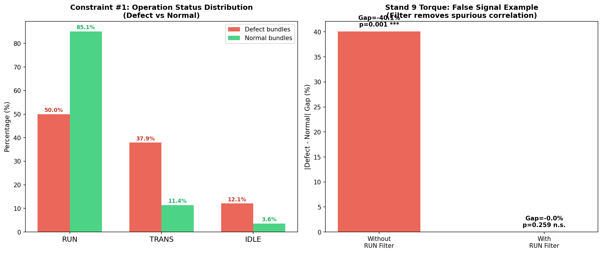
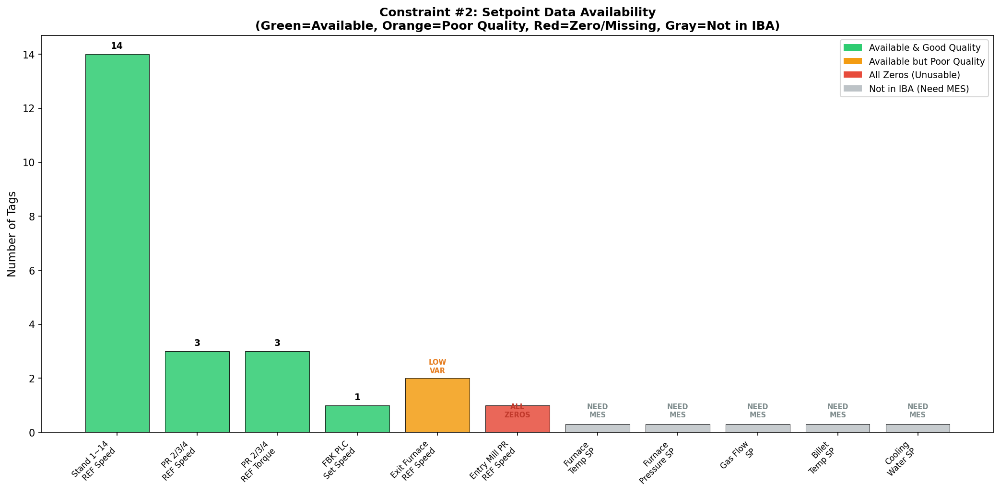
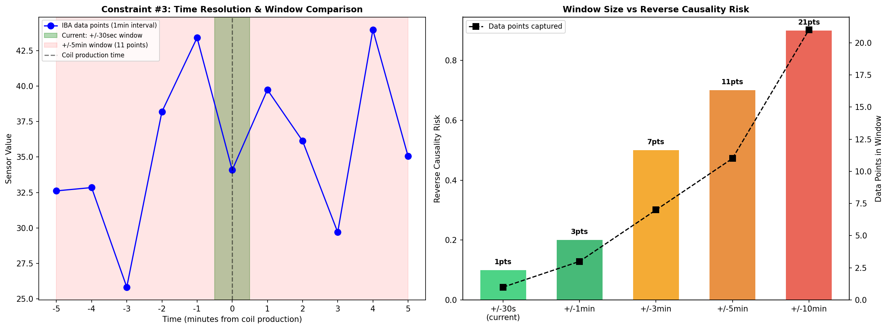

# 제약사항 및 선결 조건 상세 보고서

**작성일**: 2026-03-30
**목적**: 0330 고객 요구사항 분석 중 현재 수행 불가능한 항목의 원인, 해결 조건, 대안을 상세 기록

---

## 1. OPERATION_STATUS (RUN 필터) 제약

### 현황

- IBA 원본 CSV (`iba_202601_202602.csv`, 221컬럼)에 **OPERATION_STATUS 컬럼이 존재하지 않음**
- 이 컬럼은 **ClickHouse DB의 뷰(`v_iba_by_steel_grade`)**에서만 생성됨
- 생성 조건: `STAND_1_ACTUAL_SPEED >= 1 AND GM11BFZI1_PRESENCE >= 0.5`

### 영향 범위

| 분석 | RUN 필터 필수 여부 | 현재 적용 상태 |
|------|:-----------------:|:-------------:|
| 코일 단위 분석 (2026_01_02) | **필수** | DB 경유 적용 완료 |
| 0330 추가 분석 (CSV 기반) | **필수** | **미적용** |
| 315분석 (일별 집계) | 불필요 | 일별 평균이므로 혼합 |

### 필터 미적용 시 위험

**실증 사례**: Stand 9 토크

| 조건 | 불량 vs 정상 차이 | p-value | 판정 |
|------|:----------------:|:-------:|:----:|
| 전체 데이터 (필터 없음) | -40.1% | p<0.001 | **유의** (거짓) |
| RUN만 필터 | -0.0% | p=0.259 | **비유의** (진짜) |

→ 필터 없이 분석하면 **TRANS/IDLE 상태에서의 0값**이 혼입되어 허위 신호 발생

### 비가동 상태의 불량 편향

| 운전 상태 | 불량 번들 비율 | 정상 번들 비율 | 배율 |
|----------|:------------:|:------------:|:----:|
| RUN | 50.0% | 85.1% | 0.6× |
| TRANS | 37.9% | 11.4% | 3.3× |
| IDLE | 12.1% | 3.6% | 3.4× |

→ **불량의 50%가 비가동 상태에서 발생** — RUN 필터 없이는 공정 인자 분석 신뢰 불가

### 해결 방법

| 방법 | 실행 가능성 | 비고 |
|------|:--------:|------|
| DB 경유 분석 (ClickHouse) | **가능** | 기존 뷰 활용, 이미 적용됨 |
| CSV 전처리 스크립트 작성 | **가능** | `STAND_1_ACTUAL_SPEED >= 1` 조건으로 파생 |
| `GM11BFZI1_PRESENCE` 컬럼 확인 | **확인 필요** | IBA CSV에 해당 컬럼 존재 여부 확인 |

### CSV 기반 RUN 필터 파생 (제안)

```python
# IBA CSV에서 OPERATION_STATUS 파생
iba['OPERATION_STATUS'] = 'IDLE'
iba.loc[iba['STAND_1_ACTUAL_SPEED'] >= 1, 'OPERATION_STATUS'] = 'RUN'
# GM11BFZI1_PRESENCE가 없으면 STAND_1_ACTUAL_SPEED만으로 근사
```

**참조**: `docs/preprocessing/OPERATION_STATUS_PREPROCESSING.md`

**시각 자료**: `constraints_charts/chart1_run_filter_impact.png`



---

## 2. 설정값(Setpoint) 데이터 제약

### 현황

IBA 원본 CSV에 존재하는 설정값/기준값 태그:

| 카테고리 | 태그 | 개수 | 품질 |
|---------|------|:----:|:----:|
| 스탠드 기준 속도 | STAND_1~14_REFERENCE_SPEED | 14 | 양호 |
| 핀치롤 기준 속도 | PINCHROLL_2/3/4_REFERENCE_SPEED | 3 | 양호 |
| 핀치롤 기준 토크 | PINCHROLL_2/3/4_REFERENCE_TORQUE | 3 | 양호 |
| 블록밀 설정 속도 | FBK_PLC_SET_SPEED_M_S | 1 | 양호 |
| 추출 롤러 테이블 기준 속도 | EXIT_FURNACE_RT_SEC_1/2_REFERENCE_SPEED | 2 | **불량** (변동성 부족) |
| 입측 핀치롤 기준 속도 | ENTRY_MILL_PINCHROLL_REFERENCE_SPEED | 1 | **불량** (항상 0) |

### 존재하지 않는 설정값 (고객 요구 REQ #3 핵심)

| 태그 | 필요 이유 | 확보 방법 |
|------|----------|----------|
| **가열로 온도 설정값** (상부/하부/균열대) | 가열로 온도 Gap 분석 | **MES/Level 2 제어시스템** |
| **가열로 압력 설정값** | 가열로 압력 Gap 분석 | **MES/Level 2 제어시스템** |
| **MAIN_GAS_FLOW 설정값** | 가스 유량 Gap 분석 | **MES/Level 2 제어시스템** |
| **빌렛 추출 온도 설정값** | 빌렛 온도 Gap 분석 | **MES/Level 2 제어시스템** |
| **냉각수 유량 설정값** | 냉각 Gap 분석 | **MES/Level 2 제어시스템** |

### 영향

- **REQ #3의 "설정값 vs 실제값 Gap 정량화"는 수행 불가**
- 현재 대안 B(실측값 기반 잠정 관리 기준)로 대체 완료
- 대안 B는 "설정값 대비 Gap"이 아닌 "정상 코일 분포 대비 이탈도"를 제공

### 대안 B vs 원안 비교

| 항목 | 원안 (설정값 필요) | 대안 B (실측값 기반) |
|------|:-----------------:|:------------------:|
| Gap 정의 | 설정값 - 실제값 | 정상 Q50 - 불량 평균 |
| 관리 기준 | 설정값 ± 허용 편차 | Q10~Q90 + IQR |
| 계절/강종/사이즈 반영 | 가능 | **가능** (코일-IBA 매칭으로 구현 완료) |
| 현장 활용도 | 최고 (설정값 기준) | 중간 (상대적 기준) |

### 해결 조건

> **MES 또는 Level 2 제어시스템에서 가열로 관련 설정값 태그를 CSV로 추출받으면 즉시 Gap 분석 수행 가능**

**시각 자료**: `constraints_charts/chart2_setpoint_availability.png`



---

## 3. 코일 단위 시계열 ±5분 윈도우 제약

### 현황

| 항목 | 값 |
|------|-----|
| IBA 시간 해상도 | **정확히 60초(1분) 간격** |
| 전체 레코드 수 | 84,919행 (2026-01-01 ~ 02-28) |
| 현재 매칭 방식 | ±30초 단일 시점 (merge_asof) |
| 매칭 성공률 | **100%** (4,952/4,952) |
| 평균 시간차 | ~15초 |

### ±5분 윈도우의 기술적 가능성

| 항목 | ±30초 (현재) | ±5분 (요청) | ±10분 |
|------|:----------:|:----------:|:-----:|
| 데이터 포인트 | 1건 | **최대 11건** | 최대 21건 |
| 역인과 위험 | 최소 | **중간** | 높음 |
| 노이즈 | 최소 | 증가 | 크게 증가 |
| 기술적 구현 | 완료 | **가능** | 가능 |

### ±5분 윈도우를 권고하지 않는 이유

1. **역인과 재도입**: 불량 발생 후 5분간의 수동 조정 데이터가 포함됨
   - 기존 분석에서 RUN 필터로 제거한 TRANS/IDLE 데이터가 다시 혼입 가능
2. **인과 방향 모호**: 불량 발생 전 5분 vs 후 5분 구분이 필요하나, 코일 생산시각의 정밀도(초 단위)로는 구분 어려움
3. **현재 방식의 합리성**: ±30초는 "생산 시점의 정확한 공정 조건"을 캡처하면서 상태 변화 전 측정 보장

### 권고 대안

| 방안 | 내용 | 실행 가능성 |
|------|------|:--------:|
| **A. ±30초 유지 + 전후 통계 추가** | ±5분 윈도우의 평균/std를 "추가 변수"로 산출 | **즉시 가능** |
| B. 이벤트 기반 분석 | 불량 발생 전 5분만 추출 (후 5분 제외) | 가능 (코일 생산시각 기준) |
| C. 분 단위 시계열 분석 | 코일별 ±5분 시계열 패턴 비교 (Functional Data Analysis) | 고급, 추가 개발 필요 |

### Cross-Correlation lag=0 문제와의 관계

0330 분석에서 CCF lag가 모두 0일로 나온 이유:
- **일별 집계** 데이터(tag_defect_matrix, 127일)를 사용했기 때문
- 물리적 lag(가열로→핀치롤 ~1-2분)가 일별 해상도에 매몰
- **해결**: 1분 간격 IBA 원본에서 직접 CCF 수행하면 분 단위 lag 검출 가능
- **단, OPERATION_STATUS 파생이 선결 조건** (제약 #1 참조)

**시각 자료**: `constraints_charts/chart3_time_window_risk.png`



---

## 4. 315분석 데이터 기간 제약

### 데이터 기간 불일치

| 구분 | 시작 | 종료 | 일수 |
|------|------|------|:----:|
| **고객 요청** | 2025-03-01 | 2025-08-31 | 184일 |
| **실제 데이터** | 2025-05-15 | 2025-08-30 | 108일 |
| **누락** | 2025-03-01 | 2025-05-14 | **75일 (41%)** |

### 누락 원인 (추정)

1. IBA 원본 데이터의 수집 시작 시점이 2025-05-15
2. 데이터 전처리(강종 병합, 태그 표준화) 완료 시점
3. coil_result(불량) 데이터와의 매칭 가능 시점

### 영향

| 분석 | 영향 정도 | 비고 |
|------|:--------:|------|
| 315분석 전체 트렌드 | **높음** | 봄(3~4월) 계절 효과 누락 |
| 계절별 비교 | **높음** | 봄 데이터 없음 → 계절 분석 불완전 |
| Granger 인과 검정 | **중간** | 108일은 lag=14까지 검정 가능 (충분) |
| ML 모델 학습 | **중간** | 학습 데이터 127일 중 108일만 유효 |

### 해결 조건

| 방법 | 실행 가능성 | 비고 |
|------|:--------:|------|
| 2025-03~05 IBA 원본 데이터 추가 확보 | **현업 확인** | MES/ClickHouse에 존재 여부 |
| 2025-03~05 coil_result 데이터 확보 | **현업 확인** | 불량 기록 존재 여부 |
| 고객에게 기간 불일치 통보 | **즉시 필요** | 보고서에 명시 |

### 고객 통보 문구 (권고)

> "315분석은 2025년 5월 15일부터 8월 30일까지 108일간의 데이터를 기반으로 수행되었습니다. 고객님께서 요청하신 3월~5월 14일 기간(약 75일)은 원본 데이터 수집 시점 이전으로, 해당 기간 분석이 필요한 경우 원본 데이터 추가 제공을 요청드립니다."

**시각 자료**: `constraints_charts/chart4_data_period_gap.png`


---

## 5. 강종별 불량 데이터 충분성

### 2026-01~02 코일 데이터 현황

| 강종 | 총 코일 | 불량 건수 | 불량률 | 통계 분석 가능 여부 |
|------|:------:|:--------:|:------:|:-----------------:|
| **N5** | 2,602 | 30 | 1.15% | **가능** (n≥30) |
| **D5** | 1,288 | 21 | 1.63% | **제한적** (n<30) |
| **D4** | 757 | 13 | 1.72% | **제한적** (n<30) |
| **B5** | 305 | 2 | 0.66% | **불가능** (n<5) |
| 합계 | 4,952 | 66 | 1.33% | - |

### 통계적 한계

#### n<30의 영향 (소표본 문제)

| 강종 | 불량 n | 95% CI 폭 (추정) | Spearman 검정력 | 실질적 의미 |
|------|:------:|:----------------:|:--------------:|-----------|
| N5 | 30 | ±0.36 | 0.80 (충분) | 중간 효과크기 탐지 가능 |
| D5 | 21 | ±0.43 | 0.65 (부족) | 큰 효과크기만 탐지 |
| D4 | 13 | ±0.55 | 0.45 (매우 부족) | 매우 큰 효과만 탐지 |
| B5 | 2 | ±0.95+ | <0.10 | **탐지 불가** |

#### 규격(SIZE)별 세분화 시 더욱 심각

| 강종-규격 | 불량 건수 (추정) | 분석 가능 |
|----------|:--------------:|:--------:|
| D5-D10 | 8~12 | **불가** |
| D5-D13 | 3~5 | **불가** |
| N5-D16 | 10~15 | **제한적** |
| N5-D12 | 8~10 | **불가** |

### 0330 분석에서의 대응

| 분석 | B5 처리 | D4/D5 처리 |
|------|---------|-----------|
| REQ #5 강종별 세분 | 분석 수행했으나 **p값 해석 주의** 명시 | 개별 분석 수행, 신뢰구간 넓음 표기 |
| REQ #3 강종별 관리 기준 | B5 제외 | D4/D5 각각 산출 (n 명시) |
| REQ #4 Stand 14 재분석 | 전체 데이터만 | 강종별 분리 미실행 |

### 해결 조건

| 방법 | 기간 | 효과 |
|------|------|------|
| **데이터 축적 대기** (2026.03~06) | 3~6개월 | 각 강종 불량 50~100건 확보 기대 |
| **D4+D5 통합 분석** | 즉시 | 34건 → n≥30 충족 |
| **B5 분석 제외 선언** | 즉시 | 보고서에 명확히 기재 |
| **2025.03~08 데이터 추가** | 현업 확인 | 315분석 기간 불량 추가 확보 |

**시각 자료**: `constraints_charts/chart5_grade_sufficiency.png`


---

## 6. 제약사항 종합 매트릭스

| # | 제약 | 심각도 | 영향 REQ | 해결 주체 | 해결 방법 | 예상 기한 |
|:-:|------|:------:|:-------:|:--------:|----------|:---------:|
| 1 | OPERATION_STATUS 미존재 (CSV) | **높음** | #1,#2,#4 | 내부 | CSV 전처리 스크립트 작성 | 즉시 가능 |
| 2 | 가열로 설정값 미확보 | **높음** | #3 | **현업** | MES에서 CSV 추출 요청 | 현업 회신 후 |
| 3 | ±5분 윈도우 역인과 위험 | **중간** | #1 | 내부 | ±30초 유지 + 전후 통계 추가 | 즉시 가능 |
| 4 | 315분석 기간 75일 누락 | **높음** | #1,#5 | **현업** | 2025.03~05 원본 데이터 요청 | 현업 회신 후 |
| 5 | B5 불량 2건 (분석 불가) | **높음** | #3,#5 | - | 분석 제외 선언 + 데이터 축적 | 3~6개월 |
| 6 | D4/D5 불량 소표본 | **중간** | #3,#5 | - | D4+D5 통합 또는 주의 명시 | 즉시 (통합) |
| 7 | 일별 집계 lag=0 한계 | **중간** | #1,#2 | 내부 | 1분 간격 원본 CCF (제약#1 해결 후) | 제약#1 후 |

**시각 자료**: `constraints_charts/chart6_constraint_matrix.png`


---

## 7. 잔여 분석 4건의 실행 조건

### 잔여-1: 코일 단위 시계열 ±5분 윈도우

| 조건 | 현황 | 확보 방법 |
|------|:----:|----------|
| IBA 1분 간격 데이터 | **확보** | 이미 보유 (84,919행) |
| OPERATION_STATUS 파생 | **미완** | CSV 전처리 스크립트 작성 (제약 #1 해결) |
| 분석 설계 | **완료** | 01_REQ1 문서에 계획 기재 |

→ **제약 #1 해결 즉시 수행 가능** (예상 소요: 2~3시간)

### 잔여-2: 설정값 vs 실제값 Gap 정량화

| 조건 | 현황 | 확보 방법 |
|------|:----:|----------|
| 가열로 설정값 데이터 | **미확보** | 현업에서 MES/Level 2 추출 |
| 분석 프레임워크 | **완료** | 03_REQ3 문서에 방법론·출력 예시 기재 |
| 코일-IBA 매칭 | **완료** | 4,952건 매칭 완료 |

→ **설정값 CSV 수신 즉시 수행 가능** (예상 소요: 3~4시간)

### 잔여-3: RUN 필터 코일 단위 Stand 14 재분석

| 조건 | 현황 | 확보 방법 |
|------|:----:|----------|
| OPERATION_STATUS 파생 | **미완** | 제약 #1 해결 필요 |
| Stand 14 데이터 | **확보** | IBA CSV에 STAND_14_ACTUAL_TORQUE/SPEED 존재 |
| 강종별 분석 설계 | **완료** | 04_REQ4 문서에 계획 기재 |

→ **제약 #1 해결 즉시 수행 가능** (예상 소요: 1~2시간)

### 잔여-4: SHAP Force Plot (개별 코일 설명)

| 조건 | 현황 | 확보 방법 |
|------|:----:|----------|
| ML 모델 | **확보** | model_random_forest.joblib 로드 완료 |
| SHAP 라이브러리 | **확보** | shap 0.50.0 설치 확인 |
| 반증 사례 데이터 | **확보** | counter_examples.csv 11건 |
| 코일별 feature 벡터 | **미완** | 코일-IBA 매칭은 완료, ML 모델 입력 형태로 변환 필요 |

→ **ML 입력 데이터 변환 후 수행 가능** (예상 소요: 2~3시간)
→ 단, 이 모델은 315분석(일별 집계) 기반이므로, 코일 단위 적용 시 정합성 검증 필요

---

## 8. 고객 커뮤니케이션 권고

### 즉시 전달 필요 사항

| # | 전달 내용 | 긴급도 | 대상 |
|:-:|---------|:------:|:----:|
| 1 | 315분석 기간이 5/15~8/30 (3~5월 42% 누락) | **긴급** | 고객 |
| 2 | B5 강종 불량 2건으로 개별 분석 불가 | **높음** | 고객 |
| 3 | 가열로 설정값 데이터 제공 요청 (MES/Level 2) | **높음** | 현업 |
| 4 | 작업 대상 설비/태그 확정 목록 요청 | 높음 | 현업 |

### 보고서에 명시해야 할 주의사항

1. **"본 분석은 RUN(정상 가동) 상태 데이터만 기반으로 한 결과입니다"**
   - 단, 0330 CSV 기반 추가 분석은 RUN 필터 미적용 상태
   - DB 기반 기존 분석(코일 단위)은 RUN 필터 적용됨

2. **"강종별 분석 결과의 신뢰도는 불량 건수에 비례합니다"**
   - N5: 30건 (신뢰), D5: 21건 (참고), D4: 13건 (참고), B5: 2건 (제외)

3. **"일별 집계 분석에서 lag=0은 물리적 동시성이 아닌 해상도 한계입니다"**
   - 1분 간격 분석 시 실제 lag(~1-2분) 검출 가능

### 향후 일정 제안

| 시점 | 작업 | 조건 |
|------|------|------|
| 설정값 수신 후 | REQ #3 Gap 정량화 원안 실행 | MES 데이터 |
| 제약 #1 해결 후 | 잔여-1, 잔여-3 수행 (±5분 + Stand 14 RUN) | CSV 전처리 |
| 2026 Q2 | 강종별 불량 50건+ 축적 후 재분석 | 시간 경과 |
| 2025.03~05 데이터 확보 후 | 315분석 기간 확장 | 원본 데이터 |

---

## 관련 문서

| 문서 | 참조 내용 |
|------|----------|
| [01_REQ1_CAUSALITY_ANALYSIS.md](01_REQ1_CAUSALITY_ANALYSIS.md) | ±5분 윈도우 분석 계획 |
| [03_REQ3_SETPOINT_GAP_ANALYSIS.md](03_REQ3_SETPOINT_GAP_ANALYSIS.md) | 설정값 대안 B 상세 |
| [04_REQ4_STAND14_BLOCKMILL.md](04_REQ4_STAND14_BLOCKMILL.md) | Stand 14 재분석 계획 |
| [07_PROCESS_FLOW_VERIFICATION.md](07_PROCESS_FLOW_VERIFICATION.md) | 물리적 lag 추정, 역방향 가설 |
| [08_ACTION_PLAN_PRIORITY.md](08_ACTION_PLAN_PRIORITY.md) | 현업 확인 요청 4건 |
| [09_INTERIM_REPORT_SUMMARY.md](09_INTERIM_REPORT_SUMMARY.md) | 분석 결과 통합 |
