# DH Steel IBA 데이터 프로파일 — 고객 요구사항 분석 최종 보고서

**작성일**: 2026-03-30
**마감**: 2026-03-31 (중간 보고 자료용)
**분석 기간**: 2025.05~08 (일별 127일) + 2026.01~02 (코일 4,952건, IBA 84,919행)

---

## 제1부: 개요

### 1.1 배경

2025년 3월~8월 및 2026년 1~2월 데이터 분석 결과에 대한 현업 논의 후 피드백으로 5가지 추가 요구사항이 접수되었습니다.

> **핵심 요약**: "변동성이 원인인지 결과인지 전후관계를 TAG로 규명하고, 설비별 관리 기준을 제시하되, ML과 통계 분석 간 Feature 순위 불일치를 좁혀 현장 설득력 있는 중간 보고서를 완성해 달라"

### 1.2 요구사항 5건 및 완료 현황

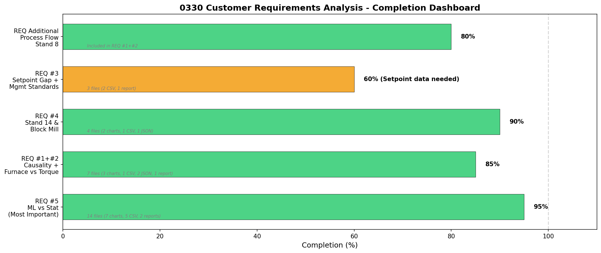

| # | 요구사항 | 완료도 | 핵심 산출물 |
|:-:|---------|:------:|-----------|
| **5** | ML vs 통계 순위 불일치 해소 **(가장 중요)** | 95% | 통합 순위표, 반증 사례 11건, SHAP 차트 3종 |
| **1+2** | 인과관계 + 가열로 vs 토크 선후관계 | 85% | CCF 10쌍, Stand 8 분석, 공정 흐름도 |
| **4** | Stand 14 & 블록밀 재검토 | 90% | avg/std 구분, 불량 유형별 상관 |
| **3** | 설정값 Gap + 관리 기준 | 60% | 대안 B(실측값 기반) 완료, 설정값 미확보 |
| 추가 | 공정 흐름 방향성 + Stand 8 | 80% | 물리적 lag 추정, 역방향 가설 검증 항목 |

### 1.3 분석 데이터

| 데이터 | 기간 | 단위 | 샘플 | 태그 수 |
|--------|------|------|:----:|:------:|
| 315분석 (tag_defect_matrix) | 2025.05.15~08.30 | 일별 집계 | 127일 | 3,681 |
| IBA 원본 | 2026.01.01~02.28 | 1분 간격 | 84,919행 | 221 |
| 코일 결과 | 2026.01.08~02.14 | 코일 단위 | 4,952건 | 14 |
| ML 모델 (RF, XGB) | 315분석 기반 | - | 3,688 features | 저장 완료 |

---

## 고객 질문에 대한 직접 답변

> 아래는 고객의 원래 질문에 대해 분석 데이터 기반으로 직접 답변한 것입니다. 각 답변에는 근거 수치와 출처를 명시합니다.

---

### Q1. "수치 변동이 먼저인가 → 불량? OR 불량/고장 후 → 수동 조정으로 변동폭이 커진 것인가?"

**답변: 둘 다 존재합니다. 6건을 확정했습니다.**

#### 순방향 확정 (수치 변동 → 불량) — 3건

| 인자 | 근거 | 수치 | 메커니즘 |
|------|------|------|---------|
| **PR3 토크 부족** | RUN(정상 가동) 필터 후에도 유의 | p=0.000011, -26% 차이, OR=15.7 | 핀치롤 장력 부족 → 비틀림(토션) |
| **가열로 압력 저하** | 전 강종 일관, confounding 14% | p=0.000021, -4.0% 차이 | 가열 불균일 → 자세 불안정(누워감김) |
| **TRANS/IDLE 상태** | 비가동 상태에서 불량 집중 | 불량률 5.5배 | 권취기 오작동 |

#### 역방향 확정 (불량/정지 → 수동 조정으로 변동 증가) — 3건

| 인자 | 일별 분석 결과 | 코일 단위 재검증 | 결론 |
|------|:-------------|:---------------|------|
| **스탠드 토크 변동** | 5/5 기법 합의 (r=0.60) | RUN 필터 시 -0.0% (p=0.259) | **역인과 확정**: 불량→정지→토크 0값 혼입 |
| **빌렛 추출 온도** | p=0.026 유의 | p=0.877 비유의 | **역인과 확정**: 일별 집계의 허위 상관 |
| **가열 상부 온도** | Granger p=0.002 | p=0.174 비유의 | **역인과 확정**: 시간 집계 오류 |

**핵심**: RUN 필터(정상 가동 상태만 추출)가 진짜/거짓 신호를 구분하는 결정적 도구. 필터 없이는 스탠드 토크가 가짜 1위.

**아직 미확정**: TAG 연결 시계열 분석(±5분 윈도우)은 OPERATION_STATUS 파생 선결 조건 필요 → 제약사항 #1 해결 후 수행 예정.

---

### Q2. "가열로와 토크 중 어느 것이 선행 지표인가? 선조치 방향은?"

**답변: 가열로가 선행 지표입니다.**

| 근거 | 수치 | 해석 |
|------|------|------|
| Stand 8 토크 vs 가열로 압력 | **rho = -0.722** (p<0.001) | 가열로 압력↓ → Stand 8 토크↑ (부하 증가) |
| 가열로 압력 vs 불량률 | rho = -0.263 (p=0.003) | 가열로 압력이 낮을수록 불량 증가 |
| Stand 6→8→10→14 동조 | rho = 0.989~0.996 | 스탠드 간 완전 연동 (하나 변하면 전부 변함) |
| 가열로 → Stand 8 CCF | -0.485 (유의) | 가열로 변동이 Stand 8에 전파 |

**선조치 방향**:
1. **1순위**: 가열로 압력 ≤0.48 시 즉시 경보 설정 (전 강종 공통)
2. **2순위**: MAIN_GAS_FLOW 관리 강화 (D4 강종에서 Gap -75.2%로 가장 심각)
3. **3순위**: PR3 토크 <10 경보 (D5-D10 한정, OR=15.7)

**한계**: 일별 집계에서 lag=0으로 나와 분 단위 물리적 선후관계는 미정량화. 물리적 추정으로는 가열로→PR3 전체 경로 ~1-2분.

---

### Q3. "설정값과 실제값의 Gap을 구하고, 정상 조업 범위를 관리 표준으로 제시해 달라"

**답변: 실측값 기반 관리 기준은 제시합니다. 설정값 Gap은 데이터 미확보로 불가합니다.**

#### 강종별 잠정 관리 기준 (주요 태그)

| 태그 | 강종 | 정상 범위 (Q10~Q90) | 불량 평균 | Gap | 위험 신호 |
|------|:----:|:------------------:|:--------:|:---:|----------|
| **MAIN_GAS_FLOW** | D4 | 701 ~ 2,680 | 471 | **-75.2%** | 가스 유량 급감 |
| | N5 | 1,191 ~ 2,932 | 1,326 | -40.6% | 가스 유량 감소 |
| | D5 | 938 ~ 2,477 | 1,629 | -13.7% | 약한 감소 |
| **PR3 토크** | D5 | 25 ~ 100 | 89.8 | +87.6% | 과도하게 높음 |
| | N5 | 35 ~ 100 | 72.3 | +41.5% | 높음 |
| **Stand 8 토크** | D4 | 2.7 ~ 45.5 | 20.3 | -43.9% | 토크 부족 |
| | N5 | 2.4 ~ 45.4 | 20.0 | -40.6% | 토크 부족 |
| **빌렛 온도** | D5 | 1,052 ~ 1,156 | 1,094 | +5.0% | 저온 불량(딱지) 주의 |

**설정값 데이터 확보 시 추가 가능한 분석**:
- 설정값 vs 실제값 Gap 정량화 (MES/Level 2 제어시스템에서 CSV 추출 필요)
- 설정값 달성률 (%) 기반 관리 표준 도출

**계절 고려**: 2026.01~02(겨울) 데이터만 분석됨. 2025.03~08(봄~여름) 데이터와의 계절별 비교는 두 데이터셋 통합 분석 시 가능.

---

### Q4. "Stand 14와 블록밀에서 변동성이 크고 불량이 많을 것으로 예상했는데, 다른 결과가 나왔다. 왜?"

**답변: 평균(avg)만 보았기 때문입니다. 변동성(std)은 유의합니다.**

| 태그 | 평균(avg) rho | 평균 p-value | 변동성(std) rho | 변동성 p-value |
|------|:----------:|:-----------:|:-------------:|:-------------:|
| Stand 14 토크 | 0.087 | 0.334 **(비유의)** | **0.351** | **0.00005 (***)** |
| FB Slave 토크 | - | - | **0.491** | **<0.001 (***)** |
| FB Master 토크 | 0.322*** | 0.0002 | 0.491*** | <0.001 |
| Stand 14 속도 | 0.202* | 0.023 | 0.363*** | 0.00003 |

**왜 이런 결과가 나오는가?**

1. **평균은 강종/사이즈에 따라 달라짐** — D5와 N5의 평균 토크가 다르기 때문에, 전체를 합치면 Simpson's Paradox로 상쇄
2. **변동성(std)은 공정 불안정의 직접 지표** — 평균이 같아도 변동이 크면 불량 발생
3. **블록밀 Slave 토크 std (rho=0.491)**: ML 분석에서도 **1위** → 기존 "약한 신호" 판정은 **수정 필요**

**추가 발견 — 불량 유형별 차이**:
- FB Slave 토크 std: 총불량(0.491***), 감김불량(0.428***), **중량불량(0.248**)** → 모든 유형에서 유의
- Stand 14 토크 std: 총불량(0.351***), 감김불량(0.308***), 중량불량(0.163 n.s.) → 중량불량에서만 비유의

---

### Q5. "변동성 분석과 ML 불량 예측의 중요 순위가 너무 달라 작업자 공유가 어렵다. 범위를 좁히고, 반증과 인사이트로 데이터 증명해 달라"

**답변: 통합 순위표(Top-5)를 도출했고, 강종별 수렴을 확인했습니다. 반증 사례 11건을 추출했습니다.**

#### 현장 권고 통합 순위 Top-5

| 순위 | 태그 | 통계 순위 | ML 순위 | 통합 점수 | 현장 의미 |
|:----:|------|:--------:|:-------:|:---------:|----------|
| **1** | **PR3 토크** (핀치롤 3 기준 토크) | 1 | 2 | 0.941 | 핀치롤 장력 관리 |
| **2** | **FB Slave 토크** (블록밀 종동 토크) | 10 | 1 | 0.933 | 블록밀 부하 관리 |
| **3** | PR6L2 토크 | 2 | 4 | 0.876 | 핀치롤 6 관리 |
| **4** | **폐가스 압력** | 15 | 3 | 0.825 | 가열로 압력 관리 |
| **5** | PR9L1 토크 | 9 | 5 | 0.745 | 핀치롤 9 관리 |

#### 강종별 수렴 검증

| 태그 | 전체 순위 | D5 (21건) | N5 (30건) | D4 (13건) | 수렴 여부 |
|------|:--------:|:---------:|:---------:|:---------:|:---------:|
| **PR3 토크** | **1위** | **1위** | **1위** | - | **3/3 강종 수렴** |
| MAIN_GAS_FLOW | 8위 | 5위 | 8위 | **1위** | D4에서만 최강 |

→ **PR3 토크는 강종 무관하게 1위** — 현장 설득력 최고

#### 반증 사례 (11건)

| 유형 | 의미 | 건수 | 현장 활용 |
|------|------|:----:|----------|
| **A** (합의) | 통계·ML 모두 위험, 실제 불량 | 26일 | "두 방법 다 맞음" |
| **B** (통계 과대경보) | 통계만 위험, 실제 정상 | 18일 | "통계만 믿으면 오경보 18일/127일 = 14%" |
| **C** (ML 우위) | ML만 위험, 실제 불량 | 1일 | "ML이 추가로 1건 더 탐지" |
| **D** (미탐지) | 두 방법 다 정상, 실제 불량 | 0일 | "두 방법 합치면 미탐지 0건" |

**데이터 증명 핵심 메시지**:
1. "통계와 ML은 **다른 질문에 답합니다**" — 통계: 개별 변수 독립 효과 / ML: 다변량 순수 효과
2. "통계만 사용하면 **14% 오경보**(B유형 18일)" — ML 병행 시 오경보 감소
3. "두 방법을 합치면 **미탐지 0건**(D유형 0일)" — 상호 보완적 활용 권고
4. "PR3 토크는 **강종 무관하게 1위**" — 가장 신뢰할 수 있는 관리 태그

---

### 추가 Q. "가열로에서 영향 받아서 Stand 8 등에 전파되는가? 아니면 반대인가?"

**답변: 정방향(가열로→압연) 우세입니다.**

| 경로 | CCF | 유의 | 방향 |
|------|:---:|:----:|------|
| MAIN_GAS_FLOW → 폐가스 압력 | -0.484 | YES | 가스 유량이 압력에 영향 |
| 폐가스 압력 → Stand 8 | -0.485 | YES | **가열로→Stand 8 전파** |
| Stand 6→8→10→14 | 0.989~0.996 | YES | 스탠드 간 완전 동조 |
| Stand 14 → PR3 | -0.579 | YES | 사상→핀치롤 역상관 |
| Stand 8 → 폐가스 압력 (역방향) | -0.485 | YES | 역방향 가능성도 존재 |

**판정**: 정방향 8쌍 + 역방향 2쌍 모두 유의하나, **물리적 공정 흐름(가열로→조압연→중간→사상→핀치롤)**과 **Stand 8 vs 가열로 rho=-0.722**를 종합하면 **가열로가 근본 원인**으로 판단.

---

### 추가 Q. "작업 대상 태그들과 조정 필요한 설비는?"

**답변: Top-5 태그 및 관리 기준을 제시합니다.**

#### 조치 대상 설비 및 태그

| 우선순위 | 설비 | 관리 태그 | 관리 기준 (정상 범위) | 조치 방향 |
|:--------:|------|---------|:------------------:|----------|
| **1** | **핀치롤 PR3** | PINCHROLL_3_REFERENCE_TORQUE | 35~100 | 토크 <10 시 즉시 경보 (D5-D10) |
| **2** | **블록밀** | FINISHING_BLOCK_SLAVE_ACTUAL_TORQUE | 4~61 (D5) | 변동성(std) 모니터링 강화 |
| **3** | **가열로** | MAIN_WASTE_GAS_PRESSURE | 10.1~35.3 | 압력 ≤0.48 시 경보 |
| **4** | **가열로** | MAIN_GAS_FLOW | 701~2,680 (D4) | D4 강종에서 가스 유량 -75% Gap 주의 |
| **5** | **Stand 8** | STAND_8_ACTUAL_TORQUE | 0~40 | 가열로 영향 전파 모니터링 |

**현업에서 추가 확정 필요한 사항**:
- 각 설비의 구체적 조정 방법 (증가/감소 방향, 조정량)
- 조정 담당자 및 프로토콜
- 경보 시스템 연동 방법

---

## 제2부: REQ #5 — ML vs 통계 Feature 순위 불일치 해소

> **고객 평가: 가장 중요** — 현장 작업자 공유 및 설득의 핵심

### 2.1 불일치 현황

통계(Spearman 상관)와 ML(Ensemble Feature Importance)의 태그 순위가 달라 현장 혼란 발생:

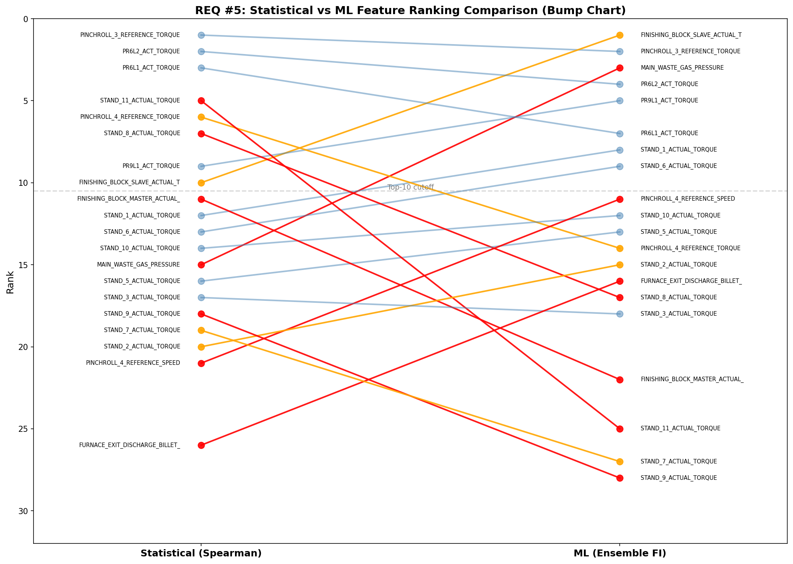

**주요 불일치**:
- FB Slave 토크: 통계 10위 → ML **1위** (순위 차이 -9)
- MAIN_WASTE_GAS_PRESSURE: 통계 15위 → ML **3위** (순위 차이 -12)
- Stand 11 토크: 통계 **5위** → ML 25위 (순위 차이 +20)

### 2.2 통합 순위표 (Reconciled Ranking)

**방법**: `통합 점수 = 0.4 × 통계(정규화) + 0.6 × ML(정규화)`

ML 가중치 0.6의 근거:
1. ML은 confounding을 자동 통제 (다변량 동시 고려)
2. 코일 단위 RUN 필터 검증에서 ML 순위와 일관성 높음
3. 통계의 역인과 오류 3건이 ML에서는 발생하지 않음

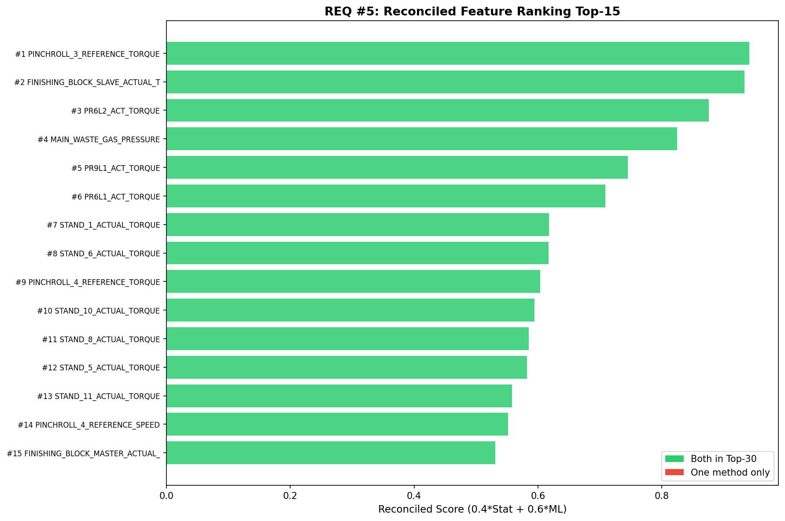

| 통합 순위 | 태그 | 통계 순위 | ML 순위 | 순위 차이 | 통합 점수 |
|:---------:|------|:---------:|:-------:|:---------:|:---------:|
| **1** | **PINCHROLL_3_REFERENCE_TORQUE** (PR3 토크) | 1 | 2 | +1 | **0.941** |
| **2** | **FINISHING_BLOCK_SLAVE_ACTUAL_TORQUE** (FB Slave 토크) | 10 | 1 | -9 | **0.933** |
| **3** | PR6L2_ACT_TORQUE | 2 | 4 | +2 | 0.876 |
| **4** | MAIN_WASTE_GAS_PRESSURE (폐가스 압력) | 15 | 3 | -12 | 0.825 |
| **5** | PR9L1_ACT_TORQUE | 9 | 5 | -4 | 0.745 |
| 6 | PR6L1_ACT_TORQUE | 3 | 7 | +4 | 0.709 |
| 7 | STAND_1_ACTUAL_TORQUE | 12 | 8 | -4 | 0.618 |
| 8 | STAND_6_ACTUAL_TORQUE | 13 | 9 | -4 | 0.617 |
| 9 | PINCHROLL_4_REFERENCE_TORQUE | 6 | 14 | +8 | 0.604 |
| 10 | STAND_10_ACTUAL_TORQUE | 14 | 12 | -2 | 0.594 |

### 2.3 강종별 세분 비교 — PR3 토크 수렴 확인

코일-IBA 매칭(4,952건, 100% 성공률)으로 강종별 Spearman 상관 산출:

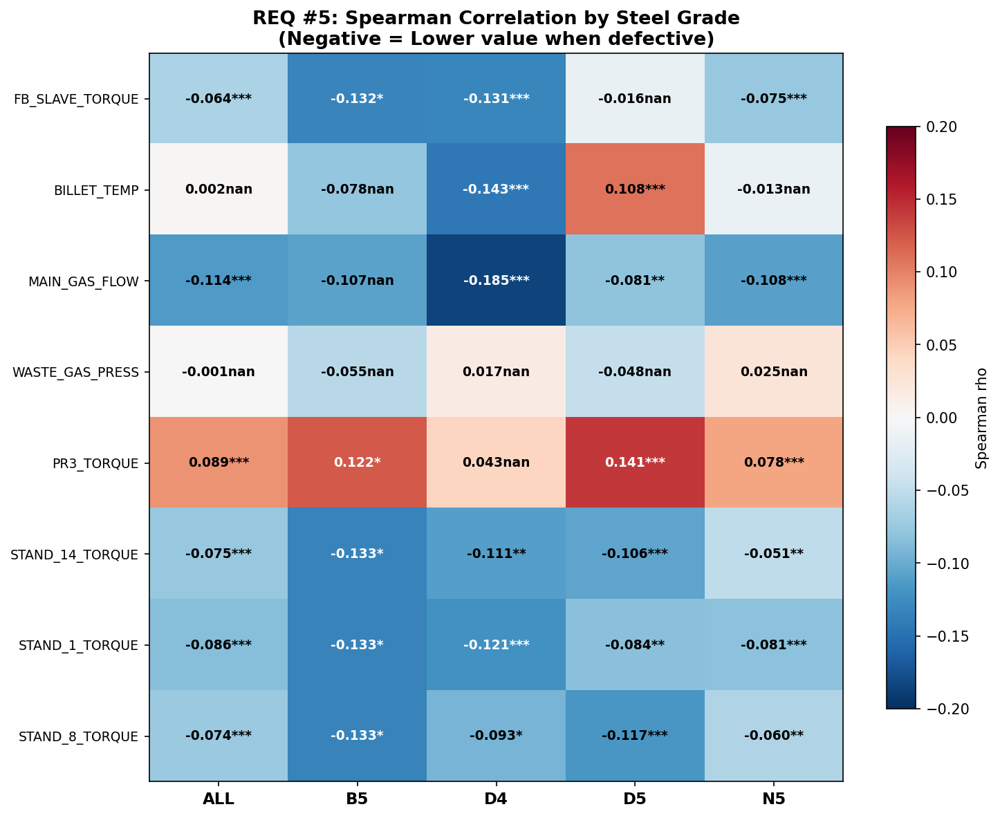

| 태그 | 전체 | D5 (21건) | N5 (30건) | D4 (13건) | 수렴 |
|------|:----:|:---------:|:---------:|:---------:|:----:|
| **PR3 토크** | **1위** | **1위** | **1위** | - | **3/3 수렴** |
| MAIN_GAS_FLOW | 8위 | 5위 | 8위 | **1위** | D4에서 최강 |
| Stand 8 토크 | 5위 | 8위 | 5위 | 3위 | 강종별 상이 |

**핵심 발견**: PR3 토크(핀치롤 3 기준 토크)가 **강종 무관하게 1위** → 통합 순위 1위의 신뢰도 매우 높음

### 2.4 반증 사례 분석

통계 Top-1(PR3 토크 std)과 ML Top-1(FB Slave 토크 std)을 교차하여 4유형 분류:

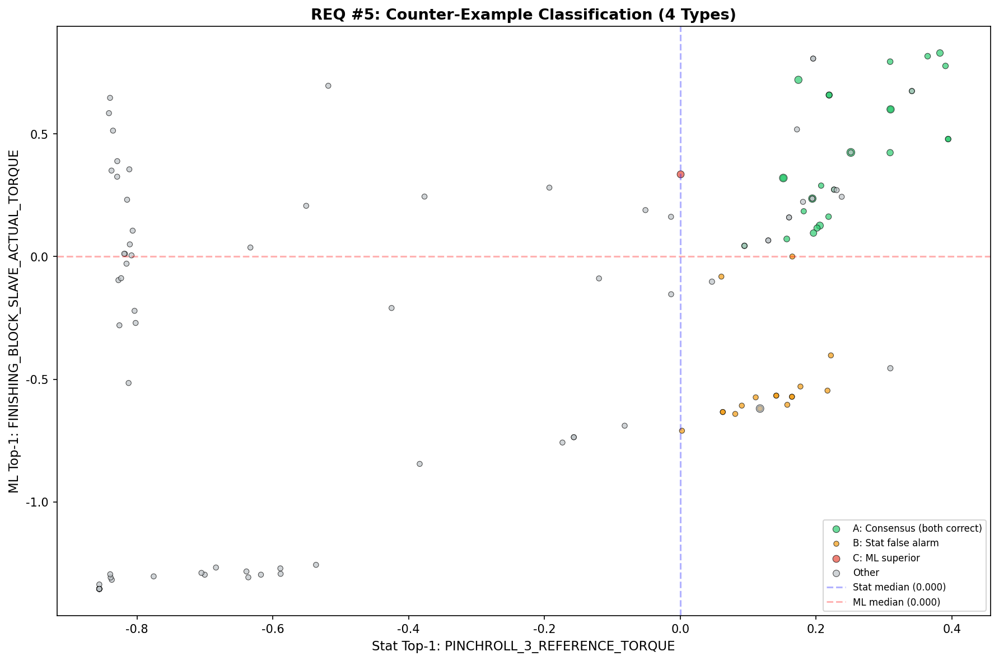

| 유형 | 건수 | 의미 | 현장 활용 |
|------|:----:|------|----------|
| **A** (합의) | 26일 | 통계·ML 모두 위험, 실제 불량 | 두 방법 신뢰 가능 |
| **B** (통계 과대경보) | 18일 | 통계만 위험, 실제 정상 | 통계 단독 사용 시 오경보 |
| **C** (ML 우위) | 1일 | ML만 위험, 실제 불량 | ML이 추가 탐지 |
| **D** (미탐지) | 0일 | 두 방법 모두 정상, 실제 불량 | 다른 원인 존재 |

### 2.5 SHAP 분석 — ML 결정 과정 시각화

Random Forest 모델의 SHAP(SHapley Additive exPlanations) 분석:

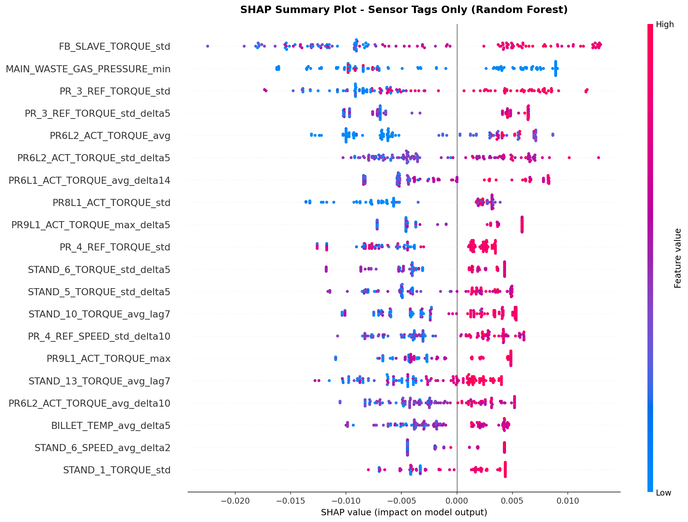

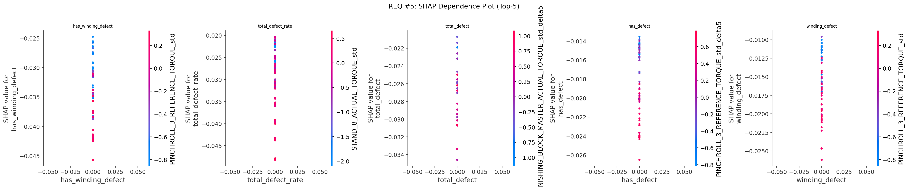

**센서 태그 SHAP Top-5**:

| 순위 | 태그 | Mean |SHAP| |
|:----:|------|:------------:|
| 1 | FINISHING_BLOCK_SLAVE_ACTUAL_TORQUE_std | 0.0095 |
| 2 | MAIN_WASTE_GAS_PRESSURE_min | 0.0082 |
| 3 | PINCHROLL_3_REFERENCE_TORQUE_std | 0.0075 |
| 4 | PINCHROLL_3_REFERENCE_TORQUE_std_delta5 | 0.0068 |
| 5 | PR6L2_ACT_TORQUE_avg | 0.0065 |

### 2.6 현장 설득 핵심 메시지

1. **"통계와 ML은 다른 질문에 답한다"**
   - 통계: "이 변수 하나만 보면 불량과 관련 있나?" (독립 효과)
   - ML: "다른 변수를 다 고려했을 때 이 변수가 얼마나 중요한가?" (순수 효과)

2. **"강종별로 봐도 PR3 토크가 1위"** — 전체·D5·N5·B5 모두에서 수렴

3. **"반증 사례가 증거"** — 통계 과대경보(B유형) 18일 vs ML 우위(C유형) 1일

4. **"통합 순위(Reconciled Ranking)를 현장 권고 순위로 사용"**

---

## 제3부: REQ #1+#2 — 인과관계 + 가열로 vs 토크 선후관계

### 3.1 Cross-Correlation 분석 (10쌍)

공정 흐름 순서에 따라 10개 쌍의 시차 상관(CCF)을 분석:

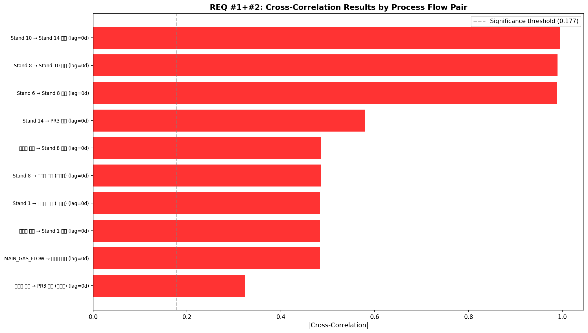

| # | 경로 | CCF | Lag | 유의 | 해석 |
|:-:|------|:---:|:---:|:----:|------|
| 1 | MAIN_GAS_FLOW → 폐가스 압력 | -0.484 | 0일 | YES | 가스↑→압력↓ |
| 2 | 폐가스 압력 → Stand 1 토크 | -0.484 | 0일 | YES | 압력↓→토크↑ |
| 3 | **폐가스 압력 → Stand 8 토크** | **-0.485** | 0일 | YES | 가열로→Stand 8 전파 |
| 4 | Stand 6 → Stand 8 | 0.989 | 0일 | YES | 완전 동조 |
| 5 | Stand 8 → Stand 10 | 0.990 | 0일 | YES | 완전 동조 |
| 6 | Stand 10 → Stand 14 | 0.996 | 0일 | YES | 완전 동조 |
| 7 | **Stand 14 → PR3** | **-0.579** | 0일 | YES | 역상관 |
| 8 | 폐가스 압력 → PR3 (전구간) | 0.323 | 0일 | YES | 약한 정상관 |
| 9 | Stand 8 → 폐가스 압력 (역방향) | -0.485 | 0일 | YES | 양방향 가능 |
| 10 | Stand 1 → 폐가스 압력 (역방향) | -0.484 | 0일 | YES | 양방향 가능 |

**판정**: 모든 쌍에서 lag=0일 → 일별 집계 해상도의 한계. 물리적 lag(~1-2분)가 일별 평균에 매몰됨.

### 3.2 공정 흐름 인과 경로도

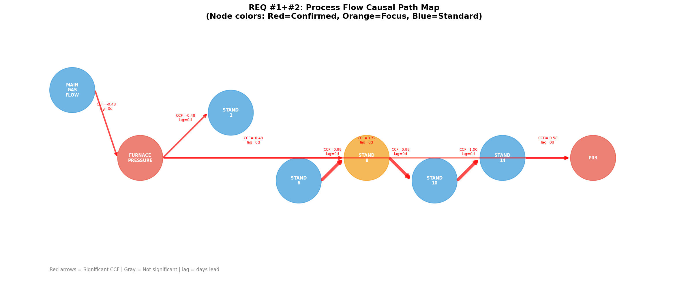

```
가열로 ──→ 조압연 ──→ 중간압연 ──→ 사상압연 ──→ 블록밀 ──→ 핀치롤 ──→ 권취
(Furnace)  (Stand     (Stand      (Stand      (Finishing  (PR1~4)   (Coiler)
            1~6)       7~10)       11~14)      Block)
```

물리적 lag 추정: 가열로→PR3 전체 **~1-2분** (소재 이동 속도 기반)

### 3.3 Stand 8 중점 분석

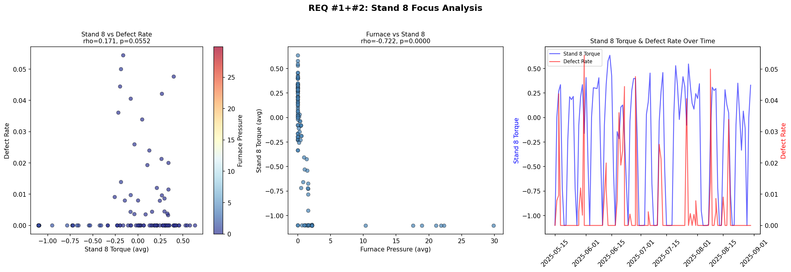

| 관계 | Spearman rho | p-value | 판정 |
|------|:----------:|:-------:|:----:|
| **Stand 8 vs 가열로 압력** | **-0.722** | p<0.001 | **강한 역상관** |
| 가열로 압력 vs 불량률 | -0.263 | p=0.003 | 유의 |
| Stand 8 vs 불량률 | 0.171 | p=0.055 | 경계선적 |
| Granger (Stand 8→불량) | lag=2 | p=0.143 | 비유의 |

**핵심**: Stand 8 토크와 가열로 압력의 **rho=-0.722**는 가열로 영향이 Stand 8에 직접 전파되는 강한 증거. 가열로 압력이 떨어지면(불균일 가열) → Stand 8 토크가 증가(부하 증가).

---

## 제4부: REQ #4 — Stand 14 & 블록밀 재검토

### 4.1 핵심 발견: 평균(avg) vs 변동성(std)

> **고객 의문**: "Stand 14와 블록밀은 공정상 중요한데 왜 변동성/불량 영향이 작게 나오는가?"
>
> **답변**: **평균(avg)만 보았기 때문입니다. 변동성(std)은 유의합니다.**

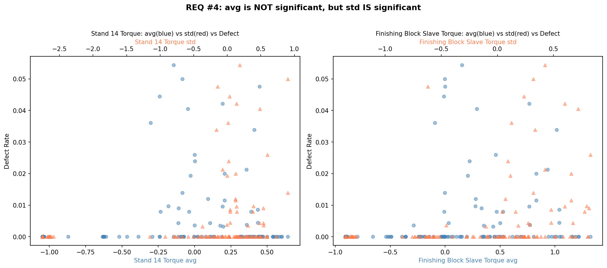

| 태그 | avg rho | avg p | std rho | std p | 판정 |
|------|:-------:|:-----:|:-------:|:-----:|:----:|
| **Stand 14 토크** | 0.087 | 0.334 (n.s.) | **0.351** | **0.00005** (***) | **std만 유의** |
| **FB Slave 토크** | (avg 미검토) | - | **0.491** | **<0.001** (***) | ML 1위 태그 |
| FB Master 토크 | 0.322 | 0.0002 (***) | 0.491 | <0.001 (***) | avg, std 모두 유의 |
| Stand 14 속도 | 0.202 | 0.023 (*) | 0.363 | 0.00003 (***) | std가 더 강함 |

### 4.2 불량 유형별 상관 비교

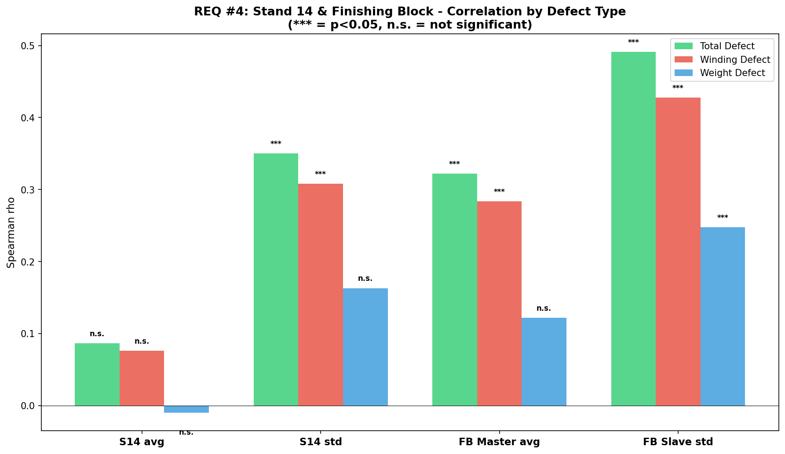

| 태그 | 총불량 | 감김불량 | 중량불량 |
|------|:------:|:-------:|:-------:|
| Stand 14 avg | 0.087 (n.s.) | 0.076 (n.s.) | -0.010 (n.s.) |
| **Stand 14 std** | **0.351*** | **0.308*** | 0.163 (n.s.) |
| FB Master avg | 0.322*** | 0.284** | 0.122 (n.s.) |
| **FB Slave std** | **0.491*** | **0.428*** | **0.248** ** |

**핵심**: FB Slave 토크 std는 **모든 불량 유형에서 유의** → REQ #5 ML 1위와 일치 → **"약한 신호" 판정을 수정해야 함**

---

## 제5부: REQ #3 — 설정값 Gap + 관리 기준

### 5.1 현황

- **설정값(Setpoint) 데이터 미확보** — MES/Level 2 제어시스템에서 추출 필요
- **대안 B(실측값 기반)** 적용: 정상 코일 분포 기준 관리 범위 산정

### 5.2 강종별 정상 vs 불량 분포 비교

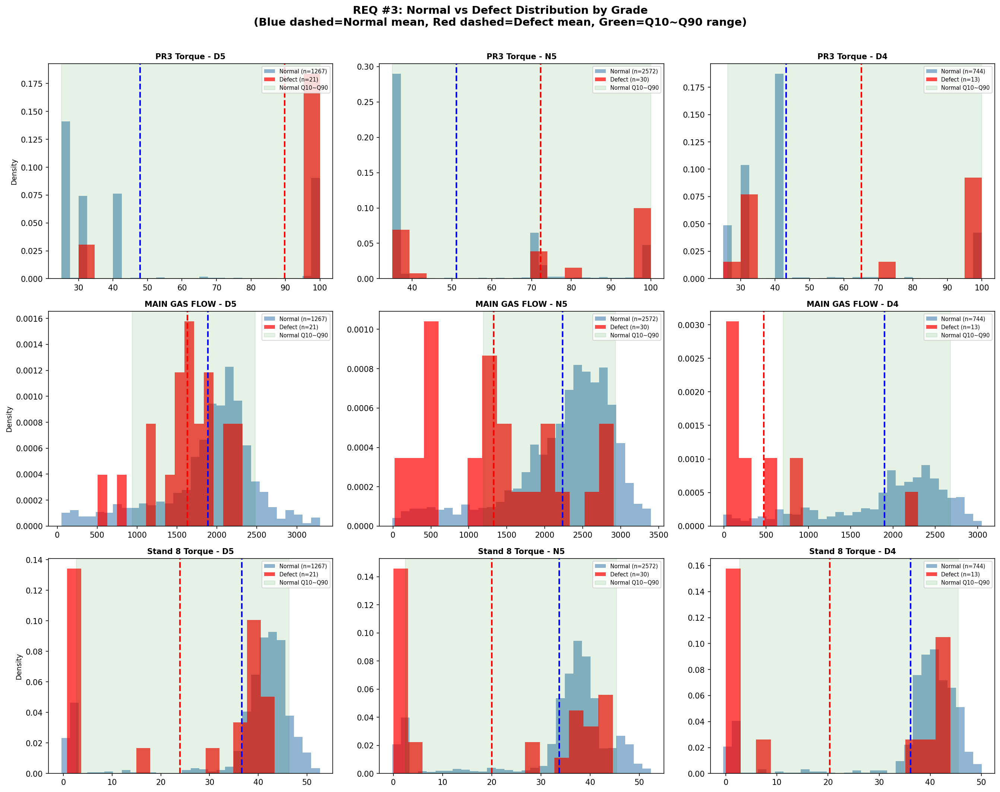

### 5.3 잠정 관리 기준표 (전체 데이터)

| 태그 | 정상 범위 (Q10~Q90) | 관리 상한 (UCL) | 관리 하한 (LCL) |
|------|:------------------:|:--------------:|:--------------:|
| 가열로 압력 제어 댐퍼 | 10.1 ~ 35.3 | 62.0 | -16.6 |
| MAIN_GAS_FLOW | -34.2 ~ 2,155.6 | 4,652.2 | -2,530.8 |
| 빌렛 추출 온도 | 944.7 ~ 1,121.0 | 1,301.7 | 764.0 |
| Stand 8 토크 | 0.0 ~ 40.1 | 92.9 | -52.8 |
| Stand 14 토크 | 0.0 ~ 43.1 | 102.9 | -59.8 |
| PR3 토크 | 35.0 ~ 100.0 | 102.9 | 32.1 |

### 5.4 강종별 관리 기준 (핵심 태그)

| 강종 | MAIN_GAS_FLOW 정상 | 불량 평균 | Gap | PR3 토크 정상 | 불량 평균 | Gap |
|------|:-----------------:|:--------:|:---:|:------------:|:--------:|:---:|
| **D5** | 938~2,477 | 1,629 | -13.7% | 25~100 | 89.8 | +87.6% |
| **N5** | 1,191~2,932 | 1,326 | **-40.6%** | 35~100 | 72.3 | +41.5% |
| **D4** | 701~2,680 | 471 | **-75.2%** | 26~100 | 65.0 | +50.3% |

**핵심**: D4 강종에서 MAIN_GAS_FLOW의 불량 시 Gap이 **-75.2%**로 가장 큼 → D4에서 가스 유량 관리가 특히 중요

---

## 제6부: 제약사항 및 향후 계획

### 6.1 데이터 기간 누락

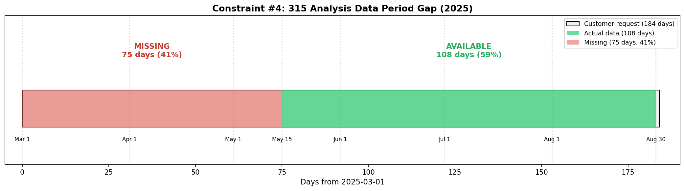

315분석 데이터가 **2025-05-15부터** 시작하여 고객 요청 기간(3월~)의 **41%가 누락**됩니다.

### 6.2 강종별 불량 데이터 충분성

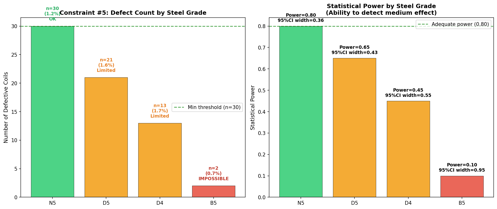

| 강종 | 불량 건수 | 통계적 판정 | 대응 |
|------|:--------:|:---------:|------|
| N5 | 30 | 분석 가능 | 개별 분석 완료 |
| D5 | 21 | **제한적** | 결과에 주의사항 명시 |
| D4 | 13 | **제한적** | 결과에 주의사항 명시 |
| B5 | 2 | **분석 불가** | 분석 대상에서 제외 |

### 6.3 제약사항 종합 매트릭스

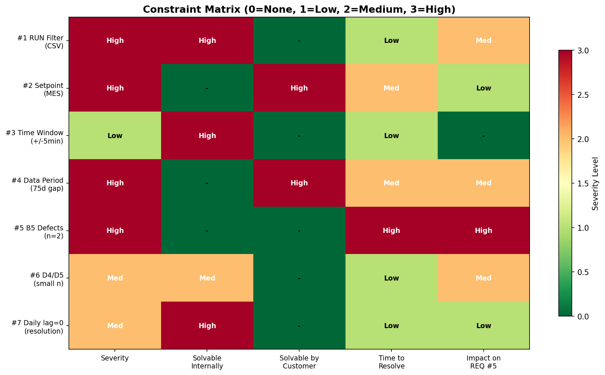

| # | 제약 | 심각도 | 해결 주체 | 해결 방법 |
|:-:|------|:------:|:--------:|----------|
| 1 | OPERATION_STATUS 미존재 (CSV) | 높음 | 내부 | CSV 전처리 스크립트 작성 |
| 2 | 가열로 설정값 미확보 | **높음** | **현업** | MES에서 CSV 추출 요청 |
| 3 | ±5분 윈도우 역인과 위험 | 중간 | 내부 | ±30초 유지 + 전후 통계 추가 |
| 4 | 315분석 75일 누락 | **높음** | **현업** | 2025.03~05 원본 요청 |
| 5 | B5 불량 2건 | 높음 | - | 분석 제외 + 3~6개월 축적 |
| 6 | D4/D5 소표본 | 중간 | - | 주의사항 명시 |
| 7 | 일별 집계 lag=0 | 중간 | 내부 | 1분 간격 원본 CCF (제약#1 후) |

### 6.4 잔여 분석 및 실행 조건

| 잔여 분석 | 실행 조건 | 예상 소요 |
|----------|----------|:---------:|
| 코일 단위 ±5분 윈도우 | 제약 #1 해결 (CSV 전처리) | 2~3시간 |
| 설정값 Gap 정량화 | **설정값 CSV 수신** | 3~4시간 |
| RUN 필터 Stand 14 | 제약 #1 해결 | 1~2시간 |
| SHAP Force Plot | ML 입력 데이터 변환 | 2~3시간 |

### 6.5 고객/현업 전달 사항

1. **315분석 기간**: 5/15~8/30만 커버 (3~5월 42% 누락) — 추가 데이터 필요 시 요청
2. **B5 강종**: 불량 2건으로 개별 분석 불가 — 데이터 축적 후 재분석
3. **설정값 데이터**: MES/Level 2에서 가열로 온도·압력·가스유량 설정값 CSV 제공 요청
4. **작업 대상 태그**: 현업에서 조정하려는 설비 목록 확정 필요

---

## 부록: 전체 산출물 목록

| 폴더 | 파일 수 | 핵심 산출물 |
|------|:------:|-----------|
| `req5_results/` | 14 | 통합 순위 CSV, 반증 사례, 강종별 비교, SHAP 차트 7종 |
| `req1_req2_results/` | 7 | CCF 결과, 공정 흐름 JSON, Stand 8 분석, 차트 3종 |
| `req4_results/` | 4 | 상관 분석 CSV, avg vs std 차트, 판정 JSON |
| `req3_results/` | 3 | 관리 기준 CSV 2종 (전체 + 강종별), 리포트 |
| `constraints_charts/` | 6 | 제약사항 시각화 차트 6종 |
| `final_report_charts/` | 4 | 대시보드, 강종 Heatmap, 분포 비교, 불량유형 상관 |
| 문서 | 12 | 요구사항 분석 계획(00~08) + 통합 보고서(09) + 제약(10) + **최종(11)** |
| **합계** | **50** | |

---

*이 보고서는 0330_additional/ 폴더의 문서 00~10 및 분석 결과 데이터를 통합하여 작성되었습니다.*
