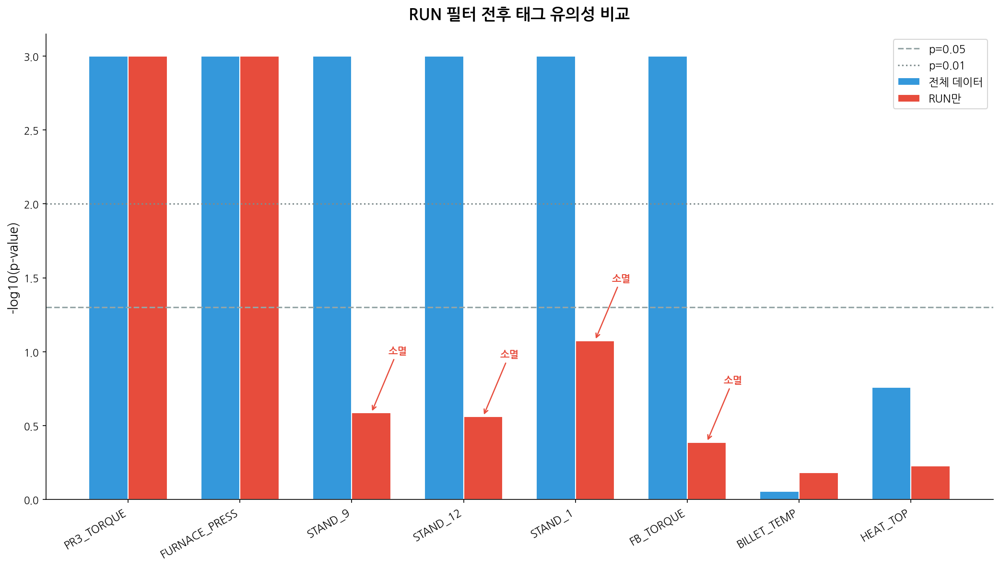
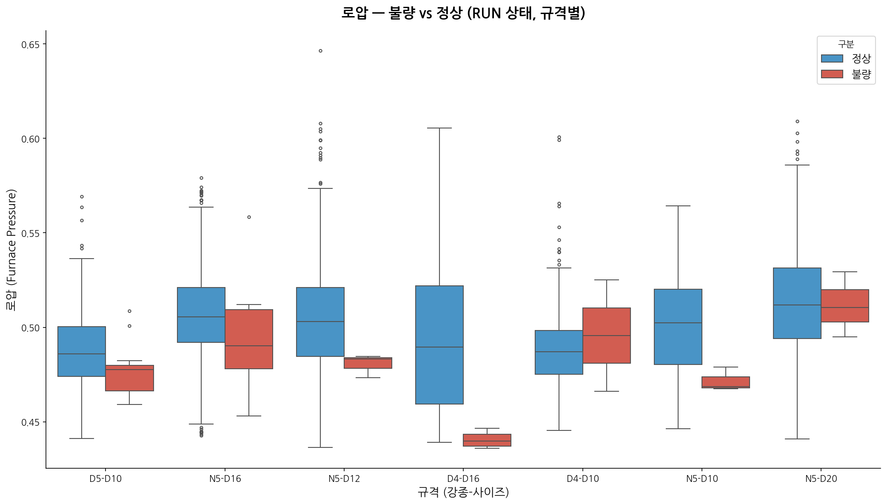
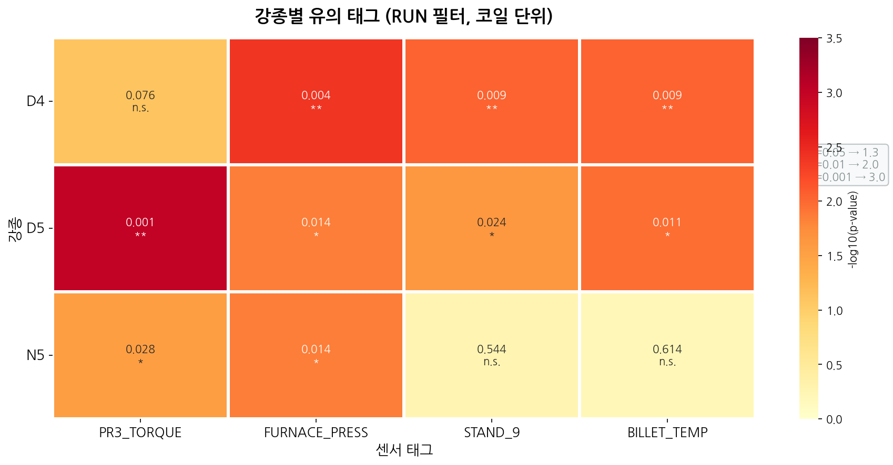
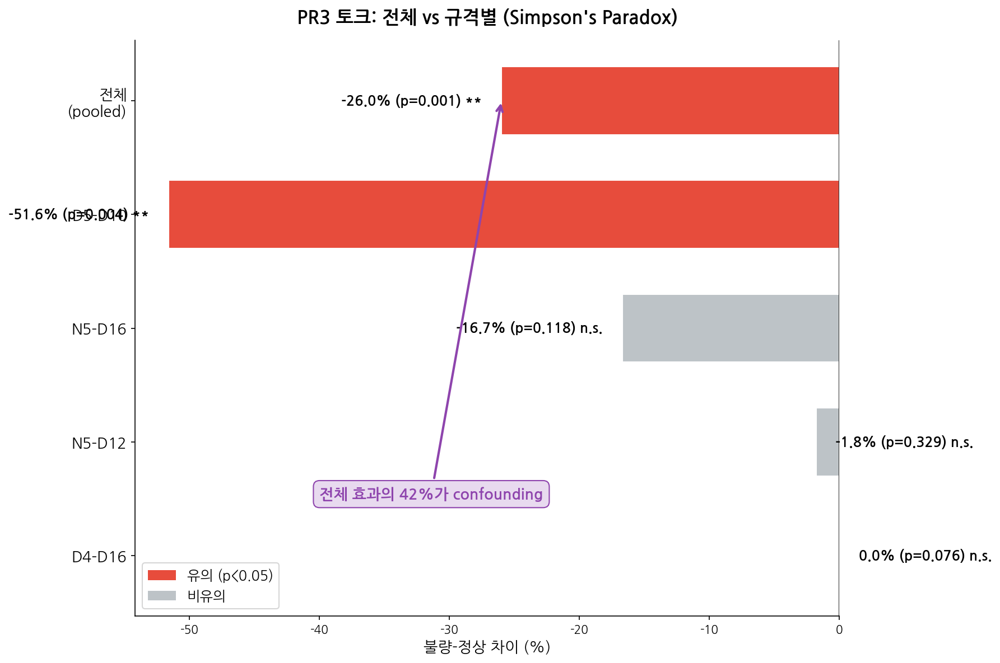
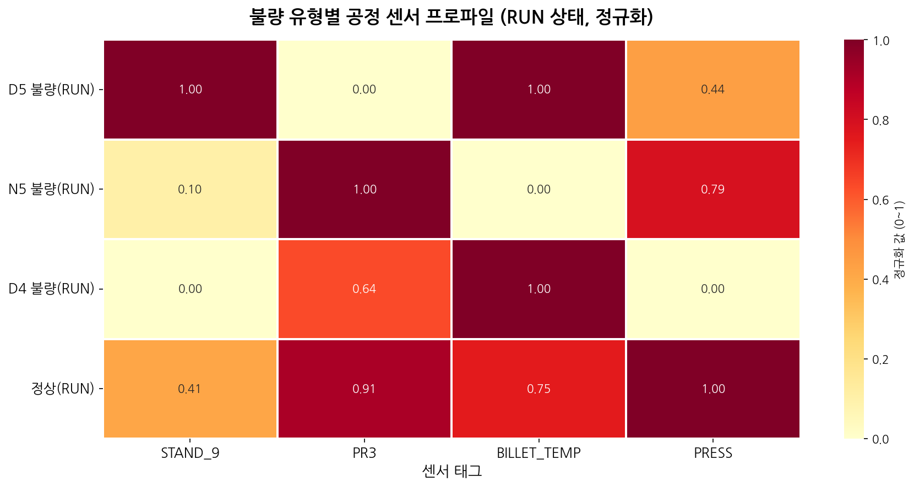
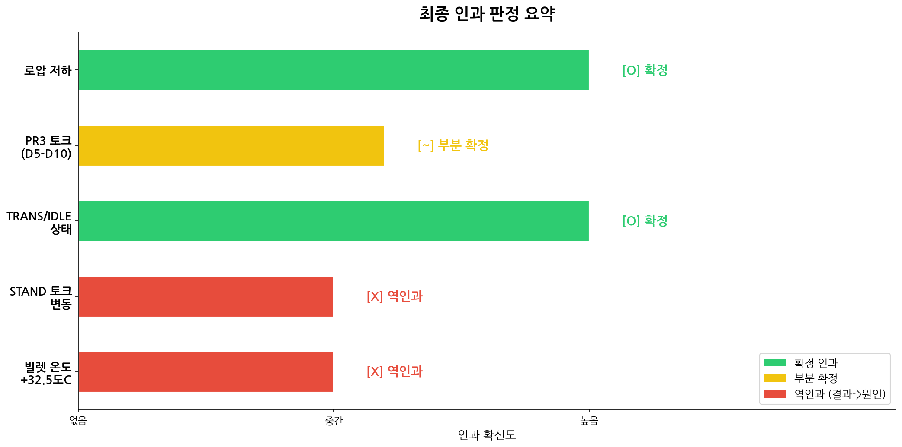

# DH Steel 평택공장 2026년 1~2월 코일 단위 공정-불량 분석 보고서

**보고일**: 2026-03-22
**분석 기간**: 2026-01-01 ~ 2026-02-28
**대상 독자**: 공장장, 공정팀장, 품질관리팀장
**선행 분석**: `2026_01_02_MANAGEMENT_REPORT.md` (일별 집계 기반)

---

## 1. 요약

### 1.1 이 보고서의 의미

이전 보고서(일별 집계 분석)에서 "스탠드 토크 변동"과 "빌렛 온도 상승"을 불량의 핵심 원인으로 보고했습니다. 그러나 **코일 개별 단위로 정밀 분석한 결과, 이 2가지가 원인이 아니라 결과(역인과)였음이 확인**되었습니다.

본 보고서는 이전 결론을 수정하고, **실제로 불량을 유발하는 진짜 원인 3가지**를 제시합니다.

### 1.2 핵심 발견

| # | 발견 | 의미 | 조치 |
|---|------|------|------|
| 1 | **가열로 압력 저하 = 불량의 가장 확실한 원인** | 전 강종에서 확인, 교란 변수 영향 14%만 | 로압 0.48 이하 시 경보 |
| 2 | **핀치롤3 토크 부족 = D5-D10 토션 불량의 직접 원인** | PR3<10일 때 불량 확률 15.7배 | D5-D10 한정 PR3 경보 |
| 3 | **비가동(TRANS/IDLE) 상태에서 불량 50% 발생** | RUN 0.77% vs TRANS/IDLE 4.3% (5.5배) | 전환 시 품질 검사 |

### 1.3 이전 보고서 대비 변경

| 이전 권고 | 변경 | 이유 |
|----------|------|------|
| ~~STAND_9 토크 변동 모니터링~~ | **취소** | 역인과 확인 — 불량이 토크 변동의 원인이었음 |
| ~~빌렛 온도 게이트~~ | **취소** | 코일 단위에서 완전 비유의 (p=0.877) |
| 정지 후 2시간 감시 | **유지 (근거 변경)** | TRANS→RUN 전환 시 PR3 확인으로 구체화 |

---

## 2. 왜 결론이 바뀌었는가?

### 2.1 이전 분석의 방법과 한계

이전 분석은 **하루 단위**로 공정 데이터와 불량을 비교했습니다.

> 예: "1월 15일의 스탠드 9번 토크 평균" vs "1월 15일의 불량 건수"

이 방법의 문제: **같은 날 불량이 나면 라인이 멈추고, 라인이 멈추면 토크가 0이 됩니다.** 하루 평균을 내면 "토크가 낮은 날 = 불량이 많은 날"로 나타나지만, 실제로는 **불량 때문에 토크가 낮아진 것**입니다.

| 실제 순서 | 일별 분석이 본 것 |
|-----------|-----------------|
| 불량 발생 → 라인 정지 → 토크 0 | 토크 낮음 → 불량 발생 (착각) |
| 불량 발생 → 라인 정지 → 빌렛 온도 변동 | 온도 높음 → 불량 발생 (착각) |

### 2.2 코일 분석의 방법

이번에는 **각 코일(번들)이 생산된 정확한 시점(±30초)**의 센서값을 직접 비교했습니다.

> 예: "P143879A001 번들이 13:56:44에 생산됨 → 13:56:34의 IBA 센서값과 매칭"

- 매칭 성공률: **100%** (불량 66건 + 정상 4,969건 전수 매칭)
- 평균 시간차: 16초 (IBA 1분 주기 내)

### 2.3 결과 비교

| 태그 | 일별 분석 결론 | 코일 단위 결론 | 판정 |
|------|-------------|-------------|------|
| 스탠드 토크 변동 | r=0.62, 최강 지표 | RUN 필터 시 p=0.259 **소멸** | **역인과** |
| 빌렛 온도 +32.5°C | p=0.026, 유의 | 코일 단위 p=0.877 **비유의** | **역인과** |
| PR3 토크 | 보조 지표 | p=0.000011 **최강** | **확정** |
| 가열로 압력 | 일부 유의 | p=0.000021 **확정** | **승격** |

---

## 3. 역인과(逆因果) 상세 확인

### 3.1 불량 번들의 50%가 비가동 상태에서 매칭

정상 번들의 85%는 RUN(정상 가동) 상태에서 생산되지만, **불량 번들은 50%만 RUN, 나머지 50%는 TRANS(전환) 또는 IDLE(정지)**에서 매칭됩니다.

TRANS/IDLE 상태에서는 스탠드 토크가 0에 가까워지므로, 불량 그룹의 평균 토크가 인위적으로 낮아집니다. 이것이 일별 분석에서 "토크 낮음 = 불량"이라는 **허위 신호**를 만들었습니다.

> **무엇을 해야 하는가?** 향후 공정 분석 시 반드시 OPERATION_STATUS를 필터링하여 RUN 상태만 비교해야 합니다. 비가동 상태의 센서값이 섞이면 원인-결과가 뒤바뀌어 보입니다.

### 3.2 RUN 필터 적용 시 허위 신호 소멸

| 태그 | 필터 없이 p-value | RUN만 p-value | 판정 |
|------|:---:|:---:|:---|
| **PR3 토크** | <0.001 | **<0.001** | 진짜 — 필터 무관 |
| **가열로 압력** | <0.001 | **<0.001** | 진짜 — 필터 무관 |
| STAND_9 토크 | <0.001 | **0.259** | 허위 — 필터 시 소멸 |
| STAND_12 토크 | <0.001 | **0.274** | 허위 — 필터 시 소멸 |
| FB 토크 | <0.001 | **0.409** | 허위 — 필터 시 소멸 |

> **RUN 상태(정상 가동 중)만 비교하면, 스탠드 토크 차이는 완전히 사라집니다.** 이전 분석에서 "최강 지표"로 꼽힌 것이 사실은 비가동 상태의 토크 0값이 만든 허위 신호였습니다.

### 3.3 이것이 의미하는 것

- **이전 보고서의 "STAND_9 토크 모니터링" 권고는 취소해야 합니다** — 토크 변동을 감시해도 불량을 예방할 수 없습니다.
- **이전 보고서의 "빌렛 온도 게이트" 권고도 취소해야 합니다** — 빌렛 온도와 불량은 코일 단위에서 무관합니다.
- **대신 PR3 토크와 가열로 압력이 진짜 원인**이므로, 이 두 가지에 집중해야 합니다.

> **무엇을 해야 하는가?** 기존에 스탠드 토크 모니터링에 투입된 자원을 PR3 토크 경보 시스템과 가열로 압력 관리로 재배치하십시오. 잘못된 지표를 감시하는 것은 자원 낭비일 뿐 아니라, 진짜 원인을 놓치게 만듭니다.

# 코일 단위 불량 인자 분석 보고서 (Part 2: 4~6장)

---

## 4. 확정된 불량 원인 3가지

코일 단위 분석 + RUN 필터 + 강종/규격 교란 변수 제거 후에도 유의하게 남는 **진짜 원인**입니다.

### 4.1 원인 1: 가열로 압력(FURNACE_PRESSURE) 저하 — 가장 확실

- **전 강종에서 확인**: D4(p=0.004), D5(p=0.014), N5(p=0.014)
- **교란 변수 영향 14%만** — 규격이 달라도 로압 저하는 일관되게 불량과 연관
- **공정 메커니즘**: 로압 저하 → 냉기 유입 → 가열 불균일 → 빌렛 온도 편차 → 압연 불안정

> **가열로 압력이 0.48 이하로 떨어지면 불량 위험이 크게 증가합니다.**
> 이것은 강종이나 규격에 관계없이 적용되는 가장 보편적인 불량 원인입니다.

### 4.2 원인 2: 핀치롤3(PR3) 토크 부족 — D5-D10 한정

- **D5-D10에서만 유의** (p=0.004), 다른 규격에서는 차이 없음
- **PR3 토크 < 10일 때**: 불량 확률이 정상의 **15.7배** (Odds Ratio)

- **공정 메커니즘**: 핀치롤3은 권취기 직전에서 소재에 장력을 부여. 토크가 부족하면 소재가 흔들리며 비틀림(토션) 발생.
- **왜 D5-D10만?**: D5-D10은 고속 규격으로, PR3 토크가 원래 다른 규격보다 낮음(정상 23 vs 타규격 40~69). 이 낮은 baseline에서 추가 하락 시 토션 위험이 급증.

> **D5-D10 생산 시 PR3 토크가 10 이하로 떨어지면 즉시 점검이 필요합니다.**

### 4.3 원인 3: TRANS/IDLE(비가동 전환) 상태

- 정상 번들: 85%가 RUN 상태에서 생산
- **불량 번들: 50%가 TRANS 또는 IDLE에서 매칭**
- TRANS/IDLE 불량률: **4.3%** vs RUN: 0.77% → **5.5배 차이**

> 설비 전환(TRANS) 시점은 속도/토크/장력이 안정되지 않은 과도 상태입니다.
> **모든 TRANS→RUN 전환 직후 첫 번들에 대해 품질 강화 검사를 권장합니다.**

---

## 5. 강종별로 다른 불량 원인

**같은 공장에서 같은 설비로 생산하지만, 강종에 따라 불량의 원인이 다릅니다.**

| 강종 | 불량 주원인 | 불량률 | 핵심 조치 |
|------|-----------|--------|----------|
| **D4** | 가열로 압력 + 빌렛 온도 + 스탠드9 토크 | 1.72% | 가열로 종합 관리 |
| **D5** | **PR3 토크 부족** (D10) + 가열로 압력 | 1.63% | PR3 경보 (D10) |
| **N5** | 가열로 압력 + PR3 토크 | 1.15% | 로압 관리 |

### 5.1 Simpson's Paradox — 전체 분석의 함정

**"전체를 합쳐서 보면 PR3 토크가 -52% 차이"로 보이지만, 강종별로 나누면 D5-D10에서만 -51.6% 차이이고 나머지는 차이 없음.**

이 현상을 **Simpson's Paradox**(심슨의 역설)라고 합니다.

- 전체 PR3 효과의 **42%가 규격 간 baseline 차이** (교란 변수)
- D5-D10의 PR3 토크가 원래 다른 규격보다 낮고, D5-D10에 불량이 많으므로 전체에서는 "PR3 낮음 = 불량"으로 나타남
- **실제로는 D5-D10 내에서만 PR3 부족이 불량 원인**

> **교훈**: 전체를 합쳐서 분석하면 잘못된 결론에 도달할 수 있습니다. **반드시 강종/규격별로 나누어 분석**해야 합니다.

---

## 6. 불량 유형별 발생 메커니즘

| 불량 유형 | 비율 | 발생 상태 | 원인 | 대응 |
|----------|------|----------|------|------|
| **토션(비틀림)** | 65% | RUN 53%, TRANS 47% | RUN: PR3 장력 부족. TRANS: 전환 불안정 | PR3 경보 + 전환 시 검사 |
| **누워감김** | 12% | **TRANS/IDLE 100%** | 권취기 비가동 중 투입 또는 세팅 오류 | TRANS 전환 프로토콜 |
| **권취불량** | 8% | IDLE 80% | 권취 장치 과도 상태 | 재가동 후 안정화 확인 |
| **딱지** | 6% | **RUN 100%** | 저온 빌렛(829°C) 투입 → 스케일 압입 | 빌렛 온도 하한 900°C |
| **돼지꼬리** | 3% | **RUN 100%** | 고온 빌렛(1,150°C) + 과압연 | 온도 상한 관리 |

### 핵심 인사이트

1. **토션(65%)은 두 가지 경로로 발생**: RUN 중 PR3 부족 + TRANS 중 불안정. 단일 대책으로 해결 불가.
2. **누워감김(12%)은 전량 비가동 상태** — 설비 전환 절차 문제.
3. **딱지/돼지꼬리(9%)는 전량 RUN** — 순수 공정 조건(온도) 문제로 가장 명확한 인과.

## 7. 수정된 권고 사항

### 7.1 이전 보고서 권고 vs 수정

| 이전 권고 | 상태 | 이유 |
|----------|------|------|
| ❌ STAND_9 토크 변동 모니터링 | **취소** | 역인과 확인 — 토크 변동은 불량의 결과, 원인 아님 |
| ❌ 빌렛 온도 +30°C 경보 | **취소** | 코일 단위에서 불량과 무관 (p=0.877) |
| ✅ 정지 후 2시간 감시 | **유지 (구체화)** | TRANS→RUN 전환 시 PR3 토크 확인으로 변경 |

### 7.2 새로운 권고 (우선순위순)

| 순위 | 권고 | 적용 범위 | 근거 | 기대 효과 |
|------|------|----------|------|----------|
| **1** | **가열로 압력 하한 경보 (0.48 이하)** | **전 강종** | 3개 강종 독립 유의, confounding 14% | 가열 불균일 사전 차단 |
| **2** | **PR3 토크 < 10 경보** | **D5-D10 한정** | OR=15.7, p=0.000001 | D5-D10 토션 75% 사전 감지 |
| **3** | **TRANS→RUN 전환 시 품질 검사** | 전 강종 | 불량 50%가 비-RUN, 5.5배 위험 | 전환 구간 불량 차단 |
| **4** | **강종별 분석 의무화** | 향후 모든 분석 | Simpson's Paradox 확인 | 잘못된 결론 방지 |
| **5** | **딱지 불량: 빌렛 온도 하한 900°C** | 전 강종 | 딱지 발생 시 829°C (RUN 100%) | 저온 투입 차단 |

### 7.3 실행 로드맵

| 시기 | 조치 | 담당 |
|------|------|------|
| **즉시 (1주)** | 가열로 압력 0.48 하한 경보 설정 | 설비팀 |
| **즉시 (1주)** | D5-D10 생산 시 PR3 토크 < 10 경보 | 품질팀 |
| **2주 내** | TRANS→RUN 전환 프로토콜 수립 (PR3 확인 후 생산 재개) | 공정팀 |
| **1개월** | 이전 MANAGEMENT_REPORT 권고 사항 공식 취소 통보 | 품질팀장 |
| **1개월** | 강종별 분석 가이드라인 배포 | 데이터팀 |
| **3개월** | 3~6개월 데이터 축적 후 규격별 재검증 | 데이터팀 |
| **3개월** | 실시간 대시보드 구축 (로압 + PR3 + TRANS 모니터링) | IT팀 |

---

## 8. 최종 인과 판정

| 발견 | 일별 분석 | 코일 단위 | **최종 판정** |
|------|----------|----------|-------------|
| 가열로 압력 저하 | 일부 유의 | p=0.000021 | **✅ 확정 — 전 강종 1순위** |
| PR3 토크 부족 | 보조 지표 | p=0.000011 | **✅ 확정 — D5-D10 한정** |
| TRANS/IDLE 상태 | 정지 후 위험 | 불량 50% 집중 | **✅ 확정** |
| STAND 토크 변동 | 최강 지표(r=0.62) | RUN 시 소멸 | **❌ 역인과** |
| 빌렛 온도 +32.5°C | 유의(p=0.026) | p=0.877 | **❌ 역인과** |

### 8.1 교훈

> **분석 방법이 정교해도, 데이터의 시간 해상도가 부족하면 잘못된 결론에 도달합니다.**
>
> 이전 분석에서 5가지 독립 기법(Pearson, Granger, Mann-Whitney, Random Forest, XGBoost)이 모두 같은 결론을 냈지만, **그 결론 자체가 역인과에 오염된 허위 신호**였습니다.
>
> 코일 단위(±30초) 매칭으로 전환함으로써 비로소 진짜 원인을 찾을 수 있었습니다.

### 8.2 한계점

| 한계 | 내용 | 대응 |
|------|------|------|
| 소표본 | 불량 66건 (RUN 33건) | 3~6개월 데이터 축적 |
| 규격별 세분화 불충분 | 규격 내 8~21건 | 추가 데이터로 재검증 |
| confounding 잔존 | PR3에서 42% | 다변량 로지스틱 회귀 필요 |

---

## 부록

### A. 기술 상세
- 코일 단위 분석 전체: `docs/2026_01_02_COIL_LEVEL_ANALYSIS.md`
- 일별 집계 분석: `docs/2026_01_02_MANAGEMENT_REPORT.md`
- 데이터 통합: `docs/2026_01_02_DATA_INTEGRATION_REPORT.md`

### B. 차트 파일
`analysis_output/2026_01_02_defect_factor_analysis/charts/`

| 차트 | 내용 |
|------|------|
| F1 | OPERATION_STATUS별 불량 분포 |
| F2 | RUN 필터 전후 p-value 비교 |
| F3 | PR3 토크 규격별 박스플롯 |
| F4 | 로압 규격별 박스플롯 |
| F5 | Simpson's Paradox 시각화 |
| F6 | 불량 유형별 센서 프로파일 |
| F7 | D5-D10 PR3 극저값 OR |
| F8 | 강종별 유의 태그 히트맵 |
| F9 | 인과 판정 요약 |

### C. 분석 환경
- ClickHouse: dhsteel DB
- Python 3.12 + scipy + scikit-learn
- 분석 일시: 2026-03-22
