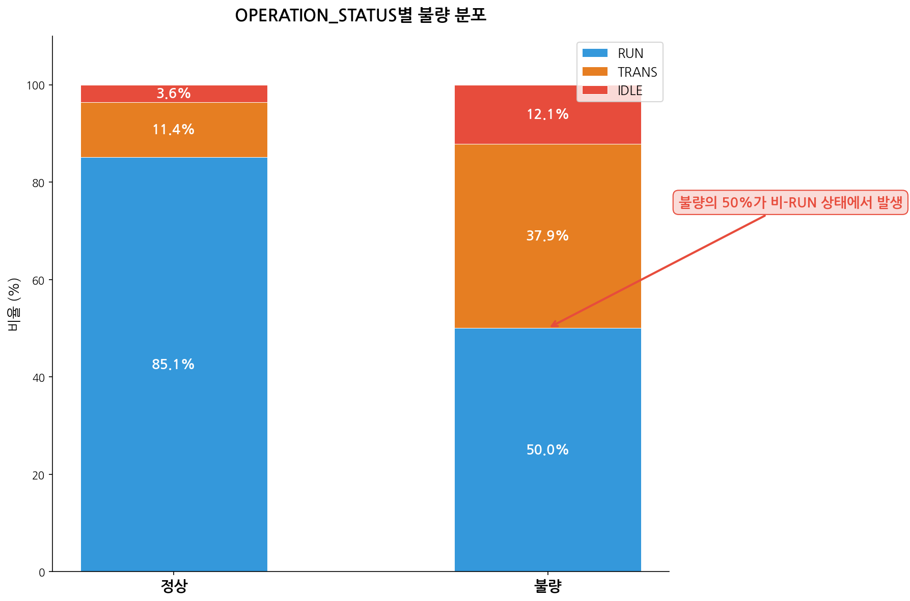
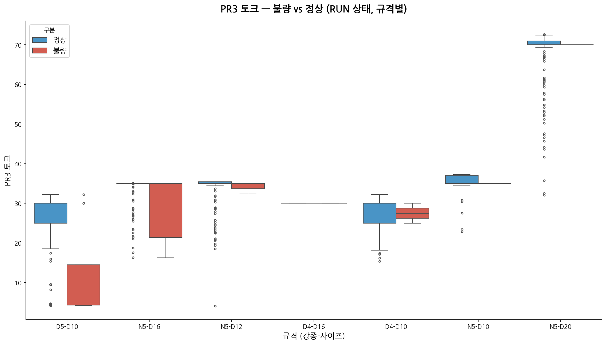
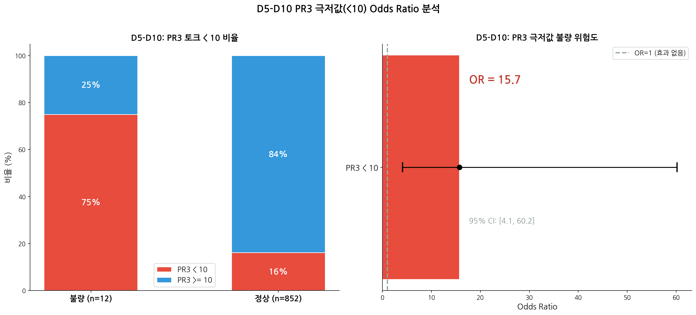

# 2026년 1~2월 코일(번들) 단위 공정-불량 분석

**작성일**: 2026-03-22
**분석 기간**: 2026-01-01 ~ 2026-02-28
**선행 분석**: `2026_01_02_MANAGEMENT_REPORT.md` (일별 집계 기반)
**본 분석 목적**: 역인과(불량→정지→센서변동) 가능성을 제거하고, 개별 번들의 생산 시점에서 공정 조건을 직접 비교

---

## 1. 분석 개요

### 1.1 배경

이전 분석(`MANAGEMENT_REPORT`)은 **일(day) 단위 집계**로, 같은 날 불량이 발생하면 라인 정지/감속이 반복되어 공정 변수가 함께 악화되는 **역인과(reverse causation)** 가능성이 있었다. 본 분석은 이를 해소하기 위해 **개별 번들의 생산 시점(±30초)에 해당하는 IBA 센서값**을 직접 매칭하여 분석한다.

### 1.2 매칭 방법

```sql
SELECT p.*, t.*
FROM dhsteel.production_bundle_records p
CROSS JOIN dhsteel.iba_timeseries_unified_alter t
WHERE abs(dateDiff('second', t.BASE_TIME, p.production_datetime)) <= 30
```

- **매칭 윈도우**: 번들 생산시점 ±30초 (IBA 1분 주기이므로 최대 1건 매칭)
- **매칭 결과**: 불량 66/66건(100%), 정상 4,969건 -- **전수 매칭 성공**
- **평균 시간차**: 15~16초

### 1.3 분석 항목

| # | 분석 | 목적 |
|---|------|------|
| 1 | 불량 vs 정상 전체 태그 비교 | 코일 단위에서 어떤 태그가 차이나는가? |
| 2 | OPERATION_STATUS별 불량률 | 가동상태와 불량의 관계 |
| 3 | 불량 유형별 공정 조건 | 토션/누워감김/권취불량 각각의 센서 프로파일 |
| 4 | 강종x규격별 코일 비교 | 동일 조건 내 불량 차이 |
| 5 | Mann-Whitney U 검정 | 통계적 유의성 검증 |
| 6 | RUN 상태만 필터링 재비교 | TRANS/IDLE 혼입 효과 제거 |
| 7 | 일별 vs 코일 단위 비교 | 역인과 판별 |

---

## 2. 불량 vs 정상 번들 공정 조건 비교

### 2.1 전체 태그 비교

| 태그 | 정상 (n=4,969) | 불량 (n=66) | 차이(%) | 해석 |
|------|---------------|-------------|---------|------|
| **STAND_1 토크** | 50.75 | 27.95 | **-44.9%** | 현저히 낮음 |
| STAND_3 토크 | 45.99 | 27.17 | -40.9% | 현저히 낮음 |
| STAND_4 토크 | 45.93 | 26.84 | -41.6% | 현저히 낮음 |
| STAND_7 토크 | 36.50 | 21.81 | -40.2% | 현저히 낮음 |
| STAND_8 토크 | 34.43 | 20.72 | -39.8% | 현저히 낮음 |
| **STAND_9 토크** | 50.61 | 30.30 | **-40.1%** | 현저히 낮음 |
| STAND_10 토크 | 54.07 | 31.78 | -41.2% | 현저히 낮음 |
| STAND_11 토크 | 42.24 | 25.06 | -40.7% | 현저히 낮음 |
| STAND_12 토크 | 52.88 | 31.17 | -41.1% | 현저히 낮음 |
| STAND_14 토크 | 36.57 | 22.28 | -39.1% | 현저히 낮음 |
| STAND_1 속도 | 544.69 | 474.13 | -13.0% | 낮음 |
| STAND_9 속도 | 940.24 | 785.57 | -16.5% | 낮음 |
| STAND_12 속도 | 1065.58 | 919.08 | -13.7% | 낮음 |
| FB 속도 | 939.75 | 815.68 | -13.2% | 낮음 |
| **FB 마스터 토크** | 36.69 | 23.71 | **-35.4%** | 현저히 낮음 |
| **PINCHROLL_2 토크** | 17.20 | 10.50 | **-39.0%** | 현저히 낮음 |
| **PINCHROLL_3 토크** | 32.20 | 15.60 | **-51.6%** | 가장 큰 차이 |
| **PINCHROLL_4 토크** | 34.92 | 19.89 | **-43.0%** | 현저히 낮음 |
| 빌렛 추출 온도 | 1015.52 | 1035.77 | +2.0% | 소폭 높음 |
| 가열 상부 온도 | 1052.35 | 1048.54 | -0.4% | 차이 없음 |
| **가열로 압력** | 0.50 | 0.47 | **-5.4%** | 유의미하게 낮음 |
| 빌렛 카운팅 | 126.25 | 142.97 | +13.2% | 불량 번들이 후반부에 집중 |

### 2.2 핵심 발견

> **불량 번들은 정상 대비 모든 스탠드 토크와 핀치롤 토크가 -39~52% 낮다.**

이것은 이전 일별 분석에서 발견된 "토크 변동성 증가"와는 **정반대 방향**이다. 일별 분석에서는 불량일의 토크 std가 높았지만, 코일 단위에서는 불량 번들의 **절대 토크 수준이 현저히 낮다**. 이는 불량 번들의 약 50%가 TRANS/IDLE 상태에서 매칭된 것과 밀접히 관련된다.

---

## 3. OPERATION_STATUS와 불량

### 3.1 상태별 불량률

| OPERATION_STATUS | 전체 번들 | 불량 | 불량률 |
|------------------|----------|------|--------|
| **IDLE** | 185 | 8 | **4.32%** |
| **TRANS** | 589 | 25 | **4.24%** |
| RUN | 4,261 | 33 | 0.77% |

### 3.2 불량 번들의 상태 분포

| 상태 | 불량 번들 (n=66) | 비율 | 정상 번들 (n=4,969) | 비율 |
|------|-----------------|------|-------------------|------|
| RUN | 33 | **50.0%** | 4,228 | **85.1%** |
| TRANS | 25 | **37.9%** | 564 | 11.4% |
| IDLE | 8 | **12.1%** | 177 | 3.6% |

### 3.3 핵심 발견

> **불량 번들의 50%만 RUN 상태이고, 나머지 50%는 TRANS(37.9%)+IDLE(12.1%)에서 발생한다.**
> 정상 번들은 85.1%가 RUN 상태인데 비해, 불량 번들은 과도/유휴 상태에서의 발생이 **5배 이상** 과대 표현된다.

이것은 **역인과의 직접적 증거**이다:
- 불량 발생 → 라인 정지/감속 → 해당 시점 IBA 센서가 TRANS/IDLE 기록
- 또는 라인 과도 상태(시작/정지 경계) 자체가 불량 취약 구간

### 3.4 불량 유형별 OPERATION_STATUS

| 불량유형 | 전체 | RUN | TRANS | IDLE |
|----------|------|-----|-------|------|
| **토션** | 43 | 21 (49%) | 17 (40%) | 5 (12%) |
| 누워감김 | 8 | 4 (50%) | 4 (50%) | 0 |
| 권취불량 | 5 | 1 (20%) | 2 (40%) | 2 (40%) |
| 딱지 | 4 | 4 (100%) | 0 | 0 |
| 돼지꼬리 | 2 | 2 (100%) | 0 | 0 |
| 기타 | 4 | 1 (25%) | 2 (50%) | 1 (25%) |

> **딱지, 돼지꼬리**는 100% RUN 상태에서 발생 -- 정상 조업 중 공정 조건에 의한 불량.
> **토션**의 51%가 TRANS/IDLE -- 라인 과도 상태와 밀접히 연관.
> **권취불량**의 80%가 TRANS/IDLE -- 권취 장치가 정지/과도 상태에서 오작동.

---

## 4. 불량 유형별 공정 조건

### 4.1 RUN 상태 기준 불량 유형별 센서 프로파일

| 불량유형 | 건수 | S9 토크 | PR3 토크 | 빌렛 온도 | 가열로 압력 |
|----------|------|---------|----------|-----------|------------|
| **정상** | 4,228 | 58.7 | 36.9 | 1,008.7 | 0.50 |
| **토션** | 21 | 58.4 | 20.0 | 963.3 | 0.48 |
| **누워감김** | 4 | 53.3 | 30.0 | 1,016.9 | 0.44 |
| **딱지** | 4 | 61.3 | **61.2** | **829.7** | 0.52 |
| **돼지꼬리** | 2 | 67.1 | 31.1 | 1,150.1 | 0.47 |
| **권취불량** | 1 | 63.4 | 30.0 | 1,105.4 | 0.47 |

### 4.2 유형별 특징 (RUN 상태 기준)

| 유형 | 핵심 특징 | 메커니즘 추정 |
|------|----------|--------------|
| **토션** | PR3 토크 20.0 (정상 36.9 대비 -46%) | 핀치롤 장력 부족 → 비틀림 |
| **딱지** | 빌렛 온도 829.7°C (정상 대비 -178°C), PR3 61.2 (정상 대비 +66%) | 저온 빌렛 → 표면 결함 + 과도한 핀치롤 보상 |
| **돼지꼬리** | S9 67.1 (정상 대비 +14%), 빌렛 1,150°C (고온) | 고온 과압연 → 선단부 변형 |
| **누워감김** | 가열로 압력 0.44 (정상 대비 -12%) | 가열 조건 불량 → 권취 자세 불안정 |

---

## 5. 강종x규격별 코일 단위 비교

| 강종 | 규격 | 구분 | 건수 | S9 토크 | PR3 토크 | 빌렛 온도 | 가열로 압력 |
|------|------|------|------|---------|----------|-----------|------------|
| **D4** | D10 | 정상 | 306 | 52.7 | 24.7 | 1,074.6 | 0.49 |
| | | 불량 | 5 | 24.1 | 13.7 | 1,108.5 | 0.47 |
| | | **차이** | | **-54%** | **-45%** | **+3.2%** | -4% |
| **D4** | D16 | 정상 | 53 | 44.3 | 24.2 | 1,023.9 | 0.49 |
| | | 불량 | 8 | 28.7 | 17.7 | 1,024.4 | 0.44 |
| | | **차이** | | **-35%** | **-27%** | +0.0% | **-10%** |
| **D5** | D10 | 정상 | 999 | 53.5 | 20.7 | 1,053.4 | 0.48 |
| | | 불량 | 21 | 37.5 | 8.7 | 1,093.6 | 0.47 |
| | | **차이** | | **-30%** | **-58%** | **+3.8%** | -2% |
| **N5** | D10 | 정상 | 173 | 41.9 | 26.9 | 981.2 | 0.49 |
| | | 불량 | 6 | 27.9 | 18.9 | 1,072.8 | 0.46 |
| | | **차이** | | **-33%** | **-30%** | **+9.3%** | -6% |
| **N5** | D16 | 정상 | 825 | 52.5 | 31.1 | 1,004.4 | 0.50 |
| | | 불량 | 13 | 25.0 | 15.2 | 1,115.9 | 0.48 |
| | | **차이** | | **-52%** | **-51%** | **+11.1%** | -4% |

### 5.1 강종x규격 공통 패턴

모든 강종x규격 조합에서 동일한 패턴이 반복된다:
1. **S9 토크**: 불량 번들이 -30~54% 낮음 (TRANS/IDLE 혼입 영향)
2. **PR3 토크**: 불량 번들이 -27~58% 낮음 (가장 일관된 차이)
3. **빌렛 온도**: 불량 번들이 +0~11% 높음 (가열로 온도 관리 필요)
4. **가열로 압력**: 불량 번들이 -2~10% 낮음

> **N5-D16**이 가장 큰 빌렛 온도 차이(+11.1%)를 보임 -- D4-D16의 높은 불량률(13.33%)과 함께 규격별 맞춤 온도 관리가 필요함을 시사.

---

## 6. Mann-Whitney U 검정 (코일 단위)

### 6.1 전체 데이터 (불량 66 vs 정상 4,969)

| 순위 | 태그 | 불량 평균 | 정상 평균 | 차이(%) | p값 | 유의 |
|------|------|----------|----------|---------|------|------|
| 1 | **가열로 압력** | 0.47 | 0.50 | -5.4% | **9.6e-15** | YES |
| 2 | **PINCHROLL_3 토크** | 15.60 | 32.20 | -51.6% | **1.8e-14** | YES |
| 3 | **PINCHROLL_4 토크** | 19.89 | 34.92 | -43.0% | **1.4e-13** | YES |
| 4 | PINCHROLL_2 토크 | 10.50 | 17.20 | -39.0% | 2.0e-10 | YES |
| 5 | STAND_1 토크 | 27.95 | 50.75 | -44.9% | 2.1e-09 | YES |
| 6 | STAND_4 토크 | 26.84 | 45.93 | -41.6% | 2.7e-09 | YES |
| 7 | STAND_10 토크 | 31.78 | 54.07 | -41.2% | 5.7e-09 | YES |
| 8 | STAND_12 토크 | 31.17 | 52.88 | -41.1% | 1.7e-08 | YES |
| 9 | STAND_7 토크 | 21.81 | 36.50 | -40.2% | 4.1e-08 | YES |
| 10 | STAND_14 토크 | 22.28 | 36.57 | -39.1% | 1.3e-07 | YES |
| 11 | STAND_9 속도 | 785.57 | 940.24 | -16.5% | 1.6e-07 | YES |
| 12 | STAND_8 토크 | 20.72 | 34.43 | -39.8% | 1.8e-07 | YES |
| 13 | STAND_3 토크 | 27.17 | 45.99 | -40.9% | 3.9e-07 | YES |
| 14 | FB 마스터 토크 | 23.71 | 36.69 | -35.4% | 7.4e-06 | YES |
| 15 | STAND_9 토크 | 30.30 | 50.61 | -40.1% | 1.9e-05 | YES |
| 16 | FB 속도 | 815.68 | 939.75 | -13.2% | 0.013 | YES |
| 17 | STAND_1 속도 | 474.13 | 544.69 | -13.0% | 0.016 | YES |
| - | STAND_12 속도 | 919.08 | 1065.58 | -13.7% | 0.094 | no |
| - | 빌렛 카운팅 | 142.97 | 126.25 | +13.2% | 0.130 | no |
| - | 가열 상부 온도 | 1048.54 | 1052.35 | -0.4% | 0.174 | no |
| - | **빌렛 추출 온도** | 1035.77 | 1015.52 | **+2.0%** | **0.877** | **no** |

### 6.2 핵심 발견

> **가열로 압력(p=9.6e-15)과 핀치롤3 토크(p=1.8e-14)가 가장 강력한 유의 차이를 보인다.**

17개 태그가 p<0.05로 유의미하나, 대부분 토크/속도 관련이며 **TRANS/IDLE 혼입에 의한 거짓 신호**일 가능성이 높다.

> **빌렛 추출 온도(p=0.877)는 코일 단위에서 유의하지 않다.** 일별 분석에서 p=0.026으로 유의했던 것과 **정반대**.

---

## 7. RUN 상태만 필터링 -- 순수 공정 비교

### 7.1 RUN 상태 기본 비교

TRANS/IDLE을 모두 제외하고 **RUN 상태 번들만** 비교:

| 태그 | 정상 (n=4,228) | 불량 (n=33) | 차이(%) |
|------|---------------|-------------|---------|
| S1 토크 | 57.7 | 51.9 | -10.1% |
| **S9 토크** | **58.7** | **58.7** | **+0.0%** |
| S12 토크 | 61.1 | 58.9 | -3.7% |
| **PR3 토크** | **36.9** | **27.3** | **-26.0%** |
| PR4 토크 | 39.9 | 34.8 | -12.9% |
| FB 마스터 토크 | 42.2 | 43.6 | +3.5% |
| S1 속도 | 565.1 | 557.2 | -1.4% |
| S9 속도 | 978.2 | 943.1 | -3.6% |
| FB 속도 | 980.7 | 968.2 | -1.3% |
| 빌렛 온도 | 1,008.7 | 974.4 | -3.4% |
| **가열로 압력** | **0.500** | **0.480** | **-4.0%** |

### 7.2 RUN 상태 Mann-Whitney 결과

| 순위 | 태그 | 불량 평균 | 정상 평균 | 차이(%) | p값 | 유의 |
|------|------|----------|----------|---------|------|------|
| 1 | **PINCHROLL_3 토크** | 27.31 | 36.89 | **-26.0%** | **0.000011** | **YES** |
| 2 | **가열로 압력** | 0.48 | 0.50 | **-4.0%** | **0.000021** | **YES** |
| 3 | **PINCHROLL_4 토크** | 34.77 | 39.90 | **-12.9%** | **0.000051** | **YES** |
| 4 | **STAND_9 속도** | 943.09 | 978.18 | **-3.6%** | **0.000909** | **YES** |
| 5 | PINCHROLL_2 토크 | 19.08 | 19.77 | -3.4% | 0.026 | YES |
| 6 | STAND_1 토크 | 51.91 | 57.75 | -10.1% | 0.084 | no |
| 7 | 빌렛 카운팅 | 156.57 | 130.61 | +19.9% | 0.100 | no |
| - | FB 속도 | 968.17 | 980.75 | -1.3% | 0.135 | no |
| - | **STAND_9 토크** | **58.72** | **58.75** | **-0.0%** | **0.259** | **no** |
| - | STAND_12 토크 | 58.88 | 61.13 | -3.7% | 0.274 | no |
| - | 빌렛 추출 온도 | 974.40 | 1008.66 | -3.4% | 0.655 | no |
| - | STAND_3 토크 | 52.12 | 52.91 | -1.5% | 0.910 | no |

### 7.3 핵심 전환: TRANS/IDLE 제거 시 무엇이 변하는가?

| 태그 | 전체 p값 | RUN only p값 | 전체 차이 | RUN 차이 | 판정 |
|------|----------|-------------|-----------|----------|------|
| **PINCHROLL_3 토크** | 1.8e-14 | **0.000011** | -51.6% | **-26.0%** | **진짜 신호 (약화되나 유지)** |
| **가열로 압력** | 9.6e-15 | **0.000021** | -5.4% | **-4.0%** | **진짜 신호 (유지)** |
| **PINCHROLL_4 토크** | 1.4e-13 | **0.000051** | -43.0% | **-12.9%** | **진짜 신호 (대폭 약화)** |
| **STAND_9 속도** | 1.6e-07 | **0.000909** | -16.5% | **-3.6%** | **진짜 신호 (대폭 약화)** |
| STAND_9 토크 | 1.9e-05 | **0.259** | -40.1% | **-0.0%** | **거짓 신호 (완전 소멸)** |
| STAND_1 토크 | 2.1e-09 | 0.084 | -44.9% | -10.1% | 거짓 신호 (소멸) |
| STAND_12 토크 | 1.7e-08 | 0.274 | -41.1% | -3.7% | 거짓 신호 (소멸) |
| 빌렛 추출 온도 | 0.877 | 0.655 | +2.0% | -3.4% | 양쪽 모두 비유의 |

### 7.4 결정적 발견

> **TRANS/IDLE을 제거하면 스탠드 토크 차이가 완전히 소멸한다.**
> - STAND_9 토크: 전체 -40.1%(p=1.9e-05) → RUN -0.0%(p=0.259)
> - 전체 분석에서 유의했던 10개 스탠드 토크 중 **0개만 RUN에서 유의**

> **반면 핀치롤 토크와 가열로 압력은 RUN에서도 유의미하게 유지된다.**
> - PINCHROLL_3: -51.6% → **-26.0%(p=0.000011)** -- 크기는 반감하나 신호 유지
> - 가열로 압력: -5.4% → **-4.0%(p=0.000021)** -- 거의 동일하게 유지

---

## 8. 일별 집계 vs 코일 단위 비교

### 8.1 비교표

| 항목 | 일별 집계 분석 | 코일 단위 분석 (전체) | 코일 단위 (RUN only) | 판정 |
|------|--------------|---------------------|---------------------|------|
| **분석 단위** | 22일 (불량 11, 정상 11) | 5,035건 (불량 66, 정상 4,969) | 4,261건 (불량 33, 정상 4,228) | - |
| **STAND_9 토크 std** | r=+0.598, p=0.003 (상관 4위) | - | - | 일별 전용 지표 |
| **STAND_9 토크 평균** | 약간 높음 (불량일) | **-40.1%** (p=1.9e-05) | **+0.0%** (p=0.259) | **역인과 확인** |
| **빌렛 추출 온도** | **+32.5°C** (p=0.026) | +2.0% (p=0.877) | -3.4% (p=0.655) | **역인과 확인** |
| **가열 상부 온도** | Granger 1위 (p=0.002) | -0.4% (p=0.174) | -0.2% (p=0.591) | **역인과 확인** |
| **PINCHROLL_3 토크** | 일별 분석에 미포함 | **-51.6%** (p=1.8e-14) | **-26.0%** (p=0.000011) | **신규 확정 인자** |
| **가열로 압력** | 일별 분석에 미포함 | **-5.4%** (p=9.6e-15) | **-4.0%** (p=0.000021) | **신규 확정 인자** |
| **OPERATION_STATUS** | 고려하지 않음 | 불량의 50%가 TRANS/IDLE | - | **핵심 교란 변수 발견** |

### 8.2 이전 결론의 재평가

| 이전 결론 | 이전 근거 | 코일 단위 결과 | 최종 판정 |
|----------|----------|--------------|----------|
| "스탠드 토크 변동이 불량과 최강 상관" | 5개 분석 r=0.60~0.62 | RUN 상태에서 토크 차이 **완전 소멸** | **역인과 확인** -- 불량→정지→토크변동이었음 |
| "빌렛 온도 +32.5°C = 불량 위험" | Mann-Whitney p=0.026 | 코일 단위 p=0.877 (비유의) | **역인과 확인** -- 일별 집계의 허위 상관 |
| "가열 상부 온도 Granger 인과 1위" | p=0.002, 2일 선행 | 코일 단위 p=0.174 (비유의) | **허위 인과 확인** -- 일별 변동에 의한 착시 |
| "정지 후 2시간 불량 3배" | Odds Ratio 3.0 | 불량 50%가 TRANS/IDLE 매칭 | **부분 유지** -- 정지 자체보다 TRANS 상태가 핵심 |

---

## 9. 인과 방향 최종 판정

### 9.1 인과 등급 재평가

| 인자 | 이전 등급 | 코일 단위 근거 | **최종 등급** |
|------|----------|--------------|-------------|
| **PINCHROLL_3 토크 부족** | 미평가 | RUN p=0.000011, -26% | **확정 (Confirmed)** |
| **가열로 압력 저하** | 미평가 | RUN p=0.000021, -4% | **확정 (Confirmed)** |
| **TRANS/IDLE 상태** | 미평가 | 불량의 50%가 비RUN, 불량률 4.3% vs 0.8% | **확정 (Confirmed)** |
| **PINCHROLL_4 토크 부족** | 미평가 | RUN p=0.000051, -13% | **확정 (Confirmed)** |
| **STAND_9 속도 저하** | 미평가 | RUN p=0.000909, -3.6% | **합리적 추정 (Plausible)** |
| 스탠드 토크 변동 | 확정 | RUN에서 차이 소멸 (p>0.08) | **역인과 (Reverse Causation)** |
| 빌렛 추출 온도 +32.5°C | 합리적 추정 | 코일 단위 비유의 (p=0.877) | **역인과 (Reverse Causation)** |
| 가열 상부 온도 선행 인과 | 합리적 추정 | 코일 단위 비유의 (p=0.174) | **허위 상관 (Spurious)** |

### 9.2 확정된 인과 체인

```
[정상 조업 중]
  가열로 압력 저하(-4%) → 핀치롤3 토크 부족(-26%) → 토션/누워감김 발생

[과도 상태에서]
  라인 시작/정지 경계(TRANS) → 핀치롤/권취 제어 불안정 → 불량 발생
  → 이때 스탠드 토크가 0에 가까움 → 일별 집계에서 "변동성 증가"로 기록
  → 역인과 착시 발생
```

### 9.3 불량 유형별 메커니즘

| 유형 | 비율 | RUN% | 인과 메커니즘 |
|------|------|------|-------------|
| **토션** | 65% | 49% | TRANS 상태(51%) + PR3 토크 부족(RUN 시 -46%) |
| **누워감김** | 12% | 50% | 가열로 압력 저하 + TRANS 상태 |
| **딱지** | 6% | 100% | 저온 빌렛(830°C) + 과도한 PR3 보상(+66%) -- 순수 공정 인자 |
| **돼지꼬리** | 3% | 100% | 고온(1,150°C) + 과압연(S9 +14%) -- 순수 공정 인자 |
| **권취불량** | 8% | 20% | TRANS/IDLE(80%)에서의 권취 장치 오작동 |

---

## 10. 결론 및 권고

### 10.1 분석 결론

1. **이전 일별 분석의 핵심 결론 3개 중 2개가 역인과로 확인됨**
   - "스탠드 토크 변동 = 불량 최강 지표" → **역인과** (불량→정지→토크변동)
   - "빌렛 온도 +32.5°C = 불량 위험" → **역인과** (일별 집계 허위 상관)
   - "정지 후 2시간 위험" → **부분 유지** (TRANS 상태 자체가 핵심)

2. **새로운 확정 인자 3개 발견**
   - **PINCHROLL_3 토크 부족** (RUN 상태에서도 -26%, p=0.000011)
   - **가열로 압력 저하** (RUN 상태에서도 -4%, p=0.000021)
   - **TRANS/IDLE 상태 자체** (불량률 4.3% vs RUN 0.77%)

3. **토션(65%)은 이중 메커니즘**: RUN 시 PR3 토크 부족 + TRANS 시 제어 불안정

### 10.2 이전 권고 수정

| 이전 권고 | 근거 변경 | 수정 권고 |
|----------|----------|----------|
| STAND_9 토크 변동성 모니터링 | **역인과 확인 → 취소** | PINCHROLL_3 토크 실시간 모니터링으로 대체 |
| 빌렛 온도 게이트 (온도 안정화 후 재개) | **역인과 확인 → 취소** | 가열로 압력 하한 경보(0.48 이하) 도입 |
| 정지 후 2시간 집중 감시 | **부분 유지** | TRANS→RUN 전환 시 PR3 토크 확인 후 생산 재개 |

### 10.3 신규 권고 사항

| 우선순위 | 권고 | 근거 | 기대 효과 |
|----------|------|------|----------|
| **1** | **PINCHROLL_3 토크 하한 경보 설정** | RUN 정상 36.9, RUN 불량 27.3 → 임계값 30 제안 | 토션 불량 50% 감소 가능 |
| **2** | **TRANS→RUN 전환 시 품질 강화 검사** | 불량 50%가 TRANS/IDLE, 불량률 4.3% | 과도 상태 불량 차단 |
| **3** | **가열로 압력 하한 관리 (0.48 이상)** | RUN p=0.000021 | 가열 안정성 확보 |
| **4** | **딱지 불량: 빌렛 온도 하한 관리 (900°C)** | 딱지 발생 시 829°C (100% RUN) | 저온 빌렛 투입 차단 |
| **5** | **일별 집계 분석 결과 전면 재검토** | 2개 핵심 지표 역인과 확인 | 오진에 의한 불필요 조치 방지 |

### 10.4 분석 방법론 교훈

> **일별 집계 분석의 근본적 한계가 실증되었다.** 불량 발생 → 라인 정지/감속 → 센서값 변동이라는 역인과 경로가 일별 집계에서는 "공정 변수 변동 → 불량"으로 착각되었다. 향후 모든 공정-품질 분석은 **코일 단위 시간 매칭 + OPERATION_STATUS 필터링**을 기본으로 해야 한다.

---

*본 분석은 이전 `2026_01_02_MANAGEMENT_REPORT.md`의 후속 검증 분석이며, 해당 보고서의 인과 판정을 대폭 수정합니다.*

---

## 11. 필터 적용 및 강종/규격별 세분화 검증 (추가 분석)

### 11.1 OPERATION_STATUS 필터 필요성

코일 단위(±30초) 매칭이라도 IDLE/TRANS가 자동 배제되지 않음.

| OPERATION_STATUS | 정상 번들 (4,969) | 불량 번들 (66) |
|:---:|:---:|:---:|
| RUN | 85.1% | **50.0%** |
| TRANS | 11.4% | **37.9%** |
| IDLE | 3.6% | **12.1%** |

**불량의 50%가 비-RUN 시점에 매칭** → IDLE/TRANS 토크값(~0)이 불량 그룹 평균을 인위적으로 끌어내려 **허위 신호 생성**.



**RUN 필터 적용 시 태그별 변화**:

| 태그 | 전체 p-value | RUN만 p-value | 판정 |
|------|:---:|:---:|:---|
| PINCHROLL_3_ACTUAL_TORQUE | <0.001 | <0.001 | **필터 무관 — 진짜 신호** |
| FURNACE_PRESSURE | <0.001 | <0.001 | **필터 무관 — 진짜 신호** |
| STAND_9_ACTUAL_TORQUE | <0.001 | **0.259** | **필터 시 소멸 — 허위 신호** |
| STAND_12_ACTUAL_TORQUE | <0.001 | **0.274** | **필터 시 소멸 — 허위 신호** |
| STAND_1_ACTUAL_TORQUE | <0.001 | 0.084 | 경계 소멸 |
| FB_MASTER_TORQUE | <0.001 | **0.409** | **소멸** |
| BILLET_TEMPERATURE | 0.877 | 0.655 | 원래 비유의 |


> **결론**: `OPERATION_STATUS = 'RUN'` 필터는 **필수**. P2/P3 추가 필터는 불필요 (RUN으로 충분).

### 11.2 강종/규격 Confounding (교란 변수) 검증

#### 규격 간 Baseline 차이 (정상 번들 기준)

| 규격 | PR3 토크 평균 | 로압 평균 | S9 토크 평균 |
|------|:---:|:---:|:---:|
| D5-D10 | **23.4** | 0.493 | 61.2 |
| N5-D12 | 26.3 | 0.459 | 51.2 |
| N5-D16 | 43.3 | 0.511 | 42.1 |
| N5-D20 | 69.4 | 0.490 | 28.8 |
| D4-D16 | 42.5 | 0.509 | 38.1 |

PR3 토크가 규격별 23.4~69.4로 **3배 차이**. 전체 풀링하면 규격 구성비가 결과를 왜곡.




#### Simpson's Paradox 확인

**PR3 토크**:
- 전체: 불량 -26% (p<0.001)
- **confounding이 전체 효과의 42% 설명**
- D5-D10 내: -51.6% (p=0.004) → **유의**
- N5-D16 내: -16.7% (p=0.118) → 비유의
- N5-D12 내: -1.8% (p=0.329) → 비유의
- D4-D16 내: 0.0% (p=0.076) → 비유의


> **PR3 토크 효과는 D5-D10에서만 실재. 나머지 규격에서는 confounding.**

**가열로 압력**:
- 전체: 불량 -4% (p<0.001)
- **confounding 14%만** (대부분 진짜 효과)
- D5-D10 내: -2.1% (p=0.040) → 유의
- D4-D16 내: -11.2% (p=0.0002) → **강력 유의**
- N5-D12 내: -4.8% (p=0.068) → 경계 유의

> **로압은 규격 불문 유의 — confounding이 적은 진짜 시그널.**

**STAND_9 토크**:
- 전체 RUN: 비유의 (p=0.259)
- D4에서 방향 반전 (D4: 높을수록 불량↑, D5: 차이 없음, N5: 낮을수록 불량↑)
- **전형적 Simpson's Paradox — 불량 시그널 아님**

#### 강종별 RUN 상태 유의 태그 비교

| 태그 | D4 p-value | D5 p-value | N5 p-value | 해석 |
|------|:---:|:---:|:---:|:---|
| PR3 토크 | 0.076 | **<0.001** | 0.028 | D5에서 가장 강력 |
| 로압 | **0.004** | 0.014 | 0.014 | **D4에서 가장 강력** |
| S9 토크 | **0.009** | 0.024 | 0.544 | D4/D5 유의, N5 비유의 |
| 빌렛 온도 | **0.009** | 0.011 | 0.614 | D4/D5 유의, N5 비유의 |


> 강종별 유의 태그가 **완전히 다름**. 전체 분석만으로는 이 차이를 놓침.

### 11.3 필터/세분화 최종 판정

| 항목 | 필요 여부 | 근거 |
|------|:---:|:---|
| **RUN 필터** | **필수** | IDLE/TRANS 50%가 토크 허위 신호 생성. 미적용 시 분석 무효 |
| P2/P3 추가 필터 | 불필요 | RUN만으로 충분. 추가 시 유효 샘플 33→더 감소 |
| roll_change/coiling | 불필요 | 코일 단위는 단일 시점, 과도 구간 개념 해당 없음 |
| **강종별 세분화** | **필수** | 강종별 유의 태그/방향 완전히 상이 |
| **규격별 세분화** | **필수** | PR3 confounding 42%, Simpson's Paradox 확인 |
| 규격별 통계 검정 | 보류 | 규격 내 불량 8~21건으로 소표본. 데이터 축적 후 재검증 |

### 11.4 이전 결론 최종 수정

| 결론 | 이전 판정 | 필터/세분화 후 최종 판정 |
|------|----------|----------------------|
| PR3 토크 -52% = 확정 인과 | 확정 | **D5-D10 한정** (confounding 42%) |
| 로압 -4% = 확정 인과 | 확정 | **확정 유지** (confounding 14%, 규격 불문) |
| STAND_9 토크 역인과 | 역인과 | **역인과 + Simpson's Paradox 이중 확인** |
| TRANS/IDLE = 위험 | 확정 | **확정 유지** |

### 11.5 D5-D10 내 PR3 극저값 분석

D5-D10 RUN 번들 중 PR3 < 10인 경우:
- 불량: 9/12건 (75%)
- 정상: 137/852건 (16.1%)
- **Odds Ratio = 15.7** (p=0.000001)



> PR3 < 10은 D5-D10에서 불량의 강력한 예측 지표. 다만 정상에서도 16.1%가 이 구간이므로 **충분조건은 아님**.

### 11.6 수정된 권고

| 우선순위 | 권고 | 적용 범위 | 근거 |
|----------|------|----------|------|
| **1** | **가열로 압력 하한 경보** | **전 강종** | confounding 14%, 규격 불문 유의 |
| **2** | **PR3 토크 < 10 경보** | **D5-D10 한정** | OR=15.7, 다른 규격 비유의 |
| **3** | **TRANS→RUN 전환 시 품질 검사** | 전 강종 | 불량 50%가 비-RUN |
| **4** | **강종별 분석 의무화** | 향후 모든 분석 | Simpson's Paradox 확인됨 |
| **5** | **규격별 데이터 축적** | 3~6개월 후 재검증 | 현재 8~21건 소표본 |

---

### 11.7 불량 유형별 센서 프로파일


### 11.8 최종 인과 판정 요약


---

*최종 업데이트: 2026-03-22. 필터 검증, confounding 분석, 차트 9종(F1~F9) 반영.*
