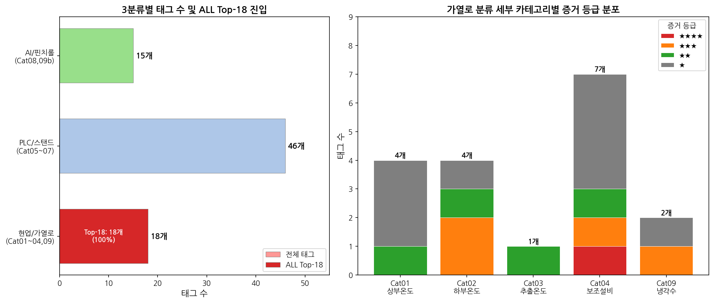
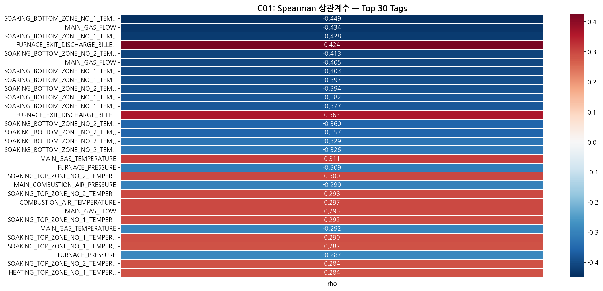
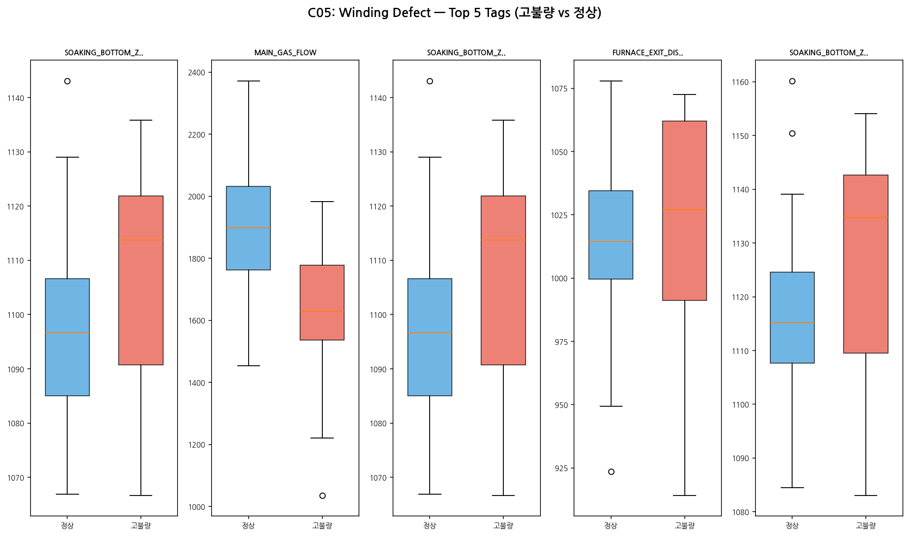
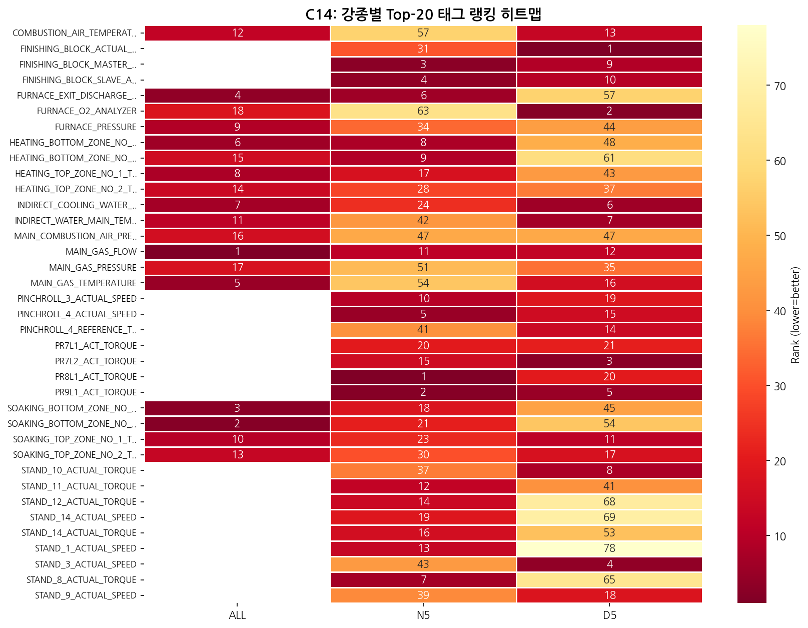

# IBA 태그-불량 상관분석 종합 안내서

> **작성일**: 2026-03-25
> **대상 독자**: DH Steel 고객 담당자 (IT팀, 공정팀, 품질관리팀)
> **분석 기간**: 2025년 3월 ~ 8월 (6개월)
> **핵심 메시지**: 가스 유량이 떨어지면 불량이 늘어납니다 — 4가지 독립 분석 기법이 모두 같은 결론을 내렸습니다.

---

## 1. 요약

### 핵심 결론

1. **MAIN_GAS_FLOW(가스 유량)**가 불량과 가장 강하게 연관된 태그입니다 (4기법 전원 합의, 유일한 ★★★★)
2. 가열로 온도 **변동성이 줄어드는 날**에 오히려 불량이 증가하는 반직관적 패턴이 확인됩니다
3. **Top-18 태그 100%가 가열로 영역**에 속합니다 — 연소 최적화가 품질 개선의 핵심입니다

### 스코어카드

| 지표 | 수치 | 의미 |
|------|:----:|------|
| 분석 센서 레코드 | **264,433건** | 6개월 IBA 시계열 데이터 |
| 분석 대상 태그 | **79개** | 10개 카테고리 (가열로~핀치롤) |
| 독립 분석 기법 | **4가지** | 서로 다른 관점에서 교차 검증 |
| 최고 등급 태그 (★★★★) | **1개** | MAIN_GAS_FLOW (4기법 모두 Top-2) |
| 즉시 알람 권고 | **4건** | 4기법 합의 기반 가장 신뢰도 높은 태그 |

---

## 2. 분석 배경과 목적

### 왜 이 분석을 했는가?

| 구분 | 내용 |
|:----:|------|
| **문제** | 불량이 발생해도 어떤 설비 조건이 원인인지 몰랐습니다 |
| **접근** | 6개월간 센서 264,433건 × 불량 87일 데이터를 교차 분석했습니다 |
| **목표** | 핵심 태그를 찾아 조기 경보 알람을 설정합니다 |

### 분석 방법 — "4명의 전문가"

79명의 용의자(태그) 중, **4명의 수사관(분석 기법)**이 독립적으로 조사한 뒤 같은 범인을 지목했습니다.

| 전문가 | 질문 | 쉬운 설명 |
|:------:|------|----------|
| **전문가 1** | "같이 움직이나?" | 불량률과 태그값이 같이 오르내리는 정도를 측정 |
| **전문가 2** | "고불량일이 다른가?" | 불량 많은 날 vs 정상인 날의 차이를 비교 |
| **전문가 3** | "AI가 참고하나?" | AI가 불량을 예측할 때 가장 많이 보는 태그를 식별 |
| **전문가 4** | "극단 불량 시 영향?" | 불량이 심한 날에 특히 영향이 큰 태그를 찾음 |

> **왜 4명인가?** 한 명이 놓치는 것을 다른 사람이 잡습니다.
> **판단 기준**: 4명 중 3명 이상이 합의하면 신뢰도 높은 결론으로 채택합니다.

### 분석 전략 출처

| 구분 | 수치 |
|:----:|:----:|
| 전체 설계된 분석 기법 | **25가지** |
| 이번 분석에 반영 | **5가지** (4기법 실행 + 1기법 설계) |
| 데이터 부족으로 보류 | **2가지** (100일 미만) |
| 후속 과제 | **18가지** |

> 현재 보유 데이터(87일)에서 **통계적으로 신뢰할 수 있는 기법만** 적용했습니다.

---

## 3. 데이터 현황

### 데이터 흐름

```
[1단계] IBA 센서 수집          [2단계] 불량 매칭            [3단계] 분석
━━━━━━━━━━━━━━━━━━━━━━━━━    ━━━━━━━━━━━━━━━━━━━━━━    ━━━━━━━━━━━━━━
ClickHouse DB                MariaDB 불량 일보           교차 분석
264,433 레코드               87일 불량 기록              날짜 기준 매칭
79개 태그 × 일별 통계         강종코드 통일               87일분 분석 테이블
                              불량유형 정규화
```

### 3개 데이터 소스

| 소스 | DB | 내용 | 레코드 |
|------|:--:|------|:------:|
| IBA 시계열 | ClickHouse | 센서 초단위 데이터 → 일별 집계 | 264,433건 |
| 불량 일보 | MariaDB | 일별 불량 수량/유형 | 87일 |
| 코일 실적 | MariaDB | 코일별 생산 정보 | 참조용 |

### 강종별 데이터 충분성

| 강종 | IBA 일수 | 불량 일수 | JOIN 일수 | 적용 기법 | 판정 |
|:----:|:--------:|:--------:|:---------:|----------|:----:|
| ALL (전체) | 148일 | 87일 | **87일** | M1+M2+M3+M4 | ✅ 충분 |
| N5 (500N) | 48일 | 29일 | **29일** | M1+M2 | ⚠️ 제한적 |
| D5 (SD500) | 22일 | 13일 | **13일** | M1만 | ⚠️ 최소 |
| D4/B5 | 각 10일 미만 | — | — | 시각화만 | ❌ 부족 |

> ⚠ 불량 데이터는 보고 목적으로 수집된 것이라 **코일(제품) 단위 추적이 불가**하며, 일별 집계 기준입니다.


---

## 4. 3가지 분류(3컬럼) 태그 체계

IBA 태그를 **3가지 관점**에서 분류하여 분석의 완전성을 검증했습니다.

### 3가지 분류 정의

| 분류 | 명칭 | 정의 | 규모 |
|:----:|------|------|:----:|
| **Column 1** | PLC 공급 (Supply) | 설비에 물리적으로 존재하는 PLC 태그 | **47개** |
| **Column 2** | 현업 수요 (Demand) | 현업 설문 — 품질에 중요하다고 판단한 항목 | **12개** |
| **Column 3** | AI 실행 (Execution) | AI가 실제 분석에 사용하는 태그 | **95개** 정의 → **79개** 설정 |

### 공정 흐름 기준 커버리지

| 공정 구간 | PLC | 현업 | AI | 등급 |
|----------|:---:|:---:|:--:|:----:|
| 가열로 | ✅ | ✅ | ✅ | 🟢 **양호** |
| 스탠드 1~14 | ✅ | ✅ | ✅ | 🟢 **양호** |
| Finishing Block | ✅ | — | ✅ | 🟢 양호 |
| PR3/PR4 | ✅ | ✅ | ✅ | 🟢 양호 |
| PR6~PR9 | ⚠️ | ✅ | ✅ | 🟡 보통 |
| **Water Box** | ❌ | ✅ | ❌ | 🔴 **사각지대** |
| **VCC 본체** | ❌ | ✅ | ❌ | 🔴 **사각지대** |
| **디스트리뷰터** | ❌ | — | ❌ | 🔴 **사각지대** |

> **현업이 중요하다고 말하는 WB~VCC 구간을 AI가 전혀 분석하지 못하고 있습니다.**
> 원인: 해당 구간의 PLC 데이터가 DB에 수집되지 않음 (PLC54, PLC63)

### 골든존 — 3축 완전 합의 태그

PLC에 존재하고 + 현업이 중요하다 하고 + AI가 분석 중인 태그는 **9~12개**입니다:
- 가열로 추출 온도, PR3/4 토크, PR6~9 L1 토크, Stand 1/2/14 토크




---

## 5. 분석 기법 상세

### 전문가 1: Spearman ρ — "같이 움직이나?"

| 항목 | 내용 |
|------|------|
| **목적** | 태그값과 불량률이 함께 움직이는 정도를 수치로 측정 |
| **왜 이 기법인가** | 87일 소량 데이터에서 극단값에 흔들리지 않는 비모수 방법 |
| **적용 범위** | 87일 × 18태그 × 5통계량 × 3불량유형 = **270건** 조합 검정 |
| **엄격한 기준** | Bonferroni 보정 적용 (α = 0.05/270 = 0.000185) — 우연을 배제 |

**결과: 유의한 상관 9건**

| 순위 | 태그 | 통계량 | ρ (상관계수) | 해석 |
|:----:|------|:------:|:-----------:|------|
| 1 | 균열대 하부온도 Z1 | IQR | **-0.449** | 온도 변동↓ → 불량↑ |
| 2 | **MAIN_GAS_FLOW** | 평균 | **-0.434** | 가스 유량↓ → 불량↑ |
| 3 | 균열대 하부온도 Z1 | IQR | -0.428 | 변동↓ → 권취불량↑ |
| 4 | 추출 빌렛 온도 | IQR | **+0.424** | 온도 편차↑ → 불량↑ |
| 5~9 | 균열대 온도 (Z1/Z2) | IQR/std/cv | -0.394~-0.413 | 동일 패턴 |

> **핵심**: 9건 전부 가열로 태그. 8/9건이 **음의 상관** — 변동성이 줄어드는 날에 불량 증가.

<details>
<summary>📊 Spearman이란? (기술 설명)</summary>

- **순위 상관 계수**: 데이터를 크기 순으로 나열한 뒤, 순위 간의 일관성을 측정
- ρ = +1: 완벽한 양의 관계 (같이 올라감)
- ρ = -1: 완벽한 음의 관계 (하나 올라가면 하나 내려감)
- ρ = 0: 관계 없음
- **Pearson 대신 선택한 이유**: 불량률이 0에 몰려있고 가끔 높은 값이 나오는 비정규 분포이므로, 순위 기반 방법이 더 안정적

</details>



---

### 전문가 2: Cohen's d — "고불량일이 다른가?"

| 항목 | 내용 |
|------|------|
| **목적** | 불량 많은 날과 정상인 날의 태그값 분포가 **통째로** 다른지 비교 |
| **왜 이 기법인가** | p-value(차이 유무)뿐 아니라 d(차이 크기)를 함께 측정 |
| **그룹 분리** | 고불량일 24일 vs 정상일 63일 (Q80 기준) |
| **판정 기준** | d≥0.80 + p<0.05 = **확정 알람 태그** |

**결과: Top-5**

| 순위 | 태그 | Cohen's d | 방향 | 판정 |
|:----:|------|:--------:|------|:----:|
| 1 | 추출 빌렛 온도 (IQR) | **0.994** | 고불량일에 편차 큼 | ✅ 확정 |
| 2 | **MAIN_GAS_FLOW** (평균) | **0.946** | 고불량일에 유량 낮음 | ✅ 확정 |
| 3 | 균열대 Z1 온도 (IQR) | 0.871 | 고불량일에 변동 작음 | ⚠️ 주의 |
| 4 | 균열대 Z2 온도 (IQR) | 0.835 | 고불량일에 변동 작음 | ⚠️ 주의 |
| 5 | MAIN_GAS_FLOW (CV) | 0.827 | 고불량일에 유량 변동 큼 | ⚠️ 주의 |

> **Bonferroni 유의 2건**: 추출온도 IQR(d=0.99) + 가스유량 avg(d=0.95) → 확정 알람 대상

<details>
<summary>📊 Cohen's d란? (기술 설명)</summary>

- **효과 크기**: 두 그룹 간 차이를 표준편차 단위로 측정
- d < 0.2: 차이 없음 → 고불량일과 정상일이 거의 같음
- d = 0.5: 중간 차이 → 눈에 띄는 차이가 있음
- d ≥ 0.8: 큰 차이 → 고불량일에 확실히 다른 패턴
- **p-value만으로 부족한 이유**: p-value는 "차이가 있는가"만 말해주고, "차이가 얼마나 큰가"는 말해주지 않음

</details>




---

### 전문가 3: Feature Importance — "AI가 참고하나?"

| 항목 | 내용 |
|------|------|
| **목적** | 여러 태그를 **동시에** 고려하여 불량 예측에 가장 기여하는 태그 식별 |
| **왜 이 기법인가** | 전문가 1·2는 태그 하나씩 독립 분석 → 태그 간 조합 효과를 못 봄 |
| **모델** | LightGBM 머신러닝 (87일 × 18태그) |
| **피처 선택** | 79태그 → VIF 중복 제거 → **18태그** (스탠드 14개 간 상관 |r|>0.95로 제외) |
| **검증 방법** | LOO-CV (1일씩 빼고 86일로 학습 × 87회 반복) |

**결과: Top-5 Feature Importance (gain 기준)**

| 순위 | 태그 | 기여도 (%) | 카테고리 |
|:----:|------|:---------:|---------|
| 1 | **MAIN_GAS_FLOW** | **38.7%** | 가열로 보조설비 |
| 2 | 간접냉각수 온도 | 14.4% | 보조설비 |
| 3 | 간접냉각수 유량 | 8.3% | 냉각수 |
| 4 | 가열하부 Z1 온도 | 7.0% | 가열로 하부 |
| 5 | 가열상부 Z1 온도 | 6.5% | 가열로 상부 |

> **MAIN_GAS_FLOW가 전체의 38.7%를 독점** — 다른 17개 태그 합산보다 기여도가 높습니다.

<details>
<summary>📊 Feature Importance란? (기술 설명)</summary>

- **기여도 측정**: AI 모델이 불량을 예측할 때 각 태그를 얼마나 참고하는지의 비율
- **VIF(다중공선성) 제거**: 스탠드 속도/토크/부하 태그는 서로 거의 같은 패턴으로 움직임 → 14개를 중복으로 판단하여 제외
- **⚠ 예측 정확도 자체는 낮음** (R²<0, 87건 소량): 단, "어떤 태그가 더 중요한가"의 **순위는 유효**

</details>

---

### 전문가 4: Q90 계수 — "극단 불량 시 영향?"

| 항목 | 내용 |
|------|------|
| **목적** | 최악의 불량일(상위 10%)을 설명하는 태그 식별 |
| **왜 이 기법인가** | 전문가 3은 "평균적" 불량을 예측, 전문가 4는 "극단적" 불량을 설명 |
| **Q90 의미** | "10일에 1일 발생하는 고불량 수준에서 영향이 큰 태그" |
| **결과** | 18개 태그 중 **단 2개만** 극단 불량에 영향 |

| 순위 | 태그 | Q90 계수 | 방향 |
|:----:|------|:--------:|------|
| 1 | **MAIN_GAS_FLOW** | -0.006 | 가스 유량↓ → 극단 불량↑ |
| 2 | 간접냉각수 유량 | +0.001 | 냉각수↑ → 극단 불량↑ |
| 3~ | 나머지 16개 | 0.000 | 영향 없음 |

> **극단 불량은 가스 유량 + 냉각수 단 2개 태그에만 집중** — 나머지 16개는 극단 상황에서 무관합니다.

<details>
<summary>📊 Q90 분위 회귀란? (기술 설명)</summary>

- **분위수(Quantile)**: Q90 = 데이터의 상위 10% 지점
- **일반 회귀**: 평균(mean)을 예측 — "보통 얼마나 불량이 나나?"
- **분위 회귀**: 꼬리(tail)를 예측 — "최악의 경우 얼마까지 불량이 올라가나?"
- **Q90 계수 = 0**: 해당 태그는 극단 불량에 무관
- **Q90 계수 ≠ 0**: 해당 태그가 극단 불량의 핵심 드라이버

</details>

---

### 기술 용어 대조표

| 기술 용어 | 전문가 | 쉬운 표현 |
|----------|:------:|----------|
| Spearman ρ (로) | 전문가 1 | 같이 움직이는 정도 |
| Cohen's d | 전문가 2 | 고불량일과 정상일의 차이 크기 |
| Feature Importance | 전문가 3 | 불량 예측 기여도 (AI가 얼마나 참고하나) |
| Q90 계수 | 전문가 4 | 극단 불량 시 영향력 |
| VIF (다중공선성) | 전처리 | 중복 태그 자동 제거 |
| Bonferroni 보정 | 전처리 | 우연히 맞춘 것을 걸러내는 엄격한 기준 |

---

## 6. 통합 순위 (Top-18 앙상블)

### 가중치 설계

| 전문가 | 기법 | 가중치 | 역할 |
|:------:|------|:------:|------|
| 전문가 1 | Spearman | **29.4%** | 통계적 관점 — 개별 태그 상관 |
| 전문가 2 | Cohen's d | **23.5%** | 통계적 관점 — 그룹 간 차이 |
| 전문가 3 | LightGBM | **29.4%** | 모델링 관점 — 다변량 조합 |
| 전문가 4 | Q90 | **17.6%** | 모델링 관점 — 극단 이벤트 |

### Top-18 전체 순위

| 순위 | 태그 | 카테고리 | 앙상블 | M1 순위 | M2 순위 | M3 순위 | M4 순위 | 등급 |
|:----:|------|---------|:------:|:------:|:------:|:------:|:------:|:----:|
| **1** | **MAIN_GAS_FLOW** | 보조설비 | **1.53** | 2 | 2 | 1 | 1 | **★★★★** |
| 2 | 균열대 Z2 하부온도 | 하부온도 | 4.41 | 4 | 4 | 6 | — | ★★★ |
| 3 | 균열대 Z1 하부온도 | 하부온도 | 4.47 | 1 | 3 | 10 | — | ★★★ |
| 4 | 추출 빌렛 온도 | 추출온도 | 5.18 | 3 | 1 | 12 | — | ★★ |
| 5 | 가스 온도 | 보조설비 | 6.47 | 5 | 9 | 8 | — | ★★★ |
| 6 | 가열 Z1 하부온도 | 하부온도 | 7.18 | 13 | 7 | 4 | — | ★★ |
| 7 | **냉각수 유량** | 냉각수 | 7.41 | 17 | 5 | 3 | 2 | ★★★ |
| 8 | 가열 Z1 상부온도 | 상부온도 | 7.59 | 11 | 10 | 5 | — | ★★ |
| 9 | 가열로 압력 | 보조설비 | 8.29 | 6 | 8 | 14 | — | ★★ |
| 10 | 균열 Z1 상부온도 | 상부온도 | 9.41 | 10 | 14 | 9 | — | ★★ |
| 11~18 | 기타 보조설비/온도 8개 | 혼합 | 10~13 | — | — | — | — | ★ |

### 증거 등급 기준

| 등급 | 조건 | 태그 수 | 조치 |
|:----:|------|:------:|------|
| **★★★★** | 4기법 **모두** 상위 진입 | 1개 | **즉시 알람 설정** |
| **★★★** | 3기법 합의 | 4개 | 우선 모니터링 |
| **★★** | 2기법 합의 | 5개 | 관찰 대상 |
| **★** | 1기법만 | 8개 | 참고 |

### 카테고리별 집계

| 카테고리 | Top-18 내 비중 | 핵심 태그 |
|---------|:-------------:|---------|
| **Cat04 보조설비** (가스·압력·O₂) | **50%** (9개) | MAIN_GAS_FLOW |
| Cat02 가열로 하부온도 | 22% (4개) | 균열대 Z1/Z2 |
| Cat01 가열로 상부온도 | 22% (4개) | 가열/균열 상부 |
| Cat03 추출온도 | 6% (1개) | 추출 빌렛 온도 |
| **Cat05~08 스탠드/핀치롤** | **0%** (0개) | — |

> **보조설비(가스/공기/압력/O₂)가 50%를 차지** → 연소 시스템이 품질의 핵심입니다.


---

## 7. 핵심 발견 3가지

### 발견 1: MAIN_GAS_FLOW — 유일한 ★★★★

**가스 유량이 떨어지면 불량이 늘어납니다.**

| 기법 | 결과 | 해석 |
|:----:|------|------|
| 전문가 1 | Top-2 (ρ=-0.434) | 가스 유량과 불량이 반대로 움직임 |
| 전문가 2 | Top-2 (d=0.946) | 고불량일에 확실히 가스 유량이 낮음 |
| 전문가 3 | **Top-1** (FI=38.7%) | AI가 불량 예측 시 가장 많이 참고 |
| 전문가 4 | **Top-1** (Q90=-0.006) | 극단 불량의 핵심 원인 |

- 모든 강종에서 동일한 패턴 (ALL #1, N5 #11, D5 #12)
- **4기법 전원 Top-2 진입한 유일한 태그**


### 발견 2: 온도 안정화가 오히려 문제 — 반직관적 패턴

상관분석 유의 9건 중 **8건이 음의 상관**:
- 가열로 온도 변동(IQR/std)이 **줄어드는 날**에 불량이 **증가**

```
추정 메커니즘:
온도 변동 감소 = 저부하 운전 (소량 생산)
  → 가열로 효율 저하
  → 빌렛 온도 불균일
  → 불량 증가
```

유일한 예외: 추출 시점 온도 편차가 **클수록** 불량 증가 (직관과 일치)

> ⚠ **이 패턴은 현업 전문가 검증이 필요합니다.** 데이터 분석 결과이며, 인과관계 확정은 아닙니다.

### 발견 3: 가열로가 근본 원인

| 영역 | 태그 수 | Top-18 진입 | 결론 |
|:----:|:------:|:----------:|------|
| **가열로** | 18개 | **18 (100%)** | 가스·온도·압력·O₂ → 연소 최적화가 핵심 |
| 스탠드 | 46개 | 0건 | 전체 합산에서는 영향 미확인 |
| 핀치롤 | 15개 | 0건 | 전체 합산에서는 영향 미확인 |

> **스탠드/핀치롤이 0건인 이유**: VIF 피처 선택에서 상호상관(|r|>0.95)으로 제외됨. **인과적 무관을 의미하지는 않음** — 강종별 분석에서는 토크/속도 태그가 일부 등장합니다.


---

## 8. 강종별 차이

| 태그 | ALL 순위 | N5 순위 | D5 순위 | 공통 등장 |
|------|:-------:|:------:|:------:|:--------:|
| **MAIN_GAS_FLOW** | **1** | 11 | 12 | **3/3** (유일) |
| FB Master 토크 | — | 3 | 9 | 2/3 |
| FB Slave 토크 | — | 4 | 10 | 2/3 |
| 추출 빌렛 온도 | 4 | 6 | — | 2/3 |
| PR4 속도 | — | 5 | 15 | 2/3 |
| O₂ 분석기 | 18 | — | **2** | 2/3 |

**강종별 특이 사항**:
- **N5**: 스탠드 토크(Cat05), 핀치롤 속도(Cat08)가 상위 진입 → 후공정 효과 존재 가능
- **D5**: O₂ 분석기가 2위 → SD500 강종의 산소 민감도 시사
- **MAIN_GAS_FLOW만 3개 레이어 모두 등장** → 강종 무관 핵심 태그



---

## 9. 3컬럼 정합성 검증 결과

3가지 분류(PLC, 현업, AI)가 서로 얼마나 일치하는지 정량적으로 검증했습니다.

### 정합성 지표

| 지표 | 수치 | 쉬운 해석 |
|------|:----:|----------|
| Jaccard 유사도 | **0.14** | 3주체가 같은 태그를 선택한 비율이 14%에 불과 |
| Fleiss' Kappa | **-0.21** | 3주체 간 약한 불일치 — 관심 영역이 엇갈림 |
| SHAP-현업 일치율 | **60%** | AI Top-5 중 3개가 현업 요청과 일치 |

### 왜 불일치인가?

> AI는 **가열로~스탠드**(데이터가 있는 곳)에 집중하고, 현업은 **WB~VCC**(최종 품질에 직접 영향)에 관심. **관심 영역의 엇갈림**이 원인이며, 데이터가 있는 구간에서는 AI와 현업 판단이 일치(60%)합니다.

### 품질공학 인과 분석 요약

| 기법 | 최고 위험 지목 | 의미 |
|------|:------------:|------|
| **QFD** (품질의 집) | WB 99점, VCC 85점 | 기술중요도 최상위인데 AI 미커버 |
| **FMEA** (위험도 분석) | VCC RPN≥810 | 검출도 D=10(최악) — 이상 감지 불가 |
| **FTA** (고장수 분석) | 8/12 기본사건 미검출 | 67%의 불량 원인을 감시하지 못하는 상태 |

### 골든존 vs 관리 사각지대

| 구분 | 평균 AI 이상치 점수 | 해석 |
|------|:------------------:|------|
| **골든존** (PLC+현업+AI 합의) | **40.83** (보통) | 현업이 관리하는 곳 → 안정적 |
| **비골든존** (AI만 분석) | **62.33** (높음) | 관리 사각지대 → 이상치 빈발 |

> **역설적 발견**: 현업이 관리하는 골든존이 AI 점수가 **낮은** 것은 "잘 관리되어 이상치가 적다"는 긍정적 신호. 진정한 리스크는 **관리되지 않는** 영역에 있습니다.

---

## 10. 데이터 한계와 대응

### 7가지 구조적 한계

| ID | 한계 | 쉬운 설명 |
|:--:|------|----------|
| L1 | 시간 해상도 불일치 | 불량은 일별 집계인데 센서는 초 단위 → 어떤 코일이 불량인지 특정 불가 |
| L2 | 강종코드 불일치 | 불량 DB(SD400)와 IBA DB(D4) 강종 코드가 달라서 매칭에 변환 필요 |
| L3 | 코일 추적 불가 | 번들 완성과 IBA 코일 구간의 연결 고리가 없음 |
| L4 | 비고란 비정규화 | 같은 결함을 10가지 이상으로 다르게 기재 |
| L5 | 데이터 기간 짧음 | 87일(6개월)로 통계적 검정력에 제약 |
| L6 | 강종 미분리 | 전 강종 합산으로 강종별 특이 패턴 희석 |
| L7 | 정상일 과다 | 무결함일이 80% → 불량 특성 추출 난이도 높음 |

### 대응 전략

| 전략 | 내용 |
|------|------|
| **Anomaly-First** | 결함 데이터 직접 사용이 어려우므로, 기존 6기법(IQR/CUSUM/STL 등)의 이상치 결과를 대리변수로 활용 — **기존 분석 결과의 95%를 재활용** |
| **Level 1 분석** | 결함일 vs 정상일의 AI 프로파일 비교 (일별 수준) |
| **Level 2 (향후)** | 코일 추적 시스템 구축 후 코일 단위 정밀 분석 |

### 솔직한 한계점

| 한계 | 설명 |
|------|------|
| 87일 < 100일 | 2가지 분석 기법을 적용하지 못했습니다. 데이터가 더 쌓이면 정밀도가 높아집니다 |
| 일별 집계 | 코일 단위 추적이 불가합니다. 같은 날 여러 코일의 불량이 합산되어 있습니다 |
| AI 예측 정확도 | 아직 낮습니다. 단, 어떤 태그가 중요한지의 **순위는 유효**합니다 |
| 스탠드/핀치롤 | 전체 합산에서는 영향이 안 보입니다. 추가 데이터 확보 후 재검증이 필요합니다 |

---

## 11. 즉시 실행 조치 및 로드맵

### 즉시 알람 4건 (4기법 합의 기반)

| 태그 | 알람 유형 | 조건 | 쉬운 설명 |
|------|:--------:|------|----------|
| **MAIN_GAS_FLOW** | 하한 알람 | 유량 감소 시 | 가스 유량이 떨어지면 경보 |
| **추출 빌렛 온도** | IQR 상한 | 편차 증가 시 | 추출 온도 편차가 커지면 경보 |
| **균열대 하부 온도** (Z1/Z2) | IQR 하한 | 변동 감소 시 | 온도 변동이 줄면 주의 |
| **냉각수 유량** | 상한 알람 | 과다 시 | 냉각수가 과다하면 경보 |

> 알람 임계값은 기존 공정 데이터의 Q10~Q20 분포 기반으로 설정 권고합니다.


### 3단계 로드맵

| 시기 | 조치 | 기대 효과 |
|:----:|------|----------|
| **즉시** | 가스 유량 하한 + 추출 온도 편차 알람 설정 | 조기 경보 가동 |
| **1~3개월** | PLC54/63 수집 (WB+VCC 16태그) | 현업 충족률 33%→**92%** |
| **3개월+** | 100일+ 데이터 확보 → 보류 2기법 추가 + 코일 추적 시스템 | 코일 단위 인과 검증 |

### 현업 충족률 변화 전망

```
현재                ████████░░░░░░░░░░░░░░░░░░░░░░  33%  (4/12)
PLC 수집 후          █████████████████████████████░░  92%  (11/12)
MES 연동 후 (이론)   ██████████████████████████████  100% (12/12)
```

---

## 12. 부록

### A. 참조 문서 목록

#### 315분석 핵심 문서 (4건)

| 문서 | 분량 | 대상 |
|------|:----:|------|
| 태그불량_상관분석_발표자료.pptx | 1.7MB | 발표용 |
| REPORT_tag_defect_management.md | 241줄 | 관리자 요약 |
| REPORT_tag_defect_pptx.md | 1,067줄 | 기술 상세 (PPT 원고) |
| DEFECT_DATA_UTILIZATION_STRATEGY.md | 2,184줄 | 분석 전략 설계 |

#### 3컬럼 검증 문서 (3건)

| 문서 | 분량 | 내용 |
|------|:----:|------|
| THREE_COLUMN_COVERAGE_ANALYSIS.md | 659줄 | 3축 커버리지 비교 |
| THREE_COLUMN_DEEP_ANALYSIS.md | 2,427줄 | 심층 분석 (QFD/FMEA/SHAP) |
| THREE_COLUMN_TAG_REGISTRY.md | — | 태그 전수 목록 |

### B. 본문 차트 목록

| 장 | 차트 | 내용 |
|:--:|------|------|
| §3 | diag_data_coverage_summary.png | 데이터 충분성 |
| §4 | chart_09_venn_diagram.png | 3분류 벤 다이어그램 |
| §4 | chart_22_three_class_distribution.png | 3분류별 분포 |
| §5 | chart_01_spearman_heatmap.png | Spearman 히트맵 |
| §5 | chart_11_cohens_d_ranking.png | Cohen's d 랭킹 |
| §5 | chart_05_top5_boxplot_winding.png | 고불량일 박스플롯 |
| §6 | chart_03_top20_ranking.png | Top-20 랭킹 |
| §6 | chart_21_evidence_grade_heatmap.png | 증거 등급 |
| §7 | chart_23_main_gas_flow_grade_comparison.png | 가스유량 강종비교 |
| §7 | chart_19_defect_tag_overlay.png | 불량-태그 오버레이 |
| §8 | chart_14_grade_top20_heatmap.png | 강종별 Top-20 |
| §11 | chart_20_actionable_summary.png | 실행 요약 대시보드 |

---

> **문서 끝** — 기술 상세는 `REPORT_tag_defect_pptx.md` (1,067줄), 관리자 요약은 `REPORT_tag_defect_management.md` (241줄) 참조.
