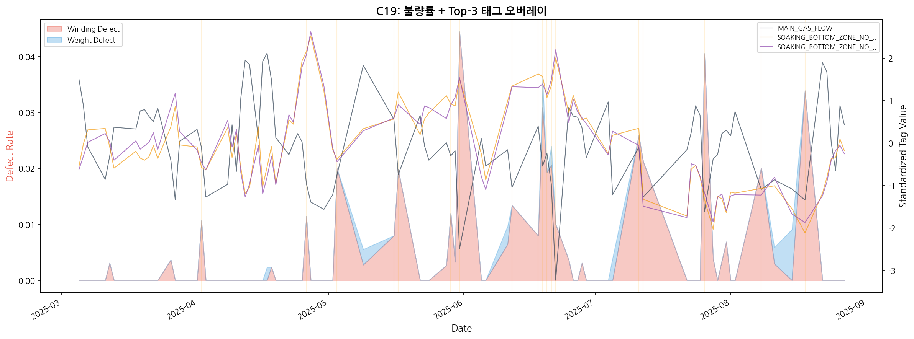
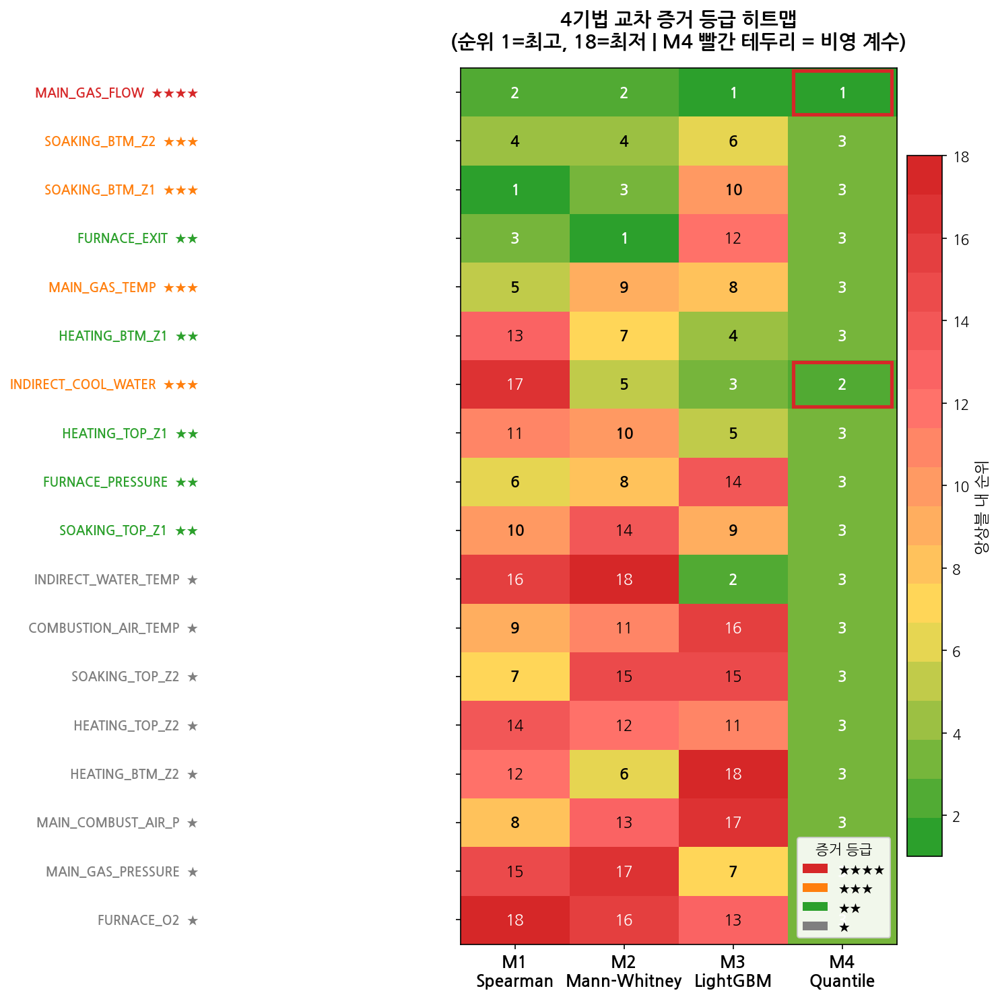
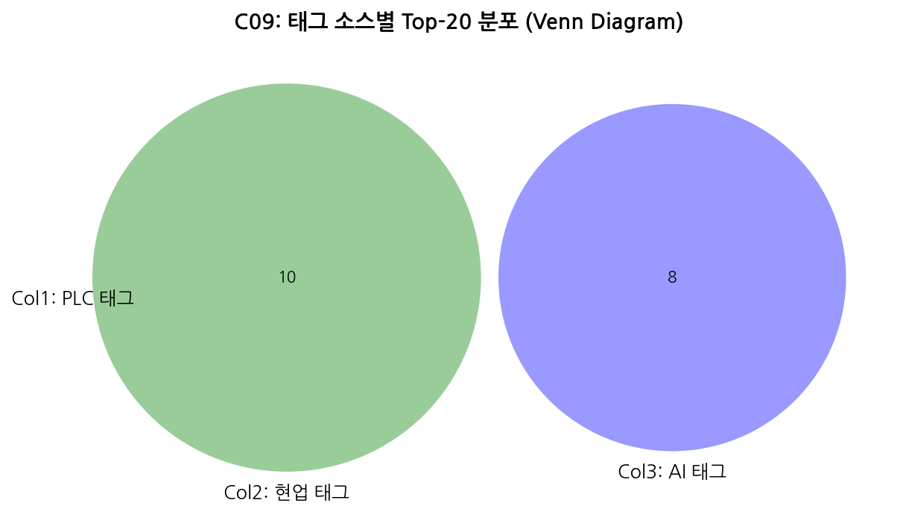

# IBA 태그-불량 상관분석 결과 요약

> **대상 독자**: 현업 관리자 / 의사결정권자
> **원본 보고서**: REPORT_tag_defect_pptx.md (1024행, 기술 상세)
> **분석 기간**: 2025.03 ~ 08 (6개월)
> **핵심 메시지**: 가열로 공정 데이터에서 불량 원인 태그를 찾았습니다.

---

## 1. 왜 이 분석을 했는가?

| 구분 | 내용 |
|:----:|------|
| **문제** | 불량이 발생해도 어떤 설비 조건이 원인인지 몰랐습니다 |
| **접근** | 6개월간 센서 26만건 × 불량 87일 데이터를 교차 분석했습니다 |
| **목표** | 핵심 태그를 찾아 조기 경보 알람을 설정합니다 |

> **비유**: 79명의 용의자 중, 4명의 수사관이 독립적으로 조사한 뒤 같은 범인을 지목했습니다.
> (4명의 수사관 = 4가지 독립 분석 기법)

---

## 2. 데이터는 어떻게 만들었나?

### 3단계 흐름

1. **센서 수집**: IBA 센서 264,433건 → 79개 태그 × 일별 통계 집계
2. **불량 매칭**: 불량 기록 87일 → 강종코드 통일 + 불량유형 정규화
3. **분석 매트릭스**: 날짜 기준 매칭 → 87일분 분석 테이블 완성

### 핵심 수치

| 항목 | 수치 |
|:----:|:----:|
| 센서 레코드 | **264,433건** |
| 불량 데이터 | **87일** |
| 분석 태그 | **79개** |
| 독립 분석 기법 | **4가지** |

> ⚠ 불량 데이터는 보고 목적으로 수집된 것이라 코일(제품) 단위 추적이 불가하며, 일별 집계 기준입니다.


---

## 3. 분석 방법 — 4명의 전문가

4가지 **독립적인** 분석 기법을 사용해 결론의 신뢰도를 높였습니다.

| 전문가 | 질문 | 쉬운 설명 |
|:------:|------|----------|
| **전문가 1** | "같이 움직이나?" | 불량률과 태그값이 같이 오르내리는 정도를 측정 |
| **전문가 2** | "고불량일이 다른가?" | 불량 많은 날 vs 정상인 날의 차이를 비교 |
| **전문가 3** | "AI가 참고하나?" | AI가 불량을 예측할 때 가장 많이 보는 태그를 식별 |
| **전문가 4** | "극단 불량 시 영향?" | 불량이 심한 날에 특히 영향이 큰 태그를 찾음 |

> **왜 4명인가?** 각 전문가는 서로 다른 관점에서 봅니다.
> 전문가 1은 추세를, 2는 고불량일 프로파일을, 3은 태그 간 조합 효과를, 4는 극단 사건을 봅니다.
> **한 명이 놓치는 것을 다른 사람이 잡습니다** — 그래서 4명이 합의한 결론은 신뢰도가 높습니다.
>
> **판단 기준**: 4명 중 3명 이상이 합의하면 신뢰도 높은 결론으로 채택합니다.

### 3a. 분석 전략 출처 및 반영 현황

> 4명의 전문가(4가지 기법)는 **사전에 설계된 분석 전략** 25가지 중에서 선별된 것입니다.

| 구분 | 수치 |
|:----:|:----:|
| 전체 설계 기법 | **25가지** |
| 이번 분석에 반영 | **5가지** (4기법 실행 + 1기법 설계) |
| 데이터 부족으로 보류 | **2가지** (100일 미만) |
| 후속 과제 | **18가지** |

**선별 기준**: 현재 보유 데이터(87일)에서 **통계적으로 신뢰할 수 있는 기법만** 적용했습니다.

| 반영된 전략 | 본 분석의 전문가 | 한마디 |
|-----------|:---------------:|--------|
| 불량일 vs 정상일 프로파일 비교 | 전문가 2 | 고불량일이 진짜 다른지 검증 |
| 불량률 연속값 회귀 (LOO-CV) | 전문가 3 | AI가 87건에서도 학습 가능하도록 설계 |
| 극단값 분위 회귀 (Q90) | 전문가 4 | 최악의 날을 설명하는 태그 식별 |
| 이상치-불량 교차 검증 | (보류) | 100일 미만이라 통계적 안정성 부족 |
| 변점-불량 상관 (PELT) | (보류) | 100일 미만이라 유효 구간 부족 |

> **후속으로 기대되는 분석**: 데이터가 100일 이상 쌓이면 보류된 2가지 기법을 추가하고,
> 불량 **전조 패턴**(D-1~D-3일 전 이상 징후)도 분석 가능합니다.
>
> 전체 전략은 `ref/DEFECT_DATA_UTILIZATION_STRATEGY.md` 참조.

<details>
<summary>기술 용어 → 쉬운 표현 대조표</summary>

| 기술 용어 | 쉬운 표현 |
|----------|----------|
| Spearman ρ (로) | 같이 움직이는 정도 |
| Cohen's d | 고불량일과 정상일의 차이 크기 |
| Feature Importance | 불량 예측 기여도 (AI가 얼마나 참고하나) |
| Q90 계수 | 극단 불량 시 영향력 |
| VIF (다중공선성) | 중복 태그 자동 제거 |
| Bonferroni 보정 | 우연히 맞춘 것을 걸러내는 엄격한 기준 |

</details>

---

## 4. 핵심 발견 — MAIN_GAS_FLOW (가스 유량)

### ★★★★ 최고 신뢰 등급

| 전문가 | 결과 | 해석 |
|:------:|------|------|
| 전문가 1 (상관분석) | **Top-2** | 같이 움직임 확인 |
| 전문가 2 (차이분석) | **Top-2** | 고불량일에 확실히 다름 |
| 전문가 3 (AI 분석) | **Top-1** (38.7% 의존) | AI가 가장 많이 참고 |
| 전문가 4 (극단분석) | **Top-1** | 극단 불량의 핵심 원인 |

> **결론**: 가스 유량이 떨어지면 불량이 늘어납니다. **모든 강종에서 동일한 패턴**입니다.
>
> 4명의 전문가(4가지 기법) 모두 Top-2 이내에 진입한 유일한 태그입니다.


---

## 5. 시각적 증거 — 불량률 vs 가스 유량

아래 차트에서 **빨간선(불량률)이 올라갈 때 파란선(가스 유량)이 내려갑니다**.

= 음의 상관 → 가스 유량 감소가 불량 증가와 연관됩니다.



---

## 6. 신뢰도별 태그 분류

| 등급 | 태그 | 조치 |
|:----:|------|------|
| **★★★★** | MAIN_GAS_FLOW | **즉시 알람 설정** |
| **★★★** | 균열대온도(SOAKING_BTM Z1/Z2), 가스온도, 냉각수 | 우선 모니터링 |
| **★★** | 추출온도, 가열온도 5개 | 관찰 대상 |
| **★** | 기타 7개 | 참고 |

> **상위 18개 태그 100%가 가열로 영역에 속합니다.**
>
> 등급 기준: ★ 수 = 4기법 중 해당 태그가 상위 10위 이내에 진입한 기법 수



---

## 7. 의외의 발견 — 온도 변동이 줄면 불량이 늘어남

### 직관과 다른 패턴

상관분석 결과 9건 중 **8건이 음의 상관**입니다.
= 온도 변동이 줄어드는 날에 오히려 불량이 증가합니다.

> 9건 중 8건이 같은 방향 → **우연이 아닌 체계적 현상**입니다.
> 1~2건이라면 우연일 수 있지만, 8건이 일관되게 같은 패턴을 보이므로 통계적으로 의미 있습니다.

### 추정 원인

```
온도 변동 감소 = 저부하 운전 (소량 생산)
  → 가열로 효율 저하
  → 빌렛 온도 불균일
  → 불량 증가
```

### 유일한 예외

추출 시점 온도 편차가 클수록 불량이 증가합니다 (이것은 직관과 일치).

> ⚠ **이 패턴은 현업 전문가 검증이 필요합니다.**
> 데이터 분석 결과일 뿐, 인과관계가 확정된 것은 아닙니다.


---

## 8. 불량의 근본 원인은 가열로 영역

| 영역 | 태그 수 | Top-18 진입 | 결론 |
|:----:|:------:|:----------:|------|
| **가열로** | 18개 | **18 (100%)** | 가스·온도·압력·O₂ → 연소 최적화가 핵심 |
| 스탠드 | 46개 | 0건 | 전체 합산에서는 영향 없음 |
| 핀치롤 | 15개 | 0건 | 전체 합산에서는 영향 없음 |

> **보조설비(Cat04: 가스/압력/O₂)가 전체의 50%를 차지합니다.**
> → 연소 최적화가 품질 개선의 핵심입니다.



---

## 9. 즉시 실행 — 알람 4건

| 태그 | 알람 유형 | 조건 | 쉬운 설명 |
|------|:--------:|------|----------|
| **MAIN_GAS_FLOW** | 하한 알람 | 유량 감소 시 | 가스 유량이 떨어지면 경보 |
| **FURNACE_EXIT_BILLET_TEMP** | IQR 상한 | 온도 편차 증가 시 | 추출 온도 편차 커지면 경보 |
| **SOAKING_BTM 온도** (Z1/Z2) | IQR 하한 | 변동 감소 시 | 온도 변동 줄면 주의 |
| **COOLING_WATER** | 상한 알람 | 과다 시 | 냉각수 과다 시 경보 |

> 4건 모두 4기법 합의 기반 → 가장 신뢰도 높은 태그만 선별했습니다.
> 알람 임계값은 기존 공정 데이터의 Q10~Q20 분포 기반으로 설정 권고합니다.


---

## 10. 로드맵

| 시기 | 조치 |
|:----:|------|
| **즉시** | 가스 유량 하한 + 추출 온도 편차 알람 설정 |
| **1~2개월** | 균열대 온도 변동성 검증, 연소 최적화 착수 |
| **3개월+** | 100일+ 데이터 확보 → 2기법 추가, 강종별 AI 확대 |

---

## 11. 솔직한 한계점

| 한계 | 설명 |
|------|------|
| **87일 < 100일** | 2가지 분석 기법을 적용하지 못했습니다. 데이터가 더 쌓이면 정밀도가 높아집니다. |
| **일별 집계 한계** | 코일(제품) 단위 추적이 불가합니다. 같은 날 여러 코일의 불량이 합산되어 있습니다. |
| **AI 예측 정확도** | 아직 낮습니다. 단, 어떤 태그가 중요한지의 **순위는 유효**합니다. |
| **스탠드/핀치롤** | 현재 데이터에서는 영향이 안 보입니다. 추가 데이터 확보 후 재검증이 필요합니다. |

---

## 핵심 결론 한줄 요약

> **가스 유량이 떨어지면 불량이 늘어납니다.**
> 4명의 전문가(4가지 독립 기법)가 모두 같은 결론을 내렸습니다.
> 가열로 연소 최적화가 품질 개선의 핵심이며, 즉시 알람 4건 설정을 권고합니다.

---

> **보고서 끝** — 기술 상세는 `REPORT_tag_defect_pptx.md` (1024행) 참조.
