# 강종 [B5] Adjusted IQR 상세 분석 보고서

**분석 기간**: 2025-03-01 ~ 2025-08-31
**강종**: B5
**분석 방법**: Adjusted IQR (Bowley 왜도 보정)
**c 값**: 0.8
**생성일시**: 2026-02-03 13:55:02

---

## Executive Summary

### Adjusted IQR 방법론 개요

Adjusted IQR은 데이터 분포의 비대칭성(왜도)을 고려하여 이상치 경계를 동적으로 조정하는 방법입니다.

**계산 공식:**
- Bowley 왜도: `(Q3 + Q1 - 2×Median) / IQR`
- 양의 왜도 (Right-skewed):
  - Lower Mult = exp(-c × skew)
  - Upper Mult = exp(+c × skew)
- 음의 왜도 (Left-skewed):
  - Lower Mult = exp(+c × |skew|)
  - Upper Mult = exp(-c × |skew|)
- Adjusted Bounds: Q1 - 1.5×IQR×Lower_Mult, Q3 + 1.5×IQR×Upper_Mult

### 분석 개요

| 구분 | 내용 |
|------|------|
| **분석 대상 강종** | B5 |
| **c 값 (왜도 보정 강도)** | 0.8 |
| **총 분석 태그 수** | 77개 |
| **PR_Detailed L1 태그** | 4개 |
| **PR_Detailed L2 태그** | 2개 |

### 이상치율 개선 효과

| 지표 | Standard IQR | Adjusted IQR | 개선 |
|------|-------------|--------------|------|
| **총 이상치 수** | 50,933 | 52,197 | -1,264 감소 |
| **평균 개선율** | - | - | **-104.8%** |

### 위험도 분포 비교

| 등급 | Standard IQR | Adjusted IQR | 변화 |
|------|-------------|--------------|------|
| **⚫ 심각 (25% 이상)** | 0개 | 1개 | -1 |
| **🔴 위험 (15~25%)** | 8개 | 6개 | +2 |
| **🟠 경고 (10~15%)** | 11개 | 13개 | -2 |
| **🟡 주의 (5~10%)** | 10개 | 9개 | +1 |
| **🟢 양호 (0~5%)** | 48개 | 48개 | +0 |

---

## 카테고리별 상세 분석

### 01_Furnace_Top_Temperature (가열로 상부 온도)

| 태그명 | Adj 이상치율 | Std 이상치율 | 개선율 | Bowley 왜도 | 승수 (L/U) | 위험등급 |
|--------|-------------|--------------|--------|-------------|------------|----------|
| HEATING_TOP_ZONE_NO_1_TEMPERATURE_ROOF | 9.94% | 9.93% | -0.1% | 0.2238 | 0.836/1.196 | 🟡 CAUTION |
| HEATING_TOP_ZONE_NO_2_TEMPERATURE_ROOF | 9.62% | 9.54% | -0.8% | 0.2768 | 0.801/1.248 | 🟡 CAUTION |
| SOAKING_TOP_ZONE_NO_1_TEMPERATURE_ROOF | 5.25% | 5.25% | 0.0% | 0.0050 | 0.996/1.004 | 🟡 CAUTION |
| SOAKING_TOP_ZONE_NO_2_TEMPERATURE_ROOF | 3.02% | 3.86% | 21.6% | 0.1388 | 0.895/1.117 | 🟢 NORMAL |

### 02_Furnace_Bottom_Temperature (가열로 하부 온도)

| 태그명 | Adj 이상치율 | Std 이상치율 | 개선율 | Bowley 왜도 | 승수 (L/U) | 위험등급 |
|--------|-------------|--------------|--------|-------------|------------|----------|
| HEATING_BOTTOM_ZONE_NO_1_TEMPERATURE_OPP_SIDE | 0.00% | 0.67% | 100.0% | 0.6384 | 0.600/1.667 | 🟢 NORMAL |
| HEATING_BOTTOM_ZONE_NO_2_TEMPERATURE_MILL_SIDE | 0.00% | 0.00% | 0.0% | 0.5992 | 0.619/1.615 | 🟢 NORMAL |
| SOAKING_BOTTOM_ZONE_NO_1_TEMPERATURE_OPP_SIDE | 0.00% | 0.00% | 0.0% | 0.2143 | 0.842/1.187 | 🟢 NORMAL |
| SOAKING_BOTTOM_ZONE_NO_2_TEMPERATURE_MILL_SIDE | 0.00% | 0.00% | 0.0% | 0.1857 | 0.862/1.160 | 🟢 NORMAL |

### 03_Furnace_Discharge_Temperature (가열로 추출 온도)

| 태그명 | Adj 이상치율 | Std 이상치율 | 개선율 | Bowley 왜도 | 승수 (L/U) | 위험등급 |
|--------|-------------|--------------|--------|-------------|------------|----------|
| FURNACE_EXIT_DISCHARGE_BILLET_TEMPERATURE | 11.69% | 11.72% | 0.3% | -0.0435 | 1.035/0.966 | 🟠 WARNING |

### 04_Furnace_Auxiliary (가열로 보조설비)

| 태그명 | Adj 이상치율 | Std 이상치율 | 개선율 | Bowley 왜도 | 승수 (L/U) | 위험등급 |
|--------|-------------|--------------|--------|-------------|------------|----------|
| MAIN_COMBUSTION_AIR_PRESSURE | 6.43% | 6.38% | -0.8% | 0.0335 | 0.974/1.027 | 🟡 CAUTION |
| INDIRECT_WATER_MAIN_TEMPERATURE | 1.84% | 1.84% | 0.0% | 0.0000 | 1.000/1.000 | 🟢 NORMAL |
| MAIN_GAS_PRESSURE | 1.36% | 1.17% | -16.7% | -0.2036 | 1.177/0.850 | 🟢 NORMAL |
| INDIRECT_COOLING_WATER_FLOW | 1.17% | 1.45% | 18.7% | -0.0620 | 1.051/0.952 | 🟢 NORMAL |
| COMBUSTION_AIR_TEMPERATURE | 0.44% | 0.33% | -31.2% | -0.0910 | 1.075/0.930 | 🟢 NORMAL |
| MAIN_GAS_TEMPERATURE | 0.35% | 0.32% | -8.7% | 0.2492 | 0.819/1.221 | 🟢 NORMAL |
| FURNACE_PRESSURE | 0.02% | 0.00% | 0.0% | -0.2311 | 1.203/0.831 | 🟢 NORMAL |
| MAIN_GAS_FLOW | 0.00% | 0.00% | 0.0% | -0.3157 | 1.287/0.777 | 🟢 NORMAL |
| FURNACE_O2_ANALYZER | 0.00% | 0.00% | 0.0% | -0.7399 | 1.808/0.553 | 🟢 NORMAL |

### 05_Stand_Torque (스탠드 토크)

| 태그명 | Adj 이상치율 | Std 이상치율 | 개선율 | Bowley 왜도 | 승수 (L/U) | 위험등급 |
|--------|-------------|--------------|--------|-------------|------------|----------|
| STAND_1_ACTUAL_TORQUE | 0.00% | 0.00% | 0.0% | -0.7187 | 1.777/0.563 | 🟢 NORMAL |
| STAND_2_ACTUAL_TORQUE | 0.00% | 0.00% | 0.0% | -0.7258 | 1.787/0.560 | 🟢 NORMAL |
| STAND_3_ACTUAL_TORQUE | 0.00% | 0.00% | 0.0% | -0.7702 | 1.852/0.540 | 🟢 NORMAL |
| STAND_4_ACTUAL_TORQUE | 0.00% | 0.00% | 0.0% | -0.8085 | 1.909/0.524 | 🟢 NORMAL |
| STAND_5_ACTUAL_TORQUE | 0.00% | 0.00% | 0.0% | -0.7046 | 1.757/0.569 | 🟢 NORMAL |
| STAND_6_ACTUAL_TORQUE | 0.00% | 0.00% | 0.0% | -0.8014 | 1.899/0.527 | 🟢 NORMAL |
| STAND_7_ACTUAL_TORQUE | 0.00% | 0.00% | 0.0% | -0.7598 | 1.836/0.545 | 🟢 NORMAL |
| STAND_8_ACTUAL_TORQUE | 0.00% | 0.00% | 0.0% | -0.8009 | 1.898/0.527 | 🟢 NORMAL |
| STAND_9_ACTUAL_TORQUE | 0.00% | 0.00% | 0.0% | -0.8289 | 1.941/0.515 | 🟢 NORMAL |
| STAND_10_ACTUAL_TORQUE | 0.00% | 0.00% | 0.0% | -0.8782 | 2.019/0.495 | 🟢 NORMAL |
| STAND_11_ACTUAL_TORQUE | 0.00% | 0.00% | 0.0% | -0.8909 | 2.039/0.490 | 🟢 NORMAL |
| STAND_12_ACTUAL_TORQUE | 0.00% | 0.00% | 0.0% | -0.8386 | 1.956/0.511 | 🟢 NORMAL |
| STAND_13_ACTUAL_TORQUE | 0.00% | 0.00% | 0.0% | -0.8603 | 1.990/0.502 | 🟢 NORMAL |
| STAND_14_ACTUAL_TORQUE | 0.00% | 0.00% | 0.0% | -0.8991 | 2.053/0.487 | 🟢 NORMAL |
| FINISHING_BLOCK_MASTER_ACTUAL_TORQUE | 0.00% | 0.00% | 0.0% | 0.0007 | 0.999/1.001 | 🟢 NORMAL |
| FINISHING_BLOCK_SLAVE_ACTUAL_TORQUE | 0.00% | 0.00% | 0.0% | 0.0002 | 1.000/1.000 | 🟢 NORMAL |

### 06_Stand_Speed (스탠드 속도)

| 태그명 | Adj 이상치율 | Std 이상치율 | 개선율 | Bowley 왜도 | 승수 (L/U) | 위험등급 |
|--------|-------------|--------------|--------|-------------|------------|----------|
| STAND_12_ACTUAL_SPEED | 10.94% | 10.96% | 0.1% | -0.0686 | 1.056/0.947 | 🟠 WARNING |
| STAND_14_ACTUAL_SPEED | 10.94% | 10.94% | 0.0% | 0.5798 | 0.629/1.590 | 🟠 WARNING |
| STAND_13_ACTUAL_SPEED | 10.94% | 10.91% | -0.3% | 0.3516 | 0.755/1.325 | 🟠 WARNING |
| STAND_10_ACTUAL_SPEED | 10.89% | 10.87% | -0.3% | 0.2146 | 0.842/1.187 | 🟠 WARNING |
| STAND_11_ACTUAL_SPEED | 10.89% | 10.85% | -0.3% | 0.3008 | 0.786/1.272 | 🟠 WARNING |
| STAND_9_ACTUAL_SPEED | 10.88% | 10.88% | 0.0% | -0.0295 | 1.024/0.977 | 🟠 WARNING |
| STAND_7_ACTUAL_SPEED | 10.87% | 10.52% | -3.3% | -0.0939 | 1.078/0.928 | 🟠 WARNING |
| STAND_1_ACTUAL_SPEED | 10.60% | 13.06% | 18.9% | 0.5117 | 0.664/1.506 | 🟠 WARNING |
| FINISHING_BLOCK_ACTUAL_SPEED | 10.42% | 10.42% | -0.1% | 0.8914 | 0.490/2.040 | 🟠 WARNING |
| STAND_8_ACTUAL_SPEED | 10.08% | 10.07% | -0.1% | -0.0424 | 1.034/0.967 | 🟠 WARNING |
| STAND_2_ACTUAL_SPEED | 9.95% | 9.92% | -0.4% | 0.4292 | 0.709/1.410 | 🟡 CAUTION |
| STAND_3_ACTUAL_SPEED | 9.95% | 9.95% | 0.0% | 0.2831 | 0.797/1.254 | 🟡 CAUTION |
| STAND_4_ACTUAL_SPEED | 9.90% | 9.88% | -0.1% | 0.7714 | 0.540/1.854 | 🟡 CAUTION |
| STAND_5_ACTUAL_SPEED | 9.89% | 9.88% | -0.1% | 0.6919 | 0.575/1.739 | 🟡 CAUTION |
| STAND_6_ACTUAL_SPEED | 9.88% | 9.87% | -0.1% | 0.6650 | 0.587/1.702 | 🟡 CAUTION |

### 07_Stand_Load (스탠드 부하)

| 태그명 | Adj 이상치율 | Std 이상치율 | 개선율 | Bowley 왜도 | 승수 (L/U) | 위험등급 |
|--------|-------------|--------------|--------|-------------|------------|----------|
| STAND_1_LOAD | 0.00% | 0.00% | 0.0% | -1.0000 | 2.226/0.449 | 🟢 NORMAL |
| STAND_2_LOAD | 0.00% | 0.00% | 0.0% | -1.0000 | 2.226/0.449 | 🟢 NORMAL |
| STAND_3_LOAD | 0.00% | 0.00% | 0.0% | -1.0000 | 2.226/0.449 | 🟢 NORMAL |
| STAND_4_LOAD | 0.00% | 0.00% | 0.0% | -1.0000 | 2.226/0.449 | 🟢 NORMAL |
| STAND_5_LOAD | 0.00% | 0.00% | 0.0% | -1.0000 | 2.226/0.449 | 🟢 NORMAL |
| STAND_6_LOAD | 0.00% | 0.00% | 0.0% | -1.0000 | 2.226/0.449 | 🟢 NORMAL |
| STAND_7_LOAD | 0.00% | 0.00% | 0.0% | -1.0000 | 2.226/0.449 | 🟢 NORMAL |
| STAND_8_LOAD | 0.00% | 0.00% | 0.0% | -1.0000 | 2.226/0.449 | 🟢 NORMAL |
| STAND_9_LOAD | 0.00% | 0.00% | 0.0% | -1.0000 | 2.226/0.449 | 🟢 NORMAL |
| STAND_10_LOAD | 0.00% | 0.00% | 0.0% | -1.0000 | 2.226/0.449 | 🟢 NORMAL |
| STAND_11_LOAD | 0.00% | 0.00% | 0.0% | -1.0000 | 2.226/0.449 | 🟢 NORMAL |
| STAND_12_LOAD | 0.00% | 0.00% | 0.0% | -1.0000 | 2.226/0.449 | 🟢 NORMAL |
| STAND_13_LOAD | 0.00% | 0.00% | 0.0% | -1.0000 | 2.226/0.449 | 🟢 NORMAL |
| STAND_14_LOAD | 0.00% | 0.00% | 0.0% | -1.0000 | 2.226/0.449 | 🟢 NORMAL |
| FINISHING_BLOCK_LOAD | 0.00% | 0.00% | 0.0% | -1.0000 | 2.226/0.449 | 🟢 NORMAL |

### 08_Pinchroll (핀치롤)

| 태그명 | Adj 이상치율 | Std 이상치율 | 개선율 | Bowley 왜도 | 승수 (L/U) | 위험등급 |
|--------|-------------|--------------|--------|-------------|------------|----------|
| PINCHROLL_3_ACTUAL_TORQUE | 19.12% | 17.26% | -10.8% | 0.3103 | 0.780/1.282 | 🔴 DANGER |
| PINCHROLL_4_ACTUAL_TORQUE | 18.52% | 16.86% | -9.8% | 0.2684 | 0.807/1.240 | 🔴 DANGER |
| PINCHROLL_3_REFERENCE_TORQUE | 17.74% | 19.08% | 7.1% | 0.2144 | 0.842/1.187 | 🔴 DANGER |
| PINCHROLL_4_REFERENCE_TORQUE | 17.47% | 18.93% | 7.7% | 0.2394 | 0.826/1.211 | 🔴 DANGER |
| PINCHROLL_2_ACTUAL_TORQUE | 11.84% | 19.10% | 38.0% | -0.9998 | 2.225/0.449 | 🟠 WARNING |
| PINCHROLL_2_ACTUAL_SPEED | 4.57% | 0.06% | -8100.0% | 0.5373 | 0.651/1.537 | 🟢 NORMAL |
| PINCHROLL_3_ACTUAL_SPEED | 0.00% | 0.00% | 0.0% | -0.9661 | 2.166/0.462 | 🟢 NORMAL |

### 09_PR_Detailed (PR 상세 토크)

| 태그명 | Adj 이상치율 | Std 이상치율 | 개선율 | Bowley 왜도 | 승수 (L/U) | 위험등급 |
|--------|-------------|--------------|--------|-------------|------------|----------|
| [L2] PR7L2_ACT_TORQUE | 25.65% | 20.36% | -26.0% | 0.5297 | 0.655/1.528 | ⚫ CRITICAL |
| [L1] PR7L1_ACT_TORQUE | 24.26% | 20.00% | -21.3% | 0.7398 | 0.553/1.807 | 🔴 DANGER |
| [L1] PR6L1_ACT_TORQUE | 18.10% | 17.92% | -1.0% | -0.0113 | 1.009/0.991 | 🔴 DANGER |
| [L2] PR6L2_ACT_TORQUE | 10.33% | 6.92% | -49.3% | -0.3332 | 1.305/0.766 | 🟠 WARNING |
| [L1] PR8L1_ACT_TORQUE | 0.84% | 0.00% | 0.0% | 0.9515 | 0.467/2.141 | 🟢 NORMAL |
| [L1] PR9L1_ACT_TORQUE | 0.00% | 0.00% | 0.0% | -0.7915 | 1.884/0.531 | 🟢 NORMAL |

---

## 태그별 상세 분석 (위험도 순)

### ⚫ 심각 (25% 이상) - 1개 태그

#### [L2] PR7L2_ACT_TORQUE ⚫

**위험도**: [CRITICAL] | **이상치율**: 25.65% | **개선율**: -26.0%
**Bowley 왜도**: 0.5297 | **승수 (L/U)**: 0.655/1.528

**데이터**: 원본 14,391 → 필터 후 14,238 (1.1% 제외)

| 통계 지표 | Adjusted IQR | Standard IQR |
|-----------|--------------|--------------|
| 이상치 수 | 3,652 | 2,899 |
| 이상치율 | 25.65% | 20.36% |
| 하한 경계 | 1.1907 | -0.2339 |
| 상한 경계 | 12.9413 | 10.7649 |

| 기본 통계 | 값 |
|-----------|-------|
| 분석 레코드 | 14,238 |
| 평균 | 7.6977 |
| 표준편차 | 7.4472 |
| Q1 (25%) | 3.8906 |
| 중앙값 | 4.5373 |
| Q3 (75%) | 6.6404 |
| IQR | 2.7497 |

**월별 이상치 추이**:

| 월 | 레코드 수 | 평균 | Adj 이상치율 | Std 이상치율 |
|-----|-----------|------|--------------|---------------|
| 2025-04 | 14,238 | 7.70 | 25.65% | 20.36% |

**주요 이상치 발생 날짜** (상위 5일):

| 순위 | 날짜 | 이상치 수 |
|:----:|------|----------:|
| 1 | 2025-04-16 | 1,318 |
| 2 | 2025-04-12 | 716 |
| 3 | 2025-04-17 | 592 |
| 4 | 2025-04-11 | 575 |
| 5 | 2025-04-09 | 451 |

- 이상치 발생 일수: 5일
- 최대 일별 이상치: 1,318건 (2025-04-16)
- 평균 일별 이상치: 730.4건

##### 차트 분석

**1. 시계열 (Time Series)**

**2. 분포 히스토그램 (Distribution Histogram)**

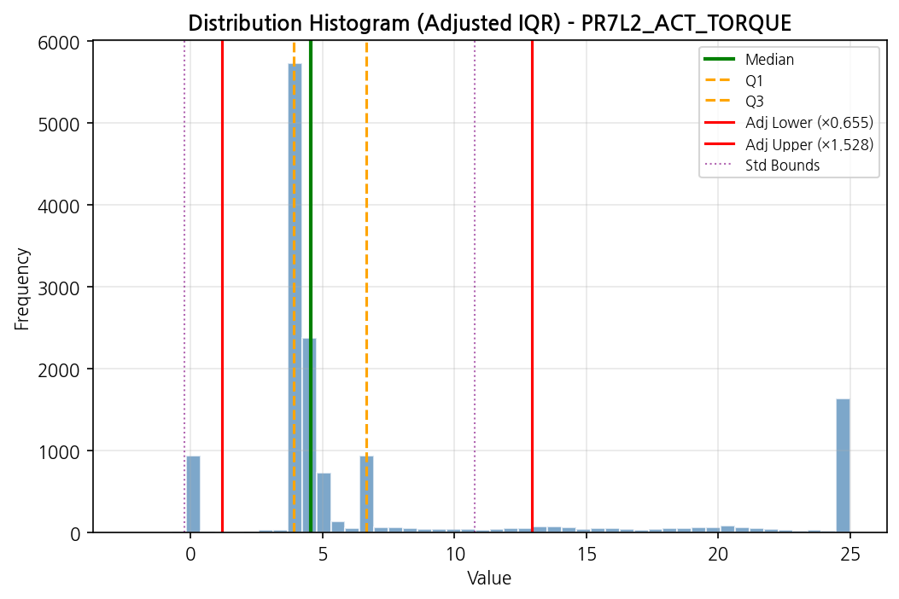

**3. 박스플롯 (Box Plot)**

**4. 일별 평균 추이 (Daily Average Trend)**

**5. 월별 이상치율 (Monthly Outlier Rate)**

**6. 시간별 패턴 (Hourly Pattern)**

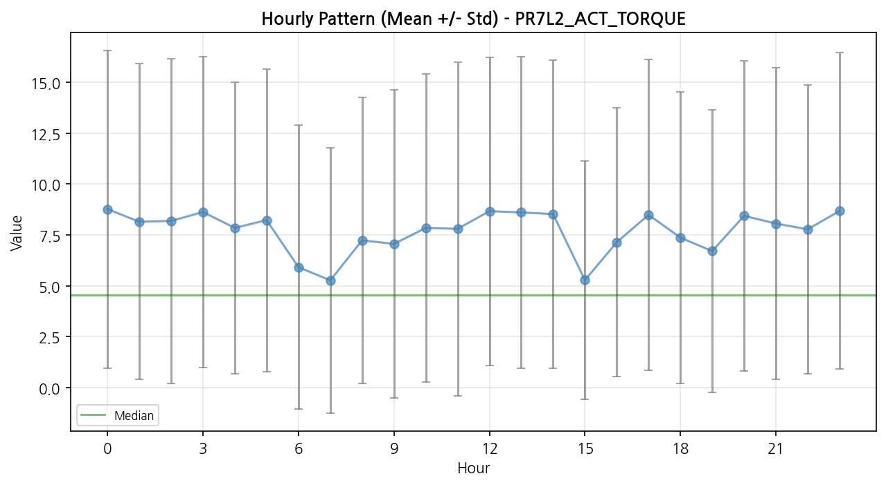

**7. 일별 이상치 수 (Daily Outlier Count)**

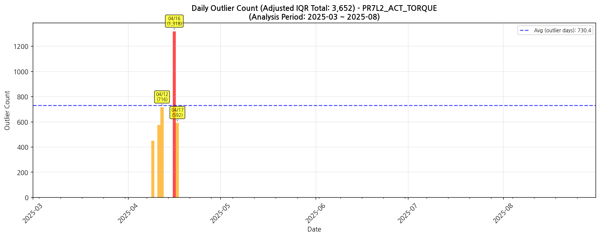

**종합 분석 차트**

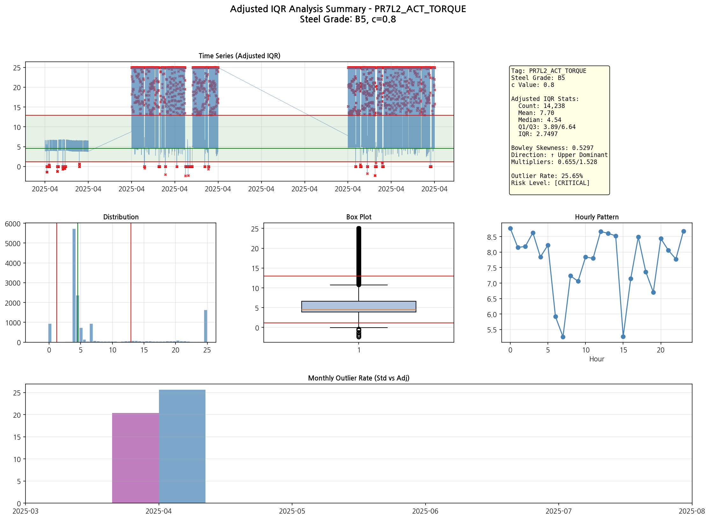

---

##### 월별 상세 분석

**2025-04**

**통계 요약**:

| 지표 | 값 |
|------|-------|
| 분석 레코드 | 14,238 |
| 평균 | 7.6977 |
| 중앙값 | 4.5373 |
| IQR | 2.7497 |
| Bowley 왜도 | 0.5297 |
| Adj 이상치 수 | 3,652 |
| Adj 이상치율 | 25.65% |
| Std 이상치율 | 20.36% |
| 개선율 | -26.0% |

**주요 이상치 발생 날짜**:

- 1. 2025-04-16: 1,318건
- 2. 2025-04-12: 716건
- 3. 2025-04-17: 592건

**1. 시계열 (Time Series)**

**2. 분포 히스토그램 (Distribution Histogram)**

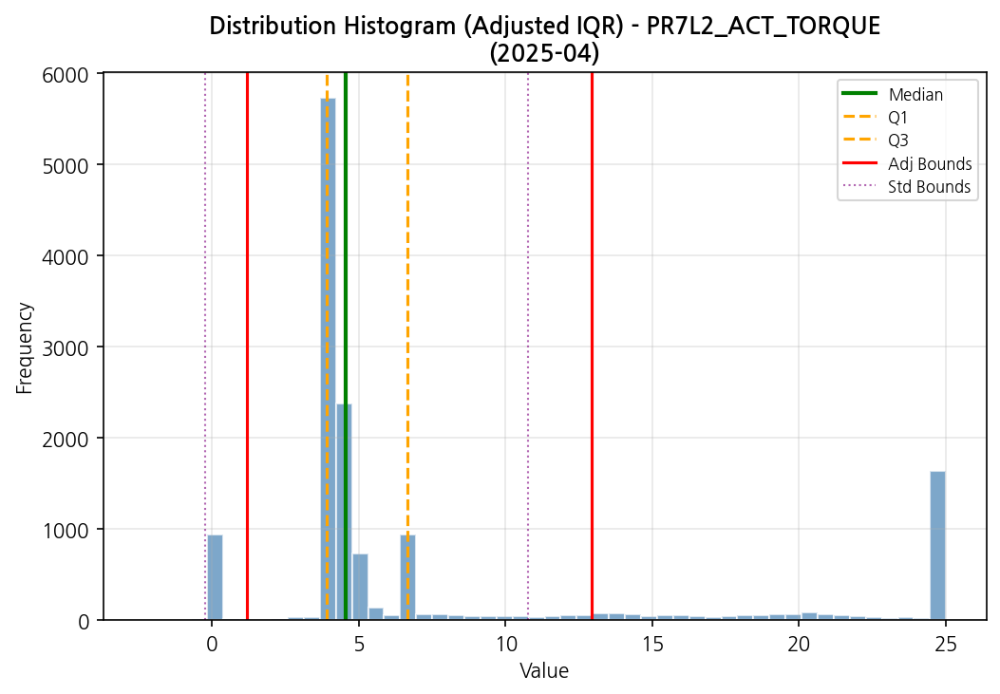

**3. 박스플롯 (Box Plot)**

**4. 일별 평균 추이 (Daily Average Trend)**

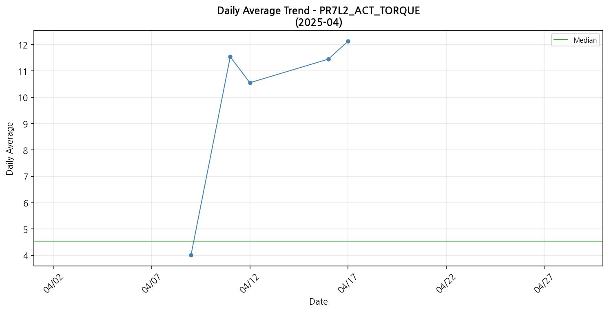

**5. 시간별 패턴 (Hourly Pattern)**

**6. 일별 이상치 수 (Daily Outlier Count)**

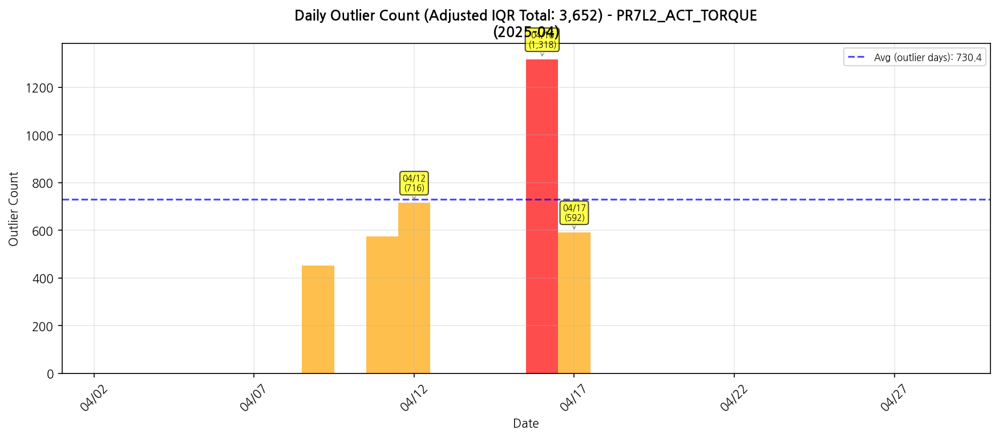

**월별 종합 차트**

---

### 🔴 위험 (15~25%) - 6개 태그

#### [L1] PR7L1_ACT_TORQUE 🔴

**위험도**: [DANGER] | **이상치율**: 24.26% | **개선율**: -21.3%
**Bowley 왜도**: 0.7398 | **승수 (L/U)**: 0.553/1.807

**데이터**: 원본 14,391 → 필터 후 14,238 (1.1% 제외)

| 통계 지표 | Adjusted IQR | Standard IQR |
|-----------|--------------|--------------|
| 이상치 수 | 3,454 | 2,848 |
| 이상치율 | 24.26% | 20.00% |
| 하한 경계 | 0.8510 | -1.0281 |
| 상한 경계 | 13.5862 | 10.1900 |

| 기본 통계 | 값 |
|-----------|-------|
| 분석 레코드 | 14,238 |
| 평균 | 7.0637 |
| 표준편차 | 7.6333 |
| Q1 (25%) | 3.1787 |
| 중앙값 | 3.5436 |
| Q3 (75%) | 5.9832 |
| IQR | 2.8045 |

**월별 이상치 추이**:

| 월 | 레코드 수 | 평균 | Adj 이상치율 | Std 이상치율 |
|-----|-----------|------|--------------|---------------|
| 2025-04 | 14,238 | 7.06 | 24.26% | 20.00% |

**주요 이상치 발생 날짜** (상위 5일):

| 순위 | 날짜 | 이상치 수 |
|:----:|------|----------:|
| 1 | 2025-04-16 | 1,224 |
| 2 | 2025-04-12 | 673 |
| 3 | 2025-04-17 | 558 |
| 4 | 2025-04-11 | 548 |
| 5 | 2025-04-09 | 451 |

- 이상치 발생 일수: 5일
- 최대 일별 이상치: 1,224건 (2025-04-16)
- 평균 일별 이상치: 690.8건

##### 차트 분석

**1. 시계열 (Time Series)**

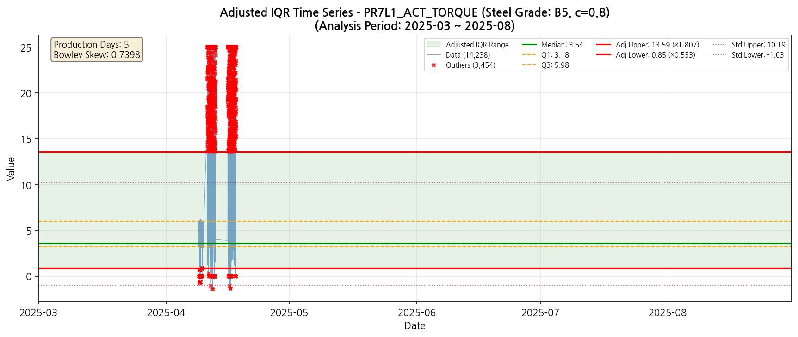

**2. 분포 히스토그램 (Distribution Histogram)**

**3. 박스플롯 (Box Plot)**

**4. 일별 평균 추이 (Daily Average Trend)**

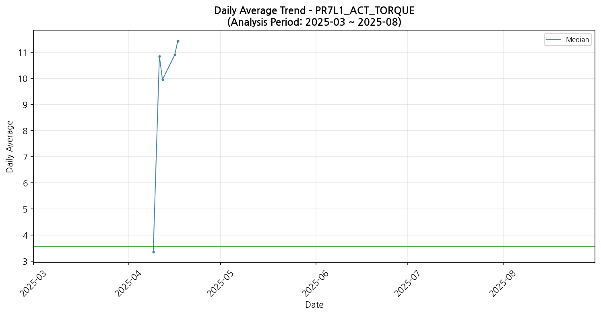

**5. 월별 이상치율 (Monthly Outlier Rate)**

**6. 시간별 패턴 (Hourly Pattern)**

**7. 일별 이상치 수 (Daily Outlier Count)**

**종합 분석 차트**

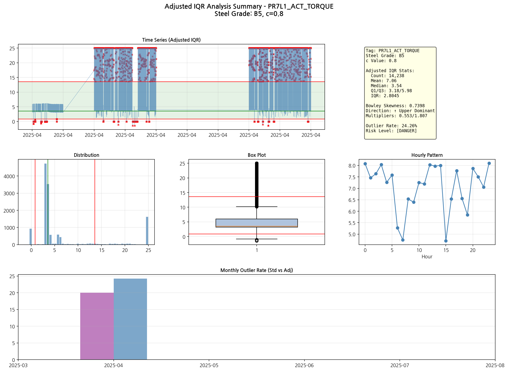

---

##### 월별 상세 분석

**2025-04**

**통계 요약**:

| 지표 | 값 |
|------|-------|
| 분석 레코드 | 14,238 |
| 평균 | 7.0637 |
| 중앙값 | 3.5436 |
| IQR | 2.8045 |
| Bowley 왜도 | 0.7398 |
| Adj 이상치 수 | 3,454 |
| Adj 이상치율 | 24.26% |
| Std 이상치율 | 20.00% |
| 개선율 | -21.3% |

**주요 이상치 발생 날짜**:

- 1. 2025-04-16: 1,224건
- 2. 2025-04-12: 673건
- 3. 2025-04-17: 558건

**1. 시계열 (Time Series)**

**2. 분포 히스토그램 (Distribution Histogram)**

**3. 박스플롯 (Box Plot)**

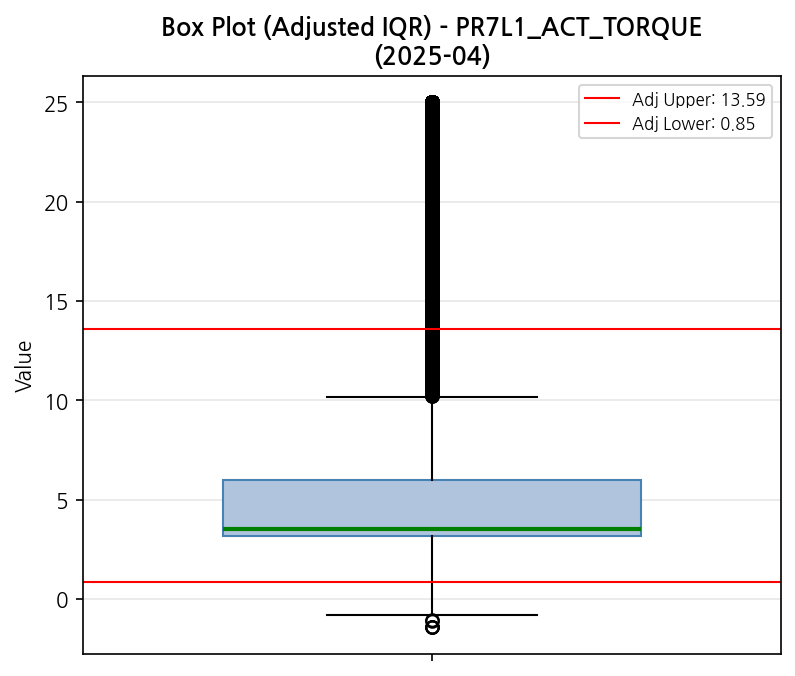

**4. 일별 평균 추이 (Daily Average Trend)**

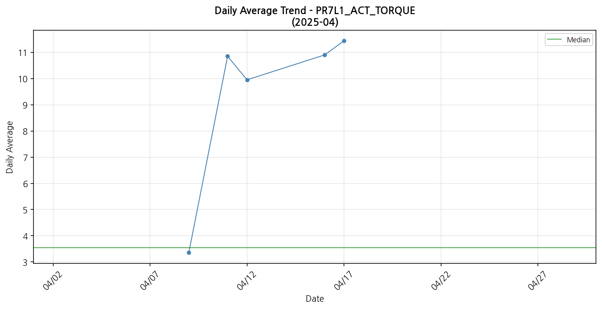

**5. 시간별 패턴 (Hourly Pattern)**

**6. 일별 이상치 수 (Daily Outlier Count)**

**월별 종합 차트**

---

#### PINCHROLL_3_ACTUAL_TORQUE 🔴

**위험도**: [DANGER] | **이상치율**: 19.12% | **개선율**: -10.8%
**Bowley 왜도**: 0.3103 | **승수 (L/U)**: 0.780/1.282

**데이터**: 원본 14,391 → 필터 후 12,557 (12.7% 제외)

| 통계 지표 | Adjusted IQR | Standard IQR |
|-----------|--------------|--------------|
| 이상치 수 | 2,401 | 2,167 |
| 이상치율 | 19.12% | 17.26% |
| 하한 경계 | 18.4468 | 15.9340 |
| 상한 경계 | 49.6403 | 46.4195 |

| 기본 통계 | 값 |
|-----------|-------|
| 분석 레코드 | 12,557 |
| 평균 | 27.1357 |
| 표준편차 | 10.3635 |
| Q1 (25%) | 27.3660 |
| 중앙값 | 29.9944 |
| Q3 (75%) | 34.9874 |
| IQR | 7.6214 |

**월별 이상치 추이**:

| 월 | 레코드 수 | 평균 | Adj 이상치율 | Std 이상치율 |
|-----|-----------|------|--------------|---------------|
| 2025-04 | 12,557 | 27.14 | 19.12% | 17.26% |

**주요 이상치 발생 날짜** (상위 5일):

| 순위 | 날짜 | 이상치 수 |
|:----:|------|----------:|
| 1 | 2025-04-09 | 1,274 |
| 2 | 2025-04-16 | 455 |
| 3 | 2025-04-11 | 258 |
| 4 | 2025-04-17 | 230 |
| 5 | 2025-04-12 | 184 |

- 이상치 발생 일수: 5일
- 최대 일별 이상치: 1,274건 (2025-04-09)
- 평균 일별 이상치: 480.2건

##### 차트 분석

**1. 시계열 (Time Series)**

**2. 분포 히스토그램 (Distribution Histogram)**

**3. 박스플롯 (Box Plot)**

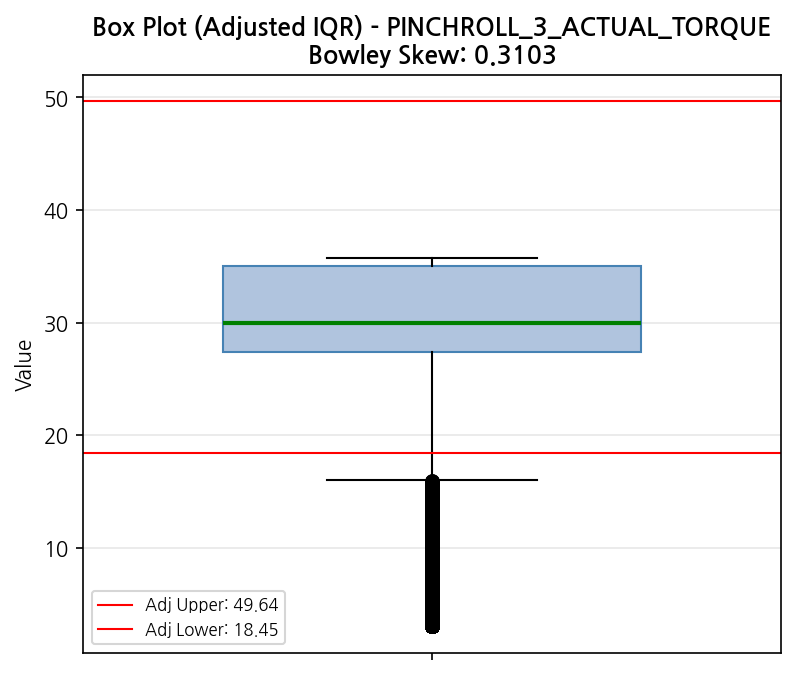

**4. 일별 평균 추이 (Daily Average Trend)**

**5. 월별 이상치율 (Monthly Outlier Rate)**

**6. 시간별 패턴 (Hourly Pattern)**

**7. 일별 이상치 수 (Daily Outlier Count)**

**종합 분석 차트**

---

##### 월별 상세 분석

**2025-04**

**통계 요약**:

| 지표 | 값 |
|------|-------|
| 분석 레코드 | 12,557 |
| 평균 | 27.1357 |
| 중앙값 | 29.9944 |
| IQR | 7.6214 |
| Bowley 왜도 | 0.3103 |
| Adj 이상치 수 | 2,401 |
| Adj 이상치율 | 19.12% |
| Std 이상치율 | 17.26% |
| 개선율 | -10.8% |

**주요 이상치 발생 날짜**:

- 1. 2025-04-09: 1,274건
- 2. 2025-04-16: 455건
- 3. 2025-04-11: 258건

**1. 시계열 (Time Series)**

**2. 분포 히스토그램 (Distribution Histogram)**

**3. 박스플롯 (Box Plot)**

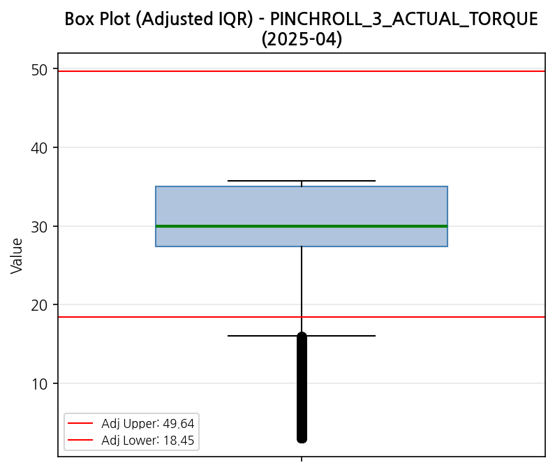

**4. 일별 평균 추이 (Daily Average Trend)**

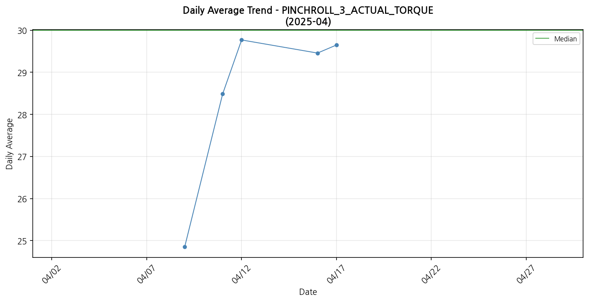

**5. 시간별 패턴 (Hourly Pattern)**

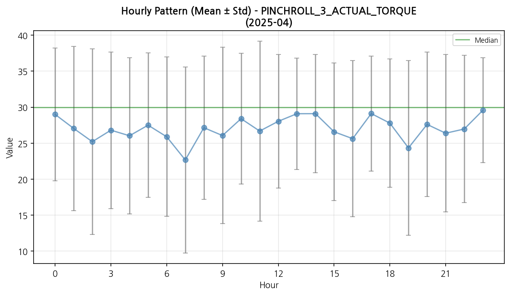

**6. 일별 이상치 수 (Daily Outlier Count)**

**월별 종합 차트**

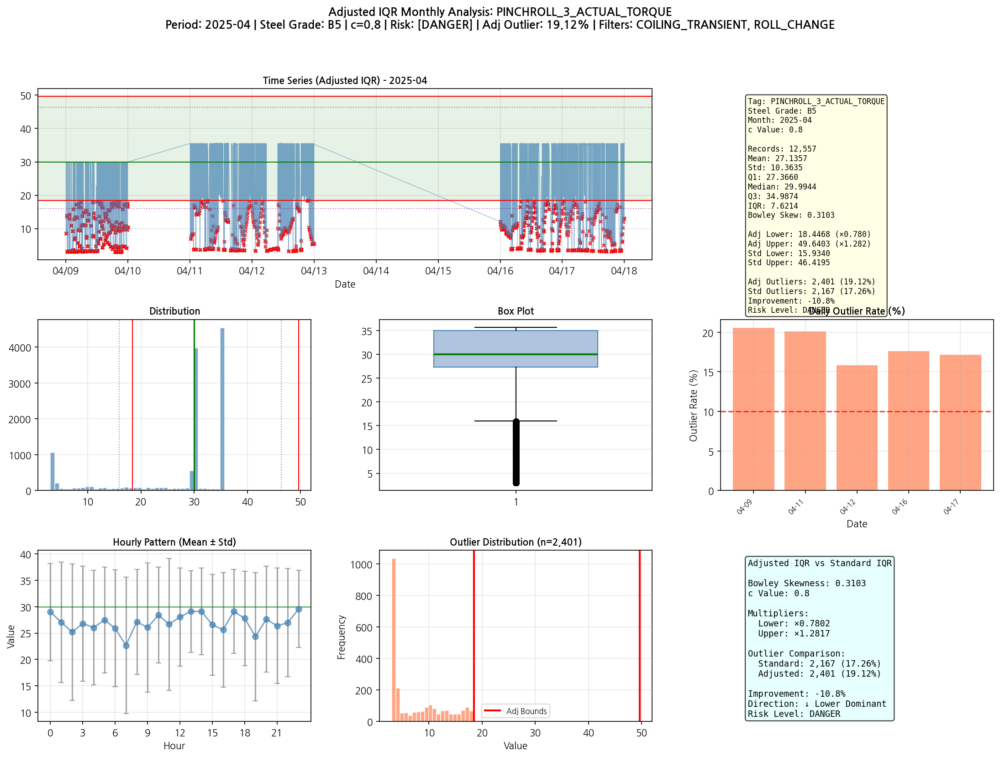

---

#### PINCHROLL_4_ACTUAL_TORQUE 🔴

**위험도**: [DANGER] | **이상치율**: 18.52% | **개선율**: -9.8%
**Bowley 왜도**: 0.2684 | **승수 (L/U)**: 0.807/1.240

**데이터**: 원본 14,391 → 필터 후 12,557 (12.7% 제외)

| 통계 지표 | Adjusted IQR | Standard IQR |
|-----------|--------------|--------------|
| 이상치 수 | 2,325 | 2,117 |
| 이상치율 | 18.52% | 16.86% |
| 하한 경계 | 17.5793 | 15.2954 |
| 상한 경계 | 49.6396 | 46.8086 |

| 기본 통계 | 값 |
|-----------|-------|
| 분석 레코드 | 12,557 |
| 평균 | 27.2524 |
| 표준편차 | 10.0918 |
| Q1 (25%) | 27.1129 |
| 중앙값 | 29.9946 |
| Q3 (75%) | 34.9911 |
| IQR | 7.8783 |

**월별 이상치 추이**:

| 월 | 레코드 수 | 평균 | Adj 이상치율 | Std 이상치율 |
|-----|-----------|------|--------------|---------------|
| 2025-04 | 12,557 | 27.25 | 18.52% | 16.86% |

**주요 이상치 발생 날짜** (상위 5일):

| 순위 | 날짜 | 이상치 수 |
|:----:|------|----------:|
| 1 | 2025-04-09 | 1,239 |
| 2 | 2025-04-16 | 439 |
| 3 | 2025-04-11 | 249 |
| 4 | 2025-04-17 | 221 |
| 5 | 2025-04-12 | 177 |

- 이상치 발생 일수: 5일
- 최대 일별 이상치: 1,239건 (2025-04-09)
- 평균 일별 이상치: 465.0건

##### 차트 분석

**1. 시계열 (Time Series)**

**2. 분포 히스토그램 (Distribution Histogram)**

**3. 박스플롯 (Box Plot)**

**4. 일별 평균 추이 (Daily Average Trend)**

**5. 월별 이상치율 (Monthly Outlier Rate)**

**6. 시간별 패턴 (Hourly Pattern)**

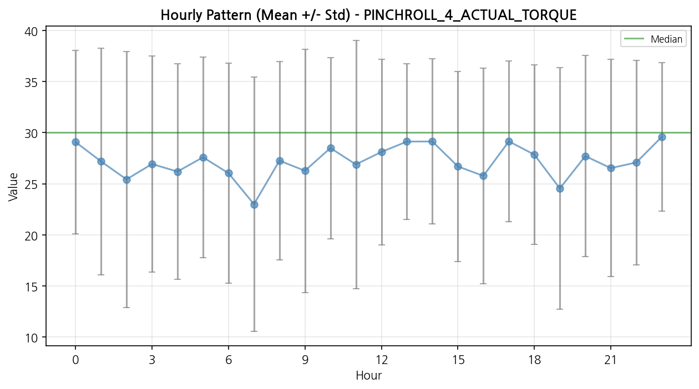

**7. 일별 이상치 수 (Daily Outlier Count)**

**종합 분석 차트**

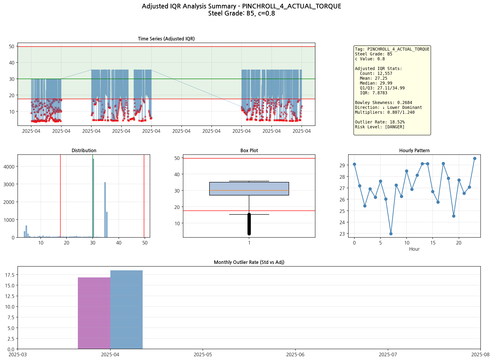

---

##### 월별 상세 분석

**2025-04**

**통계 요약**:

| 지표 | 값 |
|------|-------|
| 분석 레코드 | 12,557 |
| 평균 | 27.2524 |
| 중앙값 | 29.9946 |
| IQR | 7.8783 |
| Bowley 왜도 | 0.2684 |
| Adj 이상치 수 | 2,325 |
| Adj 이상치율 | 18.52% |
| Std 이상치율 | 16.86% |
| 개선율 | -9.8% |

**주요 이상치 발생 날짜**:

- 1. 2025-04-09: 1,239건
- 2. 2025-04-16: 439건
- 3. 2025-04-11: 249건

**1. 시계열 (Time Series)**

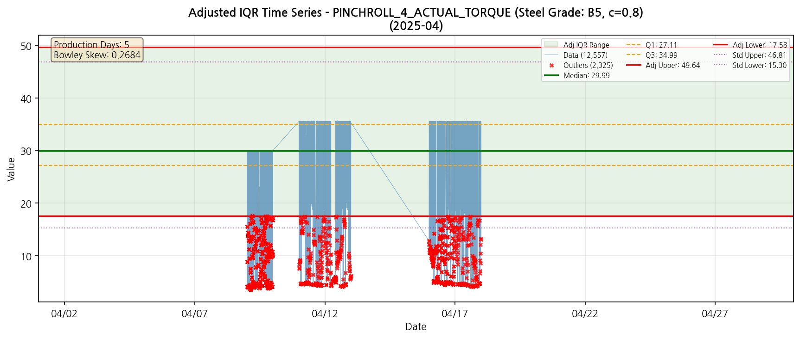

**2. 분포 히스토그램 (Distribution Histogram)**

**3. 박스플롯 (Box Plot)**

**4. 일별 평균 추이 (Daily Average Trend)**

**5. 시간별 패턴 (Hourly Pattern)**

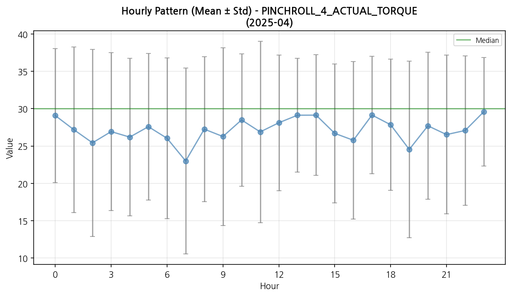

**6. 일별 이상치 수 (Daily Outlier Count)**

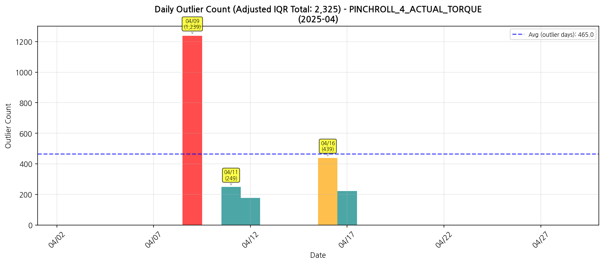

**월별 종합 차트**

---

#### [L1] PR6L1_ACT_TORQUE 🔴

**위험도**: [DANGER] | **이상치율**: 18.10% | **개선율**: -1.0%
**Bowley 왜도**: -0.0113 | **승수 (L/U)**: 1.009/0.991

**데이터**: 원본 14,391 → 필터 후 14,238 (1.1% 제외)

| 통계 지표 | Adjusted IQR | Standard IQR |
|-----------|--------------|--------------|
| 이상치 수 | 2,577 | 2,552 |
| 이상치율 | 18.10% | 17.92% |
| 하한 경계 | 2.4538 | 2.4598 |
| 상한 경계 | 4.2097 | 4.2156 |

| 기본 통계 | 값 |
|-----------|-------|
| 분석 레코드 | 14,238 |
| 평균 | 3.2610 |
| 표준편차 | 1.0032 |
| Q1 (25%) | 3.1182 |
| 중앙값 | 3.3402 |
| Q3 (75%) | 3.5572 |
| IQR | 0.4390 |

**월별 이상치 추이**:

| 월 | 레코드 수 | 평균 | Adj 이상치율 | Std 이상치율 |
|-----|-----------|------|--------------|---------------|
| 2025-04 | 14,238 | 3.26 | 18.10% | 17.92% |

**주요 이상치 발생 날짜** (상위 5일):

| 순위 | 날짜 | 이상치 수 |
|:----:|------|----------:|
| 1 | 2025-04-09 | 1,355 |
| 2 | 2025-04-16 | 588 |
| 3 | 2025-04-12 | 293 |
| 4 | 2025-04-11 | 213 |
| 5 | 2025-04-17 | 128 |

- 이상치 발생 일수: 5일
- 최대 일별 이상치: 1,355건 (2025-04-09)
- 평균 일별 이상치: 515.4건

##### 차트 분석

**1. 시계열 (Time Series)**

**2. 분포 히스토그램 (Distribution Histogram)**

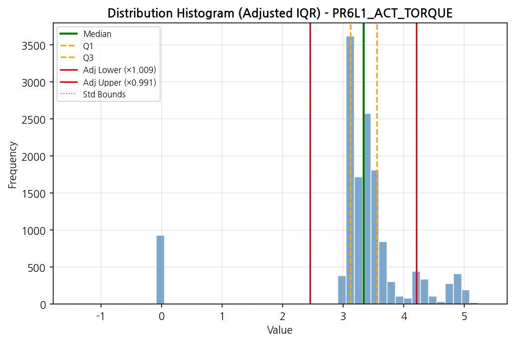

**3. 박스플롯 (Box Plot)**

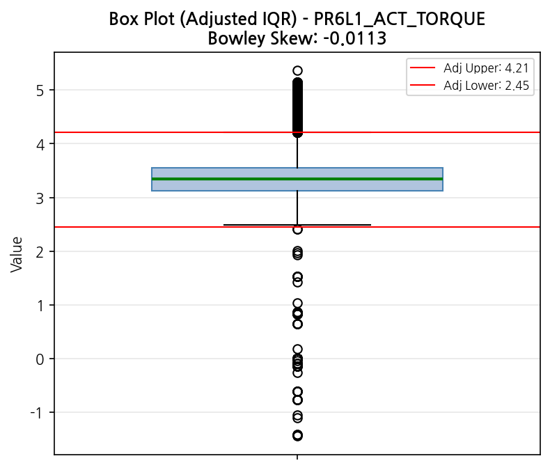

**4. 일별 평균 추이 (Daily Average Trend)**

**5. 월별 이상치율 (Monthly Outlier Rate)**

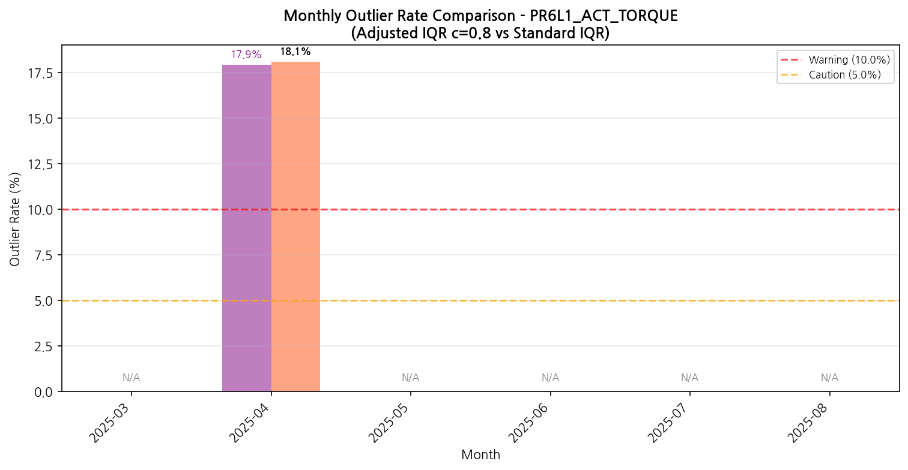

**6. 시간별 패턴 (Hourly Pattern)**

**7. 일별 이상치 수 (Daily Outlier Count)**

**종합 분석 차트**

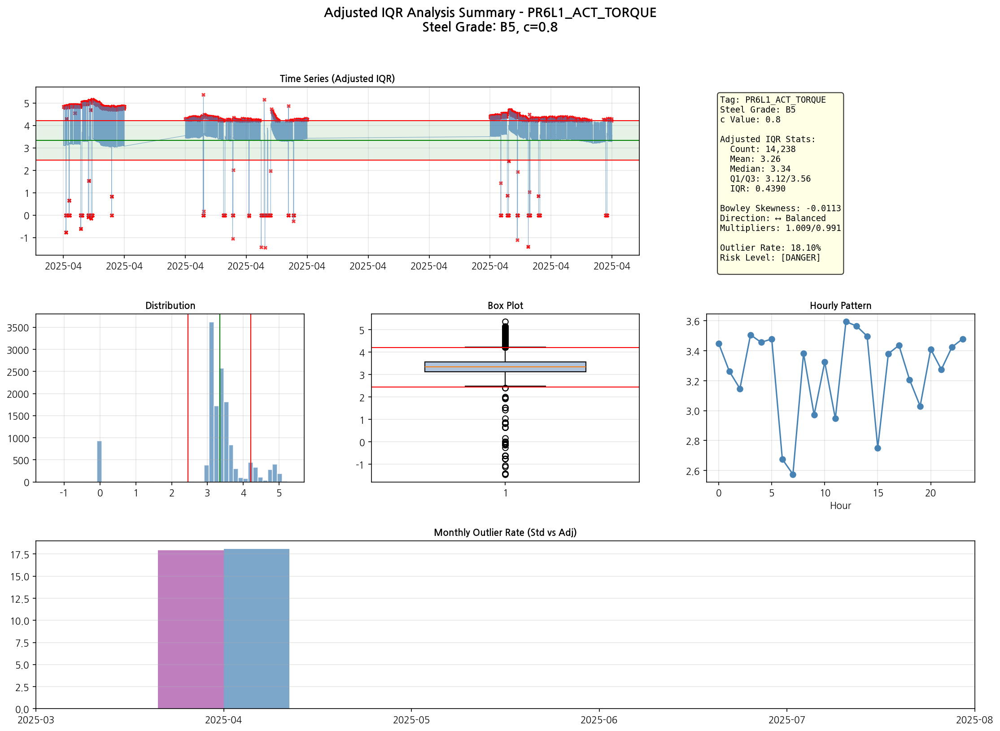

---

##### 월별 상세 분석

**2025-04**

**통계 요약**:

| 지표 | 값 |
|------|-------|
| 분석 레코드 | 14,238 |
| 평균 | 3.2610 |
| 중앙값 | 3.3402 |
| IQR | 0.4390 |
| Bowley 왜도 | -0.0113 |
| Adj 이상치 수 | 2,577 |
| Adj 이상치율 | 18.10% |
| Std 이상치율 | 17.92% |
| 개선율 | -1.0% |

**주요 이상치 발생 날짜**:

- 1. 2025-04-09: 1,355건
- 2. 2025-04-16: 588건
- 3. 2025-04-12: 293건

**1. 시계열 (Time Series)**

**2. 분포 히스토그램 (Distribution Histogram)**

**3. 박스플롯 (Box Plot)**

**4. 일별 평균 추이 (Daily Average Trend)**

**5. 시간별 패턴 (Hourly Pattern)**

**6. 일별 이상치 수 (Daily Outlier Count)**

**월별 종합 차트**

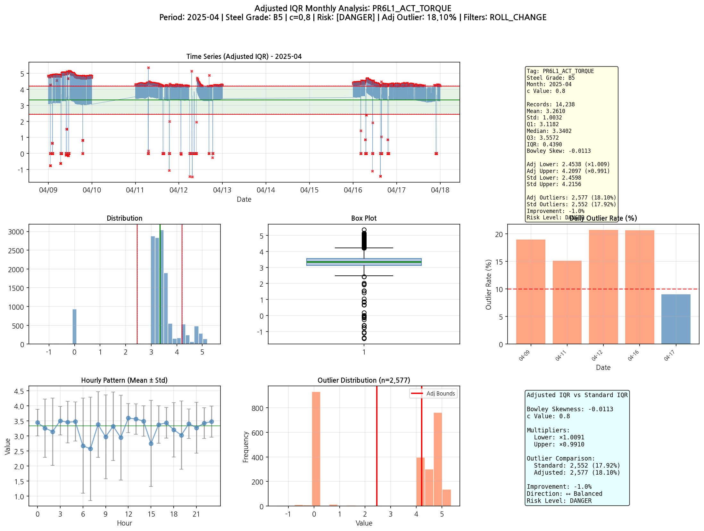

---

#### PINCHROLL_3_REFERENCE_TORQUE 🔴

**위험도**: [DANGER] | **이상치율**: 17.74% | **개선율**: 7.1%
**Bowley 왜도**: 0.2144 | **승수 (L/U)**: 0.842/1.187

**데이터**: 원본 14,391 → 필터 후 12,557 (12.7% 제외)

| 통계 지표 | Adjusted IQR | Standard IQR |
|-----------|--------------|--------------|
| 이상치 수 | 2,227 | 2,396 |
| 이상치율 | 17.74% | 19.08% |
| 하한 경계 | 13.9162 | 10.9075 |
| 상한 경계 | 65.3923 | 61.8208 |

| 기본 통계 | 값 |
|-----------|-------|
| 분석 레코드 | 12,557 |
| 평균 | 44.5049 |
| 표준편차 | 22.6086 |
| Q1 (25%) | 30.0000 |
| 중앙값 | 35.0000 |
| Q3 (75%) | 42.7283 |
| IQR | 12.7283 |

**월별 이상치 추이**:

| 월 | 레코드 수 | 평균 | Adj 이상치율 | Std 이상치율 |
|-----|-----------|------|--------------|---------------|
| 2025-04 | 12,557 | 44.50 | 17.74% | 19.08% |

**주요 이상치 발생 날짜** (상위 5일):

| 순위 | 날짜 | 이상치 수 |
|:----:|------|----------:|
| 1 | 2025-04-09 | 1,094 |
| 2 | 2025-04-16 | 455 |
| 3 | 2025-04-11 | 263 |
| 4 | 2025-04-17 | 227 |
| 5 | 2025-04-12 | 188 |

- 이상치 발생 일수: 5일
- 최대 일별 이상치: 1,094건 (2025-04-09)
- 평균 일별 이상치: 445.4건

##### 차트 분석

**1. 시계열 (Time Series)**

**2. 분포 히스토그램 (Distribution Histogram)**

**3. 박스플롯 (Box Plot)**

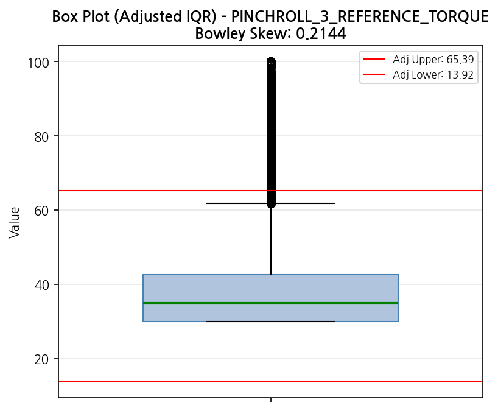

**4. 일별 평균 추이 (Daily Average Trend)**

**5. 월별 이상치율 (Monthly Outlier Rate)**

**6. 시간별 패턴 (Hourly Pattern)**

**7. 일별 이상치 수 (Daily Outlier Count)**

**종합 분석 차트**

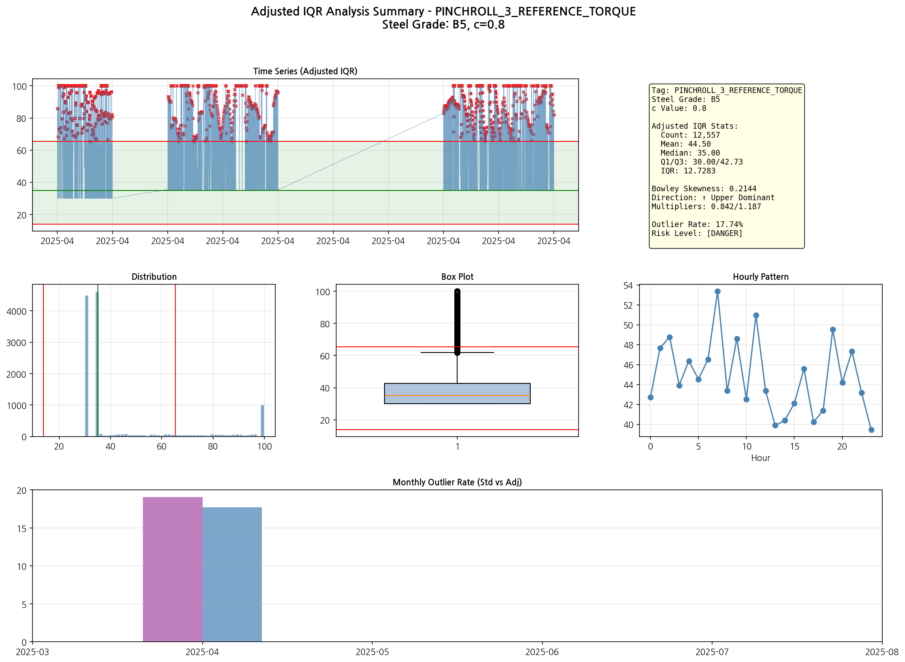

---

##### 월별 상세 분석

**2025-04**

**통계 요약**:

| 지표 | 값 |
|------|-------|
| 분석 레코드 | 12,557 |
| 평균 | 44.5049 |
| 중앙값 | 35.0000 |
| IQR | 12.7283 |
| Bowley 왜도 | 0.2144 |
| Adj 이상치 수 | 2,227 |
| Adj 이상치율 | 17.74% |
| Std 이상치율 | 19.08% |
| 개선율 | 7.1% |

**주요 이상치 발생 날짜**:

- 1. 2025-04-09: 1,094건
- 2. 2025-04-16: 455건
- 3. 2025-04-11: 263건

**1. 시계열 (Time Series)**

**2. 분포 히스토그램 (Distribution Histogram)**

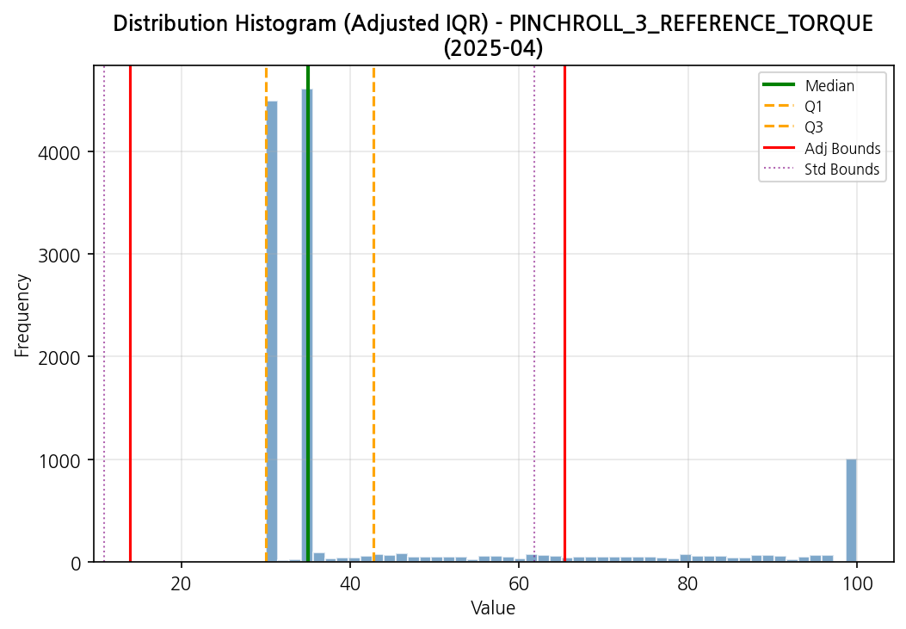

**3. 박스플롯 (Box Plot)**

**4. 일별 평균 추이 (Daily Average Trend)**

**5. 시간별 패턴 (Hourly Pattern)**

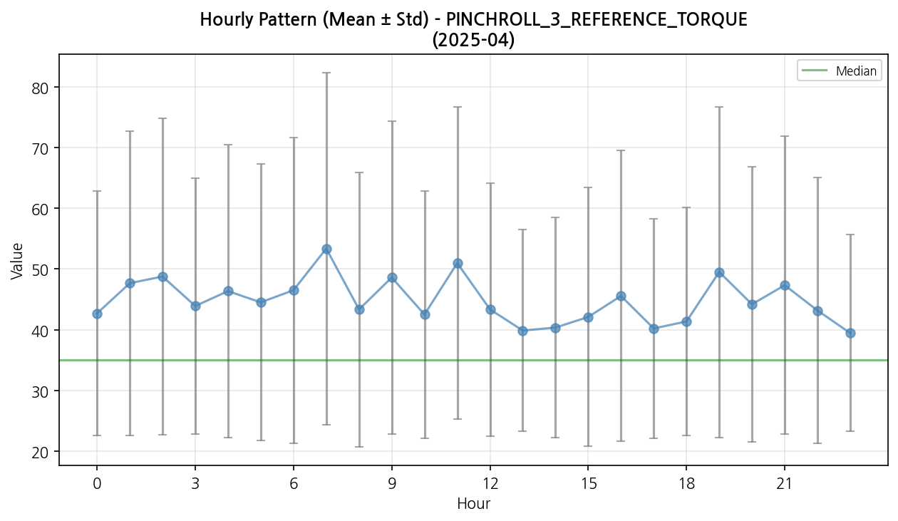

**6. 일별 이상치 수 (Daily Outlier Count)**

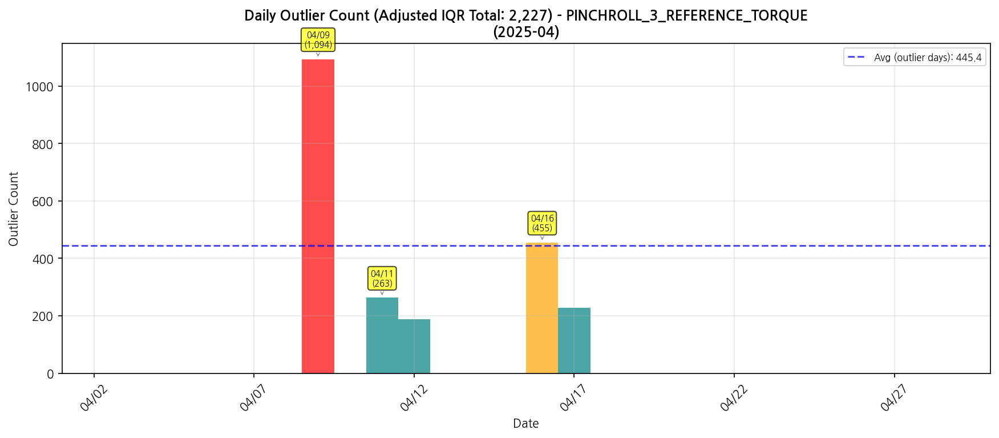

**월별 종합 차트**

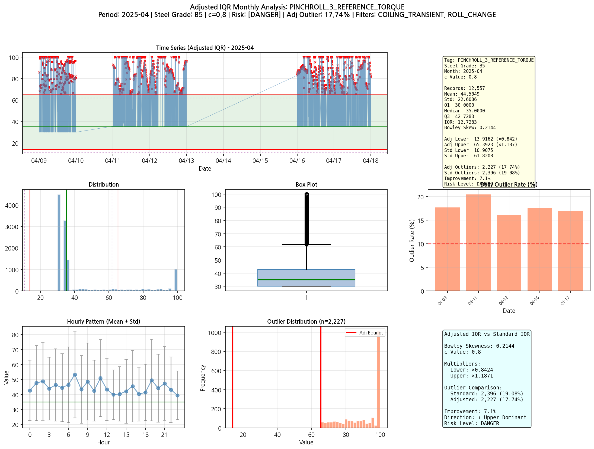

---

#### PINCHROLL_4_REFERENCE_TORQUE 🔴

**위험도**: [DANGER] | **이상치율**: 17.47% | **개선율**: 7.7%
**Bowley 왜도**: 0.2394 | **승수 (L/U)**: 0.826/1.211

**데이터**: 원본 14,391 → 필터 후 12,557 (12.7% 제외)

| 통계 지표 | Adjusted IQR | Standard IQR |
|-----------|--------------|--------------|
| 이상치 수 | 2,194 | 2,377 |
| 이상치율 | 17.47% | 18.93% |
| 하한 경계 | 13.7165 | 10.2800 |
| 상한 경계 | 67.0284 | 62.8667 |

| 기본 통계 | 값 |
|-----------|-------|
| 분석 레코드 | 12,557 |
| 평균 | 44.6498 |
| 표준편차 | 22.7514 |
| Q1 (25%) | 30.0000 |
| 중앙값 | 35.0000 |
| Q3 (75%) | 43.1467 |
| IQR | 13.1467 |

**월별 이상치 추이**:

| 월 | 레코드 수 | 평균 | Adj 이상치율 | Std 이상치율 |
|-----|-----------|------|--------------|---------------|
| 2025-04 | 12,557 | 44.65 | 17.47% | 18.93% |

**주요 이상치 발생 날짜** (상위 5일):

| 순위 | 날짜 | 이상치 수 |
|:----:|------|----------:|
| 1 | 2025-04-09 | 1,089 |
| 2 | 2025-04-16 | 449 |
| 3 | 2025-04-11 | 255 |
| 4 | 2025-04-17 | 222 |
| 5 | 2025-04-12 | 179 |

- 이상치 발생 일수: 5일
- 최대 일별 이상치: 1,089건 (2025-04-09)
- 평균 일별 이상치: 438.8건

##### 차트 분석

**1. 시계열 (Time Series)**

**2. 분포 히스토그램 (Distribution Histogram)**

**3. 박스플롯 (Box Plot)**

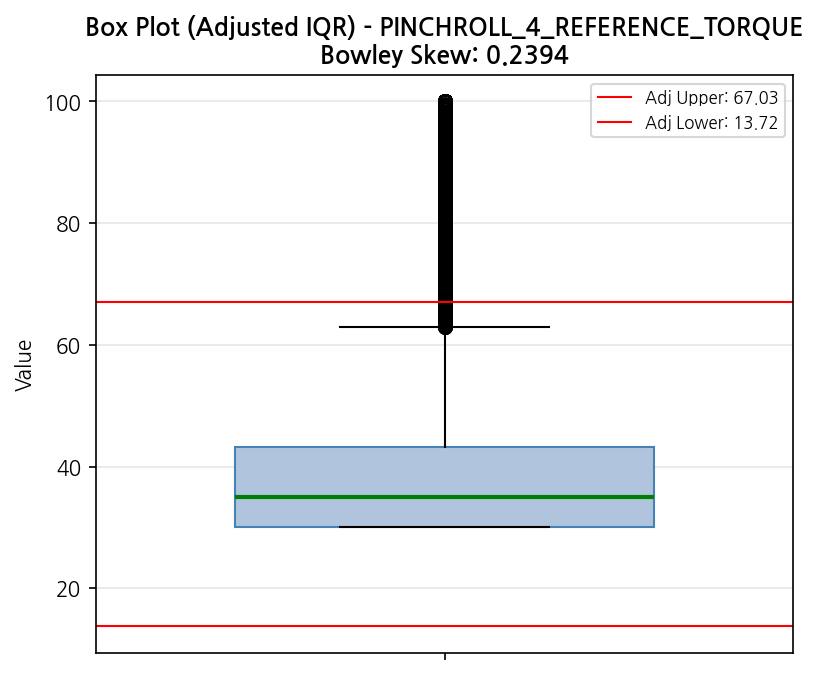

**4. 일별 평균 추이 (Daily Average Trend)**

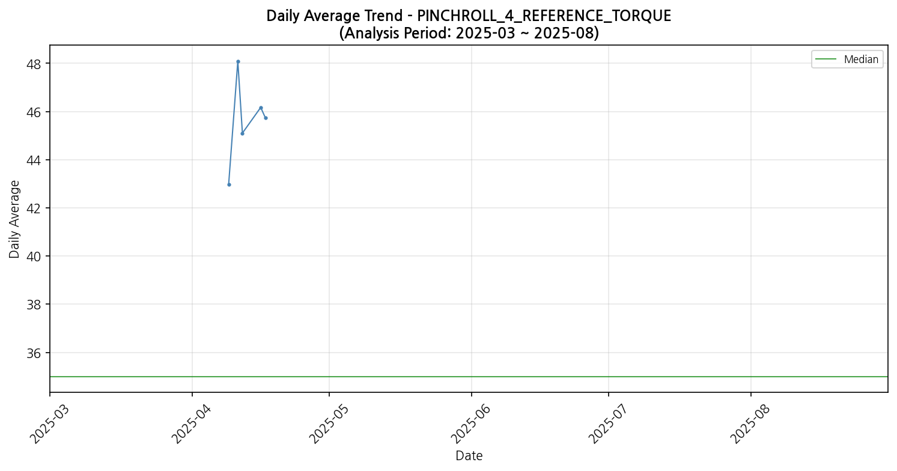

**5. 월별 이상치율 (Monthly Outlier Rate)**

**6. 시간별 패턴 (Hourly Pattern)**

**7. 일별 이상치 수 (Daily Outlier Count)**

**종합 분석 차트**

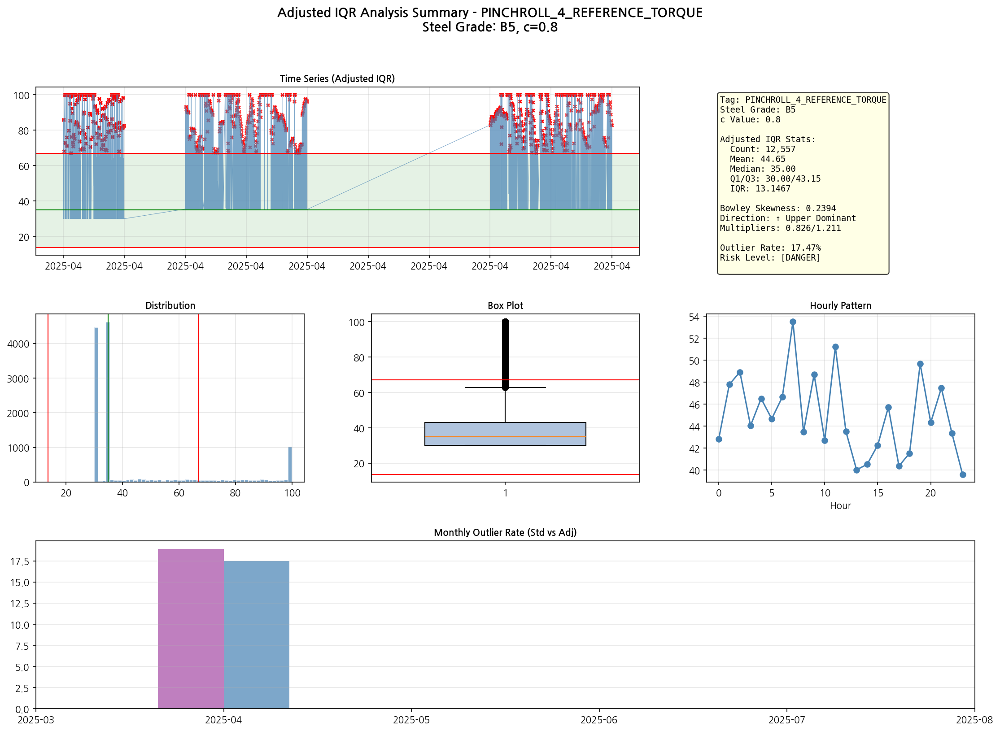

---

##### 월별 상세 분석

**2025-04**

**통계 요약**:

| 지표 | 값 |
|------|-------|
| 분석 레코드 | 12,557 |
| 평균 | 44.6498 |
| 중앙값 | 35.0000 |
| IQR | 13.1467 |
| Bowley 왜도 | 0.2394 |
| Adj 이상치 수 | 2,194 |
| Adj 이상치율 | 17.47% |
| Std 이상치율 | 18.93% |
| 개선율 | 7.7% |

**주요 이상치 발생 날짜**:

- 1. 2025-04-09: 1,089건
- 2. 2025-04-16: 449건
- 3. 2025-04-11: 255건

**1. 시계열 (Time Series)**

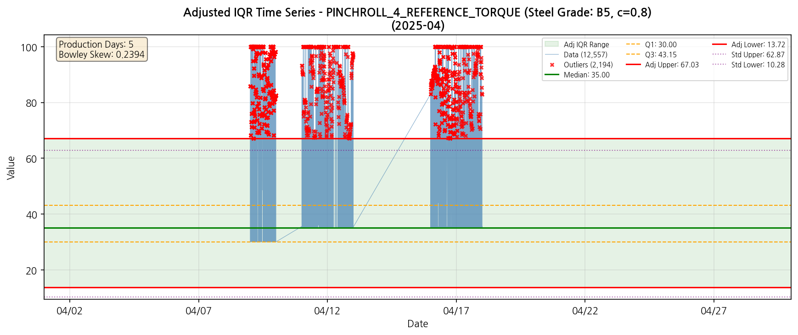

**2. 분포 히스토그램 (Distribution Histogram)**

**3. 박스플롯 (Box Plot)**

**4. 일별 평균 추이 (Daily Average Trend)**

**5. 시간별 패턴 (Hourly Pattern)**

**6. 일별 이상치 수 (Daily Outlier Count)**

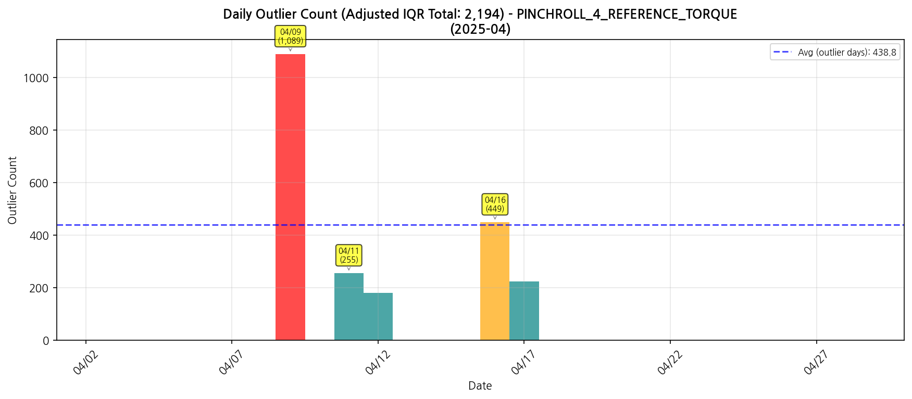

**월별 종합 차트**

---

### 🟠 경고 (10~15%) - 13개 태그

#### PINCHROLL_2_ACTUAL_TORQUE 🟠

**위험도**: [WARNING] | **이상치율**: 11.84% | **개선율**: 38.0%
**Bowley 왜도**: -0.9998 | **승수 (L/U)**: 2.225/0.449

**데이터**: 원본 14,391 → 필터 후 12,557 (12.7% 제외)

| 통계 지표 | Adjusted IQR | Standard IQR |
|-----------|--------------|--------------|
| 이상치 수 | 1,487 | 2,399 |
| 이상치율 | 11.84% | 19.10% |
| 하한 경계 | 4.8161 | 11.2470 |
| 상한 경계 | 22.3539 | 25.2439 |

| 기본 통계 | 값 |
|-----------|-------|
| 분석 레코드 | 12,557 |
| 평균 | 16.6733 |
| 표준편차 | 6.0453 |
| Q1 (25%) | 16.4958 |
| 중앙값 | 19.9947 |
| Q3 (75%) | 19.9950 |
| IQR | 3.4992 |

**월별 이상치 추이**:

| 월 | 레코드 수 | 평균 | Adj 이상치율 | Std 이상치율 |
|-----|-----------|------|--------------|---------------|
| 2025-04 | 12,557 | 16.67 | 11.84% | 19.10% |

**주요 이상치 발생 날짜** (상위 5일):

| 순위 | 날짜 | 이상치 수 |
|:----:|------|----------:|
| 1 | 2025-04-09 | 755 |
| 2 | 2025-04-16 | 281 |
| 3 | 2025-04-11 | 185 |
| 4 | 2025-04-17 | 150 |
| 5 | 2025-04-12 | 116 |

- 이상치 발생 일수: 5일
- 최대 일별 이상치: 755건 (2025-04-09)
- 평균 일별 이상치: 297.4건

##### 차트 분석

**1. 시계열 (Time Series)**

**2. 분포 히스토그램 (Distribution Histogram)**

**3. 박스플롯 (Box Plot)**

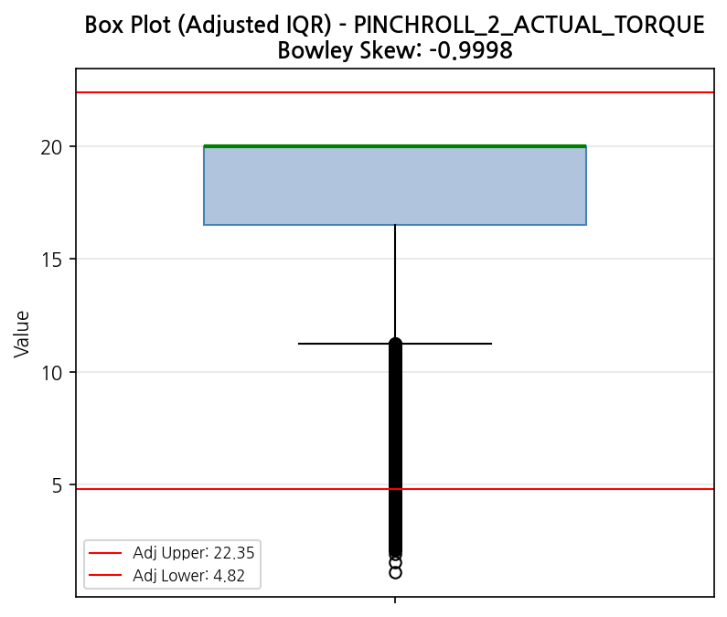

**4. 일별 평균 추이 (Daily Average Trend)**

**5. 월별 이상치율 (Monthly Outlier Rate)**

**6. 시간별 패턴 (Hourly Pattern)**

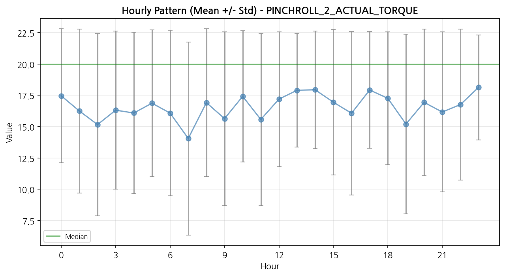

**7. 일별 이상치 수 (Daily Outlier Count)**

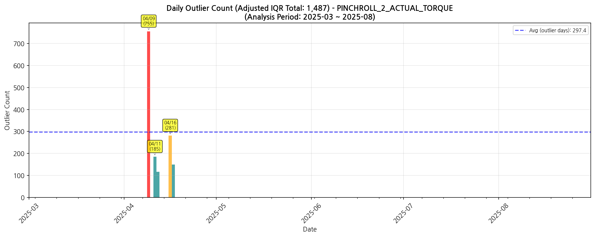

**종합 분석 차트**

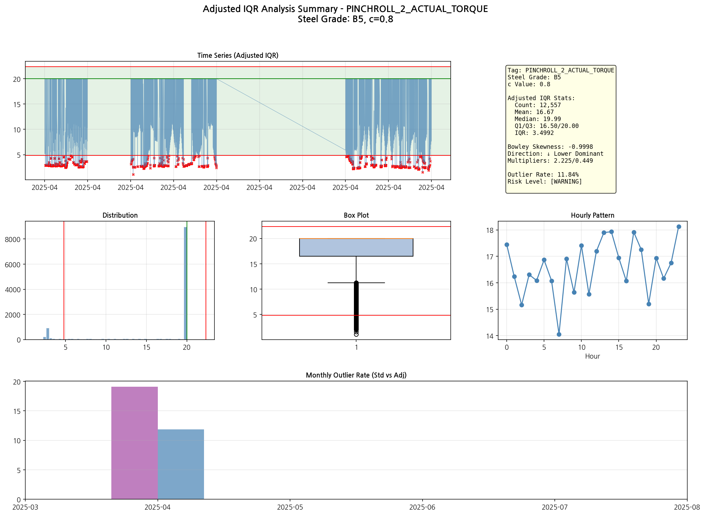

---

##### 월별 상세 분석

**2025-04**

**통계 요약**:

| 지표 | 값 |
|------|-------|
| 분석 레코드 | 12,557 |
| 평균 | 16.6733 |
| 중앙값 | 19.9947 |
| IQR | 3.4992 |
| Bowley 왜도 | -0.9998 |
| Adj 이상치 수 | 1,487 |
| Adj 이상치율 | 11.84% |
| Std 이상치율 | 19.10% |
| 개선율 | 38.0% |

**주요 이상치 발생 날짜**:

- 1. 2025-04-09: 755건
- 2. 2025-04-16: 281건
- 3. 2025-04-11: 185건

**1. 시계열 (Time Series)**

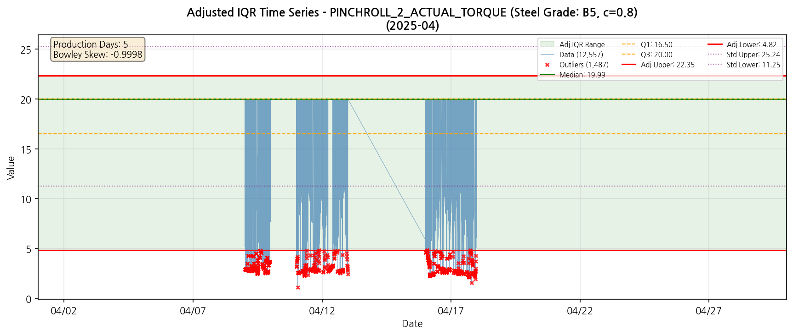

**2. 분포 히스토그램 (Distribution Histogram)**

**3. 박스플롯 (Box Plot)**

**4. 일별 평균 추이 (Daily Average Trend)**

**5. 시간별 패턴 (Hourly Pattern)**

**6. 일별 이상치 수 (Daily Outlier Count)**

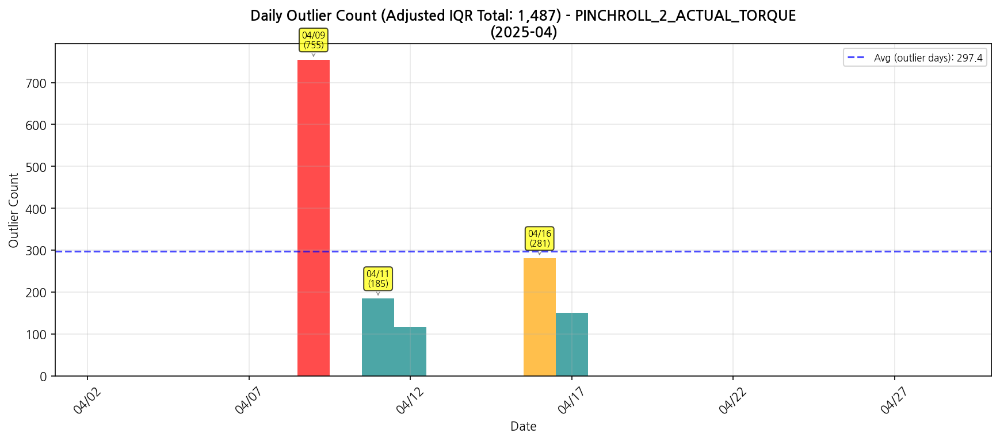

**월별 종합 차트**

---

#### FURNACE_EXIT_DISCHARGE_BILLET_TEMPERATURE 🟠

**위험도**: [WARNING] | **이상치율**: 11.69% | **개선율**: 0.3%
**Bowley 왜도**: -0.0435 | **승수 (L/U)**: 1.035/0.966

**데이터**: 원본 14,391 → 필터 후 14,391 (0.0% 제외)

| 통계 지표 | Adjusted IQR | Standard IQR |
|-----------|--------------|--------------|
| 이상치 수 | 1,682 | 1,687 |
| 이상치율 | 11.69% | 11.72% |
| 하한 경계 | 1023.8854 | 1025.5375 |
| 상한 경계 | 1148.4978 | 1150.0935 |

| 기본 통계 | 값 |
|-----------|-------|
| 분석 레코드 | 14,391 |
| 평균 | 991.6790 |
| 표준편차 | 314.8837 |
| Q1 (25%) | 1072.2460 |
| 중앙값 | 1088.4920 |
| Q3 (75%) | 1103.3850 |
| IQR | 31.1390 |

**월별 이상치 추이**:

| 월 | 레코드 수 | 평균 | Adj 이상치율 | Std 이상치율 |
|-----|-----------|------|--------------|---------------|
| 2025-04 | 14,391 | 991.68 | 11.69% | 11.72% |

**주요 이상치 발생 날짜** (상위 5일):

| 순위 | 날짜 | 이상치 수 |
|:----:|------|----------:|
| 1 | 2025-04-09 | 705 |
| 2 | 2025-04-16 | 390 |
| 3 | 2025-04-12 | 297 |
| 4 | 2025-04-11 | 148 |
| 5 | 2025-04-17 | 142 |

- 이상치 발생 일수: 5일
- 최대 일별 이상치: 705건 (2025-04-09)
- 평균 일별 이상치: 336.4건

##### 차트 분석

**1. 시계열 (Time Series)**

**2. 분포 히스토그램 (Distribution Histogram)**

**3. 박스플롯 (Box Plot)**

**4. 일별 평균 추이 (Daily Average Trend)**

**5. 월별 이상치율 (Monthly Outlier Rate)**

**6. 시간별 패턴 (Hourly Pattern)**

**7. 일별 이상치 수 (Daily Outlier Count)**

**종합 분석 차트**

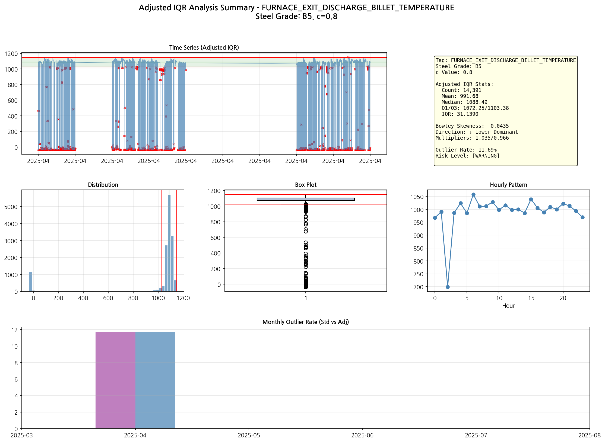

---

##### 월별 상세 분석

**2025-04**

**통계 요약**:

| 지표 | 값 |
|------|-------|
| 분석 레코드 | 14,391 |
| 평균 | 991.6790 |
| 중앙값 | 1088.4920 |
| IQR | 31.1390 |
| Bowley 왜도 | -0.0435 |
| Adj 이상치 수 | 1,682 |
| Adj 이상치율 | 11.69% |
| Std 이상치율 | 11.72% |
| 개선율 | 0.3% |

**주요 이상치 발생 날짜**:

- 1. 2025-04-09: 705건
- 2. 2025-04-16: 390건
- 3. 2025-04-12: 297건

**1. 시계열 (Time Series)**

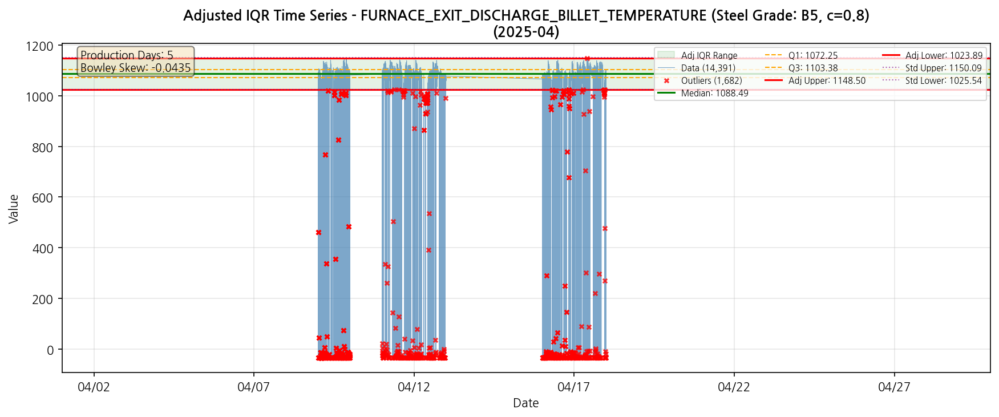

**2. 분포 히스토그램 (Distribution Histogram)**

**3. 박스플롯 (Box Plot)**

**4. 일별 평균 추이 (Daily Average Trend)**

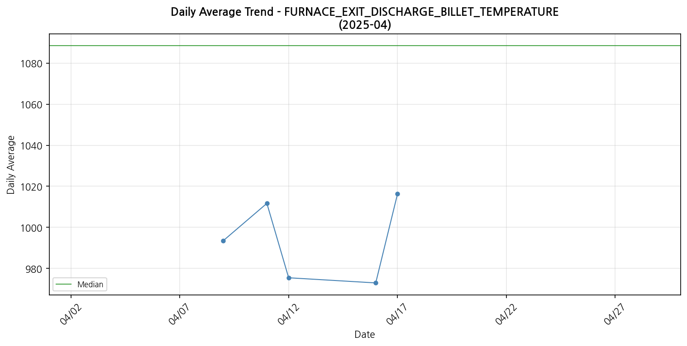

**5. 시간별 패턴 (Hourly Pattern)**

**6. 일별 이상치 수 (Daily Outlier Count)**

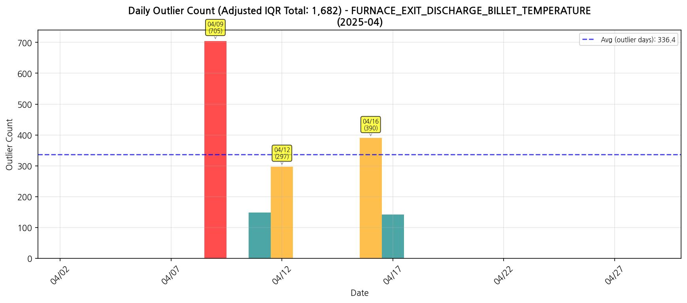

**월별 종합 차트**

---

#### STAND_14_ACTUAL_SPEED 🟠

**위험도**: [WARNING] | **이상치율**: 10.94% | **개선율**: 0.0%
**Bowley 왜도**: 0.5798 | **승수 (L/U)**: 0.629/1.590

**데이터**: 원본 14,391 → 필터 후 14,238 (1.1% 제외)

| 통계 지표 | Adjusted IQR | Standard IQR |
|-----------|--------------|--------------|
| 이상치 수 | 1,558 | 1,558 |
| 이상치율 | 10.94% | 10.94% |
| 하한 경계 | 1075.0303 | 1047.9061 |
| 상한 경계 | 1285.9363 | 1242.8051 |

| 기본 통계 | 값 |
|-----------|-------|
| 분석 레코드 | 14,238 |
| 평균 | 1028.9746 |
| 표준편차 | 350.5875 |
| Q1 (25%) | 1120.9932 |
| 중앙값 | 1131.2310 |
| Q3 (75%) | 1169.7180 |
| IQR | 48.7248 |

**월별 이상치 추이**:

| 월 | 레코드 수 | 평균 | Adj 이상치율 | Std 이상치율 |
|-----|-----------|------|--------------|---------------|
| 2025-04 | 14,238 | 1028.97 | 10.94% | 10.94% |

**주요 이상치 발생 날짜** (상위 5일):

| 순위 | 날짜 | 이상치 수 |
|:----:|------|----------:|
| 1 | 2025-04-09 | 941 |
| 2 | 2025-04-16 | 258 |
| 3 | 2025-04-12 | 235 |
| 4 | 2025-04-11 | 76 |
| 5 | 2025-04-17 | 48 |

- 이상치 발생 일수: 5일
- 최대 일별 이상치: 941건 (2025-04-09)
- 평균 일별 이상치: 311.6건

##### 차트 분석

**1. 시계열 (Time Series)**

**2. 분포 히스토그램 (Distribution Histogram)**

**3. 박스플롯 (Box Plot)**

**4. 일별 평균 추이 (Daily Average Trend)**

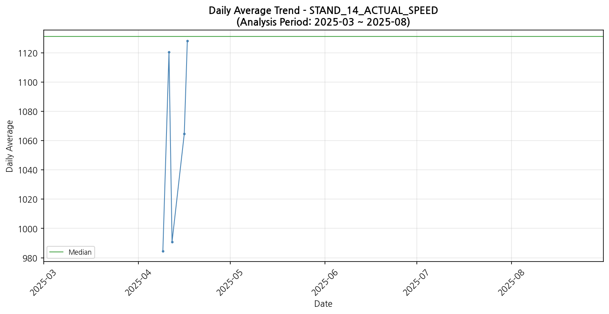

**5. 월별 이상치율 (Monthly Outlier Rate)**

**6. 시간별 패턴 (Hourly Pattern)**

**7. 일별 이상치 수 (Daily Outlier Count)**

**종합 분석 차트**

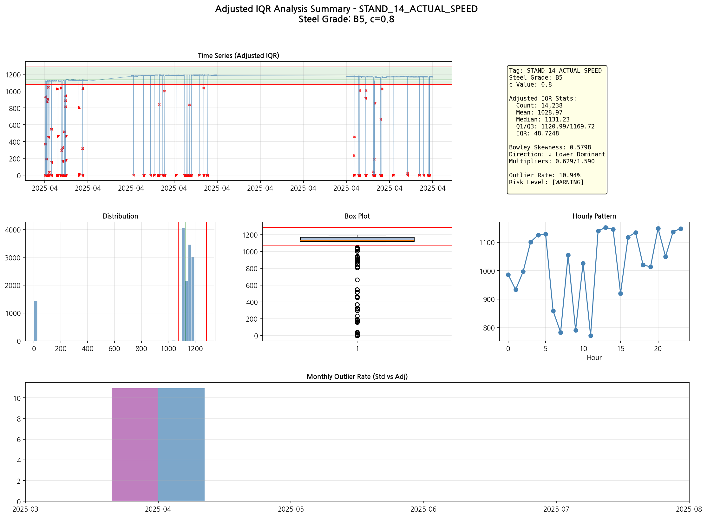

---

##### 월별 상세 분석

**2025-04**

**통계 요약**:

| 지표 | 값 |
|------|-------|
| 분석 레코드 | 14,238 |
| 평균 | 1028.9746 |
| 중앙값 | 1131.2310 |
| IQR | 48.7248 |
| Bowley 왜도 | 0.5798 |
| Adj 이상치 수 | 1,558 |
| Adj 이상치율 | 10.94% |
| Std 이상치율 | 10.94% |
| 개선율 | 0.0% |

**주요 이상치 발생 날짜**:

- 1. 2025-04-09: 941건
- 2. 2025-04-16: 258건
- 3. 2025-04-12: 235건

**1. 시계열 (Time Series)**

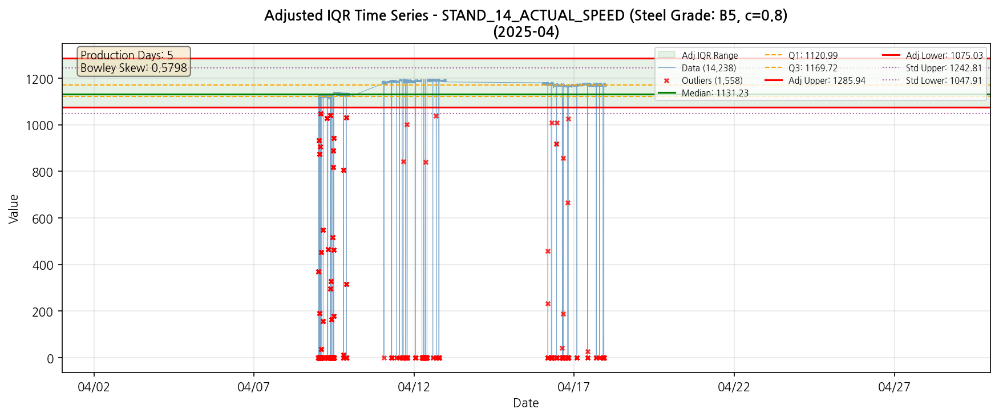

**2. 분포 히스토그램 (Distribution Histogram)**

**3. 박스플롯 (Box Plot)**

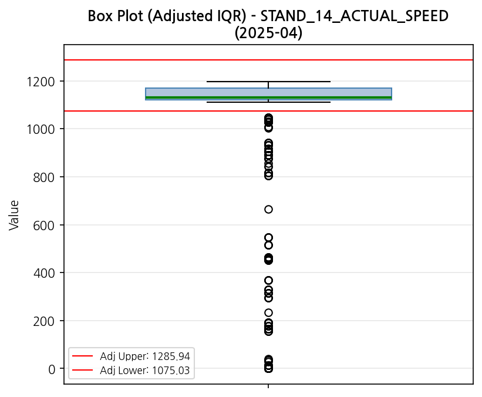

**4. 일별 평균 추이 (Daily Average Trend)**

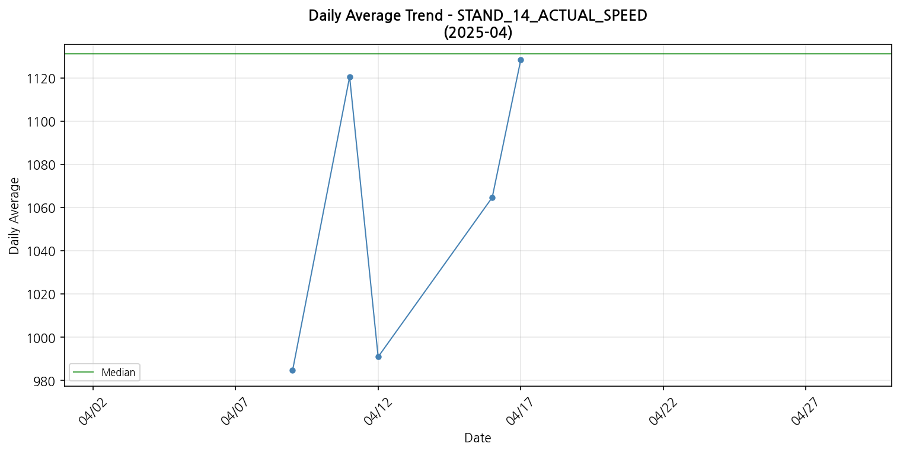

**5. 시간별 패턴 (Hourly Pattern)**

**6. 일별 이상치 수 (Daily Outlier Count)**

**월별 종합 차트**

---

#### STAND_12_ACTUAL_SPEED 🟠

**위험도**: [WARNING] | **이상치율**: 10.94% | **개선율**: 0.1%
**Bowley 왜도**: -0.0686 | **승수 (L/U)**: 1.056/0.947

**데이터**: 원본 14,391 → 필터 후 14,238 (1.1% 제외)

| 통계 지표 | Adjusted IQR | Standard IQR |
|-----------|--------------|--------------|
| 이상치 수 | 1,558 | 1,560 |
| 이상치율 | 10.94% | 10.96% |
| 하한 경계 | 1036.5747 | 1038.8790 |
| 상한 경계 | 1145.5858 | 1147.7670 |

| 기본 통계 | 값 |
|-----------|-------|
| 분석 레코드 | 14,238 |
| 평균 | 981.5684 |
| 표준편차 | 333.7003 |
| Q1 (25%) | 1079.7120 |
| 중앙값 | 1094.2570 |
| Q3 (75%) | 1106.9340 |
| IQR | 27.2220 |

**월별 이상치 추이**:

| 월 | 레코드 수 | 평균 | Adj 이상치율 | Std 이상치율 |
|-----|-----------|------|--------------|---------------|
| 2025-04 | 14,238 | 981.57 | 10.94% | 10.96% |

**주요 이상치 발생 날짜** (상위 5일):

| 순위 | 날짜 | 이상치 수 |
|:----:|------|----------:|
| 1 | 2025-04-09 | 941 |
| 2 | 2025-04-16 | 258 |
| 3 | 2025-04-12 | 235 |
| 4 | 2025-04-11 | 76 |
| 5 | 2025-04-17 | 48 |

- 이상치 발생 일수: 5일
- 최대 일별 이상치: 941건 (2025-04-09)
- 평균 일별 이상치: 311.6건

##### 차트 분석

**1. 시계열 (Time Series)**

**2. 분포 히스토그램 (Distribution Histogram)**

**3. 박스플롯 (Box Plot)**

**4. 일별 평균 추이 (Daily Average Trend)**

**5. 월별 이상치율 (Monthly Outlier Rate)**

**6. 시간별 패턴 (Hourly Pattern)**

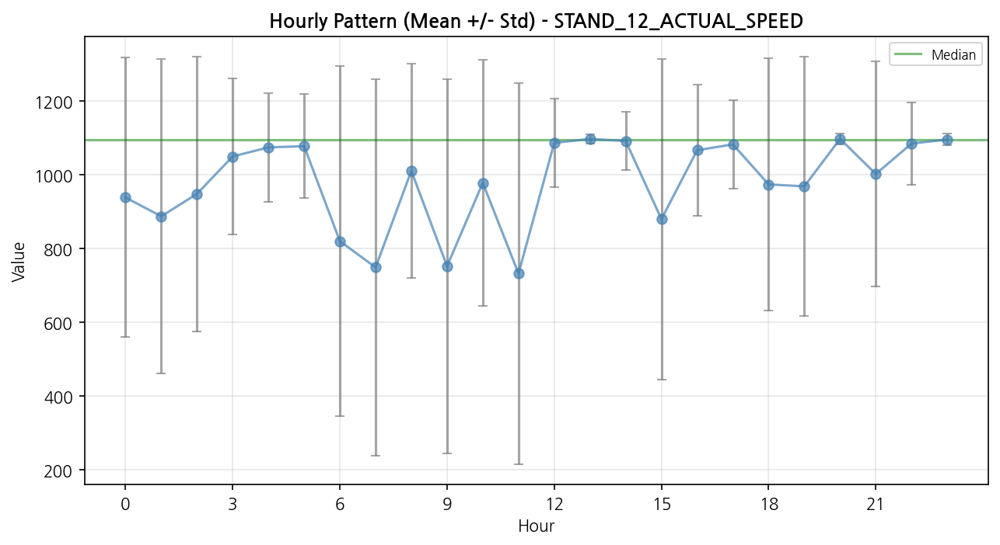

**7. 일별 이상치 수 (Daily Outlier Count)**

**종합 분석 차트**

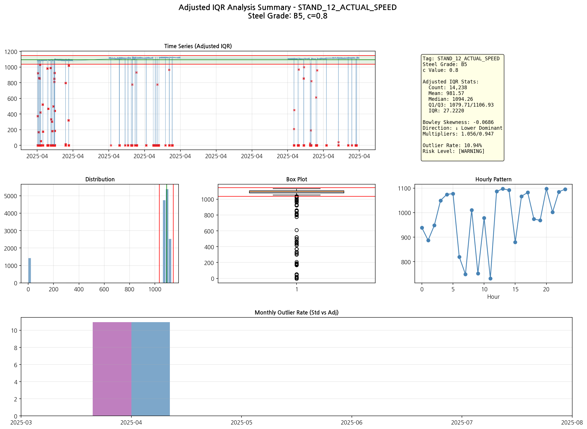

---

##### 월별 상세 분석

**2025-04**

**통계 요약**:

| 지표 | 값 |
|------|-------|
| 분석 레코드 | 14,238 |
| 평균 | 981.5684 |
| 중앙값 | 1094.2570 |
| IQR | 27.2220 |
| Bowley 왜도 | -0.0686 |
| Adj 이상치 수 | 1,558 |
| Adj 이상치율 | 10.94% |
| Std 이상치율 | 10.96% |
| 개선율 | 0.1% |

**주요 이상치 발생 날짜**:

- 1. 2025-04-09: 941건
- 2. 2025-04-16: 258건
- 3. 2025-04-12: 235건

**1. 시계열 (Time Series)**

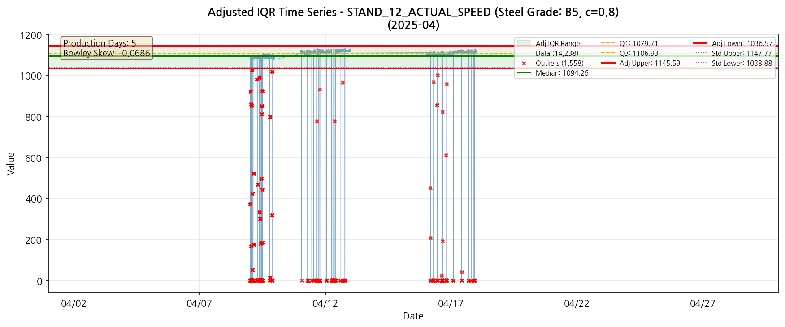

**2. 분포 히스토그램 (Distribution Histogram)**

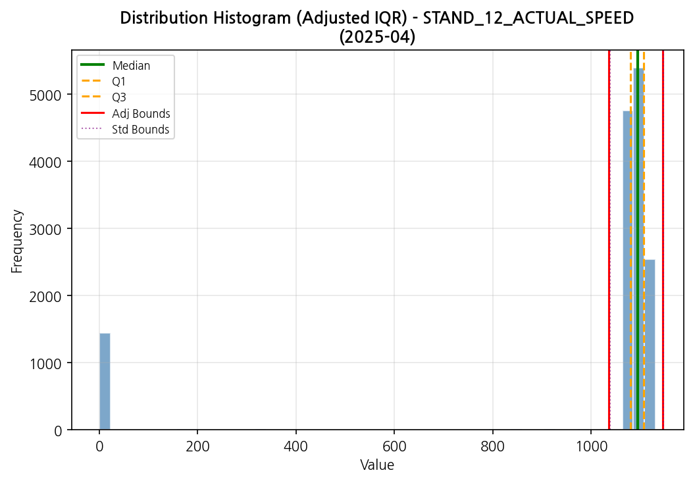

**3. 박스플롯 (Box Plot)**

**4. 일별 평균 추이 (Daily Average Trend)**

**5. 시간별 패턴 (Hourly Pattern)**

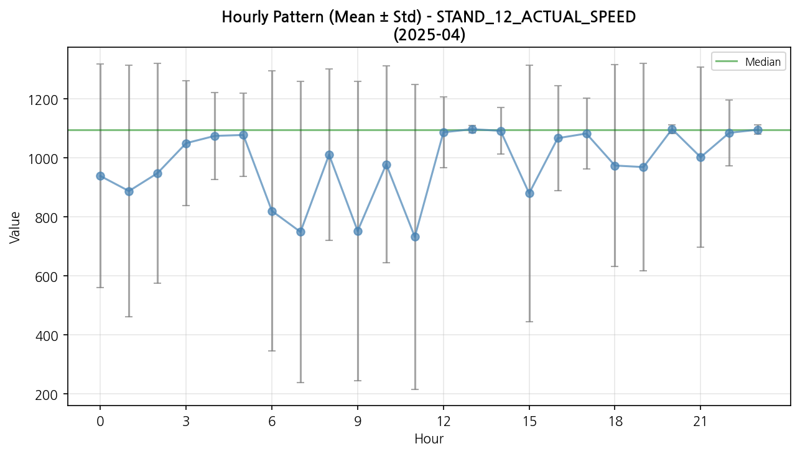

**6. 일별 이상치 수 (Daily Outlier Count)**

**월별 종합 차트**

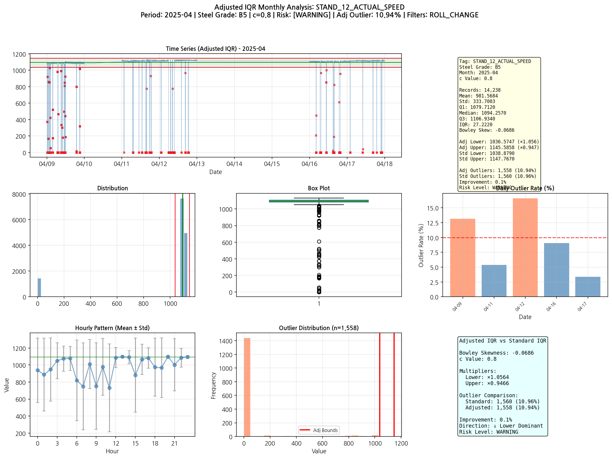

---

#### STAND_13_ACTUAL_SPEED 🟠

**위험도**: [WARNING] | **이상치율**: 10.94% | **개선율**: -0.3%
**Bowley 왜도**: 0.3516 | **승수 (L/U)**: 0.755/1.325

**데이터**: 원본 14,391 → 필터 후 14,238 (1.1% 제외)

| 통계 지표 | Adjusted IQR | Standard IQR |
|-----------|--------------|--------------|
| 이상치 수 | 1,558 | 1,554 |
| 이상치율 | 10.94% | 10.91% |
| 하한 경계 | 1007.3453 | 992.6621 |
| 상한 경계 | 1171.8233 | 1152.3711 |

| 기본 통계 | 값 |
|-----------|-------|
| 분석 레코드 | 14,238 |
| 평균 | 963.8830 |
| 표준편차 | 328.1432 |
| Q1 (25%) | 1052.5530 |
| 중앙값 | 1065.4980 |
| Q3 (75%) | 1092.4803 |
| IQR | 39.9272 |

**월별 이상치 추이**:

| 월 | 레코드 수 | 평균 | Adj 이상치율 | Std 이상치율 |
|-----|-----------|------|--------------|---------------|
| 2025-04 | 14,238 | 963.88 | 10.94% | 10.91% |

**주요 이상치 발생 날짜** (상위 5일):

| 순위 | 날짜 | 이상치 수 |
|:----:|------|----------:|
| 1 | 2025-04-09 | 941 |
| 2 | 2025-04-16 | 258 |
| 3 | 2025-04-12 | 235 |
| 4 | 2025-04-11 | 76 |
| 5 | 2025-04-17 | 48 |

- 이상치 발생 일수: 5일
- 최대 일별 이상치: 941건 (2025-04-09)
- 평균 일별 이상치: 311.6건

##### 차트 분석

**1. 시계열 (Time Series)**

**2. 분포 히스토그램 (Distribution Histogram)**

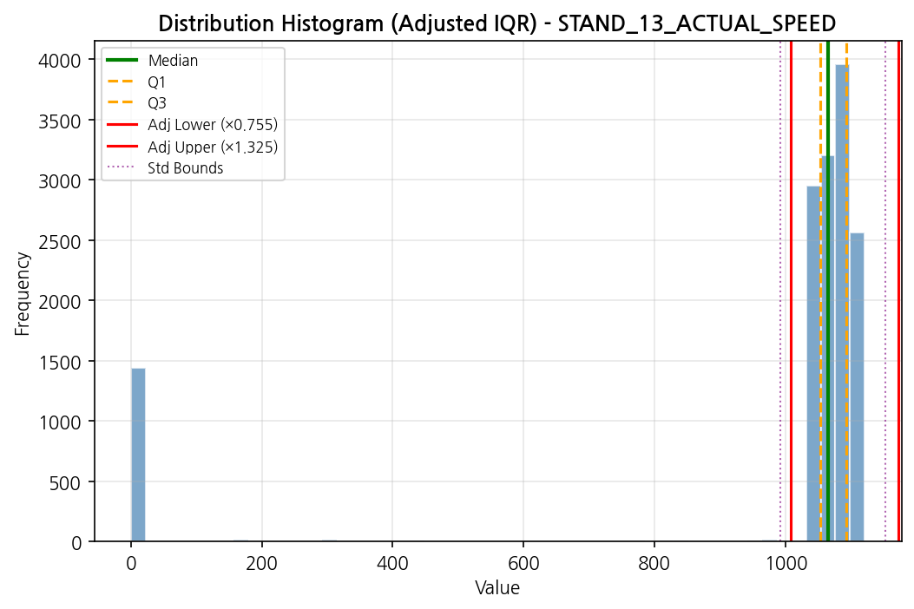

**3. 박스플롯 (Box Plot)**

**4. 일별 평균 추이 (Daily Average Trend)**

**5. 월별 이상치율 (Monthly Outlier Rate)**

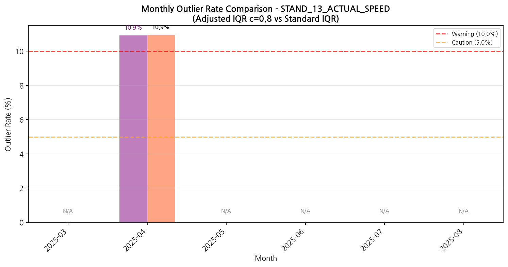

**6. 시간별 패턴 (Hourly Pattern)**

**7. 일별 이상치 수 (Daily Outlier Count)**

**종합 분석 차트**

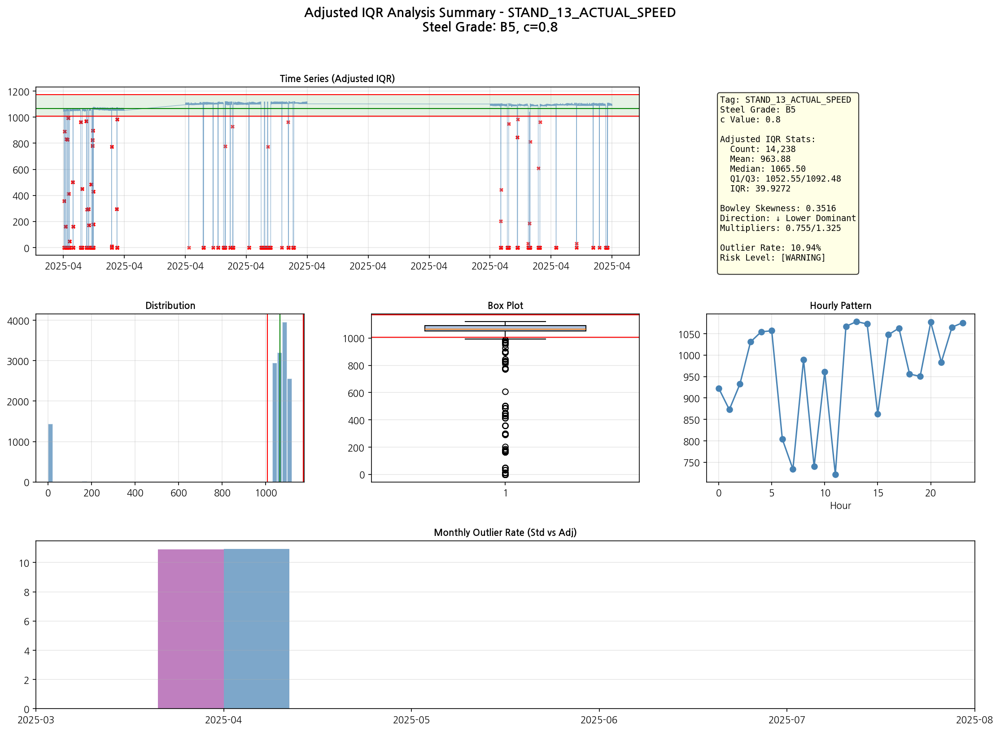

---

##### 월별 상세 분석

**2025-04**

**통계 요약**:

| 지표 | 값 |
|------|-------|
| 분석 레코드 | 14,238 |
| 평균 | 963.8830 |
| 중앙값 | 1065.4980 |
| IQR | 39.9272 |
| Bowley 왜도 | 0.3516 |
| Adj 이상치 수 | 1,558 |
| Adj 이상치율 | 10.94% |
| Std 이상치율 | 10.91% |
| 개선율 | -0.3% |

**주요 이상치 발생 날짜**:

- 1. 2025-04-09: 941건
- 2. 2025-04-16: 258건
- 3. 2025-04-12: 235건

**1. 시계열 (Time Series)**

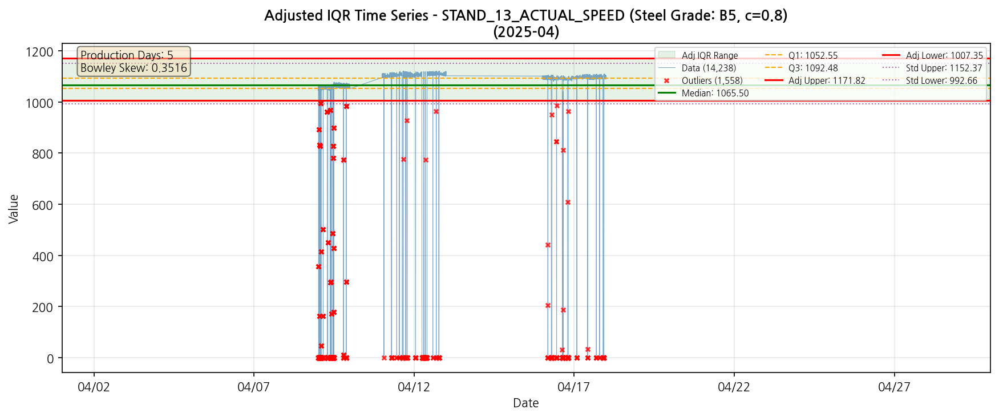

**2. 분포 히스토그램 (Distribution Histogram)**

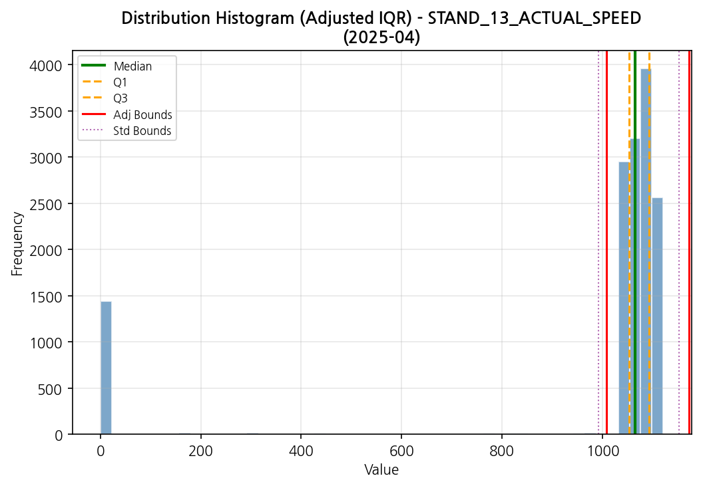

**3. 박스플롯 (Box Plot)**

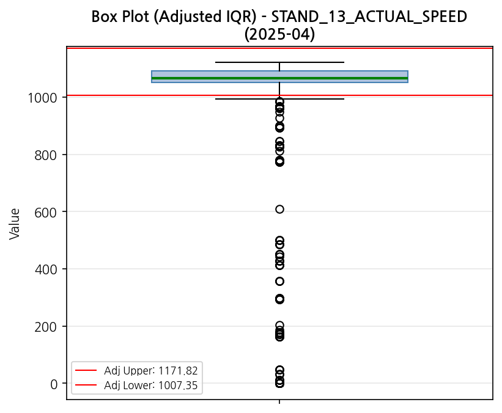

**4. 일별 평균 추이 (Daily Average Trend)**

**5. 시간별 패턴 (Hourly Pattern)**

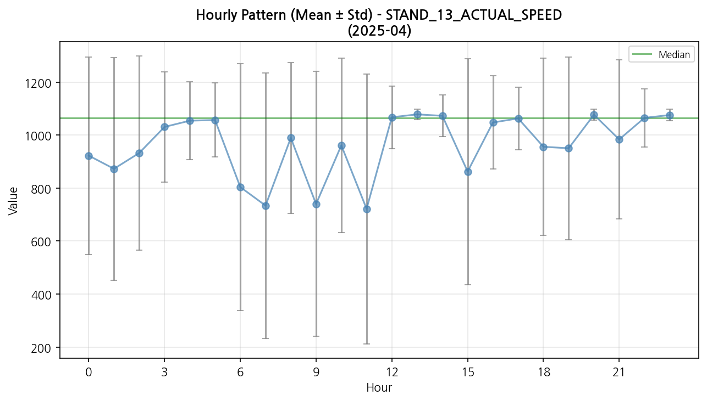

**6. 일별 이상치 수 (Daily Outlier Count)**

**월별 종합 차트**

---

#### STAND_10_ACTUAL_SPEED 🟠

**위험도**: [WARNING] | **이상치율**: 10.89% | **개선율**: -0.3%
**Bowley 왜도**: 0.2146 | **승수 (L/U)**: 0.842/1.187

**데이터**: 원본 14,391 → 필터 후 14,238 (1.1% 제외)

| 통계 지표 | Adjusted IQR | Standard IQR |
|-----------|--------------|--------------|
| 이상치 수 | 1,551 | 1,547 |
| 이상치율 | 10.89% | 10.87% |
| 하한 경계 | 997.1997 | 991.3855 |
| 상한 경계 | 1096.5727 | 1089.6695 |

| 기본 통계 | 값 |
|-----------|-------|
| 분석 레코드 | 14,238 |
| 평균 | 933.5404 |
| 표준편차 | 316.4144 |
| Q1 (25%) | 1028.2420 |
| 중앙값 | 1037.8910 |
| Q3 (75%) | 1052.8130 |
| IQR | 24.5710 |

**월별 이상치 추이**:

| 월 | 레코드 수 | 평균 | Adj 이상치율 | Std 이상치율 |
|-----|-----------|------|--------------|---------------|
| 2025-04 | 14,238 | 933.54 | 10.89% | 10.87% |

**주요 이상치 발생 날짜** (상위 5일):

| 순위 | 날짜 | 이상치 수 |
|:----:|------|----------:|
| 1 | 2025-04-09 | 938 |
| 2 | 2025-04-16 | 261 |
| 3 | 2025-04-12 | 236 |
| 4 | 2025-04-11 | 68 |
| 5 | 2025-04-17 | 48 |

- 이상치 발생 일수: 5일
- 최대 일별 이상치: 938건 (2025-04-09)
- 평균 일별 이상치: 310.2건

##### 차트 분석

**1. 시계열 (Time Series)**

**2. 분포 히스토그램 (Distribution Histogram)**

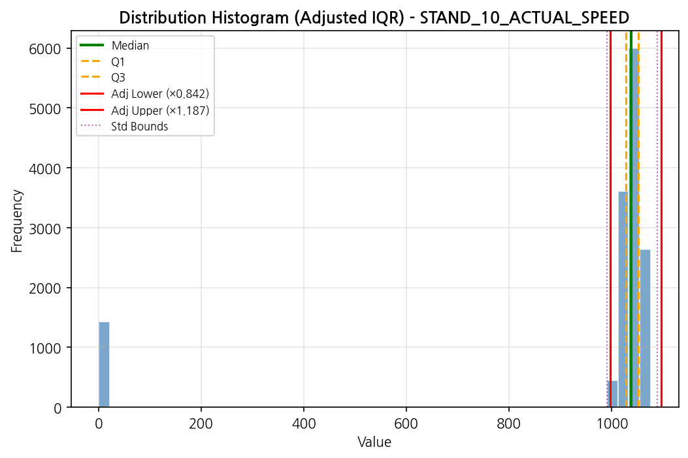

**3. 박스플롯 (Box Plot)**

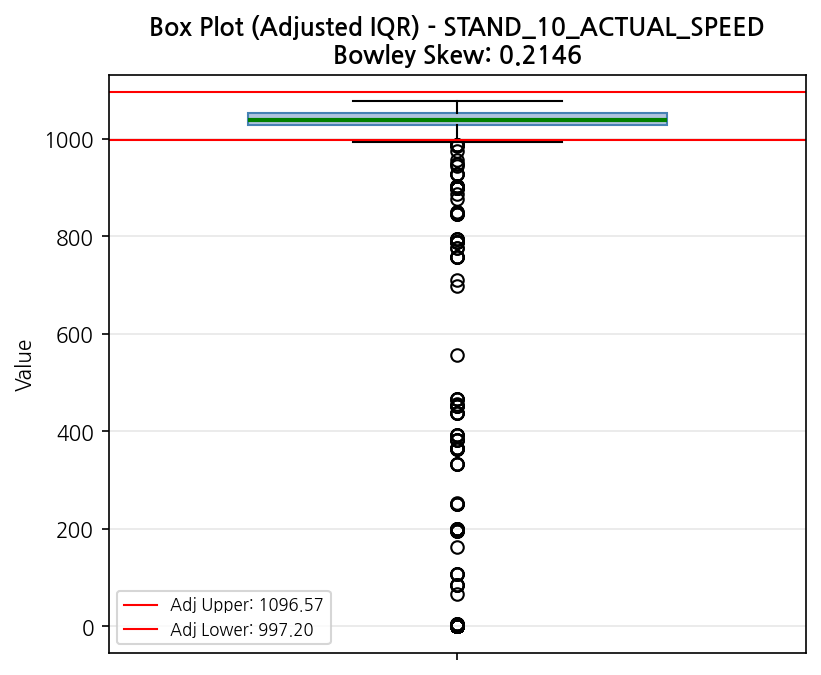

**4. 일별 평균 추이 (Daily Average Trend)**

**5. 월별 이상치율 (Monthly Outlier Rate)**

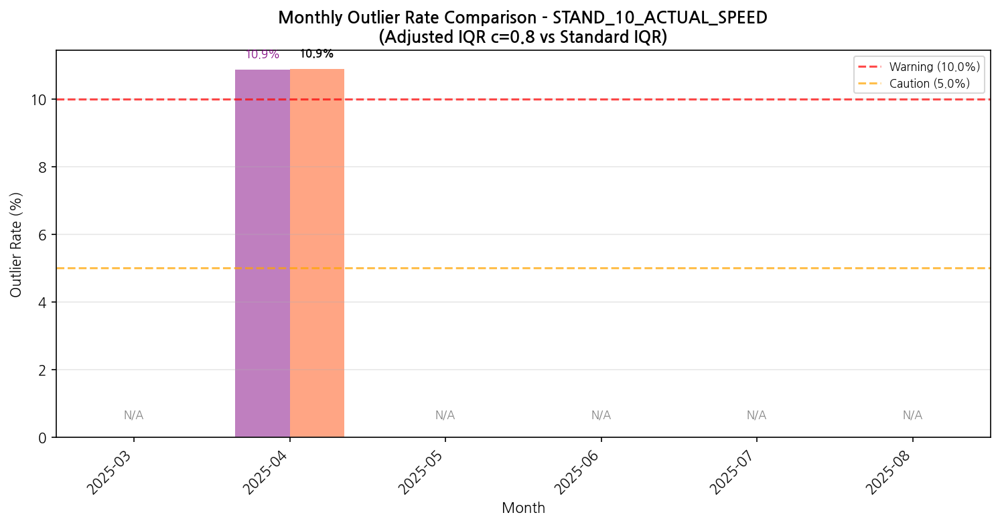

**6. 시간별 패턴 (Hourly Pattern)**

**7. 일별 이상치 수 (Daily Outlier Count)**

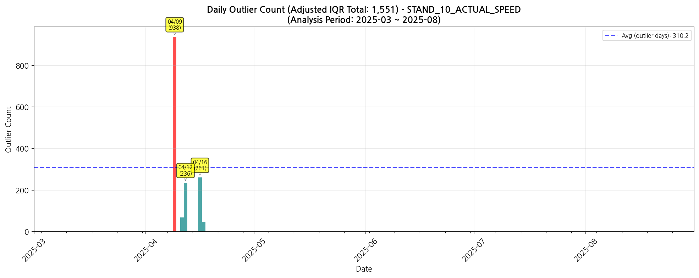

**종합 분석 차트**

---

##### 월별 상세 분석

**2025-04**

**통계 요약**:

| 지표 | 값 |
|------|-------|
| 분석 레코드 | 14,238 |
| 평균 | 933.5404 |
| 중앙값 | 1037.8910 |
| IQR | 24.5710 |
| Bowley 왜도 | 0.2146 |
| Adj 이상치 수 | 1,551 |
| Adj 이상치율 | 10.89% |
| Std 이상치율 | 10.87% |
| 개선율 | -0.3% |

**주요 이상치 발생 날짜**:

- 1. 2025-04-09: 938건
- 2. 2025-04-16: 261건
- 3. 2025-04-12: 236건

**1. 시계열 (Time Series)**

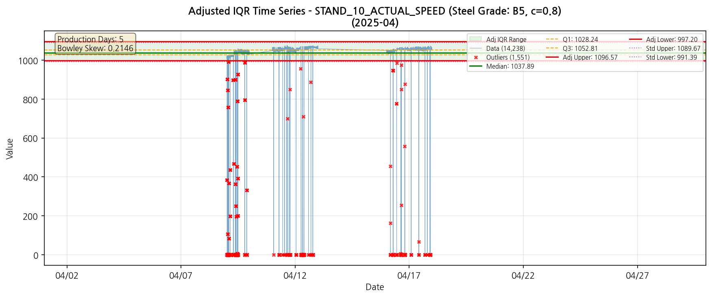

**2. 분포 히스토그램 (Distribution Histogram)**

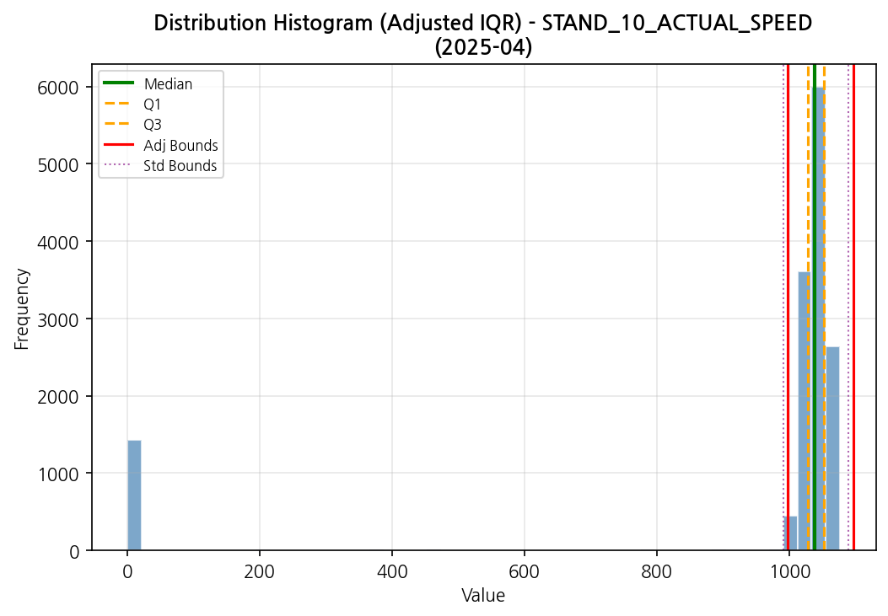

**3. 박스플롯 (Box Plot)**

**4. 일별 평균 추이 (Daily Average Trend)**

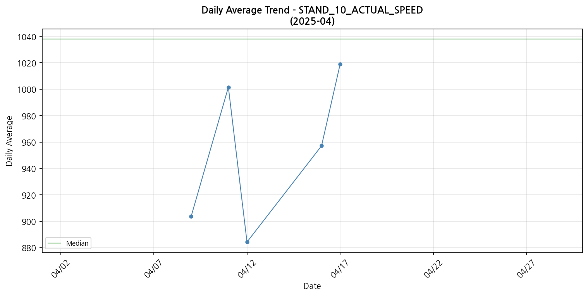

**5. 시간별 패턴 (Hourly Pattern)**

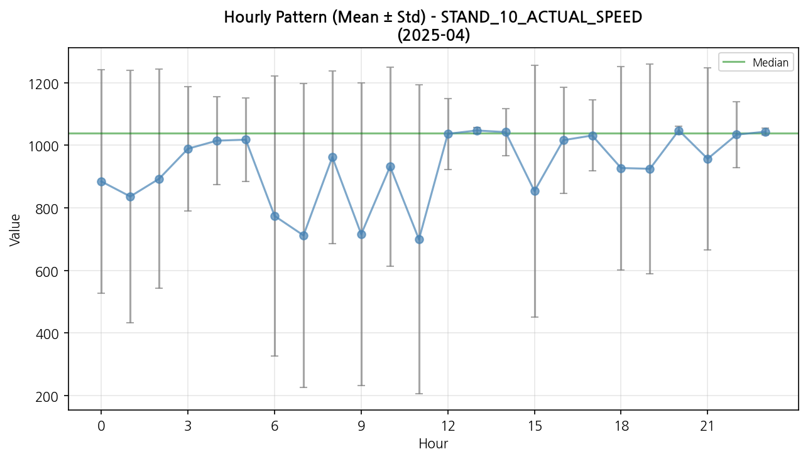

**6. 일별 이상치 수 (Daily Outlier Count)**

**월별 종합 차트**

---

#### STAND_11_ACTUAL_SPEED 🟠

**위험도**: [WARNING] | **이상치율**: 10.89% | **개선율**: -0.3%
**Bowley 왜도**: 0.3008 | **승수 (L/U)**: 0.786/1.272

**데이터**: 원본 14,391 → 필터 후 14,238 (1.1% 제외)

| 통계 지표 | Adjusted IQR | Standard IQR |
|-----------|--------------|--------------|
| 이상치 수 | 1,550 | 1,545 |
| 이상치율 | 10.89% | 10.85% |
| 하한 경계 | 1093.2929 | 1080.7096 |
| 상한 경계 | 1253.6132 | 1237.6066 |

| 기본 통계 | 값 |
|-----------|-------|
| 분석 레코드 | 14,238 |
| 평균 | 1039.4749 |
| 표준편차 | 353.3792 |
| Q1 (25%) | 1139.5460 |
| 중앙값 | 1153.2590 |
| Q3 (75%) | 1178.7703 |
| IQR | 39.2242 |

**월별 이상치 추이**:

| 월 | 레코드 수 | 평균 | Adj 이상치율 | Std 이상치율 |
|-----|-----------|------|--------------|---------------|
| 2025-04 | 14,238 | 1039.47 | 10.89% | 10.85% |

**주요 이상치 발생 날짜** (상위 5일):

| 순위 | 날짜 | 이상치 수 |
|:----:|------|----------:|
| 1 | 2025-04-09 | 933 |
| 2 | 2025-04-16 | 258 |
| 3 | 2025-04-12 | 235 |
| 4 | 2025-04-11 | 76 |
| 5 | 2025-04-17 | 48 |

- 이상치 발생 일수: 5일
- 최대 일별 이상치: 933건 (2025-04-09)
- 평균 일별 이상치: 310.0건

##### 차트 분석

**1. 시계열 (Time Series)**

**2. 분포 히스토그램 (Distribution Histogram)**

**3. 박스플롯 (Box Plot)**

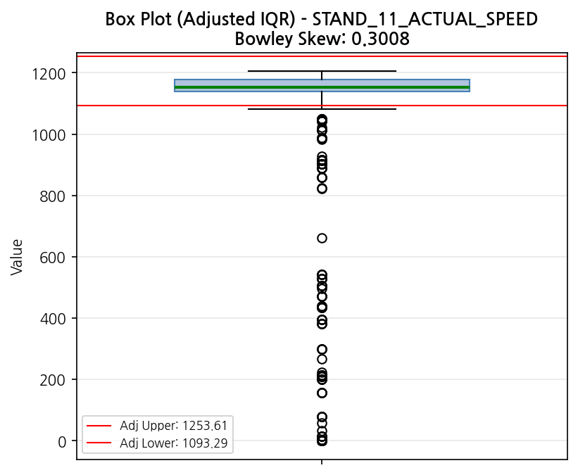

**4. 일별 평균 추이 (Daily Average Trend)**

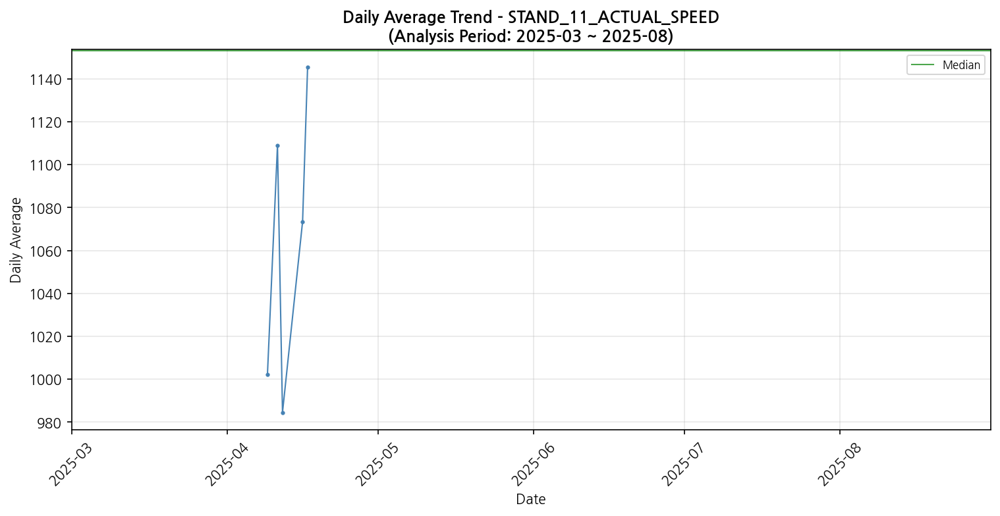

**5. 월별 이상치율 (Monthly Outlier Rate)**

**6. 시간별 패턴 (Hourly Pattern)**

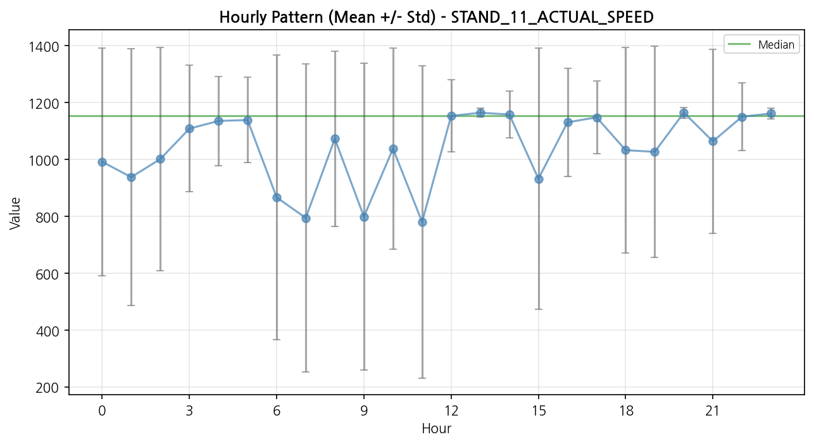

**7. 일별 이상치 수 (Daily Outlier Count)**

**종합 분석 차트**

---

##### 월별 상세 분석

**2025-04**

**통계 요약**:

| 지표 | 값 |
|------|-------|
| 분석 레코드 | 14,238 |
| 평균 | 1039.4749 |
| 중앙값 | 1153.2590 |
| IQR | 39.2242 |
| Bowley 왜도 | 0.3008 |
| Adj 이상치 수 | 1,550 |
| Adj 이상치율 | 10.89% |
| Std 이상치율 | 10.85% |
| 개선율 | -0.3% |

**주요 이상치 발생 날짜**:

- 1. 2025-04-09: 933건
- 2. 2025-04-16: 258건
- 3. 2025-04-12: 235건

**1. 시계열 (Time Series)**

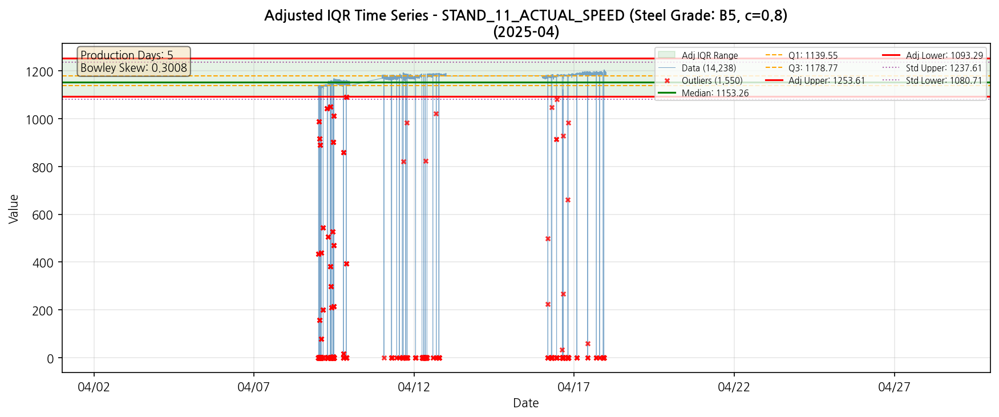

**2. 분포 히스토그램 (Distribution Histogram)**

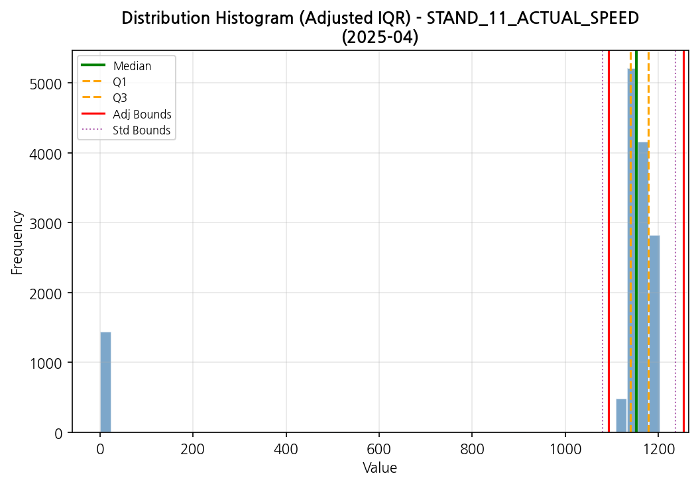

**3. 박스플롯 (Box Plot)**

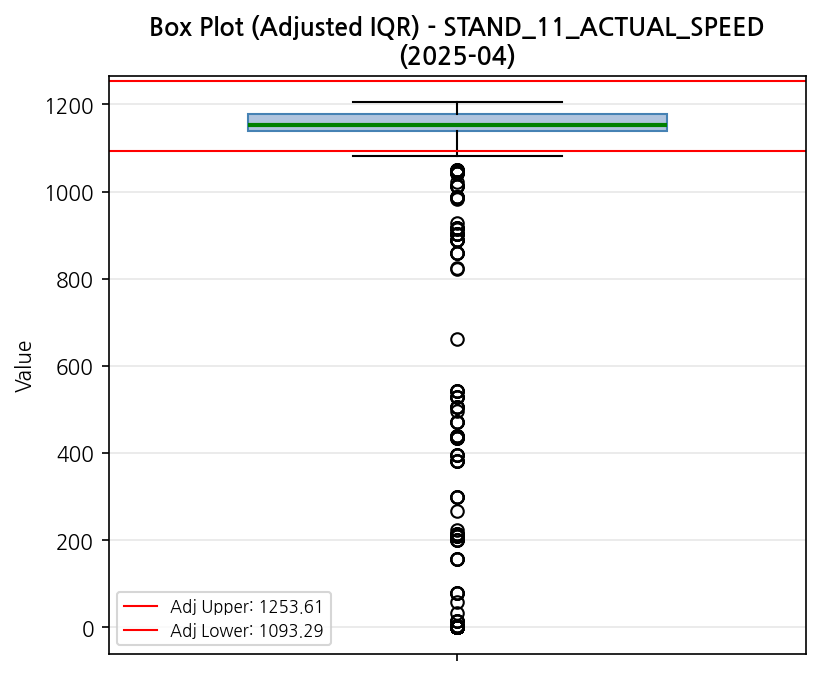

**4. 일별 평균 추이 (Daily Average Trend)**

**5. 시간별 패턴 (Hourly Pattern)**

**6. 일별 이상치 수 (Daily Outlier Count)**

**월별 종합 차트**

---

#### STAND_9_ACTUAL_SPEED 🟠

**위험도**: [WARNING] | **이상치율**: 10.88% | **개선율**: 0.0%
**Bowley 왜도**: -0.0295 | **승수 (L/U)**: 1.024/0.977

**데이터**: 원본 14,391 → 필터 후 14,238 (1.1% 제외)

| 통계 지표 | Adjusted IQR | Standard IQR |
|-----------|--------------|--------------|
| 이상치 수 | 1,549 | 1,549 |
| 이상치율 | 10.88% | 10.88% |
| 하한 경계 | 964.8639 | 965.7561 |
| 상한 경계 | 1064.6017 | 1065.4731 |

| 기본 통계 | 값 |
|-----------|-------|
| 분석 레코드 | 14,238 |
| 평균 | 911.6724 |
| 표준편차 | 309.8655 |
| Q1 (25%) | 1003.1500 |
| 중앙값 | 1015.9820 |
| Q3 (75%) | 1028.0793 |
| IQR | 24.9293 |

**월별 이상치 추이**:

| 월 | 레코드 수 | 평균 | Adj 이상치율 | Std 이상치율 |
|-----|-----------|------|--------------|---------------|
| 2025-04 | 14,238 | 911.67 | 10.88% | 10.88% |

**주요 이상치 발생 날짜** (상위 5일):

| 순위 | 날짜 | 이상치 수 |
|:----:|------|----------:|
| 1 | 2025-04-09 | 929 |
| 2 | 2025-04-16 | 260 |
| 3 | 2025-04-12 | 236 |
| 4 | 2025-04-11 | 76 |
| 5 | 2025-04-17 | 48 |

- 이상치 발생 일수: 5일
- 최대 일별 이상치: 929건 (2025-04-09)
- 평균 일별 이상치: 309.8건

##### 차트 분석

**1. 시계열 (Time Series)**

**2. 분포 히스토그램 (Distribution Histogram)**

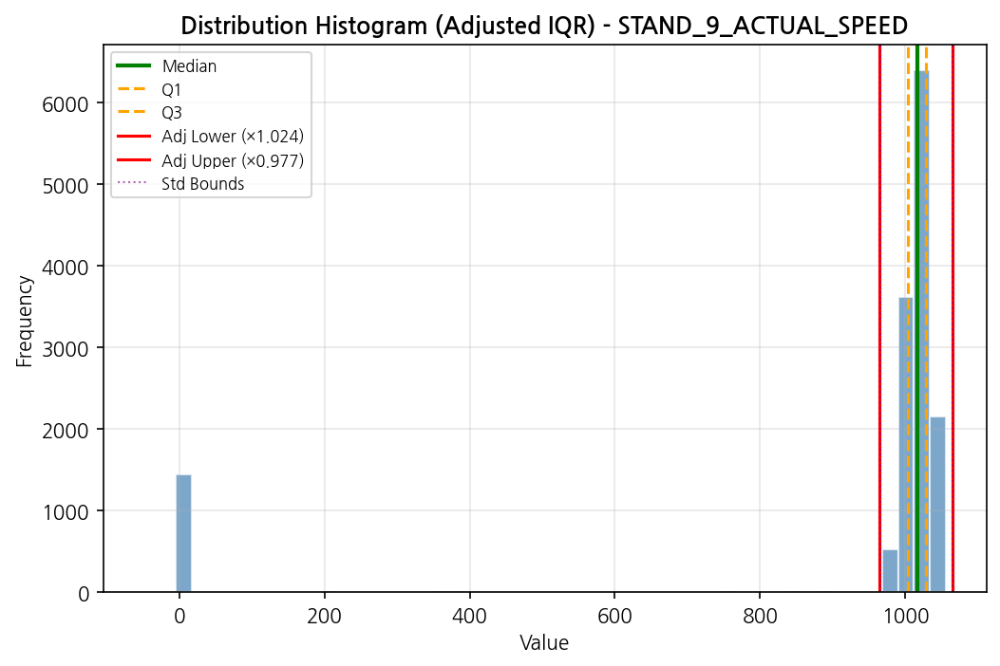

**3. 박스플롯 (Box Plot)**

**4. 일별 평균 추이 (Daily Average Trend)**

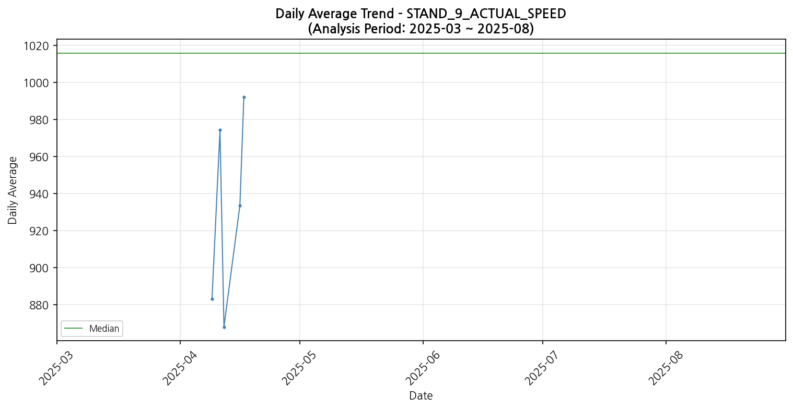

**5. 월별 이상치율 (Monthly Outlier Rate)**

**6. 시간별 패턴 (Hourly Pattern)**

**7. 일별 이상치 수 (Daily Outlier Count)**

**종합 분석 차트**

---

##### 월별 상세 분석

**2025-04**

**통계 요약**:

| 지표 | 값 |
|------|-------|
| 분석 레코드 | 14,238 |
| 평균 | 911.6724 |
| 중앙값 | 1015.9820 |
| IQR | 24.9293 |
| Bowley 왜도 | -0.0295 |
| Adj 이상치 수 | 1,549 |
| Adj 이상치율 | 10.88% |
| Std 이상치율 | 10.88% |
| 개선율 | 0.0% |

**주요 이상치 발생 날짜**:

- 1. 2025-04-09: 929건
- 2. 2025-04-16: 260건
- 3. 2025-04-12: 236건

**1. 시계열 (Time Series)**

**2. 분포 히스토그램 (Distribution Histogram)**

**3. 박스플롯 (Box Plot)**

**4. 일별 평균 추이 (Daily Average Trend)**

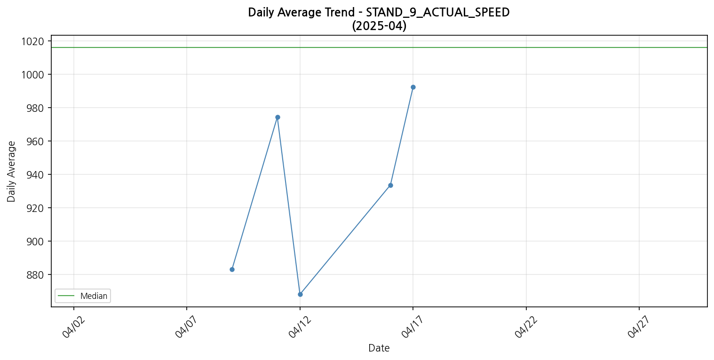

**5. 시간별 패턴 (Hourly Pattern)**

**6. 일별 이상치 수 (Daily Outlier Count)**

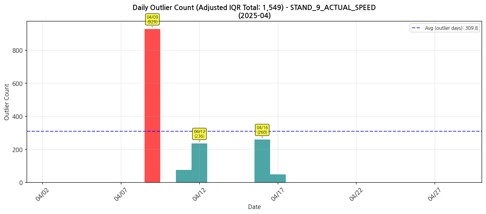

**월별 종합 차트**

---

#### STAND_7_ACTUAL_SPEED 🟠

**위험도**: [WARNING] | **이상치율**: 10.87% | **개선율**: -3.3%
**Bowley 왜도**: -0.0939 | **승수 (L/U)**: 1.078/0.928

**데이터**: 원본 14,391 → 필터 후 14,238 (1.1% 제외)

| 통계 지표 | Adjusted IQR | Standard IQR |
|-----------|--------------|--------------|
| 이상치 수 | 1,547 | 1,498 |
| 이상치율 | 10.87% | 10.52% |
| 하한 경계 | 1200.4538 | 1204.5290 |
| 상한 경계 | 1339.9888 | 1343.7690 |

| 기본 통계 | 값 |
|-----------|-------|
| 분석 레코드 | 14,238 |
| 평균 | 1158.1028 |
| 표준편차 | 376.3785 |
| Q1 (25%) | 1256.7440 |
| 중앙값 | 1275.7840 |
| Q3 (75%) | 1291.5540 |
| IQR | 34.8100 |

**월별 이상치 추이**:

| 월 | 레코드 수 | 평균 | Adj 이상치율 | Std 이상치율 |
|-----|-----------|------|--------------|---------------|
| 2025-04 | 14,238 | 1158.10 | 10.87% | 10.52% |

**주요 이상치 발생 날짜** (상위 5일):

| 순위 | 날짜 | 이상치 수 |
|:----:|------|----------:|
| 1 | 2025-04-09 | 818 |
| 2 | 2025-04-12 | 264 |
| 3 | 2025-04-16 | 253 |
| 4 | 2025-04-11 | 164 |
| 5 | 2025-04-17 | 48 |

- 이상치 발생 일수: 5일
- 최대 일별 이상치: 818건 (2025-04-09)
- 평균 일별 이상치: 309.4건

##### 차트 분석

**1. 시계열 (Time Series)**

**2. 분포 히스토그램 (Distribution Histogram)**

**3. 박스플롯 (Box Plot)**

**4. 일별 평균 추이 (Daily Average Trend)**

**5. 월별 이상치율 (Monthly Outlier Rate)**

**6. 시간별 패턴 (Hourly Pattern)**

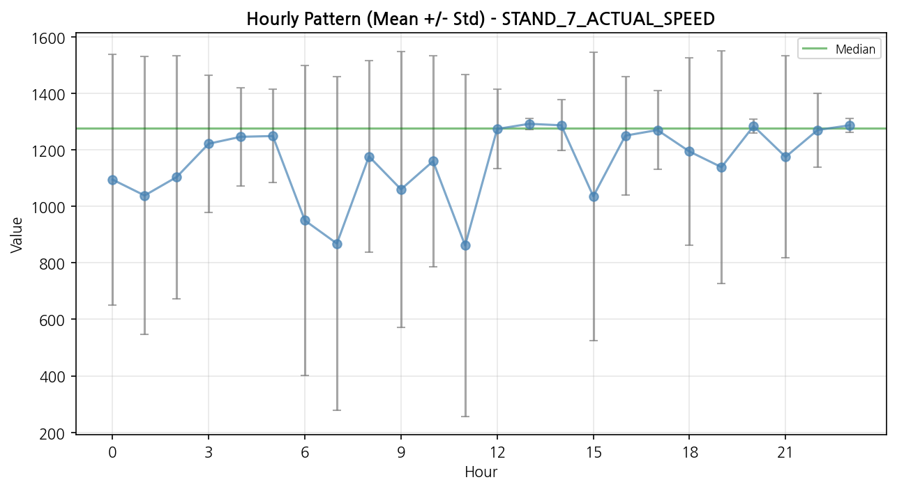

**7. 일별 이상치 수 (Daily Outlier Count)**

**종합 분석 차트**

---

##### 월별 상세 분석

**2025-04**

**통계 요약**:

| 지표 | 값 |
|------|-------|
| 분석 레코드 | 14,238 |
| 평균 | 1158.1028 |
| 중앙값 | 1275.7840 |
| IQR | 34.8100 |
| Bowley 왜도 | -0.0939 |
| Adj 이상치 수 | 1,547 |
| Adj 이상치율 | 10.87% |
| Std 이상치율 | 10.52% |
| 개선율 | -3.3% |

**주요 이상치 발생 날짜**:

- 1. 2025-04-09: 818건
- 2. 2025-04-12: 264건
- 3. 2025-04-16: 253건

**1. 시계열 (Time Series)**

**2. 분포 히스토그램 (Distribution Histogram)**

**3. 박스플롯 (Box Plot)**

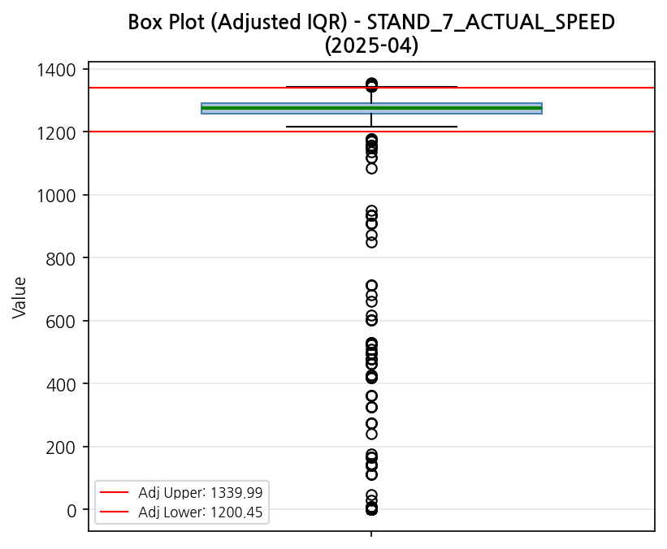

**4. 일별 평균 추이 (Daily Average Trend)**

**5. 시간별 패턴 (Hourly Pattern)**

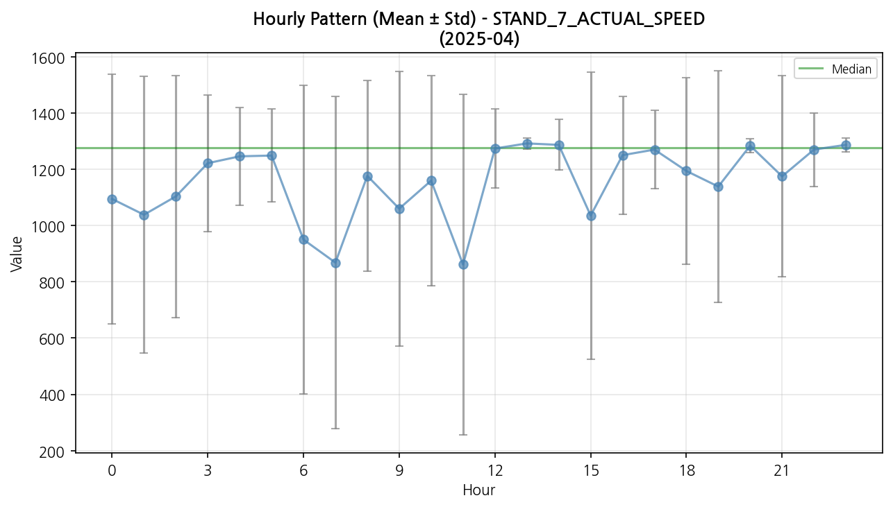

**6. 일별 이상치 수 (Daily Outlier Count)**

**월별 종합 차트**

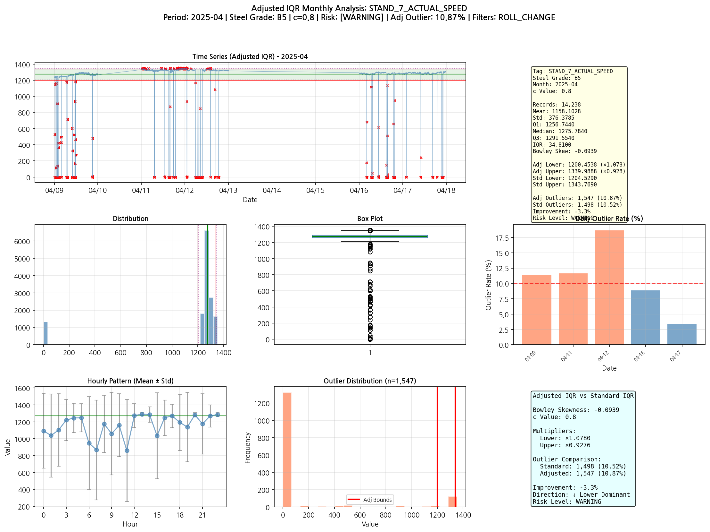

---

#### STAND_1_ACTUAL_SPEED 🟠

**위험도**: [WARNING] | **이상치율**: 10.60% | **개선율**: 18.9%
**Bowley 왜도**: 0.5117 | **승수 (L/U)**: 0.664/1.506

**데이터**: 원본 14,391 → 필터 후 14,238 (1.1% 제외)

| 통계 지표 | Adjusted IQR | Standard IQR |
|-----------|--------------|--------------|
| 이상치 수 | 1,509 | 1,860 |
| 이상치율 | 10.60% | 13.06% |
| 하한 경계 | 644.0130 | 637.5620 |
| 상한 경계 | 698.4889 | 688.7749 |

| 기본 통계 | 값 |
|-----------|-------|
| 분석 레코드 | 14,238 |
| 평균 | 601.0293 |
| 표준편차 | 195.1708 |
| Q1 (25%) | 656.7668 |
| 중앙값 | 659.8930 |
| Q3 (75%) | 669.5701 |
| IQR | 12.8032 |

**월별 이상치 추이**:

| 월 | 레코드 수 | 평균 | Adj 이상치율 | Std 이상치율 |
|-----|-----------|------|--------------|---------------|
| 2025-04 | 14,238 | 601.03 | 10.60% | 13.06% |

**주요 이상치 발생 날짜** (상위 5일):

| 순위 | 날짜 | 이상치 수 |
|:----:|------|----------:|
| 1 | 2025-04-09 | 811 |
| 2 | 2025-04-16 | 253 |
| 3 | 2025-04-12 | 243 |
| 4 | 2025-04-11 | 151 |
| 5 | 2025-04-17 | 51 |

- 이상치 발생 일수: 5일
- 최대 일별 이상치: 811건 (2025-04-09)
- 평균 일별 이상치: 301.8건

##### 차트 분석

**1. 시계열 (Time Series)**

**2. 분포 히스토그램 (Distribution Histogram)**

**3. 박스플롯 (Box Plot)**

**4. 일별 평균 추이 (Daily Average Trend)**

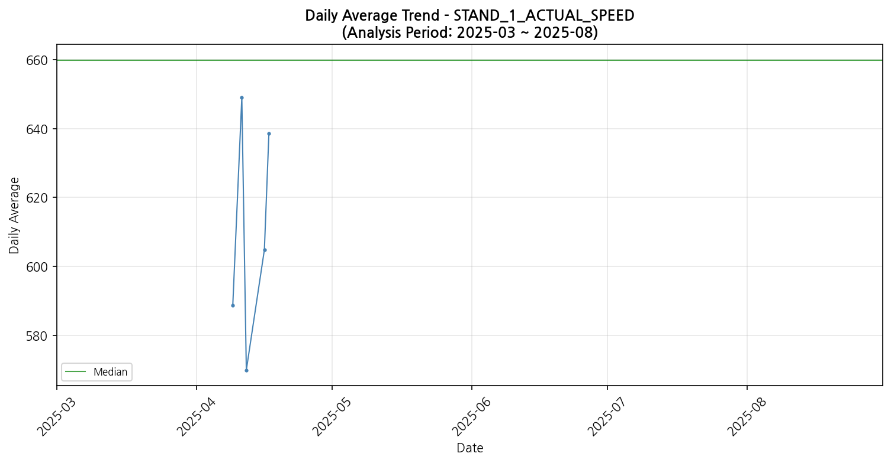

**5. 월별 이상치율 (Monthly Outlier Rate)**

**6. 시간별 패턴 (Hourly Pattern)**

**7. 일별 이상치 수 (Daily Outlier Count)**

**종합 분석 차트**

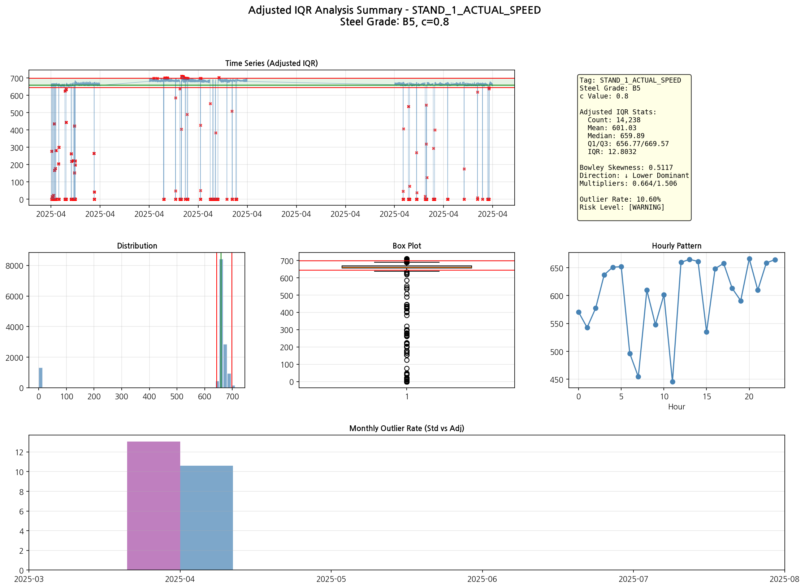

---

##### 월별 상세 분석

**2025-04**

**통계 요약**:

| 지표 | 값 |
|------|-------|
| 분석 레코드 | 14,238 |
| 평균 | 601.0293 |
| 중앙값 | 659.8930 |
| IQR | 12.8032 |
| Bowley 왜도 | 0.5117 |
| Adj 이상치 수 | 1,509 |
| Adj 이상치율 | 10.60% |
| Std 이상치율 | 13.06% |
| 개선율 | 18.9% |

**주요 이상치 발생 날짜**:

- 1. 2025-04-09: 811건
- 2. 2025-04-16: 253건
- 3. 2025-04-12: 243건

**1. 시계열 (Time Series)**

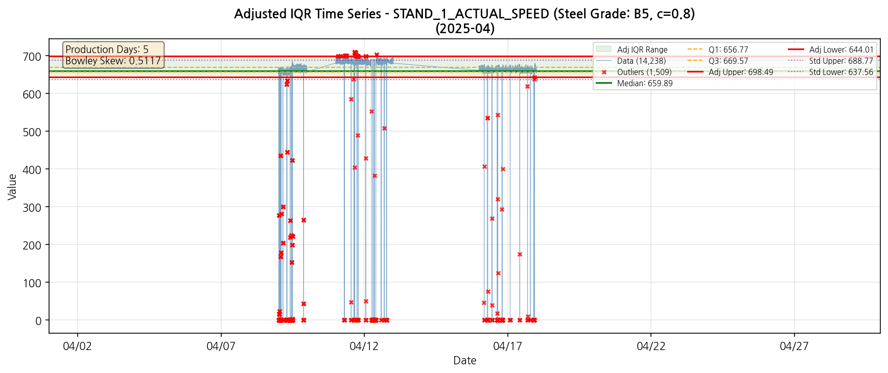

**2. 분포 히스토그램 (Distribution Histogram)**

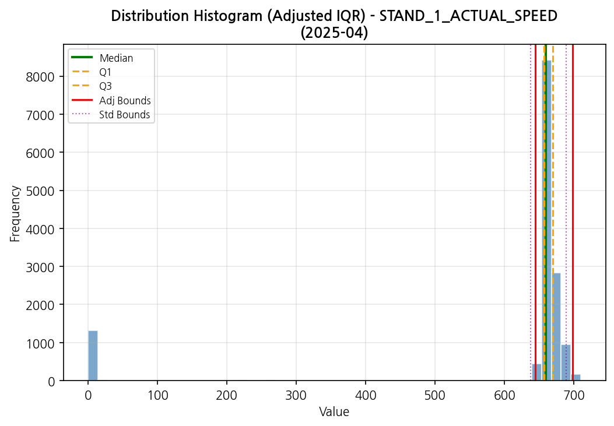

**3. 박스플롯 (Box Plot)**

**4. 일별 평균 추이 (Daily Average Trend)**

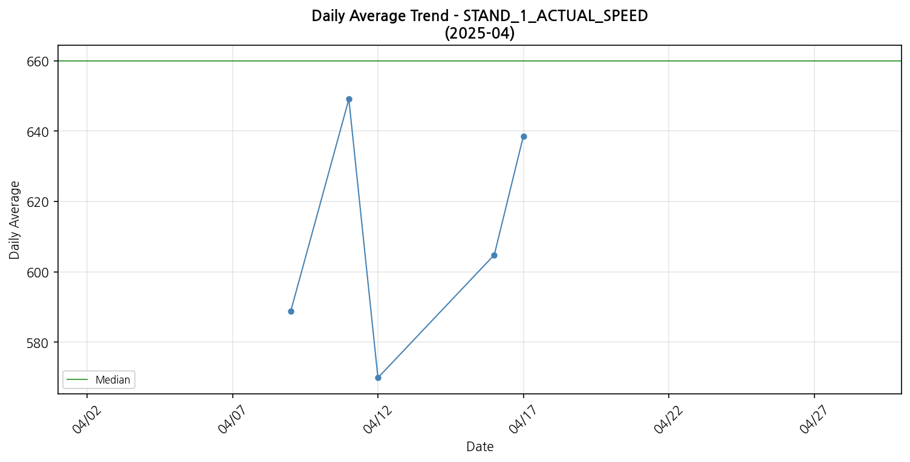

**5. 시간별 패턴 (Hourly Pattern)**

**6. 일별 이상치 수 (Daily Outlier Count)**

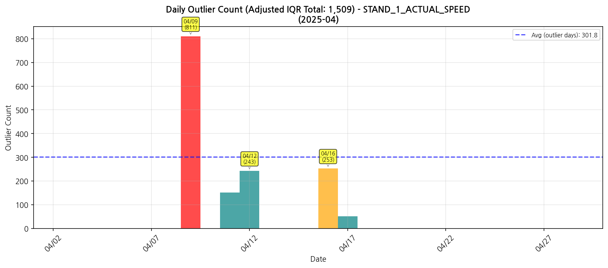

**월별 종합 차트**

---

#### FINISHING_BLOCK_ACTUAL_SPEED 🟠

**위험도**: [WARNING] | **이상치율**: 10.42% | **개선율**: -0.1%
**Bowley 왜도**: 0.8914 | **승수 (L/U)**: 0.490/2.040

**데이터**: 원본 14,391 → 필터 후 14,238 (1.1% 제외)

| 통계 지표 | Adjusted IQR | Standard IQR |
|-----------|--------------|--------------|
| 이상치 수 | 1,484 | 1,483 |
| 이상치율 | 10.42% | 10.42% |
| 하한 경계 | 884.2629 | 832.5507 |
| 상한 경계 | 1208.5098 | 1102.9976 |

| 기본 통계 | 값 |
|-----------|-------|
| 분석 레코드 | 14,238 |
| 평균 | 870.9413 |
| 표준편차 | 290.0391 |
| Q1 (25%) | 933.9683 |
| 중앙값 | 937.6390 |
| Q3 (75%) | 1001.5800 |
| IQR | 67.6117 |

**월별 이상치 추이**:

| 월 | 레코드 수 | 평균 | Adj 이상치율 | Std 이상치율 |
|-----|-----------|------|--------------|---------------|
| 2025-04 | 14,238 | 870.94 | 10.42% | 10.42% |

**주요 이상치 발생 날짜** (상위 5일):

| 순위 | 날짜 | 이상치 수 |
|:----:|------|----------:|
| 1 | 2025-04-09 | 864 |
| 2 | 2025-04-16 | 255 |
| 3 | 2025-04-12 | 227 |
| 4 | 2025-04-11 | 84 |
| 5 | 2025-04-17 | 54 |

- 이상치 발생 일수: 5일
- 최대 일별 이상치: 864건 (2025-04-09)
- 평균 일별 이상치: 296.8건

##### 차트 분석

**1. 시계열 (Time Series)**

**2. 분포 히스토그램 (Distribution Histogram)**

**3. 박스플롯 (Box Plot)**

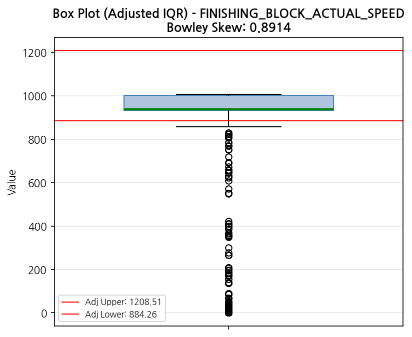

**4. 일별 평균 추이 (Daily Average Trend)**

**5. 월별 이상치율 (Monthly Outlier Rate)**

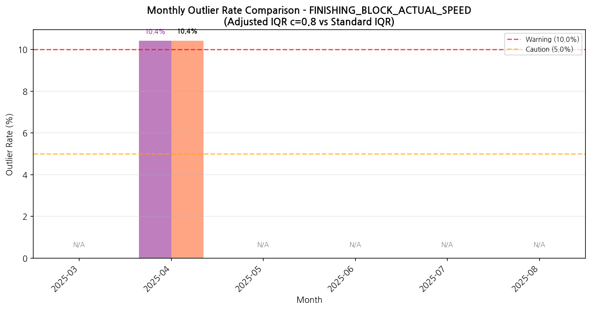

**6. 시간별 패턴 (Hourly Pattern)**

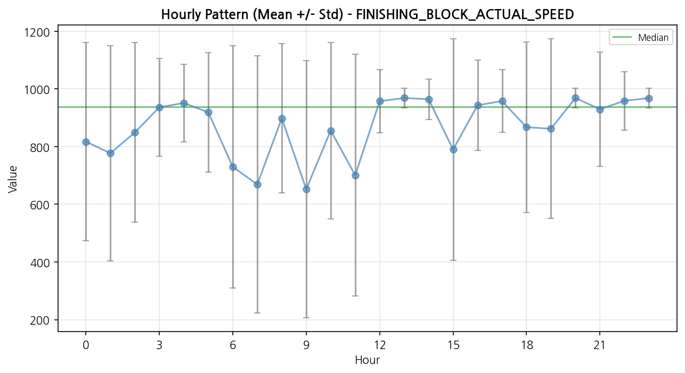

**7. 일별 이상치 수 (Daily Outlier Count)**

**종합 분석 차트**

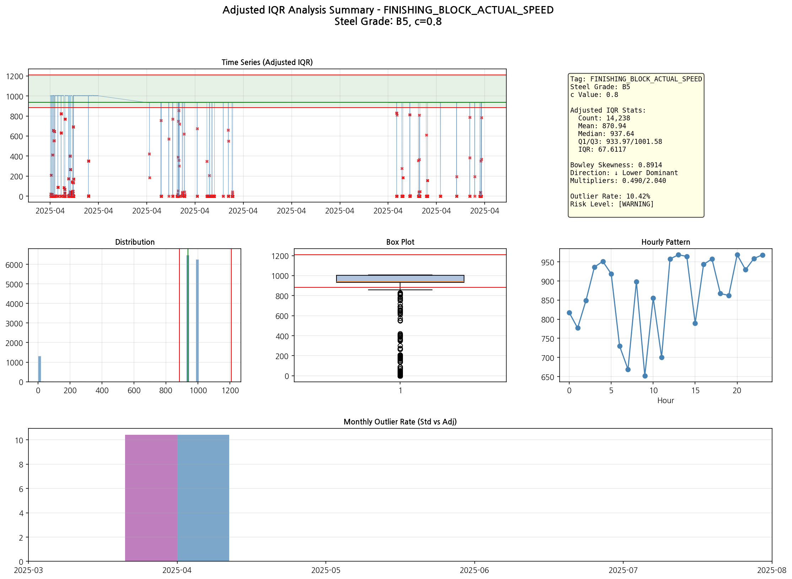

---

##### 월별 상세 분석

**2025-04**

**통계 요약**:

| 지표 | 값 |
|------|-------|
| 분석 레코드 | 14,238 |
| 평균 | 870.9413 |
| 중앙값 | 937.6390 |
| IQR | 67.6117 |
| Bowley 왜도 | 0.8914 |
| Adj 이상치 수 | 1,484 |
| Adj 이상치율 | 10.42% |
| Std 이상치율 | 10.42% |
| 개선율 | -0.1% |

**주요 이상치 발생 날짜**:

- 1. 2025-04-09: 864건
- 2. 2025-04-16: 255건
- 3. 2025-04-12: 227건

**1. 시계열 (Time Series)**

**2. 분포 히스토그램 (Distribution Histogram)**

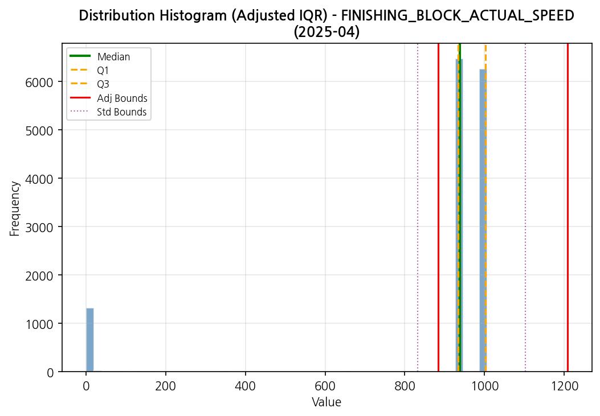

**3. 박스플롯 (Box Plot)**

**4. 일별 평균 추이 (Daily Average Trend)**

**5. 시간별 패턴 (Hourly Pattern)**

**6. 일별 이상치 수 (Daily Outlier Count)**

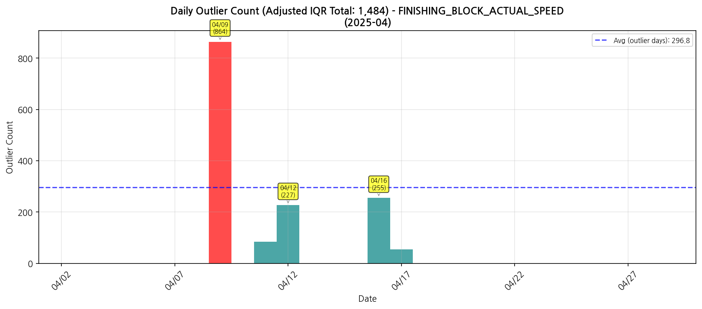

**월별 종합 차트**

---

#### [L2] PR6L2_ACT_TORQUE 🟠

**위험도**: [WARNING] | **이상치율**: 10.33% | **개선율**: -49.3%
**Bowley 왜도**: -0.3332 | **승수 (L/U)**: 1.305/0.766

**데이터**: 원본 14,391 → 필터 후 14,238 (1.1% 제외)

| 통계 지표 | Adjusted IQR | Standard IQR |
|-----------|--------------|--------------|
| 이상치 수 | 1,471 | 985 |
| 이상치율 | 10.33% | 6.92% |
| 하한 경계 | 2.1417 | 2.5185 |
| 상한 경계 | 5.5198 | 5.8084 |

| 기본 통계 | 값 |
|-----------|-------|
| 분석 레코드 | 14,238 |
| 평균 | 4.0174 |
| 표준편차 | 1.2324 |
| Q1 (25%) | 3.7522 |
| 중앙값 | 4.3005 |
| Q3 (75%) | 4.5747 |
| IQR | 0.8225 |

**월별 이상치 추이**:

| 월 | 레코드 수 | 평균 | Adj 이상치율 | Std 이상치율 |
|-----|-----------|------|--------------|---------------|
| 2025-04 | 14,238 | 4.02 | 10.33% | 6.92% |

**주요 이상치 발생 날짜** (상위 5일):

| 순위 | 날짜 | 이상치 수 |
|:----:|------|----------:|
| 1 | 2025-04-09 | 806 |
| 2 | 2025-04-16 | 355 |
| 3 | 2025-04-12 | 223 |
| 4 | 2025-04-11 | 61 |
| 5 | 2025-04-17 | 26 |

- 이상치 발생 일수: 5일
- 최대 일별 이상치: 806건 (2025-04-09)
- 평균 일별 이상치: 294.2건

##### 차트 분석

**1. 시계열 (Time Series)**

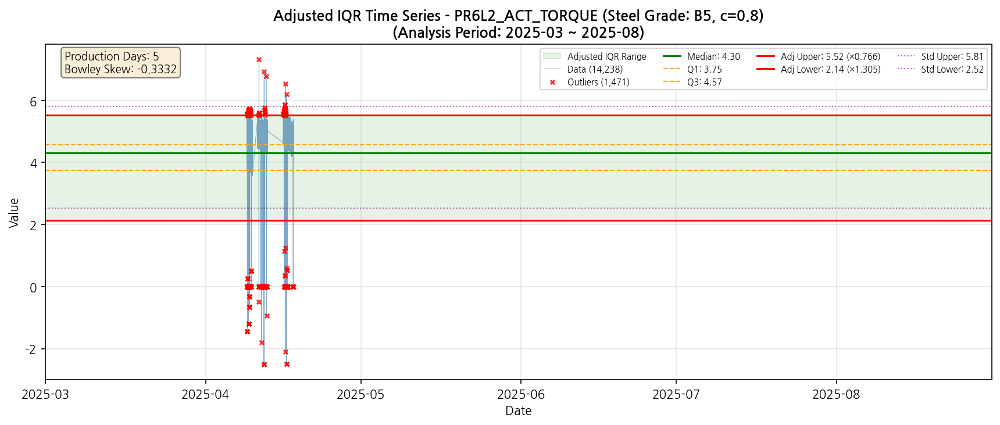

**2. 분포 히스토그램 (Distribution Histogram)**

**3. 박스플롯 (Box Plot)**

**4. 일별 평균 추이 (Daily Average Trend)**

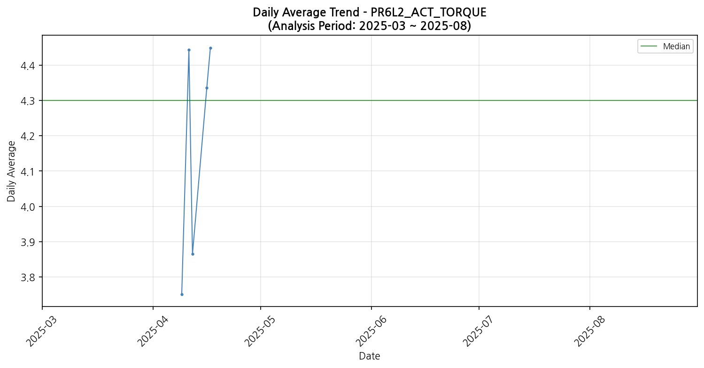

**5. 월별 이상치율 (Monthly Outlier Rate)**

**6. 시간별 패턴 (Hourly Pattern)**

**7. 일별 이상치 수 (Daily Outlier Count)**

**종합 분석 차트**

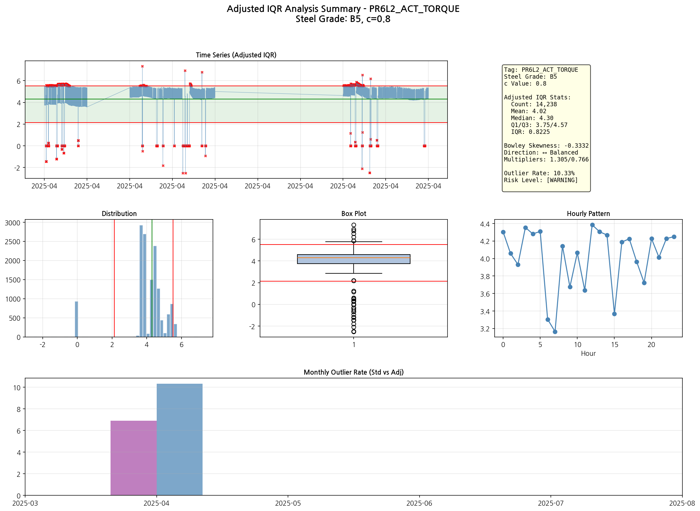

---

##### 월별 상세 분석

**2025-04**

**통계 요약**:

| 지표 | 값 |
|------|-------|
| 분석 레코드 | 14,238 |
| 평균 | 4.0174 |
| 중앙값 | 4.3005 |
| IQR | 0.8225 |
| Bowley 왜도 | -0.3332 |
| Adj 이상치 수 | 1,471 |
| Adj 이상치율 | 10.33% |
| Std 이상치율 | 6.92% |
| 개선율 | -49.3% |

**주요 이상치 발생 날짜**:

- 1. 2025-04-09: 806건
- 2. 2025-04-16: 355건
- 3. 2025-04-12: 223건

**1. 시계열 (Time Series)**

**2. 분포 히스토그램 (Distribution Histogram)**

**3. 박스플롯 (Box Plot)**

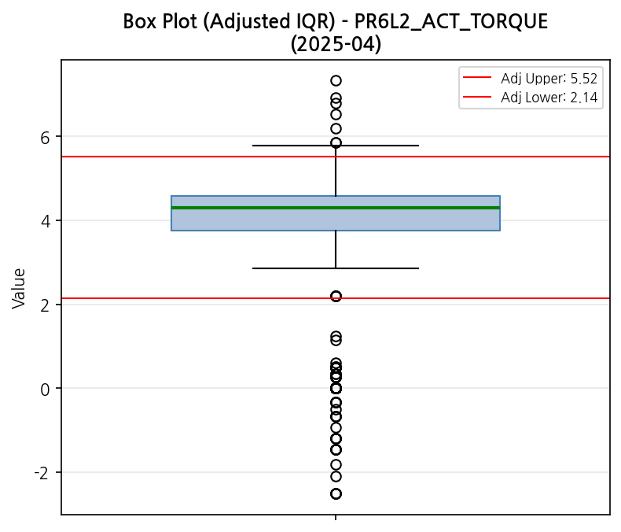

**4. 일별 평균 추이 (Daily Average Trend)**

**5. 시간별 패턴 (Hourly Pattern)**

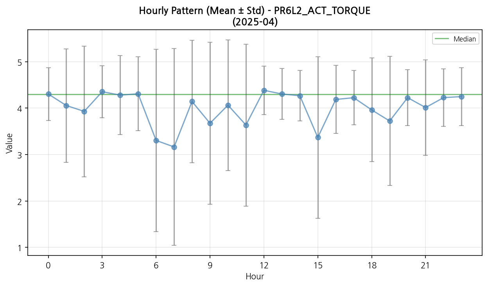

**6. 일별 이상치 수 (Daily Outlier Count)**

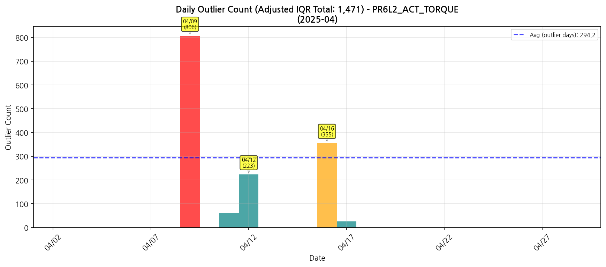

**월별 종합 차트**

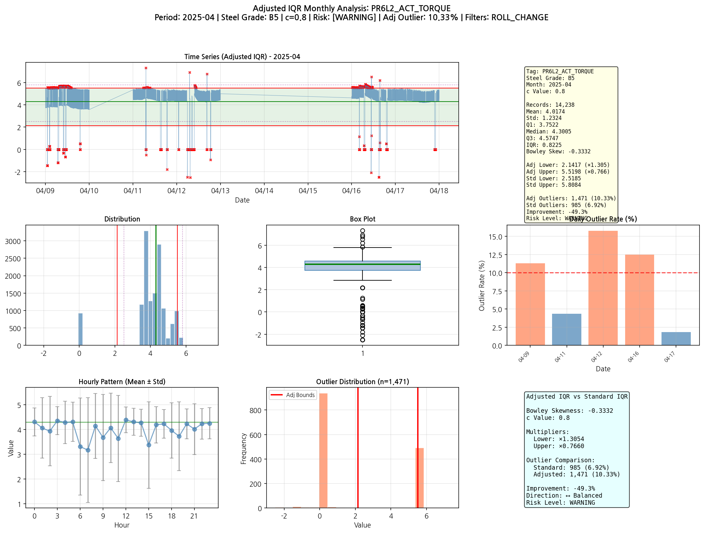

---

#### STAND_8_ACTUAL_SPEED 🟠

**위험도**: [WARNING] | **이상치율**: 10.08% | **개선율**: -0.1%
**Bowley 왜도**: -0.0424 | **승수 (L/U)**: 1.034/0.967

**데이터**: 원본 14,391 → 필터 후 14,238 (1.1% 제외)

| 통계 지표 | Adjusted IQR | Standard IQR |
|-----------|--------------|--------------|
| 이상치 수 | 1,435 | 1,434 |
| 이상치율 | 10.08% | 10.07% |
| 하한 경계 | 1040.2368 | 1041.6689 |
| 상한 경계 | 1151.0476 | 1152.4319 |

| 기본 통계 | 값 |
|-----------|-------|
| 분석 레코드 | 14,238 |
| 평균 | 994.1833 |
| 표준편차 | 323.2109 |
| Q1 (25%) | 1083.2050 |
| 중앙값 | 1097.6370 |
| Q3 (75%) | 1110.8957 |
| IQR | 27.6907 |

**월별 이상치 추이**:

| 월 | 레코드 수 | 평균 | Adj 이상치율 | Std 이상치율 |
|-----|-----------|------|--------------|---------------|
| 2025-04 | 14,238 | 994.18 | 10.08% | 10.07% |

**주요 이상치 발생 날짜** (상위 5일):

| 순위 | 날짜 | 이상치 수 |
|:----:|------|----------:|
| 1 | 2025-04-09 | 818 |
| 2 | 2025-04-16 | 253 |
| 3 | 2025-04-12 | 236 |
| 4 | 2025-04-11 | 80 |
| 5 | 2025-04-17 | 48 |

- 이상치 발생 일수: 5일
- 최대 일별 이상치: 818건 (2025-04-09)
- 평균 일별 이상치: 287.0건

##### 차트 분석

**1. 시계열 (Time Series)**

**2. 분포 히스토그램 (Distribution Histogram)**

**3. 박스플롯 (Box Plot)**

**4. 일별 평균 추이 (Daily Average Trend)**

**5. 월별 이상치율 (Monthly Outlier Rate)**

**6. 시간별 패턴 (Hourly Pattern)**

**7. 일별 이상치 수 (Daily Outlier Count)**

**종합 분석 차트**

---

##### 월별 상세 분석

**2025-04**

**통계 요약**:

| 지표 | 값 |
|------|-------|
| 분석 레코드 | 14,238 |
| 평균 | 994.1833 |
| 중앙값 | 1097.6370 |
| IQR | 27.6907 |
| Bowley 왜도 | -0.0424 |
| Adj 이상치 수 | 1,435 |
| Adj 이상치율 | 10.08% |
| Std 이상치율 | 10.07% |
| 개선율 | -0.1% |

**주요 이상치 발생 날짜**:

- 1. 2025-04-09: 818건
- 2. 2025-04-16: 253건
- 3. 2025-04-12: 236건

**1. 시계열 (Time Series)**

**2. 분포 히스토그램 (Distribution Histogram)**

**3. 박스플롯 (Box Plot)**

**4. 일별 평균 추이 (Daily Average Trend)**

**5. 시간별 패턴 (Hourly Pattern)**

**6. 일별 이상치 수 (Daily Outlier Count)**

**월별 종합 차트**

---

### 🟡 주의 (5~10%) - 9개 태그

#### STAND_2_ACTUAL_SPEED 🟡

**위험도**: [CAUTION] | **이상치율**: 9.95% | **개선율**: -0.4%
**Bowley 왜도**: 0.4292 | **승수 (L/U)**: 0.709/1.410

**데이터**: 원본 14,391 → 필터 후 14,238 (1.1% 제외)

| 통계 지표 | Adjusted IQR | Standard IQR |
|-----------|--------------|--------------|
| 이상치 수 | 1,417 | 1,412 |
| 이상치율 | 9.95% | 9.92% |
| 하한 경계 | 666.8939 | 653.5845 |
| 상한 경계 | 794.4748 | 775.7129 |

| 기본 통계 | 값 |
|-----------|-------|
| 분석 레코드 | 14,238 |
| 평균 | 646.8871 |
| 표준편차 | 210.3446 |
| Q1 (25%) | 699.3826 |
| 중앙값 | 708.0966 |
| Q3 (75%) | 729.9147 |
| IQR | 30.5321 |

**월별 이상치 추이**:

| 월 | 레코드 수 | 평균 | Adj 이상치율 | Std 이상치율 |
|-----|-----------|------|--------------|---------------|
| 2025-04 | 14,238 | 646.89 | 9.95% | 9.92% |

**주요 이상치 발생 날짜** (상위 5일):

| 순위 | 날짜 | 이상치 수 |
|:----:|------|----------:|
| 1 | 2025-04-09 | 806 |
| 2 | 2025-04-16 | 253 |
| 3 | 2025-04-12 | 236 |
| 4 | 2025-04-11 | 74 |
| 5 | 2025-04-17 | 48 |

- 이상치 발생 일수: 5일
- 최대 일별 이상치: 806건 (2025-04-09)
- 평균 일별 이상치: 283.4건

##### 차트 분석

**1. 시계열 (Time Series)**

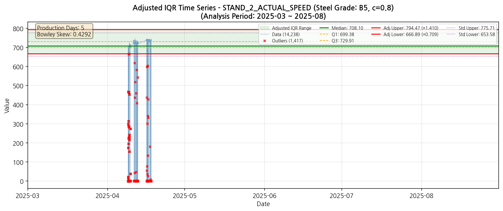

**2. 분포 히스토그램 (Distribution Histogram)**

**3. 박스플롯 (Box Plot)**

**4. 일별 평균 추이 (Daily Average Trend)**

**5. 월별 이상치율 (Monthly Outlier Rate)**

**6. 시간별 패턴 (Hourly Pattern)**

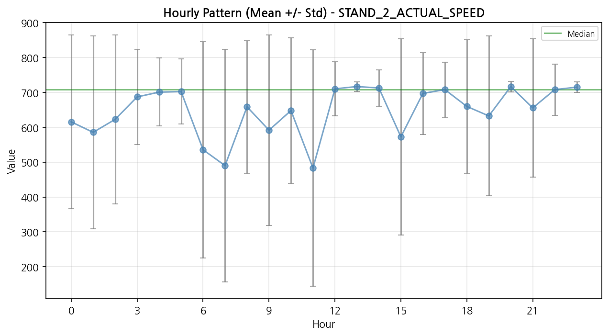

**7. 일별 이상치 수 (Daily Outlier Count)**

**종합 분석 차트**

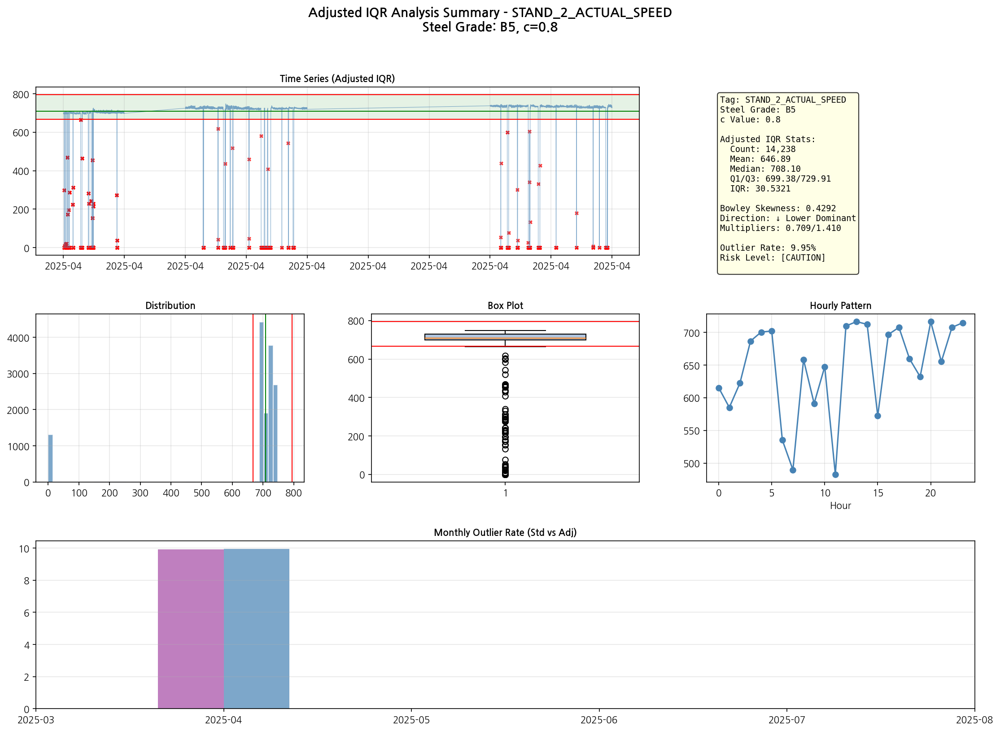

---

##### 월별 상세 분석

**2025-04**

**통계 요약**:

| 지표 | 값 |
|------|-------|
| 분석 레코드 | 14,238 |
| 평균 | 646.8871 |
| 중앙값 | 708.0966 |
| IQR | 30.5321 |
| Bowley 왜도 | 0.4292 |
| Adj 이상치 수 | 1,417 |
| Adj 이상치율 | 9.95% |
| Std 이상치율 | 9.92% |
| 개선율 | -0.4% |

**주요 이상치 발생 날짜**:

- 1. 2025-04-09: 806건
- 2. 2025-04-16: 253건
- 3. 2025-04-12: 236건

**1. 시계열 (Time Series)**

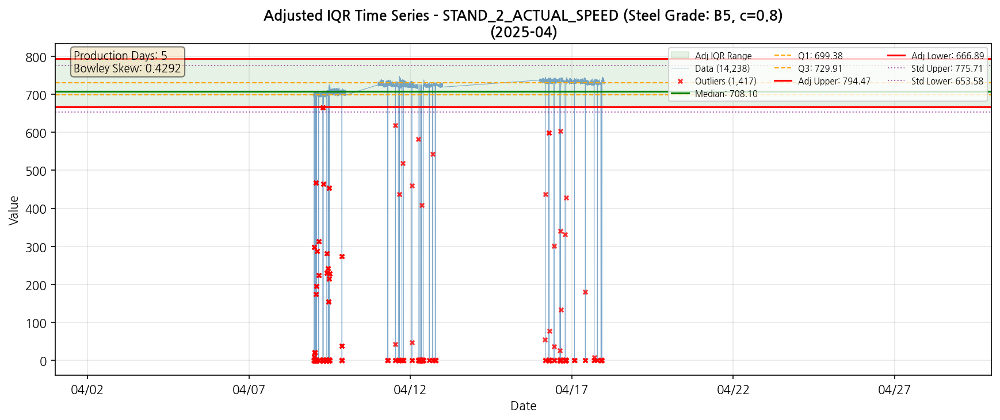

**2. 분포 히스토그램 (Distribution Histogram)**

**3. 박스플롯 (Box Plot)**

**4. 일별 평균 추이 (Daily Average Trend)**

**5. 시간별 패턴 (Hourly Pattern)**

**6. 일별 이상치 수 (Daily Outlier Count)**

**월별 종합 차트**

---

#### STAND_3_ACTUAL_SPEED 🟡

**위험도**: [CAUTION] | **이상치율**: 9.95% | **개선율**: 0.0%
**Bowley 왜도**: 0.2831 | **승수 (L/U)**: 0.797/1.254

**데이터**: 원본 14,391 → 필터 후 14,238 (1.1% 제외)

| 통계 지표 | Adjusted IQR | Standard IQR |
|-----------|--------------|--------------|
| 이상치 수 | 1,417 | 1,417 |
| 이상치율 | 9.95% | 9.95% |
| 하한 경계 | 842.2556 | 832.3985 |
| 상한 경계 | 974.4454 | 962.0825 |

| 기본 통계 | 값 |
|-----------|-------|
| 분석 레코드 | 14,238 |
| 평균 | 812.6744 |
| 표준편차 | 264.2289 |
| Q1 (25%) | 881.0300 |
| 중앙값 | 892.6507 |
| Q3 (75%) | 913.4510 |
| IQR | 32.4210 |

**월별 이상치 추이**:

| 월 | 레코드 수 | 평균 | Adj 이상치율 | Std 이상치율 |
|-----|-----------|------|--------------|---------------|
| 2025-04 | 14,238 | 812.67 | 9.95% | 9.95% |

**주요 이상치 발생 날짜** (상위 5일):

| 순위 | 날짜 | 이상치 수 |
|:----:|------|----------:|
| 1 | 2025-04-09 | 805 |
| 2 | 2025-04-16 | 254 |
| 3 | 2025-04-12 | 236 |
| 4 | 2025-04-11 | 74 |
| 5 | 2025-04-17 | 48 |

- 이상치 발생 일수: 5일
- 최대 일별 이상치: 805건 (2025-04-09)
- 평균 일별 이상치: 283.4건

##### 차트 분석

**1. 시계열 (Time Series)**

**2. 분포 히스토그램 (Distribution Histogram)**

**3. 박스플롯 (Box Plot)**

**4. 일별 평균 추이 (Daily Average Trend)**

**5. 월별 이상치율 (Monthly Outlier Rate)**

**6. 시간별 패턴 (Hourly Pattern)**

**7. 일별 이상치 수 (Daily Outlier Count)**

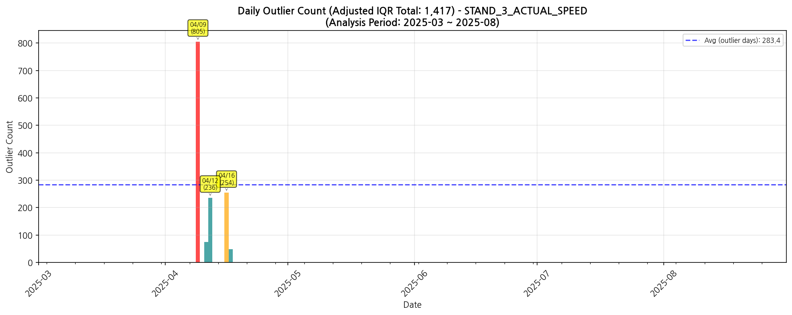

**종합 분석 차트**

---

##### 월별 상세 분석

**2025-04**

**통계 요약**:

| 지표 | 값 |
|------|-------|
| 분석 레코드 | 14,238 |
| 평균 | 812.6744 |
| 중앙값 | 892.6507 |
| IQR | 32.4210 |
| Bowley 왜도 | 0.2831 |
| Adj 이상치 수 | 1,417 |
| Adj 이상치율 | 9.95% |
| Std 이상치율 | 9.95% |
| 개선율 | 0.0% |

**주요 이상치 발생 날짜**:

- 1. 2025-04-09: 805건
- 2. 2025-04-16: 254건
- 3. 2025-04-12: 236건

**1. 시계열 (Time Series)**

**2. 분포 히스토그램 (Distribution Histogram)**

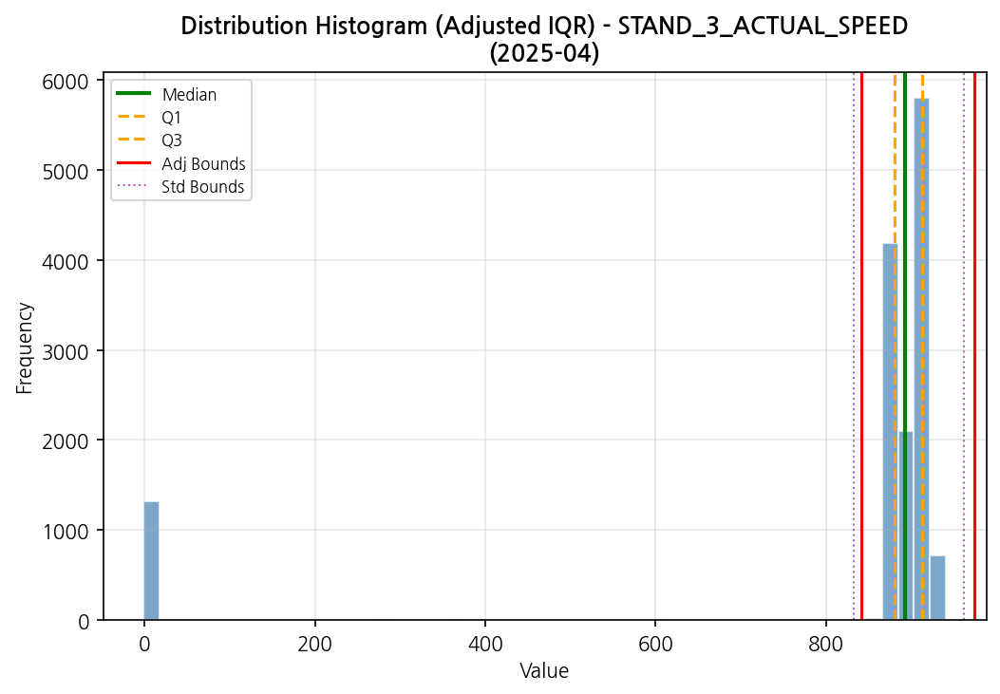

**3. 박스플롯 (Box Plot)**

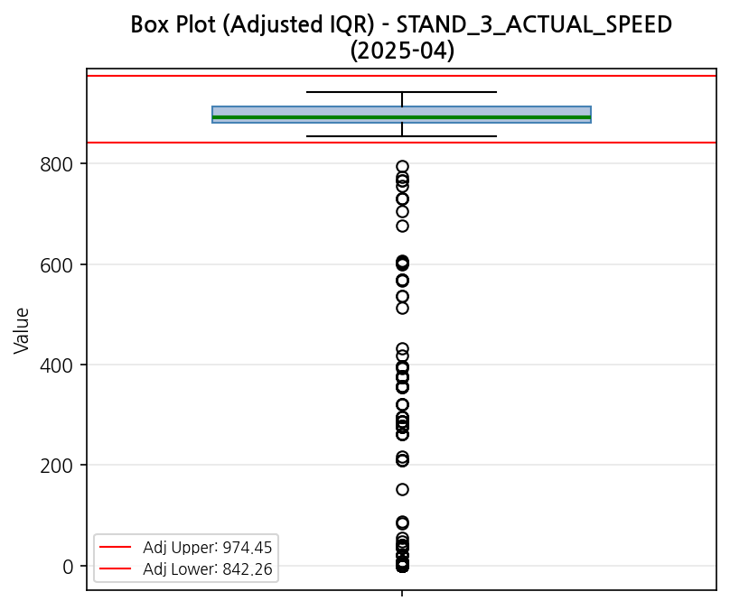

**4. 일별 평균 추이 (Daily Average Trend)**

**5. 시간별 패턴 (Hourly Pattern)**

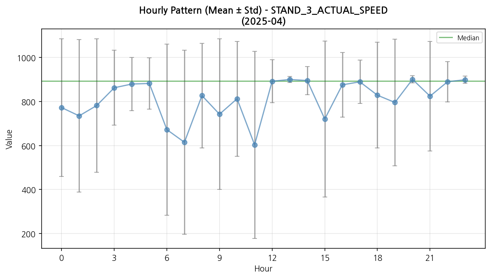

**6. 일별 이상치 수 (Daily Outlier Count)**

**월별 종합 차트**

---

#### HEATING_TOP_ZONE_NO_1_TEMPERATURE_ROOF 🟡

**위험도**: [CAUTION] | **이상치율**: 9.94% | **개선율**: -0.1%
**Bowley 왜도**: 0.2238 | **승수 (L/U)**: 0.836/1.196

**데이터**: 원본 14,391 → 필터 후 14,391 (0.0% 제외)

| 통계 지표 | Adjusted IQR | Standard IQR |
|-----------|--------------|--------------|
| 이상치 수 | 1,430 | 1,429 |
| 이상치율 | 9.94% | 9.93% |
| 하한 경계 | 1048.0776 | 1046.1405 |
| 상한 경계 | 1079.9733 | 1077.6565 |

| 기본 통계 | 값 |
|-----------|-------|
| 분석 레코드 | 14,391 |
| 평균 | 1063.2401 |
| 표준편차 | 11.6233 |
| Q1 (25%) | 1057.9590 |
| 중앙값 | 1061.0170 |
| Q3 (75%) | 1065.8380 |
| IQR | 7.8790 |

**월별 이상치 추이**:

| 월 | 레코드 수 | 평균 | Adj 이상치율 | Std 이상치율 |
|-----|-----------|------|--------------|---------------|
| 2025-04 | 14,391 | 1063.24 | 9.94% | 9.93% |

**주요 이상치 발생 날짜** (상위 5일):

| 순위 | 날짜 | 이상치 수 |
|:----:|------|----------:|
| 1 | 2025-04-09 | 825 |
| 2 | 2025-04-16 | 246 |
| 3 | 2025-04-12 | 167 |
| 4 | 2025-04-11 | 124 |
| 5 | 2025-04-17 | 68 |

- 이상치 발생 일수: 5일
- 최대 일별 이상치: 825건 (2025-04-09)
- 평균 일별 이상치: 286.0건

##### 차트 분석

**1. 시계열 (Time Series)**

**2. 분포 히스토그램 (Distribution Histogram)**

**3. 박스플롯 (Box Plot)**

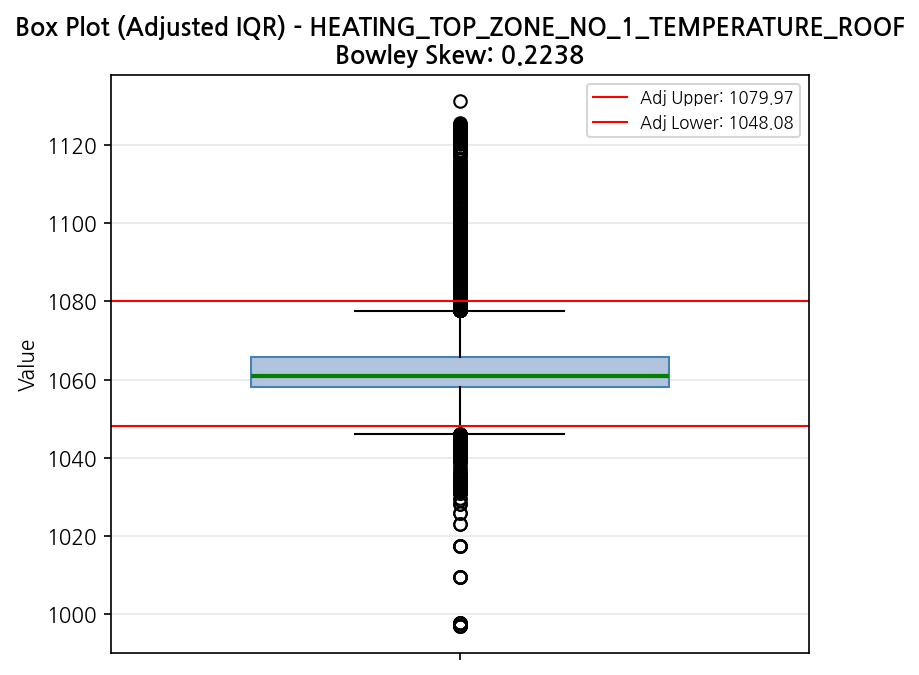

**4. 일별 평균 추이 (Daily Average Trend)**

**5. 월별 이상치율 (Monthly Outlier Rate)**

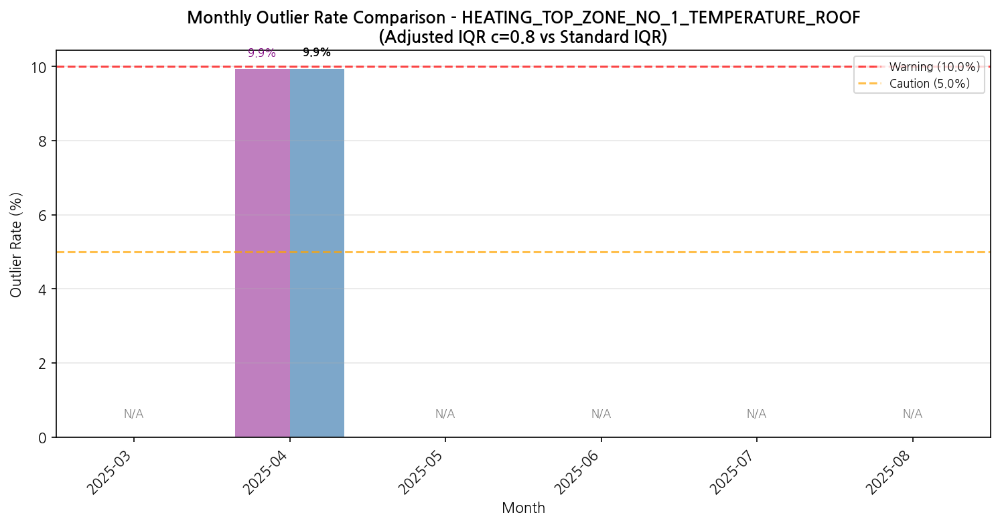

**6. 시간별 패턴 (Hourly Pattern)**

**7. 일별 이상치 수 (Daily Outlier Count)**

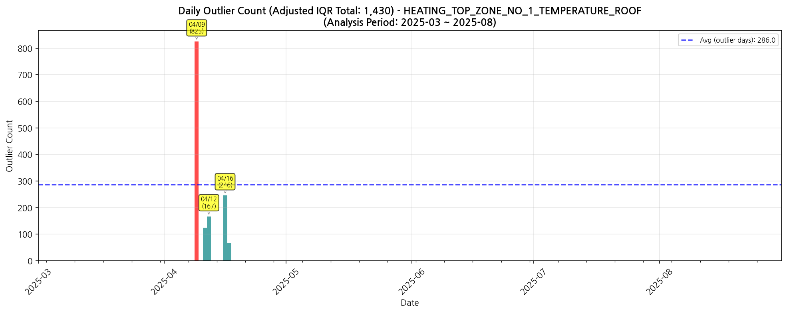

**종합 분석 차트**

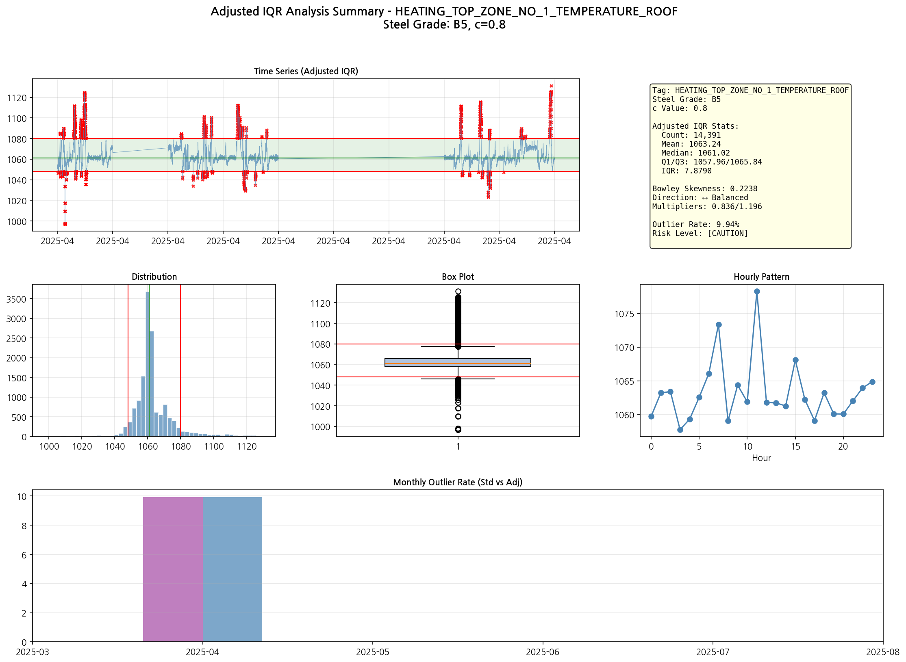

---

##### 월별 상세 분석

**2025-04**

**통계 요약**:

| 지표 | 값 |
|------|-------|
| 분석 레코드 | 14,391 |
| 평균 | 1063.2401 |
| 중앙값 | 1061.0170 |
| IQR | 7.8790 |
| Bowley 왜도 | 0.2238 |
| Adj 이상치 수 | 1,430 |
| Adj 이상치율 | 9.94% |
| Std 이상치율 | 9.93% |
| 개선율 | -0.1% |

**주요 이상치 발생 날짜**:

- 1. 2025-04-09: 825건
- 2. 2025-04-16: 246건
- 3. 2025-04-12: 167건

**1. 시계열 (Time Series)**

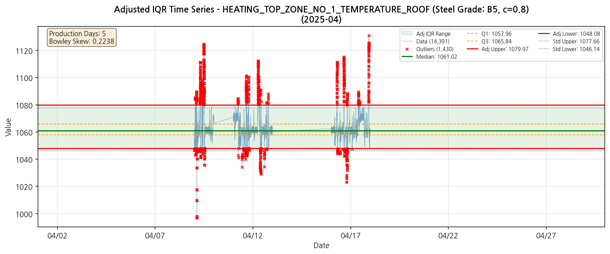

**2. 분포 히스토그램 (Distribution Histogram)**

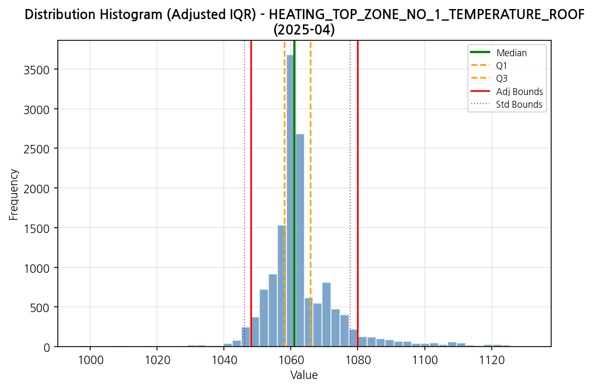

**3. 박스플롯 (Box Plot)**

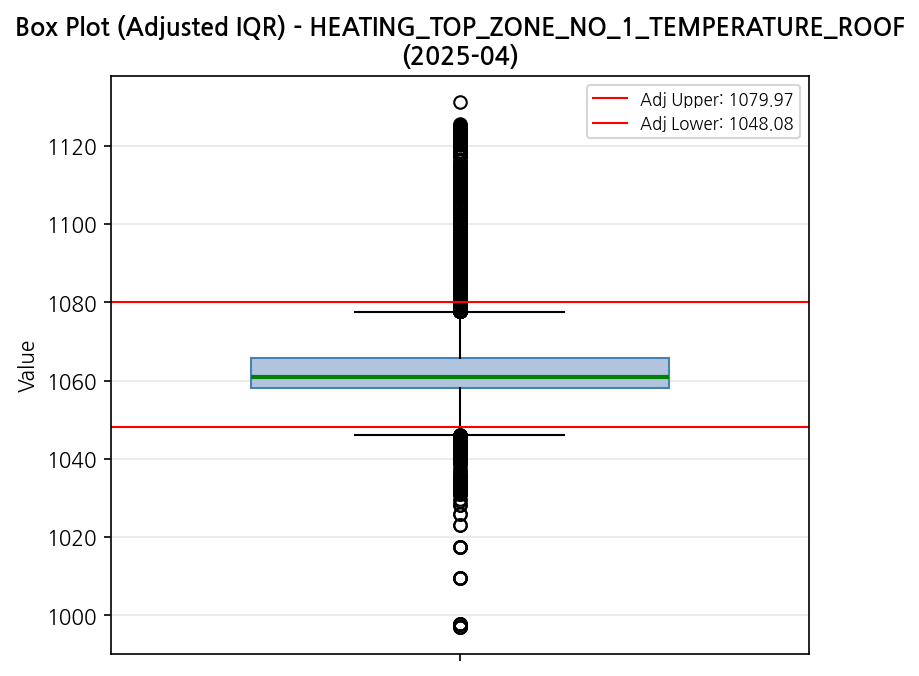

**4. 일별 평균 추이 (Daily Average Trend)**

**5. 시간별 패턴 (Hourly Pattern)**

**6. 일별 이상치 수 (Daily Outlier Count)**

**월별 종합 차트**

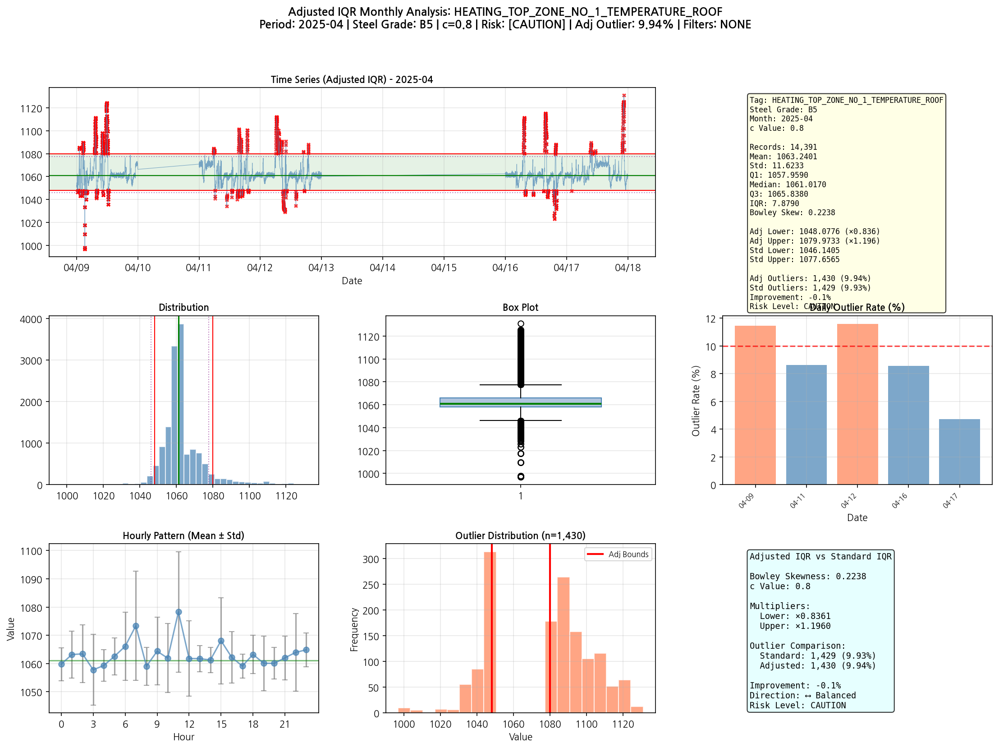

---

#### STAND_4_ACTUAL_SPEED 🟡

**위험도**: [CAUTION] | **이상치율**: 9.90% | **개선율**: -0.1%
**Bowley 왜도**: 0.7714 | **승수 (L/U)**: 0.540/1.854

**데이터**: 원본 14,391 → 필터 후 14,238 (1.1% 제외)

| 통계 지표 | Adjusted IQR | Standard IQR |
|-----------|--------------|--------------|
| 이상치 수 | 1,409 | 1,407 |
| 이상치율 | 9.90% | 9.88% |
| 하한 경계 | 717.7763 | 658.1155 |
| 상한 경계 | 1114.1920 | 1003.6096 |

| 기본 통계 | 값 |
|-----------|-------|
| 분석 레코드 | 14,238 |
| 평균 | 743.1246 |
| 표준편차 | 244.0271 |
| Q1 (25%) | 787.6758 |
| 중앙값 | 797.5501 |
| Q3 (75%) | 874.0493 |
| IQR | 86.3735 |

**월별 이상치 추이**:

| 월 | 레코드 수 | 평균 | Adj 이상치율 | Std 이상치율 |
|-----|-----------|------|--------------|---------------|
| 2025-04 | 14,238 | 743.12 | 9.90% | 9.88% |

**주요 이상치 발생 날짜** (상위 5일):

| 순위 | 날짜 | 이상치 수 |
|:----:|------|----------:|
| 1 | 2025-04-09 | 801 |
| 2 | 2025-04-16 | 250 |
| 3 | 2025-04-12 | 236 |
| 4 | 2025-04-11 | 74 |
| 5 | 2025-04-17 | 48 |

- 이상치 발생 일수: 5일
- 최대 일별 이상치: 801건 (2025-04-09)
- 평균 일별 이상치: 281.8건

##### 차트 분석

**1. 시계열 (Time Series)**

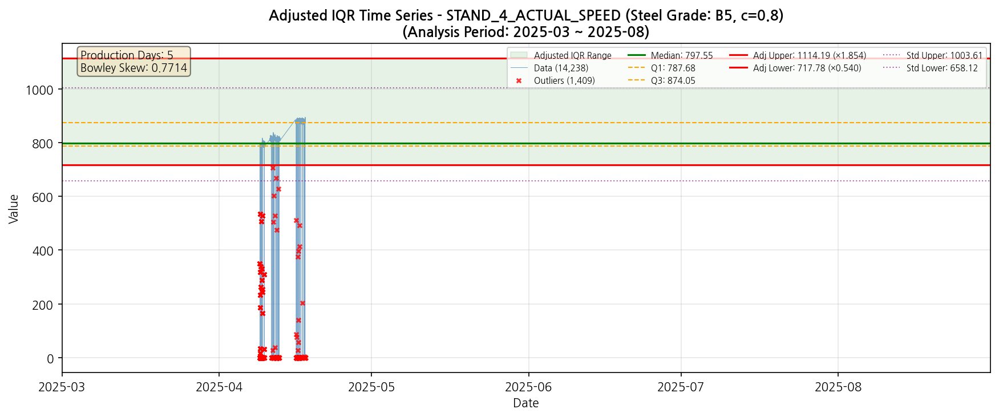

**2. 분포 히스토그램 (Distribution Histogram)**

**3. 박스플롯 (Box Plot)**

**4. 일별 평균 추이 (Daily Average Trend)**

**5. 월별 이상치율 (Monthly Outlier Rate)**

**6. 시간별 패턴 (Hourly Pattern)**

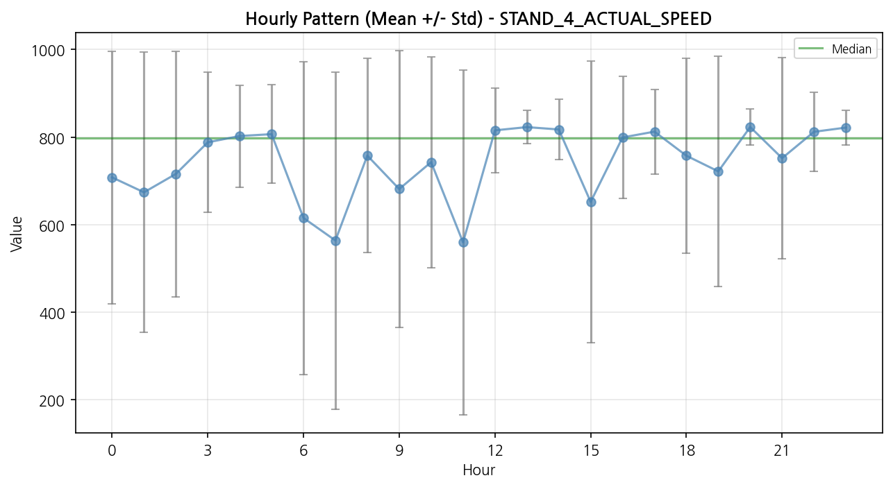

**7. 일별 이상치 수 (Daily Outlier Count)**

**종합 분석 차트**

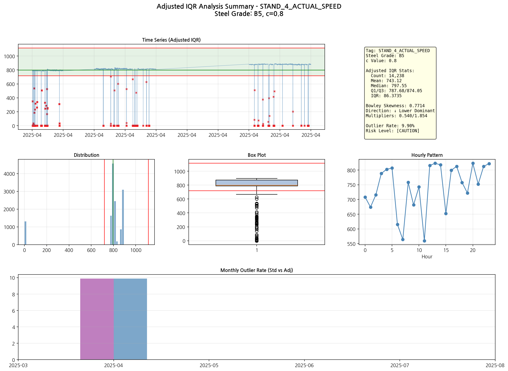

---

##### 월별 상세 분석

**2025-04**

**통계 요약**:

| 지표 | 값 |
|------|-------|
| 분석 레코드 | 14,238 |
| 평균 | 743.1246 |
| 중앙값 | 797.5501 |
| IQR | 86.3735 |
| Bowley 왜도 | 0.7714 |
| Adj 이상치 수 | 1,409 |
| Adj 이상치율 | 9.90% |
| Std 이상치율 | 9.88% |
| 개선율 | -0.1% |

**주요 이상치 발생 날짜**:

- 1. 2025-04-09: 801건
- 2. 2025-04-16: 250건
- 3. 2025-04-12: 236건

**1. 시계열 (Time Series)**

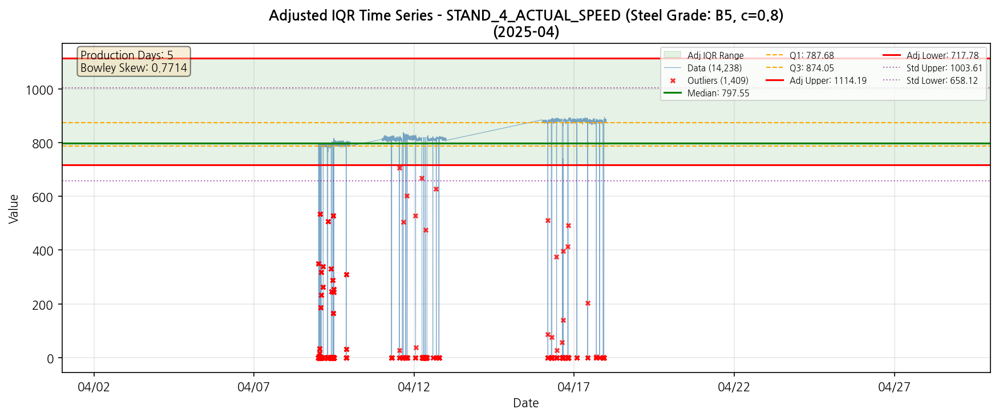

**2. 분포 히스토그램 (Distribution Histogram)**

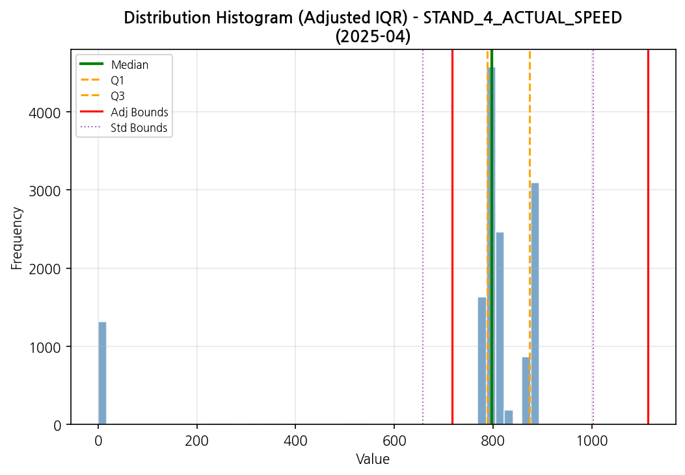

**3. 박스플롯 (Box Plot)**

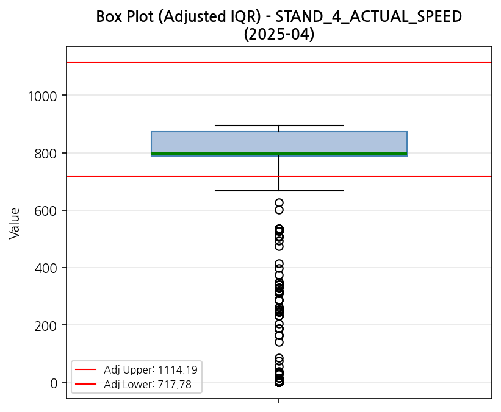

**4. 일별 평균 추이 (Daily Average Trend)**

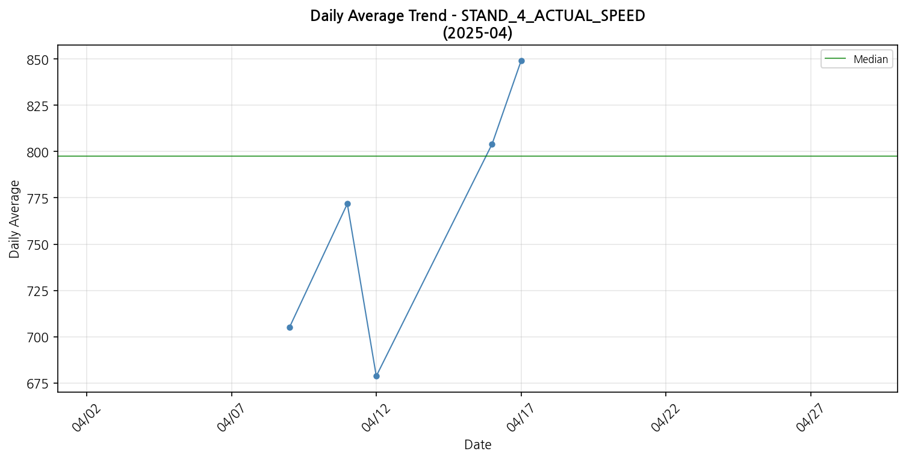

**5. 시간별 패턴 (Hourly Pattern)**

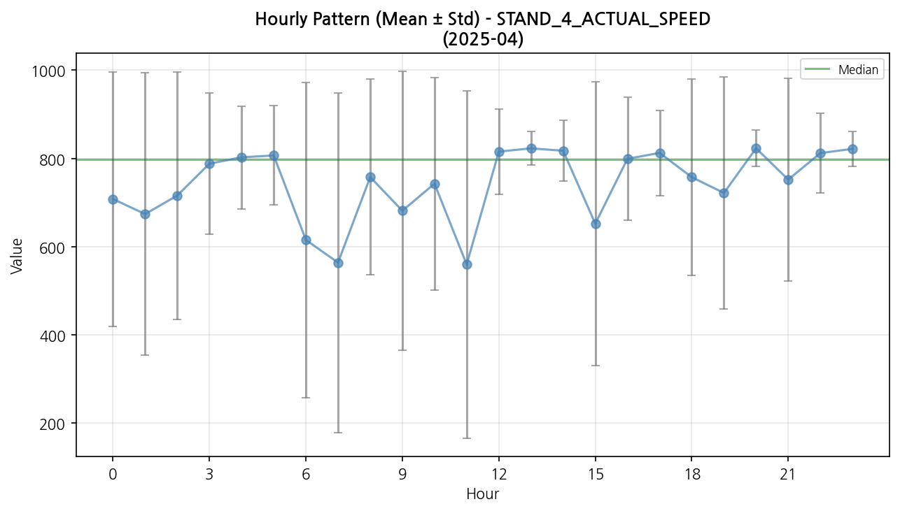

**6. 일별 이상치 수 (Daily Outlier Count)**

**월별 종합 차트**

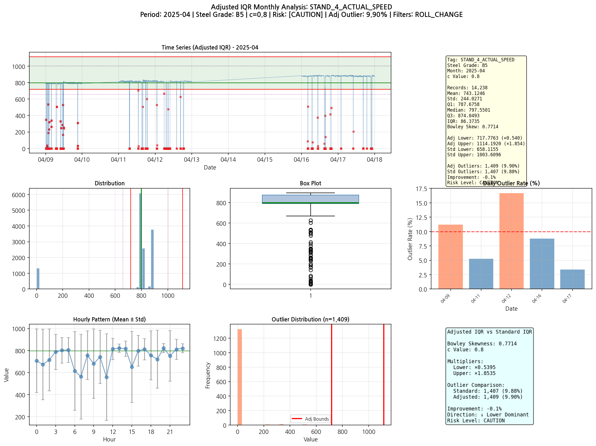

---

#### STAND_5_ACTUAL_SPEED 🟡

**위험도**: [CAUTION] | **이상치율**: 9.89% | **개선율**: -0.1%
**Bowley 왜도**: 0.6919 | **승수 (L/U)**: 0.575/1.739

**데이터**: 원본 14,391 → 필터 후 14,238 (1.1% 제외)

| 통계 지표 | Adjusted IQR | Standard IQR |
|-----------|--------------|--------------|
| 이상치 수 | 1,408 | 1,407 |
| 이상치율 | 9.89% | 9.88% |
| 하한 경계 | 1099.7140 | 1035.4324 |
| 상한 경계 | 1550.5107 | 1438.7034 |

| 기본 통계 | 값 |
|-----------|-------|
| 분석 레코드 | 14,238 |
| 평균 | 1114.6364 |
| 표준편차 | 364.2464 |
| Q1 (25%) | 1186.6590 |
| 중앙값 | 1202.1910 |
| Q3 (75%) | 1287.4768 |
| IQR | 100.8177 |

**월별 이상치 추이**:

| 월 | 레코드 수 | 평균 | Adj 이상치율 | Std 이상치율 |
|-----|-----------|------|--------------|---------------|
| 2025-04 | 14,238 | 1114.64 | 9.89% | 9.88% |

**주요 이상치 발생 날짜** (상위 5일):

| 순위 | 날짜 | 이상치 수 |
|:----:|------|----------:|
| 1 | 2025-04-09 | 801 |
| 2 | 2025-04-16 | 250 |
| 3 | 2025-04-12 | 236 |
| 4 | 2025-04-11 | 73 |
| 5 | 2025-04-17 | 48 |

- 이상치 발생 일수: 5일
- 최대 일별 이상치: 801건 (2025-04-09)
- 평균 일별 이상치: 281.6건

##### 차트 분석

**1. 시계열 (Time Series)**

**2. 분포 히스토그램 (Distribution Histogram)**

**3. 박스플롯 (Box Plot)**

**4. 일별 평균 추이 (Daily Average Trend)**

**5. 월별 이상치율 (Monthly Outlier Rate)**

**6. 시간별 패턴 (Hourly Pattern)**

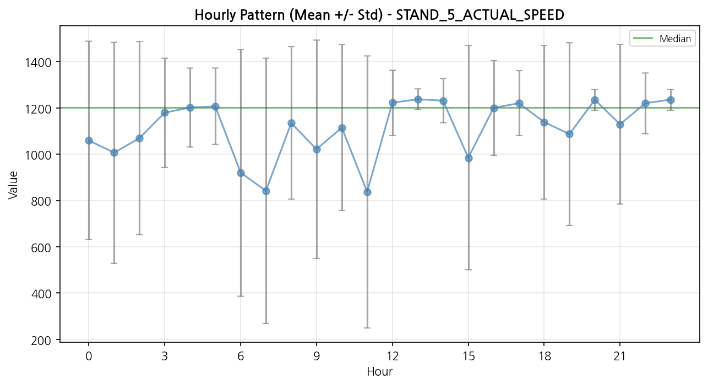

**7. 일별 이상치 수 (Daily Outlier Count)**

**종합 분석 차트**

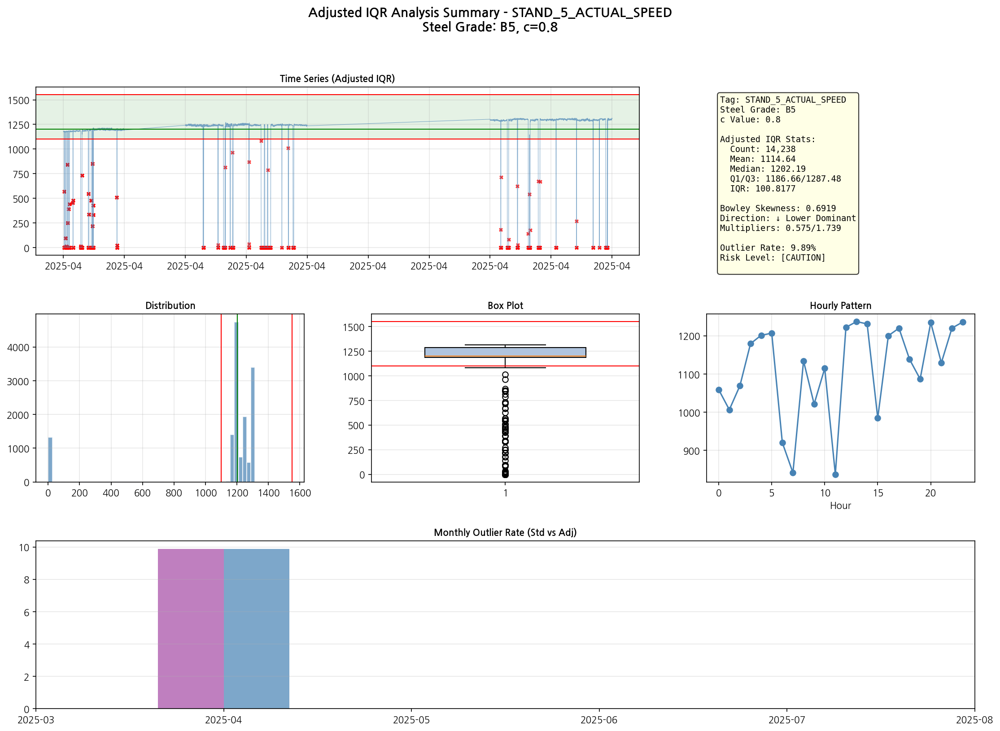

---

##### 월별 상세 분석

**2025-04**

**통계 요약**:

| 지표 | 값 |
|------|-------|
| 분석 레코드 | 14,238 |
| 평균 | 1114.6364 |
| 중앙값 | 1202.1910 |
| IQR | 100.8177 |
| Bowley 왜도 | 0.6919 |
| Adj 이상치 수 | 1,408 |
| Adj 이상치율 | 9.89% |
| Std 이상치율 | 9.88% |
| 개선율 | -0.1% |

**주요 이상치 발생 날짜**:

- 1. 2025-04-09: 801건
- 2. 2025-04-16: 250건
- 3. 2025-04-12: 236건

**1. 시계열 (Time Series)**

**2. 분포 히스토그램 (Distribution Histogram)**

**3. 박스플롯 (Box Plot)**

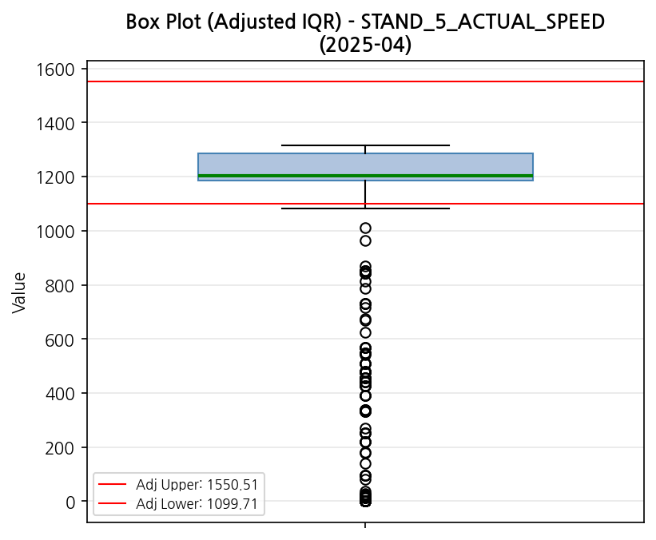

**4. 일별 평균 추이 (Daily Average Trend)**

**5. 시간별 패턴 (Hourly Pattern)**

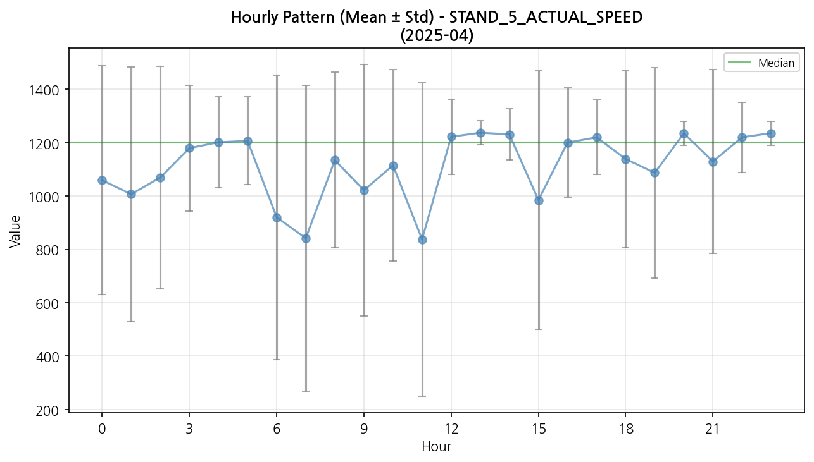

**6. 일별 이상치 수 (Daily Outlier Count)**

**월별 종합 차트**

---

#### STAND_6_ACTUAL_SPEED 🟡

**위험도**: [CAUTION] | **이상치율**: 9.88% | **개선율**: -0.1%
**Bowley 왜도**: 0.6650 | **승수 (L/U)**: 0.587/1.702

**데이터**: 원본 14,391 → 필터 후 14,238 (1.1% 제외)

| 통계 지표 | Adjusted IQR | Standard IQR |
|-----------|--------------|--------------|
| 이상치 수 | 1,407 | 1,406 |
| 이상치율 | 9.88% | 9.87% |
| 하한 경계 | 1069.9983 | 1001.3385 |
| 상한 경계 | 1562.0077 | 1445.1265 |

| 기본 통계 | 값 |
|-----------|-------|
| 분석 레코드 | 14,238 |
| 평균 | 1102.1883 |
| 표준편차 | 361.1185 |
| Q1 (25%) | 1167.7590 |
| 중앙값 | 1186.3430 |
| Q3 (75%) | 1278.7060 |
| IQR | 110.9470 |

**월별 이상치 추이**:

| 월 | 레코드 수 | 평균 | Adj 이상치율 | Std 이상치율 |
|-----|-----------|------|--------------|---------------|
| 2025-04 | 14,238 | 1102.19 | 9.88% | 9.87% |

**주요 이상치 발생 날짜** (상위 5일):

| 순위 | 날짜 | 이상치 수 |
|:----:|------|----------:|
| 1 | 2025-04-09 | 801 |
| 2 | 2025-04-16 | 250 |
| 3 | 2025-04-12 | 235 |
| 4 | 2025-04-11 | 73 |
| 5 | 2025-04-17 | 48 |

- 이상치 발생 일수: 5일
- 최대 일별 이상치: 801건 (2025-04-09)
- 평균 일별 이상치: 281.4건

##### 차트 분석

**1. 시계열 (Time Series)**

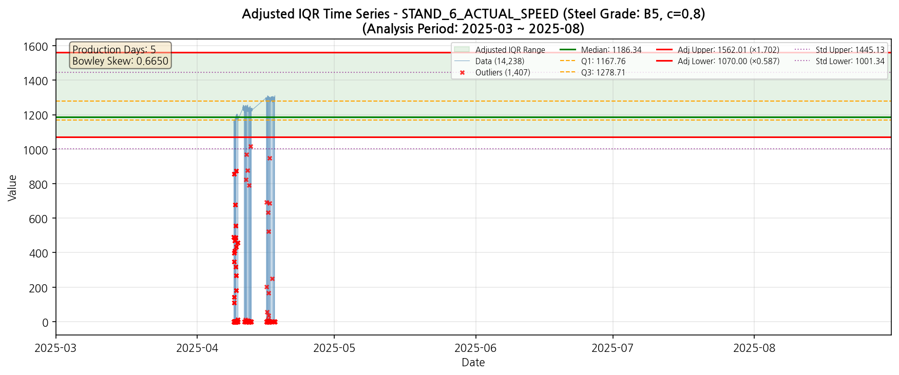

**2. 분포 히스토그램 (Distribution Histogram)**

**3. 박스플롯 (Box Plot)**

**4. 일별 평균 추이 (Daily Average Trend)**

**5. 월별 이상치율 (Monthly Outlier Rate)**

**6. 시간별 패턴 (Hourly Pattern)**

**7. 일별 이상치 수 (Daily Outlier Count)**

**종합 분석 차트**

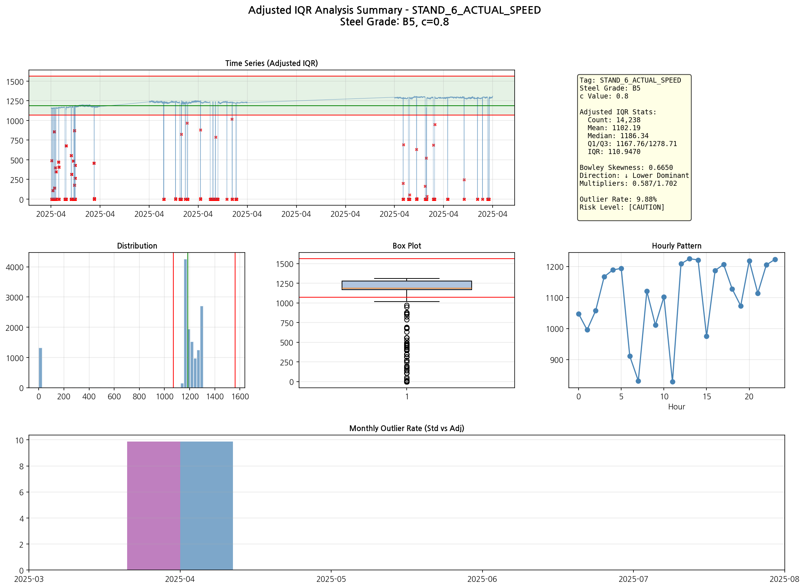

---

##### 월별 상세 분석

**2025-04**

**통계 요약**:

| 지표 | 값 |
|------|-------|
| 분석 레코드 | 14,238 |
| 평균 | 1102.1883 |
| 중앙값 | 1186.3430 |
| IQR | 110.9470 |
| Bowley 왜도 | 0.6650 |
| Adj 이상치 수 | 1,407 |
| Adj 이상치율 | 9.88% |
| Std 이상치율 | 9.87% |
| 개선율 | -0.1% |

**주요 이상치 발생 날짜**:

- 1. 2025-04-09: 801건
- 2. 2025-04-16: 250건
- 3. 2025-04-12: 235건

**1. 시계열 (Time Series)**

**2. 분포 히스토그램 (Distribution Histogram)**

**3. 박스플롯 (Box Plot)**

**4. 일별 평균 추이 (Daily Average Trend)**

**5. 시간별 패턴 (Hourly Pattern)**

**6. 일별 이상치 수 (Daily Outlier Count)**

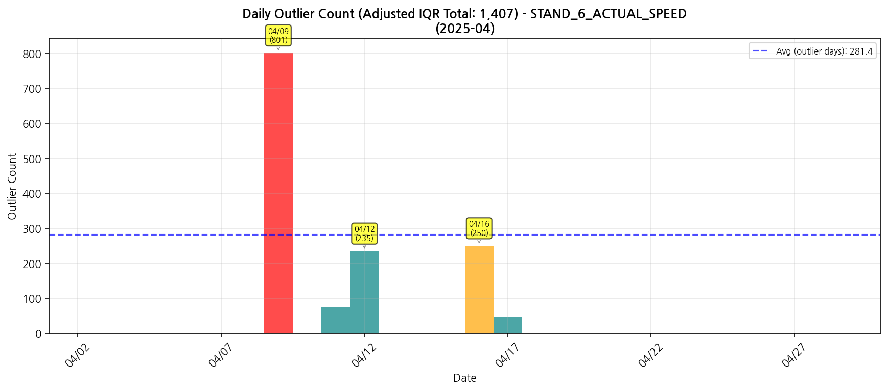

**월별 종합 차트**

---

#### HEATING_TOP_ZONE_NO_2_TEMPERATURE_ROOF 🟡

**위험도**: [CAUTION] | **이상치율**: 9.62% | **개선율**: -0.8%
**Bowley 왜도**: 0.2768 | **승수 (L/U)**: 0.801/1.248

**데이터**: 원본 14,391 → 필터 후 14,391 (0.0% 제외)

| 통계 지표 | Adjusted IQR | Standard IQR |
|-----------|--------------|--------------|
| 이상치 수 | 1,384 | 1,373 |
| 이상치율 | 9.62% | 9.54% |
| 하한 경계 | 1046.0740 | 1043.6725 |
| 상한 경계 | 1078.9132 | 1075.9165 |

| 기본 통계 | 값 |
|-----------|-------|
| 분석 레코드 | 14,391 |
| 평균 | 1061.2109 |
| 표준편차 | 11.7405 |
| Q1 (25%) | 1055.7640 |
| 중앙값 | 1058.6790 |
| Q3 (75%) | 1063.8250 |
| IQR | 8.0610 |

**월별 이상치 추이**:

| 월 | 레코드 수 | 평균 | Adj 이상치율 | Std 이상치율 |
|-----|-----------|------|--------------|---------------|
| 2025-04 | 14,391 | 1061.21 | 9.62% | 9.54% |

**주요 이상치 발생 날짜** (상위 5일):

| 순위 | 날짜 | 이상치 수 |
|:----:|------|----------:|
| 1 | 2025-04-09 | 820 |
| 2 | 2025-04-16 | 228 |
| 3 | 2025-04-12 | 158 |
| 4 | 2025-04-11 | 113 |
| 5 | 2025-04-17 | 65 |

- 이상치 발생 일수: 5일
- 최대 일별 이상치: 820건 (2025-04-09)
- 평균 일별 이상치: 276.8건

##### 차트 분석

**1. 시계열 (Time Series)**

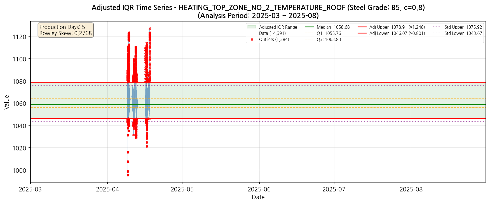

**2. 분포 히스토그램 (Distribution Histogram)**

**3. 박스플롯 (Box Plot)**

**4. 일별 평균 추이 (Daily Average Trend)**

**5. 월별 이상치율 (Monthly Outlier Rate)**

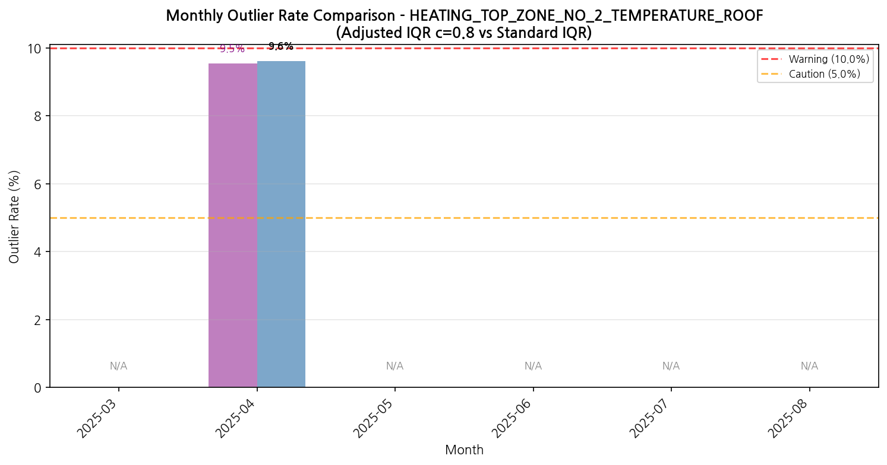

**6. 시간별 패턴 (Hourly Pattern)**

**7. 일별 이상치 수 (Daily Outlier Count)**

**종합 분석 차트**

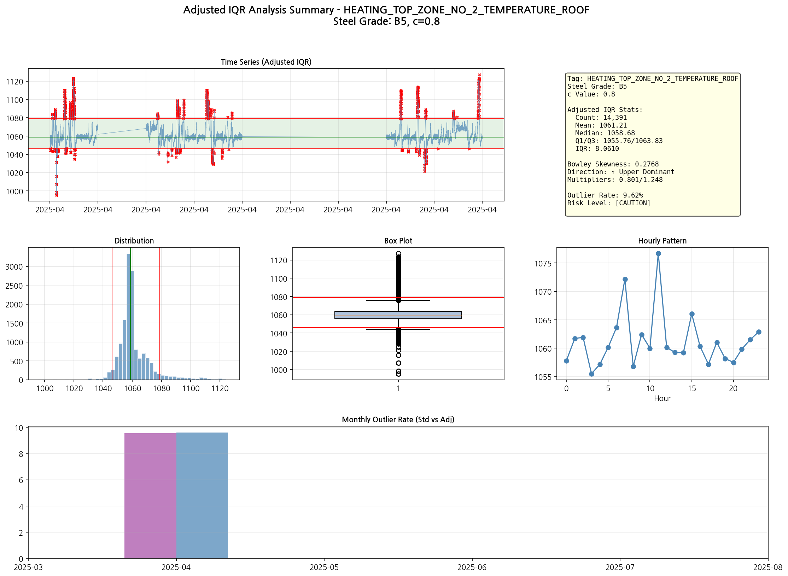

---

##### 월별 상세 분석

**2025-04**

**통계 요약**:

| 지표 | 값 |
|------|-------|
| 분석 레코드 | 14,391 |
| 평균 | 1061.2109 |
| 중앙값 | 1058.6790 |
| IQR | 8.0610 |
| Bowley 왜도 | 0.2768 |
| Adj 이상치 수 | 1,384 |
| Adj 이상치율 | 9.62% |
| Std 이상치율 | 9.54% |
| 개선율 | -0.8% |

**주요 이상치 발생 날짜**:

- 1. 2025-04-09: 820건
- 2. 2025-04-16: 228건
- 3. 2025-04-12: 158건

**1. 시계열 (Time Series)**

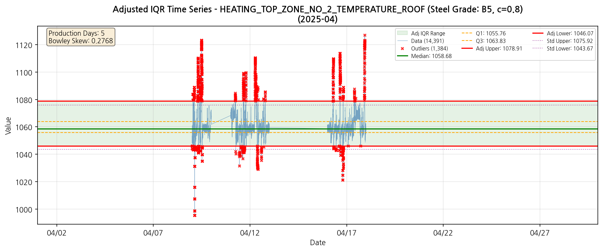

**2. 분포 히스토그램 (Distribution Histogram)**

**3. 박스플롯 (Box Plot)**

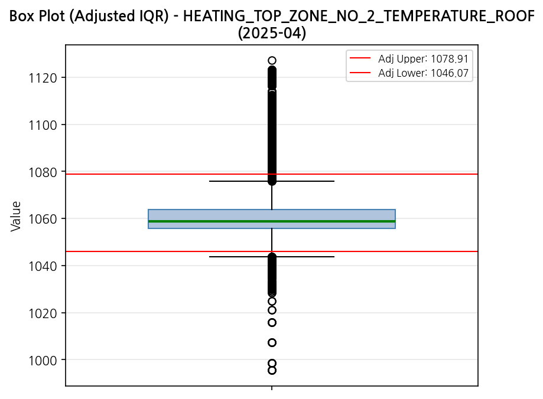

**4. 일별 평균 추이 (Daily Average Trend)**

**5. 시간별 패턴 (Hourly Pattern)**

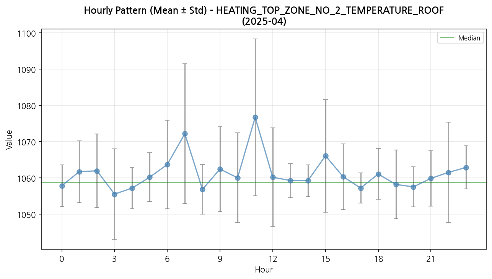

**6. 일별 이상치 수 (Daily Outlier Count)**

**월별 종합 차트**

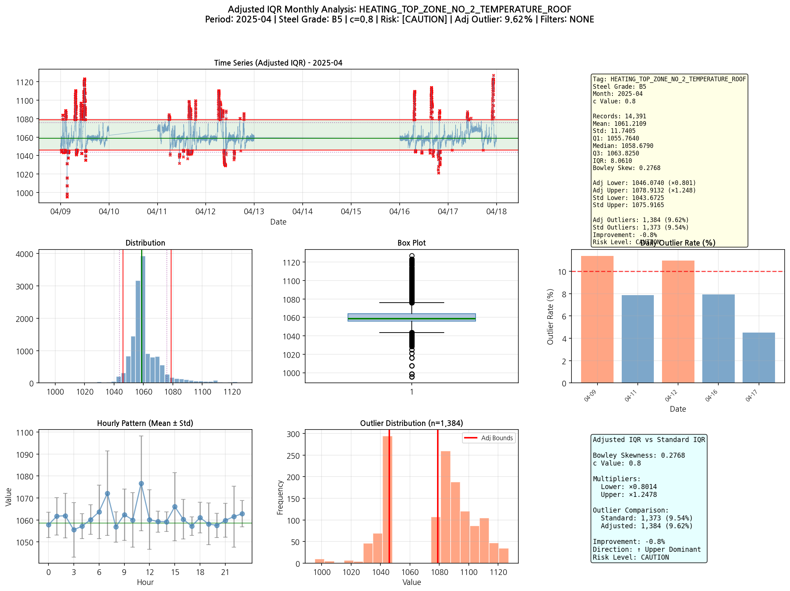

---

#### MAIN_COMBUSTION_AIR_PRESSURE 🟡

**위험도**: [CAUTION] | **이상치율**: 6.43% | **개선율**: -0.8%
**Bowley 왜도**: 0.0335 | **승수 (L/U)**: 0.974/1.027

**데이터**: 원본 14,391 → 필터 후 14,391 (0.0% 제외)

| 통계 지표 | Adjusted IQR | Standard IQR |
|-----------|--------------|--------------|
| 이상치 수 | 925 | 918 |
| 이상치율 | 6.43% | 6.38% |
| 하한 경계 | 1149.8782 | 1149.7628 |
| 상한 경계 | 1161.5393 | 1161.4207 |

| 기본 통계 | 값 |
|-----------|-------|
| 분석 레코드 | 14,391 |
| 평균 | 1154.2869 |
| 표준편차 | 8.4321 |
| Q1 (25%) | 1154.1345 |
| 중앙값 | 1155.5430 |
| Q3 (75%) | 1157.0490 |
| IQR | 2.9145 |

**월별 이상치 추이**:

| 월 | 레코드 수 | 평균 | Adj 이상치율 | Std 이상치율 |
|-----|-----------|------|--------------|---------------|
| 2025-04 | 14,391 | 1154.29 | 6.43% | 6.38% |

**주요 이상치 발생 날짜** (상위 5일):

| 순위 | 날짜 | 이상치 수 |
|:----:|------|----------:|
| 1 | 2025-04-17 | 450 |
| 2 | 2025-04-12 | 199 |
| 3 | 2025-04-16 | 196 |
| 4 | 2025-04-09 | 70 |
| 5 | 2025-04-11 | 10 |

- 이상치 발생 일수: 5일
- 최대 일별 이상치: 450건 (2025-04-17)
- 평균 일별 이상치: 185.0건

##### 차트 분석

**1. 시계열 (Time Series)**

**2. 분포 히스토그램 (Distribution Histogram)**

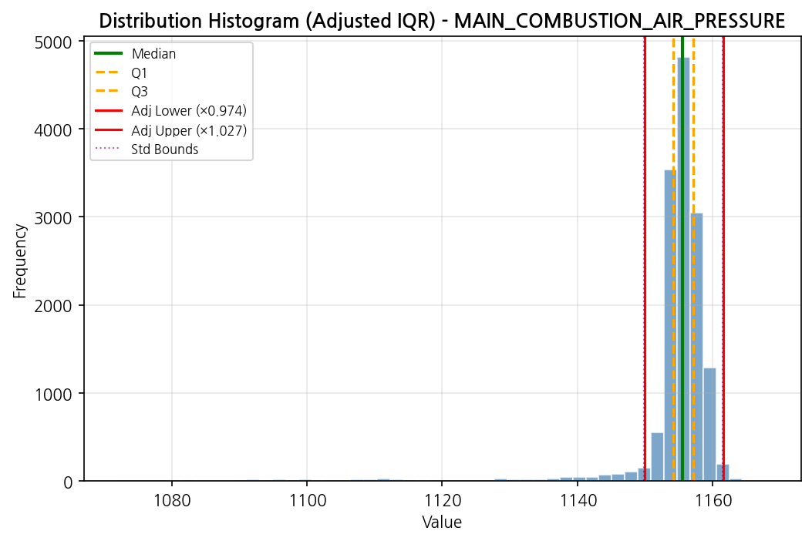

**3. 박스플롯 (Box Plot)**

**4. 일별 평균 추이 (Daily Average Trend)**

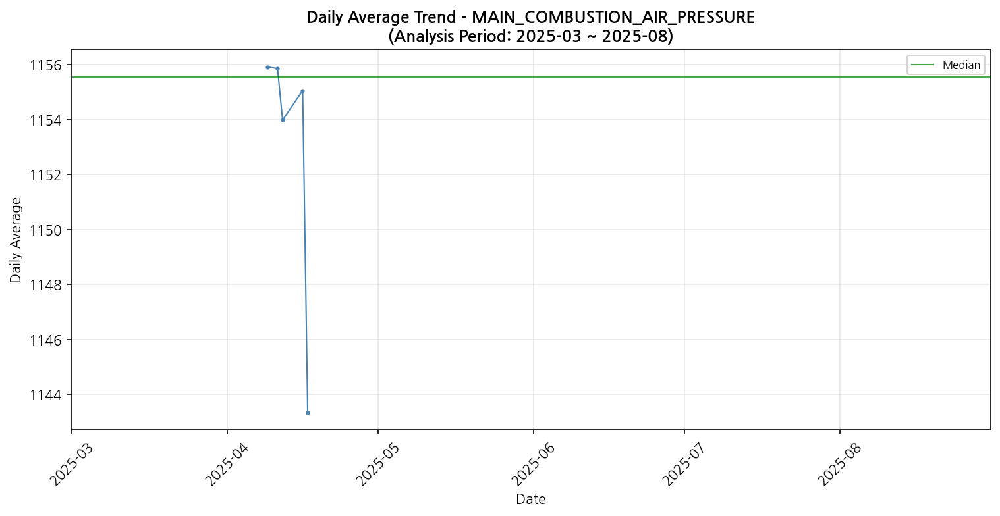

**5. 월별 이상치율 (Monthly Outlier Rate)**

**6. 시간별 패턴 (Hourly Pattern)**

**7. 일별 이상치 수 (Daily Outlier Count)**

**종합 분석 차트**

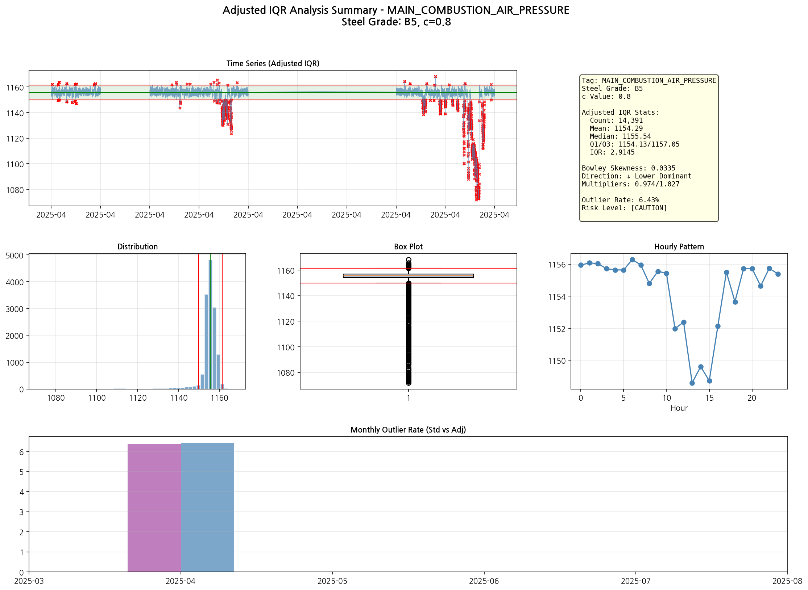

---

##### 월별 상세 분석

**2025-04**

**통계 요약**:

| 지표 | 값 |
|------|-------|
| 분석 레코드 | 14,391 |
| 평균 | 1154.2869 |
| 중앙값 | 1155.5430 |
| IQR | 2.9145 |
| Bowley 왜도 | 0.0335 |
| Adj 이상치 수 | 925 |
| Adj 이상치율 | 6.43% |
| Std 이상치율 | 6.38% |
| 개선율 | -0.8% |

**주요 이상치 발생 날짜**:

- 1. 2025-04-17: 450건
- 2. 2025-04-12: 199건
- 3. 2025-04-16: 196건

**1. 시계열 (Time Series)**

**2. 분포 히스토그램 (Distribution Histogram)**

**3. 박스플롯 (Box Plot)**

**4. 일별 평균 추이 (Daily Average Trend)**

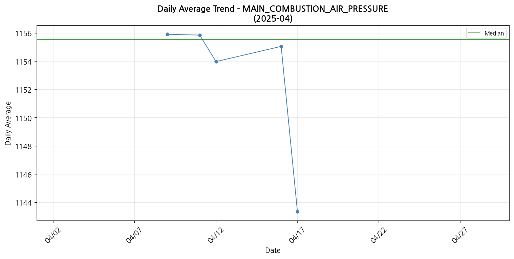

**5. 시간별 패턴 (Hourly Pattern)**

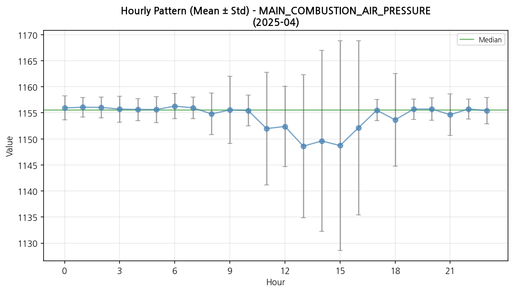

**6. 일별 이상치 수 (Daily Outlier Count)**

**월별 종합 차트**

---

#### SOAKING_TOP_ZONE_NO_1_TEMPERATURE_ROOF 🟡

**위험도**: [CAUTION] | **이상치율**: 5.25% | **개선율**: 0.0%
**Bowley 왜도**: 0.0050 | **승수 (L/U)**: 0.996/1.004

**데이터**: 원본 14,391 → 필터 후 14,391 (0.0% 제외)

| 통계 지표 | Adjusted IQR | Standard IQR |
|-----------|--------------|--------------|
| 이상치 수 | 756 | 756 |
| 이상치율 | 5.25% | 5.25% |
| 하한 경계 | 1116.6686 | 1116.6195 |
| 상한 경계 | 1149.6248 | 1149.5755 |

| 기본 통계 | 값 |
|-----------|-------|
| 분석 레코드 | 14,391 |
| 평균 | 1133.2332 |
| 표준편차 | 8.9229 |
| Q1 (25%) | 1128.9780 |
| 중앙값 | 1133.0770 |
| Q3 (75%) | 1137.2170 |
| IQR | 8.2390 |

**월별 이상치 추이**:

| 월 | 레코드 수 | 평균 | Adj 이상치율 | Std 이상치율 |
|-----|-----------|------|--------------|---------------|
| 2025-04 | 14,391 | 1133.23 | 5.25% | 5.25% |

**주요 이상치 발생 날짜** (상위 5일):

| 순위 | 날짜 | 이상치 수 |
|:----:|------|----------:|
| 1 | 2025-04-17 | 265 |
| 2 | 2025-04-12 | 195 |
| 3 | 2025-04-16 | 168 |
| 4 | 2025-04-09 | 95 |
| 5 | 2025-04-11 | 33 |

- 이상치 발생 일수: 5일
- 최대 일별 이상치: 265건 (2025-04-17)
- 평균 일별 이상치: 151.2건

##### 차트 분석

**1. 시계열 (Time Series)**

**2. 분포 히스토그램 (Distribution Histogram)**

**3. 박스플롯 (Box Plot)**

**4. 일별 평균 추이 (Daily Average Trend)**

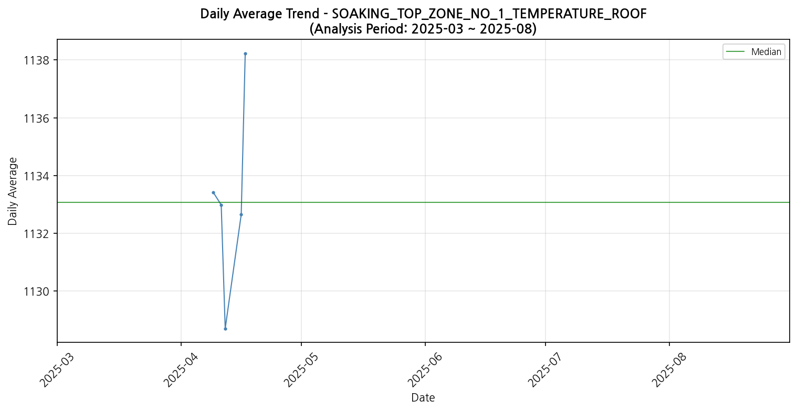

**5. 월별 이상치율 (Monthly Outlier Rate)**

**6. 시간별 패턴 (Hourly Pattern)**

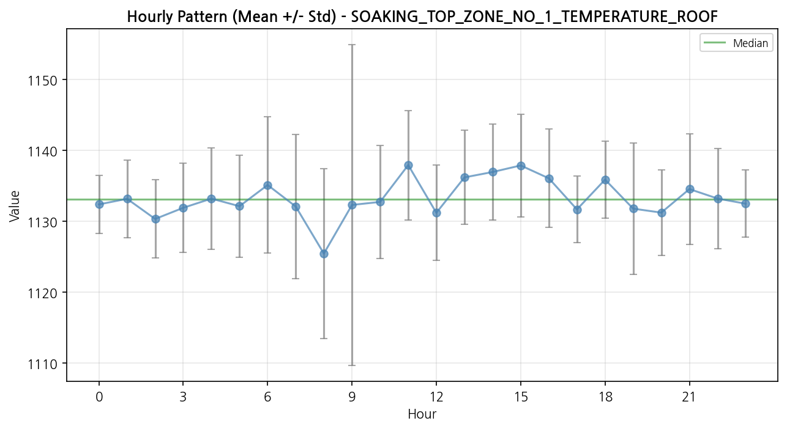

**7. 일별 이상치 수 (Daily Outlier Count)**

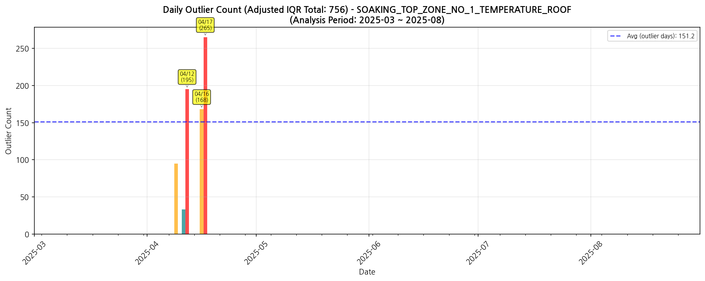

**종합 분석 차트**

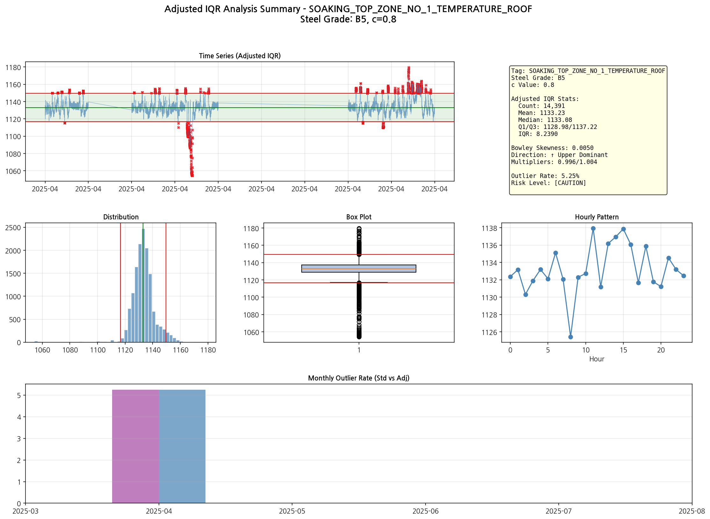

---

##### 월별 상세 분석

**2025-04**

**통계 요약**:

| 지표 | 값 |
|------|-------|
| 분석 레코드 | 14,391 |
| 평균 | 1133.2332 |
| 중앙값 | 1133.0770 |
| IQR | 8.2390 |
| Bowley 왜도 | 0.0050 |
| Adj 이상치 수 | 756 |
| Adj 이상치율 | 5.25% |
| Std 이상치율 | 5.25% |
| 개선율 | 0.0% |

**주요 이상치 발생 날짜**:

- 1. 2025-04-17: 265건
- 2. 2025-04-12: 195건
- 3. 2025-04-16: 168건

**1. 시계열 (Time Series)**

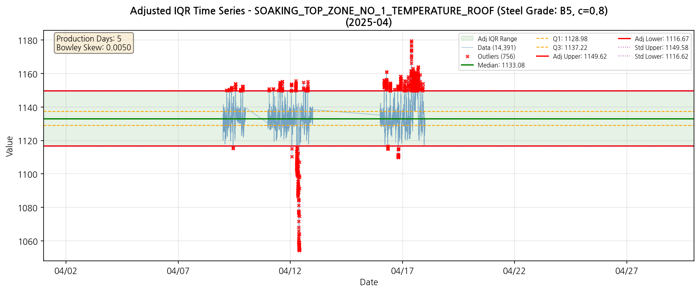

**2. 분포 히스토그램 (Distribution Histogram)**

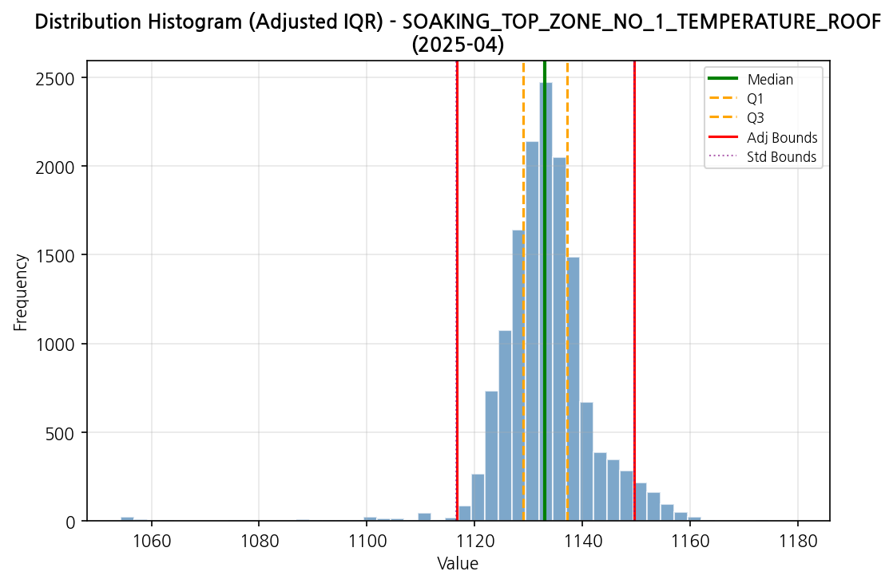

**3. 박스플롯 (Box Plot)**

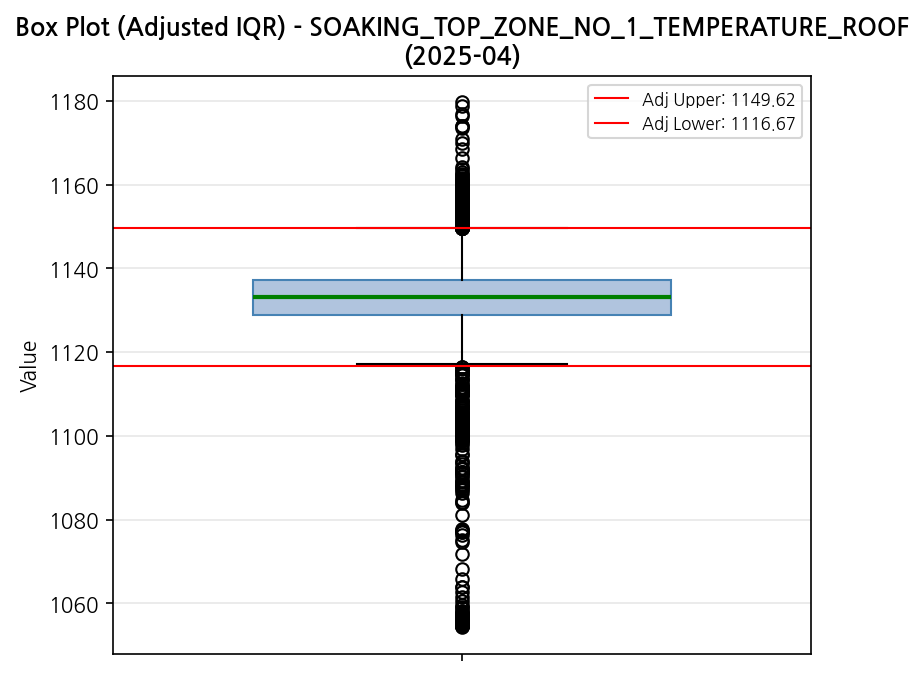

**4. 일별 평균 추이 (Daily Average Trend)**

**5. 시간별 패턴 (Hourly Pattern)**

**6. 일별 이상치 수 (Daily Outlier Count)**

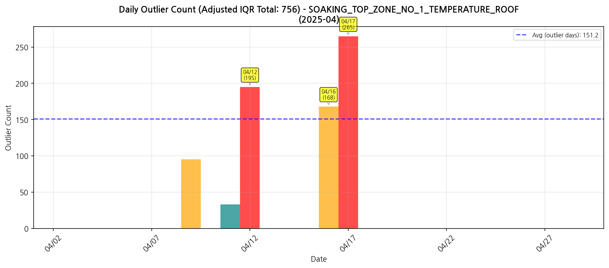

**월별 종합 차트**

---

### 🟢 양호 (0~5%) - 48개 태그

#### PINCHROLL_2_ACTUAL_SPEED 🟢

**위험도**: [NORMAL] | **이상치율**: 4.57% | **개선율**: -8100.0%
**Bowley 왜도**: 0.5373 | **승수 (L/U)**: 0.651/1.537

**데이터**: 원본 14,391 → 필터 후 12,557 (12.7% 제외)

| 통계 지표 | Adjusted IQR | Standard IQR |
|-----------|--------------|--------------|
| 이상치 수 | 574 | 7 |
| 이상치율 | 4.57% | 0.06% |
| 하한 경계 | -335.8142 | -344.1757 |
| 상한 경계 | -267.5096 | -280.3616 |

| 기본 통계 | 값 |
|-----------|-------|
| 분석 레코드 | 12,557 |
| 평균 | -314.8393 |
| 표준편차 | 11.0267 |
| Q1 (25%) | -320.2454 |
| 중앙값 | -316.5549 |
| Q3 (75%) | -304.2919 |
| IQR | 15.9535 |

**월별 이상치 추이**:

| 월 | 레코드 수 | 평균 | Adj 이상치율 | Std 이상치율 |
|-----|-----------|------|--------------|---------------|
| 2025-04 | 12,557 | -314.84 | 4.57% | 0.06% |

**주요 이상치 발생 날짜** (상위 5일):

| 순위 | 날짜 | 이상치 수 |
|:----:|------|----------:|
| 1 | 2025-04-16 | 306 |
| 2 | 2025-04-17 | 152 |
| 3 | 2025-04-12 | 66 |
| 4 | 2025-04-11 | 47 |
| 5 | 2025-04-09 | 3 |

- 이상치 발생 일수: 5일
- 최대 일별 이상치: 306건 (2025-04-16)
- 평균 일별 이상치: 114.8건

##### 차트 분석

**1. 시계열 (Time Series)**

**2. 분포 히스토그램 (Distribution Histogram)**

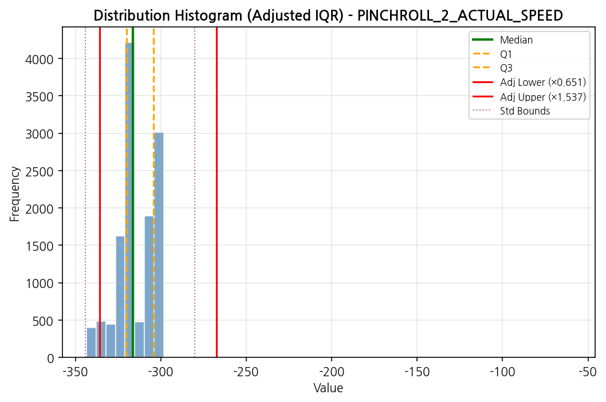

**3. 박스플롯 (Box Plot)**

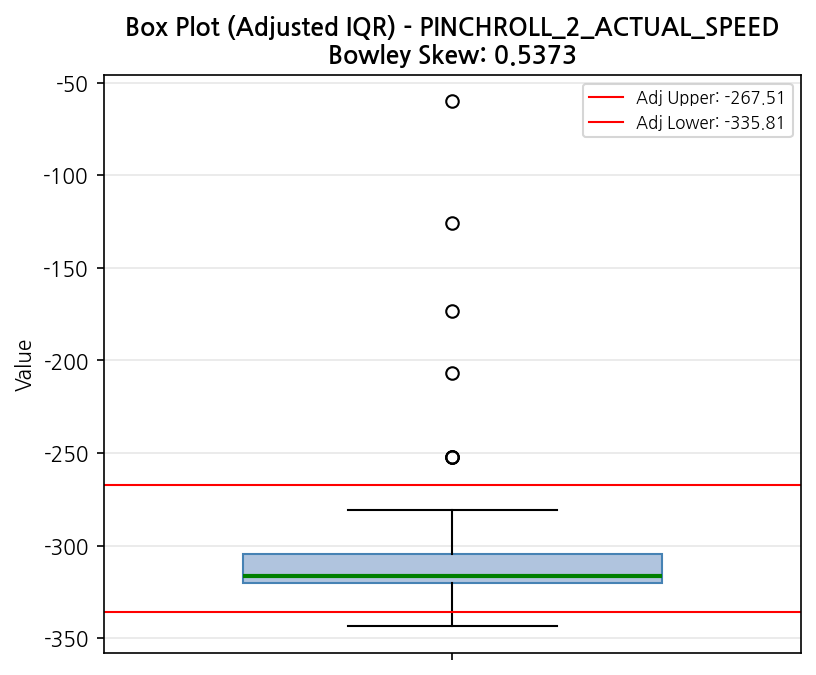

**4. 일별 평균 추이 (Daily Average Trend)**

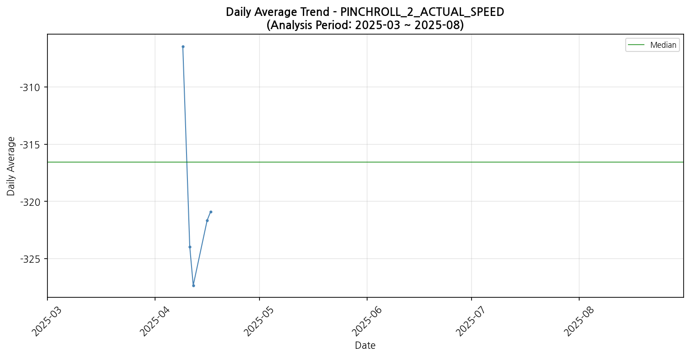

**5. 월별 이상치율 (Monthly Outlier Rate)**

**6. 시간별 패턴 (Hourly Pattern)**

**7. 일별 이상치 수 (Daily Outlier Count)**

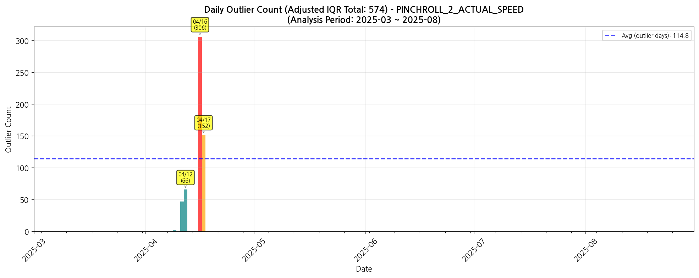

**종합 분석 차트**

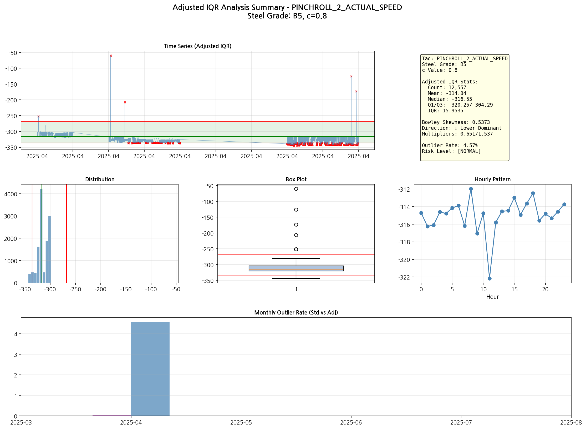

---

##### 월별 상세 분석

**2025-04**

**통계 요약**:

| 지표 | 값 |
|------|-------|
| 분석 레코드 | 12,557 |
| 평균 | -314.8393 |
| 중앙값 | -316.5549 |
| IQR | 15.9535 |
| Bowley 왜도 | 0.5373 |
| Adj 이상치 수 | 574 |
| Adj 이상치율 | 4.57% |
| Std 이상치율 | 0.06% |
| 개선율 | -8100.0% |

**주요 이상치 발생 날짜**:

- 1. 2025-04-16: 306건
- 2. 2025-04-17: 152건
- 3. 2025-04-12: 66건

**1. 시계열 (Time Series)**

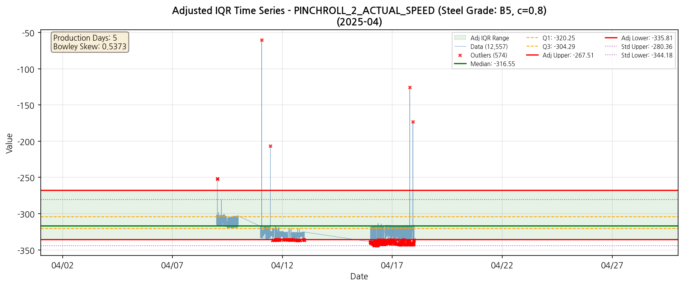

**2. 분포 히스토그램 (Distribution Histogram)**

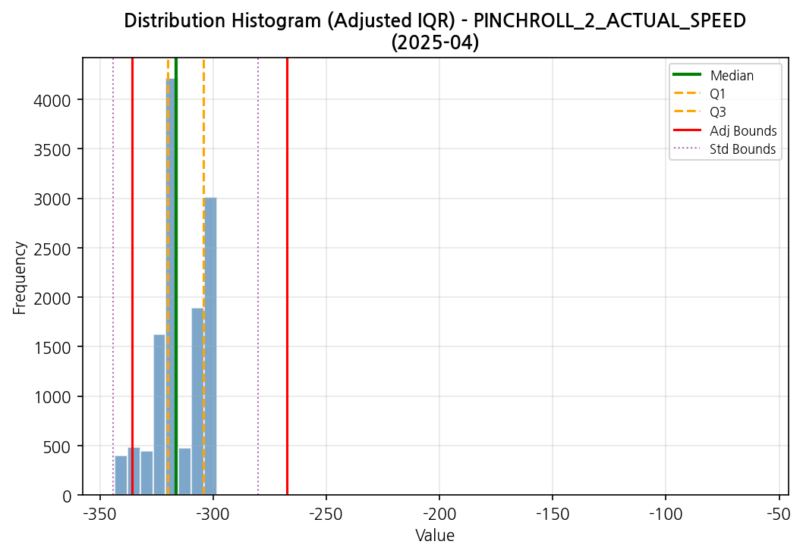

**3. 박스플롯 (Box Plot)**

**4. 일별 평균 추이 (Daily Average Trend)**

**5. 시간별 패턴 (Hourly Pattern)**

**6. 일별 이상치 수 (Daily Outlier Count)**

**월별 종합 차트**

---

#### SOAKING_TOP_ZONE_NO_2_TEMPERATURE_ROOF 🟢

**위험도**: [NORMAL] | **이상치율**: 3.02% | **개선율**: 21.6%
**Bowley 왜도**: 0.1388 | **승수 (L/U)**: 0.895/1.117

**데이터**: 원본 14,391 → 필터 후 14,391 (0.0% 제외)

| 통계 지표 | Adjusted IQR | Standard IQR |
|-----------|--------------|--------------|
| 이상치 수 | 435 | 555 |
| 이상치율 | 3.02% | 3.86% |
| 하한 경계 | 1129.8256 | 1128.3462 |
| 상한 경계 | 1167.5453 | 1165.8923 |

| 기본 통계 | 값 |
|-----------|-------|
| 분석 레코드 | 14,391 |
| 평균 | 1147.3072 |
| 표준편차 | 9.1858 |
| Q1 (25%) | 1142.4260 |
| 중앙값 | 1146.4680 |
| Q3 (75%) | 1151.8125 |
| IQR | 9.3865 |

**월별 이상치 추이**:

| 월 | 레코드 수 | 평균 | Adj 이상치율 | Std 이상치율 |
|-----|-----------|------|--------------|---------------|
| 2025-04 | 14,391 | 1147.31 | 3.02% | 3.86% |

**주요 이상치 발생 날짜** (상위 5일):

| 순위 | 날짜 | 이상치 수 |
|:----:|------|----------:|
| 1 | 2025-04-12 | 162 |
| 2 | 2025-04-09 | 105 |
| 3 | 2025-04-17 | 98 |
| 4 | 2025-04-16 | 60 |
| 5 | 2025-04-11 | 10 |

- 이상치 발생 일수: 5일
- 최대 일별 이상치: 162건 (2025-04-12)
- 평균 일별 이상치: 87.0건

##### 차트 분석

**1. 시계열 (Time Series)**

**2. 분포 히스토그램 (Distribution Histogram)**

**3. 박스플롯 (Box Plot)**

**4. 일별 평균 추이 (Daily Average Trend)**

**5. 월별 이상치율 (Monthly Outlier Rate)**

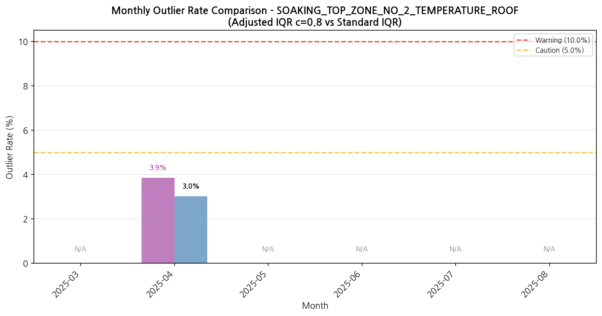

**6. 시간별 패턴 (Hourly Pattern)**

**7. 일별 이상치 수 (Daily Outlier Count)**

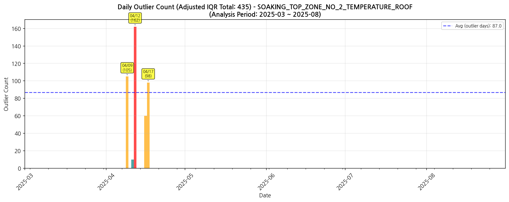

**종합 분석 차트**

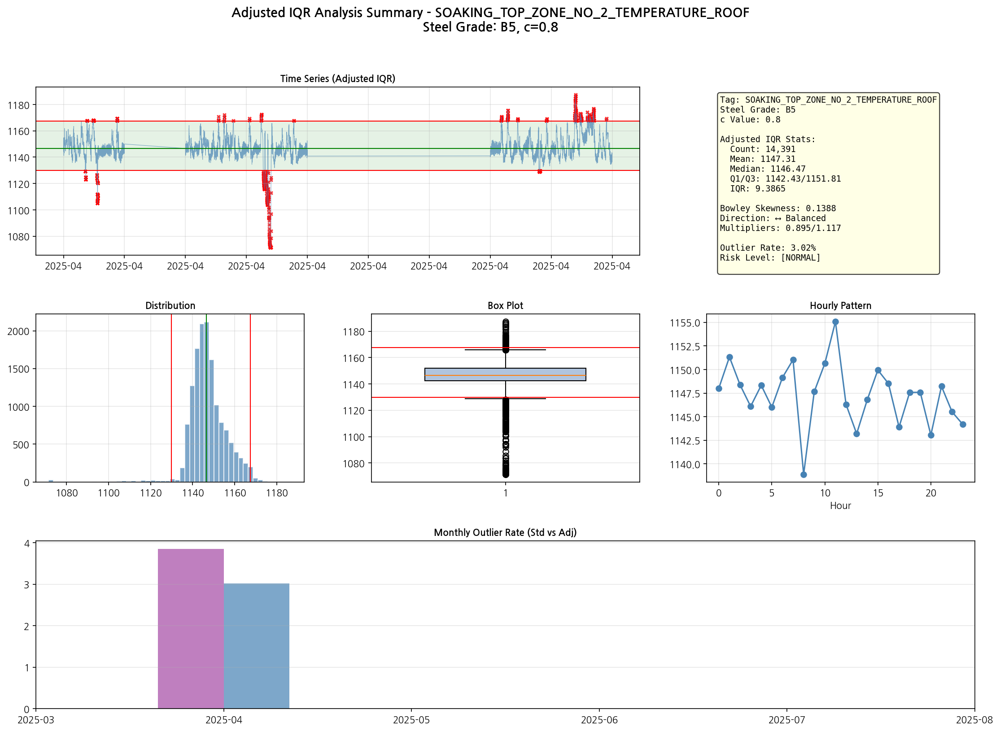

---

##### 월별 상세 분석

**2025-04**

**통계 요약**:

| 지표 | 값 |
|------|-------|
| 분석 레코드 | 14,391 |
| 평균 | 1147.3072 |
| 중앙값 | 1146.4680 |
| IQR | 9.3865 |
| Bowley 왜도 | 0.1388 |
| Adj 이상치 수 | 435 |
| Adj 이상치율 | 3.02% |
| Std 이상치율 | 3.86% |
| 개선율 | 21.6% |

**주요 이상치 발생 날짜**:

- 1. 2025-04-12: 162건
- 2. 2025-04-09: 105건
- 3. 2025-04-17: 98건

**1. 시계열 (Time Series)**

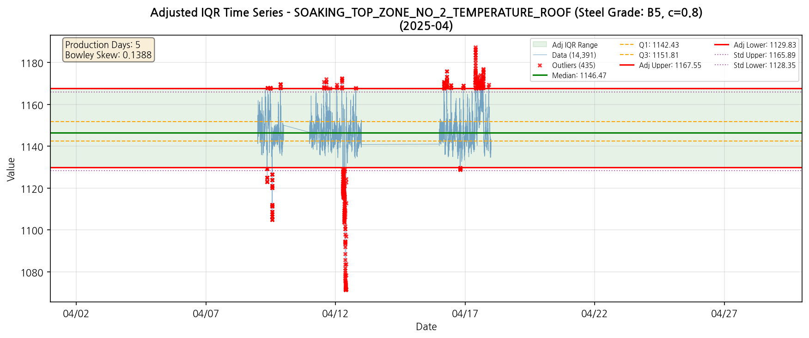

**2. 분포 히스토그램 (Distribution Histogram)**

**3. 박스플롯 (Box Plot)**

**4. 일별 평균 추이 (Daily Average Trend)**

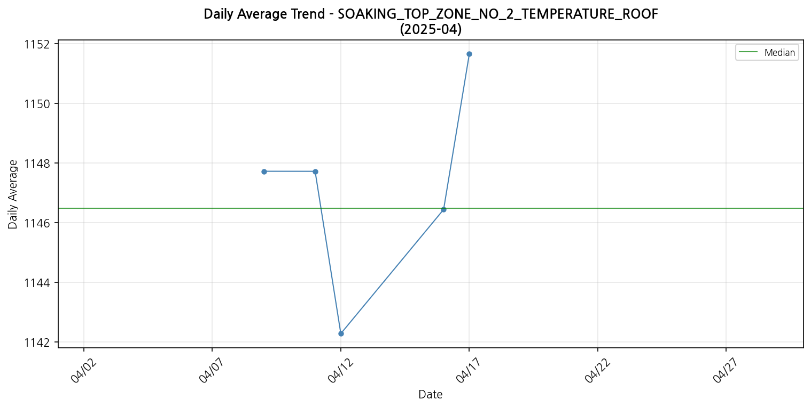

**5. 시간별 패턴 (Hourly Pattern)**

**6. 일별 이상치 수 (Daily Outlier Count)**

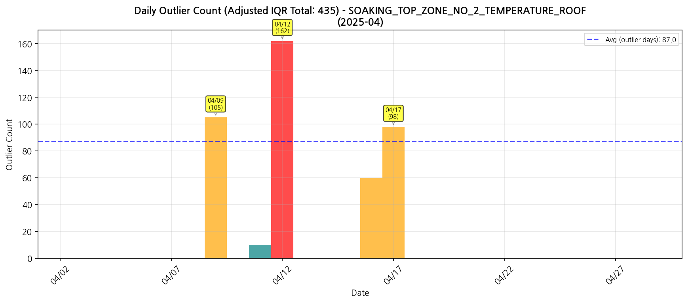

**월별 종합 차트**

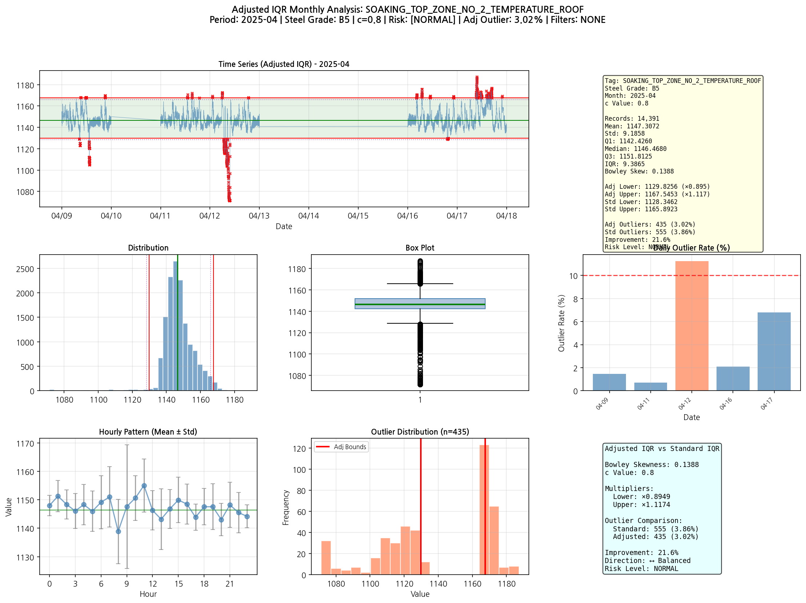

---

#### INDIRECT_WATER_MAIN_TEMPERATURE 🟢

**위험도**: [NORMAL] | **이상치율**: 1.84% | **개선율**: 0.0%
**Bowley 왜도**: 0.0000 | **승수 (L/U)**: 1.000/1.000

**데이터**: 원본 14,391 → 필터 후 14,391 (0.0% 제외)

| 통계 지표 | Adjusted IQR | Standard IQR |
|-----------|--------------|--------------|
| 이상치 수 | 265 | 265 |
| 이상치율 | 1.84% | 1.84% |
| 하한 경계 | 27.3000 | 27.3000 |
| 상한 경계 | 31.3000 | 31.3000 |

| 기본 통계 | 값 |
|-----------|-------|
| 분석 레코드 | 14,391 |
| 평균 | 29.3411 |
| 표준편차 | 0.7458 |
| Q1 (25%) | 28.8000 |
| 중앙값 | 29.3000 |
| Q3 (75%) | 29.8000 |
| IQR | 1.0000 |

**월별 이상치 추이**:

| 월 | 레코드 수 | 평균 | Adj 이상치율 | Std 이상치율 |
|-----|-----------|------|--------------|---------------|
| 2025-04 | 14,391 | 29.34 | 1.84% | 1.84% |

**주요 이상치 발생 날짜** (상위 5일):

| 순위 | 날짜 | 이상치 수 |
|:----:|------|----------:|
| 1 | 2025-04-17 | 265 |

- 이상치 발생 일수: 1일
- 최대 일별 이상치: 265건 (2025-04-17)
- 평균 일별 이상치: 265.0건

##### 차트 분석

**1. 시계열 (Time Series)**

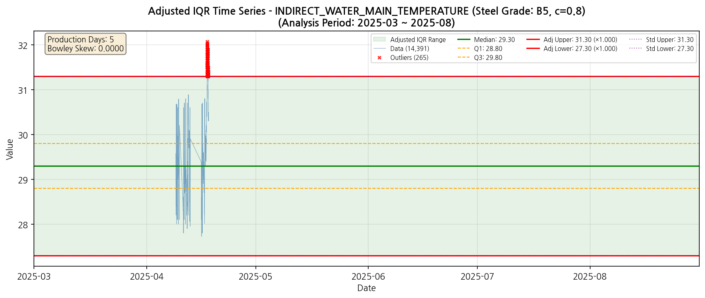

**2. 분포 히스토그램 (Distribution Histogram)**

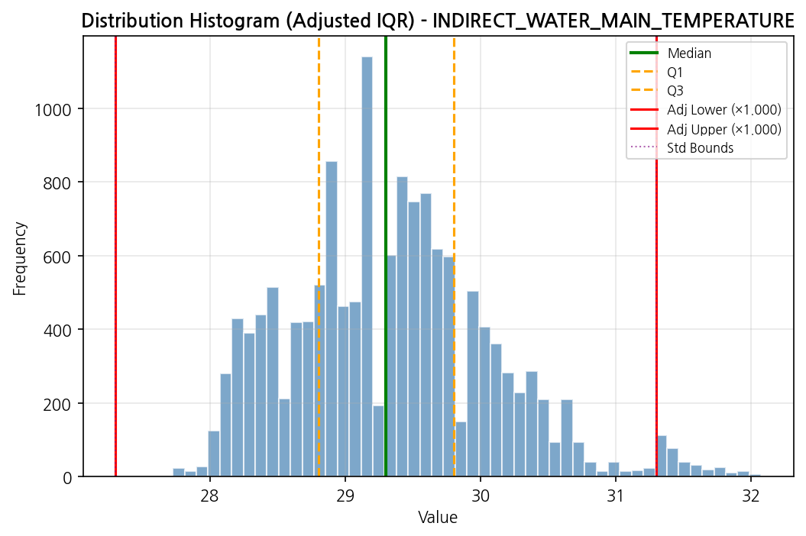

**3. 박스플롯 (Box Plot)**

**4. 일별 평균 추이 (Daily Average Trend)**

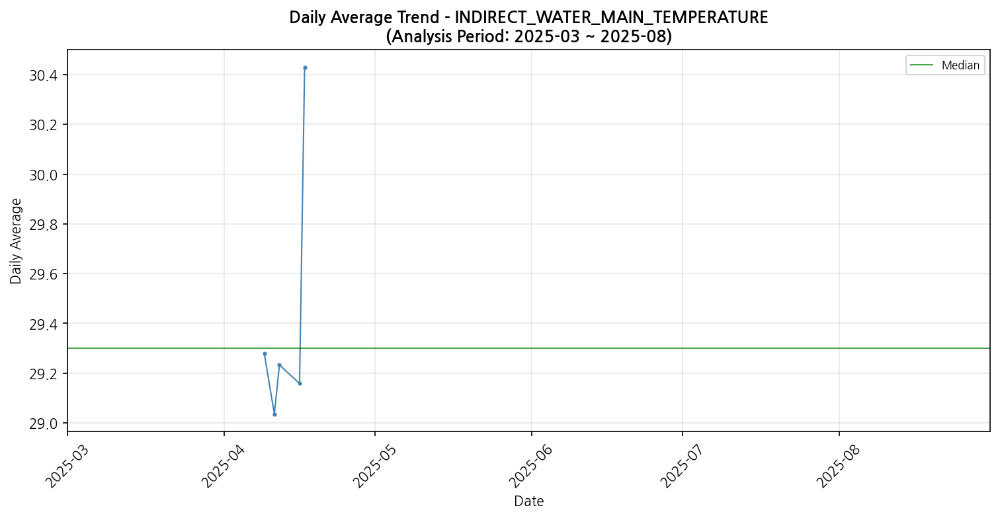

**5. 월별 이상치율 (Monthly Outlier Rate)**

**6. 시간별 패턴 (Hourly Pattern)**

**7. 일별 이상치 수 (Daily Outlier Count)**

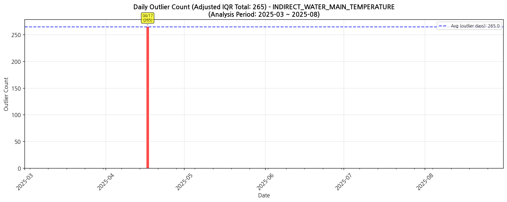

**종합 분석 차트**

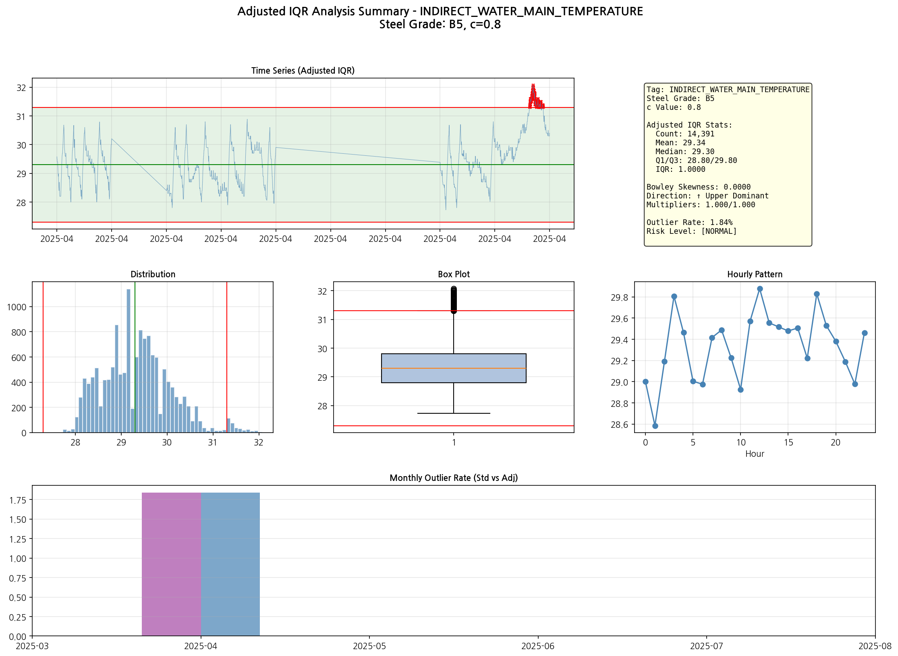

---

##### 월별 상세 분석

**2025-04**

**통계 요약**:

| 지표 | 값 |
|------|-------|
| 분석 레코드 | 14,391 |
| 평균 | 29.3411 |
| 중앙값 | 29.3000 |
| IQR | 1.0000 |
| Bowley 왜도 | 0.0000 |
| Adj 이상치 수 | 265 |
| Adj 이상치율 | 1.84% |
| Std 이상치율 | 1.84% |
| 개선율 | 0.0% |

**주요 이상치 발생 날짜**:

- 1. 2025-04-17: 265건

**1. 시계열 (Time Series)**

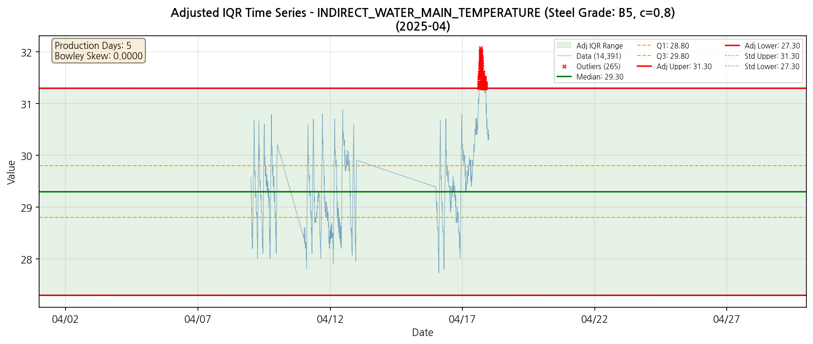

**2. 분포 히스토그램 (Distribution Histogram)**

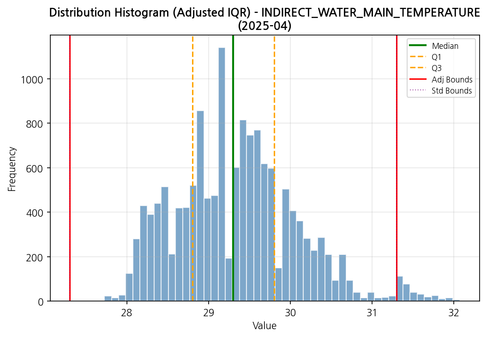

**3. 박스플롯 (Box Plot)**

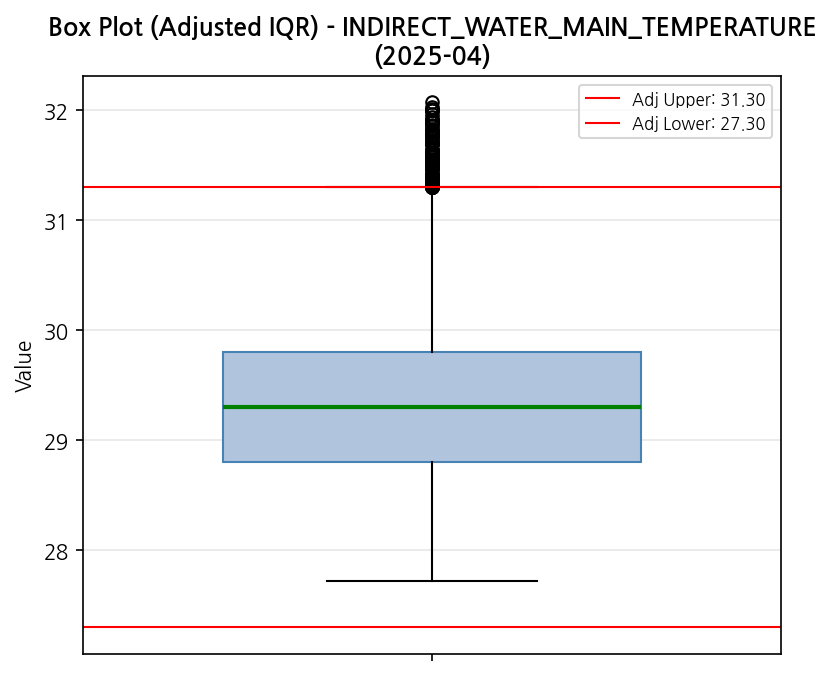

**4. 일별 평균 추이 (Daily Average Trend)**

**5. 시간별 패턴 (Hourly Pattern)**

**6. 일별 이상치 수 (Daily Outlier Count)**

**월별 종합 차트**

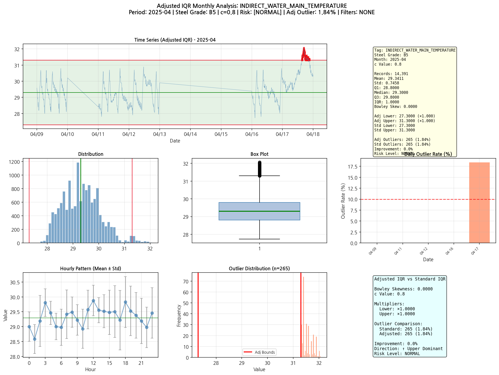

---

#### MAIN_GAS_PRESSURE 🟢

**위험도**: [NORMAL] | **이상치율**: 1.36% | **개선율**: -16.7%
**Bowley 왜도**: -0.2036 | **승수 (L/U)**: 1.177/0.850

**데이터**: 원본 14,391 → 필터 후 14,391 (0.0% 제외)

| 통계 지표 | Adjusted IQR | Standard IQR |
|-----------|--------------|--------------|
| 이상치 수 | 196 | 168 |
| 이상치율 | 1.36% | 1.17% |
| 하한 경계 | 1476.3246 | 1487.0205 |
| 상한 경계 | 1639.1524 | 1648.2405 |

| 기본 통계 | 값 |
|-----------|-------|
| 분석 레코드 | 14,391 |
| 평균 | 1566.9266 |
| 표준편차 | 29.1102 |
| Q1 (25%) | 1547.4780 |
| 중앙값 | 1571.7340 |
| Q3 (75%) | 1587.7830 |
| IQR | 40.3050 |

**월별 이상치 추이**:

| 월 | 레코드 수 | 평균 | Adj 이상치율 | Std 이상치율 |
|-----|-----------|------|--------------|---------------|
| 2025-04 | 14,391 | 1566.93 | 1.36% | 1.17% |

**주요 이상치 발생 날짜** (상위 5일):

| 순위 | 날짜 | 이상치 수 |
|:----:|------|----------:|
| 1 | 2025-04-12 | 131 |
| 2 | 2025-04-17 | 51 |
| 3 | 2025-04-16 | 14 |

- 이상치 발생 일수: 3일
- 최대 일별 이상치: 131건 (2025-04-12)
- 평균 일별 이상치: 65.3건

##### 차트 분석

**1. 시계열 (Time Series)**

**2. 분포 히스토그램 (Distribution Histogram)**

**3. 박스플롯 (Box Plot)**

**4. 일별 평균 추이 (Daily Average Trend)**

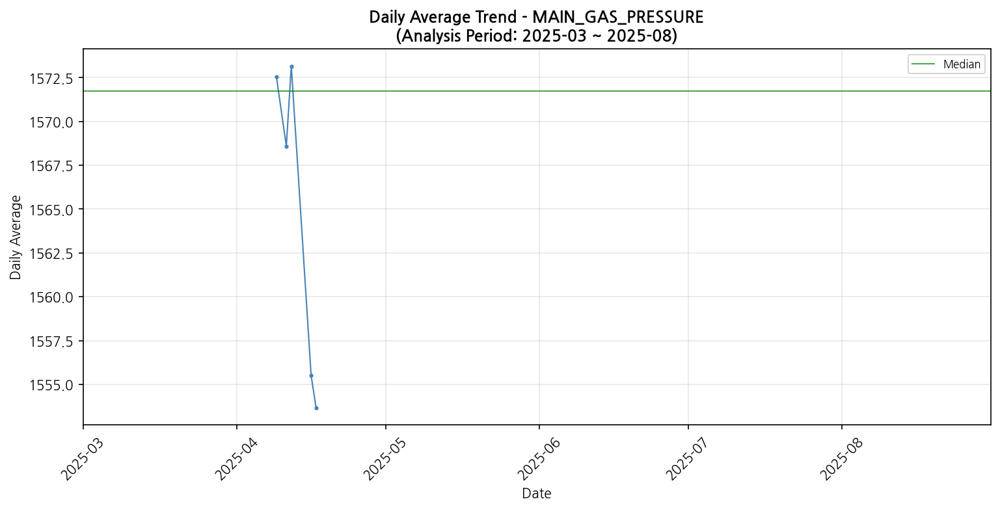

**5. 월별 이상치율 (Monthly Outlier Rate)**

**6. 시간별 패턴 (Hourly Pattern)**

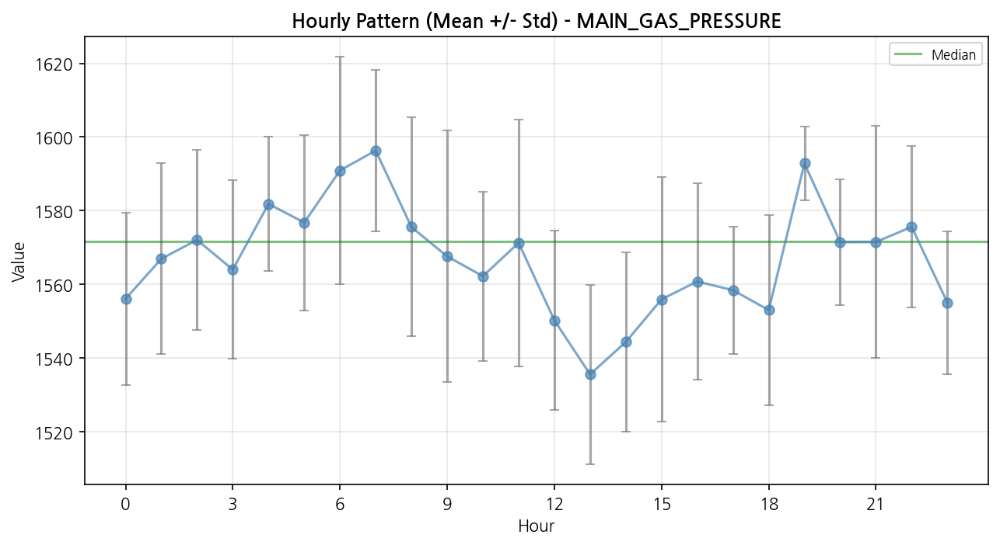

**7. 일별 이상치 수 (Daily Outlier Count)**

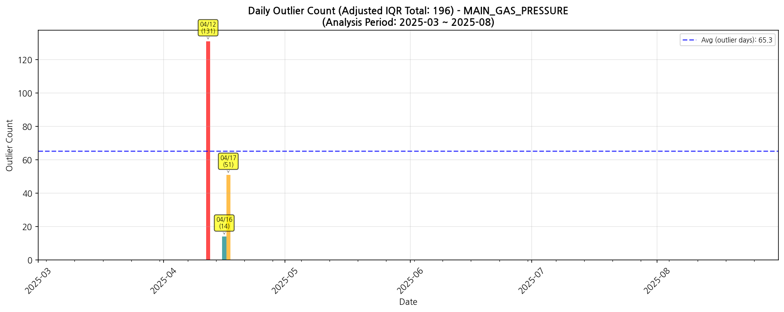

**종합 분석 차트**

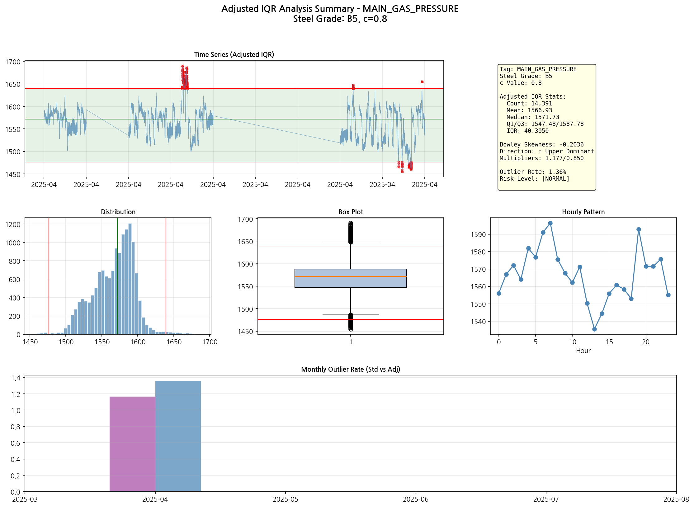

---

##### 월별 상세 분석

**2025-04**

**통계 요약**:

| 지표 | 값 |
|------|-------|
| 분석 레코드 | 14,391 |
| 평균 | 1566.9266 |
| 중앙값 | 1571.7340 |
| IQR | 40.3050 |
| Bowley 왜도 | -0.2036 |
| Adj 이상치 수 | 196 |
| Adj 이상치율 | 1.36% |
| Std 이상치율 | 1.17% |
| 개선율 | -16.7% |

**주요 이상치 발생 날짜**:

- 1. 2025-04-12: 131건
- 2. 2025-04-17: 51건
- 3. 2025-04-16: 14건

**1. 시계열 (Time Series)**

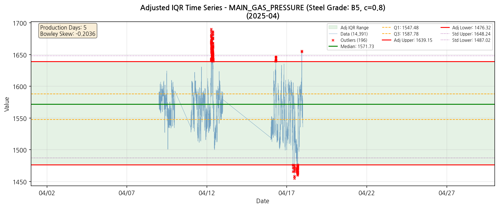

**2. 분포 히스토그램 (Distribution Histogram)**

**3. 박스플롯 (Box Plot)**

**4. 일별 평균 추이 (Daily Average Trend)**

**5. 시간별 패턴 (Hourly Pattern)**

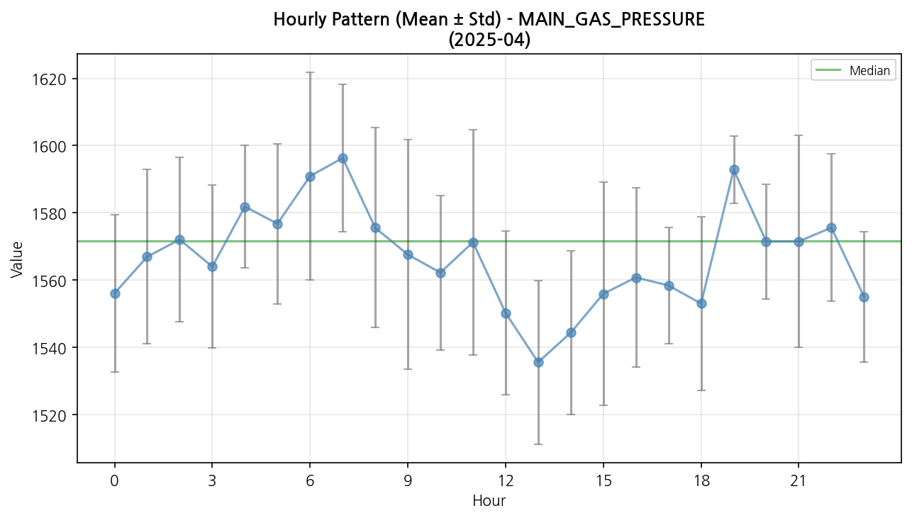

**6. 일별 이상치 수 (Daily Outlier Count)**

**월별 종합 차트**

---

#### INDIRECT_COOLING_WATER_FLOW 🟢

**위험도**: [NORMAL] | **이상치율**: 1.17% | **개선율**: 18.7%
**Bowley 왜도**: -0.0620 | **승수 (L/U)**: 1.051/0.952

**데이터**: 원본 14,391 → 필터 후 14,391 (0.0% 제외)

| 통계 지표 | Adjusted IQR | Standard IQR |
|-----------|--------------|--------------|
| 이상치 수 | 169 | 208 |
| 이상치율 | 1.17% | 1.45% |
| 하한 경계 | 155.6266 | 155.7076 |
| 상한 경계 | 159.8762 | 159.9532 |

| 기본 통계 | 값 |
|-----------|-------|
| 분석 레코드 | 14,391 |
| 평균 | 157.8066 |
| 표준편차 | 0.8618 |
| Q1 (25%) | 157.2997 |
| 중앙값 | 157.8633 |
| Q3 (75%) | 158.3611 |
| IQR | 1.0614 |

**월별 이상치 추이**:

| 월 | 레코드 수 | 평균 | Adj 이상치율 | Std 이상치율 |
|-----|-----------|------|--------------|---------------|
| 2025-04 | 14,391 | 157.81 | 1.17% | 1.45% |

**주요 이상치 발생 날짜** (상위 5일):

| 순위 | 날짜 | 이상치 수 |
|:----:|------|----------:|
| 1 | 2025-04-12 | 133 |
| 2 | 2025-04-09 | 30 |
| 3 | 2025-04-16 | 4 |
| 4 | 2025-04-11 | 2 |

- 이상치 발생 일수: 4일
- 최대 일별 이상치: 133건 (2025-04-12)
- 평균 일별 이상치: 42.2건

##### 차트 분석

**1. 시계열 (Time Series)**

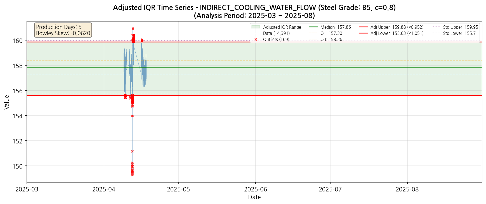

**2. 분포 히스토그램 (Distribution Histogram)**

**3. 박스플롯 (Box Plot)**

**4. 일별 평균 추이 (Daily Average Trend)**

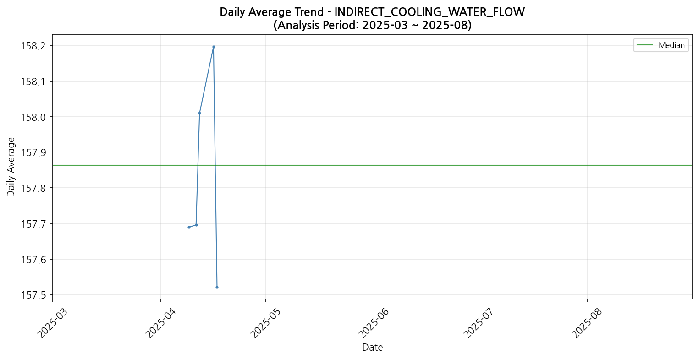

**5. 월별 이상치율 (Monthly Outlier Rate)**

**6. 시간별 패턴 (Hourly Pattern)**

**7. 일별 이상치 수 (Daily Outlier Count)**

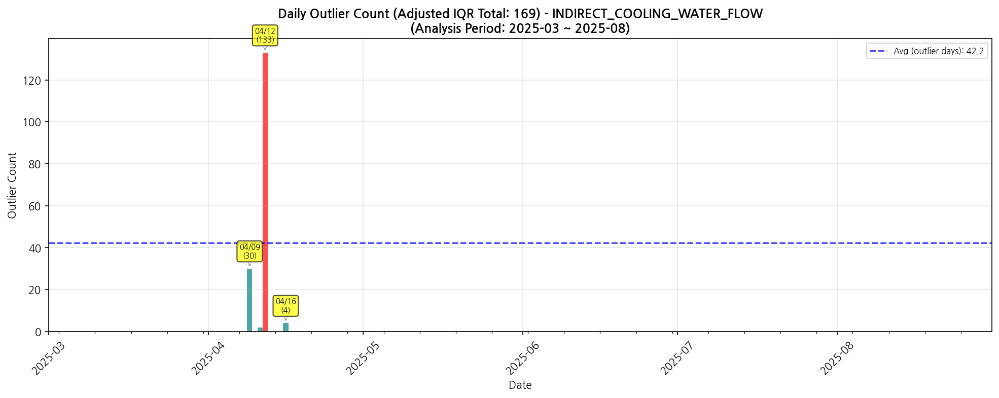

**종합 분석 차트**

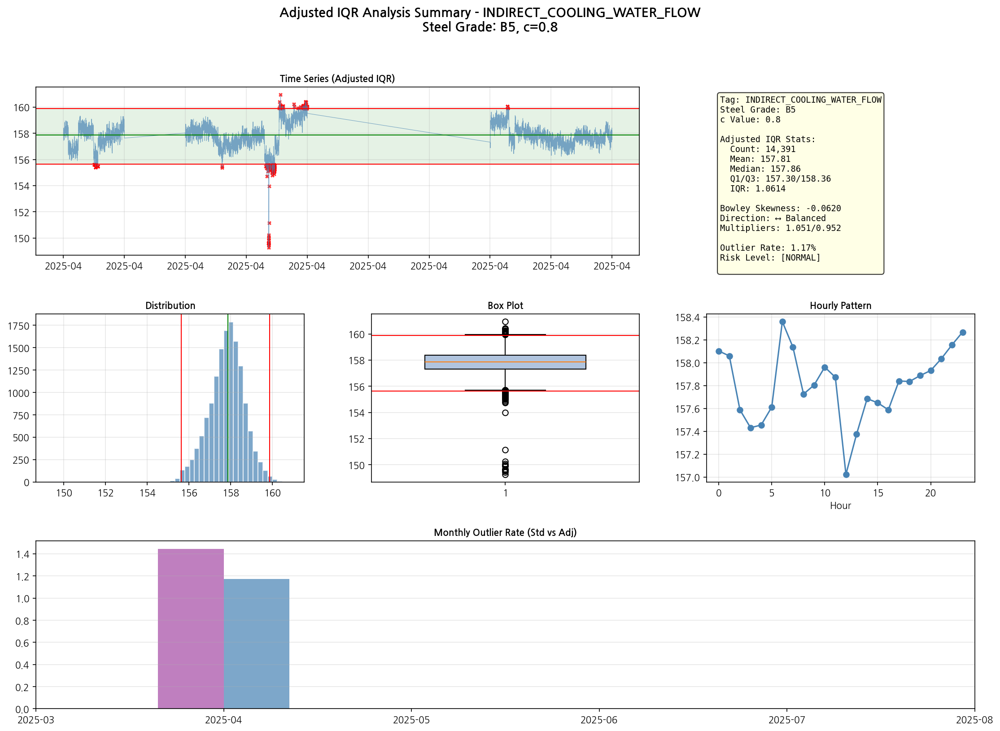

---

##### 월별 상세 분석

**2025-04**

**통계 요약**:

| 지표 | 값 |
|------|-------|
| 분석 레코드 | 14,391 |
| 평균 | 157.8066 |
| 중앙값 | 157.8633 |
| IQR | 1.0614 |
| Bowley 왜도 | -0.0620 |
| Adj 이상치 수 | 169 |
| Adj 이상치율 | 1.17% |
| Std 이상치율 | 1.45% |
| 개선율 | 18.7% |

**주요 이상치 발생 날짜**:

- 1. 2025-04-12: 133건
- 2. 2025-04-09: 30건
- 3. 2025-04-16: 4건

**1. 시계열 (Time Series)**

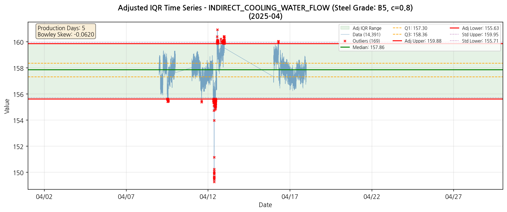

**2. 분포 히스토그램 (Distribution Histogram)**

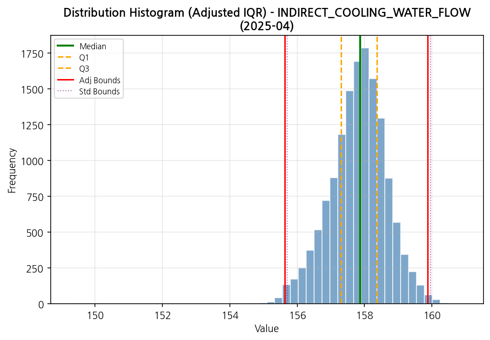

**3. 박스플롯 (Box Plot)**

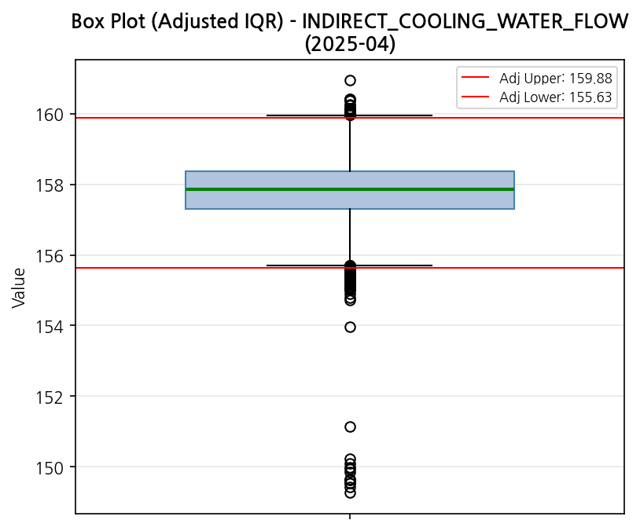

**4. 일별 평균 추이 (Daily Average Trend)**

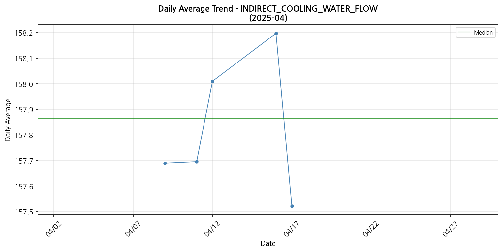

**5. 시간별 패턴 (Hourly Pattern)**

**6. 일별 이상치 수 (Daily Outlier Count)**

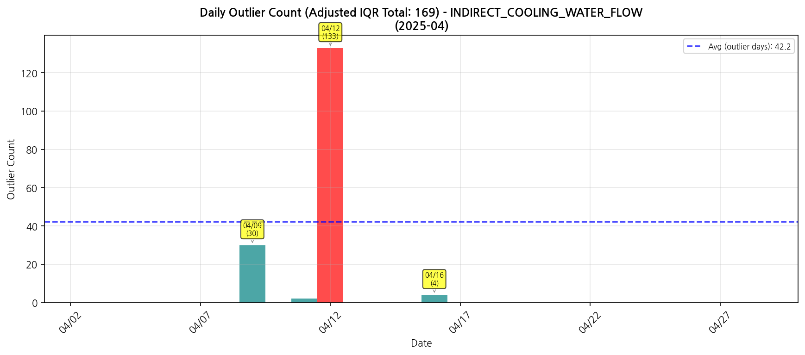

**월별 종합 차트**

---

#### [L1] PR8L1_ACT_TORQUE 🟢

**위험도**: [NORMAL] | **이상치율**: 0.84% | **개선율**: 0.0%
**Bowley 왜도**: 0.9515 | **승수 (L/U)**: 0.467/2.141

**데이터**: 원본 14,391 → 필터 후 14,238 (1.1% 제외)

| 통계 지표 | Adjusted IQR | Standard IQR |
|-----------|--------------|--------------|
| 이상치 수 | 120 | 0 |
| 이상치율 | 0.84% | 0.00% |
| 하한 경계 | -11.1323 | -28.0506 |
| 상한 경계 | 92.8305 | 56.6117 |

| 기본 통계 | 값 |
|-----------|-------|
| 분석 레코드 | 14,238 |
| 평균 | 11.6805 |
| 표준편차 | 13.4257 |
| Q1 (25%) | 3.6978 |
| 중앙값 | 4.2113 |
| Q3 (75%) | 24.8634 |
| IQR | 21.1656 |

**월별 이상치 추이**:

| 월 | 레코드 수 | 평균 | Adj 이상치율 | Std 이상치율 |
|-----|-----------|------|--------------|---------------|
| 2025-04 | 14,238 | 11.68 | 0.84% | 0.00% |

**주요 이상치 발생 날짜** (상위 5일):

| 순위 | 날짜 | 이상치 수 |
|:----:|------|----------:|
| 1 | 2025-04-09 | 120 |

- 이상치 발생 일수: 1일
- 최대 일별 이상치: 120건 (2025-04-09)
- 평균 일별 이상치: 120.0건

##### 차트 분석

**1. 시계열 (Time Series)**

**2. 분포 히스토그램 (Distribution Histogram)**

**3. 박스플롯 (Box Plot)**

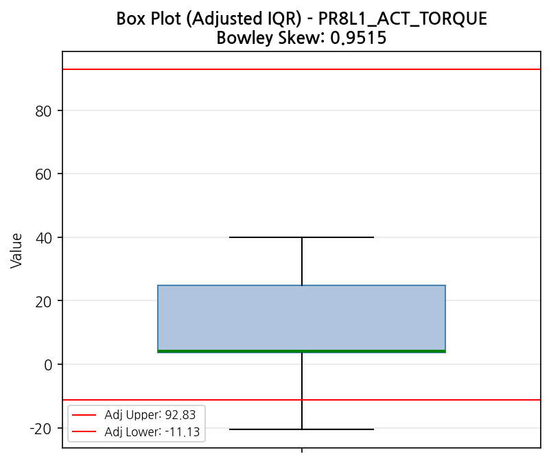

**4. 일별 평균 추이 (Daily Average Trend)**

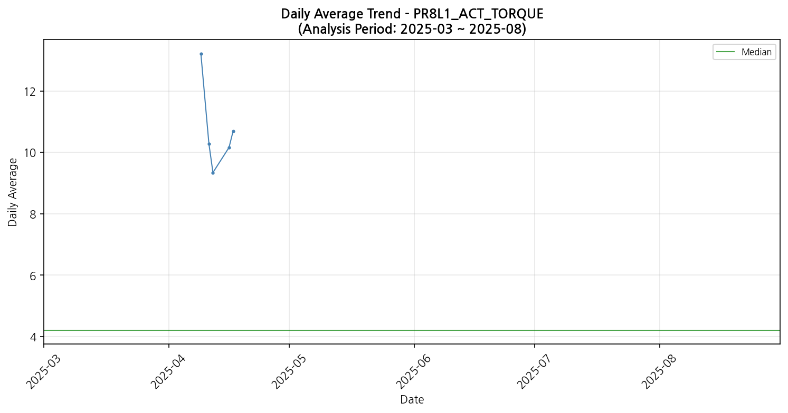

**5. 월별 이상치율 (Monthly Outlier Rate)**

**6. 시간별 패턴 (Hourly Pattern)**

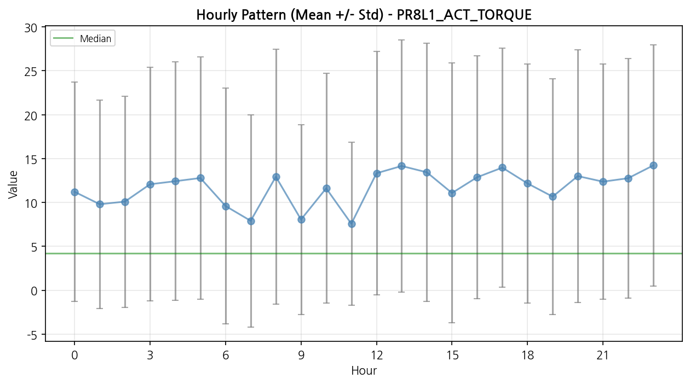

**7. 일별 이상치 수 (Daily Outlier Count)**

**종합 분석 차트**

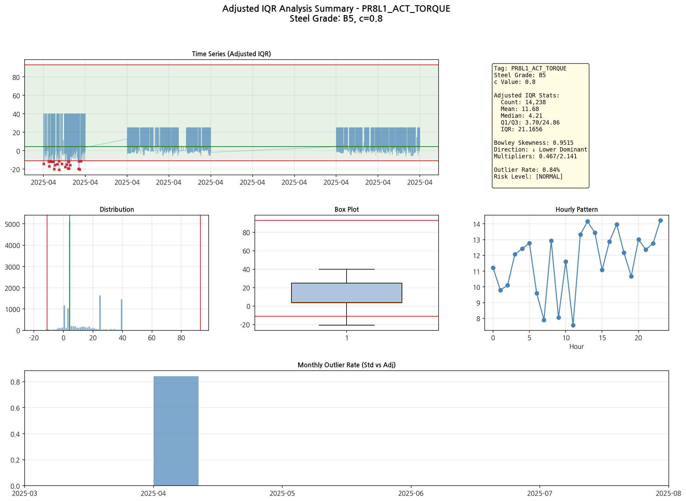

---

##### 월별 상세 분석

**2025-04**

**통계 요약**:

| 지표 | 값 |
|------|-------|
| 분석 레코드 | 14,238 |
| 평균 | 11.6805 |
| 중앙값 | 4.2113 |
| IQR | 21.1656 |
| Bowley 왜도 | 0.9515 |
| Adj 이상치 수 | 120 |
| Adj 이상치율 | 0.84% |
| Std 이상치율 | 0.00% |
| 개선율 | 0.0% |

**주요 이상치 발생 날짜**:

- 1. 2025-04-09: 120건

**1. 시계열 (Time Series)**

**2. 분포 히스토그램 (Distribution Histogram)**

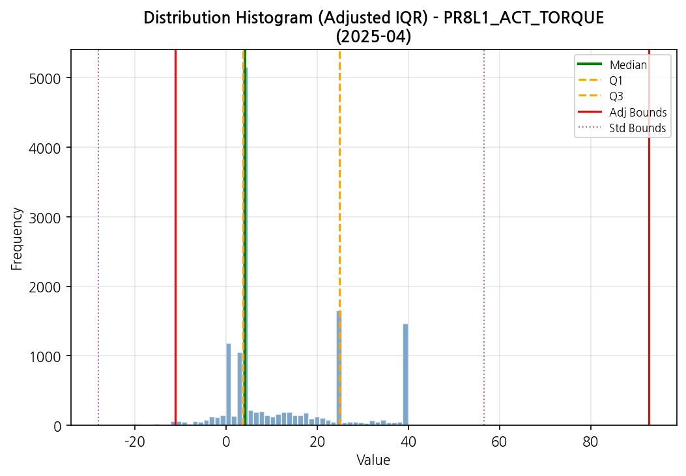

**3. 박스플롯 (Box Plot)**

**4. 일별 평균 추이 (Daily Average Trend)**

**5. 시간별 패턴 (Hourly Pattern)**

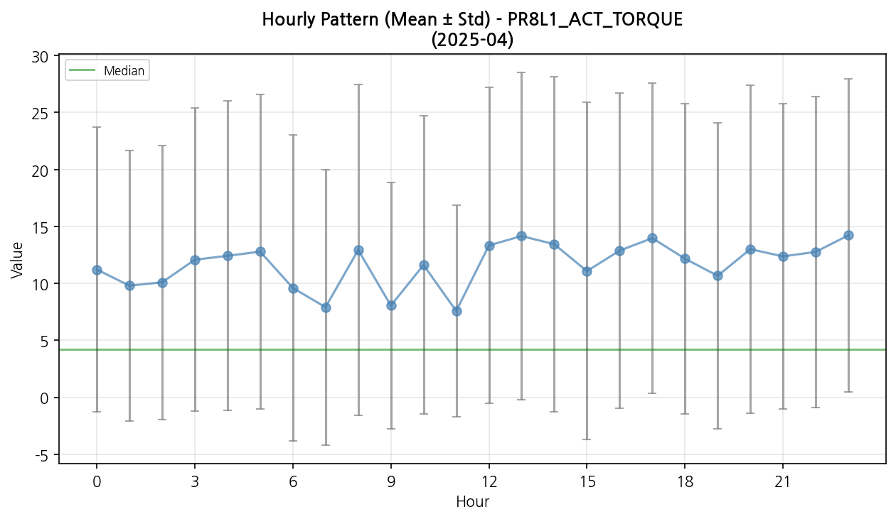

**6. 일별 이상치 수 (Daily Outlier Count)**

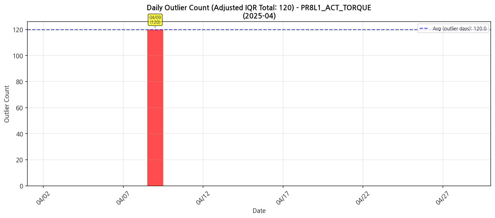

**월별 종합 차트**

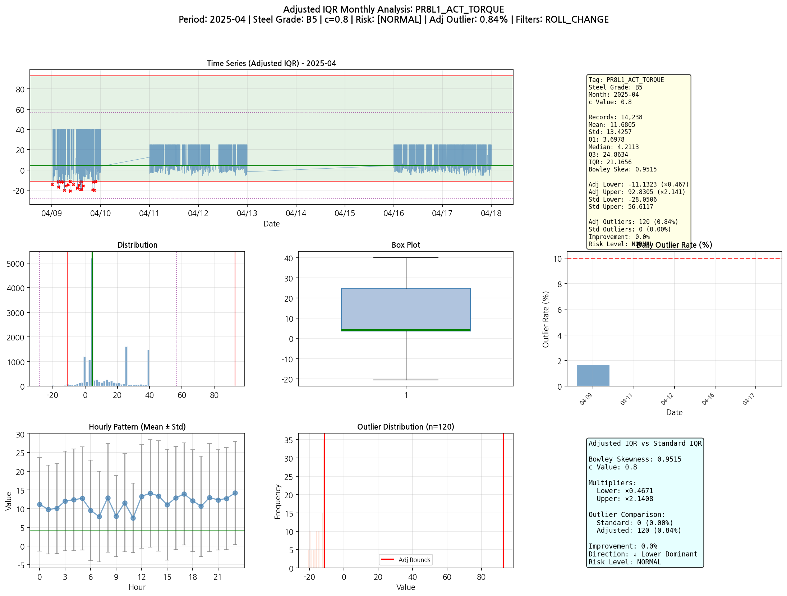

---

#### COMBUSTION_AIR_TEMPERATURE 🟢

**위험도**: [NORMAL] | **이상치율**: 0.44% | **개선율**: -31.2%
**Bowley 왜도**: -0.0910 | **승수 (L/U)**: 1.075/0.930

**데이터**: 원본 14,391 → 필터 후 14,391 (0.0% 제외)

| 통계 지표 | Adjusted IQR | Standard IQR |
|-----------|--------------|--------------|
| 이상치 수 | 63 | 48 |
| 이상치율 | 0.44% | 0.33% |
| 하한 경계 | 18.1407 | 18.8251 |
| 상한 경계 | 42.3635 | 42.9998 |

| 기본 통계 | 값 |
|-----------|-------|
| 분석 레코드 | 14,391 |
| 평균 | 31.3081 |
| 표준편차 | 4.2562 |
| Q1 (25%) | 27.8906 |
| 중앙값 | 31.1873 |
| Q3 (75%) | 33.9343 |
| IQR | 6.0437 |

**월별 이상치 추이**:

| 월 | 레코드 수 | 평균 | Adj 이상치율 | Std 이상치율 |
|-----|-----------|------|--------------|---------------|
| 2025-04 | 14,391 | 31.31 | 0.44% | 0.33% |

**주요 이상치 발생 날짜** (상위 5일):

| 순위 | 날짜 | 이상치 수 |
|:----:|------|----------:|
| 1 | 2025-04-12 | 61 |
| 2 | 2025-04-16 | 2 |

- 이상치 발생 일수: 2일
- 최대 일별 이상치: 61건 (2025-04-12)
- 평균 일별 이상치: 31.5건

##### 차트 분석

**1. 시계열 (Time Series)**

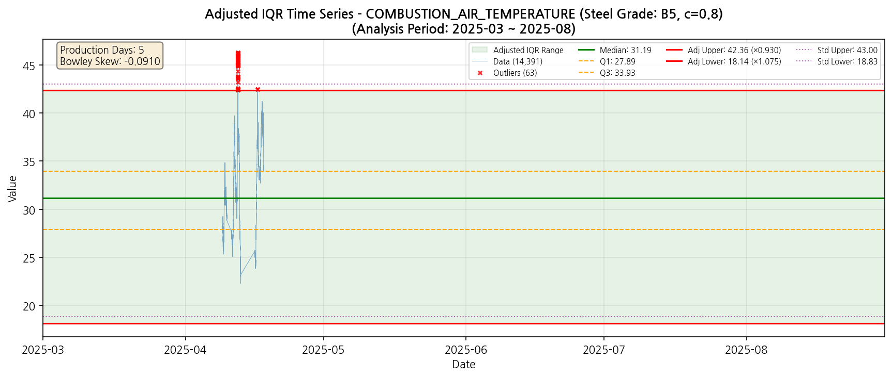

**2. 분포 히스토그램 (Distribution Histogram)**

**3. 박스플롯 (Box Plot)**

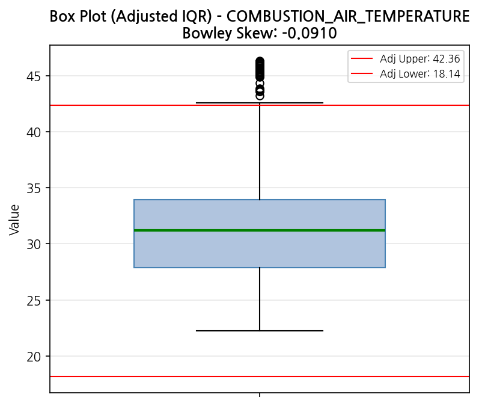

**4. 일별 평균 추이 (Daily Average Trend)**

**5. 월별 이상치율 (Monthly Outlier Rate)**

**6. 시간별 패턴 (Hourly Pattern)**

**7. 일별 이상치 수 (Daily Outlier Count)**

**종합 분석 차트**

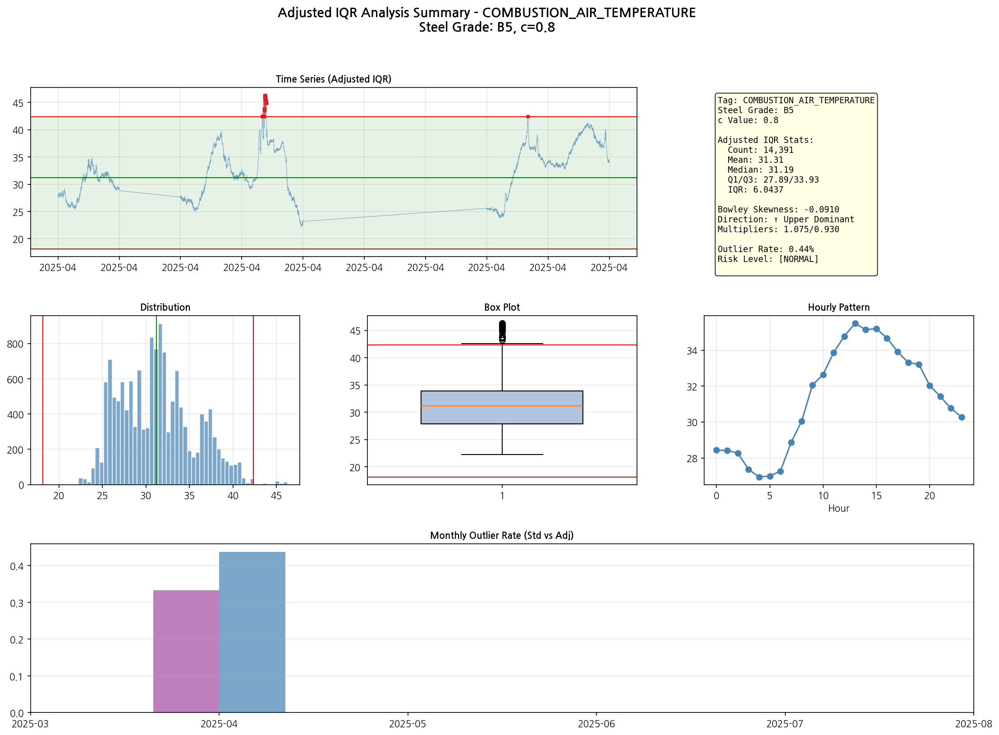

---

##### 월별 상세 분석

**2025-04**

**통계 요약**:

| 지표 | 값 |
|------|-------|
| 분석 레코드 | 14,391 |
| 평균 | 31.3081 |
| 중앙값 | 31.1873 |
| IQR | 6.0437 |
| Bowley 왜도 | -0.0910 |
| Adj 이상치 수 | 63 |
| Adj 이상치율 | 0.44% |
| Std 이상치율 | 0.33% |
| 개선율 | -31.2% |

**주요 이상치 발생 날짜**:

- 1. 2025-04-12: 61건
- 2. 2025-04-16: 2건

**1. 시계열 (Time Series)**

**2. 분포 히스토그램 (Distribution Histogram)**

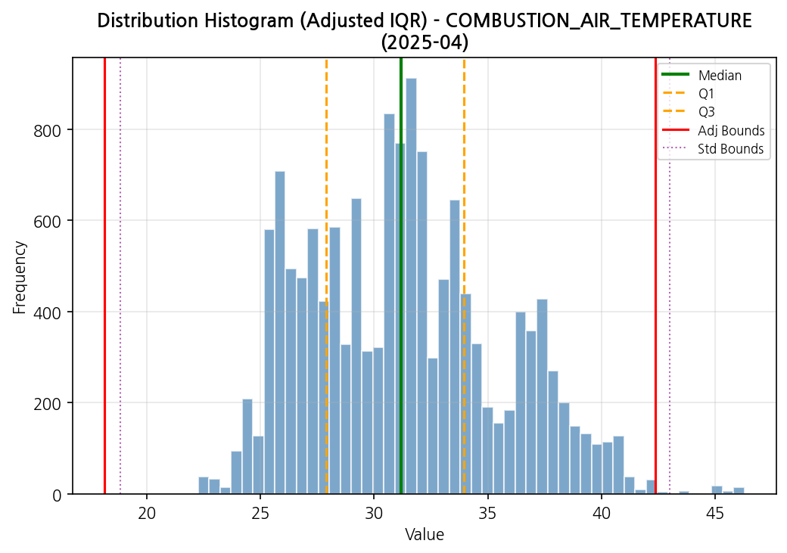

**3. 박스플롯 (Box Plot)**

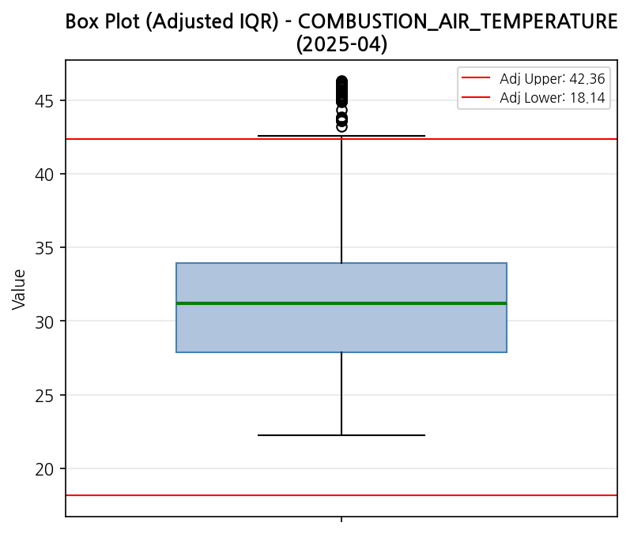

**4. 일별 평균 추이 (Daily Average Trend)**

**5. 시간별 패턴 (Hourly Pattern)**

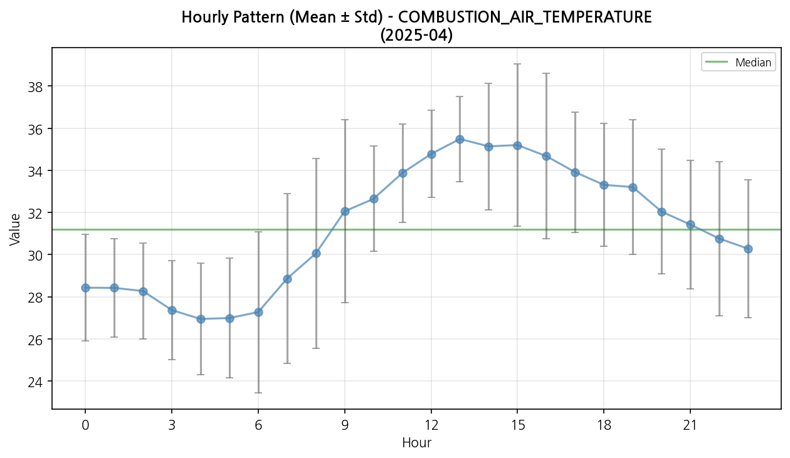

**6. 일별 이상치 수 (Daily Outlier Count)**

**월별 종합 차트**

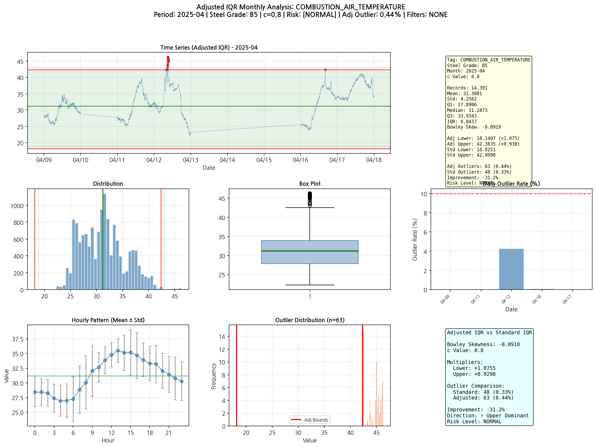

---

#### MAIN_GAS_TEMPERATURE 🟢

**위험도**: [NORMAL] | **이상치율**: 0.35% | **개선율**: -8.7%
**Bowley 왜도**: 0.2492 | **승수 (L/U)**: 0.819/1.221

**데이터**: 원본 14,391 → 필터 후 14,391 (0.0% 제외)

| 통계 지표 | Adjusted IQR | Standard IQR |
|-----------|--------------|--------------|
| 이상치 수 | 50 | 46 |
| 이상치율 | 0.35% | 0.32% |
| 하한 경계 | 7.8969 | 6.8748 |
| 상한 경계 | 23.2039 | 21.9564 |

| 기본 통계 | 값 |
|-----------|-------|
| 분석 레코드 | 14,391 |
| 평균 | 14.5226 |
| 표준편차 | 2.7743 |
| Q1 (25%) | 12.5304 |
| 중앙값 | 13.9459 |
| Q3 (75%) | 16.3008 |
| IQR | 3.7704 |

**월별 이상치 추이**:

| 월 | 레코드 수 | 평균 | Adj 이상치율 | Std 이상치율 |
|-----|-----------|------|--------------|---------------|
| 2025-04 | 14,391 | 14.52 | 0.35% | 0.32% |

**주요 이상치 발생 날짜** (상위 5일):

| 순위 | 날짜 | 이상치 수 |
|:----:|------|----------:|
| 1 | 2025-04-12 | 50 |

- 이상치 발생 일수: 1일
- 최대 일별 이상치: 50건 (2025-04-12)
- 평균 일별 이상치: 50.0건

##### 차트 분석

**1. 시계열 (Time Series)**

**2. 분포 히스토그램 (Distribution Histogram)**

**3. 박스플롯 (Box Plot)**

**4. 일별 평균 추이 (Daily Average Trend)**

**5. 월별 이상치율 (Monthly Outlier Rate)**

**6. 시간별 패턴 (Hourly Pattern)**

**7. 일별 이상치 수 (Daily Outlier Count)**

**종합 분석 차트**

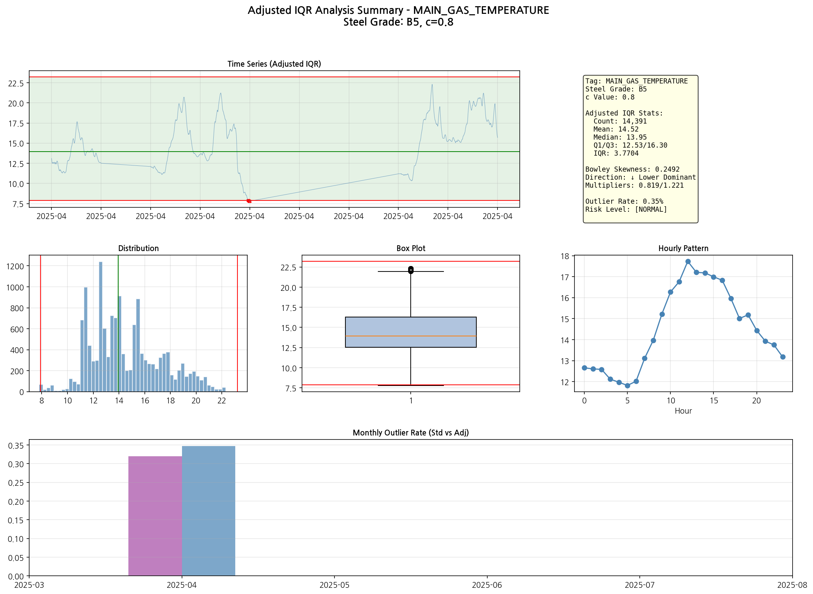

---

##### 월별 상세 분석

**2025-04**

**통계 요약**:

| 지표 | 값 |
|------|-------|
| 분석 레코드 | 14,391 |
| 평균 | 14.5226 |
| 중앙값 | 13.9459 |
| IQR | 3.7704 |
| Bowley 왜도 | 0.2492 |
| Adj 이상치 수 | 50 |
| Adj 이상치율 | 0.35% |
| Std 이상치율 | 0.32% |
| 개선율 | -8.7% |

**주요 이상치 발생 날짜**:

- 1. 2025-04-12: 50건

**1. 시계열 (Time Series)**

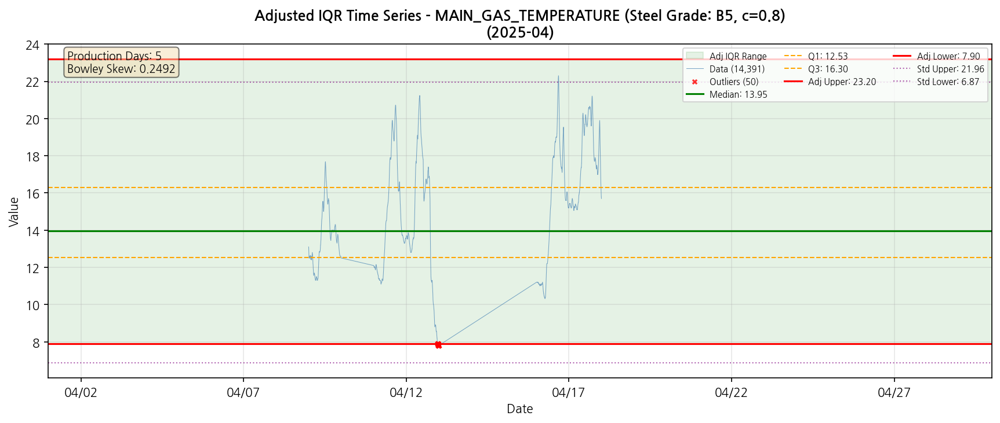

**2. 분포 히스토그램 (Distribution Histogram)**

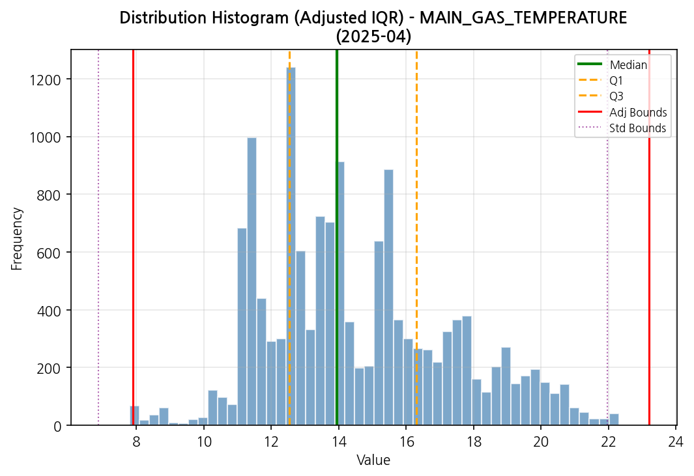

**3. 박스플롯 (Box Plot)**

**4. 일별 평균 추이 (Daily Average Trend)**

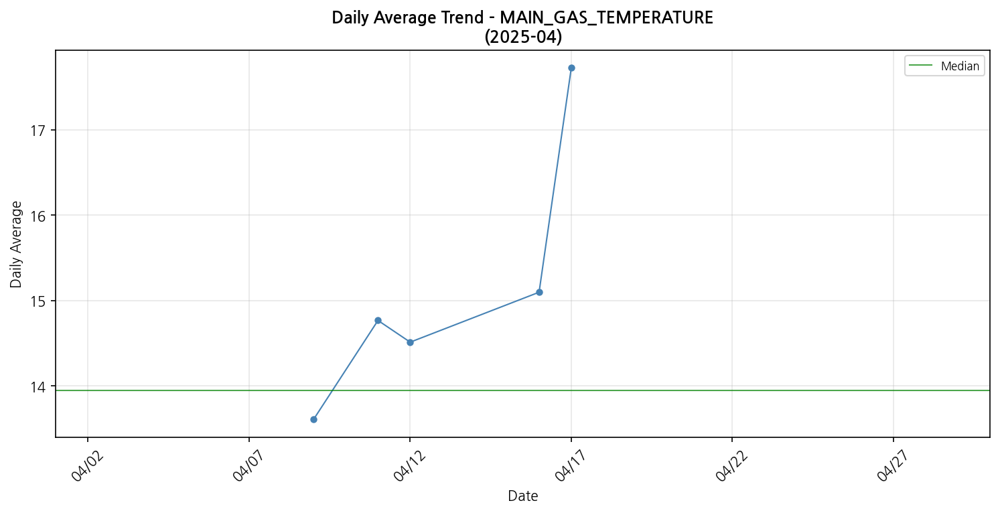

**5. 시간별 패턴 (Hourly Pattern)**

**6. 일별 이상치 수 (Daily Outlier Count)**

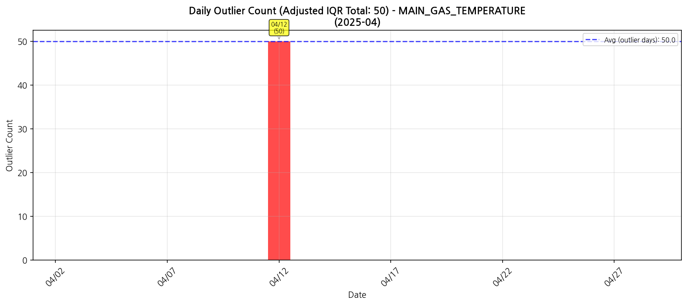

**월별 종합 차트**

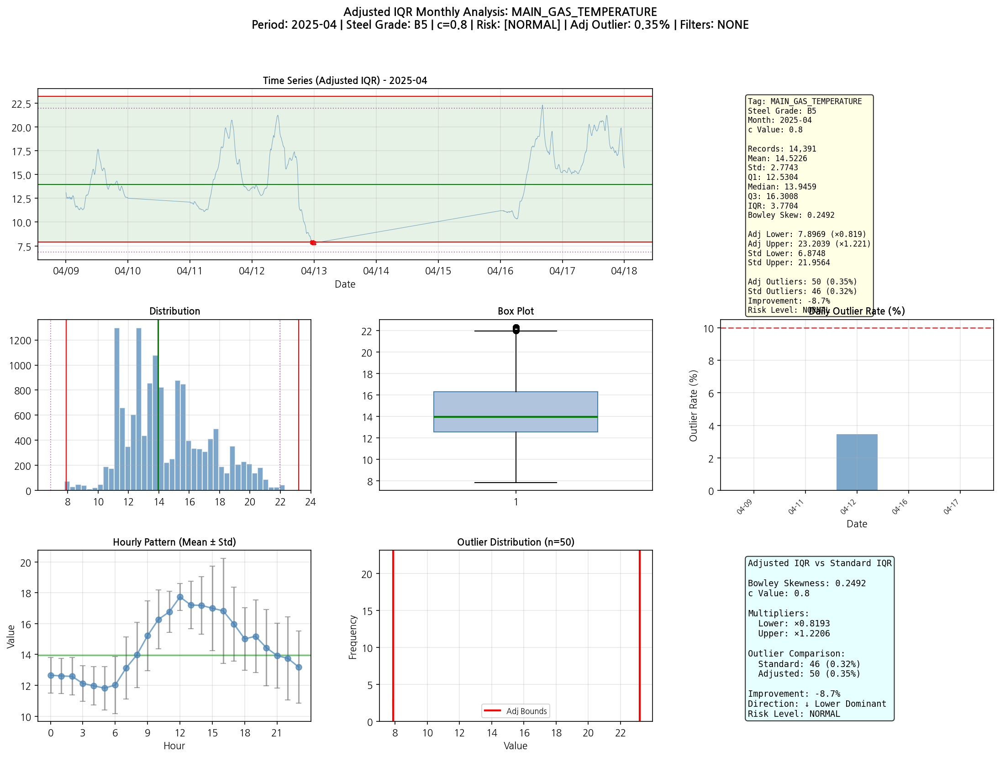

---

#### FURNACE_PRESSURE 🟢

**위험도**: [NORMAL] | **이상치율**: 0.02% | **개선율**: 0.0%
**Bowley 왜도**: -0.2311 | **승수 (L/U)**: 1.203/0.831

**데이터**: 원본 14,391 → 필터 후 14,391 (0.0% 제외)

| 통계 지표 | Adjusted IQR | Standard IQR |
|-----------|--------------|--------------|
| 이상치 수 | 3 | 0 |
| 이상치율 | 0.02% | 0.00% |
| 하한 경계 | 0.4129 | 0.4229 |
| 상한 경계 | 0.5458 | 0.5541 |

| 기본 통계 | 값 |
|-----------|-------|
| 분석 레코드 | 14,391 |
| 평균 | 0.4885 |
| 표준편차 | 0.0218 |
| Q1 (25%) | 0.4721 |
| 중앙값 | 0.4923 |
| Q3 (75%) | 0.5049 |
| IQR | 0.0328 |

**월별 이상치 추이**:

| 월 | 레코드 수 | 평균 | Adj 이상치율 | Std 이상치율 |
|-----|-----------|------|--------------|---------------|
| 2025-04 | 14,391 | 0.49 | 0.02% | 0.00% |

**주요 이상치 발생 날짜** (상위 5일):

| 순위 | 날짜 | 이상치 수 |
|:----:|------|----------:|
| 1 | 2025-04-17 | 3 |

- 이상치 발생 일수: 1일
- 최대 일별 이상치: 3건 (2025-04-17)
- 평균 일별 이상치: 3.0건

##### 차트 분석

**1. 시계열 (Time Series)**

**2. 분포 히스토그램 (Distribution Histogram)**

**3. 박스플롯 (Box Plot)**

**4. 일별 평균 추이 (Daily Average Trend)**

**5. 월별 이상치율 (Monthly Outlier Rate)**

**6. 시간별 패턴 (Hourly Pattern)**

**7. 일별 이상치 수 (Daily Outlier Count)**

**종합 분석 차트**

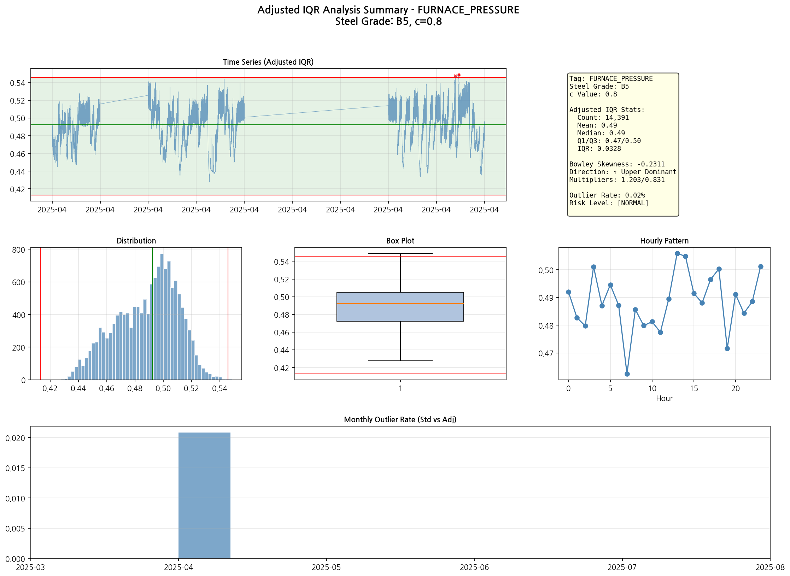

---

##### 월별 상세 분석

**2025-04**

**통계 요약**:

| 지표 | 값 |
|------|-------|
| 분석 레코드 | 14,391 |
| 평균 | 0.4885 |
| 중앙값 | 0.4923 |
| IQR | 0.0328 |
| Bowley 왜도 | -0.2311 |
| Adj 이상치 수 | 3 |
| Adj 이상치율 | 0.02% |
| Std 이상치율 | 0.00% |
| 개선율 | 0.0% |

**주요 이상치 발생 날짜**:

- 1. 2025-04-17: 3건

**1. 시계열 (Time Series)**

**2. 분포 히스토그램 (Distribution Histogram)**

**3. 박스플롯 (Box Plot)**

**4. 일별 평균 추이 (Daily Average Trend)**

**5. 시간별 패턴 (Hourly Pattern)**

**6. 일별 이상치 수 (Daily Outlier Count)**

**월별 종합 차트**

---

#### FURNACE_O2_ANALYZER 🟢

**위험도**: [NORMAL] | **이상치율**: 0.00% | **개선율**: 0.0%
**Bowley 왜도**: -0.7399 | **승수 (L/U)**: 1.808/0.553

**데이터**: 원본 14,391 → 필터 후 14,391 (0.0% 제외)

| 통계 지표 | Adjusted IQR | Standard IQR |
|-----------|--------------|--------------|
| 이상치 수 | 0 | 0 |
| 이상치율 | 0.00% | 0.00% |
| 하한 경계 | -16.6572 | -8.1058 |
| 상한 경계 | 15.4024 | 20.1334 |

| 기본 통계 | 값 |
|-----------|-------|
| 분석 레코드 | 14,391 |
| 평균 | 6.5089 |
| 표준편차 | 3.4347 |
| Q1 (25%) | 2.4839 |
| 중앙값 | 8.6257 |
| Q3 (75%) | 9.5437 |
| IQR | 7.0598 |

**월별 이상치 추이**:

| 월 | 레코드 수 | 평균 | Adj 이상치율 | Std 이상치율 |
|-----|-----------|------|--------------|---------------|
| 2025-04 | 14,391 | 6.51 | 0.00% | 0.00% |

##### 차트 분석

**1. 시계열 (Time Series)**

**2. 분포 히스토그램 (Distribution Histogram)**

**3. 박스플롯 (Box Plot)**

**4. 일별 평균 추이 (Daily Average Trend)**

**5. 월별 이상치율 (Monthly Outlier Rate)**

**6. 시간별 패턴 (Hourly Pattern)**

**7. 일별 이상치 수 (Daily Outlier Count)**

**종합 분석 차트**

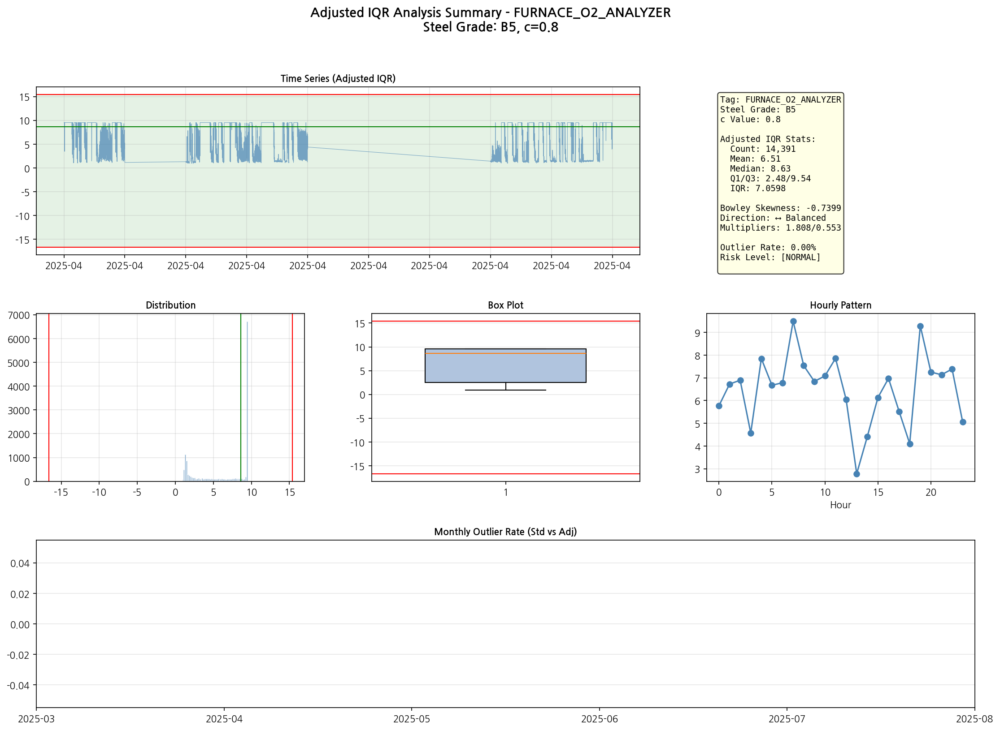

---

##### 월별 상세 분석

**2025-04**

**통계 요약**:

| 지표 | 값 |
|------|-------|
| 분석 레코드 | 14,391 |
| 평균 | 6.5089 |
| 중앙값 | 8.6257 |
| IQR | 7.0598 |
| Bowley 왜도 | -0.7399 |
| Adj 이상치 수 | 0 |
| Adj 이상치율 | 0.00% |
| Std 이상치율 | 0.00% |
| 개선율 | 0.0% |

**1. 시계열 (Time Series)**

**2. 분포 히스토그램 (Distribution Histogram)**

**3. 박스플롯 (Box Plot)**

**4. 일별 평균 추이 (Daily Average Trend)**

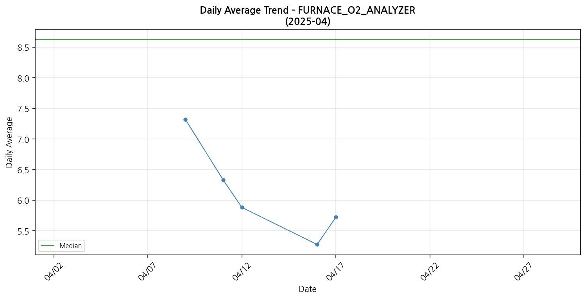

**5. 시간별 패턴 (Hourly Pattern)**

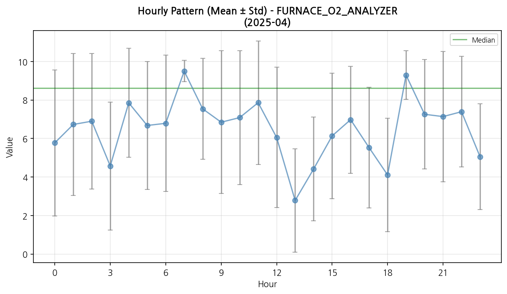

**6. 일별 이상치 수 (Daily Outlier Count)**

**월별 종합 차트**

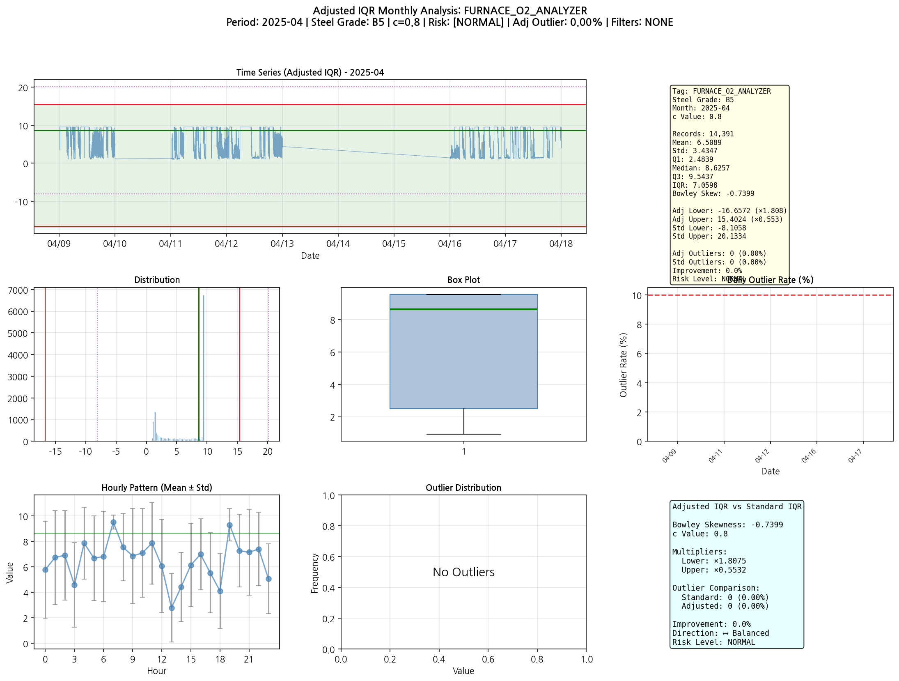

---

#### MAIN_GAS_FLOW 🟢

**위험도**: [NORMAL] | **이상치율**: 0.00% | **개선율**: 0.0%
**Bowley 왜도**: -0.3157 | **승수 (L/U)**: 1.287/0.777

**데이터**: 원본 14,391 → 필터 후 14,391 (0.0% 제외)

| 통계 지표 | Adjusted IQR | Standard IQR |
|-----------|--------------|--------------|
| 이상치 수 | 0 | 0 |
| 이상치율 | 0.00% | 0.00% |
| 하한 경계 | -939.4044 | -432.4720 |
| 상한 경계 | 3878.4394 | 4272.2240 |

| 기본 통계 | 값 |
|-----------|-------|
| 분석 레코드 | 14,391 |
| 평균 | 1891.8139 |
| 표준편차 | 765.3945 |
| Q1 (25%) | 1331.7890 |
| 중앙값 | 2105.5450 |
| Q3 (75%) | 2507.9630 |
| IQR | 1176.1740 |

**월별 이상치 추이**:

| 월 | 레코드 수 | 평균 | Adj 이상치율 | Std 이상치율 |
|-----|-----------|------|--------------|---------------|
| 2025-04 | 14,391 | 1891.81 | 0.00% | 0.00% |

##### 차트 분석

**1. 시계열 (Time Series)**

**2. 분포 히스토그램 (Distribution Histogram)**

**3. 박스플롯 (Box Plot)**

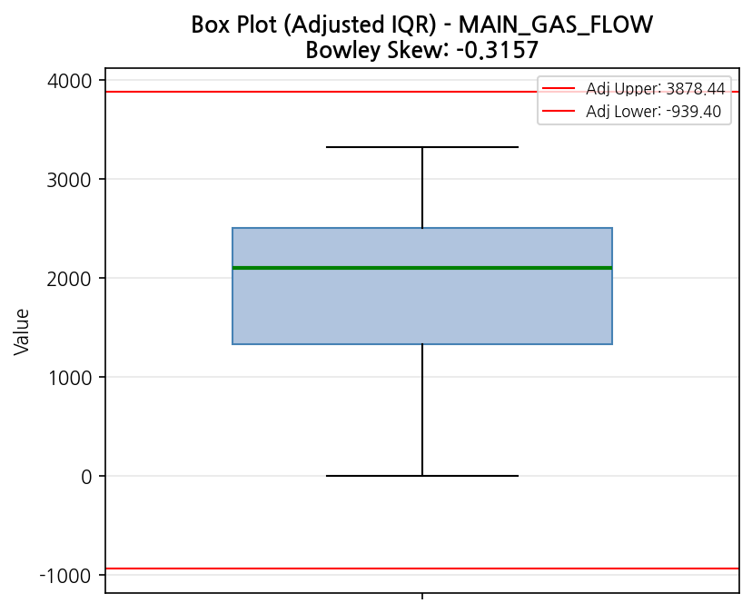

**4. 일별 평균 추이 (Daily Average Trend)**

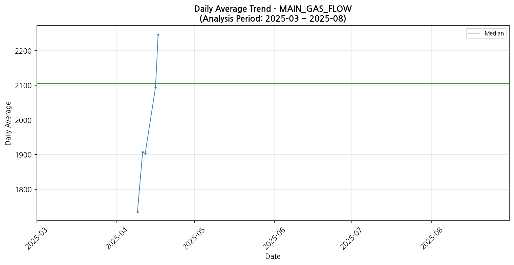

**5. 월별 이상치율 (Monthly Outlier Rate)**

**6. 시간별 패턴 (Hourly Pattern)**

**7. 일별 이상치 수 (Daily Outlier Count)**

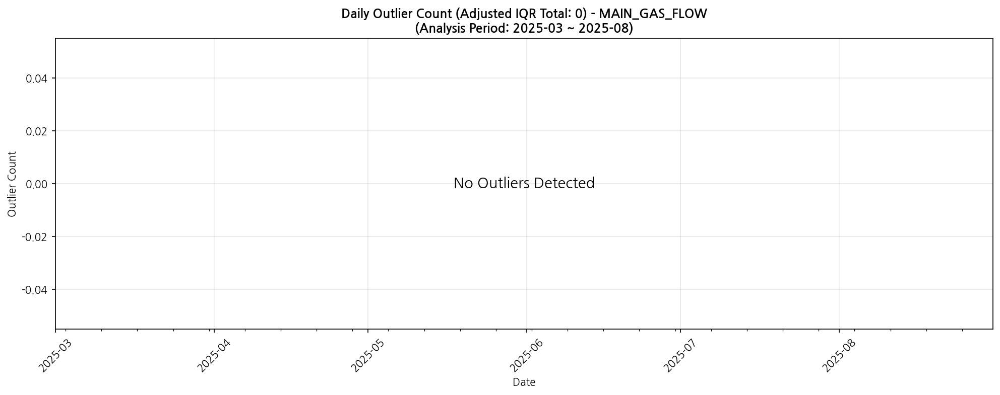

**종합 분석 차트**

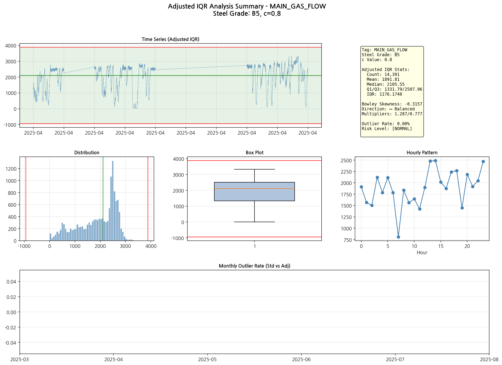

---

##### 월별 상세 분석

**2025-04**

**통계 요약**:

| 지표 | 값 |
|------|-------|
| 분석 레코드 | 14,391 |
| 평균 | 1891.8139 |
| 중앙값 | 2105.5450 |
| IQR | 1176.1740 |
| Bowley 왜도 | -0.3157 |
| Adj 이상치 수 | 0 |
| Adj 이상치율 | 0.00% |
| Std 이상치율 | 0.00% |
| 개선율 | 0.0% |

**1. 시계열 (Time Series)**

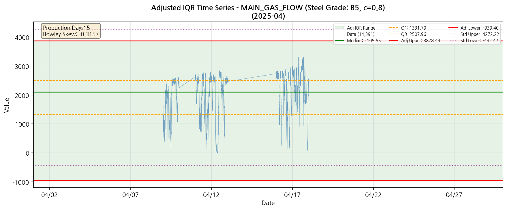

**2. 분포 히스토그램 (Distribution Histogram)**

**3. 박스플롯 (Box Plot)**

**4. 일별 평균 추이 (Daily Average Trend)**

**5. 시간별 패턴 (Hourly Pattern)**

**6. 일별 이상치 수 (Daily Outlier Count)**

**월별 종합 차트**

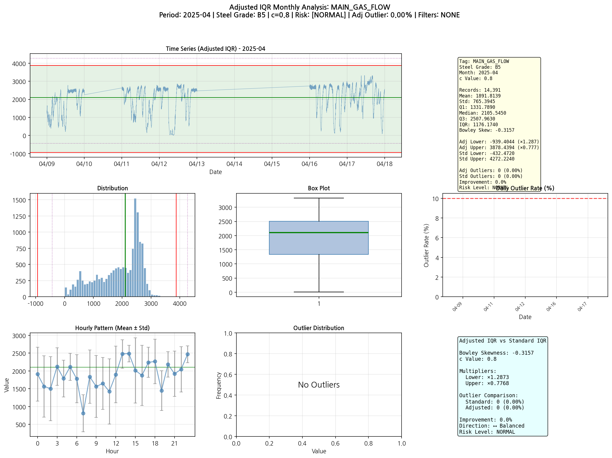

---

#### SOAKING_BOTTOM_ZONE_NO_2_TEMPERATURE_MILL_SIDE 🟢

**위험도**: [NORMAL] | **이상치율**: 0.00% | **개선율**: 0.0%
**Bowley 왜도**: 0.1857 | **승수 (L/U)**: 0.862/1.160

**데이터**: 원본 14,391 → 필터 후 14,391 (0.0% 제외)

| 통계 지표 | Adjusted IQR | Standard IQR |
|-----------|--------------|--------------|
| 이상치 수 | 0 | 0 |
| 이상치율 | 0.00% | 0.00% |
| 하한 경계 | 1018.7878 | 1007.6445 |
| 상한 경계 | 1235.8087 | 1222.8805 |

| 기본 통계 | 값 |
|-----------|-------|
| 분석 레코드 | 14,391 |
| 평균 | 1114.2609 |
| 표준편차 | 26.2246 |
| Q1 (25%) | 1088.3580 |
| 중앙값 | 1110.2660 |
| Q3 (75%) | 1142.1670 |
| IQR | 53.8090 |

**월별 이상치 추이**:

| 월 | 레코드 수 | 평균 | Adj 이상치율 | Std 이상치율 |
|-----|-----------|------|--------------|---------------|
| 2025-04 | 14,391 | 1114.26 | 0.00% | 0.00% |

##### 차트 분석

**1. 시계열 (Time Series)**

**2. 분포 히스토그램 (Distribution Histogram)**

**3. 박스플롯 (Box Plot)**

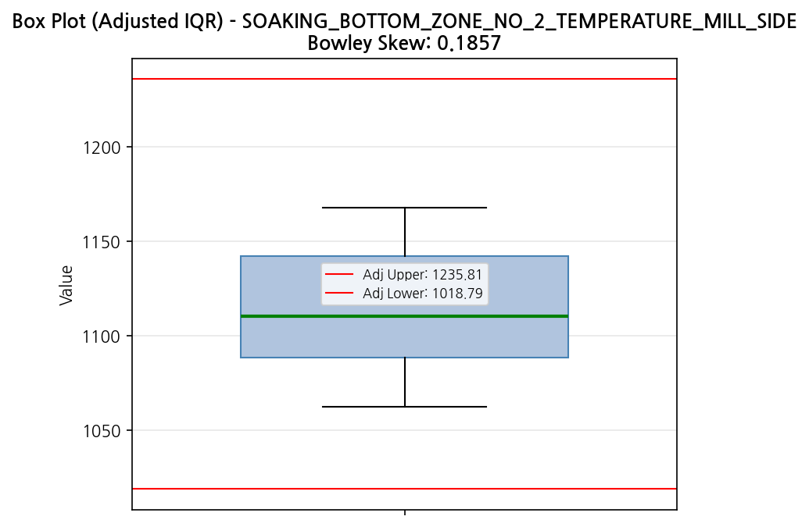

**4. 일별 평균 추이 (Daily Average Trend)**

**5. 월별 이상치율 (Monthly Outlier Rate)**

**6. 시간별 패턴 (Hourly Pattern)**

**7. 일별 이상치 수 (Daily Outlier Count)**

**종합 분석 차트**

---

##### 월별 상세 분석

**2025-04**

**통계 요약**:

| 지표 | 값 |
|------|-------|
| 분석 레코드 | 14,391 |
| 평균 | 1114.2609 |
| 중앙값 | 1110.2660 |
| IQR | 53.8090 |
| Bowley 왜도 | 0.1857 |
| Adj 이상치 수 | 0 |
| Adj 이상치율 | 0.00% |
| Std 이상치율 | 0.00% |
| 개선율 | 0.0% |

**1. 시계열 (Time Series)**

**2. 분포 히스토그램 (Distribution Histogram)**

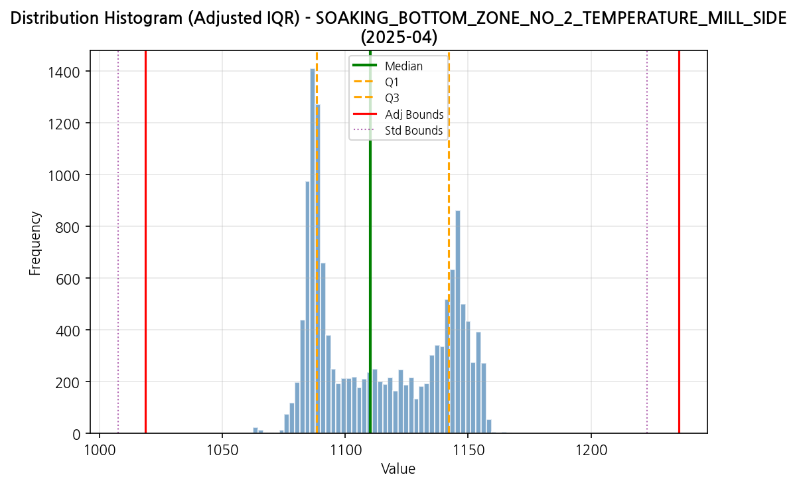

**3. 박스플롯 (Box Plot)**

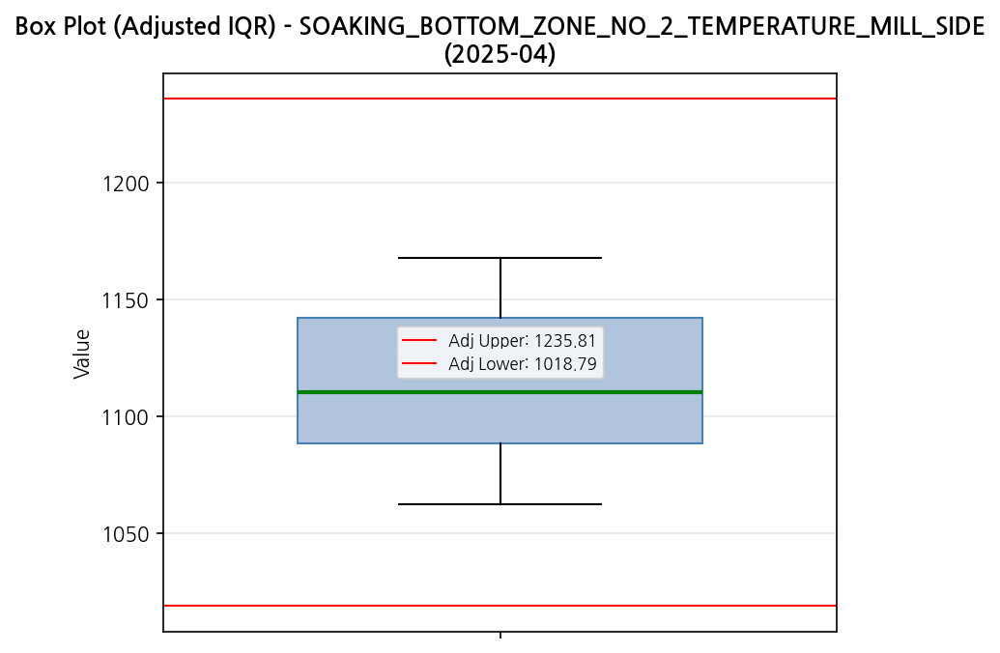

**4. 일별 평균 추이 (Daily Average Trend)**

**5. 시간별 패턴 (Hourly Pattern)**

**6. 일별 이상치 수 (Daily Outlier Count)**

**월별 종합 차트**

---

#### HEATING_BOTTOM_ZONE_NO_2_TEMPERATURE_MILL_SIDE 🟢

**위험도**: [NORMAL] | **이상치율**: 0.00% | **개선율**: 0.0%
**Bowley 왜도**: 0.5992 | **승수 (L/U)**: 0.619/1.615

**데이터**: 원본 14,391 → 필터 후 14,391 (0.0% 제외)

| 통계 지표 | Adjusted IQR | Standard IQR |
|-----------|--------------|--------------|
| 이상치 수 | 0 | 0 |
| 이상치율 | 0.00% | 0.00% |
| 하한 경계 | 892.2879 | 859.4670 |
| 상한 경계 | 1142.2984 | 1089.2910 |

| 기본 통계 | 값 |
|-----------|-------|
| 분석 레코드 | 14,391 |
| 평균 | 975.7143 |
| 표준편차 | 38.1009 |
| Q1 (25%) | 945.6510 |
| 중앙값 | 957.1650 |
| Q3 (75%) | 1003.1070 |
| IQR | 57.4560 |

**월별 이상치 추이**:

| 월 | 레코드 수 | 평균 | Adj 이상치율 | Std 이상치율 |
|-----|-----------|------|--------------|---------------|
| 2025-04 | 14,391 | 975.71 | 0.00% | 0.00% |

##### 차트 분석

**1. 시계열 (Time Series)**

**2. 분포 히스토그램 (Distribution Histogram)**

**3. 박스플롯 (Box Plot)**

**4. 일별 평균 추이 (Daily Average Trend)**

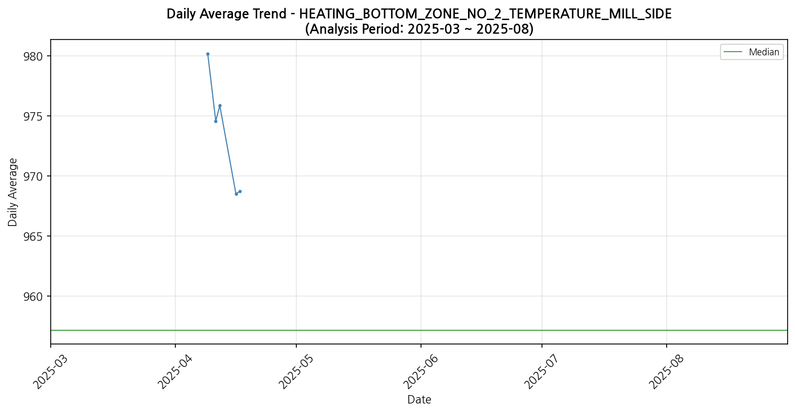

**5. 월별 이상치율 (Monthly Outlier Rate)**

**6. 시간별 패턴 (Hourly Pattern)**

**7. 일별 이상치 수 (Daily Outlier Count)**

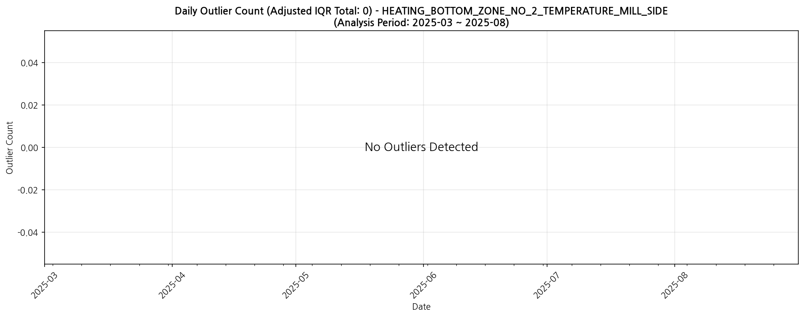

**종합 분석 차트**

---

##### 월별 상세 분석

**2025-04**

**통계 요약**:

| 지표 | 값 |
|------|-------|
| 분석 레코드 | 14,391 |
| 평균 | 975.7143 |
| 중앙값 | 957.1650 |
| IQR | 57.4560 |
| Bowley 왜도 | 0.5992 |
| Adj 이상치 수 | 0 |
| Adj 이상치율 | 0.00% |
| Std 이상치율 | 0.00% |
| 개선율 | 0.0% |

**1. 시계열 (Time Series)**

**2. 분포 히스토그램 (Distribution Histogram)**

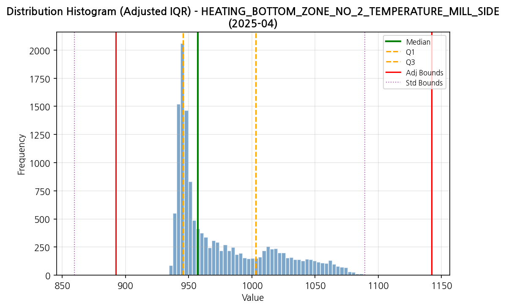

**3. 박스플롯 (Box Plot)**

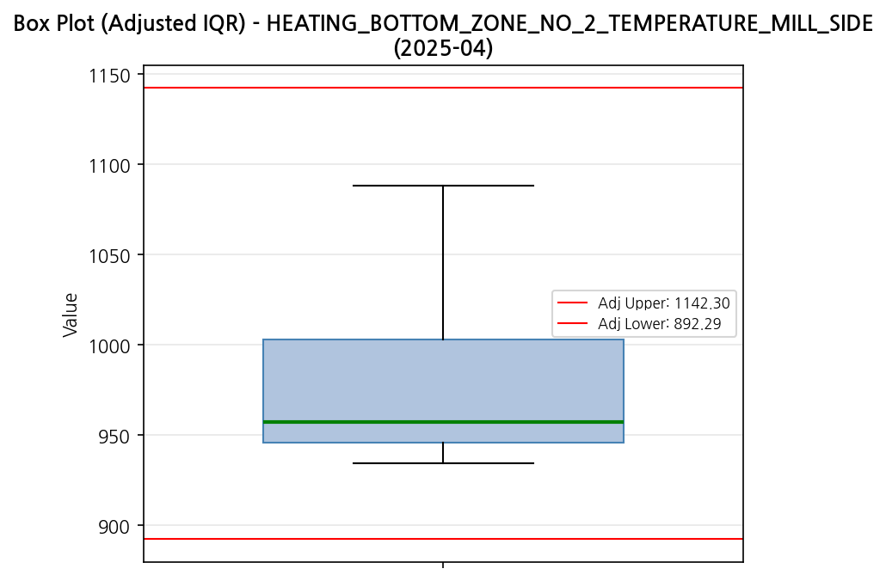

**4. 일별 평균 추이 (Daily Average Trend)**

**5. 시간별 패턴 (Hourly Pattern)**

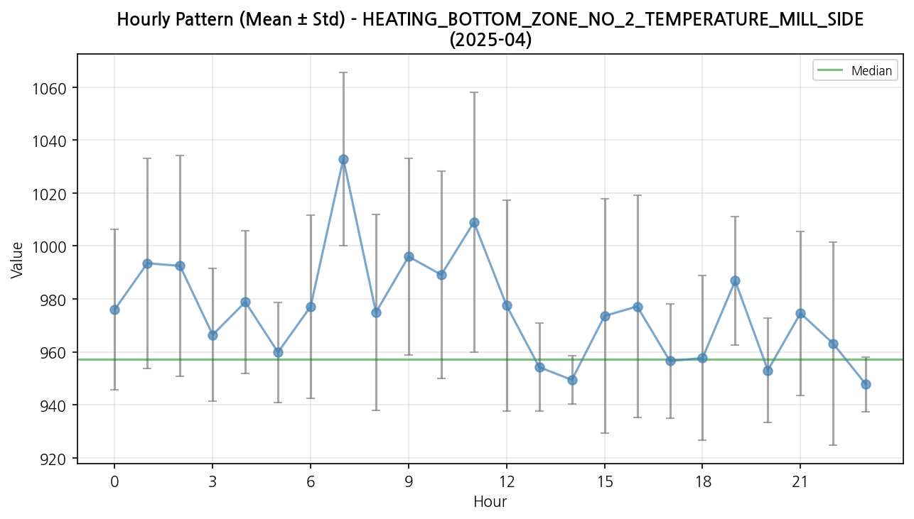

**6. 일별 이상치 수 (Daily Outlier Count)**

**월별 종합 차트**

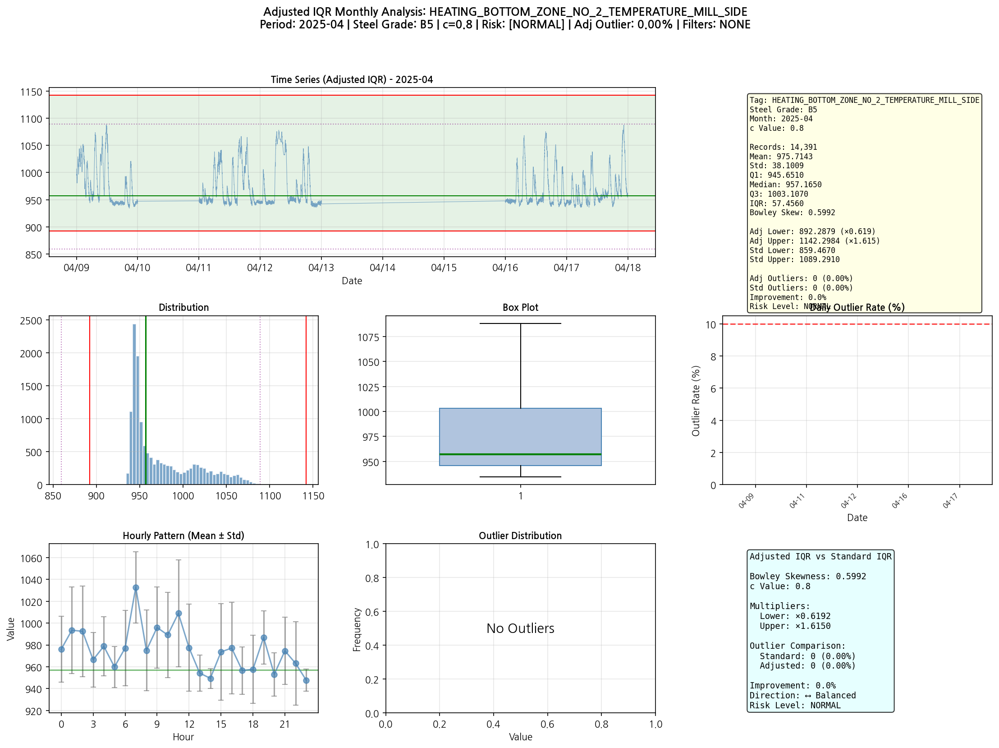

---

#### HEATING_BOTTOM_ZONE_NO_1_TEMPERATURE_OPP_SIDE 🟢

**위험도**: [NORMAL] | **이상치율**: 0.00% | **개선율**: 100.0%
**Bowley 왜도**: 0.6384 | **승수 (L/U)**: 0.600/1.667

**데이터**: 원본 14,391 → 필터 후 14,391 (0.0% 제외)

| 통계 지표 | Adjusted IQR | Standard IQR |
|-----------|--------------|--------------|
| 이상치 수 | 0 | 96 |
| 이상치율 | 0.00% | 0.67% |
| 하한 경계 | 864.3724 | 830.1911 |
| 상한 경계 | 1115.0575 | 1058.0933 |

| 기본 통계 | 값 |
|-----------|-------|
| 분석 레코드 | 14,391 |
| 평균 | 946.3143 |
| 표준편차 | 40.2632 |
| Q1 (25%) | 915.6544 |
| 중앙값 | 925.9547 |
| Q3 (75%) | 972.6300 |
| IQR | 56.9756 |

**월별 이상치 추이**:

| 월 | 레코드 수 | 평균 | Adj 이상치율 | Std 이상치율 |
|-----|-----------|------|--------------|---------------|
| 2025-04 | 14,391 | 946.31 | 0.00% | 0.67% |

##### 차트 분석

**1. 시계열 (Time Series)**

**2. 분포 히스토그램 (Distribution Histogram)**

**3. 박스플롯 (Box Plot)**

**4. 일별 평균 추이 (Daily Average Trend)**

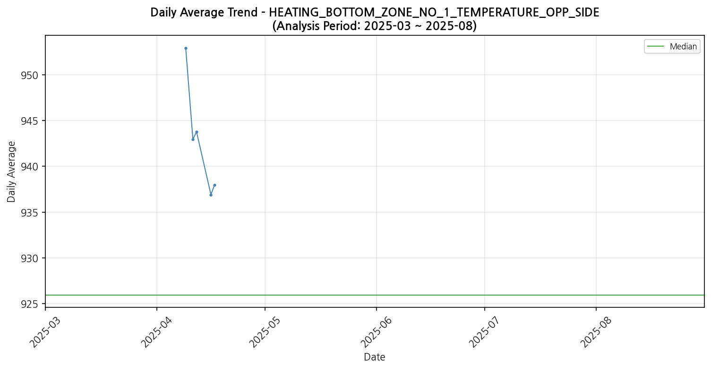

**5. 월별 이상치율 (Monthly Outlier Rate)**

**6. 시간별 패턴 (Hourly Pattern)**

**7. 일별 이상치 수 (Daily Outlier Count)**

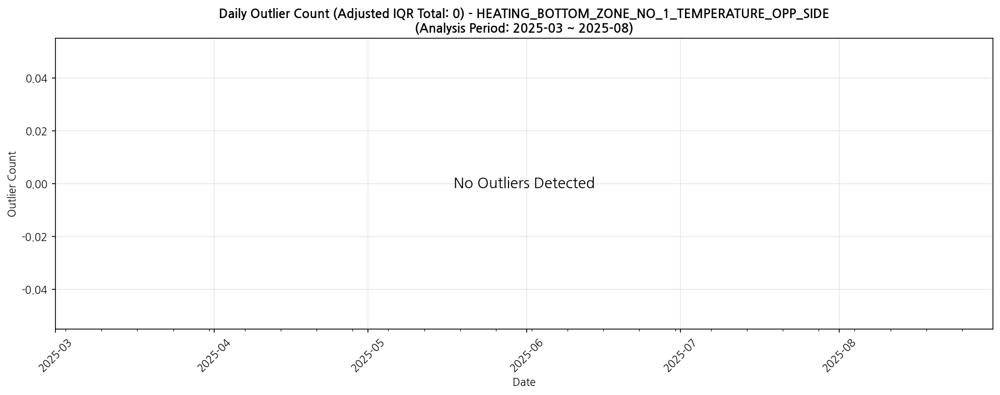

**종합 분석 차트**

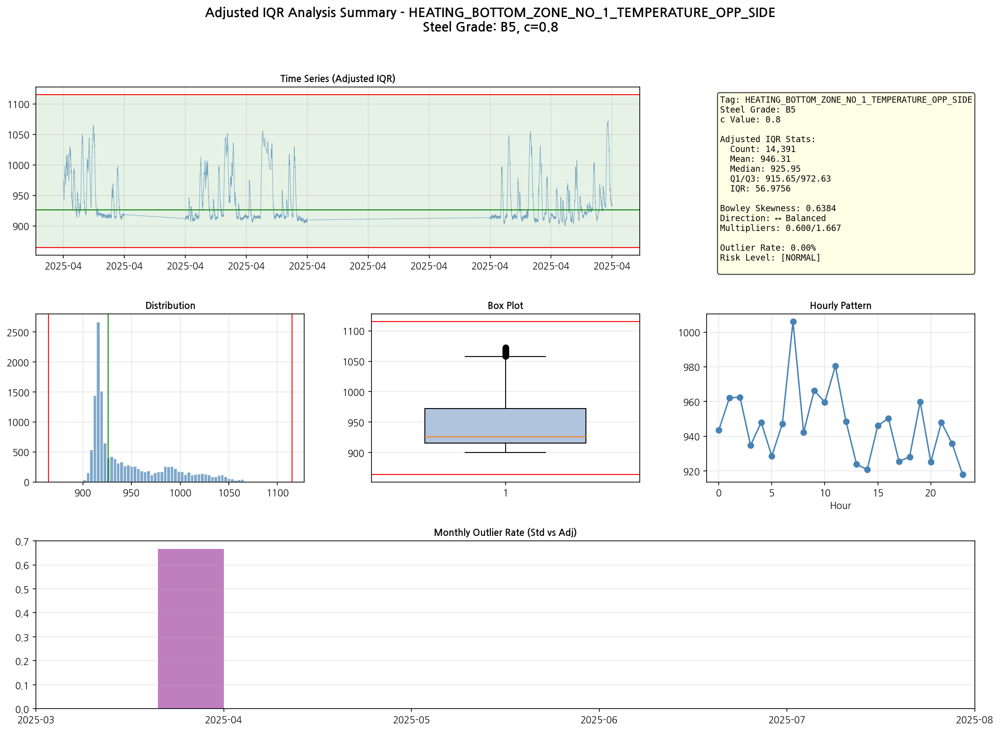

---

##### 월별 상세 분석

**2025-04**

**통계 요약**:

| 지표 | 값 |
|------|-------|
| 분석 레코드 | 14,391 |
| 평균 | 946.3143 |
| 중앙값 | 925.9547 |
| IQR | 56.9756 |
| Bowley 왜도 | 0.6384 |
| Adj 이상치 수 | 0 |
| Adj 이상치율 | 0.00% |
| Std 이상치율 | 0.67% |
| 개선율 | 100.0% |

**1. 시계열 (Time Series)**

**2. 분포 히스토그램 (Distribution Histogram)**

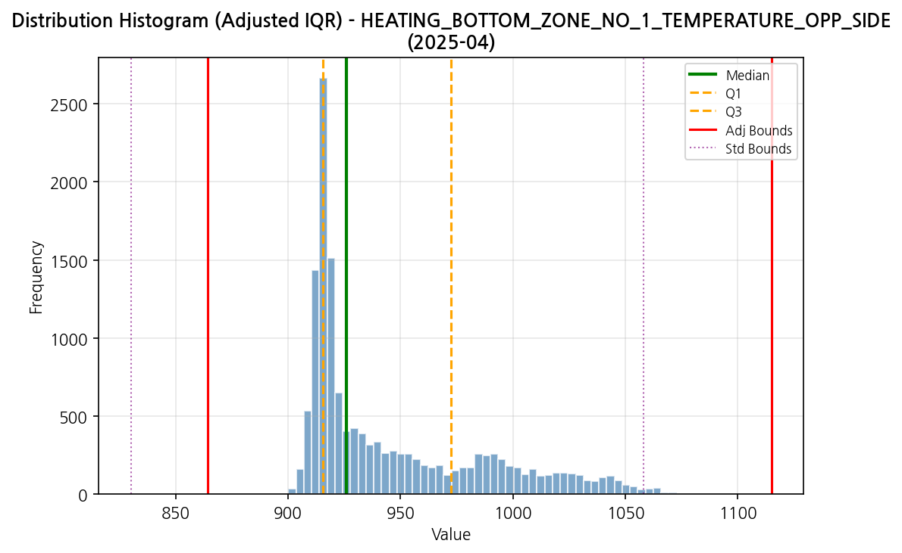

**3. 박스플롯 (Box Plot)**

**4. 일별 평균 추이 (Daily Average Trend)**

**5. 시간별 패턴 (Hourly Pattern)**

**6. 일별 이상치 수 (Daily Outlier Count)**

**월별 종합 차트**

---

#### SOAKING_BOTTOM_ZONE_NO_1_TEMPERATURE_OPP_SIDE 🟢

**위험도**: [NORMAL] | **이상치율**: 0.00% | **개선율**: 0.0%
**Bowley 왜도**: 0.2143 | **승수 (L/U)**: 0.842/1.187

**데이터**: 원본 14,391 → 필터 후 14,391 (0.0% 제외)

| 통계 지표 | Adjusted IQR | Standard IQR |
|-----------|--------------|--------------|
| 이상치 수 | 0 | 0 |
| 이상치율 | 0.00% | 0.00% |
| 하한 경계 | 1000.8080 | 987.8083 |
| 상한 경계 | 1223.2297 | 1207.7982 |

| 기본 통계 | 값 |
|-----------|-------|
| 분석 레코드 | 14,391 |
| 평균 | 1095.2580 |
| 표준편차 | 28.1400 |
| Q1 (25%) | 1070.3045 |
| 중앙값 | 1091.9090 |
| Q3 (75%) | 1125.3020 |
| IQR | 54.9975 |

**월별 이상치 추이**:

| 월 | 레코드 수 | 평균 | Adj 이상치율 | Std 이상치율 |
|-----|-----------|------|--------------|---------------|
| 2025-04 | 14,391 | 1095.26 | 0.00% | 0.00% |

##### 차트 분석

**1. 시계열 (Time Series)**

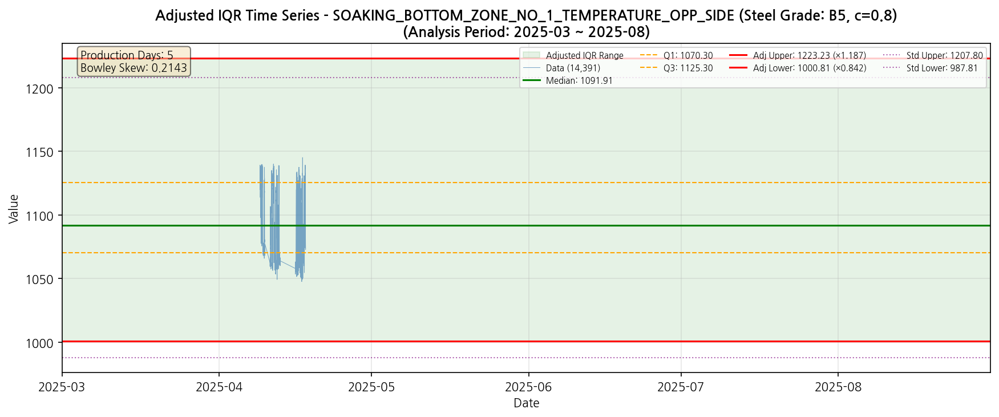

**2. 분포 히스토그램 (Distribution Histogram)**

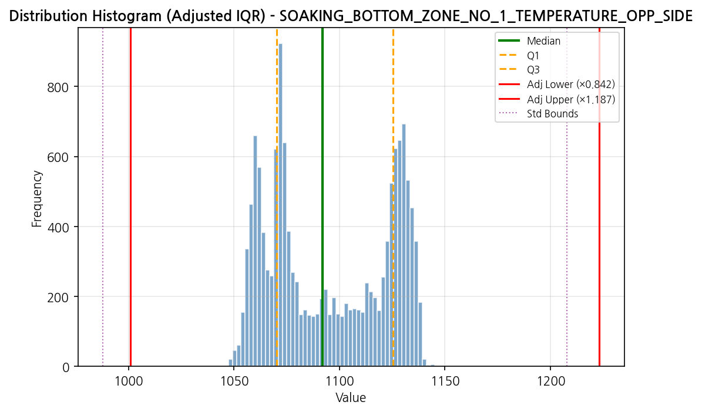

**3. 박스플롯 (Box Plot)**

**4. 일별 평균 추이 (Daily Average Trend)**

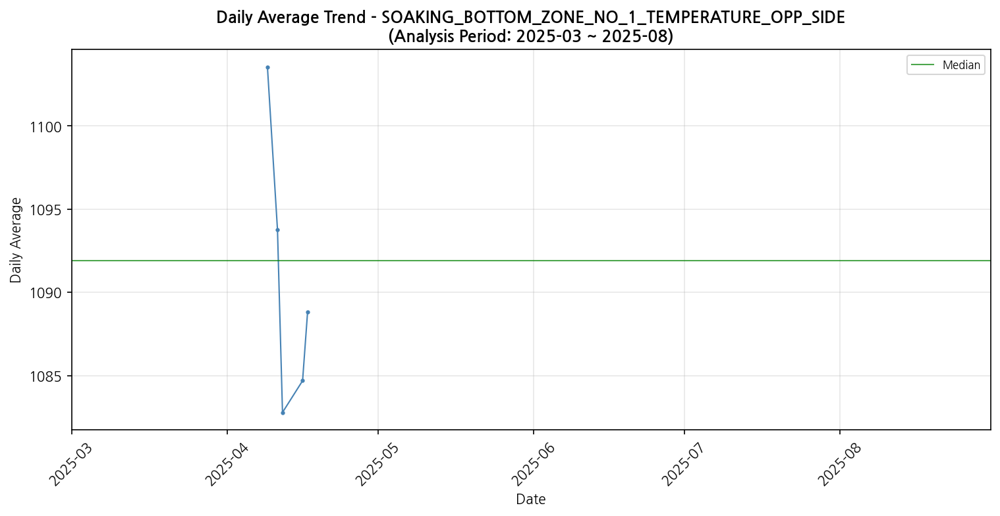

**5. 월별 이상치율 (Monthly Outlier Rate)**

**6. 시간별 패턴 (Hourly Pattern)**

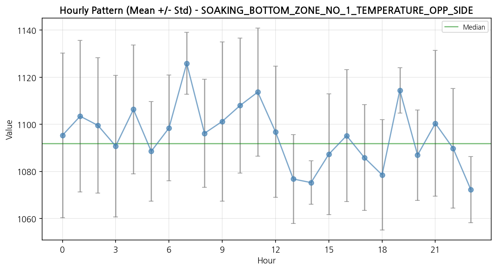

**7. 일별 이상치 수 (Daily Outlier Count)**

**종합 분석 차트**

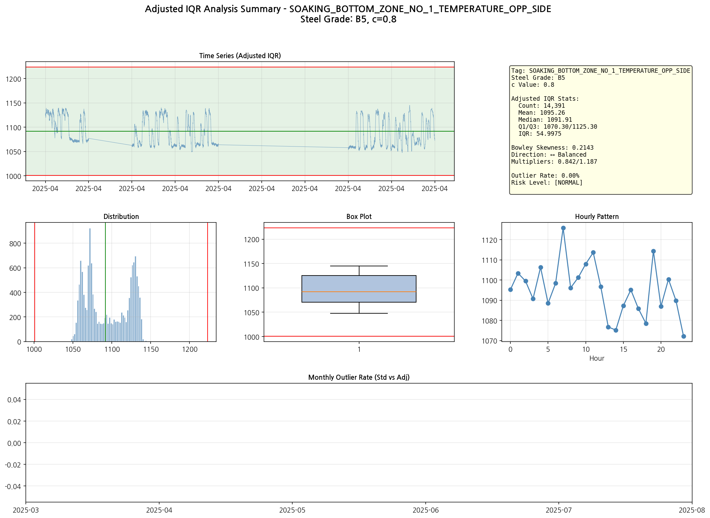

---

##### 월별 상세 분석

**2025-04**

**통계 요약**:

| 지표 | 값 |
|------|-------|
| 분석 레코드 | 14,391 |
| 평균 | 1095.2580 |
| 중앙값 | 1091.9090 |
| IQR | 54.9975 |
| Bowley 왜도 | 0.2143 |
| Adj 이상치 수 | 0 |
| Adj 이상치율 | 0.00% |
| Std 이상치율 | 0.00% |
| 개선율 | 0.0% |

**1. 시계열 (Time Series)**

**2. 분포 히스토그램 (Distribution Histogram)**

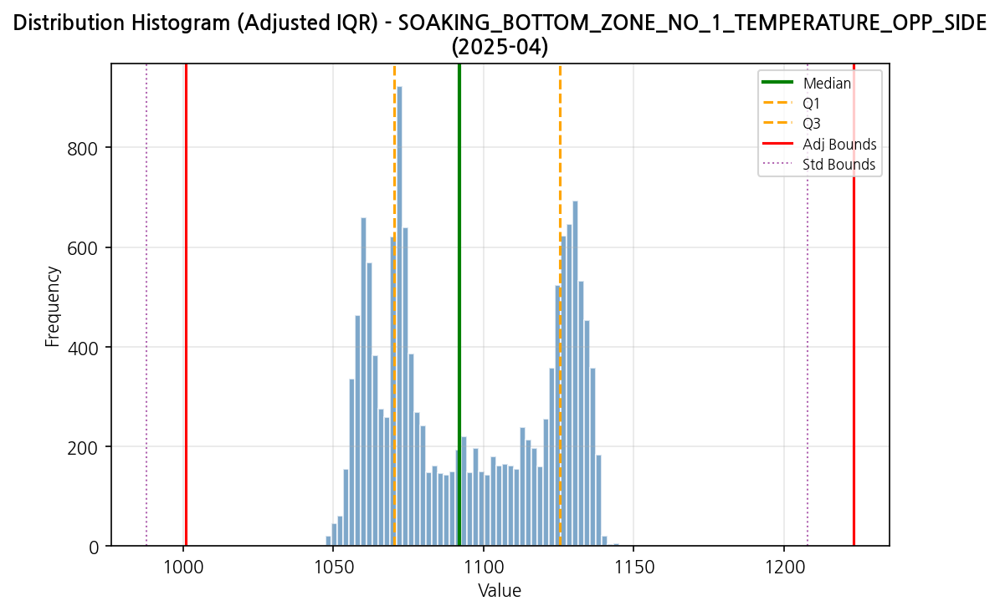

**3. 박스플롯 (Box Plot)**

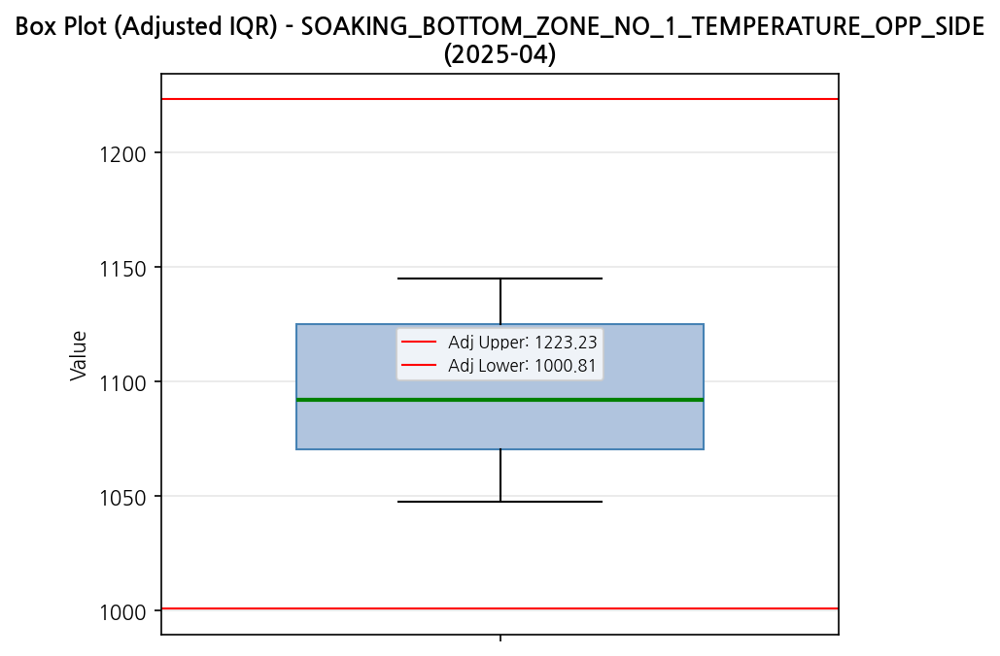

**4. 일별 평균 추이 (Daily Average Trend)**

**5. 시간별 패턴 (Hourly Pattern)**

**6. 일별 이상치 수 (Daily Outlier Count)**

**월별 종합 차트**

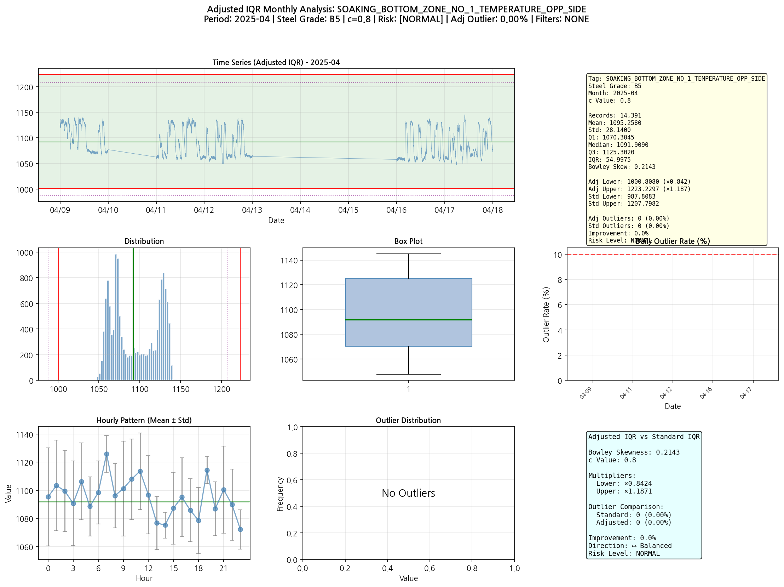

---

#### STAND_11_ACTUAL_TORQUE 🟢

**위험도**: [NORMAL] | **이상치율**: 0.00% | **개선율**: 0.0%
**Bowley 왜도**: -0.8909 | **승수 (L/U)**: 2.039/0.490

**데이터**: 원본 14,391 → 필터 후 14,238 (1.1% 제외)

| 통계 지표 | Adjusted IQR | Standard IQR |
|-----------|--------------|--------------|
| 이상치 수 | 0 | 0 |
| 이상치율 | 0.00% | 0.00% |
| 하한 경계 | -69.0773 | -25.7576 |
| 상한 경계 | 64.1318 | 85.3722 |

| 기본 통계 | 값 |
|-----------|-------|
| 분석 레코드 | 14,238 |
| 평균 | 31.4446 |
| 표준편차 | 17.6430 |
| Q1 (25%) | 15.9161 |
| 중앙값 | 42.1827 |
| Q3 (75%) | 43.6985 |
| IQR | 27.7825 |

**월별 이상치 추이**:

| 월 | 레코드 수 | 평균 | Adj 이상치율 | Std 이상치율 |
|-----|-----------|------|--------------|---------------|
| 2025-04 | 14,238 | 31.44 | 0.00% | 0.00% |

##### 차트 분석

**1. 시계열 (Time Series)**

**2. 분포 히스토그램 (Distribution Histogram)**

**3. 박스플롯 (Box Plot)**

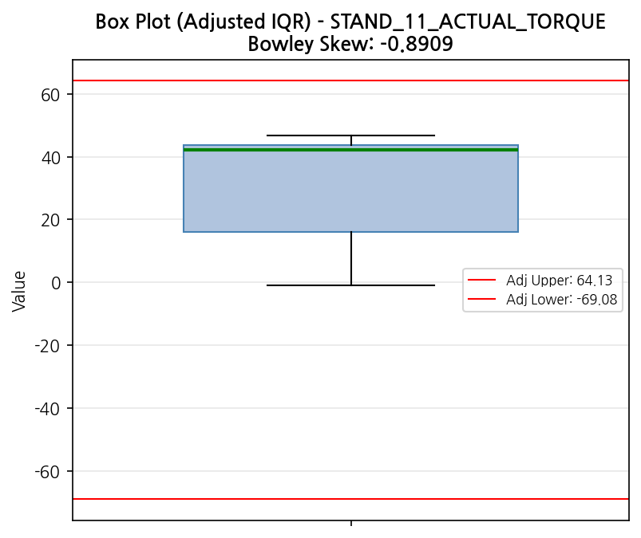

**4. 일별 평균 추이 (Daily Average Trend)**

**5. 월별 이상치율 (Monthly Outlier Rate)**

**6. 시간별 패턴 (Hourly Pattern)**

**7. 일별 이상치 수 (Daily Outlier Count)**

**종합 분석 차트**

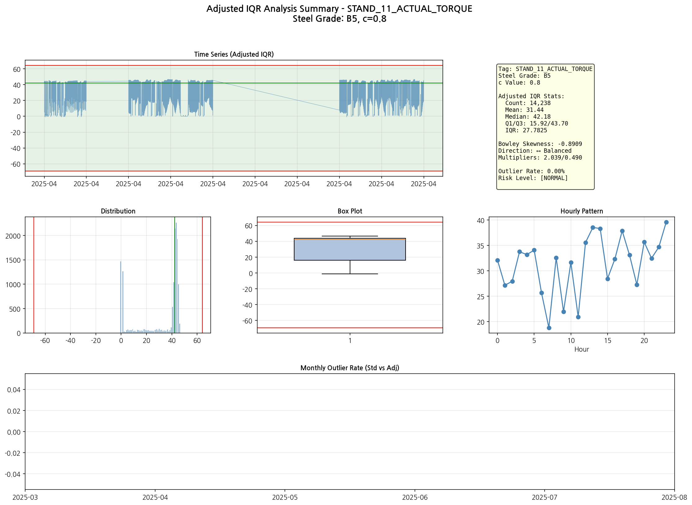

---

##### 월별 상세 분석

**2025-04**

**통계 요약**:

| 지표 | 값 |
|------|-------|
| 분석 레코드 | 14,238 |
| 평균 | 31.4446 |
| 중앙값 | 42.1827 |
| IQR | 27.7825 |
| Bowley 왜도 | -0.8909 |
| Adj 이상치 수 | 0 |
| Adj 이상치율 | 0.00% |
| Std 이상치율 | 0.00% |
| 개선율 | 0.0% |

**1. 시계열 (Time Series)**

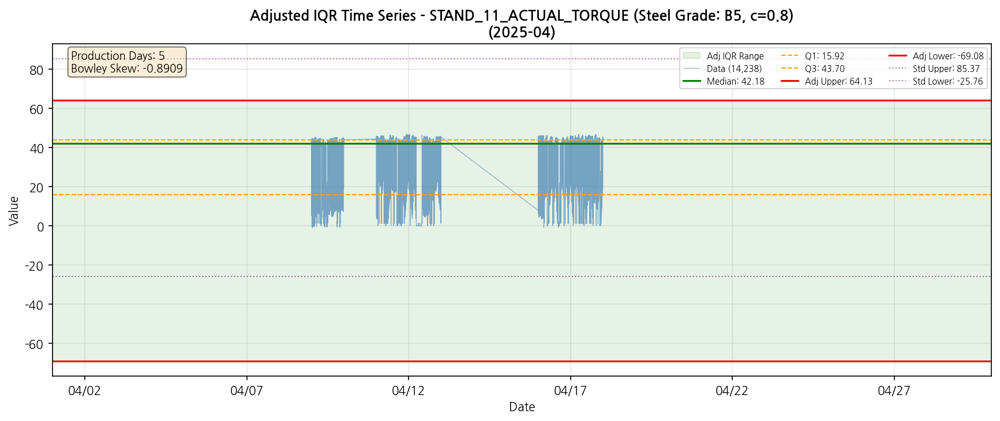

**2. 분포 히스토그램 (Distribution Histogram)**

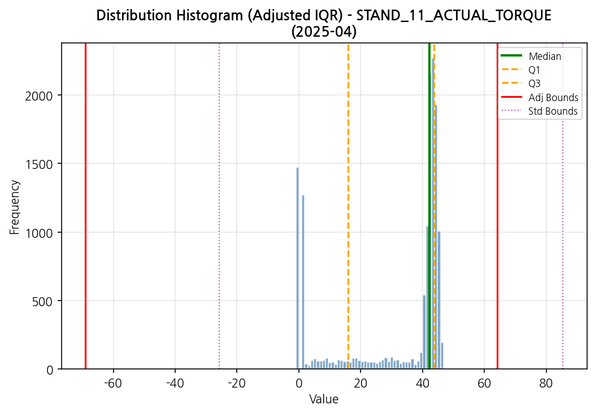

**3. 박스플롯 (Box Plot)**

**4. 일별 평균 추이 (Daily Average Trend)**

**5. 시간별 패턴 (Hourly Pattern)**

**6. 일별 이상치 수 (Daily Outlier Count)**

**월별 종합 차트**

---

#### FINISHING_BLOCK_MASTER_ACTUAL_TORQUE 🟢

**위험도**: [NORMAL] | **이상치율**: 0.00% | **개선율**: 0.0%
**Bowley 왜도**: 0.0007 | **승수 (L/U)**: 0.999/1.001

**데이터**: 원본 14,391 → 필터 후 14,238 (1.1% 제외)

| 통계 지표 | Adjusted IQR | Standard IQR |
|-----------|--------------|--------------|
| 이상치 수 | 0 | 0 |
| 이상치율 | 0.00% | 0.00% |
| 하한 경계 | -24.9201 | -24.9424 |
| 상한 경계 | 76.6086 | 76.5863 |

| 기본 통계 | 값 |
|-----------|-------|
| 분석 레코드 | 14,238 |
| 평균 | 24.3992 |
| 표준편차 | 13.8255 |
| Q1 (25%) | 13.1309 |
| 중앙값 | 25.8126 |
| Q3 (75%) | 38.5130 |
| IQR | 25.3822 |

**월별 이상치 추이**:

| 월 | 레코드 수 | 평균 | Adj 이상치율 | Std 이상치율 |
|-----|-----------|------|--------------|---------------|
| 2025-04 | 14,238 | 24.40 | 0.00% | 0.00% |

##### 차트 분석

**1. 시계열 (Time Series)**

**2. 분포 히스토그램 (Distribution Histogram)**

**3. 박스플롯 (Box Plot)**

**4. 일별 평균 추이 (Daily Average Trend)**

**5. 월별 이상치율 (Monthly Outlier Rate)**

**6. 시간별 패턴 (Hourly Pattern)**

**7. 일별 이상치 수 (Daily Outlier Count)**

**종합 분석 차트**

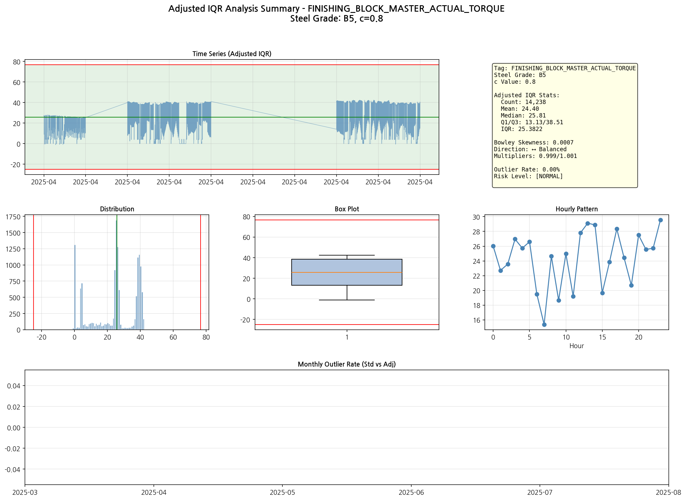

---

##### 월별 상세 분석

**2025-04**

**통계 요약**:

| 지표 | 값 |
|------|-------|
| 분석 레코드 | 14,238 |
| 평균 | 24.3992 |
| 중앙값 | 25.8126 |
| IQR | 25.3822 |
| Bowley 왜도 | 0.0007 |
| Adj 이상치 수 | 0 |
| Adj 이상치율 | 0.00% |
| Std 이상치율 | 0.00% |
| 개선율 | 0.0% |

**1. 시계열 (Time Series)**

**2. 분포 히스토그램 (Distribution Histogram)**

**3. 박스플롯 (Box Plot)**

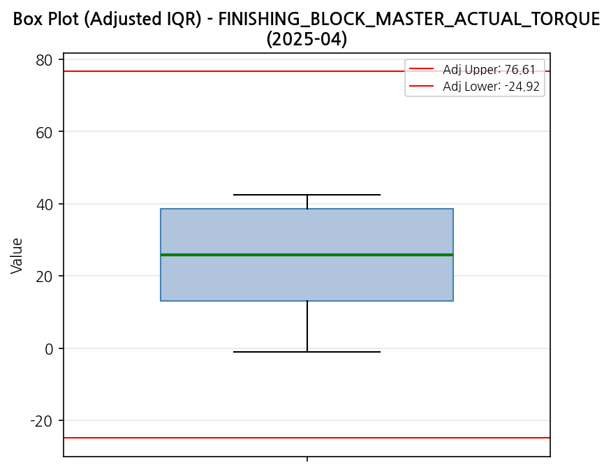

**4. 일별 평균 추이 (Daily Average Trend)**

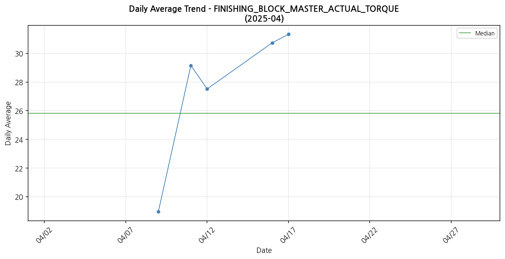

**5. 시간별 패턴 (Hourly Pattern)**

**6. 일별 이상치 수 (Daily Outlier Count)**

**월별 종합 차트**

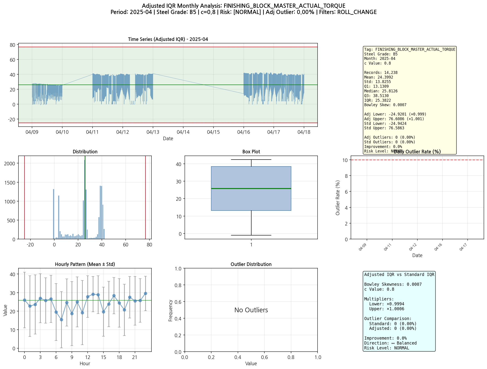

---

#### STAND_14_ACTUAL_TORQUE 🟢

**위험도**: [NORMAL] | **이상치율**: 0.00% | **개선율**: 0.0%
**Bowley 왜도**: -0.8991 | **승수 (L/U)**: 2.053/0.487

**데이터**: 원본 14,391 → 필터 후 14,238 (1.1% 제외)

| 통계 지표 | Adjusted IQR | Standard IQR |
|-----------|--------------|--------------|
| 이상치 수 | 0 | 0 |
| 이상치율 | 0.00% | 0.00% |
| 하한 경계 | -52.7890 | -18.0014 |
| 상한 경계 | 53.1560 | 70.1012 |

| 기본 통계 | 값 |
|-----------|-------|
| 분석 레코드 | 14,238 |
| 평균 | 27.1944 |
| 표준편차 | 14.4576 |
| Q1 (25%) | 15.0371 |
| 중앙값 | 35.9515 |
| Q3 (75%) | 37.0627 |
| IQR | 22.0256 |

**월별 이상치 추이**:

| 월 | 레코드 수 | 평균 | Adj 이상치율 | Std 이상치율 |
|-----|-----------|------|--------------|---------------|
| 2025-04 | 14,238 | 27.19 | 0.00% | 0.00% |

##### 차트 분석

**1. 시계열 (Time Series)**

**2. 분포 히스토그램 (Distribution Histogram)**

**3. 박스플롯 (Box Plot)**

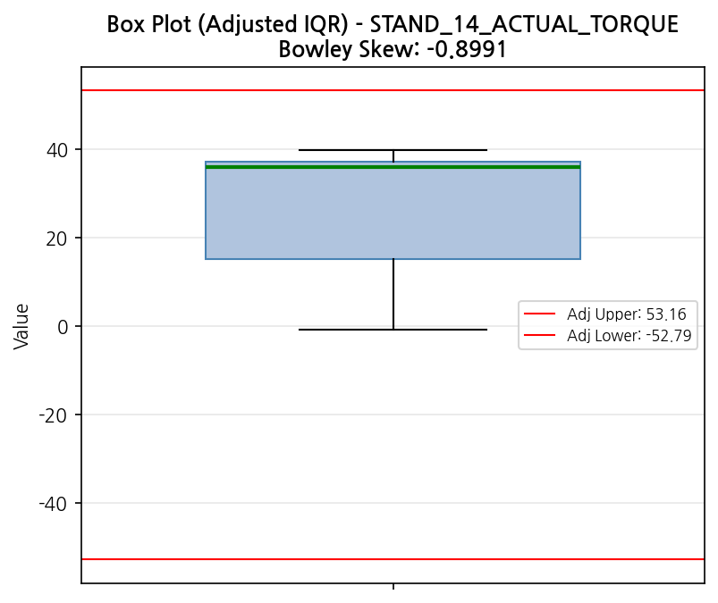

**4. 일별 평균 추이 (Daily Average Trend)**

**5. 월별 이상치율 (Monthly Outlier Rate)**

**6. 시간별 패턴 (Hourly Pattern)**

**7. 일별 이상치 수 (Daily Outlier Count)**

**종합 분석 차트**

---

##### 월별 상세 분석

**2025-04**

**통계 요약**:

| 지표 | 값 |
|------|-------|
| 분석 레코드 | 14,238 |
| 평균 | 27.1944 |
| 중앙값 | 35.9515 |
| IQR | 22.0256 |
| Bowley 왜도 | -0.8991 |
| Adj 이상치 수 | 0 |
| Adj 이상치율 | 0.00% |
| Std 이상치율 | 0.00% |
| 개선율 | 0.0% |

**1. 시계열 (Time Series)**

**2. 분포 히스토그램 (Distribution Histogram)**

**3. 박스플롯 (Box Plot)**

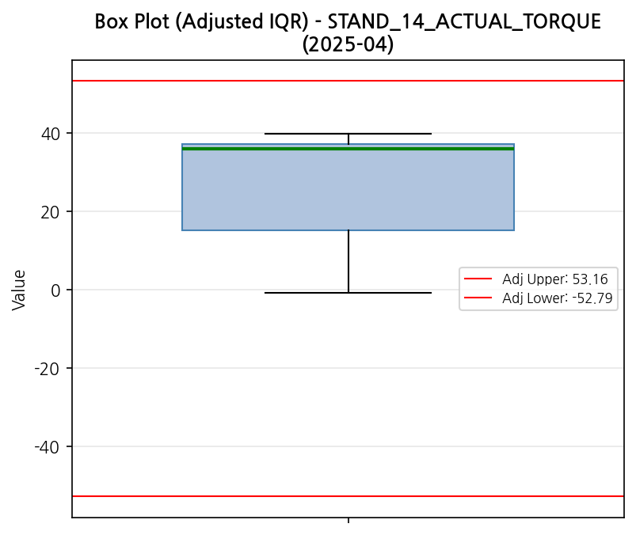

**4. 일별 평균 추이 (Daily Average Trend)**

**5. 시간별 패턴 (Hourly Pattern)**

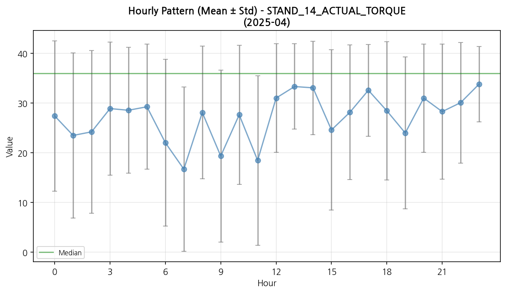

**6. 일별 이상치 수 (Daily Outlier Count)**

**월별 종합 차트**

---

#### STAND_13_ACTUAL_TORQUE 🟢

**위험도**: [NORMAL] | **이상치율**: 0.00% | **개선율**: 0.0%
**Bowley 왜도**: -0.8603 | **승수 (L/U)**: 1.990/0.502

**데이터**: 원본 14,391 → 필터 후 14,238 (1.1% 제외)

| 통계 지표 | Adjusted IQR | Standard IQR |
|-----------|--------------|--------------|
| 이상치 수 | 0 | 0 |
| 이상치율 | 0.00% | 0.00% |
| 하한 경계 | -78.6895 | -29.7268 |
| 상한 경계 | 77.5253 | 102.1267 |

| 기본 통계 | 값 |
|-----------|-------|
| 분석 레코드 | 14,238 |
| 평균 | 38.1875 |
| 표준편차 | 21.1658 |
| Q1 (25%) | 19.7183 |
| 중앙값 | 50.3795 |
| Q3 (75%) | 52.6816 |
| IQR | 32.9634 |

**월별 이상치 추이**:

| 월 | 레코드 수 | 평균 | Adj 이상치율 | Std 이상치율 |
|-----|-----------|------|--------------|---------------|
| 2025-04 | 14,238 | 38.19 | 0.00% | 0.00% |

##### 차트 분석

**1. 시계열 (Time Series)**

**2. 분포 히스토그램 (Distribution Histogram)**

**3. 박스플롯 (Box Plot)**

**4. 일별 평균 추이 (Daily Average Trend)**

**5. 월별 이상치율 (Monthly Outlier Rate)**

**6. 시간별 패턴 (Hourly Pattern)**

**7. 일별 이상치 수 (Daily Outlier Count)**

**종합 분석 차트**

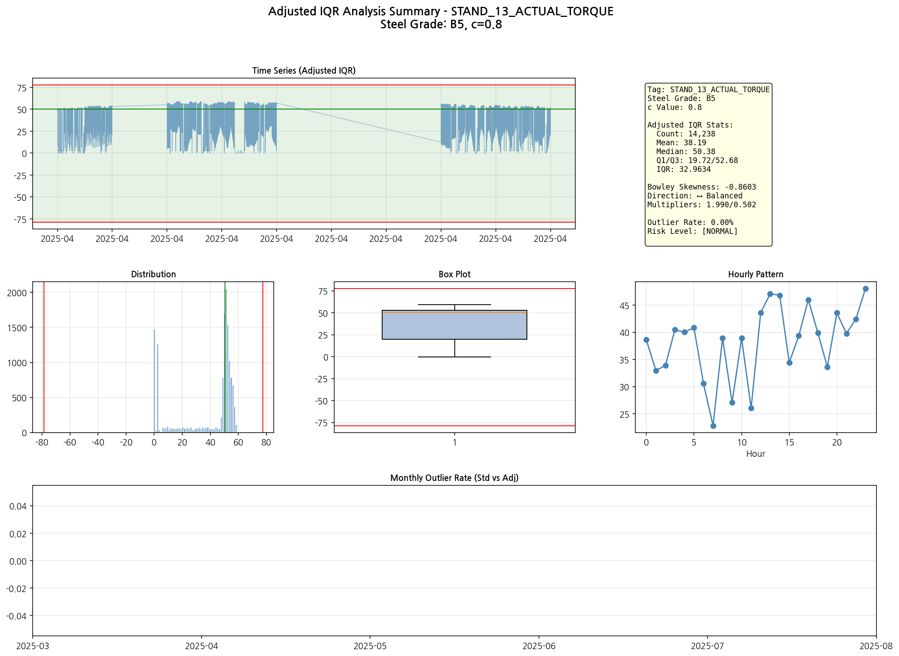

---

##### 월별 상세 분석

**2025-04**

**통계 요약**:

| 지표 | 값 |
|------|-------|
| 분석 레코드 | 14,238 |
| 평균 | 38.1875 |
| 중앙값 | 50.3795 |
| IQR | 32.9634 |
| Bowley 왜도 | -0.8603 |
| Adj 이상치 수 | 0 |
| Adj 이상치율 | 0.00% |
| Std 이상치율 | 0.00% |
| 개선율 | 0.0% |

**1. 시계열 (Time Series)**

**2. 분포 히스토그램 (Distribution Histogram)**

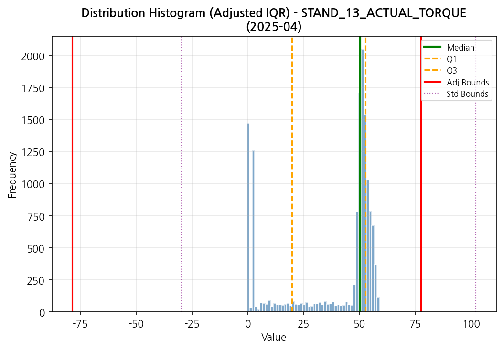

**3. 박스플롯 (Box Plot)**

**4. 일별 평균 추이 (Daily Average Trend)**

**5. 시간별 패턴 (Hourly Pattern)**

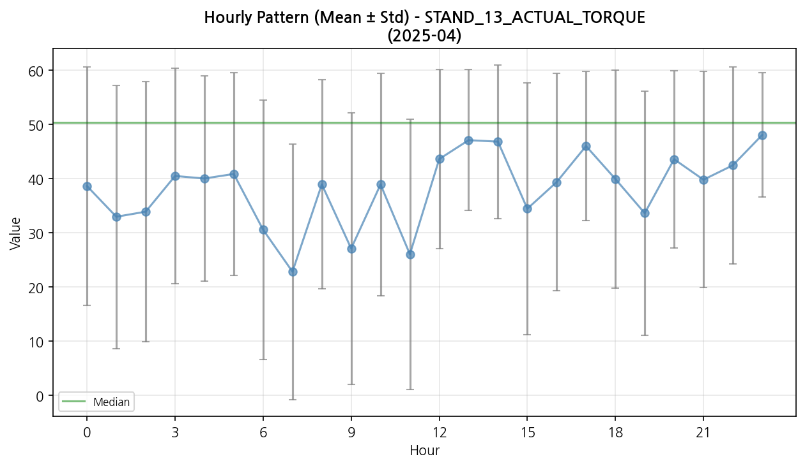

**6. 일별 이상치 수 (Daily Outlier Count)**

**월별 종합 차트**

---

#### STAND_12_ACTUAL_TORQUE 🟢

**위험도**: [NORMAL] | **이상치율**: 0.00% | **개선율**: 0.0%
**Bowley 왜도**: -0.8386 | **승수 (L/U)**: 1.956/0.511

**데이터**: 원본 14,391 → 필터 후 14,238 (1.1% 제외)

| 통계 지표 | Adjusted IQR | Standard IQR |
|-----------|--------------|--------------|
| 이상치 수 | 0 | 0 |
| 이상치율 | 0.00% | 0.00% |
| 하한 경계 | -78.5890 | -29.9806 |
| 상한 경계 | 80.7537 | 105.6043 |

| 기본 통계 | 값 |
|-----------|-------|
| 분석 레코드 | 14,238 |
| 평균 | 39.4439 |
| 표준편차 | 21.6699 |
| Q1 (25%) | 20.8638 |
| 중앙값 | 52.0253 |
| Q3 (75%) | 54.7600 |
| IQR | 33.8962 |

**월별 이상치 추이**:

| 월 | 레코드 수 | 평균 | Adj 이상치율 | Std 이상치율 |
|-----|-----------|------|--------------|---------------|
| 2025-04 | 14,238 | 39.44 | 0.00% | 0.00% |

##### 차트 분석

**1. 시계열 (Time Series)**

**2. 분포 히스토그램 (Distribution Histogram)**

**3. 박스플롯 (Box Plot)**

**4. 일별 평균 추이 (Daily Average Trend)**

**5. 월별 이상치율 (Monthly Outlier Rate)**

**6. 시간별 패턴 (Hourly Pattern)**

**7. 일별 이상치 수 (Daily Outlier Count)**

**종합 분석 차트**

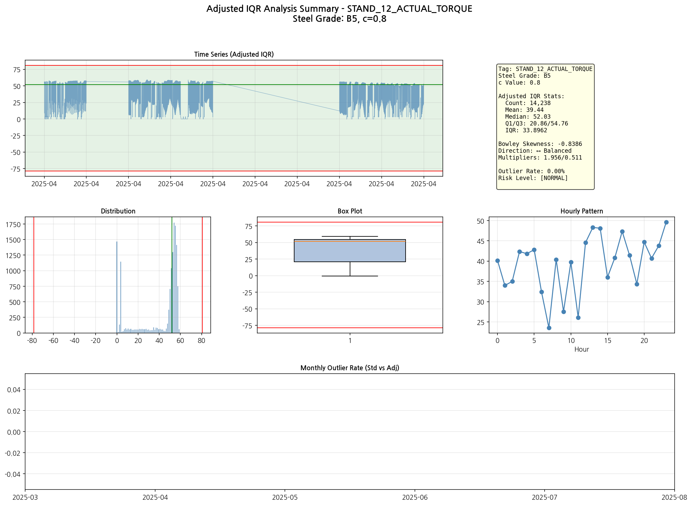

---

##### 월별 상세 분석

**2025-04**

**통계 요약**:

| 지표 | 값 |
|------|-------|
| 분석 레코드 | 14,238 |
| 평균 | 39.4439 |
| 중앙값 | 52.0253 |
| IQR | 33.8962 |
| Bowley 왜도 | -0.8386 |
| Adj 이상치 수 | 0 |
| Adj 이상치율 | 0.00% |
| Std 이상치율 | 0.00% |
| 개선율 | 0.0% |

**1. 시계열 (Time Series)**

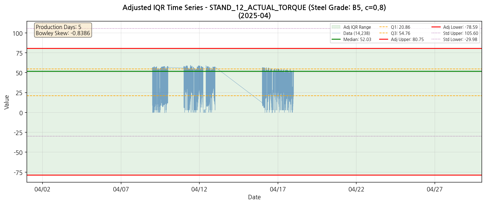

**2. 분포 히스토그램 (Distribution Histogram)**

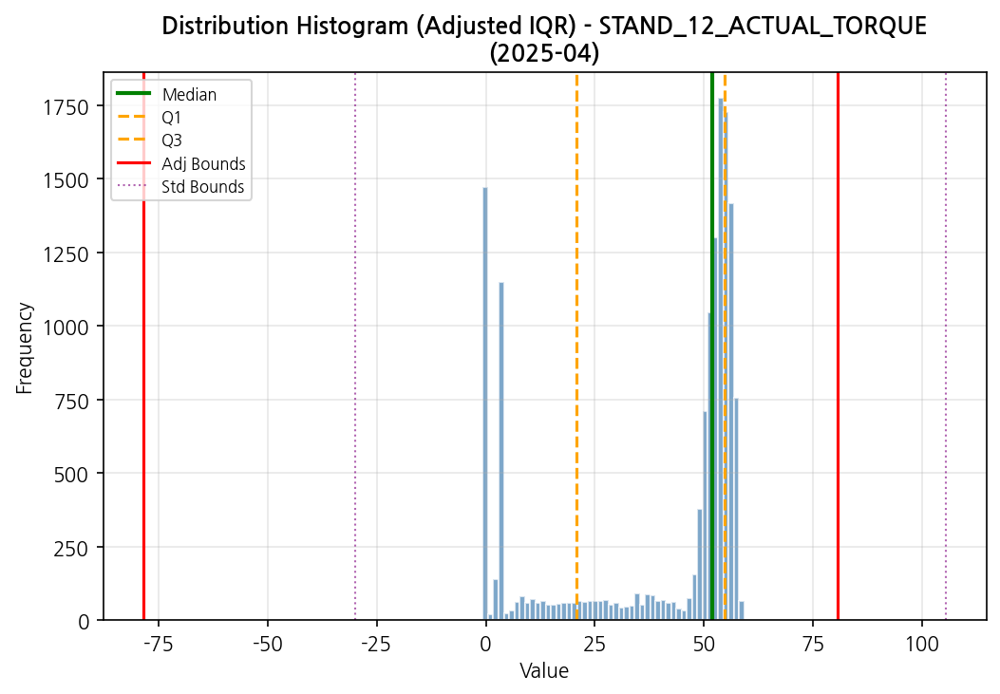

**3. 박스플롯 (Box Plot)**

**4. 일별 평균 추이 (Daily Average Trend)**

**5. 시간별 패턴 (Hourly Pattern)**

**6. 일별 이상치 수 (Daily Outlier Count)**

**월별 종합 차트**

---

#### FINISHING_BLOCK_SLAVE_ACTUAL_TORQUE 🟢

**위험도**: [NORMAL] | **이상치율**: 0.00% | **개선율**: 0.0%
**Bowley 왜도**: 0.0002 | **승수 (L/U)**: 1.000/1.000

**데이터**: 원본 14,391 → 필터 후 14,238 (1.1% 제외)

| 통계 지표 | Adjusted IQR | Standard IQR |
|-----------|--------------|--------------|
| 이상치 수 | 0 | 0 |
| 이상치율 | 0.00% | 0.00% |
| 하한 경계 | -24.9581 | -24.9629 |
| 상한 경계 | 76.5859 | 76.5811 |

| 기본 통계 | 값 |
|-----------|-------|
| 분석 레코드 | 14,238 |
| 평균 | 24.3876 |
| 표준편차 | 13.8239 |
| Q1 (25%) | 13.1161 |
| 중앙값 | 25.8071 |
| Q3 (75%) | 38.5021 |
| IQR | 25.3860 |

**월별 이상치 추이**:

| 월 | 레코드 수 | 평균 | Adj 이상치율 | Std 이상치율 |
|-----|-----------|------|--------------|---------------|
| 2025-04 | 14,238 | 24.39 | 0.00% | 0.00% |

##### 차트 분석

**1. 시계열 (Time Series)**

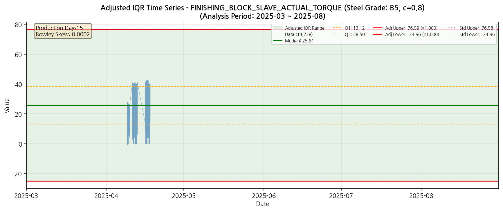

**2. 분포 히스토그램 (Distribution Histogram)**

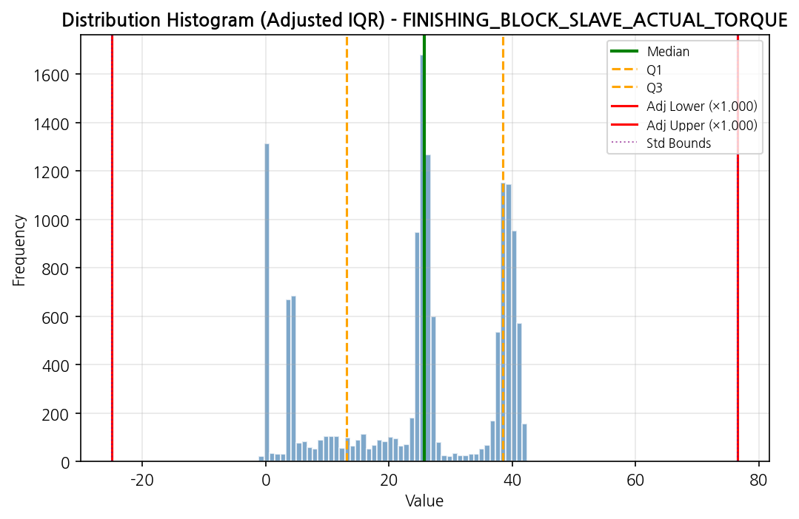

**3. 박스플롯 (Box Plot)**

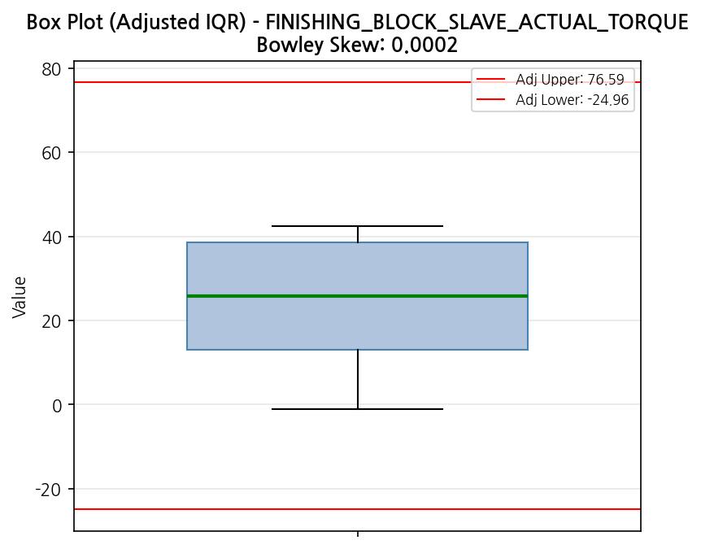

**4. 일별 평균 추이 (Daily Average Trend)**

**5. 월별 이상치율 (Monthly Outlier Rate)**

**6. 시간별 패턴 (Hourly Pattern)**

**7. 일별 이상치 수 (Daily Outlier Count)**

**종합 분석 차트**

---

##### 월별 상세 분석

**2025-04**

**통계 요약**:

| 지표 | 값 |
|------|-------|
| 분석 레코드 | 14,238 |
| 평균 | 24.3876 |
| 중앙값 | 25.8071 |
| IQR | 25.3860 |
| Bowley 왜도 | 0.0002 |
| Adj 이상치 수 | 0 |
| Adj 이상치율 | 0.00% |
| Std 이상치율 | 0.00% |
| 개선율 | 0.0% |

**1. 시계열 (Time Series)**

**2. 분포 히스토그램 (Distribution Histogram)**

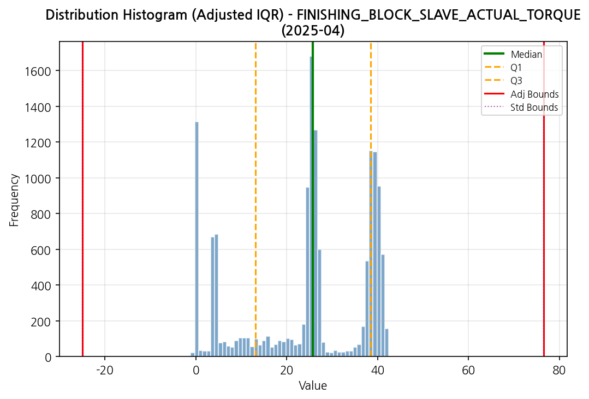

**3. 박스플롯 (Box Plot)**

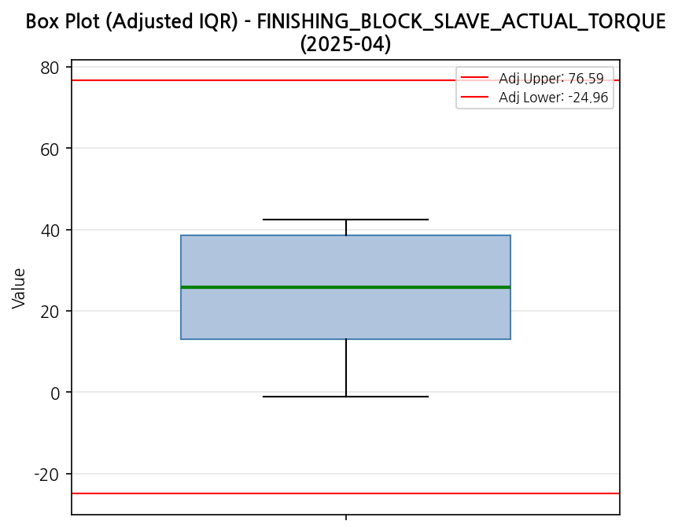

**4. 일별 평균 추이 (Daily Average Trend)**

**5. 시간별 패턴 (Hourly Pattern)**

**6. 일별 이상치 수 (Daily Outlier Count)**

**월별 종합 차트**

---

#### STAND_1_ACTUAL_TORQUE 🟢

**위험도**: [NORMAL] | **이상치율**: 0.00% | **개선율**: 0.0%
**Bowley 왜도**: -0.7187 | **승수 (L/U)**: 1.777/0.563

**데이터**: 원본 14,391 → 필터 후 14,238 (1.1% 제외)

| 통계 지표 | Adjusted IQR | Standard IQR |
|-----------|--------------|--------------|
| 이상치 수 | 0 | 0 |
| 이상치율 | 0.00% | 0.00% |
| 하한 경계 | -72.5646 | -32.3945 |
| 상한 경계 | 82.8478 | 105.4521 |

| 기본 통계 | 값 |
|-----------|-------|
| 분석 레코드 | 14,238 |
| 평균 | 38.2322 |
| 표준편차 | 21.7827 |
| Q1 (25%) | 19.2980 |
| 중앙값 | 48.9131 |
| Q3 (75%) | 53.7597 |
| IQR | 34.4617 |

**월별 이상치 추이**:

| 월 | 레코드 수 | 평균 | Adj 이상치율 | Std 이상치율 |
|-----|-----------|------|--------------|---------------|
| 2025-04 | 14,238 | 38.23 | 0.00% | 0.00% |

##### 차트 분석

**1. 시계열 (Time Series)**

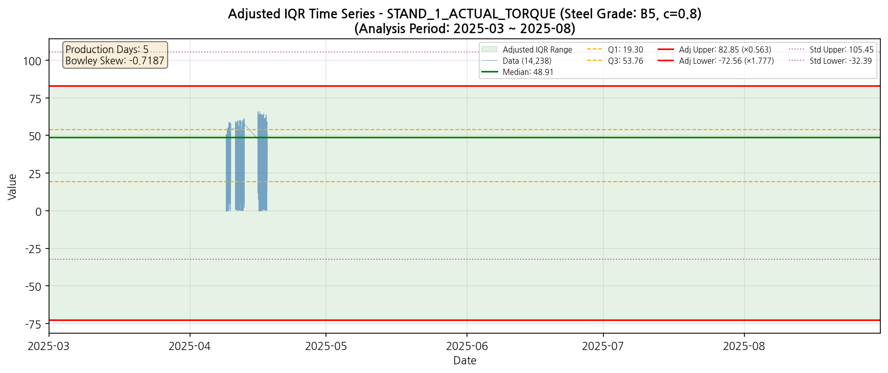

**2. 분포 히스토그램 (Distribution Histogram)**

**3. 박스플롯 (Box Plot)**

**4. 일별 평균 추이 (Daily Average Trend)**

**5. 월별 이상치율 (Monthly Outlier Rate)**

**6. 시간별 패턴 (Hourly Pattern)**

**7. 일별 이상치 수 (Daily Outlier Count)**

**종합 분석 차트**

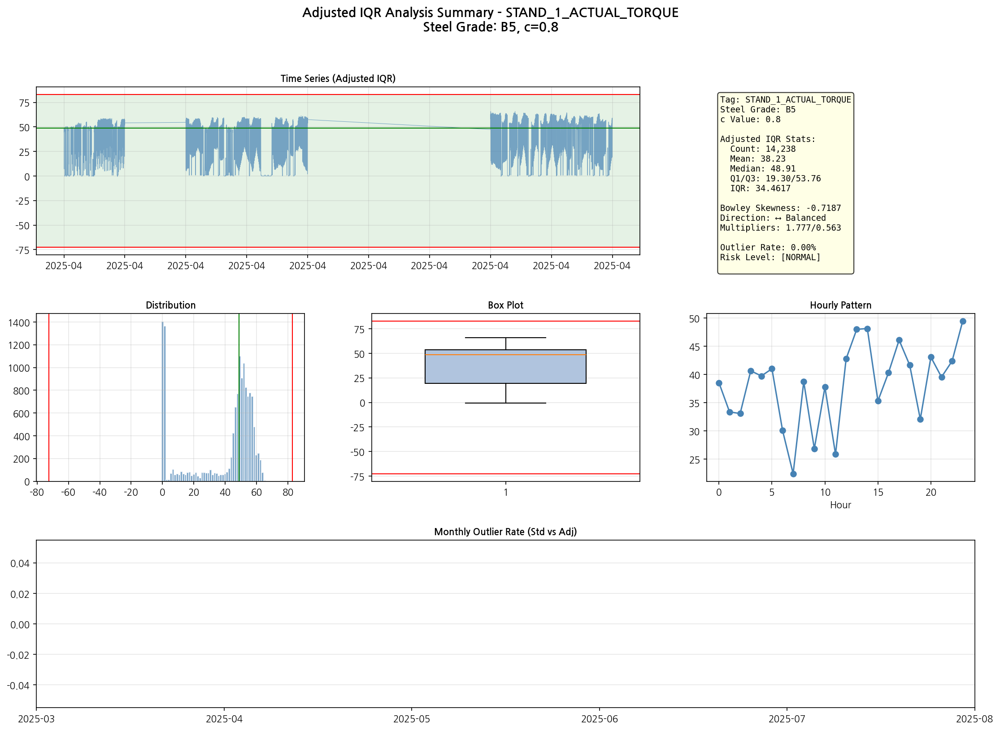

---

##### 월별 상세 분석

**2025-04**

**통계 요약**:

| 지표 | 값 |
|------|-------|
| 분석 레코드 | 14,238 |
| 평균 | 38.2322 |
| 중앙값 | 48.9131 |
| IQR | 34.4617 |
| Bowley 왜도 | -0.7187 |
| Adj 이상치 수 | 0 |
| Adj 이상치율 | 0.00% |
| Std 이상치율 | 0.00% |
| 개선율 | 0.0% |

**1. 시계열 (Time Series)**

**2. 분포 히스토그램 (Distribution Histogram)**

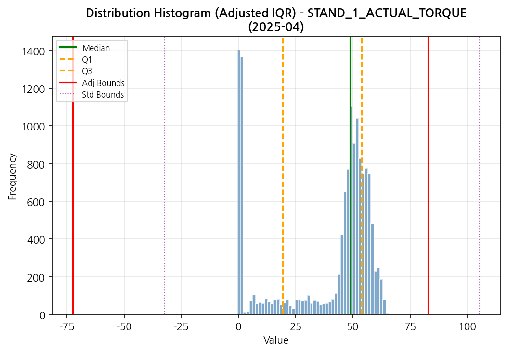

**3. 박스플롯 (Box Plot)**

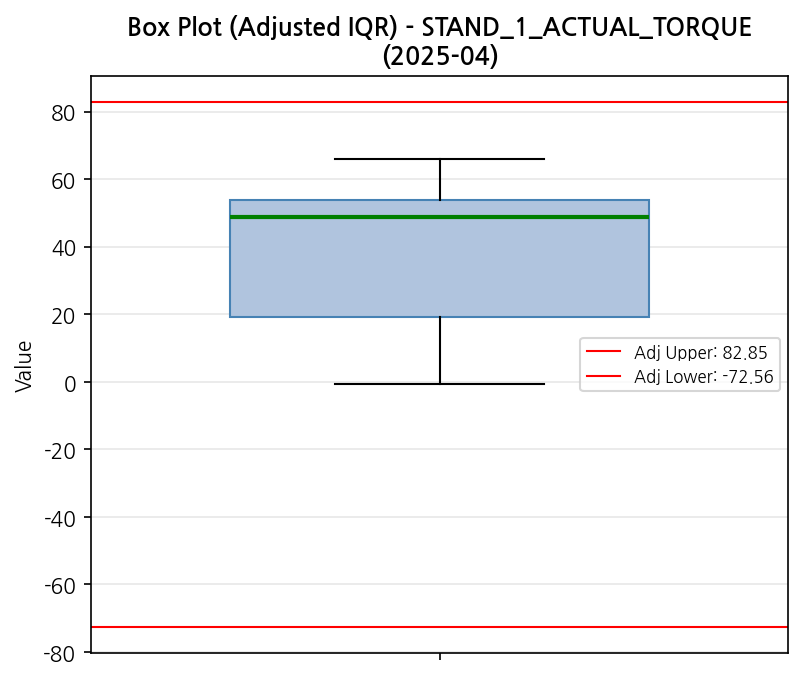

**4. 일별 평균 추이 (Daily Average Trend)**

**5. 시간별 패턴 (Hourly Pattern)**

**6. 일별 이상치 수 (Daily Outlier Count)**

**월별 종합 차트**

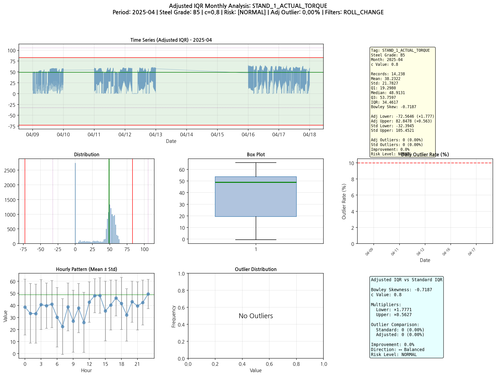

---

#### STAND_2_ACTUAL_TORQUE 🟢

**위험도**: [NORMAL] | **이상치율**: 0.00% | **개선율**: 0.0%
**Bowley 왜도**: -0.7258 | **승수 (L/U)**: 1.787/0.560

**데이터**: 원본 14,391 → 필터 후 14,238 (1.1% 제외)

| 통계 지표 | Adjusted IQR | Standard IQR |
|-----------|--------------|--------------|
| 이상치 수 | 0 | 0 |
| 이상치율 | 0.00% | 0.00% |
| 하한 경계 | -74.8514 | -31.9652 |
| 상한 경계 | 89.3136 | 113.3096 |

| 기본 통계 | 값 |
|-----------|-------|
| 분석 레코드 | 14,238 |
| 평균 | 41.8248 |
| 표준편차 | 23.6952 |
| Q1 (25%) | 22.5129 |
| 중앙값 | 53.8528 |
| Q3 (75%) | 58.8316 |
| IQR | 36.3187 |

**월별 이상치 추이**:

| 월 | 레코드 수 | 평균 | Adj 이상치율 | Std 이상치율 |
|-----|-----------|------|--------------|---------------|
| 2025-04 | 14,238 | 41.82 | 0.00% | 0.00% |

##### 차트 분석

**1. 시계열 (Time Series)**

**2. 분포 히스토그램 (Distribution Histogram)**

**3. 박스플롯 (Box Plot)**

**4. 일별 평균 추이 (Daily Average Trend)**

**5. 월별 이상치율 (Monthly Outlier Rate)**

**6. 시간별 패턴 (Hourly Pattern)**

**7. 일별 이상치 수 (Daily Outlier Count)**

**종합 분석 차트**

---

##### 월별 상세 분석

**2025-04**

**통계 요약**:

| 지표 | 값 |
|------|-------|
| 분석 레코드 | 14,238 |
| 평균 | 41.8248 |
| 중앙값 | 53.8528 |
| IQR | 36.3187 |
| Bowley 왜도 | -0.7258 |
| Adj 이상치 수 | 0 |
| Adj 이상치율 | 0.00% |
| Std 이상치율 | 0.00% |
| 개선율 | 0.0% |

**1. 시계열 (Time Series)**

**2. 분포 히스토그램 (Distribution Histogram)**

**3. 박스플롯 (Box Plot)**

**4. 일별 평균 추이 (Daily Average Trend)**

**5. 시간별 패턴 (Hourly Pattern)**

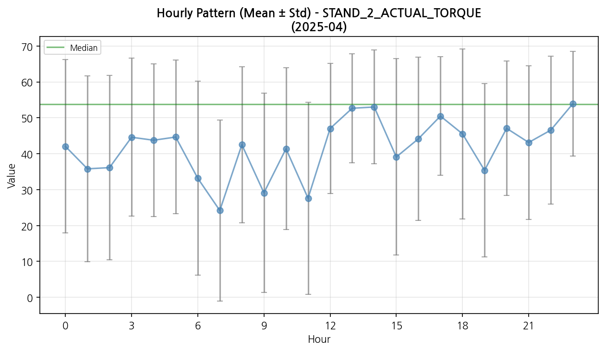

**6. 일별 이상치 수 (Daily Outlier Count)**

**월별 종합 차트**

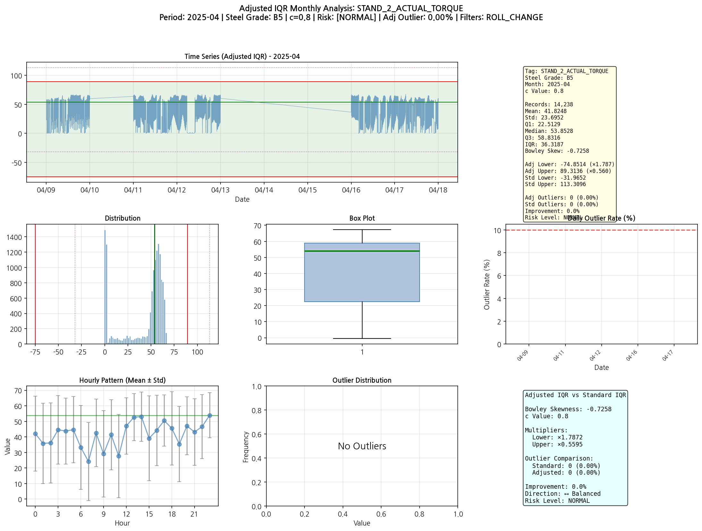

---

#### STAND_3_ACTUAL_TORQUE 🟢

**위험도**: [NORMAL] | **이상치율**: 0.00% | **개선율**: 0.0%
**Bowley 왜도**: -0.7702 | **승수 (L/U)**: 1.852/0.540

**데이터**: 원본 14,391 → 필터 후 14,238 (1.1% 제외)

| 통계 지표 | Adjusted IQR | Standard IQR |
|-----------|--------------|--------------|
| 이상치 수 | 0 | 0 |
| 이상치율 | 0.00% | 0.00% |
| 하한 경계 | -78.3121 | -32.9452 |
| 상한 경계 | 84.5739 | 109.0719 |

| 기본 통계 | 값 |
|-----------|-------|
| 분석 레코드 | 14,238 |
| 평균 | 39.9014 |
| 표준편차 | 22.5621 |
| Q1 (25%) | 20.3113 |
| 중앙값 | 51.7368 |
| Q3 (75%) | 55.8155 |
| IQR | 35.5043 |

**월별 이상치 추이**:

| 월 | 레코드 수 | 평균 | Adj 이상치율 | Std 이상치율 |
|-----|-----------|------|--------------|---------------|
| 2025-04 | 14,238 | 39.90 | 0.00% | 0.00% |

##### 차트 분석

**1. 시계열 (Time Series)**

**2. 분포 히스토그램 (Distribution Histogram)**

**3. 박스플롯 (Box Plot)**

**4. 일별 평균 추이 (Daily Average Trend)**

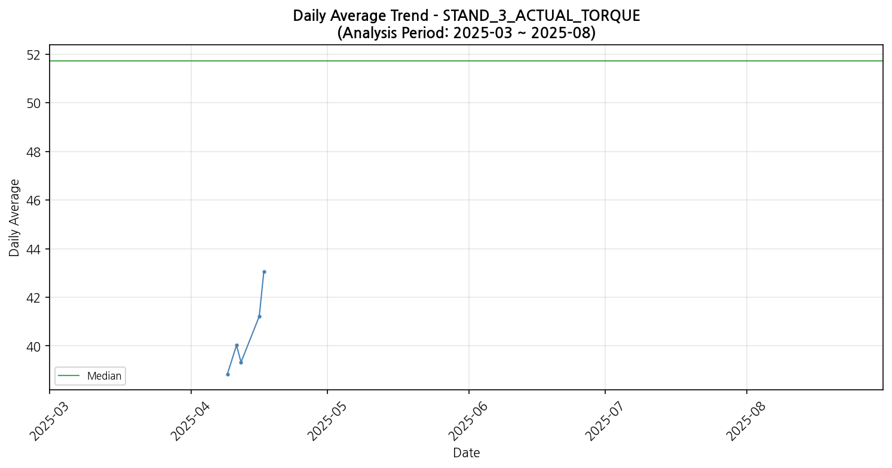

**5. 월별 이상치율 (Monthly Outlier Rate)**

**6. 시간별 패턴 (Hourly Pattern)**

**7. 일별 이상치 수 (Daily Outlier Count)**

**종합 분석 차트**

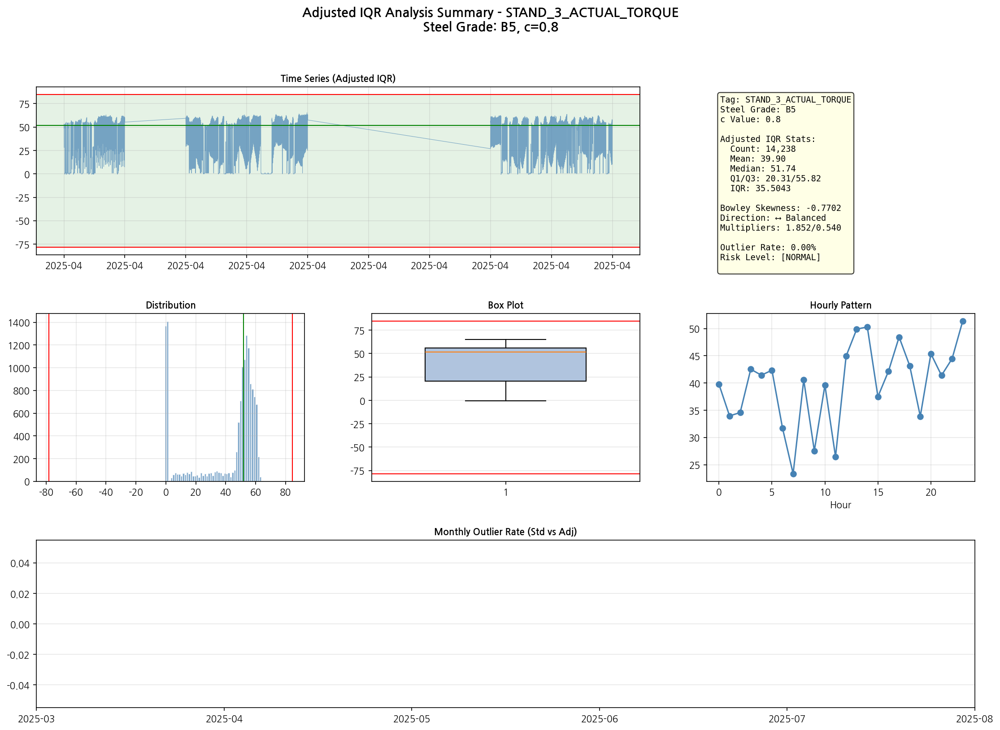

---

##### 월별 상세 분석

**2025-04**

**통계 요약**:

| 지표 | 값 |
|------|-------|
| 분석 레코드 | 14,238 |
| 평균 | 39.9014 |
| 중앙값 | 51.7368 |
| IQR | 35.5043 |
| Bowley 왜도 | -0.7702 |
| Adj 이상치 수 | 0 |
| Adj 이상치율 | 0.00% |
| Std 이상치율 | 0.00% |
| 개선율 | 0.0% |

**1. 시계열 (Time Series)**

**2. 분포 히스토그램 (Distribution Histogram)**

**3. 박스플롯 (Box Plot)**

**4. 일별 평균 추이 (Daily Average Trend)**

**5. 시간별 패턴 (Hourly Pattern)**

**6. 일별 이상치 수 (Daily Outlier Count)**

**월별 종합 차트**

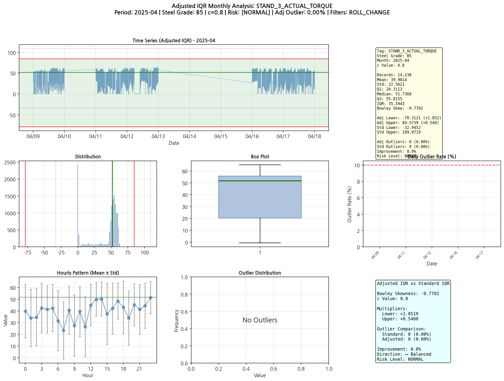

---

#### STAND_4_ACTUAL_TORQUE 🟢

**위험도**: [NORMAL] | **이상치율**: 0.00% | **개선율**: 0.0%
**Bowley 왜도**: -0.8085 | **승수 (L/U)**: 1.909/0.524

**데이터**: 원본 14,391 → 필터 후 14,238 (1.1% 제외)

| 통계 지표 | Adjusted IQR | Standard IQR |
|-----------|--------------|--------------|
| 이상치 수 | 0 | 0 |
| 이상치율 | 0.00% | 0.00% |
| 하한 경계 | -75.9374 | -29.9291 |
| 상한 경계 | 80.8744 | 104.9689 |

| 기본 통계 | 값 |
|-----------|-------|
| 분석 레코드 | 14,238 |
| 평균 | 38.9595 |
| 표준편차 | 21.8444 |
| Q1 (25%) | 20.6577 |
| 중앙값 | 51.1539 |
| Q3 (75%) | 54.3822 |
| IQR | 33.7245 |

**월별 이상치 추이**:

| 월 | 레코드 수 | 평균 | Adj 이상치율 | Std 이상치율 |
|-----|-----------|------|--------------|---------------|
| 2025-04 | 14,238 | 38.96 | 0.00% | 0.00% |

##### 차트 분석

**1. 시계열 (Time Series)**

**2. 분포 히스토그램 (Distribution Histogram)**

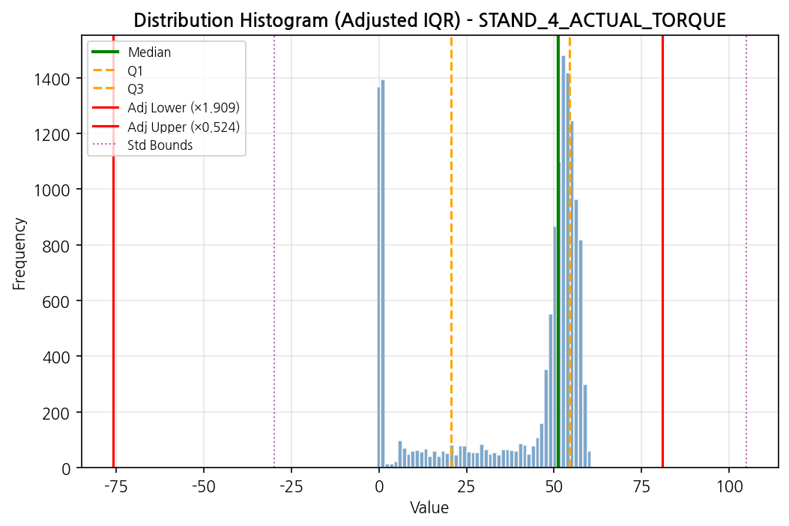

**3. 박스플롯 (Box Plot)**

**4. 일별 평균 추이 (Daily Average Trend)**

**5. 월별 이상치율 (Monthly Outlier Rate)**

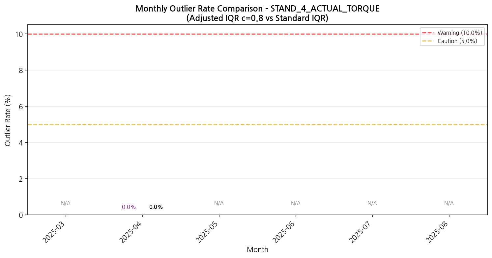

**6. 시간별 패턴 (Hourly Pattern)**

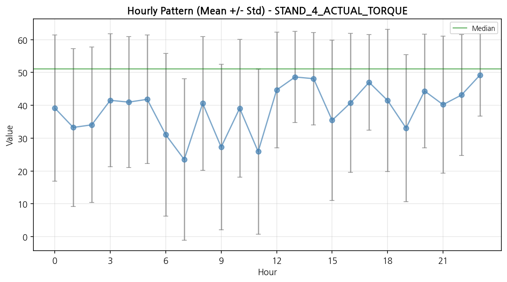

**7. 일별 이상치 수 (Daily Outlier Count)**

**종합 분석 차트**

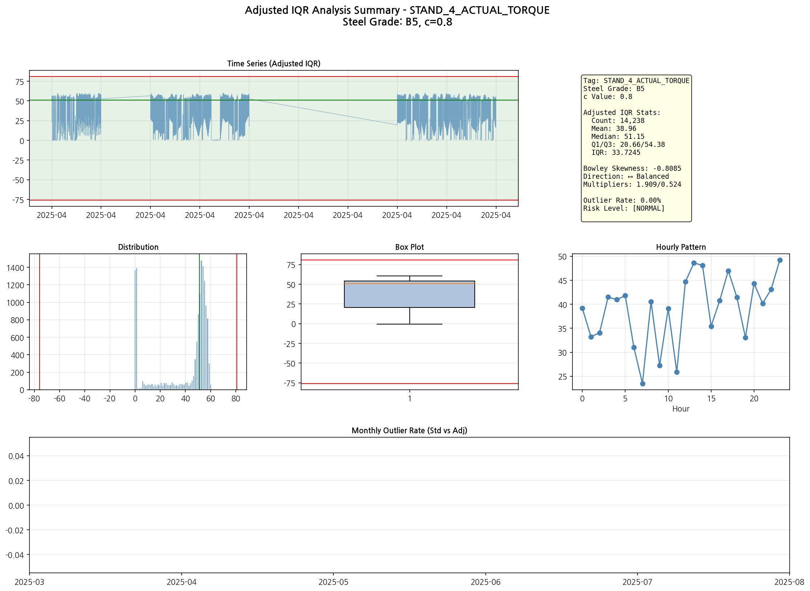

---

##### 월별 상세 분석

**2025-04**

**통계 요약**:

| 지표 | 값 |
|------|-------|
| 분석 레코드 | 14,238 |
| 평균 | 38.9595 |
| 중앙값 | 51.1539 |
| IQR | 33.7245 |
| Bowley 왜도 | -0.8085 |
| Adj 이상치 수 | 0 |
| Adj 이상치율 | 0.00% |
| Std 이상치율 | 0.00% |
| 개선율 | 0.0% |

**1. 시계열 (Time Series)**

**2. 분포 히스토그램 (Distribution Histogram)**

**3. 박스플롯 (Box Plot)**

**4. 일별 평균 추이 (Daily Average Trend)**

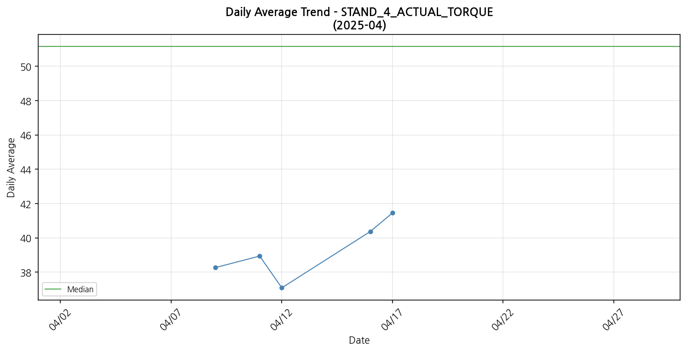

**5. 시간별 패턴 (Hourly Pattern)**

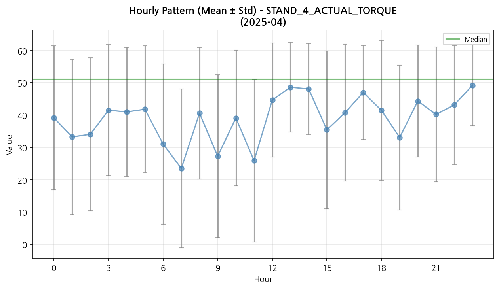

**6. 일별 이상치 수 (Daily Outlier Count)**

**월별 종합 차트**

---

#### STAND_5_ACTUAL_TORQUE 🟢

**위험도**: [NORMAL] | **이상치율**: 0.00% | **개선율**: 0.0%
**Bowley 왜도**: -0.7046 | **승수 (L/U)**: 1.757/0.569

**데이터**: 원본 14,391 → 필터 후 14,238 (1.1% 제외)

| 통계 지표 | Adjusted IQR | Standard IQR |
|-----------|--------------|--------------|
| 이상치 수 | 0 | 0 |
| 이상치율 | 0.00% | 0.00% |
| 하한 경계 | -74.1786 | -33.6820 |
| 상한 경계 | 85.9037 | 108.9508 |

| 기본 통계 | 값 |
|-----------|-------|
| 분석 레코드 | 14,238 |
| 평균 | 38.9930 |
| 표준편차 | 22.2038 |
| Q1 (25%) | 19.8053 |
| 중앙값 | 50.1968 |
| Q3 (75%) | 55.4635 |
| IQR | 35.6582 |

**월별 이상치 추이**:

| 월 | 레코드 수 | 평균 | Adj 이상치율 | Std 이상치율 |
|-----|-----------|------|--------------|---------------|
| 2025-04 | 14,238 | 38.99 | 0.00% | 0.00% |

##### 차트 분석

**1. 시계열 (Time Series)**

**2. 분포 히스토그램 (Distribution Histogram)**

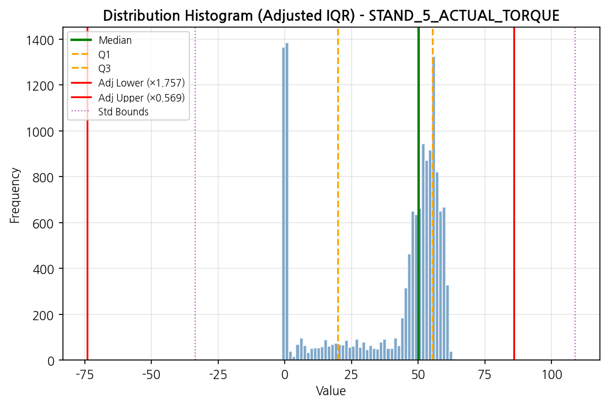

**3. 박스플롯 (Box Plot)**

**4. 일별 평균 추이 (Daily Average Trend)**

**5. 월별 이상치율 (Monthly Outlier Rate)**

**6. 시간별 패턴 (Hourly Pattern)**

**7. 일별 이상치 수 (Daily Outlier Count)**

**종합 분석 차트**

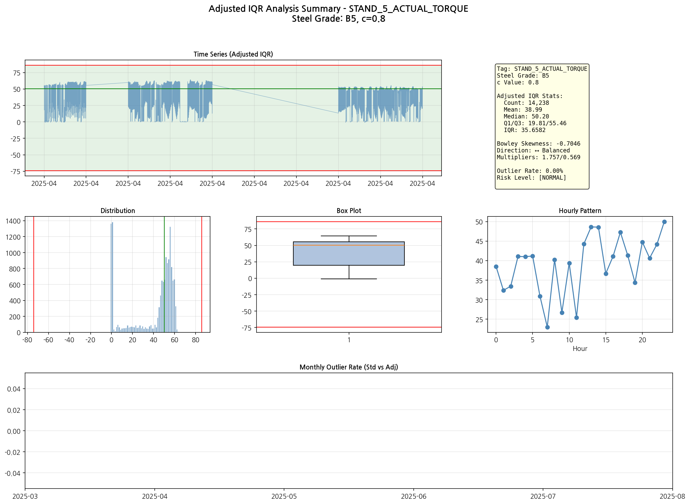

---

##### 월별 상세 분석

**2025-04**

**통계 요약**:

| 지표 | 값 |
|------|-------|
| 분석 레코드 | 14,238 |
| 평균 | 38.9930 |
| 중앙값 | 50.1968 |
| IQR | 35.6582 |
| Bowley 왜도 | -0.7046 |
| Adj 이상치 수 | 0 |
| Adj 이상치율 | 0.00% |
| Std 이상치율 | 0.00% |
| 개선율 | 0.0% |

**1. 시계열 (Time Series)**

**2. 분포 히스토그램 (Distribution Histogram)**

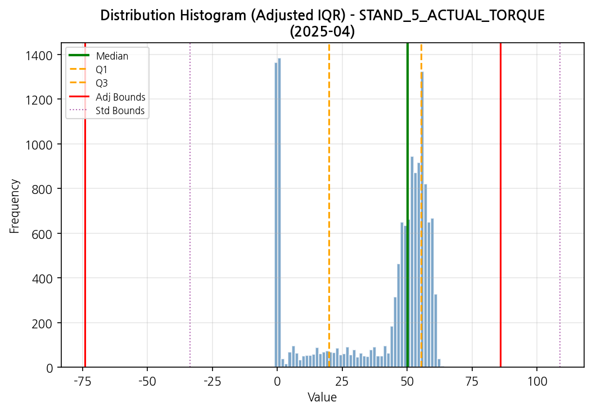

**3. 박스플롯 (Box Plot)**

**4. 일별 평균 추이 (Daily Average Trend)**

**5. 시간별 패턴 (Hourly Pattern)**

**6. 일별 이상치 수 (Daily Outlier Count)**

**월별 종합 차트**

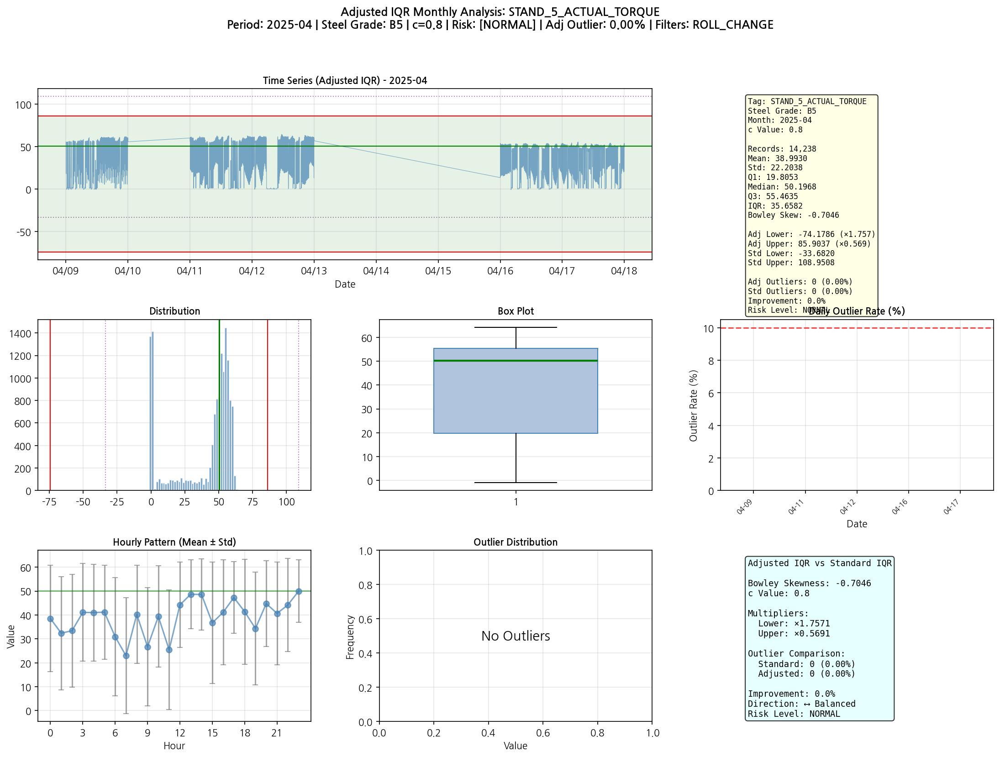

---

#### STAND_6_ACTUAL_TORQUE 🟢

**위험도**: [NORMAL] | **이상치율**: 0.00% | **개선율**: 0.0%
**Bowley 왜도**: -0.8014 | **승수 (L/U)**: 1.899/0.527

**데이터**: 원본 14,391 → 필터 후 14,238 (1.1% 제외)

| 통계 지표 | Adjusted IQR | Standard IQR |
|-----------|--------------|--------------|
| 이상치 수 | 0 | 0 |
| 이상치율 | 0.00% | 0.00% |
| 하한 경계 | -63.9544 | -25.0322 |
| 상한 경계 | 69.9775 | 90.4785 |

| 기본 통계 | 값 |
|-----------|-------|
| 분석 레코드 | 14,238 |
| 평균 | 33.8419 |
| 표준편차 | 18.8083 |
| Q1 (25%) | 18.2843 |
| 중앙값 | 44.2940 |
| Q3 (75%) | 47.1620 |
| IQR | 28.8777 |

**월별 이상치 추이**:

| 월 | 레코드 수 | 평균 | Adj 이상치율 | Std 이상치율 |
|-----|-----------|------|--------------|---------------|
| 2025-04 | 14,238 | 33.84 | 0.00% | 0.00% |

##### 차트 분석

**1. 시계열 (Time Series)**

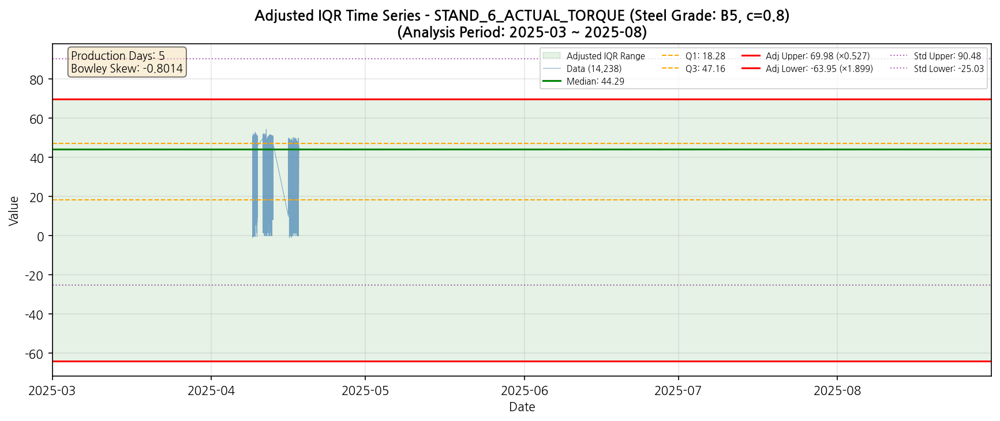

**2. 분포 히스토그램 (Distribution Histogram)**

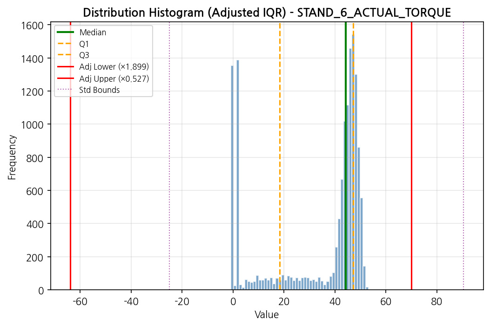

**3. 박스플롯 (Box Plot)**

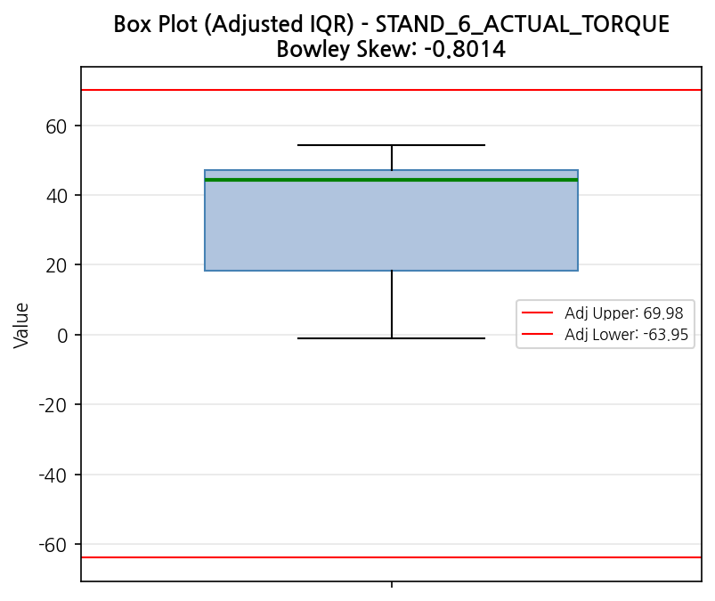

**4. 일별 평균 추이 (Daily Average Trend)**

**5. 월별 이상치율 (Monthly Outlier Rate)**

**6. 시간별 패턴 (Hourly Pattern)**

**7. 일별 이상치 수 (Daily Outlier Count)**

**종합 분석 차트**

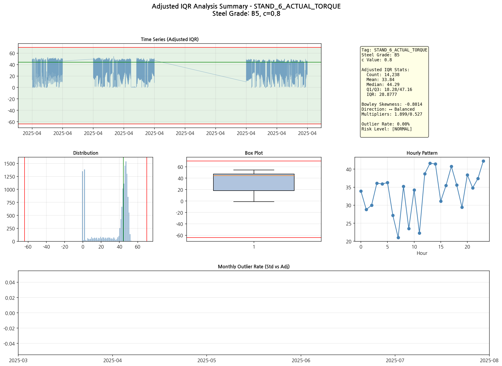

---

##### 월별 상세 분석

**2025-04**

**통계 요약**:

| 지표 | 값 |
|------|-------|
| 분석 레코드 | 14,238 |
| 평균 | 33.8419 |
| 중앙값 | 44.2940 |
| IQR | 28.8777 |
| Bowley 왜도 | -0.8014 |
| Adj 이상치 수 | 0 |
| Adj 이상치율 | 0.00% |
| Std 이상치율 | 0.00% |
| 개선율 | 0.0% |

**1. 시계열 (Time Series)**

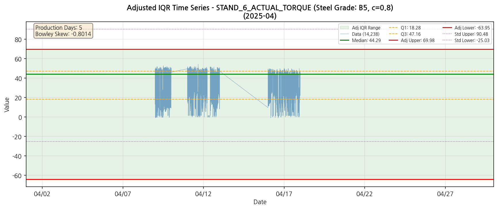

**2. 분포 히스토그램 (Distribution Histogram)**

**3. 박스플롯 (Box Plot)**

**4. 일별 평균 추이 (Daily Average Trend)**

**5. 시간별 패턴 (Hourly Pattern)**

**6. 일별 이상치 수 (Daily Outlier Count)**

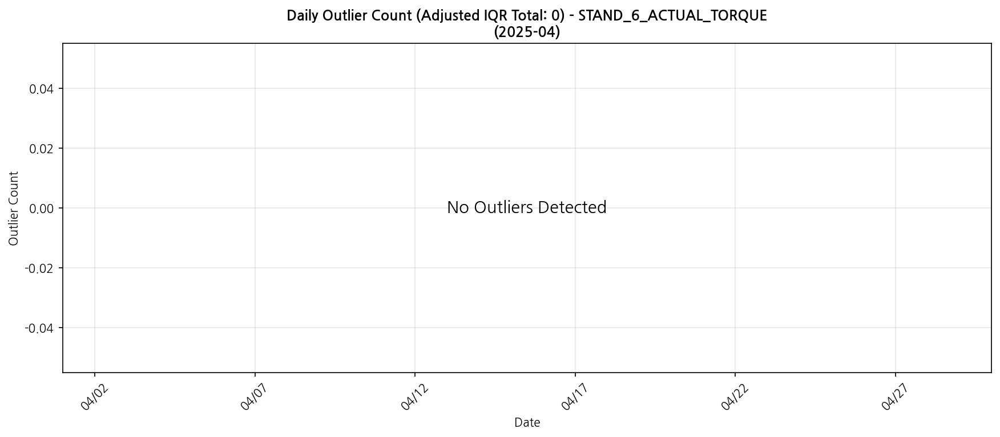

**월별 종합 차트**

---

#### STAND_7_ACTUAL_TORQUE 🟢

**위험도**: [NORMAL] | **이상치율**: 0.00% | **개선율**: 0.0%
**Bowley 왜도**: -0.7598 | **승수 (L/U)**: 1.836/0.545

**데이터**: 원본 14,391 → 필터 후 14,238 (1.1% 제외)

| 통계 지표 | Adjusted IQR | Standard IQR |
|-----------|--------------|--------------|
| 이상치 수 | 0 | 0 |
| 이상치율 | 0.00% | 0.00% |
| 하한 경계 | -62.5067 | -25.9793 |
| 상한 경계 | 70.5878 | 90.4785 |

| 기본 통계 | 값 |
|-----------|-------|
| 분석 레코드 | 14,238 |
| 평균 | 33.4350 |
| 표준편차 | 18.5843 |
| Q1 (25%) | 17.6924 |
| 중앙값 | 43.3097 |
| Q3 (75%) | 46.8068 |
| IQR | 29.1144 |

**월별 이상치 추이**:

| 월 | 레코드 수 | 평균 | Adj 이상치율 | Std 이상치율 |
|-----|-----------|------|--------------|---------------|
| 2025-04 | 14,238 | 33.44 | 0.00% | 0.00% |

##### 차트 분석

**1. 시계열 (Time Series)**

**2. 분포 히스토그램 (Distribution Histogram)**

**3. 박스플롯 (Box Plot)**

**4. 일별 평균 추이 (Daily Average Trend)**

**5. 월별 이상치율 (Monthly Outlier Rate)**

**6. 시간별 패턴 (Hourly Pattern)**

**7. 일별 이상치 수 (Daily Outlier Count)**

**종합 분석 차트**

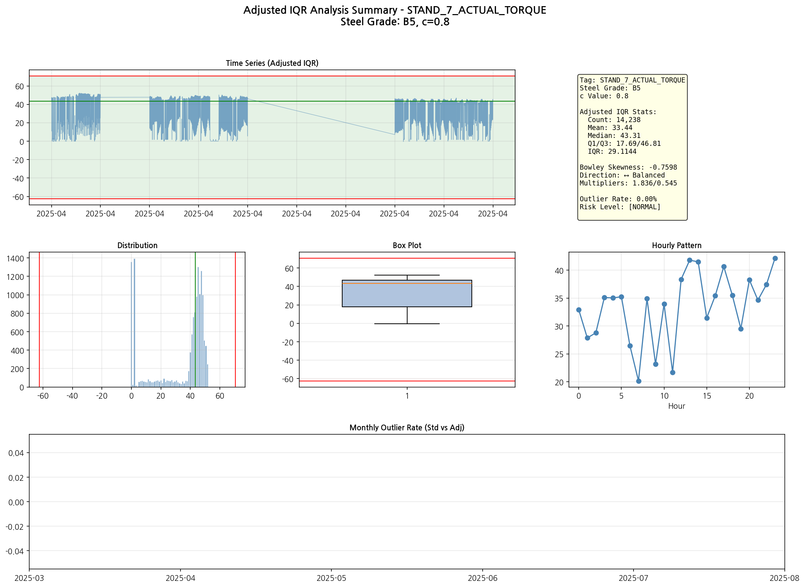

---

##### 월별 상세 분석

**2025-04**

**통계 요약**:

| 지표 | 값 |
|------|-------|
| 분석 레코드 | 14,238 |
| 평균 | 33.4350 |
| 중앙값 | 43.3097 |
| IQR | 29.1144 |
| Bowley 왜도 | -0.7598 |
| Adj 이상치 수 | 0 |
| Adj 이상치율 | 0.00% |
| Std 이상치율 | 0.00% |
| 개선율 | 0.0% |

**1. 시계열 (Time Series)**

**2. 분포 히스토그램 (Distribution Histogram)**

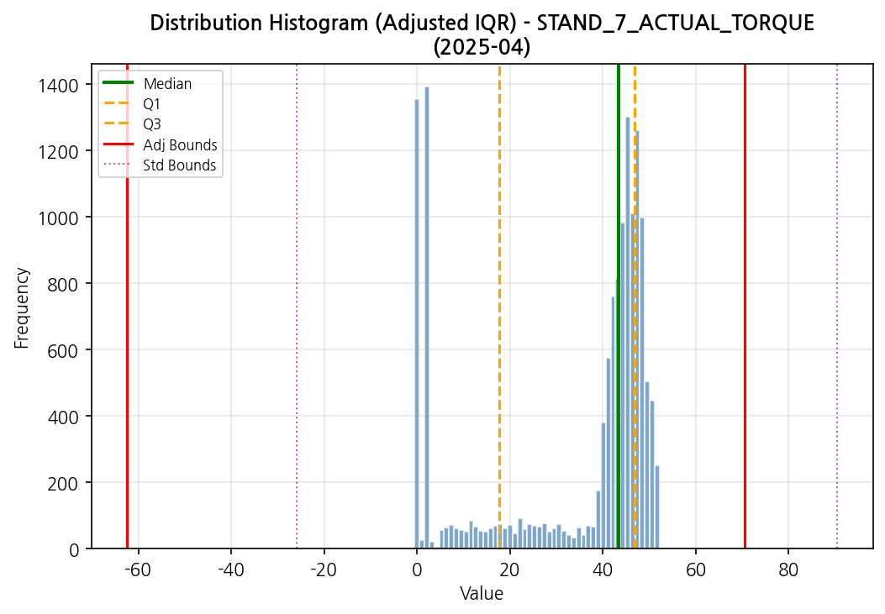

**3. 박스플롯 (Box Plot)**

**4. 일별 평균 추이 (Daily Average Trend)**

**5. 시간별 패턴 (Hourly Pattern)**

**6. 일별 이상치 수 (Daily Outlier Count)**

**월별 종합 차트**

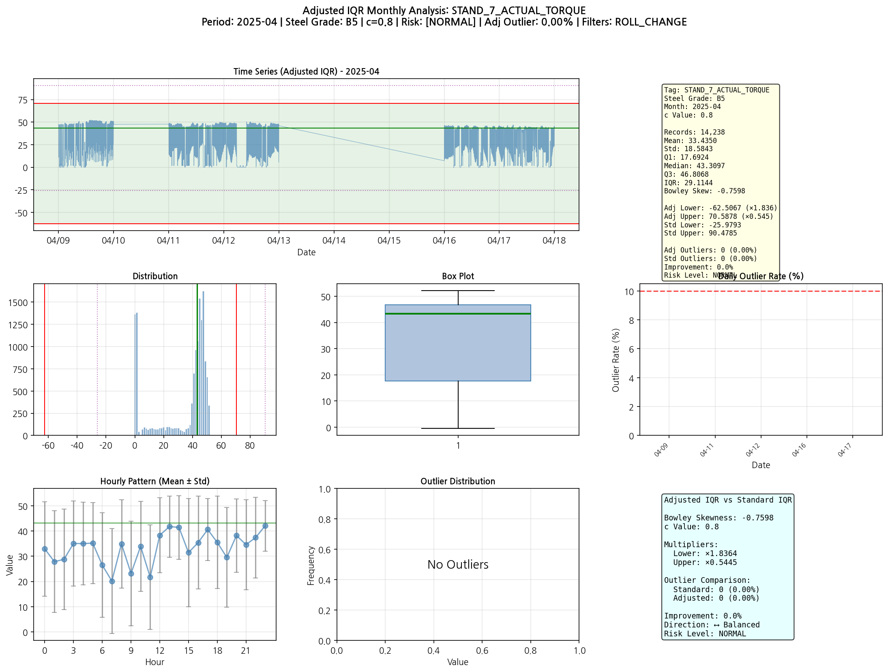

---

#### STAND_8_ACTUAL_TORQUE 🟢

**위험도**: [NORMAL] | **이상치율**: 0.00% | **개선율**: 0.0%
**Bowley 왜도**: -0.8009 | **승수 (L/U)**: 1.898/0.527

**데이터**: 원본 14,391 → 필터 후 14,238 (1.1% 제외)

| 통계 지표 | Adjusted IQR | Standard IQR |
|-----------|--------------|--------------|
| 이상치 수 | 0 | 0 |
| 이상치율 | 0.00% | 0.00% |
| 하한 경계 | -58.2337 | -22.6413 |
| 상한 경계 | 64.3111 | 83.0647 |

| 기본 통계 | 값 |
|-----------|-------|
| 분석 레코드 | 14,238 |
| 평균 | 31.4800 |
| 표준편차 | 17.1916 |
| Q1 (25%) | 16.9984 |
| 중앙값 | 40.7946 |
| Q3 (75%) | 43.4249 |
| IQR | 26.4265 |

**월별 이상치 추이**:

| 월 | 레코드 수 | 평균 | Adj 이상치율 | Std 이상치율 |
|-----|-----------|------|--------------|---------------|
| 2025-04 | 14,238 | 31.48 | 0.00% | 0.00% |

##### 차트 분석

**1. 시계열 (Time Series)**

**2. 분포 히스토그램 (Distribution Histogram)**

**3. 박스플롯 (Box Plot)**

**4. 일별 평균 추이 (Daily Average Trend)**

**5. 월별 이상치율 (Monthly Outlier Rate)**

**6. 시간별 패턴 (Hourly Pattern)**

**7. 일별 이상치 수 (Daily Outlier Count)**

**종합 분석 차트**

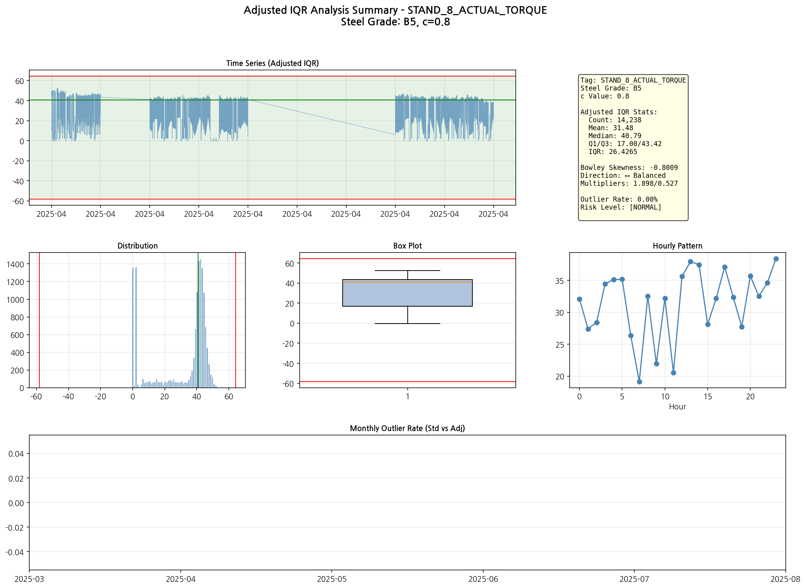

---

##### 월별 상세 분석

**2025-04**

**통계 요약**:

| 지표 | 값 |
|------|-------|
| 분석 레코드 | 14,238 |
| 평균 | 31.4800 |
| 중앙값 | 40.7946 |
| IQR | 26.4265 |
| Bowley 왜도 | -0.8009 |
| Adj 이상치 수 | 0 |
| Adj 이상치율 | 0.00% |
| Std 이상치율 | 0.00% |
| 개선율 | 0.0% |

**1. 시계열 (Time Series)**

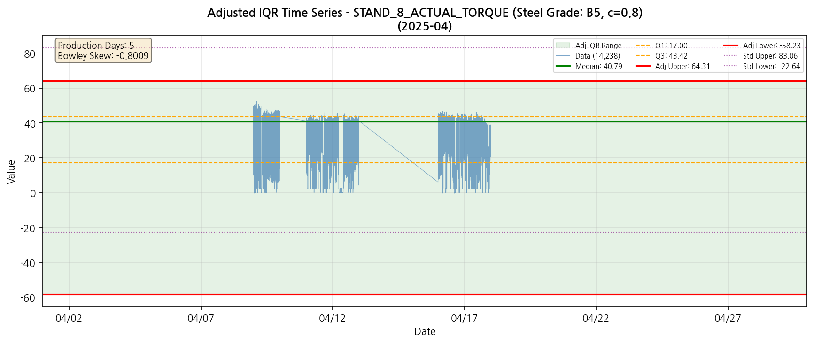

**2. 분포 히스토그램 (Distribution Histogram)**

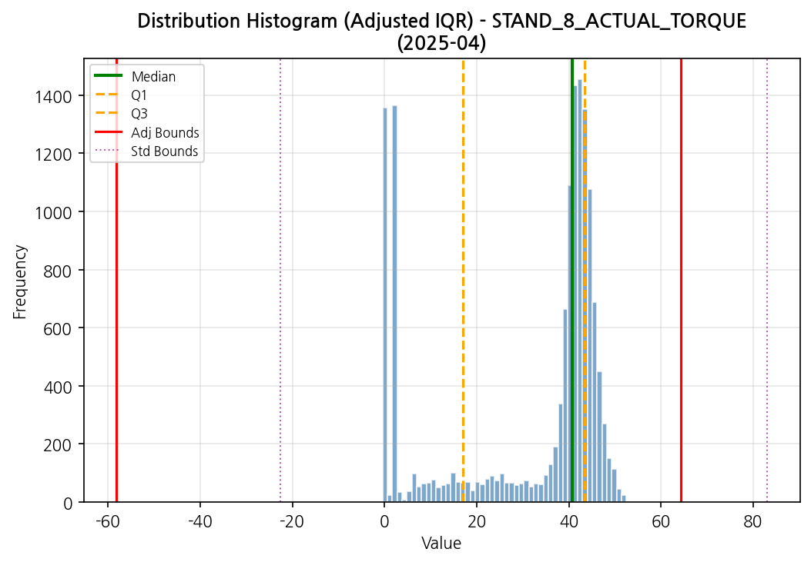

**3. 박스플롯 (Box Plot)**

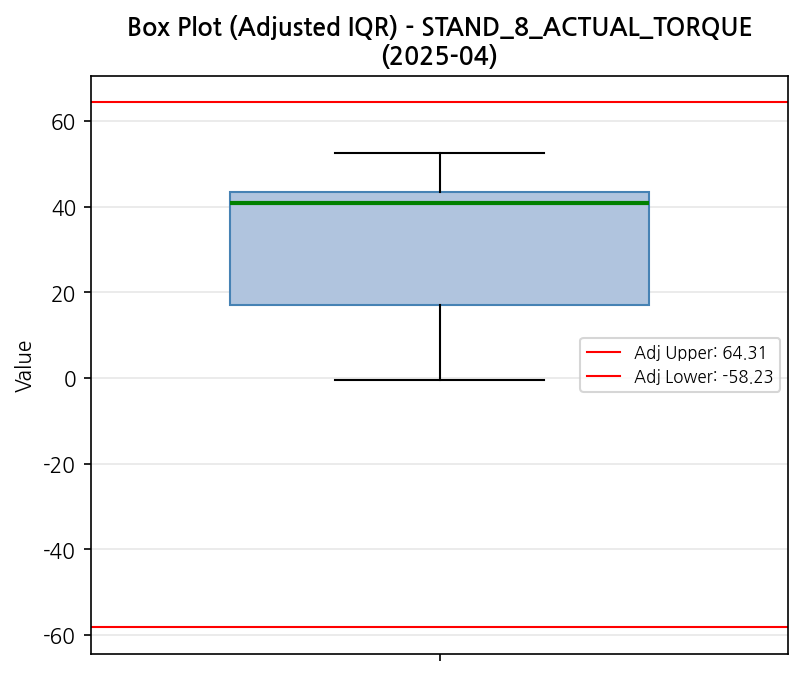

**4. 일별 평균 추이 (Daily Average Trend)**

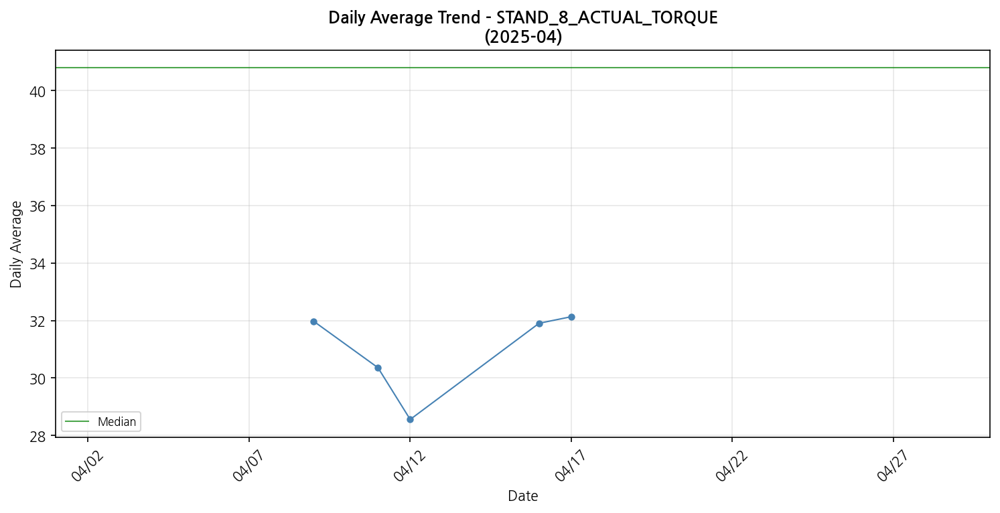

**5. 시간별 패턴 (Hourly Pattern)**

**6. 일별 이상치 수 (Daily Outlier Count)**

**월별 종합 차트**

---

#### STAND_9_ACTUAL_TORQUE 🟢

**위험도**: [NORMAL] | **이상치율**: 0.00% | **개선율**: 0.0%
**Bowley 왜도**: -0.8289 | **승수 (L/U)**: 1.941/0.515

**데이터**: 원본 14,391 → 필터 후 14,238 (1.1% 제외)

| 통계 지표 | Adjusted IQR | Standard IQR |
|-----------|--------------|--------------|
| 이상치 수 | 0 | 0 |
| 이상치율 | 0.00% | 0.00% |
| 하한 경계 | -92.7658 | -37.2207 |
| 상한 경계 | 91.5882 | 120.2068 |

| 기본 통계 | 값 |
|-----------|-------|
| 분석 레코드 | 14,238 |
| 평균 | 43.6289 |
| 표준편차 | 24.7870 |
| Q1 (25%) | 21.8146 |
| 중앙값 | 57.8050 |
| Q3 (75%) | 61.1715 |
| IQR | 39.3569 |

**월별 이상치 추이**:

| 월 | 레코드 수 | 평균 | Adj 이상치율 | Std 이상치율 |
|-----|-----------|------|--------------|---------------|
| 2025-04 | 14,238 | 43.63 | 0.00% | 0.00% |

##### 차트 분석

**1. 시계열 (Time Series)**

**2. 분포 히스토그램 (Distribution Histogram)**

**3. 박스플롯 (Box Plot)**

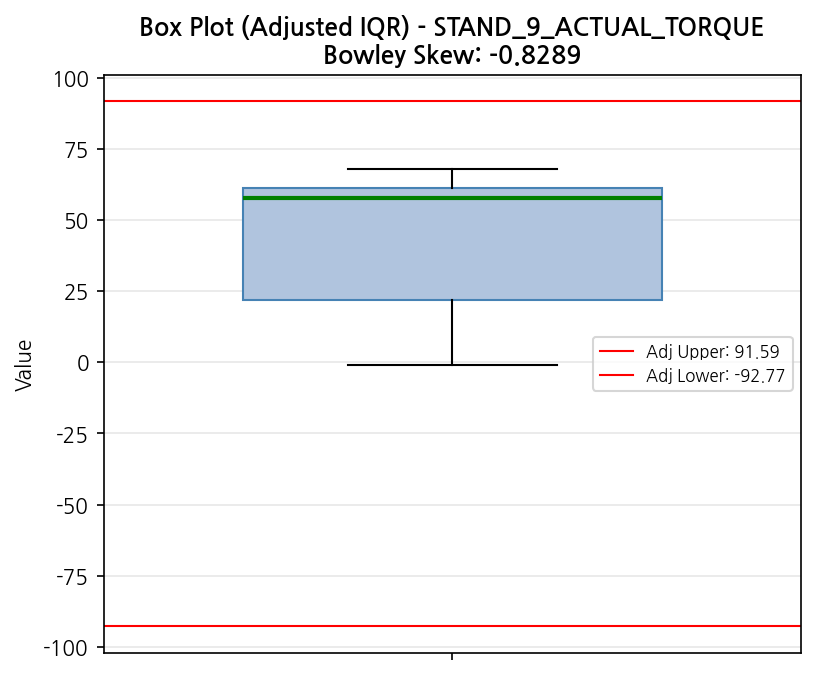

**4. 일별 평균 추이 (Daily Average Trend)**

**5. 월별 이상치율 (Monthly Outlier Rate)**

**6. 시간별 패턴 (Hourly Pattern)**

**7. 일별 이상치 수 (Daily Outlier Count)**

**종합 분석 차트**

---

##### 월별 상세 분석

**2025-04**

**통계 요약**:

| 지표 | 값 |
|------|-------|
| 분석 레코드 | 14,238 |
| 평균 | 43.6289 |
| 중앙값 | 57.8050 |
| IQR | 39.3569 |
| Bowley 왜도 | -0.8289 |
| Adj 이상치 수 | 0 |
| Adj 이상치율 | 0.00% |
| Std 이상치율 | 0.00% |
| 개선율 | 0.0% |

**1. 시계열 (Time Series)**

**2. 분포 히스토그램 (Distribution Histogram)**

**3. 박스플롯 (Box Plot)**

**4. 일별 평균 추이 (Daily Average Trend)**

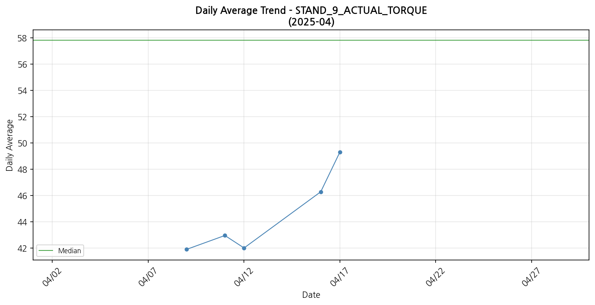

**5. 시간별 패턴 (Hourly Pattern)**

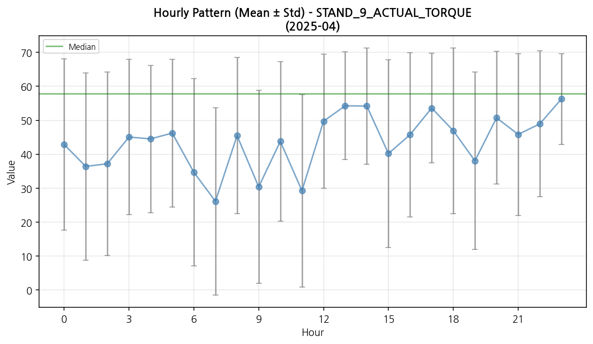

**6. 일별 이상치 수 (Daily Outlier Count)**

**월별 종합 차트**

---

#### STAND_10_ACTUAL_TORQUE 🟢

**위험도**: [NORMAL] | **이상치율**: 0.00% | **개선율**: 0.0%
**Bowley 왜도**: -0.8782 | **승수 (L/U)**: 2.019/0.495

**데이터**: 원본 14,391 → 필터 후 14,238 (1.1% 제외)

| 통계 지표 | Adjusted IQR | Standard IQR |
|-----------|--------------|--------------|
| 이상치 수 | 0 | 0 |
| 이상치율 | 0.00% | 0.00% |
| 하한 경계 | -95.4866 | -35.1095 |
| 상한 경계 | 93.0012 | 122.9068 |

| 기본 통계 | 값 |
|-----------|-------|
| 분석 레코드 | 14,238 |
| 평균 | 45.9601 |
| 표준편차 | 25.6162 |
| Q1 (25%) | 24.1466 |
| 중앙값 | 61.2450 |
| Q3 (75%) | 63.6507 |
| IQR | 39.5041 |

**월별 이상치 추이**:

| 월 | 레코드 수 | 평균 | Adj 이상치율 | Std 이상치율 |
|-----|-----------|------|--------------|---------------|
| 2025-04 | 14,238 | 45.96 | 0.00% | 0.00% |

##### 차트 분석

**1. 시계열 (Time Series)**

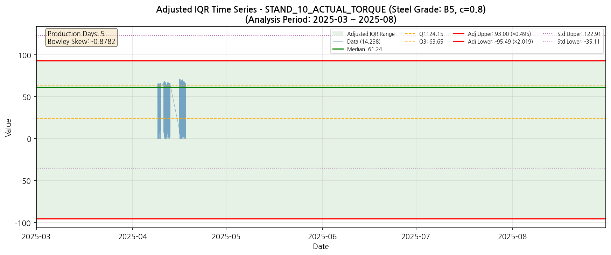

**2. 분포 히스토그램 (Distribution Histogram)**

**3. 박스플롯 (Box Plot)**

**4. 일별 평균 추이 (Daily Average Trend)**

**5. 월별 이상치율 (Monthly Outlier Rate)**

**6. 시간별 패턴 (Hourly Pattern)**

**7. 일별 이상치 수 (Daily Outlier Count)**

**종합 분석 차트**

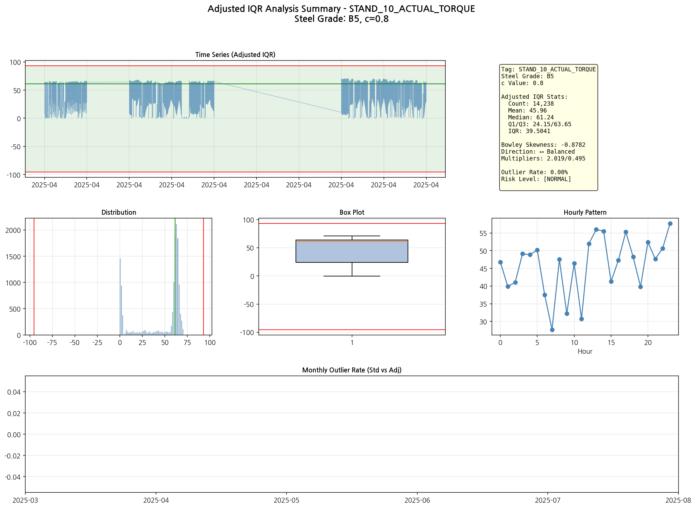

---

##### 월별 상세 분석

**2025-04**

**통계 요약**:

| 지표 | 값 |
|------|-------|
| 분석 레코드 | 14,238 |
| 평균 | 45.9601 |
| 중앙값 | 61.2450 |
| IQR | 39.5041 |
| Bowley 왜도 | -0.8782 |
| Adj 이상치 수 | 0 |
| Adj 이상치율 | 0.00% |
| Std 이상치율 | 0.00% |
| 개선율 | 0.0% |

**1. 시계열 (Time Series)**

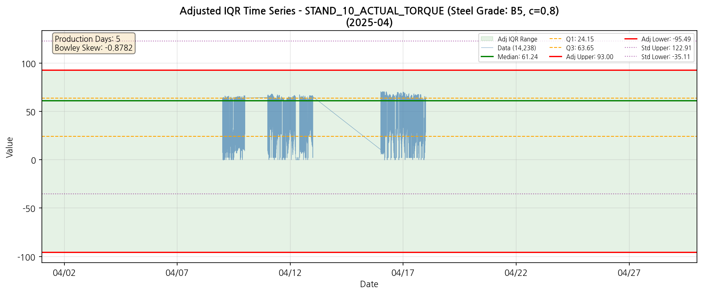

**2. 분포 히스토그램 (Distribution Histogram)**

**3. 박스플롯 (Box Plot)**

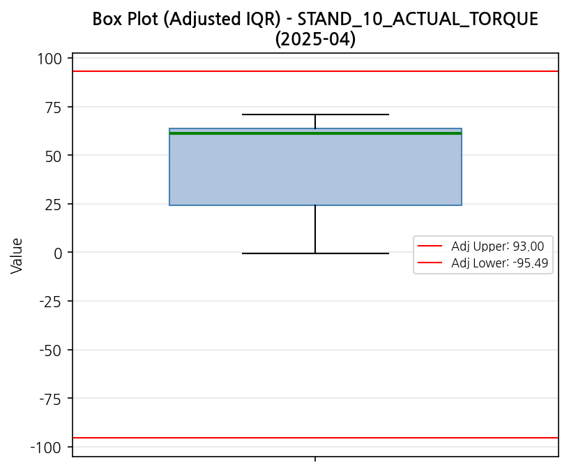

**4. 일별 평균 추이 (Daily Average Trend)**

**5. 시간별 패턴 (Hourly Pattern)**

**6. 일별 이상치 수 (Daily Outlier Count)**

**월별 종합 차트**

---

#### STAND_1_LOAD 🟢

**위험도**: [NORMAL] | **이상치율**: 0.00% | **개선율**: 0.0%
**Bowley 왜도**: -1.0000 | **승수 (L/U)**: 2.226/0.449

**데이터**: 원본 14,391 → 필터 후 14,238 (1.1% 제외)

| 통계 지표 | Adjusted IQR | Standard IQR |
|-----------|--------------|--------------|
| 이상치 수 | 0 | 0 |
| 이상치율 | 0.00% | 0.00% |
| 하한 경계 | -1.5341 | -0.4603 |
| 상한 경계 | 1.3937 | 1.8762 |

| 기본 통계 | 값 |
|-----------|-------|
| 분석 레코드 | 14,238 |
| 평균 | 0.7353 |
| 표준편차 | 0.4054 |
| Q1 (25%) | 0.4159 |
| 중앙값 | 1.0000 |
| Q3 (75%) | 1.0000 |
| IQR | 0.5841 |

**월별 이상치 추이**:

| 월 | 레코드 수 | 평균 | Adj 이상치율 | Std 이상치율 |
|-----|-----------|------|--------------|---------------|
| 2025-04 | 14,238 | 0.74 | 0.00% | 0.00% |

##### 차트 분석

**1. 시계열 (Time Series)**

**2. 분포 히스토그램 (Distribution Histogram)**

**3. 박스플롯 (Box Plot)**

**4. 일별 평균 추이 (Daily Average Trend)**

**5. 월별 이상치율 (Monthly Outlier Rate)**

**6. 시간별 패턴 (Hourly Pattern)**

**7. 일별 이상치 수 (Daily Outlier Count)**

**종합 분석 차트**

---

##### 월별 상세 분석

**2025-04**

**통계 요약**:

| 지표 | 값 |
|------|-------|
| 분석 레코드 | 14,238 |
| 평균 | 0.7353 |
| 중앙값 | 1.0000 |
| IQR | 0.5841 |
| Bowley 왜도 | -1.0000 |
| Adj 이상치 수 | 0 |
| Adj 이상치율 | 0.00% |
| Std 이상치율 | 0.00% |
| 개선율 | 0.0% |

**1. 시계열 (Time Series)**

**2. 분포 히스토그램 (Distribution Histogram)**

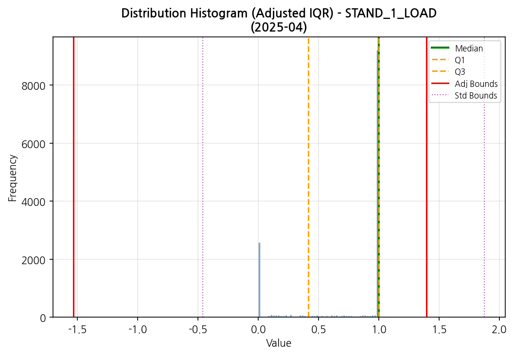

**3. 박스플롯 (Box Plot)**

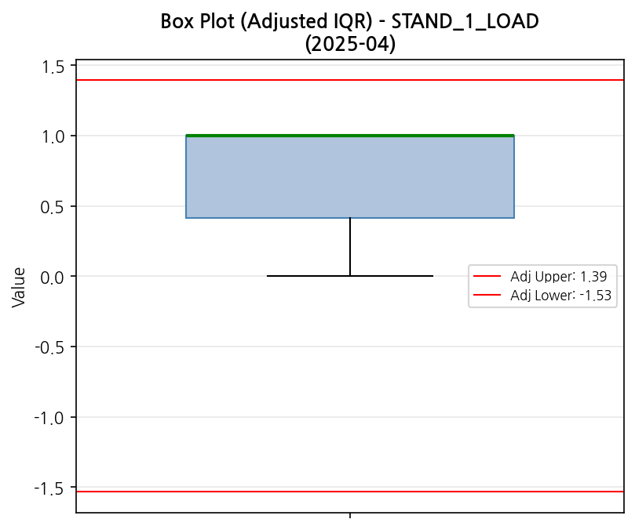

**4. 일별 평균 추이 (Daily Average Trend)**

**5. 시간별 패턴 (Hourly Pattern)**

**6. 일별 이상치 수 (Daily Outlier Count)**

**월별 종합 차트**

---

#### STAND_12_LOAD 🟢

**위험도**: [NORMAL] | **이상치율**: 0.00% | **개선율**: 0.0%
**Bowley 왜도**: -1.0000 | **승수 (L/U)**: 2.226/0.449

**데이터**: 원본 14,391 → 필터 후 14,238 (1.1% 제외)

| 통계 지표 | Adjusted IQR | Standard IQR |
|-----------|--------------|--------------|
| 이상치 수 | 0 | 0 |
| 이상치율 | 0.00% | 0.00% |
| 하한 경계 | -1.5726 | -0.4825 |
| 상한 경계 | 1.3997 | 1.8895 |

| 기본 통계 | 값 |
|-----------|-------|
| 분석 레코드 | 14,238 |
| 평균 | 0.7331 |
| 표준편차 | 0.4065 |
| Q1 (25%) | 0.4070 |
| 중앙값 | 1.0000 |
| Q3 (75%) | 1.0000 |
| IQR | 0.5930 |

**월별 이상치 추이**:

| 월 | 레코드 수 | 평균 | Adj 이상치율 | Std 이상치율 |
|-----|-----------|------|--------------|---------------|
| 2025-04 | 14,238 | 0.73 | 0.00% | 0.00% |

##### 차트 분석

**1. 시계열 (Time Series)**

**2. 분포 히스토그램 (Distribution Histogram)**

**3. 박스플롯 (Box Plot)**

**4. 일별 평균 추이 (Daily Average Trend)**

**5. 월별 이상치율 (Monthly Outlier Rate)**

**6. 시간별 패턴 (Hourly Pattern)**

**7. 일별 이상치 수 (Daily Outlier Count)**

**종합 분석 차트**

---

##### 월별 상세 분석

**2025-04**

**통계 요약**:

| 지표 | 값 |
|------|-------|
| 분석 레코드 | 14,238 |
| 평균 | 0.7331 |
| 중앙값 | 1.0000 |
| IQR | 0.5930 |
| Bowley 왜도 | -1.0000 |
| Adj 이상치 수 | 0 |
| Adj 이상치율 | 0.00% |
| Std 이상치율 | 0.00% |
| 개선율 | 0.0% |

**1. 시계열 (Time Series)**

**2. 분포 히스토그램 (Distribution Histogram)**

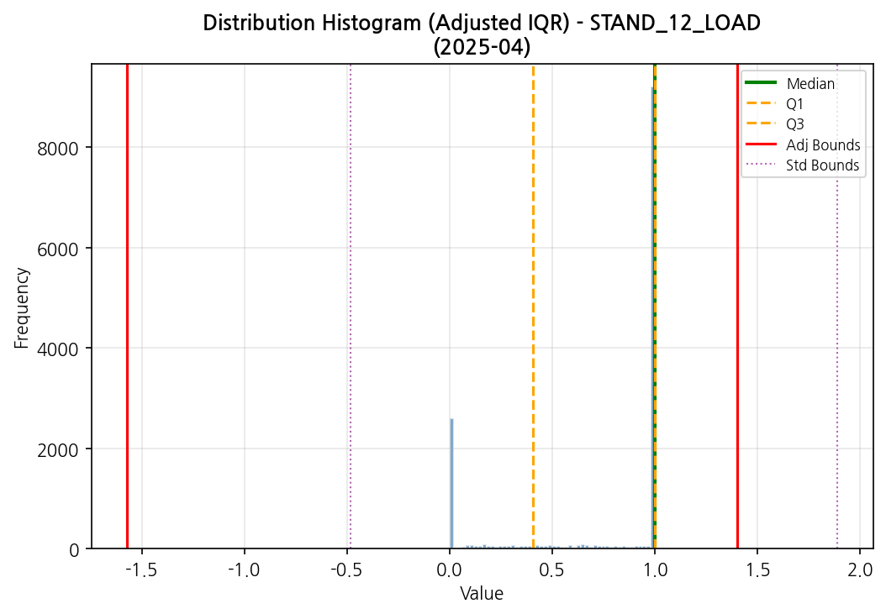

**3. 박스플롯 (Box Plot)**

**4. 일별 평균 추이 (Daily Average Trend)**

**5. 시간별 패턴 (Hourly Pattern)**

**6. 일별 이상치 수 (Daily Outlier Count)**

**월별 종합 차트**

---

#### STAND_11_LOAD 🟢

**위험도**: [NORMAL] | **이상치율**: 0.00% | **개선율**: 0.0%
**Bowley 왜도**: -1.0000 | **승수 (L/U)**: 2.226/0.449

**데이터**: 원본 14,391 → 필터 후 14,238 (1.1% 제외)

| 통계 지표 | Adjusted IQR | Standard IQR |
|-----------|--------------|--------------|
| 이상치 수 | 0 | 0 |
| 이상치율 | 0.00% | 0.00% |
| 하한 경계 | -1.5755 | -0.4842 |
| 상한 경계 | 1.4001 | 1.8905 |

| 기본 통계 | 값 |
|-----------|-------|
| 분석 레코드 | 14,238 |
| 평균 | 0.7329 |
| 표준편차 | 0.4066 |
| Q1 (25%) | 0.4063 |
| 중앙값 | 1.0000 |
| Q3 (75%) | 1.0000 |
| IQR | 0.5937 |

**월별 이상치 추이**:

| 월 | 레코드 수 | 평균 | Adj 이상치율 | Std 이상치율 |
|-----|-----------|------|--------------|---------------|
| 2025-04 | 14,238 | 0.73 | 0.00% | 0.00% |

##### 차트 분석

**1. 시계열 (Time Series)**

**2. 분포 히스토그램 (Distribution Histogram)**

**3. 박스플롯 (Box Plot)**

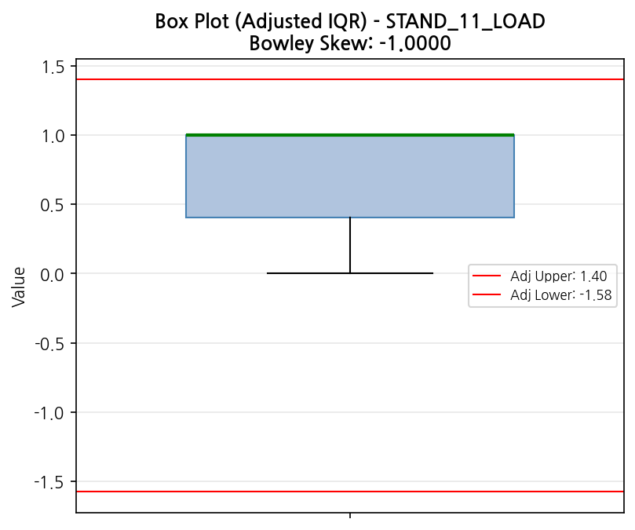

**4. 일별 평균 추이 (Daily Average Trend)**

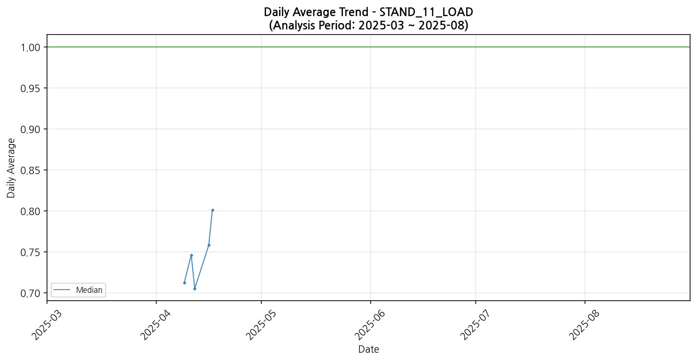

**5. 월별 이상치율 (Monthly Outlier Rate)**

**6. 시간별 패턴 (Hourly Pattern)**

**7. 일별 이상치 수 (Daily Outlier Count)**

**종합 분석 차트**

---

##### 월별 상세 분석

**2025-04**

**통계 요약**:

| 지표 | 값 |
|------|-------|
| 분석 레코드 | 14,238 |
| 평균 | 0.7329 |
| 중앙값 | 1.0000 |
| IQR | 0.5937 |
| Bowley 왜도 | -1.0000 |
| Adj 이상치 수 | 0 |
| Adj 이상치율 | 0.00% |
| Std 이상치율 | 0.00% |
| 개선율 | 0.0% |

**1. 시계열 (Time Series)**

**2. 분포 히스토그램 (Distribution Histogram)**

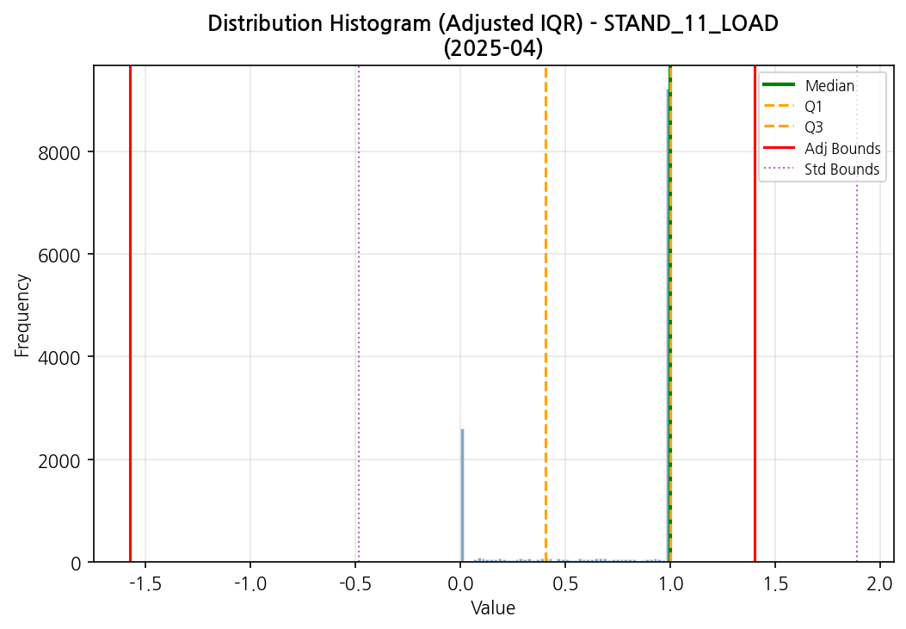

**3. 박스플롯 (Box Plot)**

**4. 일별 평균 추이 (Daily Average Trend)**

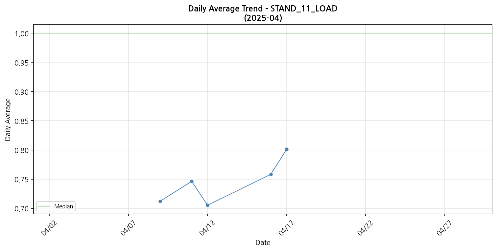

**5. 시간별 패턴 (Hourly Pattern)**

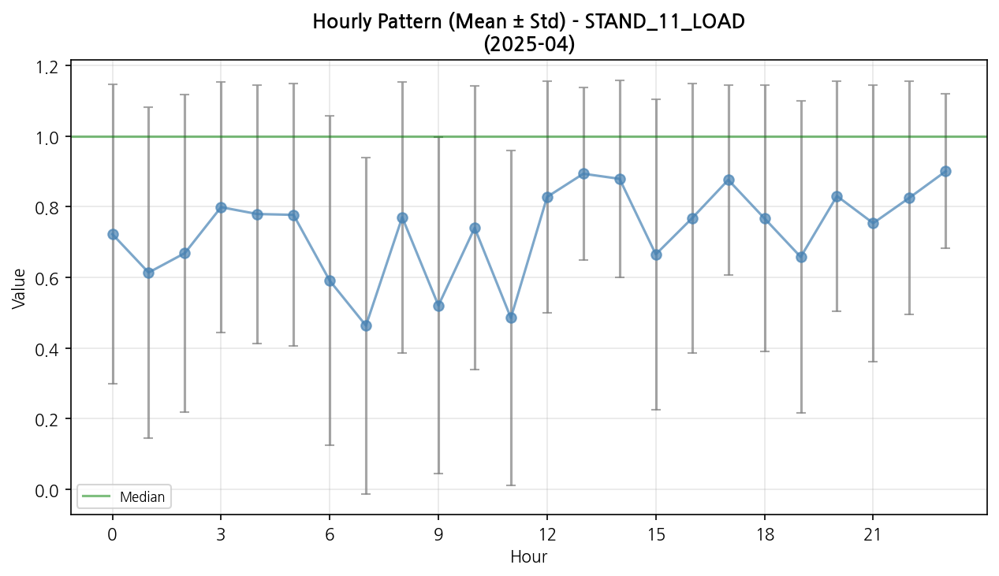

**6. 일별 이상치 수 (Daily Outlier Count)**

**월별 종합 차트**

---

#### STAND_10_LOAD 🟢

**위험도**: [NORMAL] | **이상치율**: 0.00% | **개선율**: 0.0%
**Bowley 왜도**: -1.0000 | **승수 (L/U)**: 2.226/0.449

**데이터**: 원본 14,391 → 필터 후 14,238 (1.1% 제외)

| 통계 지표 | Adjusted IQR | Standard IQR |
|-----------|--------------|--------------|
| 이상치 수 | 0 | 0 |
| 이상치율 | 0.00% | 0.00% |
| 하한 경계 | -1.5719 | -0.4821 |
| 상한 경계 | 1.3996 | 1.8892 |

| 기본 통계 | 값 |
|-----------|-------|
| 분석 레코드 | 14,238 |
| 평균 | 0.7332 |
| 표준편차 | 0.4065 |
| Q1 (25%) | 0.4072 |
| 중앙값 | 1.0000 |
| Q3 (75%) | 1.0000 |
| IQR | 0.5928 |

**월별 이상치 추이**:

| 월 | 레코드 수 | 평균 | Adj 이상치율 | Std 이상치율 |
|-----|-----------|------|--------------|---------------|
| 2025-04 | 14,238 | 0.73 | 0.00% | 0.00% |

##### 차트 분석

**1. 시계열 (Time Series)**

**2. 분포 히스토그램 (Distribution Histogram)**

**3. 박스플롯 (Box Plot)**

**4. 일별 평균 추이 (Daily Average Trend)**

**5. 월별 이상치율 (Monthly Outlier Rate)**

**6. 시간별 패턴 (Hourly Pattern)**

**7. 일별 이상치 수 (Daily Outlier Count)**

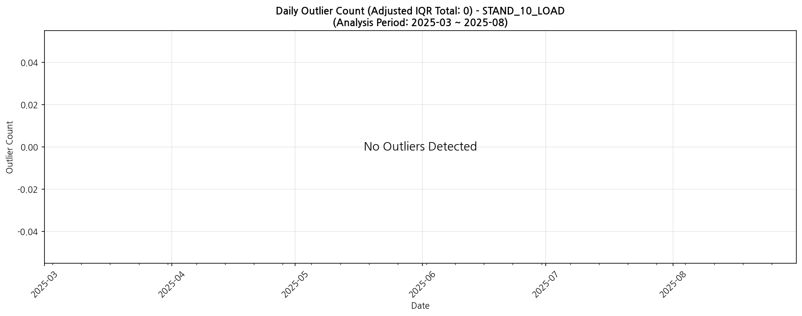

**종합 분석 차트**

---

##### 월별 상세 분석

**2025-04**

**통계 요약**:

| 지표 | 값 |
|------|-------|
| 분석 레코드 | 14,238 |
| 평균 | 0.7332 |
| 중앙값 | 1.0000 |
| IQR | 0.5928 |
| Bowley 왜도 | -1.0000 |
| Adj 이상치 수 | 0 |
| Adj 이상치율 | 0.00% |
| Std 이상치율 | 0.00% |
| 개선율 | 0.0% |

**1. 시계열 (Time Series)**

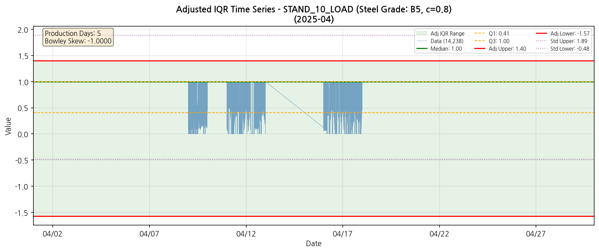

**2. 분포 히스토그램 (Distribution Histogram)**

**3. 박스플롯 (Box Plot)**

**4. 일별 평균 추이 (Daily Average Trend)**

**5. 시간별 패턴 (Hourly Pattern)**

**6. 일별 이상치 수 (Daily Outlier Count)**

**월별 종합 차트**

---

#### STAND_9_LOAD 🟢

**위험도**: [NORMAL] | **이상치율**: 0.00% | **개선율**: 0.0%
**Bowley 왜도**: -1.0000 | **승수 (L/U)**: 2.226/0.449

**데이터**: 원본 14,391 → 필터 후 14,238 (1.1% 제외)

| 통계 지표 | Adjusted IQR | Standard IQR |
|-----------|--------------|--------------|
| 이상치 수 | 0 | 0 |
| 이상치율 | 0.00% | 0.00% |
| 하한 경계 | -1.5891 | -0.4920 |
| 상한 경계 | 1.4022 | 1.8952 |

| 기본 통계 | 값 |
|-----------|-------|
| 분석 레코드 | 14,238 |
| 평균 | 0.7331 |
| 표준편차 | 0.4065 |
| Q1 (25%) | 0.4032 |
| 중앙값 | 1.0000 |
| Q3 (75%) | 1.0000 |
| IQR | 0.5968 |

**월별 이상치 추이**:

| 월 | 레코드 수 | 평균 | Adj 이상치율 | Std 이상치율 |
|-----|-----------|------|--------------|---------------|
| 2025-04 | 14,238 | 0.73 | 0.00% | 0.00% |

##### 차트 분석

**1. 시계열 (Time Series)**

**2. 분포 히스토그램 (Distribution Histogram)**

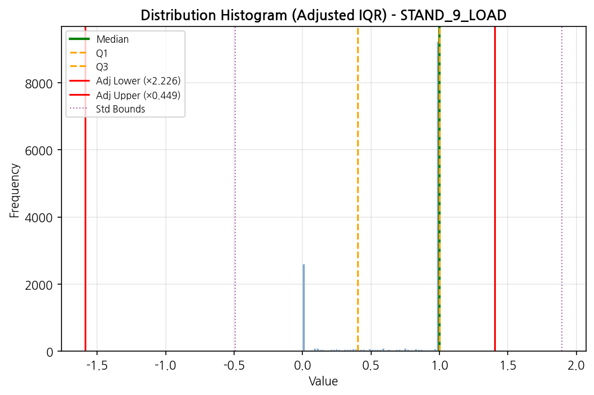

**3. 박스플롯 (Box Plot)**

**4. 일별 평균 추이 (Daily Average Trend)**

**5. 월별 이상치율 (Monthly Outlier Rate)**

**6. 시간별 패턴 (Hourly Pattern)**

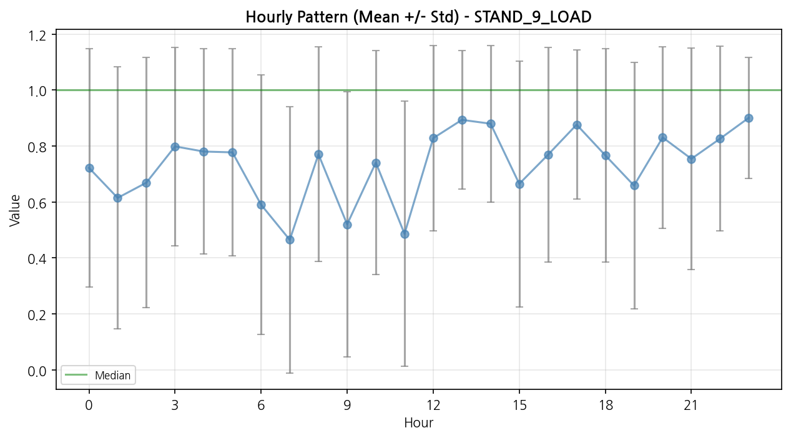

**7. 일별 이상치 수 (Daily Outlier Count)**

**종합 분석 차트**

---

##### 월별 상세 분석

**2025-04**

**통계 요약**:

| 지표 | 값 |
|------|-------|
| 분석 레코드 | 14,238 |
| 평균 | 0.7331 |
| 중앙값 | 1.0000 |
| IQR | 0.5968 |
| Bowley 왜도 | -1.0000 |
| Adj 이상치 수 | 0 |
| Adj 이상치율 | 0.00% |
| Std 이상치율 | 0.00% |
| 개선율 | 0.0% |

**1. 시계열 (Time Series)**

**2. 분포 히스토그램 (Distribution Histogram)**

**3. 박스플롯 (Box Plot)**

**4. 일별 평균 추이 (Daily Average Trend)**

**5. 시간별 패턴 (Hourly Pattern)**

**6. 일별 이상치 수 (Daily Outlier Count)**

**월별 종합 차트**

---

#### STAND_8_LOAD 🟢

**위험도**: [NORMAL] | **이상치율**: 0.00% | **개선율**: 0.0%
**Bowley 왜도**: -1.0000 | **승수 (L/U)**: 2.226/0.449

**데이터**: 원본 14,391 → 필터 후 14,238 (1.1% 제외)

| 통계 지표 | Adjusted IQR | Standard IQR |
|-----------|--------------|--------------|
| 이상치 수 | 0 | 0 |
| 이상치율 | 0.00% | 0.00% |
| 하한 경계 | -1.5119 | -0.4475 |
| 상한 경계 | 1.3902 | 1.8685 |

| 기본 통계 | 값 |
|-----------|-------|
| 분석 레코드 | 14,238 |
| 평균 | 0.7345 |
| 표준편차 | 0.4055 |
| Q1 (25%) | 0.4210 |
| 중앙값 | 1.0000 |
| Q3 (75%) | 1.0000 |
| IQR | 0.5790 |

**월별 이상치 추이**:

| 월 | 레코드 수 | 평균 | Adj 이상치율 | Std 이상치율 |
|-----|-----------|------|--------------|---------------|
| 2025-04 | 14,238 | 0.73 | 0.00% | 0.00% |

##### 차트 분석

**1. 시계열 (Time Series)**

**2. 분포 히스토그램 (Distribution Histogram)**

**3. 박스플롯 (Box Plot)**

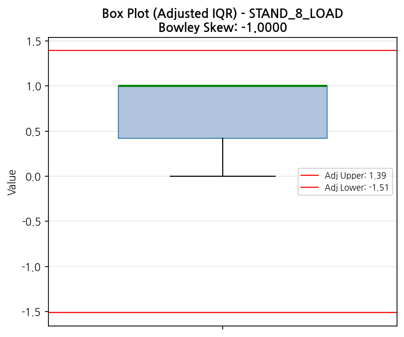

**4. 일별 평균 추이 (Daily Average Trend)**

**5. 월별 이상치율 (Monthly Outlier Rate)**

**6. 시간별 패턴 (Hourly Pattern)**

**7. 일별 이상치 수 (Daily Outlier Count)**

**종합 분석 차트**

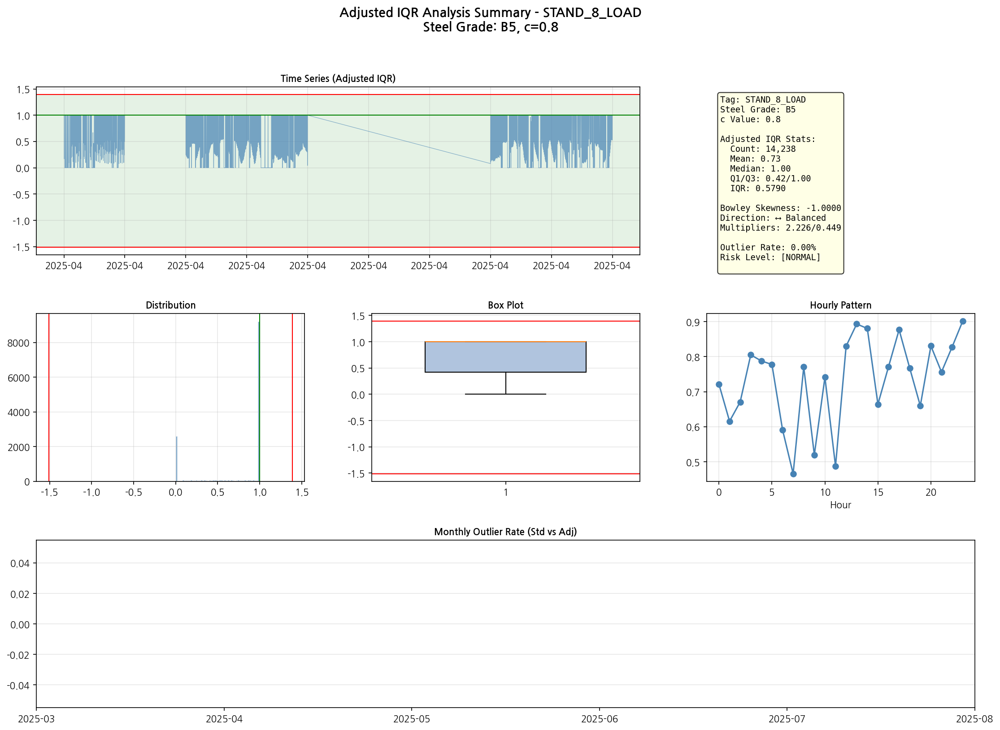

---

##### 월별 상세 분석

**2025-04**

**통계 요약**:

| 지표 | 값 |
|------|-------|
| 분석 레코드 | 14,238 |
| 평균 | 0.7345 |
| 중앙값 | 1.0000 |
| IQR | 0.5790 |
| Bowley 왜도 | -1.0000 |
| Adj 이상치 수 | 0 |
| Adj 이상치율 | 0.00% |
| Std 이상치율 | 0.00% |
| 개선율 | 0.0% |

**1. 시계열 (Time Series)**

**2. 분포 히스토그램 (Distribution Histogram)**

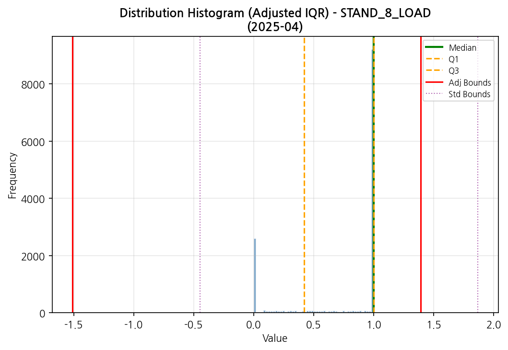

**3. 박스플롯 (Box Plot)**

**4. 일별 평균 추이 (Daily Average Trend)**

**5. 시간별 패턴 (Hourly Pattern)**

**6. 일별 이상치 수 (Daily Outlier Count)**

**월별 종합 차트**

---

#### STAND_7_LOAD 🟢

**위험도**: [NORMAL] | **이상치율**: 0.00% | **개선율**: 0.0%
**Bowley 왜도**: -1.0000 | **승수 (L/U)**: 2.226/0.449

**데이터**: 원본 14,391 → 필터 후 14,238 (1.1% 제외)

| 통계 지표 | Adjusted IQR | Standard IQR |
|-----------|--------------|--------------|
| 이상치 수 | 0 | 0 |
| 이상치율 | 0.00% | 0.00% |
| 하한 경계 | -1.5260 | -0.4556 |
| 상한 경계 | 1.3924 | 1.8734 |

| 기본 통계 | 값 |
|-----------|-------|
| 분석 레코드 | 14,238 |
| 평균 | 0.7345 |
| 표준편차 | 0.4056 |
| Q1 (25%) | 0.4177 |
| 중앙값 | 1.0000 |
| Q3 (75%) | 1.0000 |
| IQR | 0.5823 |

**월별 이상치 추이**:

| 월 | 레코드 수 | 평균 | Adj 이상치율 | Std 이상치율 |
|-----|-----------|------|--------------|---------------|
| 2025-04 | 14,238 | 0.73 | 0.00% | 0.00% |

##### 차트 분석

**1. 시계열 (Time Series)**

**2. 분포 히스토그램 (Distribution Histogram)**

**3. 박스플롯 (Box Plot)**

**4. 일별 평균 추이 (Daily Average Trend)**

**5. 월별 이상치율 (Monthly Outlier Rate)**

**6. 시간별 패턴 (Hourly Pattern)**

**7. 일별 이상치 수 (Daily Outlier Count)**

**종합 분석 차트**

---

##### 월별 상세 분석

**2025-04**

**통계 요약**:

| 지표 | 값 |
|------|-------|
| 분석 레코드 | 14,238 |
| 평균 | 0.7345 |
| 중앙값 | 1.0000 |
| IQR | 0.5823 |
| Bowley 왜도 | -1.0000 |
| Adj 이상치 수 | 0 |
| Adj 이상치율 | 0.00% |
| Std 이상치율 | 0.00% |
| 개선율 | 0.0% |

**1. 시계열 (Time Series)**

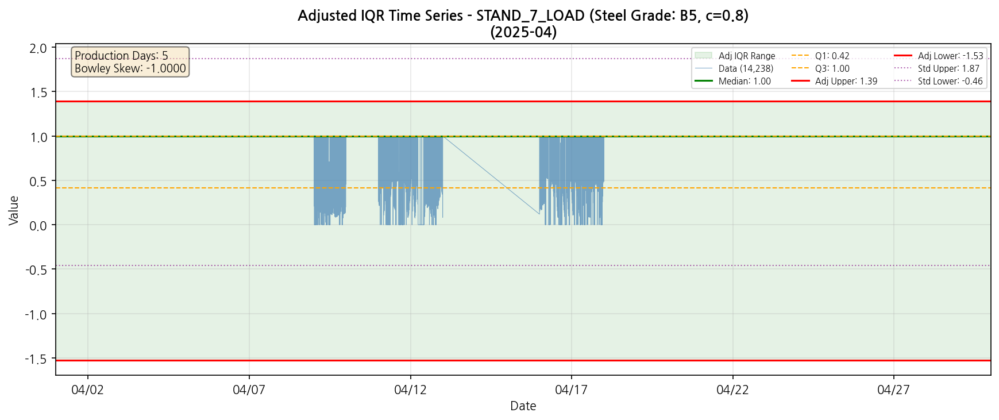

**2. 분포 히스토그램 (Distribution Histogram)**

**3. 박스플롯 (Box Plot)**

**4. 일별 평균 추이 (Daily Average Trend)**

**5. 시간별 패턴 (Hourly Pattern)**

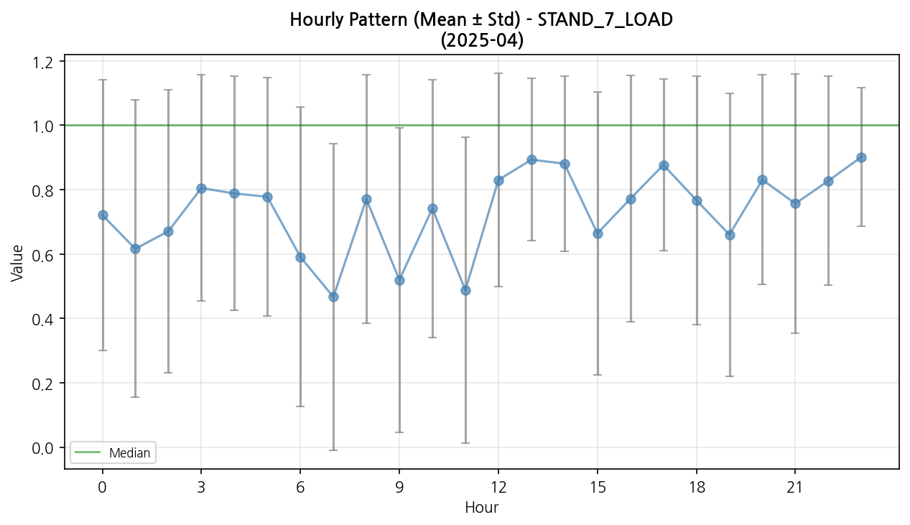

**6. 일별 이상치 수 (Daily Outlier Count)**

**월별 종합 차트**

---

#### STAND_6_LOAD 🟢

**위험도**: [NORMAL] | **이상치율**: 0.00% | **개선율**: 0.0%
**Bowley 왜도**: -1.0000 | **승수 (L/U)**: 2.226/0.449

**데이터**: 원본 14,391 → 필터 후 14,238 (1.1% 제외)

| 통계 지표 | Adjusted IQR | Standard IQR |
|-----------|--------------|--------------|
| 이상치 수 | 0 | 0 |
| 이상치율 | 0.00% | 0.00% |
| 하한 경계 | -1.5437 | -0.4658 |
| 상한 경계 | 1.3952 | 1.8795 |

| 기본 통계 | 값 |
|-----------|-------|
| 분석 레코드 | 14,238 |
| 평균 | 0.7345 |
| 표준편차 | 0.4056 |
| Q1 (25%) | 0.4137 |
| 중앙값 | 1.0000 |
| Q3 (75%) | 1.0000 |
| IQR | 0.5863 |

**월별 이상치 추이**:

| 월 | 레코드 수 | 평균 | Adj 이상치율 | Std 이상치율 |
|-----|-----------|------|--------------|---------------|
| 2025-04 | 14,238 | 0.73 | 0.00% | 0.00% |

##### 차트 분석

**1. 시계열 (Time Series)**

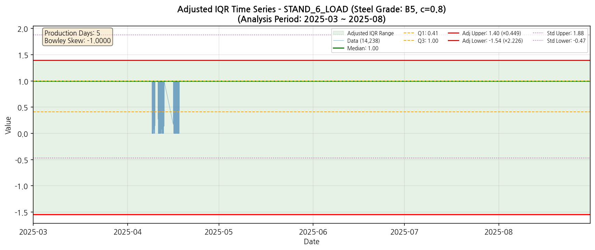

**2. 분포 히스토그램 (Distribution Histogram)**

**3. 박스플롯 (Box Plot)**

**4. 일별 평균 추이 (Daily Average Trend)**

**5. 월별 이상치율 (Monthly Outlier Rate)**

**6. 시간별 패턴 (Hourly Pattern)**

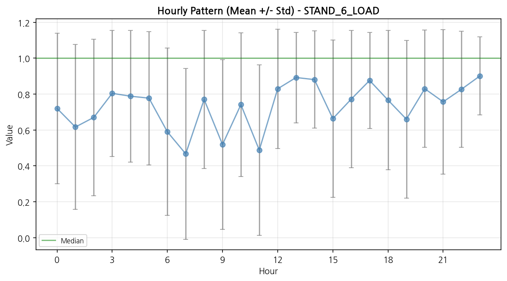

**7. 일별 이상치 수 (Daily Outlier Count)**

**종합 분석 차트**

---

##### 월별 상세 분석

**2025-04**

**통계 요약**:

| 지표 | 값 |
|------|-------|
| 분석 레코드 | 14,238 |
| 평균 | 0.7345 |
| 중앙값 | 1.0000 |
| IQR | 0.5863 |
| Bowley 왜도 | -1.0000 |
| Adj 이상치 수 | 0 |
| Adj 이상치율 | 0.00% |
| Std 이상치율 | 0.00% |
| 개선율 | 0.0% |

**1. 시계열 (Time Series)**

**2. 분포 히스토그램 (Distribution Histogram)**

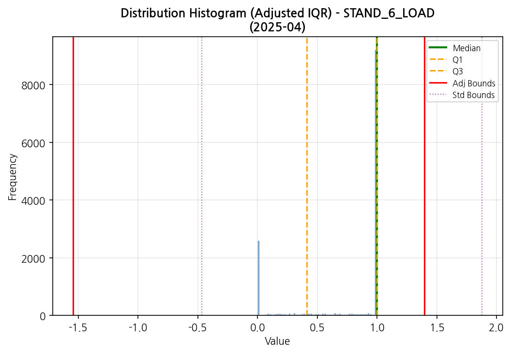

**3. 박스플롯 (Box Plot)**

**4. 일별 평균 추이 (Daily Average Trend)**

**5. 시간별 패턴 (Hourly Pattern)**

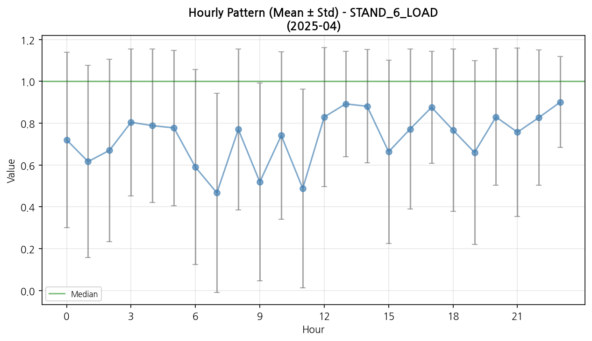

**6. 일별 이상치 수 (Daily Outlier Count)**

**월별 종합 차트**

---

#### STAND_5_LOAD 🟢

**위험도**: [NORMAL] | **이상치율**: 0.00% | **개선율**: 0.0%
**Bowley 왜도**: -1.0000 | **승수 (L/U)**: 2.226/0.449

**데이터**: 원본 14,391 → 필터 후 14,238 (1.1% 제외)

| 통계 지표 | Adjusted IQR | Standard IQR |
|-----------|--------------|--------------|
| 이상치 수 | 0 | 0 |
| 이상치율 | 0.00% | 0.00% |
| 하한 경계 | -1.5574 | -0.4738 |
| 상한 경계 | 1.3973 | 1.8842 |

| 기본 통계 | 값 |
|-----------|-------|
| 분석 레코드 | 14,238 |
| 평균 | 0.7345 |
| 표준편차 | 0.4059 |
| Q1 (25%) | 0.4105 |
| 중앙값 | 1.0000 |
| Q3 (75%) | 1.0000 |
| IQR | 0.5895 |

**월별 이상치 추이**:

| 월 | 레코드 수 | 평균 | Adj 이상치율 | Std 이상치율 |
|-----|-----------|------|--------------|---------------|
| 2025-04 | 14,238 | 0.73 | 0.00% | 0.00% |

##### 차트 분석

**1. 시계열 (Time Series)**

**2. 분포 히스토그램 (Distribution Histogram)**

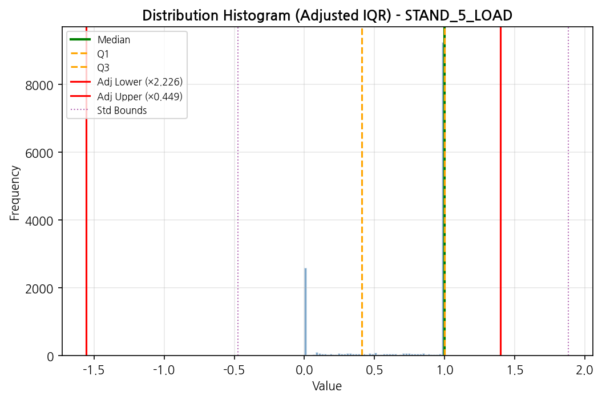

**3. 박스플롯 (Box Plot)**

**4. 일별 평균 추이 (Daily Average Trend)**

**5. 월별 이상치율 (Monthly Outlier Rate)**

**6. 시간별 패턴 (Hourly Pattern)**

**7. 일별 이상치 수 (Daily Outlier Count)**

**종합 분석 차트**

---

##### 월별 상세 분석

**2025-04**

**통계 요약**:

| 지표 | 값 |
|------|-------|
| 분석 레코드 | 14,238 |
| 평균 | 0.7345 |
| 중앙값 | 1.0000 |
| IQR | 0.5895 |
| Bowley 왜도 | -1.0000 |
| Adj 이상치 수 | 0 |
| Adj 이상치율 | 0.00% |
| Std 이상치율 | 0.00% |
| 개선율 | 0.0% |

**1. 시계열 (Time Series)**

**2. 분포 히스토그램 (Distribution Histogram)**

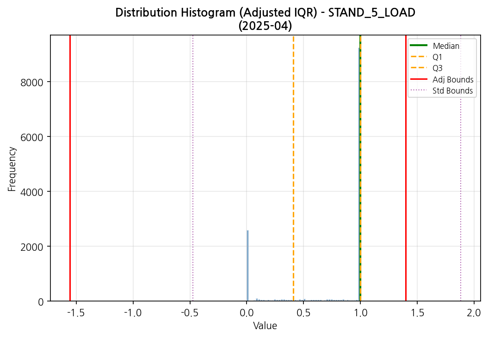

**3. 박스플롯 (Box Plot)**

**4. 일별 평균 추이 (Daily Average Trend)**

**5. 시간별 패턴 (Hourly Pattern)**

**6. 일별 이상치 수 (Daily Outlier Count)**

**월별 종합 차트**

---

#### STAND_4_LOAD 🟢

**위험도**: [NORMAL] | **이상치율**: 0.00% | **개선율**: 0.0%
**Bowley 왜도**: -1.0000 | **승수 (L/U)**: 2.226/0.449

**데이터**: 원본 14,391 → 필터 후 14,238 (1.1% 제외)

| 통계 지표 | Adjusted IQR | Standard IQR |
|-----------|--------------|--------------|
| 이상치 수 | 0 | 0 |
| 이상치율 | 0.00% | 0.00% |
| 하한 경계 | -1.5639 | -0.4775 |
| 상한 경계 | 1.3983 | 1.8865 |

| 기본 통계 | 값 |
|-----------|-------|
| 분석 레코드 | 14,238 |
| 평균 | 0.7348 |
| 표준편차 | 0.4058 |
| Q1 (25%) | 0.4090 |
| 중앙값 | 1.0000 |
| Q3 (75%) | 1.0000 |
| IQR | 0.5910 |

**월별 이상치 추이**:

| 월 | 레코드 수 | 평균 | Adj 이상치율 | Std 이상치율 |
|-----|-----------|------|--------------|---------------|
| 2025-04 | 14,238 | 0.73 | 0.00% | 0.00% |

##### 차트 분석

**1. 시계열 (Time Series)**

**2. 분포 히스토그램 (Distribution Histogram)**

**3. 박스플롯 (Box Plot)**

**4. 일별 평균 추이 (Daily Average Trend)**

**5. 월별 이상치율 (Monthly Outlier Rate)**

**6. 시간별 패턴 (Hourly Pattern)**

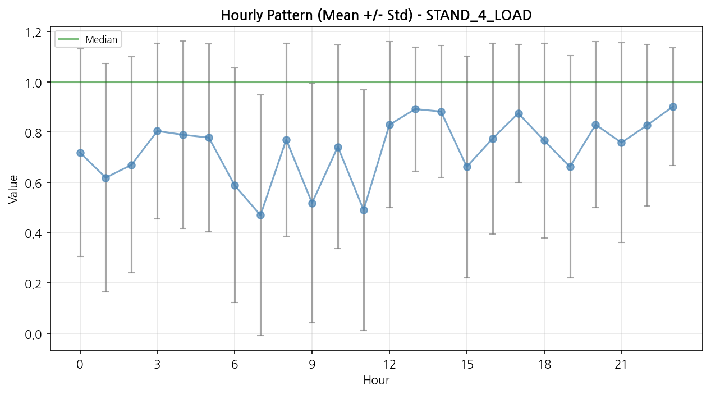

**7. 일별 이상치 수 (Daily Outlier Count)**

**종합 분석 차트**

---

##### 월별 상세 분석

**2025-04**

**통계 요약**:

| 지표 | 값 |
|------|-------|
| 분석 레코드 | 14,238 |
| 평균 | 0.7348 |
| 중앙값 | 1.0000 |
| IQR | 0.5910 |
| Bowley 왜도 | -1.0000 |
| Adj 이상치 수 | 0 |
| Adj 이상치율 | 0.00% |
| Std 이상치율 | 0.00% |
| 개선율 | 0.0% |

**1. 시계열 (Time Series)**

**2. 분포 히스토그램 (Distribution Histogram)**

**3. 박스플롯 (Box Plot)**

**4. 일별 평균 추이 (Daily Average Trend)**

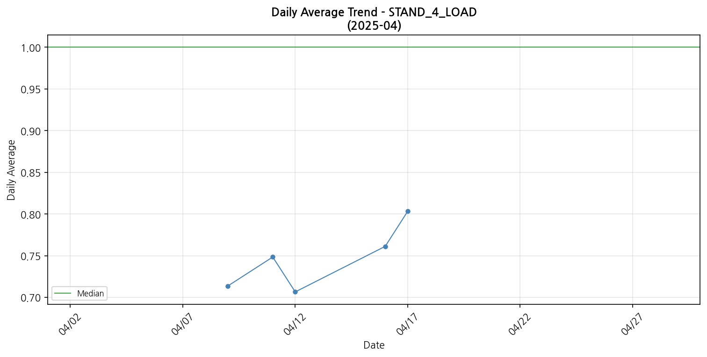

**5. 시간별 패턴 (Hourly Pattern)**

**6. 일별 이상치 수 (Daily Outlier Count)**

**월별 종합 차트**

---

#### STAND_3_LOAD 🟢

**위험도**: [NORMAL] | **이상치율**: 0.00% | **개선율**: 0.0%
**Bowley 왜도**: -1.0000 | **승수 (L/U)**: 2.226/0.449

**데이터**: 원본 14,391 → 필터 후 14,238 (1.1% 제외)

| 통계 지표 | Adjusted IQR | Standard IQR |
|-----------|--------------|--------------|
| 이상치 수 | 0 | 0 |
| 이상치율 | 0.00% | 0.00% |
| 하한 경계 | -1.5307 | -0.4583 |
| 상한 경계 | 1.3932 | 1.8750 |

| 기본 통계 | 값 |
|-----------|-------|
| 분석 레코드 | 14,238 |
| 평균 | 0.7349 |
| 표준편차 | 0.4060 |
| Q1 (25%) | 0.4167 |
| 중앙값 | 1.0000 |
| Q3 (75%) | 1.0000 |
| IQR | 0.5833 |

**월별 이상치 추이**:

| 월 | 레코드 수 | 평균 | Adj 이상치율 | Std 이상치율 |
|-----|-----------|------|--------------|---------------|
| 2025-04 | 14,238 | 0.73 | 0.00% | 0.00% |

##### 차트 분석

**1. 시계열 (Time Series)**

**2. 분포 히스토그램 (Distribution Histogram)**

**3. 박스플롯 (Box Plot)**

**4. 일별 평균 추이 (Daily Average Trend)**

**5. 월별 이상치율 (Monthly Outlier Rate)**

**6. 시간별 패턴 (Hourly Pattern)**

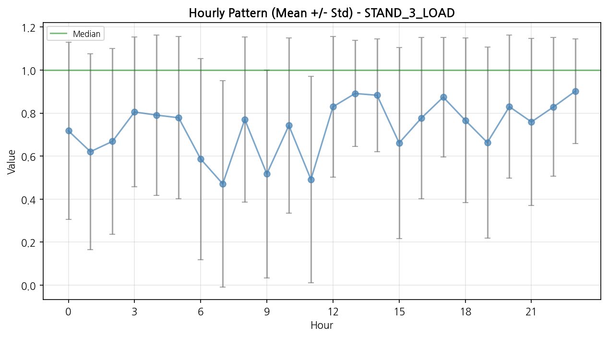

**7. 일별 이상치 수 (Daily Outlier Count)**

**종합 분석 차트**

---

##### 월별 상세 분석

**2025-04**

**통계 요약**:

| 지표 | 값 |
|------|-------|
| 분석 레코드 | 14,238 |
| 평균 | 0.7349 |
| 중앙값 | 1.0000 |
| IQR | 0.5833 |
| Bowley 왜도 | -1.0000 |
| Adj 이상치 수 | 0 |
| Adj 이상치율 | 0.00% |
| Std 이상치율 | 0.00% |
| 개선율 | 0.0% |

**1. 시계열 (Time Series)**

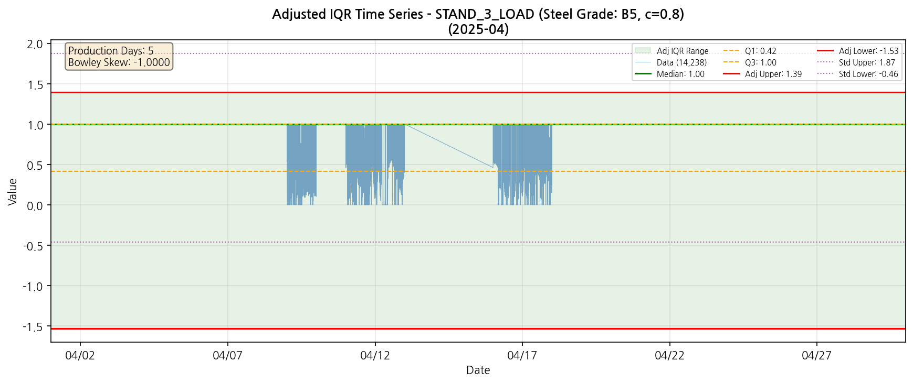

**2. 분포 히스토그램 (Distribution Histogram)**

**3. 박스플롯 (Box Plot)**

**4. 일별 평균 추이 (Daily Average Trend)**

**5. 시간별 패턴 (Hourly Pattern)**

**6. 일별 이상치 수 (Daily Outlier Count)**

**월별 종합 차트**

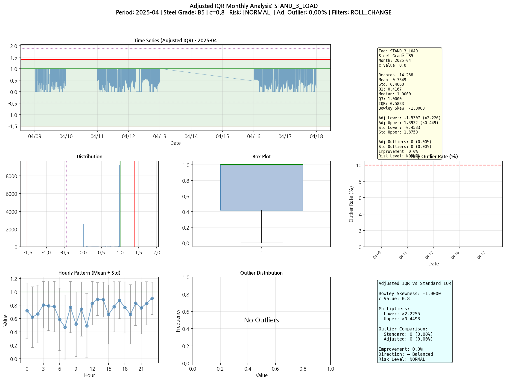

---

#### STAND_2_LOAD 🟢

**위험도**: [NORMAL] | **이상치율**: 0.00% | **개선율**: 0.0%
**Bowley 왜도**: -1.0000 | **승수 (L/U)**: 2.226/0.449

**데이터**: 원본 14,391 → 필터 후 14,238 (1.1% 제외)

| 통계 지표 | Adjusted IQR | Standard IQR |
|-----------|--------------|--------------|
| 이상치 수 | 0 | 0 |
| 이상치율 | 0.00% | 0.00% |
| 하한 경계 | -1.5495 | -0.4692 |
| 상한 경계 | 1.3961 | 1.8815 |

| 기본 통계 | 값 |
|-----------|-------|
| 분석 레코드 | 14,238 |
| 평균 | 0.7351 |
| 표준편차 | 0.4061 |
| Q1 (25%) | 0.4123 |
| 중앙값 | 1.0000 |
| Q3 (75%) | 1.0000 |
| IQR | 0.5877 |

**월별 이상치 추이**:

| 월 | 레코드 수 | 평균 | Adj 이상치율 | Std 이상치율 |
|-----|-----------|------|--------------|---------------|
| 2025-04 | 14,238 | 0.74 | 0.00% | 0.00% |

##### 차트 분석

**1. 시계열 (Time Series)**

**2. 분포 히스토그램 (Distribution Histogram)**

**3. 박스플롯 (Box Plot)**

**4. 일별 평균 추이 (Daily Average Trend)**

**5. 월별 이상치율 (Monthly Outlier Rate)**

**6. 시간별 패턴 (Hourly Pattern)**

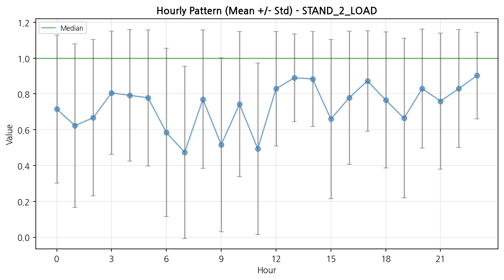

**7. 일별 이상치 수 (Daily Outlier Count)**

**종합 분석 차트**

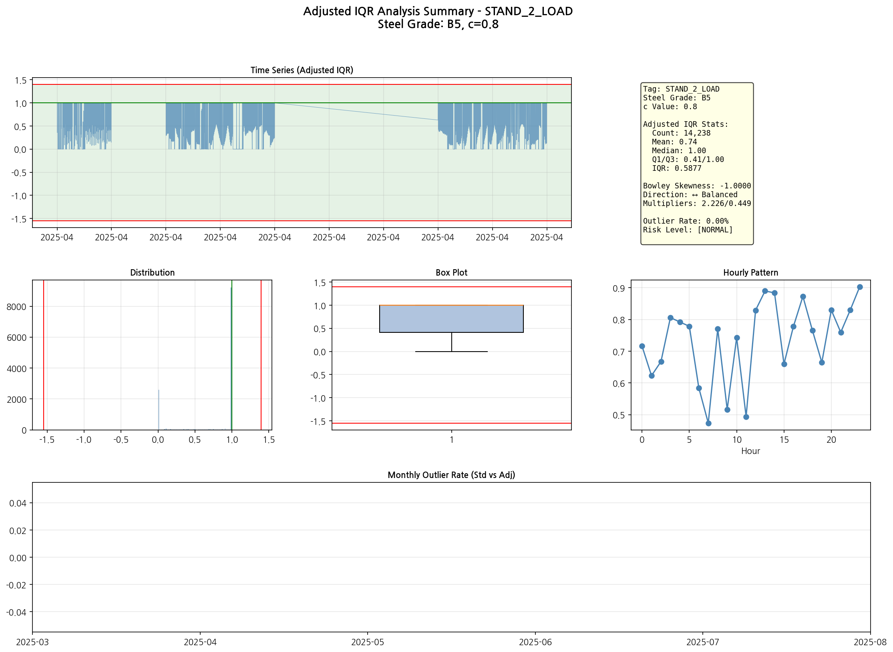

---

##### 월별 상세 분석

**2025-04**

**통계 요약**:

| 지표 | 값 |
|------|-------|
| 분석 레코드 | 14,238 |
| 평균 | 0.7351 |
| 중앙값 | 1.0000 |
| IQR | 0.5877 |
| Bowley 왜도 | -1.0000 |
| Adj 이상치 수 | 0 |
| Adj 이상치율 | 0.00% |
| Std 이상치율 | 0.00% |
| 개선율 | 0.0% |

**1. 시계열 (Time Series)**

**2. 분포 히스토그램 (Distribution Histogram)**

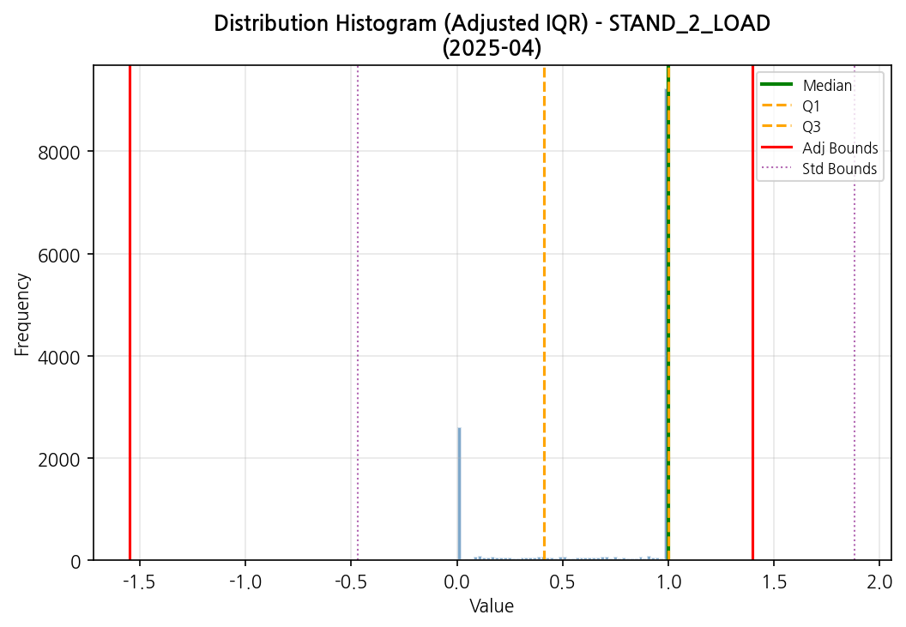

**3. 박스플롯 (Box Plot)**

**4. 일별 평균 추이 (Daily Average Trend)**

**5. 시간별 패턴 (Hourly Pattern)**

**6. 일별 이상치 수 (Daily Outlier Count)**

**월별 종합 차트**

---

#### FINISHING_BLOCK_LOAD 🟢

**위험도**: [NORMAL] | **이상치율**: 0.00% | **개선율**: 0.0%
**Bowley 왜도**: -1.0000 | **승수 (L/U)**: 2.226/0.449

**데이터**: 원본 14,391 → 필터 후 14,238 (1.1% 제외)

| 통계 지표 | Adjusted IQR | Standard IQR |
|-----------|--------------|--------------|
| 이상치 수 | 0 | 0 |
| 이상치율 | 0.00% | 0.00% |
| 하한 경계 | -1.5900 | -0.4925 |
| 상한 경계 | 1.4024 | 1.8955 |

| 기본 통계 | 값 |
|-----------|-------|
| 분석 레코드 | 14,238 |
| 평균 | 0.7326 |
| 표준편차 | 0.4069 |
| Q1 (25%) | 0.4030 |
| 중앙값 | 1.0000 |
| Q3 (75%) | 1.0000 |
| IQR | 0.5970 |

**월별 이상치 추이**:

| 월 | 레코드 수 | 평균 | Adj 이상치율 | Std 이상치율 |
|-----|-----------|------|--------------|---------------|
| 2025-04 | 14,238 | 0.73 | 0.00% | 0.00% |

##### 차트 분석

**1. 시계열 (Time Series)**

**2. 분포 히스토그램 (Distribution Histogram)**

**3. 박스플롯 (Box Plot)**

**4. 일별 평균 추이 (Daily Average Trend)**

**5. 월별 이상치율 (Monthly Outlier Rate)**

**6. 시간별 패턴 (Hourly Pattern)**

**7. 일별 이상치 수 (Daily Outlier Count)**

**종합 분석 차트**

---

##### 월별 상세 분석

**2025-04**

**통계 요약**:

| 지표 | 값 |
|------|-------|
| 분석 레코드 | 14,238 |
| 평균 | 0.7326 |
| 중앙값 | 1.0000 |
| IQR | 0.5970 |
| Bowley 왜도 | -1.0000 |
| Adj 이상치 수 | 0 |
| Adj 이상치율 | 0.00% |
| Std 이상치율 | 0.00% |
| 개선율 | 0.0% |

**1. 시계열 (Time Series)**

**2. 분포 히스토그램 (Distribution Histogram)**

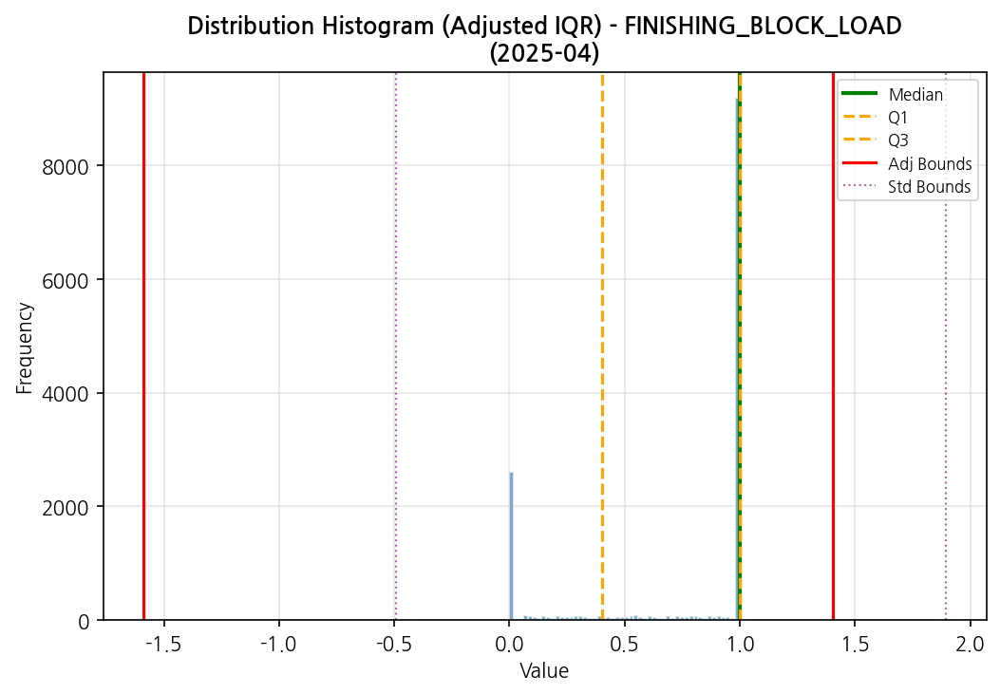

**3. 박스플롯 (Box Plot)**

**4. 일별 평균 추이 (Daily Average Trend)**

**5. 시간별 패턴 (Hourly Pattern)**

**6. 일별 이상치 수 (Daily Outlier Count)**

**월별 종합 차트**

---

#### PINCHROLL_3_ACTUAL_SPEED 🟢

**위험도**: [NORMAL] | **이상치율**: 0.00% | **개선율**: 0.0%
**Bowley 왜도**: -0.9661 | **승수 (L/U)**: 2.166/0.462

**데이터**: 원본 14,391 → 필터 후 12,557 (12.7% 제외)

| 통계 지표 | Adjusted IQR | Standard IQR |
|-----------|--------------|--------------|
| 이상치 수 | 0 | 0 |
| 이상치율 | 0.00% | 0.00% |
| 하한 경계 | -895.5657 | 1.8218 |
| 상한 경계 | 1639.8684 | 2054.1757 |

| 기본 통계 | 값 |
|-----------|-------|
| 분석 레코드 | 12,557 |
| 평균 | 1034.8907 |
| 표준편차 | 255.7345 |
| Q1 (25%) | 771.4545 |
| 중앙값 | 1275.8460 |
| Q3 (75%) | 1284.5430 |
| IQR | 513.0885 |

**월별 이상치 추이**:

| 월 | 레코드 수 | 평균 | Adj 이상치율 | Std 이상치율 |
|-----|-----------|------|--------------|---------------|
| 2025-04 | 12,557 | 1034.89 | 0.00% | 0.00% |

##### 차트 분석

**1. 시계열 (Time Series)**

**2. 분포 히스토그램 (Distribution Histogram)**

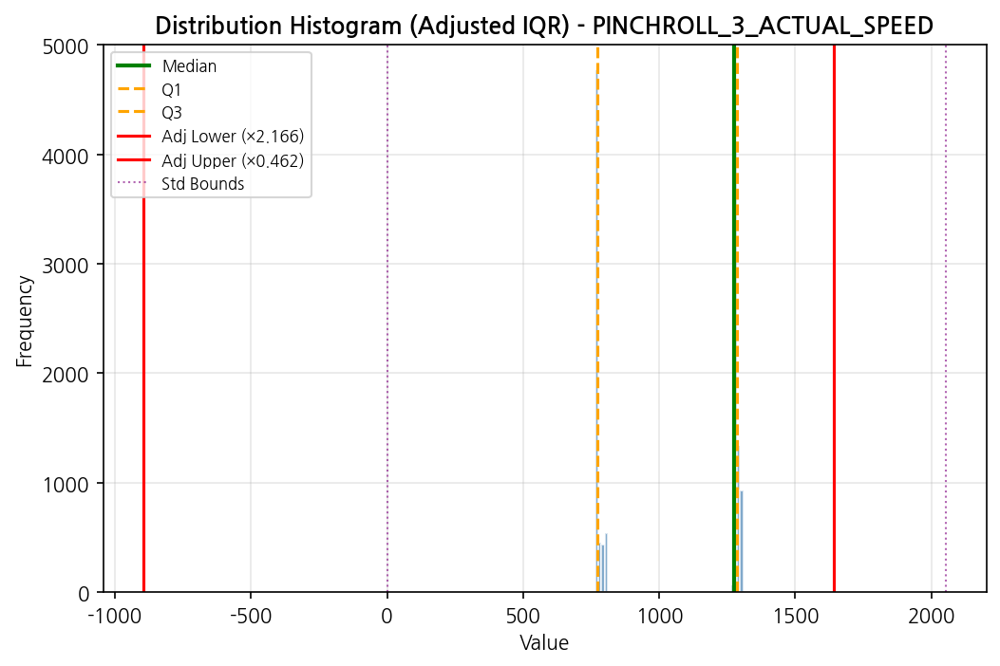

**3. 박스플롯 (Box Plot)**

**4. 일별 평균 추이 (Daily Average Trend)**

**5. 월별 이상치율 (Monthly Outlier Rate)**

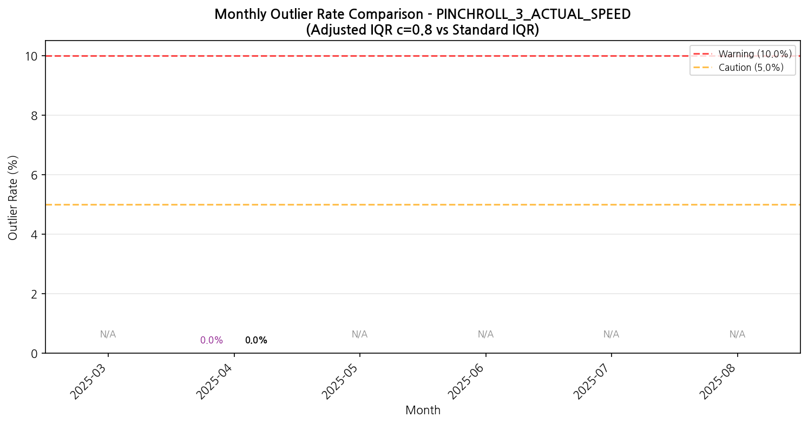

**6. 시간별 패턴 (Hourly Pattern)**

**7. 일별 이상치 수 (Daily Outlier Count)**

**종합 분석 차트**

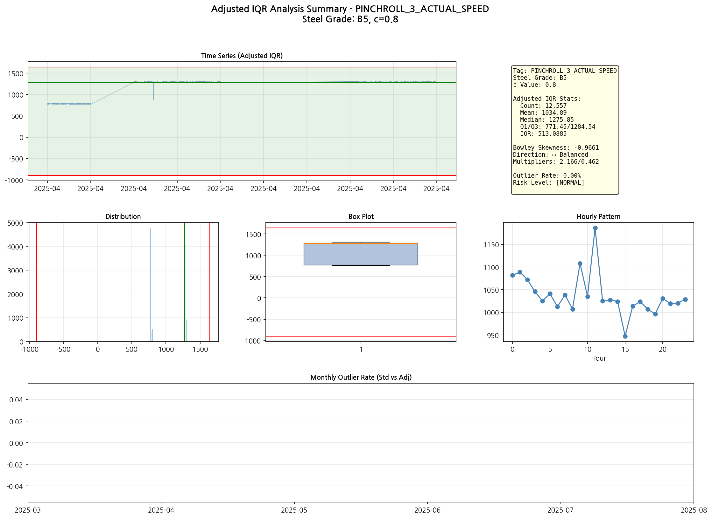

---

##### 월별 상세 분석

**2025-04**

**통계 요약**:

| 지표 | 값 |
|------|-------|
| 분석 레코드 | 12,557 |
| 평균 | 1034.8907 |
| 중앙값 | 1275.8460 |
| IQR | 513.0885 |
| Bowley 왜도 | -0.9661 |
| Adj 이상치 수 | 0 |
| Adj 이상치율 | 0.00% |
| Std 이상치율 | 0.00% |
| 개선율 | 0.0% |

**1. 시계열 (Time Series)**

**2. 분포 히스토그램 (Distribution Histogram)**

**3. 박스플롯 (Box Plot)**

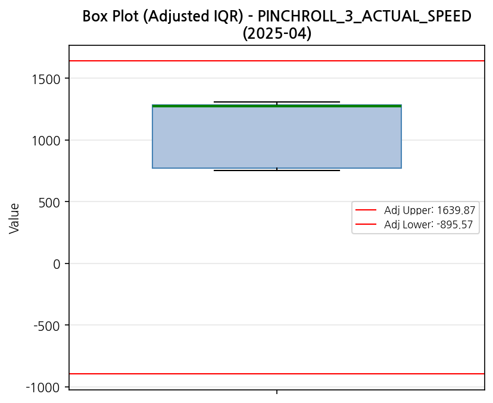

**4. 일별 평균 추이 (Daily Average Trend)**

**5. 시간별 패턴 (Hourly Pattern)**

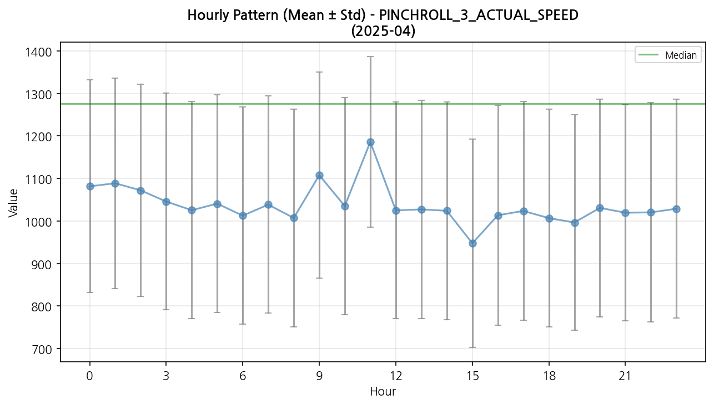

**6. 일별 이상치 수 (Daily Outlier Count)**

**월별 종합 차트**

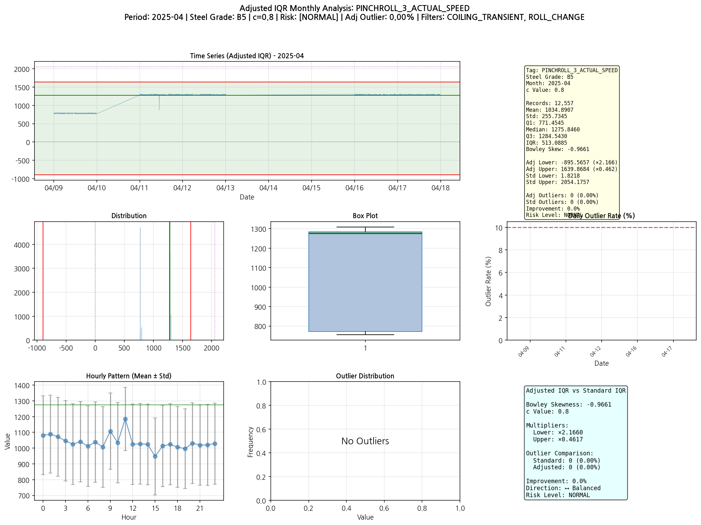

---

#### STAND_13_LOAD 🟢

**위험도**: [NORMAL] | **이상치율**: 0.00% | **개선율**: 0.0%
**Bowley 왜도**: -1.0000 | **승수 (L/U)**: 2.226/0.449

**데이터**: 원본 14,391 → 필터 후 14,238 (1.1% 제외)

| 통계 지표 | Adjusted IQR | Standard IQR |
|-----------|--------------|--------------|
| 이상치 수 | 0 | 0 |
| 이상치율 | 0.00% | 0.00% |
| 하한 경계 | -1.5726 | -0.4825 |
| 상한 경계 | 1.3997 | 1.8895 |

| 기본 통계 | 값 |
|-----------|-------|
| 분석 레코드 | 14,238 |
| 평균 | 0.7331 |
| 표준편차 | 0.4065 |
| Q1 (25%) | 0.4070 |
| 중앙값 | 1.0000 |
| Q3 (75%) | 1.0000 |
| IQR | 0.5930 |

**월별 이상치 추이**:

| 월 | 레코드 수 | 평균 | Adj 이상치율 | Std 이상치율 |
|-----|-----------|------|--------------|---------------|
| 2025-04 | 14,238 | 0.73 | 0.00% | 0.00% |

##### 차트 분석

**1. 시계열 (Time Series)**

**2. 분포 히스토그램 (Distribution Histogram)**

**3. 박스플롯 (Box Plot)**

**4. 일별 평균 추이 (Daily Average Trend)**

**5. 월별 이상치율 (Monthly Outlier Rate)**

**6. 시간별 패턴 (Hourly Pattern)**

**7. 일별 이상치 수 (Daily Outlier Count)**

**종합 분석 차트**

---

##### 월별 상세 분석

**2025-04**

**통계 요약**:

| 지표 | 값 |
|------|-------|
| 분석 레코드 | 14,238 |
| 평균 | 0.7331 |
| 중앙값 | 1.0000 |
| IQR | 0.5930 |
| Bowley 왜도 | -1.0000 |
| Adj 이상치 수 | 0 |
| Adj 이상치율 | 0.00% |
| Std 이상치율 | 0.00% |
| 개선율 | 0.0% |

**1. 시계열 (Time Series)**

**2. 분포 히스토그램 (Distribution Histogram)**

**3. 박스플롯 (Box Plot)**

**4. 일별 평균 추이 (Daily Average Trend)**

**5. 시간별 패턴 (Hourly Pattern)**

**6. 일별 이상치 수 (Daily Outlier Count)**

**월별 종합 차트**

---

#### STAND_14_LOAD 🟢

**위험도**: [NORMAL] | **이상치율**: 0.00% | **개선율**: 0.0%
**Bowley 왜도**: -1.0000 | **승수 (L/U)**: 2.226/0.449

**데이터**: 원본 14,391 → 필터 후 14,238 (1.1% 제외)

| 통계 지표 | Adjusted IQR | Standard IQR |
|-----------|--------------|--------------|
| 이상치 수 | 0 | 0 |
| 이상치율 | 0.00% | 0.00% |
| 하한 경계 | -1.5833 | -0.4886 |
| 상한 경계 | 1.4013 | 1.8932 |

| 기본 통계 | 값 |
|-----------|-------|
| 분석 레코드 | 14,238 |
| 평균 | 0.7329 |
| 표준편차 | 0.4066 |
| Q1 (25%) | 0.4045 |
| 중앙값 | 1.0000 |
| Q3 (75%) | 1.0000 |
| IQR | 0.5955 |

**월별 이상치 추이**:

| 월 | 레코드 수 | 평균 | Adj 이상치율 | Std 이상치율 |
|-----|-----------|------|--------------|---------------|
| 2025-04 | 14,238 | 0.73 | 0.00% | 0.00% |

##### 차트 분석

**1. 시계열 (Time Series)**

**2. 분포 히스토그램 (Distribution Histogram)**

**3. 박스플롯 (Box Plot)**

**4. 일별 평균 추이 (Daily Average Trend)**

**5. 월별 이상치율 (Monthly Outlier Rate)**

**6. 시간별 패턴 (Hourly Pattern)**

**7. 일별 이상치 수 (Daily Outlier Count)**

**종합 분석 차트**

---

##### 월별 상세 분석

**2025-04**

**통계 요약**:

| 지표 | 값 |
|------|-------|
| 분석 레코드 | 14,238 |
| 평균 | 0.7329 |
| 중앙값 | 1.0000 |
| IQR | 0.5955 |
| Bowley 왜도 | -1.0000 |
| Adj 이상치 수 | 0 |
| Adj 이상치율 | 0.00% |
| Std 이상치율 | 0.00% |
| 개선율 | 0.0% |

**1. 시계열 (Time Series)**

**2. 분포 히스토그램 (Distribution Histogram)**

**3. 박스플롯 (Box Plot)**

**4. 일별 평균 추이 (Daily Average Trend)**

**5. 시간별 패턴 (Hourly Pattern)**

**6. 일별 이상치 수 (Daily Outlier Count)**

**월별 종합 차트**

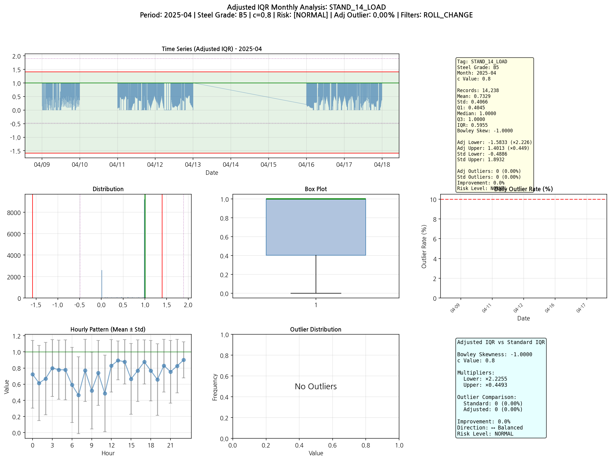

---

#### [L1] PR9L1_ACT_TORQUE 🟢

**위험도**: [NORMAL] | **이상치율**: 0.00% | **개선율**: 0.0%
**Bowley 왜도**: -0.7915 | **승수 (L/U)**: 1.884/0.531

**데이터**: 원본 14,391 → 필터 후 14,238 (1.1% 제외)

| 통계 지표 | Adjusted IQR | Standard IQR |
|-----------|--------------|--------------|
| 이상치 수 | 0 | 0 |
| 이상치율 | 0.00% | 0.00% |
| 하한 경계 | -83.1088 | -53.5052 |
| 상한 경계 | 20.1117 | 35.8274 |

| 기본 통계 | 값 |
|-----------|-------|
| 분석 레코드 | 14,238 |
| 평균 | -9.2171 |
| 표준편차 | 13.6979 |
| Q1 (25%) | -20.0054 |
| 중앙값 | 0.0000 |
| Q3 (75%) | 2.3277 |
| IQR | 22.3331 |

**월별 이상치 추이**:

| 월 | 레코드 수 | 평균 | Adj 이상치율 | Std 이상치율 |
|-----|-----------|------|--------------|---------------|
| 2025-04 | 14,238 | -9.22 | 0.00% | 0.00% |

##### 차트 분석

**1. 시계열 (Time Series)**

**2. 분포 히스토그램 (Distribution Histogram)**

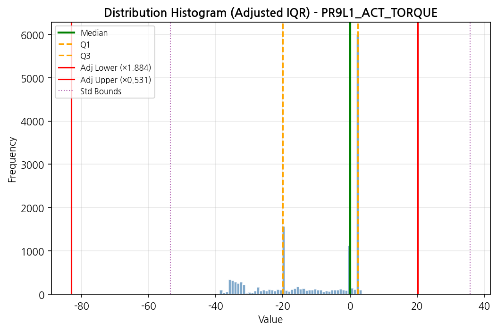

**3. 박스플롯 (Box Plot)**

**4. 일별 평균 추이 (Daily Average Trend)**

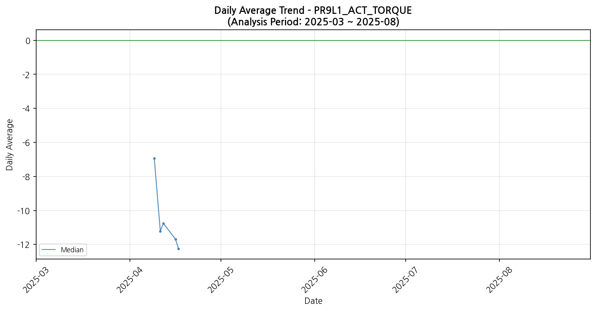

**5. 월별 이상치율 (Monthly Outlier Rate)**

**6. 시간별 패턴 (Hourly Pattern)**

**7. 일별 이상치 수 (Daily Outlier Count)**

**종합 분석 차트**

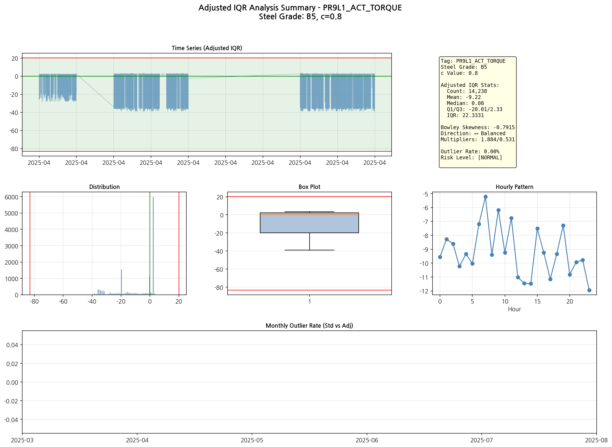

---

##### 월별 상세 분석

**2025-04**

**통계 요약**:

| 지표 | 값 |
|------|-------|
| 분석 레코드 | 14,238 |
| 평균 | -9.2171 |
| 중앙값 | 0.0000 |
| IQR | 22.3331 |
| Bowley 왜도 | -0.7915 |
| Adj 이상치 수 | 0 |
| Adj 이상치율 | 0.00% |
| Std 이상치율 | 0.00% |
| 개선율 | 0.0% |

**1. 시계열 (Time Series)**

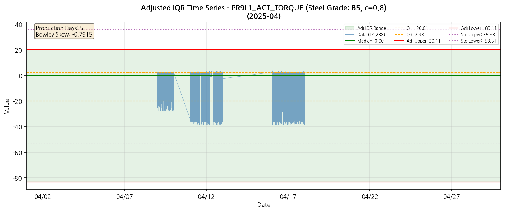

**2. 분포 히스토그램 (Distribution Histogram)**

**3. 박스플롯 (Box Plot)**

**4. 일별 평균 추이 (Daily Average Trend)**

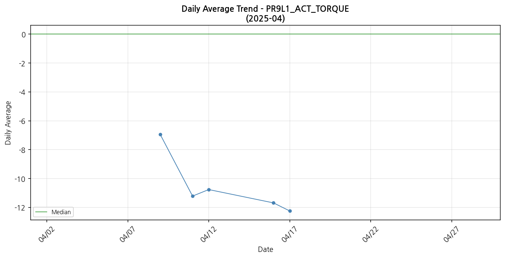

**5. 시간별 패턴 (Hourly Pattern)**

**6. 일별 이상치 수 (Daily Outlier Count)**

**월별 종합 차트**

---

---

## 월별 이상치율 추이

| 월 | Adjusted IQR 평균 | Standard IQR 평균 | 개선율 |
|-----|------------------|-------------------|--------|
| 2025-03 | N/A | N/A | N/A |
| 2025-04 | 4.89% | 4.78% | -2.4% |
| 2025-05 | N/A | N/A | N/A |
| 2025-06 | N/A | N/A | N/A |
| 2025-07 | N/A | N/A | N/A |
| 2025-08 | N/A | N/A | N/A |

---

## 상위 개선 태그 (Top 10)

Adjusted IQR 적용으로 가장 큰 개선을 보인 태그:

| 순위 | 태그명 | Std 이상치율 | Adj 이상치율 | 개선율 | Bowley 왜도 |
|------|--------|--------------|--------------|--------|-------------|
| 1 | HEATING_BOTTOM_ZONE_NO_1_TEMPERATURE_OPP_SIDE | 0.67% | 0.00% | **100.0%** | 0.6384 |
| 2 | PINCHROLL_2_ACTUAL_TORQUE | 19.10% | 11.84% | **38.0%** | -0.9998 |
| 3 | SOAKING_TOP_ZONE_NO_2_TEMPERATURE_ROOF | 3.86% | 3.02% | **21.6%** | 0.1388 |
| 4 | STAND_1_ACTUAL_SPEED | 13.06% | 10.60% | **18.9%** | 0.5117 |
| 5 | INDIRECT_COOLING_WATER_FLOW | 1.45% | 1.17% | **18.7%** | -0.0620 |
| 6 | PINCHROLL_4_REFERENCE_TORQUE | 18.93% | 17.47% | **7.7%** | 0.2394 |
| 7 | PINCHROLL_3_REFERENCE_TORQUE | 19.08% | 17.74% | **7.1%** | 0.2144 |
| 8 | FURNACE_EXIT_DISCHARGE_BILLET_TEMPERATURE | 11.72% | 11.69% | **0.3%** | -0.0435 |
| 9 | STAND_12_ACTUAL_SPEED | 10.96% | 10.94% | **0.1%** | -0.0686 |
| 10 | SOAKING_TOP_ZONE_NO_1_TEMPERATURE_ROOF | 5.25% | 5.25% | **0.0%** | 0.0050 |

---

## 높은 왜도 태그 분석

Bowley 왜도 절대값이 큰 태그 (비대칭 분포):

| 태그명 | Bowley 왜도 | 분포 방향 | 승수 (L/U) | 개선율 |
|--------|-------------|----------|------------|--------|
| STAND_1_LOAD | -1.0000 | ← 왼쪽 치우침 | 2.226/0.449 | 0.0% |
| STAND_5_LOAD | -1.0000 | ← 왼쪽 치우침 | 2.226/0.449 | 0.0% |
| STAND_9_LOAD | -1.0000 | ← 왼쪽 치우침 | 2.226/0.449 | 0.0% |
| STAND_10_LOAD | -1.0000 | ← 왼쪽 치우침 | 2.226/0.449 | 0.0% |
| STAND_14_LOAD | -1.0000 | ← 왼쪽 치우침 | 2.226/0.449 | 0.0% |
| STAND_2_LOAD | -1.0000 | ← 왼쪽 치우침 | 2.226/0.449 | 0.0% |
| STAND_3_LOAD | -1.0000 | ← 왼쪽 치우침 | 2.226/0.449 | 0.0% |
| STAND_4_LOAD | -1.0000 | ← 왼쪽 치우침 | 2.226/0.449 | 0.0% |
| STAND_6_LOAD | -1.0000 | ← 왼쪽 치우침 | 2.226/0.449 | 0.0% |
| STAND_7_LOAD | -1.0000 | ← 왼쪽 치우침 | 2.226/0.449 | 0.0% |

---

## 결론 및 권장사항

### 분석 결과 요약

1. **전체 개선 효과**: Adjusted IQR 적용으로 평균 **-104.8%** 이상치율 감소
2. **총 이상치 감소**: 50,933 → 52,197 (-1,264개 감소)
3. **위험등급 개선**: CRITICAL/DANGER 태그 8개 → 7개

### c 값 검토

- **현재 c 값**: 0.8
- **권장 조정**:
  - 개선율이 낮은 경우 c 값 증가 (1.0~1.2)
  - 과도한 보정 시 c 값 감소 (0.6~0.8)

### 후속 조치

1. 높은 왜도 태그에 대한 데이터 품질 검토
2. 월별 추이가 불안정한 태그 모니터링 강화
3. 개선율이 낮은 태그에 대한 별도 분석 (MAD, Percentile 등 대안 방법 검토)

---

*이 보고서는 Adjusted IQR 방법론 (Bowley 왜도 보정)을 적용하여 자동 생성되었습니다.*
