# 강종 [B5] 사이즈 [D13] IQR 상세 분석 보고서

**분석 기간**: 2025-03-01 ~ 2025-08-31
**강종**: B5
**사이즈**: D13
**생성일시**: 2026-02-06 11:53:19

---

## Executive Summary

### 분석 개요

| 구분 | 내용 |
|------|------|
| **분석 대상 강종** | B5 |
| **분석 대상 사이즈** | D13 |
| **총 분석 태그 수** | 79개 |
| **PR_Detailed L1 태그** | 4개 |
| **PR_Detailed L2 태그** | 2개 |
| **양호 태그 (≤5%)** | 46개 |
| **주의 태그 (5~10%)** | 18개 |
| **경고 이상 태그 (≥10%)** | 15개 |

### 위험도 분포

| 등급 | 이상치율 | 태그 수 | 상태 |
|------|---------|--------|------|
| 🟢 양호 | 0~5% | 46개 | 정상 |
| 🟡 주의 | 5~10% | 18개 | 모니터링 |
| 🟠 경고 | 10~15% | 9개 | 원인 분석 |
| 🔴 위험 | 15~25% | 5개 | 점검 필요 |
| ⚫ 심각 | 25% 이상 | 1개 | 즉시 조치 |

### 상위 문제 태그 (이상치율 기준)

| 순위 | 라인 | 태그 | 이상치율 | 위험도 | 필터 제거율 |
|------|:----:|------|---------|--------|------------|
| 1 | - | FINISHING_BLOCK_ACTUAL_SPEED | 33.17% | ⚫ | 1.5% |
| 2 | - | PINCHROLL_3_ACTUAL_TORQUE | 21.28% | 🔴 | 11.5% |
| 3 | - | PINCHROLL_3_REFERENCE_TORQUE | 21.19% | 🔴 | 11.5% |
| 4 | - | PINCHROLL_4_REFERENCE_TORQUE | 21.07% | 🔴 | 11.5% |
| 5 | - | PINCHROLL_4_ACTUAL_TORQUE | 20.89% | 🔴 | 11.5% |
| 6 | - | PINCHROLL_2_ACTUAL_TORQUE | 19.68% | 🔴 | 11.5% |
| 7 | L1 | PR6L1_ACT_TORQUE | 14.64% | 🟠 | 11.5% |
| 8 | L2 | PR6L2_ACT_TORQUE | 13.62% | 🟠 | 11.5% |
| 9 | - | FURNACE_EXIT_DISCHARGE_BILLET_TEMPERATURE | 12.42% | 🟠 | 0.0% |
| 10 | - | HEATING_TOP_ZONE_NO_1_TEMPERATURE_ROOF | 11.79% | 🟠 | 0.0% |

---

## 필터 적용 범례

| 약어 | 필터명 | 설명 |
|:----:|--------|------|
| run | run_only | 가동 상태 데이터만 사용 |
| spc | special_ops | 특수 운전 제외 |
| roll | roll_change | 롤교환 구간 제외 |
| coil | coiling_transient | 권취 가감속 구간 제외 |

| 기호 | 의미 |
|:----:|------|
| ✓ | 해당 필터 적용됨 |
| ✗ | 해당 필터 미적용 |

---

## 라인별 카테고리 요약

### 01 Furnace Top Temperature

**설명**: 가열로 상부 온도

| 태그명 | L1/L2 | run | spc | roll | coil | 제거율 | 이상치 | 상태 |
|--------|:-----:|:---:|:---:|:----:|:----:|-------:|-------:|:----:|
| HEATING_TOP_ZONE_NO_1_TEMPERATURE_R... | - | ✓ | ✓ | ✗ | ✗ | 0.0% | **11.79%** | 🟠 |
| HEATING_TOP_ZONE_NO_2_TEMPERATURE_R... | - | ✓ | ✓ | ✗ | ✗ | 0.0% | **10.44%** | 🟠 |
| SOAKING_TOP_ZONE_NO_1_TEMPERATURE_R... | - | ✓ | ✓ | ✗ | ✗ | 0.0% | 8.61% | 🟡 |
| SOAKING_TOP_ZONE_NO_2_TEMPERATURE_R... | - | ✓ | ✓ | ✗ | ✗ | 0.0% | 6.84% | 🟡 |

**필터 적용 이유**:

| 필터 | 적용 | 이유 |
|------|:----:|------|
| run_only | ✓ | 가동 상태에서만 온도 측정이 유효함 |
| special_ops | ✓ | 정상 운전 조건에서 분석 |
| roll_change | ✗ | 열관성이 커서 롤교환 영향 없음 |
| coiling_transient | ✗ | 권취 공정과 무관 |

### 02 Furnace Bottom Temperature

**설명**: 가열로 하부 온도

| 태그명 | L1/L2 | run | spc | roll | coil | 제거율 | 이상치 | 상태 |
|--------|:-----:|:---:|:---:|:----:|:----:|-------:|-------:|:----:|
| HEATING_BOTTOM_ZONE_NO_1_TEMPERATUR... | - | ✓ | ✓ | ✗ | ✗ | 0.0% | 8.39% | 🟡 |
| HEATING_BOTTOM_ZONE_NO_2_TEMPERATUR... | - | ✓ | ✓ | ✗ | ✗ | 0.0% | 5.79% | 🟡 |
| SOAKING_BOTTOM_ZONE_NO_1_TEMPERATUR... | - | ✓ | ✓ | ✗ | ✗ | 0.0% | 0.00% | 🟢 |
| SOAKING_BOTTOM_ZONE_NO_2_TEMPERATUR... | - | ✓ | ✓ | ✗ | ✗ | 0.0% | 0.00% | 🟢 |

**필터 적용 이유**:

| 필터 | 적용 | 이유 |
|------|:----:|------|
| run_only | ✓ | 가동 상태에서만 온도 측정이 유효함 |
| special_ops | ✓ | 정상 운전 조건에서 분석 |
| roll_change | ✗ | 열관성이 커서 롤교환 영향 없음 |
| coiling_transient | ✗ | 권취 공정과 무관 |

### 03 Furnace Discharge Temperature

**설명**: 가열로 추출 온도

| 태그명 | L1/L2 | run | spc | roll | coil | 제거율 | 이상치 | 상태 |
|--------|:-----:|:---:|:---:|:----:|:----:|-------:|-------:|:----:|
| FURNACE_EXIT_DISCHARGE_BILLET_TEMPE... | - | ✓ | ✓ | ✗ | ✗ | 0.0% | **12.42%** | 🟠 |

**필터 적용 이유**:

| 필터 | 적용 | 이유 |
|------|:----:|------|
| run_only | ✓ | 가동 상태에서만 측정이 유효함 |
| special_ops | ✓ | 정상 운전 조건에서 분석 |
| roll_change | ✗ | 압연 전 측정으로 롤교환 무관 |
| coiling_transient | ✗ | 권취 전 공정으로 무관 |

### 04 Furnace Auxiliary

**설명**: 가열로 보조설비

| 태그명 | L1/L2 | run | spc | roll | coil | 제거율 | 이상치 | 상태 |
|--------|:-----:|:---:|:---:|:----:|:----:|-------:|-------:|:----:|
| MAIN_COMBUSTION_AIR_PRESSURE | - | ✓ | ✓ | ✗ | ✗ | 0.0% | **11.06%** | 🟠 |
| INDIRECT_COOLING_WATER_FLOW | - | ✓ | ✓ | ✗ | ✗ | 0.0% | 1.79% | 🟢 |
| MAIN_GAS_FLOW | - | ✓ | ✓ | ✗ | ✗ | 0.0% | 1.59% | 🟢 |
| INDIRECT_WATER_MAIN_TEMPERATURE | - | ✓ | ✓ | ✗ | ✗ | 0.0% | 1.02% | 🟢 |
| MAIN_GAS_PRESSURE | - | ✓ | ✓ | ✗ | ✗ | 0.0% | 0.15% | 🟢 |
| FURNACE_PRESSURE | - | ✓ | ✓ | ✗ | ✗ | 0.0% | 0.00% | 🟢 |
| FURNACE_O2_ANALYZER | - | ✓ | ✓ | ✗ | ✗ | 0.0% | 0.00% | 🟢 |
| MAIN_GAS_TEMPERATURE | - | ✓ | ✓ | ✗ | ✗ | 0.0% | 0.00% | 🟢 |
| COMBUSTION_AIR_TEMPERATURE | - | ✓ | ✓ | ✗ | ✗ | 0.0% | 0.00% | 🟢 |

**필터 적용 이유**:

| 필터 | 적용 | 이유 |
|------|:----:|------|
| run_only | ✓ | 가동 상태에서만 측정이 유효함 |
| special_ops | ✓ | 정상 운전 조건에서 분석 |
| roll_change | ✗ | 가열로 독립 시스템 |
| coiling_transient | ✗ | 가열로 독립 시스템 |

### 05 Stand Torque

**설명**: 스탠드 토크

| 태그명 | L1/L2 | run | spc | roll | coil | 제거율 | 이상치 | 상태 |
|--------|:-----:|:---:|:---:|:----:|:----:|-------:|-------:|:----:|
| STAND_1_ACTUAL_TORQUE | - | ✓ | ✓ | ✓ | ✗ | 1.5% | 0.00% | 🟢 |
| STAND_2_ACTUAL_TORQUE | - | ✓ | ✓ | ✓ | ✗ | 1.5% | 0.00% | 🟢 |
| STAND_3_ACTUAL_TORQUE | - | ✓ | ✓ | ✓ | ✗ | 1.5% | 0.00% | 🟢 |
| STAND_4_ACTUAL_TORQUE | - | ✓ | ✓ | ✓ | ✗ | 1.5% | 0.00% | 🟢 |
| STAND_5_ACTUAL_TORQUE | - | ✓ | ✓ | ✓ | ✗ | 1.5% | 0.00% | 🟢 |
| STAND_6_ACTUAL_TORQUE | - | ✓ | ✓ | ✓ | ✗ | 1.5% | 0.00% | 🟢 |
| STAND_7_ACTUAL_TORQUE | - | ✓ | ✓ | ✓ | ✗ | 1.5% | 0.00% | 🟢 |
| STAND_8_ACTUAL_TORQUE | - | ✓ | ✓ | ✓ | ✗ | 1.5% | 0.00% | 🟢 |
| STAND_9_ACTUAL_TORQUE | - | ✓ | ✓ | ✓ | ✗ | 1.5% | 0.00% | 🟢 |
| STAND_10_ACTUAL_TORQUE | - | ✓ | ✓ | ✓ | ✗ | 1.5% | 0.00% | 🟢 |
| STAND_11_ACTUAL_TORQUE | - | ✓ | ✓ | ✓ | ✗ | 1.5% | 0.00% | 🟢 |
| STAND_12_ACTUAL_TORQUE | - | ✓ | ✓ | ✓ | ✗ | 1.5% | 0.00% | 🟢 |
| STAND_13_ACTUAL_TORQUE | - | ✓ | ✓ | ✓ | ✗ | 1.5% | 0.00% | 🟢 |
| STAND_14_ACTUAL_TORQUE | - | ✓ | ✓ | ✓ | ✗ | 1.5% | 0.00% | 🟢 |
| FINISHING_BLOCK_MASTER_ACTUAL_TORQU... | - | ✓ | ✓ | ✓ | ✗ | 1.5% | 0.00% | 🟢 |
| FINISHING_BLOCK_SLAVE_ACTUAL_TORQUE | - | ✓ | ✓ | ✓ | ✗ | 1.5% | 0.00% | 🟢 |

**필터 적용 이유**:

| 필터 | 적용 | 이유 |
|------|:----:|------|
| run_only | ✓ | 가동 상태에서만 토크 측정이 유효함 |
| special_ops | ✓ | 정상 운전 조건에서 분석 |
| roll_change | ✓ | 롤교환 시 토크 급변 구간 제외 |
| coiling_transient | ✗ | 권취 전 공정으로 가감속 영향 없음 |

### 06 Stand Speed

**설명**: 스탠드 속도

| 태그명 | L1/L2 | run | spc | roll | coil | 제거율 | 이상치 | 상태 |
|--------|:-----:|:---:|:---:|:----:|:----:|-------:|-------:|:----:|
| FINISHING_BLOCK_ACTUAL_SPEED | - | ✓ | ✓ | ✓ | ✗ | 1.5% | **33.17%** | ⚫ |
| STAND_12_ACTUAL_SPEED | - | ✓ | ✓ | ✓ | ✗ | 1.5% | **11.28%** | 🟠 |
| STAND_3_ACTUAL_SPEED | - | ✓ | ✓ | ✓ | ✗ | 1.5% | 9.87% | 🟡 |
| STAND_11_ACTUAL_SPEED | - | ✓ | ✓ | ✓ | ✗ | 1.5% | 8.92% | 🟡 |
| STAND_13_ACTUAL_SPEED | - | ✓ | ✓ | ✓ | ✗ | 1.5% | 8.88% | 🟡 |
| STAND_9_ACTUAL_SPEED | - | ✓ | ✓ | ✓ | ✗ | 1.5% | 8.76% | 🟡 |
| STAND_14_ACTUAL_SPEED | - | ✓ | ✓ | ✓ | ✗ | 1.5% | 8.75% | 🟡 |
| STAND_10_ACTUAL_SPEED | - | ✓ | ✓ | ✓ | ✗ | 1.5% | 8.72% | 🟡 |
| STAND_8_ACTUAL_SPEED | - | ✓ | ✓ | ✓ | ✗ | 1.5% | 8.72% | 🟡 |
| STAND_2_ACTUAL_SPEED | - | ✓ | ✓ | ✓ | ✗ | 1.5% | 8.65% | 🟡 |
| STAND_1_ACTUAL_SPEED | - | ✓ | ✓ | ✓ | ✗ | 1.5% | 8.64% | 🟡 |
| STAND_5_ACTUAL_SPEED | - | ✓ | ✓ | ✓ | ✗ | 1.5% | 8.62% | 🟡 |
| STAND_4_ACTUAL_SPEED | - | ✓ | ✓ | ✓ | ✗ | 1.5% | 8.58% | 🟡 |
| STAND_6_ACTUAL_SPEED | - | ✓ | ✓ | ✓ | ✗ | 1.5% | 8.57% | 🟡 |
| STAND_7_ACTUAL_SPEED | - | ✓ | ✓ | ✓ | ✗ | 1.5% | 8.55% | 🟡 |

**필터 적용 이유**:

| 필터 | 적용 | 이유 |
|------|:----:|------|
| run_only | ✓ | 가동 상태에서만 속도 측정이 유효함 |
| special_ops | ✓ | 정상 운전 조건에서 분석 |
| roll_change | ✓ | 롤교환 시 속도 급변 구간 제외 |
| coiling_transient | ✗ | 권취 전 공정으로 가감속 영향 없음 |

### 07 Stand Load

**설명**: 스탠드 부하

| 태그명 | L1/L2 | run | spc | roll | coil | 제거율 | 이상치 | 상태 |
|--------|:-----:|:---:|:---:|:----:|:----:|-------:|-------:|:----:|
| STAND_1_LOAD | - | ✓ | ✓ | ✓ | ✗ | 1.5% | 0.00% | 🟢 |
| STAND_2_LOAD | - | ✓ | ✓ | ✓ | ✗ | 1.5% | 0.00% | 🟢 |
| STAND_3_LOAD | - | ✓ | ✓ | ✓ | ✗ | 1.5% | 0.00% | 🟢 |
| STAND_4_LOAD | - | ✓ | ✓ | ✓ | ✗ | 1.5% | 0.00% | 🟢 |
| STAND_5_LOAD | - | ✓ | ✓ | ✓ | ✗ | 1.5% | 0.00% | 🟢 |
| STAND_6_LOAD | - | ✓ | ✓ | ✓ | ✗ | 1.5% | 0.00% | 🟢 |
| STAND_7_LOAD | - | ✓ | ✓ | ✓ | ✗ | 1.5% | 0.00% | 🟢 |
| STAND_8_LOAD | - | ✓ | ✓ | ✓ | ✗ | 1.5% | 0.00% | 🟢 |
| STAND_9_LOAD | - | ✓ | ✓ | ✓ | ✗ | 1.5% | 0.00% | 🟢 |
| STAND_10_LOAD | - | ✓ | ✓ | ✓ | ✗ | 1.5% | 0.00% | 🟢 |
| STAND_11_LOAD | - | ✓ | ✓ | ✓ | ✗ | 1.5% | 0.00% | 🟢 |
| STAND_12_LOAD | - | ✓ | ✓ | ✓ | ✗ | 1.5% | 0.00% | 🟢 |
| STAND_13_LOAD | - | ✓ | ✓ | ✓ | ✗ | 1.5% | 0.00% | 🟢 |
| STAND_14_LOAD | - | ✓ | ✓ | ✓ | ✗ | 1.5% | 0.00% | 🟢 |
| FINISHING_BLOCK_LOAD | - | ✓ | ✓ | ✓ | ✗ | 1.5% | 0.00% | 🟢 |

**필터 적용 이유**:

| 필터 | 적용 | 이유 |
|------|:----:|------|
| run_only | ✓ | 가동 상태에서만 부하 측정이 유효함 |
| special_ops | ✓ | 정상 운전 조건에서 분석 |
| roll_change | ✓ | 롤교환 시 부하 급변 구간 제외 |
| coiling_transient | ✗ | 권취 전 공정으로 가감속 영향 없음 |

### 08 Pinchroll

**설명**: 핀치롤

| 태그명 | L1/L2 | run | spc | roll | coil | 제거율 | 이상치 | 상태 |
|--------|:-----:|:---:|:---:|:----:|:----:|-------:|-------:|:----:|
| PINCHROLL_3_ACTUAL_TORQUE | - | ✓ | ✓ | ✓ | ✓ | 11.5% | **21.28%** | 🔴 |
| PINCHROLL_3_REFERENCE_TORQUE | - | ✓ | ✓ | ✓ | ✓ | 11.5% | **21.19%** | 🔴 |
| PINCHROLL_4_REFERENCE_TORQUE | - | ✓ | ✓ | ✓ | ✓ | 11.5% | **21.07%** | 🔴 |
| PINCHROLL_4_ACTUAL_TORQUE | - | ✓ | ✓ | ✓ | ✓ | 11.5% | **20.89%** | 🔴 |
| PINCHROLL_2_ACTUAL_TORQUE | - | ✓ | ✓ | ✓ | ✓ | 11.5% | **19.68%** | 🔴 |
| PINCHROLL_3_ACTUAL_SPEED | - | ✓ | ✓ | ✓ | ✓ | 11.5% | **11.17%** | 🟠 |
| PINCHROLL_4_ACTUAL_SPEED | - | ✓ | ✓ | ✓ | ✓ | 11.5% | **11.12%** | 🟠 |
| PINCHROLL_2_ACTUAL_SPEED | - | ✓ | ✓ | ✓ | ✓ | 11.5% | 5.45% | 🟡 |
| PINCHROLL_2_REFERENCE_TORQUE | - | ✓ | ✓ | ✓ | ✓ | 11.5% | 0.13% | 🟢 |

**필터 적용 이유**:

| 필터 | 적용 | 이유 |
|------|:----:|------|
| run_only | ✓ | 가동 상태에서만 측정이 유효함 |
| special_ops | ✓ | 정상 운전 조건에서 분석 |
| roll_change | ✓ | 롤교환 시 속도/토크 급변 구간 제외 |
| coiling_transient | ✓ | 권취 시작/종료 가감속 구간 제외 |

### 09 PR Detailed

**설명**: PR 상세 토크

| 태그명 | L1/L2 | run | spc | roll | coil | 제거율 | 이상치 | 상태 |
|--------|:-----:|:---:|:---:|:----:|:----:|-------:|-------:|:----:|
| PR6L1_ACT_TORQUE | L1 | ✓ | ✓ | ✓ | ✓ | 11.5% | **14.64%** | 🟠 |
| PR6L2_ACT_TORQUE | L2 | ✓ | ✓ | ✓ | ✓ | 11.5% | **13.62%** | 🟠 |
| PR7L1_ACT_TORQUE | L1 | ✓ | ✓ | ✓ | ✓ | 11.5% | 0.00% | 🟢 |
| PR7L2_ACT_TORQUE | L2 | ✓ | ✓ | ✓ | ✓ | 11.5% | 0.00% | 🟢 |
| PR8L1_ACT_TORQUE | L1 | ✓ | ✓ | ✓ | ✓ | 11.5% | 0.00% | 🟢 |
| PR9L1_ACT_TORQUE | L1 | ✓ | ✓ | ✓ | ✓ | 11.5% | 0.00% | 🟢 |

**필터 적용 이유**:

| 필터 | 적용 | 이유 |
|------|:----:|------|
| run_only | ✓ | 가동 상태에서만 토크 측정이 유효함 |
| special_ops | ✓ | 정상 운전 조건에서 분석 |
| roll_change | ✓ | 롤교환 시 토크 급변 구간 제외 |
| coiling_transient | ✓ | 권취 시작/종료 가감속 구간 제외 |

---

## 태그별 상세 분석 (위험도 순)

> **정렬 기준**: 이상치율 높은 순 (⚫ 심각 → 🔴 위험 → 🟠 경고 → 🟡 주의 → 🟢 양호)

### ⚫ 심각 (25% 이상) - 1개 태그

#### FINISHING_BLOCK_ACTUAL_SPEED ⚫

**위험도**: [CRITICAL] | **이상치율**: 33.17% | **이상치 방향**: 상한 초과

**카테고리**: 06 Stand Speed

| 필터 | 적용 | 이유 |
|------|:----:|------|
| run_only | ✓ | 가동 상태에서만 속도 측정이 유효함 |
| special_ops | ✓ | 정상 운전 조건에서 분석 |
| roll_change | ✓ | 롤교환 시 속도 급변 구간 제외 |
| coiling_transient | ✗ | 권취 전 공정으로 가감속 영향 없음 |

**데이터**: 원본 7,191 → 필터 후 7,085 (1.5% 제외)

| 통계 지표 | 값 |
|-----------|-------|
| 분석 레코드 | 7,085 |
| 평균 | 855.8291 |
| 표준편차 | 258.2856 |
| Q1 (25%) | 933.9516 |
| 중앙값 | 933.9815 |
| Q3 (75%) | 934.0610 |
| IQR | 0.1094 |
| 하한 경계 | 933.7875 |
| 상한 경계 | 934.2251 |
| 이상치 수 | 2,350 (33.17%) |

**월별 이상치 추이**:

| 월 | 레코드 수 | 평균 | 이상치율 |
|-----|-----------|------|----------|
| 2025-04 | 7,085 | 855.83 | 33.17% |

**주요 이상치 발생 날짜** (상위 5일):

| 순위 | 날짜 | 이상치 수 |
|:----:|------|----------:|
| 1 | 2025-04-16 | 952 |
| 2 | 2025-04-12 | 529 |
| 3 | 2025-04-11 | 481 |
| 4 | 2025-04-17 | 388 |

- 이상치 발생 일수: 4일
- 최대 일별 이상치: 952건 (2025-04-16)
- 평균 일별 이상치: 587.5건

##### 차트 분석

**1. 시계열 (Time Series)**

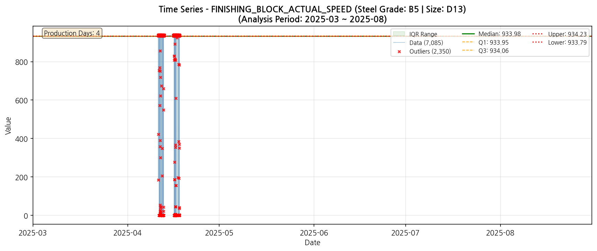

**2. 분포 히스토그램 (Distribution Histogram)**

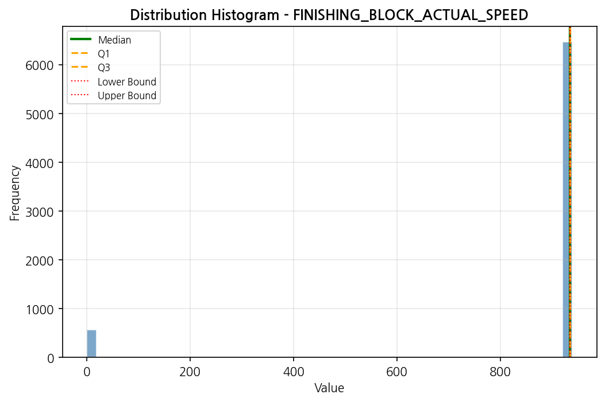

**3. 박스플롯 (Box Plot)**

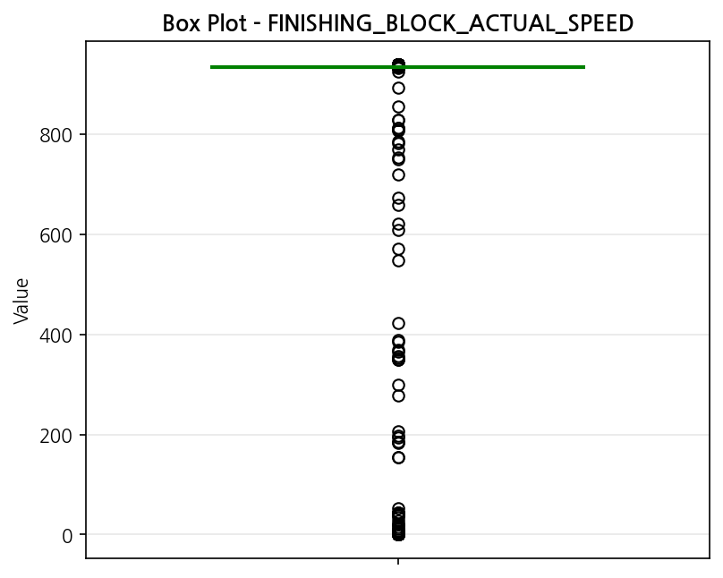

**4. 일별 평균 추이 (Daily Average Trend)**

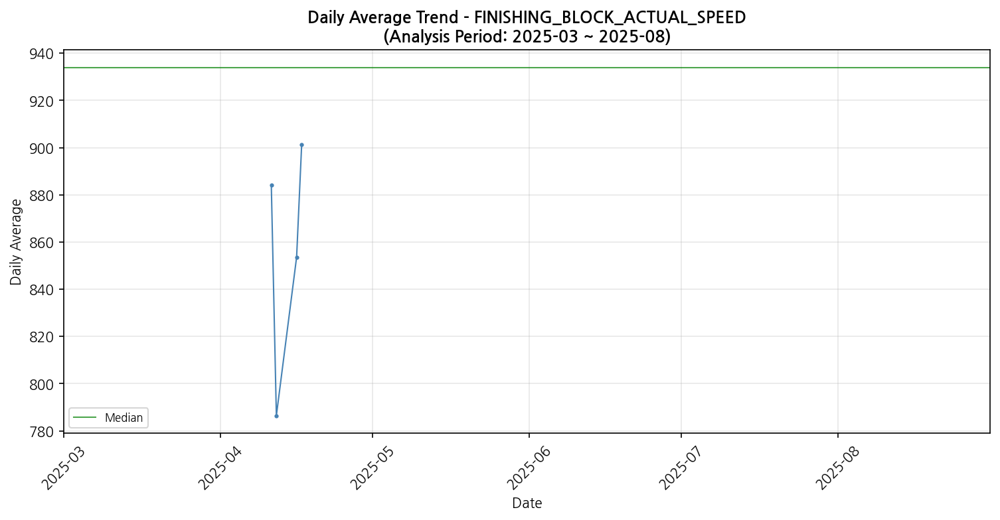

**5. 월별 이상치율 (Monthly Outlier Rate)**

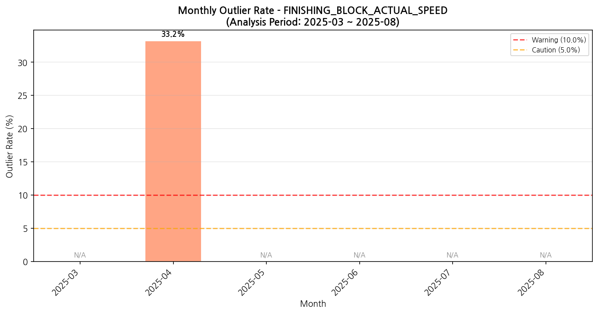

**6. 시간별 패턴 (Hourly Pattern)**

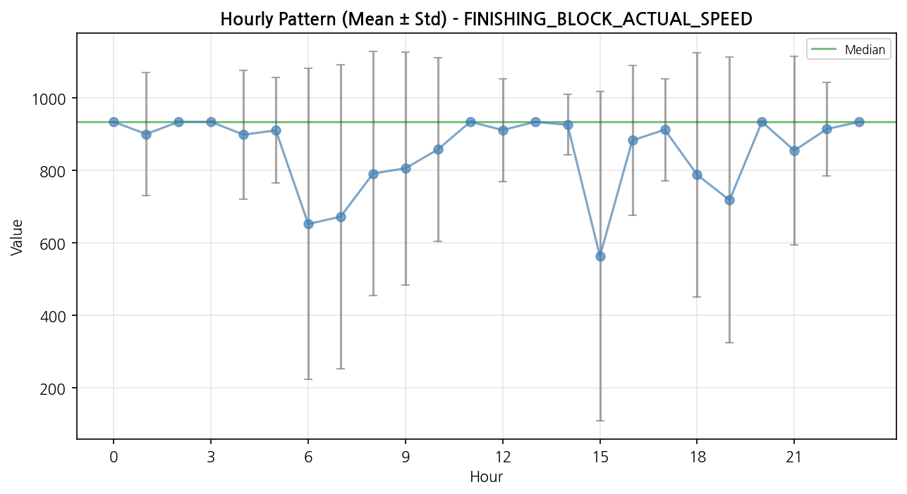

**7. 일별 이상치 수 (Daily Outlier Count)**

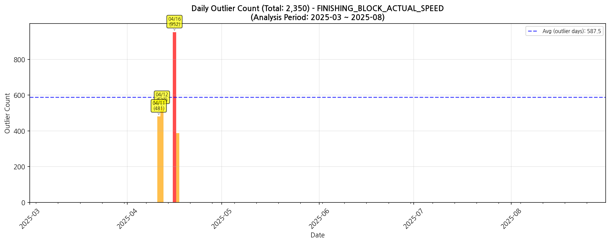

**종합 분석 차트**

---

##### 월별 상세 분석

**2025-04**

**통계 요약**:

| 지표 | 값 |
|------|-------|
| 분석 레코드 | 7,085 |
| 평균 | 855.8291 |
| 중앙값 | 933.9815 |
| IQR | 0.1094 |
| 이상치 수 | 2,350 |
| 이상치율 | 33.17% |

**주요 이상치 발생 날짜**:

- 1. 2025-04-16: 952건
- 2. 2025-04-12: 529건
- 3. 2025-04-11: 481건

**1. 시계열 (Time Series)**

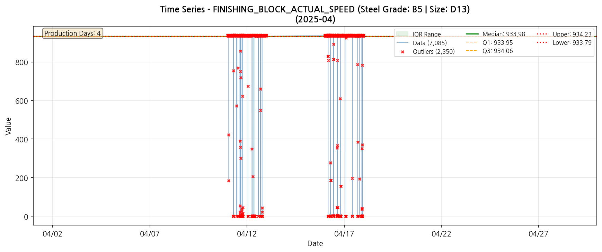

**2. 분포 히스토그램 (Distribution Histogram)**

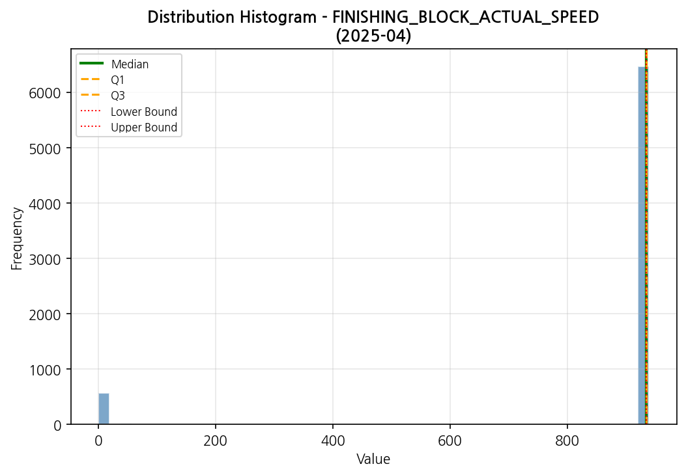

**3. 박스플롯 (Box Plot)**

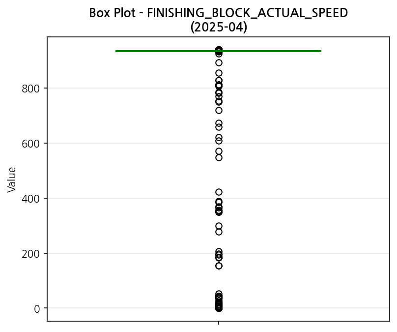

**4. 일별 평균 추이 (Daily Average Trend)**

**5. 시간별 패턴 (Hourly Pattern)**

**6. 일별 이상치 수 (Daily Outlier Count)**

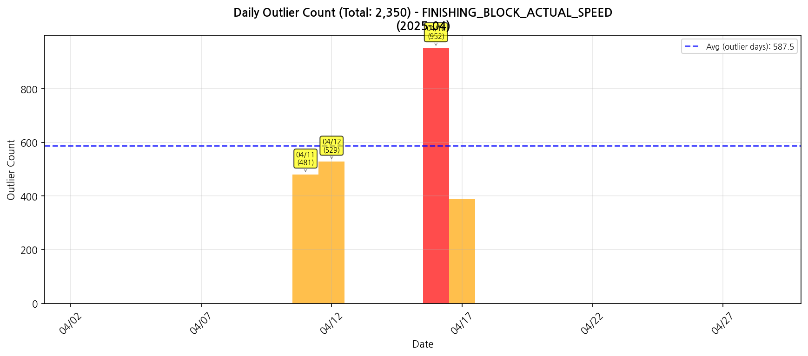

**월별 종합 차트**

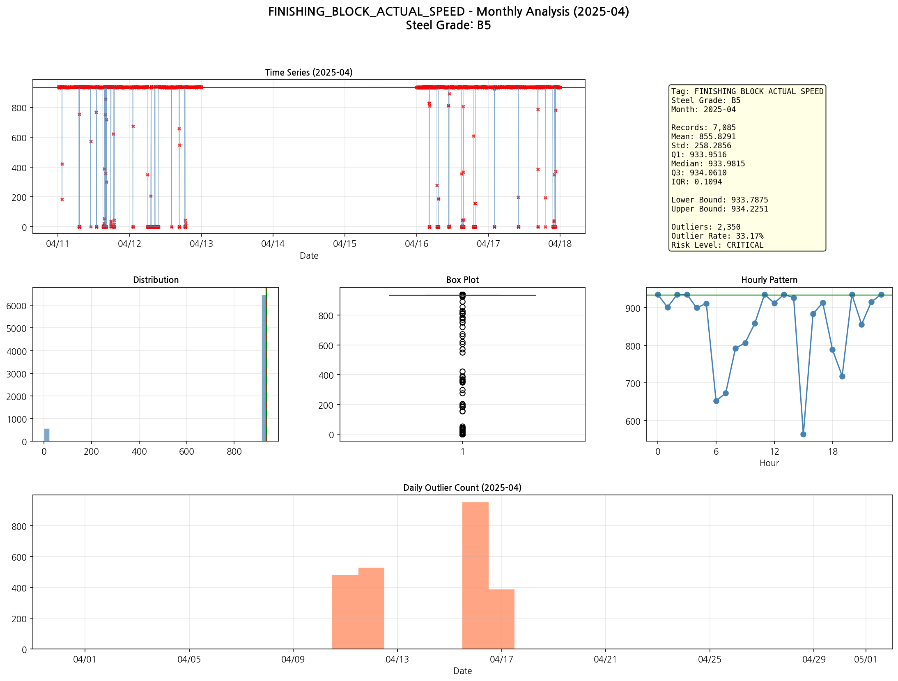

---

### 🔴 위험 (15~25%) - 5개 태그

#### PINCHROLL_3_ACTUAL_TORQUE 🔴

**위험도**: [DANGER] | **이상치율**: 21.28% | **이상치 방향**: 하한 미달

**카테고리**: 08 Pinchroll

| 필터 | 적용 | 이유 |
|------|:----:|------|
| run_only | ✓ | 가동 상태에서만 측정이 유효함 |
| special_ops | ✓ | 정상 운전 조건에서 분석 |
| roll_change | ✓ | 롤교환 시 속도/토크 급변 구간 제외 |
| coiling_transient | ✓ | 권취 시작/종료 가감속 구간 제외 |

**데이터**: 원본 7,191 → 필터 후 6,366 (11.5% 제외)

| 통계 지표 | 값 |
|-----------|-------|
| 분석 레코드 | 6,366 |
| 평균 | 29.3581 |
| 표준편차 | 10.7685 |
| Q1 (25%) | 30.6909 |
| 중앙값 | 34.9868 |
| Q3 (75%) | 34.9956 |
| IQR | 4.3047 |
| 하한 경계 | 24.2339 |
| 상한 경계 | 41.4526 |
| 이상치 수 | 1,355 (21.28%) |

**월별 이상치 추이**:

| 월 | 레코드 수 | 평균 | 이상치율 |
|-----|-----------|------|----------|
| 2025-04 | 6,366 | 29.36 | 21.28% |

**주요 이상치 발생 날짜** (상위 5일):

| 순위 | 날짜 | 이상치 수 |
|:----:|------|----------:|
| 1 | 2025-04-16 | 537 |
| 2 | 2025-04-11 | 317 |
| 3 | 2025-04-17 | 264 |
| 4 | 2025-04-12 | 237 |

- 이상치 발생 일수: 4일
- 최대 일별 이상치: 537건 (2025-04-16)
- 평균 일별 이상치: 338.8건

##### 차트 분석

**1. 시계열 (Time Series)**

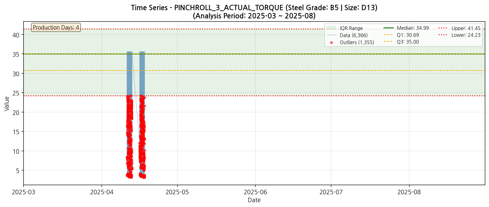

**2. 분포 히스토그램 (Distribution Histogram)**

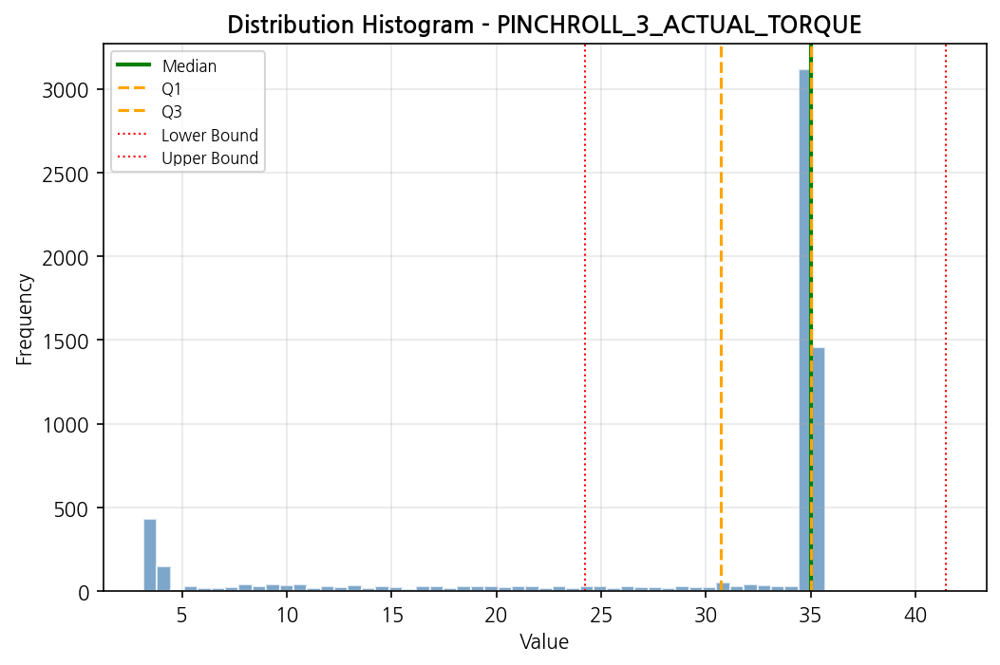

**3. 박스플롯 (Box Plot)**

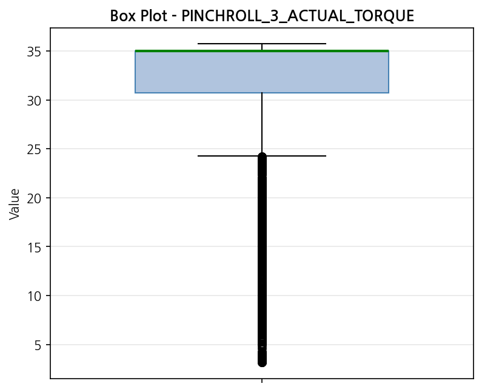

**4. 일별 평균 추이 (Daily Average Trend)**

**5. 월별 이상치율 (Monthly Outlier Rate)**

**6. 시간별 패턴 (Hourly Pattern)**

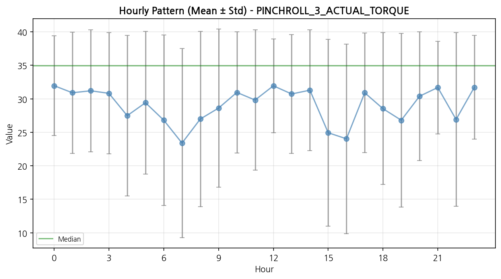

**7. 일별 이상치 수 (Daily Outlier Count)**

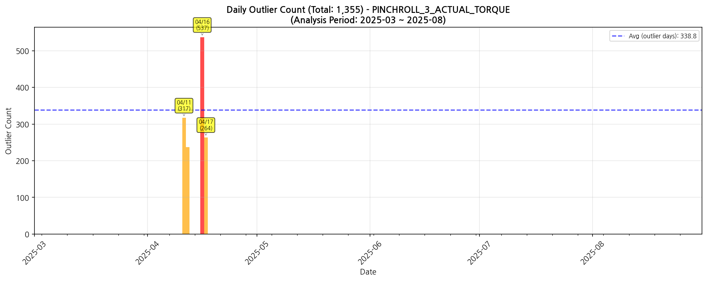

**종합 분석 차트**

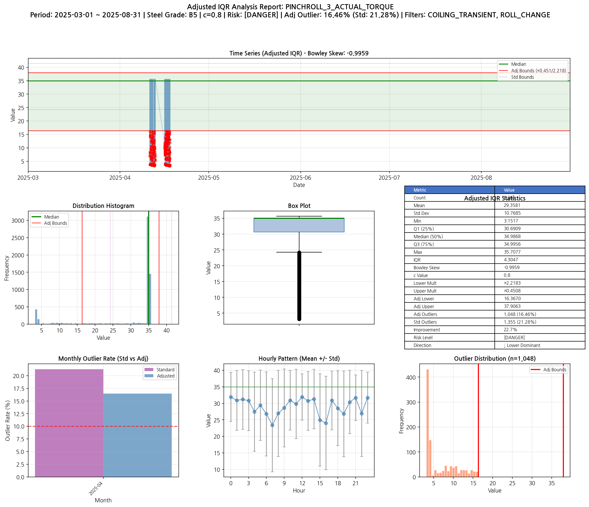

---

##### 월별 상세 분석

**2025-04**

**통계 요약**:

| 지표 | 값 |
|------|-------|
| 분석 레코드 | 6,366 |
| 평균 | 29.3581 |
| 중앙값 | 34.9868 |
| IQR | 4.3047 |
| 이상치 수 | 1,355 |
| 이상치율 | 21.28% |

**주요 이상치 발생 날짜**:

- 1. 2025-04-16: 537건
- 2. 2025-04-11: 317건
- 3. 2025-04-17: 264건

**1. 시계열 (Time Series)**

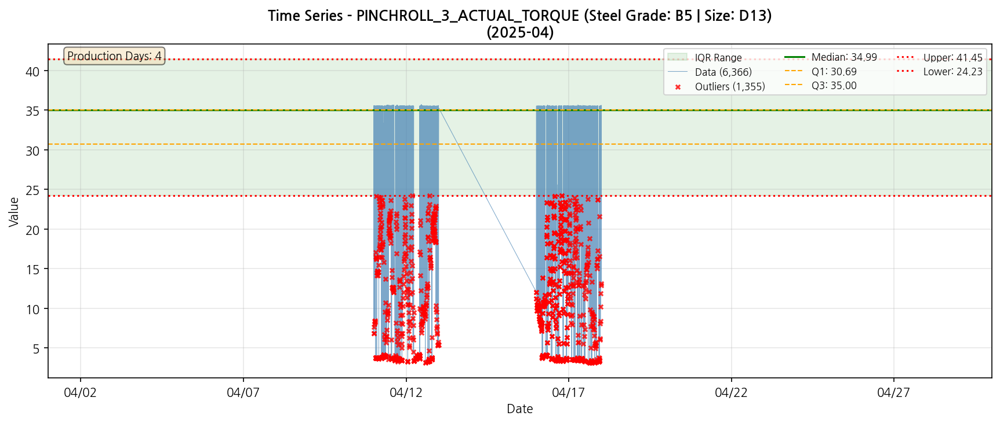

**2. 분포 히스토그램 (Distribution Histogram)**

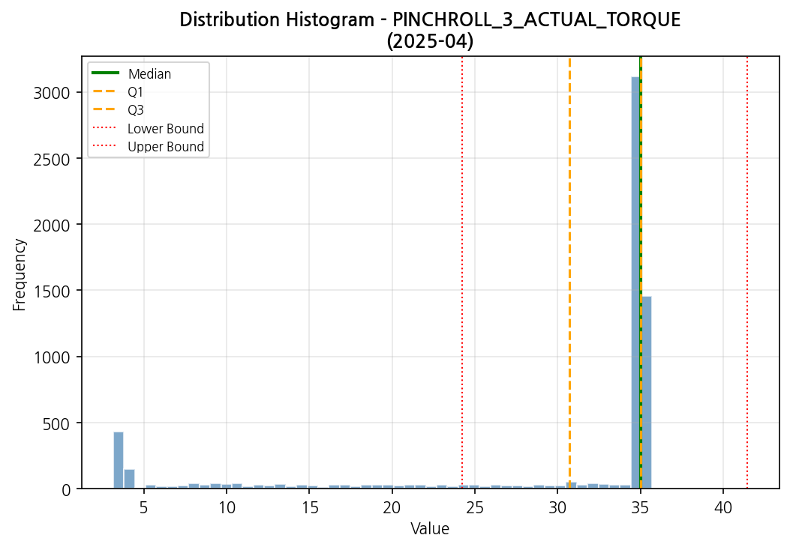

**3. 박스플롯 (Box Plot)**

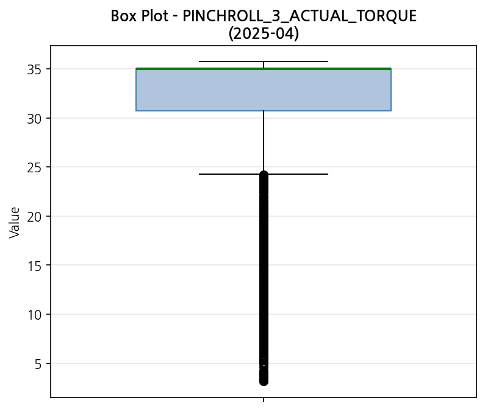

**4. 일별 평균 추이 (Daily Average Trend)**

**5. 시간별 패턴 (Hourly Pattern)**

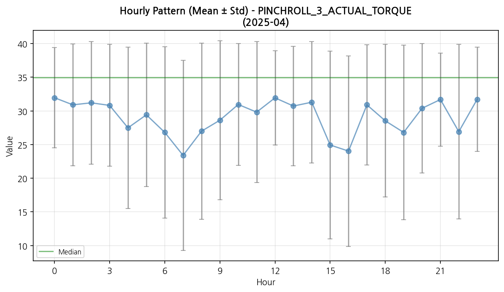

**6. 일별 이상치 수 (Daily Outlier Count)**

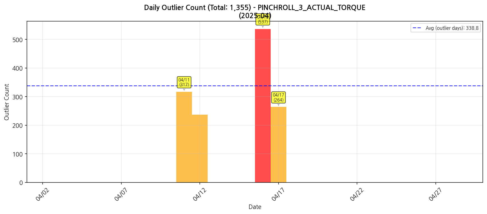

**월별 종합 차트**

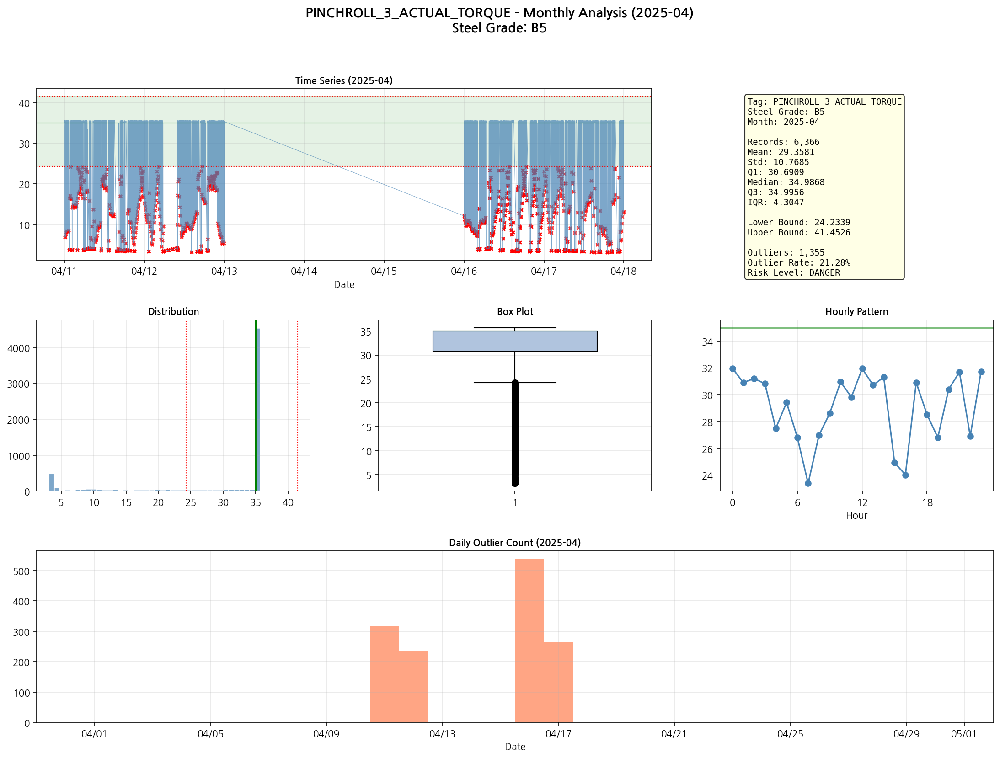

---

#### PINCHROLL_3_REFERENCE_TORQUE 🔴

**위험도**: [DANGER] | **이상치율**: 21.19% | **이상치 방향**: 상한 초과

**카테고리**: 08 Pinchroll

| 필터 | 적용 | 이유 |
|------|:----:|------|
| run_only | ✓ | 가동 상태에서만 측정이 유효함 |
| special_ops | ✓ | 정상 운전 조건에서 분석 |
| roll_change | ✓ | 롤교환 시 속도/토크 급변 구간 제외 |
| coiling_transient | ✓ | 권취 시작/종료 가감속 구간 제외 |

**데이터**: 원본 7,191 → 필터 후 6,366 (11.5% 제외)

| 통계 지표 | 값 |
|-----------|-------|
| 분석 레코드 | 6,366 |
| 평균 | 46.1721 |
| 표준편차 | 21.1846 |
| Q1 (25%) | 35.0000 |
| 중앙값 | 35.1346 |
| Q3 (75%) | 42.4396 |
| IQR | 7.4396 |
| 하한 경계 | 23.8406 |
| 상한 경계 | 53.5990 |
| 이상치 수 | 1,349 (21.19%) |

**월별 이상치 추이**:

| 월 | 레코드 수 | 평균 | 이상치율 |
|-----|-----------|------|----------|
| 2025-04 | 6,366 | 46.17 | 21.19% |

**주요 이상치 발생 날짜** (상위 5일):

| 순위 | 날짜 | 이상치 수 |
|:----:|------|----------:|
| 1 | 2025-04-16 | 533 |
| 2 | 2025-04-11 | 319 |
| 3 | 2025-04-17 | 271 |
| 4 | 2025-04-12 | 226 |

- 이상치 발생 일수: 4일
- 최대 일별 이상치: 533건 (2025-04-16)
- 평균 일별 이상치: 337.2건

##### 차트 분석

**1. 시계열 (Time Series)**

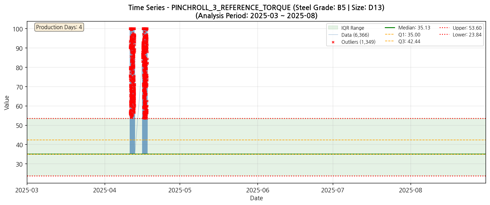

**2. 분포 히스토그램 (Distribution Histogram)**

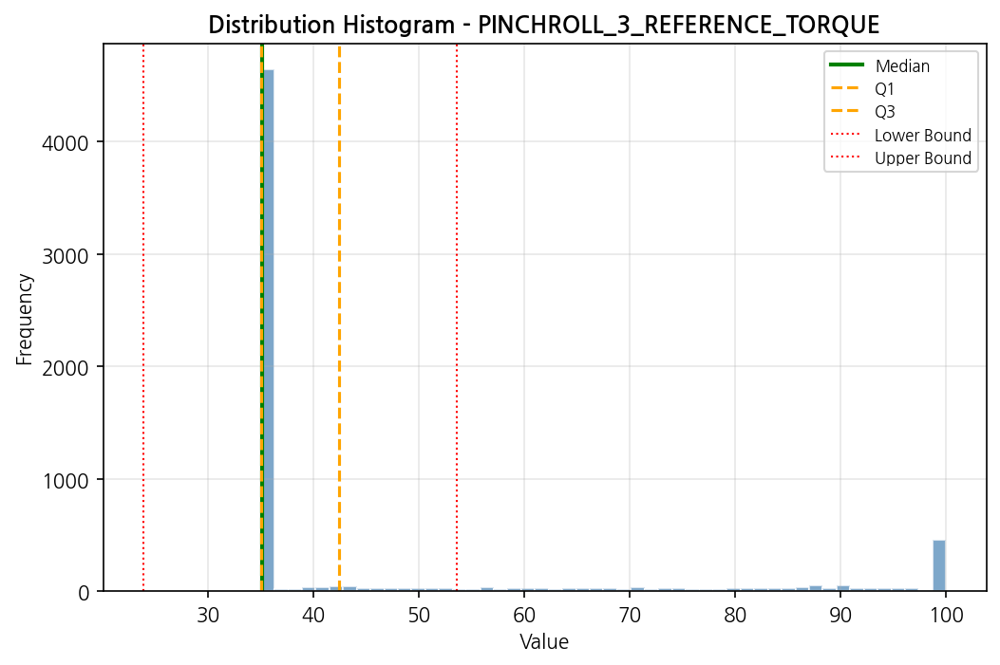

**3. 박스플롯 (Box Plot)**

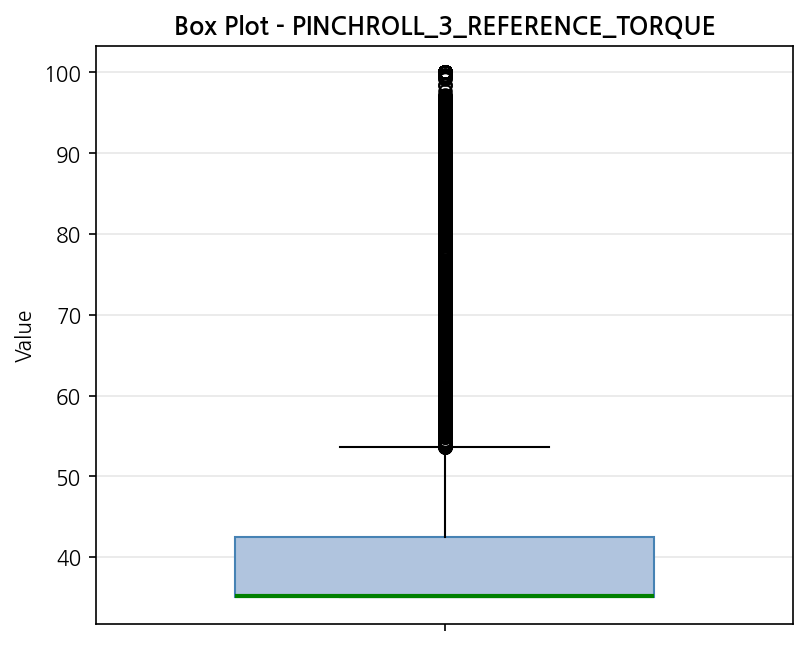

**4. 일별 평균 추이 (Daily Average Trend)**

**5. 월별 이상치율 (Monthly Outlier Rate)**

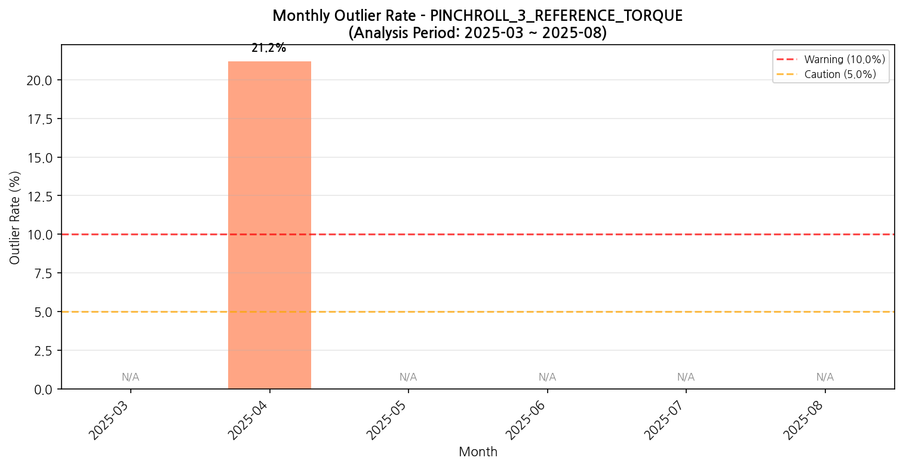

**6. 시간별 패턴 (Hourly Pattern)**

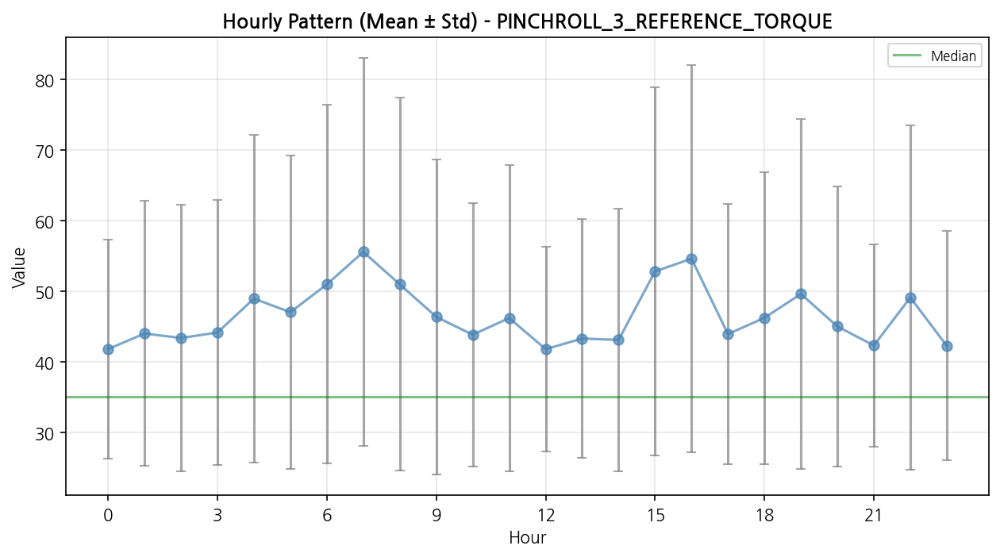

**7. 일별 이상치 수 (Daily Outlier Count)**

**종합 분석 차트**

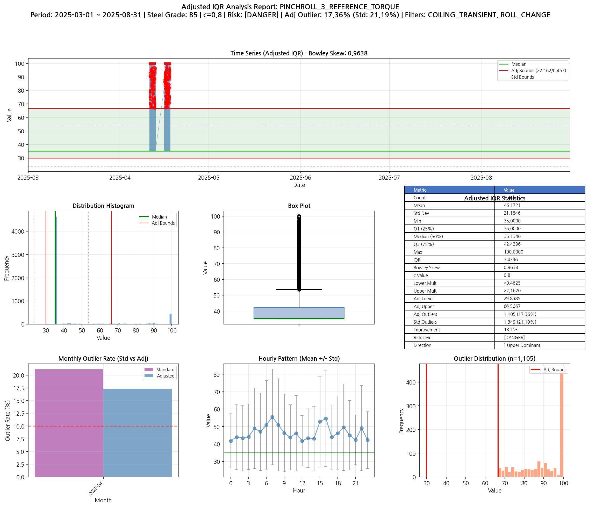

---

##### 월별 상세 분석

**2025-04**

**통계 요약**:

| 지표 | 값 |
|------|-------|
| 분석 레코드 | 6,366 |
| 평균 | 46.1721 |
| 중앙값 | 35.1346 |
| IQR | 7.4396 |
| 이상치 수 | 1,349 |
| 이상치율 | 21.19% |

**주요 이상치 발생 날짜**:

- 1. 2025-04-16: 533건
- 2. 2025-04-11: 319건
- 3. 2025-04-17: 271건

**1. 시계열 (Time Series)**

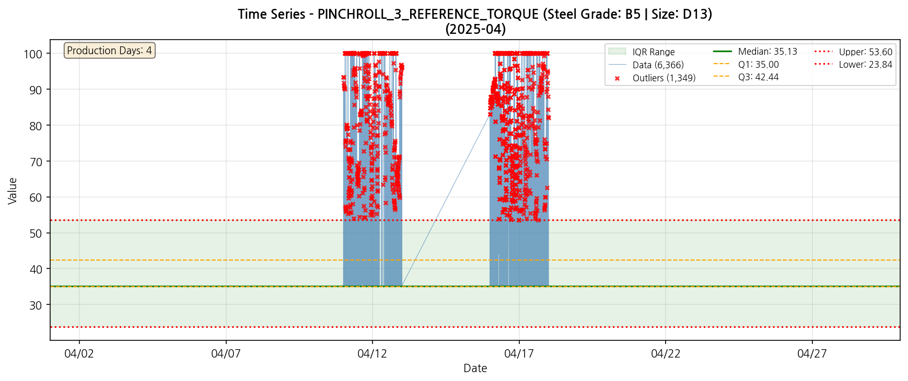

**2. 분포 히스토그램 (Distribution Histogram)**

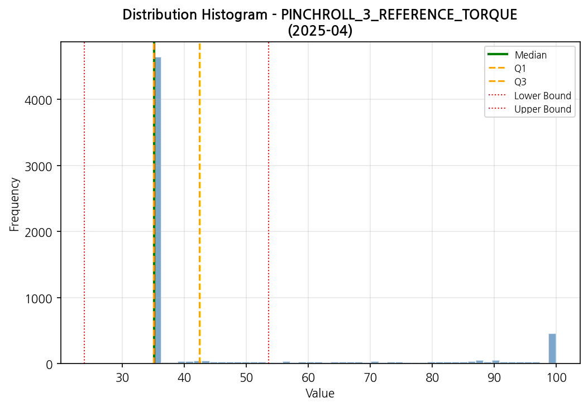

**3. 박스플롯 (Box Plot)**

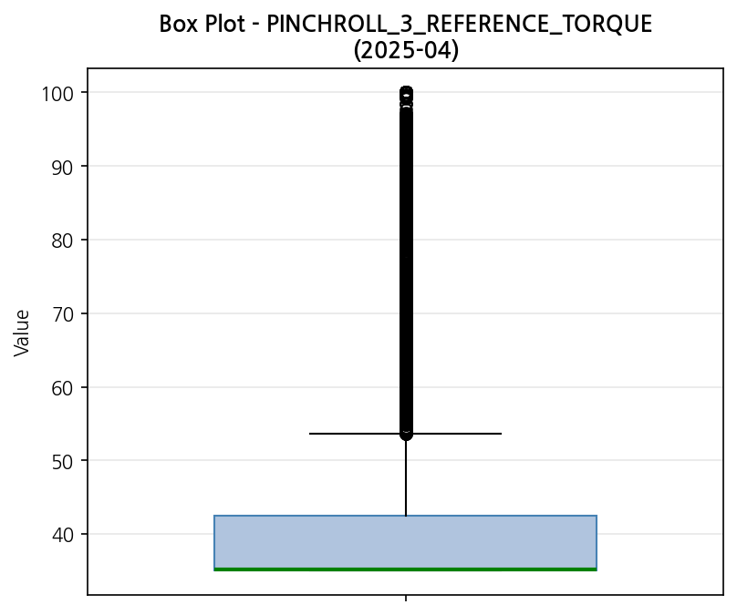

**4. 일별 평균 추이 (Daily Average Trend)**

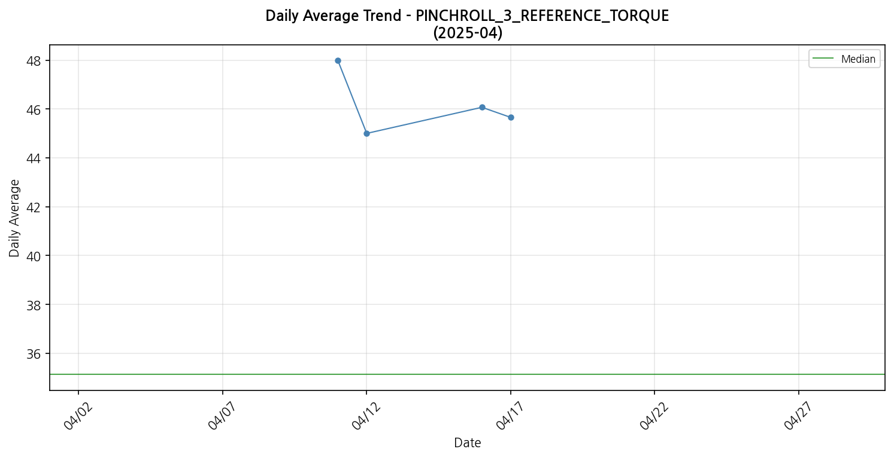

**5. 시간별 패턴 (Hourly Pattern)**

**6. 일별 이상치 수 (Daily Outlier Count)**

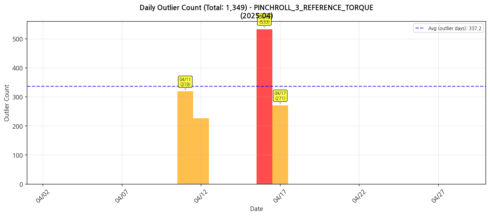

**월별 종합 차트**

---

#### PINCHROLL_4_REFERENCE_TORQUE 🔴

**위험도**: [DANGER] | **이상치율**: 21.07% | **이상치 방향**: 상한 초과

**카테고리**: 08 Pinchroll

| 필터 | 적용 | 이유 |
|------|:----:|------|
| run_only | ✓ | 가동 상태에서만 측정이 유효함 |
| special_ops | ✓ | 정상 운전 조건에서 분석 |
| roll_change | ✓ | 롤교환 시 속도/토크 급변 구간 제외 |
| coiling_transient | ✓ | 권취 시작/종료 가감속 구간 제외 |

**데이터**: 원본 7,191 → 필터 후 6,366 (11.5% 제외)

| 통계 지표 | 값 |
|-----------|-------|
| 분석 레코드 | 6,366 |
| 평균 | 46.2741 |
| 표준편차 | 21.3007 |
| Q1 (25%) | 35.0000 |
| 중앙값 | 35.1200 |
| Q3 (75%) | 42.9098 |
| IQR | 7.9098 |
| 하한 경계 | 23.1353 |
| 상한 경계 | 54.7745 |
| 이상치 수 | 1,341 (21.07%) |

**월별 이상치 추이**:

| 월 | 레코드 수 | 평균 | 이상치율 |
|-----|-----------|------|----------|
| 2025-04 | 6,366 | 46.27 | 21.07% |

**주요 이상치 발생 날짜** (상위 5일):

| 순위 | 날짜 | 이상치 수 |
|:----:|------|----------:|
| 1 | 2025-04-16 | 529 |
| 2 | 2025-04-11 | 316 |
| 3 | 2025-04-17 | 270 |
| 4 | 2025-04-12 | 226 |

- 이상치 발생 일수: 4일
- 최대 일별 이상치: 529건 (2025-04-16)
- 평균 일별 이상치: 335.2건

##### 차트 분석

**1. 시계열 (Time Series)**

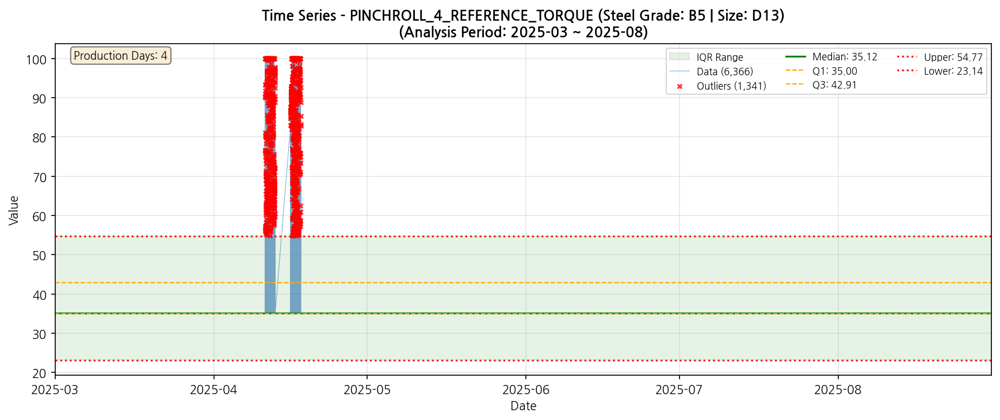

**2. 분포 히스토그램 (Distribution Histogram)**

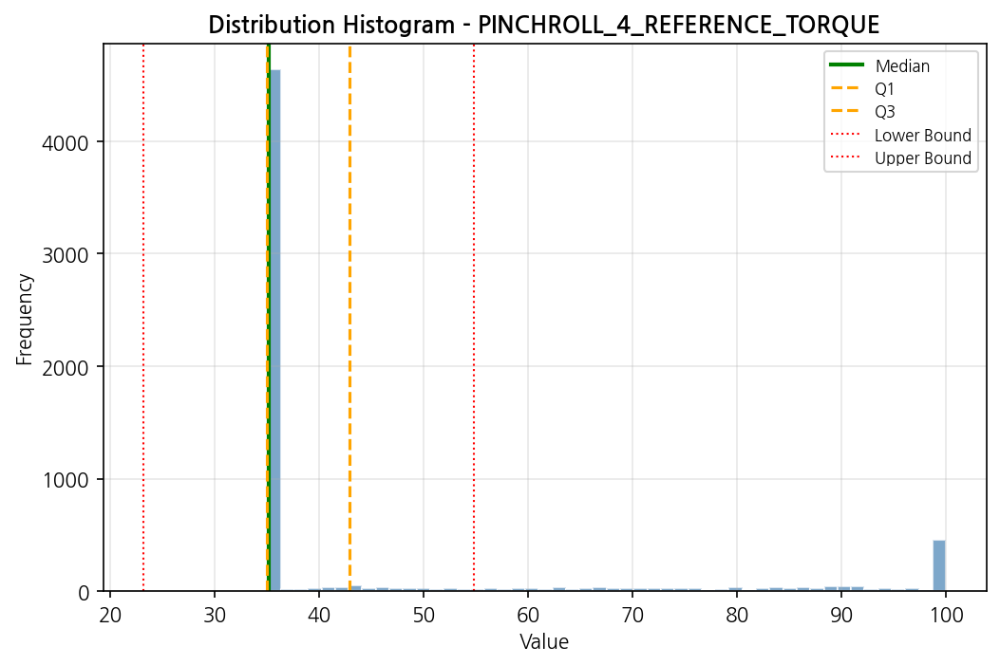

**3. 박스플롯 (Box Plot)**

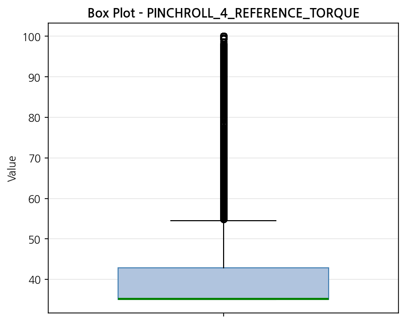

**4. 일별 평균 추이 (Daily Average Trend)**

**5. 월별 이상치율 (Monthly Outlier Rate)**

**6. 시간별 패턴 (Hourly Pattern)**

**7. 일별 이상치 수 (Daily Outlier Count)**

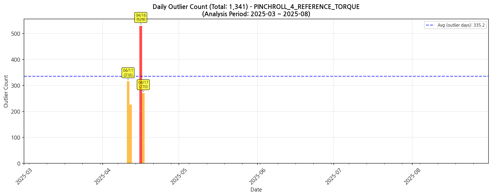

**종합 분석 차트**

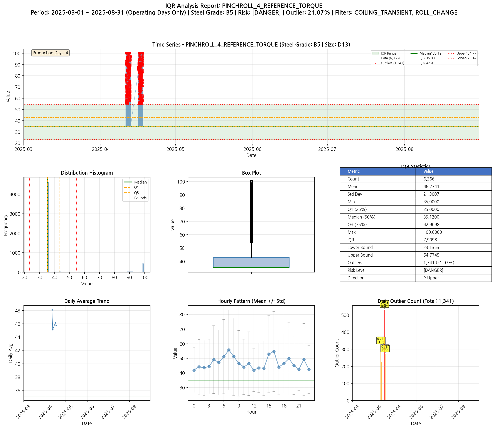

---

##### 월별 상세 분석

**2025-04**

**통계 요약**:

| 지표 | 값 |
|------|-------|
| 분석 레코드 | 6,366 |
| 평균 | 46.2741 |
| 중앙값 | 35.1200 |
| IQR | 7.9098 |
| 이상치 수 | 1,341 |
| 이상치율 | 21.07% |

**주요 이상치 발생 날짜**:

- 1. 2025-04-16: 529건
- 2. 2025-04-11: 316건
- 3. 2025-04-17: 270건

**1. 시계열 (Time Series)**

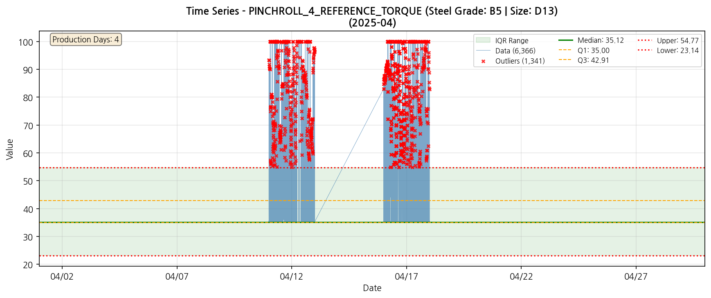

**2. 분포 히스토그램 (Distribution Histogram)**

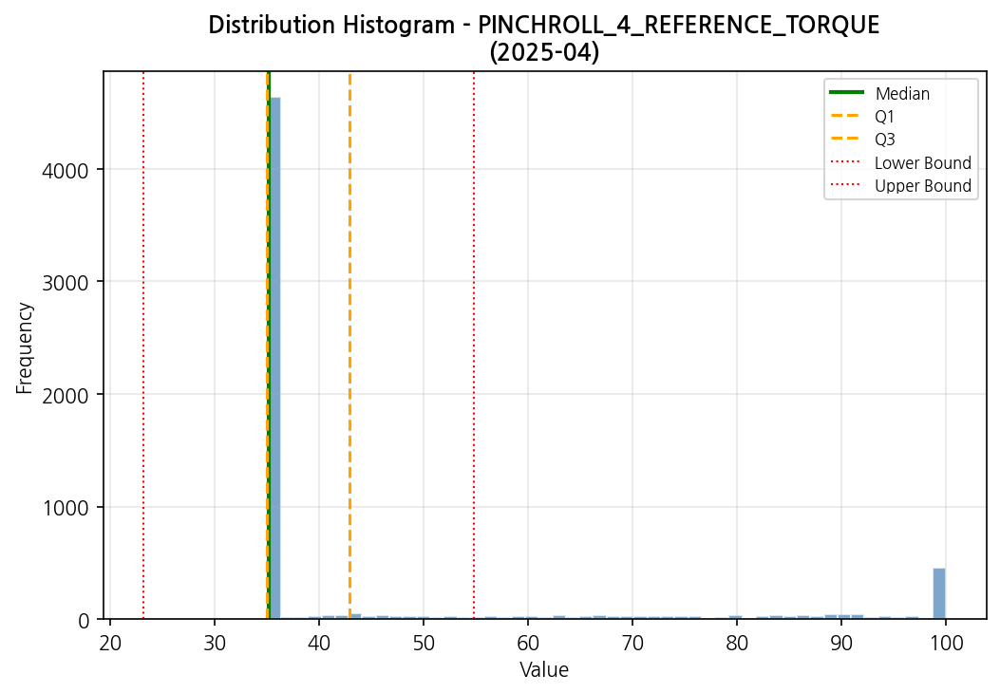

**3. 박스플롯 (Box Plot)**

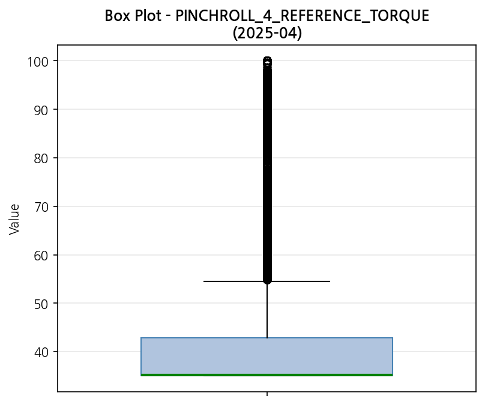

**4. 일별 평균 추이 (Daily Average Trend)**

**5. 시간별 패턴 (Hourly Pattern)**

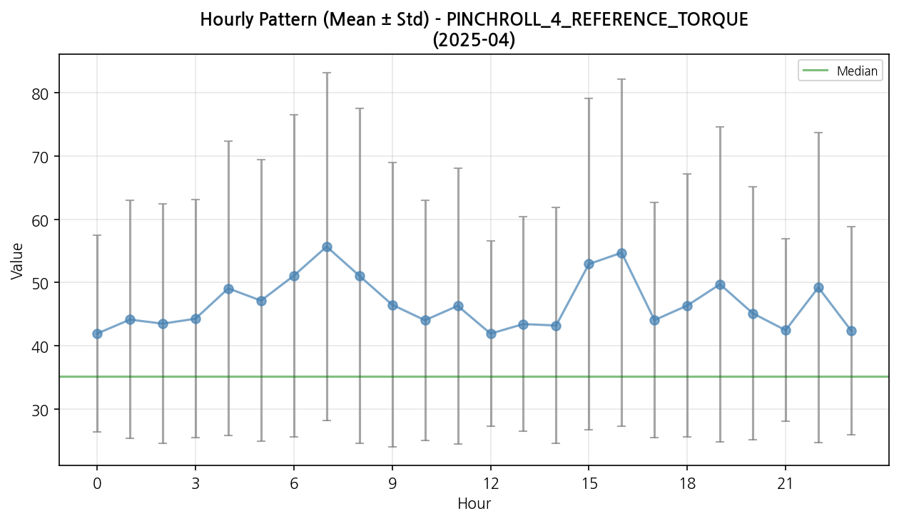

**6. 일별 이상치 수 (Daily Outlier Count)**

**월별 종합 차트**

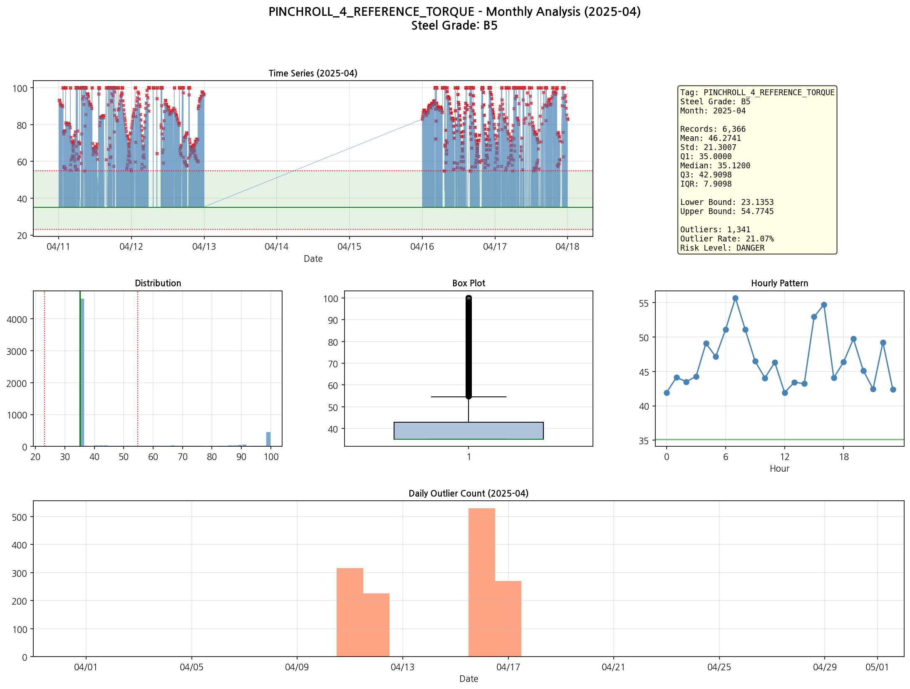

---

#### PINCHROLL_4_ACTUAL_TORQUE 🔴

**위험도**: [DANGER] | **이상치율**: 20.89% | **이상치 방향**: 하한 미달

**카테고리**: 08 Pinchroll

| 필터 | 적용 | 이유 |
|------|:----:|------|
| run_only | ✓ | 가동 상태에서만 측정이 유효함 |
| special_ops | ✓ | 정상 운전 조건에서 분석 |
| roll_change | ✓ | 롤교환 시 속도/토크 급변 구간 제외 |
| coiling_transient | ✓ | 권취 시작/종료 가감속 구간 제외 |

**데이터**: 원본 7,191 → 필터 후 6,366 (11.5% 제외)

| 통계 지표 | 값 |
|-----------|-------|
| 분석 레코드 | 6,366 |
| 평균 | 29.4974 |
| 표준편차 | 10.4605 |
| Q1 (25%) | 30.3988 |
| 중앙값 | 34.9907 |
| Q3 (75%) | 34.9956 |
| IQR | 4.5969 |
| 하한 경계 | 23.5035 |
| 상한 경계 | 41.8909 |
| 이상치 수 | 1,330 (20.89%) |

**월별 이상치 추이**:

| 월 | 레코드 수 | 평균 | 이상치율 |
|-----|-----------|------|----------|
| 2025-04 | 6,366 | 29.50 | 20.89% |

**주요 이상치 발생 날짜** (상위 5일):

| 순위 | 날짜 | 이상치 수 |
|:----:|------|----------:|
| 1 | 2025-04-16 | 523 |
| 2 | 2025-04-11 | 312 |
| 3 | 2025-04-17 | 260 |
| 4 | 2025-04-12 | 235 |

- 이상치 발생 일수: 4일
- 최대 일별 이상치: 523건 (2025-04-16)
- 평균 일별 이상치: 332.5건

##### 차트 분석

**1. 시계열 (Time Series)**

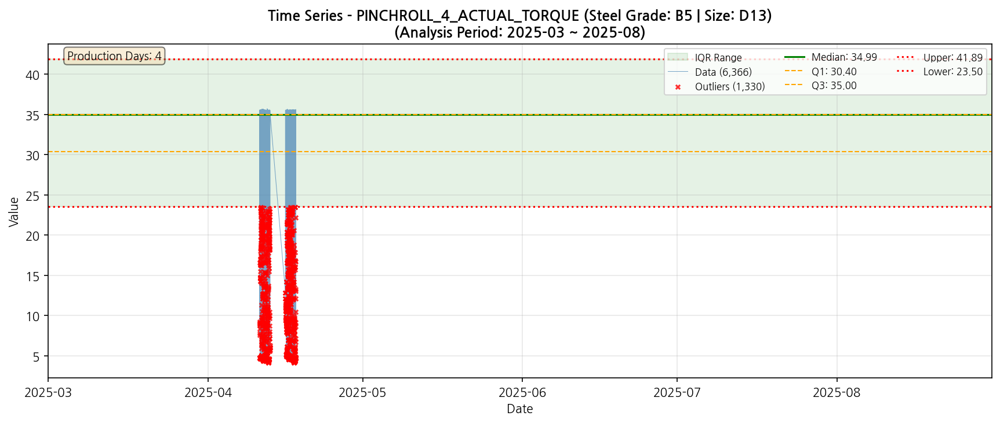

**2. 분포 히스토그램 (Distribution Histogram)**

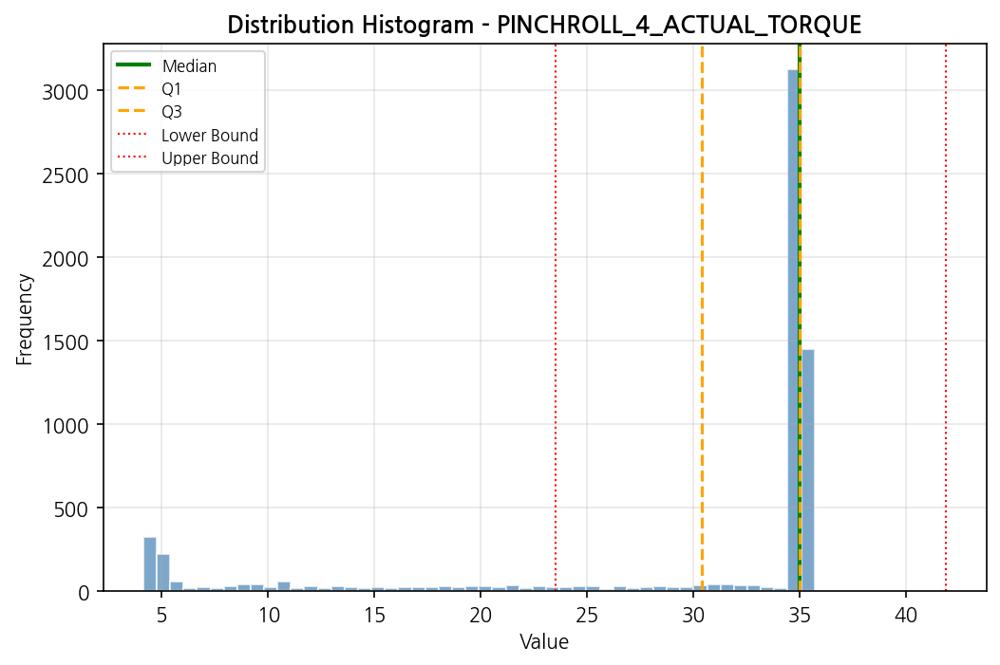

**3. 박스플롯 (Box Plot)**

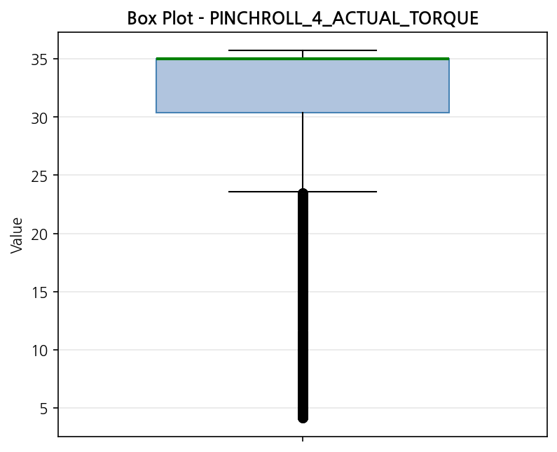

**4. 일별 평균 추이 (Daily Average Trend)**

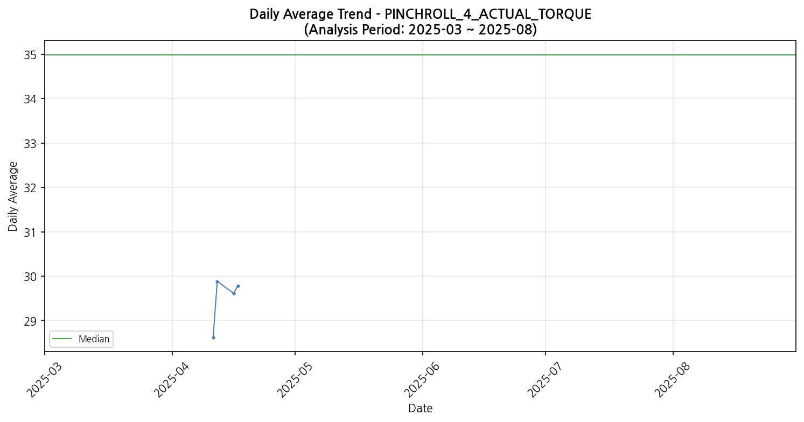

**5. 월별 이상치율 (Monthly Outlier Rate)**

**6. 시간별 패턴 (Hourly Pattern)**

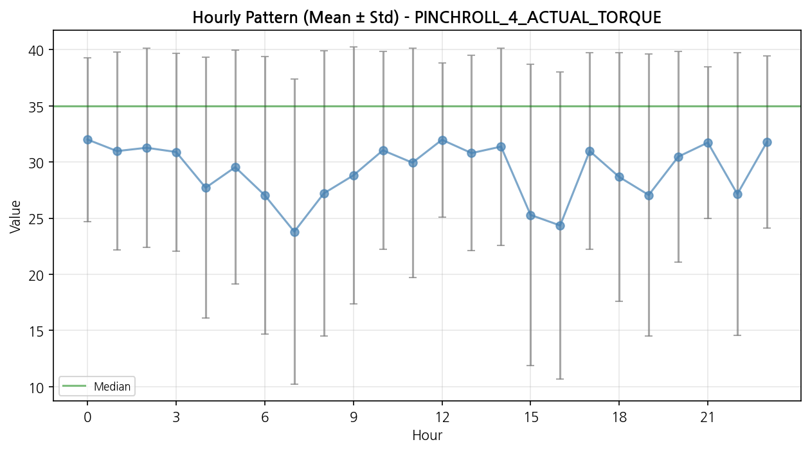

**7. 일별 이상치 수 (Daily Outlier Count)**


**종합 분석 차트**


---

##### 월별 상세 분석

**2025-04**

**통계 요약**:

| 지표 | 값 |
|------|-------|
| 분석 레코드 | 6,366 |
| 평균 | 29.4974 |
| 중앙값 | 34.9907 |
| IQR | 4.5969 |
| 이상치 수 | 1,330 |
| 이상치율 | 20.89% |

**주요 이상치 발생 날짜**:

- 1. 2025-04-16: 523건
- 2. 2025-04-11: 312건
- 3. 2025-04-17: 260건

**1. 시계열 (Time Series)**


**2. 분포 히스토그램 (Distribution Histogram)**


**3. 박스플롯 (Box Plot)**


**4. 일별 평균 추이 (Daily Average Trend)**

**5. 시간별 패턴 (Hourly Pattern)**

**6. 일별 이상치 수 (Daily Outlier Count)**

**월별 종합 차트**

---

#### PINCHROLL_2_ACTUAL_TORQUE 🔴

**위험도**: [DANGER] | **이상치율**: 19.68% | **이상치 방향**: 하한 미달

**카테고리**: 08 Pinchroll

| 필터 | 적용 | 이유 |
|------|:----:|------|
| run_only | ✓ | 가동 상태에서만 측정이 유효함 |
| special_ops | ✓ | 정상 운전 조건에서 분석 |
| roll_change | ✓ | 롤교환 시 속도/토크 급변 구간 제외 |
| coiling_transient | ✓ | 권취 시작/종료 가감속 구간 제외 |

**데이터**: 원본 7,191 → 필터 후 6,366 (11.5% 제외)

| 통계 지표 | 값 |
|-----------|-------|
| 분석 레코드 | 6,366 |
| 평균 | 16.7162 |
| 표준편차 | 6.0062 |
| Q1 (25%) | 16.8317 |
| 중앙값 | 19.9947 |
| Q3 (75%) | 19.9950 |
| IQR | 3.1633 |
| 하한 경계 | 12.0867 |
| 상한 경계 | 24.7400 |
| 이상치 수 | 1,253 (19.68%) |

**월별 이상치 추이**:

| 월 | 레코드 수 | 평균 | 이상치율 |
|-----|-----------|------|----------|
| 2025-04 | 6,366 | 16.72 | 19.68% |

**주요 이상치 발생 날짜** (상위 5일):

| 순위 | 날짜 | 이상치 수 |
|:----:|------|----------:|
| 1 | 2025-04-16 | 499 |
| 2 | 2025-04-11 | 288 |
| 3 | 2025-04-17 | 250 |
| 4 | 2025-04-12 | 216 |

- 이상치 발생 일수: 4일
- 최대 일별 이상치: 499건 (2025-04-16)
- 평균 일별 이상치: 313.2건

##### 차트 분석

**1. 시계열 (Time Series)**


**2. 분포 히스토그램 (Distribution Histogram)**


**3. 박스플롯 (Box Plot)**


**4. 일별 평균 추이 (Daily Average Trend)**

**5. 월별 이상치율 (Monthly Outlier Rate)**

**6. 시간별 패턴 (Hourly Pattern)**


**7. 일별 이상치 수 (Daily Outlier Count)**

**종합 분석 차트**


---

##### 월별 상세 분석

**2025-04**

**통계 요약**:

| 지표 | 값 |
|------|-------|
| 분석 레코드 | 6,366 |
| 평균 | 16.7162 |
| 중앙값 | 19.9947 |
| IQR | 3.1633 |
| 이상치 수 | 1,253 |
| 이상치율 | 19.68% |

**주요 이상치 발생 날짜**:

- 1. 2025-04-16: 499건
- 2. 2025-04-11: 288건
- 3. 2025-04-17: 250건

**1. 시계열 (Time Series)**


**2. 분포 히스토그램 (Distribution Histogram)**


**3. 박스플롯 (Box Plot)**


**4. 일별 평균 추이 (Daily Average Trend)**

**5. 시간별 패턴 (Hourly Pattern)**


**6. 일별 이상치 수 (Daily Outlier Count)**


**월별 종합 차트**

---

### 🟠 경고 (10~15%) - 9개 태그

#### PR6L1_ACT_TORQUE [L1] 🟠

**위험도**: [WARNING] | **이상치율**: 14.64% | **이상치 방향**: 상한 초과

**카테고리**: 09 PR Detailed

| 필터 | 적용 | 이유 |
|------|:----:|------|
| run_only | ✓ | 가동 상태에서만 토크 측정이 유효함 |
| special_ops | ✓ | 정상 운전 조건에서 분석 |
| roll_change | ✓ | 롤교환 시 토크 급변 구간 제외 |
| coiling_transient | ✓ | 권취 시작/종료 가감속 구간 제외 |

**데이터**: 원본 7,191 → 필터 후 6,366 (11.5% 제외)

| 통계 지표 | 값 |
|-----------|-------|
| 분석 레코드 | 6,366 |
| 평균 | 3.6098 |
| 표준편차 | 0.3248 |
| Q1 (25%) | 3.3795 |
| 중앙값 | 3.5083 |
| Q3 (75%) | 3.6725 |
| IQR | 0.2930 |
| 하한 경계 | 2.9400 |
| 상한 경계 | 4.1121 |
| 이상치 수 | 932 (14.64%) |

**월별 이상치 추이**:

| 월 | 레코드 수 | 평균 | 이상치율 |
|-----|-----------|------|----------|
| 2025-04 | 6,366 | 3.61 | 14.64% |

**주요 이상치 발생 날짜** (상위 5일):

| 순위 | 날짜 | 이상치 수 |
|:----:|------|----------:|
| 1 | 2025-04-16 | 395 |
| 2 | 2025-04-11 | 187 |
| 3 | 2025-04-12 | 177 |
| 4 | 2025-04-17 | 173 |

- 이상치 발생 일수: 4일
- 최대 일별 이상치: 395건 (2025-04-16)
- 평균 일별 이상치: 233.0건

##### 차트 분석

**1. 시계열 (Time Series)**


**2. 분포 히스토그램 (Distribution Histogram)**


**3. 박스플롯 (Box Plot)**

**4. 일별 평균 추이 (Daily Average Trend)**


**5. 월별 이상치율 (Monthly Outlier Rate)**


**6. 시간별 패턴 (Hourly Pattern)**


**7. 일별 이상치 수 (Daily Outlier Count)**

**종합 분석 차트**


---

##### 월별 상세 분석

**2025-04**

**통계 요약**:

| 지표 | 값 |
|------|-------|
| 분석 레코드 | 6,366 |
| 평균 | 3.6098 |
| 중앙값 | 3.5083 |
| IQR | 0.2930 |
| 이상치 수 | 932 |
| 이상치율 | 14.64% |

**주요 이상치 발생 날짜**:

- 1. 2025-04-16: 395건
- 2. 2025-04-11: 187건
- 3. 2025-04-12: 177건

**1. 시계열 (Time Series)**


**2. 분포 히스토그램 (Distribution Histogram)**


**3. 박스플롯 (Box Plot)**


**4. 일별 평균 추이 (Daily Average Trend)**

**5. 시간별 패턴 (Hourly Pattern)**


**6. 일별 이상치 수 (Daily Outlier Count)**

**월별 종합 차트**

---

#### PR6L2_ACT_TORQUE [L2] 🟠

**위험도**: [WARNING] | **이상치율**: 13.62% | **이상치 방향**: 상한 초과

**카테고리**: 09 PR Detailed

| 필터 | 적용 | 이유 |
|------|:----:|------|
| run_only | ✓ | 가동 상태에서만 토크 측정이 유효함 |
| special_ops | ✓ | 정상 운전 조건에서 분석 |
| roll_change | ✓ | 롤교환 시 토크 급변 구간 제외 |
| coiling_transient | ✓ | 권취 시작/종료 가감속 구간 제외 |

**데이터**: 원본 7,191 → 필터 후 6,366 (11.5% 제외)

| 통계 지표 | 값 |
|-----------|-------|
| 분석 레코드 | 6,366 |
| 평균 | 4.6334 |
| 표준편차 | 0.3510 |
| Q1 (25%) | 4.3847 |
| 중앙값 | 4.5285 |
| Q3 (75%) | 4.7107 |
| IQR | 0.3259 |
| 하한 경계 | 3.8958 |
| 상한 경계 | 5.1996 |
| 이상치 수 | 867 (13.62%) |

**월별 이상치 추이**:

| 월 | 레코드 수 | 평균 | 이상치율 |
|-----|-----------|------|----------|
| 2025-04 | 6,366 | 4.63 | 13.62% |

**주요 이상치 발생 날짜** (상위 5일):

| 순위 | 날짜 | 이상치 수 |
|:----:|------|----------:|
| 1 | 2025-04-16 | 381 |
| 2 | 2025-04-11 | 188 |
| 3 | 2025-04-12 | 149 |
| 4 | 2025-04-17 | 149 |

- 이상치 발생 일수: 4일
- 최대 일별 이상치: 381건 (2025-04-16)
- 평균 일별 이상치: 216.8건

##### 차트 분석

**1. 시계열 (Time Series)**


**2. 분포 히스토그램 (Distribution Histogram)**

**3. 박스플롯 (Box Plot)**


**4. 일별 평균 추이 (Daily Average Trend)**

**5. 월별 이상치율 (Monthly Outlier Rate)**


**6. 시간별 패턴 (Hourly Pattern)**


**7. 일별 이상치 수 (Daily Outlier Count)**


**종합 분석 차트**


---

##### 월별 상세 분석

**2025-04**

**통계 요약**:

| 지표 | 값 |
|------|-------|
| 분석 레코드 | 6,366 |
| 평균 | 4.6334 |
| 중앙값 | 4.5285 |
| IQR | 0.3259 |
| 이상치 수 | 867 |
| 이상치율 | 13.62% |

**주요 이상치 발생 날짜**:

- 1. 2025-04-16: 381건
- 2. 2025-04-11: 188건
- 3. 2025-04-12: 149건

**1. 시계열 (Time Series)**


**2. 분포 히스토그램 (Distribution Histogram)**


**3. 박스플롯 (Box Plot)**


**4. 일별 평균 추이 (Daily Average Trend)**


**5. 시간별 패턴 (Hourly Pattern)**

**6. 일별 이상치 수 (Daily Outlier Count)**


**월별 종합 차트**


---

#### FURNACE_EXIT_DISCHARGE_BILLET_TEMPERATURE 🟠

**위험도**: [WARNING] | **이상치율**: 12.42% | **이상치 방향**: 하한 미달

**카테고리**: 03 Furnace Discharge Temperature

| 필터 | 적용 | 이유 |
|------|:----:|------|
| run_only | ✓ | 가동 상태에서만 측정이 유효함 |
| special_ops | ✓ | 정상 운전 조건에서 분석 |
| roll_change | ✗ | 압연 전 측정으로 롤교환 무관 |
| coiling_transient | ✗ | 권취 전 공정으로 무관 |

**데이터**: 원본 7,191 → 필터 후 7,191 (0.0% 제외)

| 통계 지표 | 값 |
|-----------|-------|
| 분석 레코드 | 7,191 |
| 평균 | 989.8456 |
| 표준편차 | 309.3443 |
| Q1 (25%) | 1066.8310 |
| 중앙값 | 1082.4000 |
| Q3 (75%) | 1099.3230 |
| IQR | 32.4920 |
| 하한 경계 | 1018.0930 |
| 상한 경계 | 1148.0610 |
| 이상치 수 | 893 (12.42%) |

**월별 이상치 추이**:

| 월 | 레코드 수 | 평균 | 이상치율 |
|-----|-----------|------|----------|
| 2025-04 | 7,191 | 989.85 | 12.42% |

**주요 이상치 발생 날짜** (상위 5일):

| 순위 | 날짜 | 이상치 수 |
|:----:|------|----------:|
| 1 | 2025-04-16 | 340 |
| 2 | 2025-04-12 | 297 |
| 3 | 2025-04-11 | 133 |
| 4 | 2025-04-17 | 123 |

- 이상치 발생 일수: 4일
- 최대 일별 이상치: 340건 (2025-04-16)
- 평균 일별 이상치: 223.2건

##### 차트 분석

**1. 시계열 (Time Series)**


**2. 분포 히스토그램 (Distribution Histogram)**


**3. 박스플롯 (Box Plot)**


**4. 일별 평균 추이 (Daily Average Trend)**

**5. 월별 이상치율 (Monthly Outlier Rate)**


**6. 시간별 패턴 (Hourly Pattern)**


**7. 일별 이상치 수 (Daily Outlier Count)**


**종합 분석 차트**


---

##### 월별 상세 분석

**2025-04**

**통계 요약**:

| 지표 | 값 |
|------|-------|
| 분석 레코드 | 7,191 |
| 평균 | 989.8456 |
| 중앙값 | 1082.4000 |
| IQR | 32.4920 |
| 이상치 수 | 893 |
| 이상치율 | 12.42% |

**주요 이상치 발생 날짜**:

- 1. 2025-04-16: 340건
- 2. 2025-04-12: 297건
- 3. 2025-04-11: 133건

**1. 시계열 (Time Series)**


**2. 분포 히스토그램 (Distribution Histogram)**


**3. 박스플롯 (Box Plot)**


**4. 일별 평균 추이 (Daily Average Trend)**

**5. 시간별 패턴 (Hourly Pattern)**


**6. 일별 이상치 수 (Daily Outlier Count)**


**월별 종합 차트**


---

#### HEATING_TOP_ZONE_NO_1_TEMPERATURE_ROOF 🟠

**위험도**: [WARNING] | **이상치율**: 11.79% | **이상치 방향**: 상한 초과

**카테고리**: 01 Furnace Top Temperature

| 필터 | 적용 | 이유 |
|------|:----:|------|
| run_only | ✓ | 가동 상태에서만 온도 측정이 유효함 |
| special_ops | ✓ | 정상 운전 조건에서 분석 |
| roll_change | ✗ | 열관성이 커서 롤교환 영향 없음 |
| coiling_transient | ✗ | 권취 공정과 무관 |

**데이터**: 원본 7,191 → 필터 후 7,191 (0.0% 제외)

| 통계 지표 | 값 |
|-----------|-------|
| 분석 레코드 | 7,191 |
| 평균 | 1062.8983 |
| 표준편차 | 10.7016 |
| Q1 (25%) | 1058.3325 |
| 중앙값 | 1061.0990 |
| Q3 (75%) | 1064.8445 |
| IQR | 6.5120 |
| 하한 경계 | 1048.5645 |
| 상한 경계 | 1074.6125 |
| 이상치 수 | 848 (11.79%) |

**월별 이상치 추이**:

| 월 | 레코드 수 | 평균 | 이상치율 |
|-----|-----------|------|----------|
| 2025-04 | 7,191 | 1062.90 | 11.79% |

**주요 이상치 발생 날짜** (상위 5일):

| 순위 | 날짜 | 이상치 수 |
|:----:|------|----------:|
| 1 | 2025-04-16 | 300 |
| 2 | 2025-04-12 | 231 |
| 3 | 2025-04-11 | 181 |
| 4 | 2025-04-17 | 136 |

- 이상치 발생 일수: 4일
- 최대 일별 이상치: 300건 (2025-04-16)
- 평균 일별 이상치: 212.0건

##### 차트 분석

**1. 시계열 (Time Series)**


**2. 분포 히스토그램 (Distribution Histogram)**


**3. 박스플롯 (Box Plot)**


**4. 일별 평균 추이 (Daily Average Trend)**

**5. 월별 이상치율 (Monthly Outlier Rate)**


**6. 시간별 패턴 (Hourly Pattern)**


**7. 일별 이상치 수 (Daily Outlier Count)**


**종합 분석 차트**


---

##### 월별 상세 분석

**2025-04**

**통계 요약**:

| 지표 | 값 |
|------|-------|
| 분석 레코드 | 7,191 |
| 평균 | 1062.8983 |
| 중앙값 | 1061.0990 |
| IQR | 6.5120 |
| 이상치 수 | 848 |
| 이상치율 | 11.79% |

**주요 이상치 발생 날짜**:

- 1. 2025-04-16: 300건
- 2. 2025-04-12: 231건
- 3. 2025-04-11: 181건

**1. 시계열 (Time Series)**


**2. 분포 히스토그램 (Distribution Histogram)**


**3. 박스플롯 (Box Plot)**


**4. 일별 평균 추이 (Daily Average Trend)**

**5. 시간별 패턴 (Hourly Pattern)**


**6. 일별 이상치 수 (Daily Outlier Count)**


**월별 종합 차트**


---

#### STAND_12_ACTUAL_SPEED 🟠

**위험도**: [WARNING] | **이상치율**: 11.28% | **이상치 방향**: 하한 미달

**카테고리**: 06 Stand Speed

| 필터 | 적용 | 이유 |
|------|:----:|------|
| run_only | ✓ | 가동 상태에서만 속도 측정이 유효함 |
| special_ops | ✓ | 정상 운전 조건에서 분석 |
| roll_change | ✓ | 롤교환 시 속도 급변 구간 제외 |
| coiling_transient | ✗ | 권취 전 공정으로 가감속 영향 없음 |

**데이터**: 원본 7,191 → 필터 후 7,085 (1.5% 제외)

| 통계 지표 | 값 |
|-----------|-------|
| 분석 레코드 | 7,085 |
| 평균 | 1013.3838 |
| 표준편차 | 309.8157 |
| Q1 (25%) | 1101.5900 |
| 중앙값 | 1106.7990 |
| Q3 (75%) | 1111.9290 |
| IQR | 10.3390 |
| 하한 경계 | 1086.0815 |
| 상한 경계 | 1127.4375 |
| 이상치 수 | 799 (11.28%) |

**월별 이상치 추이**:

| 월 | 레코드 수 | 평균 | 이상치율 |
|-----|-----------|------|----------|
| 2025-04 | 7,085 | 1013.38 | 11.28% |

**주요 이상치 발생 날짜** (상위 5일):

| 순위 | 날짜 | 이상치 수 |
|:----:|------|----------:|
| 1 | 2025-04-12 | 334 |
| 2 | 2025-04-16 | 261 |
| 3 | 2025-04-11 | 146 |
| 4 | 2025-04-17 | 58 |

- 이상치 발생 일수: 4일
- 최대 일별 이상치: 334건 (2025-04-12)
- 평균 일별 이상치: 199.8건

##### 차트 분석

**1. 시계열 (Time Series)**

**2. 분포 히스토그램 (Distribution Histogram)**


**3. 박스플롯 (Box Plot)**


**4. 일별 평균 추이 (Daily Average Trend)**


**5. 월별 이상치율 (Monthly Outlier Rate)**


**6. 시간별 패턴 (Hourly Pattern)**


**7. 일별 이상치 수 (Daily Outlier Count)**


**종합 분석 차트**


---

##### 월별 상세 분석

**2025-04**

**통계 요약**:

| 지표 | 값 |
|------|-------|
| 분석 레코드 | 7,085 |
| 평균 | 1013.3838 |
| 중앙값 | 1106.7990 |
| IQR | 10.3390 |
| 이상치 수 | 799 |
| 이상치율 | 11.28% |

**주요 이상치 발생 날짜**:

- 1. 2025-04-12: 334건
- 2. 2025-04-16: 261건
- 3. 2025-04-11: 146건

**1. 시계열 (Time Series)**


**2. 분포 히스토그램 (Distribution Histogram)**


**3. 박스플롯 (Box Plot)**


**4. 일별 평균 추이 (Daily Average Trend)**

**5. 시간별 패턴 (Hourly Pattern)**


**6. 일별 이상치 수 (Daily Outlier Count)**


**월별 종합 차트**


---

#### PINCHROLL_3_ACTUAL_SPEED 🟠

**위험도**: [WARNING] | **이상치율**: 11.17% | **이상치 방향**: 상한 초과

**카테고리**: 08 Pinchroll

| 필터 | 적용 | 이유 |
|------|:----:|------|
| run_only | ✓ | 가동 상태에서만 측정이 유효함 |
| special_ops | ✓ | 정상 운전 조건에서 분석 |
| roll_change | ✓ | 롤교환 시 속도/토크 급변 구간 제외 |
| coiling_transient | ✓ | 권취 시작/종료 가감속 구간 제외 |

**데이터**: 원본 7,191 → 필터 후 6,366 (11.5% 제외)

| 통계 지표 | 값 |
|-----------|-------|
| 분석 레코드 | 6,366 |
| 평균 | 1286.8822 |
| 표준편차 | 10.2147 |
| Q1 (25%) | 1280.9140 |
| 중앙값 | 1284.4595 |
| Q3 (75%) | 1289.1432 |
| IQR | 8.2292 |
| 하한 경계 | 1268.5701 |
| 상한 경계 | 1301.4871 |
| 이상치 수 | 711 (11.17%) |

**월별 이상치 추이**:

| 월 | 레코드 수 | 평균 | 이상치율 |
|-----|-----------|------|----------|
| 2025-04 | 6,366 | 1286.88 | 11.17% |

**주요 이상치 발생 날짜** (상위 5일):

| 순위 | 날짜 | 이상치 수 |
|:----:|------|----------:|
| 1 | 2025-04-16 | 267 |
| 2 | 2025-04-11 | 170 |
| 3 | 2025-04-17 | 148 |
| 4 | 2025-04-12 | 126 |

- 이상치 발생 일수: 4일
- 최대 일별 이상치: 267건 (2025-04-16)
- 평균 일별 이상치: 177.8건

##### 차트 분석

**1. 시계열 (Time Series)**


**2. 분포 히스토그램 (Distribution Histogram)**


**3. 박스플롯 (Box Plot)**

**4. 일별 평균 추이 (Daily Average Trend)**


**5. 월별 이상치율 (Monthly Outlier Rate)**

**6. 시간별 패턴 (Hourly Pattern)**


**7. 일별 이상치 수 (Daily Outlier Count)**


**종합 분석 차트**


---

##### 월별 상세 분석

**2025-04**

**통계 요약**:

| 지표 | 값 |
|------|-------|
| 분석 레코드 | 6,366 |
| 평균 | 1286.8822 |
| 중앙값 | 1284.4595 |
| IQR | 8.2292 |
| 이상치 수 | 711 |
| 이상치율 | 11.17% |

**주요 이상치 발생 날짜**:

- 1. 2025-04-16: 267건
- 2. 2025-04-11: 170건
- 3. 2025-04-17: 148건

**1. 시계열 (Time Series)**


**2. 분포 히스토그램 (Distribution Histogram)**


**3. 박스플롯 (Box Plot)**


**4. 일별 평균 추이 (Daily Average Trend)**

**5. 시간별 패턴 (Hourly Pattern)**

**6. 일별 이상치 수 (Daily Outlier Count)**


**월별 종합 차트**


---

#### PINCHROLL_4_ACTUAL_SPEED 🟠

**위험도**: [WARNING] | **이상치율**: 11.12% | **이상치 방향**: 상한 초과

**카테고리**: 08 Pinchroll

| 필터 | 적용 | 이유 |
|------|:----:|------|
| run_only | ✓ | 가동 상태에서만 측정이 유효함 |
| special_ops | ✓ | 정상 운전 조건에서 분석 |
| roll_change | ✓ | 롤교환 시 속도/토크 급변 구간 제외 |
| coiling_transient | ✓ | 권취 시작/종료 가감속 구간 제외 |

**데이터**: 원본 7,191 → 필터 후 6,366 (11.5% 제외)

| 통계 지표 | 값 |
|-----------|-------|
| 분석 레코드 | 6,366 |
| 평균 | 1285.8804 |
| 표준편차 | 10.7994 |
| Q1 (25%) | 1278.5563 |
| 중앙값 | 1282.5750 |
| Q3 (75%) | 1288.6323 |
| IQR | 10.0760 |
| 하한 경계 | 1263.4423 |
| 상한 경계 | 1303.7463 |
| 이상치 수 | 708 (11.12%) |

**월별 이상치 추이**:

| 월 | 레코드 수 | 평균 | 이상치율 |
|-----|-----------|------|----------|
| 2025-04 | 6,366 | 1285.88 | 11.12% |

**주요 이상치 발생 날짜** (상위 5일):

| 순위 | 날짜 | 이상치 수 |
|:----:|------|----------:|
| 1 | 2025-04-16 | 251 |
| 2 | 2025-04-11 | 184 |
| 3 | 2025-04-12 | 140 |
| 4 | 2025-04-17 | 133 |

- 이상치 발생 일수: 4일
- 최대 일별 이상치: 251건 (2025-04-16)
- 평균 일별 이상치: 177.0건

##### 차트 분석

**1. 시계열 (Time Series)**


**2. 분포 히스토그램 (Distribution Histogram)**


**3. 박스플롯 (Box Plot)**


**4. 일별 평균 추이 (Daily Average Trend)**

**5. 월별 이상치율 (Monthly Outlier Rate)**


**6. 시간별 패턴 (Hourly Pattern)**


**7. 일별 이상치 수 (Daily Outlier Count)**


**종합 분석 차트**


---

##### 월별 상세 분석

**2025-04**

**통계 요약**:

| 지표 | 값 |
|------|-------|
| 분석 레코드 | 6,366 |
| 평균 | 1285.8804 |
| 중앙값 | 1282.5750 |
| IQR | 10.0760 |
| 이상치 수 | 708 |
| 이상치율 | 11.12% |

**주요 이상치 발생 날짜**:

- 1. 2025-04-16: 251건
- 2. 2025-04-11: 184건
- 3. 2025-04-12: 140건

**1. 시계열 (Time Series)**


**2. 분포 히스토그램 (Distribution Histogram)**


**3. 박스플롯 (Box Plot)**


**4. 일별 평균 추이 (Daily Average Trend)**


**5. 시간별 패턴 (Hourly Pattern)**

**6. 일별 이상치 수 (Daily Outlier Count)**


**월별 종합 차트**


---

#### MAIN_COMBUSTION_AIR_PRESSURE 🟠

**위험도**: [WARNING] | **이상치율**: 11.06% | **이상치 방향**: 하한 미달

**카테고리**: 04 Furnace Auxiliary

| 필터 | 적용 | 이유 |
|------|:----:|------|
| run_only | ✓ | 가동 상태에서만 측정이 유효함 |
| special_ops | ✓ | 정상 운전 조건에서 분석 |
| roll_change | ✗ | 가열로 독립 시스템 |
| coiling_transient | ✗ | 가열로 독립 시스템 |

**데이터**: 원본 7,191 → 필터 후 7,191 (0.0% 제외)

| 통계 지표 | 값 |
|-----------|-------|
| 분석 레코드 | 7,191 |
| 평균 | 1152.6561 |
| 표준편차 | 11.5246 |
| Q1 (25%) | 1153.6790 |
| 중앙값 | 1155.2820 |
| Q3 (75%) | 1156.9230 |
| IQR | 3.2440 |
| 하한 경계 | 1148.8130 |
| 상한 경계 | 1161.7890 |
| 이상치 수 | 795 (11.06%) |

**월별 이상치 추이**:

| 월 | 레코드 수 | 평균 | 이상치율 |
|-----|-----------|------|----------|
| 2025-04 | 7,191 | 1152.66 | 11.06% |

**주요 이상치 발생 날짜** (상위 5일):

| 순위 | 날짜 | 이상치 수 |
|:----:|------|----------:|
| 1 | 2025-04-17 | 438 |
| 2 | 2025-04-12 | 183 |
| 3 | 2025-04-16 | 164 |
| 4 | 2025-04-11 | 10 |

- 이상치 발생 일수: 4일
- 최대 일별 이상치: 438건 (2025-04-17)
- 평균 일별 이상치: 198.8건

##### 차트 분석

**1. 시계열 (Time Series)**


**2. 분포 히스토그램 (Distribution Histogram)**


**3. 박스플롯 (Box Plot)**


**4. 일별 평균 추이 (Daily Average Trend)**


**5. 월별 이상치율 (Monthly Outlier Rate)**


**6. 시간별 패턴 (Hourly Pattern)**


**7. 일별 이상치 수 (Daily Outlier Count)**


**종합 분석 차트**


---

##### 월별 상세 분석

**2025-04**

**통계 요약**:

| 지표 | 값 |
|------|-------|
| 분석 레코드 | 7,191 |
| 평균 | 1152.6561 |
| 중앙값 | 1155.2820 |
| IQR | 3.2440 |
| 이상치 수 | 795 |
| 이상치율 | 11.06% |

**주요 이상치 발생 날짜**:

- 1. 2025-04-17: 438건
- 2. 2025-04-12: 183건
- 3. 2025-04-16: 164건

**1. 시계열 (Time Series)**


**2. 분포 히스토그램 (Distribution Histogram)**


**3. 박스플롯 (Box Plot)**


**4. 일별 평균 추이 (Daily Average Trend)**


**5. 시간별 패턴 (Hourly Pattern)**

**6. 일별 이상치 수 (Daily Outlier Count)**

**월별 종합 차트**


---

#### HEATING_TOP_ZONE_NO_2_TEMPERATURE_ROOF 🟠

**위험도**: [WARNING] | **이상치율**: 10.44% | **이상치 방향**: 상한 초과

**카테고리**: 01 Furnace Top Temperature

| 필터 | 적용 | 이유 |
|------|:----:|------|
| run_only | ✓ | 가동 상태에서만 온도 측정이 유효함 |
| special_ops | ✓ | 정상 운전 조건에서 분석 |
| roll_change | ✗ | 열관성이 커서 롤교환 영향 없음 |
| coiling_transient | ✗ | 권취 공정과 무관 |

**데이터**: 원본 7,191 → 필터 후 7,191 (0.0% 제외)

| 통계 지표 | 값 |
|-----------|-------|
| 분석 레코드 | 7,191 |
| 평균 | 1060.9296 |
| 표준편차 | 10.7234 |
| Q1 (25%) | 1056.1410 |
| 중앙값 | 1058.6960 |
| Q3 (75%) | 1063.0235 |
| IQR | 6.8825 |
| 하한 경계 | 1045.8173 |
| 상한 경계 | 1073.3472 |
| 이상치 수 | 751 (10.44%) |

**월별 이상치 추이**:

| 월 | 레코드 수 | 평균 | 이상치율 |
|-----|-----------|------|----------|
| 2025-04 | 7,191 | 1060.93 | 10.44% |

**주요 이상치 발생 날짜** (상위 5일):

| 순위 | 날짜 | 이상치 수 |
|:----:|------|----------:|
| 1 | 2025-04-16 | 262 |
| 2 | 2025-04-12 | 209 |
| 3 | 2025-04-11 | 156 |
| 4 | 2025-04-17 | 124 |

- 이상치 발생 일수: 4일
- 최대 일별 이상치: 262건 (2025-04-16)
- 평균 일별 이상치: 187.8건

##### 차트 분석

**1. 시계열 (Time Series)**


**2. 분포 히스토그램 (Distribution Histogram)**


**3. 박스플롯 (Box Plot)**


**4. 일별 평균 추이 (Daily Average Trend)**

**5. 월별 이상치율 (Monthly Outlier Rate)**


**6. 시간별 패턴 (Hourly Pattern)**


**7. 일별 이상치 수 (Daily Outlier Count)**


**종합 분석 차트**


---

##### 월별 상세 분석

**2025-04**

**통계 요약**:

| 지표 | 값 |
|------|-------|
| 분석 레코드 | 7,191 |
| 평균 | 1060.9296 |
| 중앙값 | 1058.6960 |
| IQR | 6.8825 |
| 이상치 수 | 751 |
| 이상치율 | 10.44% |

**주요 이상치 발생 날짜**:

- 1. 2025-04-16: 262건
- 2. 2025-04-12: 209건
- 3. 2025-04-11: 156건

**1. 시계열 (Time Series)**


**2. 분포 히스토그램 (Distribution Histogram)**


**3. 박스플롯 (Box Plot)**


**4. 일별 평균 추이 (Daily Average Trend)**


**5. 시간별 패턴 (Hourly Pattern)**

**6. 일별 이상치 수 (Daily Outlier Count)**


**월별 종합 차트**


---

### 🟡 주의 (5~10%) - 18개 태그

#### STAND_3_ACTUAL_SPEED 🟡

**위험도**: [CAUTION] | **이상치율**: 9.87% | **이상치 방향**: 하한 미달

**카테고리**: 06 Stand Speed

| 필터 | 적용 | 이유 |
|------|:----:|------|
| run_only | ✓ | 가동 상태에서만 속도 측정이 유효함 |
| special_ops | ✓ | 정상 운전 조건에서 분석 |
| roll_change | ✓ | 롤교환 시 속도 급변 구간 제외 |
| coiling_transient | ✗ | 권취 전 공정으로 가감속 영향 없음 |

**데이터**: 원본 7,191 → 필터 후 7,085 (1.5% 제외)

| 통계 지표 | 값 |
|-----------|-------|
| 분석 레코드 | 7,085 |
| 평균 | 837.2035 |
| 표준편차 | 253.9643 |
| Q1 (25%) | 909.3739 |
| 중앙값 | 913.4929 |
| Q3 (75%) | 917.6206 |
| IQR | 8.2467 |
| 하한 경계 | 897.0039 |
| 상한 경계 | 929.9906 |
| 이상치 수 | 699 (9.87%) |

**월별 이상치 추이**:

| 월 | 레코드 수 | 평균 | 이상치율 |
|-----|-----------|------|----------|
| 2025-04 | 7,085 | 837.20 | 9.87% |

**주요 이상치 발생 날짜** (상위 5일):

| 순위 | 날짜 | 이상치 수 |
|:----:|------|----------:|
| 1 | 2025-04-16 | 254 |
| 2 | 2025-04-12 | 238 |
| 3 | 2025-04-11 | 137 |
| 4 | 2025-04-17 | 70 |

- 이상치 발생 일수: 4일
- 최대 일별 이상치: 254건 (2025-04-16)
- 평균 일별 이상치: 174.8건

##### 차트 분석

**1. 시계열 (Time Series)**

**2. 분포 히스토그램 (Distribution Histogram)**


**3. 박스플롯 (Box Plot)**


**4. 일별 평균 추이 (Daily Average Trend)**

**5. 월별 이상치율 (Monthly Outlier Rate)**


**6. 시간별 패턴 (Hourly Pattern)**


**7. 일별 이상치 수 (Daily Outlier Count)**


**종합 분석 차트**


---

##### 월별 상세 분석

**2025-04**

**통계 요약**:

| 지표 | 값 |
|------|-------|
| 분석 레코드 | 7,085 |
| 평균 | 837.2035 |
| 중앙값 | 913.4929 |
| IQR | 8.2467 |
| 이상치 수 | 699 |
| 이상치율 | 9.87% |

**주요 이상치 발생 날짜**:

- 1. 2025-04-16: 254건
- 2. 2025-04-12: 238건
- 3. 2025-04-11: 137건

**1. 시계열 (Time Series)**


**2. 분포 히스토그램 (Distribution Histogram)**


**3. 박스플롯 (Box Plot)**


**4. 일별 평균 추이 (Daily Average Trend)**


**5. 시간별 패턴 (Hourly Pattern)**


**6. 일별 이상치 수 (Daily Outlier Count)**


**월별 종합 차트**

---

#### STAND_11_ACTUAL_SPEED 🟡

**위험도**: [CAUTION] | **이상치율**: 8.92% | **이상치 방향**: 하한 미달

**카테고리**: 06 Stand Speed

| 필터 | 적용 | 이유 |
|------|:----:|------|
| run_only | ✓ | 가동 상태에서만 속도 측정이 유효함 |
| special_ops | ✓ | 정상 운전 조건에서 분석 |
| roll_change | ✓ | 롤교환 시 속도 급변 구간 제외 |
| coiling_transient | ✗ | 권취 전 공정으로 가감속 영향 없음 |

**데이터**: 원본 7,191 → 필터 후 7,085 (1.5% 제외)

| 통계 지표 | 값 |
|-----------|-------|
| 분석 레코드 | 7,085 |
| 평균 | 1077.2256 |
| 표준편차 | 329.2687 |
| Q1 (25%) | 1170.2410 |
| 중앙값 | 1178.8070 |
| Q3 (75%) | 1182.9930 |
| IQR | 12.7520 |
| 하한 경계 | 1151.1130 |
| 상한 경계 | 1202.1210 |
| 이상치 수 | 632 (8.92%) |

**월별 이상치 추이**:

| 월 | 레코드 수 | 평균 | 이상치율 |
|-----|-----------|------|----------|
| 2025-04 | 7,085 | 1077.23 | 8.92% |

**주요 이상치 발생 날짜** (상위 5일):

| 순위 | 날짜 | 이상치 수 |
|:----:|------|----------:|
| 1 | 2025-04-16 | 261 |
| 2 | 2025-04-12 | 236 |
| 3 | 2025-04-11 | 77 |
| 4 | 2025-04-17 | 58 |

- 이상치 발생 일수: 4일
- 최대 일별 이상치: 261건 (2025-04-16)
- 평균 일별 이상치: 158.0건

##### 차트 분석

**1. 시계열 (Time Series)**

**2. 분포 히스토그램 (Distribution Histogram)**


**3. 박스플롯 (Box Plot)**


**4. 일별 평균 추이 (Daily Average Trend)**

**5. 월별 이상치율 (Monthly Outlier Rate)**


**6. 시간별 패턴 (Hourly Pattern)**


**7. 일별 이상치 수 (Daily Outlier Count)**


**종합 분석 차트**


---

##### 월별 상세 분석

**2025-04**

**통계 요약**:

| 지표 | 값 |
|------|-------|
| 분석 레코드 | 7,085 |
| 평균 | 1077.2256 |
| 중앙값 | 1178.8070 |
| IQR | 12.7520 |
| 이상치 수 | 632 |
| 이상치율 | 8.92% |

**주요 이상치 발생 날짜**:

- 1. 2025-04-16: 261건
- 2. 2025-04-12: 236건
- 3. 2025-04-11: 77건

**1. 시계열 (Time Series)**


**2. 분포 히스토그램 (Distribution Histogram)**


**3. 박스플롯 (Box Plot)**

**4. 일별 평균 추이 (Daily Average Trend)**


**5. 시간별 패턴 (Hourly Pattern)**

**6. 일별 이상치 수 (Daily Outlier Count)**


**월별 종합 차트**

---

#### STAND_13_ACTUAL_SPEED 🟡

**위험도**: [CAUTION] | **이상치율**: 8.88% | **이상치 방향**: 하한 미달

**카테고리**: 06 Stand Speed

| 필터 | 적용 | 이유 |
|------|:----:|------|
| run_only | ✓ | 가동 상태에서만 속도 측정이 유효함 |
| special_ops | ✓ | 정상 운전 조건에서 분석 |
| roll_change | ✓ | 롤교환 시 속도 급변 구간 제외 |
| coiling_transient | ✗ | 권취 전 공정으로 가감속 영향 없음 |

**데이터**: 원본 7,191 → 필터 후 7,085 (1.5% 제외)

| 통계 지표 | 값 |
|-----------|-------|
| 분석 레코드 | 7,085 |
| 평균 | 1002.5309 |
| 표준편차 | 306.5153 |
| Q1 (25%) | 1088.9200 |
| 중앙값 | 1092.5200 |
| Q3 (75%) | 1101.6540 |
| IQR | 12.7340 |
| 하한 경계 | 1069.8190 |
| 상한 경계 | 1120.7550 |
| 이상치 수 | 629 (8.88%) |

**월별 이상치 추이**:

| 월 | 레코드 수 | 평균 | 이상치율 |
|-----|-----------|------|----------|
| 2025-04 | 7,085 | 1002.53 | 8.88% |

**주요 이상치 발생 날짜** (상위 5일):

| 순위 | 날짜 | 이상치 수 |
|:----:|------|----------:|
| 1 | 2025-04-16 | 261 |
| 2 | 2025-04-12 | 236 |
| 3 | 2025-04-11 | 84 |
| 4 | 2025-04-17 | 48 |

- 이상치 발생 일수: 4일
- 최대 일별 이상치: 261건 (2025-04-16)
- 평균 일별 이상치: 157.2건

##### 차트 분석

**1. 시계열 (Time Series)**


**2. 분포 히스토그램 (Distribution Histogram)**


**3. 박스플롯 (Box Plot)**

**4. 일별 평균 추이 (Daily Average Trend)**


**5. 월별 이상치율 (Monthly Outlier Rate)**

**6. 시간별 패턴 (Hourly Pattern)**


**7. 일별 이상치 수 (Daily Outlier Count)**


**종합 분석 차트**


---

##### 월별 상세 분석

**2025-04**

**통계 요약**:

| 지표 | 값 |
|------|-------|
| 분석 레코드 | 7,085 |
| 평균 | 1002.5309 |
| 중앙값 | 1092.5200 |
| IQR | 12.7340 |
| 이상치 수 | 629 |
| 이상치율 | 8.88% |

**주요 이상치 발생 날짜**:

- 1. 2025-04-16: 261건
- 2. 2025-04-12: 236건
- 3. 2025-04-11: 84건

**1. 시계열 (Time Series)**


**2. 분포 히스토그램 (Distribution Histogram)**

**3. 박스플롯 (Box Plot)**


**4. 일별 평균 추이 (Daily Average Trend)**

**5. 시간별 패턴 (Hourly Pattern)**

**6. 일별 이상치 수 (Daily Outlier Count)**


**월별 종합 차트**


---

#### STAND_9_ACTUAL_SPEED 🟡

**위험도**: [CAUTION] | **이상치율**: 8.76% | **이상치 방향**: 하한 미달

**카테고리**: 06 Stand Speed

| 필터 | 적용 | 이유 |
|------|:----:|------|
| run_only | ✓ | 가동 상태에서만 속도 측정이 유효함 |
| special_ops | ✓ | 정상 운전 조건에서 분석 |
| roll_change | ✓ | 롤교환 시 속도 급변 구간 제외 |
| coiling_transient | ✗ | 권취 전 공정으로 가감속 영향 없음 |

**데이터**: 원본 7,191 → 필터 후 7,085 (1.5% 제외)

| 통계 지표 | 값 |
|-----------|-------|
| 분석 레코드 | 7,085 |
| 평균 | 940.3885 |
| 표준편차 | 287.5904 |
| Q1 (25%) | 1017.9090 |
| 중앙값 | 1027.0890 |
| Q3 (75%) | 1035.8860 |
| IQR | 17.9770 |
| 하한 경계 | 990.9435 |
| 상한 경계 | 1062.8515 |
| 이상치 수 | 621 (8.76%) |

**월별 이상치 추이**:

| 월 | 레코드 수 | 평균 | 이상치율 |
|-----|-----------|------|----------|
| 2025-04 | 7,085 | 940.39 | 8.76% |

**주요 이상치 발생 날짜** (상위 5일):

| 순위 | 날짜 | 이상치 수 |
|:----:|------|----------:|
| 1 | 2025-04-16 | 261 |
| 2 | 2025-04-12 | 236 |
| 3 | 2025-04-11 | 76 |
| 4 | 2025-04-17 | 48 |

- 이상치 발생 일수: 4일
- 최대 일별 이상치: 261건 (2025-04-16)
- 평균 일별 이상치: 155.2건

##### 차트 분석

**1. 시계열 (Time Series)**


**2. 분포 히스토그램 (Distribution Histogram)**

**3. 박스플롯 (Box Plot)**


**4. 일별 평균 추이 (Daily Average Trend)**


**5. 월별 이상치율 (Monthly Outlier Rate)**


**6. 시간별 패턴 (Hourly Pattern)**


**7. 일별 이상치 수 (Daily Outlier Count)**

**종합 분석 차트**


---

##### 월별 상세 분석

**2025-04**

**통계 요약**:

| 지표 | 값 |
|------|-------|
| 분석 레코드 | 7,085 |
| 평균 | 940.3885 |
| 중앙값 | 1027.0890 |
| IQR | 17.9770 |
| 이상치 수 | 621 |
| 이상치율 | 8.76% |

**주요 이상치 발생 날짜**:

- 1. 2025-04-16: 261건
- 2. 2025-04-12: 236건
- 3. 2025-04-11: 76건

**1. 시계열 (Time Series)**


**2. 분포 히스토그램 (Distribution Histogram)**


**3. 박스플롯 (Box Plot)**


**4. 일별 평균 추이 (Daily Average Trend)**

**5. 시간별 패턴 (Hourly Pattern)**

**6. 일별 이상치 수 (Daily Outlier Count)**


**월별 종합 차트**


---

#### STAND_14_ACTUAL_SPEED 🟡

**위험도**: [CAUTION] | **이상치율**: 8.75% | **이상치 방향**: 하한 미달

**카테고리**: 06 Stand Speed

| 필터 | 적용 | 이유 |
|------|:----:|------|
| run_only | ✓ | 가동 상태에서만 속도 측정이 유효함 |
| special_ops | ✓ | 정상 운전 조건에서 분석 |
| roll_change | ✓ | 롤교환 시 속도 급변 구간 제외 |
| coiling_transient | ✗ | 권취 전 공정으로 가감속 영향 없음 |

**데이터**: 원본 7,191 → 필터 후 7,085 (1.5% 제외)

| 통계 지표 | 값 |
|-----------|-------|
| 분석 레코드 | 7,085 |
| 평균 | 1073.7612 |
| 표준편차 | 328.3084 |
| Q1 (25%) | 1165.1270 |
| 중앙값 | 1169.7670 |
| Q3 (75%) | 1182.0810 |
| IQR | 16.9540 |
| 하한 경계 | 1139.6960 |
| 상한 경계 | 1207.5120 |
| 이상치 수 | 620 (8.75%) |

**월별 이상치 추이**:

| 월 | 레코드 수 | 평균 | 이상치율 |
|-----|-----------|------|----------|
| 2025-04 | 7,085 | 1073.76 | 8.75% |

**주요 이상치 발생 날짜** (상위 5일):

| 순위 | 날짜 | 이상치 수 |
|:----:|------|----------:|
| 1 | 2025-04-16 | 261 |
| 2 | 2025-04-12 | 235 |
| 3 | 2025-04-11 | 76 |
| 4 | 2025-04-17 | 48 |

- 이상치 발생 일수: 4일
- 최대 일별 이상치: 261건 (2025-04-16)
- 평균 일별 이상치: 155.0건

##### 차트 분석

**1. 시계열 (Time Series)**

**2. 분포 히스토그램 (Distribution Histogram)**


**3. 박스플롯 (Box Plot)**


**4. 일별 평균 추이 (Daily Average Trend)**

**5. 월별 이상치율 (Monthly Outlier Rate)**

**6. 시간별 패턴 (Hourly Pattern)**


**7. 일별 이상치 수 (Daily Outlier Count)**

**종합 분석 차트**


---

##### 월별 상세 분석

**2025-04**

**통계 요약**:

| 지표 | 값 |
|------|-------|
| 분석 레코드 | 7,085 |
| 평균 | 1073.7612 |
| 중앙값 | 1169.7670 |
| IQR | 16.9540 |
| 이상치 수 | 620 |
| 이상치율 | 8.75% |

**주요 이상치 발생 날짜**:

- 1. 2025-04-16: 261건
- 2. 2025-04-12: 235건
- 3. 2025-04-11: 76건

**1. 시계열 (Time Series)**


**2. 분포 히스토그램 (Distribution Histogram)**


**3. 박스플롯 (Box Plot)**


**4. 일별 평균 추이 (Daily Average Trend)**


**5. 시간별 패턴 (Hourly Pattern)**

**6. 일별 이상치 수 (Daily Outlier Count)**

**월별 종합 차트**

---

#### STAND_8_ACTUAL_SPEED 🟡

**위험도**: [CAUTION] | **이상치율**: 8.72% | **이상치 방향**: 하한 미달

**카테고리**: 06 Stand Speed

| 필터 | 적용 | 이유 |
|------|:----:|------|
| run_only | ✓ | 가동 상태에서만 속도 측정이 유효함 |
| special_ops | ✓ | 정상 운전 조건에서 분석 |
| roll_change | ✓ | 롤교환 시 속도 급변 구간 제외 |
| coiling_transient | ✗ | 권취 전 공정으로 가감속 영향 없음 |

**데이터**: 원본 7,191 → 필터 후 7,085 (1.5% 제외)

| 통계 지표 | 값 |
|-----------|-------|
| 분석 레코드 | 7,085 |
| 평균 | 1017.0529 |
| 표준편차 | 308.7218 |
| Q1 (25%) | 1097.0100 |
| 중앙값 | 1109.1600 |
| Q3 (75%) | 1118.9940 |
| IQR | 21.9840 |
| 하한 경계 | 1064.0340 |
| 상한 경계 | 1151.9700 |
| 이상치 수 | 618 (8.72%) |

**월별 이상치 추이**:

| 월 | 레코드 수 | 평균 | 이상치율 |
|-----|-----------|------|----------|
| 2025-04 | 7,085 | 1017.05 | 8.72% |

**주요 이상치 발생 날짜** (상위 5일):

| 순위 | 날짜 | 이상치 수 |
|:----:|------|----------:|
| 1 | 2025-04-16 | 253 |
| 2 | 2025-04-12 | 236 |
| 3 | 2025-04-11 | 81 |
| 4 | 2025-04-17 | 48 |

- 이상치 발생 일수: 4일
- 최대 일별 이상치: 253건 (2025-04-16)
- 평균 일별 이상치: 154.5건

##### 차트 분석

**1. 시계열 (Time Series)**


**2. 분포 히스토그램 (Distribution Histogram)**


**3. 박스플롯 (Box Plot)**


**4. 일별 평균 추이 (Daily Average Trend)**

**5. 월별 이상치율 (Monthly Outlier Rate)**

**6. 시간별 패턴 (Hourly Pattern)**


**7. 일별 이상치 수 (Daily Outlier Count)**


**종합 분석 차트**


---

##### 월별 상세 분석

**2025-04**

**통계 요약**:

| 지표 | 값 |
|------|-------|
| 분석 레코드 | 7,085 |
| 평균 | 1017.0529 |
| 중앙값 | 1109.1600 |
| IQR | 21.9840 |
| 이상치 수 | 618 |
| 이상치율 | 8.72% |

**주요 이상치 발생 날짜**:

- 1. 2025-04-16: 253건
- 2. 2025-04-12: 236건
- 3. 2025-04-11: 81건

**1. 시계열 (Time Series)**


**2. 분포 히스토그램 (Distribution Histogram)**


**3. 박스플롯 (Box Plot)**


**4. 일별 평균 추이 (Daily Average Trend)**

**5. 시간별 패턴 (Hourly Pattern)**


**6. 일별 이상치 수 (Daily Outlier Count)**


**월별 종합 차트**

---

#### STAND_10_ACTUAL_SPEED 🟡

**위험도**: [CAUTION] | **이상치율**: 8.72% | **이상치 방향**: 하한 미달

**카테고리**: 06 Stand Speed

| 필터 | 적용 | 이유 |
|------|:----:|------|
| run_only | ✓ | 가동 상태에서만 속도 측정이 유효함 |
| special_ops | ✓ | 정상 운전 조건에서 분석 |
| roll_change | ✓ | 롤교환 시 속도 급변 구간 제외 |
| coiling_transient | ✗ | 권취 전 공정으로 가감속 영향 없음 |

**데이터**: 원본 7,191 → 필터 후 7,085 (1.5% 제외)

| 통계 지표 | 값 |
|-----------|-------|
| 분석 레코드 | 7,085 |
| 평균 | 963.8005 |
| 표준편차 | 292.5650 |
| Q1 (25%) | 1044.9220 |
| 중앙값 | 1051.9740 |
| Q3 (75%) | 1057.4690 |
| IQR | 12.5470 |
| 하한 경계 | 1026.1015 |
| 상한 경계 | 1076.2895 |
| 이상치 수 | 618 (8.72%) |

**월별 이상치 추이**:

| 월 | 레코드 수 | 평균 | 이상치율 |
|-----|-----------|------|----------|
| 2025-04 | 7,085 | 963.80 | 8.72% |

**주요 이상치 발생 날짜** (상위 5일):

| 순위 | 날짜 | 이상치 수 |
|:----:|------|----------:|
| 1 | 2025-04-16 | 261 |
| 2 | 2025-04-12 | 236 |
| 3 | 2025-04-11 | 73 |
| 4 | 2025-04-17 | 48 |

- 이상치 발생 일수: 4일
- 최대 일별 이상치: 261건 (2025-04-16)
- 평균 일별 이상치: 154.5건

##### 차트 분석

**1. 시계열 (Time Series)**

**2. 분포 히스토그램 (Distribution Histogram)**


**3. 박스플롯 (Box Plot)**


**4. 일별 평균 추이 (Daily Average Trend)**

**5. 월별 이상치율 (Monthly Outlier Rate)**

**6. 시간별 패턴 (Hourly Pattern)**


**7. 일별 이상치 수 (Daily Outlier Count)**

**종합 분석 차트**


---

##### 월별 상세 분석

**2025-04**

**통계 요약**:

| 지표 | 값 |
|------|-------|
| 분석 레코드 | 7,085 |
| 평균 | 963.8005 |
| 중앙값 | 1051.9740 |
| IQR | 12.5470 |
| 이상치 수 | 618 |
| 이상치율 | 8.72% |

**주요 이상치 발생 날짜**:

- 1. 2025-04-16: 261건
- 2. 2025-04-12: 236건
- 3. 2025-04-11: 73건

**1. 시계열 (Time Series)**


**2. 분포 히스토그램 (Distribution Histogram)**

**3. 박스플롯 (Box Plot)**


**4. 일별 평균 추이 (Daily Average Trend)**


**5. 시간별 패턴 (Hourly Pattern)**

**6. 일별 이상치 수 (Daily Outlier Count)**

**월별 종합 차트**


---

#### STAND_2_ACTUAL_SPEED 🟡

**위험도**: [CAUTION] | **이상치율**: 8.65% | **이상치 방향**: 하한 미달

**카테고리**: 06 Stand Speed

| 필터 | 적용 | 이유 |
|------|:----:|------|
| run_only | ✓ | 가동 상태에서만 속도 측정이 유효함 |
| special_ops | ✓ | 정상 운전 조건에서 분석 |
| roll_change | ✓ | 롤교환 시 속도 급변 구간 제외 |
| coiling_transient | ✗ | 권취 전 공정으로 가감속 영향 없음 |

**데이터**: 원본 7,191 → 필터 후 7,085 (1.5% 제외)

| 통계 지표 | 값 |
|-----------|-------|
| 분석 레코드 | 7,085 |
| 평균 | 668.2255 |
| 표준편차 | 202.7280 |
| Q1 (25%) | 722.6312 |
| 중앙값 | 729.9596 |
| Q3 (75%) | 734.7742 |
| IQR | 12.1430 |
| 하한 경계 | 704.4167 |
| 상한 경계 | 752.9887 |
| 이상치 수 | 613 (8.65%) |

**월별 이상치 추이**:

| 월 | 레코드 수 | 평균 | 이상치율 |
|-----|-----------|------|----------|
| 2025-04 | 7,085 | 668.23 | 8.65% |

**주요 이상치 발생 날짜** (상위 5일):

| 순위 | 날짜 | 이상치 수 |
|:----:|------|----------:|
| 1 | 2025-04-16 | 253 |
| 2 | 2025-04-12 | 236 |
| 3 | 2025-04-11 | 75 |
| 4 | 2025-04-17 | 49 |

- 이상치 발생 일수: 4일
- 최대 일별 이상치: 253건 (2025-04-16)
- 평균 일별 이상치: 153.2건

##### 차트 분석

**1. 시계열 (Time Series)**


**2. 분포 히스토그램 (Distribution Histogram)**

**3. 박스플롯 (Box Plot)**

**4. 일별 평균 추이 (Daily Average Trend)**

**5. 월별 이상치율 (Monthly Outlier Rate)**

**6. 시간별 패턴 (Hourly Pattern)**


**7. 일별 이상치 수 (Daily Outlier Count)**

**종합 분석 차트**


---

##### 월별 상세 분석

**2025-04**

**통계 요약**:

| 지표 | 값 |
|------|-------|
| 분석 레코드 | 7,085 |
| 평균 | 668.2255 |
| 중앙값 | 729.9596 |
| IQR | 12.1430 |
| 이상치 수 | 613 |
| 이상치율 | 8.65% |

**주요 이상치 발생 날짜**:

- 1. 2025-04-16: 253건
- 2. 2025-04-12: 236건
- 3. 2025-04-11: 75건

**1. 시계열 (Time Series)**


**2. 분포 히스토그램 (Distribution Histogram)**


**3. 박스플롯 (Box Plot)**


**4. 일별 평균 추이 (Daily Average Trend)**

**5. 시간별 패턴 (Hourly Pattern)**

**6. 일별 이상치 수 (Daily Outlier Count)**

**월별 종합 차트**


---

#### STAND_1_ACTUAL_SPEED 🟡

**위험도**: [CAUTION] | **이상치율**: 8.64% | **이상치 방향**: 하한 미달

**카테고리**: 06 Stand Speed

| 필터 | 적용 | 이유 |
|------|:----:|------|
| run_only | ✓ | 가동 상태에서만 속도 측정이 유효함 |
| special_ops | ✓ | 정상 운전 조건에서 분석 |
| roll_change | ✓ | 롤교환 시 속도 급변 구간 제외 |
| coiling_transient | ✗ | 권취 전 공정으로 가감속 영향 없음 |

**데이터**: 원본 7,191 → 필터 후 7,085 (1.5% 제외)

| 통계 지표 | 값 |
|-----------|-------|
| 분석 레코드 | 7,085 |
| 평균 | 613.4017 |
| 표준편차 | 186.3298 |
| Q1 (25%) | 659.0682 |
| 중앙값 | 663.3227 |
| Q3 (75%) | 679.5697 |
| IQR | 20.5015 |
| 하한 경계 | 628.3160 |
| 상한 경계 | 710.3220 |
| 이상치 수 | 612 (8.64%) |

**월별 이상치 추이**:

| 월 | 레코드 수 | 평균 | 이상치율 |
|-----|-----------|------|----------|
| 2025-04 | 7,085 | 613.40 | 8.64% |

**주요 이상치 발생 날짜** (상위 5일):

| 순위 | 날짜 | 이상치 수 |
|:----:|------|----------:|
| 1 | 2025-04-16 | 253 |
| 2 | 2025-04-12 | 236 |
| 3 | 2025-04-11 | 74 |
| 4 | 2025-04-17 | 49 |

- 이상치 발생 일수: 4일
- 최대 일별 이상치: 253건 (2025-04-16)
- 평균 일별 이상치: 153.0건

##### 차트 분석

**1. 시계열 (Time Series)**


**2. 분포 히스토그램 (Distribution Histogram)**


**3. 박스플롯 (Box Plot)**


**4. 일별 평균 추이 (Daily Average Trend)**

**5. 월별 이상치율 (Monthly Outlier Rate)**


**6. 시간별 패턴 (Hourly Pattern)**

**7. 일별 이상치 수 (Daily Outlier Count)**

**종합 분석 차트**


---

##### 월별 상세 분석

**2025-04**

**통계 요약**:

| 지표 | 값 |
|------|-------|
| 분석 레코드 | 7,085 |
| 평균 | 613.4017 |
| 중앙값 | 663.3227 |
| IQR | 20.5015 |
| 이상치 수 | 612 |
| 이상치율 | 8.64% |

**주요 이상치 발생 날짜**:

- 1. 2025-04-16: 253건
- 2. 2025-04-12: 236건
- 3. 2025-04-11: 74건

**1. 시계열 (Time Series)**


**2. 분포 히스토그램 (Distribution Histogram)**


**3. 박스플롯 (Box Plot)**

**4. 일별 평균 추이 (Daily Average Trend)**


**5. 시간별 패턴 (Hourly Pattern)**

**6. 일별 이상치 수 (Daily Outlier Count)**

**월별 종합 차트**


---

#### STAND_5_ACTUAL_SPEED 🟡

**위험도**: [CAUTION] | **이상치율**: 8.62% | **이상치 방향**: 하한 미달

**카테고리**: 06 Stand Speed

| 필터 | 적용 | 이유 |
|------|:----:|------|
| run_only | ✓ | 가동 상태에서만 속도 측정이 유효함 |
| special_ops | ✓ | 정상 운전 조건에서 분석 |
| roll_change | ✓ | 롤교환 시 속도 급변 구간 제외 |
| coiling_transient | ✗ | 권취 전 공정으로 가감속 영향 없음 |

**데이터**: 원본 7,191 → 필터 후 7,085 (1.5% 제외)

| 통계 지표 | 값 |
|-----------|-------|
| 분석 레코드 | 7,085 |
| 평균 | 1167.4751 |
| 표준편차 | 354.9721 |
| Q1 (25%) | 1240.9770 |
| 중앙값 | 1287.6350 |
| Q3 (75%) | 1297.8540 |
| IQR | 56.8770 |
| 하한 경계 | 1155.6615 |
| 상한 경계 | 1383.1695 |
| 이상치 수 | 611 (8.62%) |

**월별 이상치 추이**:

| 월 | 레코드 수 | 평균 | 이상치율 |
|-----|-----------|------|----------|
| 2025-04 | 7,085 | 1167.48 | 8.62% |

**주요 이상치 발생 날짜** (상위 5일):

| 순위 | 날짜 | 이상치 수 |
|:----:|------|----------:|
| 1 | 2025-04-16 | 253 |
| 2 | 2025-04-12 | 236 |
| 3 | 2025-04-11 | 74 |
| 4 | 2025-04-17 | 48 |

- 이상치 발생 일수: 4일
- 최대 일별 이상치: 253건 (2025-04-16)
- 평균 일별 이상치: 152.8건

##### 차트 분석

**1. 시계열 (Time Series)**


**2. 분포 히스토그램 (Distribution Histogram)**


**3. 박스플롯 (Box Plot)**


**4. 일별 평균 추이 (Daily Average Trend)**


**5. 월별 이상치율 (Monthly Outlier Rate)**

**6. 시간별 패턴 (Hourly Pattern)**


**7. 일별 이상치 수 (Daily Outlier Count)**

**종합 분석 차트**


---

##### 월별 상세 분석

**2025-04**

**통계 요약**:

| 지표 | 값 |
|------|-------|
| 분석 레코드 | 7,085 |
| 평균 | 1167.4751 |
| 중앙값 | 1287.6350 |
| IQR | 56.8770 |
| 이상치 수 | 611 |
| 이상치율 | 8.62% |

**주요 이상치 발생 날짜**:

- 1. 2025-04-16: 253건
- 2. 2025-04-12: 236건
- 3. 2025-04-11: 74건

**1. 시계열 (Time Series)**


**2. 분포 히스토그램 (Distribution Histogram)**


**3. 박스플롯 (Box Plot)**


**4. 일별 평균 추이 (Daily Average Trend)**

**5. 시간별 패턴 (Hourly Pattern)**

**6. 일별 이상치 수 (Daily Outlier Count)**

**월별 종합 차트**


---

#### SOAKING_TOP_ZONE_NO_1_TEMPERATURE_ROOF 🟡

**위험도**: [CAUTION] | **이상치율**: 8.61% | **이상치 방향**: 상한 초과

**카테고리**: 01 Furnace Top Temperature

| 필터 | 적용 | 이유 |
|------|:----:|------|
| run_only | ✓ | 가동 상태에서만 온도 측정이 유효함 |
| special_ops | ✓ | 정상 운전 조건에서 분석 |
| roll_change | ✗ | 열관성이 커서 롤교환 영향 없음 |
| coiling_transient | ✗ | 권취 공정과 무관 |

**데이터**: 원본 7,191 → 필터 후 7,191 (0.0% 제외)

| 통계 지표 | 값 |
|-----------|-------|
| 분석 레코드 | 7,191 |
| 평균 | 1133.0452 |
| 표준편차 | 10.9586 |
| Q1 (25%) | 1128.6475 |
| 중앙값 | 1132.8200 |
| Q3 (75%) | 1137.3465 |
| IQR | 8.6990 |
| 하한 경계 | 1115.5990 |
| 상한 경계 | 1150.3950 |
| 이상치 수 | 619 (8.61%) |

**월별 이상치 추이**:

| 월 | 레코드 수 | 평균 | 이상치율 |
|-----|-----------|------|----------|
| 2025-04 | 7,191 | 1133.05 | 8.61% |

**주요 이상치 발생 날짜** (상위 5일):

| 순위 | 날짜 | 이상치 수 |
|:----:|------|----------:|
| 1 | 2025-04-17 | 248 |
| 2 | 2025-04-12 | 183 |
| 3 | 2025-04-16 | 164 |
| 4 | 2025-04-11 | 24 |

- 이상치 발생 일수: 4일
- 최대 일별 이상치: 248건 (2025-04-17)
- 평균 일별 이상치: 154.8건

##### 차트 분석

**1. 시계열 (Time Series)**

**2. 분포 히스토그램 (Distribution Histogram)**


**3. 박스플롯 (Box Plot)**


**4. 일별 평균 추이 (Daily Average Trend)**

**5. 월별 이상치율 (Monthly Outlier Rate)**


**6. 시간별 패턴 (Hourly Pattern)**


**7. 일별 이상치 수 (Daily Outlier Count)**


**종합 분석 차트**


---

##### 월별 상세 분석

**2025-04**

**통계 요약**:

| 지표 | 값 |
|------|-------|
| 분석 레코드 | 7,191 |
| 평균 | 1133.0452 |
| 중앙값 | 1132.8200 |
| IQR | 8.6990 |
| 이상치 수 | 619 |
| 이상치율 | 8.61% |

**주요 이상치 발생 날짜**:

- 1. 2025-04-17: 248건
- 2. 2025-04-12: 183건
- 3. 2025-04-16: 164건

**1. 시계열 (Time Series)**


**2. 분포 히스토그램 (Distribution Histogram)**


**3. 박스플롯 (Box Plot)**


**4. 일별 평균 추이 (Daily Average Trend)**


**5. 시간별 패턴 (Hourly Pattern)**


**6. 일별 이상치 수 (Daily Outlier Count)**

**월별 종합 차트**


---

#### STAND_4_ACTUAL_SPEED 🟡

**위험도**: [CAUTION] | **이상치율**: 8.58% | **이상치 방향**: 하한 미달

**카테고리**: 06 Stand Speed

| 필터 | 적용 | 이유 |
|------|:----:|------|
| run_only | ✓ | 가동 상태에서만 속도 측정이 유효함 |
| special_ops | ✓ | 정상 운전 조건에서 분석 |
| roll_change | ✓ | 롤교환 시 속도 급변 구간 제외 |
| coiling_transient | ✗ | 권취 전 공정으로 가감속 영향 없음 |

**데이터**: 원본 7,191 → 필터 후 7,085 (1.5% 제외)

| 통계 지표 | 값 |
|-----------|-------|
| 분석 레코드 | 7,085 |
| 평균 | 781.6455 |
| 표준편차 | 239.1273 |
| Q1 (25%) | 811.4618 |
| 중앙값 | 874.1419 |
| Q3 (75%) | 880.5588 |
| IQR | 69.0970 |
| 하한 경계 | 707.8163 |
| 상한 경계 | 984.2043 |
| 이상치 수 | 608 (8.58%) |

**월별 이상치 추이**:

| 월 | 레코드 수 | 평균 | 이상치율 |
|-----|-----------|------|----------|
| 2025-04 | 7,085 | 781.65 | 8.58% |

**주요 이상치 발생 날짜** (상위 5일):

| 순위 | 날짜 | 이상치 수 |
|:----:|------|----------:|
| 1 | 2025-04-16 | 250 |
| 2 | 2025-04-12 | 236 |
| 3 | 2025-04-11 | 74 |
| 4 | 2025-04-17 | 48 |

- 이상치 발생 일수: 4일
- 최대 일별 이상치: 250건 (2025-04-16)
- 평균 일별 이상치: 152.0건

##### 차트 분석

**1. 시계열 (Time Series)**


**2. 분포 히스토그램 (Distribution Histogram)**


**3. 박스플롯 (Box Plot)**


**4. 일별 평균 추이 (Daily Average Trend)**

**5. 월별 이상치율 (Monthly Outlier Rate)**

**6. 시간별 패턴 (Hourly Pattern)**


**7. 일별 이상치 수 (Daily Outlier Count)**

**종합 분석 차트**


---

##### 월별 상세 분석

**2025-04**

**통계 요약**:

| 지표 | 값 |
|------|-------|
| 분석 레코드 | 7,085 |
| 평균 | 781.6455 |
| 중앙값 | 874.1419 |
| IQR | 69.0970 |
| 이상치 수 | 608 |
| 이상치율 | 8.58% |

**주요 이상치 발생 날짜**:

- 1. 2025-04-16: 250건
- 2. 2025-04-12: 236건
- 3. 2025-04-11: 74건

**1. 시계열 (Time Series)**


**2. 분포 히스토그램 (Distribution Histogram)**


**3. 박스플롯 (Box Plot)**


**4. 일별 평균 추이 (Daily Average Trend)**

**5. 시간별 패턴 (Hourly Pattern)**

**6. 일별 이상치 수 (Daily Outlier Count)**


**월별 종합 차트**


---

#### STAND_6_ACTUAL_SPEED 🟡

**위험도**: [CAUTION] | **이상치율**: 8.57% | **이상치 방향**: 하한 미달

**카테고리**: 06 Stand Speed

| 필터 | 적용 | 이유 |
|------|:----:|------|
| run_only | ✓ | 가동 상태에서만 속도 측정이 유효함 |
| special_ops | ✓ | 정상 운전 조건에서 분석 |
| roll_change | ✓ | 롤교환 시 속도 급변 구간 제외 |
| coiling_transient | ✗ | 권취 전 공정으로 가감속 영향 없음 |

**데이터**: 원본 7,191 → 필터 후 7,085 (1.5% 제외)

| 통계 지표 | 값 |
|-----------|-------|
| 분석 레코드 | 7,085 |
| 평균 | 1158.8171 |
| 표준편차 | 352.5029 |
| Q1 (25%) | 1229.6380 |
| 중앙값 | 1278.8430 |
| Q3 (75%) | 1289.3700 |
| IQR | 59.7320 |
| 하한 경계 | 1140.0400 |
| 상한 경계 | 1378.9680 |
| 이상치 수 | 607 (8.57%) |

**월별 이상치 추이**:

| 월 | 레코드 수 | 평균 | 이상치율 |
|-----|-----------|------|----------|
| 2025-04 | 7,085 | 1158.82 | 8.57% |

**주요 이상치 발생 날짜** (상위 5일):

| 순위 | 날짜 | 이상치 수 |
|:----:|------|----------:|
| 1 | 2025-04-16 | 250 |
| 2 | 2025-04-12 | 236 |
| 3 | 2025-04-11 | 73 |
| 4 | 2025-04-17 | 48 |

- 이상치 발생 일수: 4일
- 최대 일별 이상치: 250건 (2025-04-16)
- 평균 일별 이상치: 151.8건

##### 차트 분석

**1. 시계열 (Time Series)**


**2. 분포 히스토그램 (Distribution Histogram)**


**3. 박스플롯 (Box Plot)**


**4. 일별 평균 추이 (Daily Average Trend)**

**5. 월별 이상치율 (Monthly Outlier Rate)**

**6. 시간별 패턴 (Hourly Pattern)**

**7. 일별 이상치 수 (Daily Outlier Count)**


**종합 분석 차트**


---

##### 월별 상세 분석

**2025-04**

**통계 요약**:

| 지표 | 값 |
|------|-------|
| 분석 레코드 | 7,085 |
| 평균 | 1158.8171 |
| 중앙값 | 1278.8430 |
| IQR | 59.7320 |
| 이상치 수 | 607 |
| 이상치율 | 8.57% |

**주요 이상치 발생 날짜**:

- 1. 2025-04-16: 250건
- 2. 2025-04-12: 236건
- 3. 2025-04-11: 73건

**1. 시계열 (Time Series)**


**2. 분포 히스토그램 (Distribution Histogram)**


**3. 박스플롯 (Box Plot)**


**4. 일별 평균 추이 (Daily Average Trend)**

**5. 시간별 패턴 (Hourly Pattern)**


**6. 일별 이상치 수 (Daily Outlier Count)**

**월별 종합 차트**

---

#### STAND_7_ACTUAL_SPEED 🟡

**위험도**: [CAUTION] | **이상치율**: 8.55% | **이상치 방향**: 하한 미달

**카테고리**: 06 Stand Speed

| 필터 | 적용 | 이유 |
|------|:----:|------|
| run_only | ✓ | 가동 상태에서만 속도 측정이 유효함 |
| special_ops | ✓ | 정상 운전 조건에서 분석 |
| roll_change | ✓ | 롤교환 시 속도 급변 구간 제외 |
| coiling_transient | ✗ | 권취 전 공정으로 가감속 영향 없음 |

**데이터**: 원본 7,191 → 필터 후 7,085 (1.5% 제외)

| 통계 지표 | 값 |
|-----------|-------|
| 분석 레코드 | 7,085 |
| 평균 | 1189.9337 |
| 표준편차 | 360.4896 |
| Q1 (25%) | 1277.0520 |
| 중앙값 | 1290.4610 |
| Q3 (75%) | 1319.1580 |
| IQR | 42.1060 |
| 하한 경계 | 1213.8930 |
| 상한 경계 | 1382.3170 |
| 이상치 수 | 606 (8.55%) |

**월별 이상치 추이**:

| 월 | 레코드 수 | 평균 | 이상치율 |
|-----|-----------|------|----------|
| 2025-04 | 7,085 | 1189.93 | 8.55% |

**주요 이상치 발생 날짜** (상위 5일):

| 순위 | 날짜 | 이상치 수 |
|:----:|------|----------:|
| 1 | 2025-04-16 | 253 |
| 2 | 2025-04-12 | 236 |
| 3 | 2025-04-11 | 69 |
| 4 | 2025-04-17 | 48 |

- 이상치 발생 일수: 4일
- 최대 일별 이상치: 253건 (2025-04-16)
- 평균 일별 이상치: 151.5건

##### 차트 분석

**1. 시계열 (Time Series)**


**2. 분포 히스토그램 (Distribution Histogram)**


**3. 박스플롯 (Box Plot)**


**4. 일별 평균 추이 (Daily Average Trend)**

**5. 월별 이상치율 (Monthly Outlier Rate)**

**6. 시간별 패턴 (Hourly Pattern)**


**7. 일별 이상치 수 (Daily Outlier Count)**


**종합 분석 차트**


---

##### 월별 상세 분석

**2025-04**

**통계 요약**:

| 지표 | 값 |
|------|-------|
| 분석 레코드 | 7,085 |
| 평균 | 1189.9337 |
| 중앙값 | 1290.4610 |
| IQR | 42.1060 |
| 이상치 수 | 606 |
| 이상치율 | 8.55% |

**주요 이상치 발생 날짜**:

- 1. 2025-04-16: 253건
- 2. 2025-04-12: 236건
- 3. 2025-04-11: 69건

**1. 시계열 (Time Series)**


**2. 분포 히스토그램 (Distribution Histogram)**


**3. 박스플롯 (Box Plot)**


**4. 일별 평균 추이 (Daily Average Trend)**

**5. 시간별 패턴 (Hourly Pattern)**

**6. 일별 이상치 수 (Daily Outlier Count)**

**월별 종합 차트**


---

#### HEATING_BOTTOM_ZONE_NO_1_TEMPERATURE_OPP_SIDE 🟡

**위험도**: [CAUTION] | **이상치율**: 8.39% | **이상치 방향**: 상한 초과

**카테고리**: 02 Furnace Bottom Temperature

| 필터 | 적용 | 이유 |
|------|:----:|------|
| run_only | ✓ | 가동 상태에서만 온도 측정이 유효함 |
| special_ops | ✓ | 정상 운전 조건에서 분석 |
| roll_change | ✗ | 열관성이 커서 롤교환 영향 없음 |
| coiling_transient | ✗ | 권취 공정과 무관 |

**데이터**: 원본 7,191 → 필터 후 7,191 (0.0% 제외)

| 통계 지표 | 값 |
|-----------|-------|
| 분석 레코드 | 7,191 |
| 평균 | 939.6964 |
| 표준편차 | 38.5413 |
| Q1 (25%) | 913.8196 |
| 중앙값 | 919.3745 |
| Q3 (75%) | 953.5601 |
| IQR | 39.7405 |
| 하한 경계 | 854.2090 |
| 상한 경계 | 1013.1708 |
| 이상치 수 | 603 (8.39%) |

**월별 이상치 추이**:

| 월 | 레코드 수 | 평균 | 이상치율 |
|-----|-----------|------|----------|
| 2025-04 | 7,191 | 939.70 | 8.39% |

**주요 이상치 발생 날짜** (상위 5일):

| 순위 | 날짜 | 이상치 수 |
|:----:|------|----------:|
| 1 | 2025-04-16 | 226 |
| 2 | 2025-04-12 | 208 |
| 3 | 2025-04-11 | 103 |
| 4 | 2025-04-17 | 66 |

- 이상치 발생 일수: 4일
- 최대 일별 이상치: 226건 (2025-04-16)
- 평균 일별 이상치: 150.8건

##### 차트 분석

**1. 시계열 (Time Series)**


**2. 분포 히스토그램 (Distribution Histogram)**


**3. 박스플롯 (Box Plot)**


**4. 일별 평균 추이 (Daily Average Trend)**


**5. 월별 이상치율 (Monthly Outlier Rate)**


**6. 시간별 패턴 (Hourly Pattern)**


**7. 일별 이상치 수 (Daily Outlier Count)**


**종합 분석 차트**


---

##### 월별 상세 분석

**2025-04**

**통계 요약**:

| 지표 | 값 |
|------|-------|
| 분석 레코드 | 7,191 |
| 평균 | 939.6964 |
| 중앙값 | 919.3745 |
| IQR | 39.7405 |
| 이상치 수 | 603 |
| 이상치율 | 8.39% |

**주요 이상치 발생 날짜**:

- 1. 2025-04-16: 226건
- 2. 2025-04-12: 208건
- 3. 2025-04-11: 103건

**1. 시계열 (Time Series)**


**2. 분포 히스토그램 (Distribution Histogram)**


**3. 박스플롯 (Box Plot)**


**4. 일별 평균 추이 (Daily Average Trend)**

**5. 시간별 패턴 (Hourly Pattern)**


**6. 일별 이상치 수 (Daily Outlier Count)**


**월별 종합 차트**


---

#### SOAKING_TOP_ZONE_NO_2_TEMPERATURE_ROOF 🟡

**위험도**: [CAUTION] | **이상치율**: 6.84% | **이상치 방향**: 상한 초과

**카테고리**: 01 Furnace Top Temperature

| 필터 | 적용 | 이유 |
|------|:----:|------|
| run_only | ✓ | 가동 상태에서만 온도 측정이 유효함 |
| special_ops | ✓ | 정상 운전 조건에서 분석 |
| roll_change | ✗ | 열관성이 커서 롤교환 영향 없음 |
| coiling_transient | ✗ | 권취 공정과 무관 |

**데이터**: 원본 7,191 → 필터 후 7,191 (0.0% 제외)

| 통계 지표 | 값 |
|-----------|-------|
| 분석 레코드 | 7,191 |
| 평균 | 1146.8997 |
| 표준편차 | 10.4890 |
| Q1 (25%) | 1142.1320 |
| 중앙값 | 1146.3470 |
| Q3 (75%) | 1151.0695 |
| IQR | 8.9375 |
| 하한 경계 | 1128.7258 |
| 상한 경계 | 1164.4758 |
| 이상치 수 | 492 (6.84%) |

**월별 이상치 추이**:

| 월 | 레코드 수 | 평균 | 이상치율 |
|-----|-----------|------|----------|
| 2025-04 | 7,191 | 1146.90 | 6.84% |

**주요 이상치 발생 날짜** (상위 5일):

| 순위 | 날짜 | 이상치 수 |
|:----:|------|----------:|
| 1 | 2025-04-17 | 192 |
| 2 | 2025-04-12 | 176 |
| 3 | 2025-04-16 | 94 |
| 4 | 2025-04-11 | 30 |

- 이상치 발생 일수: 4일
- 최대 일별 이상치: 192건 (2025-04-17)
- 평균 일별 이상치: 123.0건

##### 차트 분석

**1. 시계열 (Time Series)**


**2. 분포 히스토그램 (Distribution Histogram)**


**3. 박스플롯 (Box Plot)**


**4. 일별 평균 추이 (Daily Average Trend)**

**5. 월별 이상치율 (Monthly Outlier Rate)**


**6. 시간별 패턴 (Hourly Pattern)**


**7. 일별 이상치 수 (Daily Outlier Count)**


**종합 분석 차트**


---

##### 월별 상세 분석

**2025-04**

**통계 요약**:

| 지표 | 값 |
|------|-------|
| 분석 레코드 | 7,191 |
| 평균 | 1146.8997 |
| 중앙값 | 1146.3470 |
| IQR | 8.9375 |
| 이상치 수 | 492 |
| 이상치율 | 6.84% |

**주요 이상치 발생 날짜**:

- 1. 2025-04-17: 192건
- 2. 2025-04-12: 176건
- 3. 2025-04-16: 94건

**1. 시계열 (Time Series)**


**2. 분포 히스토그램 (Distribution Histogram)**


**3. 박스플롯 (Box Plot)**

**4. 일별 평균 추이 (Daily Average Trend)**

**5. 시간별 패턴 (Hourly Pattern)**


**6. 일별 이상치 수 (Daily Outlier Count)**


**월별 종합 차트**


---

#### HEATING_BOTTOM_ZONE_NO_2_TEMPERATURE_MILL_SIDE 🟡

**위험도**: [CAUTION] | **이상치율**: 5.79% | **이상치 방향**: 상한 초과

**카테고리**: 02 Furnace Bottom Temperature

| 필터 | 적용 | 이유 |
|------|:----:|------|
| run_only | ✓ | 가동 상태에서만 온도 측정이 유효함 |
| special_ops | ✓ | 정상 운전 조건에서 분석 |
| roll_change | ✗ | 열관성이 커서 롤교환 영향 없음 |
| coiling_transient | ✗ | 권취 공정과 무관 |

**데이터**: 원본 7,191 → 필터 후 7,191 (0.0% 제외)

| 통계 지표 | 값 |
|-----------|-------|
| 분석 레코드 | 7,191 |
| 평균 | 971.2366 |
| 표준편차 | 35.9737 |
| Q1 (25%) | 946.0848 |
| 중앙값 | 952.5591 |
| Q3 (75%) | 987.5337 |
| IQR | 41.4489 |
| 하한 경계 | 883.9115 |
| 상한 경계 | 1049.7070 |
| 이상치 수 | 416 (5.79%) |

**월별 이상치 추이**:

| 월 | 레코드 수 | 평균 | 이상치율 |
|-----|-----------|------|----------|
| 2025-04 | 7,191 | 971.24 | 5.79% |

**주요 이상치 발생 날짜** (상위 5일):

| 순위 | 날짜 | 이상치 수 |
|:----:|------|----------:|
| 1 | 2025-04-12 | 183 |
| 2 | 2025-04-16 | 132 |
| 3 | 2025-04-17 | 52 |
| 4 | 2025-04-11 | 49 |

- 이상치 발생 일수: 4일
- 최대 일별 이상치: 183건 (2025-04-12)
- 평균 일별 이상치: 104.0건

##### 차트 분석

**1. 시계열 (Time Series)**


**2. 분포 히스토그램 (Distribution Histogram)**


**3. 박스플롯 (Box Plot)**


**4. 일별 평균 추이 (Daily Average Trend)**

**5. 월별 이상치율 (Monthly Outlier Rate)**


**6. 시간별 패턴 (Hourly Pattern)**


**7. 일별 이상치 수 (Daily Outlier Count)**


**종합 분석 차트**


---

##### 월별 상세 분석

**2025-04**

**통계 요약**:

| 지표 | 값 |
|------|-------|
| 분석 레코드 | 7,191 |
| 평균 | 971.2366 |
| 중앙값 | 952.5591 |
| IQR | 41.4489 |
| 이상치 수 | 416 |
| 이상치율 | 5.79% |

**주요 이상치 발생 날짜**:

- 1. 2025-04-12: 183건
- 2. 2025-04-16: 132건
- 3. 2025-04-17: 52건

**1. 시계열 (Time Series)**

**2. 분포 히스토그램 (Distribution Histogram)**


**3. 박스플롯 (Box Plot)**


**4. 일별 평균 추이 (Daily Average Trend)**


**5. 시간별 패턴 (Hourly Pattern)**

**6. 일별 이상치 수 (Daily Outlier Count)**


**월별 종합 차트**


---

#### PINCHROLL_2_ACTUAL_SPEED 🟡

**위험도**: [CAUTION] | **이상치율**: 5.45% | **이상치 방향**: 하한 미달

**카테고리**: 08 Pinchroll

| 필터 | 적용 | 이유 |
|------|:----:|------|
| run_only | ✓ | 가동 상태에서만 측정이 유효함 |
| special_ops | ✓ | 정상 운전 조건에서 분석 |
| roll_change | ✓ | 롤교환 시 속도/토크 급변 구간 제외 |
| coiling_transient | ✓ | 권취 시작/종료 가감속 구간 제외 |

**데이터**: 원본 7,191 → 필터 후 6,366 (11.5% 제외)

| 통계 지표 | 값 |
|-----------|-------|
| 분석 레코드 | 6,366 |
| 평균 | -322.9879 |
| 표준편차 | 8.7231 |
| Q1 (25%) | -326.1696 |
| 중앙값 | -319.2539 |
| Q3 (75%) | -317.3165 |
| IQR | 8.8532 |
| 하한 경계 | -339.4494 |
| 상한 경계 | -304.0367 |
| 이상치 수 | 347 (5.45%) |

**월별 이상치 추이**:

| 월 | 레코드 수 | 평균 | 이상치율 |
|-----|-----------|------|----------|
| 2025-04 | 6,366 | -322.99 | 5.45% |

**주요 이상치 발생 날짜** (상위 5일):

| 순위 | 날짜 | 이상치 수 |
|:----:|------|----------:|
| 1 | 2025-04-16 | 225 |
| 2 | 2025-04-17 | 120 |
| 3 | 2025-04-11 | 2 |

- 이상치 발생 일수: 3일
- 최대 일별 이상치: 225건 (2025-04-16)
- 평균 일별 이상치: 115.7건

##### 차트 분석

**1. 시계열 (Time Series)**


**2. 분포 히스토그램 (Distribution Histogram)**


**3. 박스플롯 (Box Plot)**

**4. 일별 평균 추이 (Daily Average Trend)**


**5. 월별 이상치율 (Monthly Outlier Rate)**

**6. 시간별 패턴 (Hourly Pattern)**


**7. 일별 이상치 수 (Daily Outlier Count)**


**종합 분석 차트**


---

##### 월별 상세 분석

**2025-04**

**통계 요약**:

| 지표 | 값 |
|------|-------|
| 분석 레코드 | 6,366 |
| 평균 | -322.9879 |
| 중앙값 | -319.2539 |
| IQR | 8.8532 |
| 이상치 수 | 347 |
| 이상치율 | 5.45% |

**주요 이상치 발생 날짜**:

- 1. 2025-04-16: 225건
- 2. 2025-04-17: 120건
- 3. 2025-04-11: 2건

**1. 시계열 (Time Series)**


**2. 분포 히스토그램 (Distribution Histogram)**


**3. 박스플롯 (Box Plot)**


**4. 일별 평균 추이 (Daily Average Trend)**

**5. 시간별 패턴 (Hourly Pattern)**


**6. 일별 이상치 수 (Daily Outlier Count)**


**월별 종합 차트**


---

### 🟢 양호 (0~5%) - 46개 태그

#### INDIRECT_COOLING_WATER_FLOW 🟢

**위험도**: [NORMAL] | **이상치율**: 1.79% | **이상치 방향**: 하한 미달

**카테고리**: 04 Furnace Auxiliary

| 필터 | 적용 | 이유 |
|------|:----:|------|
| run_only | ✓ | 가동 상태에서만 측정이 유효함 |
| special_ops | ✓ | 정상 운전 조건에서 분석 |
| roll_change | ✗ | 가열로 독립 시스템 |
| coiling_transient | ✗ | 가열로 독립 시스템 |

**데이터**: 원본 7,191 → 필터 후 7,191 (0.0% 제외)

| 통계 지표 | 값 |
|-----------|-------|
| 분석 레코드 | 7,191 |
| 평균 | 157.9238 |
| 표준편차 | 0.9058 |
| Q1 (25%) | 157.4142 |
| 중앙값 | 157.8688 |
| Q3 (75%) | 158.4705 |
| IQR | 1.0563 |
| 하한 경계 | 155.8296 |
| 상한 경계 | 160.0550 |
| 이상치 수 | 129 (1.79%) |

**월별 이상치 추이**:

| 월 | 레코드 수 | 평균 | 이상치율 |
|-----|-----------|------|----------|
| 2025-04 | 7,191 | 157.92 | 1.79% |

**주요 이상치 발생 날짜** (상위 5일):

| 순위 | 날짜 | 이상치 수 |
|:----:|------|----------:|
| 1 | 2025-04-12 | 125 |
| 2 | 2025-04-11 | 4 |

- 이상치 발생 일수: 2일
- 최대 일별 이상치: 125건 (2025-04-12)
- 평균 일별 이상치: 64.5건

##### 차트 분석

**1. 시계열 (Time Series)**


**2. 분포 히스토그램 (Distribution Histogram)**


**3. 박스플롯 (Box Plot)**


**4. 일별 평균 추이 (Daily Average Trend)**


**5. 월별 이상치율 (Monthly Outlier Rate)**


**6. 시간별 패턴 (Hourly Pattern)**


**7. 일별 이상치 수 (Daily Outlier Count)**


**종합 분석 차트**


---

##### 월별 상세 분석

**2025-04**

**통계 요약**:

| 지표 | 값 |
|------|-------|
| 분석 레코드 | 7,191 |
| 평균 | 157.9238 |
| 중앙값 | 157.8688 |
| IQR | 1.0563 |
| 이상치 수 | 129 |
| 이상치율 | 1.79% |

**주요 이상치 발생 날짜**:

- 1. 2025-04-12: 125건
- 2. 2025-04-11: 4건

**1. 시계열 (Time Series)**


**2. 분포 히스토그램 (Distribution Histogram)**


**3. 박스플롯 (Box Plot)**


**4. 일별 평균 추이 (Daily Average Trend)**


**5. 시간별 패턴 (Hourly Pattern)**

**6. 일별 이상치 수 (Daily Outlier Count)**


**월별 종합 차트**


---

#### MAIN_GAS_FLOW 🟢

**위험도**: [NORMAL] | **이상치율**: 1.59% | **이상치 방향**: 하한 미달

**카테고리**: 04 Furnace Auxiliary

| 필터 | 적용 | 이유 |
|------|:----:|------|
| run_only | ✓ | 가동 상태에서만 측정이 유효함 |
| special_ops | ✓ | 정상 운전 조건에서 분석 |
| roll_change | ✗ | 가열로 독립 시스템 |
| coiling_transient | ✗ | 가열로 독립 시스템 |

**데이터**: 원본 7,191 → 필터 후 7,191 (0.0% 제외)

| 통계 지표 | 값 |
|-----------|-------|
| 분석 레코드 | 7,191 |
| 평균 | 2049.0281 |
| 표준편차 | 790.6305 |
| Q1 (25%) | 1614.7045 |
| 중앙값 | 2369.6720 |
| Q3 (75%) | 2648.6325 |
| IQR | 1033.9280 |
| 하한 경계 | 63.8125 |
| 상한 경계 | 4199.5245 |
| 이상치 수 | 114 (1.59%) |

**월별 이상치 추이**:

| 월 | 레코드 수 | 평균 | 이상치율 |
|-----|-----------|------|----------|
| 2025-04 | 7,191 | 2049.03 | 1.59% |

**주요 이상치 발생 날짜** (상위 5일):

| 순위 | 날짜 | 이상치 수 |
|:----:|------|----------:|
| 1 | 2025-04-12 | 114 |

- 이상치 발생 일수: 1일
- 최대 일별 이상치: 114건 (2025-04-12)
- 평균 일별 이상치: 114.0건

##### 차트 분석

**1. 시계열 (Time Series)**


**2. 분포 히스토그램 (Distribution Histogram)**


**3. 박스플롯 (Box Plot)**


**4. 일별 평균 추이 (Daily Average Trend)**


**5. 월별 이상치율 (Monthly Outlier Rate)**


**6. 시간별 패턴 (Hourly Pattern)**


**7. 일별 이상치 수 (Daily Outlier Count)**


**종합 분석 차트**


---

##### 월별 상세 분석

**2025-04**

**통계 요약**:

| 지표 | 값 |
|------|-------|
| 분석 레코드 | 7,191 |
| 평균 | 2049.0281 |
| 중앙값 | 2369.6720 |
| IQR | 1033.9280 |
| 이상치 수 | 114 |
| 이상치율 | 1.59% |

**주요 이상치 발생 날짜**:

- 1. 2025-04-12: 114건

**1. 시계열 (Time Series)**


**2. 분포 히스토그램 (Distribution Histogram)**


**3. 박스플롯 (Box Plot)**


**4. 일별 평균 추이 (Daily Average Trend)**

**5. 시간별 패턴 (Hourly Pattern)**


**6. 일별 이상치 수 (Daily Outlier Count)**

**월별 종합 차트**


---

#### INDIRECT_WATER_MAIN_TEMPERATURE 🟢

**위험도**: [NORMAL] | **이상치율**: 1.02% | **이상치 방향**: 상한 초과

**카테고리**: 04 Furnace Auxiliary

| 필터 | 적용 | 이유 |
|------|:----:|------|
| run_only | ✓ | 가동 상태에서만 측정이 유효함 |
| special_ops | ✓ | 정상 운전 조건에서 분석 |
| roll_change | ✗ | 가열로 독립 시스템 |
| coiling_transient | ✗ | 가열로 독립 시스템 |

**데이터**: 원본 7,191 → 필터 후 7,191 (0.0% 제외)

| 통계 지표 | 값 |
|-----------|-------|
| 분석 레코드 | 7,191 |
| 평균 | 29.4033 |
| 표준편차 | 0.8499 |
| Q1 (25%) | 28.7145 |
| 중앙값 | 29.3000 |
| Q3 (75%) | 29.9000 |
| IQR | 1.1855 |
| 하한 경계 | 26.9363 |
| 상한 경계 | 31.6782 |
| 이상치 수 | 73 (1.02%) |

**월별 이상치 추이**:

| 월 | 레코드 수 | 평균 | 이상치율 |
|-----|-----------|------|----------|
| 2025-04 | 7,191 | 29.40 | 1.02% |

**주요 이상치 발생 날짜** (상위 5일):

| 순위 | 날짜 | 이상치 수 |
|:----:|------|----------:|
| 1 | 2025-04-17 | 73 |

- 이상치 발생 일수: 1일
- 최대 일별 이상치: 73건 (2025-04-17)
- 평균 일별 이상치: 73.0건

##### 차트 분석

**1. 시계열 (Time Series)**


**2. 분포 히스토그램 (Distribution Histogram)**


**3. 박스플롯 (Box Plot)**


**4. 일별 평균 추이 (Daily Average Trend)**


**5. 월별 이상치율 (Monthly Outlier Rate)**


**6. 시간별 패턴 (Hourly Pattern)**


**7. 일별 이상치 수 (Daily Outlier Count)**


**종합 분석 차트**


---

##### 월별 상세 분석

**2025-04**

**통계 요약**:

| 지표 | 값 |
|------|-------|
| 분석 레코드 | 7,191 |
| 평균 | 29.4033 |
| 중앙값 | 29.3000 |
| IQR | 1.1855 |
| 이상치 수 | 73 |
| 이상치율 | 1.02% |

**주요 이상치 발생 날짜**:

- 1. 2025-04-17: 73건

**1. 시계열 (Time Series)**


**2. 분포 히스토그램 (Distribution Histogram)**


**3. 박스플롯 (Box Plot)**


**4. 일별 평균 추이 (Daily Average Trend)**

**5. 시간별 패턴 (Hourly Pattern)**

**6. 일별 이상치 수 (Daily Outlier Count)**


**월별 종합 차트**


---

#### MAIN_GAS_PRESSURE 🟢

**위험도**: [NORMAL] | **이상치율**: 0.15% | **이상치 방향**: 상한 초과

**카테고리**: 04 Furnace Auxiliary

| 필터 | 적용 | 이유 |
|------|:----:|------|
| run_only | ✓ | 가동 상태에서만 측정이 유효함 |
| special_ops | ✓ | 정상 운전 조건에서 분석 |
| roll_change | ✗ | 가열로 독립 시스템 |
| coiling_transient | ✗ | 가열로 독립 시스템 |

**데이터**: 원본 7,191 → 필터 후 7,191 (0.0% 제외)

| 통계 지표 | 값 |
|-----------|-------|
| 분석 레코드 | 7,191 |
| 평균 | 1561.2930 |
| 표준편차 | 35.9602 |
| Q1 (25%) | 1530.1285 |
| 중앙값 | 1565.2330 |
| Q3 (75%) | 1588.7775 |
| IQR | 58.6490 |
| 하한 경계 | 1442.1550 |
| 상한 경계 | 1676.7510 |
| 이상치 수 | 11 (0.15%) |

**월별 이상치 추이**:

| 월 | 레코드 수 | 평균 | 이상치율 |
|-----|-----------|------|----------|
| 2025-04 | 7,191 | 1561.29 | 0.15% |

**주요 이상치 발생 날짜** (상위 5일):

| 순위 | 날짜 | 이상치 수 |
|:----:|------|----------:|
| 1 | 2025-04-12 | 11 |

- 이상치 발생 일수: 1일
- 최대 일별 이상치: 11건 (2025-04-12)
- 평균 일별 이상치: 11.0건

##### 차트 분석

**1. 시계열 (Time Series)**


**2. 분포 히스토그램 (Distribution Histogram)**

**3. 박스플롯 (Box Plot)**


**4. 일별 평균 추이 (Daily Average Trend)**


**5. 월별 이상치율 (Monthly Outlier Rate)**


**6. 시간별 패턴 (Hourly Pattern)**


**7. 일별 이상치 수 (Daily Outlier Count)**


**종합 분석 차트**


---

##### 월별 상세 분석

**2025-04**

**통계 요약**:

| 지표 | 값 |
|------|-------|
| 분석 레코드 | 7,191 |
| 평균 | 1561.2930 |
| 중앙값 | 1565.2330 |
| IQR | 58.6490 |
| 이상치 수 | 11 |
| 이상치율 | 0.15% |

**주요 이상치 발생 날짜**:

- 1. 2025-04-12: 11건

**1. 시계열 (Time Series)**


**2. 분포 히스토그램 (Distribution Histogram)**


**3. 박스플롯 (Box Plot)**


**4. 일별 평균 추이 (Daily Average Trend)**


**5. 시간별 패턴 (Hourly Pattern)**

**6. 일별 이상치 수 (Daily Outlier Count)**

**월별 종합 차트**


---

#### PINCHROLL_2_REFERENCE_TORQUE 🟢

**위험도**: [NORMAL] | **이상치율**: 0.13% | **이상치 방향**: 상한 초과

**카테고리**: 08 Pinchroll

| 필터 | 적용 | 이유 |
|------|:----:|------|
| run_only | ✓ | 가동 상태에서만 측정이 유효함 |
| special_ops | ✓ | 정상 운전 조건에서 분석 |
| roll_change | ✓ | 롤교환 시 속도/토크 급변 구간 제외 |
| coiling_transient | ✓ | 권취 시작/종료 가감속 구간 제외 |

**데이터**: 원본 7,191 → 필터 후 6,366 (11.5% 제외)

| 통계 지표 | 값 |
|-----------|-------|
| 분석 레코드 | 6,366 |
| 평균 | 20.0720 |
| 표준편차 | 2.2594 |
| Q1 (25%) | 20.0000 |
| 중앙값 | 20.0000 |
| Q3 (75%) | 20.0000 |
| IQR | 0.0000 |
| 하한 경계 | 20.0000 |
| 상한 경계 | 20.0000 |
| 이상치 수 | 8 (0.13%) |

**월별 이상치 추이**:

| 월 | 레코드 수 | 평균 | 이상치율 |
|-----|-----------|------|----------|
| 2025-04 | 6,366 | 20.07 | 0.13% |

**주요 이상치 발생 날짜** (상위 5일):

| 순위 | 날짜 | 이상치 수 |
|:----:|------|----------:|
| 1 | 2025-04-16 | 4 |
| 2 | 2025-04-11 | 2 |
| 3 | 2025-04-17 | 2 |

- 이상치 발생 일수: 3일
- 최대 일별 이상치: 4건 (2025-04-16)
- 평균 일별 이상치: 2.7건

##### 차트 분석

**1. 시계열 (Time Series)**


**2. 분포 히스토그램 (Distribution Histogram)**


**3. 박스플롯 (Box Plot)**


**4. 일별 평균 추이 (Daily Average Trend)**


**5. 월별 이상치율 (Monthly Outlier Rate)**


**6. 시간별 패턴 (Hourly Pattern)**


**7. 일별 이상치 수 (Daily Outlier Count)**


**종합 분석 차트**

---

##### 월별 상세 분석

**2025-04**

**통계 요약**:

| 지표 | 값 |
|------|-------|
| 분석 레코드 | 6,366 |
| 평균 | 20.0720 |
| 중앙값 | 20.0000 |
| IQR | 0.0000 |
| 이상치 수 | 8 |
| 이상치율 | 0.13% |

**주요 이상치 발생 날짜**:

- 1. 2025-04-16: 4건
- 2. 2025-04-11: 2건
- 3. 2025-04-17: 2건

**1. 시계열 (Time Series)**


**2. 분포 히스토그램 (Distribution Histogram)**


**3. 박스플롯 (Box Plot)**


**4. 일별 평균 추이 (Daily Average Trend)**


**5. 시간별 패턴 (Hourly Pattern)**


**6. 일별 이상치 수 (Daily Outlier Count)**


**월별 종합 차트**


---

#### SOAKING_BOTTOM_ZONE_NO_1_TEMPERATURE_OPP_SIDE 🟢

**위험도**: [NORMAL] | **이상치율**: 0.00% | **이상치 방향**: 양방향

**카테고리**: 02 Furnace Bottom Temperature

| 필터 | 적용 | 이유 |
|------|:----:|------|
| run_only | ✓ | 가동 상태에서만 온도 측정이 유효함 |
| special_ops | ✓ | 정상 운전 조건에서 분석 |
| roll_change | ✗ | 열관성이 커서 롤교환 영향 없음 |
| coiling_transient | ✗ | 권취 공정과 무관 |

**데이터**: 원본 7,191 → 필터 후 7,191 (0.0% 제외)

| 통계 지표 | 값 |
|-----------|-------|
| 분석 레코드 | 7,191 |
| 평균 | 1086.9546 |
| 표준편차 | 28.2791 |
| Q1 (25%) | 1061.4065 |
| 중앙값 | 1076.2000 |
| Q3 (75%) | 1116.6375 |
| IQR | 55.2310 |
| 하한 경계 | 978.5600 |
| 상한 경계 | 1199.4840 |
| 이상치 수 | 0 (0.00%) |

**월별 이상치 추이**:

| 월 | 레코드 수 | 평균 | 이상치율 |
|-----|-----------|------|----------|
| 2025-04 | 7,191 | 1086.95 | 0.00% |

##### 차트 분석

**1. 시계열 (Time Series)**

**2. 분포 히스토그램 (Distribution Histogram)**


**3. 박스플롯 (Box Plot)**


**4. 일별 평균 추이 (Daily Average Trend)**

**5. 월별 이상치율 (Monthly Outlier Rate)**

**6. 시간별 패턴 (Hourly Pattern)**


**7. 일별 이상치 수 (Daily Outlier Count)**


**종합 분석 차트**


---

##### 월별 상세 분석

**2025-04**

**통계 요약**:

| 지표 | 값 |
|------|-------|
| 분석 레코드 | 7,191 |
| 평균 | 1086.9546 |
| 중앙값 | 1076.2000 |
| IQR | 55.2310 |
| 이상치 수 | 0 |
| 이상치율 | 0.00% |

**1. 시계열 (Time Series)**


**2. 분포 히스토그램 (Distribution Histogram)**


**3. 박스플롯 (Box Plot)**


**4. 일별 평균 추이 (Daily Average Trend)**

**5. 시간별 패턴 (Hourly Pattern)**

**6. 일별 이상치 수 (Daily Outlier Count)**

**월별 종합 차트**


---

#### SOAKING_BOTTOM_ZONE_NO_2_TEMPERATURE_MILL_SIDE 🟢

**위험도**: [NORMAL] | **이상치율**: 0.00% | **이상치 방향**: 양방향

**카테고리**: 02 Furnace Bottom Temperature

| 필터 | 적용 | 이유 |
|------|:----:|------|
| run_only | ✓ | 가동 상태에서만 온도 측정이 유효함 |
| special_ops | ✓ | 정상 운전 조건에서 분석 |
| roll_change | ✗ | 열관성이 커서 롤교환 영향 없음 |
| coiling_transient | ✗ | 권취 공정과 무관 |

**데이터**: 원본 7,191 → 필터 후 7,191 (0.0% 제외)

| 통계 지표 | 값 |
|-----------|-------|
| 분석 레코드 | 7,191 |
| 평균 | 1108.9931 |
| 표준편차 | 25.7952 |
| Q1 (25%) | 1086.1585 |
| 중앙값 | 1100.0470 |
| Q3 (75%) | 1135.7955 |
| IQR | 49.6370 |
| 하한 경계 | 1011.7030 |
| 상한 경계 | 1210.2510 |
| 이상치 수 | 0 (0.00%) |

**월별 이상치 추이**:

| 월 | 레코드 수 | 평균 | 이상치율 |
|-----|-----------|------|----------|
| 2025-04 | 7,191 | 1108.99 | 0.00% |

##### 차트 분석

**1. 시계열 (Time Series)**


**2. 분포 히스토그램 (Distribution Histogram)**


**3. 박스플롯 (Box Plot)**


**4. 일별 평균 추이 (Daily Average Trend)**

**5. 월별 이상치율 (Monthly Outlier Rate)**


**6. 시간별 패턴 (Hourly Pattern)**


**7. 일별 이상치 수 (Daily Outlier Count)**

**종합 분석 차트**


---

##### 월별 상세 분석

**2025-04**

**통계 요약**:

| 지표 | 값 |
|------|-------|
| 분석 레코드 | 7,191 |
| 평균 | 1108.9931 |
| 중앙값 | 1100.0470 |
| IQR | 49.6370 |
| 이상치 수 | 0 |
| 이상치율 | 0.00% |

**1. 시계열 (Time Series)**

**2. 분포 히스토그램 (Distribution Histogram)**


**3. 박스플롯 (Box Plot)**


**4. 일별 평균 추이 (Daily Average Trend)**

**5. 시간별 패턴 (Hourly Pattern)**


**6. 일별 이상치 수 (Daily Outlier Count)**

**월별 종합 차트**


---

#### FURNACE_PRESSURE 🟢

**위험도**: [NORMAL] | **이상치율**: 0.00% | **이상치 방향**: 양방향

**카테고리**: 04 Furnace Auxiliary

| 필터 | 적용 | 이유 |
|------|:----:|------|
| run_only | ✓ | 가동 상태에서만 측정이 유효함 |
| special_ops | ✓ | 정상 운전 조건에서 분석 |
| roll_change | ✗ | 가열로 독립 시스템 |
| coiling_transient | ✗ | 가열로 독립 시스템 |

**데이터**: 원본 7,191 → 필터 후 7,191 (0.0% 제외)

| 통계 지표 | 값 |
|-----------|-------|
| 분석 레코드 | 7,191 |
| 평균 | 0.4909 |
| 표준편차 | 0.0239 |
| Q1 (25%) | 0.4742 |
| 중앙값 | 0.4960 |
| Q3 (75%) | 0.5089 |
| IQR | 0.0347 |
| 하한 경계 | 0.4220 |
| 상한 경계 | 0.5610 |
| 이상치 수 | 0 (0.00%) |

**월별 이상치 추이**:

| 월 | 레코드 수 | 평균 | 이상치율 |
|-----|-----------|------|----------|
| 2025-04 | 7,191 | 0.49 | 0.00% |

##### 차트 분석

**1. 시계열 (Time Series)**


**2. 분포 히스토그램 (Distribution Histogram)**


**3. 박스플롯 (Box Plot)**


**4. 일별 평균 추이 (Daily Average Trend)**


**5. 월별 이상치율 (Monthly Outlier Rate)**

**6. 시간별 패턴 (Hourly Pattern)**


**7. 일별 이상치 수 (Daily Outlier Count)**

**종합 분석 차트**


---

##### 월별 상세 분석

**2025-04**

**통계 요약**:

| 지표 | 값 |
|------|-------|
| 분석 레코드 | 7,191 |
| 평균 | 0.4909 |
| 중앙값 | 0.4960 |
| IQR | 0.0347 |
| 이상치 수 | 0 |
| 이상치율 | 0.00% |

**1. 시계열 (Time Series)**


**2. 분포 히스토그램 (Distribution Histogram)**


**3. 박스플롯 (Box Plot)**


**4. 일별 평균 추이 (Daily Average Trend)**


**5. 시간별 패턴 (Hourly Pattern)**


**6. 일별 이상치 수 (Daily Outlier Count)**

**월별 종합 차트**

---

#### FURNACE_O2_ANALYZER 🟢

**위험도**: [NORMAL] | **이상치율**: 0.00% | **이상치 방향**: 양방향

**카테고리**: 04 Furnace Auxiliary

| 필터 | 적용 | 이유 |
|------|:----:|------|
| run_only | ✓ | 가동 상태에서만 측정이 유효함 |
| special_ops | ✓ | 정상 운전 조건에서 분석 |
| roll_change | ✗ | 가열로 독립 시스템 |
| coiling_transient | ✗ | 가열로 독립 시스템 |

**데이터**: 원본 7,191 → 필터 후 7,191 (0.0% 제외)

| 통계 지표 | 값 |
|-----------|-------|
| 분석 레코드 | 7,191 |
| 평균 | 5.6984 |
| 표준편차 | 3.6965 |
| Q1 (25%) | 1.5336 |
| 중앙값 | 5.9931 |
| Q3 (75%) | 9.5378 |
| IQR | 8.0042 |
| 하한 경계 | -10.4726 |
| 상한 경계 | 21.5441 |
| 이상치 수 | 0 (0.00%) |

**월별 이상치 추이**:

| 월 | 레코드 수 | 평균 | 이상치율 |
|-----|-----------|------|----------|
| 2025-04 | 7,191 | 5.70 | 0.00% |

##### 차트 분석

**1. 시계열 (Time Series)**


**2. 분포 히스토그램 (Distribution Histogram)**


**3. 박스플롯 (Box Plot)**


**4. 일별 평균 추이 (Daily Average Trend)**

**5. 월별 이상치율 (Monthly Outlier Rate)**

**6. 시간별 패턴 (Hourly Pattern)**


**7. 일별 이상치 수 (Daily Outlier Count)**

**종합 분석 차트**


---

##### 월별 상세 분석

**2025-04**

**통계 요약**:

| 지표 | 값 |
|------|-------|
| 분석 레코드 | 7,191 |
| 평균 | 5.6984 |
| 중앙값 | 5.9931 |
| IQR | 8.0042 |
| 이상치 수 | 0 |
| 이상치율 | 0.00% |

**1. 시계열 (Time Series)**


**2. 분포 히스토그램 (Distribution Histogram)**


**3. 박스플롯 (Box Plot)**


**4. 일별 평균 추이 (Daily Average Trend)**


**5. 시간별 패턴 (Hourly Pattern)**

**6. 일별 이상치 수 (Daily Outlier Count)**

**월별 종합 차트**

---

#### MAIN_GAS_TEMPERATURE 🟢

**위험도**: [NORMAL] | **이상치율**: 0.00% | **이상치 방향**: 양방향

**카테고리**: 04 Furnace Auxiliary

| 필터 | 적용 | 이유 |
|------|:----:|------|
| run_only | ✓ | 가동 상태에서만 측정이 유효함 |
| special_ops | ✓ | 정상 운전 조건에서 분석 |
| roll_change | ✗ | 가열로 독립 시스템 |
| coiling_transient | ✗ | 가열로 독립 시스템 |

**데이터**: 원본 7,191 → 필터 후 7,191 (0.0% 제외)

| 통계 지표 | 값 |
|-----------|-------|
| 분석 레코드 | 7,191 |
| 평균 | 15.4403 |
| 표준편차 | 3.3589 |
| Q1 (25%) | 12.3000 |
| 중앙값 | 15.6095 |
| Q3 (75%) | 18.0000 |
| IQR | 5.7000 |
| 하한 경계 | 3.7500 |
| 상한 경계 | 26.5500 |
| 이상치 수 | 0 (0.00%) |

**월별 이상치 추이**:

| 월 | 레코드 수 | 평균 | 이상치율 |
|-----|-----------|------|----------|
| 2025-04 | 7,191 | 15.44 | 0.00% |

##### 차트 분석

**1. 시계열 (Time Series)**


**2. 분포 히스토그램 (Distribution Histogram)**


**3. 박스플롯 (Box Plot)**


**4. 일별 평균 추이 (Daily Average Trend)**


**5. 월별 이상치율 (Monthly Outlier Rate)**


**6. 시간별 패턴 (Hourly Pattern)**


**7. 일별 이상치 수 (Daily Outlier Count)**

**종합 분석 차트**


---

##### 월별 상세 분석

**2025-04**

**통계 요약**:

| 지표 | 값 |
|------|-------|
| 분석 레코드 | 7,191 |
| 평균 | 15.4403 |
| 중앙값 | 15.6095 |
| IQR | 5.7000 |
| 이상치 수 | 0 |
| 이상치율 | 0.00% |

**1. 시계열 (Time Series)**


**2. 분포 히스토그램 (Distribution Histogram)**


**3. 박스플롯 (Box Plot)**


**4. 일별 평균 추이 (Daily Average Trend)**

**5. 시간별 패턴 (Hourly Pattern)**

**6. 일별 이상치 수 (Daily Outlier Count)**

**월별 종합 차트**


---

#### COMBUSTION_AIR_TEMPERATURE 🟢

**위험도**: [NORMAL] | **이상치율**: 0.00% | **이상치 방향**: 양방향

**카테고리**: 04 Furnace Auxiliary

| 필터 | 적용 | 이유 |
|------|:----:|------|
| run_only | ✓ | 가동 상태에서만 측정이 유효함 |
| special_ops | ✓ | 정상 운전 조건에서 분석 |
| roll_change | ✗ | 가열로 독립 시스템 |
| coiling_transient | ✗ | 가열로 독립 시스템 |

**데이터**: 원본 7,191 → 필터 후 7,191 (0.0% 제외)

| 통계 지표 | 값 |
|-----------|-------|
| 분석 레코드 | 7,191 |
| 평균 | 32.8509 |
| 표준편차 | 5.0702 |
| Q1 (25%) | 28.0795 |
| 중앙값 | 33.6982 |
| Q3 (75%) | 36.9579 |
| IQR | 8.8785 |
| 하한 경계 | 14.7618 |
| 상한 경계 | 50.2756 |
| 이상치 수 | 0 (0.00%) |

**월별 이상치 추이**:

| 월 | 레코드 수 | 평균 | 이상치율 |
|-----|-----------|------|----------|
| 2025-04 | 7,191 | 32.85 | 0.00% |

##### 차트 분석

**1. 시계열 (Time Series)**


**2. 분포 히스토그램 (Distribution Histogram)**


**3. 박스플롯 (Box Plot)**


**4. 일별 평균 추이 (Daily Average Trend)**

**5. 월별 이상치율 (Monthly Outlier Rate)**


**6. 시간별 패턴 (Hourly Pattern)**

**7. 일별 이상치 수 (Daily Outlier Count)**

**종합 분석 차트**


---

##### 월별 상세 분석

**2025-04**

**통계 요약**:

| 지표 | 값 |
|------|-------|
| 분석 레코드 | 7,191 |
| 평균 | 32.8509 |
| 중앙값 | 33.6982 |
| IQR | 8.8785 |
| 이상치 수 | 0 |
| 이상치율 | 0.00% |

**1. 시계열 (Time Series)**


**2. 분포 히스토그램 (Distribution Histogram)**


**3. 박스플롯 (Box Plot)**


**4. 일별 평균 추이 (Daily Average Trend)**

**5. 시간별 패턴 (Hourly Pattern)**


**6. 일별 이상치 수 (Daily Outlier Count)**

**월별 종합 차트**

---

#### STAND_1_ACTUAL_TORQUE 🟢

**위험도**: [NORMAL] | **이상치율**: 0.00% | **이상치 방향**: 양방향

**카테고리**: 05 Stand Torque

| 필터 | 적용 | 이유 |
|------|:----:|------|
| run_only | ✓ | 가동 상태에서만 토크 측정이 유효함 |
| special_ops | ✓ | 정상 운전 조건에서 분석 |
| roll_change | ✓ | 롤교환 시 토크 급변 구간 제외 |
| coiling_transient | ✗ | 권취 전 공정으로 가감속 영향 없음 |

**데이터**: 원본 7,191 → 필터 후 7,085 (1.5% 제외)

| 통계 지표 | 값 |
|-----------|-------|
| 분석 레코드 | 7,085 |
| 평균 | 40.5308 |
| 표준편차 | 21.9269 |
| Q1 (25%) | 25.9964 |
| 중앙값 | 50.9541 |
| Q3 (75%) | 55.9606 |
| IQR | 29.9642 |
| 하한 경계 | -18.9499 |
| 상한 경계 | 100.9069 |
| 이상치 수 | 0 (0.00%) |

**월별 이상치 추이**:

| 월 | 레코드 수 | 평균 | 이상치율 |
|-----|-----------|------|----------|
| 2025-04 | 7,085 | 40.53 | 0.00% |

##### 차트 분석

**1. 시계열 (Time Series)**

**2. 분포 히스토그램 (Distribution Histogram)**


**3. 박스플롯 (Box Plot)**

**4. 일별 평균 추이 (Daily Average Trend)**


**5. 월별 이상치율 (Monthly Outlier Rate)**

**6. 시간별 패턴 (Hourly Pattern)**


**7. 일별 이상치 수 (Daily Outlier Count)**

**종합 분석 차트**


---

##### 월별 상세 분석

**2025-04**

**통계 요약**:

| 지표 | 값 |
|------|-------|
| 분석 레코드 | 7,085 |
| 평균 | 40.5308 |
| 중앙값 | 50.9541 |
| IQR | 29.9642 |
| 이상치 수 | 0 |
| 이상치율 | 0.00% |

**1. 시계열 (Time Series)**


**2. 분포 히스토그램 (Distribution Histogram)**


**3. 박스플롯 (Box Plot)**

**4. 일별 평균 추이 (Daily Average Trend)**


**5. 시간별 패턴 (Hourly Pattern)**


**6. 일별 이상치 수 (Daily Outlier Count)**

**월별 종합 차트**


---

#### STAND_2_ACTUAL_TORQUE 🟢

**위험도**: [NORMAL] | **이상치율**: 0.00% | **이상치 방향**: 양방향

**카테고리**: 05 Stand Torque

| 필터 | 적용 | 이유 |
|------|:----:|------|
| run_only | ✓ | 가동 상태에서만 토크 측정이 유효함 |
| special_ops | ✓ | 정상 운전 조건에서 분석 |
| roll_change | ✓ | 롤교환 시 토크 급변 구간 제외 |
| coiling_transient | ✗ | 권취 전 공정으로 가감속 영향 없음 |

**데이터**: 원본 7,191 → 필터 후 7,085 (1.5% 제외)

| 통계 지표 | 값 |
|-----------|-------|
| 분석 레코드 | 7,085 |
| 평균 | 42.6051 |
| 표준편차 | 23.0304 |
| Q1 (25%) | 26.5997 |
| 중앙값 | 53.7071 |
| Q3 (75%) | 58.8474 |
| IQR | 32.2477 |
| 하한 경계 | -21.7719 |
| 상한 경계 | 107.2190 |
| 이상치 수 | 0 (0.00%) |

**월별 이상치 추이**:

| 월 | 레코드 수 | 평균 | 이상치율 |
|-----|-----------|------|----------|
| 2025-04 | 7,085 | 42.61 | 0.00% |

##### 차트 분석

**1. 시계열 (Time Series)**

**2. 분포 히스토그램 (Distribution Histogram)**

**3. 박스플롯 (Box Plot)**


**4. 일별 평균 추이 (Daily Average Trend)**

**5. 월별 이상치율 (Monthly Outlier Rate)**


**6. 시간별 패턴 (Hourly Pattern)**


**7. 일별 이상치 수 (Daily Outlier Count)**


**종합 분석 차트**

---

##### 월별 상세 분석

**2025-04**

**통계 요약**:

| 지표 | 값 |
|------|-------|
| 분석 레코드 | 7,085 |
| 평균 | 42.6051 |
| 중앙값 | 53.7071 |
| IQR | 32.2477 |
| 이상치 수 | 0 |
| 이상치율 | 0.00% |

**1. 시계열 (Time Series)**


**2. 분포 히스토그램 (Distribution Histogram)**


**3. 박스플롯 (Box Plot)**

**4. 일별 평균 추이 (Daily Average Trend)**

**5. 시간별 패턴 (Hourly Pattern)**


**6. 일별 이상치 수 (Daily Outlier Count)**

**월별 종합 차트**


---

#### STAND_3_ACTUAL_TORQUE 🟢

**위험도**: [NORMAL] | **이상치율**: 0.00% | **이상치 방향**: 양방향

**카테고리**: 05 Stand Torque

| 필터 | 적용 | 이유 |
|------|:----:|------|
| run_only | ✓ | 가동 상태에서만 토크 측정이 유효함 |
| special_ops | ✓ | 정상 운전 조건에서 분석 |
| roll_change | ✓ | 롤교환 시 토크 급변 구간 제외 |
| coiling_transient | ✗ | 권취 전 공정으로 가감속 영향 없음 |

**데이터**: 원본 7,191 → 필터 후 7,085 (1.5% 제외)

| 통계 지표 | 값 |
|-----------|-------|
| 분석 레코드 | 7,085 |
| 평균 | 40.9718 |
| 표준편차 | 22.0509 |
| Q1 (25%) | 27.5735 |
| 중앙값 | 52.1378 |
| Q3 (75%) | 56.1730 |
| IQR | 28.5995 |
| 하한 경계 | -15.3257 |
| 상한 경계 | 99.0722 |
| 이상치 수 | 0 (0.00%) |

**월별 이상치 추이**:

| 월 | 레코드 수 | 평균 | 이상치율 |
|-----|-----------|------|----------|
| 2025-04 | 7,085 | 40.97 | 0.00% |

##### 차트 분석

**1. 시계열 (Time Series)**


**2. 분포 히스토그램 (Distribution Histogram)**


**3. 박스플롯 (Box Plot)**

**4. 일별 평균 추이 (Daily Average Trend)**


**5. 월별 이상치율 (Monthly Outlier Rate)**

**6. 시간별 패턴 (Hourly Pattern)**


**7. 일별 이상치 수 (Daily Outlier Count)**

**종합 분석 차트**


---

##### 월별 상세 분석

**2025-04**

**통계 요약**:

| 지표 | 값 |
|------|-------|
| 분석 레코드 | 7,085 |
| 평균 | 40.9718 |
| 중앙값 | 52.1378 |
| IQR | 28.5995 |
| 이상치 수 | 0 |
| 이상치율 | 0.00% |

**1. 시계열 (Time Series)**


**2. 분포 히스토그램 (Distribution Histogram)**


**3. 박스플롯 (Box Plot)**


**4. 일별 평균 추이 (Daily Average Trend)**

**5. 시간별 패턴 (Hourly Pattern)**

**6. 일별 이상치 수 (Daily Outlier Count)**

**월별 종합 차트**


---

#### STAND_4_ACTUAL_TORQUE 🟢

**위험도**: [NORMAL] | **이상치율**: 0.00% | **이상치 방향**: 양방향

**카테고리**: 05 Stand Torque

| 필터 | 적용 | 이유 |
|------|:----:|------|
| run_only | ✓ | 가동 상태에서만 토크 측정이 유효함 |
| special_ops | ✓ | 정상 운전 조건에서 분석 |
| roll_change | ✓ | 롤교환 시 토크 급변 구간 제외 |
| coiling_transient | ✗ | 권취 전 공정으로 가감속 영향 없음 |

**데이터**: 원본 7,191 → 필터 후 7,085 (1.5% 제외)

| 통계 지표 | 값 |
|-----------|-------|
| 분석 레코드 | 7,085 |
| 평균 | 39.6533 |
| 표준편차 | 21.1352 |
| Q1 (25%) | 24.7713 |
| 중앙값 | 51.0324 |
| Q3 (75%) | 54.1205 |
| IQR | 29.3492 |
| 하한 경계 | -19.2524 |
| 상한 경계 | 98.1442 |
| 이상치 수 | 0 (0.00%) |

**월별 이상치 추이**:

| 월 | 레코드 수 | 평균 | 이상치율 |
|-----|-----------|------|----------|
| 2025-04 | 7,085 | 39.65 | 0.00% |

##### 차트 분석

**1. 시계열 (Time Series)**

**2. 분포 히스토그램 (Distribution Histogram)**


**3. 박스플롯 (Box Plot)**


**4. 일별 평균 추이 (Daily Average Trend)**


**5. 월별 이상치율 (Monthly Outlier Rate)**

**6. 시간별 패턴 (Hourly Pattern)**


**7. 일별 이상치 수 (Daily Outlier Count)**

**종합 분석 차트**


---

##### 월별 상세 분석

**2025-04**

**통계 요약**:

| 지표 | 값 |
|------|-------|
| 분석 레코드 | 7,085 |
| 평균 | 39.6533 |
| 중앙값 | 51.0324 |
| IQR | 29.3492 |
| 이상치 수 | 0 |
| 이상치율 | 0.00% |

**1. 시계열 (Time Series)**


**2. 분포 히스토그램 (Distribution Histogram)**


**3. 박스플롯 (Box Plot)**

**4. 일별 평균 추이 (Daily Average Trend)**

**5. 시간별 패턴 (Hourly Pattern)**

**6. 일별 이상치 수 (Daily Outlier Count)**

**월별 종합 차트**


---

#### STAND_5_ACTUAL_TORQUE 🟢

**위험도**: [NORMAL] | **이상치율**: 0.00% | **이상치 방향**: 양방향

**카테고리**: 05 Stand Torque

| 필터 | 적용 | 이유 |
|------|:----:|------|
| run_only | ✓ | 가동 상태에서만 토크 측정이 유효함 |
| special_ops | ✓ | 정상 운전 조건에서 분석 |
| roll_change | ✓ | 롤교환 시 토크 급변 구간 제외 |
| coiling_transient | ✗ | 권취 전 공정으로 가감속 영향 없음 |

**데이터**: 원본 7,191 → 필터 후 7,085 (1.5% 제외)

| 통계 지표 | 값 |
|-----------|-------|
| 분석 레코드 | 7,085 |
| 평균 | 38.5942 |
| 표준편차 | 20.9597 |
| Q1 (25%) | 23.6653 |
| 중앙값 | 48.0769 |
| Q3 (75%) | 52.7153 |
| IQR | 29.0499 |
| 하한 경계 | -19.9096 |
| 상한 경계 | 96.2902 |
| 이상치 수 | 0 (0.00%) |

**월별 이상치 추이**:

| 월 | 레코드 수 | 평균 | 이상치율 |
|-----|-----------|------|----------|
| 2025-04 | 7,085 | 38.59 | 0.00% |

##### 차트 분석

**1. 시계열 (Time Series)**

**2. 분포 히스토그램 (Distribution Histogram)**


**3. 박스플롯 (Box Plot)**


**4. 일별 평균 추이 (Daily Average Trend)**

**5. 월별 이상치율 (Monthly Outlier Rate)**

**6. 시간별 패턴 (Hourly Pattern)**


**7. 일별 이상치 수 (Daily Outlier Count)**

**종합 분석 차트**


---

##### 월별 상세 분석

**2025-04**

**통계 요약**:

| 지표 | 값 |
|------|-------|
| 분석 레코드 | 7,085 |
| 평균 | 38.5942 |
| 중앙값 | 48.0769 |
| IQR | 29.0499 |
| 이상치 수 | 0 |
| 이상치율 | 0.00% |

**1. 시계열 (Time Series)**


**2. 분포 히스토그램 (Distribution Histogram)**


**3. 박스플롯 (Box Plot)**

**4. 일별 평균 추이 (Daily Average Trend)**

**5. 시간별 패턴 (Hourly Pattern)**


**6. 일별 이상치 수 (Daily Outlier Count)**

**월별 종합 차트**

---

#### STAND_6_ACTUAL_TORQUE 🟢

**위험도**: [NORMAL] | **이상치율**: 0.00% | **이상치 방향**: 양방향

**카테고리**: 05 Stand Torque

| 필터 | 적용 | 이유 |
|------|:----:|------|
| run_only | ✓ | 가동 상태에서만 토크 측정이 유효함 |
| special_ops | ✓ | 정상 운전 조건에서 분석 |
| roll_change | ✓ | 롤교환 시 토크 급변 구간 제외 |
| coiling_transient | ✗ | 권취 전 공정으로 가감속 영향 없음 |

**데이터**: 원본 7,191 → 필터 후 7,085 (1.5% 제외)

| 통계 지표 | 값 |
|-----------|-------|
| 분석 레코드 | 7,085 |
| 평균 | 33.9906 |
| 표준편차 | 17.9069 |
| Q1 (25%) | 22.6554 |
| 중앙값 | 43.4869 |
| Q3 (75%) | 46.3094 |
| IQR | 23.6539 |
| 하한 경계 | -12.8254 |
| 상한 경계 | 81.7902 |
| 이상치 수 | 0 (0.00%) |

**월별 이상치 추이**:

| 월 | 레코드 수 | 평균 | 이상치율 |
|-----|-----------|------|----------|
| 2025-04 | 7,085 | 33.99 | 0.00% |

##### 차트 분석

**1. 시계열 (Time Series)**


**2. 분포 히스토그램 (Distribution Histogram)**


**3. 박스플롯 (Box Plot)**


**4. 일별 평균 추이 (Daily Average Trend)**


**5. 월별 이상치율 (Monthly Outlier Rate)**

**6. 시간별 패턴 (Hourly Pattern)**


**7. 일별 이상치 수 (Daily Outlier Count)**

**종합 분석 차트**


---

##### 월별 상세 분석

**2025-04**

**통계 요약**:

| 지표 | 값 |
|------|-------|
| 분석 레코드 | 7,085 |
| 평균 | 33.9906 |
| 중앙값 | 43.4869 |
| IQR | 23.6539 |
| 이상치 수 | 0 |
| 이상치율 | 0.00% |

**1. 시계열 (Time Series)**


**2. 분포 히스토그램 (Distribution Histogram)**


**3. 박스플롯 (Box Plot)**

**4. 일별 평균 추이 (Daily Average Trend)**

**5. 시간별 패턴 (Hourly Pattern)**


**6. 일별 이상치 수 (Daily Outlier Count)**

**월별 종합 차트**


---

#### STAND_7_ACTUAL_TORQUE 🟢

**위험도**: [NORMAL] | **이상치율**: 0.00% | **이상치 방향**: 양방향

**카테고리**: 05 Stand Torque

| 필터 | 적용 | 이유 |
|------|:----:|------|
| run_only | ✓ | 가동 상태에서만 토크 측정이 유효함 |
| special_ops | ✓ | 정상 운전 조건에서 분석 |
| roll_change | ✓ | 롤교환 시 토크 급변 구간 제외 |
| coiling_transient | ✗ | 권취 전 공정으로 가감속 영향 없음 |

**데이터**: 원본 7,191 → 필터 후 7,085 (1.5% 제외)

| 통계 지표 | 값 |
|-----------|-------|
| 분석 레코드 | 7,085 |
| 평균 | 32.8125 |
| 표준편차 | 17.2322 |
| Q1 (25%) | 21.7630 |
| 중앙값 | 42.0403 |
| Q3 (75%) | 44.6222 |
| IQR | 22.8592 |
| 하한 경계 | -12.5258 |
| 상한 경계 | 78.9110 |
| 이상치 수 | 0 (0.00%) |

**월별 이상치 추이**:

| 월 | 레코드 수 | 평균 | 이상치율 |
|-----|-----------|------|----------|
| 2025-04 | 7,085 | 32.81 | 0.00% |

##### 차트 분석

**1. 시계열 (Time Series)**


**2. 분포 히스토그램 (Distribution Histogram)**


**3. 박스플롯 (Box Plot)**


**4. 일별 평균 추이 (Daily Average Trend)**

**5. 월별 이상치율 (Monthly Outlier Rate)**

**6. 시간별 패턴 (Hourly Pattern)**


**7. 일별 이상치 수 (Daily Outlier Count)**

**종합 분석 차트**


---

##### 월별 상세 분석

**2025-04**

**통계 요약**:

| 지표 | 값 |
|------|-------|
| 분석 레코드 | 7,085 |
| 평균 | 32.8125 |
| 중앙값 | 42.0403 |
| IQR | 22.8592 |
| 이상치 수 | 0 |
| 이상치율 | 0.00% |

**1. 시계열 (Time Series)**

**2. 분포 히스토그램 (Distribution Histogram)**

**3. 박스플롯 (Box Plot)**

**4. 일별 평균 추이 (Daily Average Trend)**

**5. 시간별 패턴 (Hourly Pattern)**

**6. 일별 이상치 수 (Daily Outlier Count)**

**월별 종합 차트**

---

#### STAND_8_ACTUAL_TORQUE 🟢

**위험도**: [NORMAL] | **이상치율**: 0.00% | **이상치 방향**: 양방향

**카테고리**: 05 Stand Torque

| 필터 | 적용 | 이유 |
|------|:----:|------|
| run_only | ✓ | 가동 상태에서만 토크 측정이 유효함 |
| special_ops | ✓ | 정상 운전 조건에서 분석 |
| roll_change | ✓ | 롤교환 시 토크 급변 구간 제외 |
| coiling_transient | ✗ | 권취 전 공정으로 가감속 영향 없음 |

**데이터**: 원본 7,191 → 필터 후 7,085 (1.5% 제외)

| 통계 지표 | 값 |
|-----------|-------|
| 분석 레코드 | 7,085 |
| 평균 | 30.9763 |
| 표준편차 | 15.9319 |
| Q1 (25%) | 21.3653 |
| 중앙값 | 39.8638 |
| Q3 (75%) | 41.7092 |
| IQR | 20.3439 |
| 하한 경계 | -9.1506 |
| 상한 경계 | 72.2250 |
| 이상치 수 | 0 (0.00%) |

**월별 이상치 추이**:

| 월 | 레코드 수 | 평균 | 이상치율 |
|-----|-----------|------|----------|
| 2025-04 | 7,085 | 30.98 | 0.00% |

##### 차트 분석

**1. 시계열 (Time Series)**


**2. 분포 히스토그램 (Distribution Histogram)**


**3. 박스플롯 (Box Plot)**


**4. 일별 평균 추이 (Daily Average Trend)**

**5. 월별 이상치율 (Monthly Outlier Rate)**

**6. 시간별 패턴 (Hourly Pattern)**


**7. 일별 이상치 수 (Daily Outlier Count)**

**종합 분석 차트**

---

##### 월별 상세 분석

**2025-04**

**통계 요약**:

| 지표 | 값 |
|------|-------|
| 분석 레코드 | 7,085 |
| 평균 | 30.9763 |
| 중앙값 | 39.8638 |
| IQR | 20.3439 |
| 이상치 수 | 0 |
| 이상치율 | 0.00% |

**1. 시계열 (Time Series)**


**2. 분포 히스토그램 (Distribution Histogram)**


**3. 박스플롯 (Box Plot)**

**4. 일별 평균 추이 (Daily Average Trend)**

**5. 시간별 패턴 (Hourly Pattern)**


**6. 일별 이상치 수 (Daily Outlier Count)**

**월별 종합 차트**

---

#### STAND_9_ACTUAL_TORQUE 🟢

**위험도**: [NORMAL] | **이상치율**: 0.00% | **이상치 방향**: 양방향

**카테고리**: 05 Stand Torque

| 필터 | 적용 | 이유 |
|------|:----:|------|
| run_only | ✓ | 가동 상태에서만 토크 측정이 유효함 |
| special_ops | ✓ | 정상 운전 조건에서 분석 |
| roll_change | ✓ | 롤교환 시 토크 급변 구간 제외 |
| coiling_transient | ✗ | 권취 전 공정으로 가감속 영향 없음 |

**데이터**: 원본 7,191 → 필터 후 7,085 (1.5% 제외)

| 통계 지표 | 값 |
|-----------|-------|
| 분석 레코드 | 7,085 |
| 평균 | 45.3741 |
| 표준편차 | 24.4992 |
| Q1 (25%) | 27.6655 |
| 중앙값 | 59.2479 |
| Q3 (75%) | 62.1407 |
| IQR | 34.4752 |
| 하한 경계 | -24.0473 |
| 상한 경계 | 113.8535 |
| 이상치 수 | 0 (0.00%) |

**월별 이상치 추이**:

| 월 | 레코드 수 | 평균 | 이상치율 |
|-----|-----------|------|----------|
| 2025-04 | 7,085 | 45.37 | 0.00% |

##### 차트 분석

**1. 시계열 (Time Series)**

**2. 분포 히스토그램 (Distribution Histogram)**


**3. 박스플롯 (Box Plot)**


**4. 일별 평균 추이 (Daily Average Trend)**


**5. 월별 이상치율 (Monthly Outlier Rate)**

**6. 시간별 패턴 (Hourly Pattern)**


**7. 일별 이상치 수 (Daily Outlier Count)**

**종합 분석 차트**


---

##### 월별 상세 분석

**2025-04**

**통계 요약**:

| 지표 | 값 |
|------|-------|
| 분석 레코드 | 7,085 |
| 평균 | 45.3741 |
| 중앙값 | 59.2479 |
| IQR | 34.4752 |
| 이상치 수 | 0 |
| 이상치율 | 0.00% |

**1. 시계열 (Time Series)**


**2. 분포 히스토그램 (Distribution Histogram)**


**3. 박스플롯 (Box Plot)**

**4. 일별 평균 추이 (Daily Average Trend)**


**5. 시간별 패턴 (Hourly Pattern)**

**6. 일별 이상치 수 (Daily Outlier Count)**

**월별 종합 차트**


---

#### STAND_10_ACTUAL_TORQUE 🟢

**위험도**: [NORMAL] | **이상치율**: 0.00% | **이상치 방향**: 양방향

**카테고리**: 05 Stand Torque

| 필터 | 적용 | 이유 |
|------|:----:|------|
| run_only | ✓ | 가동 상태에서만 토크 측정이 유효함 |
| special_ops | ✓ | 정상 운전 조건에서 분석 |
| roll_change | ✓ | 롤교환 시 토크 급변 구간 제외 |
| coiling_transient | ✗ | 권취 전 공정으로 가감속 영향 없음 |

**데이터**: 원본 7,191 → 필터 후 7,085 (1.5% 제외)

| 통계 지표 | 값 |
|-----------|-------|
| 분석 레코드 | 7,085 |
| 평균 | 47.6159 |
| 표준편차 | 25.2731 |
| Q1 (25%) | 29.3025 |
| 중앙값 | 61.9562 |
| Q3 (75%) | 64.6623 |
| IQR | 35.3597 |
| 하한 경계 | -23.7371 |
| 상한 경계 | 117.7019 |
| 이상치 수 | 0 (0.00%) |

**월별 이상치 추이**:

| 월 | 레코드 수 | 평균 | 이상치율 |
|-----|-----------|------|----------|
| 2025-04 | 7,085 | 47.62 | 0.00% |

##### 차트 분석

**1. 시계열 (Time Series)**

**2. 분포 히스토그램 (Distribution Histogram)**


**3. 박스플롯 (Box Plot)**

**4. 일별 평균 추이 (Daily Average Trend)**

**5. 월별 이상치율 (Monthly Outlier Rate)**

**6. 시간별 패턴 (Hourly Pattern)**


**7. 일별 이상치 수 (Daily Outlier Count)**

**종합 분석 차트**


---

##### 월별 상세 분석

**2025-04**

**통계 요약**:

| 지표 | 값 |
|------|-------|
| 분석 레코드 | 7,085 |
| 평균 | 47.6159 |
| 중앙값 | 61.9562 |
| IQR | 35.3597 |
| 이상치 수 | 0 |
| 이상치율 | 0.00% |

**1. 시계열 (Time Series)**


**2. 분포 히스토그램 (Distribution Histogram)**


**3. 박스플롯 (Box Plot)**


**4. 일별 평균 추이 (Daily Average Trend)**


**5. 시간별 패턴 (Hourly Pattern)**


**6. 일별 이상치 수 (Daily Outlier Count)**

**월별 종합 차트**


---

#### STAND_11_ACTUAL_TORQUE 🟢

**위험도**: [NORMAL] | **이상치율**: 0.00% | **이상치 방향**: 양방향

**카테고리**: 05 Stand Torque

| 필터 | 적용 | 이유 |
|------|:----:|------|
| run_only | ✓ | 가동 상태에서만 토크 측정이 유효함 |
| special_ops | ✓ | 정상 운전 조건에서 분석 |
| roll_change | ✓ | 롤교환 시 토크 급변 구간 제외 |
| coiling_transient | ✗ | 권취 전 공정으로 가감속 영향 없음 |

**데이터**: 원본 7,191 → 필터 후 7,085 (1.5% 제외)

| 통계 지표 | 값 |
|-----------|-------|
| 분석 레코드 | 7,085 |
| 평균 | 32.4444 |
| 표준편차 | 17.3373 |
| Q1 (25%) | 19.4802 |
| 중앙값 | 42.6420 |
| Q3 (75%) | 44.1525 |
| IQR | 24.6723 |
| 하한 경계 | -17.5283 |
| 상한 경계 | 81.1610 |
| 이상치 수 | 0 (0.00%) |

**월별 이상치 추이**:

| 월 | 레코드 수 | 평균 | 이상치율 |
|-----|-----------|------|----------|
| 2025-04 | 7,085 | 32.44 | 0.00% |

##### 차트 분석

**1. 시계열 (Time Series)**

**2. 분포 히스토그램 (Distribution Histogram)**


**3. 박스플롯 (Box Plot)**


**4. 일별 평균 추이 (Daily Average Trend)**

**5. 월별 이상치율 (Monthly Outlier Rate)**

**6. 시간별 패턴 (Hourly Pattern)**


**7. 일별 이상치 수 (Daily Outlier Count)**


**종합 분석 차트**


---

##### 월별 상세 분석

**2025-04**

**통계 요약**:

| 지표 | 값 |
|------|-------|
| 분석 레코드 | 7,085 |
| 평균 | 32.4444 |
| 중앙값 | 42.6420 |
| IQR | 24.6723 |
| 이상치 수 | 0 |
| 이상치율 | 0.00% |

**1. 시계열 (Time Series)**


**2. 분포 히스토그램 (Distribution Histogram)**


**3. 박스플롯 (Box Plot)**


**4. 일별 평균 추이 (Daily Average Trend)**


**5. 시간별 패턴 (Hourly Pattern)**

**6. 일별 이상치 수 (Daily Outlier Count)**

**월별 종합 차트**

---

#### STAND_12_ACTUAL_TORQUE 🟢

**위험도**: [NORMAL] | **이상치율**: 0.00% | **이상치 방향**: 양방향

**카테고리**: 05 Stand Torque

| 필터 | 적용 | 이유 |
|------|:----:|------|
| run_only | ✓ | 가동 상태에서만 토크 측정이 유효함 |
| special_ops | ✓ | 정상 운전 조건에서 분석 |
| roll_change | ✓ | 롤교환 시 토크 급변 구간 제외 |
| coiling_transient | ✗ | 권취 전 공정으로 가감속 영향 없음 |

**데이터**: 원본 7,191 → 필터 후 7,085 (1.5% 제외)

| 통계 지표 | 값 |
|-----------|-------|
| 분석 레코드 | 7,085 |
| 평균 | 39.8026 |
| 표준편차 | 20.7875 |
| Q1 (25%) | 25.0210 |
| 중앙값 | 51.1198 |
| Q3 (75%) | 54.0657 |
| IQR | 29.0447 |
| 하한 경계 | -18.5460 |
| 상한 경계 | 97.6328 |
| 이상치 수 | 0 (0.00%) |

**월별 이상치 추이**:

| 월 | 레코드 수 | 평균 | 이상치율 |
|-----|-----------|------|----------|
| 2025-04 | 7,085 | 39.80 | 0.00% |

##### 차트 분석

**1. 시계열 (Time Series)**

**2. 분포 히스토그램 (Distribution Histogram)**


**3. 박스플롯 (Box Plot)**


**4. 일별 평균 추이 (Daily Average Trend)**


**5. 월별 이상치율 (Monthly Outlier Rate)**

**6. 시간별 패턴 (Hourly Pattern)**


**7. 일별 이상치 수 (Daily Outlier Count)**

**종합 분석 차트**

---

##### 월별 상세 분석

**2025-04**

**통계 요약**:

| 지표 | 값 |
|------|-------|
| 분석 레코드 | 7,085 |
| 평균 | 39.8026 |
| 중앙값 | 51.1198 |
| IQR | 29.0447 |
| 이상치 수 | 0 |
| 이상치율 | 0.00% |

**1. 시계열 (Time Series)**

**2. 분포 히스토그램 (Distribution Histogram)**


**3. 박스플롯 (Box Plot)**


**4. 일별 평균 추이 (Daily Average Trend)**

**5. 시간별 패턴 (Hourly Pattern)**

**6. 일별 이상치 수 (Daily Outlier Count)**

**월별 종합 차트**

---

#### STAND_13_ACTUAL_TORQUE 🟢

**위험도**: [NORMAL] | **이상치율**: 0.00% | **이상치 방향**: 양방향

**카테고리**: 05 Stand Torque

| 필터 | 적용 | 이유 |
|------|:----:|------|
| run_only | ✓ | 가동 상태에서만 토크 측정이 유효함 |
| special_ops | ✓ | 정상 운전 조건에서 분석 |
| roll_change | ✓ | 롤교환 시 토크 급변 구간 제외 |
| coiling_transient | ✗ | 권취 전 공정으로 가감속 영향 없음 |

**데이터**: 원본 7,191 → 필터 후 7,085 (1.5% 제외)

| 통계 지표 | 값 |
|-----------|-------|
| 분석 레코드 | 7,085 |
| 평균 | 40.0034 |
| 표준편차 | 21.1187 |
| Q1 (25%) | 24.6114 |
| 중앙값 | 51.5664 |
| Q3 (75%) | 54.6086 |
| IQR | 29.9972 |
| 하한 경계 | -20.3843 |
| 상한 경계 | 99.6043 |
| 이상치 수 | 0 (0.00%) |

**월별 이상치 추이**:

| 월 | 레코드 수 | 평균 | 이상치율 |
|-----|-----------|------|----------|
| 2025-04 | 7,085 | 40.00 | 0.00% |

##### 차트 분석

**1. 시계열 (Time Series)**


**2. 분포 히스토그램 (Distribution Histogram)**


**3. 박스플롯 (Box Plot)**


**4. 일별 평균 추이 (Daily Average Trend)**


**5. 월별 이상치율 (Monthly Outlier Rate)**

**6. 시간별 패턴 (Hourly Pattern)**


**7. 일별 이상치 수 (Daily Outlier Count)**

**종합 분석 차트**

---

##### 월별 상세 분석

**2025-04**

**통계 요약**:

| 지표 | 값 |
|------|-------|
| 분석 레코드 | 7,085 |
| 평균 | 40.0034 |
| 중앙값 | 51.5664 |
| IQR | 29.9972 |
| 이상치 수 | 0 |
| 이상치율 | 0.00% |

**1. 시계열 (Time Series)**


**2. 분포 히스토그램 (Distribution Histogram)**


**3. 박스플롯 (Box Plot)**

**4. 일별 평균 추이 (Daily Average Trend)**

**5. 시간별 패턴 (Hourly Pattern)**


**6. 일별 이상치 수 (Daily Outlier Count)**

**월별 종합 차트**


---

#### STAND_14_ACTUAL_TORQUE 🟢

**위험도**: [NORMAL] | **이상치율**: 0.00% | **이상치 방향**: 양방향

**카테고리**: 05 Stand Torque

| 필터 | 적용 | 이유 |
|------|:----:|------|
| run_only | ✓ | 가동 상태에서만 토크 측정이 유효함 |
| special_ops | ✓ | 정상 운전 조건에서 분석 |
| roll_change | ✓ | 롤교환 시 토크 급변 구간 제외 |
| coiling_transient | ✗ | 권취 전 공정으로 가감속 영향 없음 |

**데이터**: 원본 7,191 → 필터 후 7,085 (1.5% 제외)

| 통계 지표 | 값 |
|-----------|-------|
| 분석 레코드 | 7,085 |
| 평균 | 28.0520 |
| 표준편차 | 14.1671 |
| Q1 (25%) | 18.2868 |
| 중앙값 | 36.2458 |
| Q3 (75%) | 37.4975 |
| IQR | 19.2108 |
| 하한 경계 | -10.5294 |
| 상한 경계 | 66.3136 |
| 이상치 수 | 0 (0.00%) |

**월별 이상치 추이**:

| 월 | 레코드 수 | 평균 | 이상치율 |
|-----|-----------|------|----------|
| 2025-04 | 7,085 | 28.05 | 0.00% |

##### 차트 분석

**1. 시계열 (Time Series)**


**2. 분포 히스토그램 (Distribution Histogram)**


**3. 박스플롯 (Box Plot)**

**4. 일별 평균 추이 (Daily Average Trend)**


**5. 월별 이상치율 (Monthly Outlier Rate)**

**6. 시간별 패턴 (Hourly Pattern)**


**7. 일별 이상치 수 (Daily Outlier Count)**

**종합 분석 차트**

---

##### 월별 상세 분석

**2025-04**

**통계 요약**:

| 지표 | 값 |
|------|-------|
| 분석 레코드 | 7,085 |
| 평균 | 28.0520 |
| 중앙값 | 36.2458 |
| IQR | 19.2108 |
| 이상치 수 | 0 |
| 이상치율 | 0.00% |

**1. 시계열 (Time Series)**


**2. 분포 히스토그램 (Distribution Histogram)**


**3. 박스플롯 (Box Plot)**


**4. 일별 평균 추이 (Daily Average Trend)**

**5. 시간별 패턴 (Hourly Pattern)**

**6. 일별 이상치 수 (Daily Outlier Count)**

**월별 종합 차트**

---

#### FINISHING_BLOCK_MASTER_ACTUAL_TORQUE 🟢

**위험도**: [NORMAL] | **이상치율**: 0.00% | **이상치 방향**: 양방향

**카테고리**: 05 Stand Torque

| 필터 | 적용 | 이유 |
|------|:----:|------|
| run_only | ✓ | 가동 상태에서만 토크 측정이 유효함 |
| special_ops | ✓ | 정상 운전 조건에서 분석 |
| roll_change | ✓ | 롤교환 시 토크 급변 구간 제외 |
| coiling_transient | ✗ | 권취 전 공정으로 가감속 영향 없음 |

**데이터**: 원본 7,191 → 필터 후 7,085 (1.5% 제외)

| 통계 지표 | 값 |
|-----------|-------|
| 분석 레코드 | 7,085 |
| 평균 | 29.8967 |
| 표준편차 | 14.9419 |
| Q1 (25%) | 19.7610 |
| 중앙값 | 38.5267 |
| Q3 (75%) | 39.8099 |
| IQR | 20.0489 |
| 하한 경계 | -10.3123 |
| 상한 경계 | 69.8831 |
| 이상치 수 | 0 (0.00%) |

**월별 이상치 추이**:

| 월 | 레코드 수 | 평균 | 이상치율 |
|-----|-----------|------|----------|
| 2025-04 | 7,085 | 29.90 | 0.00% |

##### 차트 분석

**1. 시계열 (Time Series)**


**2. 분포 히스토그램 (Distribution Histogram)**


**3. 박스플롯 (Box Plot)**


**4. 일별 평균 추이 (Daily Average Trend)**

**5. 월별 이상치율 (Monthly Outlier Rate)**

**6. 시간별 패턴 (Hourly Pattern)**


**7. 일별 이상치 수 (Daily Outlier Count)**

**종합 분석 차트**


---

##### 월별 상세 분석

**2025-04**

**통계 요약**:

| 지표 | 값 |
|------|-------|
| 분석 레코드 | 7,085 |
| 평균 | 29.8967 |
| 중앙값 | 38.5267 |
| IQR | 20.0489 |
| 이상치 수 | 0 |
| 이상치율 | 0.00% |

**1. 시계열 (Time Series)**


**2. 분포 히스토그램 (Distribution Histogram)**


**3. 박스플롯 (Box Plot)**


**4. 일별 평균 추이 (Daily Average Trend)**


**5. 시간별 패턴 (Hourly Pattern)**


**6. 일별 이상치 수 (Daily Outlier Count)**

**월별 종합 차트**

---

#### FINISHING_BLOCK_SLAVE_ACTUAL_TORQUE 🟢

**위험도**: [NORMAL] | **이상치율**: 0.00% | **이상치 방향**: 양방향

**카테고리**: 05 Stand Torque

| 필터 | 적용 | 이유 |
|------|:----:|------|
| run_only | ✓ | 가동 상태에서만 토크 측정이 유효함 |
| special_ops | ✓ | 정상 운전 조건에서 분석 |
| roll_change | ✓ | 롤교환 시 토크 급변 구간 제외 |
| coiling_transient | ✗ | 권취 전 공정으로 가감속 영향 없음 |

**데이터**: 원본 7,191 → 필터 후 7,085 (1.5% 제외)

| 통계 지표 | 값 |
|-----------|-------|
| 분석 레코드 | 7,085 |
| 평균 | 29.8857 |
| 표준편차 | 14.9406 |
| Q1 (25%) | 19.7665 |
| 중앙값 | 38.5100 |
| Q3 (75%) | 39.7990 |
| IQR | 20.0325 |
| 하한 경계 | -10.2822 |
| 상한 경계 | 69.8477 |
| 이상치 수 | 0 (0.00%) |

**월별 이상치 추이**:

| 월 | 레코드 수 | 평균 | 이상치율 |
|-----|-----------|------|----------|
| 2025-04 | 7,085 | 29.89 | 0.00% |

##### 차트 분석

**1. 시계열 (Time Series)**


**2. 분포 히스토그램 (Distribution Histogram)**


**3. 박스플롯 (Box Plot)**


**4. 일별 평균 추이 (Daily Average Trend)**


**5. 월별 이상치율 (Monthly Outlier Rate)**

**6. 시간별 패턴 (Hourly Pattern)**


**7. 일별 이상치 수 (Daily Outlier Count)**


**종합 분석 차트**


---

##### 월별 상세 분석

**2025-04**

**통계 요약**:

| 지표 | 값 |
|------|-------|
| 분석 레코드 | 7,085 |
| 평균 | 29.8857 |
| 중앙값 | 38.5100 |
| IQR | 20.0325 |
| 이상치 수 | 0 |
| 이상치율 | 0.00% |

**1. 시계열 (Time Series)**


**2. 분포 히스토그램 (Distribution Histogram)**


**3. 박스플롯 (Box Plot)**


**4. 일별 평균 추이 (Daily Average Trend)**


**5. 시간별 패턴 (Hourly Pattern)**

**6. 일별 이상치 수 (Daily Outlier Count)**

**월별 종합 차트**

---

#### STAND_1_LOAD 🟢

**위험도**: [NORMAL] | **이상치율**: 0.00% | **이상치 방향**: 양방향

**카테고리**: 07 Stand Load

| 필터 | 적용 | 이유 |
|------|:----:|------|
| run_only | ✓ | 가동 상태에서만 부하 측정이 유효함 |
| special_ops | ✓ | 정상 운전 조건에서 분석 |
| roll_change | ✓ | 롤교환 시 부하 급변 구간 제외 |
| coiling_transient | ✗ | 권취 전 공정으로 가감속 영향 없음 |

**데이터**: 원본 7,191 → 필터 후 7,085 (1.5% 제외)

| 통계 지표 | 값 |
|-----------|-------|
| 분석 레코드 | 7,085 |
| 평균 | 0.7568 |
| 표준편차 | 0.3906 |
| Q1 (25%) | 0.5317 |
| 중앙값 | 1.0000 |
| Q3 (75%) | 1.0000 |
| IQR | 0.4683 |
| 하한 경계 | -0.1708 |
| 상한 경계 | 1.7025 |
| 이상치 수 | 0 (0.00%) |

**월별 이상치 추이**:

| 월 | 레코드 수 | 평균 | 이상치율 |
|-----|-----------|------|----------|
| 2025-04 | 7,085 | 0.76 | 0.00% |

##### 차트 분석

**1. 시계열 (Time Series)**

**2. 분포 히스토그램 (Distribution Histogram)**


**3. 박스플롯 (Box Plot)**

**4. 일별 평균 추이 (Daily Average Trend)**

**5. 월별 이상치율 (Monthly Outlier Rate)**


**6. 시간별 패턴 (Hourly Pattern)**


**7. 일별 이상치 수 (Daily Outlier Count)**

**종합 분석 차트**


---

##### 월별 상세 분석

**2025-04**

**통계 요약**:

| 지표 | 값 |
|------|-------|
| 분석 레코드 | 7,085 |
| 평균 | 0.7568 |
| 중앙값 | 1.0000 |
| IQR | 0.4683 |
| 이상치 수 | 0 |
| 이상치율 | 0.00% |

**1. 시계열 (Time Series)**

**2. 분포 히스토그램 (Distribution Histogram)**


**3. 박스플롯 (Box Plot)**

**4. 일별 평균 추이 (Daily Average Trend)**

**5. 시간별 패턴 (Hourly Pattern)**

**6. 일별 이상치 수 (Daily Outlier Count)**

**월별 종합 차트**

---

#### STAND_2_LOAD 🟢

**위험도**: [NORMAL] | **이상치율**: 0.00% | **이상치 방향**: 양방향

**카테고리**: 07 Stand Load

| 필터 | 적용 | 이유 |
|------|:----:|------|
| run_only | ✓ | 가동 상태에서만 부하 측정이 유효함 |
| special_ops | ✓ | 정상 운전 조건에서 분석 |
| roll_change | ✓ | 롤교환 시 부하 급변 구간 제외 |
| coiling_transient | ✗ | 권취 전 공정으로 가감속 영향 없음 |

**데이터**: 원본 7,191 → 필터 후 7,085 (1.5% 제외)

| 통계 지표 | 값 |
|-----------|-------|
| 분석 레코드 | 7,085 |
| 평균 | 0.7566 |
| 표준편차 | 0.3930 |
| Q1 (25%) | 0.5295 |
| 중앙값 | 1.0000 |
| Q3 (75%) | 1.0000 |
| IQR | 0.4705 |
| 하한 경계 | -0.1763 |
| 상한 경계 | 1.7058 |
| 이상치 수 | 0 (0.00%) |

**월별 이상치 추이**:

| 월 | 레코드 수 | 평균 | 이상치율 |
|-----|-----------|------|----------|
| 2025-04 | 7,085 | 0.76 | 0.00% |

##### 차트 분석

**1. 시계열 (Time Series)**


**2. 분포 히스토그램 (Distribution Histogram)**

**3. 박스플롯 (Box Plot)**

**4. 일별 평균 추이 (Daily Average Trend)**

**5. 월별 이상치율 (Monthly Outlier Rate)**

**6. 시간별 패턴 (Hourly Pattern)**

**7. 일별 이상치 수 (Daily Outlier Count)**


**종합 분석 차트**


---

##### 월별 상세 분석

**2025-04**

**통계 요약**:

| 지표 | 값 |
|------|-------|
| 분석 레코드 | 7,085 |
| 평균 | 0.7566 |
| 중앙값 | 1.0000 |
| IQR | 0.4705 |
| 이상치 수 | 0 |
| 이상치율 | 0.00% |

**1. 시계열 (Time Series)**


**2. 분포 히스토그램 (Distribution Histogram)**


**3. 박스플롯 (Box Plot)**

**4. 일별 평균 추이 (Daily Average Trend)**

**5. 시간별 패턴 (Hourly Pattern)**


**6. 일별 이상치 수 (Daily Outlier Count)**

**월별 종합 차트**

---

#### STAND_3_LOAD 🟢

**위험도**: [NORMAL] | **이상치율**: 0.00% | **이상치 방향**: 양방향

**카테고리**: 07 Stand Load

| 필터 | 적용 | 이유 |
|------|:----:|------|
| run_only | ✓ | 가동 상태에서만 부하 측정이 유효함 |
| special_ops | ✓ | 정상 운전 조건에서 분석 |
| roll_change | ✓ | 롤교환 시 부하 급변 구간 제외 |
| coiling_transient | ✗ | 권취 전 공정으로 가감속 영향 없음 |

**데이터**: 원본 7,191 → 필터 후 7,085 (1.5% 제외)

| 통계 지표 | 값 |
|-----------|-------|
| 분석 레코드 | 7,085 |
| 평균 | 0.7563 |
| 표준편차 | 0.3922 |
| Q1 (25%) | 0.5402 |
| 중앙값 | 1.0000 |
| Q3 (75%) | 1.0000 |
| IQR | 0.4598 |
| 하한 경계 | -0.1496 |
| 상한 경계 | 1.6897 |
| 이상치 수 | 0 (0.00%) |

**월별 이상치 추이**:

| 월 | 레코드 수 | 평균 | 이상치율 |
|-----|-----------|------|----------|
| 2025-04 | 7,085 | 0.76 | 0.00% |

##### 차트 분석

**1. 시계열 (Time Series)**

**2. 분포 히스토그램 (Distribution Histogram)**


**3. 박스플롯 (Box Plot)**

**4. 일별 평균 추이 (Daily Average Trend)**

**5. 월별 이상치율 (Monthly Outlier Rate)**

**6. 시간별 패턴 (Hourly Pattern)**


**7. 일별 이상치 수 (Daily Outlier Count)**

**종합 분석 차트**

---

##### 월별 상세 분석

**2025-04**

**통계 요약**:

| 지표 | 값 |
|------|-------|
| 분석 레코드 | 7,085 |
| 평균 | 0.7563 |
| 중앙값 | 1.0000 |
| IQR | 0.4598 |
| 이상치 수 | 0 |
| 이상치율 | 0.00% |

**1. 시계열 (Time Series)**


**2. 분포 히스토그램 (Distribution Histogram)**

**3. 박스플롯 (Box Plot)**

**4. 일별 평균 추이 (Daily Average Trend)**


**5. 시간별 패턴 (Hourly Pattern)**

**6. 일별 이상치 수 (Daily Outlier Count)**

**월별 종합 차트**

---

#### STAND_4_LOAD 🟢

**위험도**: [NORMAL] | **이상치율**: 0.00% | **이상치 방향**: 양방향

**카테고리**: 07 Stand Load

| 필터 | 적용 | 이유 |
|------|:----:|------|
| run_only | ✓ | 가동 상태에서만 부하 측정이 유효함 |
| special_ops | ✓ | 정상 운전 조건에서 분석 |
| roll_change | ✓ | 롤교환 시 부하 급변 구간 제외 |
| coiling_transient | ✗ | 권취 전 공정으로 가감속 영향 없음 |

**데이터**: 원본 7,191 → 필터 후 7,085 (1.5% 제외)

| 통계 지표 | 값 |
|-----------|-------|
| 분석 레코드 | 7,085 |
| 평균 | 0.7561 |
| 표준편차 | 0.3912 |
| Q1 (25%) | 0.5403 |
| 중앙값 | 1.0000 |
| Q3 (75%) | 1.0000 |
| IQR | 0.4597 |
| 하한 경계 | -0.1492 |
| 상한 경계 | 1.6895 |
| 이상치 수 | 0 (0.00%) |

**월별 이상치 추이**:

| 월 | 레코드 수 | 평균 | 이상치율 |
|-----|-----------|------|----------|
| 2025-04 | 7,085 | 0.76 | 0.00% |

##### 차트 분석

**1. 시계열 (Time Series)**


**2. 분포 히스토그램 (Distribution Histogram)**


**3. 박스플롯 (Box Plot)**

**4. 일별 평균 추이 (Daily Average Trend)**

**5. 월별 이상치율 (Monthly Outlier Rate)**

**6. 시간별 패턴 (Hourly Pattern)**

**7. 일별 이상치 수 (Daily Outlier Count)**

**종합 분석 차트**


---

##### 월별 상세 분석

**2025-04**

**통계 요약**:

| 지표 | 값 |
|------|-------|
| 분석 레코드 | 7,085 |
| 평균 | 0.7561 |
| 중앙값 | 1.0000 |
| IQR | 0.4597 |
| 이상치 수 | 0 |
| 이상치율 | 0.00% |

**1. 시계열 (Time Series)**

**2. 분포 히스토그램 (Distribution Histogram)**


**3. 박스플롯 (Box Plot)**

**4. 일별 평균 추이 (Daily Average Trend)**

**5. 시간별 패턴 (Hourly Pattern)**

**6. 일별 이상치 수 (Daily Outlier Count)**

**월별 종합 차트**

---

#### STAND_5_LOAD 🟢

**위험도**: [NORMAL] | **이상치율**: 0.00% | **이상치 방향**: 양방향

**카테고리**: 07 Stand Load

| 필터 | 적용 | 이유 |
|------|:----:|------|
| run_only | ✓ | 가동 상태에서만 부하 측정이 유효함 |
| special_ops | ✓ | 정상 운전 조건에서 분석 |
| roll_change | ✓ | 롤교환 시 부하 급변 구간 제외 |
| coiling_transient | ✗ | 권취 전 공정으로 가감속 영향 없음 |

**데이터**: 원본 7,191 → 필터 후 7,085 (1.5% 제외)

| 통계 지표 | 값 |
|-----------|-------|
| 분석 레코드 | 7,085 |
| 평균 | 0.7558 |
| 표준편차 | 0.3906 |
| Q1 (25%) | 0.5317 |
| 중앙값 | 1.0000 |
| Q3 (75%) | 1.0000 |
| IQR | 0.4683 |
| 하한 경계 | -0.1708 |
| 상한 경계 | 1.7025 |
| 이상치 수 | 0 (0.00%) |

**월별 이상치 추이**:

| 월 | 레코드 수 | 평균 | 이상치율 |
|-----|-----------|------|----------|
| 2025-04 | 7,085 | 0.76 | 0.00% |

##### 차트 분석

**1. 시계열 (Time Series)**

**2. 분포 히스토그램 (Distribution Histogram)**

**3. 박스플롯 (Box Plot)**

**4. 일별 평균 추이 (Daily Average Trend)**

**5. 월별 이상치율 (Monthly Outlier Rate)**

**6. 시간별 패턴 (Hourly Pattern)**

**7. 일별 이상치 수 (Daily Outlier Count)**

**종합 분석 차트**

---

##### 월별 상세 분석

**2025-04**

**통계 요약**:

| 지표 | 값 |
|------|-------|
| 분석 레코드 | 7,085 |
| 평균 | 0.7558 |
| 중앙값 | 1.0000 |
| IQR | 0.4683 |
| 이상치 수 | 0 |
| 이상치율 | 0.00% |

**1. 시계열 (Time Series)**

**2. 분포 히스토그램 (Distribution Histogram)**

**3. 박스플롯 (Box Plot)**


**4. 일별 평균 추이 (Daily Average Trend)**

**5. 시간별 패턴 (Hourly Pattern)**

**6. 일별 이상치 수 (Daily Outlier Count)**

**월별 종합 차트**

---

#### STAND_6_LOAD 🟢

**위험도**: [NORMAL] | **이상치율**: 0.00% | **이상치 방향**: 양방향

**카테고리**: 07 Stand Load

| 필터 | 적용 | 이유 |
|------|:----:|------|
| run_only | ✓ | 가동 상태에서만 부하 측정이 유효함 |
| special_ops | ✓ | 정상 운전 조건에서 분석 |
| roll_change | ✓ | 롤교환 시 부하 급변 구간 제외 |
| coiling_transient | ✗ | 권취 전 공정으로 가감속 영향 없음 |

**데이터**: 원본 7,191 → 필터 후 7,085 (1.5% 제외)

| 통계 지표 | 값 |
|-----------|-------|
| 분석 레코드 | 7,085 |
| 평균 | 0.7558 |
| 표준편차 | 0.3899 |
| Q1 (25%) | 0.5393 |
| 중앙값 | 1.0000 |
| Q3 (75%) | 1.0000 |
| IQR | 0.4607 |
| 하한 경계 | -0.1517 |
| 상한 경계 | 1.6910 |
| 이상치 수 | 0 (0.00%) |

**월별 이상치 추이**:

| 월 | 레코드 수 | 평균 | 이상치율 |
|-----|-----------|------|----------|
| 2025-04 | 7,085 | 0.76 | 0.00% |

##### 차트 분석

**1. 시계열 (Time Series)**

**2. 분포 히스토그램 (Distribution Histogram)**

**3. 박스플롯 (Box Plot)**


**4. 일별 평균 추이 (Daily Average Trend)**

**5. 월별 이상치율 (Monthly Outlier Rate)**

**6. 시간별 패턴 (Hourly Pattern)**

**7. 일별 이상치 수 (Daily Outlier Count)**

**종합 분석 차트**


---

##### 월별 상세 분석

**2025-04**

**통계 요약**:

| 지표 | 값 |
|------|-------|
| 분석 레코드 | 7,085 |
| 평균 | 0.7558 |
| 중앙값 | 1.0000 |
| IQR | 0.4607 |
| 이상치 수 | 0 |
| 이상치율 | 0.00% |

**1. 시계열 (Time Series)**

**2. 분포 히스토그램 (Distribution Histogram)**


**3. 박스플롯 (Box Plot)**

**4. 일별 평균 추이 (Daily Average Trend)**


**5. 시간별 패턴 (Hourly Pattern)**


**6. 일별 이상치 수 (Daily Outlier Count)**


**월별 종합 차트**


---

#### STAND_7_LOAD 🟢

**위험도**: [NORMAL] | **이상치율**: 0.00% | **이상치 방향**: 양방향

**카테고리**: 07 Stand Load

| 필터 | 적용 | 이유 |
|------|:----:|------|
| run_only | ✓ | 가동 상태에서만 부하 측정이 유효함 |
| special_ops | ✓ | 정상 운전 조건에서 분석 |
| roll_change | ✓ | 롤교환 시 부하 급변 구간 제외 |
| coiling_transient | ✗ | 권취 전 공정으로 가감속 영향 없음 |

**데이터**: 원본 7,191 → 필터 후 7,085 (1.5% 제외)

| 통계 지표 | 값 |
|-----------|-------|
| 분석 레코드 | 7,085 |
| 평균 | 0.7557 |
| 표준편차 | 0.3897 |
| Q1 (25%) | 0.5313 |
| 중앙값 | 1.0000 |
| Q3 (75%) | 1.0000 |
| IQR | 0.4687 |
| 하한 경계 | -0.1717 |
| 상한 경계 | 1.7030 |
| 이상치 수 | 0 (0.00%) |

**월별 이상치 추이**:

| 월 | 레코드 수 | 평균 | 이상치율 |
|-----|-----------|------|----------|
| 2025-04 | 7,085 | 0.76 | 0.00% |

##### 차트 분석

**1. 시계열 (Time Series)**

**2. 분포 히스토그램 (Distribution Histogram)**

**3. 박스플롯 (Box Plot)**


**4. 일별 평균 추이 (Daily Average Trend)**


**5. 월별 이상치율 (Monthly Outlier Rate)**

**6. 시간별 패턴 (Hourly Pattern)**

**7. 일별 이상치 수 (Daily Outlier Count)**

**종합 분석 차트**

---

##### 월별 상세 분석

**2025-04**

**통계 요약**:

| 지표 | 값 |
|------|-------|
| 분석 레코드 | 7,085 |
| 평균 | 0.7557 |
| 중앙값 | 1.0000 |
| IQR | 0.4687 |
| 이상치 수 | 0 |
| 이상치율 | 0.00% |

**1. 시계열 (Time Series)**


**2. 분포 히스토그램 (Distribution Histogram)**


**3. 박스플롯 (Box Plot)**

**4. 일별 평균 추이 (Daily Average Trend)**

**5. 시간별 패턴 (Hourly Pattern)**

**6. 일별 이상치 수 (Daily Outlier Count)**


**월별 종합 차트**

---

#### STAND_8_LOAD 🟢

**위험도**: [NORMAL] | **이상치율**: 0.00% | **이상치 방향**: 양방향

**카테고리**: 07 Stand Load

| 필터 | 적용 | 이유 |
|------|:----:|------|
| run_only | ✓ | 가동 상태에서만 부하 측정이 유효함 |
| special_ops | ✓ | 정상 운전 조건에서 분석 |
| roll_change | ✓ | 롤교환 시 부하 급변 구간 제외 |
| coiling_transient | ✗ | 권취 전 공정으로 가감속 영향 없음 |

**데이터**: 원본 7,191 → 필터 후 7,085 (1.5% 제외)

| 통계 지표 | 값 |
|-----------|-------|
| 분석 레코드 | 7,085 |
| 평균 | 0.7558 |
| 표준편차 | 0.3897 |
| Q1 (25%) | 0.5327 |
| 중앙값 | 1.0000 |
| Q3 (75%) | 1.0000 |
| IQR | 0.4673 |
| 하한 경계 | -0.1683 |
| 상한 경계 | 1.7010 |
| 이상치 수 | 0 (0.00%) |

**월별 이상치 추이**:

| 월 | 레코드 수 | 평균 | 이상치율 |
|-----|-----------|------|----------|
| 2025-04 | 7,085 | 0.76 | 0.00% |

##### 차트 분석

**1. 시계열 (Time Series)**

**2. 분포 히스토그램 (Distribution Histogram)**

**3. 박스플롯 (Box Plot)**

**4. 일별 평균 추이 (Daily Average Trend)**

**5. 월별 이상치율 (Monthly Outlier Rate)**

**6. 시간별 패턴 (Hourly Pattern)**


**7. 일별 이상치 수 (Daily Outlier Count)**

**종합 분석 차트**

---

##### 월별 상세 분석

**2025-04**

**통계 요약**:

| 지표 | 값 |
|------|-------|
| 분석 레코드 | 7,085 |
| 평균 | 0.7558 |
| 중앙값 | 1.0000 |
| IQR | 0.4673 |
| 이상치 수 | 0 |
| 이상치율 | 0.00% |

**1. 시계열 (Time Series)**

**2. 분포 히스토그램 (Distribution Histogram)**


**3. 박스플롯 (Box Plot)**

**4. 일별 평균 추이 (Daily Average Trend)**

**5. 시간별 패턴 (Hourly Pattern)**

**6. 일별 이상치 수 (Daily Outlier Count)**

**월별 종합 차트**

---

#### STAND_9_LOAD 🟢

**위험도**: [NORMAL] | **이상치율**: 0.00% | **이상치 방향**: 양방향

**카테고리**: 07 Stand Load

| 필터 | 적용 | 이유 |
|------|:----:|------|
| run_only | ✓ | 가동 상태에서만 부하 측정이 유효함 |
| special_ops | ✓ | 정상 운전 조건에서 분석 |
| roll_change | ✓ | 롤교환 시 부하 급변 구간 제외 |
| coiling_transient | ✗ | 권취 전 공정으로 가감속 영향 없음 |

**데이터**: 원본 7,191 → 필터 후 7,085 (1.5% 제외)

| 통계 지표 | 값 |
|-----------|-------|
| 분석 레코드 | 7,085 |
| 평균 | 0.7540 |
| 표준편차 | 0.3917 |
| Q1 (25%) | 0.5243 |
| 중앙값 | 1.0000 |
| Q3 (75%) | 1.0000 |
| IQR | 0.4757 |
| 하한 경계 | -0.1892 |
| 상한 경계 | 1.7135 |
| 이상치 수 | 0 (0.00%) |

**월별 이상치 추이**:

| 월 | 레코드 수 | 평균 | 이상치율 |
|-----|-----------|------|----------|
| 2025-04 | 7,085 | 0.75 | 0.00% |

##### 차트 분석

**1. 시계열 (Time Series)**

**2. 분포 히스토그램 (Distribution Histogram)**


**3. 박스플롯 (Box Plot)**

**4. 일별 평균 추이 (Daily Average Trend)**

**5. 월별 이상치율 (Monthly Outlier Rate)**

**6. 시간별 패턴 (Hourly Pattern)**

**7. 일별 이상치 수 (Daily Outlier Count)**

**종합 분석 차트**

---

##### 월별 상세 분석

**2025-04**

**통계 요약**:

| 지표 | 값 |
|------|-------|
| 분석 레코드 | 7,085 |
| 평균 | 0.7540 |
| 중앙값 | 1.0000 |
| IQR | 0.4757 |
| 이상치 수 | 0 |
| 이상치율 | 0.00% |

**1. 시계열 (Time Series)**

**2. 분포 히스토그램 (Distribution Histogram)**


**3. 박스플롯 (Box Plot)**

**4. 일별 평균 추이 (Daily Average Trend)**


**5. 시간별 패턴 (Hourly Pattern)**

**6. 일별 이상치 수 (Daily Outlier Count)**

**월별 종합 차트**

---

#### STAND_10_LOAD 🟢

**위험도**: [NORMAL] | **이상치율**: 0.00% | **이상치 방향**: 양방향

**카테고리**: 07 Stand Load

| 필터 | 적용 | 이유 |
|------|:----:|------|
| run_only | ✓ | 가동 상태에서만 부하 측정이 유효함 |
| special_ops | ✓ | 정상 운전 조건에서 분석 |
| roll_change | ✓ | 롤교환 시 부하 급변 구간 제외 |
| coiling_transient | ✗ | 권취 전 공정으로 가감속 영향 없음 |

**데이터**: 원본 7,191 → 필터 후 7,085 (1.5% 제외)

| 통계 지표 | 값 |
|-----------|-------|
| 분석 레코드 | 7,085 |
| 평균 | 0.7541 |
| 표준편차 | 0.3921 |
| Q1 (25%) | 0.5203 |
| 중앙값 | 1.0000 |
| Q3 (75%) | 1.0000 |
| IQR | 0.4797 |
| 하한 경계 | -0.1992 |
| 상한 경계 | 1.7195 |
| 이상치 수 | 0 (0.00%) |

**월별 이상치 추이**:

| 월 | 레코드 수 | 평균 | 이상치율 |
|-----|-----------|------|----------|
| 2025-04 | 7,085 | 0.75 | 0.00% |

##### 차트 분석

**1. 시계열 (Time Series)**

**2. 분포 히스토그램 (Distribution Histogram)**


**3. 박스플롯 (Box Plot)**


**4. 일별 평균 추이 (Daily Average Trend)**


**5. 월별 이상치율 (Monthly Outlier Rate)**

**6. 시간별 패턴 (Hourly Pattern)**

**7. 일별 이상치 수 (Daily Outlier Count)**

**종합 분석 차트**


---

##### 월별 상세 분석

**2025-04**

**통계 요약**:

| 지표 | 값 |
|------|-------|
| 분석 레코드 | 7,085 |
| 평균 | 0.7541 |
| 중앙값 | 1.0000 |
| IQR | 0.4797 |
| 이상치 수 | 0 |
| 이상치율 | 0.00% |

**1. 시계열 (Time Series)**


**2. 분포 히스토그램 (Distribution Histogram)**


**3. 박스플롯 (Box Plot)**


**4. 일별 평균 추이 (Daily Average Trend)**

**5. 시간별 패턴 (Hourly Pattern)**

**6. 일별 이상치 수 (Daily Outlier Count)**

**월별 종합 차트**

---

#### STAND_11_LOAD 🟢

**위험도**: [NORMAL] | **이상치율**: 0.00% | **이상치 방향**: 양방향

**카테고리**: 07 Stand Load

| 필터 | 적용 | 이유 |
|------|:----:|------|
| run_only | ✓ | 가동 상태에서만 부하 측정이 유효함 |
| special_ops | ✓ | 정상 운전 조건에서 분석 |
| roll_change | ✓ | 롤교환 시 부하 급변 구간 제외 |
| coiling_transient | ✗ | 권취 전 공정으로 가감속 영향 없음 |

**데이터**: 원본 7,191 → 필터 후 7,085 (1.5% 제외)

| 통계 지표 | 값 |
|-----------|-------|
| 분석 레코드 | 7,085 |
| 평균 | 0.7538 |
| 표준편차 | 0.3924 |
| Q1 (25%) | 0.5137 |
| 중앙값 | 1.0000 |
| Q3 (75%) | 1.0000 |
| IQR | 0.4863 |
| 하한 경계 | -0.2158 |
| 상한 경계 | 1.7295 |
| 이상치 수 | 0 (0.00%) |

**월별 이상치 추이**:

| 월 | 레코드 수 | 평균 | 이상치율 |
|-----|-----------|------|----------|
| 2025-04 | 7,085 | 0.75 | 0.00% |

##### 차트 분석

**1. 시계열 (Time Series)**

**2. 분포 히스토그램 (Distribution Histogram)**


**3. 박스플롯 (Box Plot)**

**4. 일별 평균 추이 (Daily Average Trend)**

**5. 월별 이상치율 (Monthly Outlier Rate)**

**6. 시간별 패턴 (Hourly Pattern)**


**7. 일별 이상치 수 (Daily Outlier Count)**

**종합 분석 차트**


---

##### 월별 상세 분석

**2025-04**

**통계 요약**:

| 지표 | 값 |
|------|-------|
| 분석 레코드 | 7,085 |
| 평균 | 0.7538 |
| 중앙값 | 1.0000 |
| IQR | 0.4863 |
| 이상치 수 | 0 |
| 이상치율 | 0.00% |

**1. 시계열 (Time Series)**

**2. 분포 히스토그램 (Distribution Histogram)**


**3. 박스플롯 (Box Plot)**


**4. 일별 평균 추이 (Daily Average Trend)**

**5. 시간별 패턴 (Hourly Pattern)**

**6. 일별 이상치 수 (Daily Outlier Count)**

**월별 종합 차트**


---

#### STAND_12_LOAD 🟢

**위험도**: [NORMAL] | **이상치율**: 0.00% | **이상치 방향**: 양방향

**카테고리**: 07 Stand Load

| 필터 | 적용 | 이유 |
|------|:----:|------|
| run_only | ✓ | 가동 상태에서만 부하 측정이 유효함 |
| special_ops | ✓ | 정상 운전 조건에서 분석 |
| roll_change | ✓ | 롤교환 시 부하 급변 구간 제외 |
| coiling_transient | ✗ | 권취 전 공정으로 가감속 영향 없음 |

**데이터**: 원본 7,191 → 필터 후 7,085 (1.5% 제외)

| 통계 지표 | 값 |
|-----------|-------|
| 분석 레코드 | 7,085 |
| 평균 | 0.7540 |
| 표준편차 | 0.3924 |
| Q1 (25%) | 0.5162 |
| 중앙값 | 1.0000 |
| Q3 (75%) | 1.0000 |
| IQR | 0.4838 |
| 하한 경계 | -0.2096 |
| 상한 경계 | 1.7257 |
| 이상치 수 | 0 (0.00%) |

**월별 이상치 추이**:

| 월 | 레코드 수 | 평균 | 이상치율 |
|-----|-----------|------|----------|
| 2025-04 | 7,085 | 0.75 | 0.00% |

##### 차트 분석

**1. 시계열 (Time Series)**

**2. 분포 히스토그램 (Distribution Histogram)**


**3. 박스플롯 (Box Plot)**

**4. 일별 평균 추이 (Daily Average Trend)**

**5. 월별 이상치율 (Monthly Outlier Rate)**


**6. 시간별 패턴 (Hourly Pattern)**


**7. 일별 이상치 수 (Daily Outlier Count)**

**종합 분석 차트**

---

##### 월별 상세 분석

**2025-04**

**통계 요약**:

| 지표 | 값 |
|------|-------|
| 분석 레코드 | 7,085 |
| 평균 | 0.7540 |
| 중앙값 | 1.0000 |
| IQR | 0.4838 |
| 이상치 수 | 0 |
| 이상치율 | 0.00% |

**1. 시계열 (Time Series)**

**2. 분포 히스토그램 (Distribution Histogram)**


**3. 박스플롯 (Box Plot)**

**4. 일별 평균 추이 (Daily Average Trend)**


**5. 시간별 패턴 (Hourly Pattern)**

**6. 일별 이상치 수 (Daily Outlier Count)**

**월별 종합 차트**

---

#### STAND_13_LOAD 🟢

**위험도**: [NORMAL] | **이상치율**: 0.00% | **이상치 방향**: 양방향

**카테고리**: 07 Stand Load

| 필터 | 적용 | 이유 |
|------|:----:|------|
| run_only | ✓ | 가동 상태에서만 부하 측정이 유효함 |
| special_ops | ✓ | 정상 운전 조건에서 분석 |
| roll_change | ✓ | 롤교환 시 부하 급변 구간 제외 |
| coiling_transient | ✗ | 권취 전 공정으로 가감속 영향 없음 |

**데이터**: 원본 7,191 → 필터 후 7,085 (1.5% 제외)

| 통계 지표 | 값 |
|-----------|-------|
| 분석 레코드 | 7,085 |
| 평균 | 0.7540 |
| 표준편차 | 0.3924 |
| Q1 (25%) | 0.5162 |
| 중앙값 | 1.0000 |
| Q3 (75%) | 1.0000 |
| IQR | 0.4838 |
| 하한 경계 | -0.2096 |
| 상한 경계 | 1.7257 |
| 이상치 수 | 0 (0.00%) |

**월별 이상치 추이**:

| 월 | 레코드 수 | 평균 | 이상치율 |
|-----|-----------|------|----------|
| 2025-04 | 7,085 | 0.75 | 0.00% |

##### 차트 분석

**1. 시계열 (Time Series)**

**2. 분포 히스토그램 (Distribution Histogram)**

**3. 박스플롯 (Box Plot)**

**4. 일별 평균 추이 (Daily Average Trend)**

**5. 월별 이상치율 (Monthly Outlier Rate)**

**6. 시간별 패턴 (Hourly Pattern)**

**7. 일별 이상치 수 (Daily Outlier Count)**

**종합 분석 차트**

---

##### 월별 상세 분석

**2025-04**

**통계 요약**:

| 지표 | 값 |
|------|-------|
| 분석 레코드 | 7,085 |
| 평균 | 0.7540 |
| 중앙값 | 1.0000 |
| IQR | 0.4838 |
| 이상치 수 | 0 |
| 이상치율 | 0.00% |

**1. 시계열 (Time Series)**


**2. 분포 히스토그램 (Distribution Histogram)**

**3. 박스플롯 (Box Plot)**


**4. 일별 평균 추이 (Daily Average Trend)**

**5. 시간별 패턴 (Hourly Pattern)**


**6. 일별 이상치 수 (Daily Outlier Count)**

**월별 종합 차트**

---

#### STAND_14_LOAD 🟢

**위험도**: [NORMAL] | **이상치율**: 0.00% | **이상치 방향**: 양방향

**카테고리**: 07 Stand Load

| 필터 | 적용 | 이유 |
|------|:----:|------|
| run_only | ✓ | 가동 상태에서만 부하 측정이 유효함 |
| special_ops | ✓ | 정상 운전 조건에서 분석 |
| roll_change | ✓ | 롤교환 시 부하 급변 구간 제외 |
| coiling_transient | ✗ | 권취 전 공정으로 가감속 영향 없음 |

**데이터**: 원본 7,191 → 필터 후 7,085 (1.5% 제외)

| 통계 지표 | 값 |
|-----------|-------|
| 분석 레코드 | 7,085 |
| 평균 | 0.7538 |
| 표준편차 | 0.3925 |
| Q1 (25%) | 0.5193 |
| 중앙값 | 1.0000 |
| Q3 (75%) | 1.0000 |
| IQR | 0.4807 |
| 하한 경계 | -0.2017 |
| 상한 경계 | 1.7210 |
| 이상치 수 | 0 (0.00%) |

**월별 이상치 추이**:

| 월 | 레코드 수 | 평균 | 이상치율 |
|-----|-----------|------|----------|
| 2025-04 | 7,085 | 0.75 | 0.00% |

##### 차트 분석

**1. 시계열 (Time Series)**

**2. 분포 히스토그램 (Distribution Histogram)**


**3. 박스플롯 (Box Plot)**

**4. 일별 평균 추이 (Daily Average Trend)**

**5. 월별 이상치율 (Monthly Outlier Rate)**

**6. 시간별 패턴 (Hourly Pattern)**

**7. 일별 이상치 수 (Daily Outlier Count)**

**종합 분석 차트**

---

##### 월별 상세 분석

**2025-04**

**통계 요약**:

| 지표 | 값 |
|------|-------|
| 분석 레코드 | 7,085 |
| 평균 | 0.7538 |
| 중앙값 | 1.0000 |
| IQR | 0.4807 |
| 이상치 수 | 0 |
| 이상치율 | 0.00% |

**1. 시계열 (Time Series)**

**2. 분포 히스토그램 (Distribution Histogram)**


**3. 박스플롯 (Box Plot)**


**4. 일별 평균 추이 (Daily Average Trend)**

**5. 시간별 패턴 (Hourly Pattern)**

**6. 일별 이상치 수 (Daily Outlier Count)**

**월별 종합 차트**

---

#### FINISHING_BLOCK_LOAD 🟢

**위험도**: [NORMAL] | **이상치율**: 0.00% | **이상치 방향**: 양방향

**카테고리**: 07 Stand Load

| 필터 | 적용 | 이유 |
|------|:----:|------|
| run_only | ✓ | 가동 상태에서만 부하 측정이 유효함 |
| special_ops | ✓ | 정상 운전 조건에서 분석 |
| roll_change | ✓ | 롤교환 시 부하 급변 구간 제외 |
| coiling_transient | ✗ | 권취 전 공정으로 가감속 영향 없음 |

**데이터**: 원본 7,191 → 필터 후 7,085 (1.5% 제외)

| 통계 지표 | 값 |
|-----------|-------|
| 분석 레코드 | 7,085 |
| 평균 | 0.7536 |
| 표준편차 | 0.3929 |
| Q1 (25%) | 0.5168 |
| 중앙값 | 1.0000 |
| Q3 (75%) | 1.0000 |
| IQR | 0.4832 |
| 하한 경계 | -0.2079 |
| 상한 경계 | 1.7248 |
| 이상치 수 | 0 (0.00%) |

**월별 이상치 추이**:

| 월 | 레코드 수 | 평균 | 이상치율 |
|-----|-----------|------|----------|
| 2025-04 | 7,085 | 0.75 | 0.00% |

##### 차트 분석

**1. 시계열 (Time Series)**


**2. 분포 히스토그램 (Distribution Histogram)**


**3. 박스플롯 (Box Plot)**


**4. 일별 평균 추이 (Daily Average Trend)**

**5. 월별 이상치율 (Monthly Outlier Rate)**

**6. 시간별 패턴 (Hourly Pattern)**


**7. 일별 이상치 수 (Daily Outlier Count)**

**종합 분석 차트**


---

##### 월별 상세 분석

**2025-04**

**통계 요약**:

| 지표 | 값 |
|------|-------|
| 분석 레코드 | 7,085 |
| 평균 | 0.7536 |
| 중앙값 | 1.0000 |
| IQR | 0.4832 |
| 이상치 수 | 0 |
| 이상치율 | 0.00% |

**1. 시계열 (Time Series)**


**2. 분포 히스토그램 (Distribution Histogram)**


**3. 박스플롯 (Box Plot)**


**4. 일별 평균 추이 (Daily Average Trend)**


**5. 시간별 패턴 (Hourly Pattern)**


**6. 일별 이상치 수 (Daily Outlier Count)**

**월별 종합 차트**


---

#### PR7L1_ACT_TORQUE [L1] 🟢

**위험도**: [NORMAL] | **이상치율**: 0.00% | **이상치 방향**: 양방향

**카테고리**: 09 PR Detailed

| 필터 | 적용 | 이유 |
|------|:----:|------|
| run_only | ✓ | 가동 상태에서만 토크 측정이 유효함 |
| special_ops | ✓ | 정상 운전 조건에서 분석 |
| roll_change | ✓ | 롤교환 시 토크 급변 구간 제외 |
| coiling_transient | ✓ | 권취 시작/종료 가감속 구간 제외 |

**데이터**: 원본 7,191 → 필터 후 6,366 (11.5% 제외)

| 통계 지표 | 값 |
|-----------|-------|
| 분석 레코드 | 6,366 |
| 평균 | 11.8576 |
| 표준편차 | 9.2172 |
| Q1 (25%) | 3.7202 |
| 중앙값 | 6.0364 |
| Q3 (75%) | 24.9934 |
| IQR | 21.2732 |
| 하한 경계 | -28.1896 |
| 상한 경계 | 56.9032 |
| 이상치 수 | 0 (0.00%) |

**월별 이상치 추이**:

| 월 | 레코드 수 | 평균 | 이상치율 |
|-----|-----------|------|----------|
| 2025-04 | 6,366 | 11.86 | 0.00% |

##### 차트 분석

**1. 시계열 (Time Series)**


**2. 분포 히스토그램 (Distribution Histogram)**


**3. 박스플롯 (Box Plot)**


**4. 일별 평균 추이 (Daily Average Trend)**


**5. 월별 이상치율 (Monthly Outlier Rate)**

**6. 시간별 패턴 (Hourly Pattern)**


**7. 일별 이상치 수 (Daily Outlier Count)**

**종합 분석 차트**


---

##### 월별 상세 분석

**2025-04**

**통계 요약**:

| 지표 | 값 |
|------|-------|
| 분석 레코드 | 6,366 |
| 평균 | 11.8576 |
| 중앙값 | 6.0364 |
| IQR | 21.2732 |
| 이상치 수 | 0 |
| 이상치율 | 0.00% |

**1. 시계열 (Time Series)**


**2. 분포 히스토그램 (Distribution Histogram)**


**3. 박스플롯 (Box Plot)**


**4. 일별 평균 추이 (Daily Average Trend)**

**5. 시간별 패턴 (Hourly Pattern)**


**6. 일별 이상치 수 (Daily Outlier Count)**

**월별 종합 차트**


---

#### PR7L2_ACT_TORQUE [L2] 🟢

**위험도**: [NORMAL] | **이상치율**: 0.00% | **이상치 방향**: 양방향

**카테고리**: 09 PR Detailed

| 필터 | 적용 | 이유 |
|------|:----:|------|
| run_only | ✓ | 가동 상태에서만 토크 측정이 유효함 |
| special_ops | ✓ | 정상 운전 조건에서 분석 |
| roll_change | ✓ | 롤교환 시 토크 급변 구간 제외 |
| coiling_transient | ✓ | 권취 시작/종료 가감속 구간 제외 |

**데이터**: 원본 7,191 → 필터 후 6,366 (11.5% 제외)

| 통계 지표 | 값 |
|-----------|-------|
| 분석 레코드 | 6,366 |
| 평균 | 12.5191 |
| 표준편차 | 8.8074 |
| Q1 (25%) | 4.6560 |
| 중앙값 | 7.1256 |
| Q3 (75%) | 24.9572 |
| IQR | 20.3012 |
| 하한 경계 | -25.7957 |
| 상한 경계 | 55.4090 |
| 이상치 수 | 0 (0.00%) |

**월별 이상치 추이**:

| 월 | 레코드 수 | 평균 | 이상치율 |
|-----|-----------|------|----------|
| 2025-04 | 6,366 | 12.52 | 0.00% |

##### 차트 분석

**1. 시계열 (Time Series)**


**2. 분포 히스토그램 (Distribution Histogram)**


**3. 박스플롯 (Box Plot)**


**4. 일별 평균 추이 (Daily Average Trend)**


**5. 월별 이상치율 (Monthly Outlier Rate)**

**6. 시간별 패턴 (Hourly Pattern)**


**7. 일별 이상치 수 (Daily Outlier Count)**

**종합 분석 차트**

---

##### 월별 상세 분석

**2025-04**

**통계 요약**:

| 지표 | 값 |
|------|-------|
| 분석 레코드 | 6,366 |
| 평균 | 12.5191 |
| 중앙값 | 7.1256 |
| IQR | 20.3012 |
| 이상치 수 | 0 |
| 이상치율 | 0.00% |

**1. 시계열 (Time Series)**

**2. 분포 히스토그램 (Distribution Histogram)**


**3. 박스플롯 (Box Plot)**


**4. 일별 평균 추이 (Daily Average Trend)**


**5. 시간별 패턴 (Hourly Pattern)**

**6. 일별 이상치 수 (Daily Outlier Count)**

**월별 종합 차트**

---

#### PR8L1_ACT_TORQUE [L1] 🟢

**위험도**: [NORMAL] | **이상치율**: 0.00% | **이상치 방향**: 양방향

**카테고리**: 09 PR Detailed

| 필터 | 적용 | 이유 |
|------|:----:|------|
| run_only | ✓ | 가동 상태에서만 토크 측정이 유효함 |
| special_ops | ✓ | 정상 운전 조건에서 분석 |
| roll_change | ✓ | 롤교환 시 토크 급변 구간 제외 |
| coiling_transient | ✓ | 권취 시작/종료 가감속 구간 제외 |

**데이터**: 원본 7,191 → 필터 후 6,366 (11.5% 제외)

| 통계 지표 | 값 |
|-----------|-------|
| 분석 레코드 | 6,366 |
| 평균 | 11.0968 |
| 표준편차 | 9.3458 |
| Q1 (25%) | 4.1183 |
| 중앙값 | 4.5142 |
| Q3 (75%) | 24.4373 |
| IQR | 20.3190 |
| 하한 경계 | -26.3603 |
| 상한 경계 | 54.9159 |
| 이상치 수 | 0 (0.00%) |

**월별 이상치 추이**:

| 월 | 레코드 수 | 평균 | 이상치율 |
|-----|-----------|------|----------|
| 2025-04 | 6,366 | 11.10 | 0.00% |

##### 차트 분석

**1. 시계열 (Time Series)**


**2. 분포 히스토그램 (Distribution Histogram)**


**3. 박스플롯 (Box Plot)**


**4. 일별 평균 추이 (Daily Average Trend)**

**5. 월별 이상치율 (Monthly Outlier Rate)**

**6. 시간별 패턴 (Hourly Pattern)**


**7. 일별 이상치 수 (Daily Outlier Count)**

**종합 분석 차트**


---

##### 월별 상세 분석

**2025-04**

**통계 요약**:

| 지표 | 값 |
|------|-------|
| 분석 레코드 | 6,366 |
| 평균 | 11.0968 |
| 중앙값 | 4.5142 |
| IQR | 20.3190 |
| 이상치 수 | 0 |
| 이상치율 | 0.00% |

**1. 시계열 (Time Series)**


**2. 분포 히스토그램 (Distribution Histogram)**


**3. 박스플롯 (Box Plot)**


**4. 일별 평균 추이 (Daily Average Trend)**


**5. 시간별 패턴 (Hourly Pattern)**

**6. 일별 이상치 수 (Daily Outlier Count)**


**월별 종합 차트**


---

#### PR9L1_ACT_TORQUE [L1] 🟢

**위험도**: [NORMAL] | **이상치율**: 0.00% | **이상치 방향**: 양방향

**카테고리**: 09 PR Detailed

| 필터 | 적용 | 이유 |
|------|:----:|------|
| run_only | ✓ | 가동 상태에서만 토크 측정이 유효함 |
| special_ops | ✓ | 정상 운전 조건에서 분석 |
| roll_change | ✓ | 롤교환 시 토크 급변 구간 제외 |
| coiling_transient | ✓ | 권취 시작/종료 가감속 구간 제외 |

**데이터**: 원본 7,191 → 필터 후 6,366 (11.5% 제외)

| 통계 지표 | 값 |
|-----------|-------|
| 분석 레코드 | 6,366 |
| 평균 | -12.7813 |
| 표준편차 | 16.2782 |
| Q1 (25%) | -32.3328 |
| 중앙값 | -6.0921 |
| Q3 (75%) | 2.5669 |
| IQR | 34.8998 |
| 하한 경계 | -84.6825 |
| 상한 경계 | 54.9166 |
| 이상치 수 | 0 (0.00%) |

**월별 이상치 추이**:

| 월 | 레코드 수 | 평균 | 이상치율 |
|-----|-----------|------|----------|
| 2025-04 | 6,366 | -12.78 | 0.00% |

##### 차트 분석

**1. 시계열 (Time Series)**


**2. 분포 히스토그램 (Distribution Histogram)**


**3. 박스플롯 (Box Plot)**


**4. 일별 평균 추이 (Daily Average Trend)**


**5. 월별 이상치율 (Monthly Outlier Rate)**


**6. 시간별 패턴 (Hourly Pattern)**


**7. 일별 이상치 수 (Daily Outlier Count)**

**종합 분석 차트**


---

##### 월별 상세 분석

**2025-04**

**통계 요약**:

| 지표 | 값 |
|------|-------|
| 분석 레코드 | 6,366 |
| 평균 | -12.7813 |
| 중앙값 | -6.0921 |
| IQR | 34.8998 |
| 이상치 수 | 0 |
| 이상치율 | 0.00% |

**1. 시계열 (Time Series)**


**2. 분포 히스토그램 (Distribution Histogram)**


**3. 박스플롯 (Box Plot)**


**4. 일별 평균 추이 (Daily Average Trend)**


**5. 시간별 패턴 (Hourly Pattern)**

**6. 일별 이상치 수 (Daily Outlier Count)**

**월별 종합 차트**


---

## 분석 메타데이터

| 항목 | 값 |
|------|-----|
| 분석 스크립트 | steel_grade_iqr_analysis_v2.py |
| 분석 기간 | 2025-03-01 ~ 2025-08-31 |
| 강종 | B5 |
| 생성일시 | 2026-02-06 11:53:19 |
| 총 분석 태그 | 79개 |

---

*본 보고서는 자동 생성되었습니다.*
