# 강종 [B5] 사이즈 [D13] IQR 상세 분석 보고서

**분석 기간**: 2025-03-01 ~ 2025-08-31
**강종**: B5
**사이즈**: D13
**생성일시**: 2026-02-20 20:10:34

---

## Executive Summary

### 분석 개요

| 구분 | 내용 |
|------|------|
| **분석 대상 강종** | B5 |
| **분석 대상 사이즈** | D13 |
| **총 분석 태그 수** | 23개 |
| **PR_Detailed L1 태그** | 0개 |
| **PR_Detailed L2 태그** | 0개 |
| **양호 태그 (≤5%)** | 9개 |
| **주의 태그 (5~10%)** | 2개 |
| **경고 이상 태그 (≥10%)** | 12개 |

### 위험도 분포

| 등급 | 이상치율 | 태그 수 | 상태 |
|------|---------|--------|------|
| 🟢 양호 | 0~5% | 9개 | 정상 |
| 🟡 주의 | 5~10% | 2개 | 모니터링 |
| 🟠 경고 | 10~15% | 5개 | 원인 분석 |
| 🔴 위험 | 15~25% | 7개 | 점검 필요 |
| ⚫ 심각 | 25% 이상 | 0개 | 즉시 조치 |

### 상위 문제 태그 (이상치율 기준)

| 순위 | 라인 | 태그 | 이상치율 | 위험도 | 필터 제거율 |
|------|:----:|------|---------|--------|------------|
| 1 | - | PINCHROLL_3_ACTUAL_TORQUE | 21.28% | 🔴 | 11.5% |
| 2 | - | PINCHROLL_3_REFERENCE_TORQUE | 21.19% | 🔴 | 11.5% |
| 3 | - | PINCHROLL_4_REFERENCE_TORQUE | 21.07% | 🔴 | 11.5% |
| 4 | - | PINCHROLL_4_ACTUAL_TORQUE | 20.89% | 🔴 | 11.5% |
| 5 | - | PINCHROLL_2_ACTUAL_TORQUE | 19.68% | 🔴 | 11.5% |
| 6 | B | PR6L2_ACT_SPD_MS | 16.45% | 🔴 | 11.7% |
| 7 | A | PR6L1_ACT_SPD_MS | 15.56% | 🔴 | 10.7% |
| 8 | A | PR6L1_ACT_TORQUE | 14.79% | 🟠 | 10.7% |
| 9 | A | PR9L1_ACT_SPD_MS | 14.79% | 🟠 | 10.7% |
| 10 | - | PINCHROLL_3_REFERENCE_SPEED | 12.30% | 🟠 | 11.5% |

---

## 필터 적용 범례

| 약어 | 필터명 | 설명 |
|:----:|--------|------|
| run | run_only | 가동 상태 데이터만 사용 |
| spc | special_ops | 특수 운전 제외 |
| roll | roll_change | 롤교환 구간 제외 |
| coil | coiling_transient | 권취 가감속 구간 제외 |

| 기호 | 의미 |
|:----:|------|
| ✓ | 해당 필터 적용됨 |
| ✗ | 해당 필터 미적용 |

---

## 라인별 카테고리 요약

### 08 Pinchroll

**설명**: 핀치롤

| 태그명 | L1/L2 | run | spc | roll | coil | 제거율 | 이상치 | 상태 |
|--------|:-----:|:---:|:---:|:----:|:----:|-------:|-------:|:----:|
| PINCHROLL_3_ACTUAL_TORQUE | - | ✓ | ✓ | ✓ | ✓ | 11.5% | **21.28%** | 🔴 |
| PINCHROLL_3_REFERENCE_TORQUE | - | ✓ | ✓ | ✓ | ✓ | 11.5% | **21.19%** | 🔴 |
| PINCHROLL_4_REFERENCE_TORQUE | - | ✓ | ✓ | ✓ | ✓ | 11.5% | **21.07%** | 🔴 |
| PINCHROLL_4_ACTUAL_TORQUE | - | ✓ | ✓ | ✓ | ✓ | 11.5% | **20.89%** | 🔴 |
| PINCHROLL_2_ACTUAL_TORQUE | - | ✓ | ✓ | ✓ | ✓ | 11.5% | **19.68%** | 🔴 |
| PINCHROLL_3_REFERENCE_SPEED | - | ✓ | ✓ | ✓ | ✓ | 11.5% | **12.30%** | 🟠 |
| PINCHROLL_3_ACTUAL_SPEED | - | ✓ | ✓ | ✓ | ✓ | 11.5% | **11.17%** | 🟠 |
| PINCHROLL_4_ACTUAL_SPEED | - | ✓ | ✓ | ✓ | ✓ | 11.5% | **11.12%** | 🟠 |
| PINCHROLL_2_ACTUAL_SPEED | - | ✓ | ✓ | ✓ | ✓ | 11.5% | 5.45% | 🟡 |
| PINCHROLL_4_REFERENCE_SPEED | - | ✓ | ✓ | ✓ | ✓ | 11.5% | 2.40% | 🟢 |
| PINCHROLL_2_REFERENCE_TORQUE | - | ✓ | ✓ | ✓ | ✓ | 11.5% | 0.13% | 🟢 |

**필터 적용 이유**:

| 필터 | 적용 | 이유 |
|------|:----:|------|
| run_only | ✓ | 가동 상태에서만 측정이 유효함 |
| special_ops | ✓ | 정상 운전 조건에서 분석 |
| roll_change | ✓ | 롤교환 시 속도/토크 급변 구간 제외 |
| coiling_transient | ✓ | 권취 시작/종료 가감속 구간 제외 |

### 09 PR Detailed

**설명**: PR 상세 (토크+속도)

| 태그명 | L1/L2 | run | spc | roll | coil | 제거율 | 이상치 | 상태 |
|--------|:-----:|:---:|:---:|:----:|:----:|-------:|-------:|:----:|
| PR6L2_ACT_SPD_MS | B | ✓ | ✓ | ✓ | ✓ | 11.7% | **16.45%** | 🔴 |
| PR6L1_ACT_SPD_MS | A | ✓ | ✓ | ✓ | ✓ | 10.7% | **15.56%** | 🔴 |
| PR6L1_ACT_TORQUE | A | ✓ | ✓ | ✓ | ✓ | 10.7% | **14.79%** | 🟠 |
| PR9L1_ACT_SPD_MS | A | ✓ | ✓ | ✓ | ✓ | 10.7% | **14.79%** | 🟠 |
| PR6L2_ACT_TORQUE | B | ✓ | ✓ | ✓ | ✓ | 11.7% | 7.01% | 🟡 |
| PR8L1_ACT_SPD_MS | A | ✓ | ✓ | ✓ | ✓ | 10.7% | 3.89% | 🟢 |
| PR7L2_ACT_SPD_MS | B | ✓ | ✓ | ✓ | ✓ | 11.7% | 0.06% | 🟢 |
| PR7L1_ACT_TORQUE | A | ✓ | ✓ | ✓ | ✓ | 10.7% | 0.00% | 🟢 |
| PR7L2_ACT_TORQUE | B | ✓ | ✓ | ✓ | ✓ | 11.7% | 0.00% | 🟢 |
| PR9L1_ACT_TORQUE | A | ✓ | ✓ | ✓ | ✓ | 10.7% | 0.00% | 🟢 |
| PR8L1_ACT_TORQUE | A | ✓ | ✓ | ✓ | ✓ | 10.7% | 0.00% | 🟢 |
| PR7L1_ACT_SPD_MS | A | ✓ | ✓ | ✓ | ✓ | 10.7% | 0.00% | 🟢 |

**필터 적용 이유**:

| 필터 | 적용 | 이유 |
|------|:----:|------|
| run_only | ✓ | 가동 상태에서만 토크/속도 측정이 유효함 |
| special_ops | ✓ | 정상 운전 조건에서 분석 |
| roll_change | ✓ | 롤교환 시 토크/속도 급변 구간 제외 |
| coiling_transient | ✓ | 권취 시작/종료 가감속 구간 제외 |

---

## 태그별 상세 분석 (위험도 순)

> **정렬 기준**: 이상치율 높은 순 (⚫ 심각 → 🔴 위험 → 🟠 경고 → 🟡 주의 → 🟢 양호)

### 🔴 위험 (15~25%) - 7개 태그

#### PINCHROLL_3_ACTUAL_TORQUE 🔴

**위험도**: [DANGER] | **이상치율**: 21.28% | **이상치 방향**: 하한 미달

**카테고리**: 08 Pinchroll

| 필터 | 적용 | 이유 |
|------|:----:|------|
| run_only | ✓ | 가동 상태에서만 측정이 유효함 |
| special_ops | ✓ | 정상 운전 조건에서 분석 |
| roll_change | ✓ | 롤교환 시 속도/토크 급변 구간 제외 |
| coiling_transient | ✓ | 권취 시작/종료 가감속 구간 제외 |

**데이터**: 원본 7,191 → 필터 후 6,366 (11.5% 제외)

| 통계 지표 | 값 |
|-----------|-------|
| 분석 레코드 | 6,366 |
| 평균 | 29.3581 |
| 표준편차 | 10.7685 |
| Q1 (25%) | 30.6909 |
| 중앙값 | 34.9868 |
| Q3 (75%) | 34.9956 |
| IQR | 4.3047 |
| 하한 경계 | 24.2339 |
| 상한 경계 | 41.4526 |
| 이상치 수 | 1,355 (21.28%) |

**월별 이상치 추이**:

| 월 | 레코드 수 | 평균 | 이상치율 |
|-----|-----------|------|----------|
| 2025-04 | 6,366 | 29.36 | 21.28% |

**주요 이상치 발생 날짜** (상위 5일):

| 순위 | 날짜 | 이상치 수 |
|:----:|------|----------:|
| 1 | 2025-04-16 | 537 |
| 2 | 2025-04-11 | 317 |
| 3 | 2025-04-17 | 264 |
| 4 | 2025-04-12 | 237 |

- 이상치 발생 일수: 4일
- 최대 일별 이상치: 537건 (2025-04-16)
- 평균 일별 이상치: 338.8건

##### 차트 분석

**1. 시계열 (Time Series)**

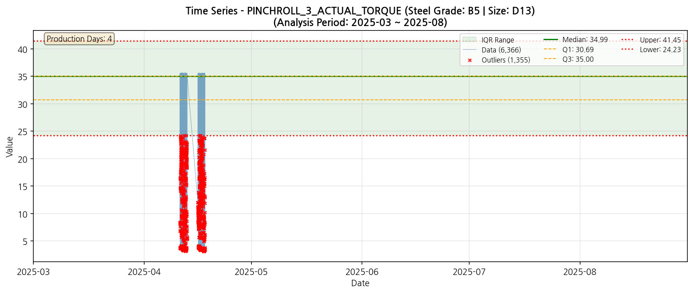

**2. 분포 히스토그램 (Distribution Histogram)**

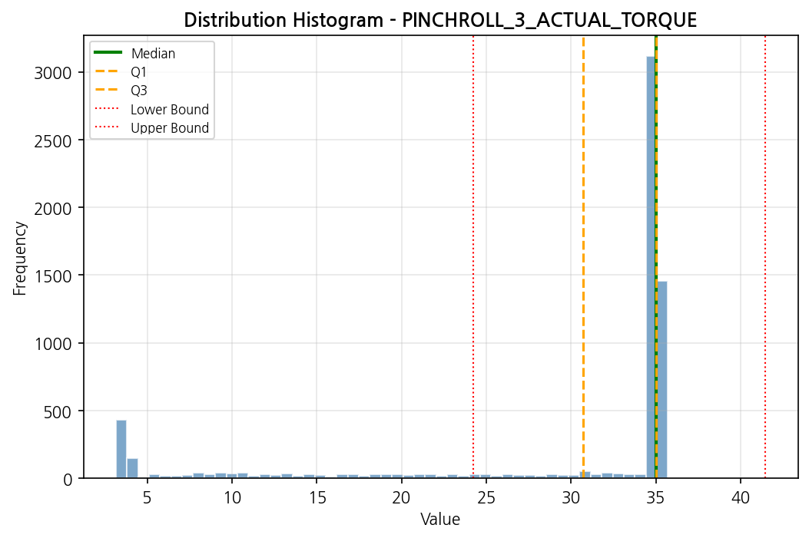

**3. 박스플롯 (Box Plot)**

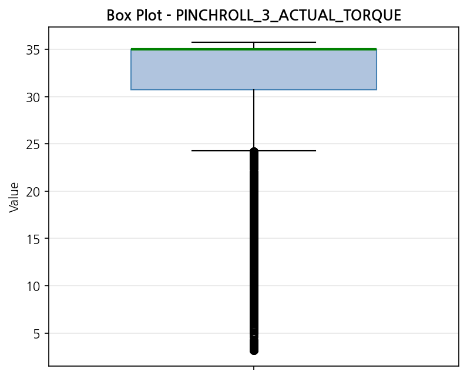

**4. 일별 평균 추이 (Daily Average Trend)**

**5. 월별 이상치율 (Monthly Outlier Rate)**

**6. 시간별 패턴 (Hourly Pattern)**

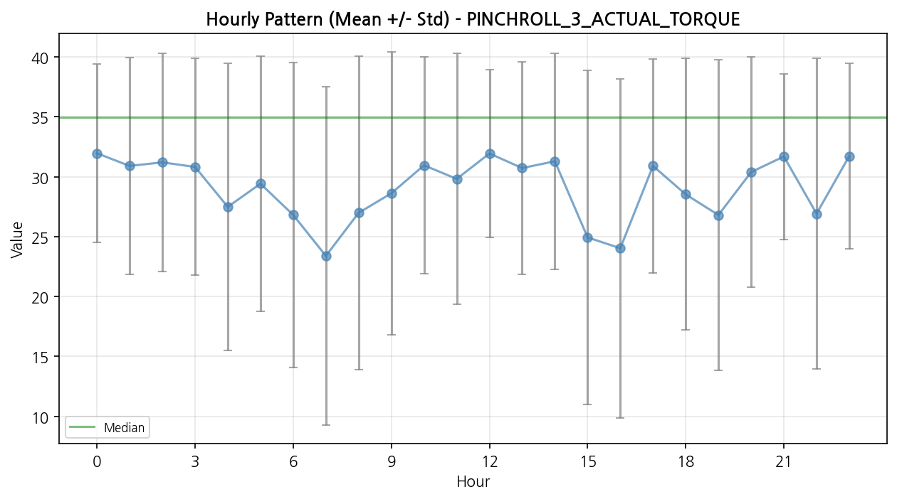

**7. 일별 이상치 수 (Daily Outlier Count)**

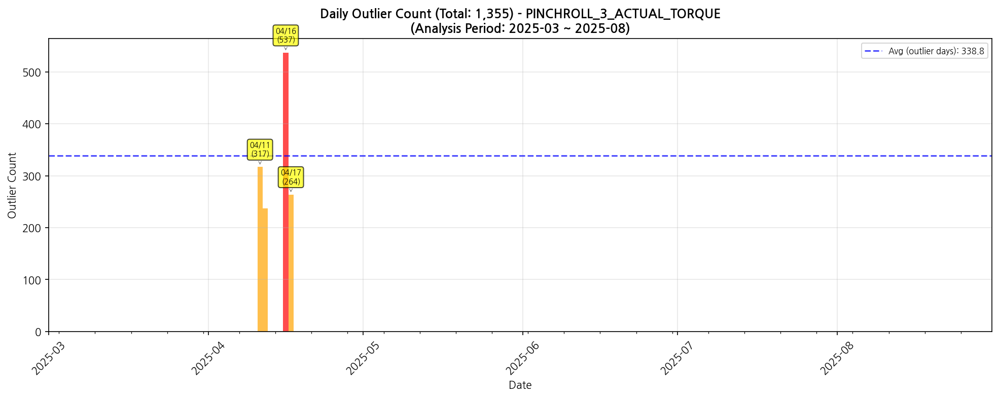

**종합 분석 차트**

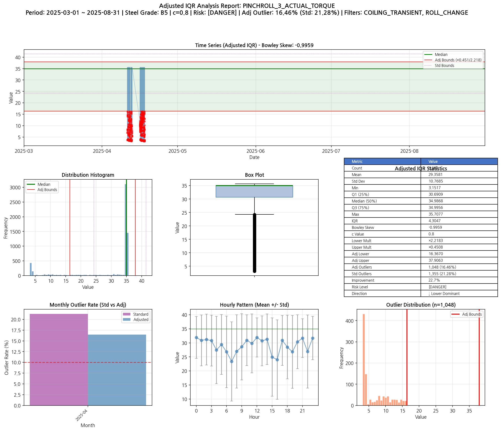

---

##### 월별 상세 분석

**2025-04**

**통계 요약**:

| 지표 | 값 |
|------|-------|
| 분석 레코드 | 6,366 |
| 평균 | 29.3581 |
| 중앙값 | 34.9868 |
| IQR | 4.3047 |
| 이상치 수 | 1,355 |
| 이상치율 | 21.28% |

**주요 이상치 발생 날짜**:

- 1. 2025-04-16: 537건
- 2. 2025-04-11: 317건
- 3. 2025-04-17: 264건

**1. 시계열 (Time Series)**

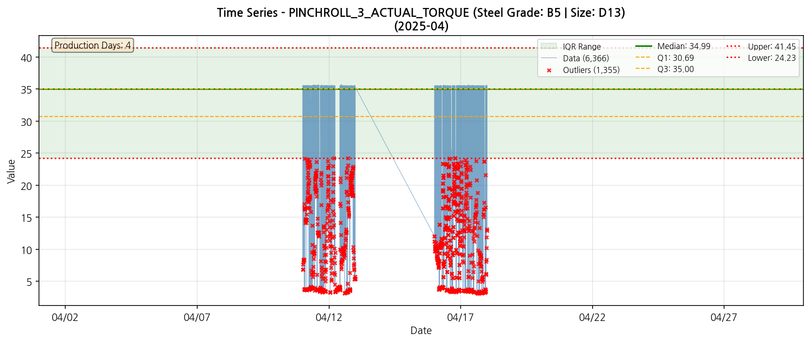

**2. 분포 히스토그램 (Distribution Histogram)**

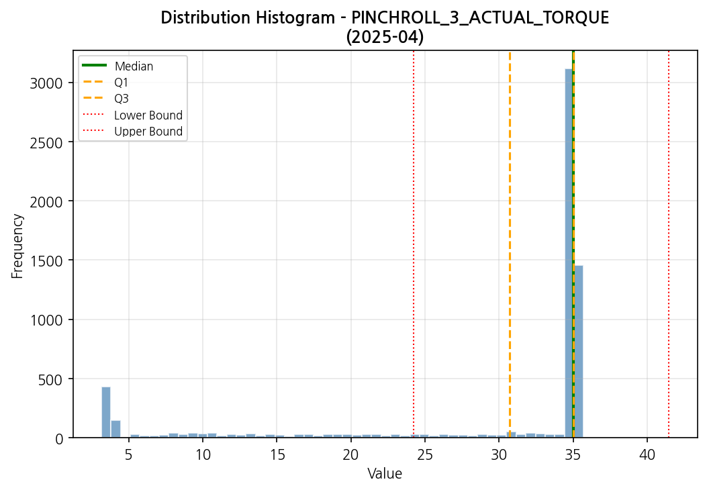

**3. 박스플롯 (Box Plot)**

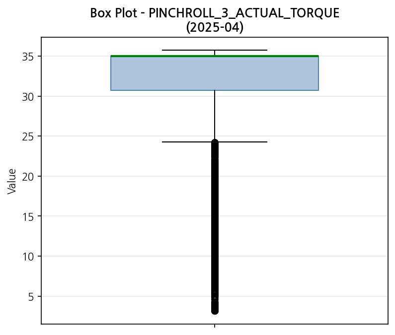

**4. 일별 평균 추이 (Daily Average Trend)**

**5. 시간별 패턴 (Hourly Pattern)**

**6. 일별 이상치 수 (Daily Outlier Count)**

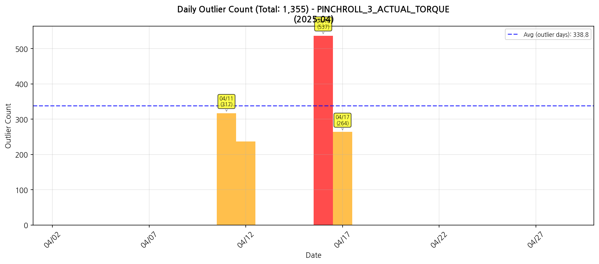

**월별 종합 차트**

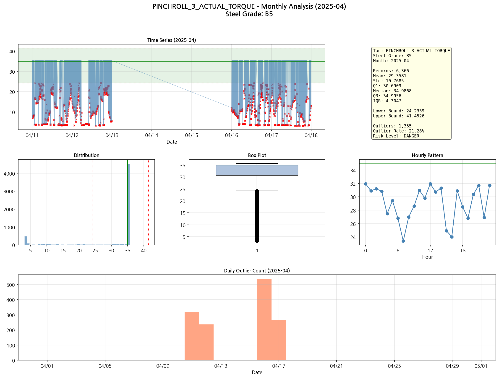

---

#### PINCHROLL_3_REFERENCE_TORQUE 🔴

**위험도**: [DANGER] | **이상치율**: 21.19% | **이상치 방향**: 상한 초과

**카테고리**: 08 Pinchroll

| 필터 | 적용 | 이유 |
|------|:----:|------|
| run_only | ✓ | 가동 상태에서만 측정이 유효함 |
| special_ops | ✓ | 정상 운전 조건에서 분석 |
| roll_change | ✓ | 롤교환 시 속도/토크 급변 구간 제외 |
| coiling_transient | ✓ | 권취 시작/종료 가감속 구간 제외 |

**데이터**: 원본 7,191 → 필터 후 6,366 (11.5% 제외)

| 통계 지표 | 값 |
|-----------|-------|
| 분석 레코드 | 6,366 |
| 평균 | 46.1721 |
| 표준편차 | 21.1846 |
| Q1 (25%) | 35.0000 |
| 중앙값 | 35.1346 |
| Q3 (75%) | 42.4396 |
| IQR | 7.4396 |
| 하한 경계 | 23.8406 |
| 상한 경계 | 53.5990 |
| 이상치 수 | 1,349 (21.19%) |

**월별 이상치 추이**:

| 월 | 레코드 수 | 평균 | 이상치율 |
|-----|-----------|------|----------|
| 2025-04 | 6,366 | 46.17 | 21.19% |

**주요 이상치 발생 날짜** (상위 5일):

| 순위 | 날짜 | 이상치 수 |
|:----:|------|----------:|
| 1 | 2025-04-16 | 533 |
| 2 | 2025-04-11 | 319 |
| 3 | 2025-04-17 | 271 |
| 4 | 2025-04-12 | 226 |

- 이상치 발생 일수: 4일
- 최대 일별 이상치: 533건 (2025-04-16)
- 평균 일별 이상치: 337.2건

##### 차트 분석

**1. 시계열 (Time Series)**

**2. 분포 히스토그램 (Distribution Histogram)**

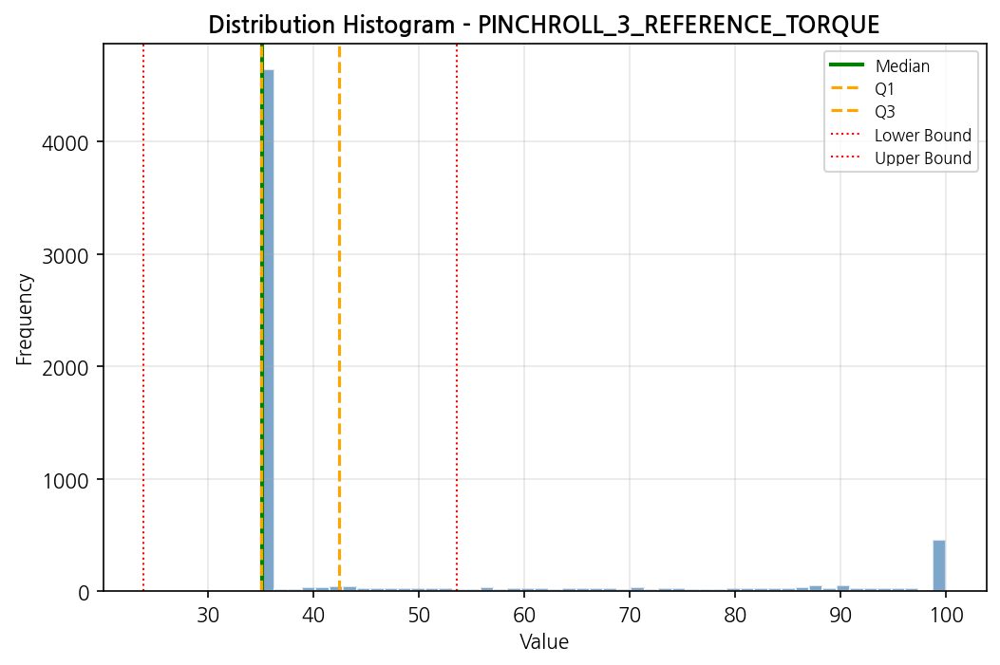

**3. 박스플롯 (Box Plot)**

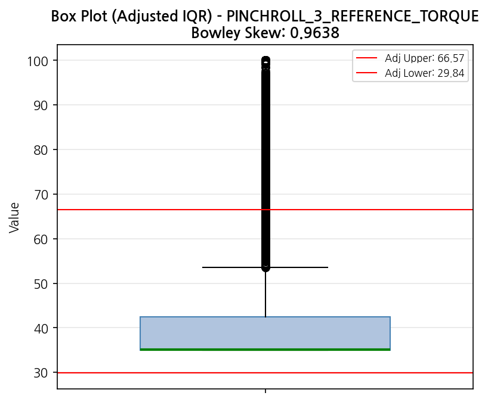

**4. 일별 평균 추이 (Daily Average Trend)**

**5. 월별 이상치율 (Monthly Outlier Rate)**

**6. 시간별 패턴 (Hourly Pattern)**

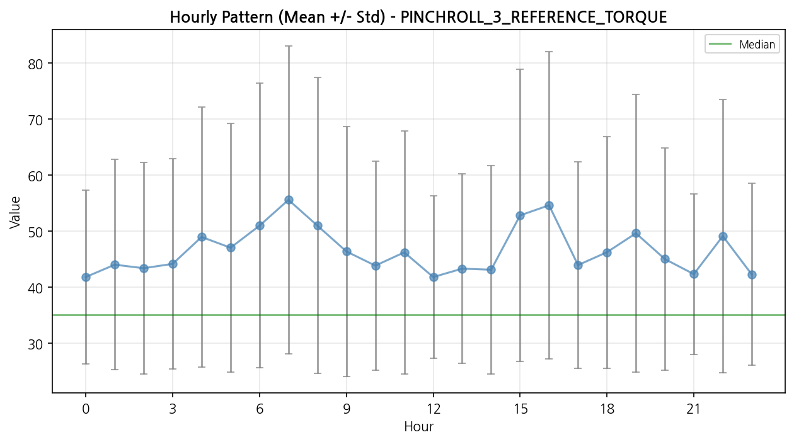

**7. 일별 이상치 수 (Daily Outlier Count)**

**종합 분석 차트**

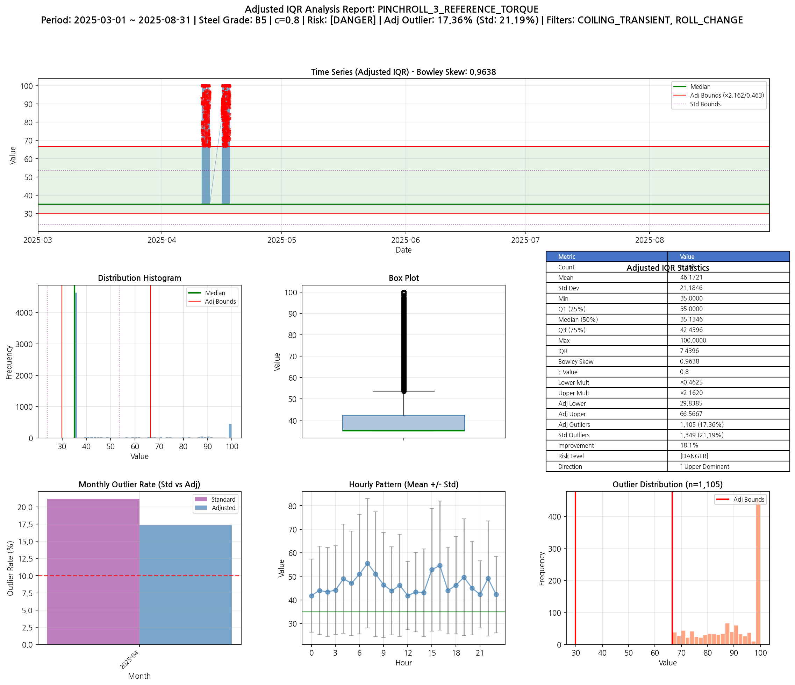

---

##### 월별 상세 분석

**2025-04**

**통계 요약**:

| 지표 | 값 |
|------|-------|
| 분석 레코드 | 6,366 |
| 평균 | 46.1721 |
| 중앙값 | 35.1346 |
| IQR | 7.4396 |
| 이상치 수 | 1,349 |
| 이상치율 | 21.19% |

**주요 이상치 발생 날짜**:

- 1. 2025-04-16: 533건
- 2. 2025-04-11: 319건
- 3. 2025-04-17: 271건

**1. 시계열 (Time Series)**

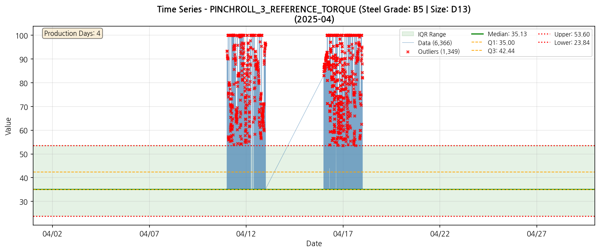

**2. 분포 히스토그램 (Distribution Histogram)**

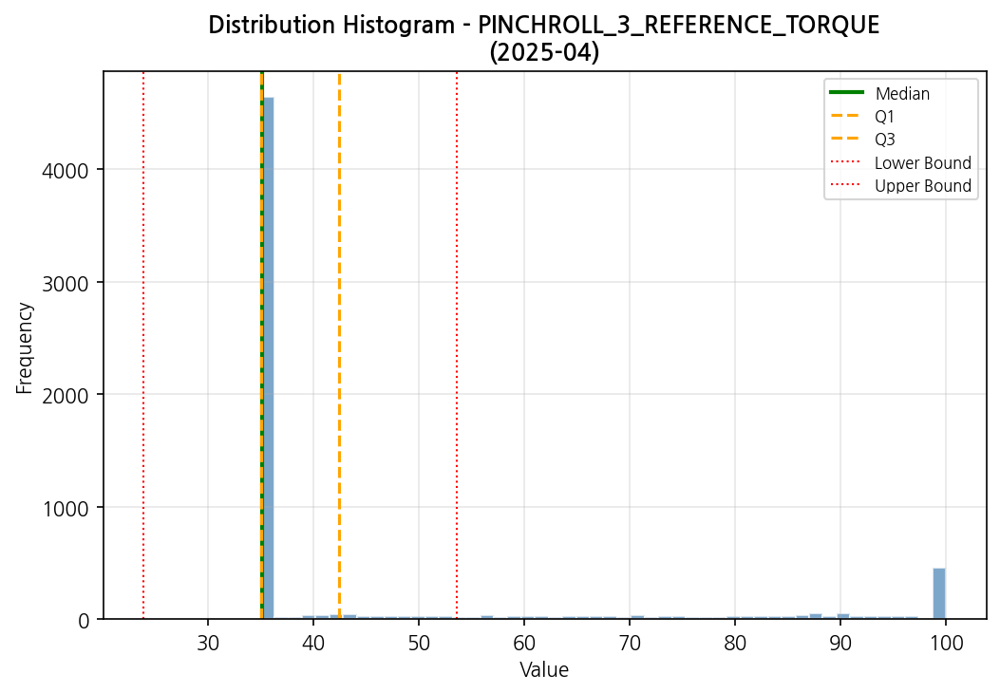

**3. 박스플롯 (Box Plot)**

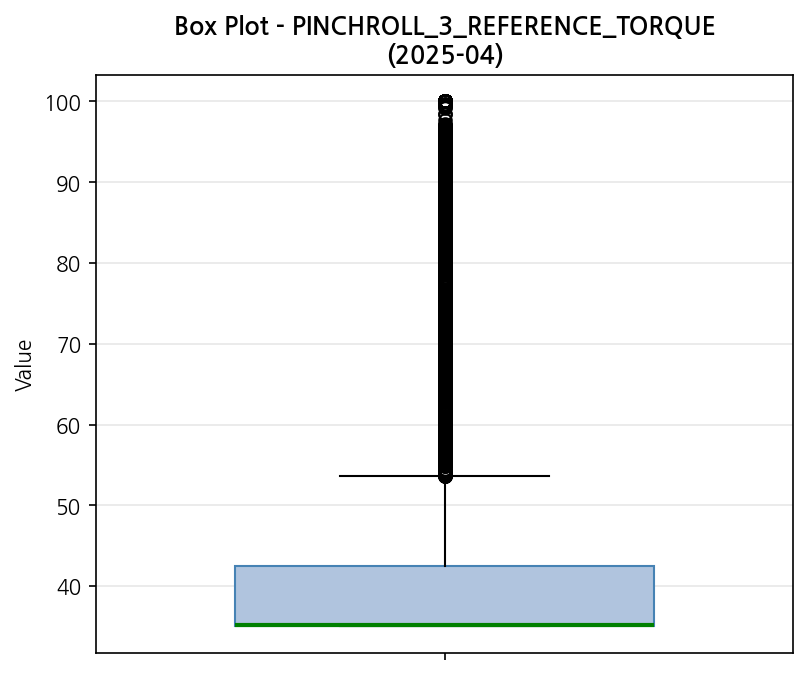

**4. 일별 평균 추이 (Daily Average Trend)**

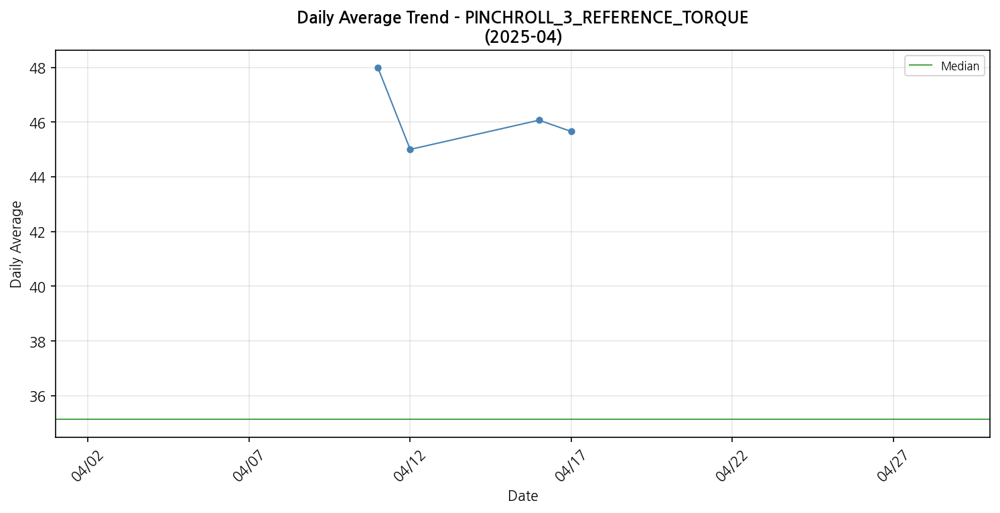

**5. 시간별 패턴 (Hourly Pattern)**

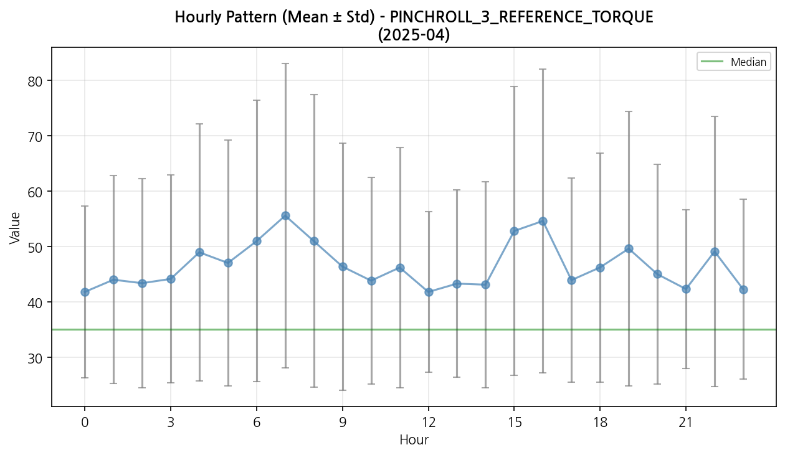

**6. 일별 이상치 수 (Daily Outlier Count)**

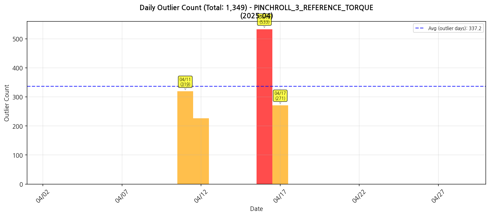

**월별 종합 차트**

---

#### PINCHROLL_4_REFERENCE_TORQUE 🔴

**위험도**: [DANGER] | **이상치율**: 21.07% | **이상치 방향**: 상한 초과

**카테고리**: 08 Pinchroll

| 필터 | 적용 | 이유 |
|------|:----:|------|
| run_only | ✓ | 가동 상태에서만 측정이 유효함 |
| special_ops | ✓ | 정상 운전 조건에서 분석 |
| roll_change | ✓ | 롤교환 시 속도/토크 급변 구간 제외 |
| coiling_transient | ✓ | 권취 시작/종료 가감속 구간 제외 |

**데이터**: 원본 7,191 → 필터 후 6,366 (11.5% 제외)

| 통계 지표 | 값 |
|-----------|-------|
| 분석 레코드 | 6,366 |
| 평균 | 46.2741 |
| 표준편차 | 21.3007 |
| Q1 (25%) | 35.0000 |
| 중앙값 | 35.1200 |
| Q3 (75%) | 42.9098 |
| IQR | 7.9098 |
| 하한 경계 | 23.1353 |
| 상한 경계 | 54.7745 |
| 이상치 수 | 1,341 (21.07%) |

**월별 이상치 추이**:

| 월 | 레코드 수 | 평균 | 이상치율 |
|-----|-----------|------|----------|
| 2025-04 | 6,366 | 46.27 | 21.07% |

**주요 이상치 발생 날짜** (상위 5일):

| 순위 | 날짜 | 이상치 수 |
|:----:|------|----------:|
| 1 | 2025-04-16 | 529 |
| 2 | 2025-04-11 | 316 |
| 3 | 2025-04-17 | 270 |
| 4 | 2025-04-12 | 226 |

- 이상치 발생 일수: 4일
- 최대 일별 이상치: 529건 (2025-04-16)
- 평균 일별 이상치: 335.2건

##### 차트 분석

**1. 시계열 (Time Series)**

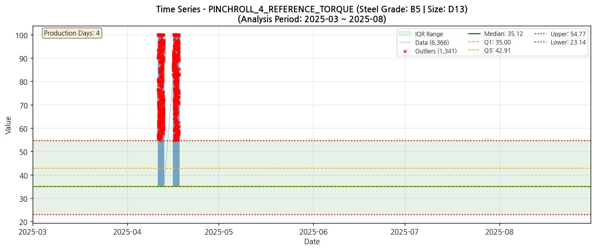

**2. 분포 히스토그램 (Distribution Histogram)**

**3. 박스플롯 (Box Plot)**

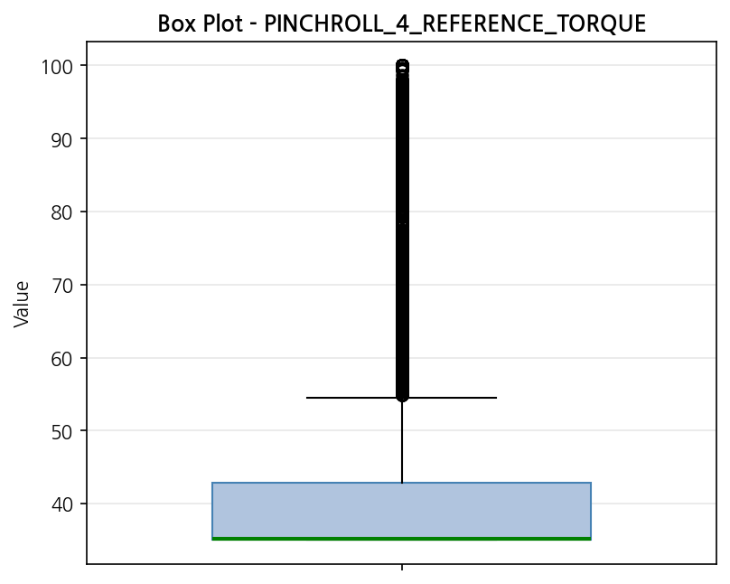

**4. 일별 평균 추이 (Daily Average Trend)**

**5. 월별 이상치율 (Monthly Outlier Rate)**

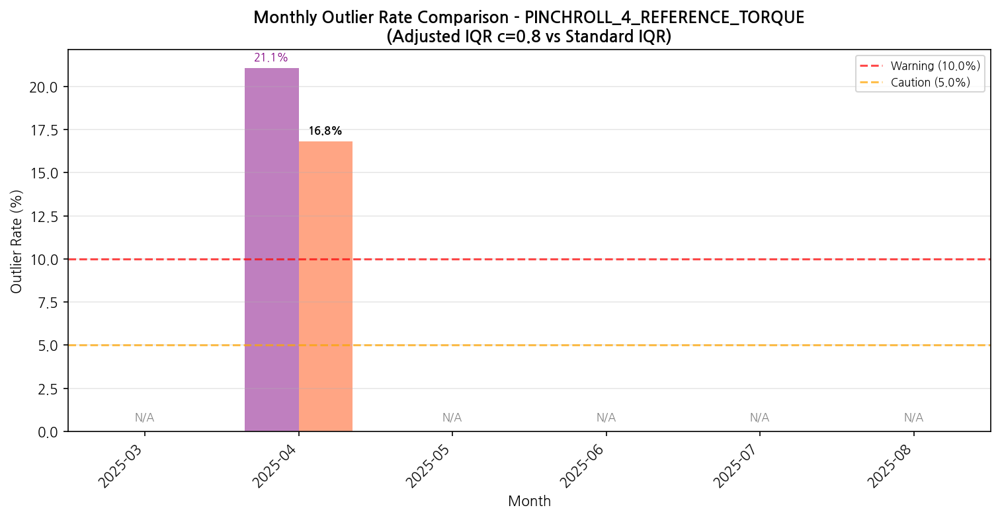

**6. 시간별 패턴 (Hourly Pattern)**

**7. 일별 이상치 수 (Daily Outlier Count)**

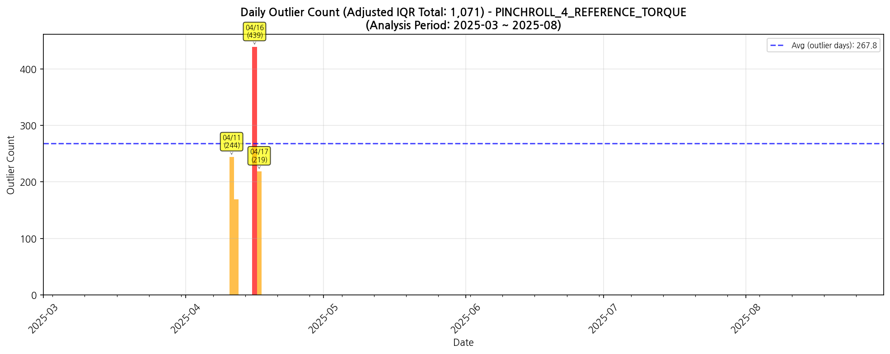

**종합 분석 차트**

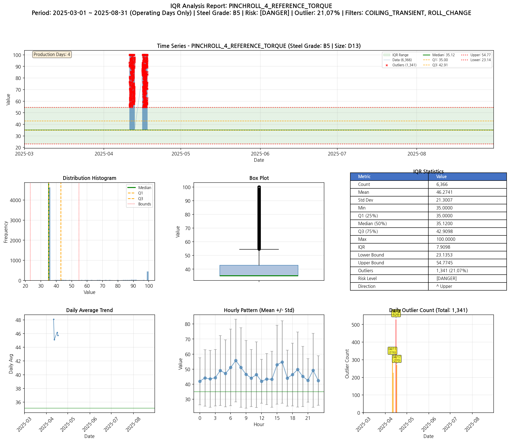

---

##### 월별 상세 분석

**2025-04**

**통계 요약**:

| 지표 | 값 |
|------|-------|
| 분석 레코드 | 6,366 |
| 평균 | 46.2741 |
| 중앙값 | 35.1200 |
| IQR | 7.9098 |
| 이상치 수 | 1,341 |
| 이상치율 | 21.07% |

**주요 이상치 발생 날짜**:

- 1. 2025-04-16: 529건
- 2. 2025-04-11: 316건
- 3. 2025-04-17: 270건

**1. 시계열 (Time Series)**

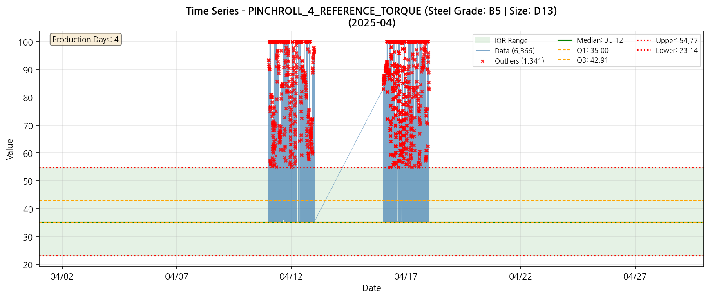

**2. 분포 히스토그램 (Distribution Histogram)**

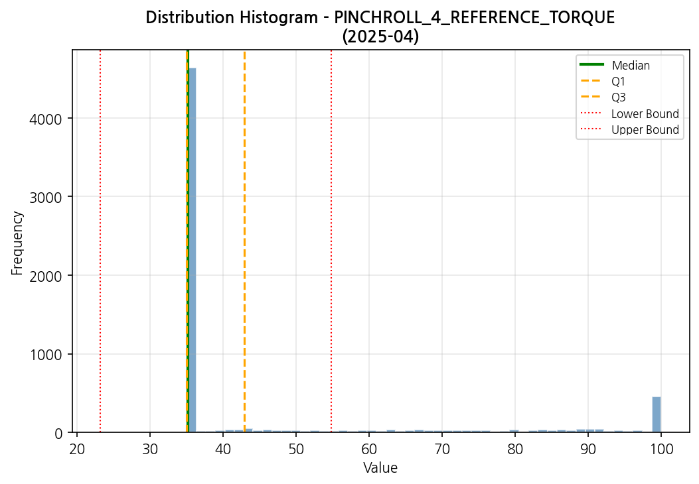

**3. 박스플롯 (Box Plot)**

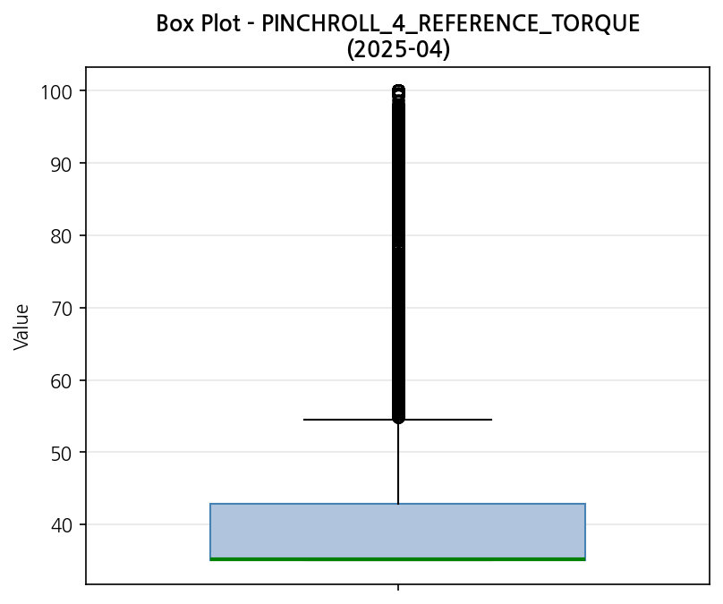

**4. 일별 평균 추이 (Daily Average Trend)**

**5. 시간별 패턴 (Hourly Pattern)**

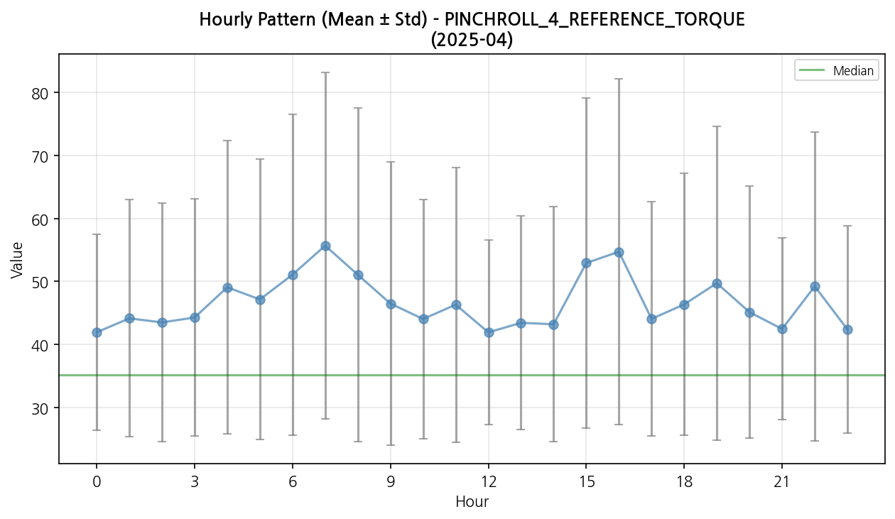

**6. 일별 이상치 수 (Daily Outlier Count)**

**월별 종합 차트**

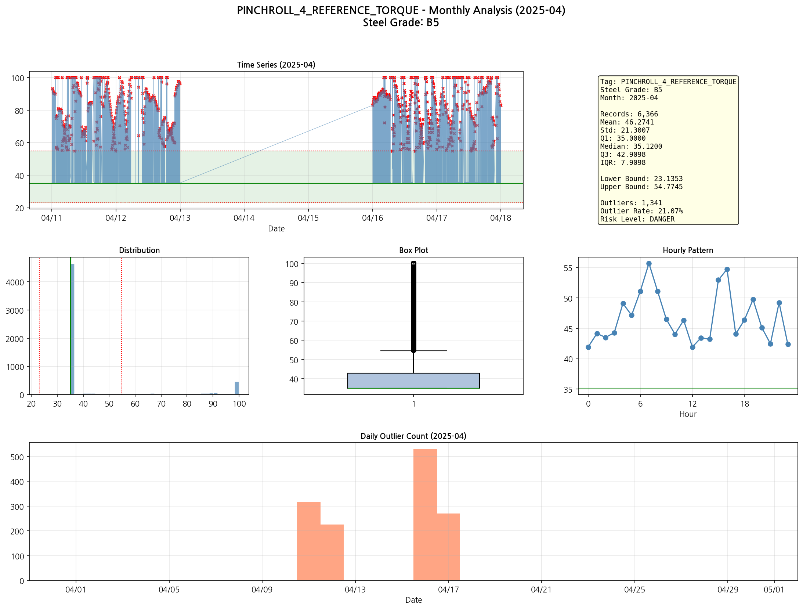

---

#### PINCHROLL_4_ACTUAL_TORQUE 🔴

**위험도**: [DANGER] | **이상치율**: 20.89% | **이상치 방향**: 하한 미달

**카테고리**: 08 Pinchroll

| 필터 | 적용 | 이유 |
|------|:----:|------|
| run_only | ✓ | 가동 상태에서만 측정이 유효함 |
| special_ops | ✓ | 정상 운전 조건에서 분석 |
| roll_change | ✓ | 롤교환 시 속도/토크 급변 구간 제외 |
| coiling_transient | ✓ | 권취 시작/종료 가감속 구간 제외 |

**데이터**: 원본 7,191 → 필터 후 6,366 (11.5% 제외)

| 통계 지표 | 값 |
|-----------|-------|
| 분석 레코드 | 6,366 |
| 평균 | 29.4974 |
| 표준편차 | 10.4605 |
| Q1 (25%) | 30.3988 |
| 중앙값 | 34.9907 |
| Q3 (75%) | 34.9956 |
| IQR | 4.5969 |
| 하한 경계 | 23.5035 |
| 상한 경계 | 41.8909 |
| 이상치 수 | 1,330 (20.89%) |

**월별 이상치 추이**:

| 월 | 레코드 수 | 평균 | 이상치율 |
|-----|-----------|------|----------|
| 2025-04 | 6,366 | 29.50 | 20.89% |

**주요 이상치 발생 날짜** (상위 5일):

| 순위 | 날짜 | 이상치 수 |
|:----:|------|----------:|
| 1 | 2025-04-16 | 523 |
| 2 | 2025-04-11 | 312 |
| 3 | 2025-04-17 | 260 |
| 4 | 2025-04-12 | 235 |

- 이상치 발생 일수: 4일
- 최대 일별 이상치: 523건 (2025-04-16)
- 평균 일별 이상치: 332.5건

##### 차트 분석

**1. 시계열 (Time Series)**

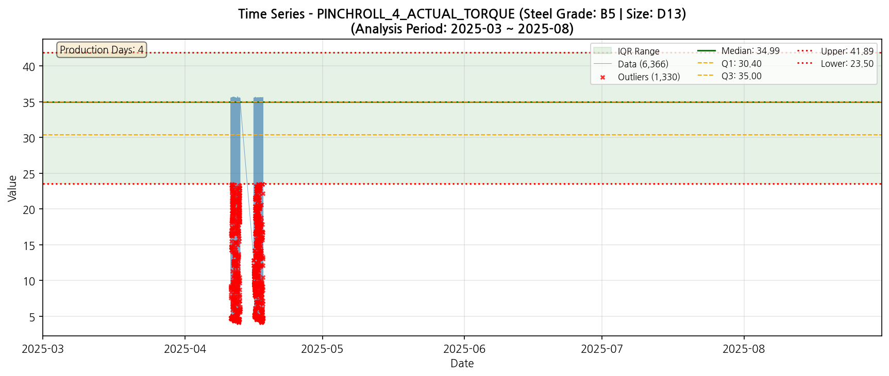

**2. 분포 히스토그램 (Distribution Histogram)**

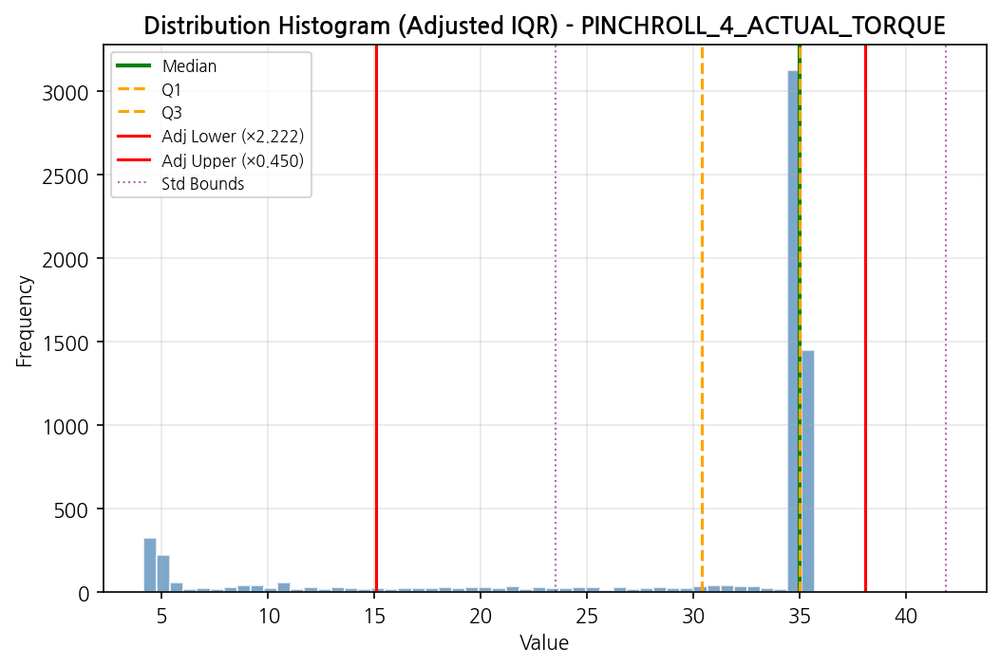

**3. 박스플롯 (Box Plot)**

**4. 일별 평균 추이 (Daily Average Trend)**

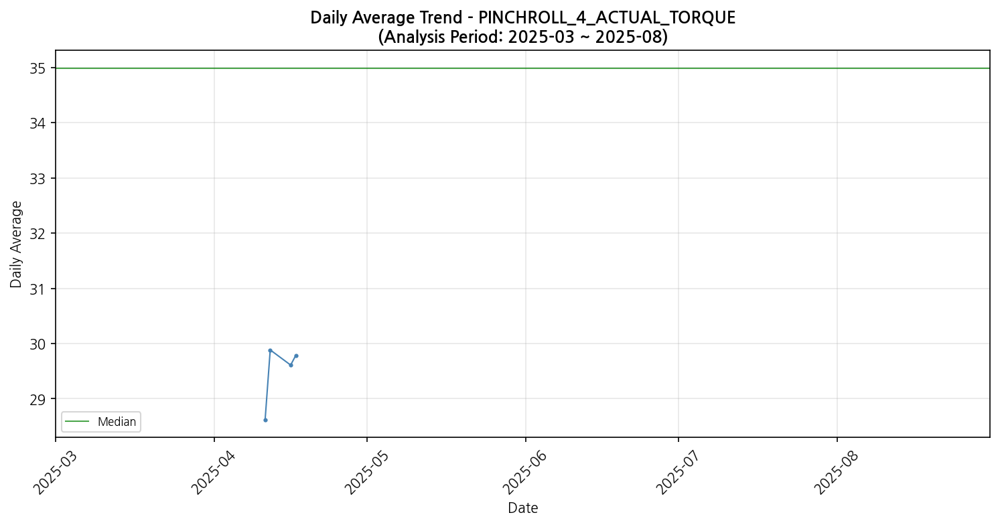

**5. 월별 이상치율 (Monthly Outlier Rate)**

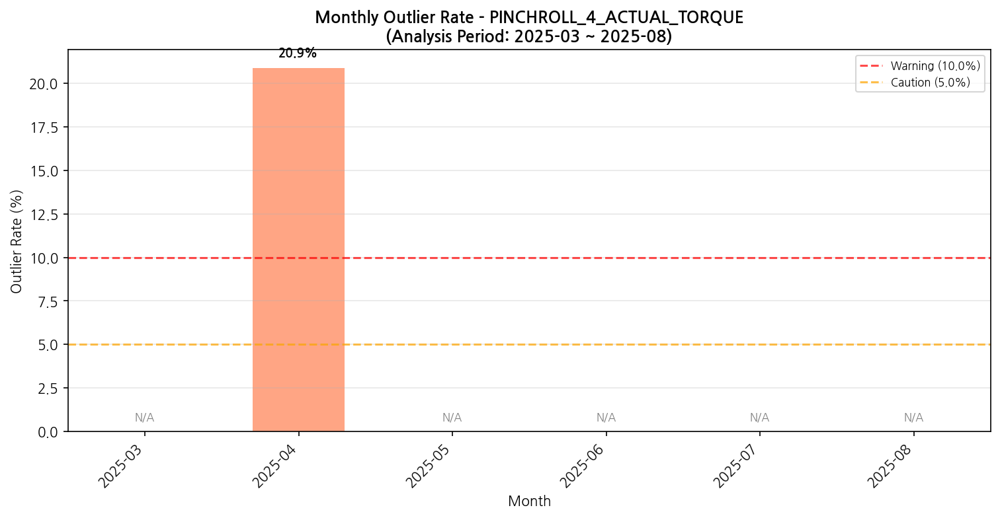

**6. 시간별 패턴 (Hourly Pattern)**

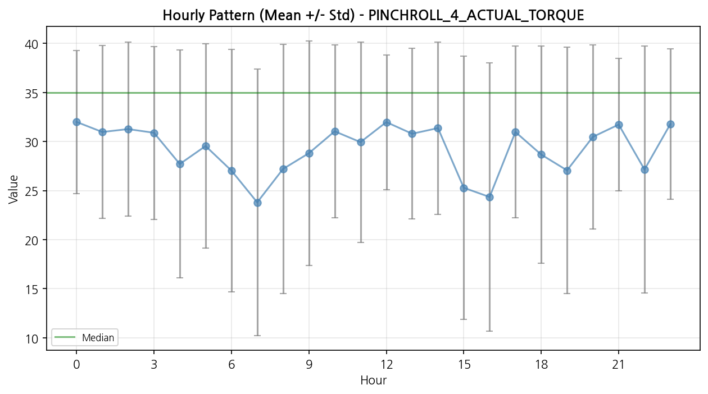

**7. 일별 이상치 수 (Daily Outlier Count)**

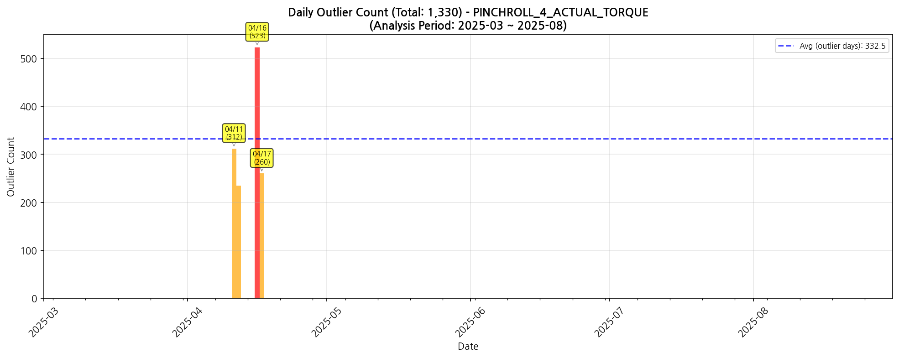

**종합 분석 차트**

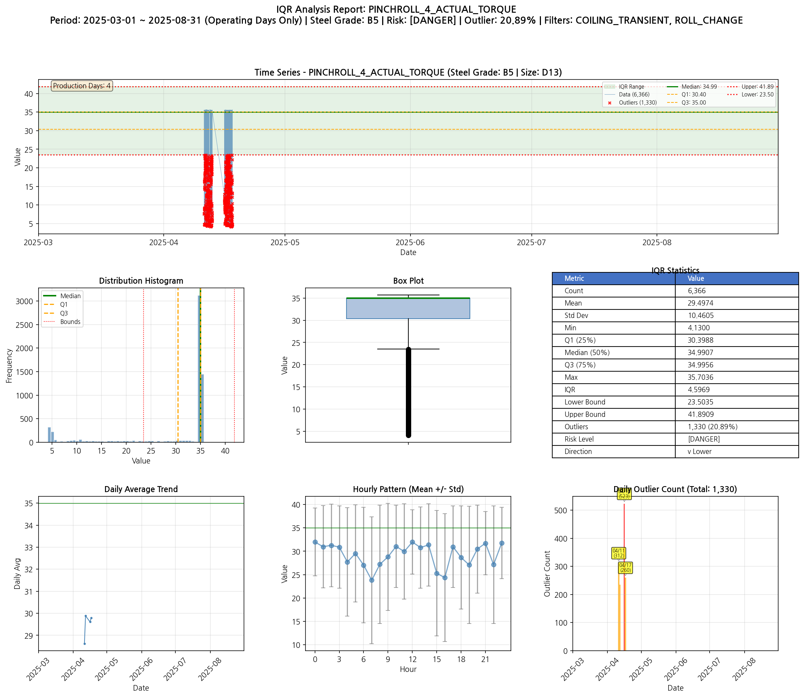

---

##### 월별 상세 분석

**2025-04**

**통계 요약**:

| 지표 | 값 |
|------|-------|
| 분석 레코드 | 6,366 |
| 평균 | 29.4974 |
| 중앙값 | 34.9907 |
| IQR | 4.5969 |
| 이상치 수 | 1,330 |
| 이상치율 | 20.89% |

**주요 이상치 발생 날짜**:

- 1. 2025-04-16: 523건
- 2. 2025-04-11: 312건
- 3. 2025-04-17: 260건

**1. 시계열 (Time Series)**

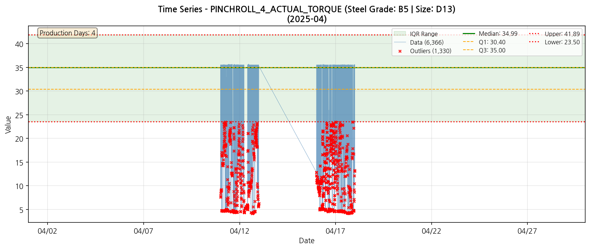

**2. 분포 히스토그램 (Distribution Histogram)**

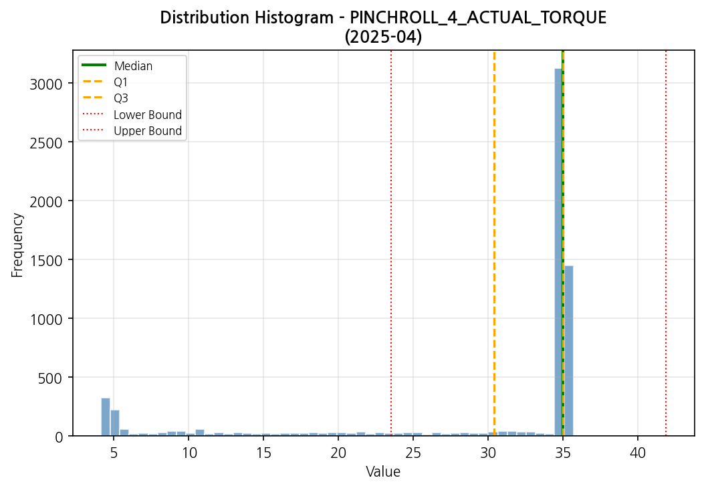

**3. 박스플롯 (Box Plot)**

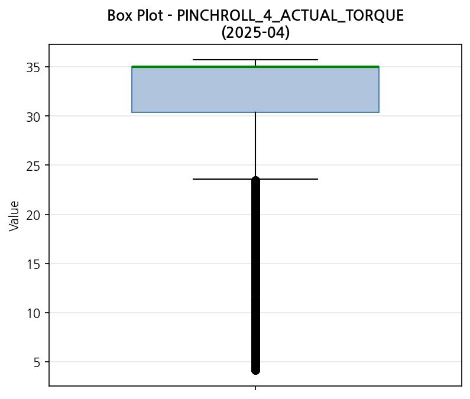

**4. 일별 평균 추이 (Daily Average Trend)**

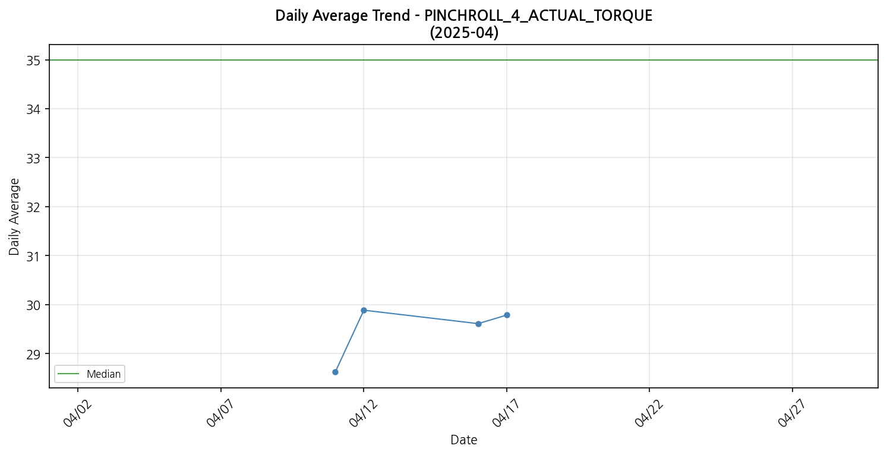

**5. 시간별 패턴 (Hourly Pattern)**

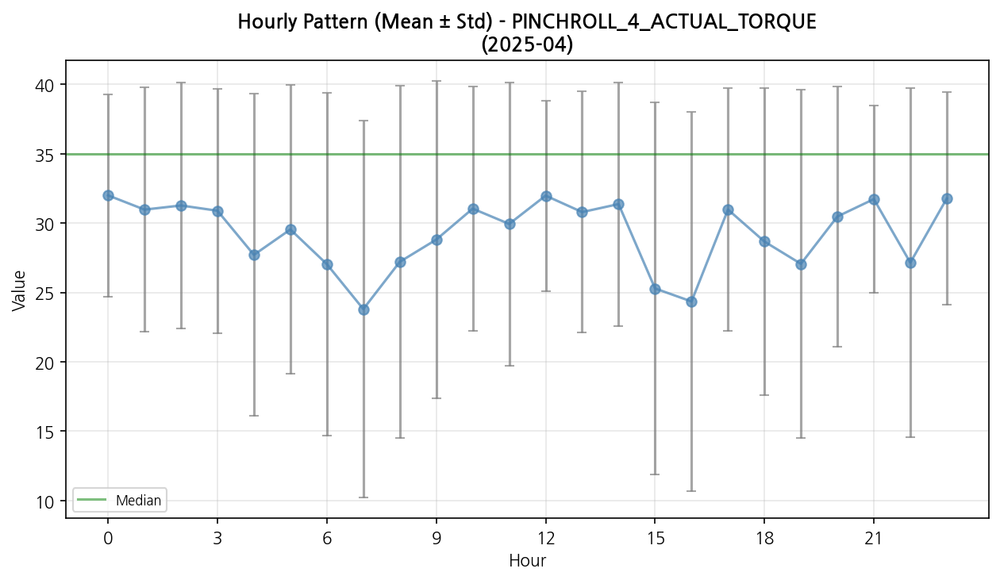

**6. 일별 이상치 수 (Daily Outlier Count)**

**월별 종합 차트**

---

#### PINCHROLL_2_ACTUAL_TORQUE 🔴

**위험도**: [DANGER] | **이상치율**: 19.68% | **이상치 방향**: 하한 미달

**카테고리**: 08 Pinchroll

| 필터 | 적용 | 이유 |
|------|:----:|------|
| run_only | ✓ | 가동 상태에서만 측정이 유효함 |
| special_ops | ✓ | 정상 운전 조건에서 분석 |
| roll_change | ✓ | 롤교환 시 속도/토크 급변 구간 제외 |
| coiling_transient | ✓ | 권취 시작/종료 가감속 구간 제외 |

**데이터**: 원본 7,191 → 필터 후 6,366 (11.5% 제외)

| 통계 지표 | 값 |
|-----------|-------|
| 분석 레코드 | 6,366 |
| 평균 | 16.7162 |
| 표준편차 | 6.0062 |
| Q1 (25%) | 16.8317 |
| 중앙값 | 19.9947 |
| Q3 (75%) | 19.9950 |
| IQR | 3.1633 |
| 하한 경계 | 12.0867 |
| 상한 경계 | 24.7400 |
| 이상치 수 | 1,253 (19.68%) |

**월별 이상치 추이**:

| 월 | 레코드 수 | 평균 | 이상치율 |
|-----|-----------|------|----------|
| 2025-04 | 6,366 | 16.72 | 19.68% |

**주요 이상치 발생 날짜** (상위 5일):

| 순위 | 날짜 | 이상치 수 |
|:----:|------|----------:|
| 1 | 2025-04-16 | 499 |
| 2 | 2025-04-11 | 288 |
| 3 | 2025-04-17 | 250 |
| 4 | 2025-04-12 | 216 |

- 이상치 발생 일수: 4일
- 최대 일별 이상치: 499건 (2025-04-16)
- 평균 일별 이상치: 313.2건

##### 차트 분석

**1. 시계열 (Time Series)**

**2. 분포 히스토그램 (Distribution Histogram)**

**3. 박스플롯 (Box Plot)**

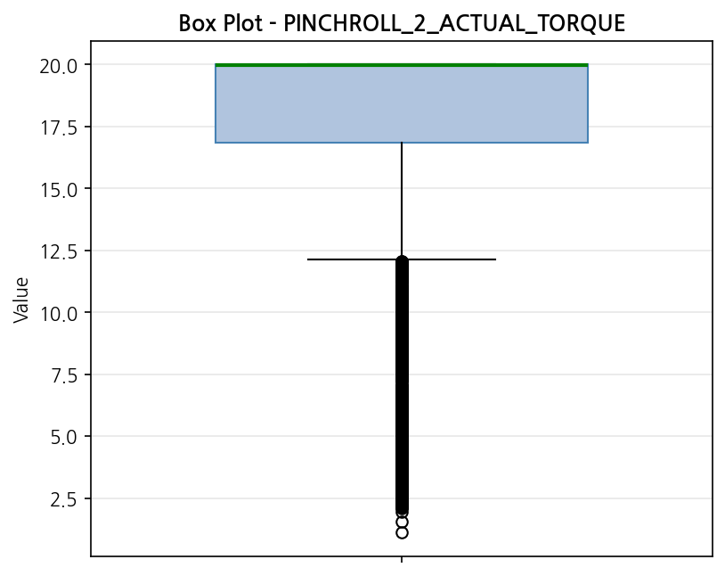

**4. 일별 평균 추이 (Daily Average Trend)**

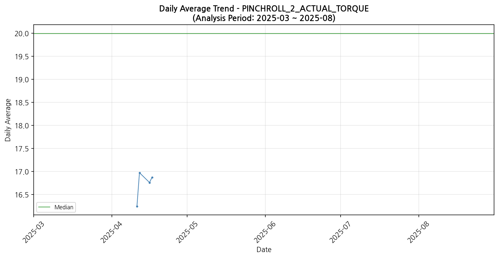

**5. 월별 이상치율 (Monthly Outlier Rate)**

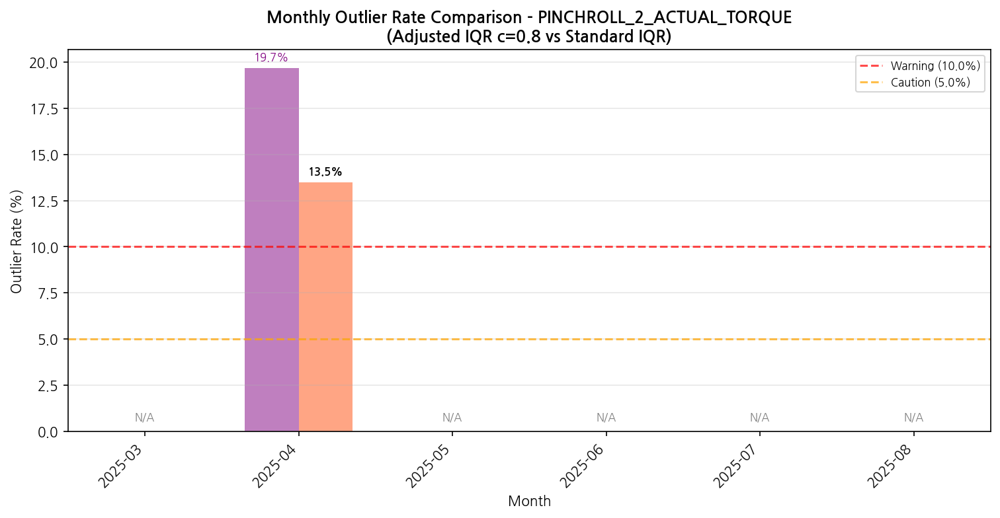

**6. 시간별 패턴 (Hourly Pattern)**

**7. 일별 이상치 수 (Daily Outlier Count)**

**종합 분석 차트**

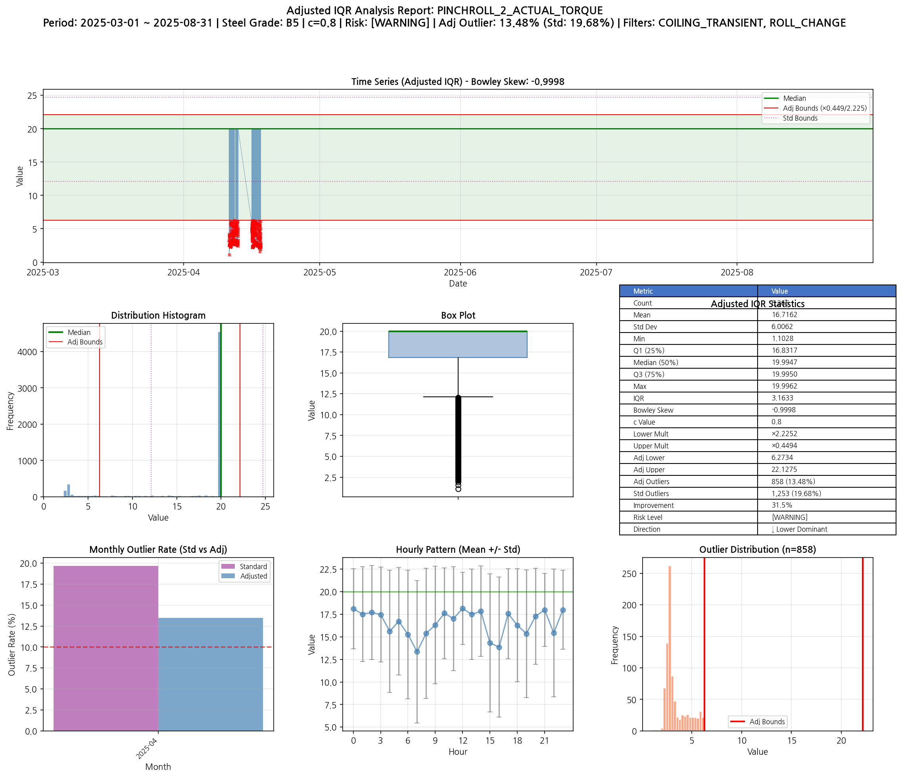

---

##### 월별 상세 분석

**2025-04**

**통계 요약**:

| 지표 | 값 |
|------|-------|
| 분석 레코드 | 6,366 |
| 평균 | 16.7162 |
| 중앙값 | 19.9947 |
| IQR | 3.1633 |
| 이상치 수 | 1,253 |
| 이상치율 | 19.68% |

**주요 이상치 발생 날짜**:

- 1. 2025-04-16: 499건
- 2. 2025-04-11: 288건
- 3. 2025-04-17: 250건

**1. 시계열 (Time Series)**

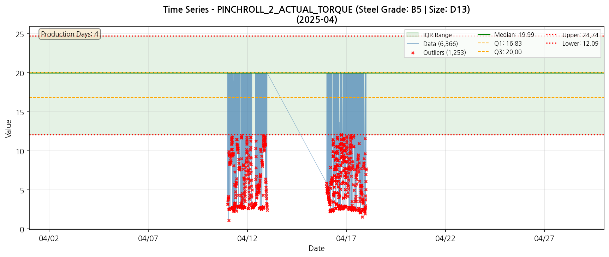

**2. 분포 히스토그램 (Distribution Histogram)**

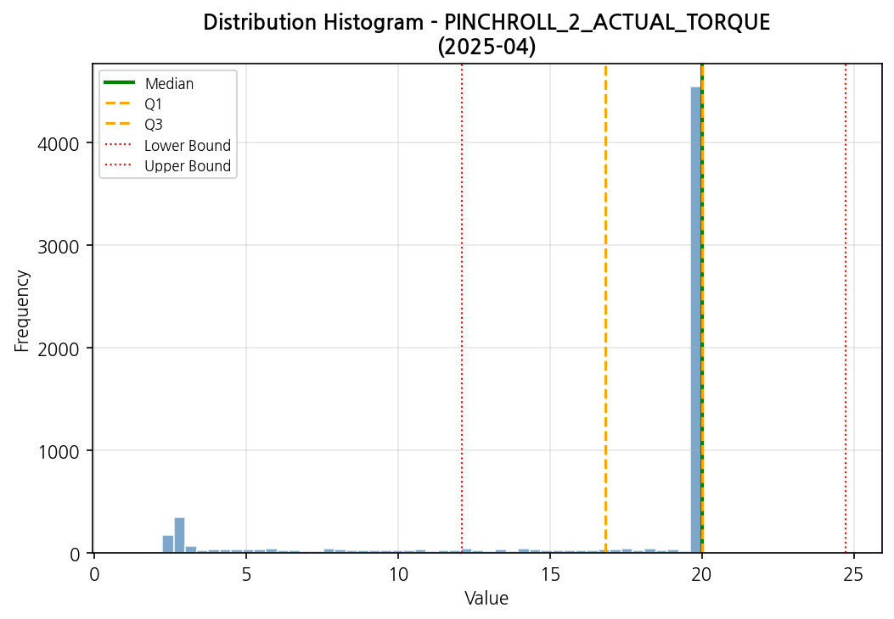

**3. 박스플롯 (Box Plot)**

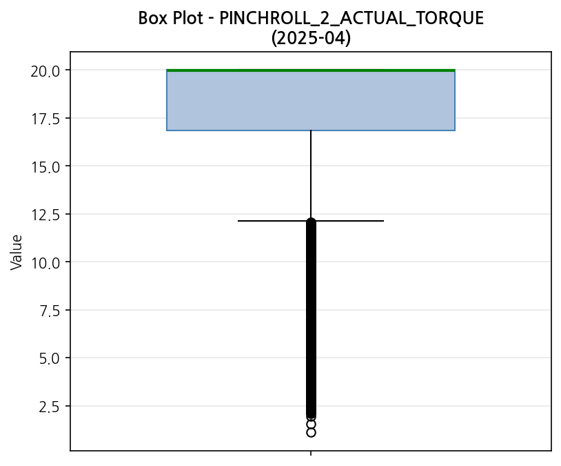

**4. 일별 평균 추이 (Daily Average Trend)**


**5. 시간별 패턴 (Hourly Pattern)**


**6. 일별 이상치 수 (Daily Outlier Count)**


**월별 종합 차트**

---

#### PR6L2_ACT_SPD_MS [B] 🔴

**위험도**: [DANGER] | **이상치율**: 16.45% | **이상치 방향**: 하한 미달

**카테고리**: 09 PR Detailed

| 필터 | 적용 | 이유 |
|------|:----:|------|
| run_only | ✓ | 가동 상태에서만 토크/속도 측정이 유효함 |
| special_ops | ✓ | 정상 운전 조건에서 분석 |
| roll_change | ✓ | 롤교환 시 토크/속도 급변 구간 제외 |
| coiling_transient | ✓ | 권취 시작/종료 가감속 구간 제외 |

**데이터**: 원본 5,752 → 필터 후 5,081 (11.7% 제외)

| 통계 지표 | 값 |
|-----------|-------|
| 분석 레코드 | 5,081 |
| 평균 | 22.5679 |
| 표준편차 | 0.3712 |
| Q1 (25%) | 22.5850 |
| 중앙값 | 22.5851 |
| Q3 (75%) | 22.5851 |
| IQR | 0.0001 |
| 하한 경계 | 22.5849 |
| 상한 경계 | 22.5852 |
| 이상치 수 | 836 (16.45%) |

**월별 이상치 추이**:

| 월 | 레코드 수 | 평균 | 이상치율 |
|-----|-----------|------|----------|
| 2025-04 | 5,081 | 22.57 | 16.45% |

**주요 이상치 발생 날짜** (상위 5일):

| 순위 | 날짜 | 이상치 수 |
|:----:|------|----------:|
| 1 | 2025-04-16 | 421 |
| 2 | 2025-04-17 | 225 |
| 3 | 2025-04-12 | 190 |

- 이상치 발생 일수: 3일
- 최대 일별 이상치: 421건 (2025-04-16)
- 평균 일별 이상치: 278.7건

##### 차트 분석

**1. 시계열 (Time Series)**


**2. 분포 히스토그램 (Distribution Histogram)**


**3. 박스플롯 (Box Plot)**


**4. 일별 평균 추이 (Daily Average Trend)**


**5. 월별 이상치율 (Monthly Outlier Rate)**


**6. 시간별 패턴 (Hourly Pattern)**


**7. 일별 이상치 수 (Daily Outlier Count)**


**종합 분석 차트**


---

##### 월별 상세 분석

**2025-04**

**통계 요약**:

| 지표 | 값 |
|------|-------|
| 분석 레코드 | 5,081 |
| 평균 | 22.5679 |
| 중앙값 | 22.5851 |
| IQR | 0.0001 |
| 이상치 수 | 836 |
| 이상치율 | 16.45% |

**주요 이상치 발생 날짜**:

- 1. 2025-04-16: 421건
- 2. 2025-04-17: 225건
- 3. 2025-04-12: 190건

**1. 시계열 (Time Series)**


**2. 분포 히스토그램 (Distribution Histogram)**


**3. 박스플롯 (Box Plot)**


**4. 일별 평균 추이 (Daily Average Trend)**


**5. 시간별 패턴 (Hourly Pattern)**


**6. 일별 이상치 수 (Daily Outlier Count)**


**월별 종합 차트**


---

#### PR6L1_ACT_SPD_MS [A] 🔴

**위험도**: [DANGER] | **이상치율**: 15.56% | **이상치 방향**: 하한 미달

**카테고리**: 09 PR Detailed

| 필터 | 적용 | 이유 |
|------|:----:|------|
| run_only | ✓ | 가동 상태에서만 토크/속도 측정이 유효함 |
| special_ops | ✓ | 정상 운전 조건에서 분석 |
| roll_change | ✓ | 롤교환 시 토크/속도 급변 구간 제외 |
| coiling_transient | ✓ | 권취 시작/종료 가감속 구간 제외 |

**데이터**: 원본 1,439 → 필터 후 1,285 (10.7% 제외)

| 통계 지표 | 값 |
|-----------|-------|
| 분석 레코드 | 1,285 |
| 평균 | 22.5774 |
| 표준편차 | 0.0203 |
| Q1 (25%) | 22.5858 |
| 중앙값 | 22.5858 |
| Q3 (75%) | 22.5859 |
| IQR | 0.0001 |
| 하한 경계 | 22.5856 |
| 상한 경계 | 22.5860 |
| 이상치 수 | 200 (15.56%) |

**월별 이상치 추이**:

| 월 | 레코드 수 | 평균 | 이상치율 |
|-----|-----------|------|----------|
| 2025-04 | 1,285 | 22.58 | 15.56% |

**주요 이상치 발생 날짜** (상위 5일):

| 순위 | 날짜 | 이상치 수 |
|:----:|------|----------:|
| 1 | 2025-04-11 | 200 |

- 이상치 발생 일수: 1일
- 최대 일별 이상치: 200건 (2025-04-11)
- 평균 일별 이상치: 200.0건

##### 차트 분석

**1. 시계열 (Time Series)**


**2. 분포 히스토그램 (Distribution Histogram)**


**3. 박스플롯 (Box Plot)**


**4. 일별 평균 추이 (Daily Average Trend)**


**5. 월별 이상치율 (Monthly Outlier Rate)**


**6. 시간별 패턴 (Hourly Pattern)**


**7. 일별 이상치 수 (Daily Outlier Count)**

**종합 분석 차트**


---

##### 월별 상세 분석

**2025-04**

**통계 요약**:

| 지표 | 값 |
|------|-------|
| 분석 레코드 | 1,285 |
| 평균 | 22.5774 |
| 중앙값 | 22.5858 |
| IQR | 0.0001 |
| 이상치 수 | 200 |
| 이상치율 | 15.56% |

**주요 이상치 발생 날짜**:

- 1. 2025-04-11: 200건

**1. 시계열 (Time Series)**


**2. 분포 히스토그램 (Distribution Histogram)**


**3. 박스플롯 (Box Plot)**


**4. 일별 평균 추이 (Daily Average Trend)**


**5. 시간별 패턴 (Hourly Pattern)**


**6. 일별 이상치 수 (Daily Outlier Count)**


**월별 종합 차트**


---

### 🟠 경고 (10~15%) - 5개 태그

#### PR6L1_ACT_TORQUE [A] 🟠

**위험도**: [WARNING] | **이상치율**: 14.79% | **이상치 방향**: 상한 초과

**카테고리**: 09 PR Detailed

| 필터 | 적용 | 이유 |
|------|:----:|------|
| run_only | ✓ | 가동 상태에서만 토크/속도 측정이 유효함 |
| special_ops | ✓ | 정상 운전 조건에서 분석 |
| roll_change | ✓ | 롤교환 시 토크/속도 급변 구간 제외 |
| coiling_transient | ✓ | 권취 시작/종료 가감속 구간 제외 |

**데이터**: 원본 1,439 → 필터 후 1,285 (10.7% 제외)

| 통계 지표 | 값 |
|-----------|-------|
| 분석 레코드 | 1,285 |
| 평균 | 3.5933 |
| 표준편차 | 0.3007 |
| Q1 (25%) | 3.4319 |
| 중앙값 | 3.4959 |
| Q3 (75%) | 3.5870 |
| IQR | 0.1551 |
| 하한 경계 | 3.1993 |
| 상한 경계 | 3.8196 |
| 이상치 수 | 190 (14.79%) |

**월별 이상치 추이**:

| 월 | 레코드 수 | 평균 | 이상치율 |
|-----|-----------|------|----------|
| 2025-04 | 1,285 | 3.59 | 14.79% |

**주요 이상치 발생 날짜** (상위 5일):

| 순위 | 날짜 | 이상치 수 |
|:----:|------|----------:|
| 1 | 2025-04-11 | 190 |

- 이상치 발생 일수: 1일
- 최대 일별 이상치: 190건 (2025-04-11)
- 평균 일별 이상치: 190.0건

##### 차트 분석

**1. 시계열 (Time Series)**


**2. 분포 히스토그램 (Distribution Histogram)**


**3. 박스플롯 (Box Plot)**


**4. 일별 평균 추이 (Daily Average Trend)**


**5. 월별 이상치율 (Monthly Outlier Rate)**


**6. 시간별 패턴 (Hourly Pattern)**


**7. 일별 이상치 수 (Daily Outlier Count)**


**종합 분석 차트**


---

##### 월별 상세 분석

**2025-04**

**통계 요약**:

| 지표 | 값 |
|------|-------|
| 분석 레코드 | 1,285 |
| 평균 | 3.5933 |
| 중앙값 | 3.4959 |
| IQR | 0.1551 |
| 이상치 수 | 190 |
| 이상치율 | 14.79% |

**주요 이상치 발생 날짜**:

- 1. 2025-04-11: 190건

**1. 시계열 (Time Series)**


**2. 분포 히스토그램 (Distribution Histogram)**


**3. 박스플롯 (Box Plot)**


**4. 일별 평균 추이 (Daily Average Trend)**


**5. 시간별 패턴 (Hourly Pattern)**


**6. 일별 이상치 수 (Daily Outlier Count)**

**월별 종합 차트**


---

#### PR9L1_ACT_SPD_MS [A] 🟠

**위험도**: [WARNING] | **이상치율**: 14.79% | **이상치 방향**: 하한 미달

**카테고리**: 09 PR Detailed

| 필터 | 적용 | 이유 |
|------|:----:|------|
| run_only | ✓ | 가동 상태에서만 토크/속도 측정이 유효함 |
| special_ops | ✓ | 정상 운전 조건에서 분석 |
| roll_change | ✓ | 롤교환 시 토크/속도 급변 구간 제외 |
| coiling_transient | ✓ | 권취 시작/종료 가감속 구간 제외 |

**데이터**: 원본 1,439 → 필터 후 1,285 (10.7% 제외)

| 통계 지표 | 값 |
|-----------|-------|
| 분석 레코드 | 1,285 |
| 평균 | 21.3735 |
| 표준편차 | 0.8384 |
| Q1 (25%) | 21.3131 |
| 중앙값 | 21.6417 |
| Q3 (75%) | 21.9408 |
| IQR | 0.6276 |
| 하한 경계 | 20.3717 |
| 상한 경계 | 22.8822 |
| 이상치 수 | 190 (14.79%) |

**월별 이상치 추이**:

| 월 | 레코드 수 | 평균 | 이상치율 |
|-----|-----------|------|----------|
| 2025-04 | 1,285 | 21.37 | 14.79% |

**주요 이상치 발생 날짜** (상위 5일):

| 순위 | 날짜 | 이상치 수 |
|:----:|------|----------:|
| 1 | 2025-04-11 | 190 |

- 이상치 발생 일수: 1일
- 최대 일별 이상치: 190건 (2025-04-11)
- 평균 일별 이상치: 190.0건

##### 차트 분석

**1. 시계열 (Time Series)**


**2. 분포 히스토그램 (Distribution Histogram)**


**3. 박스플롯 (Box Plot)**


**4. 일별 평균 추이 (Daily Average Trend)**


**5. 월별 이상치율 (Monthly Outlier Rate)**

**6. 시간별 패턴 (Hourly Pattern)**


**7. 일별 이상치 수 (Daily Outlier Count)**


**종합 분석 차트**


---

##### 월별 상세 분석

**2025-04**

**통계 요약**:

| 지표 | 값 |
|------|-------|
| 분석 레코드 | 1,285 |
| 평균 | 21.3735 |
| 중앙값 | 21.6417 |
| IQR | 0.6276 |
| 이상치 수 | 190 |
| 이상치율 | 14.79% |

**주요 이상치 발생 날짜**:

- 1. 2025-04-11: 190건

**1. 시계열 (Time Series)**


**2. 분포 히스토그램 (Distribution Histogram)**


**3. 박스플롯 (Box Plot)**


**4. 일별 평균 추이 (Daily Average Trend)**


**5. 시간별 패턴 (Hourly Pattern)**


**6. 일별 이상치 수 (Daily Outlier Count)**


**월별 종합 차트**


---

#### PINCHROLL_3_REFERENCE_SPEED 🟠

**위험도**: [WARNING] | **이상치율**: 12.30% | **이상치 방향**: 하한 미달

**카테고리**: 08 Pinchroll

| 필터 | 적용 | 이유 |
|------|:----:|------|
| run_only | ✓ | 가동 상태에서만 측정이 유효함 |
| special_ops | ✓ | 정상 운전 조건에서 분석 |
| roll_change | ✓ | 롤교환 시 속도/토크 급변 구간 제외 |
| coiling_transient | ✓ | 권취 시작/종료 가감속 구간 제외 |

**데이터**: 원본 7,191 → 필터 후 6,366 (11.5% 제외)

| 통계 지표 | 값 |
|-----------|-------|
| 분석 레코드 | 6,366 |
| 평균 | 1307.9162 |
| 표준편차 | 6.2785 |
| Q1 (25%) | 1308.6000 |
| 중앙값 | 1308.6000 |
| Q3 (75%) | 1308.6000 |
| IQR | 0.0000 |
| 하한 경계 | 1308.6000 |
| 상한 경계 | 1308.6000 |
| 이상치 수 | 783 (12.30%) |

**월별 이상치 추이**:

| 월 | 레코드 수 | 평균 | 이상치율 |
|-----|-----------|------|----------|
| 2025-04 | 6,366 | 1307.92 | 12.30% |

**주요 이상치 발생 날짜** (상위 5일):

| 순위 | 날짜 | 이상치 수 |
|:----:|------|----------:|
| 1 | 2025-04-16 | 334 |
| 2 | 2025-04-11 | 154 |
| 3 | 2025-04-12 | 150 |
| 4 | 2025-04-17 | 145 |

- 이상치 발생 일수: 4일
- 최대 일별 이상치: 334건 (2025-04-16)
- 평균 일별 이상치: 195.8건

##### 차트 분석

**1. 시계열 (Time Series)**


**2. 분포 히스토그램 (Distribution Histogram)**


**3. 박스플롯 (Box Plot)**


**4. 일별 평균 추이 (Daily Average Trend)**


**5. 월별 이상치율 (Monthly Outlier Rate)**


**6. 시간별 패턴 (Hourly Pattern)**


**7. 일별 이상치 수 (Daily Outlier Count)**


**종합 분석 차트**


---

##### 월별 상세 분석

**2025-04**

**통계 요약**:

| 지표 | 값 |
|------|-------|
| 분석 레코드 | 6,366 |
| 평균 | 1307.9162 |
| 중앙값 | 1308.6000 |
| IQR | 0.0000 |
| 이상치 수 | 783 |
| 이상치율 | 12.30% |

**주요 이상치 발생 날짜**:

- 1. 2025-04-16: 334건
- 2. 2025-04-11: 154건
- 3. 2025-04-12: 150건

**1. 시계열 (Time Series)**


**2. 분포 히스토그램 (Distribution Histogram)**


**3. 박스플롯 (Box Plot)**


**4. 일별 평균 추이 (Daily Average Trend)**


**5. 시간별 패턴 (Hourly Pattern)**


**6. 일별 이상치 수 (Daily Outlier Count)**


**월별 종합 차트**


---

#### PINCHROLL_3_ACTUAL_SPEED 🟠

**위험도**: [WARNING] | **이상치율**: 11.17% | **이상치 방향**: 상한 초과

**카테고리**: 08 Pinchroll

| 필터 | 적용 | 이유 |
|------|:----:|------|
| run_only | ✓ | 가동 상태에서만 측정이 유효함 |
| special_ops | ✓ | 정상 운전 조건에서 분석 |
| roll_change | ✓ | 롤교환 시 속도/토크 급변 구간 제외 |
| coiling_transient | ✓ | 권취 시작/종료 가감속 구간 제외 |

**데이터**: 원본 7,191 → 필터 후 6,366 (11.5% 제외)

| 통계 지표 | 값 |
|-----------|-------|
| 분석 레코드 | 6,366 |
| 평균 | 1286.8822 |
| 표준편차 | 10.2147 |
| Q1 (25%) | 1280.9140 |
| 중앙값 | 1284.4595 |
| Q3 (75%) | 1289.1432 |
| IQR | 8.2292 |
| 하한 경계 | 1268.5701 |
| 상한 경계 | 1301.4871 |
| 이상치 수 | 711 (11.17%) |

**월별 이상치 추이**:

| 월 | 레코드 수 | 평균 | 이상치율 |
|-----|-----------|------|----------|
| 2025-04 | 6,366 | 1286.88 | 11.17% |

**주요 이상치 발생 날짜** (상위 5일):

| 순위 | 날짜 | 이상치 수 |
|:----:|------|----------:|
| 1 | 2025-04-16 | 267 |
| 2 | 2025-04-11 | 170 |
| 3 | 2025-04-17 | 148 |
| 4 | 2025-04-12 | 126 |

- 이상치 발생 일수: 4일
- 최대 일별 이상치: 267건 (2025-04-16)
- 평균 일별 이상치: 177.8건

##### 차트 분석

**1. 시계열 (Time Series)**


**2. 분포 히스토그램 (Distribution Histogram)**

**3. 박스플롯 (Box Plot)**

**4. 일별 평균 추이 (Daily Average Trend)**

**5. 월별 이상치율 (Monthly Outlier Rate)**


**6. 시간별 패턴 (Hourly Pattern)**


**7. 일별 이상치 수 (Daily Outlier Count)**


**종합 분석 차트**


---

##### 월별 상세 분석

**2025-04**

**통계 요약**:

| 지표 | 값 |
|------|-------|
| 분석 레코드 | 6,366 |
| 평균 | 1286.8822 |
| 중앙값 | 1284.4595 |
| IQR | 8.2292 |
| 이상치 수 | 711 |
| 이상치율 | 11.17% |

**주요 이상치 발생 날짜**:

- 1. 2025-04-16: 267건
- 2. 2025-04-11: 170건
- 3. 2025-04-17: 148건

**1. 시계열 (Time Series)**


**2. 분포 히스토그램 (Distribution Histogram)**


**3. 박스플롯 (Box Plot)**


**4. 일별 평균 추이 (Daily Average Trend)**


**5. 시간별 패턴 (Hourly Pattern)**

**6. 일별 이상치 수 (Daily Outlier Count)**


**월별 종합 차트**


---

#### PINCHROLL_4_ACTUAL_SPEED 🟠

**위험도**: [WARNING] | **이상치율**: 11.12% | **이상치 방향**: 상한 초과

**카테고리**: 08 Pinchroll

| 필터 | 적용 | 이유 |
|------|:----:|------|
| run_only | ✓ | 가동 상태에서만 측정이 유효함 |
| special_ops | ✓ | 정상 운전 조건에서 분석 |
| roll_change | ✓ | 롤교환 시 속도/토크 급변 구간 제외 |
| coiling_transient | ✓ | 권취 시작/종료 가감속 구간 제외 |

**데이터**: 원본 7,191 → 필터 후 6,366 (11.5% 제외)

| 통계 지표 | 값 |
|-----------|-------|
| 분석 레코드 | 6,366 |
| 평균 | 1285.8804 |
| 표준편차 | 10.7994 |
| Q1 (25%) | 1278.5563 |
| 중앙값 | 1282.5750 |
| Q3 (75%) | 1288.6323 |
| IQR | 10.0760 |
| 하한 경계 | 1263.4423 |
| 상한 경계 | 1303.7463 |
| 이상치 수 | 708 (11.12%) |

**월별 이상치 추이**:

| 월 | 레코드 수 | 평균 | 이상치율 |
|-----|-----------|------|----------|
| 2025-04 | 6,366 | 1285.88 | 11.12% |

**주요 이상치 발생 날짜** (상위 5일):

| 순위 | 날짜 | 이상치 수 |
|:----:|------|----------:|
| 1 | 2025-04-16 | 251 |
| 2 | 2025-04-11 | 184 |
| 3 | 2025-04-12 | 140 |
| 4 | 2025-04-17 | 133 |

- 이상치 발생 일수: 4일
- 최대 일별 이상치: 251건 (2025-04-16)
- 평균 일별 이상치: 177.0건

##### 차트 분석

**1. 시계열 (Time Series)**


**2. 분포 히스토그램 (Distribution Histogram)**


**3. 박스플롯 (Box Plot)**


**4. 일별 평균 추이 (Daily Average Trend)**

**5. 월별 이상치율 (Monthly Outlier Rate)**


**6. 시간별 패턴 (Hourly Pattern)**


**7. 일별 이상치 수 (Daily Outlier Count)**


**종합 분석 차트**


---

##### 월별 상세 분석

**2025-04**

**통계 요약**:

| 지표 | 값 |
|------|-------|
| 분석 레코드 | 6,366 |
| 평균 | 1285.8804 |
| 중앙값 | 1282.5750 |
| IQR | 10.0760 |
| 이상치 수 | 708 |
| 이상치율 | 11.12% |

**주요 이상치 발생 날짜**:

- 1. 2025-04-16: 251건
- 2. 2025-04-11: 184건
- 3. 2025-04-12: 140건

**1. 시계열 (Time Series)**


**2. 분포 히스토그램 (Distribution Histogram)**


**3. 박스플롯 (Box Plot)**


**4. 일별 평균 추이 (Daily Average Trend)**

**5. 시간별 패턴 (Hourly Pattern)**

**6. 일별 이상치 수 (Daily Outlier Count)**


**월별 종합 차트**


---

### 🟡 주의 (5~10%) - 2개 태그

#### PR6L2_ACT_TORQUE [B] 🟡

**위험도**: [CAUTION] | **이상치율**: 7.01% | **이상치 방향**: 상한 초과

**카테고리**: 09 PR Detailed

| 필터 | 적용 | 이유 |
|------|:----:|------|
| run_only | ✓ | 가동 상태에서만 토크/속도 측정이 유효함 |
| special_ops | ✓ | 정상 운전 조건에서 분석 |
| roll_change | ✓ | 롤교환 시 토크/속도 급변 구간 제외 |
| coiling_transient | ✓ | 권취 시작/종료 가감속 구간 제외 |

**데이터**: 원본 5,752 → 필터 후 5,081 (11.7% 제외)

| 통계 지표 | 값 |
|-----------|-------|
| 분석 레코드 | 5,081 |
| 평균 | 4.6364 |
| 표준편차 | 0.3568 |
| Q1 (25%) | 4.3815 |
| 중앙값 | 4.5368 |
| Q3 (75%) | 4.7631 |
| IQR | 0.3817 |
| 하한 경계 | 3.8089 |
| 상한 경계 | 5.3357 |
| 이상치 수 | 356 (7.01%) |

**월별 이상치 추이**:

| 월 | 레코드 수 | 평균 | 이상치율 |
|-----|-----------|------|----------|
| 2025-04 | 5,081 | 4.64 | 7.01% |

**주요 이상치 발생 날짜** (상위 5일):

| 순위 | 날짜 | 이상치 수 |
|:----:|------|----------:|
| 1 | 2025-04-16 | 285 |
| 2 | 2025-04-17 | 51 |
| 3 | 2025-04-12 | 20 |

- 이상치 발생 일수: 3일
- 최대 일별 이상치: 285건 (2025-04-16)
- 평균 일별 이상치: 118.7건

##### 차트 분석

**1. 시계열 (Time Series)**


**2. 분포 히스토그램 (Distribution Histogram)**


**3. 박스플롯 (Box Plot)**


**4. 일별 평균 추이 (Daily Average Trend)**


**5. 월별 이상치율 (Monthly Outlier Rate)**


**6. 시간별 패턴 (Hourly Pattern)**


**7. 일별 이상치 수 (Daily Outlier Count)**


**종합 분석 차트**


---

##### 월별 상세 분석

**2025-04**

**통계 요약**:

| 지표 | 값 |
|------|-------|
| 분석 레코드 | 5,081 |
| 평균 | 4.6364 |
| 중앙값 | 4.5368 |
| IQR | 0.3817 |
| 이상치 수 | 356 |
| 이상치율 | 7.01% |

**주요 이상치 발생 날짜**:

- 1. 2025-04-16: 285건
- 2. 2025-04-17: 51건
- 3. 2025-04-12: 20건

**1. 시계열 (Time Series)**


**2. 분포 히스토그램 (Distribution Histogram)**


**3. 박스플롯 (Box Plot)**


**4. 일별 평균 추이 (Daily Average Trend)**


**5. 시간별 패턴 (Hourly Pattern)**


**6. 일별 이상치 수 (Daily Outlier Count)**


**월별 종합 차트**


---

#### PINCHROLL_2_ACTUAL_SPEED 🟡

**위험도**: [CAUTION] | **이상치율**: 5.45% | **이상치 방향**: 하한 미달

**카테고리**: 08 Pinchroll

| 필터 | 적용 | 이유 |
|------|:----:|------|
| run_only | ✓ | 가동 상태에서만 측정이 유효함 |
| special_ops | ✓ | 정상 운전 조건에서 분석 |
| roll_change | ✓ | 롤교환 시 속도/토크 급변 구간 제외 |
| coiling_transient | ✓ | 권취 시작/종료 가감속 구간 제외 |

**데이터**: 원본 7,191 → 필터 후 6,366 (11.5% 제외)

| 통계 지표 | 값 |
|-----------|-------|
| 분석 레코드 | 6,366 |
| 평균 | -322.9879 |
| 표준편차 | 8.7231 |
| Q1 (25%) | -326.1696 |
| 중앙값 | -319.2539 |
| Q3 (75%) | -317.3165 |
| IQR | 8.8532 |
| 하한 경계 | -339.4494 |
| 상한 경계 | -304.0367 |
| 이상치 수 | 347 (5.45%) |

**월별 이상치 추이**:

| 월 | 레코드 수 | 평균 | 이상치율 |
|-----|-----------|------|----------|
| 2025-04 | 6,366 | -322.99 | 5.45% |

**주요 이상치 발생 날짜** (상위 5일):

| 순위 | 날짜 | 이상치 수 |
|:----:|------|----------:|
| 1 | 2025-04-16 | 225 |
| 2 | 2025-04-17 | 120 |
| 3 | 2025-04-11 | 2 |

- 이상치 발생 일수: 3일
- 최대 일별 이상치: 225건 (2025-04-16)
- 평균 일별 이상치: 115.7건

##### 차트 분석

**1. 시계열 (Time Series)**


**2. 분포 히스토그램 (Distribution Histogram)**


**3. 박스플롯 (Box Plot)**


**4. 일별 평균 추이 (Daily Average Trend)**


**5. 월별 이상치율 (Monthly Outlier Rate)**


**6. 시간별 패턴 (Hourly Pattern)**


**7. 일별 이상치 수 (Daily Outlier Count)**

**종합 분석 차트**


---

##### 월별 상세 분석

**2025-04**

**통계 요약**:

| 지표 | 값 |
|------|-------|
| 분석 레코드 | 6,366 |
| 평균 | -322.9879 |
| 중앙값 | -319.2539 |
| IQR | 8.8532 |
| 이상치 수 | 347 |
| 이상치율 | 5.45% |

**주요 이상치 발생 날짜**:

- 1. 2025-04-16: 225건
- 2. 2025-04-17: 120건
- 3. 2025-04-11: 2건

**1. 시계열 (Time Series)**


**2. 분포 히스토그램 (Distribution Histogram)**


**3. 박스플롯 (Box Plot)**


**4. 일별 평균 추이 (Daily Average Trend)**

**5. 시간별 패턴 (Hourly Pattern)**


**6. 일별 이상치 수 (Daily Outlier Count)**


**월별 종합 차트**


---

### 🟢 양호 (0~5%) - 9개 태그

#### PR8L1_ACT_SPD_MS [A] 🟢

**위험도**: [NORMAL] | **이상치율**: 3.89% | **이상치 방향**: 하한 미달

**카테고리**: 09 PR Detailed

| 필터 | 적용 | 이유 |
|------|:----:|------|
| run_only | ✓ | 가동 상태에서만 토크/속도 측정이 유효함 |
| special_ops | ✓ | 정상 운전 조건에서 분석 |
| roll_change | ✓ | 롤교환 시 토크/속도 급변 구간 제외 |
| coiling_transient | ✓ | 권취 시작/종료 가감속 구간 제외 |

**데이터**: 원본 1,439 → 필터 후 1,285 (10.7% 제외)

| 통계 지표 | 값 |
|-----------|-------|
| 분석 레코드 | 1,285 |
| 평균 | 21.8918 |
| 표준편차 | 0.8282 |
| Q1 (25%) | 21.4670 |
| 중앙값 | 22.1675 |
| Q3 (75%) | 22.5861 |
| IQR | 1.1192 |
| 하한 경계 | 19.7882 |
| 상한 경계 | 24.2648 |
| 이상치 수 | 50 (3.89%) |

**월별 이상치 추이**:

| 월 | 레코드 수 | 평균 | 이상치율 |
|-----|-----------|------|----------|
| 2025-04 | 1,285 | 21.89 | 3.89% |

**주요 이상치 발생 날짜** (상위 5일):

| 순위 | 날짜 | 이상치 수 |
|:----:|------|----------:|
| 1 | 2025-04-11 | 50 |

- 이상치 발생 일수: 1일
- 최대 일별 이상치: 50건 (2025-04-11)
- 평균 일별 이상치: 50.0건

##### 차트 분석

**1. 시계열 (Time Series)**


**2. 분포 히스토그램 (Distribution Histogram)**


**3. 박스플롯 (Box Plot)**


**4. 일별 평균 추이 (Daily Average Trend)**

**5. 월별 이상치율 (Monthly Outlier Rate)**


**6. 시간별 패턴 (Hourly Pattern)**


**7. 일별 이상치 수 (Daily Outlier Count)**


**종합 분석 차트**


---

##### 월별 상세 분석

**2025-04**

**통계 요약**:

| 지표 | 값 |
|------|-------|
| 분석 레코드 | 1,285 |
| 평균 | 21.8918 |
| 중앙값 | 22.1675 |
| IQR | 1.1192 |
| 이상치 수 | 50 |
| 이상치율 | 3.89% |

**주요 이상치 발생 날짜**:

- 1. 2025-04-11: 50건

**1. 시계열 (Time Series)**


**2. 분포 히스토그램 (Distribution Histogram)**


**3. 박스플롯 (Box Plot)**


**4. 일별 평균 추이 (Daily Average Trend)**

**5. 시간별 패턴 (Hourly Pattern)**


**6. 일별 이상치 수 (Daily Outlier Count)**


**월별 종합 차트**


---

#### PINCHROLL_4_REFERENCE_SPEED 🟢

**위험도**: [NORMAL] | **이상치율**: 2.40% | **이상치 방향**: 하한 미달

**카테고리**: 08 Pinchroll

| 필터 | 적용 | 이유 |
|------|:----:|------|
| run_only | ✓ | 가동 상태에서만 측정이 유효함 |
| special_ops | ✓ | 정상 운전 조건에서 분석 |
| roll_change | ✓ | 롤교환 시 속도/토크 급변 구간 제외 |
| coiling_transient | ✓ | 권취 시작/종료 가감속 구간 제외 |

**데이터**: 원본 7,191 → 필터 후 6,366 (11.5% 제외)

| 통계 지표 | 값 |
|-----------|-------|
| 분석 레코드 | 6,366 |
| 평균 | 1311.6641 |
| 표준편차 | 5.0628 |
| Q1 (25%) | 1310.8800 |
| 중앙값 | 1310.8800 |
| Q3 (75%) | 1315.0800 |
| IQR | 4.2000 |
| 하한 경계 | 1304.5800 |
| 상한 경계 | 1321.3800 |
| 이상치 수 | 153 (2.40%) |

**월별 이상치 추이**:

| 월 | 레코드 수 | 평균 | 이상치율 |
|-----|-----------|------|----------|
| 2025-04 | 6,366 | 1311.66 | 2.40% |

**주요 이상치 발생 날짜** (상위 5일):

| 순위 | 날짜 | 이상치 수 |
|:----:|------|----------:|
| 1 | 2025-04-16 | 64 |
| 2 | 2025-04-12 | 32 |
| 3 | 2025-04-11 | 30 |
| 4 | 2025-04-17 | 27 |

- 이상치 발생 일수: 4일
- 최대 일별 이상치: 64건 (2025-04-16)
- 평균 일별 이상치: 38.2건

##### 차트 분석

**1. 시계열 (Time Series)**


**2. 분포 히스토그램 (Distribution Histogram)**


**3. 박스플롯 (Box Plot)**


**4. 일별 평균 추이 (Daily Average Trend)**


**5. 월별 이상치율 (Monthly Outlier Rate)**


**6. 시간별 패턴 (Hourly Pattern)**


**7. 일별 이상치 수 (Daily Outlier Count)**


**종합 분석 차트**


---

##### 월별 상세 분석

**2025-04**

**통계 요약**:

| 지표 | 값 |
|------|-------|
| 분석 레코드 | 6,366 |
| 평균 | 1311.6641 |
| 중앙값 | 1310.8800 |
| IQR | 4.2000 |
| 이상치 수 | 153 |
| 이상치율 | 2.40% |

**주요 이상치 발생 날짜**:

- 1. 2025-04-16: 64건
- 2. 2025-04-12: 32건
- 3. 2025-04-11: 30건

**1. 시계열 (Time Series)**


**2. 분포 히스토그램 (Distribution Histogram)**


**3. 박스플롯 (Box Plot)**


**4. 일별 평균 추이 (Daily Average Trend)**


**5. 시간별 패턴 (Hourly Pattern)**


**6. 일별 이상치 수 (Daily Outlier Count)**


**월별 종합 차트**


---

#### PINCHROLL_2_REFERENCE_TORQUE 🟢

**위험도**: [NORMAL] | **이상치율**: 0.13% | **이상치 방향**: 상한 초과

**카테고리**: 08 Pinchroll

| 필터 | 적용 | 이유 |
|------|:----:|------|
| run_only | ✓ | 가동 상태에서만 측정이 유효함 |
| special_ops | ✓ | 정상 운전 조건에서 분석 |
| roll_change | ✓ | 롤교환 시 속도/토크 급변 구간 제외 |
| coiling_transient | ✓ | 권취 시작/종료 가감속 구간 제외 |

**데이터**: 원본 7,191 → 필터 후 6,366 (11.5% 제외)

| 통계 지표 | 값 |
|-----------|-------|
| 분석 레코드 | 6,366 |
| 평균 | 20.0720 |
| 표준편차 | 2.2594 |
| Q1 (25%) | 20.0000 |
| 중앙값 | 20.0000 |
| Q3 (75%) | 20.0000 |
| IQR | 0.0000 |
| 하한 경계 | 20.0000 |
| 상한 경계 | 20.0000 |
| 이상치 수 | 8 (0.13%) |

**월별 이상치 추이**:

| 월 | 레코드 수 | 평균 | 이상치율 |
|-----|-----------|------|----------|
| 2025-04 | 6,366 | 20.07 | 0.13% |

**주요 이상치 발생 날짜** (상위 5일):

| 순위 | 날짜 | 이상치 수 |
|:----:|------|----------:|
| 1 | 2025-04-16 | 4 |
| 2 | 2025-04-11 | 2 |
| 3 | 2025-04-17 | 2 |

- 이상치 발생 일수: 3일
- 최대 일별 이상치: 4건 (2025-04-16)
- 평균 일별 이상치: 2.7건

##### 차트 분석

**1. 시계열 (Time Series)**


**2. 분포 히스토그램 (Distribution Histogram)**


**3. 박스플롯 (Box Plot)**


**4. 일별 평균 추이 (Daily Average Trend)**


**5. 월별 이상치율 (Monthly Outlier Rate)**


**6. 시간별 패턴 (Hourly Pattern)**


**7. 일별 이상치 수 (Daily Outlier Count)**


**종합 분석 차트**


---

##### 월별 상세 분석

**2025-04**

**통계 요약**:

| 지표 | 값 |
|------|-------|
| 분석 레코드 | 6,366 |
| 평균 | 20.0720 |
| 중앙값 | 20.0000 |
| IQR | 0.0000 |
| 이상치 수 | 8 |
| 이상치율 | 0.13% |

**주요 이상치 발생 날짜**:

- 1. 2025-04-16: 4건
- 2. 2025-04-11: 2건
- 3. 2025-04-17: 2건

**1. 시계열 (Time Series)**


**2. 분포 히스토그램 (Distribution Histogram)**


**3. 박스플롯 (Box Plot)**


**4. 일별 평균 추이 (Daily Average Trend)**


**5. 시간별 패턴 (Hourly Pattern)**


**6. 일별 이상치 수 (Daily Outlier Count)**


**월별 종합 차트**


---

#### PR7L2_ACT_SPD_MS [B] 🟢

**위험도**: [NORMAL] | **이상치율**: 0.06% | **이상치 방향**: 하한 미달

**카테고리**: 09 PR Detailed

| 필터 | 적용 | 이유 |
|------|:----:|------|
| run_only | ✓ | 가동 상태에서만 토크/속도 측정이 유효함 |
| special_ops | ✓ | 정상 운전 조건에서 분석 |
| roll_change | ✓ | 롤교환 시 토크/속도 급변 구간 제외 |
| coiling_transient | ✓ | 권취 시작/종료 가감속 구간 제외 |

**데이터**: 원본 5,752 → 필터 후 5,081 (11.7% 제외)

| 통계 지표 | 값 |
|-----------|-------|
| 분석 레코드 | 5,081 |
| 평균 | 22.0858 |
| 표준편차 | 0.6121 |
| Q1 (25%) | 21.5433 |
| 중앙값 | 22.2213 |
| Q3 (75%) | 22.5859 |
| IQR | 1.0425 |
| 하한 경계 | 19.9795 |
| 상한 경계 | 24.1497 |
| 이상치 수 | 3 (0.06%) |

**월별 이상치 추이**:

| 월 | 레코드 수 | 평균 | 이상치율 |
|-----|-----------|------|----------|
| 2025-04 | 5,081 | 22.09 | 0.06% |

**주요 이상치 발생 날짜** (상위 5일):

| 순위 | 날짜 | 이상치 수 |
|:----:|------|----------:|
| 1 | 2025-04-16 | 3 |

- 이상치 발생 일수: 1일
- 최대 일별 이상치: 3건 (2025-04-16)
- 평균 일별 이상치: 3.0건

##### 차트 분석

**1. 시계열 (Time Series)**


**2. 분포 히스토그램 (Distribution Histogram)**


**3. 박스플롯 (Box Plot)**


**4. 일별 평균 추이 (Daily Average Trend)**


**5. 월별 이상치율 (Monthly Outlier Rate)**


**6. 시간별 패턴 (Hourly Pattern)**


**7. 일별 이상치 수 (Daily Outlier Count)**


**종합 분석 차트**


---

##### 월별 상세 분석

**2025-04**

**통계 요약**:

| 지표 | 값 |
|------|-------|
| 분석 레코드 | 5,081 |
| 평균 | 22.0858 |
| 중앙값 | 22.2213 |
| IQR | 1.0425 |
| 이상치 수 | 3 |
| 이상치율 | 0.06% |

**주요 이상치 발생 날짜**:

- 1. 2025-04-16: 3건

**1. 시계열 (Time Series)**


**2. 분포 히스토그램 (Distribution Histogram)**


**3. 박스플롯 (Box Plot)**


**4. 일별 평균 추이 (Daily Average Trend)**


**5. 시간별 패턴 (Hourly Pattern)**


**6. 일별 이상치 수 (Daily Outlier Count)**


**월별 종합 차트**


---

#### PR7L1_ACT_TORQUE [A] 🟢

**위험도**: [NORMAL] | **이상치율**: 0.00% | **이상치 방향**: 양방향

**카테고리**: 09 PR Detailed

| 필터 | 적용 | 이유 |
|------|:----:|------|
| run_only | ✓ | 가동 상태에서만 토크/속도 측정이 유효함 |
| special_ops | ✓ | 정상 운전 조건에서 분석 |
| roll_change | ✓ | 롤교환 시 토크/속도 급변 구간 제외 |
| coiling_transient | ✓ | 권취 시작/종료 가감속 구간 제외 |

**데이터**: 원본 1,439 → 필터 후 1,285 (10.7% 제외)

| 통계 지표 | 값 |
|-----------|-------|
| 분석 레코드 | 1,285 |
| 평균 | 11.5527 |
| 표준편차 | 9.1937 |
| Q1 (25%) | 3.7269 |
| 중앙값 | 4.6810 |
| Q3 (75%) | 23.6774 |
| IQR | 19.9505 |
| 하한 경계 | -26.1988 |
| 상한 경계 | 53.6030 |
| 이상치 수 | 0 (0.00%) |

**월별 이상치 추이**:

| 월 | 레코드 수 | 평균 | 이상치율 |
|-----|-----------|------|----------|
| 2025-04 | 1,285 | 11.55 | 0.00% |

##### 차트 분석

**1. 시계열 (Time Series)**


**2. 분포 히스토그램 (Distribution Histogram)**


**3. 박스플롯 (Box Plot)**


**4. 일별 평균 추이 (Daily Average Trend)**

**5. 월별 이상치율 (Monthly Outlier Rate)**

**6. 시간별 패턴 (Hourly Pattern)**


**7. 일별 이상치 수 (Daily Outlier Count)**

**종합 분석 차트**


---

##### 월별 상세 분석

**2025-04**

**통계 요약**:

| 지표 | 값 |
|------|-------|
| 분석 레코드 | 1,285 |
| 평균 | 11.5527 |
| 중앙값 | 4.6810 |
| IQR | 19.9505 |
| 이상치 수 | 0 |
| 이상치율 | 0.00% |

**1. 시계열 (Time Series)**


**2. 분포 히스토그램 (Distribution Histogram)**


**3. 박스플롯 (Box Plot)**


**4. 일별 평균 추이 (Daily Average Trend)**


**5. 시간별 패턴 (Hourly Pattern)**


**6. 일별 이상치 수 (Daily Outlier Count)**


**월별 종합 차트**


---

#### PR7L2_ACT_TORQUE [B] 🟢

**위험도**: [NORMAL] | **이상치율**: 0.00% | **이상치 방향**: 양방향

**카테고리**: 09 PR Detailed

| 필터 | 적용 | 이유 |
|------|:----:|------|
| run_only | ✓ | 가동 상태에서만 토크/속도 측정이 유효함 |
| special_ops | ✓ | 정상 운전 조건에서 분석 |
| roll_change | ✓ | 롤교환 시 토크/속도 급변 구간 제외 |
| coiling_transient | ✓ | 권취 시작/종료 가감속 구간 제외 |

**데이터**: 원본 5,752 → 필터 후 5,081 (11.7% 제외)

| 통계 지표 | 값 |
|-----------|-------|
| 분석 레코드 | 5,081 |
| 평균 | 12.5787 |
| 표준편차 | 8.8117 |
| Q1 (25%) | 4.6504 |
| 중앙값 | 7.3059 |
| Q3 (75%) | 24.9919 |
| IQR | 20.3415 |
| 하한 경계 | -25.8619 |
| 상한 경계 | 55.5042 |
| 이상치 수 | 0 (0.00%) |

**월별 이상치 추이**:

| 월 | 레코드 수 | 평균 | 이상치율 |
|-----|-----------|------|----------|
| 2025-04 | 5,081 | 12.58 | 0.00% |

##### 차트 분석

**1. 시계열 (Time Series)**


**2. 분포 히스토그램 (Distribution Histogram)**


**3. 박스플롯 (Box Plot)**


**4. 일별 평균 추이 (Daily Average Trend)**


**5. 월별 이상치율 (Monthly Outlier Rate)**


**6. 시간별 패턴 (Hourly Pattern)**


**7. 일별 이상치 수 (Daily Outlier Count)**

**종합 분석 차트**


---

##### 월별 상세 분석

**2025-04**

**통계 요약**:

| 지표 | 값 |
|------|-------|
| 분석 레코드 | 5,081 |
| 평균 | 12.5787 |
| 중앙값 | 7.3059 |
| IQR | 20.3415 |
| 이상치 수 | 0 |
| 이상치율 | 0.00% |

**1. 시계열 (Time Series)**


**2. 분포 히스토그램 (Distribution Histogram)**


**3. 박스플롯 (Box Plot)**


**4. 일별 평균 추이 (Daily Average Trend)**


**5. 시간별 패턴 (Hourly Pattern)**


**6. 일별 이상치 수 (Daily Outlier Count)**


**월별 종합 차트**


---

#### PR8L1_ACT_TORQUE [A] 🟢

**위험도**: [NORMAL] | **이상치율**: 0.00% | **이상치 방향**: 양방향

**카테고리**: 09 PR Detailed

| 필터 | 적용 | 이유 |
|------|:----:|------|
| run_only | ✓ | 가동 상태에서만 토크/속도 측정이 유효함 |
| special_ops | ✓ | 정상 운전 조건에서 분석 |
| roll_change | ✓ | 롤교환 시 토크/속도 급변 구간 제외 |
| coiling_transient | ✓ | 권취 시작/종료 가감속 구간 제외 |

**데이터**: 원본 1,439 → 필터 후 1,285 (10.7% 제외)

| 통계 지표 | 값 |
|-----------|-------|
| 분석 레코드 | 1,285 |
| 평균 | 10.8998 |
| 표준편차 | 9.2375 |
| Q1 (25%) | 4.2286 |
| 중앙값 | 4.4863 |
| Q3 (75%) | 22.8984 |
| IQR | 18.6698 |
| 하한 경계 | -23.7761 |
| 상한 경계 | 50.9031 |
| 이상치 수 | 0 (0.00%) |

**월별 이상치 추이**:

| 월 | 레코드 수 | 평균 | 이상치율 |
|-----|-----------|------|----------|
| 2025-04 | 1,285 | 10.90 | 0.00% |

##### 차트 분석

**1. 시계열 (Time Series)**


**2. 분포 히스토그램 (Distribution Histogram)**


**3. 박스플롯 (Box Plot)**


**4. 일별 평균 추이 (Daily Average Trend)**


**5. 월별 이상치율 (Monthly Outlier Rate)**

**6. 시간별 패턴 (Hourly Pattern)**


**7. 일별 이상치 수 (Daily Outlier Count)**

**종합 분석 차트**


---

##### 월별 상세 분석

**2025-04**

**통계 요약**:

| 지표 | 값 |
|------|-------|
| 분석 레코드 | 1,285 |
| 평균 | 10.8998 |
| 중앙값 | 4.4863 |
| IQR | 18.6698 |
| 이상치 수 | 0 |
| 이상치율 | 0.00% |

**1. 시계열 (Time Series)**


**2. 분포 히스토그램 (Distribution Histogram)**


**3. 박스플롯 (Box Plot)**


**4. 일별 평균 추이 (Daily Average Trend)**


**5. 시간별 패턴 (Hourly Pattern)**


**6. 일별 이상치 수 (Daily Outlier Count)**

**월별 종합 차트**


---

#### PR9L1_ACT_TORQUE [A] 🟢

**위험도**: [NORMAL] | **이상치율**: 0.00% | **이상치 방향**: 양방향

**카테고리**: 09 PR Detailed

| 필터 | 적용 | 이유 |
|------|:----:|------|
| run_only | ✓ | 가동 상태에서만 토크/속도 측정이 유효함 |
| special_ops | ✓ | 정상 운전 조건에서 분석 |
| roll_change | ✓ | 롤교환 시 토크/속도 급변 구간 제외 |
| coiling_transient | ✓ | 권취 시작/종료 가감속 구간 제외 |

**데이터**: 원본 1,439 → 필터 후 1,285 (10.7% 제외)

| 통계 지표 | 값 |
|-----------|-------|
| 분석 레코드 | 1,285 |
| 평균 | -12.1902 |
| 표준편차 | 16.2312 |
| Q1 (25%) | -32.0871 |
| 중앙값 | -3.6654 |
| Q3 (75%) | 2.5838 |
| IQR | 34.6709 |
| 하한 경계 | -84.0935 |
| 상한 경계 | 54.5902 |
| 이상치 수 | 0 (0.00%) |

**월별 이상치 추이**:

| 월 | 레코드 수 | 평균 | 이상치율 |
|-----|-----------|------|----------|
| 2025-04 | 1,285 | -12.19 | 0.00% |

##### 차트 분석

**1. 시계열 (Time Series)**


**2. 분포 히스토그램 (Distribution Histogram)**


**3. 박스플롯 (Box Plot)**


**4. 일별 평균 추이 (Daily Average Trend)**


**5. 월별 이상치율 (Monthly Outlier Rate)**

**6. 시간별 패턴 (Hourly Pattern)**


**7. 일별 이상치 수 (Daily Outlier Count)**

**종합 분석 차트**


---

##### 월별 상세 분석

**2025-04**

**통계 요약**:

| 지표 | 값 |
|------|-------|
| 분석 레코드 | 1,285 |
| 평균 | -12.1902 |
| 중앙값 | -3.6654 |
| IQR | 34.6709 |
| 이상치 수 | 0 |
| 이상치율 | 0.00% |

**1. 시계열 (Time Series)**


**2. 분포 히스토그램 (Distribution Histogram)**


**3. 박스플롯 (Box Plot)**


**4. 일별 평균 추이 (Daily Average Trend)**


**5. 시간별 패턴 (Hourly Pattern)**


**6. 일별 이상치 수 (Daily Outlier Count)**

**월별 종합 차트**


---

#### PR7L1_ACT_SPD_MS [A] 🟢

**위험도**: [NORMAL] | **이상치율**: 0.00% | **이상치 방향**: 양방향

**카테고리**: 09 PR Detailed

| 필터 | 적용 | 이유 |
|------|:----:|------|
| run_only | ✓ | 가동 상태에서만 토크/속도 측정이 유효함 |
| special_ops | ✓ | 정상 운전 조건에서 분석 |
| roll_change | ✓ | 롤교환 시 토크/속도 급변 구간 제외 |
| coiling_transient | ✓ | 권취 시작/종료 가감속 구간 제외 |

**데이터**: 원본 1,439 → 필터 후 1,285 (10.7% 제외)

| 통계 지표 | 값 |
|-----------|-------|
| 분석 레코드 | 1,285 |
| 평균 | 22.1212 |
| 표준편차 | 0.4919 |
| Q1 (25%) | 21.5530 |
| 중앙값 | 22.3221 |
| Q3 (75%) | 22.5850 |
| IQR | 1.0320 |
| 하한 경계 | 20.0050 |
| 상한 경계 | 24.1330 |
| 이상치 수 | 0 (0.00%) |

**월별 이상치 추이**:

| 월 | 레코드 수 | 평균 | 이상치율 |
|-----|-----------|------|----------|
| 2025-04 | 1,285 | 22.12 | 0.00% |

##### 차트 분석

**1. 시계열 (Time Series)**


**2. 분포 히스토그램 (Distribution Histogram)**


**3. 박스플롯 (Box Plot)**


**4. 일별 평균 추이 (Daily Average Trend)**

**5. 월별 이상치율 (Monthly Outlier Rate)**


**6. 시간별 패턴 (Hourly Pattern)**


**7. 일별 이상치 수 (Daily Outlier Count)**


**종합 분석 차트**

---

##### 월별 상세 분석

**2025-04**

**통계 요약**:

| 지표 | 값 |
|------|-------|
| 분석 레코드 | 1,285 |
| 평균 | 22.1212 |
| 중앙값 | 22.3221 |
| IQR | 1.0320 |
| 이상치 수 | 0 |
| 이상치율 | 0.00% |

**1. 시계열 (Time Series)**


**2. 분포 히스토그램 (Distribution Histogram)**


**3. 박스플롯 (Box Plot)**


**4. 일별 평균 추이 (Daily Average Trend)**


**5. 시간별 패턴 (Hourly Pattern)**


**6. 일별 이상치 수 (Daily Outlier Count)**


**월별 종합 차트**


---

## 분석 메타데이터

| 항목 | 값 |
|------|-----|
| 분석 스크립트 | steel_grade_iqr_analysis_v2.py |
| 분석 기간 | 2025-03-01 ~ 2025-08-31 |
| 강종 | B5 |
| 생성일시 | 2026-02-20 20:10:34 |
| 총 분석 태그 | 23개 |

---

*본 보고서는 자동 생성되었습니다.*
