# 강종 [B5 / D16] Adjusted IQR 상세 분석 보고서

**분석 기간**: 2025-03-01 ~ 2025-08-31
**강종**: B5
**규격**: D16
**분석 방법**: Adjusted IQR (Bowley 왜도 보정)
**c 값**: 0.8
**생성일시**: 2026-02-06 16:21:35

---

## Executive Summary

### Adjusted IQR 방법론 개요

Adjusted IQR은 데이터 분포의 비대칭성(왜도)을 고려하여 이상치 경계를 동적으로 조정하는 방법입니다.

**계산 공식:**
- Bowley 왜도: `(Q3 + Q1 - 2×Median) / IQR`
- 양의 왜도 (Right-skewed):
  - Lower Mult = exp(-c × skew)
  - Upper Mult = exp(+c × skew)
- 음의 왜도 (Left-skewed):
  - Lower Mult = exp(+c × |skew|)
  - Upper Mult = exp(-c × |skew|)
- Adjusted Bounds: Q1 - 1.5×IQR×Lower_Mult, Q3 + 1.5×IQR×Upper_Mult

### 분석 개요

| 구분 | 내용 |
|------|------|
| **분석 대상 강종** | B5 / D16 |
| **c 값 (왜도 보정 강도)** | 0.8 |
| **총 분석 태그 수** | 78개 |
| **PR_Detailed L1 태그** | 4개 |
| **PR_Detailed L2 태그** | 2개 |

### 이상치율 개선 효과

| 지표 | Standard IQR | Adjusted IQR | 개선 |
|------|-------------|--------------|------|
| **총 이상치 수** | 33,399 | 29,872 | 3,527 감소 |
| **평균 개선율** | - | - | **4.3%** |

### 위험도 분포 비교

| 등급 | Standard IQR | Adjusted IQR | 변화 |
|------|-------------|--------------|------|
| **⚫ 심각 (25% 이상)** | 1개 | 1개 | +0 |
| **🔴 위험 (15~25%)** | 18개 | 13개 | +5 |
| **🟠 경고 (10~15%)** | 9개 | 13개 | -4 |
| **🟡 주의 (5~10%)** | 2개 | 2개 | +0 |
| **🟢 양호 (0~5%)** | 48개 | 49개 | +1 |

---

## 카테고리별 상세 분석

### 01_Furnace_Top_Temperature (가열로 상부 온도)

| 태그명 | Adj 이상치율 | Std 이상치율 | 개선율 | Bowley 왜도 | 승수 (L/U) | 위험등급 |
|--------|-------------|--------------|--------|-------------|------------|----------|
| HEATING_TOP_ZONE_NO_1_TEMPERATURE_ROOF | 9.03% | 9.24% | 2.3% | 0.2399 | 0.825/1.212 | 🟡 CAUTION |
| HEATING_TOP_ZONE_NO_2_TEMPERATURE_ROOF | 8.54% | 9.03% | 5.4% | 0.2288 | 0.833/1.201 | 🟡 CAUTION |
| SOAKING_TOP_ZONE_NO_1_TEMPERATURE_ROOF | 2.29% | 2.01% | -13.8% | -0.0319 | 1.026/0.975 | 🟢 NORMAL |
| SOAKING_TOP_ZONE_NO_2_TEMPERATURE_ROOF | 0.97% | 1.74% | 44.0% | 0.1930 | 0.857/1.167 | 🟢 NORMAL |

### 02_Furnace_Bottom_Temperature (가열로 하부 온도)

| 태그명 | Adj 이상치율 | Std 이상치율 | 개선율 | Bowley 왜도 | 승수 (L/U) | 위험등급 |
|--------|-------------|--------------|--------|-------------|------------|----------|
| HEATING_BOTTOM_ZONE_NO_1_TEMPERATURE_OPP_SIDE | 0.00% | 0.00% | 0.0% | 0.4948 | 0.673/1.486 | 🟢 NORMAL |
| HEATING_BOTTOM_ZONE_NO_2_TEMPERATURE_MILL_SIDE | 0.00% | 0.00% | 0.0% | 0.4211 | 0.714/1.401 | 🟢 NORMAL |
| SOAKING_BOTTOM_ZONE_NO_1_TEMPERATURE_OPP_SIDE | 0.00% | 0.00% | 0.0% | -0.2652 | 1.236/0.809 | 🟢 NORMAL |
| SOAKING_BOTTOM_ZONE_NO_2_TEMPERATURE_MILL_SIDE | 0.00% | 0.00% | 0.0% | -0.1841 | 1.159/0.863 | 🟢 NORMAL |

### 03_Furnace_Discharge_Temperature (가열로 추출 온도)

| 태그명 | Adj 이상치율 | Std 이상치율 | 개선율 | Bowley 왜도 | 승수 (L/U) | 위험등급 |
|--------|-------------|--------------|--------|-------------|------------|----------|
| FURNACE_EXIT_DISCHARGE_BILLET_TEMPERATURE | 10.35% | 10.35% | 0.0% | -0.0527 | 1.043/0.959 | 🟠 WARNING |

### 04_Furnace_Auxiliary (가열로 보조설비)

| 태그명 | Adj 이상치율 | Std 이상치율 | 개선율 | Bowley 왜도 | 승수 (L/U) | 위험등급 |
|--------|-------------|--------------|--------|-------------|------------|----------|
| MAIN_GAS_TEMPERATURE | 2.99% | 2.85% | -4.9% | -0.0255 | 1.021/0.980 | 🟢 NORMAL |
| MAIN_COMBUSTION_AIR_PRESSURE | 1.11% | 1.04% | -6.7% | 0.0526 | 0.959/1.043 | 🟢 NORMAL |
| MAIN_GAS_PRESSURE | 0.28% | 0.35% | 20.0% | -0.1327 | 1.112/0.899 | 🟢 NORMAL |
| FURNACE_PRESSURE | 0.00% | 0.00% | 0.0% | -0.2003 | 1.174/0.852 | 🟢 NORMAL |
| FURNACE_O2_ANALYZER | 0.00% | 0.00% | 0.0% | -0.9976 | 2.221/0.450 | 🟢 NORMAL |
| MAIN_GAS_FLOW | 0.00% | 0.00% | 0.0% | -0.1820 | 1.157/0.865 | 🟢 NORMAL |
| COMBUSTION_AIR_TEMPERATURE | 0.00% | 0.00% | 0.0% | -0.2957 | 1.267/0.789 | 🟢 NORMAL |
| INDIRECT_COOLING_WATER_FLOW | 0.00% | 0.00% | 0.0% | -0.2584 | 1.230/0.813 | 🟢 NORMAL |
| INDIRECT_WATER_MAIN_TEMPERATURE | 0.00% | 0.00% | 0.0% | -0.0051 | 1.004/0.996 | 🟢 NORMAL |

### 05_Stand_Torque (스탠드 토크)

| 태그명 | Adj 이상치율 | Std 이상치율 | 개선율 | Bowley 왜도 | 승수 (L/U) | 위험등급 |
|--------|-------------|--------------|--------|-------------|------------|----------|
| STAND_1_ACTUAL_TORQUE | 0.00% | 0.00% | 0.0% | -0.7739 | 1.857/0.538 | 🟢 NORMAL |
| STAND_2_ACTUAL_TORQUE | 0.00% | 0.00% | 0.0% | -0.7760 | 1.860/0.537 | 🟢 NORMAL |
| STAND_3_ACTUAL_TORQUE | 0.00% | 0.00% | 0.0% | -0.8034 | 1.902/0.526 | 🟢 NORMAL |
| STAND_4_ACTUAL_TORQUE | 0.00% | 0.00% | 0.0% | -0.8358 | 1.952/0.512 | 🟢 NORMAL |
| STAND_5_ACTUAL_TORQUE | 0.00% | 0.00% | 0.0% | -0.8480 | 1.971/0.507 | 🟢 NORMAL |
| STAND_6_ACTUAL_TORQUE | 0.00% | 0.00% | 0.0% | -0.8540 | 1.980/0.505 | 🟢 NORMAL |
| STAND_7_ACTUAL_TORQUE | 0.00% | 0.00% | 0.0% | -0.8700 | 2.006/0.499 | 🟢 NORMAL |
| STAND_8_ACTUAL_TORQUE | 0.00% | 0.00% | 0.0% | -0.8559 | 1.983/0.504 | 🟢 NORMAL |
| STAND_9_ACTUAL_TORQUE | 0.00% | 0.00% | 0.0% | -0.8565 | 1.984/0.504 | 🟢 NORMAL |
| STAND_10_ACTUAL_TORQUE | 0.00% | 0.00% | 0.0% | -0.9115 | 2.073/0.482 | 🟢 NORMAL |
| STAND_11_ACTUAL_TORQUE | 0.00% | 0.00% | 0.0% | -0.9199 | 2.087/0.479 | 🟢 NORMAL |
| STAND_12_ACTUAL_TORQUE | 0.00% | 0.00% | 0.0% | -0.8966 | 2.049/0.488 | 🟢 NORMAL |
| STAND_13_ACTUAL_TORQUE | 0.00% | 0.00% | 0.0% | -0.9104 | 2.072/0.483 | 🟢 NORMAL |
| STAND_14_ACTUAL_TORQUE | 0.00% | 0.00% | 0.0% | -0.9211 | 2.089/0.479 | 🟢 NORMAL |
| FINISHING_BLOCK_MASTER_ACTUAL_TORQUE | 0.00% | 0.00% | 0.0% | -0.8837 | 2.028/0.493 | 🟢 NORMAL |
| FINISHING_BLOCK_SLAVE_ACTUAL_TORQUE | 0.00% | 0.00% | 0.0% | -0.8830 | 2.027/0.493 | 🟢 NORMAL |

### 06_Stand_Speed (스탠드 속도)

| 태그명 | Adj 이상치율 | Std 이상치율 | 개선율 | Bowley 왜도 | 승수 (L/U) | 위험등급 |
|--------|-------------|--------------|--------|-------------|------------|----------|
| FINISHING_BLOCK_ACTUAL_SPEED | 36.60% | 36.60% | 0.0% | 0.4286 | 0.710/1.409 | ⚫ CRITICAL |
| STAND_12_ACTUAL_SPEED | 20.29% | 22.79% | 11.0% | 0.3390 | 0.762/1.312 | 🔴 DANGER |
| STAND_1_ACTUAL_SPEED | 18.64% | 19.47% | 4.3% | 0.1665 | 0.875/1.142 | 🔴 DANGER |
| STAND_11_ACTUAL_SPEED | 17.45% | 17.59% | 0.8% | 0.0576 | 0.955/1.047 | 🔴 DANGER |
| STAND_10_ACTUAL_SPEED | 17.28% | 13.11% | -31.8% | -0.5160 | 1.511/0.662 | 🔴 DANGER |
| STAND_3_ACTUAL_SPEED | 17.18% | 17.88% | 3.9% | 0.1356 | 0.897/1.115 | 🔴 DANGER |
| STAND_13_ACTUAL_SPEED | 16.90% | 18.22% | 7.2% | 0.2213 | 0.838/1.194 | 🔴 DANGER |
| STAND_4_ACTUAL_SPEED | 16.01% | 17.81% | 10.1% | 0.1001 | 0.923/1.083 | 🔴 DANGER |
| STAND_2_ACTUAL_SPEED | 15.38% | 17.39% | 11.6% | 0.1602 | 0.880/1.137 | 🔴 DANGER |
| STAND_5_ACTUAL_SPEED | 13.63% | 11.52% | -18.3% | -0.2718 | 1.243/0.805 | 🟠 WARNING |
| STAND_14_ACTUAL_SPEED | 13.16% | 13.16% | 0.0% | 0.0282 | 0.978/1.023 | 🟠 WARNING |
| STAND_9_ACTUAL_SPEED | 12.99% | 12.99% | 0.0% | -0.2884 | 1.260/0.794 | 🟠 WARNING |
| STAND_6_ACTUAL_SPEED | 11.65% | 11.65% | 0.0% | 0.0274 | 0.978/1.022 | 🟠 WARNING |
| STAND_7_ACTUAL_SPEED | 11.44% | 11.44% | 0.0% | -0.1376 | 1.116/0.896 | 🟠 WARNING |
| STAND_8_ACTUAL_SPEED | 11.44% | 11.44% | 0.0% | 0.0873 | 0.933/1.072 | 🟠 WARNING |

### 07_Stand_Load (스탠드 부하)

| 태그명 | Adj 이상치율 | Std 이상치율 | 개선율 | Bowley 왜도 | 승수 (L/U) | 위험등급 |
|--------|-------------|--------------|--------|-------------|------------|----------|
| STAND_1_LOAD | 0.00% | 0.00% | 0.0% | -1.0000 | 2.226/0.449 | 🟢 NORMAL |
| STAND_2_LOAD | 0.00% | 0.00% | 0.0% | -1.0000 | 2.226/0.449 | 🟢 NORMAL |
| STAND_3_LOAD | 0.00% | 0.00% | 0.0% | -1.0000 | 2.226/0.449 | 🟢 NORMAL |
| STAND_4_LOAD | 0.00% | 0.00% | 0.0% | -1.0000 | 2.226/0.449 | 🟢 NORMAL |
| STAND_5_LOAD | 0.00% | 0.00% | 0.0% | -1.0000 | 2.226/0.449 | 🟢 NORMAL |
| STAND_6_LOAD | 0.00% | 0.00% | 0.0% | -1.0000 | 2.226/0.449 | 🟢 NORMAL |
| STAND_7_LOAD | 0.00% | 0.00% | 0.0% | -1.0000 | 2.226/0.449 | 🟢 NORMAL |
| STAND_8_LOAD | 0.00% | 0.00% | 0.0% | -1.0000 | 2.226/0.449 | 🟢 NORMAL |
| STAND_9_LOAD | 0.00% | 0.00% | 0.0% | -1.0000 | 2.226/0.449 | 🟢 NORMAL |
| STAND_10_LOAD | 0.00% | 0.00% | 0.0% | -1.0000 | 2.226/0.449 | 🟢 NORMAL |
| STAND_11_LOAD | 0.00% | 0.00% | 0.0% | -1.0000 | 2.226/0.449 | 🟢 NORMAL |
| STAND_12_LOAD | 0.00% | 0.00% | 0.0% | -1.0000 | 2.226/0.449 | 🟢 NORMAL |
| STAND_13_LOAD | 0.00% | 0.00% | 0.0% | -1.0000 | 2.226/0.449 | 🟢 NORMAL |
| STAND_14_LOAD | 0.00% | 0.00% | 0.0% | -1.0000 | 2.226/0.449 | 🟢 NORMAL |
| FINISHING_BLOCK_LOAD | 0.00% | 0.00% | 0.0% | -1.0000 | 2.226/0.449 | 🟢 NORMAL |

### 08_Pinchroll (핀치롤)

| 태그명 | Adj 이상치율 | Std 이상치율 | 개선율 | Bowley 왜도 | 승수 (L/U) | 위험등급 |
|--------|-------------|--------------|--------|-------------|------------|----------|
| PINCHROLL_3_ACTUAL_SPEED | 16.09% | 17.43% | 7.7% | 0.4414 | 0.702/1.424 | 🔴 DANGER |
| PINCHROLL_2_ACTUAL_SPEED | 15.64% | 17.96% | 12.9% | -0.3105 | 1.282/0.780 | 🔴 DANGER |
| PINCHROLL_4_ACTUAL_SPEED | 14.70% | 17.67% | 16.8% | 0.5798 | 0.629/1.590 | 🟠 WARNING |
| PINCHROLL_3_REFERENCE_TORQUE | 11.86% | 18.96% | 37.5% | 1.0000 | 0.449/2.226 | 🟠 WARNING |
| PINCHROLL_2_ACTUAL_TORQUE | 11.31% | 18.56% | 39.1% | -0.9998 | 2.225/0.449 | 🟠 WARNING |
| PINCHROLL_4_REFERENCE_TORQUE | 11.13% | 17.83% | 37.6% | 1.0000 | 0.449/2.226 | 🟠 WARNING |
| PINCHROLL_3_ACTUAL_TORQUE | 10.42% | 17.91% | 41.8% | -0.9990 | 2.224/0.450 | 🟠 WARNING |
| PINCHROLL_4_ACTUAL_TORQUE | 0.00% | 17.54% | 100.0% | -0.9995 | 2.225/0.450 | 🟢 NORMAL |

### 09_PR_Detailed (PR 상세 토크)

| 태그명 | Adj 이상치율 | Std 이상치율 | 개선율 | Bowley 왜도 | 승수 (L/U) | 위험등급 |
|--------|-------------|--------------|--------|-------------|------------|----------|
| [L2] PR7L2_ACT_TORQUE | 15.55% | 15.55% | 0.0% | -0.1462 | 1.124/0.890 | 🔴 DANGER |
| [L2] PR6L2_ACT_TORQUE | 15.07% | 15.07% | 0.0% | -0.0846 | 1.070/0.935 | 🔴 DANGER |
| [L1] PR7L1_ACT_TORQUE | 15.07% | 15.07% | 0.0% | -0.0910 | 1.076/0.930 | 🔴 DANGER |
| [L1] PR6L1_ACT_TORQUE | 14.99% | 14.99% | 0.0% | 0.2398 | 0.825/1.211 | 🟠 WARNING |
| [L1] PR8L1_ACT_TORQUE | 0.48% | 0.00% | 0.0% | 0.9830 | 0.455/2.196 | 🟢 NORMAL |
| [L1] PR9L1_ACT_TORQUE | 0.00% | 0.00% | 0.0% | -0.4771 | 1.465/0.683 | 🟢 NORMAL |

---

## 태그별 상세 분석 (위험도 순)

### ⚫ 심각 (25% 이상) - 1개 태그

#### FINISHING_BLOCK_ACTUAL_SPEED ⚫

**위험도**: [CRITICAL] | **이상치율**: 36.60% | **개선율**: 0.0%
**Bowley 왜도**: 0.4286 | **승수 (L/U)**: 0.710/1.409

**데이터**: 원본 7,200 → 필터 후 7,153 (0.7% 제외)

| 통계 지표 | Adjusted IQR | Standard IQR |
|-----------|--------------|--------------|
| 이상치 수 | 2,618 | 2,618 |
| 이상치율 | 36.60% | 36.60% |
| 하한 경계 | 1001.4949 | 1001.4675 |
| 상한 경계 | 1001.7581 | 1001.7195 |

| 기본 통계 | 값 |
|-----------|-------|
| 분석 레코드 | 7,153 |
| 평균 | 885.9098 |
| 표준편차 | 317.6946 |
| Q1 (25%) | 1001.5620 |
| 중앙값 | 1001.5800 |
| Q3 (75%) | 1001.6250 |
| IQR | 0.0630 |

**월별 이상치 추이**:

| 월 | 레코드 수 | 평균 | Adj 이상치율 | Std 이상치율 |
|-----|-----------|------|--------------|---------------|
| 2025-04 | 7,153 | 885.91 | 36.60% | 36.60% |

**주요 이상치 발생 날짜** (상위 5일):

| 순위 | 날짜 | 이상치 수 |
|:----:|------|----------:|
| 1 | 2025-04-09 | 2,618 |

- 이상치 발생 일수: 1일
- 최대 일별 이상치: 2,618건 (2025-04-09)
- 평균 일별 이상치: 2618.0건

##### 차트 분석

**1. 시계열 (Time Series)**

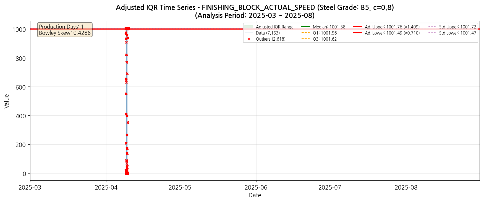

**2. 분포 히스토그램 (Distribution Histogram)**

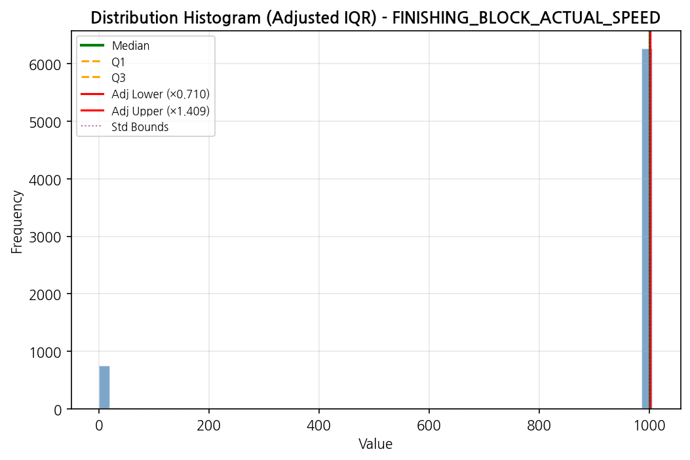

**3. 박스플롯 (Box Plot)**

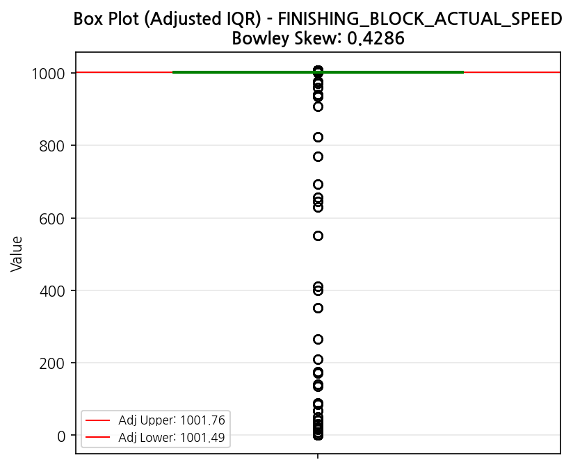

**4. 일별 평균 추이 (Daily Average Trend)**

**5. 월별 이상치율 (Monthly Outlier Rate)**

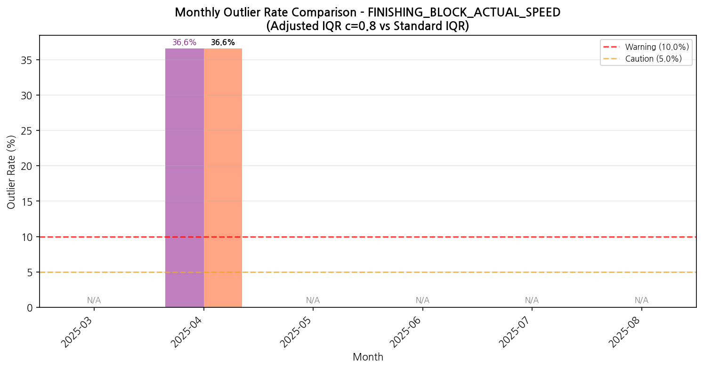

**6. 시간별 패턴 (Hourly Pattern)**

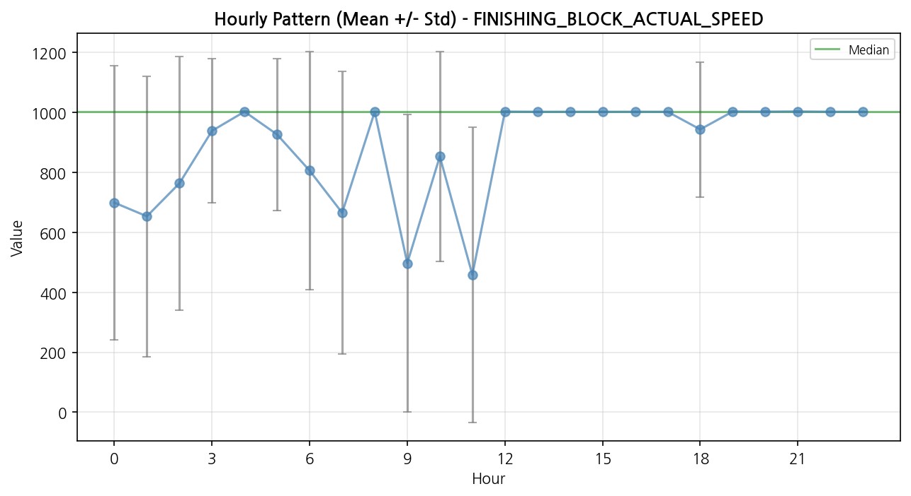

**7. 일별 이상치 수 (Daily Outlier Count)**

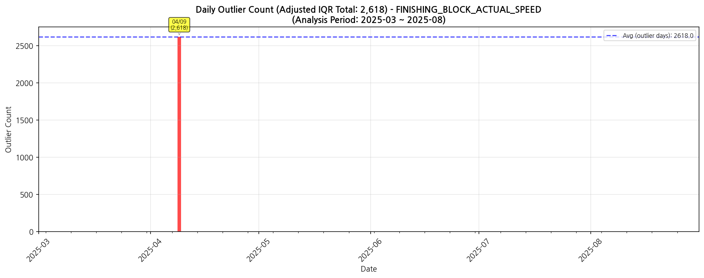

**종합 분석 차트**

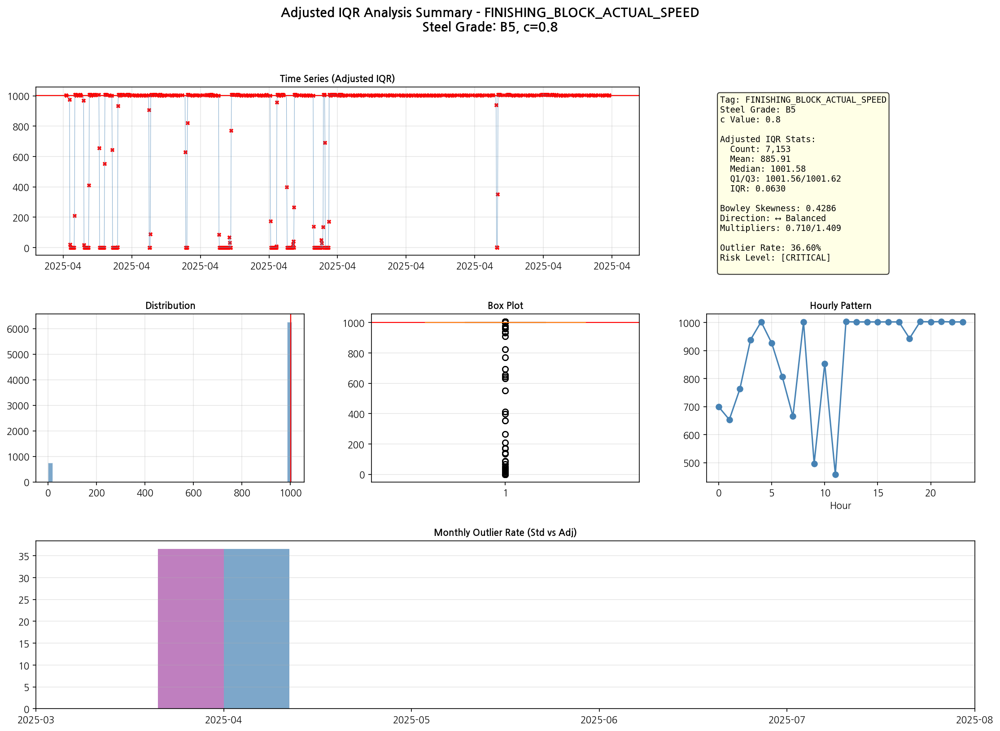

---

##### 월별 상세 분석

**2025-04**

**통계 요약**:

| 지표 | 값 |
|------|-------|
| 분석 레코드 | 7,153 |
| 평균 | 885.9098 |
| 중앙값 | 1001.5800 |
| IQR | 0.0630 |
| Bowley 왜도 | 0.4286 |
| Adj 이상치 수 | 2,618 |
| Adj 이상치율 | 36.60% |
| Std 이상치율 | 36.60% |
| 개선율 | 0.0% |

**주요 이상치 발생 날짜**:

- 1. 2025-04-09: 2,618건

**1. 시계열 (Time Series)**

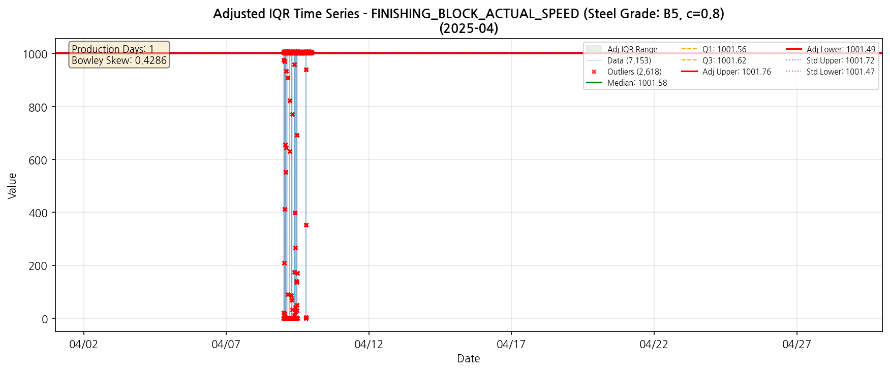

**2. 분포 히스토그램 (Distribution Histogram)**

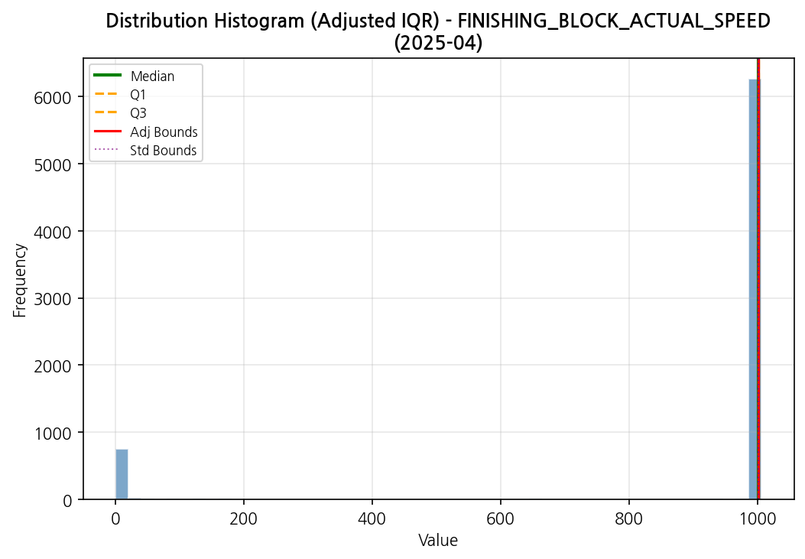

**3. 박스플롯 (Box Plot)**

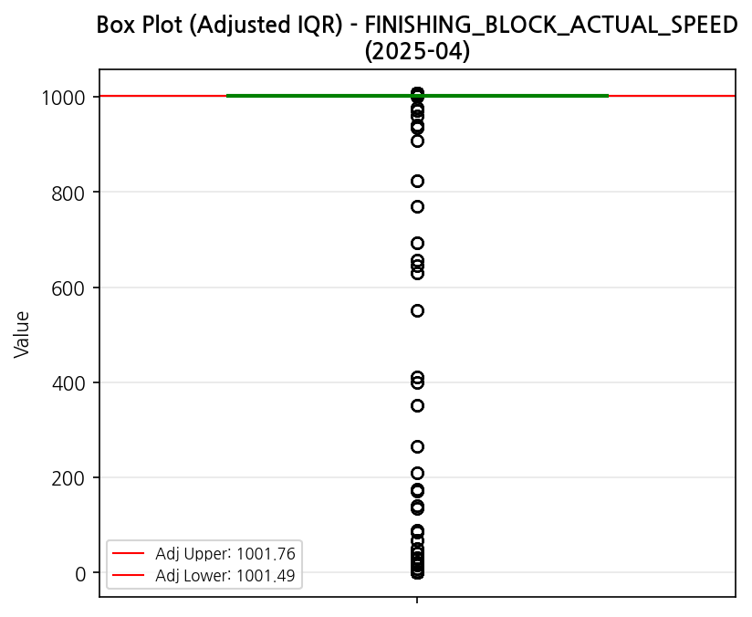

**4. 일별 평균 추이 (Daily Average Trend)**

**5. 시간별 패턴 (Hourly Pattern)**

**6. 일별 이상치 수 (Daily Outlier Count)**

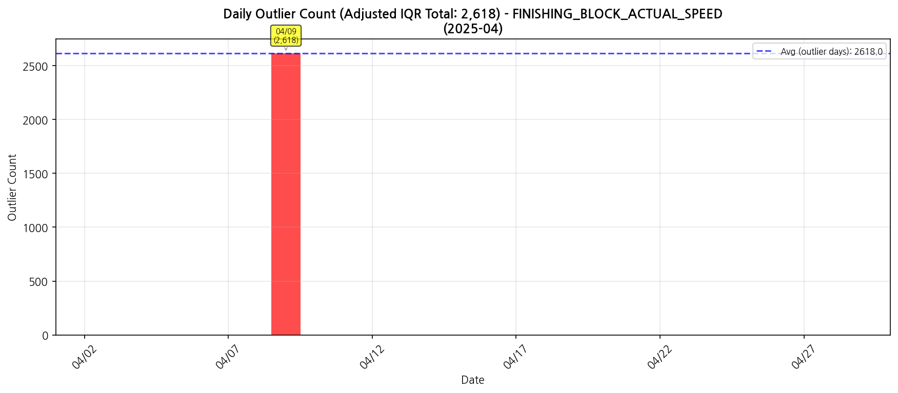

**월별 종합 차트**

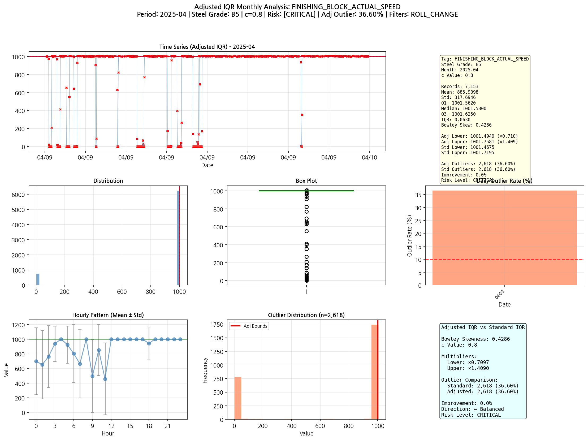

---

### 🔴 위험 (15~25%) - 13개 태그

#### STAND_12_ACTUAL_SPEED 🔴

**위험도**: [DANGER] | **이상치율**: 20.29% | **개선율**: 11.0%
**Bowley 왜도**: 0.3390 | **승수 (L/U)**: 0.762/1.312

**데이터**: 원본 7,200 → 필터 후 7,153 (0.7% 제외)

| 통계 지표 | Adjusted IQR | Standard IQR |
|-----------|--------------|--------------|
| 이상치 수 | 1,451 | 1,630 |
| 이상치율 | 20.29% | 22.79% |
| 하한 경계 | 1071.2007 | 1068.9410 |
| 상한 경계 | 1097.2728 | 1094.3090 |

| 기본 통계 | 값 |
|-----------|-------|
| 분석 레코드 | 7,153 |
| 평균 | 950.0555 |
| 표준편차 | 352.9865 |
| Q1 (25%) | 1078.4540 |
| 중앙값 | 1080.5500 |
| Q3 (75%) | 1084.7960 |
| IQR | 6.3420 |

**월별 이상치 추이**:

| 월 | 레코드 수 | 평균 | Adj 이상치율 | Std 이상치율 |
|-----|-----------|------|--------------|---------------|
| 2025-04 | 7,153 | 950.06 | 20.29% | 22.79% |

**주요 이상치 발생 날짜** (상위 5일):

| 순위 | 날짜 | 이상치 수 |
|:----:|------|----------:|
| 1 | 2025-04-09 | 1,451 |

- 이상치 발생 일수: 1일
- 최대 일별 이상치: 1,451건 (2025-04-09)
- 평균 일별 이상치: 1451.0건

##### 차트 분석

**1. 시계열 (Time Series)**

**2. 분포 히스토그램 (Distribution Histogram)**

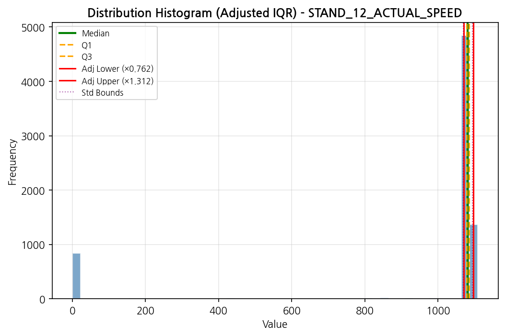

**3. 박스플롯 (Box Plot)**

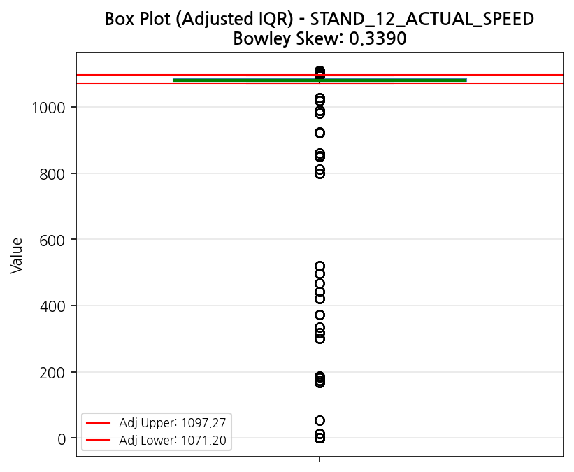

**4. 일별 평균 추이 (Daily Average Trend)**

**5. 월별 이상치율 (Monthly Outlier Rate)**

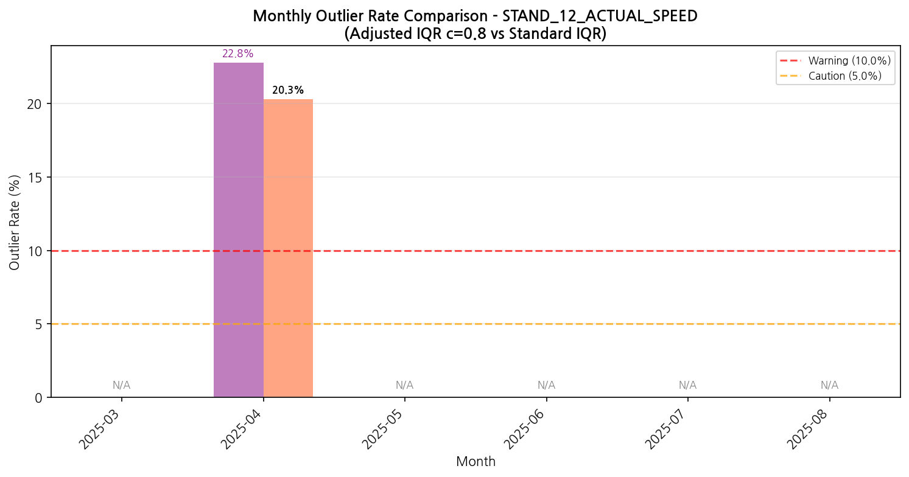

**6. 시간별 패턴 (Hourly Pattern)**

**7. 일별 이상치 수 (Daily Outlier Count)**

**종합 분석 차트**

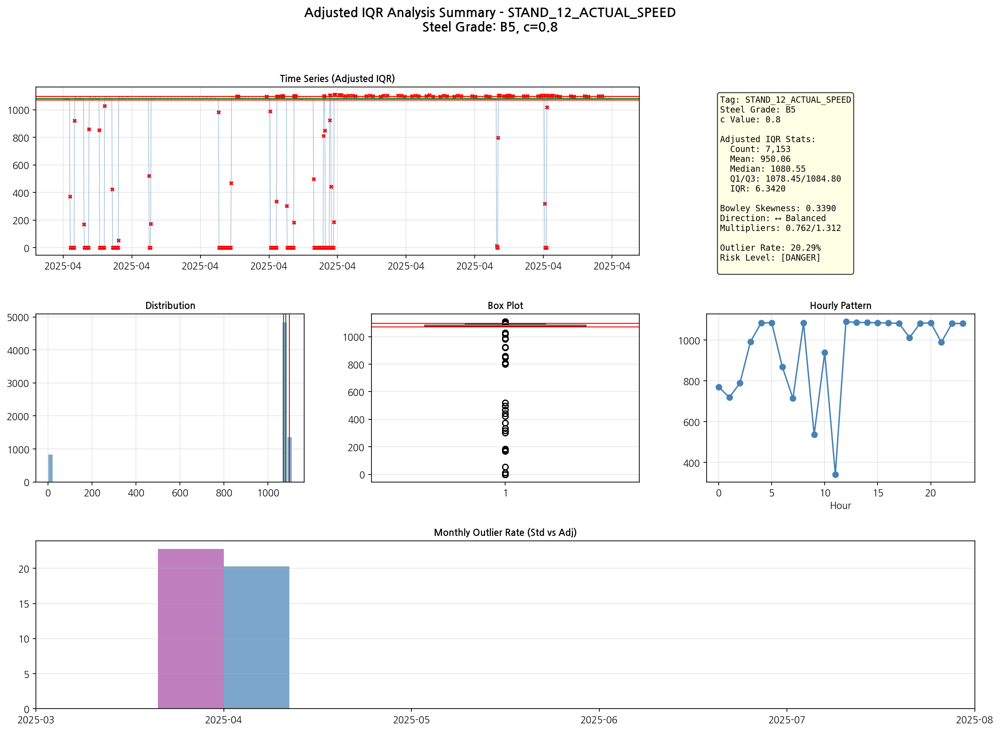

---

##### 월별 상세 분석

**2025-04**

**통계 요약**:

| 지표 | 값 |
|------|-------|
| 분석 레코드 | 7,153 |
| 평균 | 950.0555 |
| 중앙값 | 1080.5500 |
| IQR | 6.3420 |
| Bowley 왜도 | 0.3390 |
| Adj 이상치 수 | 1,451 |
| Adj 이상치율 | 20.29% |
| Std 이상치율 | 22.79% |
| 개선율 | 11.0% |

**주요 이상치 발생 날짜**:

- 1. 2025-04-09: 1,451건

**1. 시계열 (Time Series)**

**2. 분포 히스토그램 (Distribution Histogram)**

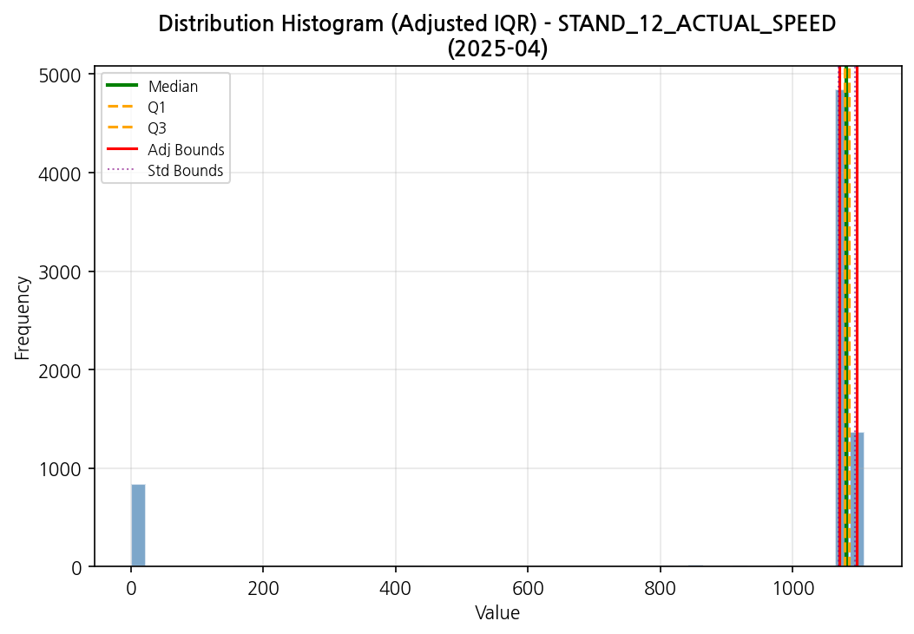

**3. 박스플롯 (Box Plot)**

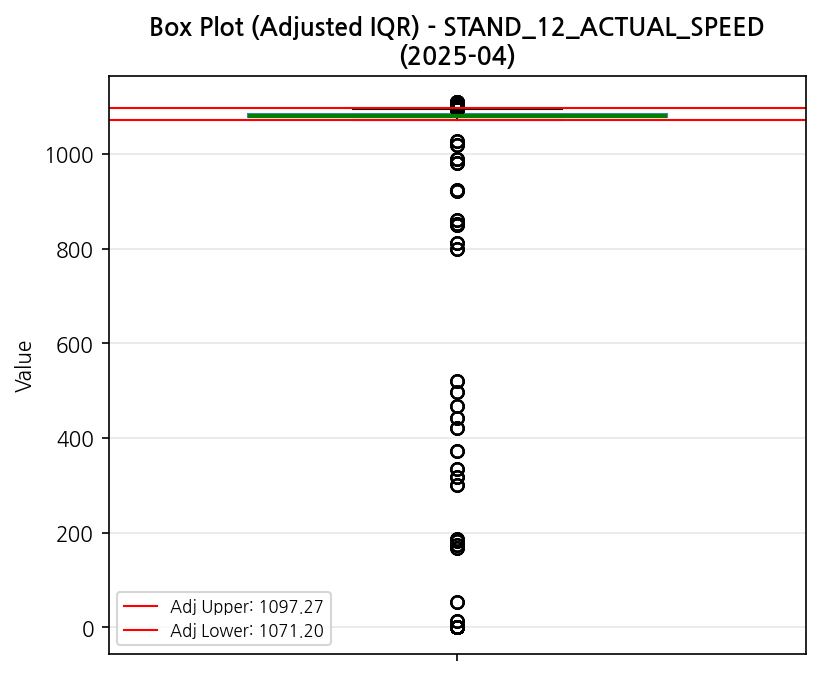

**4. 일별 평균 추이 (Daily Average Trend)**

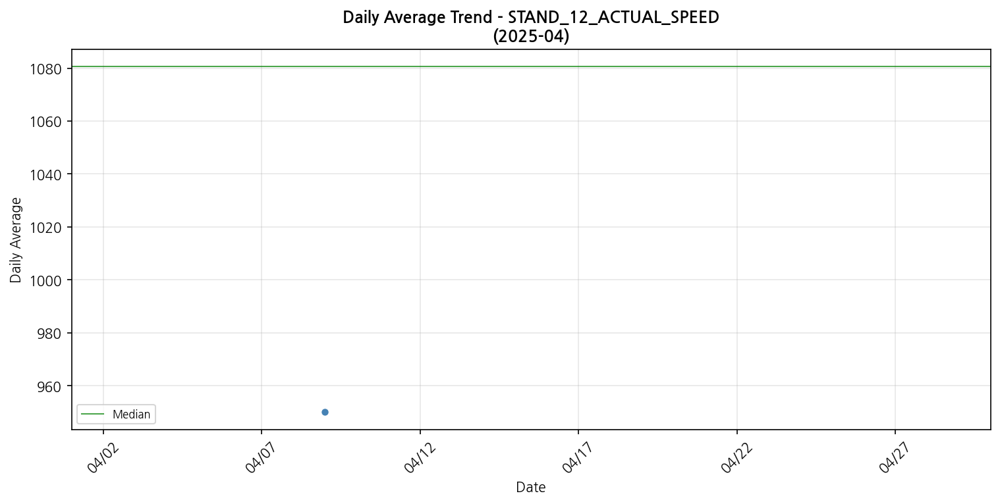

**5. 시간별 패턴 (Hourly Pattern)**

**6. 일별 이상치 수 (Daily Outlier Count)**

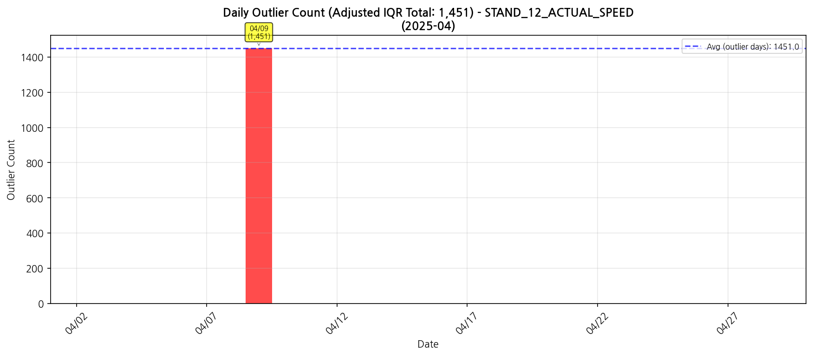

**월별 종합 차트**

---

#### STAND_1_ACTUAL_SPEED 🔴

**위험도**: [DANGER] | **이상치율**: 18.64% | **개선율**: 4.3%
**Bowley 왜도**: 0.1665 | **승수 (L/U)**: 0.875/1.142

**데이터**: 원본 7,200 → 필터 후 7,153 (0.7% 제외)

| 통계 지표 | Adjusted IQR | Standard IQR |
|-----------|--------------|--------------|
| 이상치 수 | 1,333 | 1,393 |
| 이상치율 | 18.64% | 19.47% |
| 하한 경계 | 647.8436 | 646.7519 |
| 상한 경계 | 671.3475 | 670.1002 |

| 기본 통계 | 값 |
|-----------|-------|
| 분석 레코드 | 7,153 |
| 평균 | 588.7746 |
| 표준편차 | 202.8198 |
| Q1 (25%) | 655.5075 |
| 중앙값 | 657.9402 |
| Q3 (75%) | 661.3446 |
| IQR | 5.8371 |

**월별 이상치 추이**:

| 월 | 레코드 수 | 평균 | Adj 이상치율 | Std 이상치율 |
|-----|-----------|------|--------------|---------------|
| 2025-04 | 7,153 | 588.77 | 18.64% | 19.47% |

**주요 이상치 발생 날짜** (상위 5일):

| 순위 | 날짜 | 이상치 수 |
|:----:|------|----------:|
| 1 | 2025-04-09 | 1,333 |

- 이상치 발생 일수: 1일
- 최대 일별 이상치: 1,333건 (2025-04-09)
- 평균 일별 이상치: 1333.0건

##### 차트 분석

**1. 시계열 (Time Series)**

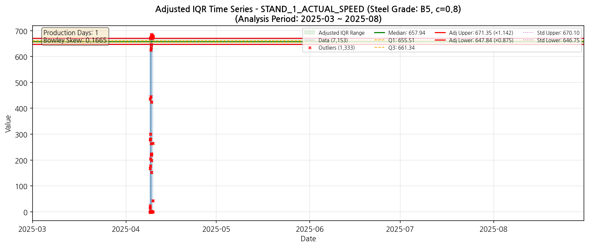

**2. 분포 히스토그램 (Distribution Histogram)**

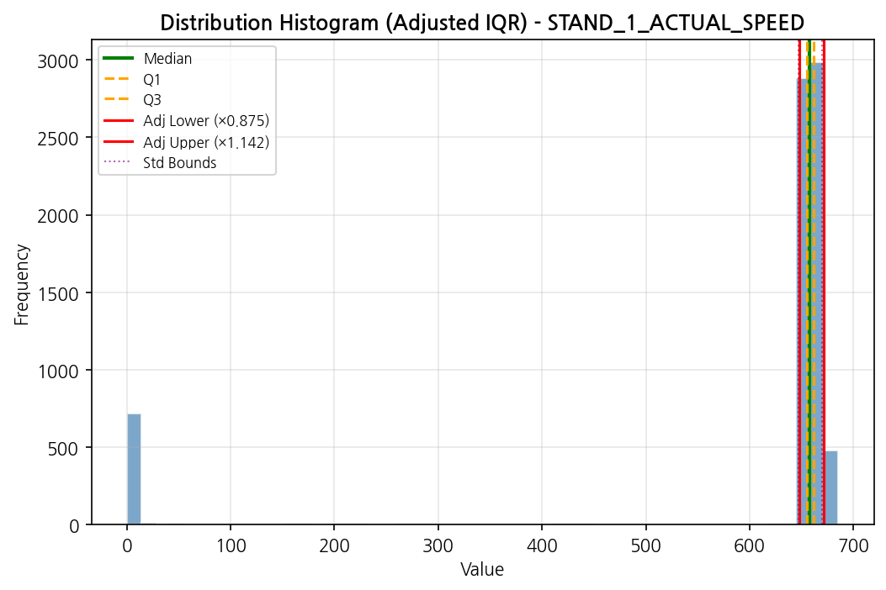

**3. 박스플롯 (Box Plot)**

**4. 일별 평균 추이 (Daily Average Trend)**

**5. 월별 이상치율 (Monthly Outlier Rate)**

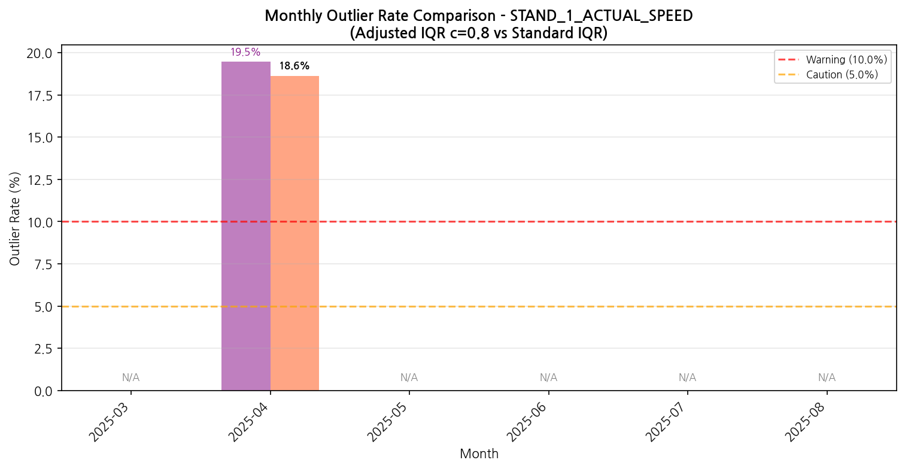

**6. 시간별 패턴 (Hourly Pattern)**

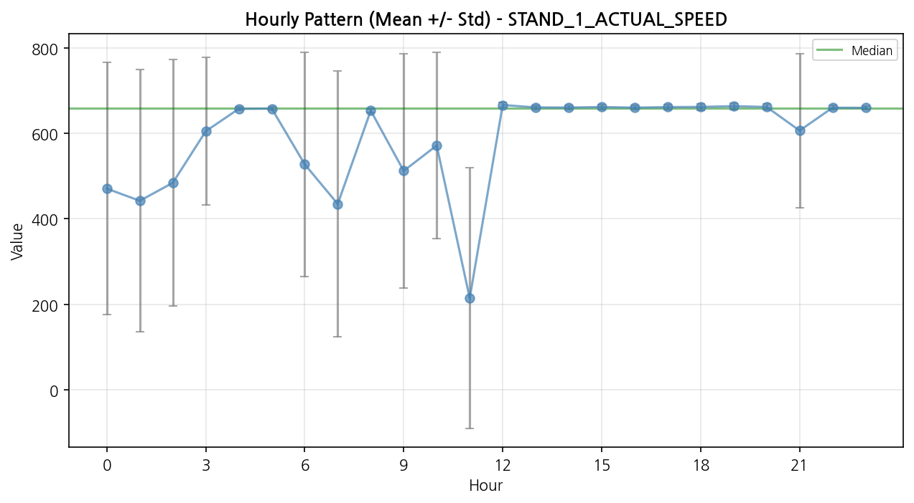

**7. 일별 이상치 수 (Daily Outlier Count)**

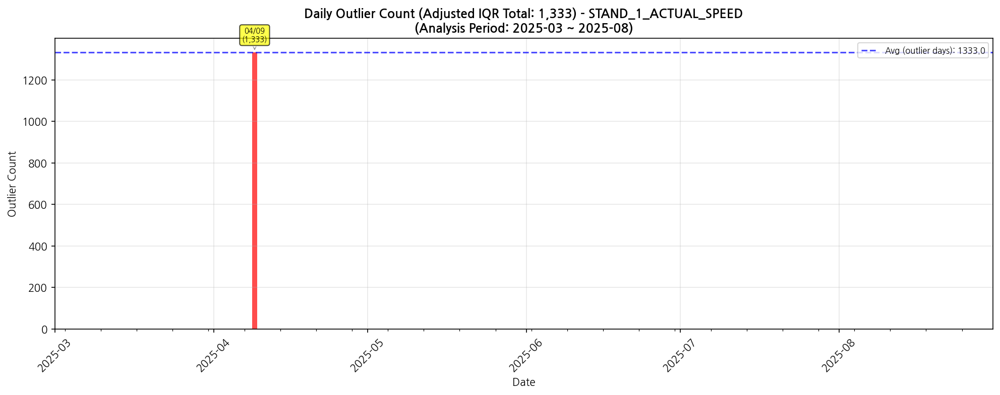

**종합 분석 차트**

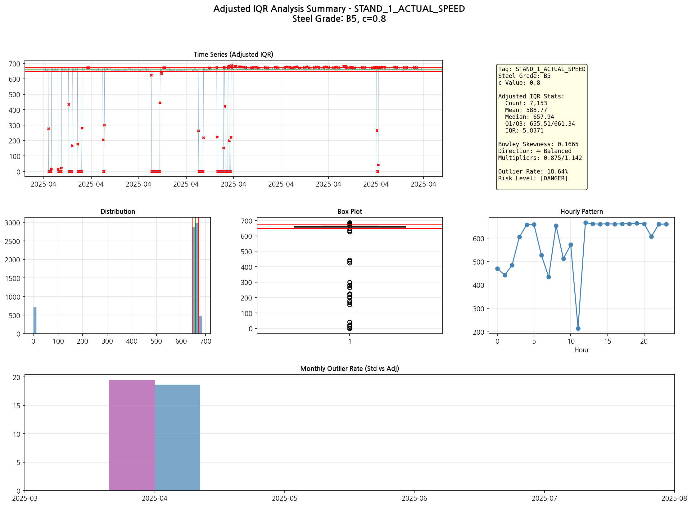

---

##### 월별 상세 분석

**2025-04**

**통계 요약**:

| 지표 | 값 |
|------|-------|
| 분석 레코드 | 7,153 |
| 평균 | 588.7746 |
| 중앙값 | 657.9402 |
| IQR | 5.8371 |
| Bowley 왜도 | 0.1665 |
| Adj 이상치 수 | 1,333 |
| Adj 이상치율 | 18.64% |
| Std 이상치율 | 19.47% |
| 개선율 | 4.3% |

**주요 이상치 발생 날짜**:

- 1. 2025-04-09: 1,333건

**1. 시계열 (Time Series)**

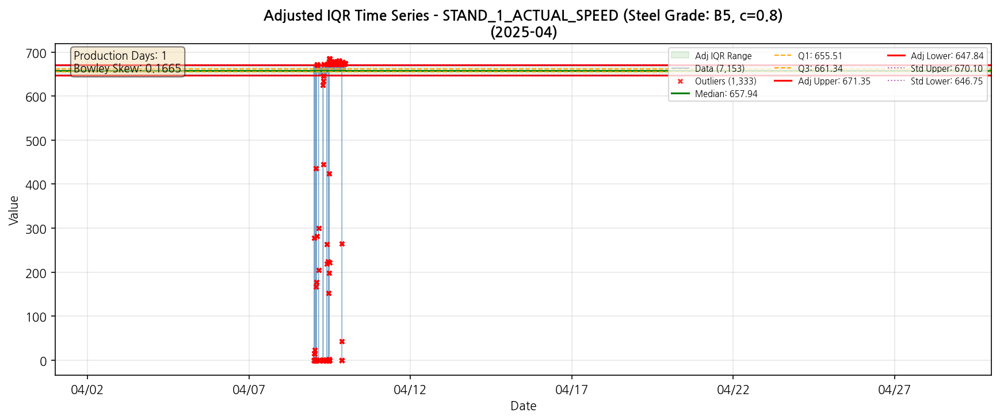

**2. 분포 히스토그램 (Distribution Histogram)**

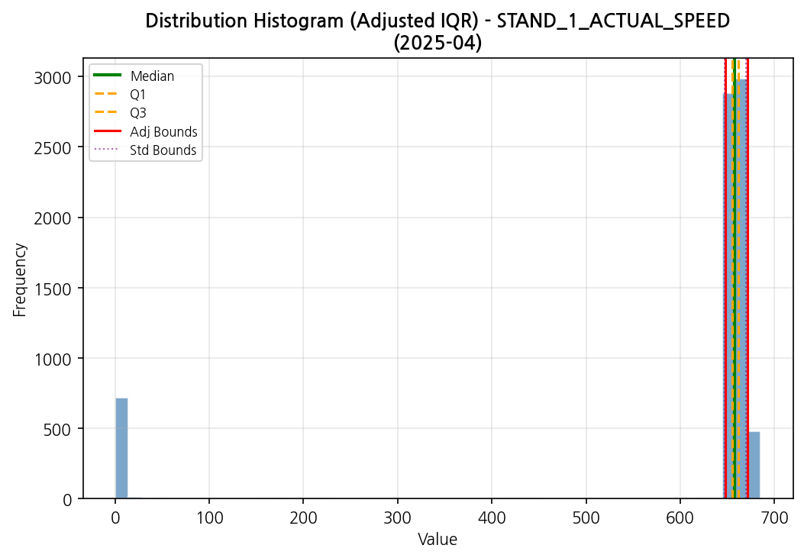

**3. 박스플롯 (Box Plot)**

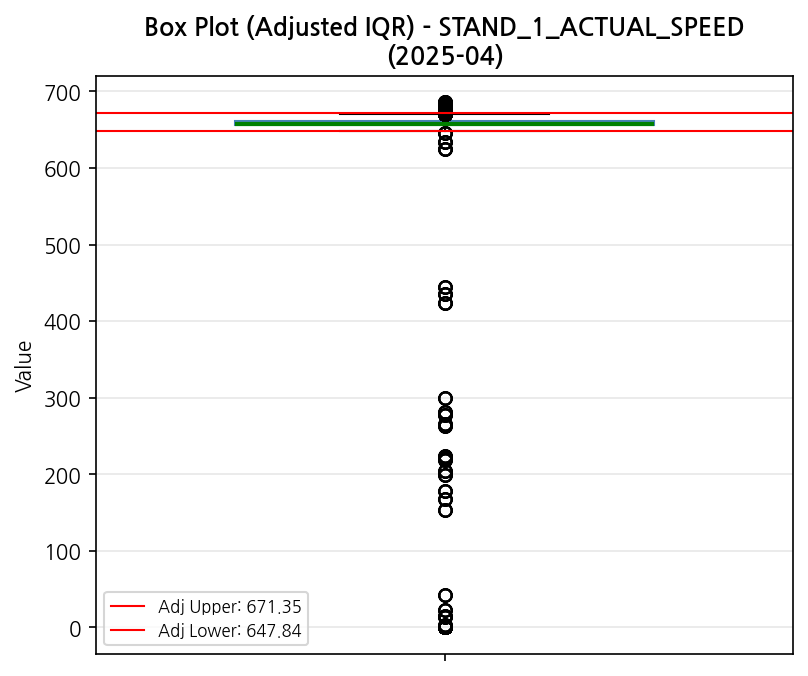

**4. 일별 평균 추이 (Daily Average Trend)**

**5. 시간별 패턴 (Hourly Pattern)**

**6. 일별 이상치 수 (Daily Outlier Count)**

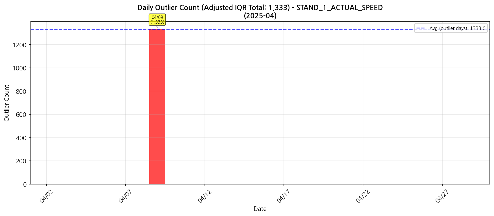

**월별 종합 차트**

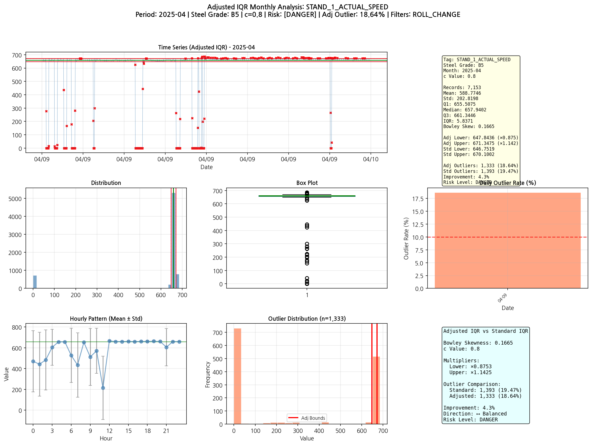

---

#### STAND_11_ACTUAL_SPEED 🔴

**위험도**: [DANGER] | **이상치율**: 17.45% | **개선율**: 0.8%
**Bowley 왜도**: 0.0576 | **승수 (L/U)**: 0.955/1.047

**데이터**: 원본 7,200 → 필터 후 7,153 (0.7% 제외)

| 통계 지표 | Adjusted IQR | Standard IQR |
|-----------|--------------|--------------|
| 이상치 수 | 1,248 | 1,258 |
| 이상치율 | 17.45% | 17.59% |
| 하한 경계 | 1123.7205 | 1123.1130 |
| 상한 경계 | 1159.6932 | 1159.0570 |

| 기본 통계 | 값 |
|-----------|-------|
| 분석 레코드 | 7,153 |
| 평균 | 1002.0829 |
| 표준편차 | 372.0036 |
| Q1 (25%) | 1136.5920 |
| 중앙값 | 1140.8260 |
| Q3 (75%) | 1145.5780 |
| IQR | 8.9860 |

**월별 이상치 추이**:

| 월 | 레코드 수 | 평균 | Adj 이상치율 | Std 이상치율 |
|-----|-----------|------|--------------|---------------|
| 2025-04 | 7,153 | 1002.08 | 17.45% | 17.59% |

**주요 이상치 발생 날짜** (상위 5일):

| 순위 | 날짜 | 이상치 수 |
|:----:|------|----------:|
| 1 | 2025-04-09 | 1,248 |

- 이상치 발생 일수: 1일
- 최대 일별 이상치: 1,248건 (2025-04-09)
- 평균 일별 이상치: 1248.0건

##### 차트 분석

**1. 시계열 (Time Series)**

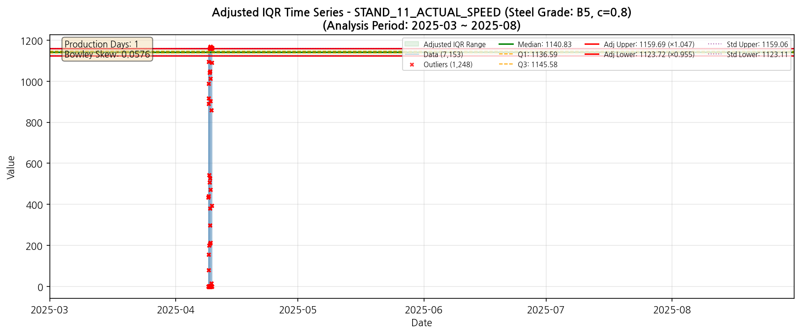

**2. 분포 히스토그램 (Distribution Histogram)**

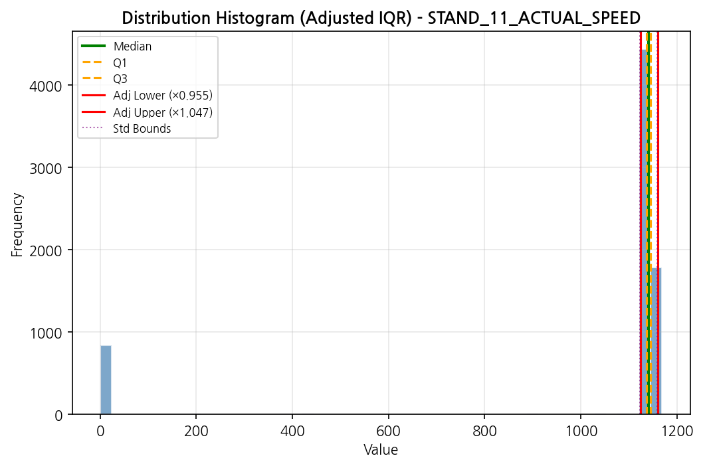

**3. 박스플롯 (Box Plot)**

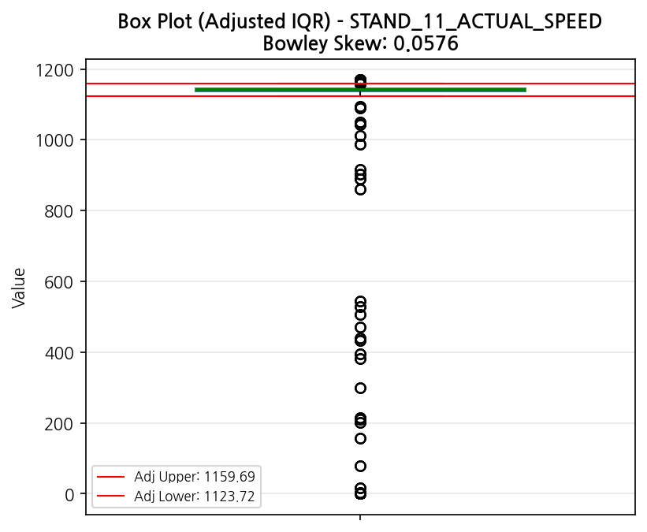

**4. 일별 평균 추이 (Daily Average Trend)**

**5. 월별 이상치율 (Monthly Outlier Rate)**

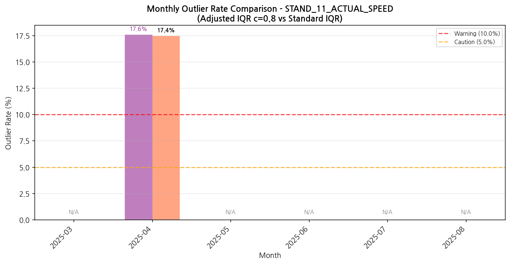

**6. 시간별 패턴 (Hourly Pattern)**

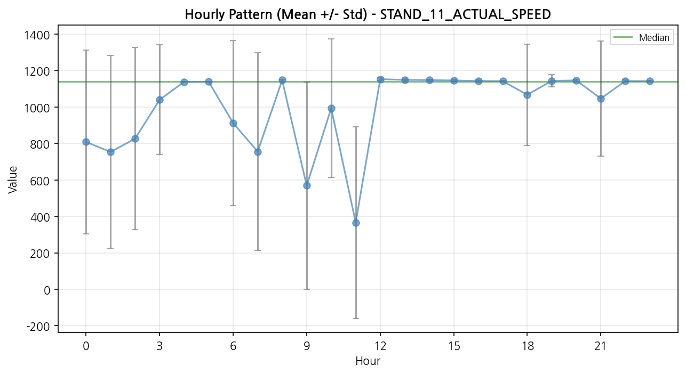

**7. 일별 이상치 수 (Daily Outlier Count)**

**종합 분석 차트**

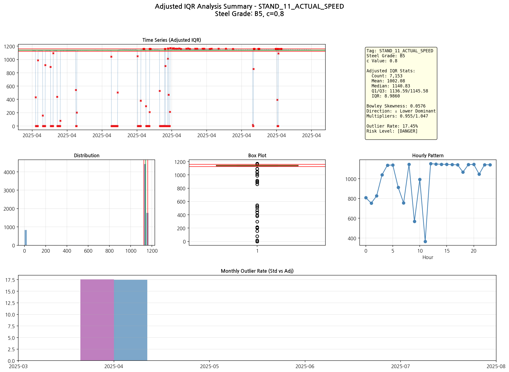

---

##### 월별 상세 분석

**2025-04**

**통계 요약**:

| 지표 | 값 |
|------|-------|
| 분석 레코드 | 7,153 |
| 평균 | 1002.0829 |
| 중앙값 | 1140.8260 |
| IQR | 8.9860 |
| Bowley 왜도 | 0.0576 |
| Adj 이상치 수 | 1,248 |
| Adj 이상치율 | 17.45% |
| Std 이상치율 | 17.59% |
| 개선율 | 0.8% |

**주요 이상치 발생 날짜**:

- 1. 2025-04-09: 1,248건

**1. 시계열 (Time Series)**

**2. 분포 히스토그램 (Distribution Histogram)**

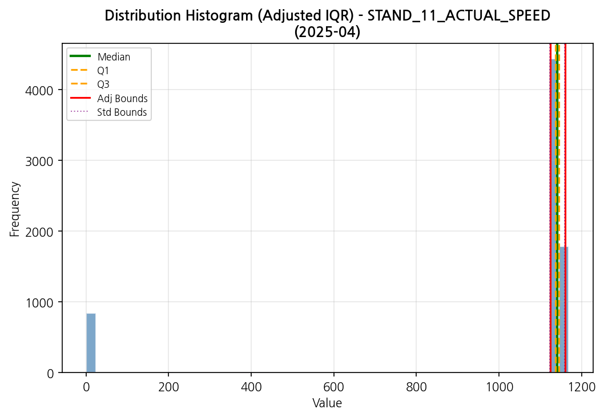

**3. 박스플롯 (Box Plot)**

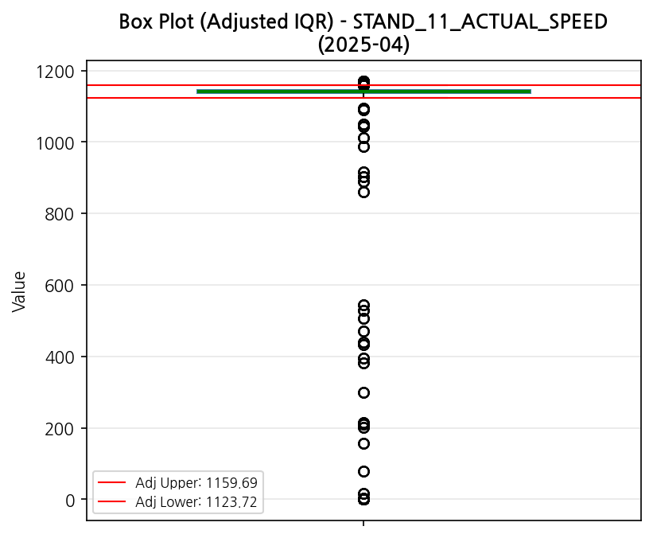

**4. 일별 평균 추이 (Daily Average Trend)**

**5. 시간별 패턴 (Hourly Pattern)**

**6. 일별 이상치 수 (Daily Outlier Count)**

**월별 종합 차트**

---

#### STAND_10_ACTUAL_SPEED 🔴

**위험도**: [DANGER] | **이상치율**: 17.28% | **개선율**: -31.8%
**Bowley 왜도**: -0.5160 | **승수 (L/U)**: 1.511/0.662

**데이터**: 원본 7,200 → 필터 후 7,153 (0.7% 제외)

| 통계 지표 | Adjusted IQR | Standard IQR |
|-----------|--------------|--------------|
| 이상치 수 | 1,236 | 938 |
| 이상치율 | 17.28% | 13.11% |
| 하한 경계 | 981.5179 | 994.0590 |
| 상한 경계 | 1051.2071 | 1059.5070 |

| 기본 통계 | 값 |
|-----------|-------|
| 분석 레코드 | 7,153 |
| 평균 | 903.5679 |
| 표준편차 | 335.7263 |
| Q1 (25%) | 1018.6020 |
| 중앙값 | 1031.0040 |
| Q3 (75%) | 1034.9640 |
| IQR | 16.3620 |

**월별 이상치 추이**:

| 월 | 레코드 수 | 평균 | Adj 이상치율 | Std 이상치율 |
|-----|-----------|------|--------------|---------------|
| 2025-04 | 7,153 | 903.57 | 17.28% | 13.11% |

**주요 이상치 발생 날짜** (상위 5일):

| 순위 | 날짜 | 이상치 수 |
|:----:|------|----------:|
| 1 | 2025-04-09 | 1,236 |

- 이상치 발생 일수: 1일
- 최대 일별 이상치: 1,236건 (2025-04-09)
- 평균 일별 이상치: 1236.0건

##### 차트 분석

**1. 시계열 (Time Series)**

**2. 분포 히스토그램 (Distribution Histogram)**

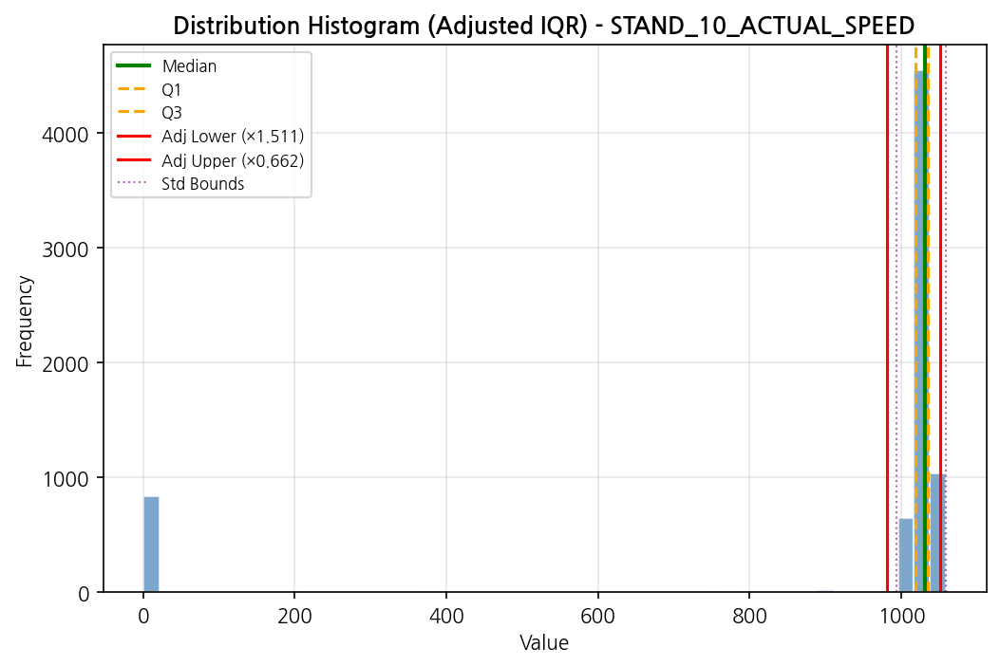

**3. 박스플롯 (Box Plot)**

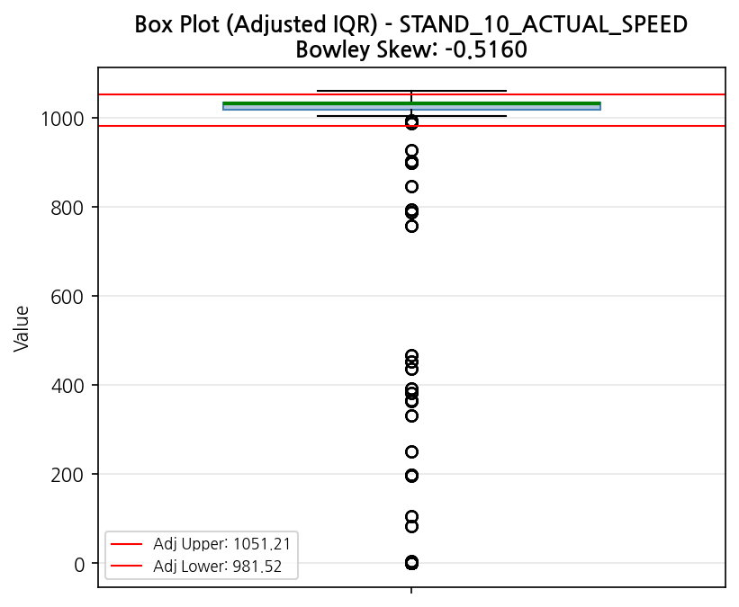

**4. 일별 평균 추이 (Daily Average Trend)**

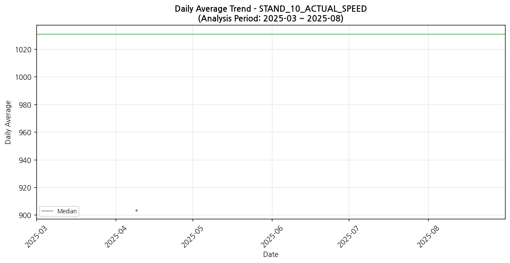

**5. 월별 이상치율 (Monthly Outlier Rate)**

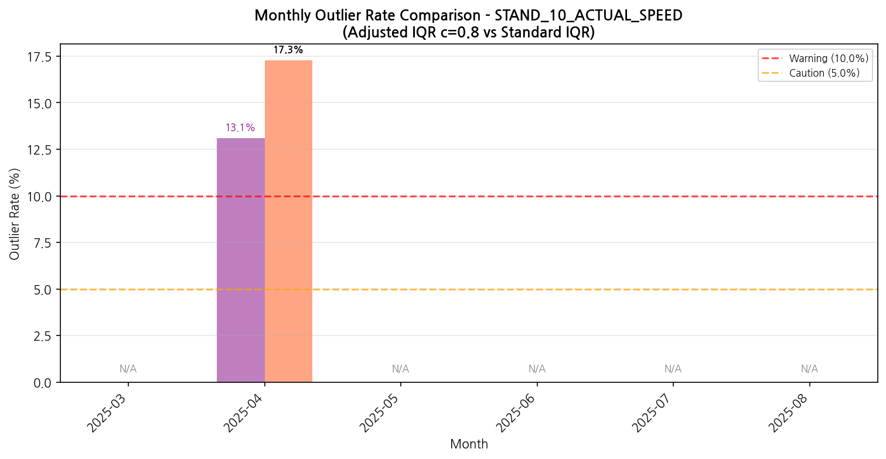

**6. 시간별 패턴 (Hourly Pattern)**

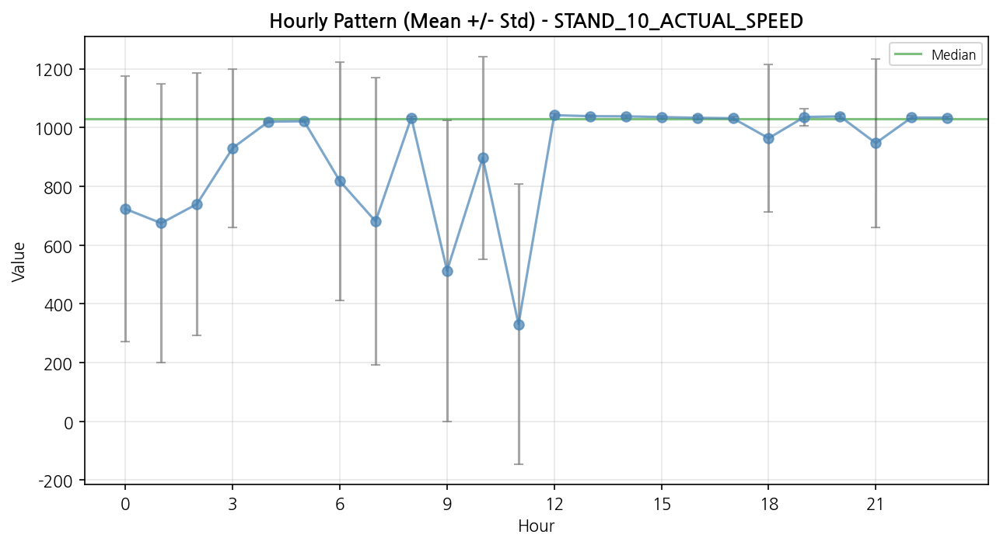

**7. 일별 이상치 수 (Daily Outlier Count)**

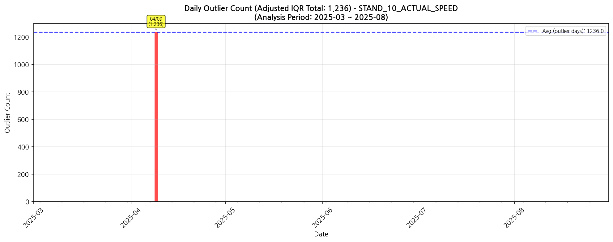

**종합 분석 차트**

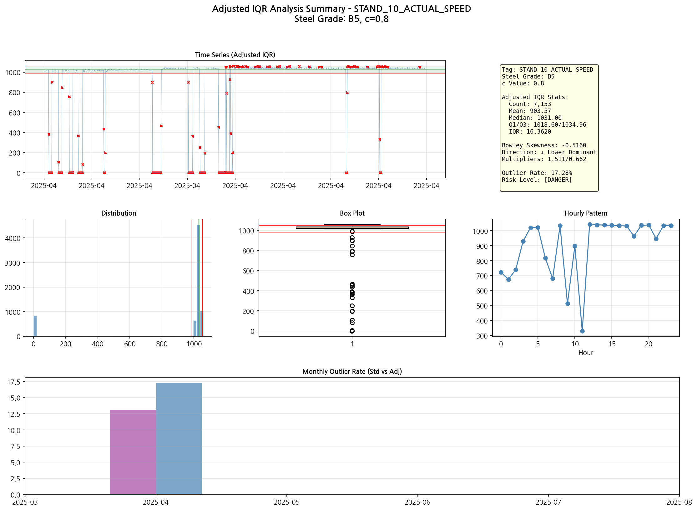

---

##### 월별 상세 분석

**2025-04**

**통계 요약**:

| 지표 | 값 |
|------|-------|
| 분석 레코드 | 7,153 |
| 평균 | 903.5679 |
| 중앙값 | 1031.0040 |
| IQR | 16.3620 |
| Bowley 왜도 | -0.5160 |
| Adj 이상치 수 | 1,236 |
| Adj 이상치율 | 17.28% |
| Std 이상치율 | 13.11% |
| 개선율 | -31.8% |

**주요 이상치 발생 날짜**:

- 1. 2025-04-09: 1,236건

**1. 시계열 (Time Series)**

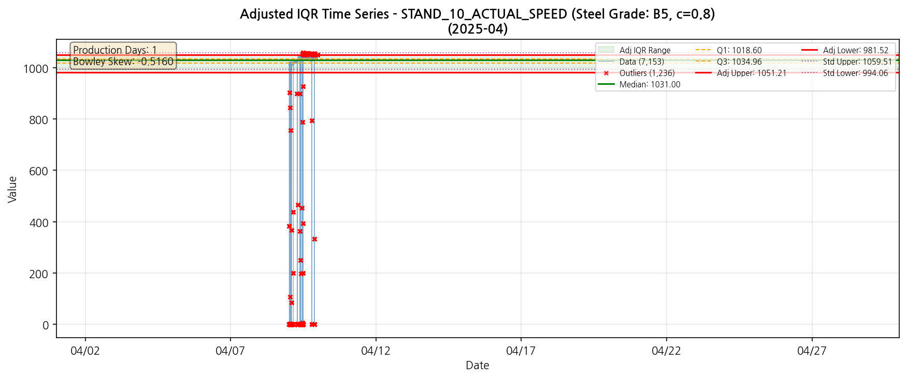

**2. 분포 히스토그램 (Distribution Histogram)**

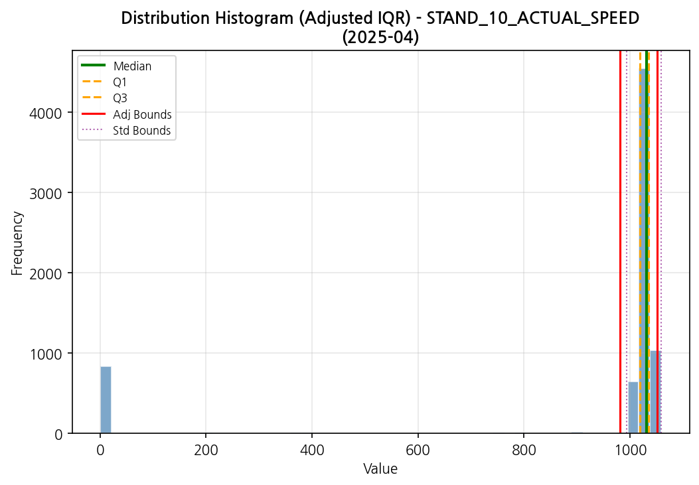

**3. 박스플롯 (Box Plot)**

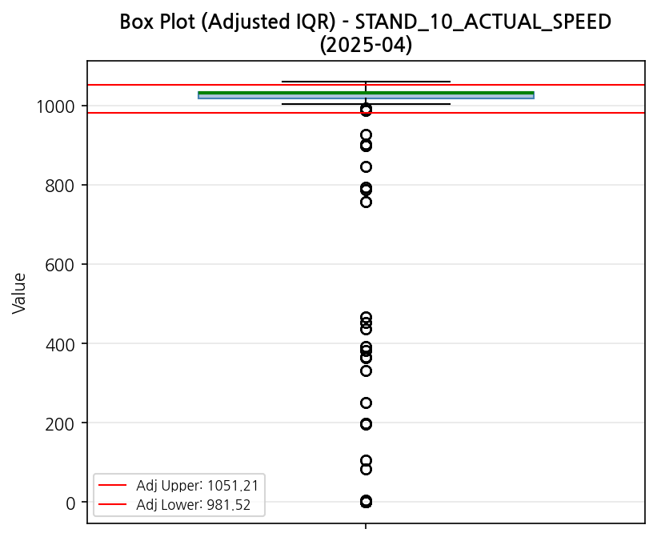

**4. 일별 평균 추이 (Daily Average Trend)**

**5. 시간별 패턴 (Hourly Pattern)**

**6. 일별 이상치 수 (Daily Outlier Count)**

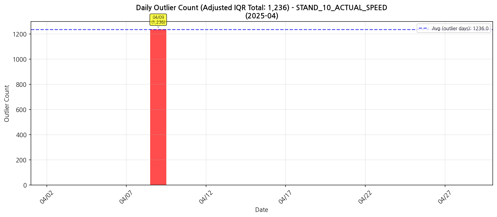

**월별 종합 차트**


---

#### STAND_3_ACTUAL_SPEED 🔴

**위험도**: [DANGER] | **이상치율**: 17.18% | **개선율**: 3.9%
**Bowley 왜도**: 0.1356 | **승수 (L/U)**: 0.897/1.115

**데이터**: 원본 7,200 → 필터 후 7,153 (0.7% 제외)

| 통계 지표 | Adjusted IQR | Standard IQR |
|-----------|--------------|--------------|
| 이상치 수 | 1,229 | 1,279 |
| 이상치율 | 17.18% | 17.88% |
| 하한 경계 | 869.7317 | 868.6753 |
| 상한 경계 | 897.2488 | 896.0713 |

| 기본 통계 | 값 |
|-----------|-------|
| 분석 레코드 | 7,153 |
| 평균 | 788.3784 |
| 표준편차 | 271.8616 |
| Q1 (25%) | 878.9488 |
| 중앙값 | 881.9088 |
| Q3 (75%) | 885.7978 |
| IQR | 6.8490 |

**월별 이상치 추이**:

| 월 | 레코드 수 | 평균 | Adj 이상치율 | Std 이상치율 |
|-----|-----------|------|--------------|---------------|
| 2025-04 | 7,153 | 788.38 | 17.18% | 17.88% |

**주요 이상치 발생 날짜** (상위 5일):

| 순위 | 날짜 | 이상치 수 |
|:----:|------|----------:|
| 1 | 2025-04-09 | 1,229 |

- 이상치 발생 일수: 1일
- 최대 일별 이상치: 1,229건 (2025-04-09)
- 평균 일별 이상치: 1229.0건

##### 차트 분석

**1. 시계열 (Time Series)**


**2. 분포 히스토그램 (Distribution Histogram)**


**3. 박스플롯 (Box Plot)**


**4. 일별 평균 추이 (Daily Average Trend)**


**5. 월별 이상치율 (Monthly Outlier Rate)**


**6. 시간별 패턴 (Hourly Pattern)**

**7. 일별 이상치 수 (Daily Outlier Count)**

**종합 분석 차트**


---

##### 월별 상세 분석

**2025-04**

**통계 요약**:

| 지표 | 값 |
|------|-------|
| 분석 레코드 | 7,153 |
| 평균 | 788.3784 |
| 중앙값 | 881.9088 |
| IQR | 6.8490 |
| Bowley 왜도 | 0.1356 |
| Adj 이상치 수 | 1,229 |
| Adj 이상치율 | 17.18% |
| Std 이상치율 | 17.88% |
| 개선율 | 3.9% |

**주요 이상치 발생 날짜**:

- 1. 2025-04-09: 1,229건

**1. 시계열 (Time Series)**


**2. 분포 히스토그램 (Distribution Histogram)**


**3. 박스플롯 (Box Plot)**


**4. 일별 평균 추이 (Daily Average Trend)**

**5. 시간별 패턴 (Hourly Pattern)**

**6. 일별 이상치 수 (Daily Outlier Count)**

**월별 종합 차트**


---

#### STAND_13_ACTUAL_SPEED 🔴

**위험도**: [DANGER] | **이상치율**: 16.90% | **개선율**: 7.2%
**Bowley 왜도**: 0.2213 | **승수 (L/U)**: 0.838/1.194

**데이터**: 원본 7,200 → 필터 후 7,153 (0.7% 제외)

| 통계 지표 | Adjusted IQR | Standard IQR |
|-----------|--------------|--------------|
| 이상치 수 | 1,209 | 1,303 |
| 이상치율 | 16.90% | 18.22% |
| 하한 경계 | 1040.2204 | 1038.2815 |
| 상한 경계 | 1072.4560 | 1070.1415 |

| 기본 통계 | 값 |
|-----------|-------|
| 분석 레코드 | 7,153 |
| 평균 | 925.6025 |
| 표준편차 | 344.0109 |
| Q1 (25%) | 1050.2290 |
| 중앙값 | 1053.3300 |
| Q3 (75%) | 1058.1940 |
| IQR | 7.9650 |

**월별 이상치 추이**:

| 월 | 레코드 수 | 평균 | Adj 이상치율 | Std 이상치율 |
|-----|-----------|------|--------------|---------------|
| 2025-04 | 7,153 | 925.60 | 16.90% | 18.22% |

**주요 이상치 발생 날짜** (상위 5일):

| 순위 | 날짜 | 이상치 수 |
|:----:|------|----------:|
| 1 | 2025-04-09 | 1,209 |

- 이상치 발생 일수: 1일
- 최대 일별 이상치: 1,209건 (2025-04-09)
- 평균 일별 이상치: 1209.0건

##### 차트 분석

**1. 시계열 (Time Series)**

**2. 분포 히스토그램 (Distribution Histogram)**


**3. 박스플롯 (Box Plot)**


**4. 일별 평균 추이 (Daily Average Trend)**

**5. 월별 이상치율 (Monthly Outlier Rate)**


**6. 시간별 패턴 (Hourly Pattern)**

**7. 일별 이상치 수 (Daily Outlier Count)**

**종합 분석 차트**

---

##### 월별 상세 분석

**2025-04**

**통계 요약**:

| 지표 | 값 |
|------|-------|
| 분석 레코드 | 7,153 |
| 평균 | 925.6025 |
| 중앙값 | 1053.3300 |
| IQR | 7.9650 |
| Bowley 왜도 | 0.2213 |
| Adj 이상치 수 | 1,209 |
| Adj 이상치율 | 16.90% |
| Std 이상치율 | 18.22% |
| 개선율 | 7.2% |

**주요 이상치 발생 날짜**:

- 1. 2025-04-09: 1,209건

**1. 시계열 (Time Series)**


**2. 분포 히스토그램 (Distribution Histogram)**


**3. 박스플롯 (Box Plot)**


**4. 일별 평균 추이 (Daily Average Trend)**


**5. 시간별 패턴 (Hourly Pattern)**

**6. 일별 이상치 수 (Daily Outlier Count)**

**월별 종합 차트**


---

#### PINCHROLL_3_ACTUAL_SPEED 🔴

**위험도**: [DANGER] | **이상치율**: 16.09% | **개선율**: 7.7%
**Bowley 왜도**: 0.4414 | **승수 (L/U)**: 0.702/1.424

**데이터**: 원본 7,200 → 필터 후 6,191 (14.0% 제외)

| 통계 지표 | Adjusted IQR | Standard IQR |
|-----------|--------------|--------------|
| 이상치 수 | 996 | 1,079 |
| 이상치율 | 16.09% | 17.43% |
| 하한 경계 | 763.7752 | 761.2348 |
| 상한 경계 | 787.6209 | 784.0046 |

| 기본 통계 | 값 |
|-----------|-------|
| 분석 레코드 | 6,191 |
| 평균 | 775.7761 |
| 표준편차 | 9.7994 |
| Q1 (25%) | 769.7734 |
| 중앙값 | 771.3633 |
| Q3 (75%) | 775.4659 |
| IQR | 5.6925 |

**월별 이상치 추이**:

| 월 | 레코드 수 | 평균 | Adj 이상치율 | Std 이상치율 |
|-----|-----------|------|--------------|---------------|
| 2025-04 | 6,191 | 775.78 | 16.09% | 17.43% |

**주요 이상치 발생 날짜** (상위 5일):

| 순위 | 날짜 | 이상치 수 |
|:----:|------|----------:|
| 1 | 2025-04-09 | 996 |

- 이상치 발생 일수: 1일
- 최대 일별 이상치: 996건 (2025-04-09)
- 평균 일별 이상치: 996.0건

##### 차트 분석

**1. 시계열 (Time Series)**


**2. 분포 히스토그램 (Distribution Histogram)**


**3. 박스플롯 (Box Plot)**


**4. 일별 평균 추이 (Daily Average Trend)**


**5. 월별 이상치율 (Monthly Outlier Rate)**


**6. 시간별 패턴 (Hourly Pattern)**


**7. 일별 이상치 수 (Daily Outlier Count)**

**종합 분석 차트**


---

##### 월별 상세 분석

**2025-04**

**통계 요약**:

| 지표 | 값 |
|------|-------|
| 분석 레코드 | 6,191 |
| 평균 | 775.7761 |
| 중앙값 | 771.3633 |
| IQR | 5.6925 |
| Bowley 왜도 | 0.4414 |
| Adj 이상치 수 | 996 |
| Adj 이상치율 | 16.09% |
| Std 이상치율 | 17.43% |
| 개선율 | 7.7% |

**주요 이상치 발생 날짜**:

- 1. 2025-04-09: 996건

**1. 시계열 (Time Series)**


**2. 분포 히스토그램 (Distribution Histogram)**


**3. 박스플롯 (Box Plot)**


**4. 일별 평균 추이 (Daily Average Trend)**


**5. 시간별 패턴 (Hourly Pattern)**

**6. 일별 이상치 수 (Daily Outlier Count)**

**월별 종합 차트**


---

#### STAND_4_ACTUAL_SPEED 🔴

**위험도**: [DANGER] | **이상치율**: 16.01% | **개선율**: 10.1%
**Bowley 왜도**: 0.1001 | **승수 (L/U)**: 0.923/1.083

**데이터**: 원본 7,200 → 필터 후 7,153 (0.7% 제외)

| 통계 지표 | Adjusted IQR | Standard IQR |
|-----------|--------------|--------------|
| 이상치 수 | 1,145 | 1,274 |
| 이상치율 | 16.01% | 17.81% |
| 하한 경계 | 777.4371 | 776.7388 |
| 상한 경계 | 801.6925 | 800.9361 |

| 기본 통계 | 값 |
|-----------|-------|
| 분석 레코드 | 7,153 |
| 평균 | 704.9699 |
| 표준편차 | 242.8508 |
| Q1 (25%) | 785.8128 |
| 중앙값 | 788.5347 |
| Q3 (75%) | 791.8621 |
| IQR | 6.0493 |

**월별 이상치 추이**:

| 월 | 레코드 수 | 평균 | Adj 이상치율 | Std 이상치율 |
|-----|-----------|------|--------------|---------------|
| 2025-04 | 7,153 | 704.97 | 16.01% | 17.81% |

**주요 이상치 발생 날짜** (상위 5일):

| 순위 | 날짜 | 이상치 수 |
|:----:|------|----------:|
| 1 | 2025-04-09 | 1,145 |

- 이상치 발생 일수: 1일
- 최대 일별 이상치: 1,145건 (2025-04-09)
- 평균 일별 이상치: 1145.0건

##### 차트 분석

**1. 시계열 (Time Series)**


**2. 분포 히스토그램 (Distribution Histogram)**


**3. 박스플롯 (Box Plot)**

**4. 일별 평균 추이 (Daily Average Trend)**

**5. 월별 이상치율 (Monthly Outlier Rate)**


**6. 시간별 패턴 (Hourly Pattern)**


**7. 일별 이상치 수 (Daily Outlier Count)**

**종합 분석 차트**

---

##### 월별 상세 분석

**2025-04**

**통계 요약**:

| 지표 | 값 |
|------|-------|
| 분석 레코드 | 7,153 |
| 평균 | 704.9699 |
| 중앙값 | 788.5347 |
| IQR | 6.0493 |
| Bowley 왜도 | 0.1001 |
| Adj 이상치 수 | 1,145 |
| Adj 이상치율 | 16.01% |
| Std 이상치율 | 17.81% |
| 개선율 | 10.1% |

**주요 이상치 발생 날짜**:

- 1. 2025-04-09: 1,145건

**1. 시계열 (Time Series)**

**2. 분포 히스토그램 (Distribution Histogram)**


**3. 박스플롯 (Box Plot)**


**4. 일별 평균 추이 (Daily Average Trend)**

**5. 시간별 패턴 (Hourly Pattern)**


**6. 일별 이상치 수 (Daily Outlier Count)**


**월별 종합 차트**


---

#### PINCHROLL_2_ACTUAL_SPEED 🔴

**위험도**: [DANGER] | **이상치율**: 15.64% | **개선율**: 12.9%
**Bowley 왜도**: -0.3105 | **승수 (L/U)**: 1.282/0.780

**데이터**: 원본 7,200 → 필터 후 6,191 (14.0% 제외)

| 통계 지표 | Adjusted IQR | Standard IQR |
|-----------|--------------|--------------|
| 이상치 수 | 968 | 1,112 |
| 이상치율 | 15.64% | 17.96% |
| 하한 경계 | -313.3842 | -311.8888 |
| 상한 경계 | -298.9164 | -297.7500 |

| 기본 통계 | 값 |
|-----------|-------|
| 분석 레코드 | 6,191 |
| 평균 | -306.4604 |
| 표준편차 | 5.4666 |
| Q1 (25%) | -306.5868 |
| 중앙값 | -304.2706 |
| Q3 (75%) | -303.0521 |
| IQR | 3.5347 |

**월별 이상치 추이**:

| 월 | 레코드 수 | 평균 | Adj 이상치율 | Std 이상치율 |
|-----|-----------|------|--------------|---------------|
| 2025-04 | 6,191 | -306.46 | 15.64% | 17.96% |

**주요 이상치 발생 날짜** (상위 5일):

| 순위 | 날짜 | 이상치 수 |
|:----:|------|----------:|
| 1 | 2025-04-09 | 968 |

- 이상치 발생 일수: 1일
- 최대 일별 이상치: 968건 (2025-04-09)
- 평균 일별 이상치: 968.0건

##### 차트 분석

**1. 시계열 (Time Series)**


**2. 분포 히스토그램 (Distribution Histogram)**


**3. 박스플롯 (Box Plot)**


**4. 일별 평균 추이 (Daily Average Trend)**

**5. 월별 이상치율 (Monthly Outlier Rate)**


**6. 시간별 패턴 (Hourly Pattern)**


**7. 일별 이상치 수 (Daily Outlier Count)**

**종합 분석 차트**


---

##### 월별 상세 분석

**2025-04**

**통계 요약**:

| 지표 | 값 |
|------|-------|
| 분석 레코드 | 6,191 |
| 평균 | -306.4604 |
| 중앙값 | -304.2706 |
| IQR | 3.5347 |
| Bowley 왜도 | -0.3105 |
| Adj 이상치 수 | 968 |
| Adj 이상치율 | 15.64% |
| Std 이상치율 | 17.96% |
| 개선율 | 12.9% |

**주요 이상치 발생 날짜**:

- 1. 2025-04-09: 968건

**1. 시계열 (Time Series)**


**2. 분포 히스토그램 (Distribution Histogram)**


**3. 박스플롯 (Box Plot)**


**4. 일별 평균 추이 (Daily Average Trend)**

**5. 시간별 패턴 (Hourly Pattern)**

**6. 일별 이상치 수 (Daily Outlier Count)**


**월별 종합 차트**


---

#### [L2] PR7L2_ACT_TORQUE 🔴

**위험도**: [DANGER] | **이상치율**: 15.55% | **개선율**: 0.0%
**Bowley 왜도**: -0.1462 | **승수 (L/U)**: 1.124/0.890

**데이터**: 원본 7,200 → 필터 후 6,191 (14.0% 제외)

| 통계 지표 | Adjusted IQR | Standard IQR |
|-----------|--------------|--------------|
| 이상치 수 | 963 | 963 |
| 이상치율 | 15.55% | 15.55% |
| 하한 경계 | 3.4543 | 3.4948 |
| 상한 경계 | 4.3299 | 4.3660 |

| 기본 통계 | 값 |
|-----------|-------|
| 분석 레코드 | 6,191 |
| 평균 | 4.3037 |
| 표준편차 | 0.9466 |
| Q1 (25%) | 3.8215 |
| 중앙값 | 3.9463 |
| Q3 (75%) | 4.0393 |
| IQR | 0.2178 |

**월별 이상치 추이**:

| 월 | 레코드 수 | 평균 | Adj 이상치율 | Std 이상치율 |
|-----|-----------|------|--------------|---------------|
| 2025-04 | 6,191 | 4.30 | 15.55% | 15.55% |

**주요 이상치 발생 날짜** (상위 5일):

| 순위 | 날짜 | 이상치 수 |
|:----:|------|----------:|
| 1 | 2025-04-09 | 963 |

- 이상치 발생 일수: 1일
- 최대 일별 이상치: 963건 (2025-04-09)
- 평균 일별 이상치: 963.0건

##### 차트 분석

**1. 시계열 (Time Series)**


**2. 분포 히스토그램 (Distribution Histogram)**


**3. 박스플롯 (Box Plot)**


**4. 일별 평균 추이 (Daily Average Trend)**

**5. 월별 이상치율 (Monthly Outlier Rate)**


**6. 시간별 패턴 (Hourly Pattern)**


**7. 일별 이상치 수 (Daily Outlier Count)**


**종합 분석 차트**

---

##### 월별 상세 분석

**2025-04**

**통계 요약**:

| 지표 | 값 |
|------|-------|
| 분석 레코드 | 6,191 |
| 평균 | 4.3037 |
| 중앙값 | 3.9463 |
| IQR | 0.2178 |
| Bowley 왜도 | -0.1462 |
| Adj 이상치 수 | 963 |
| Adj 이상치율 | 15.55% |
| Std 이상치율 | 15.55% |
| 개선율 | 0.0% |

**주요 이상치 발생 날짜**:

- 1. 2025-04-09: 963건

**1. 시계열 (Time Series)**


**2. 분포 히스토그램 (Distribution Histogram)**


**3. 박스플롯 (Box Plot)**


**4. 일별 평균 추이 (Daily Average Trend)**

**5. 시간별 패턴 (Hourly Pattern)**

**6. 일별 이상치 수 (Daily Outlier Count)**


**월별 종합 차트**


---

#### STAND_2_ACTUAL_SPEED 🔴

**위험도**: [DANGER] | **이상치율**: 15.38% | **개선율**: 11.6%
**Bowley 왜도**: 0.1602 | **승수 (L/U)**: 0.880/1.137

**데이터**: 원본 7,200 → 필터 후 7,153 (0.7% 제외)

| 통계 지표 | Adjusted IQR | Standard IQR |
|-----------|--------------|--------------|
| 이상치 수 | 1,100 | 1,244 |
| 이상치율 | 15.38% | 17.39% |
| 하한 경계 | 690.9805 | 690.0406 |
| 상한 경계 | 711.9407 | 710.8722 |

| 기본 통계 | 값 |
|-----------|-------|
| 분석 레코드 | 7,153 |
| 평균 | 625.7516 |
| 표준편차 | 215.5678 |
| Q1 (25%) | 697.8525 |
| 중앙값 | 700.0392 |
| Q3 (75%) | 703.0604 |
| IQR | 5.2079 |

**월별 이상치 추이**:

| 월 | 레코드 수 | 평균 | Adj 이상치율 | Std 이상치율 |
|-----|-----------|------|--------------|---------------|
| 2025-04 | 7,153 | 625.75 | 15.38% | 17.39% |

**주요 이상치 발생 날짜** (상위 5일):

| 순위 | 날짜 | 이상치 수 |
|:----:|------|----------:|
| 1 | 2025-04-09 | 1,100 |

- 이상치 발생 일수: 1일
- 최대 일별 이상치: 1,100건 (2025-04-09)
- 평균 일별 이상치: 1100.0건

##### 차트 분석

**1. 시계열 (Time Series)**

**2. 분포 히스토그램 (Distribution Histogram)**


**3. 박스플롯 (Box Plot)**


**4. 일별 평균 추이 (Daily Average Trend)**

**5. 월별 이상치율 (Monthly Outlier Rate)**


**6. 시간별 패턴 (Hourly Pattern)**


**7. 일별 이상치 수 (Daily Outlier Count)**

**종합 분석 차트**

---

##### 월별 상세 분석

**2025-04**

**통계 요약**:

| 지표 | 값 |
|------|-------|
| 분석 레코드 | 7,153 |
| 평균 | 625.7516 |
| 중앙값 | 700.0392 |
| IQR | 5.2079 |
| Bowley 왜도 | 0.1602 |
| Adj 이상치 수 | 1,100 |
| Adj 이상치율 | 15.38% |
| Std 이상치율 | 17.39% |
| 개선율 | 11.6% |

**주요 이상치 발생 날짜**:

- 1. 2025-04-09: 1,100건

**1. 시계열 (Time Series)**

**2. 분포 히스토그램 (Distribution Histogram)**

**3. 박스플롯 (Box Plot)**

**4. 일별 평균 추이 (Daily Average Trend)**

**5. 시간별 패턴 (Hourly Pattern)**

**6. 일별 이상치 수 (Daily Outlier Count)**

**월별 종합 차트**

---

#### [L1] PR7L1_ACT_TORQUE 🔴

**위험도**: [DANGER] | **이상치율**: 15.07% | **개선율**: 0.0%
**Bowley 왜도**: -0.0910 | **승수 (L/U)**: 1.076/0.930

**데이터**: 원본 7,200 → 필터 후 6,191 (14.0% 제외)

| 통계 지표 | Adjusted IQR | Standard IQR |
|-----------|--------------|--------------|
| 이상치 수 | 933 | 933 |
| 이상치율 | 15.07% | 15.07% |
| 하한 경계 | 2.7269 | 2.7539 |
| 상한 경계 | 3.6802 | 3.7053 |

| 기본 통계 | 값 |
|-----------|-------|
| 분석 레코드 | 6,191 |
| 평균 | 3.6063 |
| 표준편차 | 0.9757 |
| Q1 (25%) | 3.1107 |
| 중앙값 | 3.2404 |
| Q3 (75%) | 3.3485 |
| IQR | 0.2378 |

**월별 이상치 추이**:

| 월 | 레코드 수 | 평균 | Adj 이상치율 | Std 이상치율 |
|-----|-----------|------|--------------|---------------|
| 2025-04 | 6,191 | 3.61 | 15.07% | 15.07% |

**주요 이상치 발생 날짜** (상위 5일):

| 순위 | 날짜 | 이상치 수 |
|:----:|------|----------:|
| 1 | 2025-04-09 | 933 |

- 이상치 발생 일수: 1일
- 최대 일별 이상치: 933건 (2025-04-09)
- 평균 일별 이상치: 933.0건

##### 차트 분석

**1. 시계열 (Time Series)**


**2. 분포 히스토그램 (Distribution Histogram)**


**3. 박스플롯 (Box Plot)**


**4. 일별 평균 추이 (Daily Average Trend)**

**5. 월별 이상치율 (Monthly Outlier Rate)**

**6. 시간별 패턴 (Hourly Pattern)**


**7. 일별 이상치 수 (Daily Outlier Count)**

**종합 분석 차트**


---

##### 월별 상세 분석

**2025-04**

**통계 요약**:

| 지표 | 값 |
|------|-------|
| 분석 레코드 | 6,191 |
| 평균 | 3.6063 |
| 중앙값 | 3.2404 |
| IQR | 0.2378 |
| Bowley 왜도 | -0.0910 |
| Adj 이상치 수 | 933 |
| Adj 이상치율 | 15.07% |
| Std 이상치율 | 15.07% |
| 개선율 | 0.0% |

**주요 이상치 발생 날짜**:

- 1. 2025-04-09: 933건

**1. 시계열 (Time Series)**


**2. 분포 히스토그램 (Distribution Histogram)**


**3. 박스플롯 (Box Plot)**


**4. 일별 평균 추이 (Daily Average Trend)**


**5. 시간별 패턴 (Hourly Pattern)**

**6. 일별 이상치 수 (Daily Outlier Count)**

**월별 종합 차트**


---

#### [L2] PR6L2_ACT_TORQUE 🔴

**위험도**: [DANGER] | **이상치율**: 15.07% | **개선율**: 0.0%
**Bowley 왜도**: -0.0846 | **승수 (L/U)**: 1.070/0.935

**데이터**: 원본 7,200 → 필터 후 6,191 (14.0% 제외)

| 통계 지표 | Adjusted IQR | Standard IQR |
|-----------|--------------|--------------|
| 이상치 수 | 933 | 933 |
| 이상치율 | 15.07% | 15.07% |
| 하한 경계 | 3.2042 | 3.2337 |
| 상한 경계 | 4.3302 | 4.3578 |

| 기본 통계 | 값 |
|-----------|-------|
| 분석 레코드 | 6,191 |
| 평균 | 4.0177 |
| 표준편차 | 0.6168 |
| Q1 (25%) | 3.6553 |
| 중앙값 | 3.8076 |
| Q3 (75%) | 3.9363 |
| IQR | 0.2810 |

**월별 이상치 추이**:

| 월 | 레코드 수 | 평균 | Adj 이상치율 | Std 이상치율 |
|-----|-----------|------|--------------|---------------|
| 2025-04 | 6,191 | 4.02 | 15.07% | 15.07% |

**주요 이상치 발생 날짜** (상위 5일):

| 순위 | 날짜 | 이상치 수 |
|:----:|------|----------:|
| 1 | 2025-04-09 | 933 |

- 이상치 발생 일수: 1일
- 최대 일별 이상치: 933건 (2025-04-09)
- 평균 일별 이상치: 933.0건

##### 차트 분석

**1. 시계열 (Time Series)**


**2. 분포 히스토그램 (Distribution Histogram)**


**3. 박스플롯 (Box Plot)**


**4. 일별 평균 추이 (Daily Average Trend)**

**5. 월별 이상치율 (Monthly Outlier Rate)**


**6. 시간별 패턴 (Hourly Pattern)**


**7. 일별 이상치 수 (Daily Outlier Count)**

**종합 분석 차트**


---

##### 월별 상세 분석

**2025-04**

**통계 요약**:

| 지표 | 값 |
|------|-------|
| 분석 레코드 | 6,191 |
| 평균 | 4.0177 |
| 중앙값 | 3.8076 |
| IQR | 0.2810 |
| Bowley 왜도 | -0.0846 |
| Adj 이상치 수 | 933 |
| Adj 이상치율 | 15.07% |
| Std 이상치율 | 15.07% |
| 개선율 | 0.0% |

**주요 이상치 발생 날짜**:

- 1. 2025-04-09: 933건

**1. 시계열 (Time Series)**


**2. 분포 히스토그램 (Distribution Histogram)**


**3. 박스플롯 (Box Plot)**

**4. 일별 평균 추이 (Daily Average Trend)**

**5. 시간별 패턴 (Hourly Pattern)**


**6. 일별 이상치 수 (Daily Outlier Count)**


**월별 종합 차트**


---

### 🟠 경고 (10~15%) - 13개 태그

#### [L1] PR6L1_ACT_TORQUE 🟠

**위험도**: [WARNING] | **이상치율**: 14.99% | **개선율**: 0.0%
**Bowley 왜도**: 0.2398 | **승수 (L/U)**: 0.825/1.211

**데이터**: 원본 7,200 → 필터 후 6,191 (14.0% 제외)

| 통계 지표 | Adjusted IQR | Standard IQR |
|-----------|--------------|--------------|
| 이상치 수 | 928 | 928 |
| 이상치율 | 14.99% | 14.99% |
| 하한 경계 | 2.8084 | 2.7506 |
| 상한 경계 | 3.7035 | 3.6335 |

| 기본 통계 | 값 |
|-----------|-------|
| 분석 레코드 | 6,191 |
| 평균 | 3.4130 |
| 표준편차 | 0.6111 |
| Q1 (25%) | 3.0817 |
| 중앙값 | 3.1656 |
| Q3 (75%) | 3.3024 |
| IQR | 0.2207 |

**월별 이상치 추이**:

| 월 | 레코드 수 | 평균 | Adj 이상치율 | Std 이상치율 |
|-----|-----------|------|--------------|---------------|
| 2025-04 | 6,191 | 3.41 | 14.99% | 14.99% |

**주요 이상치 발생 날짜** (상위 5일):

| 순위 | 날짜 | 이상치 수 |
|:----:|------|----------:|
| 1 | 2025-04-09 | 928 |

- 이상치 발생 일수: 1일
- 최대 일별 이상치: 928건 (2025-04-09)
- 평균 일별 이상치: 928.0건

##### 차트 분석

**1. 시계열 (Time Series)**


**2. 분포 히스토그램 (Distribution Histogram)**


**3. 박스플롯 (Box Plot)**


**4. 일별 평균 추이 (Daily Average Trend)**

**5. 월별 이상치율 (Monthly Outlier Rate)**


**6. 시간별 패턴 (Hourly Pattern)**


**7. 일별 이상치 수 (Daily Outlier Count)**


**종합 분석 차트**

---

##### 월별 상세 분석

**2025-04**

**통계 요약**:

| 지표 | 값 |
|------|-------|
| 분석 레코드 | 6,191 |
| 평균 | 3.4130 |
| 중앙값 | 3.1656 |
| IQR | 0.2207 |
| Bowley 왜도 | 0.2398 |
| Adj 이상치 수 | 928 |
| Adj 이상치율 | 14.99% |
| Std 이상치율 | 14.99% |
| 개선율 | 0.0% |

**주요 이상치 발생 날짜**:

- 1. 2025-04-09: 928건

**1. 시계열 (Time Series)**


**2. 분포 히스토그램 (Distribution Histogram)**


**3. 박스플롯 (Box Plot)**


**4. 일별 평균 추이 (Daily Average Trend)**


**5. 시간별 패턴 (Hourly Pattern)**

**6. 일별 이상치 수 (Daily Outlier Count)**

**월별 종합 차트**


---

#### PINCHROLL_4_ACTUAL_SPEED 🟠

**위험도**: [WARNING] | **이상치율**: 14.70% | **개선율**: 16.8%
**Bowley 왜도**: 0.5798 | **승수 (L/U)**: 0.629/1.590

**데이터**: 원본 7,200 → 필터 후 6,191 (14.0% 제외)

| 통계 지표 | Adjusted IQR | Standard IQR |
|-----------|--------------|--------------|
| 이상치 수 | 910 | 1,094 |
| 이상치율 | 14.70% | 17.67% |
| 하한 경계 | 761.5574 | 757.9352 |
| 상한 경계 | 789.7205 | 783.9605 |

| 기본 통계 | 값 |
|-----------|-------|
| 분석 레코드 | 6,191 |
| 평균 | 774.3518 |
| 표준편차 | 11.3061 |
| Q1 (25%) | 767.6947 |
| 중앙값 | 769.0616 |
| Q3 (75%) | 774.2010 |
| IQR | 6.5063 |

**월별 이상치 추이**:

| 월 | 레코드 수 | 평균 | Adj 이상치율 | Std 이상치율 |
|-----|-----------|------|--------------|---------------|
| 2025-04 | 6,191 | 774.35 | 14.70% | 17.67% |

**주요 이상치 발생 날짜** (상위 5일):

| 순위 | 날짜 | 이상치 수 |
|:----:|------|----------:|
| 1 | 2025-04-09 | 910 |

- 이상치 발생 일수: 1일
- 최대 일별 이상치: 910건 (2025-04-09)
- 평균 일별 이상치: 910.0건

##### 차트 분석

**1. 시계열 (Time Series)**


**2. 분포 히스토그램 (Distribution Histogram)**

**3. 박스플롯 (Box Plot)**


**4. 일별 평균 추이 (Daily Average Trend)**


**5. 월별 이상치율 (Monthly Outlier Rate)**


**6. 시간별 패턴 (Hourly Pattern)**


**7. 일별 이상치 수 (Daily Outlier Count)**


**종합 분석 차트**


---

##### 월별 상세 분석

**2025-04**

**통계 요약**:

| 지표 | 값 |
|------|-------|
| 분석 레코드 | 6,191 |
| 평균 | 774.3518 |
| 중앙값 | 769.0616 |
| IQR | 6.5063 |
| Bowley 왜도 | 0.5798 |
| Adj 이상치 수 | 910 |
| Adj 이상치율 | 14.70% |
| Std 이상치율 | 17.67% |
| 개선율 | 16.8% |

**주요 이상치 발생 날짜**:

- 1. 2025-04-09: 910건

**1. 시계열 (Time Series)**


**2. 분포 히스토그램 (Distribution Histogram)**


**3. 박스플롯 (Box Plot)**


**4. 일별 평균 추이 (Daily Average Trend)**

**5. 시간별 패턴 (Hourly Pattern)**


**6. 일별 이상치 수 (Daily Outlier Count)**


**월별 종합 차트**

---

#### STAND_5_ACTUAL_SPEED 🟠

**위험도**: [WARNING] | **이상치율**: 13.63% | **개선율**: -18.3%
**Bowley 왜도**: -0.2718 | **승수 (L/U)**: 1.243/0.805

**데이터**: 원본 7,200 → 필터 후 7,153 (0.7% 제외)

| 통계 지표 | Adjusted IQR | Standard IQR |
|-----------|--------------|--------------|
| 이상치 수 | 975 | 824 |
| 이상치율 | 13.63% | 11.52% |
| 하한 경계 | 1155.5202 | 1160.5885 |
| 상한 경계 | 1212.1468 | 1216.2245 |

| 기본 통계 | 값 |
|-----------|-------|
| 분석 레코드 | 7,153 |
| 평균 | 1062.3000 |
| 표준편차 | 365.7808 |
| Q1 (25%) | 1181.4520 |
| 중앙값 | 1190.2970 |
| Q3 (75%) | 1195.3610 |
| IQR | 13.9090 |

**월별 이상치 추이**:

| 월 | 레코드 수 | 평균 | Adj 이상치율 | Std 이상치율 |
|-----|-----------|------|--------------|---------------|
| 2025-04 | 7,153 | 1062.30 | 13.63% | 11.52% |

**주요 이상치 발생 날짜** (상위 5일):

| 순위 | 날짜 | 이상치 수 |
|:----:|------|----------:|
| 1 | 2025-04-09 | 975 |

- 이상치 발생 일수: 1일
- 최대 일별 이상치: 975건 (2025-04-09)
- 평균 일별 이상치: 975.0건

##### 차트 분석

**1. 시계열 (Time Series)**

**2. 분포 히스토그램 (Distribution Histogram)**


**3. 박스플롯 (Box Plot)**


**4. 일별 평균 추이 (Daily Average Trend)**

**5. 월별 이상치율 (Monthly Outlier Rate)**


**6. 시간별 패턴 (Hourly Pattern)**


**7. 일별 이상치 수 (Daily Outlier Count)**

**종합 분석 차트**


---

##### 월별 상세 분석

**2025-04**

**통계 요약**:

| 지표 | 값 |
|------|-------|
| 분석 레코드 | 7,153 |
| 평균 | 1062.3000 |
| 중앙값 | 1190.2970 |
| IQR | 13.9090 |
| Bowley 왜도 | -0.2718 |
| Adj 이상치 수 | 975 |
| Adj 이상치율 | 13.63% |
| Std 이상치율 | 11.52% |
| 개선율 | -18.3% |

**주요 이상치 발생 날짜**:

- 1. 2025-04-09: 975건

**1. 시계열 (Time Series)**


**2. 분포 히스토그램 (Distribution Histogram)**


**3. 박스플롯 (Box Plot)**


**4. 일별 평균 추이 (Daily Average Trend)**


**5. 시간별 패턴 (Hourly Pattern)**

**6. 일별 이상치 수 (Daily Outlier Count)**

**월별 종합 차트**


---

#### STAND_14_ACTUAL_SPEED 🟠

**위험도**: [WARNING] | **이상치율**: 13.16% | **개선율**: 0.0%
**Bowley 왜도**: 0.0282 | **승수 (L/U)**: 0.978/1.023

**데이터**: 원본 7,200 → 필터 후 7,153 (0.7% 제외)

| 통계 지표 | Adjusted IQR | Standard IQR |
|-----------|--------------|--------------|
| 이상치 수 | 941 | 941 |
| 이상치율 | 13.16% | 13.16% |
| 하한 경계 | 1103.0427 | 1102.7200 |
| 상한 경계 | 1141.6261 | 1141.2960 |

| 기본 통계 | 값 |
|-----------|-------|
| 분석 레코드 | 7,153 |
| 평균 | 984.6138 |
| 표준편차 | 365.9985 |
| Q1 (25%) | 1117.1860 |
| 중앙값 | 1121.8720 |
| Q3 (75%) | 1126.8300 |
| IQR | 9.6440 |

**월별 이상치 추이**:

| 월 | 레코드 수 | 평균 | Adj 이상치율 | Std 이상치율 |
|-----|-----------|------|--------------|---------------|
| 2025-04 | 7,153 | 984.61 | 13.16% | 13.16% |

**주요 이상치 발생 날짜** (상위 5일):

| 순위 | 날짜 | 이상치 수 |
|:----:|------|----------:|
| 1 | 2025-04-09 | 941 |

- 이상치 발생 일수: 1일
- 최대 일별 이상치: 941건 (2025-04-09)
- 평균 일별 이상치: 941.0건

##### 차트 분석

**1. 시계열 (Time Series)**

**2. 분포 히스토그램 (Distribution Histogram)**

**3. 박스플롯 (Box Plot)**


**4. 일별 평균 추이 (Daily Average Trend)**

**5. 월별 이상치율 (Monthly Outlier Rate)**


**6. 시간별 패턴 (Hourly Pattern)**

**7. 일별 이상치 수 (Daily Outlier Count)**


**종합 분석 차트**

---

##### 월별 상세 분석

**2025-04**

**통계 요약**:

| 지표 | 값 |
|------|-------|
| 분석 레코드 | 7,153 |
| 평균 | 984.6138 |
| 중앙값 | 1121.8720 |
| IQR | 9.6440 |
| Bowley 왜도 | 0.0282 |
| Adj 이상치 수 | 941 |
| Adj 이상치율 | 13.16% |
| Std 이상치율 | 13.16% |
| 개선율 | 0.0% |

**주요 이상치 발생 날짜**:

- 1. 2025-04-09: 941건

**1. 시계열 (Time Series)**


**2. 분포 히스토그램 (Distribution Histogram)**


**3. 박스플롯 (Box Plot)**


**4. 일별 평균 추이 (Daily Average Trend)**

**5. 시간별 패턴 (Hourly Pattern)**


**6. 일별 이상치 수 (Daily Outlier Count)**

**월별 종합 차트**


---

#### STAND_9_ACTUAL_SPEED 🟠

**위험도**: [WARNING] | **이상치율**: 12.99% | **개선율**: 0.0%
**Bowley 왜도**: -0.2884 | **승수 (L/U)**: 1.260/0.794

**데이터**: 원본 7,200 → 필터 후 7,153 (0.7% 제외)

| 통계 지표 | Adjusted IQR | Standard IQR |
|-----------|--------------|--------------|
| 이상치 수 | 929 | 929 |
| 이상치율 | 12.99% | 12.99% |
| 하한 경계 | 955.5967 | 963.4588 |
| 상한 경계 | 1038.0042 | 1044.2464 |

| 기본 통계 | 값 |
|-----------|-------|
| 분석 레코드 | 7,153 |
| 평균 | 883.2293 |
| 표준편차 | 328.0029 |
| Q1 (25%) | 993.7541 |
| 중앙값 | 1006.7650 |
| Q3 (75%) | 1013.9510 |
| IQR | 20.1969 |

**월별 이상치 추이**:

| 월 | 레코드 수 | 평균 | Adj 이상치율 | Std 이상치율 |
|-----|-----------|------|--------------|---------------|
| 2025-04 | 7,153 | 883.23 | 12.99% | 12.99% |

**주요 이상치 발생 날짜** (상위 5일):

| 순위 | 날짜 | 이상치 수 |
|:----:|------|----------:|
| 1 | 2025-04-09 | 929 |

- 이상치 발생 일수: 1일
- 최대 일별 이상치: 929건 (2025-04-09)
- 평균 일별 이상치: 929.0건

##### 차트 분석

**1. 시계열 (Time Series)**


**2. 분포 히스토그램 (Distribution Histogram)**


**3. 박스플롯 (Box Plot)**


**4. 일별 평균 추이 (Daily Average Trend)**

**5. 월별 이상치율 (Monthly Outlier Rate)**


**6. 시간별 패턴 (Hourly Pattern)**

**7. 일별 이상치 수 (Daily Outlier Count)**

**종합 분석 차트**


---

##### 월별 상세 분석

**2025-04**

**통계 요약**:

| 지표 | 값 |
|------|-------|
| 분석 레코드 | 7,153 |
| 평균 | 883.2293 |
| 중앙값 | 1006.7650 |
| IQR | 20.1969 |
| Bowley 왜도 | -0.2884 |
| Adj 이상치 수 | 929 |
| Adj 이상치율 | 12.99% |
| Std 이상치율 | 12.99% |
| 개선율 | 0.0% |

**주요 이상치 발생 날짜**:

- 1. 2025-04-09: 929건

**1. 시계열 (Time Series)**


**2. 분포 히스토그램 (Distribution Histogram)**


**3. 박스플롯 (Box Plot)**


**4. 일별 평균 추이 (Daily Average Trend)**

**5. 시간별 패턴 (Hourly Pattern)**

**6. 일별 이상치 수 (Daily Outlier Count)**


**월별 종합 차트**

---

#### PINCHROLL_3_REFERENCE_TORQUE 🟠

**위험도**: [WARNING] | **이상치율**: 11.86% | **개선율**: 37.5%
**Bowley 왜도**: 1.0000 | **승수 (L/U)**: 0.449/2.226

**데이터**: 원본 7,200 → 필터 후 6,191 (14.0% 제외)

| 통계 지표 | Adjusted IQR | Standard IQR |
|-----------|--------------|--------------|
| 이상치 수 | 734 | 1,174 |
| 이상치율 | 11.86% | 18.96% |
| 하한 경계 | 21.2403 | 10.5050 |
| 상한 경계 | 86.3836 | 62.4917 |

| 기본 통계 | 값 |
|-----------|-------|
| 분석 레코드 | 6,191 |
| 평균 | 42.7906 |
| 표준편차 | 23.8654 |
| Q1 (25%) | 30.0000 |
| 중앙값 | 30.0000 |
| Q3 (75%) | 42.9967 |
| IQR | 12.9967 |

**월별 이상치 추이**:

| 월 | 레코드 수 | 평균 | Adj 이상치율 | Std 이상치율 |
|-----|-----------|------|--------------|---------------|
| 2025-04 | 6,191 | 42.79 | 11.86% | 18.96% |

**주요 이상치 발생 날짜** (상위 5일):

| 순위 | 날짜 | 이상치 수 |
|:----:|------|----------:|
| 1 | 2025-04-09 | 734 |

- 이상치 발생 일수: 1일
- 최대 일별 이상치: 734건 (2025-04-09)
- 평균 일별 이상치: 734.0건

##### 차트 분석

**1. 시계열 (Time Series)**


**2. 분포 히스토그램 (Distribution Histogram)**


**3. 박스플롯 (Box Plot)**

**4. 일별 평균 추이 (Daily Average Trend)**

**5. 월별 이상치율 (Monthly Outlier Rate)**


**6. 시간별 패턴 (Hourly Pattern)**

**7. 일별 이상치 수 (Daily Outlier Count)**

**종합 분석 차트**


---

##### 월별 상세 분석

**2025-04**

**통계 요약**:

| 지표 | 값 |
|------|-------|
| 분석 레코드 | 6,191 |
| 평균 | 42.7906 |
| 중앙값 | 30.0000 |
| IQR | 12.9967 |
| Bowley 왜도 | 1.0000 |
| Adj 이상치 수 | 734 |
| Adj 이상치율 | 11.86% |
| Std 이상치율 | 18.96% |
| 개선율 | 37.5% |

**주요 이상치 발생 날짜**:

- 1. 2025-04-09: 734건

**1. 시계열 (Time Series)**


**2. 분포 히스토그램 (Distribution Histogram)**


**3. 박스플롯 (Box Plot)**


**4. 일별 평균 추이 (Daily Average Trend)**

**5. 시간별 패턴 (Hourly Pattern)**


**6. 일별 이상치 수 (Daily Outlier Count)**


**월별 종합 차트**


---

#### STAND_6_ACTUAL_SPEED 🟠

**위험도**: [WARNING] | **이상치율**: 11.65% | **개선율**: 0.0%
**Bowley 왜도**: 0.0274 | **승수 (L/U)**: 0.978/1.022

**데이터**: 원본 7,200 → 필터 후 7,153 (0.7% 제외)

| 통계 지표 | Adjusted IQR | Standard IQR |
|-----------|--------------|--------------|
| 이상치 수 | 833 | 833 |
| 이상치율 | 11.65% | 11.65% |
| 하한 경계 | 1135.2927 | 1134.7040 |
| 상한 경계 | 1207.8258 | 1207.2240 |

| 기본 통계 | 값 |
|-----------|-------|
| 분석 레코드 | 7,153 |
| 평균 | 1046.0978 |
| 표준편차 | 360.8201 |
| Q1 (25%) | 1161.8990 |
| 중앙값 | 1170.7160 |
| Q3 (75%) | 1180.0290 |
| IQR | 18.1300 |

**월별 이상치 추이**:

| 월 | 레코드 수 | 평균 | Adj 이상치율 | Std 이상치율 |
|-----|-----------|------|--------------|---------------|
| 2025-04 | 7,153 | 1046.10 | 11.65% | 11.65% |

**주요 이상치 발생 날짜** (상위 5일):

| 순위 | 날짜 | 이상치 수 |
|:----:|------|----------:|
| 1 | 2025-04-09 | 833 |

- 이상치 발생 일수: 1일
- 최대 일별 이상치: 833건 (2025-04-09)
- 평균 일별 이상치: 833.0건

##### 차트 분석

**1. 시계열 (Time Series)**


**2. 분포 히스토그램 (Distribution Histogram)**


**3. 박스플롯 (Box Plot)**


**4. 일별 평균 추이 (Daily Average Trend)**

**5. 월별 이상치율 (Monthly Outlier Rate)**


**6. 시간별 패턴 (Hourly Pattern)**


**7. 일별 이상치 수 (Daily Outlier Count)**

**종합 분석 차트**


---

##### 월별 상세 분석

**2025-04**

**통계 요약**:

| 지표 | 값 |
|------|-------|
| 분석 레코드 | 7,153 |
| 평균 | 1046.0978 |
| 중앙값 | 1170.7160 |
| IQR | 18.1300 |
| Bowley 왜도 | 0.0274 |
| Adj 이상치 수 | 833 |
| Adj 이상치율 | 11.65% |
| Std 이상치율 | 11.65% |
| 개선율 | 0.0% |

**주요 이상치 발생 날짜**:

- 1. 2025-04-09: 833건

**1. 시계열 (Time Series)**


**2. 분포 히스토그램 (Distribution Histogram)**


**3. 박스플롯 (Box Plot)**


**4. 일별 평균 추이 (Daily Average Trend)**

**5. 시간별 패턴 (Hourly Pattern)**

**6. 일별 이상치 수 (Daily Outlier Count)**

**월별 종합 차트**


---

#### STAND_7_ACTUAL_SPEED 🟠

**위험도**: [WARNING] | **이상치율**: 11.44% | **개선율**: 0.0%
**Bowley 왜도**: -0.1376 | **승수 (L/U)**: 1.116/0.896

**데이터**: 원본 7,200 → 필터 후 7,153 (0.7% 제외)

| 통계 지표 | Adjusted IQR | Standard IQR |
|-----------|--------------|--------------|
| 이상치 수 | 818 | 818 |
| 이상치율 | 11.44% | 11.44% |
| 하한 경계 | 1194.9648 | 1200.1595 |
| 상한 경계 | 1314.5503 | 1319.2035 |

| 기본 통계 | 값 |
|-----------|-------|
| 분석 레코드 | 7,153 |
| 평균 | 1126.5746 |
| 표준편차 | 388.9464 |
| Q1 (25%) | 1244.8010 |
| 중앙값 | 1261.7290 |
| Q3 (75%) | 1274.5620 |
| IQR | 29.7610 |

**월별 이상치 추이**:

| 월 | 레코드 수 | 평균 | Adj 이상치율 | Std 이상치율 |
|-----|-----------|------|--------------|---------------|
| 2025-04 | 7,153 | 1126.57 | 11.44% | 11.44% |

**주요 이상치 발생 날짜** (상위 5일):

| 순위 | 날짜 | 이상치 수 |
|:----:|------|----------:|
| 1 | 2025-04-09 | 818 |

- 이상치 발생 일수: 1일
- 최대 일별 이상치: 818건 (2025-04-09)
- 평균 일별 이상치: 818.0건

##### 차트 분석

**1. 시계열 (Time Series)**


**2. 분포 히스토그램 (Distribution Histogram)**


**3. 박스플롯 (Box Plot)**


**4. 일별 평균 추이 (Daily Average Trend)**

**5. 월별 이상치율 (Monthly Outlier Rate)**

**6. 시간별 패턴 (Hourly Pattern)**


**7. 일별 이상치 수 (Daily Outlier Count)**

**종합 분석 차트**

---

##### 월별 상세 분석

**2025-04**

**통계 요약**:

| 지표 | 값 |
|------|-------|
| 분석 레코드 | 7,153 |
| 평균 | 1126.5746 |
| 중앙값 | 1261.7290 |
| IQR | 29.7610 |
| Bowley 왜도 | -0.1376 |
| Adj 이상치 수 | 818 |
| Adj 이상치율 | 11.44% |
| Std 이상치율 | 11.44% |
| 개선율 | 0.0% |

**주요 이상치 발생 날짜**:

- 1. 2025-04-09: 818건

**1. 시계열 (Time Series)**


**2. 분포 히스토그램 (Distribution Histogram)**

**3. 박스플롯 (Box Plot)**


**4. 일별 평균 추이 (Daily Average Trend)**

**5. 시간별 패턴 (Hourly Pattern)**

**6. 일별 이상치 수 (Daily Outlier Count)**

**월별 종합 차트**


---

#### STAND_8_ACTUAL_SPEED 🟠

**위험도**: [WARNING] | **이상치율**: 11.44% | **개선율**: 0.0%
**Bowley 왜도**: 0.0873 | **승수 (L/U)**: 0.933/1.072

**데이터**: 원본 7,200 → 필터 후 7,153 (0.7% 제외)

| 통계 지표 | Adjusted IQR | Standard IQR |
|-----------|--------------|--------------|
| 이상치 수 | 818 | 818 |
| 이상치율 | 11.44% | 11.44% |
| 하한 경계 | 1046.5867 | 1044.4170 |
| 상한 경계 | 1132.4957 | 1130.1690 |

| 기본 통계 | 값 |
|-----------|-------|
| 분석 레코드 | 7,153 |
| 평균 | 971.5312 |
| 표준편차 | 335.4365 |
| Q1 (25%) | 1076.5740 |
| 중앙값 | 1086.3570 |
| Q3 (75%) | 1098.0120 |
| IQR | 21.4380 |

**월별 이상치 추이**:

| 월 | 레코드 수 | 평균 | Adj 이상치율 | Std 이상치율 |
|-----|-----------|------|--------------|---------------|
| 2025-04 | 7,153 | 971.53 | 11.44% | 11.44% |

**주요 이상치 발생 날짜** (상위 5일):

| 순위 | 날짜 | 이상치 수 |
|:----:|------|----------:|
| 1 | 2025-04-09 | 818 |

- 이상치 발생 일수: 1일
- 최대 일별 이상치: 818건 (2025-04-09)
- 평균 일별 이상치: 818.0건

##### 차트 분석

**1. 시계열 (Time Series)**


**2. 분포 히스토그램 (Distribution Histogram)**


**3. 박스플롯 (Box Plot)**


**4. 일별 평균 추이 (Daily Average Trend)**

**5. 월별 이상치율 (Monthly Outlier Rate)**


**6. 시간별 패턴 (Hourly Pattern)**


**7. 일별 이상치 수 (Daily Outlier Count)**


**종합 분석 차트**

---

##### 월별 상세 분석

**2025-04**

**통계 요약**:

| 지표 | 값 |
|------|-------|
| 분석 레코드 | 7,153 |
| 평균 | 971.5312 |
| 중앙값 | 1086.3570 |
| IQR | 21.4380 |
| Bowley 왜도 | 0.0873 |
| Adj 이상치 수 | 818 |
| Adj 이상치율 | 11.44% |
| Std 이상치율 | 11.44% |
| 개선율 | 0.0% |

**주요 이상치 발생 날짜**:

- 1. 2025-04-09: 818건

**1. 시계열 (Time Series)**


**2. 분포 히스토그램 (Distribution Histogram)**


**3. 박스플롯 (Box Plot)**


**4. 일별 평균 추이 (Daily Average Trend)**

**5. 시간별 패턴 (Hourly Pattern)**

**6. 일별 이상치 수 (Daily Outlier Count)**

**월별 종합 차트**

---

#### PINCHROLL_2_ACTUAL_TORQUE 🟠

**위험도**: [WARNING] | **이상치율**: 11.31% | **개선율**: 39.1%
**Bowley 왜도**: -0.9998 | **승수 (L/U)**: 2.225/0.449

**데이터**: 원본 7,200 → 필터 후 6,191 (14.0% 제외)

| 통계 지표 | Adjusted IQR | Standard IQR |
|-----------|--------------|--------------|
| 이상치 수 | 700 | 1,149 |
| 이상치율 | 11.31% | 18.56% |
| 하한 경계 | 3.6810 | 10.5928 |
| 상한 경계 | 22.5302 | 25.6364 |

| 기본 통계 | 값 |
|-----------|-------|
| 분석 레코드 | 6,191 |
| 평균 | 16.6292 |
| 표준편차 | 6.0854 |
| Q1 (25%) | 16.2342 |
| 중앙값 | 19.9947 |
| Q3 (75%) | 19.9950 |
| IQR | 3.7609 |

**월별 이상치 추이**:

| 월 | 레코드 수 | 평균 | Adj 이상치율 | Std 이상치율 |
|-----|-----------|------|--------------|---------------|
| 2025-04 | 6,191 | 16.63 | 11.31% | 18.56% |

**주요 이상치 발생 날짜** (상위 5일):

| 순위 | 날짜 | 이상치 수 |
|:----:|------|----------:|
| 1 | 2025-04-09 | 700 |

- 이상치 발생 일수: 1일
- 최대 일별 이상치: 700건 (2025-04-09)
- 평균 일별 이상치: 700.0건

##### 차트 분석

**1. 시계열 (Time Series)**


**2. 분포 히스토그램 (Distribution Histogram)**


**3. 박스플롯 (Box Plot)**


**4. 일별 평균 추이 (Daily Average Trend)**

**5. 월별 이상치율 (Monthly Outlier Rate)**

**6. 시간별 패턴 (Hourly Pattern)**


**7. 일별 이상치 수 (Daily Outlier Count)**

**종합 분석 차트**


---

##### 월별 상세 분석

**2025-04**

**통계 요약**:

| 지표 | 값 |
|------|-------|
| 분석 레코드 | 6,191 |
| 평균 | 16.6292 |
| 중앙값 | 19.9947 |
| IQR | 3.7609 |
| Bowley 왜도 | -0.9998 |
| Adj 이상치 수 | 700 |
| Adj 이상치율 | 11.31% |
| Std 이상치율 | 18.56% |
| 개선율 | 39.1% |

**주요 이상치 발생 날짜**:

- 1. 2025-04-09: 700건

**1. 시계열 (Time Series)**

**2. 분포 히스토그램 (Distribution Histogram)**


**3. 박스플롯 (Box Plot)**

**4. 일별 평균 추이 (Daily Average Trend)**

**5. 시간별 패턴 (Hourly Pattern)**


**6. 일별 이상치 수 (Daily Outlier Count)**

**월별 종합 차트**


---

#### PINCHROLL_4_REFERENCE_TORQUE 🟠

**위험도**: [WARNING] | **이상치율**: 11.13% | **개선율**: 37.6%
**Bowley 왜도**: 1.0000 | **승수 (L/U)**: 0.449/2.226

**데이터**: 원본 7,200 → 필터 후 6,191 (14.0% 제외)

| 통계 지표 | Adjusted IQR | Standard IQR |
|-----------|--------------|--------------|
| 이상치 수 | 689 | 1,104 |
| 이상치율 | 11.13% | 17.83% |
| 하한 경계 | 20.3439 | 8.5100 |
| 상한 경계 | 92.1536 | 65.8167 |

| 기본 통계 | 값 |
|-----------|-------|
| 분석 레코드 | 6,191 |
| 평균 | 42.9796 |
| 표준편차 | 24.0401 |
| Q1 (25%) | 30.0000 |
| 중앙값 | 30.0000 |
| Q3 (75%) | 44.3267 |
| IQR | 14.3267 |

**월별 이상치 추이**:

| 월 | 레코드 수 | 평균 | Adj 이상치율 | Std 이상치율 |
|-----|-----------|------|--------------|---------------|
| 2025-04 | 6,191 | 42.98 | 11.13% | 17.83% |

**주요 이상치 발생 날짜** (상위 5일):

| 순위 | 날짜 | 이상치 수 |
|:----:|------|----------:|
| 1 | 2025-04-09 | 689 |

- 이상치 발생 일수: 1일
- 최대 일별 이상치: 689건 (2025-04-09)
- 평균 일별 이상치: 689.0건

##### 차트 분석

**1. 시계열 (Time Series)**


**2. 분포 히스토그램 (Distribution Histogram)**


**3. 박스플롯 (Box Plot)**


**4. 일별 평균 추이 (Daily Average Trend)**


**5. 월별 이상치율 (Monthly Outlier Rate)**


**6. 시간별 패턴 (Hourly Pattern)**


**7. 일별 이상치 수 (Daily Outlier Count)**

**종합 분석 차트**

---

##### 월별 상세 분석

**2025-04**

**통계 요약**:

| 지표 | 값 |
|------|-------|
| 분석 레코드 | 6,191 |
| 평균 | 42.9796 |
| 중앙값 | 30.0000 |
| IQR | 14.3267 |
| Bowley 왜도 | 1.0000 |
| Adj 이상치 수 | 689 |
| Adj 이상치율 | 11.13% |
| Std 이상치율 | 17.83% |
| 개선율 | 37.6% |

**주요 이상치 발생 날짜**:

- 1. 2025-04-09: 689건

**1. 시계열 (Time Series)**


**2. 분포 히스토그램 (Distribution Histogram)**


**3. 박스플롯 (Box Plot)**


**4. 일별 평균 추이 (Daily Average Trend)**


**5. 시간별 패턴 (Hourly Pattern)**

**6. 일별 이상치 수 (Daily Outlier Count)**


**월별 종합 차트**


---

#### PINCHROLL_3_ACTUAL_TORQUE 🟠

**위험도**: [WARNING] | **이상치율**: 10.42% | **개선율**: 41.8%
**Bowley 왜도**: -0.9990 | **승수 (L/U)**: 2.224/0.450

**데이터**: 원본 7,200 → 필터 후 6,191 (14.0% 제외)

| 통계 지표 | Adjusted IQR | Standard IQR |
|-----------|--------------|--------------|
| 이상치 수 | 645 | 1,109 |
| 이상치율 | 10.42% | 17.91% |
| 하한 경계 | 4.2184 | 15.1317 |
| 상한 경계 | 34.0045 | 38.9120 |

| 기본 통계 | 값 |
|-----------|-------|
| 분석 레코드 | 6,191 |
| 평균 | 24.8505 |
| 표준편차 | 9.3976 |
| Q1 (25%) | 24.0493 |
| 중앙값 | 29.9915 |
| Q3 (75%) | 29.9944 |
| IQR | 5.9451 |

**월별 이상치 추이**:

| 월 | 레코드 수 | 평균 | Adj 이상치율 | Std 이상치율 |
|-----|-----------|------|--------------|---------------|
| 2025-04 | 6,191 | 24.85 | 10.42% | 17.91% |

**주요 이상치 발생 날짜** (상위 5일):

| 순위 | 날짜 | 이상치 수 |
|:----:|------|----------:|
| 1 | 2025-04-09 | 645 |

- 이상치 발생 일수: 1일
- 최대 일별 이상치: 645건 (2025-04-09)
- 평균 일별 이상치: 645.0건

##### 차트 분석

**1. 시계열 (Time Series)**


**2. 분포 히스토그램 (Distribution Histogram)**


**3. 박스플롯 (Box Plot)**


**4. 일별 평균 추이 (Daily Average Trend)**

**5. 월별 이상치율 (Monthly Outlier Rate)**


**6. 시간별 패턴 (Hourly Pattern)**


**7. 일별 이상치 수 (Daily Outlier Count)**

**종합 분석 차트**

---

##### 월별 상세 분석

**2025-04**

**통계 요약**:

| 지표 | 값 |
|------|-------|
| 분석 레코드 | 6,191 |
| 평균 | 24.8505 |
| 중앙값 | 29.9915 |
| IQR | 5.9451 |
| Bowley 왜도 | -0.9990 |
| Adj 이상치 수 | 645 |
| Adj 이상치율 | 10.42% |
| Std 이상치율 | 17.91% |
| 개선율 | 41.8% |

**주요 이상치 발생 날짜**:

- 1. 2025-04-09: 645건

**1. 시계열 (Time Series)**


**2. 분포 히스토그램 (Distribution Histogram)**


**3. 박스플롯 (Box Plot)**


**4. 일별 평균 추이 (Daily Average Trend)**

**5. 시간별 패턴 (Hourly Pattern)**


**6. 일별 이상치 수 (Daily Outlier Count)**

**월별 종합 차트**

---

#### FURNACE_EXIT_DISCHARGE_BILLET_TEMPERATURE 🟠

**위험도**: [WARNING] | **이상치율**: 10.35% | **개선율**: 0.0%
**Bowley 왜도**: -0.0527 | **승수 (L/U)**: 1.043/0.959

**데이터**: 원본 7,200 → 필터 후 7,200 (0.0% 제외)

| 통계 지표 | Adjusted IQR | Standard IQR |
|-----------|--------------|--------------|
| 이상치 수 | 745 | 745 |
| 이상치율 | 10.35% | 10.35% |
| 하한 경계 | 1039.4468 | 1041.1075 |
| 상한 경계 | 1142.4073 | 1143.9995 |

| 기본 통계 | 값 |
|-----------|-------|
| 분석 레코드 | 7,200 |
| 평균 | 993.5101 |
| 표준편차 | 320.3316 |
| Q1 (25%) | 1079.6920 |
| 중앙값 | 1093.2310 |
| Q3 (75%) | 1105.4150 |
| IQR | 25.7230 |

**월별 이상치 추이**:

| 월 | 레코드 수 | 평균 | Adj 이상치율 | Std 이상치율 |
|-----|-----------|------|--------------|---------------|
| 2025-04 | 7,200 | 993.51 | 10.35% | 10.35% |

**주요 이상치 발생 날짜** (상위 5일):

| 순위 | 날짜 | 이상치 수 |
|:----:|------|----------:|
| 1 | 2025-04-09 | 745 |

- 이상치 발생 일수: 1일
- 최대 일별 이상치: 745건 (2025-04-09)
- 평균 일별 이상치: 745.0건

##### 차트 분석

**1. 시계열 (Time Series)**


**2. 분포 히스토그램 (Distribution Histogram)**


**3. 박스플롯 (Box Plot)**

**4. 일별 평균 추이 (Daily Average Trend)**


**5. 월별 이상치율 (Monthly Outlier Rate)**


**6. 시간별 패턴 (Hourly Pattern)**


**7. 일별 이상치 수 (Daily Outlier Count)**


**종합 분석 차트**


---

##### 월별 상세 분석

**2025-04**

**통계 요약**:

| 지표 | 값 |
|------|-------|
| 분석 레코드 | 7,200 |
| 평균 | 993.5101 |
| 중앙값 | 1093.2310 |
| IQR | 25.7230 |
| Bowley 왜도 | -0.0527 |
| Adj 이상치 수 | 745 |
| Adj 이상치율 | 10.35% |
| Std 이상치율 | 10.35% |
| 개선율 | 0.0% |

**주요 이상치 발생 날짜**:

- 1. 2025-04-09: 745건

**1. 시계열 (Time Series)**


**2. 분포 히스토그램 (Distribution Histogram)**


**3. 박스플롯 (Box Plot)**


**4. 일별 평균 추이 (Daily Average Trend)**

**5. 시간별 패턴 (Hourly Pattern)**

**6. 일별 이상치 수 (Daily Outlier Count)**


**월별 종합 차트**


---

### 🟡 주의 (5~10%) - 2개 태그

#### HEATING_TOP_ZONE_NO_1_TEMPERATURE_ROOF 🟡

**위험도**: [CAUTION] | **이상치율**: 9.03% | **개선율**: 2.3%
**Bowley 왜도**: 0.2399 | **승수 (L/U)**: 0.825/1.212

**데이터**: 원본 7,200 → 필터 후 7,200 (0.0% 제외)

| 통계 지표 | Adjusted IQR | Standard IQR |
|-----------|--------------|--------------|
| 이상치 수 | 650 | 665 |
| 이상치율 | 9.03% | 9.24% |
| 하한 경계 | 1046.7311 | 1044.4332 |
| 상한 경계 | 1082.3112 | 1079.5273 |

| 기본 통계 | 값 |
|-----------|-------|
| 분석 레코드 | 7,200 |
| 평균 | 1063.5816 |
| 표준편차 | 12.4675 |
| Q1 (25%) | 1057.5935 |
| 중앙값 | 1060.9280 |
| Q3 (75%) | 1066.3670 |
| IQR | 8.7735 |

**월별 이상치 추이**:

| 월 | 레코드 수 | 평균 | Adj 이상치율 | Std 이상치율 |
|-----|-----------|------|--------------|---------------|
| 2025-04 | 7,200 | 1063.58 | 9.03% | 9.24% |

**주요 이상치 발생 날짜** (상위 5일):

| 순위 | 날짜 | 이상치 수 |
|:----:|------|----------:|
| 1 | 2025-04-09 | 650 |

- 이상치 발생 일수: 1일
- 최대 일별 이상치: 650건 (2025-04-09)
- 평균 일별 이상치: 650.0건

##### 차트 분석

**1. 시계열 (Time Series)**


**2. 분포 히스토그램 (Distribution Histogram)**


**3. 박스플롯 (Box Plot)**


**4. 일별 평균 추이 (Daily Average Trend)**

**5. 월별 이상치율 (Monthly Outlier Rate)**

**6. 시간별 패턴 (Hourly Pattern)**


**7. 일별 이상치 수 (Daily Outlier Count)**

**종합 분석 차트**


---

##### 월별 상세 분석

**2025-04**

**통계 요약**:

| 지표 | 값 |
|------|-------|
| 분석 레코드 | 7,200 |
| 평균 | 1063.5816 |
| 중앙값 | 1060.9280 |
| IQR | 8.7735 |
| Bowley 왜도 | 0.2399 |
| Adj 이상치 수 | 650 |
| Adj 이상치율 | 9.03% |
| Std 이상치율 | 9.24% |
| 개선율 | 2.3% |

**주요 이상치 발생 날짜**:

- 1. 2025-04-09: 650건

**1. 시계열 (Time Series)**


**2. 분포 히스토그램 (Distribution Histogram)**


**3. 박스플롯 (Box Plot)**


**4. 일별 평균 추이 (Daily Average Trend)**

**5. 시간별 패턴 (Hourly Pattern)**

**6. 일별 이상치 수 (Daily Outlier Count)**

**월별 종합 차트**


---

#### HEATING_TOP_ZONE_NO_2_TEMPERATURE_ROOF 🟡

**위험도**: [CAUTION] | **이상치율**: 8.54% | **개선율**: 5.4%
**Bowley 왜도**: 0.2288 | **승수 (L/U)**: 0.833/1.201

**데이터**: 원본 7,200 → 필터 후 7,200 (0.0% 제외)

| 통계 지표 | Adjusted IQR | Standard IQR |
|-----------|--------------|--------------|
| 이상치 수 | 615 | 650 |
| 이상치율 | 8.54% | 9.03% |
| 하한 경계 | 1043.7445 | 1041.4556 |
| 상한 경계 | 1080.7012 | 1077.9526 |

| 기본 통계 | 값 |
|-----------|-------|
| 분석 레코드 | 7,200 |
| 평균 | 1061.4918 |
| 표준편차 | 12.6697 |
| Q1 (25%) | 1055.1420 |
| 중앙값 | 1058.6605 |
| Q3 (75%) | 1064.2663 |
| IQR | 9.1243 |

**월별 이상치 추이**:

| 월 | 레코드 수 | 평균 | Adj 이상치율 | Std 이상치율 |
|-----|-----------|------|--------------|---------------|
| 2025-04 | 7,200 | 1061.49 | 8.54% | 9.03% |

**주요 이상치 발생 날짜** (상위 5일):

| 순위 | 날짜 | 이상치 수 |
|:----:|------|----------:|
| 1 | 2025-04-09 | 615 |

- 이상치 발생 일수: 1일
- 최대 일별 이상치: 615건 (2025-04-09)
- 평균 일별 이상치: 615.0건

##### 차트 분석

**1. 시계열 (Time Series)**

**2. 분포 히스토그램 (Distribution Histogram)**


**3. 박스플롯 (Box Plot)**

**4. 일별 평균 추이 (Daily Average Trend)**

**5. 월별 이상치율 (Monthly Outlier Rate)**


**6. 시간별 패턴 (Hourly Pattern)**


**7. 일별 이상치 수 (Daily Outlier Count)**

**종합 분석 차트**


---

##### 월별 상세 분석

**2025-04**

**통계 요약**:

| 지표 | 값 |
|------|-------|
| 분석 레코드 | 7,200 |
| 평균 | 1061.4918 |
| 중앙값 | 1058.6605 |
| IQR | 9.1243 |
| Bowley 왜도 | 0.2288 |
| Adj 이상치 수 | 615 |
| Adj 이상치율 | 8.54% |
| Std 이상치율 | 9.03% |
| 개선율 | 5.4% |

**주요 이상치 발생 날짜**:

- 1. 2025-04-09: 615건

**1. 시계열 (Time Series)**


**2. 분포 히스토그램 (Distribution Histogram)**


**3. 박스플롯 (Box Plot)**

**4. 일별 평균 추이 (Daily Average Trend)**


**5. 시간별 패턴 (Hourly Pattern)**


**6. 일별 이상치 수 (Daily Outlier Count)**

**월별 종합 차트**


---

### 🟢 양호 (0~5%) - 49개 태그

#### MAIN_GAS_TEMPERATURE 🟢

**위험도**: [NORMAL] | **이상치율**: 2.99% | **개선율**: -4.9%
**Bowley 왜도**: -0.0255 | **승수 (L/U)**: 1.021/0.980

**데이터**: 원본 7,200 → 필터 후 7,200 (0.0% 제외)

| 통계 지표 | Adjusted IQR | Standard IQR |
|-----------|--------------|--------------|
| 이상치 수 | 215 | 205 |
| 이상치율 | 2.99% | 2.85% |
| 하한 경계 | 9.7278 | 9.7847 |
| 상한 경계 | 17.1099 | 17.1657 |

| 기본 통계 | 값 |
|-----------|-------|
| 분석 레코드 | 7,200 |
| 평균 | 13.6061 |
| 표준편차 | 1.5606 |
| Q1 (25%) | 12.5526 |
| 중앙값 | 13.4987 |
| Q3 (75%) | 14.3978 |
| IQR | 1.8452 |

**월별 이상치 추이**:

| 월 | 레코드 수 | 평균 | Adj 이상치율 | Std 이상치율 |
|-----|-----------|------|--------------|---------------|
| 2025-04 | 7,200 | 13.61 | 2.99% | 2.85% |

**주요 이상치 발생 날짜** (상위 5일):

| 순위 | 날짜 | 이상치 수 |
|:----:|------|----------:|
| 1 | 2025-04-09 | 215 |

- 이상치 발생 일수: 1일
- 최대 일별 이상치: 215건 (2025-04-09)
- 평균 일별 이상치: 215.0건

##### 차트 분석

**1. 시계열 (Time Series)**


**2. 분포 히스토그램 (Distribution Histogram)**


**3. 박스플롯 (Box Plot)**


**4. 일별 평균 추이 (Daily Average Trend)**


**5. 월별 이상치율 (Monthly Outlier Rate)**


**6. 시간별 패턴 (Hourly Pattern)**


**7. 일별 이상치 수 (Daily Outlier Count)**


**종합 분석 차트**


---

##### 월별 상세 분석

**2025-04**

**통계 요약**:

| 지표 | 값 |
|------|-------|
| 분석 레코드 | 7,200 |
| 평균 | 13.6061 |
| 중앙값 | 13.4987 |
| IQR | 1.8452 |
| Bowley 왜도 | -0.0255 |
| Adj 이상치 수 | 215 |
| Adj 이상치율 | 2.99% |
| Std 이상치율 | 2.85% |
| 개선율 | -4.9% |

**주요 이상치 발생 날짜**:

- 1. 2025-04-09: 215건

**1. 시계열 (Time Series)**


**2. 분포 히스토그램 (Distribution Histogram)**


**3. 박스플롯 (Box Plot)**


**4. 일별 평균 추이 (Daily Average Trend)**

**5. 시간별 패턴 (Hourly Pattern)**

**6. 일별 이상치 수 (Daily Outlier Count)**


**월별 종합 차트**


---

#### SOAKING_TOP_ZONE_NO_1_TEMPERATURE_ROOF 🟢

**위험도**: [NORMAL] | **이상치율**: 2.29% | **개선율**: -13.8%
**Bowley 왜도**: -0.0319 | **승수 (L/U)**: 1.026/0.975

**데이터**: 원본 7,200 → 필터 후 7,200 (0.0% 제외)

| 통계 지표 | Adjusted IQR | Standard IQR |
|-----------|--------------|--------------|
| 이상치 수 | 165 | 145 |
| 이상치율 | 2.29% | 2.01% |
| 하한 경계 | 1117.3355 | 1117.6366 |
| 상한 경계 | 1148.4421 | 1148.7356 |

| 기본 통계 | 값 |
|-----------|-------|
| 분석 레코드 | 7,200 |
| 평균 | 1133.4209 |
| 표준편차 | 6.2560 |
| Q1 (25%) | 1129.2988 |
| 중앙값 | 1133.3100 |
| Q3 (75%) | 1137.0735 |
| IQR | 7.7747 |

**월별 이상치 추이**:

| 월 | 레코드 수 | 평균 | Adj 이상치율 | Std 이상치율 |
|-----|-----------|------|--------------|---------------|
| 2025-04 | 7,200 | 1133.42 | 2.29% | 2.01% |

**주요 이상치 발생 날짜** (상위 5일):

| 순위 | 날짜 | 이상치 수 |
|:----:|------|----------:|
| 1 | 2025-04-09 | 165 |

- 이상치 발생 일수: 1일
- 최대 일별 이상치: 165건 (2025-04-09)
- 평균 일별 이상치: 165.0건

##### 차트 분석

**1. 시계열 (Time Series)**


**2. 분포 히스토그램 (Distribution Histogram)**


**3. 박스플롯 (Box Plot)**


**4. 일별 평균 추이 (Daily Average Trend)**


**5. 월별 이상치율 (Monthly Outlier Rate)**


**6. 시간별 패턴 (Hourly Pattern)**


**7. 일별 이상치 수 (Daily Outlier Count)**


**종합 분석 차트**


---

##### 월별 상세 분석

**2025-04**

**통계 요약**:

| 지표 | 값 |
|------|-------|
| 분석 레코드 | 7,200 |
| 평균 | 1133.4209 |
| 중앙값 | 1133.3100 |
| IQR | 7.7747 |
| Bowley 왜도 | -0.0319 |
| Adj 이상치 수 | 165 |
| Adj 이상치율 | 2.29% |
| Std 이상치율 | 2.01% |
| 개선율 | -13.8% |

**주요 이상치 발생 날짜**:

- 1. 2025-04-09: 165건

**1. 시계열 (Time Series)**


**2. 분포 히스토그램 (Distribution Histogram)**


**3. 박스플롯 (Box Plot)**

**4. 일별 평균 추이 (Daily Average Trend)**


**5. 시간별 패턴 (Hourly Pattern)**

**6. 일별 이상치 수 (Daily Outlier Count)**

**월별 종합 차트**


---

#### MAIN_COMBUSTION_AIR_PRESSURE 🟢

**위험도**: [NORMAL] | **이상치율**: 1.11% | **개선율**: -6.7%
**Bowley 왜도**: 0.0526 | **승수 (L/U)**: 0.959/1.043

**데이터**: 원본 7,200 → 필터 후 7,200 (0.0% 제외)

| 통계 지표 | Adjusted IQR | Standard IQR |
|-----------|--------------|--------------|
| 이상치 수 | 80 | 75 |
| 이상치율 | 1.11% | 1.04% |
| 하한 경계 | 1150.6270 | 1150.4607 |
| 상한 경계 | 1161.3862 | 1161.2128 |

| 기본 통계 | 값 |
|-----------|-------|
| 분석 레코드 | 7,200 |
| 평균 | 1155.9157 |
| 표준편차 | 2.0398 |
| Q1 (25%) | 1154.4927 |
| 중앙값 | 1155.7660 |
| Q3 (75%) | 1157.1807 |
| IQR | 2.6880 |

**월별 이상치 추이**:

| 월 | 레코드 수 | 평균 | Adj 이상치율 | Std 이상치율 |
|-----|-----------|------|--------------|---------------|
| 2025-04 | 7,200 | 1155.92 | 1.11% | 1.04% |

**주요 이상치 발생 날짜** (상위 5일):

| 순위 | 날짜 | 이상치 수 |
|:----:|------|----------:|
| 1 | 2025-04-09 | 80 |

- 이상치 발생 일수: 1일
- 최대 일별 이상치: 80건 (2025-04-09)
- 평균 일별 이상치: 80.0건

##### 차트 분석

**1. 시계열 (Time Series)**


**2. 분포 히스토그램 (Distribution Histogram)**


**3. 박스플롯 (Box Plot)**


**4. 일별 평균 추이 (Daily Average Trend)**


**5. 월별 이상치율 (Monthly Outlier Rate)**


**6. 시간별 패턴 (Hourly Pattern)**


**7. 일별 이상치 수 (Daily Outlier Count)**


**종합 분석 차트**


---

##### 월별 상세 분석

**2025-04**

**통계 요약**:

| 지표 | 값 |
|------|-------|
| 분석 레코드 | 7,200 |
| 평균 | 1155.9157 |
| 중앙값 | 1155.7660 |
| IQR | 2.6880 |
| Bowley 왜도 | 0.0526 |
| Adj 이상치 수 | 80 |
| Adj 이상치율 | 1.11% |
| Std 이상치율 | 1.04% |
| 개선율 | -6.7% |

**주요 이상치 발생 날짜**:

- 1. 2025-04-09: 80건

**1. 시계열 (Time Series)**


**2. 분포 히스토그램 (Distribution Histogram)**


**3. 박스플롯 (Box Plot)**


**4. 일별 평균 추이 (Daily Average Trend)**

**5. 시간별 패턴 (Hourly Pattern)**

**6. 일별 이상치 수 (Daily Outlier Count)**

**월별 종합 차트**


---

#### SOAKING_TOP_ZONE_NO_2_TEMPERATURE_ROOF 🟢

**위험도**: [NORMAL] | **이상치율**: 0.97% | **개선율**: 44.0%
**Bowley 왜도**: 0.1930 | **승수 (L/U)**: 0.857/1.167

**데이터**: 원본 7,200 → 필터 후 7,200 (0.0% 제외)

| 통계 지표 | Adjusted IQR | Standard IQR |
|-----------|--------------|--------------|
| 이상치 수 | 70 | 125 |
| 이상치율 | 0.97% | 1.74% |
| 하한 경계 | 1130.2049 | 1128.1227 |
| 상한 경계 | 1169.3565 | 1166.9268 |

| 기본 통계 | 값 |
|-----------|-------|
| 분석 레코드 | 7,200 |
| 평균 | 1147.7143 |
| 표준편차 | 7.6453 |
| Q1 (25%) | 1142.6743 |
| 중앙값 | 1146.5885 |
| Q3 (75%) | 1152.3753 |
| IQR | 9.7010 |

**월별 이상치 추이**:

| 월 | 레코드 수 | 평균 | Adj 이상치율 | Std 이상치율 |
|-----|-----------|------|--------------|---------------|
| 2025-04 | 7,200 | 1147.71 | 0.97% | 1.74% |

**주요 이상치 발생 날짜** (상위 5일):

| 순위 | 날짜 | 이상치 수 |
|:----:|------|----------:|
| 1 | 2025-04-09 | 70 |

- 이상치 발생 일수: 1일
- 최대 일별 이상치: 70건 (2025-04-09)
- 평균 일별 이상치: 70.0건

##### 차트 분석

**1. 시계열 (Time Series)**


**2. 분포 히스토그램 (Distribution Histogram)**


**3. 박스플롯 (Box Plot)**


**4. 일별 평균 추이 (Daily Average Trend)**


**5. 월별 이상치율 (Monthly Outlier Rate)**


**6. 시간별 패턴 (Hourly Pattern)**


**7. 일별 이상치 수 (Daily Outlier Count)**


**종합 분석 차트**

---

##### 월별 상세 분석

**2025-04**

**통계 요약**:

| 지표 | 값 |
|------|-------|
| 분석 레코드 | 7,200 |
| 평균 | 1147.7143 |
| 중앙값 | 1146.5885 |
| IQR | 9.7010 |
| Bowley 왜도 | 0.1930 |
| Adj 이상치 수 | 70 |
| Adj 이상치율 | 0.97% |
| Std 이상치율 | 1.74% |
| 개선율 | 44.0% |

**주요 이상치 발생 날짜**:

- 1. 2025-04-09: 70건

**1. 시계열 (Time Series)**


**2. 분포 히스토그램 (Distribution Histogram)**


**3. 박스플롯 (Box Plot)**


**4. 일별 평균 추이 (Daily Average Trend)**

**5. 시간별 패턴 (Hourly Pattern)**

**6. 일별 이상치 수 (Daily Outlier Count)**


**월별 종합 차트**


---

#### [L1] PR8L1_ACT_TORQUE 🟢

**위험도**: [NORMAL] | **이상치율**: 0.48% | **개선율**: 0.0%
**Bowley 왜도**: 0.9830 | **승수 (L/U)**: 0.455/2.196

**데이터**: 원본 7,200 → 필터 후 6,191 (14.0% 제외)

| 통계 지표 | Adjusted IQR | Standard IQR |
|-----------|--------------|--------------|
| 이상치 수 | 30 | 0 |
| 이상치율 | 0.48% | 0.00% |
| 하한 경계 | -18.8436 | -45.6880 |
| 상한 경계 | 144.7129 | 85.7757 |

| 기본 통계 | 값 |
|-----------|-------|
| 분석 레코드 | 6,191 |
| 평균 | 15.0285 |
| 표준편차 | 16.8071 |
| Q1 (25%) | 3.6109 |
| 중앙값 | 3.8900 |
| Q3 (75%) | 36.4768 |
| IQR | 32.8659 |

**월별 이상치 추이**:

| 월 | 레코드 수 | 평균 | Adj 이상치율 | Std 이상치율 |
|-----|-----------|------|--------------|---------------|
| 2025-04 | 6,191 | 15.03 | 0.48% | 0.00% |

**주요 이상치 발생 날짜** (상위 5일):

| 순위 | 날짜 | 이상치 수 |
|:----:|------|----------:|
| 1 | 2025-04-09 | 30 |

- 이상치 발생 일수: 1일
- 최대 일별 이상치: 30건 (2025-04-09)
- 평균 일별 이상치: 30.0건

##### 차트 분석

**1. 시계열 (Time Series)**


**2. 분포 히스토그램 (Distribution Histogram)**


**3. 박스플롯 (Box Plot)**


**4. 일별 평균 추이 (Daily Average Trend)**


**5. 월별 이상치율 (Monthly Outlier Rate)**


**6. 시간별 패턴 (Hourly Pattern)**


**7. 일별 이상치 수 (Daily Outlier Count)**

**종합 분석 차트**


---

##### 월별 상세 분석

**2025-04**

**통계 요약**:

| 지표 | 값 |
|------|-------|
| 분석 레코드 | 6,191 |
| 평균 | 15.0285 |
| 중앙값 | 3.8900 |
| IQR | 32.8659 |
| Bowley 왜도 | 0.9830 |
| Adj 이상치 수 | 30 |
| Adj 이상치율 | 0.48% |
| Std 이상치율 | 0.00% |
| 개선율 | 0.0% |

**주요 이상치 발생 날짜**:

- 1. 2025-04-09: 30건

**1. 시계열 (Time Series)**


**2. 분포 히스토그램 (Distribution Histogram)**


**3. 박스플롯 (Box Plot)**

**4. 일별 평균 추이 (Daily Average Trend)**

**5. 시간별 패턴 (Hourly Pattern)**

**6. 일별 이상치 수 (Daily Outlier Count)**


**월별 종합 차트**


---

#### MAIN_GAS_PRESSURE 🟢

**위험도**: [NORMAL] | **이상치율**: 0.28% | **개선율**: 20.0%
**Bowley 왜도**: -0.1327 | **승수 (L/U)**: 1.112/0.899

**데이터**: 원본 7,200 → 필터 후 7,200 (0.0% 제외)

| 통계 지표 | Adjusted IQR | Standard IQR |
|-----------|--------------|--------------|
| 이상치 수 | 20 | 25 |
| 이상치율 | 0.28% | 0.35% |
| 하한 경계 | 1509.9782 | 1514.8414 |
| 상한 경계 | 1626.2152 | 1630.5884 |

| 기본 통계 | 값 |
|-----------|-------|
| 분석 레코드 | 7,200 |
| 평균 | 1572.5531 |
| 표준편차 | 18.4115 |
| Q1 (25%) | 1558.2465 |
| 중앙값 | 1574.6355 |
| Q3 (75%) | 1587.1833 |
| IQR | 28.9368 |

**월별 이상치 추이**:

| 월 | 레코드 수 | 평균 | Adj 이상치율 | Std 이상치율 |
|-----|-----------|------|--------------|---------------|
| 2025-04 | 7,200 | 1572.55 | 0.28% | 0.35% |

**주요 이상치 발생 날짜** (상위 5일):

| 순위 | 날짜 | 이상치 수 |
|:----:|------|----------:|
| 1 | 2025-04-09 | 20 |

- 이상치 발생 일수: 1일
- 최대 일별 이상치: 20건 (2025-04-09)
- 평균 일별 이상치: 20.0건

##### 차트 분석

**1. 시계열 (Time Series)**


**2. 분포 히스토그램 (Distribution Histogram)**


**3. 박스플롯 (Box Plot)**


**4. 일별 평균 추이 (Daily Average Trend)**

**5. 월별 이상치율 (Monthly Outlier Rate)**


**6. 시간별 패턴 (Hourly Pattern)**


**7. 일별 이상치 수 (Daily Outlier Count)**


**종합 분석 차트**


---

##### 월별 상세 분석

**2025-04**

**통계 요약**:

| 지표 | 값 |
|------|-------|
| 분석 레코드 | 7,200 |
| 평균 | 1572.5531 |
| 중앙값 | 1574.6355 |
| IQR | 28.9368 |
| Bowley 왜도 | -0.1327 |
| Adj 이상치 수 | 20 |
| Adj 이상치율 | 0.28% |
| Std 이상치율 | 0.35% |
| 개선율 | 20.0% |

**주요 이상치 발생 날짜**:

- 1. 2025-04-09: 20건

**1. 시계열 (Time Series)**


**2. 분포 히스토그램 (Distribution Histogram)**


**3. 박스플롯 (Box Plot)**


**4. 일별 평균 추이 (Daily Average Trend)**


**5. 시간별 패턴 (Hourly Pattern)**

**6. 일별 이상치 수 (Daily Outlier Count)**


**월별 종합 차트**


---

#### SOAKING_BOTTOM_ZONE_NO_1_TEMPERATURE_OPP_SIDE 🟢

**위험도**: [NORMAL] | **이상치율**: 0.00% | **개선율**: 0.0%
**Bowley 왜도**: -0.2652 | **승수 (L/U)**: 1.236/0.809

**데이터**: 원본 7,200 → 필터 후 7,200 (0.0% 제외)

| 통계 지표 | Adjusted IQR | Standard IQR |
|-----------|--------------|--------------|
| 이상치 수 | 0 | 0 |
| 이상치율 | 0.00% | 0.00% |
| 하한 경계 | 974.4493 | 993.5455 |
| 상한 경계 | 1193.5559 | 1209.0015 |

| 기본 통계 | 값 |
|-----------|-------|
| 분석 레코드 | 7,200 |
| 평균 | 1103.5510 |
| 표준편차 | 25.4260 |
| Q1 (25%) | 1074.3415 |
| 중앙값 | 1108.4160 |
| Q3 (75%) | 1128.2055 |
| IQR | 53.8640 |

**월별 이상치 추이**:

| 월 | 레코드 수 | 평균 | Adj 이상치율 | Std 이상치율 |
|-----|-----------|------|--------------|---------------|
| 2025-04 | 7,200 | 1103.55 | 0.00% | 0.00% |

##### 차트 분석

**1. 시계열 (Time Series)**


**2. 분포 히스토그램 (Distribution Histogram)**


**3. 박스플롯 (Box Plot)**


**4. 일별 평균 추이 (Daily Average Trend)**

**5. 월별 이상치율 (Monthly Outlier Rate)**

**6. 시간별 패턴 (Hourly Pattern)**


**7. 일별 이상치 수 (Daily Outlier Count)**

**종합 분석 차트**


---

##### 월별 상세 분석

**2025-04**

**통계 요약**:

| 지표 | 값 |
|------|-------|
| 분석 레코드 | 7,200 |
| 평균 | 1103.5510 |
| 중앙값 | 1108.4160 |
| IQR | 53.8640 |
| Bowley 왜도 | -0.2652 |
| Adj 이상치 수 | 0 |
| Adj 이상치율 | 0.00% |
| Std 이상치율 | 0.00% |
| 개선율 | 0.0% |

**1. 시계열 (Time Series)**


**2. 분포 히스토그램 (Distribution Histogram)**


**3. 박스플롯 (Box Plot)**


**4. 일별 평균 추이 (Daily Average Trend)**


**5. 시간별 패턴 (Hourly Pattern)**

**6. 일별 이상치 수 (Daily Outlier Count)**

**월별 종합 차트**


---

#### HEATING_BOTTOM_ZONE_NO_1_TEMPERATURE_OPP_SIDE 🟢

**위험도**: [NORMAL] | **이상치율**: 0.00% | **개선율**: 0.0%
**Bowley 왜도**: 0.4948 | **승수 (L/U)**: 0.673/1.486

**데이터**: 원본 7,200 → 필터 후 7,200 (0.0% 제외)

| 통계 지표 | Adjusted IQR | Standard IQR |
|-----------|--------------|--------------|
| 이상치 수 | 0 | 0 |
| 이상치율 | 0.00% | 0.00% |
| 하한 경계 | 849.7737 | 816.5720 |
| 상한 경계 | 1136.7609 | 1087.4364 |

| 기본 통계 | 값 |
|-----------|-------|
| 분석 레코드 | 7,200 |
| 평균 | 952.9239 |
| 표준편차 | 40.8587 |
| Q1 (25%) | 918.1461 |
| 중앙값 | 935.2521 |
| Q3 (75%) | 985.8622 |
| IQR | 67.7161 |

**월별 이상치 추이**:

| 월 | 레코드 수 | 평균 | Adj 이상치율 | Std 이상치율 |
|-----|-----------|------|--------------|---------------|
| 2025-04 | 7,200 | 952.92 | 0.00% | 0.00% |

##### 차트 분석

**1. 시계열 (Time Series)**


**2. 분포 히스토그램 (Distribution Histogram)**


**3. 박스플롯 (Box Plot)**


**4. 일별 평균 추이 (Daily Average Trend)**


**5. 월별 이상치율 (Monthly Outlier Rate)**


**6. 시간별 패턴 (Hourly Pattern)**


**7. 일별 이상치 수 (Daily Outlier Count)**

**종합 분석 차트**


---

##### 월별 상세 분석

**2025-04**

**통계 요약**:

| 지표 | 값 |
|------|-------|
| 분석 레코드 | 7,200 |
| 평균 | 952.9239 |
| 중앙값 | 935.2521 |
| IQR | 67.7161 |
| Bowley 왜도 | 0.4948 |
| Adj 이상치 수 | 0 |
| Adj 이상치율 | 0.00% |
| Std 이상치율 | 0.00% |
| 개선율 | 0.0% |

**1. 시계열 (Time Series)**


**2. 분포 히스토그램 (Distribution Histogram)**


**3. 박스플롯 (Box Plot)**


**4. 일별 평균 추이 (Daily Average Trend)**


**5. 시간별 패턴 (Hourly Pattern)**

**6. 일별 이상치 수 (Daily Outlier Count)**


**월별 종합 차트**


---

#### HEATING_BOTTOM_ZONE_NO_2_TEMPERATURE_MILL_SIDE 🟢

**위험도**: [NORMAL] | **이상치율**: 0.00% | **개선율**: 0.0%
**Bowley 왜도**: 0.4211 | **승수 (L/U)**: 0.714/1.401

**데이터**: 원본 7,200 → 필터 후 7,200 (0.0% 제외)

| 통계 지표 | Adjusted IQR | Standard IQR |
|-----------|--------------|--------------|
| 이상치 수 | 0 | 0 |
| 이상치율 | 0.00% | 0.00% |
| 하한 경계 | 873.0076 | 844.0531 |
| 상한 경계 | 1154.5553 | 1114.0014 |

| 기본 통계 | 값 |
|-----------|-------|
| 분석 레코드 | 7,200 |
| 평균 | 980.1864 |
| 표준편차 | 39.6133 |
| Q1 (25%) | 945.2837 |
| 중앙값 | 964.8166 |
| Q3 (75%) | 1012.7708 |
| IQR | 67.4871 |

**월별 이상치 추이**:

| 월 | 레코드 수 | 평균 | Adj 이상치율 | Std 이상치율 |
|-----|-----------|------|--------------|---------------|
| 2025-04 | 7,200 | 980.19 | 0.00% | 0.00% |

##### 차트 분석

**1. 시계열 (Time Series)**


**2. 분포 히스토그램 (Distribution Histogram)**


**3. 박스플롯 (Box Plot)**


**4. 일별 평균 추이 (Daily Average Trend)**

**5. 월별 이상치율 (Monthly Outlier Rate)**

**6. 시간별 패턴 (Hourly Pattern)**


**7. 일별 이상치 수 (Daily Outlier Count)**

**종합 분석 차트**


---

##### 월별 상세 분석

**2025-04**

**통계 요약**:

| 지표 | 값 |
|------|-------|
| 분석 레코드 | 7,200 |
| 평균 | 980.1864 |
| 중앙값 | 964.8166 |
| IQR | 67.4871 |
| Bowley 왜도 | 0.4211 |
| Adj 이상치 수 | 0 |
| Adj 이상치율 | 0.00% |
| Std 이상치율 | 0.00% |
| 개선율 | 0.0% |

**1. 시계열 (Time Series)**


**2. 분포 히스토그램 (Distribution Histogram)**


**3. 박스플롯 (Box Plot)**


**4. 일별 평균 추이 (Daily Average Trend)**


**5. 시간별 패턴 (Hourly Pattern)**

**6. 일별 이상치 수 (Daily Outlier Count)**

**월별 종합 차트**


---

#### MAIN_GAS_FLOW 🟢

**위험도**: [NORMAL] | **이상치율**: 0.00% | **개선율**: 0.0%
**Bowley 왜도**: -0.1820 | **승수 (L/U)**: 1.157/0.865

**데이터**: 원본 7,200 → 필터 후 7,200 (0.0% 제외)

| 통계 지표 | Adjusted IQR | Standard IQR |
|-----------|--------------|--------------|
| 이상치 수 | 0 | 0 |
| 이상치율 | 0.00% | 0.00% |
| 하한 경계 | -1130.8793 | -825.6294 |
| 상한 경계 | 4104.3636 | 4368.2556 |

| 기본 통계 | 값 |
|-----------|-------|
| 분석 레코드 | 7,200 |
| 평균 | 1734.7962 |
| 표준편차 | 705.2266 |
| Q1 (25%) | 1122.0775 |
| 중앙값 | 1889.4665 |
| Q3 (75%) | 2420.5487 |
| IQR | 1298.4713 |

**월별 이상치 추이**:

| 월 | 레코드 수 | 평균 | Adj 이상치율 | Std 이상치율 |
|-----|-----------|------|--------------|---------------|
| 2025-04 | 7,200 | 1734.80 | 0.00% | 0.00% |

##### 차트 분석

**1. 시계열 (Time Series)**


**2. 분포 히스토그램 (Distribution Histogram)**


**3. 박스플롯 (Box Plot)**


**4. 일별 평균 추이 (Daily Average Trend)**


**5. 월별 이상치율 (Monthly Outlier Rate)**

**6. 시간별 패턴 (Hourly Pattern)**


**7. 일별 이상치 수 (Daily Outlier Count)**

**종합 분석 차트**


---

##### 월별 상세 분석

**2025-04**

**통계 요약**:

| 지표 | 값 |
|------|-------|
| 분석 레코드 | 7,200 |
| 평균 | 1734.7962 |
| 중앙값 | 1889.4665 |
| IQR | 1298.4713 |
| Bowley 왜도 | -0.1820 |
| Adj 이상치 수 | 0 |
| Adj 이상치율 | 0.00% |
| Std 이상치율 | 0.00% |
| 개선율 | 0.0% |

**1. 시계열 (Time Series)**


**2. 분포 히스토그램 (Distribution Histogram)**


**3. 박스플롯 (Box Plot)**


**4. 일별 평균 추이 (Daily Average Trend)**

**5. 시간별 패턴 (Hourly Pattern)**

**6. 일별 이상치 수 (Daily Outlier Count)**

**월별 종합 차트**


---

#### FURNACE_O2_ANALYZER 🟢

**위험도**: [NORMAL] | **이상치율**: 0.00% | **개선율**: 0.0%
**Bowley 왜도**: -0.9976 | **승수 (L/U)**: 2.221/0.450

**데이터**: 원본 7,200 → 필터 후 7,200 (0.0% 제외)

| 통계 지표 | Adjusted IQR | Standard IQR |
|-----------|--------------|--------------|
| 이상치 수 | 0 | 0 |
| 이상치율 | 0.00% | 0.00% |
| 하한 경계 | -9.9867 | -1.7272 |
| 상한 경계 | 12.5898 | 16.3083 |

| 기본 통계 | 값 |
|-----------|-------|
| 분석 레코드 | 7,200 |
| 평균 | 7.3183 |
| 표준편차 | 2.9365 |
| Q1 (25%) | 5.0361 |
| 중앙값 | 9.5395 |
| Q3 (75%) | 9.5450 |
| IQR | 4.5089 |

**월별 이상치 추이**:

| 월 | 레코드 수 | 평균 | Adj 이상치율 | Std 이상치율 |
|-----|-----------|------|--------------|---------------|
| 2025-04 | 7,200 | 7.32 | 0.00% | 0.00% |

##### 차트 분석

**1. 시계열 (Time Series)**


**2. 분포 히스토그램 (Distribution Histogram)**


**3. 박스플롯 (Box Plot)**

**4. 일별 평균 추이 (Daily Average Trend)**

**5. 월별 이상치율 (Monthly Outlier Rate)**

**6. 시간별 패턴 (Hourly Pattern)**


**7. 일별 이상치 수 (Daily Outlier Count)**

**종합 분석 차트**


---

##### 월별 상세 분석

**2025-04**

**통계 요약**:

| 지표 | 값 |
|------|-------|
| 분석 레코드 | 7,200 |
| 평균 | 7.3183 |
| 중앙값 | 9.5395 |
| IQR | 4.5089 |
| Bowley 왜도 | -0.9976 |
| Adj 이상치 수 | 0 |
| Adj 이상치율 | 0.00% |
| Std 이상치율 | 0.00% |
| 개선율 | 0.0% |

**1. 시계열 (Time Series)**


**2. 분포 히스토그램 (Distribution Histogram)**


**3. 박스플롯 (Box Plot)**


**4. 일별 평균 추이 (Daily Average Trend)**


**5. 시간별 패턴 (Hourly Pattern)**


**6. 일별 이상치 수 (Daily Outlier Count)**

**월별 종합 차트**


---

#### SOAKING_BOTTOM_ZONE_NO_2_TEMPERATURE_MILL_SIDE 🟢

**위험도**: [NORMAL] | **이상치율**: 0.00% | **개선율**: 0.0%
**Bowley 왜도**: -0.1841 | **승수 (L/U)**: 1.159/0.863

**데이터**: 원본 7,200 → 필터 후 7,200 (0.0% 제외)

| 통계 지표 | Adjusted IQR | Standard IQR |
|-----------|--------------|--------------|
| 이상치 수 | 0 | 0 |
| 이상치율 | 0.00% | 0.00% |
| 하한 경계 | 996.4953 | 1009.3760 |
| 상한 경계 | 1214.7690 | 1225.8860 |

| 기본 통계 | 값 |
|-----------|-------|
| 분석 레코드 | 7,200 |
| 평균 | 1119.5222 |
| 표준편차 | 25.5876 |
| Q1 (25%) | 1090.5673 |
| 중앙값 | 1122.6125 |
| Q3 (75%) | 1144.6948 |
| IQR | 54.1275 |

**월별 이상치 추이**:

| 월 | 레코드 수 | 평균 | Adj 이상치율 | Std 이상치율 |
|-----|-----------|------|--------------|---------------|
| 2025-04 | 7,200 | 1119.52 | 0.00% | 0.00% |

##### 차트 분석

**1. 시계열 (Time Series)**


**2. 분포 히스토그램 (Distribution Histogram)**


**3. 박스플롯 (Box Plot)**


**4. 일별 평균 추이 (Daily Average Trend)**

**5. 월별 이상치율 (Monthly Outlier Rate)**

**6. 시간별 패턴 (Hourly Pattern)**


**7. 일별 이상치 수 (Daily Outlier Count)**


**종합 분석 차트**


---

##### 월별 상세 분석

**2025-04**

**통계 요약**:

| 지표 | 값 |
|------|-------|
| 분석 레코드 | 7,200 |
| 평균 | 1119.5222 |
| 중앙값 | 1122.6125 |
| IQR | 54.1275 |
| Bowley 왜도 | -0.1841 |
| Adj 이상치 수 | 0 |
| Adj 이상치율 | 0.00% |
| Std 이상치율 | 0.00% |
| 개선율 | 0.0% |

**1. 시계열 (Time Series)**


**2. 분포 히스토그램 (Distribution Histogram)**


**3. 박스플롯 (Box Plot)**


**4. 일별 평균 추이 (Daily Average Trend)**

**5. 시간별 패턴 (Hourly Pattern)**

**6. 일별 이상치 수 (Daily Outlier Count)**

**월별 종합 차트**


---

#### FURNACE_PRESSURE 🟢

**위험도**: [NORMAL] | **이상치율**: 0.00% | **개선율**: 0.0%
**Bowley 왜도**: -0.2003 | **승수 (L/U)**: 1.174/0.852

**데이터**: 원본 7,200 → 필터 후 7,200 (0.0% 제외)

| 통계 지표 | Adjusted IQR | Standard IQR |
|-----------|--------------|--------------|
| 이상치 수 | 0 | 0 |
| 이상치율 | 0.00% | 0.00% |
| 하한 경계 | 0.4164 | 0.4244 |
| 상한 경계 | 0.5406 | 0.5475 |

| 기본 통계 | 값 |
|-----------|-------|
| 분석 레코드 | 7,200 |
| 평균 | 0.4862 |
| 표준편차 | 0.0192 |
| Q1 (25%) | 0.4705 |
| 중앙값 | 0.4890 |
| Q3 (75%) | 0.5013 |
| IQR | 0.0308 |

**월별 이상치 추이**:

| 월 | 레코드 수 | 평균 | Adj 이상치율 | Std 이상치율 |
|-----|-----------|------|--------------|---------------|
| 2025-04 | 7,200 | 0.49 | 0.00% | 0.00% |

##### 차트 분석

**1. 시계열 (Time Series)**


**2. 분포 히스토그램 (Distribution Histogram)**


**3. 박스플롯 (Box Plot)**

**4. 일별 평균 추이 (Daily Average Trend)**

**5. 월별 이상치율 (Monthly Outlier Rate)**

**6. 시간별 패턴 (Hourly Pattern)**


**7. 일별 이상치 수 (Daily Outlier Count)**

**종합 분석 차트**


---

##### 월별 상세 분석

**2025-04**

**통계 요약**:

| 지표 | 값 |
|------|-------|
| 분석 레코드 | 7,200 |
| 평균 | 0.4862 |
| 중앙값 | 0.4890 |
| IQR | 0.0308 |
| Bowley 왜도 | -0.2003 |
| Adj 이상치 수 | 0 |
| Adj 이상치율 | 0.00% |
| Std 이상치율 | 0.00% |
| 개선율 | 0.0% |

**1. 시계열 (Time Series)**


**2. 분포 히스토그램 (Distribution Histogram)**


**3. 박스플롯 (Box Plot)**


**4. 일별 평균 추이 (Daily Average Trend)**

**5. 시간별 패턴 (Hourly Pattern)**

**6. 일별 이상치 수 (Daily Outlier Count)**

**월별 종합 차트**


---

#### STAND_12_ACTUAL_TORQUE 🟢

**위험도**: [NORMAL] | **이상치율**: 0.00% | **개선율**: 0.0%
**Bowley 왜도**: -0.8966 | **승수 (L/U)**: 2.049/0.488

**데이터**: 원본 7,200 → 필터 후 7,153 (0.7% 제외)

| 통계 지표 | Adjusted IQR | Standard IQR |
|-----------|--------------|--------------|
| 이상치 수 | 0 | 0 |
| 이상치율 | 0.00% | 0.00% |
| 하한 경계 | -108.6920 | -45.3832 |
| 상한 경계 | 84.6706 | 115.5695 |

| 기본 통계 | 값 |
|-----------|-------|
| 분석 레코드 | 7,153 |
| 평균 | 39.0885 |
| 표준편차 | 22.5056 |
| Q1 (25%) | 14.9741 |
| 중앙값 | 53.1325 |
| Q3 (75%) | 55.2122 |
| IQR | 40.2382 |

**월별 이상치 추이**:

| 월 | 레코드 수 | 평균 | Adj 이상치율 | Std 이상치율 |
|-----|-----------|------|--------------|---------------|
| 2025-04 | 7,153 | 39.09 | 0.00% | 0.00% |

##### 차트 분석

**1. 시계열 (Time Series)**

**2. 분포 히스토그램 (Distribution Histogram)**


**3. 박스플롯 (Box Plot)**


**4. 일별 평균 추이 (Daily Average Trend)**

**5. 월별 이상치율 (Monthly Outlier Rate)**

**6. 시간별 패턴 (Hourly Pattern)**

**7. 일별 이상치 수 (Daily Outlier Count)**

**종합 분석 차트**


---

##### 월별 상세 분석

**2025-04**

**통계 요약**:

| 지표 | 값 |
|------|-------|
| 분석 레코드 | 7,153 |
| 평균 | 39.0885 |
| 중앙값 | 53.1325 |
| IQR | 40.2382 |
| Bowley 왜도 | -0.8966 |
| Adj 이상치 수 | 0 |
| Adj 이상치율 | 0.00% |
| Std 이상치율 | 0.00% |
| 개선율 | 0.0% |

**1. 시계열 (Time Series)**

**2. 분포 히스토그램 (Distribution Histogram)**


**3. 박스플롯 (Box Plot)**

**4. 일별 평균 추이 (Daily Average Trend)**


**5. 시간별 패턴 (Hourly Pattern)**

**6. 일별 이상치 수 (Daily Outlier Count)**

**월별 종합 차트**


---

#### COMBUSTION_AIR_TEMPERATURE 🟢

**위험도**: [NORMAL] | **이상치율**: 0.00% | **개선율**: 0.0%
**Bowley 왜도**: -0.2957 | **승수 (L/U)**: 1.267/0.789

**데이터**: 원본 7,200 → 필터 후 7,200 (0.0% 제외)

| 통계 지표 | Adjusted IQR | Standard IQR |
|-----------|--------------|--------------|
| 이상치 수 | 0 | 0 |
| 이상치율 | 0.00% | 0.00% |
| 하한 경계 | 20.5977 | 22.1235 |
| 상한 경계 | 36.1623 | 37.3667 |

| 기본 통계 | 값 |
|-----------|-------|
| 분석 레코드 | 7,200 |
| 평균 | 29.7672 |
| 표준편차 | 2.4051 |
| Q1 (25%) | 27.8397 |
| 중앙값 | 30.3086 |
| Q3 (75%) | 31.6505 |
| IQR | 3.8108 |

**월별 이상치 추이**:

| 월 | 레코드 수 | 평균 | Adj 이상치율 | Std 이상치율 |
|-----|-----------|------|--------------|---------------|
| 2025-04 | 7,200 | 29.77 | 0.00% | 0.00% |

##### 차트 분석

**1. 시계열 (Time Series)**


**2. 분포 히스토그램 (Distribution Histogram)**


**3. 박스플롯 (Box Plot)**


**4. 일별 평균 추이 (Daily Average Trend)**

**5. 월별 이상치율 (Monthly Outlier Rate)**

**6. 시간별 패턴 (Hourly Pattern)**


**7. 일별 이상치 수 (Daily Outlier Count)**

**종합 분석 차트**


---

##### 월별 상세 분석

**2025-04**

**통계 요약**:

| 지표 | 값 |
|------|-------|
| 분석 레코드 | 7,200 |
| 평균 | 29.7672 |
| 중앙값 | 30.3086 |
| IQR | 3.8108 |
| Bowley 왜도 | -0.2957 |
| Adj 이상치 수 | 0 |
| Adj 이상치율 | 0.00% |
| Std 이상치율 | 0.00% |
| 개선율 | 0.0% |

**1. 시계열 (Time Series)**


**2. 분포 히스토그램 (Distribution Histogram)**


**3. 박스플롯 (Box Plot)**


**4. 일별 평균 추이 (Daily Average Trend)**

**5. 시간별 패턴 (Hourly Pattern)**

**6. 일별 이상치 수 (Daily Outlier Count)**

**월별 종합 차트**


---

#### INDIRECT_COOLING_WATER_FLOW 🟢

**위험도**: [NORMAL] | **이상치율**: 0.00% | **개선율**: 0.0%
**Bowley 왜도**: -0.2584 | **승수 (L/U)**: 1.230/0.813

**데이터**: 원본 7,200 → 필터 후 7,200 (0.0% 제외)

| 통계 지표 | Adjusted IQR | Standard IQR |
|-----------|--------------|--------------|
| 이상치 수 | 0 | 0 |
| 이상치율 | 0.00% | 0.00% |
| 하한 경계 | 155.0175 | 155.4127 |
| 상한 경계 | 159.6810 | 160.0024 |

| 기본 통계 | 값 |
|-----------|-------|
| 분석 레코드 | 7,200 |
| 평균 | 157.6896 |
| 표준편차 | 0.7986 |
| Q1 (25%) | 157.1338 |
| 중앙값 | 157.8558 |
| Q3 (75%) | 158.2812 |
| IQR | 1.1474 |

**월별 이상치 추이**:

| 월 | 레코드 수 | 평균 | Adj 이상치율 | Std 이상치율 |
|-----|-----------|------|--------------|---------------|
| 2025-04 | 7,200 | 157.69 | 0.00% | 0.00% |

##### 차트 분석

**1. 시계열 (Time Series)**


**2. 분포 히스토그램 (Distribution Histogram)**


**3. 박스플롯 (Box Plot)**


**4. 일별 평균 추이 (Daily Average Trend)**

**5. 월별 이상치율 (Monthly Outlier Rate)**


**6. 시간별 패턴 (Hourly Pattern)**


**7. 일별 이상치 수 (Daily Outlier Count)**

**종합 분석 차트**


---

##### 월별 상세 분석

**2025-04**

**통계 요약**:

| 지표 | 값 |
|------|-------|
| 분석 레코드 | 7,200 |
| 평균 | 157.6896 |
| 중앙값 | 157.8558 |
| IQR | 1.1474 |
| Bowley 왜도 | -0.2584 |
| Adj 이상치 수 | 0 |
| Adj 이상치율 | 0.00% |
| Std 이상치율 | 0.00% |
| 개선율 | 0.0% |

**1. 시계열 (Time Series)**


**2. 분포 히스토그램 (Distribution Histogram)**


**3. 박스플롯 (Box Plot)**


**4. 일별 평균 추이 (Daily Average Trend)**


**5. 시간별 패턴 (Hourly Pattern)**


**6. 일별 이상치 수 (Daily Outlier Count)**

**월별 종합 차트**


---

#### INDIRECT_WATER_MAIN_TEMPERATURE 🟢

**위험도**: [NORMAL] | **이상치율**: 0.00% | **개선율**: 0.0%
**Bowley 왜도**: -0.0051 | **승수 (L/U)**: 1.004/0.996

**데이터**: 원본 7,200 → 필터 후 7,200 (0.0% 제외)

| 통계 지표 | Adjusted IQR | Standard IQR |
|-----------|--------------|--------------|
| 이상치 수 | 0 | 0 |
| 이상치율 | 0.00% | 0.00% |
| 하한 경계 | 27.6940 | 27.6988 |
| 상한 경계 | 30.8923 | 30.8971 |

| 기본 통계 | 값 |
|-----------|-------|
| 분석 레코드 | 7,200 |
| 평균 | 29.2789 |
| 표준편차 | 0.6187 |
| Q1 (25%) | 28.8982 |
| 중앙값 | 29.3000 |
| Q3 (75%) | 29.6978 |
| IQR | 0.7996 |

**월별 이상치 추이**:

| 월 | 레코드 수 | 평균 | Adj 이상치율 | Std 이상치율 |
|-----|-----------|------|--------------|---------------|
| 2025-04 | 7,200 | 29.28 | 0.00% | 0.00% |

##### 차트 분석

**1. 시계열 (Time Series)**

**2. 분포 히스토그램 (Distribution Histogram)**


**3. 박스플롯 (Box Plot)**


**4. 일별 평균 추이 (Daily Average Trend)**


**5. 월별 이상치율 (Monthly Outlier Rate)**


**6. 시간별 패턴 (Hourly Pattern)**


**7. 일별 이상치 수 (Daily Outlier Count)**

**종합 분석 차트**


---

##### 월별 상세 분석

**2025-04**

**통계 요약**:

| 지표 | 값 |
|------|-------|
| 분석 레코드 | 7,200 |
| 평균 | 29.2789 |
| 중앙값 | 29.3000 |
| IQR | 0.7996 |
| Bowley 왜도 | -0.0051 |
| Adj 이상치 수 | 0 |
| Adj 이상치율 | 0.00% |
| Std 이상치율 | 0.00% |
| 개선율 | 0.0% |

**1. 시계열 (Time Series)**


**2. 분포 히스토그램 (Distribution Histogram)**


**3. 박스플롯 (Box Plot)**


**4. 일별 평균 추이 (Daily Average Trend)**

**5. 시간별 패턴 (Hourly Pattern)**


**6. 일별 이상치 수 (Daily Outlier Count)**

**월별 종합 차트**


---

#### FINISHING_BLOCK_SLAVE_ACTUAL_TORQUE 🟢

**위험도**: [NORMAL] | **이상치율**: 0.00% | **개선율**: 0.0%
**Bowley 왜도**: -0.8830 | **승수 (L/U)**: 2.027/0.493

**데이터**: 원본 7,200 → 필터 후 7,153 (0.7% 제외)

| 통계 지표 | Adjusted IQR | Standard IQR |
|-----------|--------------|--------------|
| 이상치 수 | 0 | 0 |
| 이상치율 | 0.00% | 0.00% |
| 하한 경계 | -39.4675 | -14.5312 |
| 상한 경계 | 37.9353 | 50.2395 |

| 기본 통계 | 값 |
|-----------|-------|
| 분석 레코드 | 7,153 |
| 평균 | 18.9418 |
| 표준편차 | 9.9851 |
| Q1 (25%) | 9.7578 |
| 중앙값 | 25.0030 |
| Q3 (75%) | 25.9505 |
| IQR | 16.1927 |

**월별 이상치 추이**:

| 월 | 레코드 수 | 평균 | Adj 이상치율 | Std 이상치율 |
|-----|-----------|------|--------------|---------------|
| 2025-04 | 7,153 | 18.94 | 0.00% | 0.00% |

##### 차트 분석

**1. 시계열 (Time Series)**


**2. 분포 히스토그램 (Distribution Histogram)**


**3. 박스플롯 (Box Plot)**

**4. 일별 평균 추이 (Daily Average Trend)**

**5. 월별 이상치율 (Monthly Outlier Rate)**

**6. 시간별 패턴 (Hourly Pattern)**

**7. 일별 이상치 수 (Daily Outlier Count)**

**종합 분석 차트**


---

##### 월별 상세 분석

**2025-04**

**통계 요약**:

| 지표 | 값 |
|------|-------|
| 분석 레코드 | 7,153 |
| 평균 | 18.9418 |
| 중앙값 | 25.0030 |
| IQR | 16.1927 |
| Bowley 왜도 | -0.8830 |
| Adj 이상치 수 | 0 |
| Adj 이상치율 | 0.00% |
| Std 이상치율 | 0.00% |
| 개선율 | 0.0% |

**1. 시계열 (Time Series)**


**2. 분포 히스토그램 (Distribution Histogram)**


**3. 박스플롯 (Box Plot)**


**4. 일별 평균 추이 (Daily Average Trend)**


**5. 시간별 패턴 (Hourly Pattern)**

**6. 일별 이상치 수 (Daily Outlier Count)**

**월별 종합 차트**

---

#### FINISHING_BLOCK_MASTER_ACTUAL_TORQUE 🟢

**위험도**: [NORMAL] | **이상치율**: 0.00% | **개선율**: 0.0%
**Bowley 왜도**: -0.8837 | **승수 (L/U)**: 2.028/0.493

**데이터**: 원본 7,200 → 필터 후 7,153 (0.7% 제외)

| 통계 지표 | Adjusted IQR | Standard IQR |
|-----------|--------------|--------------|
| 이상치 수 | 0 | 0 |
| 이상치율 | 0.00% | 0.00% |
| 하한 경계 | -39.4740 | -14.5137 |
| 상한 경계 | 37.9336 | 50.2423 |

| 기본 통계 | 값 |
|-----------|-------|
| 분석 레코드 | 7,153 |
| 평균 | 18.9540 |
| 표준편차 | 9.9883 |
| Q1 (25%) | 9.7698 |
| 중앙값 | 25.0177 |
| Q3 (75%) | 25.9588 |
| IQR | 16.1890 |

**월별 이상치 추이**:

| 월 | 레코드 수 | 평균 | Adj 이상치율 | Std 이상치율 |
|-----|-----------|------|--------------|---------------|
| 2025-04 | 7,153 | 18.95 | 0.00% | 0.00% |

##### 차트 분석

**1. 시계열 (Time Series)**


**2. 분포 히스토그램 (Distribution Histogram)**

**3. 박스플롯 (Box Plot)**


**4. 일별 평균 추이 (Daily Average Trend)**


**5. 월별 이상치율 (Monthly Outlier Rate)**

**6. 시간별 패턴 (Hourly Pattern)**


**7. 일별 이상치 수 (Daily Outlier Count)**

**종합 분석 차트**


---

##### 월별 상세 분석

**2025-04**

**통계 요약**:

| 지표 | 값 |
|------|-------|
| 분석 레코드 | 7,153 |
| 평균 | 18.9540 |
| 중앙값 | 25.0177 |
| IQR | 16.1890 |
| Bowley 왜도 | -0.8837 |
| Adj 이상치 수 | 0 |
| Adj 이상치율 | 0.00% |
| Std 이상치율 | 0.00% |
| 개선율 | 0.0% |

**1. 시계열 (Time Series)**


**2. 분포 히스토그램 (Distribution Histogram)**


**3. 박스플롯 (Box Plot)**


**4. 일별 평균 추이 (Daily Average Trend)**

**5. 시간별 패턴 (Hourly Pattern)**


**6. 일별 이상치 수 (Daily Outlier Count)**

**월별 종합 차트**


---

#### STAND_14_ACTUAL_TORQUE 🟢

**위험도**: [NORMAL] | **이상치율**: 0.00% | **개선율**: 0.0%
**Bowley 왜도**: -0.9211 | **승수 (L/U)**: 2.089/0.479

**데이터**: 원본 7,200 → 필터 후 7,153 (0.7% 제외)

| 통계 지표 | Adjusted IQR | Standard IQR |
|-----------|--------------|--------------|
| 이상치 수 | 0 | 0 |
| 이상치율 | 0.00% | 0.00% |
| 하한 경계 | -67.5225 | -26.3268 |
| 상한 경계 | 54.7943 | 74.5106 |

| 기본 통계 | 값 |
|-----------|-------|
| 분석 레코드 | 7,153 |
| 평균 | 26.3449 |
| 표준편차 | 14.6914 |
| Q1 (25%) | 11.4872 |
| 중앙값 | 35.7022 |
| Q3 (75%) | 36.6966 |
| IQR | 25.2094 |

**월별 이상치 추이**:

| 월 | 레코드 수 | 평균 | Adj 이상치율 | Std 이상치율 |
|-----|-----------|------|--------------|---------------|
| 2025-04 | 7,153 | 26.34 | 0.00% | 0.00% |

##### 차트 분석

**1. 시계열 (Time Series)**

**2. 분포 히스토그램 (Distribution Histogram)**


**3. 박스플롯 (Box Plot)**

**4. 일별 평균 추이 (Daily Average Trend)**

**5. 월별 이상치율 (Monthly Outlier Rate)**

**6. 시간별 패턴 (Hourly Pattern)**


**7. 일별 이상치 수 (Daily Outlier Count)**

**종합 분석 차트**


---

##### 월별 상세 분석

**2025-04**

**통계 요약**:

| 지표 | 값 |
|------|-------|
| 분석 레코드 | 7,153 |
| 평균 | 26.3449 |
| 중앙값 | 35.7022 |
| IQR | 25.2094 |
| Bowley 왜도 | -0.9211 |
| Adj 이상치 수 | 0 |
| Adj 이상치율 | 0.00% |
| Std 이상치율 | 0.00% |
| 개선율 | 0.0% |

**1. 시계열 (Time Series)**


**2. 분포 히스토그램 (Distribution Histogram)**


**3. 박스플롯 (Box Plot)**

**4. 일별 평균 추이 (Daily Average Trend)**


**5. 시간별 패턴 (Hourly Pattern)**


**6. 일별 이상치 수 (Daily Outlier Count)**

**월별 종합 차트**

---

#### STAND_13_ACTUAL_TORQUE 🟢

**위험도**: [NORMAL] | **이상치율**: 0.00% | **개선율**: 0.0%
**Bowley 왜도**: -0.9104 | **승수 (L/U)**: 2.072/0.483

**데이터**: 원본 7,200 → 필터 후 7,153 (0.7% 제외)

| 통계 지표 | Adjusted IQR | Standard IQR |
|-----------|--------------|--------------|
| 이상치 수 | 0 | 0 |
| 이상치율 | 0.00% | 0.00% |
| 하한 경계 | -102.3172 | -42.1691 |
| 상한 경계 | 78.4731 | 107.5076 |

| 기본 통계 | 값 |
|-----------|-------|
| 분석 레코드 | 7,153 |
| 평균 | 36.3889 |
| 표준편차 | 21.0600 |
| Q1 (25%) | 13.9597 |
| 중앙값 | 49.7026 |
| Q3 (75%) | 51.3788 |
| IQR | 37.4192 |

**월별 이상치 추이**:

| 월 | 레코드 수 | 평균 | Adj 이상치율 | Std 이상치율 |
|-----|-----------|------|--------------|---------------|
| 2025-04 | 7,153 | 36.39 | 0.00% | 0.00% |

##### 차트 분석

**1. 시계열 (Time Series)**

**2. 분포 히스토그램 (Distribution Histogram)**


**3. 박스플롯 (Box Plot)**

**4. 일별 평균 추이 (Daily Average Trend)**


**5. 월별 이상치율 (Monthly Outlier Rate)**

**6. 시간별 패턴 (Hourly Pattern)**


**7. 일별 이상치 수 (Daily Outlier Count)**

**종합 분석 차트**

---

##### 월별 상세 분석

**2025-04**

**통계 요약**:

| 지표 | 값 |
|------|-------|
| 분석 레코드 | 7,153 |
| 평균 | 36.3889 |
| 중앙값 | 49.7026 |
| IQR | 37.4192 |
| Bowley 왜도 | -0.9104 |
| Adj 이상치 수 | 0 |
| Adj 이상치율 | 0.00% |
| Std 이상치율 | 0.00% |
| 개선율 | 0.0% |

**1. 시계열 (Time Series)**


**2. 분포 히스토그램 (Distribution Histogram)**


**3. 박스플롯 (Box Plot)**


**4. 일별 평균 추이 (Daily Average Trend)**

**5. 시간별 패턴 (Hourly Pattern)**

**6. 일별 이상치 수 (Daily Outlier Count)**

**월별 종합 차트**

---

#### STAND_1_ACTUAL_TORQUE 🟢

**위험도**: [NORMAL] | **이상치율**: 0.00% | **개선율**: 0.0%
**Bowley 왜도**: -0.7739 | **승수 (L/U)**: 1.857/0.538

**데이터**: 원본 7,200 → 필터 후 7,153 (0.7% 제외)

| 통계 지표 | Adjusted IQR | Standard IQR |
|-----------|--------------|--------------|
| 이상치 수 | 0 | 0 |
| 이상치율 | 0.00% | 0.00% |
| 하한 경계 | -93.0656 | -43.9398 |
| 상한 경계 | 82.4231 | 108.8736 |

| 기본 통계 | 값 |
|-----------|-------|
| 분석 레코드 | 7,153 |
| 평균 | 35.9554 |
| 표준편차 | 21.3985 |
| Q1 (25%) | 13.3652 |
| 중앙값 | 47.2494 |
| Q3 (75%) | 51.5686 |
| IQR | 38.2034 |

**월별 이상치 추이**:

| 월 | 레코드 수 | 평균 | Adj 이상치율 | Std 이상치율 |
|-----|-----------|------|--------------|---------------|
| 2025-04 | 7,153 | 35.96 | 0.00% | 0.00% |

##### 차트 분석

**1. 시계열 (Time Series)**

**2. 분포 히스토그램 (Distribution Histogram)**

**3. 박스플롯 (Box Plot)**

**4. 일별 평균 추이 (Daily Average Trend)**

**5. 월별 이상치율 (Monthly Outlier Rate)**

**6. 시간별 패턴 (Hourly Pattern)**


**7. 일별 이상치 수 (Daily Outlier Count)**

**종합 분석 차트**


---

##### 월별 상세 분석

**2025-04**

**통계 요약**:

| 지표 | 값 |
|------|-------|
| 분석 레코드 | 7,153 |
| 평균 | 35.9554 |
| 중앙값 | 47.2494 |
| IQR | 38.2034 |
| Bowley 왜도 | -0.7739 |
| Adj 이상치 수 | 0 |
| Adj 이상치율 | 0.00% |
| Std 이상치율 | 0.00% |
| 개선율 | 0.0% |

**1. 시계열 (Time Series)**


**2. 분포 히스토그램 (Distribution Histogram)**

**3. 박스플롯 (Box Plot)**

**4. 일별 평균 추이 (Daily Average Trend)**

**5. 시간별 패턴 (Hourly Pattern)**

**6. 일별 이상치 수 (Daily Outlier Count)**

**월별 종합 차트**


---

#### STAND_2_ACTUAL_TORQUE 🟢

**위험도**: [NORMAL] | **이상치율**: 0.00% | **개선율**: 0.0%
**Bowley 왜도**: -0.7760 | **승수 (L/U)**: 1.860/0.537

**데이터**: 원본 7,200 → 필터 후 7,153 (0.7% 제외)

| 통계 지표 | Adjusted IQR | Standard IQR |
|-----------|--------------|--------------|
| 이상치 수 | 0 | 0 |
| 이상치율 | 0.00% | 0.00% |
| 하한 경계 | -104.7775 | -49.0765 |
| 상한 경계 | 93.6072 | 123.5465 |

| 기본 통계 | 값 |
|-----------|-------|
| 분석 레코드 | 7,153 |
| 평균 | 41.0518 |
| 표준편차 | 24.3127 |
| Q1 (25%) | 15.6571 |
| 중앙값 | 53.9802 |
| Q3 (75%) | 58.8129 |
| IQR | 43.1557 |

**월별 이상치 추이**:

| 월 | 레코드 수 | 평균 | Adj 이상치율 | Std 이상치율 |
|-----|-----------|------|--------------|---------------|
| 2025-04 | 7,153 | 41.05 | 0.00% | 0.00% |

##### 차트 분석

**1. 시계열 (Time Series)**

**2. 분포 히스토그램 (Distribution Histogram)**


**3. 박스플롯 (Box Plot)**


**4. 일별 평균 추이 (Daily Average Trend)**

**5. 월별 이상치율 (Monthly Outlier Rate)**

**6. 시간별 패턴 (Hourly Pattern)**


**7. 일별 이상치 수 (Daily Outlier Count)**

**종합 분석 차트**

---

##### 월별 상세 분석

**2025-04**

**통계 요약**:

| 지표 | 값 |
|------|-------|
| 분석 레코드 | 7,153 |
| 평균 | 41.0518 |
| 중앙값 | 53.9802 |
| IQR | 43.1557 |
| Bowley 왜도 | -0.7760 |
| Adj 이상치 수 | 0 |
| Adj 이상치율 | 0.00% |
| Std 이상치율 | 0.00% |
| 개선율 | 0.0% |

**1. 시계열 (Time Series)**


**2. 분포 히스토그램 (Distribution Histogram)**


**3. 박스플롯 (Box Plot)**

**4. 일별 평균 추이 (Daily Average Trend)**

**5. 시간별 패턴 (Hourly Pattern)**


**6. 일별 이상치 수 (Daily Outlier Count)**

**월별 종합 차트**


---

#### STAND_3_ACTUAL_TORQUE 🟢

**위험도**: [NORMAL] | **이상치율**: 0.00% | **개선율**: 0.0%
**Bowley 왜도**: -0.8034 | **승수 (L/U)**: 1.902/0.526

**데이터**: 원본 7,200 → 필터 후 7,153 (0.7% 제외)

| 통계 지표 | Adjusted IQR | Standard IQR |
|-----------|--------------|--------------|
| 이상치 수 | 0 | 0 |
| 이상치율 | 0.00% | 0.00% |
| 하한 경계 | -98.6185 | -44.5542 |
| 상한 경계 | 86.9121 | 115.3422 |

| 기본 통계 | 값 |
|-----------|-------|
| 분석 레코드 | 7,153 |
| 평균 | 38.8413 |
| 표준편차 | 23.0098 |
| Q1 (25%) | 15.4069 |
| 중앙값 | 51.4517 |
| Q3 (75%) | 55.3810 |
| IQR | 39.9741 |

**월별 이상치 추이**:

| 월 | 레코드 수 | 평균 | Adj 이상치율 | Std 이상치율 |
|-----|-----------|------|--------------|---------------|
| 2025-04 | 7,153 | 38.84 | 0.00% | 0.00% |

##### 차트 분석

**1. 시계열 (Time Series)**

**2. 분포 히스토그램 (Distribution Histogram)**


**3. 박스플롯 (Box Plot)**


**4. 일별 평균 추이 (Daily Average Trend)**

**5. 월별 이상치율 (Monthly Outlier Rate)**

**6. 시간별 패턴 (Hourly Pattern)**


**7. 일별 이상치 수 (Daily Outlier Count)**

**종합 분석 차트**


---

##### 월별 상세 분석

**2025-04**

**통계 요약**:

| 지표 | 값 |
|------|-------|
| 분석 레코드 | 7,153 |
| 평균 | 38.8413 |
| 중앙값 | 51.4517 |
| IQR | 39.9741 |
| Bowley 왜도 | -0.8034 |
| Adj 이상치 수 | 0 |
| Adj 이상치율 | 0.00% |
| Std 이상치율 | 0.00% |
| 개선율 | 0.0% |

**1. 시계열 (Time Series)**

**2. 분포 히스토그램 (Distribution Histogram)**


**3. 박스플롯 (Box Plot)**


**4. 일별 평균 추이 (Daily Average Trend)**

**5. 시간별 패턴 (Hourly Pattern)**


**6. 일별 이상치 수 (Daily Outlier Count)**

**월별 종합 차트**

---

#### STAND_4_ACTUAL_TORQUE 🟢

**위험도**: [NORMAL] | **이상치율**: 0.00% | **개선율**: 0.0%
**Bowley 왜도**: -0.8358 | **승수 (L/U)**: 1.952/0.512

**데이터**: 원본 7,200 → 필터 후 7,153 (0.7% 제외)

| 통계 지표 | Adjusted IQR | Standard IQR |
|-----------|--------------|--------------|
| 이상치 수 | 0 | 0 |
| 이상치율 | 0.00% | 0.00% |
| 하한 경계 | -101.9636 | -45.0549 |
| 상한 경계 | 85.2656 | 114.4261 |

| 기본 통계 | 값 |
|-----------|-------|
| 분석 레코드 | 7,153 |
| 평균 | 38.2722 |
| 표준편차 | 22.5052 |
| Q1 (25%) | 14.7505 |
| 중앙값 | 51.3472 |
| Q3 (75%) | 54.6208 |
| IQR | 39.8703 |

**월별 이상치 추이**:

| 월 | 레코드 수 | 평균 | Adj 이상치율 | Std 이상치율 |
|-----|-----------|------|--------------|---------------|
| 2025-04 | 7,153 | 38.27 | 0.00% | 0.00% |

##### 차트 분석

**1. 시계열 (Time Series)**


**2. 분포 히스토그램 (Distribution Histogram)**


**3. 박스플롯 (Box Plot)**

**4. 일별 평균 추이 (Daily Average Trend)**

**5. 월별 이상치율 (Monthly Outlier Rate)**

**6. 시간별 패턴 (Hourly Pattern)**


**7. 일별 이상치 수 (Daily Outlier Count)**

**종합 분석 차트**

---

##### 월별 상세 분석

**2025-04**

**통계 요약**:

| 지표 | 값 |
|------|-------|
| 분석 레코드 | 7,153 |
| 평균 | 38.2722 |
| 중앙값 | 51.3472 |
| IQR | 39.8703 |
| Bowley 왜도 | -0.8358 |
| Adj 이상치 수 | 0 |
| Adj 이상치율 | 0.00% |
| Std 이상치율 | 0.00% |
| 개선율 | 0.0% |

**1. 시계열 (Time Series)**


**2. 분포 히스토그램 (Distribution Histogram)**


**3. 박스플롯 (Box Plot)**


**4. 일별 평균 추이 (Daily Average Trend)**

**5. 시간별 패턴 (Hourly Pattern)**

**6. 일별 이상치 수 (Daily Outlier Count)**

**월별 종합 차트**

---

#### STAND_5_ACTUAL_TORQUE 🟢

**위험도**: [NORMAL] | **이상치율**: 0.00% | **개선율**: 0.0%
**Bowley 왜도**: -0.8480 | **승수 (L/U)**: 1.971/0.507

**데이터**: 원본 7,200 → 필터 후 7,153 (0.7% 제외)

| 통계 지표 | Adjusted IQR | Standard IQR |
|-----------|--------------|--------------|
| 이상치 수 | 0 | 0 |
| 이상치율 | 0.00% | 0.00% |
| 하한 경계 | -106.7001 | -46.7715 |
| 상한 경계 | 87.4396 | 117.8481 |

| 기본 통계 | 값 |
|-----------|-------|
| 분석 레코드 | 7,153 |
| 평균 | 39.3880 |
| 표준편차 | 23.3657 |
| Q1 (25%) | 14.9609 |
| 중앙값 | 52.9888 |
| Q3 (75%) | 56.1158 |
| IQR | 41.1549 |

**월별 이상치 추이**:

| 월 | 레코드 수 | 평균 | Adj 이상치율 | Std 이상치율 |
|-----|-----------|------|--------------|---------------|
| 2025-04 | 7,153 | 39.39 | 0.00% | 0.00% |

##### 차트 분석

**1. 시계열 (Time Series)**

**2. 분포 히스토그램 (Distribution Histogram)**


**3. 박스플롯 (Box Plot)**


**4. 일별 평균 추이 (Daily Average Trend)**


**5. 월별 이상치율 (Monthly Outlier Rate)**

**6. 시간별 패턴 (Hourly Pattern)**


**7. 일별 이상치 수 (Daily Outlier Count)**

**종합 분석 차트**

---

##### 월별 상세 분석

**2025-04**

**통계 요약**:

| 지표 | 값 |
|------|-------|
| 분석 레코드 | 7,153 |
| 평균 | 39.3880 |
| 중앙값 | 52.9888 |
| IQR | 41.1549 |
| Bowley 왜도 | -0.8480 |
| Adj 이상치 수 | 0 |
| Adj 이상치율 | 0.00% |
| Std 이상치율 | 0.00% |
| 개선율 | 0.0% |

**1. 시계열 (Time Series)**

**2. 분포 히스토그램 (Distribution Histogram)**


**3. 박스플롯 (Box Plot)**


**4. 일별 평균 추이 (Daily Average Trend)**

**5. 시간별 패턴 (Hourly Pattern)**


**6. 일별 이상치 수 (Daily Outlier Count)**

**월별 종합 차트**

---

#### STAND_6_ACTUAL_TORQUE 🟢

**위험도**: [NORMAL] | **이상치율**: 0.00% | **개선율**: 0.0%
**Bowley 왜도**: -0.8540 | **승수 (L/U)**: 1.980/0.505

**데이터**: 원본 7,200 → 필터 후 7,153 (0.7% 제외)

| 통계 지표 | Adjusted IQR | Standard IQR |
|-----------|--------------|--------------|
| 이상치 수 | 0 | 0 |
| 이상치율 | 0.00% | 0.00% |
| 하한 경계 | -91.0694 | -39.5686 |
| 상한 경계 | 74.5303 | 100.5379 |

| 기본 통계 | 값 |
|-----------|-------|
| 분석 레코드 | 7,153 |
| 평균 | 33.6946 |
| 표준편차 | 19.6606 |
| Q1 (25%) | 12.9713 |
| 중앙값 | 45.4412 |
| Q3 (75%) | 47.9980 |
| IQR | 35.0266 |

**월별 이상치 추이**:

| 월 | 레코드 수 | 평균 | Adj 이상치율 | Std 이상치율 |
|-----|-----------|------|--------------|---------------|
| 2025-04 | 7,153 | 33.69 | 0.00% | 0.00% |

##### 차트 분석

**1. 시계열 (Time Series)**

**2. 분포 히스토그램 (Distribution Histogram)**


**3. 박스플롯 (Box Plot)**

**4. 일별 평균 추이 (Daily Average Trend)**

**5. 월별 이상치율 (Monthly Outlier Rate)**

**6. 시간별 패턴 (Hourly Pattern)**


**7. 일별 이상치 수 (Daily Outlier Count)**

**종합 분석 차트**


---

##### 월별 상세 분석

**2025-04**

**통계 요약**:

| 지표 | 값 |
|------|-------|
| 분석 레코드 | 7,153 |
| 평균 | 33.6946 |
| 중앙값 | 45.4412 |
| IQR | 35.0266 |
| Bowley 왜도 | -0.8540 |
| Adj 이상치 수 | 0 |
| Adj 이상치율 | 0.00% |
| Std 이상치율 | 0.00% |
| 개선율 | 0.0% |

**1. 시계열 (Time Series)**


**2. 분포 히스토그램 (Distribution Histogram)**


**3. 박스플롯 (Box Plot)**


**4. 일별 평균 추이 (Daily Average Trend)**

**5. 시간별 패턴 (Hourly Pattern)**


**6. 일별 이상치 수 (Daily Outlier Count)**

**월별 종합 차트**


---

#### STAND_7_ACTUAL_TORQUE 🟢

**위험도**: [NORMAL] | **이상치율**: 0.00% | **개선율**: 0.0%
**Bowley 왜도**: -0.8700 | **승수 (L/U)**: 2.006/0.499

**데이터**: 원본 7,200 → 필터 후 7,153 (0.7% 제외)

| 통계 지표 | Adjusted IQR | Standard IQR |
|-----------|--------------|--------------|
| 이상치 수 | 0 | 0 |
| 이상치율 | 0.00% | 0.00% |
| 하한 경계 | -93.1084 | -39.9420 |
| 상한 경계 | 74.5177 | 101.0247 |

| 기본 통계 | 값 |
|-----------|-------|
| 분석 레코드 | 7,153 |
| 평균 | 34.0517 |
| 표준편차 | 19.8148 |
| Q1 (25%) | 12.9205 |
| 중앙값 | 45.8719 |
| Q3 (75%) | 48.1622 |
| IQR | 35.2417 |

**월별 이상치 추이**:

| 월 | 레코드 수 | 평균 | Adj 이상치율 | Std 이상치율 |
|-----|-----------|------|--------------|---------------|
| 2025-04 | 7,153 | 34.05 | 0.00% | 0.00% |

##### 차트 분석

**1. 시계열 (Time Series)**

**2. 분포 히스토그램 (Distribution Histogram)**

**3. 박스플롯 (Box Plot)**

**4. 일별 평균 추이 (Daily Average Trend)**

**5. 월별 이상치율 (Monthly Outlier Rate)**

**6. 시간별 패턴 (Hourly Pattern)**


**7. 일별 이상치 수 (Daily Outlier Count)**

**종합 분석 차트**


---

##### 월별 상세 분석

**2025-04**

**통계 요약**:

| 지표 | 값 |
|------|-------|
| 분석 레코드 | 7,153 |
| 평균 | 34.0517 |
| 중앙값 | 45.8719 |
| IQR | 35.2417 |
| Bowley 왜도 | -0.8700 |
| Adj 이상치 수 | 0 |
| Adj 이상치율 | 0.00% |
| Std 이상치율 | 0.00% |
| 개선율 | 0.0% |

**1. 시계열 (Time Series)**


**2. 분포 히스토그램 (Distribution Histogram)**

**3. 박스플롯 (Box Plot)**

**4. 일별 평균 추이 (Daily Average Trend)**

**5. 시간별 패턴 (Hourly Pattern)**

**6. 일별 이상치 수 (Daily Outlier Count)**

**월별 종합 차트**

---

#### STAND_8_ACTUAL_TORQUE 🟢

**위험도**: [NORMAL] | **이상치율**: 0.00% | **개선율**: 0.0%
**Bowley 왜도**: -0.8559 | **승수 (L/U)**: 1.983/0.504

**데이터**: 원본 7,200 → 필터 후 7,153 (0.7% 제외)

| 통계 지표 | Adjusted IQR | Standard IQR |
|-----------|--------------|--------------|
| 이상치 수 | 0 | 0 |
| 이상치율 | 0.00% | 0.00% |
| 하한 경계 | -78.2151 | -32.5276 |
| 상한 경계 | 68.3412 | 91.3775 |

| 기본 통계 | 값 |
|-----------|-------|
| 분석 레코드 | 7,153 |
| 평균 | 31.9789 |
| 표준편차 | 18.3418 |
| Q1 (25%) | 13.9368 |
| 중앙값 | 42.6819 |
| Q3 (75%) | 44.9131 |
| IQR | 30.9763 |

**월별 이상치 추이**:

| 월 | 레코드 수 | 평균 | Adj 이상치율 | Std 이상치율 |
|-----|-----------|------|--------------|---------------|
| 2025-04 | 7,153 | 31.98 | 0.00% | 0.00% |

##### 차트 분석

**1. 시계열 (Time Series)**

**2. 분포 히스토그램 (Distribution Histogram)**


**3. 박스플롯 (Box Plot)**


**4. 일별 평균 추이 (Daily Average Trend)**

**5. 월별 이상치율 (Monthly Outlier Rate)**

**6. 시간별 패턴 (Hourly Pattern)**


**7. 일별 이상치 수 (Daily Outlier Count)**

**종합 분석 차트**


---

##### 월별 상세 분석

**2025-04**

**통계 요약**:

| 지표 | 값 |
|------|-------|
| 분석 레코드 | 7,153 |
| 평균 | 31.9789 |
| 중앙값 | 42.6819 |
| IQR | 30.9763 |
| Bowley 왜도 | -0.8559 |
| Adj 이상치 수 | 0 |
| Adj 이상치율 | 0.00% |
| Std 이상치율 | 0.00% |
| 개선율 | 0.0% |

**1. 시계열 (Time Series)**

**2. 분포 히스토그램 (Distribution Histogram)**


**3. 박스플롯 (Box Plot)**

**4. 일별 평균 추이 (Daily Average Trend)**

**5. 시간별 패턴 (Hourly Pattern)**

**6. 일별 이상치 수 (Daily Outlier Count)**

**월별 종합 차트**

---

#### STAND_9_ACTUAL_TORQUE 🟢

**위험도**: [NORMAL] | **이상치율**: 0.00% | **개선율**: 0.0%
**Bowley 왜도**: -0.8565 | **승수 (L/U)**: 1.984/0.504

**데이터**: 원본 7,200 → 필터 후 7,153 (0.7% 제외)

| 통계 지표 | Adjusted IQR | Standard IQR |
|-----------|--------------|--------------|
| 이상치 수 | 0 | 0 |
| 이상치율 | 0.00% | 0.00% |
| 하한 경계 | -121.3856 | -54.0437 |
| 상한 경계 | 94.4720 | 128.4105 |

| 기본 통계 | 값 |
|-----------|-------|
| 분석 레코드 | 7,153 |
| 평균 | 41.9002 |
| 표준편차 | 24.9505 |
| Q1 (25%) | 14.3766 |
| 중앙값 | 56.7184 |
| Q3 (75%) | 59.9902 |
| IQR | 45.6135 |

**월별 이상치 추이**:

| 월 | 레코드 수 | 평균 | Adj 이상치율 | Std 이상치율 |
|-----|-----------|------|--------------|---------------|
| 2025-04 | 7,153 | 41.90 | 0.00% | 0.00% |

##### 차트 분석

**1. 시계열 (Time Series)**

**2. 분포 히스토그램 (Distribution Histogram)**


**3. 박스플롯 (Box Plot)**

**4. 일별 평균 추이 (Daily Average Trend)**

**5. 월별 이상치율 (Monthly Outlier Rate)**

**6. 시간별 패턴 (Hourly Pattern)**


**7. 일별 이상치 수 (Daily Outlier Count)**

**종합 분석 차트**

---

##### 월별 상세 분석

**2025-04**

**통계 요약**:

| 지표 | 값 |
|------|-------|
| 분석 레코드 | 7,153 |
| 평균 | 41.9002 |
| 중앙값 | 56.7184 |
| IQR | 45.6135 |
| Bowley 왜도 | -0.8565 |
| Adj 이상치 수 | 0 |
| Adj 이상치율 | 0.00% |
| Std 이상치율 | 0.00% |
| 개선율 | 0.0% |

**1. 시계열 (Time Series)**

**2. 분포 히스토그램 (Distribution Histogram)**


**3. 박스플롯 (Box Plot)**

**4. 일별 평균 추이 (Daily Average Trend)**


**5. 시간별 패턴 (Hourly Pattern)**

**6. 일별 이상치 수 (Daily Outlier Count)**

**월별 종합 차트**


---

#### STAND_10_ACTUAL_TORQUE 🟢

**위험도**: [NORMAL] | **이상치율**: 0.00% | **개선율**: 0.0%
**Bowley 왜도**: -0.9115 | **승수 (L/U)**: 2.073/0.482

**데이터**: 원본 7,200 → 필터 후 7,153 (0.7% 제외)

| 통계 지표 | Adjusted IQR | Standard IQR |
|-----------|--------------|--------------|
| 이상치 수 | 0 | 0 |
| 이상치율 | 0.00% | 0.00% |
| 하한 경계 | -132.4013 | -55.9278 |
| 상한 경계 | 97.1632 | 134.0451 |

| 기본 통계 | 값 |
|-----------|-------|
| 분석 레코드 | 7,153 |
| 평균 | 44.3200 |
| 표준편차 | 25.8490 |
| Q1 (25%) | 15.3120 |
| 중앙값 | 60.7043 |
| Q3 (75%) | 62.8053 |
| IQR | 47.4932 |

**월별 이상치 추이**:

| 월 | 레코드 수 | 평균 | Adj 이상치율 | Std 이상치율 |
|-----|-----------|------|--------------|---------------|
| 2025-04 | 7,153 | 44.32 | 0.00% | 0.00% |

##### 차트 분석

**1. 시계열 (Time Series)**


**2. 분포 히스토그램 (Distribution Histogram)**


**3. 박스플롯 (Box Plot)**

**4. 일별 평균 추이 (Daily Average Trend)**

**5. 월별 이상치율 (Monthly Outlier Rate)**

**6. 시간별 패턴 (Hourly Pattern)**


**7. 일별 이상치 수 (Daily Outlier Count)**

**종합 분석 차트**


---

##### 월별 상세 분석

**2025-04**

**통계 요약**:

| 지표 | 값 |
|------|-------|
| 분석 레코드 | 7,153 |
| 평균 | 44.3200 |
| 중앙값 | 60.7043 |
| IQR | 47.4932 |
| Bowley 왜도 | -0.9115 |
| Adj 이상치 수 | 0 |
| Adj 이상치율 | 0.00% |
| Std 이상치율 | 0.00% |
| 개선율 | 0.0% |

**1. 시계열 (Time Series)**


**2. 분포 히스토그램 (Distribution Histogram)**


**3. 박스플롯 (Box Plot)**

**4. 일별 평균 추이 (Daily Average Trend)**

**5. 시간별 패턴 (Hourly Pattern)**

**6. 일별 이상치 수 (Daily Outlier Count)**

**월별 종합 차트**

---

#### STAND_11_ACTUAL_TORQUE 🟢

**위험도**: [NORMAL] | **이상치율**: 0.00% | **개선율**: 0.0%
**Bowley 왜도**: -0.9199 | **승수 (L/U)**: 2.087/0.479

**데이터**: 원본 7,200 → 필터 후 7,153 (0.7% 제외)

| 통계 지표 | Adjusted IQR | Standard IQR |
|-----------|--------------|--------------|
| 이상치 수 | 0 | 0 |
| 이상치율 | 0.00% | 0.00% |
| 하한 경계 | -90.9616 | -37.9834 |
| 상한 경계 | 66.5535 | 91.9331 |

| 기본 통계 | 값 |
|-----------|-------|
| 분석 레코드 | 7,153 |
| 평균 | 30.4544 |
| 표준편차 | 17.8869 |
| Q1 (25%) | 10.7353 |
| 중앙값 | 41.9139 |
| Q3 (75%) | 43.2144 |
| IQR | 32.4791 |

**월별 이상치 추이**:

| 월 | 레코드 수 | 평균 | Adj 이상치율 | Std 이상치율 |
|-----|-----------|------|--------------|---------------|
| 2025-04 | 7,153 | 30.45 | 0.00% | 0.00% |

##### 차트 분석

**1. 시계열 (Time Series)**

**2. 분포 히스토그램 (Distribution Histogram)**


**3. 박스플롯 (Box Plot)**


**4. 일별 평균 추이 (Daily Average Trend)**

**5. 월별 이상치율 (Monthly Outlier Rate)**

**6. 시간별 패턴 (Hourly Pattern)**


**7. 일별 이상치 수 (Daily Outlier Count)**

**종합 분석 차트**


---

##### 월별 상세 분석

**2025-04**

**통계 요약**:

| 지표 | 값 |
|------|-------|
| 분석 레코드 | 7,153 |
| 평균 | 30.4544 |
| 중앙값 | 41.9139 |
| IQR | 32.4791 |
| Bowley 왜도 | -0.9199 |
| Adj 이상치 수 | 0 |
| Adj 이상치율 | 0.00% |
| Std 이상치율 | 0.00% |
| 개선율 | 0.0% |

**1. 시계열 (Time Series)**


**2. 분포 히스토그램 (Distribution Histogram)**


**3. 박스플롯 (Box Plot)**

**4. 일별 평균 추이 (Daily Average Trend)**


**5. 시간별 패턴 (Hourly Pattern)**


**6. 일별 이상치 수 (Daily Outlier Count)**


**월별 종합 차트**

---

#### STAND_1_LOAD 🟢

**위험도**: [NORMAL] | **이상치율**: 0.00% | **개선율**: 0.0%
**Bowley 왜도**: -1.0000 | **승수 (L/U)**: 2.226/0.449

**데이터**: 원본 7,200 → 필터 후 7,153 (0.7% 제외)

| 통계 지표 | Adjusted IQR | Standard IQR |
|-----------|--------------|--------------|
| 이상치 수 | 0 | 0 |
| 이상치율 | 0.00% | 0.00% |
| 하한 경계 | -2.1250 | -0.8008 |
| 상한 경계 | 1.4855 | 2.0805 |

| 기본 통계 | 값 |
|-----------|-------|
| 분석 레코드 | 7,153 |
| 평균 | 0.7140 |
| 표준편차 | 0.4184 |
| Q1 (25%) | 0.2797 |
| 중앙값 | 1.0000 |
| Q3 (75%) | 1.0000 |
| IQR | 0.7203 |

**월별 이상치 추이**:

| 월 | 레코드 수 | 평균 | Adj 이상치율 | Std 이상치율 |
|-----|-----------|------|--------------|---------------|
| 2025-04 | 7,153 | 0.71 | 0.00% | 0.00% |

##### 차트 분석

**1. 시계열 (Time Series)**

**2. 분포 히스토그램 (Distribution Histogram)**

**3. 박스플롯 (Box Plot)**

**4. 일별 평균 추이 (Daily Average Trend)**

**5. 월별 이상치율 (Monthly Outlier Rate)**


**6. 시간별 패턴 (Hourly Pattern)**

**7. 일별 이상치 수 (Daily Outlier Count)**

**종합 분석 차트**

---

##### 월별 상세 분석

**2025-04**

**통계 요약**:

| 지표 | 값 |
|------|-------|
| 분석 레코드 | 7,153 |
| 평균 | 0.7140 |
| 중앙값 | 1.0000 |
| IQR | 0.7203 |
| Bowley 왜도 | -1.0000 |
| Adj 이상치 수 | 0 |
| Adj 이상치율 | 0.00% |
| Std 이상치율 | 0.00% |
| 개선율 | 0.0% |

**1. 시계열 (Time Series)**

**2. 분포 히스토그램 (Distribution Histogram)**


**3. 박스플롯 (Box Plot)**

**4. 일별 평균 추이 (Daily Average Trend)**

**5. 시간별 패턴 (Hourly Pattern)**


**6. 일별 이상치 수 (Daily Outlier Count)**

**월별 종합 차트**

---

#### STAND_13_LOAD 🟢

**위험도**: [NORMAL] | **이상치율**: 0.00% | **개선율**: 0.0%
**Bowley 왜도**: -1.0000 | **승수 (L/U)**: 2.226/0.449

**데이터**: 원본 7,200 → 필터 후 7,153 (0.7% 제외)

| 통계 지표 | Adjusted IQR | Standard IQR |
|-----------|--------------|--------------|
| 이상치 수 | 0 | 0 |
| 이상치율 | 0.00% | 0.00% |
| 하한 경계 | -2.0983 | -0.7854 |
| 상한 경계 | 1.4813 | 2.0713 |

| 기본 통계 | 값 |
|-----------|-------|
| 분석 레코드 | 7,153 |
| 평균 | 0.7124 |
| 표준편차 | 0.4191 |
| Q1 (25%) | 0.2858 |
| 중앙값 | 1.0000 |
| Q3 (75%) | 1.0000 |
| IQR | 0.7142 |

**월별 이상치 추이**:

| 월 | 레코드 수 | 평균 | Adj 이상치율 | Std 이상치율 |
|-----|-----------|------|--------------|---------------|
| 2025-04 | 7,153 | 0.71 | 0.00% | 0.00% |

##### 차트 분석

**1. 시계열 (Time Series)**

**2. 분포 히스토그램 (Distribution Histogram)**

**3. 박스플롯 (Box Plot)**

**4. 일별 평균 추이 (Daily Average Trend)**

**5. 월별 이상치율 (Monthly Outlier Rate)**

**6. 시간별 패턴 (Hourly Pattern)**

**7. 일별 이상치 수 (Daily Outlier Count)**

**종합 분석 차트**

---

##### 월별 상세 분석

**2025-04**

**통계 요약**:

| 지표 | 값 |
|------|-------|
| 분석 레코드 | 7,153 |
| 평균 | 0.7124 |
| 중앙값 | 1.0000 |
| IQR | 0.7142 |
| Bowley 왜도 | -1.0000 |
| Adj 이상치 수 | 0 |
| Adj 이상치율 | 0.00% |
| Std 이상치율 | 0.00% |
| 개선율 | 0.0% |

**1. 시계열 (Time Series)**

**2. 분포 히스토그램 (Distribution Histogram)**

**3. 박스플롯 (Box Plot)**

**4. 일별 평균 추이 (Daily Average Trend)**

**5. 시간별 패턴 (Hourly Pattern)**

**6. 일별 이상치 수 (Daily Outlier Count)**

**월별 종합 차트**

---

#### STAND_12_LOAD 🟢

**위험도**: [NORMAL] | **이상치율**: 0.00% | **개선율**: 0.0%
**Bowley 왜도**: -1.0000 | **승수 (L/U)**: 2.226/0.449

**데이터**: 원본 7,200 → 필터 후 7,153 (0.7% 제외)

| 통계 지표 | Adjusted IQR | Standard IQR |
|-----------|--------------|--------------|
| 이상치 수 | 0 | 0 |
| 이상치율 | 0.00% | 0.00% |
| 하한 경계 | -2.0983 | -0.7854 |
| 상한 경계 | 1.4813 | 2.0713 |

| 기본 통계 | 값 |
|-----------|-------|
| 분석 레코드 | 7,153 |
| 평균 | 0.7124 |
| 표준편차 | 0.4191 |
| Q1 (25%) | 0.2858 |
| 중앙값 | 1.0000 |
| Q3 (75%) | 1.0000 |
| IQR | 0.7142 |

**월별 이상치 추이**:

| 월 | 레코드 수 | 평균 | Adj 이상치율 | Std 이상치율 |
|-----|-----------|------|--------------|---------------|
| 2025-04 | 7,153 | 0.71 | 0.00% | 0.00% |

##### 차트 분석

**1. 시계열 (Time Series)**

**2. 분포 히스토그램 (Distribution Histogram)**

**3. 박스플롯 (Box Plot)**

**4. 일별 평균 추이 (Daily Average Trend)**

**5. 월별 이상치율 (Monthly Outlier Rate)**

**6. 시간별 패턴 (Hourly Pattern)**

**7. 일별 이상치 수 (Daily Outlier Count)**

**종합 분석 차트**

---

##### 월별 상세 분석

**2025-04**

**통계 요약**:

| 지표 | 값 |
|------|-------|
| 분석 레코드 | 7,153 |
| 평균 | 0.7124 |
| 중앙값 | 1.0000 |
| IQR | 0.7142 |
| Bowley 왜도 | -1.0000 |
| Adj 이상치 수 | 0 |
| Adj 이상치율 | 0.00% |
| Std 이상치율 | 0.00% |
| 개선율 | 0.0% |

**1. 시계열 (Time Series)**

**2. 분포 히스토그램 (Distribution Histogram)**

**3. 박스플롯 (Box Plot)**

**4. 일별 평균 추이 (Daily Average Trend)**

**5. 시간별 패턴 (Hourly Pattern)**


**6. 일별 이상치 수 (Daily Outlier Count)**

**월별 종합 차트**

---

#### STAND_11_LOAD 🟢

**위험도**: [NORMAL] | **이상치율**: 0.00% | **개선율**: 0.0%
**Bowley 왜도**: -1.0000 | **승수 (L/U)**: 2.226/0.449

**데이터**: 원본 7,200 → 필터 후 7,153 (0.7% 제외)

| 통계 지표 | Adjusted IQR | Standard IQR |
|-----------|--------------|--------------|
| 이상치 수 | 0 | 0 |
| 이상치율 | 0.00% | 0.00% |
| 하한 경계 | -2.1373 | -0.8079 |
| 상한 경계 | 1.4874 | 2.0848 |

| 기본 통계 | 값 |
|-----------|-------|
| 분석 레코드 | 7,153 |
| 평균 | 0.7122 |
| 표준편차 | 0.4192 |
| Q1 (25%) | 0.2768 |
| 중앙값 | 1.0000 |
| Q3 (75%) | 1.0000 |
| IQR | 0.7232 |

**월별 이상치 추이**:

| 월 | 레코드 수 | 평균 | Adj 이상치율 | Std 이상치율 |
|-----|-----------|------|--------------|---------------|
| 2025-04 | 7,153 | 0.71 | 0.00% | 0.00% |

##### 차트 분석

**1. 시계열 (Time Series)**

**2. 분포 히스토그램 (Distribution Histogram)**


**3. 박스플롯 (Box Plot)**

**4. 일별 평균 추이 (Daily Average Trend)**

**5. 월별 이상치율 (Monthly Outlier Rate)**

**6. 시간별 패턴 (Hourly Pattern)**


**7. 일별 이상치 수 (Daily Outlier Count)**

**종합 분석 차트**


---

##### 월별 상세 분석

**2025-04**

**통계 요약**:

| 지표 | 값 |
|------|-------|
| 분석 레코드 | 7,153 |
| 평균 | 0.7122 |
| 중앙값 | 1.0000 |
| IQR | 0.7232 |
| Bowley 왜도 | -1.0000 |
| Adj 이상치 수 | 0 |
| Adj 이상치율 | 0.00% |
| Std 이상치율 | 0.00% |
| 개선율 | 0.0% |

**1. 시계열 (Time Series)**


**2. 분포 히스토그램 (Distribution Histogram)**


**3. 박스플롯 (Box Plot)**

**4. 일별 평균 추이 (Daily Average Trend)**


**5. 시간별 패턴 (Hourly Pattern)**

**6. 일별 이상치 수 (Daily Outlier Count)**

**월별 종합 차트**


---

#### STAND_10_LOAD 🟢

**위험도**: [NORMAL] | **이상치율**: 0.00% | **개선율**: 0.0%
**Bowley 왜도**: -1.0000 | **승수 (L/U)**: 2.226/0.449

**데이터**: 원본 7,200 → 필터 후 7,153 (0.7% 제외)

| 통계 지표 | Adjusted IQR | Standard IQR |
|-----------|--------------|--------------|
| 이상치 수 | 0 | 0 |
| 이상치율 | 0.00% | 0.00% |
| 하한 경계 | -2.1850 | -0.8354 |
| 상한 경계 | 1.4948 | 2.1013 |

| 기본 통계 | 값 |
|-----------|-------|
| 분석 레코드 | 7,153 |
| 평균 | 0.7124 |
| 표준편차 | 0.4192 |
| Q1 (25%) | 0.2658 |
| 중앙값 | 1.0000 |
| Q3 (75%) | 1.0000 |
| IQR | 0.7342 |

**월별 이상치 추이**:

| 월 | 레코드 수 | 평균 | Adj 이상치율 | Std 이상치율 |
|-----|-----------|------|--------------|---------------|
| 2025-04 | 7,153 | 0.71 | 0.00% | 0.00% |

##### 차트 분석

**1. 시계열 (Time Series)**

**2. 분포 히스토그램 (Distribution Histogram)**

**3. 박스플롯 (Box Plot)**

**4. 일별 평균 추이 (Daily Average Trend)**


**5. 월별 이상치율 (Monthly Outlier Rate)**

**6. 시간별 패턴 (Hourly Pattern)**

**7. 일별 이상치 수 (Daily Outlier Count)**

**종합 분석 차트**

---

##### 월별 상세 분석

**2025-04**

**통계 요약**:

| 지표 | 값 |
|------|-------|
| 분석 레코드 | 7,153 |
| 평균 | 0.7124 |
| 중앙값 | 1.0000 |
| IQR | 0.7342 |
| Bowley 왜도 | -1.0000 |
| Adj 이상치 수 | 0 |
| Adj 이상치율 | 0.00% |
| Std 이상치율 | 0.00% |
| 개선율 | 0.0% |

**1. 시계열 (Time Series)**

**2. 분포 히스토그램 (Distribution Histogram)**


**3. 박스플롯 (Box Plot)**

**4. 일별 평균 추이 (Daily Average Trend)**

**5. 시간별 패턴 (Hourly Pattern)**


**6. 일별 이상치 수 (Daily Outlier Count)**

**월별 종합 차트**

---

#### STAND_9_LOAD 🟢

**위험도**: [NORMAL] | **이상치율**: 0.00% | **개선율**: 0.0%
**Bowley 왜도**: -1.0000 | **승수 (L/U)**: 2.226/0.449

**데이터**: 원본 7,200 → 필터 후 7,153 (0.7% 제외)

| 통계 지표 | Adjusted IQR | Standard IQR |
|-----------|--------------|--------------|
| 이상치 수 | 0 | 0 |
| 이상치율 | 0.00% | 0.00% |
| 하한 경계 | -2.2299 | -0.8612 |
| 상한 경계 | 1.5018 | 2.1167 |

| 기본 통계 | 값 |
|-----------|-------|
| 분석 레코드 | 7,153 |
| 평균 | 0.7123 |
| 표준편차 | 0.4196 |
| Q1 (25%) | 0.2555 |
| 중앙값 | 1.0000 |
| Q3 (75%) | 1.0000 |
| IQR | 0.7445 |

**월별 이상치 추이**:

| 월 | 레코드 수 | 평균 | Adj 이상치율 | Std 이상치율 |
|-----|-----------|------|--------------|---------------|
| 2025-04 | 7,153 | 0.71 | 0.00% | 0.00% |

##### 차트 분석

**1. 시계열 (Time Series)**


**2. 분포 히스토그램 (Distribution Histogram)**

**3. 박스플롯 (Box Plot)**

**4. 일별 평균 추이 (Daily Average Trend)**

**5. 월별 이상치율 (Monthly Outlier Rate)**

**6. 시간별 패턴 (Hourly Pattern)**

**7. 일별 이상치 수 (Daily Outlier Count)**

**종합 분석 차트**

---

##### 월별 상세 분석

**2025-04**

**통계 요약**:

| 지표 | 값 |
|------|-------|
| 분석 레코드 | 7,153 |
| 평균 | 0.7123 |
| 중앙값 | 1.0000 |
| IQR | 0.7445 |
| Bowley 왜도 | -1.0000 |
| Adj 이상치 수 | 0 |
| Adj 이상치율 | 0.00% |
| Std 이상치율 | 0.00% |
| 개선율 | 0.0% |

**1. 시계열 (Time Series)**

**2. 분포 히스토그램 (Distribution Histogram)**


**3. 박스플롯 (Box Plot)**


**4. 일별 평균 추이 (Daily Average Trend)**

**5. 시간별 패턴 (Hourly Pattern)**


**6. 일별 이상치 수 (Daily Outlier Count)**

**월별 종합 차트**


---

#### STAND_8_LOAD 🟢

**위험도**: [NORMAL] | **이상치율**: 0.00% | **개선율**: 0.0%
**Bowley 왜도**: -1.0000 | **승수 (L/U)**: 2.226/0.449

**데이터**: 원본 7,200 → 필터 후 7,153 (0.7% 제외)

| 통계 지표 | Adjusted IQR | Standard IQR |
|-----------|--------------|--------------|
| 이상치 수 | 0 | 0 |
| 이상치율 | 0.00% | 0.00% |
| 하한 경계 | -2.1120 | -0.7933 |
| 상한 경계 | 1.4835 | 2.0760 |

| 기본 통계 | 값 |
|-----------|-------|
| 분석 레코드 | 7,153 |
| 평균 | 0.7135 |
| 표준편차 | 0.4196 |
| Q1 (25%) | 0.2827 |
| 중앙값 | 1.0000 |
| Q3 (75%) | 1.0000 |
| IQR | 0.7173 |

**월별 이상치 추이**:

| 월 | 레코드 수 | 평균 | Adj 이상치율 | Std 이상치율 |
|-----|-----------|------|--------------|---------------|
| 2025-04 | 7,153 | 0.71 | 0.00% | 0.00% |

##### 차트 분석

**1. 시계열 (Time Series)**

**2. 분포 히스토그램 (Distribution Histogram)**

**3. 박스플롯 (Box Plot)**

**4. 일별 평균 추이 (Daily Average Trend)**

**5. 월별 이상치율 (Monthly Outlier Rate)**

**6. 시간별 패턴 (Hourly Pattern)**

**7. 일별 이상치 수 (Daily Outlier Count)**

**종합 분석 차트**

---

##### 월별 상세 분석

**2025-04**

**통계 요약**:

| 지표 | 값 |
|------|-------|
| 분석 레코드 | 7,153 |
| 평균 | 0.7135 |
| 중앙값 | 1.0000 |
| IQR | 0.7173 |
| Bowley 왜도 | -1.0000 |
| Adj 이상치 수 | 0 |
| Adj 이상치율 | 0.00% |
| Std 이상치율 | 0.00% |
| 개선율 | 0.0% |

**1. 시계열 (Time Series)**

**2. 분포 히스토그램 (Distribution Histogram)**


**3. 박스플롯 (Box Plot)**

**4. 일별 평균 추이 (Daily Average Trend)**


**5. 시간별 패턴 (Hourly Pattern)**

**6. 일별 이상치 수 (Daily Outlier Count)**

**월별 종합 차트**

---

#### STAND_7_LOAD 🟢

**위험도**: [NORMAL] | **이상치율**: 0.00% | **개선율**: 0.0%
**Bowley 왜도**: -1.0000 | **승수 (L/U)**: 2.226/0.449

**데이터**: 원본 7,200 → 필터 후 7,153 (0.7% 제외)

| 통계 지표 | Adjusted IQR | Standard IQR |
|-----------|--------------|--------------|
| 이상치 수 | 0 | 0 |
| 이상치율 | 0.00% | 0.00% |
| 하한 경계 | -2.1012 | -0.7871 |
| 상한 경계 | 1.4818 | 2.0722 |

| 기본 통계 | 값 |
|-----------|-------|
| 분석 레코드 | 7,153 |
| 평균 | 0.7134 |
| 표준편차 | 0.4197 |
| Q1 (25%) | 0.2852 |
| 중앙값 | 1.0000 |
| Q3 (75%) | 1.0000 |
| IQR | 0.7148 |

**월별 이상치 추이**:

| 월 | 레코드 수 | 평균 | Adj 이상치율 | Std 이상치율 |
|-----|-----------|------|--------------|---------------|
| 2025-04 | 7,153 | 0.71 | 0.00% | 0.00% |

##### 차트 분석

**1. 시계열 (Time Series)**

**2. 분포 히스토그램 (Distribution Histogram)**

**3. 박스플롯 (Box Plot)**


**4. 일별 평균 추이 (Daily Average Trend)**

**5. 월별 이상치율 (Monthly Outlier Rate)**

**6. 시간별 패턴 (Hourly Pattern)**

**7. 일별 이상치 수 (Daily Outlier Count)**

**종합 분석 차트**

---

##### 월별 상세 분석

**2025-04**

**통계 요약**:

| 지표 | 값 |
|------|-------|
| 분석 레코드 | 7,153 |
| 평균 | 0.7134 |
| 중앙값 | 1.0000 |
| IQR | 0.7148 |
| Bowley 왜도 | -1.0000 |
| Adj 이상치 수 | 0 |
| Adj 이상치율 | 0.00% |
| Std 이상치율 | 0.00% |
| 개선율 | 0.0% |

**1. 시계열 (Time Series)**

**2. 분포 히스토그램 (Distribution Histogram)**


**3. 박스플롯 (Box Plot)**

**4. 일별 평균 추이 (Daily Average Trend)**

**5. 시간별 패턴 (Hourly Pattern)**


**6. 일별 이상치 수 (Daily Outlier Count)**

**월별 종합 차트**

---

#### STAND_6_LOAD 🟢

**위험도**: [NORMAL] | **이상치율**: 0.00% | **개선율**: 0.0%
**Bowley 왜도**: -1.0000 | **승수 (L/U)**: 2.226/0.449

**데이터**: 원본 7,200 → 필터 후 7,153 (0.7% 제외)

| 통계 지표 | Adjusted IQR | Standard IQR |
|-----------|--------------|--------------|
| 이상치 수 | 0 | 0 |
| 이상치율 | 0.00% | 0.00% |
| 하한 경계 | -2.0245 | -0.7429 |
| 상한 경계 | 1.4699 | 2.0458 |

| 기본 통계 | 값 |
|-----------|-------|
| 분석 레코드 | 7,153 |
| 평균 | 0.7134 |
| 표준편차 | 0.4196 |
| Q1 (25%) | 0.3028 |
| 중앙값 | 1.0000 |
| Q3 (75%) | 1.0000 |
| IQR | 0.6972 |

**월별 이상치 추이**:

| 월 | 레코드 수 | 평균 | Adj 이상치율 | Std 이상치율 |
|-----|-----------|------|--------------|---------------|
| 2025-04 | 7,153 | 0.71 | 0.00% | 0.00% |

##### 차트 분석

**1. 시계열 (Time Series)**

**2. 분포 히스토그램 (Distribution Histogram)**


**3. 박스플롯 (Box Plot)**


**4. 일별 평균 추이 (Daily Average Trend)**

**5. 월별 이상치율 (Monthly Outlier Rate)**

**6. 시간별 패턴 (Hourly Pattern)**


**7. 일별 이상치 수 (Daily Outlier Count)**

**종합 분석 차트**

---

##### 월별 상세 분석

**2025-04**

**통계 요약**:

| 지표 | 값 |
|------|-------|
| 분석 레코드 | 7,153 |
| 평균 | 0.7134 |
| 중앙값 | 1.0000 |
| IQR | 0.6972 |
| Bowley 왜도 | -1.0000 |
| Adj 이상치 수 | 0 |
| Adj 이상치율 | 0.00% |
| Std 이상치율 | 0.00% |
| 개선율 | 0.0% |

**1. 시계열 (Time Series)**


**2. 분포 히스토그램 (Distribution Histogram)**


**3. 박스플롯 (Box Plot)**

**4. 일별 평균 추이 (Daily Average Trend)**

**5. 시간별 패턴 (Hourly Pattern)**


**6. 일별 이상치 수 (Daily Outlier Count)**

**월별 종합 차트**


---

#### STAND_5_LOAD 🟢

**위험도**: [NORMAL] | **이상치율**: 0.00% | **개선율**: 0.0%
**Bowley 왜도**: -1.0000 | **승수 (L/U)**: 2.226/0.449

**데이터**: 원본 7,200 → 필터 후 7,153 (0.7% 제외)

| 통계 지표 | Adjusted IQR | Standard IQR |
|-----------|--------------|--------------|
| 이상치 수 | 0 | 0 |
| 이상치율 | 0.00% | 0.00% |
| 하한 경계 | -2.1380 | -0.8083 |
| 상한 경계 | 1.4875 | 2.0850 |

| 기본 통계 | 값 |
|-----------|-------|
| 분석 레코드 | 7,153 |
| 평균 | 0.7134 |
| 표준편차 | 0.4194 |
| Q1 (25%) | 0.2767 |
| 중앙값 | 1.0000 |
| Q3 (75%) | 1.0000 |
| IQR | 0.7233 |

**월별 이상치 추이**:

| 월 | 레코드 수 | 평균 | Adj 이상치율 | Std 이상치율 |
|-----|-----------|------|--------------|---------------|
| 2025-04 | 7,153 | 0.71 | 0.00% | 0.00% |

##### 차트 분석

**1. 시계열 (Time Series)**

**2. 분포 히스토그램 (Distribution Histogram)**

**3. 박스플롯 (Box Plot)**

**4. 일별 평균 추이 (Daily Average Trend)**

**5. 월별 이상치율 (Monthly Outlier Rate)**


**6. 시간별 패턴 (Hourly Pattern)**


**7. 일별 이상치 수 (Daily Outlier Count)**

**종합 분석 차트**

---

##### 월별 상세 분석

**2025-04**

**통계 요약**:

| 지표 | 값 |
|------|-------|
| 분석 레코드 | 7,153 |
| 평균 | 0.7134 |
| 중앙값 | 1.0000 |
| IQR | 0.7233 |
| Bowley 왜도 | -1.0000 |
| Adj 이상치 수 | 0 |
| Adj 이상치율 | 0.00% |
| Std 이상치율 | 0.00% |
| 개선율 | 0.0% |

**1. 시계열 (Time Series)**


**2. 분포 히스토그램 (Distribution Histogram)**

**3. 박스플롯 (Box Plot)**

**4. 일별 평균 추이 (Daily Average Trend)**

**5. 시간별 패턴 (Hourly Pattern)**

**6. 일별 이상치 수 (Daily Outlier Count)**

**월별 종합 차트**

---

#### STAND_4_LOAD 🟢

**위험도**: [NORMAL] | **이상치율**: 0.00% | **개선율**: 0.0%
**Bowley 왜도**: -1.0000 | **승수 (L/U)**: 2.226/0.449

**데이터**: 원본 7,200 → 필터 후 7,153 (0.7% 제외)

| 통계 지표 | Adjusted IQR | Standard IQR |
|-----------|--------------|--------------|
| 이상치 수 | 0 | 0 |
| 이상치율 | 0.00% | 0.00% |
| 하한 경계 | -2.0903 | -0.7808 |
| 상한 경계 | 1.4801 | 2.0685 |

| 기본 통계 | 값 |
|-----------|-------|
| 분석 레코드 | 7,153 |
| 평균 | 0.7136 |
| 표준편차 | 0.4187 |
| Q1 (25%) | 0.2877 |
| 중앙값 | 1.0000 |
| Q3 (75%) | 1.0000 |
| IQR | 0.7123 |

**월별 이상치 추이**:

| 월 | 레코드 수 | 평균 | Adj 이상치율 | Std 이상치율 |
|-----|-----------|------|--------------|---------------|
| 2025-04 | 7,153 | 0.71 | 0.00% | 0.00% |

##### 차트 분석

**1. 시계열 (Time Series)**

**2. 분포 히스토그램 (Distribution Histogram)**

**3. 박스플롯 (Box Plot)**

**4. 일별 평균 추이 (Daily Average Trend)**

**5. 월별 이상치율 (Monthly Outlier Rate)**

**6. 시간별 패턴 (Hourly Pattern)**

**7. 일별 이상치 수 (Daily Outlier Count)**

**종합 분석 차트**

---

##### 월별 상세 분석

**2025-04**

**통계 요약**:

| 지표 | 값 |
|------|-------|
| 분석 레코드 | 7,153 |
| 평균 | 0.7136 |
| 중앙값 | 1.0000 |
| IQR | 0.7123 |
| Bowley 왜도 | -1.0000 |
| Adj 이상치 수 | 0 |
| Adj 이상치율 | 0.00% |
| Std 이상치율 | 0.00% |
| 개선율 | 0.0% |

**1. 시계열 (Time Series)**

**2. 분포 히스토그램 (Distribution Histogram)**


**3. 박스플롯 (Box Plot)**

**4. 일별 평균 추이 (Daily Average Trend)**

**5. 시간별 패턴 (Hourly Pattern)**


**6. 일별 이상치 수 (Daily Outlier Count)**

**월별 종합 차트**

---

#### STAND_3_LOAD 🟢

**위험도**: [NORMAL] | **이상치율**: 0.00% | **개선율**: 0.0%
**Bowley 왜도**: -1.0000 | **승수 (L/U)**: 2.226/0.449

**데이터**: 원본 7,200 → 필터 후 7,153 (0.7% 제외)

| 통계 지표 | Adjusted IQR | Standard IQR |
|-----------|--------------|--------------|
| 이상치 수 | 0 | 0 |
| 이상치율 | 0.00% | 0.00% |
| 하한 경계 | -2.0137 | -0.7367 |
| 상한 경계 | 1.4682 | 2.0420 |

| 기본 통계 | 값 |
|-----------|-------|
| 분석 레코드 | 7,153 |
| 평균 | 0.7137 |
| 표준편차 | 0.4182 |
| Q1 (25%) | 0.3053 |
| 중앙값 | 1.0000 |
| Q3 (75%) | 1.0000 |
| IQR | 0.6947 |

**월별 이상치 추이**:

| 월 | 레코드 수 | 평균 | Adj 이상치율 | Std 이상치율 |
|-----|-----------|------|--------------|---------------|
| 2025-04 | 7,153 | 0.71 | 0.00% | 0.00% |

##### 차트 분석

**1. 시계열 (Time Series)**

**2. 분포 히스토그램 (Distribution Histogram)**

**3. 박스플롯 (Box Plot)**

**4. 일별 평균 추이 (Daily Average Trend)**

**5. 월별 이상치율 (Monthly Outlier Rate)**

**6. 시간별 패턴 (Hourly Pattern)**

**7. 일별 이상치 수 (Daily Outlier Count)**

**종합 분석 차트**

---

##### 월별 상세 분석

**2025-04**

**통계 요약**:

| 지표 | 값 |
|------|-------|
| 분석 레코드 | 7,153 |
| 평균 | 0.7137 |
| 중앙값 | 1.0000 |
| IQR | 0.6947 |
| Bowley 왜도 | -1.0000 |
| Adj 이상치 수 | 0 |
| Adj 이상치율 | 0.00% |
| Std 이상치율 | 0.00% |
| 개선율 | 0.0% |

**1. 시계열 (Time Series)**

**2. 분포 히스토그램 (Distribution Histogram)**

**3. 박스플롯 (Box Plot)**

**4. 일별 평균 추이 (Daily Average Trend)**

**5. 시간별 패턴 (Hourly Pattern)**

**6. 일별 이상치 수 (Daily Outlier Count)**

**월별 종합 차트**

---

#### STAND_2_LOAD 🟢

**위험도**: [NORMAL] | **이상치율**: 0.00% | **개선율**: 0.0%
**Bowley 왜도**: -1.0000 | **승수 (L/U)**: 2.226/0.449

**데이터**: 원본 7,200 → 필터 후 7,153 (0.7% 제외)

| 통계 지표 | Adjusted IQR | Standard IQR |
|-----------|--------------|--------------|
| 이상치 수 | 0 | 0 |
| 이상치율 | 0.00% | 0.00% |
| 하한 경계 | -1.9920 | -0.7242 |
| 상한 경계 | 1.4648 | 2.0345 |

| 기본 통계 | 값 |
|-----------|-------|
| 분석 레코드 | 7,153 |
| 평균 | 0.7139 |
| 표준편차 | 0.4175 |
| Q1 (25%) | 0.3103 |
| 중앙값 | 1.0000 |
| Q3 (75%) | 1.0000 |
| IQR | 0.6897 |

**월별 이상치 추이**:

| 월 | 레코드 수 | 평균 | Adj 이상치율 | Std 이상치율 |
|-----|-----------|------|--------------|---------------|
| 2025-04 | 7,153 | 0.71 | 0.00% | 0.00% |

##### 차트 분석

**1. 시계열 (Time Series)**


**2. 분포 히스토그램 (Distribution Histogram)**

**3. 박스플롯 (Box Plot)**

**4. 일별 평균 추이 (Daily Average Trend)**


**5. 월별 이상치율 (Monthly Outlier Rate)**

**6. 시간별 패턴 (Hourly Pattern)**


**7. 일별 이상치 수 (Daily Outlier Count)**

**종합 분석 차트**

---

##### 월별 상세 분석

**2025-04**

**통계 요약**:

| 지표 | 값 |
|------|-------|
| 분석 레코드 | 7,153 |
| 평균 | 0.7139 |
| 중앙값 | 1.0000 |
| IQR | 0.6897 |
| Bowley 왜도 | -1.0000 |
| Adj 이상치 수 | 0 |
| Adj 이상치율 | 0.00% |
| Std 이상치율 | 0.00% |
| 개선율 | 0.0% |

**1. 시계열 (Time Series)**

**2. 분포 히스토그램 (Distribution Histogram)**


**3. 박스플롯 (Box Plot)**

**4. 일별 평균 추이 (Daily Average Trend)**


**5. 시간별 패턴 (Hourly Pattern)**


**6. 일별 이상치 수 (Daily Outlier Count)**

**월별 종합 차트**

---

#### PINCHROLL_4_ACTUAL_TORQUE 🟢

**위험도**: [NORMAL] | **이상치율**: 0.00% | **개선율**: 100.0%
**Bowley 왜도**: -0.9995 | **승수 (L/U)**: 2.225/0.450

**데이터**: 원본 7,200 → 필터 후 6,191 (14.0% 제외)

| 통계 지표 | Adjusted IQR | Standard IQR |
|-----------|--------------|--------------|
| 이상치 수 | 0 | 1,086 |
| 이상치율 | 0.00% | 17.54% |
| 하한 경계 | 2.9862 | 14.4256 |
| 상한 경계 | 34.1937 | 39.3359 |

| 기본 통계 | 값 |
|-----------|-------|
| 분석 레코드 | 6,191 |
| 평균 | 24.9439 |
| 표준편차 | 9.1408 |
| Q1 (25%) | 23.7669 |
| 중앙값 | 29.9929 |
| Q3 (75%) | 29.9945 |
| IQR | 6.2276 |

**월별 이상치 추이**:

| 월 | 레코드 수 | 평균 | Adj 이상치율 | Std 이상치율 |
|-----|-----------|------|--------------|---------------|
| 2025-04 | 6,191 | 24.94 | 0.00% | 17.54% |

##### 차트 분석

**1. 시계열 (Time Series)**


**2. 분포 히스토그램 (Distribution Histogram)**


**3. 박스플롯 (Box Plot)**


**4. 일별 평균 추이 (Daily Average Trend)**

**5. 월별 이상치율 (Monthly Outlier Rate)**


**6. 시간별 패턴 (Hourly Pattern)**

**7. 일별 이상치 수 (Daily Outlier Count)**

**종합 분석 차트**


---

##### 월별 상세 분석

**2025-04**

**통계 요약**:

| 지표 | 값 |
|------|-------|
| 분석 레코드 | 6,191 |
| 평균 | 24.9439 |
| 중앙값 | 29.9929 |
| IQR | 6.2276 |
| Bowley 왜도 | -0.9995 |
| Adj 이상치 수 | 0 |
| Adj 이상치율 | 0.00% |
| Std 이상치율 | 17.54% |
| 개선율 | 100.0% |

**1. 시계열 (Time Series)**


**2. 분포 히스토그램 (Distribution Histogram)**


**3. 박스플롯 (Box Plot)**


**4. 일별 평균 추이 (Daily Average Trend)**

**5. 시간별 패턴 (Hourly Pattern)**


**6. 일별 이상치 수 (Daily Outlier Count)**


**월별 종합 차트**


---

#### STAND_14_LOAD 🟢

**위험도**: [NORMAL] | **이상치율**: 0.00% | **개선율**: 0.0%
**Bowley 왜도**: -1.0000 | **승수 (L/U)**: 2.226/0.449

**데이터**: 원본 7,200 → 필터 후 7,153 (0.7% 제외)

| 통계 지표 | Adjusted IQR | Standard IQR |
|-----------|--------------|--------------|
| 이상치 수 | 0 | 0 |
| 이상치율 | 0.00% | 0.00% |
| 하한 경계 | -2.0947 | -0.7833 |
| 상한 경계 | 1.4808 | 2.0700 |

| 기본 통계 | 값 |
|-----------|-------|
| 분석 레코드 | 7,153 |
| 평균 | 0.7123 |
| 표준편차 | 0.4192 |
| Q1 (25%) | 0.2867 |
| 중앙값 | 1.0000 |
| Q3 (75%) | 1.0000 |
| IQR | 0.7133 |

**월별 이상치 추이**:

| 월 | 레코드 수 | 평균 | Adj 이상치율 | Std 이상치율 |
|-----|-----------|------|--------------|---------------|
| 2025-04 | 7,153 | 0.71 | 0.00% | 0.00% |

##### 차트 분석

**1. 시계열 (Time Series)**

**2. 분포 히스토그램 (Distribution Histogram)**

**3. 박스플롯 (Box Plot)**

**4. 일별 평균 추이 (Daily Average Trend)**

**5. 월별 이상치율 (Monthly Outlier Rate)**

**6. 시간별 패턴 (Hourly Pattern)**


**7. 일별 이상치 수 (Daily Outlier Count)**

**종합 분석 차트**

---

##### 월별 상세 분석

**2025-04**

**통계 요약**:

| 지표 | 값 |
|------|-------|
| 분석 레코드 | 7,153 |
| 평균 | 0.7123 |
| 중앙값 | 1.0000 |
| IQR | 0.7133 |
| Bowley 왜도 | -1.0000 |
| Adj 이상치 수 | 0 |
| Adj 이상치율 | 0.00% |
| Std 이상치율 | 0.00% |
| 개선율 | 0.0% |

**1. 시계열 (Time Series)**

**2. 분포 히스토그램 (Distribution Histogram)**

**3. 박스플롯 (Box Plot)**

**4. 일별 평균 추이 (Daily Average Trend)**

**5. 시간별 패턴 (Hourly Pattern)**

**6. 일별 이상치 수 (Daily Outlier Count)**

**월별 종합 차트**

---

#### FINISHING_BLOCK_LOAD 🟢

**위험도**: [NORMAL] | **이상치율**: 0.00% | **개선율**: 0.0%
**Bowley 왜도**: -1.0000 | **승수 (L/U)**: 2.226/0.449

**데이터**: 원본 7,200 → 필터 후 7,153 (0.7% 제외)

| 통계 지표 | Adjusted IQR | Standard IQR |
|-----------|--------------|--------------|
| 이상치 수 | 0 | 0 |
| 이상치율 | 0.00% | 0.00% |
| 하한 경계 | -2.0628 | -0.7650 |
| 상한 경계 | 1.4758 | 2.0590 |

| 기본 통계 | 값 |
|-----------|-------|
| 분석 레코드 | 7,153 |
| 평균 | 0.7118 |
| 표준편차 | 0.4193 |
| Q1 (25%) | 0.2940 |
| 중앙값 | 1.0000 |
| Q3 (75%) | 1.0000 |
| IQR | 0.7060 |

**월별 이상치 추이**:

| 월 | 레코드 수 | 평균 | Adj 이상치율 | Std 이상치율 |
|-----|-----------|------|--------------|---------------|
| 2025-04 | 7,153 | 0.71 | 0.00% | 0.00% |

##### 차트 분석

**1. 시계열 (Time Series)**

**2. 분포 히스토그램 (Distribution Histogram)**


**3. 박스플롯 (Box Plot)**

**4. 일별 평균 추이 (Daily Average Trend)**

**5. 월별 이상치율 (Monthly Outlier Rate)**

**6. 시간별 패턴 (Hourly Pattern)**


**7. 일별 이상치 수 (Daily Outlier Count)**

**종합 분석 차트**


---

##### 월별 상세 분석

**2025-04**

**통계 요약**:

| 지표 | 값 |
|------|-------|
| 분석 레코드 | 7,153 |
| 평균 | 0.7118 |
| 중앙값 | 1.0000 |
| IQR | 0.7060 |
| Bowley 왜도 | -1.0000 |
| Adj 이상치 수 | 0 |
| Adj 이상치율 | 0.00% |
| Std 이상치율 | 0.00% |
| 개선율 | 0.0% |

**1. 시계열 (Time Series)**

**2. 분포 히스토그램 (Distribution Histogram)**


**3. 박스플롯 (Box Plot)**


**4. 일별 평균 추이 (Daily Average Trend)**


**5. 시간별 패턴 (Hourly Pattern)**

**6. 일별 이상치 수 (Daily Outlier Count)**


**월별 종합 차트**

---

#### [L1] PR9L1_ACT_TORQUE 🟢

**위험도**: [NORMAL] | **이상치율**: 0.00% | **개선율**: 0.0%
**Bowley 왜도**: -0.4771 | **승수 (L/U)**: 1.465/0.683

**데이터**: 원본 7,200 → 필터 후 6,191 (14.0% 제외)

| 통계 지표 | Adjusted IQR | Standard IQR |
|-----------|--------------|--------------|
| 이상치 수 | 0 | 0 |
| 이상치율 | 0.00% | 0.00% |
| 하한 경계 | -68.9462 | -53.4190 |
| 상한 경계 | 25.0836 | 35.6847 |

| 기본 통계 | 값 |
|-----------|-------|
| 분석 레코드 | 6,191 |
| 평균 | -8.0780 |
| 표준편차 | 10.7267 |
| Q1 (25%) | -20.0051 |
| 중앙값 | -3.5537 |
| Q3 (75%) | 2.2708 |
| IQR | 22.2759 |

**월별 이상치 추이**:

| 월 | 레코드 수 | 평균 | Adj 이상치율 | Std 이상치율 |
|-----|-----------|------|--------------|---------------|
| 2025-04 | 6,191 | -8.08 | 0.00% | 0.00% |

##### 차트 분석

**1. 시계열 (Time Series)**

**2. 분포 히스토그램 (Distribution Histogram)**


**3. 박스플롯 (Box Plot)**


**4. 일별 평균 추이 (Daily Average Trend)**

**5. 월별 이상치율 (Monthly Outlier Rate)**

**6. 시간별 패턴 (Hourly Pattern)**


**7. 일별 이상치 수 (Daily Outlier Count)**

**종합 분석 차트**


---

##### 월별 상세 분석

**2025-04**

**통계 요약**:

| 지표 | 값 |
|------|-------|
| 분석 레코드 | 6,191 |
| 평균 | -8.0780 |
| 중앙값 | -3.5537 |
| IQR | 22.2759 |
| Bowley 왜도 | -0.4771 |
| Adj 이상치 수 | 0 |
| Adj 이상치율 | 0.00% |
| Std 이상치율 | 0.00% |
| 개선율 | 0.0% |

**1. 시계열 (Time Series)**


**2. 분포 히스토그램 (Distribution Histogram)**


**3. 박스플롯 (Box Plot)**

**4. 일별 평균 추이 (Daily Average Trend)**

**5. 시간별 패턴 (Hourly Pattern)**

**6. 일별 이상치 수 (Daily Outlier Count)**

**월별 종합 차트**


---

---

## 월별 이상치율 추이

| 월 | Adjusted IQR 평균 | Standard IQR 평균 | 개선율 |
|-----|------------------|-------------------|--------|
| 2025-03 | N/A | N/A | N/A |
| 2025-04 | 5.61% | 6.34% | 11.4% |
| 2025-05 | N/A | N/A | N/A |
| 2025-06 | N/A | N/A | N/A |
| 2025-07 | N/A | N/A | N/A |
| 2025-08 | N/A | N/A | N/A |

---

## 상위 개선 태그 (Top 10)

Adjusted IQR 적용으로 가장 큰 개선을 보인 태그:

| 순위 | 태그명 | Std 이상치율 | Adj 이상치율 | 개선율 | Bowley 왜도 |
|------|--------|--------------|--------------|--------|-------------|
| 1 | PINCHROLL_4_ACTUAL_TORQUE | 17.54% | 0.00% | **100.0%** | -0.9995 |
| 2 | SOAKING_TOP_ZONE_NO_2_TEMPERATURE_ROOF | 1.74% | 0.97% | **44.0%** | 0.1930 |
| 3 | PINCHROLL_3_ACTUAL_TORQUE | 17.91% | 10.42% | **41.8%** | -0.9990 |
| 4 | PINCHROLL_2_ACTUAL_TORQUE | 18.56% | 11.31% | **39.1%** | -0.9998 |
| 5 | PINCHROLL_4_REFERENCE_TORQUE | 17.83% | 11.13% | **37.6%** | 1.0000 |
| 6 | PINCHROLL_3_REFERENCE_TORQUE | 18.96% | 11.86% | **37.5%** | 1.0000 |
| 7 | MAIN_GAS_PRESSURE | 0.35% | 0.28% | **20.0%** | -0.1327 |
| 8 | PINCHROLL_4_ACTUAL_SPEED | 17.67% | 14.70% | **16.8%** | 0.5798 |
| 9 | PINCHROLL_2_ACTUAL_SPEED | 17.96% | 15.64% | **12.9%** | -0.3105 |
| 10 | STAND_2_ACTUAL_SPEED | 17.39% | 15.38% | **11.6%** | 0.1602 |

---

## 높은 왜도 태그 분석

Bowley 왜도 절대값이 큰 태그 (비대칭 분포):

| 태그명 | Bowley 왜도 | 분포 방향 | 승수 (L/U) | 개선율 |
|--------|-------------|----------|------------|--------|
| PINCHROLL_4_REFERENCE_TORQUE | 1.0000 | → 오른쪽 치우침 | 0.449/2.226 | 37.6% |
| STAND_1_LOAD | -1.0000 | ← 왼쪽 치우침 | 2.226/0.449 | 0.0% |
| STAND_2_LOAD | -1.0000 | ← 왼쪽 치우침 | 2.226/0.449 | 0.0% |
| STAND_3_LOAD | -1.0000 | ← 왼쪽 치우침 | 2.226/0.449 | 0.0% |
| STAND_4_LOAD | -1.0000 | ← 왼쪽 치우침 | 2.226/0.449 | 0.0% |
| STAND_5_LOAD | -1.0000 | ← 왼쪽 치우침 | 2.226/0.449 | 0.0% |
| STAND_6_LOAD | -1.0000 | ← 왼쪽 치우침 | 2.226/0.449 | 0.0% |
| STAND_7_LOAD | -1.0000 | ← 왼쪽 치우침 | 2.226/0.449 | 0.0% |
| STAND_8_LOAD | -1.0000 | ← 왼쪽 치우침 | 2.226/0.449 | 0.0% |
| STAND_9_LOAD | -1.0000 | ← 왼쪽 치우침 | 2.226/0.449 | 0.0% |

---

## 결론 및 권장사항

### 분석 결과 요약

1. **전체 개선 효과**: Adjusted IQR 적용으로 평균 **4.3%** 이상치율 감소
2. **총 이상치 감소**: 33,399 → 29,872 (3,527개 감소)
3. **위험등급 개선**: CRITICAL/DANGER 태그 19개 → 14개

### c 값 검토

- **현재 c 값**: 0.8
- **권장 조정**:
  - 개선율이 낮은 경우 c 값 증가 (1.0~1.2)
  - 과도한 보정 시 c 값 감소 (0.6~0.8)

### 후속 조치

1. 높은 왜도 태그에 대한 데이터 품질 검토
2. 월별 추이가 불안정한 태그 모니터링 강화
3. 개선율이 낮은 태그에 대한 별도 분석 (MAD, Percentile 등 대안 방법 검토)

---

*이 보고서는 Adjusted IQR 방법론 (Bowley 왜도 보정)을 적용하여 자동 생성되었습니다.*
