# 강종 [D5] IQR 상세 분석 보고서

**분석 기간**: 2025-03-01 ~ 2025-08-31
**강종**: D5

**생성일시**: 2026-02-09 21:28:09

---

## Executive Summary

### 분석 개요

| 구분 | 내용 |
|------|------|
| **분석 대상 강종** | D5 |
| **총 분석 태그 수** | 79개 |
| **PR_Detailed L1 태그** | 0개 |
| **PR_Detailed L2 태그** | 0개 |
| **양호 태그 (≤5%)** | 43개 |
| **주의 태그 (5~10%)** | 9개 |
| **경고 이상 태그 (≥10%)** | 27개 |

### 위험도 분포

| 등급 | 이상치율 | 태그 수 | 상태 |
|------|---------|--------|------|
| 🟢 양호 | 0~5% | 43개 | 정상 |
| 🟡 주의 | 5~10% | 9개 | 모니터링 |
| 🟠 경고 | 10~15% | 3개 | 원인 분석 |
| 🔴 위험 | 15~25% | 19개 | 점검 필요 |
| ⚫ 심각 | 25% 이상 | 5개 | 즉시 조치 |

### 상위 문제 태그 (이상치율 기준)

| 순위 | 라인 | 태그 | 이상치율 | 위험도 | 필터 제거율 |
|------|:----:|------|---------|--------|------------|
| 1 | - | PINCHROLL_4_ACTUAL_TORQUE | 34.90% | ⚫ | 25.1% |
| 2 | A | PR6L1_ACT_TORQUE | 30.94% | ⚫ | 27.7% |
| 3 | - | STAND_10_ACTUAL_SPEED | 29.18% | ⚫ | 0.8% |
| 4 | B | PR7L2_ACT_TORQUE | 28.59% | ⚫ | 25.1% |
| 5 | - | STAND_2_ACTUAL_SPEED | 26.34% | ⚫ | 0.8% |
| 6 | - | STAND_11_ACTUAL_SPEED | 24.38% | 🔴 | 0.8% |
| 7 | - | STAND_12_ACTUAL_SPEED | 24.38% | 🔴 | 0.8% |
| 8 | - | STAND_7_ACTUAL_SPEED | 24.19% | 🔴 | 0.8% |
| 9 | - | STAND_6_ACTUAL_SPEED | 24.14% | 🔴 | 0.8% |
| 10 | - | STAND_5_ACTUAL_SPEED | 24.13% | 🔴 | 0.8% |

---

## 필터 적용 범례

| 약어 | 필터명 | 설명 |
|:----:|--------|------|
| run | run_only | 가동 상태 데이터만 사용 |
| spc | special_ops | 특수 운전 제외 |
| roll | roll_change | 롤교환 구간 제외 |
| coil | coiling_transient | 권취 가감속 구간 제외 |

| 기호 | 의미 |
|:----:|------|
| ✓ | 해당 필터 적용됨 |
| ✗ | 해당 필터 미적용 |

---

## 라인별 카테고리 요약

### 01 Furnace Top Temperature

**설명**: 가열로 상부 온도

| 태그명 | L1/L2 | run | spc | roll | coil | 제거율 | 이상치 | 상태 |
|--------|:-----:|:---:|:---:|:----:|:----:|-------:|-------:|:----:|
| SOAKING_TOP_ZONE_NO_1_TEMPERATURE_R... | - | ✓ | ✓ | ✗ | ✗ | 0.0% | 9.62% | 🟡 |
| SOAKING_TOP_ZONE_NO_2_TEMPERATURE_R... | - | ✓ | ✓ | ✗ | ✗ | 0.0% | 9.62% | 🟡 |
| HEATING_TOP_ZONE_NO_2_TEMPERATURE_R... | - | ✓ | ✓ | ✗ | ✗ | 0.0% | 9.23% | 🟡 |
| HEATING_TOP_ZONE_NO_1_TEMPERATURE_R... | - | ✓ | ✓ | ✗ | ✗ | 0.0% | 9.17% | 🟡 |

**필터 적용 이유**:

| 필터 | 적용 | 이유 |
|------|:----:|------|
| run_only | ✓ | 가동 상태에서만 온도 측정이 유효함 |
| special_ops | ✓ | 정상 운전 조건에서 분석 |
| roll_change | ✗ | 열관성이 커서 롤교환 영향 없음 |
| coiling_transient | ✗ | 권취 공정과 무관 |

### 02 Furnace Bottom Temperature

**설명**: 가열로 하부 온도

| 태그명 | L1/L2 | run | spc | roll | coil | 제거율 | 이상치 | 상태 |
|--------|:-----:|:---:|:---:|:----:|:----:|-------:|-------:|:----:|
| SOAKING_BOTTOM_ZONE_NO_2_TEMPERATUR... | - | ✓ | ✓ | ✗ | ✗ | 0.0% | 9.98% | 🟡 |
| SOAKING_BOTTOM_ZONE_NO_1_TEMPERATUR... | - | ✓ | ✓ | ✗ | ✗ | 0.0% | 9.91% | 🟡 |
| HEATING_BOTTOM_ZONE_NO_2_TEMPERATUR... | - | ✓ | ✓ | ✗ | ✗ | 0.0% | 8.09% | 🟡 |
| HEATING_BOTTOM_ZONE_NO_1_TEMPERATUR... | - | ✓ | ✓ | ✗ | ✗ | 0.0% | 3.56% | 🟢 |

**필터 적용 이유**:

| 필터 | 적용 | 이유 |
|------|:----:|------|
| run_only | ✓ | 가동 상태에서만 온도 측정이 유효함 |
| special_ops | ✓ | 정상 운전 조건에서 분석 |
| roll_change | ✗ | 열관성이 커서 롤교환 영향 없음 |
| coiling_transient | ✗ | 권취 공정과 무관 |

### 03 Furnace Discharge Temperature

**설명**: 가열로 추출 온도

| 태그명 | L1/L2 | run | spc | roll | coil | 제거율 | 이상치 | 상태 |
|--------|:-----:|:---:|:---:|:----:|:----:|-------:|-------:|:----:|
| FURNACE_EXIT_DISCHARGE_BILLET_TEMPE... | - | ✓ | ✓ | ✗ | ✗ | 0.0% | 7.37% | 🟡 |

**필터 적용 이유**:

| 필터 | 적용 | 이유 |
|------|:----:|------|
| run_only | ✓ | 가동 상태에서만 측정이 유효함 |
| special_ops | ✓ | 정상 운전 조건에서 분석 |
| roll_change | ✗ | 압연 전 측정으로 롤교환 무관 |
| coiling_transient | ✗ | 권취 전 공정으로 무관 |

### 04 Furnace Auxiliary

**설명**: 가열로 보조설비

| 태그명 | L1/L2 | run | spc | roll | coil | 제거율 | 이상치 | 상태 |
|--------|:-----:|:---:|:---:|:----:|:----:|-------:|-------:|:----:|
| MAIN_COMBUSTION_AIR_PRESSURE | - | ✓ | ✓ | ✗ | ✗ | 0.0% | **13.59%** | 🟠 |
| INDIRECT_COOLING_WATER_FLOW | - | ✓ | ✓ | ✗ | ✗ | 0.0% | **12.55%** | 🟠 |
| MAIN_GAS_PRESSURE | - | ✓ | ✓ | ✗ | ✗ | 0.0% | 4.29% | 🟢 |
| COMBUSTION_AIR_TEMPERATURE | - | ✓ | ✓ | ✗ | ✗ | 0.0% | 1.07% | 🟢 |
| FURNACE_PRESSURE | - | ✓ | ✓ | ✗ | ✗ | 0.0% | 0.47% | 🟢 |
| MAIN_GAS_TEMPERATURE | - | ✓ | ✓ | ✗ | ✗ | 0.0% | 0.00% | 🟢 |
| MAIN_GAS_FLOW | - | ✓ | ✓ | ✗ | ✗ | 0.0% | 0.00% | 🟢 |
| FURNACE_O2_ANALYZER | - | ✓ | ✓ | ✗ | ✗ | 0.0% | 0.00% | 🟢 |
| INDIRECT_WATER_MAIN_TEMPERATURE | - | ✓ | ✓ | ✗ | ✗ | 0.0% | 0.00% | 🟢 |

**필터 적용 이유**:

| 필터 | 적용 | 이유 |
|------|:----:|------|
| run_only | ✓ | 가동 상태에서만 측정이 유효함 |
| special_ops | ✓ | 정상 운전 조건에서 분석 |
| roll_change | ✗ | 가열로 독립 시스템 |
| coiling_transient | ✗ | 가열로 독립 시스템 |

### 05 Stand Torque

**설명**: 스탠드 토크

| 태그명 | L1/L2 | run | spc | roll | coil | 제거율 | 이상치 | 상태 |
|--------|:-----:|:---:|:---:|:----:|:----:|-------:|-------:|:----:|
| STAND_1_ACTUAL_TORQUE | - | ✓ | ✓ | ✓ | ✗ | 0.8% | 0.00% | 🟢 |
| STAND_2_ACTUAL_TORQUE | - | ✓ | ✓ | ✓ | ✗ | 0.8% | 0.00% | 🟢 |
| STAND_3_ACTUAL_TORQUE | - | ✓ | ✓ | ✓ | ✗ | 0.8% | 0.00% | 🟢 |
| STAND_4_ACTUAL_TORQUE | - | ✓ | ✓ | ✓ | ✗ | 0.8% | 0.00% | 🟢 |
| STAND_5_ACTUAL_TORQUE | - | ✓ | ✓ | ✓ | ✗ | 0.8% | 0.00% | 🟢 |
| STAND_6_ACTUAL_TORQUE | - | ✓ | ✓ | ✓ | ✗ | 0.8% | 0.00% | 🟢 |
| STAND_7_ACTUAL_TORQUE | - | ✓ | ✓ | ✓ | ✗ | 0.8% | 0.00% | 🟢 |
| STAND_8_ACTUAL_TORQUE | - | ✓ | ✓ | ✓ | ✗ | 0.8% | 0.00% | 🟢 |
| STAND_9_ACTUAL_TORQUE | - | ✓ | ✓ | ✓ | ✗ | 0.8% | 0.00% | 🟢 |
| STAND_10_ACTUAL_TORQUE | - | ✓ | ✓ | ✓ | ✗ | 0.8% | 0.00% | 🟢 |
| STAND_11_ACTUAL_TORQUE | - | ✓ | ✓ | ✓ | ✗ | 0.8% | 0.00% | 🟢 |
| STAND_12_ACTUAL_TORQUE | - | ✓ | ✓ | ✓ | ✗ | 0.8% | 0.00% | 🟢 |
| STAND_13_ACTUAL_TORQUE | - | ✓ | ✓ | ✓ | ✗ | 0.8% | 0.00% | 🟢 |
| STAND_14_ACTUAL_TORQUE | - | ✓ | ✓ | ✓ | ✗ | 0.8% | 0.00% | 🟢 |
| FINISHING_BLOCK_MASTER_ACTUAL_TORQU... | - | ✓ | ✓ | ✓ | ✗ | 0.8% | 0.00% | 🟢 |
| FINISHING_BLOCK_SLAVE_ACTUAL_TORQUE | - | ✓ | ✓ | ✓ | ✗ | 0.8% | 0.00% | 🟢 |

**필터 적용 이유**:

| 필터 | 적용 | 이유 |
|------|:----:|------|
| run_only | ✓ | 가동 상태에서만 토크 측정이 유효함 |
| special_ops | ✓ | 정상 운전 조건에서 분석 |
| roll_change | ✓ | 롤교환 시 토크 급변 구간 제외 |
| coiling_transient | ✗ | 권취 전 공정으로 가감속 영향 없음 |

### 06 Stand Speed

**설명**: 스탠드 속도

| 태그명 | L1/L2 | run | spc | roll | coil | 제거율 | 이상치 | 상태 |
|--------|:-----:|:---:|:---:|:----:|:----:|-------:|-------:|:----:|
| STAND_10_ACTUAL_SPEED | - | ✓ | ✓ | ✓ | ✗ | 0.8% | **29.18%** | ⚫ |
| STAND_2_ACTUAL_SPEED | - | ✓ | ✓ | ✓ | ✗ | 0.8% | **26.34%** | ⚫ |
| STAND_11_ACTUAL_SPEED | - | ✓ | ✓ | ✓ | ✗ | 0.8% | **24.38%** | 🔴 |
| STAND_12_ACTUAL_SPEED | - | ✓ | ✓ | ✓ | ✗ | 0.8% | **24.38%** | 🔴 |
| STAND_7_ACTUAL_SPEED | - | ✓ | ✓ | ✓ | ✗ | 0.8% | **24.19%** | 🔴 |
| STAND_6_ACTUAL_SPEED | - | ✓ | ✓ | ✓ | ✗ | 0.8% | **24.14%** | 🔴 |
| STAND_5_ACTUAL_SPEED | - | ✓ | ✓ | ✓ | ✗ | 0.8% | **24.13%** | 🔴 |
| STAND_13_ACTUAL_SPEED | - | ✓ | ✓ | ✓ | ✗ | 0.8% | **24.12%** | 🔴 |
| FINISHING_BLOCK_ACTUAL_SPEED | - | ✓ | ✓ | ✓ | ✗ | 0.8% | **24.05%** | 🔴 |
| STAND_9_ACTUAL_SPEED | - | ✓ | ✓ | ✓ | ✗ | 0.8% | **24.02%** | 🔴 |
| STAND_14_ACTUAL_SPEED | - | ✓ | ✓ | ✓ | ✗ | 0.8% | **24.01%** | 🔴 |
| STAND_4_ACTUAL_SPEED | - | ✓ | ✓ | ✓ | ✗ | 0.8% | **24.00%** | 🔴 |
| STAND_3_ACTUAL_SPEED | - | ✓ | ✓ | ✓ | ✗ | 0.8% | **23.93%** | 🔴 |
| STAND_1_ACTUAL_SPEED | - | ✓ | ✓ | ✓ | ✗ | 0.8% | **23.79%** | 🔴 |
| STAND_8_ACTUAL_SPEED | - | ✓ | ✓ | ✓ | ✗ | 0.8% | **23.78%** | 🔴 |

**필터 적용 이유**:

| 필터 | 적용 | 이유 |
|------|:----:|------|
| run_only | ✓ | 가동 상태에서만 속도 측정이 유효함 |
| special_ops | ✓ | 정상 운전 조건에서 분석 |
| roll_change | ✓ | 롤교환 시 속도 급변 구간 제외 |
| coiling_transient | ✗ | 권취 전 공정으로 가감속 영향 없음 |

### 07 Stand Load

**설명**: 스탠드 부하

| 태그명 | L1/L2 | run | spc | roll | coil | 제거율 | 이상치 | 상태 |
|--------|:-----:|:---:|:---:|:----:|:----:|-------:|-------:|:----:|
| STAND_1_LOAD | - | ✓ | ✓ | ✓ | ✗ | 0.8% | 0.00% | 🟢 |
| STAND_2_LOAD | - | ✓ | ✓ | ✓ | ✗ | 0.8% | 0.00% | 🟢 |
| STAND_3_LOAD | - | ✓ | ✓ | ✓ | ✗ | 0.8% | 0.00% | 🟢 |
| STAND_4_LOAD | - | ✓ | ✓ | ✓ | ✗ | 0.8% | 0.00% | 🟢 |
| STAND_5_LOAD | - | ✓ | ✓ | ✓ | ✗ | 0.8% | 0.00% | 🟢 |
| STAND_6_LOAD | - | ✓ | ✓ | ✓ | ✗ | 0.8% | 0.00% | 🟢 |
| STAND_7_LOAD | - | ✓ | ✓ | ✓ | ✗ | 0.8% | 0.00% | 🟢 |
| STAND_8_LOAD | - | ✓ | ✓ | ✓ | ✗ | 0.8% | 0.00% | 🟢 |
| STAND_9_LOAD | - | ✓ | ✓ | ✓ | ✗ | 0.8% | 0.00% | 🟢 |
| STAND_10_LOAD | - | ✓ | ✓ | ✓ | ✗ | 0.8% | 0.00% | 🟢 |
| STAND_11_LOAD | - | ✓ | ✓ | ✓ | ✗ | 0.8% | 0.00% | 🟢 |
| STAND_12_LOAD | - | ✓ | ✓ | ✓ | ✗ | 0.8% | 0.00% | 🟢 |
| STAND_13_LOAD | - | ✓ | ✓ | ✓ | ✗ | 0.8% | 0.00% | 🟢 |
| STAND_14_LOAD | - | ✓ | ✓ | ✓ | ✗ | 0.8% | 0.00% | 🟢 |
| FINISHING_BLOCK_LOAD | - | ✓ | ✓ | ✓ | ✗ | 0.8% | 0.00% | 🟢 |

**필터 적용 이유**:

| 필터 | 적용 | 이유 |
|------|:----:|------|
| run_only | ✓ | 가동 상태에서만 부하 측정이 유효함 |
| special_ops | ✓ | 정상 운전 조건에서 분석 |
| roll_change | ✓ | 롤교환 시 부하 급변 구간 제외 |
| coiling_transient | ✗ | 권취 전 공정으로 가감속 영향 없음 |

### 08 Pinchroll

**설명**: 핀치롤

| 태그명 | L1/L2 | run | spc | roll | coil | 제거율 | 이상치 | 상태 |
|--------|:-----:|:---:|:---:|:----:|:----:|-------:|-------:|:----:|
| PINCHROLL_4_ACTUAL_TORQUE | - | ✓ | ✓ | ✓ | ✓ | 25.1% | **34.90%** | ⚫ |
| PINCHROLL_3_ACTUAL_SPEED | - | ✓ | ✓ | ✓ | ✓ | 25.1% | **20.82%** | 🔴 |
| PINCHROLL_4_ACTUAL_SPEED | - | ✓ | ✓ | ✓ | ✓ | 25.1% | **20.78%** | 🔴 |
| PINCHROLL_2_ACTUAL_TORQUE | - | ✓ | ✓ | ✓ | ✓ | 25.1% | **20.69%** | 🔴 |
| PINCHROLL_4_REFERENCE_TORQUE | - | ✓ | ✓ | ✓ | ✓ | 25.1% | **18.83%** | 🔴 |
| PINCHROLL_2_ACTUAL_SPEED | - | ✓ | ✓ | ✓ | ✓ | 25.1% | **10.56%** | 🟠 |
| PINCHROLL_2_REFERENCE_TORQUE | - | ✓ | ✓ | ✓ | ✓ | 25.1% | 0.91% | 🟢 |
| PINCHROLL_3_ACTUAL_TORQUE | - | ✓ | ✓ | ✓ | ✓ | 25.1% | 0.00% | 🟢 |
| PINCHROLL_3_REFERENCE_TORQUE | - | ✓ | ✓ | ✓ | ✓ | 25.1% | 0.00% | 🟢 |

**필터 적용 이유**:

| 필터 | 적용 | 이유 |
|------|:----:|------|
| run_only | ✓ | 가동 상태에서만 측정이 유효함 |
| special_ops | ✓ | 정상 운전 조건에서 분석 |
| roll_change | ✓ | 롤교환 시 속도/토크 급변 구간 제외 |
| coiling_transient | ✓ | 권취 시작/종료 가감속 구간 제외 |

### 09 PR Detailed

**설명**: PR 상세 토크

| 태그명 | L1/L2 | run | spc | roll | coil | 제거율 | 이상치 | 상태 |
|--------|:-----:|:---:|:---:|:----:|:----:|-------:|-------:|:----:|
| PR6L1_ACT_TORQUE | A | ✓ | ✓ | ✓ | ✓ | 27.7% | **30.94%** | ⚫ |
| PR7L2_ACT_TORQUE | B | ✓ | ✓ | ✓ | ✓ | 25.1% | **28.59%** | ⚫ |
| PR7L1_ACT_TORQUE | A | ✓ | ✓ | ✓ | ✓ | 27.7% | **23.25%** | 🔴 |
| PR6L2_ACT_TORQUE | B | ✓ | ✓ | ✓ | ✓ | 25.1% | **21.29%** | 🔴 |
| PR9L1_ACT_TORQUE | A | ✓ | ✓ | ✓ | ✓ | 27.7% | 5.21% | 🟡 |
| PR8L1_ACT_TORQUE | A | ✓ | ✓ | ✓ | ✓ | 27.7% | 0.00% | 🟢 |

**필터 적용 이유**:

| 필터 | 적용 | 이유 |
|------|:----:|------|
| run_only | ✓ | 가동 상태에서만 토크 측정이 유효함 |
| special_ops | ✓ | 정상 운전 조건에서 분석 |
| roll_change | ✓ | 롤교환 시 토크 급변 구간 제외 |
| coiling_transient | ✓ | 권취 시작/종료 가감속 구간 제외 |

---

## 태그별 상세 분석 (위험도 순)

> **정렬 기준**: 이상치율 높은 순 (⚫ 심각 → 🔴 위험 → 🟠 경고 → 🟡 주의 → 🟢 양호)

### ⚫ 심각 (25% 이상) - 5개 태그

#### PINCHROLL_4_ACTUAL_TORQUE ⚫

**위험도**: [CRITICAL] | **이상치율**: 34.90% | **이상치 방향**: 양방향

**카테고리**: 08 Pinchroll

| 필터 | 적용 | 이유 |
|------|:----:|------|
| run_only | ✓ | 가동 상태에서만 측정이 유효함 |
| special_ops | ✓ | 정상 운전 조건에서 분석 |
| roll_change | ✓ | 롤교환 시 속도/토크 급변 구간 제외 |
| coiling_transient | ✓ | 권취 시작/종료 가감속 구간 제외 |

**데이터**: 원본 74,855 → 필터 후 56,100 (25.1% 제외)

| 통계 지표 | 값 |
|-----------|-------|
| 분석 레코드 | 56,100 |
| 평균 | 23.3628 |
| 표준편차 | 9.8515 |
| Q1 (25%) | 21.9730 |
| 중앙값 | 24.9955 |
| Q3 (75%) | 26.5956 |
| IQR | 4.6226 |
| 하한 경계 | 15.0391 |
| 상한 경계 | 33.5296 |
| 이상치 수 | 19,580 (34.90%) |

**월별 이상치 추이**:

| 월 | 레코드 수 | 평균 | 이상치율 |
|-----|-----------|------|----------|
| 2025-03 | 3,966 | 21.62 | 18.73% |
| 2025-04 | 7,219 | 24.09 | 39.52% |
| 2025-05 | 16,617 | 23.16 | 30.93% |
| 2025-06 | 4,369 | 24.99 | 20.51% |
| 2025-07 | 14,182 | 20.69 | 21.75% |
| 2025-08 | 9,747 | 27.03 | 70.41% |

**주요 이상치 발생 날짜** (상위 5일):

| 순위 | 날짜 | 이상치 수 |
|:----:|------|----------:|
| 1 | 2025-08-08 | 6,523 |
| 2 | 2025-04-02 | 2,853 |
| 3 | 2025-07-11 | 2,005 |
| 4 | 2025-05-17 | 1,880 |
| 5 | 2025-05-09 | 1,813 |

- 이상치 발생 일수: 14일
- 최대 일별 이상치: 6,523건 (2025-08-08)
- 평균 일별 이상치: 1398.6건

##### 차트 분석

**1. 시계열 (Time Series)**

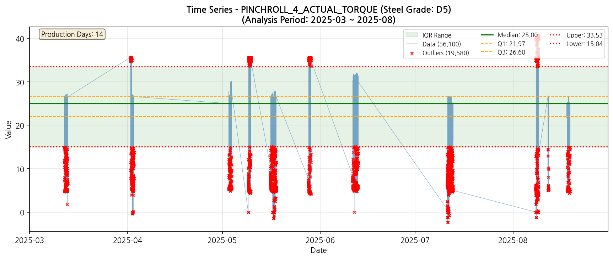

**2. 분포 히스토그램 (Distribution Histogram)**

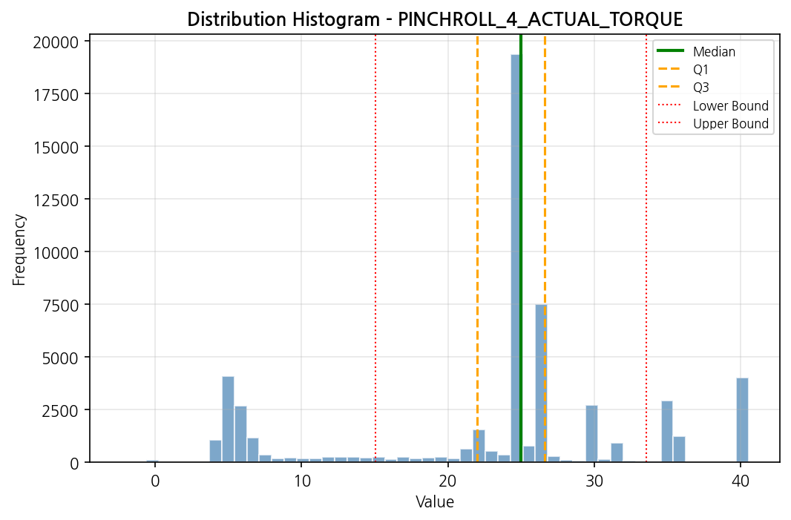

**3. 박스플롯 (Box Plot)**

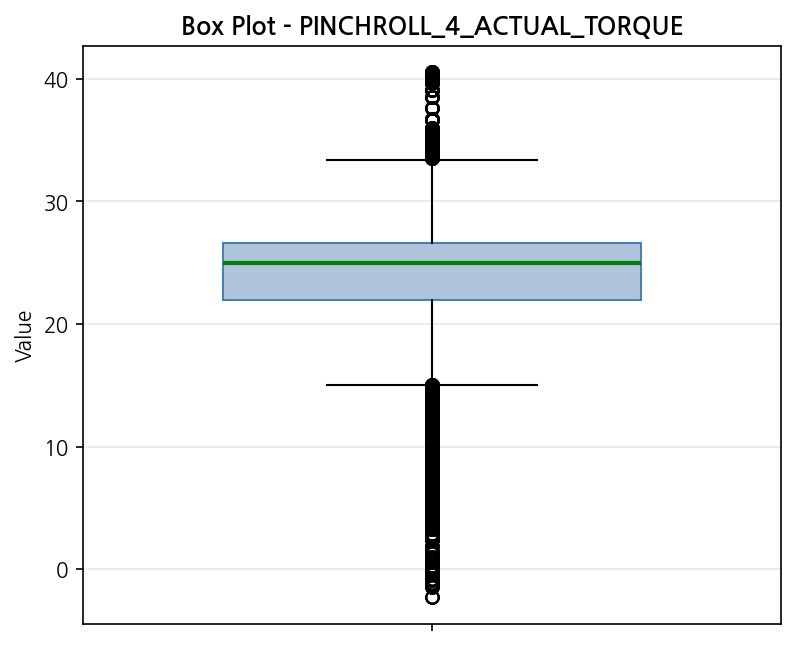

**4. 일별 평균 추이 (Daily Average Trend)**

**5. 월별 이상치율 (Monthly Outlier Rate)**

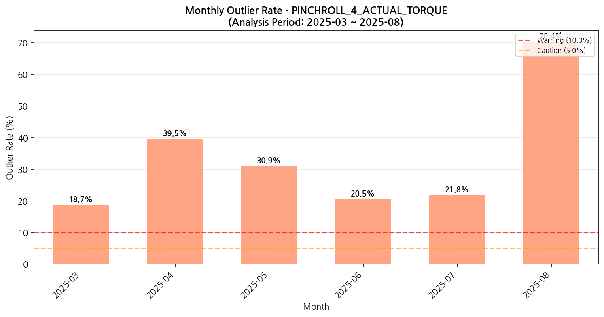

**6. 시간별 패턴 (Hourly Pattern)**

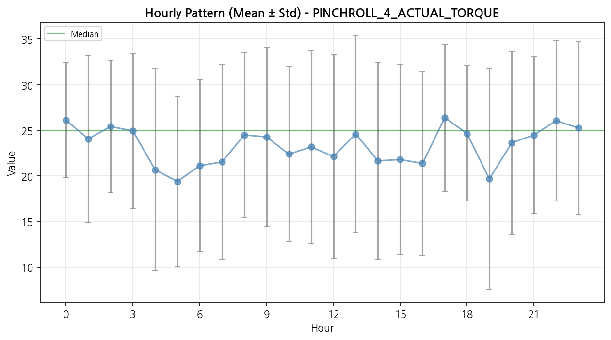

**7. 일별 이상치 수 (Daily Outlier Count)**

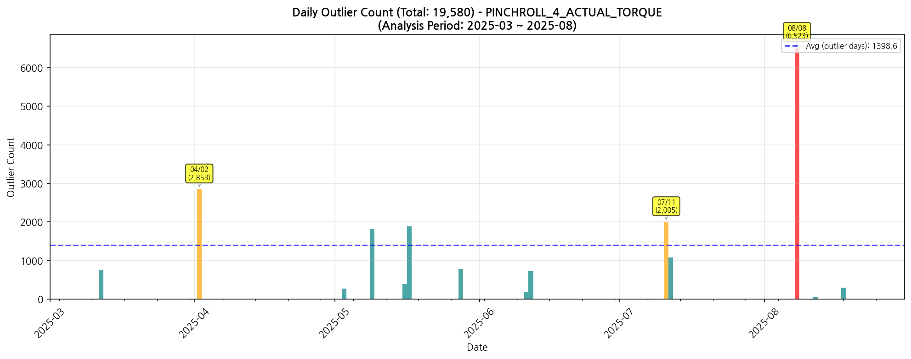

**종합 분석 차트**

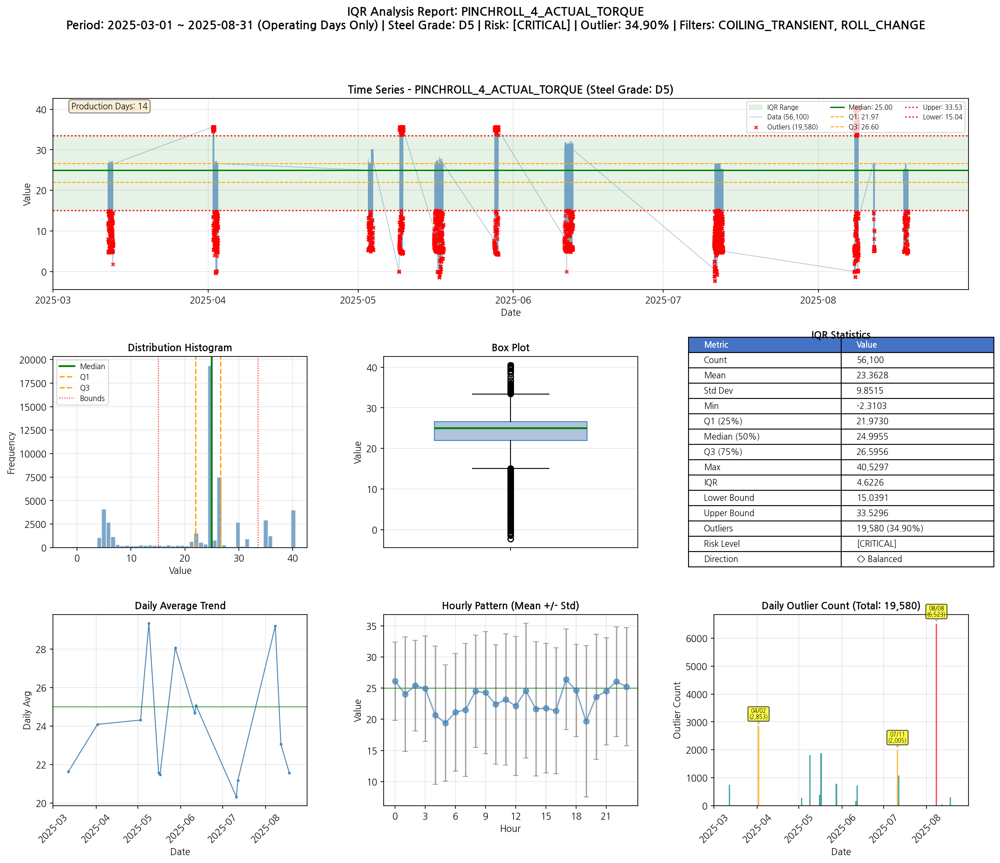

---

##### 월별 상세 분석

**2025-03**

**통계 요약**:

| 지표 | 값 |
|------|-------|
| 분석 레코드 | 3,966 |
| 평균 | 21.6207 |
| 중앙값 | 24.9943 |
| IQR | 0.0138 |
| 이상치 수 | 1,905 |
| 이상치율 | 48.03% |

**주요 이상치 발생 날짜**:

- 1. 2025-03-12: 1,905건

**1. 시계열 (Time Series)**

**2. 분포 히스토그램 (Distribution Histogram)**

**3. 박스플롯 (Box Plot)**

**4. 일별 평균 추이 (Daily Average Trend)**

**5. 시간별 패턴 (Hourly Pattern)**

**6. 일별 이상치 수 (Daily Outlier Count)**

**월별 종합 차트**

**2025-04**

**통계 요약**:

| 지표 | 값 |
|------|-------|
| 분석 레코드 | 7,219 |
| 평균 | 24.0851 |
| 중앙값 | 24.9961 |
| IQR | 1.6106 |
| 이상치 수 | 3,177 |
| 이상치율 | 44.01% |

**주요 이상치 발생 날짜**:

- 1. 2025-04-02: 3,177건

**1. 시계열 (Time Series)**

**2. 분포 히스토그램 (Distribution Histogram)**

**3. 박스플롯 (Box Plot)**

**4. 일별 평균 추이 (Daily Average Trend)**

**5. 시간별 패턴 (Hourly Pattern)**

**6. 일별 이상치 수 (Daily Outlier Count)**

**월별 종합 차트**

**2025-05**

**통계 요약**:

| 지표 | 값 |
|------|-------|
| 분석 레코드 | 16,617 |
| 평균 | 23.1646 |
| 중앙값 | 24.9964 |
| IQR | 1.5907 |
| 이상치 수 | 6,078 |
| 이상치율 | 36.58% |

**주요 이상치 발생 날짜**:

- 1. 2025-05-17: 2,115건
- 2. 2025-05-09: 1,895건
- 3. 2025-05-03: 830건

**1. 시계열 (Time Series)**

**2. 분포 히스토그램 (Distribution Histogram)**

**3. 박스플롯 (Box Plot)**

**4. 일별 평균 추이 (Daily Average Trend)**

**5. 시간별 패턴 (Hourly Pattern)**

**6. 일별 이상치 수 (Daily Outlier Count)**

**월별 종합 차트**

**2025-06**

**통계 요약**:

| 지표 | 값 |
|------|-------|
| 분석 레코드 | 4,369 |
| 평균 | 24.9885 |
| 중앙값 | 29.9940 |
| IQR | 4.4793 |
| 이상치 수 | 969 |
| 이상치율 | 22.18% |

**주요 이상치 발생 날짜**:

- 1. 2025-06-12: 784건
- 2. 2025-06-11: 185건

**1. 시계열 (Time Series)**

**2. 분포 히스토그램 (Distribution Histogram)**

**3. 박스플롯 (Box Plot)**

**4. 일별 평균 추이 (Daily Average Trend)**

**5. 시간별 패턴 (Hourly Pattern)**

**6. 일별 이상치 수 (Daily Outlier Count)**

**월별 종합 차트**

**2025-07**

**통계 요약**:

| 지표 | 값 |
|------|-------|
| 분석 레코드 | 14,182 |
| 평균 | 20.6924 |
| 중앙값 | 24.9917 |
| IQR | 4.1654 |
| 이상치 수 | 3,046 |
| 이상치율 | 21.48% |

**주요 이상치 발생 날짜**:

- 1. 2025-07-11: 1,981건
- 2. 2025-07-12: 1,065건

**1. 시계열 (Time Series)**

**2. 분포 히스토그램 (Distribution Histogram)**

**3. 박스플롯 (Box Plot)**

**4. 일별 평균 추이 (Daily Average Trend)**

**5. 시간별 패턴 (Hourly Pattern)**

**6. 일별 이상치 수 (Daily Outlier Count)**

**월별 종합 차트**

**2025-08**

**통계 요약**:

| 지표 | 값 |
|------|-------|
| 분석 레코드 | 9,747 |
| 평균 | 27.0317 |
| 중앙값 | 26.5785 |
| IQR | 18.8314 |
| 이상치 수 | 0 |
| 이상치율 | 0.00% |

**1. 시계열 (Time Series)**

**2. 분포 히스토그램 (Distribution Histogram)**

**3. 박스플롯 (Box Plot)**

**4. 일별 평균 추이 (Daily Average Trend)**

**5. 시간별 패턴 (Hourly Pattern)**

**6. 일별 이상치 수 (Daily Outlier Count)**

**월별 종합 차트**

---

#### PR6L1_ACT_TORQUE [A] ⚫

**위험도**: [CRITICAL] | **이상치율**: 30.94% | **이상치 방향**: 양방향

**카테고리**: 09 PR Detailed

| 필터 | 적용 | 이유 |
|------|:----:|------|
| run_only | ✓ | 가동 상태에서만 토크 측정이 유효함 |
| special_ops | ✓ | 정상 운전 조건에서 분석 |
| roll_change | ✓ | 롤교환 시 토크 급변 구간 제외 |
| coiling_transient | ✓ | 권취 시작/종료 가감속 구간 제외 |

**데이터**: 원본 31,672 → 필터 후 22,905 (27.7% 제외)

| 통계 지표 | 값 |
|-----------|-------|
| 분석 레코드 | 22,905 |
| 평균 | 5.9037 |
| 표준편차 | 5.8262 |
| Q1 (25%) | 3.7372 |
| 중앙값 | 4.2481 |
| Q3 (75%) | 4.7363 |
| IQR | 0.9991 |
| 하한 경계 | 2.2386 |
| 상한 경계 | 6.2349 |
| 이상치 수 | 7,087 (30.94%) |

**월별 이상치 추이**:

| 월 | 레코드 수 | 평균 | 이상치율 |
|-----|-----------|------|----------|
| 2025-03 | 2,631 | 4.31 | 0.53% |
| 2025-04 | 2,370 | 4.43 | 2.95% |
| 2025-05 | 6,345 | 3.47 | 17.24% |
| 2025-06 | 2,348 | 7.47 | 26.53% |
| 2025-07 | 6,021 | 8.50 | 55.39% |
| 2025-08 | 3,190 | 7.10 | 61.16% |

**주요 이상치 발생 날짜** (상위 5일):

| 순위 | 날짜 | 이상치 수 |
|:----:|------|----------:|
| 1 | 2025-07-11 | 2,385 |
| 2 | 2025-08-18 | 1,106 |
| 3 | 2025-05-03 | 1,086 |
| 4 | 2025-07-12 | 950 |
| 5 | 2025-08-08 | 674 |

- 이상치 발생 일수: 10일
- 최대 일별 이상치: 2,385건 (2025-07-11)
- 평균 일별 이상치: 708.7건

##### 차트 분석

**1. 시계열 (Time Series)**

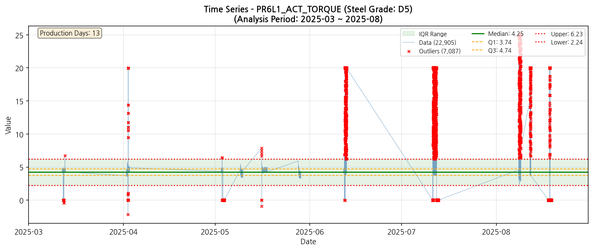

**2. 분포 히스토그램 (Distribution Histogram)**

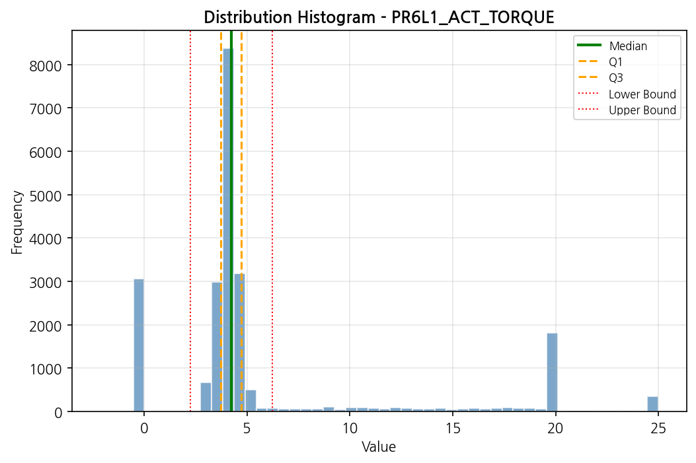

**3. 박스플롯 (Box Plot)**

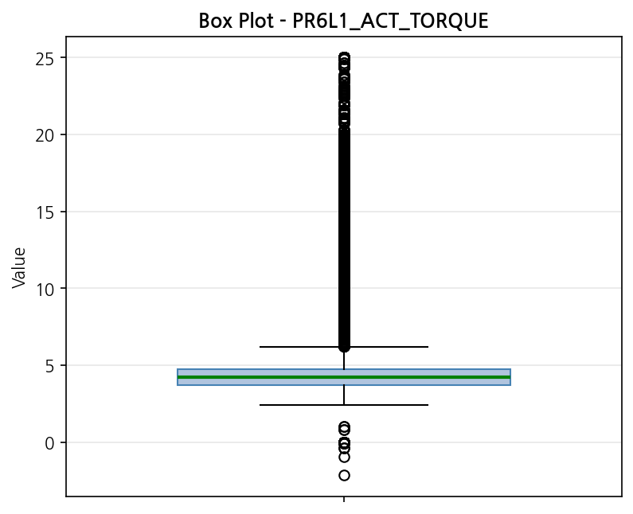

**4. 일별 평균 추이 (Daily Average Trend)**

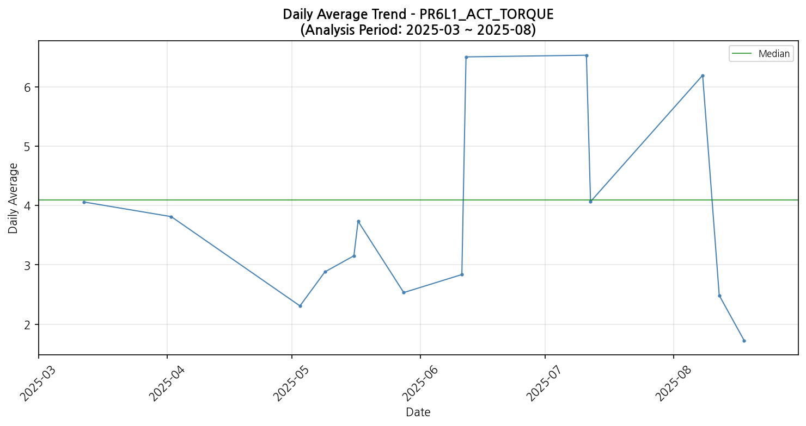

**5. 월별 이상치율 (Monthly Outlier Rate)**

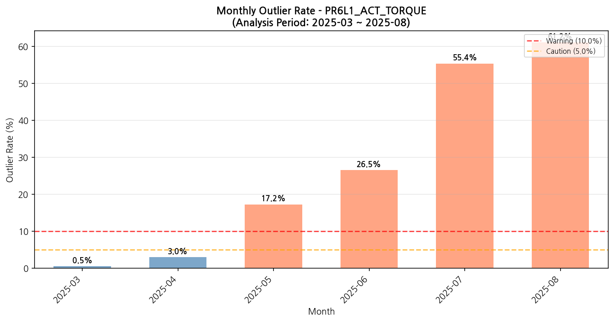

**6. 시간별 패턴 (Hourly Pattern)**

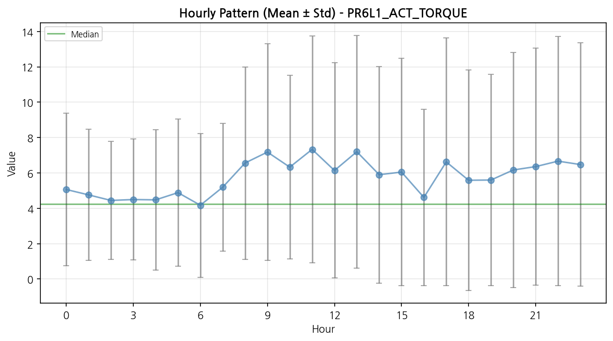

**7. 일별 이상치 수 (Daily Outlier Count)**

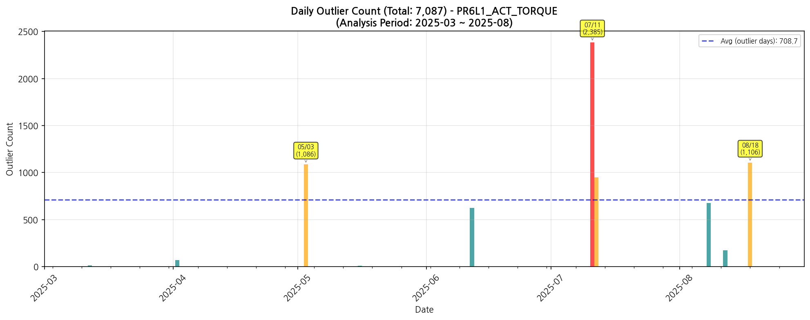

**종합 분석 차트**

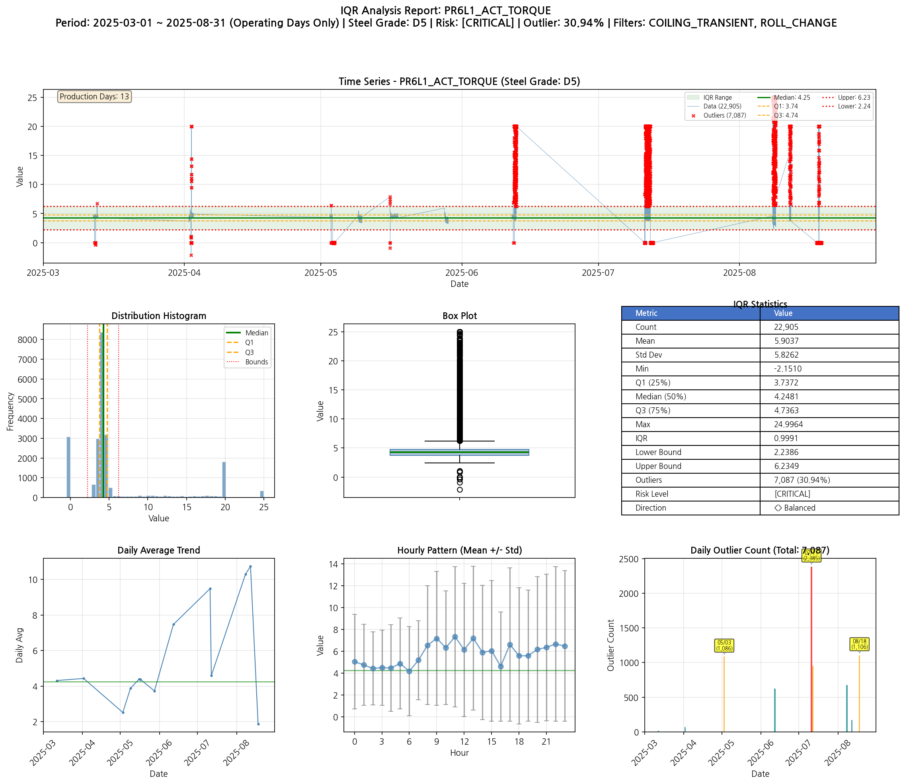

---

##### 월별 상세 분석

**2025-03**

**통계 요약**:

| 지표 | 값 |
|------|-------|
| 분석 레코드 | 2,631 |
| 평균 | 4.3147 |
| 중앙값 | 4.2579 |
| IQR | 0.0776 |
| 이상치 수 | 413 |
| 이상치율 | 15.70% |

**주요 이상치 발생 날짜**:

- 1. 2025-03-12: 413건

**1. 시계열 (Time Series)**

**2. 분포 히스토그램 (Distribution Histogram)**

**3. 박스플롯 (Box Plot)**

**4. 일별 평균 추이 (Daily Average Trend)**

**5. 시간별 패턴 (Hourly Pattern)**

**6. 일별 이상치 수 (Daily Outlier Count)**

**월별 종합 차트**

**2025-04**

**통계 요약**:

| 지표 | 값 |
|------|-------|
| 분석 레코드 | 2,370 |
| 평균 | 4.4312 |
| 중앙값 | 4.4541 |
| IQR | 0.3095 |
| 이상치 수 | 600 |
| 이상치율 | 25.32% |

**주요 이상치 발생 날짜**:

- 1. 2025-04-02: 600건

**1. 시계열 (Time Series)**

**2. 분포 히스토그램 (Distribution Histogram)**

**3. 박스플롯 (Box Plot)**

**4. 일별 평균 추이 (Daily Average Trend)**

**5. 시간별 패턴 (Hourly Pattern)**

**6. 일별 이상치 수 (Daily Outlier Count)**

**월별 종합 차트**

**2025-05**

**통계 요약**:

| 지표 | 값 |
|------|-------|
| 분석 레코드 | 6,345 |
| 평균 | 3.4702 |
| 중앙값 | 4.2368 |
| IQR | 0.8035 |
| 이상치 수 | 1,102 |
| 이상치율 | 17.37% |

**주요 이상치 발생 날짜**:

- 1. 2025-05-03: 1,086건
- 2. 2025-05-16: 13건
- 3. 2025-05-28: 3건

**1. 시계열 (Time Series)**

**2. 분포 히스토그램 (Distribution Histogram)**

**3. 박스플롯 (Box Plot)**

**4. 일별 평균 추이 (Daily Average Trend)**

**5. 시간별 패턴 (Hourly Pattern)**

**6. 일별 이상치 수 (Daily Outlier Count)**

**월별 종합 차트**

**2025-06**

**통계 요약**:

| 지표 | 값 |
|------|-------|
| 분석 레코드 | 2,348 |
| 평균 | 7.4689 |
| 중앙값 | 4.2559 |
| IQR | 3.5487 |
| 이상치 수 | 454 |
| 이상치율 | 19.34% |

**주요 이상치 발생 날짜**:

- 1. 2025-06-12: 454건

**1. 시계열 (Time Series)**

**2. 분포 히스토그램 (Distribution Histogram)**

**3. 박스플롯 (Box Plot)**

**4. 일별 평균 추이 (Daily Average Trend)**

**5. 시간별 패턴 (Hourly Pattern)**

**6. 일별 이상치 수 (Daily Outlier Count)**

**월별 종합 차트**

**2025-07**

**통계 요약**:

| 지표 | 값 |
|------|-------|
| 분석 레코드 | 6,021 |
| 평균 | 8.5001 |
| 중앙값 | 4.0567 |
| IQR | 13.8499 |
| 이상치 수 | 0 |
| 이상치율 | 0.00% |

**1. 시계열 (Time Series)**

**2. 분포 히스토그램 (Distribution Histogram)**

**3. 박스플롯 (Box Plot)**

**4. 일별 평균 추이 (Daily Average Trend)**

**5. 시간별 패턴 (Hourly Pattern)**

**6. 일별 이상치 수 (Daily Outlier Count)**

**월별 종합 차트**

**2025-08**

**통계 요약**:

| 지표 | 값 |
|------|-------|
| 분석 레코드 | 3,190 |
| 평균 | 7.0960 |
| 중앙값 | 3.2120 |
| IQR | 11.6425 |
| 이상치 수 | 0 |
| 이상치율 | 0.00% |

**1. 시계열 (Time Series)**

**2. 분포 히스토그램 (Distribution Histogram)**

**3. 박스플롯 (Box Plot)**

**4. 일별 평균 추이 (Daily Average Trend)**

**5. 시간별 패턴 (Hourly Pattern)**

**6. 일별 이상치 수 (Daily Outlier Count)**

**월별 종합 차트**

---

#### STAND_10_ACTUAL_SPEED ⚫

**위험도**: [CRITICAL] | **이상치율**: 29.18% | **이상치 방향**: 하한 미달

**카테고리**: 06 Stand Speed

| 필터 | 적용 | 이유 |
|------|:----:|------|
| run_only | ✓ | 가동 상태에서만 속도 측정이 유효함 |
| special_ops | ✓ | 정상 운전 조건에서 분석 |
| roll_change | ✓ | 롤교환 시 속도 급변 구간 제외 |
| coiling_transient | ✗ | 권취 전 공정으로 가감속 영향 없음 |

**데이터**: 원본 74,855 → 필터 후 74,221 (0.8% 제외)

| 통계 지표 | 값 |
|-----------|-------|
| 분석 레코드 | 74,221 |
| 평균 | 722.4309 |
| 표준편차 | 402.9593 |
| Q1 (25%) | 895.9134 |
| 중앙값 | 927.3204 |
| Q3 (75%) | 947.4246 |
| IQR | 51.5112 |
| 하한 경계 | 818.6466 |
| 상한 경계 | 1024.6914 |
| 이상치 수 | 21,656 (29.18%) |

**월별 이상치 추이**:

| 월 | 레코드 수 | 평균 | 이상치율 |
|-----|-----------|------|----------|
| 2025-03 | 4,290 | 865.97 | 6.90% |
| 2025-04 | 8,601 | 778.96 | 18.57% |
| 2025-05 | 21,357 | 751.65 | 25.36% |
| 2025-06 | 5,640 | 760.99 | 20.00% |
| 2025-07 | 18,629 | 705.03 | 23.55% |
| 2025-08 | 15,704 | 619.31 | 56.23% |

**주요 이상치 발생 날짜** (상위 5일):

| 순위 | 날짜 | 이상치 수 |
|:----:|------|----------:|
| 1 | 2025-08-08 | 7,429 |
| 2 | 2025-07-11 | 3,650 |
| 3 | 2025-05-17 | 2,079 |
| 4 | 2025-04-02 | 1,597 |
| 5 | 2025-05-09 | 1,294 |

- 이상치 발생 일수: 14일
- 최대 일별 이상치: 7,429건 (2025-08-08)
- 평균 일별 이상치: 1546.9건

##### 차트 분석

**1. 시계열 (Time Series)**

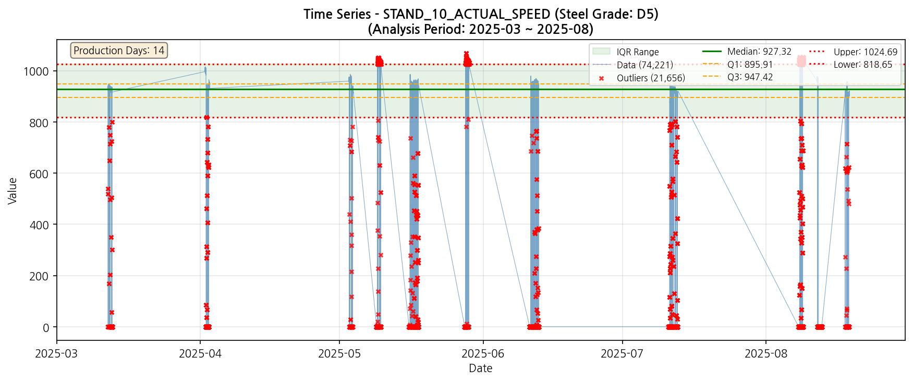

**2. 분포 히스토그램 (Distribution Histogram)**

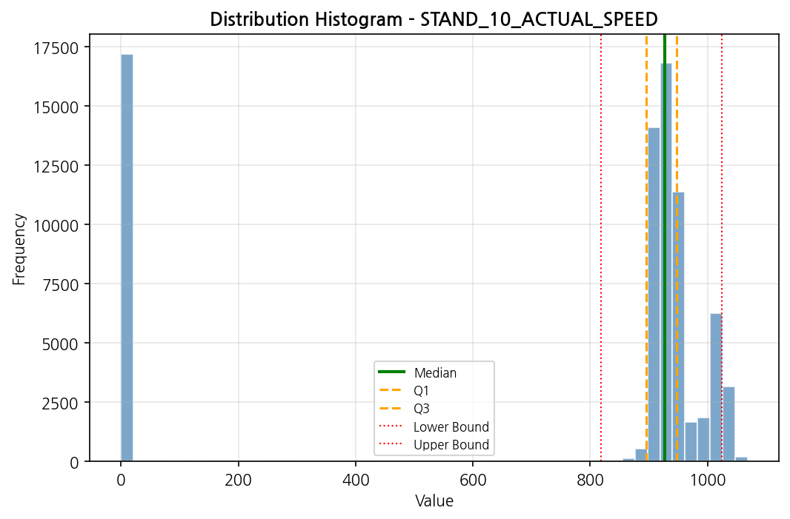

**3. 박스플롯 (Box Plot)**

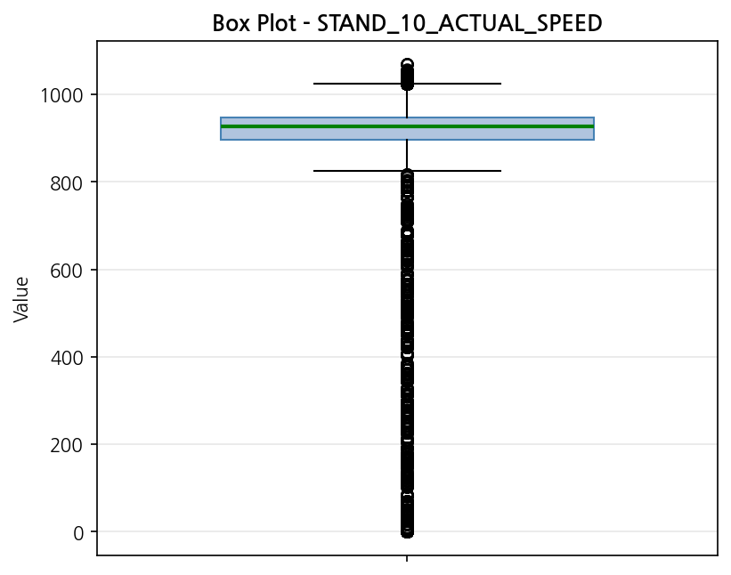

**4. 일별 평균 추이 (Daily Average Trend)**

**5. 월별 이상치율 (Monthly Outlier Rate)**

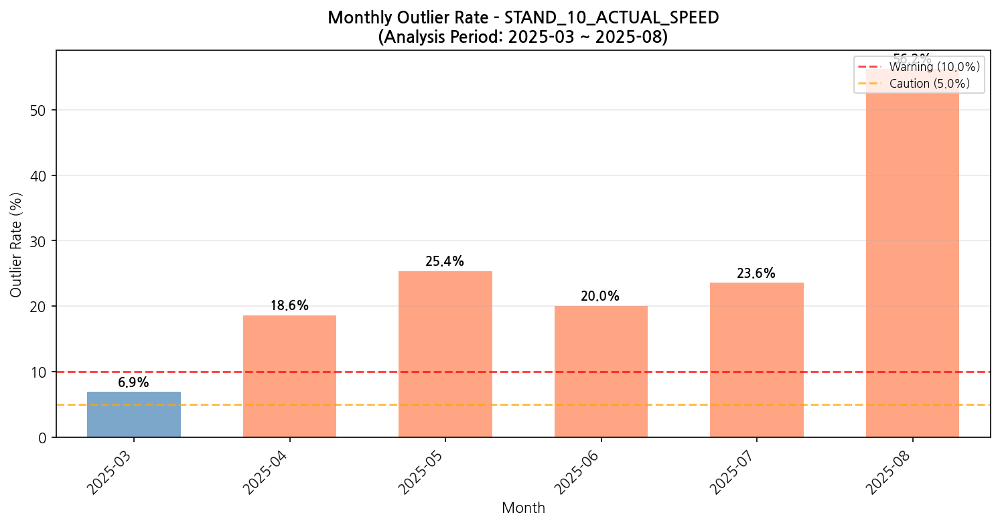

**6. 시간별 패턴 (Hourly Pattern)**

**7. 일별 이상치 수 (Daily Outlier Count)**

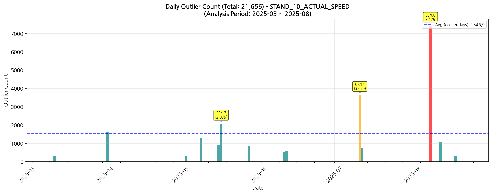

**종합 분석 차트**

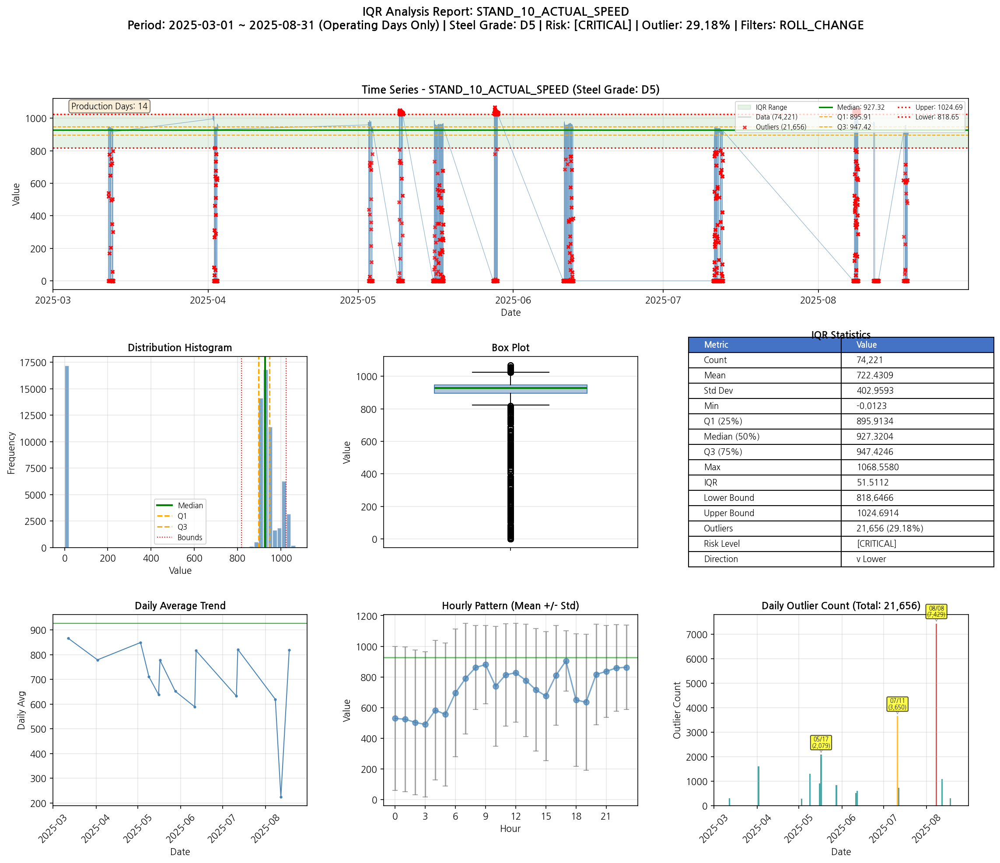

---

##### 월별 상세 분석

**2025-03**

**통계 요약**:

| 지표 | 값 |
|------|-------|
| 분석 레코드 | 4,290 |
| 평균 | 865.9706 |
| 중앙값 | 924.6103 |
| IQR | 12.7298 |
| 이상치 수 | 296 |
| 이상치율 | 6.90% |

**주요 이상치 발생 날짜**:

- 1. 2025-03-12: 296건

**1. 시계열 (Time Series)**

**2. 분포 히스토그램 (Distribution Histogram)**

**3. 박스플롯 (Box Plot)**

**4. 일별 평균 추이 (Daily Average Trend)**

**5. 시간별 패턴 (Hourly Pattern)**

**6. 일별 이상치 수 (Daily Outlier Count)**

**월별 종합 차트**

**2025-04**

**통계 요약**:

| 지표 | 값 |
|------|-------|
| 분석 레코드 | 8,601 |
| 평균 | 778.9602 |
| 중앙값 | 936.0988 |
| IQR | 26.6326 |
| 이상치 수 | 2,736 |
| 이상치율 | 31.81% |

**주요 이상치 발생 날짜**:

- 1. 2025-04-02: 2,736건

**1. 시계열 (Time Series)**

**2. 분포 히스토그램 (Distribution Histogram)**

**3. 박스플롯 (Box Plot)**

**4. 일별 평균 추이 (Daily Average Trend)**

**5. 시간별 패턴 (Hourly Pattern)**

**6. 일별 이상치 수 (Daily Outlier Count)**

**월별 종합 차트**

**2025-05**

**통계 요약**:

| 지표 | 값 |
|------|-------|
| 분석 레코드 | 21,357 |
| 평균 | 751.6517 |
| 중앙값 | 939.7188 |
| IQR | 34.4224 |
| 이상치 수 | 7,368 |
| 이상치율 | 34.50% |

**주요 이상치 발생 날짜**:

- 1. 2025-05-09: 2,679건
- 2. 2025-05-17: 2,095건
- 3. 2025-05-28: 1,383건

**1. 시계열 (Time Series)**

**2. 분포 히스토그램 (Distribution Histogram)**

**3. 박스플롯 (Box Plot)**

**4. 일별 평균 추이 (Daily Average Trend)**

**5. 시간별 패턴 (Hourly Pattern)**

**6. 일별 이상치 수 (Daily Outlier Count)**

**월별 종합 차트**

**2025-06**

**통계 요약**:

| 지표 | 값 |
|------|-------|
| 분석 레코드 | 5,640 |
| 평균 | 760.9936 |
| 중앙값 | 942.2629 |
| IQR | 18.8926 |
| 이상치 수 | 1,141 |
| 이상치율 | 20.23% |

**주요 이상치 발생 날짜**:

- 1. 2025-06-12: 621건
- 2. 2025-06-11: 520건

**1. 시계열 (Time Series)**

**2. 분포 히스토그램 (Distribution Histogram)**

**3. 박스플롯 (Box Plot)**

**4. 일별 평균 추이 (Daily Average Trend)**

**5. 시간별 패턴 (Hourly Pattern)**

**6. 일별 이상치 수 (Daily Outlier Count)**

**월별 종합 차트**

**2025-07**

**통계 요약**:

| 지표 | 값 |
|------|-------|
| 분석 레코드 | 18,629 |
| 평균 | 705.0337 |
| 중앙값 | 911.7784 |
| IQR | 21.2997 |
| 이상치 수 | 4,388 |
| 이상치율 | 23.55% |

**주요 이상치 발생 날짜**:

- 1. 2025-07-11: 3,650건
- 2. 2025-07-12: 738건

**1. 시계열 (Time Series)**

**2. 분포 히스토그램 (Distribution Histogram)**

**3. 박스플롯 (Box Plot)**

**4. 일별 평균 추이 (Daily Average Trend)**

**5. 시간별 패턴 (Hourly Pattern)**

**6. 일별 이상치 수 (Daily Outlier Count)**

**월별 종합 차트**

**2025-08**

**통계 요약**:

| 지표 | 값 |
|------|-------|
| 분석 레코드 | 15,704 |
| 평균 | 619.3065 |
| 중앙값 | 909.8395 |
| IQR | 1021.9740 |
| 이상치 수 | 0 |
| 이상치율 | 0.00% |

**1. 시계열 (Time Series)**

**2. 분포 히스토그램 (Distribution Histogram)**

**3. 박스플롯 (Box Plot)**

**4. 일별 평균 추이 (Daily Average Trend)**

**5. 시간별 패턴 (Hourly Pattern)**

**6. 일별 이상치 수 (Daily Outlier Count)**

**월별 종합 차트**

---

#### PR7L2_ACT_TORQUE [B] ⚫

**위험도**: [CRITICAL] | **이상치율**: 28.59% | **이상치 방향**: 양방향

**카테고리**: 09 PR Detailed

| 필터 | 적용 | 이유 |
|------|:----:|------|
| run_only | ✓ | 가동 상태에서만 토크 측정이 유효함 |
| special_ops | ✓ | 정상 운전 조건에서 분석 |
| roll_change | ✓ | 롤교환 시 토크 급변 구간 제외 |
| coiling_transient | ✓ | 권취 시작/종료 가감속 구간 제외 |

**데이터**: 원본 43,183 → 필터 후 32,326 (25.1% 제외)

| 통계 지표 | 값 |
|-----------|-------|
| 분석 레코드 | 32,326 |
| 평균 | 6.6774 |
| 표준편차 | 5.4162 |
| Q1 (25%) | 5.6852 |
| 중앙값 | 6.0540 |
| Q3 (75%) | 6.4290 |
| IQR | 0.7438 |
| 하한 경계 | 4.5695 |
| 상한 경계 | 7.5448 |
| 이상치 수 | 9,241 (28.59%) |

**월별 이상치 추이**:

| 월 | 레코드 수 | 평균 | 이상치율 |
|-----|-----------|------|----------|
| 2025-03 | 1,296 | 6.40 | 0.31% |
| 2025-04 | 4,783 | 8.30 | 17.02% |
| 2025-05 | 10,055 | 6.77 | 6.70% |
| 2025-06 | 1,944 | 6.10 | 0.67% |
| 2025-07 | 7,899 | 3.66 | 38.02% |
| 2025-08 | 6,349 | 9.29 | 74.55% |

**주요 이상치 발생 날짜** (상위 5일):

| 순위 | 날짜 | 이상치 수 |
|:----:|------|----------:|
| 1 | 2025-08-08 | 3,731 |
| 2 | 2025-07-12 | 2,867 |
| 3 | 2025-08-18 | 1,002 |
| 4 | 2025-04-02 | 814 |
| 5 | 2025-05-09 | 601 |

- 이상치 발생 일수: 10일
- 최대 일별 이상치: 3,731건 (2025-08-08)
- 평균 일별 이상치: 924.1건

##### 차트 분석

**1. 시계열 (Time Series)**

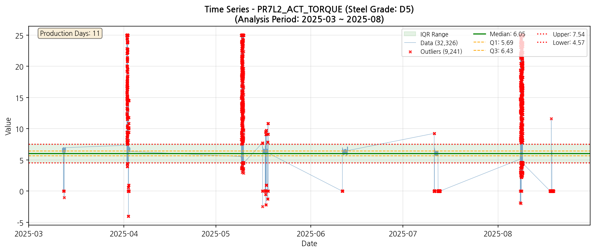

**2. 분포 히스토그램 (Distribution Histogram)**

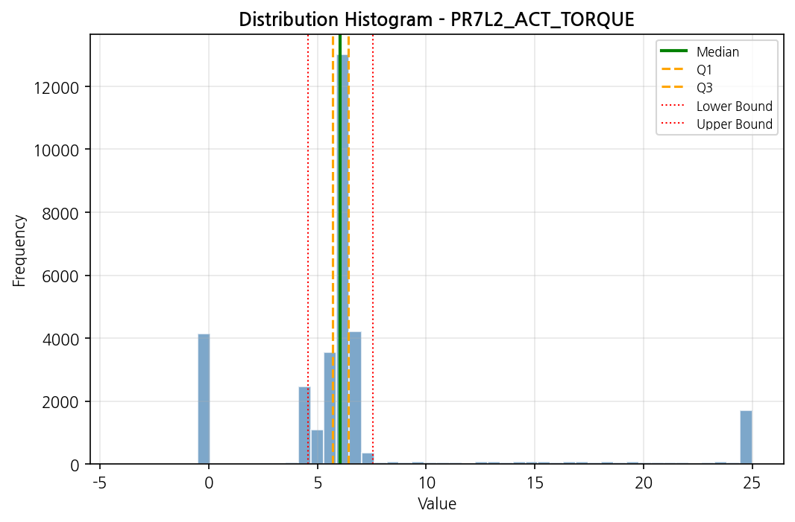

**3. 박스플롯 (Box Plot)**

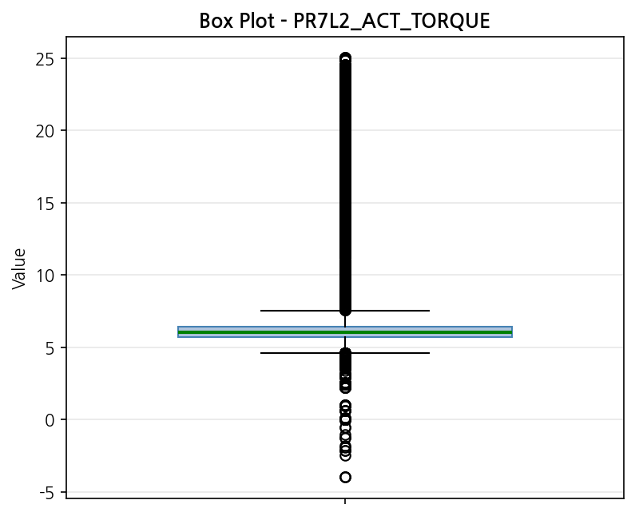

**4. 일별 평균 추이 (Daily Average Trend)**

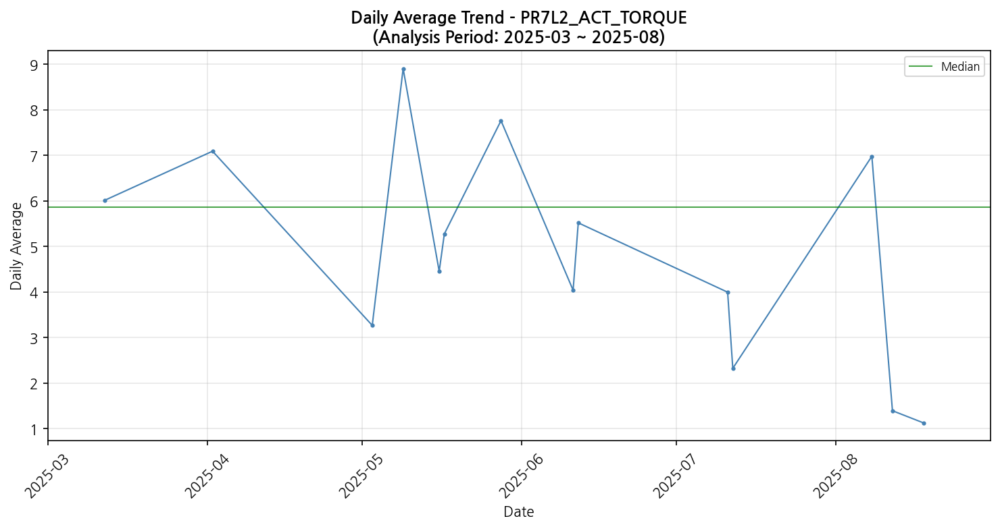

**5. 월별 이상치율 (Monthly Outlier Rate)**

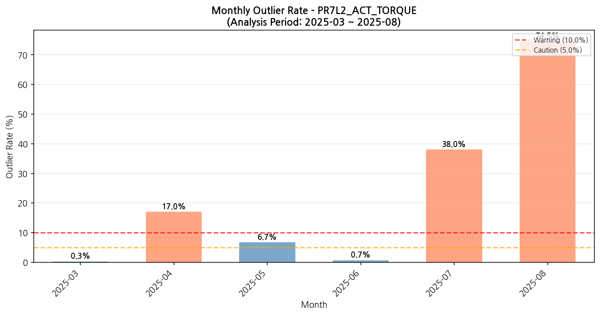

**6. 시간별 패턴 (Hourly Pattern)**

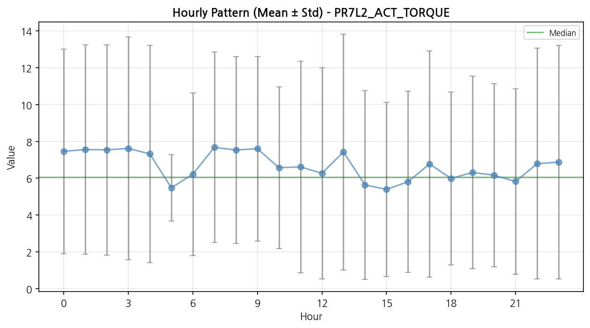

**7. 일별 이상치 수 (Daily Outlier Count)**

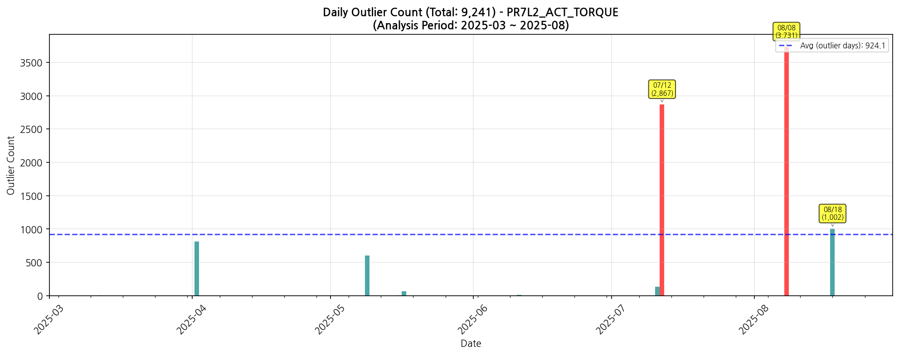

**종합 분석 차트**

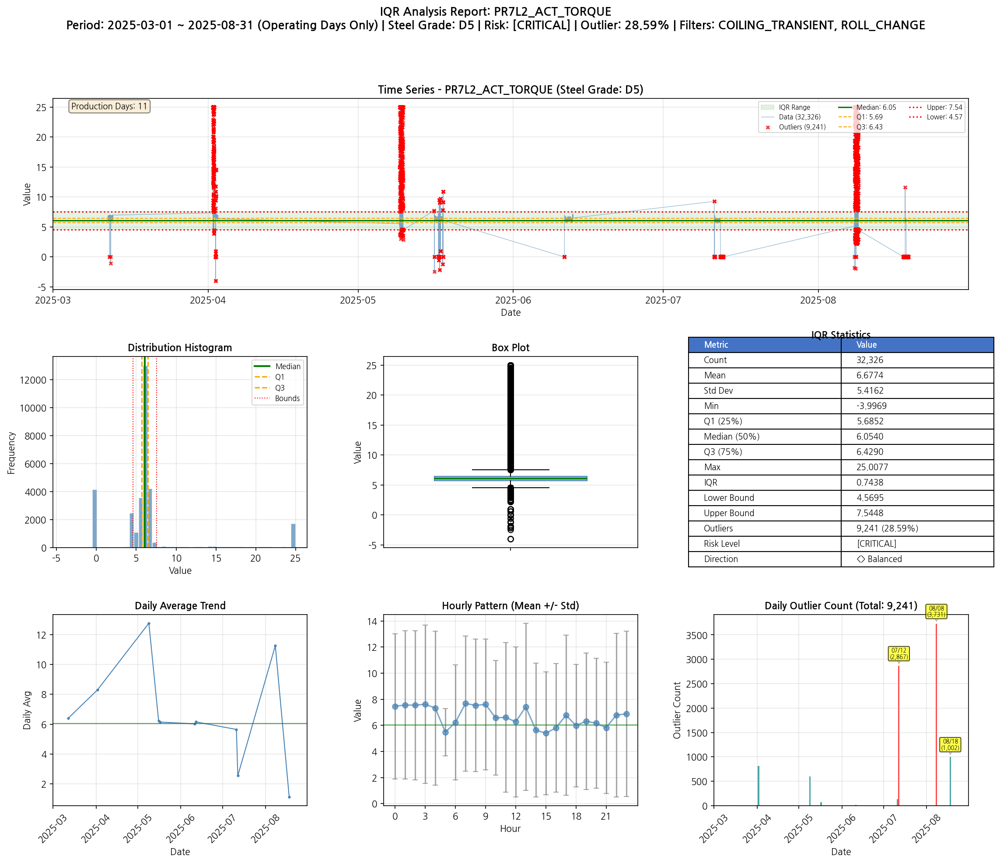

---

##### 월별 상세 분석

**2025-03**

**통계 요약**:

| 지표 | 값 |
|------|-------|
| 분석 레코드 | 1,296 |
| 평균 | 6.4009 |
| 중앙값 | 6.3580 |
| IQR | 0.1297 |
| 이상치 수 | 193 |
| 이상치율 | 14.89% |

**주요 이상치 발생 날짜**:

- 1. 2025-03-12: 193건

**1. 시계열 (Time Series)**

**2. 분포 히스토그램 (Distribution Histogram)**

**3. 박스플롯 (Box Plot)**

**4. 일별 평균 추이 (Daily Average Trend)**

**5. 시간별 패턴 (Hourly Pattern)**

**6. 일별 이상치 수 (Daily Outlier Count)**

**월별 종합 차트**

**2025-04**

**통계 요약**:

| 지표 | 값 |
|------|-------|
| 분석 레코드 | 4,783 |
| 평균 | 8.2952 |
| 중앙값 | 6.5559 |
| IQR | 0.5225 |
| 이상치 수 | 1,282 |
| 이상치율 | 26.80% |

**주요 이상치 발생 날짜**:

- 1. 2025-04-02: 1,282건

**1. 시계열 (Time Series)**

**2. 분포 히스토그램 (Distribution Histogram)**

**3. 박스플롯 (Box Plot)**

**4. 일별 평균 추이 (Daily Average Trend)**

**5. 시간별 패턴 (Hourly Pattern)**

**6. 일별 이상치 수 (Daily Outlier Count)**

**월별 종합 차트**

**2025-05**

**통계 요약**:

| 지표 | 값 |
|------|-------|
| 분석 레코드 | 10,055 |
| 평균 | 6.7718 |
| 중앙값 | 6.0908 |
| IQR | 0.1861 |
| 이상치 수 | 2,272 |
| 이상치율 | 22.60% |

**주요 이상치 발생 날짜**:

- 1. 2025-05-17: 1,147건
- 2. 2025-05-09: 937건
- 3. 2025-05-16: 188건

**1. 시계열 (Time Series)**

**2. 분포 히스토그램 (Distribution Histogram)**

**3. 박스플롯 (Box Plot)**

**4. 일별 평균 추이 (Daily Average Trend)**

**5. 시간별 패턴 (Hourly Pattern)**

**6. 일별 이상치 수 (Daily Outlier Count)**

**월별 종합 차트**

**2025-06**

**통계 요약**:

| 지표 | 값 |
|------|-------|
| 분석 레코드 | 1,944 |
| 평균 | 6.0964 |
| 중앙값 | 6.0500 |
| IQR | 0.2389 |
| 이상치 수 | 175 |
| 이상치율 | 9.00% |

**주요 이상치 발생 날짜**:

- 1. 2025-06-12: 99건
- 2. 2025-06-11: 76건

**1. 시계열 (Time Series)**

**2. 분포 히스토그램 (Distribution Histogram)**

**3. 박스플롯 (Box Plot)**

**4. 일별 평균 추이 (Daily Average Trend)**

**5. 시간별 패턴 (Hourly Pattern)**

**6. 일별 이상치 수 (Daily Outlier Count)**

**월별 종합 차트**

**2025-07**

**통계 요약**:

| 지표 | 값 |
|------|-------|
| 분석 레코드 | 7,899 |
| 평균 | 3.6625 |
| 중앙값 | 5.7532 |
| IQR | 5.8414 |
| 이상치 수 | 0 |
| 이상치율 | 0.00% |

**1. 시계열 (Time Series)**

**2. 분포 히스토그램 (Distribution Histogram)**

**3. 박스플롯 (Box Plot)**

**4. 일별 평균 추이 (Daily Average Trend)**

**5. 시간별 패턴 (Hourly Pattern)**

**6. 일별 이상치 수 (Daily Outlier Count)**

**월별 종합 차트**

**2025-08**

**통계 요약**:

| 지표 | 값 |
|------|-------|
| 분석 레코드 | 6,349 |
| 평균 | 9.2943 |
| 중앙값 | 4.6605 |
| IQR | 11.6382 |
| 이상치 수 | 0 |
| 이상치율 | 0.00% |

**1. 시계열 (Time Series)**

**2. 분포 히스토그램 (Distribution Histogram)**

**3. 박스플롯 (Box Plot)**

**4. 일별 평균 추이 (Daily Average Trend)**

**5. 시간별 패턴 (Hourly Pattern)**

**6. 일별 이상치 수 (Daily Outlier Count)**

**월별 종합 차트**

---

#### STAND_2_ACTUAL_SPEED ⚫

**위험도**: [CRITICAL] | **이상치율**: 26.34% | **이상치 방향**: 하한 미달

**카테고리**: 06 Stand Speed

| 필터 | 적용 | 이유 |
|------|:----:|------|
| run_only | ✓ | 가동 상태에서만 속도 측정이 유효함 |
| special_ops | ✓ | 정상 운전 조건에서 분석 |
| roll_change | ✓ | 롤교환 시 속도 급변 구간 제외 |
| coiling_transient | ✗ | 권취 전 공정으로 가감속 영향 없음 |

**데이터**: 원본 74,855 → 필터 후 74,221 (0.8% 제외)

| 통계 지표 | 값 |
|-----------|-------|
| 분석 레코드 | 74,221 |
| 평균 | 434.6912 |
| 표준편차 | 242.1138 |
| Q1 (25%) | 510.7443 |
| 중앙값 | 544.2712 |
| Q3 (75%) | 572.9567 |
| IQR | 62.2124 |
| 하한 경계 | 417.4257 |
| 상한 경계 | 666.2753 |
| 이상치 수 | 19,550 (26.34%) |

**월별 이상치 추이**:

| 월 | 레코드 수 | 평균 | 이상치율 |
|-----|-----------|------|----------|
| 2025-03 | 4,290 | 501.53 | 6.60% |
| 2025-04 | 8,601 | 528.38 | 38.53% |
| 2025-05 | 21,357 | 452.10 | 21.30% |
| 2025-06 | 5,640 | 452.25 | 19.96% |
| 2025-07 | 18,629 | 410.91 | 23.13% |
| 2025-08 | 15,704 | 363.33 | 38.01% |

**주요 이상치 발생 날짜** (상위 5일):

| 순위 | 날짜 | 이상치 수 |
|:----:|------|----------:|
| 1 | 2025-08-08 | 4,574 |
| 2 | 2025-07-11 | 3,564 |
| 3 | 2025-04-02 | 3,314 |
| 4 | 2025-05-17 | 2,029 |
| 5 | 2025-08-12 | 1,096 |

- 이상치 발생 일수: 14일
- 최대 일별 이상치: 4,574건 (2025-08-08)
- 평균 일별 이상치: 1396.4건

##### 차트 분석

**1. 시계열 (Time Series)**

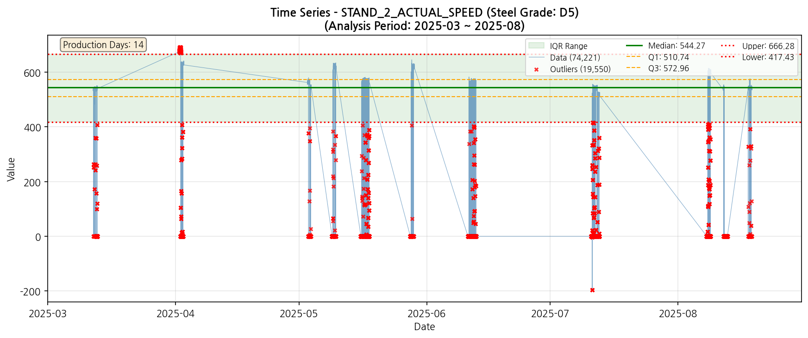

**2. 분포 히스토그램 (Distribution Histogram)**

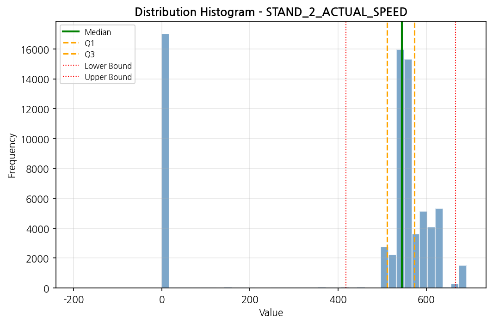

**3. 박스플롯 (Box Plot)**

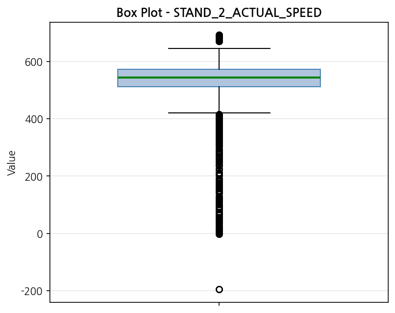

**4. 일별 평균 추이 (Daily Average Trend)**

**5. 월별 이상치율 (Monthly Outlier Rate)**

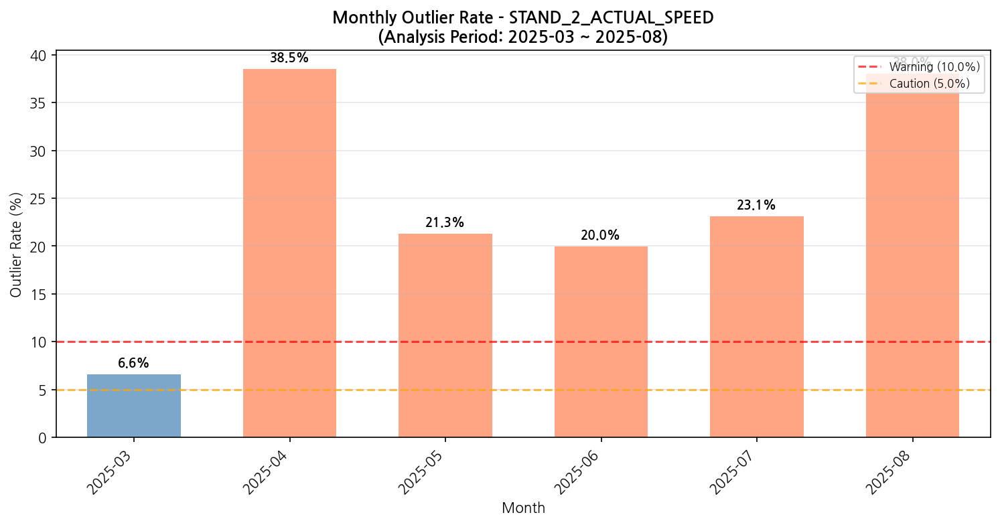

**6. 시간별 패턴 (Hourly Pattern)**

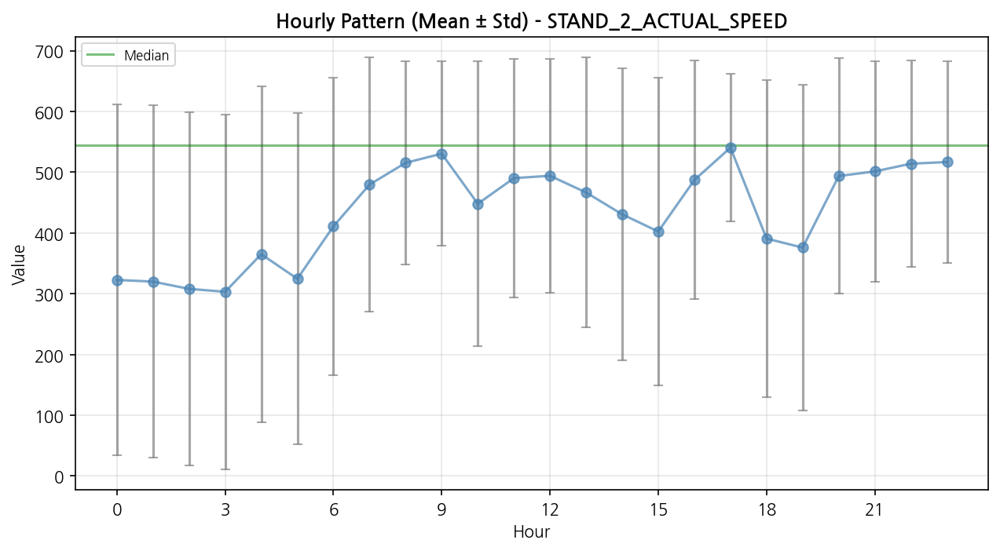

**7. 일별 이상치 수 (Daily Outlier Count)**

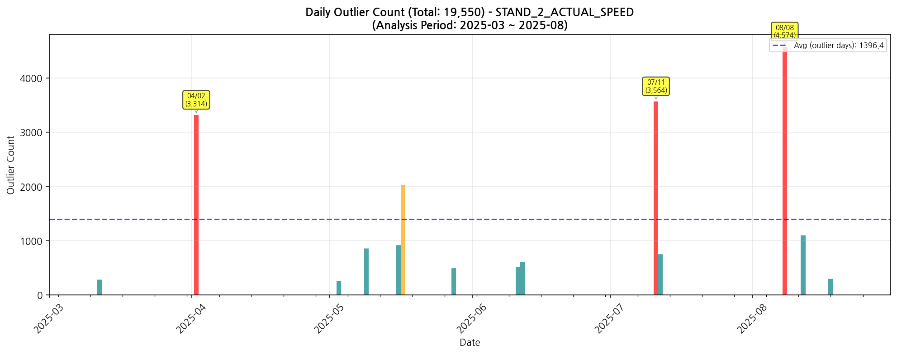

**종합 분석 차트**

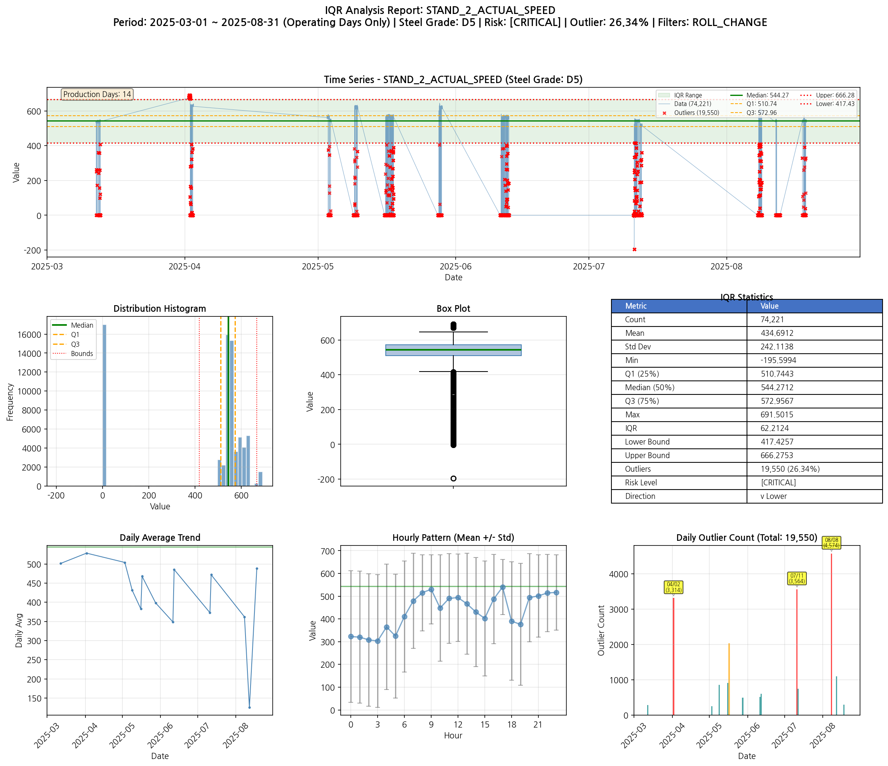

---

##### 월별 상세 분석

**2025-03**

**통계 요약**:

| 지표 | 값 |
|------|-------|
| 분석 레코드 | 4,290 |
| 평균 | 501.5292 |
| 중앙값 | 533.6325 |
| IQR | 4.6144 |
| 이상치 수 | 770 |
| 이상치율 | 17.95% |

**주요 이상치 발생 날짜**:

- 1. 2025-03-12: 770건

**1. 시계열 (Time Series)**

**2. 분포 히스토그램 (Distribution Histogram)**

**3. 박스플롯 (Box Plot)**

**4. 일별 평균 추이 (Daily Average Trend)**

**5. 시간별 패턴 (Hourly Pattern)**

**6. 일별 이상치 수 (Daily Outlier Count)**

**월별 종합 차트**

**2025-04**

**통계 요약**:

| 지표 | 값 |
|------|-------|
| 분석 레코드 | 8,601 |
| 평균 | 528.3850 |
| 중앙값 | 627.2668 |
| IQR | 13.6347 |
| 이상치 수 | 3,387 |
| 이상치율 | 39.38% |

**주요 이상치 발생 날짜**:

- 1. 2025-04-02: 3,387건

**1. 시계열 (Time Series)**

**2. 분포 히스토그램 (Distribution Histogram)**

**3. 박스플롯 (Box Plot)**

**4. 일별 평균 추이 (Daily Average Trend)**

**5. 시간별 패턴 (Hourly Pattern)**

**6. 일별 이상치 수 (Daily Outlier Count)**

**월별 종합 차트**

**2025-05**

**통계 요약**:

| 지표 | 값 |
|------|-------|
| 분석 레코드 | 21,357 |
| 평균 | 452.1048 |
| 중앙값 | 562.8653 |
| IQR | 26.4813 |
| 이상치 수 | 7,339 |
| 이상치율 | 34.36% |

**주요 이상치 발생 날짜**:

- 1. 2025-05-09: 2,778건
- 2. 2025-05-17: 2,051건
- 3. 2025-05-28: 1,334건

**1. 시계열 (Time Series)**

**2. 분포 히스토그램 (Distribution Histogram)**

**3. 박스플롯 (Box Plot)**

**4. 일별 평균 추이 (Daily Average Trend)**

**5. 시간별 패턴 (Hourly Pattern)**

**6. 일별 이상치 수 (Daily Outlier Count)**

**월별 종합 차트**

**2025-06**

**통계 요약**:

| 지표 | 값 |
|------|-------|
| 분석 레코드 | 5,640 |
| 평균 | 452.2519 |
| 중앙값 | 560.8599 |
| IQR | 8.0600 |
| 이상치 수 | 1,215 |
| 이상치율 | 21.54% |

**주요 이상치 발생 날짜**:

- 1. 2025-06-12: 679건
- 2. 2025-06-11: 536건

**1. 시계열 (Time Series)**

**2. 분포 히스토그램 (Distribution Histogram)**

**3. 박스플롯 (Box Plot)**

**4. 일별 평균 추이 (Daily Average Trend)**

**5. 시간별 패턴 (Hourly Pattern)**

**6. 일별 이상치 수 (Daily Outlier Count)**

**월별 종합 차트**

**2025-07**

**통계 요약**:

| 지표 | 값 |
|------|-------|
| 분석 레코드 | 18,629 |
| 평균 | 410.9144 |
| 중앙값 | 533.4919 |
| IQR | 26.3902 |
| 이상치 수 | 4,339 |
| 이상치율 | 23.29% |

**주요 이상치 발생 날짜**:

- 1. 2025-07-11: 3,586건
- 2. 2025-07-12: 753건

**1. 시계열 (Time Series)**

**2. 분포 히스토그램 (Distribution Histogram)**

**3. 박스플롯 (Box Plot)**

**4. 일별 평균 추이 (Daily Average Trend)**

**5. 시간별 패턴 (Hourly Pattern)**

**6. 일별 이상치 수 (Daily Outlier Count)**

**월별 종합 차트**

**2025-08**

**통계 요약**:

| 지표 | 값 |
|------|-------|
| 분석 레코드 | 15,704 |
| 평균 | 363.3332 |
| 중앙값 | 540.9710 |
| IQR | 596.8494 |
| 이상치 수 | 0 |
| 이상치율 | 0.00% |

**1. 시계열 (Time Series)**

**2. 분포 히스토그램 (Distribution Histogram)**

**3. 박스플롯 (Box Plot)**

**4. 일별 평균 추이 (Daily Average Trend)**

**5. 시간별 패턴 (Hourly Pattern)**

**6. 일별 이상치 수 (Daily Outlier Count)**

**월별 종합 차트**

---

### 🔴 위험 (15~25%) - 19개 태그

#### STAND_11_ACTUAL_SPEED 🔴

**위험도**: [DANGER] | **이상치율**: 24.38% | **이상치 방향**: 하한 미달

**카테고리**: 06 Stand Speed

| 필터 | 적용 | 이유 |
|------|:----:|------|
| run_only | ✓ | 가동 상태에서만 속도 측정이 유효함 |
| special_ops | ✓ | 정상 운전 조건에서 분석 |
| roll_change | ✓ | 롤교환 시 속도 급변 구간 제외 |
| coiling_transient | ✗ | 권취 전 공정으로 가감속 영향 없음 |

**데이터**: 원본 74,855 → 필터 후 74,221 (0.8% 제외)

| 통계 지표 | 값 |
|-----------|-------|
| 분석 레코드 | 74,221 |
| 평균 | 780.7322 |
| 표준편차 | 439.6888 |
| Q1 (25%) | 976.1367 |
| 중앙값 | 1014.4950 |
| Q3 (75%) | 1033.0210 |
| IQR | 56.8843 |
| 하한 경계 | 890.8103 |
| 상한 경계 | 1118.3474 |
| 이상치 수 | 18,097 (24.38%) |

**월별 이상치 추이**:

| 월 | 레코드 수 | 평균 | 이상치율 |
|-----|-----------|------|----------|
| 2025-03 | 4,290 | 934.75 | 6.90% |
| 2025-04 | 8,601 | 848.23 | 18.50% |
| 2025-05 | 21,357 | 799.29 | 21.78% |
| 2025-06 | 5,640 | 872.01 | 20.16% |
| 2025-07 | 18,629 | 780.97 | 23.48% |
| 2025-08 | 15,704 | 643.39 | 38.51% |

**주요 이상치 발생 날짜** (상위 5일):

| 순위 | 날짜 | 이상치 수 |
|:----:|------|----------:|
| 1 | 2025-08-08 | 4,645 |
| 2 | 2025-07-11 | 3,642 |
| 3 | 2025-05-17 | 2,079 |
| 4 | 2025-04-02 | 1,591 |
| 5 | 2025-08-12 | 1,095 |

- 이상치 발생 일수: 14일
- 최대 일별 이상치: 4,645건 (2025-08-08)
- 평균 일별 이상치: 1292.6건

##### 차트 분석

**1. 시계열 (Time Series)**

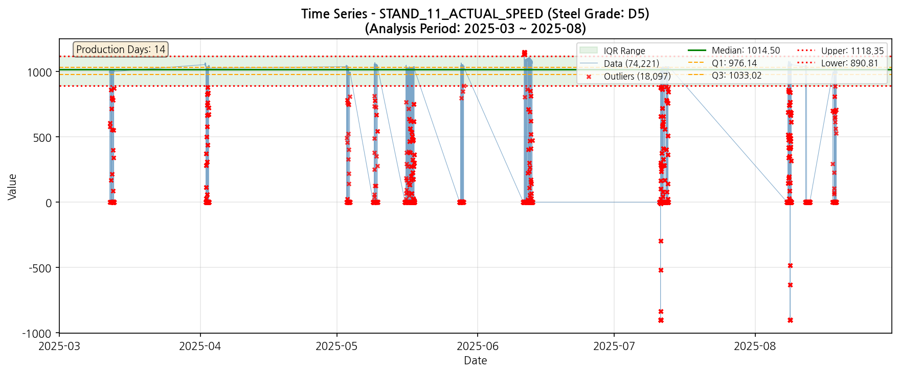

**2. 분포 히스토그램 (Distribution Histogram)**

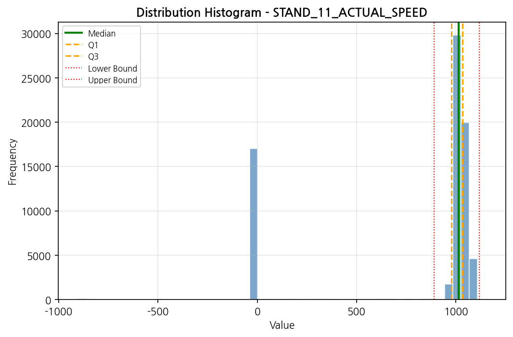

**3. 박스플롯 (Box Plot)**

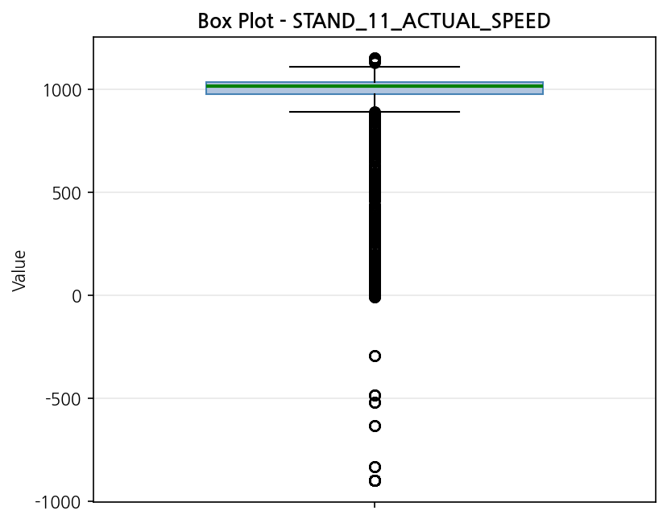

**4. 일별 평균 추이 (Daily Average Trend)**

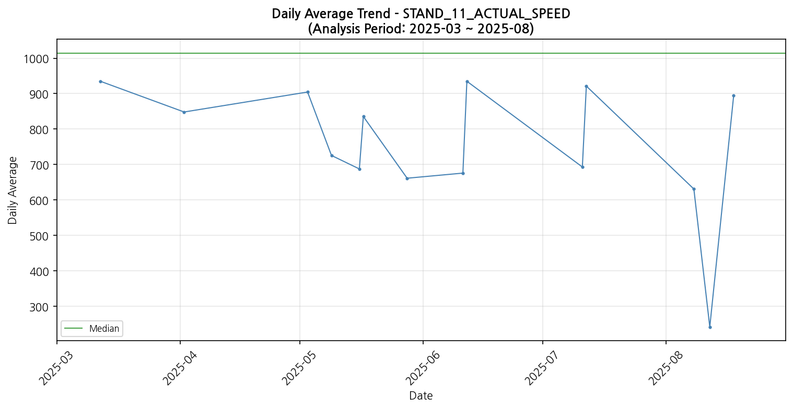

**5. 월별 이상치율 (Monthly Outlier Rate)**

**6. 시간별 패턴 (Hourly Pattern)**

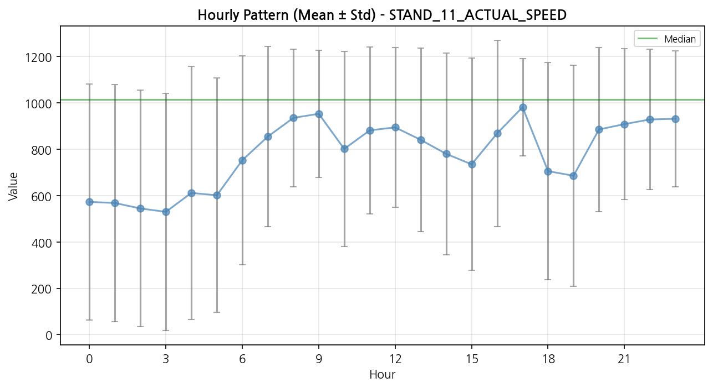

**7. 일별 이상치 수 (Daily Outlier Count)**

**종합 분석 차트**

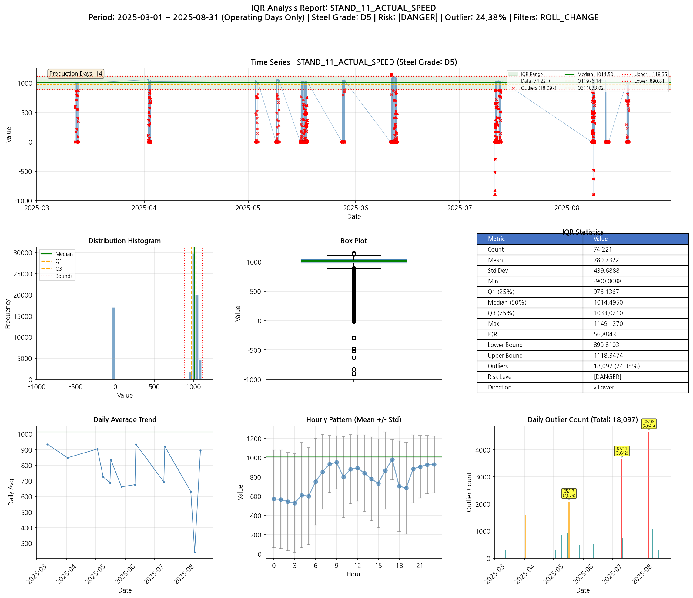

---

##### 월별 상세 분석

**2025-03**

**통계 요약**:

| 지표 | 값 |
|------|-------|
| 분석 레코드 | 4,290 |
| 평균 | 934.7453 |
| 중앙값 | 997.7198 |
| IQR | 9.7651 |
| 이상치 수 | 298 |
| 이상치율 | 6.95% |

**주요 이상치 발생 날짜**:

- 1. 2025-03-12: 298건

**1. 시계열 (Time Series)**

**2. 분포 히스토그램 (Distribution Histogram)**

**3. 박스플롯 (Box Plot)**

**4. 일별 평균 추이 (Daily Average Trend)**

**5. 시간별 패턴 (Hourly Pattern)**

**6. 일별 이상치 수 (Daily Outlier Count)**

**월별 종합 차트**

**2025-04**

**통계 요약**:

| 지표 | 값 |
|------|-------|
| 분석 레코드 | 8,601 |
| 평균 | 848.2336 |
| 중앙값 | 1031.2370 |
| IQR | 20.4900 |
| 이상치 수 | 1,602 |
| 이상치율 | 18.63% |

**주요 이상치 발생 날짜**:

- 1. 2025-04-02: 1,602건

**1. 시계열 (Time Series)**

**2. 분포 히스토그램 (Distribution Histogram)**

**3. 박스플롯 (Box Plot)**

**4. 일별 평균 추이 (Daily Average Trend)**

**5. 시간별 패턴 (Hourly Pattern)**

**6. 일별 이상치 수 (Daily Outlier Count)**

**월별 종합 차트**

**2025-05**

**통계 요약**:

| 지표 | 값 |
|------|-------|
| 분석 레코드 | 21,357 |
| 평균 | 799.2902 |
| 중앙값 | 1011.8940 |
| IQR | 43.4585 |
| 이상치 수 | 4,655 |
| 이상치율 | 21.80% |

**주요 이상치 발생 날짜**:

- 1. 2025-05-17: 2,079건
- 2. 2025-05-16: 917건
- 3. 2025-05-09: 863건

**1. 시계열 (Time Series)**

**2. 분포 히스토그램 (Distribution Histogram)**

**3. 박스플롯 (Box Plot)**

**4. 일별 평균 추이 (Daily Average Trend)**

**5. 시간별 패턴 (Hourly Pattern)**

**6. 일별 이상치 수 (Daily Outlier Count)**

**월별 종합 차트**

**2025-06**

**통계 요약**:

| 지표 | 값 |
|------|-------|
| 분석 레코드 | 5,640 |
| 평균 | 872.0087 |
| 중앙값 | 1081.3405 |
| IQR | 28.4407 |
| 이상치 수 | 1,142 |
| 이상치율 | 20.25% |

**주요 이상치 발생 날짜**:

- 1. 2025-06-12: 615건
- 2. 2025-06-11: 527건

**1. 시계열 (Time Series)**

**2. 분포 히스토그램 (Distribution Histogram)**

**3. 박스플롯 (Box Plot)**

**4. 일별 평균 추이 (Daily Average Trend)**

**5. 시간별 패턴 (Hourly Pattern)**

**6. 일별 이상치 수 (Daily Outlier Count)**

**월별 종합 차트**

**2025-07**

**통계 요약**:

| 지표 | 값 |
|------|-------|
| 분석 레코드 | 18,629 |
| 평균 | 780.9666 |
| 중앙값 | 1014.1200 |
| IQR | 15.7130 |
| 이상치 수 | 4,388 |
| 이상치율 | 23.55% |

**주요 이상치 발생 날짜**:

- 1. 2025-07-11: 3,650건
- 2. 2025-07-12: 738건

**1. 시계열 (Time Series)**

**2. 분포 히스토그램 (Distribution Histogram)**

**3. 박스플롯 (Box Plot)**

**4. 일별 평균 추이 (Daily Average Trend)**

**5. 시간별 패턴 (Hourly Pattern)**

**6. 일별 이상치 수 (Daily Outlier Count)**

**월별 종합 차트**

**2025-08**

**통계 요약**:

| 지표 | 값 |
|------|-------|
| 분석 레코드 | 15,704 |
| 평균 | 643.3908 |
| 중앙값 | 996.2570 |
| IQR | 1049.6250 |
| 이상치 수 | 0 |
| 이상치율 | 0.00% |

**1. 시계열 (Time Series)**

**2. 분포 히스토그램 (Distribution Histogram)**

**3. 박스플롯 (Box Plot)**

**4. 일별 평균 추이 (Daily Average Trend)**

**5. 시간별 패턴 (Hourly Pattern)**

**6. 일별 이상치 수 (Daily Outlier Count)**

**월별 종합 차트**

---

#### STAND_12_ACTUAL_SPEED 🔴

**위험도**: [DANGER] | **이상치율**: 24.38% | **이상치 방향**: 하한 미달

**카테고리**: 06 Stand Speed

| 필터 | 적용 | 이유 |
|------|:----:|------|
| run_only | ✓ | 가동 상태에서만 속도 측정이 유효함 |
| special_ops | ✓ | 정상 운전 조건에서 분석 |
| roll_change | ✓ | 롤교환 시 속도 급변 구간 제외 |
| coiling_transient | ✗ | 권취 전 공정으로 가감속 영향 없음 |

**데이터**: 원본 74,855 → 필터 후 74,221 (0.8% 제외)

| 통계 지표 | 값 |
|-----------|-------|
| 분석 레코드 | 74,221 |
| 평균 | 805.4389 |
| 표준편차 | 448.4844 |
| Q1 (25%) | 1012.2010 |
| 중앙값 | 1049.8620 |
| Q3 (75%) | 1068.3000 |
| IQR | 56.0990 |
| 하한 경계 | 928.0525 |
| 상한 경계 | 1152.4485 |
| 이상치 수 | 18,092 (24.38%) |

**월별 이상치 추이**:

| 월 | 레코드 수 | 평균 | 이상치율 |
|-----|-----------|------|----------|
| 2025-03 | 4,290 | 988.99 | 6.85% |
| 2025-04 | 8,601 | 876.01 | 18.56% |
| 2025-05 | 21,357 | 835.32 | 21.78% |
| 2025-06 | 5,640 | 862.96 | 20.00% |
| 2025-07 | 18,629 | 813.69 | 23.45% |
| 2025-08 | 15,704 | 645.56 | 38.55% |

**주요 이상치 발생 날짜** (상위 5일):

| 순위 | 날짜 | 이상치 수 |
|:----:|------|----------:|
| 1 | 2025-08-08 | 4,652 |
| 2 | 2025-07-11 | 3,635 |
| 3 | 2025-05-17 | 2,079 |
| 4 | 2025-04-02 | 1,596 |
| 5 | 2025-08-12 | 1,095 |

- 이상치 발생 일수: 14일
- 최대 일별 이상치: 4,652건 (2025-08-08)
- 평균 일별 이상치: 1292.3건

##### 차트 분석

**1. 시계열 (Time Series)**

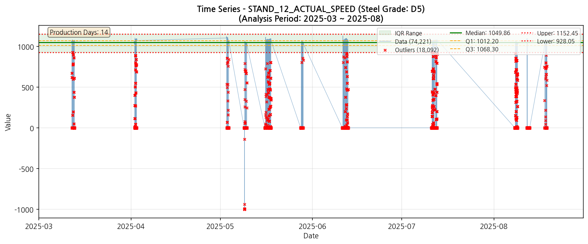

**2. 분포 히스토그램 (Distribution Histogram)**

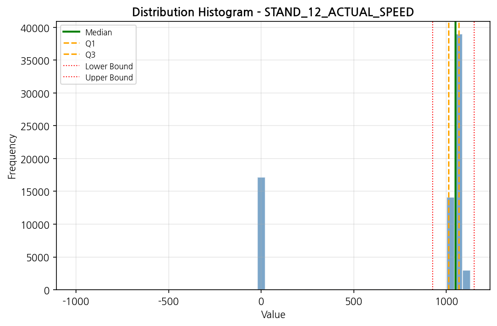

**3. 박스플롯 (Box Plot)**

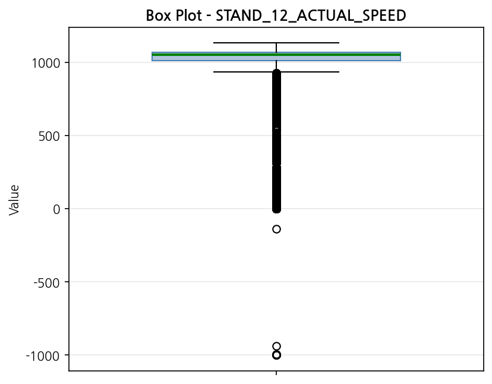

**4. 일별 평균 추이 (Daily Average Trend)**

**5. 월별 이상치율 (Monthly Outlier Rate)**

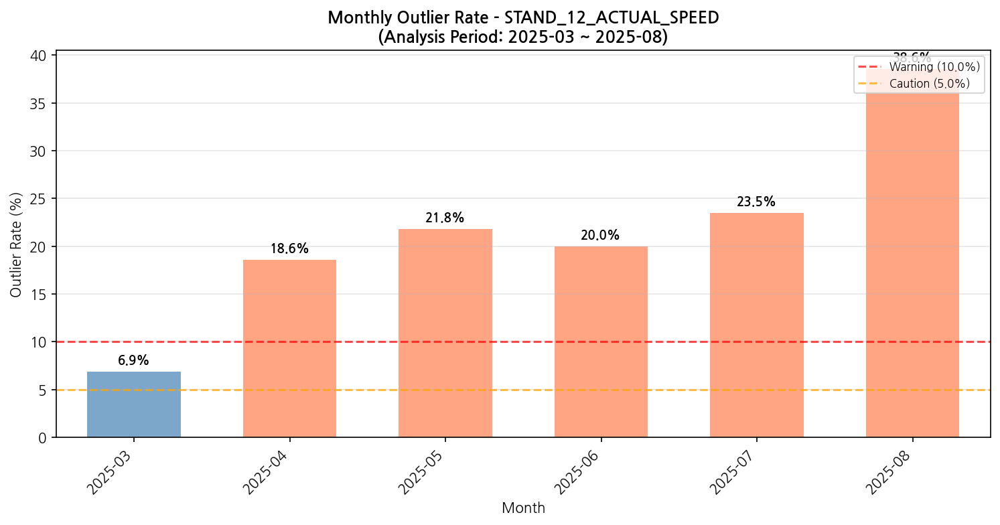

**6. 시간별 패턴 (Hourly Pattern)**

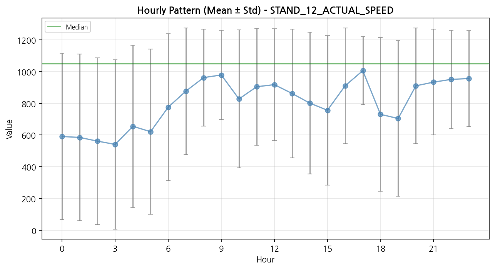

**7. 일별 이상치 수 (Daily Outlier Count)**

**종합 분석 차트**

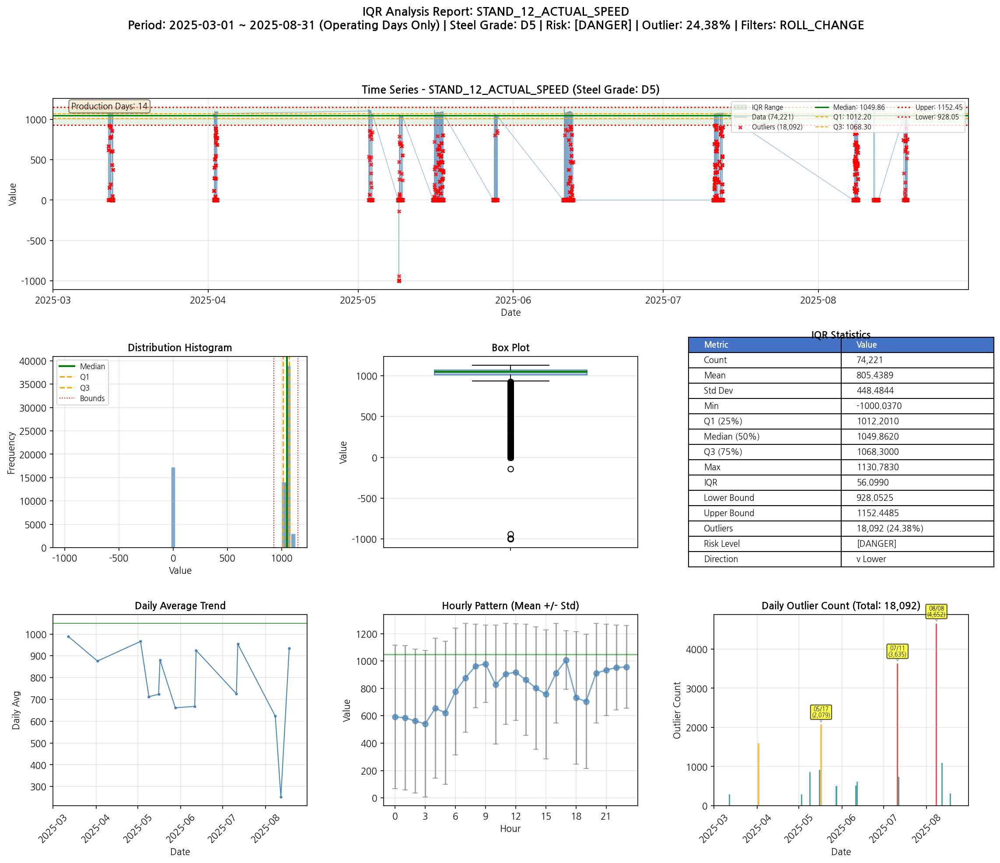

---

##### 월별 상세 분석

**2025-03**

**통계 요약**:

| 지표 | 값 |
|------|-------|
| 분석 레코드 | 4,290 |
| 평균 | 988.9903 |
| 중앙값 | 1054.5130 |
| IQR | 9.3090 |
| 이상치 수 | 503 |
| 이상치율 | 11.72% |

**주요 이상치 발생 날짜**:

- 1. 2025-03-12: 503건

**1. 시계열 (Time Series)**

**2. 분포 히스토그램 (Distribution Histogram)**

**3. 박스플롯 (Box Plot)**

**4. 일별 평균 추이 (Daily Average Trend)**

**5. 시간별 패턴 (Hourly Pattern)**

**6. 일별 이상치 수 (Daily Outlier Count)**

**월별 종합 차트**

**2025-04**

**통계 요약**:

| 지표 | 값 |
|------|-------|
| 분석 레코드 | 8,601 |
| 평균 | 876.0137 |
| 중앙값 | 1070.7940 |
| IQR | 44.8860 |
| 이상치 수 | 1,596 |
| 이상치율 | 18.56% |

**주요 이상치 발생 날짜**:

- 1. 2025-04-02: 1,596건

**1. 시계열 (Time Series)**

**2. 분포 히스토그램 (Distribution Histogram)**

**3. 박스플롯 (Box Plot)**

**4. 일별 평균 추이 (Daily Average Trend)**

**5. 시간별 패턴 (Hourly Pattern)**

**6. 일별 이상치 수 (Daily Outlier Count)**

**월별 종합 차트**

**2025-05**

**통계 요약**:

| 지표 | 값 |
|------|-------|
| 분석 레코드 | 21,357 |
| 평균 | 835.3184 |
| 중앙값 | 1061.1290 |
| IQR | 51.2930 |
| 이상치 수 | 4,653 |
| 이상치율 | 21.79% |

**주요 이상치 발생 날짜**:

- 1. 2025-05-17: 2,079건
- 2. 2025-05-16: 915건
- 3. 2025-05-09: 865건

**1. 시계열 (Time Series)**

**2. 분포 히스토그램 (Distribution Histogram)**

**3. 박스플롯 (Box Plot)**

**4. 일별 평균 추이 (Daily Average Trend)**

**5. 시간별 패턴 (Hourly Pattern)**

**6. 일별 이상치 수 (Daily Outlier Count)**

**월별 종합 차트**

**2025-06**

**통계 요약**:

| 지표 | 값 |
|------|-------|
| 분석 레코드 | 5,640 |
| 평균 | 862.9629 |
| 중앙값 | 1069.7280 |
| IQR | 27.3775 |
| 이상치 수 | 1,142 |
| 이상치율 | 20.25% |

**주요 이상치 발생 날짜**:

- 1. 2025-06-12: 618건
- 2. 2025-06-11: 524건

**1. 시계열 (Time Series)**

**2. 분포 히스토그램 (Distribution Histogram)**

**3. 박스플롯 (Box Plot)**

**4. 일별 평균 추이 (Daily Average Trend)**

**5. 시간별 패턴 (Hourly Pattern)**

**6. 일별 이상치 수 (Daily Outlier Count)**

**월별 종합 차트**

**2025-07**

**통계 요약**:

| 지표 | 값 |
|------|-------|
| 분석 레코드 | 18,629 |
| 평균 | 813.6861 |
| 중앙값 | 1049.4850 |
| IQR | 13.8780 |
| 이상치 수 | 4,773 |
| 이상치율 | 25.62% |

**주요 이상치 발생 날짜**:

- 1. 2025-07-11: 3,657건
- 2. 2025-07-12: 1,116건

**1. 시계열 (Time Series)**

**2. 분포 히스토그램 (Distribution Histogram)**

**3. 박스플롯 (Box Plot)**

**4. 일별 평균 추이 (Daily Average Trend)**

**5. 시간별 패턴 (Hourly Pattern)**

**6. 일별 이상치 수 (Daily Outlier Count)**

**월별 종합 차트**

**2025-08**

**통계 요약**:

| 지표 | 값 |
|------|-------|
| 분석 레코드 | 15,704 |
| 평균 | 645.5650 |
| 중앙값 | 1020.9670 |
| IQR | 1039.2790 |
| 이상치 수 | 0 |
| 이상치율 | 0.00% |

**1. 시계열 (Time Series)**

**2. 분포 히스토그램 (Distribution Histogram)**

**3. 박스플롯 (Box Plot)**

**4. 일별 평균 추이 (Daily Average Trend)**

**5. 시간별 패턴 (Hourly Pattern)**

**6. 일별 이상치 수 (Daily Outlier Count)**

**월별 종합 차트**

---

#### STAND_7_ACTUAL_SPEED 🔴

**위험도**: [DANGER] | **이상치율**: 24.19% | **이상치 방향**: 하한 미달

**카테고리**: 06 Stand Speed

| 필터 | 적용 | 이유 |
|------|:----:|------|
| run_only | ✓ | 가동 상태에서만 속도 측정이 유효함 |
| special_ops | ✓ | 정상 운전 조건에서 분석 |
| roll_change | ✓ | 롤교환 시 속도 급변 구간 제외 |
| coiling_transient | ✗ | 권취 전 공정으로 가감속 영향 없음 |

**데이터**: 원본 74,855 → 필터 후 74,221 (0.8% 제외)

| 통계 지표 | 값 |
|-----------|-------|
| 분석 레코드 | 74,221 |
| 평균 | 888.6391 |
| 표준편차 | 493.3299 |
| Q1 (25%) | 1080.7130 |
| 중앙값 | 1146.3350 |
| Q3 (75%) | 1176.5980 |
| IQR | 95.8850 |
| 하한 경계 | 936.8855 |
| 상한 경계 | 1320.4255 |
| 이상치 수 | 17,957 (24.19%) |

**월별 이상치 추이**:

| 월 | 레코드 수 | 평균 | 이상치율 |
|-----|-----------|------|----------|
| 2025-03 | 4,290 | 1019.67 | 6.60% |
| 2025-04 | 8,601 | 971.84 | 17.78% |
| 2025-05 | 21,357 | 941.44 | 21.64% |
| 2025-06 | 5,640 | 913.45 | 20.00% |
| 2025-07 | 18,629 | 881.94 | 23.47% |
| 2025-08 | 15,704 | 734.51 | 38.36% |

**주요 이상치 발생 날짜** (상위 5일):

| 순위 | 날짜 | 이상치 수 |
|:----:|------|----------:|
| 1 | 2025-08-08 | 4,624 |
| 2 | 2025-07-11 | 3,619 |
| 3 | 2025-05-17 | 2,043 |
| 4 | 2025-04-02 | 1,529 |
| 5 | 2025-08-12 | 1,096 |

- 이상치 발생 일수: 14일
- 최대 일별 이상치: 4,624건 (2025-08-08)
- 평균 일별 이상치: 1282.6건

##### 차트 분석

**1. 시계열 (Time Series)**

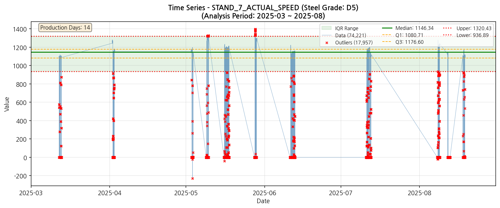

**2. 분포 히스토그램 (Distribution Histogram)**

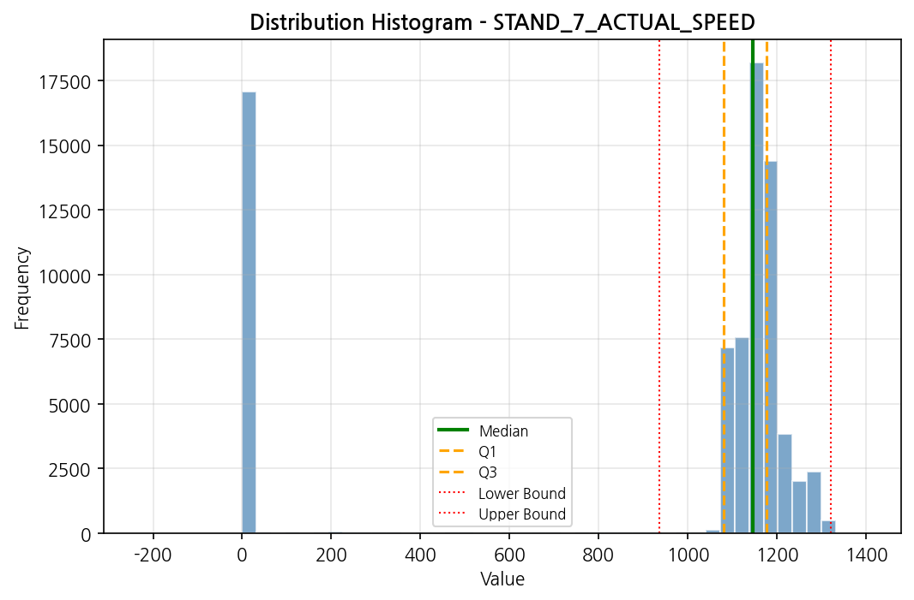

**3. 박스플롯 (Box Plot)**


**4. 일별 평균 추이 (Daily Average Trend)**


**5. 월별 이상치율 (Monthly Outlier Rate)**

**6. 시간별 패턴 (Hourly Pattern)**


**7. 일별 이상치 수 (Daily Outlier Count)**

**종합 분석 차트**


---

##### 월별 상세 분석

**2025-03**

**통계 요약**:

| 지표 | 값 |
|------|-------|
| 분석 레코드 | 4,290 |
| 평균 | 1019.6736 |
| 중앙값 | 1086.5375 |
| IQR | 8.8320 |
| 이상치 수 | 416 |
| 이상치율 | 9.70% |

**주요 이상치 발생 날짜**:

- 1. 2025-03-12: 416건

**1. 시계열 (Time Series)**

**2. 분포 히스토그램 (Distribution Histogram)**

**3. 박스플롯 (Box Plot)**

**4. 일별 평균 추이 (Daily Average Trend)**

**5. 시간별 패턴 (Hourly Pattern)**

**6. 일별 이상치 수 (Daily Outlier Count)**

**월별 종합 차트**

**2025-04**

**통계 요약**:

| 지표 | 값 |
|------|-------|
| 분석 레코드 | 8,601 |
| 평균 | 971.8382 |
| 중앙값 | 1152.4420 |
| IQR | 29.1210 |
| 이상치 수 | 3,363 |
| 이상치율 | 39.10% |

**주요 이상치 발생 날짜**:

- 1. 2025-04-02: 3,363건

**1. 시계열 (Time Series)**

**2. 분포 히스토그램 (Distribution Histogram)**

**3. 박스플롯 (Box Plot)**

**4. 일별 평균 추이 (Daily Average Trend)**

**5. 시간별 패턴 (Hourly Pattern)**

**6. 일별 이상치 수 (Daily Outlier Count)**

**월별 종합 차트**

**2025-05**

**통계 요약**:

| 지표 | 값 |
|------|-------|
| 분석 레코드 | 21,357 |
| 평균 | 941.4367 |
| 중앙값 | 1172.3460 |
| IQR | 71.4690 |
| 이상치 수 | 5,422 |
| 이상치율 | 25.39% |

**주요 이상치 발생 날짜**:

- 1. 2025-05-17: 2,043건
- 2. 2025-05-09: 1,629건
- 3. 2025-05-16: 917건

**1. 시계열 (Time Series)**

**2. 분포 히스토그램 (Distribution Histogram)**

**3. 박스플롯 (Box Plot)**

**4. 일별 평균 추이 (Daily Average Trend)**

**5. 시간별 패턴 (Hourly Pattern)**

**6. 일별 이상치 수 (Daily Outlier Count)**

**월별 종합 차트**

**2025-06**

**통계 요약**:

| 지표 | 값 |
|------|-------|
| 분석 레코드 | 5,640 |
| 평균 | 913.4481 |
| 중앙값 | 1134.4565 |
| IQR | 23.1957 |
| 이상치 수 | 1,155 |
| 이상치율 | 20.48% |

**주요 이상치 발생 날짜**:

- 1. 2025-06-12: 621건
- 2. 2025-06-11: 534건

**1. 시계열 (Time Series)**

**2. 분포 히스토그램 (Distribution Histogram)**

**3. 박스플롯 (Box Plot)**

**4. 일별 평균 추이 (Daily Average Trend)**

**5. 시간별 패턴 (Hourly Pattern)**

**6. 일별 이상치 수 (Daily Outlier Count)**

**월별 종합 차트**

**2025-07**

**통계 요약**:

| 지표 | 값 |
|------|-------|
| 분석 레코드 | 18,629 |
| 평균 | 881.9411 |
| 중앙값 | 1144.3560 |
| IQR | 69.8880 |
| 이상치 수 | 4,388 |
| 이상치율 | 23.55% |

**주요 이상치 발생 날짜**:

- 1. 2025-07-11: 3,635건
- 2. 2025-07-12: 753건

**1. 시계열 (Time Series)**

**2. 분포 히스토그램 (Distribution Histogram)**

**3. 박스플롯 (Box Plot)**

**4. 일별 평균 추이 (Daily Average Trend)**

**5. 시간별 패턴 (Hourly Pattern)**

**6. 일별 이상치 수 (Daily Outlier Count)**

**월별 종합 차트**

**2025-08**

**통계 요약**:

| 지표 | 값 |
|------|-------|
| 분석 레코드 | 15,704 |
| 평균 | 734.5078 |
| 중앙값 | 1104.4670 |
| IQR | 1200.5353 |
| 이상치 수 | 0 |
| 이상치율 | 0.00% |

**1. 시계열 (Time Series)**

**2. 분포 히스토그램 (Distribution Histogram)**

**3. 박스플롯 (Box Plot)**

**4. 일별 평균 추이 (Daily Average Trend)**

**5. 시간별 패턴 (Hourly Pattern)**

**6. 일별 이상치 수 (Daily Outlier Count)**

**월별 종합 차트**

---

#### STAND_6_ACTUAL_SPEED 🔴

**위험도**: [DANGER] | **이상치율**: 24.14% | **이상치 방향**: 하한 미달

**카테고리**: 06 Stand Speed

| 필터 | 적용 | 이유 |
|------|:----:|------|
| run_only | ✓ | 가동 상태에서만 속도 측정이 유효함 |
| special_ops | ✓ | 정상 운전 조건에서 분석 |
| roll_change | ✓ | 롤교환 시 속도 급변 구간 제외 |
| coiling_transient | ✗ | 권취 전 공정으로 가감속 영향 없음 |

**데이터**: 원본 74,855 → 필터 후 74,221 (0.8% 제외)

| 통계 지표 | 값 |
|-----------|-------|
| 분석 레코드 | 74,221 |
| 평균 | 829.5797 |
| 표준편차 | 459.9726 |
| Q1 (25%) | 1016.4140 |
| 중앙값 | 1064.8630 |
| Q3 (75%) | 1094.6750 |
| IQR | 78.2610 |
| 하한 경계 | 899.0225 |
| 상한 경계 | 1212.0665 |
| 이상치 수 | 17,918 (24.14%) |

**월별 이상치 추이**:

| 월 | 레코드 수 | 평균 | 이상치율 |
|-----|-----------|------|----------|
| 2025-03 | 4,290 | 980.90 | 6.60% |
| 2025-04 | 8,601 | 887.90 | 17.78% |
| 2025-05 | 21,357 | 854.99 | 21.45% |
| 2025-06 | 5,640 | 879.99 | 20.00% |
| 2025-07 | 18,629 | 831.40 | 23.47% |
| 2025-08 | 15,704 | 701.48 | 38.36% |

**주요 이상치 발생 날짜** (상위 5일):

| 순위 | 날짜 | 이상치 수 |
|:----:|------|----------:|
| 1 | 2025-08-08 | 4,624 |
| 2 | 2025-07-11 | 3,619 |
| 3 | 2025-05-17 | 2,043 |
| 4 | 2025-04-02 | 1,529 |
| 5 | 2025-08-12 | 1,096 |

- 이상치 발생 일수: 14일
- 최대 일별 이상치: 4,624건 (2025-08-08)
- 평균 일별 이상치: 1279.9건

##### 차트 분석

**1. 시계열 (Time Series)**


**2. 분포 히스토그램 (Distribution Histogram)**


**3. 박스플롯 (Box Plot)**


**4. 일별 평균 추이 (Daily Average Trend)**

**5. 월별 이상치율 (Monthly Outlier Rate)**

**6. 시간별 패턴 (Hourly Pattern)**


**7. 일별 이상치 수 (Daily Outlier Count)**

**종합 분석 차트**


---

##### 월별 상세 분석

**2025-03**

**통계 요약**:

| 지표 | 값 |
|------|-------|
| 분석 레코드 | 4,290 |
| 평균 | 980.8999 |
| 중앙값 | 1045.2990 |
| IQR | 9.7860 |
| 이상치 수 | 319 |
| 이상치율 | 7.44% |

**주요 이상치 발생 날짜**:

- 1. 2025-03-12: 319건

**1. 시계열 (Time Series)**

**2. 분포 히스토그램 (Distribution Histogram)**

**3. 박스플롯 (Box Plot)**

**4. 일별 평균 추이 (Daily Average Trend)**

**5. 시간별 패턴 (Hourly Pattern)**

**6. 일별 이상치 수 (Daily Outlier Count)**

**월별 종합 차트**

**2025-04**

**통계 요약**:

| 지표 | 값 |
|------|-------|
| 분석 레코드 | 8,601 |
| 평균 | 887.9036 |
| 중앙값 | 1054.3800 |
| IQR | 26.4960 |
| 이상치 수 | 3,358 |
| 이상치율 | 39.04% |

**주요 이상치 발생 날짜**:

- 1. 2025-04-02: 3,358건

**1. 시계열 (Time Series)**

**2. 분포 히스토그램 (Distribution Histogram)**

**3. 박스플롯 (Box Plot)**

**4. 일별 평균 추이 (Daily Average Trend)**

**5. 시간별 패턴 (Hourly Pattern)**

**6. 일별 이상치 수 (Daily Outlier Count)**

**월별 종합 차트**

**2025-05**

**통계 요약**:

| 지표 | 값 |
|------|-------|
| 분석 레코드 | 21,357 |
| 평균 | 854.9883 |
| 중앙값 | 1067.5470 |
| IQR | 56.4680 |
| 이상치 수 | 5,595 |
| 이상치율 | 26.20% |

**주요 이상치 발생 날짜**:

- 1. 2025-05-17: 2,043건
- 2. 2025-05-09: 1,284건
- 3. 2025-05-28: 1,095건

**1. 시계열 (Time Series)**

**2. 분포 히스토그램 (Distribution Histogram)**

**3. 박스플롯 (Box Plot)**

**4. 일별 평균 추이 (Daily Average Trend)**

**5. 시간별 패턴 (Hourly Pattern)**

**6. 일별 이상치 수 (Daily Outlier Count)**

**월별 종합 차트**

**2025-06**

**통계 요약**:

| 지표 | 값 |
|------|-------|
| 분석 레코드 | 5,640 |
| 평균 | 879.9943 |
| 중앙값 | 1093.3330 |
| IQR | 23.0833 |
| 이상치 수 | 1,137 |
| 이상치율 | 20.16% |

**주요 이상치 발생 날짜**:

- 1. 2025-06-12: 618건
- 2. 2025-06-11: 519건

**1. 시계열 (Time Series)**

**2. 분포 히스토그램 (Distribution Histogram)**

**3. 박스플롯 (Box Plot)**

**4. 일별 평균 추이 (Daily Average Trend)**

**5. 시간별 패턴 (Hourly Pattern)**

**6. 일별 이상치 수 (Daily Outlier Count)**

**월별 종합 차트**

**2025-07**

**통계 요약**:

| 지표 | 값 |
|------|-------|
| 분석 레코드 | 18,629 |
| 평균 | 831.3983 |
| 중앙값 | 1078.5000 |
| IQR | 63.9790 |
| 이상치 수 | 4,395 |
| 이상치율 | 23.59% |

**주요 이상치 발생 날짜**:

- 1. 2025-07-11: 3,642건
- 2. 2025-07-12: 753건

**1. 시계열 (Time Series)**

**2. 분포 히스토그램 (Distribution Histogram)**

**3. 박스플롯 (Box Plot)**

**4. 일별 평균 추이 (Daily Average Trend)**

**5. 시간별 패턴 (Hourly Pattern)**

**6. 일별 이상치 수 (Daily Outlier Count)**

**월별 종합 차트**

**2025-08**

**통계 요약**:

| 지표 | 값 |
|------|-------|
| 분석 레코드 | 15,704 |
| 평균 | 701.4803 |
| 중앙값 | 1049.8840 |
| IQR | 1152.4420 |
| 이상치 수 | 0 |
| 이상치율 | 0.00% |

**1. 시계열 (Time Series)**

**2. 분포 히스토그램 (Distribution Histogram)**

**3. 박스플롯 (Box Plot)**

**4. 일별 평균 추이 (Daily Average Trend)**

**5. 시간별 패턴 (Hourly Pattern)**

**6. 일별 이상치 수 (Daily Outlier Count)**

**월별 종합 차트**

---

#### STAND_5_ACTUAL_SPEED 🔴

**위험도**: [DANGER] | **이상치율**: 24.13% | **이상치 방향**: 하한 미달

**카테고리**: 06 Stand Speed

| 필터 | 적용 | 이유 |
|------|:----:|------|
| run_only | ✓ | 가동 상태에서만 속도 측정이 유효함 |
| special_ops | ✓ | 정상 운전 조건에서 분석 |
| roll_change | ✓ | 롤교환 시 속도 급변 구간 제외 |
| coiling_transient | ✗ | 권취 전 공정으로 가감속 영향 없음 |

**데이터**: 원본 74,855 → 필터 후 74,221 (0.8% 제외)

| 통계 지표 | 값 |
|-----------|-------|
| 분석 레코드 | 74,221 |
| 평균 | 858.2507 |
| 표준편차 | 475.8347 |
| Q1 (25%) | 1045.8750 |
| 중앙값 | 1114.2400 |
| Q3 (75%) | 1140.7030 |
| IQR | 94.8280 |
| 하한 경계 | 903.6330 |
| 상한 경계 | 1282.9450 |
| 이상치 수 | 17,907 (24.13%) |

**월별 이상치 추이**:

| 월 | 레코드 수 | 평균 | 이상치율 |
|-----|-----------|------|----------|
| 2025-03 | 4,290 | 1006.63 | 6.60% |
| 2025-04 | 8,601 | 892.97 | 17.84% |
| 2025-05 | 21,357 | 900.63 | 21.39% |
| 2025-06 | 5,640 | 897.33 | 20.00% |
| 2025-07 | 18,629 | 874.37 | 23.52% |
| 2025-08 | 15,704 | 707.91 | 38.28% |

**주요 이상치 발생 날짜** (상위 5일):

| 순위 | 날짜 | 이상치 수 |
|:----:|------|----------:|
| 1 | 2025-08-08 | 4,616 |
| 2 | 2025-07-11 | 3,633 |
| 3 | 2025-05-17 | 2,036 |
| 4 | 2025-04-02 | 1,534 |
| 5 | 2025-08-12 | 1,096 |

- 이상치 발생 일수: 14일
- 최대 일별 이상치: 4,616건 (2025-08-08)
- 평균 일별 이상치: 1279.1건

##### 차트 분석

**1. 시계열 (Time Series)**


**2. 분포 히스토그램 (Distribution Histogram)**


**3. 박스플롯 (Box Plot)**


**4. 일별 평균 추이 (Daily Average Trend)**


**5. 월별 이상치율 (Monthly Outlier Rate)**


**6. 시간별 패턴 (Hourly Pattern)**

**7. 일별 이상치 수 (Daily Outlier Count)**

**종합 분석 차트**


---

##### 월별 상세 분석

**2025-03**

**통계 요약**:

| 지표 | 값 |
|------|-------|
| 분석 레코드 | 4,290 |
| 평균 | 1006.6281 |
| 중앙값 | 1072.8065 |
| IQR | 9.0030 |
| 이상치 수 | 319 |
| 이상치율 | 7.44% |

**주요 이상치 발생 날짜**:

- 1. 2025-03-12: 319건

**1. 시계열 (Time Series)**

**2. 분포 히스토그램 (Distribution Histogram)**

**3. 박스플롯 (Box Plot)**

**4. 일별 평균 추이 (Daily Average Trend)**

**5. 시간별 패턴 (Hourly Pattern)**

**6. 일별 이상치 수 (Daily Outlier Count)**

**월별 종합 차트**

**2025-04**

**통계 요약**:

| 지표 | 값 |
|------|-------|
| 분석 레코드 | 8,601 |
| 평균 | 892.9749 |
| 중앙값 | 1063.1380 |
| IQR | 24.9220 |
| 이상치 수 | 3,387 |
| 이상치율 | 39.38% |

**주요 이상치 발생 날짜**:

- 1. 2025-04-02: 3,387건

**1. 시계열 (Time Series)**

**2. 분포 히스토그램 (Distribution Histogram)**

**3. 박스플롯 (Box Plot)**

**4. 일별 평균 추이 (Daily Average Trend)**

**5. 시간별 패턴 (Hourly Pattern)**

**6. 일별 이상치 수 (Daily Outlier Count)**

**월별 종합 차트**

**2025-05**

**통계 요약**:

| 지표 | 값 |
|------|-------|
| 분석 레코드 | 21,357 |
| 평균 | 900.6256 |
| 중앙값 | 1127.1550 |
| IQR | 64.1530 |
| 이상치 수 | 4,717 |
| 이상치율 | 22.09% |

**주요 이상치 발생 날짜**:

- 1. 2025-05-17: 2,043건
- 2. 2025-05-09: 936건
- 3. 2025-05-16: 917건

**1. 시계열 (Time Series)**

**2. 분포 히스토그램 (Distribution Histogram)**

**3. 박스플롯 (Box Plot)**

**4. 일별 평균 추이 (Daily Average Trend)**

**5. 시간별 패턴 (Hourly Pattern)**

**6. 일별 이상치 수 (Daily Outlier Count)**

**월별 종합 차트**

**2025-06**

**통계 요약**:

| 지표 | 값 |
|------|-------|
| 분석 레코드 | 5,640 |
| 평균 | 897.3267 |
| 중앙값 | 1114.7350 |
| IQR | 22.4952 |
| 이상치 수 | 1,142 |
| 이상치율 | 20.25% |

**주요 이상치 발생 날짜**:

- 1. 2025-06-12: 621건
- 2. 2025-06-11: 521건

**1. 시계열 (Time Series)**

**2. 분포 히스토그램 (Distribution Histogram)**

**3. 박스플롯 (Box Plot)**

**4. 일별 평균 추이 (Daily Average Trend)**

**5. 시간별 패턴 (Hourly Pattern)**

**6. 일별 이상치 수 (Daily Outlier Count)**

**월별 종합 차트**

**2025-07**

**통계 요약**:

| 지표 | 값 |
|------|-------|
| 분석 레코드 | 18,629 |
| 평균 | 874.3736 |
| 중앙값 | 1132.6210 |
| IQR | 77.3040 |
| 이상치 수 | 4,397 |
| 이상치율 | 23.60% |

**주요 이상치 발생 날짜**:

- 1. 2025-07-11: 3,649건
- 2. 2025-07-12: 748건

**1. 시계열 (Time Series)**

**2. 분포 히스토그램 (Distribution Histogram)**

**3. 박스플롯 (Box Plot)**

**4. 일별 평균 추이 (Daily Average Trend)**

**5. 시간별 패턴 (Hourly Pattern)**

**6. 일별 이상치 수 (Daily Outlier Count)**

**월별 종합 차트**

**2025-08**

**통계 요약**:

| 지표 | 값 |
|------|-------|
| 분석 레코드 | 15,704 |
| 평균 | 707.9106 |
| 중앙값 | 1087.8385 |
| IQR | 1150.0850 |
| 이상치 수 | 0 |
| 이상치율 | 0.00% |

**1. 시계열 (Time Series)**

**2. 분포 히스토그램 (Distribution Histogram)**

**3. 박스플롯 (Box Plot)**

**4. 일별 평균 추이 (Daily Average Trend)**

**5. 시간별 패턴 (Hourly Pattern)**

**6. 일별 이상치 수 (Daily Outlier Count)**

**월별 종합 차트**

---

#### STAND_13_ACTUAL_SPEED 🔴

**위험도**: [DANGER] | **이상치율**: 24.12% | **이상치 방향**: 하한 미달

**카테고리**: 06 Stand Speed

| 필터 | 적용 | 이유 |
|------|:----:|------|
| run_only | ✓ | 가동 상태에서만 속도 측정이 유효함 |
| special_ops | ✓ | 정상 운전 조건에서 분석 |
| roll_change | ✓ | 롤교환 시 속도 급변 구간 제외 |
| coiling_transient | ✗ | 권취 전 공정으로 가감속 영향 없음 |

**데이터**: 원본 74,855 → 필터 후 74,221 (0.8% 제외)

| 통계 지표 | 값 |
|-----------|-------|
| 분석 레코드 | 74,221 |
| 평균 | 775.9928 |
| 표준편차 | 435.1705 |
| Q1 (25%) | 924.3341 |
| 중앙값 | 953.4310 |
| Q3 (75%) | 1073.2520 |
| IQR | 148.9179 |
| 하한 경계 | 700.9573 |
| 상한 경계 | 1296.6288 |
| 이상치 수 | 17,904 (24.12%) |

**월별 이상치 추이**:

| 월 | 레코드 수 | 평균 | 이상치율 |
|-----|-----------|------|----------|
| 2025-03 | 4,290 | 1034.60 | 6.50% |
| 2025-04 | 8,601 | 868.76 | 18.03% |
| 2025-05 | 21,357 | 840.80 | 21.63% |
| 2025-06 | 5,640 | 873.06 | 19.72% |
| 2025-07 | 18,629 | 733.34 | 23.18% |
| 2025-08 | 15,704 | 582.14 | 38.35% |

**주요 이상치 발생 날짜** (상위 5일):

| 순위 | 날짜 | 이상치 수 |
|:----:|------|----------:|
| 1 | 2025-08-08 | 4,622 |
| 2 | 2025-07-11 | 3,612 |
| 3 | 2025-05-17 | 2,064 |
| 4 | 2025-04-02 | 1,551 |
| 5 | 2025-08-12 | 1,095 |

- 이상치 발생 일수: 14일
- 최대 일별 이상치: 4,622건 (2025-08-08)
- 평균 일별 이상치: 1278.9건

##### 차트 분석

**1. 시계열 (Time Series)**


**2. 분포 히스토그램 (Distribution Histogram)**


**3. 박스플롯 (Box Plot)**


**4. 일별 평균 추이 (Daily Average Trend)**

**5. 월별 이상치율 (Monthly Outlier Rate)**


**6. 시간별 패턴 (Hourly Pattern)**


**7. 일별 이상치 수 (Daily Outlier Count)**

**종합 분석 차트**


---

##### 월별 상세 분석

**2025-03**

**통계 요약**:

| 지표 | 값 |
|------|-------|
| 분석 레코드 | 4,290 |
| 평균 | 1034.6027 |
| 중앙값 | 1103.0600 |
| IQR | 3.7425 |
| 이상치 수 | 954 |
| 이상치율 | 22.24% |

**주요 이상치 발생 날짜**:

- 1. 2025-03-12: 954건

**1. 시계열 (Time Series)**

**2. 분포 히스토그램 (Distribution Histogram)**

**3. 박스플롯 (Box Plot)**

**4. 일별 평균 추이 (Daily Average Trend)**

**5. 시간별 패턴 (Hourly Pattern)**

**6. 일별 이상치 수 (Daily Outlier Count)**

**월별 종합 차트**

**2025-04**

**통계 요약**:

| 지표 | 값 |
|------|-------|
| 분석 레코드 | 8,601 |
| 평균 | 868.7646 |
| 중앙값 | 1063.5920 |
| IQR | 39.8320 |
| 이상치 수 | 1,596 |
| 이상치율 | 18.56% |

**주요 이상치 발생 날짜**:

- 1. 2025-04-02: 1,596건

**1. 시계열 (Time Series)**

**2. 분포 히스토그램 (Distribution Histogram)**

**3. 박스플롯 (Box Plot)**

**4. 일별 평균 추이 (Daily Average Trend)**

**5. 시간별 패턴 (Hourly Pattern)**

**6. 일별 이상치 수 (Daily Outlier Count)**

**월별 종합 차트**

**2025-05**

**통계 요약**:

| 지표 | 값 |
|------|-------|
| 분석 레코드 | 21,357 |
| 평균 | 840.7984 |
| 중앙값 | 1072.3540 |
| IQR | 41.1830 |
| 이상치 수 | 4,663 |
| 이상치율 | 21.83% |

**주요 이상치 발생 날짜**:

- 1. 2025-05-17: 2,087건
- 2. 2025-05-16: 915건
- 3. 2025-05-09: 867건

**1. 시계열 (Time Series)**

**2. 분포 히스토그램 (Distribution Histogram)**

**3. 박스플롯 (Box Plot)**

**4. 일별 평균 추이 (Daily Average Trend)**

**5. 시간별 패턴 (Hourly Pattern)**

**6. 일별 이상치 수 (Daily Outlier Count)**

**월별 종합 차트**

**2025-06**

**통계 요약**:

| 지표 | 값 |
|------|-------|
| 분석 레코드 | 5,640 |
| 평균 | 873.0556 |
| 중앙값 | 1083.6070 |
| IQR | 13.1600 |
| 이상치 수 | 1,255 |
| 이상치율 | 22.25% |

**주요 이상치 발생 날짜**:

- 1. 2025-06-12: 736건
- 2. 2025-06-11: 519건

**1. 시계열 (Time Series)**

**2. 분포 히스토그램 (Distribution Histogram)**

**3. 박스플롯 (Box Plot)**

**4. 일별 평균 추이 (Daily Average Trend)**

**5. 시간별 패턴 (Hourly Pattern)**

**6. 일별 이상치 수 (Daily Outlier Count)**

**월별 종합 차트**

**2025-07**

**통계 요약**:

| 지표 | 값 |
|------|-------|
| 분석 레코드 | 18,629 |
| 평균 | 733.3378 |
| 중앙값 | 946.2017 |
| IQR | 9.8663 |
| 이상치 수 | 6,150 |
| 이상치율 | 33.01% |

**주요 이상치 발생 날짜**:

- 1. 2025-07-11: 4,816건
- 2. 2025-07-12: 1,334건

**1. 시계열 (Time Series)**

**2. 분포 히스토그램 (Distribution Histogram)**

**3. 박스플롯 (Box Plot)**

**4. 일별 평균 추이 (Daily Average Trend)**

**5. 시간별 패턴 (Hourly Pattern)**

**6. 일별 이상치 수 (Daily Outlier Count)**

**월별 종합 차트**

**2025-08**

**통계 요약**:

| 지표 | 값 |
|------|-------|
| 분석 레코드 | 15,704 |
| 평균 | 582.1420 |
| 중앙값 | 926.7514 |
| IQR | 933.4504 |
| 이상치 수 | 0 |
| 이상치율 | 0.00% |

**1. 시계열 (Time Series)**

**2. 분포 히스토그램 (Distribution Histogram)**

**3. 박스플롯 (Box Plot)**

**4. 일별 평균 추이 (Daily Average Trend)**

**5. 시간별 패턴 (Hourly Pattern)**

**6. 일별 이상치 수 (Daily Outlier Count)**

**월별 종합 차트**

---

#### FINISHING_BLOCK_ACTUAL_SPEED 🔴

**위험도**: [DANGER] | **이상치율**: 24.05% | **이상치 방향**: 하한 미달

**카테고리**: 06 Stand Speed

| 필터 | 적용 | 이유 |
|------|:----:|------|
| run_only | ✓ | 가동 상태에서만 속도 측정이 유효함 |
| special_ops | ✓ | 정상 운전 조건에서 분석 |
| roll_change | ✓ | 롤교환 시 속도 급변 구간 제외 |
| coiling_transient | ✗ | 권취 전 공정으로 가감속 영향 없음 |

**데이터**: 원본 74,855 → 필터 후 74,221 (0.8% 제외)

| 통계 지표 | 값 |
|-----------|-------|
| 분석 레코드 | 74,221 |
| 평균 | 711.5751 |
| 표준편차 | 388.8587 |
| Q1 (25%) | 900.0777 |
| 중앙값 | 923.7247 |
| Q3 (75%) | 932.0422 |
| IQR | 31.9645 |
| 하한 경계 | 852.1310 |
| 상한 경계 | 979.9889 |
| 이상치 수 | 17,851 (24.05%) |

**월별 이상치 추이**:

| 월 | 레코드 수 | 평균 | 이상치율 |
|-----|-----------|------|----------|
| 2025-03 | 4,290 | 853.29 | 7.20% |
| 2025-04 | 8,601 | 781.46 | 15.87% |
| 2025-05 | 21,357 | 731.22 | 21.66% |
| 2025-06 | 5,640 | 738.15 | 20.92% |
| 2025-07 | 18,629 | 719.09 | 23.91% |
| 2025-08 | 15,704 | 589.41 | 37.67% |

**주요 이상치 발생 날짜** (상위 5일):

| 순위 | 날짜 | 이상치 수 |
|:----:|------|----------:|
| 1 | 2025-08-08 | 4,523 |
| 2 | 2025-07-11 | 3,649 |
| 3 | 2025-05-17 | 2,083 |
| 4 | 2025-04-02 | 1,365 |
| 5 | 2025-08-12 | 1,098 |

- 이상치 발생 일수: 14일
- 최대 일별 이상치: 4,523건 (2025-08-08)
- 평균 일별 이상치: 1275.1건

##### 차트 분석

**1. 시계열 (Time Series)**


**2. 분포 히스토그램 (Distribution Histogram)**


**3. 박스플롯 (Box Plot)**


**4. 일별 평균 추이 (Daily Average Trend)**


**5. 월별 이상치율 (Monthly Outlier Rate)**


**6. 시간별 패턴 (Hourly Pattern)**


**7. 일별 이상치 수 (Daily Outlier Count)**


**종합 분석 차트**


---

##### 월별 상세 분석

**2025-03**

**통계 요약**:

| 지표 | 값 |
|------|-------|
| 분석 레코드 | 4,290 |
| 평균 | 853.2866 |
| 중앙값 | 913.4613 |
| IQR | 0.0532 |
| 이상치 수 | 1,209 |
| 이상치율 | 28.18% |

**주요 이상치 발생 날짜**:

- 1. 2025-03-12: 1,209건

**1. 시계열 (Time Series)**

**2. 분포 히스토그램 (Distribution Histogram)**

**3. 박스플롯 (Box Plot)**

**4. 일별 평균 추이 (Daily Average Trend)**

**5. 시간별 패턴 (Hourly Pattern)**

**6. 일별 이상치 수 (Daily Outlier Count)**

**월별 종합 차트**

**2025-04**

**통계 요약**:

| 지표 | 값 |
|------|-------|
| 분석 레코드 | 8,601 |
| 평균 | 781.4577 |
| 중앙값 | 923.7111 |
| IQR | 0.6144 |
| 이상치 수 | 2,855 |
| 이상치율 | 33.19% |

**주요 이상치 발생 날짜**:

- 1. 2025-04-02: 2,855건

**1. 시계열 (Time Series)**

**2. 분포 히스토그램 (Distribution Histogram)**

**3. 박스플롯 (Box Plot)**

**4. 일별 평균 추이 (Daily Average Trend)**

**5. 시간별 패턴 (Hourly Pattern)**

**6. 일별 이상치 수 (Daily Outlier Count)**

**월별 종합 차트**

**2025-05**

**통계 요약**:

| 지표 | 값 |
|------|-------|
| 분석 레코드 | 21,357 |
| 평균 | 731.2197 |
| 중앙값 | 923.7082 |
| IQR | 21.2459 |
| 이상치 수 | 4,626 |
| 이상치율 | 21.66% |

**주요 이상치 발생 날짜**:

- 1. 2025-05-17: 2,083건
- 2. 2025-05-16: 899건
- 3. 2025-05-09: 868건

**1. 시계열 (Time Series)**

**2. 분포 히스토그램 (Distribution Histogram)**

**3. 박스플롯 (Box Plot)**

**4. 일별 평균 추이 (Daily Average Trend)**

**5. 시간별 패턴 (Hourly Pattern)**

**6. 일별 이상치 수 (Daily Outlier Count)**

**월별 종합 차트**

**2025-06**

**통계 요약**:

| 지표 | 값 |
|------|-------|
| 분석 레코드 | 5,640 |
| 평균 | 738.1471 |
| 중앙값 | 923.5730 |
| IQR | 0.0918 |
| 이상치 수 | 2,290 |
| 이상치율 | 40.60% |

**주요 이상치 발생 날짜**:

- 1. 2025-06-12: 1,549건
- 2. 2025-06-11: 741건

**1. 시계열 (Time Series)**

**2. 분포 히스토그램 (Distribution Histogram)**

**3. 박스플롯 (Box Plot)**

**4. 일별 평균 추이 (Daily Average Trend)**

**5. 시간별 패턴 (Hourly Pattern)**

**6. 일별 이상치 수 (Daily Outlier Count)**

**월별 종합 차트**

**2025-07**

**통계 요약**:

| 지표 | 값 |
|------|-------|
| 분석 레코드 | 18,629 |
| 평균 | 719.0926 |
| 중앙값 | 931.9755 |
| IQR | 0.9222 |
| 이상치 수 | 7,613 |
| 이상치율 | 40.87% |

**주요 이상치 발생 날짜**:

- 1. 2025-07-11: 5,564건
- 2. 2025-07-12: 2,049건

**1. 시계열 (Time Series)**

**2. 분포 히스토그램 (Distribution Histogram)**

**3. 박스플롯 (Box Plot)**

**4. 일별 평균 추이 (Daily Average Trend)**

**5. 시간별 패턴 (Hourly Pattern)**

**6. 일별 이상치 수 (Daily Outlier Count)**

**월별 종합 차트**

**2025-08**

**통계 요약**:

| 지표 | 값 |
|------|-------|
| 분석 레코드 | 15,704 |
| 평균 | 589.4114 |
| 중앙값 | 932.9878 |
| IQR | 934.0561 |
| 이상치 수 | 0 |
| 이상치율 | 0.00% |

**1. 시계열 (Time Series)**

**2. 분포 히스토그램 (Distribution Histogram)**

**3. 박스플롯 (Box Plot)**

**4. 일별 평균 추이 (Daily Average Trend)**

**5. 시간별 패턴 (Hourly Pattern)**

**6. 일별 이상치 수 (Daily Outlier Count)**

**월별 종합 차트**

---

#### STAND_9_ACTUAL_SPEED 🔴

**위험도**: [DANGER] | **이상치율**: 24.02% | **이상치 방향**: 하한 미달

**카테고리**: 06 Stand Speed

| 필터 | 적용 | 이유 |
|------|:----:|------|
| run_only | ✓ | 가동 상태에서만 속도 측정이 유효함 |
| special_ops | ✓ | 정상 운전 조건에서 분석 |
| roll_change | ✓ | 롤교환 시 속도 급변 구간 제외 |
| coiling_transient | ✗ | 권취 전 공정으로 가감속 영향 없음 |

**데이터**: 원본 74,855 → 필터 후 74,221 (0.8% 제외)

| 통계 지표 | 값 |
|-----------|-------|
| 분석 레코드 | 74,221 |
| 평균 | 724.8262 |
| 표준편차 | 407.9914 |
| Q1 (25%) | 844.6890 |
| 중앙값 | 891.7675 |
| Q3 (75%) | 977.1683 |
| IQR | 132.4793 |
| 하한 경계 | 645.9700 |
| 상한 경계 | 1175.8873 |
| 이상치 수 | 17,831 (24.02%) |

**월별 이상치 추이**:

| 월 | 레코드 수 | 평균 | 이상치율 |
|-----|-----------|------|----------|
| 2025-03 | 4,290 | 919.57 | 6.55% |
| 2025-04 | 8,601 | 836.95 | 17.74% |
| 2025-05 | 21,357 | 749.26 | 21.66% |
| 2025-06 | 5,640 | 712.09 | 19.82% |
| 2025-07 | 18,629 | 669.65 | 23.22% |
| 2025-08 | 15,704 | 647.01 | 37.91% |

**주요 이상치 발생 날짜** (상위 5일):

| 순위 | 날짜 | 이상치 수 |
|:----:|------|----------:|
| 1 | 2025-08-08 | 4,556 |
| 2 | 2025-07-11 | 3,605 |
| 3 | 2025-05-17 | 2,071 |
| 4 | 2025-04-02 | 1,526 |
| 5 | 2025-08-12 | 1,095 |

- 이상치 발생 일수: 14일
- 최대 일별 이상치: 4,556건 (2025-08-08)
- 평균 일별 이상치: 1273.6건

##### 차트 분석

**1. 시계열 (Time Series)**


**2. 분포 히스토그램 (Distribution Histogram)**


**3. 박스플롯 (Box Plot)**


**4. 일별 평균 추이 (Daily Average Trend)**


**5. 월별 이상치율 (Monthly Outlier Rate)**

**6. 시간별 패턴 (Hourly Pattern)**


**7. 일별 이상치 수 (Daily Outlier Count)**

**종합 분석 차트**


---

##### 월별 상세 분석

**2025-03**

**통계 요약**:

| 지표 | 값 |
|------|-------|
| 분석 레코드 | 4,290 |
| 평균 | 919.5654 |
| 중앙값 | 981.7326 |
| IQR | 9.5430 |
| 이상치 수 | 314 |
| 이상치율 | 7.32% |

**주요 이상치 발생 날짜**:

- 1. 2025-03-12: 314건

**1. 시계열 (Time Series)**

**2. 분포 히스토그램 (Distribution Histogram)**

**3. 박스플롯 (Box Plot)**

**4. 일별 평균 추이 (Daily Average Trend)**

**5. 시간별 패턴 (Hourly Pattern)**

**6. 일별 이상치 수 (Daily Outlier Count)**

**월별 종합 차트**

**2025-04**

**통계 요약**:

| 지표 | 값 |
|------|-------|
| 분석 레코드 | 8,601 |
| 평균 | 836.9506 |
| 중앙값 | 1008.0400 |
| IQR | 99.1749 |
| 이상치 수 | 1,555 |
| 이상치율 | 18.08% |

**주요 이상치 발생 날짜**:

- 1. 2025-04-02: 1,555건

**1. 시계열 (Time Series)**

**2. 분포 히스토그램 (Distribution Histogram)**

**3. 박스플롯 (Box Plot)**

**4. 일별 평균 추이 (Daily Average Trend)**

**5. 시간별 패턴 (Hourly Pattern)**

**6. 일별 이상치 수 (Daily Outlier Count)**

**월별 종합 차트**

**2025-05**

**통계 요약**:

| 지표 | 값 |
|------|-------|
| 분석 레코드 | 21,357 |
| 평균 | 749.2627 |
| 중앙값 | 936.8153 |
| IQR | 32.3201 |
| 이상치 수 | 7,422 |
| 이상치율 | 34.75% |

**주요 이상치 발생 날짜**:

- 1. 2025-05-09: 2,733건
- 2. 2025-05-17: 2,095건
- 3. 2025-05-28: 1,383건

**1. 시계열 (Time Series)**

**2. 분포 히스토그램 (Distribution Histogram)**

**3. 박스플롯 (Box Plot)**

**4. 일별 평균 추이 (Daily Average Trend)**

**5. 시간별 패턴 (Hourly Pattern)**

**6. 일별 이상치 수 (Daily Outlier Count)**

**월별 종합 차트**

**2025-06**

**통계 요약**:

| 지표 | 값 |
|------|-------|
| 분석 레코드 | 5,640 |
| 평균 | 712.0868 |
| 중앙값 | 882.6265 |
| IQR | 17.9630 |
| 이상치 수 | 1,142 |
| 이상치율 | 20.25% |

**주요 이상치 발생 날짜**:

- 1. 2025-06-12: 621건
- 2. 2025-06-11: 521건

**1. 시계열 (Time Series)**

**2. 분포 히스토그램 (Distribution Histogram)**

**3. 박스플롯 (Box Plot)**

**4. 일별 평균 추이 (Daily Average Trend)**

**5. 시간별 패턴 (Hourly Pattern)**

**6. 일별 이상치 수 (Daily Outlier Count)**

**월별 종합 차트**

**2025-07**

**통계 요약**:

| 지표 | 값 |
|------|-------|
| 분석 레코드 | 18,629 |
| 평균 | 669.6546 |
| 중앙값 | 863.6909 |
| IQR | 33.6020 |
| 이상치 수 | 4,388 |
| 이상치율 | 23.55% |

**주요 이상치 발생 날짜**:

- 1. 2025-07-11: 3,650건
- 2. 2025-07-12: 738건

**1. 시계열 (Time Series)**

**2. 분포 히스토그램 (Distribution Histogram)**

**3. 박스플롯 (Box Plot)**

**4. 일별 평균 추이 (Daily Average Trend)**

**5. 시간별 패턴 (Hourly Pattern)**

**6. 일별 이상치 수 (Daily Outlier Count)**

**월별 종합 차트**

**2025-08**

**통계 요약**:

| 지표 | 값 |
|------|-------|
| 분석 레코드 | 15,704 |
| 평균 | 647.0076 |
| 중앙값 | 889.5285 |
| IQR | 1091.8090 |
| 이상치 수 | 0 |
| 이상치율 | 0.00% |

**1. 시계열 (Time Series)**

**2. 분포 히스토그램 (Distribution Histogram)**

**3. 박스플롯 (Box Plot)**

**4. 일별 평균 추이 (Daily Average Trend)**

**5. 시간별 패턴 (Hourly Pattern)**

**6. 일별 이상치 수 (Daily Outlier Count)**

**월별 종합 차트**

---

#### STAND_14_ACTUAL_SPEED 🔴

**위험도**: [DANGER] | **이상치율**: 24.01% | **이상치 방향**: 하한 미달

**카테고리**: 06 Stand Speed

| 필터 | 적용 | 이유 |
|------|:----:|------|
| run_only | ✓ | 가동 상태에서만 속도 측정이 유효함 |
| special_ops | ✓ | 정상 운전 조건에서 분석 |
| roll_change | ✓ | 롤교환 시 속도 급변 구간 제외 |
| coiling_transient | ✗ | 권취 전 공정으로 가감속 영향 없음 |

**데이터**: 원본 74,855 → 필터 후 74,221 (0.8% 제외)

| 통계 지표 | 값 |
|-----------|-------|
| 분석 레코드 | 74,221 |
| 평균 | 840.2604 |
| 표준편차 | 471.9139 |
| Q1 (25%) | 952.8213 |
| 중앙값 | 1110.6240 |
| Q3 (75%) | 1140.8570 |
| IQR | 188.0357 |
| 하한 경계 | 670.7677 |
| 상한 경계 | 1422.9106 |
| 이상치 수 | 17,820 (24.01%) |

**월별 이상치 추이**:

| 월 | 레코드 수 | 평균 | 이상치율 |
|-----|-----------|------|----------|
| 2025-03 | 4,290 | 938.98 | 6.85% |
| 2025-04 | 8,601 | 803.79 | 18.09% |
| 2025-05 | 21,357 | 897.07 | 21.59% |
| 2025-06 | 5,640 | 930.89 | 19.68% |
| 2025-07 | 18,629 | 874.12 | 22.99% |
| 2025-08 | 15,704 | 683.29 | 38.00% |

**주요 이상치 발생 날짜** (상위 5일):

| 순위 | 날짜 | 이상치 수 |
|:----:|------|----------:|
| 1 | 2025-08-08 | 4,578 |
| 2 | 2025-07-11 | 3,576 |
| 3 | 2025-05-17 | 2,057 |
| 4 | 2025-04-02 | 1,556 |
| 5 | 2025-08-12 | 1,095 |

- 이상치 발생 일수: 14일
- 최대 일별 이상치: 4,578건 (2025-08-08)
- 평균 일별 이상치: 1272.9건

##### 차트 분석

**1. 시계열 (Time Series)**


**2. 분포 히스토그램 (Distribution Histogram)**


**3. 박스플롯 (Box Plot)**


**4. 일별 평균 추이 (Daily Average Trend)**


**5. 월별 이상치율 (Monthly Outlier Rate)**


**6. 시간별 패턴 (Hourly Pattern)**


**7. 일별 이상치 수 (Daily Outlier Count)**


**종합 분석 차트**


---

##### 월별 상세 분석

**2025-03**

**통계 요약**:

| 지표 | 값 |
|------|-------|
| 분석 레코드 | 4,290 |
| 평균 | 938.9795 |
| 중앙값 | 1005.1900 |
| IQR | 2.7782 |
| 이상치 수 | 894 |
| 이상치율 | 20.84% |

**주요 이상치 발생 날짜**:

- 1. 2025-03-12: 894건

**1. 시계열 (Time Series)**

**2. 분포 히스토그램 (Distribution Histogram)**

**3. 박스플롯 (Box Plot)**

**4. 일별 평균 추이 (Daily Average Trend)**

**5. 시간별 패턴 (Hourly Pattern)**

**6. 일별 이상치 수 (Daily Outlier Count)**

**월별 종합 차트**

**2025-04**

**통계 요약**:

| 지표 | 값 |
|------|-------|
| 분석 레코드 | 8,601 |
| 평균 | 803.7945 |
| 중앙값 | 986.0342 |
| IQR | 34.0627 |
| 이상치 수 | 1,596 |
| 이상치율 | 18.56% |

**주요 이상치 발생 날짜**:

- 1. 2025-04-02: 1,596건

**1. 시계열 (Time Series)**

**2. 분포 히스토그램 (Distribution Histogram)**

**3. 박스플롯 (Box Plot)**

**4. 일별 평균 추이 (Daily Average Trend)**

**5. 시간별 패턴 (Hourly Pattern)**

**6. 일별 이상치 수 (Daily Outlier Count)**

**월별 종합 차트**

**2025-05**

**통계 요약**:

| 지표 | 값 |
|------|-------|
| 분석 레코드 | 21,357 |
| 평균 | 897.0683 |
| 중앙값 | 1142.7980 |
| IQR | 31.7900 |
| 이상치 수 | 4,667 |
| 이상치율 | 21.85% |

**주요 이상치 발생 날짜**:

- 1. 2025-05-17: 2,087건
- 2. 2025-05-16: 916건
- 3. 2025-05-09: 867건

**1. 시계열 (Time Series)**

**2. 분포 히스토그램 (Distribution Histogram)**

**3. 박스플롯 (Box Plot)**

**4. 일별 평균 추이 (Daily Average Trend)**

**5. 시간별 패턴 (Hourly Pattern)**

**6. 일별 이상치 수 (Daily Outlier Count)**

**월별 종합 차트**

**2025-06**

**통계 요약**:

| 지표 | 값 |
|------|-------|
| 분석 레코드 | 5,640 |
| 평균 | 930.8891 |
| 중앙값 | 1155.5440 |
| IQR | 9.0938 |
| 이상치 수 | 1,141 |
| 이상치율 | 20.23% |

**주요 이상치 발생 날짜**:

- 1. 2025-06-12: 622건
- 2. 2025-06-11: 519건

**1. 시계열 (Time Series)**

**2. 분포 히스토그램 (Distribution Histogram)**

**3. 박스플롯 (Box Plot)**

**4. 일별 평균 추이 (Daily Average Trend)**

**5. 시간별 패턴 (Hourly Pattern)**

**6. 일별 이상치 수 (Daily Outlier Count)**

**월별 종합 차트**

**2025-07**

**통계 요약**:

| 지표 | 값 |
|------|-------|
| 분석 레코드 | 18,629 |
| 평균 | 874.1182 |
| 중앙값 | 1130.6180 |
| IQR | 6.9900 |
| 이상치 수 | 4,906 |
| 이상치율 | 26.34% |

**주요 이상치 발생 날짜**:

- 1. 2025-07-11: 3,854건
- 2. 2025-07-12: 1,052건

**1. 시계열 (Time Series)**

**2. 분포 히스토그램 (Distribution Histogram)**

**3. 박스플롯 (Box Plot)**

**4. 일별 평균 추이 (Daily Average Trend)**

**5. 시간별 패턴 (Hourly Pattern)**

**6. 일별 이상치 수 (Daily Outlier Count)**

**월별 종합 차트**

**2025-08**

**통계 요약**:

| 지표 | 값 |
|------|-------|
| 분석 레코드 | 15,704 |
| 평균 | 683.2949 |
| 중앙값 | 1092.4300 |
| IQR | 1102.4920 |
| 이상치 수 | 0 |
| 이상치율 | 0.00% |

**1. 시계열 (Time Series)**

**2. 분포 히스토그램 (Distribution Histogram)**

**3. 박스플롯 (Box Plot)**

**4. 일별 평균 추이 (Daily Average Trend)**

**5. 시간별 패턴 (Hourly Pattern)**

**6. 일별 이상치 수 (Daily Outlier Count)**

**월별 종합 차트**

---

#### STAND_4_ACTUAL_SPEED 🔴

**위험도**: [DANGER] | **이상치율**: 24.00% | **이상치 방향**: 하한 미달

**카테고리**: 06 Stand Speed

| 필터 | 적용 | 이유 |
|------|:----:|------|
| run_only | ✓ | 가동 상태에서만 속도 측정이 유효함 |
| special_ops | ✓ | 정상 운전 조건에서 분석 |
| roll_change | ✓ | 롤교환 시 속도 급변 구간 제외 |
| coiling_transient | ✗ | 권취 전 공정으로 가감속 영향 없음 |

**데이터**: 원본 74,855 → 필터 후 74,221 (0.8% 제외)

| 통계 지표 | 값 |
|-----------|-------|
| 분석 레코드 | 74,221 |
| 평균 | 574.7897 |
| 표준편차 | 321.0887 |
| Q1 (25%) | 694.8326 |
| 중앙값 | 734.4086 |
| Q3 (75%) | 763.0980 |
| IQR | 68.2654 |
| 하한 경계 | 592.4345 |
| 상한 경계 | 865.4961 |
| 이상치 수 | 17,810 (24.00%) |

**월별 이상치 추이**:

| 월 | 레코드 수 | 평균 | 이상치율 |
|-----|-----------|------|----------|
| 2025-03 | 4,290 | 656.22 | 6.60% |
| 2025-04 | 8,601 | 597.32 | 17.78% |
| 2025-05 | 21,357 | 611.67 | 21.32% |
| 2025-06 | 5,640 | 592.90 | 20.00% |
| 2025-07 | 18,629 | 565.54 | 23.18% |
| 2025-08 | 15,704 | 494.53 | 38.19% |

**주요 이상치 발생 날짜** (상위 5일):

| 순위 | 날짜 | 이상치 수 |
|:----:|------|----------:|
| 1 | 2025-08-08 | 4,602 |
| 2 | 2025-07-11 | 3,571 |
| 3 | 2025-05-17 | 2,029 |
| 4 | 2025-04-02 | 1,529 |
| 5 | 2025-08-12 | 1,096 |

- 이상치 발생 일수: 14일
- 최대 일별 이상치: 4,602건 (2025-08-08)
- 평균 일별 이상치: 1272.1건

##### 차트 분석

**1. 시계열 (Time Series)**


**2. 분포 히스토그램 (Distribution Histogram)**


**3. 박스플롯 (Box Plot)**


**4. 일별 평균 추이 (Daily Average Trend)**


**5. 월별 이상치율 (Monthly Outlier Rate)**

**6. 시간별 패턴 (Hourly Pattern)**


**7. 일별 이상치 수 (Daily Outlier Count)**


**종합 분석 차트**


---

##### 월별 상세 분석

**2025-03**

**통계 요약**:

| 지표 | 값 |
|------|-------|
| 분석 레코드 | 4,290 |
| 평균 | 656.2190 |
| 중앙값 | 698.8682 |
| IQR | 5.4897 |
| 이상치 수 | 751 |
| 이상치율 | 17.51% |

**주요 이상치 발생 날짜**:

- 1. 2025-03-12: 751건

**1. 시계열 (Time Series)**

**2. 분포 히스토그램 (Distribution Histogram)**

**3. 박스플롯 (Box Plot)**

**4. 일별 평균 추이 (Daily Average Trend)**

**5. 시간별 패턴 (Hourly Pattern)**

**6. 일별 이상치 수 (Daily Outlier Count)**

**월별 종합 차트**

**2025-04**

**통계 요약**:

| 지표 | 값 |
|------|-------|
| 분석 레코드 | 8,601 |
| 평균 | 597.3155 |
| 중앙값 | 711.0742 |
| IQR | 18.1699 |
| 이상치 수 | 3,364 |
| 이상치율 | 39.11% |

**주요 이상치 발생 날짜**:

- 1. 2025-04-02: 3,364건

**1. 시계열 (Time Series)**

**2. 분포 히스토그램 (Distribution Histogram)**

**3. 박스플롯 (Box Plot)**

**4. 일별 평균 추이 (Daily Average Trend)**

**5. 시간별 패턴 (Hourly Pattern)**

**6. 일별 이상치 수 (Daily Outlier Count)**

**월별 종합 차트**

**2025-05**

**통계 요약**:

| 지표 | 값 |
|------|-------|
| 분석 레코드 | 21,357 |
| 평균 | 611.6652 |
| 중앙값 | 763.3134 |
| IQR | 43.9190 |
| 이상치 수 | 5,540 |
| 이상치율 | 25.94% |

**주요 이상치 발생 날짜**:

- 1. 2025-05-17: 2,051건
- 2. 2025-05-28: 1,163건
- 3. 2025-05-09: 1,150건

**1. 시계열 (Time Series)**

**2. 분포 히스토그램 (Distribution Histogram)**

**3. 박스플롯 (Box Plot)**

**4. 일별 평균 추이 (Daily Average Trend)**

**5. 시간별 패턴 (Hourly Pattern)**

**6. 일별 이상치 수 (Daily Outlier Count)**

**월별 종합 차트**

**2025-06**

**통계 요약**:

| 지표 | 값 |
|------|-------|
| 분석 레코드 | 5,640 |
| 평균 | 592.8987 |
| 중앙값 | 735.5645 |
| IQR | 10.9317 |
| 이상치 수 | 1,151 |
| 이상치율 | 20.41% |

**주요 이상치 발생 날짜**:

- 1. 2025-06-12: 621건
- 2. 2025-06-11: 530건

**1. 시계열 (Time Series)**

**2. 분포 히스토그램 (Distribution Histogram)**

**3. 박스플롯 (Box Plot)**

**4. 일별 평균 추이 (Daily Average Trend)**

**5. 시간별 패턴 (Hourly Pattern)**

**6. 일별 이상치 수 (Daily Outlier Count)**

**월별 종합 차트**

**2025-07**

**통계 요약**:

| 지표 | 값 |
|------|-------|
| 분석 레코드 | 18,629 |
| 평균 | 565.5406 |
| 중앙값 | 732.4323 |
| IQR | 47.6990 |
| 이상치 수 | 4,339 |
| 이상치율 | 23.29% |

**주요 이상치 발생 날짜**:

- 1. 2025-07-11: 3,586건
- 2. 2025-07-12: 753건

**1. 시계열 (Time Series)**

**2. 분포 히스토그램 (Distribution Histogram)**

**3. 박스플롯 (Box Plot)**

**4. 일별 평균 추이 (Daily Average Trend)**

**5. 시간별 패턴 (Hourly Pattern)**

**6. 일별 이상치 수 (Daily Outlier Count)**

**월별 종합 차트**

**2025-08**

**통계 요약**:

| 지표 | 값 |
|------|-------|
| 분석 레코드 | 15,704 |
| 평균 | 494.5261 |
| 중앙값 | 717.3681 |
| IQR | 819.5688 |
| 이상치 수 | 0 |
| 이상치율 | 0.00% |

**1. 시계열 (Time Series)**

**2. 분포 히스토그램 (Distribution Histogram)**

**3. 박스플롯 (Box Plot)**

**4. 일별 평균 추이 (Daily Average Trend)**

**5. 시간별 패턴 (Hourly Pattern)**

**6. 일별 이상치 수 (Daily Outlier Count)**

**월별 종합 차트**

---

#### STAND_3_ACTUAL_SPEED 🔴

**위험도**: [DANGER] | **이상치율**: 23.93% | **이상치 방향**: 하한 미달

**카테고리**: 06 Stand Speed

| 필터 | 적용 | 이유 |
|------|:----:|------|
| run_only | ✓ | 가동 상태에서만 속도 측정이 유효함 |
| special_ops | ✓ | 정상 운전 조건에서 분석 |
| roll_change | ✓ | 롤교환 시 속도 급변 구간 제외 |
| coiling_transient | ✗ | 권취 전 공정으로 가감속 영향 없음 |

**데이터**: 원본 74,855 → 필터 후 74,221 (0.8% 제외)

| 통계 지표 | 값 |
|-----------|-------|
| 분석 레코드 | 74,221 |
| 평균 | 593.0196 |
| 표준편차 | 329.0714 |
| Q1 (25%) | 691.3222 |
| 중앙값 | 768.1525 |
| Q3 (75%) | 784.9955 |
| IQR | 93.6733 |
| 하한 경계 | 550.8122 |
| 상한 경계 | 925.5055 |
| 이상치 수 | 17,764 (23.93%) |

**월별 이상치 추이**:

| 월 | 레코드 수 | 평균 | 이상치율 |
|-----|-----------|------|----------|
| 2025-03 | 4,290 | 731.70 | 6.55% |
| 2025-04 | 8,601 | 659.95 | 17.53% |
| 2025-05 | 21,357 | 610.63 | 21.30% |
| 2025-06 | 5,640 | 630.26 | 19.84% |
| 2025-07 | 18,629 | 593.54 | 23.38% |
| 2025-08 | 15,704 | 480.53 | 37.90% |

**주요 이상치 발생 날짜** (상위 5일):

| 순위 | 날짜 | 이상치 수 |
|:----:|------|----------:|
| 1 | 2025-08-08 | 4,557 |
| 2 | 2025-07-11 | 3,611 |
| 3 | 2025-05-17 | 2,029 |
| 4 | 2025-04-02 | 1,508 |
| 5 | 2025-08-12 | 1,096 |

- 이상치 발생 일수: 14일
- 최대 일별 이상치: 4,557건 (2025-08-08)
- 평균 일별 이상치: 1268.9건

##### 차트 분석

**1. 시계열 (Time Series)**


**2. 분포 히스토그램 (Distribution Histogram)**


**3. 박스플롯 (Box Plot)**


**4. 일별 평균 추이 (Daily Average Trend)**


**5. 월별 이상치율 (Monthly Outlier Rate)**

**6. 시간별 패턴 (Hourly Pattern)**


**7. 일별 이상치 수 (Daily Outlier Count)**


**종합 분석 차트**


---

##### 월별 상세 분석

**2025-03**

**통계 요약**:

| 지표 | 값 |
|------|-------|
| 분석 레코드 | 4,290 |
| 평균 | 731.7012 |
| 중앙값 | 778.9573 |
| IQR | 6.4123 |
| 이상치 수 | 740 |
| 이상치율 | 17.25% |

**주요 이상치 발생 날짜**:

- 1. 2025-03-12: 740건

**1. 시계열 (Time Series)**

**2. 분포 히스토그램 (Distribution Histogram)**

**3. 박스플롯 (Box Plot)**

**4. 일별 평균 추이 (Daily Average Trend)**

**5. 시간별 패턴 (Hourly Pattern)**

**6. 일별 이상치 수 (Daily Outlier Count)**

**월별 종합 차트**

**2025-04**

**통계 요약**:

| 지표 | 값 |
|------|-------|
| 분석 레코드 | 8,601 |
| 평균 | 659.9494 |
| 중앙값 | 784.6696 |
| IQR | 20.6686 |
| 이상치 수 | 3,358 |
| 이상치율 | 39.04% |

**주요 이상치 발생 날짜**:

- 1. 2025-04-02: 3,358건

**1. 시계열 (Time Series)**

**2. 분포 히스토그램 (Distribution Histogram)**

**3. 박스플롯 (Box Plot)**

**4. 일별 평균 추이 (Daily Average Trend)**

**5. 시간별 패턴 (Hourly Pattern)**

**6. 일별 이상치 수 (Daily Outlier Count)**

**월별 종합 차트**

**2025-05**

**통계 요약**:

| 지표 | 값 |
|------|-------|
| 분석 레코드 | 21,357 |
| 평균 | 610.6312 |
| 중앙값 | 758.1915 |
| IQR | 34.2245 |
| 이상치 수 | 7,357 |
| 이상치율 | 34.45% |

**주요 이상치 발생 날짜**:

- 1. 2025-05-09: 2,779건
- 2. 2025-05-17: 2,051건
- 3. 2025-05-28: 1,350건

**1. 시계열 (Time Series)**

**2. 분포 히스토그램 (Distribution Histogram)**

**3. 박스플롯 (Box Plot)**

**4. 일별 평균 추이 (Daily Average Trend)**

**5. 시간별 패턴 (Hourly Pattern)**

**6. 일별 이상치 수 (Daily Outlier Count)**

**월별 종합 차트**

**2025-06**

**통계 요약**:

| 지표 | 값 |
|------|-------|
| 분석 레코드 | 5,640 |
| 평균 | 630.2646 |
| 중앙값 | 781.0898 |
| IQR | 11.7385 |
| 이상치 수 | 1,176 |
| 이상치율 | 20.85% |

**주요 이상치 발생 날짜**:

- 1. 2025-06-12: 647건
- 2. 2025-06-11: 529건

**1. 시계열 (Time Series)**

**2. 분포 히스토그램 (Distribution Histogram)**

**3. 박스플롯 (Box Plot)**

**4. 일별 평균 추이 (Daily Average Trend)**

**5. 시간별 패턴 (Hourly Pattern)**

**6. 일별 이상치 수 (Daily Outlier Count)**

**월별 종합 차트**

**2025-07**

**통계 요약**:

| 지표 | 값 |
|------|-------|
| 분석 레코드 | 18,629 |
| 평균 | 593.5395 |
| 중앙값 | 770.2924 |
| IQR | 44.8950 |
| 이상치 수 | 4,402 |
| 이상치율 | 23.63% |

**주요 이상치 발생 날짜**:

- 1. 2025-07-11: 3,649건
- 2. 2025-07-12: 753건

**1. 시계열 (Time Series)**

**2. 분포 히스토그램 (Distribution Histogram)**

**3. 박스플롯 (Box Plot)**

**4. 일별 평균 추이 (Daily Average Trend)**

**5. 시간별 패턴 (Hourly Pattern)**

**6. 일별 이상치 수 (Daily Outlier Count)**

**월별 종합 차트**

**2025-08**

**통계 요약**:

| 지표 | 값 |
|------|-------|
| 분석 레코드 | 15,704 |
| 평균 | 480.5332 |
| 중앙값 | 699.8786 |
| IQR | 796.2548 |
| 이상치 수 | 0 |
| 이상치율 | 0.00% |

**1. 시계열 (Time Series)**

**2. 분포 히스토그램 (Distribution Histogram)**

**3. 박스플롯 (Box Plot)**

**4. 일별 평균 추이 (Daily Average Trend)**

**5. 시간별 패턴 (Hourly Pattern)**

**6. 일별 이상치 수 (Daily Outlier Count)**

**월별 종합 차트**

---

#### STAND_1_ACTUAL_SPEED 🔴

**위험도**: [DANGER] | **이상치율**: 23.79% | **이상치 방향**: 하한 미달

**카테고리**: 06 Stand Speed

| 필터 | 적용 | 이유 |
|------|:----:|------|
| run_only | ✓ | 가동 상태에서만 속도 측정이 유효함 |
| special_ops | ✓ | 정상 운전 조건에서 분석 |
| roll_change | ✓ | 롤교환 시 속도 급변 구간 제외 |
| coiling_transient | ✗ | 권취 전 공정으로 가감속 영향 없음 |

**데이터**: 원본 74,855 → 필터 후 74,221 (0.8% 제외)

| 통계 지표 | 값 |
|-----------|-------|
| 분석 레코드 | 74,221 |
| 평균 | 422.8978 |
| 표준편차 | 236.6583 |
| Q1 (25%) | 490.6327 |
| 중앙값 | 520.8669 |
| Q3 (75%) | 584.7291 |
| IQR | 94.0964 |
| 하한 경계 | 349.4881 |
| 상한 경계 | 725.8737 |
| 이상치 수 | 17,658 (23.79%) |

**월별 이상치 추이**:

| 월 | 레코드 수 | 평균 | 이상치율 |
|-----|-----------|------|----------|
| 2025-03 | 4,290 | 489.33 | 6.43% |
| 2025-04 | 8,601 | 498.61 | 17.40% |
| 2025-05 | 21,357 | 465.36 | 21.05% |
| 2025-06 | 5,640 | 407.72 | 19.82% |
| 2025-07 | 18,629 | 396.86 | 23.36% |
| 2025-08 | 15,704 | 341.87 | 37.70% |

**주요 이상치 발생 날짜** (상위 5일):

| 순위 | 날짜 | 이상치 수 |
|:----:|------|----------:|
| 1 | 2025-08-08 | 4,528 |
| 2 | 2025-07-11 | 3,611 |
| 3 | 2025-05-17 | 1,985 |
| 4 | 2025-04-02 | 1,497 |
| 5 | 2025-08-12 | 1,096 |

- 이상치 발생 일수: 14일
- 최대 일별 이상치: 4,528건 (2025-08-08)
- 평균 일별 이상치: 1261.3건

##### 차트 분석

**1. 시계열 (Time Series)**


**2. 분포 히스토그램 (Distribution Histogram)**


**3. 박스플롯 (Box Plot)**


**4. 일별 평균 추이 (Daily Average Trend)**

**5. 월별 이상치율 (Monthly Outlier Rate)**


**6. 시간별 패턴 (Hourly Pattern)**

**7. 일별 이상치 수 (Daily Outlier Count)**

**종합 분석 차트**


---

##### 월별 상세 분석

**2025-03**

**통계 요약**:

| 지표 | 값 |
|------|-------|
| 분석 레코드 | 4,290 |
| 평균 | 489.3264 |
| 중앙값 | 519.6379 |
| IQR | 4.4118 |
| 이상치 수 | 913 |
| 이상치율 | 21.28% |

**주요 이상치 발생 날짜**:

- 1. 2025-03-12: 913건

**1. 시계열 (Time Series)**

**2. 분포 히스토그램 (Distribution Histogram)**

**3. 박스플롯 (Box Plot)**

**4. 일별 평균 추이 (Daily Average Trend)**

**5. 시간별 패턴 (Hourly Pattern)**

**6. 일별 이상치 수 (Daily Outlier Count)**

**월별 종합 차트**

**2025-04**

**통계 요약**:

| 지표 | 값 |
|------|-------|
| 분석 레코드 | 8,601 |
| 평균 | 498.6140 |
| 중앙값 | 592.0624 |
| IQR | 17.7084 |
| 이상치 수 | 3,251 |
| 이상치율 | 37.80% |

**주요 이상치 발생 날짜**:

- 1. 2025-04-02: 3,251건

**1. 시계열 (Time Series)**

**2. 분포 히스토그램 (Distribution Histogram)**

**3. 박스플롯 (Box Plot)**

**4. 일별 평균 추이 (Daily Average Trend)**

**5. 시간별 패턴 (Hourly Pattern)**

**6. 일별 이상치 수 (Daily Outlier Count)**

**월별 종합 차트**

**2025-05**

**통계 요약**:

| 지표 | 값 |
|------|-------|
| 분석 레코드 | 21,357 |
| 평균 | 465.3605 |
| 중앙값 | 585.3078 |
| IQR | 40.8048 |
| 이상치 수 | 4,649 |
| 이상치율 | 21.77% |

**주요 이상치 발생 날짜**:

- 1. 2025-05-17: 2,044건
- 2. 2025-05-09: 934건
- 3. 2025-05-16: 921건

**1. 시계열 (Time Series)**

**2. 분포 히스토그램 (Distribution Histogram)**

**3. 박스플롯 (Box Plot)**

**4. 일별 평균 추이 (Daily Average Trend)**

**5. 시간별 패턴 (Hourly Pattern)**

**6. 일별 이상치 수 (Daily Outlier Count)**

**월별 종합 차트**

**2025-06**

**통계 요약**:

| 지표 | 값 |
|------|-------|
| 분석 레코드 | 5,640 |
| 평균 | 407.7207 |
| 중앙값 | 504.3220 |
| IQR | 7.2478 |
| 이상치 수 | 1,787 |
| 이상치율 | 31.68% |

**주요 이상치 발생 날짜**:

- 1. 2025-06-12: 1,201건
- 2. 2025-06-11: 586건

**1. 시계열 (Time Series)**

**2. 분포 히스토그램 (Distribution Histogram)**

**3. 박스플롯 (Box Plot)**

**4. 일별 평균 추이 (Daily Average Trend)**

**5. 시간별 패턴 (Hourly Pattern)**

**6. 일별 이상치 수 (Daily Outlier Count)**

**월별 종합 차트**

**2025-07**

**통계 요약**:

| 지표 | 값 |
|------|-------|
| 분석 레코드 | 18,629 |
| 평균 | 396.8650 |
| 중앙값 | 517.5174 |
| IQR | 29.7311 |
| 이상치 수 | 4,391 |
| 이상치율 | 23.57% |

**주요 이상치 발생 날짜**:

- 1. 2025-07-11: 3,642건
- 2. 2025-07-12: 749건

**1. 시계열 (Time Series)**

**2. 분포 히스토그램 (Distribution Histogram)**

**3. 박스플롯 (Box Plot)**

**4. 일별 평균 추이 (Daily Average Trend)**

**5. 시간별 패턴 (Hourly Pattern)**

**6. 일별 이상치 수 (Daily Outlier Count)**

**월별 종합 차트**

**2025-08**

**통계 요약**:

| 지표 | 값 |
|------|-------|
| 분석 레코드 | 15,704 |
| 평균 | 341.8660 |
| 중앙값 | 498.2188 |
| IQR | 564.7155 |
| 이상치 수 | 0 |
| 이상치율 | 0.00% |

**1. 시계열 (Time Series)**

**2. 분포 히스토그램 (Distribution Histogram)**

**3. 박스플롯 (Box Plot)**

**4. 일별 평균 추이 (Daily Average Trend)**

**5. 시간별 패턴 (Hourly Pattern)**

**6. 일별 이상치 수 (Daily Outlier Count)**

**월별 종합 차트**

---

#### STAND_8_ACTUAL_SPEED 🔴

**위험도**: [DANGER] | **이상치율**: 23.78% | **이상치 방향**: 하한 미달

**카테고리**: 06 Stand Speed

| 필터 | 적용 | 이유 |
|------|:----:|------|
| run_only | ✓ | 가동 상태에서만 속도 측정이 유효함 |
| special_ops | ✓ | 정상 운전 조건에서 분석 |
| roll_change | ✓ | 롤교환 시 속도 급변 구간 제외 |
| coiling_transient | ✗ | 권취 전 공정으로 가감속 영향 없음 |

**데이터**: 원본 74,855 → 필터 후 74,221 (0.8% 제외)

| 통계 지표 | 값 |
|-----------|-------|
| 분석 레코드 | 74,221 |
| 평균 | 778.1401 |
| 표준편차 | 435.5725 |
| Q1 (25%) | 901.0522 |
| 중앙값 | 960.7807 |
| Q3 (75%) | 1046.0460 |
| IQR | 144.9938 |
| 하한 경계 | 683.5615 |
| 상한 경계 | 1263.5367 |
| 이상치 수 | 17,647 (23.78%) |

**월별 이상치 추이**:

| 월 | 레코드 수 | 평균 | 이상치율 |
|-----|-----------|------|----------|
| 2025-03 | 4,290 | 966.37 | 6.43% |
| 2025-04 | 8,601 | 895.12 | 17.39% |
| 2025-05 | 21,357 | 781.55 | 21.32% |
| 2025-06 | 5,640 | 765.93 | 19.82% |
| 2025-07 | 18,629 | 728.62 | 22.97% |
| 2025-08 | 15,704 | 721.14 | 37.72% |

**주요 이상치 발생 날짜** (상위 5일):

| 순위 | 날짜 | 이상치 수 |
|:----:|------|----------:|
| 1 | 2025-08-08 | 4,535 |
| 2 | 2025-07-11 | 3,548 |
| 3 | 2025-05-17 | 2,036 |
| 4 | 2025-04-02 | 1,496 |
| 5 | 2025-08-12 | 1,096 |

- 이상치 발생 일수: 14일
- 최대 일별 이상치: 4,535건 (2025-08-08)
- 평균 일별 이상치: 1260.5건

##### 차트 분석

**1. 시계열 (Time Series)**


**2. 분포 히스토그램 (Distribution Histogram)**


**3. 박스플롯 (Box Plot)**


**4. 일별 평균 추이 (Daily Average Trend)**


**5. 월별 이상치율 (Monthly Outlier Rate)**

**6. 시간별 패턴 (Hourly Pattern)**

**7. 일별 이상치 수 (Daily Outlier Count)**

**종합 분석 차트**


---

##### 월별 상세 분석

**2025-03**

**통계 요약**:

| 지표 | 값 |
|------|-------|
| 분석 레코드 | 4,290 |
| 평균 | 966.3671 |
| 중앙값 | 1030.0185 |
| IQR | 9.9290 |
| 이상치 수 | 351 |
| 이상치율 | 8.18% |

**주요 이상치 발생 날짜**:

- 1. 2025-03-12: 351건

**1. 시계열 (Time Series)**

**2. 분포 히스토그램 (Distribution Histogram)**

**3. 박스플롯 (Box Plot)**

**4. 일별 평균 추이 (Daily Average Trend)**

**5. 시간별 패턴 (Hourly Pattern)**

**6. 일별 이상치 수 (Daily Outlier Count)**

**월별 종합 차트**

**2025-04**

**통계 요약**:

| 지표 | 값 |
|------|-------|
| 분석 레코드 | 8,601 |
| 평균 | 895.1236 |
| 중앙값 | 1059.9700 |
| IQR | 25.5460 |
| 이상치 수 | 3,345 |
| 이상치율 | 38.89% |

**주요 이상치 발생 날짜**:

- 1. 2025-04-02: 3,345건

**1. 시계열 (Time Series)**

**2. 분포 히스토그램 (Distribution Histogram)**

**3. 박스플롯 (Box Plot)**

**4. 일별 평균 추이 (Daily Average Trend)**

**5. 시간별 패턴 (Hourly Pattern)**

**6. 일별 이상치 수 (Daily Outlier Count)**

**월별 종합 차트**

**2025-05**

**통계 요약**:

| 지표 | 값 |
|------|-------|
| 분석 레코드 | 21,357 |
| 평균 | 781.5484 |
| 중앙값 | 963.8752 |
| IQR | 38.7476 |
| 이상치 수 | 7,070 |
| 이상치율 | 33.10% |

**주요 이상치 발생 날짜**:

- 1. 2025-05-17: 2,051건
- 2. 2025-05-09: 1,828건
- 3. 2025-05-03: 1,458건

**1. 시계열 (Time Series)**

**2. 분포 히스토그램 (Distribution Histogram)**

**3. 박스플롯 (Box Plot)**

**4. 일별 평균 추이 (Daily Average Trend)**

**5. 시간별 패턴 (Hourly Pattern)**

**6. 일별 이상치 수 (Daily Outlier Count)**

**월별 종합 차트**

**2025-06**

**통계 요약**:

| 지표 | 값 |
|------|-------|
| 분석 레코드 | 5,640 |
| 평균 | 765.9294 |
| 중앙값 | 949.9422 |
| IQR | 17.4846 |
| 이상치 수 | 1,143 |
| 이상치율 | 20.27% |

**주요 이상치 발생 날짜**:

- 1. 2025-06-12: 621건
- 2. 2025-06-11: 522건

**1. 시계열 (Time Series)**

**2. 분포 히스토그램 (Distribution Histogram)**

**3. 박스플롯 (Box Plot)**

**4. 일별 평균 추이 (Daily Average Trend)**

**5. 시간별 패턴 (Hourly Pattern)**

**6. 일별 이상치 수 (Daily Outlier Count)**

**월별 종합 차트**

**2025-07**

**통계 요약**:

| 지표 | 값 |
|------|-------|
| 분석 레코드 | 18,629 |
| 평균 | 728.6239 |
| 중앙값 | 941.7918 |
| IQR | 57.3382 |
| 이상치 수 | 4,303 |
| 이상치율 | 23.10% |

**주요 이상치 발생 날짜**:

- 1. 2025-07-11: 3,564건
- 2. 2025-07-12: 739건

**1. 시계열 (Time Series)**

**2. 분포 히스토그램 (Distribution Histogram)**

**3. 박스플롯 (Box Plot)**

**4. 일별 평균 추이 (Daily Average Trend)**

**5. 시간별 패턴 (Hourly Pattern)**

**6. 일별 이상치 수 (Daily Outlier Count)**

**월별 종합 차트**

**2025-08**

**통계 요약**:

| 지표 | 값 |
|------|-------|
| 분석 레코드 | 15,704 |
| 평균 | 721.1383 |
| 중앙값 | 1058.6950 |
| IQR | 1191.5920 |
| 이상치 수 | 0 |
| 이상치율 | 0.00% |

**1. 시계열 (Time Series)**

**2. 분포 히스토그램 (Distribution Histogram)**

**3. 박스플롯 (Box Plot)**

**4. 일별 평균 추이 (Daily Average Trend)**

**5. 시간별 패턴 (Hourly Pattern)**

**6. 일별 이상치 수 (Daily Outlier Count)**

**월별 종합 차트**

---

#### PR7L1_ACT_TORQUE [A] 🔴

**위험도**: [DANGER] | **이상치율**: 23.25% | **이상치 방향**: 양방향

**카테고리**: 09 PR Detailed

| 필터 | 적용 | 이유 |
|------|:----:|------|
| run_only | ✓ | 가동 상태에서만 토크 측정이 유효함 |
| special_ops | ✓ | 정상 운전 조건에서 분석 |
| roll_change | ✓ | 롤교환 시 토크 급변 구간 제외 |
| coiling_transient | ✓ | 권취 시작/종료 가감속 구간 제외 |

**데이터**: 원본 31,672 → 필터 후 22,905 (27.7% 제외)

| 통계 지표 | 값 |
|-----------|-------|
| 분석 레코드 | 22,905 |
| 평균 | 5.4219 |
| 표준편차 | 5.1292 |
| Q1 (25%) | 4.3973 |
| 중앙값 | 4.7801 |
| Q3 (75%) | 5.0166 |
| IQR | 0.6193 |
| 하한 경계 | 3.4683 |
| 상한 경계 | 5.9455 |
| 이상치 수 | 5,326 (23.25%) |

**월별 이상치 추이**:

| 월 | 레코드 수 | 평균 | 이상치율 |
|-----|-----------|------|----------|
| 2025-03 | 2,631 | 4.85 | 0.53% |
| 2025-04 | 2,370 | 6.91 | 18.44% |
| 2025-05 | 6,345 | 5.81 | 32.94% |
| 2025-06 | 2,348 | 4.60 | 0.30% |
| 2025-07 | 6,021 | 4.26 | 16.24% |
| 2025-08 | 3,190 | 6.80 | 56.43% |

**주요 이상치 발생 날짜** (상위 5일):

| 순위 | 날짜 | 이상치 수 |
|:----:|------|----------:|
| 1 | 2025-05-03 | 1,086 |
| 2 | 2025-08-18 | 1,000 |
| 3 | 2025-08-08 | 800 |
| 4 | 2025-07-12 | 679 |
| 5 | 2025-05-09 | 504 |

- 이상치 발생 일수: 11일
- 최대 일별 이상치: 1,086건 (2025-05-03)
- 평균 일별 이상치: 484.2건

##### 차트 분석

**1. 시계열 (Time Series)**


**2. 분포 히스토그램 (Distribution Histogram)**


**3. 박스플롯 (Box Plot)**


**4. 일별 평균 추이 (Daily Average Trend)**


**5. 월별 이상치율 (Monthly Outlier Rate)**


**6. 시간별 패턴 (Hourly Pattern)**


**7. 일별 이상치 수 (Daily Outlier Count)**


**종합 분석 차트**


---

##### 월별 상세 분석

**2025-03**

**통계 요약**:

| 지표 | 값 |
|------|-------|
| 분석 레코드 | 2,631 |
| 평균 | 4.8544 |
| 중앙값 | 4.8208 |
| IQR | 0.1284 |
| 이상치 수 | 384 |
| 이상치율 | 14.60% |

**주요 이상치 발생 날짜**:

- 1. 2025-03-12: 384건

**1. 시계열 (Time Series)**

**2. 분포 히스토그램 (Distribution Histogram)**

**3. 박스플롯 (Box Plot)**

**4. 일별 평균 추이 (Daily Average Trend)**

**5. 시간별 패턴 (Hourly Pattern)**

**6. 일별 이상치 수 (Daily Outlier Count)**

**월별 종합 차트**

**2025-04**

**통계 요약**:

| 지표 | 값 |
|------|-------|
| 분석 레코드 | 2,370 |
| 평균 | 6.9087 |
| 중앙값 | 4.7851 |
| IQR | 0.4829 |
| 이상치 수 | 610 |
| 이상치율 | 25.74% |

**주요 이상치 발생 날짜**:

- 1. 2025-04-02: 610건

**1. 시계열 (Time Series)**

**2. 분포 히스토그램 (Distribution Histogram)**

**3. 박스플롯 (Box Plot)**

**4. 일별 평균 추이 (Daily Average Trend)**

**5. 시간별 패턴 (Hourly Pattern)**

**6. 일별 이상치 수 (Daily Outlier Count)**

**월별 종합 차트**

**2025-05**

**통계 요약**:

| 지표 | 값 |
|------|-------|
| 분석 레코드 | 6,345 |
| 평균 | 5.8135 |
| 중앙값 | 4.5290 |
| IQR | 1.0284 |
| 이상치 수 | 1,981 |
| 이상치율 | 31.22% |

**주요 이상치 발생 날짜**:

- 1. 2025-05-03: 1,086건
- 2. 2025-05-09: 489건
- 3. 2025-05-28: 402건

**1. 시계열 (Time Series)**

**2. 분포 히스토그램 (Distribution Histogram)**

**3. 박스플롯 (Box Plot)**

**4. 일별 평균 추이 (Daily Average Trend)**

**5. 시간별 패턴 (Hourly Pattern)**

**6. 일별 이상치 수 (Daily Outlier Count)**

**월별 종합 차트**

**2025-06**

**통계 요약**:

| 지표 | 값 |
|------|-------|
| 분석 레코드 | 2,348 |
| 평균 | 4.5985 |
| 중앙값 | 4.4650 |
| IQR | 0.2700 |
| 이상치 수 | 313 |
| 이상치율 | 13.33% |

**주요 이상치 발생 날짜**:

- 1. 2025-06-12: 313건

**1. 시계열 (Time Series)**

**2. 분포 히스토그램 (Distribution Histogram)**

**3. 박스플롯 (Box Plot)**

**4. 일별 평균 추이 (Daily Average Trend)**

**5. 시간별 패턴 (Hourly Pattern)**

**6. 일별 이상치 수 (Daily Outlier Count)**

**월별 종합 차트**

**2025-07**

**통계 요약**:

| 지표 | 값 |
|------|-------|
| 분석 레코드 | 6,021 |
| 평균 | 4.2611 |
| 중앙값 | 4.9067 |
| IQR | 0.2561 |
| 이상치 수 | 1,266 |
| 이상치율 | 21.03% |

**주요 이상치 발생 날짜**:

- 1. 2025-07-12: 693건
- 2. 2025-07-11: 573건

**1. 시계열 (Time Series)**

**2. 분포 히스토그램 (Distribution Histogram)**

**3. 박스플롯 (Box Plot)**

**4. 일별 평균 추이 (Daily Average Trend)**

**5. 시간별 패턴 (Hourly Pattern)**

**6. 일별 이상치 수 (Daily Outlier Count)**

**월별 종합 차트**

**2025-08**

**통계 요약**:

| 지표 | 값 |
|------|-------|
| 분석 레코드 | 3,190 |
| 평균 | 6.8034 |
| 중앙값 | 4.0070 |
| IQR | 5.6537 |
| 이상치 수 | 590 |
| 이상치율 | 18.50% |

**주요 이상치 발생 날짜**:

- 1. 2025-08-08: 590건

**1. 시계열 (Time Series)**

**2. 분포 히스토그램 (Distribution Histogram)**

**3. 박스플롯 (Box Plot)**

**4. 일별 평균 추이 (Daily Average Trend)**

**5. 시간별 패턴 (Hourly Pattern)**

**6. 일별 이상치 수 (Daily Outlier Count)**

**월별 종합 차트**

---

#### PR6L2_ACT_TORQUE [B] 🔴

**위험도**: [DANGER] | **이상치율**: 21.29% | **이상치 방향**: 양방향

**카테고리**: 09 PR Detailed

| 필터 | 적용 | 이유 |
|------|:----:|------|
| run_only | ✓ | 가동 상태에서만 토크 측정이 유효함 |
| special_ops | ✓ | 정상 운전 조건에서 분석 |
| roll_change | ✓ | 롤교환 시 토크 급변 구간 제외 |
| coiling_transient | ✓ | 권취 시작/종료 가감속 구간 제외 |

**데이터**: 원본 43,183 → 필터 후 32,326 (25.1% 제외)

| 통계 지표 | 값 |
|-----------|-------|
| 분석 레코드 | 32,326 |
| 평균 | 5.7863 |
| 표준편차 | 4.2204 |
| Q1 (25%) | 4.3120 |
| 중앙값 | 5.6961 |
| Q3 (75%) | 6.0482 |
| IQR | 1.7362 |
| 하한 경계 | 1.7077 |
| 상한 경계 | 8.6525 |
| 이상치 수 | 6,882 (21.29%) |

**월별 이상치 추이**:

| 월 | 레코드 수 | 평균 | 이상치율 |
|-----|-----------|------|----------|
| 2025-03 | 1,296 | 6.11 | 0.31% |
| 2025-04 | 4,783 | 5.84 | 2.74% |
| 2025-05 | 10,055 | 5.71 | 0.69% |
| 2025-06 | 1,944 | 5.73 | 0.67% |
| 2025-07 | 7,899 | 6.81 | 66.48% |
| 2025-08 | 6,349 | 4.55 | 22.27% |

**주요 이상치 발생 날짜** (상위 5일):

| 순위 | 날짜 | 이상치 수 |
|:----:|------|----------:|
| 1 | 2025-07-12 | 3,909 |
| 2 | 2025-07-11 | 1,342 |
| 3 | 2025-08-18 | 1,103 |
| 4 | 2025-08-08 | 311 |
| 5 | 2025-04-02 | 131 |

- 이상치 발생 일수: 9일
- 최대 일별 이상치: 3,909건 (2025-07-12)
- 평균 일별 이상치: 764.7건

##### 차트 분석

**1. 시계열 (Time Series)**


**2. 분포 히스토그램 (Distribution Histogram)**


**3. 박스플롯 (Box Plot)**


**4. 일별 평균 추이 (Daily Average Trend)**


**5. 월별 이상치율 (Monthly Outlier Rate)**


**6. 시간별 패턴 (Hourly Pattern)**


**7. 일별 이상치 수 (Daily Outlier Count)**


**종합 분석 차트**


---

##### 월별 상세 분석

**2025-03**

**통계 요약**:

| 지표 | 값 |
|------|-------|
| 분석 레코드 | 1,296 |
| 평균 | 6.1095 |
| 중앙값 | 6.0541 |
| IQR | 0.1280 |
| 이상치 수 | 195 |
| 이상치율 | 15.05% |

**주요 이상치 발생 날짜**:

- 1. 2025-03-12: 195건

**1. 시계열 (Time Series)**

**2. 분포 히스토그램 (Distribution Histogram)**

**3. 박스플롯 (Box Plot)**

**4. 일별 평균 추이 (Daily Average Trend)**

**5. 시간별 패턴 (Hourly Pattern)**

**6. 일별 이상치 수 (Daily Outlier Count)**

**월별 종합 차트**

**2025-04**

**통계 요약**:

| 지표 | 값 |
|------|-------|
| 분석 레코드 | 4,783 |
| 평균 | 5.8395 |
| 중앙값 | 6.0722 |
| IQR | 0.6758 |
| 이상치 수 | 144 |
| 이상치율 | 3.01% |

**주요 이상치 발생 날짜**:

- 1. 2025-04-02: 144건

**1. 시계열 (Time Series)**

**2. 분포 히스토그램 (Distribution Histogram)**

**3. 박스플롯 (Box Plot)**

**4. 일별 평균 추이 (Daily Average Trend)**

**5. 시간별 패턴 (Hourly Pattern)**

**6. 일별 이상치 수 (Daily Outlier Count)**

**월별 종합 차트**

**2025-05**

**통계 요약**:

| 지표 | 값 |
|------|-------|
| 분석 레코드 | 10,055 |
| 평균 | 5.7106 |
| 중앙값 | 5.7487 |
| IQR | 0.1511 |
| 이상치 수 | 2,348 |
| 이상치율 | 23.35% |

**주요 이상치 발생 날짜**:

- 1. 2025-05-17: 1,226건
- 2. 2025-05-09: 919건
- 3. 2025-05-16: 203건

**1. 시계열 (Time Series)**

**2. 분포 히스토그램 (Distribution Histogram)**

**3. 박스플롯 (Box Plot)**

**4. 일별 평균 추이 (Daily Average Trend)**

**5. 시간별 패턴 (Hourly Pattern)**

**6. 일별 이상치 수 (Daily Outlier Count)**

**월별 종합 차트**

**2025-06**

**통계 요약**:

| 지표 | 값 |
|------|-------|
| 분석 레코드 | 1,944 |
| 평균 | 5.7304 |
| 중앙값 | 5.6729 |
| IQR | 0.2530 |
| 이상치 수 | 176 |
| 이상치율 | 9.05% |

**주요 이상치 발생 날짜**:

- 1. 2025-06-12: 91건
- 2. 2025-06-11: 85건

**1. 시계열 (Time Series)**

**2. 분포 히스토그램 (Distribution Histogram)**

**3. 박스플롯 (Box Plot)**

**4. 일별 평균 추이 (Daily Average Trend)**

**5. 시간별 패턴 (Hourly Pattern)**

**6. 일별 이상치 수 (Daily Outlier Count)**

**월별 종합 차트**

**2025-07**

**통계 요약**:

| 지표 | 값 |
|------|-------|
| 분석 레코드 | 7,899 |
| 평균 | 6.8060 |
| 중앙값 | 5.4032 |
| IQR | 11.8059 |
| 이상치 수 | 0 |
| 이상치율 | 0.00% |

**1. 시계열 (Time Series)**

**2. 분포 히스토그램 (Distribution Histogram)**

**3. 박스플롯 (Box Plot)**

**4. 일별 평균 추이 (Daily Average Trend)**

**5. 시간별 패턴 (Hourly Pattern)**

**6. 일별 이상치 수 (Daily Outlier Count)**

**월별 종합 차트**

**2025-08**

**통계 요약**:

| 지표 | 값 |
|------|-------|
| 분석 레코드 | 6,349 |
| 평균 | 4.5488 |
| 중앙값 | 3.9694 |
| IQR | 0.3937 |
| 이상치 수 | 1,746 |
| 이상치율 | 27.50% |

**주요 이상치 발생 날짜**:

- 1. 2025-08-18: 1,230건
- 2. 2025-08-08: 516건

**1. 시계열 (Time Series)**

**2. 분포 히스토그램 (Distribution Histogram)**

**3. 박스플롯 (Box Plot)**

**4. 일별 평균 추이 (Daily Average Trend)**

**5. 시간별 패턴 (Hourly Pattern)**

**6. 일별 이상치 수 (Daily Outlier Count)**

**월별 종합 차트**

---

#### PINCHROLL_3_ACTUAL_SPEED 🔴

**위험도**: [DANGER] | **이상치율**: 20.82% | **이상치 방향**: 하한 미달

**카테고리**: 08 Pinchroll

| 필터 | 적용 | 이유 |
|------|:----:|------|
| run_only | ✓ | 가동 상태에서만 측정이 유효함 |
| special_ops | ✓ | 정상 운전 조건에서 분석 |
| roll_change | ✓ | 롤교환 시 속도/토크 급변 구간 제외 |
| coiling_transient | ✓ | 권취 시작/종료 가감속 구간 제외 |

**데이터**: 원본 74,855 → 필터 후 56,100 (25.1% 제외)

| 통계 지표 | 값 |
|-----------|-------|
| 분석 레코드 | 56,100 |
| 평균 | 1864.9855 |
| 표준편차 | 332.6854 |
| Q1 (25%) | 1964.1390 |
| 중앙값 | 2015.0730 |
| Q3 (75%) | 2065.2910 |
| IQR | 101.1520 |
| 하한 경계 | 1812.4110 |
| 상한 경계 | 2217.0190 |
| 이상치 수 | 11,678 (20.82%) |

**월별 이상치 추이**:

| 월 | 레코드 수 | 평균 | 이상치율 |
|-----|-----------|------|----------|
| 2025-03 | 3,966 | 2095.73 | 0.00% |
| 2025-04 | 7,219 | 1863.67 | 25.32% |
| 2025-05 | 16,617 | 1871.45 | 17.19% |
| 2025-06 | 4,369 | 1980.01 | 0.21% |
| 2025-07 | 14,182 | 2032.93 | 0.49% |
| 2025-08 | 9,747 | 1465.14 | 70.93% |

**주요 이상치 발생 날짜** (상위 5일):

| 순위 | 날짜 | 이상치 수 |
|:----:|------|----------:|
| 1 | 2025-08-08 | 6,913 |
| 2 | 2025-05-09 | 1,947 |
| 3 | 2025-04-02 | 1,828 |
| 4 | 2025-05-28 | 834 |
| 5 | 2025-05-17 | 76 |

- 이상치 발생 일수: 10일
- 최대 일별 이상치: 6,913건 (2025-08-08)
- 평균 일별 이상치: 1167.8건

##### 차트 분석

**1. 시계열 (Time Series)**


**2. 분포 히스토그램 (Distribution Histogram)**


**3. 박스플롯 (Box Plot)**


**4. 일별 평균 추이 (Daily Average Trend)**

**5. 월별 이상치율 (Monthly Outlier Rate)**

**6. 시간별 패턴 (Hourly Pattern)**


**7. 일별 이상치 수 (Daily Outlier Count)**


**종합 분석 차트**


---

##### 월별 상세 분석

**2025-03**

**통계 요약**:

| 지표 | 값 |
|------|-------|
| 분석 레코드 | 3,966 |
| 평균 | 2095.7343 |
| 중앙값 | 2088.0930 |
| IQR | 6.0068 |
| 이상치 수 | 742 |
| 이상치율 | 18.71% |

**주요 이상치 발생 날짜**:

- 1. 2025-03-12: 742건

**1. 시계열 (Time Series)**

**2. 분포 히스토그램 (Distribution Histogram)**

**3. 박스플롯 (Box Plot)**

**4. 일별 평균 추이 (Daily Average Trend)**

**5. 시간별 패턴 (Hourly Pattern)**

**6. 일별 이상치 수 (Daily Outlier Count)**

**월별 종합 차트**

**2025-04**

**통계 요약**:

| 지표 | 값 |
|------|-------|
| 분석 레코드 | 7,219 |
| 평균 | 1863.6669 |
| 중앙값 | 2086.6030 |
| IQR | 862.9650 |
| 이상치 수 | 0 |
| 이상치율 | 0.00% |

**1. 시계열 (Time Series)**

**2. 분포 히스토그램 (Distribution Histogram)**

**3. 박스플롯 (Box Plot)**

**4. 일별 평균 추이 (Daily Average Trend)**

**5. 시간별 패턴 (Hourly Pattern)**

**6. 일별 이상치 수 (Daily Outlier Count)**

**월별 종합 차트**

**2025-05**

**통계 요약**:

| 지표 | 값 |
|------|-------|
| 분석 레코드 | 16,617 |
| 평균 | 1871.4503 |
| 중앙값 | 1968.0360 |
| IQR | 34.7040 |
| 이상치 수 | 5,416 |
| 이상치율 | 32.59% |

**주요 이상치 발생 날짜**:

- 1. 2025-05-03: 2,554건
- 2. 2025-05-09: 1,947건
- 3. 2025-05-28: 834건

**1. 시계열 (Time Series)**

**2. 분포 히스토그램 (Distribution Histogram)**

**3. 박스플롯 (Box Plot)**

**4. 일별 평균 추이 (Daily Average Trend)**

**5. 시간별 패턴 (Hourly Pattern)**

**6. 일별 이상치 수 (Daily Outlier Count)**

**월별 종합 차트**

**2025-06**

**통계 요약**:

| 지표 | 값 |
|------|-------|
| 분석 레코드 | 4,369 |
| 평균 | 1980.0115 |
| 중앙값 | 1976.6400 |
| IQR | 8.3930 |
| 이상치 수 | 808 |
| 이상치율 | 18.49% |

**주요 이상치 발생 날짜**:

- 1. 2025-06-12: 660건
- 2. 2025-06-11: 148건

**1. 시계열 (Time Series)**

**2. 분포 히스토그램 (Distribution Histogram)**

**3. 박스플롯 (Box Plot)**

**4. 일별 평균 추이 (Daily Average Trend)**

**5. 시간별 패턴 (Hourly Pattern)**

**6. 일별 이상치 수 (Daily Outlier Count)**

**월별 종합 차트**

**2025-07**

**통계 요약**:

| 지표 | 값 |
|------|-------|
| 분석 레코드 | 14,182 |
| 평균 | 2032.9254 |
| 중앙값 | 2028.4690 |
| IQR | 31.3010 |
| 이상치 수 | 94 |
| 이상치율 | 0.66% |

**주요 이상치 발생 날짜**:

- 1. 2025-07-11: 87건
- 2. 2025-07-12: 7건

**1. 시계열 (Time Series)**

**2. 분포 히스토그램 (Distribution Histogram)**

**3. 박스플롯 (Box Plot)**

**4. 일별 평균 추이 (Daily Average Trend)**

**5. 시간별 패턴 (Hourly Pattern)**

**6. 일별 이상치 수 (Daily Outlier Count)**

**월별 종합 차트**

**2025-08**

**통계 요약**:

| 지표 | 값 |
|------|-------|
| 분석 레코드 | 9,747 |
| 평균 | 1465.1365 |
| 중앙값 | 1250.0510 |
| IQR | 734.6315 |
| 이상치 수 | 24 |
| 이상치율 | 0.25% |

**주요 이상치 발생 날짜**:

- 1. 2025-08-08: 23건
- 2. 2025-08-18: 1건

**1. 시계열 (Time Series)**

**2. 분포 히스토그램 (Distribution Histogram)**

**3. 박스플롯 (Box Plot)**

**4. 일별 평균 추이 (Daily Average Trend)**

**5. 시간별 패턴 (Hourly Pattern)**

**6. 일별 이상치 수 (Daily Outlier Count)**

**월별 종합 차트**

---

#### PINCHROLL_4_ACTUAL_SPEED 🔴

**위험도**: [DANGER] | **이상치율**: 20.78% | **이상치 방향**: 하한 미달

**카테고리**: 08 Pinchroll

| 필터 | 적용 | 이유 |
|------|:----:|------|
| run_only | ✓ | 가동 상태에서만 측정이 유효함 |
| special_ops | ✓ | 정상 운전 조건에서 분석 |
| roll_change | ✓ | 롤교환 시 속도/토크 급변 구간 제외 |
| coiling_transient | ✓ | 권취 시작/종료 가감속 구간 제외 |

**데이터**: 원본 74,855 → 필터 후 56,100 (25.1% 제외)

| 통계 지표 | 값 |
|-----------|-------|
| 분석 레코드 | 56,100 |
| 평균 | 1843.0104 |
| 표준편차 | 341.0240 |
| Q1 (25%) | 1938.7560 |
| 중앙값 | 1985.1040 |
| Q3 (75%) | 2041.4520 |
| IQR | 102.6960 |
| 하한 경계 | 1784.7120 |
| 상한 경계 | 2195.4960 |
| 이상치 수 | 11,658 (20.78%) |

**월별 이상치 추이**:

| 월 | 레코드 수 | 평균 | 이상치율 |
|-----|-----------|------|----------|
| 2025-03 | 3,966 | 2100.37 | 0.00% |
| 2025-04 | 7,219 | 1863.78 | 25.34% |
| 2025-05 | 16,617 | 1853.33 | 17.07% |
| 2025-06 | 4,369 | 2040.79 | 0.16% |
| 2025-07 | 14,182 | 1979.28 | 0.51% |
| 2025-08 | 9,747 | 1418.39 | 70.92% |

**주요 이상치 발생 날짜** (상위 5일):

| 순위 | 날짜 | 이상치 수 |
|:----:|------|----------:|
| 1 | 2025-08-08 | 6,913 |
| 2 | 2025-05-09 | 1,947 |
| 3 | 2025-04-02 | 1,829 |
| 4 | 2025-05-28 | 834 |
| 5 | 2025-07-11 | 70 |

- 이상치 발생 일수: 10일
- 최대 일별 이상치: 6,913건 (2025-08-08)
- 평균 일별 이상치: 1165.8건

##### 차트 분석

**1. 시계열 (Time Series)**


**2. 분포 히스토그램 (Distribution Histogram)**


**3. 박스플롯 (Box Plot)**


**4. 일별 평균 추이 (Daily Average Trend)**

**5. 월별 이상치율 (Monthly Outlier Rate)**


**6. 시간별 패턴 (Hourly Pattern)**


**7. 일별 이상치 수 (Daily Outlier Count)**

**종합 분석 차트**


---

##### 월별 상세 분석

**2025-03**

**통계 요약**:

| 지표 | 값 |
|------|-------|
| 분석 레코드 | 3,966 |
| 평균 | 2100.3710 |
| 중앙값 | 2091.6170 |
| IQR | 5.3717 |
| 이상치 수 | 764 |
| 이상치율 | 19.26% |

**주요 이상치 발생 날짜**:

- 1. 2025-03-12: 764건

**1. 시계열 (Time Series)**

**2. 분포 히스토그램 (Distribution Histogram)**

**3. 박스플롯 (Box Plot)**

**4. 일별 평균 추이 (Daily Average Trend)**

**5. 시간별 패턴 (Hourly Pattern)**

**6. 일별 이상치 수 (Daily Outlier Count)**

**월별 종합 차트**

**2025-04**

**통계 요약**:

| 지표 | 값 |
|------|-------|
| 분석 레코드 | 7,219 |
| 평균 | 1863.7838 |
| 중앙값 | 2083.9230 |
| IQR | 876.1100 |
| 이상치 수 | 0 |
| 이상치율 | 0.00% |

**1. 시계열 (Time Series)**

**2. 분포 히스토그램 (Distribution Histogram)**

**3. 박스플롯 (Box Plot)**

**4. 일별 평균 추이 (Daily Average Trend)**

**5. 시간별 패턴 (Hourly Pattern)**

**6. 일별 이상치 수 (Daily Outlier Count)**

**월별 종합 차트**

**2025-05**

**통계 요약**:

| 지표 | 값 |
|------|-------|
| 분석 레코드 | 16,617 |
| 평균 | 1853.3250 |
| 중앙값 | 1955.2220 |
| IQR | 45.7110 |
| 이상치 수 | 4,401 |
| 이상치율 | 26.48% |

**주요 이상치 발생 날짜**:

- 1. 2025-05-09: 1,947건
- 2. 2025-05-03: 1,564건
- 3. 2025-05-28: 834건

**1. 시계열 (Time Series)**

**2. 분포 히스토그램 (Distribution Histogram)**

**3. 박스플롯 (Box Plot)**

**4. 일별 평균 추이 (Daily Average Trend)**

**5. 시간별 패턴 (Hourly Pattern)**

**6. 일별 이상치 수 (Daily Outlier Count)**

**월별 종합 차트**

**2025-06**

**통계 요약**:

| 지표 | 값 |
|------|-------|
| 분석 레코드 | 4,369 |
| 평균 | 2040.7857 |
| 중앙값 | 2034.7100 |
| IQR | 10.0840 |
| 이상치 수 | 818 |
| 이상치율 | 18.72% |

**주요 이상치 발생 날짜**:

- 1. 2025-06-12: 672건
- 2. 2025-06-11: 146건

**1. 시계열 (Time Series)**

**2. 분포 히스토그램 (Distribution Histogram)**

**3. 박스플롯 (Box Plot)**

**4. 일별 평균 추이 (Daily Average Trend)**

**5. 시간별 패턴 (Hourly Pattern)**

**6. 일별 이상치 수 (Daily Outlier Count)**

**월별 종합 차트**

**2025-07**

**통계 요약**:

| 지표 | 값 |
|------|-------|
| 분석 레코드 | 14,182 |
| 평균 | 1979.2847 |
| 중앙값 | 1986.4450 |
| IQR | 9.8480 |
| 이상치 수 | 5,619 |
| 이상치율 | 39.62% |

**주요 이상치 발생 날짜**:

- 1. 2025-07-12: 3,897건
- 2. 2025-07-11: 1,722건

**1. 시계열 (Time Series)**

**2. 분포 히스토그램 (Distribution Histogram)**

**3. 박스플롯 (Box Plot)**

**4. 일별 평균 추이 (Daily Average Trend)**

**5. 시간별 패턴 (Hourly Pattern)**

**6. 일별 이상치 수 (Daily Outlier Count)**

**월별 종합 차트**

**2025-08**

**통계 요약**:

| 지표 | 값 |
|------|-------|
| 분석 레코드 | 9,747 |
| 평균 | 1418.3899 |
| 중앙값 | 1202.3310 |
| IQR | 709.2020 |
| 이상치 수 | 41 |
| 이상치율 | 0.42% |

**주요 이상치 발생 날짜**:

- 1. 2025-08-08: 41건

**1. 시계열 (Time Series)**

**2. 분포 히스토그램 (Distribution Histogram)**

**3. 박스플롯 (Box Plot)**

**4. 일별 평균 추이 (Daily Average Trend)**

**5. 시간별 패턴 (Hourly Pattern)**

**6. 일별 이상치 수 (Daily Outlier Count)**

**월별 종합 차트**

---

#### PINCHROLL_2_ACTUAL_TORQUE 🔴

**위험도**: [DANGER] | **이상치율**: 20.69% | **이상치 방향**: 하한 미달

**카테고리**: 08 Pinchroll

| 필터 | 적용 | 이유 |
|------|:----:|------|
| run_only | ✓ | 가동 상태에서만 측정이 유효함 |
| special_ops | ✓ | 정상 운전 조건에서 분석 |
| roll_change | ✓ | 롤교환 시 속도/토크 급변 구간 제외 |
| coiling_transient | ✓ | 권취 시작/종료 가감속 구간 제외 |

**데이터**: 원본 74,855 → 필터 후 56,100 (25.1% 제외)

| 통계 지표 | 값 |
|-----------|-------|
| 분석 레코드 | 56,100 |
| 평균 | 16.1420 |
| 표준편차 | 6.7174 |
| Q1 (25%) | 16.1777 |
| 중앙값 | 19.9947 |
| Q3 (75%) | 19.9950 |
| IQR | 3.8174 |
| 하한 경계 | 10.4516 |
| 상한 경계 | 25.7211 |
| 이상치 수 | 11,605 (20.69%) |

**월별 이상치 추이**:

| 월 | 레코드 수 | 평균 | 이상치율 |
|-----|-----------|------|----------|
| 2025-03 | 3,966 | 16.91 | 18.05% |
| 2025-04 | 7,219 | 16.68 | 18.60% |
| 2025-05 | 16,617 | 16.62 | 18.74% |
| 2025-06 | 4,369 | 16.10 | 21.79% |
| 2025-07 | 14,182 | 15.69 | 21.92% |
| 2025-08 | 9,747 | 15.29 | 24.33% |

**주요 이상치 발생 날짜** (상위 5일):

| 순위 | 날짜 | 이상치 수 |
|:----:|------|----------:|
| 1 | 2025-08-08 | 2,029 |
| 2 | 2025-07-11 | 2,021 |
| 3 | 2025-05-17 | 1,891 |
| 4 | 2025-04-02 | 1,343 |
| 5 | 2025-07-12 | 1,088 |

- 이상치 발생 일수: 14일
- 최대 일별 이상치: 2,029건 (2025-08-08)
- 평균 일별 이상치: 828.9건

##### 차트 분석

**1. 시계열 (Time Series)**


**2. 분포 히스토그램 (Distribution Histogram)**


**3. 박스플롯 (Box Plot)**


**4. 일별 평균 추이 (Daily Average Trend)**


**5. 월별 이상치율 (Monthly Outlier Rate)**


**6. 시간별 패턴 (Hourly Pattern)**


**7. 일별 이상치 수 (Daily Outlier Count)**


**종합 분석 차트**


---

##### 월별 상세 분석

**2025-03**

**통계 요약**:

| 지표 | 값 |
|------|-------|
| 분석 레코드 | 3,966 |
| 평균 | 16.9113 |
| 중앙값 | 19.9948 |
| IQR | 0.0011 |
| 이상치 수 | 978 |
| 이상치율 | 24.66% |

**주요 이상치 발생 날짜**:

- 1. 2025-03-12: 978건

**1. 시계열 (Time Series)**

**2. 분포 히스토그램 (Distribution Histogram)**

**3. 박스플롯 (Box Plot)**

**4. 일별 평균 추이 (Daily Average Trend)**

**5. 시간별 패턴 (Hourly Pattern)**

**6. 일별 이상치 수 (Daily Outlier Count)**

**월별 종합 차트**

**2025-04**

**통계 요약**:

| 지표 | 값 |
|------|-------|
| 분석 레코드 | 7,219 |
| 평균 | 16.6771 |
| 중앙값 | 19.9947 |
| IQR | 0.0012 |
| 이상치 수 | 1,777 |
| 이상치율 | 24.62% |

**주요 이상치 발생 날짜**:

- 1. 2025-04-02: 1,777건

**1. 시계열 (Time Series)**

**2. 분포 히스토그램 (Distribution Histogram)**

**3. 박스플롯 (Box Plot)**

**4. 일별 평균 추이 (Daily Average Trend)**

**5. 시간별 패턴 (Hourly Pattern)**

**6. 일별 이상치 수 (Daily Outlier Count)**

**월별 종합 차트**

**2025-05**

**통계 요약**:

| 지표 | 값 |
|------|-------|
| 분석 레코드 | 16,617 |
| 평균 | 16.6219 |
| 중앙값 | 19.9947 |
| IQR | 1.8715 |
| 이상치 수 | 3,444 |
| 이상치율 | 20.73% |

**주요 이상치 발생 날짜**:

- 1. 2025-05-17: 2,039건
- 2. 2025-05-09: 443건
- 3. 2025-05-16: 411건

**1. 시계열 (Time Series)**

**2. 분포 히스토그램 (Distribution Histogram)**

**3. 박스플롯 (Box Plot)**

**4. 일별 평균 추이 (Daily Average Trend)**

**5. 시간별 패턴 (Hourly Pattern)**

**6. 일별 이상치 수 (Daily Outlier Count)**

**월별 종합 차트**

**2025-06**

**통계 요약**:

| 지표 | 값 |
|------|-------|
| 분석 레코드 | 4,369 |
| 평균 | 16.0978 |
| 중앙값 | 19.9947 |
| IQR | 3.6802 |
| 이상치 수 | 960 |
| 이상치율 | 21.97% |

**주요 이상치 발생 날짜**:

- 1. 2025-06-12: 775건
- 2. 2025-06-11: 185건

**1. 시계열 (Time Series)**

**2. 분포 히스토그램 (Distribution Histogram)**

**3. 박스플롯 (Box Plot)**

**4. 일별 평균 추이 (Daily Average Trend)**

**5. 시간별 패턴 (Hourly Pattern)**

**6. 일별 이상치 수 (Daily Outlier Count)**

**월별 종합 차트**

**2025-07**

**통계 요약**:

| 지표 | 값 |
|------|-------|
| 분석 레코드 | 14,182 |
| 평균 | 15.6901 |
| 중앙값 | 19.9946 |
| IQR | 4.4919 |
| 이상치 수 | 2,982 |
| 이상치율 | 21.03% |

**주요 이상치 발생 날짜**:

- 1. 2025-07-11: 1,951건
- 2. 2025-07-12: 1,031건

**1. 시계열 (Time Series)**

**2. 분포 히스토그램 (Distribution Histogram)**

**3. 박스플롯 (Box Plot)**

**4. 일별 평균 추이 (Daily Average Trend)**

**5. 시간별 패턴 (Hourly Pattern)**

**6. 일별 이상치 수 (Daily Outlier Count)**

**월별 종합 차트**

**2025-08**

**통계 요약**:

| 지표 | 값 |
|------|-------|
| 분석 레코드 | 9,747 |
| 평균 | 15.2916 |
| 중앙값 | 19.9945 |
| IQR | 8.2648 |
| 이상치 수 | 0 |
| 이상치율 | 0.00% |

**1. 시계열 (Time Series)**

**2. 분포 히스토그램 (Distribution Histogram)**

**3. 박스플롯 (Box Plot)**

**4. 일별 평균 추이 (Daily Average Trend)**

**5. 시간별 패턴 (Hourly Pattern)**

**6. 일별 이상치 수 (Daily Outlier Count)**

**월별 종합 차트**

---

#### PINCHROLL_4_REFERENCE_TORQUE 🔴

**위험도**: [DANGER] | **이상치율**: 18.83% | **이상치 방향**: 상한 초과

**카테고리**: 08 Pinchroll

| 필터 | 적용 | 이유 |
|------|:----:|------|
| run_only | ✓ | 가동 상태에서만 측정이 유효함 |
| special_ops | ✓ | 정상 운전 조건에서 분석 |
| roll_change | ✓ | 롤교환 시 속도/토크 급변 구간 제외 |
| coiling_transient | ✓ | 권취 시작/종료 가감속 구간 제외 |

**데이터**: 원본 74,855 → 필터 후 56,100 (25.1% 제외)

| 통계 지표 | 값 |
|-----------|-------|
| 분석 레코드 | 56,100 |
| 평균 | 42.0140 |
| 표준편차 | 26.1950 |
| Q1 (25%) | 25.0000 |
| 중앙값 | 29.3475 |
| Q3 (75%) | 40.0000 |
| IQR | 15.0000 |
| 하한 경계 | 2.5000 |
| 상한 경계 | 62.5000 |
| 이상치 수 | 10,565 (18.83%) |

**월별 이상치 추이**:

| 월 | 레코드 수 | 평균 | 이상치율 |
|-----|-----------|------|----------|
| 2025-03 | 3,966 | 38.09 | 17.12% |
| 2025-04 | 7,219 | 40.27 | 17.33% |
| 2025-05 | 16,617 | 39.61 | 16.79% |
| 2025-06 | 4,369 | 43.47 | 19.52% |
| 2025-07 | 14,182 | 40.78 | 19.31% |
| 2025-08 | 9,747 | 50.14 | 23.13% |

**주요 이상치 발생 날짜** (상위 5일):

| 순위 | 날짜 | 이상치 수 |
|:----:|------|----------:|
| 1 | 2025-08-08 | 1,941 |
| 2 | 2025-07-11 | 1,713 |
| 3 | 2025-05-17 | 1,712 |
| 4 | 2025-04-02 | 1,251 |
| 5 | 2025-07-12 | 1,025 |

- 이상치 발생 일수: 14일
- 최대 일별 이상치: 1,941건 (2025-08-08)
- 평균 일별 이상치: 754.6건

##### 차트 분석

**1. 시계열 (Time Series)**


**2. 분포 히스토그램 (Distribution Histogram)**


**3. 박스플롯 (Box Plot)**


**4. 일별 평균 추이 (Daily Average Trend)**

**5. 월별 이상치율 (Monthly Outlier Rate)**


**6. 시간별 패턴 (Hourly Pattern)**


**7. 일별 이상치 수 (Daily Outlier Count)**


**종합 분석 차트**


---

##### 월별 상세 분석

**2025-03**

**통계 요약**:

| 지표 | 값 |
|------|-------|
| 분석 레코드 | 3,966 |
| 평균 | 38.0943 |
| 중앙값 | 25.0000 |
| IQR | 1.6833 |
| 이상치 수 | 892 |
| 이상치율 | 22.49% |

**주요 이상치 발생 날짜**:

- 1. 2025-03-12: 892건

**1. 시계열 (Time Series)**

**2. 분포 히스토그램 (Distribution Histogram)**

**3. 박스플롯 (Box Plot)**

**4. 일별 평균 추이 (Daily Average Trend)**

**5. 시간별 패턴 (Hourly Pattern)**

**6. 일별 이상치 수 (Daily Outlier Count)**

**월별 종합 차트**

**2025-04**

**통계 요약**:

| 지표 | 값 |
|------|-------|
| 분석 레코드 | 7,219 |
| 평균 | 40.2671 |
| 중앙값 | 26.5917 |
| IQR | 10.5283 |
| 이상치 수 | 1,403 |
| 이상치율 | 19.43% |

**주요 이상치 발생 날짜**:

- 1. 2025-04-02: 1,403건

**1. 시계열 (Time Series)**

**2. 분포 히스토그램 (Distribution Histogram)**

**3. 박스플롯 (Box Plot)**

**4. 일별 평균 추이 (Daily Average Trend)**

**5. 시간별 패턴 (Hourly Pattern)**

**6. 일별 이상치 수 (Daily Outlier Count)**

**월별 종합 차트**

**2025-05**

**통계 요약**:

| 지표 | 값 |
|------|-------|
| 분석 레코드 | 16,617 |
| 평균 | 39.6125 |
| 중앙값 | 26.5875 |
| IQR | 10.5283 |
| 이상치 수 | 3,036 |
| 이상치율 | 18.27% |

**주요 이상치 발생 날짜**:

- 1. 2025-05-17: 1,833건
- 2. 2025-05-09: 395건
- 3. 2025-05-16: 339건

**1. 시계열 (Time Series)**

**2. 분포 히스토그램 (Distribution Histogram)**

**3. 박스플롯 (Box Plot)**

**4. 일별 평균 추이 (Daily Average Trend)**

**5. 시간별 패턴 (Hourly Pattern)**

**6. 일별 이상치 수 (Daily Outlier Count)**

**월별 종합 차트**

**2025-06**

**통계 요약**:

| 지표 | 값 |
|------|-------|
| 분석 레코드 | 4,369 |
| 평균 | 43.4660 |
| 중앙값 | 30.0000 |
| IQR | 1.7467 |
| 이상치 수 | 1,048 |
| 이상치율 | 23.99% |

**주요 이상치 발생 날짜**:

- 1. 2025-06-12: 852건
- 2. 2025-06-11: 196건

**1. 시계열 (Time Series)**

**2. 분포 히스토그램 (Distribution Histogram)**

**3. 박스플롯 (Box Plot)**

**4. 일별 평균 추이 (Daily Average Trend)**

**5. 시간별 패턴 (Hourly Pattern)**

**6. 일별 이상치 수 (Daily Outlier Count)**

**월별 종합 차트**

**2025-07**

**통계 요약**:

| 지표 | 값 |
|------|-------|
| 분석 레코드 | 14,182 |
| 평균 | 40.7810 |
| 중앙값 | 26.5417 |
| IQR | 11.1175 |
| 이상치 수 | 2,935 |
| 이상치율 | 20.70% |

**주요 이상치 발생 날짜**:

- 1. 2025-07-11: 1,823건
- 2. 2025-07-12: 1,112건

**1. 시계열 (Time Series)**

**2. 분포 히스토그램 (Distribution Histogram)**

**3. 박스플롯 (Box Plot)**

**4. 일별 평균 추이 (Daily Average Trend)**

**5. 시간별 패턴 (Hourly Pattern)**

**6. 일별 이상치 수 (Daily Outlier Count)**

**월별 종합 차트**

**2025-08**

**통계 요약**:

| 지표 | 값 |
|------|-------|
| 분석 레코드 | 9,747 |
| 평균 | 50.1402 |
| 중앙값 | 40.0000 |
| IQR | 15.4013 |
| 이상치 수 | 2,059 |
| 이상치율 | 21.12% |

**주요 이상치 발생 날짜**:

- 1. 2025-08-08: 1,783건
- 2. 2025-08-18: 243건
- 3. 2025-08-12: 33건

**1. 시계열 (Time Series)**

**2. 분포 히스토그램 (Distribution Histogram)**

**3. 박스플롯 (Box Plot)**

**4. 일별 평균 추이 (Daily Average Trend)**

**5. 시간별 패턴 (Hourly Pattern)**

**6. 일별 이상치 수 (Daily Outlier Count)**

**월별 종합 차트**

---

### 🟠 경고 (10~15%) - 3개 태그

#### MAIN_COMBUSTION_AIR_PRESSURE 🟠

**위험도**: [WARNING] | **이상치율**: 13.59% | **이상치 방향**: 하한 미달

**카테고리**: 04 Furnace Auxiliary

| 필터 | 적용 | 이유 |
|------|:----:|------|
| run_only | ✓ | 가동 상태에서만 측정이 유효함 |
| special_ops | ✓ | 정상 운전 조건에서 분석 |
| roll_change | ✗ | 가열로 독립 시스템 |
| coiling_transient | ✗ | 가열로 독립 시스템 |

**데이터**: 원본 74,855 → 필터 후 74,855 (0.0% 제외)

| 통계 지표 | 값 |
|-----------|-------|
| 분석 레코드 | 74,855 |
| 평균 | 1136.4336 |
| 표준편차 | 62.9340 |
| Q1 (25%) | 1153.9690 |
| 중앙값 | 1155.3110 |
| Q3 (75%) | 1156.8600 |
| IQR | 2.8910 |
| 하한 경계 | 1149.6325 |
| 상한 경계 | 1161.1965 |
| 이상치 수 | 10,176 (13.59%) |

**월별 이상치 추이**:

| 월 | 레코드 수 | 평균 | 이상치율 |
|-----|-----------|------|----------|
| 2025-03 | 4,320 | 1155.94 | 0.21% |
| 2025-04 | 8,640 | 1155.99 | 0.97% |
| 2025-05 | 21,583 | 1147.29 | 7.58% |
| 2025-06 | 5,757 | 1142.06 | 10.37% |
| 2025-07 | 18,720 | 1132.95 | 14.98% |
| 2025-08 | 15,835 | 1107.71 | 31.85% |

**주요 이상치 발생 날짜** (상위 5일):

| 순위 | 날짜 | 이상치 수 |
|:----:|------|----------:|
| 1 | 2025-08-08 | 4,000 |
| 2 | 2025-07-11 | 2,680 |
| 3 | 2025-08-12 | 1,004 |
| 4 | 2025-05-09 | 852 |
| 5 | 2025-06-11 | 414 |

- 이상치 발생 일수: 14일
- 최대 일별 이상치: 4,000건 (2025-08-08)
- 평균 일별 이상치: 726.9건

##### 차트 분석

**1. 시계열 (Time Series)**


**2. 분포 히스토그램 (Distribution Histogram)**


**3. 박스플롯 (Box Plot)**


**4. 일별 평균 추이 (Daily Average Trend)**


**5. 월별 이상치율 (Monthly Outlier Rate)**


**6. 시간별 패턴 (Hourly Pattern)**


**7. 일별 이상치 수 (Daily Outlier Count)**


**종합 분석 차트**


---

##### 월별 상세 분석

**2025-03**

**통계 요약**:

| 지표 | 값 |
|------|-------|
| 분석 레코드 | 4,320 |
| 평균 | 1155.9415 |
| 중앙값 | 1155.7815 |
| IQR | 2.4235 |
| 이상치 수 | 9 |
| 이상치율 | 0.21% |

**주요 이상치 발생 날짜**:

- 1. 2025-03-12: 9건

**1. 시계열 (Time Series)**

**2. 분포 히스토그램 (Distribution Histogram)**

**3. 박스플롯 (Box Plot)**

**4. 일별 평균 추이 (Daily Average Trend)**

**5. 시간별 패턴 (Hourly Pattern)**

**6. 일별 이상치 수 (Daily Outlier Count)**

**월별 종합 차트**

**2025-04**

**통계 요약**:

| 지표 | 값 |
|------|-------|
| 분석 레코드 | 8,640 |
| 평균 | 1155.9858 |
| 중앙값 | 1155.9115 |
| IQR | 2.3988 |
| 이상치 수 | 126 |
| 이상치율 | 1.46% |

**주요 이상치 발생 날짜**:

- 1. 2025-04-02: 126건

**1. 시계열 (Time Series)**

**2. 분포 히스토그램 (Distribution Histogram)**

**3. 박스플롯 (Box Plot)**

**4. 일별 평균 추이 (Daily Average Trend)**

**5. 시간별 패턴 (Hourly Pattern)**

**6. 일별 이상치 수 (Daily Outlier Count)**

**월별 종합 차트**

**2025-05**

**통계 요약**:

| 지표 | 값 |
|------|-------|
| 분석 레코드 | 21,583 |
| 평균 | 1147.2938 |
| 중앙값 | 1155.4790 |
| IQR | 2.9030 |
| 이상치 수 | 1,609 |
| 이상치율 | 7.45% |

**주요 이상치 발생 날짜**:

- 1. 2025-05-09: 850건
- 2. 2025-05-28: 373건
- 3. 2025-05-17: 248건

**1. 시계열 (Time Series)**

**2. 분포 히스토그램 (Distribution Histogram)**

**3. 박스플롯 (Box Plot)**

**4. 일별 평균 추이 (Daily Average Trend)**

**5. 시간별 패턴 (Hourly Pattern)**

**6. 일별 이상치 수 (Daily Outlier Count)**

**월별 종합 차트**

**2025-06**

**통계 요약**:

| 지표 | 값 |
|------|-------|
| 분석 레코드 | 5,757 |
| 평균 | 1142.0568 |
| 중앙값 | 1155.4680 |
| IQR | 3.0760 |
| 이상치 수 | 569 |
| 이상치율 | 9.88% |

**주요 이상치 발생 날짜**:

- 1. 2025-06-11: 410건
- 2. 2025-06-12: 159건

**1. 시계열 (Time Series)**

**2. 분포 히스토그램 (Distribution Histogram)**

**3. 박스플롯 (Box Plot)**

**4. 일별 평균 추이 (Daily Average Trend)**

**5. 시간별 패턴 (Hourly Pattern)**

**6. 일별 이상치 수 (Daily Outlier Count)**

**월별 종합 차트**

**2025-07**

**통계 요약**:

| 지표 | 값 |
|------|-------|
| 분석 레코드 | 18,720 |
| 평균 | 1132.9548 |
| 중앙값 | 1155.1720 |
| IQR | 2.8180 |
| 이상치 수 | 2,858 |
| 이상치율 | 15.27% |

**주요 이상치 발생 날짜**:

- 1. 2025-07-11: 2,728건
- 2. 2025-07-12: 130건

**1. 시계열 (Time Series)**

**2. 분포 히스토그램 (Distribution Histogram)**

**3. 박스플롯 (Box Plot)**

**4. 일별 평균 추이 (Daily Average Trend)**

**5. 시간별 패턴 (Hourly Pattern)**

**6. 일별 이상치 수 (Daily Outlier Count)**

**월별 종합 차트**

**2025-08**

**통계 요약**:

| 지표 | 값 |
|------|-------|
| 분석 레코드 | 15,835 |
| 평균 | 1107.7090 |
| 중앙값 | 1154.6280 |
| IQR | 23.0915 |
| 이상치 수 | 3,152 |
| 이상치율 | 19.91% |

**주요 이상치 발생 날짜**:

- 1. 2025-08-08: 2,816건
- 2. 2025-08-12: 336건

**1. 시계열 (Time Series)**

**2. 분포 히스토그램 (Distribution Histogram)**

**3. 박스플롯 (Box Plot)**

**4. 일별 평균 추이 (Daily Average Trend)**

**5. 시간별 패턴 (Hourly Pattern)**

**6. 일별 이상치 수 (Daily Outlier Count)**

**월별 종합 차트**

---

#### INDIRECT_COOLING_WATER_FLOW 🟠

**위험도**: [WARNING] | **이상치율**: 12.55% | **이상치 방향**: 양방향

**카테고리**: 04 Furnace Auxiliary

| 필터 | 적용 | 이유 |
|------|:----:|------|
| run_only | ✓ | 가동 상태에서만 측정이 유효함 |
| special_ops | ✓ | 정상 운전 조건에서 분석 |
| roll_change | ✗ | 가열로 독립 시스템 |
| coiling_transient | ✗ | 가열로 독립 시스템 |

**데이터**: 원본 74,855 → 필터 후 74,855 (0.0% 제외)

| 통계 지표 | 값 |
|-----------|-------|
| 분석 레코드 | 74,855 |
| 평균 | 156.9816 |
| 표준편차 | 4.2276 |
| Q1 (25%) | 155.2610 |
| 중앙값 | 156.0425 |
| Q3 (75%) | 159.4239 |
| IQR | 4.1629 |
| 하한 경계 | 149.0166 |
| 상한 경계 | 165.6683 |
| 이상치 수 | 9,398 (12.55%) |

**월별 이상치 추이**:

| 월 | 레코드 수 | 평균 | 이상치율 |
|-----|-----------|------|----------|
| 2025-03 | 4,320 | 147.06 | 100.00% |
| 2025-04 | 8,640 | 156.03 | 0.00% |
| 2025-05 | 21,583 | 155.30 | 0.05% |
| 2025-06 | 5,757 | 166.98 | 88.03% |
| 2025-07 | 18,720 | 159.76 | 0.00% |
| 2025-08 | 15,835 | 155.59 | 0.00% |

**주요 이상치 발생 날짜** (상위 5일):

| 순위 | 날짜 | 이상치 수 |
|:----:|------|----------:|
| 1 | 2025-03-12 | 4,320 |
| 2 | 2025-06-12 | 4,248 |
| 3 | 2025-06-11 | 820 |
| 4 | 2025-05-09 | 10 |

- 이상치 발생 일수: 4일
- 최대 일별 이상치: 4,320건 (2025-03-12)
- 평균 일별 이상치: 2349.5건

##### 차트 분석

**1. 시계열 (Time Series)**


**2. 분포 히스토그램 (Distribution Histogram)**


**3. 박스플롯 (Box Plot)**


**4. 일별 평균 추이 (Daily Average Trend)**


**5. 월별 이상치율 (Monthly Outlier Rate)**


**6. 시간별 패턴 (Hourly Pattern)**


**7. 일별 이상치 수 (Daily Outlier Count)**


**종합 분석 차트**


---

##### 월별 상세 분석

**2025-03**

**통계 요약**:

| 지표 | 값 |
|------|-------|
| 분석 레코드 | 4,320 |
| 평균 | 147.0605 |
| 중앙값 | 147.1992 |
| IQR | 0.8156 |
| 이상치 수 | 138 |
| 이상치율 | 3.19% |

**주요 이상치 발생 날짜**:

- 1. 2025-03-12: 138건

**1. 시계열 (Time Series)**

**2. 분포 히스토그램 (Distribution Histogram)**

**3. 박스플롯 (Box Plot)**

**4. 일별 평균 추이 (Daily Average Trend)**

**5. 시간별 패턴 (Hourly Pattern)**

**6. 일별 이상치 수 (Daily Outlier Count)**

**월별 종합 차트**

**2025-04**

**통계 요약**:

| 지표 | 값 |
|------|-------|
| 분석 레코드 | 8,640 |
| 평균 | 156.0331 |
| 중앙값 | 156.3806 |
| IQR | 2.8277 |
| 이상치 수 | 0 |
| 이상치율 | 0.00% |

**1. 시계열 (Time Series)**

**2. 분포 히스토그램 (Distribution Histogram)**

**3. 박스플롯 (Box Plot)**

**4. 일별 평균 추이 (Daily Average Trend)**

**5. 시간별 패턴 (Hourly Pattern)**

**6. 일별 이상치 수 (Daily Outlier Count)**

**월별 종합 차트**

**2025-05**

**통계 요약**:

| 지표 | 값 |
|------|-------|
| 분석 레코드 | 21,583 |
| 평균 | 155.2953 |
| 중앙값 | 155.5714 |
| IQR | 0.8566 |
| 이상치 수 | 2,263 |
| 이상치율 | 10.49% |

**주요 이상치 발생 날짜**:

- 1. 2025-05-09: 1,148건
- 2. 2025-05-28: 411건
- 3. 2025-05-03: 376건

**1. 시계열 (Time Series)**

**2. 분포 히스토그램 (Distribution Histogram)**

**3. 박스플롯 (Box Plot)**

**4. 일별 평균 추이 (Daily Average Trend)**

**5. 시간별 패턴 (Hourly Pattern)**

**6. 일별 이상치 수 (Daily Outlier Count)**

**월별 종합 차트**

**2025-06**

**통계 요약**:

| 지표 | 값 |
|------|-------|
| 분석 레코드 | 5,757 |
| 평균 | 166.9760 |
| 중앙값 | 167.2246 |
| IQR | 1.3272 |
| 이상치 수 | 583 |
| 이상치율 | 10.13% |

**주요 이상치 발생 날짜**:

- 1. 2025-06-11: 574건
- 2. 2025-06-12: 9건

**1. 시계열 (Time Series)**

**2. 분포 히스토그램 (Distribution Histogram)**

**3. 박스플롯 (Box Plot)**

**4. 일별 평균 추이 (Daily Average Trend)**

**5. 시간별 패턴 (Hourly Pattern)**

**6. 일별 이상치 수 (Daily Outlier Count)**

**월별 종합 차트**

**2025-07**

**통계 요약**:

| 지표 | 값 |
|------|-------|
| 분석 레코드 | 18,720 |
| 평균 | 159.7609 |
| 중앙값 | 159.7716 |
| IQR | 0.9501 |
| 이상치 수 | 40 |
| 이상치율 | 0.21% |

**주요 이상치 발생 날짜**:

- 1. 2025-07-11: 40건

**1. 시계열 (Time Series)**

**2. 분포 히스토그램 (Distribution Histogram)**

**3. 박스플롯 (Box Plot)**

**4. 일별 평균 추이 (Daily Average Trend)**

**5. 시간별 패턴 (Hourly Pattern)**

**6. 일별 이상치 수 (Daily Outlier Count)**

**월별 종합 차트**

**2025-08**

**통계 요약**:

| 지표 | 값 |
|------|-------|
| 분석 레코드 | 15,835 |
| 평균 | 155.5850 |
| 중앙값 | 155.6124 |
| IQR | 0.8271 |
| 이상치 수 | 326 |
| 이상치율 | 2.06% |

**주요 이상치 발생 날짜**:

- 1. 2025-08-12: 252건
- 2. 2025-08-08: 40건
- 3. 2025-08-18: 34건

**1. 시계열 (Time Series)**

**2. 분포 히스토그램 (Distribution Histogram)**

**3. 박스플롯 (Box Plot)**

**4. 일별 평균 추이 (Daily Average Trend)**

**5. 시간별 패턴 (Hourly Pattern)**

**6. 일별 이상치 수 (Daily Outlier Count)**

**월별 종합 차트**

---

#### PINCHROLL_2_ACTUAL_SPEED 🟠

**위험도**: [WARNING] | **이상치율**: 10.56% | **이상치 방향**: 하한 미달

**카테고리**: 08 Pinchroll

| 필터 | 적용 | 이유 |
|------|:----:|------|
| run_only | ✓ | 가동 상태에서만 측정이 유효함 |
| special_ops | ✓ | 정상 운전 조건에서 분석 |
| roll_change | ✓ | 롤교환 시 속도/토크 급변 구간 제외 |
| coiling_transient | ✓ | 권취 시작/종료 가감속 구간 제외 |

**데이터**: 원본 74,855 → 필터 후 56,100 (25.1% 제외)

| 통계 지표 | 값 |
|-----------|-------|
| 분석 레코드 | 56,100 |
| 평균 | -312.0501 |
| 표준편차 | 19.5654 |
| Q1 (25%) | -316.5144 |
| 중앙값 | -312.5761 |
| Q3 (75%) | -308.0905 |
| IQR | 8.4239 |
| 하한 경계 | -329.1503 |
| 상한 경계 | -295.4546 |
| 이상치 수 | 5,926 (10.56%) |

**월별 이상치 추이**:

| 월 | 레코드 수 | 평균 | 이상치율 |
|-----|-----------|------|----------|
| 2025-03 | 3,966 | -318.57 | 9.96% |
| 2025-04 | 7,219 | -309.63 | 3.93% |
| 2025-05 | 16,617 | -312.81 | 11.99% |
| 2025-06 | 4,369 | -318.49 | 13.82% |
| 2025-07 | 14,182 | -312.85 | 15.44% |
| 2025-08 | 9,747 | -305.85 | 4.74% |

**주요 이상치 발생 날짜** (상위 5일):

| 순위 | 날짜 | 이상치 수 |
|:----:|------|----------:|
| 1 | 2025-05-17 | 1,553 |
| 2 | 2025-07-11 | 1,337 |
| 3 | 2025-07-12 | 852 |
| 4 | 2025-06-12 | 514 |
| 5 | 2025-03-12 | 395 |

- 이상치 발생 일수: 14일
- 최대 일별 이상치: 1,553건 (2025-05-17)
- 평균 일별 이상치: 423.3건

##### 차트 분석

**1. 시계열 (Time Series)**


**2. 분포 히스토그램 (Distribution Histogram)**


**3. 박스플롯 (Box Plot)**


**4. 일별 평균 추이 (Daily Average Trend)**

**5. 월별 이상치율 (Monthly Outlier Rate)**


**6. 시간별 패턴 (Hourly Pattern)**


**7. 일별 이상치 수 (Daily Outlier Count)**


**종합 분석 차트**


---

##### 월별 상세 분석

**2025-03**

**통계 요약**:

| 지표 | 값 |
|------|-------|
| 분석 레코드 | 3,966 |
| 평균 | -318.5689 |
| 중앙값 | -316.7071 |
| IQR | 0.8038 |
| 이상치 수 | 924 |
| 이상치율 | 23.30% |

**주요 이상치 발생 날짜**:

- 1. 2025-03-12: 924건

**1. 시계열 (Time Series)**

**2. 분포 히스토그램 (Distribution Histogram)**

**3. 박스플롯 (Box Plot)**

**4. 일별 평균 추이 (Daily Average Trend)**

**5. 시간별 패턴 (Hourly Pattern)**

**6. 일별 이상치 수 (Daily Outlier Count)**

**월별 종합 차트**

**2025-04**

**통계 요약**:

| 지표 | 값 |
|------|-------|
| 분석 레코드 | 7,219 |
| 평균 | -309.6277 |
| 중앙값 | -312.7361 |
| IQR | 5.4173 |
| 이상치 수 | 2,410 |
| 이상치율 | 33.38% |

**주요 이상치 발생 날짜**:

- 1. 2025-04-02: 2,410건

**1. 시계열 (Time Series)**

**2. 분포 히스토그램 (Distribution Histogram)**

**3. 박스플롯 (Box Plot)**

**4. 일별 평균 추이 (Daily Average Trend)**

**5. 시간별 패턴 (Hourly Pattern)**

**6. 일별 이상치 수 (Daily Outlier Count)**

**월별 종합 차트**

**2025-05**

**통계 요약**:

| 지표 | 값 |
|------|-------|
| 분석 레코드 | 16,617 |
| 평균 | -312.8072 |
| 중앙값 | -312.6926 |
| IQR | 2.4570 |
| 이상치 수 | 5,493 |
| 이상치율 | 33.06% |

**주요 이상치 발생 날짜**:

- 1. 2025-05-17: 2,114건
- 2. 2025-05-09: 1,772건
- 3. 2025-05-03: 625건

**1. 시계열 (Time Series)**

**2. 분포 히스토그램 (Distribution Histogram)**

**3. 박스플롯 (Box Plot)**

**4. 일별 평균 추이 (Daily Average Trend)**

**5. 시간별 패턴 (Hourly Pattern)**

**6. 일별 이상치 수 (Daily Outlier Count)**

**월별 종합 차트**

**2025-06**

**통계 요약**:

| 지표 | 값 |
|------|-------|
| 분석 레코드 | 4,369 |
| 평균 | -318.4889 |
| 중앙값 | -315.9721 |
| IQR | 2.2110 |
| 이상치 수 | 849 |
| 이상치율 | 19.43% |

**주요 이상치 발생 날짜**:

- 1. 2025-06-12: 712건
- 2. 2025-06-11: 137건

**1. 시계열 (Time Series)**

**2. 분포 히스토그램 (Distribution Histogram)**

**3. 박스플롯 (Box Plot)**

**4. 일별 평균 추이 (Daily Average Trend)**

**5. 시간별 패턴 (Hourly Pattern)**

**6. 일별 이상치 수 (Daily Outlier Count)**

**월별 종합 차트**

**2025-07**

**통계 요약**:

| 지표 | 값 |
|------|-------|
| 분석 레코드 | 14,182 |
| 평균 | -312.8488 |
| 중앙값 | -309.3740 |
| IQR | 6.0035 |
| 이상치 수 | 2,541 |
| 이상치율 | 17.92% |

**주요 이상치 발생 날짜**:

- 1. 2025-07-11: 1,548건
- 2. 2025-07-12: 993건

**1. 시계열 (Time Series)**

**2. 분포 히스토그램 (Distribution Histogram)**

**3. 박스플롯 (Box Plot)**

**4. 일별 평균 추이 (Daily Average Trend)**

**5. 시간별 패턴 (Hourly Pattern)**

**6. 일별 이상치 수 (Daily Outlier Count)**

**월별 종합 차트**

**2025-08**

**통계 요약**:

| 지표 | 값 |
|------|-------|
| 분석 레코드 | 9,747 |
| 평균 | -305.8529 |
| 중앙값 | -303.1571 |
| IQR | 11.1284 |
| 이상치 수 | 798 |
| 이상치율 | 8.19% |

**주요 이상치 발생 날짜**:

- 1. 2025-08-08: 570건
- 2. 2025-08-18: 195건
- 3. 2025-08-12: 33건

**1. 시계열 (Time Series)**

**2. 분포 히스토그램 (Distribution Histogram)**

**3. 박스플롯 (Box Plot)**

**4. 일별 평균 추이 (Daily Average Trend)**

**5. 시간별 패턴 (Hourly Pattern)**

**6. 일별 이상치 수 (Daily Outlier Count)**

**월별 종합 차트**

---

### 🟡 주의 (5~10%) - 9개 태그

#### SOAKING_BOTTOM_ZONE_NO_2_TEMPERATURE_MILL_SIDE 🟡

**위험도**: [CAUTION] | **이상치율**: 9.98% | **이상치 방향**: 하한 미달

**카테고리**: 02 Furnace Bottom Temperature

| 필터 | 적용 | 이유 |
|------|:----:|------|
| run_only | ✓ | 가동 상태에서만 온도 측정이 유효함 |
| special_ops | ✓ | 정상 운전 조건에서 분석 |
| roll_change | ✗ | 열관성이 커서 롤교환 영향 없음 |
| coiling_transient | ✗ | 권취 공정과 무관 |

**데이터**: 원본 74,855 → 필터 후 74,855 (0.0% 제외)

| 통계 지표 | 값 |
|-----------|-------|
| 분석 레코드 | 74,855 |
| 평균 | 1086.4350 |
| 표준편차 | 102.0719 |
| Q1 (25%) | 1088.1810 |
| 중앙값 | 1111.9380 |
| Q3 (75%) | 1136.0085 |
| IQR | 47.8275 |
| 하한 경계 | 1016.4398 |
| 상한 경계 | 1207.7497 |
| 이상치 수 | 7,470 (9.98%) |

**월별 이상치 추이**:

| 월 | 레코드 수 | 평균 | 이상치율 |
|-----|-----------|------|----------|
| 2025-03 | 4,320 | 1120.91 | 0.00% |
| 2025-04 | 8,640 | 1111.59 | 0.00% |
| 2025-05 | 21,583 | 1112.84 | 7.53% |
| 2025-06 | 5,757 | 1123.50 | 4.78% |
| 2025-07 | 18,720 | 1082.78 | 11.92% |
| 2025-08 | 15,835 | 1018.16 | 21.07% |

**주요 이상치 발생 날짜** (상위 5일):

| 순위 | 날짜 | 이상치 수 |
|:----:|------|----------:|
| 1 | 2025-08-08 | 2,312 |
| 2 | 2025-07-11 | 2,232 |
| 3 | 2025-08-12 | 1,025 |
| 4 | 2025-05-16 | 700 |
| 5 | 2025-05-09 | 568 |

- 이상치 발생 일수: 7일
- 최대 일별 이상치: 2,312건 (2025-08-08)
- 평균 일별 이상치: 1067.1건

##### 차트 분석

**1. 시계열 (Time Series)**


**2. 분포 히스토그램 (Distribution Histogram)**


**3. 박스플롯 (Box Plot)**


**4. 일별 평균 추이 (Daily Average Trend)**


**5. 월별 이상치율 (Monthly Outlier Rate)**

**6. 시간별 패턴 (Hourly Pattern)**


**7. 일별 이상치 수 (Daily Outlier Count)**


**종합 분석 차트**


---

##### 월별 상세 분석

**2025-03**

**통계 요약**:

| 지표 | 값 |
|------|-------|
| 분석 레코드 | 4,320 |
| 평균 | 1120.9110 |
| 중앙값 | 1122.5365 |
| IQR | 34.3860 |
| 이상치 수 | 0 |
| 이상치율 | 0.00% |

**1. 시계열 (Time Series)**

**2. 분포 히스토그램 (Distribution Histogram)**

**3. 박스플롯 (Box Plot)**

**4. 일별 평균 추이 (Daily Average Trend)**

**5. 시간별 패턴 (Hourly Pattern)**

**6. 일별 이상치 수 (Daily Outlier Count)**

**월별 종합 차트**

**2025-04**

**통계 요약**:

| 지표 | 값 |
|------|-------|
| 분석 레코드 | 8,640 |
| 평균 | 1111.5911 |
| 중앙값 | 1110.5690 |
| IQR | 41.7108 |
| 이상치 수 | 0 |
| 이상치율 | 0.00% |

**1. 시계열 (Time Series)**

**2. 분포 히스토그램 (Distribution Histogram)**

**3. 박스플롯 (Box Plot)**

**4. 일별 평균 추이 (Daily Average Trend)**

**5. 시간별 패턴 (Hourly Pattern)**

**6. 일별 이상치 수 (Daily Outlier Count)**

**월별 종합 차트**

**2025-05**

**통계 요약**:

| 지표 | 값 |
|------|-------|
| 분석 레코드 | 21,583 |
| 평균 | 1112.8422 |
| 중앙값 | 1132.6960 |
| IQR | 38.2050 |
| 이상치 수 | 1,754 |
| 이상치율 | 8.13% |

**주요 이상치 발생 날짜**:

- 1. 2025-05-16: 760건
- 2. 2025-05-09: 614건
- 3. 2025-05-28: 380건

**1. 시계열 (Time Series)**

**2. 분포 히스토그램 (Distribution Histogram)**

**3. 박스플롯 (Box Plot)**

**4. 일별 평균 추이 (Daily Average Trend)**

**5. 시간별 패턴 (Hourly Pattern)**

**6. 일별 이상치 수 (Daily Outlier Count)**

**월별 종합 차트**

**2025-06**

**통계 요약**:

| 지표 | 값 |
|------|-------|
| 분석 레코드 | 5,757 |
| 평균 | 1123.4971 |
| 중앙값 | 1142.1050 |
| IQR | 30.4710 |
| 이상치 수 | 444 |
| 이상치율 | 7.71% |

**주요 이상치 발생 날짜**:

- 1. 2025-06-11: 366건
- 2. 2025-06-12: 78건

**1. 시계열 (Time Series)**

**2. 분포 히스토그램 (Distribution Histogram)**

**3. 박스플롯 (Box Plot)**

**4. 일별 평균 추이 (Daily Average Trend)**

**5. 시간별 패턴 (Hourly Pattern)**

**6. 일별 이상치 수 (Daily Outlier Count)**

**월별 종합 차트**

**2025-07**

**통계 요약**:

| 지표 | 값 |
|------|-------|
| 분석 레코드 | 18,720 |
| 평균 | 1082.7802 |
| 중앙값 | 1110.0000 |
| IQR | 33.8330 |
| 이상치 수 | 2,312 |
| 이상치율 | 12.35% |

**주요 이상치 발생 날짜**:

- 1. 2025-07-11: 2,312건

**1. 시계열 (Time Series)**

**2. 분포 히스토그램 (Distribution Histogram)**

**3. 박스플롯 (Box Plot)**

**4. 일별 평균 추이 (Daily Average Trend)**

**5. 시간별 패턴 (Hourly Pattern)**

**6. 일별 이상치 수 (Daily Outlier Count)**

**월별 종합 차트**

**2025-08**

**통계 요약**:

| 지표 | 값 |
|------|-------|
| 분석 레코드 | 15,835 |
| 평균 | 1018.1569 |
| 중앙값 | 1083.2150 |
| IQR | 53.3345 |
| 이상치 수 | 3,315 |
| 이상치율 | 20.93% |

**주요 이상치 발생 날짜**:

- 1. 2025-08-08: 2,296건
- 2. 2025-08-12: 1,019건

**1. 시계열 (Time Series)**

**2. 분포 히스토그램 (Distribution Histogram)**

**3. 박스플롯 (Box Plot)**

**4. 일별 평균 추이 (Daily Average Trend)**

**5. 시간별 패턴 (Hourly Pattern)**

**6. 일별 이상치 수 (Daily Outlier Count)**

**월별 종합 차트**

---

#### SOAKING_BOTTOM_ZONE_NO_1_TEMPERATURE_OPP_SIDE 🟡

**위험도**: [CAUTION] | **이상치율**: 9.91% | **이상치 방향**: 하한 미달

**카테고리**: 02 Furnace Bottom Temperature

| 필터 | 적용 | 이유 |
|------|:----:|------|
| run_only | ✓ | 가동 상태에서만 온도 측정이 유효함 |
| special_ops | ✓ | 정상 운전 조건에서 분석 |
| roll_change | ✗ | 열관성이 커서 롤교환 영향 없음 |
| coiling_transient | ✗ | 권취 공정과 무관 |

**데이터**: 원본 74,855 → 필터 후 74,855 (0.0% 제외)

| 통계 지표 | 값 |
|-----------|-------|
| 분석 레코드 | 74,855 |
| 평균 | 1065.3645 |
| 표준편차 | 98.7456 |
| Q1 (25%) | 1067.4140 |
| 중앙값 | 1087.8810 |
| Q3 (75%) | 1116.0570 |
| IQR | 48.6430 |
| 하한 경계 | 994.4495 |
| 상한 경계 | 1189.0215 |
| 이상치 수 | 7,416 (9.91%) |

**월별 이상치 추이**:

| 월 | 레코드 수 | 평균 | 이상치율 |
|-----|-----------|------|----------|
| 2025-03 | 4,320 | 1103.61 | 0.00% |
| 2025-04 | 8,640 | 1093.64 | 0.00% |
| 2025-05 | 21,583 | 1090.15 | 7.50% |
| 2025-06 | 5,757 | 1103.17 | 4.71% |
| 2025-07 | 18,720 | 1059.56 | 11.75% |
| 2025-08 | 15,835 | 998.83 | 21.00% |

**주요 이상치 발생 날짜** (상위 5일):

| 순위 | 날짜 | 이상치 수 |
|:----:|------|----------:|
| 1 | 2025-08-08 | 2,304 |
| 2 | 2025-07-11 | 2,200 |
| 3 | 2025-08-12 | 1,022 |
| 4 | 2025-05-16 | 700 |
| 5 | 2025-05-09 | 560 |

- 이상치 발생 일수: 7일
- 최대 일별 이상치: 2,304건 (2025-08-08)
- 평균 일별 이상치: 1059.4건

##### 차트 분석

**1. 시계열 (Time Series)**


**2. 분포 히스토그램 (Distribution Histogram)**


**3. 박스플롯 (Box Plot)**


**4. 일별 평균 추이 (Daily Average Trend)**


**5. 월별 이상치율 (Monthly Outlier Rate)**


**6. 시간별 패턴 (Hourly Pattern)**


**7. 일별 이상치 수 (Daily Outlier Count)**

**종합 분석 차트**


---

##### 월별 상세 분석

**2025-03**

**통계 요약**:

| 지표 | 값 |
|------|-------|
| 분석 레코드 | 4,320 |
| 평균 | 1103.6098 |
| 중앙값 | 1105.6125 |
| IQR | 36.6308 |
| 이상치 수 | 0 |
| 이상치율 | 0.00% |

**1. 시계열 (Time Series)**

**2. 분포 히스토그램 (Distribution Histogram)**

**3. 박스플롯 (Box Plot)**

**4. 일별 평균 추이 (Daily Average Trend)**

**5. 시간별 패턴 (Hourly Pattern)**

**6. 일별 이상치 수 (Daily Outlier Count)**

**월별 종합 차트**

**2025-04**

**통계 요약**:

| 지표 | 값 |
|------|-------|
| 분석 레코드 | 8,640 |
| 평균 | 1093.6408 |
| 중앙값 | 1094.1215 |
| IQR | 44.3870 |
| 이상치 수 | 0 |
| 이상치율 | 0.00% |

**1. 시계열 (Time Series)**

**2. 분포 히스토그램 (Distribution Histogram)**

**3. 박스플롯 (Box Plot)**

**4. 일별 평균 추이 (Daily Average Trend)**

**5. 시간별 패턴 (Hourly Pattern)**

**6. 일별 이상치 수 (Daily Outlier Count)**

**월별 종합 차트**

**2025-05**

**통계 요약**:

| 지표 | 값 |
|------|-------|
| 분석 레코드 | 21,583 |
| 평균 | 1090.1492 |
| 중앙값 | 1110.6000 |
| IQR | 39.0160 |
| 이상치 수 | 1,734 |
| 이상치율 | 8.03% |

**주요 이상치 발생 날짜**:

- 1. 2025-05-16: 756건
- 2. 2025-05-09: 598건
- 3. 2025-05-28: 380건

**1. 시계열 (Time Series)**

**2. 분포 히스토그램 (Distribution Histogram)**

**3. 박스플롯 (Box Plot)**

**4. 일별 평균 추이 (Daily Average Trend)**

**5. 시간별 패턴 (Hourly Pattern)**

**6. 일별 이상치 수 (Daily Outlier Count)**

**월별 종합 차트**

**2025-06**

**통계 요약**:

| 지표 | 값 |
|------|-------|
| 분석 레코드 | 5,757 |
| 평균 | 1103.1706 |
| 중앙값 | 1121.5730 |
| IQR | 33.0260 |
| 이상치 수 | 335 |
| 이상치율 | 5.82% |

**주요 이상치 발생 날짜**:

- 1. 2025-06-11: 326건
- 2. 2025-06-12: 9건

**1. 시계열 (Time Series)**

**2. 분포 히스토그램 (Distribution Histogram)**

**3. 박스플롯 (Box Plot)**

**4. 일별 평균 추이 (Daily Average Trend)**

**5. 시간별 패턴 (Hourly Pattern)**

**6. 일별 이상치 수 (Daily Outlier Count)**

**월별 종합 차트**

**2025-07**

**통계 요약**:

| 지표 | 값 |
|------|-------|
| 분석 레코드 | 18,720 |
| 평균 | 1059.5638 |
| 중앙값 | 1084.7100 |
| IQR | 29.4090 |
| 이상치 수 | 2,416 |
| 이상치율 | 12.91% |

**주요 이상치 발생 날짜**:

- 1. 2025-07-11: 2,416건

**1. 시계열 (Time Series)**

**2. 분포 히스토그램 (Distribution Histogram)**

**3. 박스플롯 (Box Plot)**

**4. 일별 평균 추이 (Daily Average Trend)**

**5. 시간별 패턴 (Hourly Pattern)**

**6. 일별 이상치 수 (Daily Outlier Count)**

**월별 종합 차트**

**2025-08**

**통계 요약**:

| 지표 | 값 |
|------|-------|
| 분석 레코드 | 15,835 |
| 평균 | 998.8339 |
| 중앙값 | 1063.5230 |
| IQR | 55.5030 |
| 이상치 수 | 3,300 |
| 이상치율 | 20.84% |

**주요 이상치 발생 날짜**:

- 1. 2025-08-08: 2,288건
- 2. 2025-08-12: 1,012건

**1. 시계열 (Time Series)**

**2. 분포 히스토그램 (Distribution Histogram)**

**3. 박스플롯 (Box Plot)**

**4. 일별 평균 추이 (Daily Average Trend)**

**5. 시간별 패턴 (Hourly Pattern)**

**6. 일별 이상치 수 (Daily Outlier Count)**

**월별 종합 차트**

---

#### SOAKING_TOP_ZONE_NO_1_TEMPERATURE_ROOF 🟡

**위험도**: [CAUTION] | **이상치율**: 9.62% | **이상치 방향**: 하한 미달

**카테고리**: 01 Furnace Top Temperature

| 필터 | 적용 | 이유 |
|------|:----:|------|
| run_only | ✓ | 가동 상태에서만 온도 측정이 유효함 |
| special_ops | ✓ | 정상 운전 조건에서 분석 |
| roll_change | ✗ | 열관성이 커서 롤교환 영향 없음 |
| coiling_transient | ✗ | 권취 공정과 무관 |

**데이터**: 원본 74,855 → 필터 후 74,855 (0.0% 제외)

| 통계 지표 | 값 |
|-----------|-------|
| 분석 레코드 | 74,855 |
| 평균 | 1086.4786 |
| 표준편차 | 100.0446 |
| Q1 (25%) | 1083.0130 |
| 중앙값 | 1118.9870 |
| Q3 (75%) | 1134.5380 |
| IQR | 51.5250 |
| 하한 경계 | 1005.7255 |
| 상한 경계 | 1211.8255 |
| 이상치 수 | 7,202 (9.62%) |

**월별 이상치 추이**:

| 월 | 레코드 수 | 평균 | 이상치율 |
|-----|-----------|------|----------|
| 2025-03 | 4,320 | 1129.75 | 0.00% |
| 2025-04 | 8,640 | 1121.38 | 0.00% |
| 2025-05 | 21,583 | 1112.72 | 7.14% |
| 2025-06 | 5,757 | 1115.67 | 4.50% |
| 2025-07 | 18,720 | 1077.96 | 11.11% |
| 2025-08 | 15,835 | 1019.32 | 20.97% |

**주요 이상치 발생 날짜** (상위 5일):

| 순위 | 날짜 | 이상치 수 |
|:----:|------|----------:|
| 1 | 2025-08-08 | 2,296 |
| 2 | 2025-07-11 | 2,080 |
| 3 | 2025-08-12 | 1,025 |
| 4 | 2025-05-16 | 668 |
| 5 | 2025-05-09 | 532 |

- 이상치 발생 일수: 7일
- 최대 일별 이상치: 2,296건 (2025-08-08)
- 평균 일별 이상치: 1028.9건

##### 차트 분석

**1. 시계열 (Time Series)**


**2. 분포 히스토그램 (Distribution Histogram)**


**3. 박스플롯 (Box Plot)**


**4. 일별 평균 추이 (Daily Average Trend)**

**5. 월별 이상치율 (Monthly Outlier Rate)**


**6. 시간별 패턴 (Hourly Pattern)**


**7. 일별 이상치 수 (Daily Outlier Count)**


**종합 분석 차트**


---

##### 월별 상세 분석

**2025-03**

**통계 요약**:

| 지표 | 값 |
|------|-------|
| 분석 레코드 | 4,320 |
| 평균 | 1129.7523 |
| 중앙값 | 1126.0895 |
| IQR | 16.3590 |
| 이상치 수 | 0 |
| 이상치율 | 0.00% |

**1. 시계열 (Time Series)**

**2. 분포 히스토그램 (Distribution Histogram)**

**3. 박스플롯 (Box Plot)**

**4. 일별 평균 추이 (Daily Average Trend)**

**5. 시간별 패턴 (Hourly Pattern)**

**6. 일별 이상치 수 (Daily Outlier Count)**

**월별 종합 차트**

**2025-04**

**통계 요약**:

| 지표 | 값 |
|------|-------|
| 분석 레코드 | 8,640 |
| 평균 | 1121.3799 |
| 중앙값 | 1124.4635 |
| IQR | 12.7287 |
| 이상치 수 | 558 |
| 이상치율 | 6.46% |

**주요 이상치 발생 날짜**:

- 1. 2025-04-02: 558건

**1. 시계열 (Time Series)**

**2. 분포 히스토그램 (Distribution Histogram)**

**3. 박스플롯 (Box Plot)**

**4. 일별 평균 추이 (Daily Average Trend)**

**5. 시간별 패턴 (Hourly Pattern)**

**6. 일별 이상치 수 (Daily Outlier Count)**

**월별 종합 차트**

**2025-05**

**통계 요약**:

| 지표 | 값 |
|------|-------|
| 분석 레코드 | 21,583 |
| 평균 | 1112.7173 |
| 중앙값 | 1135.1480 |
| IQR | 18.4300 |
| 이상치 수 | 3,598 |
| 이상치율 | 16.67% |

**주요 이상치 발생 날짜**:

- 1. 2025-05-03: 1,230건
- 2. 2025-05-16: 850건
- 3. 2025-05-09: 756건

**1. 시계열 (Time Series)**

**2. 분포 히스토그램 (Distribution Histogram)**

**3. 박스플롯 (Box Plot)**

**4. 일별 평균 추이 (Daily Average Trend)**

**5. 시간별 패턴 (Hourly Pattern)**

**6. 일별 이상치 수 (Daily Outlier Count)**

**월별 종합 차트**

**2025-06**

**통계 요약**:

| 지표 | 값 |
|------|-------|
| 분석 레코드 | 5,757 |
| 평균 | 1115.6685 |
| 중앙값 | 1131.1670 |
| IQR | 14.2390 |
| 이상치 수 | 820 |
| 이상치율 | 14.24% |

**주요 이상치 발생 날짜**:

- 1. 2025-06-11: 466건
- 2. 2025-06-12: 354건

**1. 시계열 (Time Series)**

**2. 분포 히스토그램 (Distribution Histogram)**

**3. 박스플롯 (Box Plot)**

**4. 일별 평균 추이 (Daily Average Trend)**

**5. 시간별 패턴 (Hourly Pattern)**

**6. 일별 이상치 수 (Daily Outlier Count)**

**월별 종합 차트**

**2025-07**

**통계 요약**:

| 지표 | 값 |
|------|-------|
| 분석 레코드 | 18,720 |
| 평균 | 1077.9624 |
| 중앙값 | 1097.4170 |
| IQR | 48.3820 |
| 이상치 수 | 2,064 |
| 이상치율 | 11.03% |

**주요 이상치 발생 날짜**:

- 1. 2025-07-11: 2,064건

**1. 시계열 (Time Series)**

**2. 분포 히스토그램 (Distribution Histogram)**

**3. 박스플롯 (Box Plot)**

**4. 일별 평균 추이 (Daily Average Trend)**

**5. 시간별 패턴 (Hourly Pattern)**

**6. 일별 이상치 수 (Daily Outlier Count)**

**월별 종합 차트**

**2025-08**

**통계 요약**:

| 지표 | 값 |
|------|-------|
| 분석 레코드 | 15,835 |
| 평균 | 1019.3220 |
| 중앙값 | 1084.2720 |
| IQR | 43.0470 |
| 이상치 수 | 3,312 |
| 이상치율 | 20.92% |

**주요 이상치 발생 날짜**:

- 1. 2025-08-08: 2,288건
- 2. 2025-08-12: 1,024건

**1. 시계열 (Time Series)**

**2. 분포 히스토그램 (Distribution Histogram)**

**3. 박스플롯 (Box Plot)**

**4. 일별 평균 추이 (Daily Average Trend)**

**5. 시간별 패턴 (Hourly Pattern)**

**6. 일별 이상치 수 (Daily Outlier Count)**

**월별 종합 차트**

---

#### SOAKING_TOP_ZONE_NO_2_TEMPERATURE_ROOF 🟡

**위험도**: [CAUTION] | **이상치율**: 9.62% | **이상치 방향**: 하한 미달

**카테고리**: 01 Furnace Top Temperature

| 필터 | 적용 | 이유 |
|------|:----:|------|
| run_only | ✓ | 가동 상태에서만 온도 측정이 유효함 |
| special_ops | ✓ | 정상 운전 조건에서 분석 |
| roll_change | ✗ | 열관성이 커서 롤교환 영향 없음 |
| coiling_transient | ✗ | 권취 공정과 무관 |

**데이터**: 원본 74,855 → 필터 후 74,855 (0.0% 제외)

| 통계 지표 | 값 |
|-----------|-------|
| 분석 레코드 | 74,855 |
| 평균 | 1103.4491 |
| 표준편차 | 101.1358 |
| Q1 (25%) | 1099.9370 |
| 중앙값 | 1134.1680 |
| Q3 (75%) | 1152.2620 |
| IQR | 52.3250 |
| 하한 경계 | 1021.4495 |
| 상한 경계 | 1230.7495 |
| 이상치 수 | 7,199 (9.62%) |

**월별 이상치 추이**:

| 월 | 레코드 수 | 평균 | 이상치율 |
|-----|-----------|------|----------|
| 2025-03 | 4,320 | 1143.37 | 0.00% |
| 2025-04 | 8,640 | 1137.26 | 0.00% |
| 2025-05 | 21,583 | 1130.81 | 7.08% |
| 2025-06 | 5,757 | 1133.91 | 4.52% |
| 2025-07 | 18,720 | 1095.64 | 11.15% |
| 2025-08 | 15,835 | 1034.98 | 20.98% |

**주요 이상치 발생 날짜** (상위 5일):

| 순위 | 날짜 | 이상치 수 |
|:----:|------|----------:|
| 1 | 2025-08-08 | 2,296 |
| 2 | 2025-07-11 | 2,088 |
| 3 | 2025-08-12 | 1,026 |
| 4 | 2025-05-16 | 652 |
| 5 | 2025-05-09 | 534 |

- 이상치 발생 일수: 7일
- 최대 일별 이상치: 2,296건 (2025-08-08)
- 평균 일별 이상치: 1028.4건

##### 차트 분석

**1. 시계열 (Time Series)**

**2. 분포 히스토그램 (Distribution Histogram)**


**3. 박스플롯 (Box Plot)**


**4. 일별 평균 추이 (Daily Average Trend)**

**5. 월별 이상치율 (Monthly Outlier Rate)**

**6. 시간별 패턴 (Hourly Pattern)**


**7. 일별 이상치 수 (Daily Outlier Count)**


**종합 분석 차트**

---

##### 월별 상세 분석

**2025-03**

**통계 요약**:

| 지표 | 값 |
|------|-------|
| 분석 레코드 | 4,320 |
| 평균 | 1143.3650 |
| 중앙값 | 1139.6705 |
| IQR | 17.4060 |
| 이상치 수 | 3 |
| 이상치율 | 0.07% |

**주요 이상치 발생 날짜**:

- 1. 2025-03-12: 3건

**1. 시계열 (Time Series)**

**2. 분포 히스토그램 (Distribution Histogram)**

**3. 박스플롯 (Box Plot)**

**4. 일별 평균 추이 (Daily Average Trend)**

**5. 시간별 패턴 (Hourly Pattern)**

**6. 일별 이상치 수 (Daily Outlier Count)**

**월별 종합 차트**

**2025-04**

**통계 요약**:

| 지표 | 값 |
|------|-------|
| 분석 레코드 | 8,640 |
| 평균 | 1137.2558 |
| 중앙값 | 1139.6360 |
| IQR | 14.0915 |
| 이상치 수 | 558 |
| 이상치율 | 6.46% |

**주요 이상치 발생 날짜**:

- 1. 2025-04-02: 558건

**1. 시계열 (Time Series)**

**2. 분포 히스토그램 (Distribution Histogram)**

**3. 박스플롯 (Box Plot)**

**4. 일별 평균 추이 (Daily Average Trend)**

**5. 시간별 패턴 (Hourly Pattern)**

**6. 일별 이상치 수 (Daily Outlier Count)**

**월별 종합 차트**

**2025-05**

**통계 요약**:

| 지표 | 값 |
|------|-------|
| 분석 레코드 | 21,583 |
| 평균 | 1130.8104 |
| 중앙값 | 1153.7940 |
| IQR | 16.0640 |
| 이상치 수 | 3,571 |
| 이상치율 | 16.55% |

**주요 이상치 발생 날짜**:

- 1. 2025-05-03: 1,226건
- 2. 2025-05-16: 852건
- 3. 2025-05-09: 740건

**1. 시계열 (Time Series)**

**2. 분포 히스토그램 (Distribution Histogram)**

**3. 박스플롯 (Box Plot)**

**4. 일별 평균 추이 (Daily Average Trend)**

**5. 시간별 패턴 (Hourly Pattern)**

**6. 일별 이상치 수 (Daily Outlier Count)**

**월별 종합 차트**

**2025-06**

**통계 요약**:

| 지표 | 값 |
|------|-------|
| 분석 레코드 | 5,757 |
| 평균 | 1133.9055 |
| 중앙값 | 1147.8210 |
| IQR | 13.3980 |
| 이상치 수 | 826 |
| 이상치율 | 14.35% |

**주요 이상치 발생 날짜**:

- 1. 2025-06-11: 451건
- 2. 2025-06-12: 375건

**1. 시계열 (Time Series)**

**2. 분포 히스토그램 (Distribution Histogram)**

**3. 박스플롯 (Box Plot)**

**4. 일별 평균 추이 (Daily Average Trend)**

**5. 시간별 패턴 (Hourly Pattern)**

**6. 일별 이상치 수 (Daily Outlier Count)**

**월별 종합 차트**

**2025-07**

**통계 요약**:

| 지표 | 값 |
|------|-------|
| 분석 레코드 | 18,720 |
| 평균 | 1095.6416 |
| 중앙값 | 1117.3790 |
| IQR | 47.2580 |
| 이상치 수 | 2,080 |
| 이상치율 | 11.11% |

**주요 이상치 발생 날짜**:

- 1. 2025-07-11: 2,080건

**1. 시계열 (Time Series)**

**2. 분포 히스토그램 (Distribution Histogram)**

**3. 박스플롯 (Box Plot)**

**4. 일별 평균 추이 (Daily Average Trend)**

**5. 시간별 패턴 (Hourly Pattern)**

**6. 일별 이상치 수 (Daily Outlier Count)**

**월별 종합 차트**

**2025-08**

**통계 요약**:

| 지표 | 값 |
|------|-------|
| 분석 레코드 | 15,835 |
| 평균 | 1034.9776 |
| 중앙값 | 1100.8000 |
| IQR | 39.6840 |
| 이상치 수 | 3,321 |
| 이상치율 | 20.97% |

**주요 이상치 발생 날짜**:

- 1. 2025-08-08: 2,296건
- 2. 2025-08-12: 1,025건

**1. 시계열 (Time Series)**

**2. 분포 히스토그램 (Distribution Histogram)**

**3. 박스플롯 (Box Plot)**

**4. 일별 평균 추이 (Daily Average Trend)**

**5. 시간별 패턴 (Hourly Pattern)**

**6. 일별 이상치 수 (Daily Outlier Count)**

**월별 종합 차트**

---

#### HEATING_TOP_ZONE_NO_2_TEMPERATURE_ROOF 🟡

**위험도**: [CAUTION] | **이상치율**: 9.23% | **이상치 방향**: 하한 미달

**카테고리**: 01 Furnace Top Temperature

| 필터 | 적용 | 이유 |
|------|:----:|------|
| run_only | ✓ | 가동 상태에서만 온도 측정이 유효함 |
| special_ops | ✓ | 정상 운전 조건에서 분석 |
| roll_change | ✗ | 열관성이 커서 롤교환 영향 없음 |
| coiling_transient | ✗ | 권취 공정과 무관 |

**데이터**: 원본 74,855 → 필터 후 74,855 (0.0% 제외)

| 통계 지표 | 값 |
|-----------|-------|
| 분석 레코드 | 74,855 |
| 평균 | 1031.3723 |
| 표준편차 | 81.7102 |
| Q1 (25%) | 1025.0210 |
| 중앙값 | 1054.7230 |
| Q3 (75%) | 1067.4550 |
| IQR | 42.4340 |
| 하한 경계 | 961.3700 |
| 상한 경계 | 1131.1060 |
| 이상치 수 | 6,908 (9.23%) |

**월별 이상치 추이**:

| 월 | 레코드 수 | 평균 | 이상치율 |
|-----|-----------|------|----------|
| 2025-03 | 4,320 | 1057.79 | 0.00% |
| 2025-04 | 8,640 | 1055.63 | 1.74% |
| 2025-05 | 21,583 | 1052.47 | 6.48% |
| 2025-06 | 5,757 | 1048.57 | 4.05% |
| 2025-07 | 18,720 | 1027.80 | 9.66% |
| 2025-08 | 15,835 | 980.14 | 20.95% |

**주요 이상치 발생 날짜** (상위 5일):

| 순위 | 날짜 | 이상치 수 |
|:----:|------|----------:|
| 1 | 2025-08-08 | 2,264 |
| 2 | 2025-07-11 | 1,808 |
| 3 | 2025-08-12 | 1,024 |
| 4 | 2025-05-16 | 590 |
| 5 | 2025-05-09 | 476 |

- 이상치 발생 일수: 10일
- 최대 일별 이상치: 2,264건 (2025-08-08)
- 평균 일별 이상치: 690.8건

##### 차트 분석

**1. 시계열 (Time Series)**


**2. 분포 히스토그램 (Distribution Histogram)**


**3. 박스플롯 (Box Plot)**


**4. 일별 평균 추이 (Daily Average Trend)**

**5. 월별 이상치율 (Monthly Outlier Rate)**


**6. 시간별 패턴 (Hourly Pattern)**


**7. 일별 이상치 수 (Daily Outlier Count)**

**종합 분석 차트**


---

##### 월별 상세 분석

**2025-03**

**통계 요약**:

| 지표 | 값 |
|------|-------|
| 분석 레코드 | 4,320 |
| 평균 | 1057.7931 |
| 중앙값 | 1057.6900 |
| IQR | 9.3983 |
| 이상치 수 | 345 |
| 이상치율 | 7.99% |

**주요 이상치 발생 날짜**:

- 1. 2025-03-12: 345건

**1. 시계열 (Time Series)**

**2. 분포 히스토그램 (Distribution Histogram)**

**3. 박스플롯 (Box Plot)**

**4. 일별 평균 추이 (Daily Average Trend)**

**5. 시간별 패턴 (Hourly Pattern)**

**6. 일별 이상치 수 (Daily Outlier Count)**

**월별 종합 차트**

**2025-04**

**통계 요약**:

| 지표 | 값 |
|------|-------|
| 분석 레코드 | 8,640 |
| 평균 | 1055.6346 |
| 중앙값 | 1057.3635 |
| IQR | 18.5848 |
| 이상치 수 | 912 |
| 이상치율 | 10.56% |

**주요 이상치 발생 날짜**:

- 1. 2025-04-02: 912건

**1. 시계열 (Time Series)**

**2. 분포 히스토그램 (Distribution Histogram)**

**3. 박스플롯 (Box Plot)**

**4. 일별 평균 추이 (Daily Average Trend)**

**5. 시간별 패턴 (Hourly Pattern)**

**6. 일별 이상치 수 (Daily Outlier Count)**

**월별 종합 차트**

**2025-05**

**통계 요약**:

| 지표 | 값 |
|------|-------|
| 분석 레코드 | 21,583 |
| 평균 | 1052.4732 |
| 중앙값 | 1066.4850 |
| IQR | 17.0750 |
| 이상치 수 | 3,873 |
| 이상치율 | 17.94% |

**주요 이상치 발생 날짜**:

- 1. 2025-05-03: 1,266건
- 2. 2025-05-16: 952건
- 3. 2025-05-09: 848건

**1. 시계열 (Time Series)**

**2. 분포 히스토그램 (Distribution Histogram)**

**3. 박스플롯 (Box Plot)**

**4. 일별 평균 추이 (Daily Average Trend)**

**5. 시간별 패턴 (Hourly Pattern)**

**6. 일별 이상치 수 (Daily Outlier Count)**

**월별 종합 차트**

**2025-06**

**통계 요약**:

| 지표 | 값 |
|------|-------|
| 분석 레코드 | 5,757 |
| 평균 | 1048.5741 |
| 중앙값 | 1055.1550 |
| IQR | 17.0630 |
| 이상치 수 | 881 |
| 이상치율 | 15.30% |

**주요 이상치 발생 날짜**:

- 1. 2025-06-11: 446건
- 2. 2025-06-12: 435건

**1. 시계열 (Time Series)**

**2. 분포 히스토그램 (Distribution Histogram)**

**3. 박스플롯 (Box Plot)**

**4. 일별 평균 추이 (Daily Average Trend)**

**5. 시간별 패턴 (Hourly Pattern)**

**6. 일별 이상치 수 (Daily Outlier Count)**

**월별 종합 차트**

**2025-07**

**통계 요약**:

| 지표 | 값 |
|------|-------|
| 분석 레코드 | 18,720 |
| 평균 | 1027.7998 |
| 중앙값 | 1047.1240 |
| IQR | 68.6531 |
| 이상치 수 | 1,528 |
| 이상치율 | 8.16% |

**주요 이상치 발생 날짜**:

- 1. 2025-07-11: 1,528건

**1. 시계열 (Time Series)**

**2. 분포 히스토그램 (Distribution Histogram)**

**3. 박스플롯 (Box Plot)**

**4. 일별 평균 추이 (Daily Average Trend)**

**5. 시간별 패턴 (Hourly Pattern)**

**6. 일별 이상치 수 (Daily Outlier Count)**

**월별 종합 차트**

**2025-08**

**통계 요약**:

| 지표 | 값 |
|------|-------|
| 분석 레코드 | 15,835 |
| 평균 | 980.1353 |
| 중앙값 | 1031.3850 |
| IQR | 59.7029 |
| 이상치 수 | 1,703 |
| 이상치율 | 10.75% |

**주요 이상치 발생 날짜**:

- 1. 2025-08-12: 1,007건
- 2. 2025-08-08: 696건

**1. 시계열 (Time Series)**

**2. 분포 히스토그램 (Distribution Histogram)**

**3. 박스플롯 (Box Plot)**

**4. 일별 평균 추이 (Daily Average Trend)**

**5. 시간별 패턴 (Hourly Pattern)**

**6. 일별 이상치 수 (Daily Outlier Count)**

**월별 종합 차트**

---

#### HEATING_TOP_ZONE_NO_1_TEMPERATURE_ROOF 🟡

**위험도**: [CAUTION] | **이상치율**: 9.17% | **이상치 방향**: 하한 미달

**카테고리**: 01 Furnace Top Temperature

| 필터 | 적용 | 이유 |
|------|:----:|------|
| run_only | ✓ | 가동 상태에서만 온도 측정이 유효함 |
| special_ops | ✓ | 정상 운전 조건에서 분석 |
| roll_change | ✗ | 열관성이 커서 롤교환 영향 없음 |
| coiling_transient | ✗ | 권취 공정과 무관 |

**데이터**: 원본 74,855 → 필터 후 74,855 (0.0% 제외)

| 통계 지표 | 값 |
|-----------|-------|
| 분석 레코드 | 74,855 |
| 평균 | 1033.7364 |
| 표준편차 | 80.7027 |
| Q1 (25%) | 1026.4730 |
| 중앙값 | 1057.0340 |
| Q3 (75%) | 1069.7090 |
| IQR | 43.2360 |
| 하한 경계 | 961.6190 |
| 상한 경계 | 1134.5630 |
| 이상치 수 | 6,861 (9.17%) |

**월별 이상치 추이**:

| 월 | 레코드 수 | 평균 | 이상치율 |
|-----|-----------|------|----------|
| 2025-03 | 4,320 | 1060.00 | 0.00% |
| 2025-04 | 8,640 | 1057.28 | 1.81% |
| 2025-05 | 21,583 | 1054.39 | 6.39% |
| 2025-06 | 5,757 | 1050.66 | 4.03% |
| 2025-07 | 18,720 | 1030.45 | 9.57% |
| 2025-08 | 15,835 | 983.32 | 20.85% |

**주요 이상치 발생 날짜** (상위 5일):

| 순위 | 날짜 | 이상치 수 |
|:----:|------|----------:|
| 1 | 2025-08-08 | 2,248 |
| 2 | 2025-07-11 | 1,792 |
| 3 | 2025-08-12 | 1,024 |
| 4 | 2025-05-16 | 582 |
| 5 | 2025-05-09 | 474 |

- 이상치 발생 일수: 10일
- 최대 일별 이상치: 2,248건 (2025-08-08)
- 평균 일별 이상치: 686.1건

##### 차트 분석

**1. 시계열 (Time Series)**


**2. 분포 히스토그램 (Distribution Histogram)**


**3. 박스플롯 (Box Plot)**

**4. 일별 평균 추이 (Daily Average Trend)**

**5. 월별 이상치율 (Monthly Outlier Rate)**


**6. 시간별 패턴 (Hourly Pattern)**


**7. 일별 이상치 수 (Daily Outlier Count)**


**종합 분석 차트**


---

##### 월별 상세 분석

**2025-03**

**통계 요약**:

| 지표 | 값 |
|------|-------|
| 분석 레코드 | 4,320 |
| 평균 | 1059.9968 |
| 중앙값 | 1060.0560 |
| IQR | 9.7633 |
| 이상치 수 | 324 |
| 이상치율 | 7.50% |

**주요 이상치 발생 날짜**:

- 1. 2025-03-12: 324건

**1. 시계열 (Time Series)**

**2. 분포 히스토그램 (Distribution Histogram)**

**3. 박스플롯 (Box Plot)**

**4. 일별 평균 추이 (Daily Average Trend)**

**5. 시간별 패턴 (Hourly Pattern)**

**6. 일별 이상치 수 (Daily Outlier Count)**

**월별 종합 차트**

**2025-04**

**통계 요약**:

| 지표 | 값 |
|------|-------|
| 분석 레코드 | 8,640 |
| 평균 | 1057.2805 |
| 중앙값 | 1059.1625 |
| IQR | 17.8220 |
| 이상치 수 | 960 |
| 이상치율 | 11.11% |

**주요 이상치 발생 날짜**:

- 1. 2025-04-02: 960건

**1. 시계열 (Time Series)**

**2. 분포 히스토그램 (Distribution Histogram)**

**3. 박스플롯 (Box Plot)**

**4. 일별 평균 추이 (Daily Average Trend)**

**5. 시간별 패턴 (Hourly Pattern)**

**6. 일별 이상치 수 (Daily Outlier Count)**

**월별 종합 차트**

**2025-05**

**통계 요약**:

| 지표 | 값 |
|------|-------|
| 분석 레코드 | 21,583 |
| 평균 | 1054.3854 |
| 중앙값 | 1068.2800 |
| IQR | 16.8555 |
| 이상치 수 | 3,887 |
| 이상치율 | 18.01% |

**주요 이상치 발생 날짜**:

- 1. 2025-05-03: 1,270건
- 2. 2025-05-16: 956건
- 3. 2025-05-09: 838건

**1. 시계열 (Time Series)**

**2. 분포 히스토그램 (Distribution Histogram)**

**3. 박스플롯 (Box Plot)**

**4. 일별 평균 추이 (Daily Average Trend)**

**5. 시간별 패턴 (Hourly Pattern)**

**6. 일별 이상치 수 (Daily Outlier Count)**

**월별 종합 차트**

**2025-06**

**통계 요약**:

| 지표 | 값 |
|------|-------|
| 분석 레코드 | 5,757 |
| 평균 | 1050.6615 |
| 중앙값 | 1057.8440 |
| IQR | 16.7870 |
| 이상치 수 | 903 |
| 이상치율 | 15.69% |

**주요 이상치 발생 날짜**:

- 1. 2025-06-11: 453건
- 2. 2025-06-12: 450건

**1. 시계열 (Time Series)**

**2. 분포 히스토그램 (Distribution Histogram)**

**3. 박스플롯 (Box Plot)**

**4. 일별 평균 추이 (Daily Average Trend)**

**5. 시간별 패턴 (Hourly Pattern)**

**6. 일별 이상치 수 (Daily Outlier Count)**

**월별 종합 차트**

**2025-07**

**통계 요약**:

| 지표 | 값 |
|------|-------|
| 분석 레코드 | 18,720 |
| 평균 | 1030.4471 |
| 중앙값 | 1048.8850 |
| IQR | 68.5300 |
| 이상치 수 | 1,408 |
| 이상치율 | 7.52% |

**주요 이상치 발생 날짜**:

- 1. 2025-07-11: 1,408건

**1. 시계열 (Time Series)**

**2. 분포 히스토그램 (Distribution Histogram)**

**3. 박스플롯 (Box Plot)**

**4. 일별 평균 추이 (Daily Average Trend)**

**5. 시간별 패턴 (Hourly Pattern)**

**6. 일별 이상치 수 (Daily Outlier Count)**

**월별 종합 차트**

**2025-08**

**통계 요약**:

| 지표 | 값 |
|------|-------|
| 분석 레코드 | 15,835 |
| 평균 | 983.3165 |
| 중앙값 | 1033.3270 |
| IQR | 60.3397 |
| 이상치 수 | 1,671 |
| 이상치율 | 10.55% |

**주요 이상치 발생 날짜**:

- 1. 2025-08-12: 1,007건
- 2. 2025-08-08: 664건

**1. 시계열 (Time Series)**

**2. 분포 히스토그램 (Distribution Histogram)**

**3. 박스플롯 (Box Plot)**

**4. 일별 평균 추이 (Daily Average Trend)**

**5. 시간별 패턴 (Hourly Pattern)**

**6. 일별 이상치 수 (Daily Outlier Count)**

**월별 종합 차트**

---

#### HEATING_BOTTOM_ZONE_NO_2_TEMPERATURE_MILL_SIDE 🟡

**위험도**: [CAUTION] | **이상치율**: 8.09% | **이상치 방향**: 하한 미달

**카테고리**: 02 Furnace Bottom Temperature

| 필터 | 적용 | 이유 |
|------|:----:|------|
| run_only | ✓ | 가동 상태에서만 온도 측정이 유효함 |
| special_ops | ✓ | 정상 운전 조건에서 분석 |
| roll_change | ✗ | 열관성이 커서 롤교환 영향 없음 |
| coiling_transient | ✗ | 권취 공정과 무관 |

**데이터**: 원본 74,855 → 필터 후 74,855 (0.0% 제외)

| 통계 지표 | 값 |
|-----------|-------|
| 분석 레코드 | 74,855 |
| 평균 | 965.6764 |
| 표준편차 | 75.2498 |
| Q1 (25%) | 948.0251 |
| 중앙값 | 970.8219 |
| Q3 (75%) | 1002.5030 |
| IQR | 54.4778 |
| 하한 경계 | 866.3084 |
| 상한 경계 | 1084.2198 |
| 이상치 수 | 6,059 (8.09%) |

**월별 이상치 추이**:

| 월 | 레코드 수 | 평균 | 이상치율 |
|-----|-----------|------|----------|
| 2025-03 | 4,320 | 977.39 | 0.00% |
| 2025-04 | 8,640 | 979.71 | 1.88% |
| 2025-05 | 21,583 | 986.54 | 5.57% |
| 2025-06 | 5,757 | 991.94 | 3.42% |
| 2025-07 | 18,720 | 963.88 | 8.59% |
| 2025-08 | 15,835 | 918.96 | 18.24% |

**주요 이상치 발생 날짜** (상위 5일):

| 순위 | 날짜 | 이상치 수 |
|:----:|------|----------:|
| 1 | 2025-08-08 | 1,888 |
| 2 | 2025-07-11 | 1,608 |
| 3 | 2025-08-12 | 1,001 |
| 4 | 2025-05-09 | 462 |
| 5 | 2025-05-16 | 438 |

- 이상치 발생 일수: 9일
- 최대 일별 이상치: 1,888건 (2025-08-08)
- 평균 일별 이상치: 673.2건

##### 차트 분석

**1. 시계열 (Time Series)**


**2. 분포 히스토그램 (Distribution Histogram)**


**3. 박스플롯 (Box Plot)**


**4. 일별 평균 추이 (Daily Average Trend)**


**5. 월별 이상치율 (Monthly Outlier Rate)**


**6. 시간별 패턴 (Hourly Pattern)**


**7. 일별 이상치 수 (Daily Outlier Count)**


**종합 분석 차트**


---

##### 월별 상세 분석

**2025-03**

**통계 요약**:

| 지표 | 값 |
|------|-------|
| 분석 레코드 | 4,320 |
| 평균 | 977.3929 |
| 중앙값 | 963.9712 |
| IQR | 51.5426 |
| 이상치 수 | 0 |
| 이상치율 | 0.00% |

**1. 시계열 (Time Series)**

**2. 분포 히스토그램 (Distribution Histogram)**

**3. 박스플롯 (Box Plot)**

**4. 일별 평균 추이 (Daily Average Trend)**

**5. 시간별 패턴 (Hourly Pattern)**

**6. 일별 이상치 수 (Daily Outlier Count)**

**월별 종합 차트**

**2025-04**

**통계 요약**:

| 지표 | 값 |
|------|-------|
| 분석 레코드 | 8,640 |
| 평균 | 979.7055 |
| 중앙값 | 959.3738 |
| IQR | 56.3411 |
| 이상치 수 | 90 |
| 이상치율 | 1.04% |

**주요 이상치 발생 날짜**:

- 1. 2025-04-02: 90건

**1. 시계열 (Time Series)**

**2. 분포 히스토그램 (Distribution Histogram)**

**3. 박스플롯 (Box Plot)**

**4. 일별 평균 추이 (Daily Average Trend)**

**5. 시간별 패턴 (Hourly Pattern)**

**6. 일별 이상치 수 (Daily Outlier Count)**

**월별 종합 차트**

**2025-05**

**통계 요약**:

| 지표 | 값 |
|------|-------|
| 분석 레코드 | 21,583 |
| 평균 | 986.5439 |
| 중앙값 | 981.7089 |
| IQR | 56.5229 |
| 이상치 수 | 1,156 |
| 이상치율 | 5.36% |

**주요 이상치 발생 날짜**:

- 1. 2025-05-16: 440건
- 2. 2025-05-09: 426건
- 3. 2025-05-28: 290건

**1. 시계열 (Time Series)**

**2. 분포 히스토그램 (Distribution Histogram)**

**3. 박스플롯 (Box Plot)**

**4. 일별 평균 추이 (Daily Average Trend)**

**5. 시간별 패턴 (Hourly Pattern)**

**6. 일별 이상치 수 (Daily Outlier Count)**

**월별 종합 차트**

**2025-06**

**통계 요약**:

| 지표 | 값 |
|------|-------|
| 분석 레코드 | 5,757 |
| 평균 | 991.9427 |
| 중앙값 | 989.5259 |
| IQR | 49.0712 |
| 이상치 수 | 212 |
| 이상치율 | 3.68% |

**주요 이상치 발생 날짜**:

- 1. 2025-06-11: 212건

**1. 시계열 (Time Series)**

**2. 분포 히스토그램 (Distribution Histogram)**

**3. 박스플롯 (Box Plot)**

**4. 일별 평균 추이 (Daily Average Trend)**

**5. 시간별 패턴 (Hourly Pattern)**

**6. 일별 이상치 수 (Daily Outlier Count)**

**월별 종합 차트**

**2025-07**

**통계 요약**:

| 지표 | 값 |
|------|-------|
| 분석 레코드 | 18,720 |
| 평균 | 963.8811 |
| 중앙값 | 970.1561 |
| IQR | 43.7704 |
| 이상치 수 | 1,816 |
| 이상치율 | 9.70% |

**주요 이상치 발생 날짜**:

- 1. 2025-07-11: 1,816건

**1. 시계열 (Time Series)**

**2. 분포 히스토그램 (Distribution Histogram)**

**3. 박스플롯 (Box Plot)**

**4. 일별 평균 추이 (Daily Average Trend)**

**5. 시간별 패턴 (Hourly Pattern)**

**6. 일별 이상치 수 (Daily Outlier Count)**

**월별 종합 차트**

**2025-08**

**통계 요약**:

| 지표 | 값 |
|------|-------|
| 분석 레코드 | 15,835 |
| 평균 | 918.9559 |
| 중앙값 | 948.0062 |
| IQR | 67.0522 |
| 이상치 수 | 1,177 |
| 이상치율 | 7.43% |

**주요 이상치 발생 날짜**:

- 1. 2025-08-12: 1,001건
- 2. 2025-08-08: 176건

**1. 시계열 (Time Series)**

**2. 분포 히스토그램 (Distribution Histogram)**

**3. 박스플롯 (Box Plot)**

**4. 일별 평균 추이 (Daily Average Trend)**

**5. 시간별 패턴 (Hourly Pattern)**

**6. 일별 이상치 수 (Daily Outlier Count)**

**월별 종합 차트**

---

#### FURNACE_EXIT_DISCHARGE_BILLET_TEMPERATURE 🟡

**위험도**: [CAUTION] | **이상치율**: 7.37% | **이상치 방향**: 하한 미달

**카테고리**: 03 Furnace Discharge Temperature

| 필터 | 적용 | 이유 |
|------|:----:|------|
| run_only | ✓ | 가동 상태에서만 측정이 유효함 |
| special_ops | ✓ | 정상 운전 조건에서 분석 |
| roll_change | ✗ | 압연 전 측정으로 롤교환 무관 |
| coiling_transient | ✗ | 권취 전 공정으로 무관 |

**데이터**: 원본 74,855 → 필터 후 74,855 (0.0% 제외)

| 통계 지표 | 값 |
|-----------|-------|
| 분석 레코드 | 74,855 |
| 평균 | 982.1515 |
| 표준편차 | 285.0645 |
| Q1 (25%) | 993.7231 |
| 중앙값 | 1053.9690 |
| Q3 (75%) | 1106.0920 |
| IQR | 112.3689 |
| 하한 경계 | 825.1698 |
| 상한 경계 | 1274.6454 |
| 이상치 수 | 5,517 (7.37%) |

**월별 이상치 추이**:

| 월 | 레코드 수 | 평균 | 이상치율 |
|-----|-----------|------|----------|
| 2025-03 | 4,320 | 1034.53 | 6.81% |
| 2025-04 | 8,640 | 1019.41 | 5.90% |
| 2025-05 | 21,583 | 883.03 | 11.64% |
| 2025-06 | 5,757 | 1072.98 | 6.03% |
| 2025-07 | 18,720 | 1022.58 | 6.00% |
| 2025-08 | 15,835 | 1001.82 | 4.61% |

**주요 이상치 발생 날짜** (상위 5일):

| 순위 | 날짜 | 이상치 수 |
|:----:|------|----------:|
| 1 | 2025-05-16 | 980 |
| 2 | 2025-05-17 | 696 |
| 3 | 2025-07-11 | 568 |
| 4 | 2025-07-12 | 555 |
| 5 | 2025-04-02 | 510 |

- 이상치 발생 일수: 14일
- 최대 일별 이상치: 980건 (2025-05-16)
- 평균 일별 이상치: 394.1건

##### 차트 분석

**1. 시계열 (Time Series)**


**2. 분포 히스토그램 (Distribution Histogram)**


**3. 박스플롯 (Box Plot)**


**4. 일별 평균 추이 (Daily Average Trend)**


**5. 월별 이상치율 (Monthly Outlier Rate)**


**6. 시간별 패턴 (Hourly Pattern)**


**7. 일별 이상치 수 (Daily Outlier Count)**


**종합 분석 차트**


---

##### 월별 상세 분석

**2025-03**

**통계 요약**:

| 지표 | 값 |
|------|-------|
| 분석 레코드 | 4,320 |
| 평균 | 1034.5340 |
| 중앙값 | 1114.8920 |
| IQR | 32.4930 |
| 이상치 수 | 588 |
| 이상치율 | 13.61% |

**주요 이상치 발생 날짜**:

- 1. 2025-03-12: 588건

**1. 시계열 (Time Series)**

**2. 분포 히스토그램 (Distribution Histogram)**

**3. 박스플롯 (Box Plot)**

**4. 일별 평균 추이 (Daily Average Trend)**

**5. 시간별 패턴 (Hourly Pattern)**

**6. 일별 이상치 수 (Daily Outlier Count)**

**월별 종합 차트**

**2025-04**

**통계 요약**:

| 지표 | 값 |
|------|-------|
| 분석 레코드 | 8,640 |
| 평균 | 1019.4062 |
| 중앙값 | 1089.8460 |
| IQR | 48.0620 |
| 이상치 수 | 516 |
| 이상치율 | 5.97% |

**주요 이상치 발생 날짜**:

- 1. 2025-04-02: 516건

**1. 시계열 (Time Series)**

**2. 분포 히스토그램 (Distribution Histogram)**

**3. 박스플롯 (Box Plot)**

**4. 일별 평균 추이 (Daily Average Trend)**

**5. 시간별 패턴 (Hourly Pattern)**

**6. 일별 이상치 수 (Daily Outlier Count)**

**월별 종합 차트**

**2025-05**

**통계 요약**:

| 지표 | 값 |
|------|-------|
| 분석 레코드 | 21,583 |
| 평균 | 883.0255 |
| 중앙값 | 993.7231 |
| IQR | 54.8306 |
| 이상치 수 | 3,385 |
| 이상치율 | 15.68% |

**주요 이상치 발생 날짜**:

- 1. 2025-05-16: 980건
- 2. 2025-05-28: 951건
- 3. 2025-05-17: 728건

**1. 시계열 (Time Series)**

**2. 분포 히스토그램 (Distribution Histogram)**

**3. 박스플롯 (Box Plot)**

**4. 일별 평균 추이 (Daily Average Trend)**

**5. 시간별 패턴 (Hourly Pattern)**

**6. 일별 이상치 수 (Daily Outlier Count)**

**월별 종합 차트**

**2025-06**

**통계 요약**:

| 지표 | 값 |
|------|-------|
| 분석 레코드 | 5,757 |
| 평균 | 1072.9820 |
| 중앙값 | 1161.6000 |
| IQR | 78.5230 |
| 이상치 수 | 781 |
| 이상치율 | 13.57% |

**주요 이상치 발생 날짜**:

- 1. 2025-06-11: 442건
- 2. 2025-06-12: 339건

**1. 시계열 (Time Series)**

**2. 분포 히스토그램 (Distribution Histogram)**

**3. 박스플롯 (Box Plot)**

**4. 일별 평균 추이 (Daily Average Trend)**

**5. 시간별 패턴 (Hourly Pattern)**

**6. 일별 이상치 수 (Daily Outlier Count)**

**월별 종합 차트**

**2025-07**

**통계 요약**:

| 지표 | 값 |
|------|-------|
| 분석 레코드 | 18,720 |
| 평균 | 1022.5827 |
| 중앙값 | 1099.3230 |
| IQR | 125.2310 |
| 이상치 수 | 1,123 |
| 이상치율 | 6.00% |

**주요 이상치 발생 날짜**:

- 1. 2025-07-11: 568건
- 2. 2025-07-12: 555건

**1. 시계열 (Time Series)**

**2. 분포 히스토그램 (Distribution Histogram)**

**3. 박스플롯 (Box Plot)**

**4. 일별 평균 추이 (Daily Average Trend)**

**5. 시간별 패턴 (Hourly Pattern)**

**6. 일별 이상치 수 (Daily Outlier Count)**

**월별 종합 차트**

**2025-08**

**통계 요약**:

| 지표 | 값 |
|------|-------|
| 분석 레코드 | 15,835 |
| 평균 | 1001.8221 |
| 중앙값 | 1051.2620 |
| IQR | 64.9850 |
| 이상치 수 | 778 |
| 이상치율 | 4.91% |

**주요 이상치 발생 날짜**:

- 1. 2025-08-08: 512건
- 2. 2025-08-18: 238건
- 3. 2025-08-12: 28건

**1. 시계열 (Time Series)**

**2. 분포 히스토그램 (Distribution Histogram)**

**3. 박스플롯 (Box Plot)**

**4. 일별 평균 추이 (Daily Average Trend)**

**5. 시간별 패턴 (Hourly Pattern)**

**6. 일별 이상치 수 (Daily Outlier Count)**

**월별 종합 차트**

---

#### PR9L1_ACT_TORQUE [A] 🟡

**위험도**: [CAUTION] | **이상치율**: 5.21% | **이상치 방향**: 하한 미달

**카테고리**: 09 PR Detailed

| 필터 | 적용 | 이유 |
|------|:----:|------|
| run_only | ✓ | 가동 상태에서만 토크 측정이 유효함 |
| special_ops | ✓ | 정상 운전 조건에서 분석 |
| roll_change | ✓ | 롤교환 시 토크 급변 구간 제외 |
| coiling_transient | ✓ | 권취 시작/종료 가감속 구간 제외 |

**데이터**: 원본 31,672 → 필터 후 22,905 (27.7% 제외)

| 통계 지표 | 값 |
|-----------|-------|
| 분석 레코드 | 22,905 |
| 평균 | -4.1036 |
| 표준편차 | 9.4189 |
| Q1 (25%) | -10.0572 |
| 중앙값 | 0.0000 |
| Q3 (75%) | 3.0148 |
| IQR | 13.0720 |
| 하한 경계 | -29.6652 |
| 상한 경계 | 22.6228 |
| 이상치 수 | 1,194 (5.21%) |

**월별 이상치 추이**:

| 월 | 레코드 수 | 평균 | 이상치율 |
|-----|-----------|------|----------|
| 2025-03 | 2,631 | -2.79 | 0.00% |
| 2025-04 | 2,370 | -5.81 | 8.78% |
| 2025-05 | 6,345 | -5.18 | 8.29% |
| 2025-06 | 2,348 | -2.72 | 0.00% |
| 2025-07 | 6,021 | -2.14 | 0.00% |
| 2025-08 | 3,190 | -6.48 | 14.42% |

**주요 이상치 발생 날짜** (상위 5일):

| 순위 | 날짜 | 이상치 수 |
|:----:|------|----------:|
| 1 | 2025-08-08 | 460 |
| 2 | 2025-05-09 | 289 |
| 3 | 2025-05-28 | 237 |
| 4 | 2025-04-02 | 208 |

- 이상치 발생 일수: 4일
- 최대 일별 이상치: 460건 (2025-08-08)
- 평균 일별 이상치: 298.5건

##### 차트 분석

**1. 시계열 (Time Series)**


**2. 분포 히스토그램 (Distribution Histogram)**


**3. 박스플롯 (Box Plot)**


**4. 일별 평균 추이 (Daily Average Trend)**


**5. 월별 이상치율 (Monthly Outlier Rate)**


**6. 시간별 패턴 (Hourly Pattern)**


**7. 일별 이상치 수 (Daily Outlier Count)**


**종합 분석 차트**


---

##### 월별 상세 분석

**2025-03**

**통계 요약**:

| 지표 | 값 |
|------|-------|
| 분석 레코드 | 2,631 |
| 평균 | -2.7932 |
| 중앙값 | -0.6943 |
| IQR | 13.2360 |
| 이상치 수 | 0 |
| 이상치율 | 0.00% |

**1. 시계열 (Time Series)**

**2. 분포 히스토그램 (Distribution Histogram)**

**3. 박스플롯 (Box Plot)**

**4. 일별 평균 추이 (Daily Average Trend)**

**5. 시간별 패턴 (Hourly Pattern)**

**6. 일별 이상치 수 (Daily Outlier Count)**

**월별 종합 차트**

**2025-04**

**통계 요약**:

| 지표 | 값 |
|------|-------|
| 분석 레코드 | 2,370 |
| 평균 | -5.8103 |
| 중앙값 | -1.3202 |
| IQR | 13.1221 |
| 이상치 수 | 208 |
| 이상치율 | 8.78% |

**주요 이상치 발생 날짜**:

- 1. 2025-04-02: 208건

**1. 시계열 (Time Series)**

**2. 분포 히스토그램 (Distribution Histogram)**

**3. 박스플롯 (Box Plot)**

**4. 일별 평균 추이 (Daily Average Trend)**

**5. 시간별 패턴 (Hourly Pattern)**

**6. 일별 이상치 수 (Daily Outlier Count)**

**월별 종합 차트**

**2025-05**

**통계 요약**:

| 지표 | 값 |
|------|-------|
| 분석 레코드 | 6,345 |
| 평균 | -5.1841 |
| 중앙값 | 0.0000 |
| IQR | 12.9423 |
| 이상치 수 | 528 |
| 이상치율 | 8.32% |

**주요 이상치 발생 날짜**:

- 1. 2025-05-09: 289건
- 2. 2025-05-28: 239건

**1. 시계열 (Time Series)**

**2. 분포 히스토그램 (Distribution Histogram)**

**3. 박스플롯 (Box Plot)**

**4. 일별 평균 추이 (Daily Average Trend)**

**5. 시간별 패턴 (Hourly Pattern)**

**6. 일별 이상치 수 (Daily Outlier Count)**

**월별 종합 차트**

**2025-06**

**통계 요약**:

| 지표 | 값 |
|------|-------|
| 분석 레코드 | 2,348 |
| 평균 | -2.7224 |
| 중앙값 | 0.3351 |
| IQR | 12.9693 |
| 이상치 수 | 0 |
| 이상치율 | 0.00% |

**1. 시계열 (Time Series)**

**2. 분포 히스토그램 (Distribution Histogram)**

**3. 박스플롯 (Box Plot)**

**4. 일별 평균 추이 (Daily Average Trend)**

**5. 시간별 패턴 (Hourly Pattern)**

**6. 일별 이상치 수 (Daily Outlier Count)**

**월별 종합 차트**

**2025-07**

**통계 요약**:

| 지표 | 값 |
|------|-------|
| 분석 레코드 | 6,021 |
| 평균 | -2.1434 |
| 중앙값 | 0.0000 |
| IQR | 13.2692 |
| 이상치 수 | 0 |
| 이상치율 | 0.00% |

**1. 시계열 (Time Series)**

**2. 분포 히스토그램 (Distribution Histogram)**

**3. 박스플롯 (Box Plot)**

**4. 일별 평균 추이 (Daily Average Trend)**

**5. 시간별 패턴 (Hourly Pattern)**

**6. 일별 이상치 수 (Daily Outlier Count)**

**월별 종합 차트**

**2025-08**

**통계 요약**:

| 지표 | 값 |
|------|-------|
| 분석 레코드 | 3,190 |
| 평균 | -6.4839 |
| 중앙값 | 0.0000 |
| IQR | 12.5060 |
| 이상치 수 | 464 |
| 이상치율 | 14.55% |

**주요 이상치 발생 날짜**:

- 1. 2025-08-08: 464건

**1. 시계열 (Time Series)**

**2. 분포 히스토그램 (Distribution Histogram)**

**3. 박스플롯 (Box Plot)**

**4. 일별 평균 추이 (Daily Average Trend)**

**5. 시간별 패턴 (Hourly Pattern)**

**6. 일별 이상치 수 (Daily Outlier Count)**

**월별 종합 차트**

---

### 🟢 양호 (0~5%) - 43개 태그

#### MAIN_GAS_PRESSURE 🟢

**위험도**: [NORMAL] | **이상치율**: 4.29% | **이상치 방향**: 양방향

**카테고리**: 04 Furnace Auxiliary

| 필터 | 적용 | 이유 |
|------|:----:|------|
| run_only | ✓ | 가동 상태에서만 측정이 유효함 |
| special_ops | ✓ | 정상 운전 조건에서 분석 |
| roll_change | ✗ | 가열로 독립 시스템 |
| coiling_transient | ✗ | 가열로 독립 시스템 |

**데이터**: 원본 74,855 → 필터 후 74,855 (0.0% 제외)

| 통계 지표 | 값 |
|-----------|-------|
| 분석 레코드 | 74,855 |
| 평균 | 1539.5875 |
| 표준편차 | 185.3139 |
| Q1 (25%) | 1545.3440 |
| 중앙값 | 1560.7970 |
| Q3 (75%) | 1576.3130 |
| IQR | 30.9690 |
| 하한 경계 | 1498.8905 |
| 상한 경계 | 1622.7665 |
| 이상치 수 | 3,208 (4.29%) |

**월별 이상치 추이**:

| 월 | 레코드 수 | 평균 | 이상치율 |
|-----|-----------|------|----------|
| 2025-03 | 4,320 | 1584.34 | 0.62% |
| 2025-04 | 8,640 | 1587.38 | 9.86% |
| 2025-05 | 21,583 | 1565.31 | 2.69% |
| 2025-06 | 5,757 | 1568.36 | 0.33% |
| 2025-07 | 18,720 | 1545.77 | 2.25% |
| 2025-08 | 15,835 | 1448.47 | 8.25% |

**주요 이상치 발생 날짜** (상위 5일):

| 순위 | 날짜 | 이상치 수 |
|:----:|------|----------:|
| 1 | 2025-08-12 | 1,051 |
| 2 | 2025-04-02 | 852 |
| 3 | 2025-07-11 | 352 |
| 4 | 2025-08-08 | 256 |
| 5 | 2025-05-09 | 196 |

- 이상치 발생 일수: 12일
- 최대 일별 이상치: 1,051건 (2025-08-12)
- 평균 일별 이상치: 267.3건

##### 차트 분석

**1. 시계열 (Time Series)**


**2. 분포 히스토그램 (Distribution Histogram)**


**3. 박스플롯 (Box Plot)**


**4. 일별 평균 추이 (Daily Average Trend)**

**5. 월별 이상치율 (Monthly Outlier Rate)**


**6. 시간별 패턴 (Hourly Pattern)**


**7. 일별 이상치 수 (Daily Outlier Count)**


**종합 분석 차트**


---

##### 월별 상세 분석

**2025-03**

**통계 요약**:

| 지표 | 값 |
|------|-------|
| 분석 레코드 | 4,320 |
| 평균 | 1584.3428 |
| 중앙값 | 1584.7090 |
| IQR | 11.9555 |
| 이상치 수 | 246 |
| 이상치율 | 5.69% |

**주요 이상치 발생 날짜**:

- 1. 2025-03-12: 246건

**1. 시계열 (Time Series)**

**2. 분포 히스토그램 (Distribution Histogram)**

**3. 박스플롯 (Box Plot)**

**4. 일별 평균 추이 (Daily Average Trend)**

**5. 시간별 패턴 (Hourly Pattern)**

**6. 일별 이상치 수 (Daily Outlier Count)**

**월별 종합 차트**

**2025-04**

**통계 요약**:

| 지표 | 값 |
|------|-------|
| 분석 레코드 | 8,640 |
| 평균 | 1587.3849 |
| 중앙값 | 1585.3235 |
| IQR | 21.1870 |
| 이상치 수 | 876 |
| 이상치율 | 10.14% |

**주요 이상치 발생 날짜**:

- 1. 2025-04-02: 876건

**1. 시계열 (Time Series)**

**2. 분포 히스토그램 (Distribution Histogram)**

**3. 박스플롯 (Box Plot)**

**4. 일별 평균 추이 (Daily Average Trend)**

**5. 시간별 패턴 (Hourly Pattern)**

**6. 일별 이상치 수 (Daily Outlier Count)**

**월별 종합 차트**

**2025-05**

**통계 요약**:

| 지표 | 값 |
|------|-------|
| 분석 레코드 | 21,583 |
| 평균 | 1565.3056 |
| 중앙값 | 1566.8600 |
| IQR | 25.7580 |
| 이상치 수 | 1,252 |
| 이상치율 | 5.80% |

**주요 이상치 발생 날짜**:

- 1. 2025-05-09: 606건
- 2. 2025-05-16: 326건
- 3. 2025-05-03: 202건

**1. 시계열 (Time Series)**

**2. 분포 히스토그램 (Distribution Histogram)**

**3. 박스플롯 (Box Plot)**

**4. 일별 평균 추이 (Daily Average Trend)**

**5. 시간별 패턴 (Hourly Pattern)**

**6. 일별 이상치 수 (Daily Outlier Count)**

**월별 종합 차트**

**2025-06**

**통계 요약**:

| 지표 | 값 |
|------|-------|
| 분석 레코드 | 5,757 |
| 평균 | 1568.3631 |
| 중앙값 | 1569.1970 |
| IQR | 20.4290 |
| 이상치 수 | 235 |
| 이상치율 | 4.08% |

**주요 이상치 발생 날짜**:

- 1. 2025-06-11: 208건
- 2. 2025-06-12: 27건

**1. 시계열 (Time Series)**

**2. 분포 히스토그램 (Distribution Histogram)**

**3. 박스플롯 (Box Plot)**

**4. 일별 평균 추이 (Daily Average Trend)**

**5. 시간별 패턴 (Hourly Pattern)**

**6. 일별 이상치 수 (Daily Outlier Count)**

**월별 종합 차트**

**2025-07**

**통계 요약**:

| 지표 | 값 |
|------|-------|
| 분석 레코드 | 18,720 |
| 평균 | 1545.7701 |
| 중앙값 | 1549.2740 |
| IQR | 25.8180 |
| 이상치 수 | 319 |
| 이상치율 | 1.70% |

**주요 이상치 발생 날짜**:

- 1. 2025-07-12: 175건
- 2. 2025-07-11: 144건

**1. 시계열 (Time Series)**

**2. 분포 히스토그램 (Distribution Histogram)**

**3. 박스플롯 (Box Plot)**

**4. 일별 평균 추이 (Daily Average Trend)**

**5. 시간별 패턴 (Hourly Pattern)**

**6. 일별 이상치 수 (Daily Outlier Count)**

**월별 종합 차트**

**2025-08**

**통계 요약**:

| 지표 | 값 |
|------|-------|
| 분석 레코드 | 15,835 |
| 평균 | 1448.4737 |
| 중앙값 | 1550.0550 |
| IQR | 30.7745 |
| 이상치 수 | 1,248 |
| 이상치율 | 7.88% |

**주요 이상치 발생 날짜**:

- 1. 2025-08-12: 1,080건
- 2. 2025-08-08: 168건

**1. 시계열 (Time Series)**

**2. 분포 히스토그램 (Distribution Histogram)**

**3. 박스플롯 (Box Plot)**

**4. 일별 평균 추이 (Daily Average Trend)**

**5. 시간별 패턴 (Hourly Pattern)**

**6. 일별 이상치 수 (Daily Outlier Count)**

**월별 종합 차트**

---

#### HEATING_BOTTOM_ZONE_NO_1_TEMPERATURE_OPP_SIDE 🟢

**위험도**: [NORMAL] | **이상치율**: 3.56% | **이상치 방향**: 양방향

**카테고리**: 02 Furnace Bottom Temperature

| 필터 | 적용 | 이유 |
|------|:----:|------|
| run_only | ✓ | 가동 상태에서만 온도 측정이 유효함 |
| special_ops | ✓ | 정상 운전 조건에서 분석 |
| roll_change | ✗ | 열관성이 커서 롤교환 영향 없음 |
| coiling_transient | ✗ | 권취 공정과 무관 |

**데이터**: 원본 74,855 → 필터 후 74,855 (0.0% 제외)

| 통계 지표 | 값 |
|-----------|-------|
| 분석 레코드 | 74,855 |
| 평균 | 938.9039 |
| 표준편차 | 72.1336 |
| Q1 (25%) | 918.5362 |
| 중앙값 | 938.8957 |
| Q3 (75%) | 972.6049 |
| IQR | 54.0687 |
| 하한 경계 | 837.4331 |
| 상한 경계 | 1053.7079 |
| 이상치 수 | 2,662 (3.56%) |

**월별 이상치 추이**:

| 월 | 레코드 수 | 평균 | 이상치율 |
|-----|-----------|------|----------|
| 2025-03 | 4,320 | 949.10 | 1.88% |
| 2025-04 | 8,640 | 953.05 | 2.85% |
| 2025-05 | 21,583 | 959.39 | 3.73% |
| 2025-06 | 5,757 | 967.39 | 0.64% |
| 2025-07 | 18,720 | 934.81 | 0.00% |
| 2025-08 | 15,835 | 894.97 | 9.42% |

**주요 이상치 발생 날짜** (상위 5일):

| 순위 | 날짜 | 이상치 수 |
|:----:|------|----------:|
| 1 | 2025-08-12 | 1,020 |
| 2 | 2025-08-08 | 472 |
| 3 | 2025-05-09 | 254 |
| 4 | 2025-04-02 | 246 |
| 5 | 2025-05-17 | 224 |

- 이상치 발생 일수: 11일
- 최대 일별 이상치: 1,020건 (2025-08-12)
- 평균 일별 이상치: 242.0건

##### 차트 분석

**1. 시계열 (Time Series)**


**2. 분포 히스토그램 (Distribution Histogram)**


**3. 박스플롯 (Box Plot)**


**4. 일별 평균 추이 (Daily Average Trend)**

**5. 월별 이상치율 (Monthly Outlier Rate)**


**6. 시간별 패턴 (Hourly Pattern)**


**7. 일별 이상치 수 (Daily Outlier Count)**


**종합 분석 차트**


---

##### 월별 상세 분석

**2025-03**

**통계 요약**:

| 지표 | 값 |
|------|-------|
| 분석 레코드 | 4,320 |
| 평균 | 949.0960 |
| 중앙값 | 932.8634 |
| IQR | 53.4655 |
| 이상치 수 | 81 |
| 이상치율 | 1.88% |

**주요 이상치 발생 날짜**:

- 1. 2025-03-12: 81건

**1. 시계열 (Time Series)**

**2. 분포 히스토그램 (Distribution Histogram)**

**3. 박스플롯 (Box Plot)**

**4. 일별 평균 추이 (Daily Average Trend)**

**5. 시간별 패턴 (Hourly Pattern)**

**6. 일별 이상치 수 (Daily Outlier Count)**

**월별 종합 차트**

**2025-04**

**통계 요약**:

| 지표 | 값 |
|------|-------|
| 분석 레코드 | 8,640 |
| 평균 | 953.0479 |
| 중앙값 | 930.3049 |
| IQR | 61.2764 |
| 이상치 수 | 162 |
| 이상치율 | 1.88% |

**주요 이상치 발생 날짜**:

- 1. 2025-04-02: 162건

**1. 시계열 (Time Series)**

**2. 분포 히스토그램 (Distribution Histogram)**

**3. 박스플롯 (Box Plot)**

**4. 일별 평균 추이 (Daily Average Trend)**

**5. 시간별 패턴 (Hourly Pattern)**

**6. 일별 이상치 수 (Daily Outlier Count)**

**월별 종합 차트**

**2025-05**

**통계 요약**:

| 지표 | 값 |
|------|-------|
| 분석 레코드 | 21,583 |
| 평균 | 959.3910 |
| 중앙값 | 951.3038 |
| IQR | 55.6611 |
| 이상치 수 | 1,240 |
| 이상치율 | 5.75% |

**주요 이상치 발생 날짜**:

- 1. 2025-05-16: 528건
- 2. 2025-05-09: 442건
- 3. 2025-05-28: 270건

**1. 시계열 (Time Series)**

**2. 분포 히스토그램 (Distribution Histogram)**

**3. 박스플롯 (Box Plot)**

**4. 일별 평균 추이 (Daily Average Trend)**

**5. 시간별 패턴 (Hourly Pattern)**

**6. 일별 이상치 수 (Daily Outlier Count)**

**월별 종합 차트**

**2025-06**

**통계 요약**:

| 지표 | 값 |
|------|-------|
| 분석 레코드 | 5,757 |
| 평균 | 967.3874 |
| 중앙값 | 963.4469 |
| IQR | 51.6812 |
| 이상치 수 | 204 |
| 이상치율 | 3.54% |

**주요 이상치 발생 날짜**:

- 1. 2025-06-11: 204건

**1. 시계열 (Time Series)**

**2. 분포 히스토그램 (Distribution Histogram)**

**3. 박스플롯 (Box Plot)**

**4. 일별 평균 추이 (Daily Average Trend)**

**5. 시간별 패턴 (Hourly Pattern)**

**6. 일별 이상치 수 (Daily Outlier Count)**

**월별 종합 차트**

**2025-07**

**통계 요약**:

| 지표 | 값 |
|------|-------|
| 분석 레코드 | 18,720 |
| 평균 | 934.8091 |
| 중앙값 | 935.2277 |
| IQR | 40.6863 |
| 이상치 수 | 1,920 |
| 이상치율 | 10.26% |

**주요 이상치 발생 날짜**:

- 1. 2025-07-11: 1,920건

**1. 시계열 (Time Series)**

**2. 분포 히스토그램 (Distribution Histogram)**

**3. 박스플롯 (Box Plot)**

**4. 일별 평균 추이 (Daily Average Trend)**

**5. 시간별 패턴 (Hourly Pattern)**

**6. 일별 이상치 수 (Daily Outlier Count)**

**월별 종합 차트**

**2025-08**

**통계 요약**:

| 지표 | 값 |
|------|-------|
| 분석 레코드 | 15,835 |
| 평균 | 894.9677 |
| 중앙값 | 918.0721 |
| IQR | 57.7522 |
| 이상치 수 | 1,378 |
| 이상치율 | 8.70% |

**주요 이상치 발생 날짜**:

- 1. 2025-08-12: 1,026건
- 2. 2025-08-08: 352건

**1. 시계열 (Time Series)**

**2. 분포 히스토그램 (Distribution Histogram)**

**3. 박스플롯 (Box Plot)**

**4. 일별 평균 추이 (Daily Average Trend)**

**5. 시간별 패턴 (Hourly Pattern)**

**6. 일별 이상치 수 (Daily Outlier Count)**

**월별 종합 차트**

---

#### COMBUSTION_AIR_TEMPERATURE 🟢

**위험도**: [NORMAL] | **이상치율**: 1.07% | **이상치 방향**: 상한 초과

**카테고리**: 04 Furnace Auxiliary

| 필터 | 적용 | 이유 |
|------|:----:|------|
| run_only | ✓ | 가동 상태에서만 측정이 유효함 |
| special_ops | ✓ | 정상 운전 조건에서 분석 |
| roll_change | ✗ | 가열로 독립 시스템 |
| coiling_transient | ✗ | 가열로 독립 시스템 |

**데이터**: 원본 74,855 → 필터 후 74,855 (0.0% 제외)

| 통계 지표 | 값 |
|-----------|-------|
| 분석 레코드 | 74,855 |
| 평균 | 39.9351 |
| 표준편차 | 8.1706 |
| Q1 (25%) | 34.3010 |
| 중앙값 | 40.8680 |
| Q3 (75%) | 45.5920 |
| IQR | 11.2911 |
| 하한 경계 | 17.3643 |
| 상한 경계 | 62.5286 |
| 이상치 수 | 799 (1.07%) |

**월별 이상치 추이**:

| 월 | 레코드 수 | 평균 | 이상치율 |
|-----|-----------|------|----------|
| 2025-03 | 4,320 | 28.38 | 0.00% |
| 2025-04 | 8,640 | 28.41 | 0.00% |
| 2025-05 | 21,583 | 35.97 | 0.00% |
| 2025-06 | 5,757 | 41.00 | 0.00% |
| 2025-07 | 18,720 | 47.08 | 0.00% |
| 2025-08 | 15,835 | 45.95 | 5.05% |

**주요 이상치 발생 날짜** (상위 5일):

| 순위 | 날짜 | 이상치 수 |
|:----:|------|----------:|
| 1 | 2025-08-12 | 799 |

- 이상치 발생 일수: 1일
- 최대 일별 이상치: 799건 (2025-08-12)
- 평균 일별 이상치: 799.0건

##### 차트 분석

**1. 시계열 (Time Series)**


**2. 분포 히스토그램 (Distribution Histogram)**


**3. 박스플롯 (Box Plot)**


**4. 일별 평균 추이 (Daily Average Trend)**


**5. 월별 이상치율 (Monthly Outlier Rate)**


**6. 시간별 패턴 (Hourly Pattern)**


**7. 일별 이상치 수 (Daily Outlier Count)**


**종합 분석 차트**


---

##### 월별 상세 분석

**2025-03**

**통계 요약**:

| 지표 | 값 |
|------|-------|
| 분석 레코드 | 4,320 |
| 평균 | 28.3752 |
| 중앙값 | 27.6326 |
| IQR | 3.6976 |
| 이상치 수 | 0 |
| 이상치율 | 0.00% |

**1. 시계열 (Time Series)**

**2. 분포 히스토그램 (Distribution Histogram)**

**3. 박스플롯 (Box Plot)**

**4. 일별 평균 추이 (Daily Average Trend)**

**5. 시간별 패턴 (Hourly Pattern)**

**6. 일별 이상치 수 (Daily Outlier Count)**

**월별 종합 차트**

**2025-04**

**통계 요약**:

| 지표 | 값 |
|------|-------|
| 분석 레코드 | 8,640 |
| 평균 | 28.4051 |
| 중앙값 | 28.6086 |
| IQR | 4.7924 |
| 이상치 수 | 0 |
| 이상치율 | 0.00% |

**1. 시계열 (Time Series)**

**2. 분포 히스토그램 (Distribution Histogram)**

**3. 박스플롯 (Box Plot)**

**4. 일별 평균 추이 (Daily Average Trend)**

**5. 시간별 패턴 (Hourly Pattern)**

**6. 일별 이상치 수 (Daily Outlier Count)**

**월별 종합 차트**

**2025-05**

**통계 요약**:

| 지표 | 값 |
|------|-------|
| 분석 레코드 | 21,583 |
| 평균 | 35.9734 |
| 중앙값 | 35.7223 |
| IQR | 4.4966 |
| 이상치 수 | 818 |
| 이상치율 | 3.79% |

**주요 이상치 발생 날짜**:

- 1. 2025-05-03: 564건
- 2. 2025-05-17: 152건
- 3. 2025-05-16: 102건

**1. 시계열 (Time Series)**

**2. 분포 히스토그램 (Distribution Histogram)**

**3. 박스플롯 (Box Plot)**

**4. 일별 평균 추이 (Daily Average Trend)**

**5. 시간별 패턴 (Hourly Pattern)**

**6. 일별 이상치 수 (Daily Outlier Count)**

**월별 종합 차트**

**2025-06**

**통계 요약**:

| 지표 | 값 |
|------|-------|
| 분석 레코드 | 5,757 |
| 평균 | 40.9954 |
| 중앙값 | 40.6927 |
| IQR | 5.9085 |
| 이상치 수 | 0 |
| 이상치율 | 0.00% |

**1. 시계열 (Time Series)**

**2. 분포 히스토그램 (Distribution Histogram)**

**3. 박스플롯 (Box Plot)**

**4. 일별 평균 추이 (Daily Average Trend)**

**5. 시간별 패턴 (Hourly Pattern)**

**6. 일별 이상치 수 (Daily Outlier Count)**

**월별 종합 차트**

**2025-07**

**통계 요약**:

| 지표 | 값 |
|------|-------|
| 분석 레코드 | 18,720 |
| 평균 | 47.0757 |
| 중앙값 | 47.1295 |
| IQR | 4.6953 |
| 이상치 수 | 55 |
| 이상치율 | 0.29% |

**주요 이상치 발생 날짜**:

- 1. 2025-07-12: 55건

**1. 시계열 (Time Series)**

**2. 분포 히스토그램 (Distribution Histogram)**

**3. 박스플롯 (Box Plot)**

**4. 일별 평균 추이 (Daily Average Trend)**

**5. 시간별 패턴 (Hourly Pattern)**

**6. 일별 이상치 수 (Daily Outlier Count)**

**월별 종합 차트**

**2025-08**

**통계 요약**:

| 지표 | 값 |
|------|-------|
| 분석 레코드 | 15,835 |
| 평균 | 45.9525 |
| 중앙값 | 44.3008 |
| IQR | 4.1987 |
| 이상치 수 | 1,229 |
| 이상치율 | 7.76% |

**주요 이상치 발생 날짜**:

- 1. 2025-08-12: 1,023건
- 2. 2025-08-18: 126건
- 3. 2025-08-08: 80건

**1. 시계열 (Time Series)**

**2. 분포 히스토그램 (Distribution Histogram)**

**3. 박스플롯 (Box Plot)**

**4. 일별 평균 추이 (Daily Average Trend)**

**5. 시간별 패턴 (Hourly Pattern)**

**6. 일별 이상치 수 (Daily Outlier Count)**

**월별 종합 차트**

---

#### PINCHROLL_2_REFERENCE_TORQUE 🟢

**위험도**: [NORMAL] | **이상치율**: 0.91% | **이상치 방향**: 상한 초과

**카테고리**: 08 Pinchroll

| 필터 | 적용 | 이유 |
|------|:----:|------|
| run_only | ✓ | 가동 상태에서만 측정이 유효함 |
| special_ops | ✓ | 정상 운전 조건에서 분석 |
| roll_change | ✓ | 롤교환 시 속도/토크 급변 구간 제외 |
| coiling_transient | ✓ | 권취 시작/종료 가감속 구간 제외 |

**데이터**: 원본 74,855 → 필터 후 56,100 (25.1% 제외)

| 통계 지표 | 값 |
|-----------|-------|
| 분석 레코드 | 56,100 |
| 평균 | 20.3631 |
| 표준편차 | 4.5880 |
| Q1 (25%) | 20.0000 |
| 중앙값 | 20.0000 |
| Q3 (75%) | 20.0000 |
| IQR | 0.0000 |
| 하한 경계 | 20.0000 |
| 상한 경계 | 20.0000 |
| 이상치 수 | 513 (0.91%) |

**월별 이상치 추이**:

| 월 | 레코드 수 | 평균 | 이상치율 |
|-----|-----------|------|----------|
| 2025-03 | 3,966 | 20.04 | 0.10% |
| 2025-04 | 7,219 | 20.16 | 0.42% |
| 2025-05 | 16,617 | 20.39 | 0.88% |
| 2025-06 | 4,369 | 20.05 | 0.18% |
| 2025-07 | 14,182 | 20.50 | 1.29% |
| 2025-08 | 9,747 | 20.54 | 1.46% |

**주요 이상치 발생 날짜** (상위 5일):

| 순위 | 날짜 | 이상치 수 |
|:----:|------|----------:|
| 1 | 2025-05-17 | 145 |
| 2 | 2025-07-11 | 145 |
| 3 | 2025-08-08 | 141 |
| 4 | 2025-07-12 | 38 |
| 5 | 2025-04-02 | 30 |

- 이상치 발생 일수: 9일
- 최대 일별 이상치: 145건 (2025-05-17)
- 평균 일별 이상치: 57.0건

##### 차트 분석

**1. 시계열 (Time Series)**


**2. 분포 히스토그램 (Distribution Histogram)**


**3. 박스플롯 (Box Plot)**


**4. 일별 평균 추이 (Daily Average Trend)**


**5. 월별 이상치율 (Monthly Outlier Rate)**


**6. 시간별 패턴 (Hourly Pattern)**


**7. 일별 이상치 수 (Daily Outlier Count)**


**종합 분석 차트**


---

##### 월별 상세 분석

**2025-03**

**통계 요약**:

| 지표 | 값 |
|------|-------|
| 분석 레코드 | 3,966 |
| 평균 | 20.0407 |
| 중앙값 | 20.0000 |
| IQR | 0.0000 |
| 이상치 수 | 4 |
| 이상치율 | 0.10% |

**주요 이상치 발생 날짜**:

- 1. 2025-03-12: 4건

**1. 시계열 (Time Series)**


**2. 분포 히스토그램 (Distribution Histogram)**

**3. 박스플롯 (Box Plot)**

**4. 일별 평균 추이 (Daily Average Trend)**


**5. 시간별 패턴 (Hourly Pattern)**


**6. 일별 이상치 수 (Daily Outlier Count)**

**월별 종합 차트**

**2025-04**

**통계 요약**:

| 지표 | 값 |
|------|-------|
| 분석 레코드 | 7,219 |
| 평균 | 20.1613 |
| 중앙값 | 20.0000 |
| IQR | 0.0000 |
| 이상치 수 | 30 |
| 이상치율 | 0.42% |

**주요 이상치 발생 날짜**:

- 1. 2025-04-02: 30건

**1. 시계열 (Time Series)**


**2. 분포 히스토그램 (Distribution Histogram)**


**3. 박스플롯 (Box Plot)**

**4. 일별 평균 추이 (Daily Average Trend)**


**5. 시간별 패턴 (Hourly Pattern)**

**6. 일별 이상치 수 (Daily Outlier Count)**


**월별 종합 차트**


**2025-05**

**통계 요약**:

| 지표 | 값 |
|------|-------|
| 분석 레코드 | 16,617 |
| 평균 | 20.3945 |
| 중앙값 | 20.0000 |
| IQR | 0.0000 |
| 이상치 수 | 146 |
| 이상치율 | 0.88% |

**주요 이상치 발생 날짜**:

- 1. 2025-05-17: 145건
- 2. 2025-05-28: 1건

**1. 시계열 (Time Series)**


**2. 분포 히스토그램 (Distribution Histogram)**


**3. 박스플롯 (Box Plot)**


**4. 일별 평균 추이 (Daily Average Trend)**


**5. 시간별 패턴 (Hourly Pattern)**


**6. 일별 이상치 수 (Daily Outlier Count)**


**월별 종합 차트**


**2025-06**

**통계 요약**:

| 지표 | 값 |
|------|-------|
| 분석 레코드 | 4,369 |
| 평균 | 20.0462 |
| 중앙값 | 20.0000 |
| IQR | 0.0000 |
| 이상치 수 | 8 |
| 이상치율 | 0.18% |

**주요 이상치 발생 날짜**:

- 1. 2025-06-12: 8건

**1. 시계열 (Time Series)**


**2. 분포 히스토그램 (Distribution Histogram)**


**3. 박스플롯 (Box Plot)**

**4. 일별 평균 추이 (Daily Average Trend)**


**5. 시간별 패턴 (Hourly Pattern)**

**6. 일별 이상치 수 (Daily Outlier Count)**

**월별 종합 차트**


**2025-07**

**통계 요약**:

| 지표 | 값 |
|------|-------|
| 분석 레코드 | 14,182 |
| 평균 | 20.4980 |
| 중앙값 | 20.0000 |
| IQR | 0.0000 |
| 이상치 수 | 183 |
| 이상치율 | 1.29% |

**주요 이상치 발생 날짜**:

- 1. 2025-07-11: 145건
- 2. 2025-07-12: 38건

**1. 시계열 (Time Series)**


**2. 분포 히스토그램 (Distribution Histogram)**

**3. 박스플롯 (Box Plot)**

**4. 일별 평균 추이 (Daily Average Trend)**


**5. 시간별 패턴 (Hourly Pattern)**

**6. 일별 이상치 수 (Daily Outlier Count)**


**월별 종합 차트**


**2025-08**

**통계 요약**:

| 지표 | 값 |
|------|-------|
| 분석 레코드 | 9,747 |
| 평균 | 20.5362 |
| 중앙값 | 20.0000 |
| IQR | 0.0000 |
| 이상치 수 | 142 |
| 이상치율 | 1.46% |

**주요 이상치 발생 날짜**:

- 1. 2025-08-08: 141건
- 2. 2025-08-12: 1건

**1. 시계열 (Time Series)**


**2. 분포 히스토그램 (Distribution Histogram)**


**3. 박스플롯 (Box Plot)**


**4. 일별 평균 추이 (Daily Average Trend)**


**5. 시간별 패턴 (Hourly Pattern)**


**6. 일별 이상치 수 (Daily Outlier Count)**


**월별 종합 차트**


---

#### FURNACE_PRESSURE 🟢

**위험도**: [NORMAL] | **이상치율**: 0.47% | **이상치 방향**: 상한 초과

**카테고리**: 04 Furnace Auxiliary

| 필터 | 적용 | 이유 |
|------|:----:|------|
| run_only | ✓ | 가동 상태에서만 측정이 유효함 |
| special_ops | ✓ | 정상 운전 조건에서 분석 |
| roll_change | ✗ | 가열로 독립 시스템 |
| coiling_transient | ✗ | 가열로 독립 시스템 |

**데이터**: 원본 74,855 → 필터 후 74,855 (0.0% 제외)

| 통계 지표 | 값 |
|-----------|-------|
| 분석 레코드 | 74,855 |
| 평균 | 0.4690 |
| 표준편차 | 0.0227 |
| Q1 (25%) | 0.4515 |
| 중앙값 | 0.4699 |
| Q3 (75%) | 0.4849 |
| IQR | 0.0333 |
| 하한 경계 | 0.4016 |
| 상한 경계 | 0.5348 |
| 이상치 수 | 350 (0.47%) |

**월별 이상치 추이**:

| 월 | 레코드 수 | 평균 | 이상치율 |
|-----|-----------|------|----------|
| 2025-03 | 4,320 | 0.47 | 0.00% |
| 2025-04 | 8,640 | 0.48 | 2.43% |
| 2025-05 | 21,583 | 0.47 | 0.10% |
| 2025-06 | 5,757 | 0.48 | 1.35% |
| 2025-07 | 18,720 | 0.47 | 0.00% |
| 2025-08 | 15,835 | 0.46 | 0.25% |

**주요 이상치 발생 날짜** (상위 5일):

| 순위 | 날짜 | 이상치 수 |
|:----:|------|----------:|
| 1 | 2025-04-02 | 210 |
| 2 | 2025-06-11 | 45 |
| 3 | 2025-08-08 | 40 |
| 4 | 2025-06-12 | 33 |
| 5 | 2025-05-09 | 16 |

- 이상치 발생 일수: 6일
- 최대 일별 이상치: 210건 (2025-04-02)
- 평균 일별 이상치: 58.3건

##### 차트 분석

**1. 시계열 (Time Series)**


**2. 분포 히스토그램 (Distribution Histogram)**


**3. 박스플롯 (Box Plot)**


**4. 일별 평균 추이 (Daily Average Trend)**

**5. 월별 이상치율 (Monthly Outlier Rate)**


**6. 시간별 패턴 (Hourly Pattern)**


**7. 일별 이상치 수 (Daily Outlier Count)**


**종합 분석 차트**


---

##### 월별 상세 분석

**2025-03**

**통계 요약**:

| 지표 | 값 |
|------|-------|
| 분석 레코드 | 4,320 |
| 평균 | 0.4726 |
| 중앙값 | 0.4736 |
| IQR | 0.0214 |
| 이상치 수 | 0 |
| 이상치율 | 0.00% |

**1. 시계열 (Time Series)**

**2. 분포 히스토그램 (Distribution Histogram)**

**3. 박스플롯 (Box Plot)**

**4. 일별 평균 추이 (Daily Average Trend)**

**5. 시간별 패턴 (Hourly Pattern)**

**6. 일별 이상치 수 (Daily Outlier Count)**

**월별 종합 차트**

**2025-04**

**통계 요약**:

| 지표 | 값 |
|------|-------|
| 분석 레코드 | 8,640 |
| 평균 | 0.4818 |
| 중앙값 | 0.4831 |
| IQR | 0.0354 |
| 이상치 수 | 78 |
| 이상치율 | 0.90% |

**주요 이상치 발생 날짜**:

- 1. 2025-04-02: 78건

**1. 시계열 (Time Series)**

**2. 분포 히스토그램 (Distribution Histogram)**

**3. 박스플롯 (Box Plot)**

**4. 일별 평균 추이 (Daily Average Trend)**

**5. 시간별 패턴 (Hourly Pattern)**

**6. 일별 이상치 수 (Daily Outlier Count)**

**월별 종합 차트**

**2025-05**

**통계 요약**:

| 지표 | 값 |
|------|-------|
| 분석 레코드 | 21,583 |
| 평균 | 0.4678 |
| 중앙값 | 0.4685 |
| IQR | 0.0267 |
| 이상치 수 | 35 |
| 이상치율 | 0.16% |

**주요 이상치 발생 날짜**:

- 1. 2025-05-09: 28건
- 2. 2025-05-28: 7건

**1. 시계열 (Time Series)**

**2. 분포 히스토그램 (Distribution Histogram)**

**3. 박스플롯 (Box Plot)**

**4. 일별 평균 추이 (Daily Average Trend)**

**5. 시간별 패턴 (Hourly Pattern)**

**6. 일별 이상치 수 (Daily Outlier Count)**

**월별 종합 차트**

**2025-06**

**통계 요약**:

| 지표 | 값 |
|------|-------|
| 분석 레코드 | 5,757 |
| 평균 | 0.4774 |
| 중앙값 | 0.4803 |
| IQR | 0.0409 |
| 이상치 수 | 21 |
| 이상치율 | 0.36% |

**주요 이상치 발생 날짜**:

- 1. 2025-06-12: 18건
- 2. 2025-06-11: 3건

**1. 시계열 (Time Series)**

**2. 분포 히스토그램 (Distribution Histogram)**

**3. 박스플롯 (Box Plot)**

**4. 일별 평균 추이 (Daily Average Trend)**

**5. 시간별 패턴 (Hourly Pattern)**

**6. 일별 이상치 수 (Daily Outlier Count)**

**월별 종합 차트**

**2025-07**

**통계 요약**:

| 지표 | 값 |
|------|-------|
| 분석 레코드 | 18,720 |
| 평균 | 0.4682 |
| 중앙값 | 0.4703 |
| IQR | 0.0372 |
| 이상치 수 | 0 |
| 이상치율 | 0.00% |

**1. 시계열 (Time Series)**

**2. 분포 히스토그램 (Distribution Histogram)**

**3. 박스플롯 (Box Plot)**

**4. 일별 평균 추이 (Daily Average Trend)**

**5. 시간별 패턴 (Hourly Pattern)**

**6. 일별 이상치 수 (Daily Outlier Count)**

**월별 종합 차트**

**2025-08**

**통계 요약**:

| 지표 | 값 |
|------|-------|
| 분석 레코드 | 15,835 |
| 평균 | 0.4608 |
| 중앙값 | 0.4603 |
| IQR | 0.0393 |
| 이상치 수 | 32 |
| 이상치율 | 0.20% |

**주요 이상치 발생 날짜**:

- 1. 2025-08-08: 32건

**1. 시계열 (Time Series)**

**2. 분포 히스토그램 (Distribution Histogram)**

**3. 박스플롯 (Box Plot)**

**4. 일별 평균 추이 (Daily Average Trend)**

**5. 시간별 패턴 (Hourly Pattern)**

**6. 일별 이상치 수 (Daily Outlier Count)**

**월별 종합 차트**

---

#### FURNACE_O2_ANALYZER 🟢

**위험도**: [NORMAL] | **이상치율**: 0.00% | **이상치 방향**: 양방향

**카테고리**: 04 Furnace Auxiliary

| 필터 | 적용 | 이유 |
|------|:----:|------|
| run_only | ✓ | 가동 상태에서만 측정이 유효함 |
| special_ops | ✓ | 정상 운전 조건에서 분석 |
| roll_change | ✗ | 가열로 독립 시스템 |
| coiling_transient | ✗ | 가열로 독립 시스템 |

**데이터**: 원본 74,855 → 필터 후 74,855 (0.0% 제외)

| 통계 지표 | 값 |
|-----------|-------|
| 분석 레코드 | 74,855 |
| 평균 | 7.2733 |
| 표준편차 | 3.6743 |
| Q1 (25%) | 5.1073 |
| 중앙값 | 9.5352 |
| Q3 (75%) | 9.5410 |
| IQR | 4.4337 |
| 하한 경계 | -1.5432 |
| 상한 경계 | 16.1915 |
| 이상치 수 | 0 (0.00%) |

**월별 이상치 추이**:

| 월 | 레코드 수 | 평균 | 이상치율 |
|-----|-----------|------|----------|
| 2025-03 | 4,320 | 9.55 | 0.00% |
| 2025-04 | 8,640 | 8.30 | 0.00% |
| 2025-05 | 21,583 | 8.89 | 0.00% |
| 2025-06 | 5,757 | 9.43 | 0.00% |
| 2025-07 | 18,720 | 6.31 | 0.00% |
| 2025-08 | 15,835 | 4.25 | 0.00% |

##### 차트 분석

**1. 시계열 (Time Series)**


**2. 분포 히스토그램 (Distribution Histogram)**


**3. 박스플롯 (Box Plot)**


**4. 일별 평균 추이 (Daily Average Trend)**


**5. 월별 이상치율 (Monthly Outlier Rate)**


**6. 시간별 패턴 (Hourly Pattern)**


**7. 일별 이상치 수 (Daily Outlier Count)**


**종합 분석 차트**


---

##### 월별 상세 분석

**2025-03**

**통계 요약**:

| 지표 | 값 |
|------|-------|
| 분석 레코드 | 4,320 |
| 평균 | 9.5477 |
| 중앙값 | 9.5479 |
| IQR | 0.0025 |
| 이상치 수 | 0 |
| 이상치율 | 0.00% |

**1. 시계열 (Time Series)**

**2. 분포 히스토그램 (Distribution Histogram)**

**3. 박스플롯 (Box Plot)**

**4. 일별 평균 추이 (Daily Average Trend)**

**5. 시간별 패턴 (Hourly Pattern)**

**6. 일별 이상치 수 (Daily Outlier Count)**

**월별 종합 차트**

**2025-04**

**통계 요약**:

| 지표 | 값 |
|------|-------|
| 분석 레코드 | 8,640 |
| 평균 | 8.3037 |
| 중앙값 | 9.5455 |
| IQR | 1.4820 |
| 이상치 수 | 1,206 |
| 이상치율 | 13.96% |

**주요 이상치 발생 날짜**:

- 1. 2025-04-02: 1,206건

**1. 시계열 (Time Series)**

**2. 분포 히스토그램 (Distribution Histogram)**

**3. 박스플롯 (Box Plot)**

**4. 일별 평균 추이 (Daily Average Trend)**

**5. 시간별 패턴 (Hourly Pattern)**

**6. 일별 이상치 수 (Daily Outlier Count)**

**월별 종합 차트**

**2025-05**

**통계 요약**:

| 지표 | 값 |
|------|-------|
| 분석 레코드 | 21,583 |
| 평균 | 8.8858 |
| 중앙값 | 9.5388 |
| IQR | 0.0055 |
| 이상치 수 | 3,430 |
| 이상치율 | 15.89% |

**주요 이상치 발생 날짜**:

- 1. 2025-05-09: 1,892건
- 2. 2025-05-17: 584건
- 3. 2025-05-16: 514건

**1. 시계열 (Time Series)**

**2. 분포 히스토그램 (Distribution Histogram)**

**3. 박스플롯 (Box Plot)**

**4. 일별 평균 추이 (Daily Average Trend)**

**5. 시간별 패턴 (Hourly Pattern)**

**6. 일별 이상치 수 (Daily Outlier Count)**

**월별 종합 차트**

**2025-06**

**통계 요약**:

| 지표 | 값 |
|------|-------|
| 분석 레코드 | 5,757 |
| 평균 | 9.4257 |
| 중앙값 | 9.5351 |
| IQR | 0.0052 |
| 이상치 수 | 408 |
| 이상치율 | 7.09% |

**주요 이상치 발생 날짜**:

- 1. 2025-06-11: 330건
- 2. 2025-06-12: 78건

**1. 시계열 (Time Series)**

**2. 분포 히스토그램 (Distribution Histogram)**

**3. 박스플롯 (Box Plot)**

**4. 일별 평균 추이 (Daily Average Trend)**

**5. 시간별 패턴 (Hourly Pattern)**

**6. 일별 이상치 수 (Daily Outlier Count)**

**월별 종합 차트**

**2025-07**

**통계 요약**:

| 지표 | 값 |
|------|-------|
| 분석 레코드 | 18,720 |
| 평균 | 6.3128 |
| 중앙값 | 9.5252 |
| IQR | 8.4257 |
| 이상치 수 | 0 |
| 이상치율 | 0.00% |

**1. 시계열 (Time Series)**

**2. 분포 히스토그램 (Distribution Histogram)**

**3. 박스플롯 (Box Plot)**

**4. 일별 평균 추이 (Daily Average Trend)**

**5. 시간별 패턴 (Hourly Pattern)**

**6. 일별 이상치 수 (Daily Outlier Count)**

**월별 종합 차트**

**2025-08**

**통계 요약**:

| 지표 | 값 |
|------|-------|
| 분석 레코드 | 15,835 |
| 평균 | 4.2457 |
| 중앙값 | 0.7506 |
| IQR | 9.1095 |
| 이상치 수 | 0 |
| 이상치율 | 0.00% |

**1. 시계열 (Time Series)**

**2. 분포 히스토그램 (Distribution Histogram)**

**3. 박스플롯 (Box Plot)**

**4. 일별 평균 추이 (Daily Average Trend)**

**5. 시간별 패턴 (Hourly Pattern)**

**6. 일별 이상치 수 (Daily Outlier Count)**

**월별 종합 차트**

---

#### MAIN_GAS_FLOW 🟢

**위험도**: [NORMAL] | **이상치율**: 0.00% | **이상치 방향**: 양방향

**카테고리**: 04 Furnace Auxiliary

| 필터 | 적용 | 이유 |
|------|:----:|------|
| run_only | ✓ | 가동 상태에서만 측정이 유효함 |
| special_ops | ✓ | 정상 운전 조건에서 분석 |
| roll_change | ✗ | 가열로 독립 시스템 |
| coiling_transient | ✗ | 가열로 독립 시스템 |

**데이터**: 원본 74,855 → 필터 후 74,855 (0.0% 제외)

| 통계 지표 | 값 |
|-----------|-------|
| 분석 레코드 | 74,855 |
| 평균 | 1341.8988 |
| 표준편차 | 762.8104 |
| Q1 (25%) | 663.9788 |
| 중앙값 | 1457.8400 |
| Q3 (75%) | 2018.6830 |
| IQR | 1354.7042 |
| 하한 경계 | -1368.0775 |
| 상한 경계 | 4050.7393 |
| 이상치 수 | 0 (0.00%) |

**월별 이상치 추이**:

| 월 | 레코드 수 | 평균 | 이상치율 |
|-----|-----------|------|----------|
| 2025-03 | 4,320 | 1613.28 | 0.00% |
| 2025-04 | 8,640 | 1540.74 | 0.00% |
| 2025-05 | 21,583 | 1439.41 | 0.00% |
| 2025-06 | 5,757 | 1286.90 | 0.00% |
| 2025-07 | 18,720 | 1299.26 | 0.00% |
| 2025-08 | 15,835 | 1096.86 | 0.00% |

##### 차트 분석

**1. 시계열 (Time Series)**


**2. 분포 히스토그램 (Distribution Histogram)**


**3. 박스플롯 (Box Plot)**


**4. 일별 평균 추이 (Daily Average Trend)**

**5. 월별 이상치율 (Monthly Outlier Rate)**

**6. 시간별 패턴 (Hourly Pattern)**


**7. 일별 이상치 수 (Daily Outlier Count)**


**종합 분석 차트**


---

##### 월별 상세 분석

**2025-03**

**통계 요약**:

| 지표 | 값 |
|------|-------|
| 분석 레코드 | 4,320 |
| 평균 | 1613.2795 |
| 중앙값 | 1779.9055 |
| IQR | 855.7292 |
| 이상치 수 | 0 |
| 이상치율 | 0.00% |

**1. 시계열 (Time Series)**

**2. 분포 히스토그램 (Distribution Histogram)**

**3. 박스플롯 (Box Plot)**

**4. 일별 평균 추이 (Daily Average Trend)**

**5. 시간별 패턴 (Hourly Pattern)**

**6. 일별 이상치 수 (Daily Outlier Count)**

**월별 종합 차트**

**2025-04**

**통계 요약**:

| 지표 | 값 |
|------|-------|
| 분석 레코드 | 8,640 |
| 평균 | 1540.7449 |
| 중앙값 | 1780.3385 |
| IQR | 1367.6442 |
| 이상치 수 | 0 |
| 이상치율 | 0.00% |

**1. 시계열 (Time Series)**

**2. 분포 히스토그램 (Distribution Histogram)**

**3. 박스플롯 (Box Plot)**

**4. 일별 평균 추이 (Daily Average Trend)**

**5. 시간별 패턴 (Hourly Pattern)**

**6. 일별 이상치 수 (Daily Outlier Count)**

**월별 종합 차트**

**2025-05**

**통계 요약**:

| 지표 | 값 |
|------|-------|
| 분석 레코드 | 21,583 |
| 평균 | 1439.4114 |
| 중앙값 | 1526.0620 |
| IQR | 1330.0935 |
| 이상치 수 | 0 |
| 이상치율 | 0.00% |

**1. 시계열 (Time Series)**

**2. 분포 히스토그램 (Distribution Histogram)**

**3. 박스플롯 (Box Plot)**

**4. 일별 평균 추이 (Daily Average Trend)**

**5. 시간별 패턴 (Hourly Pattern)**

**6. 일별 이상치 수 (Daily Outlier Count)**

**월별 종합 차트**

**2025-06**

**통계 요약**:

| 지표 | 값 |
|------|-------|
| 분석 레코드 | 5,757 |
| 평균 | 1286.8965 |
| 중앙값 | 1357.6580 |
| IQR | 1253.2140 |
| 이상치 수 | 0 |
| 이상치율 | 0.00% |

**1. 시계열 (Time Series)**

**2. 분포 히스토그램 (Distribution Histogram)**

**3. 박스플롯 (Box Plot)**

**4. 일별 평균 추이 (Daily Average Trend)**

**5. 시간별 패턴 (Hourly Pattern)**

**6. 일별 이상치 수 (Daily Outlier Count)**

**월별 종합 차트**

**2025-07**

**통계 요약**:

| 지표 | 값 |
|------|-------|
| 분석 레코드 | 18,720 |
| 평균 | 1299.2642 |
| 중앙값 | 1420.4310 |
| IQR | 1283.2962 |
| 이상치 수 | 0 |
| 이상치율 | 0.00% |

**1. 시계열 (Time Series)**

**2. 분포 히스토그램 (Distribution Histogram)**

**3. 박스플롯 (Box Plot)**

**4. 일별 평균 추이 (Daily Average Trend)**

**5. 시간별 패턴 (Hourly Pattern)**

**6. 일별 이상치 수 (Daily Outlier Count)**

**월별 종합 차트**

**2025-08**

**통계 요약**:

| 지표 | 값 |
|------|-------|
| 분석 레코드 | 15,835 |
| 평균 | 1096.8568 |
| 중앙값 | 1161.3450 |
| IQR | 1457.9252 |
| 이상치 수 | 0 |
| 이상치율 | 0.00% |

**1. 시계열 (Time Series)**

**2. 분포 히스토그램 (Distribution Histogram)**

**3. 박스플롯 (Box Plot)**

**4. 일별 평균 추이 (Daily Average Trend)**

**5. 시간별 패턴 (Hourly Pattern)**

**6. 일별 이상치 수 (Daily Outlier Count)**

**월별 종합 차트**

---

#### MAIN_GAS_TEMPERATURE 🟢

**위험도**: [NORMAL] | **이상치율**: 0.00% | **이상치 방향**: 양방향

**카테고리**: 04 Furnace Auxiliary

| 필터 | 적용 | 이유 |
|------|:----:|------|
| run_only | ✓ | 가동 상태에서만 측정이 유효함 |
| special_ops | ✓ | 정상 운전 조건에서 분석 |
| roll_change | ✗ | 가열로 독립 시스템 |
| coiling_transient | ✗ | 가열로 독립 시스템 |

**데이터**: 원본 74,855 → 필터 후 74,855 (0.0% 제외)

| 통계 지표 | 값 |
|-----------|-------|
| 분석 레코드 | 74,855 |
| 평균 | 22.1884 |
| 표준편차 | 6.8074 |
| Q1 (25%) | 17.4000 |
| 중앙값 | 24.1000 |
| Q3 (75%) | 27.6962 |
| IQR | 10.2962 |
| 하한 경계 | 1.9557 |
| 상한 경계 | 43.1404 |
| 이상치 수 | 0 (0.00%) |

**월별 이상치 추이**:

| 월 | 레코드 수 | 평균 | 이상치율 |
|-----|-----------|------|----------|
| 2025-03 | 4,320 | 10.60 | 0.00% |
| 2025-04 | 8,640 | 11.75 | 0.00% |
| 2025-05 | 21,583 | 18.65 | 0.00% |
| 2025-06 | 5,757 | 23.48 | 0.00% |
| 2025-07 | 18,720 | 28.56 | 0.00% |
| 2025-08 | 15,835 | 27.86 | 0.00% |

##### 차트 분석

**1. 시계열 (Time Series)**


**2. 분포 히스토그램 (Distribution Histogram)**


**3. 박스플롯 (Box Plot)**


**4. 일별 평균 추이 (Daily Average Trend)**


**5. 월별 이상치율 (Monthly Outlier Rate)**


**6. 시간별 패턴 (Hourly Pattern)**


**7. 일별 이상치 수 (Daily Outlier Count)**

**종합 분석 차트**


---

##### 월별 상세 분석

**2025-03**

**통계 요약**:

| 지표 | 값 |
|------|-------|
| 분석 레코드 | 4,320 |
| 평균 | 10.6035 |
| 중앙값 | 10.1974 |
| IQR | 2.6000 |
| 이상치 수 | 0 |
| 이상치율 | 0.00% |

**1. 시계열 (Time Series)**

**2. 분포 히스토그램 (Distribution Histogram)**

**3. 박스플롯 (Box Plot)**

**4. 일별 평균 추이 (Daily Average Trend)**

**5. 시간별 패턴 (Hourly Pattern)**

**6. 일별 이상치 수 (Daily Outlier Count)**

**월별 종합 차트**

**2025-04**

**통계 요약**:

| 지표 | 값 |
|------|-------|
| 분석 레코드 | 8,640 |
| 평균 | 11.7526 |
| 중앙값 | 11.2323 |
| IQR | 3.3761 |
| 이상치 수 | 0 |
| 이상치율 | 0.00% |

**1. 시계열 (Time Series)**

**2. 분포 히스토그램 (Distribution Histogram)**

**3. 박스플롯 (Box Plot)**

**4. 일별 평균 추이 (Daily Average Trend)**

**5. 시간별 패턴 (Hourly Pattern)**

**6. 일별 이상치 수 (Daily Outlier Count)**

**월별 종합 차트**

**2025-05**

**통계 요약**:

| 지표 | 값 |
|------|-------|
| 분석 레코드 | 21,583 |
| 평균 | 18.6509 |
| 중앙값 | 18.2000 |
| IQR | 2.9992 |
| 이상치 수 | 430 |
| 이상치율 | 1.99% |

**주요 이상치 발생 날짜**:

- 1. 2025-05-03: 404건
- 2. 2025-05-28: 26건

**1. 시계열 (Time Series)**

**2. 분포 히스토그램 (Distribution Histogram)**

**3. 박스플롯 (Box Plot)**

**4. 일별 평균 추이 (Daily Average Trend)**

**5. 시간별 패턴 (Hourly Pattern)**

**6. 일별 이상치 수 (Daily Outlier Count)**

**월별 종합 차트**

**2025-06**

**통계 요약**:

| 지표 | 값 |
|------|-------|
| 분석 레코드 | 5,757 |
| 평균 | 23.4781 |
| 중앙값 | 22.7169 |
| IQR | 4.6604 |
| 이상치 수 | 0 |
| 이상치율 | 0.00% |

**1. 시계열 (Time Series)**

**2. 분포 히스토그램 (Distribution Histogram)**

**3. 박스플롯 (Box Plot)**

**4. 일별 평균 추이 (Daily Average Trend)**

**5. 시간별 패턴 (Hourly Pattern)**

**6. 일별 이상치 수 (Daily Outlier Count)**

**월별 종합 차트**

**2025-07**

**통계 요약**:

| 지표 | 값 |
|------|-------|
| 분석 레코드 | 18,720 |
| 평균 | 28.5606 |
| 중앙값 | 28.7153 |
| IQR | 3.7882 |
| 이상치 수 | 0 |
| 이상치율 | 0.00% |

**1. 시계열 (Time Series)**

**2. 분포 히스토그램 (Distribution Histogram)**

**3. 박스플롯 (Box Plot)**

**4. 일별 평균 추이 (Daily Average Trend)**

**5. 시간별 패턴 (Hourly Pattern)**

**6. 일별 이상치 수 (Daily Outlier Count)**

**월별 종합 차트**

**2025-08**

**통계 요약**:

| 지표 | 값 |
|------|-------|
| 분석 레코드 | 15,835 |
| 평균 | 27.8627 |
| 중앙값 | 27.5024 |
| IQR | 2.7104 |
| 이상치 수 | 232 |
| 이상치율 | 1.47% |

**주요 이상치 발생 날짜**:

- 1. 2025-08-18: 166건
- 2. 2025-08-12: 66건

**1. 시계열 (Time Series)**

**2. 분포 히스토그램 (Distribution Histogram)**

**3. 박스플롯 (Box Plot)**

**4. 일별 평균 추이 (Daily Average Trend)**

**5. 시간별 패턴 (Hourly Pattern)**

**6. 일별 이상치 수 (Daily Outlier Count)**

**월별 종합 차트**

---

#### INDIRECT_WATER_MAIN_TEMPERATURE 🟢

**위험도**: [NORMAL] | **이상치율**: 0.00% | **이상치 방향**: 양방향

**카테고리**: 04 Furnace Auxiliary

| 필터 | 적용 | 이유 |
|------|:----:|------|
| run_only | ✓ | 가동 상태에서만 측정이 유효함 |
| special_ops | ✓ | 정상 운전 조건에서 분석 |
| roll_change | ✗ | 가열로 독립 시스템 |
| coiling_transient | ✗ | 가열로 독립 시스템 |

**데이터**: 원본 74,855 → 필터 후 74,855 (0.0% 제외)

| 통계 지표 | 값 |
|-----------|-------|
| 분석 레코드 | 74,855 |
| 평균 | 31.3318 |
| 표준편차 | 2.2167 |
| Q1 (25%) | 29.3009 |
| 중앙값 | 31.3000 |
| Q3 (75%) | 33.2000 |
| IQR | 3.8991 |
| 하한 경계 | 23.4522 |
| 상한 경계 | 39.0487 |
| 이상치 수 | 0 (0.00%) |

**월별 이상치 추이**:

| 월 | 레코드 수 | 평균 | 이상치율 |
|-----|-----------|------|----------|
| 2025-03 | 4,320 | 29.13 | 0.00% |
| 2025-04 | 8,640 | 28.98 | 0.00% |
| 2025-05 | 21,583 | 30.71 | 0.00% |
| 2025-06 | 5,757 | 31.24 | 0.00% |
| 2025-07 | 18,720 | 32.31 | 0.00% |
| 2025-08 | 15,835 | 32.93 | 0.00% |

##### 차트 분석

**1. 시계열 (Time Series)**


**2. 분포 히스토그램 (Distribution Histogram)**


**3. 박스플롯 (Box Plot)**


**4. 일별 평균 추이 (Daily Average Trend)**

**5. 월별 이상치율 (Monthly Outlier Rate)**


**6. 시간별 패턴 (Hourly Pattern)**


**7. 일별 이상치 수 (Daily Outlier Count)**

**종합 분석 차트**


---

##### 월별 상세 분석

**2025-03**

**통계 요약**:

| 지표 | 값 |
|------|-------|
| 분석 레코드 | 4,320 |
| 평균 | 29.1274 |
| 중앙값 | 29.1000 |
| IQR | 1.1549 |
| 이상치 수 | 0 |
| 이상치율 | 0.00% |

**1. 시계열 (Time Series)**

**2. 분포 히스토그램 (Distribution Histogram)**

**3. 박스플롯 (Box Plot)**

**4. 일별 평균 추이 (Daily Average Trend)**

**5. 시간별 패턴 (Hourly Pattern)**

**6. 일별 이상치 수 (Daily Outlier Count)**

**월별 종합 차트**

**2025-04**

**통계 요약**:

| 지표 | 값 |
|------|-------|
| 분석 레코드 | 8,640 |
| 평균 | 28.9760 |
| 중앙값 | 28.8991 |
| IQR | 0.9669 |
| 이상치 수 | 0 |
| 이상치율 | 0.00% |

**1. 시계열 (Time Series)**

**2. 분포 히스토그램 (Distribution Histogram)**

**3. 박스플롯 (Box Plot)**

**4. 일별 평균 추이 (Daily Average Trend)**

**5. 시간별 패턴 (Hourly Pattern)**

**6. 일별 이상치 수 (Daily Outlier Count)**

**월별 종합 차트**

**2025-05**

**통계 요약**:

| 지표 | 값 |
|------|-------|
| 분석 레코드 | 21,583 |
| 평균 | 30.7143 |
| 중앙값 | 31.2000 |
| IQR | 1.9479 |
| 이상치 수 | 0 |
| 이상치율 | 0.00% |

**1. 시계열 (Time Series)**

**2. 분포 히스토그램 (Distribution Histogram)**

**3. 박스플롯 (Box Plot)**

**4. 일별 평균 추이 (Daily Average Trend)**

**5. 시간별 패턴 (Hourly Pattern)**

**6. 일별 이상치 수 (Daily Outlier Count)**

**월별 종합 차트**

**2025-06**

**통계 요약**:

| 지표 | 값 |
|------|-------|
| 분석 레코드 | 5,757 |
| 평균 | 31.2431 |
| 중앙값 | 31.3000 |
| IQR | 1.0000 |
| 이상치 수 | 225 |
| 이상치율 | 3.91% |

**주요 이상치 발생 날짜**:

- 1. 2025-06-11: 225건

**1. 시계열 (Time Series)**

**2. 분포 히스토그램 (Distribution Histogram)**

**3. 박스플롯 (Box Plot)**

**4. 일별 평균 추이 (Daily Average Trend)**

**5. 시간별 패턴 (Hourly Pattern)**

**6. 일별 이상치 수 (Daily Outlier Count)**

**월별 종합 차트**

**2025-07**

**통계 요약**:

| 지표 | 값 |
|------|-------|
| 분석 레코드 | 18,720 |
| 평균 | 32.3145 |
| 중앙값 | 33.2308 |
| IQR | 3.3973 |
| 이상치 수 | 0 |
| 이상치율 | 0.00% |

**1. 시계열 (Time Series)**

**2. 분포 히스토그램 (Distribution Histogram)**

**3. 박스플롯 (Box Plot)**

**4. 일별 평균 추이 (Daily Average Trend)**

**5. 시간별 패턴 (Hourly Pattern)**

**6. 일별 이상치 수 (Daily Outlier Count)**

**월별 종합 차트**

**2025-08**

**통계 요약**:

| 지표 | 값 |
|------|-------|
| 분석 레코드 | 15,835 |
| 평균 | 32.9307 |
| 중앙값 | 33.5000 |
| IQR | 3.8000 |
| 이상치 수 | 0 |
| 이상치율 | 0.00% |

**1. 시계열 (Time Series)**

**2. 분포 히스토그램 (Distribution Histogram)**

**3. 박스플롯 (Box Plot)**

**4. 일별 평균 추이 (Daily Average Trend)**

**5. 시간별 패턴 (Hourly Pattern)**

**6. 일별 이상치 수 (Daily Outlier Count)**

**월별 종합 차트**

---

#### STAND_1_ACTUAL_TORQUE 🟢

**위험도**: [NORMAL] | **이상치율**: 0.00% | **이상치 방향**: 양방향

**카테고리**: 05 Stand Torque

| 필터 | 적용 | 이유 |
|------|:----:|------|
| run_only | ✓ | 가동 상태에서만 토크 측정이 유효함 |
| special_ops | ✓ | 정상 운전 조건에서 분석 |
| roll_change | ✓ | 롤교환 시 토크 급변 구간 제외 |
| coiling_transient | ✗ | 권취 전 공정으로 가감속 영향 없음 |

**데이터**: 원본 74,855 → 필터 후 74,221 (0.8% 제외)

| 통계 지표 | 값 |
|-----------|-------|
| 분석 레코드 | 74,221 |
| 평균 | 34.0273 |
| 표준편차 | 26.7833 |
| Q1 (25%) | 0.7657 |
| 중앙값 | 49.6502 |
| Q3 (75%) | 56.8576 |
| IQR | 56.0919 |
| 하한 경계 | -83.3722 |
| 상한 경계 | 140.9956 |
| 이상치 수 | 0 (0.00%) |

**월별 이상치 추이**:

| 월 | 레코드 수 | 평균 | 이상치율 |
|-----|-----------|------|----------|
| 2025-03 | 4,290 | 45.68 | 0.00% |
| 2025-04 | 8,601 | 38.11 | 0.00% |
| 2025-05 | 21,357 | 33.56 | 0.00% |
| 2025-06 | 5,640 | 36.77 | 0.00% |
| 2025-07 | 18,629 | 34.00 | 0.00% |
| 2025-08 | 15,704 | 28.29 | 0.00% |

##### 차트 분석

**1. 시계열 (Time Series)**


**2. 분포 히스토그램 (Distribution Histogram)**


**3. 박스플롯 (Box Plot)**


**4. 일별 평균 추이 (Daily Average Trend)**


**5. 월별 이상치율 (Monthly Outlier Rate)**

**6. 시간별 패턴 (Hourly Pattern)**


**7. 일별 이상치 수 (Daily Outlier Count)**


**종합 분석 차트**

---

##### 월별 상세 분석

**2025-03**

**통계 요약**:

| 지표 | 값 |
|------|-------|
| 분석 레코드 | 4,290 |
| 평균 | 45.6779 |
| 중앙값 | 58.1354 |
| IQR | 28.3650 |
| 이상치 수 | 0 |
| 이상치율 | 0.00% |

**1. 시계열 (Time Series)**

**2. 분포 히스토그램 (Distribution Histogram)**

**3. 박스플롯 (Box Plot)**

**4. 일별 평균 추이 (Daily Average Trend)**

**5. 시간별 패턴 (Hourly Pattern)**

**6. 일별 이상치 수 (Daily Outlier Count)**

**월별 종합 차트**

**2025-04**

**통계 요약**:

| 지표 | 값 |
|------|-------|
| 분석 레코드 | 8,601 |
| 평균 | 38.1086 |
| 중앙값 | 52.3719 |
| IQR | 55.1896 |
| 이상치 수 | 0 |
| 이상치율 | 0.00% |

**1. 시계열 (Time Series)**

**2. 분포 히스토그램 (Distribution Histogram)**

**3. 박스플롯 (Box Plot)**

**4. 일별 평균 추이 (Daily Average Trend)**

**5. 시간별 패턴 (Hourly Pattern)**

**6. 일별 이상치 수 (Daily Outlier Count)**

**월별 종합 차트**

**2025-05**

**통계 요약**:

| 지표 | 값 |
|------|-------|
| 분석 레코드 | 21,357 |
| 평균 | 33.5615 |
| 중앙값 | 49.1387 |
| IQR | 52.3493 |
| 이상치 수 | 0 |
| 이상치율 | 0.00% |

**1. 시계열 (Time Series)**

**2. 분포 히스토그램 (Distribution Histogram)**

**3. 박스플롯 (Box Plot)**

**4. 일별 평균 추이 (Daily Average Trend)**

**5. 시간별 패턴 (Hourly Pattern)**

**6. 일별 이상치 수 (Daily Outlier Count)**

**월별 종합 차트**

**2025-06**

**통계 요약**:

| 지표 | 값 |
|------|-------|
| 분석 레코드 | 5,640 |
| 평균 | 36.7726 |
| 중앙값 | 55.4897 |
| IQR | 59.1379 |
| 이상치 수 | 0 |
| 이상치율 | 0.00% |

**1. 시계열 (Time Series)**

**2. 분포 히스토그램 (Distribution Histogram)**

**3. 박스플롯 (Box Plot)**

**4. 일별 평균 추이 (Daily Average Trend)**

**5. 시간별 패턴 (Hourly Pattern)**

**6. 일별 이상치 수 (Daily Outlier Count)**

**월별 종합 차트**

**2025-07**

**통계 요약**:

| 지표 | 값 |
|------|-------|
| 분석 레코드 | 18,629 |
| 평균 | 33.9956 |
| 중앙값 | 48.8686 |
| IQR | 57.2718 |
| 이상치 수 | 0 |
| 이상치율 | 0.00% |

**1. 시계열 (Time Series)**

**2. 분포 히스토그램 (Distribution Histogram)**

**3. 박스플롯 (Box Plot)**

**4. 일별 평균 추이 (Daily Average Trend)**

**5. 시간별 패턴 (Hourly Pattern)**

**6. 일별 이상치 수 (Daily Outlier Count)**

**월별 종합 차트**

**2025-08**

**통계 요약**:

| 지표 | 값 |
|------|-------|
| 분석 레코드 | 15,704 |
| 평균 | 28.2944 |
| 중앙값 | 4.1823 |
| IQR | 59.8044 |
| 이상치 수 | 0 |
| 이상치율 | 0.00% |

**1. 시계열 (Time Series)**

**2. 분포 히스토그램 (Distribution Histogram)**

**3. 박스플롯 (Box Plot)**

**4. 일별 평균 추이 (Daily Average Trend)**

**5. 시간별 패턴 (Hourly Pattern)**

**6. 일별 이상치 수 (Daily Outlier Count)**

**월별 종합 차트**

---

#### STAND_2_ACTUAL_TORQUE 🟢

**위험도**: [NORMAL] | **이상치율**: 0.00% | **이상치 방향**: 양방향

**카테고리**: 05 Stand Torque

| 필터 | 적용 | 이유 |
|------|:----:|------|
| run_only | ✓ | 가동 상태에서만 토크 측정이 유효함 |
| special_ops | ✓ | 정상 운전 조건에서 분석 |
| roll_change | ✓ | 롤교환 시 토크 급변 구간 제외 |
| coiling_transient | ✗ | 권취 전 공정으로 가감속 영향 없음 |

**데이터**: 원본 74,855 → 필터 후 74,221 (0.8% 제외)

| 통계 지표 | 값 |
|-----------|-------|
| 분석 레코드 | 74,221 |
| 평균 | 38.2287 |
| 표준편차 | 30.0421 |
| Q1 (25%) | 1.0671 |
| 중앙값 | 56.0176 |
| Q3 (75%) | 63.4926 |
| IQR | 62.4256 |
| 하한 경계 | -92.5713 |
| 상한 경계 | 157.1310 |
| 이상치 수 | 0 (0.00%) |

**월별 이상치 추이**:

| 월 | 레코드 수 | 평균 | 이상치율 |
|-----|-----------|------|----------|
| 2025-03 | 4,290 | 51.26 | 0.00% |
| 2025-04 | 8,601 | 41.77 | 0.00% |
| 2025-05 | 21,357 | 38.19 | 0.00% |
| 2025-06 | 5,640 | 38.45 | 0.00% |
| 2025-07 | 18,629 | 39.76 | 0.00% |
| 2025-08 | 15,704 | 30.89 | 0.00% |

##### 차트 분석

**1. 시계열 (Time Series)**

**2. 분포 히스토그램 (Distribution Histogram)**


**3. 박스플롯 (Box Plot)**


**4. 일별 평균 추이 (Daily Average Trend)**

**5. 월별 이상치율 (Monthly Outlier Rate)**

**6. 시간별 패턴 (Hourly Pattern)**


**7. 일별 이상치 수 (Daily Outlier Count)**

**종합 분석 차트**


---

##### 월별 상세 분석

**2025-03**

**통계 요약**:

| 지표 | 값 |
|------|-------|
| 분석 레코드 | 4,290 |
| 평균 | 51.2635 |
| 중앙값 | 65.2073 |
| IQR | 33.6149 |
| 이상치 수 | 0 |
| 이상치율 | 0.00% |

**1. 시계열 (Time Series)**

**2. 분포 히스토그램 (Distribution Histogram)**

**3. 박스플롯 (Box Plot)**

**4. 일별 평균 추이 (Daily Average Trend)**

**5. 시간별 패턴 (Hourly Pattern)**

**6. 일별 이상치 수 (Daily Outlier Count)**

**월별 종합 차트**

**2025-04**

**통계 요약**:

| 지표 | 값 |
|------|-------|
| 분석 레코드 | 8,601 |
| 평균 | 41.7657 |
| 중앙값 | 57.4706 |
| IQR | 60.1549 |
| 이상치 수 | 0 |
| 이상치율 | 0.00% |

**1. 시계열 (Time Series)**

**2. 분포 히스토그램 (Distribution Histogram)**

**3. 박스플롯 (Box Plot)**

**4. 일별 평균 추이 (Daily Average Trend)**

**5. 시간별 패턴 (Hourly Pattern)**

**6. 일별 이상치 수 (Daily Outlier Count)**

**월별 종합 차트**

**2025-05**

**통계 요약**:

| 지표 | 값 |
|------|-------|
| 분석 레코드 | 21,357 |
| 평균 | 38.1942 |
| 중앙값 | 55.8429 |
| IQR | 59.2518 |
| 이상치 수 | 0 |
| 이상치율 | 0.00% |

**1. 시계열 (Time Series)**

**2. 분포 히스토그램 (Distribution Histogram)**

**3. 박스플롯 (Box Plot)**

**4. 일별 평균 추이 (Daily Average Trend)**

**5. 시간별 패턴 (Hourly Pattern)**

**6. 일별 이상치 수 (Daily Outlier Count)**

**월별 종합 차트**

**2025-06**

**통계 요약**:

| 지표 | 값 |
|------|-------|
| 분석 레코드 | 5,640 |
| 평균 | 38.4478 |
| 중앙값 | 57.8812 |
| IQR | 61.6471 |
| 이상치 수 | 0 |
| 이상치율 | 0.00% |

**1. 시계열 (Time Series)**

**2. 분포 히스토그램 (Distribution Histogram)**

**3. 박스플롯 (Box Plot)**

**4. 일별 평균 추이 (Daily Average Trend)**

**5. 시간별 패턴 (Hourly Pattern)**

**6. 일별 이상치 수 (Daily Outlier Count)**

**월별 종합 차트**

**2025-07**

**통계 요약**:

| 지표 | 값 |
|------|-------|
| 분석 레코드 | 18,629 |
| 평균 | 39.7566 |
| 중앙값 | 56.2574 |
| IQR | 67.2516 |
| 이상치 수 | 0 |
| 이상치율 | 0.00% |

**1. 시계열 (Time Series)**

**2. 분포 히스토그램 (Distribution Histogram)**

**3. 박스플롯 (Box Plot)**

**4. 일별 평균 추이 (Daily Average Trend)**

**5. 시간별 패턴 (Hourly Pattern)**

**6. 일별 이상치 수 (Daily Outlier Count)**

**월별 종합 차트**

**2025-08**

**통계 요약**:

| 지표 | 값 |
|------|-------|
| 분석 레코드 | 15,704 |
| 평균 | 30.8865 |
| 중앙값 | 5.1778 |
| IQR | 64.6986 |
| 이상치 수 | 0 |
| 이상치율 | 0.00% |

**1. 시계열 (Time Series)**

**2. 분포 히스토그램 (Distribution Histogram)**

**3. 박스플롯 (Box Plot)**

**4. 일별 평균 추이 (Daily Average Trend)**

**5. 시간별 패턴 (Hourly Pattern)**

**6. 일별 이상치 수 (Daily Outlier Count)**

**월별 종합 차트**

---

#### STAND_3_ACTUAL_TORQUE 🟢

**위험도**: [NORMAL] | **이상치율**: 0.00% | **이상치 방향**: 양방향

**카테고리**: 05 Stand Torque

| 필터 | 적용 | 이유 |
|------|:----:|------|
| run_only | ✓ | 가동 상태에서만 토크 측정이 유효함 |
| special_ops | ✓ | 정상 운전 조건에서 분석 |
| roll_change | ✓ | 롤교환 시 토크 급변 구간 제외 |
| coiling_transient | ✗ | 권취 전 공정으로 가감속 영향 없음 |

**데이터**: 원본 74,855 → 필터 후 74,221 (0.8% 제외)

| 통계 지표 | 값 |
|-----------|-------|
| 분석 레코드 | 74,221 |
| 평균 | 33.6658 |
| 표준편차 | 26.4539 |
| Q1 (25%) | 0.8099 |
| 중앙값 | 49.4551 |
| Q3 (75%) | 56.0344 |
| IQR | 55.2245 |
| 하한 경계 | -82.0269 |
| 상한 경계 | 138.8712 |
| 이상치 수 | 0 (0.00%) |

**월별 이상치 추이**:

| 월 | 레코드 수 | 평균 | 이상치율 |
|-----|-----------|------|----------|
| 2025-03 | 4,290 | 42.09 | 0.00% |
| 2025-04 | 8,601 | 37.97 | 0.00% |
| 2025-05 | 21,357 | 33.77 | 0.00% |
| 2025-06 | 5,640 | 34.69 | 0.00% |
| 2025-07 | 18,629 | 34.21 | 0.00% |
| 2025-08 | 15,704 | 27.85 | 0.00% |

##### 차트 분석

**1. 시계열 (Time Series)**

**2. 분포 히스토그램 (Distribution Histogram)**


**3. 박스플롯 (Box Plot)**


**4. 일별 평균 추이 (Daily Average Trend)**


**5. 월별 이상치율 (Monthly Outlier Rate)**

**6. 시간별 패턴 (Hourly Pattern)**


**7. 일별 이상치 수 (Daily Outlier Count)**

**종합 분석 차트**

---

##### 월별 상세 분석

**2025-03**

**통계 요약**:

| 지표 | 값 |
|------|-------|
| 분석 레코드 | 4,290 |
| 평균 | 42.0854 |
| 중앙값 | 53.4243 |
| IQR | 24.6570 |
| 이상치 수 | 0 |
| 이상치율 | 0.00% |

**1. 시계열 (Time Series)**

**2. 분포 히스토그램 (Distribution Histogram)**

**3. 박스플롯 (Box Plot)**

**4. 일별 평균 추이 (Daily Average Trend)**

**5. 시간별 패턴 (Hourly Pattern)**

**6. 일별 이상치 수 (Daily Outlier Count)**

**월별 종합 차트**

**2025-04**

**통계 요약**:

| 지표 | 값 |
|------|-------|
| 분석 레코드 | 8,601 |
| 평균 | 37.9731 |
| 중앙값 | 52.4181 |
| IQR | 54.9465 |
| 이상치 수 | 0 |
| 이상치율 | 0.00% |

**1. 시계열 (Time Series)**

**2. 분포 히스토그램 (Distribution Histogram)**

**3. 박스플롯 (Box Plot)**

**4. 일별 평균 추이 (Daily Average Trend)**

**5. 시간별 패턴 (Hourly Pattern)**

**6. 일별 이상치 수 (Daily Outlier Count)**

**월별 종합 차트**

**2025-05**

**통계 요약**:

| 지표 | 값 |
|------|-------|
| 분석 레코드 | 21,357 |
| 평균 | 33.7691 |
| 중앙값 | 49.4547 |
| IQR | 52.4351 |
| 이상치 수 | 0 |
| 이상치율 | 0.00% |

**1. 시계열 (Time Series)**

**2. 분포 히스토그램 (Distribution Histogram)**

**3. 박스플롯 (Box Plot)**

**4. 일별 평균 추이 (Daily Average Trend)**

**5. 시간별 패턴 (Hourly Pattern)**

**6. 일별 이상치 수 (Daily Outlier Count)**

**월별 종합 차트**

**2025-06**

**통계 요약**:

| 지표 | 값 |
|------|-------|
| 분석 레코드 | 5,640 |
| 평균 | 34.6946 |
| 중앙값 | 52.3997 |
| IQR | 55.7131 |
| 이상치 수 | 0 |
| 이상치율 | 0.00% |

**1. 시계열 (Time Series)**

**2. 분포 히스토그램 (Distribution Histogram)**

**3. 박스플롯 (Box Plot)**

**4. 일별 평균 추이 (Daily Average Trend)**

**5. 시간별 패턴 (Hourly Pattern)**

**6. 일별 이상치 수 (Daily Outlier Count)**

**월별 종합 차트**

**2025-07**

**통계 요약**:

| 지표 | 값 |
|------|-------|
| 분석 레코드 | 18,629 |
| 평균 | 34.2116 |
| 중앙값 | 49.0314 |
| IQR | 57.9506 |
| 이상치 수 | 0 |
| 이상치율 | 0.00% |

**1. 시계열 (Time Series)**

**2. 분포 히스토그램 (Distribution Histogram)**

**3. 박스플롯 (Box Plot)**

**4. 일별 평균 추이 (Daily Average Trend)**

**5. 시간별 패턴 (Hourly Pattern)**

**6. 일별 이상치 수 (Daily Outlier Count)**

**월별 종합 차트**

**2025-08**

**통계 요약**:

| 지표 | 값 |
|------|-------|
| 분석 레코드 | 15,704 |
| 평균 | 27.8492 |
| 중앙값 | 3.3605 |
| IQR | 59.3254 |
| 이상치 수 | 0 |
| 이상치율 | 0.00% |

**1. 시계열 (Time Series)**

**2. 분포 히스토그램 (Distribution Histogram)**

**3. 박스플롯 (Box Plot)**

**4. 일별 평균 추이 (Daily Average Trend)**

**5. 시간별 패턴 (Hourly Pattern)**

**6. 일별 이상치 수 (Daily Outlier Count)**

**월별 종합 차트**

---

#### STAND_4_ACTUAL_TORQUE 🟢

**위험도**: [NORMAL] | **이상치율**: 0.00% | **이상치 방향**: 양방향

**카테고리**: 05 Stand Torque

| 필터 | 적용 | 이유 |
|------|:----:|------|
| run_only | ✓ | 가동 상태에서만 토크 측정이 유효함 |
| special_ops | ✓ | 정상 운전 조건에서 분석 |
| roll_change | ✓ | 롤교환 시 토크 급변 구간 제외 |
| coiling_transient | ✗ | 권취 전 공정으로 가감속 영향 없음 |

**데이터**: 원본 74,855 → 필터 후 74,221 (0.8% 제외)

| 통계 지표 | 값 |
|-----------|-------|
| 분석 레코드 | 74,221 |
| 평균 | 33.8158 |
| 표준편차 | 26.5195 |
| Q1 (25%) | 1.1276 |
| 중앙값 | 48.6172 |
| Q3 (75%) | 57.0821 |
| IQR | 55.9545 |
| 하한 경계 | -82.8042 |
| 상한 경계 | 141.0139 |
| 이상치 수 | 0 (0.00%) |

**월별 이상치 추이**:

| 월 | 레코드 수 | 평균 | 이상치율 |
|-----|-----------|------|----------|
| 2025-03 | 4,290 | 45.74 | 0.00% |
| 2025-04 | 8,601 | 40.23 | 0.00% |
| 2025-05 | 21,357 | 33.14 | 0.00% |
| 2025-06 | 5,640 | 35.44 | 0.00% |
| 2025-07 | 18,629 | 34.22 | 0.00% |
| 2025-08 | 15,704 | 26.89 | 0.00% |

##### 차트 분석

**1. 시계열 (Time Series)**


**2. 분포 히스토그램 (Distribution Histogram)**


**3. 박스플롯 (Box Plot)**

**4. 일별 평균 추이 (Daily Average Trend)**

**5. 월별 이상치율 (Monthly Outlier Rate)**

**6. 시간별 패턴 (Hourly Pattern)**


**7. 일별 이상치 수 (Daily Outlier Count)**

**종합 분석 차트**


---

##### 월별 상세 분석

**2025-03**

**통계 요약**:

| 지표 | 값 |
|------|-------|
| 분석 레코드 | 4,290 |
| 평균 | 45.7405 |
| 중앙값 | 58.3903 |
| IQR | 26.6338 |
| 이상치 수 | 0 |
| 이상치율 | 0.00% |

**1. 시계열 (Time Series)**

**2. 분포 히스토그램 (Distribution Histogram)**

**3. 박스플롯 (Box Plot)**

**4. 일별 평균 추이 (Daily Average Trend)**

**5. 시간별 패턴 (Hourly Pattern)**

**6. 일별 이상치 수 (Daily Outlier Count)**

**월별 종합 차트**

**2025-04**

**통계 요약**:

| 지표 | 값 |
|------|-------|
| 분석 레코드 | 8,601 |
| 평균 | 40.2344 |
| 중앙값 | 55.6615 |
| IQR | 57.7759 |
| 이상치 수 | 0 |
| 이상치율 | 0.00% |

**1. 시계열 (Time Series)**

**2. 분포 히스토그램 (Distribution Histogram)**

**3. 박스플롯 (Box Plot)**

**4. 일별 평균 추이 (Daily Average Trend)**

**5. 시간별 패턴 (Hourly Pattern)**

**6. 일별 이상치 수 (Daily Outlier Count)**

**월별 종합 차트**

**2025-05**

**통계 요약**:

| 지표 | 값 |
|------|-------|
| 분석 레코드 | 21,357 |
| 평균 | 33.1420 |
| 중앙값 | 47.7817 |
| IQR | 51.6048 |
| 이상치 수 | 0 |
| 이상치율 | 0.00% |

**1. 시계열 (Time Series)**

**2. 분포 히스토그램 (Distribution Histogram)**

**3. 박스플롯 (Box Plot)**

**4. 일별 평균 추이 (Daily Average Trend)**

**5. 시간별 패턴 (Hourly Pattern)**

**6. 일별 이상치 수 (Daily Outlier Count)**

**월별 종합 차트**

**2025-06**

**통계 요약**:

| 지표 | 값 |
|------|-------|
| 분석 레코드 | 5,640 |
| 평균 | 35.4386 |
| 중앙값 | 53.7563 |
| IQR | 56.5855 |
| 이상치 수 | 0 |
| 이상치율 | 0.00% |

**1. 시계열 (Time Series)**

**2. 분포 히스토그램 (Distribution Histogram)**

**3. 박스플롯 (Box Plot)**

**4. 일별 평균 추이 (Daily Average Trend)**

**5. 시간별 패턴 (Hourly Pattern)**

**6. 일별 이상치 수 (Daily Outlier Count)**

**월별 종합 차트**

**2025-07**

**통계 요약**:

| 지표 | 값 |
|------|-------|
| 분석 레코드 | 18,629 |
| 평균 | 34.2216 |
| 중앙값 | 48.4006 |
| IQR | 57.5242 |
| 이상치 수 | 0 |
| 이상치율 | 0.00% |

**1. 시계열 (Time Series)**

**2. 분포 히스토그램 (Distribution Histogram)**

**3. 박스플롯 (Box Plot)**

**4. 일별 평균 추이 (Daily Average Trend)**

**5. 시간별 패턴 (Hourly Pattern)**

**6. 일별 이상치 수 (Daily Outlier Count)**

**월별 종합 차트**

**2025-08**

**통계 요약**:

| 지표 | 값 |
|------|-------|
| 분석 레코드 | 15,704 |
| 평균 | 26.8950 |
| 중앙값 | 4.5270 |
| IQR | 56.6898 |
| 이상치 수 | 0 |
| 이상치율 | 0.00% |

**1. 시계열 (Time Series)**

**2. 분포 히스토그램 (Distribution Histogram)**

**3. 박스플롯 (Box Plot)**

**4. 일별 평균 추이 (Daily Average Trend)**

**5. 시간별 패턴 (Hourly Pattern)**

**6. 일별 이상치 수 (Daily Outlier Count)**

**월별 종합 차트**

---

#### STAND_5_ACTUAL_TORQUE 🟢

**위험도**: [NORMAL] | **이상치율**: 0.00% | **이상치 방향**: 양방향

**카테고리**: 05 Stand Torque

| 필터 | 적용 | 이유 |
|------|:----:|------|
| run_only | ✓ | 가동 상태에서만 토크 측정이 유효함 |
| special_ops | ✓ | 정상 운전 조건에서 분석 |
| roll_change | ✓ | 롤교환 시 토크 급변 구간 제외 |
| coiling_transient | ✗ | 권취 전 공정으로 가감속 영향 없음 |

**데이터**: 원본 74,855 → 필터 후 74,221 (0.8% 제외)

| 통계 지표 | 값 |
|-----------|-------|
| 분석 레코드 | 74,221 |
| 평균 | 30.5858 |
| 표준편차 | 23.9745 |
| Q1 (25%) | 0.7921 |
| 중앙값 | 45.3580 |
| Q3 (75%) | 51.0407 |
| IQR | 50.2486 |
| 하한 경계 | -74.5807 |
| 상한 경계 | 126.4136 |
| 이상치 수 | 0 (0.00%) |

**월별 이상치 추이**:

| 월 | 레코드 수 | 평균 | 이상치율 |
|-----|-----------|------|----------|
| 2025-03 | 4,290 | 41.42 | 0.00% |
| 2025-04 | 8,601 | 37.91 | 0.00% |
| 2025-05 | 21,357 | 30.70 | 0.00% |
| 2025-06 | 5,640 | 30.71 | 0.00% |
| 2025-07 | 18,629 | 29.60 | 0.00% |
| 2025-08 | 15,704 | 24.59 | 0.00% |

##### 차트 분석

**1. 시계열 (Time Series)**

**2. 분포 히스토그램 (Distribution Histogram)**


**3. 박스플롯 (Box Plot)**


**4. 일별 평균 추이 (Daily Average Trend)**

**5. 월별 이상치율 (Monthly Outlier Rate)**

**6. 시간별 패턴 (Hourly Pattern)**

**7. 일별 이상치 수 (Daily Outlier Count)**


**종합 분석 차트**

---

##### 월별 상세 분석

**2025-03**

**통계 요약**:

| 지표 | 값 |
|------|-------|
| 분석 레코드 | 4,290 |
| 평균 | 41.4171 |
| 중앙값 | 53.1294 |
| IQR | 24.3782 |
| 이상치 수 | 0 |
| 이상치율 | 0.00% |

**1. 시계열 (Time Series)**

**2. 분포 히스토그램 (Distribution Histogram)**

**3. 박스플롯 (Box Plot)**

**4. 일별 평균 추이 (Daily Average Trend)**

**5. 시간별 패턴 (Hourly Pattern)**

**6. 일별 이상치 수 (Daily Outlier Count)**

**월별 종합 차트**

**2025-04**

**통계 요약**:

| 지표 | 값 |
|------|-------|
| 분석 레코드 | 8,601 |
| 평균 | 37.9128 |
| 중앙값 | 52.7933 |
| IQR | 54.7120 |
| 이상치 수 | 0 |
| 이상치율 | 0.00% |

**1. 시계열 (Time Series)**

**2. 분포 히스토그램 (Distribution Histogram)**

**3. 박스플롯 (Box Plot)**

**4. 일별 평균 추이 (Daily Average Trend)**

**5. 시간별 패턴 (Hourly Pattern)**

**6. 일별 이상치 수 (Daily Outlier Count)**

**월별 종합 차트**

**2025-05**

**통계 요약**:

| 지표 | 값 |
|------|-------|
| 분석 레코드 | 21,357 |
| 평균 | 30.6954 |
| 중앙값 | 45.5210 |
| IQR | 47.4848 |
| 이상치 수 | 0 |
| 이상치율 | 0.00% |

**1. 시계열 (Time Series)**

**2. 분포 히스토그램 (Distribution Histogram)**

**3. 박스플롯 (Box Plot)**

**4. 일별 평균 추이 (Daily Average Trend)**

**5. 시간별 패턴 (Hourly Pattern)**

**6. 일별 이상치 수 (Daily Outlier Count)**

**월별 종합 차트**

**2025-06**

**통계 요약**:

| 지표 | 값 |
|------|-------|
| 분석 레코드 | 5,640 |
| 평균 | 30.7079 |
| 중앙값 | 47.0677 |
| IQR | 49.1247 |
| 이상치 수 | 0 |
| 이상치율 | 0.00% |

**1. 시계열 (Time Series)**

**2. 분포 히스토그램 (Distribution Histogram)**

**3. 박스플롯 (Box Plot)**

**4. 일별 평균 추이 (Daily Average Trend)**

**5. 시간별 패턴 (Hourly Pattern)**

**6. 일별 이상치 수 (Daily Outlier Count)**

**월별 종합 차트**

**2025-07**

**통계 요약**:

| 지표 | 값 |
|------|-------|
| 분석 레코드 | 18,629 |
| 평균 | 29.6022 |
| 중앙값 | 43.7960 |
| IQR | 49.5837 |
| 이상치 수 | 0 |
| 이상치율 | 0.00% |

**1. 시계열 (Time Series)**

**2. 분포 히스토그램 (Distribution Histogram)**

**3. 박스플롯 (Box Plot)**

**4. 일별 평균 추이 (Daily Average Trend)**

**5. 시간별 패턴 (Hourly Pattern)**

**6. 일별 이상치 수 (Daily Outlier Count)**

**월별 종합 차트**

**2025-08**

**통계 요약**:

| 지표 | 값 |
|------|-------|
| 분석 레코드 | 15,704 |
| 평균 | 24.5880 |
| 중앙값 | 2.9629 |
| IQR | 52.2583 |
| 이상치 수 | 0 |
| 이상치율 | 0.00% |

**1. 시계열 (Time Series)**

**2. 분포 히스토그램 (Distribution Histogram)**

**3. 박스플롯 (Box Plot)**

**4. 일별 평균 추이 (Daily Average Trend)**

**5. 시간별 패턴 (Hourly Pattern)**

**6. 일별 이상치 수 (Daily Outlier Count)**

**월별 종합 차트**

---

#### STAND_6_ACTUAL_TORQUE 🟢

**위험도**: [NORMAL] | **이상치율**: 0.00% | **이상치 방향**: 양방향

**카테고리**: 05 Stand Torque

| 필터 | 적용 | 이유 |
|------|:----:|------|
| run_only | ✓ | 가동 상태에서만 토크 측정이 유효함 |
| special_ops | ✓ | 정상 운전 조건에서 분석 |
| roll_change | ✓ | 롤교환 시 토크 급변 구간 제외 |
| coiling_transient | ✗ | 권취 전 공정으로 가감속 영향 없음 |

**데이터**: 원본 74,855 → 필터 후 74,221 (0.8% 제외)

| 통계 지표 | 값 |
|-----------|-------|
| 분석 레코드 | 74,221 |
| 평균 | 28.7765 |
| 표준편차 | 22.3475 |
| Q1 (25%) | 1.3938 |
| 중앙값 | 42.3160 |
| Q3 (75%) | 47.9835 |
| IQR | 46.5897 |
| 하한 경계 | -68.4906 |
| 상한 경계 | 117.8680 |
| 이상치 수 | 0 (0.00%) |

**월별 이상치 추이**:

| 월 | 레코드 수 | 평균 | 이상치율 |
|-----|-----------|------|----------|
| 2025-03 | 4,290 | 39.03 | 0.00% |
| 2025-04 | 8,601 | 35.51 | 0.00% |
| 2025-05 | 21,357 | 29.18 | 0.00% |
| 2025-06 | 5,640 | 29.91 | 0.00% |
| 2025-07 | 18,629 | 27.90 | 0.00% |
| 2025-08 | 15,704 | 22.37 | 0.00% |

##### 차트 분석

**1. 시계열 (Time Series)**

**2. 분포 히스토그램 (Distribution Histogram)**


**3. 박스플롯 (Box Plot)**


**4. 일별 평균 추이 (Daily Average Trend)**

**5. 월별 이상치율 (Monthly Outlier Rate)**

**6. 시간별 패턴 (Hourly Pattern)**

**7. 일별 이상치 수 (Daily Outlier Count)**

**종합 분석 차트**

---

##### 월별 상세 분석

**2025-03**

**통계 요약**:

| 지표 | 값 |
|------|-------|
| 분석 레코드 | 4,290 |
| 평균 | 39.0324 |
| 중앙값 | 49.7341 |
| IQR | 22.7081 |
| 이상치 수 | 0 |
| 이상치율 | 0.00% |

**1. 시계열 (Time Series)**

**2. 분포 히스토그램 (Distribution Histogram)**

**3. 박스플롯 (Box Plot)**

**4. 일별 평균 추이 (Daily Average Trend)**

**5. 시간별 패턴 (Hourly Pattern)**

**6. 일별 이상치 수 (Daily Outlier Count)**

**월별 종합 차트**

**2025-04**

**통계 요약**:

| 지표 | 값 |
|------|-------|
| 분석 레코드 | 8,601 |
| 평균 | 35.5125 |
| 중앙값 | 49.2734 |
| IQR | 50.5101 |
| 이상치 수 | 0 |
| 이상치율 | 0.00% |

**1. 시계열 (Time Series)**

**2. 분포 히스토그램 (Distribution Histogram)**

**3. 박스플롯 (Box Plot)**

**4. 일별 평균 추이 (Daily Average Trend)**

**5. 시간별 패턴 (Hourly Pattern)**

**6. 일별 이상치 수 (Daily Outlier Count)**

**월별 종합 차트**

**2025-05**

**통계 요약**:

| 지표 | 값 |
|------|-------|
| 분석 레코드 | 21,357 |
| 평균 | 29.1805 |
| 중앙값 | 42.9352 |
| IQR | 44.3983 |
| 이상치 수 | 0 |
| 이상치율 | 0.00% |

**1. 시계열 (Time Series)**

**2. 분포 히스토그램 (Distribution Histogram)**

**3. 박스플롯 (Box Plot)**

**4. 일별 평균 추이 (Daily Average Trend)**

**5. 시간별 패턴 (Hourly Pattern)**

**6. 일별 이상치 수 (Daily Outlier Count)**

**월별 종합 차트**

**2025-06**

**통계 요약**:

| 지표 | 값 |
|------|-------|
| 분석 레코드 | 5,640 |
| 평균 | 29.9061 |
| 중앙값 | 45.4449 |
| IQR | 47.1027 |
| 이상치 수 | 0 |
| 이상치율 | 0.00% |

**1. 시계열 (Time Series)**

**2. 분포 히스토그램 (Distribution Histogram)**

**3. 박스플롯 (Box Plot)**

**4. 일별 평균 추이 (Daily Average Trend)**

**5. 시간별 패턴 (Hourly Pattern)**

**6. 일별 이상치 수 (Daily Outlier Count)**

**월별 종합 차트**

**2025-07**

**통계 요약**:

| 지표 | 값 |
|------|-------|
| 분석 레코드 | 18,629 |
| 평균 | 27.8984 |
| 중앙값 | 39.1701 |
| IQR | 46.4469 |
| 이상치 수 | 0 |
| 이상치율 | 0.00% |

**1. 시계열 (Time Series)**

**2. 분포 히스토그램 (Distribution Histogram)**

**3. 박스플롯 (Box Plot)**

**4. 일별 평균 추이 (Daily Average Trend)**

**5. 시간별 패턴 (Hourly Pattern)**

**6. 일별 이상치 수 (Daily Outlier Count)**

**월별 종합 차트**

**2025-08**

**통계 요약**:

| 지표 | 값 |
|------|-------|
| 분석 레코드 | 15,704 |
| 평균 | 22.3723 |
| 중앙값 | 3.6486 |
| IQR | 46.6048 |
| 이상치 수 | 0 |
| 이상치율 | 0.00% |

**1. 시계열 (Time Series)**

**2. 분포 히스토그램 (Distribution Histogram)**

**3. 박스플롯 (Box Plot)**

**4. 일별 평균 추이 (Daily Average Trend)**

**5. 시간별 패턴 (Hourly Pattern)**

**6. 일별 이상치 수 (Daily Outlier Count)**

**월별 종합 차트**

---

#### STAND_7_ACTUAL_TORQUE 🟢

**위험도**: [NORMAL] | **이상치율**: 0.00% | **이상치 방향**: 양방향

**카테고리**: 05 Stand Torque

| 필터 | 적용 | 이유 |
|------|:----:|------|
| run_only | ✓ | 가동 상태에서만 토크 측정이 유효함 |
| special_ops | ✓ | 정상 운전 조건에서 분석 |
| roll_change | ✓ | 롤교환 시 토크 급변 구간 제외 |
| coiling_transient | ✗ | 권취 전 공정으로 가감속 영향 없음 |

**데이터**: 원본 74,855 → 필터 후 74,221 (0.8% 제외)

| 통계 지표 | 값 |
|-----------|-------|
| 분석 레코드 | 74,221 |
| 평균 | 26.8403 |
| 표준편차 | 20.7338 |
| Q1 (25%) | 1.7941 |
| 중앙값 | 39.5379 |
| Q3 (75%) | 43.8257 |
| IQR | 42.0315 |
| 하한 경계 | -61.2532 |
| 상한 경계 | 106.8730 |
| 이상치 수 | 0 (0.00%) |

**월별 이상치 추이**:

| 월 | 레코드 수 | 평균 | 이상치율 |
|-----|-----------|------|----------|
| 2025-03 | 4,290 | 36.56 | 0.00% |
| 2025-04 | 8,601 | 33.00 | 0.00% |
| 2025-05 | 21,357 | 26.56 | 0.00% |
| 2025-06 | 5,640 | 26.27 | 0.00% |
| 2025-07 | 18,629 | 25.29 | 0.00% |
| 2025-08 | 15,704 | 23.23 | 0.00% |

##### 차트 분석

**1. 시계열 (Time Series)**

**2. 분포 히스토그램 (Distribution Histogram)**


**3. 박스플롯 (Box Plot)**


**4. 일별 평균 추이 (Daily Average Trend)**


**5. 월별 이상치율 (Monthly Outlier Rate)**


**6. 시간별 패턴 (Hourly Pattern)**


**7. 일별 이상치 수 (Daily Outlier Count)**

**종합 분석 차트**


---

##### 월별 상세 분석

**2025-03**

**통계 요약**:

| 지표 | 값 |
|------|-------|
| 분석 레코드 | 4,290 |
| 평균 | 36.5566 |
| 중앙값 | 46.7423 |
| IQR | 21.7347 |
| 이상치 수 | 0 |
| 이상치율 | 0.00% |

**1. 시계열 (Time Series)**

**2. 분포 히스토그램 (Distribution Histogram)**

**3. 박스플롯 (Box Plot)**

**4. 일별 평균 추이 (Daily Average Trend)**

**5. 시간별 패턴 (Hourly Pattern)**

**6. 일별 이상치 수 (Daily Outlier Count)**

**월별 종합 차트**

**2025-04**

**통계 요약**:

| 지표 | 값 |
|------|-------|
| 분석 레코드 | 8,601 |
| 평균 | 33.0027 |
| 중앙값 | 46.1913 |
| IQR | 45.9611 |
| 이상치 수 | 0 |
| 이상치율 | 0.00% |

**1. 시계열 (Time Series)**

**2. 분포 히스토그램 (Distribution Histogram)**

**3. 박스플롯 (Box Plot)**

**4. 일별 평균 추이 (Daily Average Trend)**

**5. 시간별 패턴 (Hourly Pattern)**

**6. 일별 이상치 수 (Daily Outlier Count)**

**월별 종합 차트**

**2025-05**

**통계 요약**:

| 지표 | 값 |
|------|-------|
| 분석 레코드 | 21,357 |
| 평균 | 26.5628 |
| 중앙값 | 39.3738 |
| IQR | 39.7057 |
| 이상치 수 | 0 |
| 이상치율 | 0.00% |

**1. 시계열 (Time Series)**

**2. 분포 히스토그램 (Distribution Histogram)**

**3. 박스플롯 (Box Plot)**

**4. 일별 평균 추이 (Daily Average Trend)**

**5. 시간별 패턴 (Hourly Pattern)**

**6. 일별 이상치 수 (Daily Outlier Count)**

**월별 종합 차트**

**2025-06**

**통계 요약**:

| 지표 | 값 |
|------|-------|
| 분석 레코드 | 5,640 |
| 평균 | 26.2713 |
| 중앙값 | 40.2893 |
| IQR | 40.3847 |
| 이상치 수 | 0 |
| 이상치율 | 0.00% |

**1. 시계열 (Time Series)**

**2. 분포 히스토그램 (Distribution Histogram)**

**3. 박스플롯 (Box Plot)**

**4. 일별 평균 추이 (Daily Average Trend)**

**5. 시간별 패턴 (Hourly Pattern)**

**6. 일별 이상치 수 (Daily Outlier Count)**

**월별 종합 차트**

**2025-07**

**통계 요약**:

| 지표 | 값 |
|------|-------|
| 분석 레코드 | 18,629 |
| 평균 | 25.2932 |
| 중앙값 | 37.2316 |
| IQR | 40.8772 |
| 이상치 수 | 0 |
| 이상치율 | 0.00% |

**1. 시계열 (Time Series)**

**2. 분포 히스토그램 (Distribution Histogram)**

**3. 박스플롯 (Box Plot)**

**4. 일별 평균 추이 (Daily Average Trend)**

**5. 시간별 패턴 (Hourly Pattern)**

**6. 일별 이상치 수 (Daily Outlier Count)**

**월별 종합 차트**

**2025-08**

**통계 요약**:

| 지표 | 값 |
|------|-------|
| 분석 레코드 | 15,704 |
| 평균 | 23.2281 |
| 중앙값 | 4.7301 |
| IQR | 48.6210 |
| 이상치 수 | 0 |
| 이상치율 | 0.00% |

**1. 시계열 (Time Series)**

**2. 분포 히스토그램 (Distribution Histogram)**

**3. 박스플롯 (Box Plot)**

**4. 일별 평균 추이 (Daily Average Trend)**

**5. 시간별 패턴 (Hourly Pattern)**

**6. 일별 이상치 수 (Daily Outlier Count)**

**월별 종합 차트**

---

#### STAND_8_ACTUAL_TORQUE 🟢

**위험도**: [NORMAL] | **이상치율**: 0.00% | **이상치 방향**: 양방향

**카테고리**: 05 Stand Torque

| 필터 | 적용 | 이유 |
|------|:----:|------|
| run_only | ✓ | 가동 상태에서만 토크 측정이 유효함 |
| special_ops | ✓ | 정상 운전 조건에서 분석 |
| roll_change | ✓ | 롤교환 시 토크 급변 구간 제외 |
| coiling_transient | ✗ | 권취 전 공정으로 가감속 영향 없음 |

**데이터**: 원본 74,855 → 필터 후 74,221 (0.8% 제외)

| 통계 지표 | 값 |
|-----------|-------|
| 분석 레코드 | 74,221 |
| 평균 | 24.7191 |
| 표준편차 | 18.9009 |
| Q1 (25%) | 2.2202 |
| 중앙값 | 35.2365 |
| Q3 (75%) | 41.4442 |
| IQR | 39.2240 |
| 하한 경계 | -56.6158 |
| 상한 경계 | 100.2801 |
| 이상치 수 | 0 (0.00%) |

**월별 이상치 추이**:

| 월 | 레코드 수 | 평균 | 이상치율 |
|-----|-----------|------|----------|
| 2025-03 | 4,290 | 32.48 | 0.00% |
| 2025-04 | 8,601 | 25.78 | 0.00% |
| 2025-05 | 21,357 | 26.43 | 0.00% |
| 2025-06 | 5,640 | 28.07 | 0.00% |
| 2025-07 | 18,629 | 24.41 | 0.00% |
| 2025-08 | 15,704 | 18.87 | 0.00% |

##### 차트 분석

**1. 시계열 (Time Series)**

**2. 분포 히스토그램 (Distribution Histogram)**


**3. 박스플롯 (Box Plot)**


**4. 일별 평균 추이 (Daily Average Trend)**

**5. 월별 이상치율 (Monthly Outlier Rate)**

**6. 시간별 패턴 (Hourly Pattern)**


**7. 일별 이상치 수 (Daily Outlier Count)**

**종합 분석 차트**

---

##### 월별 상세 분석

**2025-03**

**통계 요약**:

| 지표 | 값 |
|------|-------|
| 분석 레코드 | 4,290 |
| 평균 | 32.4815 |
| 중앙값 | 41.4089 |
| IQR | 18.1760 |
| 이상치 수 | 0 |
| 이상치율 | 0.00% |

**1. 시계열 (Time Series)**

**2. 분포 히스토그램 (Distribution Histogram)**

**3. 박스플롯 (Box Plot)**

**4. 일별 평균 추이 (Daily Average Trend)**

**5. 시간별 패턴 (Hourly Pattern)**

**6. 일별 이상치 수 (Daily Outlier Count)**

**월별 종합 차트**

**2025-04**

**통계 요약**:

| 지표 | 값 |
|------|-------|
| 분석 레코드 | 8,601 |
| 평균 | 25.7753 |
| 중앙값 | 35.2542 |
| IQR | 35.4005 |
| 이상치 수 | 0 |
| 이상치율 | 0.00% |

**1. 시계열 (Time Series)**

**2. 분포 히스토그램 (Distribution Histogram)**

**3. 박스플롯 (Box Plot)**

**4. 일별 평균 추이 (Daily Average Trend)**

**5. 시간별 패턴 (Hourly Pattern)**

**6. 일별 이상치 수 (Daily Outlier Count)**

**월별 종합 차트**

**2025-05**

**통계 요약**:

| 지표 | 값 |
|------|-------|
| 분석 레코드 | 21,357 |
| 평균 | 26.4261 |
| 중앙값 | 37.4748 |
| IQR | 39.2488 |
| 이상치 수 | 0 |
| 이상치율 | 0.00% |

**1. 시계열 (Time Series)**

**2. 분포 히스토그램 (Distribution Histogram)**

**3. 박스플롯 (Box Plot)**

**4. 일별 평균 추이 (Daily Average Trend)**

**5. 시간별 패턴 (Hourly Pattern)**

**6. 일별 이상치 수 (Daily Outlier Count)**

**월별 종합 차트**

**2025-06**

**통계 요약**:

| 지표 | 값 |
|------|-------|
| 분석 레코드 | 5,640 |
| 평균 | 28.0708 |
| 중앙값 | 42.2489 |
| IQR | 42.5018 |
| 이상치 수 | 0 |
| 이상치율 | 0.00% |

**1. 시계열 (Time Series)**

**2. 분포 히스토그램 (Distribution Histogram)**

**3. 박스플롯 (Box Plot)**

**4. 일별 평균 추이 (Daily Average Trend)**

**5. 시간별 패턴 (Hourly Pattern)**

**6. 일별 이상치 수 (Daily Outlier Count)**

**월별 종합 차트**

**2025-07**

**통계 요약**:

| 지표 | 값 |
|------|-------|
| 분석 레코드 | 18,629 |
| 평균 | 24.4054 |
| 중앙값 | 35.2045 |
| IQR | 38.4555 |
| 이상치 수 | 0 |
| 이상치율 | 0.00% |

**1. 시계열 (Time Series)**

**2. 분포 히스토그램 (Distribution Histogram)**

**3. 박스플롯 (Box Plot)**

**4. 일별 평균 추이 (Daily Average Trend)**

**5. 시간별 패턴 (Hourly Pattern)**

**6. 일별 이상치 수 (Daily Outlier Count)**

**월별 종합 차트**

**2025-08**

**통계 요약**:

| 지표 | 값 |
|------|-------|
| 분석 레코드 | 15,704 |
| 평균 | 18.8668 |
| 중앙값 | 5.2447 |
| IQR | 40.2295 |
| 이상치 수 | 0 |
| 이상치율 | 0.00% |

**1. 시계열 (Time Series)**

**2. 분포 히스토그램 (Distribution Histogram)**

**3. 박스플롯 (Box Plot)**

**4. 일별 평균 추이 (Daily Average Trend)**

**5. 시간별 패턴 (Hourly Pattern)**

**6. 일별 이상치 수 (Daily Outlier Count)**

**월별 종합 차트**

---

#### STAND_9_ACTUAL_TORQUE 🟢

**위험도**: [NORMAL] | **이상치율**: 0.00% | **이상치 방향**: 양방향

**카테고리**: 05 Stand Torque

| 필터 | 적용 | 이유 |
|------|:----:|------|
| run_only | ✓ | 가동 상태에서만 토크 측정이 유효함 |
| special_ops | ✓ | 정상 운전 조건에서 분석 |
| roll_change | ✓ | 롤교환 시 토크 급변 구간 제외 |
| coiling_transient | ✗ | 권취 전 공정으로 가감속 영향 없음 |

**데이터**: 원본 74,855 → 필터 후 74,221 (0.8% 제외)

| 통계 지표 | 값 |
|-----------|-------|
| 분석 레코드 | 74,221 |
| 평균 | 36.1958 |
| 표준편차 | 28.5845 |
| Q1 (25%) | 0.8206 |
| 중앙값 | 53.2587 |
| Q3 (75%) | 59.9663 |
| IQR | 59.1457 |
| 하한 경계 | -87.8980 |
| 상한 경계 | 148.6848 |
| 이상치 수 | 0 (0.00%) |

**월별 이상치 추이**:

| 월 | 레코드 수 | 평균 | 이상치율 |
|-----|-----------|------|----------|
| 2025-03 | 4,290 | 43.93 | 0.00% |
| 2025-04 | 8,601 | 39.17 | 0.00% |
| 2025-05 | 21,357 | 37.55 | 0.00% |
| 2025-06 | 5,640 | 40.23 | 0.00% |
| 2025-07 | 18,629 | 39.52 | 0.00% |
| 2025-08 | 15,704 | 25.22 | 0.00% |

##### 차트 분석

**1. 시계열 (Time Series)**

**2. 분포 히스토그램 (Distribution Histogram)**


**3. 박스플롯 (Box Plot)**


**4. 일별 평균 추이 (Daily Average Trend)**


**5. 월별 이상치율 (Monthly Outlier Rate)**


**6. 시간별 패턴 (Hourly Pattern)**


**7. 일별 이상치 수 (Daily Outlier Count)**

**종합 분석 차트**

---

##### 월별 상세 분석

**2025-03**

**통계 요약**:

| 지표 | 값 |
|------|-------|
| 분석 레코드 | 4,290 |
| 평균 | 43.9343 |
| 중앙값 | 57.0837 |
| IQR | 28.4294 |
| 이상치 수 | 0 |
| 이상치율 | 0.00% |

**1. 시계열 (Time Series)**

**2. 분포 히스토그램 (Distribution Histogram)**

**3. 박스플롯 (Box Plot)**

**4. 일별 평균 추이 (Daily Average Trend)**

**5. 시간별 패턴 (Hourly Pattern)**

**6. 일별 이상치 수 (Daily Outlier Count)**

**월별 종합 차트**

**2025-04**

**통계 요약**:

| 지표 | 값 |
|------|-------|
| 분석 레코드 | 8,601 |
| 평균 | 39.1717 |
| 중앙값 | 53.6027 |
| IQR | 55.6309 |
| 이상치 수 | 0 |
| 이상치율 | 0.00% |

**1. 시계열 (Time Series)**

**2. 분포 히스토그램 (Distribution Histogram)**

**3. 박스플롯 (Box Plot)**

**4. 일별 평균 추이 (Daily Average Trend)**

**5. 시간별 패턴 (Hourly Pattern)**

**6. 일별 이상치 수 (Daily Outlier Count)**

**월별 종합 차트**

**2025-05**

**통계 요약**:

| 지표 | 값 |
|------|-------|
| 분석 레코드 | 21,357 |
| 평균 | 37.5457 |
| 중앙값 | 56.7789 |
| IQR | 58.3385 |
| 이상치 수 | 0 |
| 이상치율 | 0.00% |

**1. 시계열 (Time Series)**

**2. 분포 히스토그램 (Distribution Histogram)**

**3. 박스플롯 (Box Plot)**

**4. 일별 평균 추이 (Daily Average Trend)**

**5. 시간별 패턴 (Hourly Pattern)**

**6. 일별 이상치 수 (Daily Outlier Count)**

**월별 종합 차트**

**2025-06**

**통계 요약**:

| 지표 | 값 |
|------|-------|
| 분석 레코드 | 5,640 |
| 평균 | 40.2262 |
| 중앙값 | 62.9076 |
| IQR | 64.7103 |
| 이상치 수 | 0 |
| 이상치율 | 0.00% |

**1. 시계열 (Time Series)**

**2. 분포 히스토그램 (Distribution Histogram)**

**3. 박스플롯 (Box Plot)**

**4. 일별 평균 추이 (Daily Average Trend)**

**5. 시간별 패턴 (Hourly Pattern)**

**6. 일별 이상치 수 (Daily Outlier Count)**

**월별 종합 차트**

**2025-07**

**통계 요약**:

| 지표 | 값 |
|------|-------|
| 분석 레코드 | 18,629 |
| 평균 | 39.5248 |
| 중앙값 | 60.2868 |
| IQR | 66.0977 |
| 이상치 수 | 0 |
| 이상치율 | 0.00% |

**1. 시계열 (Time Series)**

**2. 분포 히스토그램 (Distribution Histogram)**

**3. 박스플롯 (Box Plot)**

**4. 일별 평균 추이 (Daily Average Trend)**

**5. 시간별 패턴 (Hourly Pattern)**

**6. 일별 이상치 수 (Daily Outlier Count)**

**월별 종합 차트**

**2025-08**

**통계 요약**:

| 지표 | 값 |
|------|-------|
| 분석 레코드 | 15,704 |
| 평균 | 25.2197 |
| 중앙값 | 2.2139 |
| IQR | 52.3506 |
| 이상치 수 | 0 |
| 이상치율 | 0.00% |

**1. 시계열 (Time Series)**

**2. 분포 히스토그램 (Distribution Histogram)**

**3. 박스플롯 (Box Plot)**

**4. 일별 평균 추이 (Daily Average Trend)**

**5. 시간별 패턴 (Hourly Pattern)**

**6. 일별 이상치 수 (Daily Outlier Count)**

**월별 종합 차트**

---

#### STAND_10_ACTUAL_TORQUE 🟢

**위험도**: [NORMAL] | **이상치율**: 0.00% | **이상치 방향**: 양방향

**카테고리**: 05 Stand Torque

| 필터 | 적용 | 이유 |
|------|:----:|------|
| run_only | ✓ | 가동 상태에서만 토크 측정이 유효함 |
| special_ops | ✓ | 정상 운전 조건에서 분석 |
| roll_change | ✓ | 롤교환 시 토크 급변 구간 제외 |
| coiling_transient | ✗ | 권취 전 공정으로 가감속 영향 없음 |

**데이터**: 원본 74,855 → 필터 후 74,221 (0.8% 제외)

| 통계 지표 | 값 |
|-----------|-------|
| 분석 레코드 | 74,221 |
| 평균 | 38.3588 |
| 표준편차 | 29.7141 |
| Q1 (25%) | 2.1522 |
| 중앙값 | 58.5408 |
| Q3 (75%) | 63.1898 |
| IQR | 61.0377 |
| 하한 경계 | -89.4043 |
| 상한 경계 | 154.7463 |
| 이상치 수 | 0 (0.00%) |

**월별 이상치 추이**:

| 월 | 레코드 수 | 평균 | 이상치율 |
|-----|-----------|------|----------|
| 2025-03 | 4,290 | 50.72 | 0.00% |
| 2025-04 | 8,601 | 41.83 | 0.00% |
| 2025-05 | 21,357 | 39.50 | 0.00% |
| 2025-06 | 5,640 | 39.80 | 0.00% |
| 2025-07 | 18,629 | 39.99 | 0.00% |
| 2025-08 | 15,704 | 29.08 | 0.00% |

##### 차트 분석

**1. 시계열 (Time Series)**

**2. 분포 히스토그램 (Distribution Histogram)**


**3. 박스플롯 (Box Plot)**


**4. 일별 평균 추이 (Daily Average Trend)**


**5. 월별 이상치율 (Monthly Outlier Rate)**

**6. 시간별 패턴 (Hourly Pattern)**


**7. 일별 이상치 수 (Daily Outlier Count)**

**종합 분석 차트**


---

##### 월별 상세 분석

**2025-03**

**통계 요약**:

| 지표 | 값 |
|------|-------|
| 분석 레코드 | 4,290 |
| 평균 | 50.7156 |
| 중앙값 | 65.6102 |
| IQR | 30.7785 |
| 이상치 수 | 0 |
| 이상치율 | 0.00% |

**1. 시계열 (Time Series)**

**2. 분포 히스토그램 (Distribution Histogram)**

**3. 박스플롯 (Box Plot)**

**4. 일별 평균 추이 (Daily Average Trend)**

**5. 시간별 패턴 (Hourly Pattern)**

**6. 일별 이상치 수 (Daily Outlier Count)**

**월별 종합 차트**

**2025-04**

**통계 요약**:

| 지표 | 값 |
|------|-------|
| 분석 레코드 | 8,601 |
| 평균 | 41.8336 |
| 중앙값 | 58.8919 |
| IQR | 58.6920 |
| 이상치 수 | 0 |
| 이상치율 | 0.00% |

**1. 시계열 (Time Series)**

**2. 분포 히스토그램 (Distribution Histogram)**

**3. 박스플롯 (Box Plot)**

**4. 일별 평균 추이 (Daily Average Trend)**

**5. 시간별 패턴 (Hourly Pattern)**

**6. 일별 이상치 수 (Daily Outlier Count)**

**월별 종합 차트**

**2025-05**

**통계 요약**:

| 지표 | 값 |
|------|-------|
| 분석 레코드 | 21,357 |
| 평균 | 39.4964 |
| 중앙값 | 59.1222 |
| IQR | 59.7691 |
| 이상치 수 | 0 |
| 이상치율 | 0.00% |

**1. 시계열 (Time Series)**

**2. 분포 히스토그램 (Distribution Histogram)**

**3. 박스플롯 (Box Plot)**

**4. 일별 평균 추이 (Daily Average Trend)**

**5. 시간별 패턴 (Hourly Pattern)**

**6. 일별 이상치 수 (Daily Outlier Count)**

**월별 종합 차트**

**2025-06**

**통계 요약**:

| 지표 | 값 |
|------|-------|
| 분석 레코드 | 5,640 |
| 평균 | 39.8019 |
| 중앙값 | 61.5248 |
| IQR | 62.0518 |
| 이상치 수 | 0 |
| 이상치율 | 0.00% |

**1. 시계열 (Time Series)**

**2. 분포 히스토그램 (Distribution Histogram)**

**3. 박스플롯 (Box Plot)**

**4. 일별 평균 추이 (Daily Average Trend)**

**5. 시간별 패턴 (Hourly Pattern)**

**6. 일별 이상치 수 (Daily Outlier Count)**

**월별 종합 차트**

**2025-07**

**통계 요약**:

| 지표 | 값 |
|------|-------|
| 분석 레코드 | 18,629 |
| 평균 | 39.9937 |
| 중앙값 | 59.0431 |
| IQR | 65.8583 |
| 이상치 수 | 0 |
| 이상치율 | 0.00% |

**1. 시계열 (Time Series)**

**2. 분포 히스토그램 (Distribution Histogram)**

**3. 박스플롯 (Box Plot)**

**4. 일별 평균 추이 (Daily Average Trend)**

**5. 시간별 패턴 (Hourly Pattern)**

**6. 일별 이상치 수 (Daily Outlier Count)**

**월별 종합 차트**

**2025-08**

**통계 요약**:

| 지표 | 값 |
|------|-------|
| 분석 레코드 | 15,704 |
| 평균 | 29.0752 |
| 중앙값 | 4.0916 |
| IQR | 60.8288 |
| 이상치 수 | 0 |
| 이상치율 | 0.00% |

**1. 시계열 (Time Series)**

**2. 분포 히스토그램 (Distribution Histogram)**

**3. 박스플롯 (Box Plot)**

**4. 일별 평균 추이 (Daily Average Trend)**

**5. 시간별 패턴 (Hourly Pattern)**

**6. 일별 이상치 수 (Daily Outlier Count)**

**월별 종합 차트**

---

#### STAND_11_ACTUAL_TORQUE 🟢

**위험도**: [NORMAL] | **이상치율**: 0.00% | **이상치 방향**: 양방향

**카테고리**: 05 Stand Torque

| 필터 | 적용 | 이유 |
|------|:----:|------|
| run_only | ✓ | 가동 상태에서만 토크 측정이 유효함 |
| special_ops | ✓ | 정상 운전 조건에서 분석 |
| roll_change | ✓ | 롤교환 시 토크 급변 구간 제외 |
| coiling_transient | ✗ | 권취 전 공정으로 가감속 영향 없음 |

**데이터**: 원본 74,855 → 필터 후 74,221 (0.8% 제외)

| 통계 지표 | 값 |
|-----------|-------|
| 분석 레코드 | 74,221 |
| 평균 | 31.6829 |
| 표준편차 | 24.7847 |
| Q1 (25%) | 1.1811 |
| 중앙값 | 47.3860 |
| Q3 (75%) | 53.2144 |
| IQR | 52.0333 |
| 하한 경계 | -76.8688 |
| 상한 경계 | 131.2643 |
| 이상치 수 | 0 (0.00%) |

**월별 이상치 추이**:

| 월 | 레코드 수 | 평균 | 이상치율 |
|-----|-----------|------|----------|
| 2025-03 | 4,290 | 40.64 | 0.00% |
| 2025-04 | 8,601 | 37.79 | 0.00% |
| 2025-05 | 21,357 | 32.48 | 0.00% |
| 2025-06 | 5,640 | 31.96 | 0.00% |
| 2025-07 | 18,629 | 32.73 | 0.00% |
| 2025-08 | 15,704 | 23.47 | 0.00% |

##### 차트 분석

**1. 시계열 (Time Series)**

**2. 분포 히스토그램 (Distribution Histogram)**


**3. 박스플롯 (Box Plot)**


**4. 일별 평균 추이 (Daily Average Trend)**

**5. 월별 이상치율 (Monthly Outlier Rate)**

**6. 시간별 패턴 (Hourly Pattern)**


**7. 일별 이상치 수 (Daily Outlier Count)**

**종합 분석 차트**


---

##### 월별 상세 분석

**2025-03**

**통계 요약**:

| 지표 | 값 |
|------|-------|
| 분석 레코드 | 4,290 |
| 평균 | 40.6405 |
| 중앙값 | 52.7328 |
| IQR | 24.9597 |
| 이상치 수 | 0 |
| 이상치율 | 0.00% |

**1. 시계열 (Time Series)**

**2. 분포 히스토그램 (Distribution Histogram)**

**3. 박스플롯 (Box Plot)**

**4. 일별 평균 추이 (Daily Average Trend)**

**5. 시간별 패턴 (Hourly Pattern)**

**6. 일별 이상치 수 (Daily Outlier Count)**

**월별 종합 차트**

**2025-04**

**통계 요약**:

| 지표 | 값 |
|------|-------|
| 분석 레코드 | 8,601 |
| 평균 | 37.7883 |
| 중앙값 | 50.5584 |
| IQR | 55.4618 |
| 이상치 수 | 0 |
| 이상치율 | 0.00% |

**1. 시계열 (Time Series)**

**2. 분포 히스토그램 (Distribution Histogram)**

**3. 박스플롯 (Box Plot)**

**4. 일별 평균 추이 (Daily Average Trend)**

**5. 시간별 패턴 (Hourly Pattern)**

**6. 일별 이상치 수 (Daily Outlier Count)**

**월별 종합 차트**

**2025-05**

**통계 요약**:

| 지표 | 값 |
|------|-------|
| 분석 레코드 | 21,357 |
| 평균 | 32.4816 |
| 중앙값 | 46.5821 |
| IQR | 50.7002 |
| 이상치 수 | 0 |
| 이상치율 | 0.00% |

**1. 시계열 (Time Series)**

**2. 분포 히스토그램 (Distribution Histogram)**

**3. 박스플롯 (Box Plot)**

**4. 일별 평균 추이 (Daily Average Trend)**

**5. 시간별 패턴 (Hourly Pattern)**

**6. 일별 이상치 수 (Daily Outlier Count)**

**월별 종합 차트**

**2025-06**

**통계 요약**:

| 지표 | 값 |
|------|-------|
| 분석 레코드 | 5,640 |
| 평균 | 31.9568 |
| 중앙값 | 50.0579 |
| IQR | 50.7991 |
| 이상치 수 | 0 |
| 이상치율 | 0.00% |

**1. 시계열 (Time Series)**

**2. 분포 히스토그램 (Distribution Histogram)**

**3. 박스플롯 (Box Plot)**

**4. 일별 평균 추이 (Daily Average Trend)**

**5. 시간별 패턴 (Hourly Pattern)**

**6. 일별 이상치 수 (Daily Outlier Count)**

**월별 종합 차트**

**2025-07**

**통계 요약**:

| 지표 | 값 |
|------|-------|
| 분석 레코드 | 18,629 |
| 평균 | 32.7286 |
| 중앙값 | 50.2217 |
| IQR | 53.9674 |
| 이상치 수 | 0 |
| 이상치율 | 0.00% |

**1. 시계열 (Time Series)**

**2. 분포 히스토그램 (Distribution Histogram)**

**3. 박스플롯 (Box Plot)**

**4. 일별 평균 추이 (Daily Average Trend)**

**5. 시간별 패턴 (Hourly Pattern)**

**6. 일별 이상치 수 (Daily Outlier Count)**

**월별 종합 차트**

**2025-08**

**통계 요약**:

| 지표 | 값 |
|------|-------|
| 분석 레코드 | 15,704 |
| 평균 | 23.4671 |
| 중앙값 | 2.6232 |
| IQR | 48.2185 |
| 이상치 수 | 0 |
| 이상치율 | 0.00% |

**1. 시계열 (Time Series)**

**2. 분포 히스토그램 (Distribution Histogram)**

**3. 박스플롯 (Box Plot)**

**4. 일별 평균 추이 (Daily Average Trend)**

**5. 시간별 패턴 (Hourly Pattern)**

**6. 일별 이상치 수 (Daily Outlier Count)**

**월별 종합 차트**

---

#### STAND_12_ACTUAL_TORQUE 🟢

**위험도**: [NORMAL] | **이상치율**: 0.00% | **이상치 방향**: 양방향

**카테고리**: 05 Stand Torque

| 필터 | 적용 | 이유 |
|------|:----:|------|
| run_only | ✓ | 가동 상태에서만 토크 측정이 유효함 |
| special_ops | ✓ | 정상 운전 조건에서 분석 |
| roll_change | ✓ | 롤교환 시 토크 급변 구간 제외 |
| coiling_transient | ✗ | 권취 전 공정으로 가감속 영향 없음 |

**데이터**: 원본 74,855 → 필터 후 74,221 (0.8% 제외)

| 통계 지표 | 값 |
|-----------|-------|
| 분석 레코드 | 74,221 |
| 평균 | 37.9210 |
| 표준편차 | 29.2716 |
| Q1 (25%) | 2.8093 |
| 중앙값 | 55.9272 |
| Q3 (75%) | 63.3405 |
| IQR | 60.5312 |
| 하한 경계 | -87.9876 |
| 상한 경계 | 154.1373 |
| 이상치 수 | 0 (0.00%) |

**월별 이상치 추이**:

| 월 | 레코드 수 | 평균 | 이상치율 |
|-----|-----------|------|----------|
| 2025-03 | 4,290 | 51.33 | 0.00% |
| 2025-04 | 8,601 | 43.03 | 0.00% |
| 2025-05 | 21,357 | 38.34 | 0.00% |
| 2025-06 | 5,640 | 40.72 | 0.00% |
| 2025-07 | 18,629 | 39.39 | 0.00% |
| 2025-08 | 15,704 | 28.14 | 0.00% |

##### 차트 분석

**1. 시계열 (Time Series)**


**2. 분포 히스토그램 (Distribution Histogram)**


**3. 박스플롯 (Box Plot)**


**4. 일별 평균 추이 (Daily Average Trend)**

**5. 월별 이상치율 (Monthly Outlier Rate)**

**6. 시간별 패턴 (Hourly Pattern)**


**7. 일별 이상치 수 (Daily Outlier Count)**


**종합 분석 차트**


---

##### 월별 상세 분석

**2025-03**

**통계 요약**:

| 지표 | 값 |
|------|-------|
| 분석 레코드 | 4,290 |
| 평균 | 51.3290 |
| 중앙값 | 66.2461 |
| IQR | 31.4477 |
| 이상치 수 | 0 |
| 이상치율 | 0.00% |

**1. 시계열 (Time Series)**

**2. 분포 히스토그램 (Distribution Histogram)**

**3. 박스플롯 (Box Plot)**

**4. 일별 평균 추이 (Daily Average Trend)**

**5. 시간별 패턴 (Hourly Pattern)**

**6. 일별 이상치 수 (Daily Outlier Count)**

**월별 종합 차트**

**2025-04**

**통계 요약**:

| 지표 | 값 |
|------|-------|
| 분석 레코드 | 8,601 |
| 평균 | 43.0345 |
| 중앙값 | 57.3058 |
| IQR | 61.0557 |
| 이상치 수 | 0 |
| 이상치율 | 0.00% |

**1. 시계열 (Time Series)**

**2. 분포 히스토그램 (Distribution Histogram)**

**3. 박스플롯 (Box Plot)**

**4. 일별 평균 추이 (Daily Average Trend)**

**5. 시간별 패턴 (Hourly Pattern)**

**6. 일별 이상치 수 (Daily Outlier Count)**

**월별 종합 차트**

**2025-05**

**통계 요약**:

| 지표 | 값 |
|------|-------|
| 분석 레코드 | 21,357 |
| 평균 | 38.3416 |
| 중앙값 | 55.9272 |
| IQR | 57.8466 |
| 이상치 수 | 0 |
| 이상치율 | 0.00% |

**1. 시계열 (Time Series)**

**2. 분포 히스토그램 (Distribution Histogram)**

**3. 박스플롯 (Box Plot)**

**4. 일별 평균 추이 (Daily Average Trend)**

**5. 시간별 패턴 (Hourly Pattern)**

**6. 일별 이상치 수 (Daily Outlier Count)**

**월별 종합 차트**

**2025-06**

**통계 요약**:

| 지표 | 값 |
|------|-------|
| 분석 레코드 | 5,640 |
| 평균 | 40.7221 |
| 중앙값 | 63.0679 |
| IQR | 62.6692 |
| 이상치 수 | 0 |
| 이상치율 | 0.00% |

**1. 시계열 (Time Series)**

**2. 분포 히스토그램 (Distribution Histogram)**

**3. 박스플롯 (Box Plot)**

**4. 일별 평균 추이 (Daily Average Trend)**

**5. 시간별 패턴 (Hourly Pattern)**

**6. 일별 이상치 수 (Daily Outlier Count)**

**월별 종합 차트**

**2025-07**

**통계 요약**:

| 지표 | 값 |
|------|-------|
| 분석 레코드 | 18,629 |
| 평균 | 39.3903 |
| 중앙값 | 56.3175 |
| IQR | 64.7038 |
| 이상치 수 | 0 |
| 이상치율 | 0.00% |

**1. 시계열 (Time Series)**

**2. 분포 히스토그램 (Distribution Histogram)**

**3. 박스플롯 (Box Plot)**

**4. 일별 평균 추이 (Daily Average Trend)**

**5. 시간별 패턴 (Hourly Pattern)**

**6. 일별 이상치 수 (Daily Outlier Count)**

**월별 종합 차트**

**2025-08**

**통계 요약**:

| 지표 | 값 |
|------|-------|
| 분석 레코드 | 15,704 |
| 평균 | 28.1367 |
| 중앙값 | 4.6652 |
| IQR | 57.8413 |
| 이상치 수 | 0 |
| 이상치율 | 0.00% |

**1. 시계열 (Time Series)**

**2. 분포 히스토그램 (Distribution Histogram)**

**3. 박스플롯 (Box Plot)**

**4. 일별 평균 추이 (Daily Average Trend)**

**5. 시간별 패턴 (Hourly Pattern)**

**6. 일별 이상치 수 (Daily Outlier Count)**

**월별 종합 차트**

---

#### STAND_13_ACTUAL_TORQUE 🟢

**위험도**: [NORMAL] | **이상치율**: 0.00% | **이상치 방향**: 양방향

**카테고리**: 05 Stand Torque

| 필터 | 적용 | 이유 |
|------|:----:|------|
| run_only | ✓ | 가동 상태에서만 토크 측정이 유효함 |
| special_ops | ✓ | 정상 운전 조건에서 분석 |
| roll_change | ✓ | 롤교환 시 토크 급변 구간 제외 |
| coiling_transient | ✗ | 권취 전 공정으로 가감속 영향 없음 |

**데이터**: 원본 74,855 → 필터 후 74,221 (0.8% 제외)

| 통계 지표 | 값 |
|-----------|-------|
| 분석 레코드 | 74,221 |
| 평균 | 32.7283 |
| 표준편차 | 25.3463 |
| Q1 (25%) | 2.2943 |
| 중앙값 | 48.5461 |
| Q3 (75%) | 54.4224 |
| IQR | 52.1281 |
| 하한 경계 | -75.8978 |
| 상한 경계 | 132.6145 |
| 이상치 수 | 0 (0.00%) |

**월별 이상치 추이**:

| 월 | 레코드 수 | 평균 | 이상치율 |
|-----|-----------|------|----------|
| 2025-03 | 4,290 | 42.55 | 0.00% |
| 2025-04 | 8,601 | 36.32 | 0.00% |
| 2025-05 | 21,357 | 32.31 | 0.00% |
| 2025-06 | 5,640 | 31.25 | 0.00% |
| 2025-07 | 18,629 | 33.02 | 0.00% |
| 2025-08 | 15,704 | 28.83 | 0.00% |

##### 차트 분석

**1. 시계열 (Time Series)**

**2. 분포 히스토그램 (Distribution Histogram)**


**3. 박스플롯 (Box Plot)**


**4. 일별 평균 추이 (Daily Average Trend)**

**5. 월별 이상치율 (Monthly Outlier Rate)**

**6. 시간별 패턴 (Hourly Pattern)**


**7. 일별 이상치 수 (Daily Outlier Count)**

**종합 분석 차트**

---

##### 월별 상세 분석

**2025-03**

**통계 요약**:

| 지표 | 값 |
|------|-------|
| 분석 레코드 | 4,290 |
| 평균 | 42.5497 |
| 중앙값 | 55.1356 |
| IQR | 26.0934 |
| 이상치 수 | 0 |
| 이상치율 | 0.00% |

**1. 시계열 (Time Series)**

**2. 분포 히스토그램 (Distribution Histogram)**

**3. 박스플롯 (Box Plot)**

**4. 일별 평균 추이 (Daily Average Trend)**

**5. 시간별 패턴 (Hourly Pattern)**

**6. 일별 이상치 수 (Daily Outlier Count)**

**월별 종합 차트**

**2025-04**

**통계 요약**:

| 지표 | 값 |
|------|-------|
| 분석 레코드 | 8,601 |
| 평균 | 36.3237 |
| 중앙값 | 50.5403 |
| IQR | 49.5815 |
| 이상치 수 | 0 |
| 이상치율 | 0.00% |

**1. 시계열 (Time Series)**

**2. 분포 히스토그램 (Distribution Histogram)**

**3. 박스플롯 (Box Plot)**

**4. 일별 평균 추이 (Daily Average Trend)**

**5. 시간별 패턴 (Hourly Pattern)**

**6. 일별 이상치 수 (Daily Outlier Count)**

**월별 종합 차트**

**2025-05**

**통계 요약**:

| 지표 | 값 |
|------|-------|
| 분석 레코드 | 21,357 |
| 평균 | 32.3084 |
| 중앙값 | 48.0371 |
| IQR | 47.6160 |
| 이상치 수 | 0 |
| 이상치율 | 0.00% |

**1. 시계열 (Time Series)**

**2. 분포 히스토그램 (Distribution Histogram)**

**3. 박스플롯 (Box Plot)**

**4. 일별 평균 추이 (Daily Average Trend)**

**5. 시간별 패턴 (Hourly Pattern)**

**6. 일별 이상치 수 (Daily Outlier Count)**

**월별 종합 차트**

**2025-06**

**통계 요약**:

| 지표 | 값 |
|------|-------|
| 분석 레코드 | 5,640 |
| 평균 | 31.2501 |
| 중앙값 | 48.2163 |
| IQR | 47.9399 |
| 이상치 수 | 0 |
| 이상치율 | 0.00% |

**1. 시계열 (Time Series)**

**2. 분포 히스토그램 (Distribution Histogram)**

**3. 박스플롯 (Box Plot)**

**4. 일별 평균 추이 (Daily Average Trend)**

**5. 시간별 패턴 (Hourly Pattern)**

**6. 일별 이상치 수 (Daily Outlier Count)**

**월별 종합 차트**

**2025-07**

**통계 요약**:

| 지표 | 값 |
|------|-------|
| 분석 레코드 | 18,629 |
| 평균 | 33.0248 |
| 중앙값 | 48.8549 |
| IQR | 53.2579 |
| 이상치 수 | 0 |
| 이상치율 | 0.00% |

**1. 시계열 (Time Series)**

**2. 분포 히스토그램 (Distribution Histogram)**

**3. 박스플롯 (Box Plot)**

**4. 일별 평균 추이 (Daily Average Trend)**

**5. 시간별 패턴 (Hourly Pattern)**

**6. 일별 이상치 수 (Daily Outlier Count)**

**월별 종합 차트**

**2025-08**

**통계 요약**:

| 지표 | 값 |
|------|-------|
| 분석 레코드 | 15,704 |
| 평균 | 28.8265 |
| 중앙값 | 4.1599 |
| IQR | 60.2135 |
| 이상치 수 | 0 |
| 이상치율 | 0.00% |

**1. 시계열 (Time Series)**

**2. 분포 히스토그램 (Distribution Histogram)**

**3. 박스플롯 (Box Plot)**

**4. 일별 평균 추이 (Daily Average Trend)**

**5. 시간별 패턴 (Hourly Pattern)**

**6. 일별 이상치 수 (Daily Outlier Count)**

**월별 종합 차트**

---

#### STAND_14_ACTUAL_TORQUE 🟢

**위험도**: [NORMAL] | **이상치율**: 0.00% | **이상치 방향**: 양방향

**카테고리**: 05 Stand Torque

| 필터 | 적용 | 이유 |
|------|:----:|------|
| run_only | ✓ | 가동 상태에서만 토크 측정이 유효함 |
| special_ops | ✓ | 정상 운전 조건에서 분석 |
| roll_change | ✓ | 롤교환 시 토크 급변 구간 제외 |
| coiling_transient | ✗ | 권취 전 공정으로 가감속 영향 없음 |

**데이터**: 원본 74,855 → 필터 후 74,221 (0.8% 제외)

| 통계 지표 | 값 |
|-----------|-------|
| 분석 레코드 | 74,221 |
| 평균 | 23.3844 |
| 표준편차 | 17.6373 |
| Q1 (25%) | 3.1700 |
| 중앙값 | 34.1043 |
| Q3 (75%) | 37.6336 |
| IQR | 34.4637 |
| 하한 경계 | -48.5255 |
| 상한 경계 | 89.3291 |
| 이상치 수 | 0 (0.00%) |

**월별 이상치 추이**:

| 월 | 레코드 수 | 평균 | 이상치율 |
|-----|-----------|------|----------|
| 2025-03 | 4,290 | 33.26 | 0.00% |
| 2025-04 | 8,601 | 30.11 | 0.00% |
| 2025-05 | 21,357 | 23.01 | 0.00% |
| 2025-06 | 5,640 | 22.22 | 0.00% |
| 2025-07 | 18,629 | 22.44 | 0.00% |
| 2025-08 | 15,704 | 19.05 | 0.00% |

##### 차트 분석

**1. 시계열 (Time Series)**


**2. 분포 히스토그램 (Distribution Histogram)**


**3. 박스플롯 (Box Plot)**


**4. 일별 평균 추이 (Daily Average Trend)**

**5. 월별 이상치율 (Monthly Outlier Rate)**


**6. 시간별 패턴 (Hourly Pattern)**


**7. 일별 이상치 수 (Daily Outlier Count)**

**종합 분석 차트**

---

##### 월별 상세 분석

**2025-03**

**통계 요약**:

| 지표 | 값 |
|------|-------|
| 분석 레코드 | 4,290 |
| 평균 | 33.2583 |
| 중앙값 | 42.7438 |
| IQR | 19.3200 |
| 이상치 수 | 0 |
| 이상치율 | 0.00% |

**1. 시계열 (Time Series)**

**2. 분포 히스토그램 (Distribution Histogram)**

**3. 박스플롯 (Box Plot)**

**4. 일별 평균 추이 (Daily Average Trend)**

**5. 시간별 패턴 (Hourly Pattern)**

**6. 일별 이상치 수 (Daily Outlier Count)**

**월별 종합 차트**

**2025-04**

**통계 요약**:

| 지표 | 값 |
|------|-------|
| 분석 레코드 | 8,601 |
| 평균 | 30.1058 |
| 중앙값 | 42.5262 |
| IQR | 39.5250 |
| 이상치 수 | 0 |
| 이상치율 | 0.00% |

**1. 시계열 (Time Series)**

**2. 분포 히스토그램 (Distribution Histogram)**

**3. 박스플롯 (Box Plot)**

**4. 일별 평균 추이 (Daily Average Trend)**

**5. 시간별 패턴 (Hourly Pattern)**

**6. 일별 이상치 수 (Daily Outlier Count)**

**월별 종합 차트**

**2025-05**

**통계 요약**:

| 지표 | 값 |
|------|-------|
| 분석 레코드 | 21,357 |
| 평균 | 23.0125 |
| 중앙값 | 33.9876 |
| IQR | 31.8860 |
| 이상치 수 | 0 |
| 이상치율 | 0.00% |

**1. 시계열 (Time Series)**

**2. 분포 히스토그램 (Distribution Histogram)**

**3. 박스플롯 (Box Plot)**

**4. 일별 평균 추이 (Daily Average Trend)**

**5. 시간별 패턴 (Hourly Pattern)**

**6. 일별 이상치 수 (Daily Outlier Count)**

**월별 종합 차트**

**2025-06**

**통계 요약**:

| 지표 | 값 |
|------|-------|
| 분석 레코드 | 5,640 |
| 평균 | 22.2193 |
| 중앙값 | 33.9476 |
| IQR | 31.9385 |
| 이상치 수 | 0 |
| 이상치율 | 0.00% |

**1. 시계열 (Time Series)**

**2. 분포 히스토그램 (Distribution Histogram)**

**3. 박스플롯 (Box Plot)**

**4. 일별 평균 추이 (Daily Average Trend)**

**5. 시간별 패턴 (Hourly Pattern)**

**6. 일별 이상치 수 (Daily Outlier Count)**

**월별 종합 차트**

**2025-07**

**통계 요약**:

| 지표 | 값 |
|------|-------|
| 분석 레코드 | 18,629 |
| 평균 | 22.4419 |
| 중앙값 | 32.9259 |
| IQR | 34.1863 |
| 이상치 수 | 0 |
| 이상치율 | 0.00% |

**1. 시계열 (Time Series)**

**2. 분포 히스토그램 (Distribution Histogram)**

**3. 박스플롯 (Box Plot)**

**4. 일별 평균 추이 (Daily Average Trend)**

**5. 시간별 패턴 (Hourly Pattern)**

**6. 일별 이상치 수 (Daily Outlier Count)**

**월별 종합 차트**

**2025-08**

**통계 요약**:

| 지표 | 값 |
|------|-------|
| 분석 레코드 | 15,704 |
| 평균 | 19.0481 |
| 중앙값 | 4.3763 |
| IQR | 39.8747 |
| 이상치 수 | 0 |
| 이상치율 | 0.00% |

**1. 시계열 (Time Series)**

**2. 분포 히스토그램 (Distribution Histogram)**

**3. 박스플롯 (Box Plot)**

**4. 일별 평균 추이 (Daily Average Trend)**

**5. 시간별 패턴 (Hourly Pattern)**

**6. 일별 이상치 수 (Daily Outlier Count)**

**월별 종합 차트**

---

#### FINISHING_BLOCK_MASTER_ACTUAL_TORQUE 🟢

**위험도**: [NORMAL] | **이상치율**: 0.00% | **이상치 방향**: 양방향

**카테고리**: 05 Stand Torque

| 필터 | 적용 | 이유 |
|------|:----:|------|
| run_only | ✓ | 가동 상태에서만 토크 측정이 유효함 |
| special_ops | ✓ | 정상 운전 조건에서 분석 |
| roll_change | ✓ | 롤교환 시 토크 급변 구간 제외 |
| coiling_transient | ✗ | 권취 전 공정으로 가감속 영향 없음 |

**데이터**: 원본 74,855 → 필터 후 74,221 (0.8% 제외)

| 통계 지표 | 값 |
|-----------|-------|
| 분석 레코드 | 74,221 |
| 평균 | 33.6073 |
| 표준편차 | 25.6082 |
| Q1 (25%) | 3.8774 |
| 중앙값 | 45.8824 |
| Q3 (75%) | 57.1136 |
| IQR | 53.2362 |
| 하한 경계 | -75.9769 |
| 상한 경계 | 136.9679 |
| 이상치 수 | 0 (0.00%) |

**월별 이상치 추이**:

| 월 | 레코드 수 | 평균 | 이상치율 |
|-----|-----------|------|----------|
| 2025-03 | 4,290 | 41.92 | 0.00% |
| 2025-04 | 8,601 | 38.27 | 0.00% |
| 2025-05 | 21,357 | 35.18 | 0.00% |
| 2025-06 | 5,640 | 36.63 | 0.00% |
| 2025-07 | 18,629 | 34.98 | 0.00% |
| 2025-08 | 15,704 | 23.93 | 0.00% |

##### 차트 분석

**1. 시계열 (Time Series)**


**2. 분포 히스토그램 (Distribution Histogram)**


**3. 박스플롯 (Box Plot)**


**4. 일별 평균 추이 (Daily Average Trend)**

**5. 월별 이상치율 (Monthly Outlier Rate)**

**6. 시간별 패턴 (Hourly Pattern)**


**7. 일별 이상치 수 (Daily Outlier Count)**

**종합 분석 차트**

---

##### 월별 상세 분석

**2025-03**

**통계 요약**:

| 지표 | 값 |
|------|-------|
| 분석 레코드 | 4,290 |
| 평균 | 41.9172 |
| 중앙값 | 54.0701 |
| IQR | 25.7482 |
| 이상치 수 | 0 |
| 이상치율 | 0.00% |

**1. 시계열 (Time Series)**

**2. 분포 히스토그램 (Distribution Histogram)**

**3. 박스플롯 (Box Plot)**

**4. 일별 평균 추이 (Daily Average Trend)**

**5. 시간별 패턴 (Hourly Pattern)**

**6. 일별 이상치 수 (Daily Outlier Count)**

**월별 종합 차트**

**2025-04**

**통계 요약**:

| 지표 | 값 |
|------|-------|
| 분석 레코드 | 8,601 |
| 평균 | 38.2734 |
| 중앙값 | 46.4671 |
| IQR | 54.2324 |
| 이상치 수 | 0 |
| 이상치율 | 0.00% |

**1. 시계열 (Time Series)**

**2. 분포 히스토그램 (Distribution Histogram)**

**3. 박스플롯 (Box Plot)**

**4. 일별 평균 추이 (Daily Average Trend)**

**5. 시간별 패턴 (Hourly Pattern)**

**6. 일별 이상치 수 (Daily Outlier Count)**

**월별 종합 차트**

**2025-05**

**통계 요약**:

| 지표 | 값 |
|------|-------|
| 분석 레코드 | 21,357 |
| 평균 | 35.1801 |
| 중앙값 | 51.3736 |
| IQR | 52.5070 |
| 이상치 수 | 0 |
| 이상치율 | 0.00% |

**1. 시계열 (Time Series)**

**2. 분포 히스토그램 (Distribution Histogram)**

**3. 박스플롯 (Box Plot)**

**4. 일별 평균 추이 (Daily Average Trend)**

**5. 시간별 패턴 (Hourly Pattern)**

**6. 일별 이상치 수 (Daily Outlier Count)**

**월별 종합 차트**

**2025-06**

**통계 요약**:

| 지표 | 값 |
|------|-------|
| 분석 레코드 | 5,640 |
| 평균 | 36.6285 |
| 중앙값 | 56.8123 |
| IQR | 54.7915 |
| 이상치 수 | 0 |
| 이상치율 | 0.00% |

**1. 시계열 (Time Series)**

**2. 분포 히스토그램 (Distribution Histogram)**

**3. 박스플롯 (Box Plot)**

**4. 일별 평균 추이 (Daily Average Trend)**

**5. 시간별 패턴 (Hourly Pattern)**

**6. 일별 이상치 수 (Daily Outlier Count)**

**월별 종합 차트**

**2025-07**

**통계 요약**:

| 지표 | 값 |
|------|-------|
| 분석 레코드 | 18,629 |
| 평균 | 34.9816 |
| 중앙값 | 50.0911 |
| IQR | 55.3566 |
| 이상치 수 | 0 |
| 이상치율 | 0.00% |

**1. 시계열 (Time Series)**

**2. 분포 히스토그램 (Distribution Histogram)**

**3. 박스플롯 (Box Plot)**

**4. 일별 평균 추이 (Daily Average Trend)**

**5. 시간별 패턴 (Hourly Pattern)**

**6. 일별 이상치 수 (Daily Outlier Count)**

**월별 종합 차트**

**2025-08**

**통계 요약**:

| 지표 | 값 |
|------|-------|
| 분석 레코드 | 15,704 |
| 평균 | 23.9273 |
| 중앙값 | 5.6577 |
| IQR | 46.3241 |
| 이상치 수 | 0 |
| 이상치율 | 0.00% |

**1. 시계열 (Time Series)**

**2. 분포 히스토그램 (Distribution Histogram)**

**3. 박스플롯 (Box Plot)**

**4. 일별 평균 추이 (Daily Average Trend)**

**5. 시간별 패턴 (Hourly Pattern)**

**6. 일별 이상치 수 (Daily Outlier Count)**

**월별 종합 차트**

---

#### FINISHING_BLOCK_SLAVE_ACTUAL_TORQUE 🟢

**위험도**: [NORMAL] | **이상치율**: 0.00% | **이상치 방향**: 양방향

**카테고리**: 05 Stand Torque

| 필터 | 적용 | 이유 |
|------|:----:|------|
| run_only | ✓ | 가동 상태에서만 토크 측정이 유효함 |
| special_ops | ✓ | 정상 운전 조건에서 분석 |
| roll_change | ✓ | 롤교환 시 토크 급변 구간 제외 |
| coiling_transient | ✗ | 권취 전 공정으로 가감속 영향 없음 |

**데이터**: 원본 74,855 → 필터 후 74,221 (0.8% 제외)

| 통계 지표 | 값 |
|-----------|-------|
| 분석 레코드 | 74,221 |
| 평균 | 33.5855 |
| 표준편차 | 25.5942 |
| Q1 (25%) | 3.8607 |
| 중앙값 | 45.8584 |
| Q3 (75%) | 57.0613 |
| IQR | 53.2006 |
| 하한 경계 | -75.9401 |
| 상한 경계 | 136.8621 |
| 이상치 수 | 0 (0.00%) |

**월별 이상치 추이**:

| 월 | 레코드 수 | 평균 | 이상치율 |
|-----|-----------|------|----------|
| 2025-03 | 4,290 | 41.89 | 0.00% |
| 2025-04 | 8,601 | 38.25 | 0.00% |
| 2025-05 | 21,357 | 35.15 | 0.00% |
| 2025-06 | 5,640 | 36.60 | 0.00% |
| 2025-07 | 18,629 | 34.96 | 0.00% |
| 2025-08 | 15,704 | 23.92 | 0.00% |

##### 차트 분석

**1. 시계열 (Time Series)**


**2. 분포 히스토그램 (Distribution Histogram)**

**3. 박스플롯 (Box Plot)**


**4. 일별 평균 추이 (Daily Average Trend)**


**5. 월별 이상치율 (Monthly Outlier Rate)**


**6. 시간별 패턴 (Hourly Pattern)**


**7. 일별 이상치 수 (Daily Outlier Count)**

**종합 분석 차트**


---

##### 월별 상세 분석

**2025-03**

**통계 요약**:

| 지표 | 값 |
|------|-------|
| 분석 레코드 | 4,290 |
| 평균 | 41.8904 |
| 중앙값 | 54.0427 |
| IQR | 25.7284 |
| 이상치 수 | 0 |
| 이상치율 | 0.00% |

**1. 시계열 (Time Series)**

**2. 분포 히스토그램 (Distribution Histogram)**

**3. 박스플롯 (Box Plot)**

**4. 일별 평균 추이 (Daily Average Trend)**

**5. 시간별 패턴 (Hourly Pattern)**

**6. 일별 이상치 수 (Daily Outlier Count)**

**월별 종합 차트**

**2025-04**

**통계 요약**:

| 지표 | 값 |
|------|-------|
| 분석 레코드 | 8,601 |
| 평균 | 38.2456 |
| 중앙값 | 46.4490 |
| IQR | 54.2055 |
| 이상치 수 | 0 |
| 이상치율 | 0.00% |

**1. 시계열 (Time Series)**

**2. 분포 히스토그램 (Distribution Histogram)**

**3. 박스플롯 (Box Plot)**

**4. 일별 평균 추이 (Daily Average Trend)**

**5. 시간별 패턴 (Hourly Pattern)**

**6. 일별 이상치 수 (Daily Outlier Count)**

**월별 종합 차트**

**2025-05**

**통계 요약**:

| 지표 | 값 |
|------|-------|
| 분석 레코드 | 21,357 |
| 평균 | 35.1548 |
| 중앙값 | 51.3488 |
| IQR | 52.4789 |
| 이상치 수 | 0 |
| 이상치율 | 0.00% |

**1. 시계열 (Time Series)**

**2. 분포 히스토그램 (Distribution Histogram)**

**3. 박스플롯 (Box Plot)**

**4. 일별 평균 추이 (Daily Average Trend)**

**5. 시간별 패턴 (Hourly Pattern)**

**6. 일별 이상치 수 (Daily Outlier Count)**

**월별 종합 차트**

**2025-06**

**통계 요약**:

| 지표 | 값 |
|------|-------|
| 분석 레코드 | 5,640 |
| 평균 | 36.5989 |
| 중앙값 | 56.7750 |
| IQR | 54.7680 |
| 이상치 수 | 0 |
| 이상치율 | 0.00% |

**1. 시계열 (Time Series)**

**2. 분포 히스토그램 (Distribution Histogram)**

**3. 박스플롯 (Box Plot)**

**4. 일별 평균 추이 (Daily Average Trend)**

**5. 시간별 패턴 (Hourly Pattern)**

**6. 일별 이상치 수 (Daily Outlier Count)**

**월별 종합 차트**

**2025-07**

**통계 요약**:

| 지표 | 값 |
|------|-------|
| 분석 레코드 | 18,629 |
| 평균 | 34.9619 |
| 중앙값 | 50.0969 |
| IQR | 55.3335 |
| 이상치 수 | 0 |
| 이상치율 | 0.00% |

**1. 시계열 (Time Series)**

**2. 분포 히스토그램 (Distribution Histogram)**

**3. 박스플롯 (Box Plot)**

**4. 일별 평균 추이 (Daily Average Trend)**

**5. 시간별 패턴 (Hourly Pattern)**

**6. 일별 이상치 수 (Daily Outlier Count)**

**월별 종합 차트**

**2025-08**

**통계 요약**:

| 지표 | 값 |
|------|-------|
| 분석 레코드 | 15,704 |
| 평균 | 23.9154 |
| 중앙값 | 5.6544 |
| IQR | 46.2958 |
| 이상치 수 | 0 |
| 이상치율 | 0.00% |

**1. 시계열 (Time Series)**

**2. 분포 히스토그램 (Distribution Histogram)**

**3. 박스플롯 (Box Plot)**

**4. 일별 평균 추이 (Daily Average Trend)**

**5. 시간별 패턴 (Hourly Pattern)**

**6. 일별 이상치 수 (Daily Outlier Count)**

**월별 종합 차트**

---

#### STAND_1_LOAD 🟢

**위험도**: [NORMAL] | **이상치율**: 0.00% | **이상치 방향**: 양방향

**카테고리**: 07 Stand Load

| 필터 | 적용 | 이유 |
|------|:----:|------|
| run_only | ✓ | 가동 상태에서만 부하 측정이 유효함 |
| special_ops | ✓ | 정상 운전 조건에서 분석 |
| roll_change | ✓ | 롤교환 시 부하 급변 구간 제외 |
| coiling_transient | ✗ | 권취 전 공정으로 가감속 영향 없음 |

**데이터**: 원본 74,855 → 필터 후 74,221 (0.8% 제외)

| 통계 지표 | 값 |
|-----------|-------|
| 분석 레코드 | 74,221 |
| 평균 | 0.6204 |
| 표준편차 | 0.4660 |
| Q1 (25%) | 0.0000 |
| 중앙값 | 1.0000 |
| Q3 (75%) | 1.0000 |
| IQR | 1.0000 |
| 하한 경계 | -1.5000 |
| 상한 경계 | 2.5000 |
| 이상치 수 | 0 (0.00%) |

**월별 이상치 추이**:

| 월 | 레코드 수 | 평균 | 이상치율 |
|-----|-----------|------|----------|
| 2025-03 | 4,290 | 0.78 | 0.00% |
| 2025-04 | 8,601 | 0.70 | 0.00% |
| 2025-05 | 21,357 | 0.66 | 0.00% |
| 2025-06 | 5,640 | 0.64 | 0.00% |
| 2025-07 | 18,629 | 0.61 | 0.00% |
| 2025-08 | 15,704 | 0.48 | 0.00% |

##### 차트 분석

**1. 시계열 (Time Series)**


**2. 분포 히스토그램 (Distribution Histogram)**


**3. 박스플롯 (Box Plot)**

**4. 일별 평균 추이 (Daily Average Trend)**

**5. 월별 이상치율 (Monthly Outlier Rate)**

**6. 시간별 패턴 (Hourly Pattern)**

**7. 일별 이상치 수 (Daily Outlier Count)**

**종합 분석 차트**

---

##### 월별 상세 분석

**2025-03**

**통계 요약**:

| 지표 | 값 |
|------|-------|
| 분석 레코드 | 4,290 |
| 평균 | 0.7781 |
| 중앙값 | 1.0000 |
| IQR | 0.2543 |
| 이상치 수 | 885 |
| 이상치율 | 20.63% |

**주요 이상치 발생 날짜**:

- 1. 2025-03-12: 885건

**1. 시계열 (Time Series)**

**2. 분포 히스토그램 (Distribution Histogram)**

**3. 박스플롯 (Box Plot)**

**4. 일별 평균 추이 (Daily Average Trend)**

**5. 시간별 패턴 (Hourly Pattern)**

**6. 일별 이상치 수 (Daily Outlier Count)**

**월별 종합 차트**

**2025-04**

**통계 요약**:

| 지표 | 값 |
|------|-------|
| 분석 레코드 | 8,601 |
| 평균 | 0.7038 |
| 중앙값 | 1.0000 |
| IQR | 0.9142 |
| 이상치 수 | 0 |
| 이상치율 | 0.00% |

**1. 시계열 (Time Series)**

**2. 분포 히스토그램 (Distribution Histogram)**

**3. 박스플롯 (Box Plot)**

**4. 일별 평균 추이 (Daily Average Trend)**

**5. 시간별 패턴 (Hourly Pattern)**

**6. 일별 이상치 수 (Daily Outlier Count)**

**월별 종합 차트**

**2025-05**

**통계 요약**:

| 지표 | 값 |
|------|-------|
| 분석 레코드 | 21,357 |
| 평균 | 0.6571 |
| 중앙값 | 1.0000 |
| IQR | 1.0000 |
| 이상치 수 | 0 |
| 이상치율 | 0.00% |

**1. 시계열 (Time Series)**

**2. 분포 히스토그램 (Distribution Histogram)**

**3. 박스플롯 (Box Plot)**

**4. 일별 평균 추이 (Daily Average Trend)**

**5. 시간별 패턴 (Hourly Pattern)**

**6. 일별 이상치 수 (Daily Outlier Count)**

**월별 종합 차트**

**2025-06**

**통계 요약**:

| 지표 | 값 |
|------|-------|
| 분석 레코드 | 5,640 |
| 평균 | 0.6408 |
| 중앙값 | 1.0000 |
| IQR | 1.0000 |
| 이상치 수 | 0 |
| 이상치율 | 0.00% |

**1. 시계열 (Time Series)**

**2. 분포 히스토그램 (Distribution Histogram)**

**3. 박스플롯 (Box Plot)**

**4. 일별 평균 추이 (Daily Average Trend)**

**5. 시간별 패턴 (Hourly Pattern)**

**6. 일별 이상치 수 (Daily Outlier Count)**

**월별 종합 차트**

**2025-07**

**통계 요약**:

| 지표 | 값 |
|------|-------|
| 분석 레코드 | 18,629 |
| 평균 | 0.6135 |
| 중앙값 | 0.9833 |
| IQR | 1.0000 |
| 이상치 수 | 0 |
| 이상치율 | 0.00% |

**1. 시계열 (Time Series)**

**2. 분포 히스토그램 (Distribution Histogram)**

**3. 박스플롯 (Box Plot)**

**4. 일별 평균 추이 (Daily Average Trend)**

**5. 시간별 패턴 (Hourly Pattern)**

**6. 일별 이상치 수 (Daily Outlier Count)**

**월별 종합 차트**

**2025-08**

**통계 요약**:

| 지표 | 값 |
|------|-------|
| 분석 레코드 | 15,704 |
| 평균 | 0.4828 |
| 중앙값 | 0.3550 |
| IQR | 1.0000 |
| 이상치 수 | 0 |
| 이상치율 | 0.00% |

**1. 시계열 (Time Series)**

**2. 분포 히스토그램 (Distribution Histogram)**

**3. 박스플롯 (Box Plot)**

**4. 일별 평균 추이 (Daily Average Trend)**

**5. 시간별 패턴 (Hourly Pattern)**

**6. 일별 이상치 수 (Daily Outlier Count)**

**월별 종합 차트**

---

#### STAND_2_LOAD 🟢

**위험도**: [NORMAL] | **이상치율**: 0.00% | **이상치 방향**: 양방향

**카테고리**: 07 Stand Load

| 필터 | 적용 | 이유 |
|------|:----:|------|
| run_only | ✓ | 가동 상태에서만 부하 측정이 유효함 |
| special_ops | ✓ | 정상 운전 조건에서 분석 |
| roll_change | ✓ | 롤교환 시 부하 급변 구간 제외 |
| coiling_transient | ✗ | 권취 전 공정으로 가감속 영향 없음 |

**데이터**: 원본 74,855 → 필터 후 74,221 (0.8% 제외)

| 통계 지표 | 값 |
|-----------|-------|
| 분석 레코드 | 74,221 |
| 평균 | 0.6203 |
| 표준편차 | 0.4663 |
| Q1 (25%) | 0.0000 |
| 중앙값 | 1.0000 |
| Q3 (75%) | 1.0000 |
| IQR | 1.0000 |
| 하한 경계 | -1.5000 |
| 상한 경계 | 2.5000 |
| 이상치 수 | 0 (0.00%) |

**월별 이상치 추이**:

| 월 | 레코드 수 | 평균 | 이상치율 |
|-----|-----------|------|----------|
| 2025-03 | 4,290 | 0.78 | 0.00% |
| 2025-04 | 8,601 | 0.70 | 0.00% |
| 2025-05 | 21,357 | 0.66 | 0.00% |
| 2025-06 | 5,640 | 0.64 | 0.00% |
| 2025-07 | 18,629 | 0.61 | 0.00% |
| 2025-08 | 15,704 | 0.48 | 0.00% |

##### 차트 분석

**1. 시계열 (Time Series)**

**2. 분포 히스토그램 (Distribution Histogram)**

**3. 박스플롯 (Box Plot)**

**4. 일별 평균 추이 (Daily Average Trend)**

**5. 월별 이상치율 (Monthly Outlier Rate)**

**6. 시간별 패턴 (Hourly Pattern)**

**7. 일별 이상치 수 (Daily Outlier Count)**

**종합 분석 차트**

---

##### 월별 상세 분석

**2025-03**

**통계 요약**:

| 지표 | 값 |
|------|-------|
| 분석 레코드 | 4,290 |
| 평균 | 0.7781 |
| 중앙값 | 1.0000 |
| IQR | 0.2770 |
| 이상치 수 | 840 |
| 이상치율 | 19.58% |

**주요 이상치 발생 날짜**:

- 1. 2025-03-12: 840건

**1. 시계열 (Time Series)**

**2. 분포 히스토그램 (Distribution Histogram)**

**3. 박스플롯 (Box Plot)**

**4. 일별 평균 추이 (Daily Average Trend)**

**5. 시간별 패턴 (Hourly Pattern)**

**6. 일별 이상치 수 (Daily Outlier Count)**

**월별 종합 차트**

**2025-04**

**통계 요약**:

| 지표 | 값 |
|------|-------|
| 분석 레코드 | 8,601 |
| 평균 | 0.7038 |
| 중앙값 | 1.0000 |
| IQR | 0.9760 |
| 이상치 수 | 0 |
| 이상치율 | 0.00% |

**1. 시계열 (Time Series)**

**2. 분포 히스토그램 (Distribution Histogram)**

**3. 박스플롯 (Box Plot)**

**4. 일별 평균 추이 (Daily Average Trend)**

**5. 시간별 패턴 (Hourly Pattern)**

**6. 일별 이상치 수 (Daily Outlier Count)**

**월별 종합 차트**

**2025-05**

**통계 요약**:

| 지표 | 값 |
|------|-------|
| 분석 레코드 | 21,357 |
| 평균 | 0.6571 |
| 중앙값 | 1.0000 |
| IQR | 1.0000 |
| 이상치 수 | 0 |
| 이상치율 | 0.00% |

**1. 시계열 (Time Series)**

**2. 분포 히스토그램 (Distribution Histogram)**

**3. 박스플롯 (Box Plot)**

**4. 일별 평균 추이 (Daily Average Trend)**

**5. 시간별 패턴 (Hourly Pattern)**

**6. 일별 이상치 수 (Daily Outlier Count)**

**월별 종합 차트**

**2025-06**

**통계 요약**:

| 지표 | 값 |
|------|-------|
| 분석 레코드 | 5,640 |
| 평균 | 0.6409 |
| 중앙값 | 1.0000 |
| IQR | 1.0000 |
| 이상치 수 | 0 |
| 이상치율 | 0.00% |

**1. 시계열 (Time Series)**

**2. 분포 히스토그램 (Distribution Histogram)**

**3. 박스플롯 (Box Plot)**

**4. 일별 평균 추이 (Daily Average Trend)**

**5. 시간별 패턴 (Hourly Pattern)**

**6. 일별 이상치 수 (Daily Outlier Count)**

**월별 종합 차트**

**2025-07**

**통계 요약**:

| 지표 | 값 |
|------|-------|
| 분석 레코드 | 18,629 |
| 평균 | 0.6134 |
| 중앙값 | 0.9772 |
| IQR | 1.0000 |
| 이상치 수 | 0 |
| 이상치율 | 0.00% |

**1. 시계열 (Time Series)**

**2. 분포 히스토그램 (Distribution Histogram)**

**3. 박스플롯 (Box Plot)**

**4. 일별 평균 추이 (Daily Average Trend)**

**5. 시간별 패턴 (Hourly Pattern)**

**6. 일별 이상치 수 (Daily Outlier Count)**

**월별 종합 차트**

**2025-08**

**통계 요약**:

| 지표 | 값 |
|------|-------|
| 분석 레코드 | 15,704 |
| 평균 | 0.4824 |
| 중앙값 | 0.3377 |
| IQR | 1.0000 |
| 이상치 수 | 0 |
| 이상치율 | 0.00% |

**1. 시계열 (Time Series)**

**2. 분포 히스토그램 (Distribution Histogram)**

**3. 박스플롯 (Box Plot)**

**4. 일별 평균 추이 (Daily Average Trend)**

**5. 시간별 패턴 (Hourly Pattern)**

**6. 일별 이상치 수 (Daily Outlier Count)**

**월별 종합 차트**

---

#### STAND_3_LOAD 🟢

**위험도**: [NORMAL] | **이상치율**: 0.00% | **이상치 방향**: 양방향

**카테고리**: 07 Stand Load

| 필터 | 적용 | 이유 |
|------|:----:|------|
| run_only | ✓ | 가동 상태에서만 부하 측정이 유효함 |
| special_ops | ✓ | 정상 운전 조건에서 분석 |
| roll_change | ✓ | 롤교환 시 부하 급변 구간 제외 |
| coiling_transient | ✗ | 권취 전 공정으로 가감속 영향 없음 |

**데이터**: 원본 74,855 → 필터 후 74,221 (0.8% 제외)

| 통계 지표 | 값 |
|-----------|-------|
| 분석 레코드 | 74,221 |
| 평균 | 0.6200 |
| 표준편차 | 0.4664 |
| Q1 (25%) | 0.0000 |
| 중앙값 | 1.0000 |
| Q3 (75%) | 1.0000 |
| IQR | 1.0000 |
| 하한 경계 | -1.5000 |
| 상한 경계 | 2.5000 |
| 이상치 수 | 0 (0.00%) |

**월별 이상치 추이**:

| 월 | 레코드 수 | 평균 | 이상치율 |
|-----|-----------|------|----------|
| 2025-03 | 4,290 | 0.78 | 0.00% |
| 2025-04 | 8,601 | 0.70 | 0.00% |
| 2025-05 | 21,357 | 0.66 | 0.00% |
| 2025-06 | 5,640 | 0.64 | 0.00% |
| 2025-07 | 18,629 | 0.61 | 0.00% |
| 2025-08 | 15,704 | 0.48 | 0.00% |

##### 차트 분석

**1. 시계열 (Time Series)**


**2. 분포 히스토그램 (Distribution Histogram)**

**3. 박스플롯 (Box Plot)**


**4. 일별 평균 추이 (Daily Average Trend)**

**5. 월별 이상치율 (Monthly Outlier Rate)**


**6. 시간별 패턴 (Hourly Pattern)**


**7. 일별 이상치 수 (Daily Outlier Count)**

**종합 분석 차트**

---

##### 월별 상세 분석

**2025-03**

**통계 요약**:

| 지표 | 값 |
|------|-------|
| 분석 레코드 | 4,290 |
| 평균 | 0.7779 |
| 중앙값 | 1.0000 |
| IQR | 0.2618 |
| 이상치 수 | 876 |
| 이상치율 | 20.42% |

**주요 이상치 발생 날짜**:

- 1. 2025-03-12: 876건

**1. 시계열 (Time Series)**

**2. 분포 히스토그램 (Distribution Histogram)**

**3. 박스플롯 (Box Plot)**

**4. 일별 평균 추이 (Daily Average Trend)**

**5. 시간별 패턴 (Hourly Pattern)**

**6. 일별 이상치 수 (Daily Outlier Count)**

**월별 종합 차트**

**2025-04**

**통계 요약**:

| 지표 | 값 |
|------|-------|
| 분석 레코드 | 8,601 |
| 평균 | 0.7036 |
| 중앙값 | 1.0000 |
| IQR | 0.9977 |
| 이상치 수 | 0 |
| 이상치율 | 0.00% |

**1. 시계열 (Time Series)**

**2. 분포 히스토그램 (Distribution Histogram)**

**3. 박스플롯 (Box Plot)**

**4. 일별 평균 추이 (Daily Average Trend)**

**5. 시간별 패턴 (Hourly Pattern)**

**6. 일별 이상치 수 (Daily Outlier Count)**

**월별 종합 차트**

**2025-05**

**통계 요약**:

| 지표 | 값 |
|------|-------|
| 분석 레코드 | 21,357 |
| 평균 | 0.6569 |
| 중앙값 | 1.0000 |
| IQR | 1.0000 |
| 이상치 수 | 0 |
| 이상치율 | 0.00% |

**1. 시계열 (Time Series)**

**2. 분포 히스토그램 (Distribution Histogram)**

**3. 박스플롯 (Box Plot)**

**4. 일별 평균 추이 (Daily Average Trend)**

**5. 시간별 패턴 (Hourly Pattern)**

**6. 일별 이상치 수 (Daily Outlier Count)**

**월별 종합 차트**

**2025-06**

**통계 요약**:

| 지표 | 값 |
|------|-------|
| 분석 레코드 | 5,640 |
| 평균 | 0.6409 |
| 중앙값 | 1.0000 |
| IQR | 1.0000 |
| 이상치 수 | 0 |
| 이상치율 | 0.00% |

**1. 시계열 (Time Series)**

**2. 분포 히스토그램 (Distribution Histogram)**

**3. 박스플롯 (Box Plot)**

**4. 일별 평균 추이 (Daily Average Trend)**

**5. 시간별 패턴 (Hourly Pattern)**

**6. 일별 이상치 수 (Daily Outlier Count)**

**월별 종합 차트**

**2025-07**

**통계 요약**:

| 지표 | 값 |
|------|-------|
| 분석 레코드 | 18,629 |
| 평균 | 0.6130 |
| 중앙값 | 0.9728 |
| IQR | 1.0000 |
| 이상치 수 | 0 |
| 이상치율 | 0.00% |

**1. 시계열 (Time Series)**

**2. 분포 히스토그램 (Distribution Histogram)**

**3. 박스플롯 (Box Plot)**

**4. 일별 평균 추이 (Daily Average Trend)**

**5. 시간별 패턴 (Hourly Pattern)**

**6. 일별 이상치 수 (Daily Outlier Count)**

**월별 종합 차트**

**2025-08**

**통계 요약**:

| 지표 | 값 |
|------|-------|
| 분석 레코드 | 15,704 |
| 평균 | 0.4819 |
| 중앙값 | 0.3475 |
| IQR | 1.0000 |
| 이상치 수 | 0 |
| 이상치율 | 0.00% |

**1. 시계열 (Time Series)**

**2. 분포 히스토그램 (Distribution Histogram)**

**3. 박스플롯 (Box Plot)**

**4. 일별 평균 추이 (Daily Average Trend)**

**5. 시간별 패턴 (Hourly Pattern)**

**6. 일별 이상치 수 (Daily Outlier Count)**

**월별 종합 차트**

---

#### STAND_4_LOAD 🟢

**위험도**: [NORMAL] | **이상치율**: 0.00% | **이상치 방향**: 양방향

**카테고리**: 07 Stand Load

| 필터 | 적용 | 이유 |
|------|:----:|------|
| run_only | ✓ | 가동 상태에서만 부하 측정이 유효함 |
| special_ops | ✓ | 정상 운전 조건에서 분석 |
| roll_change | ✓ | 롤교환 시 부하 급변 구간 제외 |
| coiling_transient | ✗ | 권취 전 공정으로 가감속 영향 없음 |

**데이터**: 원본 74,855 → 필터 후 74,221 (0.8% 제외)

| 통계 지표 | 값 |
|-----------|-------|
| 분석 레코드 | 74,221 |
| 평균 | 0.6198 |
| 표준편차 | 0.4664 |
| Q1 (25%) | 0.0000 |
| 중앙값 | 1.0000 |
| Q3 (75%) | 1.0000 |
| IQR | 1.0000 |
| 하한 경계 | -1.5000 |
| 상한 경계 | 2.5000 |
| 이상치 수 | 0 (0.00%) |

**월별 이상치 추이**:

| 월 | 레코드 수 | 평균 | 이상치율 |
|-----|-----------|------|----------|
| 2025-03 | 4,290 | 0.78 | 0.00% |
| 2025-04 | 8,601 | 0.70 | 0.00% |
| 2025-05 | 21,357 | 0.66 | 0.00% |
| 2025-06 | 5,640 | 0.64 | 0.00% |
| 2025-07 | 18,629 | 0.61 | 0.00% |
| 2025-08 | 15,704 | 0.48 | 0.00% |

##### 차트 분석

**1. 시계열 (Time Series)**

**2. 분포 히스토그램 (Distribution Histogram)**

**3. 박스플롯 (Box Plot)**

**4. 일별 평균 추이 (Daily Average Trend)**


**5. 월별 이상치율 (Monthly Outlier Rate)**

**6. 시간별 패턴 (Hourly Pattern)**


**7. 일별 이상치 수 (Daily Outlier Count)**

**종합 분석 차트**

---

##### 월별 상세 분석

**2025-03**

**통계 요약**:

| 지표 | 값 |
|------|-------|
| 분석 레코드 | 4,290 |
| 평균 | 0.7778 |
| 중앙값 | 1.0000 |
| IQR | 0.2553 |
| 이상치 수 | 885 |
| 이상치율 | 20.63% |

**주요 이상치 발생 날짜**:

- 1. 2025-03-12: 885건

**1. 시계열 (Time Series)**

**2. 분포 히스토그램 (Distribution Histogram)**

**3. 박스플롯 (Box Plot)**

**4. 일별 평균 추이 (Daily Average Trend)**

**5. 시간별 패턴 (Hourly Pattern)**

**6. 일별 이상치 수 (Daily Outlier Count)**

**월별 종합 차트**

**2025-04**

**통계 요약**:

| 지표 | 값 |
|------|-------|
| 분석 레코드 | 8,601 |
| 평균 | 0.7035 |
| 중앙값 | 1.0000 |
| IQR | 1.0000 |
| 이상치 수 | 0 |
| 이상치율 | 0.00% |

**1. 시계열 (Time Series)**

**2. 분포 히스토그램 (Distribution Histogram)**

**3. 박스플롯 (Box Plot)**

**4. 일별 평균 추이 (Daily Average Trend)**

**5. 시간별 패턴 (Hourly Pattern)**

**6. 일별 이상치 수 (Daily Outlier Count)**

**월별 종합 차트**

**2025-05**

**통계 요약**:

| 지표 | 값 |
|------|-------|
| 분석 레코드 | 21,357 |
| 평균 | 0.6567 |
| 중앙값 | 1.0000 |
| IQR | 1.0000 |
| 이상치 수 | 0 |
| 이상치율 | 0.00% |

**1. 시계열 (Time Series)**

**2. 분포 히스토그램 (Distribution Histogram)**

**3. 박스플롯 (Box Plot)**

**4. 일별 평균 추이 (Daily Average Trend)**

**5. 시간별 패턴 (Hourly Pattern)**

**6. 일별 이상치 수 (Daily Outlier Count)**

**월별 종합 차트**

**2025-06**

**통계 요약**:

| 지표 | 값 |
|------|-------|
| 분석 레코드 | 5,640 |
| 평균 | 0.6408 |
| 중앙값 | 1.0000 |
| IQR | 1.0000 |
| 이상치 수 | 0 |
| 이상치율 | 0.00% |

**1. 시계열 (Time Series)**

**2. 분포 히스토그램 (Distribution Histogram)**

**3. 박스플롯 (Box Plot)**

**4. 일별 평균 추이 (Daily Average Trend)**

**5. 시간별 패턴 (Hourly Pattern)**

**6. 일별 이상치 수 (Daily Outlier Count)**

**월별 종합 차트**

**2025-07**

**통계 요약**:

| 지표 | 값 |
|------|-------|
| 분석 레코드 | 18,629 |
| 평균 | 0.6127 |
| 중앙값 | 0.9800 |
| IQR | 1.0000 |
| 이상치 수 | 0 |
| 이상치율 | 0.00% |

**1. 시계열 (Time Series)**

**2. 분포 히스토그램 (Distribution Histogram)**

**3. 박스플롯 (Box Plot)**

**4. 일별 평균 추이 (Daily Average Trend)**

**5. 시간별 패턴 (Hourly Pattern)**

**6. 일별 이상치 수 (Daily Outlier Count)**

**월별 종합 차트**

**2025-08**

**통계 요약**:

| 지표 | 값 |
|------|-------|
| 분석 레코드 | 15,704 |
| 평균 | 0.4816 |
| 중앙값 | 0.3358 |
| IQR | 1.0000 |
| 이상치 수 | 0 |
| 이상치율 | 0.00% |

**1. 시계열 (Time Series)**

**2. 분포 히스토그램 (Distribution Histogram)**

**3. 박스플롯 (Box Plot)**

**4. 일별 평균 추이 (Daily Average Trend)**

**5. 시간별 패턴 (Hourly Pattern)**

**6. 일별 이상치 수 (Daily Outlier Count)**

**월별 종합 차트**

---

#### STAND_5_LOAD 🟢

**위험도**: [NORMAL] | **이상치율**: 0.00% | **이상치 방향**: 양방향

**카테고리**: 07 Stand Load

| 필터 | 적용 | 이유 |
|------|:----:|------|
| run_only | ✓ | 가동 상태에서만 부하 측정이 유효함 |
| special_ops | ✓ | 정상 운전 조건에서 분석 |
| roll_change | ✓ | 롤교환 시 부하 급변 구간 제외 |
| coiling_transient | ✗ | 권취 전 공정으로 가감속 영향 없음 |

**데이터**: 원본 74,855 → 필터 후 74,221 (0.8% 제외)

| 통계 지표 | 값 |
|-----------|-------|
| 분석 레코드 | 74,221 |
| 평균 | 0.6196 |
| 표준편차 | 0.4661 |
| Q1 (25%) | 0.0000 |
| 중앙값 | 1.0000 |
| Q3 (75%) | 1.0000 |
| IQR | 1.0000 |
| 하한 경계 | -1.5000 |
| 상한 경계 | 2.5000 |
| 이상치 수 | 0 (0.00%) |

**월별 이상치 추이**:

| 월 | 레코드 수 | 평균 | 이상치율 |
|-----|-----------|------|----------|
| 2025-03 | 4,290 | 0.78 | 0.00% |
| 2025-04 | 8,601 | 0.70 | 0.00% |
| 2025-05 | 21,357 | 0.66 | 0.00% |
| 2025-06 | 5,640 | 0.64 | 0.00% |
| 2025-07 | 18,629 | 0.61 | 0.00% |
| 2025-08 | 15,704 | 0.48 | 0.00% |

##### 차트 분석

**1. 시계열 (Time Series)**

**2. 분포 히스토그램 (Distribution Histogram)**

**3. 박스플롯 (Box Plot)**

**4. 일별 평균 추이 (Daily Average Trend)**

**5. 월별 이상치율 (Monthly Outlier Rate)**


**6. 시간별 패턴 (Hourly Pattern)**

**7. 일별 이상치 수 (Daily Outlier Count)**

**종합 분석 차트**


---

##### 월별 상세 분석

**2025-03**

**통계 요약**:

| 지표 | 값 |
|------|-------|
| 분석 레코드 | 4,290 |
| 평균 | 0.7776 |
| 중앙값 | 1.0000 |
| IQR | 0.2370 |
| 이상치 수 | 921 |
| 이상치율 | 21.47% |

**주요 이상치 발생 날짜**:

- 1. 2025-03-12: 921건

**1. 시계열 (Time Series)**

**2. 분포 히스토그램 (Distribution Histogram)**

**3. 박스플롯 (Box Plot)**

**4. 일별 평균 추이 (Daily Average Trend)**

**5. 시간별 패턴 (Hourly Pattern)**

**6. 일별 이상치 수 (Daily Outlier Count)**

**월별 종합 차트**

**2025-04**

**통계 요약**:

| 지표 | 값 |
|------|-------|
| 분석 레코드 | 8,601 |
| 평균 | 0.7034 |
| 중앙값 | 1.0000 |
| IQR | 0.9778 |
| 이상치 수 | 0 |
| 이상치율 | 0.00% |

**1. 시계열 (Time Series)**

**2. 분포 히스토그램 (Distribution Histogram)**

**3. 박스플롯 (Box Plot)**

**4. 일별 평균 추이 (Daily Average Trend)**

**5. 시간별 패턴 (Hourly Pattern)**

**6. 일별 이상치 수 (Daily Outlier Count)**

**월별 종합 차트**

**2025-05**

**통계 요약**:

| 지표 | 값 |
|------|-------|
| 분석 레코드 | 21,357 |
| 평균 | 0.6566 |
| 중앙값 | 1.0000 |
| IQR | 1.0000 |
| 이상치 수 | 0 |
| 이상치율 | 0.00% |

**1. 시계열 (Time Series)**

**2. 분포 히스토그램 (Distribution Histogram)**

**3. 박스플롯 (Box Plot)**

**4. 일별 평균 추이 (Daily Average Trend)**

**5. 시간별 패턴 (Hourly Pattern)**

**6. 일별 이상치 수 (Daily Outlier Count)**

**월별 종합 차트**

**2025-06**

**통계 요약**:

| 지표 | 값 |
|------|-------|
| 분석 레코드 | 5,640 |
| 평균 | 0.6407 |
| 중앙값 | 1.0000 |
| IQR | 1.0000 |
| 이상치 수 | 0 |
| 이상치율 | 0.00% |

**1. 시계열 (Time Series)**

**2. 분포 히스토그램 (Distribution Histogram)**

**3. 박스플롯 (Box Plot)**

**4. 일별 평균 추이 (Daily Average Trend)**

**5. 시간별 패턴 (Hourly Pattern)**

**6. 일별 이상치 수 (Daily Outlier Count)**

**월별 종합 차트**

**2025-07**

**통계 요약**:

| 지표 | 값 |
|------|-------|
| 분석 레코드 | 18,629 |
| 평균 | 0.6122 |
| 중앙값 | 0.9825 |
| IQR | 1.0000 |
| 이상치 수 | 0 |
| 이상치율 | 0.00% |

**1. 시계열 (Time Series)**

**2. 분포 히스토그램 (Distribution Histogram)**

**3. 박스플롯 (Box Plot)**

**4. 일별 평균 추이 (Daily Average Trend)**

**5. 시간별 패턴 (Hourly Pattern)**

**6. 일별 이상치 수 (Daily Outlier Count)**

**월별 종합 차트**

**2025-08**

**통계 요약**:

| 지표 | 값 |
|------|-------|
| 분석 레코드 | 15,704 |
| 평균 | 0.4812 |
| 중앙값 | 0.3233 |
| IQR | 1.0000 |
| 이상치 수 | 0 |
| 이상치율 | 0.00% |

**1. 시계열 (Time Series)**

**2. 분포 히스토그램 (Distribution Histogram)**

**3. 박스플롯 (Box Plot)**

**4. 일별 평균 추이 (Daily Average Trend)**

**5. 시간별 패턴 (Hourly Pattern)**

**6. 일별 이상치 수 (Daily Outlier Count)**

**월별 종합 차트**

---

#### STAND_6_LOAD 🟢

**위험도**: [NORMAL] | **이상치율**: 0.00% | **이상치 방향**: 양방향

**카테고리**: 07 Stand Load

| 필터 | 적용 | 이유 |
|------|:----:|------|
| run_only | ✓ | 가동 상태에서만 부하 측정이 유효함 |
| special_ops | ✓ | 정상 운전 조건에서 분석 |
| roll_change | ✓ | 롤교환 시 부하 급변 구간 제외 |
| coiling_transient | ✗ | 권취 전 공정으로 가감속 영향 없음 |

**데이터**: 원본 74,855 → 필터 후 74,221 (0.8% 제외)

| 통계 지표 | 값 |
|-----------|-------|
| 분석 레코드 | 74,221 |
| 평균 | 0.6195 |
| 표준편차 | 0.4659 |
| Q1 (25%) | 0.0000 |
| 중앙값 | 1.0000 |
| Q3 (75%) | 1.0000 |
| IQR | 1.0000 |
| 하한 경계 | -1.5000 |
| 상한 경계 | 2.5000 |
| 이상치 수 | 0 (0.00%) |

**월별 이상치 추이**:

| 월 | 레코드 수 | 평균 | 이상치율 |
|-----|-----------|------|----------|
| 2025-03 | 4,290 | 0.78 | 0.00% |
| 2025-04 | 8,601 | 0.70 | 0.00% |
| 2025-05 | 21,357 | 0.66 | 0.00% |
| 2025-06 | 5,640 | 0.64 | 0.00% |
| 2025-07 | 18,629 | 0.61 | 0.00% |
| 2025-08 | 15,704 | 0.48 | 0.00% |

##### 차트 분석

**1. 시계열 (Time Series)**

**2. 분포 히스토그램 (Distribution Histogram)**

**3. 박스플롯 (Box Plot)**

**4. 일별 평균 추이 (Daily Average Trend)**

**5. 월별 이상치율 (Monthly Outlier Rate)**

**6. 시간별 패턴 (Hourly Pattern)**

**7. 일별 이상치 수 (Daily Outlier Count)**

**종합 분석 차트**

---

##### 월별 상세 분석

**2025-03**

**통계 요약**:

| 지표 | 값 |
|------|-------|
| 분석 레코드 | 4,290 |
| 평균 | 0.7776 |
| 중앙값 | 1.0000 |
| IQR | 0.2295 |
| 이상치 수 | 918 |
| 이상치율 | 21.40% |

**주요 이상치 발생 날짜**:

- 1. 2025-03-12: 918건

**1. 시계열 (Time Series)**

**2. 분포 히스토그램 (Distribution Histogram)**

**3. 박스플롯 (Box Plot)**

**4. 일별 평균 추이 (Daily Average Trend)**

**5. 시간별 패턴 (Hourly Pattern)**

**6. 일별 이상치 수 (Daily Outlier Count)**

**월별 종합 차트**

**2025-04**

**통계 요약**:

| 지표 | 값 |
|------|-------|
| 분석 레코드 | 8,601 |
| 평균 | 0.7034 |
| 중앙값 | 1.0000 |
| IQR | 0.9072 |
| 이상치 수 | 0 |
| 이상치율 | 0.00% |

**1. 시계열 (Time Series)**

**2. 분포 히스토그램 (Distribution Histogram)**

**3. 박스플롯 (Box Plot)**

**4. 일별 평균 추이 (Daily Average Trend)**

**5. 시간별 패턴 (Hourly Pattern)**

**6. 일별 이상치 수 (Daily Outlier Count)**

**월별 종합 차트**

**2025-05**

**통계 요약**:

| 지표 | 값 |
|------|-------|
| 분석 레코드 | 21,357 |
| 평균 | 0.6565 |
| 중앙값 | 1.0000 |
| IQR | 1.0000 |
| 이상치 수 | 0 |
| 이상치율 | 0.00% |

**1. 시계열 (Time Series)**

**2. 분포 히스토그램 (Distribution Histogram)**

**3. 박스플롯 (Box Plot)**

**4. 일별 평균 추이 (Daily Average Trend)**

**5. 시간별 패턴 (Hourly Pattern)**

**6. 일별 이상치 수 (Daily Outlier Count)**

**월별 종합 차트**

**2025-06**

**통계 요약**:

| 지표 | 값 |
|------|-------|
| 분석 레코드 | 5,640 |
| 평균 | 0.6408 |
| 중앙값 | 1.0000 |
| IQR | 1.0000 |
| 이상치 수 | 0 |
| 이상치율 | 0.00% |

**1. 시계열 (Time Series)**

**2. 분포 히스토그램 (Distribution Histogram)**

**3. 박스플롯 (Box Plot)**

**4. 일별 평균 추이 (Daily Average Trend)**

**5. 시간별 패턴 (Hourly Pattern)**

**6. 일별 이상치 수 (Daily Outlier Count)**

**월별 종합 차트**

**2025-07**

**통계 요약**:

| 지표 | 값 |
|------|-------|
| 분석 레코드 | 18,629 |
| 평균 | 0.6122 |
| 중앙값 | 0.9715 |
| IQR | 1.0000 |
| 이상치 수 | 0 |
| 이상치율 | 0.00% |

**1. 시계열 (Time Series)**

**2. 분포 히스토그램 (Distribution Histogram)**

**3. 박스플롯 (Box Plot)**

**4. 일별 평균 추이 (Daily Average Trend)**

**5. 시간별 패턴 (Hourly Pattern)**

**6. 일별 이상치 수 (Daily Outlier Count)**

**월별 종합 차트**

**2025-08**

**통계 요약**:

| 지표 | 값 |
|------|-------|
| 분석 레코드 | 15,704 |
| 평균 | 0.4811 |
| 중앙값 | 0.3250 |
| IQR | 1.0000 |
| 이상치 수 | 0 |
| 이상치율 | 0.00% |

**1. 시계열 (Time Series)**

**2. 분포 히스토그램 (Distribution Histogram)**

**3. 박스플롯 (Box Plot)**

**4. 일별 평균 추이 (Daily Average Trend)**

**5. 시간별 패턴 (Hourly Pattern)**

**6. 일별 이상치 수 (Daily Outlier Count)**

**월별 종합 차트**

---

#### STAND_7_LOAD 🟢

**위험도**: [NORMAL] | **이상치율**: 0.00% | **이상치 방향**: 양방향

**카테고리**: 07 Stand Load

| 필터 | 적용 | 이유 |
|------|:----:|------|
| run_only | ✓ | 가동 상태에서만 부하 측정이 유효함 |
| special_ops | ✓ | 정상 운전 조건에서 분석 |
| roll_change | ✓ | 롤교환 시 부하 급변 구간 제외 |
| coiling_transient | ✗ | 권취 전 공정으로 가감속 영향 없음 |

**데이터**: 원본 74,855 → 필터 후 74,221 (0.8% 제외)

| 통계 지표 | 값 |
|-----------|-------|
| 분석 레코드 | 74,221 |
| 평균 | 0.6195 |
| 표준편차 | 0.4658 |
| Q1 (25%) | 0.0000 |
| 중앙값 | 1.0000 |
| Q3 (75%) | 1.0000 |
| IQR | 1.0000 |
| 하한 경계 | -1.5000 |
| 상한 경계 | 2.5000 |
| 이상치 수 | 0 (0.00%) |

**월별 이상치 추이**:

| 월 | 레코드 수 | 평균 | 이상치율 |
|-----|-----------|------|----------|
| 2025-03 | 4,290 | 0.78 | 0.00% |
| 2025-04 | 8,601 | 0.70 | 0.00% |
| 2025-05 | 21,357 | 0.66 | 0.00% |
| 2025-06 | 5,640 | 0.64 | 0.00% |
| 2025-07 | 18,629 | 0.61 | 0.00% |
| 2025-08 | 15,704 | 0.48 | 0.00% |

##### 차트 분석

**1. 시계열 (Time Series)**

**2. 분포 히스토그램 (Distribution Histogram)**

**3. 박스플롯 (Box Plot)**

**4. 일별 평균 추이 (Daily Average Trend)**

**5. 월별 이상치율 (Monthly Outlier Rate)**

**6. 시간별 패턴 (Hourly Pattern)**

**7. 일별 이상치 수 (Daily Outlier Count)**

**종합 분석 차트**

---

##### 월별 상세 분석

**2025-03**

**통계 요약**:

| 지표 | 값 |
|------|-------|
| 분석 레코드 | 4,290 |
| 평균 | 0.7776 |
| 중앙값 | 1.0000 |
| IQR | 0.2387 |
| 이상치 수 | 918 |
| 이상치율 | 21.40% |

**주요 이상치 발생 날짜**:

- 1. 2025-03-12: 918건

**1. 시계열 (Time Series)**

**2. 분포 히스토그램 (Distribution Histogram)**

**3. 박스플롯 (Box Plot)**

**4. 일별 평균 추이 (Daily Average Trend)**

**5. 시간별 패턴 (Hourly Pattern)**

**6. 일별 이상치 수 (Daily Outlier Count)**

**월별 종합 차트**

**2025-04**

**통계 요약**:

| 지표 | 값 |
|------|-------|
| 분석 레코드 | 8,601 |
| 평균 | 0.7033 |
| 중앙값 | 1.0000 |
| IQR | 0.8978 |
| 이상치 수 | 0 |
| 이상치율 | 0.00% |

**1. 시계열 (Time Series)**

**2. 분포 히스토그램 (Distribution Histogram)**

**3. 박스플롯 (Box Plot)**

**4. 일별 평균 추이 (Daily Average Trend)**

**5. 시간별 패턴 (Hourly Pattern)**

**6. 일별 이상치 수 (Daily Outlier Count)**

**월별 종합 차트**

**2025-05**

**통계 요약**:

| 지표 | 값 |
|------|-------|
| 분석 레코드 | 21,357 |
| 평균 | 0.6565 |
| 중앙값 | 1.0000 |
| IQR | 1.0000 |
| 이상치 수 | 0 |
| 이상치율 | 0.00% |

**1. 시계열 (Time Series)**

**2. 분포 히스토그램 (Distribution Histogram)**

**3. 박스플롯 (Box Plot)**

**4. 일별 평균 추이 (Daily Average Trend)**

**5. 시간별 패턴 (Hourly Pattern)**

**6. 일별 이상치 수 (Daily Outlier Count)**

**월별 종합 차트**

**2025-06**

**통계 요약**:

| 지표 | 값 |
|------|-------|
| 분석 레코드 | 5,640 |
| 평균 | 0.6408 |
| 중앙값 | 1.0000 |
| IQR | 1.0000 |
| 이상치 수 | 0 |
| 이상치율 | 0.00% |

**1. 시계열 (Time Series)**

**2. 분포 히스토그램 (Distribution Histogram)**

**3. 박스플롯 (Box Plot)**

**4. 일별 평균 추이 (Daily Average Trend)**

**5. 시간별 패턴 (Hourly Pattern)**

**6. 일별 이상치 수 (Daily Outlier Count)**

**월별 종합 차트**

**2025-07**

**통계 요약**:

| 지표 | 값 |
|------|-------|
| 분석 레코드 | 18,629 |
| 평균 | 0.6122 |
| 중앙값 | 0.9830 |
| IQR | 1.0000 |
| 이상치 수 | 0 |
| 이상치율 | 0.00% |

**1. 시계열 (Time Series)**

**2. 분포 히스토그램 (Distribution Histogram)**

**3. 박스플롯 (Box Plot)**

**4. 일별 평균 추이 (Daily Average Trend)**

**5. 시간별 패턴 (Hourly Pattern)**

**6. 일별 이상치 수 (Daily Outlier Count)**

**월별 종합 차트**

**2025-08**

**통계 요약**:

| 지표 | 값 |
|------|-------|
| 분석 레코드 | 15,704 |
| 평균 | 0.4811 |
| 중앙값 | 0.3392 |
| IQR | 1.0000 |
| 이상치 수 | 0 |
| 이상치율 | 0.00% |

**1. 시계열 (Time Series)**

**2. 분포 히스토그램 (Distribution Histogram)**

**3. 박스플롯 (Box Plot)**

**4. 일별 평균 추이 (Daily Average Trend)**

**5. 시간별 패턴 (Hourly Pattern)**

**6. 일별 이상치 수 (Daily Outlier Count)**

**월별 종합 차트**

---

#### STAND_8_LOAD 🟢

**위험도**: [NORMAL] | **이상치율**: 0.00% | **이상치 방향**: 양방향

**카테고리**: 07 Stand Load

| 필터 | 적용 | 이유 |
|------|:----:|------|
| run_only | ✓ | 가동 상태에서만 부하 측정이 유효함 |
| special_ops | ✓ | 정상 운전 조건에서 분석 |
| roll_change | ✓ | 롤교환 시 부하 급변 구간 제외 |
| coiling_transient | ✗ | 권취 전 공정으로 가감속 영향 없음 |

**데이터**: 원본 74,855 → 필터 후 74,221 (0.8% 제외)

| 통계 지표 | 값 |
|-----------|-------|
| 분석 레코드 | 74,221 |
| 평균 | 0.6196 |
| 표준편차 | 0.4658 |
| Q1 (25%) | 0.0000 |
| 중앙값 | 1.0000 |
| Q3 (75%) | 1.0000 |
| IQR | 1.0000 |
| 하한 경계 | -1.5000 |
| 상한 경계 | 2.5000 |
| 이상치 수 | 0 (0.00%) |

**월별 이상치 추이**:

| 월 | 레코드 수 | 평균 | 이상치율 |
|-----|-----------|------|----------|
| 2025-03 | 4,290 | 0.78 | 0.00% |
| 2025-04 | 8,601 | 0.70 | 0.00% |
| 2025-05 | 21,357 | 0.66 | 0.00% |
| 2025-06 | 5,640 | 0.64 | 0.00% |
| 2025-07 | 18,629 | 0.61 | 0.00% |
| 2025-08 | 15,704 | 0.48 | 0.00% |

##### 차트 분석

**1. 시계열 (Time Series)**

**2. 분포 히스토그램 (Distribution Histogram)**


**3. 박스플롯 (Box Plot)**

**4. 일별 평균 추이 (Daily Average Trend)**

**5. 월별 이상치율 (Monthly Outlier Rate)**

**6. 시간별 패턴 (Hourly Pattern)**


**7. 일별 이상치 수 (Daily Outlier Count)**

**종합 분석 차트**

---

##### 월별 상세 분석

**2025-03**

**통계 요약**:

| 지표 | 값 |
|------|-------|
| 분석 레코드 | 4,290 |
| 평균 | 0.7776 |
| 중앙값 | 1.0000 |
| IQR | 0.2533 |
| 이상치 수 | 900 |
| 이상치율 | 20.98% |

**주요 이상치 발생 날짜**:

- 1. 2025-03-12: 900건

**1. 시계열 (Time Series)**

**2. 분포 히스토그램 (Distribution Histogram)**

**3. 박스플롯 (Box Plot)**

**4. 일별 평균 추이 (Daily Average Trend)**

**5. 시간별 패턴 (Hourly Pattern)**

**6. 일별 이상치 수 (Daily Outlier Count)**

**월별 종합 차트**

**2025-04**

**통계 요약**:

| 지표 | 값 |
|------|-------|
| 분석 레코드 | 8,601 |
| 평균 | 0.7033 |
| 중앙값 | 1.0000 |
| IQR | 0.9040 |
| 이상치 수 | 0 |
| 이상치율 | 0.00% |

**1. 시계열 (Time Series)**

**2. 분포 히스토그램 (Distribution Histogram)**

**3. 박스플롯 (Box Plot)**

**4. 일별 평균 추이 (Daily Average Trend)**

**5. 시간별 패턴 (Hourly Pattern)**

**6. 일별 이상치 수 (Daily Outlier Count)**

**월별 종합 차트**

**2025-05**

**통계 요약**:

| 지표 | 값 |
|------|-------|
| 분석 레코드 | 21,357 |
| 평균 | 0.6566 |
| 중앙값 | 1.0000 |
| IQR | 1.0000 |
| 이상치 수 | 0 |
| 이상치율 | 0.00% |

**1. 시계열 (Time Series)**

**2. 분포 히스토그램 (Distribution Histogram)**

**3. 박스플롯 (Box Plot)**

**4. 일별 평균 추이 (Daily Average Trend)**

**5. 시간별 패턴 (Hourly Pattern)**

**6. 일별 이상치 수 (Daily Outlier Count)**

**월별 종합 차트**

**2025-06**

**통계 요약**:

| 지표 | 값 |
|------|-------|
| 분석 레코드 | 5,640 |
| 평균 | 0.6408 |
| 중앙값 | 1.0000 |
| IQR | 1.0000 |
| 이상치 수 | 0 |
| 이상치율 | 0.00% |

**1. 시계열 (Time Series)**

**2. 분포 히스토그램 (Distribution Histogram)**

**3. 박스플롯 (Box Plot)**

**4. 일별 평균 추이 (Daily Average Trend)**

**5. 시간별 패턴 (Hourly Pattern)**

**6. 일별 이상치 수 (Daily Outlier Count)**

**월별 종합 차트**

**2025-07**

**통계 요약**:

| 지표 | 값 |
|------|-------|
| 분석 레코드 | 18,629 |
| 평균 | 0.6124 |
| 중앙값 | 0.9880 |
| IQR | 1.0000 |
| 이상치 수 | 0 |
| 이상치율 | 0.00% |

**1. 시계열 (Time Series)**

**2. 분포 히스토그램 (Distribution Histogram)**

**3. 박스플롯 (Box Plot)**

**4. 일별 평균 추이 (Daily Average Trend)**

**5. 시간별 패턴 (Hourly Pattern)**

**6. 일별 이상치 수 (Daily Outlier Count)**

**월별 종합 차트**

**2025-08**

**통계 요약**:

| 지표 | 값 |
|------|-------|
| 분석 레코드 | 15,704 |
| 평균 | 0.4811 |
| 중앙값 | 0.3315 |
| IQR | 1.0000 |
| 이상치 수 | 0 |
| 이상치율 | 0.00% |

**1. 시계열 (Time Series)**

**2. 분포 히스토그램 (Distribution Histogram)**

**3. 박스플롯 (Box Plot)**

**4. 일별 평균 추이 (Daily Average Trend)**

**5. 시간별 패턴 (Hourly Pattern)**

**6. 일별 이상치 수 (Daily Outlier Count)**

**월별 종합 차트**

---

#### STAND_9_LOAD 🟢

**위험도**: [NORMAL] | **이상치율**: 0.00% | **이상치 방향**: 양방향

**카테고리**: 07 Stand Load

| 필터 | 적용 | 이유 |
|------|:----:|------|
| run_only | ✓ | 가동 상태에서만 부하 측정이 유효함 |
| special_ops | ✓ | 정상 운전 조건에서 분석 |
| roll_change | ✓ | 롤교환 시 부하 급변 구간 제외 |
| coiling_transient | ✗ | 권취 전 공정으로 가감속 영향 없음 |

**데이터**: 원본 74,855 → 필터 후 74,221 (0.8% 제외)

| 통계 지표 | 값 |
|-----------|-------|
| 분석 레코드 | 74,221 |
| 평균 | 0.6175 |
| 표준편차 | 0.4664 |
| Q1 (25%) | 0.0000 |
| 중앙값 | 1.0000 |
| Q3 (75%) | 1.0000 |
| IQR | 1.0000 |
| 하한 경계 | -1.5000 |
| 상한 경계 | 2.5000 |
| 이상치 수 | 0 (0.00%) |

**월별 이상치 추이**:

| 월 | 레코드 수 | 평균 | 이상치율 |
|-----|-----------|------|----------|
| 2025-03 | 4,290 | 0.77 | 0.00% |
| 2025-04 | 8,601 | 0.70 | 0.00% |
| 2025-05 | 21,357 | 0.65 | 0.00% |
| 2025-06 | 5,640 | 0.64 | 0.00% |
| 2025-07 | 18,629 | 0.61 | 0.00% |
| 2025-08 | 15,704 | 0.48 | 0.00% |

##### 차트 분석

**1. 시계열 (Time Series)**

**2. 분포 히스토그램 (Distribution Histogram)**

**3. 박스플롯 (Box Plot)**

**4. 일별 평균 추이 (Daily Average Trend)**

**5. 월별 이상치율 (Monthly Outlier Rate)**

**6. 시간별 패턴 (Hourly Pattern)**

**7. 일별 이상치 수 (Daily Outlier Count)**

**종합 분석 차트**


---

##### 월별 상세 분석

**2025-03**

**통계 요약**:

| 지표 | 값 |
|------|-------|
| 분석 레코드 | 4,290 |
| 평균 | 0.7737 |
| 중앙값 | 1.0000 |
| IQR | 0.2827 |
| 이상치 수 | 873 |
| 이상치율 | 20.35% |

**주요 이상치 발생 날짜**:

- 1. 2025-03-12: 873건

**1. 시계열 (Time Series)**

**2. 분포 히스토그램 (Distribution Histogram)**

**3. 박스플롯 (Box Plot)**

**4. 일별 평균 추이 (Daily Average Trend)**

**5. 시간별 패턴 (Hourly Pattern)**

**6. 일별 이상치 수 (Daily Outlier Count)**

**월별 종합 차트**

**2025-04**

**통계 요약**:

| 지표 | 값 |
|------|-------|
| 분석 레코드 | 8,601 |
| 평균 | 0.7011 |
| 중앙값 | 1.0000 |
| IQR | 0.9682 |
| 이상치 수 | 0 |
| 이상치율 | 0.00% |

**1. 시계열 (Time Series)**

**2. 분포 히스토그램 (Distribution Histogram)**

**3. 박스플롯 (Box Plot)**

**4. 일별 평균 추이 (Daily Average Trend)**

**5. 시간별 패턴 (Hourly Pattern)**

**6. 일별 이상치 수 (Daily Outlier Count)**

**월별 종합 차트**

**2025-05**

**통계 요약**:

| 지표 | 값 |
|------|-------|
| 분석 레코드 | 21,357 |
| 평균 | 0.6544 |
| 중앙값 | 1.0000 |
| IQR | 1.0000 |
| 이상치 수 | 0 |
| 이상치율 | 0.00% |

**1. 시계열 (Time Series)**

**2. 분포 히스토그램 (Distribution Histogram)**

**3. 박스플롯 (Box Plot)**

**4. 일별 평균 추이 (Daily Average Trend)**

**5. 시간별 패턴 (Hourly Pattern)**

**6. 일별 이상치 수 (Daily Outlier Count)**

**월별 종합 차트**

**2025-06**

**통계 요약**:

| 지표 | 값 |
|------|-------|
| 분석 레코드 | 5,640 |
| 평균 | 0.6388 |
| 중앙값 | 1.0000 |
| IQR | 1.0000 |
| 이상치 수 | 0 |
| 이상치율 | 0.00% |

**1. 시계열 (Time Series)**

**2. 분포 히스토그램 (Distribution Histogram)**

**3. 박스플롯 (Box Plot)**

**4. 일별 평균 추이 (Daily Average Trend)**

**5. 시간별 패턴 (Hourly Pattern)**

**6. 일별 이상치 수 (Daily Outlier Count)**

**월별 종합 차트**

**2025-07**

**통계 요약**:

| 지표 | 값 |
|------|-------|
| 분석 레코드 | 18,629 |
| 평균 | 0.6103 |
| 중앙값 | 0.9720 |
| IQR | 1.0000 |
| 이상치 수 | 0 |
| 이상치율 | 0.00% |

**1. 시계열 (Time Series)**

**2. 분포 히스토그램 (Distribution Histogram)**

**3. 박스플롯 (Box Plot)**

**4. 일별 평균 추이 (Daily Average Trend)**

**5. 시간별 패턴 (Hourly Pattern)**

**6. 일별 이상치 수 (Daily Outlier Count)**

**월별 종합 차트**

**2025-08**

**통계 요약**:

| 지표 | 값 |
|------|-------|
| 분석 레코드 | 15,704 |
| 평균 | 0.4800 |
| 중앙값 | 0.3218 |
| IQR | 1.0000 |
| 이상치 수 | 0 |
| 이상치율 | 0.00% |

**1. 시계열 (Time Series)**

**2. 분포 히스토그램 (Distribution Histogram)**

**3. 박스플롯 (Box Plot)**

**4. 일별 평균 추이 (Daily Average Trend)**

**5. 시간별 패턴 (Hourly Pattern)**

**6. 일별 이상치 수 (Daily Outlier Count)**

**월별 종합 차트**

---

#### STAND_10_LOAD 🟢

**위험도**: [NORMAL] | **이상치율**: 0.00% | **이상치 방향**: 양방향

**카테고리**: 07 Stand Load

| 필터 | 적용 | 이유 |
|------|:----:|------|
| run_only | ✓ | 가동 상태에서만 부하 측정이 유효함 |
| special_ops | ✓ | 정상 운전 조건에서 분석 |
| roll_change | ✓ | 롤교환 시 부하 급변 구간 제외 |
| coiling_transient | ✗ | 권취 전 공정으로 가감속 영향 없음 |

**데이터**: 원본 74,855 → 필터 후 74,221 (0.8% 제외)

| 통계 지표 | 값 |
|-----------|-------|
| 분석 레코드 | 74,221 |
| 평균 | 0.6177 |
| 표준편차 | 0.4665 |
| Q1 (25%) | 0.0000 |
| 중앙값 | 1.0000 |
| Q3 (75%) | 1.0000 |
| IQR | 1.0000 |
| 하한 경계 | -1.5000 |
| 상한 경계 | 2.5000 |
| 이상치 수 | 0 (0.00%) |

**월별 이상치 추이**:

| 월 | 레코드 수 | 평균 | 이상치율 |
|-----|-----------|------|----------|
| 2025-03 | 4,290 | 0.77 | 0.00% |
| 2025-04 | 8,601 | 0.70 | 0.00% |
| 2025-05 | 21,357 | 0.65 | 0.00% |
| 2025-06 | 5,640 | 0.64 | 0.00% |
| 2025-07 | 18,629 | 0.61 | 0.00% |
| 2025-08 | 15,704 | 0.48 | 0.00% |

##### 차트 분석

**1. 시계열 (Time Series)**

**2. 분포 히스토그램 (Distribution Histogram)**


**3. 박스플롯 (Box Plot)**


**4. 일별 평균 추이 (Daily Average Trend)**

**5. 월별 이상치율 (Monthly Outlier Rate)**

**6. 시간별 패턴 (Hourly Pattern)**


**7. 일별 이상치 수 (Daily Outlier Count)**

**종합 분석 차트**

---

##### 월별 상세 분석

**2025-03**

**통계 요약**:

| 지표 | 값 |
|------|-------|
| 분석 레코드 | 4,290 |
| 평균 | 0.7738 |
| 중앙값 | 1.0000 |
| IQR | 0.3055 |
| 이상치 수 | 838 |
| 이상치율 | 19.53% |

**주요 이상치 발생 날짜**:

- 1. 2025-03-12: 838건

**1. 시계열 (Time Series)**

**2. 분포 히스토그램 (Distribution Histogram)**

**3. 박스플롯 (Box Plot)**

**4. 일별 평균 추이 (Daily Average Trend)**

**5. 시간별 패턴 (Hourly Pattern)**

**6. 일별 이상치 수 (Daily Outlier Count)**

**월별 종합 차트**

**2025-04**

**통계 요약**:

| 지표 | 값 |
|------|-------|
| 분석 레코드 | 8,601 |
| 평균 | 0.7012 |
| 중앙값 | 1.0000 |
| IQR | 0.9788 |
| 이상치 수 | 0 |
| 이상치율 | 0.00% |

**1. 시계열 (Time Series)**

**2. 분포 히스토그램 (Distribution Histogram)**

**3. 박스플롯 (Box Plot)**

**4. 일별 평균 추이 (Daily Average Trend)**

**5. 시간별 패턴 (Hourly Pattern)**

**6. 일별 이상치 수 (Daily Outlier Count)**

**월별 종합 차트**

**2025-05**

**통계 요약**:

| 지표 | 값 |
|------|-------|
| 분석 레코드 | 21,357 |
| 평균 | 0.6545 |
| 중앙값 | 1.0000 |
| IQR | 1.0000 |
| 이상치 수 | 0 |
| 이상치율 | 0.00% |

**1. 시계열 (Time Series)**

**2. 분포 히스토그램 (Distribution Histogram)**

**3. 박스플롯 (Box Plot)**

**4. 일별 평균 추이 (Daily Average Trend)**

**5. 시간별 패턴 (Hourly Pattern)**

**6. 일별 이상치 수 (Daily Outlier Count)**

**월별 종합 차트**

**2025-06**

**통계 요약**:

| 지표 | 값 |
|------|-------|
| 분석 레코드 | 5,640 |
| 평균 | 0.6389 |
| 중앙값 | 1.0000 |
| IQR | 1.0000 |
| 이상치 수 | 0 |
| 이상치율 | 0.00% |

**1. 시계열 (Time Series)**

**2. 분포 히스토그램 (Distribution Histogram)**

**3. 박스플롯 (Box Plot)**

**4. 일별 평균 추이 (Daily Average Trend)**

**5. 시간별 패턴 (Hourly Pattern)**

**6. 일별 이상치 수 (Daily Outlier Count)**

**월별 종합 차트**

**2025-07**

**통계 요약**:

| 지표 | 값 |
|------|-------|
| 분석 레코드 | 18,629 |
| 평균 | 0.6105 |
| 중앙값 | 0.9650 |
| IQR | 1.0000 |
| 이상치 수 | 0 |
| 이상치율 | 0.00% |

**1. 시계열 (Time Series)**

**2. 분포 히스토그램 (Distribution Histogram)**

**3. 박스플롯 (Box Plot)**

**4. 일별 평균 추이 (Daily Average Trend)**

**5. 시간별 패턴 (Hourly Pattern)**

**6. 일별 이상치 수 (Daily Outlier Count)**

**월별 종합 차트**

**2025-08**

**통계 요약**:

| 지표 | 값 |
|------|-------|
| 분석 레코드 | 15,704 |
| 평균 | 0.4801 |
| 중앙값 | 0.3233 |
| IQR | 1.0000 |
| 이상치 수 | 0 |
| 이상치율 | 0.00% |

**1. 시계열 (Time Series)**

**2. 분포 히스토그램 (Distribution Histogram)**

**3. 박스플롯 (Box Plot)**

**4. 일별 평균 추이 (Daily Average Trend)**

**5. 시간별 패턴 (Hourly Pattern)**

**6. 일별 이상치 수 (Daily Outlier Count)**

**월별 종합 차트**

---

#### STAND_11_LOAD 🟢

**위험도**: [NORMAL] | **이상치율**: 0.00% | **이상치 방향**: 양방향

**카테고리**: 07 Stand Load

| 필터 | 적용 | 이유 |
|------|:----:|------|
| run_only | ✓ | 가동 상태에서만 부하 측정이 유효함 |
| special_ops | ✓ | 정상 운전 조건에서 분석 |
| roll_change | ✓ | 롤교환 시 부하 급변 구간 제외 |
| coiling_transient | ✗ | 권취 전 공정으로 가감속 영향 없음 |

**데이터**: 원본 74,855 → 필터 후 74,221 (0.8% 제외)

| 통계 지표 | 값 |
|-----------|-------|
| 분석 레코드 | 74,221 |
| 평균 | 0.6175 |
| 표준편차 | 0.4665 |
| Q1 (25%) | 0.0000 |
| 중앙값 | 1.0000 |
| Q3 (75%) | 1.0000 |
| IQR | 1.0000 |
| 하한 경계 | -1.5000 |
| 상한 경계 | 2.5000 |
| 이상치 수 | 0 (0.00%) |

**월별 이상치 추이**:

| 월 | 레코드 수 | 평균 | 이상치율 |
|-----|-----------|------|----------|
| 2025-03 | 4,290 | 0.77 | 0.00% |
| 2025-04 | 8,601 | 0.70 | 0.00% |
| 2025-05 | 21,357 | 0.65 | 0.00% |
| 2025-06 | 5,640 | 0.64 | 0.00% |
| 2025-07 | 18,629 | 0.61 | 0.00% |
| 2025-08 | 15,704 | 0.48 | 0.00% |

##### 차트 분석

**1. 시계열 (Time Series)**

**2. 분포 히스토그램 (Distribution Histogram)**


**3. 박스플롯 (Box Plot)**

**4. 일별 평균 추이 (Daily Average Trend)**

**5. 월별 이상치율 (Monthly Outlier Rate)**

**6. 시간별 패턴 (Hourly Pattern)**


**7. 일별 이상치 수 (Daily Outlier Count)**


**종합 분석 차트**

---

##### 월별 상세 분석

**2025-03**

**통계 요약**:

| 지표 | 값 |
|------|-------|
| 분석 레코드 | 4,290 |
| 평균 | 0.7737 |
| 중앙값 | 1.0000 |
| IQR | 0.3037 |
| 이상치 수 | 835 |
| 이상치율 | 19.46% |

**주요 이상치 발생 날짜**:

- 1. 2025-03-12: 835건

**1. 시계열 (Time Series)**

**2. 분포 히스토그램 (Distribution Histogram)**

**3. 박스플롯 (Box Plot)**

**4. 일별 평균 추이 (Daily Average Trend)**

**5. 시간별 패턴 (Hourly Pattern)**

**6. 일별 이상치 수 (Daily Outlier Count)**

**월별 종합 차트**

**2025-04**

**통계 요약**:

| 지표 | 값 |
|------|-------|
| 분석 레코드 | 8,601 |
| 평균 | 0.7010 |
| 중앙값 | 1.0000 |
| IQR | 0.9887 |
| 이상치 수 | 0 |
| 이상치율 | 0.00% |

**1. 시계열 (Time Series)**

**2. 분포 히스토그램 (Distribution Histogram)**

**3. 박스플롯 (Box Plot)**

**4. 일별 평균 추이 (Daily Average Trend)**

**5. 시간별 패턴 (Hourly Pattern)**

**6. 일별 이상치 수 (Daily Outlier Count)**

**월별 종합 차트**

**2025-05**

**통계 요약**:

| 지표 | 값 |
|------|-------|
| 분석 레코드 | 21,357 |
| 평균 | 0.6543 |
| 중앙값 | 1.0000 |
| IQR | 1.0000 |
| 이상치 수 | 0 |
| 이상치율 | 0.00% |

**1. 시계열 (Time Series)**

**2. 분포 히스토그램 (Distribution Histogram)**

**3. 박스플롯 (Box Plot)**

**4. 일별 평균 추이 (Daily Average Trend)**

**5. 시간별 패턴 (Hourly Pattern)**

**6. 일별 이상치 수 (Daily Outlier Count)**

**월별 종합 차트**

**2025-06**

**통계 요약**:

| 지표 | 값 |
|------|-------|
| 분석 레코드 | 5,640 |
| 평균 | 0.6388 |
| 중앙값 | 1.0000 |
| IQR | 1.0000 |
| 이상치 수 | 0 |
| 이상치율 | 0.00% |

**1. 시계열 (Time Series)**

**2. 분포 히스토그램 (Distribution Histogram)**

**3. 박스플롯 (Box Plot)**

**4. 일별 평균 추이 (Daily Average Trend)**

**5. 시간별 패턴 (Hourly Pattern)**

**6. 일별 이상치 수 (Daily Outlier Count)**

**월별 종합 차트**

**2025-07**

**통계 요약**:

| 지표 | 값 |
|------|-------|
| 분석 레코드 | 18,629 |
| 평균 | 0.6102 |
| 중앙값 | 0.9660 |
| IQR | 1.0000 |
| 이상치 수 | 0 |
| 이상치율 | 0.00% |

**1. 시계열 (Time Series)**

**2. 분포 히스토그램 (Distribution Histogram)**

**3. 박스플롯 (Box Plot)**

**4. 일별 평균 추이 (Daily Average Trend)**

**5. 시간별 패턴 (Hourly Pattern)**

**6. 일별 이상치 수 (Daily Outlier Count)**

**월별 종합 차트**

**2025-08**

**통계 요약**:

| 지표 | 값 |
|------|-------|
| 분석 레코드 | 15,704 |
| 평균 | 0.4799 |
| 중앙값 | 0.3218 |
| IQR | 1.0000 |
| 이상치 수 | 0 |
| 이상치율 | 0.00% |

**1. 시계열 (Time Series)**

**2. 분포 히스토그램 (Distribution Histogram)**

**3. 박스플롯 (Box Plot)**

**4. 일별 평균 추이 (Daily Average Trend)**

**5. 시간별 패턴 (Hourly Pattern)**

**6. 일별 이상치 수 (Daily Outlier Count)**

**월별 종합 차트**

---

#### STAND_12_LOAD 🟢

**위험도**: [NORMAL] | **이상치율**: 0.00% | **이상치 방향**: 양방향

**카테고리**: 07 Stand Load

| 필터 | 적용 | 이유 |
|------|:----:|------|
| run_only | ✓ | 가동 상태에서만 부하 측정이 유효함 |
| special_ops | ✓ | 정상 운전 조건에서 분석 |
| roll_change | ✓ | 롤교환 시 부하 급변 구간 제외 |
| coiling_transient | ✗ | 권취 전 공정으로 가감속 영향 없음 |

**데이터**: 원본 74,855 → 필터 후 74,221 (0.8% 제외)

| 통계 지표 | 값 |
|-----------|-------|
| 분석 레코드 | 74,221 |
| 평균 | 0.6175 |
| 표준편차 | 0.4666 |
| Q1 (25%) | 0.0000 |
| 중앙값 | 1.0000 |
| Q3 (75%) | 1.0000 |
| IQR | 1.0000 |
| 하한 경계 | -1.5000 |
| 상한 경계 | 2.5000 |
| 이상치 수 | 0 (0.00%) |

**월별 이상치 추이**:

| 월 | 레코드 수 | 평균 | 이상치율 |
|-----|-----------|------|----------|
| 2025-03 | 4,290 | 0.77 | 0.00% |
| 2025-04 | 8,601 | 0.70 | 0.00% |
| 2025-05 | 21,357 | 0.65 | 0.00% |
| 2025-06 | 5,640 | 0.64 | 0.00% |
| 2025-07 | 18,629 | 0.61 | 0.00% |
| 2025-08 | 15,704 | 0.48 | 0.00% |

##### 차트 분석

**1. 시계열 (Time Series)**

**2. 분포 히스토그램 (Distribution Histogram)**

**3. 박스플롯 (Box Plot)**

**4. 일별 평균 추이 (Daily Average Trend)**

**5. 월별 이상치율 (Monthly Outlier Rate)**

**6. 시간별 패턴 (Hourly Pattern)**

**7. 일별 이상치 수 (Daily Outlier Count)**

**종합 분석 차트**

---

##### 월별 상세 분석

**2025-03**

**통계 요약**:

| 지표 | 값 |
|------|-------|
| 분석 레코드 | 4,290 |
| 평균 | 0.7737 |
| 중앙값 | 1.0000 |
| IQR | 0.2925 |
| 이상치 수 | 847 |
| 이상치율 | 19.74% |

**주요 이상치 발생 날짜**:

- 1. 2025-03-12: 847건

**1. 시계열 (Time Series)**

**2. 분포 히스토그램 (Distribution Histogram)**

**3. 박스플롯 (Box Plot)**

**4. 일별 평균 추이 (Daily Average Trend)**

**5. 시간별 패턴 (Hourly Pattern)**

**6. 일별 이상치 수 (Daily Outlier Count)**

**월별 종합 차트**

**2025-04**

**통계 요약**:

| 지표 | 값 |
|------|-------|
| 분석 레코드 | 8,601 |
| 평균 | 0.7011 |
| 중앙값 | 1.0000 |
| IQR | 0.9838 |
| 이상치 수 | 0 |
| 이상치율 | 0.00% |

**1. 시계열 (Time Series)**

**2. 분포 히스토그램 (Distribution Histogram)**

**3. 박스플롯 (Box Plot)**

**4. 일별 평균 추이 (Daily Average Trend)**

**5. 시간별 패턴 (Hourly Pattern)**

**6. 일별 이상치 수 (Daily Outlier Count)**

**월별 종합 차트**

**2025-05**

**통계 요약**:

| 지표 | 값 |
|------|-------|
| 분석 레코드 | 21,357 |
| 평균 | 0.6544 |
| 중앙값 | 1.0000 |
| IQR | 1.0000 |
| 이상치 수 | 0 |
| 이상치율 | 0.00% |

**1. 시계열 (Time Series)**

**2. 분포 히스토그램 (Distribution Histogram)**

**3. 박스플롯 (Box Plot)**

**4. 일별 평균 추이 (Daily Average Trend)**

**5. 시간별 패턴 (Hourly Pattern)**

**6. 일별 이상치 수 (Daily Outlier Count)**

**월별 종합 차트**

**2025-06**

**통계 요약**:

| 지표 | 값 |
|------|-------|
| 분석 레코드 | 5,640 |
| 평균 | 0.6388 |
| 중앙값 | 1.0000 |
| IQR | 1.0000 |
| 이상치 수 | 0 |
| 이상치율 | 0.00% |

**1. 시계열 (Time Series)**

**2. 분포 히스토그램 (Distribution Histogram)**

**3. 박스플롯 (Box Plot)**

**4. 일별 평균 추이 (Daily Average Trend)**

**5. 시간별 패턴 (Hourly Pattern)**

**6. 일별 이상치 수 (Daily Outlier Count)**

**월별 종합 차트**

**2025-07**

**통계 요약**:

| 지표 | 값 |
|------|-------|
| 분석 레코드 | 18,629 |
| 평균 | 0.6103 |
| 중앙값 | 0.9617 |
| IQR | 1.0000 |
| 이상치 수 | 0 |
| 이상치율 | 0.00% |

**1. 시계열 (Time Series)**

**2. 분포 히스토그램 (Distribution Histogram)**

**3. 박스플롯 (Box Plot)**

**4. 일별 평균 추이 (Daily Average Trend)**

**5. 시간별 패턴 (Hourly Pattern)**

**6. 일별 이상치 수 (Daily Outlier Count)**

**월별 종합 차트**

**2025-08**

**통계 요약**:

| 지표 | 값 |
|------|-------|
| 분석 레코드 | 15,704 |
| 평균 | 0.4799 |
| 중앙값 | 0.3287 |
| IQR | 1.0000 |
| 이상치 수 | 0 |
| 이상치율 | 0.00% |

**1. 시계열 (Time Series)**

**2. 분포 히스토그램 (Distribution Histogram)**

**3. 박스플롯 (Box Plot)**

**4. 일별 평균 추이 (Daily Average Trend)**

**5. 시간별 패턴 (Hourly Pattern)**

**6. 일별 이상치 수 (Daily Outlier Count)**

**월별 종합 차트**

---

#### STAND_13_LOAD 🟢

**위험도**: [NORMAL] | **이상치율**: 0.00% | **이상치 방향**: 양방향

**카테고리**: 07 Stand Load

| 필터 | 적용 | 이유 |
|------|:----:|------|
| run_only | ✓ | 가동 상태에서만 부하 측정이 유효함 |
| special_ops | ✓ | 정상 운전 조건에서 분석 |
| roll_change | ✓ | 롤교환 시 부하 급변 구간 제외 |
| coiling_transient | ✗ | 권취 전 공정으로 가감속 영향 없음 |

**데이터**: 원본 74,855 → 필터 후 74,221 (0.8% 제외)

| 통계 지표 | 값 |
|-----------|-------|
| 분석 레코드 | 74,221 |
| 평균 | 0.6175 |
| 표준편차 | 0.4666 |
| Q1 (25%) | 0.0000 |
| 중앙값 | 1.0000 |
| Q3 (75%) | 1.0000 |
| IQR | 1.0000 |
| 하한 경계 | -1.5000 |
| 상한 경계 | 2.5000 |
| 이상치 수 | 0 (0.00%) |

**월별 이상치 추이**:

| 월 | 레코드 수 | 평균 | 이상치율 |
|-----|-----------|------|----------|
| 2025-03 | 4,290 | 0.77 | 0.00% |
| 2025-04 | 8,601 | 0.70 | 0.00% |
| 2025-05 | 21,357 | 0.65 | 0.00% |
| 2025-06 | 5,640 | 0.64 | 0.00% |
| 2025-07 | 18,629 | 0.61 | 0.00% |
| 2025-08 | 15,704 | 0.48 | 0.00% |

##### 차트 분석

**1. 시계열 (Time Series)**


**2. 분포 히스토그램 (Distribution Histogram)**

**3. 박스플롯 (Box Plot)**

**4. 일별 평균 추이 (Daily Average Trend)**

**5. 월별 이상치율 (Monthly Outlier Rate)**

**6. 시간별 패턴 (Hourly Pattern)**

**7. 일별 이상치 수 (Daily Outlier Count)**

**종합 분석 차트**

---

##### 월별 상세 분석

**2025-03**

**통계 요약**:

| 지표 | 값 |
|------|-------|
| 분석 레코드 | 4,290 |
| 평균 | 0.7737 |
| 중앙값 | 1.0000 |
| IQR | 0.2925 |
| 이상치 수 | 847 |
| 이상치율 | 19.74% |

**주요 이상치 발생 날짜**:

- 1. 2025-03-12: 847건

**1. 시계열 (Time Series)**

**2. 분포 히스토그램 (Distribution Histogram)**

**3. 박스플롯 (Box Plot)**

**4. 일별 평균 추이 (Daily Average Trend)**

**5. 시간별 패턴 (Hourly Pattern)**

**6. 일별 이상치 수 (Daily Outlier Count)**

**월별 종합 차트**

**2025-04**

**통계 요약**:

| 지표 | 값 |
|------|-------|
| 분석 레코드 | 8,601 |
| 평균 | 0.7011 |
| 중앙값 | 1.0000 |
| IQR | 0.9838 |
| 이상치 수 | 0 |
| 이상치율 | 0.00% |

**1. 시계열 (Time Series)**

**2. 분포 히스토그램 (Distribution Histogram)**

**3. 박스플롯 (Box Plot)**

**4. 일별 평균 추이 (Daily Average Trend)**

**5. 시간별 패턴 (Hourly Pattern)**

**6. 일별 이상치 수 (Daily Outlier Count)**

**월별 종합 차트**

**2025-05**

**통계 요약**:

| 지표 | 값 |
|------|-------|
| 분석 레코드 | 21,357 |
| 평균 | 0.6544 |
| 중앙값 | 1.0000 |
| IQR | 1.0000 |
| 이상치 수 | 0 |
| 이상치율 | 0.00% |

**1. 시계열 (Time Series)**

**2. 분포 히스토그램 (Distribution Histogram)**

**3. 박스플롯 (Box Plot)**

**4. 일별 평균 추이 (Daily Average Trend)**

**5. 시간별 패턴 (Hourly Pattern)**

**6. 일별 이상치 수 (Daily Outlier Count)**

**월별 종합 차트**

**2025-06**

**통계 요약**:

| 지표 | 값 |
|------|-------|
| 분석 레코드 | 5,640 |
| 평균 | 0.6388 |
| 중앙값 | 1.0000 |
| IQR | 1.0000 |
| 이상치 수 | 0 |
| 이상치율 | 0.00% |

**1. 시계열 (Time Series)**

**2. 분포 히스토그램 (Distribution Histogram)**

**3. 박스플롯 (Box Plot)**

**4. 일별 평균 추이 (Daily Average Trend)**

**5. 시간별 패턴 (Hourly Pattern)**

**6. 일별 이상치 수 (Daily Outlier Count)**

**월별 종합 차트**

**2025-07**

**통계 요약**:

| 지표 | 값 |
|------|-------|
| 분석 레코드 | 18,629 |
| 평균 | 0.6103 |
| 중앙값 | 0.9617 |
| IQR | 1.0000 |
| 이상치 수 | 0 |
| 이상치율 | 0.00% |

**1. 시계열 (Time Series)**

**2. 분포 히스토그램 (Distribution Histogram)**

**3. 박스플롯 (Box Plot)**

**4. 일별 평균 추이 (Daily Average Trend)**

**5. 시간별 패턴 (Hourly Pattern)**

**6. 일별 이상치 수 (Daily Outlier Count)**

**월별 종합 차트**

**2025-08**

**통계 요약**:

| 지표 | 값 |
|------|-------|
| 분석 레코드 | 15,704 |
| 평균 | 0.4799 |
| 중앙값 | 0.3287 |
| IQR | 1.0000 |
| 이상치 수 | 0 |
| 이상치율 | 0.00% |

**1. 시계열 (Time Series)**

**2. 분포 히스토그램 (Distribution Histogram)**

**3. 박스플롯 (Box Plot)**

**4. 일별 평균 추이 (Daily Average Trend)**

**5. 시간별 패턴 (Hourly Pattern)**

**6. 일별 이상치 수 (Daily Outlier Count)**

**월별 종합 차트**

---

#### STAND_14_LOAD 🟢

**위험도**: [NORMAL] | **이상치율**: 0.00% | **이상치 방향**: 양방향

**카테고리**: 07 Stand Load

| 필터 | 적용 | 이유 |
|------|:----:|------|
| run_only | ✓ | 가동 상태에서만 부하 측정이 유효함 |
| special_ops | ✓ | 정상 운전 조건에서 분석 |
| roll_change | ✓ | 롤교환 시 부하 급변 구간 제외 |
| coiling_transient | ✗ | 권취 전 공정으로 가감속 영향 없음 |

**데이터**: 원본 74,855 → 필터 후 74,221 (0.8% 제외)

| 통계 지표 | 값 |
|-----------|-------|
| 분석 레코드 | 74,221 |
| 평균 | 0.6174 |
| 표준편차 | 0.4666 |
| Q1 (25%) | 0.0000 |
| 중앙값 | 1.0000 |
| Q3 (75%) | 1.0000 |
| IQR | 1.0000 |
| 하한 경계 | -1.5000 |
| 상한 경계 | 2.5000 |
| 이상치 수 | 0 (0.00%) |

**월별 이상치 추이**:

| 월 | 레코드 수 | 평균 | 이상치율 |
|-----|-----------|------|----------|
| 2025-03 | 4,290 | 0.77 | 0.00% |
| 2025-04 | 8,601 | 0.70 | 0.00% |
| 2025-05 | 21,357 | 0.65 | 0.00% |
| 2025-06 | 5,640 | 0.64 | 0.00% |
| 2025-07 | 18,629 | 0.61 | 0.00% |
| 2025-08 | 15,704 | 0.48 | 0.00% |

##### 차트 분석

**1. 시계열 (Time Series)**

**2. 분포 히스토그램 (Distribution Histogram)**

**3. 박스플롯 (Box Plot)**

**4. 일별 평균 추이 (Daily Average Trend)**

**5. 월별 이상치율 (Monthly Outlier Rate)**

**6. 시간별 패턴 (Hourly Pattern)**

**7. 일별 이상치 수 (Daily Outlier Count)**

**종합 분석 차트**

---

##### 월별 상세 분석

**2025-03**

**통계 요약**:

| 지표 | 값 |
|------|-------|
| 분석 레코드 | 4,290 |
| 평균 | 0.7737 |
| 중앙값 | 1.0000 |
| IQR | 0.3238 |
| 이상치 수 | 814 |
| 이상치율 | 18.97% |

**주요 이상치 발생 날짜**:

- 1. 2025-03-12: 814건

**1. 시계열 (Time Series)**

**2. 분포 히스토그램 (Distribution Histogram)**

**3. 박스플롯 (Box Plot)**

**4. 일별 평균 추이 (Daily Average Trend)**

**5. 시간별 패턴 (Hourly Pattern)**

**6. 일별 이상치 수 (Daily Outlier Count)**

**월별 종합 차트**

**2025-04**

**통계 요약**:

| 지표 | 값 |
|------|-------|
| 분석 레코드 | 8,601 |
| 평균 | 0.7010 |
| 중앙값 | 1.0000 |
| IQR | 0.9497 |
| 이상치 수 | 0 |
| 이상치율 | 0.00% |

**1. 시계열 (Time Series)**

**2. 분포 히스토그램 (Distribution Histogram)**

**3. 박스플롯 (Box Plot)**

**4. 일별 평균 추이 (Daily Average Trend)**

**5. 시간별 패턴 (Hourly Pattern)**

**6. 일별 이상치 수 (Daily Outlier Count)**

**월별 종합 차트**

**2025-05**

**통계 요약**:

| 지표 | 값 |
|------|-------|
| 분석 레코드 | 21,357 |
| 평균 | 0.6543 |
| 중앙값 | 1.0000 |
| IQR | 1.0000 |
| 이상치 수 | 0 |
| 이상치율 | 0.00% |

**1. 시계열 (Time Series)**

**2. 분포 히스토그램 (Distribution Histogram)**

**3. 박스플롯 (Box Plot)**

**4. 일별 평균 추이 (Daily Average Trend)**

**5. 시간별 패턴 (Hourly Pattern)**

**6. 일별 이상치 수 (Daily Outlier Count)**

**월별 종합 차트**

**2025-06**

**통계 요약**:

| 지표 | 값 |
|------|-------|
| 분석 레코드 | 5,640 |
| 평균 | 0.6387 |
| 중앙값 | 1.0000 |
| IQR | 1.0000 |
| 이상치 수 | 0 |
| 이상치율 | 0.00% |

**1. 시계열 (Time Series)**

**2. 분포 히스토그램 (Distribution Histogram)**

**3. 박스플롯 (Box Plot)**

**4. 일별 평균 추이 (Daily Average Trend)**

**5. 시간별 패턴 (Hourly Pattern)**

**6. 일별 이상치 수 (Daily Outlier Count)**

**월별 종합 차트**

**2025-07**

**통계 요약**:

| 지표 | 값 |
|------|-------|
| 분석 레코드 | 18,629 |
| 평균 | 0.6101 |
| 중앙값 | 0.9598 |
| IQR | 1.0000 |
| 이상치 수 | 0 |
| 이상치율 | 0.00% |

**1. 시계열 (Time Series)**

**2. 분포 히스토그램 (Distribution Histogram)**

**3. 박스플롯 (Box Plot)**

**4. 일별 평균 추이 (Daily Average Trend)**

**5. 시간별 패턴 (Hourly Pattern)**

**6. 일별 이상치 수 (Daily Outlier Count)**

**월별 종합 차트**

**2025-08**

**통계 요약**:

| 지표 | 값 |
|------|-------|
| 분석 레코드 | 15,704 |
| 평균 | 0.4798 |
| 중앙값 | 0.3273 |
| IQR | 1.0000 |
| 이상치 수 | 0 |
| 이상치율 | 0.00% |

**1. 시계열 (Time Series)**

**2. 분포 히스토그램 (Distribution Histogram)**

**3. 박스플롯 (Box Plot)**

**4. 일별 평균 추이 (Daily Average Trend)**

**5. 시간별 패턴 (Hourly Pattern)**

**6. 일별 이상치 수 (Daily Outlier Count)**

**월별 종합 차트**

---

#### FINISHING_BLOCK_LOAD 🟢

**위험도**: [NORMAL] | **이상치율**: 0.00% | **이상치 방향**: 양방향

**카테고리**: 07 Stand Load

| 필터 | 적용 | 이유 |
|------|:----:|------|
| run_only | ✓ | 가동 상태에서만 부하 측정이 유효함 |
| special_ops | ✓ | 정상 운전 조건에서 분석 |
| roll_change | ✓ | 롤교환 시 부하 급변 구간 제외 |
| coiling_transient | ✗ | 권취 전 공정으로 가감속 영향 없음 |

**데이터**: 원본 74,855 → 필터 후 74,221 (0.8% 제외)

| 통계 지표 | 값 |
|-----------|-------|
| 분석 레코드 | 74,221 |
| 평균 | 0.6173 |
| 표준편차 | 0.4668 |
| Q1 (25%) | 0.0000 |
| 중앙값 | 1.0000 |
| Q3 (75%) | 1.0000 |
| IQR | 1.0000 |
| 하한 경계 | -1.5000 |
| 상한 경계 | 2.5000 |
| 이상치 수 | 0 (0.00%) |

**월별 이상치 추이**:

| 월 | 레코드 수 | 평균 | 이상치율 |
|-----|-----------|------|----------|
| 2025-03 | 4,290 | 0.77 | 0.00% |
| 2025-04 | 8,601 | 0.70 | 0.00% |
| 2025-05 | 21,357 | 0.65 | 0.00% |
| 2025-06 | 5,640 | 0.64 | 0.00% |
| 2025-07 | 18,629 | 0.61 | 0.00% |
| 2025-08 | 15,704 | 0.48 | 0.00% |

##### 차트 분석

**1. 시계열 (Time Series)**


**2. 분포 히스토그램 (Distribution Histogram)**


**3. 박스플롯 (Box Plot)**


**4. 일별 평균 추이 (Daily Average Trend)**


**5. 월별 이상치율 (Monthly Outlier Rate)**


**6. 시간별 패턴 (Hourly Pattern)**


**7. 일별 이상치 수 (Daily Outlier Count)**

**종합 분석 차트**

---

##### 월별 상세 분석

**2025-03**

**통계 요약**:

| 지표 | 값 |
|------|-------|
| 분석 레코드 | 4,290 |
| 평균 | 0.7734 |
| 중앙값 | 1.0000 |
| IQR | 0.3165 |
| 이상치 수 | 815 |
| 이상치율 | 19.00% |

**주요 이상치 발생 날짜**:

- 1. 2025-03-12: 815건

**1. 시계열 (Time Series)**

**2. 분포 히스토그램 (Distribution Histogram)**

**3. 박스플롯 (Box Plot)**

**4. 일별 평균 추이 (Daily Average Trend)**

**5. 시간별 패턴 (Hourly Pattern)**

**6. 일별 이상치 수 (Daily Outlier Count)**

**월별 종합 차트**

**2025-04**

**통계 요약**:

| 지표 | 값 |
|------|-------|
| 분석 레코드 | 8,601 |
| 평균 | 0.7008 |
| 중앙값 | 1.0000 |
| IQR | 0.9983 |
| 이상치 수 | 0 |
| 이상치율 | 0.00% |

**1. 시계열 (Time Series)**

**2. 분포 히스토그램 (Distribution Histogram)**

**3. 박스플롯 (Box Plot)**

**4. 일별 평균 추이 (Daily Average Trend)**

**5. 시간별 패턴 (Hourly Pattern)**

**6. 일별 이상치 수 (Daily Outlier Count)**

**월별 종합 차트**

**2025-05**

**통계 요약**:

| 지표 | 값 |
|------|-------|
| 분석 레코드 | 21,357 |
| 평균 | 0.6541 |
| 중앙값 | 1.0000 |
| IQR | 1.0000 |
| 이상치 수 | 0 |
| 이상치율 | 0.00% |

**1. 시계열 (Time Series)**

**2. 분포 히스토그램 (Distribution Histogram)**

**3. 박스플롯 (Box Plot)**

**4. 일별 평균 추이 (Daily Average Trend)**

**5. 시간별 패턴 (Hourly Pattern)**

**6. 일별 이상치 수 (Daily Outlier Count)**

**월별 종합 차트**

**2025-06**

**통계 요약**:

| 지표 | 값 |
|------|-------|
| 분석 레코드 | 5,640 |
| 평균 | 0.6386 |
| 중앙값 | 1.0000 |
| IQR | 1.0000 |
| 이상치 수 | 0 |
| 이상치율 | 0.00% |

**1. 시계열 (Time Series)**

**2. 분포 히스토그램 (Distribution Histogram)**

**3. 박스플롯 (Box Plot)**

**4. 일별 평균 추이 (Daily Average Trend)**

**5. 시간별 패턴 (Hourly Pattern)**

**6. 일별 이상치 수 (Daily Outlier Count)**

**월별 종합 차트**

**2025-07**

**통계 요약**:

| 지표 | 값 |
|------|-------|
| 분석 레코드 | 18,629 |
| 평균 | 0.6101 |
| 중앙값 | 0.9633 |
| IQR | 1.0000 |
| 이상치 수 | 0 |
| 이상치율 | 0.00% |

**1. 시계열 (Time Series)**

**2. 분포 히스토그램 (Distribution Histogram)**

**3. 박스플롯 (Box Plot)**

**4. 일별 평균 추이 (Daily Average Trend)**

**5. 시간별 패턴 (Hourly Pattern)**

**6. 일별 이상치 수 (Daily Outlier Count)**

**월별 종합 차트**

**2025-08**

**통계 요약**:

| 지표 | 값 |
|------|-------|
| 분석 레코드 | 15,704 |
| 평균 | 0.4797 |
| 중앙값 | 0.3243 |
| IQR | 1.0000 |
| 이상치 수 | 0 |
| 이상치율 | 0.00% |

**1. 시계열 (Time Series)**

**2. 분포 히스토그램 (Distribution Histogram)**

**3. 박스플롯 (Box Plot)**

**4. 일별 평균 추이 (Daily Average Trend)**

**5. 시간별 패턴 (Hourly Pattern)**

**6. 일별 이상치 수 (Daily Outlier Count)**

**월별 종합 차트**

---

#### PINCHROLL_3_ACTUAL_TORQUE 🟢

**위험도**: [NORMAL] | **이상치율**: 0.00% | **이상치 방향**: 양방향

**카테고리**: 08 Pinchroll

| 필터 | 적용 | 이유 |
|------|:----:|------|
| run_only | ✓ | 가동 상태에서만 측정이 유효함 |
| special_ops | ✓ | 정상 운전 조건에서 분석 |
| roll_change | ✓ | 롤교환 시 속도/토크 급변 구간 제외 |
| coiling_transient | ✓ | 권취 시작/종료 가감속 구간 제외 |

**데이터**: 원본 74,855 → 필터 후 56,100 (25.1% 제외)

| 통계 지표 | 값 |
|-----------|-------|
| 분석 레코드 | 56,100 |
| 평균 | 21.2360 |
| 표준편차 | 11.8013 |
| Q1 (25%) | 5.1414 |
| 중앙값 | 24.9937 |
| Q3 (75%) | 27.5353 |
| IQR | 22.3939 |
| 하한 경계 | -28.4495 |
| 상한 경계 | 61.1262 |
| 이상치 수 | 0 (0.00%) |

**월별 이상치 추이**:

| 월 | 레코드 수 | 평균 | 이상치율 |
|-----|-----------|------|----------|
| 2025-03 | 3,966 | 21.86 | 0.00% |
| 2025-04 | 7,219 | 24.09 | 0.00% |
| 2025-05 | 16,617 | 21.77 | 0.00% |
| 2025-06 | 4,369 | 24.98 | 0.00% |
| 2025-07 | 14,182 | 16.59 | 0.00% |
| 2025-08 | 9,747 | 23.05 | 0.00% |

##### 차트 분석

**1. 시계열 (Time Series)**


**2. 분포 히스토그램 (Distribution Histogram)**


**3. 박스플롯 (Box Plot)**


**4. 일별 평균 추이 (Daily Average Trend)**


**5. 월별 이상치율 (Monthly Outlier Rate)**

**6. 시간별 패턴 (Hourly Pattern)**


**7. 일별 이상치 수 (Daily Outlier Count)**

**종합 분석 차트**


---

##### 월별 상세 분석

**2025-03**

**통계 요약**:

| 지표 | 값 |
|------|-------|
| 분석 레코드 | 3,966 |
| 평균 | 21.8591 |
| 중앙값 | 24.9931 |
| IQR | 0.0145 |
| 이상치 수 | 1,905 |
| 이상치율 | 48.03% |

**주요 이상치 발생 날짜**:

- 1. 2025-03-12: 1,905건

**1. 시계열 (Time Series)**

**2. 분포 히스토그램 (Distribution Histogram)**

**3. 박스플롯 (Box Plot)**

**4. 일별 평균 추이 (Daily Average Trend)**

**5. 시간별 패턴 (Hourly Pattern)**

**6. 일별 이상치 수 (Daily Outlier Count)**

**월별 종합 차트**

**2025-04**

**통계 요약**:

| 지표 | 값 |
|------|-------|
| 분석 레코드 | 7,219 |
| 평균 | 24.0909 |
| 중앙값 | 24.9957 |
| IQR | 2.5692 |
| 이상치 수 | 3,077 |
| 이상치율 | 42.62% |

**주요 이상치 발생 날짜**:

- 1. 2025-04-02: 3,077건

**1. 시계열 (Time Series)**

**2. 분포 히스토그램 (Distribution Histogram)**

**3. 박스플롯 (Box Plot)**

**4. 일별 평균 추이 (Daily Average Trend)**

**5. 시간별 패턴 (Hourly Pattern)**

**6. 일별 이상치 수 (Daily Outlier Count)**

**월별 종합 차트**

**2025-05**

**통계 요약**:

| 지표 | 값 |
|------|-------|
| 분석 레코드 | 16,617 |
| 평균 | 21.7691 |
| 중앙값 | 24.9942 |
| IQR | 10.5404 |
| 이상치 수 | 35 |
| 이상치율 | 0.21% |

**주요 이상치 발생 날짜**:

- 1. 2025-05-17: 30건
- 2. 2025-05-09: 5건

**1. 시계열 (Time Series)**

**2. 분포 히스토그램 (Distribution Histogram)**

**3. 박스플롯 (Box Plot)**

**4. 일별 평균 추이 (Daily Average Trend)**

**5. 시간별 패턴 (Hourly Pattern)**

**6. 일별 이상치 수 (Daily Outlier Count)**

**월별 종합 차트**

**2025-06**

**통계 요약**:

| 지표 | 값 |
|------|-------|
| 분석 레코드 | 4,369 |
| 평균 | 24.9768 |
| 중앙값 | 29.9932 |
| IQR | 3.2584 |
| 이상치 수 | 1,024 |
| 이상치율 | 23.44% |

**주요 이상치 발생 날짜**:

- 1. 2025-06-12: 823건
- 2. 2025-06-11: 201건

**1. 시계열 (Time Series)**

**2. 분포 히스토그램 (Distribution Histogram)**

**3. 박스플롯 (Box Plot)**

**4. 일별 평균 추이 (Daily Average Trend)**

**5. 시간별 패턴 (Hourly Pattern)**

**6. 일별 이상치 수 (Daily Outlier Count)**

**월별 종합 차트**

**2025-07**

**통계 요약**:

| 지표 | 값 |
|------|-------|
| 분석 레코드 | 14,182 |
| 평균 | 16.5869 |
| 중앙값 | 24.9883 |
| IQR | 20.5470 |
| 이상치 수 | 0 |
| 이상치율 | 0.00% |

**1. 시계열 (Time Series)**

**2. 분포 히스토그램 (Distribution Histogram)**

**3. 박스플롯 (Box Plot)**

**4. 일별 평균 추이 (Daily Average Trend)**

**5. 시간별 패턴 (Hourly Pattern)**

**6. 일별 이상치 수 (Daily Outlier Count)**

**월별 종합 차트**

**2025-08**

**통계 요약**:

| 지표 | 값 |
|------|-------|
| 분석 레코드 | 9,747 |
| 평균 | 23.0470 |
| 중앙값 | 27.5218 |
| IQR | 36.4978 |
| 이상치 수 | 0 |
| 이상치율 | 0.00% |

**1. 시계열 (Time Series)**

**2. 분포 히스토그램 (Distribution Histogram)**

**3. 박스플롯 (Box Plot)**

**4. 일별 평균 추이 (Daily Average Trend)**

**5. 시간별 패턴 (Hourly Pattern)**

**6. 일별 이상치 수 (Daily Outlier Count)**

**월별 종합 차트**

---

#### PINCHROLL_3_REFERENCE_TORQUE 🟢

**위험도**: [NORMAL] | **이상치율**: 0.00% | **이상치 방향**: 양방향

**카테고리**: 08 Pinchroll

| 필터 | 적용 | 이유 |
|------|:----:|------|
| run_only | ✓ | 가동 상태에서만 측정이 유효함 |
| special_ops | ✓ | 정상 운전 조건에서 분석 |
| roll_change | ✓ | 롤교환 시 속도/토크 급변 구간 제외 |
| coiling_transient | ✓ | 권취 시작/종료 가감속 구간 제외 |

**데이터**: 원본 74,855 → 필터 후 56,100 (25.1% 제외)

| 통계 지표 | 값 |
|-----------|-------|
| 분석 레코드 | 56,100 |
| 평균 | 49.3752 |
| 표준편차 | 31.0810 |
| Q1 (25%) | 25.0000 |
| 중앙값 | 31.4592 |
| Q3 (75%) | 90.7658 |
| IQR | 65.7658 |
| 하한 경계 | -73.6487 |
| 상한 경계 | 189.4146 |
| 이상치 수 | 0 (0.00%) |

**월별 이상치 추이**:

| 월 | 레코드 수 | 평균 | 이상치율 |
|-----|-----------|------|----------|
| 2025-03 | 3,966 | 38.37 | 0.00% |
| 2025-04 | 7,219 | 40.45 | 0.00% |
| 2025-05 | 16,617 | 43.70 | 0.00% |
| 2025-06 | 4,369 | 43.94 | 0.00% |
| 2025-07 | 14,182 | 55.91 | 0.00% |
| 2025-08 | 9,747 | 63.07 | 0.00% |

##### 차트 분석

**1. 시계열 (Time Series)**


**2. 분포 히스토그램 (Distribution Histogram)**


**3. 박스플롯 (Box Plot)**


**4. 일별 평균 추이 (Daily Average Trend)**


**5. 월별 이상치율 (Monthly Outlier Rate)**

**6. 시간별 패턴 (Hourly Pattern)**


**7. 일별 이상치 수 (Daily Outlier Count)**

**종합 분석 차트**


---

##### 월별 상세 분석

**2025-03**

**통계 요약**:

| 지표 | 값 |
|------|-------|
| 분석 레코드 | 3,966 |
| 평균 | 38.3675 |
| 중앙값 | 25.0000 |
| IQR | 2.6933 |
| 이상치 수 | 880 |
| 이상치율 | 22.19% |

**주요 이상치 발생 날짜**:

- 1. 2025-03-12: 880건

**1. 시계열 (Time Series)**

**2. 분포 히스토그램 (Distribution Histogram)**

**3. 박스플롯 (Box Plot)**

**4. 일별 평균 추이 (Daily Average Trend)**

**5. 시간별 패턴 (Hourly Pattern)**

**6. 일별 이상치 수 (Daily Outlier Count)**

**월별 종합 차트**

**2025-04**

**통계 요약**:

| 지표 | 값 |
|------|-------|
| 분석 레코드 | 7,219 |
| 평균 | 40.4487 |
| 중앙값 | 27.5467 |
| IQR | 10.5283 |
| 이상치 수 | 1,397 |
| 이상치율 | 19.35% |

**주요 이상치 발생 날짜**:

- 1. 2025-04-02: 1,397건

**1. 시계열 (Time Series)**

**2. 분포 히스토그램 (Distribution Histogram)**

**3. 박스플롯 (Box Plot)**

**4. 일별 평균 추이 (Daily Average Trend)**

**5. 시간별 패턴 (Hourly Pattern)**

**6. 일별 이상치 수 (Daily Outlier Count)**

**월별 종합 차트**

**2025-05**

**통계 요약**:

| 지표 | 값 |
|------|-------|
| 분석 레코드 | 16,617 |
| 평균 | 43.7001 |
| 중앙값 | 27.5400 |
| IQR | 17.1000 |
| 이상치 수 | 3,699 |
| 이상치율 | 22.26% |

**주요 이상치 발생 날짜**:

- 1. 2025-05-17: 1,669건
- 2. 2025-05-03: 1,240건
- 3. 2025-05-09: 329건

**1. 시계열 (Time Series)**

**2. 분포 히스토그램 (Distribution Histogram)**

**3. 박스플롯 (Box Plot)**

**4. 일별 평균 추이 (Daily Average Trend)**

**5. 시간별 패턴 (Hourly Pattern)**

**6. 일별 이상치 수 (Daily Outlier Count)**

**월별 종합 차트**

**2025-06**

**통계 요약**:

| 지표 | 값 |
|------|-------|
| 분석 레코드 | 4,369 |
| 평균 | 43.9426 |
| 중앙값 | 30.0000 |
| IQR | 3.0975 |
| 이상치 수 | 1,031 |
| 이상치율 | 23.60% |

**주요 이상치 발생 날짜**:

- 1. 2025-06-12: 837건
- 2. 2025-06-11: 194건

**1. 시계열 (Time Series)**

**2. 분포 히스토그램 (Distribution Histogram)**

**3. 박스플롯 (Box Plot)**

**4. 일별 평균 추이 (Daily Average Trend)**

**5. 시간별 패턴 (Hourly Pattern)**

**6. 일별 이상치 수 (Daily Outlier Count)**

**월별 종합 차트**

**2025-07**

**통계 요약**:

| 지표 | 값 |
|------|-------|
| 분석 레코드 | 14,182 |
| 평균 | 55.9102 |
| 중앙값 | 27.5533 |
| IQR | 74.7250 |
| 이상치 수 | 0 |
| 이상치율 | 0.00% |

**1. 시계열 (Time Series)**

**2. 분포 히스토그램 (Distribution Histogram)**

**3. 박스플롯 (Box Plot)**

**4. 일별 평균 추이 (Daily Average Trend)**

**5. 시간별 패턴 (Hourly Pattern)**

**6. 일별 이상치 수 (Daily Outlier Count)**

**월별 종합 차트**

**2025-08**

**통계 요약**:

| 지표 | 값 |
|------|-------|
| 분석 레코드 | 9,747 |
| 평균 | 63.0674 |
| 중앙값 | 40.5283 |
| IQR | 60.0000 |
| 이상치 수 | 0 |
| 이상치율 | 0.00% |

**1. 시계열 (Time Series)**

**2. 분포 히스토그램 (Distribution Histogram)**

**3. 박스플롯 (Box Plot)**

**4. 일별 평균 추이 (Daily Average Trend)**

**5. 시간별 패턴 (Hourly Pattern)**

**6. 일별 이상치 수 (Daily Outlier Count)**

**월별 종합 차트**

---

#### PR8L1_ACT_TORQUE [A] 🟢

**위험도**: [NORMAL] | **이상치율**: 0.00% | **이상치 방향**: 양방향

**카테고리**: 09 PR Detailed

| 필터 | 적용 | 이유 |
|------|:----:|------|
| run_only | ✓ | 가동 상태에서만 토크 측정이 유효함 |
| special_ops | ✓ | 정상 운전 조건에서 분석 |
| roll_change | ✓ | 롤교환 시 토크 급변 구간 제외 |
| coiling_transient | ✓ | 권취 시작/종료 가감속 구간 제외 |

**데이터**: 원본 31,672 → 필터 후 22,905 (27.7% 제외)

| 통계 지표 | 값 |
|-----------|-------|
| 분석 레코드 | 22,905 |
| 평균 | 7.9120 |
| 표준편차 | 6.2528 |
| Q1 (25%) | 4.5412 |
| 중앙값 | 5.4237 |
| Q3 (75%) | 14.0798 |
| IQR | 9.5386 |
| 하한 경계 | -9.7666 |
| 상한 경계 | 28.3877 |
| 이상치 수 | 0 (0.00%) |

**월별 이상치 추이**:

| 월 | 레코드 수 | 평균 | 이상치율 |
|-----|-----------|------|----------|
| 2025-03 | 2,631 | 8.86 | 0.00% |
| 2025-04 | 2,370 | 9.39 | 0.00% |
| 2025-05 | 6,345 | 7.80 | 0.00% |
| 2025-06 | 2,348 | 8.35 | 0.00% |
| 2025-07 | 6,021 | 7.27 | 0.00% |
| 2025-08 | 3,190 | 7.13 | 0.00% |

##### 차트 분석

**1. 시계열 (Time Series)**


**2. 분포 히스토그램 (Distribution Histogram)**


**3. 박스플롯 (Box Plot)**


**4. 일별 평균 추이 (Daily Average Trend)**


**5. 월별 이상치율 (Monthly Outlier Rate)**


**6. 시간별 패턴 (Hourly Pattern)**


**7. 일별 이상치 수 (Daily Outlier Count)**

**종합 분석 차트**


---

##### 월별 상세 분석

**2025-03**

**통계 요약**:

| 지표 | 값 |
|------|-------|
| 분석 레코드 | 2,631 |
| 평균 | 8.8628 |
| 중앙값 | 6.0922 |
| IQR | 9.4154 |
| 이상치 수 | 0 |
| 이상치율 | 0.00% |

**1. 시계열 (Time Series)**

**2. 분포 히스토그램 (Distribution Histogram)**

**3. 박스플롯 (Box Plot)**

**4. 일별 평균 추이 (Daily Average Trend)**

**5. 시간별 패턴 (Hourly Pattern)**

**6. 일별 이상치 수 (Daily Outlier Count)**

**월별 종합 차트**

**2025-04**

**통계 요약**:

| 지표 | 값 |
|------|-------|
| 분석 레코드 | 2,370 |
| 평균 | 9.3881 |
| 중앙값 | 6.2134 |
| IQR | 9.8242 |
| 이상치 수 | 0 |
| 이상치율 | 0.00% |

**1. 시계열 (Time Series)**

**2. 분포 히스토그램 (Distribution Histogram)**

**3. 박스플롯 (Box Plot)**

**4. 일별 평균 추이 (Daily Average Trend)**

**5. 시간별 패턴 (Hourly Pattern)**

**6. 일별 이상치 수 (Daily Outlier Count)**

**월별 종합 차트**

**2025-05**

**통계 요약**:

| 지표 | 값 |
|------|-------|
| 분석 레코드 | 6,345 |
| 평균 | 7.8010 |
| 중앙값 | 4.8585 |
| IQR | 10.0792 |
| 이상치 수 | 0 |
| 이상치율 | 0.00% |

**1. 시계열 (Time Series)**

**2. 분포 히스토그램 (Distribution Histogram)**

**3. 박스플롯 (Box Plot)**

**4. 일별 평균 추이 (Daily Average Trend)**

**5. 시간별 패턴 (Hourly Pattern)**

**6. 일별 이상치 수 (Daily Outlier Count)**

**월별 종합 차트**

**2025-06**

**통계 요약**:

| 지표 | 값 |
|------|-------|
| 분석 레코드 | 2,348 |
| 평균 | 8.3528 |
| 중앙값 | 5.4876 |
| IQR | 10.1692 |
| 이상치 수 | 0 |
| 이상치율 | 0.00% |

**1. 시계열 (Time Series)**

**2. 분포 히스토그램 (Distribution Histogram)**

**3. 박스플롯 (Box Plot)**

**4. 일별 평균 추이 (Daily Average Trend)**

**5. 시간별 패턴 (Hourly Pattern)**

**6. 일별 이상치 수 (Daily Outlier Count)**

**월별 종합 차트**

**2025-07**

**통계 요약**:

| 지표 | 값 |
|------|-------|
| 분석 레코드 | 6,021 |
| 평균 | 7.2728 |
| 중앙값 | 5.3504 |
| IQR | 7.4196 |
| 이상치 수 | 0 |
| 이상치율 | 0.00% |

**1. 시계열 (Time Series)**

**2. 분포 히스토그램 (Distribution Histogram)**

**3. 박스플롯 (Box Plot)**

**4. 일별 평균 추이 (Daily Average Trend)**

**5. 시간별 패턴 (Hourly Pattern)**

**6. 일별 이상치 수 (Daily Outlier Count)**

**월별 종합 차트**

**2025-08**

**통계 요약**:

| 지표 | 값 |
|------|-------|
| 분석 레코드 | 3,190 |
| 평균 | 7.1338 |
| 중앙값 | 4.4846 |
| IQR | 10.2150 |
| 이상치 수 | 0 |
| 이상치율 | 0.00% |

**1. 시계열 (Time Series)**

**2. 분포 히스토그램 (Distribution Histogram)**

**3. 박스플롯 (Box Plot)**

**4. 일별 평균 추이 (Daily Average Trend)**

**5. 시간별 패턴 (Hourly Pattern)**

**6. 일별 이상치 수 (Daily Outlier Count)**

**월별 종합 차트**

---

## 분석 메타데이터

| 항목 | 값 |
|------|-----|
| 분석 스크립트 | steel_grade_iqr_analysis_v2.py |
| 분석 기간 | 2025-03-01 ~ 2025-08-31 |
| 강종 | D5 |
| 생성일시 | 2026-02-09 21:28:09 |
| 총 분석 태그 | 79개 |

---

*본 보고서는 자동 생성되었습니다.*
