# 강종 [N5] IQR 상세 분석 보고서

**분석 기간**: 2025-03-01 ~ 2025-08-31
**강종**: N5

**생성일시**: 2026-02-09 21:12:44

---

## Executive Summary

### 분석 개요

| 구분 | 내용 |
|------|------|
| **분석 대상 강종** | N5 |
| **총 분석 태그 수** | 79개 |
| **PR_Detailed L1 태그** | 0개 |
| **PR_Detailed L2 태그** | 0개 |
| **양호 태그 (≤5%)** | 50개 |
| **주의 태그 (5~10%)** | 6개 |
| **경고 이상 태그 (≥10%)** | 23개 |

### 위험도 분포

| 등급 | 이상치율 | 태그 수 | 상태 |
|------|---------|--------|------|
| 🟢 양호 | 0~5% | 50개 | 정상 |
| 🟡 주의 | 5~10% | 6개 | 모니터링 |
| 🟠 경고 | 10~15% | 3개 | 원인 분석 |
| 🔴 위험 | 15~25% | 20개 | 점검 필요 |
| ⚫ 심각 | 25% 이상 | 0개 | 즉시 조치 |

### 상위 문제 태그 (이상치율 기준)

| 순위 | 라인 | 태그 | 이상치율 | 위험도 | 필터 제거율 |
|------|:----:|------|---------|--------|------------|
| 1 | B | PR6L2_ACT_TORQUE | 23.86% | 🔴 | 25.4% |
| 2 | - | STAND_9_ACTUAL_SPEED | 22.52% | 🔴 | 1.0% |
| 3 | - | STAND_12_ACTUAL_SPEED | 21.98% | 🔴 | 1.0% |
| 4 | - | STAND_11_ACTUAL_SPEED | 21.96% | 🔴 | 1.0% |
| 5 | - | STAND_10_ACTUAL_SPEED | 21.94% | 🔴 | 1.0% |
| 6 | - | STAND_14_ACTUAL_SPEED | 21.93% | 🔴 | 1.0% |
| 7 | - | STAND_13_ACTUAL_SPEED | 21.64% | 🔴 | 1.0% |
| 8 | - | STAND_7_ACTUAL_SPEED | 21.58% | 🔴 | 1.0% |
| 9 | - | STAND_1_ACTUAL_SPEED | 21.54% | 🔴 | 1.0% |
| 10 | - | STAND_4_ACTUAL_SPEED | 21.52% | 🔴 | 1.0% |

---

## 필터 적용 범례

| 약어 | 필터명 | 설명 |
|:----:|--------|------|
| run | run_only | 가동 상태 데이터만 사용 |
| spc | special_ops | 특수 운전 제외 |
| roll | roll_change | 롤교환 구간 제외 |
| coil | coiling_transient | 권취 가감속 구간 제외 |

| 기호 | 의미 |
|:----:|------|
| ✓ | 해당 필터 적용됨 |
| ✗ | 해당 필터 미적용 |

---

## 라인별 카테고리 요약

### 01 Furnace Top Temperature

**설명**: 가열로 상부 온도

| 태그명 | L1/L2 | run | spc | roll | coil | 제거율 | 이상치 | 상태 |
|--------|:-----:|:---:|:---:|:----:|:----:|-------:|-------:|:----:|
| SOAKING_TOP_ZONE_NO_1_TEMPERATURE_R... | - | ✓ | ✓ | ✗ | ✗ | 0.0% | **15.61%** | 🔴 |
| SOAKING_TOP_ZONE_NO_2_TEMPERATURE_R... | - | ✓ | ✓ | ✗ | ✗ | 0.0% | **15.05%** | 🔴 |
| HEATING_TOP_ZONE_NO_2_TEMPERATURE_R... | - | ✓ | ✓ | ✗ | ✗ | 0.0% | **13.32%** | 🟠 |
| HEATING_TOP_ZONE_NO_1_TEMPERATURE_R... | - | ✓ | ✓ | ✗ | ✗ | 0.0% | **13.19%** | 🟠 |

**필터 적용 이유**:

| 필터 | 적용 | 이유 |
|------|:----:|------|
| run_only | ✓ | 가동 상태에서만 온도 측정이 유효함 |
| special_ops | ✓ | 정상 운전 조건에서 분석 |
| roll_change | ✗ | 열관성이 커서 롤교환 영향 없음 |
| coiling_transient | ✗ | 권취 공정과 무관 |

### 02 Furnace Bottom Temperature

**설명**: 가열로 하부 온도

| 태그명 | L1/L2 | run | spc | roll | coil | 제거율 | 이상치 | 상태 |
|--------|:-----:|:---:|:---:|:----:|:----:|-------:|-------:|:----:|
| SOAKING_BOTTOM_ZONE_NO_1_TEMPERATUR... | - | ✓ | ✓ | ✗ | ✗ | 0.0% | 6.84% | 🟡 |
| SOAKING_BOTTOM_ZONE_NO_2_TEMPERATUR... | - | ✓ | ✓ | ✗ | ✗ | 0.0% | 6.77% | 🟡 |
| HEATING_BOTTOM_ZONE_NO_2_TEMPERATUR... | - | ✓ | ✓ | ✗ | ✗ | 0.0% | 3.79% | 🟢 |
| HEATING_BOTTOM_ZONE_NO_1_TEMPERATUR... | - | ✓ | ✓ | ✗ | ✗ | 0.0% | 1.53% | 🟢 |

**필터 적용 이유**:

| 필터 | 적용 | 이유 |
|------|:----:|------|
| run_only | ✓ | 가동 상태에서만 온도 측정이 유효함 |
| special_ops | ✓ | 정상 운전 조건에서 분석 |
| roll_change | ✗ | 열관성이 커서 롤교환 영향 없음 |
| coiling_transient | ✗ | 권취 공정과 무관 |

### 03 Furnace Discharge Temperature

**설명**: 가열로 추출 온도

| 태그명 | L1/L2 | run | spc | roll | coil | 제거율 | 이상치 | 상태 |
|--------|:-----:|:---:|:---:|:----:|:----:|-------:|-------:|:----:|
| FURNACE_EXIT_DISCHARGE_BILLET_TEMPE... | - | ✓ | ✓ | ✗ | ✗ | 0.0% | 7.07% | 🟡 |

**필터 적용 이유**:

| 필터 | 적용 | 이유 |
|------|:----:|------|
| run_only | ✓ | 가동 상태에서만 측정이 유효함 |
| special_ops | ✓ | 정상 운전 조건에서 분석 |
| roll_change | ✗ | 압연 전 측정으로 롤교환 무관 |
| coiling_transient | ✗ | 권취 전 공정으로 무관 |

### 04 Furnace Auxiliary

**설명**: 가열로 보조설비

| 태그명 | L1/L2 | run | spc | roll | coil | 제거율 | 이상치 | 상태 |
|--------|:-----:|:---:|:---:|:----:|:----:|-------:|-------:|:----:|
| FURNACE_O2_ANALYZER | - | ✓ | ✓ | ✗ | ✗ | 0.0% | **20.90%** | 🔴 |
| MAIN_COMBUSTION_AIR_PRESSURE | - | ✓ | ✓ | ✗ | ✗ | 0.0% | **12.46%** | 🟠 |
| MAIN_GAS_PRESSURE | - | ✓ | ✓ | ✗ | ✗ | 0.0% | 9.95% | 🟡 |
| COMBUSTION_AIR_TEMPERATURE | - | ✓ | ✓ | ✗ | ✗ | 0.0% | 1.83% | 🟢 |
| FURNACE_PRESSURE | - | ✓ | ✓ | ✗ | ✗ | 0.0% | 1.47% | 🟢 |
| MAIN_GAS_TEMPERATURE | - | ✓ | ✓ | ✗ | ✗ | 0.0% | 0.54% | 🟢 |
| INDIRECT_COOLING_WATER_FLOW | - | ✓ | ✓ | ✗ | ✗ | 0.0% | 0.01% | 🟢 |
| MAIN_GAS_FLOW | - | ✓ | ✓ | ✗ | ✗ | 0.0% | 0.00% | 🟢 |
| INDIRECT_WATER_MAIN_TEMPERATURE | - | ✓ | ✓ | ✗ | ✗ | 0.0% | 0.00% | 🟢 |

**필터 적용 이유**:

| 필터 | 적용 | 이유 |
|------|:----:|------|
| run_only | ✓ | 가동 상태에서만 측정이 유효함 |
| special_ops | ✓ | 정상 운전 조건에서 분석 |
| roll_change | ✗ | 가열로 독립 시스템 |
| coiling_transient | ✗ | 가열로 독립 시스템 |

### 05 Stand Torque

**설명**: 스탠드 토크

| 태그명 | L1/L2 | run | spc | roll | coil | 제거율 | 이상치 | 상태 |
|--------|:-----:|:---:|:---:|:----:|:----:|-------:|-------:|:----:|
| STAND_1_ACTUAL_TORQUE | - | ✓ | ✓ | ✓ | ✗ | 1.0% | 0.00% | 🟢 |
| STAND_2_ACTUAL_TORQUE | - | ✓ | ✓ | ✓ | ✗ | 1.0% | 0.00% | 🟢 |
| STAND_3_ACTUAL_TORQUE | - | ✓ | ✓ | ✓ | ✗ | 1.0% | 0.00% | 🟢 |
| STAND_4_ACTUAL_TORQUE | - | ✓ | ✓ | ✓ | ✗ | 1.0% | 0.00% | 🟢 |
| STAND_5_ACTUAL_TORQUE | - | ✓ | ✓ | ✓ | ✗ | 1.0% | 0.00% | 🟢 |
| STAND_6_ACTUAL_TORQUE | - | ✓ | ✓ | ✓ | ✗ | 1.0% | 0.00% | 🟢 |
| STAND_7_ACTUAL_TORQUE | - | ✓ | ✓ | ✓ | ✗ | 1.0% | 0.00% | 🟢 |
| STAND_8_ACTUAL_TORQUE | - | ✓ | ✓ | ✓ | ✗ | 1.0% | 0.00% | 🟢 |
| STAND_9_ACTUAL_TORQUE | - | ✓ | ✓ | ✓ | ✗ | 1.0% | 0.00% | 🟢 |
| STAND_10_ACTUAL_TORQUE | - | ✓ | ✓ | ✓ | ✗ | 1.0% | 0.00% | 🟢 |
| STAND_11_ACTUAL_TORQUE | - | ✓ | ✓ | ✓ | ✗ | 1.0% | 0.00% | 🟢 |
| STAND_12_ACTUAL_TORQUE | - | ✓ | ✓ | ✓ | ✗ | 1.0% | 0.00% | 🟢 |
| STAND_13_ACTUAL_TORQUE | - | ✓ | ✓ | ✓ | ✗ | 1.0% | 0.00% | 🟢 |
| STAND_14_ACTUAL_TORQUE | - | ✓ | ✓ | ✓ | ✗ | 1.0% | 0.00% | 🟢 |
| FINISHING_BLOCK_MASTER_ACTUAL_TORQU... | - | ✓ | ✓ | ✓ | ✗ | 1.0% | 0.00% | 🟢 |
| FINISHING_BLOCK_SLAVE_ACTUAL_TORQUE | - | ✓ | ✓ | ✓ | ✗ | 1.0% | 0.00% | 🟢 |

**필터 적용 이유**:

| 필터 | 적용 | 이유 |
|------|:----:|------|
| run_only | ✓ | 가동 상태에서만 토크 측정이 유효함 |
| special_ops | ✓ | 정상 운전 조건에서 분석 |
| roll_change | ✓ | 롤교환 시 토크 급변 구간 제외 |
| coiling_transient | ✗ | 권취 전 공정으로 가감속 영향 없음 |

### 06 Stand Speed

**설명**: 스탠드 속도

| 태그명 | L1/L2 | run | spc | roll | coil | 제거율 | 이상치 | 상태 |
|--------|:-----:|:---:|:---:|:----:|:----:|-------:|-------:|:----:|
| STAND_9_ACTUAL_SPEED | - | ✓ | ✓ | ✓ | ✗ | 1.0% | **22.52%** | 🔴 |
| STAND_12_ACTUAL_SPEED | - | ✓ | ✓ | ✓ | ✗ | 1.0% | **21.98%** | 🔴 |
| STAND_11_ACTUAL_SPEED | - | ✓ | ✓ | ✓ | ✗ | 1.0% | **21.96%** | 🔴 |
| STAND_10_ACTUAL_SPEED | - | ✓ | ✓ | ✓ | ✗ | 1.0% | **21.94%** | 🔴 |
| STAND_14_ACTUAL_SPEED | - | ✓ | ✓ | ✓ | ✗ | 1.0% | **21.93%** | 🔴 |
| STAND_13_ACTUAL_SPEED | - | ✓ | ✓ | ✓ | ✗ | 1.0% | **21.64%** | 🔴 |
| STAND_7_ACTUAL_SPEED | - | ✓ | ✓ | ✓ | ✗ | 1.0% | **21.58%** | 🔴 |
| STAND_1_ACTUAL_SPEED | - | ✓ | ✓ | ✓ | ✗ | 1.0% | **21.54%** | 🔴 |
| STAND_4_ACTUAL_SPEED | - | ✓ | ✓ | ✓ | ✗ | 1.0% | **21.52%** | 🔴 |
| STAND_8_ACTUAL_SPEED | - | ✓ | ✓ | ✓ | ✗ | 1.0% | **21.46%** | 🔴 |
| STAND_3_ACTUAL_SPEED | - | ✓ | ✓ | ✓ | ✗ | 1.0% | **21.44%** | 🔴 |
| STAND_5_ACTUAL_SPEED | - | ✓ | ✓ | ✓ | ✗ | 1.0% | **21.42%** | 🔴 |
| STAND_6_ACTUAL_SPEED | - | ✓ | ✓ | ✓ | ✗ | 1.0% | **21.41%** | 🔴 |
| STAND_2_ACTUAL_SPEED | - | ✓ | ✓ | ✓ | ✗ | 1.0% | **21.28%** | 🔴 |
| FINISHING_BLOCK_ACTUAL_SPEED | - | ✓ | ✓ | ✓ | ✗ | 1.0% | **21.21%** | 🔴 |

**필터 적용 이유**:

| 필터 | 적용 | 이유 |
|------|:----:|------|
| run_only | ✓ | 가동 상태에서만 속도 측정이 유효함 |
| special_ops | ✓ | 정상 운전 조건에서 분석 |
| roll_change | ✓ | 롤교환 시 속도 급변 구간 제외 |
| coiling_transient | ✗ | 권취 전 공정으로 가감속 영향 없음 |

### 07 Stand Load

**설명**: 스탠드 부하

| 태그명 | L1/L2 | run | spc | roll | coil | 제거율 | 이상치 | 상태 |
|--------|:-----:|:---:|:---:|:----:|:----:|-------:|-------:|:----:|
| STAND_1_LOAD | - | ✓ | ✓ | ✓ | ✗ | 1.0% | 0.00% | 🟢 |
| STAND_2_LOAD | - | ✓ | ✓ | ✓ | ✗ | 1.0% | 0.00% | 🟢 |
| STAND_3_LOAD | - | ✓ | ✓ | ✓ | ✗ | 1.0% | 0.00% | 🟢 |
| STAND_4_LOAD | - | ✓ | ✓ | ✓ | ✗ | 1.0% | 0.00% | 🟢 |
| STAND_5_LOAD | - | ✓ | ✓ | ✓ | ✗ | 1.0% | 0.00% | 🟢 |
| STAND_6_LOAD | - | ✓ | ✓ | ✓ | ✗ | 1.0% | 0.00% | 🟢 |
| STAND_7_LOAD | - | ✓ | ✓ | ✓ | ✗ | 1.0% | 0.00% | 🟢 |
| STAND_8_LOAD | - | ✓ | ✓ | ✓ | ✗ | 1.0% | 0.00% | 🟢 |
| STAND_9_LOAD | - | ✓ | ✓ | ✓ | ✗ | 1.0% | 0.00% | 🟢 |
| STAND_10_LOAD | - | ✓ | ✓ | ✓ | ✗ | 1.0% | 0.00% | 🟢 |
| STAND_11_LOAD | - | ✓ | ✓ | ✓ | ✗ | 1.0% | 0.00% | 🟢 |
| STAND_12_LOAD | - | ✓ | ✓ | ✓ | ✗ | 1.0% | 0.00% | 🟢 |
| STAND_13_LOAD | - | ✓ | ✓ | ✓ | ✗ | 1.0% | 0.00% | 🟢 |
| STAND_14_LOAD | - | ✓ | ✓ | ✓ | ✗ | 1.0% | 0.00% | 🟢 |
| FINISHING_BLOCK_LOAD | - | ✓ | ✓ | ✓ | ✗ | 1.0% | 0.00% | 🟢 |

**필터 적용 이유**:

| 필터 | 적용 | 이유 |
|------|:----:|------|
| run_only | ✓ | 가동 상태에서만 부하 측정이 유효함 |
| special_ops | ✓ | 정상 운전 조건에서 분석 |
| roll_change | ✓ | 롤교환 시 부하 급변 구간 제외 |
| coiling_transient | ✗ | 권취 전 공정으로 가감속 영향 없음 |

### 08 Pinchroll

**설명**: 핀치롤

| 태그명 | L1/L2 | run | spc | roll | coil | 제거율 | 이상치 | 상태 |
|--------|:-----:|:---:|:---:|:----:|:----:|-------:|-------:|:----:|
| PINCHROLL_4_ACTUAL_TORQUE | - | ✓ | ✓ | ✓ | ✓ | 23.1% | 6.49% | 🟡 |
| PINCHROLL_2_REFERENCE_TORQUE | - | ✓ | ✓ | ✓ | ✓ | 23.1% | 0.82% | 🟢 |
| PINCHROLL_2_ACTUAL_SPEED | - | ✓ | ✓ | ✓ | ✓ | 23.1% | 0.35% | 🟢 |
| PINCHROLL_3_ACTUAL_SPEED | - | ✓ | ✓ | ✓ | ✓ | 23.1% | 0.00% | 🟢 |
| PINCHROLL_4_ACTUAL_SPEED | - | ✓ | ✓ | ✓ | ✓ | 23.1% | 0.00% | 🟢 |
| PINCHROLL_3_ACTUAL_TORQUE | - | ✓ | ✓ | ✓ | ✓ | 23.1% | 0.00% | 🟢 |
| PINCHROLL_2_ACTUAL_TORQUE | - | ✓ | ✓ | ✓ | ✓ | 23.1% | 0.00% | 🟢 |
| PINCHROLL_3_REFERENCE_TORQUE | - | ✓ | ✓ | ✓ | ✓ | 23.1% | 0.00% | 🟢 |
| PINCHROLL_4_REFERENCE_TORQUE | - | ✓ | ✓ | ✓ | ✓ | 23.1% | 0.00% | 🟢 |

**필터 적용 이유**:

| 필터 | 적용 | 이유 |
|------|:----:|------|
| run_only | ✓ | 가동 상태에서만 측정이 유효함 |
| special_ops | ✓ | 정상 운전 조건에서 분석 |
| roll_change | ✓ | 롤교환 시 속도/토크 급변 구간 제외 |
| coiling_transient | ✓ | 권취 시작/종료 가감속 구간 제외 |

### 09 PR Detailed

**설명**: PR 상세 토크

| 태그명 | L1/L2 | run | spc | roll | coil | 제거율 | 이상치 | 상태 |
|--------|:-----:|:---:|:---:|:----:|:----:|-------:|-------:|:----:|
| PR6L2_ACT_TORQUE | B | ✓ | ✓ | ✓ | ✓ | 25.4% | **23.86%** | 🔴 |
| PR7L2_ACT_TORQUE | B | ✓ | ✓ | ✓ | ✓ | 25.4% | **18.14%** | 🔴 |
| PR6L1_ACT_TORQUE | A | ✓ | ✓ | ✓ | ✓ | 22.5% | 9.83% | 🟡 |
| PR7L1_ACT_TORQUE | A | ✓ | ✓ | ✓ | ✓ | 22.5% | 4.92% | 🟢 |
| PR8L1_ACT_TORQUE | A | ✓ | ✓ | ✓ | ✓ | 22.5% | 0.00% | 🟢 |
| PR9L1_ACT_TORQUE | A | ✓ | ✓ | ✓ | ✓ | 22.5% | 0.00% | 🟢 |

**필터 적용 이유**:

| 필터 | 적용 | 이유 |
|------|:----:|------|
| run_only | ✓ | 가동 상태에서만 토크 측정이 유효함 |
| special_ops | ✓ | 정상 운전 조건에서 분석 |
| roll_change | ✓ | 롤교환 시 토크 급변 구간 제외 |
| coiling_transient | ✓ | 권취 시작/종료 가감속 구간 제외 |

---

## 태그별 상세 분석 (위험도 순)

> **정렬 기준**: 이상치율 높은 순 (⚫ 심각 → 🔴 위험 → 🟠 경고 → 🟡 주의 → 🟢 양호)

### 🔴 위험 (15~25%) - 20개 태그

#### PR6L2_ACT_TORQUE [B] 🔴

**위험도**: [DANGER] | **이상치율**: 23.86% | **이상치 방향**: 하한 미달

**카테고리**: 09 PR Detailed

| 필터 | 적용 | 이유 |
|------|:----:|------|
| run_only | ✓ | 가동 상태에서만 토크 측정이 유효함 |
| special_ops | ✓ | 정상 운전 조건에서 분석 |
| roll_change | ✓ | 롤교환 시 토크 급변 구간 제외 |
| coiling_transient | ✓ | 권취 시작/종료 가감속 구간 제외 |

**데이터**: 원본 83,472 → 필터 후 62,259 (25.4% 제외)

| 통계 지표 | 값 |
|-----------|-------|
| 분석 레코드 | 62,259 |
| 평균 | 5.0174 |
| 표준편차 | 6.1943 |
| Q1 (25%) | 3.1961 |
| 중앙값 | 4.4066 |
| Q3 (75%) | 4.7606 |
| IQR | 1.5645 |
| 하한 경계 | 0.8493 |
| 상한 경계 | 7.1073 |
| 이상치 수 | 14,856 (23.86%) |

**월별 이상치 추이**:

| 월 | 레코드 수 | 평균 | 이상치율 |
|-----|-----------|------|----------|
| 2025-04 | 9,928 | 2.93 | 35.16% |
| 2025-05 | 13,826 | 4.17 | 15.18% |
| 2025-06 | 30,416 | 4.16 | 15.19% |
| 2025-07 | 6,920 | 12.06 | 58.68% |
| 2025-08 | 1,169 | 13.20 | 50.13% |

**주요 이상치 발생 날짜** (상위 5일):

| 순위 | 날짜 | 이상치 수 |
|:----:|------|----------:|
| 1 | 2025-04-22 | 3,307 |
| 2 | 2025-06-01 | 3,231 |
| 3 | 2025-05-22 | 2,035 |
| 4 | 2025-07-28 | 844 |
| 5 | 2025-07-23 | 807 |

- 이상치 발생 일수: 21일
- 최대 일별 이상치: 3,307건 (2025-04-22)
- 평균 일별 이상치: 707.4건

##### 차트 분석

**1. 시계열 (Time Series)**

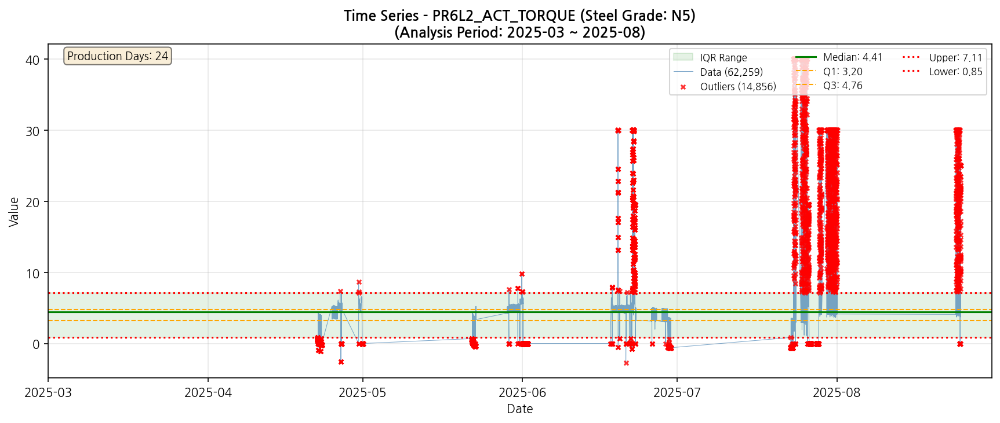

**2. 분포 히스토그램 (Distribution Histogram)**

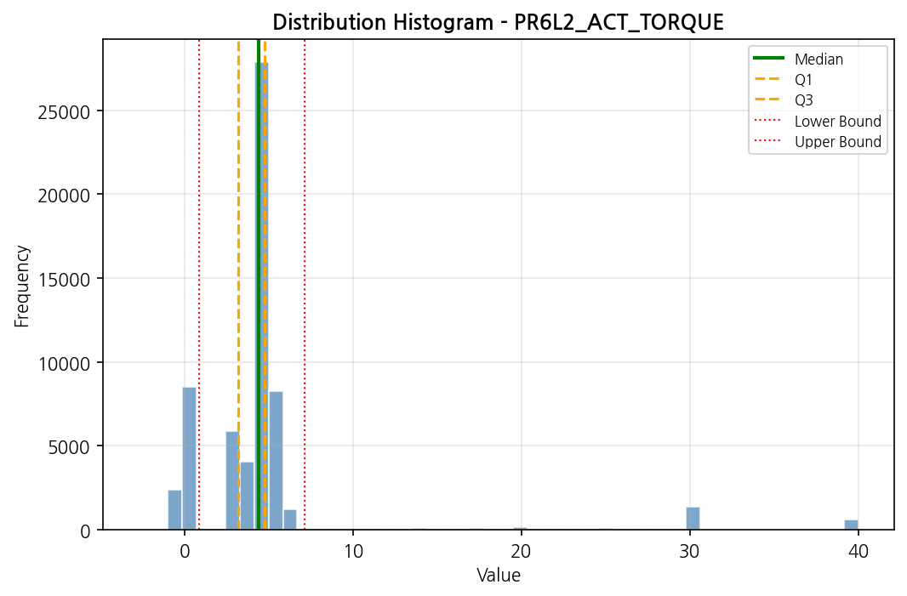

**3. 박스플롯 (Box Plot)**

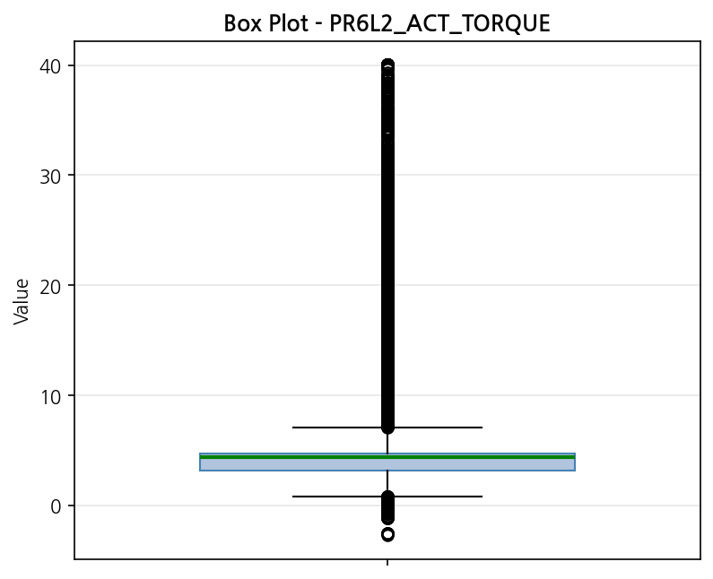

**4. 일별 평균 추이 (Daily Average Trend)**

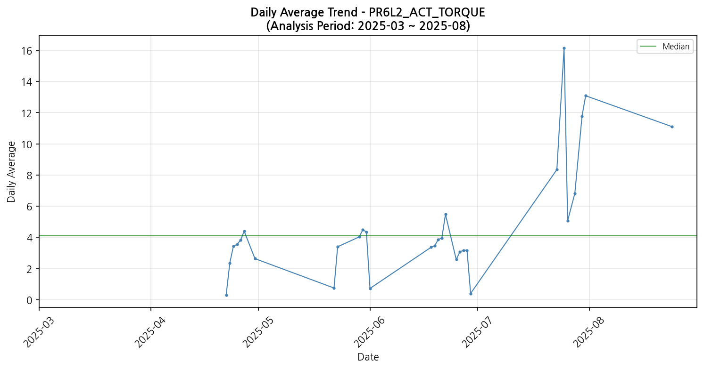

**5. 월별 이상치율 (Monthly Outlier Rate)**

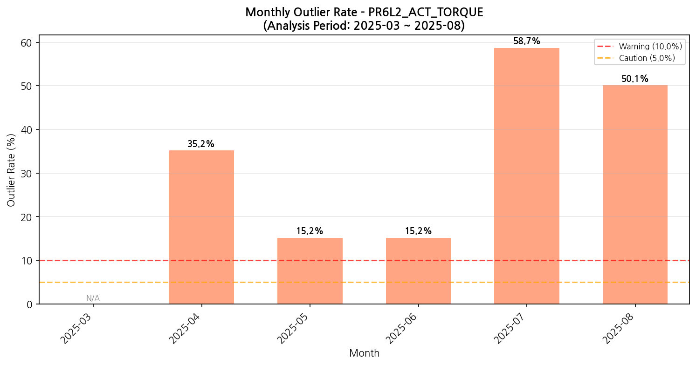

**6. 시간별 패턴 (Hourly Pattern)**

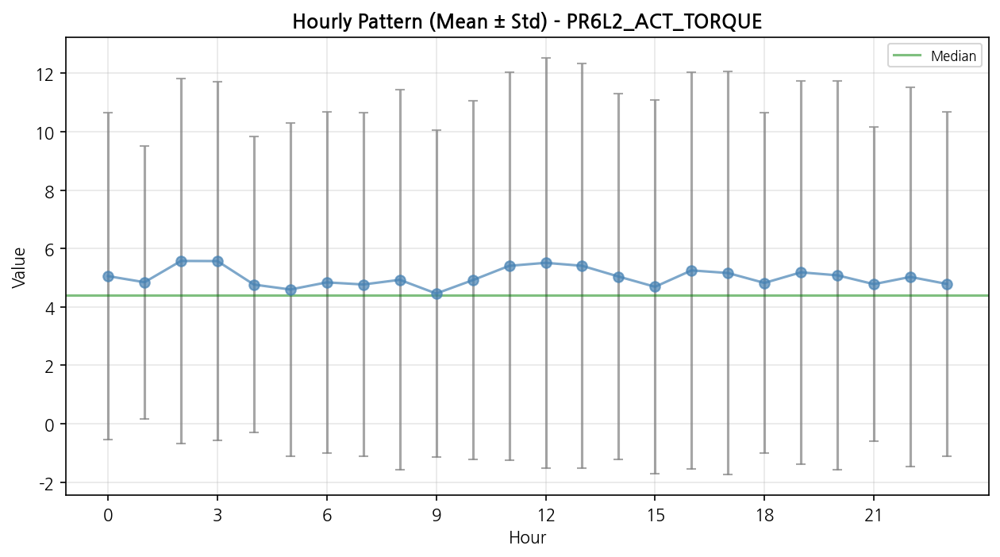

**7. 일별 이상치 수 (Daily Outlier Count)**

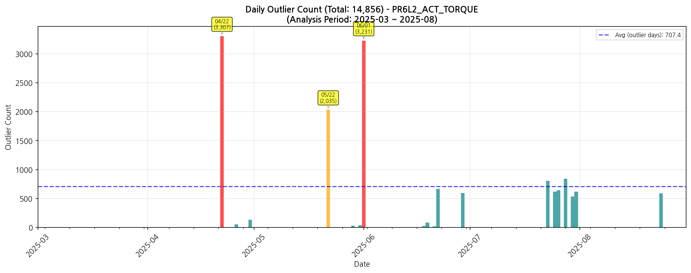

**종합 분석 차트**

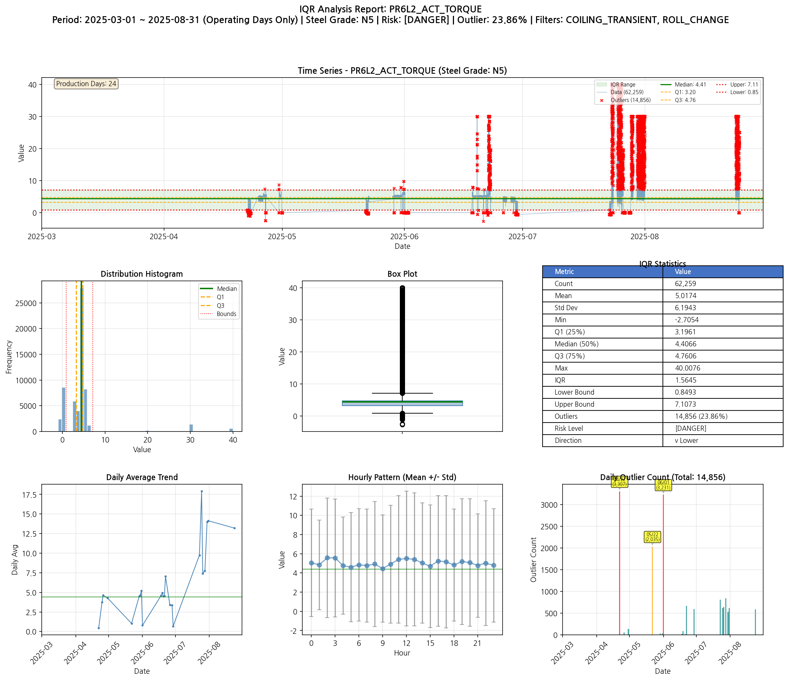

---

##### 월별 상세 분석

**2025-04**

**통계 요약**:

| 지표 | 값 |
|------|-------|
| 분석 레코드 | 9,928 |
| 평균 | 2.9330 |
| 중앙값 | 3.5749 |
| IQR | 4.7098 |
| 이상치 수 | 0 |
| 이상치율 | 0.00% |

**1. 시계열 (Time Series)**

**2. 분포 히스토그램 (Distribution Histogram)**

**3. 박스플롯 (Box Plot)**

**4. 일별 평균 추이 (Daily Average Trend)**

**5. 시간별 패턴 (Hourly Pattern)**

**6. 일별 이상치 수 (Daily Outlier Count)**

**월별 종합 차트**

**2025-05**

**통계 요약**:

| 지표 | 값 |
|------|-------|
| 분석 레코드 | 13,826 |
| 평균 | 4.1742 |
| 중앙값 | 4.5612 |
| IQR | 1.2584 |
| 이상치 수 | 2,104 |
| 이상치율 | 15.22% |

**주요 이상치 발생 날짜**:

- 1. 2025-05-22: 2,047건
- 2. 2025-05-29: 30건
- 3. 2025-05-31: 27건

**1. 시계열 (Time Series)**

**2. 분포 히스토그램 (Distribution Histogram)**

**3. 박스플롯 (Box Plot)**

**4. 일별 평균 추이 (Daily Average Trend)**

**5. 시간별 패턴 (Hourly Pattern)**

**6. 일별 이상치 수 (Daily Outlier Count)**

**월별 종합 차트**

**2025-06**

**통계 요약**:

| 지표 | 값 |
|------|-------|
| 분석 레코드 | 30,416 |
| 평균 | 4.1650 |
| 중앙값 | 4.3802 |
| IQR | 1.2920 |
| 이상치 수 | 4,660 |
| 이상치율 | 15.32% |

**주요 이상치 발생 날짜**:

- 1. 2025-06-01: 3,234건
- 2. 2025-06-22: 696건
- 3. 2025-06-29: 596건

**1. 시계열 (Time Series)**

**2. 분포 히스토그램 (Distribution Histogram)**

**3. 박스플롯 (Box Plot)**

**4. 일별 평균 추이 (Daily Average Trend)**

**5. 시간별 패턴 (Hourly Pattern)**

**6. 일별 이상치 수 (Daily Outlier Count)**

**월별 종합 차트**

**2025-07**

**통계 요약**:

| 지표 | 값 |
|------|-------|
| 분석 레코드 | 6,920 |
| 평균 | 12.0578 |
| 중앙값 | 4.1446 |
| IQR | 22.4650 |
| 이상치 수 | 0 |
| 이상치율 | 0.00% |

**1. 시계열 (Time Series)**

**2. 분포 히스토그램 (Distribution Histogram)**

**3. 박스플롯 (Box Plot)**

**4. 일별 평균 추이 (Daily Average Trend)**

**5. 시간별 패턴 (Hourly Pattern)**

**6. 일별 이상치 수 (Daily Outlier Count)**

**월별 종합 차트**

**2025-08**

**통계 요약**:

| 지표 | 값 |
|------|-------|
| 분석 레코드 | 1,169 |
| 평균 | 13.1969 |
| 중앙값 | 4.2823 |
| IQR | 21.8290 |
| 이상치 수 | 0 |
| 이상치율 | 0.00% |

**1. 시계열 (Time Series)**

**2. 분포 히스토그램 (Distribution Histogram)**

**3. 박스플롯 (Box Plot)**

**4. 일별 평균 추이 (Daily Average Trend)**

**5. 시간별 패턴 (Hourly Pattern)**

**6. 일별 이상치 수 (Daily Outlier Count)**

**월별 종합 차트**

---

#### STAND_9_ACTUAL_SPEED 🔴

**위험도**: [DANGER] | **이상치율**: 22.52% | **이상치 방향**: 하한 미달

**카테고리**: 06 Stand Speed

| 필터 | 적용 | 이유 |
|------|:----:|------|
| run_only | ✓ | 가동 상태에서만 속도 측정이 유효함 |
| special_ops | ✓ | 정상 운전 조건에서 분석 |
| roll_change | ✓ | 롤교환 시 속도 급변 구간 제외 |
| coiling_transient | ✗ | 권취 전 공정으로 가감속 영향 없음 |

**데이터**: 원본 148,239 → 필터 후 146,817 (1.0% 제외)

| 통계 지표 | 값 |
|-----------|-------|
| 분석 레코드 | 146,817 |
| 평균 | 799.8976 |
| 표준편차 | 420.8172 |
| Q1 (25%) | 948.7147 |
| 중앙값 | 995.1428 |
| Q3 (75%) | 1041.2910 |
| IQR | 92.5763 |
| 하한 경계 | 809.8503 |
| 상한 경계 | 1180.1554 |
| 이상치 수 | 33,056 (22.52%) |

**월별 이상치 추이**:

| 월 | 레코드 수 | 평균 | 이상치율 |
|-----|-----------|------|----------|
| 2025-04 | 32,788 | 791.78 | 22.85% |
| 2025-05 | 34,301 | 838.32 | 21.49% |
| 2025-06 | 64,178 | 752.51 | 23.81% |
| 2025-07 | 12,715 | 936.60 | 19.63% |
| 2025-08 | 2,835 | 888.50 | 14.71% |

**주요 이상치 발생 날짜** (상위 5일):

| 순위 | 날짜 | 이상치 수 |
|:----:|------|----------:|
| 1 | 2025-05-31 | 4,350 |
| 2 | 2025-04-22 | 4,160 |
| 3 | 2025-06-19 | 3,566 |
| 4 | 2025-06-21 | 2,696 |
| 5 | 2025-06-22 | 2,405 |

- 이상치 발생 일수: 30일
- 최대 일별 이상치: 4,350건 (2025-05-31)
- 평균 일별 이상치: 1101.9건

##### 차트 분석

**1. 시계열 (Time Series)**

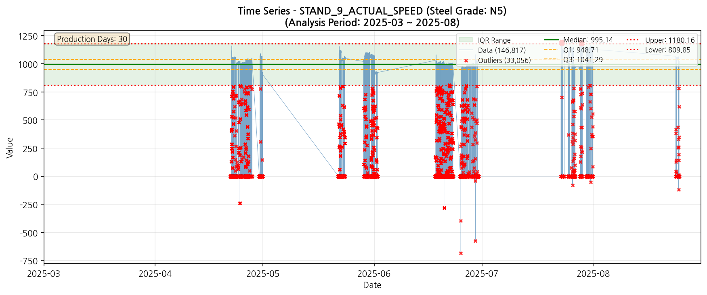

**2. 분포 히스토그램 (Distribution Histogram)**

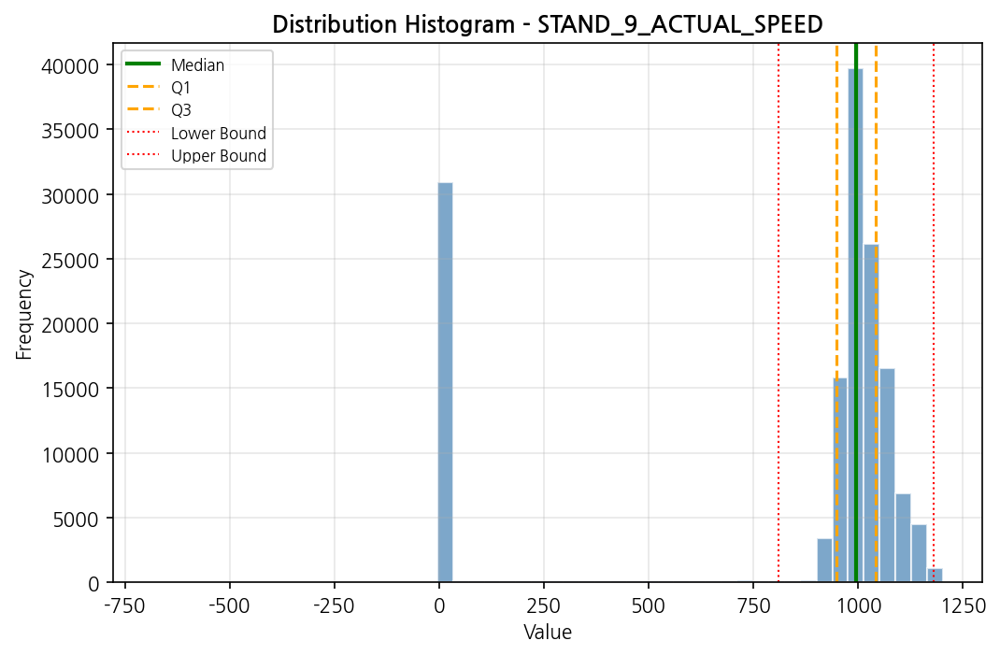

**3. 박스플롯 (Box Plot)**

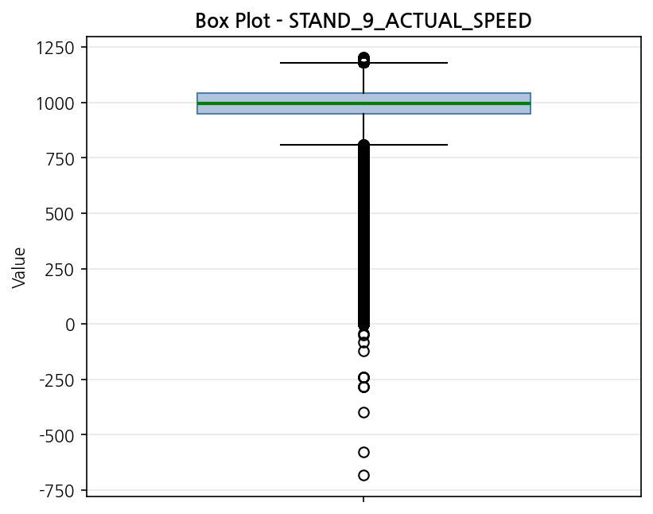

**4. 일별 평균 추이 (Daily Average Trend)**

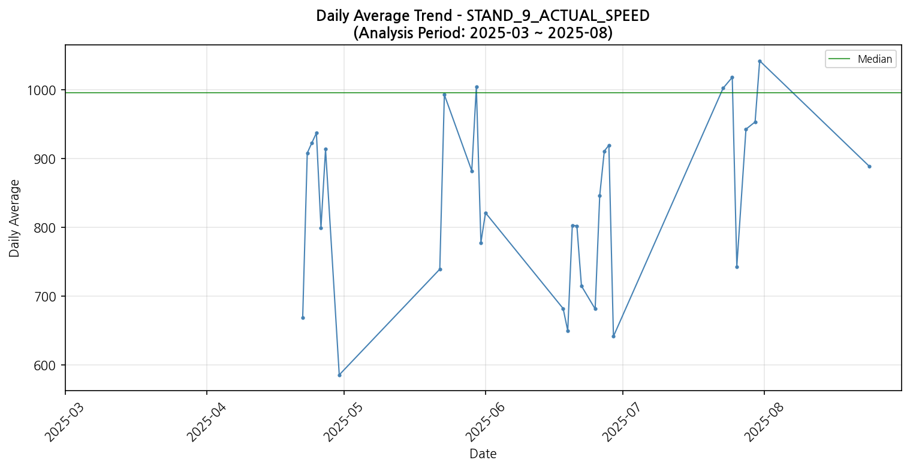

**5. 월별 이상치율 (Monthly Outlier Rate)**

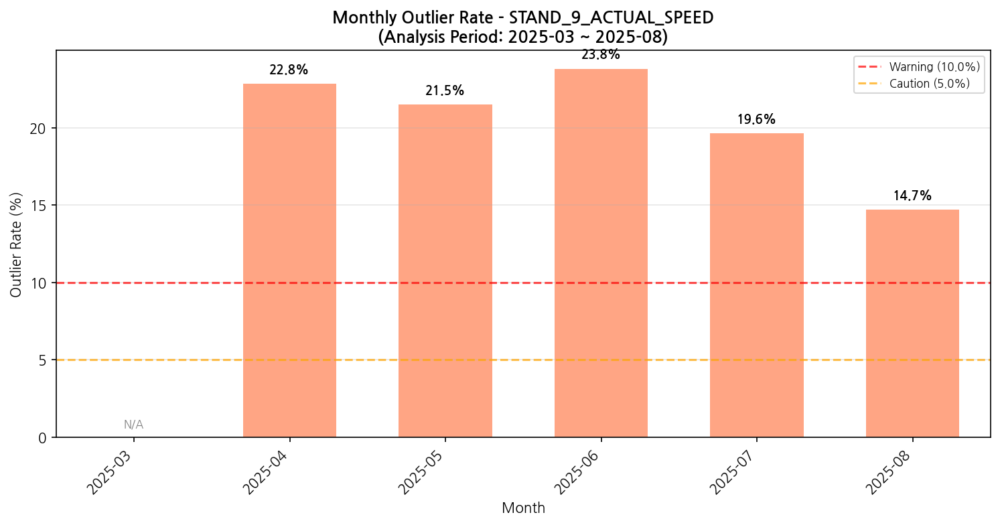

**6. 시간별 패턴 (Hourly Pattern)**

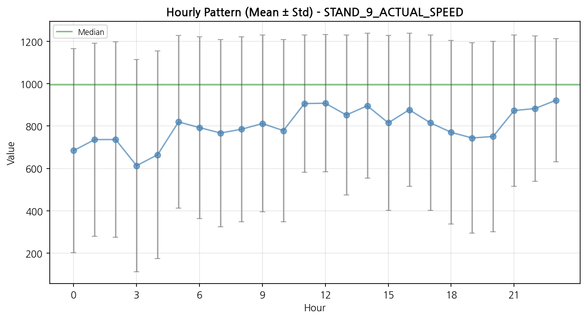

**7. 일별 이상치 수 (Daily Outlier Count)**

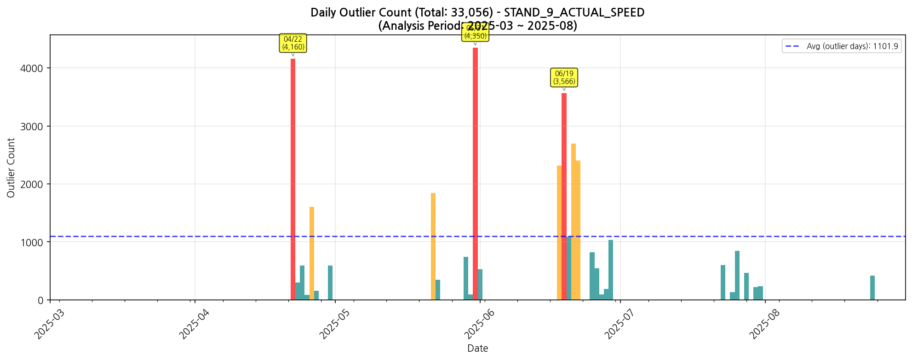

**종합 분석 차트**

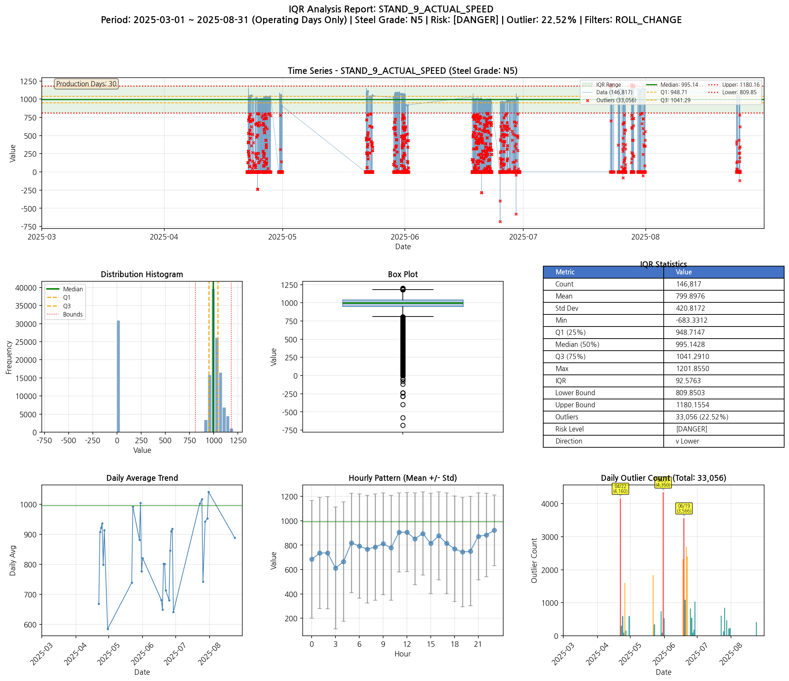

---

##### 월별 상세 분석

**2025-04**

**통계 요약**:

| 지표 | 값 |
|------|-------|
| 분석 레코드 | 32,788 |
| 평균 | 791.7778 |
| 중앙값 | 1008.5420 |
| IQR | 47.1357 |
| 이상치 수 | 7,757 |
| 이상치율 | 23.66% |

**주요 이상치 발생 날짜**:

- 1. 2025-04-22: 4,269건
- 2. 2025-04-26: 1,617건
- 3. 2025-04-30: 723건

**1. 시계열 (Time Series)**

**2. 분포 히스토그램 (Distribution Histogram)**

**3. 박스플롯 (Box Plot)**

**4. 일별 평균 추이 (Daily Average Trend)**

**5. 시간별 패턴 (Hourly Pattern)**

**6. 일별 이상치 수 (Daily Outlier Count)**

**월별 종합 차트**

**2025-05**

**통계 요약**:

| 지표 | 값 |
|------|-------|
| 분석 레코드 | 34,301 |
| 평균 | 838.3200 |
| 중앙값 | 1051.8250 |
| IQR | 42.8860 |
| 이상치 수 | 7,471 |
| 이상치율 | 21.78% |

**주요 이상치 발생 날짜**:

- 1. 2025-05-31: 4,402건
- 2. 2025-05-22: 1,876건
- 3. 2025-05-29: 748건

**1. 시계열 (Time Series)**

**2. 분포 히스토그램 (Distribution Histogram)**

**3. 박스플롯 (Box Plot)**

**4. 일별 평균 추이 (Daily Average Trend)**

**5. 시간별 패턴 (Hourly Pattern)**

**6. 일별 이상치 수 (Daily Outlier Count)**

**월별 종합 차트**

**2025-06**

**통계 요약**:

| 지표 | 값 |
|------|-------|
| 분석 레코드 | 64,178 |
| 평균 | 752.5140 |
| 중앙값 | 974.8855 |
| IQR | 80.9919 |
| 이상치 수 | 15,260 |
| 이상치율 | 23.78% |

**주요 이상치 발생 날짜**:

- 1. 2025-06-19: 3,566건
- 2. 2025-06-21: 2,686건
- 3. 2025-06-22: 2,399건

**1. 시계열 (Time Series)**

**2. 분포 히스토그램 (Distribution Histogram)**

**3. 박스플롯 (Box Plot)**

**4. 일별 평균 추이 (Daily Average Trend)**

**5. 시간별 패턴 (Hourly Pattern)**

**6. 일별 이상치 수 (Daily Outlier Count)**

**월별 종합 차트**

**2025-07**

**통계 요약**:

| 지표 | 값 |
|------|-------|
| 분석 레코드 | 12,715 |
| 평균 | 936.5951 |
| 중앙값 | 1122.9470 |
| IQR | 170.9517 |
| 이상치 수 | 1,950 |
| 이상치율 | 15.34% |

**주요 이상치 발생 날짜**:

- 1. 2025-07-26: 846건
- 2. 2025-07-28: 353건
- 3. 2025-07-31: 231건

**1. 시계열 (Time Series)**

**2. 분포 히스토그램 (Distribution Histogram)**

**3. 박스플롯 (Box Plot)**

**4. 일별 평균 추이 (Daily Average Trend)**

**5. 시간별 패턴 (Hourly Pattern)**

**6. 일별 이상치 수 (Daily Outlier Count)**

**월별 종합 차트**

**2025-08**

**통계 요약**:

| 지표 | 값 |
|------|-------|
| 분석 레코드 | 2,835 |
| 평균 | 888.5003 |
| 중앙값 | 1042.0610 |
| IQR | 39.0270 |
| 이상치 수 | 417 |
| 이상치율 | 14.71% |

**주요 이상치 발생 날짜**:

- 1. 2025-08-24: 417건

**1. 시계열 (Time Series)**

**2. 분포 히스토그램 (Distribution Histogram)**

**3. 박스플롯 (Box Plot)**

**4. 일별 평균 추이 (Daily Average Trend)**

**5. 시간별 패턴 (Hourly Pattern)**

**6. 일별 이상치 수 (Daily Outlier Count)**

**월별 종합 차트**

---

#### STAND_12_ACTUAL_SPEED 🔴

**위험도**: [DANGER] | **이상치율**: 21.98% | **이상치 방향**: 하한 미달

**카테고리**: 06 Stand Speed

| 필터 | 적용 | 이유 |
|------|:----:|------|
| run_only | ✓ | 가동 상태에서만 속도 측정이 유효함 |
| special_ops | ✓ | 정상 운전 조건에서 분석 |
| roll_change | ✓ | 롤교환 시 속도 급변 구간 제외 |
| coiling_transient | ✗ | 권취 전 공정으로 가감속 영향 없음 |

**데이터**: 원본 148,239 → 필터 후 146,817 (1.0% 제외)

| 통계 지표 | 값 |
|-----------|-------|
| 분석 레코드 | 146,817 |
| 평균 | 892.3150 |
| 표준편차 | 471.6920 |
| Q1 (25%) | 1032.3950 |
| 중앙값 | 1078.1880 |
| Q3 (75%) | 1196.7040 |
| IQR | 164.3090 |
| 하한 경계 | 785.9315 |
| 상한 경계 | 1443.1675 |
| 이상치 수 | 32,267 (21.98%) |

**월별 이상치 추이**:

| 월 | 레코드 수 | 평균 | 이상치율 |
|-----|-----------|------|----------|
| 2025-04 | 32,788 | 882.68 | 22.72% |
| 2025-05 | 34,301 | 887.30 | 21.44% |
| 2025-06 | 64,178 | 879.07 | 23.52% |
| 2025-07 | 12,715 | 966.97 | 15.37% |
| 2025-08 | 2,835 | 1029.45 | 14.71% |

**주요 이상치 발생 날짜** (상위 5일):

| 순위 | 날짜 | 이상치 수 |
|:----:|------|----------:|
| 1 | 2025-05-31 | 4,340 |
| 2 | 2025-04-22 | 4,145 |
| 3 | 2025-06-19 | 3,520 |
| 4 | 2025-06-21 | 2,648 |
| 5 | 2025-06-22 | 2,378 |

- 이상치 발생 일수: 30일
- 최대 일별 이상치: 4,340건 (2025-05-31)
- 평균 일별 이상치: 1075.6건

##### 차트 분석

**1. 시계열 (Time Series)**

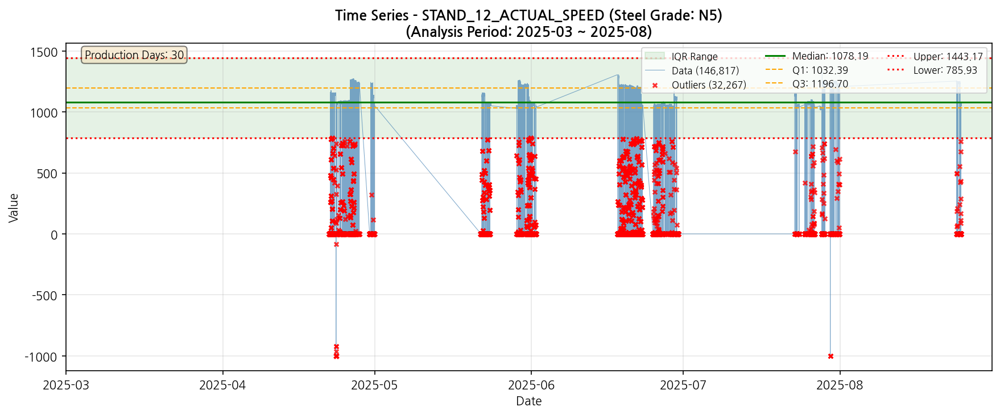

**2. 분포 히스토그램 (Distribution Histogram)**

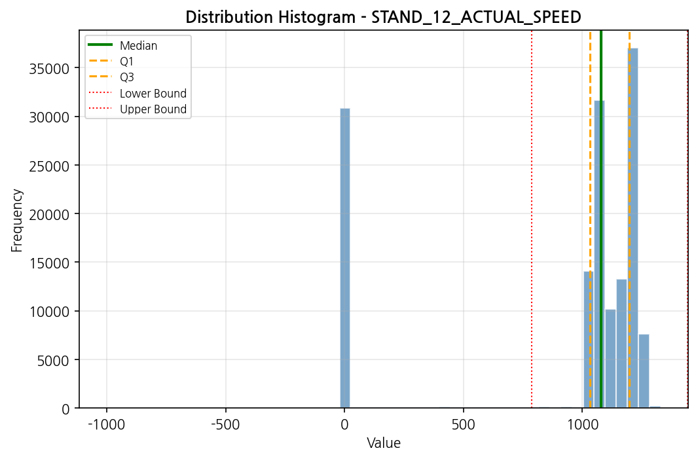

**3. 박스플롯 (Box Plot)**

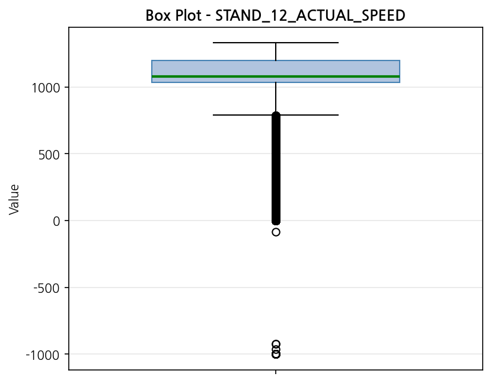

**4. 일별 평균 추이 (Daily Average Trend)**

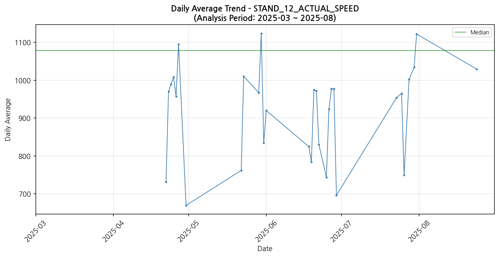

**5. 월별 이상치율 (Monthly Outlier Rate)**

**6. 시간별 패턴 (Hourly Pattern)**

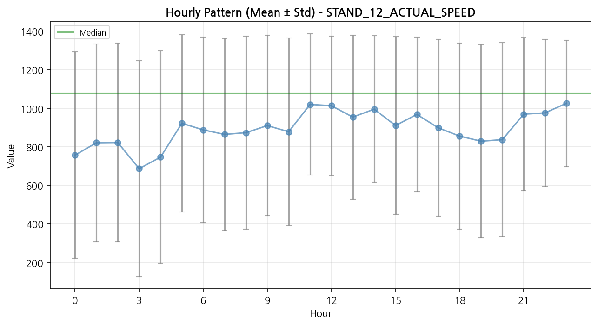

**7. 일별 이상치 수 (Daily Outlier Count)**

**종합 분석 차트**

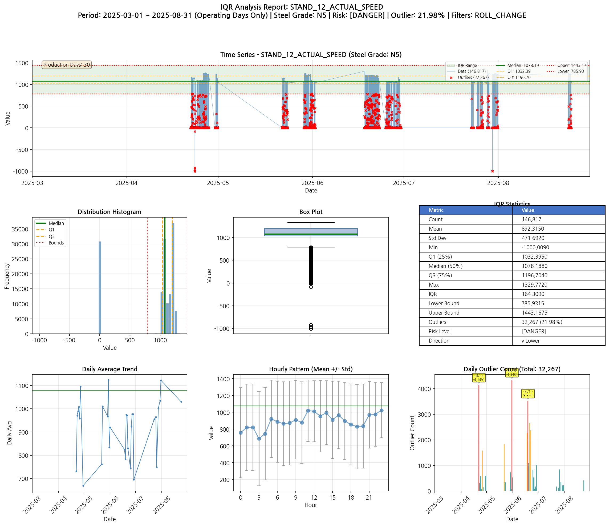

---

##### 월별 상세 분석

**2025-04**

**통계 요약**:

| 지표 | 값 |
|------|-------|
| 분석 레코드 | 32,788 |
| 평균 | 882.6799 |
| 중앙값 | 1080.9760 |
| IQR | 90.1110 |
| 이상치 수 | 7,509 |
| 이상치율 | 22.90% |

**주요 이상치 발생 날짜**:

- 1. 2025-04-22: 4,175건
- 2. 2025-04-26: 1,601건
- 3. 2025-04-24: 595건

**1. 시계열 (Time Series)**

**2. 분포 히스토그램 (Distribution Histogram)**

**3. 박스플롯 (Box Plot)**

**4. 일별 평균 추이 (Daily Average Trend)**

**5. 시간별 패턴 (Hourly Pattern)**

**6. 일별 이상치 수 (Daily Outlier Count)**

**월별 종합 차트**

**2025-05**

**통계 요약**:

| 지표 | 값 |
|------|-------|
| 분석 레코드 | 34,301 |
| 평균 | 887.2957 |
| 중앙값 | 1066.2790 |
| IQR | 162.4000 |
| 이상치 수 | 7,357 |
| 이상치율 | 21.45% |

**주요 이상치 발생 날짜**:

- 1. 2025-05-31: 4,340건
- 2. 2025-05-22: 1,839건
- 3. 2025-05-29: 733건

**1. 시계열 (Time Series)**

**2. 분포 히스토그램 (Distribution Histogram)**

**3. 박스플롯 (Box Plot)**

**4. 일별 평균 추이 (Daily Average Trend)**

**5. 시간별 패턴 (Hourly Pattern)**

**6. 일별 이상치 수 (Daily Outlier Count)**

**월별 종합 차트**

**2025-06**

**통계 요약**:

| 지표 | 값 |
|------|-------|
| 분석 레코드 | 64,178 |
| 평균 | 879.0717 |
| 중앙값 | 1104.3950 |
| IQR | 168.4603 |
| 이상치 수 | 15,080 |
| 이상치율 | 23.50% |

**주요 이상치 발생 날짜**:

- 1. 2025-06-19: 3,514건
- 2. 2025-06-21: 2,639건
- 3. 2025-06-22: 2,378건

**1. 시계열 (Time Series)**

**2. 분포 히스토그램 (Distribution Histogram)**

**3. 박스플롯 (Box Plot)**

**4. 일별 평균 추이 (Daily Average Trend)**

**5. 시간별 패턴 (Hourly Pattern)**

**6. 일별 이상치 수 (Daily Outlier Count)**

**월별 종합 차트**

**2025-07**

**통계 요약**:

| 지표 | 값 |
|------|-------|
| 분석 레코드 | 12,715 |
| 평균 | 966.9698 |
| 중앙값 | 1079.5560 |
| IQR | 180.4520 |
| 이상치 수 | 1,954 |
| 이상치율 | 15.37% |

**주요 이상치 발생 날짜**:

- 1. 2025-07-26: 847건
- 2. 2025-07-28: 356건
- 3. 2025-07-31: 231건

**1. 시계열 (Time Series)**

**2. 분포 히스토그램 (Distribution Histogram)**

**3. 박스플롯 (Box Plot)**

**4. 일별 평균 추이 (Daily Average Trend)**

**5. 시간별 패턴 (Hourly Pattern)**

**6. 일별 이상치 수 (Daily Outlier Count)**

**월별 종합 차트**

**2025-08**

**통계 요약**:

| 지표 | 값 |
|------|-------|
| 분석 레코드 | 2,835 |
| 평균 | 1029.4479 |
| 중앙값 | 1232.9740 |
| IQR | 178.7010 |
| 이상치 수 | 417 |
| 이상치율 | 14.71% |

**주요 이상치 발생 날짜**:

- 1. 2025-08-24: 417건

**1. 시계열 (Time Series)**

**2. 분포 히스토그램 (Distribution Histogram)**

**3. 박스플롯 (Box Plot)**

**4. 일별 평균 추이 (Daily Average Trend)**

**5. 시간별 패턴 (Hourly Pattern)**

**6. 일별 이상치 수 (Daily Outlier Count)**

**월별 종합 차트**

---

#### STAND_11_ACTUAL_SPEED 🔴

**위험도**: [DANGER] | **이상치율**: 21.96% | **이상치 방향**: 하한 미달

**카테고리**: 06 Stand Speed

| 필터 | 적용 | 이유 |
|------|:----:|------|
| run_only | ✓ | 가동 상태에서만 속도 측정이 유효함 |
| special_ops | ✓ | 정상 운전 조건에서 분석 |
| roll_change | ✓ | 롤교환 시 속도 급변 구간 제외 |
| coiling_transient | ✗ | 권취 전 공정으로 가감속 영향 없음 |

**데이터**: 원본 148,239 → 필터 후 146,817 (1.0% 제외)

| 통계 지표 | 값 |
|-----------|-------|
| 분석 레코드 | 146,817 |
| 평균 | 874.7289 |
| 표준편차 | 466.9688 |
| Q1 (25%) | 1004.0160 |
| 중앙값 | 1089.6260 |
| Q3 (75%) | 1155.2630 |
| IQR | 151.2470 |
| 하한 경계 | 777.1455 |
| 상한 경계 | 1382.1335 |
| 이상치 수 | 32,239 (21.96%) |

**월별 이상치 추이**:

| 월 | 레코드 수 | 평균 | 이상치율 |
|-----|-----------|------|----------|
| 2025-04 | 32,788 | 861.38 | 22.69% |
| 2025-05 | 34,301 | 870.08 | 21.40% |
| 2025-06 | 64,178 | 862.25 | 23.54% |
| 2025-07 | 12,715 | 958.08 | 15.35% |
| 2025-08 | 2,835 | 994.04 | 14.07% |

**주요 이상치 발생 날짜** (상위 5일):

| 순위 | 날짜 | 이상치 수 |
|:----:|------|----------:|
| 1 | 2025-05-31 | 4,329 |
| 2 | 2025-04-22 | 4,138 |
| 3 | 2025-06-19 | 3,513 |
| 4 | 2025-06-21 | 2,657 |
| 5 | 2025-06-22 | 2,378 |

- 이상치 발생 일수: 30일
- 최대 일별 이상치: 4,329건 (2025-05-31)
- 평균 일별 이상치: 1074.6건

##### 차트 분석

**1. 시계열 (Time Series)**

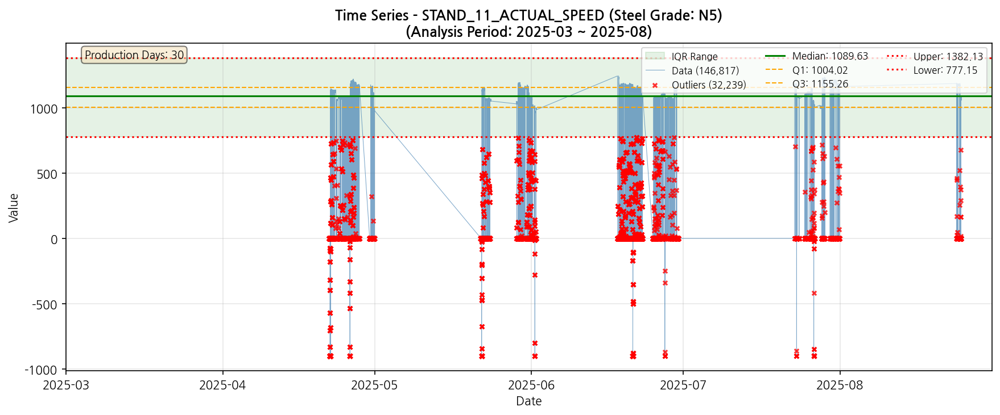

**2. 분포 히스토그램 (Distribution Histogram)**

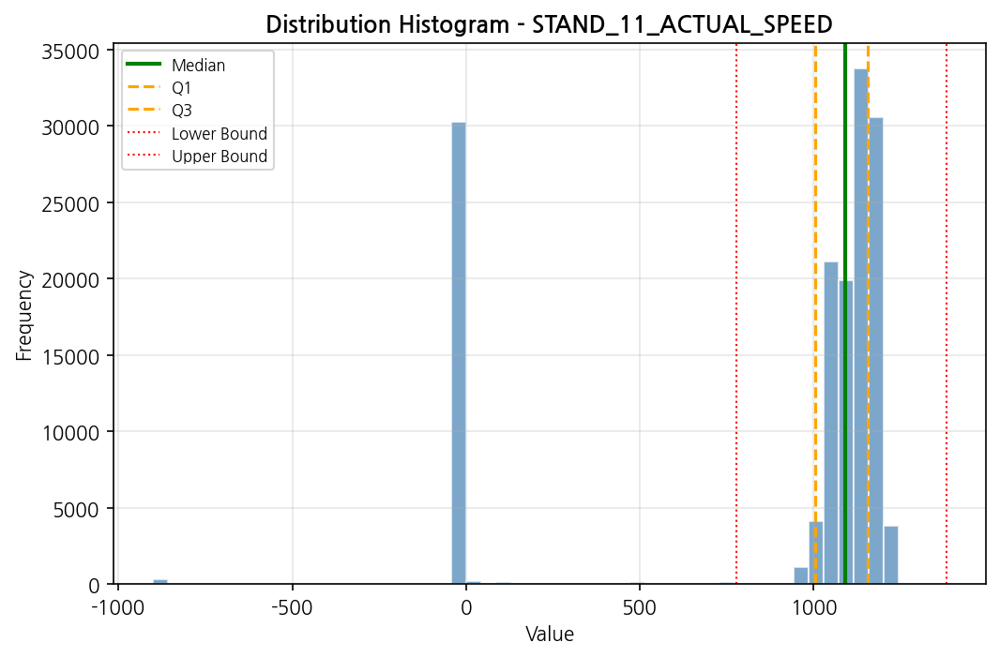

**3. 박스플롯 (Box Plot)**

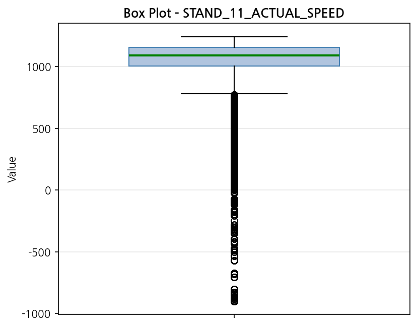

**4. 일별 평균 추이 (Daily Average Trend)**

**5. 월별 이상치율 (Monthly Outlier Rate)**

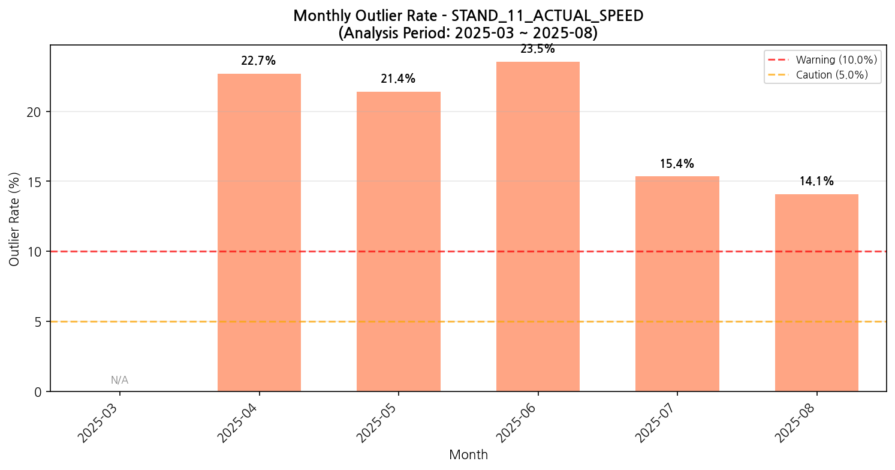

**6. 시간별 패턴 (Hourly Pattern)**

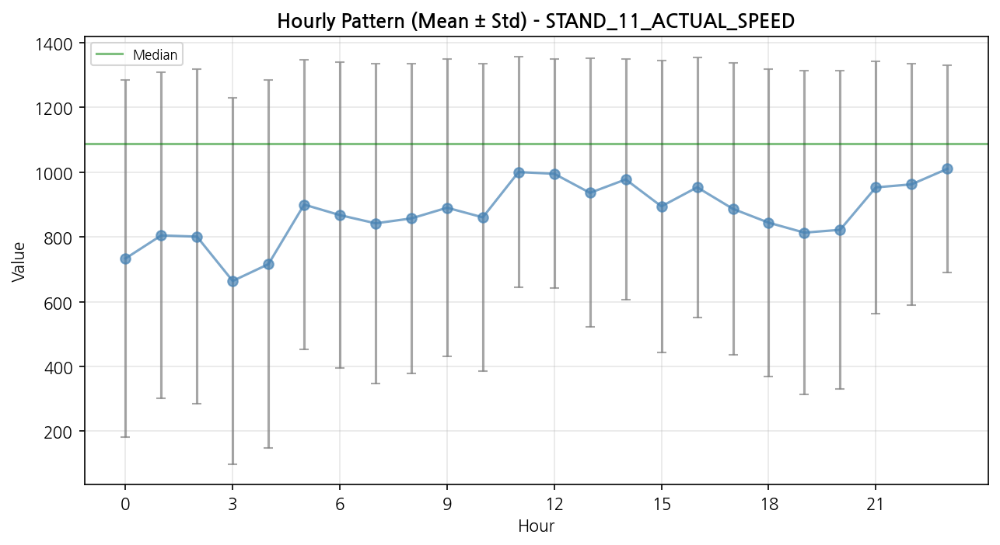

**7. 일별 이상치 수 (Daily Outlier Count)**

**종합 분석 차트**

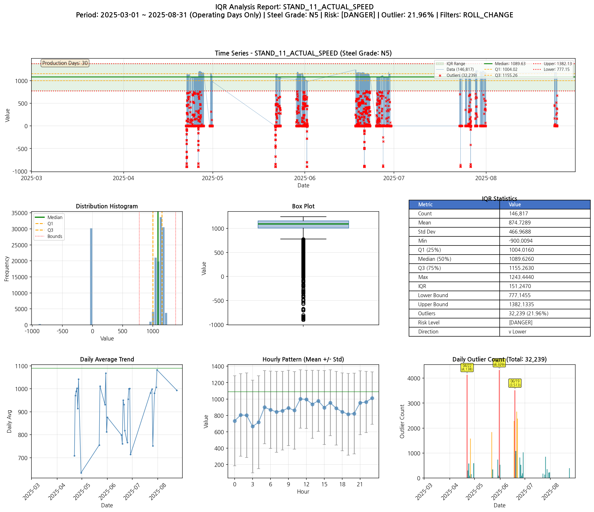

---

##### 월별 상세 분석

**2025-04**

**통계 요약**:

| 지표 | 값 |
|------|-------|
| 분석 레코드 | 32,788 |
| 평균 | 861.3782 |
| 중앙값 | 1079.1030 |
| IQR | 73.5050 |
| 이상치 수 | 7,526 |
| 이상치율 | 22.95% |

**주요 이상치 발생 날짜**:

- 1. 2025-04-22: 4,183건
- 2. 2025-04-26: 1,605건
- 3. 2025-04-24: 595건

**1. 시계열 (Time Series)**

**2. 분포 히스토그램 (Distribution Histogram)**

**3. 박스플롯 (Box Plot)**

**4. 일별 평균 추이 (Daily Average Trend)**

**5. 시간별 패턴 (Hourly Pattern)**

**6. 일별 이상치 수 (Daily Outlier Count)**

**월별 종합 차트**

**2025-05**

**통계 요약**:

| 지표 | 값 |
|------|-------|
| 분석 레코드 | 34,301 |
| 평균 | 870.0848 |
| 중앙값 | 1067.2330 |
| IQR | 105.2600 |
| 이상치 수 | 7,382 |
| 이상치율 | 21.52% |

**주요 이상치 발생 날짜**:

- 1. 2025-05-31: 4,350건
- 2. 2025-05-22: 1,850건
- 3. 2025-05-29: 739건

**1. 시계열 (Time Series)**

**2. 분포 히스토그램 (Distribution Histogram)**

**3. 박스플롯 (Box Plot)**

**4. 일별 평균 추이 (Daily Average Trend)**

**5. 시간별 패턴 (Hourly Pattern)**

**6. 일별 이상치 수 (Daily Outlier Count)**

**월별 종합 차트**

**2025-06**

**통계 요약**:

| 지표 | 값 |
|------|-------|
| 분석 레코드 | 64,178 |
| 평균 | 862.2485 |
| 중앙값 | 1127.8670 |
| IQR | 186.3101 |
| 이상치 수 | 15,014 |
| 이상치율 | 23.39% |

**주요 이상치 발생 날짜**:

- 1. 2025-06-19: 3,507건
- 2. 2025-06-21: 2,612건
- 3. 2025-06-22: 2,362건

**1. 시계열 (Time Series)**

**2. 분포 히스토그램 (Distribution Histogram)**

**3. 박스플롯 (Box Plot)**

**4. 일별 평균 추이 (Daily Average Trend)**

**5. 시간별 패턴 (Hourly Pattern)**

**6. 일별 이상치 수 (Daily Outlier Count)**

**월별 종합 차트**

**2025-07**

**통계 요약**:

| 지표 | 값 |
|------|-------|
| 분석 레코드 | 12,715 |
| 평균 | 958.0754 |
| 중앙값 | 1126.5740 |
| IQR | 178.3150 |
| 이상치 수 | 1,952 |
| 이상치율 | 15.35% |

**주요 이상치 발생 날짜**:

- 1. 2025-07-26: 847건
- 2. 2025-07-28: 354건
- 3. 2025-07-31: 231건

**1. 시계열 (Time Series)**

**2. 분포 히스토그램 (Distribution Histogram)**

**3. 박스플롯 (Box Plot)**

**4. 일별 평균 추이 (Daily Average Trend)**

**5. 시간별 패턴 (Hourly Pattern)**

**6. 일별 이상치 수 (Daily Outlier Count)**

**월별 종합 차트**

**2025-08**

**통계 요약**:

| 지표 | 값 |
|------|-------|
| 분석 레코드 | 2,835 |
| 평균 | 994.0426 |
| 중앙값 | 1171.4990 |
| IQR | 102.7440 |
| 이상치 수 | 400 |
| 이상치율 | 14.11% |

**주요 이상치 발생 날짜**:

- 1. 2025-08-24: 400건

**1. 시계열 (Time Series)**

**2. 분포 히스토그램 (Distribution Histogram)**

**3. 박스플롯 (Box Plot)**

**4. 일별 평균 추이 (Daily Average Trend)**

**5. 시간별 패턴 (Hourly Pattern)**

**6. 일별 이상치 수 (Daily Outlier Count)**

**월별 종합 차트**

---

#### STAND_10_ACTUAL_SPEED 🔴

**위험도**: [DANGER] | **이상치율**: 21.94% | **이상치 방향**: 하한 미달

**카테고리**: 06 Stand Speed

| 필터 | 적용 | 이유 |
|------|:----:|------|
| run_only | ✓ | 가동 상태에서만 속도 측정이 유효함 |
| special_ops | ✓ | 정상 운전 조건에서 분석 |
| roll_change | ✓ | 롤교환 시 속도 급변 구간 제외 |
| coiling_transient | ✗ | 권취 전 공정으로 가감속 영향 없음 |

**데이터**: 원본 148,239 → 필터 후 146,817 (1.0% 제외)

| 통계 지표 | 값 |
|-----------|-------|
| 분석 레코드 | 146,817 |
| 평균 | 818.8583 |
| 표준편차 | 429.9850 |
| Q1 (25%) | 917.8900 |
| 중앙값 | 1044.6020 |
| Q3 (75%) | 1062.5810 |
| IQR | 144.6910 |
| 하한 경계 | 700.8535 |
| 상한 경계 | 1279.6175 |
| 이상치 수 | 32,216 (21.94%) |

**월별 이상치 추이**:

| 월 | 레코드 수 | 평균 | 이상치율 |
|-----|-----------|------|----------|
| 2025-04 | 32,788 | 809.40 | 22.68% |
| 2025-05 | 34,301 | 834.17 | 21.34% |
| 2025-06 | 64,178 | 798.45 | 23.51% |
| 2025-07 | 12,715 | 883.50 | 15.38% |
| 2025-08 | 2,835 | 915.06 | 14.67% |

**주요 이상치 발생 날짜** (상위 5일):

| 순위 | 날짜 | 이상치 수 |
|:----:|------|----------:|
| 1 | 2025-05-31 | 4,309 |
| 2 | 2025-04-22 | 4,138 |
| 3 | 2025-06-19 | 3,513 |
| 4 | 2025-06-21 | 2,649 |
| 5 | 2025-06-22 | 2,368 |

- 이상치 발생 일수: 30일
- 최대 일별 이상치: 4,309건 (2025-05-31)
- 평균 일별 이상치: 1073.9건

##### 차트 분석

**1. 시계열 (Time Series)**

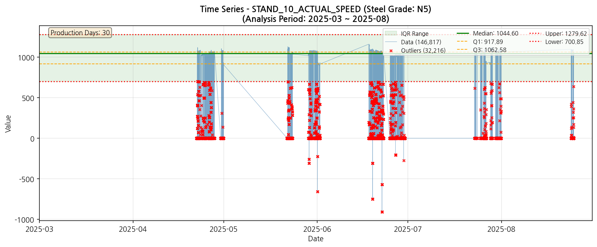

**2. 분포 히스토그램 (Distribution Histogram)**

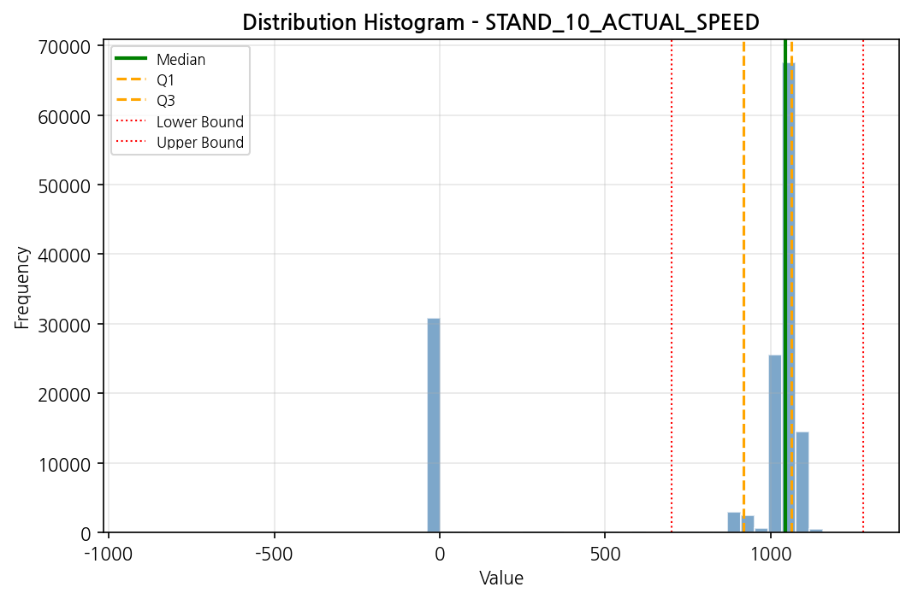

**3. 박스플롯 (Box Plot)**

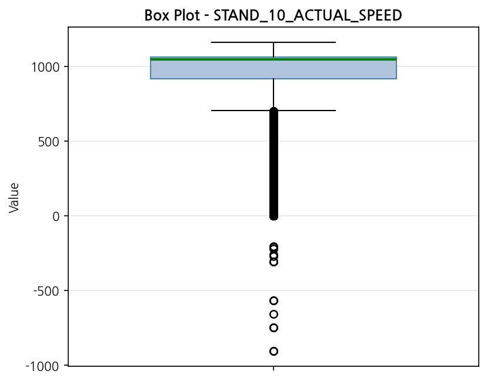

**4. 일별 평균 추이 (Daily Average Trend)**

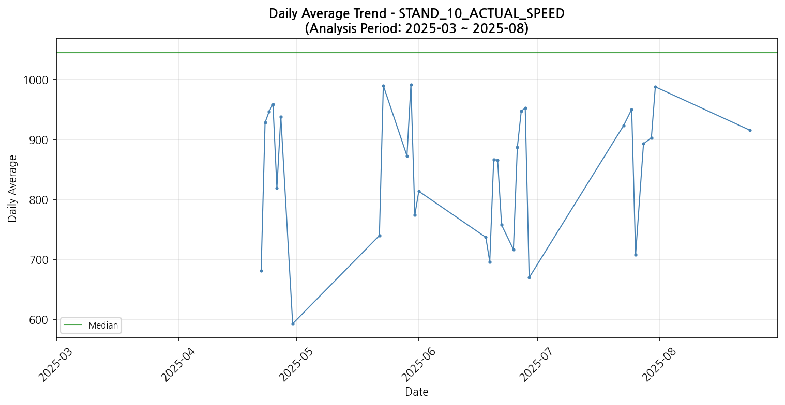

**5. 월별 이상치율 (Monthly Outlier Rate)**

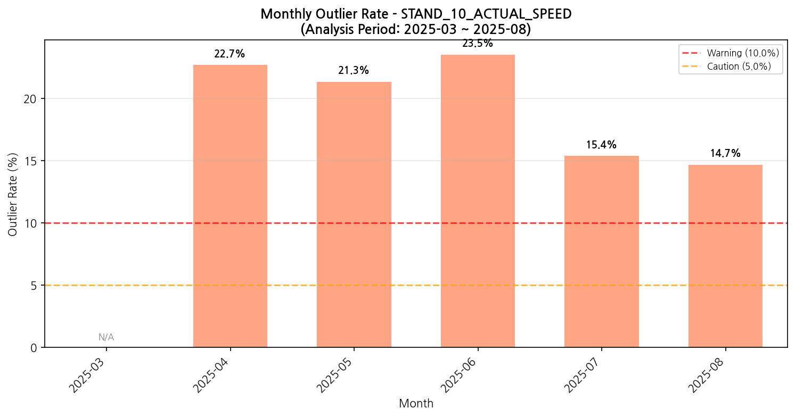

**6. 시간별 패턴 (Hourly Pattern)**

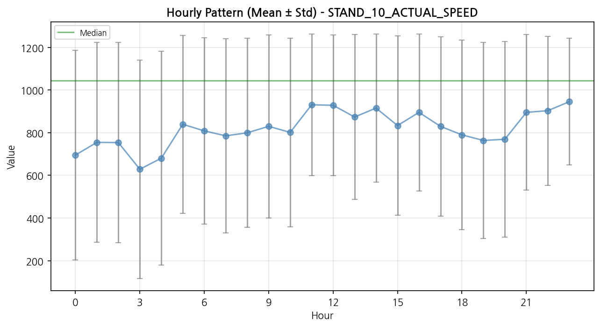

**7. 일별 이상치 수 (Daily Outlier Count)**

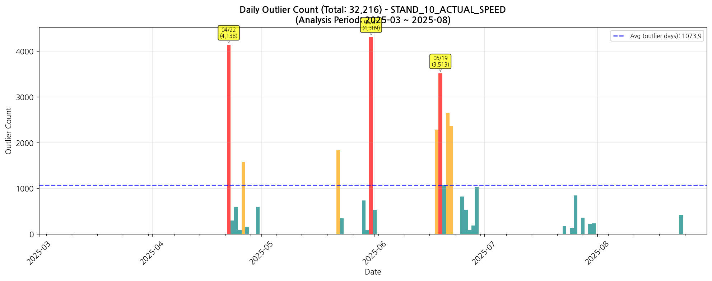

**종합 분석 차트**

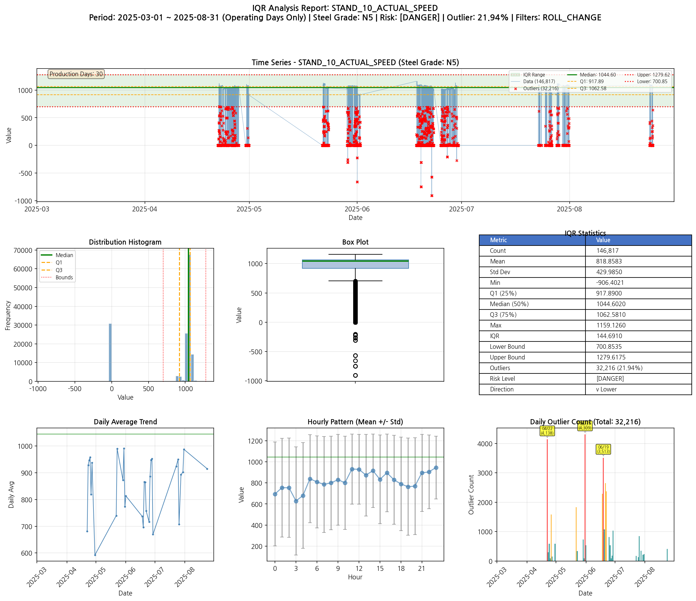

---

##### 월별 상세 분석

**2025-04**

**통계 요약**:

| 지표 | 값 |
|------|-------|
| 분석 레코드 | 32,788 |
| 평균 | 809.3990 |
| 중앙값 | 1032.1450 |
| IQR | 43.1475 |
| 이상치 수 | 7,700 |
| 이상치율 | 23.48% |

**주요 이상치 발생 날짜**:

- 1. 2025-04-22: 4,198건
- 2. 2025-04-26: 1,617건
- 3. 2025-04-30: 736건

**1. 시계열 (Time Series)**

**2. 분포 히스토그램 (Distribution Histogram)**

**3. 박스플롯 (Box Plot)**

**4. 일별 평균 추이 (Daily Average Trend)**

**5. 시간별 패턴 (Hourly Pattern)**

**6. 일별 이상치 수 (Daily Outlier Count)**

**월별 종합 차트**

**2025-05**

**통계 요약**:

| 지표 | 값 |
|------|-------|
| 분석 레코드 | 34,301 |
| 평균 | 834.1654 |
| 중앙값 | 1045.4850 |
| IQR | 36.8650 |
| 이상치 수 | 7,605 |
| 이상치율 | 22.17% |

**주요 이상치 발생 날짜**:

- 1. 2025-05-31: 4,413건
- 2. 2025-05-22: 1,994건
- 3. 2025-05-29: 748건

**1. 시계열 (Time Series)**

**2. 분포 히스토그램 (Distribution Histogram)**

**3. 박스플롯 (Box Plot)**

**4. 일별 평균 추이 (Daily Average Trend)**

**5. 시간별 패턴 (Hourly Pattern)**

**6. 일별 이상치 수 (Daily Outlier Count)**

**월별 종합 차트**

**2025-06**

**통계 요약**:

| 지표 | 값 |
|------|-------|
| 분석 레코드 | 64,178 |
| 평균 | 798.4530 |
| 중앙값 | 1044.9110 |
| IQR | 157.8684 |
| 이상치 수 | 15,048 |
| 이상치율 | 23.45% |

**주요 이상치 발생 날짜**:

- 1. 2025-06-19: 3,513건
- 2. 2025-06-21: 2,630건
- 3. 2025-06-22: 2,362건

**1. 시계열 (Time Series)**

**2. 분포 히스토그램 (Distribution Histogram)**

**3. 박스플롯 (Box Plot)**

**4. 일별 평균 추이 (Daily Average Trend)**

**5. 시간별 패턴 (Hourly Pattern)**

**6. 일별 이상치 수 (Daily Outlier Count)**

**월별 종합 차트**

**2025-07**

**통계 요약**:

| 지표 | 값 |
|------|-------|
| 분석 레코드 | 12,715 |
| 평균 | 883.5024 |
| 중앙값 | 1060.6770 |
| IQR | 148.1985 |
| 이상치 수 | 1,957 |
| 이상치율 | 15.39% |

**주요 이상치 발생 날짜**:

- 1. 2025-07-26: 846건
- 2. 2025-07-28: 358건
- 3. 2025-07-31: 233건

**1. 시계열 (Time Series)**

**2. 분포 히스토그램 (Distribution Histogram)**

**3. 박스플롯 (Box Plot)**

**4. 일별 평균 추이 (Daily Average Trend)**

**5. 시간별 패턴 (Hourly Pattern)**

**6. 일별 이상치 수 (Daily Outlier Count)**

**월별 종합 차트**

**2025-08**

**통계 요약**:

| 지표 | 값 |
|------|-------|
| 분석 레코드 | 2,835 |
| 평균 | 915.0570 |
| 중앙값 | 1073.5170 |
| IQR | 42.1635 |
| 이상치 수 | 417 |
| 이상치율 | 14.71% |

**주요 이상치 발생 날짜**:

- 1. 2025-08-24: 417건

**1. 시계열 (Time Series)**

**2. 분포 히스토그램 (Distribution Histogram)**

**3. 박스플롯 (Box Plot)**

**4. 일별 평균 추이 (Daily Average Trend)**

**5. 시간별 패턴 (Hourly Pattern)**

**6. 일별 이상치 수 (Daily Outlier Count)**

**월별 종합 차트**

---

#### STAND_14_ACTUAL_SPEED 🔴

**위험도**: [DANGER] | **이상치율**: 21.93% | **이상치 방향**: 하한 미달

**카테고리**: 06 Stand Speed

| 필터 | 적용 | 이유 |
|------|:----:|------|
| run_only | ✓ | 가동 상태에서만 속도 측정이 유효함 |
| special_ops | ✓ | 정상 운전 조건에서 분석 |
| roll_change | ✓ | 롤교환 시 속도 급변 구간 제외 |
| coiling_transient | ✗ | 권취 전 공정으로 가감속 영향 없음 |

**데이터**: 원본 148,239 → 필터 후 146,817 (1.0% 제외)

| 통계 지표 | 값 |
|-----------|-------|
| 분석 레코드 | 146,817 |
| 평균 | 955.0297 |
| 표준편차 | 504.5781 |
| Q1 (25%) | 1100.4740 |
| 중앙값 | 1157.5140 |
| Q3 (75%) | 1293.5660 |
| IQR | 193.0920 |
| 하한 경계 | 810.8360 |
| 상한 경계 | 1583.2040 |
| 이상치 수 | 32,202 (21.93%) |

**월별 이상치 추이**:

| 월 | 레코드 수 | 평균 | 이상치율 |
|-----|-----------|------|----------|
| 2025-04 | 32,788 | 933.82 | 22.69% |
| 2025-05 | 34,301 | 951.67 | 21.37% |
| 2025-06 | 64,178 | 952.38 | 23.47% |
| 2025-07 | 12,715 | 1007.20 | 15.34% |
| 2025-08 | 2,835 | 1067.15 | 14.71% |

**주요 이상치 발생 날짜** (상위 5일):

| 순위 | 날짜 | 이상치 수 |
|:----:|------|----------:|
| 1 | 2025-05-31 | 4,319 |
| 2 | 2025-04-22 | 4,138 |
| 3 | 2025-06-19 | 3,526 |
| 4 | 2025-06-21 | 2,621 |
| 5 | 2025-06-22 | 2,378 |

- 이상치 발생 일수: 30일
- 최대 일별 이상치: 4,319건 (2025-05-31)
- 평균 일별 이상치: 1073.4건

##### 차트 분석

**1. 시계열 (Time Series)**

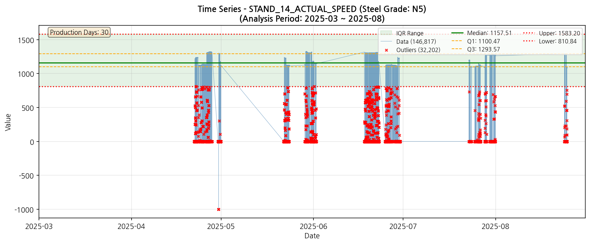

**2. 분포 히스토그램 (Distribution Histogram)**

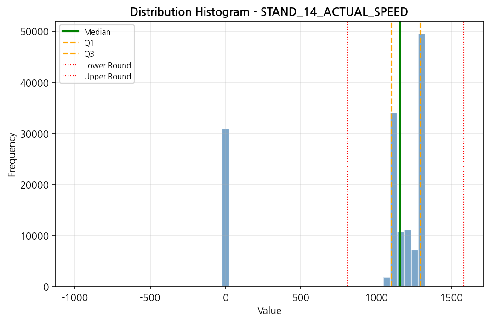

**3. 박스플롯 (Box Plot)**

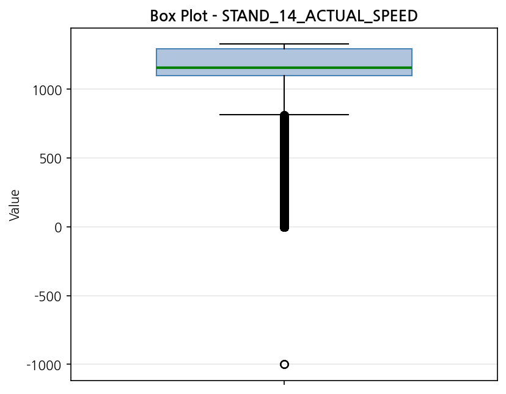

**4. 일별 평균 추이 (Daily Average Trend)**

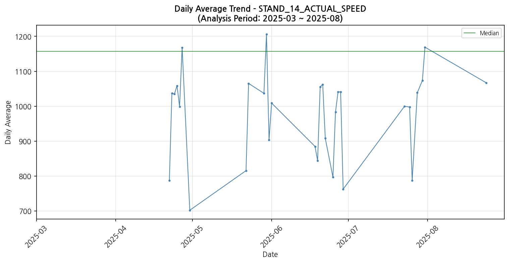

**5. 월별 이상치율 (Monthly Outlier Rate)**

**6. 시간별 패턴 (Hourly Pattern)**

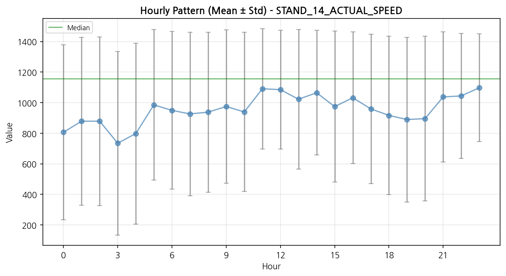

**7. 일별 이상치 수 (Daily Outlier Count)**

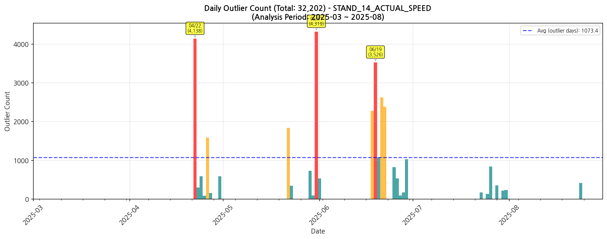

**종합 분석 차트**

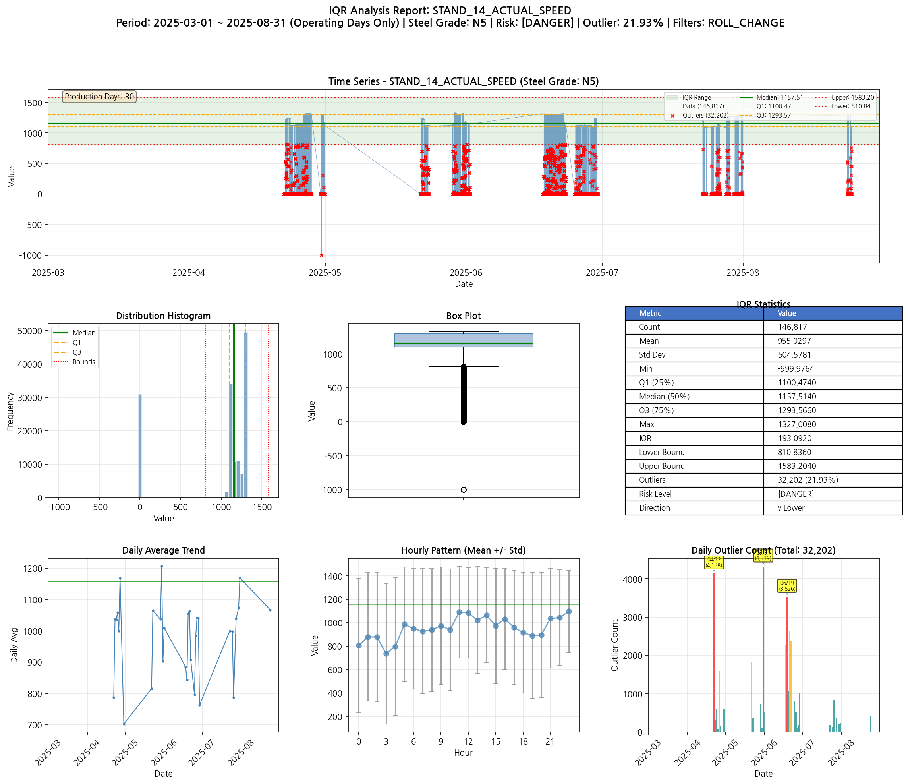

---

##### 월별 상세 분석

**2025-04**

**통계 요약**:

| 지표 | 값 |
|------|-------|
| 분석 레코드 | 32,788 |
| 평균 | 933.8162 |
| 중앙값 | 1131.8880 |
| IQR | 121.1500 |
| 이상치 수 | 7,504 |
| 이상치율 | 22.89% |

**주요 이상치 발생 날짜**:

- 1. 2025-04-22: 4,175건
- 2. 2025-04-26: 1,601건
- 3. 2025-04-30: 592건

**1. 시계열 (Time Series)**

**2. 분포 히스토그램 (Distribution Histogram)**

**3. 박스플롯 (Box Plot)**

**4. 일별 평균 추이 (Daily Average Trend)**

**5. 시간별 패턴 (Hourly Pattern)**

**6. 일별 이상치 수 (Daily Outlier Count)**

**월별 종합 차트**

**2025-05**

**통계 요약**:

| 지표 | 값 |
|------|-------|
| 분석 레코드 | 34,301 |
| 평균 | 951.6666 |
| 중앙값 | 1156.2750 |
| IQR | 182.2720 |
| 이상치 수 | 7,345 |
| 이상치율 | 21.41% |

**주요 이상치 발생 날짜**:

- 1. 2025-05-31: 4,329건
- 2. 2025-05-22: 1,838건
- 3. 2025-05-29: 733건

**1. 시계열 (Time Series)**

**2. 분포 히스토그램 (Distribution Histogram)**

**3. 박스플롯 (Box Plot)**

**4. 일별 평균 추이 (Daily Average Trend)**

**5. 시간별 패턴 (Hourly Pattern)**

**6. 일별 이상치 수 (Daily Outlier Count)**

**월별 종합 차트**

**2025-06**

**통계 요약**:

| 지표 | 값 |
|------|-------|
| 분석 레코드 | 64,178 |
| 평균 | 952.3759 |
| 중앙값 | 1220.2320 |
| IQR | 198.4060 |
| 이상치 수 | 15,058 |
| 이상치율 | 23.46% |

**주요 이상치 발생 날짜**:

- 1. 2025-06-19: 3,526건
- 2. 2025-06-21: 2,621건
- 3. 2025-06-22: 2,373건

**1. 시계열 (Time Series)**

**2. 분포 히스토그램 (Distribution Histogram)**

**3. 박스플롯 (Box Plot)**

**4. 일별 평균 추이 (Daily Average Trend)**

**5. 시간별 패턴 (Hourly Pattern)**

**6. 일별 이상치 수 (Daily Outlier Count)**

**월별 종합 차트**

**2025-07**

**통계 요약**:

| 지표 | 값 |
|------|-------|
| 분석 레코드 | 12,715 |
| 평균 | 1007.2014 |
| 중앙값 | 1125.3930 |
| IQR | 173.3745 |
| 이상치 수 | 1,951 |
| 이상치율 | 15.34% |

**주요 이상치 발생 날짜**:

- 1. 2025-07-26: 843건
- 2. 2025-07-28: 356건
- 3. 2025-07-31: 231건

**1. 시계열 (Time Series)**

**2. 분포 히스토그램 (Distribution Histogram)**

**3. 박스플롯 (Box Plot)**

**4. 일별 평균 추이 (Daily Average Trend)**

**5. 시간별 패턴 (Hourly Pattern)**

**6. 일별 이상치 수 (Daily Outlier Count)**

**월별 종합 차트**

**2025-08**

**통계 요약**:

| 지표 | 값 |
|------|-------|
| 분석 레코드 | 2,835 |
| 평균 | 1067.1463 |
| 중앙값 | 1281.8970 |
| IQR | 192.0120 |
| 이상치 수 | 417 |
| 이상치율 | 14.71% |

**주요 이상치 발생 날짜**:

- 1. 2025-08-24: 417건

**1. 시계열 (Time Series)**

**2. 분포 히스토그램 (Distribution Histogram)**

**3. 박스플롯 (Box Plot)**

**4. 일별 평균 추이 (Daily Average Trend)**

**5. 시간별 패턴 (Hourly Pattern)**

**6. 일별 이상치 수 (Daily Outlier Count)**

**월별 종합 차트**

---

#### STAND_13_ACTUAL_SPEED 🔴

**위험도**: [DANGER] | **이상치율**: 21.64% | **이상치 방향**: 하한 미달

**카테고리**: 06 Stand Speed

| 필터 | 적용 | 이유 |
|------|:----:|------|
| run_only | ✓ | 가동 상태에서만 속도 측정이 유효함 |
| special_ops | ✓ | 정상 운전 조건에서 분석 |
| roll_change | ✓ | 롤교환 시 속도 급변 구간 제외 |
| coiling_transient | ✗ | 권취 전 공정으로 가감속 영향 없음 |

**데이터**: 원본 148,239 → 필터 후 146,817 (1.0% 제외)

| 통계 지표 | 값 |
|-----------|-------|
| 분석 레코드 | 146,817 |
| 평균 | 883.2869 |
| 표준편차 | 469.1904 |
| Q1 (25%) | 939.1016 |
| 중앙값 | 1070.8090 |
| Q3 (75%) | 1212.9260 |
| IQR | 273.8244 |
| 하한 경계 | 528.3650 |
| 상한 경계 | 1623.6626 |
| 이상치 수 | 31,774 (21.64%) |

**월별 이상치 추이**:

| 월 | 레코드 수 | 평균 | 이상치율 |
|-----|-----------|------|----------|
| 2025-04 | 32,788 | 870.73 | 22.43% |
| 2025-05 | 34,301 | 893.55 | 21.06% |
| 2025-06 | 64,178 | 888.12 | 23.12% |
| 2025-07 | 12,715 | 856.55 | 15.26% |
| 2025-08 | 2,835 | 914.71 | 14.64% |

**주요 이상치 발생 날짜** (상위 5일):

| 순위 | 날짜 | 이상치 수 |
|:----:|------|----------:|
| 1 | 2025-05-31 | 4,238 |
| 2 | 2025-04-22 | 4,102 |
| 3 | 2025-06-19 | 3,453 |
| 4 | 2025-06-21 | 2,576 |
| 5 | 2025-06-22 | 2,352 |

- 이상치 발생 일수: 30일
- 최대 일별 이상치: 4,238건 (2025-05-31)
- 평균 일별 이상치: 1059.1건

##### 차트 분석

**1. 시계열 (Time Series)**

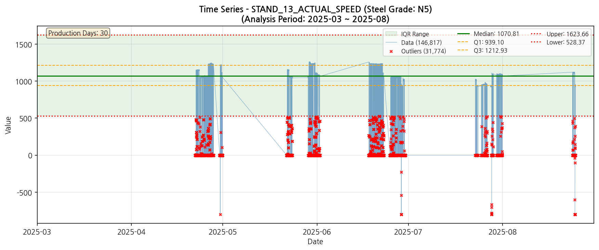

**2. 분포 히스토그램 (Distribution Histogram)**

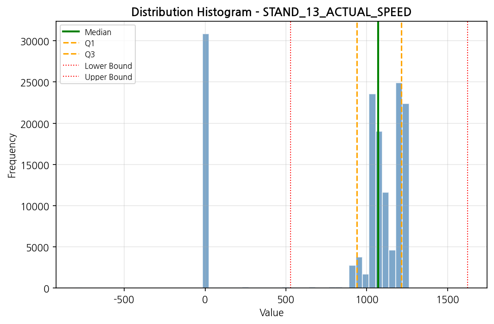

**3. 박스플롯 (Box Plot)**

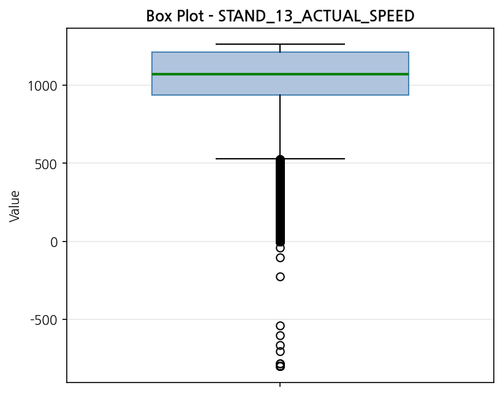

**4. 일별 평균 추이 (Daily Average Trend)**

**5. 월별 이상치율 (Monthly Outlier Rate)**

**6. 시간별 패턴 (Hourly Pattern)**

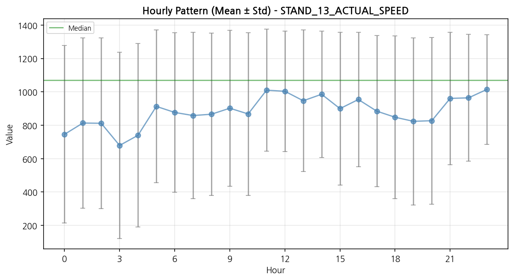

**7. 일별 이상치 수 (Daily Outlier Count)**

**종합 분석 차트**

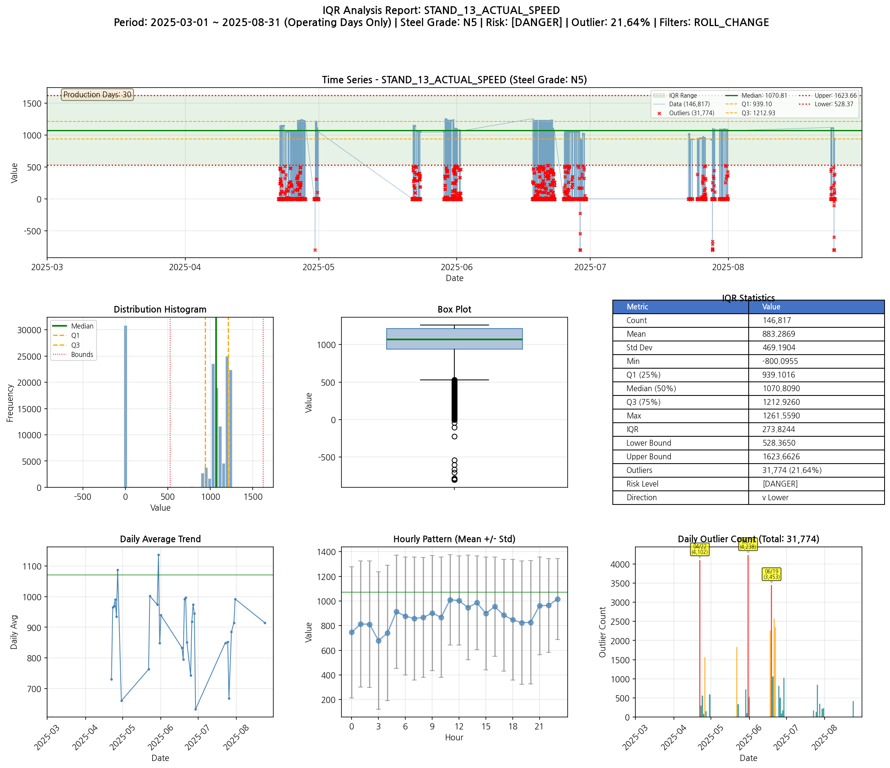

---

##### 월별 상세 분석

**2025-04**

**통계 요약**:

| 지표 | 값 |
|------|-------|
| 분석 레코드 | 32,788 |
| 평균 | 870.7322 |
| 중앙값 | 1059.1670 |
| IQR | 107.6670 |
| 이상치 수 | 7,510 |
| 이상치율 | 22.90% |

**주요 이상치 발생 날짜**:

- 1. 2025-04-22: 4,175건
- 2. 2025-04-26: 1,601건
- 3. 2025-04-24: 595건

**1. 시계열 (Time Series)**

**2. 분포 히스토그램 (Distribution Histogram)**

**3. 박스플롯 (Box Plot)**

**4. 일별 평균 추이 (Daily Average Trend)**

**5. 시간별 패턴 (Hourly Pattern)**

**6. 일별 이상치 수 (Daily Outlier Count)**

**월별 종합 차트**

**2025-05**

**통계 요약**:

| 지표 | 값 |
|------|-------|
| 분석 레코드 | 34,301 |
| 평균 | 893.5504 |
| 중앙값 | 1080.1190 |
| IQR | 175.6830 |
| 이상치 수 | 7,332 |
| 이상치율 | 21.38% |

**주요 이상치 발생 날짜**:

- 1. 2025-05-31: 4,319건
- 2. 2025-05-22: 1,835건
- 3. 2025-05-29: 733건

**1. 시계열 (Time Series)**

**2. 분포 히스토그램 (Distribution Histogram)**

**3. 박스플롯 (Box Plot)**

**4. 일별 평균 추이 (Daily Average Trend)**

**5. 시간별 패턴 (Hourly Pattern)**

**6. 일별 이상치 수 (Daily Outlier Count)**

**월별 종합 차트**

**2025-06**

**통계 요약**:

| 지표 | 값 |
|------|-------|
| 분석 레코드 | 64,178 |
| 평균 | 888.1238 |
| 중앙값 | 1093.8700 |
| IQR | 288.3746 |
| 이상치 수 | 14,806 |
| 이상치율 | 23.07% |

**주요 이상치 발생 날짜**:

- 1. 2025-06-19: 3,441건
- 2. 2025-06-21: 2,567건
- 3. 2025-06-22: 2,352건

**1. 시계열 (Time Series)**

**2. 분포 히스토그램 (Distribution Histogram)**

**3. 박스플롯 (Box Plot)**

**4. 일별 평균 추이 (Daily Average Trend)**

**5. 시간별 패턴 (Hourly Pattern)**

**6. 일별 이상치 수 (Daily Outlier Count)**

**월별 종합 차트**

**2025-07**

**통계 요약**:

| 지표 | 값 |
|------|-------|
| 분석 레코드 | 12,715 |
| 평균 | 856.5541 |
| 중앙값 | 958.9043 |
| IQR | 148.4382 |
| 이상치 수 | 1,957 |
| 이상치율 | 15.39% |

**주요 이상치 발생 날짜**:

- 1. 2025-07-26: 847건
- 2. 2025-07-28: 356건
- 3. 2025-07-31: 233건

**1. 시계열 (Time Series)**

**2. 분포 히스토그램 (Distribution Histogram)**

**3. 박스플롯 (Box Plot)**

**4. 일별 평균 추이 (Daily Average Trend)**

**5. 시간별 패턴 (Hourly Pattern)**

**6. 일별 이상치 수 (Daily Outlier Count)**

**월별 종합 차트**

**2025-08**

**통계 요약**:

| 지표 | 값 |
|------|-------|
| 분석 레코드 | 2,835 |
| 평균 | 914.7110 |
| 중앙값 | 1104.2110 |
| IQR | 170.5100 |
| 이상치 수 | 417 |
| 이상치율 | 14.71% |

**주요 이상치 발생 날짜**:

- 1. 2025-08-24: 417건

**1. 시계열 (Time Series)**

**2. 분포 히스토그램 (Distribution Histogram)**

**3. 박스플롯 (Box Plot)**

**4. 일별 평균 추이 (Daily Average Trend)**

**5. 시간별 패턴 (Hourly Pattern)**

**6. 일별 이상치 수 (Daily Outlier Count)**

**월별 종합 차트**

---

#### STAND_7_ACTUAL_SPEED 🔴

**위험도**: [DANGER] | **이상치율**: 21.58% | **이상치 방향**: 하한 미달

**카테고리**: 06 Stand Speed

| 필터 | 적용 | 이유 |
|------|:----:|------|
| run_only | ✓ | 가동 상태에서만 속도 측정이 유효함 |
| special_ops | ✓ | 정상 운전 조건에서 분석 |
| roll_change | ✓ | 롤교환 시 속도 급변 구간 제외 |
| coiling_transient | ✗ | 권취 전 공정으로 가감속 영향 없음 |

**데이터**: 원본 148,239 → 필터 후 146,817 (1.0% 제외)

| 통계 지표 | 값 |
|-----------|-------|
| 분석 레코드 | 146,817 |
| 평균 | 1016.3783 |
| 표준편차 | 528.0521 |
| Q1 (25%) | 1153.8380 |
| 중앙값 | 1276.0000 |
| Q3 (75%) | 1301.9850 |
| IQR | 148.1470 |
| 하한 경계 | 931.6175 |
| 상한 경계 | 1524.2055 |
| 이상치 수 | 31,677 (21.58%) |

**월별 이상치 추이**:

| 월 | 레코드 수 | 평균 | 이상치율 |
|-----|-----------|------|----------|
| 2025-04 | 32,788 | 991.74 | 22.36% |
| 2025-05 | 34,301 | 1079.22 | 20.91% |
| 2025-06 | 64,178 | 983.40 | 23.13% |
| 2025-07 | 12,715 | 1064.06 | 15.04% |
| 2025-08 | 2,835 | 1073.80 | 14.67% |

**주요 이상치 발생 날짜** (상위 5일):

| 순위 | 날짜 | 이상치 수 |
|:----:|------|----------:|
| 1 | 2025-05-31 | 4,288 |
| 2 | 2025-04-22 | 4,145 |
| 3 | 2025-06-19 | 3,514 |
| 4 | 2025-06-21 | 2,584 |
| 5 | 2025-06-22 | 2,275 |

- 이상치 발생 일수: 30일
- 최대 일별 이상치: 4,288건 (2025-05-31)
- 평균 일별 이상치: 1055.9건

##### 차트 분석

**1. 시계열 (Time Series)**

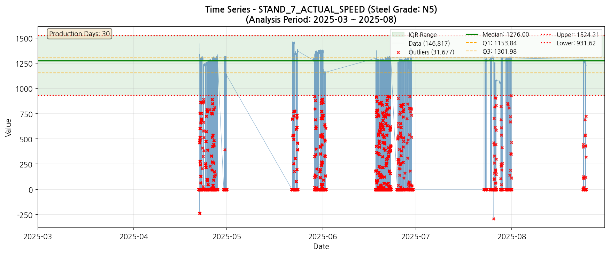

**2. 분포 히스토그램 (Distribution Histogram)**

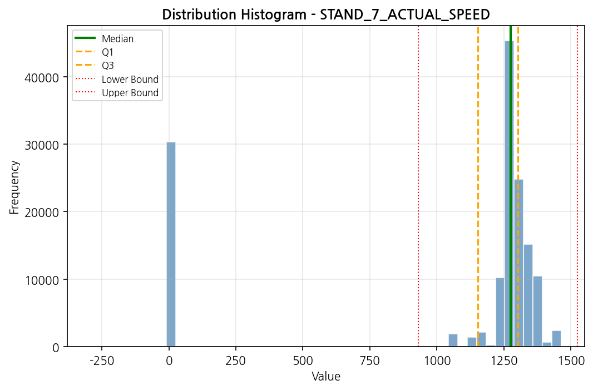

**3. 박스플롯 (Box Plot)**


**4. 일별 평균 추이 (Daily Average Trend)**

**5. 월별 이상치율 (Monthly Outlier Rate)**


**6. 시간별 패턴 (Hourly Pattern)**


**7. 일별 이상치 수 (Daily Outlier Count)**

**종합 분석 차트**


---

##### 월별 상세 분석

**2025-04**

**통계 요약**:

| 지표 | 값 |
|------|-------|
| 분석 레코드 | 32,788 |
| 평균 | 991.7438 |
| 중앙값 | 1263.9670 |
| IQR | 61.4130 |
| 이상치 수 | 7,664 |
| 이상치율 | 23.37% |

**주요 이상치 발생 날짜**:

- 1. 2025-04-22: 4,284건
- 2. 2025-04-26: 1,503건
- 3. 2025-04-30: 730건

**1. 시계열 (Time Series)**

**2. 분포 히스토그램 (Distribution Histogram)**

**3. 박스플롯 (Box Plot)**

**4. 일별 평균 추이 (Daily Average Trend)**

**5. 시간별 패턴 (Hourly Pattern)**

**6. 일별 이상치 수 (Daily Outlier Count)**

**월별 종합 차트**

**2025-05**

**통계 요약**:

| 지표 | 값 |
|------|-------|
| 분석 레코드 | 34,301 |
| 평균 | 1079.2169 |
| 중앙값 | 1348.9930 |
| IQR | 47.3590 |
| 이상치 수 | 9,069 |
| 이상치율 | 26.44% |

**주요 이상치 발생 날짜**:

- 1. 2025-05-31: 4,373건
- 2. 2025-05-22: 3,600건
- 3. 2025-05-29: 696건

**1. 시계열 (Time Series)**

**2. 분포 히스토그램 (Distribution Histogram)**

**3. 박스플롯 (Box Plot)**

**4. 일별 평균 추이 (Daily Average Trend)**

**5. 시간별 패턴 (Hourly Pattern)**

**6. 일별 이상치 수 (Daily Outlier Count)**

**월별 종합 차트**

**2025-06**

**통계 요약**:

| 지표 | 값 |
|------|-------|
| 분석 레코드 | 64,178 |
| 평균 | 983.3952 |
| 중앙값 | 1270.0500 |
| IQR | 137.8070 |
| 이상치 수 | 14,848 |
| 이상치율 | 23.14% |

**주요 이상치 발생 날짜**:

- 1. 2025-06-19: 3,514건
- 2. 2025-06-21: 2,584건
- 3. 2025-06-22: 2,275건

**1. 시계열 (Time Series)**

**2. 분포 히스토그램 (Distribution Histogram)**

**3. 박스플롯 (Box Plot)**

**4. 일별 평균 추이 (Daily Average Trend)**

**5. 시간별 패턴 (Hourly Pattern)**

**6. 일별 이상치 수 (Daily Outlier Count)**

**월별 종합 차트**

**2025-07**

**통계 요약**:

| 지표 | 값 |
|------|-------|
| 분석 레코드 | 12,715 |
| 평균 | 1064.0622 |
| 중앙값 | 1283.0390 |
| IQR | 235.7530 |
| 이상치 수 | 1,901 |
| 이상치율 | 14.95% |

**주요 이상치 발생 날짜**:

- 1. 2025-07-26: 825건
- 2. 2025-07-28: 344건
- 3. 2025-07-31: 218건

**1. 시계열 (Time Series)**

**2. 분포 히스토그램 (Distribution Histogram)**

**3. 박스플롯 (Box Plot)**

**4. 일별 평균 추이 (Daily Average Trend)**

**5. 시간별 패턴 (Hourly Pattern)**

**6. 일별 이상치 수 (Daily Outlier Count)**

**월별 종합 차트**

**2025-08**

**통계 요약**:

| 지표 | 값 |
|------|-------|
| 분석 레코드 | 2,835 |
| 평균 | 1073.7955 |
| 중앙값 | 1255.6600 |
| IQR | 28.0520 |
| 이상치 수 | 446 |
| 이상치율 | 15.73% |

**주요 이상치 발생 날짜**:

- 1. 2025-08-24: 446건

**1. 시계열 (Time Series)**

**2. 분포 히스토그램 (Distribution Histogram)**

**3. 박스플롯 (Box Plot)**

**4. 일별 평균 추이 (Daily Average Trend)**

**5. 시간별 패턴 (Hourly Pattern)**

**6. 일별 이상치 수 (Daily Outlier Count)**

**월별 종합 차트**

---

#### STAND_1_ACTUAL_SPEED 🔴

**위험도**: [DANGER] | **이상치율**: 21.54% | **이상치 방향**: 하한 미달

**카테고리**: 06 Stand Speed

| 필터 | 적용 | 이유 |
|------|:----:|------|
| run_only | ✓ | 가동 상태에서만 속도 측정이 유효함 |
| special_ops | ✓ | 정상 운전 조건에서 분석 |
| roll_change | ✓ | 롤교환 시 속도 급변 구간 제외 |
| coiling_transient | ✗ | 권취 전 공정으로 가감속 영향 없음 |

**데이터**: 원본 148,239 → 필터 후 146,817 (1.0% 제외)

| 통계 지표 | 값 |
|-----------|-------|
| 분석 레코드 | 146,817 |
| 평균 | 459.5483 |
| 표준편차 | 240.6583 |
| Q1 (25%) | 509.7143 |
| 중앙값 | 567.2320 |
| Q3 (75%) | 588.0449 |
| IQR | 78.3306 |
| 하한 경계 | 392.2184 |
| 상한 경계 | 705.5408 |
| 이상치 수 | 31,626 (21.54%) |

**월별 이상치 추이**:

| 월 | 레코드 수 | 평균 | 이상치율 |
|-----|-----------|------|----------|
| 2025-04 | 32,788 | 503.97 | 22.22% |
| 2025-05 | 34,301 | 444.89 | 20.94% |
| 2025-06 | 64,178 | 436.41 | 23.12% |
| 2025-07 | 12,715 | 492.66 | 15.01% |
| 2025-08 | 2,835 | 498.36 | 14.67% |

**주요 이상치 발생 날짜** (상위 5일):

| 순위 | 날짜 | 이상치 수 |
|:----:|------|----------:|
| 1 | 2025-05-31 | 4,289 |
| 2 | 2025-04-22 | 4,116 |
| 3 | 2025-06-19 | 3,508 |
| 4 | 2025-06-21 | 2,566 |
| 5 | 2025-06-18 | 2,277 |

- 이상치 발생 일수: 30일
- 최대 일별 이상치: 4,289건 (2025-05-31)
- 평균 일별 이상치: 1054.2건

##### 차트 분석

**1. 시계열 (Time Series)**


**2. 분포 히스토그램 (Distribution Histogram)**


**3. 박스플롯 (Box Plot)**


**4. 일별 평균 추이 (Daily Average Trend)**

**5. 월별 이상치율 (Monthly Outlier Rate)**

**6. 시간별 패턴 (Hourly Pattern)**


**7. 일별 이상치 수 (Daily Outlier Count)**


**종합 분석 차트**


---

##### 월별 상세 분석

**2025-04**

**통계 요약**:

| 지표 | 값 |
|------|-------|
| 분석 레코드 | 32,788 |
| 평균 | 503.9687 |
| 중앙값 | 637.7140 |
| IQR | 31.2827 |
| 이상치 수 | 7,546 |
| 이상치율 | 23.01% |

**주요 이상치 발생 날짜**:

- 1. 2025-04-22: 4,175건
- 2. 2025-04-26: 1,491건
- 3. 2025-04-30: 733건

**1. 시계열 (Time Series)**

**2. 분포 히스토그램 (Distribution Histogram)**

**3. 박스플롯 (Box Plot)**

**4. 일별 평균 추이 (Daily Average Trend)**

**5. 시간별 패턴 (Hourly Pattern)**

**6. 일별 이상치 수 (Daily Outlier Count)**

**월별 종합 차트**

**2025-05**

**통계 요약**:

| 지표 | 값 |
|------|-------|
| 분석 레코드 | 34,301 |
| 평균 | 444.8928 |
| 중앙값 | 556.1057 |
| IQR | 26.8187 |
| 이상치 수 | 7,332 |
| 이상치율 | 21.38% |

**주요 이상치 발생 날짜**:

- 1. 2025-05-31: 4,363건
- 2. 2025-05-22: 1,870건
- 3. 2025-05-29: 699건

**1. 시계열 (Time Series)**

**2. 분포 히스토그램 (Distribution Histogram)**

**3. 박스플롯 (Box Plot)**

**4. 일별 평균 추이 (Daily Average Trend)**

**5. 시간별 패턴 (Hourly Pattern)**

**6. 일별 이상치 수 (Daily Outlier Count)**

**월별 종합 차트**

**2025-06**

**통계 요약**:

| 지표 | 값 |
|------|-------|
| 분석 레코드 | 64,178 |
| 평균 | 436.4120 |
| 중앙값 | 566.4119 |
| IQR | 97.9611 |
| 이상치 수 | 14,726 |
| 이상치율 | 22.95% |

**주요 이상치 발생 날짜**:

- 1. 2025-06-19: 3,482건
- 2. 2025-06-21: 2,547건
- 3. 2025-06-22: 2,270건

**1. 시계열 (Time Series)**

**2. 분포 히스토그램 (Distribution Histogram)**

**3. 박스플롯 (Box Plot)**

**4. 일별 평균 추이 (Daily Average Trend)**

**5. 시간별 패턴 (Hourly Pattern)**

**6. 일별 이상치 수 (Daily Outlier Count)**

**월별 종합 차트**

**2025-07**

**통계 요약**:

| 지표 | 값 |
|------|-------|
| 분석 레코드 | 12,715 |
| 평균 | 492.6632 |
| 중앙값 | 590.1993 |
| IQR | 88.7360 |
| 이상치 수 | 1,903 |
| 이상치율 | 14.97% |

**주요 이상치 발생 날짜**:

- 1. 2025-07-26: 824건
- 2. 2025-07-28: 344건
- 3. 2025-07-31: 219건

**1. 시계열 (Time Series)**

**2. 분포 히스토그램 (Distribution Histogram)**

**3. 박스플롯 (Box Plot)**

**4. 일별 평균 추이 (Daily Average Trend)**

**5. 시간별 패턴 (Hourly Pattern)**

**6. 일별 이상치 수 (Daily Outlier Count)**

**월별 종합 차트**

**2025-08**

**통계 요약**:

| 지표 | 값 |
|------|-------|
| 분석 레코드 | 2,835 |
| 평균 | 498.3583 |
| 중앙값 | 583.4463 |
| IQR | 23.4572 |
| 이상치 수 | 417 |
| 이상치율 | 14.71% |

**주요 이상치 발생 날짜**:

- 1. 2025-08-24: 417건

**1. 시계열 (Time Series)**

**2. 분포 히스토그램 (Distribution Histogram)**

**3. 박스플롯 (Box Plot)**

**4. 일별 평균 추이 (Daily Average Trend)**

**5. 시간별 패턴 (Hourly Pattern)**

**6. 일별 이상치 수 (Daily Outlier Count)**

**월별 종합 차트**

---

#### STAND_4_ACTUAL_SPEED 🔴

**위험도**: [DANGER] | **이상치율**: 21.52% | **이상치 방향**: 하한 미달

**카테고리**: 06 Stand Speed

| 필터 | 적용 | 이유 |
|------|:----:|------|
| run_only | ✓ | 가동 상태에서만 속도 측정이 유효함 |
| special_ops | ✓ | 정상 운전 조건에서 분석 |
| roll_change | ✓ | 롤교환 시 속도 급변 구간 제외 |
| coiling_transient | ✗ | 권취 전 공정으로 가감속 영향 없음 |

**데이터**: 원본 148,239 → 필터 후 146,817 (1.0% 제외)

| 통계 지표 | 값 |
|-----------|-------|
| 분석 레코드 | 146,817 |
| 평균 | 663.4187 |
| 표준편차 | 344.6863 |
| Q1 (25%) | 732.8226 |
| 중앙값 | 838.7391 |
| Q3 (75%) | 855.1640 |
| IQR | 122.3414 |
| 하한 경계 | 549.3105 |
| 상한 경계 | 1038.6761 |
| 이상치 수 | 31,597 (21.52%) |

**월별 이상치 추이**:

| 월 | 레코드 수 | 평균 | 이상치율 |
|-----|-----------|------|----------|
| 2025-04 | 32,788 | 668.85 | 22.26% |
| 2025-05 | 34,301 | 687.98 | 20.83% |
| 2025-06 | 64,178 | 640.61 | 23.11% |
| 2025-07 | 12,715 | 684.85 | 14.98% |
| 2025-08 | 2,835 | 723.68 | 14.67% |

**주요 이상치 발생 날짜** (상위 5일):

| 순위 | 날짜 | 이상치 수 |
|:----:|------|----------:|
| 1 | 2025-05-31 | 4,268 |
| 2 | 2025-04-22 | 4,130 |
| 3 | 2025-06-19 | 3,514 |
| 4 | 2025-06-21 | 2,575 |
| 5 | 2025-06-18 | 2,277 |

- 이상치 발생 일수: 30일
- 최대 일별 이상치: 4,268건 (2025-05-31)
- 평균 일별 이상치: 1053.2건

##### 차트 분석

**1. 시계열 (Time Series)**


**2. 분포 히스토그램 (Distribution Histogram)**


**3. 박스플롯 (Box Plot)**


**4. 일별 평균 추이 (Daily Average Trend)**

**5. 월별 이상치율 (Monthly Outlier Rate)**

**6. 시간별 패턴 (Hourly Pattern)**


**7. 일별 이상치 수 (Daily Outlier Count)**

**종합 분석 차트**


---

##### 월별 상세 분석

**2025-04**

**통계 요약**:

| 지표 | 값 |
|------|-------|
| 분석 레코드 | 32,788 |
| 평균 | 668.8487 |
| 중앙값 | 845.0115 |
| IQR | 39.6763 |
| 이상치 수 | 7,542 |
| 이상치율 | 23.00% |

**주요 이상치 발생 날짜**:

- 1. 2025-04-22: 4,167건
- 2. 2025-04-26: 1,495건
- 3. 2025-04-30: 733건

**1. 시계열 (Time Series)**

**2. 분포 히스토그램 (Distribution Histogram)**

**3. 박스플롯 (Box Plot)**

**4. 일별 평균 추이 (Daily Average Trend)**

**5. 시간별 패턴 (Hourly Pattern)**

**6. 일별 이상치 수 (Daily Outlier Count)**

**월별 종합 차트**

**2025-05**

**통계 요약**:

| 지표 | 값 |
|------|-------|
| 분석 레코드 | 34,301 |
| 평균 | 687.9789 |
| 중앙값 | 862.2972 |
| IQR | 36.7110 |
| 이상치 수 | 7,304 |
| 이상치율 | 21.29% |

**주요 이상치 발생 날짜**:

- 1. 2025-05-31: 4,383건
- 2. 2025-05-22: 1,822건
- 3. 2025-05-29: 699건

**1. 시계열 (Time Series)**

**2. 분포 히스토그램 (Distribution Histogram)**

**3. 박스플롯 (Box Plot)**

**4. 일별 평균 추이 (Daily Average Trend)**

**5. 시간별 패턴 (Hourly Pattern)**

**6. 일별 이상치 수 (Daily Outlier Count)**

**월별 종합 차트**

**2025-06**

**통계 요약**:

| 지표 | 값 |
|------|-------|
| 분석 레코드 | 64,178 |
| 평균 | 640.6105 |
| 중앙값 | 831.8170 |
| IQR | 115.9425 |
| 이상치 수 | 14,837 |
| 이상치율 | 23.12% |

**주요 이상치 발생 날짜**:

- 1. 2025-06-19: 3,514건
- 2. 2025-06-21: 2,575건
- 3. 2025-06-18: 2,277건

**1. 시계열 (Time Series)**

**2. 분포 히스토그램 (Distribution Histogram)**

**3. 박스플롯 (Box Plot)**

**4. 일별 평균 추이 (Daily Average Trend)**

**5. 시간별 패턴 (Hourly Pattern)**

**6. 일별 이상치 수 (Daily Outlier Count)**

**월별 종합 차트**

**2025-07**

**통계 요약**:

| 지표 | 값 |
|------|-------|
| 분석 레코드 | 12,715 |
| 평균 | 684.8458 |
| 중앙값 | 820.0252 |
| IQR | 129.7791 |
| 이상치 수 | 1,904 |
| 이상치율 | 14.97% |

**주요 이상치 발생 날짜**:

- 1. 2025-07-26: 825건
- 2. 2025-07-28: 344건
- 3. 2025-07-31: 219건

**1. 시계열 (Time Series)**

**2. 분포 히스토그램 (Distribution Histogram)**

**3. 박스플롯 (Box Plot)**

**4. 일별 평균 추이 (Daily Average Trend)**

**5. 시간별 패턴 (Hourly Pattern)**

**6. 일별 이상치 수 (Daily Outlier Count)**

**월별 종합 차트**

**2025-08**

**통계 요약**:

| 지표 | 값 |
|------|-------|
| 분석 레코드 | 2,835 |
| 평균 | 723.6844 |
| 중앙값 | 847.8401 |
| IQR | 25.1400 |
| 이상치 수 | 427 |
| 이상치율 | 15.06% |

**주요 이상치 발생 날짜**:

- 1. 2025-08-24: 427건

**1. 시계열 (Time Series)**

**2. 분포 히스토그램 (Distribution Histogram)**

**3. 박스플롯 (Box Plot)**

**4. 일별 평균 추이 (Daily Average Trend)**

**5. 시간별 패턴 (Hourly Pattern)**

**6. 일별 이상치 수 (Daily Outlier Count)**

**월별 종합 차트**

---

#### STAND_8_ACTUAL_SPEED 🔴

**위험도**: [DANGER] | **이상치율**: 21.46% | **이상치 방향**: 하한 미달

**카테고리**: 06 Stand Speed

| 필터 | 적용 | 이유 |
|------|:----:|------|
| run_only | ✓ | 가동 상태에서만 속도 측정이 유효함 |
| special_ops | ✓ | 정상 운전 조건에서 분석 |
| roll_change | ✓ | 롤교환 시 속도 급변 구간 제외 |
| coiling_transient | ✗ | 권취 전 공정으로 가감속 영향 없음 |

**데이터**: 원본 148,239 → 필터 후 146,817 (1.0% 제외)

| 통계 지표 | 값 |
|-----------|-------|
| 분석 레코드 | 146,817 |
| 평균 | 865.9618 |
| 표준편차 | 451.7848 |
| Q1 (25%) | 937.9694 |
| 중앙값 | 1074.5540 |
| Q3 (75%) | 1112.7670 |
| IQR | 174.7976 |
| 하한 경계 | 675.7730 |
| 상한 경계 | 1374.9634 |
| 이상치 수 | 31,512 (21.46%) |

**월별 이상치 추이**:

| 월 | 레코드 수 | 평균 | 이상치율 |
|-----|-----------|------|----------|
| 2025-04 | 32,788 | 922.57 | 22.17% |
| 2025-05 | 34,301 | 873.11 | 20.80% |
| 2025-06 | 64,178 | 816.96 | 23.05% |
| 2025-07 | 12,715 | 905.72 | 14.96% |
| 2025-08 | 2,835 | 1055.85 | 14.60% |

**주요 이상치 발생 날짜** (상위 5일):

| 순위 | 날짜 | 이상치 수 |
|:----:|------|----------:|
| 1 | 2025-05-31 | 4,258 |
| 2 | 2025-04-22 | 4,123 |
| 3 | 2025-06-19 | 3,494 |
| 4 | 2025-06-21 | 2,556 |
| 5 | 2025-06-18 | 2,272 |

- 이상치 발생 일수: 30일
- 최대 일별 이상치: 4,258건 (2025-05-31)
- 평균 일별 이상치: 1050.4건

##### 차트 분석

**1. 시계열 (Time Series)**


**2. 분포 히스토그램 (Distribution Histogram)**


**3. 박스플롯 (Box Plot)**


**4. 일별 평균 추이 (Daily Average Trend)**


**5. 월별 이상치율 (Monthly Outlier Rate)**

**6. 시간별 패턴 (Hourly Pattern)**


**7. 일별 이상치 수 (Daily Outlier Count)**

**종합 분석 차트**


---

##### 월별 상세 분석

**2025-04**

**통계 요약**:

| 지표 | 값 |
|------|-------|
| 분석 레코드 | 32,788 |
| 평균 | 922.5715 |
| 중앙값 | 1174.9360 |
| IQR | 56.3040 |
| 이상치 수 | 7,587 |
| 이상치율 | 23.14% |

**주요 이상치 발생 날짜**:

- 1. 2025-04-22: 4,205건
- 2. 2025-04-26: 1,503건
- 3. 2025-04-30: 732건

**1. 시계열 (Time Series)**

**2. 분포 히스토그램 (Distribution Histogram)**

**3. 박스플롯 (Box Plot)**

**4. 일별 평균 추이 (Daily Average Trend)**

**5. 시간별 패턴 (Hourly Pattern)**

**6. 일별 이상치 수 (Daily Outlier Count)**

**월별 종합 차트**

**2025-05**

**통계 요약**:

| 지표 | 값 |
|------|-------|
| 분석 레코드 | 34,301 |
| 평균 | 873.1078 |
| 중앙값 | 1093.0060 |
| IQR | 42.4570 |
| 이상치 수 | 7,401 |
| 이상치율 | 21.58% |

**주요 이상치 발생 날짜**:

- 1. 2025-05-31: 4,373건
- 2. 2025-05-22: 1,932건
- 3. 2025-05-29: 696건

**1. 시계열 (Time Series)**

**2. 분포 히스토그램 (Distribution Histogram)**

**3. 박스플롯 (Box Plot)**

**4. 일별 평균 추이 (Daily Average Trend)**

**5. 시간별 패턴 (Hourly Pattern)**

**6. 일별 이상치 수 (Daily Outlier Count)**

**월별 종합 차트**

**2025-06**

**통계 요약**:

| 지표 | 값 |
|------|-------|
| 분석 레코드 | 64,178 |
| 평균 | 816.9554 |
| 중앙값 | 1057.4280 |
| IQR | 142.4256 |
| 이상치 수 | 14,818 |
| 이상치율 | 23.09% |

**주요 이상치 발생 날짜**:

- 1. 2025-06-19: 3,508건
- 2. 2025-06-21: 2,556건
- 3. 2025-06-18: 2,272건

**1. 시계열 (Time Series)**

**2. 분포 히스토그램 (Distribution Histogram)**

**3. 박스플롯 (Box Plot)**

**4. 일별 평균 추이 (Daily Average Trend)**

**5. 시간별 패턴 (Hourly Pattern)**

**6. 일별 이상치 수 (Daily Outlier Count)**

**월별 종합 차트**

**2025-07**

**통계 요약**:

| 지표 | 값 |
|------|-------|
| 분석 레코드 | 12,715 |
| 평균 | 905.7237 |
| 중앙값 | 1077.8680 |
| IQR | 189.6632 |
| 이상치 수 | 1,902 |
| 이상치율 | 14.96% |

**주요 이상치 발생 날짜**:

- 1. 2025-07-26: 825건
- 2. 2025-07-28: 344건
- 3. 2025-07-31: 219건

**1. 시계열 (Time Series)**

**2. 분포 히스토그램 (Distribution Histogram)**

**3. 박스플롯 (Box Plot)**

**4. 일별 평균 추이 (Daily Average Trend)**

**5. 시간별 패턴 (Hourly Pattern)**

**6. 일별 이상치 수 (Daily Outlier Count)**

**월별 종합 차트**

**2025-08**

**통계 요약**:

| 지표 | 값 |
|------|-------|
| 분석 레코드 | 2,835 |
| 평균 | 1055.8488 |
| 중앙값 | 1234.9230 |
| IQR | 27.1080 |
| 이상치 수 | 446 |
| 이상치율 | 15.73% |

**주요 이상치 발생 날짜**:

- 1. 2025-08-24: 446건

**1. 시계열 (Time Series)**

**2. 분포 히스토그램 (Distribution Histogram)**

**3. 박스플롯 (Box Plot)**

**4. 일별 평균 추이 (Daily Average Trend)**

**5. 시간별 패턴 (Hourly Pattern)**

**6. 일별 이상치 수 (Daily Outlier Count)**

**월별 종합 차트**

---

#### STAND_3_ACTUAL_SPEED 🔴

**위험도**: [DANGER] | **이상치율**: 21.44% | **이상치 방향**: 하한 미달

**카테고리**: 06 Stand Speed

| 필터 | 적용 | 이유 |
|------|:----:|------|
| run_only | ✓ | 가동 상태에서만 속도 측정이 유효함 |
| special_ops | ✓ | 정상 운전 조건에서 분석 |
| roll_change | ✓ | 롤교환 시 속도 급변 구간 제외 |
| coiling_transient | ✗ | 권취 전 공정으로 가감속 영향 없음 |

**데이터**: 원본 148,239 → 필터 후 146,817 (1.0% 제외)

| 통계 지표 | 값 |
|-----------|-------|
| 분석 레코드 | 146,817 |
| 평균 | 683.7879 |
| 표준편차 | 355.2856 |
| Q1 (25%) | 751.9081 |
| 중앙값 | 863.6892 |
| Q3 (75%) | 889.1824 |
| IQR | 137.2743 |
| 하한 경계 | 545.9966 |
| 상한 경계 | 1095.0939 |
| 이상치 수 | 31,471 (21.44%) |

**월별 이상치 추이**:

| 월 | 레코드 수 | 평균 | 이상치율 |
|-----|-----------|------|----------|
| 2025-04 | 32,788 | 671.28 | 22.21% |
| 2025-05 | 34,301 | 705.98 | 20.80% |
| 2025-06 | 64,178 | 676.18 | 22.95% |
| 2025-07 | 12,715 | 684.77 | 14.98% |
| 2025-08 | 2,835 | 727.86 | 14.67% |

**주요 이상치 발생 날짜** (상위 5일):

| 순위 | 날짜 | 이상치 수 |
|:----:|------|----------:|
| 1 | 2025-05-31 | 4,258 |
| 2 | 2025-04-22 | 4,130 |
| 3 | 2025-06-19 | 3,494 |
| 4 | 2025-06-21 | 2,538 |
| 5 | 2025-06-22 | 2,265 |

- 이상치 발생 일수: 30일
- 최대 일별 이상치: 4,258건 (2025-05-31)
- 평균 일별 이상치: 1049.0건

##### 차트 분석

**1. 시계열 (Time Series)**


**2. 분포 히스토그램 (Distribution Histogram)**


**3. 박스플롯 (Box Plot)**


**4. 일별 평균 추이 (Daily Average Trend)**


**5. 월별 이상치율 (Monthly Outlier Rate)**

**6. 시간별 패턴 (Hourly Pattern)**


**7. 일별 이상치 수 (Daily Outlier Count)**

**종합 분석 차트**


---

##### 월별 상세 분석

**2025-04**

**통계 요약**:

| 지표 | 값 |
|------|-------|
| 분석 레코드 | 32,788 |
| 평균 | 671.2770 |
| 중앙값 | 849.3471 |
| IQR | 36.5923 |
| 이상치 수 | 7,536 |
| 이상치율 | 22.98% |

**주요 이상치 발생 날짜**:

- 1. 2025-04-22: 4,175건
- 2. 2025-04-26: 1,495건
- 3. 2025-04-30: 733건

**1. 시계열 (Time Series)**

**2. 분포 히스토그램 (Distribution Histogram)**

**3. 박스플롯 (Box Plot)**

**4. 일별 평균 추이 (Daily Average Trend)**

**5. 시간별 패턴 (Hourly Pattern)**

**6. 일별 이상치 수 (Daily Outlier Count)**

**월별 종합 차트**

**2025-05**

**통계 요약**:

| 지표 | 값 |
|------|-------|
| 분석 레코드 | 34,301 |
| 평균 | 705.9774 |
| 중앙값 | 885.5895 |
| IQR | 40.7677 |
| 이상치 수 | 7,297 |
| 이상치율 | 21.27% |

**주요 이상치 발생 날짜**:

- 1. 2025-05-31: 4,383건
- 2. 2025-05-22: 1,815건
- 3. 2025-05-29: 699건

**1. 시계열 (Time Series)**

**2. 분포 히스토그램 (Distribution Histogram)**

**3. 박스플롯 (Box Plot)**

**4. 일별 평균 추이 (Daily Average Trend)**

**5. 시간별 패턴 (Hourly Pattern)**

**6. 일별 이상치 수 (Daily Outlier Count)**

**월별 종합 차트**

**2025-06**

**통계 요약**:

| 지표 | 값 |
|------|-------|
| 분석 레코드 | 64,178 |
| 평균 | 676.1783 |
| 중앙값 | 880.2870 |
| IQR | 146.2911 |
| 이상치 수 | 14,712 |
| 이상치율 | 22.92% |

**주요 이상치 발생 날짜**:

- 1. 2025-06-19: 3,494건
- 2. 2025-06-21: 2,529건
- 3. 2025-06-22: 2,265건

**1. 시계열 (Time Series)**

**2. 분포 히스토그램 (Distribution Histogram)**

**3. 박스플롯 (Box Plot)**

**4. 일별 평균 추이 (Daily Average Trend)**

**5. 시간별 패턴 (Hourly Pattern)**

**6. 일별 이상치 수 (Daily Outlier Count)**

**월별 종합 차트**

**2025-07**

**통계 요약**:

| 지표 | 값 |
|------|-------|
| 분석 레코드 | 12,715 |
| 평균 | 684.7718 |
| 중앙값 | 821.6644 |
| IQR | 129.4946 |
| 이상치 수 | 1,904 |
| 이상치율 | 14.97% |

**주요 이상치 발생 날짜**:

- 1. 2025-07-26: 825건
- 2. 2025-07-28: 344건
- 3. 2025-07-31: 219건

**1. 시계열 (Time Series)**

**2. 분포 히스토그램 (Distribution Histogram)**

**3. 박스플롯 (Box Plot)**

**4. 일별 평균 추이 (Daily Average Trend)**

**5. 시간별 패턴 (Hourly Pattern)**

**6. 일별 이상치 수 (Daily Outlier Count)**

**월별 종합 차트**

**2025-08**

**통계 요약**:

| 지표 | 값 |
|------|-------|
| 분석 레코드 | 2,835 |
| 평균 | 727.8595 |
| 중앙값 | 852.4917 |
| IQR | 26.8325 |
| 이상치 수 | 423 |
| 이상치율 | 14.92% |

**주요 이상치 발생 날짜**:

- 1. 2025-08-24: 423건

**1. 시계열 (Time Series)**

**2. 분포 히스토그램 (Distribution Histogram)**

**3. 박스플롯 (Box Plot)**

**4. 일별 평균 추이 (Daily Average Trend)**

**5. 시간별 패턴 (Hourly Pattern)**

**6. 일별 이상치 수 (Daily Outlier Count)**

**월별 종합 차트**

---

#### STAND_5_ACTUAL_SPEED 🔴

**위험도**: [DANGER] | **이상치율**: 21.42% | **이상치 방향**: 하한 미달

**카테고리**: 06 Stand Speed

| 필터 | 적용 | 이유 |
|------|:----:|------|
| run_only | ✓ | 가동 상태에서만 속도 측정이 유효함 |
| special_ops | ✓ | 정상 운전 조건에서 분석 |
| roll_change | ✓ | 롤교환 시 속도 급변 구간 제외 |
| coiling_transient | ✗ | 권취 전 공정으로 가감속 영향 없음 |

**데이터**: 원본 148,239 → 필터 후 146,817 (1.0% 제외)

| 통계 지표 | 값 |
|-----------|-------|
| 분석 레코드 | 146,817 |
| 평균 | 986.5594 |
| 표준편차 | 512.7058 |
| Q1 (25%) | 1076.5300 |
| 중앙값 | 1249.5740 |
| Q3 (75%) | 1284.6470 |
| IQR | 208.1170 |
| 하한 경계 | 764.3545 |
| 상한 경계 | 1596.8225 |
| 이상치 수 | 31,451 (21.42%) |

**월별 이상치 추이**:

| 월 | 레코드 수 | 평균 | 이상치율 |
|-----|-----------|------|----------|
| 2025-04 | 32,788 | 978.33 | 22.21% |
| 2025-05 | 34,301 | 1011.02 | 20.80% |
| 2025-06 | 64,178 | 974.76 | 22.93% |
| 2025-07 | 12,715 | 976.58 | 14.97% |
| 2025-08 | 2,835 | 1097.75 | 14.71% |

**주요 이상치 발생 날짜** (상위 5일):

| 순위 | 날짜 | 이상치 수 |
|:----:|------|----------:|
| 1 | 2025-05-31 | 4,268 |
| 2 | 2025-04-22 | 4,123 |
| 3 | 2025-06-19 | 3,494 |
| 4 | 2025-06-21 | 2,529 |
| 5 | 2025-06-22 | 2,260 |

- 이상치 발생 일수: 30일
- 최대 일별 이상치: 4,268건 (2025-05-31)
- 평균 일별 이상치: 1048.4건

##### 차트 분석

**1. 시계열 (Time Series)**


**2. 분포 히스토그램 (Distribution Histogram)**


**3. 박스플롯 (Box Plot)**


**4. 일별 평균 추이 (Daily Average Trend)**


**5. 월별 이상치율 (Monthly Outlier Rate)**

**6. 시간별 패턴 (Hourly Pattern)**


**7. 일별 이상치 수 (Daily Outlier Count)**

**종합 분석 차트**


---

##### 월별 상세 분석

**2025-04**

**통계 요약**:

| 지표 | 값 |
|------|-------|
| 분석 레코드 | 32,788 |
| 평균 | 978.3261 |
| 중앙값 | 1237.0280 |
| IQR | 51.4373 |
| 이상치 수 | 7,670 |
| 이상치율 | 23.39% |

**주요 이상치 발생 날짜**:

- 1. 2025-04-22: 4,285건
- 2. 2025-04-26: 1,503건
- 3. 2025-04-30: 732건

**1. 시계열 (Time Series)**

**2. 분포 히스토그램 (Distribution Histogram)**

**3. 박스플롯 (Box Plot)**

**4. 일별 평균 추이 (Daily Average Trend)**

**5. 시간별 패턴 (Hourly Pattern)**

**6. 일별 이상치 수 (Daily Outlier Count)**

**월별 종합 차트**

**2025-05**

**통계 요약**:

| 지표 | 값 |
|------|-------|
| 분석 레코드 | 34,301 |
| 평균 | 1011.0219 |
| 중앙값 | 1262.0220 |
| IQR | 46.5260 |
| 이상치 수 | 7,695 |
| 이상치율 | 22.43% |

**주요 이상치 발생 날짜**:

- 1. 2025-05-31: 4,383건
- 2. 2025-05-22: 2,216건
- 3. 2025-05-29: 696건

**1. 시계열 (Time Series)**

**2. 분포 히스토그램 (Distribution Histogram)**

**3. 박스플롯 (Box Plot)**

**4. 일별 평균 추이 (Daily Average Trend)**

**5. 시간별 패턴 (Hourly Pattern)**

**6. 일별 이상치 수 (Daily Outlier Count)**

**월별 종합 차트**

**2025-06**

**통계 요약**:

| 지표 | 값 |
|------|-------|
| 분석 레코드 | 64,178 |
| 평균 | 974.7559 |
| 중앙값 | 1273.5570 |
| IQR | 219.7120 |
| 이상치 수 | 14,691 |
| 이상치율 | 22.89% |

**주요 이상치 발생 날짜**:

- 1. 2025-06-19: 3,488건
- 2. 2025-06-21: 2,529건
- 3. 2025-06-22: 2,260건

**1. 시계열 (Time Series)**

**2. 분포 히스토그램 (Distribution Histogram)**

**3. 박스플롯 (Box Plot)**

**4. 일별 평균 추이 (Daily Average Trend)**

**5. 시간별 패턴 (Hourly Pattern)**

**6. 일별 이상치 수 (Daily Outlier Count)**

**월별 종합 차트**

**2025-07**

**통계 요약**:

| 지표 | 값 |
|------|-------|
| 분석 레코드 | 12,715 |
| 평균 | 976.5836 |
| 중앙값 | 1165.6700 |
| IQR | 183.5535 |
| 이상치 수 | 1,903 |
| 이상치율 | 14.97% |

**주요 이상치 발생 날짜**:

- 1. 2025-07-26: 825건
- 2. 2025-07-28: 344건
- 3. 2025-07-31: 220건

**1. 시계열 (Time Series)**

**2. 분포 히스토그램 (Distribution Histogram)**

**3. 박스플롯 (Box Plot)**

**4. 일별 평균 추이 (Daily Average Trend)**

**5. 시간별 패턴 (Hourly Pattern)**

**6. 일별 이상치 수 (Daily Outlier Count)**

**월별 종합 차트**

**2025-08**

**통계 요약**:

| 지표 | 값 |
|------|-------|
| 분석 레코드 | 2,835 |
| 평균 | 1097.7536 |
| 중앙값 | 1286.0110 |
| IQR | 36.3600 |
| 이상치 수 | 428 |
| 이상치율 | 15.10% |

**주요 이상치 발생 날짜**:

- 1. 2025-08-24: 428건

**1. 시계열 (Time Series)**

**2. 분포 히스토그램 (Distribution Histogram)**

**3. 박스플롯 (Box Plot)**

**4. 일별 평균 추이 (Daily Average Trend)**

**5. 시간별 패턴 (Hourly Pattern)**

**6. 일별 이상치 수 (Daily Outlier Count)**

**월별 종합 차트**

---

#### STAND_6_ACTUAL_SPEED 🔴

**위험도**: [DANGER] | **이상치율**: 21.41% | **이상치 방향**: 하한 미달

**카테고리**: 06 Stand Speed

| 필터 | 적용 | 이유 |
|------|:----:|------|
| run_only | ✓ | 가동 상태에서만 속도 측정이 유효함 |
| special_ops | ✓ | 정상 운전 조건에서 분석 |
| roll_change | ✓ | 롤교환 시 속도 급변 구간 제외 |
| coiling_transient | ✗ | 권취 전 공정으로 가감속 영향 없음 |

**데이터**: 원본 148,239 → 필터 후 146,817 (1.0% 제외)

| 통계 지표 | 값 |
|-----------|-------|
| 분석 레코드 | 146,817 |
| 평균 | 960.0120 |
| 표준편차 | 498.8039 |
| Q1 (25%) | 1036.3520 |
| 중앙값 | 1215.6070 |
| Q3 (75%) | 1240.7190 |
| IQR | 204.3670 |
| 하한 경계 | 729.8015 |
| 상한 경계 | 1547.2695 |
| 이상치 수 | 31,430 (21.41%) |

**월별 이상치 추이**:

| 월 | 레코드 수 | 평균 | 이상치율 |
|-----|-----------|------|----------|
| 2025-04 | 32,788 | 980.17 | 22.16% |
| 2025-05 | 34,301 | 967.64 | 20.79% |
| 2025-06 | 64,178 | 933.42 | 22.93% |
| 2025-07 | 12,715 | 1003.00 | 14.96% |
| 2025-08 | 2,835 | 1043.82 | 14.67% |

**주요 이상치 발생 날짜** (상위 5일):

| 순위 | 날짜 | 이상치 수 |
|:----:|------|----------:|
| 1 | 2025-05-31 | 4,258 |
| 2 | 2025-04-22 | 4,123 |
| 3 | 2025-06-19 | 3,488 |
| 4 | 2025-06-21 | 2,529 |
| 5 | 2025-06-22 | 2,265 |

- 이상치 발생 일수: 30일
- 최대 일별 이상치: 4,258건 (2025-05-31)
- 평균 일별 이상치: 1047.7건

##### 차트 분석

**1. 시계열 (Time Series)**


**2. 분포 히스토그램 (Distribution Histogram)**


**3. 박스플롯 (Box Plot)**


**4. 일별 평균 추이 (Daily Average Trend)**


**5. 월별 이상치율 (Monthly Outlier Rate)**

**6. 시간별 패턴 (Hourly Pattern)**


**7. 일별 이상치 수 (Daily Outlier Count)**

**종합 분석 차트**


---

##### 월별 상세 분석

**2025-04**

**통계 요약**:

| 지표 | 값 |
|------|-------|
| 분석 레코드 | 32,788 |
| 평균 | 980.1661 |
| 중앙값 | 1238.6830 |
| IQR | 77.7703 |
| 이상치 수 | 7,612 |
| 이상치율 | 23.22% |

**주요 이상치 발생 날짜**:

- 1. 2025-04-22: 4,253건
- 2. 2025-04-26: 1,495건
- 3. 2025-04-30: 732건

**1. 시계열 (Time Series)**

**2. 분포 히스토그램 (Distribution Histogram)**

**3. 박스플롯 (Box Plot)**

**4. 일별 평균 추이 (Daily Average Trend)**

**5. 시간별 패턴 (Hourly Pattern)**

**6. 일별 이상치 수 (Daily Outlier Count)**

**월별 종합 차트**

**2025-05**

**통계 요약**:

| 지표 | 값 |
|------|-------|
| 분석 레코드 | 34,301 |
| 평균 | 967.6400 |
| 중앙값 | 1207.9680 |
| IQR | 49.7300 |
| 이상치 수 | 7,374 |
| 이상치율 | 21.50% |

**주요 이상치 발생 날짜**:

- 1. 2025-05-31: 4,373건
- 2. 2025-05-22: 1,905건
- 3. 2025-05-29: 696건

**1. 시계열 (Time Series)**

**2. 분포 히스토그램 (Distribution Histogram)**

**3. 박스플롯 (Box Plot)**

**4. 일별 평균 추이 (Daily Average Trend)**

**5. 시간별 패턴 (Hourly Pattern)**

**6. 일별 이상치 수 (Daily Outlier Count)**

**월별 종합 차트**

**2025-06**

**통계 요약**:

| 지표 | 값 |
|------|-------|
| 분석 레코드 | 64,178 |
| 평균 | 933.4196 |
| 중앙값 | 1210.3630 |
| IQR | 210.9900 |
| 이상치 수 | 14,709 |
| 이상치율 | 22.92% |

**주요 이상치 발생 날짜**:

- 1. 2025-06-19: 3,488건
- 2. 2025-06-21: 2,529건
- 3. 2025-06-22: 2,265건

**1. 시계열 (Time Series)**

**2. 분포 히스토그램 (Distribution Histogram)**

**3. 박스플롯 (Box Plot)**

**4. 일별 평균 추이 (Daily Average Trend)**

**5. 시간별 패턴 (Hourly Pattern)**

**6. 일별 이상치 수 (Daily Outlier Count)**

**월별 종합 차트**

**2025-07**

**통계 요약**:

| 지표 | 값 |
|------|-------|
| 분석 레코드 | 12,715 |
| 평균 | 1003.0003 |
| 중앙값 | 1204.6460 |
| IQR | 202.2885 |
| 이상치 수 | 1,902 |
| 이상치율 | 14.96% |

**주요 이상치 발생 날짜**:

- 1. 2025-07-26: 825건
- 2. 2025-07-28: 344건
- 3. 2025-07-31: 219건

**1. 시계열 (Time Series)**

**2. 분포 히스토그램 (Distribution Histogram)**

**3. 박스플롯 (Box Plot)**

**4. 일별 평균 추이 (Daily Average Trend)**

**5. 시간별 패턴 (Hourly Pattern)**

**6. 일별 이상치 수 (Daily Outlier Count)**

**월별 종합 차트**

**2025-08**

**통계 요약**:

| 지표 | 값 |
|------|-------|
| 분석 레코드 | 2,835 |
| 평균 | 1043.8204 |
| 중앙값 | 1221.4100 |
| IQR | 35.2360 |
| 이상치 수 | 422 |
| 이상치율 | 14.89% |

**주요 이상치 발생 날짜**:

- 1. 2025-08-24: 422건

**1. 시계열 (Time Series)**

**2. 분포 히스토그램 (Distribution Histogram)**

**3. 박스플롯 (Box Plot)**

**4. 일별 평균 추이 (Daily Average Trend)**

**5. 시간별 패턴 (Hourly Pattern)**

**6. 일별 이상치 수 (Daily Outlier Count)**

**월별 종합 차트**

---

#### STAND_2_ACTUAL_SPEED 🔴

**위험도**: [DANGER] | **이상치율**: 21.28% | **이상치 방향**: 하한 미달

**카테고리**: 06 Stand Speed

| 필터 | 적용 | 이유 |
|------|:----:|------|
| run_only | ✓ | 가동 상태에서만 속도 측정이 유효함 |
| special_ops | ✓ | 정상 운전 조건에서 분석 |
| roll_change | ✓ | 롤교환 시 속도 급변 구간 제외 |
| coiling_transient | ✗ | 권취 전 공정으로 가감속 영향 없음 |

**데이터**: 원본 148,239 → 필터 후 146,817 (1.0% 제외)

| 통계 지표 | 값 |
|-----------|-------|
| 분석 레코드 | 146,817 |
| 평균 | 518.0877 |
| 표준편차 | 271.2932 |
| Q1 (25%) | 541.5361 |
| 중앙값 | 639.0500 |
| Q3 (75%) | 696.6286 |
| IQR | 155.0925 |
| 하한 경계 | 308.8974 |
| 상한 경계 | 929.2673 |
| 이상치 수 | 31,237 (21.28%) |

**월별 이상치 추이**:

| 월 | 레코드 수 | 평균 | 이상치율 |
|-----|-----------|------|----------|
| 2025-04 | 32,788 | 495.02 | 22.09% |
| 2025-05 | 34,301 | 507.82 | 20.66% |
| 2025-06 | 64,178 | 536.35 | 22.74% |
| 2025-07 | 12,715 | 506.94 | 14.92% |
| 2025-08 | 2,835 | 545.61 | 14.57% |

**주요 이상치 발생 날짜** (상위 5일):

| 순위 | 날짜 | 이상치 수 |
|:----:|------|----------:|
| 1 | 2025-05-31 | 4,238 |
| 2 | 2025-04-22 | 4,102 |
| 3 | 2025-06-19 | 3,452 |
| 4 | 2025-06-21 | 2,511 |
| 5 | 2025-06-22 | 2,250 |

- 이상치 발생 일수: 30일
- 최대 일별 이상치: 4,238건 (2025-05-31)
- 평균 일별 이상치: 1041.2건

##### 차트 분석

**1. 시계열 (Time Series)**


**2. 분포 히스토그램 (Distribution Histogram)**


**3. 박스플롯 (Box Plot)**


**4. 일별 평균 추이 (Daily Average Trend)**

**5. 월별 이상치율 (Monthly Outlier Rate)**

**6. 시간별 패턴 (Hourly Pattern)**


**7. 일별 이상치 수 (Daily Outlier Count)**

**종합 분석 차트**


---

##### 월별 상세 분석

**2025-04**

**통계 요약**:

| 지표 | 값 |
|------|-------|
| 분석 레코드 | 32,788 |
| 평균 | 495.0240 |
| 중앙값 | 627.6027 |
| IQR | 25.2546 |
| 이상치 수 | 7,548 |
| 이상치율 | 23.02% |

**주요 이상치 발생 날짜**:

- 1. 2025-04-22: 4,175건
- 2. 2025-04-26: 1,491건
- 3. 2025-04-30: 733건

**1. 시계열 (Time Series)**

**2. 분포 히스토그램 (Distribution Histogram)**

**3. 박스플롯 (Box Plot)**

**4. 일별 평균 추이 (Daily Average Trend)**

**5. 시간별 패턴 (Hourly Pattern)**

**6. 일별 이상치 수 (Daily Outlier Count)**

**월별 종합 차트**

**2025-05**

**통계 요약**:

| 지표 | 값 |
|------|-------|
| 분석 레코드 | 34,301 |
| 평균 | 507.8187 |
| 중앙값 | 635.9064 |
| IQR | 26.5812 |
| 이상치 수 | 7,443 |
| 이상치율 | 21.70% |

**주요 이상치 발생 날짜**:

- 1. 2025-05-31: 4,383건
- 2. 2025-05-22: 1,961건
- 3. 2025-05-29: 699건

**1. 시계열 (Time Series)**

**2. 분포 히스토그램 (Distribution Histogram)**

**3. 박스플롯 (Box Plot)**

**4. 일별 평균 추이 (Daily Average Trend)**

**5. 시간별 패턴 (Hourly Pattern)**

**6. 일별 이상치 수 (Daily Outlier Count)**

**월별 종합 차트**

**2025-06**

**통계 요약**:

| 지표 | 값 |
|------|-------|
| 분석 레코드 | 64,178 |
| 평균 | 536.3521 |
| 중앙값 | 702.7117 |
| IQR | 172.0614 |
| 이상치 수 | 14,572 |
| 이상치율 | 22.71% |

**주요 이상치 발생 날짜**:

- 1. 2025-06-19: 3,452건
- 2. 2025-06-21: 2,502건
- 3. 2025-06-18: 2,247건

**1. 시계열 (Time Series)**

**2. 분포 히스토그램 (Distribution Histogram)**

**3. 박스플롯 (Box Plot)**

**4. 일별 평균 추이 (Daily Average Trend)**

**5. 시간별 패턴 (Hourly Pattern)**

**6. 일별 이상치 수 (Daily Outlier Count)**

**월별 종합 차트**

**2025-07**

**통계 요약**:

| 지표 | 값 |
|------|-------|
| 분석 레코드 | 12,715 |
| 평균 | 506.9404 |
| 중앙값 | 608.0983 |
| IQR | 92.4457 |
| 이상치 수 | 1,904 |
| 이상치율 | 14.97% |

**주요 이상치 발생 날짜**:

- 1. 2025-07-26: 825건
- 2. 2025-07-28: 344건
- 3. 2025-07-31: 219건

**1. 시계열 (Time Series)**

**2. 분포 히스토그램 (Distribution Histogram)**

**3. 박스플롯 (Box Plot)**

**4. 일별 평균 추이 (Daily Average Trend)**

**5. 시간별 패턴 (Hourly Pattern)**

**6. 일별 이상치 수 (Daily Outlier Count)**

**월별 종합 차트**

**2025-08**

**통계 요약**:

| 지표 | 값 |
|------|-------|
| 분석 레코드 | 2,835 |
| 평균 | 545.6061 |
| 중앙값 | 640.1333 |
| IQR | 24.9172 |
| 이상치 수 | 419 |
| 이상치율 | 14.78% |

**주요 이상치 발생 날짜**:

- 1. 2025-08-24: 419건

**1. 시계열 (Time Series)**

**2. 분포 히스토그램 (Distribution Histogram)**

**3. 박스플롯 (Box Plot)**

**4. 일별 평균 추이 (Daily Average Trend)**

**5. 시간별 패턴 (Hourly Pattern)**

**6. 일별 이상치 수 (Daily Outlier Count)**

**월별 종합 차트**

---

#### FINISHING_BLOCK_ACTUAL_SPEED 🔴

**위험도**: [DANGER] | **이상치율**: 21.21% | **이상치 방향**: 하한 미달

**카테고리**: 06 Stand Speed

| 필터 | 적용 | 이유 |
|------|:----:|------|
| run_only | ✓ | 가동 상태에서만 속도 측정이 유효함 |
| special_ops | ✓ | 정상 운전 조건에서 분석 |
| roll_change | ✓ | 롤교환 시 속도 급변 구간 제외 |
| coiling_transient | ✗ | 권취 전 공정으로 가감속 영향 없음 |

**데이터**: 원본 148,239 → 필터 후 146,817 (1.0% 제외)

| 통계 지표 | 값 |
|-----------|-------|
| 분석 레코드 | 146,817 |
| 평균 | 803.7388 |
| 표준편차 | 409.3074 |
| Q1 (25%) | 905.5568 |
| 중앙값 | 1004.5370 |
| Q3 (75%) | 1045.4410 |
| IQR | 139.8842 |
| 하한 경계 | 695.7305 |
| 상한 경계 | 1255.2673 |
| 이상치 수 | 31,139 (21.21%) |

**월별 이상치 추이**:

| 월 | 레코드 수 | 평균 | 이상치율 |
|-----|-----------|------|----------|
| 2025-04 | 32,788 | 820.30 | 21.31% |
| 2025-05 | 34,301 | 802.24 | 20.31% |
| 2025-06 | 64,178 | 788.91 | 23.00% |
| 2025-07 | 12,715 | 830.16 | 15.85% |
| 2025-08 | 2,835 | 847.42 | 14.39% |

**주요 이상치 발생 날짜** (상위 5일):

| 순위 | 날짜 | 이상치 수 |
|:----:|------|----------:|
| 1 | 2025-05-31 | 4,128 |
| 2 | 2025-04-22 | 3,642 |
| 3 | 2025-06-19 | 3,559 |
| 4 | 2025-06-21 | 2,499 |
| 5 | 2025-06-18 | 2,298 |

- 이상치 발생 일수: 30일
- 최대 일별 이상치: 4,128건 (2025-05-31)
- 평균 일별 이상치: 1038.0건

##### 차트 분석

**1. 시계열 (Time Series)**


**2. 분포 히스토그램 (Distribution Histogram)**


**3. 박스플롯 (Box Plot)**


**4. 일별 평균 추이 (Daily Average Trend)**

**5. 월별 이상치율 (Monthly Outlier Rate)**


**6. 시간별 패턴 (Hourly Pattern)**


**7. 일별 이상치 수 (Daily Outlier Count)**


**종합 분석 차트**


---

##### 월별 상세 분석

**2025-04**

**통계 요약**:

| 지표 | 값 |
|------|-------|
| 분석 레코드 | 32,788 |
| 평균 | 820.3043 |
| 중앙값 | 1005.0110 |
| IQR | 68.4480 |
| 이상치 수 | 7,118 |
| 이상치율 | 21.71% |

**주요 이상치 발생 날짜**:

- 1. 2025-04-22: 3,720건
- 2. 2025-04-26: 1,693건
- 3. 2025-04-30: 600건

**1. 시계열 (Time Series)**

**2. 분포 히스토그램 (Distribution Histogram)**

**3. 박스플롯 (Box Plot)**

**4. 일별 평균 추이 (Daily Average Trend)**

**5. 시간별 패턴 (Hourly Pattern)**

**6. 일별 이상치 수 (Daily Outlier Count)**

**월별 종합 차트**

**2025-05**

**통계 요약**:

| 지표 | 값 |
|------|-------|
| 분석 레코드 | 34,301 |
| 평균 | 802.2417 |
| 중앙값 | 1001.5800 |
| IQR | 139.9841 |
| 이상치 수 | 6,965 |
| 이상치율 | 20.31% |

**주요 이상치 발생 날짜**:

- 1. 2025-05-31: 4,128건
- 2. 2025-05-22: 1,754건
- 3. 2025-05-29: 654건

**1. 시계열 (Time Series)**

**2. 분포 히스토그램 (Distribution Histogram)**

**3. 박스플롯 (Box Plot)**

**4. 일별 평균 추이 (Daily Average Trend)**

**5. 시간별 패턴 (Hourly Pattern)**

**6. 일별 이상치 수 (Daily Outlier Count)**

**월별 종합 차트**

**2025-06**

**통계 요약**:

| 지표 | 값 |
|------|-------|
| 분석 레코드 | 64,178 |
| 평균 | 788.9114 |
| 중앙값 | 1007.6090 |
| IQR | 139.7969 |
| 이상치 수 | 14,763 |
| 이상치율 | 23.00% |

**주요 이상치 발생 날짜**:

- 1. 2025-06-19: 3,559건
- 2. 2025-06-21: 2,499건
- 3. 2025-06-18: 2,298건

**1. 시계열 (Time Series)**

**2. 분포 히스토그램 (Distribution Histogram)**

**3. 박스플롯 (Box Plot)**

**4. 일별 평균 추이 (Daily Average Trend)**

**5. 시간별 패턴 (Hourly Pattern)**

**6. 일별 이상치 수 (Daily Outlier Count)**

**월별 종합 차트**

**2025-07**

**통계 요약**:

| 지표 | 값 |
|------|-------|
| 분석 레코드 | 12,715 |
| 평균 | 830.1607 |
| 중앙값 | 978.7189 |
| IQR | 93.4376 |
| 이상치 수 | 2,023 |
| 이상치율 | 15.91% |

**주요 이상치 발생 날짜**:

- 1. 2025-07-26: 878건
- 2. 2025-07-28: 370건
- 3. 2025-07-30: 231건

**1. 시계열 (Time Series)**

**2. 분포 히스토그램 (Distribution Histogram)**

**3. 박스플롯 (Box Plot)**

**4. 일별 평균 추이 (Daily Average Trend)**

**5. 시간별 패턴 (Hourly Pattern)**

**6. 일별 이상치 수 (Daily Outlier Count)**

**월별 종합 차트**

**2025-08**

**통계 요약**:

| 지표 | 값 |
|------|-------|
| 분석 레코드 | 2,835 |
| 평균 | 847.4214 |
| 중앙값 | 1007.6830 |
| IQR | 124.1309 |
| 이상치 수 | 408 |
| 이상치율 | 14.39% |

**주요 이상치 발생 날짜**:

- 1. 2025-08-24: 408건

**1. 시계열 (Time Series)**

**2. 분포 히스토그램 (Distribution Histogram)**

**3. 박스플롯 (Box Plot)**

**4. 일별 평균 추이 (Daily Average Trend)**

**5. 시간별 패턴 (Hourly Pattern)**

**6. 일별 이상치 수 (Daily Outlier Count)**

**월별 종합 차트**

---

#### FURNACE_O2_ANALYZER 🔴

**위험도**: [DANGER] | **이상치율**: 20.90% | **이상치 방향**: 하한 미달

**카테고리**: 04 Furnace Auxiliary

| 필터 | 적용 | 이유 |
|------|:----:|------|
| run_only | ✓ | 가동 상태에서만 측정이 유효함 |
| special_ops | ✓ | 정상 운전 조건에서 분석 |
| roll_change | ✗ | 가열로 독립 시스템 |
| coiling_transient | ✗ | 가열로 독립 시스템 |

**데이터**: 원본 148,239 → 필터 후 148,239 (0.0% 제외)

| 통계 지표 | 값 |
|-----------|-------|
| 분석 레코드 | 148,239 |
| 평균 | 8.2406 |
| 표준편차 | 2.9443 |
| Q1 (25%) | 9.5288 |
| 중앙값 | 9.5363 |
| Q3 (75%) | 9.5399 |
| IQR | 0.0111 |
| 하한 경계 | 9.5123 |
| 상한 경계 | 9.5565 |
| 이상치 수 | 30,984 (20.90%) |

**월별 이상치 추이**:

| 월 | 레코드 수 | 평균 | 이상치율 |
|-----|-----------|------|----------|
| 2025-04 | 33,118 | 8.90 | 14.48% |
| 2025-05 | 34,542 | 9.04 | 9.92% |
| 2025-06 | 64,752 | 8.70 | 17.26% |
| 2025-07 | 12,949 | 3.29 | 73.02% |
| 2025-08 | 2,878 | 3.07 | 73.94% |

**주요 이상치 발생 날짜** (상위 5일):

| 순위 | 날짜 | 이상치 수 |
|:----:|------|----------:|
| 1 | 2025-07-28 | 2,356 |
| 2 | 2025-07-31 | 2,294 |
| 3 | 2025-08-24 | 2,128 |
| 4 | 2025-04-22 | 1,920 |
| 5 | 2025-06-01 | 1,683 |

- 이상치 발생 일수: 30일
- 최대 일별 이상치: 2,356건 (2025-07-28)
- 평균 일별 이상치: 1032.8건

##### 차트 분석

**1. 시계열 (Time Series)**


**2. 분포 히스토그램 (Distribution Histogram)**


**3. 박스플롯 (Box Plot)**


**4. 일별 평균 추이 (Daily Average Trend)**


**5. 월별 이상치율 (Monthly Outlier Rate)**


**6. 시간별 패턴 (Hourly Pattern)**


**7. 일별 이상치 수 (Daily Outlier Count)**


**종합 분석 차트**


---

##### 월별 상세 분석

**2025-04**

**통계 요약**:

| 지표 | 값 |
|------|-------|
| 분석 레코드 | 33,118 |
| 평균 | 8.8987 |
| 중앙값 | 9.5418 |
| IQR | 0.0051 |
| 이상치 수 | 4,911 |
| 이상치율 | 14.83% |

**주요 이상치 발생 날짜**:

- 1. 2025-04-22: 1,944건
- 2. 2025-04-24: 1,190건
- 3. 2025-04-26: 920건

**1. 시계열 (Time Series)**

**2. 분포 히스토그램 (Distribution Histogram)**

**3. 박스플롯 (Box Plot)**

**4. 일별 평균 추이 (Daily Average Trend)**

**5. 시간별 패턴 (Hourly Pattern)**

**6. 일별 이상치 수 (Daily Outlier Count)**

**월별 종합 차트**

**2025-05**

**통계 요약**:

| 지표 | 값 |
|------|-------|
| 분석 레코드 | 34,542 |
| 평균 | 9.0354 |
| 중앙값 | 9.5382 |
| IQR | 0.0024 |
| 이상치 수 | 5,746 |
| 이상치율 | 16.63% |

**주요 이상치 발생 날짜**:

- 1. 2025-05-22: 3,480건
- 2. 2025-05-29: 1,092건
- 3. 2025-05-31: 484건

**1. 시계열 (Time Series)**

**2. 분포 히스토그램 (Distribution Histogram)**

**3. 박스플롯 (Box Plot)**

**4. 일별 평균 추이 (Daily Average Trend)**

**5. 시간별 패턴 (Hourly Pattern)**

**6. 일별 이상치 수 (Daily Outlier Count)**

**월별 종합 차트**

**2025-06**

**통계 요약**:

| 지표 | 값 |
|------|-------|
| 분석 레코드 | 64,752 |
| 평균 | 8.7007 |
| 중앙값 | 9.5344 |
| IQR | 0.0062 |
| 이상치 수 | 11,236 |
| 이상치율 | 17.35% |

**주요 이상치 발생 날짜**:

- 1. 2025-06-01: 1,692건
- 2. 2025-06-21: 1,610건
- 3. 2025-06-19: 1,582건

**1. 시계열 (Time Series)**

**2. 분포 히스토그램 (Distribution Histogram)**

**3. 박스플롯 (Box Plot)**

**4. 일별 평균 추이 (Daily Average Trend)**

**5. 시간별 패턴 (Hourly Pattern)**

**6. 일별 이상치 수 (Daily Outlier Count)**

**월별 종합 차트**

**2025-07**

**통계 요약**:

| 지표 | 값 |
|------|-------|
| 분석 레코드 | 12,949 |
| 평균 | 3.2872 |
| 중앙값 | 0.6404 |
| IQR | 9.0520 |
| 이상치 수 | 0 |
| 이상치율 | 0.00% |

**1. 시계열 (Time Series)**

**2. 분포 히스토그램 (Distribution Histogram)**

**3. 박스플롯 (Box Plot)**

**4. 일별 평균 추이 (Daily Average Trend)**

**5. 시간별 패턴 (Hourly Pattern)**

**6. 일별 이상치 수 (Daily Outlier Count)**

**월별 종합 차트**

**2025-08**

**통계 요약**:

| 지표 | 값 |
|------|-------|
| 분석 레코드 | 2,878 |
| 평균 | 3.0665 |
| 중앙값 | 0.5677 |
| IQR | 9.1572 |
| 이상치 수 | 0 |
| 이상치율 | 0.00% |

**1. 시계열 (Time Series)**

**2. 분포 히스토그램 (Distribution Histogram)**

**3. 박스플롯 (Box Plot)**

**4. 일별 평균 추이 (Daily Average Trend)**

**5. 시간별 패턴 (Hourly Pattern)**

**6. 일별 이상치 수 (Daily Outlier Count)**

**월별 종합 차트**

---

#### PR7L2_ACT_TORQUE [B] 🔴

**위험도**: [DANGER] | **이상치율**: 18.14% | **이상치 방향**: 하한 미달

**카테고리**: 09 PR Detailed

| 필터 | 적용 | 이유 |
|------|:----:|------|
| run_only | ✓ | 가동 상태에서만 토크 측정이 유효함 |
| special_ops | ✓ | 정상 운전 조건에서 분석 |
| roll_change | ✓ | 롤교환 시 토크 급변 구간 제외 |
| coiling_transient | ✓ | 권취 시작/종료 가감속 구간 제외 |

**데이터**: 원본 83,472 → 필터 후 62,259 (25.4% 제외)

| 통계 지표 | 값 |
|-----------|-------|
| 분석 레코드 | 62,259 |
| 평균 | 4.2780 |
| 표준편차 | 2.3604 |
| Q1 (25%) | 3.6325 |
| 중앙값 | 4.7603 |
| Q3 (75%) | 4.9996 |
| IQR | 1.3670 |
| 하한 경계 | 1.5820 |
| 상한 경계 | 7.0501 |
| 이상치 수 | 11,296 (18.14%) |

**월별 이상치 추이**:

| 월 | 레코드 수 | 평균 | 이상치율 |
|-----|-----------|------|----------|
| 2025-04 | 9,928 | 3.62 | 34.12% |
| 2025-05 | 13,826 | 5.20 | 17.53% |
| 2025-06 | 30,416 | 4.16 | 12.95% |
| 2025-07 | 6,920 | 3.66 | 20.53% |
| 2025-08 | 1,169 | 5.59 | 10.61% |

**주요 이상치 발생 날짜** (상위 5일):

| 순위 | 날짜 | 이상치 수 |
|:----:|------|----------:|
| 1 | 2025-06-01 | 3,231 |
| 2 | 2025-04-22 | 3,201 |
| 3 | 2025-05-22 | 1,922 |
| 4 | 2025-06-29 | 593 |
| 5 | 2025-07-28 | 530 |

- 이상치 발생 일수: 18일
- 최대 일별 이상치: 3,231건 (2025-06-01)
- 평균 일별 이상치: 627.6건

##### 차트 분석

**1. 시계열 (Time Series)**


**2. 분포 히스토그램 (Distribution Histogram)**


**3. 박스플롯 (Box Plot)**


**4. 일별 평균 추이 (Daily Average Trend)**


**5. 월별 이상치율 (Monthly Outlier Rate)**


**6. 시간별 패턴 (Hourly Pattern)**


**7. 일별 이상치 수 (Daily Outlier Count)**


**종합 분석 차트**


---

##### 월별 상세 분석

**2025-04**

**통계 요약**:

| 지표 | 값 |
|------|-------|
| 분석 레코드 | 9,928 |
| 평균 | 3.6173 |
| 중앙값 | 3.8276 |
| IQR | 3.8459 |
| 이상치 수 | 0 |
| 이상치율 | 0.00% |

**1. 시계열 (Time Series)**

**2. 분포 히스토그램 (Distribution Histogram)**

**3. 박스플롯 (Box Plot)**

**4. 일별 평균 추이 (Daily Average Trend)**

**5. 시간별 패턴 (Hourly Pattern)**

**6. 일별 이상치 수 (Daily Outlier Count)**

**월별 종합 차트**

**2025-05**

**통계 요약**:

| 지표 | 값 |
|------|-------|
| 분석 레코드 | 13,826 |
| 평균 | 5.1991 |
| 중앙값 | 4.8942 |
| IQR | 1.2295 |
| 이상치 수 | 2,519 |
| 이상치율 | 18.22% |

**주요 이상치 발생 날짜**:

- 1. 2025-05-22: 2,029건
- 2. 2025-05-29: 463건
- 3. 2025-05-31: 27건

**1. 시계열 (Time Series)**

**2. 분포 히스토그램 (Distribution Histogram)**

**3. 박스플롯 (Box Plot)**

**4. 일별 평균 추이 (Daily Average Trend)**

**5. 시간별 패턴 (Hourly Pattern)**

**6. 일별 이상치 수 (Daily Outlier Count)**

**월별 종합 차트**

**2025-06**

**통계 요약**:

| 지표 | 값 |
|------|-------|
| 분석 레코드 | 30,416 |
| 평균 | 4.1648 |
| 중앙값 | 4.7452 |
| IQR | 1.1543 |
| 이상치 수 | 4,034 |
| 이상치율 | 13.26% |

**주요 이상치 발생 날짜**:

- 1. 2025-06-01: 3,285건
- 2. 2025-06-29: 593건
- 3. 2025-06-22: 102건

**1. 시계열 (Time Series)**

**2. 분포 히스토그램 (Distribution Histogram)**

**3. 박스플롯 (Box Plot)**

**4. 일별 평균 추이 (Daily Average Trend)**

**5. 시간별 패턴 (Hourly Pattern)**

**6. 일별 이상치 수 (Daily Outlier Count)**

**월별 종합 차트**

**2025-07**

**통계 요약**:

| 지표 | 값 |
|------|-------|
| 분석 레코드 | 6,920 |
| 평균 | 3.6618 |
| 중앙값 | 4.6174 |
| IQR | 1.3444 |
| 이상치 수 | 1,421 |
| 이상치율 | 20.53% |

**주요 이상치 발생 날짜**:

- 1. 2025-07-28: 530건
- 2. 2025-07-23: 481건
- 3. 2025-07-26: 410건

**1. 시계열 (Time Series)**

**2. 분포 히스토그램 (Distribution Histogram)**

**3. 박스플롯 (Box Plot)**

**4. 일별 평균 추이 (Daily Average Trend)**

**5. 시간별 패턴 (Hourly Pattern)**

**6. 일별 이상치 수 (Daily Outlier Count)**

**월별 종합 차트**

**2025-08**

**통계 요약**:

| 지표 | 값 |
|------|-------|
| 분석 레코드 | 1,169 |
| 평균 | 5.5871 |
| 중앙값 | 4.7387 |
| IQR | 0.1148 |
| 이상치 수 | 319 |
| 이상치율 | 27.29% |

**주요 이상치 발생 날짜**:

- 1. 2025-08-24: 319건

**1. 시계열 (Time Series)**

**2. 분포 히스토그램 (Distribution Histogram)**

**3. 박스플롯 (Box Plot)**

**4. 일별 평균 추이 (Daily Average Trend)**

**5. 시간별 패턴 (Hourly Pattern)**

**6. 일별 이상치 수 (Daily Outlier Count)**

**월별 종합 차트**

---

#### SOAKING_TOP_ZONE_NO_1_TEMPERATURE_ROOF 🔴

**위험도**: [DANGER] | **이상치율**: 15.61% | **이상치 방향**: 하한 미달

**카테고리**: 01 Furnace Top Temperature

| 필터 | 적용 | 이유 |
|------|:----:|------|
| run_only | ✓ | 가동 상태에서만 온도 측정이 유효함 |
| special_ops | ✓ | 정상 운전 조건에서 분석 |
| roll_change | ✗ | 열관성이 커서 롤교환 영향 없음 |
| coiling_transient | ✗ | 권취 공정과 무관 |

**데이터**: 원본 148,239 → 필터 후 148,239 (0.0% 제외)

| 통계 지표 | 값 |
|-----------|-------|
| 분석 레코드 | 148,239 |
| 평균 | 1113.6190 |
| 표준편차 | 67.8972 |
| Q1 (25%) | 1120.9960 |
| 중앙값 | 1132.6270 |
| Q3 (75%) | 1142.9060 |
| IQR | 21.9100 |
| 하한 경계 | 1088.1310 |
| 상한 경계 | 1175.7710 |
| 이상치 수 | 23,142 (15.61%) |

**월별 이상치 추이**:

| 월 | 레코드 수 | 평균 | 이상치율 |
|-----|-----------|------|----------|
| 2025-04 | 33,118 | 1108.45 | 15.63% |
| 2025-05 | 34,542 | 1124.44 | 6.30% |
| 2025-06 | 64,752 | 1115.33 | 15.33% |
| 2025-07 | 12,949 | 1090.14 | 41.12% |
| 2025-08 | 2,878 | 1110.41 | 18.83% |

**주요 이상치 발생 날짜** (상위 5일):

| 순위 | 날짜 | 이상치 수 |
|:----:|------|----------:|
| 1 | 2025-04-22 | 3,856 |
| 2 | 2025-06-01 | 3,603 |
| 3 | 2025-07-26 | 1,828 |
| 4 | 2025-07-28 | 1,764 |
| 5 | 2025-06-18 | 1,710 |

- 이상치 발생 일수: 24일
- 최대 일별 이상치: 3,856건 (2025-04-22)
- 평균 일별 이상치: 964.2건

##### 차트 분석

**1. 시계열 (Time Series)**


**2. 분포 히스토그램 (Distribution Histogram)**


**3. 박스플롯 (Box Plot)**


**4. 일별 평균 추이 (Daily Average Trend)**

**5. 월별 이상치율 (Monthly Outlier Rate)**


**6. 시간별 패턴 (Hourly Pattern)**


**7. 일별 이상치 수 (Daily Outlier Count)**


**종합 분석 차트**


---

##### 월별 상세 분석

**2025-04**

**통계 요약**:

| 지표 | 값 |
|------|-------|
| 분석 레코드 | 33,118 |
| 평균 | 1108.4463 |
| 중앙값 | 1138.2290 |
| IQR | 22.4642 |
| 이상치 수 | 5,351 |
| 이상치율 | 16.16% |

**주요 이상치 발생 날짜**:

- 1. 2025-04-22: 3,912건
- 2. 2025-04-30: 668건
- 3. 2025-04-26: 655건

**1. 시계열 (Time Series)**

**2. 분포 히스토그램 (Distribution Histogram)**

**3. 박스플롯 (Box Plot)**

**4. 일별 평균 추이 (Daily Average Trend)**

**5. 시간별 패턴 (Hourly Pattern)**

**6. 일별 이상치 수 (Daily Outlier Count)**

**월별 종합 차트**

**2025-05**

**통계 요약**:

| 지표 | 값 |
|------|-------|
| 분석 레코드 | 34,542 |
| 평균 | 1124.4375 |
| 중앙값 | 1132.2260 |
| IQR | 10.9000 |
| 이상치 수 | 4,791 |
| 이상치율 | 13.87% |

**주요 이상치 발생 날짜**:

- 1. 2025-05-22: 2,284건
- 2. 2025-05-31: 1,397건
- 3. 2025-05-29: 1,038건

**1. 시계열 (Time Series)**

**2. 분포 히스토그램 (Distribution Histogram)**

**3. 박스플롯 (Box Plot)**

**4. 일별 평균 추이 (Daily Average Trend)**

**5. 시간별 패턴 (Hourly Pattern)**

**6. 일별 이상치 수 (Daily Outlier Count)**

**월별 종합 차트**

**2025-06**

**통계 요약**:

| 지표 | 값 |
|------|-------|
| 분석 레코드 | 64,752 |
| 평균 | 1115.3305 |
| 중앙값 | 1134.7700 |
| IQR | 18.8400 |
| 이상치 수 | 10,413 |
| 이상치율 | 16.08% |

**주요 이상치 발생 날짜**:

- 1. 2025-06-01: 3,711건
- 2. 2025-06-18: 1,765건
- 3. 2025-06-19: 1,421건

**1. 시계열 (Time Series)**

**2. 분포 히스토그램 (Distribution Histogram)**

**3. 박스플롯 (Box Plot)**

**4. 일별 평균 추이 (Daily Average Trend)**

**5. 시간별 패턴 (Hourly Pattern)**

**6. 일별 이상치 수 (Daily Outlier Count)**

**월별 종합 차트**

**2025-07**

**통계 요약**:

| 지표 | 값 |
|------|-------|
| 분석 레코드 | 12,949 |
| 평균 | 1090.1442 |
| 중앙값 | 1092.2140 |
| IQR | 39.8330 |
| 이상치 수 | 617 |
| 이상치율 | 4.76% |

**주요 이상치 발생 날짜**:

- 1. 2025-07-26: 476건
- 2. 2025-07-31: 48건
- 3. 2025-07-30: 39건

**1. 시계열 (Time Series)**

**2. 분포 히스토그램 (Distribution Histogram)**

**3. 박스플롯 (Box Plot)**

**4. 일별 평균 추이 (Daily Average Trend)**

**5. 시간별 패턴 (Hourly Pattern)**

**6. 일별 이상치 수 (Daily Outlier Count)**

**월별 종합 차트**

**2025-08**

**통계 요약**:

| 지표 | 값 |
|------|-------|
| 분석 레코드 | 2,878 |
| 평균 | 1110.4112 |
| 중앙값 | 1118.1020 |
| IQR | 27.9112 |
| 이상치 수 | 178 |
| 이상치율 | 6.18% |

**주요 이상치 발생 날짜**:

- 1. 2025-08-24: 178건

**1. 시계열 (Time Series)**

**2. 분포 히스토그램 (Distribution Histogram)**

**3. 박스플롯 (Box Plot)**

**4. 일별 평균 추이 (Daily Average Trend)**

**5. 시간별 패턴 (Hourly Pattern)**

**6. 일별 이상치 수 (Daily Outlier Count)**

**월별 종합 차트**

---

#### SOAKING_TOP_ZONE_NO_2_TEMPERATURE_ROOF 🔴

**위험도**: [DANGER] | **이상치율**: 15.05% | **이상치 방향**: 하한 미달

**카테고리**: 01 Furnace Top Temperature

| 필터 | 적용 | 이유 |
|------|:----:|------|
| run_only | ✓ | 가동 상태에서만 온도 측정이 유효함 |
| special_ops | ✓ | 정상 운전 조건에서 분석 |
| roll_change | ✗ | 열관성이 커서 롤교환 영향 없음 |
| coiling_transient | ✗ | 권취 공정과 무관 |

**데이터**: 원본 148,239 → 필터 후 148,239 (0.0% 제외)

| 통계 지표 | 값 |
|-----------|-------|
| 분석 레코드 | 148,239 |
| 평균 | 1129.8329 |
| 표준편차 | 67.5453 |
| Q1 (25%) | 1136.5440 |
| 중앙값 | 1148.2350 |
| Q3 (75%) | 1158.4730 |
| IQR | 21.9290 |
| 하한 경계 | 1103.6505 |
| 상한 경계 | 1191.3665 |
| 이상치 수 | 22,311 (15.05%) |

**월별 이상치 추이**:

| 월 | 레코드 수 | 평균 | 이상치율 |
|-----|-----------|------|----------|
| 2025-04 | 33,118 | 1125.52 | 15.31% |
| 2025-05 | 34,542 | 1139.87 | 5.97% |
| 2025-06 | 64,752 | 1131.60 | 14.80% |
| 2025-07 | 12,949 | 1106.10 | 39.35% |
| 2025-08 | 2,878 | 1125.98 | 17.51% |

**주요 이상치 발생 날짜** (상위 5일):

| 순위 | 날짜 | 이상치 수 |
|:----:|------|----------:|
| 1 | 2025-04-22 | 3,816 |
| 2 | 2025-06-01 | 3,471 |
| 3 | 2025-07-28 | 1,758 |
| 4 | 2025-06-18 | 1,685 |
| 5 | 2025-07-26 | 1,672 |

- 이상치 발생 일수: 23일
- 최대 일별 이상치: 3,816건 (2025-04-22)
- 평균 일별 이상치: 970.0건

##### 차트 분석

**1. 시계열 (Time Series)**

**2. 분포 히스토그램 (Distribution Histogram)**


**3. 박스플롯 (Box Plot)**


**4. 일별 평균 추이 (Daily Average Trend)**

**5. 월별 이상치율 (Monthly Outlier Rate)**


**6. 시간별 패턴 (Hourly Pattern)**


**7. 일별 이상치 수 (Daily Outlier Count)**


**종합 분석 차트**


---

##### 월별 상세 분석

**2025-04**

**통계 요약**:

| 지표 | 값 |
|------|-------|
| 분석 레코드 | 33,118 |
| 평균 | 1125.5250 |
| 중앙값 | 1154.8920 |
| IQR | 23.3840 |
| 이상치 수 | 5,238 |
| 이상치율 | 15.82% |

**주요 이상치 발생 날짜**:

- 1. 2025-04-22: 3,888건
- 2. 2025-04-26: 650건
- 3. 2025-04-30: 638건

**1. 시계열 (Time Series)**

**2. 분포 히스토그램 (Distribution Histogram)**

**3. 박스플롯 (Box Plot)**

**4. 일별 평균 추이 (Daily Average Trend)**

**5. 시간별 패턴 (Hourly Pattern)**

**6. 일별 이상치 수 (Daily Outlier Count)**

**월별 종합 차트**

**2025-05**

**통계 요약**:

| 지표 | 값 |
|------|-------|
| 분석 레코드 | 34,542 |
| 평균 | 1139.8709 |
| 중앙값 | 1147.5145 |
| IQR | 10.5467 |
| 이상치 수 | 4,003 |
| 이상치율 | 11.59% |

**주요 이상치 발생 날짜**:

- 1. 2025-05-22: 1,856건
- 2. 2025-05-31: 1,408건
- 3. 2025-05-29: 690건

**1. 시계열 (Time Series)**

**2. 분포 히스토그램 (Distribution Histogram)**

**3. 박스플롯 (Box Plot)**

**4. 일별 평균 추이 (Daily Average Trend)**

**5. 시간별 패턴 (Hourly Pattern)**

**6. 일별 이상치 수 (Daily Outlier Count)**

**월별 종합 차트**

**2025-06**

**통계 요약**:

| 지표 | 값 |
|------|-------|
| 분석 레코드 | 64,752 |
| 평균 | 1131.5983 |
| 중앙값 | 1150.8750 |
| IQR | 19.5580 |
| 이상치 수 | 10,077 |
| 이상치율 | 15.56% |

**주요 이상치 발생 날짜**:

- 1. 2025-06-01: 3,615건
- 2. 2025-06-18: 1,730건
- 3. 2025-06-19: 1,400건

**1. 시계열 (Time Series)**

**2. 분포 히스토그램 (Distribution Histogram)**

**3. 박스플롯 (Box Plot)**

**4. 일별 평균 추이 (Daily Average Trend)**

**5. 시간별 패턴 (Hourly Pattern)**

**6. 일별 이상치 수 (Daily Outlier Count)**

**월별 종합 차트**

**2025-07**

**통계 요약**:

| 지표 | 값 |
|------|-------|
| 분석 레코드 | 12,949 |
| 평균 | 1106.1012 |
| 중앙값 | 1108.5890 |
| IQR | 36.9920 |
| 이상치 수 | 627 |
| 이상치율 | 4.84% |

**주요 이상치 발생 날짜**:

- 1. 2025-07-26: 476건
- 2. 2025-07-30: 43건
- 3. 2025-07-28: 42건

**1. 시계열 (Time Series)**

**2. 분포 히스토그램 (Distribution Histogram)**

**3. 박스플롯 (Box Plot)**

**4. 일별 평균 추이 (Daily Average Trend)**

**5. 시간별 패턴 (Hourly Pattern)**

**6. 일별 이상치 수 (Daily Outlier Count)**

**월별 종합 차트**

**2025-08**

**통계 요약**:

| 지표 | 값 |
|------|-------|
| 분석 레코드 | 2,878 |
| 평균 | 1125.9829 |
| 중앙값 | 1133.4630 |
| IQR | 24.6655 |
| 이상치 수 | 256 |
| 이상치율 | 8.90% |

**주요 이상치 발생 날짜**:

- 1. 2025-08-24: 256건

**1. 시계열 (Time Series)**

**2. 분포 히스토그램 (Distribution Histogram)**

**3. 박스플롯 (Box Plot)**

**4. 일별 평균 추이 (Daily Average Trend)**

**5. 시간별 패턴 (Hourly Pattern)**

**6. 일별 이상치 수 (Daily Outlier Count)**

**월별 종합 차트**

---

### 🟠 경고 (10~15%) - 3개 태그

#### HEATING_TOP_ZONE_NO_2_TEMPERATURE_ROOF 🟠

**위험도**: [WARNING] | **이상치율**: 13.32% | **이상치 방향**: 하한 미달

**카테고리**: 01 Furnace Top Temperature

| 필터 | 적용 | 이유 |
|------|:----:|------|
| run_only | ✓ | 가동 상태에서만 온도 측정이 유효함 |
| special_ops | ✓ | 정상 운전 조건에서 분석 |
| roll_change | ✗ | 열관성이 커서 롤교환 영향 없음 |
| coiling_transient | ✗ | 권취 공정과 무관 |

**데이터**: 원본 148,239 → 필터 후 148,239 (0.0% 제외)

| 통계 지표 | 값 |
|-----------|-------|
| 분석 레코드 | 148,239 |
| 평균 | 1053.3916 |
| 표준편차 | 52.9731 |
| Q1 (25%) | 1051.9490 |
| 중앙값 | 1064.2090 |
| Q3 (75%) | 1076.7740 |
| IQR | 24.8250 |
| 하한 경계 | 1014.7115 |
| 상한 경계 | 1114.0115 |
| 이상치 수 | 19,746 (13.32%) |

**월별 이상치 추이**:

| 월 | 레코드 수 | 평균 | 이상치율 |
|-----|-----------|------|----------|
| 2025-04 | 33,118 | 1047.04 | 14.63% |
| 2025-05 | 34,542 | 1064.84 | 5.52% |
| 2025-06 | 64,752 | 1054.55 | 14.55% |
| 2025-07 | 12,949 | 1034.39 | 24.65% |
| 2025-08 | 2,878 | 1048.50 | 13.20% |

**주요 이상치 발생 날짜** (상위 5일):

| 순위 | 날짜 | 이상치 수 |
|:----:|------|----------:|
| 1 | 2025-04-22 | 3,584 |
| 2 | 2025-06-01 | 3,384 |
| 3 | 2025-06-18 | 1,695 |
| 4 | 2025-07-26 | 1,356 |
| 5 | 2025-05-22 | 1,276 |

- 이상치 발생 일수: 29일
- 최대 일별 이상치: 3,584건 (2025-04-22)
- 평균 일별 이상치: 680.9건

##### 차트 분석

**1. 시계열 (Time Series)**

**2. 분포 히스토그램 (Distribution Histogram)**


**3. 박스플롯 (Box Plot)**

**4. 일별 평균 추이 (Daily Average Trend)**


**5. 월별 이상치율 (Monthly Outlier Rate)**


**6. 시간별 패턴 (Hourly Pattern)**


**7. 일별 이상치 수 (Daily Outlier Count)**

**종합 분석 차트**


---

##### 월별 상세 분석

**2025-04**

**통계 요약**:

| 지표 | 값 |
|------|-------|
| 분석 레코드 | 33,118 |
| 평균 | 1047.0361 |
| 중앙값 | 1062.0840 |
| IQR | 22.9740 |
| 이상치 수 | 5,159 |
| 이상치율 | 15.58% |

**주요 이상치 발생 날짜**:

- 1. 2025-04-22: 3,632건
- 2. 2025-04-30: 671건
- 3. 2025-04-26: 600건

**1. 시계열 (Time Series)**

**2. 분포 히스토그램 (Distribution Histogram)**

**3. 박스플롯 (Box Plot)**

**4. 일별 평균 추이 (Daily Average Trend)**

**5. 시간별 패턴 (Hourly Pattern)**

**6. 일별 이상치 수 (Daily Outlier Count)**

**월별 종합 차트**

**2025-05**

**통계 요약**:

| 지표 | 값 |
|------|-------|
| 분석 레코드 | 34,542 |
| 평균 | 1064.8435 |
| 중앙값 | 1068.3260 |
| IQR | 21.0310 |
| 이상치 수 | 2,432 |
| 이상치율 | 7.04% |

**주요 이상치 발생 날짜**:

- 1. 2025-05-22: 1,456건
- 2. 2025-05-31: 726건
- 3. 2025-05-29: 204건

**1. 시계열 (Time Series)**

**2. 분포 히스토그램 (Distribution Histogram)**

**3. 박스플롯 (Box Plot)**

**4. 일별 평균 추이 (Daily Average Trend)**

**5. 시간별 패턴 (Hourly Pattern)**

**6. 일별 이상치 수 (Daily Outlier Count)**

**월별 종합 차트**

**2025-06**

**통계 요약**:

| 지표 | 값 |
|------|-------|
| 분석 레코드 | 64,752 |
| 평균 | 1054.5502 |
| 중앙값 | 1067.2590 |
| IQR | 24.2320 |
| 이상치 수 | 9,551 |
| 이상치율 | 14.75% |

**주요 이상치 발생 날짜**:

- 1. 2025-06-01: 3,399건
- 2. 2025-06-18: 1,725건
- 3. 2025-06-19: 1,260건

**1. 시계열 (Time Series)**

**2. 분포 히스토그램 (Distribution Histogram)**

**3. 박스플롯 (Box Plot)**

**4. 일별 평균 추이 (Daily Average Trend)**

**5. 시간별 패턴 (Hourly Pattern)**

**6. 일별 이상치 수 (Daily Outlier Count)**

**월별 종합 차트**

**2025-07**

**통계 요약**:

| 지표 | 값 |
|------|-------|
| 분석 레코드 | 12,949 |
| 평균 | 1034.3900 |
| 중앙값 | 1044.1250 |
| IQR | 37.2720 |
| 이상치 수 | 302 |
| 이상치율 | 2.33% |

**주요 이상치 발생 날짜**:

- 1. 2025-07-26: 214건
- 2. 2025-07-30: 36건
- 3. 2025-07-28: 30건

**1. 시계열 (Time Series)**

**2. 분포 히스토그램 (Distribution Histogram)**

**3. 박스플롯 (Box Plot)**

**4. 일별 평균 추이 (Daily Average Trend)**

**5. 시간별 패턴 (Hourly Pattern)**

**6. 일별 이상치 수 (Daily Outlier Count)**

**월별 종합 차트**

**2025-08**

**통계 요약**:

| 지표 | 값 |
|------|-------|
| 분석 레코드 | 2,878 |
| 평균 | 1048.5050 |
| 중앙값 | 1054.2600 |
| IQR | 25.1070 |
| 이상치 수 | 248 |
| 이상치율 | 8.62% |

**주요 이상치 발생 날짜**:

- 1. 2025-08-24: 248건

**1. 시계열 (Time Series)**

**2. 분포 히스토그램 (Distribution Histogram)**

**3. 박스플롯 (Box Plot)**

**4. 일별 평균 추이 (Daily Average Trend)**

**5. 시간별 패턴 (Hourly Pattern)**

**6. 일별 이상치 수 (Daily Outlier Count)**

**월별 종합 차트**

---

#### HEATING_TOP_ZONE_NO_1_TEMPERATURE_ROOF 🟠

**위험도**: [WARNING] | **이상치율**: 13.19% | **이상치 방향**: 하한 미달

**카테고리**: 01 Furnace Top Temperature

| 필터 | 적용 | 이유 |
|------|:----:|------|
| run_only | ✓ | 가동 상태에서만 온도 측정이 유효함 |
| special_ops | ✓ | 정상 운전 조건에서 분석 |
| roll_change | ✗ | 열관성이 커서 롤교환 영향 없음 |
| coiling_transient | ✗ | 권취 공정과 무관 |

**데이터**: 원본 148,239 → 필터 후 148,239 (0.0% 제외)

| 통계 지표 | 값 |
|-----------|-------|
| 분석 레코드 | 148,239 |
| 평균 | 1055.5377 |
| 표준편차 | 52.6312 |
| Q1 (25%) | 1053.9190 |
| 중앙값 | 1066.2630 |
| Q3 (75%) | 1079.0590 |
| IQR | 25.1400 |
| 하한 경계 | 1016.2090 |
| 상한 경계 | 1116.7690 |
| 이상치 수 | 19,555 (13.19%) |

**월별 이상치 추이**:

| 월 | 레코드 수 | 평균 | 이상치율 |
|-----|-----------|------|----------|
| 2025-04 | 33,118 | 1049.13 | 14.45% |
| 2025-05 | 34,542 | 1066.66 | 5.45% |
| 2025-06 | 64,752 | 1056.69 | 14.46% |
| 2025-07 | 12,949 | 1037.39 | 24.23% |
| 2025-08 | 2,878 | 1051.44 | 13.27% |

**주요 이상치 발생 날짜** (상위 5일):

| 순위 | 날짜 | 이상치 수 |
|:----:|------|----------:|
| 1 | 2025-04-22 | 3,536 |
| 2 | 2025-06-01 | 3,396 |
| 3 | 2025-06-18 | 1,690 |
| 4 | 2025-07-26 | 1,354 |
| 5 | 2025-05-22 | 1,280 |

- 이상치 발생 일수: 29일
- 최대 일별 이상치: 3,536건 (2025-04-22)
- 평균 일별 이상치: 674.3건

##### 차트 분석

**1. 시계열 (Time Series)**


**2. 분포 히스토그램 (Distribution Histogram)**

**3. 박스플롯 (Box Plot)**


**4. 일별 평균 추이 (Daily Average Trend)**

**5. 월별 이상치율 (Monthly Outlier Rate)**

**6. 시간별 패턴 (Hourly Pattern)**

**7. 일별 이상치 수 (Daily Outlier Count)**


**종합 분석 차트**


---

##### 월별 상세 분석

**2025-04**

**통계 요약**:

| 지표 | 값 |
|------|-------|
| 분석 레코드 | 33,118 |
| 평균 | 1049.1328 |
| 중앙값 | 1064.2130 |
| IQR | 22.1553 |
| 이상치 수 | 5,234 |
| 이상치율 | 15.80% |

**주요 이상치 발생 날짜**:

- 1. 2025-04-22: 3,608건
- 2. 2025-04-30: 684건
- 3. 2025-04-26: 670건

**1. 시계열 (Time Series)**

**2. 분포 히스토그램 (Distribution Histogram)**

**3. 박스플롯 (Box Plot)**

**4. 일별 평균 추이 (Daily Average Trend)**

**5. 시간별 패턴 (Hourly Pattern)**

**6. 일별 이상치 수 (Daily Outlier Count)**

**월별 종합 차트**

**2025-05**

**통계 요약**:

| 지표 | 값 |
|------|-------|
| 분석 레코드 | 34,542 |
| 평균 | 1066.6649 |
| 중앙값 | 1070.2310 |
| IQR | 21.2750 |
| 이상치 수 | 2,319 |
| 이상치율 | 6.71% |

**주요 이상치 발생 날짜**:

- 1. 2025-05-22: 1,456건
- 2. 2025-05-31: 616건
- 3. 2025-05-29: 201건

**1. 시계열 (Time Series)**

**2. 분포 히스토그램 (Distribution Histogram)**

**3. 박스플롯 (Box Plot)**

**4. 일별 평균 추이 (Daily Average Trend)**

**5. 시간별 패턴 (Hourly Pattern)**

**6. 일별 이상치 수 (Daily Outlier Count)**

**월별 종합 차트**

**2025-06**

**통계 요약**:

| 지표 | 값 |
|------|-------|
| 분석 레코드 | 64,752 |
| 평균 | 1056.6879 |
| 중앙값 | 1069.5980 |
| IQR | 24.5390 |
| 이상치 수 | 9,439 |
| 이상치율 | 14.58% |

**주요 이상치 발생 날짜**:

- 1. 2025-06-01: 3,402건
- 2. 2025-06-18: 1,695건
- 3. 2025-06-19: 1,253건

**1. 시계열 (Time Series)**

**2. 분포 히스토그램 (Distribution Histogram)**

**3. 박스플롯 (Box Plot)**

**4. 일별 평균 추이 (Daily Average Trend)**

**5. 시간별 패턴 (Hourly Pattern)**

**6. 일별 이상치 수 (Daily Outlier Count)**

**월별 종합 차트**

**2025-07**

**통계 요약**:

| 지표 | 값 |
|------|-------|
| 분석 레코드 | 12,949 |
| 평균 | 1037.3946 |
| 중앙값 | 1047.3140 |
| IQR | 38.6310 |
| 이상치 수 | 288 |
| 이상치율 | 2.22% |

**주요 이상치 발생 날짜**:

- 1. 2025-07-26: 208건
- 2. 2025-07-30: 33건
- 3. 2025-07-28: 28건

**1. 시계열 (Time Series)**

**2. 분포 히스토그램 (Distribution Histogram)**

**3. 박스플롯 (Box Plot)**

**4. 일별 평균 추이 (Daily Average Trend)**

**5. 시간별 패턴 (Hourly Pattern)**

**6. 일별 이상치 수 (Daily Outlier Count)**

**월별 종합 차트**

**2025-08**

**통계 요약**:

| 지표 | 값 |
|------|-------|
| 분석 레코드 | 2,878 |
| 평균 | 1051.4436 |
| 중앙값 | 1057.8590 |
| IQR | 26.9307 |
| 이상치 수 | 214 |
| 이상치율 | 7.44% |

**주요 이상치 발생 날짜**:

- 1. 2025-08-24: 214건

**1. 시계열 (Time Series)**

**2. 분포 히스토그램 (Distribution Histogram)**

**3. 박스플롯 (Box Plot)**

**4. 일별 평균 추이 (Daily Average Trend)**

**5. 시간별 패턴 (Hourly Pattern)**

**6. 일별 이상치 수 (Daily Outlier Count)**

**월별 종합 차트**

---

#### MAIN_COMBUSTION_AIR_PRESSURE 🟠

**위험도**: [WARNING] | **이상치율**: 12.46% | **이상치 방향**: 하한 미달

**카테고리**: 04 Furnace Auxiliary

| 필터 | 적용 | 이유 |
|------|:----:|------|
| run_only | ✓ | 가동 상태에서만 측정이 유효함 |
| special_ops | ✓ | 정상 운전 조건에서 분석 |
| roll_change | ✗ | 가열로 독립 시스템 |
| coiling_transient | ✗ | 가열로 독립 시스템 |

**데이터**: 원본 148,239 → 필터 후 148,239 (0.0% 제외)

| 통계 지표 | 값 |
|-----------|-------|
| 분석 레코드 | 148,239 |
| 평균 | 1145.2400 |
| 표준편차 | 42.8058 |
| Q1 (25%) | 1153.8610 |
| 중앙값 | 1155.3800 |
| Q3 (75%) | 1156.9520 |
| IQR | 3.0910 |
| 하한 경계 | 1149.2245 |
| 상한 경계 | 1161.5885 |
| 이상치 수 | 18,475 (12.46%) |

**월별 이상치 추이**:

| 월 | 레코드 수 | 평균 | 이상치율 |
|-----|-----------|------|----------|
| 2025-04 | 33,118 | 1136.11 | 9.69% |
| 2025-05 | 34,542 | 1154.31 | 5.36% |
| 2025-06 | 64,752 | 1144.94 | 13.85% |
| 2025-07 | 12,949 | 1145.39 | 28.45% |
| 2025-08 | 2,878 | 1147.33 | 26.55% |

**주요 이상치 발생 날짜** (상위 5일):

| 순위 | 날짜 | 이상치 수 |
|:----:|------|----------:|
| 1 | 2025-04-22 | 2,856 |
| 2 | 2025-06-18 | 1,835 |
| 3 | 2025-06-29 | 1,482 |
| 4 | 2025-06-19 | 1,379 |
| 5 | 2025-07-31 | 1,250 |

- 이상치 발생 일수: 30일
- 최대 일별 이상치: 2,856건 (2025-04-22)
- 평균 일별 이상치: 615.8건

##### 차트 분석

**1. 시계열 (Time Series)**


**2. 분포 히스토그램 (Distribution Histogram)**


**3. 박스플롯 (Box Plot)**


**4. 일별 평균 추이 (Daily Average Trend)**


**5. 월별 이상치율 (Monthly Outlier Rate)**


**6. 시간별 패턴 (Hourly Pattern)**


**7. 일별 이상치 수 (Daily Outlier Count)**


**종합 분석 차트**


---

##### 월별 상세 분석

**2025-04**

**통계 요약**:

| 지표 | 값 |
|------|-------|
| 분석 레코드 | 33,118 |
| 평균 | 1136.1140 |
| 중앙값 | 1155.4070 |
| IQR | 3.0307 |
| 이상치 수 | 3,227 |
| 이상치율 | 9.74% |

**주요 이상치 발생 날짜**:

- 1. 2025-04-22: 2,872건
- 2. 2025-04-30: 274건
- 3. 2025-04-26: 55건

**1. 시계열 (Time Series)**

**2. 분포 히스토그램 (Distribution Histogram)**

**3. 박스플롯 (Box Plot)**

**4. 일별 평균 추이 (Daily Average Trend)**

**5. 시간별 패턴 (Hourly Pattern)**

**6. 일별 이상치 수 (Daily Outlier Count)**

**월별 종합 차트**

**2025-05**

**통계 요약**:

| 지표 | 값 |
|------|-------|
| 분석 레코드 | 34,542 |
| 평균 | 1154.3128 |
| 중앙값 | 1155.6720 |
| IQR | 2.7430 |
| 이상치 수 | 2,067 |
| 이상치율 | 5.98% |

**주요 이상치 발생 날짜**:

- 1. 2025-05-22: 1,068건
- 2. 2025-05-31: 594건
- 3. 2025-05-29: 285건

**1. 시계열 (Time Series)**

**2. 분포 히스토그램 (Distribution Histogram)**

**3. 박스플롯 (Box Plot)**

**4. 일별 평균 추이 (Daily Average Trend)**

**5. 시간별 패턴 (Hourly Pattern)**

**6. 일별 이상치 수 (Daily Outlier Count)**

**월별 종합 차트**

**2025-06**

**통계 요약**:

| 지표 | 값 |
|------|-------|
| 분석 레코드 | 64,752 |
| 평균 | 1144.9445 |
| 중앙값 | 1155.2800 |
| IQR | 3.2093 |
| 이상치 수 | 8,867 |
| 이상치율 | 13.69% |

**주요 이상치 발생 날짜**:

- 1. 2025-06-18: 1,820건
- 2. 2025-06-29: 1,474건
- 3. 2025-06-19: 1,358건

**1. 시계열 (Time Series)**

**2. 분포 히스토그램 (Distribution Histogram)**

**3. 박스플롯 (Box Plot)**

**4. 일별 평균 추이 (Daily Average Trend)**

**5. 시간별 패턴 (Hourly Pattern)**

**6. 일별 이상치 수 (Daily Outlier Count)**

**월별 종합 차트**

**2025-07**

**통계 요약**:

| 지표 | 값 |
|------|-------|
| 분석 레코드 | 12,949 |
| 평균 | 1145.3918 |
| 중앙값 | 1154.7760 |
| IQR | 9.7990 |
| 이상치 수 | 2,242 |
| 이상치율 | 17.31% |

**주요 이상치 발생 날짜**:

- 1. 2025-07-31: 792건
- 2. 2025-07-28: 468건
- 3. 2025-07-30: 390건

**1. 시계열 (Time Series)**

**2. 분포 히스토그램 (Distribution Histogram)**

**3. 박스플롯 (Box Plot)**

**4. 일별 평균 추이 (Daily Average Trend)**

**5. 시간별 패턴 (Hourly Pattern)**

**6. 일별 이상치 수 (Daily Outlier Count)**

**월별 종합 차트**

**2025-08**

**통계 요약**:

| 지표 | 값 |
|------|-------|
| 분석 레코드 | 2,878 |
| 평균 | 1147.3311 |
| 중앙값 | 1154.7550 |
| IQR | 8.0747 |
| 이상치 수 | 512 |
| 이상치율 | 17.79% |

**주요 이상치 발생 날짜**:

- 1. 2025-08-24: 512건

**1. 시계열 (Time Series)**

**2. 분포 히스토그램 (Distribution Histogram)**

**3. 박스플롯 (Box Plot)**

**4. 일별 평균 추이 (Daily Average Trend)**

**5. 시간별 패턴 (Hourly Pattern)**

**6. 일별 이상치 수 (Daily Outlier Count)**

**월별 종합 차트**

---

### 🟡 주의 (5~10%) - 6개 태그

#### MAIN_GAS_PRESSURE 🟡

**위험도**: [CAUTION] | **이상치율**: 9.95% | **이상치 방향**: 양방향

**카테고리**: 04 Furnace Auxiliary

| 필터 | 적용 | 이유 |
|------|:----:|------|
| run_only | ✓ | 가동 상태에서만 측정이 유효함 |
| special_ops | ✓ | 정상 운전 조건에서 분석 |
| roll_change | ✗ | 가열로 독립 시스템 |
| coiling_transient | ✗ | 가열로 독립 시스템 |

**데이터**: 원본 148,239 → 필터 후 148,239 (0.0% 제외)

| 통계 지표 | 값 |
|-----------|-------|
| 분석 레코드 | 148,239 |
| 평균 | 1562.0123 |
| 표준편차 | 120.1231 |
| Q1 (25%) | 1557.6950 |
| 중앙값 | 1571.2330 |
| Q3 (75%) | 1582.5780 |
| IQR | 24.8830 |
| 하한 경계 | 1520.3705 |
| 상한 경계 | 1619.9025 |
| 이상치 수 | 14,748 (9.95%) |

**월별 이상치 추이**:

| 월 | 레코드 수 | 평균 | 이상치율 |
|-----|-----------|------|----------|
| 2025-04 | 33,118 | 1583.63 | 14.67% |
| 2025-05 | 34,542 | 1565.27 | 7.81% |
| 2025-06 | 64,752 | 1550.53 | 9.09% |
| 2025-07 | 12,949 | 1557.55 | 7.84% |
| 2025-08 | 2,878 | 1552.69 | 10.01% |

**주요 이상치 발생 날짜** (상위 5일):

| 순위 | 날짜 | 이상치 수 |
|:----:|------|----------:|
| 1 | 2025-04-22 | 3,472 |
| 2 | 2025-06-19 | 1,435 |
| 3 | 2025-05-22 | 1,272 |
| 4 | 2025-06-29 | 1,108 |
| 5 | 2025-05-31 | 990 |

- 이상치 발생 일수: 29일
- 최대 일별 이상치: 3,472건 (2025-04-22)
- 평균 일별 이상치: 508.6건

##### 차트 분석

**1. 시계열 (Time Series)**


**2. 분포 히스토그램 (Distribution Histogram)**


**3. 박스플롯 (Box Plot)**


**4. 일별 평균 추이 (Daily Average Trend)**


**5. 월별 이상치율 (Monthly Outlier Rate)**


**6. 시간별 패턴 (Hourly Pattern)**


**7. 일별 이상치 수 (Daily Outlier Count)**


**종합 분석 차트**


---

##### 월별 상세 분석

**2025-04**

**통계 요약**:

| 지표 | 값 |
|------|-------|
| 분석 레코드 | 33,118 |
| 평균 | 1583.6325 |
| 중앙값 | 1581.0320 |
| IQR | 23.8390 |
| 이상치 수 | 4,667 |
| 이상치율 | 14.09% |

**주요 이상치 발생 날짜**:

- 1. 2025-04-22: 3,704건
- 2. 2025-04-26: 615건
- 3. 2025-04-23: 136건

**1. 시계열 (Time Series)**

**2. 분포 히스토그램 (Distribution Histogram)**

**3. 박스플롯 (Box Plot)**

**4. 일별 평균 추이 (Daily Average Trend)**

**5. 시간별 패턴 (Hourly Pattern)**

**6. 일별 이상치 수 (Daily Outlier Count)**

**월별 종합 차트**

**2025-05**

**통계 요약**:

| 지표 | 값 |
|------|-------|
| 분석 레코드 | 34,542 |
| 평균 | 1565.2654 |
| 중앙값 | 1568.4140 |
| IQR | 22.5575 |
| 이상치 수 | 3,492 |
| 이상치율 | 10.11% |

**주요 이상치 발생 날짜**:

- 1. 2025-05-31: 1,661건
- 2. 2025-05-22: 1,300건
- 3. 2025-05-29: 525건

**1. 시계열 (Time Series)**

**2. 분포 히스토그램 (Distribution Histogram)**

**3. 박스플롯 (Box Plot)**

**4. 일별 평균 추이 (Daily Average Trend)**

**5. 시간별 패턴 (Hourly Pattern)**

**6. 일별 이상치 수 (Daily Outlier Count)**

**월별 종합 차트**

**2025-06**

**통계 요약**:

| 지표 | 값 |
|------|-------|
| 분석 레코드 | 64,752 |
| 평균 | 1550.5260 |
| 중앙값 | 1570.6790 |
| IQR | 24.7190 |
| 이상치 수 | 5,978 |
| 이상치율 | 9.23% |

**주요 이상치 발생 날짜**:

- 1. 2025-06-19: 1,505건
- 2. 2025-06-29: 1,108건
- 3. 2025-06-21: 720건

**1. 시계열 (Time Series)**

**2. 분포 히스토그램 (Distribution Histogram)**

**3. 박스플롯 (Box Plot)**

**4. 일별 평균 추이 (Daily Average Trend)**

**5. 시간별 패턴 (Hourly Pattern)**

**6. 일별 이상치 수 (Daily Outlier Count)**

**월별 종합 차트**

**2025-07**

**통계 요약**:

| 지표 | 값 |
|------|-------|
| 분석 레코드 | 12,949 |
| 평균 | 1557.5485 |
| 중앙값 | 1564.8260 |
| IQR | 25.2380 |
| 이상치 수 | 853 |
| 이상치율 | 6.59% |

**주요 이상치 발생 날짜**:

- 1. 2025-07-26: 346건
- 2. 2025-07-31: 148건
- 3. 2025-07-30: 119건

**1. 시계열 (Time Series)**

**2. 분포 히스토그램 (Distribution Histogram)**

**3. 박스플롯 (Box Plot)**

**4. 일별 평균 추이 (Daily Average Trend)**

**5. 시간별 패턴 (Hourly Pattern)**

**6. 일별 이상치 수 (Daily Outlier Count)**

**월별 종합 차트**

**2025-08**

**통계 요약**:

| 지표 | 값 |
|------|-------|
| 분석 레코드 | 2,878 |
| 평균 | 1552.6934 |
| 중앙값 | 1558.7650 |
| IQR | 29.0325 |
| 이상치 수 | 94 |
| 이상치율 | 3.27% |

**주요 이상치 발생 날짜**:

- 1. 2025-08-24: 94건

**1. 시계열 (Time Series)**

**2. 분포 히스토그램 (Distribution Histogram)**

**3. 박스플롯 (Box Plot)**

**4. 일별 평균 추이 (Daily Average Trend)**

**5. 시간별 패턴 (Hourly Pattern)**

**6. 일별 이상치 수 (Daily Outlier Count)**

**월별 종합 차트**

---

#### PR6L1_ACT_TORQUE [A] 🟡

**위험도**: [CAUTION] | **이상치율**: 9.83% | **이상치 방향**: 상한 초과

**카테고리**: 09 PR Detailed

| 필터 | 적용 | 이유 |
|------|:----:|------|
| run_only | ✓ | 가동 상태에서만 토크 측정이 유효함 |
| special_ops | ✓ | 정상 운전 조건에서 분석 |
| roll_change | ✓ | 롤교환 시 토크 급변 구간 제외 |
| coiling_transient | ✓ | 권취 시작/종료 가감속 구간 제외 |

**데이터**: 원본 64,767 → 필터 후 50,201 (22.5% 제외)

| 통계 지표 | 값 |
|-----------|-------|
| 분석 레코드 | 50,201 |
| 평균 | 4.4661 |
| 표준편차 | 5.3746 |
| Q1 (25%) | 2.8537 |
| 중앙값 | 3.2488 |
| Q3 (75%) | 3.7160 |
| IQR | 0.8622 |
| 하한 경계 | 1.5603 |
| 상한 경계 | 5.0093 |
| 이상치 수 | 4,937 (9.83%) |

**월별 이상치 추이**:

| 월 | 레코드 수 | 평균 | 이상치율 |
|-----|-----------|------|----------|
| 2025-04 | 14,993 | 3.11 | 3.98% |
| 2025-05 | 12,988 | 3.37 | 0.91% |
| 2025-06 | 17,677 | 4.87 | 8.25% |
| 2025-07 | 3,374 | 9.75 | 64.14% |
| 2025-08 | 1,169 | 12.68 | 51.41% |

**주요 이상치 발생 날짜** (상위 5일):

| 순위 | 날짜 | 이상치 수 |
|:----:|------|----------:|
| 1 | 2025-07-28 | 865 |
| 2 | 2025-06-19 | 840 |
| 3 | 2025-07-31 | 652 |
| 4 | 2025-07-26 | 647 |
| 5 | 2025-08-24 | 601 |

- 이상치 발생 일수: 19일
- 최대 일별 이상치: 865건 (2025-07-28)
- 평균 일별 이상치: 259.8건

##### 차트 분석

**1. 시계열 (Time Series)**


**2. 분포 히스토그램 (Distribution Histogram)**


**3. 박스플롯 (Box Plot)**


**4. 일별 평균 추이 (Daily Average Trend)**


**5. 월별 이상치율 (Monthly Outlier Rate)**


**6. 시간별 패턴 (Hourly Pattern)**


**7. 일별 이상치 수 (Daily Outlier Count)**


**종합 분석 차트**


---

##### 월별 상세 분석

**2025-04**

**통계 요약**:

| 지표 | 값 |
|------|-------|
| 분석 레코드 | 14,993 |
| 평균 | 3.1110 |
| 중앙값 | 2.9178 |
| IQR | 0.4394 |
| 이상치 수 | 1,991 |
| 이상치율 | 13.28% |

**주요 이상치 발생 날짜**:

- 1. 2025-04-24: 810건
- 2. 2025-04-22: 466건
- 3. 2025-04-23: 294건

**1. 시계열 (Time Series)**

**2. 분포 히스토그램 (Distribution Histogram)**

**3. 박스플롯 (Box Plot)**

**4. 일별 평균 추이 (Daily Average Trend)**

**5. 시간별 패턴 (Hourly Pattern)**

**6. 일별 이상치 수 (Daily Outlier Count)**

**월별 종합 차트**

**2025-05**

**통계 요약**:

| 지표 | 값 |
|------|-------|
| 분석 레코드 | 12,988 |
| 평균 | 3.3707 |
| 중앙값 | 2.9732 |
| IQR | 1.1426 |
| 이상치 수 | 114 |
| 이상치율 | 0.88% |

**주요 이상치 발생 날짜**:

- 1. 2025-05-22: 85건
- 2. 2025-05-29: 13건
- 3. 2025-05-31: 9건

**1. 시계열 (Time Series)**

**2. 분포 히스토그램 (Distribution Histogram)**

**3. 박스플롯 (Box Plot)**

**4. 일별 평균 추이 (Daily Average Trend)**

**5. 시간별 패턴 (Hourly Pattern)**

**6. 일별 이상치 수 (Daily Outlier Count)**

**월별 종합 차트**

**2025-06**

**통계 요약**:

| 지표 | 값 |
|------|-------|
| 분석 레코드 | 17,677 |
| 평균 | 4.8696 |
| 중앙값 | 3.4451 |
| IQR | 0.7545 |
| 이상치 수 | 1,490 |
| 이상치율 | 8.43% |

**주요 이상치 발생 날짜**:

- 1. 2025-06-19: 840건
- 2. 2025-06-22: 371건
- 3. 2025-06-20: 165건

**1. 시계열 (Time Series)**

**2. 분포 히스토그램 (Distribution Histogram)**

**3. 박스플롯 (Box Plot)**

**4. 일별 평균 추이 (Daily Average Trend)**

**5. 시간별 패턴 (Hourly Pattern)**

**6. 일별 이상치 수 (Daily Outlier Count)**

**월별 종합 차트**

**2025-07**

**통계 요약**:

| 지표 | 값 |
|------|-------|
| 분석 레코드 | 3,374 |
| 평균 | 9.7458 |
| 중앙값 | 3.2023 |
| IQR | 19.9742 |
| 이상치 수 | 0 |
| 이상치율 | 0.00% |

**1. 시계열 (Time Series)**

**2. 분포 히스토그램 (Distribution Histogram)**

**3. 박스플롯 (Box Plot)**

**4. 일별 평균 추이 (Daily Average Trend)**

**5. 시간별 패턴 (Hourly Pattern)**

**6. 일별 이상치 수 (Daily Outlier Count)**

**월별 종합 차트**

**2025-08**

**통계 요약**:

| 지표 | 값 |
|------|-------|
| 분석 레코드 | 1,169 |
| 평균 | 12.6761 |
| 중앙값 | 3.3291 |
| IQR | 22.0692 |
| 이상치 수 | 0 |
| 이상치율 | 0.00% |

**1. 시계열 (Time Series)**

**2. 분포 히스토그램 (Distribution Histogram)**

**3. 박스플롯 (Box Plot)**

**4. 일별 평균 추이 (Daily Average Trend)**

**5. 시간별 패턴 (Hourly Pattern)**

**6. 일별 이상치 수 (Daily Outlier Count)**

**월별 종합 차트**

---

#### FURNACE_EXIT_DISCHARGE_BILLET_TEMPERATURE 🟡

**위험도**: [CAUTION] | **이상치율**: 7.07% | **이상치 방향**: 하한 미달

**카테고리**: 03 Furnace Discharge Temperature

| 필터 | 적용 | 이유 |
|------|:----:|------|
| run_only | ✓ | 가동 상태에서만 측정이 유효함 |
| special_ops | ✓ | 정상 운전 조건에서 분석 |
| roll_change | ✗ | 압연 전 측정으로 롤교환 무관 |
| coiling_transient | ✗ | 권취 전 공정으로 무관 |

**데이터**: 원본 148,239 → 필터 후 148,239 (0.0% 제외)

| 통계 지표 | 값 |
|-----------|-------|
| 분석 레코드 | 148,239 |
| 평균 | 1031.5461 |
| 표준편차 | 288.4057 |
| Q1 (25%) | 1054.6460 |
| 중앙값 | 1104.0620 |
| Q3 (75%) | 1159.5690 |
| IQR | 104.9230 |
| 하한 경계 | 897.2615 |
| 상한 경계 | 1316.9535 |
| 이상치 수 | 10,487 (7.07%) |

**월별 이상치 추이**:

| 월 | 레코드 수 | 평균 | 이상치율 |
|-----|-----------|------|----------|
| 2025-04 | 33,118 | 986.41 | 5.47% |
| 2025-05 | 34,542 | 1027.25 | 9.19% |
| 2025-06 | 64,752 | 1062.22 | 6.64% |
| 2025-07 | 12,949 | 1008.21 | 7.83% |
| 2025-08 | 2,878 | 1017.33 | 6.39% |

**주요 이상치 발생 날짜** (상위 5일):

| 순위 | 날짜 | 이상치 수 |
|:----:|------|----------:|
| 1 | 2025-05-22 | 1,684 |
| 2 | 2025-06-21 | 1,020 |
| 3 | 2025-05-31 | 693 |
| 4 | 2025-06-20 | 544 |
| 5 | 2025-05-23 | 480 |

- 이상치 발생 일수: 30일
- 최대 일별 이상치: 1,684건 (2025-05-22)
- 평균 일별 이상치: 349.6건

##### 차트 분석

**1. 시계열 (Time Series)**


**2. 분포 히스토그램 (Distribution Histogram)**


**3. 박스플롯 (Box Plot)**


**4. 일별 평균 추이 (Daily Average Trend)**

**5. 월별 이상치율 (Monthly Outlier Rate)**


**6. 시간별 패턴 (Hourly Pattern)**


**7. 일별 이상치 수 (Daily Outlier Count)**


**종합 분석 차트**


---

##### 월별 상세 분석

**2025-04**

**통계 요약**:

| 지표 | 값 |
|------|-------|
| 분석 레코드 | 33,118 |
| 평균 | 986.4144 |
| 중앙값 | 1053.9690 |
| IQR | 75.8152 |
| 이상치 수 | 1,789 |
| 이상치율 | 5.40% |

**주요 이상치 발생 날짜**:

- 1. 2025-04-24: 455건
- 2. 2025-04-22: 384건
- 3. 2025-04-26: 360건

**1. 시계열 (Time Series)**

**2. 분포 히스토그램 (Distribution Histogram)**

**3. 박스플롯 (Box Plot)**

**4. 일별 평균 추이 (Daily Average Trend)**

**5. 시간별 패턴 (Hourly Pattern)**

**6. 일별 이상치 수 (Daily Outlier Count)**

**월별 종합 차트**

**2025-05**

**통계 요약**:

| 지표 | 값 |
|------|-------|
| 분석 레코드 | 34,542 |
| 평균 | 1027.2462 |
| 중앙값 | 1141.2920 |
| IQR | 90.0300 |
| 이상치 수 | 3,185 |
| 이상치율 | 9.22% |

**주요 이상치 발생 날짜**:

- 1. 2025-05-22: 1,688건
- 2. 2025-05-31: 693건
- 3. 2025-05-23: 485건

**1. 시계열 (Time Series)**

**2. 분포 히스토그램 (Distribution Histogram)**

**3. 박스플롯 (Box Plot)**

**4. 일별 평균 추이 (Daily Average Trend)**

**5. 시간별 패턴 (Hourly Pattern)**

**6. 일별 이상치 수 (Daily Outlier Count)**

**월별 종합 차트**

**2025-06**

**통계 요약**:

| 지표 | 값 |
|------|-------|
| 분석 레코드 | 64,752 |
| 평균 | 1062.2221 |
| 중앙값 | 1146.7080 |
| IQR | 85.9690 |
| 이상치 수 | 4,368 |
| 이상치율 | 6.75% |

**주요 이상치 발생 날짜**:

- 1. 2025-06-21: 1,020건
- 2. 2025-06-20: 552건
- 3. 2025-06-25: 448건

**1. 시계열 (Time Series)**

**2. 분포 히스토그램 (Distribution Histogram)**

**3. 박스플롯 (Box Plot)**

**4. 일별 평균 추이 (Daily Average Trend)**

**5. 시간별 패턴 (Hourly Pattern)**

**6. 일별 이상치 수 (Daily Outlier Count)**

**월별 종합 차트**

**2025-07**

**통계 요약**:

| 지표 | 값 |
|------|-------|
| 분석 레코드 | 12,949 |
| 평균 | 1008.2075 |
| 중앙값 | 1095.2620 |
| IQR | 77.1690 |
| 이상치 수 | 1,017 |
| 이상치율 | 7.85% |

**주요 이상치 발생 날짜**:

- 1. 2025-07-28: 252건
- 2. 2025-07-26: 238건
- 3. 2025-07-31: 222건

**1. 시계열 (Time Series)**

**2. 분포 히스토그램 (Distribution Histogram)**

**3. 박스플롯 (Box Plot)**

**4. 일별 평균 추이 (Daily Average Trend)**

**5. 시간별 패턴 (Hourly Pattern)**

**6. 일별 이상치 수 (Daily Outlier Count)**

**월별 종합 차트**

**2025-08**

**통계 요약**:

| 지표 | 값 |
|------|-------|
| 분석 레코드 | 2,878 |
| 평균 | 1017.3279 |
| 중앙값 | 1101.3540 |
| IQR | 68.3690 |
| 이상치 수 | 186 |
| 이상치율 | 6.46% |

**주요 이상치 발생 날짜**:

- 1. 2025-08-24: 186건

**1. 시계열 (Time Series)**

**2. 분포 히스토그램 (Distribution Histogram)**

**3. 박스플롯 (Box Plot)**

**4. 일별 평균 추이 (Daily Average Trend)**

**5. 시간별 패턴 (Hourly Pattern)**

**6. 일별 이상치 수 (Daily Outlier Count)**

**월별 종합 차트**

---

#### SOAKING_BOTTOM_ZONE_NO_1_TEMPERATURE_OPP_SIDE 🟡

**위험도**: [CAUTION] | **이상치율**: 6.84% | **이상치 방향**: 하한 미달

**카테고리**: 02 Furnace Bottom Temperature

| 필터 | 적용 | 이유 |
|------|:----:|------|
| run_only | ✓ | 가동 상태에서만 온도 측정이 유효함 |
| special_ops | ✓ | 정상 운전 조건에서 분석 |
| roll_change | ✗ | 열관성이 커서 롤교환 영향 없음 |
| coiling_transient | ✗ | 권취 공정과 무관 |

**데이터**: 원본 148,239 → 필터 후 148,239 (0.0% 제외)

| 통계 지표 | 값 |
|-----------|-------|
| 분석 레코드 | 148,239 |
| 평균 | 1097.3767 |
| 표준편차 | 68.2193 |
| Q1 (25%) | 1088.4690 |
| 중앙값 | 1118.2950 |
| Q3 (75%) | 1131.3400 |
| IQR | 42.8710 |
| 하한 경계 | 1024.1625 |
| 상한 경계 | 1195.6465 |
| 이상치 수 | 10,140 (6.84%) |

**월별 이상치 추이**:

| 월 | 레코드 수 | 평균 | 이상치율 |
|-----|-----------|------|----------|
| 2025-04 | 33,118 | 1090.98 | 11.58% |
| 2025-05 | 34,542 | 1108.41 | 3.10% |
| 2025-06 | 64,752 | 1100.90 | 6.53% |
| 2025-07 | 12,949 | 1069.24 | 7.76% |
| 2025-08 | 2,878 | 1085.94 | 0.00% |

**주요 이상치 발생 날짜** (상위 5일):

| 순위 | 날짜 | 이상치 수 |
|:----:|------|----------:|
| 1 | 2025-04-22 | 3,536 |
| 2 | 2025-06-18 | 1,475 |
| 3 | 2025-06-19 | 1,176 |
| 4 | 2025-05-22 | 1,072 |
| 5 | 2025-06-29 | 878 |

- 이상치 발생 일수: 14일
- 최대 일별 이상치: 3,536건 (2025-04-22)
- 평균 일별 이상치: 724.3건

##### 차트 분석

**1. 시계열 (Time Series)**


**2. 분포 히스토그램 (Distribution Histogram)**


**3. 박스플롯 (Box Plot)**


**4. 일별 평균 추이 (Daily Average Trend)**


**5. 월별 이상치율 (Monthly Outlier Rate)**


**6. 시간별 패턴 (Hourly Pattern)**


**7. 일별 이상치 수 (Daily Outlier Count)**


**종합 분석 차트**


---

##### 월별 상세 분석

**2025-04**

**통계 요약**:

| 지표 | 값 |
|------|-------|
| 분석 레코드 | 33,118 |
| 평균 | 1090.9767 |
| 중앙값 | 1121.1670 |
| IQR | 39.4865 |
| 이상치 수 | 3,850 |
| 이상치율 | 11.63% |

**주요 이상치 발생 날짜**:

- 1. 2025-04-22: 3,544건
- 2. 2025-04-30: 306건

**1. 시계열 (Time Series)**

**2. 분포 히스토그램 (Distribution Histogram)**

**3. 박스플롯 (Box Plot)**

**4. 일별 평균 추이 (Daily Average Trend)**

**5. 시간별 패턴 (Hourly Pattern)**

**6. 일별 이상치 수 (Daily Outlier Count)**

**월별 종합 차트**

**2025-05**

**통계 요약**:

| 지표 | 값 |
|------|-------|
| 분석 레코드 | 34,542 |
| 평균 | 1108.4132 |
| 중앙값 | 1121.1750 |
| IQR | 21.9462 |
| 이상치 수 | 2,899 |
| 이상치율 | 8.39% |

**주요 이상치 발생 날짜**:

- 1. 2025-05-22: 1,820건
- 2. 2025-05-31: 803건
- 3. 2025-05-29: 276건

**1. 시계열 (Time Series)**

**2. 분포 히스토그램 (Distribution Histogram)**

**3. 박스플롯 (Box Plot)**

**4. 일별 평균 추이 (Daily Average Trend)**

**5. 시간별 패턴 (Hourly Pattern)**

**6. 일별 이상치 수 (Daily Outlier Count)**

**월별 종합 차트**

**2025-06**

**통계 요약**:

| 지표 | 값 |
|------|-------|
| 분석 레코드 | 64,752 |
| 평균 | 1100.8971 |
| 중앙값 | 1124.2680 |
| IQR | 41.6830 |
| 이상치 수 | 4,316 |
| 이상치율 | 6.67% |

**주요 이상치 발생 날짜**:

- 1. 2025-06-18: 1,495건
- 2. 2025-06-19: 1,190건
- 3. 2025-06-29: 882건

**1. 시계열 (Time Series)**

**2. 분포 히스토그램 (Distribution Histogram)**

**3. 박스플롯 (Box Plot)**

**4. 일별 평균 추이 (Daily Average Trend)**

**5. 시간별 패턴 (Hourly Pattern)**

**6. 일별 이상치 수 (Daily Outlier Count)**

**월별 종합 차트**

**2025-07**

**통계 요약**:

| 지표 | 값 |
|------|-------|
| 분석 레코드 | 12,949 |
| 평균 | 1069.2429 |
| 중앙값 | 1072.6810 |
| IQR | 29.2830 |
| 이상치 수 | 892 |
| 이상치율 | 6.89% |

**주요 이상치 발생 날짜**:

- 1. 2025-07-26: 548건
- 2. 2025-07-31: 122건
- 3. 2025-07-28: 76건

**1. 시계열 (Time Series)**

**2. 분포 히스토그램 (Distribution Histogram)**

**3. 박스플롯 (Box Plot)**

**4. 일별 평균 추이 (Daily Average Trend)**

**5. 시간별 패턴 (Hourly Pattern)**

**6. 일별 이상치 수 (Daily Outlier Count)**

**월별 종합 차트**

**2025-08**

**통계 요약**:

| 지표 | 값 |
|------|-------|
| 분석 레코드 | 2,878 |
| 평균 | 1085.9392 |
| 중앙값 | 1088.4480 |
| IQR | 37.3597 |
| 이상치 수 | 0 |
| 이상치율 | 0.00% |

**1. 시계열 (Time Series)**

**2. 분포 히스토그램 (Distribution Histogram)**

**3. 박스플롯 (Box Plot)**

**4. 일별 평균 추이 (Daily Average Trend)**

**5. 시간별 패턴 (Hourly Pattern)**

**6. 일별 이상치 수 (Daily Outlier Count)**

**월별 종합 차트**

---

#### SOAKING_BOTTOM_ZONE_NO_2_TEMPERATURE_MILL_SIDE 🟡

**위험도**: [CAUTION] | **이상치율**: 6.77% | **이상치 방향**: 하한 미달

**카테고리**: 02 Furnace Bottom Temperature

| 필터 | 적용 | 이유 |
|------|:----:|------|
| run_only | ✓ | 가동 상태에서만 온도 측정이 유효함 |
| special_ops | ✓ | 정상 운전 조건에서 분석 |
| roll_change | ✗ | 열관성이 커서 롤교환 영향 없음 |
| coiling_transient | ✗ | 권취 공정과 무관 |

**데이터**: 원본 148,239 → 필터 후 148,239 (0.0% 제외)

| 통계 지표 | 값 |
|-----------|-------|
| 분석 레코드 | 148,239 |
| 평균 | 1116.2056 |
| 표준편차 | 68.7876 |
| Q1 (25%) | 1107.9570 |
| 중앙값 | 1136.5970 |
| Q3 (75%) | 1149.7120 |
| IQR | 41.7550 |
| 하한 경계 | 1045.3245 |
| 상한 경계 | 1212.3445 |
| 이상치 수 | 10,040 (6.77%) |

**월별 이상치 추이**:

| 월 | 레코드 수 | 평균 | 이상치율 |
|-----|-----------|------|----------|
| 2025-04 | 33,118 | 1110.27 | 11.62% |
| 2025-05 | 34,542 | 1125.85 | 3.13% |
| 2025-06 | 64,752 | 1120.21 | 6.35% |
| 2025-07 | 12,949 | 1087.94 | 7.70% |
| 2025-08 | 2,878 | 1105.86 | 0.00% |

**주요 이상치 발생 날짜** (상위 5일):

| 순위 | 날짜 | 이상치 수 |
|:----:|------|----------:|
| 1 | 2025-04-22 | 3,544 |
| 2 | 2025-06-18 | 1,480 |
| 3 | 2025-06-19 | 1,092 |
| 4 | 2025-05-22 | 1,080 |
| 5 | 2025-06-29 | 880 |

- 이상치 발생 일수: 14일
- 최대 일별 이상치: 3,544건 (2025-04-22)
- 평균 일별 이상치: 717.1건

##### 차트 분석

**1. 시계열 (Time Series)**


**2. 분포 히스토그램 (Distribution Histogram)**


**3. 박스플롯 (Box Plot)**


**4. 일별 평균 추이 (Daily Average Trend)**

**5. 월별 이상치율 (Monthly Outlier Rate)**


**6. 시간별 패턴 (Hourly Pattern)**


**7. 일별 이상치 수 (Daily Outlier Count)**


**종합 분석 차트**

---

##### 월별 상세 분석

**2025-04**

**통계 요약**:

| 지표 | 값 |
|------|-------|
| 분석 레코드 | 33,118 |
| 평균 | 1110.2699 |
| 중앙값 | 1140.1020 |
| IQR | 39.4850 |
| 이상치 수 | 3,863 |
| 이상치율 | 11.66% |

**주요 이상치 발생 날짜**:

- 1. 2025-04-22: 3,552건
- 2. 2025-04-30: 311건

**1. 시계열 (Time Series)**

**2. 분포 히스토그램 (Distribution Histogram)**

**3. 박스플롯 (Box Plot)**

**4. 일별 평균 추이 (Daily Average Trend)**

**5. 시간별 패턴 (Hourly Pattern)**

**6. 일별 이상치 수 (Daily Outlier Count)**

**월별 종합 차트**

**2025-05**

**통계 요약**:

| 지표 | 값 |
|------|-------|
| 분석 레코드 | 34,542 |
| 평균 | 1125.8481 |
| 중앙값 | 1138.4640 |
| IQR | 23.3460 |
| 이상치 수 | 2,540 |
| 이상치율 | 7.35% |

**주요 이상치 발생 날짜**:

- 1. 2025-05-22: 1,548건
- 2. 2025-05-31: 737건
- 3. 2025-05-29: 255건

**1. 시계열 (Time Series)**

**2. 분포 히스토그램 (Distribution Histogram)**

**3. 박스플롯 (Box Plot)**

**4. 일별 평균 추이 (Daily Average Trend)**

**5. 시간별 패턴 (Hourly Pattern)**

**6. 일별 이상치 수 (Daily Outlier Count)**

**월별 종합 차트**

**2025-06**

**통계 요약**:

| 지표 | 값 |
|------|-------|
| 분석 레코드 | 64,752 |
| 평균 | 1120.2090 |
| 중앙값 | 1142.3510 |
| IQR | 39.7830 |
| 이상치 수 | 4,274 |
| 이상치율 | 6.60% |

**주요 이상치 발생 날짜**:

- 1. 2025-06-18: 1,500건
- 2. 2025-06-19: 1,169건
- 3. 2025-06-29: 884건

**1. 시계열 (Time Series)**

**2. 분포 히스토그램 (Distribution Histogram)**

**3. 박스플롯 (Box Plot)**

**4. 일별 평균 추이 (Daily Average Trend)**

**5. 시간별 패턴 (Hourly Pattern)**

**6. 일별 이상치 수 (Daily Outlier Count)**

**월별 종합 차트**

**2025-07**

**통계 요약**:

| 지표 | 값 |
|------|-------|
| 분석 레코드 | 12,949 |
| 평균 | 1087.9441 |
| 중앙값 | 1091.3000 |
| IQR | 30.8030 |
| 이상치 수 | 842 |
| 이상치율 | 6.50% |

**주요 이상치 발생 날짜**:

- 1. 2025-07-26: 532건
- 2. 2025-07-31: 112건
- 3. 2025-07-28: 70건

**1. 시계열 (Time Series)**

**2. 분포 히스토그램 (Distribution Histogram)**

**3. 박스플롯 (Box Plot)**

**4. 일별 평균 추이 (Daily Average Trend)**

**5. 시간별 패턴 (Hourly Pattern)**

**6. 일별 이상치 수 (Daily Outlier Count)**

**월별 종합 차트**

**2025-08**

**통계 요약**:

| 지표 | 값 |
|------|-------|
| 분석 레코드 | 2,878 |
| 평균 | 1105.8631 |
| 중앙값 | 1110.4120 |
| IQR | 36.6070 |
| 이상치 수 | 0 |
| 이상치율 | 0.00% |

**1. 시계열 (Time Series)**

**2. 분포 히스토그램 (Distribution Histogram)**

**3. 박스플롯 (Box Plot)**

**4. 일별 평균 추이 (Daily Average Trend)**

**5. 시간별 패턴 (Hourly Pattern)**

**6. 일별 이상치 수 (Daily Outlier Count)**

**월별 종합 차트**

---

#### PINCHROLL_4_ACTUAL_TORQUE 🟡

**위험도**: [CAUTION] | **이상치율**: 6.49% | **이상치 방향**: 상한 초과

**카테고리**: 08 Pinchroll

| 필터 | 적용 | 이유 |
|------|:----:|------|
| run_only | ✓ | 가동 상태에서만 측정이 유효함 |
| special_ops | ✓ | 정상 운전 조건에서 분석 |
| roll_change | ✓ | 롤교환 시 속도/토크 급변 구간 제외 |
| coiling_transient | ✓ | 권취 시작/종료 가감속 구간 제외 |

**데이터**: 원본 148,239 → 필터 후 113,936 (23.1% 제외)

| 통계 지표 | 값 |
|-----------|-------|
| 분석 레코드 | 113,936 |
| 평균 | 27.3574 |
| 표준편차 | 16.5669 |
| Q1 (25%) | 14.6445 |
| 중앙값 | 29.9942 |
| Q3 (75%) | 34.9836 |
| IQR | 20.3391 |
| 하한 경계 | -15.8642 |
| 상한 경계 | 65.4922 |
| 이상치 수 | 7,399 (6.49%) |

**월별 이상치 추이**:

| 월 | 레코드 수 | 평균 | 이상치율 |
|-----|-----------|------|----------|
| 2025-04 | 25,103 | 31.63 | 16.88% |
| 2025-05 | 27,173 | 26.39 | 6.94% |
| 2025-06 | 48,805 | 25.68 | 1.91% |
| 2025-07 | 10,465 | 27.27 | 3.30% |
| 2025-08 | 2,390 | 28.13 | 0.00% |

**주요 이상치 발생 날짜** (상위 5일):

| 순위 | 날짜 | 이상치 수 |
|:----:|------|----------:|
| 1 | 2025-04-22 | 3,758 |
| 2 | 2025-05-22 | 1,886 |
| 3 | 2025-06-29 | 930 |
| 4 | 2025-04-23 | 480 |
| 5 | 2025-07-23 | 345 |

- 이상치 발생 일수: 5일
- 최대 일별 이상치: 3,758건 (2025-04-22)
- 평균 일별 이상치: 1479.8건

##### 차트 분석

**1. 시계열 (Time Series)**


**2. 분포 히스토그램 (Distribution Histogram)**


**3. 박스플롯 (Box Plot)**


**4. 일별 평균 추이 (Daily Average Trend)**

**5. 월별 이상치율 (Monthly Outlier Rate)**


**6. 시간별 패턴 (Hourly Pattern)**


**7. 일별 이상치 수 (Daily Outlier Count)**


**종합 분석 차트**


---

##### 월별 상세 분석

**2025-04**

**통계 요약**:

| 지표 | 값 |
|------|-------|
| 분석 레코드 | 25,103 |
| 평균 | 31.6276 |
| 중앙값 | 29.9937 |
| IQR | 18.8725 |
| 이상치 수 | 4,276 |
| 이상치율 | 17.03% |

**주요 이상치 발생 날짜**:

- 1. 2025-04-22: 3,790건
- 2. 2025-04-23: 486건

**1. 시계열 (Time Series)**

**2. 분포 히스토그램 (Distribution Histogram)**

**3. 박스플롯 (Box Plot)**

**4. 일별 평균 추이 (Daily Average Trend)**

**5. 시간별 패턴 (Hourly Pattern)**

**6. 일별 이상치 수 (Daily Outlier Count)**

**월별 종합 차트**

**2025-05**

**통계 요약**:

| 지표 | 값 |
|------|-------|
| 분석 레코드 | 27,173 |
| 평균 | 26.3851 |
| 중앙값 | 28.3392 |
| IQR | 21.9646 |
| 이상치 수 | 1,866 |
| 이상치율 | 6.87% |

**주요 이상치 발생 날짜**:

- 1. 2025-05-22: 1,866건

**1. 시계열 (Time Series)**

**2. 분포 히스토그램 (Distribution Histogram)**

**3. 박스플롯 (Box Plot)**

**4. 일별 평균 추이 (Daily Average Trend)**

**5. 시간별 패턴 (Hourly Pattern)**

**6. 일별 이상치 수 (Daily Outlier Count)**

**월별 종합 차트**

**2025-06**

**통계 요약**:

| 지표 | 값 |
|------|-------|
| 분석 레코드 | 48,805 |
| 평균 | 25.6825 |
| 중앙값 | 29.9948 |
| IQR | 22.5089 |
| 이상치 수 | 924 |
| 이상치율 | 1.89% |

**주요 이상치 발생 날짜**:

- 1. 2025-06-29: 924건

**1. 시계열 (Time Series)**

**2. 분포 히스토그램 (Distribution Histogram)**

**3. 박스플롯 (Box Plot)**

**4. 일별 평균 추이 (Daily Average Trend)**

**5. 시간별 패턴 (Hourly Pattern)**

**6. 일별 이상치 수 (Daily Outlier Count)**

**월별 종합 차트**

**2025-07**

**통계 요약**:

| 지표 | 값 |
|------|-------|
| 분석 레코드 | 10,465 |
| 평균 | 27.2737 |
| 중앙값 | 29.9944 |
| IQR | 13.1465 |
| 이상치 수 | 443 |
| 이상치율 | 4.23% |

**주요 이상치 발생 날짜**:

- 1. 2025-07-23: 442건
- 2. 2025-07-25: 1건

**1. 시계열 (Time Series)**

**2. 분포 히스토그램 (Distribution Histogram)**

**3. 박스플롯 (Box Plot)**

**4. 일별 평균 추이 (Daily Average Trend)**

**5. 시간별 패턴 (Hourly Pattern)**

**6. 일별 이상치 수 (Daily Outlier Count)**

**월별 종합 차트**

**2025-08**

**통계 요약**:

| 지표 | 값 |
|------|-------|
| 분석 레코드 | 2,390 |
| 평균 | 28.1285 |
| 중앙값 | 34.9947 |
| IQR | 16.6820 |
| 이상치 수 | 0 |
| 이상치율 | 0.00% |

**1. 시계열 (Time Series)**

**2. 분포 히스토그램 (Distribution Histogram)**

**3. 박스플롯 (Box Plot)**

**4. 일별 평균 추이 (Daily Average Trend)**

**5. 시간별 패턴 (Hourly Pattern)**

**6. 일별 이상치 수 (Daily Outlier Count)**

**월별 종합 차트**

---

### 🟢 양호 (0~5%) - 50개 태그

#### PR7L1_ACT_TORQUE [A] 🟢

**위험도**: [NORMAL] | **이상치율**: 4.92% | **이상치 방향**: 양방향

**카테고리**: 09 PR Detailed

| 필터 | 적용 | 이유 |
|------|:----:|------|
| run_only | ✓ | 가동 상태에서만 토크 측정이 유효함 |
| special_ops | ✓ | 정상 운전 조건에서 분석 |
| roll_change | ✓ | 롤교환 시 토크 급변 구간 제외 |
| coiling_transient | ✓ | 권취 시작/종료 가감속 구간 제외 |

**데이터**: 원본 64,767 → 필터 후 50,201 (22.5% 제외)

| 통계 지표 | 값 |
|-----------|-------|
| 분석 레코드 | 50,201 |
| 평균 | 3.7578 |
| 표준편차 | 1.7619 |
| Q1 (25%) | 2.9902 |
| 중앙값 | 3.7380 |
| Q3 (75%) | 4.2319 |
| IQR | 1.2416 |
| 하한 경계 | 1.1278 |
| 상한 경계 | 6.0943 |
| 이상치 수 | 2,469 (4.92%) |

**월별 이상치 추이**:

| 월 | 레코드 수 | 평균 | 이상치율 |
|-----|-----------|------|----------|
| 2025-04 | 14,993 | 3.28 | 3.64% |
| 2025-05 | 12,988 | 3.88 | 2.56% |
| 2025-06 | 17,677 | 4.10 | 2.88% |
| 2025-07 | 3,374 | 3.17 | 28.36% |
| 2025-08 | 1,169 | 5.16 | 10.61% |

**주요 이상치 발생 날짜** (상위 5일):

| 순위 | 날짜 | 이상치 수 |
|:----:|------|----------:|
| 1 | 2025-07-28 | 530 |
| 2 | 2025-07-26 | 427 |
| 3 | 2025-04-22 | 422 |
| 4 | 2025-05-29 | 233 |
| 5 | 2025-06-25 | 158 |

- 이상치 발생 일수: 19일
- 최대 일별 이상치: 530건 (2025-07-28)
- 평균 일별 이상치: 129.9건

##### 차트 분석

**1. 시계열 (Time Series)**


**2. 분포 히스토그램 (Distribution Histogram)**


**3. 박스플롯 (Box Plot)**


**4. 일별 평균 추이 (Daily Average Trend)**


**5. 월별 이상치율 (Monthly Outlier Rate)**


**6. 시간별 패턴 (Hourly Pattern)**


**7. 일별 이상치 수 (Daily Outlier Count)**


**종합 분석 차트**


---

##### 월별 상세 분석

**2025-04**

**통계 요약**:

| 지표 | 값 |
|------|-------|
| 분석 레코드 | 14,993 |
| 평균 | 3.2755 |
| 중앙값 | 3.0070 |
| IQR | 0.6845 |
| 이상치 수 | 1,832 |
| 이상치율 | 12.22% |

**주요 이상치 발생 날짜**:

- 1. 2025-04-24: 807건
- 2. 2025-04-22: 462건
- 3. 2025-04-23: 302건

**1. 시계열 (Time Series)**

**2. 분포 히스토그램 (Distribution Histogram)**

**3. 박스플롯 (Box Plot)**

**4. 일별 평균 추이 (Daily Average Trend)**

**5. 시간별 패턴 (Hourly Pattern)**

**6. 일별 이상치 수 (Daily Outlier Count)**

**월별 종합 차트**

**2025-05**

**통계 요약**:

| 지표 | 값 |
|------|-------|
| 분석 레코드 | 12,988 |
| 평균 | 3.8828 |
| 중앙값 | 3.0350 |
| IQR | 1.4187 |
| 이상치 수 | 326 |
| 이상치율 | 2.51% |

**주요 이상치 발생 날짜**:

- 1. 2025-05-29: 228건
- 2. 2025-05-22: 82건
- 3. 2025-05-31: 9건

**1. 시계열 (Time Series)**

**2. 분포 히스토그램 (Distribution Histogram)**

**3. 박스플롯 (Box Plot)**

**4. 일별 평균 추이 (Daily Average Trend)**

**5. 시간별 패턴 (Hourly Pattern)**

**6. 일별 이상치 수 (Daily Outlier Count)**

**월별 종합 차트**

**2025-06**

**통계 요약**:

| 지표 | 값 |
|------|-------|
| 분석 레코드 | 17,677 |
| 평균 | 4.0950 |
| 중앙값 | 4.0842 |
| IQR | 0.7767 |
| 이상치 수 | 1,231 |
| 이상치율 | 6.96% |

**주요 이상치 발생 날짜**:

- 1. 2025-06-22: 230건
- 2. 2025-06-25: 214건
- 3. 2025-06-21: 169건

**1. 시계열 (Time Series)**

**2. 분포 히스토그램 (Distribution Histogram)**

**3. 박스플롯 (Box Plot)**

**4. 일별 평균 추이 (Daily Average Trend)**

**5. 시간별 패턴 (Hourly Pattern)**

**6. 일별 이상치 수 (Daily Outlier Count)**

**월별 종합 차트**

**2025-07**

**통계 요약**:

| 지표 | 값 |
|------|-------|
| 분석 레코드 | 3,374 |
| 평균 | 3.1660 |
| 중앙값 | 4.0618 |
| IQR | 4.3365 |
| 이상치 수 | 0 |
| 이상치율 | 0.00% |

**1. 시계열 (Time Series)**

**2. 분포 히스토그램 (Distribution Histogram)**

**3. 박스플롯 (Box Plot)**

**4. 일별 평균 추이 (Daily Average Trend)**

**5. 시간별 패턴 (Hourly Pattern)**

**6. 일별 이상치 수 (Daily Outlier Count)**

**월별 종합 차트**

**2025-08**

**통계 요약**:

| 지표 | 값 |
|------|-------|
| 분석 레코드 | 1,169 |
| 평균 | 5.1610 |
| 중앙값 | 4.1696 |
| IQR | 0.2697 |
| 이상치 수 | 248 |
| 이상치율 | 21.21% |

**주요 이상치 발생 날짜**:

- 1. 2025-08-24: 248건

**1. 시계열 (Time Series)**

**2. 분포 히스토그램 (Distribution Histogram)**

**3. 박스플롯 (Box Plot)**

**4. 일별 평균 추이 (Daily Average Trend)**

**5. 시간별 패턴 (Hourly Pattern)**

**6. 일별 이상치 수 (Daily Outlier Count)**

**월별 종합 차트**

---

#### HEATING_BOTTOM_ZONE_NO_2_TEMPERATURE_MILL_SIDE 🟢

**위험도**: [NORMAL] | **이상치율**: 3.79% | **이상치 방향**: 하한 미달

**카테고리**: 02 Furnace Bottom Temperature

| 필터 | 적용 | 이유 |
|------|:----:|------|
| run_only | ✓ | 가동 상태에서만 온도 측정이 유효함 |
| special_ops | ✓ | 정상 운전 조건에서 분석 |
| roll_change | ✗ | 열관성이 커서 롤교환 영향 없음 |
| coiling_transient | ✗ | 권취 공정과 무관 |

**데이터**: 원본 148,239 → 필터 후 148,239 (0.0% 제외)

| 통계 지표 | 값 |
|-----------|-------|
| 분석 레코드 | 148,239 |
| 평균 | 993.7192 |
| 표준편차 | 54.8977 |
| Q1 (25%) | 964.6395 |
| 중앙값 | 991.3594 |
| Q3 (75%) | 1029.6210 |
| IQR | 64.9815 |
| 하한 경계 | 867.1672 |
| 상한 경계 | 1127.0933 |
| 이상치 수 | 5,618 (3.79%) |

**월별 이상치 추이**:

| 월 | 레코드 수 | 평균 | 이상치율 |
|-----|-----------|------|----------|
| 2025-04 | 33,118 | 986.40 | 8.49% |
| 2025-05 | 34,542 | 1003.69 | 2.01% |
| 2025-06 | 64,752 | 998.81 | 3.26% |
| 2025-07 | 12,949 | 964.14 | 0.00% |
| 2025-08 | 2,878 | 976.85 | 0.00% |

**주요 이상치 발생 날짜** (상위 5일):

| 순위 | 날짜 | 이상치 수 |
|:----:|------|----------:|
| 1 | 2025-04-22 | 2,600 |
| 2 | 2025-06-18 | 1,015 |
| 3 | 2025-05-22 | 696 |
| 4 | 2025-06-29 | 690 |
| 5 | 2025-06-25 | 406 |

- 이상치 발생 일수: 6일
- 최대 일별 이상치: 2,600건 (2025-04-22)
- 평균 일별 이상치: 936.3건

##### 차트 분석

**1. 시계열 (Time Series)**


**2. 분포 히스토그램 (Distribution Histogram)**


**3. 박스플롯 (Box Plot)**


**4. 일별 평균 추이 (Daily Average Trend)**


**5. 월별 이상치율 (Monthly Outlier Rate)**


**6. 시간별 패턴 (Hourly Pattern)**


**7. 일별 이상치 수 (Daily Outlier Count)**


**종합 분석 차트**


---

##### 월별 상세 분석

**2025-04**

**통계 요약**:

| 지표 | 값 |
|------|-------|
| 분석 레코드 | 33,118 |
| 평균 | 986.4001 |
| 중앙값 | 986.5666 |
| IQR | 55.5580 |
| 이상치 수 | 3,206 |
| 이상치율 | 9.68% |

**주요 이상치 발생 날짜**:

- 1. 2025-04-22: 2,688건
- 2. 2025-04-30: 305건
- 3. 2025-04-26: 195건

**1. 시계열 (Time Series)**

**2. 분포 히스토그램 (Distribution Histogram)**

**3. 박스플롯 (Box Plot)**

**4. 일별 평균 추이 (Daily Average Trend)**

**5. 시간별 패턴 (Hourly Pattern)**

**6. 일별 이상치 수 (Daily Outlier Count)**

**월별 종합 차트**

**2025-05**

**통계 요약**:

| 지표 | 값 |
|------|-------|
| 분석 레코드 | 34,542 |
| 평균 | 1003.6890 |
| 중앙값 | 996.9160 |
| IQR | 65.9999 |
| 이상치 수 | 716 |
| 이상치율 | 2.07% |

**주요 이상치 발생 날짜**:

- 1. 2025-05-22: 716건

**1. 시계열 (Time Series)**

**2. 분포 히스토그램 (Distribution Histogram)**

**3. 박스플롯 (Box Plot)**

**4. 일별 평균 추이 (Daily Average Trend)**

**5. 시간별 패턴 (Hourly Pattern)**

**6. 일별 이상치 수 (Daily Outlier Count)**

**월별 종합 차트**

**2025-06**

**통계 요약**:

| 지표 | 값 |
|------|-------|
| 분석 레코드 | 64,752 |
| 평균 | 998.8094 |
| 중앙값 | 1000.1410 |
| IQR | 68.4179 |
| 이상치 수 | 2,106 |
| 이상치율 | 3.25% |

**주요 이상치 발생 날짜**:

- 1. 2025-06-18: 1,010건
- 2. 2025-06-29: 690건
- 3. 2025-06-25: 406건

**1. 시계열 (Time Series)**

**2. 분포 히스토그램 (Distribution Histogram)**

**3. 박스플롯 (Box Plot)**

**4. 일별 평균 추이 (Daily Average Trend)**

**5. 시간별 패턴 (Hourly Pattern)**

**6. 일별 이상치 수 (Daily Outlier Count)**

**월별 종합 차트**

**2025-07**

**통계 요약**:

| 지표 | 값 |
|------|-------|
| 분석 레코드 | 12,949 |
| 평균 | 964.1386 |
| 중앙값 | 957.9160 |
| IQR | 44.3798 |
| 이상치 수 | 228 |
| 이상치율 | 1.76% |

**주요 이상치 발생 날짜**:

- 1. 2025-07-26: 110건
- 2. 2025-07-23: 97건
- 3. 2025-07-25: 19건

**1. 시계열 (Time Series)**

**2. 분포 히스토그램 (Distribution Histogram)**

**3. 박스플롯 (Box Plot)**

**4. 일별 평균 추이 (Daily Average Trend)**

**5. 시간별 패턴 (Hourly Pattern)**

**6. 일별 이상치 수 (Daily Outlier Count)**

**월별 종합 차트**

**2025-08**

**통계 요약**:

| 지표 | 값 |
|------|-------|
| 분석 레코드 | 2,878 |
| 평균 | 976.8518 |
| 중앙값 | 967.4821 |
| IQR | 51.5380 |
| 이상치 수 | 12 |
| 이상치율 | 0.42% |

**주요 이상치 발생 날짜**:

- 1. 2025-08-24: 12건

**1. 시계열 (Time Series)**

**2. 분포 히스토그램 (Distribution Histogram)**

**3. 박스플롯 (Box Plot)**

**4. 일별 평균 추이 (Daily Average Trend)**

**5. 시간별 패턴 (Hourly Pattern)**

**6. 일별 이상치 수 (Daily Outlier Count)**

**월별 종합 차트**

---

#### COMBUSTION_AIR_TEMPERATURE 🟢

**위험도**: [NORMAL] | **이상치율**: 1.83% | **이상치 방향**: 상한 초과

**카테고리**: 04 Furnace Auxiliary

| 필터 | 적용 | 이유 |
|------|:----:|------|
| run_only | ✓ | 가동 상태에서만 측정이 유효함 |
| special_ops | ✓ | 정상 운전 조건에서 분석 |
| roll_change | ✗ | 가열로 독립 시스템 |
| coiling_transient | ✗ | 가열로 독립 시스템 |

**데이터**: 원본 148,239 → 필터 후 148,239 (0.0% 제외)

| 통계 지표 | 값 |
|-----------|-------|
| 분석 레코드 | 148,239 |
| 평균 | 40.1481 |
| 표준편차 | 5.4085 |
| Q1 (25%) | 36.7912 |
| 중앙값 | 39.5144 |
| Q3 (75%) | 43.1755 |
| IQR | 6.3844 |
| 하한 경계 | 27.2146 |
| 상한 경계 | 52.7521 |
| 이상치 수 | 2,720 (1.83%) |

**월별 이상치 추이**:

| 월 | 레코드 수 | 평균 | 이상치율 |
|-----|-----------|------|----------|
| 2025-04 | 33,118 | 34.29 | 1.95% |
| 2025-05 | 34,542 | 38.71 | 0.00% |
| 2025-06 | 64,752 | 41.97 | 1.50% |
| 2025-07 | 12,949 | 48.20 | 7.02% |
| 2025-08 | 2,878 | 47.75 | 6.74% |

**주요 이상치 발생 날짜** (상위 5일):

| 순위 | 날짜 | 이상치 수 |
|:----:|------|----------:|
| 1 | 2025-06-29 | 948 |
| 2 | 2025-07-26 | 646 |
| 3 | 2025-04-26 | 645 |
| 4 | 2025-08-24 | 194 |
| 5 | 2025-07-28 | 108 |

- 이상치 발생 일수: 10일
- 최대 일별 이상치: 948건 (2025-06-29)
- 평균 일별 이상치: 272.0건

##### 차트 분석

**1. 시계열 (Time Series)**


**2. 분포 히스토그램 (Distribution Histogram)**


**3. 박스플롯 (Box Plot)**


**4. 일별 평균 추이 (Daily Average Trend)**

**5. 월별 이상치율 (Monthly Outlier Rate)**


**6. 시간별 패턴 (Hourly Pattern)**


**7. 일별 이상치 수 (Daily Outlier Count)**


**종합 분석 차트**


---

##### 월별 상세 분석

**2025-04**

**통계 요약**:

| 지표 | 값 |
|------|-------|
| 분석 레코드 | 33,118 |
| 평균 | 34.2904 |
| 중앙값 | 34.7233 |
| IQR | 5.0672 |
| 이상치 수 | 80 |
| 이상치율 | 0.24% |

**주요 이상치 발생 날짜**:

- 1. 2025-04-30: 80건

**1. 시계열 (Time Series)**

**2. 분포 히스토그램 (Distribution Histogram)**

**3. 박스플롯 (Box Plot)**

**4. 일별 평균 추이 (Daily Average Trend)**

**5. 시간별 패턴 (Hourly Pattern)**

**6. 일별 이상치 수 (Daily Outlier Count)**

**월별 종합 차트**

**2025-05**

**통계 요약**:

| 지표 | 값 |
|------|-------|
| 분석 레코드 | 34,542 |
| 평균 | 38.7068 |
| 중앙값 | 38.7764 |
| IQR | 4.2158 |
| 이상치 수 | 484 |
| 이상치율 | 1.40% |

**주요 이상치 발생 날짜**:

- 1. 2025-05-31: 484건

**1. 시계열 (Time Series)**

**2. 분포 히스토그램 (Distribution Histogram)**

**3. 박스플롯 (Box Plot)**

**4. 일별 평균 추이 (Daily Average Trend)**

**5. 시간별 패턴 (Hourly Pattern)**

**6. 일별 이상치 수 (Daily Outlier Count)**

**월별 종합 차트**

**2025-06**

**통계 요약**:

| 지표 | 값 |
|------|-------|
| 분석 레코드 | 64,752 |
| 평균 | 41.9651 |
| 중앙값 | 40.9686 |
| IQR | 5.2948 |
| 이상치 수 | 1,040 |
| 이상치율 | 1.61% |

**주요 이상치 발생 날짜**:

- 1. 2025-06-29: 980건
- 2. 2025-06-22: 60건

**1. 시계열 (Time Series)**

**2. 분포 히스토그램 (Distribution Histogram)**

**3. 박스플롯 (Box Plot)**

**4. 일별 평균 추이 (Daily Average Trend)**

**5. 시간별 패턴 (Hourly Pattern)**

**6. 일별 이상치 수 (Daily Outlier Count)**

**월별 종합 차트**

**2025-07**

**통계 요약**:

| 지표 | 값 |
|------|-------|
| 분석 레코드 | 12,949 |
| 평균 | 48.1989 |
| 중앙값 | 47.8178 |
| IQR | 4.7451 |
| 이상치 수 | 389 |
| 이상치율 | 3.00% |

**주요 이상치 발생 날짜**:

- 1. 2025-07-26: 352건
- 2. 2025-07-30: 35건
- 3. 2025-07-31: 2건

**1. 시계열 (Time Series)**

**2. 분포 히스토그램 (Distribution Histogram)**

**3. 박스플롯 (Box Plot)**

**4. 일별 평균 추이 (Daily Average Trend)**

**5. 시간별 패턴 (Hourly Pattern)**

**6. 일별 이상치 수 (Daily Outlier Count)**

**월별 종합 차트**

**2025-08**

**통계 요약**:

| 지표 | 값 |
|------|-------|
| 분석 레코드 | 2,878 |
| 평균 | 47.7480 |
| 중앙값 | 46.9318 |
| IQR | 4.3470 |
| 이상치 수 | 136 |
| 이상치율 | 4.73% |

**주요 이상치 발생 날짜**:

- 1. 2025-08-24: 136건

**1. 시계열 (Time Series)**

**2. 분포 히스토그램 (Distribution Histogram)**

**3. 박스플롯 (Box Plot)**

**4. 일별 평균 추이 (Daily Average Trend)**

**5. 시간별 패턴 (Hourly Pattern)**

**6. 일별 이상치 수 (Daily Outlier Count)**

**월별 종합 차트**

---

#### HEATING_BOTTOM_ZONE_NO_1_TEMPERATURE_OPP_SIDE 🟢

**위험도**: [NORMAL] | **이상치율**: 1.53% | **이상치 방향**: 하한 미달

**카테고리**: 02 Furnace Bottom Temperature

| 필터 | 적용 | 이유 |
|------|:----:|------|
| run_only | ✓ | 가동 상태에서만 온도 측정이 유효함 |
| special_ops | ✓ | 정상 운전 조건에서 분석 |
| roll_change | ✗ | 열관성이 커서 롤교환 영향 없음 |
| coiling_transient | ✗ | 권취 공정과 무관 |

**데이터**: 원본 148,239 → 필터 후 148,239 (0.0% 제외)

| 통계 지표 | 값 |
|-----------|-------|
| 분석 레코드 | 148,239 |
| 평균 | 968.9080 |
| 표준편차 | 55.3409 |
| Q1 (25%) | 937.8582 |
| 중앙값 | 963.9882 |
| Q3 (75%) | 1005.7170 |
| IQR | 67.8588 |
| 하한 경계 | 836.0700 |
| 상한 경계 | 1107.5052 |
| 이상치 수 | 2,263 (1.53%) |

**월별 이상치 추이**:

| 월 | 레코드 수 | 평균 | 이상치율 |
|-----|-----------|------|----------|
| 2025-04 | 33,118 | 960.34 | 2.97% |
| 2025-05 | 34,542 | 980.15 | 0.00% |
| 2025-06 | 64,752 | 974.43 | 1.97% |
| 2025-07 | 12,949 | 937.45 | 0.00% |
| 2025-08 | 2,878 | 949.90 | 0.00% |

**주요 이상치 발생 날짜** (상위 5일):

| 순위 | 날짜 | 이상치 수 |
|:----:|------|----------:|
| 1 | 2025-04-22 | 944 |
| 2 | 2025-06-29 | 660 |
| 3 | 2025-06-18 | 490 |
| 4 | 2025-06-25 | 128 |
| 5 | 2025-04-30 | 41 |

- 이상치 발생 일수: 5일
- 최대 일별 이상치: 944건 (2025-04-22)
- 평균 일별 이상치: 452.6건

##### 차트 분석

**1. 시계열 (Time Series)**


**2. 분포 히스토그램 (Distribution Histogram)**


**3. 박스플롯 (Box Plot)**


**4. 일별 평균 추이 (Daily Average Trend)**

**5. 월별 이상치율 (Monthly Outlier Rate)**


**6. 시간별 패턴 (Hourly Pattern)**


**7. 일별 이상치 수 (Daily Outlier Count)**


**종합 분석 차트**


---

##### 월별 상세 분석

**2025-04**

**통계 요약**:

| 지표 | 값 |
|------|-------|
| 분석 레코드 | 33,118 |
| 평균 | 960.3380 |
| 중앙값 | 958.6492 |
| IQR | 54.9117 |
| 이상치 수 | 3,356 |
| 이상치율 | 10.13% |

**주요 이상치 발생 날짜**:

- 1. 2025-04-22: 2,664건
- 2. 2025-04-30: 316건
- 3. 2025-04-26: 265건

**1. 시계열 (Time Series)**

**2. 분포 히스토그램 (Distribution Histogram)**

**3. 박스플롯 (Box Plot)**

**4. 일별 평균 추이 (Daily Average Trend)**

**5. 시간별 패턴 (Hourly Pattern)**

**6. 일별 이상치 수 (Daily Outlier Count)**

**월별 종합 차트**

**2025-05**

**통계 요약**:

| 지표 | 값 |
|------|-------|
| 분석 레코드 | 34,542 |
| 평균 | 980.1519 |
| 중앙값 | 969.9825 |
| IQR | 66.0842 |
| 이상치 수 | 640 |
| 이상치율 | 1.85% |

**주요 이상치 발생 날짜**:

- 1. 2025-05-22: 640건

**1. 시계열 (Time Series)**

**2. 분포 히스토그램 (Distribution Histogram)**

**3. 박스플롯 (Box Plot)**

**4. 일별 평균 추이 (Daily Average Trend)**

**5. 시간별 패턴 (Hourly Pattern)**

**6. 일별 이상치 수 (Daily Outlier Count)**

**월별 종합 차트**

**2025-06**

**통계 요약**:

| 지표 | 값 |
|------|-------|
| 분석 레코드 | 64,752 |
| 평균 | 974.4286 |
| 중앙값 | 972.2088 |
| IQR | 72.4209 |
| 이상치 수 | 1,260 |
| 이상치율 | 1.95% |

**주요 이상치 발생 날짜**:

- 1. 2025-06-29: 658건
- 2. 2025-06-18: 480건
- 3. 2025-06-25: 122건

**1. 시계열 (Time Series)**

**2. 분포 히스토그램 (Distribution Histogram)**

**3. 박스플롯 (Box Plot)**

**4. 일별 평균 추이 (Daily Average Trend)**

**5. 시간별 패턴 (Hourly Pattern)**

**6. 일별 이상치 수 (Daily Outlier Count)**

**월별 종합 차트**

**2025-07**

**통계 요약**:

| 지표 | 값 |
|------|-------|
| 분석 레코드 | 12,949 |
| 평균 | 937.4511 |
| 중앙값 | 928.3796 |
| IQR | 43.8285 |
| 이상치 수 | 357 |
| 이상치율 | 2.76% |

**주요 이상치 발생 날짜**:

- 1. 2025-07-23: 143건
- 2. 2025-07-26: 110건
- 3. 2025-07-28: 38건

**1. 시계열 (Time Series)**

**2. 분포 히스토그램 (Distribution Histogram)**

**3. 박스플롯 (Box Plot)**

**4. 일별 평균 추이 (Daily Average Trend)**

**5. 시간별 패턴 (Hourly Pattern)**

**6. 일별 이상치 수 (Daily Outlier Count)**

**월별 종합 차트**

**2025-08**

**통계 요약**:

| 지표 | 값 |
|------|-------|
| 분석 레코드 | 2,878 |
| 평균 | 949.9000 |
| 중앙값 | 938.9064 |
| IQR | 51.6393 |
| 이상치 수 | 54 |
| 이상치율 | 1.88% |

**주요 이상치 발생 날짜**:

- 1. 2025-08-24: 54건

**1. 시계열 (Time Series)**

**2. 분포 히스토그램 (Distribution Histogram)**

**3. 박스플롯 (Box Plot)**

**4. 일별 평균 추이 (Daily Average Trend)**

**5. 시간별 패턴 (Hourly Pattern)**

**6. 일별 이상치 수 (Daily Outlier Count)**

**월별 종합 차트**

---

#### FURNACE_PRESSURE 🟢

**위험도**: [NORMAL] | **이상치율**: 1.47% | **이상치 방향**: 상한 초과

**카테고리**: 04 Furnace Auxiliary

| 필터 | 적용 | 이유 |
|------|:----:|------|
| run_only | ✓ | 가동 상태에서만 측정이 유효함 |
| special_ops | ✓ | 정상 운전 조건에서 분석 |
| roll_change | ✗ | 가열로 독립 시스템 |
| coiling_transient | ✗ | 가열로 독립 시스템 |

**데이터**: 원본 148,239 → 필터 후 148,239 (0.0% 제외)

| 통계 지표 | 값 |
|-----------|-------|
| 분석 레코드 | 148,239 |
| 평균 | 0.4709 |
| 표준편차 | 0.0253 |
| Q1 (25%) | 0.4513 |
| 중앙값 | 0.4699 |
| Q3 (75%) | 0.4854 |
| IQR | 0.0342 |
| 하한 경계 | 0.4000 |
| 상한 경계 | 0.5367 |
| 이상치 수 | 2,179 (1.47%) |

**월별 이상치 추이**:

| 월 | 레코드 수 | 평균 | 이상치율 |
|-----|-----------|------|----------|
| 2025-04 | 33,118 | 0.47 | 0.02% |
| 2025-05 | 34,542 | 0.46 | 0.02% |
| 2025-06 | 64,752 | 0.47 | 2.98% |
| 2025-07 | 12,949 | 0.48 | 1.71% |
| 2025-08 | 2,878 | 0.48 | 0.35% |

**주요 이상치 발생 날짜** (상위 5일):

| 순위 | 날짜 | 이상치 수 |
|:----:|------|----------:|
| 1 | 2025-06-18 | 535 |
| 2 | 2025-06-19 | 504 |
| 3 | 2025-06-21 | 220 |
| 4 | 2025-06-20 | 168 |
| 5 | 2025-06-25 | 146 |

- 이상치 발생 일수: 20일
- 최대 일별 이상치: 535건 (2025-06-18)
- 평균 일별 이상치: 109.0건

##### 차트 분석

**1. 시계열 (Time Series)**


**2. 분포 히스토그램 (Distribution Histogram)**


**3. 박스플롯 (Box Plot)**


**4. 일별 평균 추이 (Daily Average Trend)**


**5. 월별 이상치율 (Monthly Outlier Rate)**


**6. 시간별 패턴 (Hourly Pattern)**


**7. 일별 이상치 수 (Daily Outlier Count)**


**종합 분석 차트**


---

##### 월별 상세 분석

**2025-04**

**통계 요약**:

| 지표 | 값 |
|------|-------|
| 분석 레코드 | 33,118 |
| 평균 | 0.4695 |
| 중앙값 | 0.4717 |
| IQR | 0.0268 |
| 이상치 수 | 73 |
| 이상치율 | 0.22% |

**주요 이상치 발생 날짜**:

- 1. 2025-04-24: 40건
- 2. 2025-04-22: 16건
- 3. 2025-04-30: 9건

**1. 시계열 (Time Series)**

**2. 분포 히스토그램 (Distribution Histogram)**

**3. 박스플롯 (Box Plot)**

**4. 일별 평균 추이 (Daily Average Trend)**

**5. 시간별 패턴 (Hourly Pattern)**

**6. 일별 이상치 수 (Daily Outlier Count)**

**월별 종합 차트**

**2025-05**

**통계 요약**:

| 지표 | 값 |
|------|-------|
| 분석 레코드 | 34,542 |
| 평균 | 0.4633 |
| 중앙값 | 0.4640 |
| IQR | 0.0235 |
| 이상치 수 | 503 |
| 이상치율 | 1.46% |

**주요 이상치 발생 날짜**:

- 1. 2025-05-22: 236건
- 2. 2025-05-31: 165건
- 3. 2025-05-29: 99건

**1. 시계열 (Time Series)**

**2. 분포 히스토그램 (Distribution Histogram)**

**3. 박스플롯 (Box Plot)**

**4. 일별 평균 추이 (Daily Average Trend)**

**5. 시간별 패턴 (Hourly Pattern)**

**6. 일별 이상치 수 (Daily Outlier Count)**

**월별 종합 차트**

**2025-06**

**통계 요약**:

| 지표 | 값 |
|------|-------|
| 분석 레코드 | 64,752 |
| 평균 | 0.4741 |
| 중앙값 | 0.4727 |
| IQR | 0.0446 |
| 이상치 수 | 635 |
| 이상치율 | 0.98% |

**주요 이상치 발생 날짜**:

- 1. 2025-06-19: 252건
- 2. 2025-06-18: 220건
- 3. 2025-06-20: 60건

**1. 시계열 (Time Series)**

**2. 분포 히스토그램 (Distribution Histogram)**

**3. 박스플롯 (Box Plot)**

**4. 일별 평균 추이 (Daily Average Trend)**

**5. 시간별 패턴 (Hourly Pattern)**

**6. 일별 이상치 수 (Daily Outlier Count)**

**월별 종합 차트**

**2025-07**

**통계 요약**:

| 지표 | 값 |
|------|-------|
| 분석 레코드 | 12,949 |
| 평균 | 0.4777 |
| 중앙값 | 0.4788 |
| IQR | 0.0351 |
| 이상치 수 | 98 |
| 이상치율 | 0.76% |

**주요 이상치 발생 날짜**:

- 1. 2025-07-31: 30건
- 2. 2025-07-25: 23건
- 3. 2025-07-26: 22건

**1. 시계열 (Time Series)**

**2. 분포 히스토그램 (Distribution Histogram)**

**3. 박스플롯 (Box Plot)**

**4. 일별 평균 추이 (Daily Average Trend)**

**5. 시간별 패턴 (Hourly Pattern)**

**6. 일별 이상치 수 (Daily Outlier Count)**

**월별 종합 차트**

**2025-08**

**통계 요약**:

| 지표 | 값 |
|------|-------|
| 분석 레코드 | 2,878 |
| 평균 | 0.4765 |
| 중앙값 | 0.4764 |
| IQR | 0.0311 |
| 이상치 수 | 6 |
| 이상치율 | 0.21% |

**주요 이상치 발생 날짜**:

- 1. 2025-08-24: 6건

**1. 시계열 (Time Series)**

**2. 분포 히스토그램 (Distribution Histogram)**

**3. 박스플롯 (Box Plot)**

**4. 일별 평균 추이 (Daily Average Trend)**

**5. 시간별 패턴 (Hourly Pattern)**

**6. 일별 이상치 수 (Daily Outlier Count)**

**월별 종합 차트**

---

#### PINCHROLL_2_REFERENCE_TORQUE 🟢

**위험도**: [NORMAL] | **이상치율**: 0.82% | **이상치 방향**: 상한 초과

**카테고리**: 08 Pinchroll

| 필터 | 적용 | 이유 |
|------|:----:|------|
| run_only | ✓ | 가동 상태에서만 측정이 유효함 |
| special_ops | ✓ | 정상 운전 조건에서 분석 |
| roll_change | ✓ | 롤교환 시 속도/토크 급변 구간 제외 |
| coiling_transient | ✓ | 권취 시작/종료 가감속 구간 제외 |

**데이터**: 원본 148,239 → 필터 후 113,936 (23.1% 제외)

| 통계 지표 | 값 |
|-----------|-------|
| 분석 레코드 | 113,936 |
| 평균 | 20.3136 |
| 표준편차 | 4.1672 |
| Q1 (25%) | 20.0000 |
| 중앙값 | 20.0000 |
| Q3 (75%) | 20.0000 |
| IQR | 0.0000 |
| 하한 경계 | 20.0000 |
| 상한 경계 | 20.0000 |
| 이상치 수 | 932 (0.82%) |

**월별 이상치 추이**:

| 월 | 레코드 수 | 평균 | 이상치율 |
|-----|-----------|------|----------|
| 2025-04 | 25,103 | 20.15 | 0.51% |
| 2025-05 | 27,173 | 20.55 | 1.30% |
| 2025-06 | 48,805 | 20.35 | 0.91% |
| 2025-07 | 10,465 | 20.03 | 0.07% |
| 2025-08 | 2,390 | 20.00 | 0.00% |

**주요 이상치 발생 날짜** (상위 5일):

| 순위 | 날짜 | 이상치 수 |
|:----:|------|----------:|
| 1 | 2025-05-31 | 293 |
| 2 | 2025-06-21 | 204 |
| 3 | 2025-06-19 | 128 |
| 4 | 2025-04-22 | 82 |
| 5 | 2025-06-22 | 47 |

- 이상치 발생 일수: 19일
- 최대 일별 이상치: 293건 (2025-05-31)
- 평균 일별 이상치: 49.1건

##### 차트 분석

**1. 시계열 (Time Series)**


**2. 분포 히스토그램 (Distribution Histogram)**


**3. 박스플롯 (Box Plot)**


**4. 일별 평균 추이 (Daily Average Trend)**


**5. 월별 이상치율 (Monthly Outlier Rate)**


**6. 시간별 패턴 (Hourly Pattern)**


**7. 일별 이상치 수 (Daily Outlier Count)**


**종합 분석 차트**


---

##### 월별 상세 분석

**2025-04**

**통계 요약**:

| 지표 | 값 |
|------|-------|
| 분석 레코드 | 25,103 |
| 평균 | 20.1457 |
| 중앙값 | 20.0000 |
| IQR | 0.0000 |
| 이상치 수 | 128 |
| 이상치율 | 0.51% |

**주요 이상치 발생 날짜**:

- 1. 2025-04-22: 82건
- 2. 2025-04-26: 29건
- 3. 2025-04-24: 12건

**1. 시계열 (Time Series)**


**2. 분포 히스토그램 (Distribution Histogram)**

**3. 박스플롯 (Box Plot)**


**4. 일별 평균 추이 (Daily Average Trend)**


**5. 시간별 패턴 (Hourly Pattern)**


**6. 일별 이상치 수 (Daily Outlier Count)**


**월별 종합 차트**


**2025-05**

**통계 요약**:

| 지표 | 값 |
|------|-------|
| 분석 레코드 | 27,173 |
| 평균 | 20.5490 |
| 중앙값 | 20.0000 |
| IQR | 0.0000 |
| 이상치 수 | 352 |
| 이상치율 | 1.30% |

**주요 이상치 발생 날짜**:

- 1. 2025-05-31: 293건
- 2. 2025-05-29: 34건
- 3. 2025-05-22: 15건

**1. 시계열 (Time Series)**


**2. 분포 히스토그램 (Distribution Histogram)**


**3. 박스플롯 (Box Plot)**


**4. 일별 평균 추이 (Daily Average Trend)**


**5. 시간별 패턴 (Hourly Pattern)**


**6. 일별 이상치 수 (Daily Outlier Count)**


**월별 종합 차트**


**2025-06**

**통계 요약**:

| 지표 | 값 |
|------|-------|
| 분석 레코드 | 48,805 |
| 평균 | 20.3461 |
| 중앙값 | 20.0000 |
| IQR | 0.0000 |
| 이상치 수 | 445 |
| 이상치율 | 0.91% |

**주요 이상치 발생 날짜**:

- 1. 2025-06-21: 204건
- 2. 2025-06-19: 128건
- 3. 2025-06-22: 47건

**1. 시계열 (Time Series)**


**2. 분포 히스토그램 (Distribution Histogram)**

**3. 박스플롯 (Box Plot)**


**4. 일별 평균 추이 (Daily Average Trend)**


**5. 시간별 패턴 (Hourly Pattern)**


**6. 일별 이상치 수 (Daily Outlier Count)**


**월별 종합 차트**


**2025-07**

**통계 요약**:

| 지표 | 값 |
|------|-------|
| 분석 레코드 | 10,465 |
| 평균 | 20.0253 |
| 중앙값 | 20.0000 |
| IQR | 0.0000 |
| 이상치 수 | 7 |
| 이상치율 | 0.07% |

**주요 이상치 발생 날짜**:

- 1. 2025-07-26: 4건
- 2. 2025-07-23: 3건

**1. 시계열 (Time Series)**


**2. 분포 히스토그램 (Distribution Histogram)**


**3. 박스플롯 (Box Plot)**


**4. 일별 평균 추이 (Daily Average Trend)**


**5. 시간별 패턴 (Hourly Pattern)**


**6. 일별 이상치 수 (Daily Outlier Count)**


**월별 종합 차트**


**2025-08**

**통계 요약**:

| 지표 | 값 |
|------|-------|
| 분석 레코드 | 2,390 |
| 평균 | 20.0000 |
| 중앙값 | 20.0000 |
| IQR | 0.0000 |
| 이상치 수 | 0 |
| 이상치율 | 0.00% |

**1. 시계열 (Time Series)**


**2. 분포 히스토그램 (Distribution Histogram)**


**3. 박스플롯 (Box Plot)**

**4. 일별 평균 추이 (Daily Average Trend)**


**5. 시간별 패턴 (Hourly Pattern)**

**6. 일별 이상치 수 (Daily Outlier Count)**

**월별 종합 차트**

---

#### MAIN_GAS_TEMPERATURE 🟢

**위험도**: [NORMAL] | **이상치율**: 0.54% | **이상치 방향**: 상한 초과

**카테고리**: 04 Furnace Auxiliary

| 필터 | 적용 | 이유 |
|------|:----:|------|
| run_only | ✓ | 가동 상태에서만 측정이 유효함 |
| special_ops | ✓ | 정상 운전 조건에서 분석 |
| roll_change | ✗ | 가열로 독립 시스템 |
| coiling_transient | ✗ | 가열로 독립 시스템 |

**데이터**: 원본 148,239 → 필터 후 148,239 (0.0% 제외)

| 통계 지표 | 값 |
|-----------|-------|
| 분석 레코드 | 148,239 |
| 평균 | 22.3203 |
| 표준편차 | 4.3393 |
| Q1 (25%) | 19.2606 |
| 중앙값 | 22.2000 |
| Q3 (75%) | 24.9000 |
| IQR | 5.6394 |
| 하한 경계 | 10.8014 |
| 상한 경계 | 33.3592 |
| 이상치 수 | 807 (0.54%) |

**월별 이상치 추이**:

| 월 | 레코드 수 | 평균 | 이상치율 |
|-----|-----------|------|----------|
| 2025-04 | 33,118 | 17.09 | 0.00% |
| 2025-05 | 34,542 | 20.76 | 0.00% |
| 2025-06 | 64,752 | 24.07 | 0.00% |
| 2025-07 | 12,949 | 29.40 | 4.80% |
| 2025-08 | 2,878 | 29.97 | 6.46% |

**주요 이상치 발생 날짜** (상위 5일):

| 순위 | 날짜 | 이상치 수 |
|:----:|------|----------:|
| 1 | 2025-07-26 | 418 |
| 2 | 2025-08-24 | 186 |
| 3 | 2025-07-28 | 132 |
| 4 | 2025-07-30 | 71 |

- 이상치 발생 일수: 4일
- 최대 일별 이상치: 418건 (2025-07-26)
- 평균 일별 이상치: 201.8건

##### 차트 분석

**1. 시계열 (Time Series)**


**2. 분포 히스토그램 (Distribution Histogram)**


**3. 박스플롯 (Box Plot)**


**4. 일별 평균 추이 (Daily Average Trend)**


**5. 월별 이상치율 (Monthly Outlier Rate)**


**6. 시간별 패턴 (Hourly Pattern)**


**7. 일별 이상치 수 (Daily Outlier Count)**


**종합 분석 차트**


---

##### 월별 상세 분석

**2025-04**

**통계 요약**:

| 지표 | 값 |
|------|-------|
| 분석 레코드 | 33,118 |
| 평균 | 17.0911 |
| 중앙값 | 17.3000 |
| IQR | 3.4001 |
| 이상치 수 | 117 |
| 이상치율 | 0.35% |

**주요 이상치 발생 날짜**:

- 1. 2025-04-30: 117건

**1. 시계열 (Time Series)**

**2. 분포 히스토그램 (Distribution Histogram)**

**3. 박스플롯 (Box Plot)**

**4. 일별 평균 추이 (Daily Average Trend)**

**5. 시간별 패턴 (Hourly Pattern)**

**6. 일별 이상치 수 (Daily Outlier Count)**

**월별 종합 차트**

**2025-05**

**통계 요약**:

| 지표 | 값 |
|------|-------|
| 분석 레코드 | 34,542 |
| 평균 | 20.7550 |
| 중앙값 | 20.4035 |
| IQR | 2.8399 |
| 이상치 수 | 0 |
| 이상치율 | 0.00% |

**1. 시계열 (Time Series)**

**2. 분포 히스토그램 (Distribution Histogram)**

**3. 박스플롯 (Box Plot)**

**4. 일별 평균 추이 (Daily Average Trend)**

**5. 시간별 패턴 (Hourly Pattern)**

**6. 일별 이상치 수 (Daily Outlier Count)**

**월별 종합 차트**

**2025-06**

**통계 요약**:

| 지표 | 값 |
|------|-------|
| 분석 레코드 | 64,752 |
| 평균 | 24.0743 |
| 중앙값 | 23.5291 |
| IQR | 3.2937 |
| 이상치 수 | 1,361 |
| 이상치율 | 2.10% |

**주요 이상치 발생 날짜**:

- 1. 2025-06-29: 682건
- 2. 2025-06-19: 679건

**1. 시계열 (Time Series)**

**2. 분포 히스토그램 (Distribution Histogram)**

**3. 박스플롯 (Box Plot)**

**4. 일별 평균 추이 (Daily Average Trend)**

**5. 시간별 패턴 (Hourly Pattern)**

**6. 일별 이상치 수 (Daily Outlier Count)**

**월별 종합 차트**

**2025-07**

**통계 요약**:

| 지표 | 값 |
|------|-------|
| 분석 레코드 | 12,949 |
| 평균 | 29.3981 |
| 중앙값 | 29.4719 |
| IQR | 3.6844 |
| 이상치 수 | 0 |
| 이상치율 | 0.00% |

**1. 시계열 (Time Series)**

**2. 분포 히스토그램 (Distribution Histogram)**

**3. 박스플롯 (Box Plot)**

**4. 일별 평균 추이 (Daily Average Trend)**

**5. 시간별 패턴 (Hourly Pattern)**

**6. 일별 이상치 수 (Daily Outlier Count)**

**월별 종합 차트**

**2025-08**

**통계 요약**:

| 지표 | 값 |
|------|-------|
| 분석 레코드 | 2,878 |
| 평균 | 29.9709 |
| 중앙값 | 29.4248 |
| IQR | 3.4000 |
| 이상치 수 | 0 |
| 이상치율 | 0.00% |

**1. 시계열 (Time Series)**

**2. 분포 히스토그램 (Distribution Histogram)**

**3. 박스플롯 (Box Plot)**

**4. 일별 평균 추이 (Daily Average Trend)**

**5. 시간별 패턴 (Hourly Pattern)**

**6. 일별 이상치 수 (Daily Outlier Count)**

**월별 종합 차트**

---

#### PINCHROLL_2_ACTUAL_SPEED 🟢

**위험도**: [NORMAL] | **이상치율**: 0.35% | **이상치 방향**: 상한 초과

**카테고리**: 08 Pinchroll

| 필터 | 적용 | 이유 |
|------|:----:|------|
| run_only | ✓ | 가동 상태에서만 측정이 유효함 |
| special_ops | ✓ | 정상 운전 조건에서 분석 |
| roll_change | ✓ | 롤교환 시 속도/토크 급변 구간 제외 |
| coiling_transient | ✓ | 권취 시작/종료 가감속 구간 제외 |

**데이터**: 원본 148,239 → 필터 후 113,936 (23.1% 제외)

| 통계 지표 | 값 |
|-----------|-------|
| 분석 레코드 | 113,936 |
| 평균 | -337.6469 |
| 표준편차 | 29.6119 |
| Q1 (25%) | -354.6717 |
| 중앙값 | -347.5649 |
| Q3 (75%) | -311.8332 |
| IQR | 42.8385 |
| 하한 경계 | -418.9294 |
| 상한 경계 | -247.5755 |
| 이상치 수 | 398 (0.35%) |

**월별 이상치 추이**:

| 월 | 레코드 수 | 평균 | 이상치율 |
|-----|-----------|------|----------|
| 2025-04 | 25,103 | -332.60 | 0.13% |
| 2025-05 | 27,173 | -332.67 | 0.64% |
| 2025-06 | 48,805 | -343.55 | 0.39% |
| 2025-07 | 10,465 | -332.16 | 0.01% |
| 2025-08 | 2,390 | -350.64 | 0.00% |

**주요 이상치 발생 날짜** (상위 5일):

| 순위 | 날짜 | 이상치 수 |
|:----:|------|----------:|
| 1 | 2025-05-31 | 174 |
| 2 | 2025-06-21 | 125 |
| 3 | 2025-06-19 | 42 |
| 4 | 2025-04-22 | 30 |
| 5 | 2025-06-22 | 20 |

- 이상치 발생 일수: 10일
- 최대 일별 이상치: 174건 (2025-05-31)
- 평균 일별 이상치: 39.8건

##### 차트 분석

**1. 시계열 (Time Series)**


**2. 분포 히스토그램 (Distribution Histogram)**


**3. 박스플롯 (Box Plot)**


**4. 일별 평균 추이 (Daily Average Trend)**


**5. 월별 이상치율 (Monthly Outlier Rate)**


**6. 시간별 패턴 (Hourly Pattern)**


**7. 일별 이상치 수 (Daily Outlier Count)**


**종합 분석 차트**


---

##### 월별 상세 분석

**2025-04**

**통계 요약**:

| 지표 | 값 |
|------|-------|
| 분석 레코드 | 25,103 |
| 평균 | -332.6029 |
| 중앙값 | -332.6136 |
| IQR | 48.1482 |
| 이상치 수 | 27 |
| 이상치율 | 0.11% |

**주요 이상치 발생 날짜**:

- 1. 2025-04-22: 24건
- 2. 2025-04-25: 3건

**1. 시계열 (Time Series)**

**2. 분포 히스토그램 (Distribution Histogram)**

**3. 박스플롯 (Box Plot)**

**4. 일별 평균 추이 (Daily Average Trend)**

**5. 시간별 패턴 (Hourly Pattern)**

**6. 일별 이상치 수 (Daily Outlier Count)**

**월별 종합 차트**

**2025-05**

**통계 요약**:

| 지표 | 값 |
|------|-------|
| 분석 레코드 | 27,173 |
| 평균 | -332.6689 |
| 중앙값 | -328.1600 |
| IQR | 44.0814 |
| 이상치 수 | 169 |
| 이상치율 | 0.62% |

**주요 이상치 발생 날짜**:

- 1. 2025-05-31: 168건
- 2. 2025-05-30: 1건

**1. 시계열 (Time Series)**

**2. 분포 히스토그램 (Distribution Histogram)**

**3. 박스플롯 (Box Plot)**

**4. 일별 평균 추이 (Daily Average Trend)**

**5. 시간별 패턴 (Hourly Pattern)**

**6. 일별 이상치 수 (Daily Outlier Count)**

**월별 종합 차트**

**2025-06**

**통계 요약**:

| 지표 | 값 |
|------|-------|
| 분석 레코드 | 48,805 |
| 평균 | -343.5541 |
| 중앙값 | -350.9203 |
| IQR | 37.0015 |
| 이상치 수 | 194 |
| 이상치율 | 0.40% |

**주요 이상치 발생 날짜**:

- 1. 2025-06-21: 125건
- 2. 2025-06-19: 46건
- 3. 2025-06-22: 21건

**1. 시계열 (Time Series)**

**2. 분포 히스토그램 (Distribution Histogram)**

**3. 박스플롯 (Box Plot)**

**4. 일별 평균 추이 (Daily Average Trend)**

**5. 시간별 패턴 (Hourly Pattern)**

**6. 일별 이상치 수 (Daily Outlier Count)**

**월별 종합 차트**

**2025-07**

**통계 요약**:

| 지표 | 값 |
|------|-------|
| 분석 레코드 | 10,465 |
| 평균 | -332.1560 |
| 중앙값 | -343.1690 |
| IQR | 44.7703 |
| 이상치 수 | 0 |
| 이상치율 | 0.00% |

**1. 시계열 (Time Series)**

**2. 분포 히스토그램 (Distribution Histogram)**

**3. 박스플롯 (Box Plot)**

**4. 일별 평균 추이 (Daily Average Trend)**

**5. 시간별 패턴 (Hourly Pattern)**

**6. 일별 이상치 수 (Daily Outlier Count)**

**월별 종합 차트**

**2025-08**

**통계 요약**:

| 지표 | 값 |
|------|-------|
| 분석 레코드 | 2,390 |
| 평균 | -350.6372 |
| 중앙값 | -353.8156 |
| IQR | 1.3087 |
| 이상치 수 | 986 |
| 이상치율 | 41.26% |

**주요 이상치 발생 날짜**:

- 1. 2025-08-24: 986건

**1. 시계열 (Time Series)**

**2. 분포 히스토그램 (Distribution Histogram)**

**3. 박스플롯 (Box Plot)**

**4. 일별 평균 추이 (Daily Average Trend)**

**5. 시간별 패턴 (Hourly Pattern)**

**6. 일별 이상치 수 (Daily Outlier Count)**

**월별 종합 차트**

---

#### INDIRECT_COOLING_WATER_FLOW 🟢

**위험도**: [NORMAL] | **이상치율**: 0.01% | **이상치 방향**: 하한 미달

**카테고리**: 04 Furnace Auxiliary

| 필터 | 적용 | 이유 |
|------|:----:|------|
| run_only | ✓ | 가동 상태에서만 측정이 유효함 |
| special_ops | ✓ | 정상 운전 조건에서 분석 |
| roll_change | ✗ | 가열로 독립 시스템 |
| coiling_transient | ✗ | 가열로 독립 시스템 |

**데이터**: 원본 148,239 → 필터 후 148,239 (0.0% 제외)

| 통계 지표 | 값 |
|-----------|-------|
| 분석 레코드 | 148,239 |
| 평균 | 162.2703 |
| 표준편차 | 3.6418 |
| Q1 (25%) | 159.2462 |
| 중앙값 | 162.6571 |
| Q3 (75%) | 165.6488 |
| IQR | 6.4026 |
| 하한 경계 | 149.6424 |
| 상한 경계 | 175.2526 |
| 이상치 수 | 10 (0.01%) |

**월별 이상치 추이**:

| 월 | 레코드 수 | 평균 | 이상치율 |
|-----|-----------|------|----------|
| 2025-04 | 33,118 | 159.01 | 0.02% |
| 2025-05 | 34,542 | 163.04 | 0.00% |
| 2025-06 | 64,752 | 164.65 | 0.00% |
| 2025-07 | 12,949 | 157.51 | 0.02% |
| 2025-08 | 2,878 | 158.48 | 0.00% |

**주요 이상치 발생 날짜** (상위 5일):

| 순위 | 날짜 | 이상치 수 |
|:----:|------|----------:|
| 1 | 2025-04-22 | 8 |
| 2 | 2025-07-23 | 2 |

- 이상치 발생 일수: 2일
- 최대 일별 이상치: 8건 (2025-04-22)
- 평균 일별 이상치: 5.0건

##### 차트 분석

**1. 시계열 (Time Series)**


**2. 분포 히스토그램 (Distribution Histogram)**


**3. 박스플롯 (Box Plot)**


**4. 일별 평균 추이 (Daily Average Trend)**


**5. 월별 이상치율 (Monthly Outlier Rate)**


**6. 시간별 패턴 (Hourly Pattern)**


**7. 일별 이상치 수 (Daily Outlier Count)**


**종합 분석 차트**


---

##### 월별 상세 분석

**2025-04**

**통계 요약**:

| 지표 | 값 |
|------|-------|
| 분석 레코드 | 33,118 |
| 평균 | 159.0088 |
| 중앙값 | 159.4090 |
| IQR | 1.9720 |
| 이상치 수 | 1,411 |
| 이상치율 | 4.26% |

**주요 이상치 발생 날짜**:

- 1. 2025-04-30: 1,383건
- 2. 2025-04-26: 10건
- 3. 2025-04-27: 10건

**1. 시계열 (Time Series)**

**2. 분포 히스토그램 (Distribution Histogram)**

**3. 박스플롯 (Box Plot)**

**4. 일별 평균 추이 (Daily Average Trend)**

**5. 시간별 패턴 (Hourly Pattern)**

**6. 일별 이상치 수 (Daily Outlier Count)**

**월별 종합 차트**

**2025-05**

**통계 요약**:

| 지표 | 값 |
|------|-------|
| 분석 레코드 | 34,542 |
| 평균 | 163.0432 |
| 중앙값 | 160.8144 |
| IQR | 7.3139 |
| 이상치 수 | 0 |
| 이상치율 | 0.00% |

**1. 시계열 (Time Series)**

**2. 분포 히스토그램 (Distribution Histogram)**

**3. 박스플롯 (Box Plot)**

**4. 일별 평균 추이 (Daily Average Trend)**

**5. 시간별 패턴 (Hourly Pattern)**

**6. 일별 이상치 수 (Daily Outlier Count)**

**월별 종합 차트**

**2025-06**

**통계 요약**:

| 지표 | 값 |
|------|-------|
| 분석 레코드 | 64,752 |
| 평균 | 164.6457 |
| 중앙값 | 164.4122 |
| IQR | 2.7509 |
| 이상치 수 | 0 |
| 이상치율 | 0.00% |

**1. 시계열 (Time Series)**

**2. 분포 히스토그램 (Distribution Histogram)**

**3. 박스플롯 (Box Plot)**

**4. 일별 평균 추이 (Daily Average Trend)**

**5. 시간별 패턴 (Hourly Pattern)**

**6. 일별 이상치 수 (Daily Outlier Count)**

**월별 종합 차트**

**2025-07**

**통계 요약**:

| 지표 | 값 |
|------|-------|
| 분석 레코드 | 12,949 |
| 평균 | 157.5136 |
| 중앙값 | 157.6578 |
| IQR | 0.9259 |
| 이상치 수 | 1,063 |
| 이상치율 | 8.21% |

**주요 이상치 발생 날짜**:

- 1. 2025-07-23: 970건
- 2. 2025-07-25: 69건
- 3. 2025-07-26: 12건

**1. 시계열 (Time Series)**

**2. 분포 히스토그램 (Distribution Histogram)**

**3. 박스플롯 (Box Plot)**

**4. 일별 평균 추이 (Daily Average Trend)**

**5. 시간별 패턴 (Hourly Pattern)**

**6. 일별 이상치 수 (Daily Outlier Count)**

**월별 종합 차트**

**2025-08**

**통계 요약**:

| 지표 | 값 |
|------|-------|
| 분석 레코드 | 2,878 |
| 평균 | 158.4810 |
| 중앙값 | 158.3855 |
| IQR | 0.6591 |
| 이상치 수 | 44 |
| 이상치율 | 1.53% |

**주요 이상치 발생 날짜**:

- 1. 2025-08-24: 44건

**1. 시계열 (Time Series)**

**2. 분포 히스토그램 (Distribution Histogram)**

**3. 박스플롯 (Box Plot)**

**4. 일별 평균 추이 (Daily Average Trend)**

**5. 시간별 패턴 (Hourly Pattern)**

**6. 일별 이상치 수 (Daily Outlier Count)**

**월별 종합 차트**

---

#### MAIN_GAS_FLOW 🟢

**위험도**: [NORMAL] | **이상치율**: 0.00% | **이상치 방향**: 양방향

**카테고리**: 04 Furnace Auxiliary

| 필터 | 적용 | 이유 |
|------|:----:|------|
| run_only | ✓ | 가동 상태에서만 측정이 유효함 |
| special_ops | ✓ | 정상 운전 조건에서 분석 |
| roll_change | ✗ | 가열로 독립 시스템 |
| coiling_transient | ✗ | 가열로 독립 시스템 |

**데이터**: 원본 148,239 → 필터 후 148,239 (0.0% 제외)

| 통계 지표 | 값 |
|-----------|-------|
| 분석 레코드 | 148,239 |
| 평균 | 1338.3859 |
| 표준편차 | 799.1516 |
| Q1 (25%) | 585.7993 |
| 중앙값 | 1437.8990 |
| Q3 (75%) | 1963.3940 |
| IQR | 1377.5947 |
| 하한 경계 | -1480.5928 |
| 상한 경계 | 4029.7861 |
| 이상치 수 | 0 (0.00%) |

**월별 이상치 추이**:

| 월 | 레코드 수 | 평균 | 이상치율 |
|-----|-----------|------|----------|
| 2025-04 | 33,118 | 1368.31 | 0.00% |
| 2025-05 | 34,542 | 1320.13 | 0.00% |
| 2025-06 | 64,752 | 1293.81 | 0.00% |
| 2025-07 | 12,949 | 1488.63 | 0.00% |
| 2025-08 | 2,878 | 1540.12 | 0.00% |

##### 차트 분석

**1. 시계열 (Time Series)**


**2. 분포 히스토그램 (Distribution Histogram)**


**3. 박스플롯 (Box Plot)**


**4. 일별 평균 추이 (Daily Average Trend)**


**5. 월별 이상치율 (Monthly Outlier Rate)**


**6. 시간별 패턴 (Hourly Pattern)**


**7. 일별 이상치 수 (Daily Outlier Count)**

**종합 분석 차트**


---

##### 월별 상세 분석

**2025-04**

**통계 요약**:

| 지표 | 값 |
|------|-------|
| 분석 레코드 | 33,118 |
| 평균 | 1368.3067 |
| 중앙값 | 1556.1010 |
| IQR | 1338.7333 |
| 이상치 수 | 0 |
| 이상치율 | 0.00% |

**1. 시계열 (Time Series)**

**2. 분포 히스토그램 (Distribution Histogram)**

**3. 박스플롯 (Box Plot)**

**4. 일별 평균 추이 (Daily Average Trend)**

**5. 시간별 패턴 (Hourly Pattern)**

**6. 일별 이상치 수 (Daily Outlier Count)**

**월별 종합 차트**

**2025-05**

**통계 요약**:

| 지표 | 값 |
|------|-------|
| 분석 레코드 | 34,542 |
| 평균 | 1320.1308 |
| 중앙값 | 1377.1610 |
| IQR | 1339.2271 |
| 이상치 수 | 0 |
| 이상치율 | 0.00% |

**1. 시계열 (Time Series)**

**2. 분포 히스토그램 (Distribution Histogram)**

**3. 박스플롯 (Box Plot)**

**4. 일별 평균 추이 (Daily Average Trend)**

**5. 시간별 패턴 (Hourly Pattern)**

**6. 일별 이상치 수 (Daily Outlier Count)**

**월별 종합 차트**

**2025-06**

**통계 요약**:

| 지표 | 값 |
|------|-------|
| 분석 레코드 | 64,752 |
| 평균 | 1293.8084 |
| 중앙값 | 1352.9150 |
| IQR | 1392.5115 |
| 이상치 수 | 0 |
| 이상치율 | 0.00% |

**1. 시계열 (Time Series)**

**2. 분포 히스토그램 (Distribution Histogram)**

**3. 박스플롯 (Box Plot)**

**4. 일별 평균 추이 (Daily Average Trend)**

**5. 시간별 패턴 (Hourly Pattern)**

**6. 일별 이상치 수 (Daily Outlier Count)**

**월별 종합 차트**

**2025-07**

**통계 요약**:

| 지표 | 값 |
|------|-------|
| 분석 레코드 | 12,949 |
| 평균 | 1488.6334 |
| 중앙값 | 1701.0190 |
| IQR | 1265.8419 |
| 이상치 수 | 0 |
| 이상치율 | 0.00% |

**1. 시계열 (Time Series)**

**2. 분포 히스토그램 (Distribution Histogram)**

**3. 박스플롯 (Box Plot)**

**4. 일별 평균 추이 (Daily Average Trend)**

**5. 시간별 패턴 (Hourly Pattern)**

**6. 일별 이상치 수 (Daily Outlier Count)**

**월별 종합 차트**

**2025-08**

**통계 요약**:

| 지표 | 값 |
|------|-------|
| 분석 레코드 | 2,878 |
| 평균 | 1540.1166 |
| 중앙값 | 1693.4170 |
| IQR | 1361.8976 |
| 이상치 수 | 0 |
| 이상치율 | 0.00% |

**1. 시계열 (Time Series)**

**2. 분포 히스토그램 (Distribution Histogram)**

**3. 박스플롯 (Box Plot)**

**4. 일별 평균 추이 (Daily Average Trend)**

**5. 시간별 패턴 (Hourly Pattern)**

**6. 일별 이상치 수 (Daily Outlier Count)**

**월별 종합 차트**

---

#### INDIRECT_WATER_MAIN_TEMPERATURE 🟢

**위험도**: [NORMAL] | **이상치율**: 0.00% | **이상치 방향**: 양방향

**카테고리**: 04 Furnace Auxiliary

| 필터 | 적용 | 이유 |
|------|:----:|------|
| run_only | ✓ | 가동 상태에서만 측정이 유효함 |
| special_ops | ✓ | 정상 운전 조건에서 분석 |
| roll_change | ✗ | 가열로 독립 시스템 |
| coiling_transient | ✗ | 가열로 독립 시스템 |

**데이터**: 원본 148,239 → 필터 후 148,239 (0.0% 제외)

| 통계 지표 | 값 |
|-----------|-------|
| 분석 레코드 | 148,239 |
| 평균 | 32.1034 |
| 표준편차 | 2.6432 |
| Q1 (25%) | 29.8000 |
| 중앙값 | 31.5913 |
| Q3 (75%) | 34.3000 |
| IQR | 4.5000 |
| 하한 경계 | 23.0500 |
| 상한 경계 | 41.0500 |
| 이상치 수 | 0 (0.00%) |

**월별 이상치 추이**:

| 월 | 레코드 수 | 평균 | 이상치율 |
|-----|-----------|------|----------|
| 2025-04 | 33,118 | 29.23 | 0.00% |
| 2025-05 | 34,542 | 30.41 | 0.00% |
| 2025-06 | 64,752 | 33.38 | 0.00% |
| 2025-07 | 12,949 | 36.43 | 0.00% |
| 2025-08 | 2,878 | 37.26 | 0.00% |

##### 차트 분석

**1. 시계열 (Time Series)**


**2. 분포 히스토그램 (Distribution Histogram)**


**3. 박스플롯 (Box Plot)**


**4. 일별 평균 추이 (Daily Average Trend)**

**5. 월별 이상치율 (Monthly Outlier Rate)**

**6. 시간별 패턴 (Hourly Pattern)**


**7. 일별 이상치 수 (Daily Outlier Count)**


**종합 분석 차트**


---

##### 월별 상세 분석

**2025-04**

**통계 요약**:

| 지표 | 값 |
|------|-------|
| 분석 레코드 | 33,118 |
| 평균 | 29.2269 |
| 중앙값 | 29.2000 |
| IQR | 1.1699 |
| 이상치 수 | 0 |
| 이상치율 | 0.00% |

**1. 시계열 (Time Series)**

**2. 분포 히스토그램 (Distribution Histogram)**

**3. 박스플롯 (Box Plot)**

**4. 일별 평균 추이 (Daily Average Trend)**

**5. 시간별 패턴 (Hourly Pattern)**

**6. 일별 이상치 수 (Daily Outlier Count)**

**월별 종합 차트**

**2025-05**

**통계 요약**:

| 지표 | 값 |
|------|-------|
| 분석 레코드 | 34,542 |
| 평균 | 30.4142 |
| 중앙값 | 30.3000 |
| IQR | 0.9992 |
| 이상치 수 | 280 |
| 이상치율 | 0.81% |

**주요 이상치 발생 날짜**:

- 1. 2025-05-22: 280건

**1. 시계열 (Time Series)**

**2. 분포 히스토그램 (Distribution Histogram)**

**3. 박스플롯 (Box Plot)**

**4. 일별 평균 추이 (Daily Average Trend)**

**5. 시간별 패턴 (Hourly Pattern)**

**6. 일별 이상치 수 (Daily Outlier Count)**

**월별 종합 차트**

**2025-06**

**통계 요약**:

| 지표 | 값 |
|------|-------|
| 분석 레코드 | 64,752 |
| 평균 | 33.3813 |
| 중앙값 | 33.6000 |
| IQR | 2.2000 |
| 이상치 수 | 1,546 |
| 이상치율 | 2.39% |

**주요 이상치 발생 날짜**:

- 1. 2025-06-18: 1,225건
- 2. 2025-06-25: 174건
- 3. 2025-06-01: 147건

**1. 시계열 (Time Series)**

**2. 분포 히스토그램 (Distribution Histogram)**

**3. 박스플롯 (Box Plot)**

**4. 일별 평균 추이 (Daily Average Trend)**

**5. 시간별 패턴 (Hourly Pattern)**

**6. 일별 이상치 수 (Daily Outlier Count)**

**월별 종합 차트**

**2025-07**

**통계 요약**:

| 지표 | 값 |
|------|-------|
| 분석 레코드 | 12,949 |
| 평균 | 36.4297 |
| 중앙값 | 36.4975 |
| IQR | 0.6992 |
| 이상치 수 | 1 |
| 이상치율 | 0.01% |

**주요 이상치 발생 날짜**:

- 1. 2025-07-25: 1건

**1. 시계열 (Time Series)**

**2. 분포 히스토그램 (Distribution Histogram)**

**3. 박스플롯 (Box Plot)**

**4. 일별 평균 추이 (Daily Average Trend)**

**5. 시간별 패턴 (Hourly Pattern)**

**6. 일별 이상치 수 (Daily Outlier Count)**

**월별 종합 차트**

**2025-08**

**통계 요약**:

| 지표 | 값 |
|------|-------|
| 분석 레코드 | 2,878 |
| 평균 | 37.2608 |
| 중앙값 | 37.3000 |
| IQR | 0.4124 |
| 이상치 수 | 0 |
| 이상치율 | 0.00% |

**1. 시계열 (Time Series)**

**2. 분포 히스토그램 (Distribution Histogram)**

**3. 박스플롯 (Box Plot)**

**4. 일별 평균 추이 (Daily Average Trend)**

**5. 시간별 패턴 (Hourly Pattern)**

**6. 일별 이상치 수 (Daily Outlier Count)**

**월별 종합 차트**

---

#### STAND_1_ACTUAL_TORQUE 🟢

**위험도**: [NORMAL] | **이상치율**: 0.00% | **이상치 방향**: 양방향

**카테고리**: 05 Stand Torque

| 필터 | 적용 | 이유 |
|------|:----:|------|
| run_only | ✓ | 가동 상태에서만 토크 측정이 유효함 |
| special_ops | ✓ | 정상 운전 조건에서 분석 |
| roll_change | ✓ | 롤교환 시 토크 급변 구간 제외 |
| coiling_transient | ✗ | 권취 전 공정으로 가감속 영향 없음 |

**데이터**: 원본 148,239 → 필터 후 146,817 (1.0% 제외)

| 통계 지표 | 값 |
|-----------|-------|
| 분석 레코드 | 146,817 |
| 평균 | 30.9028 |
| 표준편차 | 25.3464 |
| Q1 (25%) | 0.8040 |
| 중앙값 | 45.0485 |
| Q3 (75%) | 54.2671 |
| IQR | 53.4632 |
| 하한 경계 | -79.3908 |
| 상한 경계 | 134.4619 |
| 이상치 수 | 0 (0.00%) |

**월별 이상치 추이**:

| 월 | 레코드 수 | 평균 | 이상치율 |
|-----|-----------|------|----------|
| 2025-04 | 32,788 | 27.45 | 0.00% |
| 2025-05 | 34,301 | 31.17 | 0.00% |
| 2025-06 | 64,178 | 30.77 | 0.00% |
| 2025-07 | 12,715 | 38.52 | 0.00% |
| 2025-08 | 2,835 | 36.54 | 0.00% |

##### 차트 분석

**1. 시계열 (Time Series)**


**2. 분포 히스토그램 (Distribution Histogram)**


**3. 박스플롯 (Box Plot)**


**4. 일별 평균 추이 (Daily Average Trend)**


**5. 월별 이상치율 (Monthly Outlier Rate)**

**6. 시간별 패턴 (Hourly Pattern)**


**7. 일별 이상치 수 (Daily Outlier Count)**

**종합 분석 차트**


---

##### 월별 상세 분석

**2025-04**

**통계 요약**:

| 지표 | 값 |
|------|-------|
| 분석 레코드 | 32,788 |
| 평균 | 27.4458 |
| 중앙값 | 37.7061 |
| IQR | 47.3596 |
| 이상치 수 | 0 |
| 이상치율 | 0.00% |

**1. 시계열 (Time Series)**

**2. 분포 히스토그램 (Distribution Histogram)**

**3. 박스플롯 (Box Plot)**

**4. 일별 평균 추이 (Daily Average Trend)**

**5. 시간별 패턴 (Hourly Pattern)**

**6. 일별 이상치 수 (Daily Outlier Count)**

**월별 종합 차트**

**2025-05**

**통계 요약**:

| 지표 | 값 |
|------|-------|
| 분석 레코드 | 34,301 |
| 평균 | 31.1683 |
| 중앙값 | 42.1413 |
| IQR | 53.5607 |
| 이상치 수 | 0 |
| 이상치율 | 0.00% |

**1. 시계열 (Time Series)**

**2. 분포 히스토그램 (Distribution Histogram)**

**3. 박스플롯 (Box Plot)**

**4. 일별 평균 추이 (Daily Average Trend)**

**5. 시간별 패턴 (Hourly Pattern)**

**6. 일별 이상치 수 (Daily Outlier Count)**

**월별 종합 차트**

**2025-06**

**통계 요약**:

| 지표 | 값 |
|------|-------|
| 분석 레코드 | 64,178 |
| 평균 | 30.7691 |
| 중앙값 | 48.8918 |
| IQR | 54.3811 |
| 이상치 수 | 0 |
| 이상치율 | 0.00% |

**1. 시계열 (Time Series)**

**2. 분포 히스토그램 (Distribution Histogram)**

**3. 박스플롯 (Box Plot)**

**4. 일별 평균 추이 (Daily Average Trend)**

**5. 시간별 패턴 (Hourly Pattern)**

**6. 일별 이상치 수 (Daily Outlier Count)**

**월별 종합 차트**

**2025-07**

**통계 요약**:

| 지표 | 값 |
|------|-------|
| 분석 레코드 | 12,715 |
| 평균 | 38.5193 |
| 중앙값 | 53.4199 |
| IQR | 58.0043 |
| 이상치 수 | 0 |
| 이상치율 | 0.00% |

**1. 시계열 (Time Series)**

**2. 분포 히스토그램 (Distribution Histogram)**

**3. 박스플롯 (Box Plot)**

**4. 일별 평균 추이 (Daily Average Trend)**

**5. 시간별 패턴 (Hourly Pattern)**

**6. 일별 이상치 수 (Daily Outlier Count)**

**월별 종합 차트**

**2025-08**

**통계 요약**:

| 지표 | 값 |
|------|-------|
| 분석 레코드 | 2,835 |
| 평균 | 36.5371 |
| 중앙값 | 53.7712 |
| IQR | 56.5727 |
| 이상치 수 | 0 |
| 이상치율 | 0.00% |

**1. 시계열 (Time Series)**

**2. 분포 히스토그램 (Distribution Histogram)**

**3. 박스플롯 (Box Plot)**

**4. 일별 평균 추이 (Daily Average Trend)**

**5. 시간별 패턴 (Hourly Pattern)**

**6. 일별 이상치 수 (Daily Outlier Count)**

**월별 종합 차트**

---

#### STAND_2_ACTUAL_TORQUE 🟢

**위험도**: [NORMAL] | **이상치율**: 0.00% | **이상치 방향**: 양방향

**카테고리**: 05 Stand Torque

| 필터 | 적용 | 이유 |
|------|:----:|------|
| run_only | ✓ | 가동 상태에서만 토크 측정이 유효함 |
| special_ops | ✓ | 정상 운전 조건에서 분석 |
| roll_change | ✓ | 롤교환 시 토크 급변 구간 제외 |
| coiling_transient | ✗ | 권취 전 공정으로 가감속 영향 없음 |

**데이터**: 원본 148,239 → 필터 후 146,817 (1.0% 제외)

| 통계 지표 | 값 |
|-----------|-------|
| 분석 레코드 | 146,817 |
| 평균 | 33.4888 |
| 표준편차 | 27.3632 |
| Q1 (25%) | 1.1308 |
| 중앙값 | 49.9924 |
| Q3 (75%) | 57.8751 |
| IQR | 56.7442 |
| 하한 경계 | -83.9856 |
| 상한 경계 | 142.9914 |
| 이상치 수 | 0 (0.00%) |

**월별 이상치 추이**:

| 월 | 레코드 수 | 평균 | 이상치율 |
|-----|-----------|------|----------|
| 2025-04 | 32,788 | 32.62 | 0.00% |
| 2025-05 | 34,301 | 34.73 | 0.00% |
| 2025-06 | 64,178 | 30.99 | 0.00% |
| 2025-07 | 12,715 | 43.38 | 0.00% |
| 2025-08 | 2,835 | 40.64 | 0.00% |

##### 차트 분석

**1. 시계열 (Time Series)**


**2. 분포 히스토그램 (Distribution Histogram)**


**3. 박스플롯 (Box Plot)**


**4. 일별 평균 추이 (Daily Average Trend)**

**5. 월별 이상치율 (Monthly Outlier Rate)**

**6. 시간별 패턴 (Hourly Pattern)**


**7. 일별 이상치 수 (Daily Outlier Count)**

**종합 분석 차트**

---

##### 월별 상세 분석

**2025-04**

**통계 요약**:

| 지표 | 값 |
|------|-------|
| 분석 레코드 | 32,788 |
| 평균 | 32.6174 |
| 중앙값 | 45.9242 |
| IQR | 56.2620 |
| 이상치 수 | 0 |
| 이상치율 | 0.00% |

**1. 시계열 (Time Series)**

**2. 분포 히스토그램 (Distribution Histogram)**

**3. 박스플롯 (Box Plot)**

**4. 일별 평균 추이 (Daily Average Trend)**

**5. 시간별 패턴 (Hourly Pattern)**

**6. 일별 이상치 수 (Daily Outlier Count)**

**월별 종합 차트**

**2025-05**

**통계 요약**:

| 지표 | 값 |
|------|-------|
| 분석 레코드 | 34,301 |
| 평균 | 34.7325 |
| 중앙값 | 46.7434 |
| IQR | 59.6642 |
| 이상치 수 | 0 |
| 이상치율 | 0.00% |

**1. 시계열 (Time Series)**

**2. 분포 히스토그램 (Distribution Histogram)**

**3. 박스플롯 (Box Plot)**

**4. 일별 평균 추이 (Daily Average Trend)**

**5. 시간별 패턴 (Hourly Pattern)**

**6. 일별 이상치 수 (Daily Outlier Count)**

**월별 종합 차트**

**2025-06**

**통계 요약**:

| 지표 | 값 |
|------|-------|
| 분석 레코드 | 64,178 |
| 평균 | 30.9930 |
| 중앙값 | 48.8921 |
| IQR | 54.3481 |
| 이상치 수 | 0 |
| 이상치율 | 0.00% |

**1. 시계열 (Time Series)**

**2. 분포 히스토그램 (Distribution Histogram)**

**3. 박스플롯 (Box Plot)**

**4. 일별 평균 추이 (Daily Average Trend)**

**5. 시간별 패턴 (Hourly Pattern)**

**6. 일별 이상치 수 (Daily Outlier Count)**

**월별 종합 차트**

**2025-07**

**통계 요약**:

| 지표 | 값 |
|------|-------|
| 분석 레코드 | 12,715 |
| 평균 | 43.3826 |
| 중앙값 | 60.0399 |
| IQR | 65.3842 |
| 이상치 수 | 0 |
| 이상치율 | 0.00% |

**1. 시계열 (Time Series)**

**2. 분포 히스토그램 (Distribution Histogram)**

**3. 박스플롯 (Box Plot)**

**4. 일별 평균 추이 (Daily Average Trend)**

**5. 시간별 패턴 (Hourly Pattern)**

**6. 일별 이상치 수 (Daily Outlier Count)**

**월별 종합 차트**

**2025-08**

**통계 요약**:

| 지표 | 값 |
|------|-------|
| 분석 레코드 | 2,835 |
| 평균 | 40.6419 |
| 중앙값 | 59.9860 |
| IQR | 62.9967 |
| 이상치 수 | 0 |
| 이상치율 | 0.00% |

**1. 시계열 (Time Series)**

**2. 분포 히스토그램 (Distribution Histogram)**

**3. 박스플롯 (Box Plot)**

**4. 일별 평균 추이 (Daily Average Trend)**

**5. 시간별 패턴 (Hourly Pattern)**

**6. 일별 이상치 수 (Daily Outlier Count)**

**월별 종합 차트**

---

#### STAND_3_ACTUAL_TORQUE 🟢

**위험도**: [NORMAL] | **이상치율**: 0.00% | **이상치 방향**: 양방향

**카테고리**: 05 Stand Torque

| 필터 | 적용 | 이유 |
|------|:----:|------|
| run_only | ✓ | 가동 상태에서만 토크 측정이 유효함 |
| special_ops | ✓ | 정상 운전 조건에서 분석 |
| roll_change | ✓ | 롤교환 시 토크 급변 구간 제외 |
| coiling_transient | ✗ | 권취 전 공정으로 가감속 영향 없음 |

**데이터**: 원본 148,239 → 필터 후 146,817 (1.0% 제외)

| 통계 지표 | 값 |
|-----------|-------|
| 분석 레코드 | 146,817 |
| 평균 | 29.6983 |
| 표준편차 | 24.3245 |
| Q1 (25%) | 0.8455 |
| 중앙값 | 44.5401 |
| Q3 (75%) | 51.1193 |
| IQR | 50.2738 |
| 하한 경계 | -74.5653 |
| 상한 경계 | 126.5300 |
| 이상치 수 | 0 (0.00%) |

**월별 이상치 추이**:

| 월 | 레코드 수 | 평균 | 이상치율 |
|-----|-----------|------|----------|
| 2025-04 | 32,788 | 28.37 | 0.00% |
| 2025-05 | 34,301 | 28.54 | 0.00% |
| 2025-06 | 64,178 | 28.55 | 0.00% |
| 2025-07 | 12,715 | 40.62 | 0.00% |
| 2025-08 | 2,835 | 35.97 | 0.00% |

##### 차트 분석

**1. 시계열 (Time Series)**


**2. 분포 히스토그램 (Distribution Histogram)**


**3. 박스플롯 (Box Plot)**

**4. 일별 평균 추이 (Daily Average Trend)**


**5. 월별 이상치율 (Monthly Outlier Rate)**


**6. 시간별 패턴 (Hourly Pattern)**


**7. 일별 이상치 수 (Daily Outlier Count)**

**종합 분석 차트**


---

##### 월별 상세 분석

**2025-04**

**통계 요약**:

| 지표 | 값 |
|------|-------|
| 분석 레코드 | 32,788 |
| 평균 | 28.3693 |
| 중앙값 | 40.3418 |
| IQR | 48.7526 |
| 이상치 수 | 0 |
| 이상치율 | 0.00% |

**1. 시계열 (Time Series)**

**2. 분포 히스토그램 (Distribution Histogram)**

**3. 박스플롯 (Box Plot)**

**4. 일별 평균 추이 (Daily Average Trend)**

**5. 시간별 패턴 (Hourly Pattern)**

**6. 일별 이상치 수 (Daily Outlier Count)**

**월별 종합 차트**

**2025-05**

**통계 요약**:

| 지표 | 값 |
|------|-------|
| 분석 레코드 | 34,301 |
| 평균 | 28.5405 |
| 중앙값 | 38.4828 |
| IQR | 49.0411 |
| 이상치 수 | 0 |
| 이상치율 | 0.00% |

**1. 시계열 (Time Series)**

**2. 분포 히스토그램 (Distribution Histogram)**

**3. 박스플롯 (Box Plot)**

**4. 일별 평균 추이 (Daily Average Trend)**

**5. 시간별 패턴 (Hourly Pattern)**

**6. 일별 이상치 수 (Daily Outlier Count)**

**월별 종합 차트**

**2025-06**

**통계 요약**:

| 지표 | 값 |
|------|-------|
| 분석 레코드 | 64,178 |
| 평균 | 28.5542 |
| 중앙값 | 44.7214 |
| IQR | 50.3897 |
| 이상치 수 | 0 |
| 이상치율 | 0.00% |

**1. 시계열 (Time Series)**

**2. 분포 히스토그램 (Distribution Histogram)**

**3. 박스플롯 (Box Plot)**

**4. 일별 평균 추이 (Daily Average Trend)**

**5. 시간별 패턴 (Hourly Pattern)**

**6. 일별 이상치 수 (Daily Outlier Count)**

**월별 종합 차트**

**2025-07**

**통계 요약**:

| 지표 | 값 |
|------|-------|
| 분석 레코드 | 12,715 |
| 평균 | 40.6243 |
| 중앙값 | 56.5341 |
| IQR | 61.5311 |
| 이상치 수 | 0 |
| 이상치율 | 0.00% |

**1. 시계열 (Time Series)**

**2. 분포 히스토그램 (Distribution Histogram)**

**3. 박스플롯 (Box Plot)**

**4. 일별 평균 추이 (Daily Average Trend)**

**5. 시간별 패턴 (Hourly Pattern)**

**6. 일별 이상치 수 (Daily Outlier Count)**

**월별 종합 차트**

**2025-08**

**통계 요약**:

| 지표 | 값 |
|------|-------|
| 분석 레코드 | 2,835 |
| 평균 | 35.9711 |
| 중앙값 | 52.8179 |
| IQR | 55.8812 |
| 이상치 수 | 0 |
| 이상치율 | 0.00% |

**1. 시계열 (Time Series)**

**2. 분포 히스토그램 (Distribution Histogram)**

**3. 박스플롯 (Box Plot)**

**4. 일별 평균 추이 (Daily Average Trend)**

**5. 시간별 패턴 (Hourly Pattern)**

**6. 일별 이상치 수 (Daily Outlier Count)**

**월별 종합 차트**

---

#### STAND_4_ACTUAL_TORQUE 🟢

**위험도**: [NORMAL] | **이상치율**: 0.00% | **이상치 방향**: 양방향

**카테고리**: 05 Stand Torque

| 필터 | 적용 | 이유 |
|------|:----:|------|
| run_only | ✓ | 가동 상태에서만 토크 측정이 유효함 |
| special_ops | ✓ | 정상 운전 조건에서 분석 |
| roll_change | ✓ | 롤교환 시 토크 급변 구간 제외 |
| coiling_transient | ✗ | 권취 전 공정으로 가감속 영향 없음 |

**데이터**: 원본 148,239 → 필터 후 146,817 (1.0% 제외)

| 통계 지표 | 값 |
|-----------|-------|
| 분석 레코드 | 146,817 |
| 평균 | 27.9058 |
| 표준편차 | 22.6238 |
| Q1 (25%) | 1.1637 |
| 중앙값 | 41.7076 |
| Q3 (75%) | 48.7098 |
| IQR | 47.5461 |
| 하한 경계 | -70.1555 |
| 상한 경계 | 120.0290 |
| 이상치 수 | 0 (0.00%) |

**월별 이상치 추이**:

| 월 | 레코드 수 | 평균 | 이상치율 |
|-----|-----------|------|----------|
| 2025-04 | 32,788 | 26.21 | 0.00% |
| 2025-05 | 34,301 | 27.34 | 0.00% |
| 2025-06 | 64,178 | 27.60 | 0.00% |
| 2025-07 | 12,715 | 34.24 | 0.00% |
| 2025-08 | 2,835 | 32.87 | 0.00% |

##### 차트 분석

**1. 시계열 (Time Series)**


**2. 분포 히스토그램 (Distribution Histogram)**


**3. 박스플롯 (Box Plot)**


**4. 일별 평균 추이 (Daily Average Trend)**


**5. 월별 이상치율 (Monthly Outlier Rate)**

**6. 시간별 패턴 (Hourly Pattern)**


**7. 일별 이상치 수 (Daily Outlier Count)**


**종합 분석 차트**

---

##### 월별 상세 분석

**2025-04**

**통계 요약**:

| 지표 | 값 |
|------|-------|
| 분석 레코드 | 32,788 |
| 평균 | 26.2143 |
| 중앙값 | 36.7875 |
| IQR | 44.7939 |
| 이상치 수 | 0 |
| 이상치율 | 0.00% |

**1. 시계열 (Time Series)**

**2. 분포 히스토그램 (Distribution Histogram)**

**3. 박스플롯 (Box Plot)**

**4. 일별 평균 추이 (Daily Average Trend)**

**5. 시간별 패턴 (Hourly Pattern)**

**6. 일별 이상치 수 (Daily Outlier Count)**

**월별 종합 차트**

**2025-05**

**통계 요약**:

| 지표 | 값 |
|------|-------|
| 분석 레코드 | 34,301 |
| 평균 | 27.3387 |
| 중앙값 | 36.4303 |
| IQR | 46.5526 |
| 이상치 수 | 0 |
| 이상치율 | 0.00% |

**1. 시계열 (Time Series)**

**2. 분포 히스토그램 (Distribution Histogram)**

**3. 박스플롯 (Box Plot)**

**4. 일별 평균 추이 (Daily Average Trend)**

**5. 시간별 패턴 (Hourly Pattern)**

**6. 일별 이상치 수 (Daily Outlier Count)**

**월별 종합 차트**

**2025-06**

**통계 요약**:

| 지표 | 값 |
|------|-------|
| 분석 레코드 | 64,178 |
| 평균 | 27.5991 |
| 중앙값 | 43.1933 |
| IQR | 48.3465 |
| 이상치 수 | 0 |
| 이상치율 | 0.00% |

**1. 시계열 (Time Series)**

**2. 분포 히스토그램 (Distribution Histogram)**

**3. 박스플롯 (Box Plot)**

**4. 일별 평균 추이 (Daily Average Trend)**

**5. 시간별 패턴 (Hourly Pattern)**

**6. 일별 이상치 수 (Daily Outlier Count)**

**월별 종합 차트**

**2025-07**

**통계 요약**:

| 지표 | 값 |
|------|-------|
| 분석 레코드 | 12,715 |
| 평균 | 34.2380 |
| 중앙값 | 47.5206 |
| IQR | 51.1869 |
| 이상치 수 | 0 |
| 이상치율 | 0.00% |

**1. 시계열 (Time Series)**

**2. 분포 히스토그램 (Distribution Histogram)**

**3. 박스플롯 (Box Plot)**

**4. 일별 평균 추이 (Daily Average Trend)**

**5. 시간별 패턴 (Hourly Pattern)**

**6. 일별 이상치 수 (Daily Outlier Count)**

**월별 종합 차트**

**2025-08**

**통계 요약**:

| 지표 | 값 |
|------|-------|
| 분석 레코드 | 2,835 |
| 평균 | 32.8727 |
| 중앙값 | 48.7984 |
| IQR | 50.5589 |
| 이상치 수 | 0 |
| 이상치율 | 0.00% |

**1. 시계열 (Time Series)**

**2. 분포 히스토그램 (Distribution Histogram)**

**3. 박스플롯 (Box Plot)**

**4. 일별 평균 추이 (Daily Average Trend)**

**5. 시간별 패턴 (Hourly Pattern)**

**6. 일별 이상치 수 (Daily Outlier Count)**

**월별 종합 차트**

---

#### STAND_5_ACTUAL_TORQUE 🟢

**위험도**: [NORMAL] | **이상치율**: 0.00% | **이상치 방향**: 양방향

**카테고리**: 05 Stand Torque

| 필터 | 적용 | 이유 |
|------|:----:|------|
| run_only | ✓ | 가동 상태에서만 토크 측정이 유효함 |
| special_ops | ✓ | 정상 운전 조건에서 분석 |
| roll_change | ✓ | 롤교환 시 토크 급변 구간 제외 |
| coiling_transient | ✗ | 권취 전 공정으로 가감속 영향 없음 |

**데이터**: 원본 148,239 → 필터 후 146,817 (1.0% 제외)

| 통계 지표 | 값 |
|-----------|-------|
| 분석 레코드 | 146,817 |
| 평균 | 27.7429 |
| 표준편차 | 22.6900 |
| Q1 (25%) | 0.7727 |
| 중앙값 | 42.3850 |
| Q3 (75%) | 48.1571 |
| IQR | 47.3844 |
| 하한 경계 | -70.3038 |
| 상한 경계 | 119.2336 |
| 이상치 수 | 0 (0.00%) |

**월별 이상치 추이**:

| 월 | 레코드 수 | 평균 | 이상치율 |
|-----|-----------|------|----------|
| 2025-04 | 32,788 | 26.10 | 0.00% |
| 2025-05 | 34,301 | 27.20 | 0.00% |
| 2025-06 | 64,178 | 26.94 | 0.00% |
| 2025-07 | 12,715 | 36.52 | 0.00% |
| 2025-08 | 2,835 | 32.03 | 0.00% |

##### 차트 분석

**1. 시계열 (Time Series)**


**2. 분포 히스토그램 (Distribution Histogram)**

**3. 박스플롯 (Box Plot)**


**4. 일별 평균 추이 (Daily Average Trend)**


**5. 월별 이상치율 (Monthly Outlier Rate)**

**6. 시간별 패턴 (Hourly Pattern)**

**7. 일별 이상치 수 (Daily Outlier Count)**

**종합 분석 차트**


---

##### 월별 상세 분석

**2025-04**

**통계 요약**:

| 지표 | 값 |
|------|-------|
| 분석 레코드 | 32,788 |
| 평균 | 26.0995 |
| 중앙값 | 35.8291 |
| IQR | 45.3491 |
| 이상치 수 | 0 |
| 이상치율 | 0.00% |

**1. 시계열 (Time Series)**

**2. 분포 히스토그램 (Distribution Histogram)**

**3. 박스플롯 (Box Plot)**

**4. 일별 평균 추이 (Daily Average Trend)**

**5. 시간별 패턴 (Hourly Pattern)**

**6. 일별 이상치 수 (Daily Outlier Count)**

**월별 종합 차트**

**2025-05**

**통계 요약**:

| 지표 | 값 |
|------|-------|
| 분석 레코드 | 34,301 |
| 평균 | 27.2024 |
| 중앙값 | 36.3598 |
| IQR | 46.9295 |
| 이상치 수 | 0 |
| 이상치율 | 0.00% |

**1. 시계열 (Time Series)**

**2. 분포 히스토그램 (Distribution Histogram)**

**3. 박스플롯 (Box Plot)**

**4. 일별 평균 추이 (Daily Average Trend)**

**5. 시간별 패턴 (Hourly Pattern)**

**6. 일별 이상치 수 (Daily Outlier Count)**

**월별 종합 차트**

**2025-06**

**통계 요약**:

| 지표 | 값 |
|------|-------|
| 분석 레코드 | 64,178 |
| 평균 | 26.9424 |
| 중앙값 | 43.1562 |
| IQR | 47.7073 |
| 이상치 수 | 0 |
| 이상치율 | 0.00% |

**1. 시계열 (Time Series)**

**2. 분포 히스토그램 (Distribution Histogram)**

**3. 박스플롯 (Box Plot)**

**4. 일별 평균 추이 (Daily Average Trend)**

**5. 시간별 패턴 (Hourly Pattern)**

**6. 일별 이상치 수 (Daily Outlier Count)**

**월별 종합 차트**

**2025-07**

**통계 요약**:

| 지표 | 값 |
|------|-------|
| 분석 레코드 | 12,715 |
| 평균 | 36.5239 |
| 중앙값 | 50.9798 |
| IQR | 55.3151 |
| 이상치 수 | 0 |
| 이상치율 | 0.00% |

**1. 시계열 (Time Series)**

**2. 분포 히스토그램 (Distribution Histogram)**

**3. 박스플롯 (Box Plot)**

**4. 일별 평균 추이 (Daily Average Trend)**

**5. 시간별 패턴 (Hourly Pattern)**

**6. 일별 이상치 수 (Daily Outlier Count)**

**월별 종합 차트**

**2025-08**

**통계 요약**:

| 지표 | 값 |
|------|-------|
| 분석 레코드 | 2,835 |
| 평균 | 32.0280 |
| 중앙값 | 47.5411 |
| IQR | 49.8457 |
| 이상치 수 | 0 |
| 이상치율 | 0.00% |

**1. 시계열 (Time Series)**

**2. 분포 히스토그램 (Distribution Histogram)**

**3. 박스플롯 (Box Plot)**

**4. 일별 평균 추이 (Daily Average Trend)**

**5. 시간별 패턴 (Hourly Pattern)**

**6. 일별 이상치 수 (Daily Outlier Count)**

**월별 종합 차트**

---

#### STAND_6_ACTUAL_TORQUE 🟢

**위험도**: [NORMAL] | **이상치율**: 0.00% | **이상치 방향**: 양방향

**카테고리**: 05 Stand Torque

| 필터 | 적용 | 이유 |
|------|:----:|------|
| run_only | ✓ | 가동 상태에서만 토크 측정이 유효함 |
| special_ops | ✓ | 정상 운전 조건에서 분석 |
| roll_change | ✓ | 롤교환 시 토크 급변 구간 제외 |
| coiling_transient | ✗ | 권취 전 공정으로 가감속 영향 없음 |

**데이터**: 원본 148,239 → 필터 후 146,817 (1.0% 제외)

| 통계 지표 | 값 |
|-----------|-------|
| 분석 레코드 | 146,817 |
| 평균 | 25.3912 |
| 표준편차 | 20.4397 |
| Q1 (25%) | 1.3834 |
| 중앙값 | 37.8448 |
| Q3 (75%) | 44.0249 |
| IQR | 42.6415 |
| 하한 경계 | -62.5788 |
| 상한 경계 | 107.9871 |
| 이상치 수 | 0 (0.00%) |

**월별 이상치 추이**:

| 월 | 레코드 수 | 평균 | 이상치율 |
|-----|-----------|------|----------|
| 2025-04 | 32,788 | 23.55 | 0.00% |
| 2025-05 | 34,301 | 26.19 | 0.00% |
| 2025-06 | 64,178 | 24.46 | 0.00% |
| 2025-07 | 12,715 | 31.83 | 0.00% |
| 2025-08 | 2,835 | 29.34 | 0.00% |

##### 차트 분석

**1. 시계열 (Time Series)**


**2. 분포 히스토그램 (Distribution Histogram)**

**3. 박스플롯 (Box Plot)**


**4. 일별 평균 추이 (Daily Average Trend)**

**5. 월별 이상치율 (Monthly Outlier Rate)**

**6. 시간별 패턴 (Hourly Pattern)**


**7. 일별 이상치 수 (Daily Outlier Count)**

**종합 분석 차트**

---

##### 월별 상세 분석

**2025-04**

**통계 요약**:

| 지표 | 값 |
|------|-------|
| 분석 레코드 | 32,788 |
| 평균 | 23.5454 |
| 중앙값 | 32.6467 |
| IQR | 39.6668 |
| 이상치 수 | 0 |
| 이상치율 | 0.00% |

**1. 시계열 (Time Series)**

**2. 분포 히스토그램 (Distribution Histogram)**

**3. 박스플롯 (Box Plot)**

**4. 일별 평균 추이 (Daily Average Trend)**

**5. 시간별 패턴 (Hourly Pattern)**

**6. 일별 이상치 수 (Daily Outlier Count)**

**월별 종합 차트**

**2025-05**

**통계 요약**:

| 지표 | 값 |
|------|-------|
| 분석 레코드 | 34,301 |
| 평균 | 26.1889 |
| 중앙값 | 35.0697 |
| IQR | 44.0453 |
| 이상치 수 | 0 |
| 이상치율 | 0.00% |

**1. 시계열 (Time Series)**

**2. 분포 히스토그램 (Distribution Histogram)**

**3. 박스플롯 (Box Plot)**

**4. 일별 평균 추이 (Daily Average Trend)**

**5. 시간별 패턴 (Hourly Pattern)**

**6. 일별 이상치 수 (Daily Outlier Count)**

**월별 종합 차트**

**2025-06**

**통계 요약**:

| 지표 | 값 |
|------|-------|
| 분석 레코드 | 64,178 |
| 평균 | 24.4569 |
| 중앙값 | 38.3820 |
| IQR | 42.2368 |
| 이상치 수 | 0 |
| 이상치율 | 0.00% |

**1. 시계열 (Time Series)**

**2. 분포 히스토그램 (Distribution Histogram)**

**3. 박스플롯 (Box Plot)**

**4. 일별 평균 추이 (Daily Average Trend)**

**5. 시간별 패턴 (Hourly Pattern)**

**6. 일별 이상치 수 (Daily Outlier Count)**

**월별 종합 차트**

**2025-07**

**통계 요약**:

| 지표 | 값 |
|------|-------|
| 분석 레코드 | 12,715 |
| 평균 | 31.8345 |
| 중앙값 | 44.3273 |
| IQR | 46.5650 |
| 이상치 수 | 0 |
| 이상치율 | 0.00% |

**1. 시계열 (Time Series)**

**2. 분포 히스토그램 (Distribution Histogram)**

**3. 박스플롯 (Box Plot)**

**4. 일별 평균 추이 (Daily Average Trend)**

**5. 시간별 패턴 (Hourly Pattern)**

**6. 일별 이상치 수 (Daily Outlier Count)**

**월별 종합 차트**

**2025-08**

**통계 요약**:

| 지표 | 값 |
|------|-------|
| 분석 레코드 | 2,835 |
| 평균 | 29.3407 |
| 중앙값 | 43.2352 |
| IQR | 44.5643 |
| 이상치 수 | 0 |
| 이상치율 | 0.00% |

**1. 시계열 (Time Series)**

**2. 분포 히스토그램 (Distribution Histogram)**

**3. 박스플롯 (Box Plot)**

**4. 일별 평균 추이 (Daily Average Trend)**

**5. 시간별 패턴 (Hourly Pattern)**

**6. 일별 이상치 수 (Daily Outlier Count)**

**월별 종합 차트**

---

#### STAND_7_ACTUAL_TORQUE 🟢

**위험도**: [NORMAL] | **이상치율**: 0.00% | **이상치 방향**: 양방향

**카테고리**: 05 Stand Torque

| 필터 | 적용 | 이유 |
|------|:----:|------|
| run_only | ✓ | 가동 상태에서만 토크 측정이 유효함 |
| special_ops | ✓ | 정상 운전 조건에서 분석 |
| roll_change | ✓ | 롤교환 시 토크 급변 구간 제외 |
| coiling_transient | ✗ | 권취 전 공정으로 가감속 영향 없음 |

**데이터**: 원본 148,239 → 필터 후 146,817 (1.0% 제외)

| 통계 지표 | 값 |
|-----------|-------|
| 분석 레코드 | 146,817 |
| 평균 | 23.7675 |
| 표준편차 | 19.0262 |
| Q1 (25%) | 1.6232 |
| 중앙값 | 36.1857 |
| Q3 (75%) | 40.7046 |
| IQR | 39.0815 |
| 하한 경계 | -56.9990 |
| 상한 경계 | 99.3268 |
| 이상치 수 | 0 (0.00%) |

**월별 이상치 추이**:

| 월 | 레코드 수 | 평균 | 이상치율 |
|-----|-----------|------|----------|
| 2025-04 | 32,788 | 24.04 | 0.00% |
| 2025-05 | 34,301 | 23.29 | 0.00% |
| 2025-06 | 64,178 | 22.24 | 0.00% |
| 2025-07 | 12,715 | 30.59 | 0.00% |
| 2025-08 | 2,835 | 30.31 | 0.00% |

##### 차트 분석

**1. 시계열 (Time Series)**


**2. 분포 히스토그램 (Distribution Histogram)**


**3. 박스플롯 (Box Plot)**


**4. 일별 평균 추이 (Daily Average Trend)**

**5. 월별 이상치율 (Monthly Outlier Rate)**

**6. 시간별 패턴 (Hourly Pattern)**


**7. 일별 이상치 수 (Daily Outlier Count)**

**종합 분석 차트**

---

##### 월별 상세 분석

**2025-04**

**통계 요약**:

| 지표 | 값 |
|------|-------|
| 분석 레코드 | 32,788 |
| 평균 | 24.0432 |
| 중앙값 | 32.5369 |
| IQR | 40.5249 |
| 이상치 수 | 0 |
| 이상치율 | 0.00% |

**1. 시계열 (Time Series)**

**2. 분포 히스토그램 (Distribution Histogram)**

**3. 박스플롯 (Box Plot)**

**4. 일별 평균 추이 (Daily Average Trend)**

**5. 시간별 패턴 (Hourly Pattern)**

**6. 일별 이상치 수 (Daily Outlier Count)**

**월별 종합 차트**

**2025-05**

**통계 요약**:

| 지표 | 값 |
|------|-------|
| 분석 레코드 | 34,301 |
| 평균 | 23.2889 |
| 중앙값 | 31.1069 |
| IQR | 38.7981 |
| 이상치 수 | 0 |
| 이상치율 | 0.00% |

**1. 시계열 (Time Series)**

**2. 분포 히스토그램 (Distribution Histogram)**

**3. 박스플롯 (Box Plot)**

**4. 일별 평균 추이 (Daily Average Trend)**

**5. 시간별 패턴 (Hourly Pattern)**

**6. 일별 이상치 수 (Daily Outlier Count)**

**월별 종합 차트**

**2025-06**

**통계 요약**:

| 지표 | 값 |
|------|-------|
| 분석 레코드 | 64,178 |
| 평균 | 22.2409 |
| 중앙값 | 35.8861 |
| IQR | 37.9373 |
| 이상치 수 | 0 |
| 이상치율 | 0.00% |

**1. 시계열 (Time Series)**

**2. 분포 히스토그램 (Distribution Histogram)**

**3. 박스플롯 (Box Plot)**

**4. 일별 평균 추이 (Daily Average Trend)**

**5. 시간별 패턴 (Hourly Pattern)**

**6. 일별 이상치 수 (Daily Outlier Count)**

**월별 종합 차트**

**2025-07**

**통계 요약**:

| 지표 | 값 |
|------|-------|
| 분석 레코드 | 12,715 |
| 평균 | 30.5935 |
| 중앙값 | 41.8481 |
| IQR | 45.0098 |
| 이상치 수 | 0 |
| 이상치율 | 0.00% |

**1. 시계열 (Time Series)**

**2. 분포 히스토그램 (Distribution Histogram)**

**3. 박스플롯 (Box Plot)**

**4. 일별 평균 추이 (Daily Average Trend)**

**5. 시간별 패턴 (Hourly Pattern)**

**6. 일별 이상치 수 (Daily Outlier Count)**

**월별 종합 차트**

**2025-08**

**통계 요약**:

| 지표 | 값 |
|------|-------|
| 분석 레코드 | 2,835 |
| 평균 | 30.3138 |
| 중앙값 | 45.0656 |
| IQR | 45.7107 |
| 이상치 수 | 0 |
| 이상치율 | 0.00% |

**1. 시계열 (Time Series)**

**2. 분포 히스토그램 (Distribution Histogram)**

**3. 박스플롯 (Box Plot)**

**4. 일별 평균 추이 (Daily Average Trend)**

**5. 시간별 패턴 (Hourly Pattern)**

**6. 일별 이상치 수 (Daily Outlier Count)**

**월별 종합 차트**

---

#### STAND_8_ACTUAL_TORQUE 🟢

**위험도**: [NORMAL] | **이상치율**: 0.00% | **이상치 방향**: 양방향

**카테고리**: 05 Stand Torque

| 필터 | 적용 | 이유 |
|------|:----:|------|
| run_only | ✓ | 가동 상태에서만 토크 측정이 유효함 |
| special_ops | ✓ | 정상 운전 조건에서 분석 |
| roll_change | ✓ | 롤교환 시 토크 급변 구간 제외 |
| coiling_transient | ✗ | 권취 전 공정으로 가감속 영향 없음 |

**데이터**: 원본 148,239 → 필터 후 146,817 (1.0% 제외)

| 통계 지표 | 값 |
|-----------|-------|
| 분석 레코드 | 146,817 |
| 평균 | 22.7746 |
| 표준편차 | 18.0014 |
| Q1 (25%) | 2.2982 |
| 중앙값 | 32.3092 |
| Q3 (75%) | 39.4616 |
| IQR | 37.1634 |
| 하한 경계 | -53.4468 |
| 상한 경계 | 95.2066 |
| 이상치 수 | 0 (0.00%) |

**월별 이상치 추이**:

| 월 | 레코드 수 | 평균 | 이상치율 |
|-----|-----------|------|----------|
| 2025-04 | 32,788 | 20.60 | 0.00% |
| 2025-05 | 34,301 | 22.25 | 0.00% |
| 2025-06 | 64,178 | 23.34 | 0.00% |
| 2025-07 | 12,715 | 26.80 | 0.00% |
| 2025-08 | 2,835 | 23.36 | 0.00% |

##### 차트 분석

**1. 시계열 (Time Series)**


**2. 분포 히스토그램 (Distribution Histogram)**


**3. 박스플롯 (Box Plot)**


**4. 일별 평균 추이 (Daily Average Trend)**


**5. 월별 이상치율 (Monthly Outlier Rate)**


**6. 시간별 패턴 (Hourly Pattern)**


**7. 일별 이상치 수 (Daily Outlier Count)**

**종합 분석 차트**

---

##### 월별 상세 분석

**2025-04**

**통계 요약**:

| 지표 | 값 |
|------|-------|
| 분석 레코드 | 32,788 |
| 평균 | 20.6025 |
| 중앙값 | 28.5133 |
| IQR | 33.0448 |
| 이상치 수 | 0 |
| 이상치율 | 0.00% |

**1. 시계열 (Time Series)**

**2. 분포 히스토그램 (Distribution Histogram)**

**3. 박스플롯 (Box Plot)**

**4. 일별 평균 추이 (Daily Average Trend)**

**5. 시간별 패턴 (Hourly Pattern)**

**6. 일별 이상치 수 (Daily Outlier Count)**

**월별 종합 차트**

**2025-05**

**통계 요약**:

| 지표 | 값 |
|------|-------|
| 분석 레코드 | 34,301 |
| 평균 | 22.2536 |
| 중앙값 | 29.8203 |
| IQR | 35.6103 |
| 이상치 수 | 0 |
| 이상치율 | 0.00% |

**1. 시계열 (Time Series)**

**2. 분포 히스토그램 (Distribution Histogram)**

**3. 박스플롯 (Box Plot)**

**4. 일별 평균 추이 (Daily Average Trend)**

**5. 시간별 패턴 (Hourly Pattern)**

**6. 일별 이상치 수 (Daily Outlier Count)**

**월별 종합 차트**

**2025-06**

**통계 요약**:

| 지표 | 값 |
|------|-------|
| 분석 레코드 | 64,178 |
| 평균 | 23.3384 |
| 중앙값 | 36.4262 |
| IQR | 38.9151 |
| 이상치 수 | 0 |
| 이상치율 | 0.00% |

**1. 시계열 (Time Series)**

**2. 분포 히스토그램 (Distribution Histogram)**

**3. 박스플롯 (Box Plot)**

**4. 일별 평균 추이 (Daily Average Trend)**

**5. 시간별 패턴 (Hourly Pattern)**

**6. 일별 이상치 수 (Daily Outlier Count)**

**월별 종합 차트**

**2025-07**

**통계 요약**:

| 지표 | 값 |
|------|-------|
| 분석 레코드 | 12,715 |
| 평균 | 26.8044 |
| 중앙값 | 37.6699 |
| IQR | 37.3364 |
| 이상치 수 | 0 |
| 이상치율 | 0.00% |

**1. 시계열 (Time Series)**

**2. 분포 히스토그램 (Distribution Histogram)**

**3. 박스플롯 (Box Plot)**

**4. 일별 평균 추이 (Daily Average Trend)**

**5. 시간별 패턴 (Hourly Pattern)**

**6. 일별 이상치 수 (Daily Outlier Count)**

**월별 종합 차트**

**2025-08**

**통계 요약**:

| 지표 | 값 |
|------|-------|
| 분석 레코드 | 2,835 |
| 평균 | 23.3623 |
| 중앙값 | 33.8989 |
| IQR | 34.5985 |
| 이상치 수 | 0 |
| 이상치율 | 0.00% |

**1. 시계열 (Time Series)**

**2. 분포 히스토그램 (Distribution Histogram)**

**3. 박스플롯 (Box Plot)**

**4. 일별 평균 추이 (Daily Average Trend)**

**5. 시간별 패턴 (Hourly Pattern)**

**6. 일별 이상치 수 (Daily Outlier Count)**

**월별 종합 차트**

---

#### STAND_9_ACTUAL_TORQUE 🟢

**위험도**: [NORMAL] | **이상치율**: 0.00% | **이상치 방향**: 양방향

**카테고리**: 05 Stand Torque

| 필터 | 적용 | 이유 |
|------|:----:|------|
| run_only | ✓ | 가동 상태에서만 토크 측정이 유효함 |
| special_ops | ✓ | 정상 운전 조건에서 분석 |
| roll_change | ✓ | 롤교환 시 토크 급변 구간 제외 |
| coiling_transient | ✗ | 권취 전 공정으로 가감속 영향 없음 |

**데이터**: 원본 148,239 → 필터 후 146,817 (1.0% 제외)

| 통계 지표 | 값 |
|-----------|-------|
| 분석 레코드 | 146,817 |
| 평균 | 33.6478 |
| 표준편차 | 27.6371 |
| Q1 (25%) | 0.8398 |
| 중앙값 | 50.7415 |
| Q3 (75%) | 59.2645 |
| IQR | 58.4247 |
| 하한 경계 | -86.7972 |
| 상한 경계 | 146.9015 |
| 이상치 수 | 0 (0.00%) |

**월별 이상치 추이**:

| 월 | 레코드 수 | 평균 | 이상치율 |
|-----|-----------|------|----------|
| 2025-04 | 32,788 | 32.77 | 0.00% |
| 2025-05 | 34,301 | 32.06 | 0.00% |
| 2025-06 | 64,178 | 34.20 | 0.00% |
| 2025-07 | 12,715 | 36.44 | 0.00% |
| 2025-08 | 2,835 | 38.04 | 0.00% |

##### 차트 분석

**1. 시계열 (Time Series)**


**2. 분포 히스토그램 (Distribution Histogram)**


**3. 박스플롯 (Box Plot)**


**4. 일별 평균 추이 (Daily Average Trend)**

**5. 월별 이상치율 (Monthly Outlier Rate)**


**6. 시간별 패턴 (Hourly Pattern)**


**7. 일별 이상치 수 (Daily Outlier Count)**

**종합 분석 차트**

---

##### 월별 상세 분석

**2025-04**

**통계 요약**:

| 지표 | 값 |
|------|-------|
| 분석 레코드 | 32,788 |
| 평균 | 32.7718 |
| 중앙값 | 45.3925 |
| IQR | 57.3273 |
| 이상치 수 | 0 |
| 이상치율 | 0.00% |

**1. 시계열 (Time Series)**

**2. 분포 히스토그램 (Distribution Histogram)**

**3. 박스플롯 (Box Plot)**

**4. 일별 평균 추이 (Daily Average Trend)**

**5. 시간별 패턴 (Hourly Pattern)**

**6. 일별 이상치 수 (Daily Outlier Count)**

**월별 종합 차트**

**2025-05**

**통계 요약**:

| 지표 | 값 |
|------|-------|
| 분석 레코드 | 34,301 |
| 평균 | 32.0591 |
| 중앙값 | 42.4252 |
| IQR | 55.9722 |
| 이상치 수 | 0 |
| 이상치율 | 0.00% |

**1. 시계열 (Time Series)**

**2. 분포 히스토그램 (Distribution Histogram)**

**3. 박스플롯 (Box Plot)**

**4. 일별 평균 추이 (Daily Average Trend)**

**5. 시간별 패턴 (Hourly Pattern)**

**6. 일별 이상치 수 (Daily Outlier Count)**

**월별 종합 차트**

**2025-06**

**통계 요약**:

| 지표 | 값 |
|------|-------|
| 분석 레코드 | 64,178 |
| 평균 | 34.1980 |
| 중앙값 | 53.5786 |
| IQR | 61.0164 |
| 이상치 수 | 0 |
| 이상치율 | 0.00% |

**1. 시계열 (Time Series)**

**2. 분포 히스토그램 (Distribution Histogram)**

**3. 박스플롯 (Box Plot)**

**4. 일별 평균 추이 (Daily Average Trend)**

**5. 시간별 패턴 (Hourly Pattern)**

**6. 일별 이상치 수 (Daily Outlier Count)**

**월별 종합 차트**

**2025-07**

**통계 요약**:

| 지표 | 값 |
|------|-------|
| 분석 레코드 | 12,715 |
| 평균 | 36.4354 |
| 중앙값 | 52.1971 |
| IQR | 54.2123 |
| 이상치 수 | 0 |
| 이상치율 | 0.00% |

**1. 시계열 (Time Series)**

**2. 분포 히스토그램 (Distribution Histogram)**

**3. 박스플롯 (Box Plot)**

**4. 일별 평균 추이 (Daily Average Trend)**

**5. 시간별 패턴 (Hourly Pattern)**

**6. 일별 이상치 수 (Daily Outlier Count)**

**월별 종합 차트**

**2025-08**

**통계 요약**:

| 지표 | 값 |
|------|-------|
| 분석 레코드 | 2,835 |
| 평균 | 38.0403 |
| 중앙값 | 57.8051 |
| IQR | 59.2676 |
| 이상치 수 | 0 |
| 이상치율 | 0.00% |

**1. 시계열 (Time Series)**

**2. 분포 히스토그램 (Distribution Histogram)**

**3. 박스플롯 (Box Plot)**

**4. 일별 평균 추이 (Daily Average Trend)**

**5. 시간별 패턴 (Hourly Pattern)**

**6. 일별 이상치 수 (Daily Outlier Count)**

**월별 종합 차트**

---

#### STAND_10_ACTUAL_TORQUE 🟢

**위험도**: [NORMAL] | **이상치율**: 0.00% | **이상치 방향**: 양방향

**카테고리**: 05 Stand Torque

| 필터 | 적용 | 이유 |
|------|:----:|------|
| run_only | ✓ | 가동 상태에서만 토크 측정이 유효함 |
| special_ops | ✓ | 정상 운전 조건에서 분석 |
| roll_change | ✓ | 롤교환 시 토크 급변 구간 제외 |
| coiling_transient | ✗ | 권취 전 공정으로 가감속 영향 없음 |

**데이터**: 원본 148,239 → 필터 후 146,817 (1.0% 제외)

| 통계 지표 | 값 |
|-----------|-------|
| 분석 레코드 | 146,817 |
| 평균 | 34.7934 |
| 표준편차 | 27.9854 |
| Q1 (25%) | 2.0986 |
| 중앙값 | 53.4438 |
| Q3 (75%) | 60.6065 |
| IQR | 58.5079 |
| 하한 경계 | -85.6632 |
| 상한 경계 | 148.3684 |
| 이상치 수 | 0 (0.00%) |

**월별 이상치 추이**:

| 월 | 레코드 수 | 평균 | 이상치율 |
|-----|-----------|------|----------|
| 2025-04 | 32,788 | 33.70 | 0.00% |
| 2025-05 | 34,301 | 34.55 | 0.00% |
| 2025-06 | 64,178 | 34.13 | 0.00% |
| 2025-07 | 12,715 | 40.43 | 0.00% |
| 2025-08 | 2,835 | 40.15 | 0.00% |

##### 차트 분석

**1. 시계열 (Time Series)**


**2. 분포 히스토그램 (Distribution Histogram)**


**3. 박스플롯 (Box Plot)**


**4. 일별 평균 추이 (Daily Average Trend)**

**5. 월별 이상치율 (Monthly Outlier Rate)**

**6. 시간별 패턴 (Hourly Pattern)**


**7. 일별 이상치 수 (Daily Outlier Count)**

**종합 분석 차트**


---

##### 월별 상세 분석

**2025-04**

**통계 요약**:

| 지표 | 값 |
|------|-------|
| 분석 레코드 | 32,788 |
| 평균 | 33.7005 |
| 중앙값 | 46.5221 |
| IQR | 57.3435 |
| 이상치 수 | 0 |
| 이상치율 | 0.00% |

**1. 시계열 (Time Series)**

**2. 분포 히스토그램 (Distribution Histogram)**

**3. 박스플롯 (Box Plot)**

**4. 일별 평균 추이 (Daily Average Trend)**

**5. 시간별 패턴 (Hourly Pattern)**

**6. 일별 이상치 수 (Daily Outlier Count)**

**월별 종합 차트**

**2025-05**

**통계 요약**:

| 지표 | 값 |
|------|-------|
| 분석 레코드 | 34,301 |
| 평균 | 34.5459 |
| 중앙값 | 45.6463 |
| IQR | 58.3981 |
| 이상치 수 | 0 |
| 이상치율 | 0.00% |

**1. 시계열 (Time Series)**

**2. 분포 히스토그램 (Distribution Histogram)**

**3. 박스플롯 (Box Plot)**

**4. 일별 평균 추이 (Daily Average Trend)**

**5. 시간별 패턴 (Hourly Pattern)**

**6. 일별 이상치 수 (Daily Outlier Count)**

**월별 종합 차트**

**2025-06**

**통계 요약**:

| 지표 | 값 |
|------|-------|
| 분석 레코드 | 64,178 |
| 평균 | 34.1301 |
| 중앙값 | 54.1562 |
| IQR | 59.0550 |
| 이상치 수 | 0 |
| 이상치율 | 0.00% |

**1. 시계열 (Time Series)**

**2. 분포 히스토그램 (Distribution Histogram)**

**3. 박스플롯 (Box Plot)**

**4. 일별 평균 추이 (Daily Average Trend)**

**5. 시간별 패턴 (Hourly Pattern)**

**6. 일별 이상치 수 (Daily Outlier Count)**

**월별 종합 차트**

**2025-07**

**통계 요약**:

| 지표 | 값 |
|------|-------|
| 분석 레코드 | 12,715 |
| 평균 | 40.4328 |
| 중앙값 | 57.9664 |
| IQR | 58.7719 |
| 이상치 수 | 0 |
| 이상치율 | 0.00% |

**1. 시계열 (Time Series)**

**2. 분포 히스토그램 (Distribution Histogram)**

**3. 박스플롯 (Box Plot)**

**4. 일별 평균 추이 (Daily Average Trend)**

**5. 시간별 패턴 (Hourly Pattern)**

**6. 일별 이상치 수 (Daily Outlier Count)**

**월별 종합 차트**

**2025-08**

**통계 요약**:

| 지표 | 값 |
|------|-------|
| 분석 레코드 | 2,835 |
| 평균 | 40.1499 |
| 중앙값 | 60.3383 |
| IQR | 60.7804 |
| 이상치 수 | 0 |
| 이상치율 | 0.00% |

**1. 시계열 (Time Series)**

**2. 분포 히스토그램 (Distribution Histogram)**

**3. 박스플롯 (Box Plot)**

**4. 일별 평균 추이 (Daily Average Trend)**

**5. 시간별 패턴 (Hourly Pattern)**

**6. 일별 이상치 수 (Daily Outlier Count)**

**월별 종합 차트**

---

#### STAND_11_ACTUAL_TORQUE 🟢

**위험도**: [NORMAL] | **이상치율**: 0.00% | **이상치 방향**: 양방향

**카테고리**: 05 Stand Torque

| 필터 | 적용 | 이유 |
|------|:----:|------|
| run_only | ✓ | 가동 상태에서만 토크 측정이 유효함 |
| special_ops | ✓ | 정상 운전 조건에서 분석 |
| roll_change | ✓ | 롤교환 시 토크 급변 구간 제외 |
| coiling_transient | ✗ | 권취 전 공정으로 가감속 영향 없음 |

**데이터**: 원본 148,239 → 필터 후 146,817 (1.0% 제외)

| 통계 지표 | 값 |
|-----------|-------|
| 분석 레코드 | 146,817 |
| 평균 | 27.3562 |
| 표준편차 | 22.3746 |
| Q1 (25%) | 1.0985 |
| 중앙값 | 41.4830 |
| Q3 (75%) | 47.2143 |
| IQR | 46.1158 |
| 하한 경계 | -68.0752 |
| 상한 경계 | 116.3879 |
| 이상치 수 | 0 (0.00%) |

**월별 이상치 추이**:

| 월 | 레코드 수 | 평균 | 이상치율 |
|-----|-----------|------|----------|
| 2025-04 | 32,788 | 25.39 | 0.00% |
| 2025-05 | 34,301 | 27.09 | 0.00% |
| 2025-06 | 64,178 | 26.75 | 0.00% |
| 2025-07 | 12,715 | 34.40 | 0.00% |
| 2025-08 | 2,835 | 35.47 | 0.00% |

##### 차트 분석

**1. 시계열 (Time Series)**


**2. 분포 히스토그램 (Distribution Histogram)**


**3. 박스플롯 (Box Plot)**


**4. 일별 평균 추이 (Daily Average Trend)**

**5. 월별 이상치율 (Monthly Outlier Rate)**

**6. 시간별 패턴 (Hourly Pattern)**


**7. 일별 이상치 수 (Daily Outlier Count)**

**종합 분석 차트**

---

##### 월별 상세 분석

**2025-04**

**통계 요약**:

| 지표 | 값 |
|------|-------|
| 분석 레코드 | 32,788 |
| 평균 | 25.3862 |
| 중앙값 | 34.8884 |
| IQR | 43.4716 |
| 이상치 수 | 0 |
| 이상치율 | 0.00% |

**1. 시계열 (Time Series)**

**2. 분포 히스토그램 (Distribution Histogram)**

**3. 박스플롯 (Box Plot)**

**4. 일별 평균 추이 (Daily Average Trend)**

**5. 시간별 패턴 (Hourly Pattern)**

**6. 일별 이상치 수 (Daily Outlier Count)**

**월별 종합 차트**

**2025-05**

**통계 요약**:

| 지표 | 값 |
|------|-------|
| 분석 레코드 | 34,301 |
| 평균 | 27.0883 |
| 중앙값 | 36.4718 |
| IQR | 44.8537 |
| 이상치 수 | 0 |
| 이상치율 | 0.00% |

**1. 시계열 (Time Series)**

**2. 분포 히스토그램 (Distribution Histogram)**

**3. 박스플롯 (Box Plot)**

**4. 일별 평균 추이 (Daily Average Trend)**

**5. 시간별 패턴 (Hourly Pattern)**

**6. 일별 이상치 수 (Daily Outlier Count)**

**월별 종합 차트**

**2025-06**

**통계 요약**:

| 지표 | 값 |
|------|-------|
| 분석 레코드 | 64,178 |
| 평균 | 26.7517 |
| 중앙값 | 41.6199 |
| IQR | 47.7535 |
| 이상치 수 | 0 |
| 이상치율 | 0.00% |

**1. 시계열 (Time Series)**

**2. 분포 히스토그램 (Distribution Histogram)**

**3. 박스플롯 (Box Plot)**

**4. 일별 평균 추이 (Daily Average Trend)**

**5. 시간별 패턴 (Hourly Pattern)**

**6. 일별 이상치 수 (Daily Outlier Count)**

**월별 종합 차트**

**2025-07**

**통계 요약**:

| 지표 | 값 |
|------|-------|
| 분석 레코드 | 12,715 |
| 평균 | 34.4007 |
| 중앙값 | 45.4999 |
| IQR | 53.1302 |
| 이상치 수 | 0 |
| 이상치율 | 0.00% |

**1. 시계열 (Time Series)**

**2. 분포 히스토그램 (Distribution Histogram)**

**3. 박스플롯 (Box Plot)**

**4. 일별 평균 추이 (Daily Average Trend)**

**5. 시간별 패턴 (Hourly Pattern)**

**6. 일별 이상치 수 (Daily Outlier Count)**

**월별 종합 차트**

**2025-08**

**통계 요약**:

| 지표 | 값 |
|------|-------|
| 분석 레코드 | 2,835 |
| 평균 | 35.4699 |
| 중앙값 | 49.9479 |
| IQR | 55.9615 |
| 이상치 수 | 0 |
| 이상치율 | 0.00% |

**1. 시계열 (Time Series)**

**2. 분포 히스토그램 (Distribution Histogram)**

**3. 박스플롯 (Box Plot)**

**4. 일별 평균 추이 (Daily Average Trend)**

**5. 시간별 패턴 (Hourly Pattern)**

**6. 일별 이상치 수 (Daily Outlier Count)**

**월별 종합 차트**

---

#### STAND_12_ACTUAL_TORQUE 🟢

**위험도**: [NORMAL] | **이상치율**: 0.00% | **이상치 방향**: 양방향

**카테고리**: 05 Stand Torque

| 필터 | 적용 | 이유 |
|------|:----:|------|
| run_only | ✓ | 가동 상태에서만 토크 측정이 유효함 |
| special_ops | ✓ | 정상 운전 조건에서 분석 |
| roll_change | ✓ | 롤교환 시 토크 급변 구간 제외 |
| coiling_transient | ✗ | 권취 전 공정으로 가감속 영향 없음 |

**데이터**: 원본 148,239 → 필터 후 146,817 (1.0% 제외)

| 통계 지표 | 값 |
|-----------|-------|
| 분석 레코드 | 146,817 |
| 평균 | 32.4951 |
| 표준편차 | 26.0019 |
| Q1 (25%) | 2.7196 |
| 중앙값 | 48.2546 |
| Q3 (75%) | 56.0324 |
| IQR | 53.3128 |
| 하한 경계 | -77.2497 |
| 상한 경계 | 136.0017 |
| 이상치 수 | 0 (0.00%) |

**월별 이상치 추이**:

| 월 | 레코드 수 | 평균 | 이상치율 |
|-----|-----------|------|----------|
| 2025-04 | 32,788 | 29.98 | 0.00% |
| 2025-05 | 34,301 | 31.30 | 0.00% |
| 2025-06 | 64,178 | 32.73 | 0.00% |
| 2025-07 | 12,715 | 39.56 | 0.00% |
| 2025-08 | 2,835 | 39.00 | 0.00% |

##### 차트 분석

**1. 시계열 (Time Series)**


**2. 분포 히스토그램 (Distribution Histogram)**


**3. 박스플롯 (Box Plot)**


**4. 일별 평균 추이 (Daily Average Trend)**

**5. 월별 이상치율 (Monthly Outlier Rate)**

**6. 시간별 패턴 (Hourly Pattern)**


**7. 일별 이상치 수 (Daily Outlier Count)**

**종합 분석 차트**

---

##### 월별 상세 분석

**2025-04**

**통계 요약**:

| 지표 | 값 |
|------|-------|
| 분석 레코드 | 32,788 |
| 평균 | 29.9825 |
| 중앙값 | 41.6869 |
| IQR | 49.2008 |
| 이상치 수 | 0 |
| 이상치율 | 0.00% |

**1. 시계열 (Time Series)**

**2. 분포 히스토그램 (Distribution Histogram)**

**3. 박스플롯 (Box Plot)**

**4. 일별 평균 추이 (Daily Average Trend)**

**5. 시간별 패턴 (Hourly Pattern)**

**6. 일별 이상치 수 (Daily Outlier Count)**

**월별 종합 차트**

**2025-05**

**통계 요약**:

| 지표 | 값 |
|------|-------|
| 분석 레코드 | 34,301 |
| 평균 | 31.2974 |
| 중앙값 | 42.0342 |
| IQR | 50.3306 |
| 이상치 수 | 0 |
| 이상치율 | 0.00% |

**1. 시계열 (Time Series)**

**2. 분포 히스토그램 (Distribution Histogram)**

**3. 박스플롯 (Box Plot)**

**4. 일별 평균 추이 (Daily Average Trend)**

**5. 시간별 패턴 (Hourly Pattern)**

**6. 일별 이상치 수 (Daily Outlier Count)**

**월별 종합 차트**

**2025-06**

**통계 요약**:

| 지표 | 값 |
|------|-------|
| 분석 레코드 | 64,178 |
| 평균 | 32.7319 |
| 중앙값 | 50.6550 |
| IQR | 55.9862 |
| 이상치 수 | 0 |
| 이상치율 | 0.00% |

**1. 시계열 (Time Series)**

**2. 분포 히스토그램 (Distribution Histogram)**

**3. 박스플롯 (Box Plot)**

**4. 일별 평균 추이 (Daily Average Trend)**

**5. 시간별 패턴 (Hourly Pattern)**

**6. 일별 이상치 수 (Daily Outlier Count)**

**월별 종합 차트**

**2025-07**

**통계 요약**:

| 지표 | 값 |
|------|-------|
| 분석 레코드 | 12,715 |
| 평균 | 39.5610 |
| 중앙값 | 54.0306 |
| IQR | 58.0464 |
| 이상치 수 | 0 |
| 이상치율 | 0.00% |

**1. 시계열 (Time Series)**

**2. 분포 히스토그램 (Distribution Histogram)**

**3. 박스플롯 (Box Plot)**

**4. 일별 평균 추이 (Daily Average Trend)**

**5. 시간별 패턴 (Hourly Pattern)**

**6. 일별 이상치 수 (Daily Outlier Count)**

**월별 종합 차트**

**2025-08**

**통계 요약**:

| 지표 | 값 |
|------|-------|
| 분석 레코드 | 2,835 |
| 평균 | 38.9955 |
| 중앙값 | 58.2456 |
| IQR | 58.8051 |
| 이상치 수 | 0 |
| 이상치율 | 0.00% |

**1. 시계열 (Time Series)**

**2. 분포 히스토그램 (Distribution Histogram)**

**3. 박스플롯 (Box Plot)**

**4. 일별 평균 추이 (Daily Average Trend)**

**5. 시간별 패턴 (Hourly Pattern)**

**6. 일별 이상치 수 (Daily Outlier Count)**

**월별 종합 차트**

---

#### STAND_13_ACTUAL_TORQUE 🟢

**위험도**: [NORMAL] | **이상치율**: 0.00% | **이상치 방향**: 양방향

**카테고리**: 05 Stand Torque

| 필터 | 적용 | 이유 |
|------|:----:|------|
| run_only | ✓ | 가동 상태에서만 토크 측정이 유효함 |
| special_ops | ✓ | 정상 운전 조건에서 분석 |
| roll_change | ✓ | 롤교환 시 토크 급변 구간 제외 |
| coiling_transient | ✗ | 권취 전 공정으로 가감속 영향 없음 |

**데이터**: 원본 148,239 → 필터 후 146,817 (1.0% 제외)

| 통계 지표 | 값 |
|-----------|-------|
| 분석 레코드 | 146,817 |
| 평균 | 28.9957 |
| 표준편차 | 23.3602 |
| Q1 (25%) | 2.0485 |
| 중앙값 | 43.6499 |
| Q3 (75%) | 49.5329 |
| IQR | 47.4844 |
| 하한 경계 | -69.1780 |
| 상한 경계 | 120.7594 |
| 이상치 수 | 0 (0.00%) |

**월별 이상치 추이**:

| 월 | 레코드 수 | 평균 | 이상치율 |
|-----|-----------|------|----------|
| 2025-04 | 32,788 | 27.79 | 0.00% |
| 2025-05 | 34,301 | 29.35 | 0.00% |
| 2025-06 | 64,178 | 27.81 | 0.00% |
| 2025-07 | 12,715 | 35.96 | 0.00% |
| 2025-08 | 2,835 | 34.17 | 0.00% |

##### 차트 분석

**1. 시계열 (Time Series)**


**2. 분포 히스토그램 (Distribution Histogram)**


**3. 박스플롯 (Box Plot)**

**4. 일별 평균 추이 (Daily Average Trend)**


**5. 월별 이상치율 (Monthly Outlier Rate)**


**6. 시간별 패턴 (Hourly Pattern)**


**7. 일별 이상치 수 (Daily Outlier Count)**


**종합 분석 차트**


---

##### 월별 상세 분석

**2025-04**

**통계 요약**:

| 지표 | 값 |
|------|-------|
| 분석 레코드 | 32,788 |
| 평균 | 27.7949 |
| 중앙값 | 38.2654 |
| IQR | 45.5328 |
| 이상치 수 | 0 |
| 이상치율 | 0.00% |

**1. 시계열 (Time Series)**

**2. 분포 히스토그램 (Distribution Histogram)**

**3. 박스플롯 (Box Plot)**

**4. 일별 평균 추이 (Daily Average Trend)**

**5. 시간별 패턴 (Hourly Pattern)**

**6. 일별 이상치 수 (Daily Outlier Count)**

**월별 종합 차트**

**2025-05**

**통계 요약**:

| 지표 | 값 |
|------|-------|
| 분석 레코드 | 34,301 |
| 평균 | 29.3543 |
| 중앙값 | 38.3121 |
| IQR | 48.6471 |
| 이상치 수 | 0 |
| 이상치율 | 0.00% |

**1. 시계열 (Time Series)**

**2. 분포 히스토그램 (Distribution Histogram)**

**3. 박스플롯 (Box Plot)**

**4. 일별 평균 추이 (Daily Average Trend)**

**5. 시간별 패턴 (Hourly Pattern)**

**6. 일별 이상치 수 (Daily Outlier Count)**

**월별 종합 차트**

**2025-06**

**통계 요약**:

| 지표 | 값 |
|------|-------|
| 분석 레코드 | 64,178 |
| 평균 | 27.8084 |
| 중앙값 | 44.7198 |
| IQR | 46.4001 |
| 이상치 수 | 0 |
| 이상치율 | 0.00% |

**1. 시계열 (Time Series)**

**2. 분포 히스토그램 (Distribution Histogram)**

**3. 박스플롯 (Box Plot)**

**4. 일별 평균 추이 (Daily Average Trend)**

**5. 시간별 패턴 (Hourly Pattern)**

**6. 일별 이상치 수 (Daily Outlier Count)**

**월별 종합 차트**

**2025-07**

**통계 요약**:

| 지표 | 값 |
|------|-------|
| 분석 레코드 | 12,715 |
| 평균 | 35.9645 |
| 중앙값 | 49.6784 |
| IQR | 52.0742 |
| 이상치 수 | 0 |
| 이상치율 | 0.00% |

**1. 시계열 (Time Series)**

**2. 분포 히스토그램 (Distribution Histogram)**

**3. 박스플롯 (Box Plot)**

**4. 일별 평균 추이 (Daily Average Trend)**

**5. 시간별 패턴 (Hourly Pattern)**

**6. 일별 이상치 수 (Daily Outlier Count)**

**월별 종합 차트**

**2025-08**

**통계 요약**:

| 지표 | 값 |
|------|-------|
| 분석 레코드 | 2,835 |
| 평균 | 34.1678 |
| 중앙값 | 51.7887 |
| IQR | 51.1175 |
| 이상치 수 | 0 |
| 이상치율 | 0.00% |

**1. 시계열 (Time Series)**

**2. 분포 히스토그램 (Distribution Histogram)**

**3. 박스플롯 (Box Plot)**

**4. 일별 평균 추이 (Daily Average Trend)**

**5. 시간별 패턴 (Hourly Pattern)**

**6. 일별 이상치 수 (Daily Outlier Count)**

**월별 종합 차트**

---

#### STAND_14_ACTUAL_TORQUE 🟢

**위험도**: [NORMAL] | **이상치율**: 0.00% | **이상치 방향**: 양방향

**카테고리**: 05 Stand Torque

| 필터 | 적용 | 이유 |
|------|:----:|------|
| run_only | ✓ | 가동 상태에서만 토크 측정이 유효함 |
| special_ops | ✓ | 정상 운전 조건에서 분석 |
| roll_change | ✓ | 롤교환 시 토크 급변 구간 제외 |
| coiling_transient | ✗ | 권취 전 공정으로 가감속 영향 없음 |

**데이터**: 원본 148,239 → 필터 후 146,817 (1.0% 제외)

| 통계 지표 | 값 |
|-----------|-------|
| 분석 레코드 | 146,817 |
| 평균 | 20.4366 |
| 표준편차 | 15.7966 |
| Q1 (25%) | 2.8697 |
| 중앙값 | 31.0764 |
| Q3 (75%) | 35.2233 |
| IQR | 32.3536 |
| 하한 경계 | -45.6607 |
| 상한 경계 | 83.7537 |
| 이상치 수 | 0 (0.00%) |

**월별 이상치 추이**:

| 월 | 레코드 수 | 평균 | 이상치율 |
|-----|-----------|------|----------|
| 2025-04 | 32,788 | 20.70 | 0.00% |
| 2025-05 | 34,301 | 20.50 | 0.00% |
| 2025-06 | 64,178 | 19.27 | 0.00% |
| 2025-07 | 12,715 | 24.99 | 0.00% |
| 2025-08 | 2,835 | 22.61 | 0.00% |

##### 차트 분석

**1. 시계열 (Time Series)**


**2. 분포 히스토그램 (Distribution Histogram)**


**3. 박스플롯 (Box Plot)**


**4. 일별 평균 추이 (Daily Average Trend)**


**5. 월별 이상치율 (Monthly Outlier Rate)**

**6. 시간별 패턴 (Hourly Pattern)**


**7. 일별 이상치 수 (Daily Outlier Count)**

**종합 분석 차트**

---

##### 월별 상세 분석

**2025-04**

**통계 요약**:

| 지표 | 값 |
|------|-------|
| 분석 레코드 | 32,788 |
| 평균 | 20.7017 |
| 중앙값 | 28.2904 |
| IQR | 32.7706 |
| 이상치 수 | 0 |
| 이상치율 | 0.00% |

**1. 시계열 (Time Series)**

**2. 분포 히스토그램 (Distribution Histogram)**

**3. 박스플롯 (Box Plot)**

**4. 일별 평균 추이 (Daily Average Trend)**

**5. 시간별 패턴 (Hourly Pattern)**

**6. 일별 이상치 수 (Daily Outlier Count)**

**월별 종합 차트**

**2025-05**

**통계 요약**:

| 지표 | 값 |
|------|-------|
| 분석 레코드 | 34,301 |
| 평균 | 20.5043 |
| 중앙값 | 26.9015 |
| IQR | 32.3823 |
| 이상치 수 | 0 |
| 이상치율 | 0.00% |

**1. 시계열 (Time Series)**

**2. 분포 히스토그램 (Distribution Histogram)**

**3. 박스플롯 (Box Plot)**

**4. 일별 평균 추이 (Daily Average Trend)**

**5. 시간별 패턴 (Hourly Pattern)**

**6. 일별 이상치 수 (Daily Outlier Count)**

**월별 종합 차트**

**2025-06**

**통계 요약**:

| 지표 | 값 |
|------|-------|
| 분석 레코드 | 64,178 |
| 평균 | 19.2664 |
| 중앙값 | 30.9871 |
| IQR | 30.0136 |
| 이상치 수 | 0 |
| 이상치율 | 0.00% |

**1. 시계열 (Time Series)**

**2. 분포 히스토그램 (Distribution Histogram)**

**3. 박스플롯 (Box Plot)**

**4. 일별 평균 추이 (Daily Average Trend)**

**5. 시간별 패턴 (Hourly Pattern)**

**6. 일별 이상치 수 (Daily Outlier Count)**

**월별 종합 차트**

**2025-07**

**통계 요약**:

| 지표 | 값 |
|------|-------|
| 분석 레코드 | 12,715 |
| 평균 | 24.9934 |
| 중앙값 | 35.5638 |
| IQR | 34.0610 |
| 이상치 수 | 0 |
| 이상치율 | 0.00% |

**1. 시계열 (Time Series)**

**2. 분포 히스토그램 (Distribution Histogram)**

**3. 박스플롯 (Box Plot)**

**4. 일별 평균 추이 (Daily Average Trend)**

**5. 시간별 패턴 (Hourly Pattern)**

**6. 일별 이상치 수 (Daily Outlier Count)**

**월별 종합 차트**

**2025-08**

**통계 요약**:

| 지표 | 값 |
|------|-------|
| 분석 레코드 | 2,835 |
| 평균 | 22.6074 |
| 중앙값 | 33.3435 |
| IQR | 31.5082 |
| 이상치 수 | 0 |
| 이상치율 | 0.00% |

**1. 시계열 (Time Series)**

**2. 분포 히스토그램 (Distribution Histogram)**

**3. 박스플롯 (Box Plot)**

**4. 일별 평균 추이 (Daily Average Trend)**

**5. 시간별 패턴 (Hourly Pattern)**

**6. 일별 이상치 수 (Daily Outlier Count)**

**월별 종합 차트**

---

#### FINISHING_BLOCK_MASTER_ACTUAL_TORQUE 🟢

**위험도**: [NORMAL] | **이상치율**: 0.00% | **이상치 방향**: 양방향

**카테고리**: 05 Stand Torque

| 필터 | 적용 | 이유 |
|------|:----:|------|
| run_only | ✓ | 가동 상태에서만 토크 측정이 유효함 |
| special_ops | ✓ | 정상 운전 조건에서 분석 |
| roll_change | ✓ | 롤교환 시 토크 급변 구간 제외 |
| coiling_transient | ✗ | 권취 전 공정으로 가감속 영향 없음 |

**데이터**: 원본 148,239 → 필터 후 146,817 (1.0% 제외)

| 통계 지표 | 값 |
|-----------|-------|
| 분석 레코드 | 146,817 |
| 평균 | 21.2820 |
| 표준편차 | 18.5055 |
| Q1 (25%) | 3.9365 |
| 중앙값 | 20.5886 |
| Q3 (75%) | 40.7549 |
| IQR | 36.8184 |
| 하한 경계 | -51.2912 |
| 상한 경계 | 95.9826 |
| 이상치 수 | 0 (0.00%) |

**월별 이상치 추이**:

| 월 | 레코드 수 | 평균 | 이상치율 |
|-----|-----------|------|----------|
| 2025-04 | 32,788 | 15.46 | 0.00% |
| 2025-05 | 34,301 | 21.54 | 0.00% |
| 2025-06 | 64,178 | 22.25 | 0.00% |
| 2025-07 | 12,715 | 29.04 | 0.00% |
| 2025-08 | 2,835 | 28.75 | 0.00% |

##### 차트 분석

**1. 시계열 (Time Series)**


**2. 분포 히스토그램 (Distribution Histogram)**


**3. 박스플롯 (Box Plot)**


**4. 일별 평균 추이 (Daily Average Trend)**

**5. 월별 이상치율 (Monthly Outlier Rate)**


**6. 시간별 패턴 (Hourly Pattern)**


**7. 일별 이상치 수 (Daily Outlier Count)**


**종합 분석 차트**

---

##### 월별 상세 분석

**2025-04**

**통계 요약**:

| 지표 | 값 |
|------|-------|
| 분석 레코드 | 32,788 |
| 평균 | 15.4572 |
| 중앙값 | 13.4292 |
| IQR | 20.6236 |
| 이상치 수 | 139 |
| 이상치율 | 0.42% |

**주요 이상치 발생 날짜**:

- 1. 2025-04-30: 139건

**1. 시계열 (Time Series)**

**2. 분포 히스토그램 (Distribution Histogram)**

**3. 박스플롯 (Box Plot)**

**4. 일별 평균 추이 (Daily Average Trend)**

**5. 시간별 패턴 (Hourly Pattern)**

**6. 일별 이상치 수 (Daily Outlier Count)**

**월별 종합 차트**

**2025-05**

**통계 요약**:

| 지표 | 값 |
|------|-------|
| 분석 레코드 | 34,301 |
| 평균 | 21.5449 |
| 중앙값 | 18.0832 |
| IQR | 35.9390 |
| 이상치 수 | 0 |
| 이상치율 | 0.00% |

**1. 시계열 (Time Series)**

**2. 분포 히스토그램 (Distribution Histogram)**

**3. 박스플롯 (Box Plot)**

**4. 일별 평균 추이 (Daily Average Trend)**

**5. 시간별 패턴 (Hourly Pattern)**

**6. 일별 이상치 수 (Daily Outlier Count)**

**월별 종합 차트**

**2025-06**

**통계 요약**:

| 지표 | 값 |
|------|-------|
| 분석 레코드 | 64,178 |
| 평균 | 22.2508 |
| 중앙값 | 24.9923 |
| IQR | 37.5060 |
| 이상치 수 | 0 |
| 이상치율 | 0.00% |

**1. 시계열 (Time Series)**

**2. 분포 히스토그램 (Distribution Histogram)**

**3. 박스플롯 (Box Plot)**

**4. 일별 평균 추이 (Daily Average Trend)**

**5. 시간별 패턴 (Hourly Pattern)**

**6. 일별 이상치 수 (Daily Outlier Count)**

**월별 종합 차트**

**2025-07**

**통계 요약**:

| 지표 | 값 |
|------|-------|
| 분석 레코드 | 12,715 |
| 평균 | 29.0367 |
| 중앙값 | 27.4561 |
| IQR | 41.9303 |
| 이상치 수 | 0 |
| 이상치율 | 0.00% |

**1. 시계열 (Time Series)**

**2. 분포 히스토그램 (Distribution Histogram)**

**3. 박스플롯 (Box Plot)**

**4. 일별 평균 추이 (Daily Average Trend)**

**5. 시간별 패턴 (Hourly Pattern)**

**6. 일별 이상치 수 (Daily Outlier Count)**

**월별 종합 차트**

**2025-08**

**통계 요약**:

| 지표 | 값 |
|------|-------|
| 분석 레코드 | 2,835 |
| 평균 | 28.7538 |
| 중앙값 | 42.6118 |
| IQR | 39.8001 |
| 이상치 수 | 0 |
| 이상치율 | 0.00% |

**1. 시계열 (Time Series)**

**2. 분포 히스토그램 (Distribution Histogram)**

**3. 박스플롯 (Box Plot)**

**4. 일별 평균 추이 (Daily Average Trend)**

**5. 시간별 패턴 (Hourly Pattern)**

**6. 일별 이상치 수 (Daily Outlier Count)**

**월별 종합 차트**

---

#### FINISHING_BLOCK_SLAVE_ACTUAL_TORQUE 🟢

**위험도**: [NORMAL] | **이상치율**: 0.00% | **이상치 방향**: 양방향

**카테고리**: 05 Stand Torque

| 필터 | 적용 | 이유 |
|------|:----:|------|
| run_only | ✓ | 가동 상태에서만 토크 측정이 유효함 |
| special_ops | ✓ | 정상 운전 조건에서 분석 |
| roll_change | ✓ | 롤교환 시 토크 급변 구간 제외 |
| coiling_transient | ✗ | 권취 전 공정으로 가감속 영향 없음 |

**데이터**: 원본 148,239 → 필터 후 146,817 (1.0% 제외)

| 통계 지표 | 값 |
|-----------|-------|
| 분석 레코드 | 146,817 |
| 평균 | 21.2669 |
| 표준편차 | 18.4961 |
| Q1 (25%) | 3.9222 |
| 중앙값 | 20.5654 |
| Q3 (75%) | 40.7336 |
| IQR | 36.8114 |
| 하한 경계 | -51.2949 |
| 상한 경계 | 95.9507 |
| 이상치 수 | 0 (0.00%) |

**월별 이상치 추이**:

| 월 | 레코드 수 | 평균 | 이상치율 |
|-----|-----------|------|----------|
| 2025-04 | 32,788 | 15.45 | 0.00% |
| 2025-05 | 34,301 | 21.53 | 0.00% |
| 2025-06 | 64,178 | 22.24 | 0.00% |
| 2025-07 | 12,715 | 29.02 | 0.00% |
| 2025-08 | 2,835 | 28.74 | 0.00% |

##### 차트 분석

**1. 시계열 (Time Series)**


**2. 분포 히스토그램 (Distribution Histogram)**


**3. 박스플롯 (Box Plot)**


**4. 일별 평균 추이 (Daily Average Trend)**

**5. 월별 이상치율 (Monthly Outlier Rate)**

**6. 시간별 패턴 (Hourly Pattern)**

**7. 일별 이상치 수 (Daily Outlier Count)**

**종합 분석 차트**


---

##### 월별 상세 분석

**2025-04**

**통계 요약**:

| 지표 | 값 |
|------|-------|
| 분석 레코드 | 32,788 |
| 평균 | 15.4458 |
| 중앙값 | 13.4176 |
| IQR | 20.6166 |
| 이상치 수 | 139 |
| 이상치율 | 0.42% |

**주요 이상치 발생 날짜**:

- 1. 2025-04-30: 139건

**1. 시계열 (Time Series)**

**2. 분포 히스토그램 (Distribution Histogram)**

**3. 박스플롯 (Box Plot)**

**4. 일별 평균 추이 (Daily Average Trend)**

**5. 시간별 패턴 (Hourly Pattern)**

**6. 일별 이상치 수 (Daily Outlier Count)**

**월별 종합 차트**

**2025-05**

**통계 요약**:

| 지표 | 값 |
|------|-------|
| 분석 레코드 | 34,301 |
| 평균 | 21.5283 |
| 중앙값 | 18.0571 |
| IQR | 35.9249 |
| 이상치 수 | 0 |
| 이상치율 | 0.00% |

**1. 시계열 (Time Series)**

**2. 분포 히스토그램 (Distribution Histogram)**

**3. 박스플롯 (Box Plot)**

**4. 일별 평균 추이 (Daily Average Trend)**

**5. 시간별 패턴 (Hourly Pattern)**

**6. 일별 이상치 수 (Daily Outlier Count)**

**월별 종합 차트**

**2025-06**

**통계 요약**:

| 지표 | 값 |
|------|-------|
| 분석 레코드 | 64,178 |
| 평균 | 22.2356 |
| 중앙값 | 24.9773 |
| IQR | 37.4966 |
| 이상치 수 | 0 |
| 이상치율 | 0.00% |

**1. 시계열 (Time Series)**

**2. 분포 히스토그램 (Distribution Histogram)**

**3. 박스플롯 (Box Plot)**

**4. 일별 평균 추이 (Daily Average Trend)**

**5. 시간별 패턴 (Hourly Pattern)**

**6. 일별 이상치 수 (Daily Outlier Count)**

**월별 종합 차트**

**2025-07**

**통계 요약**:

| 지표 | 값 |
|------|-------|
| 분석 레코드 | 12,715 |
| 평균 | 29.0172 |
| 중앙값 | 27.4395 |
| IQR | 41.9264 |
| 이상치 수 | 0 |
| 이상치율 | 0.00% |

**1. 시계열 (Time Series)**

**2. 분포 히스토그램 (Distribution Histogram)**

**3. 박스플롯 (Box Plot)**

**4. 일별 평균 추이 (Daily Average Trend)**

**5. 시간별 패턴 (Hourly Pattern)**

**6. 일별 이상치 수 (Daily Outlier Count)**

**월별 종합 차트**

**2025-08**

**통계 요약**:

| 지표 | 값 |
|------|-------|
| 분석 레코드 | 2,835 |
| 평균 | 28.7399 |
| 중앙값 | 42.5958 |
| IQR | 39.7899 |
| 이상치 수 | 0 |
| 이상치율 | 0.00% |

**1. 시계열 (Time Series)**

**2. 분포 히스토그램 (Distribution Histogram)**

**3. 박스플롯 (Box Plot)**

**4. 일별 평균 추이 (Daily Average Trend)**

**5. 시간별 패턴 (Hourly Pattern)**

**6. 일별 이상치 수 (Daily Outlier Count)**

**월별 종합 차트**

---

#### STAND_1_LOAD 🟢

**위험도**: [NORMAL] | **이상치율**: 0.00% | **이상치 방향**: 양방향

**카테고리**: 07 Stand Load

| 필터 | 적용 | 이유 |
|------|:----:|------|
| run_only | ✓ | 가동 상태에서만 부하 측정이 유효함 |
| special_ops | ✓ | 정상 운전 조건에서 분석 |
| roll_change | ✓ | 롤교환 시 부하 급변 구간 제외 |
| coiling_transient | ✗ | 권취 전 공정으로 가감속 영향 없음 |

**데이터**: 원본 148,239 → 필터 후 146,817 (1.0% 제외)

| 통계 지표 | 값 |
|-----------|-------|
| 분석 레코드 | 146,817 |
| 평균 | 0.5807 |
| 표준편차 | 0.4630 |
| Q1 (25%) | 0.0000 |
| 중앙값 | 0.9142 |
| Q3 (75%) | 1.0000 |
| IQR | 1.0000 |
| 하한 경계 | -1.5000 |
| 상한 경계 | 2.5000 |
| 이상치 수 | 0 (0.00%) |

**월별 이상치 추이**:

| 월 | 레코드 수 | 평균 | 이상치율 |
|-----|-----------|------|----------|
| 2025-04 | 32,788 | 0.58 | 0.00% |
| 2025-05 | 34,301 | 0.57 | 0.00% |
| 2025-06 | 64,178 | 0.56 | 0.00% |
| 2025-07 | 12,715 | 0.67 | 0.00% |
| 2025-08 | 2,835 | 0.65 | 0.00% |

##### 차트 분석

**1. 시계열 (Time Series)**


**2. 분포 히스토그램 (Distribution Histogram)**

**3. 박스플롯 (Box Plot)**

**4. 일별 평균 추이 (Daily Average Trend)**


**5. 월별 이상치율 (Monthly Outlier Rate)**


**6. 시간별 패턴 (Hourly Pattern)**


**7. 일별 이상치 수 (Daily Outlier Count)**


**종합 분석 차트**

---

##### 월별 상세 분석

**2025-04**

**통계 요약**:

| 지표 | 값 |
|------|-------|
| 분석 레코드 | 32,788 |
| 평균 | 0.5765 |
| 중앙값 | 0.8447 |
| IQR | 1.0000 |
| 이상치 수 | 0 |
| 이상치율 | 0.00% |

**1. 시계열 (Time Series)**

**2. 분포 히스토그램 (Distribution Histogram)**

**3. 박스플롯 (Box Plot)**

**4. 일별 평균 추이 (Daily Average Trend)**

**5. 시간별 패턴 (Hourly Pattern)**

**6. 일별 이상치 수 (Daily Outlier Count)**

**월별 종합 차트**

**2025-05**

**통계 요약**:

| 지표 | 값 |
|------|-------|
| 분석 레코드 | 34,301 |
| 평균 | 0.5749 |
| 중앙값 | 0.8063 |
| IQR | 1.0000 |
| 이상치 수 | 0 |
| 이상치율 | 0.00% |

**1. 시계열 (Time Series)**

**2. 분포 히스토그램 (Distribution Histogram)**

**3. 박스플롯 (Box Plot)**

**4. 일별 평균 추이 (Daily Average Trend)**

**5. 시간별 패턴 (Hourly Pattern)**

**6. 일별 이상치 수 (Daily Outlier Count)**

**월별 종합 차트**

**2025-06**

**통계 요약**:

| 지표 | 값 |
|------|-------|
| 분석 레코드 | 64,178 |
| 평균 | 0.5644 |
| 중앙값 | 0.9207 |
| IQR | 1.0000 |
| 이상치 수 | 0 |
| 이상치율 | 0.00% |

**1. 시계열 (Time Series)**

**2. 분포 히스토그램 (Distribution Histogram)**

**3. 박스플롯 (Box Plot)**

**4. 일별 평균 추이 (Daily Average Trend)**

**5. 시간별 패턴 (Hourly Pattern)**

**6. 일별 이상치 수 (Daily Outlier Count)**

**월별 종합 차트**

**2025-07**

**통계 요약**:

| 지표 | 값 |
|------|-------|
| 분석 레코드 | 12,715 |
| 평균 | 0.6727 |
| 중앙값 | 1.0000 |
| IQR | 1.0000 |
| 이상치 수 | 0 |
| 이상치율 | 0.00% |

**1. 시계열 (Time Series)**

**2. 분포 히스토그램 (Distribution Histogram)**

**3. 박스플롯 (Box Plot)**

**4. 일별 평균 추이 (Daily Average Trend)**

**5. 시간별 패턴 (Hourly Pattern)**

**6. 일별 이상치 수 (Daily Outlier Count)**

**월별 종합 차트**

**2025-08**

**통계 요약**:

| 지표 | 값 |
|------|-------|
| 분석 레코드 | 2,835 |
| 평균 | 0.6532 |
| 중앙값 | 1.0000 |
| IQR | 1.0000 |
| 이상치 수 | 0 |
| 이상치율 | 0.00% |

**1. 시계열 (Time Series)**

**2. 분포 히스토그램 (Distribution Histogram)**

**3. 박스플롯 (Box Plot)**

**4. 일별 평균 추이 (Daily Average Trend)**

**5. 시간별 패턴 (Hourly Pattern)**

**6. 일별 이상치 수 (Daily Outlier Count)**

**월별 종합 차트**

---

#### STAND_2_LOAD 🟢

**위험도**: [NORMAL] | **이상치율**: 0.00% | **이상치 방향**: 양방향

**카테고리**: 07 Stand Load

| 필터 | 적용 | 이유 |
|------|:----:|------|
| run_only | ✓ | 가동 상태에서만 부하 측정이 유효함 |
| special_ops | ✓ | 정상 운전 조건에서 분석 |
| roll_change | ✓ | 롤교환 시 부하 급변 구간 제외 |
| coiling_transient | ✗ | 권취 전 공정으로 가감속 영향 없음 |

**데이터**: 원본 148,239 → 필터 후 146,817 (1.0% 제외)

| 통계 지표 | 값 |
|-----------|-------|
| 분석 레코드 | 146,817 |
| 평균 | 0.5803 |
| 표준편차 | 0.4631 |
| Q1 (25%) | 0.0000 |
| 중앙값 | 0.9085 |
| Q3 (75%) | 1.0000 |
| IQR | 1.0000 |
| 하한 경계 | -1.5000 |
| 상한 경계 | 2.5000 |
| 이상치 수 | 0 (0.00%) |

**월별 이상치 추이**:

| 월 | 레코드 수 | 평균 | 이상치율 |
|-----|-----------|------|----------|
| 2025-04 | 32,788 | 0.58 | 0.00% |
| 2025-05 | 34,301 | 0.57 | 0.00% |
| 2025-06 | 64,178 | 0.56 | 0.00% |
| 2025-07 | 12,715 | 0.67 | 0.00% |
| 2025-08 | 2,835 | 0.65 | 0.00% |

##### 차트 분석

**1. 시계열 (Time Series)**

**2. 분포 히스토그램 (Distribution Histogram)**

**3. 박스플롯 (Box Plot)**

**4. 일별 평균 추이 (Daily Average Trend)**

**5. 월별 이상치율 (Monthly Outlier Rate)**

**6. 시간별 패턴 (Hourly Pattern)**

**7. 일별 이상치 수 (Daily Outlier Count)**

**종합 분석 차트**

---

##### 월별 상세 분석

**2025-04**

**통계 요약**:

| 지표 | 값 |
|------|-------|
| 분석 레코드 | 32,788 |
| 평균 | 0.5763 |
| 중앙값 | 0.8588 |
| IQR | 1.0000 |
| 이상치 수 | 0 |
| 이상치율 | 0.00% |

**1. 시계열 (Time Series)**

**2. 분포 히스토그램 (Distribution Histogram)**

**3. 박스플롯 (Box Plot)**

**4. 일별 평균 추이 (Daily Average Trend)**

**5. 시간별 패턴 (Hourly Pattern)**

**6. 일별 이상치 수 (Daily Outlier Count)**

**월별 종합 차트**

**2025-05**

**통계 요약**:

| 지표 | 값 |
|------|-------|
| 분석 레코드 | 34,301 |
| 평균 | 0.5743 |
| 중앙값 | 0.8075 |
| IQR | 1.0000 |
| 이상치 수 | 0 |
| 이상치율 | 0.00% |

**1. 시계열 (Time Series)**

**2. 분포 히스토그램 (Distribution Histogram)**

**3. 박스플롯 (Box Plot)**

**4. 일별 평균 추이 (Daily Average Trend)**

**5. 시간별 패턴 (Hourly Pattern)**

**6. 일별 이상치 수 (Daily Outlier Count)**

**월별 종합 차트**

**2025-06**

**통계 요약**:

| 지표 | 값 |
|------|-------|
| 분석 레코드 | 64,178 |
| 평균 | 0.5642 |
| 중앙값 | 0.8968 |
| IQR | 1.0000 |
| 이상치 수 | 0 |
| 이상치율 | 0.00% |

**1. 시계열 (Time Series)**

**2. 분포 히스토그램 (Distribution Histogram)**

**3. 박스플롯 (Box Plot)**

**4. 일별 평균 추이 (Daily Average Trend)**

**5. 시간별 패턴 (Hourly Pattern)**

**6. 일별 이상치 수 (Daily Outlier Count)**

**월별 종합 차트**

**2025-07**

**통계 요약**:

| 지표 | 값 |
|------|-------|
| 분석 레코드 | 12,715 |
| 평균 | 0.6724 |
| 중앙값 | 1.0000 |
| IQR | 1.0000 |
| 이상치 수 | 0 |
| 이상치율 | 0.00% |

**1. 시계열 (Time Series)**

**2. 분포 히스토그램 (Distribution Histogram)**

**3. 박스플롯 (Box Plot)**

**4. 일별 평균 추이 (Daily Average Trend)**

**5. 시간별 패턴 (Hourly Pattern)**

**6. 일별 이상치 수 (Daily Outlier Count)**

**월별 종합 차트**

**2025-08**

**통계 요약**:

| 지표 | 값 |
|------|-------|
| 분석 레코드 | 2,835 |
| 평균 | 0.6529 |
| 중앙값 | 1.0000 |
| IQR | 1.0000 |
| 이상치 수 | 0 |
| 이상치율 | 0.00% |

**1. 시계열 (Time Series)**

**2. 분포 히스토그램 (Distribution Histogram)**

**3. 박스플롯 (Box Plot)**

**4. 일별 평균 추이 (Daily Average Trend)**

**5. 시간별 패턴 (Hourly Pattern)**

**6. 일별 이상치 수 (Daily Outlier Count)**

**월별 종합 차트**

---

#### STAND_3_LOAD 🟢

**위험도**: [NORMAL] | **이상치율**: 0.00% | **이상치 방향**: 양방향

**카테고리**: 07 Stand Load

| 필터 | 적용 | 이유 |
|------|:----:|------|
| run_only | ✓ | 가동 상태에서만 부하 측정이 유효함 |
| special_ops | ✓ | 정상 운전 조건에서 분석 |
| roll_change | ✓ | 롤교환 시 부하 급변 구간 제외 |
| coiling_transient | ✗ | 권취 전 공정으로 가감속 영향 없음 |

**데이터**: 원본 148,239 → 필터 후 146,817 (1.0% 제외)

| 통계 지표 | 값 |
|-----------|-------|
| 분석 레코드 | 146,817 |
| 평균 | 0.5800 |
| 표준편차 | 0.4630 |
| Q1 (25%) | 0.0000 |
| 중앙값 | 0.9023 |
| Q3 (75%) | 1.0000 |
| IQR | 1.0000 |
| 하한 경계 | -1.5000 |
| 상한 경계 | 2.5000 |
| 이상치 수 | 0 (0.00%) |

**월별 이상치 추이**:

| 월 | 레코드 수 | 평균 | 이상치율 |
|-----|-----------|------|----------|
| 2025-04 | 32,788 | 0.58 | 0.00% |
| 2025-05 | 34,301 | 0.57 | 0.00% |
| 2025-06 | 64,178 | 0.56 | 0.00% |
| 2025-07 | 12,715 | 0.67 | 0.00% |
| 2025-08 | 2,835 | 0.65 | 0.00% |

##### 차트 분석

**1. 시계열 (Time Series)**

**2. 분포 히스토그램 (Distribution Histogram)**

**3. 박스플롯 (Box Plot)**

**4. 일별 평균 추이 (Daily Average Trend)**

**5. 월별 이상치율 (Monthly Outlier Rate)**

**6. 시간별 패턴 (Hourly Pattern)**


**7. 일별 이상치 수 (Daily Outlier Count)**

**종합 분석 차트**

---

##### 월별 상세 분석

**2025-04**

**통계 요약**:

| 지표 | 값 |
|------|-------|
| 분석 레코드 | 32,788 |
| 평균 | 0.5758 |
| 중앙값 | 0.8628 |
| IQR | 1.0000 |
| 이상치 수 | 0 |
| 이상치율 | 0.00% |

**1. 시계열 (Time Series)**

**2. 분포 히스토그램 (Distribution Histogram)**

**3. 박스플롯 (Box Plot)**

**4. 일별 평균 추이 (Daily Average Trend)**

**5. 시간별 패턴 (Hourly Pattern)**

**6. 일별 이상치 수 (Daily Outlier Count)**

**월별 종합 차트**

**2025-05**

**통계 요약**:

| 지표 | 값 |
|------|-------|
| 분석 레코드 | 34,301 |
| 평균 | 0.5738 |
| 중앙값 | 0.7960 |
| IQR | 1.0000 |
| 이상치 수 | 0 |
| 이상치율 | 0.00% |

**1. 시계열 (Time Series)**

**2. 분포 히스토그램 (Distribution Histogram)**

**3. 박스플롯 (Box Plot)**

**4. 일별 평균 추이 (Daily Average Trend)**

**5. 시간별 패턴 (Hourly Pattern)**

**6. 일별 이상치 수 (Daily Outlier Count)**

**월별 종합 차트**

**2025-06**

**통계 요약**:

| 지표 | 값 |
|------|-------|
| 분석 레코드 | 64,178 |
| 평균 | 0.5639 |
| 중앙값 | 0.8935 |
| IQR | 1.0000 |
| 이상치 수 | 0 |
| 이상치율 | 0.00% |

**1. 시계열 (Time Series)**

**2. 분포 히스토그램 (Distribution Histogram)**

**3. 박스플롯 (Box Plot)**

**4. 일별 평균 추이 (Daily Average Trend)**

**5. 시간별 패턴 (Hourly Pattern)**

**6. 일별 이상치 수 (Daily Outlier Count)**

**월별 종합 차트**

**2025-07**

**통계 요약**:

| 지표 | 값 |
|------|-------|
| 분석 레코드 | 12,715 |
| 평균 | 0.6720 |
| 중앙값 | 1.0000 |
| IQR | 1.0000 |
| 이상치 수 | 0 |
| 이상치율 | 0.00% |

**1. 시계열 (Time Series)**

**2. 분포 히스토그램 (Distribution Histogram)**

**3. 박스플롯 (Box Plot)**

**4. 일별 평균 추이 (Daily Average Trend)**

**5. 시간별 패턴 (Hourly Pattern)**

**6. 일별 이상치 수 (Daily Outlier Count)**

**월별 종합 차트**

**2025-08**

**통계 요약**:

| 지표 | 값 |
|------|-------|
| 분석 레코드 | 2,835 |
| 평균 | 0.6525 |
| 중앙값 | 1.0000 |
| IQR | 1.0000 |
| 이상치 수 | 0 |
| 이상치율 | 0.00% |

**1. 시계열 (Time Series)**

**2. 분포 히스토그램 (Distribution Histogram)**

**3. 박스플롯 (Box Plot)**

**4. 일별 평균 추이 (Daily Average Trend)**

**5. 시간별 패턴 (Hourly Pattern)**

**6. 일별 이상치 수 (Daily Outlier Count)**

**월별 종합 차트**

---

#### STAND_4_LOAD 🟢

**위험도**: [NORMAL] | **이상치율**: 0.00% | **이상치 방향**: 양방향

**카테고리**: 07 Stand Load

| 필터 | 적용 | 이유 |
|------|:----:|------|
| run_only | ✓ | 가동 상태에서만 부하 측정이 유효함 |
| special_ops | ✓ | 정상 운전 조건에서 분석 |
| roll_change | ✓ | 롤교환 시 부하 급변 구간 제외 |
| coiling_transient | ✗ | 권취 전 공정으로 가감속 영향 없음 |

**데이터**: 원본 148,239 → 필터 후 146,817 (1.0% 제외)

| 통계 지표 | 값 |
|-----------|-------|
| 분석 레코드 | 146,817 |
| 평균 | 0.5797 |
| 표준편차 | 0.4630 |
| Q1 (25%) | 0.0000 |
| 중앙값 | 0.9052 |
| Q3 (75%) | 1.0000 |
| IQR | 1.0000 |
| 하한 경계 | -1.5000 |
| 상한 경계 | 2.5000 |
| 이상치 수 | 0 (0.00%) |

**월별 이상치 추이**:

| 월 | 레코드 수 | 평균 | 이상치율 |
|-----|-----------|------|----------|
| 2025-04 | 32,788 | 0.58 | 0.00% |
| 2025-05 | 34,301 | 0.57 | 0.00% |
| 2025-06 | 64,178 | 0.56 | 0.00% |
| 2025-07 | 12,715 | 0.67 | 0.00% |
| 2025-08 | 2,835 | 0.65 | 0.00% |

##### 차트 분석

**1. 시계열 (Time Series)**


**2. 분포 히스토그램 (Distribution Histogram)**

**3. 박스플롯 (Box Plot)**

**4. 일별 평균 추이 (Daily Average Trend)**

**5. 월별 이상치율 (Monthly Outlier Rate)**

**6. 시간별 패턴 (Hourly Pattern)**

**7. 일별 이상치 수 (Daily Outlier Count)**

**종합 분석 차트**

---

##### 월별 상세 분석

**2025-04**

**통계 요약**:

| 지표 | 값 |
|------|-------|
| 분석 레코드 | 32,788 |
| 평균 | 0.5756 |
| 중앙값 | 0.8537 |
| IQR | 1.0000 |
| 이상치 수 | 0 |
| 이상치율 | 0.00% |

**1. 시계열 (Time Series)**

**2. 분포 히스토그램 (Distribution Histogram)**

**3. 박스플롯 (Box Plot)**

**4. 일별 평균 추이 (Daily Average Trend)**

**5. 시간별 패턴 (Hourly Pattern)**

**6. 일별 이상치 수 (Daily Outlier Count)**

**월별 종합 차트**

**2025-05**

**통계 요약**:

| 지표 | 값 |
|------|-------|
| 분석 레코드 | 34,301 |
| 평균 | 0.5735 |
| 중앙값 | 0.7943 |
| IQR | 1.0000 |
| 이상치 수 | 0 |
| 이상치율 | 0.00% |

**1. 시계열 (Time Series)**

**2. 분포 히스토그램 (Distribution Histogram)**

**3. 박스플롯 (Box Plot)**

**4. 일별 평균 추이 (Daily Average Trend)**

**5. 시간별 패턴 (Hourly Pattern)**

**6. 일별 이상치 수 (Daily Outlier Count)**

**월별 종합 차트**

**2025-06**

**통계 요약**:

| 지표 | 값 |
|------|-------|
| 분석 레코드 | 64,178 |
| 평균 | 0.5638 |
| 중앙값 | 0.8970 |
| IQR | 1.0000 |
| 이상치 수 | 0 |
| 이상치율 | 0.00% |

**1. 시계열 (Time Series)**

**2. 분포 히스토그램 (Distribution Histogram)**

**3. 박스플롯 (Box Plot)**

**4. 일별 평균 추이 (Daily Average Trend)**

**5. 시간별 패턴 (Hourly Pattern)**

**6. 일별 이상치 수 (Daily Outlier Count)**

**월별 종합 차트**

**2025-07**

**통계 요약**:

| 지표 | 값 |
|------|-------|
| 분석 레코드 | 12,715 |
| 평균 | 0.6717 |
| 중앙값 | 1.0000 |
| IQR | 1.0000 |
| 이상치 수 | 0 |
| 이상치율 | 0.00% |

**1. 시계열 (Time Series)**

**2. 분포 히스토그램 (Distribution Histogram)**

**3. 박스플롯 (Box Plot)**

**4. 일별 평균 추이 (Daily Average Trend)**

**5. 시간별 패턴 (Hourly Pattern)**

**6. 일별 이상치 수 (Daily Outlier Count)**

**월별 종합 차트**

**2025-08**

**통계 요약**:

| 지표 | 값 |
|------|-------|
| 분석 레코드 | 2,835 |
| 평균 | 0.6523 |
| 중앙값 | 1.0000 |
| IQR | 1.0000 |
| 이상치 수 | 0 |
| 이상치율 | 0.00% |

**1. 시계열 (Time Series)**

**2. 분포 히스토그램 (Distribution Histogram)**

**3. 박스플롯 (Box Plot)**

**4. 일별 평균 추이 (Daily Average Trend)**

**5. 시간별 패턴 (Hourly Pattern)**

**6. 일별 이상치 수 (Daily Outlier Count)**

**월별 종합 차트**

---

#### STAND_5_LOAD 🟢

**위험도**: [NORMAL] | **이상치율**: 0.00% | **이상치 방향**: 양방향

**카테고리**: 07 Stand Load

| 필터 | 적용 | 이유 |
|------|:----:|------|
| run_only | ✓ | 가동 상태에서만 부하 측정이 유효함 |
| special_ops | ✓ | 정상 운전 조건에서 분석 |
| roll_change | ✓ | 롤교환 시 부하 급변 구간 제외 |
| coiling_transient | ✗ | 권취 전 공정으로 가감속 영향 없음 |

**데이터**: 원본 148,239 → 필터 후 146,817 (1.0% 제외)

| 통계 지표 | 값 |
|-----------|-------|
| 분석 레코드 | 146,817 |
| 평균 | 0.5795 |
| 표준편차 | 0.4631 |
| Q1 (25%) | 0.0000 |
| 중앙값 | 0.9040 |
| Q3 (75%) | 1.0000 |
| IQR | 1.0000 |
| 하한 경계 | -1.5000 |
| 상한 경계 | 2.5000 |
| 이상치 수 | 0 (0.00%) |

**월별 이상치 추이**:

| 월 | 레코드 수 | 평균 | 이상치율 |
|-----|-----------|------|----------|
| 2025-04 | 32,788 | 0.58 | 0.00% |
| 2025-05 | 34,301 | 0.57 | 0.00% |
| 2025-06 | 64,178 | 0.56 | 0.00% |
| 2025-07 | 12,715 | 0.67 | 0.00% |
| 2025-08 | 2,835 | 0.65 | 0.00% |

##### 차트 분석

**1. 시계열 (Time Series)**

**2. 분포 히스토그램 (Distribution Histogram)**


**3. 박스플롯 (Box Plot)**

**4. 일별 평균 추이 (Daily Average Trend)**

**5. 월별 이상치율 (Monthly Outlier Rate)**

**6. 시간별 패턴 (Hourly Pattern)**

**7. 일별 이상치 수 (Daily Outlier Count)**

**종합 분석 차트**

---

##### 월별 상세 분석

**2025-04**

**통계 요약**:

| 지표 | 값 |
|------|-------|
| 분석 레코드 | 32,788 |
| 평균 | 0.5753 |
| 중앙값 | 0.8533 |
| IQR | 1.0000 |
| 이상치 수 | 0 |
| 이상치율 | 0.00% |

**1. 시계열 (Time Series)**

**2. 분포 히스토그램 (Distribution Histogram)**

**3. 박스플롯 (Box Plot)**

**4. 일별 평균 추이 (Daily Average Trend)**

**5. 시간별 패턴 (Hourly Pattern)**

**6. 일별 이상치 수 (Daily Outlier Count)**

**월별 종합 차트**

**2025-05**

**통계 요약**:

| 지표 | 값 |
|------|-------|
| 분석 레코드 | 34,301 |
| 평균 | 0.5732 |
| 중앙값 | 0.7942 |
| IQR | 1.0000 |
| 이상치 수 | 0 |
| 이상치율 | 0.00% |

**1. 시계열 (Time Series)**

**2. 분포 히스토그램 (Distribution Histogram)**

**3. 박스플롯 (Box Plot)**

**4. 일별 평균 추이 (Daily Average Trend)**

**5. 시간별 패턴 (Hourly Pattern)**

**6. 일별 이상치 수 (Daily Outlier Count)**

**월별 종합 차트**

**2025-06**

**통계 요약**:

| 지표 | 값 |
|------|-------|
| 분석 레코드 | 64,178 |
| 평균 | 0.5636 |
| 중앙값 | 0.8992 |
| IQR | 1.0000 |
| 이상치 수 | 0 |
| 이상치율 | 0.00% |

**1. 시계열 (Time Series)**

**2. 분포 히스토그램 (Distribution Histogram)**

**3. 박스플롯 (Box Plot)**

**4. 일별 평균 추이 (Daily Average Trend)**

**5. 시간별 패턴 (Hourly Pattern)**

**6. 일별 이상치 수 (Daily Outlier Count)**

**월별 종합 차트**

**2025-07**

**통계 요약**:

| 지표 | 값 |
|------|-------|
| 분석 레코드 | 12,715 |
| 평균 | 0.6714 |
| 중앙값 | 1.0000 |
| IQR | 1.0000 |
| 이상치 수 | 0 |
| 이상치율 | 0.00% |

**1. 시계열 (Time Series)**

**2. 분포 히스토그램 (Distribution Histogram)**

**3. 박스플롯 (Box Plot)**

**4. 일별 평균 추이 (Daily Average Trend)**

**5. 시간별 패턴 (Hourly Pattern)**

**6. 일별 이상치 수 (Daily Outlier Count)**

**월별 종합 차트**

**2025-08**

**통계 요약**:

| 지표 | 값 |
|------|-------|
| 분석 레코드 | 2,835 |
| 평균 | 0.6521 |
| 중앙값 | 1.0000 |
| IQR | 1.0000 |
| 이상치 수 | 0 |
| 이상치율 | 0.00% |

**1. 시계열 (Time Series)**

**2. 분포 히스토그램 (Distribution Histogram)**

**3. 박스플롯 (Box Plot)**

**4. 일별 평균 추이 (Daily Average Trend)**

**5. 시간별 패턴 (Hourly Pattern)**

**6. 일별 이상치 수 (Daily Outlier Count)**

**월별 종합 차트**

---

#### STAND_6_LOAD 🟢

**위험도**: [NORMAL] | **이상치율**: 0.00% | **이상치 방향**: 양방향

**카테고리**: 07 Stand Load

| 필터 | 적용 | 이유 |
|------|:----:|------|
| run_only | ✓ | 가동 상태에서만 부하 측정이 유효함 |
| special_ops | ✓ | 정상 운전 조건에서 분석 |
| roll_change | ✓ | 롤교환 시 부하 급변 구간 제외 |
| coiling_transient | ✗ | 권취 전 공정으로 가감속 영향 없음 |

**데이터**: 원본 148,239 → 필터 후 146,817 (1.0% 제외)

| 통계 지표 | 값 |
|-----------|-------|
| 분석 레코드 | 146,817 |
| 평균 | 0.5795 |
| 표준편차 | 0.4631 |
| Q1 (25%) | 0.0000 |
| 중앙값 | 0.9090 |
| Q3 (75%) | 1.0000 |
| IQR | 1.0000 |
| 하한 경계 | -1.5000 |
| 상한 경계 | 2.5000 |
| 이상치 수 | 0 (0.00%) |

**월별 이상치 추이**:

| 월 | 레코드 수 | 평균 | 이상치율 |
|-----|-----------|------|----------|
| 2025-04 | 32,788 | 0.58 | 0.00% |
| 2025-05 | 34,301 | 0.57 | 0.00% |
| 2025-06 | 64,178 | 0.56 | 0.00% |
| 2025-07 | 12,715 | 0.67 | 0.00% |
| 2025-08 | 2,835 | 0.65 | 0.00% |

##### 차트 분석

**1. 시계열 (Time Series)**

**2. 분포 히스토그램 (Distribution Histogram)**

**3. 박스플롯 (Box Plot)**

**4. 일별 평균 추이 (Daily Average Trend)**

**5. 월별 이상치율 (Monthly Outlier Rate)**

**6. 시간별 패턴 (Hourly Pattern)**


**7. 일별 이상치 수 (Daily Outlier Count)**

**종합 분석 차트**


---

##### 월별 상세 분석

**2025-04**

**통계 요약**:

| 지표 | 값 |
|------|-------|
| 분석 레코드 | 32,788 |
| 평균 | 0.5753 |
| 중앙값 | 0.8550 |
| IQR | 1.0000 |
| 이상치 수 | 0 |
| 이상치율 | 0.00% |

**1. 시계열 (Time Series)**

**2. 분포 히스토그램 (Distribution Histogram)**

**3. 박스플롯 (Box Plot)**

**4. 일별 평균 추이 (Daily Average Trend)**

**5. 시간별 패턴 (Hourly Pattern)**

**6. 일별 이상치 수 (Daily Outlier Count)**

**월별 종합 차트**

**2025-05**

**통계 요약**:

| 지표 | 값 |
|------|-------|
| 분석 레코드 | 34,301 |
| 평균 | 0.5733 |
| 중앙값 | 0.7948 |
| IQR | 1.0000 |
| 이상치 수 | 0 |
| 이상치율 | 0.00% |

**1. 시계열 (Time Series)**

**2. 분포 히스토그램 (Distribution Histogram)**

**3. 박스플롯 (Box Plot)**

**4. 일별 평균 추이 (Daily Average Trend)**

**5. 시간별 패턴 (Hourly Pattern)**

**6. 일별 이상치 수 (Daily Outlier Count)**

**월별 종합 차트**

**2025-06**

**통계 요약**:

| 지표 | 값 |
|------|-------|
| 분석 레코드 | 64,178 |
| 평균 | 0.5636 |
| 중앙값 | 0.9111 |
| IQR | 1.0000 |
| 이상치 수 | 0 |
| 이상치율 | 0.00% |

**1. 시계열 (Time Series)**

**2. 분포 히스토그램 (Distribution Histogram)**

**3. 박스플롯 (Box Plot)**

**4. 일별 평균 추이 (Daily Average Trend)**

**5. 시간별 패턴 (Hourly Pattern)**

**6. 일별 이상치 수 (Daily Outlier Count)**

**월별 종합 차트**

**2025-07**

**통계 요약**:

| 지표 | 값 |
|------|-------|
| 분석 레코드 | 12,715 |
| 평균 | 0.6714 |
| 중앙값 | 1.0000 |
| IQR | 1.0000 |
| 이상치 수 | 0 |
| 이상치율 | 0.00% |

**1. 시계열 (Time Series)**

**2. 분포 히스토그램 (Distribution Histogram)**

**3. 박스플롯 (Box Plot)**

**4. 일별 평균 추이 (Daily Average Trend)**

**5. 시간별 패턴 (Hourly Pattern)**

**6. 일별 이상치 수 (Daily Outlier Count)**

**월별 종합 차트**

**2025-08**

**통계 요약**:

| 지표 | 값 |
|------|-------|
| 분석 레코드 | 2,835 |
| 평균 | 0.6520 |
| 중앙값 | 1.0000 |
| IQR | 1.0000 |
| 이상치 수 | 0 |
| 이상치율 | 0.00% |

**1. 시계열 (Time Series)**

**2. 분포 히스토그램 (Distribution Histogram)**

**3. 박스플롯 (Box Plot)**

**4. 일별 평균 추이 (Daily Average Trend)**

**5. 시간별 패턴 (Hourly Pattern)**

**6. 일별 이상치 수 (Daily Outlier Count)**

**월별 종합 차트**

---

#### STAND_7_LOAD 🟢

**위험도**: [NORMAL] | **이상치율**: 0.00% | **이상치 방향**: 양방향

**카테고리**: 07 Stand Load

| 필터 | 적용 | 이유 |
|------|:----:|------|
| run_only | ✓ | 가동 상태에서만 부하 측정이 유효함 |
| special_ops | ✓ | 정상 운전 조건에서 분석 |
| roll_change | ✓ | 롤교환 시 부하 급변 구간 제외 |
| coiling_transient | ✗ | 권취 전 공정으로 가감속 영향 없음 |

**데이터**: 원본 148,239 → 필터 후 146,817 (1.0% 제외)

| 통계 지표 | 값 |
|-----------|-------|
| 분석 레코드 | 146,817 |
| 평균 | 0.5795 |
| 표준편차 | 0.4631 |
| Q1 (25%) | 0.0000 |
| 중앙값 | 0.9047 |
| Q3 (75%) | 1.0000 |
| IQR | 1.0000 |
| 하한 경계 | -1.5000 |
| 상한 경계 | 2.5000 |
| 이상치 수 | 0 (0.00%) |

**월별 이상치 추이**:

| 월 | 레코드 수 | 평균 | 이상치율 |
|-----|-----------|------|----------|
| 2025-04 | 32,788 | 0.58 | 0.00% |
| 2025-05 | 34,301 | 0.57 | 0.00% |
| 2025-06 | 64,178 | 0.56 | 0.00% |
| 2025-07 | 12,715 | 0.67 | 0.00% |
| 2025-08 | 2,835 | 0.65 | 0.00% |

##### 차트 분석

**1. 시계열 (Time Series)**

**2. 분포 히스토그램 (Distribution Histogram)**

**3. 박스플롯 (Box Plot)**

**4. 일별 평균 추이 (Daily Average Trend)**

**5. 월별 이상치율 (Monthly Outlier Rate)**

**6. 시간별 패턴 (Hourly Pattern)**

**7. 일별 이상치 수 (Daily Outlier Count)**

**종합 분석 차트**

---

##### 월별 상세 분석

**2025-04**

**통계 요약**:

| 지표 | 값 |
|------|-------|
| 분석 레코드 | 32,788 |
| 평균 | 0.5753 |
| 중앙값 | 0.8518 |
| IQR | 1.0000 |
| 이상치 수 | 0 |
| 이상치율 | 0.00% |

**1. 시계열 (Time Series)**

**2. 분포 히스토그램 (Distribution Histogram)**

**3. 박스플롯 (Box Plot)**

**4. 일별 평균 추이 (Daily Average Trend)**

**5. 시간별 패턴 (Hourly Pattern)**

**6. 일별 이상치 수 (Daily Outlier Count)**

**월별 종합 차트**

**2025-05**

**통계 요약**:

| 지표 | 값 |
|------|-------|
| 분석 레코드 | 34,301 |
| 평균 | 0.5733 |
| 중앙값 | 0.7993 |
| IQR | 1.0000 |
| 이상치 수 | 0 |
| 이상치율 | 0.00% |

**1. 시계열 (Time Series)**

**2. 분포 히스토그램 (Distribution Histogram)**

**3. 박스플롯 (Box Plot)**

**4. 일별 평균 추이 (Daily Average Trend)**

**5. 시간별 패턴 (Hourly Pattern)**

**6. 일별 이상치 수 (Daily Outlier Count)**

**월별 종합 차트**

**2025-06**

**통계 요약**:

| 지표 | 값 |
|------|-------|
| 분석 레코드 | 64,178 |
| 평균 | 0.5636 |
| 중앙값 | 0.9049 |
| IQR | 1.0000 |
| 이상치 수 | 0 |
| 이상치율 | 0.00% |

**1. 시계열 (Time Series)**

**2. 분포 히스토그램 (Distribution Histogram)**

**3. 박스플롯 (Box Plot)**

**4. 일별 평균 추이 (Daily Average Trend)**

**5. 시간별 패턴 (Hourly Pattern)**

**6. 일별 이상치 수 (Daily Outlier Count)**

**월별 종합 차트**

**2025-07**

**통계 요약**:

| 지표 | 값 |
|------|-------|
| 분석 레코드 | 12,715 |
| 평균 | 0.6714 |
| 중앙값 | 1.0000 |
| IQR | 1.0000 |
| 이상치 수 | 0 |
| 이상치율 | 0.00% |

**1. 시계열 (Time Series)**

**2. 분포 히스토그램 (Distribution Histogram)**

**3. 박스플롯 (Box Plot)**

**4. 일별 평균 추이 (Daily Average Trend)**

**5. 시간별 패턴 (Hourly Pattern)**

**6. 일별 이상치 수 (Daily Outlier Count)**

**월별 종합 차트**

**2025-08**

**통계 요약**:

| 지표 | 값 |
|------|-------|
| 분석 레코드 | 2,835 |
| 평균 | 0.6520 |
| 중앙값 | 1.0000 |
| IQR | 1.0000 |
| 이상치 수 | 0 |
| 이상치율 | 0.00% |

**1. 시계열 (Time Series)**

**2. 분포 히스토그램 (Distribution Histogram)**

**3. 박스플롯 (Box Plot)**

**4. 일별 평균 추이 (Daily Average Trend)**

**5. 시간별 패턴 (Hourly Pattern)**

**6. 일별 이상치 수 (Daily Outlier Count)**

**월별 종합 차트**

---

#### STAND_8_LOAD 🟢

**위험도**: [NORMAL] | **이상치율**: 0.00% | **이상치 방향**: 양방향

**카테고리**: 07 Stand Load

| 필터 | 적용 | 이유 |
|------|:----:|------|
| run_only | ✓ | 가동 상태에서만 부하 측정이 유효함 |
| special_ops | ✓ | 정상 운전 조건에서 분석 |
| roll_change | ✓ | 롤교환 시 부하 급변 구간 제외 |
| coiling_transient | ✗ | 권취 전 공정으로 가감속 영향 없음 |

**데이터**: 원본 148,239 → 필터 후 146,817 (1.0% 제외)

| 통계 지표 | 값 |
|-----------|-------|
| 분석 레코드 | 146,817 |
| 평균 | 0.5796 |
| 표준편차 | 0.4631 |
| Q1 (25%) | 0.0000 |
| 중앙값 | 0.9077 |
| Q3 (75%) | 1.0000 |
| IQR | 1.0000 |
| 하한 경계 | -1.5000 |
| 상한 경계 | 2.5000 |
| 이상치 수 | 0 (0.00%) |

**월별 이상치 추이**:

| 월 | 레코드 수 | 평균 | 이상치율 |
|-----|-----------|------|----------|
| 2025-04 | 32,788 | 0.58 | 0.00% |
| 2025-05 | 34,301 | 0.57 | 0.00% |
| 2025-06 | 64,178 | 0.56 | 0.00% |
| 2025-07 | 12,715 | 0.67 | 0.00% |
| 2025-08 | 2,835 | 0.65 | 0.00% |

##### 차트 분석

**1. 시계열 (Time Series)**


**2. 분포 히스토그램 (Distribution Histogram)**

**3. 박스플롯 (Box Plot)**


**4. 일별 평균 추이 (Daily Average Trend)**

**5. 월별 이상치율 (Monthly Outlier Rate)**


**6. 시간별 패턴 (Hourly Pattern)**

**7. 일별 이상치 수 (Daily Outlier Count)**

**종합 분석 차트**

---

##### 월별 상세 분석

**2025-04**

**통계 요약**:

| 지표 | 값 |
|------|-------|
| 분석 레코드 | 32,788 |
| 평균 | 0.5754 |
| 중앙값 | 0.8468 |
| IQR | 1.0000 |
| 이상치 수 | 0 |
| 이상치율 | 0.00% |

**1. 시계열 (Time Series)**

**2. 분포 히스토그램 (Distribution Histogram)**

**3. 박스플롯 (Box Plot)**

**4. 일별 평균 추이 (Daily Average Trend)**

**5. 시간별 패턴 (Hourly Pattern)**

**6. 일별 이상치 수 (Daily Outlier Count)**

**월별 종합 차트**

**2025-05**

**통계 요약**:

| 지표 | 값 |
|------|-------|
| 분석 레코드 | 34,301 |
| 평균 | 0.5734 |
| 중앙값 | 0.8013 |
| IQR | 1.0000 |
| 이상치 수 | 0 |
| 이상치율 | 0.00% |

**1. 시계열 (Time Series)**

**2. 분포 히스토그램 (Distribution Histogram)**

**3. 박스플롯 (Box Plot)**

**4. 일별 평균 추이 (Daily Average Trend)**

**5. 시간별 패턴 (Hourly Pattern)**

**6. 일별 이상치 수 (Daily Outlier Count)**

**월별 종합 차트**

**2025-06**

**통계 요약**:

| 지표 | 값 |
|------|-------|
| 분석 레코드 | 64,178 |
| 평균 | 0.5637 |
| 중앙값 | 0.9130 |
| IQR | 1.0000 |
| 이상치 수 | 0 |
| 이상치율 | 0.00% |

**1. 시계열 (Time Series)**

**2. 분포 히스토그램 (Distribution Histogram)**

**3. 박스플롯 (Box Plot)**

**4. 일별 평균 추이 (Daily Average Trend)**

**5. 시간별 패턴 (Hourly Pattern)**

**6. 일별 이상치 수 (Daily Outlier Count)**

**월별 종합 차트**

**2025-07**

**통계 요약**:

| 지표 | 값 |
|------|-------|
| 분석 레코드 | 12,715 |
| 평균 | 0.6715 |
| 중앙값 | 1.0000 |
| IQR | 1.0000 |
| 이상치 수 | 0 |
| 이상치율 | 0.00% |

**1. 시계열 (Time Series)**

**2. 분포 히스토그램 (Distribution Histogram)**

**3. 박스플롯 (Box Plot)**

**4. 일별 평균 추이 (Daily Average Trend)**

**5. 시간별 패턴 (Hourly Pattern)**

**6. 일별 이상치 수 (Daily Outlier Count)**

**월별 종합 차트**

**2025-08**

**통계 요약**:

| 지표 | 값 |
|------|-------|
| 분석 레코드 | 2,835 |
| 평균 | 0.6519 |
| 중앙값 | 1.0000 |
| IQR | 1.0000 |
| 이상치 수 | 0 |
| 이상치율 | 0.00% |

**1. 시계열 (Time Series)**

**2. 분포 히스토그램 (Distribution Histogram)**

**3. 박스플롯 (Box Plot)**

**4. 일별 평균 추이 (Daily Average Trend)**

**5. 시간별 패턴 (Hourly Pattern)**

**6. 일별 이상치 수 (Daily Outlier Count)**

**월별 종합 차트**

---

#### STAND_9_LOAD 🟢

**위험도**: [NORMAL] | **이상치율**: 0.00% | **이상치 방향**: 양방향

**카테고리**: 07 Stand Load

| 필터 | 적용 | 이유 |
|------|:----:|------|
| run_only | ✓ | 가동 상태에서만 부하 측정이 유효함 |
| special_ops | ✓ | 정상 운전 조건에서 분석 |
| roll_change | ✓ | 롤교환 시 부하 급변 구간 제외 |
| coiling_transient | ✗ | 권취 전 공정으로 가감속 영향 없음 |

**데이터**: 원본 148,239 → 필터 후 146,817 (1.0% 제외)

| 통계 지표 | 값 |
|-----------|-------|
| 분석 레코드 | 146,817 |
| 평균 | 0.5782 |
| 표준편차 | 0.4632 |
| Q1 (25%) | 0.0000 |
| 중앙값 | 0.8972 |
| Q3 (75%) | 1.0000 |
| IQR | 1.0000 |
| 하한 경계 | -1.5000 |
| 상한 경계 | 2.5000 |
| 이상치 수 | 0 (0.00%) |

**월별 이상치 추이**:

| 월 | 레코드 수 | 평균 | 이상치율 |
|-----|-----------|------|----------|
| 2025-04 | 32,788 | 0.57 | 0.00% |
| 2025-05 | 34,301 | 0.57 | 0.00% |
| 2025-06 | 64,178 | 0.56 | 0.00% |
| 2025-07 | 12,715 | 0.67 | 0.00% |
| 2025-08 | 2,835 | 0.65 | 0.00% |

##### 차트 분석

**1. 시계열 (Time Series)**

**2. 분포 히스토그램 (Distribution Histogram)**


**3. 박스플롯 (Box Plot)**

**4. 일별 평균 추이 (Daily Average Trend)**

**5. 월별 이상치율 (Monthly Outlier Rate)**

**6. 시간별 패턴 (Hourly Pattern)**

**7. 일별 이상치 수 (Daily Outlier Count)**

**종합 분석 차트**

---

##### 월별 상세 분석

**2025-04**

**통계 요약**:

| 지표 | 값 |
|------|-------|
| 분석 레코드 | 32,788 |
| 평균 | 0.5748 |
| 중앙값 | 0.8397 |
| IQR | 1.0000 |
| 이상치 수 | 0 |
| 이상치율 | 0.00% |

**1. 시계열 (Time Series)**

**2. 분포 히스토그램 (Distribution Histogram)**

**3. 박스플롯 (Box Plot)**

**4. 일별 평균 추이 (Daily Average Trend)**

**5. 시간별 패턴 (Hourly Pattern)**

**6. 일별 이상치 수 (Daily Outlier Count)**

**월별 종합 차트**

**2025-05**

**통계 요약**:

| 지표 | 값 |
|------|-------|
| 분석 레코드 | 34,301 |
| 평균 | 0.5718 |
| 중앙값 | 0.7883 |
| IQR | 1.0000 |
| 이상치 수 | 0 |
| 이상치율 | 0.00% |

**1. 시계열 (Time Series)**

**2. 분포 히스토그램 (Distribution Histogram)**

**3. 박스플롯 (Box Plot)**

**4. 일별 평균 추이 (Daily Average Trend)**

**5. 시간별 패턴 (Hourly Pattern)**

**6. 일별 이상치 수 (Daily Outlier Count)**

**월별 종합 차트**

**2025-06**

**통계 요약**:

| 지표 | 값 |
|------|-------|
| 분석 레코드 | 64,178 |
| 평균 | 0.5621 |
| 중앙값 | 0.9032 |
| IQR | 1.0000 |
| 이상치 수 | 0 |
| 이상치율 | 0.00% |

**1. 시계열 (Time Series)**

**2. 분포 히스토그램 (Distribution Histogram)**

**3. 박스플롯 (Box Plot)**

**4. 일별 평균 추이 (Daily Average Trend)**

**5. 시간별 패턴 (Hourly Pattern)**

**6. 일별 이상치 수 (Daily Outlier Count)**

**월별 종합 차트**

**2025-07**

**통계 요약**:

| 지표 | 값 |
|------|-------|
| 분석 레코드 | 12,715 |
| 평균 | 0.6699 |
| 중앙값 | 1.0000 |
| IQR | 1.0000 |
| 이상치 수 | 0 |
| 이상치율 | 0.00% |

**1. 시계열 (Time Series)**

**2. 분포 히스토그램 (Distribution Histogram)**

**3. 박스플롯 (Box Plot)**

**4. 일별 평균 추이 (Daily Average Trend)**

**5. 시간별 패턴 (Hourly Pattern)**

**6. 일별 이상치 수 (Daily Outlier Count)**

**월별 종합 차트**

**2025-08**

**통계 요약**:

| 지표 | 값 |
|------|-------|
| 분석 레코드 | 2,835 |
| 평균 | 0.6510 |
| 중앙값 | 1.0000 |
| IQR | 1.0000 |
| 이상치 수 | 0 |
| 이상치율 | 0.00% |

**1. 시계열 (Time Series)**

**2. 분포 히스토그램 (Distribution Histogram)**

**3. 박스플롯 (Box Plot)**

**4. 일별 평균 추이 (Daily Average Trend)**

**5. 시간별 패턴 (Hourly Pattern)**

**6. 일별 이상치 수 (Daily Outlier Count)**

**월별 종합 차트**

---

#### STAND_10_LOAD 🟢

**위험도**: [NORMAL] | **이상치율**: 0.00% | **이상치 방향**: 양방향

**카테고리**: 07 Stand Load

| 필터 | 적용 | 이유 |
|------|:----:|------|
| run_only | ✓ | 가동 상태에서만 부하 측정이 유효함 |
| special_ops | ✓ | 정상 운전 조건에서 분석 |
| roll_change | ✓ | 롤교환 시 부하 급변 구간 제외 |
| coiling_transient | ✗ | 권취 전 공정으로 가감속 영향 없음 |

**데이터**: 원본 148,239 → 필터 후 146,817 (1.0% 제외)

| 통계 지표 | 값 |
|-----------|-------|
| 분석 레코드 | 146,817 |
| 평균 | 0.5784 |
| 표준편차 | 0.4632 |
| Q1 (25%) | 0.0000 |
| 중앙값 | 0.8988 |
| Q3 (75%) | 1.0000 |
| IQR | 1.0000 |
| 하한 경계 | -1.5000 |
| 상한 경계 | 2.5000 |
| 이상치 수 | 0 (0.00%) |

**월별 이상치 추이**:

| 월 | 레코드 수 | 평균 | 이상치율 |
|-----|-----------|------|----------|
| 2025-04 | 32,788 | 0.57 | 0.00% |
| 2025-05 | 34,301 | 0.57 | 0.00% |
| 2025-06 | 64,178 | 0.56 | 0.00% |
| 2025-07 | 12,715 | 0.67 | 0.00% |
| 2025-08 | 2,835 | 0.65 | 0.00% |

##### 차트 분석

**1. 시계열 (Time Series)**

**2. 분포 히스토그램 (Distribution Histogram)**

**3. 박스플롯 (Box Plot)**

**4. 일별 평균 추이 (Daily Average Trend)**

**5. 월별 이상치율 (Monthly Outlier Rate)**

**6. 시간별 패턴 (Hourly Pattern)**

**7. 일별 이상치 수 (Daily Outlier Count)**

**종합 분석 차트**

---

##### 월별 상세 분석

**2025-04**

**통계 요약**:

| 지표 | 값 |
|------|-------|
| 분석 레코드 | 32,788 |
| 평균 | 0.5749 |
| 중앙값 | 0.8385 |
| IQR | 1.0000 |
| 이상치 수 | 0 |
| 이상치율 | 0.00% |

**1. 시계열 (Time Series)**

**2. 분포 히스토그램 (Distribution Histogram)**

**3. 박스플롯 (Box Plot)**

**4. 일별 평균 추이 (Daily Average Trend)**

**5. 시간별 패턴 (Hourly Pattern)**

**6. 일별 이상치 수 (Daily Outlier Count)**

**월별 종합 차트**

**2025-05**

**통계 요약**:

| 지표 | 값 |
|------|-------|
| 분석 레코드 | 34,301 |
| 평균 | 0.5720 |
| 중앙값 | 0.7897 |
| IQR | 1.0000 |
| 이상치 수 | 0 |
| 이상치율 | 0.00% |

**1. 시계열 (Time Series)**

**2. 분포 히스토그램 (Distribution Histogram)**

**3. 박스플롯 (Box Plot)**

**4. 일별 평균 추이 (Daily Average Trend)**

**5. 시간별 패턴 (Hourly Pattern)**

**6. 일별 이상치 수 (Daily Outlier Count)**

**월별 종합 차트**

**2025-06**

**통계 요약**:

| 지표 | 값 |
|------|-------|
| 분석 레코드 | 64,178 |
| 평균 | 0.5622 |
| 중앙값 | 0.9113 |
| IQR | 1.0000 |
| 이상치 수 | 0 |
| 이상치율 | 0.00% |

**1. 시계열 (Time Series)**

**2. 분포 히스토그램 (Distribution Histogram)**

**3. 박스플롯 (Box Plot)**

**4. 일별 평균 추이 (Daily Average Trend)**

**5. 시간별 패턴 (Hourly Pattern)**

**6. 일별 이상치 수 (Daily Outlier Count)**

**월별 종합 차트**

**2025-07**

**통계 요약**:

| 지표 | 값 |
|------|-------|
| 분석 레코드 | 12,715 |
| 평균 | 0.6701 |
| 중앙값 | 1.0000 |
| IQR | 1.0000 |
| 이상치 수 | 0 |
| 이상치율 | 0.00% |

**1. 시계열 (Time Series)**

**2. 분포 히스토그램 (Distribution Histogram)**

**3. 박스플롯 (Box Plot)**

**4. 일별 평균 추이 (Daily Average Trend)**

**5. 시간별 패턴 (Hourly Pattern)**

**6. 일별 이상치 수 (Daily Outlier Count)**

**월별 종합 차트**

**2025-08**

**통계 요약**:

| 지표 | 값 |
|------|-------|
| 분석 레코드 | 2,835 |
| 평균 | 0.6510 |
| 중앙값 | 1.0000 |
| IQR | 1.0000 |
| 이상치 수 | 0 |
| 이상치율 | 0.00% |

**1. 시계열 (Time Series)**

**2. 분포 히스토그램 (Distribution Histogram)**

**3. 박스플롯 (Box Plot)**

**4. 일별 평균 추이 (Daily Average Trend)**

**5. 시간별 패턴 (Hourly Pattern)**

**6. 일별 이상치 수 (Daily Outlier Count)**

**월별 종합 차트**

---

#### STAND_11_LOAD 🟢

**위험도**: [NORMAL] | **이상치율**: 0.00% | **이상치 방향**: 양방향

**카테고리**: 07 Stand Load

| 필터 | 적용 | 이유 |
|------|:----:|------|
| run_only | ✓ | 가동 상태에서만 부하 측정이 유효함 |
| special_ops | ✓ | 정상 운전 조건에서 분석 |
| roll_change | ✓ | 롤교환 시 부하 급변 구간 제외 |
| coiling_transient | ✗ | 권취 전 공정으로 가감속 영향 없음 |

**데이터**: 원본 148,239 → 필터 후 146,817 (1.0% 제외)

| 통계 지표 | 값 |
|-----------|-------|
| 분석 레코드 | 146,817 |
| 평균 | 0.5782 |
| 표준편차 | 0.4633 |
| Q1 (25%) | 0.0000 |
| 중앙값 | 0.8978 |
| Q3 (75%) | 1.0000 |
| IQR | 1.0000 |
| 하한 경계 | -1.5000 |
| 상한 경계 | 2.5000 |
| 이상치 수 | 0 (0.00%) |

**월별 이상치 추이**:

| 월 | 레코드 수 | 평균 | 이상치율 |
|-----|-----------|------|----------|
| 2025-04 | 32,788 | 0.57 | 0.00% |
| 2025-05 | 34,301 | 0.57 | 0.00% |
| 2025-06 | 64,178 | 0.56 | 0.00% |
| 2025-07 | 12,715 | 0.67 | 0.00% |
| 2025-08 | 2,835 | 0.65 | 0.00% |

##### 차트 분석

**1. 시계열 (Time Series)**


**2. 분포 히스토그램 (Distribution Histogram)**


**3. 박스플롯 (Box Plot)**

**4. 일별 평균 추이 (Daily Average Trend)**

**5. 월별 이상치율 (Monthly Outlier Rate)**

**6. 시간별 패턴 (Hourly Pattern)**


**7. 일별 이상치 수 (Daily Outlier Count)**

**종합 분석 차트**

---

##### 월별 상세 분석

**2025-04**

**통계 요약**:

| 지표 | 값 |
|------|-------|
| 분석 레코드 | 32,788 |
| 평균 | 0.5746 |
| 중앙값 | 0.8403 |
| IQR | 1.0000 |
| 이상치 수 | 0 |
| 이상치율 | 0.00% |

**1. 시계열 (Time Series)**

**2. 분포 히스토그램 (Distribution Histogram)**

**3. 박스플롯 (Box Plot)**

**4. 일별 평균 추이 (Daily Average Trend)**

**5. 시간별 패턴 (Hourly Pattern)**

**6. 일별 이상치 수 (Daily Outlier Count)**

**월별 종합 차트**

**2025-05**

**통계 요약**:

| 지표 | 값 |
|------|-------|
| 분석 레코드 | 34,301 |
| 평균 | 0.5718 |
| 중앙값 | 0.7920 |
| IQR | 1.0000 |
| 이상치 수 | 0 |
| 이상치율 | 0.00% |

**1. 시계열 (Time Series)**

**2. 분포 히스토그램 (Distribution Histogram)**

**3. 박스플롯 (Box Plot)**

**4. 일별 평균 추이 (Daily Average Trend)**

**5. 시간별 패턴 (Hourly Pattern)**

**6. 일별 이상치 수 (Daily Outlier Count)**

**월별 종합 차트**

**2025-06**

**통계 요약**:

| 지표 | 값 |
|------|-------|
| 분석 레코드 | 64,178 |
| 평균 | 0.5620 |
| 중앙값 | 0.9058 |
| IQR | 1.0000 |
| 이상치 수 | 0 |
| 이상치율 | 0.00% |

**1. 시계열 (Time Series)**

**2. 분포 히스토그램 (Distribution Histogram)**

**3. 박스플롯 (Box Plot)**

**4. 일별 평균 추이 (Daily Average Trend)**

**5. 시간별 패턴 (Hourly Pattern)**

**6. 일별 이상치 수 (Daily Outlier Count)**

**월별 종합 차트**

**2025-07**

**통계 요약**:

| 지표 | 값 |
|------|-------|
| 분석 레코드 | 12,715 |
| 평균 | 0.6698 |
| 중앙값 | 1.0000 |
| IQR | 1.0000 |
| 이상치 수 | 0 |
| 이상치율 | 0.00% |

**1. 시계열 (Time Series)**

**2. 분포 히스토그램 (Distribution Histogram)**

**3. 박스플롯 (Box Plot)**

**4. 일별 평균 추이 (Daily Average Trend)**

**5. 시간별 패턴 (Hourly Pattern)**

**6. 일별 이상치 수 (Daily Outlier Count)**

**월별 종합 차트**

**2025-08**

**통계 요약**:

| 지표 | 값 |
|------|-------|
| 분석 레코드 | 2,835 |
| 평균 | 0.6508 |
| 중앙값 | 1.0000 |
| IQR | 1.0000 |
| 이상치 수 | 0 |
| 이상치율 | 0.00% |

**1. 시계열 (Time Series)**

**2. 분포 히스토그램 (Distribution Histogram)**

**3. 박스플롯 (Box Plot)**

**4. 일별 평균 추이 (Daily Average Trend)**

**5. 시간별 패턴 (Hourly Pattern)**

**6. 일별 이상치 수 (Daily Outlier Count)**

**월별 종합 차트**

---

#### STAND_12_LOAD 🟢

**위험도**: [NORMAL] | **이상치율**: 0.00% | **이상치 방향**: 양방향

**카테고리**: 07 Stand Load

| 필터 | 적용 | 이유 |
|------|:----:|------|
| run_only | ✓ | 가동 상태에서만 부하 측정이 유효함 |
| special_ops | ✓ | 정상 운전 조건에서 분석 |
| roll_change | ✓ | 롤교환 시 부하 급변 구간 제외 |
| coiling_transient | ✗ | 권취 전 공정으로 가감속 영향 없음 |

**데이터**: 원본 148,239 → 필터 후 146,817 (1.0% 제외)

| 통계 지표 | 값 |
|-----------|-------|
| 분석 레코드 | 146,817 |
| 평균 | 0.5783 |
| 표준편차 | 0.4633 |
| Q1 (25%) | 0.0000 |
| 중앙값 | 0.8990 |
| Q3 (75%) | 1.0000 |
| IQR | 1.0000 |
| 하한 경계 | -1.5000 |
| 상한 경계 | 2.5000 |
| 이상치 수 | 0 (0.00%) |

**월별 이상치 추이**:

| 월 | 레코드 수 | 평균 | 이상치율 |
|-----|-----------|------|----------|
| 2025-04 | 32,788 | 0.57 | 0.00% |
| 2025-05 | 34,301 | 0.57 | 0.00% |
| 2025-06 | 64,178 | 0.56 | 0.00% |
| 2025-07 | 12,715 | 0.67 | 0.00% |
| 2025-08 | 2,835 | 0.65 | 0.00% |

##### 차트 분석

**1. 시계열 (Time Series)**

**2. 분포 히스토그램 (Distribution Histogram)**

**3. 박스플롯 (Box Plot)**

**4. 일별 평균 추이 (Daily Average Trend)**

**5. 월별 이상치율 (Monthly Outlier Rate)**


**6. 시간별 패턴 (Hourly Pattern)**

**7. 일별 이상치 수 (Daily Outlier Count)**


**종합 분석 차트**

---

##### 월별 상세 분석

**2025-04**

**통계 요약**:

| 지표 | 값 |
|------|-------|
| 분석 레코드 | 32,788 |
| 평균 | 0.5748 |
| 중앙값 | 0.8393 |
| IQR | 1.0000 |
| 이상치 수 | 0 |
| 이상치율 | 0.00% |

**1. 시계열 (Time Series)**

**2. 분포 히스토그램 (Distribution Histogram)**

**3. 박스플롯 (Box Plot)**

**4. 일별 평균 추이 (Daily Average Trend)**

**5. 시간별 패턴 (Hourly Pattern)**

**6. 일별 이상치 수 (Daily Outlier Count)**

**월별 종합 차트**

**2025-05**

**통계 요약**:

| 지표 | 값 |
|------|-------|
| 분석 레코드 | 34,301 |
| 평균 | 0.5718 |
| 중앙값 | 0.7950 |
| IQR | 1.0000 |
| 이상치 수 | 0 |
| 이상치율 | 0.00% |

**1. 시계열 (Time Series)**

**2. 분포 히스토그램 (Distribution Histogram)**

**3. 박스플롯 (Box Plot)**

**4. 일별 평균 추이 (Daily Average Trend)**

**5. 시간별 패턴 (Hourly Pattern)**

**6. 일별 이상치 수 (Daily Outlier Count)**

**월별 종합 차트**

**2025-06**

**통계 요약**:

| 지표 | 값 |
|------|-------|
| 분석 레코드 | 64,178 |
| 평균 | 0.5621 |
| 중앙값 | 0.9070 |
| IQR | 1.0000 |
| 이상치 수 | 0 |
| 이상치율 | 0.00% |

**1. 시계열 (Time Series)**

**2. 분포 히스토그램 (Distribution Histogram)**

**3. 박스플롯 (Box Plot)**

**4. 일별 평균 추이 (Daily Average Trend)**

**5. 시간별 패턴 (Hourly Pattern)**

**6. 일별 이상치 수 (Daily Outlier Count)**

**월별 종합 차트**

**2025-07**

**통계 요약**:

| 지표 | 값 |
|------|-------|
| 분석 레코드 | 12,715 |
| 평균 | 0.6700 |
| 중앙값 | 1.0000 |
| IQR | 1.0000 |
| 이상치 수 | 0 |
| 이상치율 | 0.00% |

**1. 시계열 (Time Series)**

**2. 분포 히스토그램 (Distribution Histogram)**

**3. 박스플롯 (Box Plot)**

**4. 일별 평균 추이 (Daily Average Trend)**

**5. 시간별 패턴 (Hourly Pattern)**

**6. 일별 이상치 수 (Daily Outlier Count)**

**월별 종합 차트**

**2025-08**

**통계 요약**:

| 지표 | 값 |
|------|-------|
| 분석 레코드 | 2,835 |
| 평균 | 0.6508 |
| 중앙값 | 1.0000 |
| IQR | 1.0000 |
| 이상치 수 | 0 |
| 이상치율 | 0.00% |

**1. 시계열 (Time Series)**

**2. 분포 히스토그램 (Distribution Histogram)**

**3. 박스플롯 (Box Plot)**

**4. 일별 평균 추이 (Daily Average Trend)**

**5. 시간별 패턴 (Hourly Pattern)**

**6. 일별 이상치 수 (Daily Outlier Count)**

**월별 종합 차트**

---

#### STAND_13_LOAD 🟢

**위험도**: [NORMAL] | **이상치율**: 0.00% | **이상치 방향**: 양방향

**카테고리**: 07 Stand Load

| 필터 | 적용 | 이유 |
|------|:----:|------|
| run_only | ✓ | 가동 상태에서만 부하 측정이 유효함 |
| special_ops | ✓ | 정상 운전 조건에서 분석 |
| roll_change | ✓ | 롤교환 시 부하 급변 구간 제외 |
| coiling_transient | ✗ | 권취 전 공정으로 가감속 영향 없음 |

**데이터**: 원본 148,239 → 필터 후 146,817 (1.0% 제외)

| 통계 지표 | 값 |
|-----------|-------|
| 분석 레코드 | 146,817 |
| 평균 | 0.5783 |
| 표준편차 | 0.4633 |
| Q1 (25%) | 0.0000 |
| 중앙값 | 0.8990 |
| Q3 (75%) | 1.0000 |
| IQR | 1.0000 |
| 하한 경계 | -1.5000 |
| 상한 경계 | 2.5000 |
| 이상치 수 | 0 (0.00%) |

**월별 이상치 추이**:

| 월 | 레코드 수 | 평균 | 이상치율 |
|-----|-----------|------|----------|
| 2025-04 | 32,788 | 0.57 | 0.00% |
| 2025-05 | 34,301 | 0.57 | 0.00% |
| 2025-06 | 64,178 | 0.56 | 0.00% |
| 2025-07 | 12,715 | 0.67 | 0.00% |
| 2025-08 | 2,835 | 0.65 | 0.00% |

##### 차트 분석

**1. 시계열 (Time Series)**

**2. 분포 히스토그램 (Distribution Histogram)**

**3. 박스플롯 (Box Plot)**


**4. 일별 평균 추이 (Daily Average Trend)**

**5. 월별 이상치율 (Monthly Outlier Rate)**

**6. 시간별 패턴 (Hourly Pattern)**

**7. 일별 이상치 수 (Daily Outlier Count)**

**종합 분석 차트**

---

##### 월별 상세 분석

**2025-04**

**통계 요약**:

| 지표 | 값 |
|------|-------|
| 분석 레코드 | 32,788 |
| 평균 | 0.5748 |
| 중앙값 | 0.8393 |
| IQR | 1.0000 |
| 이상치 수 | 0 |
| 이상치율 | 0.00% |

**1. 시계열 (Time Series)**

**2. 분포 히스토그램 (Distribution Histogram)**

**3. 박스플롯 (Box Plot)**

**4. 일별 평균 추이 (Daily Average Trend)**

**5. 시간별 패턴 (Hourly Pattern)**

**6. 일별 이상치 수 (Daily Outlier Count)**

**월별 종합 차트**

**2025-05**

**통계 요약**:

| 지표 | 값 |
|------|-------|
| 분석 레코드 | 34,301 |
| 평균 | 0.5718 |
| 중앙값 | 0.7950 |
| IQR | 1.0000 |
| 이상치 수 | 0 |
| 이상치율 | 0.00% |

**1. 시계열 (Time Series)**

**2. 분포 히스토그램 (Distribution Histogram)**

**3. 박스플롯 (Box Plot)**

**4. 일별 평균 추이 (Daily Average Trend)**

**5. 시간별 패턴 (Hourly Pattern)**

**6. 일별 이상치 수 (Daily Outlier Count)**

**월별 종합 차트**

**2025-06**

**통계 요약**:

| 지표 | 값 |
|------|-------|
| 분석 레코드 | 64,178 |
| 평균 | 0.5621 |
| 중앙값 | 0.9070 |
| IQR | 1.0000 |
| 이상치 수 | 0 |
| 이상치율 | 0.00% |

**1. 시계열 (Time Series)**

**2. 분포 히스토그램 (Distribution Histogram)**

**3. 박스플롯 (Box Plot)**

**4. 일별 평균 추이 (Daily Average Trend)**

**5. 시간별 패턴 (Hourly Pattern)**

**6. 일별 이상치 수 (Daily Outlier Count)**

**월별 종합 차트**

**2025-07**

**통계 요약**:

| 지표 | 값 |
|------|-------|
| 분석 레코드 | 12,715 |
| 평균 | 0.6700 |
| 중앙값 | 1.0000 |
| IQR | 1.0000 |
| 이상치 수 | 0 |
| 이상치율 | 0.00% |

**1. 시계열 (Time Series)**

**2. 분포 히스토그램 (Distribution Histogram)**

**3. 박스플롯 (Box Plot)**

**4. 일별 평균 추이 (Daily Average Trend)**

**5. 시간별 패턴 (Hourly Pattern)**

**6. 일별 이상치 수 (Daily Outlier Count)**

**월별 종합 차트**

**2025-08**

**통계 요약**:

| 지표 | 값 |
|------|-------|
| 분석 레코드 | 2,835 |
| 평균 | 0.6508 |
| 중앙값 | 1.0000 |
| IQR | 1.0000 |
| 이상치 수 | 0 |
| 이상치율 | 0.00% |

**1. 시계열 (Time Series)**

**2. 분포 히스토그램 (Distribution Histogram)**

**3. 박스플롯 (Box Plot)**

**4. 일별 평균 추이 (Daily Average Trend)**

**5. 시간별 패턴 (Hourly Pattern)**

**6. 일별 이상치 수 (Daily Outlier Count)**

**월별 종합 차트**

---

#### STAND_14_LOAD 🟢

**위험도**: [NORMAL] | **이상치율**: 0.00% | **이상치 방향**: 양방향

**카테고리**: 07 Stand Load

| 필터 | 적용 | 이유 |
|------|:----:|------|
| run_only | ✓ | 가동 상태에서만 부하 측정이 유효함 |
| special_ops | ✓ | 정상 운전 조건에서 분석 |
| roll_change | ✓ | 롤교환 시 부하 급변 구간 제외 |
| coiling_transient | ✗ | 권취 전 공정으로 가감속 영향 없음 |

**데이터**: 원본 148,239 → 필터 후 146,817 (1.0% 제외)

| 통계 지표 | 값 |
|-----------|-------|
| 분석 레코드 | 146,817 |
| 평균 | 0.5781 |
| 표준편차 | 0.4633 |
| Q1 (25%) | 0.0000 |
| 중앙값 | 0.8992 |
| Q3 (75%) | 1.0000 |
| IQR | 1.0000 |
| 하한 경계 | -1.5000 |
| 상한 경계 | 2.5000 |
| 이상치 수 | 0 (0.00%) |

**월별 이상치 추이**:

| 월 | 레코드 수 | 평균 | 이상치율 |
|-----|-----------|------|----------|
| 2025-04 | 32,788 | 0.57 | 0.00% |
| 2025-05 | 34,301 | 0.57 | 0.00% |
| 2025-06 | 64,178 | 0.56 | 0.00% |
| 2025-07 | 12,715 | 0.67 | 0.00% |
| 2025-08 | 2,835 | 0.65 | 0.00% |

##### 차트 분석

**1. 시계열 (Time Series)**

**2. 분포 히스토그램 (Distribution Histogram)**

**3. 박스플롯 (Box Plot)**

**4. 일별 평균 추이 (Daily Average Trend)**

**5. 월별 이상치율 (Monthly Outlier Rate)**


**6. 시간별 패턴 (Hourly Pattern)**

**7. 일별 이상치 수 (Daily Outlier Count)**

**종합 분석 차트**

---

##### 월별 상세 분석

**2025-04**

**통계 요약**:

| 지표 | 값 |
|------|-------|
| 분석 레코드 | 32,788 |
| 평균 | 0.5746 |
| 중앙값 | 0.8348 |
| IQR | 1.0000 |
| 이상치 수 | 0 |
| 이상치율 | 0.00% |

**1. 시계열 (Time Series)**

**2. 분포 히스토그램 (Distribution Histogram)**

**3. 박스플롯 (Box Plot)**

**4. 일별 평균 추이 (Daily Average Trend)**

**5. 시간별 패턴 (Hourly Pattern)**

**6. 일별 이상치 수 (Daily Outlier Count)**

**월별 종합 차트**

**2025-05**

**통계 요약**:

| 지표 | 값 |
|------|-------|
| 분석 레코드 | 34,301 |
| 평균 | 0.5717 |
| 중앙값 | 0.7920 |
| IQR | 1.0000 |
| 이상치 수 | 0 |
| 이상치율 | 0.00% |

**1. 시계열 (Time Series)**

**2. 분포 히스토그램 (Distribution Histogram)**

**3. 박스플롯 (Box Plot)**

**4. 일별 평균 추이 (Daily Average Trend)**

**5. 시간별 패턴 (Hourly Pattern)**

**6. 일별 이상치 수 (Daily Outlier Count)**

**월별 종합 차트**

**2025-06**

**통계 요약**:

| 지표 | 값 |
|------|-------|
| 분석 레코드 | 64,178 |
| 평균 | 0.5619 |
| 중앙값 | 0.9052 |
| IQR | 1.0000 |
| 이상치 수 | 0 |
| 이상치율 | 0.00% |

**1. 시계열 (Time Series)**

**2. 분포 히스토그램 (Distribution Histogram)**

**3. 박스플롯 (Box Plot)**

**4. 일별 평균 추이 (Daily Average Trend)**

**5. 시간별 패턴 (Hourly Pattern)**

**6. 일별 이상치 수 (Daily Outlier Count)**

**월별 종합 차트**

**2025-07**

**통계 요약**:

| 지표 | 값 |
|------|-------|
| 분석 레코드 | 12,715 |
| 평균 | 0.6698 |
| 중앙값 | 1.0000 |
| IQR | 1.0000 |
| 이상치 수 | 0 |
| 이상치율 | 0.00% |

**1. 시계열 (Time Series)**

**2. 분포 히스토그램 (Distribution Histogram)**

**3. 박스플롯 (Box Plot)**

**4. 일별 평균 추이 (Daily Average Trend)**

**5. 시간별 패턴 (Hourly Pattern)**

**6. 일별 이상치 수 (Daily Outlier Count)**

**월별 종합 차트**

**2025-08**

**통계 요약**:

| 지표 | 값 |
|------|-------|
| 분석 레코드 | 2,835 |
| 평균 | 0.6506 |
| 중앙값 | 1.0000 |
| IQR | 1.0000 |
| 이상치 수 | 0 |
| 이상치율 | 0.00% |

**1. 시계열 (Time Series)**

**2. 분포 히스토그램 (Distribution Histogram)**

**3. 박스플롯 (Box Plot)**

**4. 일별 평균 추이 (Daily Average Trend)**

**5. 시간별 패턴 (Hourly Pattern)**

**6. 일별 이상치 수 (Daily Outlier Count)**

**월별 종합 차트**

---

#### FINISHING_BLOCK_LOAD 🟢

**위험도**: [NORMAL] | **이상치율**: 0.00% | **이상치 방향**: 양방향

**카테고리**: 07 Stand Load

| 필터 | 적용 | 이유 |
|------|:----:|------|
| run_only | ✓ | 가동 상태에서만 부하 측정이 유효함 |
| special_ops | ✓ | 정상 운전 조건에서 분석 |
| roll_change | ✓ | 롤교환 시 부하 급변 구간 제외 |
| coiling_transient | ✗ | 권취 전 공정으로 가감속 영향 없음 |

**데이터**: 원본 148,239 → 필터 후 146,817 (1.0% 제외)

| 통계 지표 | 값 |
|-----------|-------|
| 분석 레코드 | 146,817 |
| 평균 | 0.5777 |
| 표준편차 | 0.4635 |
| Q1 (25%) | 0.0000 |
| 중앙값 | 0.8978 |
| Q3 (75%) | 1.0000 |
| IQR | 1.0000 |
| 하한 경계 | -1.5000 |
| 상한 경계 | 2.5000 |
| 이상치 수 | 0 (0.00%) |

**월별 이상치 추이**:

| 월 | 레코드 수 | 평균 | 이상치율 |
|-----|-----------|------|----------|
| 2025-04 | 32,788 | 0.57 | 0.00% |
| 2025-05 | 34,301 | 0.57 | 0.00% |
| 2025-06 | 64,178 | 0.56 | 0.00% |
| 2025-07 | 12,715 | 0.67 | 0.00% |
| 2025-08 | 2,835 | 0.65 | 0.00% |

##### 차트 분석

**1. 시계열 (Time Series)**


**2. 분포 히스토그램 (Distribution Histogram)**


**3. 박스플롯 (Box Plot)**


**4. 일별 평균 추이 (Daily Average Trend)**

**5. 월별 이상치율 (Monthly Outlier Rate)**

**6. 시간별 패턴 (Hourly Pattern)**


**7. 일별 이상치 수 (Daily Outlier Count)**


**종합 분석 차트**

---

##### 월별 상세 분석

**2025-04**

**통계 요약**:

| 지표 | 값 |
|------|-------|
| 분석 레코드 | 32,788 |
| 평균 | 0.5740 |
| 중앙값 | 0.8409 |
| IQR | 1.0000 |
| 이상치 수 | 0 |
| 이상치율 | 0.00% |

**1. 시계열 (Time Series)**

**2. 분포 히스토그램 (Distribution Histogram)**

**3. 박스플롯 (Box Plot)**

**4. 일별 평균 추이 (Daily Average Trend)**

**5. 시간별 패턴 (Hourly Pattern)**

**6. 일별 이상치 수 (Daily Outlier Count)**

**월별 종합 차트**

**2025-05**

**통계 요약**:

| 지표 | 값 |
|------|-------|
| 분석 레코드 | 34,301 |
| 평균 | 0.5713 |
| 중앙값 | 0.7895 |
| IQR | 1.0000 |
| 이상치 수 | 0 |
| 이상치율 | 0.00% |

**1. 시계열 (Time Series)**

**2. 분포 히스토그램 (Distribution Histogram)**

**3. 박스플롯 (Box Plot)**

**4. 일별 평균 추이 (Daily Average Trend)**

**5. 시간별 패턴 (Hourly Pattern)**

**6. 일별 이상치 수 (Daily Outlier Count)**

**월별 종합 차트**

**2025-06**

**통계 요약**:

| 지표 | 값 |
|------|-------|
| 분석 레코드 | 64,178 |
| 평균 | 0.5617 |
| 중앙값 | 0.8982 |
| IQR | 1.0000 |
| 이상치 수 | 0 |
| 이상치율 | 0.00% |

**1. 시계열 (Time Series)**

**2. 분포 히스토그램 (Distribution Histogram)**

**3. 박스플롯 (Box Plot)**

**4. 일별 평균 추이 (Daily Average Trend)**

**5. 시간별 패턴 (Hourly Pattern)**

**6. 일별 이상치 수 (Daily Outlier Count)**

**월별 종합 차트**

**2025-07**

**통계 요약**:

| 지표 | 값 |
|------|-------|
| 분석 레코드 | 12,715 |
| 평균 | 0.6695 |
| 중앙값 | 1.0000 |
| IQR | 1.0000 |
| 이상치 수 | 0 |
| 이상치율 | 0.00% |

**1. 시계열 (Time Series)**

**2. 분포 히스토그램 (Distribution Histogram)**

**3. 박스플롯 (Box Plot)**

**4. 일별 평균 추이 (Daily Average Trend)**

**5. 시간별 패턴 (Hourly Pattern)**

**6. 일별 이상치 수 (Daily Outlier Count)**

**월별 종합 차트**

**2025-08**

**통계 요약**:

| 지표 | 값 |
|------|-------|
| 분석 레코드 | 2,835 |
| 평균 | 0.6505 |
| 중앙값 | 1.0000 |
| IQR | 1.0000 |
| 이상치 수 | 0 |
| 이상치율 | 0.00% |

**1. 시계열 (Time Series)**

**2. 분포 히스토그램 (Distribution Histogram)**

**3. 박스플롯 (Box Plot)**

**4. 일별 평균 추이 (Daily Average Trend)**

**5. 시간별 패턴 (Hourly Pattern)**

**6. 일별 이상치 수 (Daily Outlier Count)**

**월별 종합 차트**

---

#### PINCHROLL_3_ACTUAL_SPEED 🟢

**위험도**: [NORMAL] | **이상치율**: 0.00% | **이상치 방향**: 양방향

**카테고리**: 08 Pinchroll

| 필터 | 적용 | 이유 |
|------|:----:|------|
| run_only | ✓ | 가동 상태에서만 측정이 유효함 |
| special_ops | ✓ | 정상 운전 조건에서 분석 |
| roll_change | ✓ | 롤교환 시 속도/토크 급변 구간 제외 |
| coiling_transient | ✓ | 권취 시작/종료 가감속 구간 제외 |

**데이터**: 원본 148,239 → 필터 후 113,936 (23.1% 제외)

| 통계 지표 | 값 |
|-----------|-------|
| 분석 레코드 | 113,936 |
| 평균 | 1181.3133 |
| 표준편차 | 453.2860 |
| Q1 (25%) | 771.2763 |
| 중앙값 | 1318.9200 |
| Q3 (75%) | 1374.0710 |
| IQR | 602.7947 |
| 하한 경계 | -132.9157 |
| 상한 경계 | 2278.2630 |
| 이상치 수 | 0 (0.00%) |

**월별 이상치 추이**:

| 월 | 레코드 수 | 평균 | 이상치율 |
|-----|-----------|------|----------|
| 2025-04 | 25,103 | 846.94 | 0.00% |
| 2025-05 | 27,173 | 1267.33 | 0.00% |
| 2025-06 | 48,805 | 1254.54 | 0.00% |
| 2025-07 | 10,465 | 1372.54 | 0.00% |
| 2025-08 | 2,390 | 1382.76 | 0.00% |

##### 차트 분석

**1. 시계열 (Time Series)**


**2. 분포 히스토그램 (Distribution Histogram)**


**3. 박스플롯 (Box Plot)**


**4. 일별 평균 추이 (Daily Average Trend)**

**5. 월별 이상치율 (Monthly Outlier Rate)**

**6. 시간별 패턴 (Hourly Pattern)**


**7. 일별 이상치 수 (Daily Outlier Count)**


**종합 분석 차트**


---

##### 월별 상세 분석

**2025-04**

**통계 요약**:

| 지표 | 값 |
|------|-------|
| 분석 레코드 | 25,103 |
| 평균 | 846.9392 |
| 중앙값 | 771.6392 |
| IQR | 798.5764 |
| 이상치 수 | 0 |
| 이상치율 | 0.00% |

**1. 시계열 (Time Series)**

**2. 분포 히스토그램 (Distribution Histogram)**

**3. 박스플롯 (Box Plot)**

**4. 일별 평균 추이 (Daily Average Trend)**

**5. 시간별 패턴 (Hourly Pattern)**

**6. 일별 이상치 수 (Daily Outlier Count)**

**월별 종합 차트**

**2025-05**

**통계 요약**:

| 지표 | 값 |
|------|-------|
| 분석 레코드 | 27,173 |
| 평균 | 1267.3324 |
| 중앙값 | 1325.1060 |
| IQR | 677.0964 |
| 이상치 수 | 0 |
| 이상치율 | 0.00% |

**1. 시계열 (Time Series)**

**2. 분포 히스토그램 (Distribution Histogram)**

**3. 박스플롯 (Box Plot)**

**4. 일별 평균 추이 (Daily Average Trend)**

**5. 시간별 패턴 (Hourly Pattern)**

**6. 일별 이상치 수 (Daily Outlier Count)**

**월별 종합 차트**

**2025-06**

**통계 요약**:

| 지표 | 값 |
|------|-------|
| 분석 레코드 | 48,805 |
| 평균 | 1254.5380 |
| 중앙값 | 1319.9050 |
| IQR | 556.7918 |
| 이상치 수 | 0 |
| 이상치율 | 0.00% |

**1. 시계열 (Time Series)**

**2. 분포 히스토그램 (Distribution Histogram)**

**3. 박스플롯 (Box Plot)**

**4. 일별 평균 추이 (Daily Average Trend)**

**5. 시간별 패턴 (Hourly Pattern)**

**6. 일별 이상치 수 (Daily Outlier Count)**

**월별 종합 차트**

**2025-07**

**통계 요약**:

| 지표 | 값 |
|------|-------|
| 분석 레코드 | 10,465 |
| 평균 | 1372.5413 |
| 중앙값 | 1411.8740 |
| IQR | 629.2117 |
| 이상치 수 | 0 |
| 이상치율 | 0.00% |

**1. 시계열 (Time Series)**

**2. 분포 히스토그램 (Distribution Histogram)**

**3. 박스플롯 (Box Plot)**

**4. 일별 평균 추이 (Daily Average Trend)**

**5. 시간별 패턴 (Hourly Pattern)**

**6. 일별 이상치 수 (Daily Outlier Count)**

**월별 종합 차트**

**2025-08**

**통계 요약**:

| 지표 | 값 |
|------|-------|
| 분석 레코드 | 2,390 |
| 평균 | 1382.7640 |
| 중앙값 | 1409.3625 |
| IQR | 9.2220 |
| 이상치 수 | 861 |
| 이상치율 | 36.03% |

**주요 이상치 발생 날짜**:

- 1. 2025-08-24: 861건

**1. 시계열 (Time Series)**

**2. 분포 히스토그램 (Distribution Histogram)**

**3. 박스플롯 (Box Plot)**

**4. 일별 평균 추이 (Daily Average Trend)**

**5. 시간별 패턴 (Hourly Pattern)**

**6. 일별 이상치 수 (Daily Outlier Count)**

**월별 종합 차트**

---

#### PINCHROLL_4_ACTUAL_SPEED 🟢

**위험도**: [NORMAL] | **이상치율**: 0.00% | **이상치 방향**: 양방향

**카테고리**: 08 Pinchroll

| 필터 | 적용 | 이유 |
|------|:----:|------|
| run_only | ✓ | 가동 상태에서만 측정이 유효함 |
| special_ops | ✓ | 정상 운전 조건에서 분석 |
| roll_change | ✓ | 롤교환 시 속도/토크 급변 구간 제외 |
| coiling_transient | ✓ | 권취 시작/종료 가감속 구간 제외 |

**데이터**: 원본 148,239 → 필터 후 113,936 (23.1% 제외)

| 통계 지표 | 값 |
|-----------|-------|
| 분석 레코드 | 113,936 |
| 평균 | 1157.8769 |
| 표준편차 | 426.8120 |
| Q1 (25%) | 768.3188 |
| 중앙값 | 1320.1275 |
| Q3 (75%) | 1345.3530 |
| IQR | 577.0342 |
| 하한 경계 | -97.2324 |
| 상한 경계 | 2210.9042 |
| 이상치 수 | 0 (0.00%) |

**월별 이상치 추이**:

| 월 | 레코드 수 | 평균 | 이상치율 |
|-----|-----------|------|----------|
| 2025-04 | 25,103 | 843.01 | 0.00% |
| 2025-05 | 27,173 | 1221.36 | 0.00% |
| 2025-06 | 48,805 | 1237.82 | 0.00% |
| 2025-07 | 10,465 | 1340.11 | 0.00% |
| 2025-08 | 2,390 | 1312.76 | 0.00% |

##### 차트 분석

**1. 시계열 (Time Series)**


**2. 분포 히스토그램 (Distribution Histogram)**


**3. 박스플롯 (Box Plot)**


**4. 일별 평균 추이 (Daily Average Trend)**


**5. 월별 이상치율 (Monthly Outlier Rate)**

**6. 시간별 패턴 (Hourly Pattern)**


**7. 일별 이상치 수 (Daily Outlier Count)**


**종합 분석 차트**


---

##### 월별 상세 분석

**2025-04**

**통계 요약**:

| 지표 | 값 |
|------|-------|
| 분석 레코드 | 25,103 |
| 평균 | 843.0136 |
| 중앙값 | 768.1893 |
| IQR | 802.3474 |
| 이상치 수 | 0 |
| 이상치율 | 0.00% |

**1. 시계열 (Time Series)**

**2. 분포 히스토그램 (Distribution Histogram)**

**3. 박스플롯 (Box Plot)**

**4. 일별 평균 추이 (Daily Average Trend)**

**5. 시간별 패턴 (Hourly Pattern)**

**6. 일별 이상치 수 (Daily Outlier Count)**

**월별 종합 차트**

**2025-05**

**통계 요약**:

| 지표 | 값 |
|------|-------|
| 분석 레코드 | 27,173 |
| 평균 | 1221.3619 |
| 중앙값 | 1337.7370 |
| IQR | 598.6987 |
| 이상치 수 | 0 |
| 이상치율 | 0.00% |

**1. 시계열 (Time Series)**

**2. 분포 히스토그램 (Distribution Histogram)**

**3. 박스플롯 (Box Plot)**

**4. 일별 평균 추이 (Daily Average Trend)**

**5. 시간별 패턴 (Hourly Pattern)**

**6. 일별 이상치 수 (Daily Outlier Count)**

**월별 종합 차트**

**2025-06**

**통계 요약**:

| 지표 | 값 |
|------|-------|
| 분석 레코드 | 48,805 |
| 평균 | 1237.8205 |
| 중앙값 | 1321.3360 |
| IQR | 539.5820 |
| 이상치 수 | 0 |
| 이상치율 | 0.00% |

**1. 시계열 (Time Series)**

**2. 분포 히스토그램 (Distribution Histogram)**

**3. 박스플롯 (Box Plot)**

**4. 일별 평균 추이 (Daily Average Trend)**

**5. 시간별 패턴 (Hourly Pattern)**

**6. 일별 이상치 수 (Daily Outlier Count)**

**월별 종합 차트**

**2025-07**

**통계 요약**:

| 지표 | 값 |
|------|-------|
| 분석 레코드 | 10,465 |
| 평균 | 1340.1143 |
| 중앙값 | 1324.8510 |
| IQR | 540.5268 |
| 이상치 수 | 0 |
| 이상치율 | 0.00% |

**1. 시계열 (Time Series)**

**2. 분포 히스토그램 (Distribution Histogram)**

**3. 박스플롯 (Box Plot)**

**4. 일별 평균 추이 (Daily Average Trend)**

**5. 시간별 패턴 (Hourly Pattern)**

**6. 일별 이상치 수 (Daily Outlier Count)**

**월별 종합 차트**

**2025-08**

**통계 요약**:

| 지표 | 값 |
|------|-------|
| 분석 레코드 | 2,390 |
| 평균 | 1312.7640 |
| 중앙값 | 1324.4510 |
| IQR | 8.6160 |
| 이상치 수 | 859 |
| 이상치율 | 35.94% |

**주요 이상치 발생 날짜**:

- 1. 2025-08-24: 859건

**1. 시계열 (Time Series)**

**2. 분포 히스토그램 (Distribution Histogram)**

**3. 박스플롯 (Box Plot)**

**4. 일별 평균 추이 (Daily Average Trend)**

**5. 시간별 패턴 (Hourly Pattern)**

**6. 일별 이상치 수 (Daily Outlier Count)**

**월별 종합 차트**

---

#### PINCHROLL_2_ACTUAL_TORQUE 🟢

**위험도**: [NORMAL] | **이상치율**: 0.00% | **이상치 방향**: 양방향

**카테고리**: 08 Pinchroll

| 필터 | 적용 | 이유 |
|------|:----:|------|
| run_only | ✓ | 가동 상태에서만 측정이 유효함 |
| special_ops | ✓ | 정상 운전 조건에서 분석 |
| roll_change | ✓ | 롤교환 시 속도/토크 급변 구간 제외 |
| coiling_transient | ✓ | 권취 시작/종료 가감속 구간 제외 |

**데이터**: 원본 148,239 → 필터 후 113,936 (23.1% 제외)

| 통계 지표 | 값 |
|-----------|-------|
| 분석 레코드 | 113,936 |
| 평균 | 14.9738 |
| 표준편차 | 7.1842 |
| Q1 (25%) | 8.2904 |
| 중앙값 | 19.9945 |
| Q3 (75%) | 19.9950 |
| IQR | 11.7046 |
| 하한 경계 | -9.2666 |
| 상한 경계 | 37.5519 |
| 이상치 수 | 0 (0.00%) |

**월별 이상치 추이**:

| 월 | 레코드 수 | 평균 | 이상치율 |
|-----|-----------|------|----------|
| 2025-04 | 25,103 | 15.02 | 0.00% |
| 2025-05 | 27,173 | 14.56 | 0.00% |
| 2025-06 | 48,805 | 14.92 | 0.00% |
| 2025-07 | 10,465 | 16.07 | 0.00% |
| 2025-08 | 2,390 | 15.37 | 0.00% |

##### 차트 분석

**1. 시계열 (Time Series)**


**2. 분포 히스토그램 (Distribution Histogram)**


**3. 박스플롯 (Box Plot)**


**4. 일별 평균 추이 (Daily Average Trend)**


**5. 월별 이상치율 (Monthly Outlier Rate)**


**6. 시간별 패턴 (Hourly Pattern)**


**7. 일별 이상치 수 (Daily Outlier Count)**

**종합 분석 차트**


---

##### 월별 상세 분석

**2025-04**

**통계 요약**:

| 지표 | 값 |
|------|-------|
| 분석 레코드 | 25,103 |
| 평균 | 15.0224 |
| 중앙값 | 19.9945 |
| IQR | 11.2780 |
| 이상치 수 | 0 |
| 이상치율 | 0.00% |

**1. 시계열 (Time Series)**

**2. 분포 히스토그램 (Distribution Histogram)**

**3. 박스플롯 (Box Plot)**

**4. 일별 평균 추이 (Daily Average Trend)**

**5. 시간별 패턴 (Hourly Pattern)**

**6. 일별 이상치 수 (Daily Outlier Count)**

**월별 종합 차트**

**2025-05**

**통계 요약**:

| 지표 | 값 |
|------|-------|
| 분석 레코드 | 27,173 |
| 평균 | 14.5607 |
| 중앙값 | 19.9944 |
| IQR | 12.3245 |
| 이상치 수 | 0 |
| 이상치율 | 0.00% |

**1. 시계열 (Time Series)**

**2. 분포 히스토그램 (Distribution Histogram)**

**3. 박스플롯 (Box Plot)**

**4. 일별 평균 추이 (Daily Average Trend)**

**5. 시간별 패턴 (Hourly Pattern)**

**6. 일별 이상치 수 (Daily Outlier Count)**

**월별 종합 차트**

**2025-06**

**통계 요약**:

| 지표 | 값 |
|------|-------|
| 분석 레코드 | 48,805 |
| 평균 | 14.9238 |
| 중앙값 | 19.9946 |
| IQR | 13.1765 |
| 이상치 수 | 0 |
| 이상치율 | 0.00% |

**1. 시계열 (Time Series)**

**2. 분포 히스토그램 (Distribution Histogram)**

**3. 박스플롯 (Box Plot)**

**4. 일별 평균 추이 (Daily Average Trend)**

**5. 시간별 패턴 (Hourly Pattern)**

**6. 일별 이상치 수 (Daily Outlier Count)**

**월별 종합 차트**

**2025-07**

**통계 요약**:

| 지표 | 값 |
|------|-------|
| 분석 레코드 | 10,465 |
| 평균 | 16.0715 |
| 중앙값 | 19.9947 |
| IQR | 3.8192 |
| 이상치 수 | 2,096 |
| 이상치율 | 20.03% |

**주요 이상치 발생 날짜**:

- 1. 2025-07-31: 554건
- 2. 2025-07-26: 484건
- 3. 2025-07-28: 328건

**1. 시계열 (Time Series)**

**2. 분포 히스토그램 (Distribution Histogram)**

**3. 박스플롯 (Box Plot)**

**4. 일별 평균 추이 (Daily Average Trend)**

**5. 시간별 패턴 (Hourly Pattern)**

**6. 일별 이상치 수 (Daily Outlier Count)**

**월별 종합 차트**

**2025-08**

**통계 요약**:

| 지표 | 값 |
|------|-------|
| 분석 레코드 | 2,390 |
| 평균 | 15.3739 |
| 중앙값 | 19.9947 |
| IQR | 9.8741 |
| 이상치 수 | 0 |
| 이상치율 | 0.00% |

**1. 시계열 (Time Series)**

**2. 분포 히스토그램 (Distribution Histogram)**

**3. 박스플롯 (Box Plot)**

**4. 일별 평균 추이 (Daily Average Trend)**

**5. 시간별 패턴 (Hourly Pattern)**

**6. 일별 이상치 수 (Daily Outlier Count)**

**월별 종합 차트**

---

#### PINCHROLL_3_ACTUAL_TORQUE 🟢

**위험도**: [NORMAL] | **이상치율**: 0.00% | **이상치 방향**: 양방향

**카테고리**: 08 Pinchroll

| 필터 | 적용 | 이유 |
|------|:----:|------|
| run_only | ✓ | 가동 상태에서만 측정이 유효함 |
| special_ops | ✓ | 정상 운전 조건에서 분석 |
| roll_change | ✓ | 롤교환 시 속도/토크 급변 구간 제외 |
| coiling_transient | ✓ | 권취 시작/종료 가감속 구간 제외 |

**데이터**: 원본 148,239 → 필터 후 113,936 (23.1% 제외)

| 통계 지표 | 값 |
|-----------|-------|
| 분석 레코드 | 113,936 |
| 평균 | 26.3295 |
| 표준편차 | 17.3932 |
| Q1 (25%) | 8.3682 |
| 중앙값 | 29.9939 |
| Q3 (75%) | 34.9946 |
| IQR | 26.6265 |
| 하한 경계 | -31.5715 |
| 상한 경계 | 74.9343 |
| 이상치 수 | 0 (0.00%) |

**월별 이상치 추이**:

| 월 | 레코드 수 | 평균 | 이상치율 |
|-----|-----------|------|----------|
| 2025-04 | 25,103 | 31.49 | 0.00% |
| 2025-05 | 27,173 | 26.34 | 0.00% |
| 2025-06 | 48,805 | 24.07 | 0.00% |
| 2025-07 | 10,465 | 24.16 | 0.00% |
| 2025-08 | 2,390 | 27.49 | 0.00% |

##### 차트 분석

**1. 시계열 (Time Series)**


**2. 분포 히스토그램 (Distribution Histogram)**


**3. 박스플롯 (Box Plot)**


**4. 일별 평균 추이 (Daily Average Trend)**

**5. 월별 이상치율 (Monthly Outlier Rate)**


**6. 시간별 패턴 (Hourly Pattern)**


**7. 일별 이상치 수 (Daily Outlier Count)**


**종합 분석 차트**


---

##### 월별 상세 분석

**2025-04**

**통계 요약**:

| 지표 | 값 |
|------|-------|
| 분석 레코드 | 25,103 |
| 평균 | 31.4936 |
| 중앙값 | 29.9922 |
| IQR | 19.0681 |
| 이상치 수 | 4,302 |
| 이상치율 | 17.14% |

**주요 이상치 발생 날짜**:

- 1. 2025-04-22: 3,814건
- 2. 2025-04-23: 488건

**1. 시계열 (Time Series)**

**2. 분포 히스토그램 (Distribution Histogram)**

**3. 박스플롯 (Box Plot)**

**4. 일별 평균 추이 (Daily Average Trend)**

**5. 시간별 패턴 (Hourly Pattern)**

**6. 일별 이상치 수 (Daily Outlier Count)**

**월별 종합 차트**

**2025-05**

**통계 요약**:

| 지표 | 값 |
|------|-------|
| 분석 레코드 | 27,173 |
| 평균 | 26.3438 |
| 중앙값 | 28.6358 |
| IQR | 21.9749 |
| 이상치 수 | 1,854 |
| 이상치율 | 6.82% |

**주요 이상치 발생 날짜**:

- 1. 2025-05-22: 1,854건

**1. 시계열 (Time Series)**

**2. 분포 히스토그램 (Distribution Histogram)**

**3. 박스플롯 (Box Plot)**

**4. 일별 평균 추이 (Daily Average Trend)**

**5. 시간별 패턴 (Hourly Pattern)**

**6. 일별 이상치 수 (Daily Outlier Count)**

**월별 종합 차트**

**2025-06**

**통계 요약**:

| 지표 | 값 |
|------|-------|
| 분석 레코드 | 48,805 |
| 평균 | 24.0730 |
| 중앙값 | 29.9947 |
| IQR | 30.1367 |
| 이상치 수 | 0 |
| 이상치율 | 0.00% |

**1. 시계열 (Time Series)**

**2. 분포 히스토그램 (Distribution Histogram)**

**3. 박스플롯 (Box Plot)**

**4. 일별 평균 추이 (Daily Average Trend)**

**5. 시간별 패턴 (Hourly Pattern)**

**6. 일별 이상치 수 (Daily Outlier Count)**

**월별 종합 차트**

**2025-07**

**통계 요약**:

| 지표 | 값 |
|------|-------|
| 분석 레코드 | 10,465 |
| 평균 | 24.1629 |
| 중앙값 | 29.9947 |
| IQR | 30.2044 |
| 이상치 수 | 0 |
| 이상치율 | 0.00% |

**1. 시계열 (Time Series)**

**2. 분포 히스토그램 (Distribution Histogram)**

**3. 박스플롯 (Box Plot)**

**4. 일별 평균 추이 (Daily Average Trend)**

**5. 시간별 패턴 (Hourly Pattern)**

**6. 일별 이상치 수 (Daily Outlier Count)**

**월별 종합 차트**

**2025-08**

**통계 요약**:

| 지표 | 값 |
|------|-------|
| 분석 레코드 | 2,390 |
| 평균 | 27.4914 |
| 중앙값 | 34.9948 |
| IQR | 16.6913 |
| 이상치 수 | 0 |
| 이상치율 | 0.00% |

**1. 시계열 (Time Series)**

**2. 분포 히스토그램 (Distribution Histogram)**

**3. 박스플롯 (Box Plot)**

**4. 일별 평균 추이 (Daily Average Trend)**

**5. 시간별 패턴 (Hourly Pattern)**

**6. 일별 이상치 수 (Daily Outlier Count)**

**월별 종합 차트**

---

#### PINCHROLL_3_REFERENCE_TORQUE 🟢

**위험도**: [NORMAL] | **이상치율**: 0.00% | **이상치 방향**: 양방향

**카테고리**: 08 Pinchroll

| 필터 | 적용 | 이유 |
|------|:----:|------|
| run_only | ✓ | 가동 상태에서만 측정이 유효함 |
| special_ops | ✓ | 정상 운전 조건에서 분석 |
| roll_change | ✓ | 롤교환 시 속도/토크 급변 구간 제외 |
| coiling_transient | ✓ | 권취 시작/종료 가감속 구간 제외 |

**데이터**: 원본 148,239 → 필터 후 113,936 (23.1% 제외)

| 통계 지표 | 값 |
|-----------|-------|
| 분석 레코드 | 113,936 |
| 평균 | 56.2662 |
| 표준편차 | 28.3715 |
| Q1 (25%) | 35.0000 |
| 중앙값 | 35.4625 |
| Q3 (75%) | 86.6533 |
| IQR | 51.6533 |
| 하한 경계 | -42.4800 |
| 상한 경계 | 164.1334 |
| 이상치 수 | 0 (0.00%) |

**월별 이상치 추이**:

| 월 | 레코드 수 | 평균 | 이상치율 |
|-----|-----------|------|----------|
| 2025-04 | 25,103 | 58.42 | 0.00% |
| 2025-05 | 27,173 | 54.50 | 0.00% |
| 2025-06 | 48,805 | 55.98 | 0.00% |
| 2025-07 | 10,465 | 58.20 | 0.00% |
| 2025-08 | 2,390 | 50.99 | 0.00% |

##### 차트 분석

**1. 시계열 (Time Series)**


**2. 분포 히스토그램 (Distribution Histogram)**


**3. 박스플롯 (Box Plot)**


**4. 일별 평균 추이 (Daily Average Trend)**

**5. 월별 이상치율 (Monthly Outlier Rate)**

**6. 시간별 패턴 (Hourly Pattern)**


**7. 일별 이상치 수 (Daily Outlier Count)**

**종합 분석 차트**


---

##### 월별 상세 분석

**2025-04**

**통계 요약**:

| 지표 | 값 |
|------|-------|
| 분석 레코드 | 25,103 |
| 평균 | 58.4186 |
| 중앙값 | 60.8000 |
| IQR | 49.9800 |
| 이상치 수 | 0 |
| 이상치율 | 0.00% |

**1. 시계열 (Time Series)**

**2. 분포 히스토그램 (Distribution Histogram)**

**3. 박스플롯 (Box Plot)**

**4. 일별 평균 추이 (Daily Average Trend)**

**5. 시간별 패턴 (Hourly Pattern)**

**6. 일별 이상치 수 (Daily Outlier Count)**

**월별 종합 차트**

**2025-05**

**통계 요약**:

| 지표 | 값 |
|------|-------|
| 분석 레코드 | 27,173 |
| 평균 | 54.5030 |
| 중앙값 | 35.5283 |
| IQR | 47.4833 |
| 이상치 수 | 0 |
| 이상치율 | 0.00% |

**1. 시계열 (Time Series)**

**2. 분포 히스토그램 (Distribution Histogram)**

**3. 박스플롯 (Box Plot)**

**4. 일별 평균 추이 (Daily Average Trend)**

**5. 시간별 패턴 (Hourly Pattern)**

**6. 일별 이상치 수 (Daily Outlier Count)**

**월별 종합 차트**

**2025-06**

**통계 요약**:

| 지표 | 값 |
|------|-------|
| 분석 레코드 | 48,805 |
| 평균 | 55.9849 |
| 중앙값 | 35.3175 |
| IQR | 63.7820 |
| 이상치 수 | 0 |
| 이상치율 | 0.00% |

**1. 시계열 (Time Series)**

**2. 분포 히스토그램 (Distribution Histogram)**

**3. 박스플롯 (Box Plot)**

**4. 일별 평균 추이 (Daily Average Trend)**

**5. 시간별 패턴 (Hourly Pattern)**

**6. 일별 이상치 수 (Daily Outlier Count)**

**월별 종합 차트**

**2025-07**

**통계 요약**:

| 지표 | 값 |
|------|-------|
| 분석 레코드 | 10,465 |
| 평균 | 58.1992 |
| 중앙값 | 35.4625 |
| IQR | 63.8542 |
| 이상치 수 | 0 |
| 이상치율 | 0.00% |

**1. 시계열 (Time Series)**

**2. 분포 히스토그램 (Distribution Histogram)**

**3. 박스플롯 (Box Plot)**

**4. 일별 평균 추이 (Daily Average Trend)**

**5. 시간별 패턴 (Hourly Pattern)**

**6. 일별 이상치 수 (Daily Outlier Count)**

**월별 종합 차트**

**2025-08**

**통계 요약**:

| 지표 | 값 |
|------|-------|
| 분석 레코드 | 2,390 |
| 평균 | 50.9874 |
| 중앙값 | 35.4600 |
| IQR | 26.2865 |
| 이상치 수 | 0 |
| 이상치율 | 0.00% |

**1. 시계열 (Time Series)**

**2. 분포 히스토그램 (Distribution Histogram)**

**3. 박스플롯 (Box Plot)**

**4. 일별 평균 추이 (Daily Average Trend)**

**5. 시간별 패턴 (Hourly Pattern)**

**6. 일별 이상치 수 (Daily Outlier Count)**

**월별 종합 차트**

---

#### PINCHROLL_4_REFERENCE_TORQUE 🟢

**위험도**: [NORMAL] | **이상치율**: 0.00% | **이상치 방향**: 양방향

**카테고리**: 08 Pinchroll

| 필터 | 적용 | 이유 |
|------|:----:|------|
| run_only | ✓ | 가동 상태에서만 측정이 유효함 |
| special_ops | ✓ | 정상 운전 조건에서 분석 |
| roll_change | ✓ | 롤교환 시 속도/토크 급변 구간 제외 |
| coiling_transient | ✓ | 권취 시작/종료 가감속 구간 제외 |

**데이터**: 원본 148,239 → 필터 후 113,936 (23.1% 제외)

| 통계 지표 | 값 |
|-----------|-------|
| 분석 레코드 | 113,936 |
| 평균 | 53.5538 |
| 표준편차 | 27.2774 |
| Q1 (25%) | 33.9404 |
| 중앙값 | 35.4567 |
| Q3 (75%) | 75.8850 |
| IQR | 41.9446 |
| 하한 경계 | -28.9765 |
| 상한 경계 | 138.8019 |
| 이상치 수 | 0 (0.00%) |

**월별 이상치 추이**:

| 월 | 레코드 수 | 평균 | 이상치율 |
|-----|-----------|------|----------|
| 2025-04 | 25,103 | 58.31 | 0.00% |
| 2025-05 | 27,173 | 54.62 | 0.00% |
| 2025-06 | 48,805 | 52.02 | 0.00% |
| 2025-07 | 10,465 | 46.98 | 0.00% |
| 2025-08 | 2,390 | 51.65 | 0.00% |

##### 차트 분석

**1. 시계열 (Time Series)**


**2. 분포 히스토그램 (Distribution Histogram)**


**3. 박스플롯 (Box Plot)**


**4. 일별 평균 추이 (Daily Average Trend)**

**5. 월별 이상치율 (Monthly Outlier Rate)**


**6. 시간별 패턴 (Hourly Pattern)**


**7. 일별 이상치 수 (Daily Outlier Count)**

**종합 분석 차트**


---

##### 월별 상세 분석

**2025-04**

**통계 요약**:

| 지표 | 값 |
|------|-------|
| 분석 레코드 | 25,103 |
| 평균 | 58.3086 |
| 중앙값 | 59.7967 |
| IQR | 49.8033 |
| 이상치 수 | 0 |
| 이상치율 | 0.00% |

**1. 시계열 (Time Series)**

**2. 분포 히스토그램 (Distribution Histogram)**

**3. 박스플롯 (Box Plot)**

**4. 일별 평균 추이 (Daily Average Trend)**

**5. 시간별 패턴 (Hourly Pattern)**

**6. 일별 이상치 수 (Daily Outlier Count)**

**월별 종합 차트**

**2025-05**

**통계 요약**:

| 지표 | 값 |
|------|-------|
| 분석 레코드 | 27,173 |
| 평균 | 54.6248 |
| 중앙값 | 35.5292 |
| IQR | 47.9950 |
| 이상치 수 | 0 |
| 이상치율 | 0.00% |

**1. 시계열 (Time Series)**

**2. 분포 히스토그램 (Distribution Histogram)**

**3. 박스플롯 (Box Plot)**

**4. 일별 평균 추이 (Daily Average Trend)**

**5. 시간별 패턴 (Hourly Pattern)**

**6. 일별 이상치 수 (Daily Outlier Count)**

**월별 종합 차트**

**2025-06**

**통계 요약**:

| 지표 | 값 |
|------|-------|
| 분석 레코드 | 48,805 |
| 평균 | 52.0152 |
| 중앙값 | 35.0000 |
| IQR | 40.1267 |
| 이상치 수 | 0 |
| 이상치율 | 0.00% |

**1. 시계열 (Time Series)**

**2. 분포 히스토그램 (Distribution Histogram)**

**3. 박스플롯 (Box Plot)**

**4. 일별 평균 추이 (Daily Average Trend)**

**5. 시간별 패턴 (Hourly Pattern)**

**6. 일별 이상치 수 (Daily Outlier Count)**

**월별 종합 차트**

**2025-07**

**통계 요약**:

| 지표 | 값 |
|------|-------|
| 분석 레코드 | 10,465 |
| 평균 | 46.9769 |
| 중앙값 | 35.0000 |
| IQR | 21.6375 |
| 이상치 수 | 1,710 |
| 이상치율 | 16.34% |

**주요 이상치 발생 날짜**:

- 1. 2025-07-31: 454건
- 2. 2025-07-26: 366건
- 3. 2025-07-28: 262건

**1. 시계열 (Time Series)**

**2. 분포 히스토그램 (Distribution Histogram)**

**3. 박스플롯 (Box Plot)**

**4. 일별 평균 추이 (Daily Average Trend)**

**5. 시간별 패턴 (Hourly Pattern)**

**6. 일별 이상치 수 (Daily Outlier Count)**

**월별 종합 차트**

**2025-08**

**통계 요약**:

| 지표 | 값 |
|------|-------|
| 분석 레코드 | 2,390 |
| 평균 | 51.6542 |
| 중앙값 | 35.4600 |
| IQR | 26.8233 |
| 이상치 수 | 0 |
| 이상치율 | 0.00% |

**1. 시계열 (Time Series)**

**2. 분포 히스토그램 (Distribution Histogram)**

**3. 박스플롯 (Box Plot)**

**4. 일별 평균 추이 (Daily Average Trend)**

**5. 시간별 패턴 (Hourly Pattern)**

**6. 일별 이상치 수 (Daily Outlier Count)**

**월별 종합 차트**

---

#### PR8L1_ACT_TORQUE [A] 🟢

**위험도**: [NORMAL] | **이상치율**: 0.00% | **이상치 방향**: 양방향

**카테고리**: 09 PR Detailed

| 필터 | 적용 | 이유 |
|------|:----:|------|
| run_only | ✓ | 가동 상태에서만 토크 측정이 유효함 |
| special_ops | ✓ | 정상 운전 조건에서 분석 |
| roll_change | ✓ | 롤교환 시 토크 급변 구간 제외 |
| coiling_transient | ✓ | 권취 시작/종료 가감속 구간 제외 |

**데이터**: 원본 64,767 → 필터 후 50,201 (22.5% 제외)

| 통계 지표 | 값 |
|-----------|-------|
| 분석 레코드 | 50,201 |
| 평균 | 13.3118 |
| 표준편차 | 15.1137 |
| Q1 (25%) | 3.4660 |
| 중앙값 | 4.3779 |
| Q3 (75%) | 29.2602 |
| IQR | 25.7942 |
| 하한 경계 | -35.2254 |
| 상한 경계 | 67.9515 |
| 이상치 수 | 0 (0.00%) |

**월별 이상치 추이**:

| 월 | 레코드 수 | 평균 | 이상치율 |
|-----|-----------|------|----------|
| 2025-04 | 14,993 | 14.70 | 0.00% |
| 2025-05 | 12,988 | 13.08 | 0.00% |
| 2025-06 | 17,677 | 13.13 | 0.00% |
| 2025-07 | 3,374 | 9.35 | 0.00% |
| 2025-08 | 1,169 | 12.25 | 0.00% |

##### 차트 분석

**1. 시계열 (Time Series)**


**2. 분포 히스토그램 (Distribution Histogram)**


**3. 박스플롯 (Box Plot)**


**4. 일별 평균 추이 (Daily Average Trend)**


**5. 월별 이상치율 (Monthly Outlier Rate)**


**6. 시간별 패턴 (Hourly Pattern)**


**7. 일별 이상치 수 (Daily Outlier Count)**

**종합 분석 차트**


---

##### 월별 상세 분석

**2025-04**

**통계 요약**:

| 지표 | 값 |
|------|-------|
| 분석 레코드 | 14,993 |
| 평균 | 14.6994 |
| 중앙값 | 3.5838 |
| IQR | 26.6287 |
| 이상치 수 | 0 |
| 이상치율 | 0.00% |

**1. 시계열 (Time Series)**

**2. 분포 히스토그램 (Distribution Histogram)**

**3. 박스플롯 (Box Plot)**

**4. 일별 평균 추이 (Daily Average Trend)**

**5. 시간별 패턴 (Hourly Pattern)**

**6. 일별 이상치 수 (Daily Outlier Count)**

**월별 종합 차트**

**2025-05**

**통계 요약**:

| 지표 | 값 |
|------|-------|
| 분석 레코드 | 12,988 |
| 평균 | 13.0824 |
| 중앙값 | 4.7112 |
| IQR | 21.5264 |
| 이상치 수 | 0 |
| 이상치율 | 0.00% |

**1. 시계열 (Time Series)**

**2. 분포 히스토그램 (Distribution Histogram)**

**3. 박스플롯 (Box Plot)**

**4. 일별 평균 추이 (Daily Average Trend)**

**5. 시간별 패턴 (Hourly Pattern)**

**6. 일별 이상치 수 (Daily Outlier Count)**

**월별 종합 차트**

**2025-06**

**통계 요약**:

| 지표 | 값 |
|------|-------|
| 분석 레코드 | 17,677 |
| 평균 | 13.1300 |
| 중앙값 | 4.4267 |
| IQR | 25.3704 |
| 이상치 수 | 0 |
| 이상치율 | 0.00% |

**1. 시계열 (Time Series)**

**2. 분포 히스토그램 (Distribution Histogram)**

**3. 박스플롯 (Box Plot)**

**4. 일별 평균 추이 (Daily Average Trend)**

**5. 시간별 패턴 (Hourly Pattern)**

**6. 일별 이상치 수 (Daily Outlier Count)**

**월별 종합 차트**

**2025-07**

**통계 요약**:

| 지표 | 값 |
|------|-------|
| 분석 레코드 | 3,374 |
| 평균 | 9.3479 |
| 중앙값 | 4.3707 |
| IQR | 14.9923 |
| 이상치 수 | 55 |
| 이상치율 | 1.63% |

**주요 이상치 발생 날짜**:

- 1. 2025-07-26: 55건

**1. 시계열 (Time Series)**

**2. 분포 히스토그램 (Distribution Histogram)**

**3. 박스플롯 (Box Plot)**

**4. 일별 평균 추이 (Daily Average Trend)**

**5. 시간별 패턴 (Hourly Pattern)**

**6. 일별 이상치 수 (Daily Outlier Count)**

**월별 종합 차트**

**2025-08**

**통계 요약**:

| 지표 | 값 |
|------|-------|
| 분석 레코드 | 1,169 |
| 평균 | 12.2538 |
| 중앙값 | 4.3841 |
| IQR | 20.7965 |
| 이상치 수 | 0 |
| 이상치율 | 0.00% |

**1. 시계열 (Time Series)**

**2. 분포 히스토그램 (Distribution Histogram)**

**3. 박스플롯 (Box Plot)**

**4. 일별 평균 추이 (Daily Average Trend)**

**5. 시간별 패턴 (Hourly Pattern)**

**6. 일별 이상치 수 (Daily Outlier Count)**

**월별 종합 차트**

---

#### PR9L1_ACT_TORQUE [A] 🟢

**위험도**: [NORMAL] | **이상치율**: 0.00% | **이상치 방향**: 양방향

**카테고리**: 09 PR Detailed

| 필터 | 적용 | 이유 |
|------|:----:|------|
| run_only | ✓ | 가동 상태에서만 토크 측정이 유효함 |
| special_ops | ✓ | 정상 운전 조건에서 분석 |
| roll_change | ✓ | 롤교환 시 토크 급변 구간 제외 |
| coiling_transient | ✓ | 권취 시작/종료 가감속 구간 제외 |

**데이터**: 원본 64,767 → 필터 후 50,201 (22.5% 제외)

| 통계 지표 | 값 |
|-----------|-------|
| 분석 레코드 | 50,201 |
| 평균 | -5.9349 |
| 표준편차 | 10.2331 |
| Q1 (25%) | -15.0052 |
| 중앙값 | 1.5164 |
| Q3 (75%) | 2.3255 |
| IQR | 17.3307 |
| 하한 경계 | -41.0012 |
| 상한 경계 | 28.3215 |
| 이상치 수 | 0 (0.00%) |

**월별 이상치 추이**:

| 월 | 레코드 수 | 평균 | 이상치율 |
|-----|-----------|------|----------|
| 2025-04 | 14,993 | -7.43 | 0.00% |
| 2025-05 | 12,988 | -6.08 | 0.00% |
| 2025-06 | 17,677 | -5.06 | 0.00% |
| 2025-07 | 3,374 | -3.43 | 0.00% |
| 2025-08 | 1,169 | -5.56 | 0.00% |

##### 차트 분석

**1. 시계열 (Time Series)**


**2. 분포 히스토그램 (Distribution Histogram)**


**3. 박스플롯 (Box Plot)**


**4. 일별 평균 추이 (Daily Average Trend)**


**5. 월별 이상치율 (Monthly Outlier Rate)**


**6. 시간별 패턴 (Hourly Pattern)**


**7. 일별 이상치 수 (Daily Outlier Count)**

**종합 분석 차트**


---

##### 월별 상세 분석

**2025-04**

**통계 요약**:

| 지표 | 값 |
|------|-------|
| 분석 레코드 | 14,993 |
| 평균 | -7.4333 |
| 중앙값 | 1.5416 |
| IQR | 22.2347 |
| 이상치 수 | 0 |
| 이상치율 | 0.00% |

**1. 시계열 (Time Series)**

**2. 분포 히스토그램 (Distribution Histogram)**

**3. 박스플롯 (Box Plot)**

**4. 일별 평균 추이 (Daily Average Trend)**

**5. 시간별 패턴 (Hourly Pattern)**

**6. 일별 이상치 수 (Daily Outlier Count)**

**월별 종합 차트**

**2025-05**

**통계 요약**:

| 지표 | 값 |
|------|-------|
| 분석 레코드 | 12,988 |
| 평균 | -6.0767 |
| 중앙값 | 1.6472 |
| IQR | 17.2518 |
| 이상치 수 | 0 |
| 이상치율 | 0.00% |

**1. 시계열 (Time Series)**

**2. 분포 히스토그램 (Distribution Histogram)**

**3. 박스플롯 (Box Plot)**

**4. 일별 평균 추이 (Daily Average Trend)**

**5. 시간별 패턴 (Hourly Pattern)**

**6. 일별 이상치 수 (Daily Outlier Count)**

**월별 종합 차트**

**2025-06**

**통계 요약**:

| 지표 | 값 |
|------|-------|
| 분석 레코드 | 17,677 |
| 평균 | -5.0627 |
| 중앙값 | 1.5560 |
| IQR | 17.6212 |
| 이상치 수 | 0 |
| 이상치율 | 0.00% |

**1. 시계열 (Time Series)**

**2. 분포 히스토그램 (Distribution Histogram)**

**3. 박스플롯 (Box Plot)**

**4. 일별 평균 추이 (Daily Average Trend)**

**5. 시간별 패턴 (Hourly Pattern)**

**6. 일별 이상치 수 (Daily Outlier Count)**

**월별 종합 차트**

**2025-07**

**통계 요약**:

| 지표 | 값 |
|------|-------|
| 분석 레코드 | 3,374 |
| 평균 | -3.4289 |
| 중앙값 | 0.0000 |
| IQR | 12.5968 |
| 이상치 수 | 0 |
| 이상치율 | 0.00% |

**1. 시계열 (Time Series)**

**2. 분포 히스토그램 (Distribution Histogram)**

**3. 박스플롯 (Box Plot)**

**4. 일별 평균 추이 (Daily Average Trend)**

**5. 시간별 패턴 (Hourly Pattern)**

**6. 일별 이상치 수 (Daily Outlier Count)**

**월별 종합 차트**

**2025-08**

**통계 요약**:

| 지표 | 값 |
|------|-------|
| 분석 레코드 | 1,169 |
| 평균 | -5.5628 |
| 중앙값 | 0.0000 |
| IQR | 17.5223 |
| 이상치 수 | 0 |
| 이상치율 | 0.00% |

**1. 시계열 (Time Series)**

**2. 분포 히스토그램 (Distribution Histogram)**

**3. 박스플롯 (Box Plot)**

**4. 일별 평균 추이 (Daily Average Trend)**

**5. 시간별 패턴 (Hourly Pattern)**

**6. 일별 이상치 수 (Daily Outlier Count)**

**월별 종합 차트**

---

## 분석 메타데이터

| 항목 | 값 |
|------|-----|
| 분석 스크립트 | steel_grade_iqr_analysis_v2.py |
| 분석 기간 | 2025-03-01 ~ 2025-08-31 |
| 강종 | N5 |
| 생성일시 | 2026-02-09 21:12:44 |
| 총 분석 태그 | 79개 |

---

*본 보고서는 자동 생성되었습니다.*
