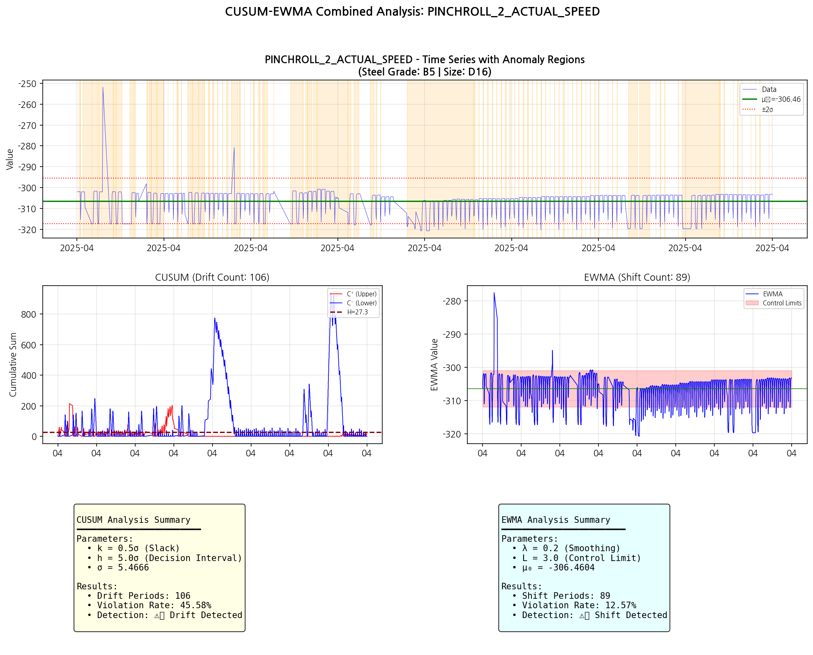
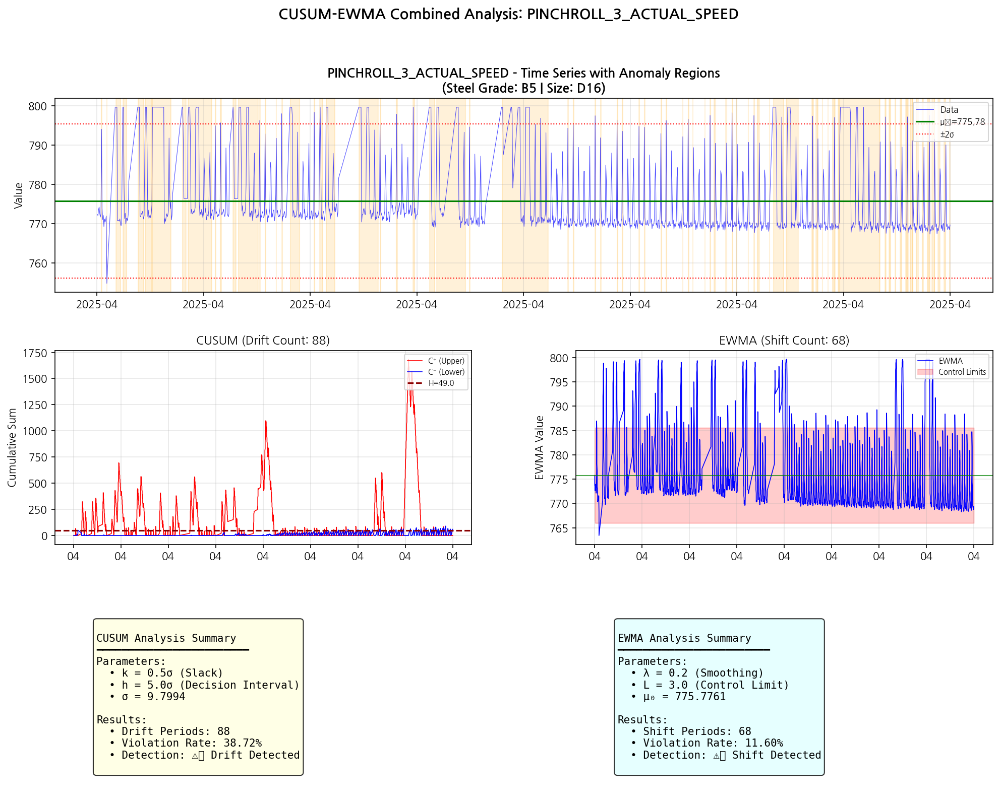
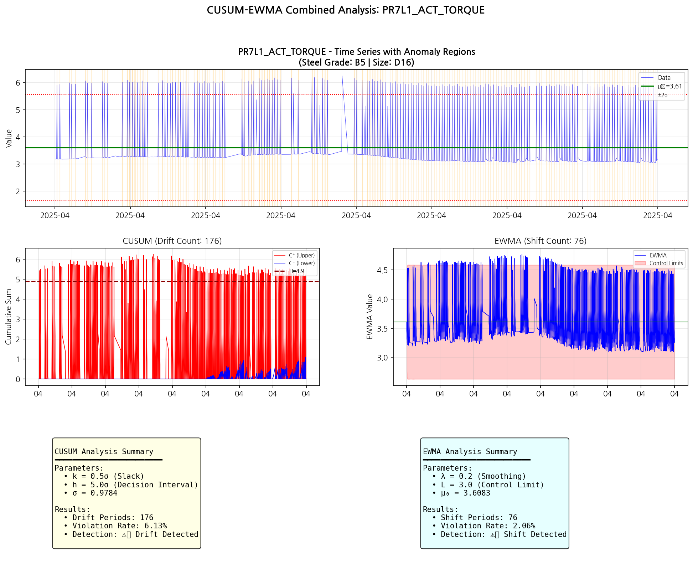
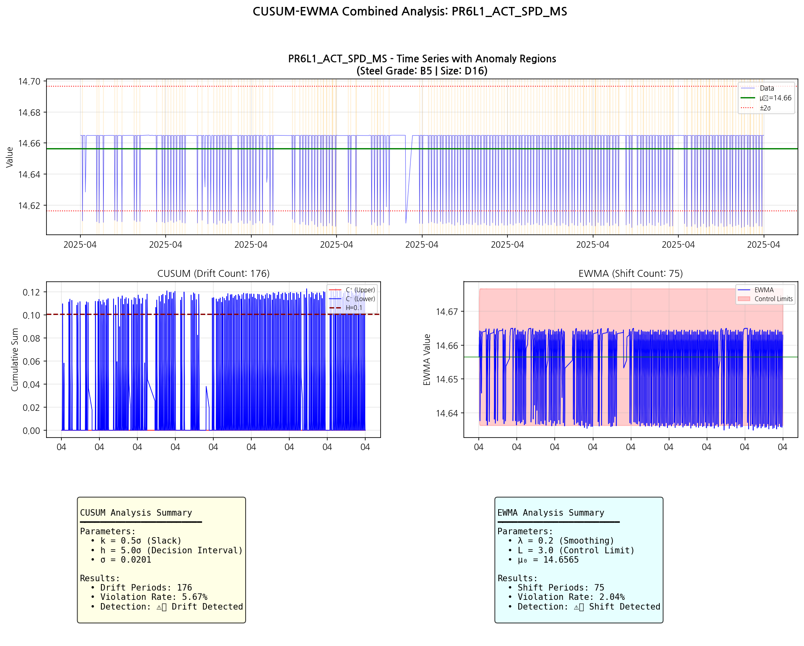
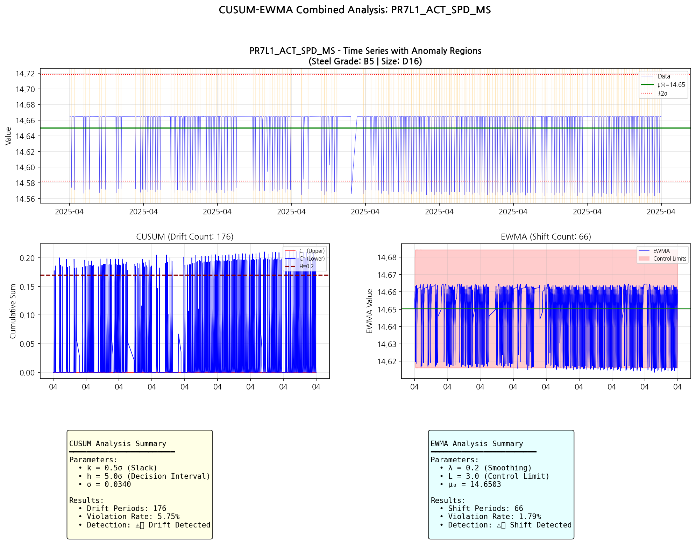

# 강종 [B5] | 규격: D16 CUSUM-EWMA 공정 관리도 분석 보고서

**분석 기간**: 2025-03-01 ~ 2025-08-31
**강종**: B5
**규격**: D16
**생성일시**: 2026-02-23 15:54:48

---

## 분석 개요

### 분석 방법론

| 방법 | 목적 | 파라미터 |
|------|------|----------|
| **CUSUM** | 점진적 드리프트 탐지 | k=0.5σ, h=5.0σ |
| **EWMA** | 급격한 변화 탐지 | λ=0.2, L=3.0 |

### 분석 결과 요약

| 구분 | 태그 수 | 비율 |
|------|---------|------|
| **총 분석 태그** | 23개 | 100% |
| 🔴 드리프트 탐지 | 20개 | 87.0% |
| 🟠 시프트 탐지 | 20개 | 87.0% |
| 🟡 경고 | 0개 | 0.0% |
| 🟢 안정 | 3개 | 13.0% |

---

## 상위 문제 태그 (드리프트 빈도 기준)

| 순위 | 태그 | 카테고리 | CUSUM 드리프트 | EWMA 시프트 | 상태 |
|------|------|----------|----------------|-------------|------|
| 1 | PR7L1_ACT_TORQUE | PR 상세 (토크+속도) | 176 | 76 | 🔴 |
| 2 | PR6L1_ACT_SPD_MS | PR 상세 (토크+속도) | 176 | 75 | 🔴 |
| 3 | PR7L1_ACT_SPD_MS | PR 상세 (토크+속도) | 176 | 66 | 🔴 |
| 4 | PR8L1_ACT_TORQUE | PR 상세 (토크+속도) | 171 | 84 | 🔴 |
| 5 | PR6L1_ACT_TORQUE | PR 상세 (토크+속도) | 165 | 64 | 🔴 |
| 6 | PR9L1_ACT_TORQUE | PR 상세 (토크+속도) | 120 | 66 | 🔴 |
| 7 | PINCHROLL_2_ACTUAL_SPEED | 핀치롤 | 106 | 89 | 🔴 |
| 8 | PINCHROLL_3_ACTUAL_SPEED | 핀치롤 | 88 | 68 | 🔴 |
| 9 | PR9L1_ACT_SPD_MS | PR 상세 (토크+속도) | 79 | 59 | 🔴 |
| 10 | PR8L1_ACT_SPD_MS | PR 상세 (토크+속도) | 75 | 57 | 🔴 |
| 11 | PINCHROLL_4_REFERENCE_TORQUE | 핀치롤 | 72 | 72 | 🔴 |
| 12 | PINCHROLL_3_REFERENCE_TORQUE | 핀치롤 | 72 | 71 | 🔴 |
| 13 | PINCHROLL_4_ACTUAL_SPEED | 핀치롤 | 72 | 69 | 🔴 |
| 14 | PINCHROLL_4_ACTUAL_TORQUE | 핀치롤 | 67 | 68 | 🔴 |
| 15 | PINCHROLL_3_ACTUAL_TORQUE | 핀치롤 | 64 | 63 | 🔴 |

---

## 카테고리별 분석 결과

### 핀치롤 (08_Pinchroll)

- 분석 태그: 11개
- 드리프트 탐지: 11개
- 시프트 탐지: 11개
- 안정: 0개

| 태그 | CUSUM Drift | EWMA Shift | 상태 |
|------|-------------|------------|------|
| PINCHROLL_2_ACTUAL_SPEED | 106 | 89 | 🔴 |
| PINCHROLL_3_ACTUAL_SPEED | 88 | 68 | 🔴 |
| PINCHROLL_4_ACTUAL_SPEED | 72 | 69 | 🔴 |
| PINCHROLL_2_ACTUAL_TORQUE | 63 | 69 | 🔴 |
| PINCHROLL_3_ACTUAL_TORQUE | 64 | 63 | 🔴 |
| PINCHROLL_4_ACTUAL_TORQUE | 67 | 68 | 🔴 |
| PINCHROLL_2_REFERENCE_TORQUE | 6 | 8 | 🔴 |
| PINCHROLL_3_REFERENCE_TORQUE | 72 | 71 | 🔴 |
| PINCHROLL_4_REFERENCE_TORQUE | 72 | 72 | 🔴 |
| PINCHROLL_3_REFERENCE_SPEED | 2 | 3 | 🔴 |
| PINCHROLL_4_REFERENCE_SPEED | 1 | 2 | 🔴 |

#### 주요 태그 차트

**PINCHROLL_2_ACTUAL_SPEED** (Drift: 106, Shift: 89)

**PINCHROLL_3_ACTUAL_SPEED** (Drift: 88, Shift: 68)

**PINCHROLL_4_REFERENCE_TORQUE** (Drift: 72, Shift: 72)

### PR 상세 (토크+속도) (09_PR_Detailed)

- 분석 태그: 12개
- 드리프트 탐지: 9개
- 시프트 탐지: 9개
- 안정: 3개

| 태그 | CUSUM Drift | EWMA Shift | 상태 |
|------|-------------|------------|------|
| PR6L1_ACT_TORQUE | 165 | 64 | 🔴 |
| PR6L2_ACT_TORQUE | 1 | 3 | 🔴 |
| PR7L1_ACT_TORQUE | 176 | 76 | 🔴 |
| PR7L2_ACT_TORQUE | 0 | 0 | 🟢 |
| PR8L1_ACT_TORQUE | 171 | 84 | 🔴 |
| PR9L1_ACT_TORQUE | 120 | 66 | 🔴 |
| PR6L1_ACT_SPD_MS | 176 | 75 | 🔴 |
| PR6L2_ACT_SPD_MS | 0 | 0 | 🟢 |
| PR7L1_ACT_SPD_MS | 176 | 66 | 🔴 |
| PR7L2_ACT_SPD_MS | 0 | 0 | 🟢 |
| PR8L1_ACT_SPD_MS | 75 | 57 | 🔴 |
| PR9L1_ACT_SPD_MS | 79 | 59 | 🔴 |

#### 주요 태그 차트

**PR7L1_ACT_TORQUE** (Drift: 176, Shift: 76)

**PR6L1_ACT_SPD_MS** (Drift: 176, Shift: 75)

**PR7L1_ACT_SPD_MS** (Drift: 176, Shift: 66)

---

## 해석 가이드

### CUSUM (Cumulative Sum) 관리도

- **원리**: 목표값 대비 편차의 누적합을 추적
- **장점**: 작은 지속적 변화(0.5σ~2σ)에 민감
- **드리프트**: 누적합이 결정 구간(h)을 초과하면 탐지
- **활용**: 점진적인 공정 악화, 센서 드리프트 탐지

### EWMA (Exponentially Weighted Moving Average) 관리도

- **원리**: 최근 데이터에 더 큰 가중치를 부여
- **장점**: 급격한 변화에 빠른 반응
- **시프트**: EWMA 값이 제어 한계를 벗어나면 탐지
- **활용**: 급격한 공정 변화, 이상 상태 전환 탐지

### 상태 정의

| 상태 | 설명 | 권장 조치 |
|------|------|----------|
| 🔴 드리프트 탐지 | CUSUM에서 점진적 변화 감지 | 원인 분석 및 공정 조정 |
| 🟠 시프트 탐지 | EWMA에서 급격한 변화 감지 | 즉시 점검 필요 |
| 🟡 경고 | 위반율 5% 초과 | 모니터링 강화 |
| 🟢 안정 | 정상 범위 | 현 상태 유지 |

---

## 메타데이터

| 항목 | 값 |
|------|-----|
| 분석 스크립트 | steel_grade_cusum_ewma_analysis.py |
| 분석 기간 | 2025-03-01 ~ 2025-08-31 |
| 강종 | B5 |
| 규격 | D16 |
| 생성일시 | 2026-02-23 15:54:48 |
| 총 분석 태그 | 23개 |

---

*본 보고서는 자동 생성되었습니다.*
