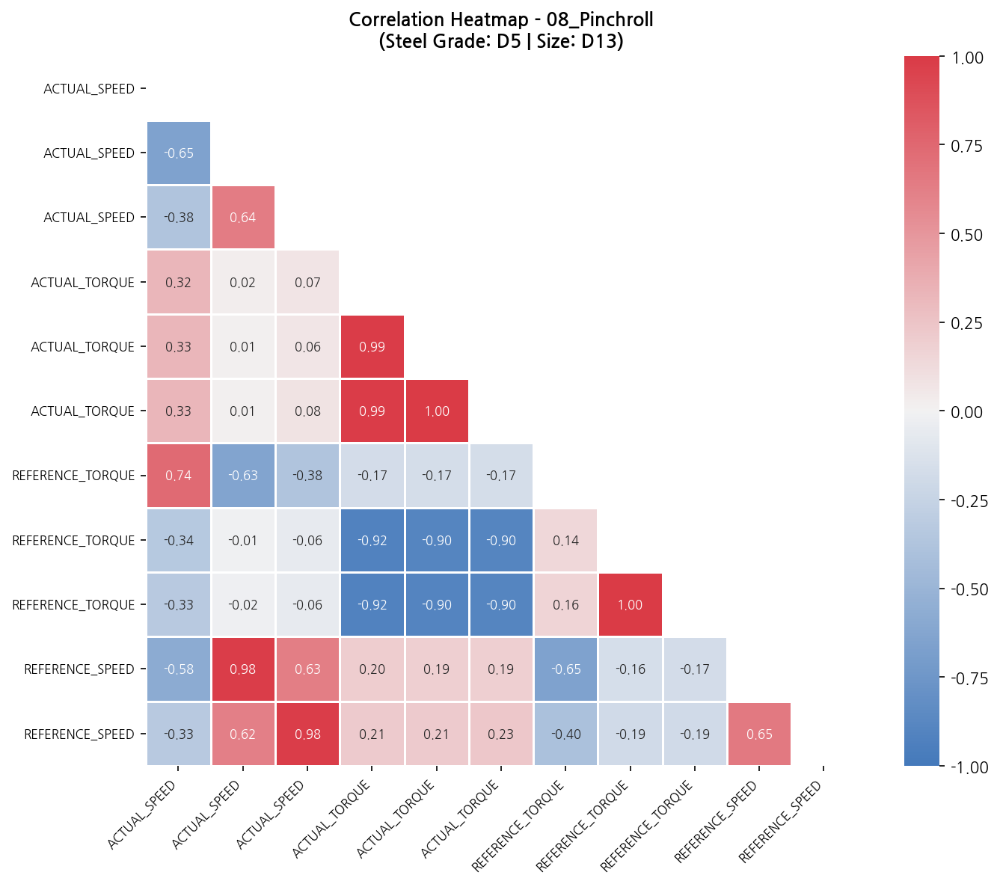
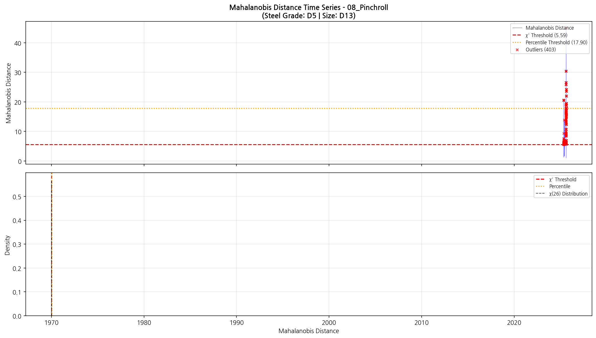
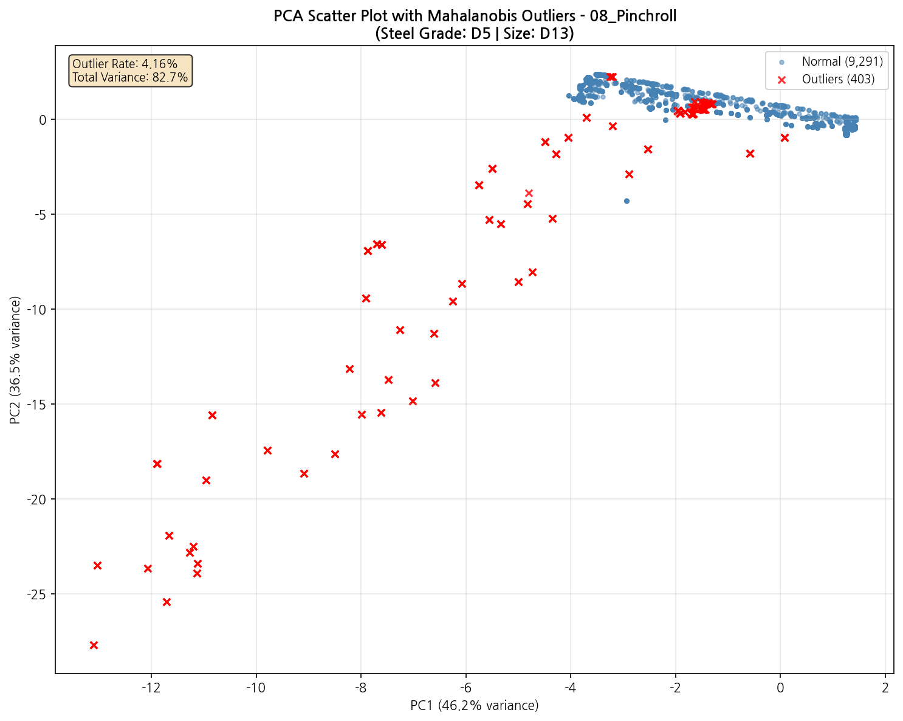
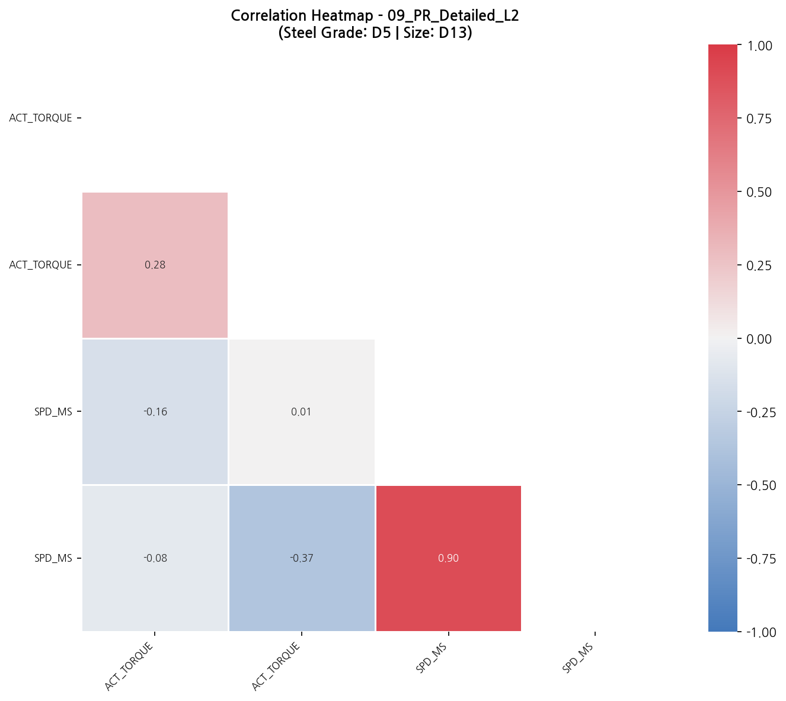
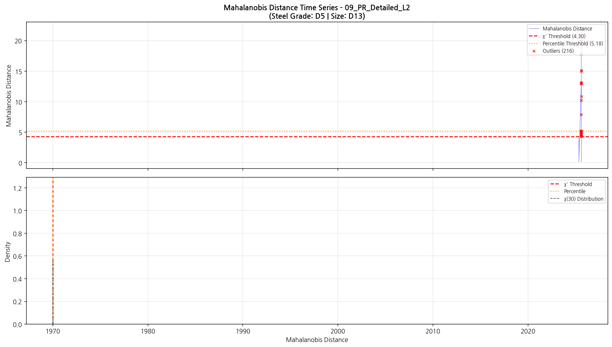
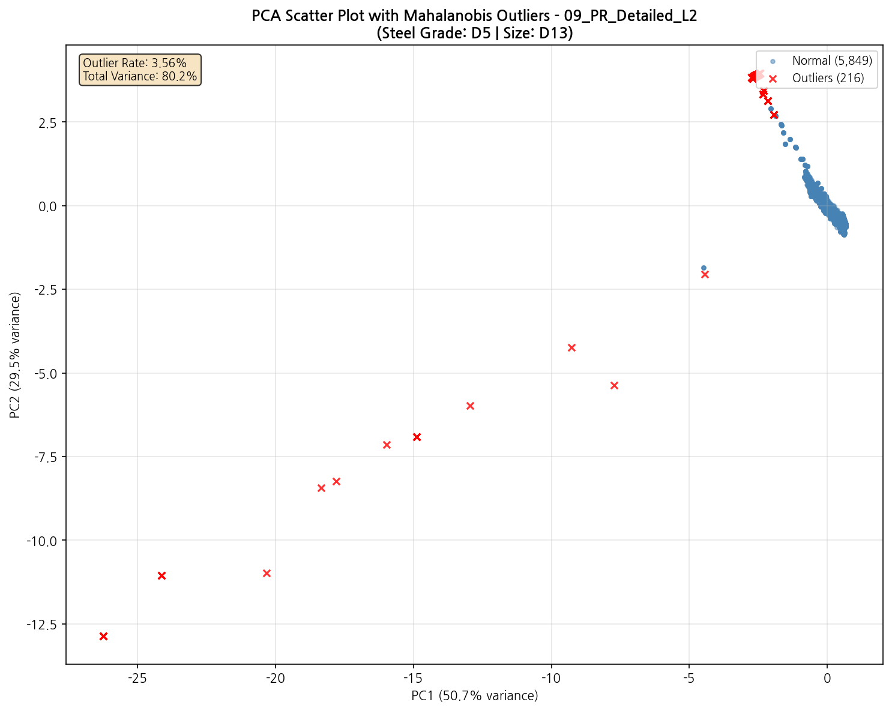
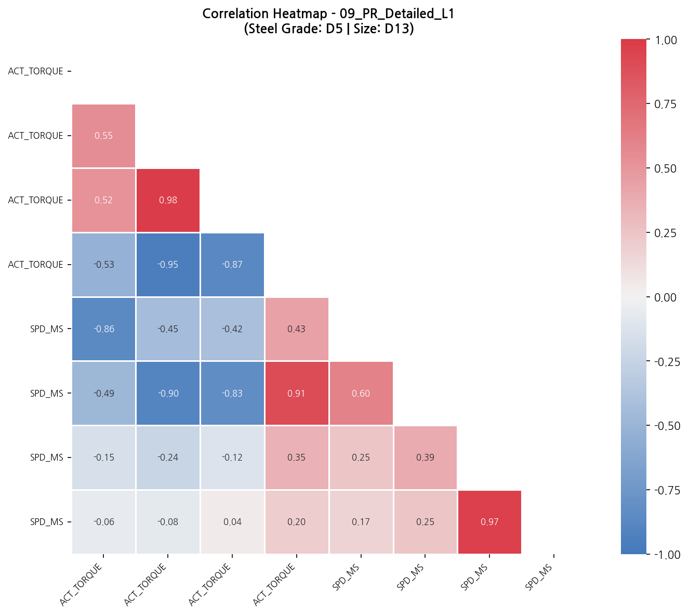
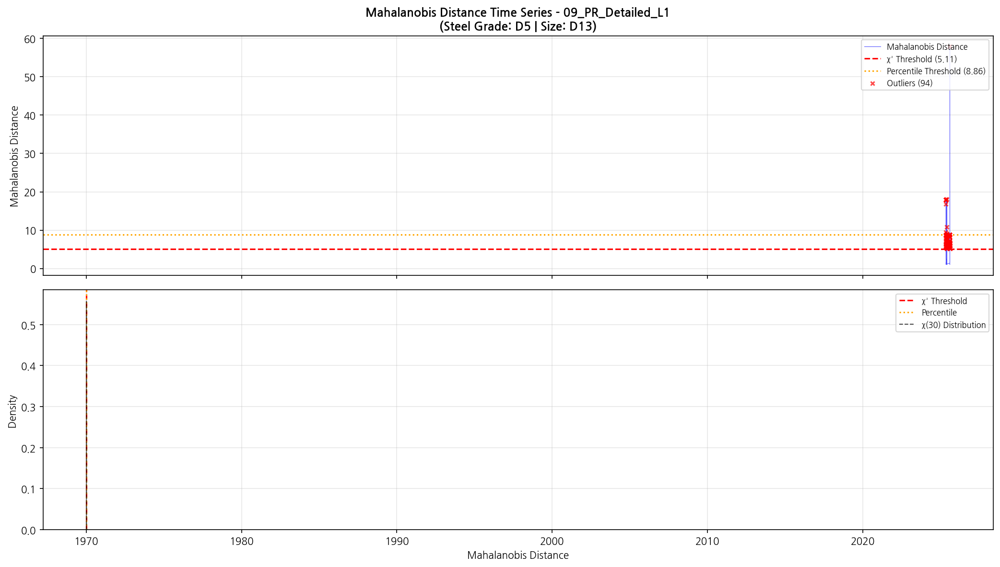
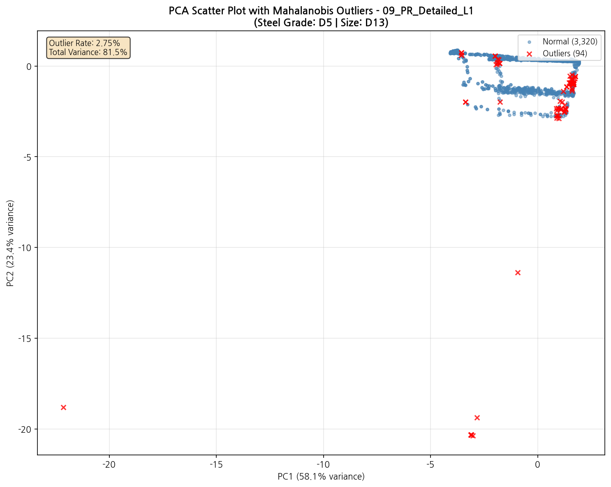

# 강종 [D5] 규격 [D13] Mahalanobis Distance 다변량 이상치 분석 보고서

**분석 기간**: 2025-03-01 ~ 2025-08-31
**강종**: D5
**규격**: D13
**생성일시**: 2026-02-23 16:04:48

---

## 분석 개요

### 분석 방법론

**Mahalanobis Distance (마할라노비스 거리)**

다변량 이상치 탐지를 위한 거리 측정 방법으로, 변수 간 상관관계를 고려합니다.

$$D_M(x) = \sqrt{(x - \mu)^T \Sigma^{-1} (x - \mu)}$$

| 파라미터 | 값 | 설명 |
|----------|-----|------|
| α (유의수준) | 0.001 | χ² 분포 임계값 |
| Percentile | 99.5% | 백분위수 임계값 |

### 장점

- **상관관계 고려**: 변수 간 관계를 반영
- **스케일 독립**: 변수 단위에 영향받지 않음
- **복합 이상치 탐지**: 개별 정상, 조합 이상 탐지

### 분석 결과 요약

| 구분 | 카테고리 수 | 비율 |
|------|-------------|------|
| **총 분석 카테고리** | 3개 | 100% |
| 🔴 높은 이상치율 (≥10%) | 0개 | 0.0% |
| 🟠 중간 이상치율 (3~10%) | 2개 | 66.7% |
| 🟢 낮은 이상치율 (<3%) | 1개 | 33.3% |

#### 전체 평균

| 지표 | 값 |
|------|-----|
| 평균 이상치율 | 3.49% |
| 평균 상관계수 | 0.032 |

---

## 카테고리별 분석 결과

| 카테고리 | 설명 | 태그 수 | 이상치율 | 평균 상관 | 상태 |
|----------|------|---------|----------|-----------|------|
| 08_Pinchroll | 핀치롤 | 11 | 4.16% | 0.009 | 🟠 |
| 09_PR_Detailed_L2 | PR 상세 (토크+속도) | 4 | 3.56% | 0.099 | 🟠 |
| 09_PR_Detailed_L1 | PR 상세 (토크+속도) | 8 | 2.75% | -0.013 | 🟢 |

---

## 상세 분석

### 핀치롤 (08_Pinchroll) 🟠

**분석 태그**: 11개
- PINCHROLL_2_ACTUAL_SPEED
- PINCHROLL_3_ACTUAL_SPEED
- PINCHROLL_4_ACTUAL_SPEED
- PINCHROLL_2_ACTUAL_TORQUE
- PINCHROLL_3_ACTUAL_TORQUE
- ... 외 6개

**Mahalanobis 통계**

| 지표 | 값 |
|------|-----|
| χ² 임계값 | 5.5914 |
| 이상치 수 | 403개 |
| 이상치율 | 4.16% |
| 평균 거리 | 2.3807 |
| 최대 거리 | 45.0749 |

**상관관계**

| 지표 | 값 |
|------|-----|
| 평균 상관계수 | 0.009 |
| 최대 상관계수 | 1.000 |
| 최소 상관계수 | -0.919 |

**PCA 분석**

| 주성분 | 설명 분산 비율 |
|--------|----------------|
| PC1 | 46.2% |
| PC2 | 36.5% |
| 합계 | 82.7% |

#### 시각화

**상관관계 히트맵**

**Mahalanobis 거리 시계열**

**PCA 산점도**

---

### PR 상세 (토크+속도) (09_PR_Detailed_L2) 🟠

**분석 태그**: 4개
- PR6L2_ACT_TORQUE
- PR7L2_ACT_TORQUE
- PR6L2_ACT_SPD_MS
- PR7L2_ACT_SPD_MS

**Mahalanobis 통계**

| 지표 | 값 |
|------|-----|
| χ² 임계값 | 4.2973 |
| 이상치 수 | 216개 |
| 이상치율 | 3.56% |
| 평균 거리 | 1.4965 |
| 최대 거리 | 21.9749 |

**상관관계**

| 지표 | 값 |
|------|-----|
| 평균 상관계수 | 0.099 |
| 최대 상관계수 | 0.905 |
| 최소 상관계수 | -0.367 |

**PCA 분석**

| 주성분 | 설명 분산 비율 |
|--------|----------------|
| PC1 | 50.7% |
| PC2 | 29.5% |
| 합계 | 80.2% |

#### 시각화

**상관관계 히트맵**

**Mahalanobis 거리 시계열**

**PCA 산점도**

---

### PR 상세 (토크+속도) (09_PR_Detailed_L1) 🟢

**분석 태그**: 8개
- PR6L1_ACT_TORQUE
- PR7L1_ACT_TORQUE
- PR8L1_ACT_TORQUE
- PR9L1_ACT_TORQUE
- PR6L1_ACT_SPD_MS
- ... 외 3개

**Mahalanobis 통계**

| 지표 | 값 |
|------|-----|
| χ² 임계값 | 5.1112 |
| 이상치 수 | 94개 |
| 이상치율 | 2.75% |
| 평균 거리 | 2.2177 |
| 최대 거리 | 57.8451 |

**상관관계**

| 지표 | 값 |
|------|-----|
| 평균 상관계수 | -0.013 |
| 최대 상관계수 | 0.977 |
| 최소 상관계수 | -0.952 |

**PCA 분석**

| 주성분 | 설명 분산 비율 |
|--------|----------------|
| PC1 | 58.1% |
| PC2 | 23.4% |
| 합계 | 81.5% |

#### 시각화

**상관관계 히트맵**

**Mahalanobis 거리 시계열**

**PCA 산점도**

---

## 해석 가이드

### Mahalanobis Distance 해석

1. **거리가 큰 관측치**
   - 다변량 공간에서 중심에서 멀리 떨어진 점
   - 여러 변수의 조합이 비정상적
   - 개별 변수는 정상 범위일 수 있음

2. **χ² 임계값**
   - 자유도 p의 χ² 분포 기반
   - 유의수준 α에서의 임계값
   - 통계적으로 유의한 이상치 판정

3. **상관관계와 이상치**
   - 높은 상관관계: 변수 간 강한 연관성
   - 상관 패턴 이탈 = 다변량 이상치

### 상태 분류

| 상태 | 기준 | 해석 |
|------|------|------|
| 🔴 높음 | ≥10% | 다변량 이상치 빈번, 점검 필요 |
| 🟠 중간 | 3~10% | 일부 조합 이상, 모니터링 |
| 🟢 낮음 | <3% | 정상 범위 |

### PCA 시각화 해석

- **PC1, PC2**: 데이터의 주요 변동 방향
- **빨간 점**: Mahalanobis 이상치
- **분산 비율**: 축이 설명하는 정보량

---

## 메타데이터

| 항목 | 값 |
|------|-----|
| 분석 스크립트 | steel_grade_mahalanobis_analysis.py |
| 분석 기간 | 2025-03-01 ~ 2025-08-31 |
| 강종 | D5 |
| 규격 | D13 |
| 유의수준 | 0.001 |
| 생성일시 | 2026-02-23 16:04:48 |
| 총 분석 카테고리 | 3개 |

---

*본 보고서는 자동 생성되었습니다.*
