# 강종 [D4] CUSUM-EWMA 공정 관리도 분석 보고서

**분석 기간**: 2025-03-01 ~ 2025-08-31
**강종**: D4
**생성일시**: 2026-02-03 20:39:34

---

## 분석 개요

### 분석 방법론

| 방법 | 목적 | 파라미터 |
|------|------|----------|
| **CUSUM** | 점진적 드리프트 탐지 | k=0.5σ, h=5.0σ |
| **EWMA** | 급격한 변화 탐지 | λ=0.2, L=3.0 |

### 분석 결과 요약

| 구분 | 태그 수 | 비율 |
|------|---------|------|
| **총 분석 태그** | 79개 | 100% |
| 🔴 드리프트 탐지 | 79개 | 100.0% |
| 🟠 시프트 탐지 | 79개 | 100.0% |
| 🟡 경고 | 0개 | 0.0% |
| 🟢 안정 | 0개 | 0.0% |

---

## 상위 문제 태그 (드리프트 빈도 기준)

| 순위 | 태그 | 카테고리 | CUSUM 드리프트 | EWMA 시프트 | 상태 |
|------|------|----------|----------------|-------------|------|
| 1 | FURNACE_EXIT_DISCHARGE_BILLET_TEMPERATURE | 가열로 추출 온도 | 415 | 279 | 🔴 |
| 2 | PINCHROLL_4_REFERENCE_TORQUE | 핀치롤 | 208 | 266 | 🔴 |
| 3 | STAND_8_LOAD | 스탠드 부하 | 179 | 212 | 🔴 |
| 4 | STAND_6_LOAD | 스탠드 부하 | 177 | 215 | 🔴 |
| 5 | STAND_5_LOAD | 스탠드 부하 | 177 | 213 | 🔴 |
| 6 | STAND_7_LOAD | 스탠드 부하 | 177 | 212 | 🔴 |
| 7 | STAND_9_LOAD | 스탠드 부하 | 174 | 210 | 🔴 |
| 8 | STAND_11_LOAD | 스탠드 부하 | 174 | 210 | 🔴 |
| 9 | STAND_10_LOAD | 스탠드 부하 | 172 | 210 | 🔴 |
| 10 | STAND_4_LOAD | 스탠드 부하 | 172 | 207 | 🔴 |
| 11 | STAND_12_LOAD | 스탠드 부하 | 169 | 210 | 🔴 |
| 12 | STAND_13_LOAD | 스탠드 부하 | 169 | 210 | 🔴 |
| 13 | STAND_14_LOAD | 스탠드 부하 | 168 | 209 | 🔴 |
| 14 | STAND_2_LOAD | 스탠드 부하 | 165 | 209 | 🔴 |
| 15 | STAND_1_LOAD | 스탠드 부하 | 164 | 208 | 🔴 |

---

## 카테고리별 분석 결과

### 가열로 상부 온도 (01_Furnace_Top_Temperature)

- 분석 태그: 4개
- 드리프트 탐지: 4개
- 시프트 탐지: 4개
- 안정: 0개

| 태그 | CUSUM Drift | EWMA Shift | 상태 |
|------|-------------|------------|------|
| HEATING_TOP_ZONE_NO_1_TEMPERATURE_ROOF | 3 | 114 | 🔴 |
| HEATING_TOP_ZONE_NO_2_TEMPERATURE_ROOF | 3 | 161 | 🔴 |
| SOAKING_TOP_ZONE_NO_1_TEMPERATURE_ROOF | 6 | 42 | 🔴 |
| SOAKING_TOP_ZONE_NO_2_TEMPERATURE_ROOF | 8 | 26 | 🔴 |

#### 주요 태그 차트

**SOAKING_TOP_ZONE_NO_2_TEMPERATURE_ROOF** (Drift: 8, Shift: 26)

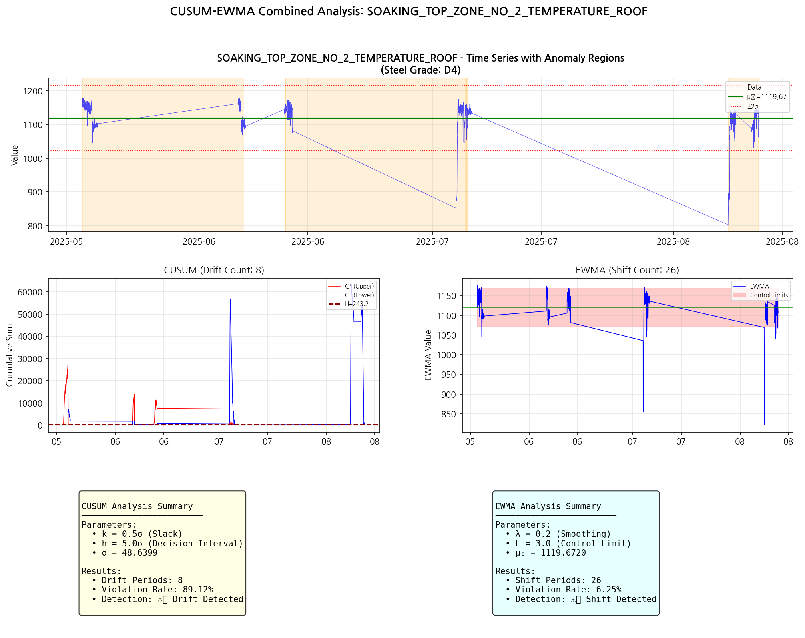

**SOAKING_TOP_ZONE_NO_1_TEMPERATURE_ROOF** (Drift: 6, Shift: 42)

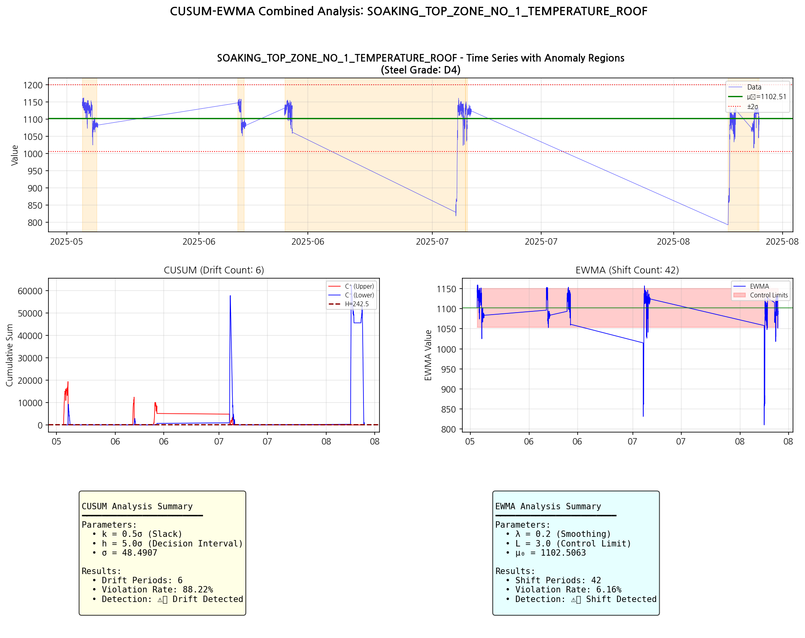

**HEATING_TOP_ZONE_NO_2_TEMPERATURE_ROOF** (Drift: 3, Shift: 161)

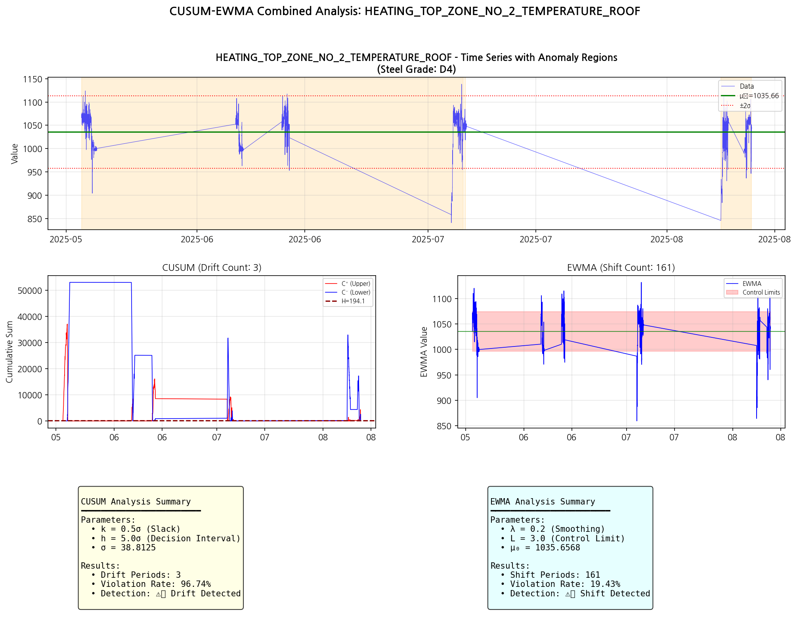

### 가열로 하부 온도 (02_Furnace_Bottom_Temperature)

- 분석 태그: 4개
- 드리프트 탐지: 4개
- 시프트 탐지: 4개
- 안정: 0개

| 태그 | CUSUM Drift | EWMA Shift | 상태 |
|------|-------------|------------|------|
| HEATING_BOTTOM_ZONE_NO_1_TEMPERATURE_OPP_SIDE | 12 | 82 | 🔴 |
| HEATING_BOTTOM_ZONE_NO_2_TEMPERATURE_MILL_SIDE | 10 | 92 | 🔴 |
| SOAKING_BOTTOM_ZONE_NO_1_TEMPERATURE_OPP_SIDE | 9 | 32 | 🔴 |
| SOAKING_BOTTOM_ZONE_NO_2_TEMPERATURE_MILL_SIDE | 9 | 40 | 🔴 |

#### 주요 태그 차트

**HEATING_BOTTOM_ZONE_NO_1_TEMPERATURE_OPP_SIDE** (Drift: 12, Shift: 82)

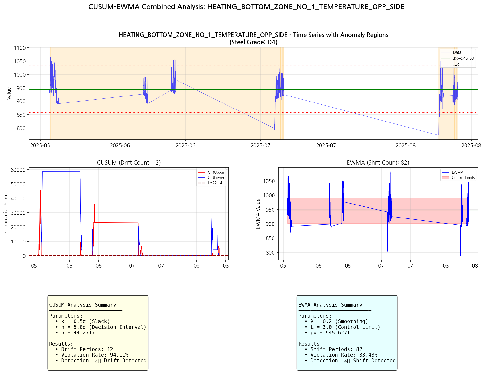

**HEATING_BOTTOM_ZONE_NO_2_TEMPERATURE_MILL_SIDE** (Drift: 10, Shift: 92)

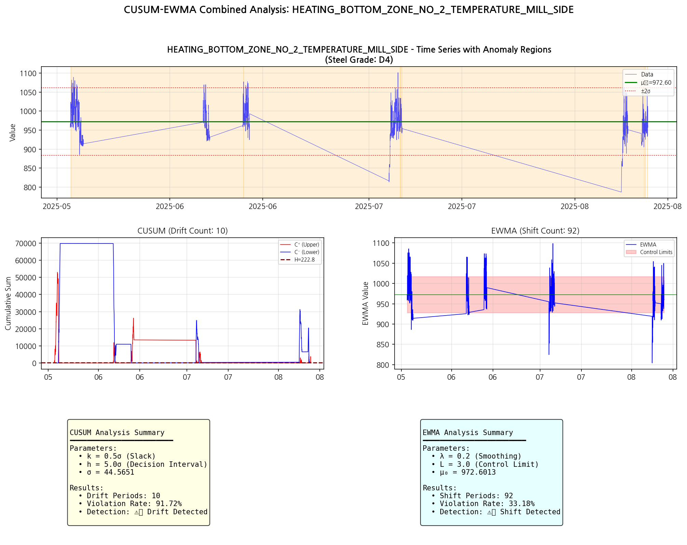

**SOAKING_BOTTOM_ZONE_NO_2_TEMPERATURE_MILL_SIDE** (Drift: 9, Shift: 40)

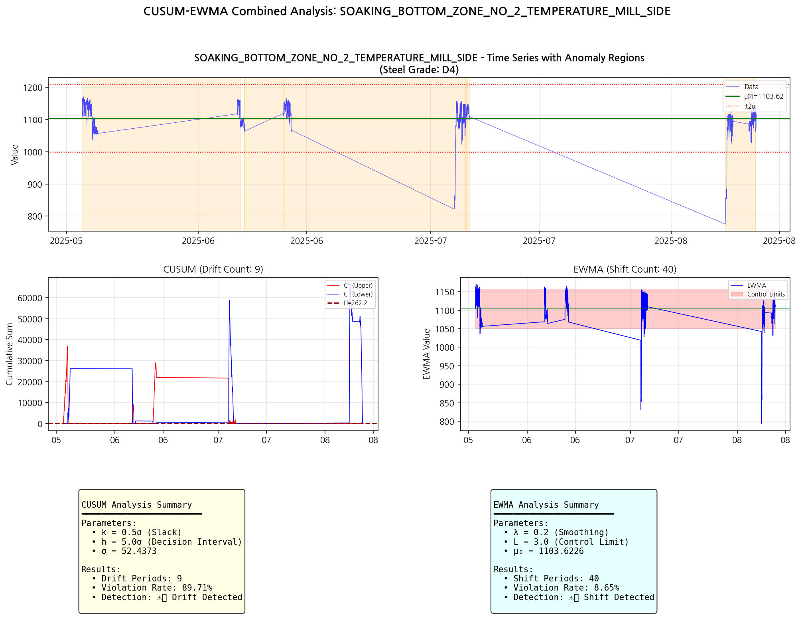

### 가열로 추출 온도 (03_Furnace_Discharge_Temperature)

- 분석 태그: 1개
- 드리프트 탐지: 1개
- 시프트 탐지: 1개
- 안정: 0개

| 태그 | CUSUM Drift | EWMA Shift | 상태 |
|------|-------------|------------|------|
| FURNACE_EXIT_DISCHARGE_BILLET_TEMPERATURE | 415 | 279 | 🔴 |

#### 주요 태그 차트

**FURNACE_EXIT_DISCHARGE_BILLET_TEMPERATURE** (Drift: 415, Shift: 279)

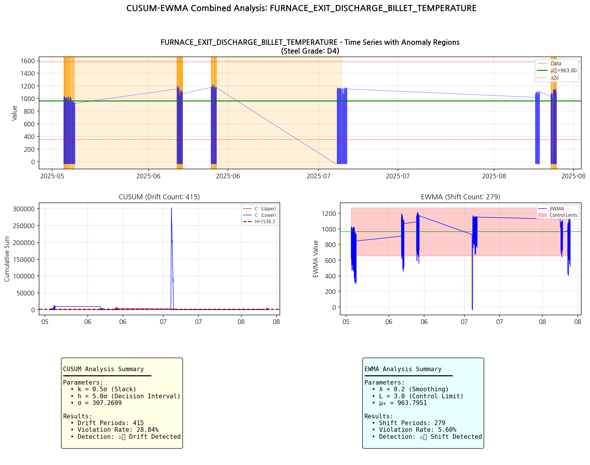

### 가열로 보조설비 (04_Furnace_Auxiliary)

- 분석 태그: 9개
- 드리프트 탐지: 9개
- 시프트 탐지: 9개
- 안정: 0개

| 태그 | CUSUM Drift | EWMA Shift | 상태 |
|------|-------------|------------|------|
| FURNACE_PRESSURE | 31 | 217 | 🔴 |
| FURNACE_O2_ANALYZER | 16 | 49 | 🔴 |
| MAIN_GAS_PRESSURE | 38 | 178 | 🔴 |
| MAIN_GAS_FLOW | 20 | 125 | 🔴 |
| MAIN_GAS_TEMPERATURE | 1 | 24 | 🔴 |
| MAIN_COMBUSTION_AIR_PRESSURE | 2 | 7 | 🔴 |
| COMBUSTION_AIR_TEMPERATURE | 1 | 50 | 🔴 |
| INDIRECT_COOLING_WATER_FLOW | 1 | 73 | 🔴 |
| INDIRECT_WATER_MAIN_TEMPERATURE | 1 | 9 | 🔴 |

#### 주요 태그 차트

**MAIN_GAS_PRESSURE** (Drift: 38, Shift: 178)

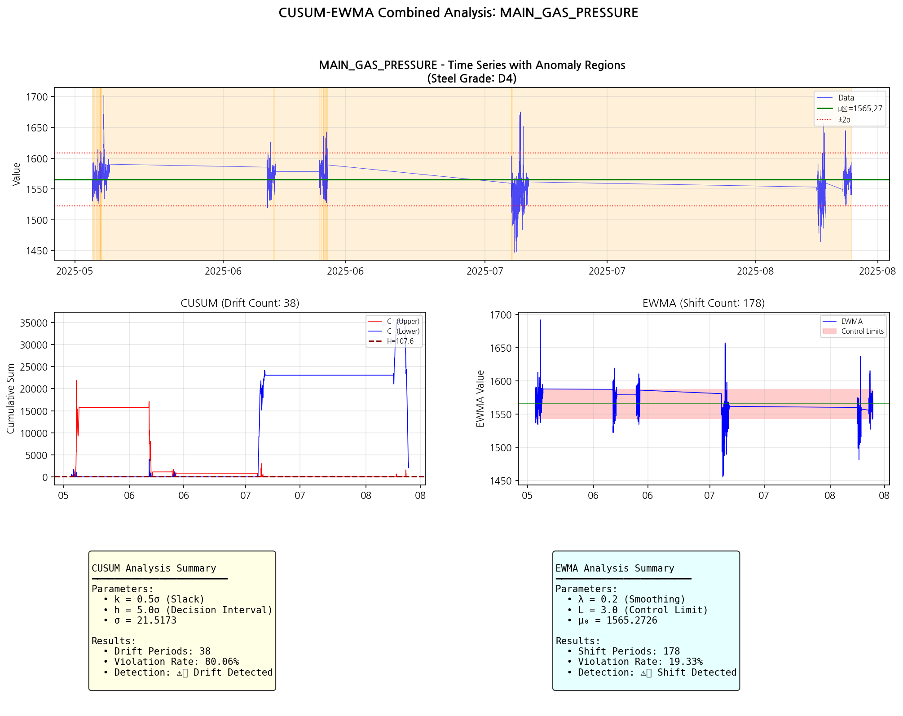

**FURNACE_PRESSURE** (Drift: 31, Shift: 217)

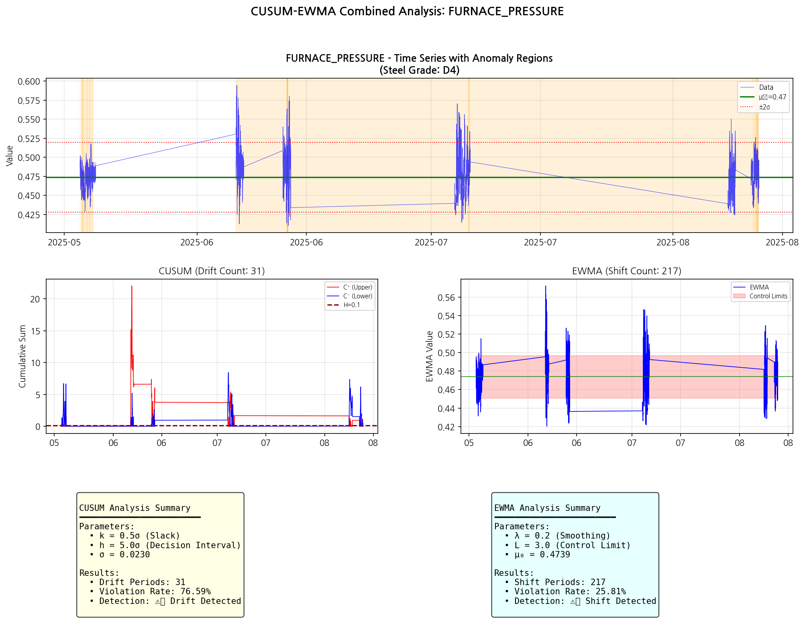

**MAIN_GAS_FLOW** (Drift: 20, Shift: 125)

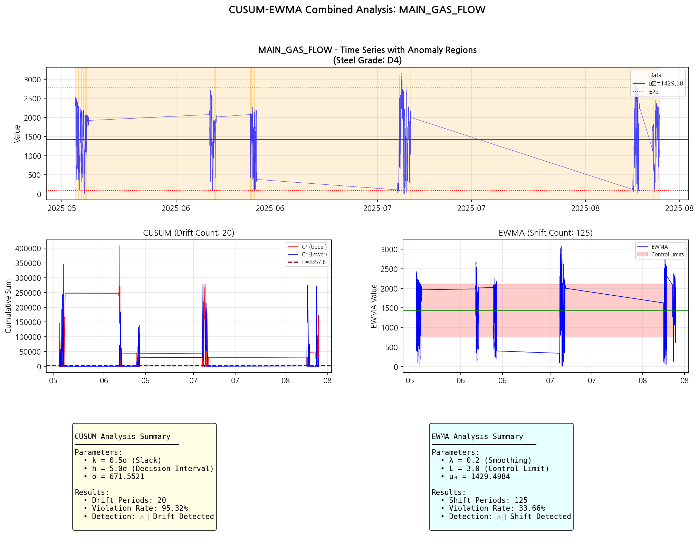

### 스탠드 토크 (05_Stand_Torque)

- 분석 태그: 16개
- 드리프트 탐지: 16개
- 시프트 탐지: 16개
- 안정: 0개

| 태그 | CUSUM Drift | EWMA Shift | 상태 |
|------|-------------|------------|------|
| STAND_1_ACTUAL_TORQUE | 97 | 270 | 🔴 |
| STAND_2_ACTUAL_TORQUE | 113 | 270 | 🔴 |
| STAND_3_ACTUAL_TORQUE | 105 | 249 | 🔴 |
| STAND_4_ACTUAL_TORQUE | 96 | 222 | 🔴 |
| STAND_5_ACTUAL_TORQUE | 118 | 177 | 🔴 |
| STAND_6_ACTUAL_TORQUE | 112 | 175 | 🔴 |
| STAND_7_ACTUAL_TORQUE | 110 | 224 | 🔴 |
| STAND_8_ACTUAL_TORQUE | 109 | 218 | 🔴 |
| STAND_9_ACTUAL_TORQUE | 103 | 204 | 🔴 |
| STAND_10_ACTUAL_TORQUE | 105 | 161 | 🔴 |
| STAND_11_ACTUAL_TORQUE | 89 | 235 | 🔴 |
| STAND_12_ACTUAL_TORQUE | 73 | 278 | 🔴 |
| STAND_13_ACTUAL_TORQUE | 92 | 207 | 🔴 |
| STAND_14_ACTUAL_TORQUE | 93 | 158 | 🔴 |
| FINISHING_BLOCK_MASTER_ACTUAL_TORQUE | 41 | 320 | 🔴 |
| FINISHING_BLOCK_SLAVE_ACTUAL_TORQUE | 41 | 322 | 🔴 |

#### 주요 태그 차트

**STAND_5_ACTUAL_TORQUE** (Drift: 118, Shift: 177)

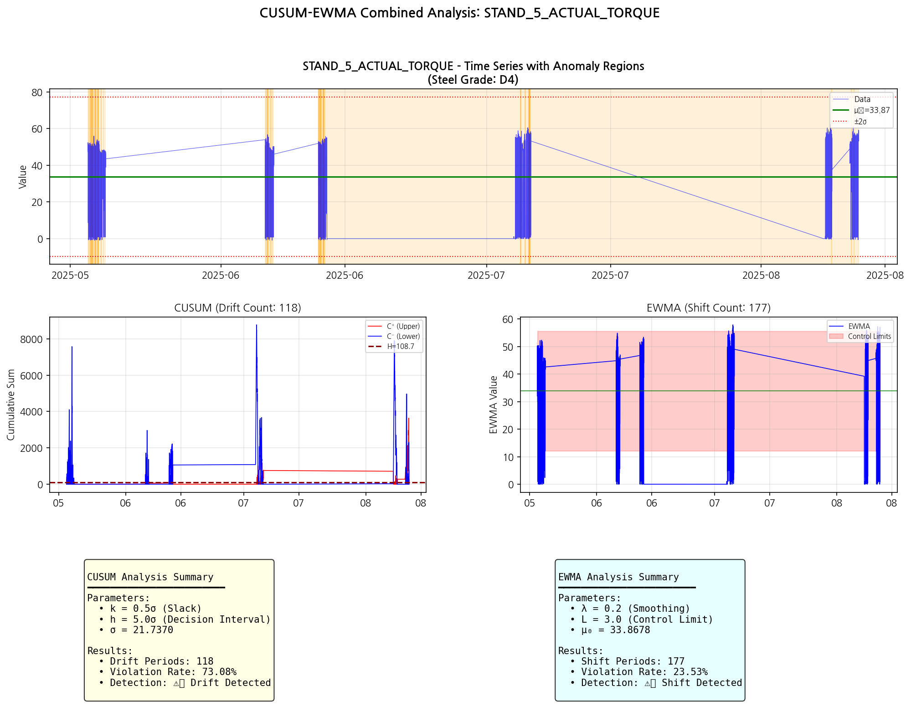

**STAND_2_ACTUAL_TORQUE** (Drift: 113, Shift: 270)

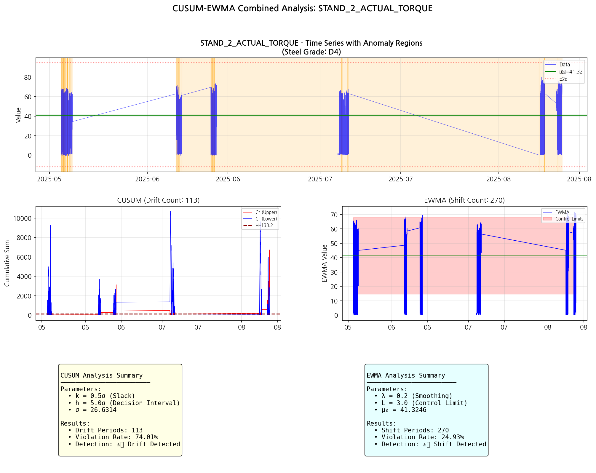

**STAND_6_ACTUAL_TORQUE** (Drift: 112, Shift: 175)

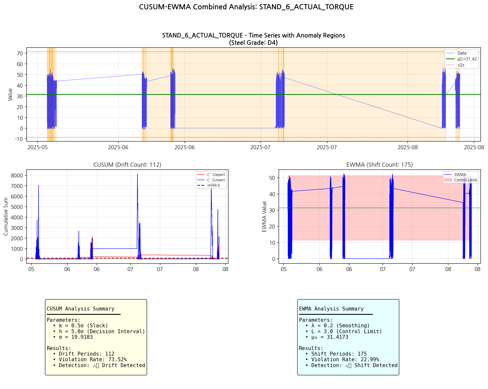

### 스탠드 속도 (06_Stand_Speed)

- 분석 태그: 15개
- 드리프트 탐지: 15개
- 시프트 탐지: 15개
- 안정: 0개

| 태그 | CUSUM Drift | EWMA Shift | 상태 |
|------|-------------|------------|------|
| STAND_1_ACTUAL_SPEED | 37 | 87 | 🔴 |
| STAND_2_ACTUAL_SPEED | 41 | 85 | 🔴 |
| STAND_3_ACTUAL_SPEED | 32 | 85 | 🔴 |
| STAND_4_ACTUAL_SPEED | 33 | 86 | 🔴 |
| STAND_5_ACTUAL_SPEED | 34 | 86 | 🔴 |
| STAND_6_ACTUAL_SPEED | 36 | 86 | 🔴 |
| STAND_7_ACTUAL_SPEED | 32 | 87 | 🔴 |
| STAND_8_ACTUAL_SPEED | 36 | 86 | 🔴 |
| STAND_9_ACTUAL_SPEED | 41 | 90 | 🔴 |
| STAND_10_ACTUAL_SPEED | 40 | 90 | 🔴 |
| STAND_11_ACTUAL_SPEED | 43 | 91 | 🔴 |
| STAND_12_ACTUAL_SPEED | 41 | 92 | 🔴 |
| STAND_13_ACTUAL_SPEED | 36 | 90 | 🔴 |
| STAND_14_ACTUAL_SPEED | 41 | 91 | 🔴 |
| FINISHING_BLOCK_ACTUAL_SPEED | 48 | 91 | 🔴 |

#### 주요 태그 차트

**FINISHING_BLOCK_ACTUAL_SPEED** (Drift: 48, Shift: 91)

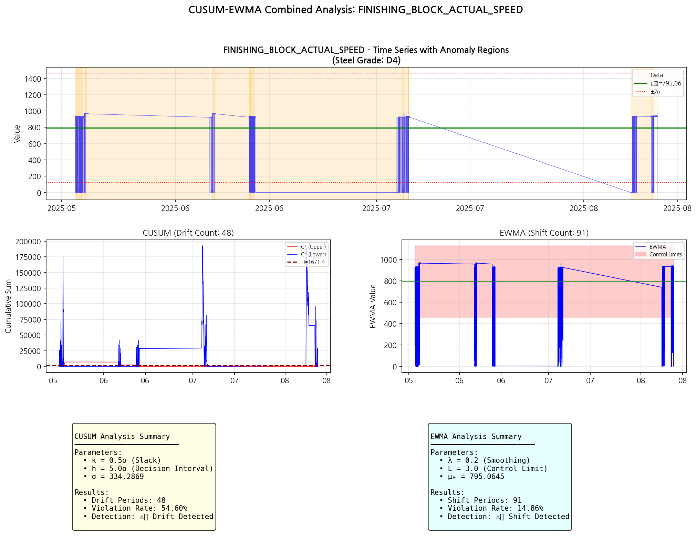

**STAND_11_ACTUAL_SPEED** (Drift: 43, Shift: 91)

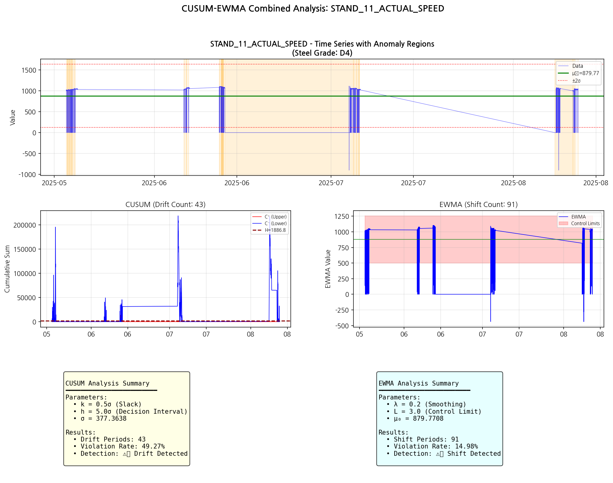

**STAND_12_ACTUAL_SPEED** (Drift: 41, Shift: 92)

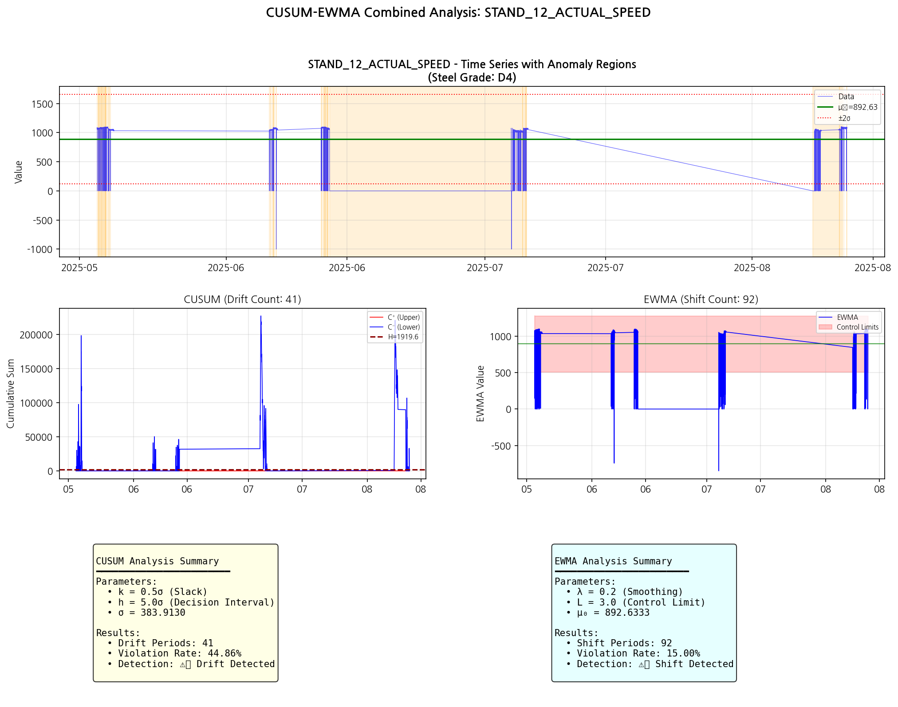

### 스탠드 부하 (07_Stand_Load)

- 분석 태그: 15개
- 드리프트 탐지: 15개
- 시프트 탐지: 15개
- 안정: 0개

| 태그 | CUSUM Drift | EWMA Shift | 상태 |
|------|-------------|------------|------|
| STAND_1_LOAD | 164 | 208 | 🔴 |
| STAND_2_LOAD | 165 | 209 | 🔴 |
| STAND_3_LOAD | 163 | 208 | 🔴 |
| STAND_4_LOAD | 172 | 207 | 🔴 |
| STAND_5_LOAD | 177 | 213 | 🔴 |
| STAND_6_LOAD | 177 | 215 | 🔴 |
| STAND_7_LOAD | 177 | 212 | 🔴 |
| STAND_8_LOAD | 179 | 212 | 🔴 |
| STAND_9_LOAD | 174 | 210 | 🔴 |
| STAND_10_LOAD | 172 | 210 | 🔴 |
| STAND_11_LOAD | 174 | 210 | 🔴 |
| STAND_12_LOAD | 169 | 210 | 🔴 |
| STAND_13_LOAD | 169 | 210 | 🔴 |
| STAND_14_LOAD | 168 | 209 | 🔴 |
| FINISHING_BLOCK_LOAD | 162 | 209 | 🔴 |

#### 주요 태그 차트

**STAND_8_LOAD** (Drift: 179, Shift: 212)

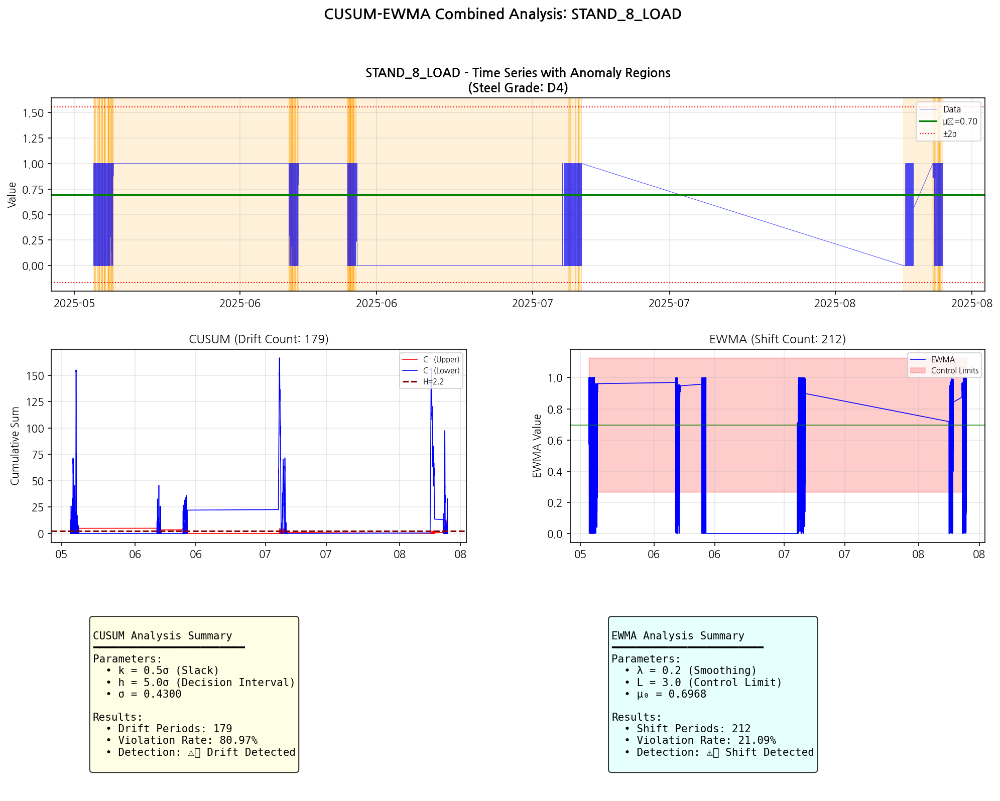

**STAND_6_LOAD** (Drift: 177, Shift: 215)

**STAND_5_LOAD** (Drift: 177, Shift: 213)

### 핀치롤 (08_Pinchroll)

- 분석 태그: 9개
- 드리프트 탐지: 9개
- 시프트 탐지: 9개
- 안정: 0개

| 태그 | CUSUM Drift | EWMA Shift | 상태 |
|------|-------------|------------|------|
| PINCHROLL_2_ACTUAL_SPEED | 86 | 225 | 🔴 |
| PINCHROLL_3_ACTUAL_SPEED | 1 | 43 | 🔴 |
| PINCHROLL_4_ACTUAL_SPEED | 1 | 45 | 🔴 |
| PINCHROLL_2_ACTUAL_TORQUE | 155 | 211 | 🔴 |
| PINCHROLL_3_ACTUAL_TORQUE | 45 | 155 | 🔴 |
| PINCHROLL_4_ACTUAL_TORQUE | 92 | 249 | 🔴 |
| PINCHROLL_2_REFERENCE_TORQUE | 5 | 5 | 🔴 |
| PINCHROLL_3_REFERENCE_TORQUE | 11 | 269 | 🔴 |
| PINCHROLL_4_REFERENCE_TORQUE | 208 | 266 | 🔴 |

#### 주요 태그 차트

**PINCHROLL_4_REFERENCE_TORQUE** (Drift: 208, Shift: 266)

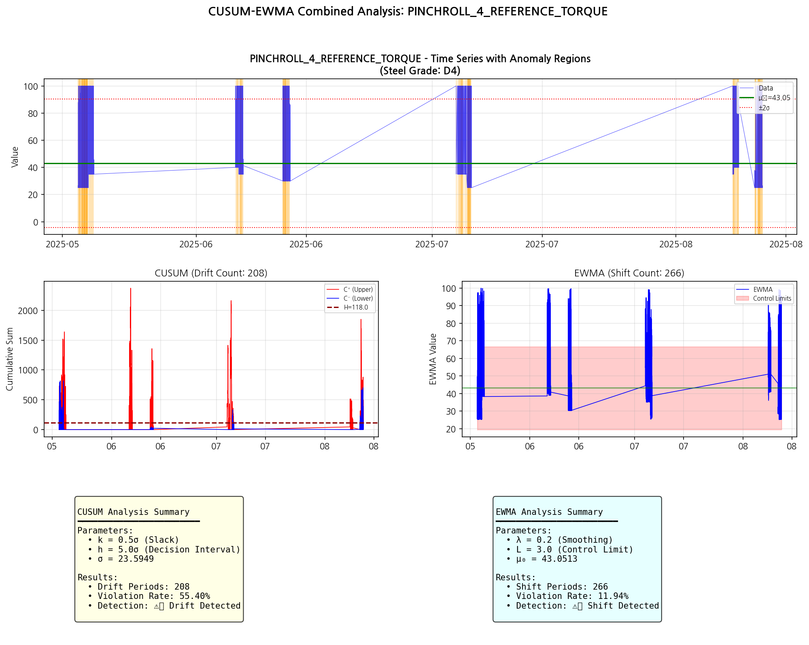

**PINCHROLL_2_ACTUAL_TORQUE** (Drift: 155, Shift: 211)

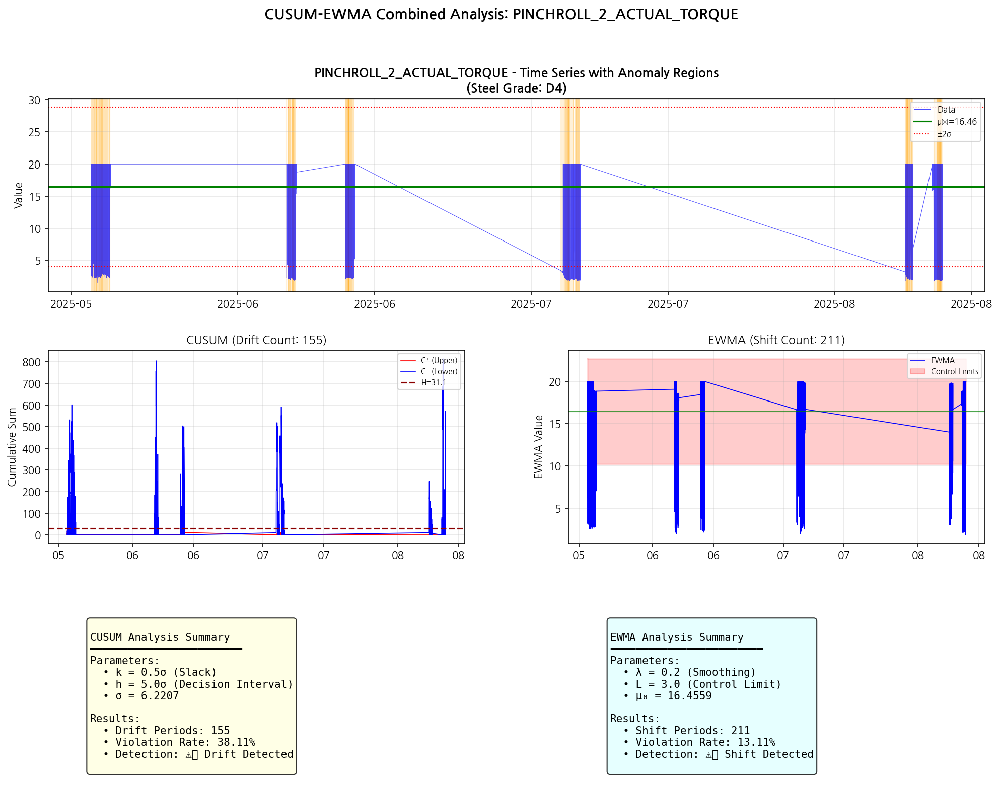

**PINCHROLL_4_ACTUAL_TORQUE** (Drift: 92, Shift: 249)

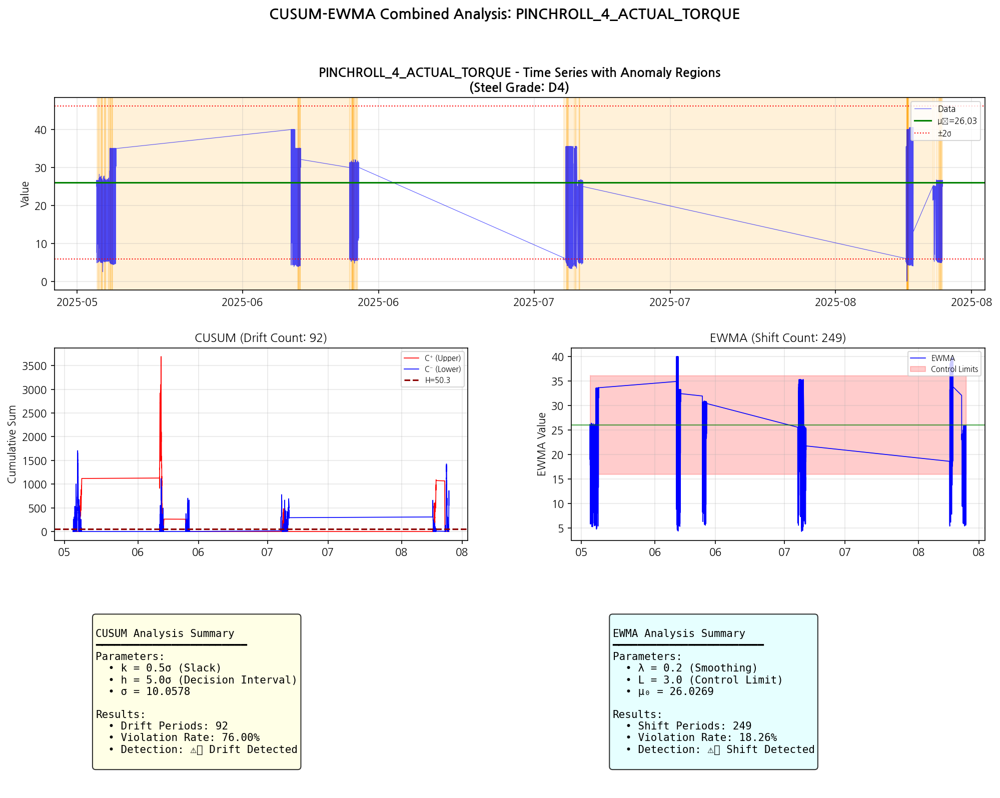

### PR 상세 토크 (09_PR_Detailed)

- 분석 태그: 6개
- 드리프트 탐지: 6개
- 시프트 탐지: 6개
- 안정: 0개

| 태그 | CUSUM Drift | EWMA Shift | 상태 |
|------|-------------|------------|------|
| PR6L1_ACT_TORQUE | 5 | 124 | 🔴 |
| PR6L2_ACT_TORQUE | 3 | 13 | 🔴 |
| PR7L1_ACT_TORQUE | 2 | 189 | 🔴 |
| PR7L2_ACT_TORQUE | 2 | 213 | 🔴 |
| PR8L1_ACT_TORQUE | 39 | 373 | 🔴 |
| PR9L1_ACT_TORQUE | 27 | 367 | 🔴 |

#### 주요 태그 차트

**PR8L1_ACT_TORQUE** (Drift: 39, Shift: 373)

**PR9L1_ACT_TORQUE** (Drift: 27, Shift: 367)

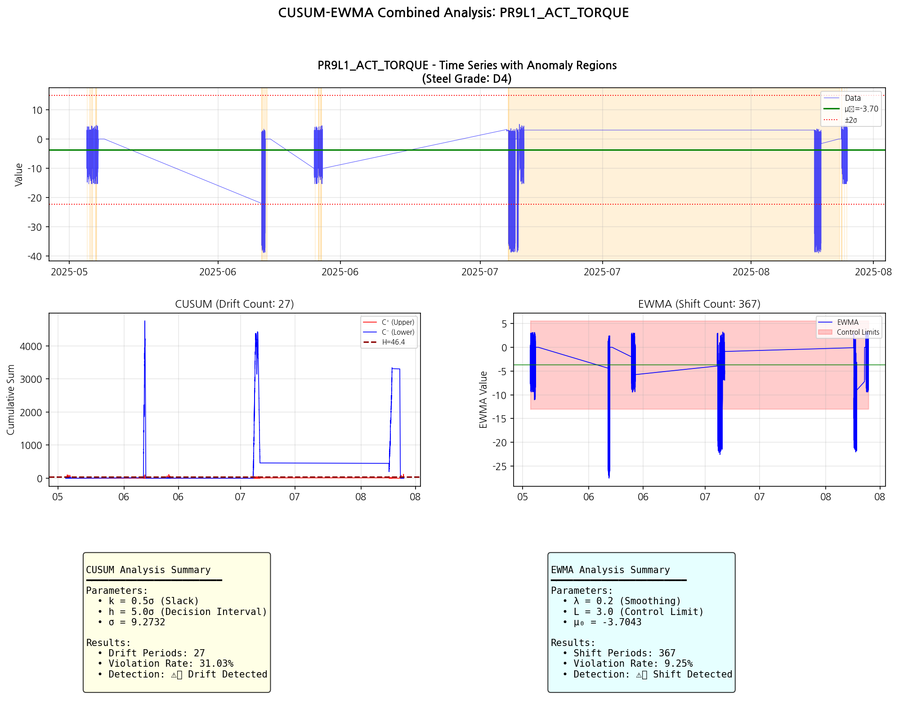

**PR6L1_ACT_TORQUE** (Drift: 5, Shift: 124)

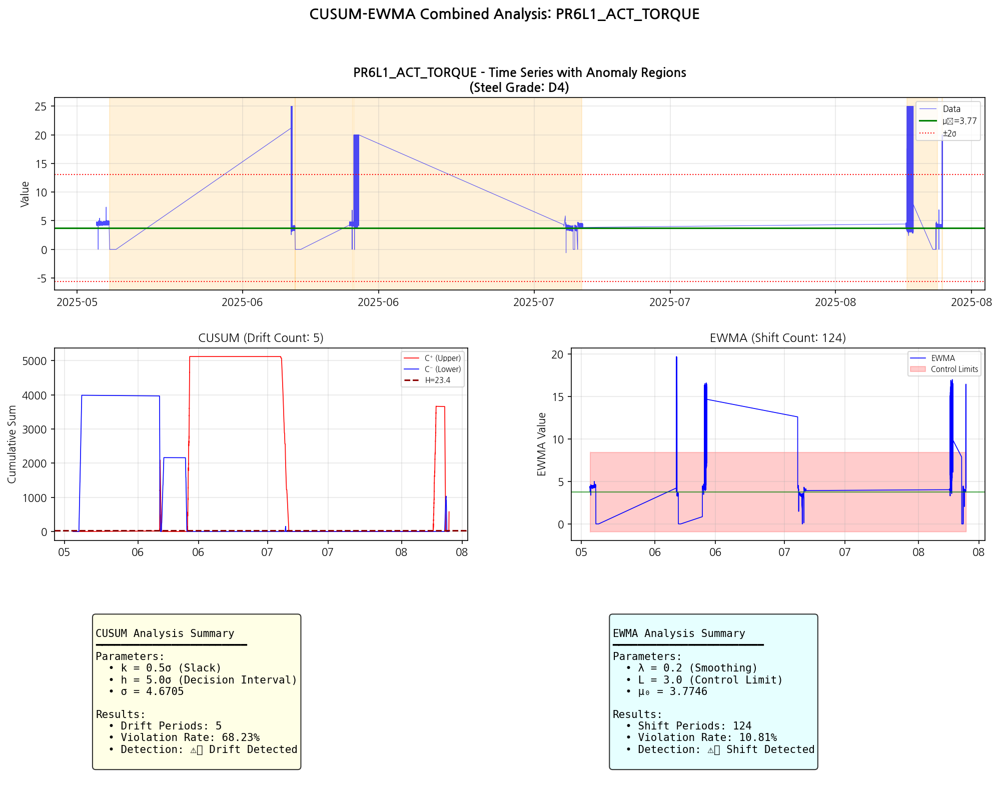

---

## 해석 가이드

### CUSUM (Cumulative Sum) 관리도

- **원리**: 목표값 대비 편차의 누적합을 추적
- **장점**: 작은 지속적 변화(0.5σ~2σ)에 민감
- **드리프트**: 누적합이 결정 구간(h)을 초과하면 탐지
- **활용**: 점진적인 공정 악화, 센서 드리프트 탐지

### EWMA (Exponentially Weighted Moving Average) 관리도

- **원리**: 최근 데이터에 더 큰 가중치를 부여
- **장점**: 급격한 변화에 빠른 반응
- **시프트**: EWMA 값이 제어 한계를 벗어나면 탐지
- **활용**: 급격한 공정 변화, 이상 상태 전환 탐지

### 상태 정의

| 상태 | 설명 | 권장 조치 |
|------|------|----------|
| 🔴 드리프트 탐지 | CUSUM에서 점진적 변화 감지 | 원인 분석 및 공정 조정 |
| 🟠 시프트 탐지 | EWMA에서 급격한 변화 감지 | 즉시 점검 필요 |
| 🟡 경고 | 위반율 5% 초과 | 모니터링 강화 |
| 🟢 안정 | 정상 범위 | 현 상태 유지 |

---

## 메타데이터

| 항목 | 값 |
|------|-----|
| 분석 스크립트 | steel_grade_cusum_ewma_analysis.py |
| 분석 기간 | 2025-03-01 ~ 2025-08-31 |
| 강종 | D4 |
| 생성일시 | 2026-02-03 20:39:34 |
| 총 분석 태그 | 79개 |

---

*본 보고서는 자동 생성되었습니다.*
