# 강종 [D4] | 규격: D13 CUSUM-EWMA 공정 관리도 분석 보고서

**분석 기간**: 2025-03-01 ~ 2025-08-31
**강종**: D4
**규격**: D13
**생성일시**: 2026-02-09 14:56:40

---

## 분석 개요

### 분석 방법론

| 방법 | 목적 | 파라미터 |
|------|------|----------|
| **CUSUM** | 점진적 드리프트 탐지 | k=0.5σ, h=5.0σ |
| **EWMA** | 급격한 변화 탐지 | λ=0.2, L=3.0 |

### 분석 결과 요약

| 구분 | 태그 수 | 비율 |
|------|---------|------|
| **총 분석 태그** | 78개 | 100% |
| 🔴 드리프트 탐지 | 78개 | 100.0% |
| 🟠 시프트 탐지 | 78개 | 100.0% |
| 🟡 경고 | 0개 | 0.0% |
| 🟢 안정 | 0개 | 0.0% |

---

## 상위 문제 태그 (드리프트 빈도 기준)

| 순위 | 태그 | 카테고리 | CUSUM 드리프트 | EWMA 시프트 | 상태 |
|------|------|----------|----------------|-------------|------|
| 1 | PR9L1_ACT_TORQUE | PR 상세 토크 | 108 | 69 | 🔴 |
| 2 | PR8L1_ACT_TORQUE | PR 상세 토크 | 88 | 91 | 🔴 |
| 3 | PINCHROLL_4_REFERENCE_TORQUE | 핀치롤 | 75 | 84 | 🔴 |
| 4 | PINCHROLL_4_ACTUAL_TORQUE | 핀치롤 | 67 | 60 | 🔴 |
| 5 | PINCHROLL_2_ACTUAL_TORQUE | 핀치롤 | 62 | 63 | 🔴 |
| 6 | PR7L1_ACT_TORQUE | PR 상세 토크 | 56 | 86 | 🔴 |
| 7 | FINISHING_BLOCK_LOAD | 스탠드 부하 | 48 | 60 | 🔴 |
| 8 | STAND_6_LOAD | 스탠드 부하 | 48 | 57 | 🔴 |
| 9 | STAND_7_LOAD | 스탠드 부하 | 48 | 56 | 🔴 |
| 10 | STAND_11_LOAD | 스탠드 부하 | 47 | 58 | 🔴 |
| 11 | STAND_14_LOAD | 스탠드 부하 | 47 | 58 | 🔴 |
| 12 | STAND_12_LOAD | 스탠드 부하 | 46 | 58 | 🔴 |
| 13 | STAND_13_LOAD | 스탠드 부하 | 46 | 58 | 🔴 |
| 14 | STAND_5_LOAD | 스탠드 부하 | 46 | 57 | 🔴 |
| 15 | STAND_8_LOAD | 스탠드 부하 | 46 | 56 | 🔴 |

---

## 카테고리별 분석 결과

### 가열로 상부 온도 (01_Furnace_Top_Temperature)

- 분석 태그: 4개
- 드리프트 탐지: 4개
- 시프트 탐지: 4개
- 안정: 0개

| 태그 | CUSUM Drift | EWMA Shift | 상태 |
|------|-------------|------------|------|
| HEATING_TOP_ZONE_NO_1_TEMPERATURE_ROOF | 8 | 25 | 🔴 |
| HEATING_TOP_ZONE_NO_2_TEMPERATURE_ROOF | 9 | 26 | 🔴 |
| SOAKING_TOP_ZONE_NO_1_TEMPERATURE_ROOF | 2 | 2 | 🔴 |
| SOAKING_TOP_ZONE_NO_2_TEMPERATURE_ROOF | 2 | 2 | 🔴 |

#### 주요 태그 차트

**HEATING_TOP_ZONE_NO_2_TEMPERATURE_ROOF** (Drift: 9, Shift: 26)

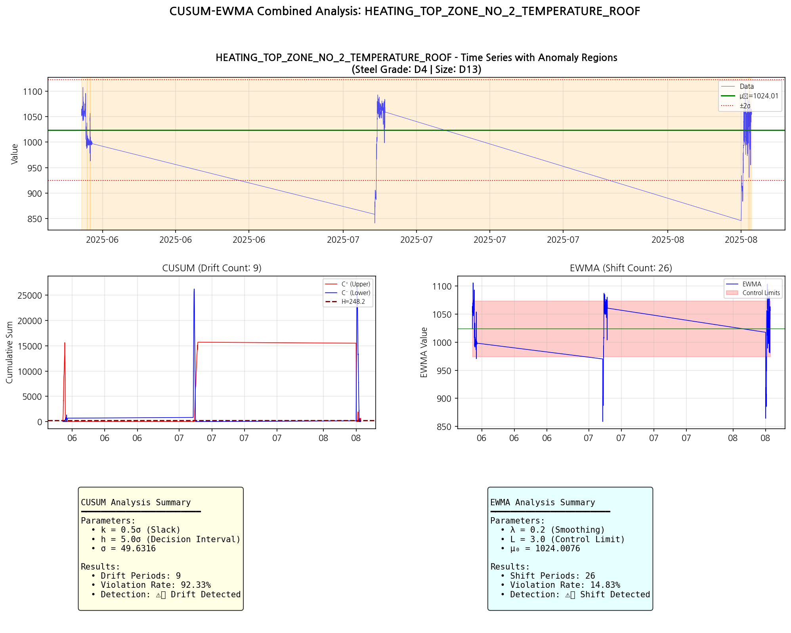

**HEATING_TOP_ZONE_NO_1_TEMPERATURE_ROOF** (Drift: 8, Shift: 25)

**SOAKING_TOP_ZONE_NO_1_TEMPERATURE_ROOF** (Drift: 2, Shift: 2)

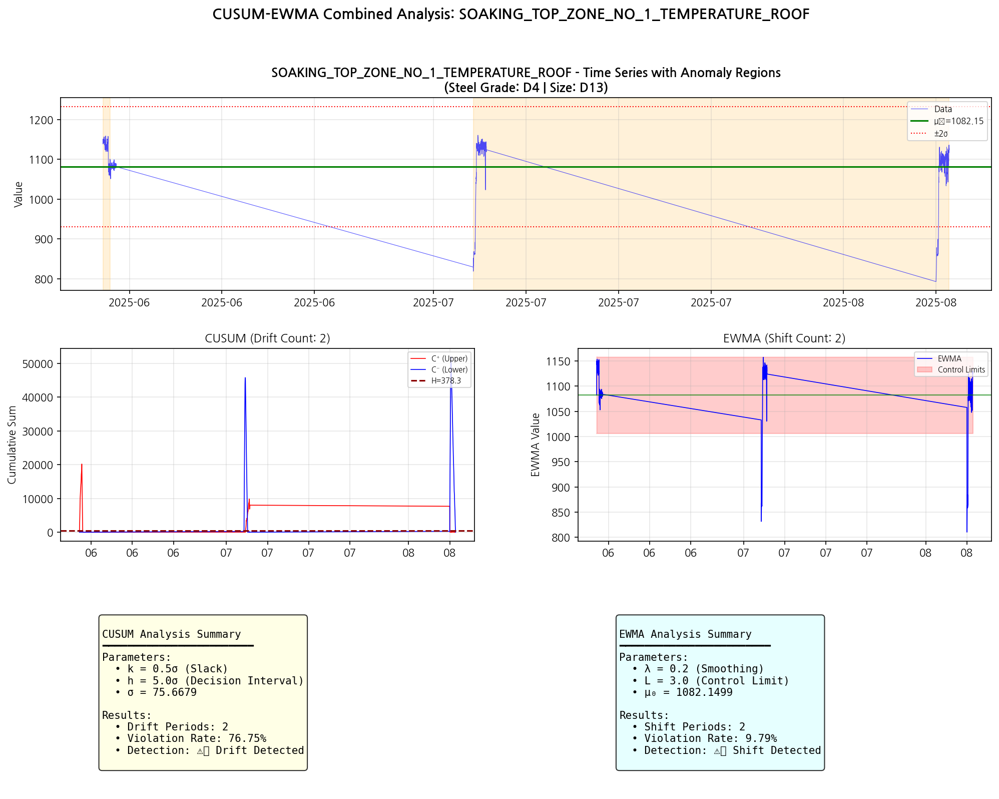

### 가열로 하부 온도 (02_Furnace_Bottom_Temperature)

- 분석 태그: 4개
- 드리프트 탐지: 4개
- 시프트 탐지: 4개
- 안정: 0개

| 태그 | CUSUM Drift | EWMA Shift | 상태 |
|------|-------------|------------|------|
| HEATING_BOTTOM_ZONE_NO_1_TEMPERATURE_OPP_SIDE | 9 | 23 | 🔴 |
| HEATING_BOTTOM_ZONE_NO_2_TEMPERATURE_MILL_SIDE | 7 | 23 | 🔴 |
| SOAKING_BOTTOM_ZONE_NO_1_TEMPERATURE_OPP_SIDE | 5 | 5 | 🔴 |
| SOAKING_BOTTOM_ZONE_NO_2_TEMPERATURE_MILL_SIDE | 5 | 6 | 🔴 |

#### 주요 태그 차트

**HEATING_BOTTOM_ZONE_NO_1_TEMPERATURE_OPP_SIDE** (Drift: 9, Shift: 23)

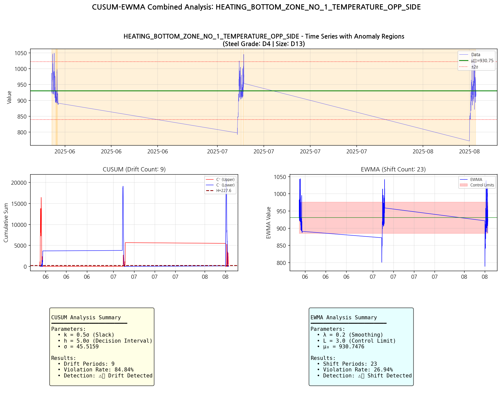

**HEATING_BOTTOM_ZONE_NO_2_TEMPERATURE_MILL_SIDE** (Drift: 7, Shift: 23)

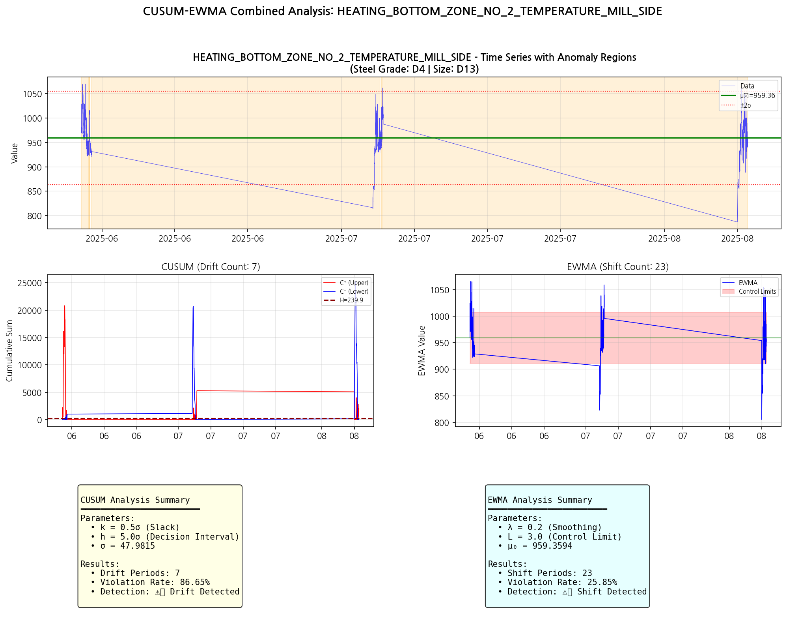

**SOAKING_BOTTOM_ZONE_NO_2_TEMPERATURE_MILL_SIDE** (Drift: 5, Shift: 6)

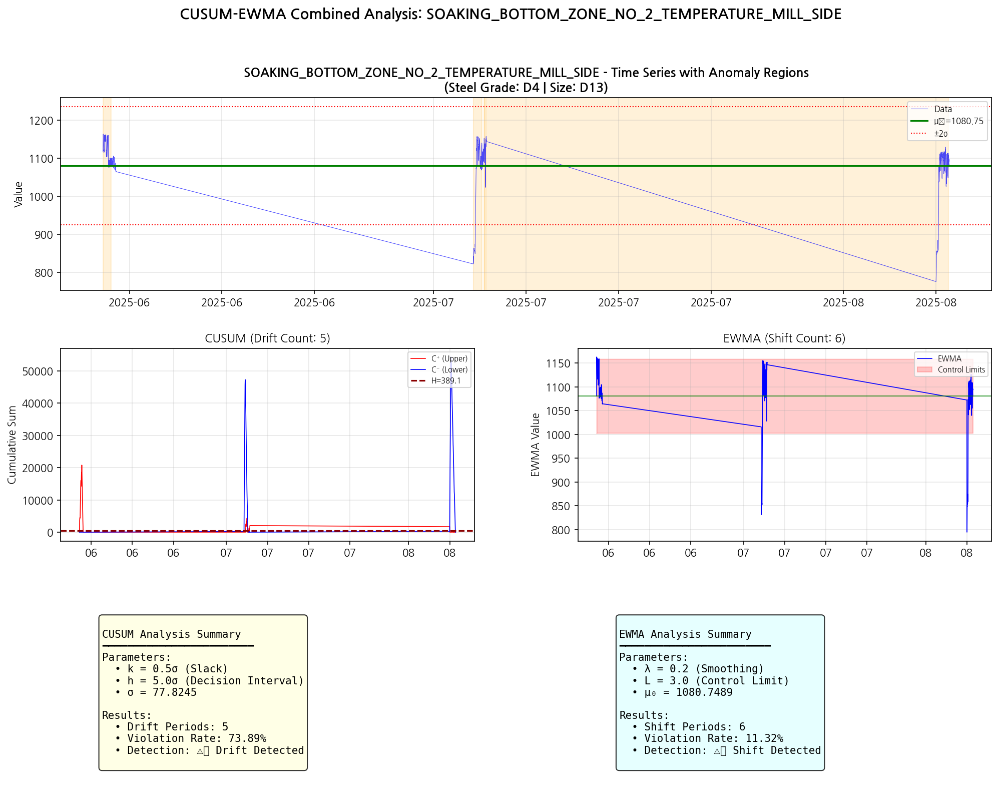

### 가열로 추출 온도 (03_Furnace_Discharge_Temperature)

- 분석 태그: 1개
- 드리프트 탐지: 1개
- 시프트 탐지: 1개
- 안정: 0개

| 태그 | CUSUM Drift | EWMA Shift | 상태 |
|------|-------------|------------|------|
| FURNACE_EXIT_DISCHARGE_BILLET_TEMPERATURE | 29 | 24 | 🔴 |

#### 주요 태그 차트

**FURNACE_EXIT_DISCHARGE_BILLET_TEMPERATURE** (Drift: 29, Shift: 24)

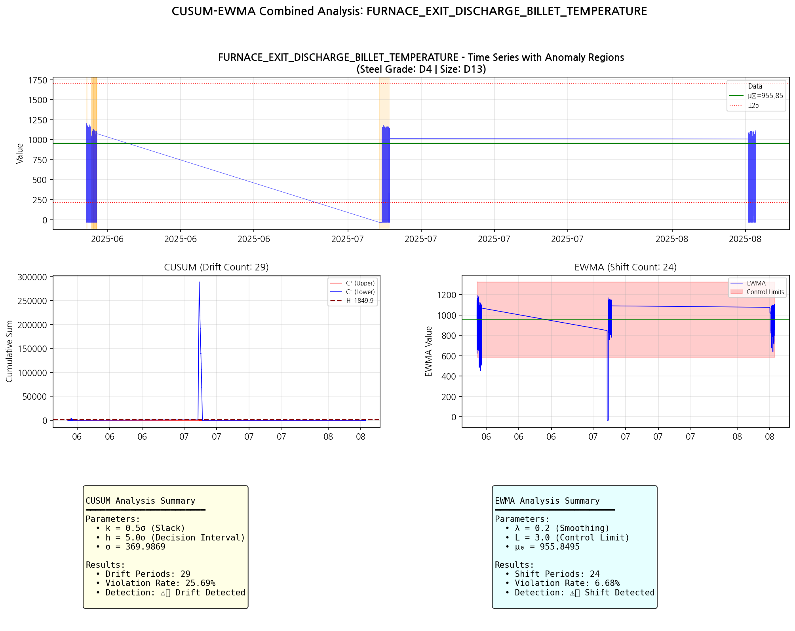

### 가열로 보조설비 (04_Furnace_Auxiliary)

- 분석 태그: 9개
- 드리프트 탐지: 9개
- 시프트 탐지: 9개
- 안정: 0개

| 태그 | CUSUM Drift | EWMA Shift | 상태 |
|------|-------------|------------|------|
| FURNACE_PRESSURE | 5 | 54 | 🔴 |
| FURNACE_O2_ANALYZER | 14 | 35 | 🔴 |
| MAIN_GAS_PRESSURE | 4 | 55 | 🔴 |
| MAIN_GAS_FLOW | 6 | 37 | 🔴 |
| MAIN_GAS_TEMPERATURE | 2 | 6 | 🔴 |
| MAIN_COMBUSTION_AIR_PRESSURE | 3 | 2 | 🔴 |
| COMBUSTION_AIR_TEMPERATURE | 5 | 17 | 🔴 |
| INDIRECT_COOLING_WATER_FLOW | 1 | 17 | 🔴 |
| INDIRECT_WATER_MAIN_TEMPERATURE | 1 | 3 | 🔴 |

#### 주요 태그 차트

**FURNACE_O2_ANALYZER** (Drift: 14, Shift: 35)

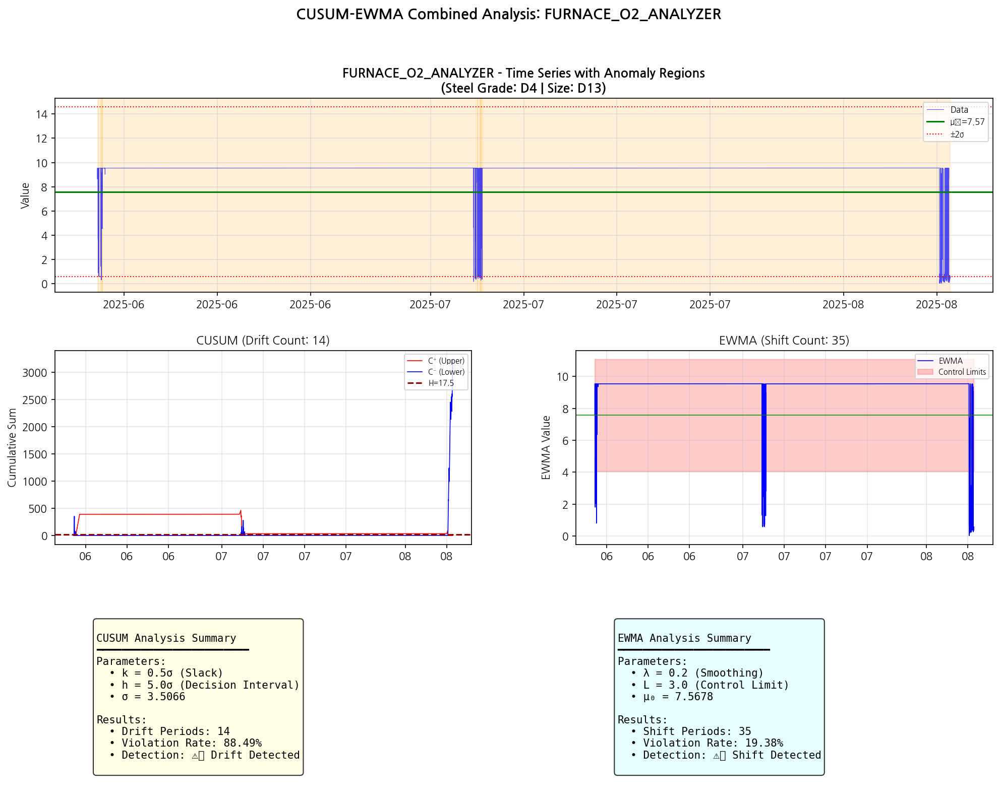

**MAIN_GAS_FLOW** (Drift: 6, Shift: 37)

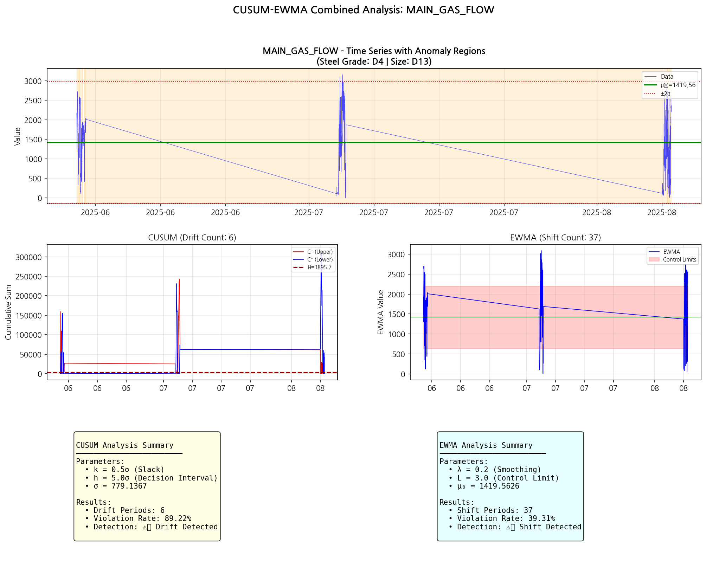

**FURNACE_PRESSURE** (Drift: 5, Shift: 54)

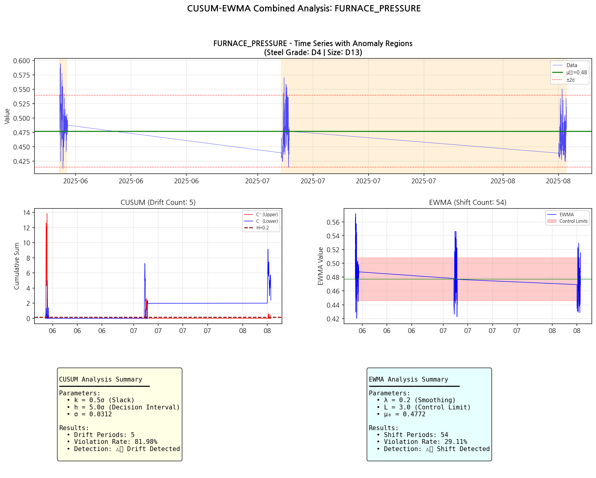

### 스탠드 토크 (05_Stand_Torque)

- 분석 태그: 16개
- 드리프트 탐지: 16개
- 시프트 탐지: 16개
- 안정: 0개

| 태그 | CUSUM Drift | EWMA Shift | 상태 |
|------|-------------|------------|------|
| STAND_1_ACTUAL_TORQUE | 29 | 80 | 🔴 |
| STAND_2_ACTUAL_TORQUE | 37 | 89 | 🔴 |
| STAND_3_ACTUAL_TORQUE | 27 | 87 | 🔴 |
| STAND_4_ACTUAL_TORQUE | 26 | 93 | 🔴 |
| STAND_5_ACTUAL_TORQUE | 36 | 60 | 🔴 |
| STAND_6_ACTUAL_TORQUE | 38 | 57 | 🔴 |
| STAND_7_ACTUAL_TORQUE | 36 | 87 | 🔴 |
| STAND_8_ACTUAL_TORQUE | 30 | 62 | 🔴 |
| STAND_9_ACTUAL_TORQUE | 27 | 62 | 🔴 |
| STAND_10_ACTUAL_TORQUE | 36 | 51 | 🔴 |
| STAND_11_ACTUAL_TORQUE | 40 | 45 | 🔴 |
| STAND_12_ACTUAL_TORQUE | 31 | 50 | 🔴 |
| STAND_13_ACTUAL_TORQUE | 33 | 73 | 🔴 |
| STAND_14_ACTUAL_TORQUE | 35 | 42 | 🔴 |
| FINISHING_BLOCK_MASTER_ACTUAL_TORQUE | 35 | 46 | 🔴 |
| FINISHING_BLOCK_SLAVE_ACTUAL_TORQUE | 35 | 46 | 🔴 |

#### 주요 태그 차트

**STAND_11_ACTUAL_TORQUE** (Drift: 40, Shift: 45)

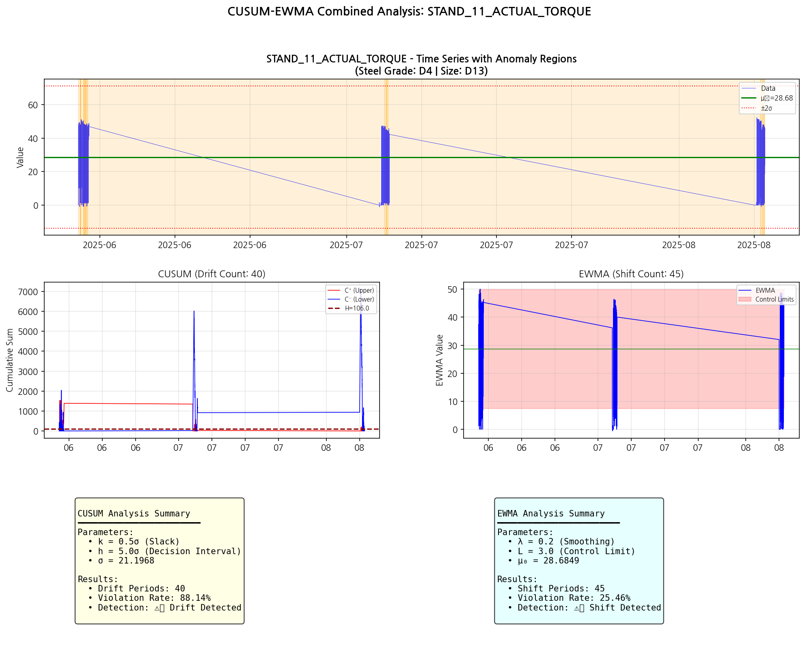

**STAND_6_ACTUAL_TORQUE** (Drift: 38, Shift: 57)

**STAND_2_ACTUAL_TORQUE** (Drift: 37, Shift: 89)

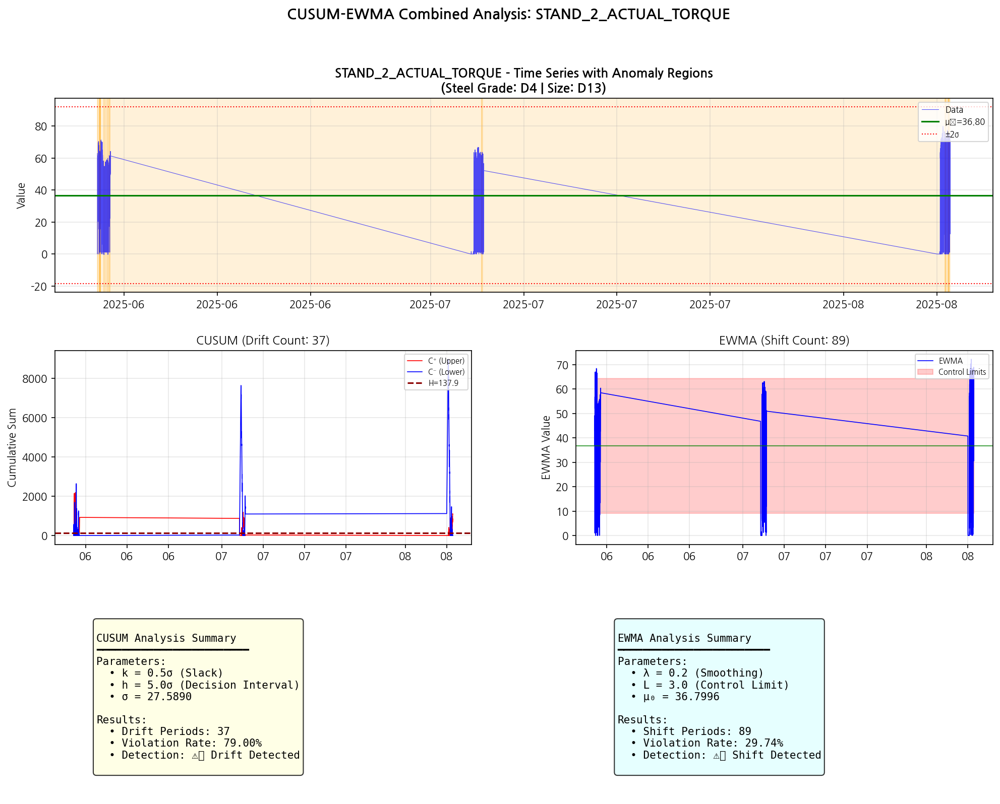

### 스탠드 속도 (06_Stand_Speed)

- 분석 태그: 15개
- 드리프트 탐지: 15개
- 시프트 탐지: 15개
- 안정: 0개

| 태그 | CUSUM Drift | EWMA Shift | 상태 |
|------|-------------|------------|------|
| STAND_1_ACTUAL_SPEED | 13 | 31 | 🔴 |
| STAND_2_ACTUAL_SPEED | 7 | 31 | 🔴 |
| STAND_3_ACTUAL_SPEED | 11 | 31 | 🔴 |
| STAND_4_ACTUAL_SPEED | 15 | 31 | 🔴 |
| STAND_5_ACTUAL_SPEED | 13 | 31 | 🔴 |
| STAND_6_ACTUAL_SPEED | 13 | 31 | 🔴 |
| STAND_7_ACTUAL_SPEED | 10 | 31 | 🔴 |
| STAND_8_ACTUAL_SPEED | 14 | 31 | 🔴 |
| STAND_9_ACTUAL_SPEED | 16 | 33 | 🔴 |
| STAND_10_ACTUAL_SPEED | 14 | 33 | 🔴 |
| STAND_11_ACTUAL_SPEED | 11 | 33 | 🔴 |
| STAND_12_ACTUAL_SPEED | 11 | 33 | 🔴 |
| STAND_13_ACTUAL_SPEED | 4 | 33 | 🔴 |
| STAND_14_ACTUAL_SPEED | 9 | 33 | 🔴 |
| FINISHING_BLOCK_ACTUAL_SPEED | 10 | 34 | 🔴 |

#### 주요 태그 차트

**STAND_9_ACTUAL_SPEED** (Drift: 16, Shift: 33)

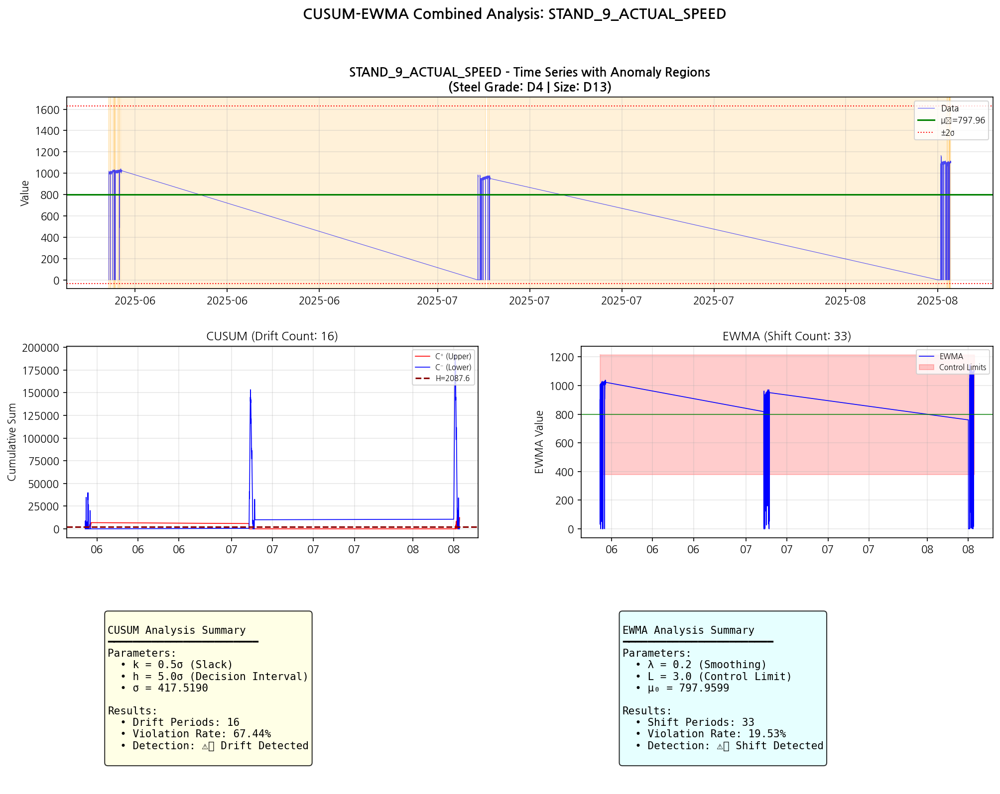

**STAND_4_ACTUAL_SPEED** (Drift: 15, Shift: 31)

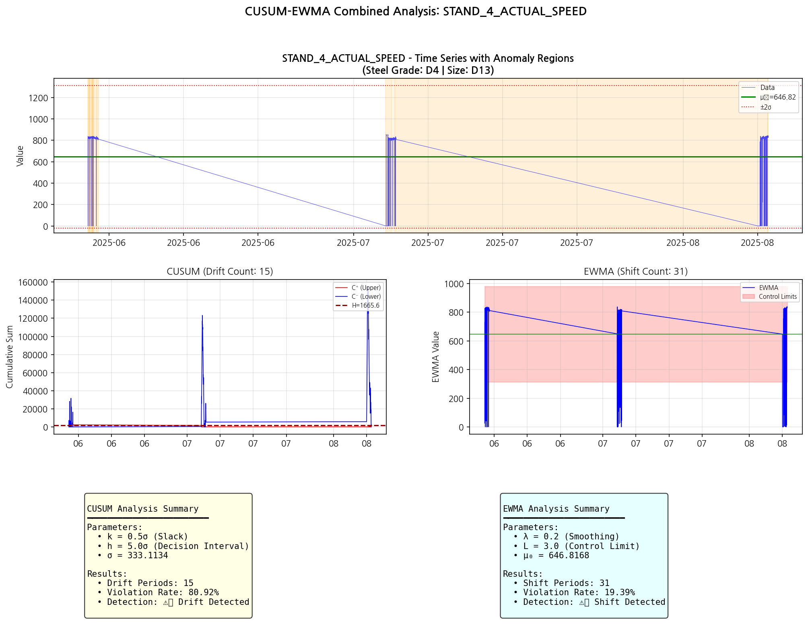

**STAND_10_ACTUAL_SPEED** (Drift: 14, Shift: 33)

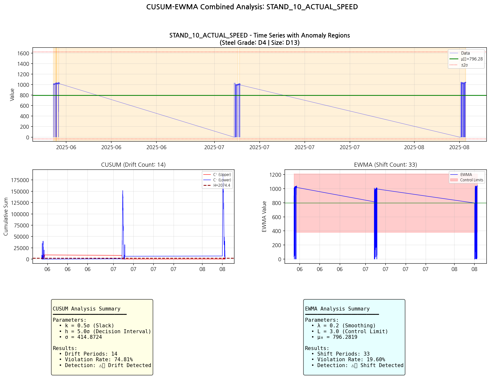

### 스탠드 부하 (07_Stand_Load)

- 분석 태그: 15개
- 드리프트 탐지: 15개
- 시프트 탐지: 15개
- 안정: 0개

| 태그 | CUSUM Drift | EWMA Shift | 상태 |
|------|-------------|------------|------|
| STAND_1_LOAD | 43 | 58 | 🔴 |
| STAND_2_LOAD | 44 | 60 | 🔴 |
| STAND_3_LOAD | 45 | 57 | 🔴 |
| STAND_4_LOAD | 45 | 57 | 🔴 |
| STAND_5_LOAD | 46 | 57 | 🔴 |
| STAND_6_LOAD | 48 | 57 | 🔴 |
| STAND_7_LOAD | 48 | 56 | 🔴 |
| STAND_8_LOAD | 46 | 56 | 🔴 |
| STAND_9_LOAD | 45 | 58 | 🔴 |
| STAND_10_LOAD | 45 | 58 | 🔴 |
| STAND_11_LOAD | 47 | 58 | 🔴 |
| STAND_12_LOAD | 46 | 58 | 🔴 |
| STAND_13_LOAD | 46 | 58 | 🔴 |
| STAND_14_LOAD | 47 | 58 | 🔴 |
| FINISHING_BLOCK_LOAD | 48 | 60 | 🔴 |

#### 주요 태그 차트

**FINISHING_BLOCK_LOAD** (Drift: 48, Shift: 60)

**STAND_6_LOAD** (Drift: 48, Shift: 57)

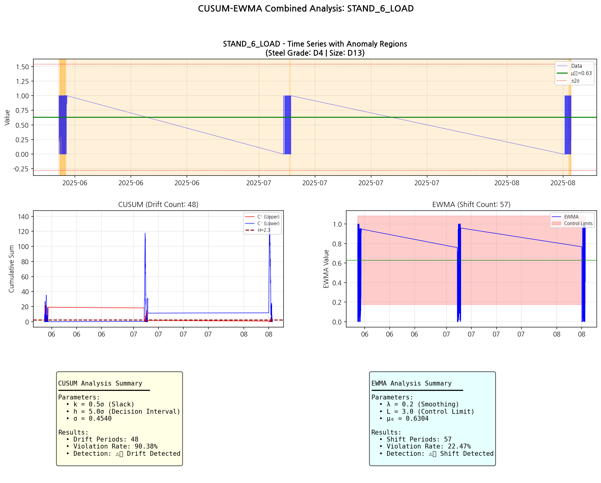

**STAND_7_LOAD** (Drift: 48, Shift: 56)

### 핀치롤 (08_Pinchroll)

- 분석 태그: 8개
- 드리프트 탐지: 8개
- 시프트 탐지: 8개
- 안정: 0개

| 태그 | CUSUM Drift | EWMA Shift | 상태 |
|------|-------------|------------|------|
| PINCHROLL_2_ACTUAL_SPEED | 28 | 54 | 🔴 |
| PINCHROLL_3_ACTUAL_SPEED | 4 | 27 | 🔴 |
| PINCHROLL_4_ACTUAL_SPEED | 23 | 29 | 🔴 |
| PINCHROLL_2_ACTUAL_TORQUE | 62 | 63 | 🔴 |
| PINCHROLL_3_ACTUAL_TORQUE | 12 | 313 | 🔴 |
| PINCHROLL_4_ACTUAL_TORQUE | 67 | 60 | 🔴 |
| PINCHROLL_3_REFERENCE_TORQUE | 2 | 30 | 🔴 |
| PINCHROLL_4_REFERENCE_TORQUE | 75 | 84 | 🔴 |

#### 주요 태그 차트

**PINCHROLL_4_REFERENCE_TORQUE** (Drift: 75, Shift: 84)

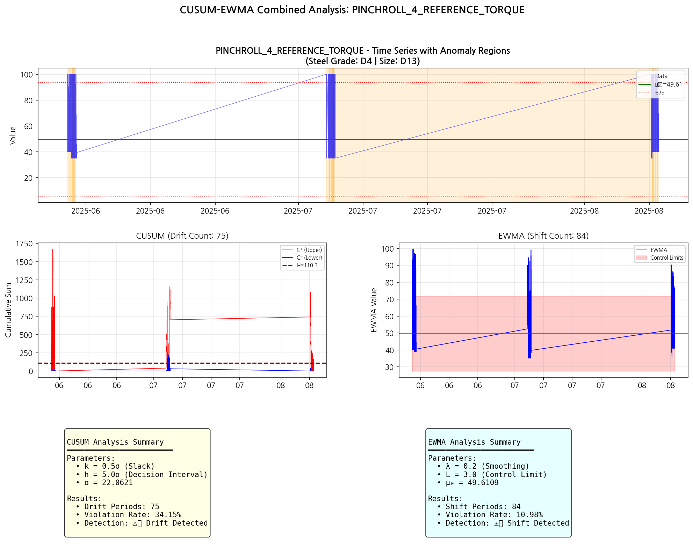

**PINCHROLL_4_ACTUAL_TORQUE** (Drift: 67, Shift: 60)

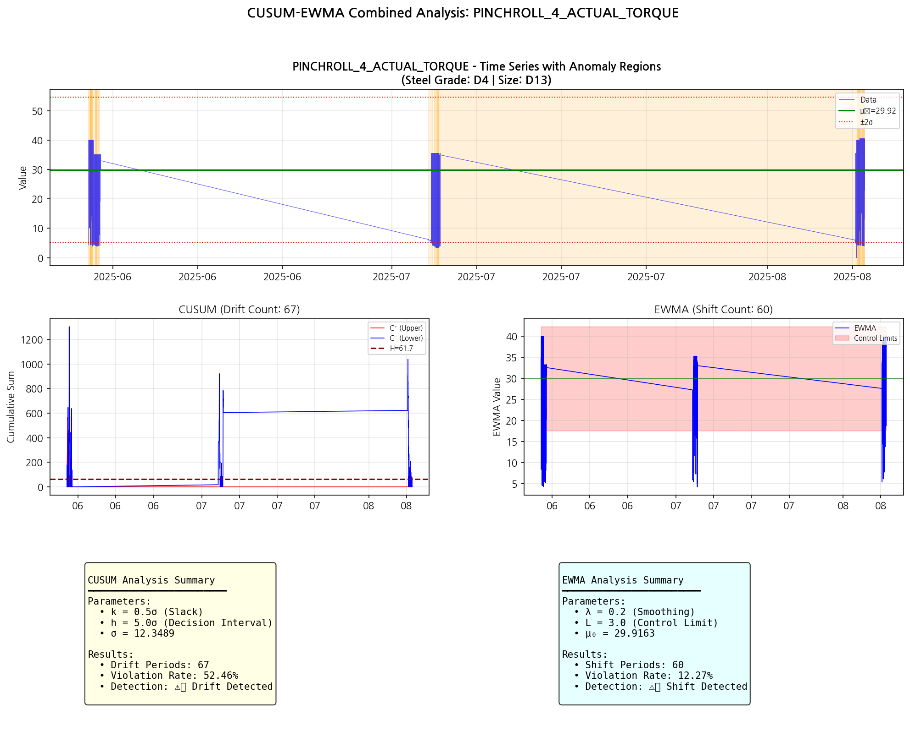

**PINCHROLL_2_ACTUAL_TORQUE** (Drift: 62, Shift: 63)

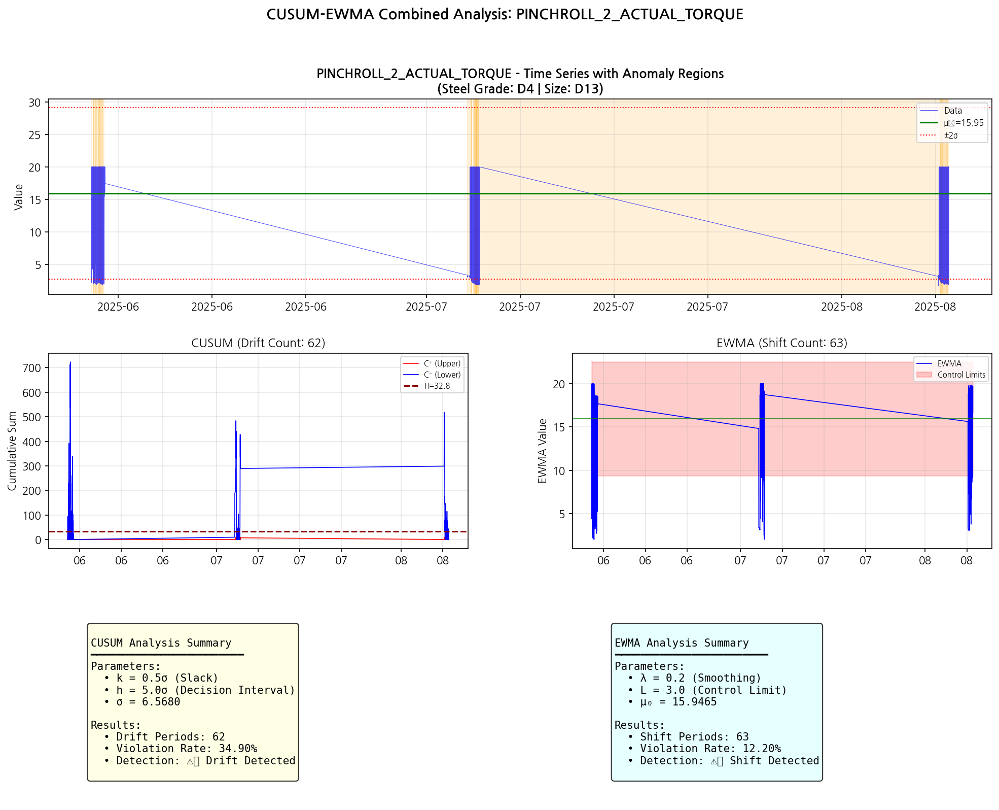

### PR 상세 토크 (09_PR_Detailed)

- 분석 태그: 6개
- 드리프트 탐지: 6개
- 시프트 탐지: 6개
- 안정: 0개

| 태그 | CUSUM Drift | EWMA Shift | 상태 |
|------|-------------|------------|------|
| PR6L1_ACT_TORQUE | 4 | 103 | 🔴 |
| PR6L2_ACT_TORQUE | 6 | 2 | 🔴 |
| PR7L1_ACT_TORQUE | 56 | 86 | 🔴 |
| PR7L2_ACT_TORQUE | 44 | 115 | 🔴 |
| PR8L1_ACT_TORQUE | 88 | 91 | 🔴 |
| PR9L1_ACT_TORQUE | 108 | 69 | 🔴 |

#### 주요 태그 차트

**PR9L1_ACT_TORQUE** (Drift: 108, Shift: 69)

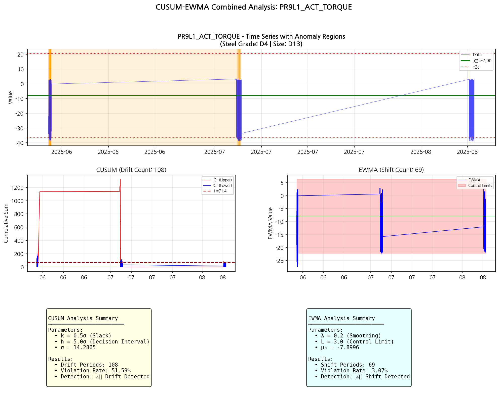

**PR8L1_ACT_TORQUE** (Drift: 88, Shift: 91)

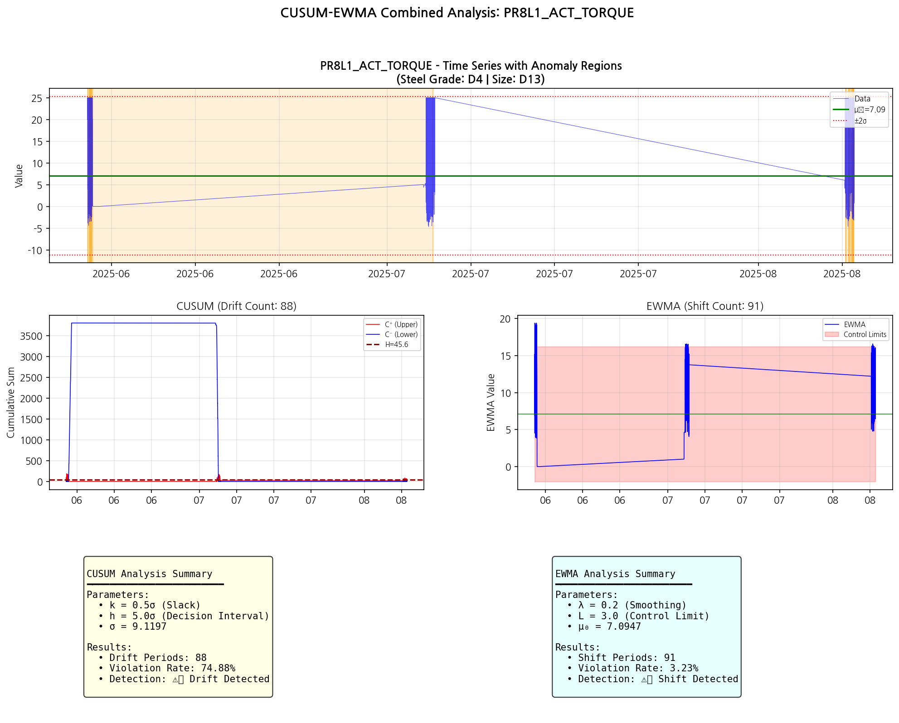

**PR7L1_ACT_TORQUE** (Drift: 56, Shift: 86)

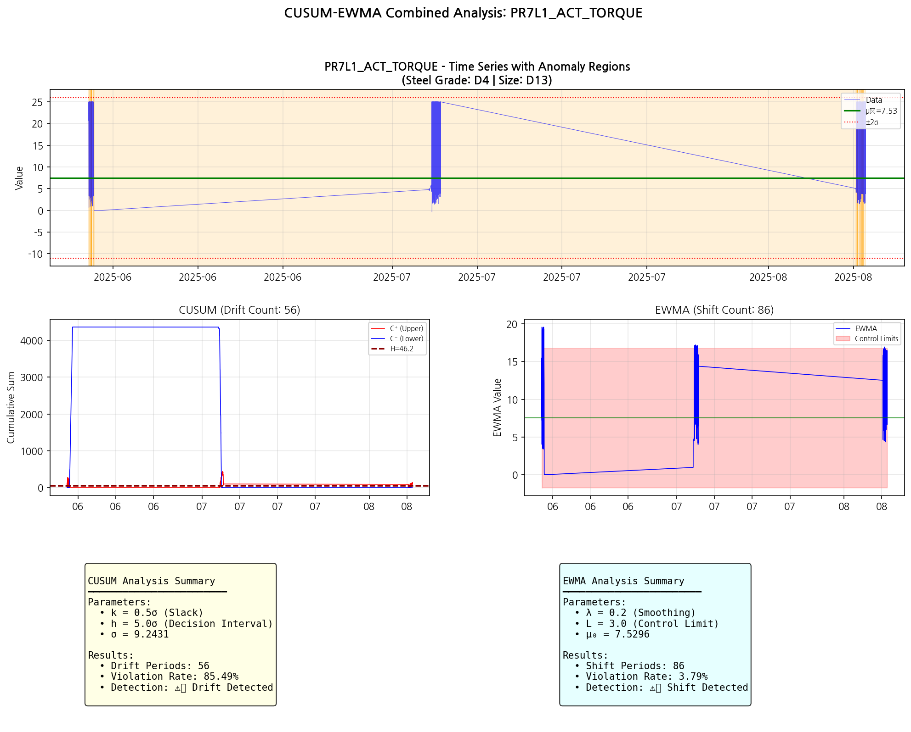

---

## 해석 가이드

### CUSUM (Cumulative Sum) 관리도

- **원리**: 목표값 대비 편차의 누적합을 추적
- **장점**: 작은 지속적 변화(0.5σ~2σ)에 민감
- **드리프트**: 누적합이 결정 구간(h)을 초과하면 탐지
- **활용**: 점진적인 공정 악화, 센서 드리프트 탐지

### EWMA (Exponentially Weighted Moving Average) 관리도

- **원리**: 최근 데이터에 더 큰 가중치를 부여
- **장점**: 급격한 변화에 빠른 반응
- **시프트**: EWMA 값이 제어 한계를 벗어나면 탐지
- **활용**: 급격한 공정 변화, 이상 상태 전환 탐지

### 상태 정의

| 상태 | 설명 | 권장 조치 |
|------|------|----------|
| 🔴 드리프트 탐지 | CUSUM에서 점진적 변화 감지 | 원인 분석 및 공정 조정 |
| 🟠 시프트 탐지 | EWMA에서 급격한 변화 감지 | 즉시 점검 필요 |
| 🟡 경고 | 위반율 5% 초과 | 모니터링 강화 |
| 🟢 안정 | 정상 범위 | 현 상태 유지 |

---

## 메타데이터

| 항목 | 값 |
|------|-----|
| 분석 스크립트 | steel_grade_cusum_ewma_analysis.py |
| 분석 기간 | 2025-03-01 ~ 2025-08-31 |
| 강종 | D4 |
| 규격 | D13 |
| 생성일시 | 2026-02-09 14:56:40 |
| 총 분석 태그 | 78개 |

---

*본 보고서는 자동 생성되었습니다.*
