# 강종 [D5] CUSUM-EWMA 공정 관리도 분석 보고서

**분석 기간**: 2025-03-01 ~ 2025-08-31
**강종**: D5
**생성일시**: 2026-02-06 15:42:42

---

## 분석 개요

### 분석 방법론

| 방법 | 목적 | 파라미터 |
|------|------|----------|
| **CUSUM** | 점진적 드리프트 탐지 | k=0.5σ, h=5.0σ |
| **EWMA** | 급격한 변화 탐지 | λ=0.2, L=3.0 |

### 분석 결과 요약

| 구분 | 태그 수 | 비율 |
|------|---------|------|
| **총 분석 태그** | 79개 | 100% |
| 🔴 드리프트 탐지 | 79개 | 100.0% |
| 🟠 시프트 탐지 | 79개 | 100.0% |
| 🟡 경고 | 0개 | 0.0% |
| 🟢 안정 | 0개 | 0.0% |

---

## 상위 문제 태그 (드리프트 빈도 기준)

| 순위 | 태그 | 카테고리 | CUSUM 드리프트 | EWMA 시프트 | 상태 |
|------|------|----------|----------------|-------------|------|
| 1 | FURNACE_EXIT_DISCHARGE_BILLET_TEMPERATURE | 가열로 추출 온도 | 632 | 921 | 🔴 |
| 2 | PR8L1_ACT_TORQUE | PR 상세 토크 | 529 | 852 | 🔴 |
| 3 | PINCHROLL_4_REFERENCE_TORQUE | 핀치롤 | 442 | 495 | 🔴 |
| 4 | PINCHROLL_2_ACTUAL_TORQUE | 핀치롤 | 426 | 391 | 🔴 |
| 5 | PR9L1_ACT_TORQUE | PR 상세 토크 | 213 | 440 | 🔴 |
| 6 | PINCHROLL_4_ACTUAL_TORQUE | 핀치롤 | 208 | 520 | 🔴 |
| 7 | PINCHROLL_2_ACTUAL_SPEED | 핀치롤 | 206 | 227 | 🔴 |
| 8 | PINCHROLL_3_REFERENCE_TORQUE | 핀치롤 | 145 | 331 | 🔴 |
| 9 | PINCHROLL_3_ACTUAL_TORQUE | 핀치롤 | 132 | 421 | 🔴 |
| 10 | STAND_7_ACTUAL_TORQUE | 스탠드 토크 | 113 | 663 | 🔴 |
| 11 | STAND_5_ACTUAL_TORQUE | 스탠드 토크 | 112 | 737 | 🔴 |
| 12 | STAND_3_ACTUAL_TORQUE | 스탠드 토크 | 107 | 652 | 🔴 |
| 13 | STAND_13_ACTUAL_TORQUE | 스탠드 토크 | 106 | 328 | 🔴 |
| 14 | STAND_2_ACTUAL_TORQUE | 스탠드 토크 | 96 | 706 | 🔴 |
| 15 | STAND_9_ACTUAL_TORQUE | 스탠드 토크 | 91 | 613 | 🔴 |

---

## 카테고리별 분석 결과

### 가열로 상부 온도 (01_Furnace_Top_Temperature)

- 분석 태그: 4개
- 드리프트 탐지: 4개
- 시프트 탐지: 4개
- 안정: 0개

| 태그 | CUSUM Drift | EWMA Shift | 상태 |
|------|-------------|------------|------|
| HEATING_TOP_ZONE_NO_1_TEMPERATURE_ROOF | 41 | 25 | 🔴 |
| HEATING_TOP_ZONE_NO_2_TEMPERATURE_ROOF | 40 | 24 | 🔴 |
| SOAKING_TOP_ZONE_NO_1_TEMPERATURE_ROOF | 15 | 8 | 🔴 |
| SOAKING_TOP_ZONE_NO_2_TEMPERATURE_ROOF | 25 | 8 | 🔴 |

#### 주요 태그 차트

**HEATING_TOP_ZONE_NO_1_TEMPERATURE_ROOF** (Drift: 41, Shift: 25)

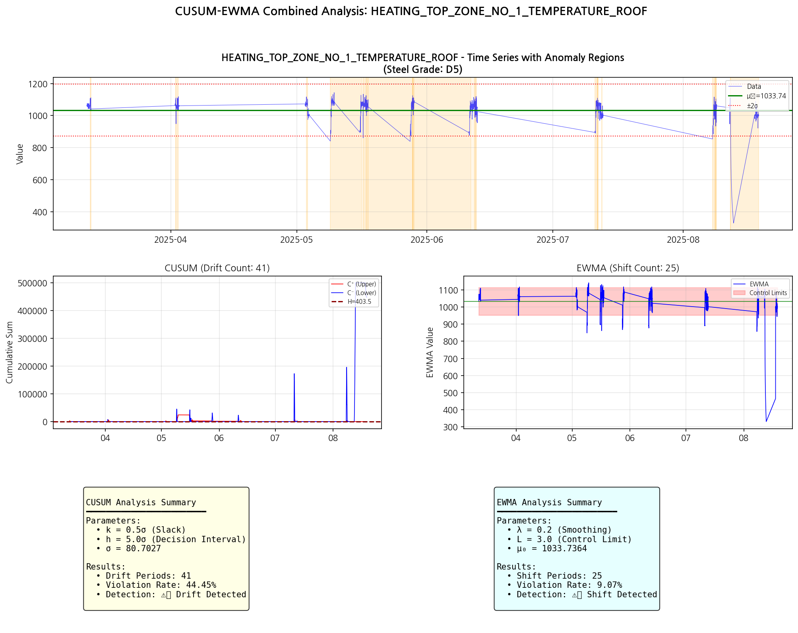

**HEATING_TOP_ZONE_NO_2_TEMPERATURE_ROOF** (Drift: 40, Shift: 24)

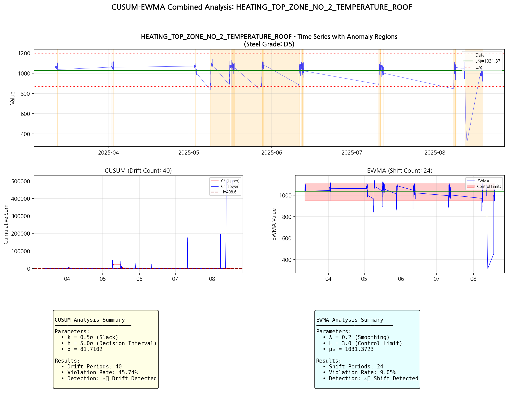

**SOAKING_TOP_ZONE_NO_2_TEMPERATURE_ROOF** (Drift: 25, Shift: 8)

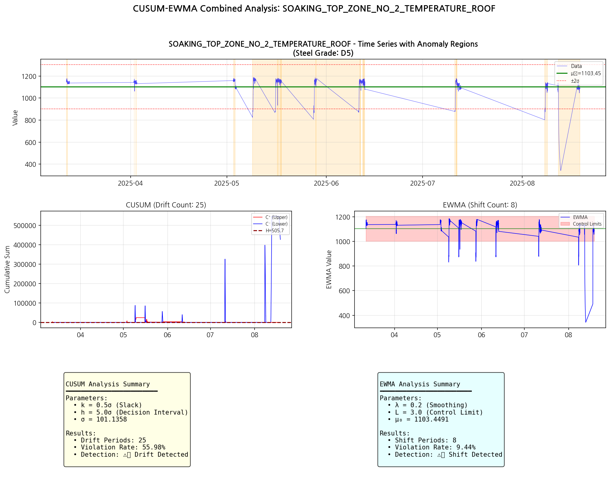

### 가열로 하부 온도 (02_Furnace_Bottom_Temperature)

- 분석 태그: 4개
- 드리프트 탐지: 4개
- 시프트 탐지: 4개
- 안정: 0개

| 태그 | CUSUM Drift | EWMA Shift | 상태 |
|------|-------------|------------|------|
| HEATING_BOTTOM_ZONE_NO_1_TEMPERATURE_OPP_SIDE | 46 | 65 | 🔴 |
| HEATING_BOTTOM_ZONE_NO_2_TEMPERATURE_MILL_SIDE | 48 | 79 | 🔴 |
| SOAKING_BOTTOM_ZONE_NO_1_TEMPERATURE_OPP_SIDE | 26 | 8 | 🔴 |
| SOAKING_BOTTOM_ZONE_NO_2_TEMPERATURE_MILL_SIDE | 26 | 8 | 🔴 |

#### 주요 태그 차트

**HEATING_BOTTOM_ZONE_NO_2_TEMPERATURE_MILL_SIDE** (Drift: 48, Shift: 79)

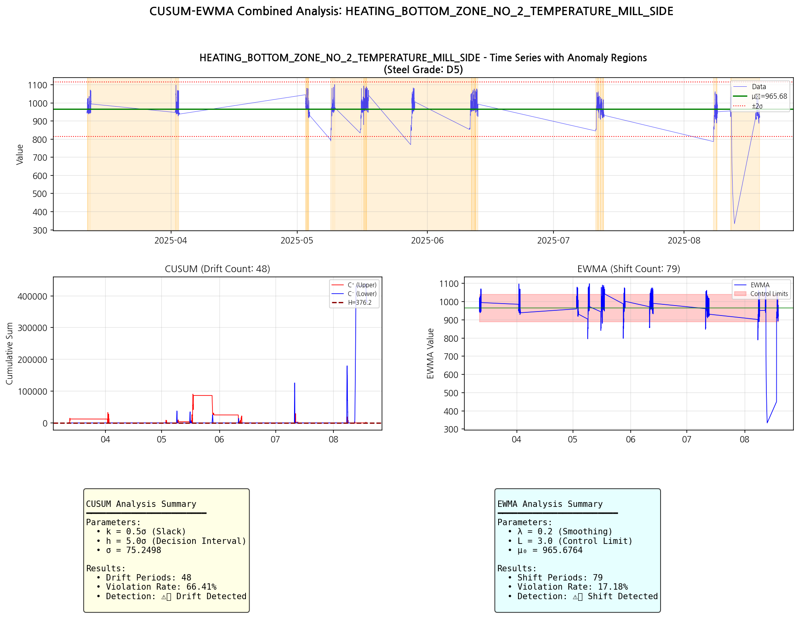

**HEATING_BOTTOM_ZONE_NO_1_TEMPERATURE_OPP_SIDE** (Drift: 46, Shift: 65)

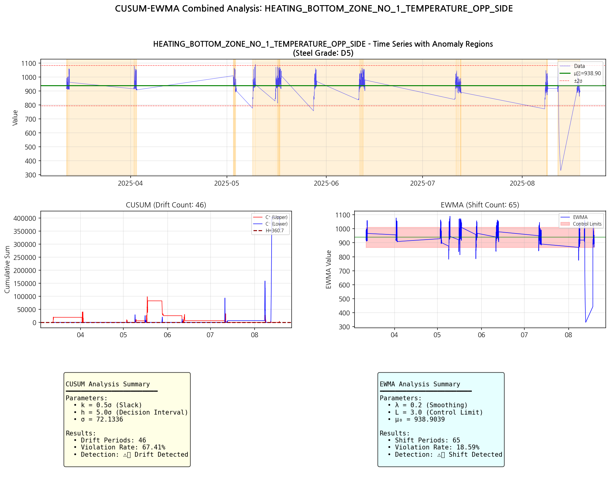

**SOAKING_BOTTOM_ZONE_NO_1_TEMPERATURE_OPP_SIDE** (Drift: 26, Shift: 8)

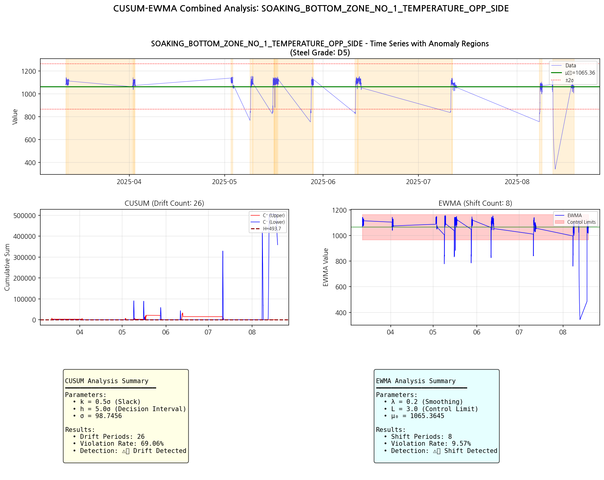

### 가열로 추출 온도 (03_Furnace_Discharge_Temperature)

- 분석 태그: 1개
- 드리프트 탐지: 1개
- 시프트 탐지: 1개
- 안정: 0개

| 태그 | CUSUM Drift | EWMA Shift | 상태 |
|------|-------------|------------|------|
| FURNACE_EXIT_DISCHARGE_BILLET_TEMPERATURE | 632 | 921 | 🔴 |

#### 주요 태그 차트

**FURNACE_EXIT_DISCHARGE_BILLET_TEMPERATURE** (Drift: 632, Shift: 921)

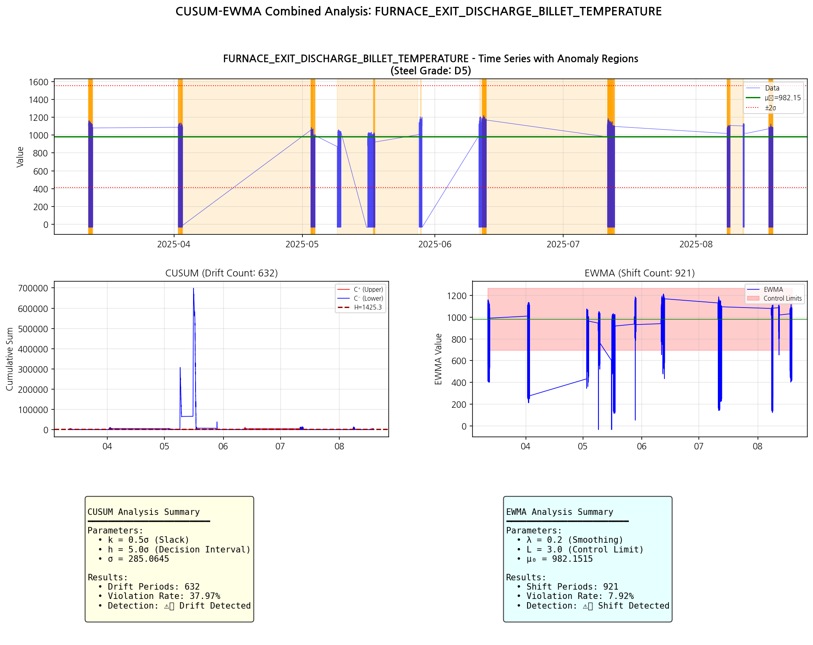

### 가열로 보조설비 (04_Furnace_Auxiliary)

- 분석 태그: 9개
- 드리프트 탐지: 9개
- 시프트 탐지: 9개
- 안정: 0개

| 태그 | CUSUM Drift | EWMA Shift | 상태 |
|------|-------------|------------|------|
| FURNACE_PRESSURE | 52 | 739 | 🔴 |
| FURNACE_O2_ANALYZER | 40 | 151 | 🔴 |
| MAIN_GAS_PRESSURE | 4 | 2 | 🔴 |
| MAIN_GAS_FLOW | 17 | 316 | 🔴 |
| MAIN_GAS_TEMPERATURE | 1 | 17 | 🔴 |
| MAIN_COMBUSTION_AIR_PRESSURE | 5 | 6 | 🔴 |
| COMBUSTION_AIR_TEMPERATURE | 1 | 50 | 🔴 |
| INDIRECT_COOLING_WATER_FLOW | 1 | 12 | 🔴 |
| INDIRECT_WATER_MAIN_TEMPERATURE | 2 | 37 | 🔴 |

#### 주요 태그 차트

**FURNACE_PRESSURE** (Drift: 52, Shift: 739)

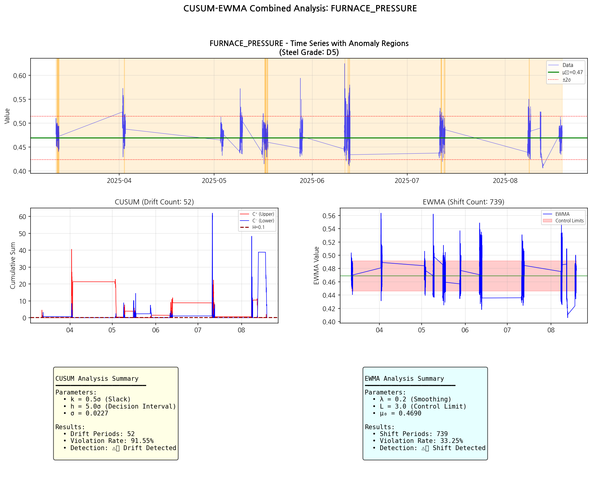

**FURNACE_O2_ANALYZER** (Drift: 40, Shift: 151)

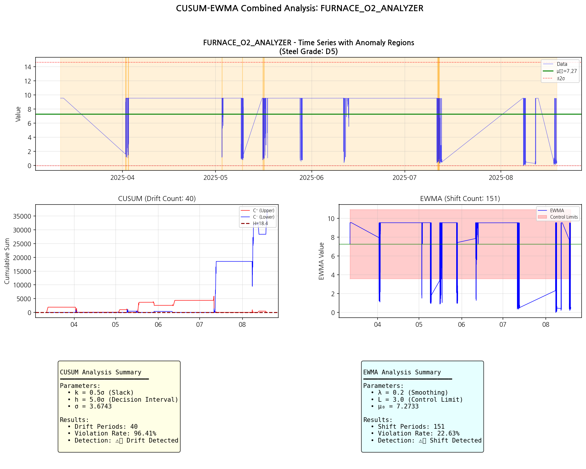

**MAIN_GAS_FLOW** (Drift: 17, Shift: 316)

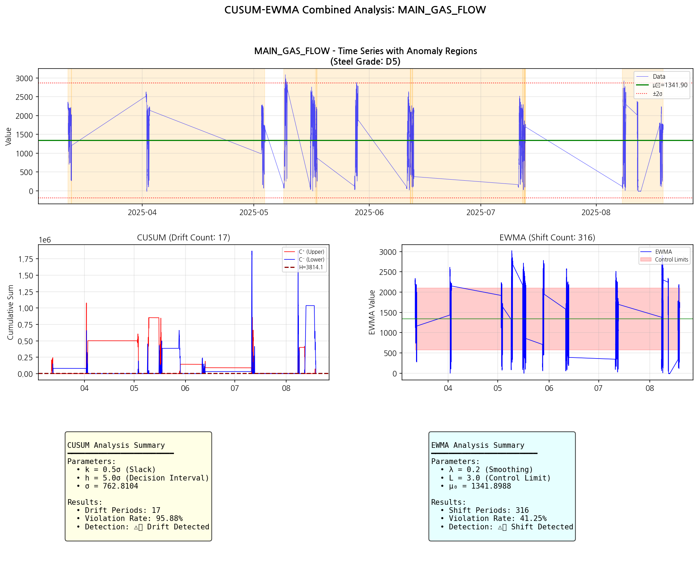

### 스탠드 토크 (05_Stand_Torque)

- 분석 태그: 16개
- 드리프트 탐지: 16개
- 시프트 탐지: 16개
- 안정: 0개

| 태그 | CUSUM Drift | EWMA Shift | 상태 |
|------|-------------|------------|------|
| STAND_1_ACTUAL_TORQUE | 90 | 844 | 🔴 |
| STAND_2_ACTUAL_TORQUE | 96 | 706 | 🔴 |
| STAND_3_ACTUAL_TORQUE | 107 | 652 | 🔴 |
| STAND_4_ACTUAL_TORQUE | 78 | 885 | 🔴 |
| STAND_5_ACTUAL_TORQUE | 112 | 737 | 🔴 |
| STAND_6_ACTUAL_TORQUE | 73 | 724 | 🔴 |
| STAND_7_ACTUAL_TORQUE | 113 | 663 | 🔴 |
| STAND_8_ACTUAL_TORQUE | 77 | 719 | 🔴 |
| STAND_9_ACTUAL_TORQUE | 91 | 613 | 🔴 |
| STAND_10_ACTUAL_TORQUE | 66 | 577 | 🔴 |
| STAND_11_ACTUAL_TORQUE | 65 | 550 | 🔴 |
| STAND_12_ACTUAL_TORQUE | 47 | 587 | 🔴 |
| STAND_13_ACTUAL_TORQUE | 106 | 328 | 🔴 |
| STAND_14_ACTUAL_TORQUE | 89 | 463 | 🔴 |
| FINISHING_BLOCK_MASTER_ACTUAL_TORQUE | 40 | 541 | 🔴 |
| FINISHING_BLOCK_SLAVE_ACTUAL_TORQUE | 40 | 539 | 🔴 |

#### 주요 태그 차트

**STAND_7_ACTUAL_TORQUE** (Drift: 113, Shift: 663)

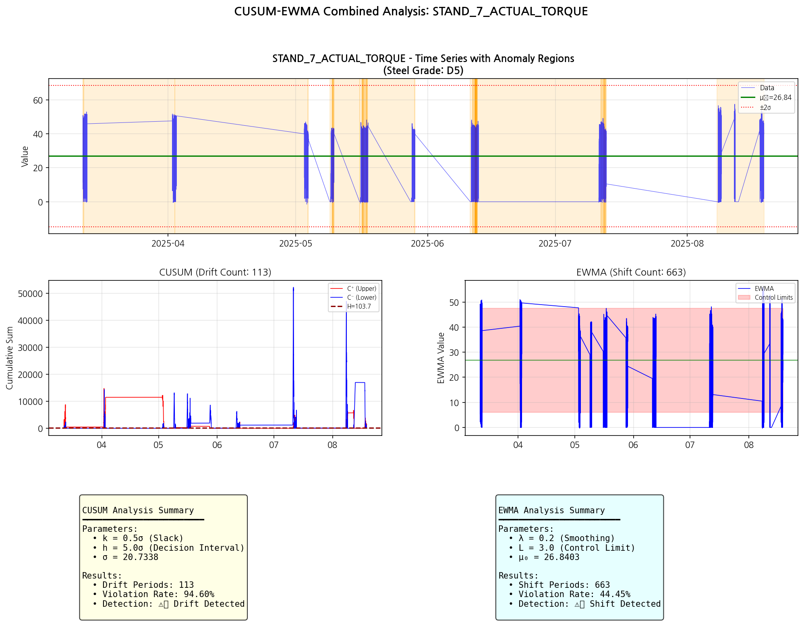

**STAND_5_ACTUAL_TORQUE** (Drift: 112, Shift: 737)

**STAND_3_ACTUAL_TORQUE** (Drift: 107, Shift: 652)

### 스탠드 속도 (06_Stand_Speed)

- 분석 태그: 15개
- 드리프트 탐지: 15개
- 시프트 탐지: 15개
- 안정: 0개

| 태그 | CUSUM Drift | EWMA Shift | 상태 |
|------|-------------|------------|------|
| STAND_1_ACTUAL_SPEED | 32 | 138 | 🔴 |
| STAND_2_ACTUAL_SPEED | 62 | 171 | 🔴 |
| STAND_3_ACTUAL_SPEED | 55 | 139 | 🔴 |
| STAND_4_ACTUAL_SPEED | 47 | 138 | 🔴 |
| STAND_5_ACTUAL_SPEED | 59 | 138 | 🔴 |
| STAND_6_ACTUAL_SPEED | 66 | 138 | 🔴 |
| STAND_7_ACTUAL_SPEED | 50 | 139 | 🔴 |
| STAND_8_ACTUAL_SPEED | 50 | 160 | 🔴 |
| STAND_9_ACTUAL_SPEED | 40 | 145 | 🔴 |
| STAND_10_ACTUAL_SPEED | 62 | 143 | 🔴 |
| STAND_11_ACTUAL_SPEED | 57 | 143 | 🔴 |
| STAND_12_ACTUAL_SPEED | 43 | 144 | 🔴 |
| STAND_13_ACTUAL_SPEED | 18 | 143 | 🔴 |
| STAND_14_ACTUAL_SPEED | 33 | 145 | 🔴 |
| FINISHING_BLOCK_ACTUAL_SPEED | 73 | 149 | 🔴 |

#### 주요 태그 차트

**FINISHING_BLOCK_ACTUAL_SPEED** (Drift: 73, Shift: 149)

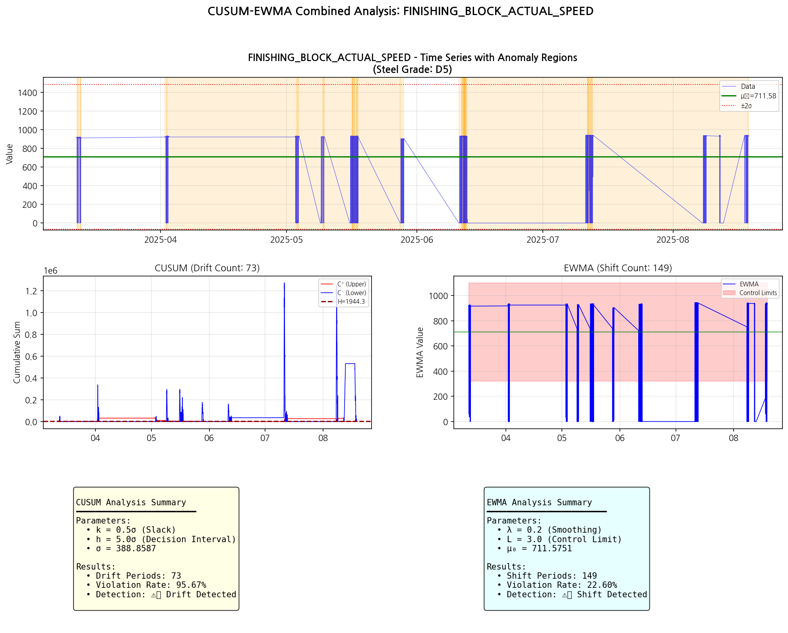

**STAND_6_ACTUAL_SPEED** (Drift: 66, Shift: 138)

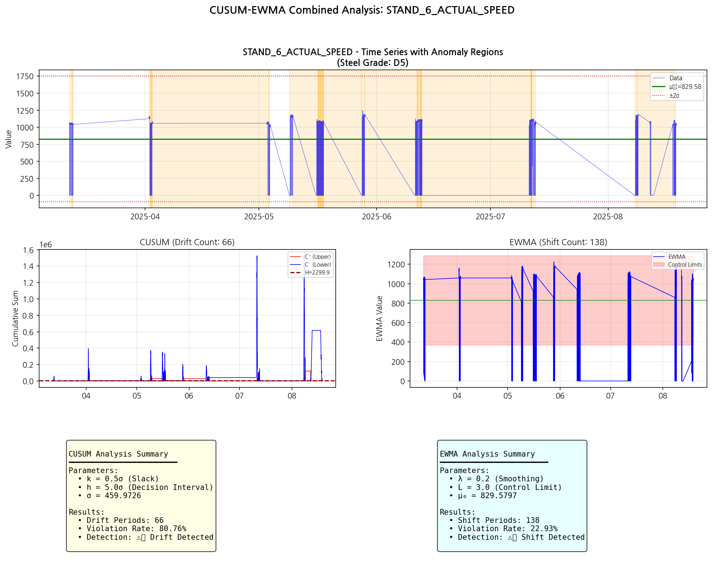

**STAND_2_ACTUAL_SPEED** (Drift: 62, Shift: 171)

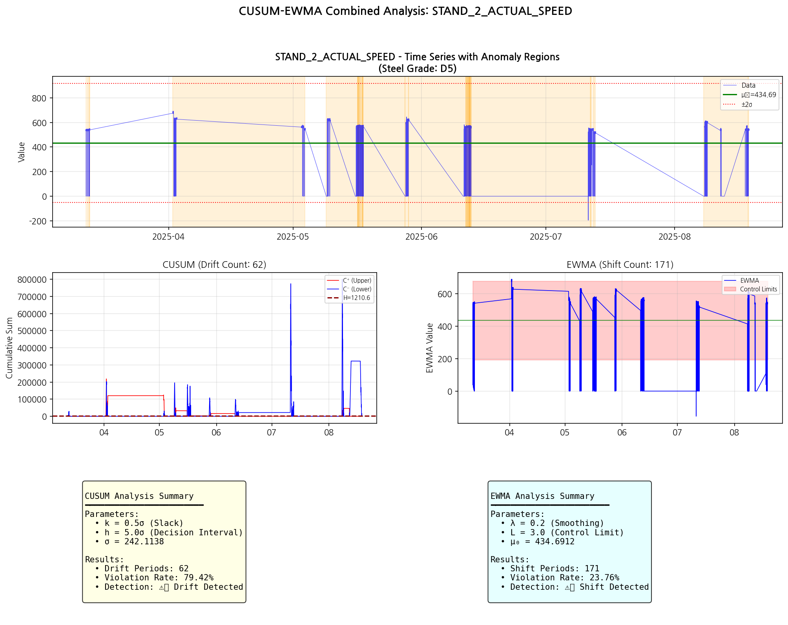

### 스탠드 부하 (07_Stand_Load)

- 분석 태그: 15개
- 드리프트 탐지: 15개
- 시프트 탐지: 15개
- 안정: 0개

| 태그 | CUSUM Drift | EWMA Shift | 상태 |
|------|-------------|------------|------|
| STAND_1_LOAD | 73 | 330 | 🔴 |
| STAND_2_LOAD | 73 | 335 | 🔴 |
| STAND_3_LOAD | 73 | 333 | 🔴 |
| STAND_4_LOAD | 76 | 332 | 🔴 |
| STAND_5_LOAD | 77 | 330 | 🔴 |
| STAND_6_LOAD | 74 | 330 | 🔴 |
| STAND_7_LOAD | 73 | 327 | 🔴 |
| STAND_8_LOAD | 71 | 329 | 🔴 |
| STAND_9_LOAD | 71 | 330 | 🔴 |
| STAND_10_LOAD | 74 | 333 | 🔴 |
| STAND_11_LOAD | 73 | 337 | 🔴 |
| STAND_12_LOAD | 72 | 333 | 🔴 |
| STAND_13_LOAD | 72 | 333 | 🔴 |
| STAND_14_LOAD | 72 | 334 | 🔴 |
| FINISHING_BLOCK_LOAD | 71 | 332 | 🔴 |

#### 주요 태그 차트

**STAND_5_LOAD** (Drift: 77, Shift: 330)

**STAND_4_LOAD** (Drift: 76, Shift: 332)

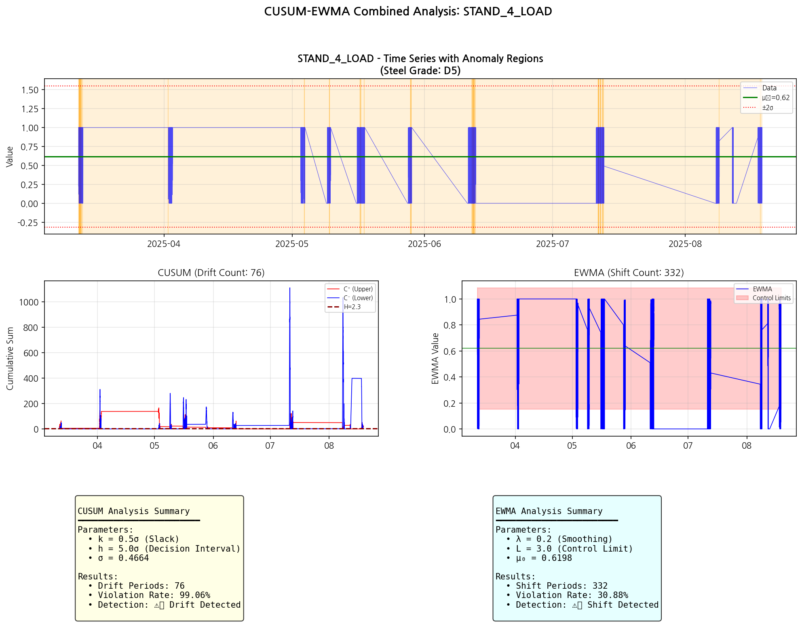

**STAND_10_LOAD** (Drift: 74, Shift: 333)

### 핀치롤 (08_Pinchroll)

- 분석 태그: 9개
- 드리프트 탐지: 9개
- 시프트 탐지: 9개
- 안정: 0개

| 태그 | CUSUM Drift | EWMA Shift | 상태 |
|------|-------------|------------|------|
| PINCHROLL_2_ACTUAL_SPEED | 206 | 227 | 🔴 |
| PINCHROLL_3_ACTUAL_SPEED | 42 | 27 | 🔴 |
| PINCHROLL_4_ACTUAL_SPEED | 12 | 22 | 🔴 |
| PINCHROLL_2_ACTUAL_TORQUE | 426 | 391 | 🔴 |
| PINCHROLL_3_ACTUAL_TORQUE | 132 | 421 | 🔴 |
| PINCHROLL_4_ACTUAL_TORQUE | 208 | 520 | 🔴 |
| PINCHROLL_2_REFERENCE_TORQUE | 59 | 70 | 🔴 |
| PINCHROLL_3_REFERENCE_TORQUE | 145 | 331 | 🔴 |
| PINCHROLL_4_REFERENCE_TORQUE | 442 | 495 | 🔴 |

#### 주요 태그 차트

**PINCHROLL_4_REFERENCE_TORQUE** (Drift: 442, Shift: 495)

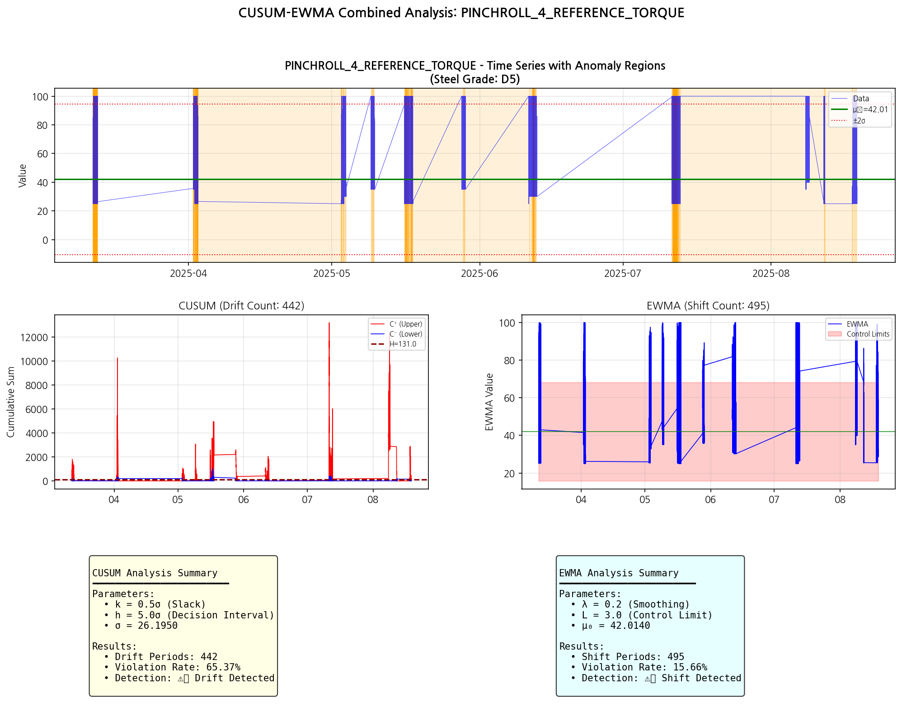

**PINCHROLL_2_ACTUAL_TORQUE** (Drift: 426, Shift: 391)

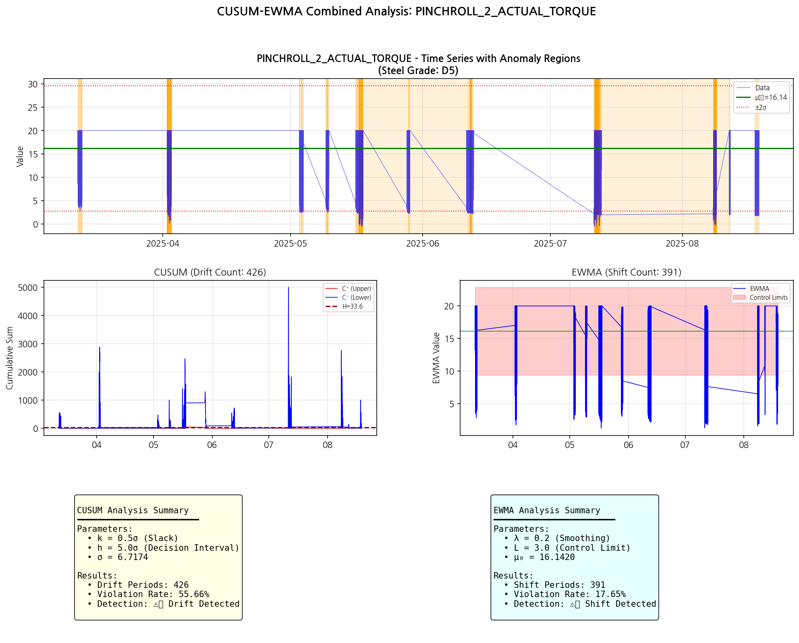

**PINCHROLL_4_ACTUAL_TORQUE** (Drift: 208, Shift: 520)

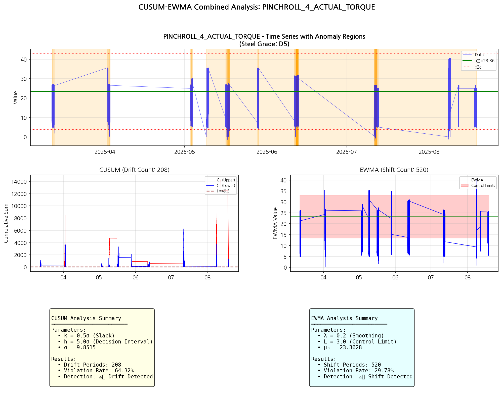

### PR 상세 토크 (09_PR_Detailed)

- 분석 태그: 6개
- 드리프트 탐지: 6개
- 시프트 탐지: 6개
- 안정: 0개

| 태그 | CUSUM Drift | EWMA Shift | 상태 |
|------|-------------|------------|------|
| PR6L1_ACT_TORQUE | 11 | 461 | 🔴 |
| PR6L2_ACT_TORQUE | 14 | 291 | 🔴 |
| PR7L1_ACT_TORQUE | 10 | 436 | 🔴 |
| PR7L2_ACT_TORQUE | 13 | 433 | 🔴 |
| PR8L1_ACT_TORQUE | 529 | 852 | 🔴 |
| PR9L1_ACT_TORQUE | 213 | 440 | 🔴 |

#### 주요 태그 차트

**PR8L1_ACT_TORQUE** (Drift: 529, Shift: 852)

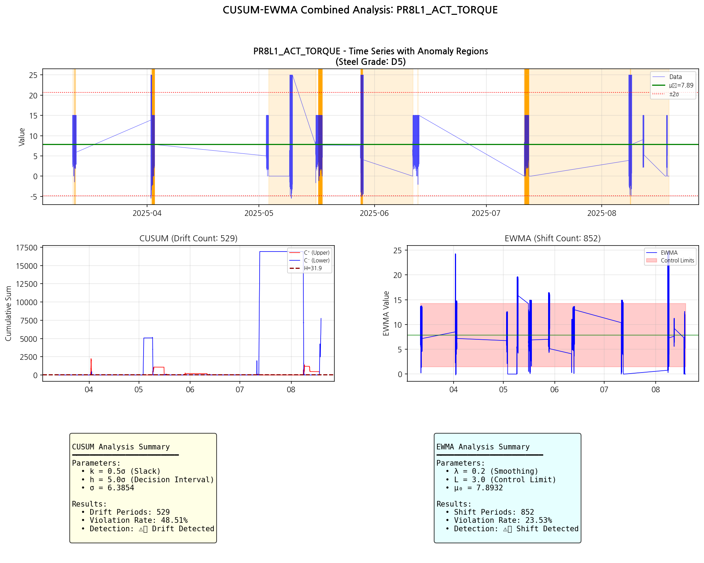

**PR9L1_ACT_TORQUE** (Drift: 213, Shift: 440)

**PR6L2_ACT_TORQUE** (Drift: 14, Shift: 291)

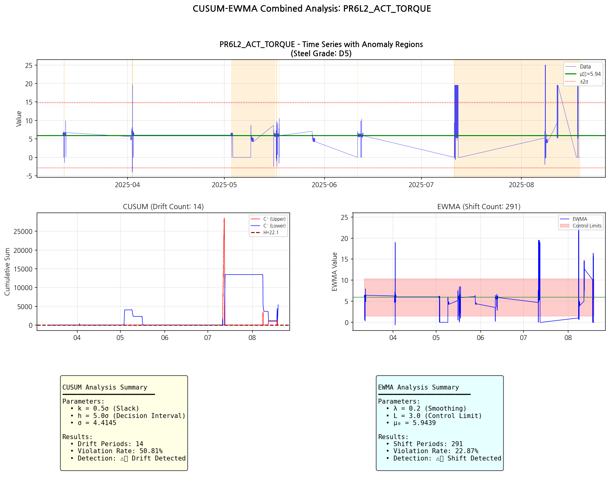

---

## 해석 가이드

### CUSUM (Cumulative Sum) 관리도

- **원리**: 목표값 대비 편차의 누적합을 추적
- **장점**: 작은 지속적 변화(0.5σ~2σ)에 민감
- **드리프트**: 누적합이 결정 구간(h)을 초과하면 탐지
- **활용**: 점진적인 공정 악화, 센서 드리프트 탐지

### EWMA (Exponentially Weighted Moving Average) 관리도

- **원리**: 최근 데이터에 더 큰 가중치를 부여
- **장점**: 급격한 변화에 빠른 반응
- **시프트**: EWMA 값이 제어 한계를 벗어나면 탐지
- **활용**: 급격한 공정 변화, 이상 상태 전환 탐지

### 상태 정의

| 상태 | 설명 | 권장 조치 |
|------|------|----------|
| 🔴 드리프트 탐지 | CUSUM에서 점진적 변화 감지 | 원인 분석 및 공정 조정 |
| 🟠 시프트 탐지 | EWMA에서 급격한 변화 감지 | 즉시 점검 필요 |
| 🟡 경고 | 위반율 5% 초과 | 모니터링 강화 |
| 🟢 안정 | 정상 범위 | 현 상태 유지 |

---

## 메타데이터

| 항목 | 값 |
|------|-----|
| 분석 스크립트 | steel_grade_cusum_ewma_analysis.py |
| 분석 기간 | 2025-03-01 ~ 2025-08-31 |
| 강종 | D5 |
| 생성일시 | 2026-02-06 15:42:42 |
| 총 분석 태그 | 79개 |

---

*본 보고서는 자동 생성되었습니다.*
