# 강종 [N5] CUSUM-EWMA 공정 관리도 분석 보고서

**분석 기간**: 2025-03-01 ~ 2025-08-31
**강종**: N5
**생성일시**: 2026-02-03 20:35:25

---

## 분석 개요

### 분석 방법론

| 방법 | 목적 | 파라미터 |
|------|------|----------|
| **CUSUM** | 점진적 드리프트 탐지 | k=0.5σ, h=5.0σ |
| **EWMA** | 급격한 변화 탐지 | λ=0.2, L=3.0 |

### 분석 결과 요약

| 구분 | 태그 수 | 비율 |
|------|---------|------|
| **총 분석 태그** | 79개 | 100% |
| 🔴 드리프트 탐지 | 79개 | 100.0% |
| 🟠 시프트 탐지 | 79개 | 100.0% |
| 🟡 경고 | 0개 | 0.0% |
| 🟢 안정 | 0개 | 0.0% |

---

## 상위 문제 태그 (드리프트 빈도 기준)

| 순위 | 태그 | 카테고리 | CUSUM 드리프트 | EWMA 시프트 | 상태 |
|------|------|----------|----------------|-------------|------|
| 1 | PR8L1_ACT_TORQUE | PR 상세 토크 | 2099 | 2000 | 🔴 |
| 2 | PR9L1_ACT_TORQUE | PR 상세 토크 | 2068 | 1462 | 🔴 |
| 3 | FURNACE_EXIT_DISCHARGE_BILLET_TEMPERATURE | 가열로 추출 온도 | 1507 | 1718 | 🔴 |
| 4 | PINCHROLL_2_ACTUAL_TORQUE | 핀치롤 | 935 | 926 | 🔴 |
| 5 | PINCHROLL_4_REFERENCE_TORQUE | 핀치롤 | 641 | 1320 | 🔴 |
| 6 | STAND_2_LOAD | 스탠드 부하 | 590 | 750 | 🔴 |
| 7 | STAND_1_LOAD | 스탠드 부하 | 590 | 742 | 🔴 |
| 8 | STAND_12_LOAD | 스탠드 부하 | 583 | 736 | 🔴 |
| 9 | STAND_13_LOAD | 스탠드 부하 | 583 | 736 | 🔴 |
| 10 | STAND_3_LOAD | 스탠드 부하 | 582 | 744 | 🔴 |
| 11 | STAND_14_LOAD | 스탠드 부하 | 581 | 737 | 🔴 |
| 12 | STAND_11_LOAD | 스탠드 부하 | 578 | 736 | 🔴 |
| 13 | STAND_4_LOAD | 스탠드 부하 | 576 | 750 | 🔴 |
| 14 | FINISHING_BLOCK_LOAD | 스탠드 부하 | 576 | 740 | 🔴 |
| 15 | STAND_5_LOAD | 스탠드 부하 | 574 | 749 | 🔴 |

---

## 카테고리별 분석 결과

### 가열로 상부 온도 (01_Furnace_Top_Temperature)

- 분석 태그: 4개
- 드리프트 탐지: 4개
- 시프트 탐지: 4개
- 안정: 0개

| 태그 | CUSUM Drift | EWMA Shift | 상태 |
|------|-------------|------------|------|
| HEATING_TOP_ZONE_NO_1_TEMPERATURE_ROOF | 84 | 198 | 🔴 |
| HEATING_TOP_ZONE_NO_2_TEMPERATURE_ROOF | 77 | 150 | 🔴 |
| SOAKING_TOP_ZONE_NO_1_TEMPERATURE_ROOF | 35 | 30 | 🔴 |
| SOAKING_TOP_ZONE_NO_2_TEMPERATURE_ROOF | 34 | 28 | 🔴 |

#### 주요 태그 차트

**HEATING_TOP_ZONE_NO_1_TEMPERATURE_ROOF** (Drift: 84, Shift: 198)

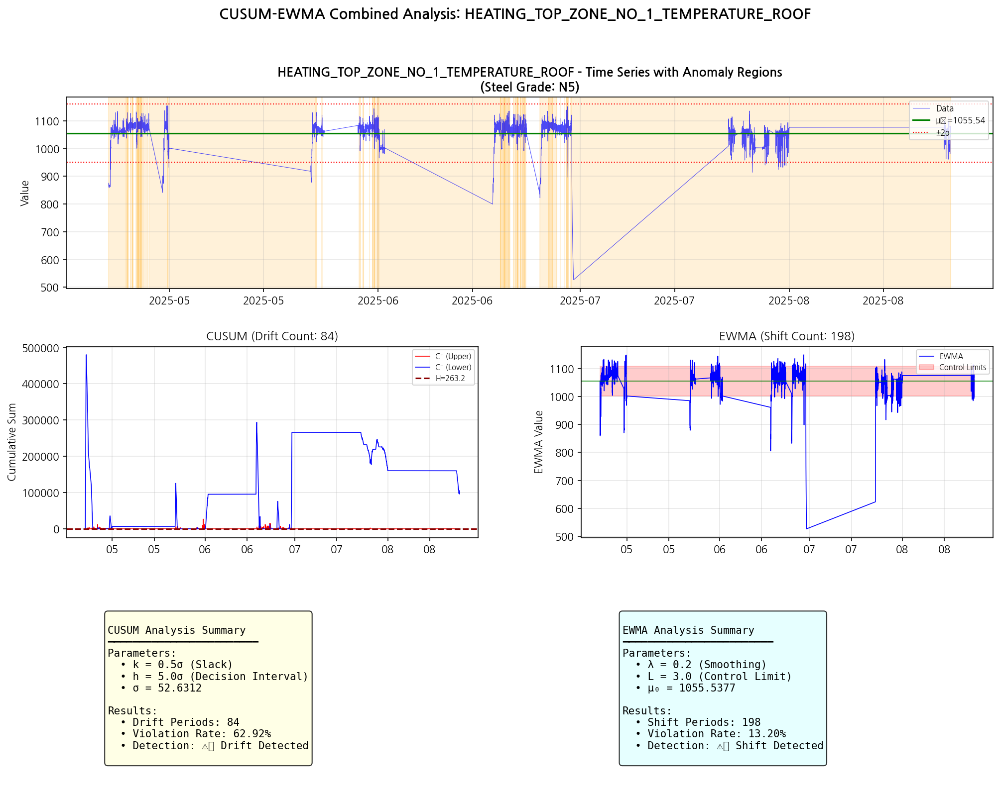

**HEATING_TOP_ZONE_NO_2_TEMPERATURE_ROOF** (Drift: 77, Shift: 150)

**SOAKING_TOP_ZONE_NO_1_TEMPERATURE_ROOF** (Drift: 35, Shift: 30)

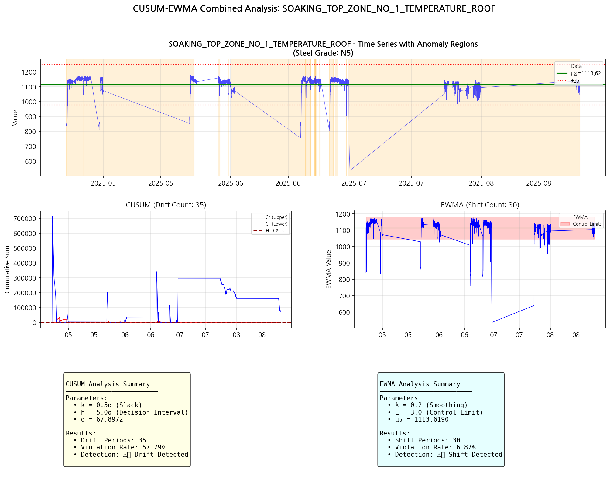

### 가열로 하부 온도 (02_Furnace_Bottom_Temperature)

- 분석 태그: 4개
- 드리프트 탐지: 4개
- 시프트 탐지: 4개
- 안정: 0개

| 태그 | CUSUM Drift | EWMA Shift | 상태 |
|------|-------------|------------|------|
| HEATING_BOTTOM_ZONE_NO_1_TEMPERATURE_OPP_SIDE | 95 | 277 | 🔴 |
| HEATING_BOTTOM_ZONE_NO_2_TEMPERATURE_MILL_SIDE | 89 | 304 | 🔴 |
| SOAKING_BOTTOM_ZONE_NO_1_TEMPERATURE_OPP_SIDE | 58 | 30 | 🔴 |
| SOAKING_BOTTOM_ZONE_NO_2_TEMPERATURE_MILL_SIDE | 56 | 27 | 🔴 |

#### 주요 태그 차트

**HEATING_BOTTOM_ZONE_NO_1_TEMPERATURE_OPP_SIDE** (Drift: 95, Shift: 277)

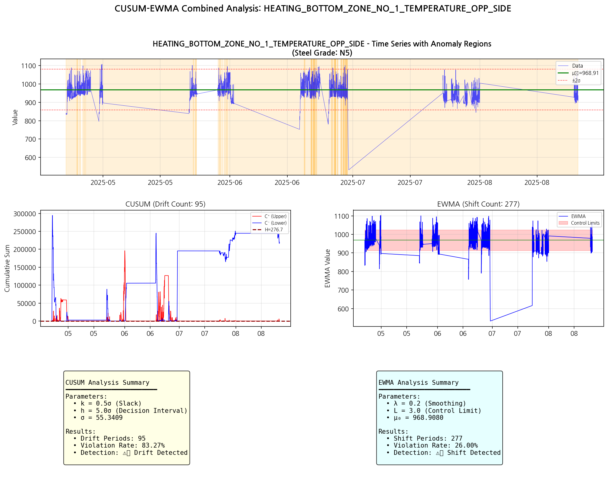

**HEATING_BOTTOM_ZONE_NO_2_TEMPERATURE_MILL_SIDE** (Drift: 89, Shift: 304)

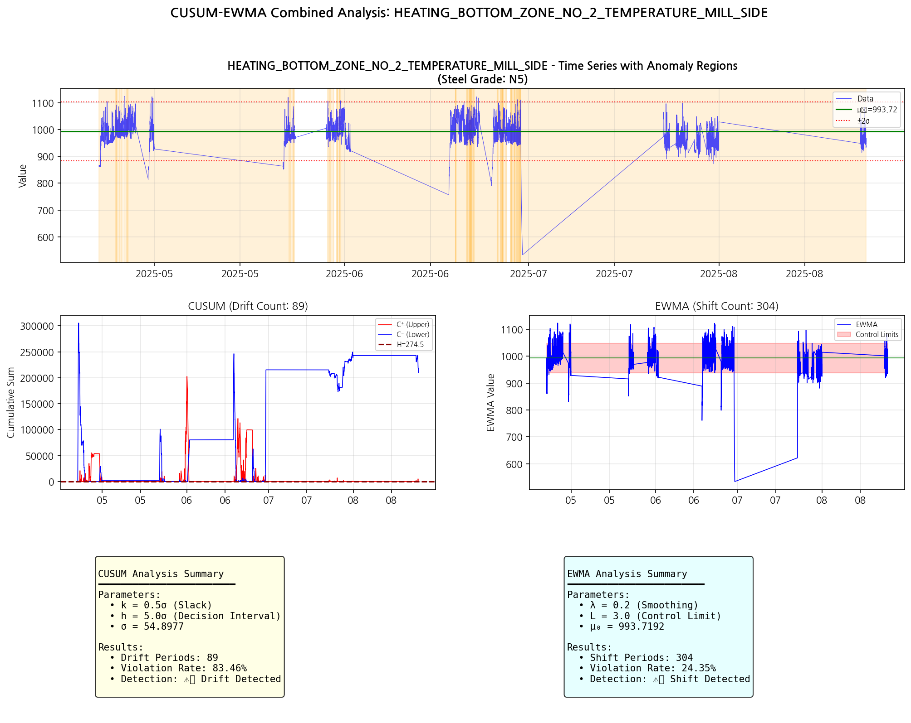

**SOAKING_BOTTOM_ZONE_NO_1_TEMPERATURE_OPP_SIDE** (Drift: 58, Shift: 30)

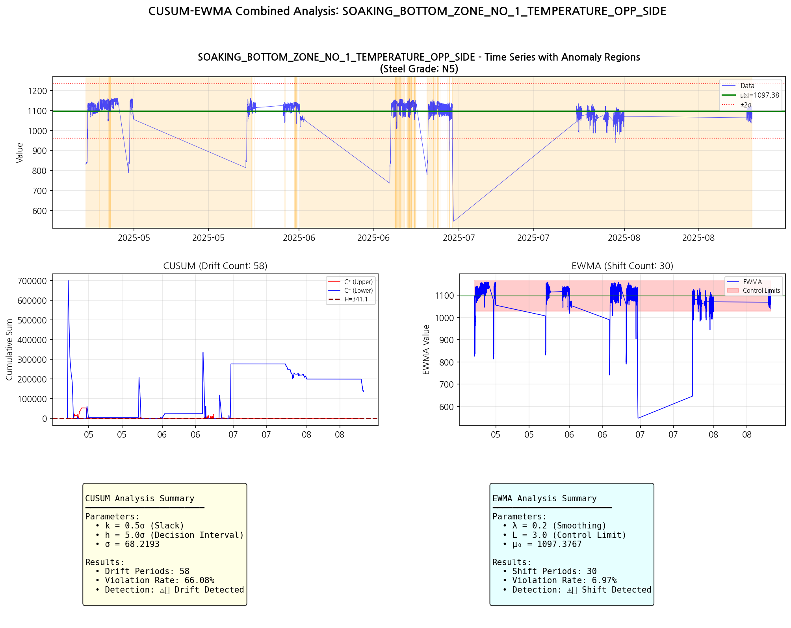

### 가열로 추출 온도 (03_Furnace_Discharge_Temperature)

- 분석 태그: 1개
- 드리프트 탐지: 1개
- 시프트 탐지: 1개
- 안정: 0개

| 태그 | CUSUM Drift | EWMA Shift | 상태 |
|------|-------------|------------|------|
| FURNACE_EXIT_DISCHARGE_BILLET_TEMPERATURE | 1507 | 1718 | 🔴 |

#### 주요 태그 차트

**FURNACE_EXIT_DISCHARGE_BILLET_TEMPERATURE** (Drift: 1507, Shift: 1718)

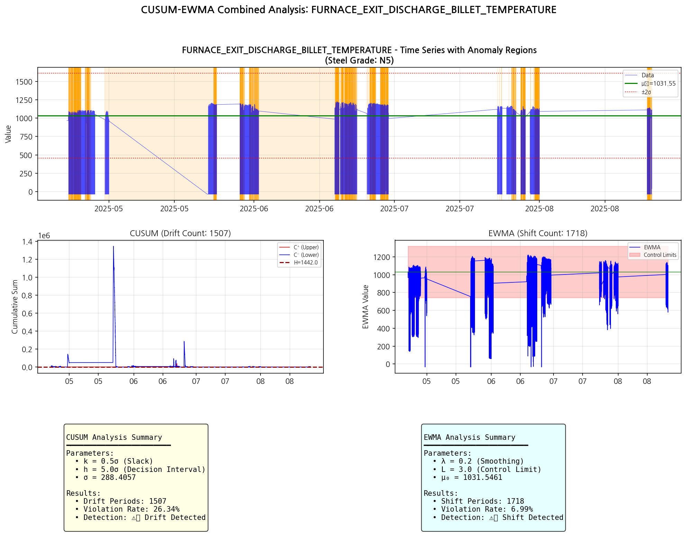

### 가열로 보조설비 (04_Furnace_Auxiliary)

- 분석 태그: 9개
- 드리프트 탐지: 9개
- 시프트 탐지: 9개
- 안정: 0개

| 태그 | CUSUM Drift | EWMA Shift | 상태 |
|------|-------------|------------|------|
| FURNACE_PRESSURE | 95 | 1051 | 🔴 |
| FURNACE_O2_ANALYZER | 203 | 412 | 🔴 |
| MAIN_GAS_PRESSURE | 31 | 13 | 🔴 |
| MAIN_GAS_FLOW | 32 | 503 | 🔴 |
| MAIN_GAS_TEMPERATURE | 5 | 49 | 🔴 |
| MAIN_COMBUSTION_AIR_PRESSURE | 61 | 68 | 🔴 |
| COMBUSTION_AIR_TEMPERATURE | 9 | 132 | 🔴 |
| INDIRECT_COOLING_WATER_FLOW | 3 | 478 | 🔴 |
| INDIRECT_WATER_MAIN_TEMPERATURE | 1 | 58 | 🔴 |

#### 주요 태그 차트

**FURNACE_O2_ANALYZER** (Drift: 203, Shift: 412)

**FURNACE_PRESSURE** (Drift: 95, Shift: 1051)

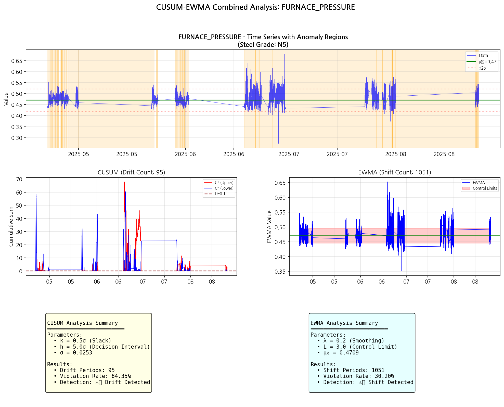

**MAIN_COMBUSTION_AIR_PRESSURE** (Drift: 61, Shift: 68)

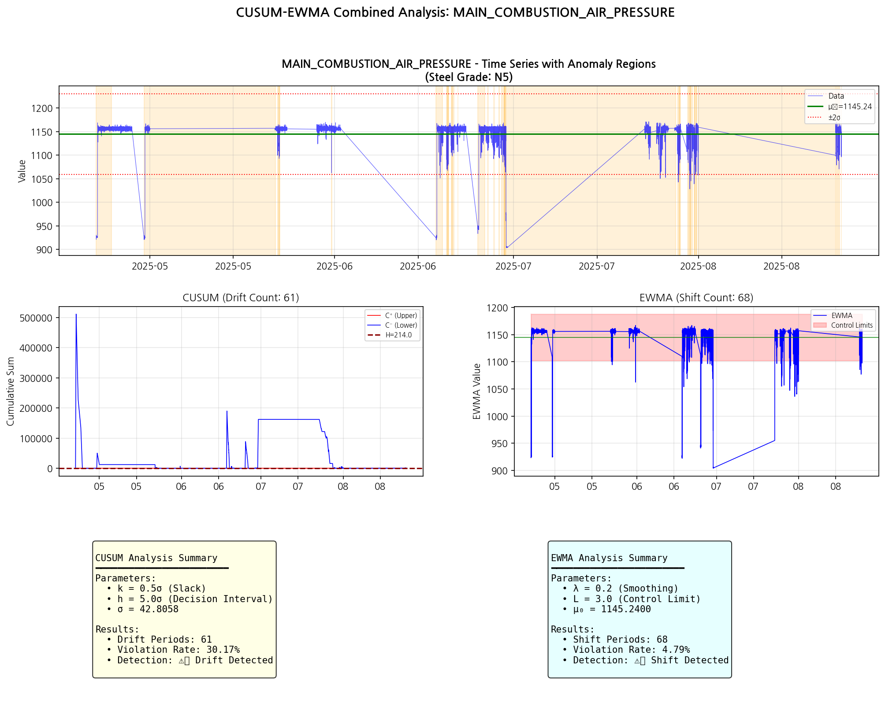

### 스탠드 토크 (05_Stand_Torque)

- 분석 태그: 16개
- 드리프트 탐지: 16개
- 시프트 탐지: 16개
- 안정: 0개

| 태그 | CUSUM Drift | EWMA Shift | 상태 |
|------|-------------|------------|------|
| STAND_1_ACTUAL_TORQUE | 361 | 1579 | 🔴 |
| STAND_2_ACTUAL_TORQUE | 279 | 1513 | 🔴 |
| STAND_3_ACTUAL_TORQUE | 471 | 1466 | 🔴 |
| STAND_4_ACTUAL_TORQUE | 417 | 1626 | 🔴 |
| STAND_5_ACTUAL_TORQUE | 427 | 1366 | 🔴 |
| STAND_6_ACTUAL_TORQUE | 313 | 1647 | 🔴 |
| STAND_7_ACTUAL_TORQUE | 358 | 1237 | 🔴 |
| STAND_8_ACTUAL_TORQUE | 273 | 1460 | 🔴 |
| STAND_9_ACTUAL_TORQUE | 437 | 1464 | 🔴 |
| STAND_10_ACTUAL_TORQUE | 385 | 1308 | 🔴 |
| STAND_11_ACTUAL_TORQUE | 393 | 1342 | 🔴 |
| STAND_12_ACTUAL_TORQUE | 343 | 1443 | 🔴 |
| STAND_13_ACTUAL_TORQUE | 404 | 1387 | 🔴 |
| STAND_14_ACTUAL_TORQUE | 294 | 1323 | 🔴 |
| FINISHING_BLOCK_MASTER_ACTUAL_TORQUE | 133 | 1217 | 🔴 |
| FINISHING_BLOCK_SLAVE_ACTUAL_TORQUE | 133 | 1216 | 🔴 |

#### 주요 태그 차트

**STAND_3_ACTUAL_TORQUE** (Drift: 471, Shift: 1466)

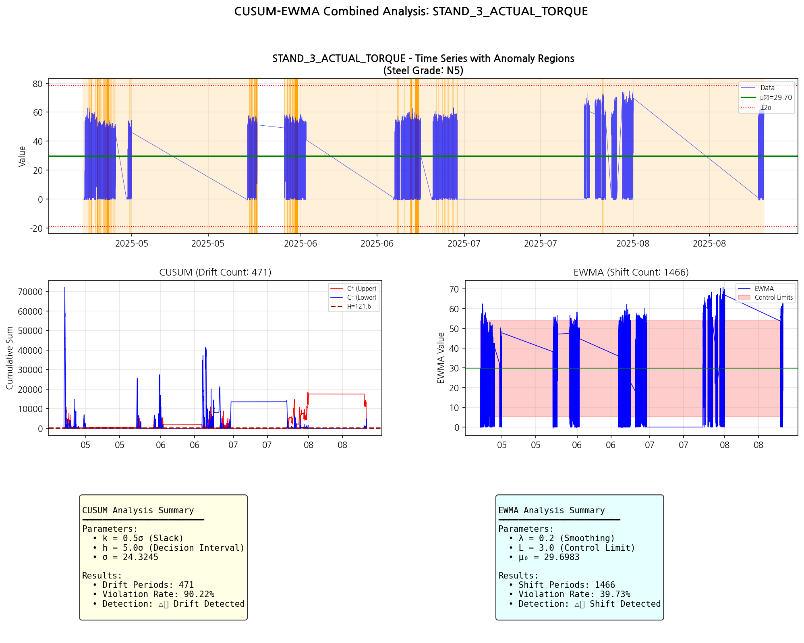

**STAND_9_ACTUAL_TORQUE** (Drift: 437, Shift: 1464)

**STAND_5_ACTUAL_TORQUE** (Drift: 427, Shift: 1366)

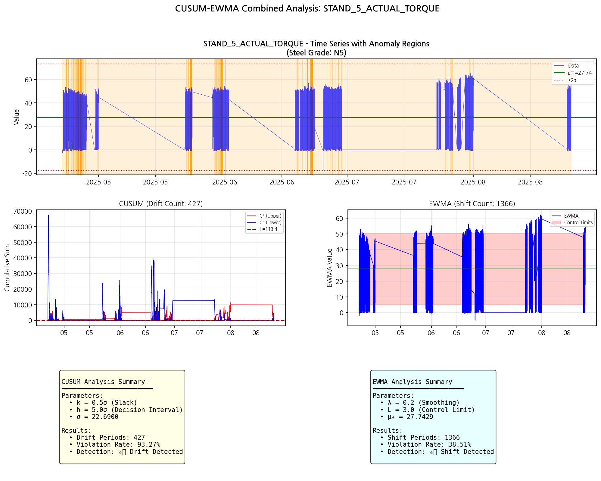

### 스탠드 속도 (06_Stand_Speed)

- 분석 태그: 15개
- 드리프트 탐지: 15개
- 시프트 탐지: 15개
- 안정: 0개

| 태그 | CUSUM Drift | EWMA Shift | 상태 |
|------|-------------|------------|------|
| STAND_1_ACTUAL_SPEED | 139 | 287 | 🔴 |
| STAND_2_ACTUAL_SPEED | 116 | 288 | 🔴 |
| STAND_3_ACTUAL_SPEED | 134 | 287 | 🔴 |
| STAND_4_ACTUAL_SPEED | 162 | 286 | 🔴 |
| STAND_5_ACTUAL_SPEED | 134 | 287 | 🔴 |
| STAND_6_ACTUAL_SPEED | 157 | 286 | 🔴 |
| STAND_7_ACTUAL_SPEED | 156 | 288 | 🔴 |
| STAND_8_ACTUAL_SPEED | 141 | 286 | 🔴 |
| STAND_9_ACTUAL_SPEED | 130 | 313 | 🔴 |
| STAND_10_ACTUAL_SPEED | 155 | 312 | 🔴 |
| STAND_11_ACTUAL_SPEED | 122 | 312 | 🔴 |
| STAND_12_ACTUAL_SPEED | 81 | 312 | 🔴 |
| STAND_13_ACTUAL_SPEED | 92 | 312 | 🔴 |
| STAND_14_ACTUAL_SPEED | 94 | 311 | 🔴 |
| FINISHING_BLOCK_ACTUAL_SPEED | 160 | 328 | 🔴 |

#### 주요 태그 차트

**STAND_4_ACTUAL_SPEED** (Drift: 162, Shift: 286)

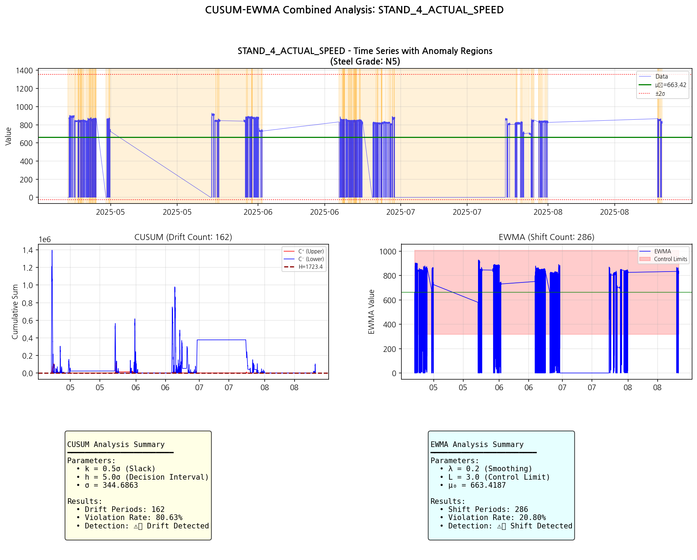

**FINISHING_BLOCK_ACTUAL_SPEED** (Drift: 160, Shift: 328)

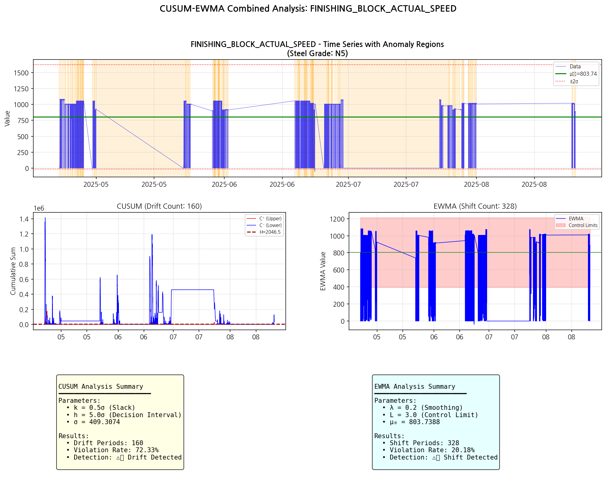

**STAND_6_ACTUAL_SPEED** (Drift: 157, Shift: 286)

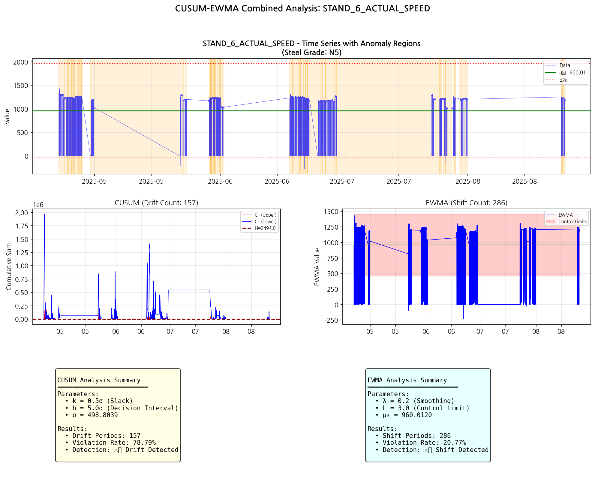

### 스탠드 부하 (07_Stand_Load)

- 분석 태그: 15개
- 드리프트 탐지: 15개
- 시프트 탐지: 15개
- 안정: 0개

| 태그 | CUSUM Drift | EWMA Shift | 상태 |
|------|-------------|------------|------|
| STAND_1_LOAD | 590 | 742 | 🔴 |
| STAND_2_LOAD | 590 | 750 | 🔴 |
| STAND_3_LOAD | 582 | 744 | 🔴 |
| STAND_4_LOAD | 576 | 750 | 🔴 |
| STAND_5_LOAD | 574 | 749 | 🔴 |
| STAND_6_LOAD | 562 | 752 | 🔴 |
| STAND_7_LOAD | 563 | 751 | 🔴 |
| STAND_8_LOAD | 572 | 747 | 🔴 |
| STAND_9_LOAD | 565 | 735 | 🔴 |
| STAND_10_LOAD | 574 | 737 | 🔴 |
| STAND_11_LOAD | 578 | 736 | 🔴 |
| STAND_12_LOAD | 583 | 736 | 🔴 |
| STAND_13_LOAD | 583 | 736 | 🔴 |
| STAND_14_LOAD | 581 | 737 | 🔴 |
| FINISHING_BLOCK_LOAD | 576 | 740 | 🔴 |

#### 주요 태그 차트

**STAND_2_LOAD** (Drift: 590, Shift: 750)

**STAND_1_LOAD** (Drift: 590, Shift: 742)

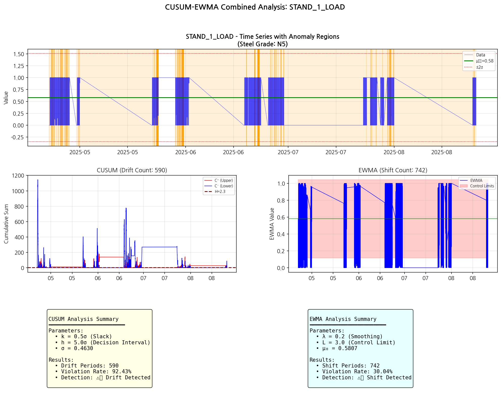

**STAND_12_LOAD** (Drift: 583, Shift: 736)

### 핀치롤 (08_Pinchroll)

- 분석 태그: 9개
- 드리프트 탐지: 9개
- 시프트 탐지: 9개
- 안정: 0개

| 태그 | CUSUM Drift | EWMA Shift | 상태 |
|------|-------------|------------|------|
| PINCHROLL_2_ACTUAL_SPEED | 36 | 1887 | 🔴 |
| PINCHROLL_3_ACTUAL_SPEED | 1 | 36 | 🔴 |
| PINCHROLL_4_ACTUAL_SPEED | 1 | 25 | 🔴 |
| PINCHROLL_2_ACTUAL_TORQUE | 935 | 926 | 🔴 |
| PINCHROLL_3_ACTUAL_TORQUE | 329 | 930 | 🔴 |
| PINCHROLL_4_ACTUAL_TORQUE | 366 | 1039 | 🔴 |
| PINCHROLL_2_REFERENCE_TORQUE | 105 | 121 | 🔴 |
| PINCHROLL_3_REFERENCE_TORQUE | 552 | 1022 | 🔴 |
| PINCHROLL_4_REFERENCE_TORQUE | 641 | 1320 | 🔴 |

#### 주요 태그 차트

**PINCHROLL_2_ACTUAL_TORQUE** (Drift: 935, Shift: 926)

**PINCHROLL_4_REFERENCE_TORQUE** (Drift: 641, Shift: 1320)

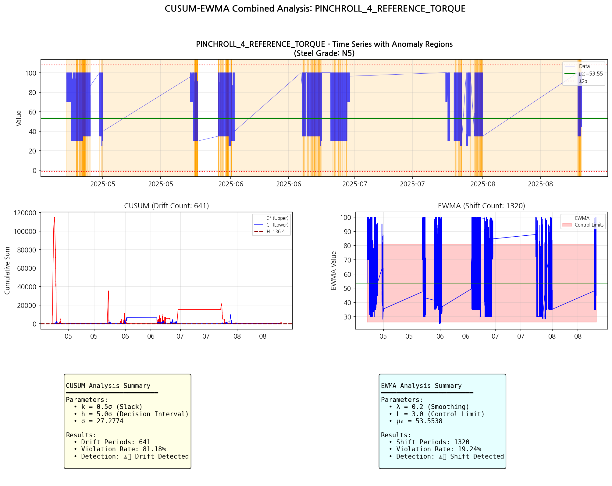

**PINCHROLL_3_REFERENCE_TORQUE** (Drift: 552, Shift: 1022)

### PR 상세 토크 (09_PR_Detailed)

- 분석 태그: 6개
- 드리프트 탐지: 6개
- 시프트 탐지: 6개
- 안정: 0개

| 태그 | CUSUM Drift | EWMA Shift | 상태 |
|------|-------------|------------|------|
| PR6L1_ACT_TORQUE | 12 | 675 | 🔴 |
| PR6L2_ACT_TORQUE | 13 | 466 | 🔴 |
| PR7L1_ACT_TORQUE | 111 | 148 | 🔴 |
| PR7L2_ACT_TORQUE | 22 | 468 | 🔴 |
| PR8L1_ACT_TORQUE | 2099 | 2000 | 🔴 |
| PR9L1_ACT_TORQUE | 2068 | 1462 | 🔴 |

#### 주요 태그 차트

**PR8L1_ACT_TORQUE** (Drift: 2099, Shift: 2000)

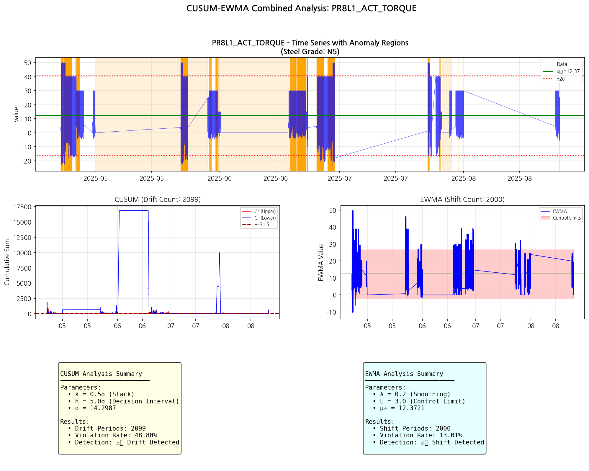

**PR9L1_ACT_TORQUE** (Drift: 2068, Shift: 1462)

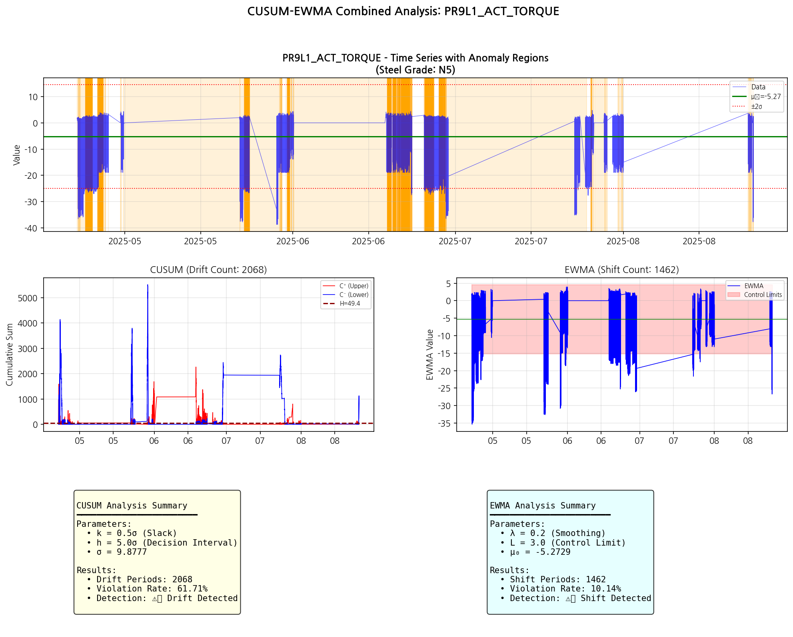

**PR7L1_ACT_TORQUE** (Drift: 111, Shift: 148)

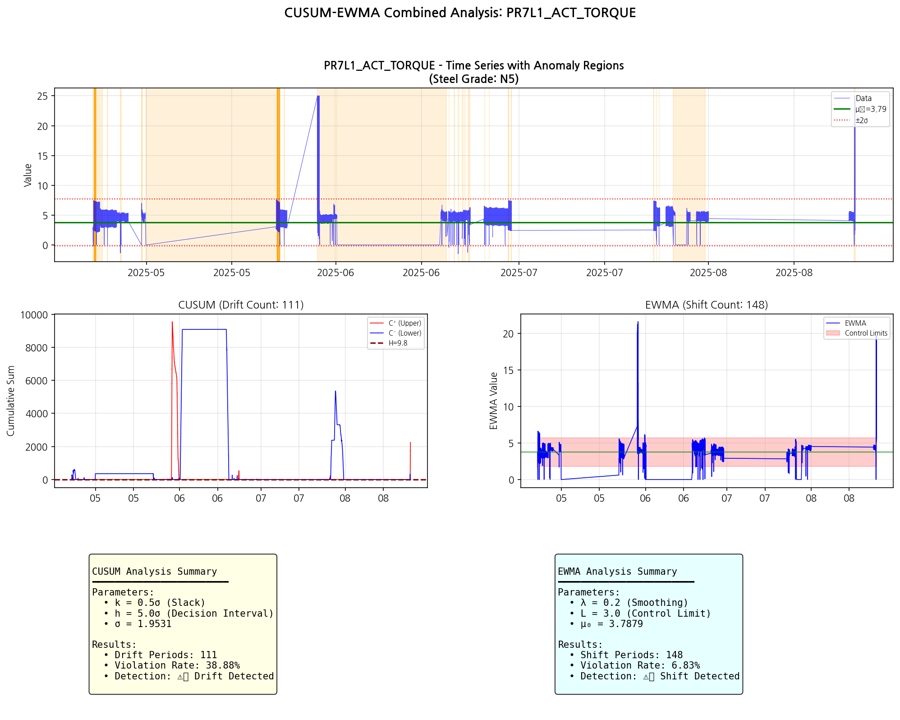

---

## 해석 가이드

### CUSUM (Cumulative Sum) 관리도

- **원리**: 목표값 대비 편차의 누적합을 추적
- **장점**: 작은 지속적 변화(0.5σ~2σ)에 민감
- **드리프트**: 누적합이 결정 구간(h)을 초과하면 탐지
- **활용**: 점진적인 공정 악화, 센서 드리프트 탐지

### EWMA (Exponentially Weighted Moving Average) 관리도

- **원리**: 최근 데이터에 더 큰 가중치를 부여
- **장점**: 급격한 변화에 빠른 반응
- **시프트**: EWMA 값이 제어 한계를 벗어나면 탐지
- **활용**: 급격한 공정 변화, 이상 상태 전환 탐지

### 상태 정의

| 상태 | 설명 | 권장 조치 |
|------|------|----------|
| 🔴 드리프트 탐지 | CUSUM에서 점진적 변화 감지 | 원인 분석 및 공정 조정 |
| 🟠 시프트 탐지 | EWMA에서 급격한 변화 감지 | 즉시 점검 필요 |
| 🟡 경고 | 위반율 5% 초과 | 모니터링 강화 |
| 🟢 안정 | 정상 범위 | 현 상태 유지 |

---

## 메타데이터

| 항목 | 값 |
|------|-----|
| 분석 스크립트 | steel_grade_cusum_ewma_analysis.py |
| 분석 기간 | 2025-03-01 ~ 2025-08-31 |
| 강종 | N5 |
| 생성일시 | 2026-02-03 20:35:25 |
| 총 분석 태그 | 79개 |

---

*본 보고서는 자동 생성되었습니다.*
