# 강종 [B5] 규격 [D16] Mahalanobis Distance 다변량 이상치 분석 보고서

**분석 기간**: 2025-03-01 ~ 2025-08-31
**강종**: B5
**규격**: D16
**생성일시**: 2026-02-09 15:00:57

---

## 분석 개요

### 분석 방법론

**Mahalanobis Distance (마할라노비스 거리)**

다변량 이상치 탐지를 위한 거리 측정 방법으로, 변수 간 상관관계를 고려합니다.

$$D_M(x) = \sqrt{(x - \mu)^T \Sigma^{-1} (x - \mu)}$$

| 파라미터 | 값 | 설명 |
|----------|-----|------|
| α (유의수준) | 0.001 | χ² 분포 임계값 |
| Percentile | 99.5% | 백분위수 임계값 |

### 장점

- **상관관계 고려**: 변수 간 관계를 반영
- **스케일 독립**: 변수 단위에 영향받지 않음
- **복합 이상치 탐지**: 개별 정상, 조합 이상 탐지

### 분석 결과 요약

| 구분 | 카테고리 수 | 비율 |
|------|-------------|------|
| **총 분석 카테고리** | 9개 | 100% |
| 🔴 높은 이상치율 (≥10%) | 0개 | 0.0% |
| 🟠 중간 이상치율 (3~10%) | 2개 | 22.2% |
| 🟢 낮은 이상치율 (<3%) | 7개 | 77.8% |

#### 전체 평균

| 지표 | 값 |
|------|-----|
| 평균 이상치율 | 2.48% |
| 평균 상관계수 | 0.701 |

---

## 카테고리별 분석 결과

| 카테고리 | 설명 | 태그 수 | 이상치율 | 평균 상관 | 상태 |
|----------|------|---------|----------|-----------|------|
| 07_Stand_Load | 스탠드 부하 (1-7) | 7 | 9.23% | 0.947 | 🟠 |
| 05_Stand_Torque | 스탠드 토크 (1-7) | 7 | 4.39% | 0.952 | 🟠 |
| 06_Stand_Speed_B | 스탠드 속도 (8-14) | 7 | 2.84% | 0.980 | 🟢 |
| 01_Furnace_Top_Temperature | 가열로 상부 온도 | 4 | 1.88% | 0.616 | 🟢 |
| 06_Stand_Speed | 스탠드 속도 (1-7) | 7 | 1.38% | 1.000 | 🟢 |
| 08_Pinchroll | 핀치롤 | 6 | 1.37% | -0.064 | 🟢 |
| 04_Furnace_Auxiliary | 가열로 압력/유량 | 4 | 0.69% | -0.028 | 🟢 |
| 05_Stand_Torque_B | 스탠드 토크 (8-14) | 7 | 0.35% | 0.993 | 🟢 |
| 02_Furnace_Bottom_Temperature | 가열로 하부 온도 | 4 | 0.21% | 0.914 | 🟢 |

---

## 상세 분석

### 스탠드 부하 (1-7) (07_Stand_Load) 🟠

**분석 태그**: 7개
- STAND_1_LOAD
- STAND_2_LOAD
- STAND_3_LOAD
- STAND_4_LOAD
- STAND_5_LOAD
- ... 외 2개

**Mahalanobis 통계**

| 지표 | 값 |
|------|-----|
| χ² 임계값 | 4.9317 |
| 이상치 수 | 660개 |
| 이상치율 | 9.23% |
| 평균 거리 | 1.9164 |
| 최대 거리 | 9.0240 |

**상관관계**

| 지표 | 값 |
|------|-----|
| 평균 상관계수 | 0.947 |
| 최대 상관계수 | 0.999 |
| 최소 상관계수 | 0.824 |

**PCA 분석**

| 주성분 | 설명 분산 비율 |
|--------|----------------|
| PC1 | 95.5% |
| PC2 | 4.2% |
| 합계 | 99.7% |

#### 시각화

**상관관계 히트맵**

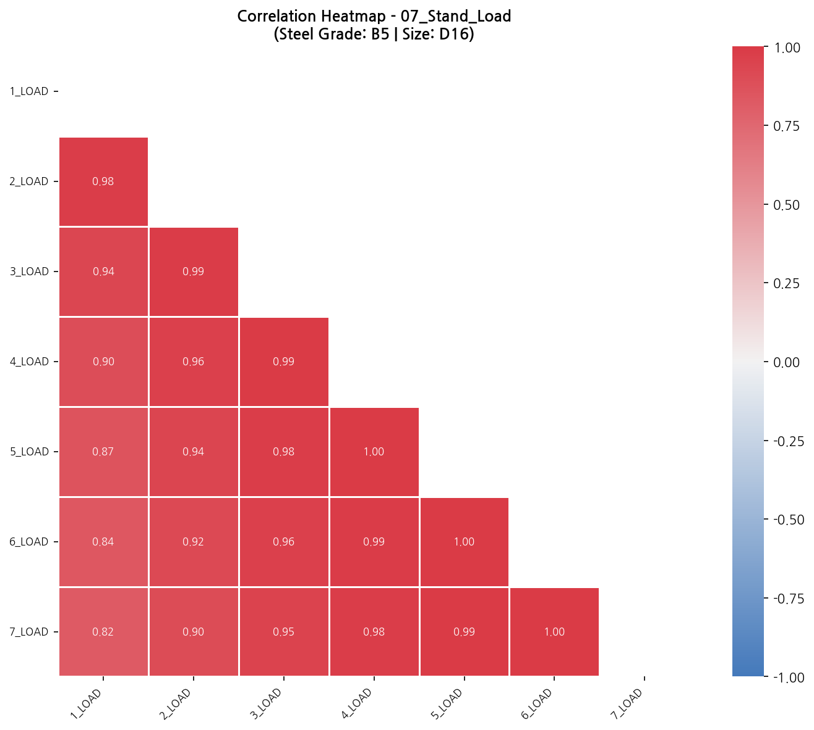

**Mahalanobis 거리 시계열**

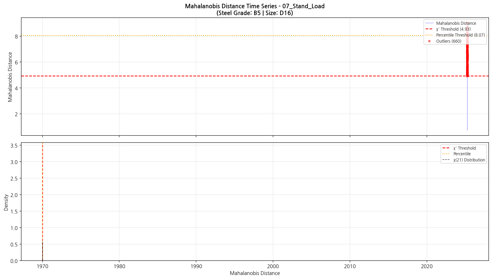

**PCA 산점도**

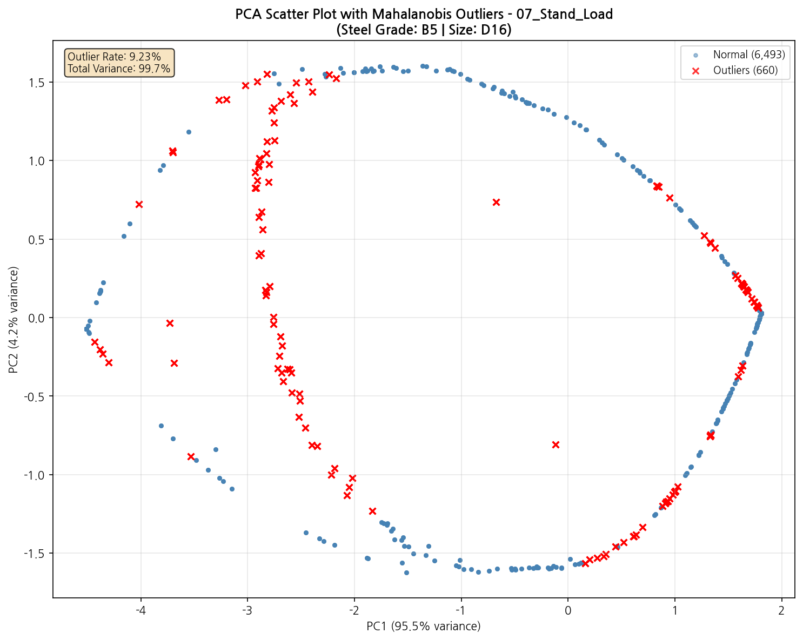

---

### 스탠드 토크 (1-7) (05_Stand_Torque) 🟠

**분석 태그**: 7개
- STAND_1_ACTUAL_TORQUE
- STAND_2_ACTUAL_TORQUE
- STAND_3_ACTUAL_TORQUE
- STAND_4_ACTUAL_TORQUE
- STAND_5_ACTUAL_TORQUE
- ... 외 2개

**Mahalanobis 통계**

| 지표 | 값 |
|------|-----|
| χ² 임계값 | 4.9317 |
| 이상치 수 | 314개 |
| 이상치율 | 4.39% |
| 평균 거리 | 2.3731 |
| 최대 거리 | 17.1263 |

**상관관계**

| 지표 | 값 |
|------|-----|
| 평균 상관계수 | 0.952 |
| 최대 상관계수 | 0.998 |
| 최소 상관계수 | 0.848 |

**PCA 분석**

| 주성분 | 설명 분산 비율 |
|--------|----------------|
| PC1 | 95.9% |
| PC2 | 3.7% |
| 합계 | 99.5% |

#### 시각화

**상관관계 히트맵**

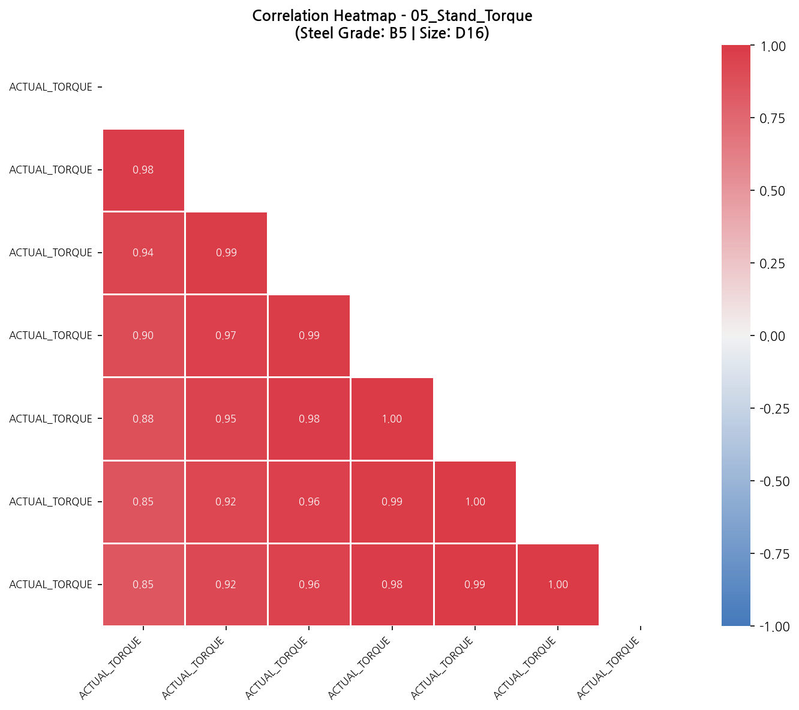

**Mahalanobis 거리 시계열**

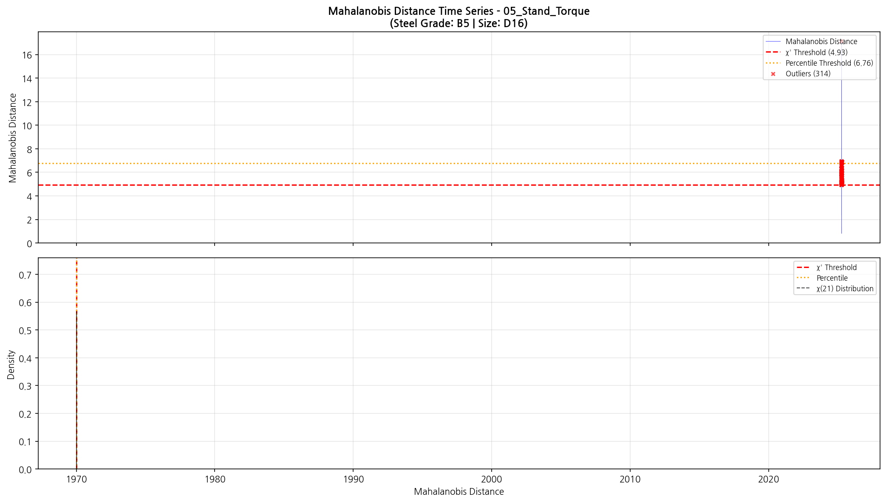

**PCA 산점도**

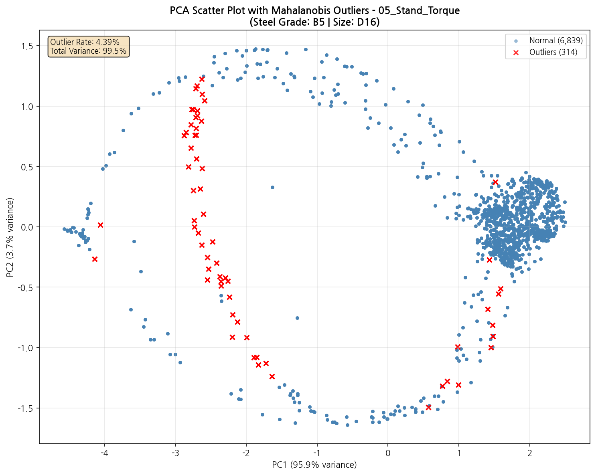

---

### 스탠드 속도 (8-14) (06_Stand_Speed_B) 🟢

**분석 태그**: 7개
- STAND_8_ACTUAL_SPEED
- STAND_9_ACTUAL_SPEED
- STAND_10_ACTUAL_SPEED
- STAND_11_ACTUAL_SPEED
- STAND_12_ACTUAL_SPEED
- ... 외 2개

**Mahalanobis 통계**

| 지표 | 값 |
|------|-----|
| χ² 임계값 | 4.9317 |
| 이상치 수 | 203개 |
| 이상치율 | 2.84% |
| 평균 거리 | 2.1768 |
| 최대 거리 | 35.7902 |

**상관관계**

| 지표 | 값 |
|------|-----|
| 평균 상관계수 | 0.980 |
| 최대 상관계수 | 1.000 |
| 최소 상관계수 | 0.929 |

**PCA 분석**

| 주성분 | 설명 분산 비율 |
|--------|----------------|
| PC1 | 98.3% |
| PC2 | 1.7% |
| 합계 | 100.0% |

#### 시각화

**상관관계 히트맵**

**Mahalanobis 거리 시계열**

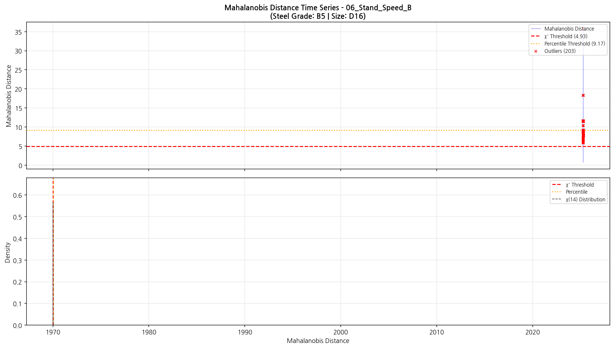

**PCA 산점도**

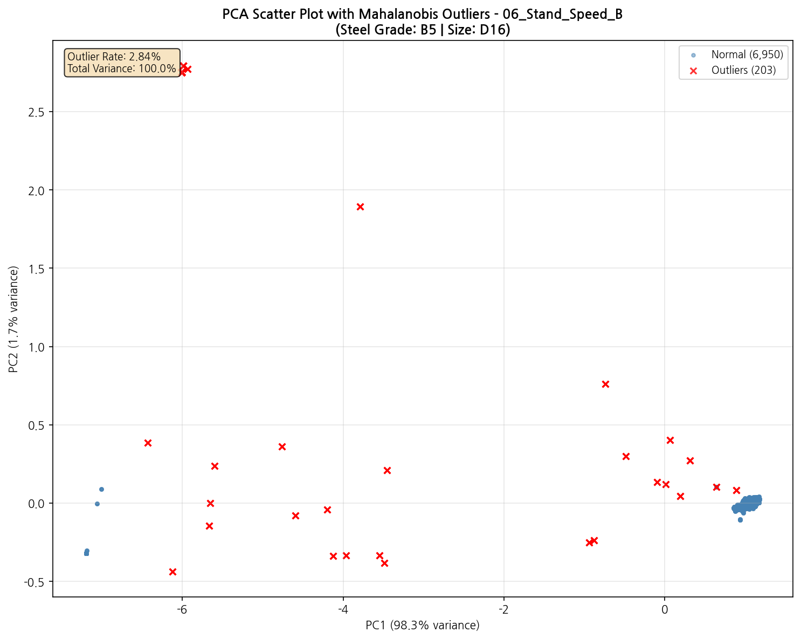

---

### 가열로 상부 온도 (01_Furnace_Top_Temperature) 🟢

**분석 태그**: 4개
- HEATING_TOP_ZONE_NO_1_TEMPERATURE_ROOF
- HEATING_TOP_ZONE_NO_2_TEMPERATURE_ROOF
- SOAKING_TOP_ZONE_NO_1_TEMPERATURE_ROOF
- SOAKING_TOP_ZONE_NO_2_TEMPERATURE_ROOF

**Mahalanobis 통계**

| 지표 | 값 |
|------|-----|
| χ² 임계값 | 4.2973 |
| 이상치 수 | 135개 |
| 이상치율 | 1.88% |
| 평균 거리 | 1.7806 |
| 최대 거리 | 8.2161 |

**상관관계**

| 지표 | 값 |
|------|-----|
| 평균 상관계수 | 0.616 |
| 최대 상관계수 | 0.995 |
| 최소 상관계수 | 0.458 |

**PCA 분석**

| 주성분 | 설명 분산 비율 |
|--------|----------------|
| PC1 | 72.0% |
| PC2 | 15.1% |
| 합계 | 87.1% |

#### 시각화

**상관관계 히트맵**

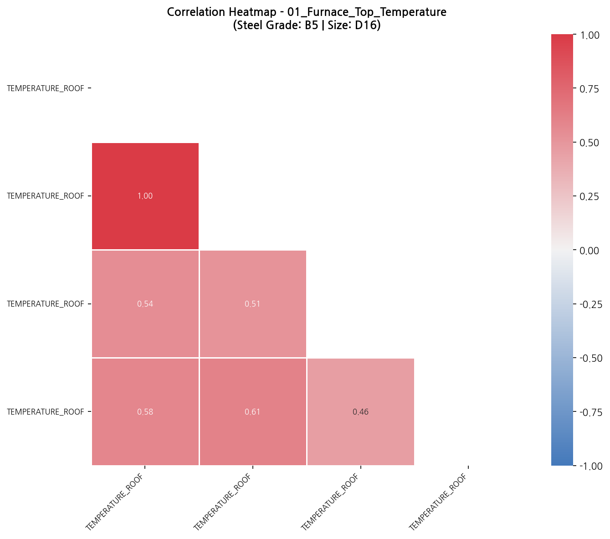

**Mahalanobis 거리 시계열**

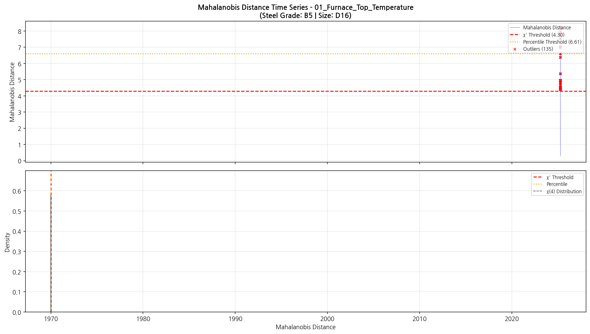

**PCA 산점도**

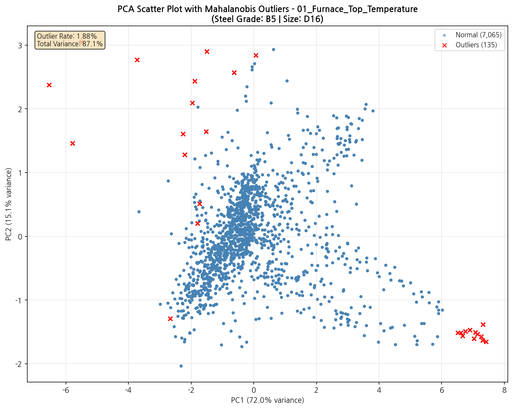

---

### 스탠드 속도 (1-7) (06_Stand_Speed) 🟢

**분석 태그**: 7개
- STAND_1_ACTUAL_SPEED
- STAND_2_ACTUAL_SPEED
- STAND_3_ACTUAL_SPEED
- STAND_4_ACTUAL_SPEED
- STAND_5_ACTUAL_SPEED
- ... 외 2개

**Mahalanobis 통계**

| 지표 | 값 |
|------|-----|
| χ² 임계값 | 4.9317 |
| 이상치 수 | 99개 |
| 이상치율 | 1.38% |
| 평균 거리 | 2.1366 |
| 최대 거리 | 31.2760 |

**상관관계**

| 지표 | 값 |
|------|-----|
| 평균 상관계수 | 1.000 |
| 최대 상관계수 | 1.000 |
| 최소 상관계수 | 0.999 |

**PCA 분석**

| 주성분 | 설명 분산 비율 |
|--------|----------------|
| PC1 | 100.0% |
| PC2 | 0.0% |
| 합계 | 100.0% |

#### 시각화

**상관관계 히트맵**

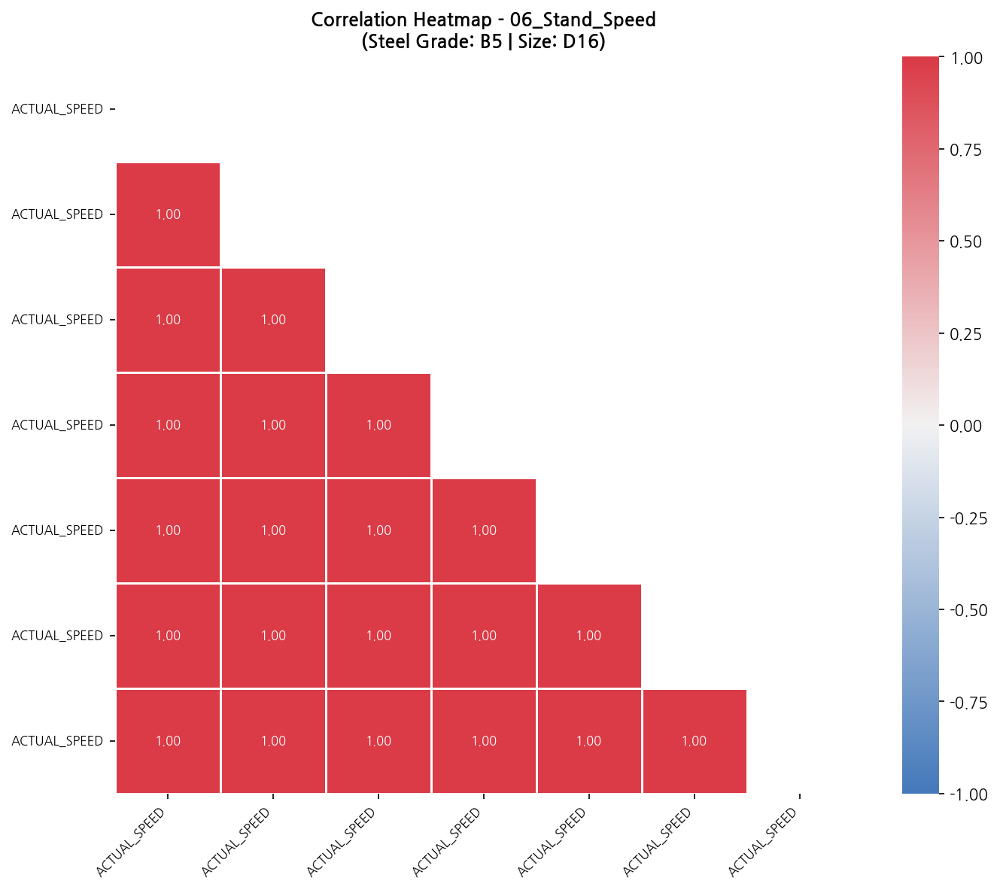

**Mahalanobis 거리 시계열**

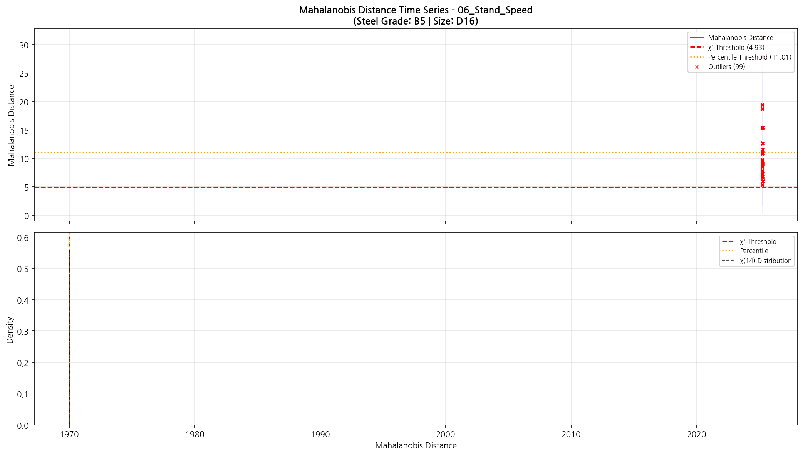

**PCA 산점도**

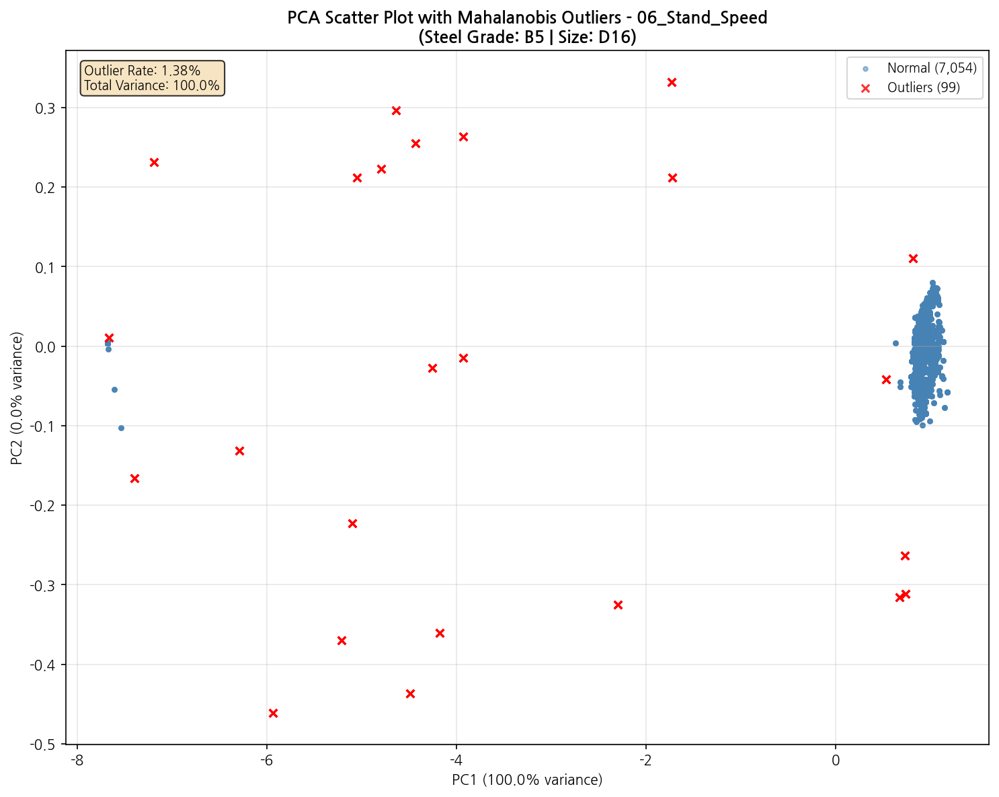

---

### 핀치롤 (08_Pinchroll) 🟢

**분석 태그**: 6개
- PINCHROLL_2_ACTUAL_SPEED
- PINCHROLL_3_ACTUAL_SPEED
- PINCHROLL_4_ACTUAL_SPEED
- PINCHROLL_2_ACTUAL_TORQUE
- PINCHROLL_3_ACTUAL_TORQUE
- ... 외 1개

**Mahalanobis 통계**

| 지표 | 값 |
|------|-----|
| χ² 임계값 | 4.7390 |
| 이상치 수 | 85개 |
| 이상치율 | 1.37% |
| 평균 거리 | 1.8191 |
| 최대 거리 | 39.8582 |

**상관관계**

| 지표 | 값 |
|------|-----|
| 평균 상관계수 | -0.064 |
| 최대 상관계수 | 1.000 |
| 최소 상관계수 | -0.969 |

**PCA 분석**

| 주성분 | 설명 분산 비율 |
|--------|----------------|
| PC1 | 95.7% |
| PC2 | 2.9% |
| 합계 | 98.6% |

#### 시각화

**상관관계 히트맵**

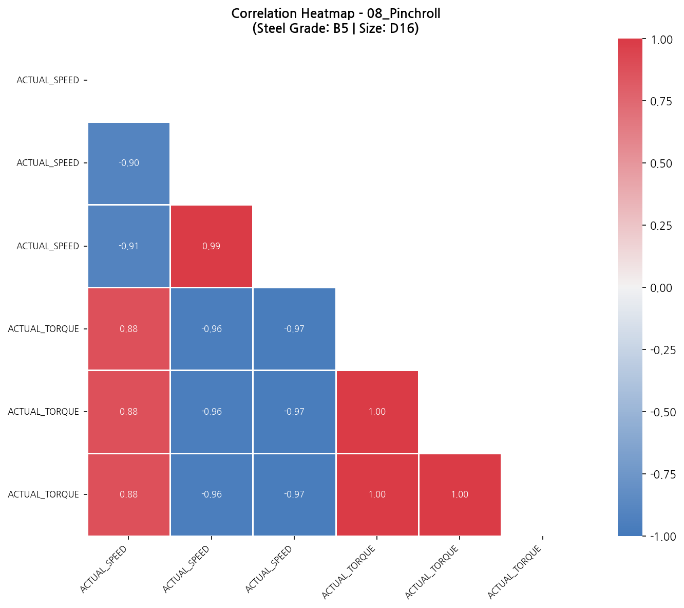

**Mahalanobis 거리 시계열**

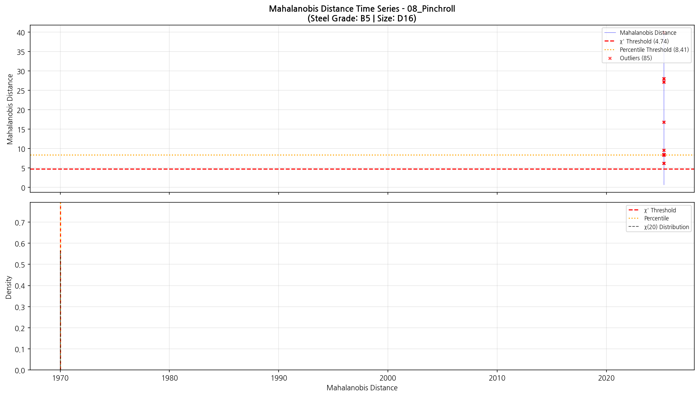

**PCA 산점도**

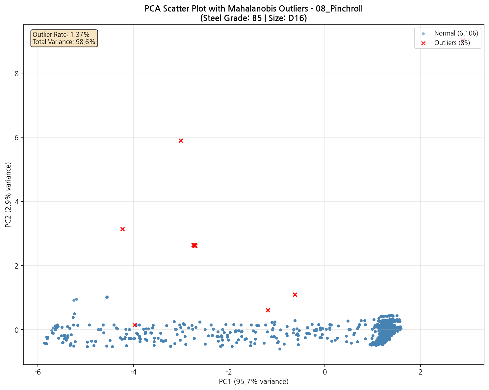

---

### 가열로 압력/유량 (04_Furnace_Auxiliary) 🟢

**분석 태그**: 4개
- FURNACE_PRESSURE
- MAIN_GAS_PRESSURE
- MAIN_GAS_FLOW
- MAIN_COMBUSTION_AIR_PRESSURE

**Mahalanobis 통계**

| 지표 | 값 |
|------|-----|
| χ² 임계값 | 4.2973 |
| 이상치 수 | 50개 |
| 이상치율 | 0.69% |
| 평균 거리 | 1.9005 |
| 최대 거리 | 6.4297 |

**상관관계**

| 지표 | 값 |
|------|-----|
| 평균 상관계수 | -0.028 |
| 최대 상관계수 | 0.897 |
| 최소 상관계수 | -0.574 |

**PCA 분석**

| 주성분 | 설명 분산 비율 |
|--------|----------------|
| PC1 | 59.1% |
| PC2 | 25.1% |
| 합계 | 84.2% |

#### 시각화

**상관관계 히트맵**

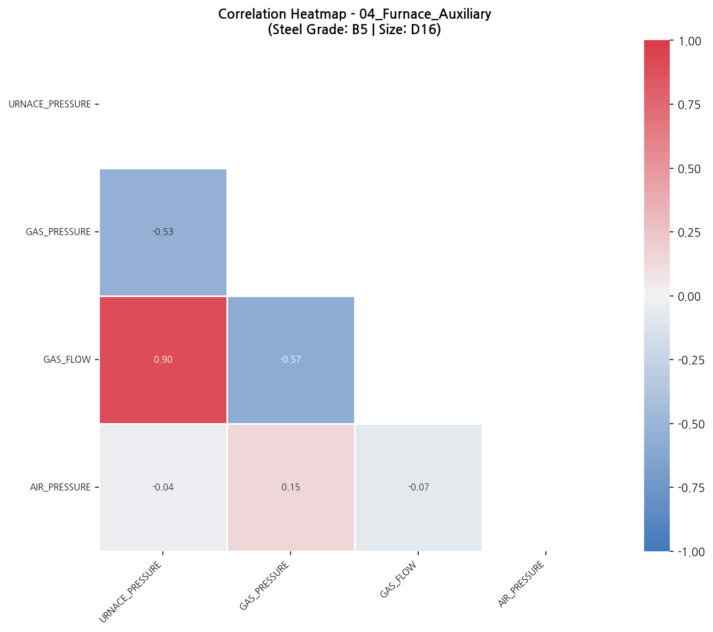

**Mahalanobis 거리 시계열**

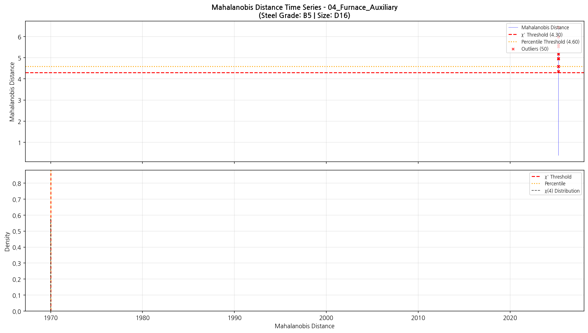

**PCA 산점도**

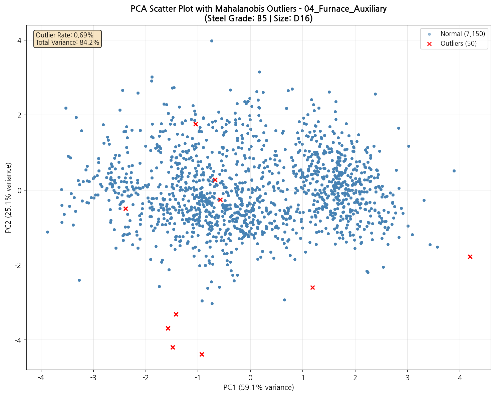

---

### 스탠드 토크 (8-14) (05_Stand_Torque_B) 🟢

**분석 태그**: 7개
- STAND_8_ACTUAL_TORQUE
- STAND_9_ACTUAL_TORQUE
- STAND_10_ACTUAL_TORQUE
- STAND_11_ACTUAL_TORQUE
- STAND_12_ACTUAL_TORQUE
- ... 외 2개

**Mahalanobis 통계**

| 지표 | 값 |
|------|-----|
| χ² 임계값 | 4.9317 |
| 이상치 수 | 25개 |
| 이상치율 | 0.35% |
| 평균 거리 | 2.5172 |
| 최대 거리 | 21.1860 |

**상관관계**

| 지표 | 값 |
|------|-----|
| 평균 상관계수 | 0.993 |
| 최대 상관계수 | 0.999 |
| 최소 상관계수 | 0.980 |

**PCA 분석**

| 주성분 | 설명 분산 비율 |
|--------|----------------|
| PC1 | 99.4% |
| PC2 | 0.4% |
| 합계 | 99.8% |

#### 시각화

**상관관계 히트맵**

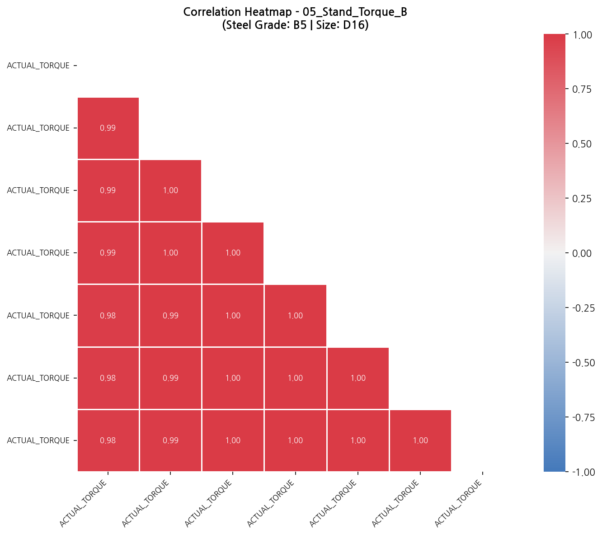

**Mahalanobis 거리 시계열**

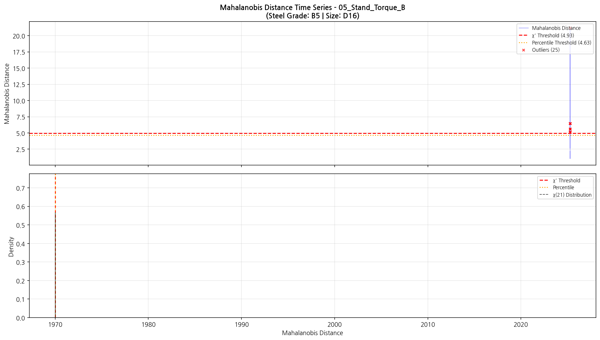

**PCA 산점도**

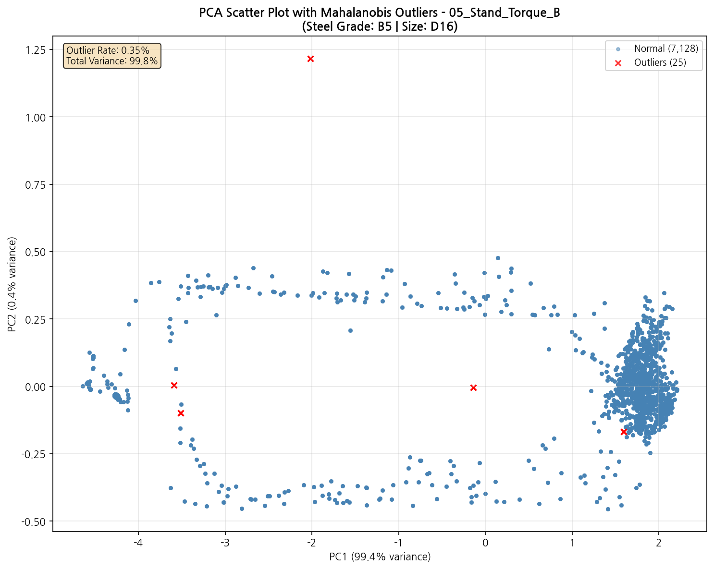

---

### 가열로 하부 온도 (02_Furnace_Bottom_Temperature) 🟢

**분석 태그**: 4개
- HEATING_BOTTOM_ZONE_NO_1_TEMPERATURE_OPP_SIDE
- HEATING_BOTTOM_ZONE_NO_2_TEMPERATURE_MILL_SIDE
- SOAKING_BOTTOM_ZONE_NO_1_TEMPERATURE_OPP_SIDE
- SOAKING_BOTTOM_ZONE_NO_2_TEMPERATURE_MILL_SIDE

**Mahalanobis 통계**

| 지표 | 값 |
|------|-----|
| χ² 임계값 | 4.2973 |
| 이상치 수 | 15개 |
| 이상치율 | 0.21% |
| 평균 거리 | 1.8879 |
| 최대 거리 | 5.8470 |

**상관관계**

| 지표 | 값 |
|------|-----|
| 평균 상관계수 | 0.914 |
| 최대 상관계수 | 0.994 |
| 최소 상관계수 | 0.855 |

**PCA 분석**

| 주성분 | 설명 분산 비율 |
|--------|----------------|
| PC1 | 93.5% |
| PC2 | 6.2% |
| 합계 | 99.8% |

#### 시각화

**상관관계 히트맵**

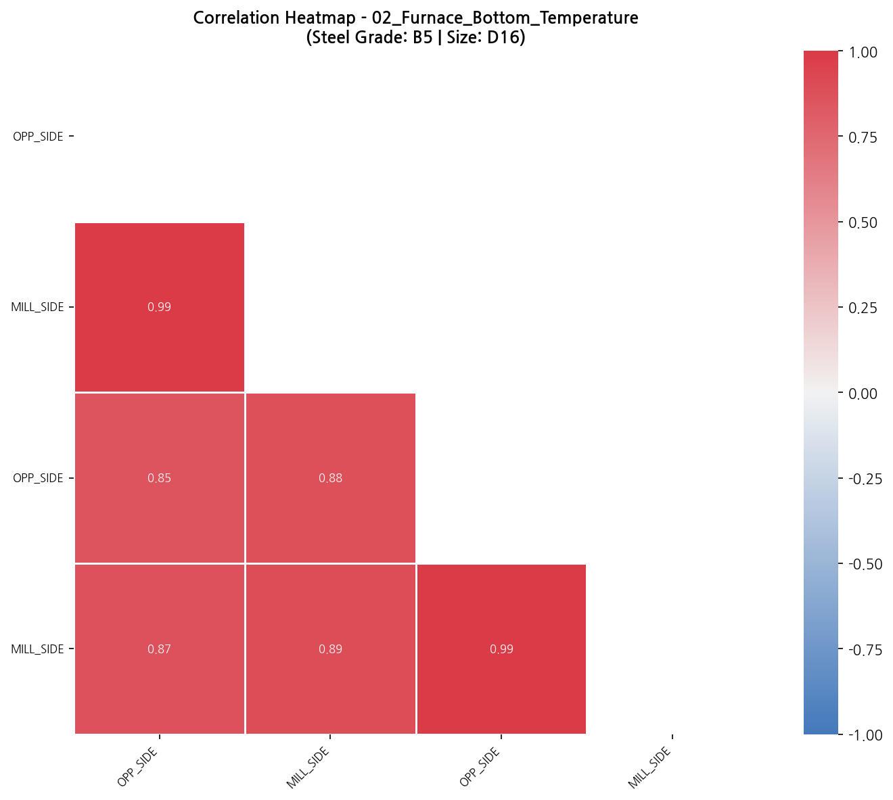

**Mahalanobis 거리 시계열**

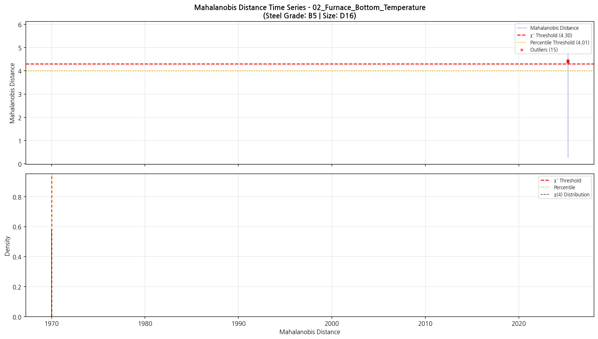

**PCA 산점도**

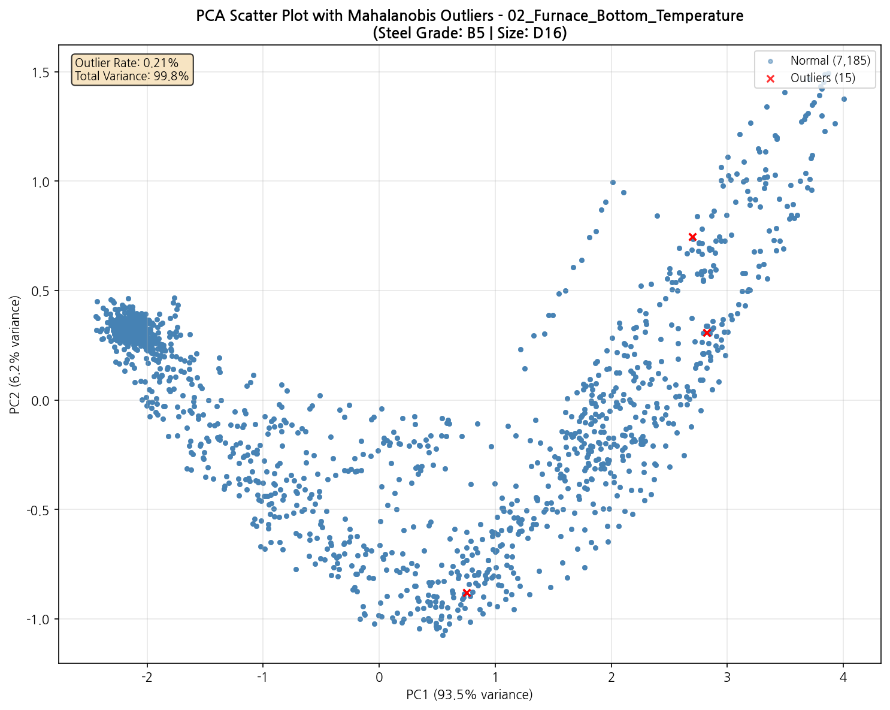

---

## 해석 가이드

### Mahalanobis Distance 해석

1. **거리가 큰 관측치**
   - 다변량 공간에서 중심에서 멀리 떨어진 점
   - 여러 변수의 조합이 비정상적
   - 개별 변수는 정상 범위일 수 있음

2. **χ² 임계값**
   - 자유도 p의 χ² 분포 기반
   - 유의수준 α에서의 임계값
   - 통계적으로 유의한 이상치 판정

3. **상관관계와 이상치**
   - 높은 상관관계: 변수 간 강한 연관성
   - 상관 패턴 이탈 = 다변량 이상치

### 상태 분류

| 상태 | 기준 | 해석 |
|------|------|------|
| 🔴 높음 | ≥10% | 다변량 이상치 빈번, 점검 필요 |
| 🟠 중간 | 3~10% | 일부 조합 이상, 모니터링 |
| 🟢 낮음 | <3% | 정상 범위 |

### PCA 시각화 해석

- **PC1, PC2**: 데이터의 주요 변동 방향
- **빨간 점**: Mahalanobis 이상치
- **분산 비율**: 축이 설명하는 정보량

---

## 메타데이터

| 항목 | 값 |
|------|-----|
| 분석 스크립트 | steel_grade_mahalanobis_analysis.py |
| 분석 기간 | 2025-03-01 ~ 2025-08-31 |
| 강종 | B5 |
| 규격 | D16 |
| 유의수준 | 0.001 |
| 생성일시 | 2026-02-09 15:00:57 |
| 총 분석 카테고리 | 9개 |

---

*본 보고서는 자동 생성되었습니다.*
