# 강종 [B5 | Size: D13] Rolling Z-Score 동적 이상치 분석 보고서

**분석 기간**: 2025-03-01 ~ 2025-08-31
**강종**: B5  
**사이즈**: D13
**생성일시**: 2026-02-09 15:18:01

---

## 분석 개요

### 분석 방법론

**Rolling Z-Score (롤링 Z-점수)**

시간 창(window) 기반 동적 이상치 탐지 방법입니다.

$$Z_{rolling}(t) = \frac{x(t) - \mu_{window}(t)}{\sigma_{window}(t)}$$

| 파라미터 | 값 | 설명 |
|----------|-----|------|
| Window | 24h | 이동 평균/표준편차 윈도우 |
| Z Threshold | ±3.0σ | 이상치 판정 임계값 |
| Severe | ±4.0σ | 심각 이상치 임계값 |

### 장점

- **비정상 시계열 적합**: 평균/분산 시변하는 데이터에 효과적
- **점진적 기준선 추적**: 장기 드리프트에 강건
- **Local Context 기반**: 해당 시점 주변 패턴 기준

### 분석 결과 요약

| 구분 | 태그 수 | 비율 |
|------|---------|------|
| **총 분석 태그** | 79개 | 100% |
| 🔴 높은 이상치율 (≥10%) | 0개 | 0.0% |
| 🟠 중간 이상치율 (3~10%) | 25개 | 31.6% |
| 🟢 낮은 이상치율 (<3%) | 54개 | 68.4% |
| 🟡 불안정 기준선 | 0개 | 0.0% |

#### 전체 평균

| 지표 | 값 |
|------|-----|
| 평균 이상치율 | 1.97% |
| 평균 기준선 안정성 | 0.748 |

---

## 상위 문제 태그 (이상치율 기준)

| 순위 | 태그 | 카테고리 | 이상치율 | 심각 이상치 | 안정성 | 상태 |
|------|------|----------|----------|-------------|--------|------|
| 1 | MAIN_COMBUSTION_AIR_PRESSURE | 가열로 보조설비 | 7.44% | 248 | 0.000 | 🟠 |
| 2 | STAND_2_ACTUAL_SPEED | 스탠드 속도 | 6.01% | 178 | 0.511 | 🟠 |
| 3 | FINISHING_BLOCK_ACTUAL_SPEED | 스탠드 속도 | 6.01% | 177 | 0.544 | 🟠 |
| 4 | STAND_1_ACTUAL_SPEED | 스탠드 속도 | 6.00% | 177 | 0.510 | 🟠 |
| 5 | STAND_3_ACTUAL_SPEED | 스탠드 속도 | 6.00% | 178 | 0.510 | 🟠 |
| 6 | MAIN_GAS_TEMPERATURE | 가열로 보조설비 | 5.99% | 57 | 0.426 | 🟠 |
| 7 | STAND_10_ACTUAL_SPEED | 스탠드 속도 | 5.97% | 181 | 0.543 | 🟠 |
| 8 | STAND_4_ACTUAL_SPEED | 스탠드 속도 | 5.96% | 177 | 0.515 | 🟠 |
| 9 | STAND_12_ACTUAL_SPEED | 스탠드 속도 | 5.96% | 172 | 0.544 | 🟠 |
| 10 | STAND_13_ACTUAL_SPEED | 스탠드 속도 | 5.96% | 172 | 0.544 | 🟠 |
| 11 | STAND_6_ACTUAL_SPEED | 스탠드 속도 | 5.94% | 178 | 0.513 | 🟠 |
| 12 | STAND_7_ACTUAL_SPEED | 스탠드 속도 | 5.94% | 181 | 0.506 | 🟠 |
| 13 | STAND_14_ACTUAL_SPEED | 스탠드 속도 | 5.93% | 173 | 0.542 | 🟠 |
| 14 | STAND_5_ACTUAL_SPEED | 스탠드 속도 | 5.91% | 178 | 0.512 | 🟠 |
| 15 | STAND_9_ACTUAL_SPEED | 스탠드 속도 | 5.90% | 173 | 0.543 | 🟠 |

---

## 불안정 기준선 태그

기준선 안정성(Stability Index)이 0.5 미만인 태그입니다.
이 태그들은 Rolling Z-Score 방법보다 다른 방법이 더 적합할 수 있습니다.

| 태그 | 카테고리 | 안정성 | 이상치율 |
|------|----------|--------|----------|
| MAIN_COMBUSTION_AIR_PRESSURE | 가열로 보조설비 | 0.000 | 7.44% |
| COMBUSTION_AIR_TEMPERATURE | 가열로 보조설비 | 0.425 | 3.35% |
| MAIN_GAS_TEMPERATURE | 가열로 보조설비 | 0.426 | 5.99% |

---

## 카테고리별 분석 결과

### 가열로 상부 온도 (01_Furnace_Top_Temperature)

- 분석 태그: 4개
- 평균 이상치율: 4.07%
- 평균 안정성: 0.593

| 태그 | 이상치율 | 심각 이상치 | 안정성 | Max \|Z\| |
|------|----------|-------------|--------|--------|
| HEATING_TOP_ZONE_NO_1_TEMPERATURE_ROOF | 4.21% | 166 | 0.639 | 8.64 |
| HEATING_TOP_ZONE_NO_2_TEMPERATURE_ROOF | 4.09% | 163 | 0.645 | 7.16 |
| SOAKING_TOP_ZONE_NO_1_TEMPERATURE_ROOF | 4.37% | 123 | 0.537 | 5.72 |
| SOAKING_TOP_ZONE_NO_2_TEMPERATURE_ROOF | 3.62% | 120 | 0.552 | 5.83 |

#### Z-Score 차트

**SOAKING_TOP_ZONE_NO_1_TEMPERATURE_ROOF** (이상치율: 4.37%, 안정성: 0.537)

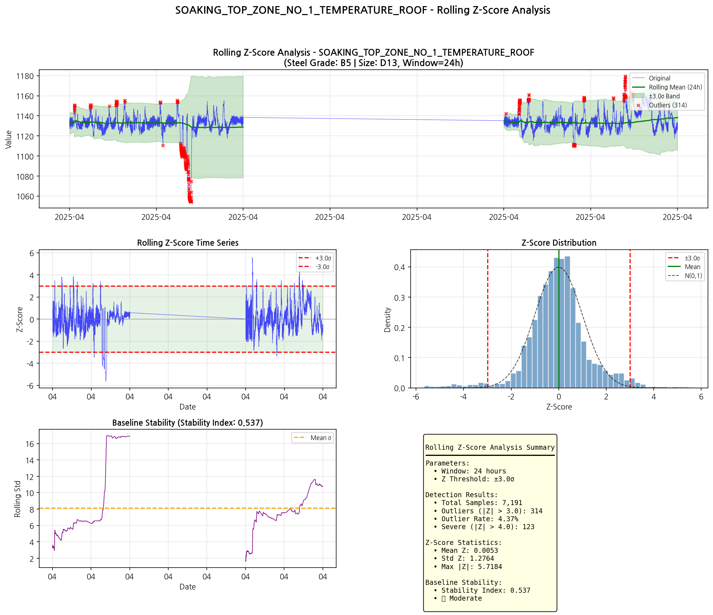

**HEATING_TOP_ZONE_NO_1_TEMPERATURE_ROOF** (이상치율: 4.21%, 안정성: 0.639)

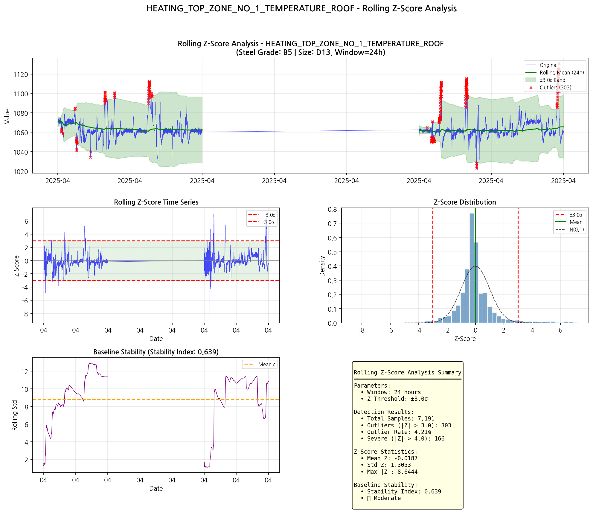

**HEATING_TOP_ZONE_NO_2_TEMPERATURE_ROOF** (이상치율: 4.09%, 안정성: 0.645)

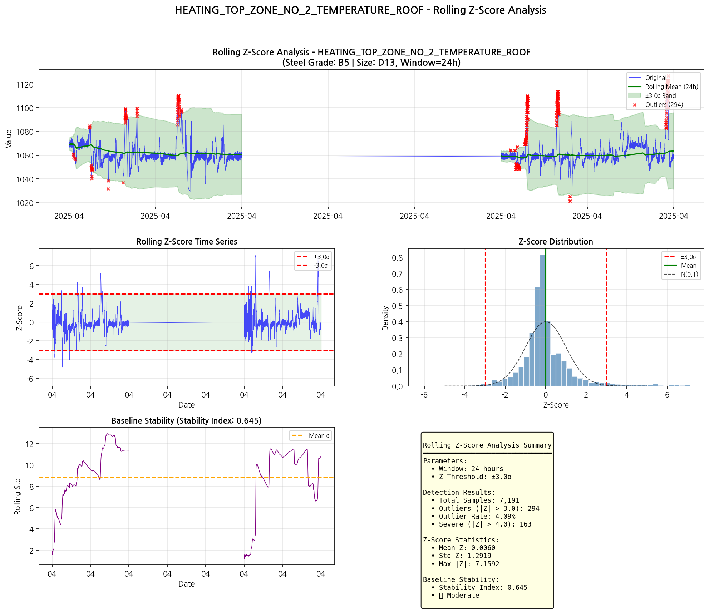

### 가열로 하부 온도 (02_Furnace_Bottom_Temperature)

- 분석 태그: 4개
- 평균 이상치율: 2.91%
- 평균 안정성: 0.659

| 태그 | 이상치율 | 심각 이상치 | 안정성 | Max \|Z\| |
|------|----------|-------------|--------|--------|
| HEATING_BOTTOM_ZONE_NO_1_TEMPERATURE_OPP_SIDE | 4.76% | 143 | 0.620 | 8.56 |
| HEATING_BOTTOM_ZONE_NO_2_TEMPERATURE_MILL_SIDE | 4.14% | 124 | 0.625 | 8.38 |
| SOAKING_BOTTOM_ZONE_NO_1_TEMPERATURE_OPP_SIDE | 1.46% | 62 | 0.695 | 8.99 |
| SOAKING_BOTTOM_ZONE_NO_2_TEMPERATURE_MILL_SIDE | 1.27% | 55 | 0.698 | 8.93 |

#### Z-Score 차트

**HEATING_BOTTOM_ZONE_NO_1_TEMPERATURE_OPP_SIDE** (이상치율: 4.76%, 안정성: 0.620)

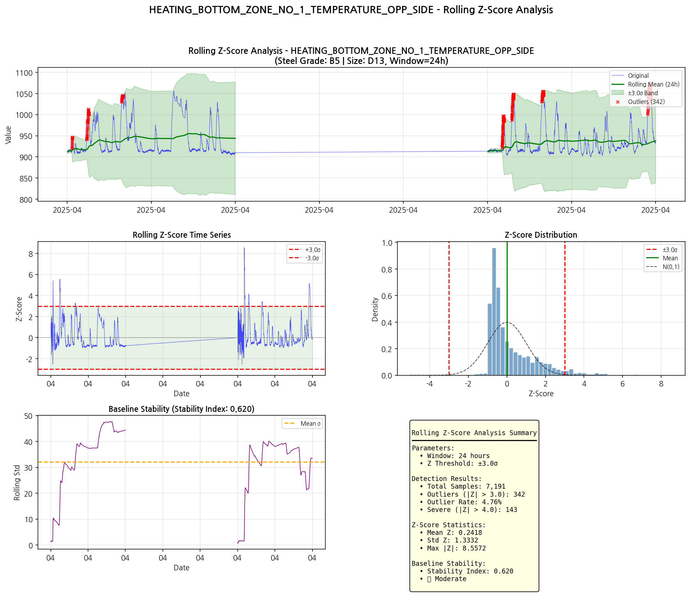

**HEATING_BOTTOM_ZONE_NO_2_TEMPERATURE_MILL_SIDE** (이상치율: 4.14%, 안정성: 0.625)

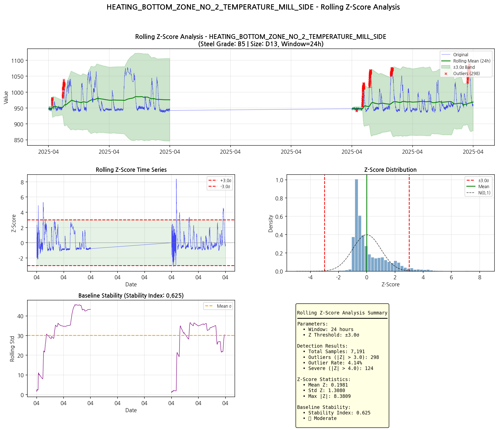

**SOAKING_BOTTOM_ZONE_NO_1_TEMPERATURE_OPP_SIDE** (이상치율: 1.46%, 안정성: 0.695)

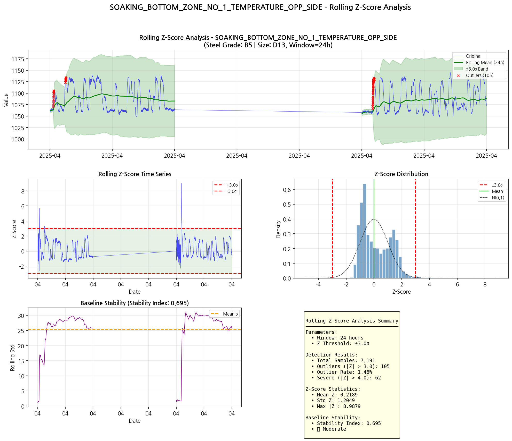

### 가열로 추출 온도 (03_Furnace_Discharge_Temperature)

- 분석 태그: 1개
- 평균 이상치율: 4.78%
- 평균 안정성: 0.848

| 태그 | 이상치율 | 심각 이상치 | 안정성 | Max \|Z\| |
|------|----------|-------------|--------|--------|
| FURNACE_EXIT_DISCHARGE_BILLET_TEMPERATURE | 4.78% | 0 | 0.848 | 3.88 |

#### Z-Score 차트

**FURNACE_EXIT_DISCHARGE_BILLET_TEMPERATURE** (이상치율: 4.78%, 안정성: 0.848)

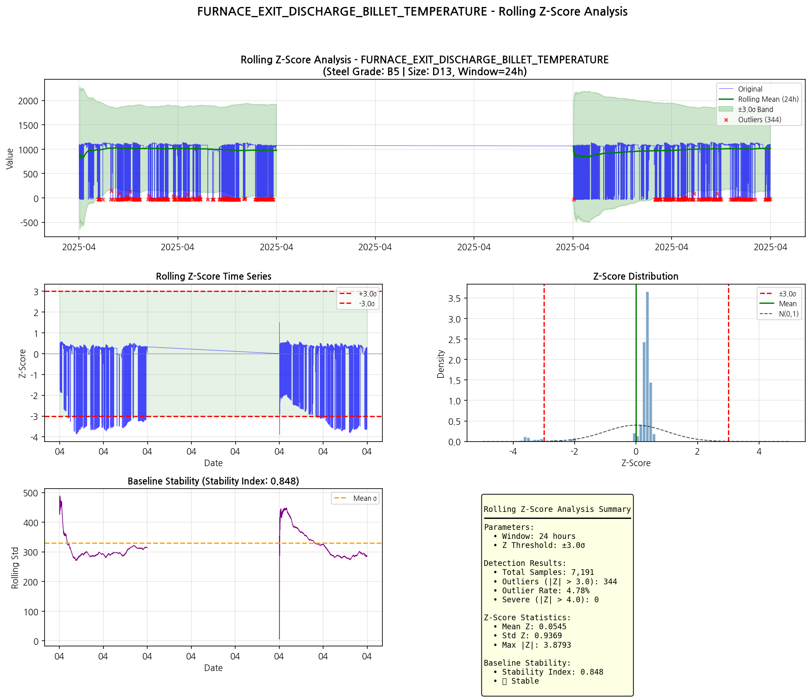

### 가열로 보조설비 (04_Furnace_Auxiliary)

- 분석 태그: 9개
- 평균 이상치율: 2.77%
- 평균 안정성: 0.567

| 태그 | 이상치율 | 심각 이상치 | 안정성 | Max \|Z\| |
|------|----------|-------------|--------|--------|
| FURNACE_PRESSURE | 0.83% | 6 | 0.760 | 4.97 |
| FURNACE_O2_ANALYZER | 1.11% | 38 | 0.765 | 8.08 |
| MAIN_GAS_PRESSURE | 1.24% | 39 | 0.731 | 6.24 |
| MAIN_GAS_FLOW | 2.98% | 55 | 0.652 | 7.48 |
| MAIN_GAS_TEMPERATURE | 5.99% | 57 | 0.426 | 5.33 |
| MAIN_COMBUSTION_AIR_PRESSURE | 7.44% | 248 | 0.000 | 12.13 |
| COMBUSTION_AIR_TEMPERATURE | 3.35% | 23 | 0.425 | 4.76 |
| INDIRECT_COOLING_WATER_FLOW | 1.35% | 23 | 0.593 | 11.16 |
| INDIRECT_WATER_MAIN_TEMPERATURE | 0.60% | 0 | 0.746 | 3.75 |

#### Z-Score 차트

**MAIN_COMBUSTION_AIR_PRESSURE** (이상치율: 7.44%, 안정성: 0.000)

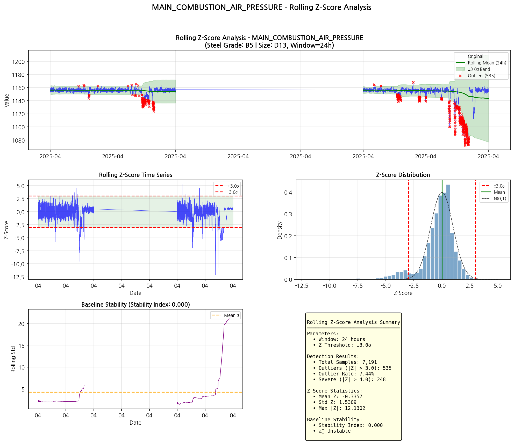

**MAIN_GAS_TEMPERATURE** (이상치율: 5.99%, 안정성: 0.426)

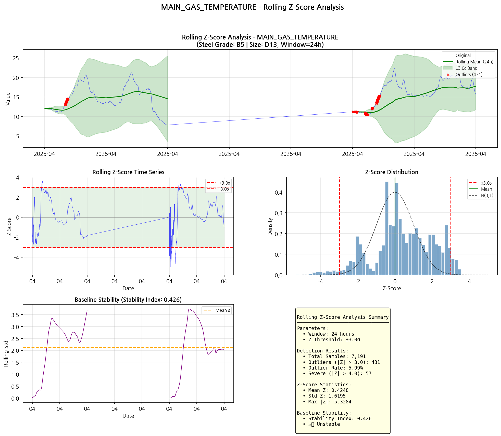

**COMBUSTION_AIR_TEMPERATURE** (이상치율: 3.35%, 안정성: 0.425)

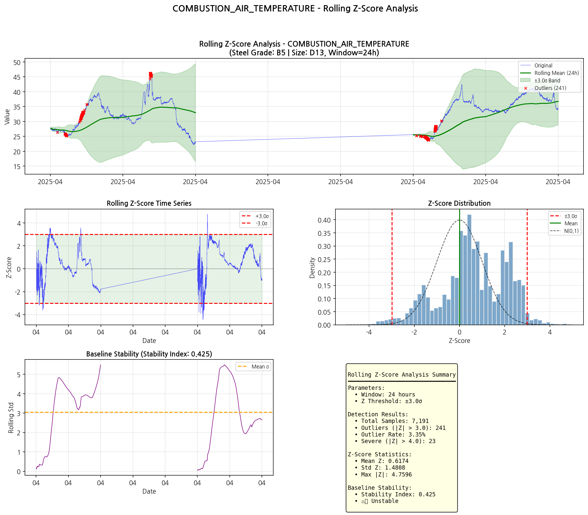

### 스탠드 토크 (05_Stand_Torque)

- 분석 태그: 16개
- 평균 이상치율: 0.25%
- 평균 안정성: 0.867

| 태그 | 이상치율 | 심각 이상치 | 안정성 | Max \|Z\| |
|------|----------|-------------|--------|--------|
| STAND_1_ACTUAL_TORQUE | 0.30% | 0 | 0.888 | 3.34 |
| STAND_2_ACTUAL_TORQUE | 0.42% | 4 | 0.843 | 4.28 |
| STAND_3_ACTUAL_TORQUE | 0.51% | 9 | 0.830 | 4.74 |
| STAND_4_ACTUAL_TORQUE | 0.45% | 8 | 0.838 | 4.57 |
| STAND_5_ACTUAL_TORQUE | 0.40% | 2 | 0.810 | 4.22 |
| STAND_6_ACTUAL_TORQUE | 0.31% | 1 | 0.854 | 4.01 |
| STAND_7_ACTUAL_TORQUE | 0.24% | 0 | 0.853 | 3.76 |
| STAND_8_ACTUAL_TORQUE | 0.18% | 0 | 0.877 | 3.68 |
| STAND_9_ACTUAL_TORQUE | 0.07% | 0 | 0.899 | 3.11 |
| STAND_10_ACTUAL_TORQUE | 0.03% | 0 | 0.907 | 3.02 |
| STAND_11_ACTUAL_TORQUE | 0.04% | 0 | 0.896 | 3.07 |
| STAND_12_ACTUAL_TORQUE | 0.11% | 0 | 0.881 | 3.16 |
| STAND_13_ACTUAL_TORQUE | 0.13% | 0 | 0.875 | 3.15 |
| STAND_14_ACTUAL_TORQUE | 0.23% | 0 | 0.878 | 3.37 |
| FINISHING_BLOCK_MASTER_ACTUAL_TORQUE | 0.27% | 0 | 0.868 | 3.63 |
| FINISHING_BLOCK_SLAVE_ACTUAL_TORQUE | 0.28% | 0 | 0.868 | 3.63 |

#### Z-Score 차트

**STAND_3_ACTUAL_TORQUE** (이상치율: 0.51%, 안정성: 0.830)

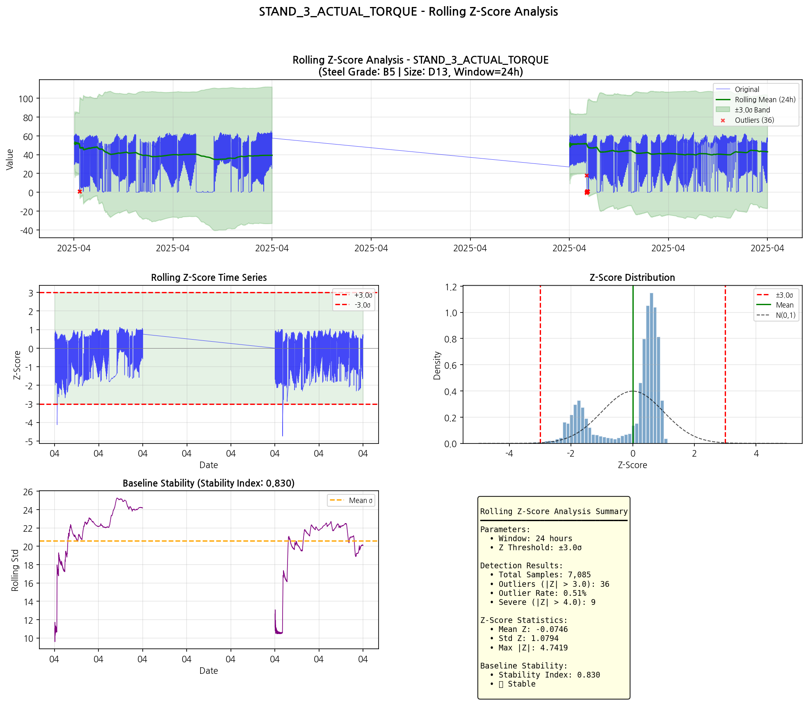

**STAND_4_ACTUAL_TORQUE** (이상치율: 0.45%, 안정성: 0.838)

**STAND_2_ACTUAL_TORQUE** (이상치율: 0.42%, 안정성: 0.843)

### 스탠드 속도 (06_Stand_Speed)

- 분석 태그: 15개
- 평균 이상치율: 5.95%
- 평균 안정성: 0.526

| 태그 | 이상치율 | 심각 이상치 | 안정성 | Max \|Z\| |
|------|----------|-------------|--------|--------|
| STAND_1_ACTUAL_SPEED | 6.00% | 177 | 0.510 | 21.95 |
| STAND_2_ACTUAL_SPEED | 6.01% | 178 | 0.511 | 22.17 |
| STAND_3_ACTUAL_SPEED | 6.00% | 178 | 0.510 | 22.17 |
| STAND_4_ACTUAL_SPEED | 5.96% | 177 | 0.515 | 22.16 |
| STAND_5_ACTUAL_SPEED | 5.91% | 178 | 0.512 | 22.15 |
| STAND_6_ACTUAL_SPEED | 5.94% | 178 | 0.513 | 22.14 |
| STAND_7_ACTUAL_SPEED | 5.94% | 181 | 0.506 | 22.11 |
| STAND_8_ACTUAL_SPEED | 5.89% | 178 | 0.508 | 22.07 |
| STAND_9_ACTUAL_SPEED | 5.90% | 173 | 0.543 | 22.06 |
| STAND_10_ACTUAL_SPEED | 5.97% | 181 | 0.543 | 22.06 |
| STAND_11_ACTUAL_SPEED | 5.90% | 172 | 0.544 | 22.16 |
| STAND_12_ACTUAL_SPEED | 5.96% | 172 | 0.544 | 22.11 |
| STAND_13_ACTUAL_SPEED | 5.96% | 172 | 0.544 | 22.11 |
| STAND_14_ACTUAL_SPEED | 5.93% | 173 | 0.542 | 22.16 |
| FINISHING_BLOCK_ACTUAL_SPEED | 6.01% | 177 | 0.544 | 21.96 |

#### Z-Score 차트

**STAND_2_ACTUAL_SPEED** (이상치율: 6.01%, 안정성: 0.511)

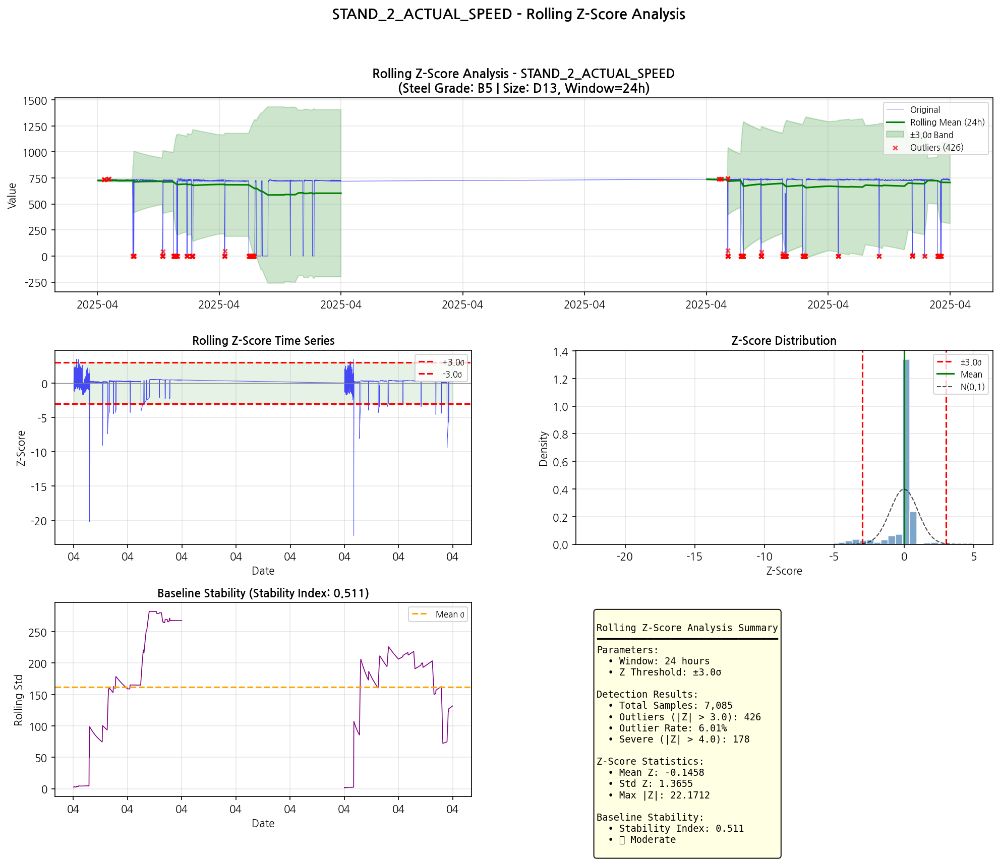

**FINISHING_BLOCK_ACTUAL_SPEED** (이상치율: 6.01%, 안정성: 0.544)

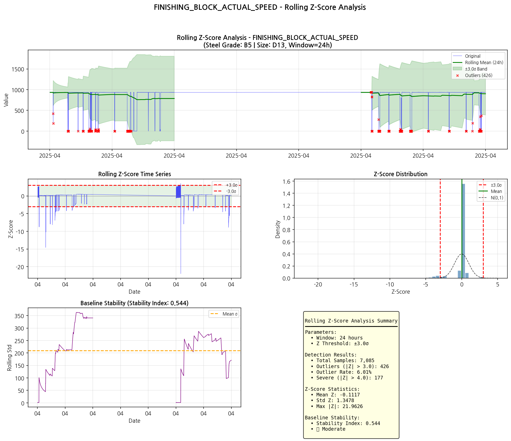

**STAND_1_ACTUAL_SPEED** (이상치율: 6.00%, 안정성: 0.510)

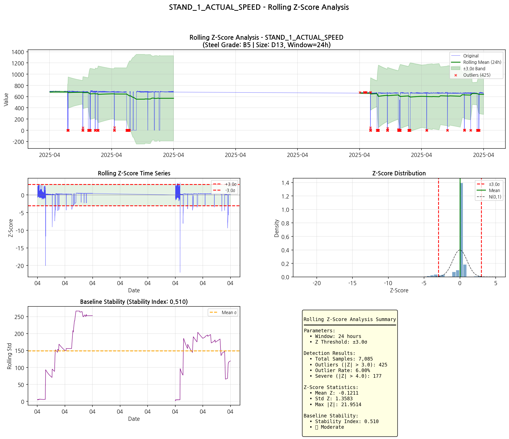

### 스탠드 부하 (07_Stand_Load)

- 분석 태그: 15개
- 평균 이상치율: 0.24%
- 평균 안정성: 0.874

| 태그 | 이상치율 | 심각 이상치 | 안정성 | Max \|Z\| |
|------|----------|-------------|--------|--------|
| STAND_1_LOAD | 0.35% | 0 | 0.875 | 3.49 |
| STAND_2_LOAD | 0.41% | 2 | 0.840 | 4.10 |
| STAND_3_LOAD | 0.55% | 7 | 0.832 | 4.48 |
| STAND_4_LOAD | 0.55% | 6 | 0.838 | 4.33 |
| STAND_5_LOAD | 0.47% | 1 | 0.851 | 4.03 |
| STAND_6_LOAD | 0.32% | 0 | 0.863 | 3.76 |
| STAND_7_LOAD | 0.25% | 0 | 0.874 | 3.54 |
| STAND_8_LOAD | 0.18% | 0 | 0.882 | 3.40 |
| STAND_9_LOAD | 0.06% | 0 | 0.898 | 3.11 |
| STAND_10_LOAD | 0.03% | 0 | 0.899 | 3.04 |
| STAND_11_LOAD | 0.03% | 0 | 0.898 | 3.05 |
| STAND_12_LOAD | 0.04% | 0 | 0.895 | 3.09 |
| STAND_13_LOAD | 0.04% | 0 | 0.895 | 3.09 |
| STAND_14_LOAD | 0.08% | 0 | 0.889 | 3.17 |
| FINISHING_BLOCK_LOAD | 0.21% | 0 | 0.876 | 3.42 |

#### Z-Score 차트

**STAND_3_LOAD** (이상치율: 0.55%, 안정성: 0.832)

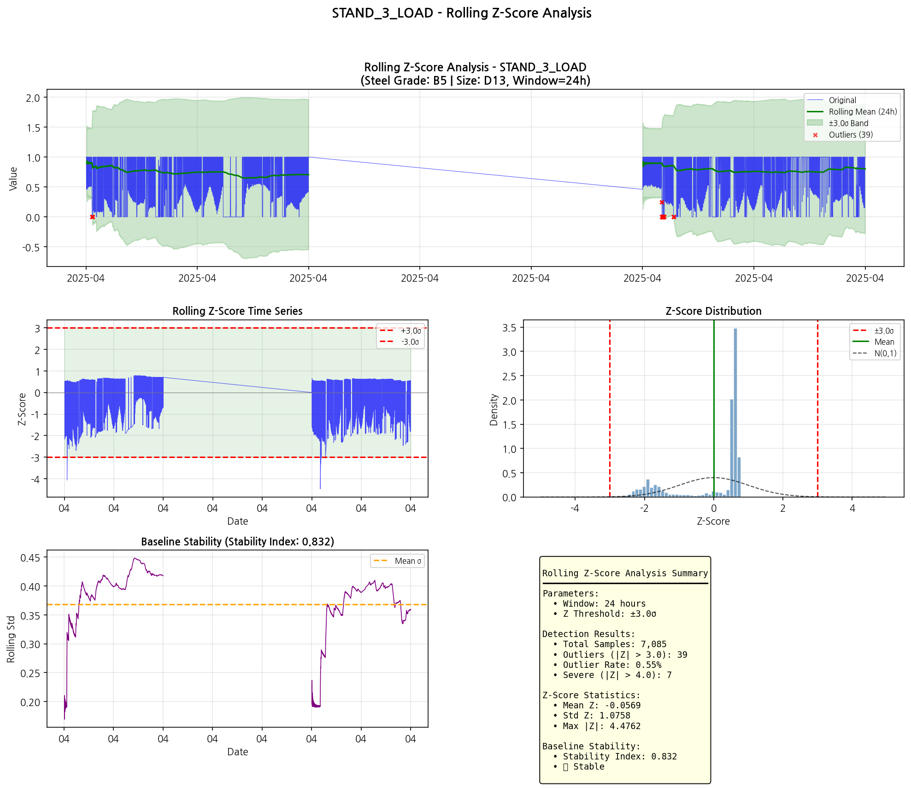

**STAND_4_LOAD** (이상치율: 0.55%, 안정성: 0.838)

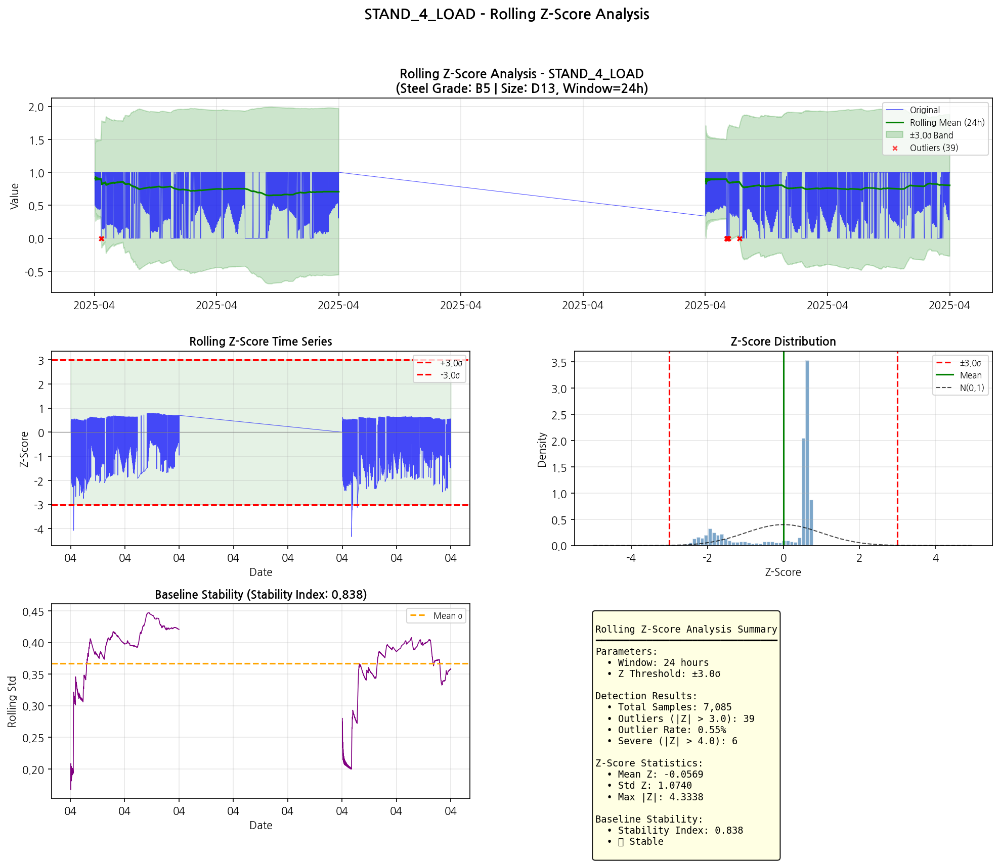

**STAND_5_LOAD** (이상치율: 0.47%, 안정성: 0.851)

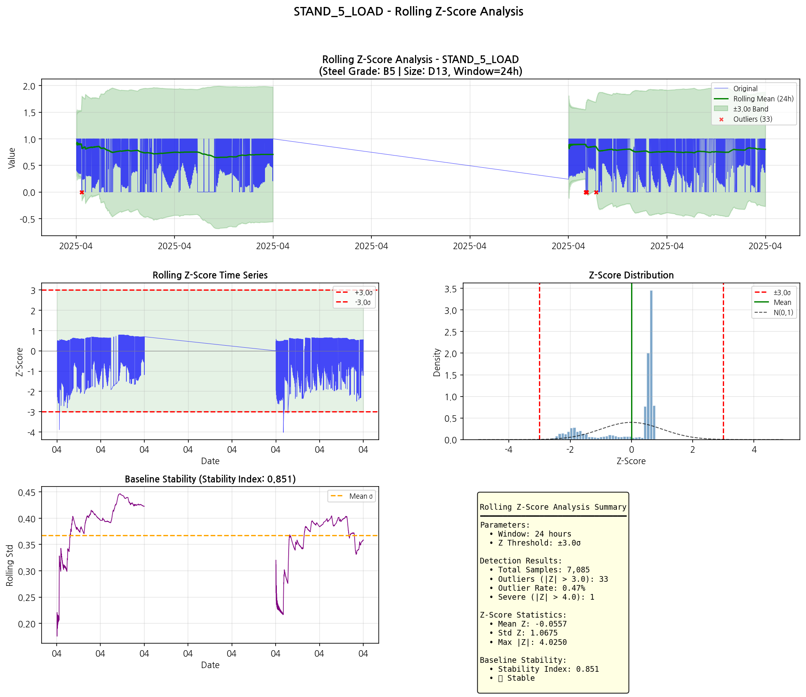

### 핀치롤 (08_Pinchroll)

- 분석 태그: 9개
- 평균 이상치율: 0.15%
- 평균 안정성: 0.823

| 태그 | 이상치율 | 심각 이상치 | 안정성 | Max \|Z\| |
|------|----------|-------------|--------|--------|
| PINCHROLL_2_ACTUAL_SPEED | 0.11% | 4 | 0.603 | 20.85 |
| PINCHROLL_3_ACTUAL_SPEED | 0.02% | 1 | 0.695 | 21.03 |
| PINCHROLL_4_ACTUAL_SPEED | 0.05% | 0 | 0.915 | 3.08 |
| PINCHROLL_2_ACTUAL_TORQUE | 0.11% | 0 | 0.929 | 3.16 |
| PINCHROLL_3_ACTUAL_TORQUE | 0.27% | 0 | 0.910 | 3.38 |
| PINCHROLL_4_ACTUAL_TORQUE | 0.24% | 0 | 0.909 | 3.37 |
| PINCHROLL_2_REFERENCE_TORQUE | 0.13% | 8 | 0.612 | 40.24 |
| PINCHROLL_3_REFERENCE_TORQUE | 0.24% | 0 | 0.919 | 3.37 |
| PINCHROLL_4_REFERENCE_TORQUE | 0.22% | 0 | 0.918 | 3.37 |

#### Z-Score 차트

**PINCHROLL_3_ACTUAL_TORQUE** (이상치율: 0.27%, 안정성: 0.910)

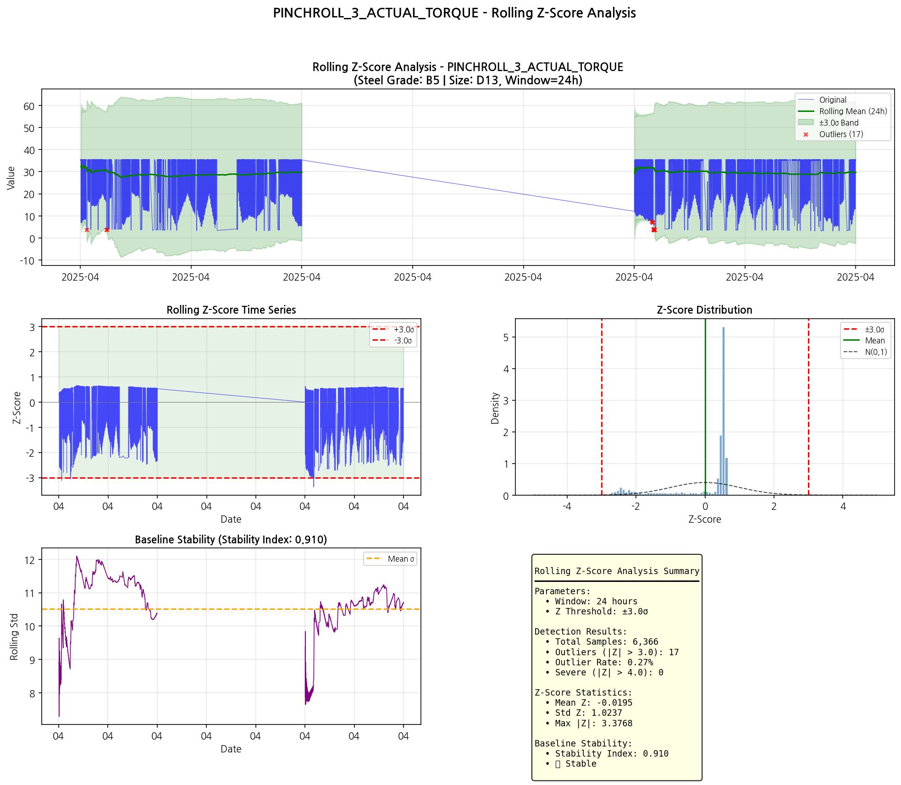

**PINCHROLL_4_ACTUAL_TORQUE** (이상치율: 0.24%, 안정성: 0.909)

**PINCHROLL_3_REFERENCE_TORQUE** (이상치율: 0.24%, 안정성: 0.919)

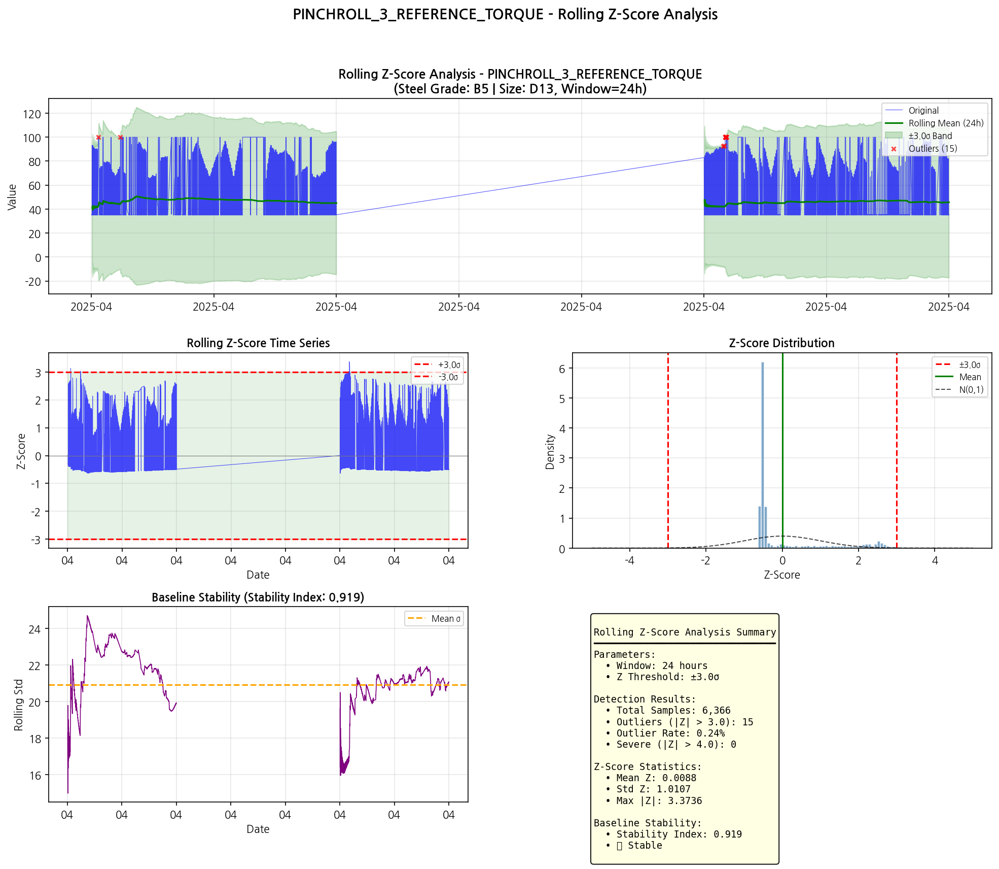

### PR 상세 토크 (09_PR_Detailed)

- 분석 태그: 6개
- 평균 이상치율: 0.04%
- 평균 안정성: 0.978

| 태그 | 이상치율 | 심각 이상치 | 안정성 | Max \|Z\| |
|------|----------|-------------|--------|--------|
| PR6L1_ACT_TORQUE | 0.11% | 1 | 0.957 | 10.61 |
| PR6L2_ACT_TORQUE | 0.11% | 1 | 0.940 | 12.31 |
| PR7L1_ACT_TORQUE | 0.00% | 0 | 0.994 | 1.51 |
| PR7L2_ACT_TORQUE | 0.00% | 0 | 0.994 | 1.51 |
| PR8L1_ACT_TORQUE | 0.00% | 0 | 0.990 | 1.82 |
| PR9L1_ACT_TORQUE | 0.00% | 0 | 0.994 | 1.67 |

#### Z-Score 차트

**PR6L1_ACT_TORQUE** (이상치율: 0.11%, 안정성: 0.957)

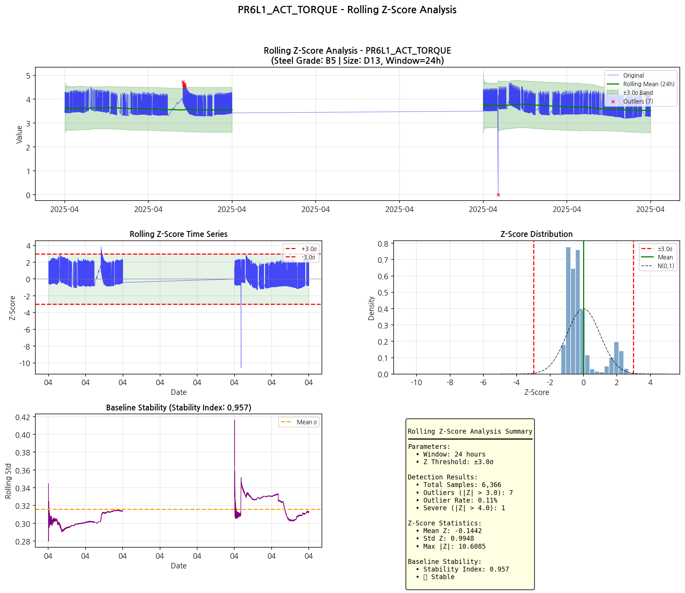

**PR6L2_ACT_TORQUE** (이상치율: 0.11%, 안정성: 0.940)

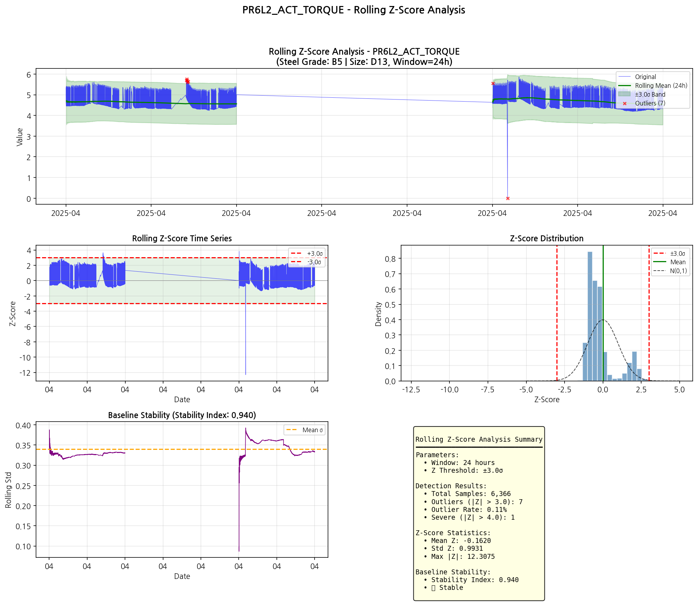

**PR7L1_ACT_TORQUE** (이상치율: 0.00%, 안정성: 0.994)

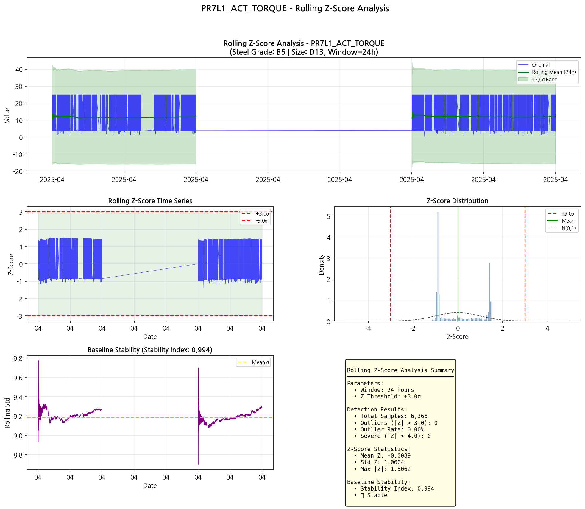

---

## 해석 가이드

### Rolling Z-Score 해석

1. **이상치율 (Outlier Rate)**
   - |Z| > 3.0σ 비율
   - 높을수록 해당 시점 주변 패턴에서 벗어난 데이터 많음
   - 정상 분포 가정 시 약 0.3% 예상

2. **기준선 안정성 (Baseline Stability)**
   - Rolling std의 시간적 일관성
   - 1에 가까울수록 안정적
   - 0.5 미만: 비정상 시계열, 다른 방법 권장

3. **심각 이상치 (Severe Outliers)**
   - |Z| > 4.0σ
   - 극단적인 이상값
   - 즉각적인 점검 필요

### 상태 분류

| 상태 | 기준 | 해석 |
|------|------|------|
| 🔴 높음 | ≥10% | 빈번한 이상치, 점검 필요 |
| 🟠 중간 | 3~10% | 일부 이상치, 모니터링 |
| 🟢 낮음 | <3% | 정상 범위 |
| 🟡 불안정 | Stability < 0.5 | 기준선 변동 심함 |

### Standard IQR vs Rolling Z-Score

| 방법 | 장점 | 단점 |
|------|------|------|
| Standard IQR | 간단, 전체 분포 기반 | 시변 데이터에 부적합 |
| Rolling Z-Score | 시변 데이터 적합 | 윈도우 크기 설정 필요 |

**권장**: 기준선 안정성 ≥ 0.5인 태그에 효과적

---

## 메타데이터

| 항목 | 값 |
|------|-----|
| 분석 스크립트 | steel_grade_rolling_zscore_analysis.py |
| 분석 기간 | 2025-03-01 ~ 2025-08-31 |
| 강종 | B5 |
| 윈도우 크기 | 24시간 |
| Z 임계값 | ±3.0σ |
| 생성일시 | 2026-02-09 15:18:01 |
| 총 분석 태그 | 79개 |

---

*본 보고서는 자동 생성되었습니다.*
