# 강종 [B5 | Size: D16] Rolling Z-Score 동적 이상치 분석 보고서

**분석 기간**: 2025-03-01 ~ 2025-08-31
**강종**: B5  
**사이즈**: D16
**생성일시**: 2026-02-09 15:17:24

---

## 분석 개요

### 분석 방법론

**Rolling Z-Score (롤링 Z-점수)**

시간 창(window) 기반 동적 이상치 탐지 방법입니다.

$$Z_{rolling}(t) = \frac{x(t) - \mu_{window}(t)}{\sigma_{window}(t)}$$

| 파라미터 | 값 | 설명 |
|----------|-----|------|
| Window | 24h | 이동 평균/표준편차 윈도우 |
| Z Threshold | ±3.0σ | 이상치 판정 임계값 |
| Severe | ±4.0σ | 심각 이상치 임계값 |

### 장점

- **비정상 시계열 적합**: 평균/분산 시변하는 데이터에 효과적
- **점진적 기준선 추적**: 장기 드리프트에 강건
- **Local Context 기반**: 해당 시점 주변 패턴 기준

### 분석 결과 요약

| 구분 | 태그 수 | 비율 |
|------|---------|------|
| **총 분석 태그** | 79개 | 100% |
| 🔴 높은 이상치율 (≥10%) | 0개 | 0.0% |
| 🟠 중간 이상치율 (3~10%) | 2개 | 2.5% |
| 🟢 낮은 이상치율 (<3%) | 76개 | 96.2% |
| 🟡 불안정 기준선 | 1개 | 1.3% |

#### 전체 평균

| 지표 | 값 |
|------|-----|
| 평균 이상치율 | 0.45% |
| 평균 기준선 안정성 | 0.867 |

---

## 상위 문제 태그 (이상치율 기준)

| 순위 | 태그 | 카테고리 | 이상치율 | 심각 이상치 | 안정성 | 상태 |
|------|------|----------|----------|-------------|--------|------|
| 1 | FURNACE_EXIT_DISCHARGE_BILLET_TEMPERATURE | 가열로 추출 온도 | 5.07% | 23 | 0.855 | 🟠 |
| 2 | MAIN_GAS_TEMPERATURE | 가열로 보조설비 | 3.94% | 0 | 0.418 | 🟠 |
| 3 | HEATING_TOP_ZONE_NO_1_TEMPERATURE_ROOF | 가열로 상부 온도 | 2.81% | 32 | 0.788 | 🟢 |
| 4 | SOAKING_BOTTOM_ZONE_NO_1_TEMPERATURE_OPP_SIDE | 가열로 하부 온도 | 2.79% | 5 | 0.576 | 🟢 |
| 5 | HEATING_TOP_ZONE_NO_2_TEMPERATURE_ROOF | 가열로 상부 온도 | 2.71% | 38 | 0.790 | 🟢 |
| 6 | FURNACE_O2_ANALYZER | 가열로 보조설비 | 2.64% | 96 | 0.705 | 🟢 |
| 7 | SOAKING_BOTTOM_ZONE_NO_2_TEMPERATURE_MILL_SIDE | 가열로 하부 온도 | 2.29% | 0 | 0.599 | 🟢 |
| 8 | MAIN_GAS_PRESSURE | 가열로 보조설비 | 1.75% | 51 | 0.676 | 🟢 |
| 9 | COMBUSTION_AIR_TEMPERATURE | 가열로 보조설비 | 1.08% | 0 | 0.481 | 🟡 |
| 10 | SOAKING_TOP_ZONE_NO_2_TEMPERATURE_ROOF | 가열로 상부 온도 | 0.83% | 30 | 0.794 | 🟢 |
| 11 | SOAKING_TOP_ZONE_NO_1_TEMPERATURE_ROOF | 가열로 상부 온도 | 0.64% | 0 | 0.870 | 🟢 |
| 12 | MAIN_COMBUSTION_AIR_PRESSURE | 가열로 보조설비 | 0.50% | 2 | 0.947 | 🟢 |
| 13 | INDIRECT_COOLING_WATER_FLOW | 가열로 보조설비 | 0.44% | 1 | 0.812 | 🟢 |
| 14 | FURNACE_PRESSURE | 가열로 보조설비 | 0.38% | 10 | 0.802 | 🟢 |
| 15 | PINCHROLL_2_REFERENCE_TORQUE | 핀치롤 | 0.29% | 18 | 0.804 | 🟢 |

---

## 불안정 기준선 태그

기준선 안정성(Stability Index)이 0.5 미만인 태그입니다.
이 태그들은 Rolling Z-Score 방법보다 다른 방법이 더 적합할 수 있습니다.

| 태그 | 카테고리 | 안정성 | 이상치율 |
|------|----------|--------|----------|
| MAIN_GAS_TEMPERATURE | 가열로 보조설비 | 0.418 | 3.94% |
| COMBUSTION_AIR_TEMPERATURE | 가열로 보조설비 | 0.481 | 1.08% |

---

## 카테고리별 분석 결과

### 가열로 상부 온도 (01_Furnace_Top_Temperature)

- 분석 태그: 4개
- 평균 이상치율: 1.75%
- 평균 안정성: 0.810

| 태그 | 이상치율 | 심각 이상치 | 안정성 | Max \|Z\| |
|------|----------|-------------|--------|--------|
| HEATING_TOP_ZONE_NO_1_TEMPERATURE_ROOF | 2.81% | 32 | 0.788 | 5.57 |
| HEATING_TOP_ZONE_NO_2_TEMPERATURE_ROOF | 2.71% | 38 | 0.790 | 5.43 |
| SOAKING_TOP_ZONE_NO_1_TEMPERATURE_ROOF | 0.64% | 0 | 0.870 | 3.72 |
| SOAKING_TOP_ZONE_NO_2_TEMPERATURE_ROOF | 0.83% | 30 | 0.794 | 5.28 |

#### Z-Score 차트

**HEATING_TOP_ZONE_NO_1_TEMPERATURE_ROOF** (이상치율: 2.81%, 안정성: 0.788)

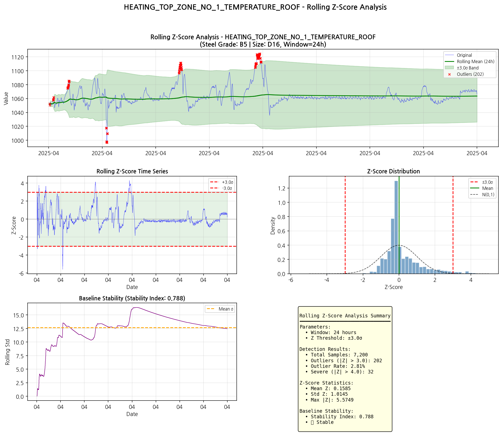

**HEATING_TOP_ZONE_NO_2_TEMPERATURE_ROOF** (이상치율: 2.71%, 안정성: 0.790)

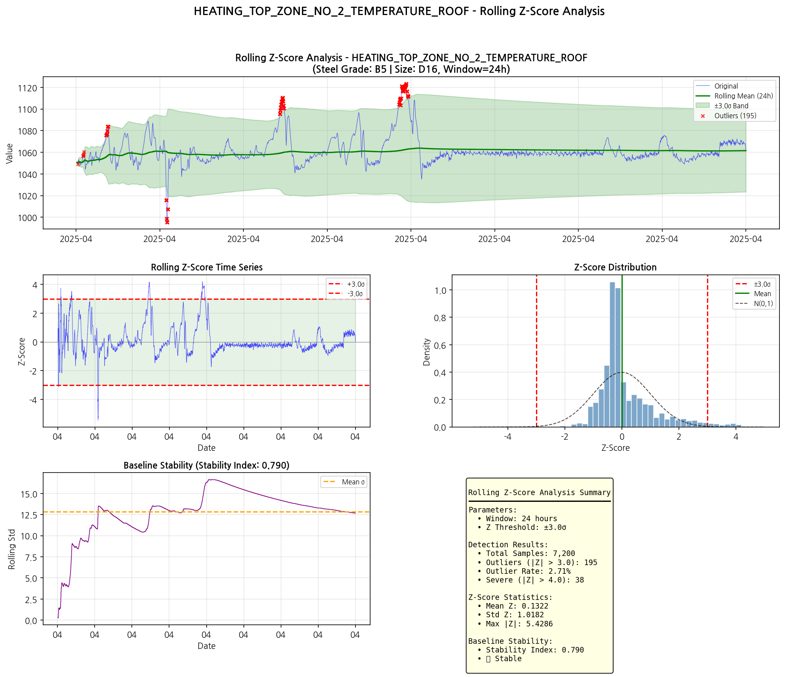

**SOAKING_TOP_ZONE_NO_2_TEMPERATURE_ROOF** (이상치율: 0.83%, 안정성: 0.794)

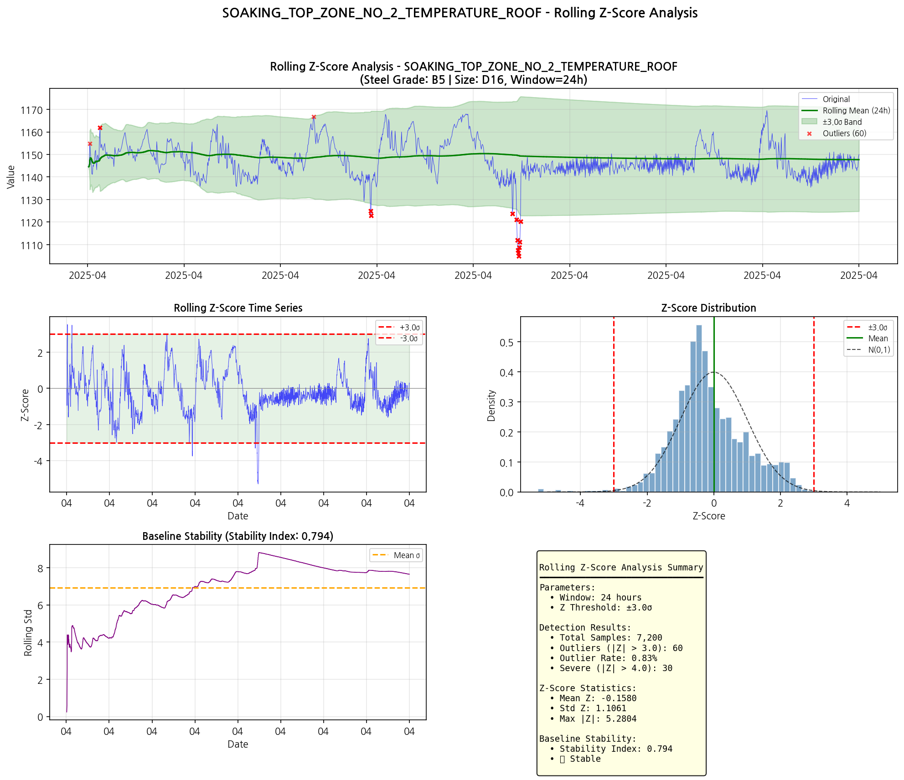

### 가열로 하부 온도 (02_Furnace_Bottom_Temperature)

- 분석 태그: 4개
- 평균 이상치율: 1.27%
- 평균 안정성: 0.665

| 태그 | 이상치율 | 심각 이상치 | 안정성 | Max \|Z\| |
|------|----------|-------------|--------|--------|
| HEATING_BOTTOM_ZONE_NO_1_TEMPERATURE_OPP_SIDE | 0.00% | 0 | 0.750 | 2.42 |
| HEATING_BOTTOM_ZONE_NO_2_TEMPERATURE_MILL_SIDE | 0.00% | 0 | 0.733 | 2.94 |
| SOAKING_BOTTOM_ZONE_NO_1_TEMPERATURE_OPP_SIDE | 2.79% | 5 | 0.576 | 4.20 |
| SOAKING_BOTTOM_ZONE_NO_2_TEMPERATURE_MILL_SIDE | 2.29% | 0 | 0.599 | 3.74 |

#### Z-Score 차트

**SOAKING_BOTTOM_ZONE_NO_1_TEMPERATURE_OPP_SIDE** (이상치율: 2.79%, 안정성: 0.576)

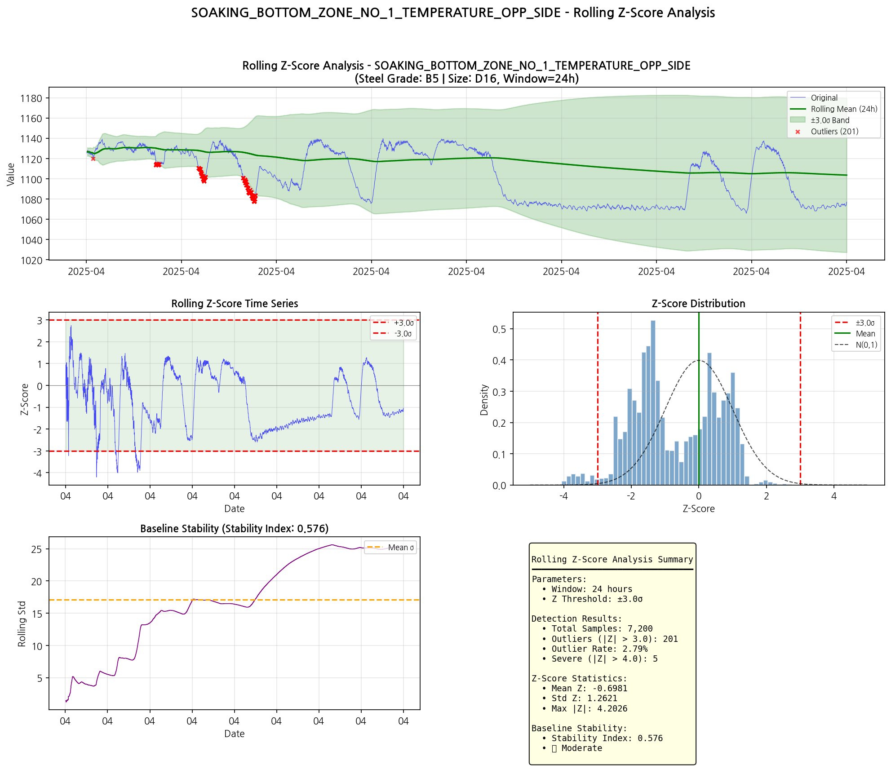

**SOAKING_BOTTOM_ZONE_NO_2_TEMPERATURE_MILL_SIDE** (이상치율: 2.29%, 안정성: 0.599)

**HEATING_BOTTOM_ZONE_NO_1_TEMPERATURE_OPP_SIDE** (이상치율: 0.00%, 안정성: 0.750)

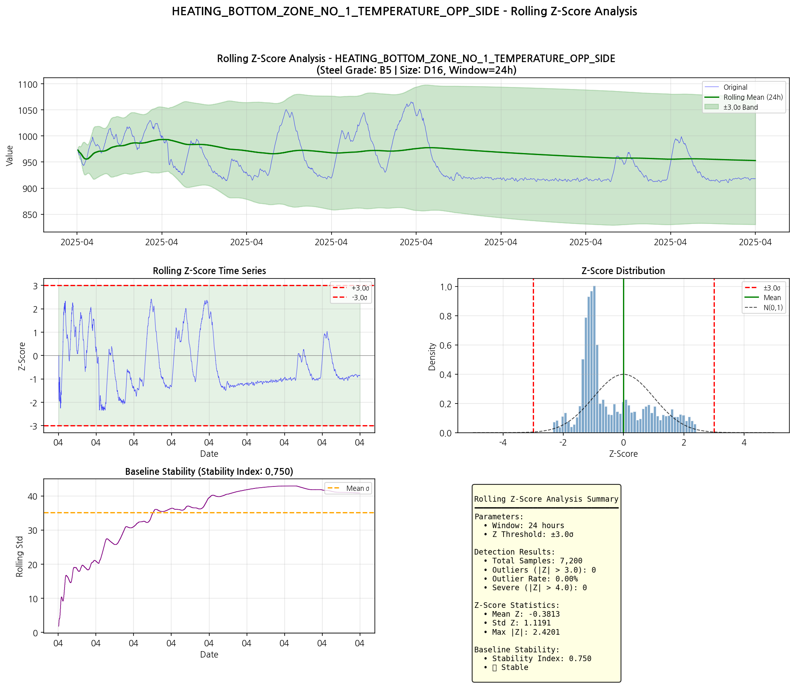

### 가열로 추출 온도 (03_Furnace_Discharge_Temperature)

- 분석 태그: 1개
- 평균 이상치율: 5.07%
- 평균 안정성: 0.855

| 태그 | 이상치율 | 심각 이상치 | 안정성 | Max \|Z\| |
|------|----------|-------------|--------|--------|
| FURNACE_EXIT_DISCHARGE_BILLET_TEMPERATURE | 5.07% | 23 | 0.855 | 4.89 |

#### Z-Score 차트

**FURNACE_EXIT_DISCHARGE_BILLET_TEMPERATURE** (이상치율: 5.07%, 안정성: 0.855)

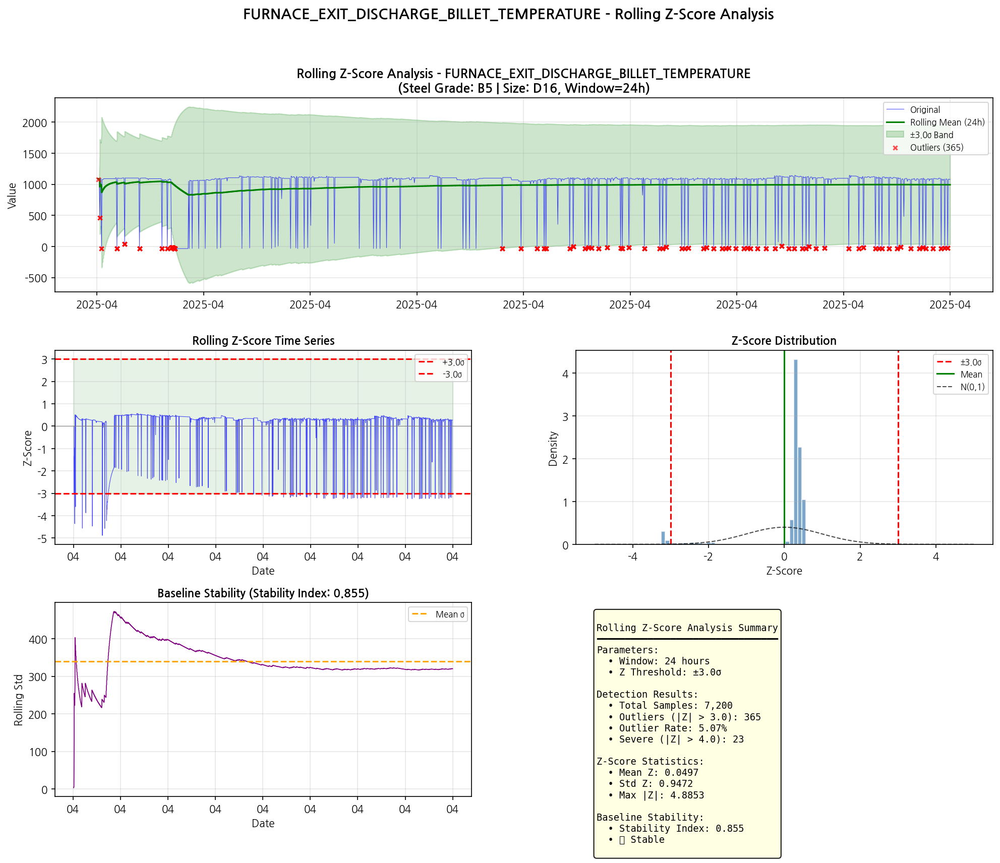

### 가열로 보조설비 (04_Furnace_Auxiliary)

- 분석 태그: 9개
- 평균 이상치율: 1.20%
- 평균 안정성: 0.711

| 태그 | 이상치율 | 심각 이상치 | 안정성 | Max \|Z\| |
|------|----------|-------------|--------|--------|
| FURNACE_PRESSURE | 0.38% | 10 | 0.802 | 4.17 |
| FURNACE_O2_ANALYZER | 2.64% | 96 | 0.705 | 8.30 |
| MAIN_GAS_PRESSURE | 1.75% | 51 | 0.676 | 5.83 |
| MAIN_GAS_FLOW | 0.07% | 0 | 0.735 | 3.19 |
| MAIN_GAS_TEMPERATURE | 3.94% | 0 | 0.418 | 3.58 |
| MAIN_COMBUSTION_AIR_PRESSURE | 0.50% | 2 | 0.947 | 4.01 |
| COMBUSTION_AIR_TEMPERATURE | 1.08% | 0 | 0.481 | 3.46 |
| INDIRECT_COOLING_WATER_FLOW | 0.44% | 1 | 0.812 | 4.01 |
| INDIRECT_WATER_MAIN_TEMPERATURE | 0.01% | 0 | 0.820 | 3.05 |

#### Z-Score 차트

**MAIN_GAS_TEMPERATURE** (이상치율: 3.94%, 안정성: 0.418)

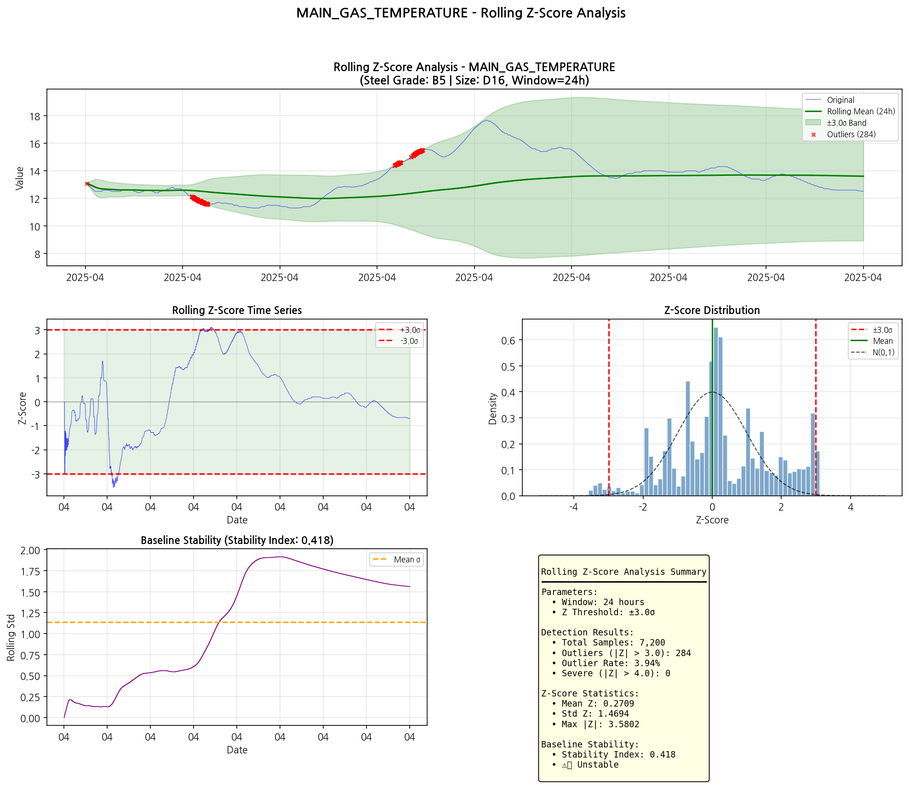

**FURNACE_O2_ANALYZER** (이상치율: 2.64%, 안정성: 0.705)

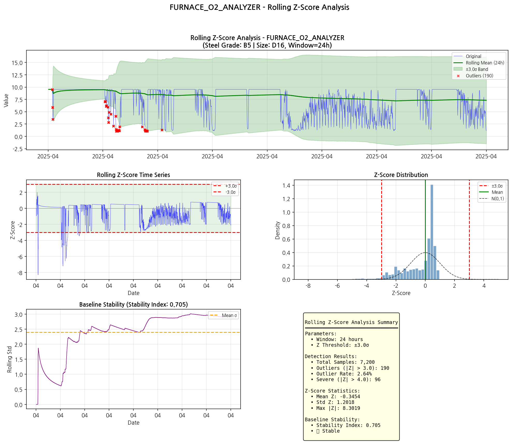

**MAIN_GAS_PRESSURE** (이상치율: 1.75%, 안정성: 0.676)

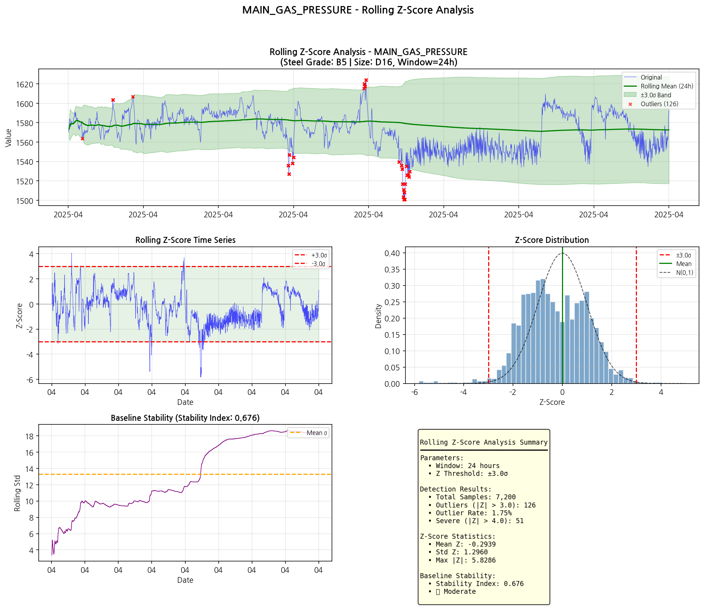

### 스탠드 토크 (05_Stand_Torque)

- 분석 태그: 16개
- 평균 이상치율: 0.10%
- 평균 안정성: 0.918

| 태그 | 이상치율 | 심각 이상치 | 안정성 | Max \|Z\| |
|------|----------|-------------|--------|--------|
| STAND_1_ACTUAL_TORQUE | 0.07% | 1 | 0.932 | 5.27 |
| STAND_2_ACTUAL_TORQUE | 0.13% | 2 | 0.924 | 5.07 |
| STAND_3_ACTUAL_TORQUE | 0.11% | 3 | 0.921 | 5.08 |
| STAND_4_ACTUAL_TORQUE | 0.14% | 2 | 0.919 | 4.89 |
| STAND_5_ACTUAL_TORQUE | 0.15% | 4 | 0.922 | 4.67 |
| STAND_6_ACTUAL_TORQUE | 0.13% | 2 | 0.919 | 5.23 |
| STAND_7_ACTUAL_TORQUE | 0.11% | 2 | 0.923 | 5.54 |
| STAND_8_ACTUAL_TORQUE | 0.10% | 2 | 0.905 | 5.65 |
| STAND_9_ACTUAL_TORQUE | 0.07% | 2 | 0.927 | 5.78 |
| STAND_10_ACTUAL_TORQUE | 0.07% | 2 | 0.919 | 5.78 |
| STAND_11_ACTUAL_TORQUE | 0.07% | 2 | 0.917 | 5.80 |
| STAND_12_ACTUAL_TORQUE | 0.08% | 2 | 0.917 | 5.79 |
| STAND_13_ACTUAL_TORQUE | 0.08% | 2 | 0.921 | 5.81 |
| STAND_14_ACTUAL_TORQUE | 0.10% | 2 | 0.918 | 5.79 |
| FINISHING_BLOCK_MASTER_ACTUAL_TORQUE | 0.11% | 3 | 0.903 | 5.80 |
| FINISHING_BLOCK_SLAVE_ACTUAL_TORQUE | 0.11% | 3 | 0.903 | 5.80 |

#### Z-Score 차트

**STAND_5_ACTUAL_TORQUE** (이상치율: 0.15%, 안정성: 0.922)

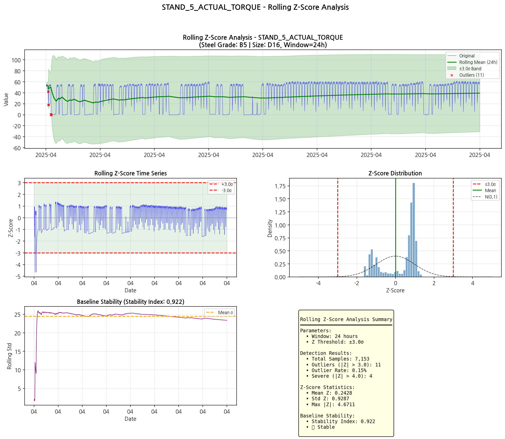

**STAND_4_ACTUAL_TORQUE** (이상치율: 0.14%, 안정성: 0.919)

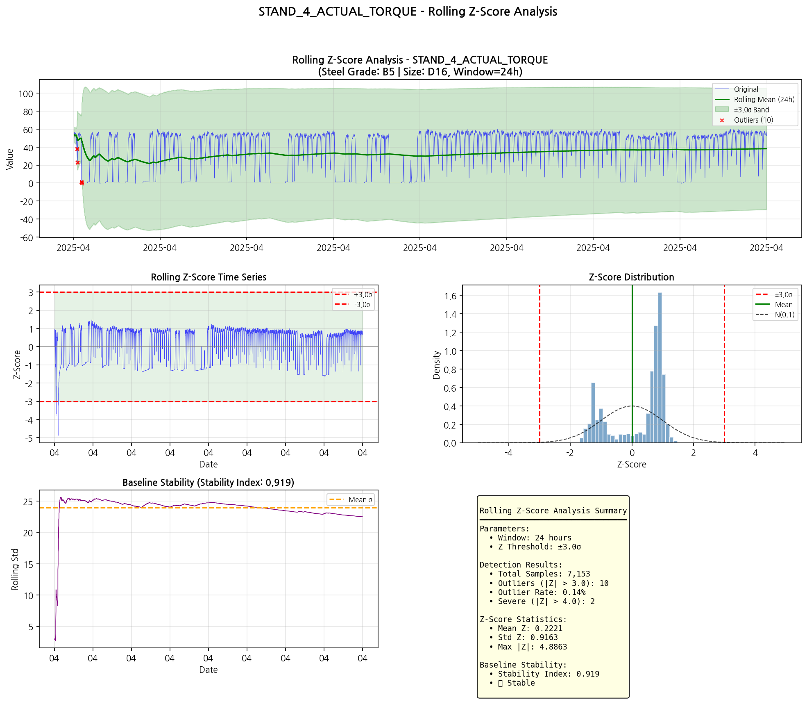

**STAND_2_ACTUAL_TORQUE** (이상치율: 0.13%, 안정성: 0.924)

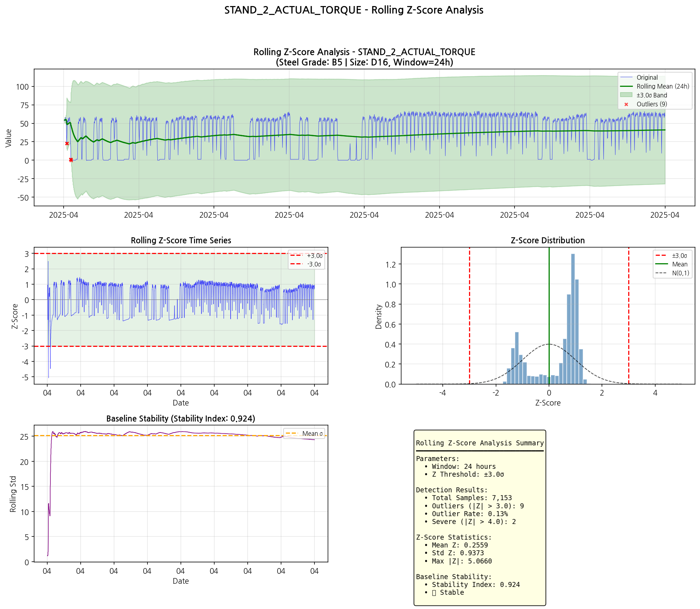

### 스탠드 속도 (06_Stand_Speed)

- 분석 태그: 15개
- 평균 이상치율: 0.21%
- 평균 안정성: 0.853

| 태그 | 이상치율 | 심각 이상치 | 안정성 | Max \|Z\| |
|------|----------|-------------|--------|--------|
| STAND_1_ACTUAL_SPEED | 0.20% | 9 | 0.847 | 9.11 |
| STAND_2_ACTUAL_SPEED | 0.21% | 8 | 0.847 | 9.15 |
| STAND_3_ACTUAL_SPEED | 0.25% | 10 | 0.847 | 9.15 |
| STAND_4_ACTUAL_SPEED | 0.24% | 9 | 0.847 | 9.15 |
| STAND_5_ACTUAL_SPEED | 0.18% | 8 | 0.848 | 9.16 |
| STAND_6_ACTUAL_SPEED | 0.18% | 8 | 0.849 | 9.16 |
| STAND_7_ACTUAL_SPEED | 0.18% | 8 | 0.851 | 9.16 |
| STAND_8_ACTUAL_SPEED | 0.20% | 8 | 0.850 | 9.15 |
| STAND_9_ACTUAL_SPEED | 0.20% | 7 | 0.861 | 9.15 |
| STAND_10_ACTUAL_SPEED | 0.21% | 8 | 0.861 | 9.15 |
| STAND_11_ACTUAL_SPEED | 0.21% | 8 | 0.859 | 9.16 |
| STAND_12_ACTUAL_SPEED | 0.20% | 9 | 0.858 | 9.15 |
| STAND_13_ACTUAL_SPEED | 0.20% | 9 | 0.859 | 9.15 |
| STAND_14_ACTUAL_SPEED | 0.20% | 9 | 0.859 | 9.16 |
| FINISHING_BLOCK_ACTUAL_SPEED | 0.24% | 11 | 0.853 | 9.15 |

#### Z-Score 차트

**STAND_3_ACTUAL_SPEED** (이상치율: 0.25%, 안정성: 0.847)

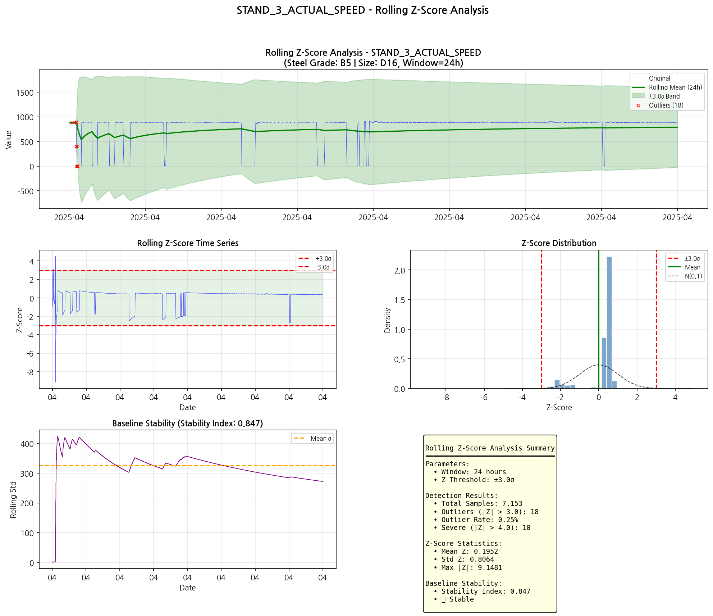

**STAND_4_ACTUAL_SPEED** (이상치율: 0.24%, 안정성: 0.847)

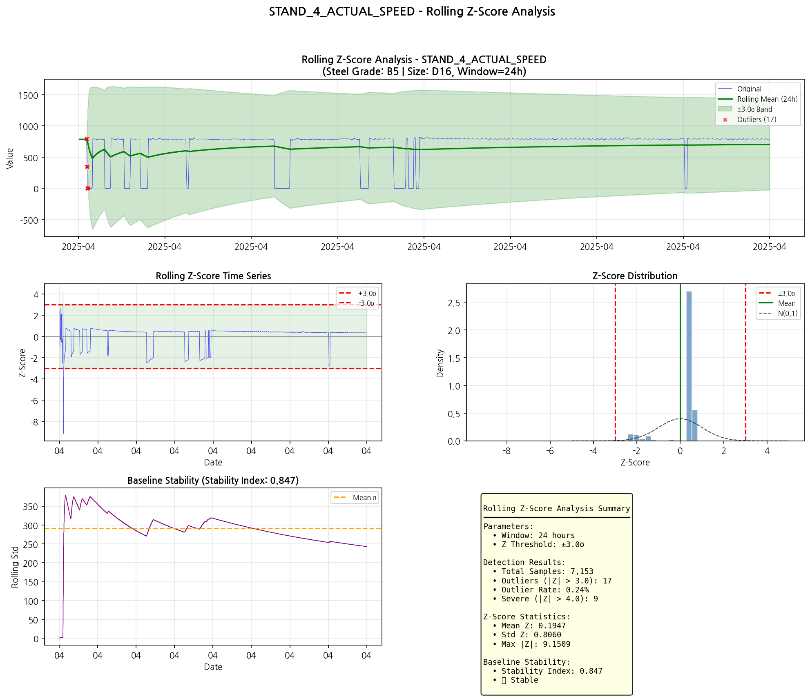

**FINISHING_BLOCK_ACTUAL_SPEED** (이상치율: 0.24%, 안정성: 0.853)

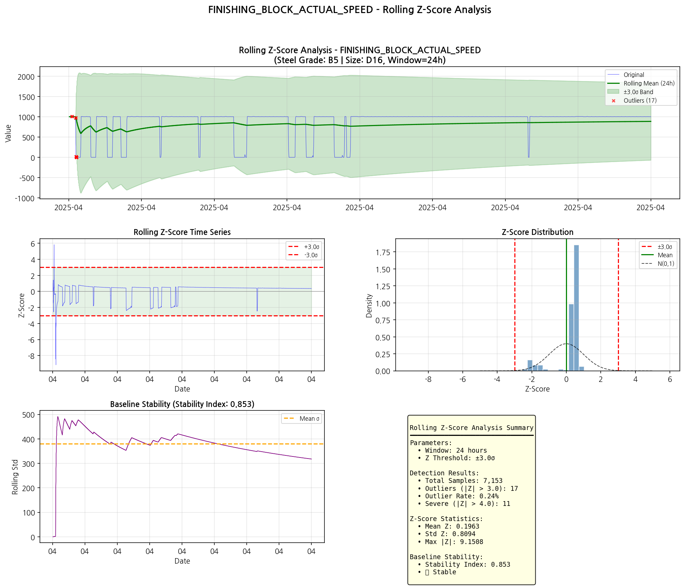

### 스탠드 부하 (07_Stand_Load)

- 분석 태그: 15개
- 평균 이상치율: 0.11%
- 평균 안정성: 0.938

| 태그 | 이상치율 | 심각 이상치 | 안정성 | Max \|Z\| |
|------|----------|-------------|--------|--------|
| STAND_1_LOAD | 0.07% | 1 | 0.943 | 5.39 |
| STAND_2_LOAD | 0.11% | 2 | 0.936 | 5.39 |
| STAND_3_LOAD | 0.13% | 3 | 0.932 | 5.39 |
| STAND_4_LOAD | 0.14% | 3 | 0.932 | 5.39 |
| STAND_5_LOAD | 0.17% | 4 | 0.933 | 5.39 |
| STAND_6_LOAD | 0.17% | 3 | 0.934 | 5.39 |
| STAND_7_LOAD | 0.15% | 3 | 0.935 | 5.58 |
| STAND_8_LOAD | 0.14% | 3 | 0.936 | 5.74 |
| STAND_9_LOAD | 0.06% | 2 | 0.943 | 5.83 |
| STAND_10_LOAD | 0.07% | 2 | 0.943 | 5.83 |
| STAND_11_LOAD | 0.07% | 2 | 0.943 | 5.83 |
| STAND_12_LOAD | 0.07% | 2 | 0.942 | 5.83 |
| STAND_13_LOAD | 0.07% | 2 | 0.942 | 5.83 |
| STAND_14_LOAD | 0.08% | 2 | 0.941 | 5.83 |
| FINISHING_BLOCK_LOAD | 0.10% | 2 | 0.940 | 5.83 |

#### Z-Score 차트

**STAND_5_LOAD** (이상치율: 0.17%, 안정성: 0.933)

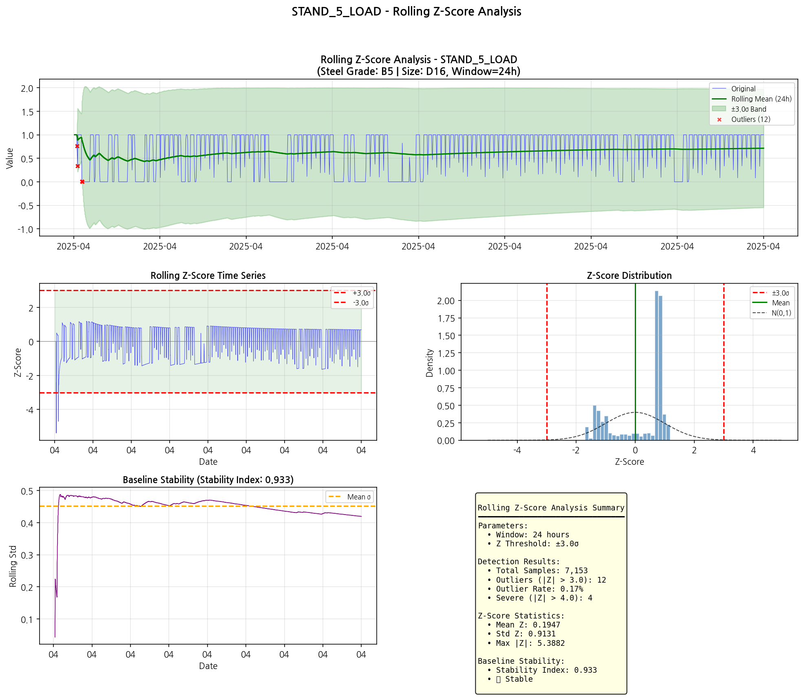

**STAND_6_LOAD** (이상치율: 0.17%, 안정성: 0.934)

**STAND_7_LOAD** (이상치율: 0.15%, 안정성: 0.935)

### 핀치롤 (08_Pinchroll)

- 분석 태그: 9개
- 평균 이상치율: 0.15%
- 평균 안정성: 0.891

| 태그 | 이상치율 | 심각 이상치 | 안정성 | Max \|Z\| |
|------|----------|-------------|--------|--------|
| PINCHROLL_2_ACTUAL_SPEED | 0.19% | 5 | 0.864 | 7.68 |
| PINCHROLL_3_ACTUAL_SPEED | 0.13% | 2 | 0.911 | 5.68 |
| PINCHROLL_4_ACTUAL_SPEED | 0.11% | 3 | 0.910 | 5.63 |
| PINCHROLL_2_ACTUAL_TORQUE | 0.10% | 2 | 0.897 | 5.83 |
| PINCHROLL_3_ACTUAL_TORQUE | 0.13% | 2 | 0.893 | 5.83 |
| PINCHROLL_4_ACTUAL_TORQUE | 0.13% | 2 | 0.895 | 5.83 |
| PINCHROLL_2_REFERENCE_TORQUE | 0.29% | 18 | 0.804 | 20.01 |
| PINCHROLL_3_REFERENCE_TORQUE | 0.11% | 2 | 0.923 | 5.83 |
| PINCHROLL_4_REFERENCE_TORQUE | 0.11% | 2 | 0.924 | 5.83 |

#### Z-Score 차트

**PINCHROLL_2_REFERENCE_TORQUE** (이상치율: 0.29%, 안정성: 0.804)

**PINCHROLL_2_ACTUAL_SPEED** (이상치율: 0.19%, 안정성: 0.864)

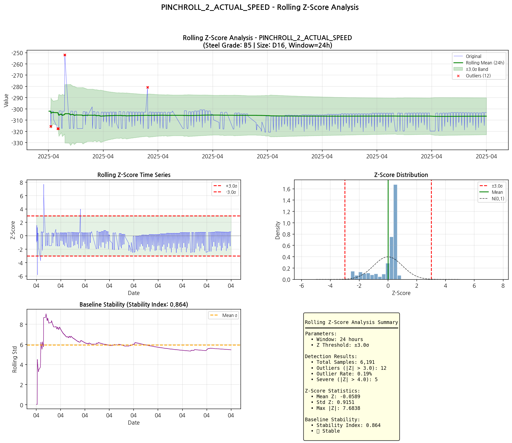

**PINCHROLL_3_ACTUAL_SPEED** (이상치율: 0.13%, 안정성: 0.911)

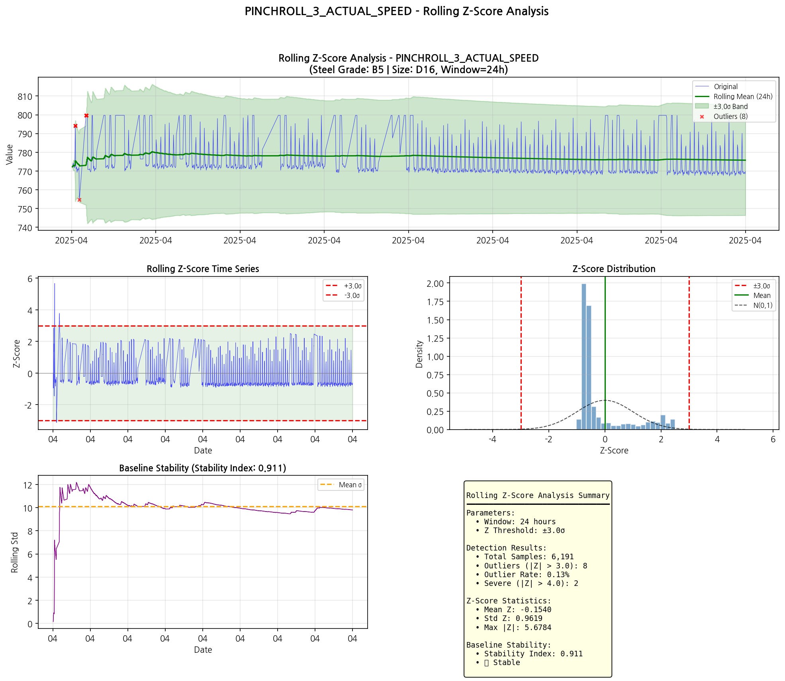

### PR 상세 토크 (09_PR_Detailed)

- 분석 태그: 6개
- 평균 이상치율: 0.01%
- 평균 안정성: 0.962

| 태그 | 이상치율 | 심각 이상치 | 안정성 | Max \|Z\| |
|------|----------|-------------|--------|--------|
| PR6L1_ACT_TORQUE | 0.05% | 1 | 0.942 | 4.36 |
| PR6L2_ACT_TORQUE | 0.00% | 0 | 0.961 | 2.88 |
| PR7L1_ACT_TORQUE | 0.03% | 1 | 0.950 | 4.36 |
| PR7L2_ACT_TORQUE | 0.00% | 0 | 0.957 | 2.98 |
| PR8L1_ACT_TORQUE | 0.00% | 0 | 0.982 | 2.13 |
| PR9L1_ACT_TORQUE | 0.00% | 0 | 0.983 | 2.83 |

#### Z-Score 차트

**PR6L1_ACT_TORQUE** (이상치율: 0.05%, 안정성: 0.942)

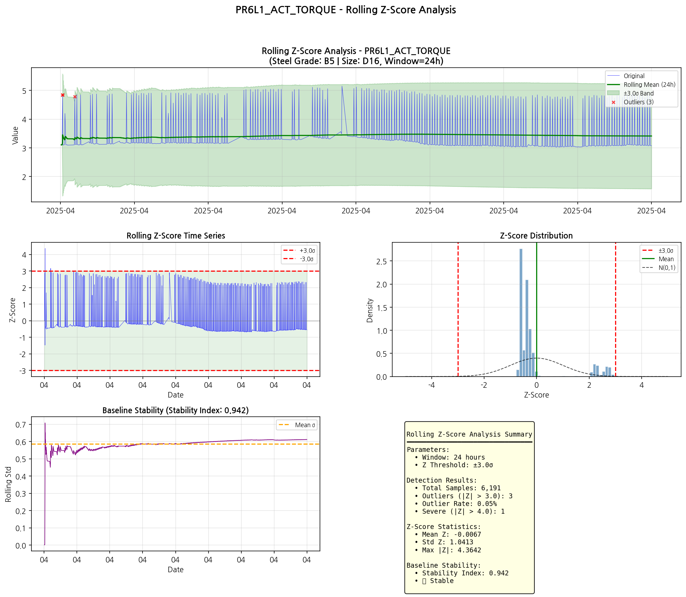

**PR7L1_ACT_TORQUE** (이상치율: 0.03%, 안정성: 0.950)

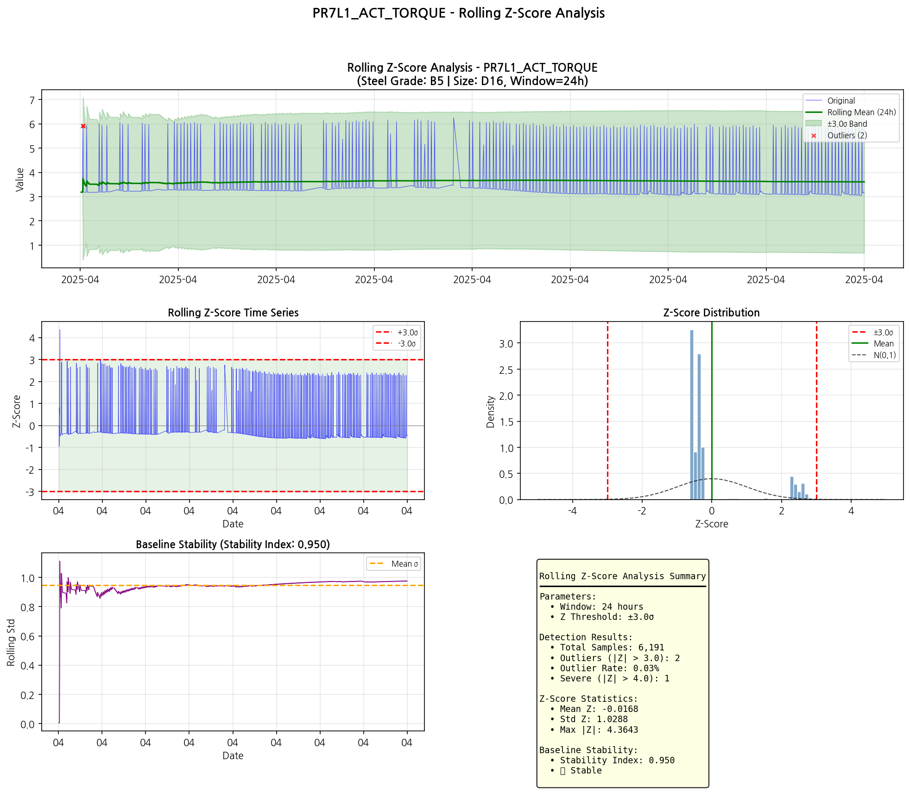

**PR6L2_ACT_TORQUE** (이상치율: 0.00%, 안정성: 0.961)

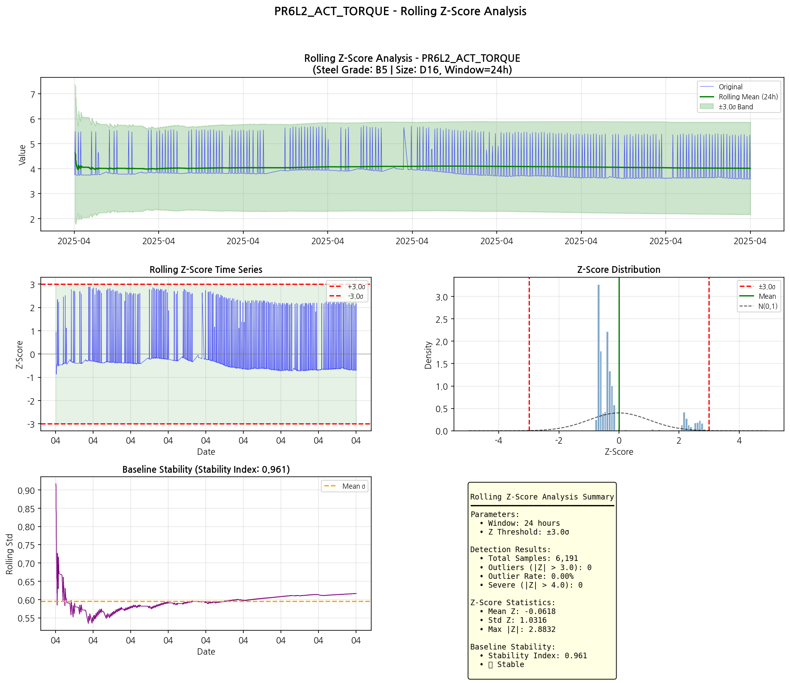

---

## 해석 가이드

### Rolling Z-Score 해석

1. **이상치율 (Outlier Rate)**
   - |Z| > 3.0σ 비율
   - 높을수록 해당 시점 주변 패턴에서 벗어난 데이터 많음
   - 정상 분포 가정 시 약 0.3% 예상

2. **기준선 안정성 (Baseline Stability)**
   - Rolling std의 시간적 일관성
   - 1에 가까울수록 안정적
   - 0.5 미만: 비정상 시계열, 다른 방법 권장

3. **심각 이상치 (Severe Outliers)**
   - |Z| > 4.0σ
   - 극단적인 이상값
   - 즉각적인 점검 필요

### 상태 분류

| 상태 | 기준 | 해석 |
|------|------|------|
| 🔴 높음 | ≥10% | 빈번한 이상치, 점검 필요 |
| 🟠 중간 | 3~10% | 일부 이상치, 모니터링 |
| 🟢 낮음 | <3% | 정상 범위 |
| 🟡 불안정 | Stability < 0.5 | 기준선 변동 심함 |

### Standard IQR vs Rolling Z-Score

| 방법 | 장점 | 단점 |
|------|------|------|
| Standard IQR | 간단, 전체 분포 기반 | 시변 데이터에 부적합 |
| Rolling Z-Score | 시변 데이터 적합 | 윈도우 크기 설정 필요 |

**권장**: 기준선 안정성 ≥ 0.5인 태그에 효과적

---

## 메타데이터

| 항목 | 값 |
|------|-----|
| 분석 스크립트 | steel_grade_rolling_zscore_analysis.py |
| 분석 기간 | 2025-03-01 ~ 2025-08-31 |
| 강종 | B5 |
| 윈도우 크기 | 24시간 |
| Z 임계값 | ±3.0σ |
| 생성일시 | 2026-02-09 15:17:24 |
| 총 분석 태그 | 79개 |

---

*본 보고서는 자동 생성되었습니다.*
