# 강종 [B5] Rolling Z-Score 동적 이상치 분석 보고서

**분석 기간**: 2025-03-01 ~ 2025-08-31
**강종**: B5
**생성일시**: 2026-02-03 20:50:44

---

## 분석 개요

### 분석 방법론

**Rolling Z-Score (롤링 Z-점수)**

시간 창(window) 기반 동적 이상치 탐지 방법입니다.

$$Z_{rolling}(t) = \frac{x(t) - \mu_{window}(t)}{\sigma_{window}(t)}$$

| 파라미터 | 값 | 설명 |
|----------|-----|------|
| Window | 24h | 이동 평균/표준편차 윈도우 |
| Z Threshold | ±3.0σ | 이상치 판정 임계값 |
| Severe | ±4.0σ | 심각 이상치 임계값 |

### 장점

- **비정상 시계열 적합**: 평균/분산 시변하는 데이터에 효과적
- **점진적 기준선 추적**: 장기 드리프트에 강건
- **Local Context 기반**: 해당 시점 주변 패턴 기준

### 분석 결과 요약

| 구분 | 태그 수 | 비율 |
|------|---------|------|
| **총 분석 태그** | 79개 | 100% |
| 🔴 높은 이상치율 (≥10%) | 0개 | 0.0% |
| 🟠 중간 이상치율 (3~10%) | 20개 | 25.3% |
| 🟢 낮은 이상치율 (<3%) | 56개 | 70.9% |
| 🟡 불안정 기준선 | 3개 | 3.8% |

#### 전체 평균

| 지표 | 값 |
|------|-----|
| 평균 이상치율 | 1.21% |
| 평균 기준선 안정성 | 0.728 |

---

## 상위 문제 태그 (이상치율 기준)

| 순위 | 태그 | 카테고리 | 이상치율 | 심각 이상치 | 안정성 | 상태 |
|------|------|----------|----------|-------------|--------|------|
| 1 | MAIN_GAS_TEMPERATURE | 가열로 보조설비 | 4.97% | 57 | 0.328 | 🟠 |
| 2 | FURNACE_EXIT_DISCHARGE_BILLET_TEMPERATURE | 가열로 추출 온도 | 4.93% | 23 | 0.851 | 🟠 |
| 3 | MAIN_COMBUSTION_AIR_PRESSURE | 가열로 보조설비 | 3.97% | 250 | 0.000 | 🟠 |
| 4 | HEATING_TOP_ZONE_NO_1_TEMPERATURE_ROOF | 가열로 상부 온도 | 3.51% | 198 | 0.672 | 🟠 |
| 5 | HEATING_TOP_ZONE_NO_2_TEMPERATURE_ROOF | 가열로 상부 온도 | 3.40% | 201 | 0.673 | 🟠 |
| 6 | STAND_3_ACTUAL_SPEED | 스탠드 속도 | 3.11% | 188 | 0.623 | 🟠 |
| 7 | FINISHING_BLOCK_ACTUAL_SPEED | 스탠드 속도 | 3.11% | 188 | 0.609 | 🟠 |
| 8 | STAND_2_ACTUAL_SPEED | 스탠드 속도 | 3.10% | 186 | 0.625 | 🟠 |
| 9 | STAND_1_ACTUAL_SPEED | 스탠드 속도 | 3.08% | 186 | 0.620 | 🟠 |
| 10 | STAND_4_ACTUAL_SPEED | 스탠드 속도 | 3.08% | 186 | 0.633 | 🟠 |
| 11 | STAND_10_ACTUAL_SPEED | 스탠드 속도 | 3.08% | 189 | 0.635 | 🟠 |
| 12 | STAND_12_ACTUAL_SPEED | 스탠드 속도 | 3.06% | 181 | 0.635 | 🟠 |
| 13 | STAND_13_ACTUAL_SPEED | 스탠드 속도 | 3.06% | 181 | 0.639 | 🟠 |
| 14 | STAND_6_ACTUAL_SPEED | 스탠드 속도 | 3.05% | 186 | 0.634 | 🟠 |
| 15 | STAND_7_ACTUAL_SPEED | 스탠드 속도 | 3.05% | 189 | 0.623 | 🟠 |

---

## 불안정 기준선 태그

기준선 안정성(Stability Index)이 0.5 미만인 태그입니다.
이 태그들은 Rolling Z-Score 방법보다 다른 방법이 더 적합할 수 있습니다.

| 태그 | 카테고리 | 안정성 | 이상치율 |
|------|----------|--------|----------|
| MAIN_COMBUSTION_AIR_PRESSURE | 가열로 보조설비 | 0.000 | 3.97% |
| PR7L1_ACT_TORQUE | PR 상세 토크 | 0.195 | 0.02% |
| PR7L2_ACT_TORQUE | PR 상세 토크 | 0.197 | 0.00% |
| MAIN_GAS_TEMPERATURE | 가열로 보조설비 | 0.328 | 4.97% |
| COMBUSTION_AIR_TEMPERATURE | 가열로 보조설비 | 0.359 | 2.22% |

---

## 카테고리별 분석 결과

### 가열로 상부 온도 (01_Furnace_Top_Temperature)

- 분석 태그: 4개
- 평균 이상치율: 2.91%
- 평균 안정성: 0.641

| 태그 | 이상치율 | 심각 이상치 | 안정성 | Max |Z| |
|------|----------|-------------|--------|--------|
| HEATING_TOP_ZONE_NO_1_TEMPERATURE_ROOF | 3.51% | 198 | 0.672 | 8.64 |
| HEATING_TOP_ZONE_NO_2_TEMPERATURE_ROOF | 3.40% | 201 | 0.673 | 7.16 |
| SOAKING_TOP_ZONE_NO_1_TEMPERATURE_ROOF | 2.50% | 123 | 0.587 | 5.72 |
| SOAKING_TOP_ZONE_NO_2_TEMPERATURE_ROOF | 2.22% | 150 | 0.630 | 5.83 |

#### Z-Score 차트

**HEATING_TOP_ZONE_NO_1_TEMPERATURE_ROOF** (이상치율: 3.51%, 안정성: 0.672)

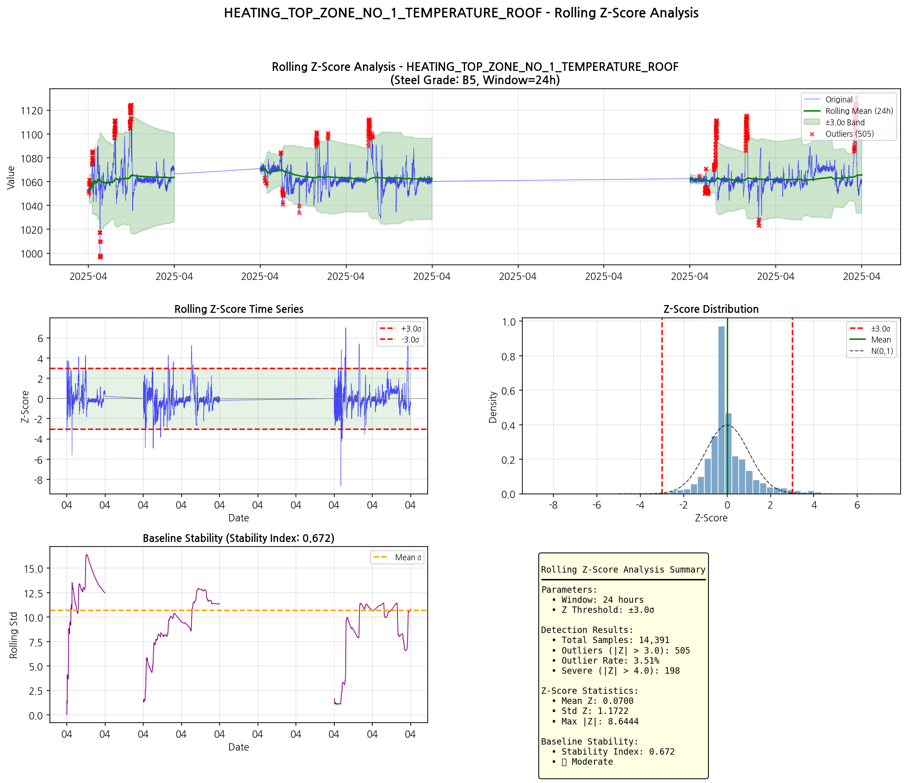

**HEATING_TOP_ZONE_NO_2_TEMPERATURE_ROOF** (이상치율: 3.40%, 안정성: 0.673)

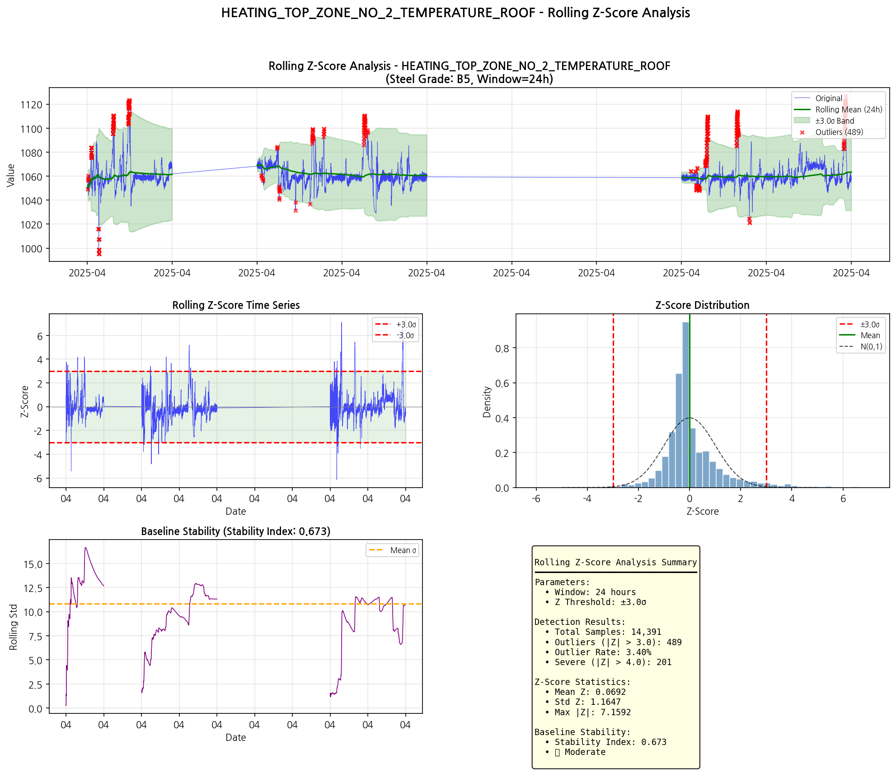

**SOAKING_TOP_ZONE_NO_1_TEMPERATURE_ROOF** (이상치율: 2.50%, 안정성: 0.587)

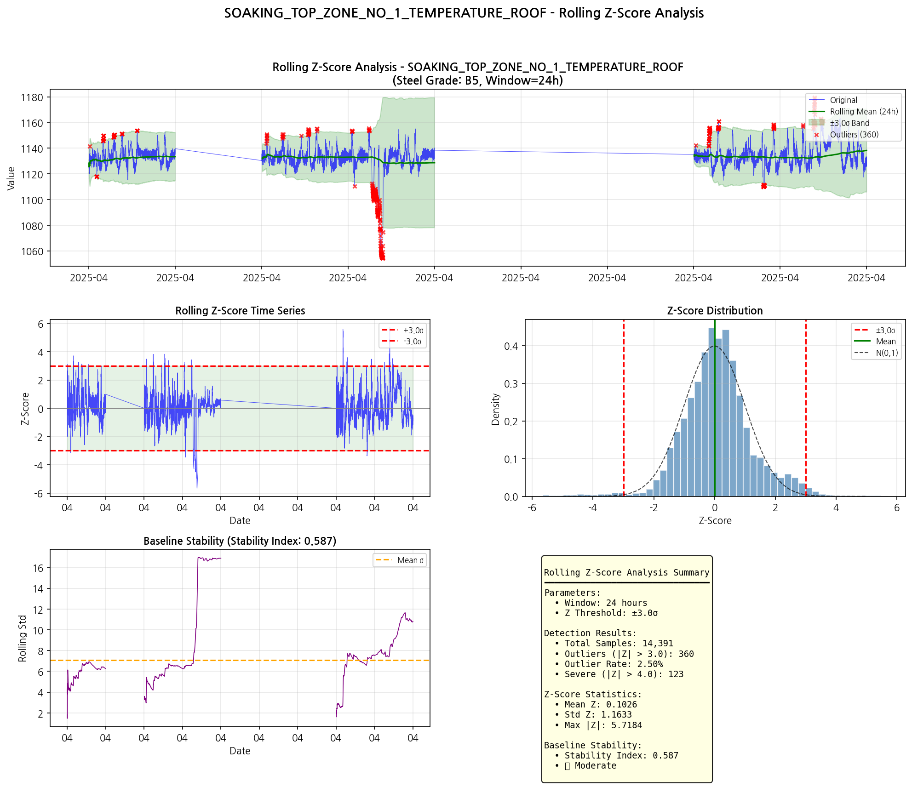

### 가열로 하부 온도 (02_Furnace_Bottom_Temperature)

- 분석 태그: 4개
- 평균 이상치율: 2.09%
- 평균 안정성: 0.646

| 태그 | 이상치율 | 심각 이상치 | 안정성 | Max |Z| |
|------|----------|-------------|--------|--------|
| HEATING_BOTTOM_ZONE_NO_1_TEMPERATURE_OPP_SIDE | 2.38% | 143 | 0.681 | 8.56 |
| HEATING_BOTTOM_ZONE_NO_2_TEMPERATURE_MILL_SIDE | 2.07% | 124 | 0.676 | 8.38 |
| SOAKING_BOTTOM_ZONE_NO_1_TEMPERATURE_OPP_SIDE | 2.13% | 67 | 0.596 | 8.99 |
| SOAKING_BOTTOM_ZONE_NO_2_TEMPERATURE_MILL_SIDE | 1.78% | 55 | 0.630 | 8.93 |

#### Z-Score 차트

**HEATING_BOTTOM_ZONE_NO_1_TEMPERATURE_OPP_SIDE** (이상치율: 2.38%, 안정성: 0.681)

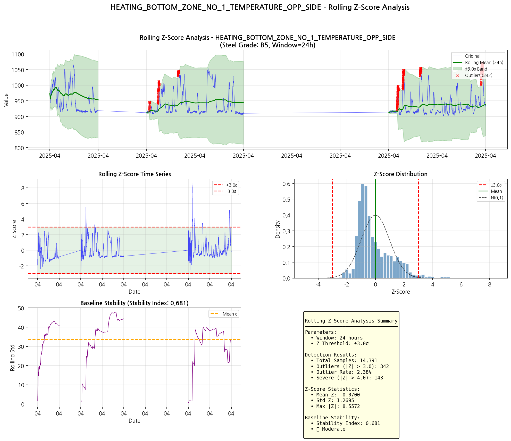

**SOAKING_BOTTOM_ZONE_NO_1_TEMPERATURE_OPP_SIDE** (이상치율: 2.13%, 안정성: 0.596)

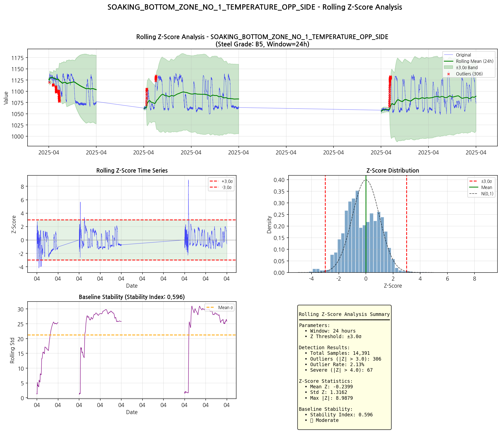

**HEATING_BOTTOM_ZONE_NO_2_TEMPERATURE_MILL_SIDE** (이상치율: 2.07%, 안정성: 0.676)

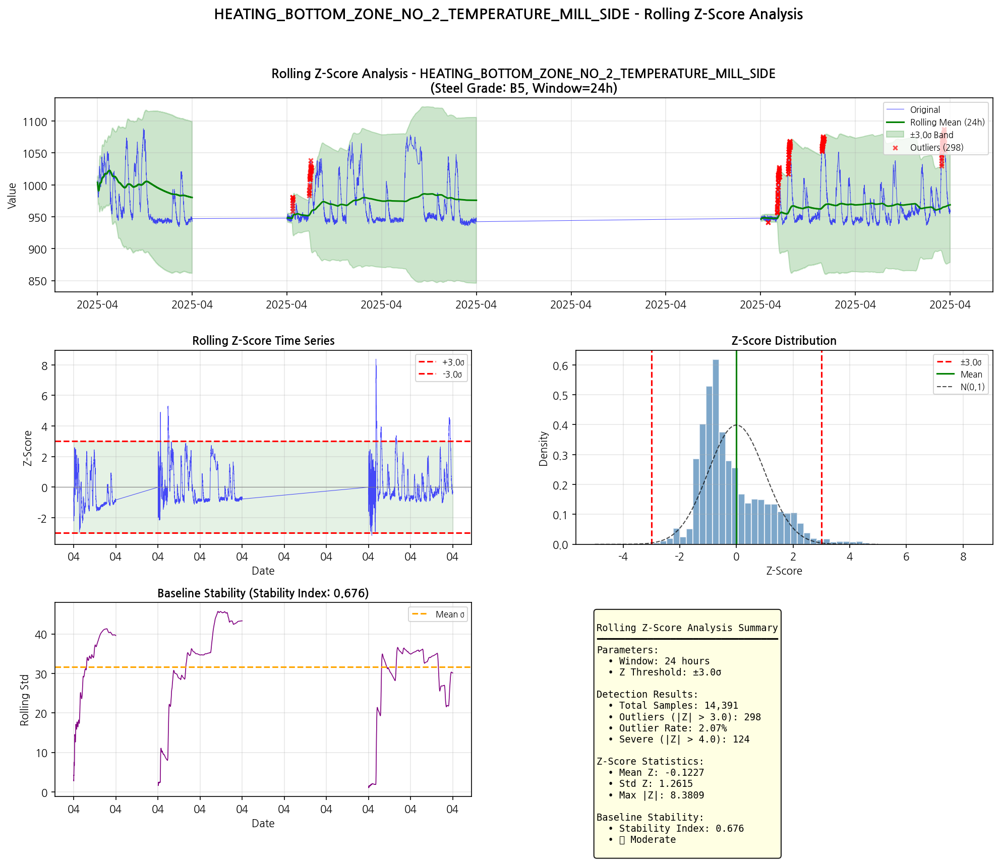

### 가열로 추출 온도 (03_Furnace_Discharge_Temperature)

- 분석 태그: 1개
- 평균 이상치율: 4.93%
- 평균 안정성: 0.851

| 태그 | 이상치율 | 심각 이상치 | 안정성 | Max |Z| |
|------|----------|-------------|--------|--------|
| FURNACE_EXIT_DISCHARGE_BILLET_TEMPERATURE | 4.93% | 23 | 0.851 | 4.89 |

#### Z-Score 차트

**FURNACE_EXIT_DISCHARGE_BILLET_TEMPERATURE** (이상치율: 4.93%, 안정성: 0.851)

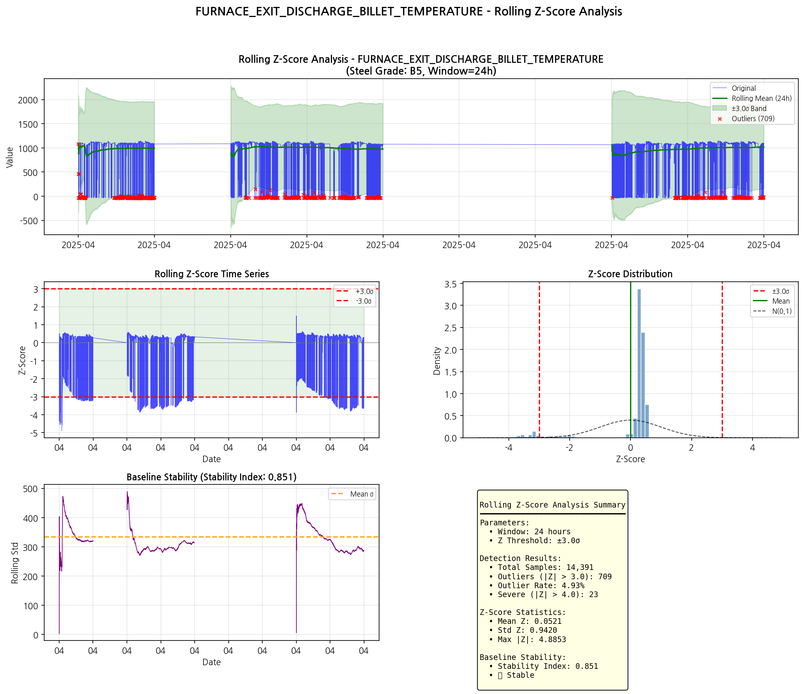

### 가열로 보조설비 (04_Furnace_Auxiliary)

- 분석 태그: 9개
- 평균 이상치율: 1.98%
- 평균 안정성: 0.530

| 태그 | 이상치율 | 심각 이상치 | 안정성 | Max |Z| |
|------|----------|-------------|--------|--------|
| FURNACE_PRESSURE | 0.60% | 16 | 0.749 | 4.97 |
| FURNACE_O2_ANALYZER | 1.88% | 134 | 0.692 | 8.30 |
| MAIN_GAS_PRESSURE | 1.49% | 90 | 0.504 | 6.24 |
| MAIN_GAS_FLOW | 1.52% | 55 | 0.678 | 7.48 |
| MAIN_GAS_TEMPERATURE | 4.97% | 57 | 0.328 | 5.33 |
| MAIN_COMBUSTION_AIR_PRESSURE | 3.97% | 250 | 0.000 | 12.13 |
| COMBUSTION_AIR_TEMPERATURE | 2.22% | 23 | 0.359 | 4.76 |
| INDIRECT_COOLING_WATER_FLOW | 0.90% | 24 | 0.685 | 11.16 |
| INDIRECT_WATER_MAIN_TEMPERATURE | 0.31% | 0 | 0.779 | 3.75 |

#### Z-Score 차트

**MAIN_GAS_TEMPERATURE** (이상치율: 4.97%, 안정성: 0.328)

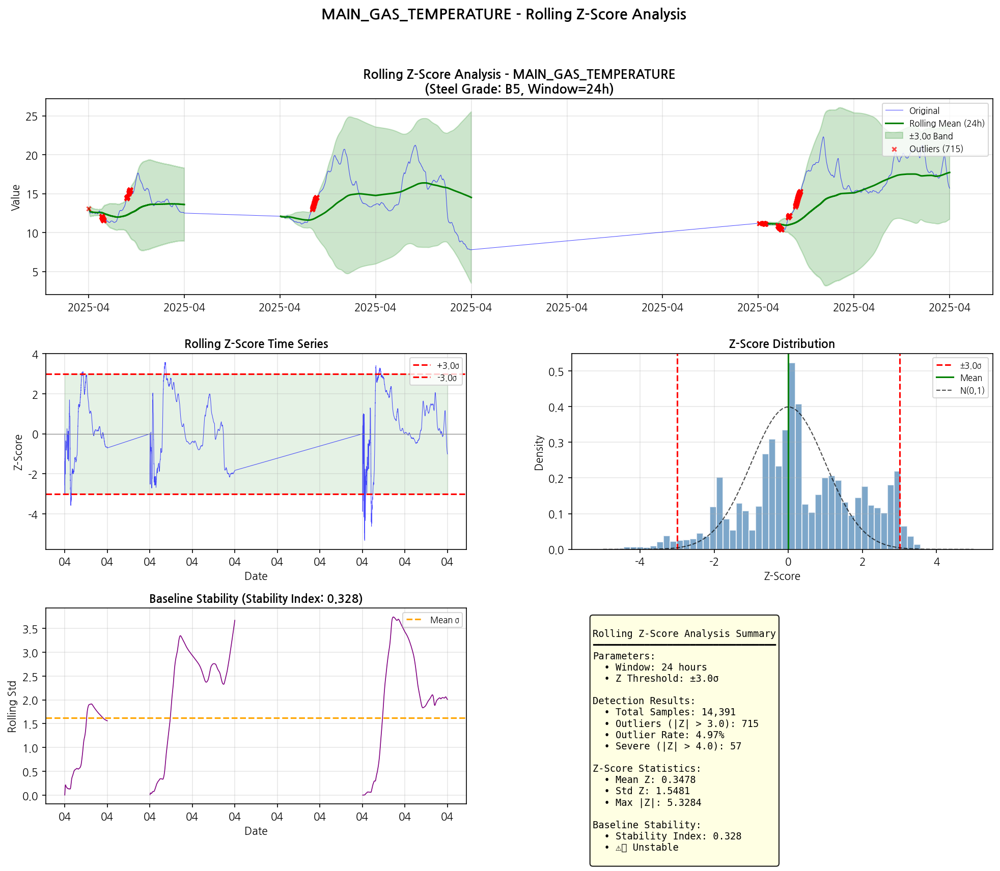

**MAIN_COMBUSTION_AIR_PRESSURE** (이상치율: 3.97%, 안정성: 0.000)

**COMBUSTION_AIR_TEMPERATURE** (이상치율: 2.22%, 안정성: 0.359)

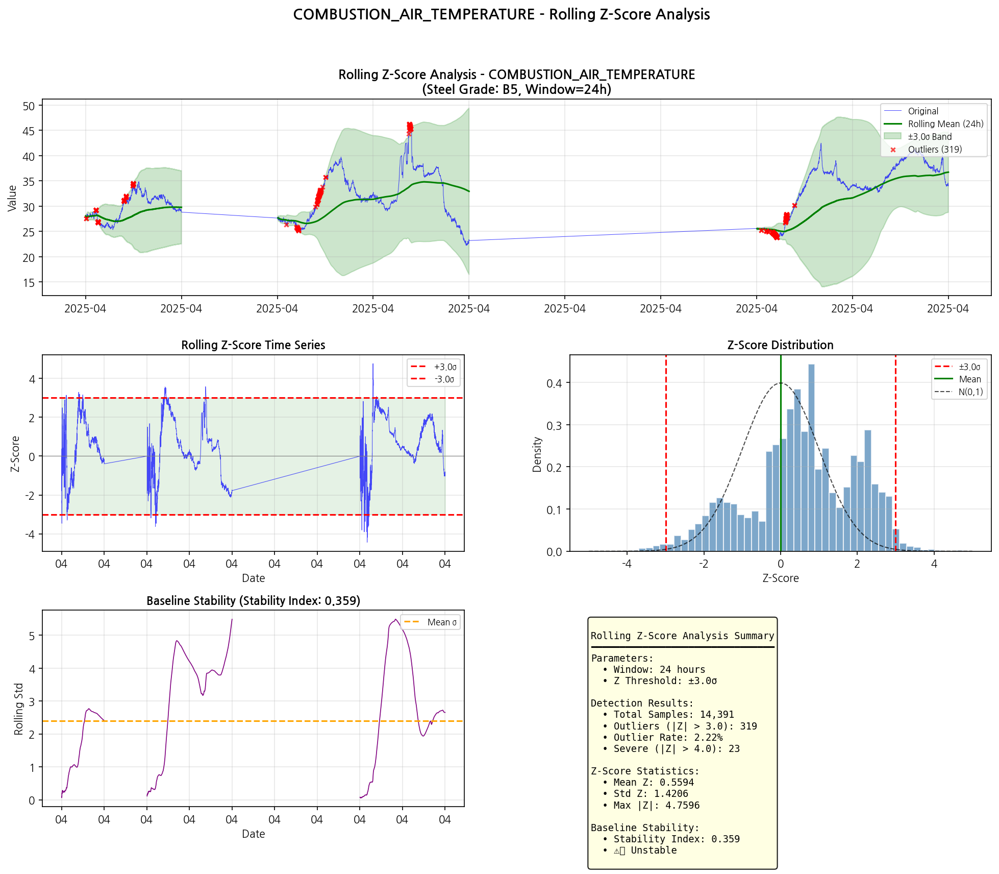

### 스탠드 토크 (05_Stand_Torque)

- 분석 태그: 16개
- 평균 이상치율: 0.17%
- 평균 안정성: 0.860

| 태그 | 이상치율 | 심각 이상치 | 안정성 | Max |Z| |
|------|----------|-------------|--------|--------|
| STAND_1_ACTUAL_TORQUE | 0.18% | 1 | 0.905 | 5.27 |
| STAND_2_ACTUAL_TORQUE | 0.27% | 6 | 0.862 | 5.07 |
| STAND_3_ACTUAL_TORQUE | 0.31% | 12 | 0.854 | 5.08 |
| STAND_4_ACTUAL_TORQUE | 0.29% | 10 | 0.846 | 4.89 |
| STAND_5_ACTUAL_TORQUE | 0.27% | 6 | 0.825 | 4.67 |
| STAND_6_ACTUAL_TORQUE | 0.22% | 3 | 0.844 | 5.23 |
| STAND_7_ACTUAL_TORQUE | 0.18% | 2 | 0.837 | 5.54 |
| STAND_8_ACTUAL_TORQUE | 0.14% | 2 | 0.819 | 5.65 |
| STAND_9_ACTUAL_TORQUE | 0.07% | 2 | 0.899 | 5.78 |
| STAND_10_ACTUAL_TORQUE | 0.05% | 2 | 0.892 | 5.78 |
| STAND_11_ACTUAL_TORQUE | 0.06% | 2 | 0.882 | 5.80 |
| STAND_12_ACTUAL_TORQUE | 0.10% | 2 | 0.863 | 5.79 |
| STAND_13_ACTUAL_TORQUE | 0.11% | 2 | 0.888 | 5.81 |
| STAND_14_ACTUAL_TORQUE | 0.16% | 2 | 0.875 | 5.79 |
| FINISHING_BLOCK_MASTER_ACTUAL_TORQUE | 0.19% | 3 | 0.831 | 5.80 |
| FINISHING_BLOCK_SLAVE_ACTUAL_TORQUE | 0.20% | 3 | 0.831 | 5.80 |

#### Z-Score 차트

**STAND_3_ACTUAL_TORQUE** (이상치율: 0.31%, 안정성: 0.854)

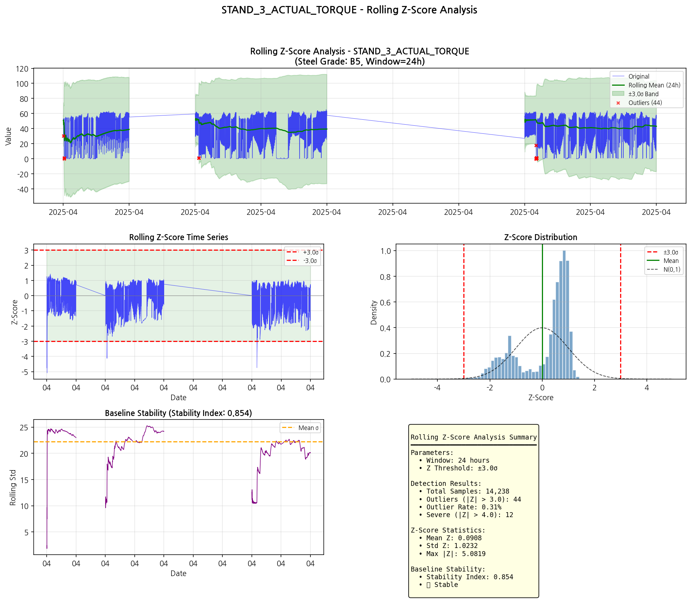

**STAND_4_ACTUAL_TORQUE** (이상치율: 0.29%, 안정성: 0.846)

**STAND_2_ACTUAL_TORQUE** (이상치율: 0.27%, 안정성: 0.862)

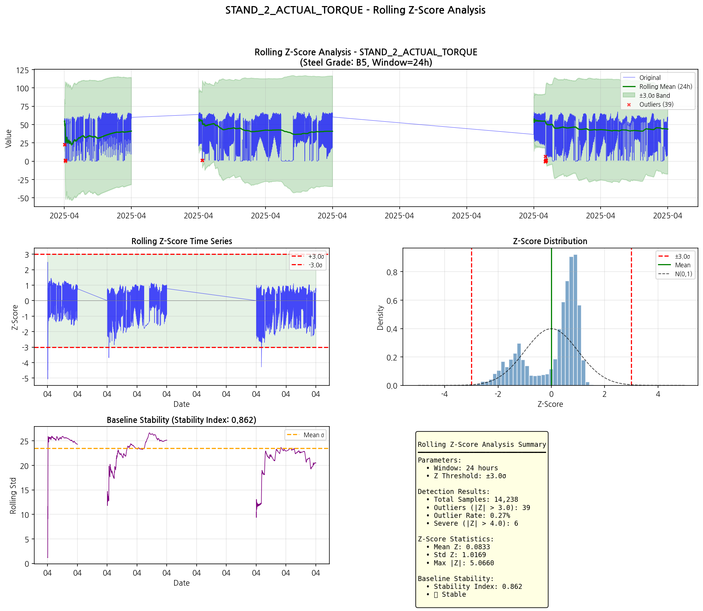

### 스탠드 속도 (06_Stand_Speed)

- 분석 태그: 15개
- 평균 이상치율: 3.06%
- 평균 안정성: 0.630

| 태그 | 이상치율 | 심각 이상치 | 안정성 | Max |Z| |
|------|----------|-------------|--------|--------|
| STAND_1_ACTUAL_SPEED | 3.08% | 186 | 0.620 | 21.95 |
| STAND_2_ACTUAL_SPEED | 3.10% | 186 | 0.625 | 22.17 |
| STAND_3_ACTUAL_SPEED | 3.11% | 188 | 0.623 | 22.17 |
| STAND_4_ACTUAL_SPEED | 3.08% | 186 | 0.633 | 22.16 |
| STAND_5_ACTUAL_SPEED | 3.03% | 186 | 0.632 | 22.15 |
| STAND_6_ACTUAL_SPEED | 3.05% | 186 | 0.634 | 22.14 |
| STAND_7_ACTUAL_SPEED | 3.05% | 189 | 0.623 | 22.11 |
| STAND_8_ACTUAL_SPEED | 3.03% | 186 | 0.622 | 22.07 |
| STAND_9_ACTUAL_SPEED | 3.03% | 180 | 0.637 | 22.06 |
| STAND_10_ACTUAL_SPEED | 3.08% | 189 | 0.635 | 22.06 |
| STAND_11_ACTUAL_SPEED | 3.04% | 180 | 0.638 | 22.16 |
| STAND_12_ACTUAL_SPEED | 3.06% | 181 | 0.635 | 22.11 |
| STAND_13_ACTUAL_SPEED | 3.06% | 181 | 0.639 | 22.11 |
| STAND_14_ACTUAL_SPEED | 3.05% | 182 | 0.640 | 22.16 |
| FINISHING_BLOCK_ACTUAL_SPEED | 3.11% | 188 | 0.609 | 21.96 |

#### Z-Score 차트

**STAND_3_ACTUAL_SPEED** (이상치율: 3.11%, 안정성: 0.623)

**FINISHING_BLOCK_ACTUAL_SPEED** (이상치율: 3.11%, 안정성: 0.609)

**STAND_2_ACTUAL_SPEED** (이상치율: 3.10%, 안정성: 0.625)

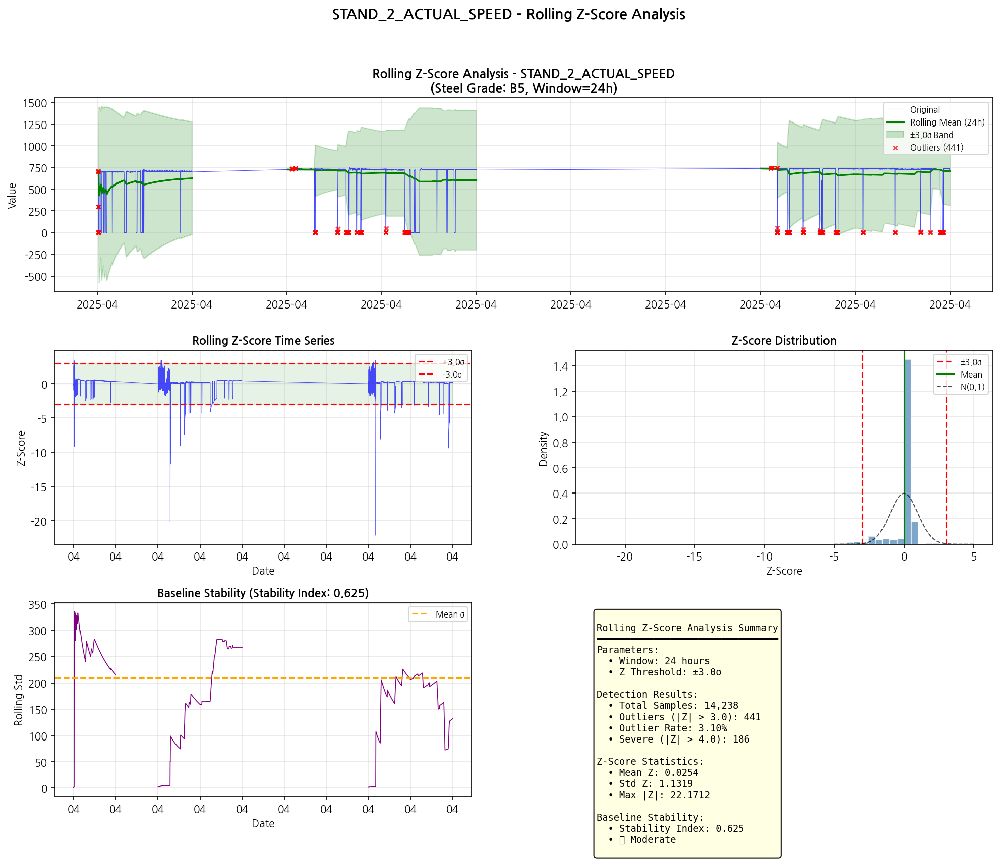

### 스탠드 부하 (07_Stand_Load)

- 분석 태그: 15개
- 평균 이상치율: 0.17%
- 평균 안정성: 0.866

| 태그 | 이상치율 | 심각 이상치 | 안정성 | Max |Z| |
|------|----------|-------------|--------|--------|
| STAND_1_LOAD | 0.21% | 1 | 0.867 | 5.39 |
| STAND_2_LOAD | 0.26% | 4 | 0.851 | 5.39 |
| STAND_3_LOAD | 0.34% | 10 | 0.845 | 5.39 |
| STAND_4_LOAD | 0.34% | 9 | 0.846 | 5.39 |
| STAND_5_LOAD | 0.32% | 5 | 0.851 | 5.39 |
| STAND_6_LOAD | 0.25% | 3 | 0.857 | 5.39 |
| STAND_7_LOAD | 0.20% | 3 | 0.862 | 5.58 |
| STAND_8_LOAD | 0.16% | 3 | 0.867 | 5.74 |
| STAND_9_LOAD | 0.06% | 2 | 0.879 | 5.83 |
| STAND_10_LOAD | 0.05% | 2 | 0.881 | 5.83 |
| STAND_11_LOAD | 0.05% | 2 | 0.881 | 5.83 |
| STAND_12_LOAD | 0.06% | 2 | 0.879 | 5.83 |
| STAND_13_LOAD | 0.06% | 2 | 0.879 | 5.83 |
| STAND_14_LOAD | 0.08% | 2 | 0.876 | 5.83 |
| FINISHING_BLOCK_LOAD | 0.15% | 2 | 0.869 | 5.83 |

#### Z-Score 차트

**STAND_4_LOAD** (이상치율: 0.34%, 안정성: 0.846)

**STAND_3_LOAD** (이상치율: 0.34%, 안정성: 0.845)

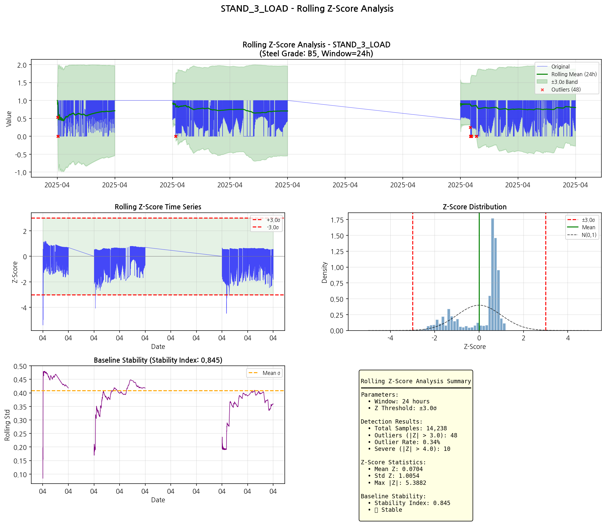

**STAND_5_LOAD** (이상치율: 0.32%, 안정성: 0.851)

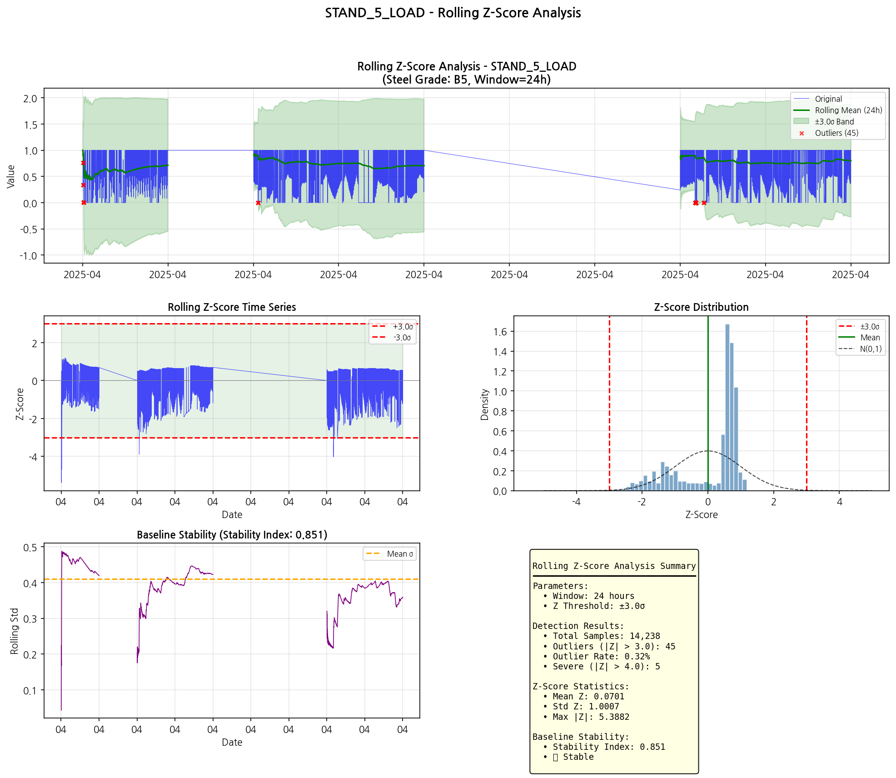

### 핀치롤 (08_Pinchroll)

- 분석 태그: 9개
- 평균 이상치율: 0.15%
- 평균 안정성: 0.806

| 태그 | 이상치율 | 심각 이상치 | 안정성 | Max |Z| |
|------|----------|-------------|--------|--------|
| PINCHROLL_2_ACTUAL_SPEED | 0.15% | 9 | 0.618 | 20.85 |
| PINCHROLL_3_ACTUAL_SPEED | 0.07% | 3 | 0.776 | 21.03 |
| PINCHROLL_4_ACTUAL_SPEED | 0.08% | 3 | 0.897 | 5.63 |
| PINCHROLL_2_ACTUAL_TORQUE | 0.10% | 2 | 0.896 | 5.83 |
| PINCHROLL_3_ACTUAL_TORQUE | 0.20% | 2 | 0.900 | 5.83 |
| PINCHROLL_4_ACTUAL_TORQUE | 0.18% | 2 | 0.901 | 5.83 |
| PINCHROLL_2_REFERENCE_TORQUE | 0.21% | 26 | 0.530 | 40.24 |
| PINCHROLL_3_REFERENCE_TORQUE | 0.18% | 2 | 0.869 | 5.83 |
| PINCHROLL_4_REFERENCE_TORQUE | 0.17% | 2 | 0.869 | 5.83 |

#### Z-Score 차트

**PINCHROLL_2_REFERENCE_TORQUE** (이상치율: 0.21%, 안정성: 0.530)

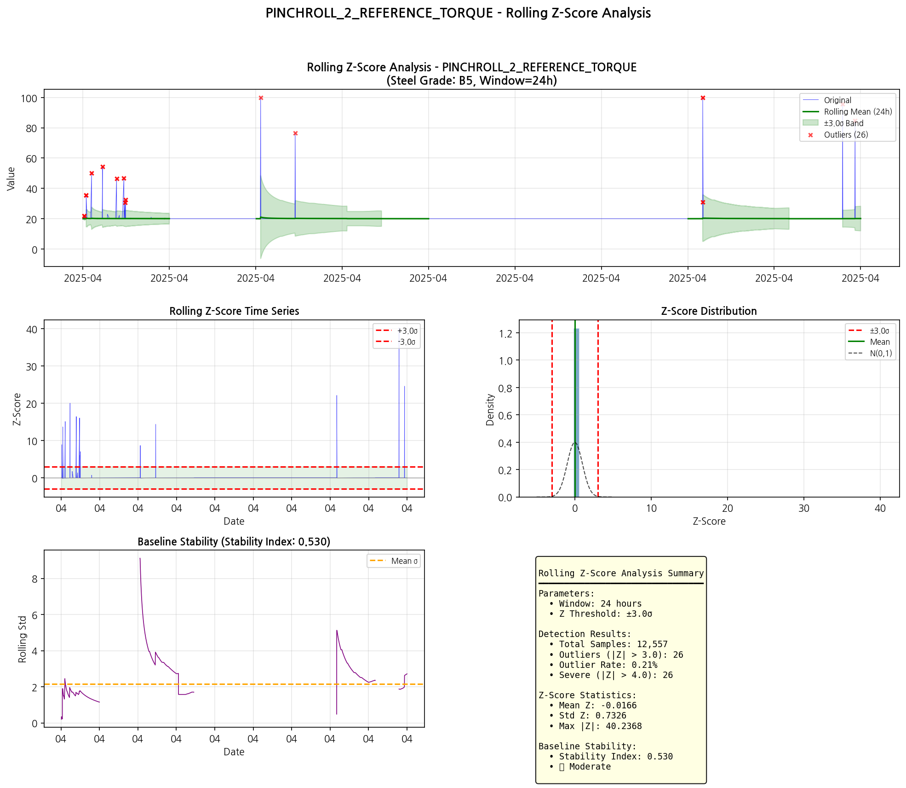

**PINCHROLL_3_ACTUAL_TORQUE** (이상치율: 0.20%, 안정성: 0.900)

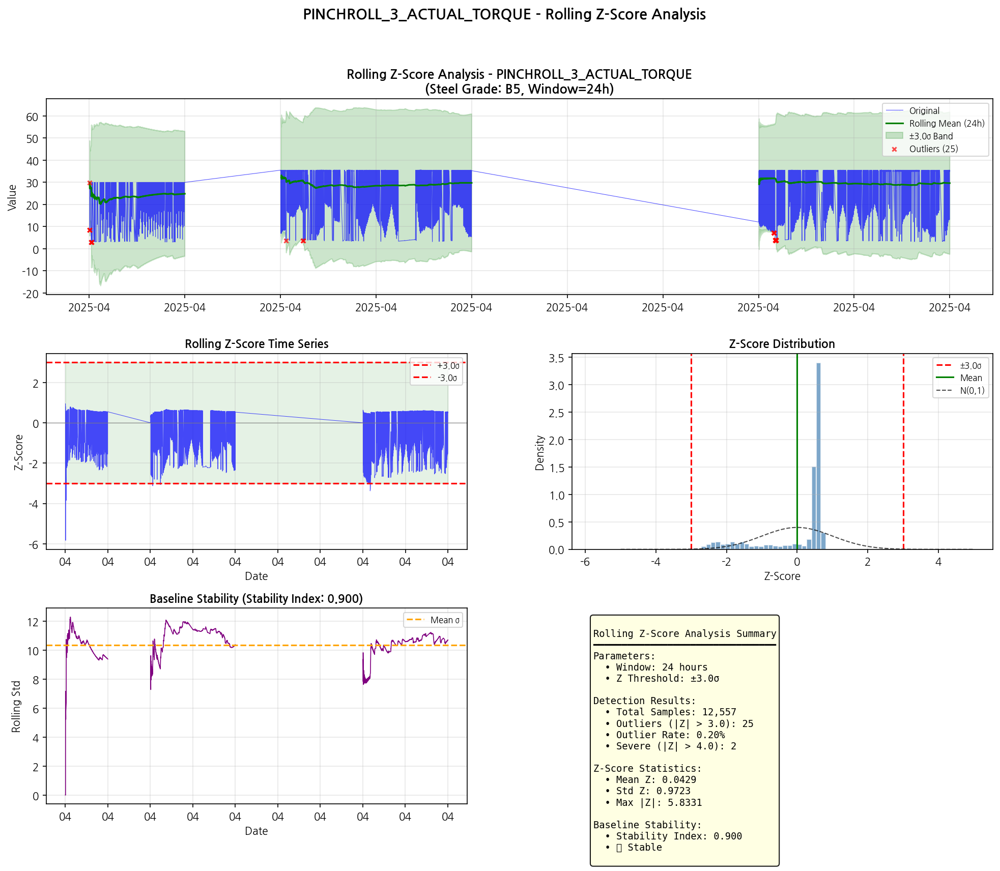

**PINCHROLL_4_ACTUAL_TORQUE** (이상치율: 0.18%, 안정성: 0.901)

### PR 상세 토크 (09_PR_Detailed)

- 분석 태그: 6개
- 평균 이상치율: 0.03%
- 평균 안정성: 0.553

| 태그 | 이상치율 | 심각 이상치 | 안정성 | Max |Z| |
|------|----------|-------------|--------|--------|
| PR6L1_ACT_TORQUE | 0.08% | 2 | 0.693 | 10.61 |
| PR6L2_ACT_TORQUE | 0.06% | 1 | 0.722 | 12.31 |
| PR7L1_ACT_TORQUE | 0.02% | 1 | 0.195 | 4.36 |
| PR7L2_ACT_TORQUE | 0.00% | 0 | 0.197 | 2.98 |
| PR8L1_ACT_TORQUE | 0.00% | 0 | 0.716 | 2.13 |
| PR9L1_ACT_TORQUE | 0.00% | 0 | 0.792 | 2.83 |

#### Z-Score 차트

**PR6L1_ACT_TORQUE** (이상치율: 0.08%, 안정성: 0.693)

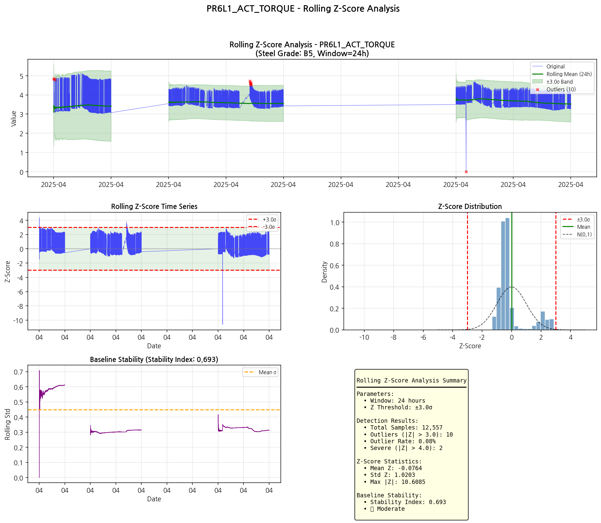

**PR6L2_ACT_TORQUE** (이상치율: 0.06%, 안정성: 0.722)

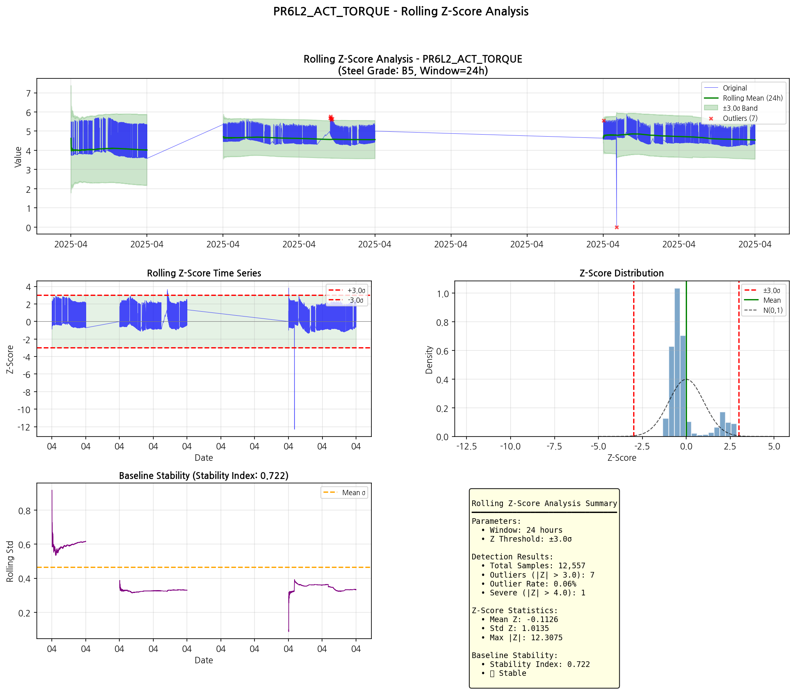

**PR7L1_ACT_TORQUE** (이상치율: 0.02%, 안정성: 0.195)

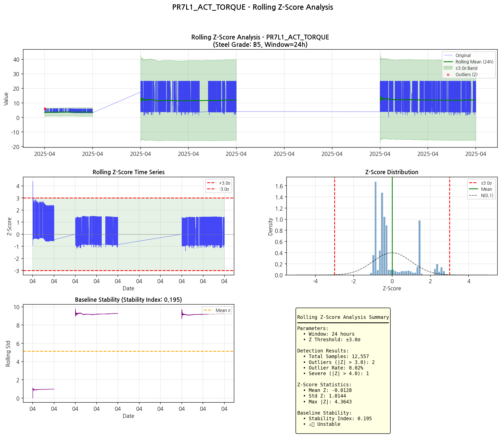

---

## 해석 가이드

### Rolling Z-Score 해석

1. **이상치율 (Outlier Rate)**
   - |Z| > 3.0σ 비율
   - 높을수록 해당 시점 주변 패턴에서 벗어난 데이터 많음
   - 정상 분포 가정 시 약 0.3% 예상

2. **기준선 안정성 (Baseline Stability)**
   - Rolling std의 시간적 일관성
   - 1에 가까울수록 안정적
   - 0.5 미만: 비정상 시계열, 다른 방법 권장

3. **심각 이상치 (Severe Outliers)**
   - |Z| > 4.0σ
   - 극단적인 이상값
   - 즉각적인 점검 필요

### 상태 분류

| 상태 | 기준 | 해석 |
|------|------|------|
| 🔴 높음 | ≥10% | 빈번한 이상치, 점검 필요 |
| 🟠 중간 | 3~10% | 일부 이상치, 모니터링 |
| 🟢 낮음 | <3% | 정상 범위 |
| 🟡 불안정 | Stability < 0.5 | 기준선 변동 심함 |

### Standard IQR vs Rolling Z-Score

| 방법 | 장점 | 단점 |
|------|------|------|
| Standard IQR | 간단, 전체 분포 기반 | 시변 데이터에 부적합 |
| Rolling Z-Score | 시변 데이터 적합 | 윈도우 크기 설정 필요 |

**권장**: 기준선 안정성 ≥ 0.5인 태그에 효과적

---

## 메타데이터

| 항목 | 값 |
|------|-----|
| 분석 스크립트 | steel_grade_rolling_zscore_analysis.py |
| 분석 기간 | 2025-03-01 ~ 2025-08-31 |
| 강종 | B5 |
| 윈도우 크기 | 24시간 |
| Z 임계값 | ±3.0σ |
| 생성일시 | 2026-02-03 20:50:44 |
| 총 분석 태그 | 79개 |

---

*본 보고서는 자동 생성되었습니다.*
