# 강종 [D4 | Size: D10] Rolling Z-Score 동적 이상치 분석 보고서

**분석 기간**: 2025-03-01 ~ 2025-08-31
**강종**: D4  
**사이즈**: D10
**생성일시**: 2026-02-09 15:16:12

---

## 분석 개요

### 분석 방법론

**Rolling Z-Score (롤링 Z-점수)**

시간 창(window) 기반 동적 이상치 탐지 방법입니다.

$$Z_{rolling}(t) = \frac{x(t) - \mu_{window}(t)}{\sigma_{window}(t)}$$

| 파라미터 | 값 | 설명 |
|----------|-----|------|
| Window | 24h | 이동 평균/표준편차 윈도우 |
| Z Threshold | ±3.0σ | 이상치 판정 임계값 |
| Severe | ±4.0σ | 심각 이상치 임계값 |

### 장점

- **비정상 시계열 적합**: 평균/분산 시변하는 데이터에 효과적
- **점진적 기준선 추적**: 장기 드리프트에 강건
- **Local Context 기반**: 해당 시점 주변 패턴 기준

### 분석 결과 요약

| 구분 | 태그 수 | 비율 |
|------|---------|------|
| **총 분석 태그** | 79개 | 100% |
| 🔴 높은 이상치율 (≥10%) | 0개 | 0.0% |
| 🟠 중간 이상치율 (3~10%) | 12개 | 15.2% |
| 🟢 낮은 이상치율 (<3%) | 60개 | 75.9% |
| 🟡 불안정 기준선 | 7개 | 8.9% |

#### 전체 평균

| 지표 | 값 |
|------|-----|
| 평균 이상치율 | 1.55% |
| 평균 기준선 안정성 | 0.659 |

---

## 상위 문제 태그 (이상치율 기준)

| 순위 | 태그 | 카테고리 | 이상치율 | 심각 이상치 | 안정성 | 상태 |
|------|------|----------|----------|-------------|--------|------|
| 1 | FURNACE_EXIT_DISCHARGE_BILLET_TEMPERATURE | 가열로 추출 온도 | 6.02% | 293 | 0.850 | 🟠 |
| 2 | SOAKING_TOP_ZONE_NO_2_TEMPERATURE_ROOF | 가열로 상부 온도 | 5.40% | 360 | 0.437 | 🟠 |
| 3 | SOAKING_TOP_ZONE_NO_1_TEMPERATURE_ROOF | 가열로 상부 온도 | 5.14% | 317 | 0.457 | 🟠 |
| 4 | PR6L1_ACT_TORQUE | PR 상세 토크 | 4.59% | 325 | 0.098 | 🟠 |
| 5 | HEATING_TOP_ZONE_NO_2_TEMPERATURE_ROOF | 가열로 상부 온도 | 4.17% | 280 | 0.500 | 🟠 |
| 6 | HEATING_TOP_ZONE_NO_1_TEMPERATURE_ROOF | 가열로 상부 온도 | 4.16% | 270 | 0.505 | 🟠 |
| 7 | PR7L1_ACT_TORQUE | PR 상세 토크 | 3.52% | 212 | 0.000 | 🟠 |
| 8 | PINCHROLL_4_ACTUAL_SPEED | 핀치롤 | 3.52% | 232 | 0.000 | 🟠 |
| 9 | SOAKING_BOTTOM_ZONE_NO_1_TEMPERATURE_OPP_SIDE | 가열로 하부 온도 | 3.44% | 77 | 0.590 | 🟠 |
| 10 | PR6L2_ACT_TORQUE | PR 상세 토크 | 3.35% | 249 | 0.196 | 🟠 |
| 11 | SOAKING_BOTTOM_ZONE_NO_2_TEMPERATURE_MILL_SIDE | 가열로 하부 온도 | 3.32% | 91 | 0.570 | 🟠 |
| 12 | PINCHROLL_3_ACTUAL_SPEED | 핀치롤 | 3.16% | 221 | 0.000 | 🟠 |
| 13 | PR7L2_ACT_TORQUE | PR 상세 토크 | 2.97% | 198 | 0.000 | 🟡 |
| 14 | MAIN_GAS_TEMPERATURE | 가열로 보조설비 | 2.26% | 3 | 0.365 | 🟡 |
| 15 | INDIRECT_WATER_MAIN_TEMPERATURE | 가열로 보조설비 | 2.25% | 36 | 0.296 | 🟡 |

---

## 불안정 기준선 태그

기준선 안정성(Stability Index)이 0.5 미만인 태그입니다.
이 태그들은 Rolling Z-Score 방법보다 다른 방법이 더 적합할 수 있습니다.

| 태그 | 카테고리 | 안정성 | 이상치율 |
|------|----------|--------|----------|
| FURNACE_O2_ANALYZER | 가열로 보조설비 | 0.000 | 1.74% |
| PINCHROLL_3_ACTUAL_SPEED | 핀치롤 | 0.000 | 3.16% |
| PINCHROLL_4_ACTUAL_SPEED | 핀치롤 | 0.000 | 3.52% |
| PR7L1_ACT_TORQUE | PR 상세 토크 | 0.000 | 3.52% |
| PR7L2_ACT_TORQUE | PR 상세 토크 | 0.000 | 2.97% |
| PR6L1_ACT_TORQUE | PR 상세 토크 | 0.098 | 4.59% |
| PR6L2_ACT_TORQUE | PR 상세 토크 | 0.196 | 3.35% |
| INDIRECT_WATER_MAIN_TEMPERATURE | 가열로 보조설비 | 0.296 | 2.25% |
| MAIN_GAS_TEMPERATURE | 가열로 보조설비 | 0.365 | 2.26% |
| PINCHROLL_2_REFERENCE_TORQUE | 핀치롤 | 0.401 | 0.06% |

---

## 카테고리별 분석 결과

### 가열로 상부 온도 (01_Furnace_Top_Temperature)

- 분석 태그: 4개
- 평균 이상치율: 4.72%
- 평균 안정성: 0.475

| 태그 | 이상치율 | 심각 이상치 | 안정성 | Max \|Z\| |
|------|----------|-------------|--------|--------|
| HEATING_TOP_ZONE_NO_1_TEMPERATURE_ROOF | 4.16% | 270 | 0.505 | 8.05 |
| HEATING_TOP_ZONE_NO_2_TEMPERATURE_ROOF | 4.17% | 280 | 0.500 | 7.19 |
| SOAKING_TOP_ZONE_NO_1_TEMPERATURE_ROOF | 5.14% | 317 | 0.457 | 8.42 |
| SOAKING_TOP_ZONE_NO_2_TEMPERATURE_ROOF | 5.40% | 360 | 0.437 | 8.50 |

#### Z-Score 차트

**SOAKING_TOP_ZONE_NO_2_TEMPERATURE_ROOF** (이상치율: 5.40%, 안정성: 0.437)

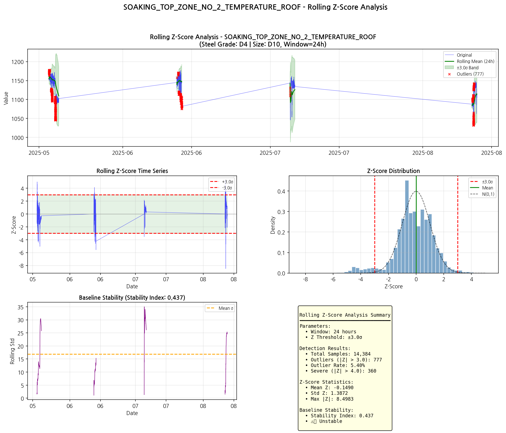

**SOAKING_TOP_ZONE_NO_1_TEMPERATURE_ROOF** (이상치율: 5.14%, 안정성: 0.457)

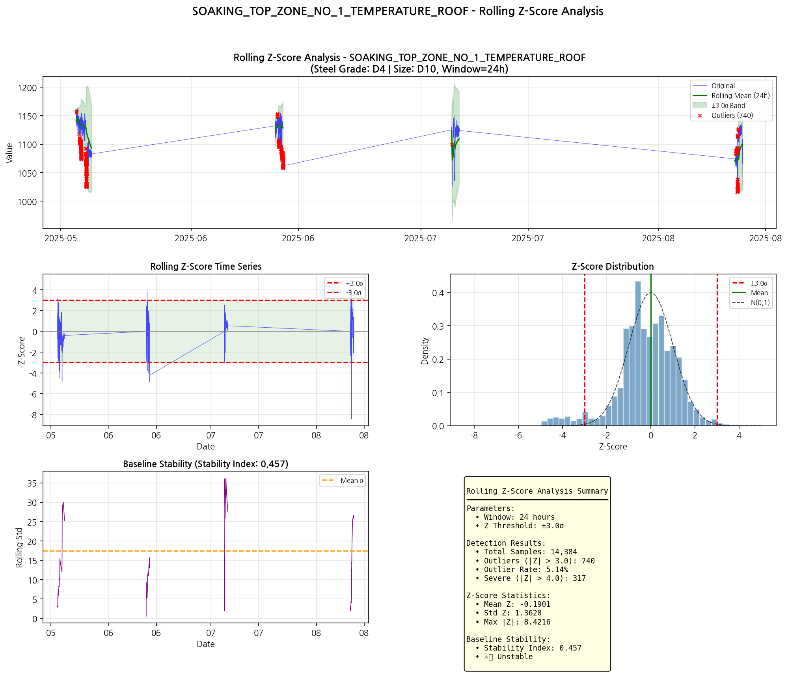

**HEATING_TOP_ZONE_NO_2_TEMPERATURE_ROOF** (이상치율: 4.17%, 안정성: 0.500)

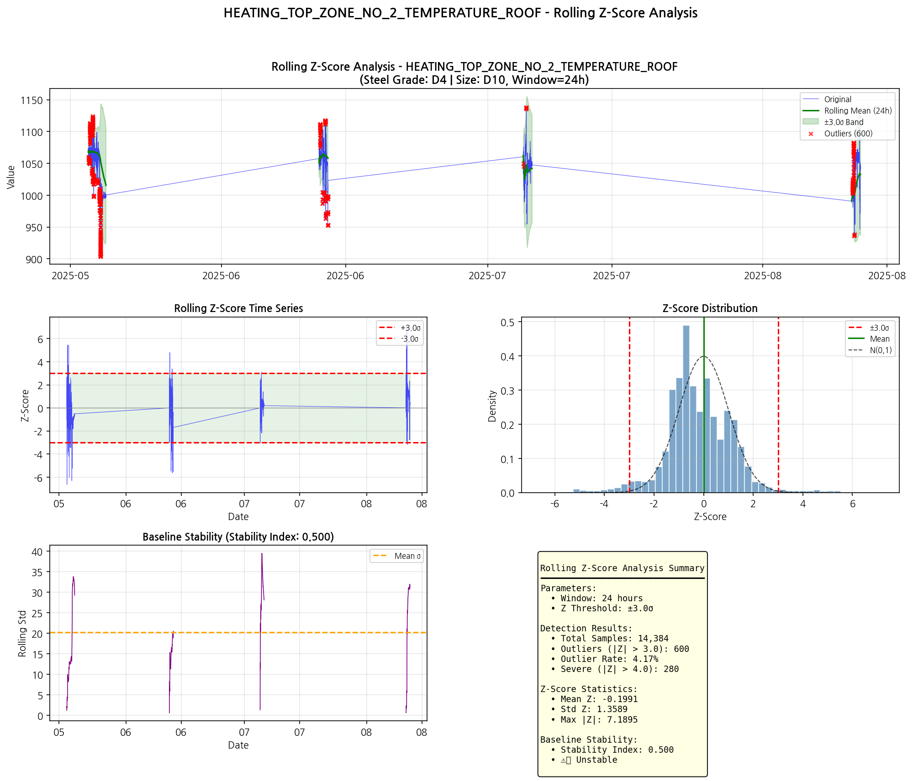

### 가열로 하부 온도 (02_Furnace_Bottom_Temperature)

- 분석 태그: 4개
- 평균 이상치율: 2.51%
- 평균 안정성: 0.665

| 태그 | 이상치율 | 심각 이상치 | 안정성 | Max \|Z\| |
|------|----------|-------------|--------|--------|
| HEATING_BOTTOM_ZONE_NO_1_TEMPERATURE_OPP_SIDE | 1.59% | 76 | 0.758 | 5.20 |
| HEATING_BOTTOM_ZONE_NO_2_TEMPERATURE_MILL_SIDE | 1.71% | 45 | 0.742 | 5.42 |
| SOAKING_BOTTOM_ZONE_NO_1_TEMPERATURE_OPP_SIDE | 3.44% | 77 | 0.590 | 5.79 |
| SOAKING_BOTTOM_ZONE_NO_2_TEMPERATURE_MILL_SIDE | 3.32% | 91 | 0.570 | 5.28 |

#### Z-Score 차트

**SOAKING_BOTTOM_ZONE_NO_1_TEMPERATURE_OPP_SIDE** (이상치율: 3.44%, 안정성: 0.590)

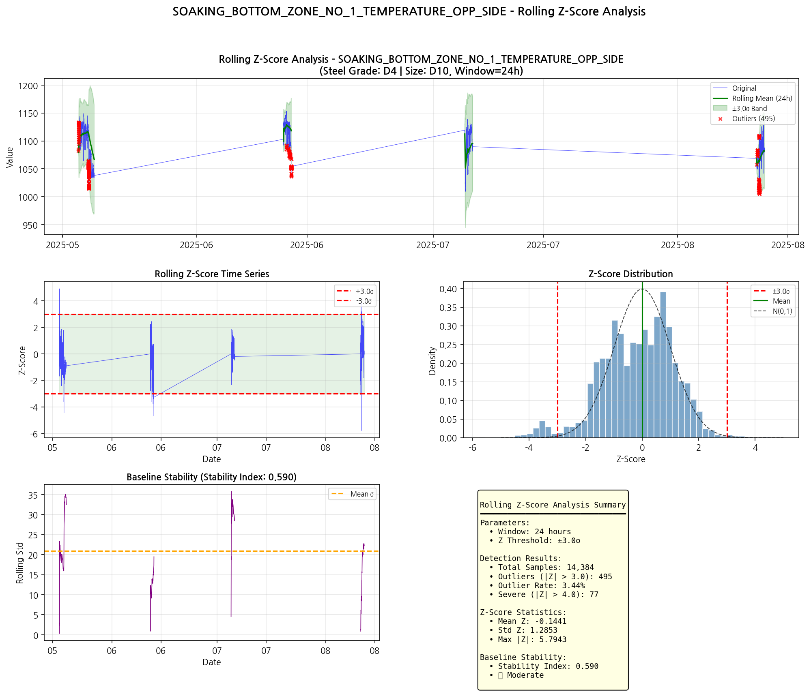

**SOAKING_BOTTOM_ZONE_NO_2_TEMPERATURE_MILL_SIDE** (이상치율: 3.32%, 안정성: 0.570)

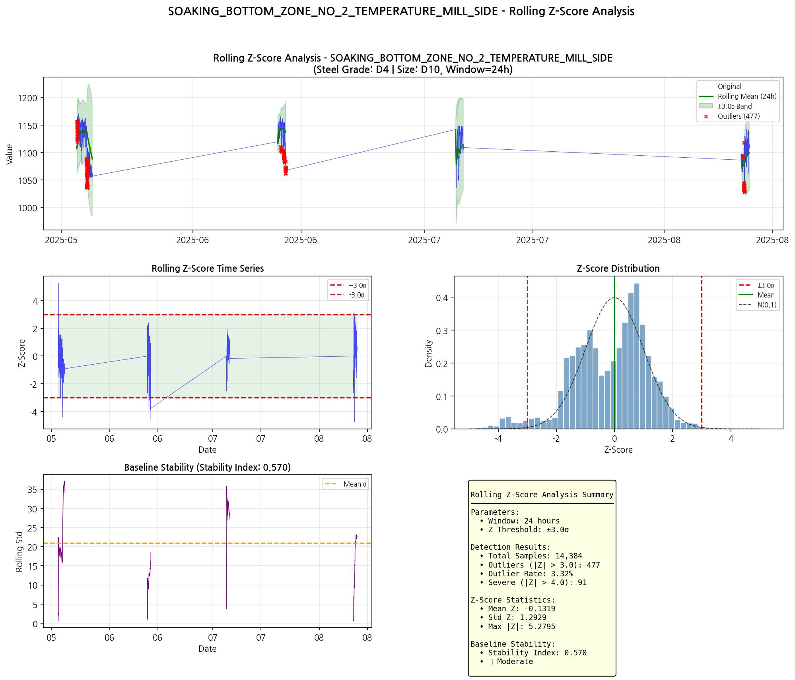

**HEATING_BOTTOM_ZONE_NO_2_TEMPERATURE_MILL_SIDE** (이상치율: 1.71%, 안정성: 0.742)

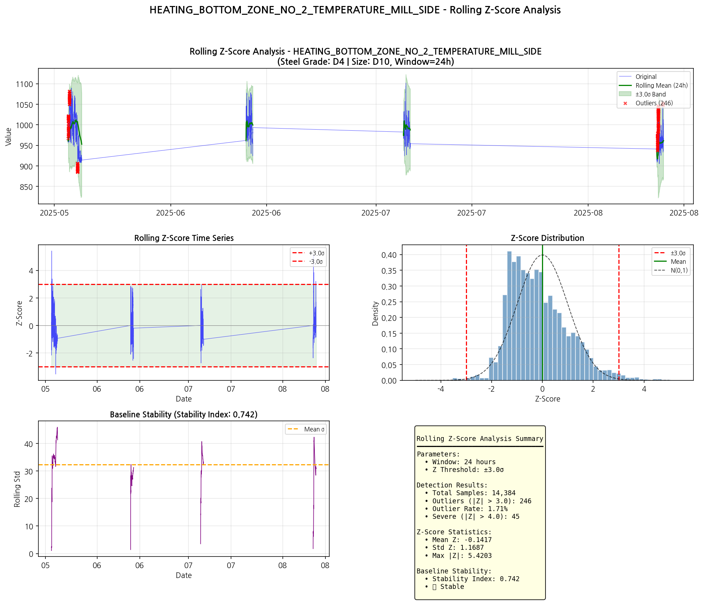

### 가열로 추출 온도 (03_Furnace_Discharge_Temperature)

- 분석 태그: 1개
- 평균 이상치율: 6.02%
- 평균 안정성: 0.850

| 태그 | 이상치율 | 심각 이상치 | 안정성 | Max \|Z\| |
|------|----------|-------------|--------|--------|
| FURNACE_EXIT_DISCHARGE_BILLET_TEMPERATURE | 6.02% | 293 | 0.850 | 8.47 |

#### Z-Score 차트

**FURNACE_EXIT_DISCHARGE_BILLET_TEMPERATURE** (이상치율: 6.02%, 안정성: 0.850)

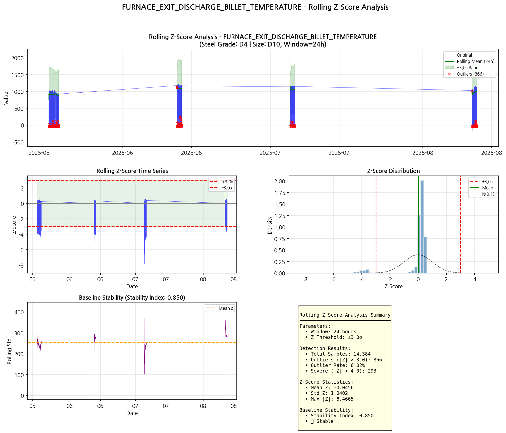

### 가열로 보조설비 (04_Furnace_Auxiliary)

- 분석 태그: 9개
- 평균 이상치율: 1.49%
- 평균 안정성: 0.485

| 태그 | 이상치율 | 심각 이상치 | 안정성 | Max \|Z\| |
|------|----------|-------------|--------|--------|
| FURNACE_PRESSURE | 0.52% | 8 | 0.725 | 4.59 |
| FURNACE_O2_ANALYZER | 1.74% | 168 | 0.000 | 24.25 |
| MAIN_GAS_PRESSURE | 1.77% | 100 | 0.598 | 6.68 |
| MAIN_GAS_FLOW | 0.58% | 31 | 0.785 | 5.47 |
| MAIN_GAS_TEMPERATURE | 2.26% | 3 | 0.365 | 4.56 |
| MAIN_COMBUSTION_AIR_PRESSURE | 1.65% | 99 | 0.457 | 7.24 |
| COMBUSTION_AIR_TEMPERATURE | 1.30% | 68 | 0.452 | 6.28 |
| INDIRECT_COOLING_WATER_FLOW | 1.31% | 13 | 0.691 | 9.76 |
| INDIRECT_WATER_MAIN_TEMPERATURE | 2.25% | 36 | 0.296 | 8.36 |

#### Z-Score 차트

**MAIN_GAS_TEMPERATURE** (이상치율: 2.26%, 안정성: 0.365)

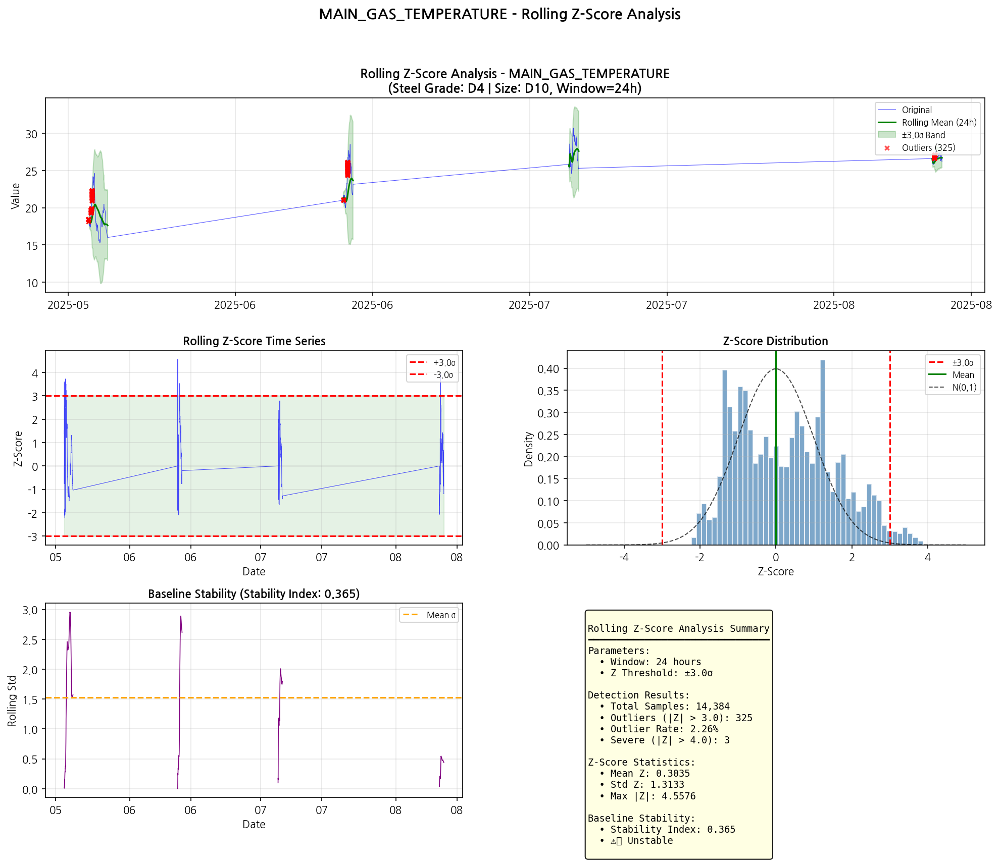

**INDIRECT_WATER_MAIN_TEMPERATURE** (이상치율: 2.25%, 안정성: 0.296)

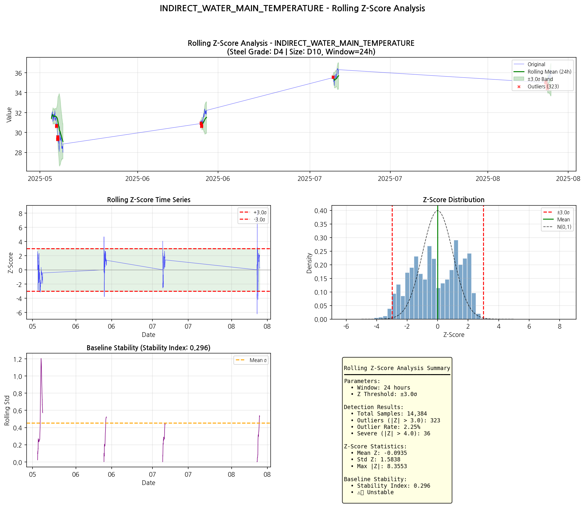

**MAIN_GAS_PRESSURE** (이상치율: 1.77%, 안정성: 0.598)

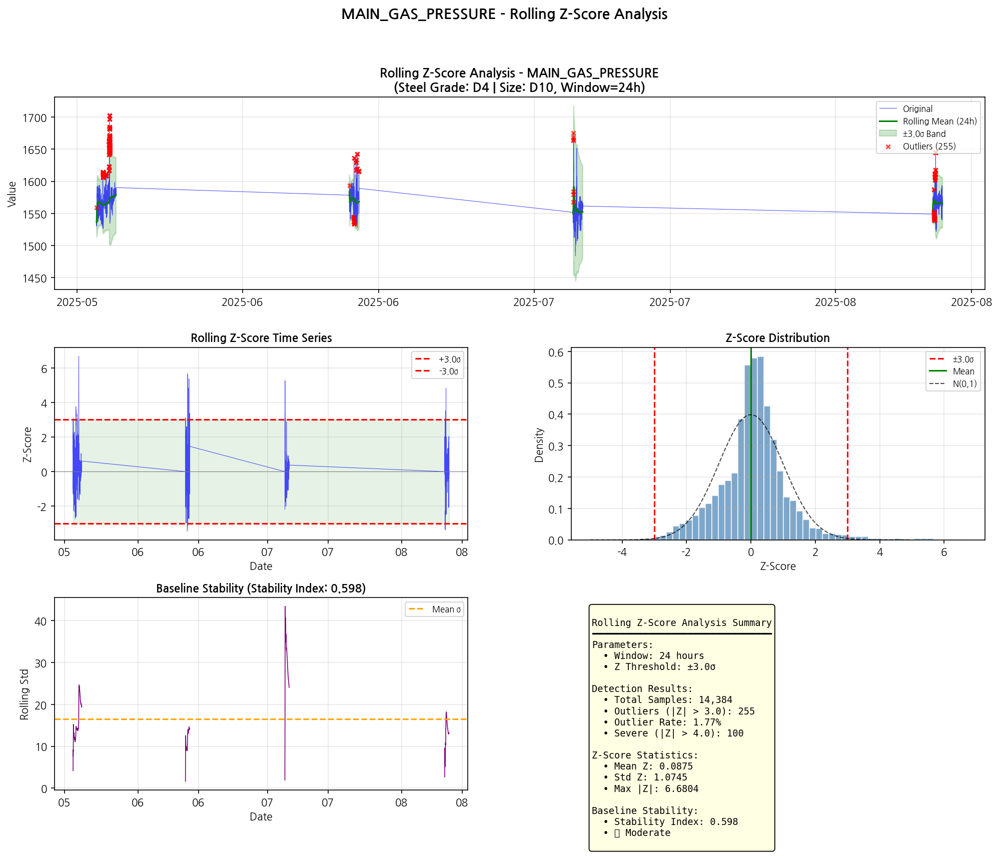

### 스탠드 토크 (05_Stand_Torque)

- 분석 태그: 16개
- 평균 이상치율: 0.58%
- 평균 안정성: 0.800

| 태그 | 이상치율 | 심각 이상치 | 안정성 | Max \|Z\| |
|------|----------|-------------|--------|--------|
| STAND_1_ACTUAL_TORQUE | 0.56% | 27 | 0.799 | 12.40 |
| STAND_2_ACTUAL_TORQUE | 0.51% | 28 | 0.815 | 10.38 |
| STAND_3_ACTUAL_TORQUE | 0.56% | 31 | 0.810 | 10.19 |
| STAND_4_ACTUAL_TORQUE | 0.61% | 29 | 0.800 | 11.16 |
| STAND_5_ACTUAL_TORQUE | 0.61% | 29 | 0.802 | 12.06 |
| STAND_6_ACTUAL_TORQUE | 0.60% | 31 | 0.795 | 12.49 |
| STAND_7_ACTUAL_TORQUE | 0.61% | 31 | 0.809 | 12.77 |
| STAND_8_ACTUAL_TORQUE | 0.63% | 29 | 0.783 | 12.72 |
| STAND_9_ACTUAL_TORQUE | 0.58% | 29 | 0.782 | 12.55 |
| STAND_10_ACTUAL_TORQUE | 0.59% | 28 | 0.802 | 12.78 |
| STAND_11_ACTUAL_TORQUE | 0.58% | 29 | 0.810 | 12.64 |
| STAND_12_ACTUAL_TORQUE | 0.59% | 28 | 0.800 | 12.51 |
| STAND_13_ACTUAL_TORQUE | 0.59% | 30 | 0.798 | 12.31 |
| STAND_14_ACTUAL_TORQUE | 0.62% | 31 | 0.806 | 12.68 |
| FINISHING_BLOCK_MASTER_ACTUAL_TORQUE | 0.56% | 32 | 0.793 | 11.99 |
| FINISHING_BLOCK_SLAVE_ACTUAL_TORQUE | 0.56% | 32 | 0.793 | 11.99 |

#### Z-Score 차트

**STAND_8_ACTUAL_TORQUE** (이상치율: 0.63%, 안정성: 0.783)

**STAND_14_ACTUAL_TORQUE** (이상치율: 0.62%, 안정성: 0.806)

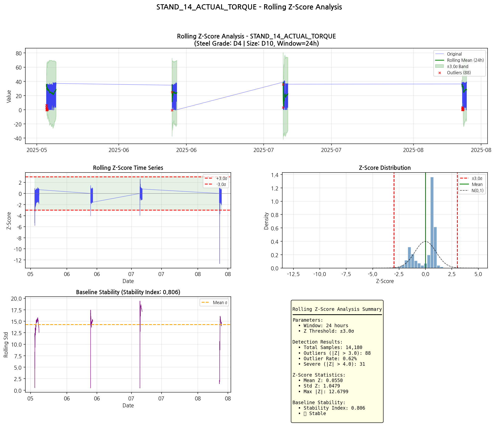

**STAND_5_ACTUAL_TORQUE** (이상치율: 0.61%, 안정성: 0.802)

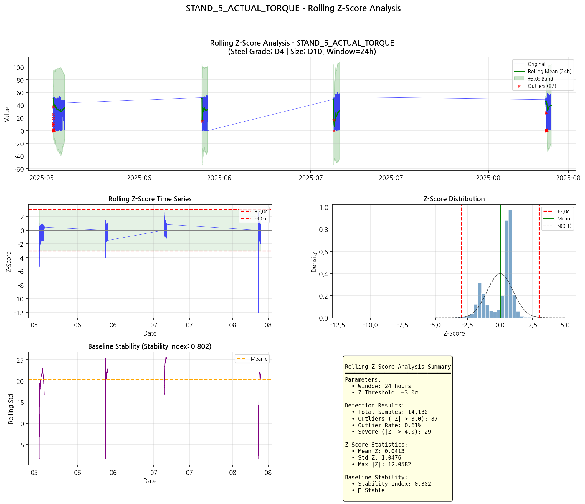

### 스탠드 속도 (06_Stand_Speed)

- 분석 태그: 15개
- 평균 이상치율: 1.77%
- 평균 안정성: 0.728

| 태그 | 이상치율 | 심각 이상치 | 안정성 | Max \|Z\| |
|------|----------|-------------|--------|--------|
| STAND_1_ACTUAL_SPEED | 1.83% | 81 | 0.724 | 18.71 |
| STAND_2_ACTUAL_SPEED | 1.83% | 81 | 0.696 | 18.85 |
| STAND_3_ACTUAL_SPEED | 1.81% | 79 | 0.714 | 18.79 |
| STAND_4_ACTUAL_SPEED | 1.83% | 76 | 0.726 | 18.85 |
| STAND_5_ACTUAL_SPEED | 1.81% | 75 | 0.719 | 18.85 |
| STAND_6_ACTUAL_SPEED | 1.79% | 74 | 0.725 | 18.76 |
| STAND_7_ACTUAL_SPEED | 1.78% | 77 | 0.726 | 18.79 |
| STAND_8_ACTUAL_SPEED | 1.77% | 77 | 0.733 | 18.80 |
| STAND_9_ACTUAL_SPEED | 1.72% | 76 | 0.736 | 18.80 |
| STAND_10_ACTUAL_SPEED | 1.73% | 79 | 0.729 | 18.85 |
| STAND_11_ACTUAL_SPEED | 1.75% | 75 | 0.732 | 18.88 |
| STAND_12_ACTUAL_SPEED | 1.76% | 76 | 0.740 | 18.89 |
| STAND_13_ACTUAL_SPEED | 1.72% | 76 | 0.742 | 18.89 |
| STAND_14_ACTUAL_SPEED | 1.75% | 77 | 0.737 | 18.92 |
| FINISHING_BLOCK_ACTUAL_SPEED | 1.66% | 78 | 0.734 | 18.87 |

#### Z-Score 차트

**STAND_1_ACTUAL_SPEED** (이상치율: 1.83%, 안정성: 0.724)

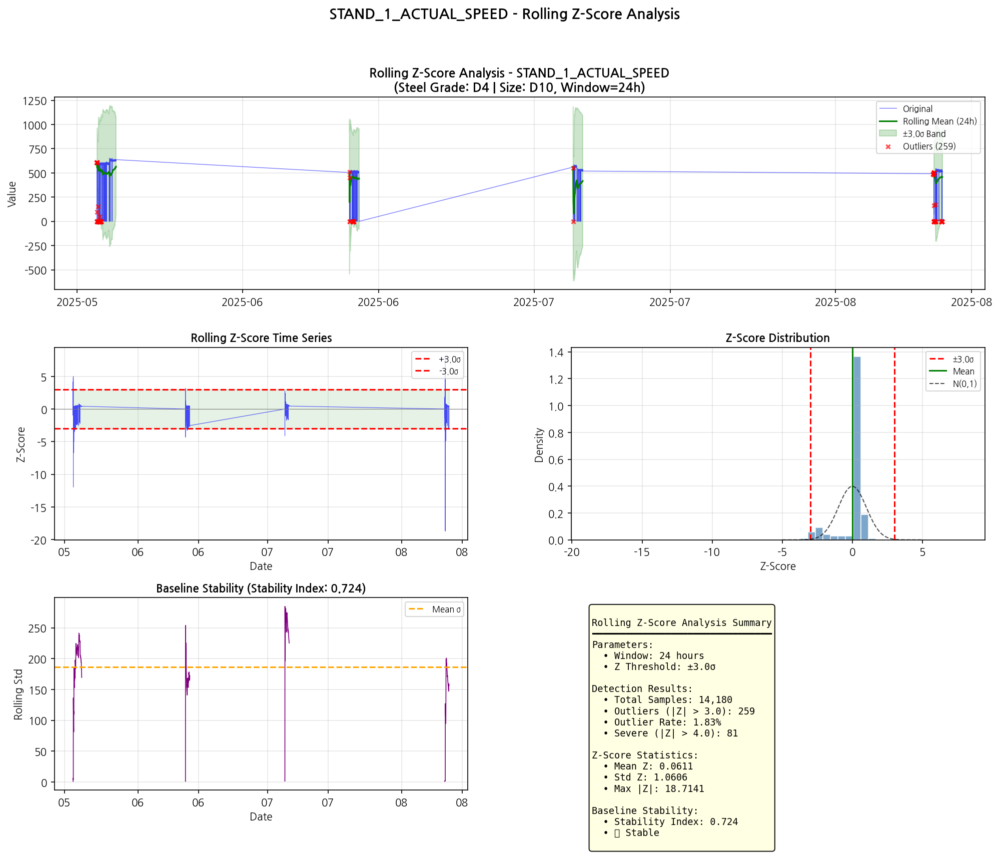

**STAND_2_ACTUAL_SPEED** (이상치율: 1.83%, 안정성: 0.696)

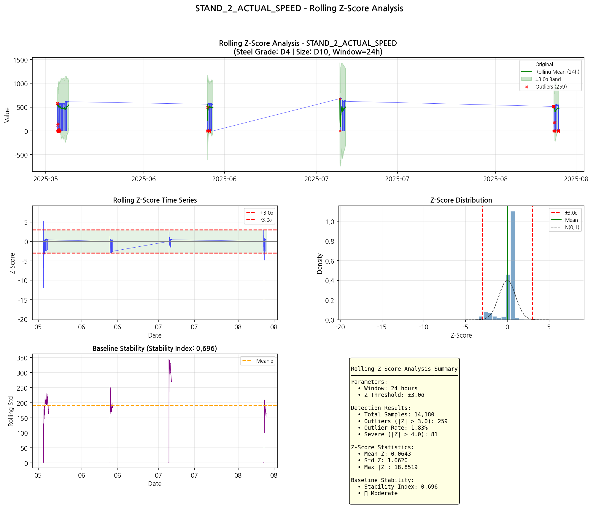

**STAND_4_ACTUAL_SPEED** (이상치율: 1.83%, 안정성: 0.726)

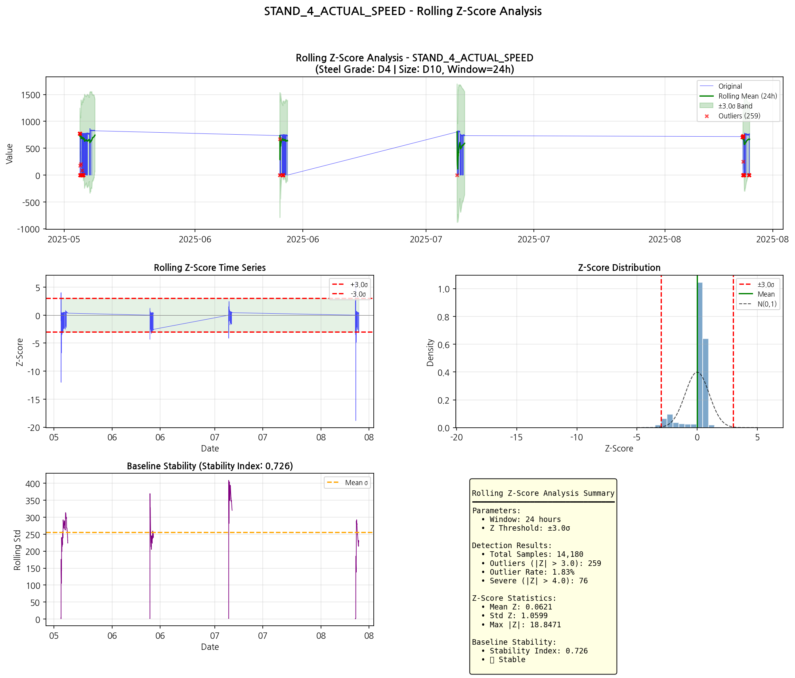

### 스탠드 부하 (07_Stand_Load)

- 분석 태그: 15개
- 평균 이상치율: 0.59%
- 평균 안정성: 0.819

| 태그 | 이상치율 | 심각 이상치 | 안정성 | Max \|Z\| |
|------|----------|-------------|--------|--------|
| STAND_1_LOAD | 0.59% | 28 | 0.819 | 12.22 |
| STAND_2_LOAD | 0.58% | 29 | 0.818 | 12.02 |
| STAND_3_LOAD | 0.59% | 32 | 0.818 | 10.05 |
| STAND_4_LOAD | 0.63% | 31 | 0.818 | 10.60 |
| STAND_5_LOAD | 0.63% | 31 | 0.819 | 10.89 |
| STAND_6_LOAD | 0.63% | 32 | 0.819 | 11.12 |
| STAND_7_LOAD | 0.61% | 32 | 0.820 | 11.33 |
| STAND_8_LOAD | 0.61% | 30 | 0.820 | 11.47 |
| STAND_9_LOAD | 0.59% | 29 | 0.820 | 11.37 |
| STAND_10_LOAD | 0.58% | 28 | 0.820 | 11.51 |
| STAND_11_LOAD | 0.58% | 28 | 0.820 | 11.45 |
| STAND_12_LOAD | 0.58% | 28 | 0.820 | 11.55 |
| STAND_13_LOAD | 0.58% | 28 | 0.820 | 11.55 |
| STAND_14_LOAD | 0.56% | 29 | 0.820 | 11.46 |
| FINISHING_BLOCK_LOAD | 0.56% | 31 | 0.819 | 11.39 |

#### Z-Score 차트

**STAND_4_LOAD** (이상치율: 0.63%, 안정성: 0.818)

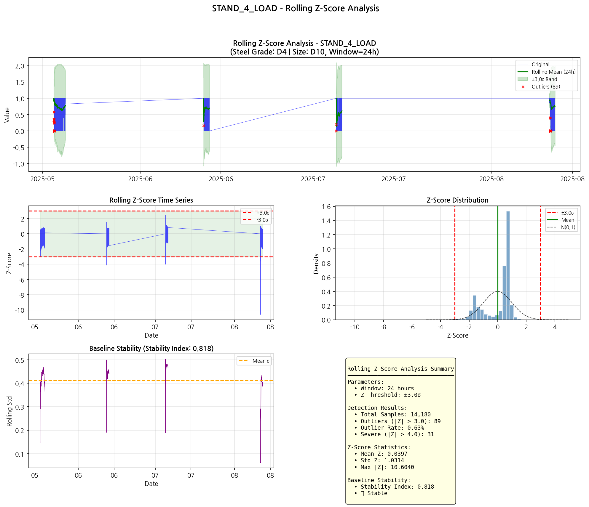

**STAND_5_LOAD** (이상치율: 0.63%, 안정성: 0.819)

**STAND_6_LOAD** (이상치율: 0.63%, 안정성: 0.819)

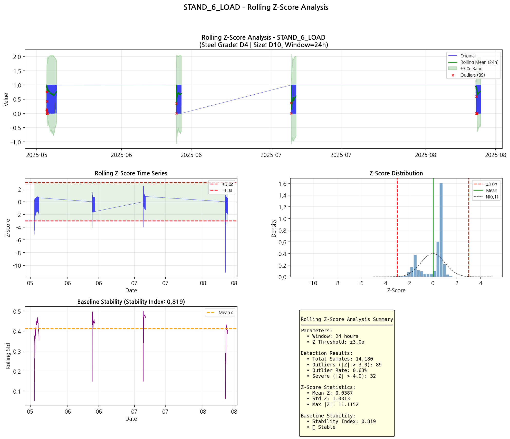

### 핀치롤 (08_Pinchroll)

- 분석 태그: 9개
- 평균 이상치율: 1.38%
- 평균 안정성: 0.513

| 태그 | 이상치율 | 심각 이상치 | 안정성 | Max \|Z\| |
|------|----------|-------------|--------|--------|
| PINCHROLL_2_ACTUAL_SPEED | 1.00% | 58 | 0.526 | 23.96 |
| PINCHROLL_3_ACTUAL_SPEED | 3.16% | 221 | 0.000 | 45.49 |
| PINCHROLL_4_ACTUAL_SPEED | 3.52% | 232 | 0.000 | 27.46 |
| PINCHROLL_2_ACTUAL_TORQUE | 0.85% | 42 | 0.800 | 8.24 |
| PINCHROLL_3_ACTUAL_TORQUE | 1.13% | 61 | 0.675 | 18.02 |
| PINCHROLL_4_ACTUAL_TORQUE | 0.87% | 44 | 0.716 | 10.36 |
| PINCHROLL_2_REFERENCE_TORQUE | 0.06% | 6 | 0.401 | 34.34 |
| PINCHROLL_3_REFERENCE_TORQUE | 0.99% | 57 | 0.689 | 25.79 |
| PINCHROLL_4_REFERENCE_TORQUE | 0.88% | 44 | 0.806 | 10.33 |

#### Z-Score 차트

**PINCHROLL_4_ACTUAL_SPEED** (이상치율: 3.52%, 안정성: 0.000)

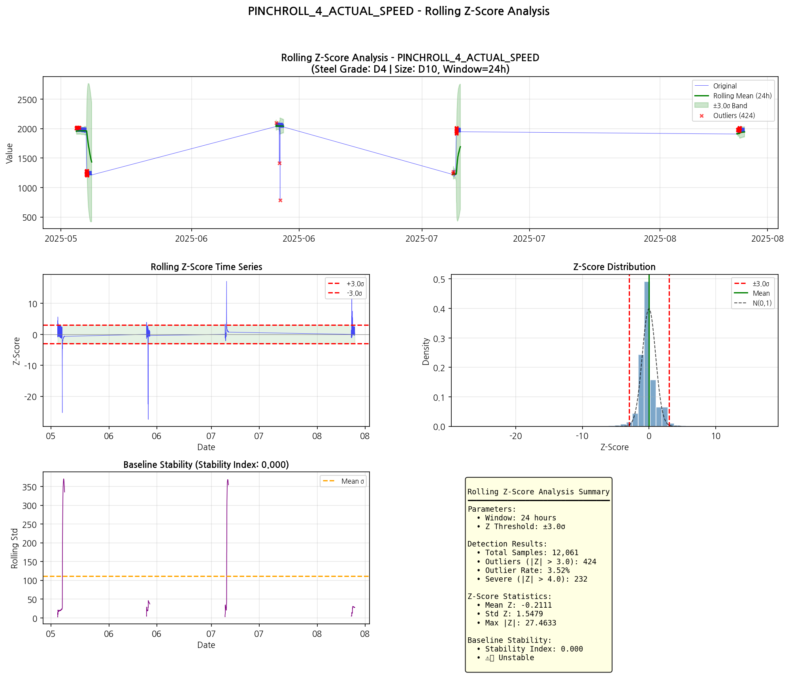

**PINCHROLL_3_ACTUAL_SPEED** (이상치율: 3.16%, 안정성: 0.000)

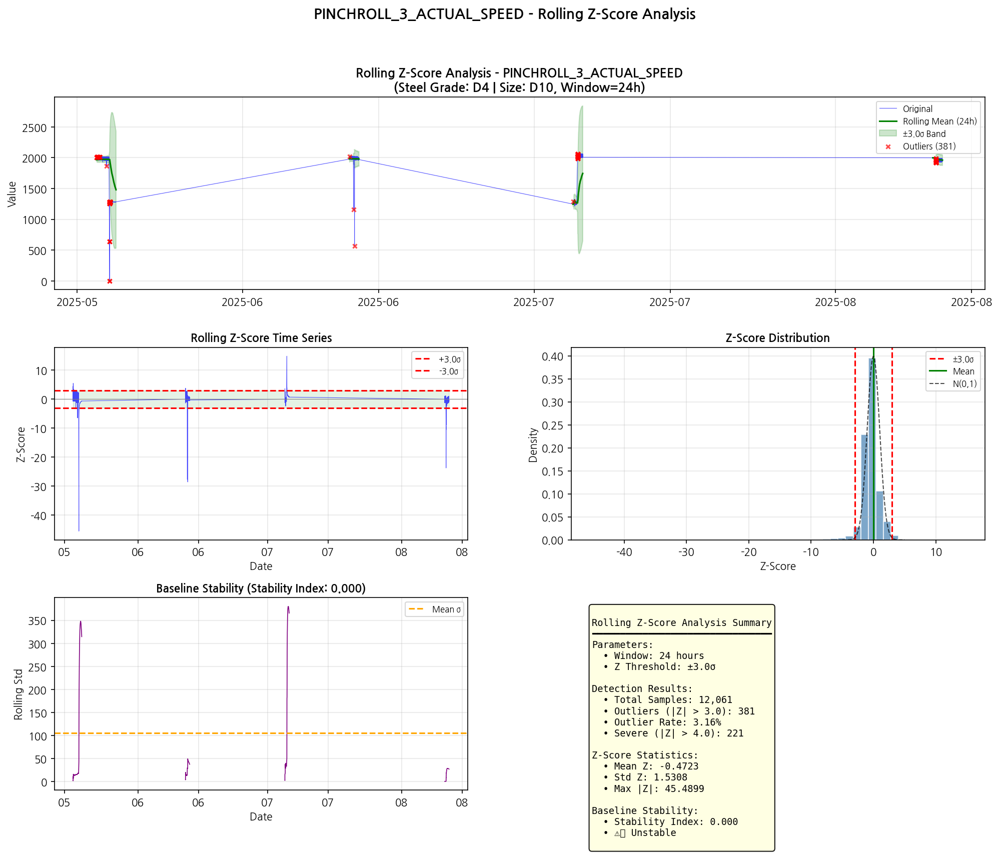

**PINCHROLL_3_ACTUAL_TORQUE** (이상치율: 1.13%, 안정성: 0.675)

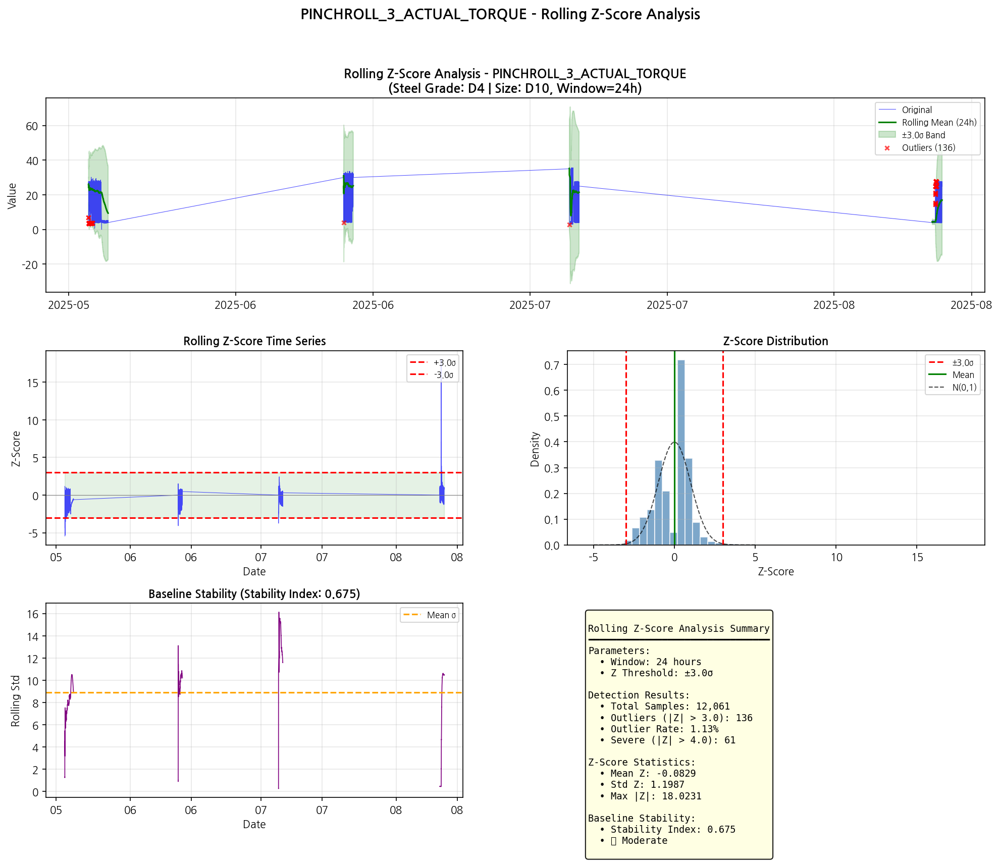

### PR 상세 토크 (09_PR_Detailed)

- 분석 태그: 6개
- 평균 이상치율: 2.83%
- 평균 안정성: 0.282

| 태그 | 이상치율 | 심각 이상치 | 안정성 | Max \|Z\| |
|------|----------|-------------|--------|--------|
| PR6L1_ACT_TORQUE | 4.59% | 325 | 0.098 | 26.78 |
| PR6L2_ACT_TORQUE | 3.35% | 249 | 0.196 | 26.78 |
| PR7L1_ACT_TORQUE | 3.52% | 212 | 0.000 | 26.78 |
| PR7L2_ACT_TORQUE | 2.97% | 198 | 0.000 | 26.78 |
| PR8L1_ACT_TORQUE | 1.14% | 76 | 0.789 | 26.78 |
| PR9L1_ACT_TORQUE | 1.40% | 90 | 0.611 | 26.78 |

#### Z-Score 차트

**PR6L1_ACT_TORQUE** (이상치율: 4.59%, 안정성: 0.098)

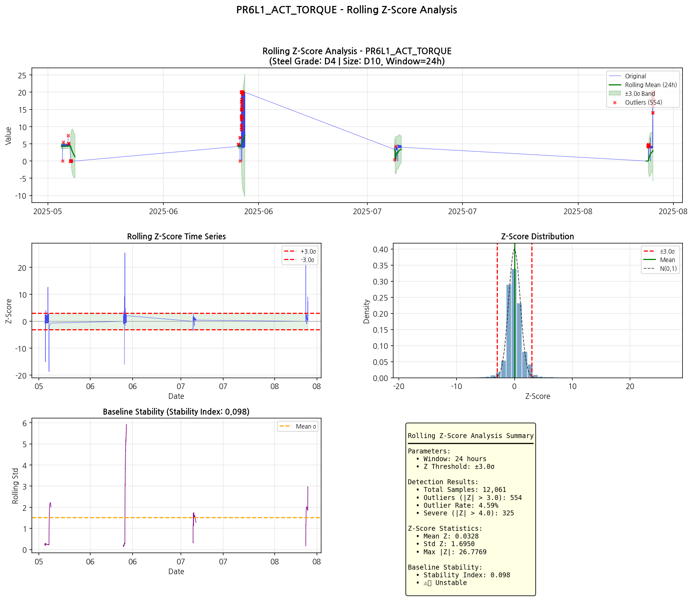

**PR7L1_ACT_TORQUE** (이상치율: 3.52%, 안정성: 0.000)

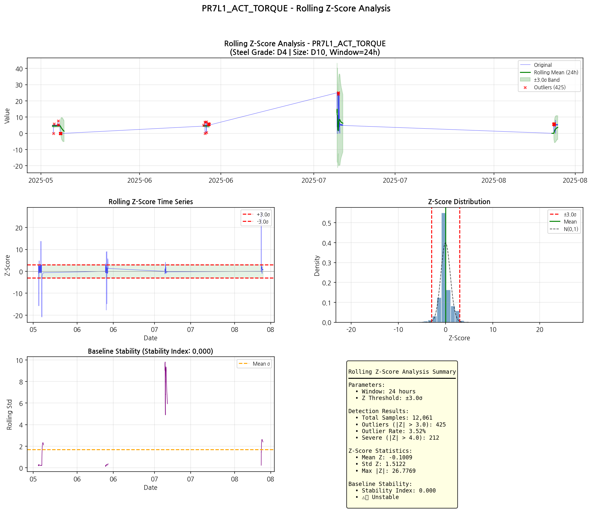

**PR6L2_ACT_TORQUE** (이상치율: 3.35%, 안정성: 0.196)

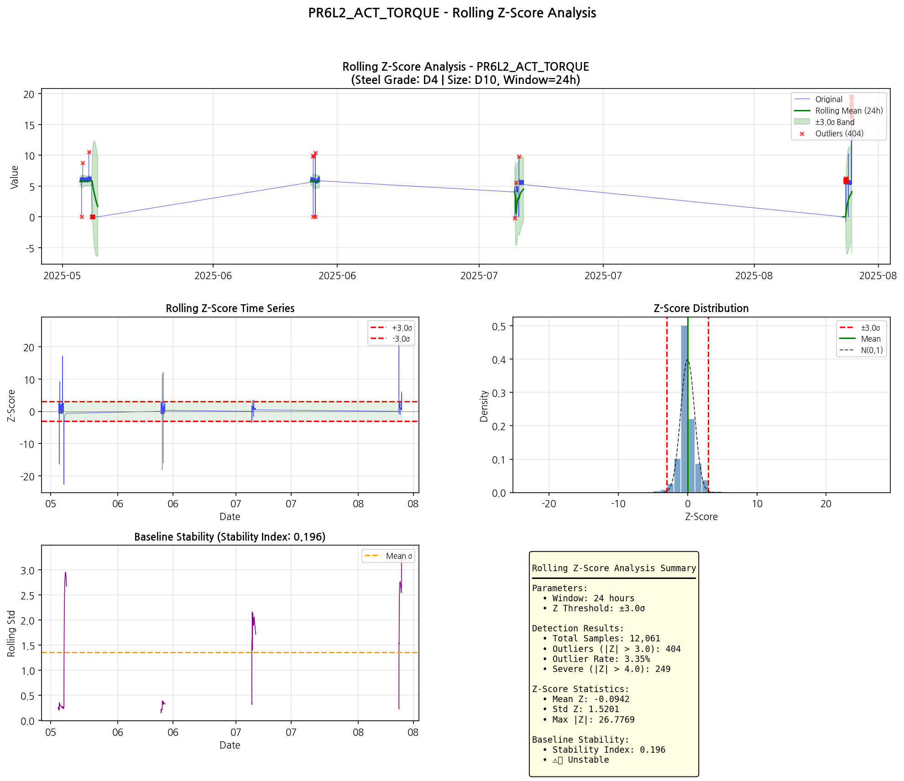

---

## 해석 가이드

### Rolling Z-Score 해석

1. **이상치율 (Outlier Rate)**
   - |Z| > 3.0σ 비율
   - 높을수록 해당 시점 주변 패턴에서 벗어난 데이터 많음
   - 정상 분포 가정 시 약 0.3% 예상

2. **기준선 안정성 (Baseline Stability)**
   - Rolling std의 시간적 일관성
   - 1에 가까울수록 안정적
   - 0.5 미만: 비정상 시계열, 다른 방법 권장

3. **심각 이상치 (Severe Outliers)**
   - |Z| > 4.0σ
   - 극단적인 이상값
   - 즉각적인 점검 필요

### 상태 분류

| 상태 | 기준 | 해석 |
|------|------|------|
| 🔴 높음 | ≥10% | 빈번한 이상치, 점검 필요 |
| 🟠 중간 | 3~10% | 일부 이상치, 모니터링 |
| 🟢 낮음 | <3% | 정상 범위 |
| 🟡 불안정 | Stability < 0.5 | 기준선 변동 심함 |

### Standard IQR vs Rolling Z-Score

| 방법 | 장점 | 단점 |
|------|------|------|
| Standard IQR | 간단, 전체 분포 기반 | 시변 데이터에 부적합 |
| Rolling Z-Score | 시변 데이터 적합 | 윈도우 크기 설정 필요 |

**권장**: 기준선 안정성 ≥ 0.5인 태그에 효과적

---

## 메타데이터

| 항목 | 값 |
|------|-----|
| 분석 스크립트 | steel_grade_rolling_zscore_analysis.py |
| 분석 기간 | 2025-03-01 ~ 2025-08-31 |
| 강종 | D4 |
| 윈도우 크기 | 24시간 |
| Z 임계값 | ±3.0σ |
| 생성일시 | 2026-02-09 15:16:12 |
| 총 분석 태그 | 79개 |

---

*본 보고서는 자동 생성되었습니다.*
