# 강종 [D4 | Size: D13] Rolling Z-Score 동적 이상치 분석 보고서

**분석 기간**: 2025-03-01 ~ 2025-08-31
**강종**: D4  
**사이즈**: D13
**생성일시**: 2026-02-09 15:16:47

---

## 분석 개요

### 분석 방법론

**Rolling Z-Score (롤링 Z-점수)**

시간 창(window) 기반 동적 이상치 탐지 방법입니다.

$$Z_{rolling}(t) = \frac{x(t) - \mu_{window}(t)}{\sigma_{window}(t)}$$

| 파라미터 | 값 | 설명 |
|----------|-----|------|
| Window | 24h | 이동 평균/표준편차 윈도우 |
| Z Threshold | ±3.0σ | 이상치 판정 임계값 |
| Severe | ±4.0σ | 심각 이상치 임계값 |

### 장점

- **비정상 시계열 적합**: 평균/분산 시변하는 데이터에 효과적
- **점진적 기준선 추적**: 장기 드리프트에 강건
- **Local Context 기반**: 해당 시점 주변 패턴 기준

### 분석 결과 요약

| 구분 | 태그 수 | 비율 |
|------|---------|------|
| **총 분석 태그** | 79개 | 100% |
| 🔴 높은 이상치율 (≥10%) | 0개 | 0.0% |
| 🟠 중간 이상치율 (3~10%) | 9개 | 11.4% |
| 🟢 낮은 이상치율 (<3%) | 61개 | 77.2% |
| 🟡 불안정 기준선 | 9개 | 11.4% |

#### 전체 평균

| 지표 | 값 |
|------|-----|
| 평균 이상치율 | 1.86% |
| 평균 기준선 안정성 | 0.673 |

---

## 상위 문제 태그 (이상치율 기준)

| 순위 | 태그 | 카테고리 | 이상치율 | 심각 이상치 | 안정성 | 상태 |
|------|------|----------|----------|-------------|--------|------|
| 1 | FURNACE_EXIT_DISCHARGE_BILLET_TEMPERATURE | 가열로 추출 온도 | 5.47% | 89 | 0.609 | 🟠 |
| 2 | COMBUSTION_AIR_TEMPERATURE | 가열로 보조설비 | 5.17% | 149 | 0.468 | 🟠 |
| 3 | MAIN_GAS_TEMPERATURE | 가열로 보조설비 | 5.10% | 52 | 0.310 | 🟠 |
| 4 | HEATING_TOP_ZONE_NO_1_TEMPERATURE_ROOF | 가열로 상부 온도 | 3.85% | 1 | 0.362 | 🟠 |
| 5 | SOAKING_TOP_ZONE_NO_2_TEMPERATURE_ROOF | 가열로 상부 온도 | 3.82% | 60 | 0.197 | 🟠 |
| 6 | HEATING_TOP_ZONE_NO_2_TEMPERATURE_ROOF | 가열로 상부 온도 | 3.80% | 10 | 0.364 | 🟠 |
| 7 | SOAKING_TOP_ZONE_NO_1_TEMPERATURE_ROOF | 가열로 상부 온도 | 3.80% | 65 | 0.193 | 🟠 |
| 8 | MAIN_GAS_FLOW | 가열로 보조설비 | 3.14% | 88 | 0.629 | 🟠 |
| 9 | PR6L2_ACT_TORQUE | PR 상세 토크 | 3.09% | 71 | 0.000 | 🟠 |
| 10 | FURNACE_O2_ANALYZER | 가열로 보조설비 | 2.53% | 70 | 0.479 | 🟡 |
| 11 | STAND_3_ACTUAL_SPEED | 스탠드 속도 | 2.51% | 27 | 0.769 | 🟢 |
| 12 | STAND_6_ACTUAL_SPEED | 스탠드 속도 | 2.51% | 27 | 0.766 | 🟢 |
| 13 | STAND_4_ACTUAL_SPEED | 스탠드 속도 | 2.49% | 27 | 0.766 | 🟢 |
| 14 | STAND_8_ACTUAL_SPEED | 스탠드 속도 | 2.49% | 27 | 0.730 | 🟢 |
| 15 | STAND_2_ACTUAL_SPEED | 스탠드 속도 | 2.47% | 27 | 0.732 | 🟢 |

---

## 불안정 기준선 태그

기준선 안정성(Stability Index)이 0.5 미만인 태그입니다.
이 태그들은 Rolling Z-Score 방법보다 다른 방법이 더 적합할 수 있습니다.

| 태그 | 카테고리 | 안정성 | 이상치율 |
|------|----------|--------|----------|
| MAIN_COMBUSTION_AIR_PRESSURE | 가열로 보조설비 | 0.000 | 1.60% |
| PR6L2_ACT_TORQUE | PR 상세 토크 | 0.000 | 3.09% |
| INDIRECT_WATER_MAIN_TEMPERATURE | 가열로 보조설비 | 0.057 | 0.33% |
| PINCHROLL_4_ACTUAL_SPEED | 핀치롤 | 0.156 | 2.32% |
| SOAKING_TOP_ZONE_NO_1_TEMPERATURE_ROOF | 가열로 상부 온도 | 0.193 | 3.80% |
| SOAKING_TOP_ZONE_NO_2_TEMPERATURE_ROOF | 가열로 상부 온도 | 0.197 | 3.82% |
| SOAKING_BOTTOM_ZONE_NO_2_TEMPERATURE_MILL_SIDE | 가열로 하부 온도 | 0.235 | 1.65% |
| SOAKING_BOTTOM_ZONE_NO_1_TEMPERATURE_OPP_SIDE | 가열로 하부 온도 | 0.247 | 0.76% |
| MAIN_GAS_TEMPERATURE | 가열로 보조설비 | 0.310 | 5.10% |
| PINCHROLL_3_ACTUAL_SPEED | 핀치롤 | 0.341 | 1.10% |

---

## 카테고리별 분석 결과

### 가열로 상부 온도 (01_Furnace_Top_Temperature)

- 분석 태그: 4개
- 평균 이상치율: 3.82%
- 평균 안정성: 0.279

| 태그 | 이상치율 | 심각 이상치 | 안정성 | Max \|Z\| |
|------|----------|-------------|--------|--------|
| HEATING_TOP_ZONE_NO_1_TEMPERATURE_ROOF | 3.85% | 1 | 0.362 | 4.10 |
| HEATING_TOP_ZONE_NO_2_TEMPERATURE_ROOF | 3.80% | 10 | 0.364 | 4.18 |
| SOAKING_TOP_ZONE_NO_1_TEMPERATURE_ROOF | 3.80% | 65 | 0.193 | 4.73 |
| SOAKING_TOP_ZONE_NO_2_TEMPERATURE_ROOF | 3.82% | 60 | 0.197 | 4.54 |

#### Z-Score 차트

**HEATING_TOP_ZONE_NO_1_TEMPERATURE_ROOF** (이상치율: 3.85%, 안정성: 0.362)

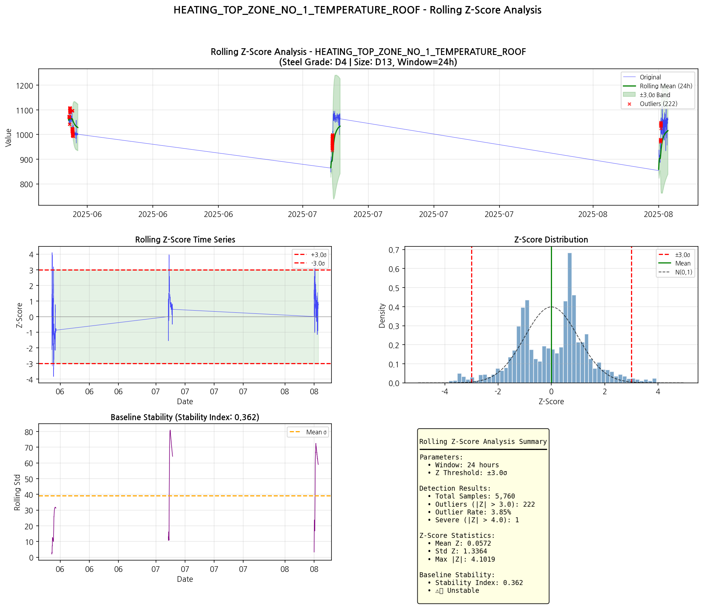

**SOAKING_TOP_ZONE_NO_2_TEMPERATURE_ROOF** (이상치율: 3.82%, 안정성: 0.197)

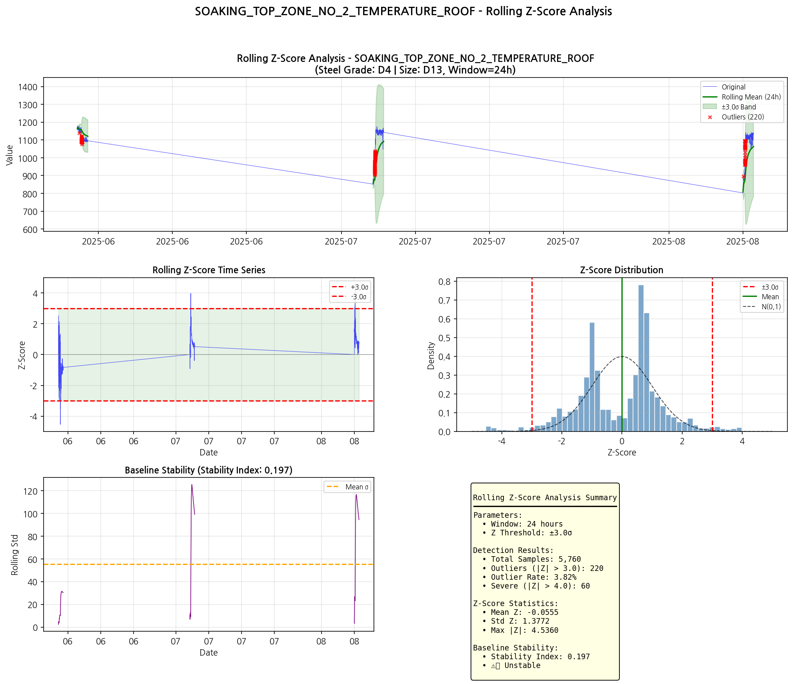

**HEATING_TOP_ZONE_NO_2_TEMPERATURE_ROOF** (이상치율: 3.80%, 안정성: 0.364)

### 가열로 하부 온도 (02_Furnace_Bottom_Temperature)

- 분석 태그: 4개
- 평균 이상치율: 0.97%
- 평균 안정성: 0.445

| 태그 | 이상치율 | 심각 이상치 | 안정성 | Max \|Z\| |
|------|----------|-------------|--------|--------|
| HEATING_BOTTOM_ZONE_NO_1_TEMPERATURE_OPP_SIDE | 0.75% | 0 | 0.677 | 3.51 |
| HEATING_BOTTOM_ZONE_NO_2_TEMPERATURE_MILL_SIDE | 0.73% | 0 | 0.622 | 3.42 |
| SOAKING_BOTTOM_ZONE_NO_1_TEMPERATURE_OPP_SIDE | 0.76% | 7 | 0.247 | 4.56 |
| SOAKING_BOTTOM_ZONE_NO_2_TEMPERATURE_MILL_SIDE | 1.65% | 6 | 0.235 | 4.46 |

#### Z-Score 차트

**SOAKING_BOTTOM_ZONE_NO_2_TEMPERATURE_MILL_SIDE** (이상치율: 1.65%, 안정성: 0.235)

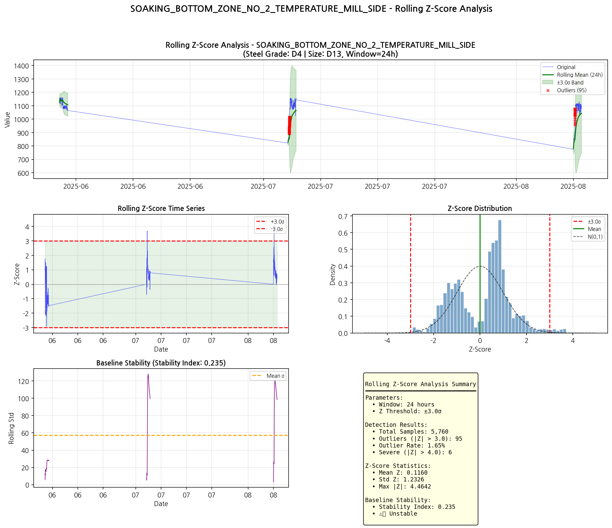

**SOAKING_BOTTOM_ZONE_NO_1_TEMPERATURE_OPP_SIDE** (이상치율: 0.76%, 안정성: 0.247)

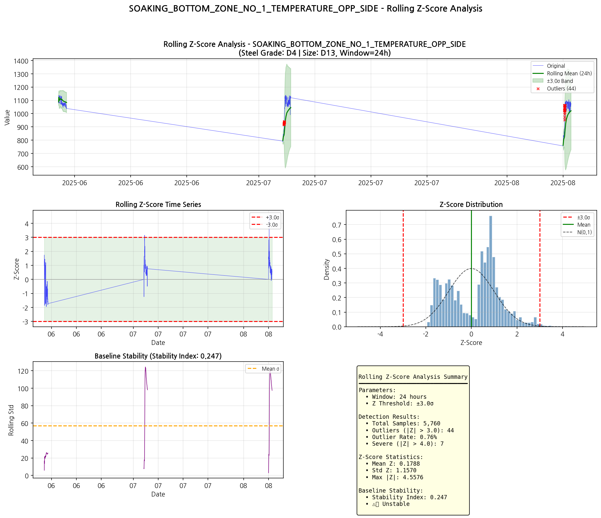

**HEATING_BOTTOM_ZONE_NO_1_TEMPERATURE_OPP_SIDE** (이상치율: 0.75%, 안정성: 0.677)

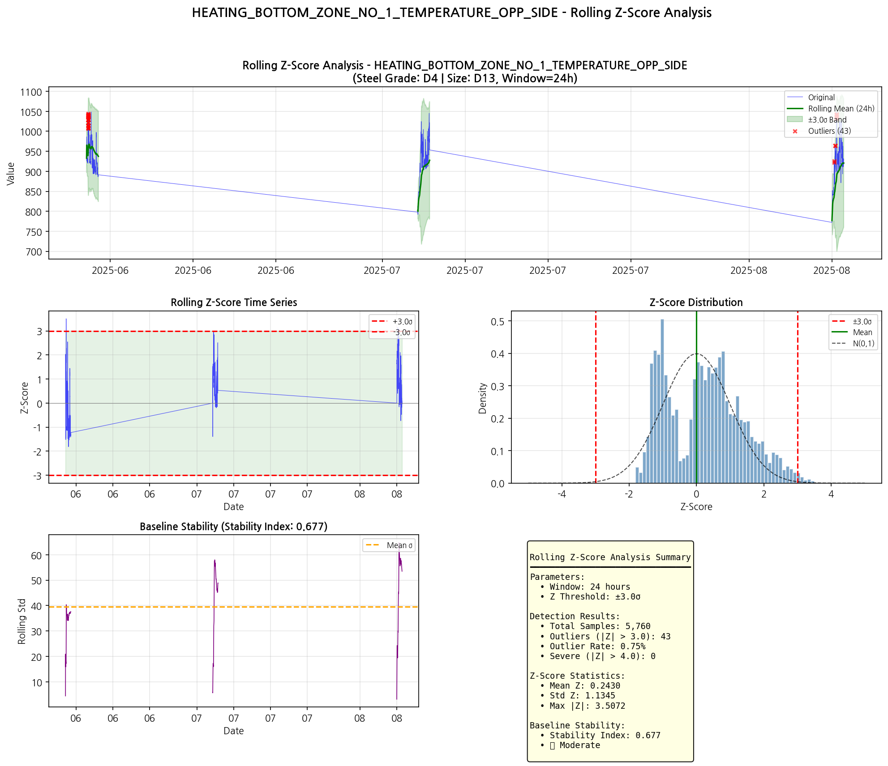

### 가열로 추출 온도 (03_Furnace_Discharge_Temperature)

- 분석 태그: 1개
- 평균 이상치율: 5.47%
- 평균 안정성: 0.609

| 태그 | 이상치율 | 심각 이상치 | 안정성 | Max \|Z\| |
|------|----------|-------------|--------|--------|
| FURNACE_EXIT_DISCHARGE_BILLET_TEMPERATURE | 5.47% | 89 | 0.609 | 19.01 |

#### Z-Score 차트

**FURNACE_EXIT_DISCHARGE_BILLET_TEMPERATURE** (이상치율: 5.47%, 안정성: 0.609)

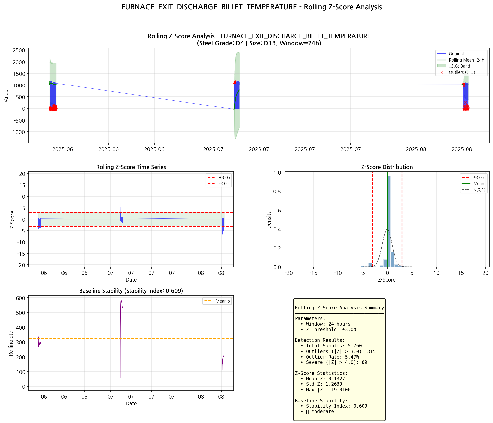

### 가열로 보조설비 (04_Furnace_Auxiliary)

- 분석 태그: 9개
- 평균 이상치율: 2.52%
- 평균 안정성: 0.462

| 태그 | 이상치율 | 심각 이상치 | 안정성 | Max \|Z\| |
|------|----------|-------------|--------|--------|
| FURNACE_PRESSURE | 2.22% | 29 | 0.640 | 11.40 |
| FURNACE_O2_ANALYZER | 2.53% | 70 | 0.479 | 18.16 |
| MAIN_GAS_PRESSURE | 2.10% | 34 | 0.758 | 6.22 |
| MAIN_GAS_FLOW | 3.14% | 88 | 0.629 | 8.79 |
| MAIN_GAS_TEMPERATURE | 5.10% | 52 | 0.310 | 4.15 |
| MAIN_COMBUSTION_AIR_PRESSURE | 1.60% | 48 | 0.000 | 18.38 |
| COMBUSTION_AIR_TEMPERATURE | 5.17% | 149 | 0.468 | 7.86 |
| INDIRECT_COOLING_WATER_FLOW | 0.49% | 1 | 0.816 | 4.05 |
| INDIRECT_WATER_MAIN_TEMPERATURE | 0.33% | 0 | 0.057 | 3.39 |

#### Z-Score 차트

**COMBUSTION_AIR_TEMPERATURE** (이상치율: 5.17%, 안정성: 0.468)

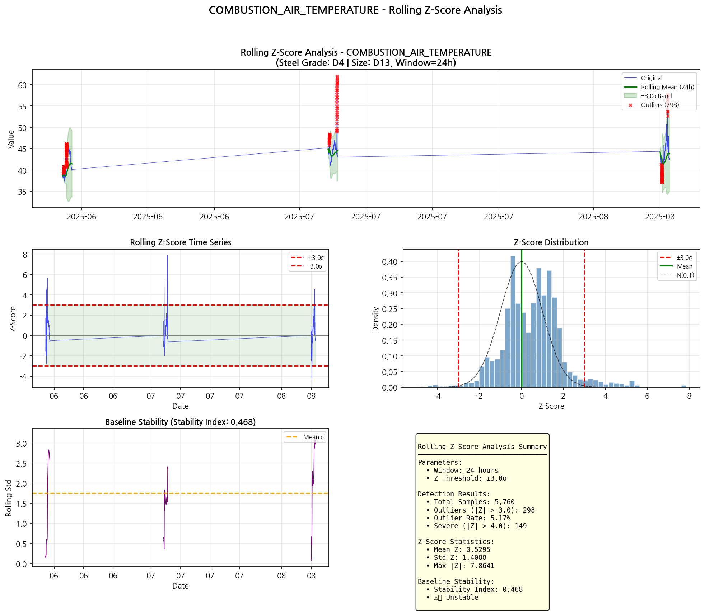

**MAIN_GAS_TEMPERATURE** (이상치율: 5.10%, 안정성: 0.310)

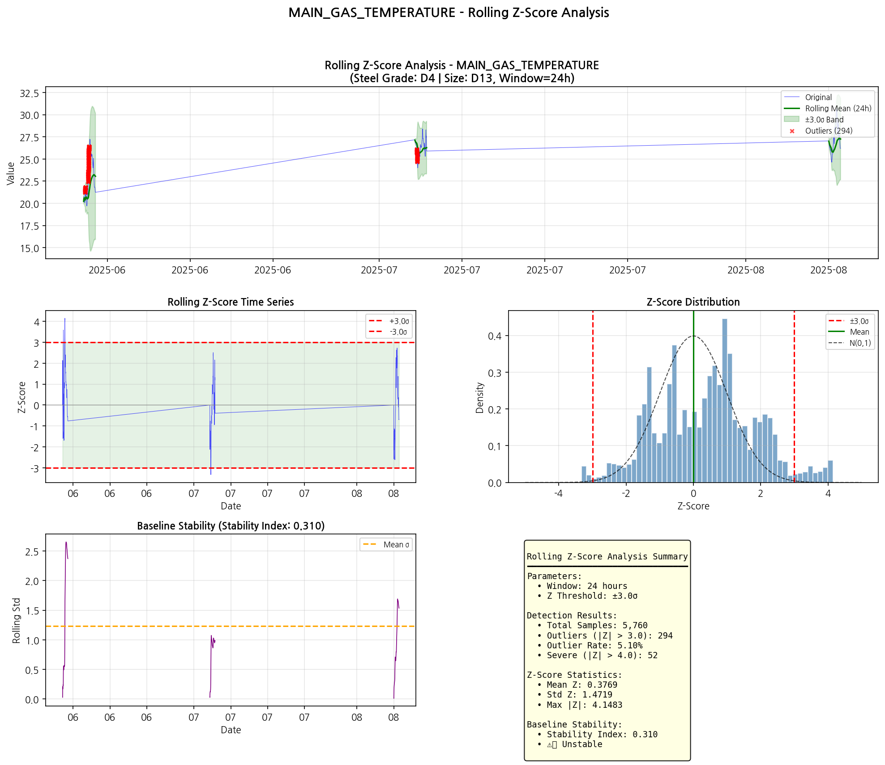

**MAIN_GAS_FLOW** (이상치율: 3.14%, 안정성: 0.629)

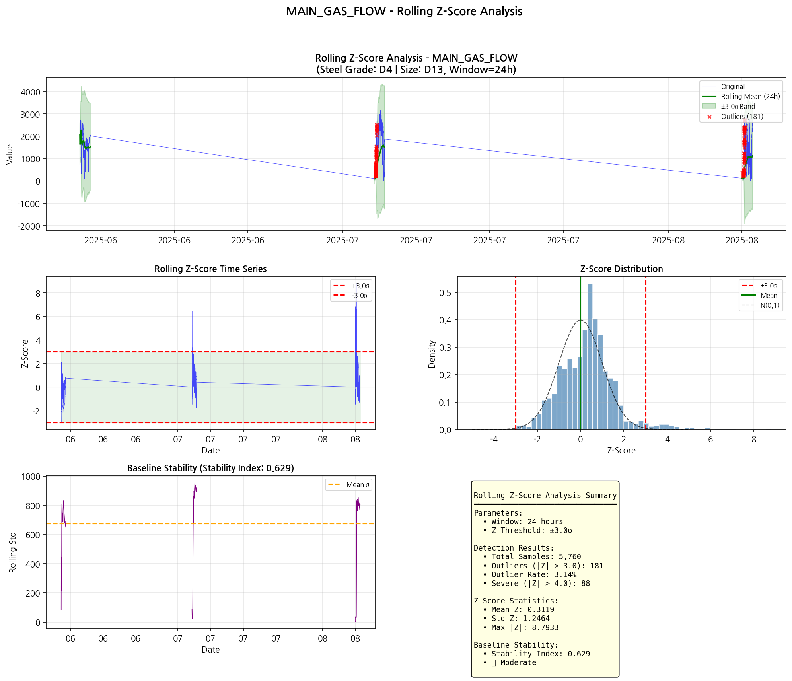

### 스탠드 토크 (05_Stand_Torque)

- 분석 태그: 16개
- 평균 이상치율: 2.07%
- 평균 안정성: 0.721

| 태그 | 이상치율 | 심각 이상치 | 안정성 | Max \|Z\| |
|------|----------|-------------|--------|--------|
| STAND_1_ACTUAL_TORQUE | 2.02% | 65 | 0.714 | 18.28 |
| STAND_2_ACTUAL_TORQUE | 2.08% | 66 | 0.719 | 18.05 |
| STAND_3_ACTUAL_TORQUE | 1.95% | 63 | 0.709 | 18.47 |
| STAND_4_ACTUAL_TORQUE | 2.08% | 65 | 0.702 | 18.27 |
| STAND_5_ACTUAL_TORQUE | 2.02% | 65 | 0.718 | 18.33 |
| STAND_6_ACTUAL_TORQUE | 2.40% | 67 | 0.723 | 17.58 |
| STAND_7_ACTUAL_TORQUE | 2.11% | 65 | 0.709 | 17.39 |
| STAND_8_ACTUAL_TORQUE | 2.28% | 71 | 0.721 | 17.18 |
| STAND_9_ACTUAL_TORQUE | 1.99% | 67 | 0.717 | 18.20 |
| STAND_10_ACTUAL_TORQUE | 2.08% | 67 | 0.726 | 17.18 |
| STAND_11_ACTUAL_TORQUE | 2.01% | 67 | 0.731 | 17.42 |
| STAND_12_ACTUAL_TORQUE | 1.92% | 63 | 0.730 | 17.18 |
| STAND_13_ACTUAL_TORQUE | 2.08% | 67 | 0.705 | 17.18 |
| STAND_14_ACTUAL_TORQUE | 1.88% | 63 | 0.735 | 17.18 |
| FINISHING_BLOCK_MASTER_ACTUAL_TORQUE | 2.08% | 62 | 0.735 | 16.91 |
| FINISHING_BLOCK_SLAVE_ACTUAL_TORQUE | 2.08% | 62 | 0.735 | 16.91 |

#### Z-Score 차트

**STAND_6_ACTUAL_TORQUE** (이상치율: 2.40%, 안정성: 0.723)

**STAND_8_ACTUAL_TORQUE** (이상치율: 2.28%, 안정성: 0.721)

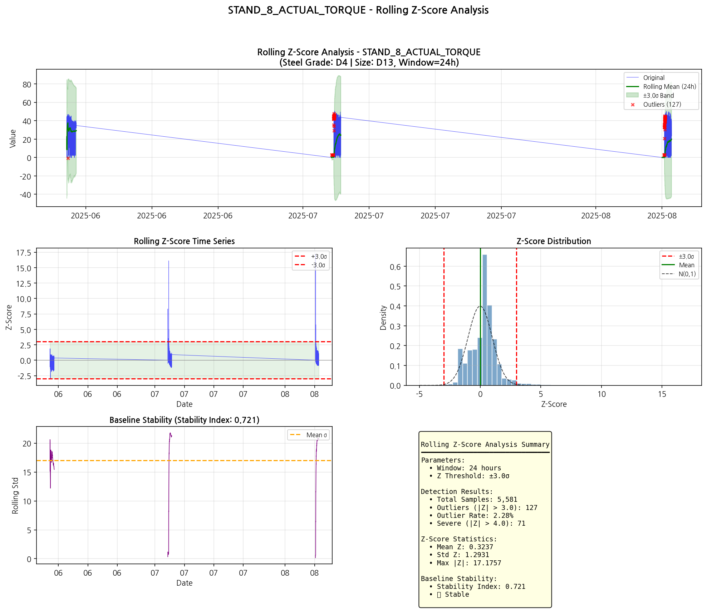

**STAND_7_ACTUAL_TORQUE** (이상치율: 2.11%, 안정성: 0.709)

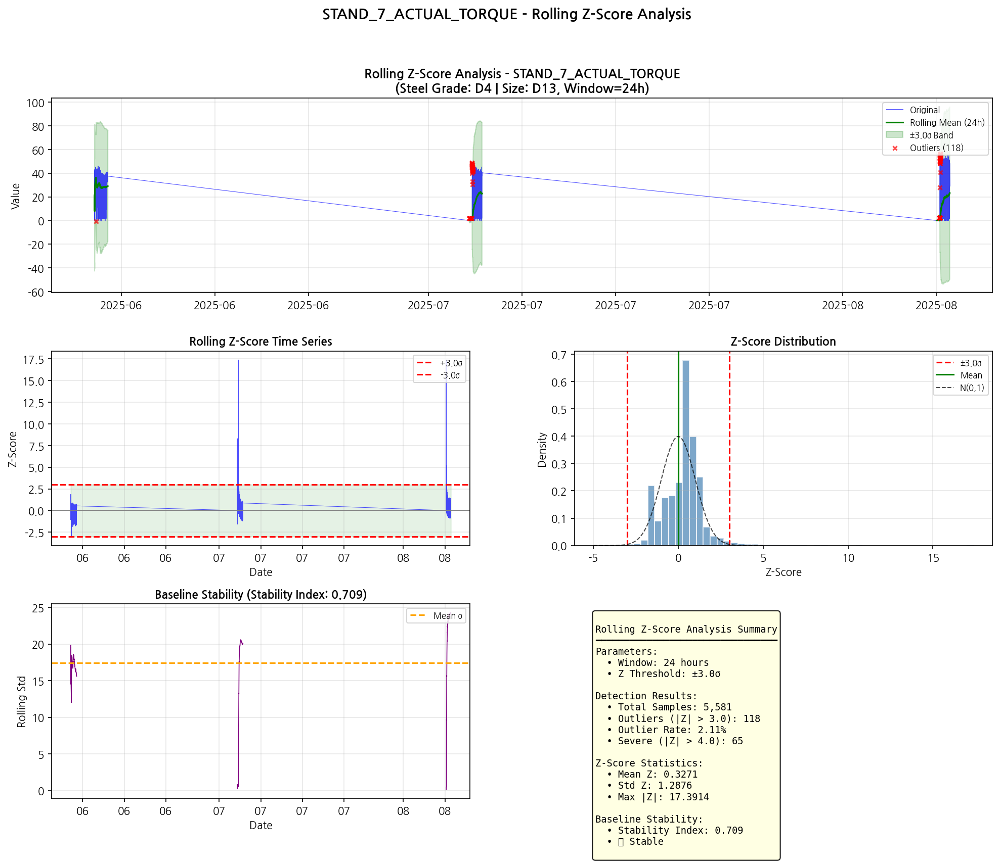

### 스탠드 속도 (06_Stand_Speed)

- 분석 태그: 15개
- 평균 이상치율: 2.33%
- 평균 안정성: 0.763

| 태그 | 이상치율 | 심각 이상치 | 안정성 | Max \|Z\| |
|------|----------|-------------|--------|--------|
| STAND_1_ACTUAL_SPEED | 2.45% | 27 | 0.742 | 17.18 |
| STAND_2_ACTUAL_SPEED | 2.47% | 27 | 0.732 | 17.18 |
| STAND_3_ACTUAL_SPEED | 2.51% | 27 | 0.769 | 17.18 |
| STAND_4_ACTUAL_SPEED | 2.49% | 27 | 0.766 | 17.18 |
| STAND_5_ACTUAL_SPEED | 2.47% | 27 | 0.767 | 17.18 |
| STAND_6_ACTUAL_SPEED | 2.51% | 27 | 0.766 | 17.18 |
| STAND_7_ACTUAL_SPEED | 2.47% | 27 | 0.780 | 17.18 |
| STAND_8_ACTUAL_SPEED | 2.49% | 27 | 0.730 | 17.18 |
| STAND_9_ACTUAL_SPEED | 2.22% | 26 | 0.756 | 17.18 |
| STAND_10_ACTUAL_SPEED | 2.15% | 26 | 0.769 | 17.18 |
| STAND_11_ACTUAL_SPEED | 2.13% | 26 | 0.757 | 17.18 |
| STAND_12_ACTUAL_SPEED | 2.22% | 35 | 0.768 | 17.18 |
| STAND_13_ACTUAL_SPEED | 2.15% | 27 | 0.813 | 17.18 |
| STAND_14_ACTUAL_SPEED | 2.02% | 27 | 0.762 | 17.18 |
| FINISHING_BLOCK_ACTUAL_SPEED | 2.13% | 27 | 0.766 | 16.91 |

#### Z-Score 차트

**STAND_3_ACTUAL_SPEED** (이상치율: 2.51%, 안정성: 0.769)

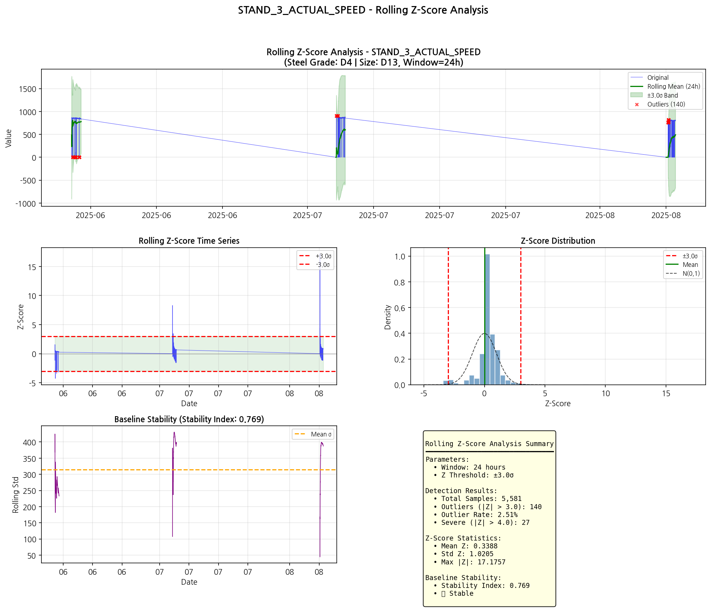

**STAND_6_ACTUAL_SPEED** (이상치율: 2.51%, 안정성: 0.766)

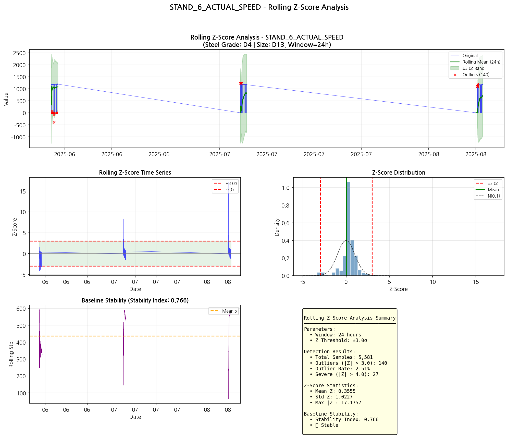

**STAND_4_ACTUAL_SPEED** (이상치율: 2.49%, 안정성: 0.766)

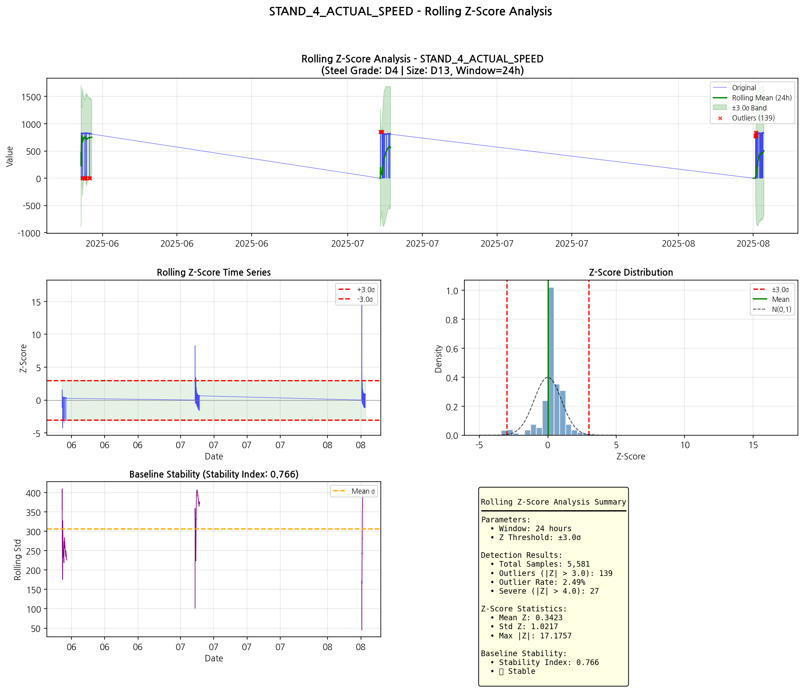

### 스탠드 부하 (07_Stand_Load)

- 분석 태그: 15개
- 평균 이상치율: 1.37%
- 평균 안정성: 0.831

| 태그 | 이상치율 | 심각 이상치 | 안정성 | Max \|Z\| |
|------|----------|-------------|--------|--------|
| STAND_1_LOAD | 1.34% | 37 | 0.831 | 17.18 |
| STAND_2_LOAD | 1.34% | 36 | 0.831 | 17.20 |
| STAND_3_LOAD | 1.34% | 34 | 0.831 | 17.20 |
| STAND_4_LOAD | 1.36% | 36 | 0.831 | 17.20 |
| STAND_5_LOAD | 1.38% | 36 | 0.831 | 17.20 |
| STAND_6_LOAD | 1.38% | 35 | 0.831 | 17.20 |
| STAND_7_LOAD | 1.38% | 36 | 0.831 | 17.20 |
| STAND_8_LOAD | 1.36% | 36 | 0.831 | 17.20 |
| STAND_9_LOAD | 1.40% | 37 | 0.831 | 17.20 |
| STAND_10_LOAD | 1.38% | 37 | 0.831 | 17.20 |
| STAND_11_LOAD | 1.36% | 37 | 0.831 | 17.20 |
| STAND_12_LOAD | 1.36% | 37 | 0.831 | 17.20 |
| STAND_13_LOAD | 1.36% | 37 | 0.831 | 17.20 |
| STAND_14_LOAD | 1.36% | 37 | 0.831 | 17.20 |
| FINISHING_BLOCK_LOAD | 1.36% | 37 | 0.831 | 17.23 |

#### Z-Score 차트

**STAND_9_LOAD** (이상치율: 1.40%, 안정성: 0.831)

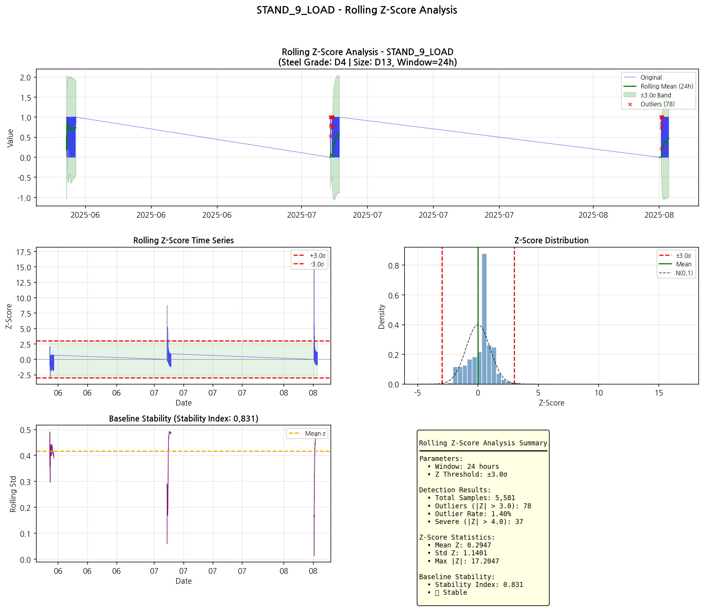

**STAND_5_LOAD** (이상치율: 1.38%, 안정성: 0.831)

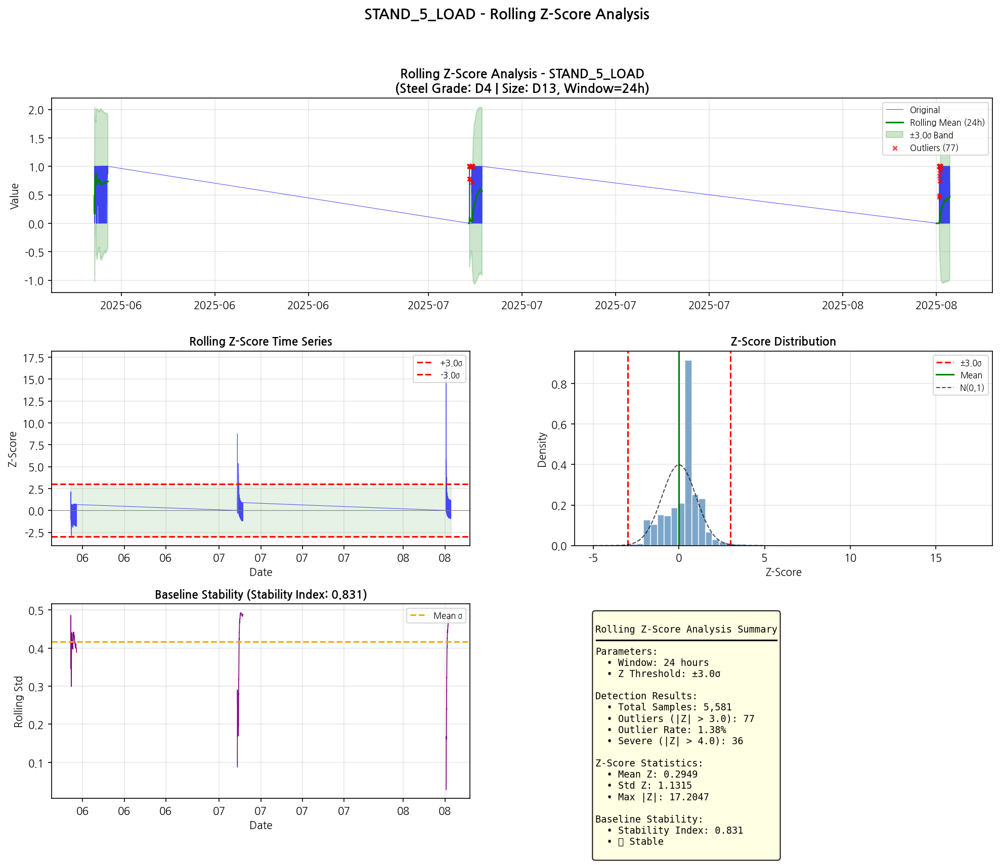

**STAND_6_LOAD** (이상치율: 1.38%, 안정성: 0.831)

### 핀치롤 (08_Pinchroll)

- 분석 태그: 9개
- 평균 이상치율: 0.75%
- 평균 안정성: 0.686

| 태그 | 이상치율 | 심각 이상치 | 안정성 | Max \|Z\| |
|------|----------|-------------|--------|--------|
| PINCHROLL_2_ACTUAL_SPEED | 0.96% | 2 | 0.483 | 8.64 |
| PINCHROLL_3_ACTUAL_SPEED | 1.10% | 2 | 0.341 | 26.23 |
| PINCHROLL_4_ACTUAL_SPEED | 2.32% | 7 | 0.156 | 24.86 |
| PINCHROLL_2_ACTUAL_TORQUE | 0.54% | 5 | 0.839 | 7.06 |
| PINCHROLL_3_ACTUAL_TORQUE | 0.51% | 5 | 0.812 | 7.07 |
| PINCHROLL_4_ACTUAL_TORQUE | 0.51% | 5 | 0.841 | 7.04 |
| PINCHROLL_2_REFERENCE_TORQUE | 0.00% | 0 | 1.000 | 0.00 |
| PINCHROLL_3_REFERENCE_TORQUE | 0.40% | 0 | 0.849 | 3.87 |
| PINCHROLL_4_REFERENCE_TORQUE | 0.40% | 0 | 0.856 | 3.84 |

#### Z-Score 차트

**PINCHROLL_4_ACTUAL_SPEED** (이상치율: 2.32%, 안정성: 0.156)

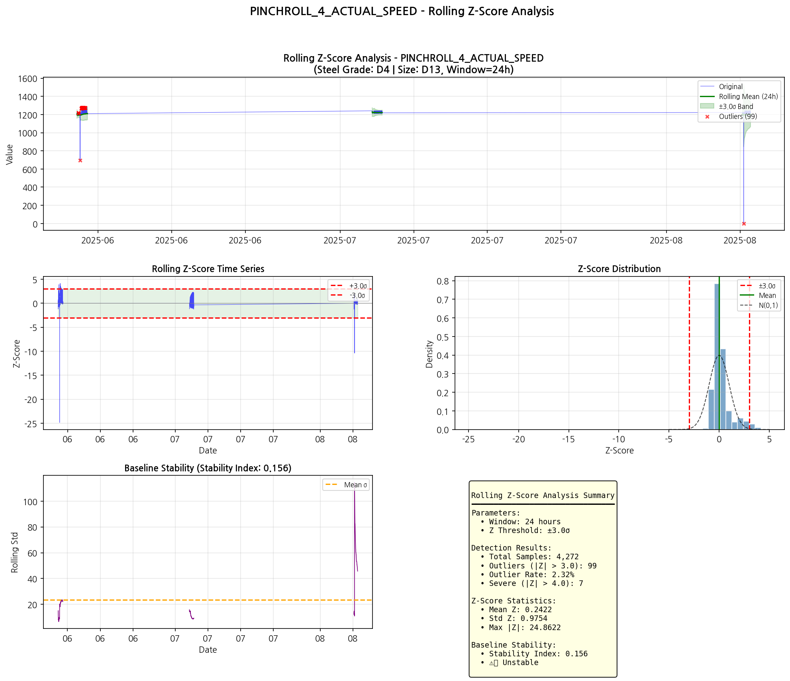

**PINCHROLL_3_ACTUAL_SPEED** (이상치율: 1.10%, 안정성: 0.341)

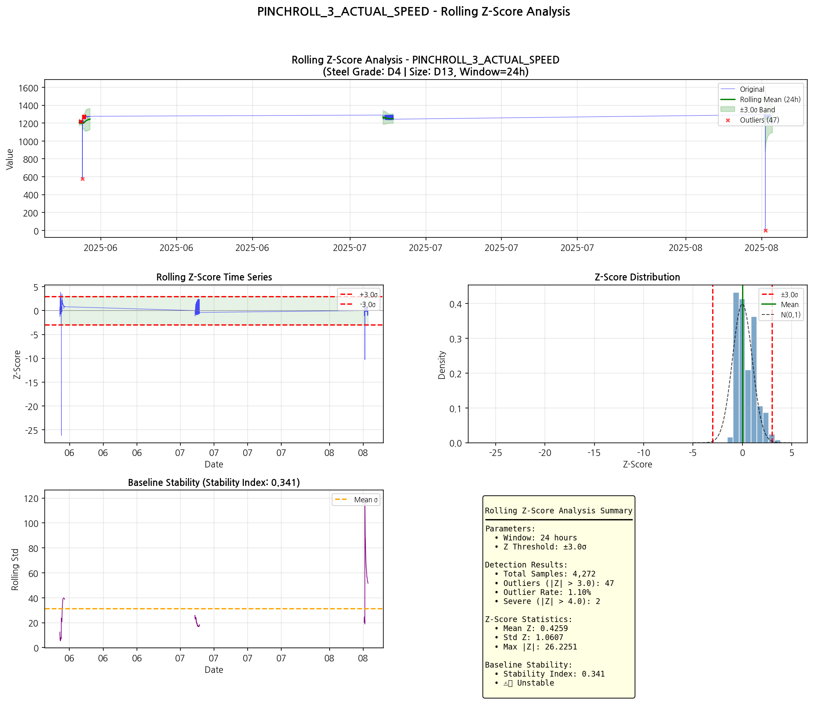

**PINCHROLL_2_ACTUAL_SPEED** (이상치율: 0.96%, 안정성: 0.483)

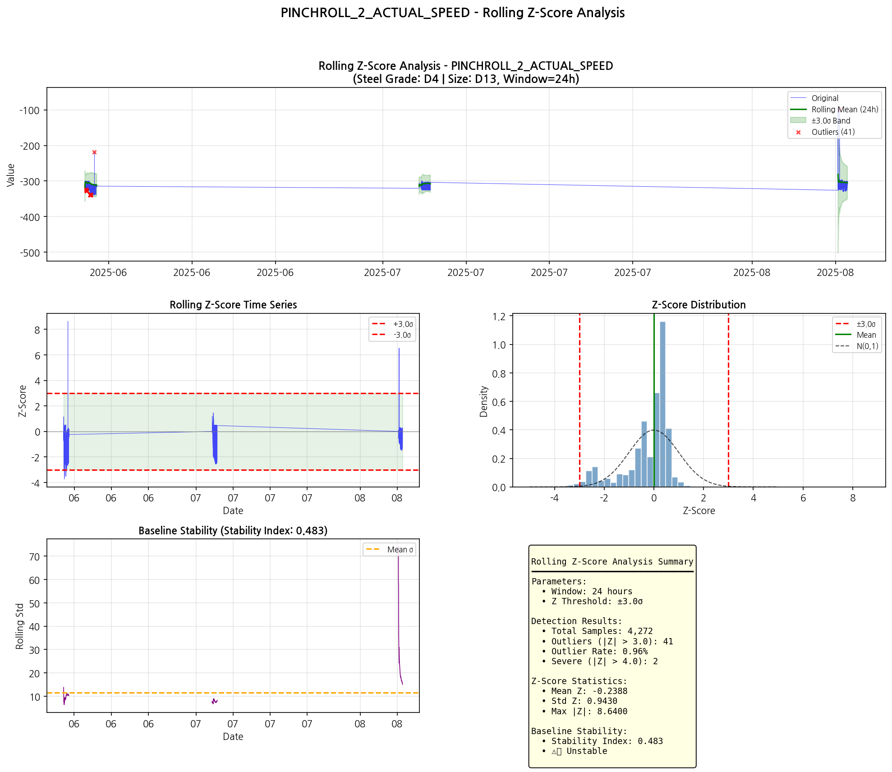

### PR 상세 토크 (09_PR_Detailed)

- 분석 태그: 6개
- 평균 이상치율: 0.75%
- 평균 안정성: 0.647

| 태그 | 이상치율 | 심각 이상치 | 안정성 | Max \|Z\| |
|------|----------|-------------|--------|--------|
| PR6L1_ACT_TORQUE | 0.51% | 12 | 0.426 | 9.83 |
| PR6L2_ACT_TORQUE | 3.09% | 71 | 0.000 | 12.57 |
| PR7L1_ACT_TORQUE | 0.23% | 6 | 0.871 | 6.96 |
| PR7L2_ACT_TORQUE | 0.28% | 6 | 0.864 | 7.21 |
| PR8L1_ACT_TORQUE | 0.21% | 5 | 0.867 | 6.98 |
| PR9L1_ACT_TORQUE | 0.19% | 5 | 0.852 | 7.05 |

#### Z-Score 차트

**PR6L2_ACT_TORQUE** (이상치율: 3.09%, 안정성: 0.000)

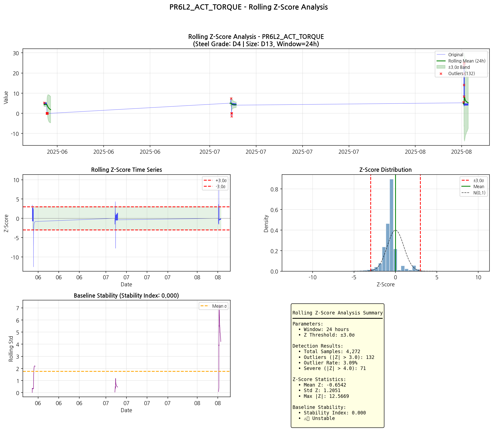

**PR6L1_ACT_TORQUE** (이상치율: 0.51%, 안정성: 0.426)

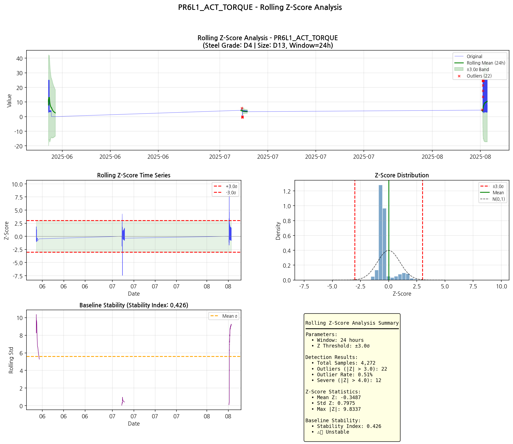

**PR7L2_ACT_TORQUE** (이상치율: 0.28%, 안정성: 0.864)

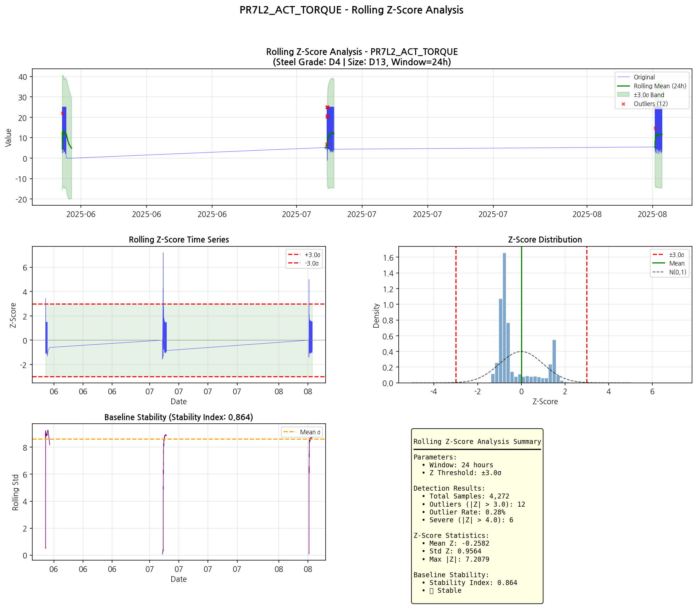

---

## 해석 가이드

### Rolling Z-Score 해석

1. **이상치율 (Outlier Rate)**
   - |Z| > 3.0σ 비율
   - 높을수록 해당 시점 주변 패턴에서 벗어난 데이터 많음
   - 정상 분포 가정 시 약 0.3% 예상

2. **기준선 안정성 (Baseline Stability)**
   - Rolling std의 시간적 일관성
   - 1에 가까울수록 안정적
   - 0.5 미만: 비정상 시계열, 다른 방법 권장

3. **심각 이상치 (Severe Outliers)**
   - |Z| > 4.0σ
   - 극단적인 이상값
   - 즉각적인 점검 필요

### 상태 분류

| 상태 | 기준 | 해석 |
|------|------|------|
| 🔴 높음 | ≥10% | 빈번한 이상치, 점검 필요 |
| 🟠 중간 | 3~10% | 일부 이상치, 모니터링 |
| 🟢 낮음 | <3% | 정상 범위 |
| 🟡 불안정 | Stability < 0.5 | 기준선 변동 심함 |

### Standard IQR vs Rolling Z-Score

| 방법 | 장점 | 단점 |
|------|------|------|
| Standard IQR | 간단, 전체 분포 기반 | 시변 데이터에 부적합 |
| Rolling Z-Score | 시변 데이터 적합 | 윈도우 크기 설정 필요 |

**권장**: 기준선 안정성 ≥ 0.5인 태그에 효과적

---

## 메타데이터

| 항목 | 값 |
|------|-----|
| 분석 스크립트 | steel_grade_rolling_zscore_analysis.py |
| 분석 기간 | 2025-03-01 ~ 2025-08-31 |
| 강종 | D4 |
| 윈도우 크기 | 24시간 |
| Z 임계값 | ±3.0σ |
| 생성일시 | 2026-02-09 15:16:47 |
| 총 분석 태그 | 79개 |

---

*본 보고서는 자동 생성되었습니다.*
