# 강종 [D4] Rolling Z-Score 동적 이상치 분석 보고서

**분석 기간**: 2025-03-01 ~ 2025-08-31
**강종**: D4
**생성일시**: 2026-02-03 20:50:04

---

## 분석 개요

### 분석 방법론

**Rolling Z-Score (롤링 Z-점수)**

시간 창(window) 기반 동적 이상치 탐지 방법입니다.

$$Z_{rolling}(t) = \frac{x(t) - \mu_{window}(t)}{\sigma_{window}(t)}$$

| 파라미터 | 값 | 설명 |
|----------|-----|------|
| Window | 24h | 이동 평균/표준편차 윈도우 |
| Z Threshold | ±3.0σ | 이상치 판정 임계값 |
| Severe | ±4.0σ | 심각 이상치 임계값 |

### 장점

- **비정상 시계열 적합**: 평균/분산 시변하는 데이터에 효과적
- **점진적 기준선 추적**: 장기 드리프트에 강건
- **Local Context 기반**: 해당 시점 주변 패턴 기준

### 분석 결과 요약

| 구분 | 태그 수 | 비율 |
|------|---------|------|
| **총 분석 태그** | 79개 | 100% |
| 🔴 높은 이상치율 (≥10%) | 0개 | 0.0% |
| 🟠 중간 이상치율 (3~10%) | 10개 | 12.7% |
| 🟢 낮은 이상치율 (<3%) | 59개 | 74.7% |
| 🟡 불안정 기준선 | 10개 | 12.7% |

#### 전체 평균

| 지표 | 값 |
|------|-----|
| 평균 이상치율 | 1.67% |
| 평균 기준선 안정성 | 0.609 |

---

## 상위 문제 태그 (이상치율 기준)

| 순위 | 태그 | 카테고리 | 이상치율 | 심각 이상치 | 안정성 | 상태 |
|------|------|----------|----------|-------------|--------|------|
| 1 | FURNACE_EXIT_DISCHARGE_BILLET_TEMPERATURE | 가열로 추출 온도 | 5.84% | 360 | 0.714 | 🟠 |
| 2 | SOAKING_TOP_ZONE_NO_2_TEMPERATURE_ROOF | 가열로 상부 온도 | 4.94% | 420 | 0.000 | 🟠 |
| 3 | SOAKING_TOP_ZONE_NO_1_TEMPERATURE_ROOF | 가열로 상부 온도 | 4.76% | 382 | 0.000 | 🟠 |
| 4 | HEATING_TOP_ZONE_NO_1_TEMPERATURE_ROOF | 가열로 상부 온도 | 4.20% | 271 | 0.295 | 🟠 |
| 5 | HEATING_TOP_ZONE_NO_2_TEMPERATURE_ROOF | 가열로 상부 온도 | 4.19% | 290 | 0.295 | 🟠 |
| 6 | PR6L1_ACT_TORQUE | PR 상세 토크 | 4.07% | 382 | 0.000 | 🟠 |
| 7 | PR6L2_ACT_TORQUE | PR 상세 토크 | 3.84% | 368 | 0.080 | 🟠 |
| 8 | PINCHROLL_4_ACTUAL_SPEED | 핀치롤 | 3.65% | 294 | 0.000 | 🟠 |
| 9 | MAIN_GAS_TEMPERATURE | 가열로 보조설비 | 3.34% | 55 | 0.343 | 🟠 |
| 10 | PINCHROLL_3_ACTUAL_SPEED | 핀치롤 | 3.23% | 260 | 0.000 | 🟠 |
| 11 | SOAKING_BOTTOM_ZONE_NO_2_TEMPERATURE_MILL_SIDE | 가열로 하부 온도 | 2.84% | 97 | 0.057 | 🟡 |
| 12 | SOAKING_BOTTOM_ZONE_NO_1_TEMPERATURE_OPP_SIDE | 가열로 하부 온도 | 2.68% | 84 | 0.075 | 🟡 |
| 13 | PR7L1_ACT_TORQUE | PR 상세 토크 | 2.61% | 216 | 0.021 | 🟡 |
| 14 | COMBUSTION_AIR_TEMPERATURE | 가열로 보조설비 | 2.57% | 248 | 0.478 | 🟡 |
| 15 | PR7L2_ACT_TORQUE | PR 상세 토크 | 2.22% | 204 | 0.091 | 🟡 |

---

## 불안정 기준선 태그

기준선 안정성(Stability Index)이 0.5 미만인 태그입니다.
이 태그들은 Rolling Z-Score 방법보다 다른 방법이 더 적합할 수 있습니다.

| 태그 | 카테고리 | 안정성 | 이상치율 |
|------|----------|--------|----------|
| SOAKING_TOP_ZONE_NO_1_TEMPERATURE_ROOF | 가열로 상부 온도 | 0.000 | 4.76% |
| SOAKING_TOP_ZONE_NO_2_TEMPERATURE_ROOF | 가열로 상부 온도 | 0.000 | 4.94% |
| MAIN_COMBUSTION_AIR_PRESSURE | 가열로 보조설비 | 0.000 | 1.47% |
| PINCHROLL_3_ACTUAL_SPEED | 핀치롤 | 0.000 | 3.23% |
| PINCHROLL_4_ACTUAL_SPEED | 핀치롤 | 0.000 | 3.65% |
| PR6L1_ACT_TORQUE | PR 상세 토크 | 0.000 | 4.07% |
| PR7L1_ACT_TORQUE | PR 상세 토크 | 0.021 | 2.61% |
| SOAKING_BOTTOM_ZONE_NO_2_TEMPERATURE_MILL_SIDE | 가열로 하부 온도 | 0.057 | 2.84% |
| SOAKING_BOTTOM_ZONE_NO_1_TEMPERATURE_OPP_SIDE | 가열로 하부 온도 | 0.075 | 2.68% |
| PR6L2_ACT_TORQUE | PR 상세 토크 | 0.080 | 3.84% |

---

## 카테고리별 분석 결과

### 가열로 상부 온도 (01_Furnace_Top_Temperature)

- 분석 태그: 4개
- 평균 이상치율: 4.52%
- 평균 안정성: 0.148

| 태그 | 이상치율 | 심각 이상치 | 안정성 | Max |Z| |
|------|----------|-------------|--------|--------|
| HEATING_TOP_ZONE_NO_1_TEMPERATURE_ROOF | 4.20% | 271 | 0.295 | 8.05 |
| HEATING_TOP_ZONE_NO_2_TEMPERATURE_ROOF | 4.19% | 290 | 0.295 | 7.19 |
| SOAKING_TOP_ZONE_NO_1_TEMPERATURE_ROOF | 4.76% | 382 | 0.000 | 8.42 |
| SOAKING_TOP_ZONE_NO_2_TEMPERATURE_ROOF | 4.94% | 420 | 0.000 | 8.50 |

#### Z-Score 차트

**SOAKING_TOP_ZONE_NO_2_TEMPERATURE_ROOF** (이상치율: 4.94%, 안정성: 0.000)

**SOAKING_TOP_ZONE_NO_1_TEMPERATURE_ROOF** (이상치율: 4.76%, 안정성: 0.000)

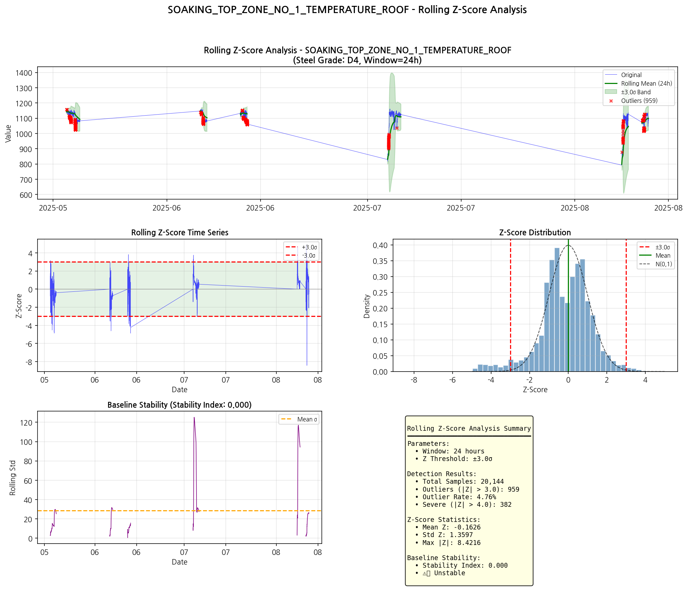

**HEATING_TOP_ZONE_NO_1_TEMPERATURE_ROOF** (이상치율: 4.20%, 안정성: 0.295)

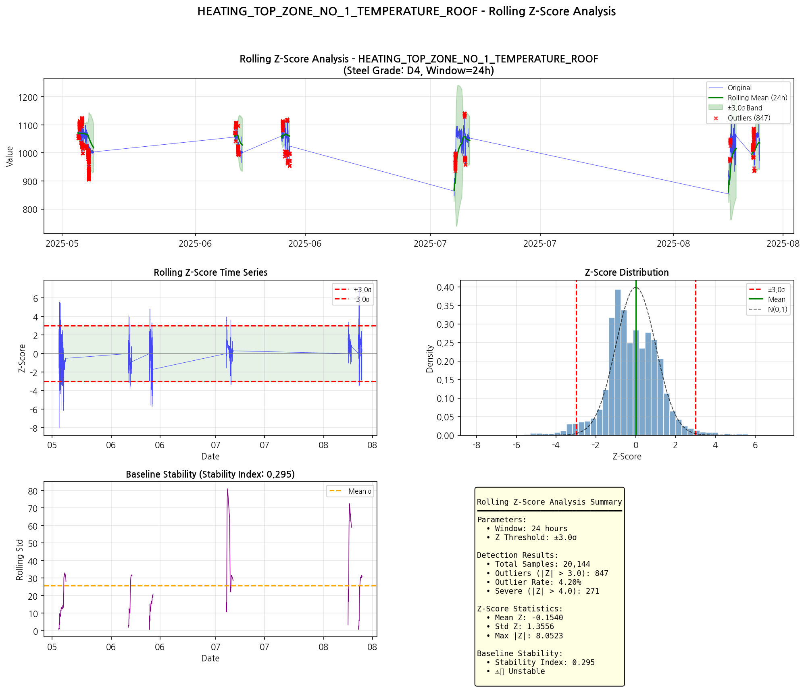

### 가열로 하부 온도 (02_Furnace_Bottom_Temperature)

- 분석 태그: 4개
- 평균 이상치율: 2.15%
- 평균 안정성: 0.384

| 태그 | 이상치율 | 심각 이상치 | 안정성 | Max |Z| |
|------|----------|-------------|--------|--------|
| HEATING_BOTTOM_ZONE_NO_1_TEMPERATURE_OPP_SIDE | 1.47% | 76 | 0.723 | 5.20 |
| HEATING_BOTTOM_ZONE_NO_2_TEMPERATURE_MILL_SIDE | 1.60% | 45 | 0.682 | 5.42 |
| SOAKING_BOTTOM_ZONE_NO_1_TEMPERATURE_OPP_SIDE | 2.68% | 84 | 0.075 | 5.79 |
| SOAKING_BOTTOM_ZONE_NO_2_TEMPERATURE_MILL_SIDE | 2.84% | 97 | 0.057 | 5.28 |

#### Z-Score 차트

**SOAKING_BOTTOM_ZONE_NO_2_TEMPERATURE_MILL_SIDE** (이상치율: 2.84%, 안정성: 0.057)

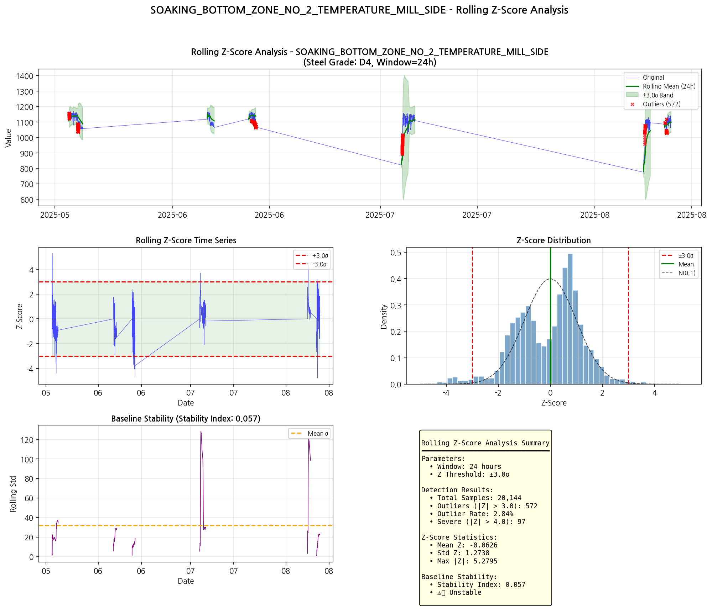

**SOAKING_BOTTOM_ZONE_NO_1_TEMPERATURE_OPP_SIDE** (이상치율: 2.68%, 안정성: 0.075)

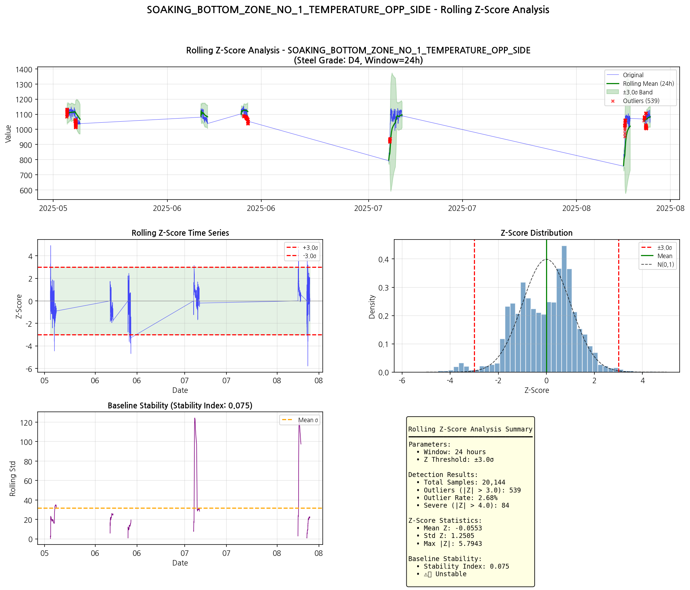

**HEATING_BOTTOM_ZONE_NO_2_TEMPERATURE_MILL_SIDE** (이상치율: 1.60%, 안정성: 0.682)

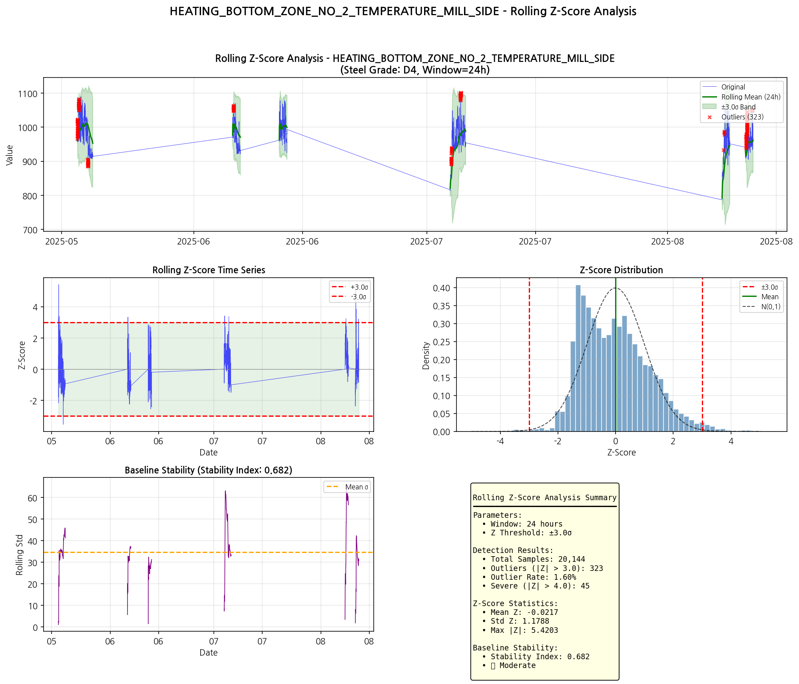

### 가열로 추출 온도 (03_Furnace_Discharge_Temperature)

- 분석 태그: 1개
- 평균 이상치율: 5.84%
- 평균 안정성: 0.714

| 태그 | 이상치율 | 심각 이상치 | 안정성 | Max |Z| |
|------|----------|-------------|--------|--------|
| FURNACE_EXIT_DISCHARGE_BILLET_TEMPERATURE | 5.84% | 360 | 0.714 | 19.01 |

#### Z-Score 차트

**FURNACE_EXIT_DISCHARGE_BILLET_TEMPERATURE** (이상치율: 5.84%, 안정성: 0.714)

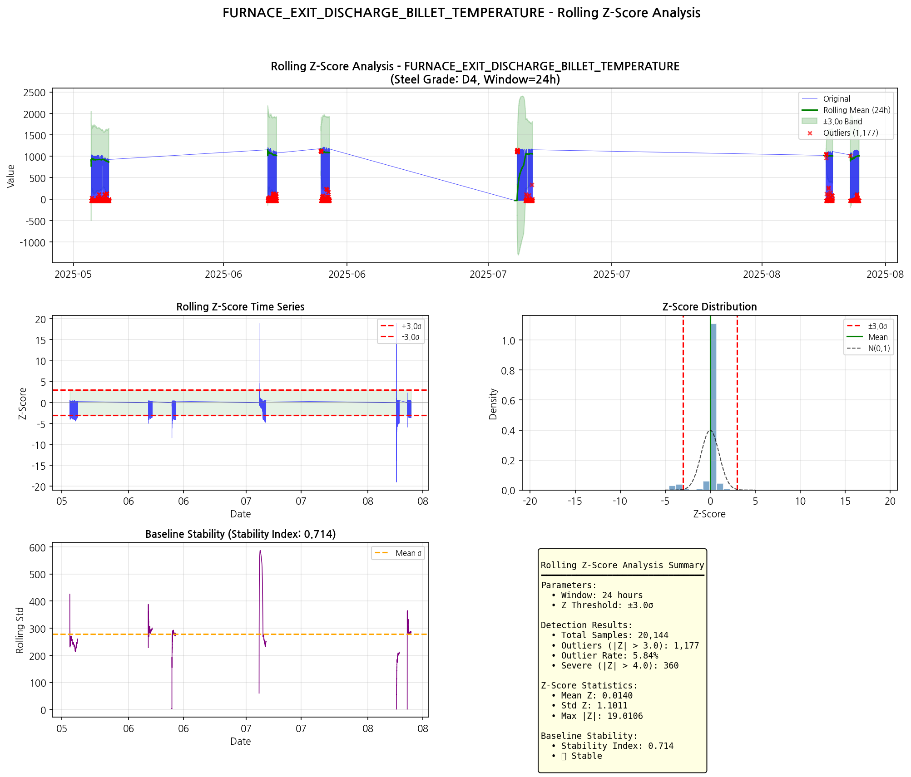

### 가열로 보조설비 (04_Furnace_Auxiliary)

- 분석 태그: 9개
- 평균 이상치율: 1.78%
- 평균 안정성: 0.416

| 태그 | 이상치율 | 심각 이상치 | 안정성 | Max |Z| |
|------|----------|-------------|--------|--------|
| FURNACE_PRESSURE | 0.96% | 37 | 0.572 | 11.40 |
| FURNACE_O2_ANALYZER | 1.74% | 209 | 0.156 | 24.25 |
| MAIN_GAS_PRESSURE | 1.94% | 137 | 0.643 | 6.68 |
| MAIN_GAS_FLOW | 1.32% | 119 | 0.705 | 8.79 |
| MAIN_GAS_TEMPERATURE | 3.34% | 55 | 0.343 | 4.56 |
| MAIN_COMBUSTION_AIR_PRESSURE | 1.47% | 127 | 0.000 | 18.38 |
| COMBUSTION_AIR_TEMPERATURE | 2.57% | 248 | 0.478 | 7.86 |
| INDIRECT_COOLING_WATER_FLOW | 1.06% | 14 | 0.729 | 9.76 |
| INDIRECT_WATER_MAIN_TEMPERATURE | 1.68% | 35 | 0.116 | 8.36 |

#### Z-Score 차트

**MAIN_GAS_TEMPERATURE** (이상치율: 3.34%, 안정성: 0.343)

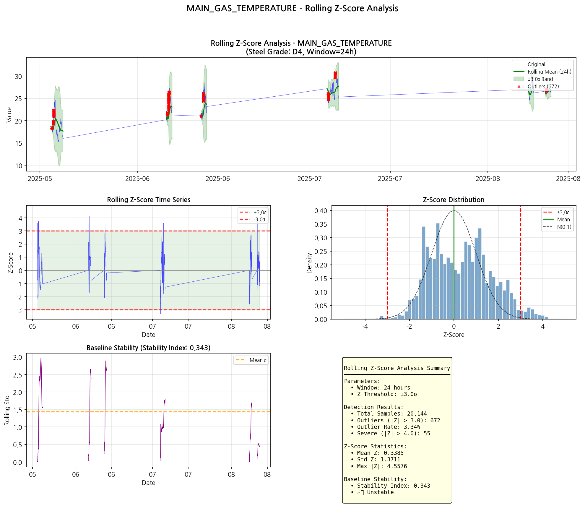

**COMBUSTION_AIR_TEMPERATURE** (이상치율: 2.57%, 안정성: 0.478)

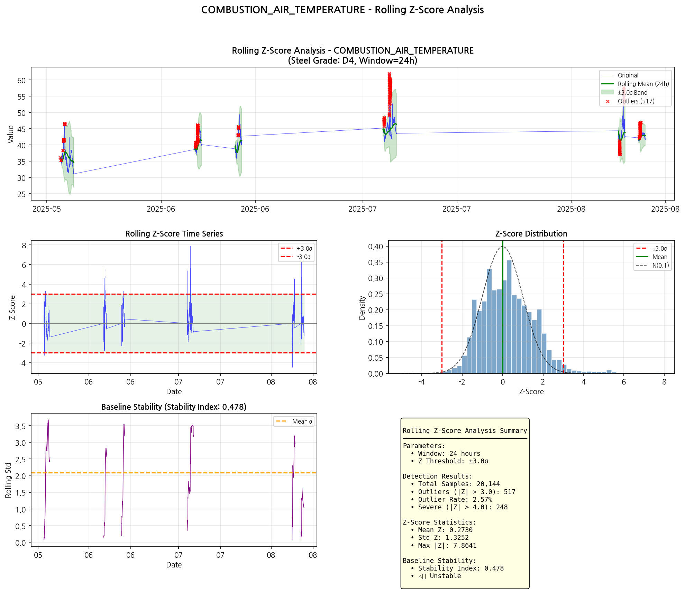

**MAIN_GAS_PRESSURE** (이상치율: 1.94%, 안정성: 0.643)

### 스탠드 토크 (05_Stand_Torque)

- 분석 태그: 16개
- 평균 이상치율: 1.00%
- 평균 안정성: 0.773

| 태그 | 이상치율 | 심각 이상치 | 안정성 | Max |Z| |
|------|----------|-------------|--------|--------|
| STAND_1_ACTUAL_TORQUE | 0.96% | 92 | 0.772 | 18.28 |
| STAND_2_ACTUAL_TORQUE | 0.95% | 94 | 0.786 | 18.05 |
| STAND_3_ACTUAL_TORQUE | 0.95% | 94 | 0.778 | 18.47 |
| STAND_4_ACTUAL_TORQUE | 1.02% | 94 | 0.770 | 18.27 |
| STAND_5_ACTUAL_TORQUE | 1.01% | 94 | 0.775 | 18.33 |
| STAND_6_ACTUAL_TORQUE | 1.10% | 98 | 0.774 | 17.58 |
| STAND_7_ACTUAL_TORQUE | 1.03% | 96 | 0.777 | 17.41 |
| STAND_8_ACTUAL_TORQUE | 1.08% | 100 | 0.765 | 17.18 |
| STAND_9_ACTUAL_TORQUE | 0.98% | 96 | 0.763 | 18.20 |
| STAND_10_ACTUAL_TORQUE | 1.00% | 95 | 0.779 | 17.18 |
| STAND_11_ACTUAL_TORQUE | 0.97% | 96 | 0.785 | 17.42 |
| STAND_12_ACTUAL_TORQUE | 0.95% | 91 | 0.779 | 17.18 |
| STAND_13_ACTUAL_TORQUE | 1.00% | 97 | 0.760 | 17.18 |
| STAND_14_ACTUAL_TORQUE | 0.97% | 96 | 0.780 | 17.18 |
| FINISHING_BLOCK_MASTER_ACTUAL_TORQUE | 0.99% | 93 | 0.759 | 16.91 |
| FINISHING_BLOCK_SLAVE_ACTUAL_TORQUE | 0.99% | 93 | 0.759 | 16.91 |

#### Z-Score 차트

**STAND_6_ACTUAL_TORQUE** (이상치율: 1.10%, 안정성: 0.774)

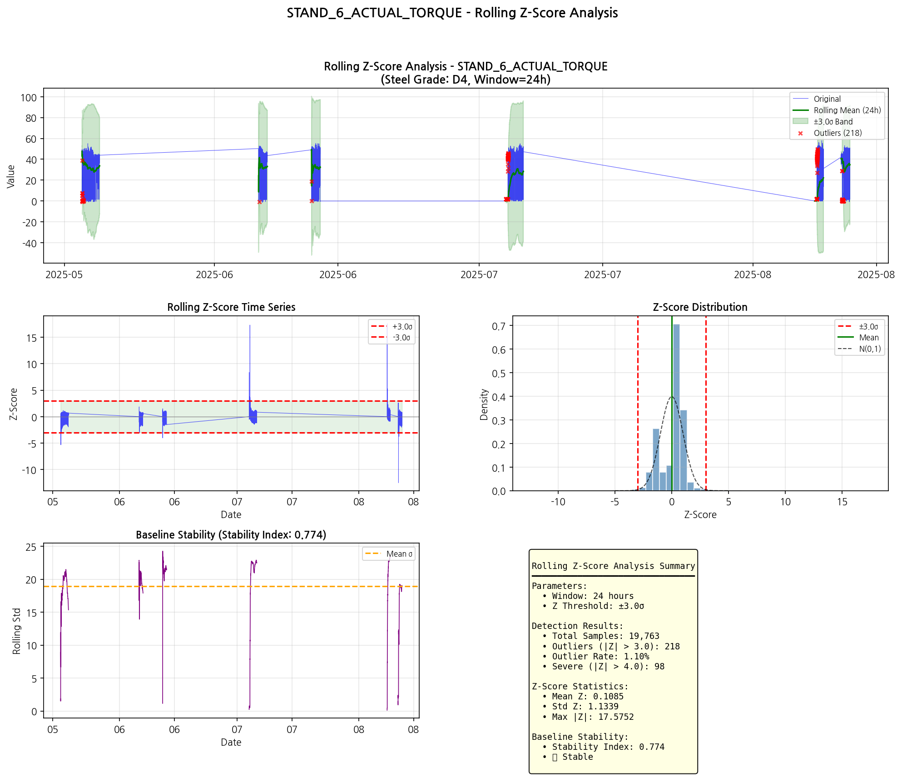

**STAND_8_ACTUAL_TORQUE** (이상치율: 1.08%, 안정성: 0.765)

**STAND_7_ACTUAL_TORQUE** (이상치율: 1.03%, 안정성: 0.777)

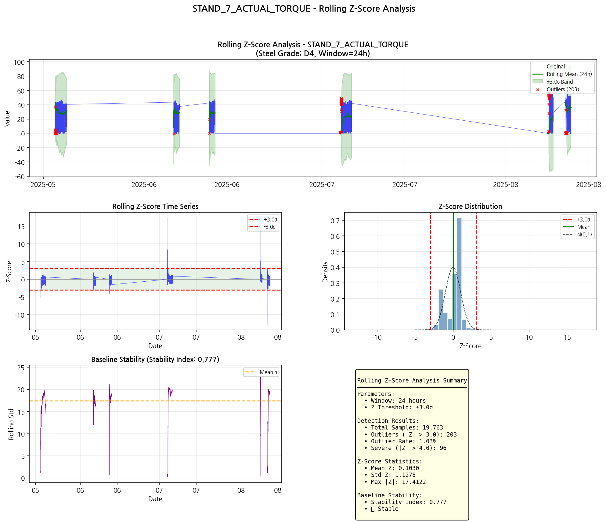

### 스탠드 속도 (06_Stand_Speed)

- 분석 태그: 15개
- 평균 이상치율: 1.92%
- 평균 안정성: 0.735

| 태그 | 이상치율 | 심각 이상치 | 안정성 | Max |Z| |
|------|----------|-------------|--------|--------|
| STAND_1_ACTUAL_SPEED | 1.99% | 107 | 0.731 | 18.71 |
| STAND_2_ACTUAL_SPEED | 2.00% | 107 | 0.703 | 18.85 |
| STAND_3_ACTUAL_SPEED | 2.00% | 105 | 0.725 | 18.79 |
| STAND_4_ACTUAL_SPEED | 2.01% | 102 | 0.733 | 18.85 |
| STAND_5_ACTUAL_SPEED | 1.99% | 101 | 0.731 | 18.85 |
| STAND_6_ACTUAL_SPEED | 1.99% | 100 | 0.733 | 18.76 |
| STAND_7_ACTUAL_SPEED | 1.97% | 103 | 0.737 | 18.79 |
| STAND_8_ACTUAL_SPEED | 1.97% | 103 | 0.721 | 18.80 |
| STAND_9_ACTUAL_SPEED | 1.85% | 101 | 0.734 | 18.80 |
| STAND_10_ACTUAL_SPEED | 1.84% | 104 | 0.737 | 18.85 |
| STAND_11_ACTUAL_SPEED | 1.85% | 100 | 0.739 | 18.88 |
| STAND_12_ACTUAL_SPEED | 1.87% | 110 | 0.749 | 18.89 |
| STAND_13_ACTUAL_SPEED | 1.83% | 102 | 0.765 | 18.89 |
| STAND_14_ACTUAL_SPEED | 1.82% | 102 | 0.746 | 18.92 |
| FINISHING_BLOCK_ACTUAL_SPEED | 1.78% | 103 | 0.748 | 18.87 |

#### Z-Score 차트

**STAND_4_ACTUAL_SPEED** (이상치율: 2.01%, 안정성: 0.733)

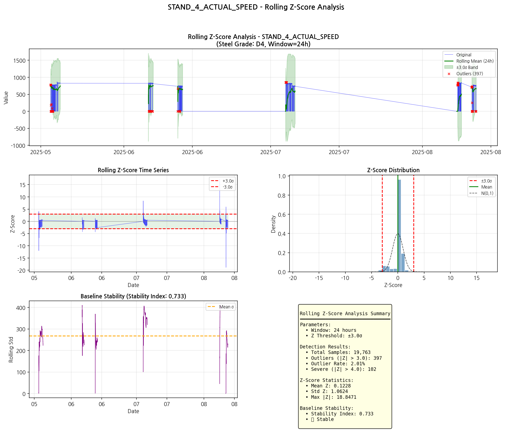

**STAND_2_ACTUAL_SPEED** (이상치율: 2.00%, 안정성: 0.703)

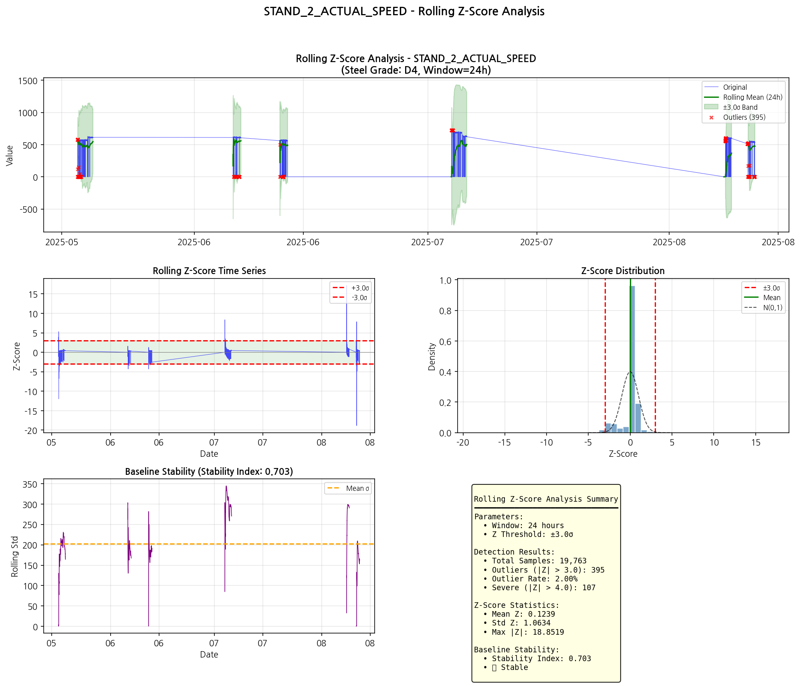

**STAND_3_ACTUAL_SPEED** (이상치율: 2.00%, 안정성: 0.725)

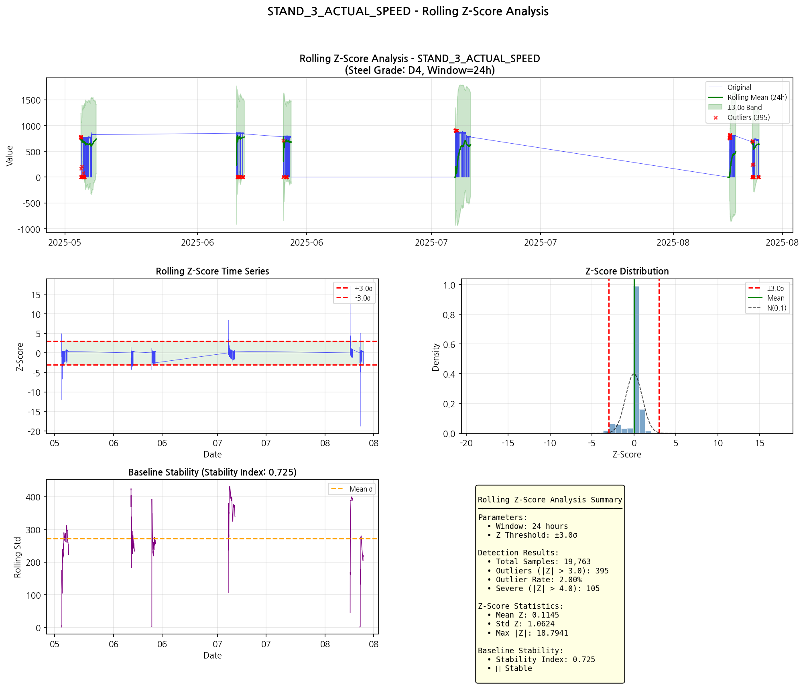

### 스탠드 부하 (07_Stand_Load)

- 분석 태그: 15개
- 평균 이상치율: 0.80%
- 평균 안정성: 0.823

| 태그 | 이상치율 | 심각 이상치 | 안정성 | Max |Z| |
|------|----------|-------------|--------|--------|
| STAND_1_LOAD | 0.79% | 65 | 0.823 | 17.18 |
| STAND_2_LOAD | 0.78% | 65 | 0.822 | 17.20 |
| STAND_3_LOAD | 0.79% | 65 | 0.822 | 17.20 |
| STAND_4_LOAD | 0.82% | 66 | 0.822 | 17.20 |
| STAND_5_LOAD | 0.83% | 66 | 0.823 | 17.20 |
| STAND_6_LOAD | 0.83% | 66 | 0.823 | 17.20 |
| STAND_7_LOAD | 0.82% | 67 | 0.823 | 17.20 |
| STAND_8_LOAD | 0.82% | 66 | 0.824 | 17.20 |
| STAND_9_LOAD | 0.81% | 66 | 0.824 | 17.20 |
| STAND_10_LOAD | 0.79% | 65 | 0.824 | 17.20 |
| STAND_11_LOAD | 0.79% | 65 | 0.824 | 17.20 |
| STAND_12_LOAD | 0.79% | 65 | 0.823 | 17.20 |
| STAND_13_LOAD | 0.79% | 65 | 0.823 | 17.20 |
| STAND_14_LOAD | 0.78% | 65 | 0.823 | 17.20 |
| FINISHING_BLOCK_LOAD | 0.79% | 67 | 0.823 | 17.23 |

#### Z-Score 차트

**STAND_5_LOAD** (이상치율: 0.83%, 안정성: 0.823)

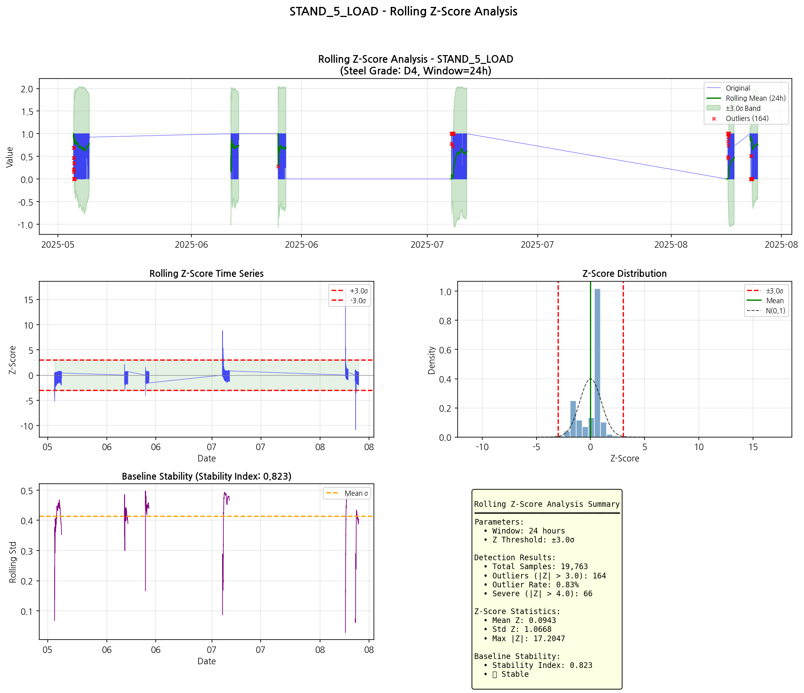

**STAND_6_LOAD** (이상치율: 0.83%, 안정성: 0.823)

**STAND_4_LOAD** (이상치율: 0.82%, 안정성: 0.822)

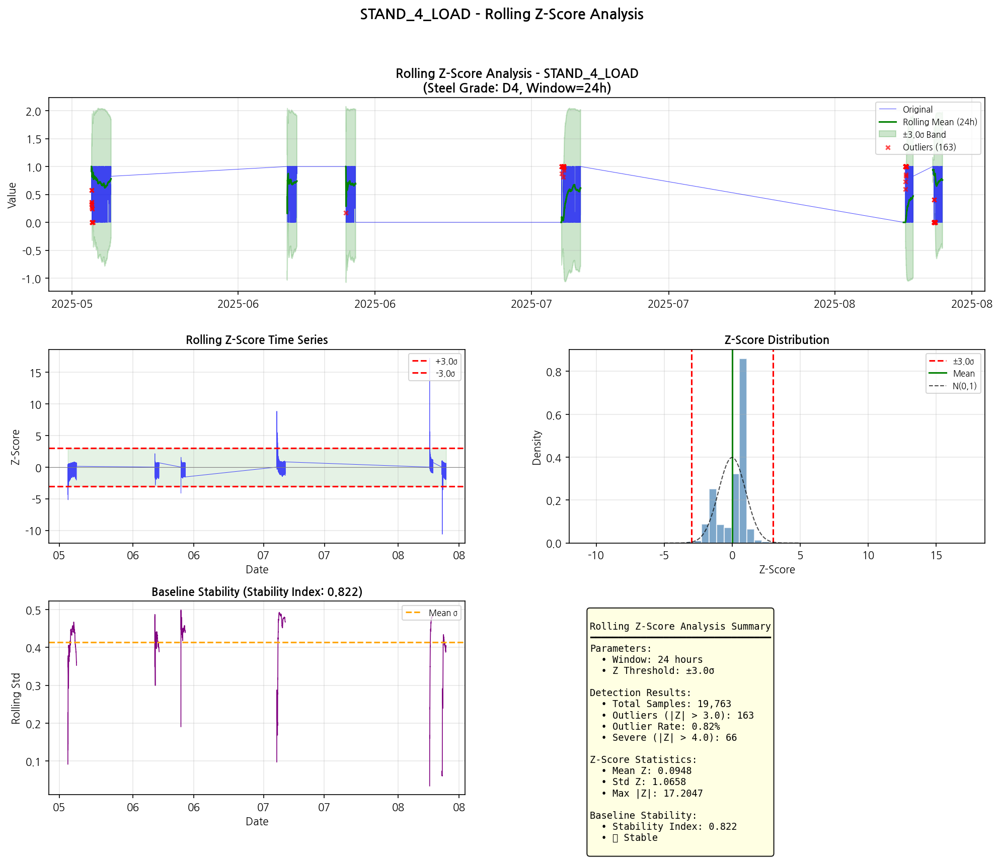

### 핀치롤 (08_Pinchroll)

- 분석 태그: 9개
- 평균 이상치율: 1.33%
- 평균 안정성: 0.493

| 태그 | 이상치율 | 심각 이상치 | 안정성 | Max |Z| |
|------|----------|-------------|--------|--------|
| PINCHROLL_2_ACTUAL_SPEED | 1.00% | 60 | 0.511 | 23.96 |
| PINCHROLL_3_ACTUAL_SPEED | 3.23% | 260 | 0.000 | 45.49 |
| PINCHROLL_4_ACTUAL_SPEED | 3.65% | 294 | 0.000 | 27.46 |
| PINCHROLL_2_ACTUAL_TORQUE | 0.76% | 47 | 0.806 | 8.24 |
| PINCHROLL_3_ACTUAL_TORQUE | 0.96% | 66 | 0.636 | 18.02 |
| PINCHROLL_4_ACTUAL_TORQUE | 0.77% | 49 | 0.665 | 10.36 |
| PINCHROLL_2_REFERENCE_TORQUE | 0.04% | 6 | 0.286 | 34.34 |
| PINCHROLL_3_REFERENCE_TORQUE | 0.83% | 57 | 0.717 | 25.79 |
| PINCHROLL_4_REFERENCE_TORQUE | 0.75% | 44 | 0.819 | 10.33 |

#### Z-Score 차트

**PINCHROLL_4_ACTUAL_SPEED** (이상치율: 3.65%, 안정성: 0.000)

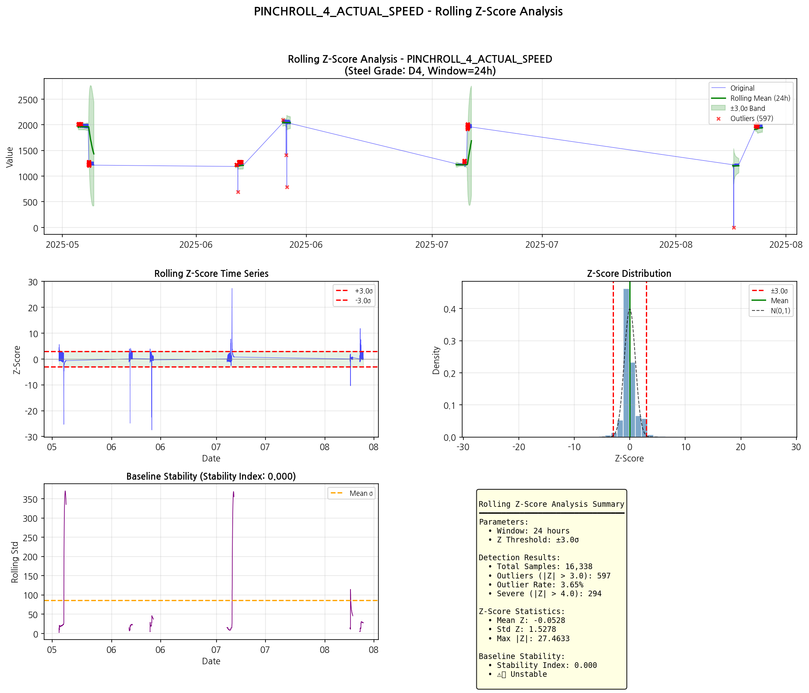

**PINCHROLL_3_ACTUAL_SPEED** (이상치율: 3.23%, 안정성: 0.000)

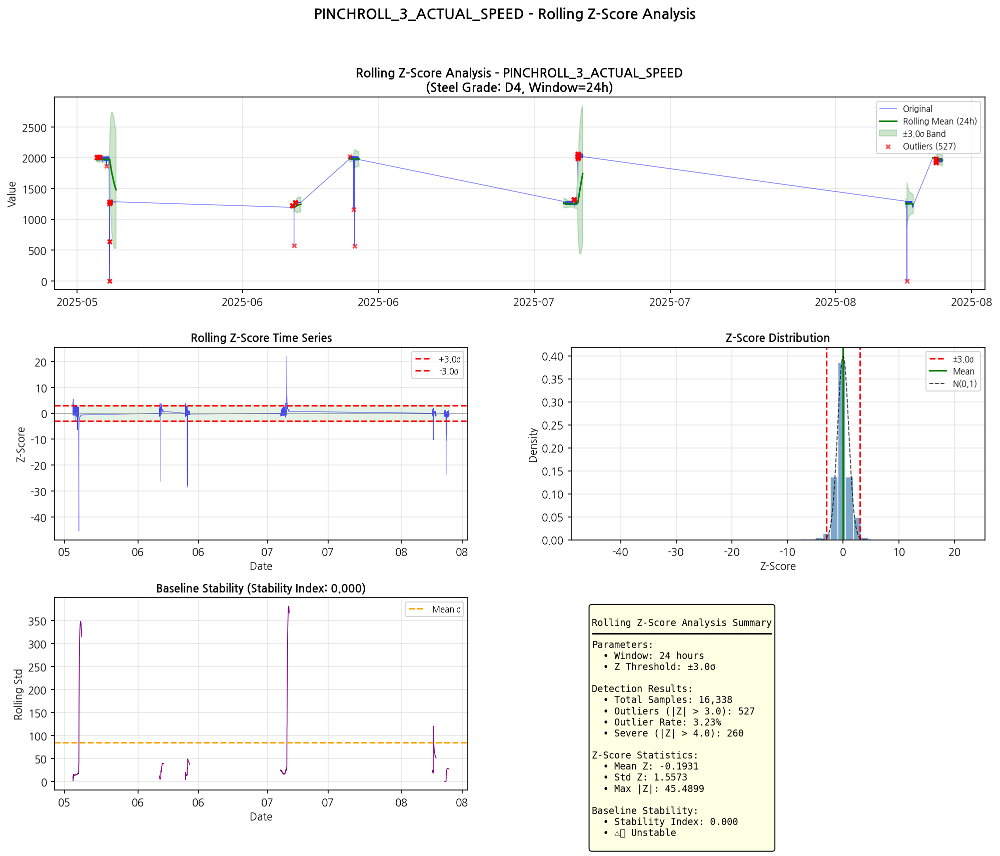

**PINCHROLL_2_ACTUAL_SPEED** (이상치율: 1.00%, 안정성: 0.511)

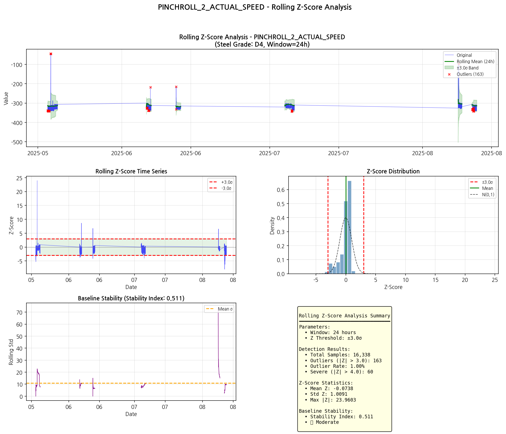

### PR 상세 토크 (09_PR_Detailed)

- 분석 태그: 6개
- 평균 이상치율: 2.43%
- 평균 안정성: 0.218

| 태그 | 이상치율 | 심각 이상치 | 안정성 | Max |Z| |
|------|----------|-------------|--------|--------|
| PR6L1_ACT_TORQUE | 4.07% | 382 | 0.000 | 26.78 |
| PR6L2_ACT_TORQUE | 3.84% | 368 | 0.080 | 26.78 |
| PR7L1_ACT_TORQUE | 2.61% | 216 | 0.021 | 26.78 |
| PR7L2_ACT_TORQUE | 2.22% | 204 | 0.091 | 26.78 |
| PR8L1_ACT_TORQUE | 0.84% | 79 | 0.661 | 26.78 |
| PR9L1_ACT_TORQUE | 1.02% | 94 | 0.456 | 26.78 |

#### Z-Score 차트

**PR6L1_ACT_TORQUE** (이상치율: 4.07%, 안정성: 0.000)

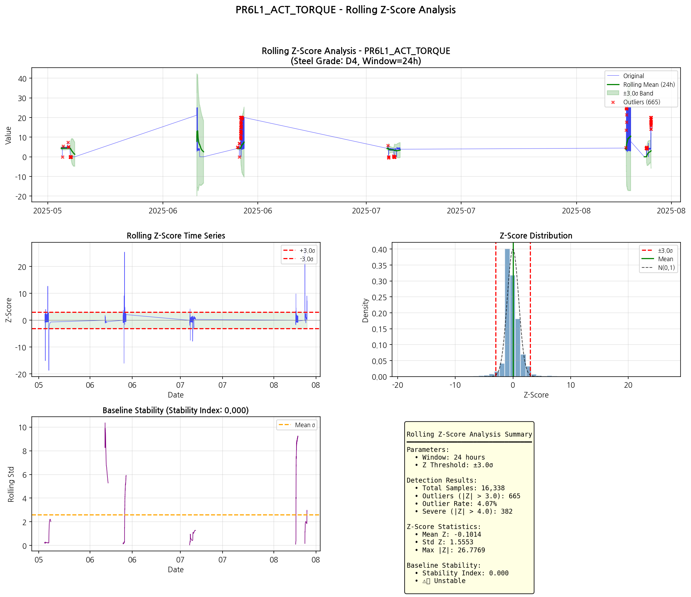

**PR6L2_ACT_TORQUE** (이상치율: 3.84%, 안정성: 0.080)

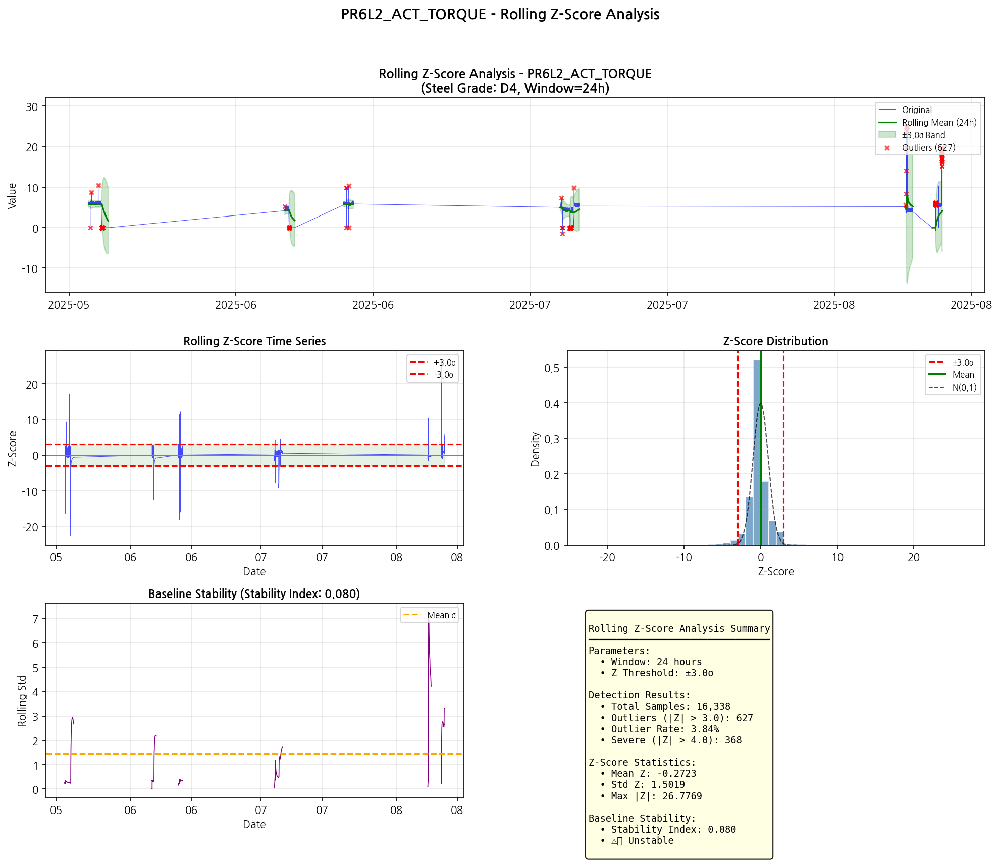

**PR7L1_ACT_TORQUE** (이상치율: 2.61%, 안정성: 0.021)

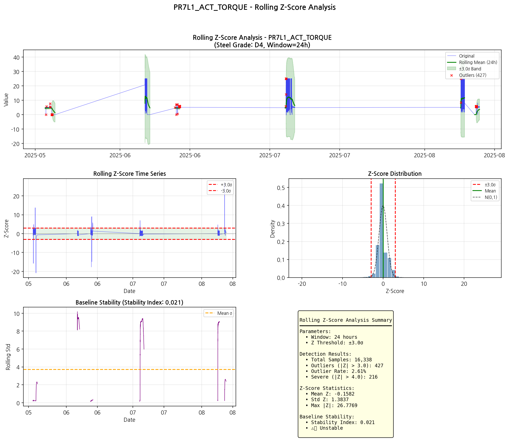

---

## 해석 가이드

### Rolling Z-Score 해석

1. **이상치율 (Outlier Rate)**
   - |Z| > 3.0σ 비율
   - 높을수록 해당 시점 주변 패턴에서 벗어난 데이터 많음
   - 정상 분포 가정 시 약 0.3% 예상

2. **기준선 안정성 (Baseline Stability)**
   - Rolling std의 시간적 일관성
   - 1에 가까울수록 안정적
   - 0.5 미만: 비정상 시계열, 다른 방법 권장

3. **심각 이상치 (Severe Outliers)**
   - |Z| > 4.0σ
   - 극단적인 이상값
   - 즉각적인 점검 필요

### 상태 분류

| 상태 | 기준 | 해석 |
|------|------|------|
| 🔴 높음 | ≥10% | 빈번한 이상치, 점검 필요 |
| 🟠 중간 | 3~10% | 일부 이상치, 모니터링 |
| 🟢 낮음 | <3% | 정상 범위 |
| 🟡 불안정 | Stability < 0.5 | 기준선 변동 심함 |

### Standard IQR vs Rolling Z-Score

| 방법 | 장점 | 단점 |
|------|------|------|
| Standard IQR | 간단, 전체 분포 기반 | 시변 데이터에 부적합 |
| Rolling Z-Score | 시변 데이터 적합 | 윈도우 크기 설정 필요 |

**권장**: 기준선 안정성 ≥ 0.5인 태그에 효과적

---

## 메타데이터

| 항목 | 값 |
|------|-----|
| 분석 스크립트 | steel_grade_rolling_zscore_analysis.py |
| 분석 기간 | 2025-03-01 ~ 2025-08-31 |
| 강종 | D4 |
| 윈도우 크기 | 24시간 |
| Z 임계값 | ±3.0σ |
| 생성일시 | 2026-02-03 20:50:04 |
| 총 분석 태그 | 79개 |

---

*본 보고서는 자동 생성되었습니다.*
