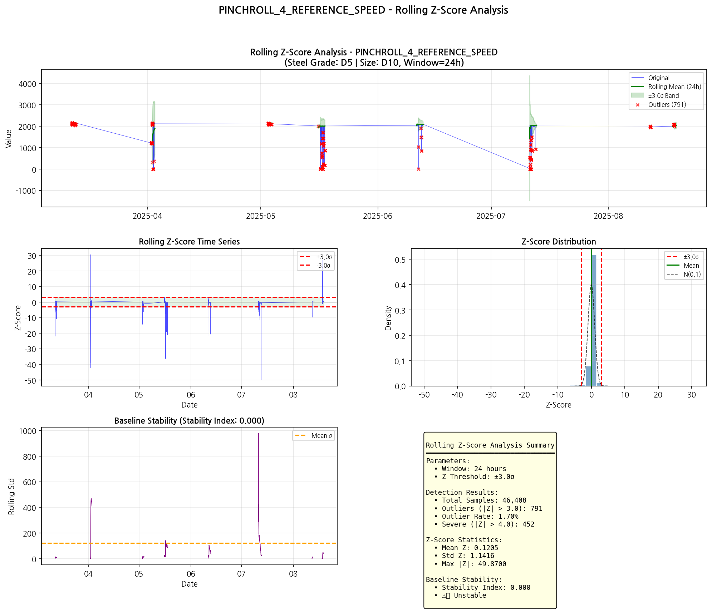
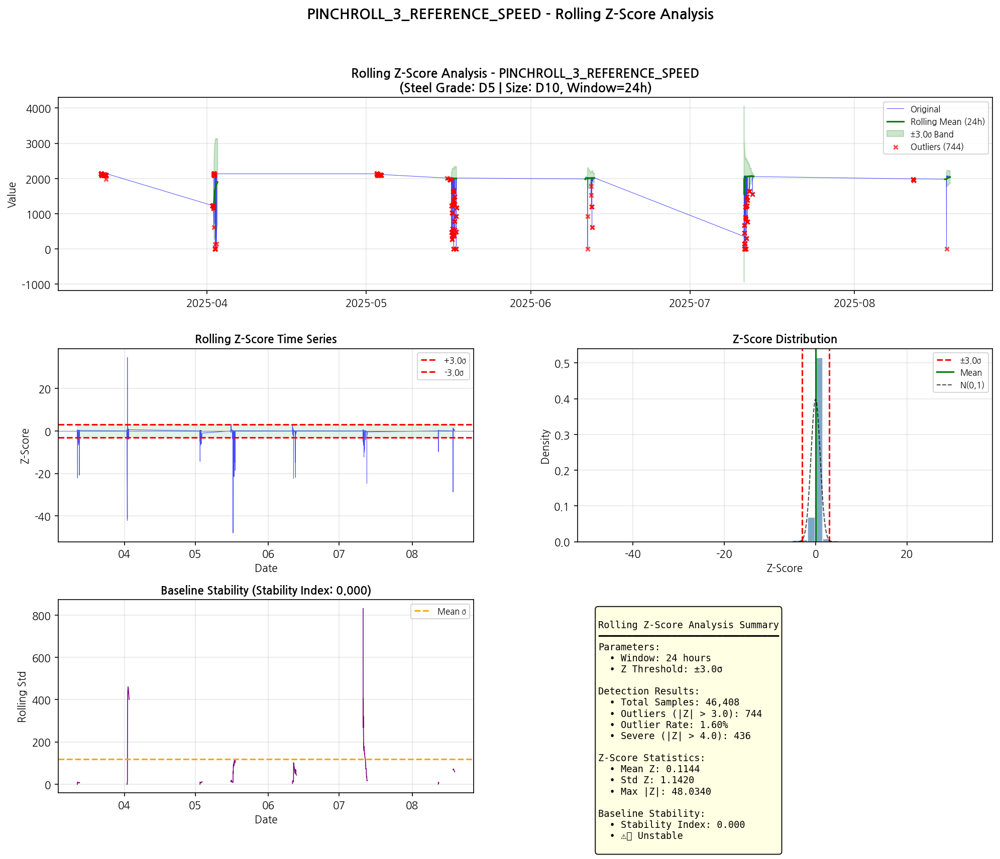
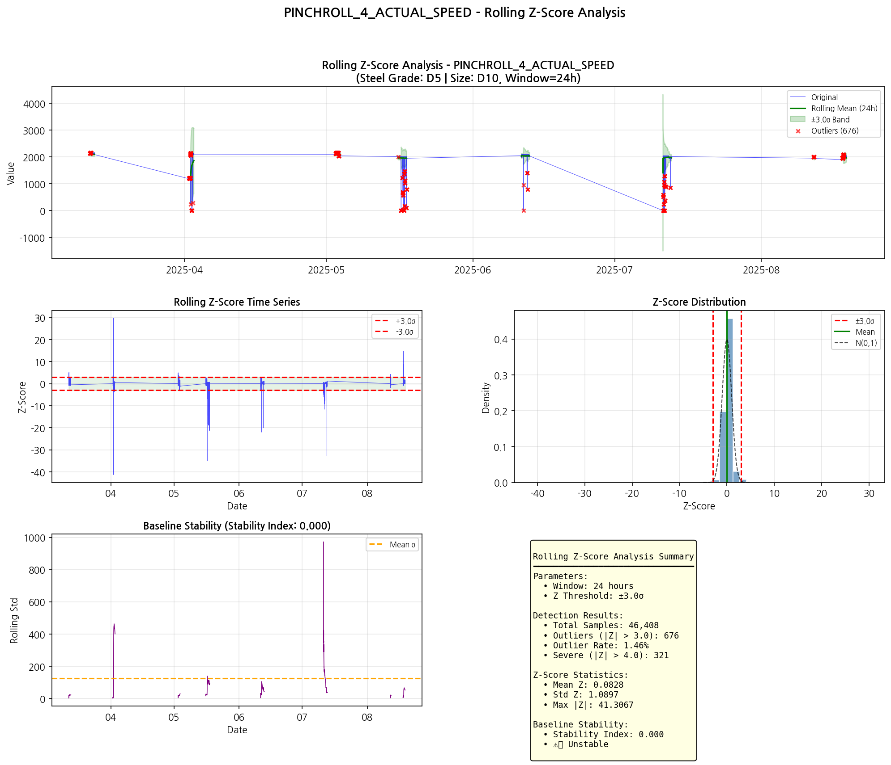
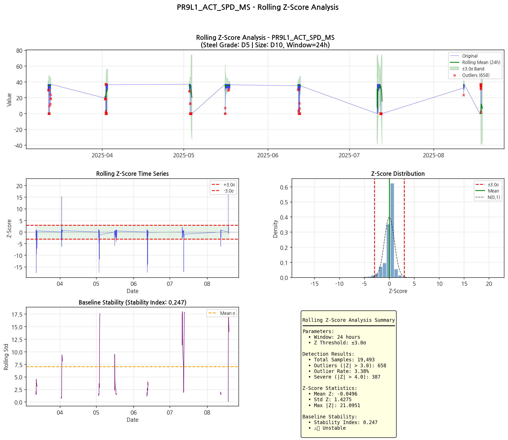
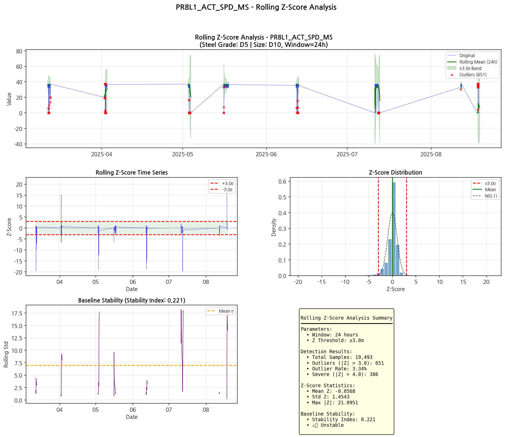
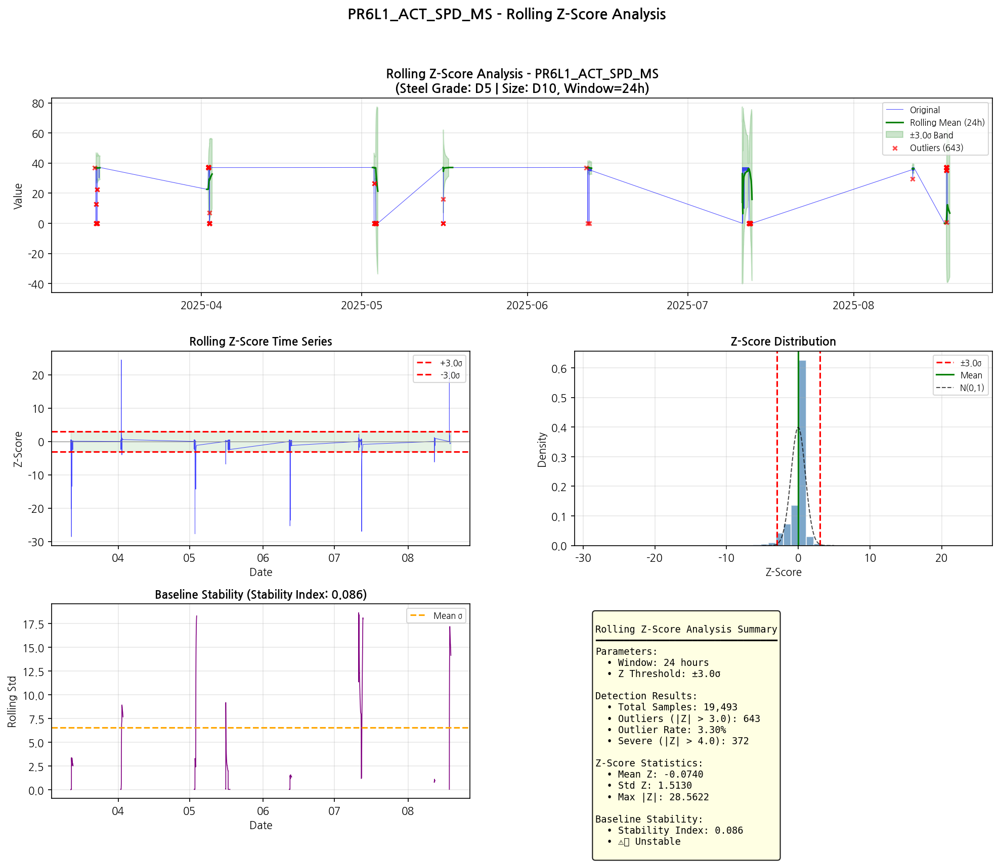

# 강종 [D5 | Size: D10] Rolling Z-Score 동적 이상치 분석 보고서

**분석 기간**: 2025-03-01 ~ 2025-08-31
**강종**: D5  
**사이즈**: D10
**생성일시**: 2026-02-23 01:41:39

---

## 분석 개요

### 분석 방법론

**Rolling Z-Score (롤링 Z-점수)**

시간 창(window) 기반 동적 이상치 탐지 방법입니다.

$$Z_{rolling}(t) = \frac{x(t) - \mu_{window}(t)}{\sigma_{window}(t)}$$

| 파라미터 | 값 | 설명 |
|----------|-----|------|
| Window | 24h | 이동 평균/표준편차 윈도우 |
| Z Threshold | ±3.0σ | 이상치 판정 임계값 |
| Severe | ±4.0σ | 심각 이상치 임계값 |

### 장점

- **비정상 시계열 적합**: 평균/분산 시변하는 데이터에 효과적
- **점진적 기준선 추적**: 장기 드리프트에 강건
- **Local Context 기반**: 해당 시점 주변 패턴 기준

### 분석 결과 요약

| 구분 | 태그 수 | 비율 |
|------|---------|------|
| **총 분석 태그** | 23개 | 100% |
| 🔴 높은 이상치율 (≥10%) | 0개 | 0.0% |
| 🟠 중간 이상치율 (3~10%) | 5개 | 21.7% |
| 🟢 낮은 이상치율 (<3%) | 7개 | 30.4% |
| 🟡 불안정 기준선 | 11개 | 47.8% |

#### 전체 평균

| 지표 | 값 |
|------|-----|
| 평균 이상치율 | 1.86% |
| 평균 기준선 안정성 | 0.301 |

---

## 상위 문제 태그 (이상치율 기준)

| 순위 | 태그 | 카테고리 | 이상치율 | 심각 이상치 | 안정성 | 상태 |
|------|------|----------|----------|-------------|--------|------|
| 1 | PR9L1_ACT_SPD_MS | PR 상세 (토크+속도) | 3.38% | 387 | 0.247 | 🟠 |
| 2 | PR8L1_ACT_SPD_MS | PR 상세 (토크+속도) | 3.34% | 386 | 0.221 | 🟠 |
| 3 | PR6L1_ACT_SPD_MS | PR 상세 (토크+속도) | 3.30% | 372 | 0.086 | 🟠 |
| 4 | PR7L1_ACT_SPD_MS | PR 상세 (토크+속도) | 3.29% | 371 | 0.078 | 🟠 |
| 5 | PR7L1_ACT_TORQUE | PR 상세 (토크+속도) | 3.08% | 345 | 0.000 | 🟠 |
| 6 | PR7L2_ACT_SPD_MS | PR 상세 (토크+속도) | 2.99% | 416 | 0.154 | 🟡 |
| 7 | PR6L2_ACT_SPD_MS | PR 상세 (토크+속도) | 2.99% | 417 | 0.154 | 🟡 |
| 8 | PR6L1_ACT_TORQUE | PR 상세 (토크+속도) | 2.83% | 340 | 0.056 | 🟡 |
| 9 | PR7L2_ACT_TORQUE | PR 상세 (토크+속도) | 2.22% | 352 | 0.000 | 🟡 |
| 10 | PINCHROLL_4_REFERENCE_SPEED | 핀치롤 | 1.70% | 452 | 0.000 | 🟡 |
| 11 | PINCHROLL_3_REFERENCE_SPEED | 핀치롤 | 1.60% | 436 | 0.000 | 🟡 |
| 12 | PR6L2_ACT_TORQUE | PR 상세 (토크+속도) | 1.50% | 286 | 0.000 | 🟡 |
| 13 | PINCHROLL_4_ACTUAL_SPEED | 핀치롤 | 1.46% | 321 | 0.000 | 🟡 |
| 14 | PINCHROLL_2_ACTUAL_SPEED | 핀치롤 | 1.41% | 350 | 0.369 | 🟡 |
| 15 | PINCHROLL_3_ACTUAL_SPEED | 핀치롤 | 1.33% | 319 | 0.000 | 🟡 |

---

## 불안정 기준선 태그

기준선 안정성(Stability Index)이 0.5 미만인 태그입니다.
이 태그들은 Rolling Z-Score 방법보다 다른 방법이 더 적합할 수 있습니다.

| 태그 | 카테고리 | 안정성 | 이상치율 |
|------|----------|--------|----------|
| PINCHROLL_3_ACTUAL_SPEED | 핀치롤 | 0.000 | 1.33% |
| PINCHROLL_4_ACTUAL_SPEED | 핀치롤 | 0.000 | 1.46% |
| PINCHROLL_3_REFERENCE_SPEED | 핀치롤 | 0.000 | 1.60% |
| PINCHROLL_4_REFERENCE_SPEED | 핀치롤 | 0.000 | 1.70% |
| PR6L2_ACT_TORQUE | PR 상세 (토크+속도) | 0.000 | 1.50% |
| PR7L1_ACT_TORQUE | PR 상세 (토크+속도) | 0.000 | 3.08% |
| PR7L2_ACT_TORQUE | PR 상세 (토크+속도) | 0.000 | 2.22% |
| PR6L1_ACT_TORQUE | PR 상세 (토크+속도) | 0.056 | 2.83% |
| PR7L1_ACT_SPD_MS | PR 상세 (토크+속도) | 0.078 | 3.29% |
| PR6L1_ACT_SPD_MS | PR 상세 (토크+속도) | 0.086 | 3.30% |

---

## 카테고리별 분석 결과

### 핀치롤 (08_Pinchroll)

- 분석 태그: 11개
- 평균 이상치율: 1.17%
- 평균 안정성: 0.422

| 태그 | 이상치율 | 심각 이상치 | 안정성 | Max \|Z\| |
|------|----------|-------------|--------|--------|
| PINCHROLL_2_ACTUAL_SPEED | 1.41% | 350 | 0.369 | 26.14 |
| PINCHROLL_3_ACTUAL_SPEED | 1.33% | 319 | 0.000 | 44.57 |
| PINCHROLL_4_ACTUAL_SPEED | 1.46% | 321 | 0.000 | 41.31 |
| PINCHROLL_2_ACTUAL_TORQUE | 0.90% | 153 | 0.793 | 16.30 |
| PINCHROLL_3_ACTUAL_TORQUE | 1.06% | 185 | 0.762 | 21.69 |
| PINCHROLL_4_ACTUAL_TORQUE | 0.94% | 141 | 0.787 | 9.41 |
| PINCHROLL_2_REFERENCE_TORQUE | 0.56% | 240 | 0.358 | 61.64 |
| PINCHROLL_3_REFERENCE_TORQUE | 0.94% | 149 | 0.764 | 26.21 |
| PINCHROLL_4_REFERENCE_TORQUE | 0.95% | 110 | 0.809 | 8.08 |
| PINCHROLL_3_REFERENCE_SPEED | 1.60% | 436 | 0.000 | 48.03 |
| PINCHROLL_4_REFERENCE_SPEED | 1.70% | 452 | 0.000 | 49.87 |

#### Z-Score 차트

**PINCHROLL_4_REFERENCE_SPEED** (이상치율: 1.70%, 안정성: 0.000)

**PINCHROLL_3_REFERENCE_SPEED** (이상치율: 1.60%, 안정성: 0.000)

**PINCHROLL_4_ACTUAL_SPEED** (이상치율: 1.46%, 안정성: 0.000)

### PR 상세 (토크+속도) (09_PR_Detailed)

- 분석 태그: 12개
- 평균 이상치율: 2.50%
- 평균 안정성: 0.190

| 태그 | 이상치율 | 심각 이상치 | 안정성 | Max \|Z\| |
|------|----------|-------------|--------|--------|
| PR6L1_ACT_TORQUE | 2.83% | 340 | 0.056 | 25.42 |
| PR6L2_ACT_TORQUE | 1.50% | 286 | 0.000 | 21.18 |
| PR7L1_ACT_TORQUE | 3.08% | 345 | 0.000 | 24.92 |
| PR7L2_ACT_TORQUE | 2.22% | 352 | 0.000 | 26.41 |
| PR8L1_ACT_TORQUE | 0.47% | 47 | 0.735 | 21.10 |
| PR9L1_ACT_TORQUE | 0.63% | 67 | 0.554 | 21.10 |
| PR6L1_ACT_SPD_MS | 3.30% | 372 | 0.086 | 28.56 |
| PR6L2_ACT_SPD_MS | 2.99% | 417 | 0.154 | 34.61 |
| PR7L1_ACT_SPD_MS | 3.29% | 371 | 0.078 | 35.39 |
| PR7L2_ACT_SPD_MS | 2.99% | 416 | 0.154 | 44.09 |
| PR8L1_ACT_SPD_MS | 3.34% | 386 | 0.221 | 21.10 |
| PR9L1_ACT_SPD_MS | 3.38% | 387 | 0.247 | 21.10 |

#### Z-Score 차트

**PR9L1_ACT_SPD_MS** (이상치율: 3.38%, 안정성: 0.247)

**PR8L1_ACT_SPD_MS** (이상치율: 3.34%, 안정성: 0.221)

**PR6L1_ACT_SPD_MS** (이상치율: 3.30%, 안정성: 0.086)

---

## 해석 가이드

### Rolling Z-Score 해석

1. **이상치율 (Outlier Rate)**
   - |Z| > 3.0σ 비율
   - 높을수록 해당 시점 주변 패턴에서 벗어난 데이터 많음
   - 정상 분포 가정 시 약 0.3% 예상

2. **기준선 안정성 (Baseline Stability)**
   - Rolling std의 시간적 일관성
   - 1에 가까울수록 안정적
   - 0.5 미만: 비정상 시계열, 다른 방법 권장

3. **심각 이상치 (Severe Outliers)**
   - |Z| > 4.0σ
   - 극단적인 이상값
   - 즉각적인 점검 필요

### 상태 분류

| 상태 | 기준 | 해석 |
|------|------|------|
| 🔴 높음 | ≥10% | 빈번한 이상치, 점검 필요 |
| 🟠 중간 | 3~10% | 일부 이상치, 모니터링 |
| 🟢 낮음 | <3% | 정상 범위 |
| 🟡 불안정 | Stability < 0.5 | 기준선 변동 심함 |

### Standard IQR vs Rolling Z-Score

| 방법 | 장점 | 단점 |
|------|------|------|
| Standard IQR | 간단, 전체 분포 기반 | 시변 데이터에 부적합 |
| Rolling Z-Score | 시변 데이터 적합 | 윈도우 크기 설정 필요 |

**권장**: 기준선 안정성 ≥ 0.5인 태그에 효과적

---

## 메타데이터

| 항목 | 값 |
|------|-----|
| 분석 스크립트 | steel_grade_rolling_zscore_analysis.py |
| 분석 기간 | 2025-03-01 ~ 2025-08-31 |
| 강종 | D5 |
| 윈도우 크기 | 24시간 |
| Z 임계값 | ±3.0σ |
| 생성일시 | 2026-02-23 01:41:39 |
| 총 분석 태그 | 23개 |

---

*본 보고서는 자동 생성되었습니다.*
