# 강종 [D5 | Size: D10] Rolling Z-Score 동적 이상치 분석 보고서

**분석 기간**: 2025-03-01 ~ 2025-08-31
**강종**: D5  
**사이즈**: D10
**생성일시**: 2026-02-09 15:14:58

---

## 분석 개요

### 분석 방법론

**Rolling Z-Score (롤링 Z-점수)**

시간 창(window) 기반 동적 이상치 탐지 방법입니다.

$$Z_{rolling}(t) = \frac{x(t) - \mu_{window}(t)}{\sigma_{window}(t)}$$

| 파라미터 | 값 | 설명 |
|----------|-----|------|
| Window | 24h | 이동 평균/표준편차 윈도우 |
| Z Threshold | ±3.0σ | 이상치 판정 임계값 |
| Severe | ±4.0σ | 심각 이상치 임계값 |

### 장점

- **비정상 시계열 적합**: 평균/분산 시변하는 데이터에 효과적
- **점진적 기준선 추적**: 장기 드리프트에 강건
- **Local Context 기반**: 해당 시점 주변 패턴 기준

### 분석 결과 요약

| 구분 | 태그 수 | 비율 |
|------|---------|------|
| **총 분석 태그** | 79개 | 100% |
| 🔴 높은 이상치율 (≥10%) | 0개 | 0.0% |
| 🟠 중간 이상치율 (3~10%) | 19개 | 24.1% |
| 🟢 낮은 이상치율 (<3%) | 42개 | 53.2% |
| 🟡 불안정 기준선 | 18개 | 22.8% |

#### 전체 평균

| 지표 | 값 |
|------|-----|
| 평균 이상치율 | 2.19% |
| 평균 기준선 안정성 | 0.558 |

---

## 상위 문제 태그 (이상치율 기준)

| 순위 | 태그 | 카테고리 | 이상치율 | 심각 이상치 | 안정성 | 상태 |
|------|------|----------|----------|-------------|--------|------|
| 1 | FURNACE_EXIT_DISCHARGE_BILLET_TEMPERATURE | 가열로 추출 온도 | 6.09% | 1401 | 0.744 | 🟠 |
| 2 | HEATING_TOP_ZONE_NO_2_TEMPERATURE_ROOF | 가열로 상부 온도 | 3.49% | 851 | 0.034 | 🟠 |
| 3 | HEATING_TOP_ZONE_NO_1_TEMPERATURE_ROOF | 가열로 상부 온도 | 3.43% | 879 | 0.040 | 🟠 |
| 4 | STAND_1_ACTUAL_SPEED | 스탠드 속도 | 3.27% | 739 | 0.625 | 🟠 |
| 5 | STAND_3_ACTUAL_SPEED | 스탠드 속도 | 3.19% | 697 | 0.629 | 🟠 |
| 6 | FINISHING_BLOCK_ACTUAL_SPEED | 스탠드 속도 | 3.17% | 744 | 0.639 | 🟠 |
| 7 | STAND_5_ACTUAL_SPEED | 스탠드 속도 | 3.12% | 689 | 0.630 | 🟠 |
| 8 | STAND_7_ACTUAL_SPEED | 스탠드 속도 | 3.12% | 694 | 0.628 | 🟠 |
| 9 | SOAKING_TOP_ZONE_NO_1_TEMPERATURE_ROOF | 가열로 상부 온도 | 3.11% | 819 | 0.000 | 🟠 |
| 10 | STAND_6_ACTUAL_SPEED | 스탠드 속도 | 3.11% | 698 | 0.629 | 🟠 |
| 11 | STAND_14_ACTUAL_SPEED | 스탠드 속도 | 3.10% | 695 | 0.637 | 🟠 |
| 12 | STAND_2_ACTUAL_SPEED | 스탠드 속도 | 3.10% | 689 | 0.624 | 🟠 |
| 13 | STAND_13_ACTUAL_SPEED | 스탠드 속도 | 3.08% | 695 | 0.650 | 🟠 |
| 14 | STAND_10_ACTUAL_SPEED | 스탠드 속도 | 3.07% | 681 | 0.644 | 🟠 |
| 15 | STAND_12_ACTUAL_SPEED | 스탠드 속도 | 3.06% | 693 | 0.645 | 🟠 |

---

## 불안정 기준선 태그

기준선 안정성(Stability Index)이 0.5 미만인 태그입니다.
이 태그들은 Rolling Z-Score 방법보다 다른 방법이 더 적합할 수 있습니다.

| 태그 | 카테고리 | 안정성 | 이상치율 |
|------|----------|--------|----------|
| SOAKING_TOP_ZONE_NO_1_TEMPERATURE_ROOF | 가열로 상부 온도 | 0.000 | 3.11% |
| SOAKING_TOP_ZONE_NO_2_TEMPERATURE_ROOF | 가열로 상부 온도 | 0.000 | 3.02% |
| SOAKING_BOTTOM_ZONE_NO_2_TEMPERATURE_MILL_SIDE | 가열로 하부 온도 | 0.000 | 2.63% |
| MAIN_GAS_PRESSURE | 가열로 보조설비 | 0.000 | 2.11% |
| MAIN_COMBUSTION_AIR_PRESSURE | 가열로 보조설비 | 0.000 | 1.62% |
| PINCHROLL_3_ACTUAL_SPEED | 핀치롤 | 0.000 | 1.33% |
| PINCHROLL_4_ACTUAL_SPEED | 핀치롤 | 0.000 | 1.46% |
| PR6L1_ACT_TORQUE | PR 상세 토크 | 0.000 | 2.36% |
| PR7L1_ACT_TORQUE | PR 상세 토크 | 0.000 | 2.72% |
| PR7L2_ACT_TORQUE | PR 상세 토크 | 0.000 | 2.55% |

---

## 카테고리별 분석 결과

### 가열로 상부 온도 (01_Furnace_Top_Temperature)

- 분석 태그: 4개
- 평균 이상치율: 3.26%
- 평균 안정성: 0.018

| 태그 | 이상치율 | 심각 이상치 | 안정성 | Max \|Z\| |
|------|----------|-------------|--------|--------|
| HEATING_TOP_ZONE_NO_1_TEMPERATURE_ROOF | 3.43% | 879 | 0.040 | 8.63 |
| HEATING_TOP_ZONE_NO_2_TEMPERATURE_ROOF | 3.49% | 851 | 0.034 | 8.47 |
| SOAKING_TOP_ZONE_NO_1_TEMPERATURE_ROOF | 3.11% | 819 | 0.000 | 12.90 |
| SOAKING_TOP_ZONE_NO_2_TEMPERATURE_ROOF | 3.02% | 858 | 0.000 | 11.53 |

#### Z-Score 차트

**HEATING_TOP_ZONE_NO_2_TEMPERATURE_ROOF** (이상치율: 3.49%, 안정성: 0.034)

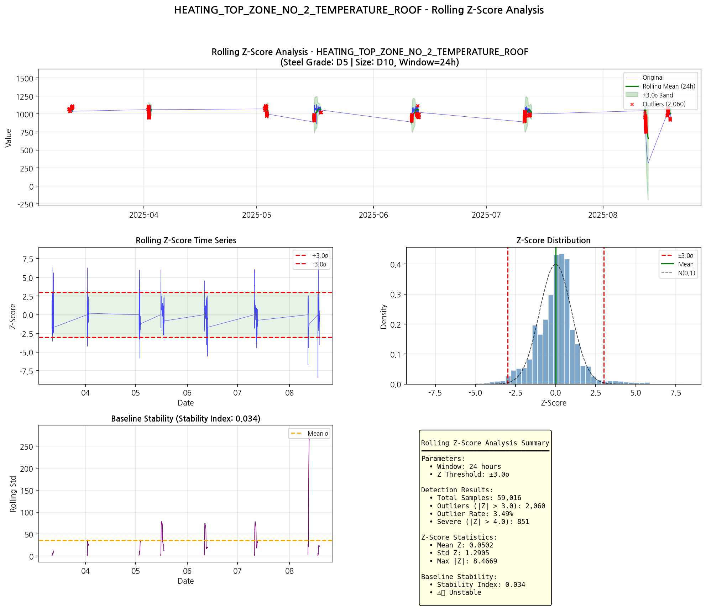

**HEATING_TOP_ZONE_NO_1_TEMPERATURE_ROOF** (이상치율: 3.43%, 안정성: 0.040)

**SOAKING_TOP_ZONE_NO_1_TEMPERATURE_ROOF** (이상치율: 3.11%, 안정성: 0.000)

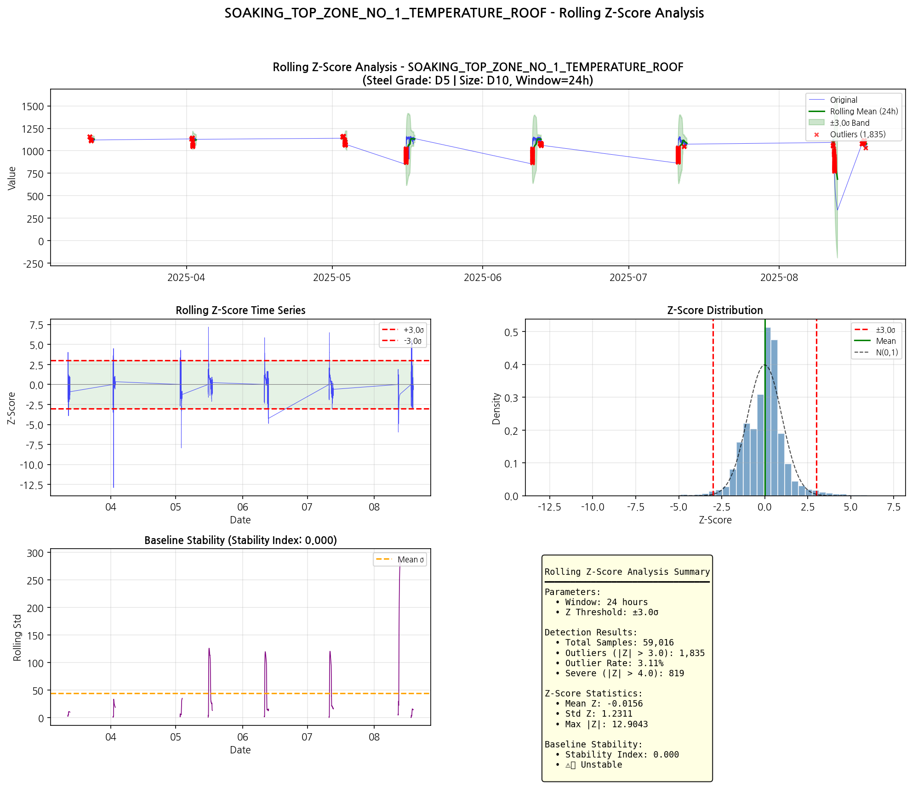

### 가열로 하부 온도 (02_Furnace_Bottom_Temperature)

- 분석 태그: 4개
- 평균 이상치율: 2.59%
- 평균 안정성: 0.175

| 태그 | 이상치율 | 심각 이상치 | 안정성 | Max \|Z\| |
|------|----------|-------------|--------|--------|
| HEATING_BOTTOM_ZONE_NO_1_TEMPERATURE_OPP_SIDE | 2.53% | 737 | 0.372 | 8.21 |
| HEATING_BOTTOM_ZONE_NO_2_TEMPERATURE_MILL_SIDE | 2.59% | 635 | 0.314 | 8.10 |
| SOAKING_BOTTOM_ZONE_NO_1_TEMPERATURE_OPP_SIDE | 2.62% | 667 | 0.016 | 7.39 |
| SOAKING_BOTTOM_ZONE_NO_2_TEMPERATURE_MILL_SIDE | 2.63% | 648 | 0.000 | 7.04 |

#### Z-Score 차트

**SOAKING_BOTTOM_ZONE_NO_2_TEMPERATURE_MILL_SIDE** (이상치율: 2.63%, 안정성: 0.000)

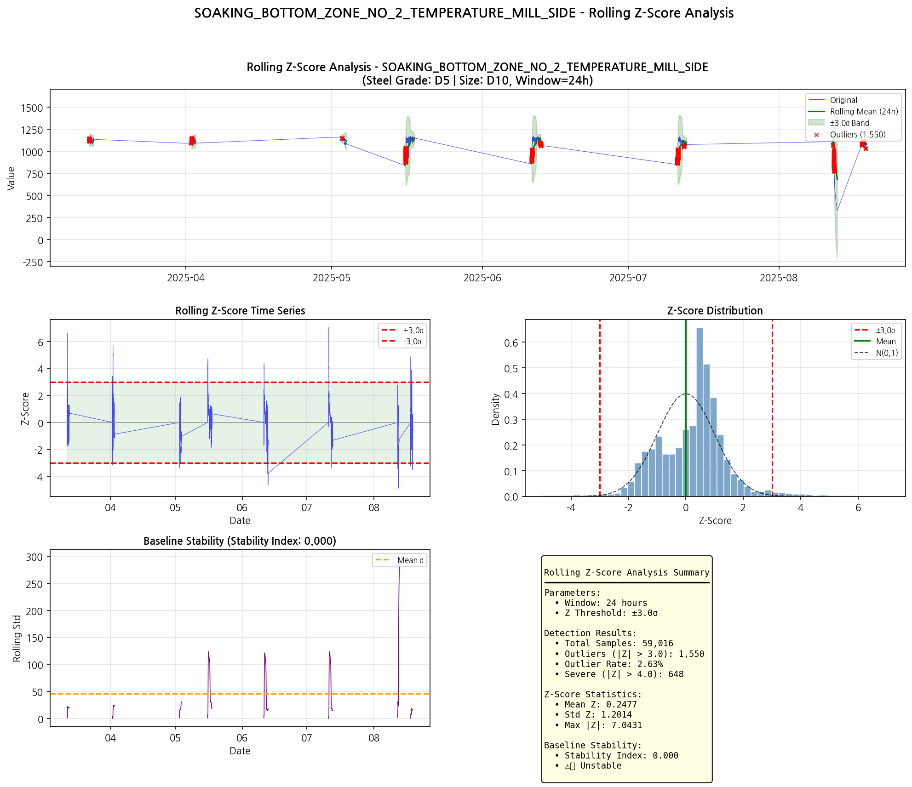

**SOAKING_BOTTOM_ZONE_NO_1_TEMPERATURE_OPP_SIDE** (이상치율: 2.62%, 안정성: 0.016)

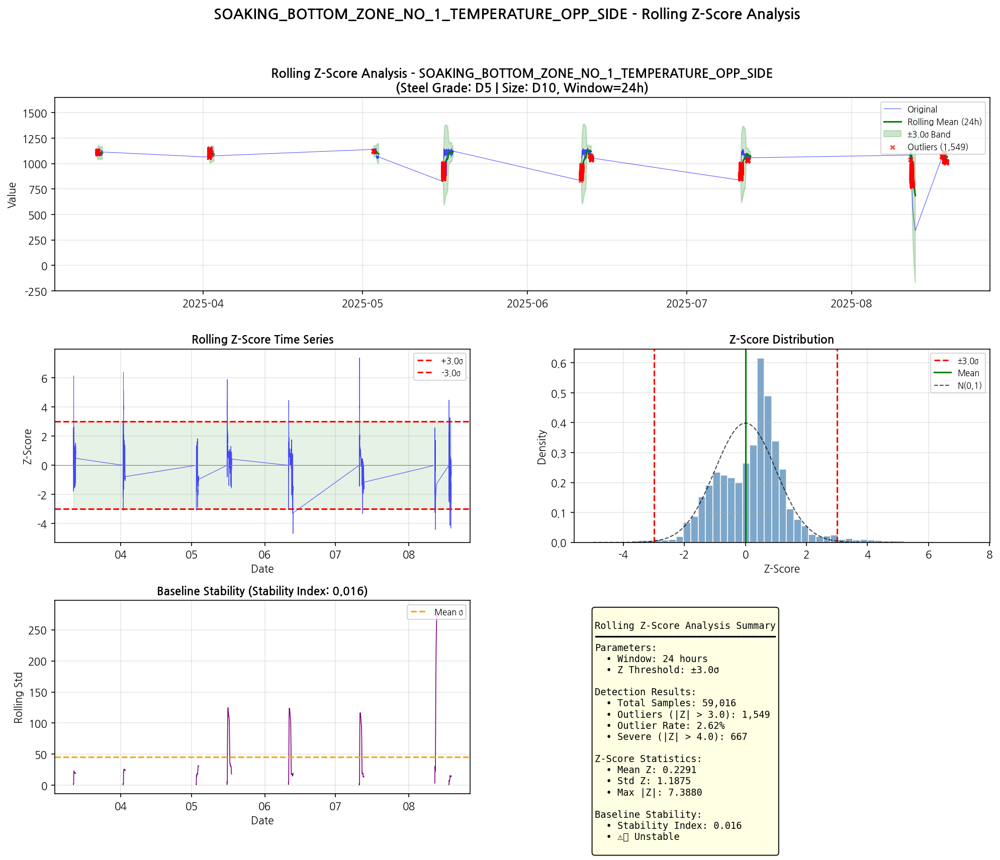

**HEATING_BOTTOM_ZONE_NO_2_TEMPERATURE_MILL_SIDE** (이상치율: 2.59%, 안정성: 0.314)

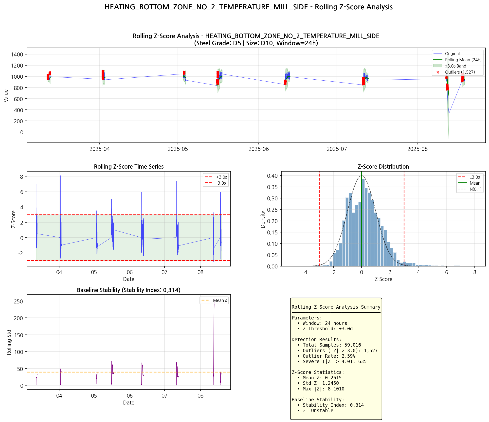

### 가열로 추출 온도 (03_Furnace_Discharge_Temperature)

- 분석 태그: 1개
- 평균 이상치율: 6.09%
- 평균 안정성: 0.744

| 태그 | 이상치율 | 심각 이상치 | 안정성 | Max \|Z\| |
|------|----------|-------------|--------|--------|
| FURNACE_EXIT_DISCHARGE_BILLET_TEMPERATURE | 6.09% | 1401 | 0.744 | 54.10 |

#### Z-Score 차트

**FURNACE_EXIT_DISCHARGE_BILLET_TEMPERATURE** (이상치율: 6.09%, 안정성: 0.744)

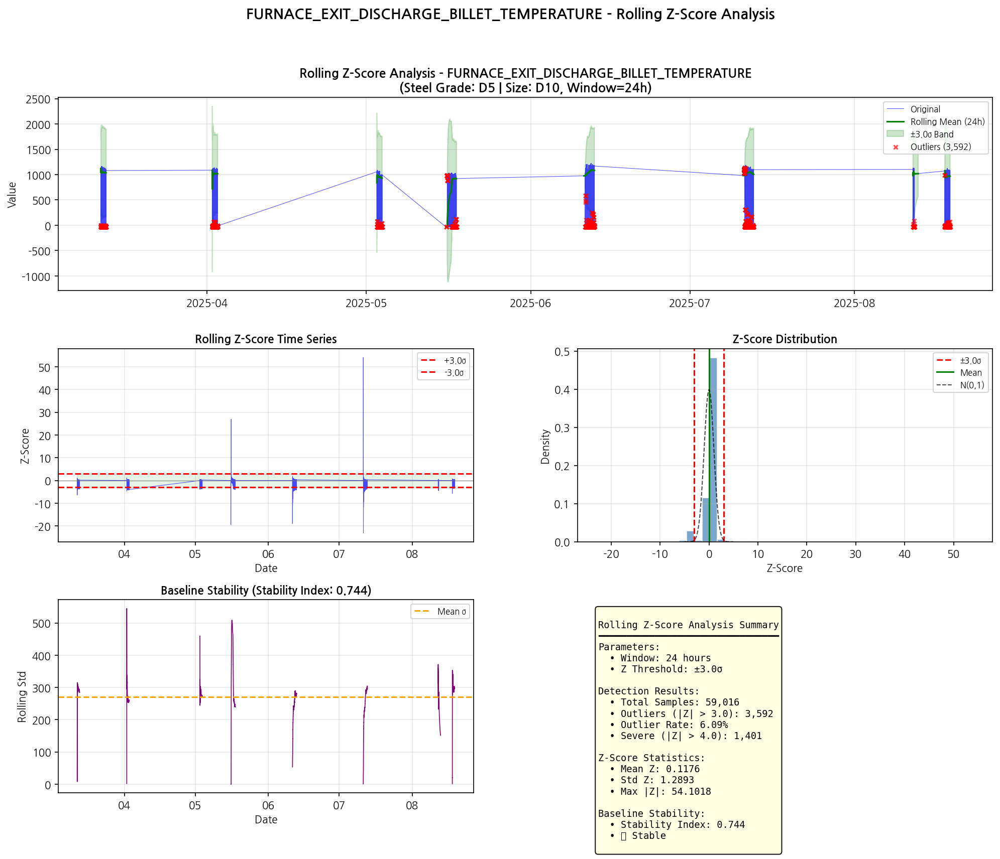

### 가열로 보조설비 (04_Furnace_Auxiliary)

- 분석 태그: 9개
- 평균 이상치율: 2.27%
- 평균 안정성: 0.338

| 태그 | 이상치율 | 심각 이상치 | 안정성 | Max \|Z\| |
|------|----------|-------------|--------|--------|
| FURNACE_PRESSURE | 1.89% | 333 | 0.609 | 8.38 |
| FURNACE_O2_ANALYZER | 2.01% | 583 | 0.315 | 59.85 |
| MAIN_GAS_PRESSURE | 2.11% | 400 | 0.000 | 16.64 |
| MAIN_GAS_FLOW | 2.91% | 592 | 0.612 | 8.23 |
| MAIN_GAS_TEMPERATURE | 2.66% | 88 | 0.496 | 6.29 |
| MAIN_COMBUSTION_AIR_PRESSURE | 1.62% | 420 | 0.000 | 38.69 |
| COMBUSTION_AIR_TEMPERATURE | 3.04% | 571 | 0.339 | 7.45 |
| INDIRECT_COOLING_WATER_FLOW | 1.59% | 238 | 0.435 | 8.31 |
| INDIRECT_WATER_MAIN_TEMPERATURE | 2.64% | 20 | 0.239 | 6.03 |

#### Z-Score 차트

**COMBUSTION_AIR_TEMPERATURE** (이상치율: 3.04%, 안정성: 0.339)

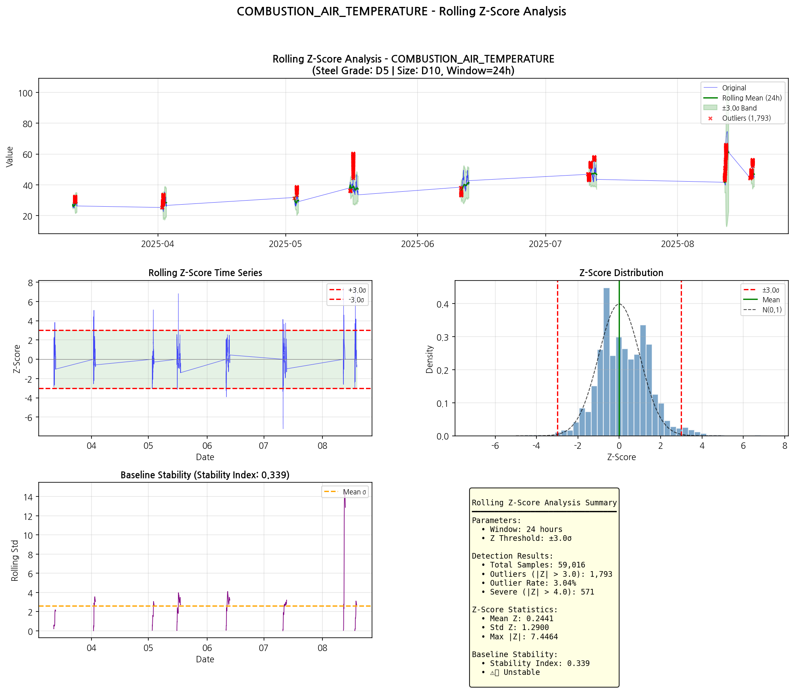

**MAIN_GAS_FLOW** (이상치율: 2.91%, 안정성: 0.612)

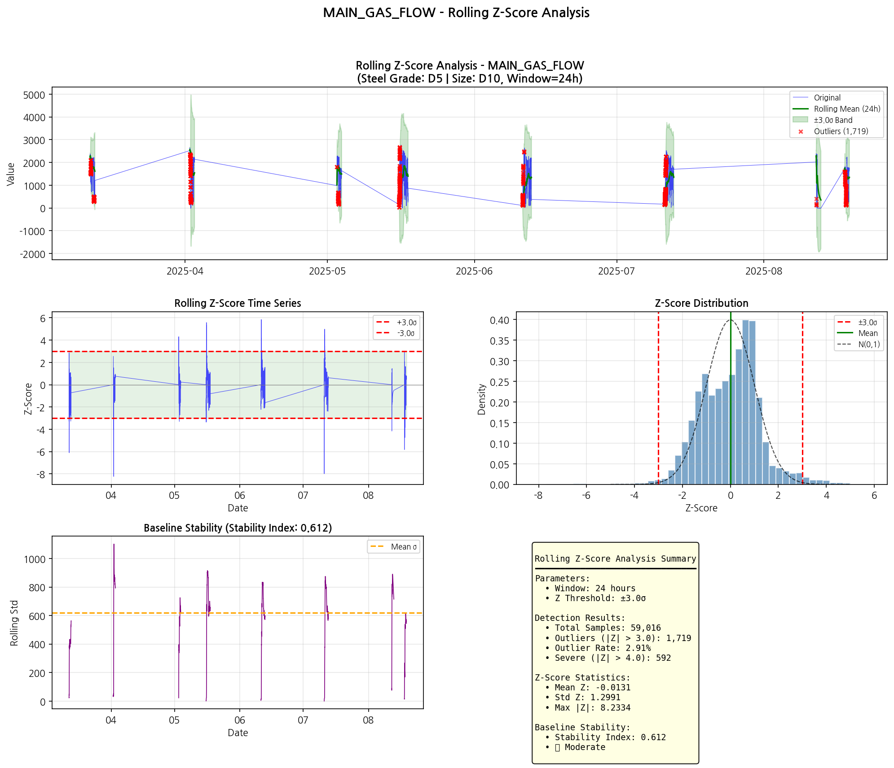

**MAIN_GAS_TEMPERATURE** (이상치율: 2.66%, 안정성: 0.496)

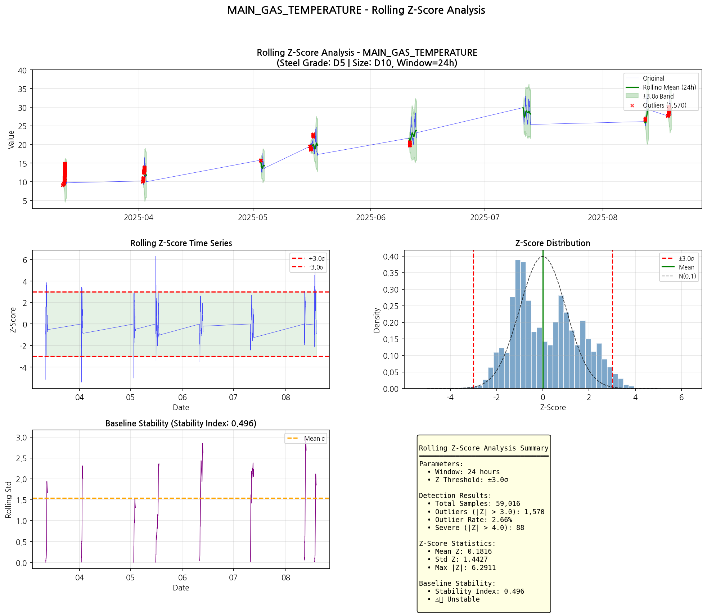

### 스탠드 토크 (05_Stand_Torque)

- 분석 태그: 16개
- 평균 이상치율: 2.18%
- 평균 안정성: 0.751

| 태그 | 이상치율 | 심각 이상치 | 안정성 | Max \|Z\| |
|------|----------|-------------|--------|--------|
| STAND_1_ACTUAL_TORQUE | 2.25% | 661 | 0.754 | 46.20 |
| STAND_2_ACTUAL_TORQUE | 1.94% | 574 | 0.750 | 43.97 |
| STAND_3_ACTUAL_TORQUE | 2.20% | 628 | 0.754 | 46.65 |
| STAND_4_ACTUAL_TORQUE | 2.20% | 607 | 0.744 | 43.97 |
| STAND_5_ACTUAL_TORQUE | 2.14% | 613 | 0.761 | 46.20 |
| STAND_6_ACTUAL_TORQUE | 2.22% | 662 | 0.757 | 46.20 |
| STAND_7_ACTUAL_TORQUE | 2.22% | 670 | 0.761 | 46.20 |
| STAND_8_ACTUAL_TORQUE | 2.20% | 685 | 0.727 | 43.89 |
| STAND_9_ACTUAL_TORQUE | 2.20% | 623 | 0.737 | 46.20 |
| STAND_10_ACTUAL_TORQUE | 2.24% | 650 | 0.753 | 46.20 |
| STAND_11_ACTUAL_TORQUE | 2.20% | 674 | 0.745 | 43.81 |
| STAND_12_ACTUAL_TORQUE | 2.20% | 630 | 0.753 | 46.20 |
| STAND_13_ACTUAL_TORQUE | 2.20% | 622 | 0.759 | 46.20 |
| STAND_14_ACTUAL_TORQUE | 2.17% | 622 | 0.757 | 46.20 |
| FINISHING_BLOCK_MASTER_ACTUAL_TORQUE | 2.17% | 641 | 0.747 | 46.02 |
| FINISHING_BLOCK_SLAVE_ACTUAL_TORQUE | 2.17% | 640 | 0.747 | 46.02 |

#### Z-Score 차트

**STAND_1_ACTUAL_TORQUE** (이상치율: 2.25%, 안정성: 0.754)

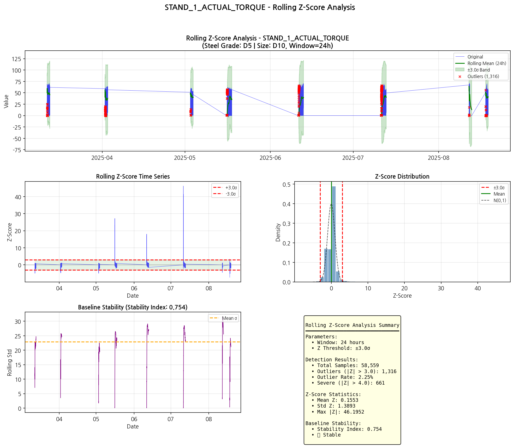

**STAND_10_ACTUAL_TORQUE** (이상치율: 2.24%, 안정성: 0.753)

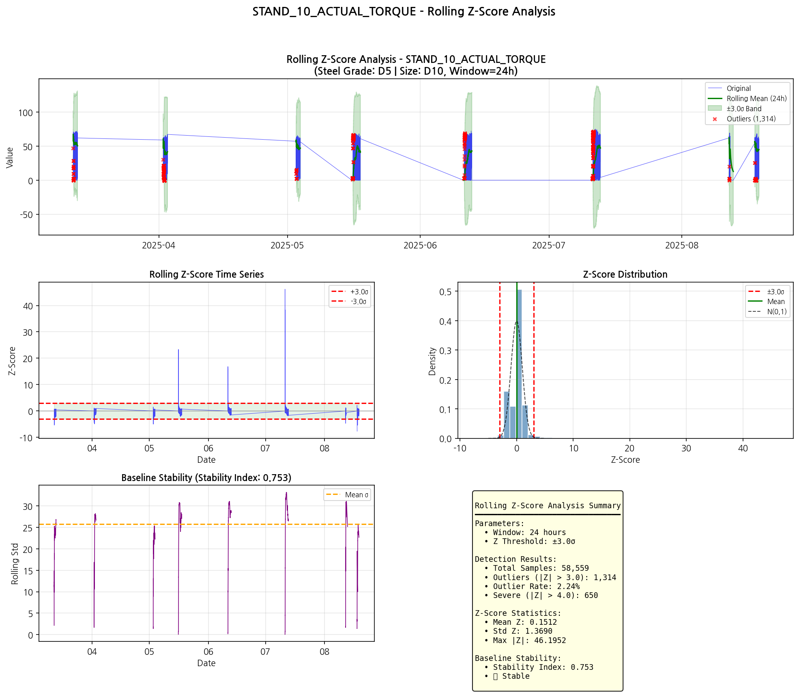

**STAND_7_ACTUAL_TORQUE** (이상치율: 2.22%, 안정성: 0.761)

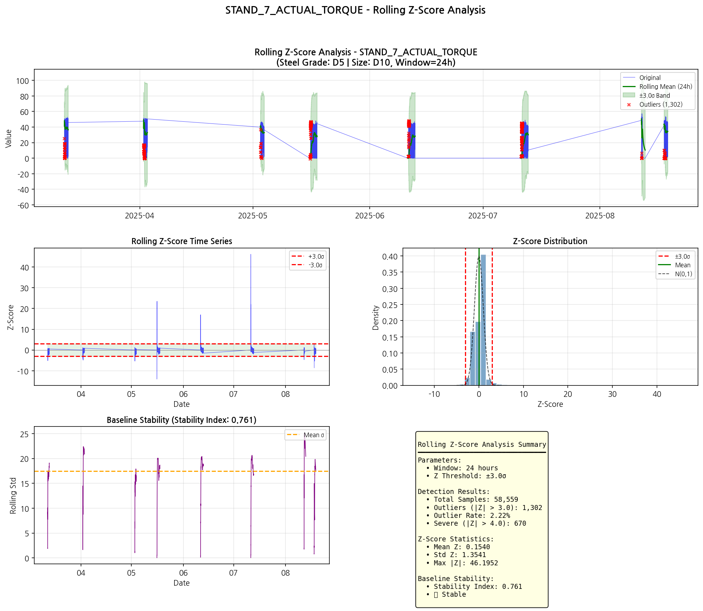

### 스탠드 속도 (06_Stand_Speed)

- 분석 태그: 15개
- 평균 이상치율: 3.09%
- 평균 안정성: 0.634

| 태그 | 이상치율 | 심각 이상치 | 안정성 | Max \|Z\| |
|------|----------|-------------|--------|--------|
| STAND_1_ACTUAL_SPEED | 3.27% | 739 | 0.625 | 46.20 |
| STAND_2_ACTUAL_SPEED | 3.10% | 689 | 0.624 | 43.97 |
| STAND_3_ACTUAL_SPEED | 3.19% | 697 | 0.629 | 46.20 |
| STAND_4_ACTUAL_SPEED | 2.95% | 676 | 0.627 | 43.97 |
| STAND_5_ACTUAL_SPEED | 3.12% | 689 | 0.630 | 46.20 |
| STAND_6_ACTUAL_SPEED | 3.11% | 698 | 0.629 | 46.20 |
| STAND_7_ACTUAL_SPEED | 3.12% | 694 | 0.628 | 46.20 |
| STAND_8_ACTUAL_SPEED | 2.96% | 685 | 0.632 | 43.94 |
| STAND_9_ACTUAL_SPEED | 3.00% | 672 | 0.640 | 46.20 |
| STAND_10_ACTUAL_SPEED | 3.07% | 681 | 0.644 | 46.20 |
| STAND_11_ACTUAL_SPEED | 3.01% | 684 | 0.635 | 43.81 |
| STAND_12_ACTUAL_SPEED | 3.06% | 693 | 0.645 | 46.20 |
| STAND_13_ACTUAL_SPEED | 3.08% | 695 | 0.650 | 46.20 |
| STAND_14_ACTUAL_SPEED | 3.10% | 695 | 0.637 | 46.20 |
| FINISHING_BLOCK_ACTUAL_SPEED | 3.17% | 744 | 0.639 | 46.02 |

#### Z-Score 차트

**STAND_1_ACTUAL_SPEED** (이상치율: 3.27%, 안정성: 0.625)

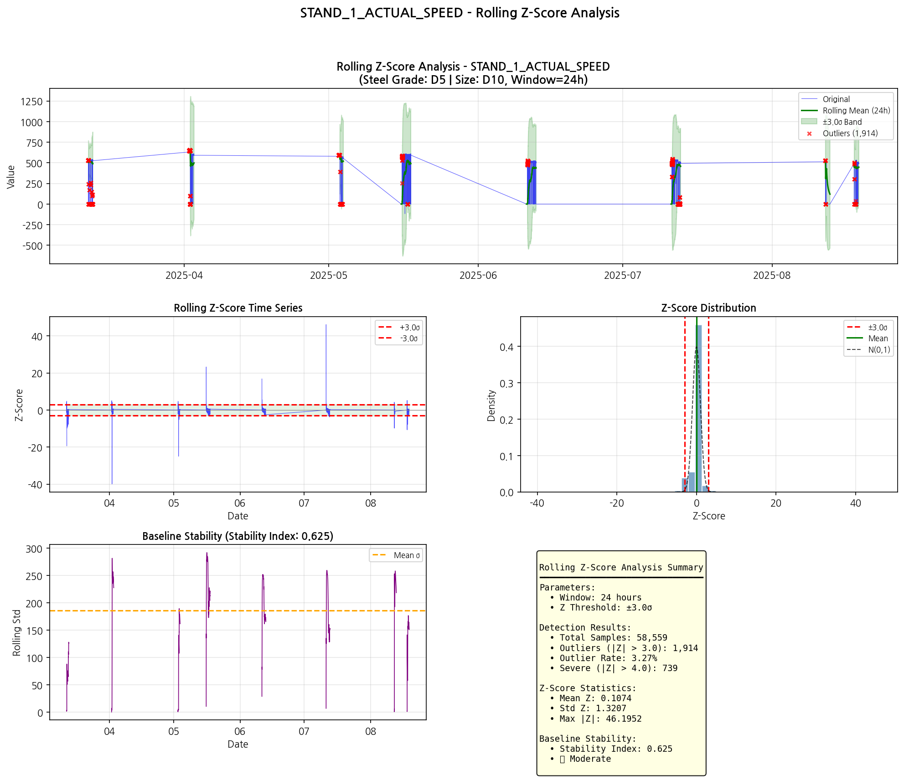

**STAND_3_ACTUAL_SPEED** (이상치율: 3.19%, 안정성: 0.629)

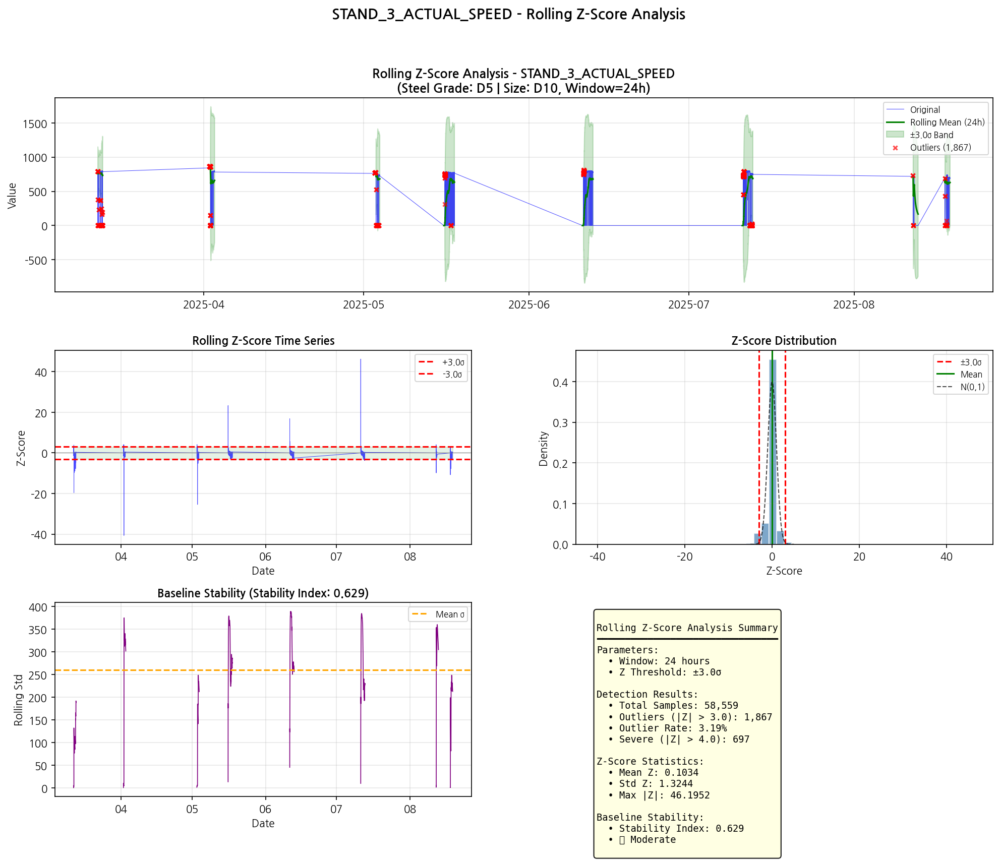

**FINISHING_BLOCK_ACTUAL_SPEED** (이상치율: 3.17%, 안정성: 0.639)

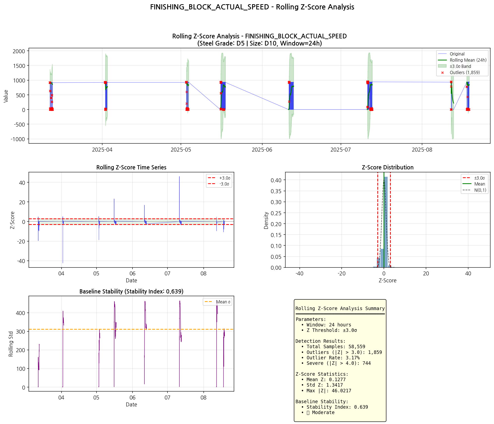

### 스탠드 부하 (07_Stand_Load)

- 분석 태그: 15개
- 평균 이상치율: 1.47%
- 평균 안정성: 0.805

| 태그 | 이상치율 | 심각 이상치 | 안정성 | Max \|Z\| |
|------|----------|-------------|--------|--------|
| STAND_1_LOAD | 1.49% | 358 | 0.803 | 46.52 |
| STAND_2_LOAD | 1.48% | 354 | 0.805 | 46.52 |
| STAND_3_LOAD | 1.41% | 345 | 0.807 | 46.60 |
| STAND_4_LOAD | 1.44% | 324 | 0.807 | 46.60 |
| STAND_5_LOAD | 1.46% | 323 | 0.805 | 46.60 |
| STAND_6_LOAD | 1.47% | 334 | 0.804 | 46.60 |
| STAND_7_LOAD | 1.45% | 358 | 0.804 | 46.60 |
| STAND_8_LOAD | 1.45% | 367 | 0.803 | 46.60 |
| STAND_9_LOAD | 1.46% | 359 | 0.804 | 46.60 |
| STAND_10_LOAD | 1.47% | 365 | 0.804 | 46.60 |
| STAND_11_LOAD | 1.49% | 374 | 0.804 | 46.60 |
| STAND_12_LOAD | 1.49% | 373 | 0.804 | 46.60 |
| STAND_13_LOAD | 1.49% | 373 | 0.804 | 46.60 |
| STAND_14_LOAD | 1.49% | 372 | 0.804 | 46.60 |
| FINISHING_BLOCK_LOAD | 1.47% | 367 | 0.805 | 46.60 |

#### Z-Score 차트

**STAND_14_LOAD** (이상치율: 1.49%, 안정성: 0.804)

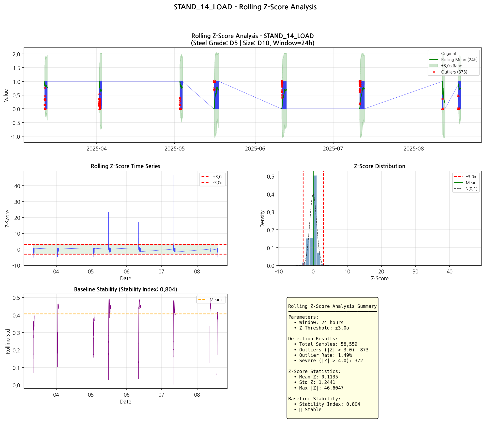

**STAND_1_LOAD** (이상치율: 1.49%, 안정성: 0.803)

**STAND_11_LOAD** (이상치율: 1.49%, 안정성: 0.804)

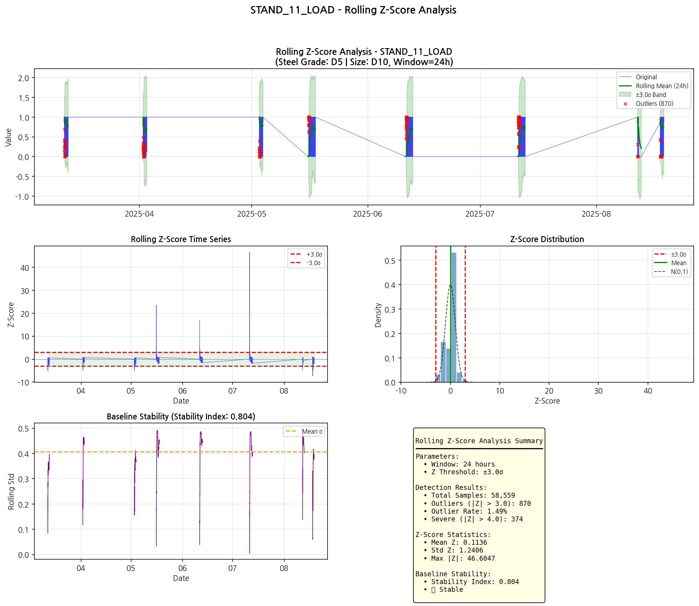

### 핀치롤 (08_Pinchroll)

- 분석 태그: 9개
- 평균 이상치율: 1.06%
- 평균 안정성: 0.516

| 태그 | 이상치율 | 심각 이상치 | 안정성 | Max \|Z\| |
|------|----------|-------------|--------|--------|
| PINCHROLL_2_ACTUAL_SPEED | 1.41% | 350 | 0.369 | 26.14 |
| PINCHROLL_3_ACTUAL_SPEED | 1.33% | 319 | 0.000 | 44.57 |
| PINCHROLL_4_ACTUAL_SPEED | 1.46% | 321 | 0.000 | 41.31 |
| PINCHROLL_2_ACTUAL_TORQUE | 0.90% | 153 | 0.793 | 16.30 |
| PINCHROLL_3_ACTUAL_TORQUE | 1.06% | 185 | 0.762 | 21.69 |
| PINCHROLL_4_ACTUAL_TORQUE | 0.94% | 141 | 0.787 | 9.41 |
| PINCHROLL_2_REFERENCE_TORQUE | 0.56% | 240 | 0.358 | 61.64 |
| PINCHROLL_3_REFERENCE_TORQUE | 0.94% | 149 | 0.764 | 26.21 |
| PINCHROLL_4_REFERENCE_TORQUE | 0.95% | 110 | 0.809 | 8.08 |

#### Z-Score 차트

**PINCHROLL_4_ACTUAL_SPEED** (이상치율: 1.46%, 안정성: 0.000)

**PINCHROLL_2_ACTUAL_SPEED** (이상치율: 1.41%, 안정성: 0.369)

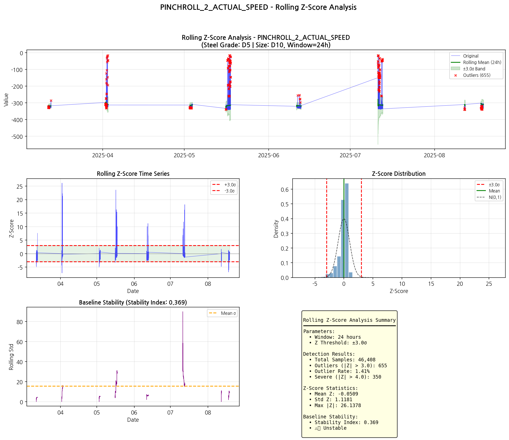

**PINCHROLL_3_ACTUAL_SPEED** (이상치율: 1.33%, 안정성: 0.000)

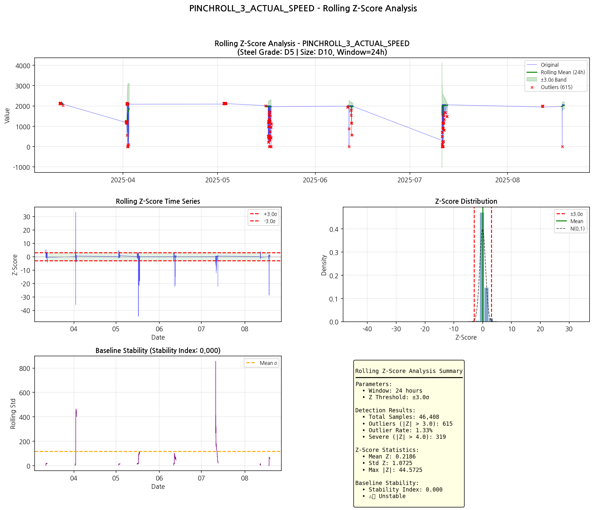

### PR 상세 토크 (09_PR_Detailed)

- 분석 태그: 6개
- 평균 이상치율: 1.73%
- 평균 안정성: 0.212

| 태그 | 이상치율 | 심각 이상치 | 안정성 | Max \|Z\| |
|------|----------|-------------|--------|--------|
| PR6L1_ACT_TORQUE | 2.36% | 755 | 0.000 | 32.29 |
| PR6L2_ACT_TORQUE | 1.80% | 567 | 0.010 | 30.09 |
| PR7L1_ACT_TORQUE | 2.72% | 728 | 0.000 | 30.08 |
| PR7L2_ACT_TORQUE | 2.55% | 718 | 0.000 | 30.12 |
| PR8L1_ACT_TORQUE | 0.42% | 98 | 0.723 | 30.08 |
| PR9L1_ACT_TORQUE | 0.56% | 143 | 0.537 | 30.08 |

#### Z-Score 차트

**PR7L1_ACT_TORQUE** (이상치율: 2.72%, 안정성: 0.000)

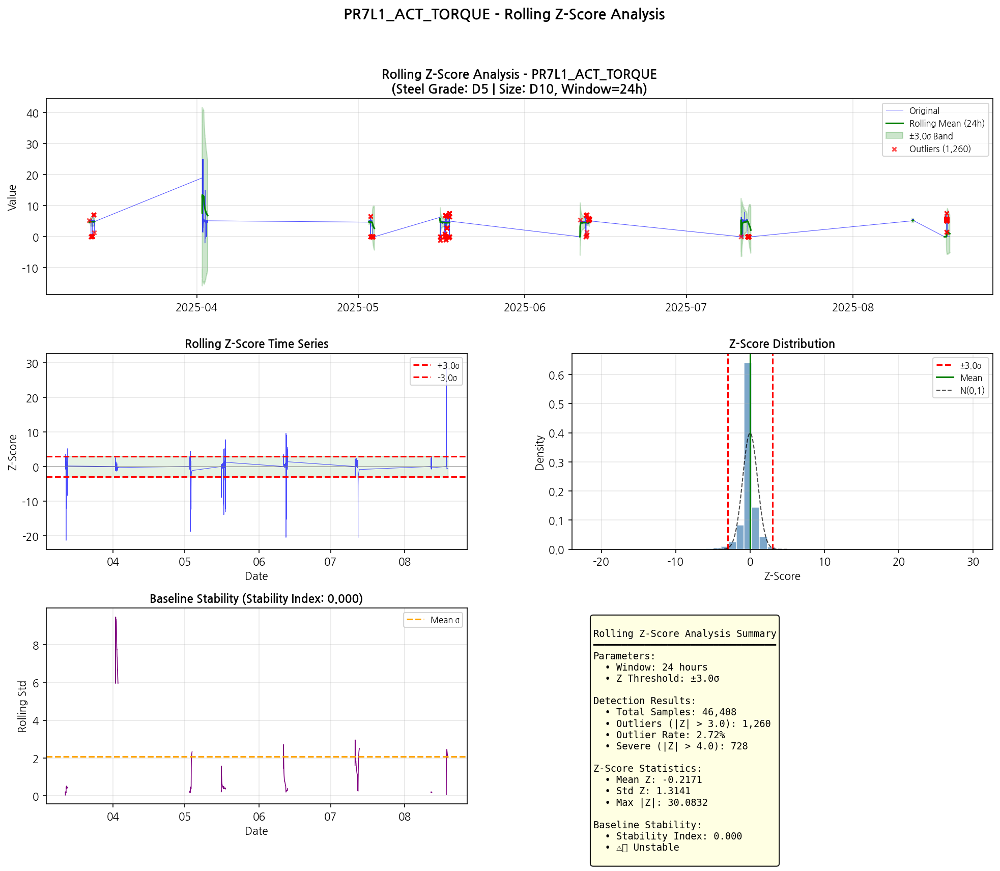

**PR7L2_ACT_TORQUE** (이상치율: 2.55%, 안정성: 0.000)

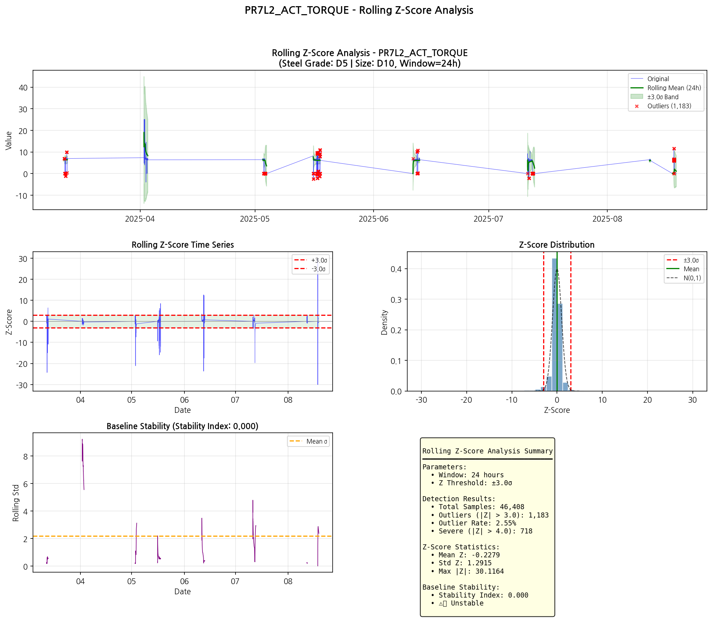

**PR6L1_ACT_TORQUE** (이상치율: 2.36%, 안정성: 0.000)

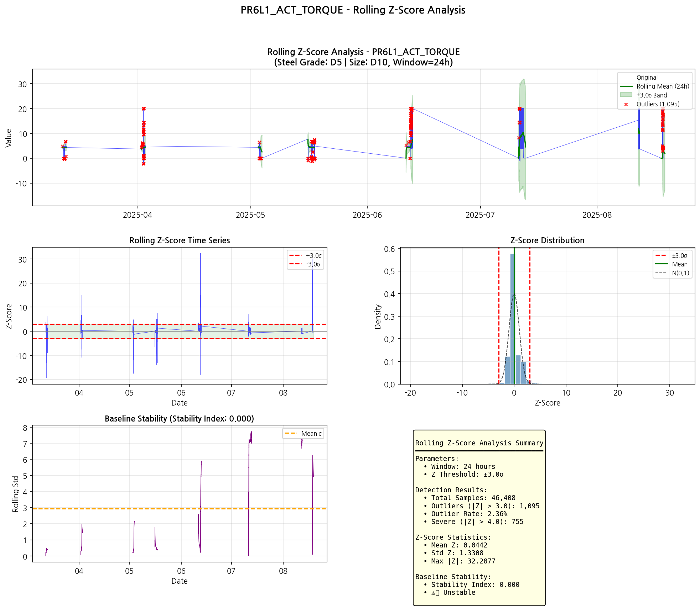

---

## 해석 가이드

### Rolling Z-Score 해석

1. **이상치율 (Outlier Rate)**
   - |Z| > 3.0σ 비율
   - 높을수록 해당 시점 주변 패턴에서 벗어난 데이터 많음
   - 정상 분포 가정 시 약 0.3% 예상

2. **기준선 안정성 (Baseline Stability)**
   - Rolling std의 시간적 일관성
   - 1에 가까울수록 안정적
   - 0.5 미만: 비정상 시계열, 다른 방법 권장

3. **심각 이상치 (Severe Outliers)**
   - |Z| > 4.0σ
   - 극단적인 이상값
   - 즉각적인 점검 필요

### 상태 분류

| 상태 | 기준 | 해석 |
|------|------|------|
| 🔴 높음 | ≥10% | 빈번한 이상치, 점검 필요 |
| 🟠 중간 | 3~10% | 일부 이상치, 모니터링 |
| 🟢 낮음 | <3% | 정상 범위 |
| 🟡 불안정 | Stability < 0.5 | 기준선 변동 심함 |

### Standard IQR vs Rolling Z-Score

| 방법 | 장점 | 단점 |
|------|------|------|
| Standard IQR | 간단, 전체 분포 기반 | 시변 데이터에 부적합 |
| Rolling Z-Score | 시변 데이터 적합 | 윈도우 크기 설정 필요 |

**권장**: 기준선 안정성 ≥ 0.5인 태그에 효과적

---

## 메타데이터

| 항목 | 값 |
|------|-----|
| 분석 스크립트 | steel_grade_rolling_zscore_analysis.py |
| 분석 기간 | 2025-03-01 ~ 2025-08-31 |
| 강종 | D5 |
| 윈도우 크기 | 24시간 |
| Z 임계값 | ±3.0σ |
| 생성일시 | 2026-02-09 15:14:58 |
| 총 분석 태그 | 79개 |

---

*본 보고서는 자동 생성되었습니다.*
