# 강종 [D5 | Size: D13] Rolling Z-Score 동적 이상치 분석 보고서

**분석 기간**: 2025-03-01 ~ 2025-08-31
**강종**: D5  
**사이즈**: D13
**생성일시**: 2026-02-09 15:15:34

---

## 분석 개요

### 분석 방법론

**Rolling Z-Score (롤링 Z-점수)**

시간 창(window) 기반 동적 이상치 탐지 방법입니다.

$$Z_{rolling}(t) = \frac{x(t) - \mu_{window}(t)}{\sigma_{window}(t)}$$

| 파라미터 | 값 | 설명 |
|----------|-----|------|
| Window | 24h | 이동 평균/표준편차 윈도우 |
| Z Threshold | ±3.0σ | 이상치 판정 임계값 |
| Severe | ±4.0σ | 심각 이상치 임계값 |

### 장점

- **비정상 시계열 적합**: 평균/분산 시변하는 데이터에 효과적
- **점진적 기준선 추적**: 장기 드리프트에 강건
- **Local Context 기반**: 해당 시점 주변 패턴 기준

### 분석 결과 요약

| 구분 | 태그 수 | 비율 |
|------|---------|------|
| **총 분석 태그** | 79개 | 100% |
| 🔴 높은 이상치율 (≥10%) | 0개 | 0.0% |
| 🟠 중간 이상치율 (3~10%) | 40개 | 50.6% |
| 🟢 낮은 이상치율 (<3%) | 33개 | 41.8% |
| 🟡 불안정 기준선 | 6개 | 7.6% |

#### 전체 평균

| 지표 | 값 |
|------|-----|
| 평균 이상치율 | 2.95% |
| 평균 기준선 안정성 | 0.700 |

---

## 상위 문제 태그 (이상치율 기준)

| 순위 | 태그 | 카테고리 | 이상치율 | 심각 이상치 | 안정성 | 상태 |
|------|------|----------|----------|-------------|--------|------|
| 1 | MAIN_GAS_FLOW | 가열로 보조설비 | 6.59% | 532 | 0.485 | 🟠 |
| 2 | STAND_6_ACTUAL_TORQUE | 스탠드 토크 | 5.97% | 497 | 0.706 | 🟠 |
| 3 | STAND_8_ACTUAL_TORQUE | 스탠드 토크 | 5.89% | 556 | 0.693 | 🟠 |
| 4 | STAND_4_ACTUAL_TORQUE | 스탠드 토크 | 5.66% | 495 | 0.682 | 🟠 |
| 5 | STAND_2_ACTUAL_TORQUE | 스탠드 토크 | 5.47% | 498 | 0.708 | 🟠 |
| 6 | FINISHING_BLOCK_MASTER_ACTUAL_TORQUE | 스탠드 토크 | 5.47% | 437 | 0.703 | 🟠 |
| 7 | FINISHING_BLOCK_SLAVE_ACTUAL_TORQUE | 스탠드 토크 | 5.47% | 439 | 0.703 | 🟠 |
| 8 | STAND_7_ACTUAL_TORQUE | 스탠드 토크 | 5.46% | 513 | 0.690 | 🟠 |
| 9 | STAND_1_ACTUAL_TORQUE | 스탠드 토크 | 5.39% | 415 | 0.683 | 🟠 |
| 10 | STAND_10_ACTUAL_TORQUE | 스탠드 토크 | 5.39% | 508 | 0.715 | 🟠 |
| 11 | STAND_5_ACTUAL_TORQUE | 스탠드 토크 | 5.38% | 479 | 0.712 | 🟠 |
| 12 | STAND_11_ACTUAL_TORQUE | 스탠드 토크 | 5.14% | 471 | 0.720 | 🟠 |
| 13 | STAND_12_ACTUAL_TORQUE | 스탠드 토크 | 5.08% | 472 | 0.700 | 🟠 |
| 14 | STAND_3_ACTUAL_TORQUE | 스탠드 토크 | 5.04% | 456 | 0.709 | 🟠 |
| 15 | STAND_13_ACTUAL_TORQUE | 스탠드 토크 | 5.03% | 486 | 0.713 | 🟠 |

---

## 불안정 기준선 태그

기준선 안정성(Stability Index)이 0.5 미만인 태그입니다.
이 태그들은 Rolling Z-Score 방법보다 다른 방법이 더 적합할 수 있습니다.

| 태그 | 카테고리 | 안정성 | 이상치율 |
|------|----------|--------|----------|
| INDIRECT_COOLING_WATER_FLOW | 가열로 보조설비 | 0.169 | 1.48% |
| PR6L1_ACT_TORQUE | PR 상세 토크 | 0.236 | 1.74% |
| INDIRECT_WATER_MAIN_TEMPERATURE | 가열로 보조설비 | 0.278 | 0.00% |
| PR6L2_ACT_TORQUE | PR 상세 토크 | 0.295 | 1.72% |
| PINCHROLL_4_ACTUAL_SPEED | 핀치롤 | 0.411 | 0.60% |
| FURNACE_O2_ANALYZER | 가열로 보조설비 | 0.425 | 4.60% |
| MAIN_GAS_TEMPERATURE | 가열로 보조설비 | 0.440 | 0.59% |
| MAIN_COMBUSTION_AIR_PRESSURE | 가열로 보조설비 | 0.447 | 3.64% |
| COMBUSTION_AIR_TEMPERATURE | 가열로 보조설비 | 0.464 | 3.40% |
| MAIN_GAS_FLOW | 가열로 보조설비 | 0.485 | 6.59% |

---

## 카테고리별 분석 결과

### 가열로 상부 온도 (01_Furnace_Top_Temperature)

- 분석 태그: 4개
- 평균 이상치율: 2.53%
- 평균 안정성: 0.603

| 태그 | 이상치율 | 심각 이상치 | 안정성 | Max \|Z\| |
|------|----------|-------------|--------|--------|
| HEATING_TOP_ZONE_NO_1_TEMPERATURE_ROOF | 1.84% | 0 | 0.619 | 3.53 |
| HEATING_TOP_ZONE_NO_2_TEMPERATURE_ROOF | 1.61% | 0 | 0.624 | 3.49 |
| SOAKING_TOP_ZONE_NO_1_TEMPERATURE_ROOF | 3.38% | 50 | 0.581 | 4.91 |
| SOAKING_TOP_ZONE_NO_2_TEMPERATURE_ROOF | 3.27% | 41 | 0.588 | 4.70 |

#### Z-Score 차트

**SOAKING_TOP_ZONE_NO_1_TEMPERATURE_ROOF** (이상치율: 3.38%, 안정성: 0.581)

**SOAKING_TOP_ZONE_NO_2_TEMPERATURE_ROOF** (이상치율: 3.27%, 안정성: 0.588)

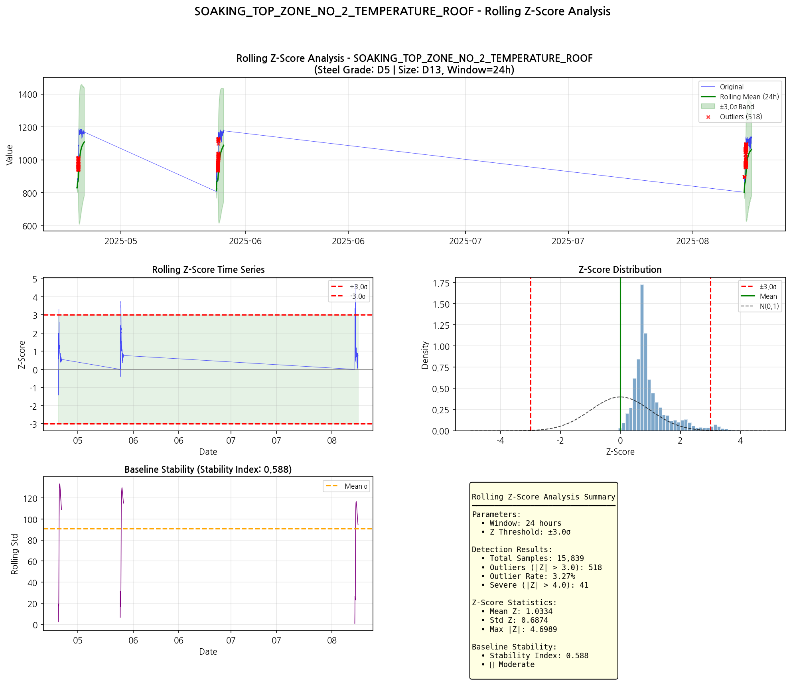

**HEATING_TOP_ZONE_NO_1_TEMPERATURE_ROOF** (이상치율: 1.84%, 안정성: 0.619)

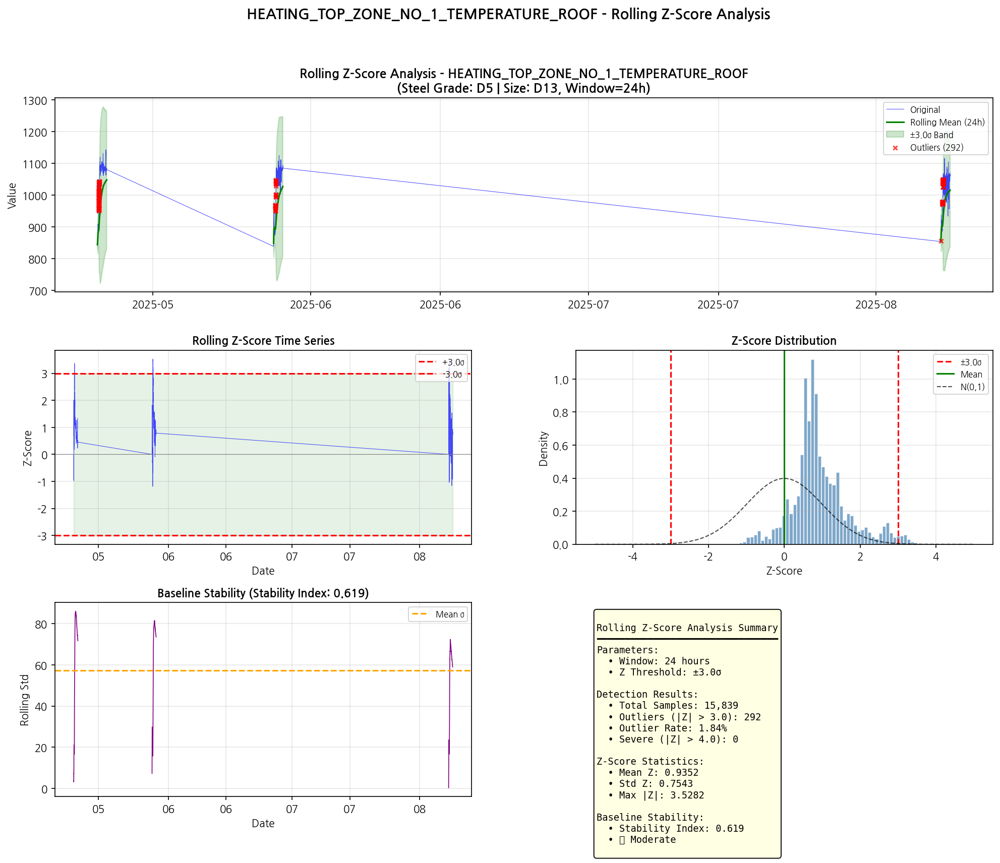

### 가열로 하부 온도 (02_Furnace_Bottom_Temperature)

- 분석 태그: 4개
- 평균 이상치율: 1.37%
- 평균 안정성: 0.621

| 태그 | 이상치율 | 심각 이상치 | 안정성 | Max \|Z\| |
|------|----------|-------------|--------|--------|
| HEATING_BOTTOM_ZONE_NO_1_TEMPERATURE_OPP_SIDE | 0.87% | 0 | 0.661 | 3.89 |
| HEATING_BOTTOM_ZONE_NO_2_TEMPERATURE_MILL_SIDE | 0.47% | 0 | 0.640 | 3.73 |
| SOAKING_BOTTOM_ZONE_NO_1_TEMPERATURE_OPP_SIDE | 1.94% | 64 | 0.592 | 4.72 |
| SOAKING_BOTTOM_ZONE_NO_2_TEMPERATURE_MILL_SIDE | 2.18% | 62 | 0.589 | 4.62 |

#### Z-Score 차트

**SOAKING_BOTTOM_ZONE_NO_2_TEMPERATURE_MILL_SIDE** (이상치율: 2.18%, 안정성: 0.589)

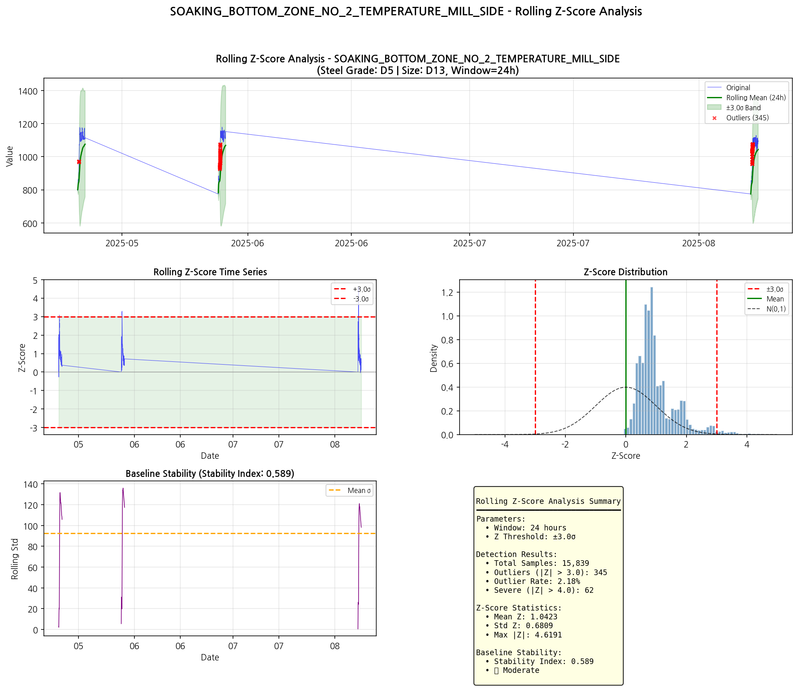

**SOAKING_BOTTOM_ZONE_NO_1_TEMPERATURE_OPP_SIDE** (이상치율: 1.94%, 안정성: 0.592)

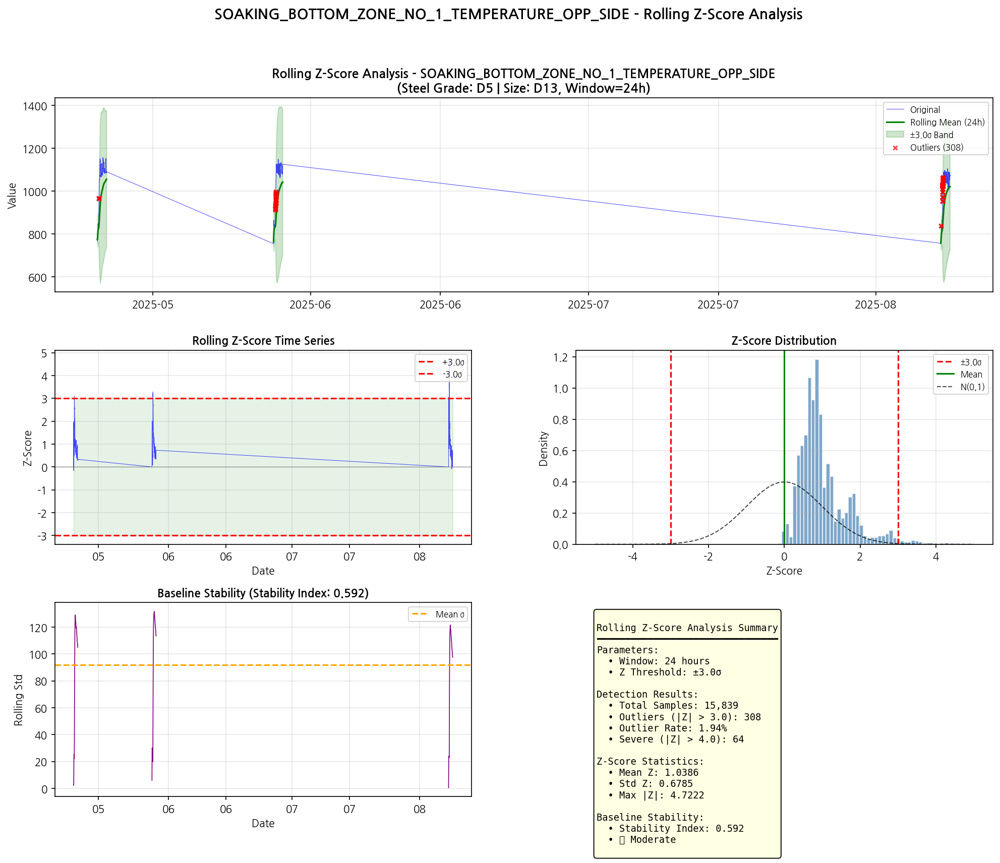

**HEATING_BOTTOM_ZONE_NO_1_TEMPERATURE_OPP_SIDE** (이상치율: 0.87%, 안정성: 0.661)

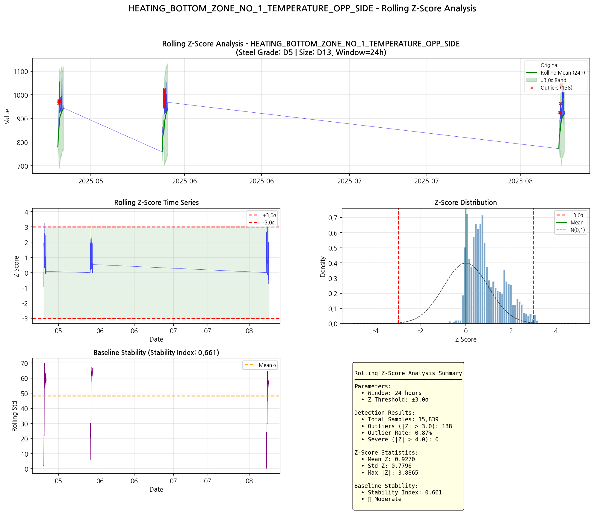

### 가열로 추출 온도 (03_Furnace_Discharge_Temperature)

- 분석 태그: 1개
- 평균 이상치율: 4.19%
- 평균 안정성: 0.597

| 태그 | 이상치율 | 심각 이상치 | 안정성 | Max \|Z\| |
|------|----------|-------------|--------|--------|
| FURNACE_EXIT_DISCHARGE_BILLET_TEMPERATURE | 4.19% | 569 | 0.597 | 53.58 |

#### Z-Score 차트

**FURNACE_EXIT_DISCHARGE_BILLET_TEMPERATURE** (이상치율: 4.19%, 안정성: 0.597)

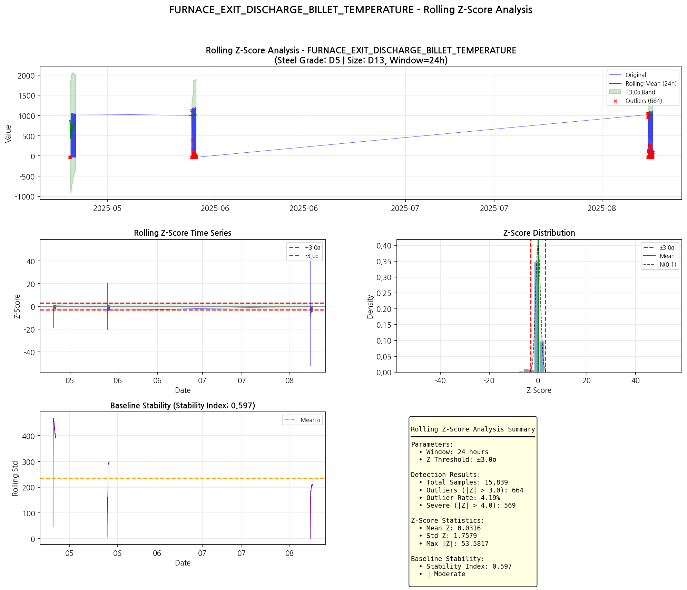

### 가열로 보조설비 (04_Furnace_Auxiliary)

- 분석 태그: 9개
- 평균 이상치율: 2.99%
- 평균 안정성: 0.434

| 태그 | 이상치율 | 심각 이상치 | 안정성 | Max \|Z\| |
|------|----------|-------------|--------|--------|
| FURNACE_PRESSURE | 4.07% | 201 | 0.558 | 17.73 |
| FURNACE_O2_ANALYZER | 4.60% | 342 | 0.425 | 46.88 |
| MAIN_GAS_PRESSURE | 2.59% | 113 | 0.644 | 9.89 |
| MAIN_GAS_FLOW | 6.59% | 532 | 0.485 | 12.66 |
| MAIN_GAS_TEMPERATURE | 0.59% | 11 | 0.440 | 5.62 |
| MAIN_COMBUSTION_AIR_PRESSURE | 3.64% | 330 | 0.447 | 46.26 |
| COMBUSTION_AIR_TEMPERATURE | 3.40% | 241 | 0.464 | 4.91 |
| INDIRECT_COOLING_WATER_FLOW | 1.48% | 65 | 0.169 | 6.34 |
| INDIRECT_WATER_MAIN_TEMPERATURE | 0.00% | 0 | 0.278 | 2.94 |

#### Z-Score 차트

**MAIN_GAS_FLOW** (이상치율: 6.59%, 안정성: 0.485)

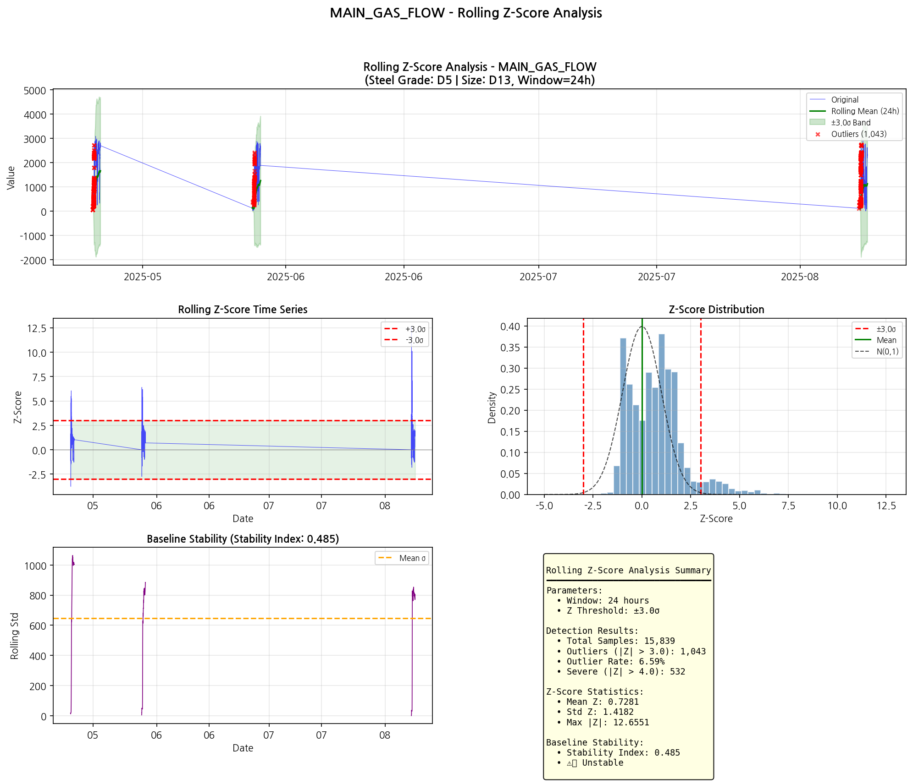

**FURNACE_O2_ANALYZER** (이상치율: 4.60%, 안정성: 0.425)

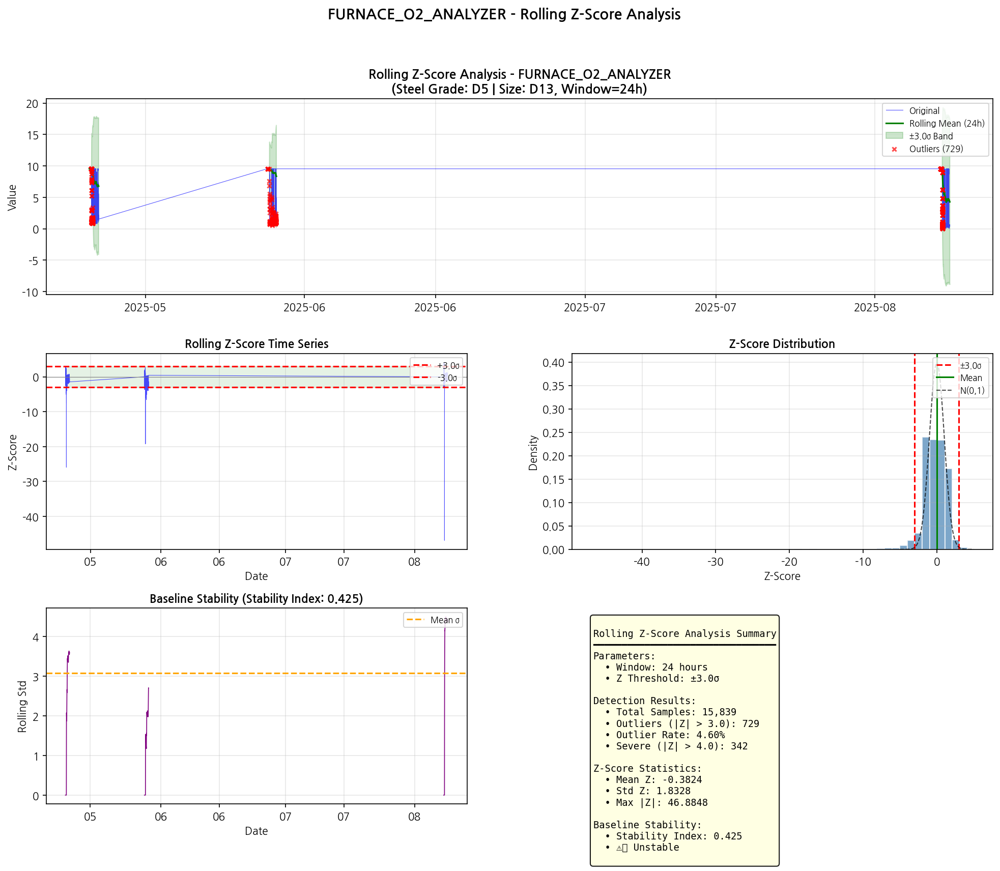

**FURNACE_PRESSURE** (이상치율: 4.07%, 안정성: 0.558)

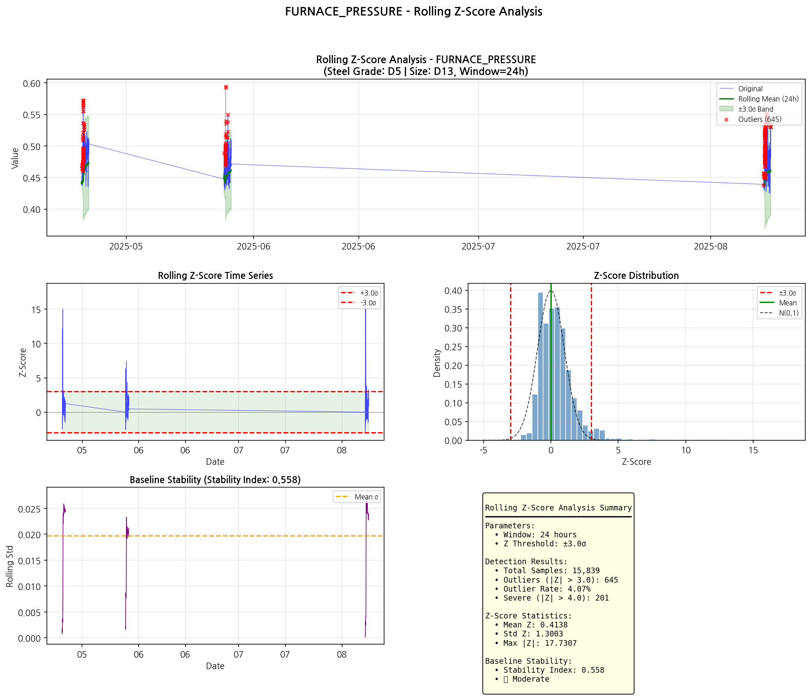

### 스탠드 토크 (05_Stand_Torque)

- 분석 태그: 16개
- 평균 이상치율: 5.36%
- 평균 안정성: 0.705

| 태그 | 이상치율 | 심각 이상치 | 안정성 | Max \|Z\| |
|------|----------|-------------|--------|--------|
| STAND_1_ACTUAL_TORQUE | 5.39% | 415 | 0.683 | 47.39 |
| STAND_2_ACTUAL_TORQUE | 5.47% | 498 | 0.708 | 49.44 |
| STAND_3_ACTUAL_TORQUE | 5.04% | 456 | 0.709 | 51.61 |
| STAND_4_ACTUAL_TORQUE | 5.66% | 495 | 0.682 | 47.86 |
| STAND_5_ACTUAL_TORQUE | 5.38% | 479 | 0.712 | 49.44 |
| STAND_6_ACTUAL_TORQUE | 5.97% | 497 | 0.706 | 49.44 |
| STAND_7_ACTUAL_TORQUE | 5.46% | 513 | 0.690 | 48.09 |
| STAND_8_ACTUAL_TORQUE | 5.89% | 556 | 0.693 | 48.39 |
| STAND_9_ACTUAL_TORQUE | 5.02% | 454 | 0.712 | 49.44 |
| STAND_10_ACTUAL_TORQUE | 5.39% | 508 | 0.715 | 49.44 |
| STAND_11_ACTUAL_TORQUE | 5.14% | 471 | 0.720 | 49.44 |
| STAND_12_ACTUAL_TORQUE | 5.08% | 472 | 0.700 | 49.44 |
| STAND_13_ACTUAL_TORQUE | 5.03% | 486 | 0.713 | 49.44 |
| STAND_14_ACTUAL_TORQUE | 4.88% | 466 | 0.730 | 49.44 |
| FINISHING_BLOCK_MASTER_ACTUAL_TORQUE | 5.47% | 437 | 0.703 | 48.70 |
| FINISHING_BLOCK_SLAVE_ACTUAL_TORQUE | 5.47% | 439 | 0.703 | 48.70 |

#### Z-Score 차트

**STAND_6_ACTUAL_TORQUE** (이상치율: 5.97%, 안정성: 0.706)

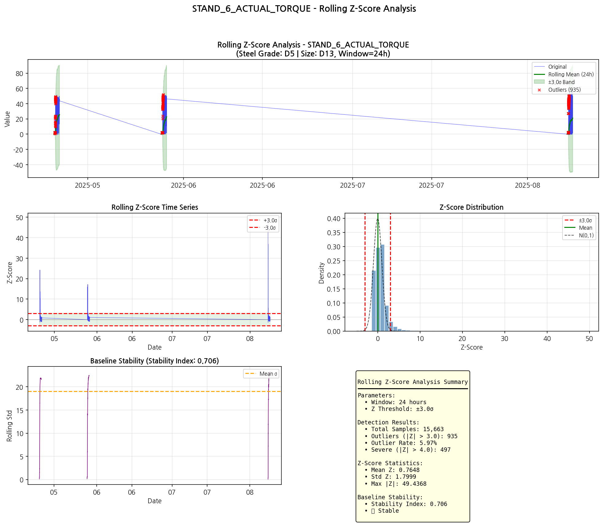

**STAND_8_ACTUAL_TORQUE** (이상치율: 5.89%, 안정성: 0.693)

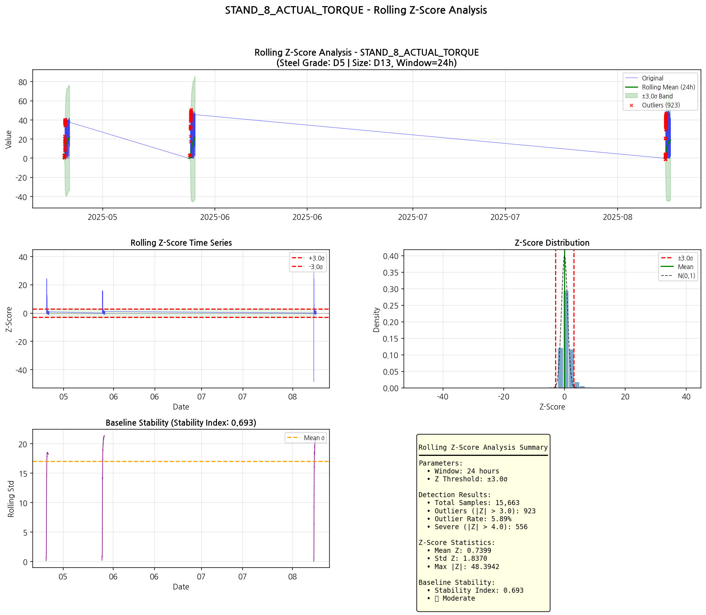

**STAND_4_ACTUAL_TORQUE** (이상치율: 5.66%, 안정성: 0.682)

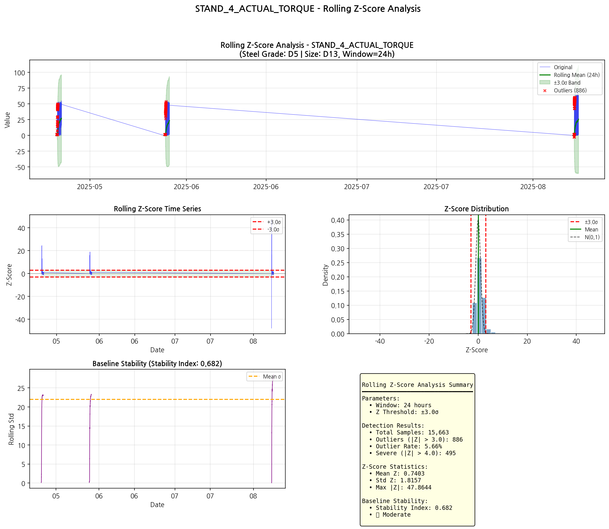

### 스탠드 속도 (06_Stand_Speed)

- 분석 태그: 15개
- 평균 이상치율: 2.84%
- 평균 안정성: 0.836

| 태그 | 이상치율 | 심각 이상치 | 안정성 | Max \|Z\| |
|------|----------|-------------|--------|--------|
| STAND_1_ACTUAL_SPEED | 2.83% | 242 | 0.803 | 47.39 |
| STAND_2_ACTUAL_SPEED | 2.92% | 228 | 0.844 | 49.44 |
| STAND_3_ACTUAL_SPEED | 2.94% | 228 | 0.844 | 49.44 |
| STAND_4_ACTUAL_SPEED | 2.99% | 235 | 0.815 | 47.86 |
| STAND_5_ACTUAL_SPEED | 2.91% | 227 | 0.844 | 49.44 |
| STAND_6_ACTUAL_SPEED | 2.91% | 228 | 0.847 | 49.44 |
| STAND_7_ACTUAL_SPEED | 2.92% | 242 | 0.822 | 49.33 |
| STAND_8_ACTUAL_SPEED | 2.94% | 235 | 0.816 | 48.39 |
| STAND_9_ACTUAL_SPEED | 2.90% | 226 | 0.848 | 49.44 |
| STAND_10_ACTUAL_SPEED | 2.68% | 227 | 0.853 | 49.44 |
| STAND_11_ACTUAL_SPEED | 2.70% | 222 | 0.849 | 49.44 |
| STAND_12_ACTUAL_SPEED | 2.71% | 223 | 0.836 | 49.44 |
| STAND_13_ACTUAL_SPEED | 2.60% | 221 | 0.841 | 49.44 |
| STAND_14_ACTUAL_SPEED | 2.60% | 221 | 0.850 | 49.44 |
| FINISHING_BLOCK_ACTUAL_SPEED | 3.01% | 273 | 0.833 | 48.70 |

#### Z-Score 차트

**FINISHING_BLOCK_ACTUAL_SPEED** (이상치율: 3.01%, 안정성: 0.833)

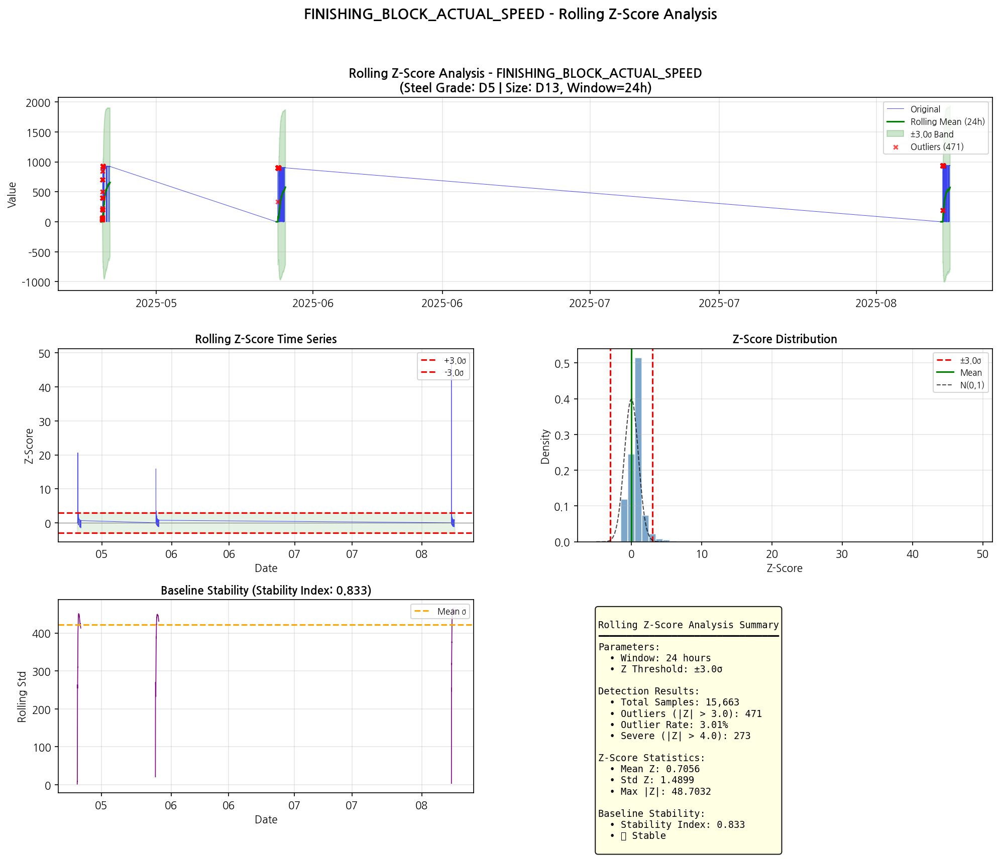

**STAND_4_ACTUAL_SPEED** (이상치율: 2.99%, 안정성: 0.815)

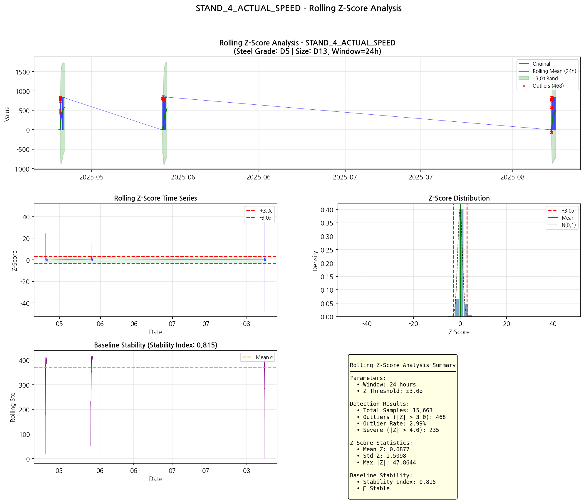

**STAND_3_ACTUAL_SPEED** (이상치율: 2.94%, 안정성: 0.844)

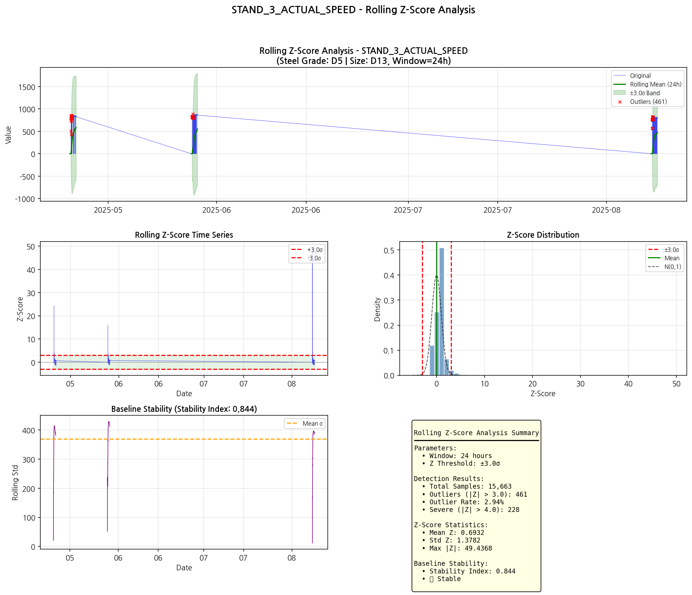

### 스탠드 부하 (07_Stand_Load)

- 분석 태그: 15개
- 평균 이상치율: 3.10%
- 평균 안정성: 0.805

| 태그 | 이상치율 | 심각 이상치 | 안정성 | Max \|Z\| |
|------|----------|-------------|--------|--------|
| STAND_1_LOAD | 3.11% | 257 | 0.805 | 49.58 |
| STAND_2_LOAD | 3.02% | 256 | 0.806 | 49.66 |
| STAND_3_LOAD | 3.04% | 250 | 0.805 | 49.66 |
| STAND_4_LOAD | 3.08% | 260 | 0.805 | 49.66 |
| STAND_5_LOAD | 3.12% | 256 | 0.805 | 49.66 |
| STAND_6_LOAD | 3.12% | 260 | 0.805 | 49.66 |
| STAND_7_LOAD | 3.12% | 257 | 0.805 | 49.66 |
| STAND_8_LOAD | 3.06% | 256 | 0.806 | 49.66 |
| STAND_9_LOAD | 3.09% | 258 | 0.805 | 49.66 |
| STAND_10_LOAD | 3.12% | 257 | 0.805 | 49.66 |
| STAND_11_LOAD | 3.12% | 259 | 0.805 | 49.66 |
| STAND_12_LOAD | 3.12% | 260 | 0.805 | 49.66 |
| STAND_13_LOAD | 3.12% | 260 | 0.805 | 49.66 |
| STAND_14_LOAD | 3.12% | 261 | 0.805 | 49.66 |
| FINISHING_BLOCK_LOAD | 3.08% | 262 | 0.805 | 49.66 |

#### Z-Score 차트

**STAND_5_LOAD** (이상치율: 3.12%, 안정성: 0.805)

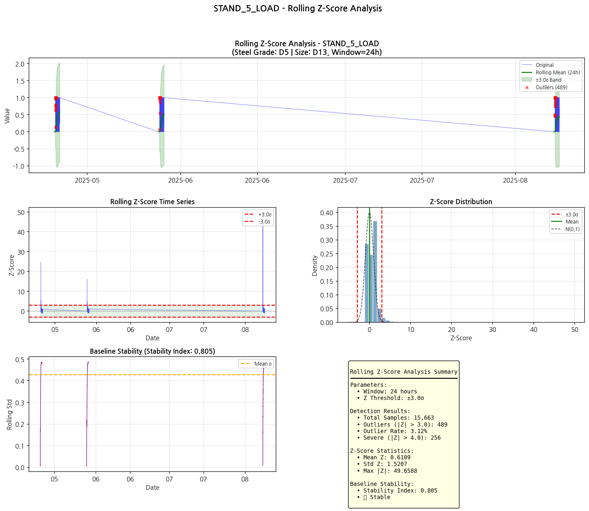

**STAND_6_LOAD** (이상치율: 3.12%, 안정성: 0.805)

**STAND_7_LOAD** (이상치율: 3.12%, 안정성: 0.805)

### 핀치롤 (08_Pinchroll)

- 분석 태그: 9개
- 평균 이상치율: 0.60%
- 평균 안정성: 0.703

| 태그 | 이상치율 | 심각 이상치 | 안정성 | Max \|Z\| |
|------|----------|-------------|--------|--------|
| PINCHROLL_2_ACTUAL_SPEED | 0.84% | 59 | 0.552 | 10.65 |
| PINCHROLL_3_ACTUAL_SPEED | 0.91% | 67 | 0.521 | 12.79 |
| PINCHROLL_4_ACTUAL_SPEED | 0.60% | 51 | 0.411 | 11.35 |
| PINCHROLL_2_ACTUAL_TORQUE | 0.72% | 44 | 0.781 | 12.87 |
| PINCHROLL_3_ACTUAL_TORQUE | 0.68% | 40 | 0.770 | 13.03 |
| PINCHROLL_4_ACTUAL_TORQUE | 0.62% | 34 | 0.787 | 11.31 |
| PINCHROLL_2_REFERENCE_TORQUE | 0.80% | 70 | 0.708 | 23.49 |
| PINCHROLL_3_REFERENCE_TORQUE | 0.10% | 5 | 0.893 | 8.18 |
| PINCHROLL_4_REFERENCE_TORQUE | 0.10% | 5 | 0.903 | 6.73 |

#### Z-Score 차트

**PINCHROLL_3_ACTUAL_SPEED** (이상치율: 0.91%, 안정성: 0.521)

**PINCHROLL_2_ACTUAL_SPEED** (이상치율: 0.84%, 안정성: 0.552)

**PINCHROLL_2_REFERENCE_TORQUE** (이상치율: 0.80%, 안정성: 0.708)

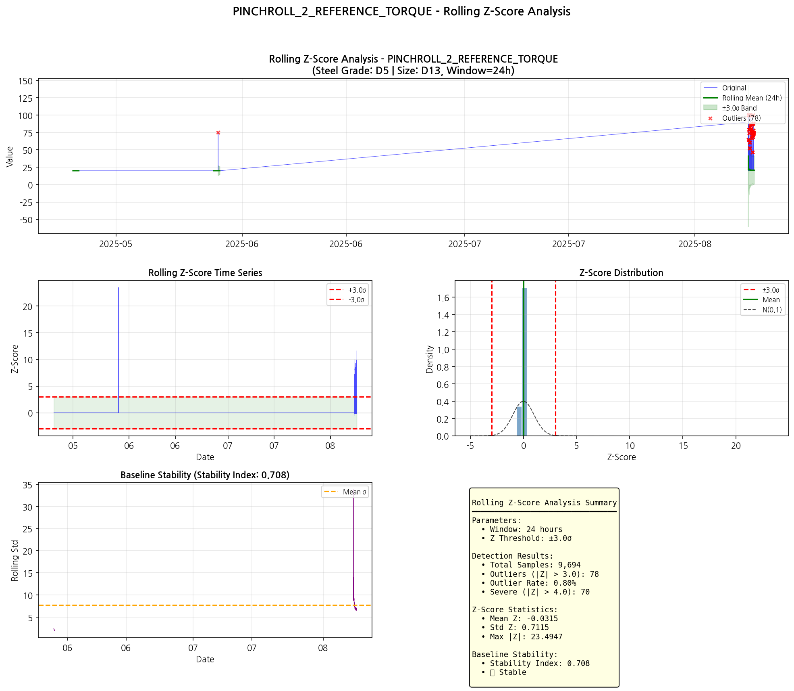

### PR 상세 토크 (09_PR_Detailed)

- 분석 태그: 6개
- 평균 이상치율: 1.03%
- 평균 안정성: 0.615

| 태그 | 이상치율 | 심각 이상치 | 안정성 | Max \|Z\| |
|------|----------|-------------|--------|--------|
| PR6L1_ACT_TORQUE | 1.74% | 86 | 0.236 | 18.19 |
| PR6L2_ACT_TORQUE | 1.72% | 91 | 0.295 | 21.99 |
| PR7L1_ACT_TORQUE | 0.66% | 35 | 0.791 | 12.70 |
| PR7L2_ACT_TORQUE | 0.75% | 40 | 0.786 | 13.10 |
| PR8L1_ACT_TORQUE | 0.65% | 28 | 0.796 | 13.71 |
| PR9L1_ACT_TORQUE | 0.66% | 37 | 0.784 | 15.72 |

#### Z-Score 차트

**PR6L1_ACT_TORQUE** (이상치율: 1.74%, 안정성: 0.236)

**PR6L2_ACT_TORQUE** (이상치율: 1.72%, 안정성: 0.295)

**PR7L2_ACT_TORQUE** (이상치율: 0.75%, 안정성: 0.786)

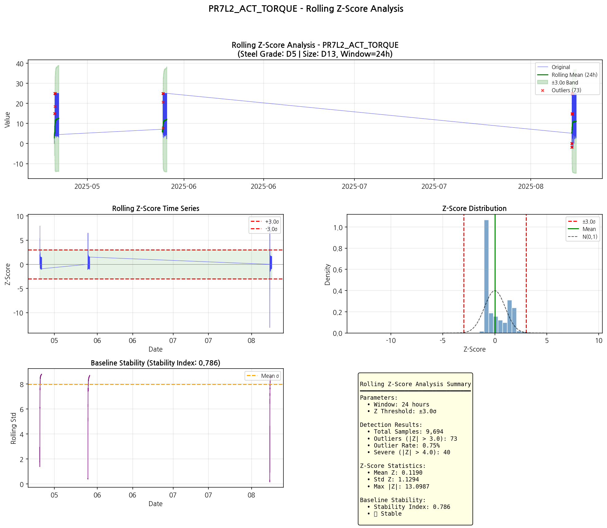

---

## 해석 가이드

### Rolling Z-Score 해석

1. **이상치율 (Outlier Rate)**
   - |Z| > 3.0σ 비율
   - 높을수록 해당 시점 주변 패턴에서 벗어난 데이터 많음
   - 정상 분포 가정 시 약 0.3% 예상

2. **기준선 안정성 (Baseline Stability)**
   - Rolling std의 시간적 일관성
   - 1에 가까울수록 안정적
   - 0.5 미만: 비정상 시계열, 다른 방법 권장

3. **심각 이상치 (Severe Outliers)**
   - |Z| > 4.0σ
   - 극단적인 이상값
   - 즉각적인 점검 필요

### 상태 분류

| 상태 | 기준 | 해석 |
|------|------|------|
| 🔴 높음 | ≥10% | 빈번한 이상치, 점검 필요 |
| 🟠 중간 | 3~10% | 일부 이상치, 모니터링 |
| 🟢 낮음 | <3% | 정상 범위 |
| 🟡 불안정 | Stability < 0.5 | 기준선 변동 심함 |

### Standard IQR vs Rolling Z-Score

| 방법 | 장점 | 단점 |
|------|------|------|
| Standard IQR | 간단, 전체 분포 기반 | 시변 데이터에 부적합 |
| Rolling Z-Score | 시변 데이터 적합 | 윈도우 크기 설정 필요 |

**권장**: 기준선 안정성 ≥ 0.5인 태그에 효과적

---

## 메타데이터

| 항목 | 값 |
|------|-----|
| 분석 스크립트 | steel_grade_rolling_zscore_analysis.py |
| 분석 기간 | 2025-03-01 ~ 2025-08-31 |
| 강종 | D5 |
| 윈도우 크기 | 24시간 |
| Z 임계값 | ±3.0σ |
| 생성일시 | 2026-02-09 15:15:34 |
| 총 분석 태그 | 79개 |

---

*본 보고서는 자동 생성되었습니다.*
