# 강종 [D5] Rolling Z-Score 동적 이상치 분석 보고서

**분석 기간**: 2025-03-01 ~ 2025-08-31
**강종**: D5
**생성일시**: 2026-02-03 20:49:24

---

## 분석 개요

### 분석 방법론

**Rolling Z-Score (롤링 Z-점수)**

시간 창(window) 기반 동적 이상치 탐지 방법입니다.

$$Z_{rolling}(t) = \frac{x(t) - \mu_{window}(t)}{\sigma_{window}(t)}$$

| 파라미터 | 값 | 설명 |
|----------|-----|------|
| Window | 24h | 이동 평균/표준편차 윈도우 |
| Z Threshold | ±3.0σ | 이상치 판정 임계값 |
| Severe | ±4.0σ | 심각 이상치 임계값 |

### 장점

- **비정상 시계열 적합**: 평균/분산 시변하는 데이터에 효과적
- **점진적 기준선 추적**: 장기 드리프트에 강건
- **Local Context 기반**: 해당 시점 주변 패턴 기준

### 분석 결과 요약

| 구분 | 태그 수 | 비율 |
|------|---------|------|
| **총 분석 태그** | 79개 | 100% |
| 🔴 높은 이상치율 (≥10%) | 0개 | 0.0% |
| 🟠 중간 이상치율 (3~10%) | 15개 | 19.0% |
| 🟢 낮은 이상치율 (<3%) | 45개 | 57.0% |
| 🟡 불안정 기준선 | 19개 | 24.1% |

#### 전체 평균

| 지표 | 값 |
|------|-----|
| 평균 이상치율 | 2.36% |
| 평균 기준선 안정성 | 0.562 |

---

## 상위 문제 태그 (이상치율 기준)

| 순위 | 태그 | 카테고리 | 이상치율 | 심각 이상치 | 안정성 | 상태 |
|------|------|----------|----------|-------------|--------|------|
| 1 | FURNACE_EXIT_DISCHARGE_BILLET_TEMPERATURE | 가열로 추출 온도 | 5.69% | 1970 | 0.710 | 🟠 |
| 2 | MAIN_GAS_FLOW | 가열로 보조설비 | 3.69% | 1124 | 0.579 | 🟠 |
| 3 | STAND_1_ACTUAL_SPEED | 스탠드 속도 | 3.18% | 981 | 0.634 | 🟠 |
| 4 | SOAKING_TOP_ZONE_NO_1_TEMPERATURE_ROOF | 가열로 상부 온도 | 3.17% | 869 | 0.092 | 🟠 |
| 5 | FINISHING_BLOCK_ACTUAL_SPEED | 스탠드 속도 | 3.14% | 1017 | 0.657 | 🟠 |
| 6 | STAND_3_ACTUAL_SPEED | 스탠드 속도 | 3.14% | 925 | 0.644 | 🟠 |
| 7 | COMBUSTION_AIR_TEMPERATURE | 가열로 보조설비 | 3.11% | 812 | 0.333 | 🟠 |
| 8 | HEATING_TOP_ZONE_NO_2_TEMPERATURE_ROOF | 가열로 상부 온도 | 3.09% | 851 | 0.171 | 🟠 |
| 9 | HEATING_TOP_ZONE_NO_1_TEMPERATURE_ROOF | 가열로 상부 온도 | 3.09% | 879 | 0.175 | 🟠 |
| 10 | STAND_5_ACTUAL_SPEED | 스탠드 속도 | 3.08% | 916 | 0.646 | 🟠 |
| 11 | STAND_7_ACTUAL_SPEED | 스탠드 속도 | 3.08% | 936 | 0.638 | 🟠 |
| 12 | SOAKING_TOP_ZONE_NO_2_TEMPERATURE_ROOF | 가열로 상부 온도 | 3.07% | 899 | 0.078 | 🟠 |
| 13 | STAND_6_ACTUAL_SPEED | 스탠드 속도 | 3.07% | 926 | 0.641 | 🟠 |
| 14 | STAND_2_ACTUAL_SPEED | 스탠드 속도 | 3.06% | 917 | 0.635 | 🟠 |
| 15 | STAND_6_ACTUAL_TORQUE | 스탠드 토크 | 3.01% | 1159 | 0.746 | 🟠 |

---

## 불안정 기준선 태그

기준선 안정성(Stability Index)이 0.5 미만인 태그입니다.
이 태그들은 Rolling Z-Score 방법보다 다른 방법이 더 적합할 수 있습니다.

| 태그 | 카테고리 | 안정성 | 이상치율 |
|------|----------|--------|----------|
| MAIN_GAS_PRESSURE | 가열로 보조설비 | 0.000 | 2.21% |
| MAIN_COMBUSTION_AIR_PRESSURE | 가열로 보조설비 | 0.000 | 2.05% |
| PINCHROLL_3_ACTUAL_SPEED | 핀치롤 | 0.000 | 1.25% |
| PR7L1_ACT_TORQUE | PR 상세 토크 | 0.000 | 2.36% |
| PR7L2_ACT_TORQUE | PR 상세 토크 | 0.000 | 2.24% |
| PR6L1_ACT_TORQUE | PR 상세 토크 | 0.028 | 2.25% |
| PINCHROLL_4_ACTUAL_SPEED | 핀치롤 | 0.034 | 1.31% |
| PR6L2_ACT_TORQUE | PR 상세 토크 | 0.063 | 1.78% |
| SOAKING_TOP_ZONE_NO_2_TEMPERATURE_ROOF | 가열로 상부 온도 | 0.078 | 3.07% |
| SOAKING_TOP_ZONE_NO_1_TEMPERATURE_ROOF | 가열로 상부 온도 | 0.092 | 3.17% |

---

## 카테고리별 분석 결과

### 가열로 상부 온도 (01_Furnace_Top_Temperature)

- 분석 태그: 4개
- 평균 이상치율: 3.11%
- 평균 안정성: 0.129

| 태그 | 이상치율 | 심각 이상치 | 안정성 | Max |Z| |
|------|----------|-------------|--------|--------|
| HEATING_TOP_ZONE_NO_1_TEMPERATURE_ROOF | 3.09% | 879 | 0.175 | 8.63 |
| HEATING_TOP_ZONE_NO_2_TEMPERATURE_ROOF | 3.09% | 851 | 0.171 | 8.47 |
| SOAKING_TOP_ZONE_NO_1_TEMPERATURE_ROOF | 3.17% | 869 | 0.092 | 12.90 |
| SOAKING_TOP_ZONE_NO_2_TEMPERATURE_ROOF | 3.07% | 899 | 0.078 | 11.53 |

#### Z-Score 차트

**SOAKING_TOP_ZONE_NO_1_TEMPERATURE_ROOF** (이상치율: 3.17%, 안정성: 0.092)

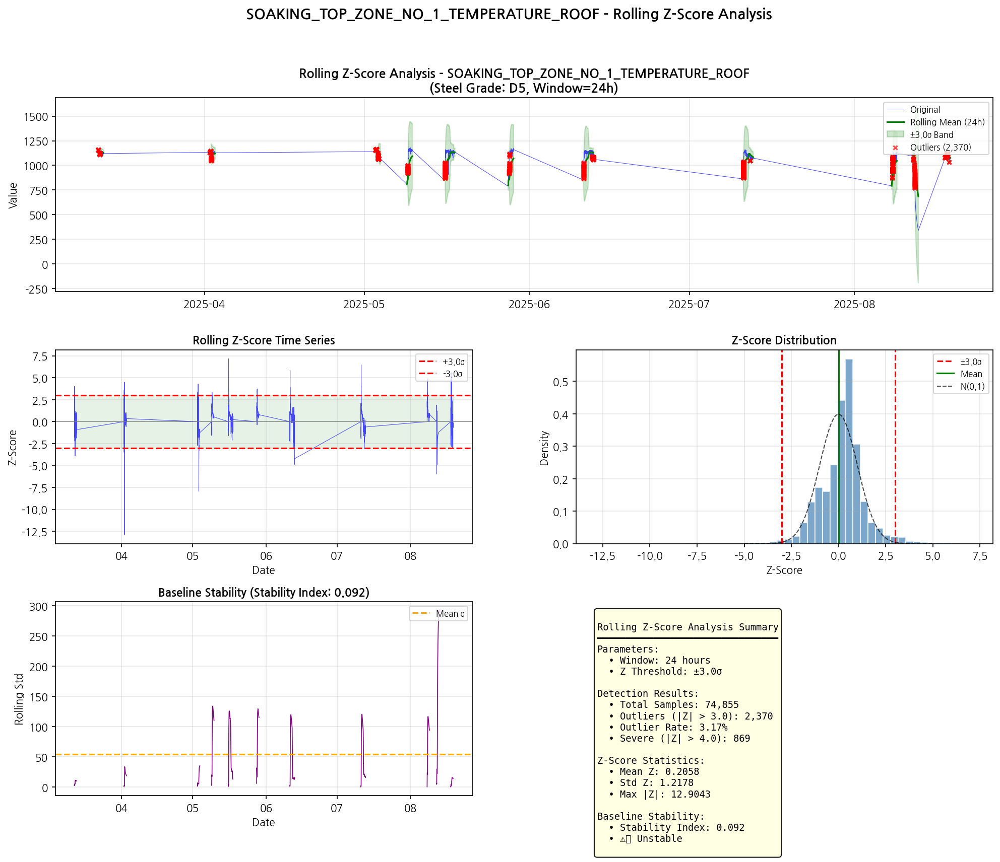

**HEATING_TOP_ZONE_NO_2_TEMPERATURE_ROOF** (이상치율: 3.09%, 안정성: 0.171)

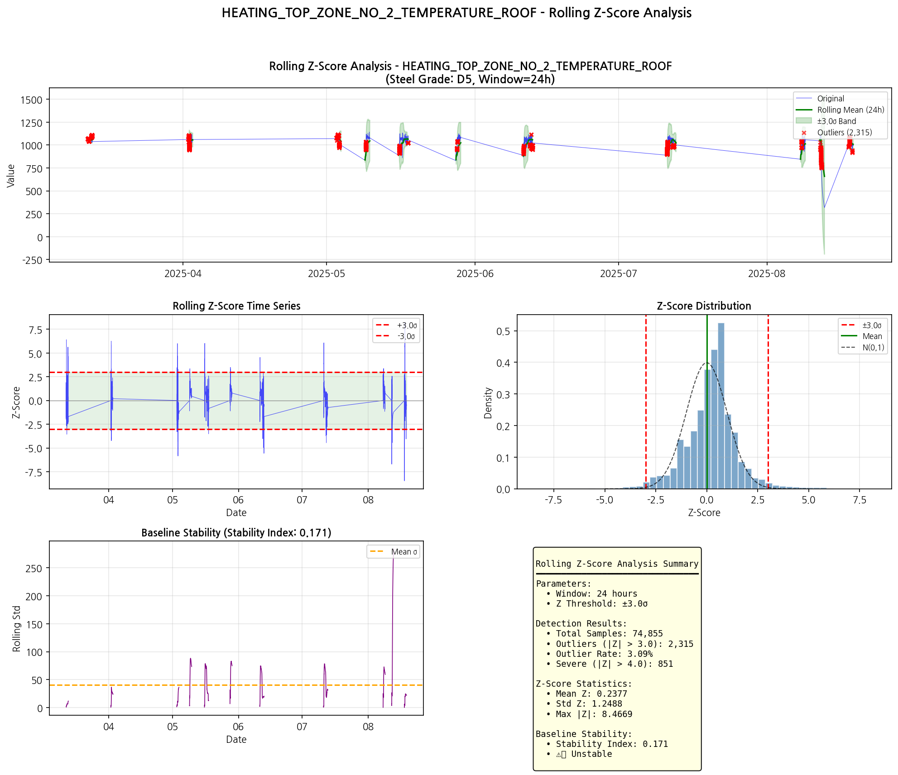

**HEATING_TOP_ZONE_NO_1_TEMPERATURE_ROOF** (이상치율: 3.09%, 안정성: 0.175)

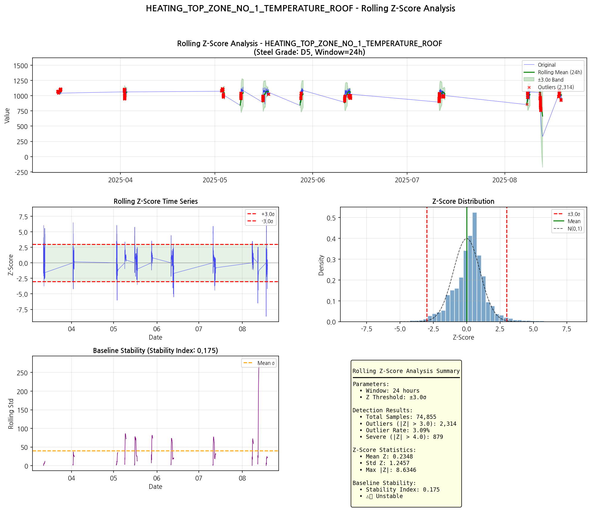

### 가열로 하부 온도 (02_Furnace_Bottom_Temperature)

- 분석 태그: 4개
- 평균 이상치율: 2.33%
- 평균 안정성: 0.269

| 태그 | 이상치율 | 심각 이상치 | 안정성 | Max |Z| |
|------|----------|-------------|--------|--------|
| HEATING_BOTTOM_ZONE_NO_1_TEMPERATURE_OPP_SIDE | 2.18% | 737 | 0.430 | 8.21 |
| HEATING_BOTTOM_ZONE_NO_2_TEMPERATURE_MILL_SIDE | 2.14% | 635 | 0.382 | 8.10 |
| SOAKING_BOTTOM_ZONE_NO_1_TEMPERATURE_OPP_SIDE | 2.48% | 731 | 0.145 | 7.39 |
| SOAKING_BOTTOM_ZONE_NO_2_TEMPERATURE_MILL_SIDE | 2.53% | 710 | 0.121 | 7.04 |

#### Z-Score 차트

**SOAKING_BOTTOM_ZONE_NO_2_TEMPERATURE_MILL_SIDE** (이상치율: 2.53%, 안정성: 0.121)

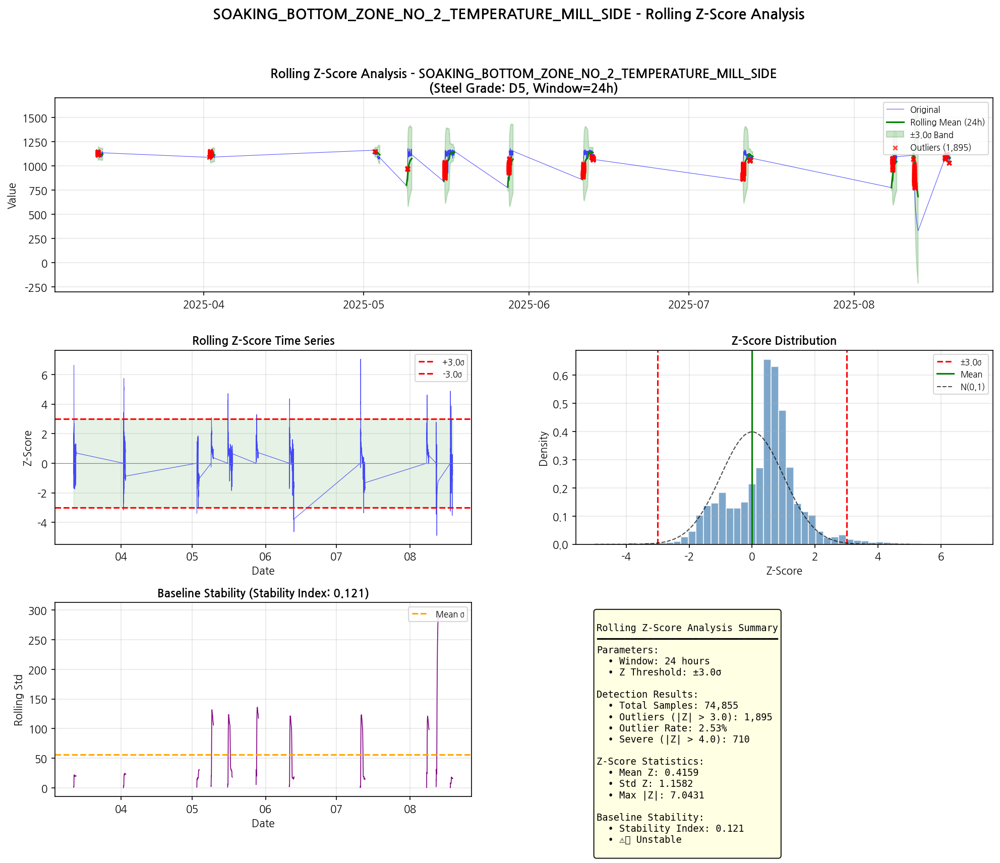

**SOAKING_BOTTOM_ZONE_NO_1_TEMPERATURE_OPP_SIDE** (이상치율: 2.48%, 안정성: 0.145)

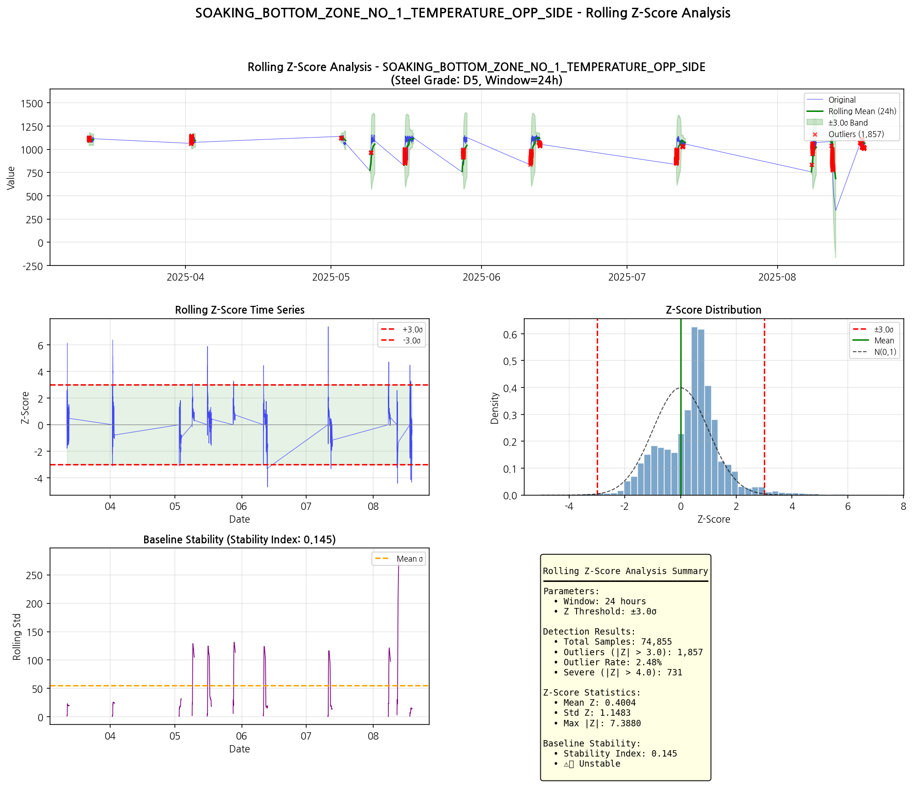

**HEATING_BOTTOM_ZONE_NO_1_TEMPERATURE_OPP_SIDE** (이상치율: 2.18%, 안정성: 0.430)

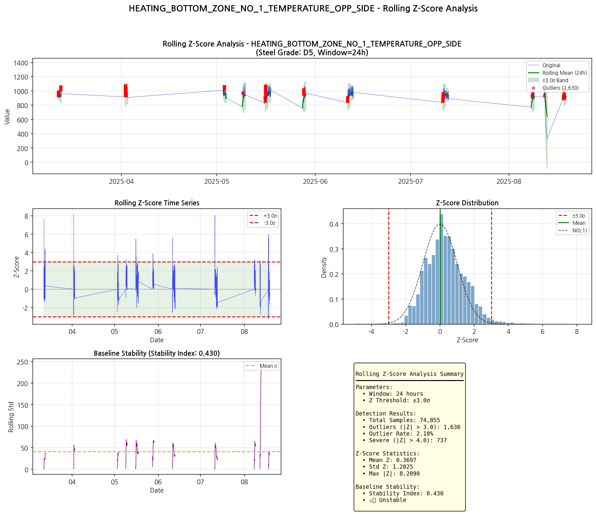

### 가열로 추출 온도 (03_Furnace_Discharge_Temperature)

- 분석 태그: 1개
- 평균 이상치율: 5.69%
- 평균 안정성: 0.710

| 태그 | 이상치율 | 심각 이상치 | 안정성 | Max |Z| |
|------|----------|-------------|--------|--------|
| FURNACE_EXIT_DISCHARGE_BILLET_TEMPERATURE | 5.69% | 1970 | 0.710 | 54.10 |

#### Z-Score 차트

**FURNACE_EXIT_DISCHARGE_BILLET_TEMPERATURE** (이상치율: 5.69%, 안정성: 0.710)

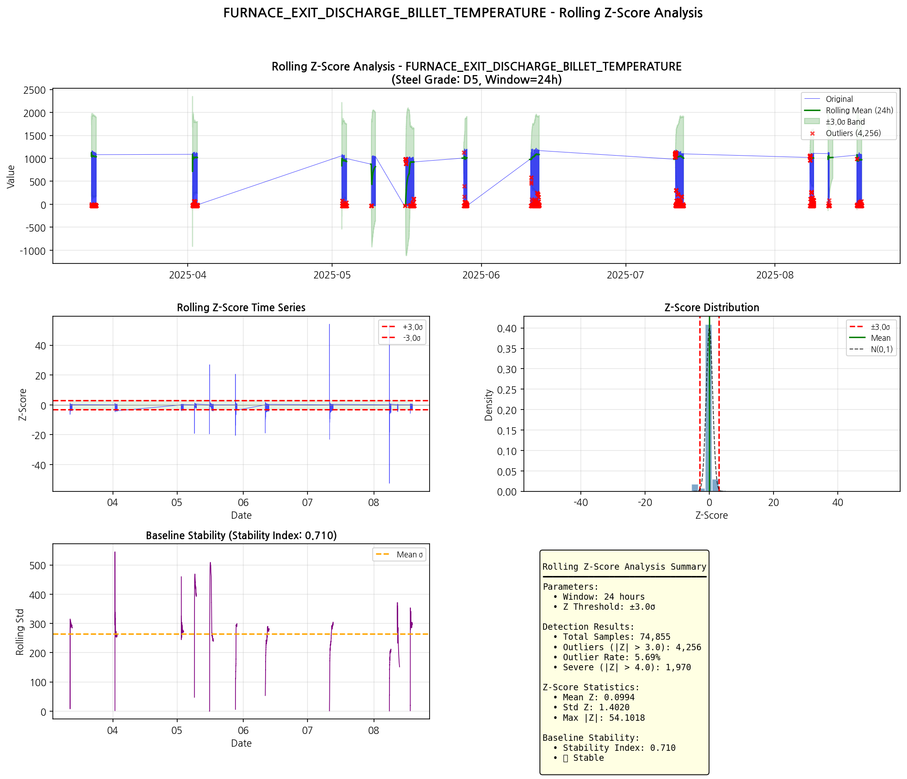

### 가열로 보조설비 (04_Furnace_Auxiliary)

- 분석 태그: 9개
- 평균 이상치율: 2.43%
- 평균 안정성: 0.318

| 태그 | 이상치율 | 심각 이상치 | 안정성 | Max |Z| |
|------|----------|-------------|--------|--------|
| FURNACE_PRESSURE | 2.35% | 534 | 0.596 | 17.73 |
| FURNACE_O2_ANALYZER | 2.56% | 925 | 0.299 | 59.85 |
| MAIN_GAS_PRESSURE | 2.21% | 513 | 0.000 | 16.64 |
| MAIN_GAS_FLOW | 3.69% | 1124 | 0.579 | 12.66 |
| MAIN_GAS_TEMPERATURE | 2.22% | 99 | 0.457 | 6.29 |
| MAIN_COMBUSTION_AIR_PRESSURE | 2.05% | 750 | 0.000 | 46.26 |
| COMBUSTION_AIR_TEMPERATURE | 3.11% | 812 | 0.333 | 7.45 |
| INDIRECT_COOLING_WATER_FLOW | 1.57% | 303 | 0.366 | 8.31 |
| INDIRECT_WATER_MAIN_TEMPERATURE | 2.08% | 20 | 0.236 | 6.03 |

#### Z-Score 차트

**MAIN_GAS_FLOW** (이상치율: 3.69%, 안정성: 0.579)

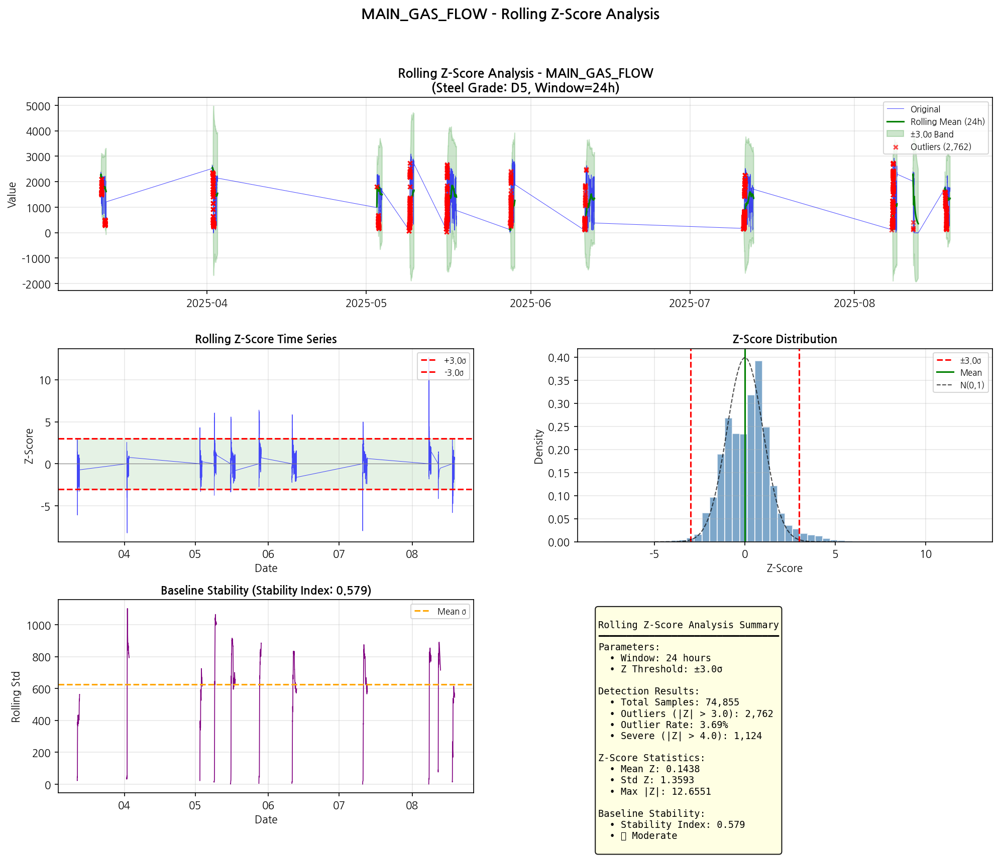

**COMBUSTION_AIR_TEMPERATURE** (이상치율: 3.11%, 안정성: 0.333)

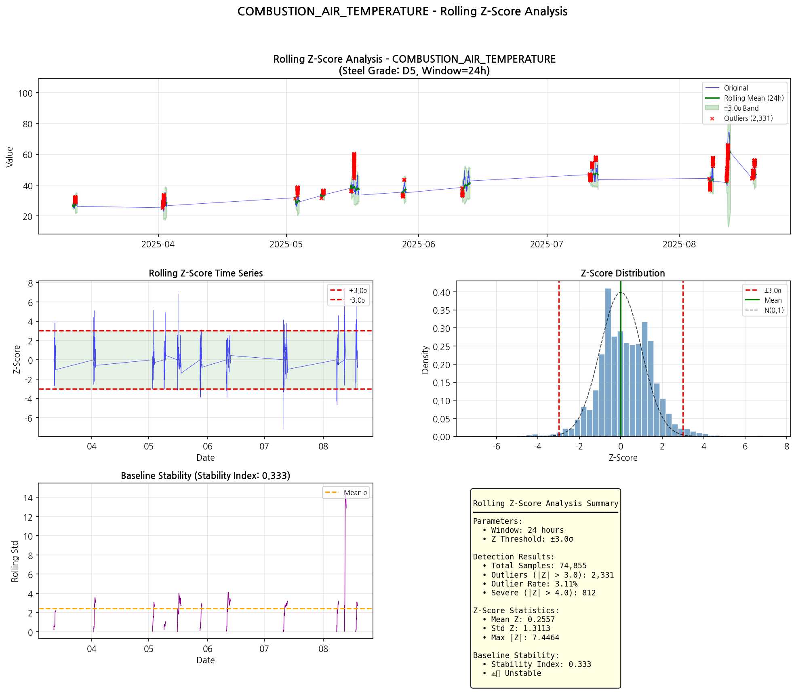

**FURNACE_O2_ANALYZER** (이상치율: 2.56%, 안정성: 0.299)

### 스탠드 토크 (05_Stand_Torque)

- 분석 태그: 16개
- 평균 이상치율: 2.85%
- 평균 안정성: 0.738

| 태그 | 이상치율 | 심각 이상치 | 안정성 | Max |Z| |
|------|----------|-------------|--------|--------|
| STAND_1_ACTUAL_TORQUE | 2.91% | 1076 | 0.736 | 47.39 |
| STAND_2_ACTUAL_TORQUE | 2.68% | 1072 | 0.741 | 49.44 |
| STAND_3_ACTUAL_TORQUE | 2.80% | 1084 | 0.742 | 51.61 |
| STAND_4_ACTUAL_TORQUE | 2.93% | 1102 | 0.731 | 47.86 |
| STAND_5_ACTUAL_TORQUE | 2.82% | 1092 | 0.749 | 49.44 |
| STAND_6_ACTUAL_TORQUE | 3.01% | 1159 | 0.746 | 49.44 |
| STAND_7_ACTUAL_TORQUE | 2.90% | 1183 | 0.739 | 48.09 |
| STAND_8_ACTUAL_TORQUE | 2.98% | 1241 | 0.719 | 48.39 |
| STAND_9_ACTUAL_TORQUE | 2.79% | 1077 | 0.732 | 49.44 |
| STAND_10_ACTUAL_TORQUE | 2.91% | 1157 | 0.746 | 49.44 |
| STAND_11_ACTUAL_TORQUE | 2.82% | 1144 | 0.740 | 49.44 |
| STAND_12_ACTUAL_TORQUE | 2.81% | 1102 | 0.740 | 49.44 |
| STAND_13_ACTUAL_TORQUE | 2.80% | 1107 | 0.739 | 49.44 |
| STAND_14_ACTUAL_TORQUE | 2.75% | 1088 | 0.746 | 49.44 |
| FINISHING_BLOCK_MASTER_ACTUAL_TORQUE | 2.86% | 1077 | 0.730 | 48.70 |
| FINISHING_BLOCK_SLAVE_ACTUAL_TORQUE | 2.86% | 1078 | 0.730 | 48.70 |

#### Z-Score 차트

**STAND_6_ACTUAL_TORQUE** (이상치율: 3.01%, 안정성: 0.746)

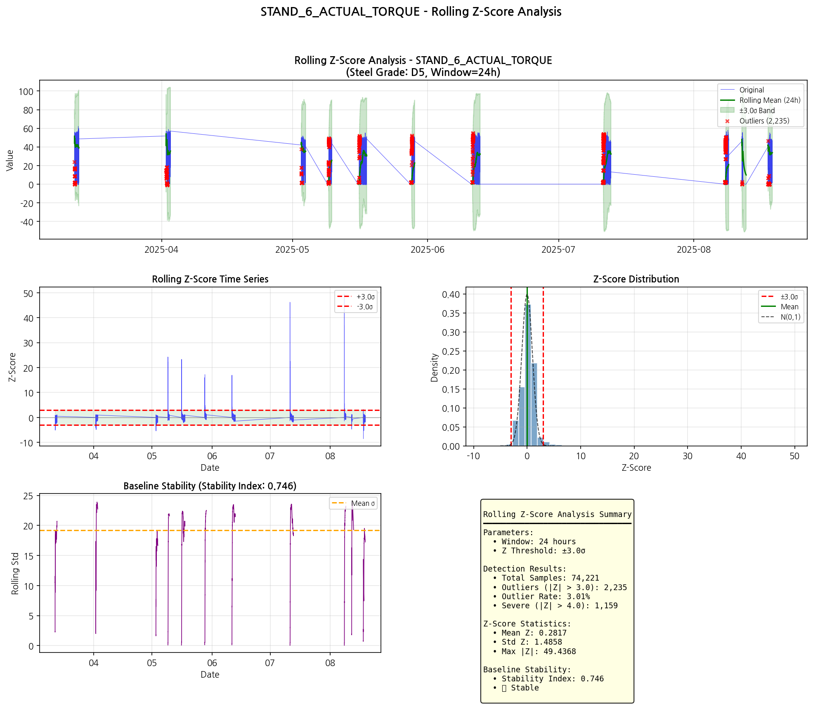

**STAND_8_ACTUAL_TORQUE** (이상치율: 2.98%, 안정성: 0.719)

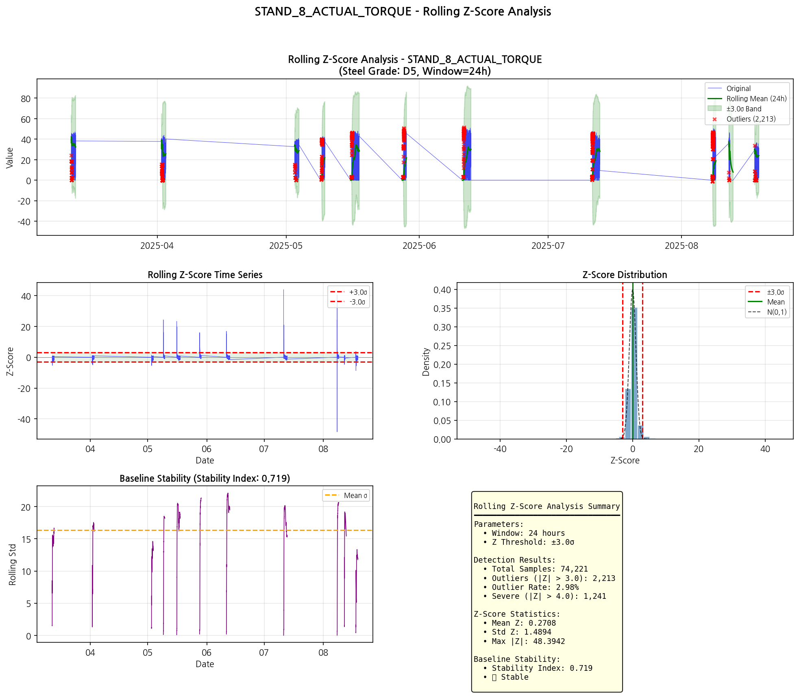

**STAND_4_ACTUAL_TORQUE** (이상치율: 2.93%, 안정성: 0.731)

### 스탠드 속도 (06_Stand_Speed)

- 분석 태그: 15개
- 평균 이상치율: 3.03%
- 평균 안정성: 0.645

| 태그 | 이상치율 | 심각 이상치 | 안정성 | Max |Z| |
|------|----------|-------------|--------|--------|
| STAND_1_ACTUAL_SPEED | 3.18% | 981 | 0.634 | 47.39 |
| STAND_2_ACTUAL_SPEED | 3.06% | 917 | 0.635 | 49.44 |
| STAND_3_ACTUAL_SPEED | 3.14% | 925 | 0.644 | 49.44 |
| STAND_4_ACTUAL_SPEED | 2.96% | 911 | 0.632 | 47.86 |
| STAND_5_ACTUAL_SPEED | 3.08% | 916 | 0.646 | 49.44 |
| STAND_6_ACTUAL_SPEED | 3.07% | 926 | 0.641 | 49.44 |
| STAND_7_ACTUAL_SPEED | 3.08% | 936 | 0.638 | 49.33 |
| STAND_8_ACTUAL_SPEED | 2.96% | 920 | 0.622 | 48.39 |
| STAND_9_ACTUAL_SPEED | 2.98% | 898 | 0.631 | 49.44 |
| STAND_10_ACTUAL_SPEED | 2.99% | 908 | 0.648 | 49.44 |
| STAND_11_ACTUAL_SPEED | 2.94% | 906 | 0.653 | 49.44 |
| STAND_12_ACTUAL_SPEED | 2.98% | 916 | 0.665 | 49.44 |
| STAND_13_ACTUAL_SPEED | 2.98% | 916 | 0.671 | 49.44 |
| STAND_14_ACTUAL_SPEED | 3.00% | 916 | 0.658 | 49.44 |
| FINISHING_BLOCK_ACTUAL_SPEED | 3.14% | 1017 | 0.657 | 48.70 |

#### Z-Score 차트

**STAND_1_ACTUAL_SPEED** (이상치율: 3.18%, 안정성: 0.634)

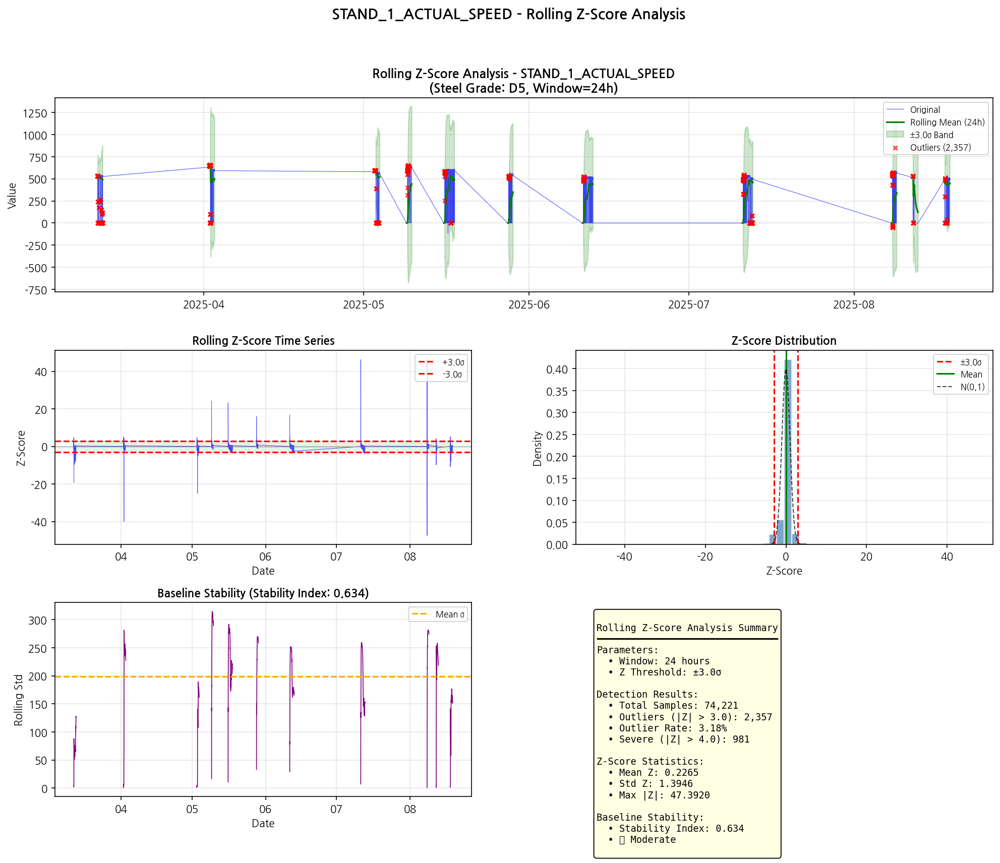

**FINISHING_BLOCK_ACTUAL_SPEED** (이상치율: 3.14%, 안정성: 0.657)

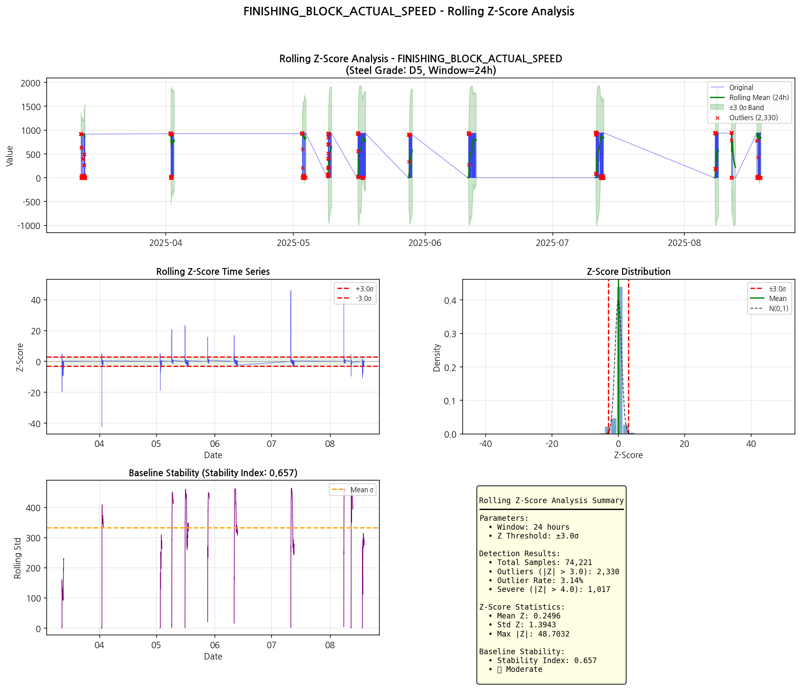

**STAND_3_ACTUAL_SPEED** (이상치율: 3.14%, 안정성: 0.644)

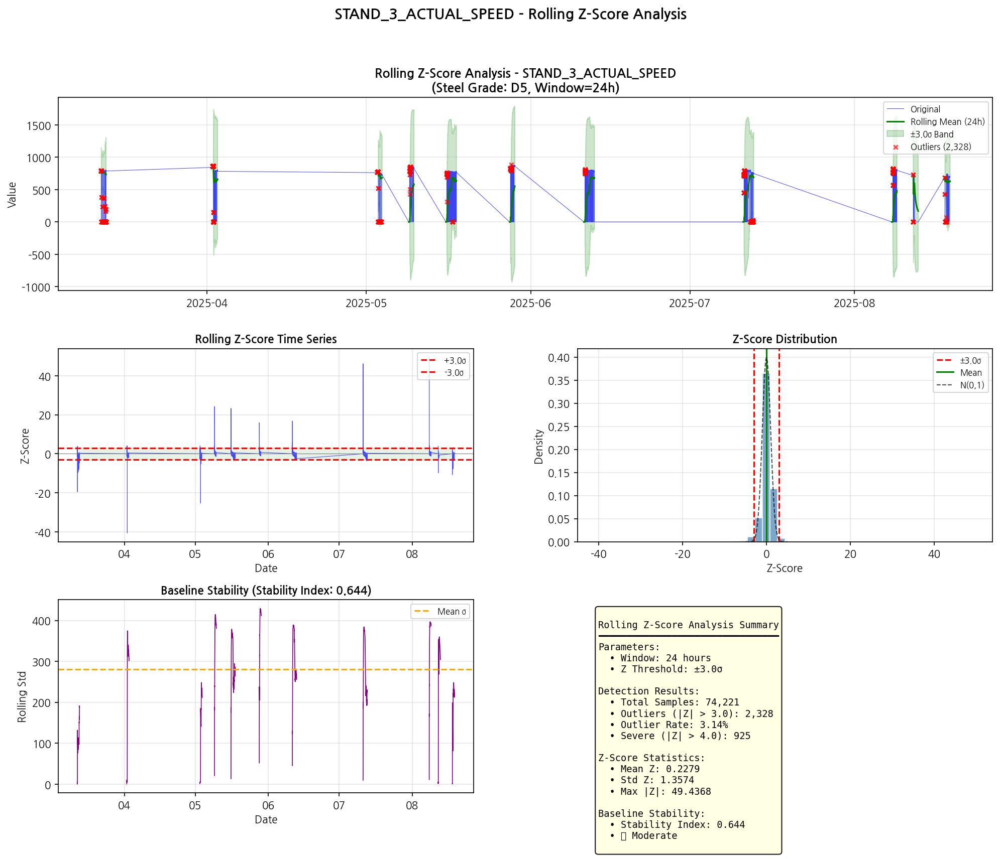

### 스탠드 부하 (07_Stand_Load)

- 분석 태그: 15개
- 평균 이상치율: 1.81%
- 평균 안정성: 0.804

| 태그 | 이상치율 | 심각 이상치 | 안정성 | Max |Z| |
|------|----------|-------------|--------|--------|
| STAND_1_LOAD | 1.83% | 615 | 0.803 | 49.58 |
| STAND_2_LOAD | 1.81% | 610 | 0.804 | 49.66 |
| STAND_3_LOAD | 1.75% | 595 | 0.806 | 49.66 |
| STAND_4_LOAD | 1.79% | 583 | 0.806 | 49.66 |
| STAND_5_LOAD | 1.81% | 579 | 0.805 | 49.66 |
| STAND_6_LOAD | 1.81% | 594 | 0.804 | 49.66 |
| STAND_7_LOAD | 1.81% | 615 | 0.803 | 49.66 |
| STAND_8_LOAD | 1.79% | 623 | 0.803 | 49.66 |
| STAND_9_LOAD | 1.81% | 617 | 0.804 | 49.66 |
| STAND_10_LOAD | 1.81% | 622 | 0.804 | 49.66 |
| STAND_11_LOAD | 1.83% | 633 | 0.804 | 49.66 |
| STAND_12_LOAD | 1.83% | 633 | 0.804 | 49.66 |
| STAND_13_LOAD | 1.83% | 633 | 0.804 | 49.66 |
| STAND_14_LOAD | 1.84% | 632 | 0.804 | 49.66 |
| FINISHING_BLOCK_LOAD | 1.81% | 628 | 0.804 | 49.66 |

#### Z-Score 차트

**STAND_14_LOAD** (이상치율: 1.84%, 안정성: 0.804)

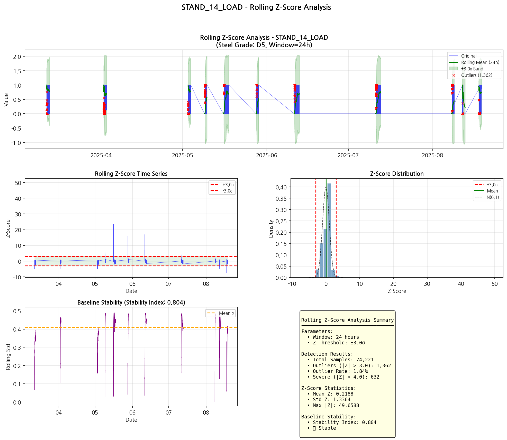

**STAND_1_LOAD** (이상치율: 1.83%, 안정성: 0.803)

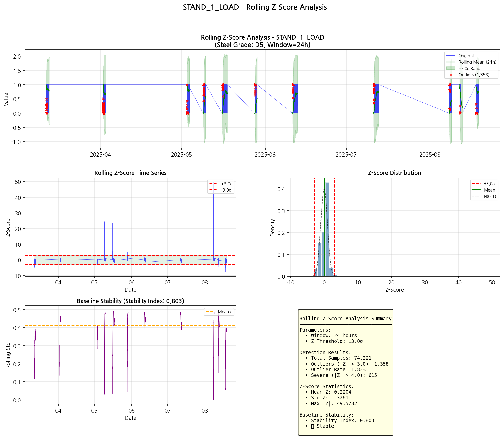

**STAND_11_LOAD** (이상치율: 1.83%, 안정성: 0.804)

### 핀치롤 (08_Pinchroll)

- 분석 태그: 9개
- 평균 이상치율: 0.98%
- 평균 안정성: 0.497

| 태그 | 이상치율 | 심각 이상치 | 안정성 | Max |Z| |
|------|----------|-------------|--------|--------|
| PINCHROLL_2_ACTUAL_SPEED | 1.31% | 409 | 0.389 | 26.14 |
| PINCHROLL_3_ACTUAL_SPEED | 1.25% | 386 | 0.000 | 44.57 |
| PINCHROLL_4_ACTUAL_SPEED | 1.31% | 372 | 0.034 | 41.31 |
| PINCHROLL_2_ACTUAL_TORQUE | 0.87% | 197 | 0.779 | 16.30 |
| PINCHROLL_3_ACTUAL_TORQUE | 0.99% | 225 | 0.655 | 21.69 |
| PINCHROLL_4_ACTUAL_TORQUE | 0.88% | 175 | 0.650 | 11.31 |
| PINCHROLL_2_REFERENCE_TORQUE | 0.60% | 310 | 0.362 | 61.64 |
| PINCHROLL_3_REFERENCE_TORQUE | 0.79% | 154 | 0.781 | 26.21 |
| PINCHROLL_4_REFERENCE_TORQUE | 0.80% | 115 | 0.822 | 8.08 |

#### Z-Score 차트

**PINCHROLL_2_ACTUAL_SPEED** (이상치율: 1.31%, 안정성: 0.389)

**PINCHROLL_4_ACTUAL_SPEED** (이상치율: 1.31%, 안정성: 0.034)

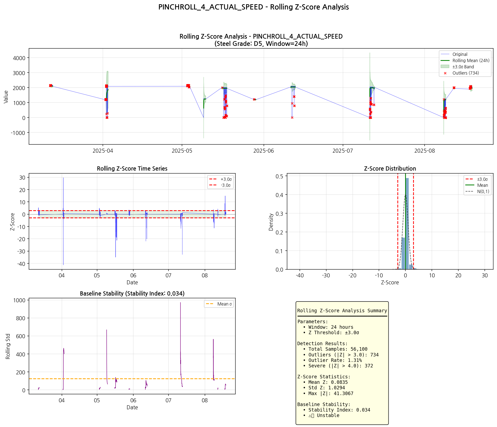

**PINCHROLL_3_ACTUAL_SPEED** (이상치율: 1.25%, 안정성: 0.000)

### PR 상세 토크 (09_PR_Detailed)

- 분석 태그: 6개
- 평균 이상치율: 1.61%
- 평균 안정성: 0.204

| 태그 | 이상치율 | 심각 이상치 | 안정성 | Max |Z| |
|------|----------|-------------|--------|--------|
| PR6L1_ACT_TORQUE | 2.25% | 841 | 0.028 | 32.29 |
| PR6L2_ACT_TORQUE | 1.78% | 658 | 0.063 | 30.09 |
| PR7L1_ACT_TORQUE | 2.36% | 763 | 0.000 | 30.08 |
| PR7L2_ACT_TORQUE | 2.24% | 758 | 0.000 | 30.12 |
| PR8L1_ACT_TORQUE | 0.46% | 126 | 0.663 | 30.08 |
| PR9L1_ACT_TORQUE | 0.58% | 180 | 0.472 | 30.08 |

#### Z-Score 차트

**PR7L1_ACT_TORQUE** (이상치율: 2.36%, 안정성: 0.000)

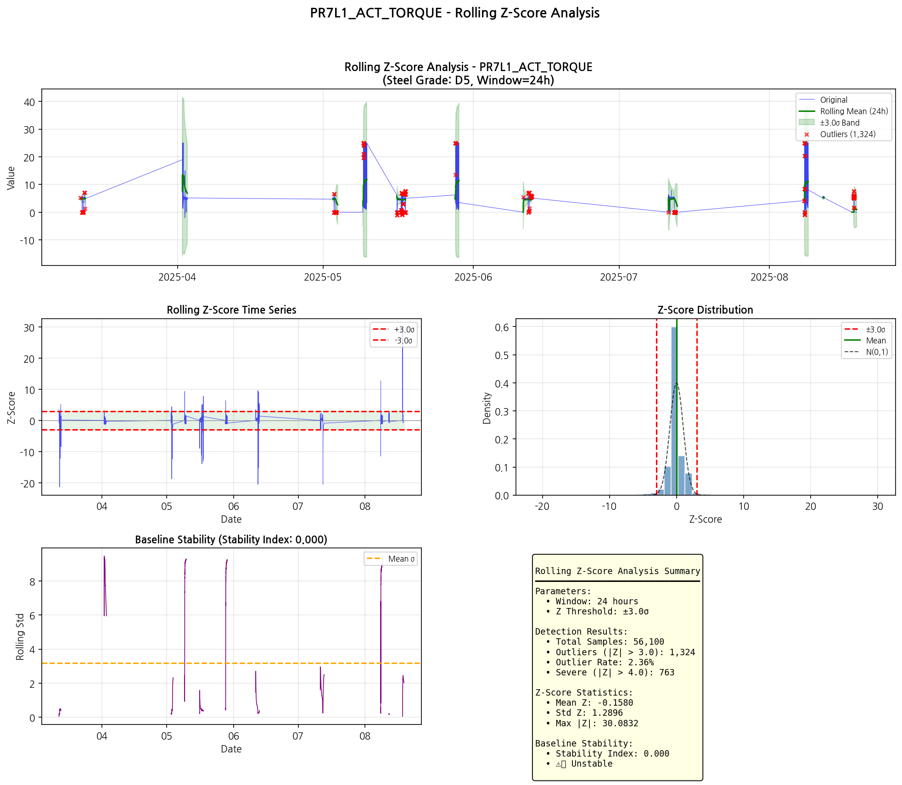

**PR6L1_ACT_TORQUE** (이상치율: 2.25%, 안정성: 0.028)

**PR7L2_ACT_TORQUE** (이상치율: 2.24%, 안정성: 0.000)

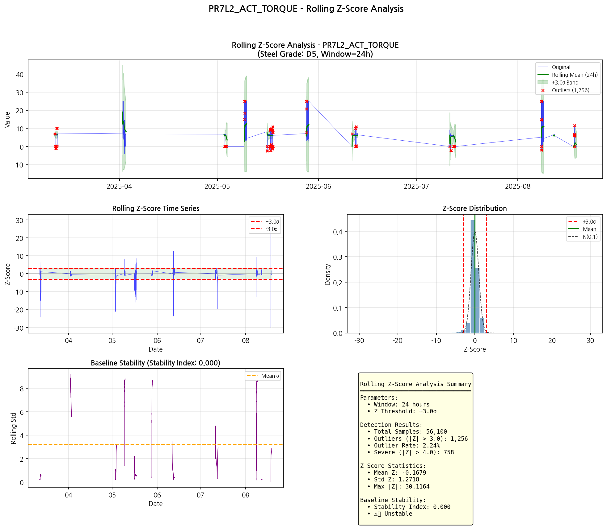

---

## 해석 가이드

### Rolling Z-Score 해석

1. **이상치율 (Outlier Rate)**
   - |Z| > 3.0σ 비율
   - 높을수록 해당 시점 주변 패턴에서 벗어난 데이터 많음
   - 정상 분포 가정 시 약 0.3% 예상

2. **기준선 안정성 (Baseline Stability)**
   - Rolling std의 시간적 일관성
   - 1에 가까울수록 안정적
   - 0.5 미만: 비정상 시계열, 다른 방법 권장

3. **심각 이상치 (Severe Outliers)**
   - |Z| > 4.0σ
   - 극단적인 이상값
   - 즉각적인 점검 필요

### 상태 분류

| 상태 | 기준 | 해석 |
|------|------|------|
| 🔴 높음 | ≥10% | 빈번한 이상치, 점검 필요 |
| 🟠 중간 | 3~10% | 일부 이상치, 모니터링 |
| 🟢 낮음 | <3% | 정상 범위 |
| 🟡 불안정 | Stability < 0.5 | 기준선 변동 심함 |

### Standard IQR vs Rolling Z-Score

| 방법 | 장점 | 단점 |
|------|------|------|
| Standard IQR | 간단, 전체 분포 기반 | 시변 데이터에 부적합 |
| Rolling Z-Score | 시변 데이터 적합 | 윈도우 크기 설정 필요 |

**권장**: 기준선 안정성 ≥ 0.5인 태그에 효과적

---

## 메타데이터

| 항목 | 값 |
|------|-----|
| 분석 스크립트 | steel_grade_rolling_zscore_analysis.py |
| 분석 기간 | 2025-03-01 ~ 2025-08-31 |
| 강종 | D5 |
| 윈도우 크기 | 24시간 |
| Z 임계값 | ±3.0σ |
| 생성일시 | 2026-02-03 20:49:24 |
| 총 분석 태그 | 79개 |

---

*본 보고서는 자동 생성되었습니다.*
