# 강종 [N5 | Size: D10] Rolling Z-Score 동적 이상치 분석 보고서

**분석 기간**: 2025-03-01 ~ 2025-08-31
**강종**: N5  
**사이즈**: D10
**생성일시**: 2026-02-09 15:13:36

---

## 분석 개요

### 분석 방법론

**Rolling Z-Score (롤링 Z-점수)**

시간 창(window) 기반 동적 이상치 탐지 방법입니다.

$$Z_{rolling}(t) = \frac{x(t) - \mu_{window}(t)}{\sigma_{window}(t)}$$

| 파라미터 | 값 | 설명 |
|----------|-----|------|
| Window | 24h | 이동 평균/표준편차 윈도우 |
| Z Threshold | ±3.0σ | 이상치 판정 임계값 |
| Severe | ±4.0σ | 심각 이상치 임계값 |

### 장점

- **비정상 시계열 적합**: 평균/분산 시변하는 데이터에 효과적
- **점진적 기준선 추적**: 장기 드리프트에 강건
- **Local Context 기반**: 해당 시점 주변 패턴 기준

### 분석 결과 요약

| 구분 | 태그 수 | 비율 |
|------|---------|------|
| **총 분석 태그** | 79개 | 100% |
| 🔴 높은 이상치율 (≥10%) | 0개 | 0.0% |
| 🟠 중간 이상치율 (3~10%) | 17개 | 21.5% |
| 🟢 낮은 이상치율 (<3%) | 61개 | 77.2% |
| 🟡 불안정 기준선 | 1개 | 1.3% |

#### 전체 평균

| 지표 | 값 |
|------|-----|
| 평균 이상치율 | 1.42% |
| 평균 기준선 안정성 | 0.701 |

---

## 상위 문제 태그 (이상치율 기준)

| 순위 | 태그 | 카테고리 | 이상치율 | 심각 이상치 | 안정성 | 상태 |
|------|------|----------|----------|-------------|--------|------|
| 1 | MAIN_GAS_TEMPERATURE | 가열로 보조설비 | 7.93% | 164 | 0.450 | 🟠 |
| 2 | PR6L2_ACT_TORQUE | PR 상세 토크 | 5.71% | 530 | 0.000 | 🟠 |
| 3 | COMBUSTION_AIR_TEMPERATURE | 가열로 보조설비 | 5.41% | 676 | 0.438 | 🟠 |
| 4 | SOAKING_BOTTOM_ZONE_NO_1_TEMPERATURE_OPP_SIDE | 가열로 하부 온도 | 5.39% | 714 | 0.436 | 🟠 |
| 5 | PR6L1_ACT_TORQUE | PR 상세 토크 | 5.20% | 575 | 0.000 | 🟠 |
| 6 | SOAKING_BOTTOM_ZONE_NO_2_TEMPERATURE_MILL_SIDE | 가열로 하부 온도 | 5.10% | 744 | 0.464 | 🟠 |
| 7 | FURNACE_O2_ANALYZER | 가열로 보조설비 | 5.07% | 911 | 0.086 | 🟠 |
| 8 | FURNACE_EXIT_DISCHARGE_BILLET_TEMPERATURE | 가열로 추출 온도 | 4.83% | 890 | 0.866 | 🟠 |
| 9 | PR7L1_ACT_TORQUE | PR 상세 토크 | 4.78% | 512 | 0.263 | 🟠 |
| 10 | PR7L2_ACT_TORQUE | PR 상세 토크 | 4.74% | 488 | 0.208 | 🟠 |
| 11 | SOAKING_TOP_ZONE_NO_1_TEMPERATURE_ROOF | 가열로 상부 온도 | 4.65% | 704 | 0.347 | 🟠 |
| 12 | SOAKING_TOP_ZONE_NO_2_TEMPERATURE_ROOF | 가열로 상부 온도 | 4.56% | 734 | 0.349 | 🟠 |
| 13 | PINCHROLL_3_ACTUAL_SPEED | 핀치롤 | 4.53% | 424 | 0.135 | 🟠 |
| 14 | HEATING_TOP_ZONE_NO_2_TEMPERATURE_ROOF | 가열로 상부 온도 | 4.51% | 288 | 0.534 | 🟠 |
| 15 | HEATING_TOP_ZONE_NO_1_TEMPERATURE_ROOF | 가열로 상부 온도 | 4.35% | 295 | 0.542 | 🟠 |

---

## 불안정 기준선 태그

기준선 안정성(Stability Index)이 0.5 미만인 태그입니다.
이 태그들은 Rolling Z-Score 방법보다 다른 방법이 더 적합할 수 있습니다.

| 태그 | 카테고리 | 안정성 | 이상치율 |
|------|----------|--------|----------|
| PR6L1_ACT_TORQUE | PR 상세 토크 | 0.000 | 5.20% |
| PR6L2_ACT_TORQUE | PR 상세 토크 | 0.000 | 5.71% |
| PINCHROLL_4_ACTUAL_SPEED | 핀치롤 | 0.086 | 4.11% |
| FURNACE_O2_ANALYZER | 가열로 보조설비 | 0.086 | 5.07% |
| PINCHROLL_3_ACTUAL_SPEED | 핀치롤 | 0.135 | 4.53% |
| PR7L2_ACT_TORQUE | PR 상세 토크 | 0.208 | 4.74% |
| MAIN_COMBUSTION_AIR_PRESSURE | 가열로 보조설비 | 0.238 | 1.88% |
| PR7L1_ACT_TORQUE | PR 상세 토크 | 0.263 | 4.78% |
| SOAKING_TOP_ZONE_NO_1_TEMPERATURE_ROOF | 가열로 상부 온도 | 0.347 | 4.65% |
| SOAKING_TOP_ZONE_NO_2_TEMPERATURE_ROOF | 가열로 상부 온도 | 0.349 | 4.56% |

---

## 카테고리별 분석 결과

### 가열로 상부 온도 (01_Furnace_Top_Temperature)

- 분석 태그: 4개
- 평균 이상치율: 4.52%
- 평균 안정성: 0.443

| 태그 | 이상치율 | 심각 이상치 | 안정성 | Max \|Z\| |
|------|----------|-------------|--------|--------|
| HEATING_TOP_ZONE_NO_1_TEMPERATURE_ROOF | 4.35% | 295 | 0.542 | 7.87 |
| HEATING_TOP_ZONE_NO_2_TEMPERATURE_ROOF | 4.51% | 288 | 0.534 | 7.37 |
| SOAKING_TOP_ZONE_NO_1_TEMPERATURE_ROOF | 4.65% | 704 | 0.347 | 11.41 |
| SOAKING_TOP_ZONE_NO_2_TEMPERATURE_ROOF | 4.56% | 734 | 0.349 | 11.37 |

#### Z-Score 차트

**SOAKING_TOP_ZONE_NO_1_TEMPERATURE_ROOF** (이상치율: 4.65%, 안정성: 0.347)

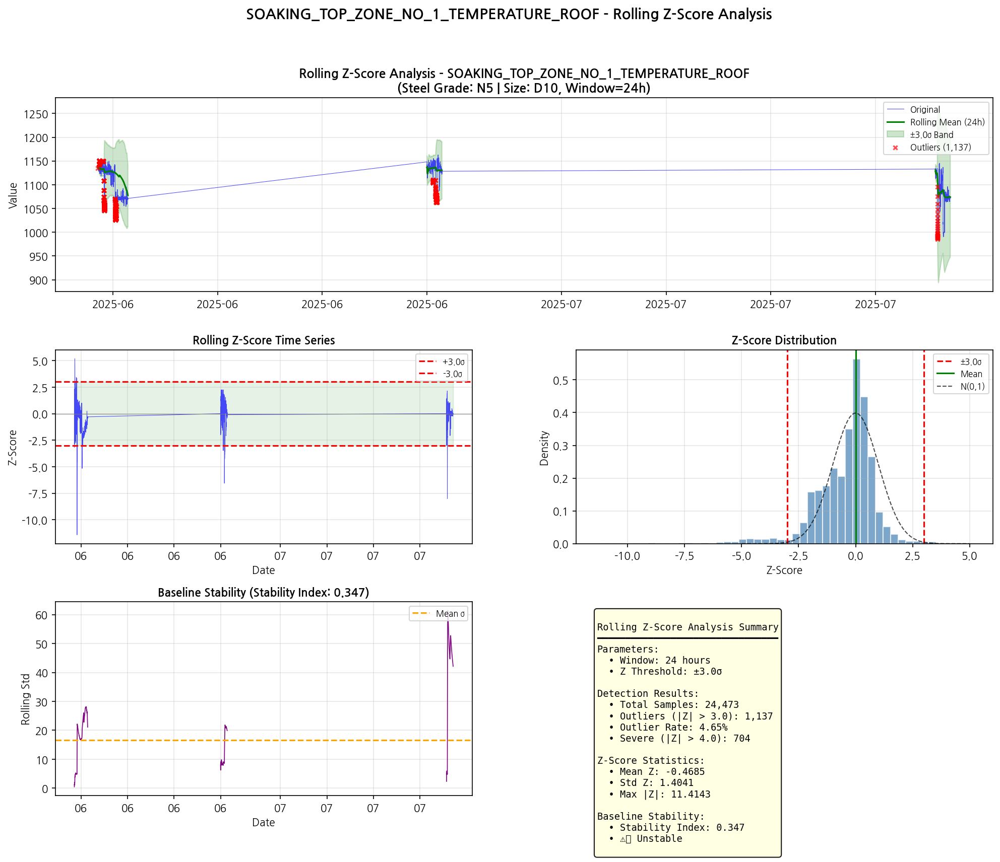

**SOAKING_TOP_ZONE_NO_2_TEMPERATURE_ROOF** (이상치율: 4.56%, 안정성: 0.349)

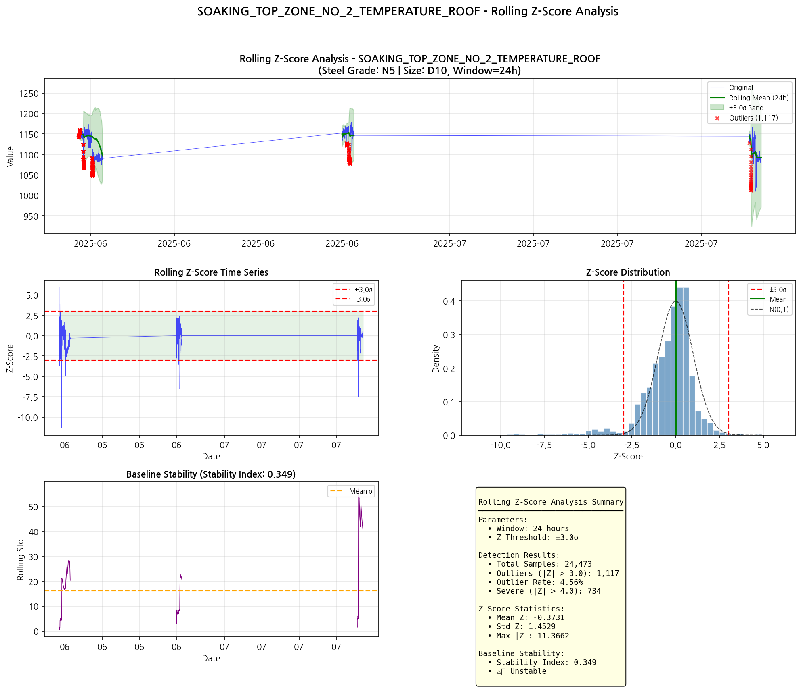

**HEATING_TOP_ZONE_NO_2_TEMPERATURE_ROOF** (이상치율: 4.51%, 안정성: 0.534)

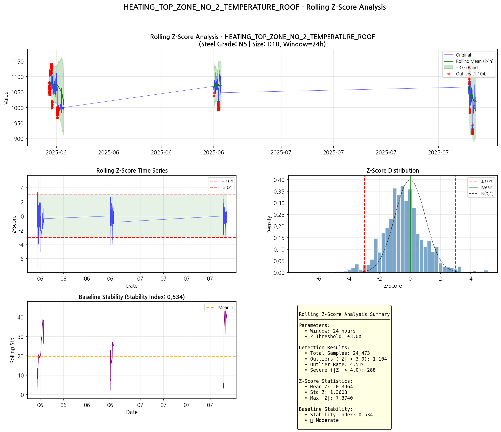

### 가열로 하부 온도 (02_Furnace_Bottom_Temperature)

- 분석 태그: 4개
- 평균 이상치율: 3.53%
- 평균 안정성: 0.575

| 태그 | 이상치율 | 심각 이상치 | 안정성 | Max \|Z\| |
|------|----------|-------------|--------|--------|
| HEATING_BOTTOM_ZONE_NO_1_TEMPERATURE_OPP_SIDE | 1.93% | 191 | 0.702 | 6.17 |
| HEATING_BOTTOM_ZONE_NO_2_TEMPERATURE_MILL_SIDE | 1.70% | 147 | 0.698 | 5.79 |
| SOAKING_BOTTOM_ZONE_NO_1_TEMPERATURE_OPP_SIDE | 5.39% | 714 | 0.436 | 8.34 |
| SOAKING_BOTTOM_ZONE_NO_2_TEMPERATURE_MILL_SIDE | 5.10% | 744 | 0.464 | 7.61 |

#### Z-Score 차트

**SOAKING_BOTTOM_ZONE_NO_1_TEMPERATURE_OPP_SIDE** (이상치율: 5.39%, 안정성: 0.436)

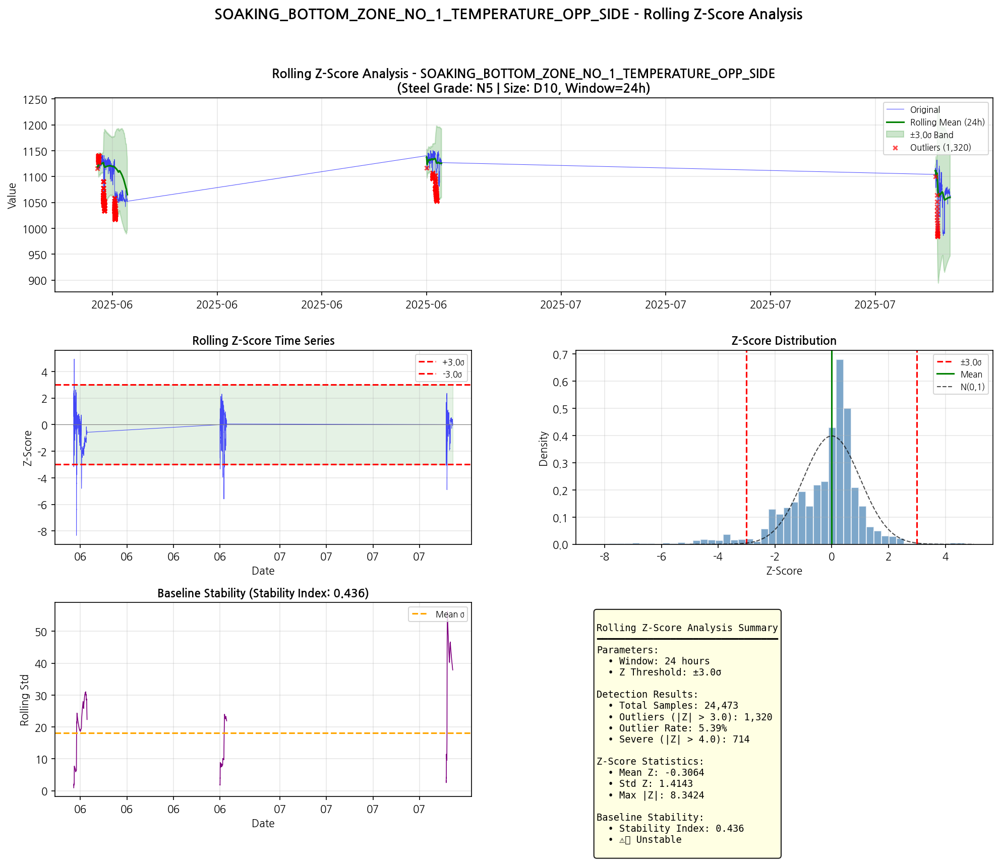

**SOAKING_BOTTOM_ZONE_NO_2_TEMPERATURE_MILL_SIDE** (이상치율: 5.10%, 안정성: 0.464)

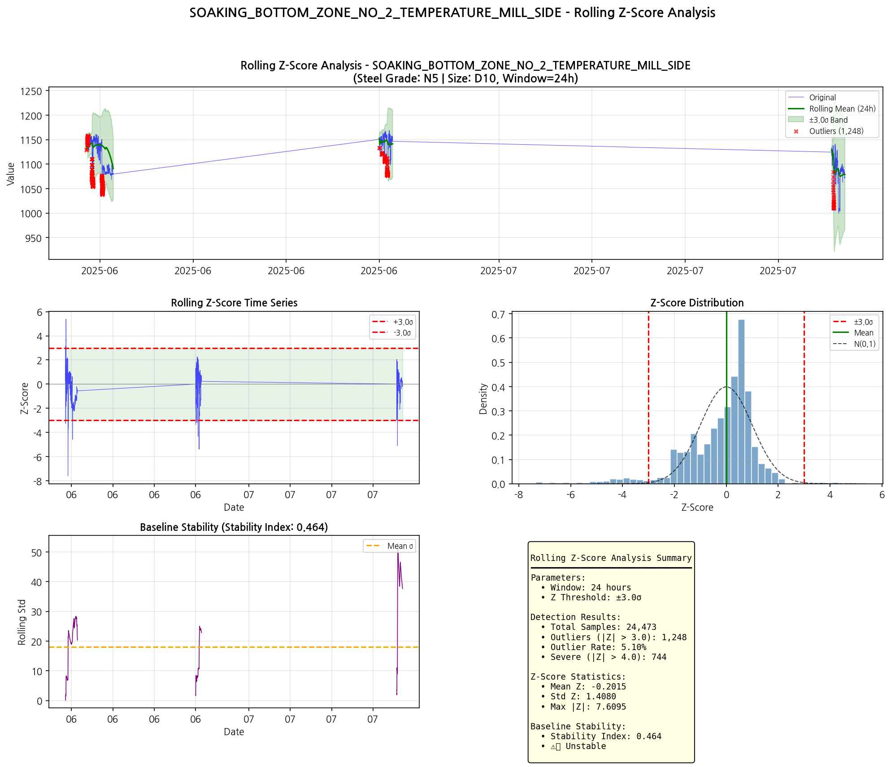

**HEATING_BOTTOM_ZONE_NO_1_TEMPERATURE_OPP_SIDE** (이상치율: 1.93%, 안정성: 0.702)

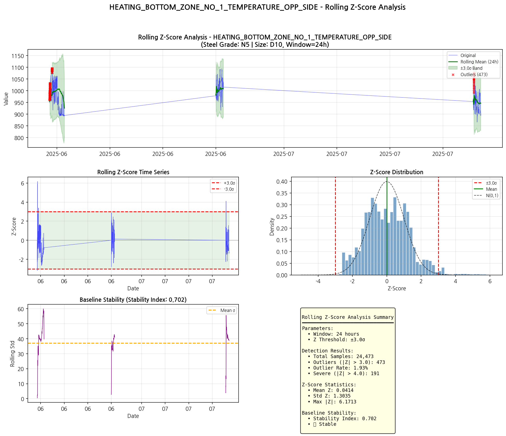

### 가열로 추출 온도 (03_Furnace_Discharge_Temperature)

- 분석 태그: 1개
- 평균 이상치율: 4.83%
- 평균 안정성: 0.866

| 태그 | 이상치율 | 심각 이상치 | 안정성 | Max \|Z\| |
|------|----------|-------------|--------|--------|
| FURNACE_EXIT_DISCHARGE_BILLET_TEMPERATURE | 4.83% | 890 | 0.866 | 9.00 |

#### Z-Score 차트

**FURNACE_EXIT_DISCHARGE_BILLET_TEMPERATURE** (이상치율: 4.83%, 안정성: 0.866)

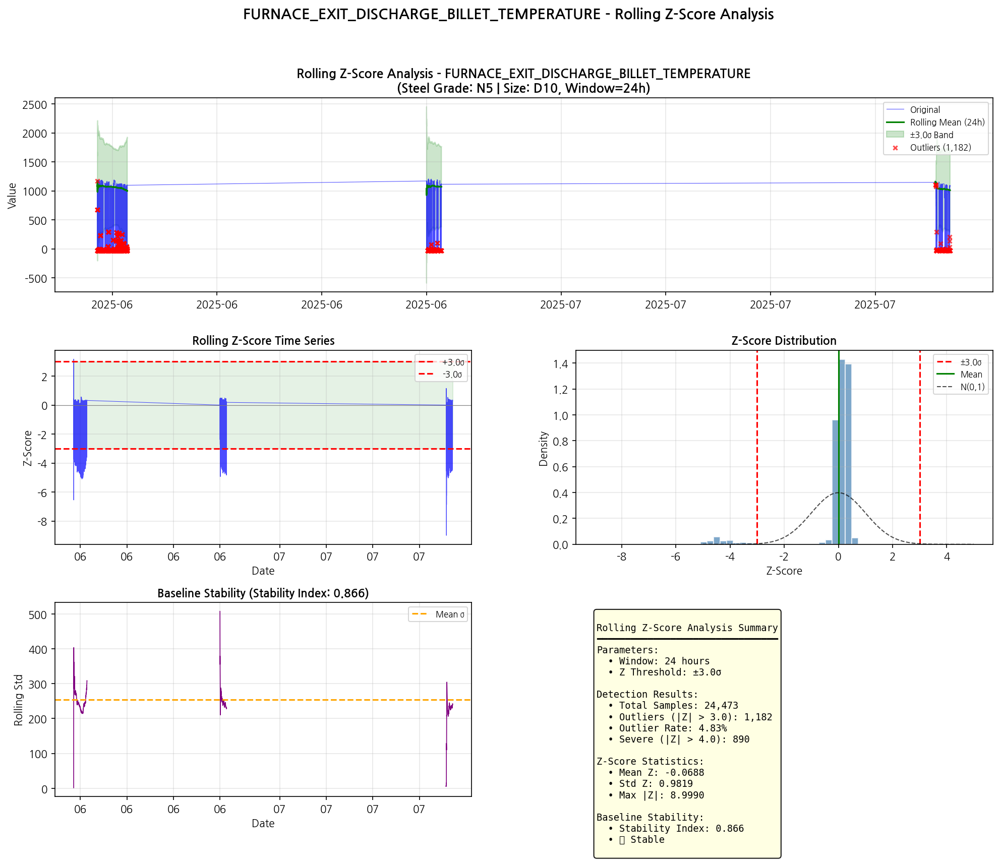

### 가열로 보조설비 (04_Furnace_Auxiliary)

- 분석 태그: 9개
- 평균 이상치율: 3.22%
- 평균 안정성: 0.492

| 태그 | 이상치율 | 심각 이상치 | 안정성 | Max \|Z\| |
|------|----------|-------------|--------|--------|
| FURNACE_PRESSURE | 1.43% | 59 | 0.637 | 5.43 |
| FURNACE_O2_ANALYZER | 5.07% | 911 | 0.086 | 58.15 |
| MAIN_GAS_PRESSURE | 4.34% | 309 | 0.569 | 7.39 |
| MAIN_GAS_FLOW | 1.25% | 160 | 0.738 | 6.37 |
| MAIN_GAS_TEMPERATURE | 7.93% | 164 | 0.450 | 6.42 |
| MAIN_COMBUSTION_AIR_PRESSURE | 1.88% | 347 | 0.238 | 14.81 |
| COMBUSTION_AIR_TEMPERATURE | 5.41% | 676 | 0.438 | 5.38 |
| INDIRECT_COOLING_WATER_FLOW | 0.24% | 11 | 0.758 | 8.30 |
| INDIRECT_WATER_MAIN_TEMPERATURE | 1.43% | 22 | 0.512 | 8.37 |

#### Z-Score 차트

**MAIN_GAS_TEMPERATURE** (이상치율: 7.93%, 안정성: 0.450)

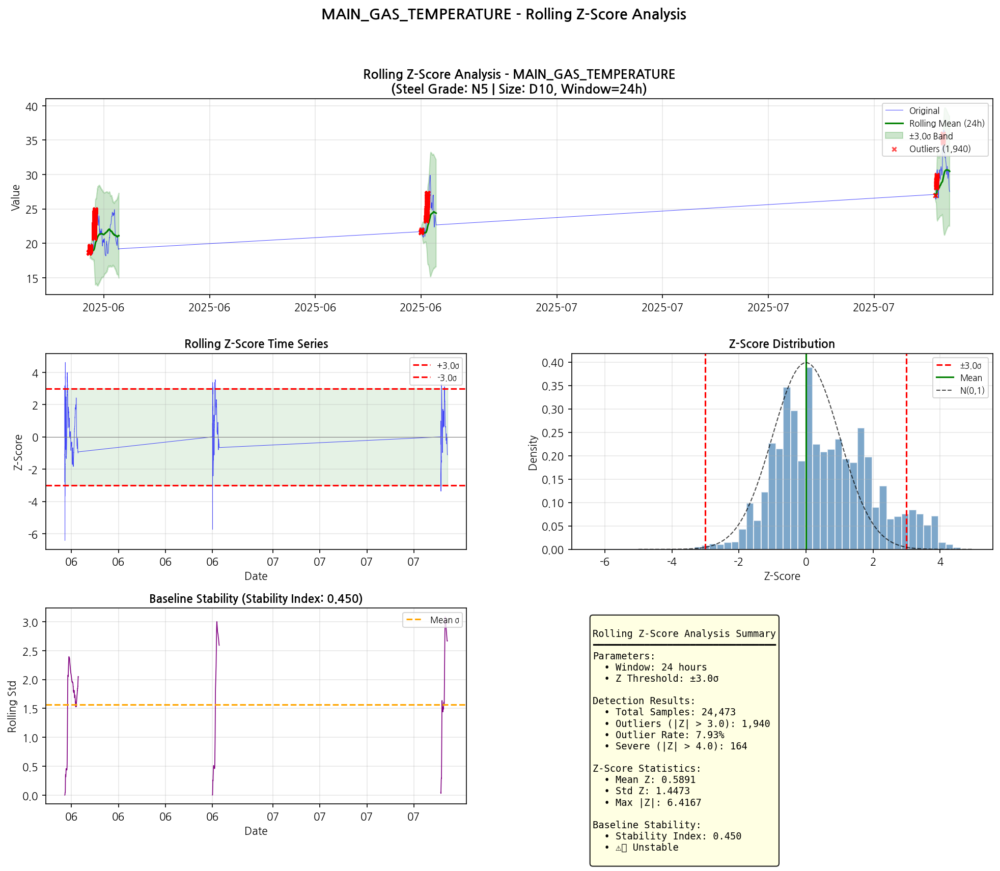

**COMBUSTION_AIR_TEMPERATURE** (이상치율: 5.41%, 안정성: 0.438)

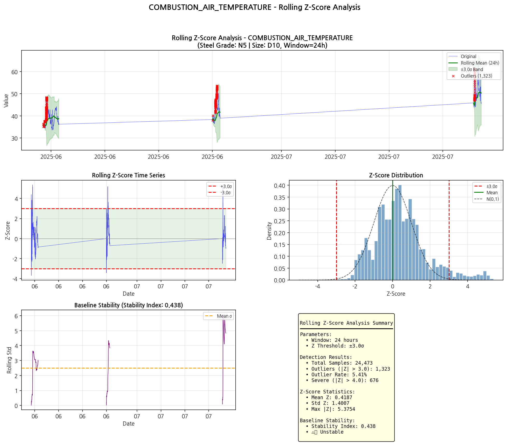

**FURNACE_O2_ANALYZER** (이상치율: 5.07%, 안정성: 0.086)

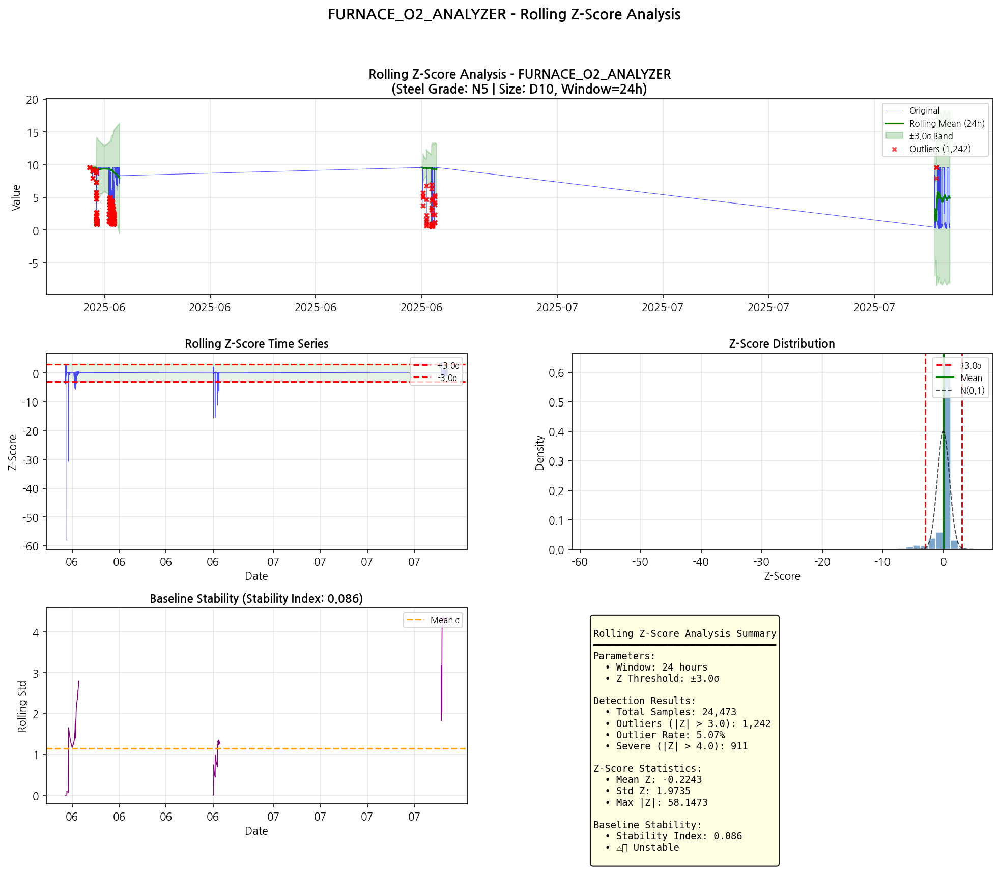

### 스탠드 토크 (05_Stand_Torque)

- 분석 태그: 16개
- 평균 이상치율: 0.05%
- 평균 안정성: 0.868

| 태그 | 이상치율 | 심각 이상치 | 안정성 | Max \|Z\| |
|------|----------|-------------|--------|--------|
| STAND_1_ACTUAL_TORQUE | 0.00% | 0 | 0.888 | 3.18 |
| STAND_2_ACTUAL_TORQUE | 0.00% | 0 | 0.895 | 3.18 |
| STAND_3_ACTUAL_TORQUE | 0.00% | 0 | 0.875 | 3.18 |
| STAND_4_ACTUAL_TORQUE | 0.02% | 0 | 0.880 | 3.18 |
| STAND_5_ACTUAL_TORQUE | 0.03% | 0 | 0.881 | 3.18 |
| STAND_6_ACTUAL_TORQUE | 0.08% | 0 | 0.876 | 3.18 |
| STAND_7_ACTUAL_TORQUE | 0.07% | 0 | 0.870 | 3.18 |
| STAND_8_ACTUAL_TORQUE | 0.10% | 0 | 0.876 | 3.26 |
| STAND_9_ACTUAL_TORQUE | 0.00% | 0 | 0.886 | 3.18 |
| STAND_10_ACTUAL_TORQUE | 0.02% | 0 | 0.887 | 3.18 |
| STAND_11_ACTUAL_TORQUE | 0.01% | 0 | 0.903 | 3.18 |
| STAND_12_ACTUAL_TORQUE | 0.02% | 0 | 0.901 | 3.18 |
| STAND_13_ACTUAL_TORQUE | 0.01% | 0 | 0.858 | 3.18 |
| STAND_14_ACTUAL_TORQUE | 0.05% | 0 | 0.862 | 3.25 |
| FINISHING_BLOCK_MASTER_ACTUAL_TORQUE | 0.15% | 1 | 0.776 | 4.02 |
| FINISHING_BLOCK_SLAVE_ACTUAL_TORQUE | 0.15% | 1 | 0.777 | 4.01 |

#### Z-Score 차트

**FINISHING_BLOCK_MASTER_ACTUAL_TORQUE** (이상치율: 0.15%, 안정성: 0.776)

**FINISHING_BLOCK_SLAVE_ACTUAL_TORQUE** (이상치율: 0.15%, 안정성: 0.777)

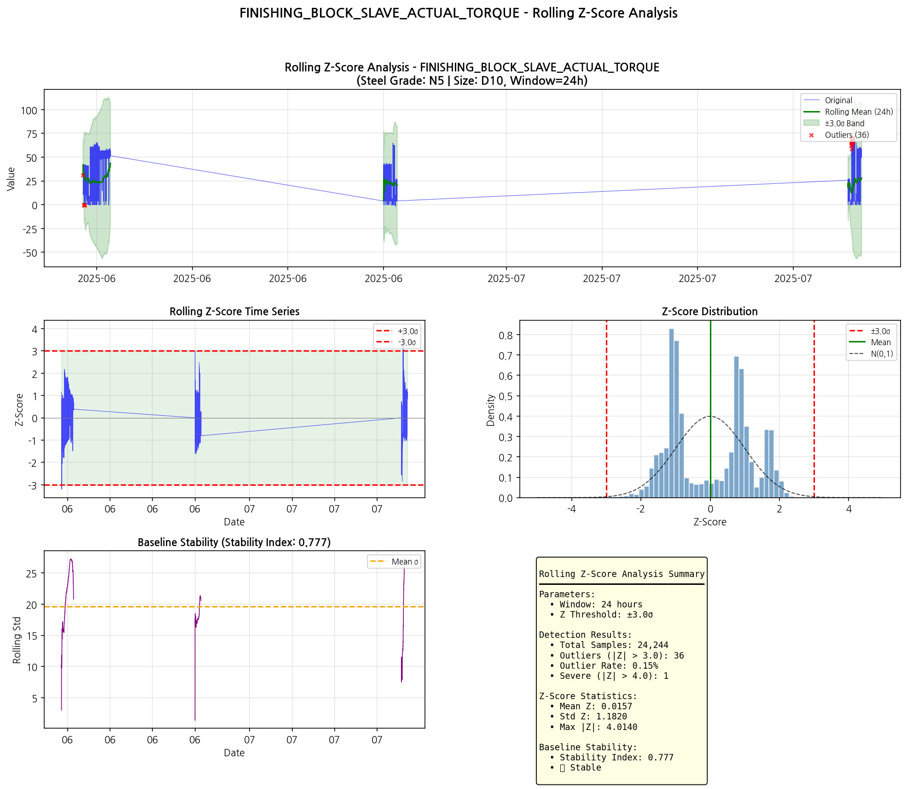

**STAND_8_ACTUAL_TORQUE** (이상치율: 0.10%, 안정성: 0.876)

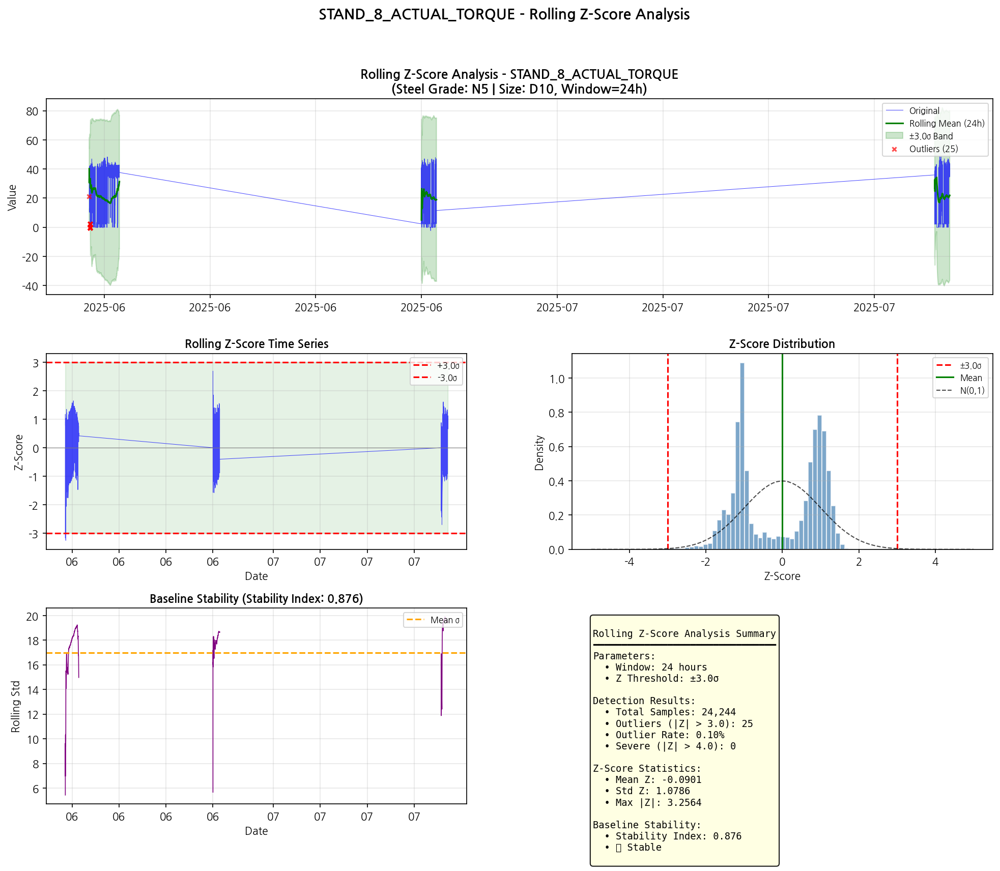

### 스탠드 속도 (06_Stand_Speed)

- 분석 태그: 15개
- 평균 이상치율: 0.89%
- 평균 안정성: 0.728

| 태그 | 이상치율 | 심각 이상치 | 안정성 | Max \|Z\| |
|------|----------|-------------|--------|--------|
| STAND_1_ACTUAL_SPEED | 0.87% | 87 | 0.725 | 31.89 |
| STAND_2_ACTUAL_SPEED | 0.87% | 87 | 0.724 | 32.80 |
| STAND_3_ACTUAL_SPEED | 0.88% | 88 | 0.726 | 32.79 |
| STAND_4_ACTUAL_SPEED | 0.88% | 88 | 0.725 | 32.88 |
| STAND_5_ACTUAL_SPEED | 0.90% | 89 | 0.725 | 32.96 |
| STAND_6_ACTUAL_SPEED | 0.90% | 88 | 0.725 | 33.00 |
| STAND_7_ACTUAL_SPEED | 0.87% | 87 | 0.725 | 33.03 |
| STAND_8_ACTUAL_SPEED | 0.87% | 88 | 0.725 | 32.97 |
| STAND_9_ACTUAL_SPEED | 0.96% | 92 | 0.721 | 32.40 |
| STAND_10_ACTUAL_SPEED | 0.88% | 87 | 0.726 | 32.97 |
| STAND_11_ACTUAL_SPEED | 0.99% | 88 | 0.729 | 33.19 |
| STAND_12_ACTUAL_SPEED | 0.87% | 87 | 0.734 | 32.98 |
| STAND_13_ACTUAL_SPEED | 0.87% | 87 | 0.733 | 33.01 |
| STAND_14_ACTUAL_SPEED | 0.87% | 87 | 0.732 | 33.18 |
| FINISHING_BLOCK_ACTUAL_SPEED | 0.82% | 93 | 0.748 | 32.97 |

#### Z-Score 차트

**STAND_11_ACTUAL_SPEED** (이상치율: 0.99%, 안정성: 0.729)

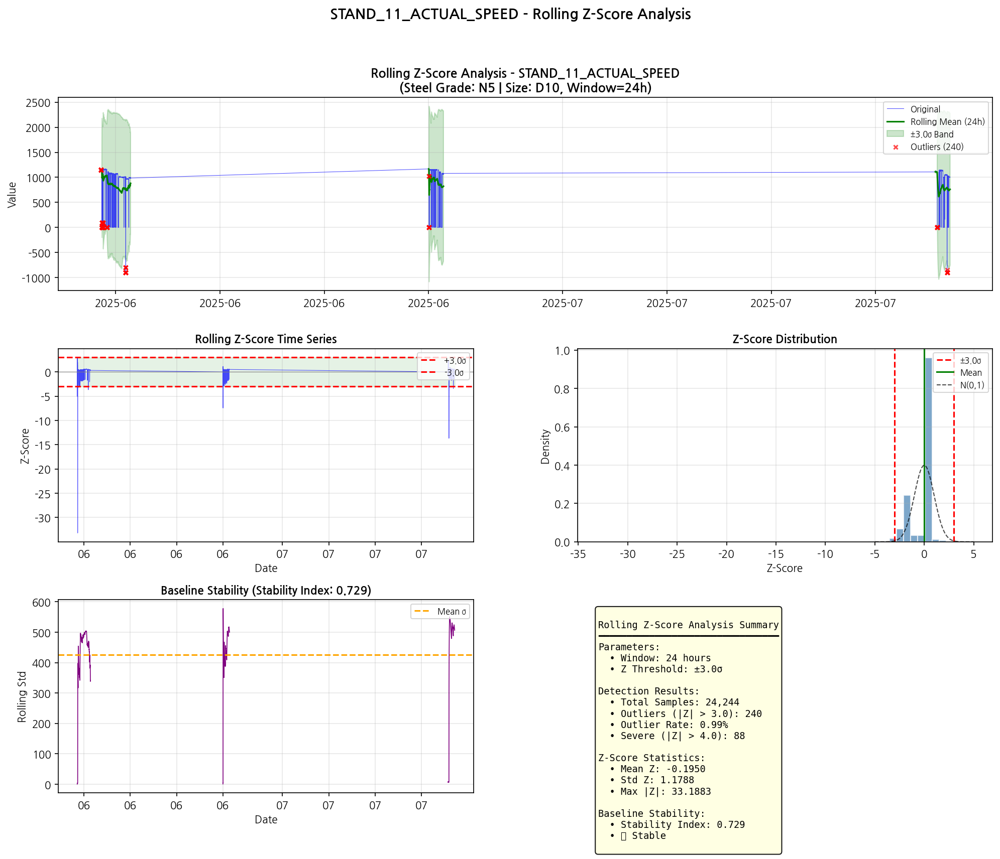

**STAND_9_ACTUAL_SPEED** (이상치율: 0.96%, 안정성: 0.721)

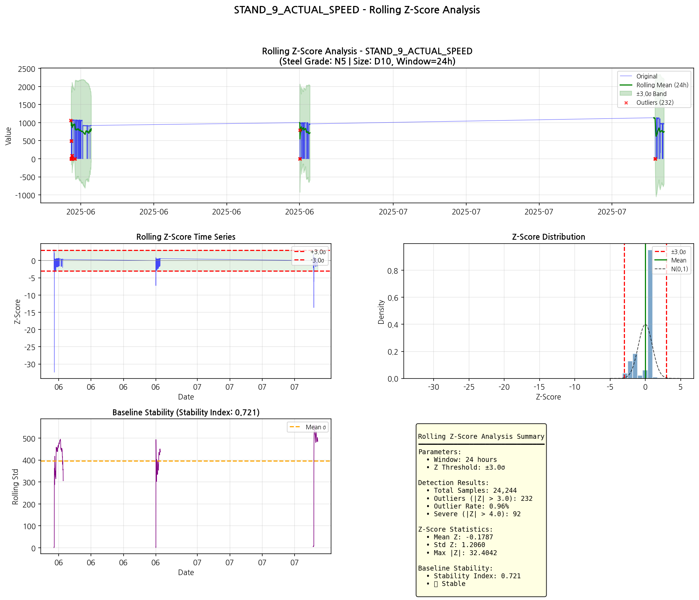

**STAND_5_ACTUAL_SPEED** (이상치율: 0.90%, 안정성: 0.725)

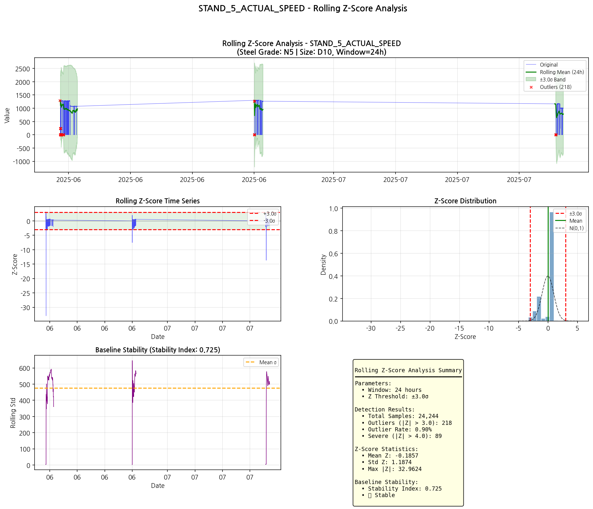

### 스탠드 부하 (07_Stand_Load)

- 분석 태그: 15개
- 평균 이상치율: 0.00%
- 평균 안정성: 0.897

| 태그 | 이상치율 | 심각 이상치 | 안정성 | Max \|Z\| |
|------|----------|-------------|--------|--------|
| STAND_1_LOAD | 0.01% | 0 | 0.897 | 3.35 |
| STAND_2_LOAD | 0.00% | 0 | 0.907 | 3.18 |
| STAND_3_LOAD | 0.00% | 0 | 0.905 | 3.18 |
| STAND_4_LOAD | 0.00% | 0 | 0.901 | 3.18 |
| STAND_5_LOAD | 0.00% | 0 | 0.896 | 3.18 |
| STAND_6_LOAD | 0.00% | 0 | 0.894 | 3.18 |
| STAND_7_LOAD | 0.00% | 0 | 0.892 | 3.18 |
| STAND_8_LOAD | 0.00% | 0 | 0.892 | 3.18 |
| STAND_9_LOAD | 0.00% | 0 | 0.894 | 3.18 |
| STAND_10_LOAD | 0.00% | 0 | 0.895 | 3.18 |
| STAND_11_LOAD | 0.00% | 0 | 0.896 | 3.18 |
| STAND_12_LOAD | 0.00% | 0 | 0.896 | 3.18 |
| STAND_13_LOAD | 0.00% | 0 | 0.896 | 3.18 |
| STAND_14_LOAD | 0.00% | 0 | 0.898 | 3.18 |
| FINISHING_BLOCK_LOAD | 0.00% | 0 | 0.900 | 3.18 |

#### Z-Score 차트

**STAND_1_LOAD** (이상치율: 0.01%, 안정성: 0.897)

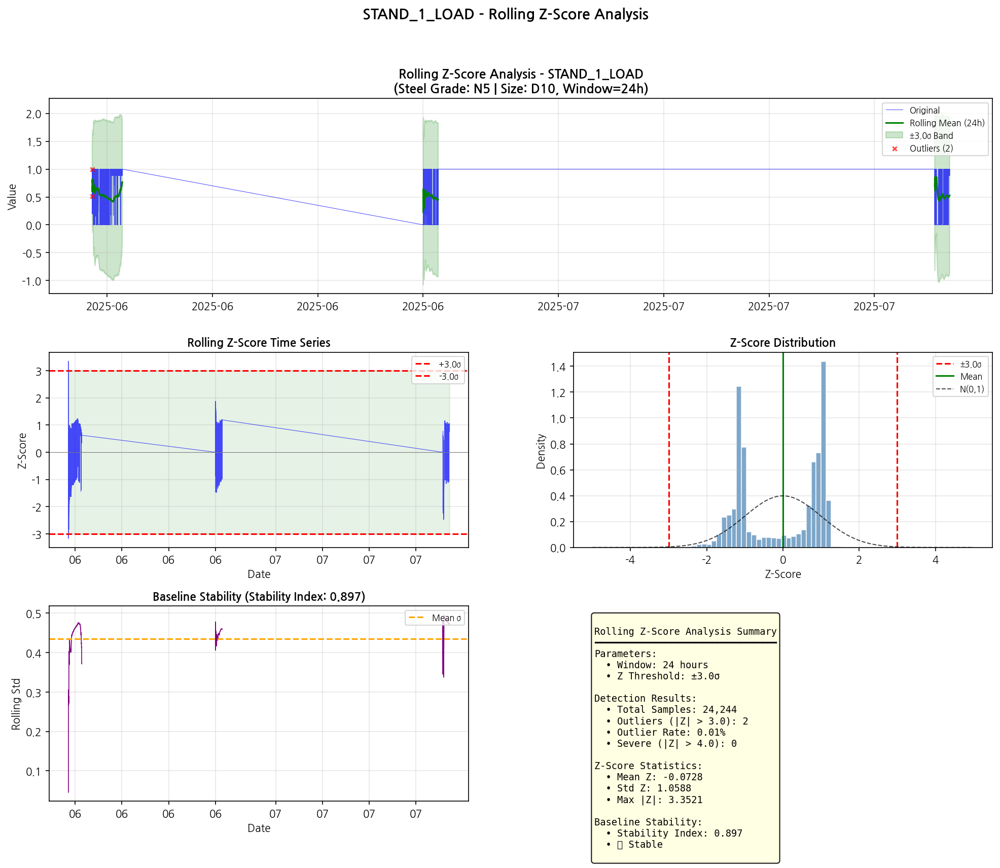

**STAND_2_LOAD** (이상치율: 0.00%, 안정성: 0.907)

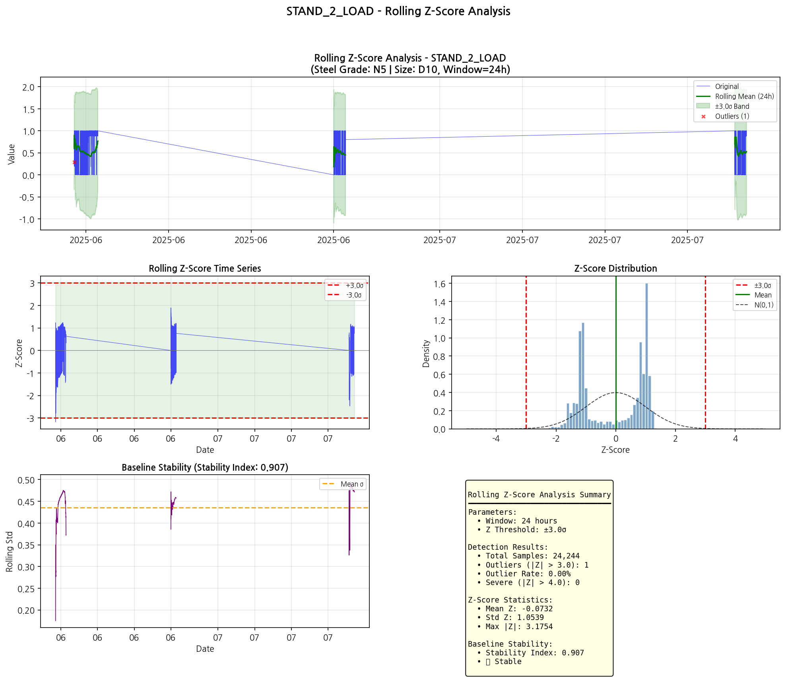

**STAND_3_LOAD** (이상치율: 0.00%, 안정성: 0.905)

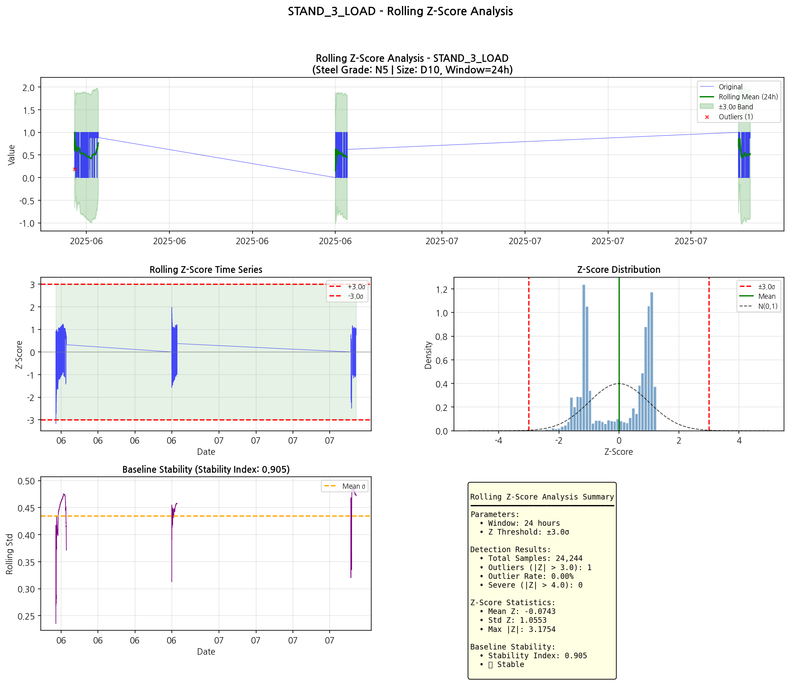

### 핀치롤 (08_Pinchroll)

- 분석 태그: 9개
- 평균 이상치율: 1.26%
- 평균 안정성: 0.638

| 태그 | 이상치율 | 심각 이상치 | 안정성 | Max \|Z\| |
|------|----------|-------------|--------|--------|
| PINCHROLL_2_ACTUAL_SPEED | 1.40% | 153 | 0.661 | 18.22 |
| PINCHROLL_3_ACTUAL_SPEED | 4.53% | 424 | 0.135 | 26.47 |
| PINCHROLL_4_ACTUAL_SPEED | 4.11% | 394 | 0.086 | 35.04 |
| PINCHROLL_2_ACTUAL_TORQUE | 0.02% | 0 | 0.882 | 3.74 |
| PINCHROLL_3_ACTUAL_TORQUE | 0.02% | 0 | 0.885 | 3.78 |
| PINCHROLL_4_ACTUAL_TORQUE | 0.03% | 0 | 0.889 | 3.76 |
| PINCHROLL_2_REFERENCE_TORQUE | 1.20% | 179 | 0.505 | 33.15 |
| PINCHROLL_3_REFERENCE_TORQUE | 0.03% | 0 | 0.839 | 3.78 |
| PINCHROLL_4_REFERENCE_TORQUE | 0.03% | 0 | 0.860 | 3.76 |

#### Z-Score 차트

**PINCHROLL_3_ACTUAL_SPEED** (이상치율: 4.53%, 안정성: 0.135)

**PINCHROLL_4_ACTUAL_SPEED** (이상치율: 4.11%, 안정성: 0.086)

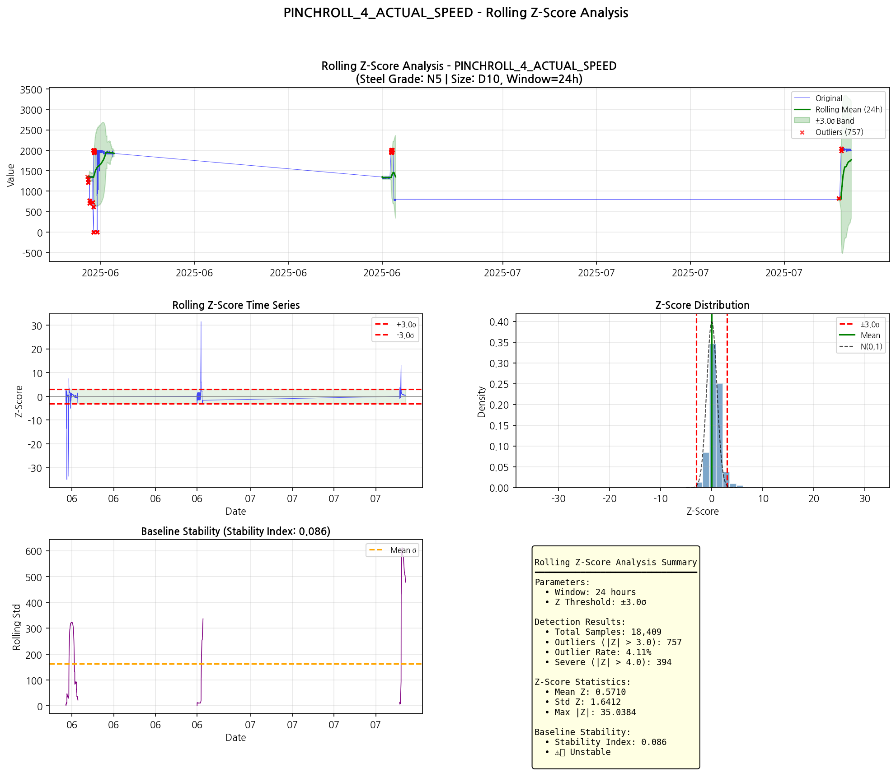

**PINCHROLL_2_ACTUAL_SPEED** (이상치율: 1.40%, 안정성: 0.661)

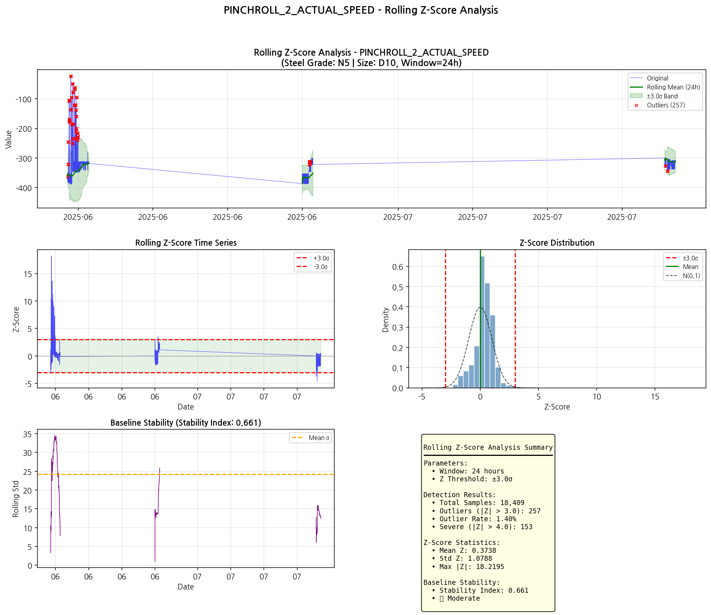

### PR 상세 토크 (09_PR_Detailed)

- 분석 태그: 6개
- 평균 이상치율: 3.42%
- 평균 안정성: 0.337

| 태그 | 이상치율 | 심각 이상치 | 안정성 | Max \|Z\| |
|------|----------|-------------|--------|--------|
| PR6L1_ACT_TORQUE | 5.20% | 575 | 0.000 | 18.82 |
| PR6L2_ACT_TORQUE | 5.71% | 530 | 0.000 | 17.85 |
| PR7L1_ACT_TORQUE | 4.78% | 512 | 0.263 | 9.10 |
| PR7L2_ACT_TORQUE | 4.74% | 488 | 0.208 | 11.49 |
| PR8L1_ACT_TORQUE | 0.01% | 0 | 0.742 | 3.18 |
| PR9L1_ACT_TORQUE | 0.07% | 1 | 0.807 | 4.55 |

#### Z-Score 차트

**PR6L2_ACT_TORQUE** (이상치율: 5.71%, 안정성: 0.000)

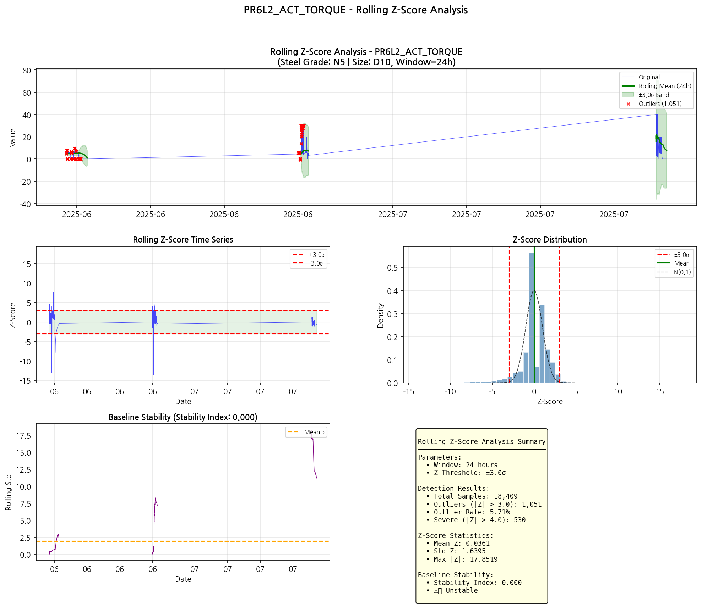

**PR6L1_ACT_TORQUE** (이상치율: 5.20%, 안정성: 0.000)

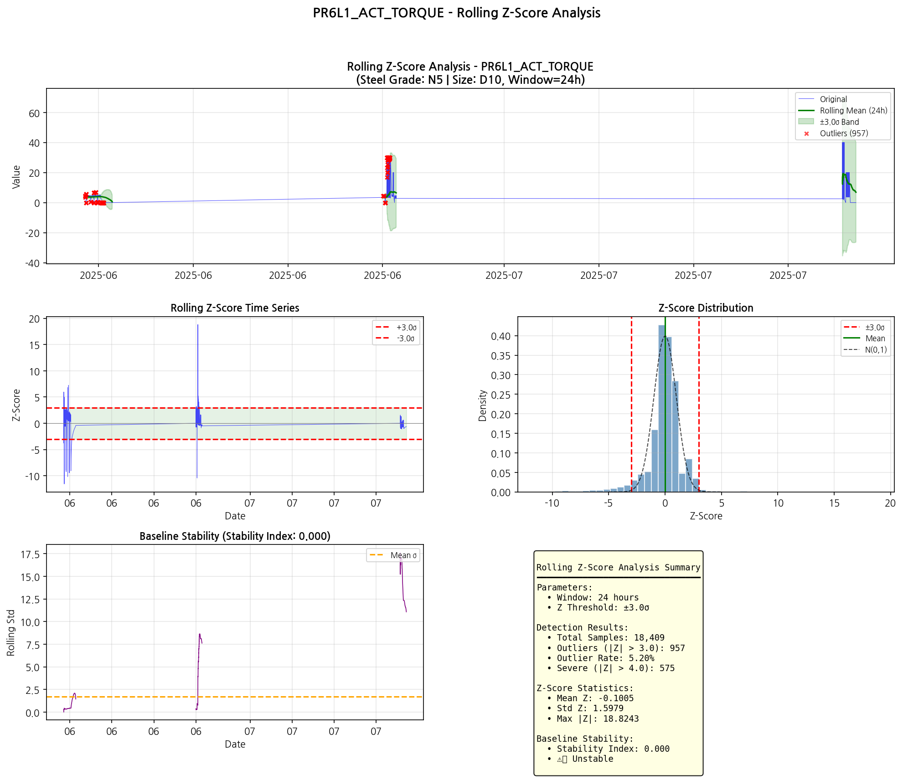

**PR7L1_ACT_TORQUE** (이상치율: 4.78%, 안정성: 0.263)

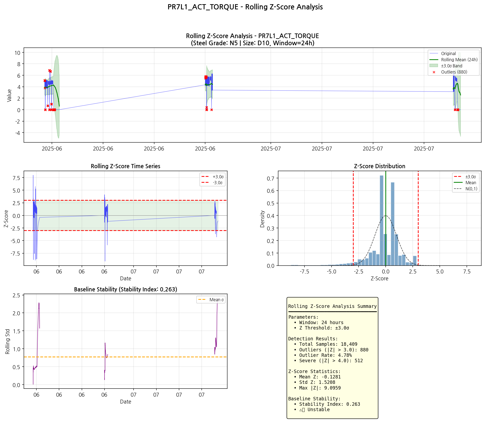

---

## 해석 가이드

### Rolling Z-Score 해석

1. **이상치율 (Outlier Rate)**
   - |Z| > 3.0σ 비율
   - 높을수록 해당 시점 주변 패턴에서 벗어난 데이터 많음
   - 정상 분포 가정 시 약 0.3% 예상

2. **기준선 안정성 (Baseline Stability)**
   - Rolling std의 시간적 일관성
   - 1에 가까울수록 안정적
   - 0.5 미만: 비정상 시계열, 다른 방법 권장

3. **심각 이상치 (Severe Outliers)**
   - |Z| > 4.0σ
   - 극단적인 이상값
   - 즉각적인 점검 필요

### 상태 분류

| 상태 | 기준 | 해석 |
|------|------|------|
| 🔴 높음 | ≥10% | 빈번한 이상치, 점검 필요 |
| 🟠 중간 | 3~10% | 일부 이상치, 모니터링 |
| 🟢 낮음 | <3% | 정상 범위 |
| 🟡 불안정 | Stability < 0.5 | 기준선 변동 심함 |

### Standard IQR vs Rolling Z-Score

| 방법 | 장점 | 단점 |
|------|------|------|
| Standard IQR | 간단, 전체 분포 기반 | 시변 데이터에 부적합 |
| Rolling Z-Score | 시변 데이터 적합 | 윈도우 크기 설정 필요 |

**권장**: 기준선 안정성 ≥ 0.5인 태그에 효과적

---

## 메타데이터

| 항목 | 값 |
|------|-----|
| 분석 스크립트 | steel_grade_rolling_zscore_analysis.py |
| 분석 기간 | 2025-03-01 ~ 2025-08-31 |
| 강종 | N5 |
| 윈도우 크기 | 24시간 |
| Z 임계값 | ±3.0σ |
| 생성일시 | 2026-02-09 15:13:36 |
| 총 분석 태그 | 79개 |

---

*본 보고서는 자동 생성되었습니다.*
