# 강종 [N5 | Size: D12] Rolling Z-Score 동적 이상치 분석 보고서

**분석 기간**: 2025-03-01 ~ 2025-08-31
**강종**: N5  
**사이즈**: D12
**생성일시**: 2026-02-09 15:12:15

---

## 분석 개요

### 분석 방법론

**Rolling Z-Score (롤링 Z-점수)**

시간 창(window) 기반 동적 이상치 탐지 방법입니다.

$$Z_{rolling}(t) = \frac{x(t) - \mu_{window}(t)}{\sigma_{window}(t)}$$

| 파라미터 | 값 | 설명 |
|----------|-----|------|
| Window | 24h | 이동 평균/표준편차 윈도우 |
| Z Threshold | ±3.0σ | 이상치 판정 임계값 |
| Severe | ±4.0σ | 심각 이상치 임계값 |

### 장점

- **비정상 시계열 적합**: 평균/분산 시변하는 데이터에 효과적
- **점진적 기준선 추적**: 장기 드리프트에 강건
- **Local Context 기반**: 해당 시점 주변 패턴 기준

### 분석 결과 요약

| 구분 | 태그 수 | 비율 |
|------|---------|------|
| **총 분석 태그** | 79개 | 100% |
| 🔴 높은 이상치율 (≥10%) | 0개 | 0.0% |
| 🟠 중간 이상치율 (3~10%) | 4개 | 5.1% |
| 🟢 낮은 이상치율 (<3%) | 60개 | 75.9% |
| 🟡 불안정 기준선 | 15개 | 19.0% |

#### 전체 평균

| 지표 | 값 |
|------|-----|
| 평균 이상치율 | 1.33% |
| 평균 기준선 안정성 | 0.634 |

---

## 상위 문제 태그 (이상치율 기준)

| 순위 | 태그 | 카테고리 | 이상치율 | 심각 이상치 | 안정성 | 상태 |
|------|------|----------|----------|-------------|--------|------|
| 1 | FURNACE_EXIT_DISCHARGE_BILLET_TEMPERATURE | 가열로 추출 온도 | 5.56% | 1646 | 0.820 | 🟠 |
| 2 | FURNACE_O2_ANALYZER | 가열로 보조설비 | 4.27% | 1342 | 0.557 | 🟠 |
| 3 | SOAKING_TOP_ZONE_NO_1_TEMPERATURE_ROOF | 가열로 상부 온도 | 4.10% | 1279 | 0.013 | 🟠 |
| 4 | SOAKING_TOP_ZONE_NO_2_TEMPERATURE_ROOF | 가열로 상부 온도 | 4.07% | 1063 | 0.000 | 🟠 |
| 5 | COMBUSTION_AIR_TEMPERATURE | 가열로 보조설비 | 2.97% | 747 | 0.579 | 🟢 |
| 6 | PR6L1_ACT_TORQUE | PR 상세 토크 | 2.91% | 1082 | 0.000 | 🟡 |
| 7 | PINCHROLL_4_ACTUAL_SPEED | 핀치롤 | 2.58% | 832 | 0.208 | 🟡 |
| 8 | PINCHROLL_3_ACTUAL_SPEED | 핀치롤 | 2.51% | 755 | 0.125 | 🟡 |
| 9 | MAIN_COMBUSTION_AIR_PRESSURE | 가열로 보조설비 | 2.40% | 952 | 0.000 | 🟡 |
| 10 | HEATING_TOP_ZONE_NO_1_TEMPERATURE_ROOF | 가열로 상부 온도 | 2.36% | 235 | 0.267 | 🟡 |
| 11 | HEATING_TOP_ZONE_NO_2_TEMPERATURE_ROOF | 가열로 상부 온도 | 2.30% | 224 | 0.256 | 🟡 |
| 12 | PR6L2_ACT_TORQUE | PR 상세 토크 | 2.21% | 915 | 0.000 | 🟡 |
| 13 | MAIN_GAS_PRESSURE | 가열로 보조설비 | 2.12% | 287 | 0.000 | 🟡 |
| 14 | MAIN_GAS_TEMPERATURE | 가열로 보조설비 | 2.04% | 136 | 0.516 | 🟢 |
| 15 | SOAKING_BOTTOM_ZONE_NO_2_TEMPERATURE_MILL_SIDE | 가열로 하부 온도 | 1.77% | 107 | 0.086 | 🟡 |

---

## 불안정 기준선 태그

기준선 안정성(Stability Index)이 0.5 미만인 태그입니다.
이 태그들은 Rolling Z-Score 방법보다 다른 방법이 더 적합할 수 있습니다.

| 태그 | 카테고리 | 안정성 | 이상치율 |
|------|----------|--------|----------|
| SOAKING_TOP_ZONE_NO_2_TEMPERATURE_ROOF | 가열로 상부 온도 | 0.000 | 4.07% |
| MAIN_GAS_PRESSURE | 가열로 보조설비 | 0.000 | 2.12% |
| MAIN_COMBUSTION_AIR_PRESSURE | 가열로 보조설비 | 0.000 | 2.40% |
| PR6L1_ACT_TORQUE | PR 상세 토크 | 0.000 | 2.91% |
| PR6L2_ACT_TORQUE | PR 상세 토크 | 0.000 | 2.21% |
| PR7L1_ACT_TORQUE | PR 상세 토크 | 0.000 | 1.68% |
| PR7L2_ACT_TORQUE | PR 상세 토크 | 0.000 | 1.39% |
| SOAKING_TOP_ZONE_NO_1_TEMPERATURE_ROOF | 가열로 상부 온도 | 0.013 | 4.10% |
| SOAKING_BOTTOM_ZONE_NO_2_TEMPERATURE_MILL_SIDE | 가열로 하부 온도 | 0.086 | 1.77% |
| SOAKING_BOTTOM_ZONE_NO_1_TEMPERATURE_OPP_SIDE | 가열로 하부 온도 | 0.114 | 1.48% |

---

## 카테고리별 분석 결과

### 가열로 상부 온도 (01_Furnace_Top_Temperature)

- 분석 태그: 4개
- 평균 이상치율: 3.21%
- 평균 안정성: 0.134

| 태그 | 이상치율 | 심각 이상치 | 안정성 | Max \|Z\| |
|------|----------|-------------|--------|--------|
| HEATING_TOP_ZONE_NO_1_TEMPERATURE_ROOF | 2.36% | 235 | 0.267 | 10.96 |
| HEATING_TOP_ZONE_NO_2_TEMPERATURE_ROOF | 2.30% | 224 | 0.256 | 11.00 |
| SOAKING_TOP_ZONE_NO_1_TEMPERATURE_ROOF | 4.10% | 1279 | 0.013 | 10.52 |
| SOAKING_TOP_ZONE_NO_2_TEMPERATURE_ROOF | 4.07% | 1063 | 0.000 | 8.90 |

#### Z-Score 차트

**SOAKING_TOP_ZONE_NO_1_TEMPERATURE_ROOF** (이상치율: 4.10%, 안정성: 0.013)

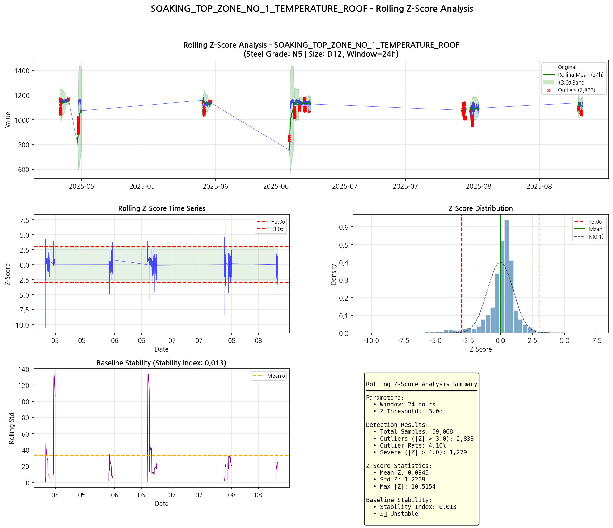

**SOAKING_TOP_ZONE_NO_2_TEMPERATURE_ROOF** (이상치율: 4.07%, 안정성: 0.000)

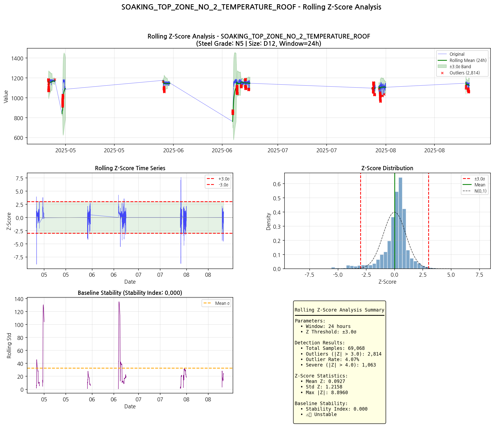

**HEATING_TOP_ZONE_NO_1_TEMPERATURE_ROOF** (이상치율: 2.36%, 안정성: 0.267)

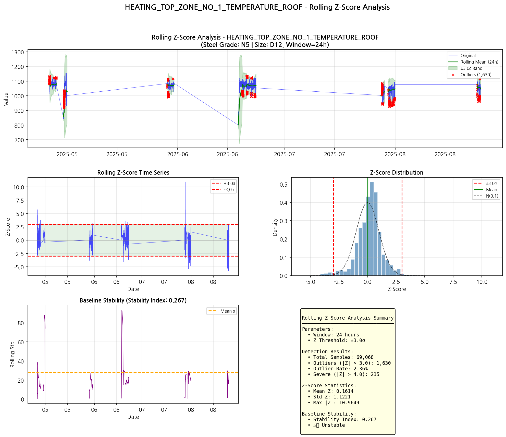

### 가열로 하부 온도 (02_Furnace_Bottom_Temperature)

- 분석 태그: 4개
- 평균 이상치율: 1.12%
- 평균 안정성: 0.384

| 태그 | 이상치율 | 심각 이상치 | 안정성 | Max \|Z\| |
|------|----------|-------------|--------|--------|
| HEATING_BOTTOM_ZONE_NO_1_TEMPERATURE_OPP_SIDE | 0.64% | 149 | 0.691 | 6.04 |
| HEATING_BOTTOM_ZONE_NO_2_TEMPERATURE_MILL_SIDE | 0.59% | 154 | 0.643 | 5.69 |
| SOAKING_BOTTOM_ZONE_NO_1_TEMPERATURE_OPP_SIDE | 1.48% | 112 | 0.114 | 5.93 |
| SOAKING_BOTTOM_ZONE_NO_2_TEMPERATURE_MILL_SIDE | 1.77% | 107 | 0.086 | 6.05 |

#### Z-Score 차트

**SOAKING_BOTTOM_ZONE_NO_2_TEMPERATURE_MILL_SIDE** (이상치율: 1.77%, 안정성: 0.086)

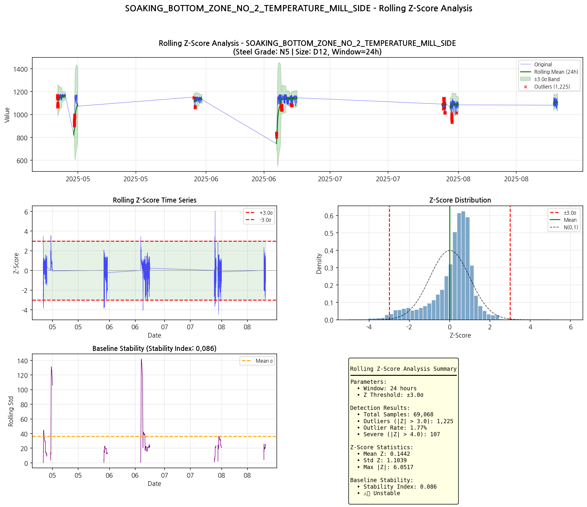

**SOAKING_BOTTOM_ZONE_NO_1_TEMPERATURE_OPP_SIDE** (이상치율: 1.48%, 안정성: 0.114)

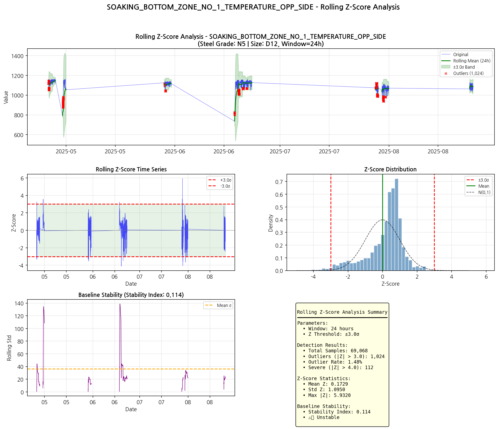

**HEATING_BOTTOM_ZONE_NO_1_TEMPERATURE_OPP_SIDE** (이상치율: 0.64%, 안정성: 0.691)

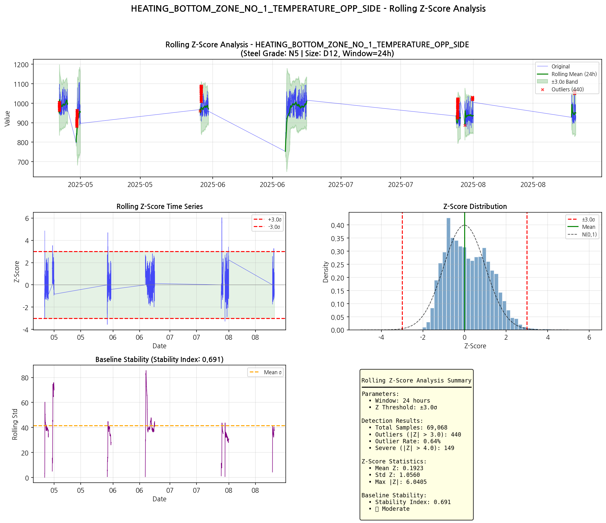

### 가열로 추출 온도 (03_Furnace_Discharge_Temperature)

- 분석 태그: 1개
- 평균 이상치율: 5.56%
- 평균 안정성: 0.820

| 태그 | 이상치율 | 심각 이상치 | 안정성 | Max \|Z\| |
|------|----------|-------------|--------|--------|
| FURNACE_EXIT_DISCHARGE_BILLET_TEMPERATURE | 5.56% | 1646 | 0.820 | 42.65 |

#### Z-Score 차트

**FURNACE_EXIT_DISCHARGE_BILLET_TEMPERATURE** (이상치율: 5.56%, 안정성: 0.820)

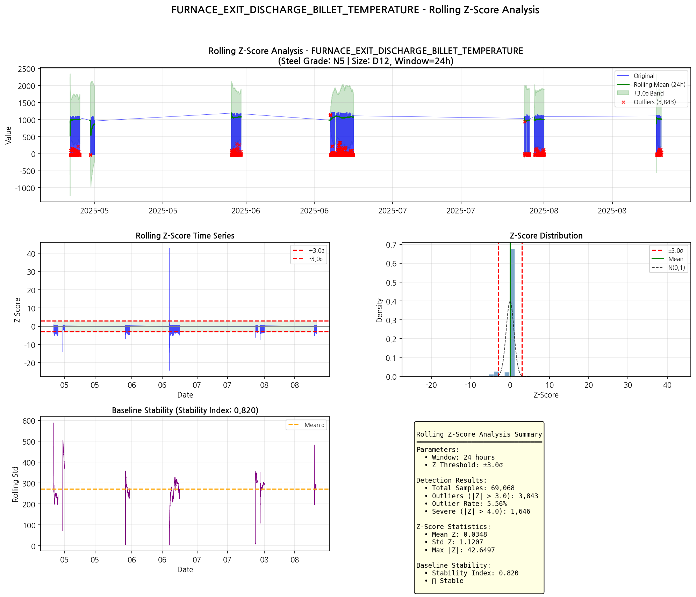

### 가열로 보조설비 (04_Furnace_Auxiliary)

- 분석 태그: 9개
- 평균 이상치율: 2.14%
- 평균 안정성: 0.427

| 태그 | 이상치율 | 심각 이상치 | 안정성 | Max \|Z\| |
|------|----------|-------------|--------|--------|
| FURNACE_PRESSURE | 1.48% | 329 | 0.649 | 6.16 |
| FURNACE_O2_ANALYZER | 4.27% | 1342 | 0.557 | 55.30 |
| MAIN_GAS_PRESSURE | 2.12% | 287 | 0.000 | 20.12 |
| MAIN_GAS_FLOW | 1.24% | 337 | 0.756 | 10.78 |
| MAIN_GAS_TEMPERATURE | 2.04% | 136 | 0.516 | 4.23 |
| MAIN_COMBUSTION_AIR_PRESSURE | 2.40% | 952 | 0.000 | 27.16 |
| COMBUSTION_AIR_TEMPERATURE | 2.97% | 747 | 0.579 | 6.04 |
| INDIRECT_COOLING_WATER_FLOW | 1.47% | 281 | 0.498 | 14.89 |
| INDIRECT_WATER_MAIN_TEMPERATURE | 1.29% | 12 | 0.290 | 6.76 |

#### Z-Score 차트

**FURNACE_O2_ANALYZER** (이상치율: 4.27%, 안정성: 0.557)

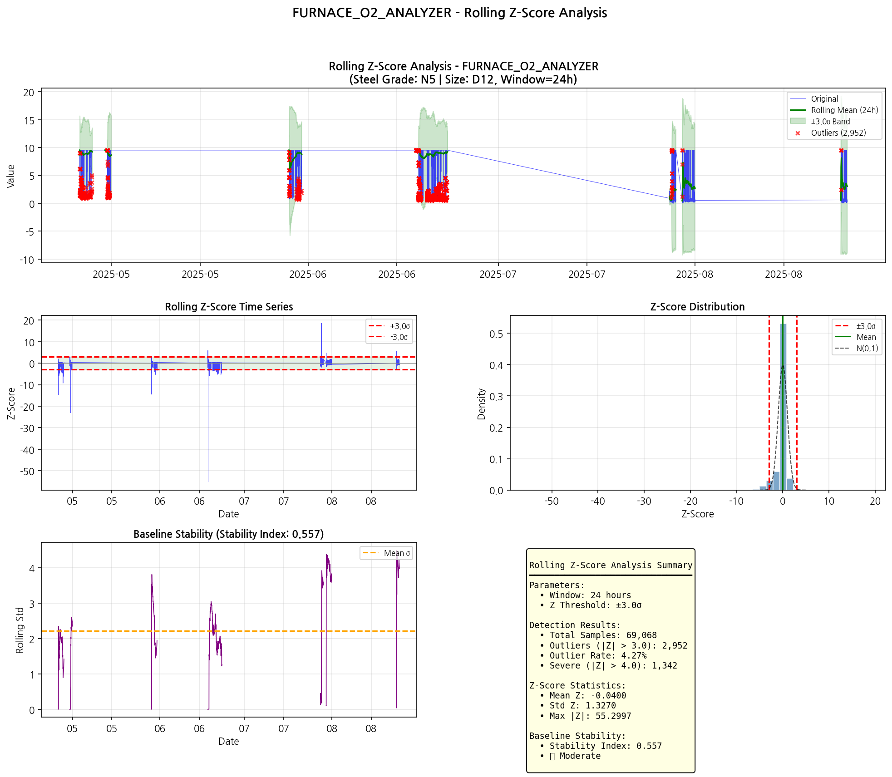

**COMBUSTION_AIR_TEMPERATURE** (이상치율: 2.97%, 안정성: 0.579)

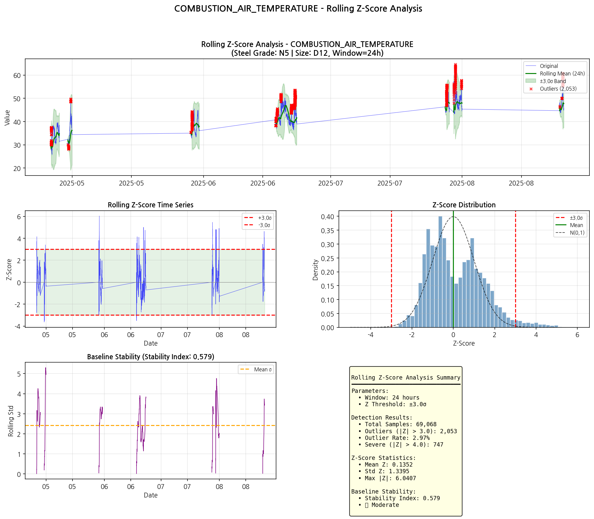

**MAIN_COMBUSTION_AIR_PRESSURE** (이상치율: 2.40%, 안정성: 0.000)

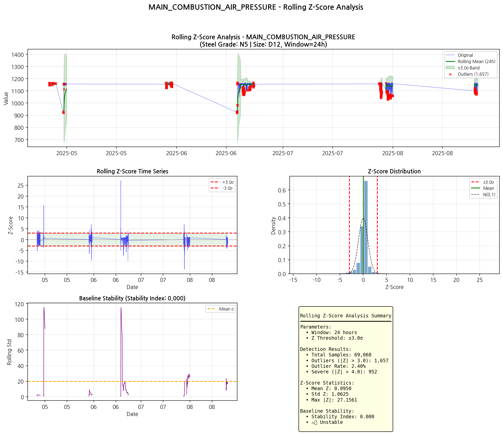

### 스탠드 토크 (05_Stand_Torque)

- 분석 태그: 16개
- 평균 이상치율: 1.00%
- 평균 안정성: 0.775

| 태그 | 이상치율 | 심각 이상치 | 안정성 | Max \|Z\| |
|------|----------|-------------|--------|--------|
| STAND_1_ACTUAL_TORQUE | 1.00% | 311 | 0.769 | 38.72 |
| STAND_2_ACTUAL_TORQUE | 0.98% | 315 | 0.778 | 30.05 |
| STAND_3_ACTUAL_TORQUE | 0.99% | 324 | 0.771 | 36.82 |
| STAND_4_ACTUAL_TORQUE | 0.96% | 335 | 0.771 | 37.49 |
| STAND_5_ACTUAL_TORQUE | 0.94% | 323 | 0.774 | 39.60 |
| STAND_6_ACTUAL_TORQUE | 0.97% | 342 | 0.777 | 31.31 |
| STAND_7_ACTUAL_TORQUE | 0.96% | 341 | 0.776 | 29.17 |
| STAND_8_ACTUAL_TORQUE | 1.00% | 340 | 0.763 | 20.69 |
| STAND_9_ACTUAL_TORQUE | 0.99% | 322 | 0.767 | 38.94 |
| STAND_10_ACTUAL_TORQUE | 1.01% | 332 | 0.780 | 29.16 |
| STAND_11_ACTUAL_TORQUE | 1.00% | 322 | 0.774 | 34.98 |
| STAND_12_ACTUAL_TORQUE | 1.02% | 324 | 0.776 | 26.04 |
| STAND_13_ACTUAL_TORQUE | 1.02% | 319 | 0.785 | 25.40 |
| STAND_14_ACTUAL_TORQUE | 1.01% | 302 | 0.789 | 19.34 |
| FINISHING_BLOCK_MASTER_ACTUAL_TORQUE | 1.04% | 304 | 0.774 | 20.05 |
| FINISHING_BLOCK_SLAVE_ACTUAL_TORQUE | 1.04% | 304 | 0.774 | 20.06 |

#### Z-Score 차트

**FINISHING_BLOCK_SLAVE_ACTUAL_TORQUE** (이상치율: 1.04%, 안정성: 0.774)

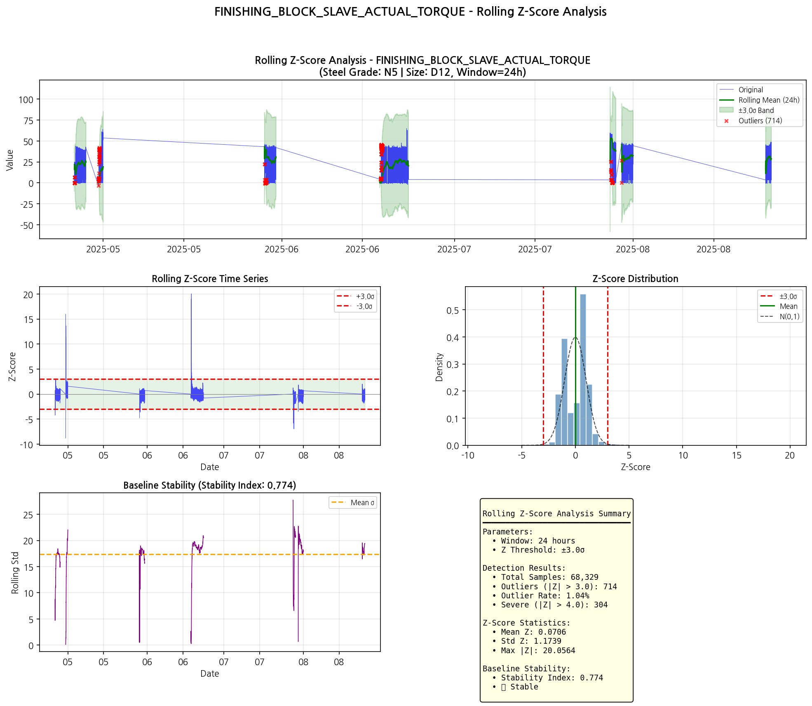

**FINISHING_BLOCK_MASTER_ACTUAL_TORQUE** (이상치율: 1.04%, 안정성: 0.774)

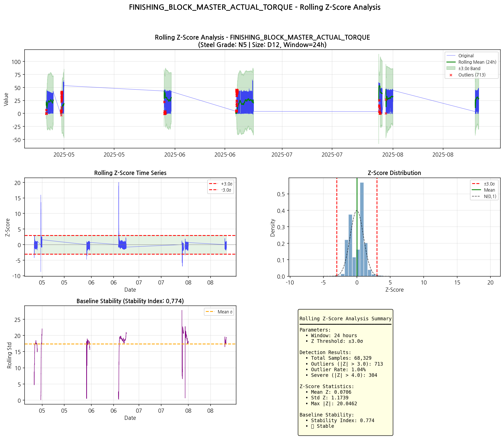

**STAND_12_ACTUAL_TORQUE** (이상치율: 1.02%, 안정성: 0.776)

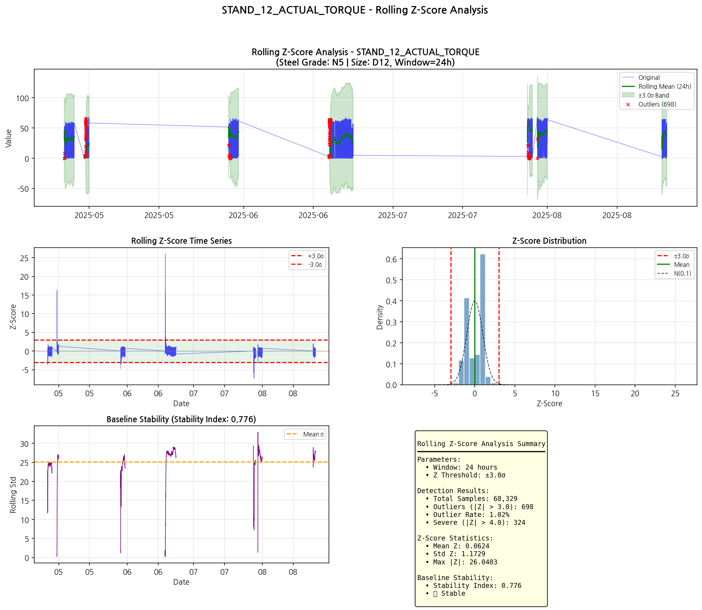

### 스탠드 속도 (06_Stand_Speed)

- 분석 태그: 15개
- 평균 이상치율: 1.26%
- 평균 안정성: 0.719

| 태그 | 이상치율 | 심각 이상치 | 안정성 | Max \|Z\| |
|------|----------|-------------|--------|--------|
| STAND_1_ACTUAL_SPEED | 1.27% | 297 | 0.712 | 32.64 |
| STAND_2_ACTUAL_SPEED | 1.25% | 282 | 0.701 | 33.78 |
| STAND_3_ACTUAL_SPEED | 1.25% | 278 | 0.711 | 33.56 |
| STAND_4_ACTUAL_SPEED | 1.23% | 276 | 0.715 | 33.60 |
| STAND_5_ACTUAL_SPEED | 1.22% | 279 | 0.710 | 33.62 |
| STAND_6_ACTUAL_SPEED | 1.23% | 281 | 0.714 | 33.53 |
| STAND_7_ACTUAL_SPEED | 1.20% | 279 | 0.718 | 33.53 |
| STAND_8_ACTUAL_SPEED | 1.22% | 278 | 0.716 | 33.32 |
| STAND_9_ACTUAL_SPEED | 1.26% | 274 | 0.736 | 32.17 |
| STAND_10_ACTUAL_SPEED | 1.27% | 292 | 0.730 | 32.15 |
| STAND_11_ACTUAL_SPEED | 1.41% | 366 | 0.730 | 32.26 |
| STAND_12_ACTUAL_SPEED | 1.26% | 298 | 0.730 | 32.08 |
| STAND_13_ACTUAL_SPEED | 1.24% | 332 | 0.720 | 32.26 |
| STAND_14_ACTUAL_SPEED | 1.27% | 300 | 0.727 | 32.47 |
| FINISHING_BLOCK_ACTUAL_SPEED | 1.30% | 334 | 0.720 | 32.46 |

#### Z-Score 차트

**STAND_11_ACTUAL_SPEED** (이상치율: 1.41%, 안정성: 0.730)

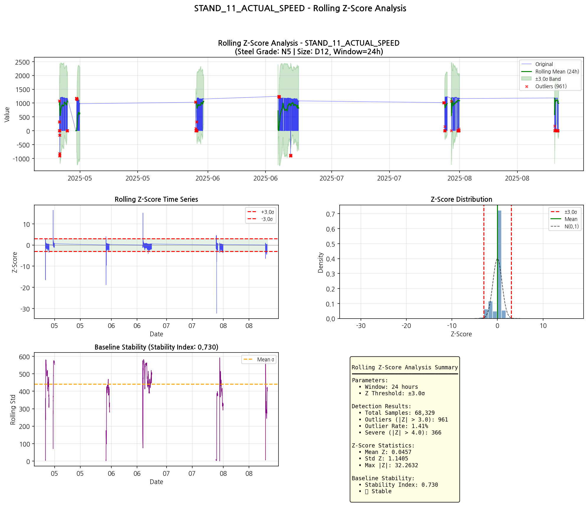

**FINISHING_BLOCK_ACTUAL_SPEED** (이상치율: 1.30%, 안정성: 0.720)

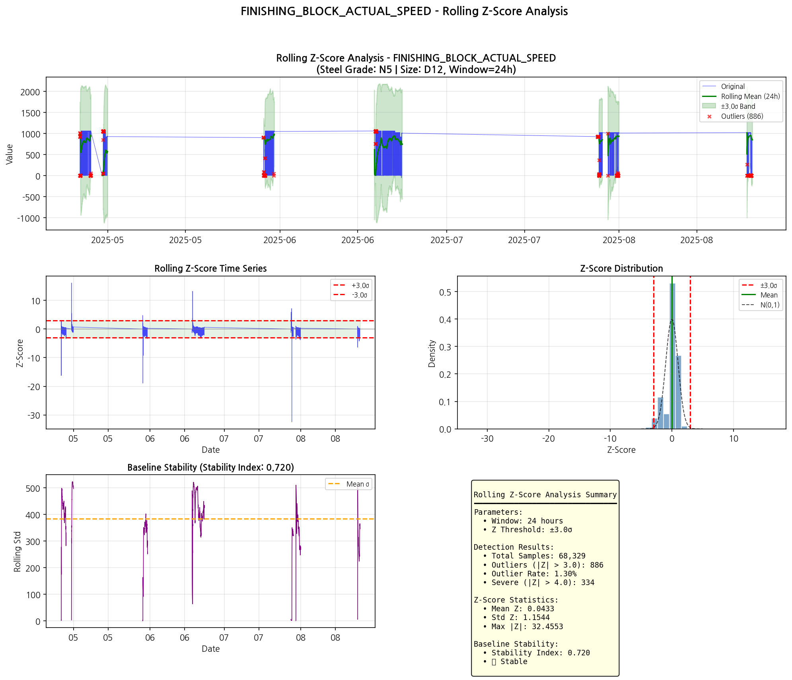

**STAND_14_ACTUAL_SPEED** (이상치율: 1.27%, 안정성: 0.727)

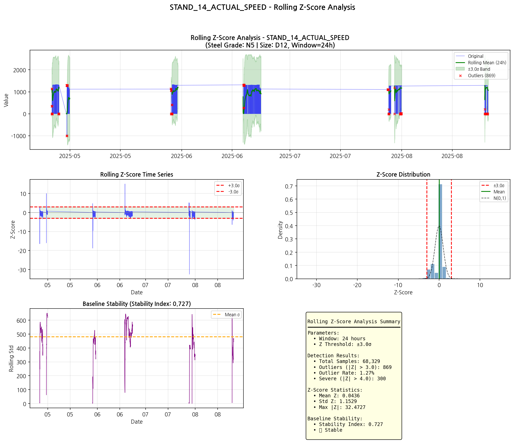

### 스탠드 부하 (07_Stand_Load)

- 분석 태그: 15개
- 평균 이상치율: 0.62%
- 평균 안정성: 0.866

| 태그 | 이상치율 | 심각 이상치 | 안정성 | Max \|Z\| |
|------|----------|-------------|--------|--------|
| STAND_1_LOAD | 0.62% | 194 | 0.864 | 38.22 |
| STAND_2_LOAD | 0.62% | 190 | 0.864 | 38.22 |
| STAND_3_LOAD | 0.62% | 190 | 0.863 | 38.22 |
| STAND_4_LOAD | 0.60% | 186 | 0.863 | 38.22 |
| STAND_5_LOAD | 0.62% | 189 | 0.864 | 38.22 |
| STAND_6_LOAD | 0.62% | 187 | 0.865 | 38.22 |
| STAND_7_LOAD | 0.62% | 191 | 0.866 | 38.22 |
| STAND_8_LOAD | 0.62% | 191 | 0.866 | 38.22 |
| STAND_9_LOAD | 0.62% | 192 | 0.867 | 38.22 |
| STAND_10_LOAD | 0.62% | 193 | 0.867 | 38.22 |
| STAND_11_LOAD | 0.62% | 192 | 0.867 | 38.22 |
| STAND_12_LOAD | 0.62% | 199 | 0.867 | 38.25 |
| STAND_13_LOAD | 0.62% | 199 | 0.867 | 38.25 |
| STAND_14_LOAD | 0.62% | 193 | 0.868 | 38.29 |
| FINISHING_BLOCK_LOAD | 0.62% | 190 | 0.867 | 38.29 |

#### Z-Score 차트

**STAND_7_LOAD** (이상치율: 0.62%, 안정성: 0.866)

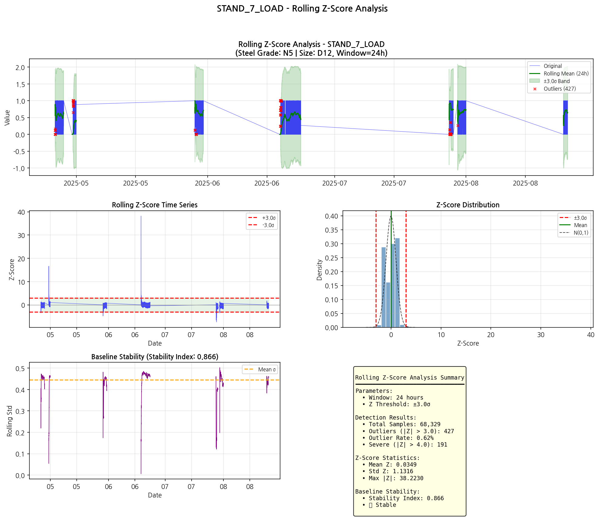

**STAND_1_LOAD** (이상치율: 0.62%, 안정성: 0.864)

**STAND_2_LOAD** (이상치율: 0.62%, 안정성: 0.864)

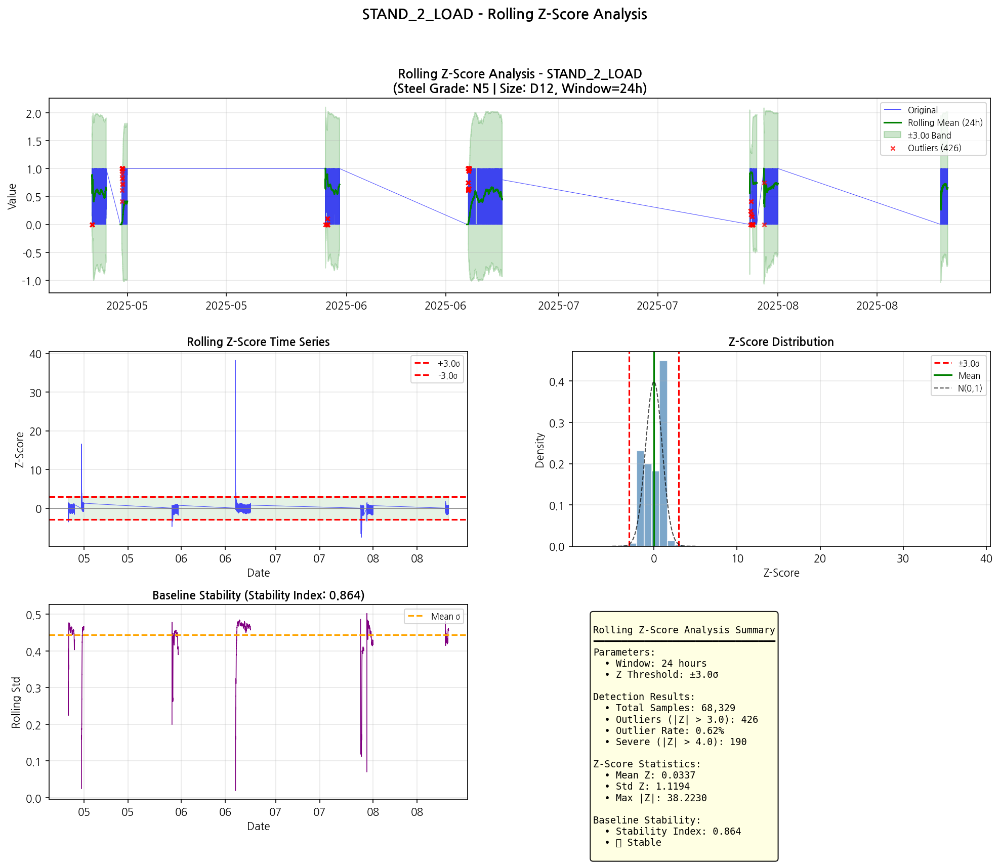

### 핀치롤 (08_Pinchroll)

- 분석 태그: 9개
- 평균 이상치율: 1.01%
- 평균 안정성: 0.621

| 태그 | 이상치율 | 심각 이상치 | 안정성 | Max \|Z\| |
|------|----------|-------------|--------|--------|
| PINCHROLL_2_ACTUAL_SPEED | 1.30% | 397 | 0.658 | 23.72 |
| PINCHROLL_3_ACTUAL_SPEED | 2.51% | 755 | 0.125 | 38.23 |
| PINCHROLL_4_ACTUAL_SPEED | 2.58% | 832 | 0.208 | 40.50 |
| PINCHROLL_2_ACTUAL_TORQUE | 0.36% | 65 | 0.851 | 14.19 |
| PINCHROLL_3_ACTUAL_TORQUE | 0.49% | 107 | 0.805 | 25.68 |
| PINCHROLL_4_ACTUAL_TORQUE | 0.37% | 74 | 0.824 | 14.41 |
| PINCHROLL_2_REFERENCE_TORQUE | 0.69% | 330 | 0.414 | 39.79 |
| PINCHROLL_3_REFERENCE_TORQUE | 0.38% | 71 | 0.827 | 26.86 |
| PINCHROLL_4_REFERENCE_TORQUE | 0.39% | 53 | 0.877 | 6.59 |

#### Z-Score 차트

**PINCHROLL_4_ACTUAL_SPEED** (이상치율: 2.58%, 안정성: 0.208)

**PINCHROLL_3_ACTUAL_SPEED** (이상치율: 2.51%, 안정성: 0.125)

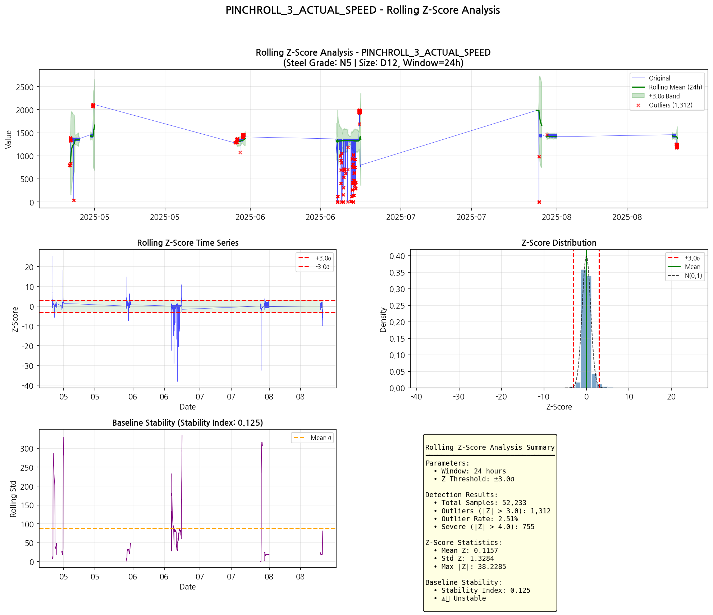

**PINCHROLL_2_ACTUAL_SPEED** (이상치율: 1.30%, 안정성: 0.658)

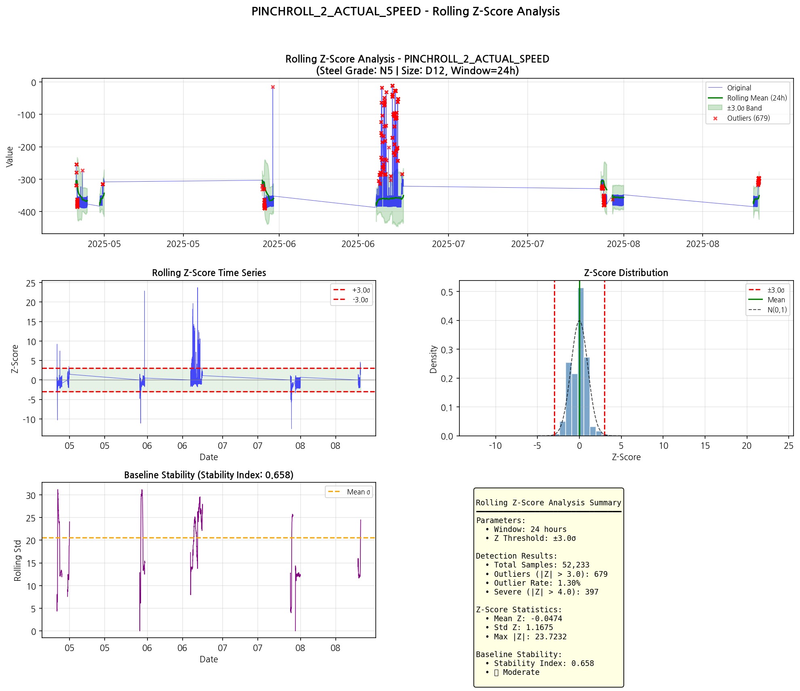

### PR 상세 토크 (09_PR_Detailed)

- 분석 태그: 6개
- 평균 이상치율: 1.56%
- 평균 안정성: 0.266

| 태그 | 이상치율 | 심각 이상치 | 안정성 | Max \|Z\| |
|------|----------|-------------|--------|--------|
| PR6L1_ACT_TORQUE | 2.91% | 1082 | 0.000 | 48.90 |
| PR6L2_ACT_TORQUE | 2.21% | 915 | 0.000 | 49.20 |
| PR7L1_ACT_TORQUE | 1.68% | 641 | 0.000 | 32.57 |
| PR7L2_ACT_TORQUE | 1.39% | 537 | 0.000 | 32.57 |
| PR8L1_ACT_TORQUE | 0.51% | 146 | 0.848 | 32.57 |
| PR9L1_ACT_TORQUE | 0.66% | 134 | 0.747 | 32.57 |

#### Z-Score 차트

**PR6L1_ACT_TORQUE** (이상치율: 2.91%, 안정성: 0.000)

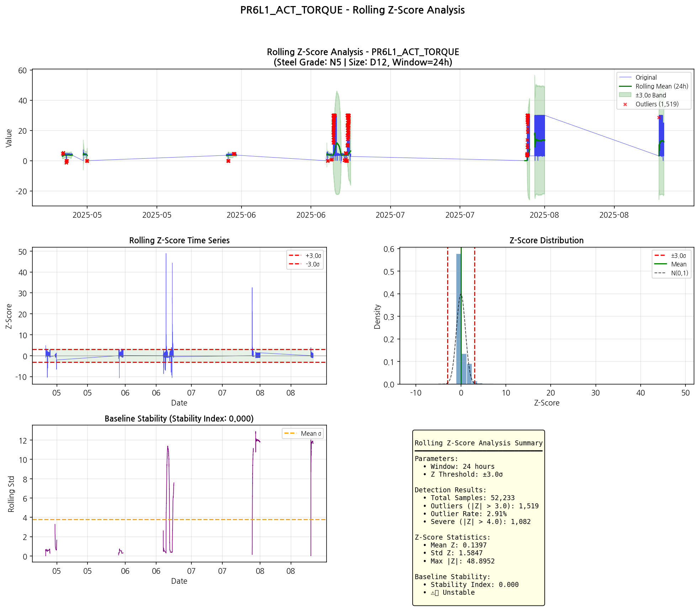

**PR6L2_ACT_TORQUE** (이상치율: 2.21%, 안정성: 0.000)

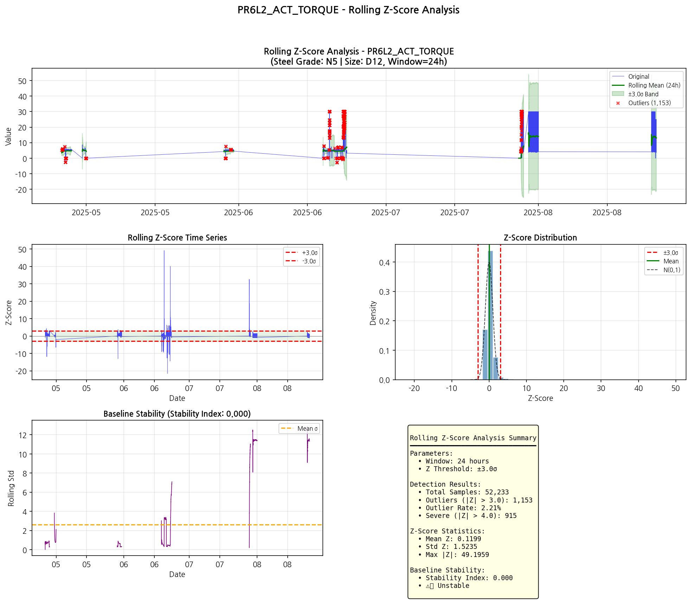

**PR7L1_ACT_TORQUE** (이상치율: 1.68%, 안정성: 0.000)

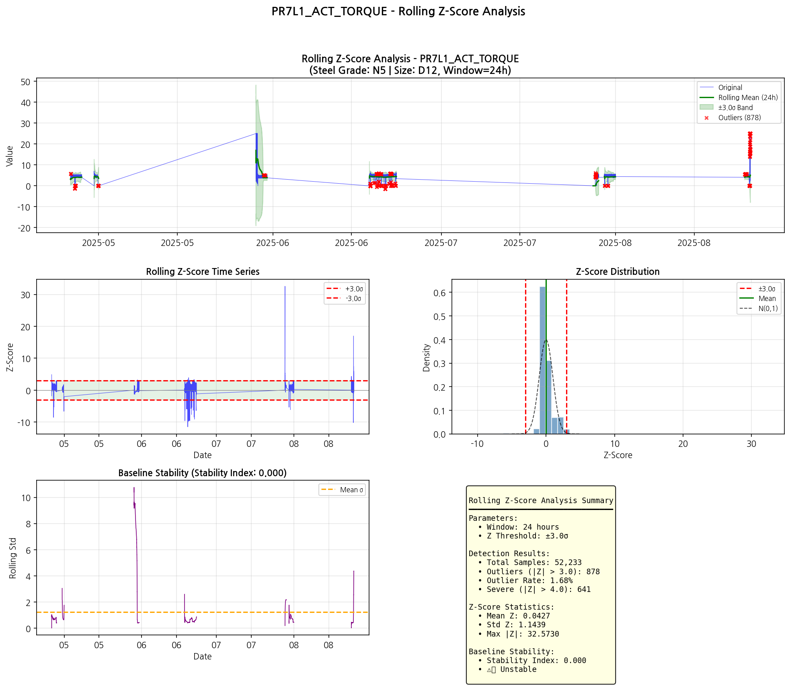

---

## 해석 가이드

### Rolling Z-Score 해석

1. **이상치율 (Outlier Rate)**
   - |Z| > 3.0σ 비율
   - 높을수록 해당 시점 주변 패턴에서 벗어난 데이터 많음
   - 정상 분포 가정 시 약 0.3% 예상

2. **기준선 안정성 (Baseline Stability)**
   - Rolling std의 시간적 일관성
   - 1에 가까울수록 안정적
   - 0.5 미만: 비정상 시계열, 다른 방법 권장

3. **심각 이상치 (Severe Outliers)**
   - |Z| > 4.0σ
   - 극단적인 이상값
   - 즉각적인 점검 필요

### 상태 분류

| 상태 | 기준 | 해석 |
|------|------|------|
| 🔴 높음 | ≥10% | 빈번한 이상치, 점검 필요 |
| 🟠 중간 | 3~10% | 일부 이상치, 모니터링 |
| 🟢 낮음 | <3% | 정상 범위 |
| 🟡 불안정 | Stability < 0.5 | 기준선 변동 심함 |

### Standard IQR vs Rolling Z-Score

| 방법 | 장점 | 단점 |
|------|------|------|
| Standard IQR | 간단, 전체 분포 기반 | 시변 데이터에 부적합 |
| Rolling Z-Score | 시변 데이터 적합 | 윈도우 크기 설정 필요 |

**권장**: 기준선 안정성 ≥ 0.5인 태그에 효과적

---

## 메타데이터

| 항목 | 값 |
|------|-----|
| 분석 스크립트 | steel_grade_rolling_zscore_analysis.py |
| 분석 기간 | 2025-03-01 ~ 2025-08-31 |
| 강종 | N5 |
| 윈도우 크기 | 24시간 |
| Z 임계값 | ±3.0σ |
| 생성일시 | 2026-02-09 15:12:15 |
| 총 분석 태그 | 79개 |

---

*본 보고서는 자동 생성되었습니다.*
