# 강종 [N5 | Size: D16] Rolling Z-Score 동적 이상치 분석 보고서

**분석 기간**: 2025-03-01 ~ 2025-08-31
**강종**: N5  
**사이즈**: D16
**생성일시**: 2026-02-09 15:12:57

---

## 분석 개요

### 분석 방법론

**Rolling Z-Score (롤링 Z-점수)**

시간 창(window) 기반 동적 이상치 탐지 방법입니다.

$$Z_{rolling}(t) = \frac{x(t) - \mu_{window}(t)}{\sigma_{window}(t)}$$

| 파라미터 | 값 | 설명 |
|----------|-----|------|
| Window | 24h | 이동 평균/표준편차 윈도우 |
| Z Threshold | ±3.0σ | 이상치 판정 임계값 |
| Severe | ±4.0σ | 심각 이상치 임계값 |

### 장점

- **비정상 시계열 적합**: 평균/분산 시변하는 데이터에 효과적
- **점진적 기준선 추적**: 장기 드리프트에 강건
- **Local Context 기반**: 해당 시점 주변 패턴 기준

### 분석 결과 요약

| 구분 | 태그 수 | 비율 |
|------|---------|------|
| **총 분석 태그** | 79개 | 100% |
| 🔴 높은 이상치율 (≥10%) | 0개 | 0.0% |
| 🟠 중간 이상치율 (3~10%) | 16개 | 20.3% |
| 🟢 낮은 이상치율 (<3%) | 45개 | 57.0% |
| 🟡 불안정 기준선 | 18개 | 22.8% |

#### 전체 평균

| 지표 | 값 |
|------|-----|
| 평균 이상치율 | 1.50% |
| 평균 기준선 안정성 | 0.621 |

---

## 상위 문제 태그 (이상치율 기준)

| 순위 | 태그 | 카테고리 | 이상치율 | 심각 이상치 | 안정성 | 상태 |
|------|------|----------|----------|-------------|--------|------|
| 1 | FURNACE_EXIT_DISCHARGE_BILLET_TEMPERATURE | 가열로 추출 온도 | 5.78% | 362 | 0.792 | 🟠 |
| 2 | FINISHING_BLOCK_ACTUAL_SPEED | 스탠드 속도 | 4.19% | 670 | 0.658 | 🟠 |
| 3 | STAND_1_ACTUAL_SPEED | 스탠드 속도 | 4.07% | 542 | 0.632 | 🟠 |
| 4 | STAND_3_ACTUAL_SPEED | 스탠드 속도 | 4.07% | 537 | 0.646 | 🟠 |
| 5 | STAND_10_ACTUAL_SPEED | 스탠드 속도 | 4.06% | 556 | 0.667 | 🟠 |
| 6 | STAND_9_ACTUAL_SPEED | 스탠드 속도 | 4.03% | 558 | 0.664 | 🟠 |
| 7 | STAND_11_ACTUAL_SPEED | 스탠드 속도 | 4.02% | 555 | 0.660 | 🟠 |
| 8 | STAND_13_ACTUAL_SPEED | 스탠드 속도 | 4.00% | 539 | 0.668 | 🟠 |
| 9 | STAND_14_ACTUAL_SPEED | 스탠드 속도 | 3.99% | 558 | 0.660 | 🟠 |
| 10 | STAND_2_ACTUAL_SPEED | 스탠드 속도 | 3.96% | 537 | 0.624 | 🟠 |
| 11 | STAND_4_ACTUAL_SPEED | 스탠드 속도 | 3.96% | 537 | 0.650 | 🟠 |
| 12 | STAND_5_ACTUAL_SPEED | 스탠드 속도 | 3.95% | 534 | 0.648 | 🟠 |
| 13 | STAND_6_ACTUAL_SPEED | 스탠드 속도 | 3.95% | 540 | 0.648 | 🟠 |
| 14 | STAND_7_ACTUAL_SPEED | 스탠드 속도 | 3.95% | 538 | 0.655 | 🟠 |
| 15 | STAND_8_ACTUAL_SPEED | 스탠드 속도 | 3.94% | 536 | 0.651 | 🟠 |

---

## 불안정 기준선 태그

기준선 안정성(Stability Index)이 0.5 미만인 태그입니다.
이 태그들은 Rolling Z-Score 방법보다 다른 방법이 더 적합할 수 있습니다.

| 태그 | 카테고리 | 안정성 | 이상치율 |
|------|----------|--------|----------|
| HEATING_TOP_ZONE_NO_1_TEMPERATURE_ROOF | 가열로 상부 온도 | 0.000 | 2.49% |
| HEATING_TOP_ZONE_NO_2_TEMPERATURE_ROOF | 가열로 상부 온도 | 0.000 | 2.56% |
| SOAKING_TOP_ZONE_NO_1_TEMPERATURE_ROOF | 가열로 상부 온도 | 0.000 | 1.60% |
| SOAKING_TOP_ZONE_NO_2_TEMPERATURE_ROOF | 가열로 상부 온도 | 0.000 | 1.61% |
| SOAKING_BOTTOM_ZONE_NO_2_TEMPERATURE_MILL_SIDE | 가열로 하부 온도 | 0.000 | 0.92% |
| MAIN_COMBUSTION_AIR_PRESSURE | 가열로 보조설비 | 0.000 | 2.01% |
| PINCHROLL_3_ACTUAL_SPEED | 핀치롤 | 0.000 | 1.17% |
| PINCHROLL_4_ACTUAL_SPEED | 핀치롤 | 0.000 | 1.20% |
| PR6L1_ACT_TORQUE | PR 상세 토크 | 0.000 | 0.62% |
| PR6L2_ACT_TORQUE | PR 상세 토크 | 0.000 | 0.75% |

---

## 카테고리별 분석 결과

### 가열로 상부 온도 (01_Furnace_Top_Temperature)

- 분석 태그: 4개
- 평균 이상치율: 2.06%
- 평균 안정성: 0.000

| 태그 | 이상치율 | 심각 이상치 | 안정성 | Max \|Z\| |
|------|----------|-------------|--------|--------|
| HEATING_TOP_ZONE_NO_1_TEMPERATURE_ROOF | 2.49% | 355 | 0.000 | 9.68 |
| HEATING_TOP_ZONE_NO_2_TEMPERATURE_ROOF | 2.56% | 345 | 0.000 | 7.78 |
| SOAKING_TOP_ZONE_NO_1_TEMPERATURE_ROOF | 1.60% | 178 | 0.000 | 7.07 |
| SOAKING_TOP_ZONE_NO_2_TEMPERATURE_ROOF | 1.61% | 176 | 0.000 | 6.84 |

#### Z-Score 차트

**HEATING_TOP_ZONE_NO_2_TEMPERATURE_ROOF** (이상치율: 2.56%, 안정성: 0.000)

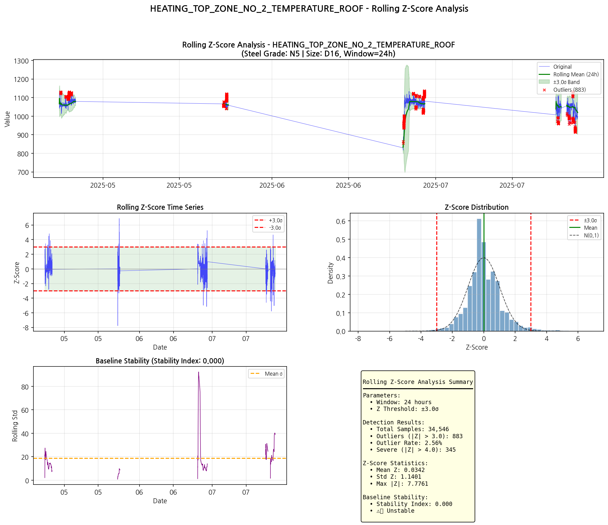

**HEATING_TOP_ZONE_NO_1_TEMPERATURE_ROOF** (이상치율: 2.49%, 안정성: 0.000)

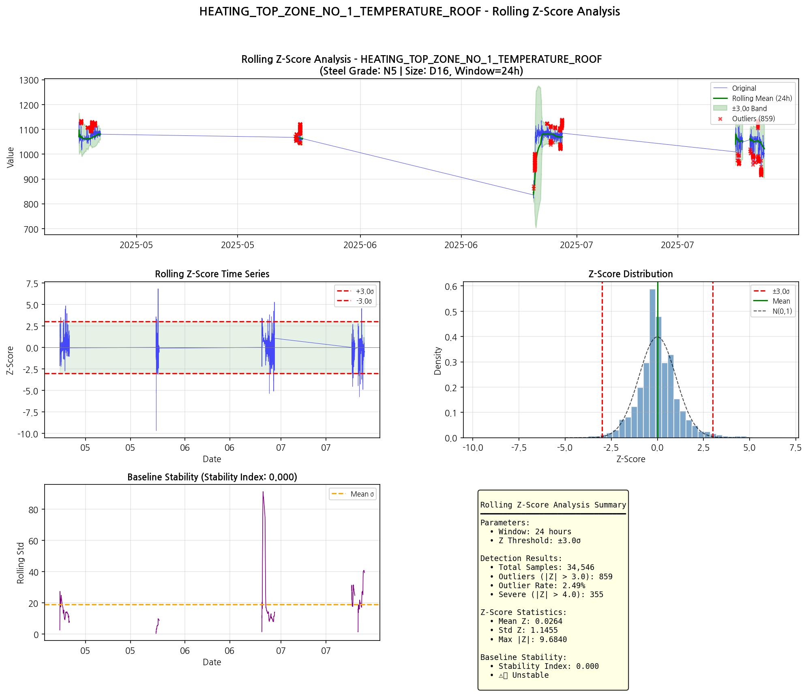

**SOAKING_TOP_ZONE_NO_2_TEMPERATURE_ROOF** (이상치율: 1.61%, 안정성: 0.000)

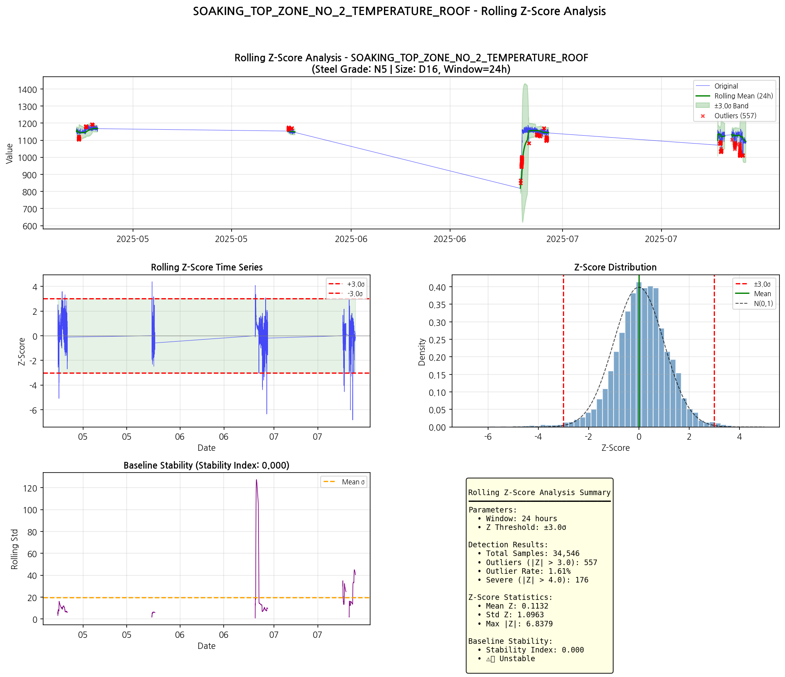

### 가열로 하부 온도 (02_Furnace_Bottom_Temperature)

- 분석 태그: 4개
- 평균 이상치율: 1.30%
- 평균 안정성: 0.311

| 태그 | 이상치율 | 심각 이상치 | 안정성 | Max \|Z\| |
|------|----------|-------------|--------|--------|
| HEATING_BOTTOM_ZONE_NO_1_TEMPERATURE_OPP_SIDE | 1.82% | 225 | 0.630 | 6.46 |
| HEATING_BOTTOM_ZONE_NO_2_TEMPERATURE_MILL_SIDE | 1.55% | 219 | 0.592 | 6.50 |
| SOAKING_BOTTOM_ZONE_NO_1_TEMPERATURE_OPP_SIDE | 0.90% | 93 | 0.022 | 5.00 |
| SOAKING_BOTTOM_ZONE_NO_2_TEMPERATURE_MILL_SIDE | 0.92% | 90 | 0.000 | 5.01 |

#### Z-Score 차트

**HEATING_BOTTOM_ZONE_NO_1_TEMPERATURE_OPP_SIDE** (이상치율: 1.82%, 안정성: 0.630)

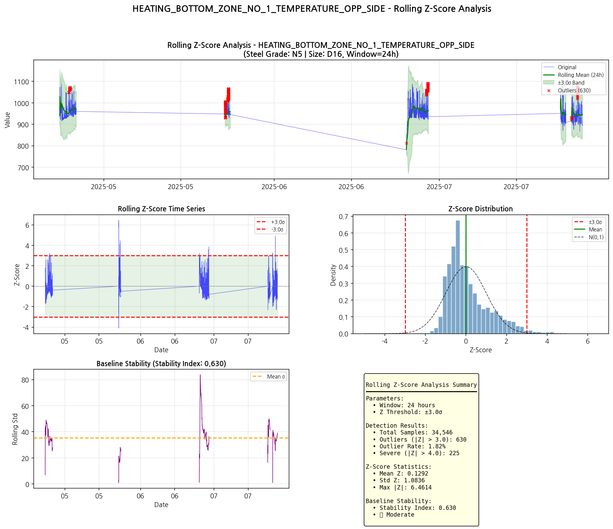

**HEATING_BOTTOM_ZONE_NO_2_TEMPERATURE_MILL_SIDE** (이상치율: 1.55%, 안정성: 0.592)

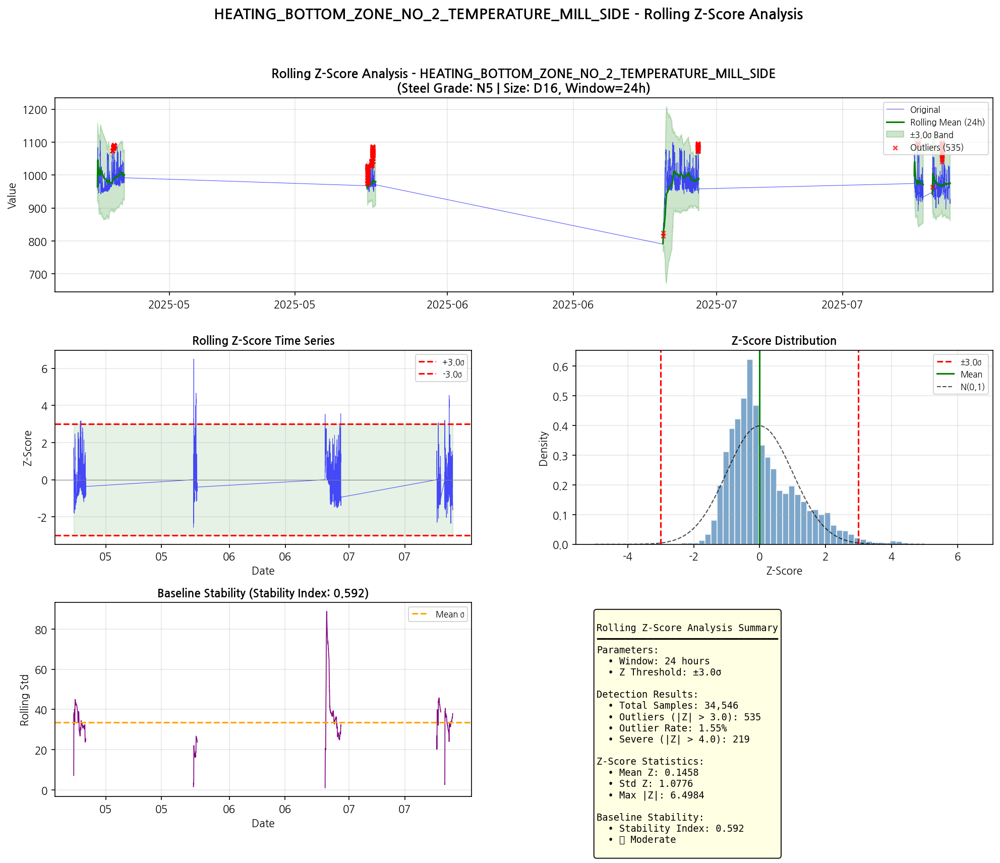

**SOAKING_BOTTOM_ZONE_NO_2_TEMPERATURE_MILL_SIDE** (이상치율: 0.92%, 안정성: 0.000)

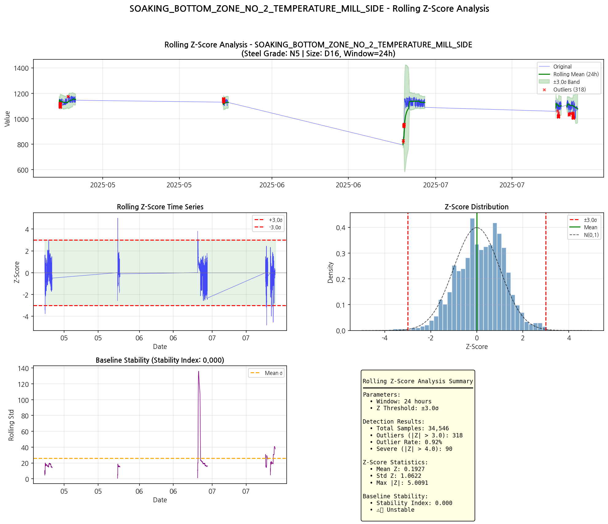

### 가열로 추출 온도 (03_Furnace_Discharge_Temperature)

- 분석 태그: 1개
- 평균 이상치율: 5.78%
- 평균 안정성: 0.792

| 태그 | 이상치율 | 심각 이상치 | 안정성 | Max \|Z\| |
|------|----------|-------------|--------|--------|
| FURNACE_EXIT_DISCHARGE_BILLET_TEMPERATURE | 5.78% | 362 | 0.792 | 20.32 |

#### Z-Score 차트

**FURNACE_EXIT_DISCHARGE_BILLET_TEMPERATURE** (이상치율: 5.78%, 안정성: 0.792)

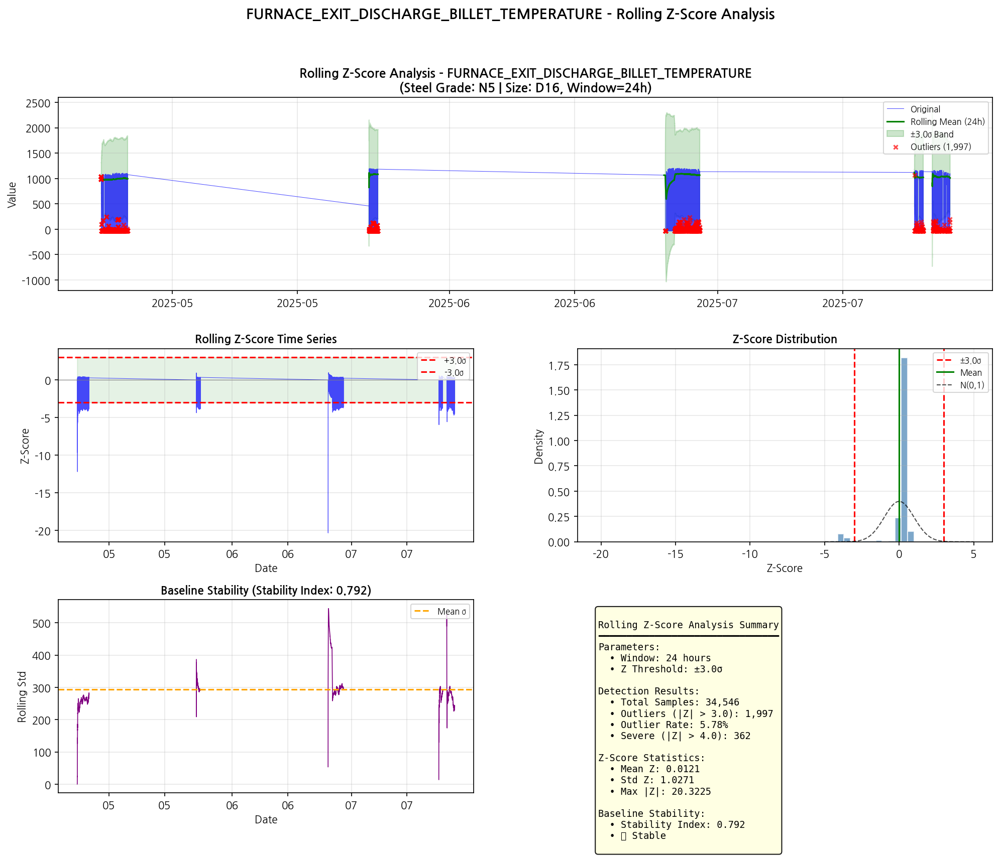

### 가열로 보조설비 (04_Furnace_Auxiliary)

- 분석 태그: 9개
- 평균 이상치율: 1.67%
- 평균 안정성: 0.445

| 태그 | 이상치율 | 심각 이상치 | 안정성 | Max \|Z\| |
|------|----------|-------------|--------|--------|
| FURNACE_PRESSURE | 0.80% | 80 | 0.511 | 8.56 |
| FURNACE_O2_ANALYZER | 3.00% | 602 | 0.379 | 34.43 |
| MAIN_GAS_PRESSURE | 1.77% | 66 | 0.559 | 5.35 |
| MAIN_GAS_FLOW | 1.50% | 140 | 0.673 | 5.49 |
| MAIN_GAS_TEMPERATURE | 2.10% | 24 | 0.490 | 6.86 |
| MAIN_COMBUSTION_AIR_PRESSURE | 2.01% | 295 | 0.000 | 20.36 |
| COMBUSTION_AIR_TEMPERATURE | 2.36% | 162 | 0.491 | 5.06 |
| INDIRECT_COOLING_WATER_FLOW | 1.17% | 129 | 0.426 | 10.27 |
| INDIRECT_WATER_MAIN_TEMPERATURE | 0.36% | 3 | 0.473 | 5.21 |

#### Z-Score 차트

**FURNACE_O2_ANALYZER** (이상치율: 3.00%, 안정성: 0.379)

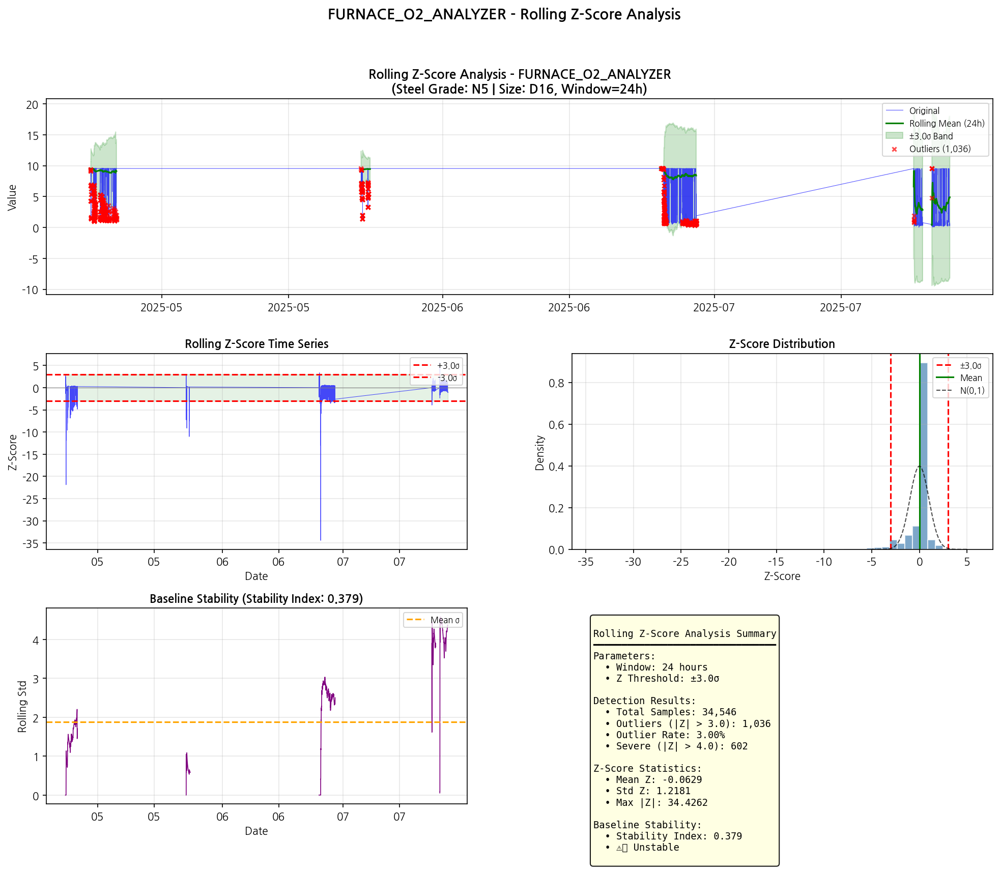

**COMBUSTION_AIR_TEMPERATURE** (이상치율: 2.36%, 안정성: 0.491)

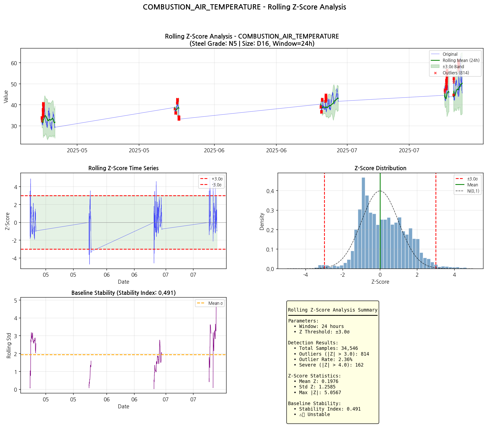

**MAIN_GAS_TEMPERATURE** (이상치율: 2.10%, 안정성: 0.490)

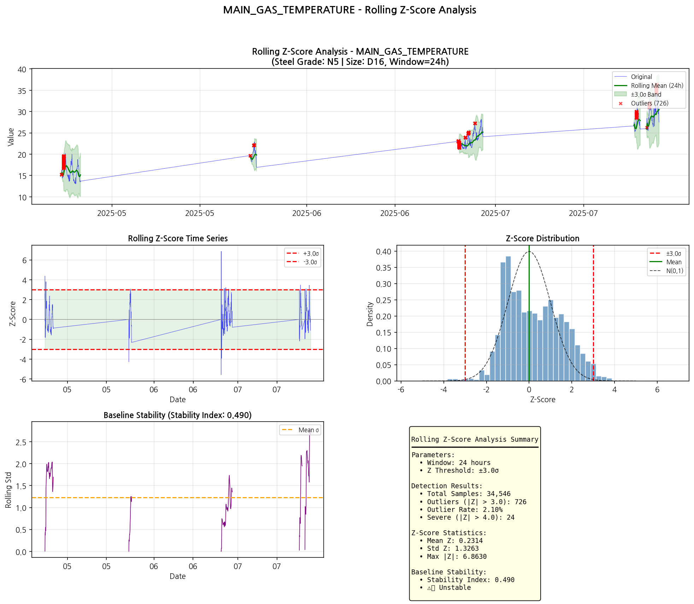

### 스탠드 토크 (05_Stand_Torque)

- 분석 태그: 16개
- 평균 이상치율: 0.71%
- 평균 안정성: 0.792

| 태그 | 이상치율 | 심각 이상치 | 안정성 | Max \|Z\| |
|------|----------|-------------|--------|--------|
| STAND_1_ACTUAL_TORQUE | 0.69% | 89 | 0.802 | 24.99 |
| STAND_2_ACTUAL_TORQUE | 0.69% | 98 | 0.823 | 25.35 |
| STAND_3_ACTUAL_TORQUE | 0.69% | 86 | 0.789 | 25.45 |
| STAND_4_ACTUAL_TORQUE | 0.67% | 101 | 0.807 | 22.83 |
| STAND_5_ACTUAL_TORQUE | 0.50% | 62 | 0.801 | 19.67 |
| STAND_6_ACTUAL_TORQUE | 0.68% | 95 | 0.812 | 20.32 |
| STAND_7_ACTUAL_TORQUE | 0.66% | 93 | 0.815 | 20.32 |
| STAND_8_ACTUAL_TORQUE | 0.68% | 95 | 0.769 | 20.32 |
| STAND_9_ACTUAL_TORQUE | 0.64% | 84 | 0.808 | 24.21 |
| STAND_10_ACTUAL_TORQUE | 0.67% | 91 | 0.818 | 22.81 |
| STAND_11_ACTUAL_TORQUE | 0.65% | 90 | 0.826 | 23.75 |
| STAND_12_ACTUAL_TORQUE | 0.67% | 89 | 0.810 | 20.95 |
| STAND_13_ACTUAL_TORQUE | 0.65% | 90 | 0.799 | 22.35 |
| STAND_14_ACTUAL_TORQUE | 0.69% | 89 | 0.816 | 20.32 |
| FINISHING_BLOCK_MASTER_ACTUAL_TORQUE | 1.06% | 97 | 0.685 | 19.26 |
| FINISHING_BLOCK_SLAVE_ACTUAL_TORQUE | 1.07% | 97 | 0.685 | 19.26 |

#### Z-Score 차트

**FINISHING_BLOCK_SLAVE_ACTUAL_TORQUE** (이상치율: 1.07%, 안정성: 0.685)

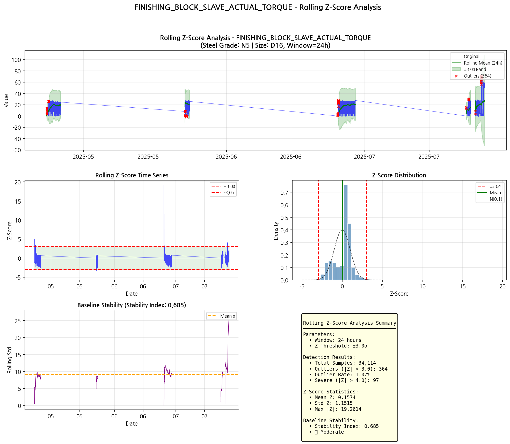

**FINISHING_BLOCK_MASTER_ACTUAL_TORQUE** (이상치율: 1.06%, 안정성: 0.685)

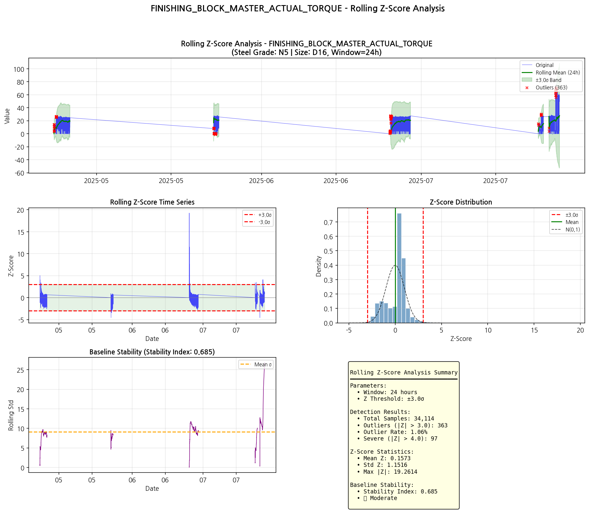

**STAND_3_ACTUAL_TORQUE** (이상치율: 0.69%, 안정성: 0.789)

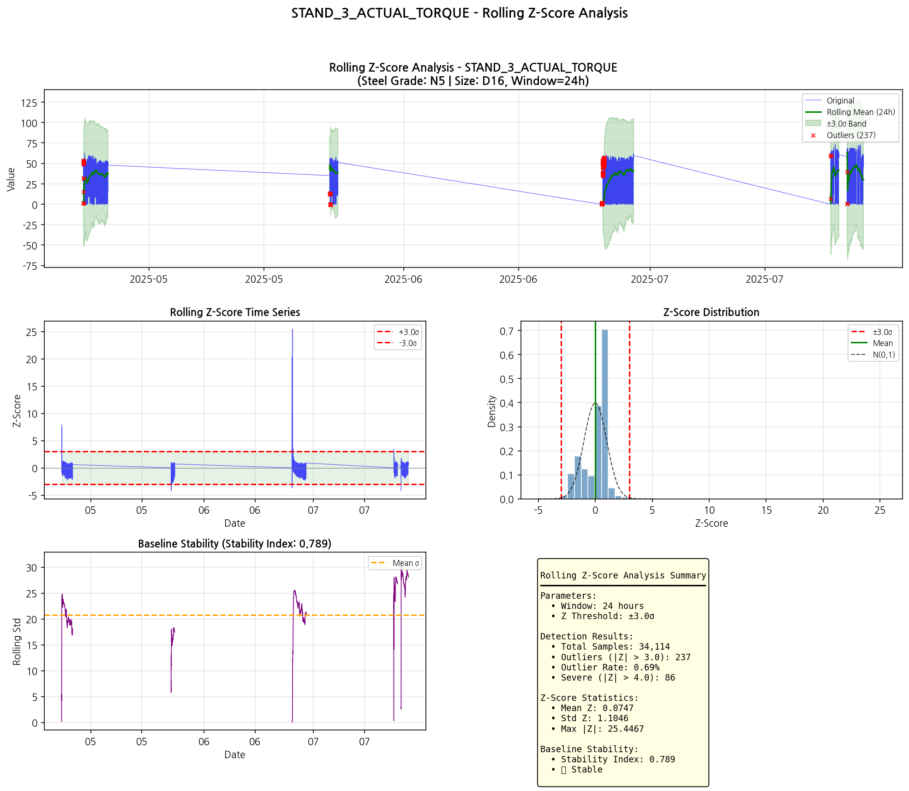

### 스탠드 속도 (06_Stand_Speed)

- 분석 태그: 15개
- 평균 이상치율: 3.99%
- 평균 안정성: 0.653

| 태그 | 이상치율 | 심각 이상치 | 안정성 | Max \|Z\| |
|------|----------|-------------|--------|--------|
| STAND_1_ACTUAL_SPEED | 4.07% | 542 | 0.632 | 24.16 |
| STAND_2_ACTUAL_SPEED | 3.96% | 537 | 0.624 | 24.41 |
| STAND_3_ACTUAL_SPEED | 4.07% | 537 | 0.646 | 24.44 |
| STAND_4_ACTUAL_SPEED | 3.96% | 537 | 0.650 | 24.48 |
| STAND_5_ACTUAL_SPEED | 3.95% | 534 | 0.648 | 24.43 |
| STAND_6_ACTUAL_SPEED | 3.95% | 540 | 0.648 | 24.35 |
| STAND_7_ACTUAL_SPEED | 3.95% | 538 | 0.655 | 24.43 |
| STAND_8_ACTUAL_SPEED | 3.94% | 536 | 0.651 | 24.44 |
| STAND_9_ACTUAL_SPEED | 4.03% | 558 | 0.664 | 24.45 |
| STAND_10_ACTUAL_SPEED | 4.06% | 556 | 0.667 | 24.48 |
| STAND_11_ACTUAL_SPEED | 4.02% | 555 | 0.660 | 24.49 |
| STAND_12_ACTUAL_SPEED | 3.75% | 578 | 0.657 | 24.44 |
| STAND_13_ACTUAL_SPEED | 4.00% | 539 | 0.668 | 24.44 |
| STAND_14_ACTUAL_SPEED | 3.99% | 558 | 0.660 | 24.51 |
| FINISHING_BLOCK_ACTUAL_SPEED | 4.19% | 670 | 0.658 | 24.55 |

#### Z-Score 차트

**FINISHING_BLOCK_ACTUAL_SPEED** (이상치율: 4.19%, 안정성: 0.658)

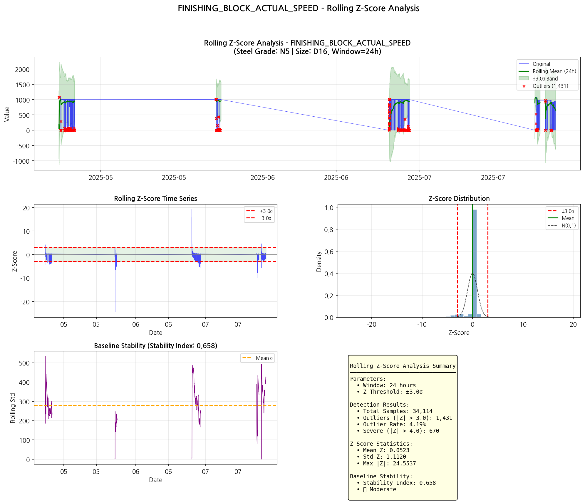

**STAND_1_ACTUAL_SPEED** (이상치율: 4.07%, 안정성: 0.632)

**STAND_3_ACTUAL_SPEED** (이상치율: 4.07%, 안정성: 0.646)

### 스탠드 부하 (07_Stand_Load)

- 분석 태그: 15개
- 평균 이상치율: 0.37%
- 평균 안정성: 0.863

| 태그 | 이상치율 | 심각 이상치 | 안정성 | Max \|Z\| |
|------|----------|-------------|--------|--------|
| STAND_1_LOAD | 0.42% | 43 | 0.860 | 22.80 |
| STAND_2_LOAD | 0.42% | 39 | 0.860 | 22.80 |
| STAND_3_LOAD | 0.38% | 42 | 0.861 | 22.80 |
| STAND_4_LOAD | 0.36% | 42 | 0.861 | 22.80 |
| STAND_5_LOAD | 0.35% | 42 | 0.862 | 22.80 |
| STAND_6_LOAD | 0.37% | 43 | 0.862 | 22.80 |
| STAND_7_LOAD | 0.37% | 43 | 0.863 | 22.83 |
| STAND_8_LOAD | 0.36% | 41 | 0.863 | 22.85 |
| STAND_9_LOAD | 0.35% | 41 | 0.864 | 22.85 |
| STAND_10_LOAD | 0.35% | 41 | 0.865 | 22.85 |
| STAND_11_LOAD | 0.35% | 41 | 0.865 | 22.85 |
| STAND_12_LOAD | 0.35% | 41 | 0.865 | 22.85 |
| STAND_13_LOAD | 0.35% | 41 | 0.865 | 22.85 |
| STAND_14_LOAD | 0.36% | 41 | 0.865 | 22.85 |
| FINISHING_BLOCK_LOAD | 0.36% | 39 | 0.865 | 22.85 |

#### Z-Score 차트

**STAND_1_LOAD** (이상치율: 0.42%, 안정성: 0.860)

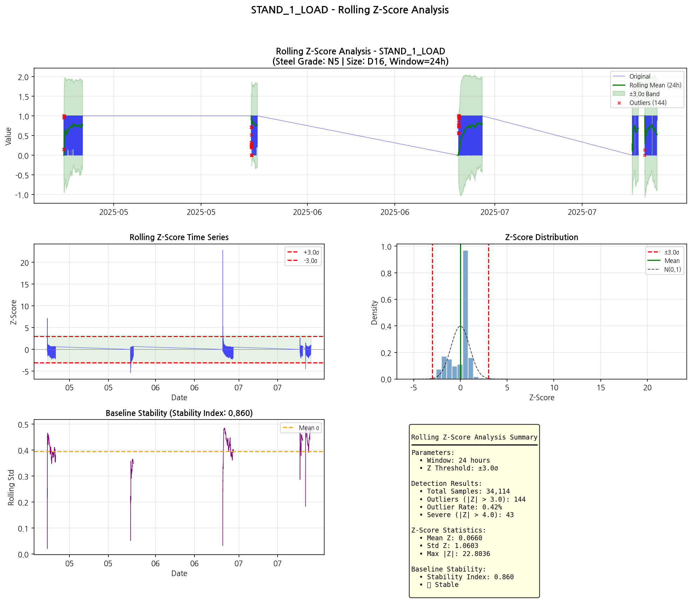

**STAND_2_LOAD** (이상치율: 0.42%, 안정성: 0.860)

**STAND_3_LOAD** (이상치율: 0.38%, 안정성: 0.861)

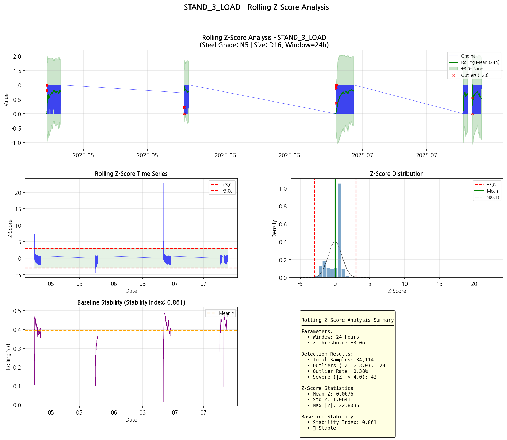

### 핀치롤 (08_Pinchroll)

- 분석 태그: 9개
- 평균 이상치율: 0.50%
- 평균 안정성: 0.482

| 태그 | 이상치율 | 심각 이상치 | 안정성 | Max \|Z\| |
|------|----------|-------------|--------|--------|
| PINCHROLL_2_ACTUAL_SPEED | 0.40% | 23 | 0.575 | 25.85 |
| PINCHROLL_3_ACTUAL_SPEED | 1.17% | 162 | 0.000 | 34.00 |
| PINCHROLL_4_ACTUAL_SPEED | 1.20% | 160 | 0.000 | 36.47 |
| PINCHROLL_2_ACTUAL_TORQUE | 0.24% | 13 | 0.860 | 11.74 |
| PINCHROLL_3_ACTUAL_TORQUE | 0.31% | 12 | 0.503 | 11.81 |
| PINCHROLL_4_ACTUAL_TORQUE | 0.19% | 11 | 0.499 | 11.81 |
| PINCHROLL_2_REFERENCE_TORQUE | 0.11% | 34 | 0.224 | 61.43 |
| PINCHROLL_3_REFERENCE_TORQUE | 0.47% | 5 | 0.836 | 4.59 |
| PINCHROLL_4_REFERENCE_TORQUE | 0.42% | 5 | 0.842 | 4.59 |

#### Z-Score 차트

**PINCHROLL_4_ACTUAL_SPEED** (이상치율: 1.20%, 안정성: 0.000)

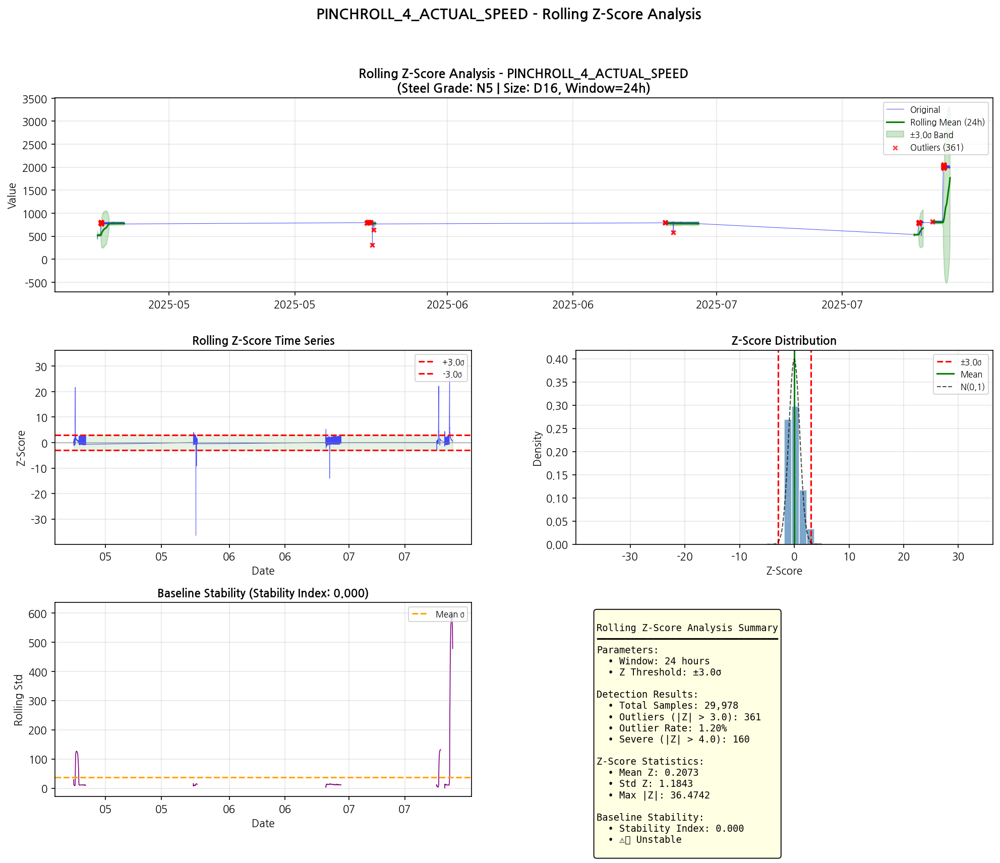

**PINCHROLL_3_ACTUAL_SPEED** (이상치율: 1.17%, 안정성: 0.000)

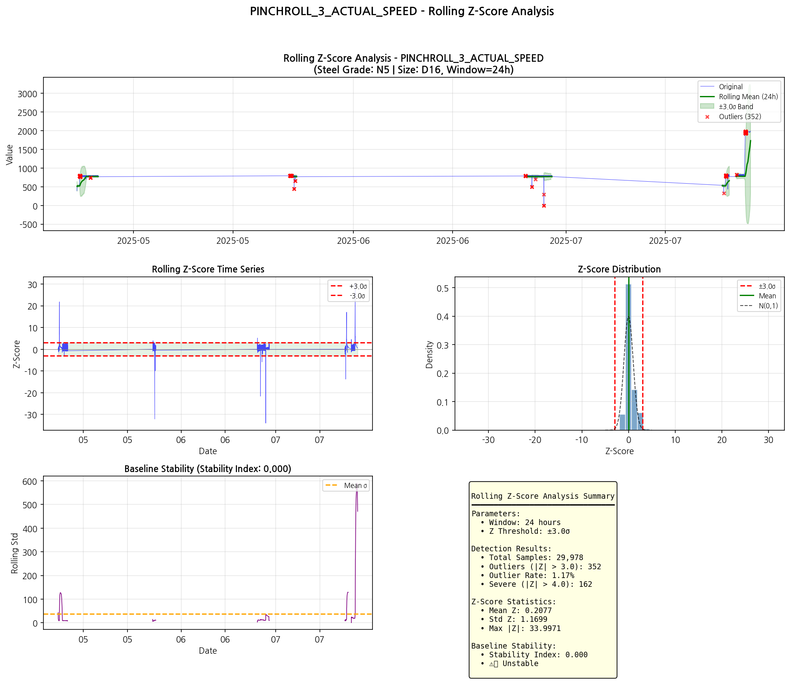

**PINCHROLL_3_REFERENCE_TORQUE** (이상치율: 0.47%, 안정성: 0.836)

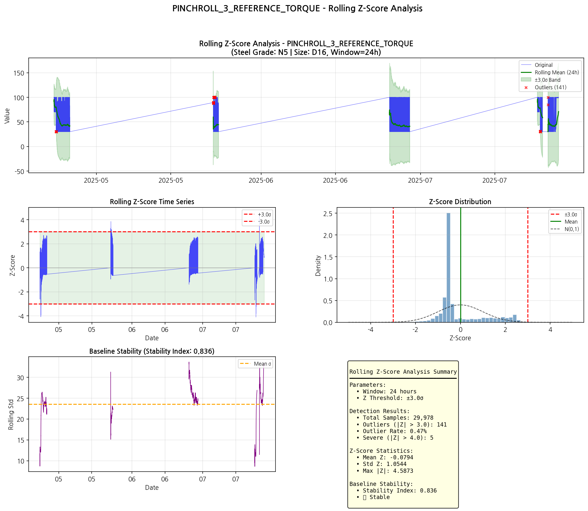

### PR 상세 토크 (09_PR_Detailed)

- 분석 태그: 6개
- 평균 이상치율: 0.49%
- 평균 안정성: 0.541

| 태그 | 이상치율 | 심각 이상치 | 안정성 | Max \|Z\| |
|------|----------|-------------|--------|--------|
| PR6L1_ACT_TORQUE | 0.62% | 94 | 0.000 | 16.38 |
| PR6L2_ACT_TORQUE | 0.75% | 110 | 0.000 | 16.94 |
| PR7L1_ACT_TORQUE | 0.65% | 35 | 0.785 | 10.58 |
| PR7L2_ACT_TORQUE | 0.70% | 80 | 0.700 | 10.34 |
| PR8L1_ACT_TORQUE | 0.12% | 18 | 0.889 | 12.03 |
| PR9L1_ACT_TORQUE | 0.10% | 11 | 0.875 | 11.65 |

#### Z-Score 차트

**PR6L2_ACT_TORQUE** (이상치율: 0.75%, 안정성: 0.000)

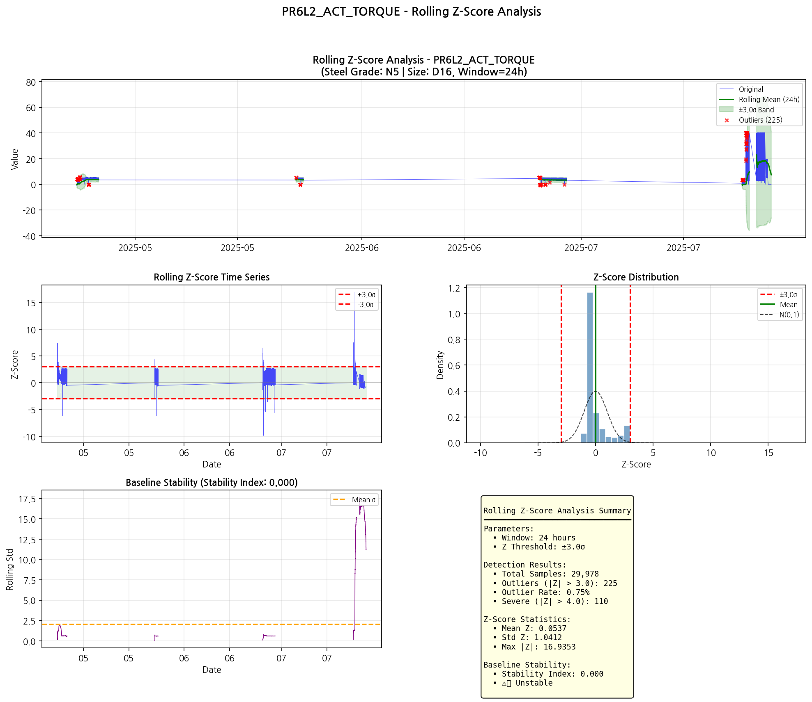

**PR7L2_ACT_TORQUE** (이상치율: 0.70%, 안정성: 0.700)

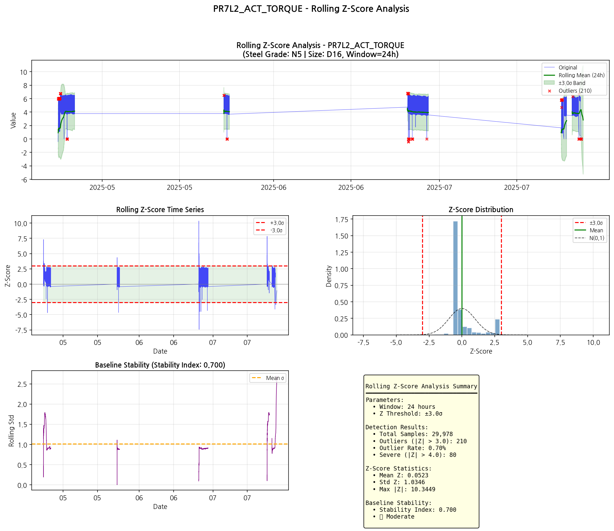

**PR7L1_ACT_TORQUE** (이상치율: 0.65%, 안정성: 0.785)

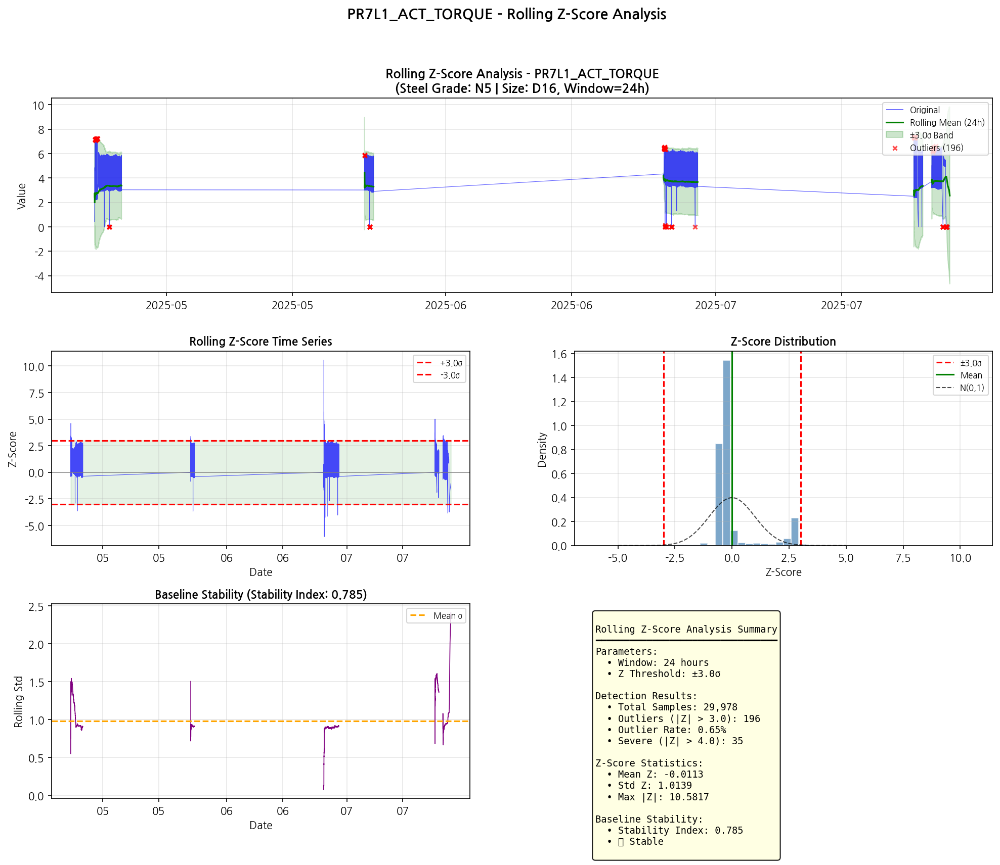

---

## 해석 가이드

### Rolling Z-Score 해석

1. **이상치율 (Outlier Rate)**
   - |Z| > 3.0σ 비율
   - 높을수록 해당 시점 주변 패턴에서 벗어난 데이터 많음
   - 정상 분포 가정 시 약 0.3% 예상

2. **기준선 안정성 (Baseline Stability)**
   - Rolling std의 시간적 일관성
   - 1에 가까울수록 안정적
   - 0.5 미만: 비정상 시계열, 다른 방법 권장

3. **심각 이상치 (Severe Outliers)**
   - |Z| > 4.0σ
   - 극단적인 이상값
   - 즉각적인 점검 필요

### 상태 분류

| 상태 | 기준 | 해석 |
|------|------|------|
| 🔴 높음 | ≥10% | 빈번한 이상치, 점검 필요 |
| 🟠 중간 | 3~10% | 일부 이상치, 모니터링 |
| 🟢 낮음 | <3% | 정상 범위 |
| 🟡 불안정 | Stability < 0.5 | 기준선 변동 심함 |

### Standard IQR vs Rolling Z-Score

| 방법 | 장점 | 단점 |
|------|------|------|
| Standard IQR | 간단, 전체 분포 기반 | 시변 데이터에 부적합 |
| Rolling Z-Score | 시변 데이터 적합 | 윈도우 크기 설정 필요 |

**권장**: 기준선 안정성 ≥ 0.5인 태그에 효과적

---

## 메타데이터

| 항목 | 값 |
|------|-----|
| 분석 스크립트 | steel_grade_rolling_zscore_analysis.py |
| 분석 기간 | 2025-03-01 ~ 2025-08-31 |
| 강종 | N5 |
| 윈도우 크기 | 24시간 |
| Z 임계값 | ±3.0σ |
| 생성일시 | 2026-02-09 15:12:57 |
| 총 분석 태그 | 79개 |

---

*본 보고서는 자동 생성되었습니다.*
