# 강종 [N5 | Size: D20] Rolling Z-Score 동적 이상치 분석 보고서

**분석 기간**: 2025-03-01 ~ 2025-08-31
**강종**: N5  
**사이즈**: D20
**생성일시**: 2026-02-09 15:14:13

---

## 분석 개요

### 분석 방법론

**Rolling Z-Score (롤링 Z-점수)**

시간 창(window) 기반 동적 이상치 탐지 방법입니다.

$$Z_{rolling}(t) = \frac{x(t) - \mu_{window}(t)}{\sigma_{window}(t)}$$

| 파라미터 | 값 | 설명 |
|----------|-----|------|
| Window | 24h | 이동 평균/표준편차 윈도우 |
| Z Threshold | ±3.0σ | 이상치 판정 임계값 |
| Severe | ±4.0σ | 심각 이상치 임계값 |

### 장점

- **비정상 시계열 적합**: 평균/분산 시변하는 데이터에 효과적
- **점진적 기준선 추적**: 장기 드리프트에 강건
- **Local Context 기반**: 해당 시점 주변 패턴 기준

### 분석 결과 요약

| 구분 | 태그 수 | 비율 |
|------|---------|------|
| **총 분석 태그** | 79개 | 100% |
| 🔴 높은 이상치율 (≥10%) | 1개 | 1.3% |
| 🟠 중간 이상치율 (3~10%) | 40개 | 50.6% |
| 🟢 낮은 이상치율 (<3%) | 36개 | 45.6% |
| 🟡 불안정 기준선 | 2개 | 2.5% |

#### 전체 평균

| 지표 | 값 |
|------|-----|
| 평균 이상치율 | 4.03% |
| 평균 기준선 안정성 | 0.604 |

---

## 상위 문제 태그 (이상치율 기준)

| 순위 | 태그 | 카테고리 | 이상치율 | 심각 이상치 | 안정성 | 상태 |
|------|------|----------|----------|-------------|--------|------|
| 1 | FURNACE_O2_ANALYZER | 가열로 보조설비 | 12.05% | 955 | 0.138 | 🔴 |
| 2 | SOAKING_BOTTOM_ZONE_NO_2_TEMPERATURE_MILL_SIDE | 가열로 하부 온도 | 8.54% | 814 | 0.415 | 🟠 |
| 3 | SOAKING_BOTTOM_ZONE_NO_1_TEMPERATURE_OPP_SIDE | 가열로 하부 온도 | 8.40% | 676 | 0.425 | 🟠 |
| 4 | SOAKING_TOP_ZONE_NO_2_TEMPERATURE_ROOF | 가열로 상부 온도 | 8.14% | 826 | 0.419 | 🟠 |
| 5 | SOAKING_TOP_ZONE_NO_1_TEMPERATURE_ROOF | 가열로 상부 온도 | 7.92% | 789 | 0.425 | 🟠 |
| 6 | MAIN_GAS_FLOW | 가열로 보조설비 | 7.26% | 1145 | 0.427 | 🟠 |
| 7 | MAIN_GAS_TEMPERATURE | 가열로 보조설비 | 7.06% | 408 | 0.384 | 🟠 |
| 8 | HEATING_BOTTOM_ZONE_NO_2_TEMPERATURE_MILL_SIDE | 가열로 하부 온도 | 6.74% | 588 | 0.448 | 🟠 |
| 9 | HEATING_BOTTOM_ZONE_NO_1_TEMPERATURE_OPP_SIDE | 가열로 하부 온도 | 6.53% | 578 | 0.468 | 🟠 |
| 10 | HEATING_TOP_ZONE_NO_2_TEMPERATURE_ROOF | 가열로 상부 온도 | 6.44% | 650 | 0.444 | 🟠 |
| 11 | HEATING_TOP_ZONE_NO_1_TEMPERATURE_ROOF | 가열로 상부 온도 | 6.40% | 638 | 0.446 | 🟠 |
| 12 | PR7L2_ACT_TORQUE | PR 상세 토크 | 5.97% | 134 | 0.699 | 🟠 |
| 13 | FURNACE_EXIT_DISCHARGE_BILLET_TEMPERATURE | 가열로 추출 온도 | 5.89% | 737 | 0.373 | 🟠 |
| 14 | MAIN_GAS_PRESSURE | 가열로 보조설비 | 5.87% | 450 | 0.000 | 🟠 |
| 15 | STAND_4_ACTUAL_TORQUE | 스탠드 토크 | 5.79% | 632 | 0.584 | 🟠 |

---

## 불안정 기준선 태그

기준선 안정성(Stability Index)이 0.5 미만인 태그입니다.
이 태그들은 Rolling Z-Score 방법보다 다른 방법이 더 적합할 수 있습니다.

| 태그 | 카테고리 | 안정성 | 이상치율 |
|------|----------|--------|----------|
| MAIN_GAS_PRESSURE | 가열로 보조설비 | 0.000 | 5.87% |
| PINCHROLL_3_ACTUAL_SPEED | 핀치롤 | 0.000 | 3.18% |
| MAIN_COMBUSTION_AIR_PRESSURE | 가열로 보조설비 | 0.103 | 4.92% |
| FURNACE_O2_ANALYZER | 가열로 보조설비 | 0.138 | 12.05% |
| INDIRECT_COOLING_WATER_FLOW | 가열로 보조설비 | 0.203 | 1.75% |
| COMBUSTION_AIR_TEMPERATURE | 가열로 보조설비 | 0.270 | 3.87% |
| PINCHROLL_4_ACTUAL_SPEED | 핀치롤 | 0.337 | 3.47% |
| FURNACE_EXIT_DISCHARGE_BILLET_TEMPERATURE | 가열로 추출 온도 | 0.373 | 5.89% |
| MAIN_GAS_TEMPERATURE | 가열로 보조설비 | 0.384 | 7.06% |
| FURNACE_PRESSURE | 가열로 보조설비 | 0.388 | 4.40% |

---

## 카테고리별 분석 결과

### 가열로 상부 온도 (01_Furnace_Top_Temperature)

- 분석 태그: 4개
- 평균 이상치율: 7.23%
- 평균 안정성: 0.433

| 태그 | 이상치율 | 심각 이상치 | 안정성 | Max \|Z\| |
|------|----------|-------------|--------|--------|
| HEATING_TOP_ZONE_NO_1_TEMPERATURE_ROOF | 6.40% | 638 | 0.446 | 11.61 |
| HEATING_TOP_ZONE_NO_2_TEMPERATURE_ROOF | 6.44% | 650 | 0.444 | 12.17 |
| SOAKING_TOP_ZONE_NO_1_TEMPERATURE_ROOF | 7.92% | 789 | 0.425 | 9.65 |
| SOAKING_TOP_ZONE_NO_2_TEMPERATURE_ROOF | 8.14% | 826 | 0.419 | 10.82 |

#### Z-Score 차트

**SOAKING_TOP_ZONE_NO_2_TEMPERATURE_ROOF** (이상치율: 8.14%, 안정성: 0.419)

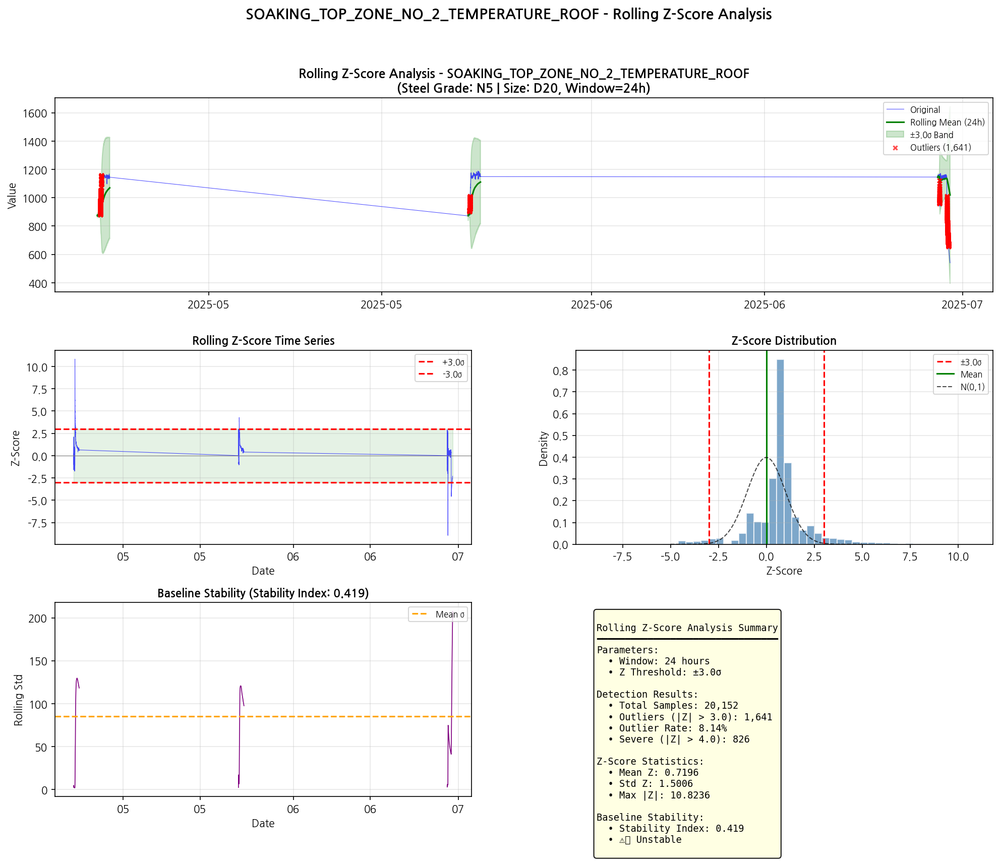

**SOAKING_TOP_ZONE_NO_1_TEMPERATURE_ROOF** (이상치율: 7.92%, 안정성: 0.425)

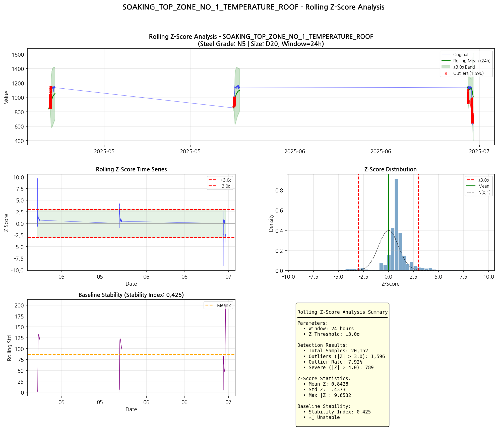

**HEATING_TOP_ZONE_NO_2_TEMPERATURE_ROOF** (이상치율: 6.44%, 안정성: 0.444)

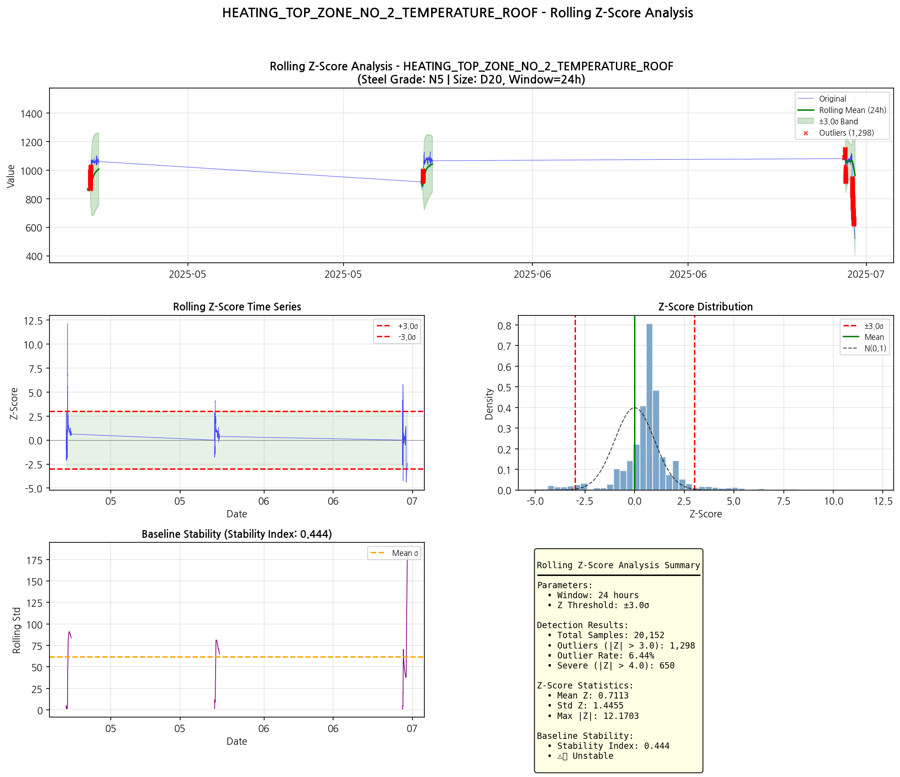

### 가열로 하부 온도 (02_Furnace_Bottom_Temperature)

- 분석 태그: 4개
- 평균 이상치율: 7.55%
- 평균 안정성: 0.439

| 태그 | 이상치율 | 심각 이상치 | 안정성 | Max \|Z\| |
|------|----------|-------------|--------|--------|
| HEATING_BOTTOM_ZONE_NO_1_TEMPERATURE_OPP_SIDE | 6.53% | 578 | 0.468 | 11.40 |
| HEATING_BOTTOM_ZONE_NO_2_TEMPERATURE_MILL_SIDE | 6.74% | 588 | 0.448 | 8.24 |
| SOAKING_BOTTOM_ZONE_NO_1_TEMPERATURE_OPP_SIDE | 8.40% | 676 | 0.425 | 7.28 |
| SOAKING_BOTTOM_ZONE_NO_2_TEMPERATURE_MILL_SIDE | 8.54% | 814 | 0.415 | 7.02 |

#### Z-Score 차트

**SOAKING_BOTTOM_ZONE_NO_2_TEMPERATURE_MILL_SIDE** (이상치율: 8.54%, 안정성: 0.415)

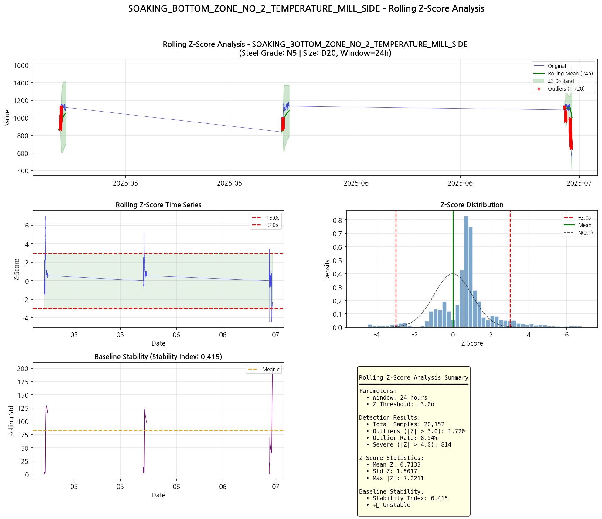

**SOAKING_BOTTOM_ZONE_NO_1_TEMPERATURE_OPP_SIDE** (이상치율: 8.40%, 안정성: 0.425)

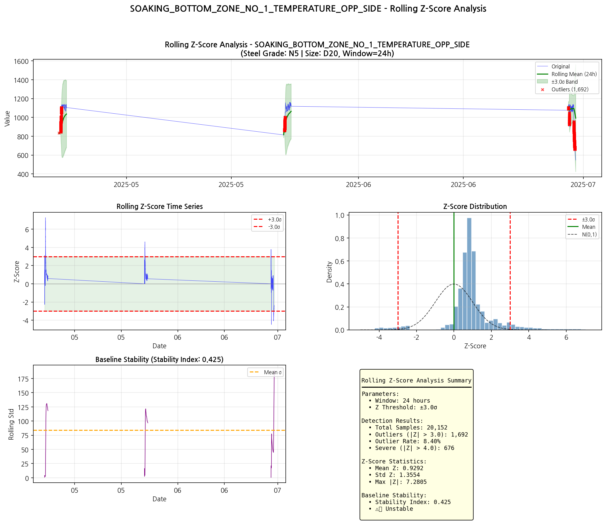

**HEATING_BOTTOM_ZONE_NO_2_TEMPERATURE_MILL_SIDE** (이상치율: 6.74%, 안정성: 0.448)

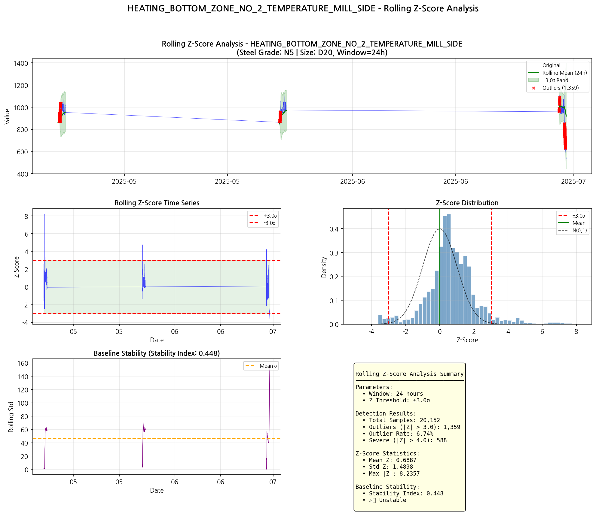

### 가열로 추출 온도 (03_Furnace_Discharge_Temperature)

- 분석 태그: 1개
- 평균 이상치율: 5.89%
- 평균 안정성: 0.373

| 태그 | 이상치율 | 심각 이상치 | 안정성 | Max \|Z\| |
|------|----------|-------------|--------|--------|
| FURNACE_EXIT_DISCHARGE_BILLET_TEMPERATURE | 5.89% | 737 | 0.373 | 62.60 |

#### Z-Score 차트

**FURNACE_EXIT_DISCHARGE_BILLET_TEMPERATURE** (이상치율: 5.89%, 안정성: 0.373)

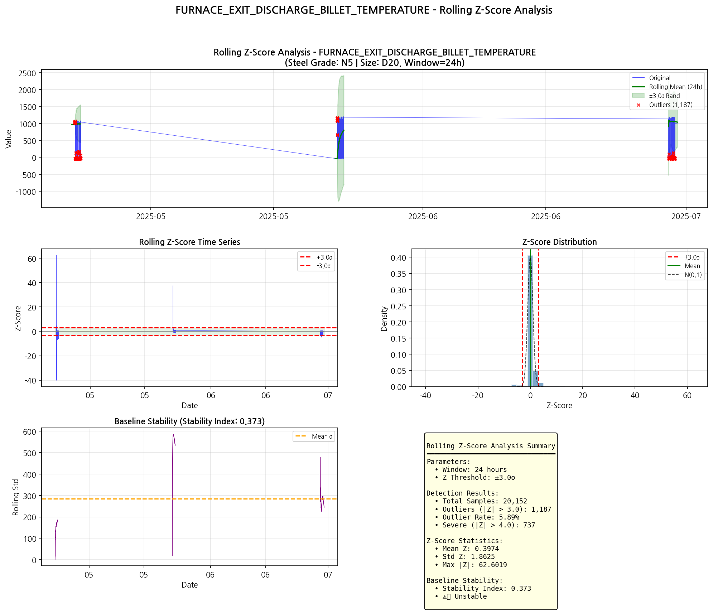

### 가열로 보조설비 (04_Furnace_Auxiliary)

- 분석 태그: 9개
- 평균 이상치율: 5.31%
- 평균 안정성: 0.281

| 태그 | 이상치율 | 심각 이상치 | 안정성 | Max \|Z\| |
|------|----------|-------------|--------|--------|
| FURNACE_PRESSURE | 4.40% | 297 | 0.388 | 15.44 |
| FURNACE_O2_ANALYZER | 12.05% | 955 | 0.138 | 69.21 |
| MAIN_GAS_PRESSURE | 5.87% | 450 | 0.000 | 26.44 |
| MAIN_GAS_FLOW | 7.26% | 1145 | 0.427 | 10.03 |
| MAIN_GAS_TEMPERATURE | 7.06% | 408 | 0.384 | 5.95 |
| MAIN_COMBUSTION_AIR_PRESSURE | 4.92% | 531 | 0.103 | 49.99 |
| COMBUSTION_AIR_TEMPERATURE | 3.87% | 343 | 0.270 | 9.36 |
| INDIRECT_COOLING_WATER_FLOW | 1.75% | 37 | 0.203 | 55.50 |
| INDIRECT_WATER_MAIN_TEMPERATURE | 0.60% | 4 | 0.616 | 6.25 |

#### Z-Score 차트

**FURNACE_O2_ANALYZER** (이상치율: 12.05%, 안정성: 0.138)

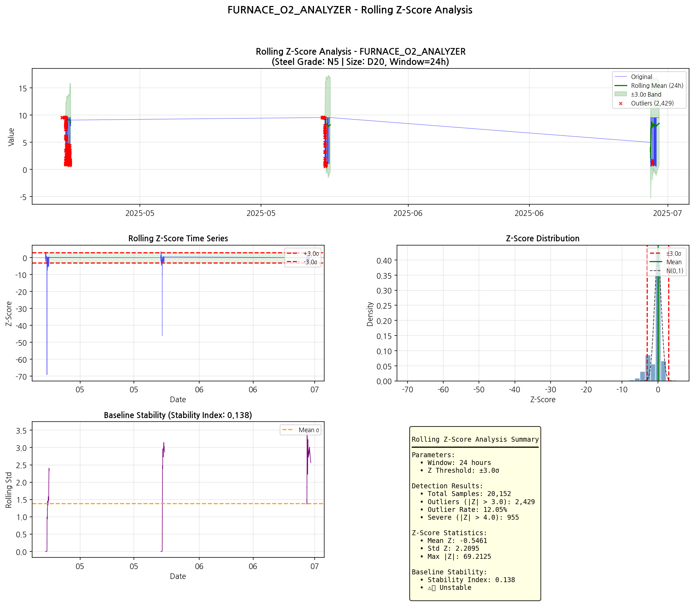

**MAIN_GAS_FLOW** (이상치율: 7.26%, 안정성: 0.427)

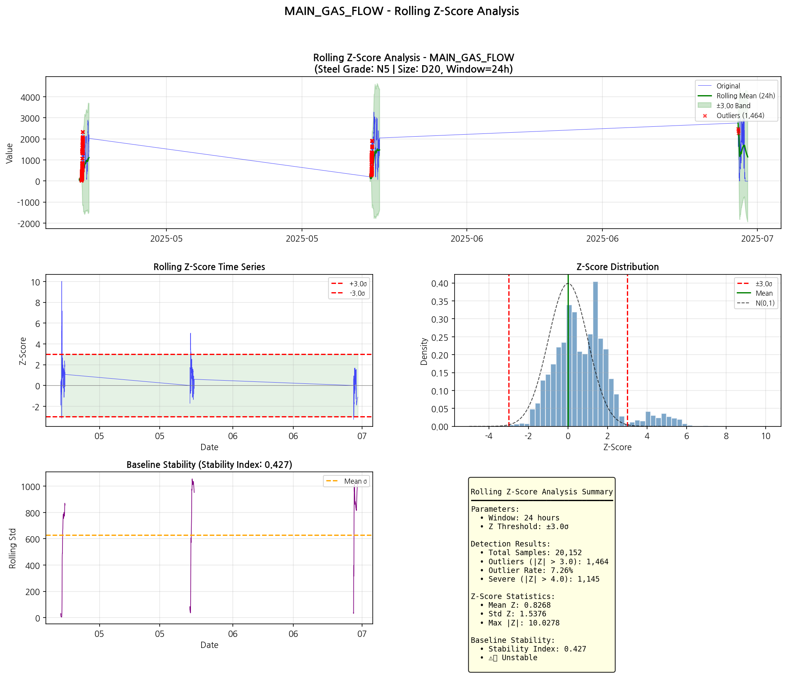

**MAIN_GAS_TEMPERATURE** (이상치율: 7.06%, 안정성: 0.384)

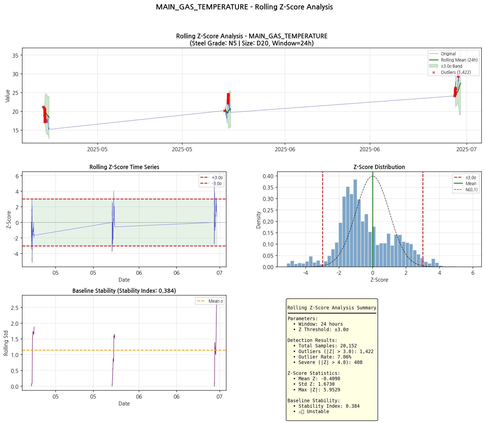

### 스탠드 토크 (05_Stand_Torque)

- 분석 태그: 16개
- 평균 이상치율: 5.30%
- 평균 안정성: 0.567

| 태그 | 이상치율 | 심각 이상치 | 안정성 | Max \|Z\| |
|------|----------|-------------|--------|--------|
| STAND_1_ACTUAL_TORQUE | 5.46% | 604 | 0.545 | 49.69 |
| STAND_2_ACTUAL_TORQUE | 4.82% | 522 | 0.517 | 43.99 |
| STAND_3_ACTUAL_TORQUE | 5.55% | 586 | 0.558 | 49.69 |
| STAND_4_ACTUAL_TORQUE | 5.79% | 632 | 0.584 | 49.69 |
| STAND_5_ACTUAL_TORQUE | 5.16% | 555 | 0.548 | 44.50 |
| STAND_6_ACTUAL_TORQUE | 5.40% | 578 | 0.557 | 49.69 |
| STAND_7_ACTUAL_TORQUE | 5.24% | 573 | 0.561 | 44.83 |
| STAND_8_ACTUAL_TORQUE | 5.48% | 605 | 0.568 | 45.08 |
| STAND_9_ACTUAL_TORQUE | 5.48% | 563 | 0.584 | 49.69 |
| STAND_10_ACTUAL_TORQUE | 5.39% | 572 | 0.590 | 49.69 |
| STAND_11_ACTUAL_TORQUE | 5.26% | 595 | 0.536 | 45.41 |
| STAND_12_ACTUAL_TORQUE | 5.07% | 536 | 0.603 | 49.69 |
| STAND_13_ACTUAL_TORQUE | 5.29% | 554 | 0.585 | 49.69 |
| STAND_14_ACTUAL_TORQUE | 4.95% | 537 | 0.614 | 49.69 |
| FINISHING_BLOCK_MASTER_ACTUAL_TORQUE | 5.21% | 485 | 0.562 | 43.90 |
| FINISHING_BLOCK_SLAVE_ACTUAL_TORQUE | 5.24% | 499 | 0.560 | 43.90 |

#### Z-Score 차트

**STAND_4_ACTUAL_TORQUE** (이상치율: 5.79%, 안정성: 0.584)

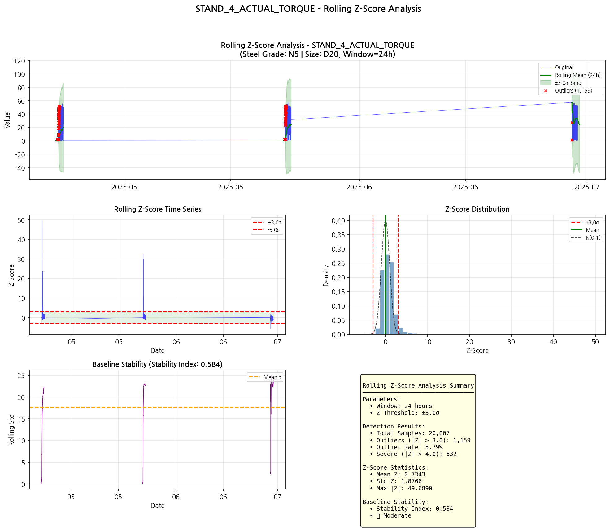

**STAND_3_ACTUAL_TORQUE** (이상치율: 5.55%, 안정성: 0.558)

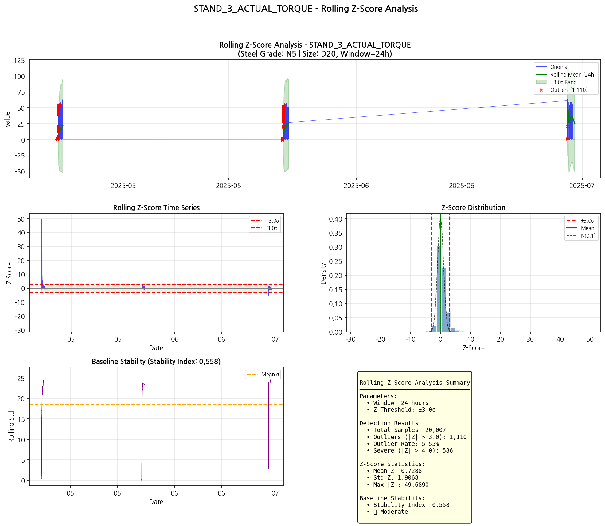

**STAND_9_ACTUAL_TORQUE** (이상치율: 5.48%, 안정성: 0.584)

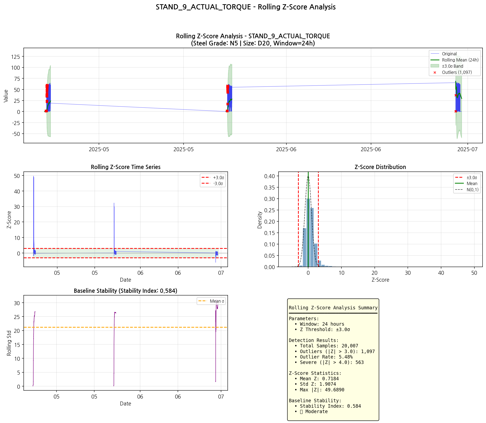

### 스탠드 속도 (06_Stand_Speed)

- 분석 태그: 15개
- 평균 이상치율: 2.44%
- 평균 안정성: 0.754

| 태그 | 이상치율 | 심각 이상치 | 안정성 | Max \|Z\| |
|------|----------|-------------|--------|--------|
| STAND_1_ACTUAL_SPEED | 2.26% | 259 | 0.744 | 49.69 |
| STAND_2_ACTUAL_SPEED | 2.36% | 267 | 0.706 | 43.99 |
| STAND_3_ACTUAL_SPEED | 2.28% | 257 | 0.749 | 49.69 |
| STAND_4_ACTUAL_SPEED | 2.28% | 254 | 0.782 | 49.69 |
| STAND_5_ACTUAL_SPEED | 2.29% | 259 | 0.731 | 44.50 |
| STAND_6_ACTUAL_SPEED | 2.28% | 258 | 0.748 | 49.69 |
| STAND_7_ACTUAL_SPEED | 2.30% | 262 | 0.732 | 44.83 |
| STAND_8_ACTUAL_SPEED | 2.31% | 263 | 0.728 | 45.62 |
| STAND_9_ACTUAL_SPEED | 2.28% | 258 | 0.783 | 49.69 |
| STAND_10_ACTUAL_SPEED | 2.30% | 260 | 0.787 | 49.69 |
| STAND_11_ACTUAL_SPEED | 2.54% | 304 | 0.755 | 45.41 |
| STAND_12_ACTUAL_SPEED | 2.30% | 262 | 0.786 | 49.75 |
| STAND_13_ACTUAL_SPEED | 2.29% | 261 | 0.775 | 49.75 |
| STAND_14_ACTUAL_SPEED | 2.30% | 260 | 0.786 | 49.76 |
| FINISHING_BLOCK_ACTUAL_SPEED | 4.25% | 662 | 0.721 | 43.90 |

#### Z-Score 차트

**FINISHING_BLOCK_ACTUAL_SPEED** (이상치율: 4.25%, 안정성: 0.721)

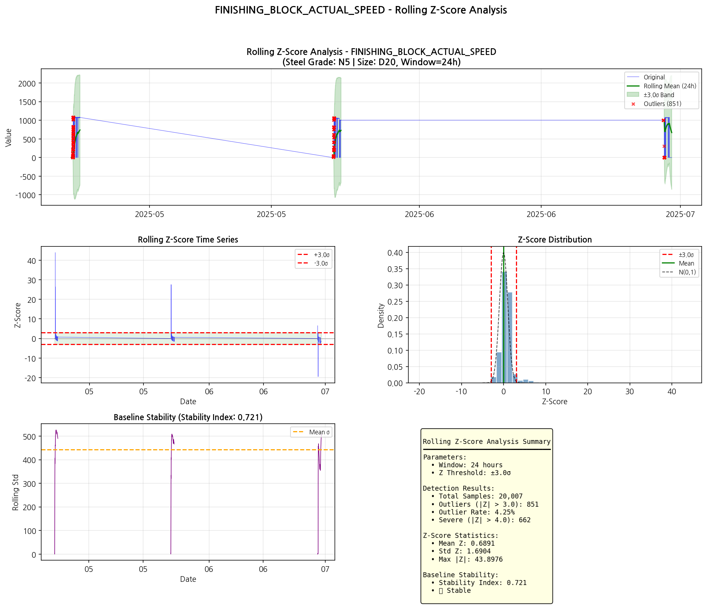

**STAND_11_ACTUAL_SPEED** (이상치율: 2.54%, 안정성: 0.755)

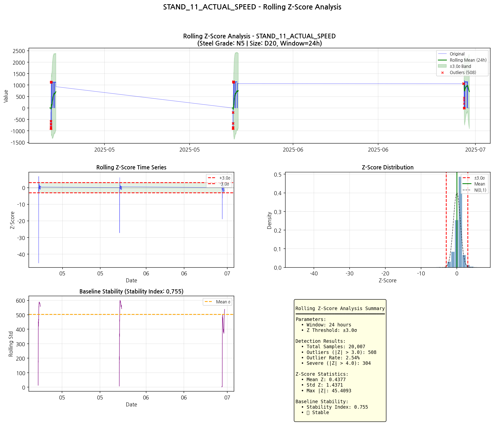

**STAND_2_ACTUAL_SPEED** (이상치율: 2.36%, 안정성: 0.706)

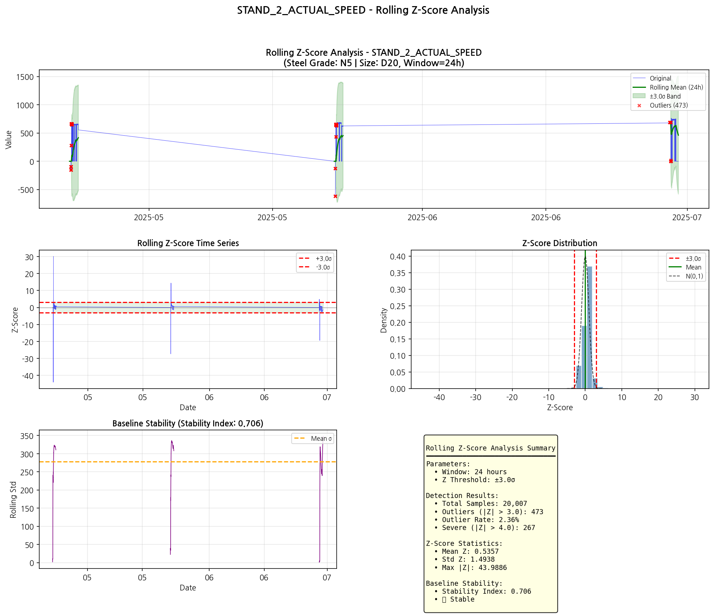

### 스탠드 부하 (07_Stand_Load)

- 분석 태그: 15개
- 평균 이상치율: 2.91%
- 평균 안정성: 0.791

| 태그 | 이상치율 | 심각 이상치 | 안정성 | Max \|Z\| |
|------|----------|-------------|--------|--------|
| STAND_1_LOAD | 2.95% | 294 | 0.790 | 50.23 |
| STAND_2_LOAD | 3.00% | 286 | 0.791 | 50.23 |
| STAND_3_LOAD | 3.01% | 264 | 0.791 | 50.23 |
| STAND_4_LOAD | 2.85% | 267 | 0.791 | 50.23 |
| STAND_5_LOAD | 2.82% | 258 | 0.793 | 50.31 |
| STAND_6_LOAD | 2.84% | 263 | 0.792 | 50.31 |
| STAND_7_LOAD | 2.84% | 272 | 0.792 | 50.31 |
| STAND_8_LOAD | 2.81% | 275 | 0.792 | 50.31 |
| STAND_9_LOAD | 2.87% | 273 | 0.791 | 50.31 |
| STAND_10_LOAD | 2.86% | 280 | 0.791 | 50.31 |
| STAND_11_LOAD | 2.87% | 281 | 0.790 | 50.31 |
| STAND_12_LOAD | 2.98% | 279 | 0.790 | 50.31 |
| STAND_13_LOAD | 2.98% | 279 | 0.790 | 50.31 |
| STAND_14_LOAD | 3.05% | 274 | 0.790 | 50.31 |
| FINISHING_BLOCK_LOAD | 2.96% | 292 | 0.789 | 50.31 |

#### Z-Score 차트

**STAND_14_LOAD** (이상치율: 3.05%, 안정성: 0.790)

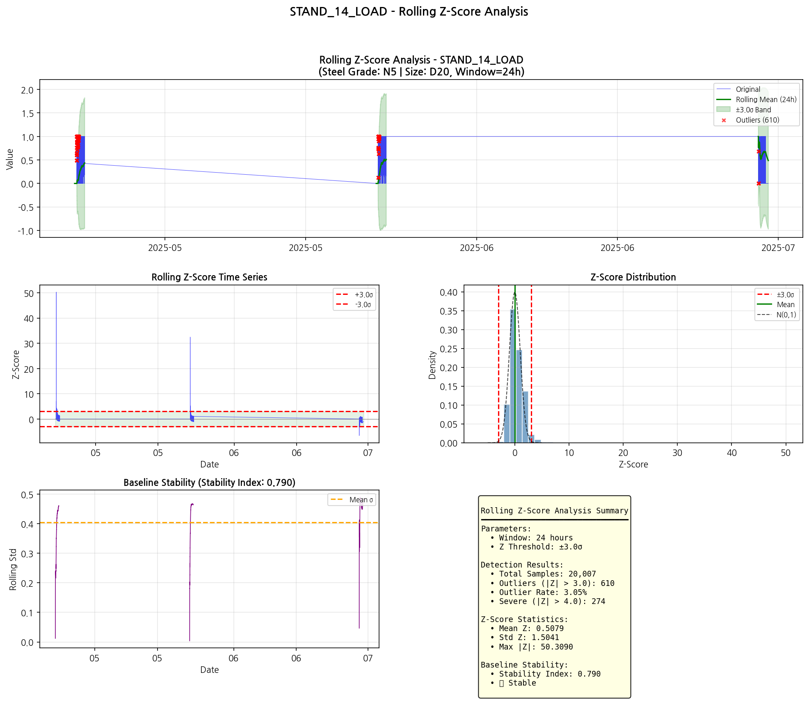

**STAND_3_LOAD** (이상치율: 3.01%, 안정성: 0.791)

**STAND_2_LOAD** (이상치율: 3.00%, 안정성: 0.791)

### 핀치롤 (08_Pinchroll)

- 분석 태그: 9개
- 평균 이상치율: 1.67%
- 평균 안정성: 0.542

| 태그 | 이상치율 | 심각 이상치 | 안정성 | Max \|Z\| |
|------|----------|-------------|--------|--------|
| PINCHROLL_2_ACTUAL_SPEED | 0.94% | 51 | 0.724 | 13.67 |
| PINCHROLL_3_ACTUAL_SPEED | 3.18% | 226 | 0.000 | 29.53 |
| PINCHROLL_4_ACTUAL_SPEED | 3.47% | 244 | 0.337 | 31.55 |
| PINCHROLL_2_ACTUAL_TORQUE | 1.29% | 90 | 0.700 | 21.38 |
| PINCHROLL_3_ACTUAL_TORQUE | 1.36% | 94 | 0.664 | 26.52 |
| PINCHROLL_4_ACTUAL_TORQUE | 1.82% | 119 | 0.666 | 22.45 |
| PINCHROLL_2_REFERENCE_TORQUE | 0.48% | 49 | 0.414 | 22.53 |
| PINCHROLL_3_REFERENCE_TORQUE | 1.23% | 25 | 0.685 | 6.56 |
| PINCHROLL_4_REFERENCE_TORQUE | 1.23% | 19 | 0.687 | 6.56 |

#### Z-Score 차트

**PINCHROLL_4_ACTUAL_SPEED** (이상치율: 3.47%, 안정성: 0.337)

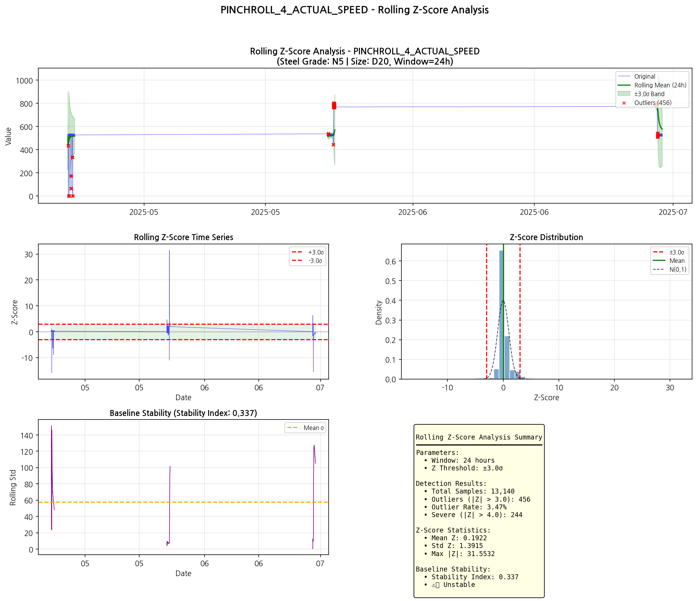

**PINCHROLL_3_ACTUAL_SPEED** (이상치율: 3.18%, 안정성: 0.000)

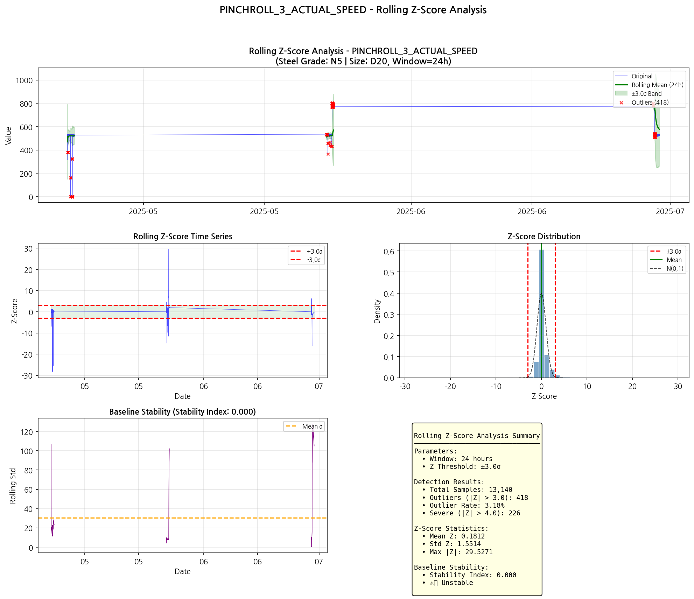

**PINCHROLL_4_ACTUAL_TORQUE** (이상치율: 1.82%, 안정성: 0.666)

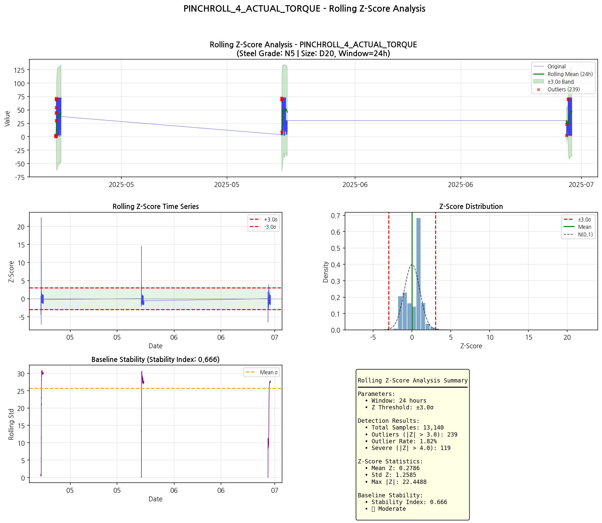

### PR 상세 토크 (09_PR_Detailed)

- 분석 태그: 6개
- 평균 이상치율: 4.18%
- 평균 안정성: 0.698

| 태그 | 이상치율 | 심각 이상치 | 안정성 | Max \|Z\| |
|------|----------|-------------|--------|--------|
| PR6L1_ACT_TORQUE | 4.51% | 96 | 0.758 | 11.15 |
| PR6L2_ACT_TORQUE | 5.59% | 139 | 0.636 | 14.52 |
| PR7L1_ACT_TORQUE | 5.63% | 120 | 0.730 | 17.13 |
| PR7L2_ACT_TORQUE | 5.97% | 134 | 0.699 | 14.71 |
| PR8L1_ACT_TORQUE | 1.73% | 135 | 0.680 | 16.17 |
| PR9L1_ACT_TORQUE | 1.62% | 130 | 0.683 | 16.85 |

#### Z-Score 차트

**PR7L2_ACT_TORQUE** (이상치율: 5.97%, 안정성: 0.699)

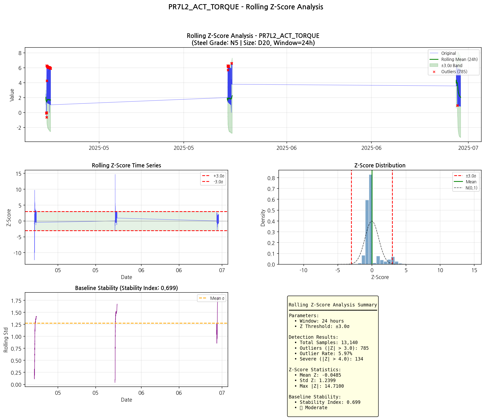

**PR7L1_ACT_TORQUE** (이상치율: 5.63%, 안정성: 0.730)

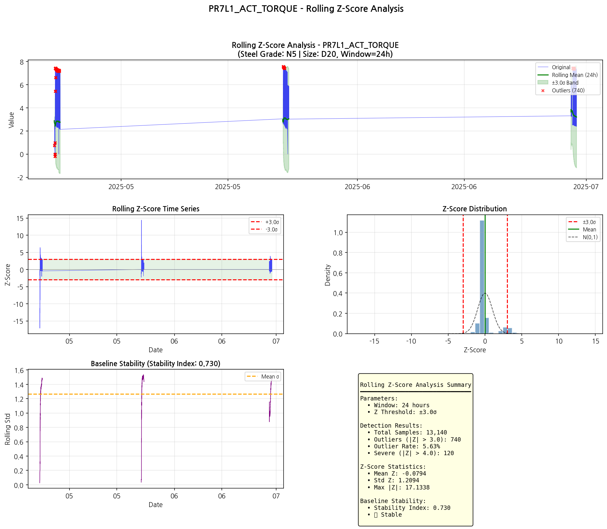

**PR6L2_ACT_TORQUE** (이상치율: 5.59%, 안정성: 0.636)

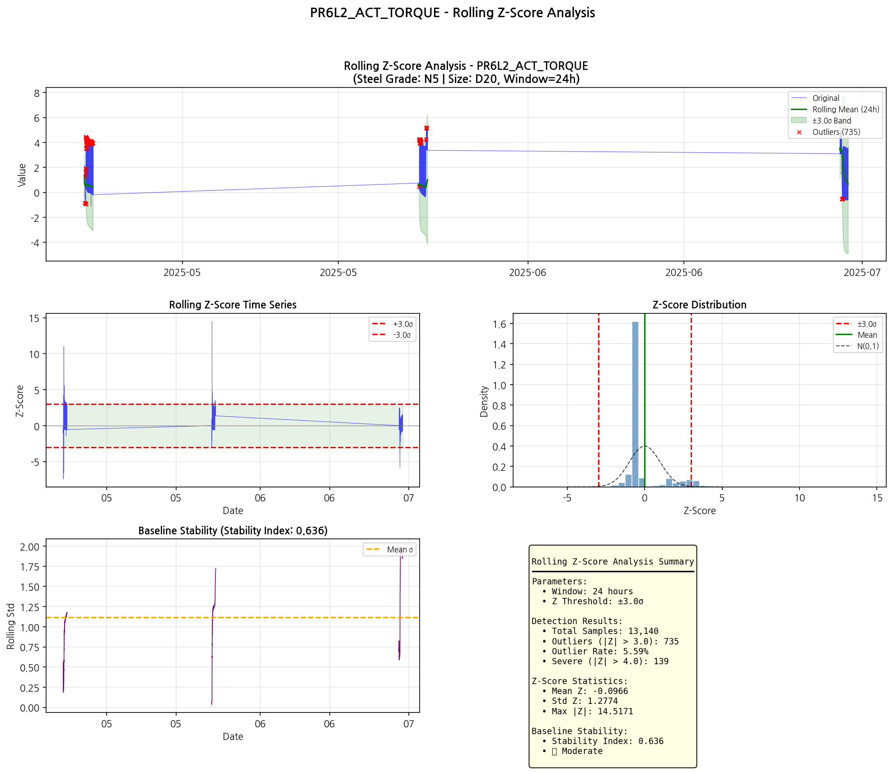

---

## 해석 가이드

### Rolling Z-Score 해석

1. **이상치율 (Outlier Rate)**
   - |Z| > 3.0σ 비율
   - 높을수록 해당 시점 주변 패턴에서 벗어난 데이터 많음
   - 정상 분포 가정 시 약 0.3% 예상

2. **기준선 안정성 (Baseline Stability)**
   - Rolling std의 시간적 일관성
   - 1에 가까울수록 안정적
   - 0.5 미만: 비정상 시계열, 다른 방법 권장

3. **심각 이상치 (Severe Outliers)**
   - |Z| > 4.0σ
   - 극단적인 이상값
   - 즉각적인 점검 필요

### 상태 분류

| 상태 | 기준 | 해석 |
|------|------|------|
| 🔴 높음 | ≥10% | 빈번한 이상치, 점검 필요 |
| 🟠 중간 | 3~10% | 일부 이상치, 모니터링 |
| 🟢 낮음 | <3% | 정상 범위 |
| 🟡 불안정 | Stability < 0.5 | 기준선 변동 심함 |

### Standard IQR vs Rolling Z-Score

| 방법 | 장점 | 단점 |
|------|------|------|
| Standard IQR | 간단, 전체 분포 기반 | 시변 데이터에 부적합 |
| Rolling Z-Score | 시변 데이터 적합 | 윈도우 크기 설정 필요 |

**권장**: 기준선 안정성 ≥ 0.5인 태그에 효과적

---

## 메타데이터

| 항목 | 값 |
|------|-----|
| 분석 스크립트 | steel_grade_rolling_zscore_analysis.py |
| 분석 기간 | 2025-03-01 ~ 2025-08-31 |
| 강종 | N5 |
| 윈도우 크기 | 24시간 |
| Z 임계값 | ±3.0σ |
| 생성일시 | 2026-02-09 15:14:13 |
| 총 분석 태그 | 79개 |

---

*본 보고서는 자동 생성되었습니다.*
