# 강종 [N5] Rolling Z-Score 동적 이상치 분석 보고서

**분석 기간**: 2025-03-01 ~ 2025-08-31
**강종**: N5
**생성일시**: 2026-02-03 20:48:35

---

## 분석 개요

### 분석 방법론

**Rolling Z-Score (롤링 Z-점수)**

시간 창(window) 기반 동적 이상치 탐지 방법입니다.

$$Z_{rolling}(t) = \frac{x(t) - \mu_{window}(t)}{\sigma_{window}(t)}$$

| 파라미터 | 값 | 설명 |
|----------|-----|------|
| Window | 24h | 이동 평균/표준편차 윈도우 |
| Z Threshold | ±3.0σ | 이상치 판정 임계값 |
| Severe | ±4.0σ | 심각 이상치 임계값 |

### 장점

- **비정상 시계열 적합**: 평균/분산 시변하는 데이터에 효과적
- **점진적 기준선 추적**: 장기 드리프트에 강건
- **Local Context 기반**: 해당 시점 주변 패턴 기준

### 분석 결과 요약

| 구분 | 태그 수 | 비율 |
|------|---------|------|
| **총 분석 태그** | 79개 | 100% |
| 🔴 높은 이상치율 (≥10%) | 0개 | 0.0% |
| 🟠 중간 이상치율 (3~10%) | 8개 | 10.1% |
| 🟢 낮은 이상치율 (<3%) | 60개 | 75.9% |
| 🟡 불안정 기준선 | 11개 | 13.9% |

#### 전체 평균

| 지표 | 값 |
|------|-----|
| 평균 이상치율 | 1.69% |
| 평균 기준선 안정성 | 0.602 |

---

## 상위 문제 태그 (이상치율 기준)

| 순위 | 태그 | 카테고리 | 이상치율 | 심각 이상치 | 안정성 | 상태 |
|------|------|----------|----------|-------------|--------|------|
| 1 | FURNACE_EXIT_DISCHARGE_BILLET_TEMPERATURE | 가열로 추출 온도 | 5.48% | 3623 | 0.724 | 🟠 |
| 2 | FURNACE_O2_ANALYZER | 가열로 보조설비 | 4.96% | 3582 | 0.479 | 🟠 |
| 3 | SOAKING_TOP_ZONE_NO_2_TEMPERATURE_ROOF | 가열로 상부 온도 | 4.21% | 2974 | 0.000 | 🟠 |
| 4 | SOAKING_TOP_ZONE_NO_1_TEMPERATURE_ROOF | 가열로 상부 온도 | 4.15% | 3130 | 0.000 | 🟠 |
| 5 | HEATING_TOP_ZONE_NO_2_TEMPERATURE_ROOF | 가열로 상부 온도 | 3.34% | 1494 | 0.148 | 🟠 |
| 6 | HEATING_TOP_ZONE_NO_1_TEMPERATURE_ROOF | 가열로 상부 온도 | 3.28% | 1506 | 0.157 | 🟠 |
| 7 | PINCHROLL_4_ACTUAL_SPEED | 핀치롤 | 3.21% | 2089 | 0.000 | 🟠 |
| 8 | PINCHROLL_3_ACTUAL_SPEED | 핀치롤 | 3.12% | 1989 | 0.000 | 🟠 |
| 9 | PR6L2_ACT_TORQUE | PR 상세 토크 | 2.99% | 1850 | 0.000 | 🟡 |
| 10 | PR6L1_ACT_TORQUE | PR 상세 토크 | 2.93% | 1968 | 0.000 | 🟡 |
| 11 | COMBUSTION_AIR_TEMPERATURE | 가열로 보조설비 | 2.84% | 1301 | 0.587 | 🟢 |
| 12 | SOAKING_BOTTOM_ZONE_NO_2_TEMPERATURE_MILL_SIDE | 가열로 하부 온도 | 2.82% | 1760 | 0.028 | 🟡 |
| 13 | SOAKING_BOTTOM_ZONE_NO_1_TEMPERATURE_OPP_SIDE | 가열로 하부 온도 | 2.71% | 1636 | 0.048 | 🟡 |
| 14 | MAIN_GAS_PRESSURE | 가열로 보조설비 | 2.71% | 1146 | 0.000 | 🟡 |
| 15 | MAIN_COMBUSTION_AIR_PRESSURE | 가열로 보조설비 | 2.50% | 2052 | 0.000 | 🟡 |

---

## 불안정 기준선 태그

기준선 안정성(Stability Index)이 0.5 미만인 태그입니다.
이 태그들은 Rolling Z-Score 방법보다 다른 방법이 더 적합할 수 있습니다.

| 태그 | 카테고리 | 안정성 | 이상치율 |
|------|----------|--------|----------|
| SOAKING_TOP_ZONE_NO_1_TEMPERATURE_ROOF | 가열로 상부 온도 | 0.000 | 4.15% |
| SOAKING_TOP_ZONE_NO_2_TEMPERATURE_ROOF | 가열로 상부 온도 | 0.000 | 4.21% |
| MAIN_GAS_PRESSURE | 가열로 보조설비 | 0.000 | 2.71% |
| MAIN_COMBUSTION_AIR_PRESSURE | 가열로 보조설비 | 0.000 | 2.50% |
| PINCHROLL_3_ACTUAL_SPEED | 핀치롤 | 0.000 | 3.12% |
| PINCHROLL_4_ACTUAL_SPEED | 핀치롤 | 0.000 | 3.21% |
| PR6L1_ACT_TORQUE | PR 상세 토크 | 0.000 | 2.93% |
| PR6L2_ACT_TORQUE | PR 상세 토크 | 0.000 | 2.99% |
| PR7L1_ACT_TORQUE | PR 상세 토크 | 0.000 | 2.36% |
| PR7L2_ACT_TORQUE | PR 상세 토크 | 0.000 | 2.29% |

---

## 카테고리별 분석 결과

### 가열로 상부 온도 (01_Furnace_Top_Temperature)

- 분석 태그: 4개
- 평균 이상치율: 3.74%
- 평균 안정성: 0.076

| 태그 | 이상치율 | 심각 이상치 | 안정성 | Max \|Z\| |
|------|----------|-------------|--------|--------|
| HEATING_TOP_ZONE_NO_1_TEMPERATURE_ROOF | 3.28% | 1506 | 0.157 | 11.61 |
| HEATING_TOP_ZONE_NO_2_TEMPERATURE_ROOF | 3.34% | 1494 | 0.148 | 12.17 |
| SOAKING_TOP_ZONE_NO_1_TEMPERATURE_ROOF | 4.15% | 3130 | 0.000 | 11.12 |
| SOAKING_TOP_ZONE_NO_2_TEMPERATURE_ROOF | 4.21% | 2974 | 0.000 | 10.90 |

#### Z-Score 차트

**SOAKING_TOP_ZONE_NO_2_TEMPERATURE_ROOF** (이상치율: 4.21%, 안정성: 0.000)

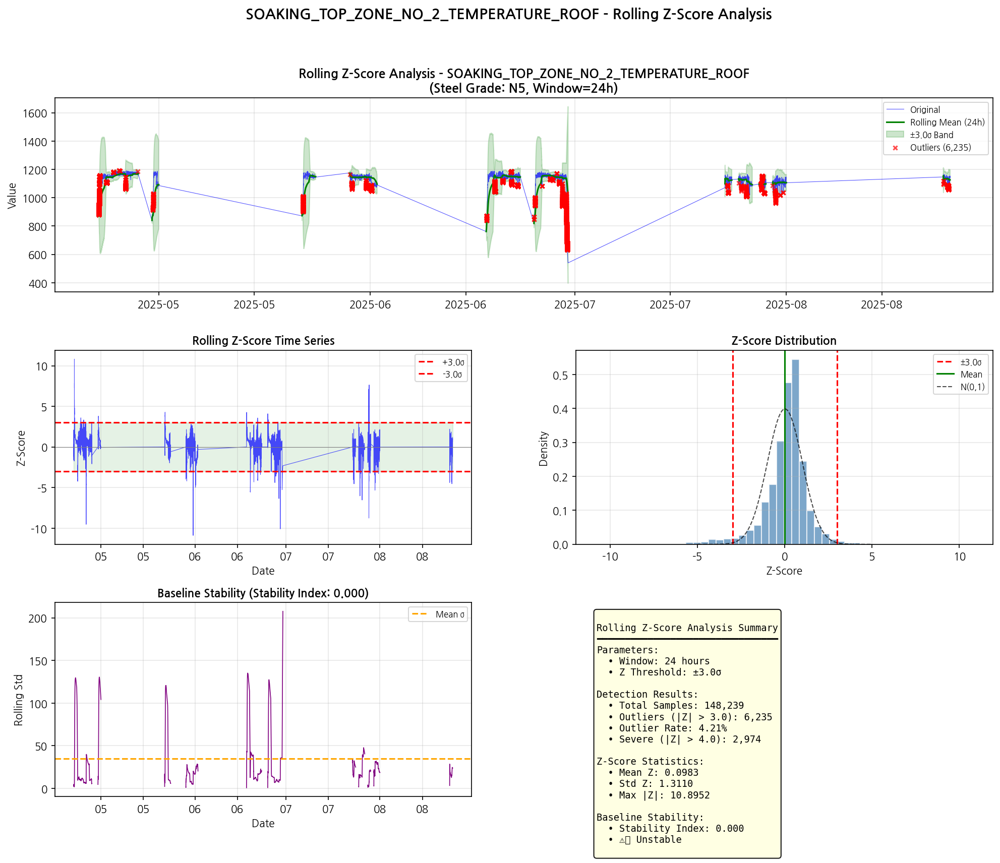

**SOAKING_TOP_ZONE_NO_1_TEMPERATURE_ROOF** (이상치율: 4.15%, 안정성: 0.000)

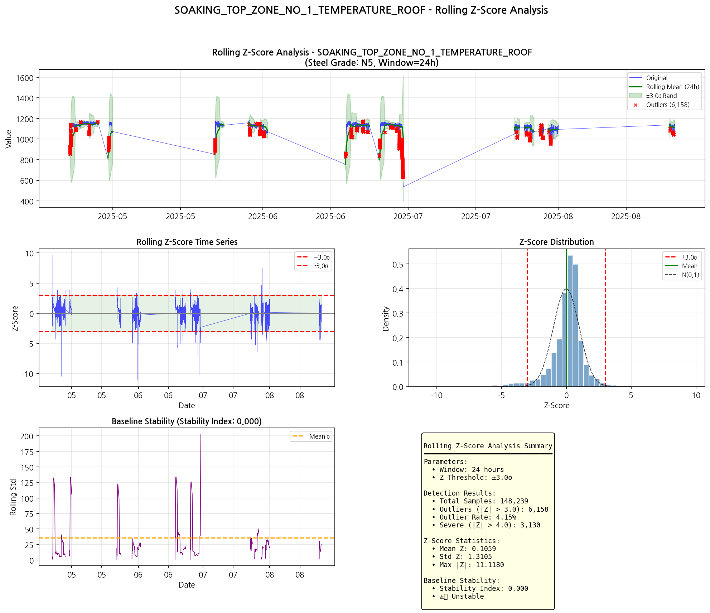

**HEATING_TOP_ZONE_NO_2_TEMPERATURE_ROOF** (이상치율: 3.34%, 안정성: 0.148)

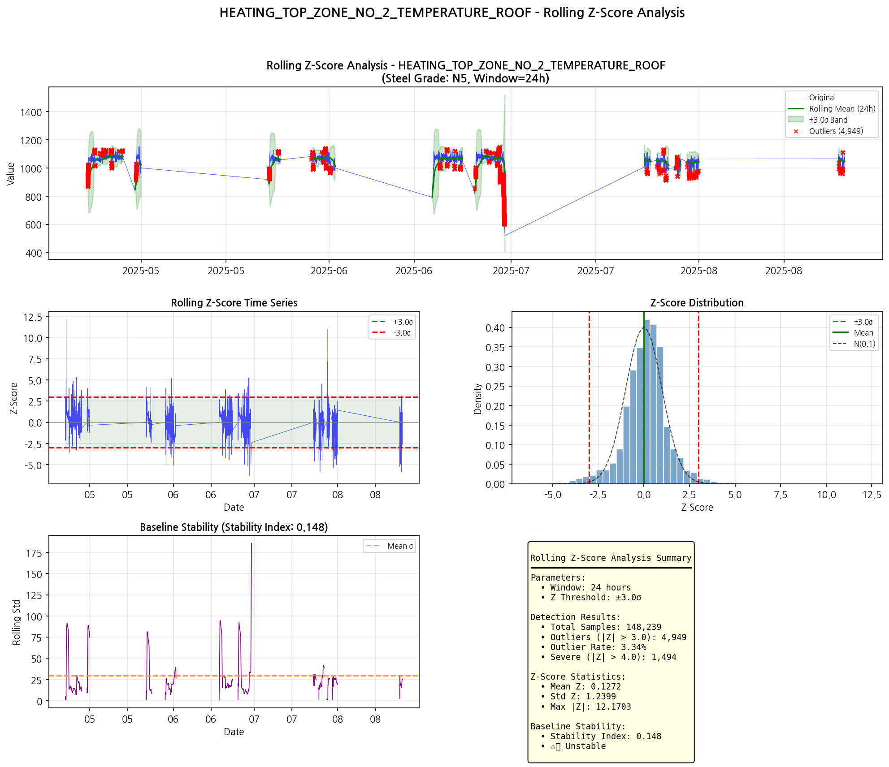

### 가열로 하부 온도 (02_Furnace_Bottom_Temperature)

- 분석 태그: 4개
- 평균 이상치율: 2.19%
- 평균 안정성: 0.336

| 태그 | 이상치율 | 심각 이상치 | 안정성 | Max \|Z\| |
|------|----------|-------------|--------|--------|
| HEATING_BOTTOM_ZONE_NO_1_TEMPERATURE_OPP_SIDE | 1.60% | 731 | 0.656 | 11.40 |
| HEATING_BOTTOM_ZONE_NO_2_TEMPERATURE_MILL_SIDE | 1.61% | 748 | 0.613 | 8.24 |
| SOAKING_BOTTOM_ZONE_NO_1_TEMPERATURE_OPP_SIDE | 2.71% | 1636 | 0.048 | 7.28 |
| SOAKING_BOTTOM_ZONE_NO_2_TEMPERATURE_MILL_SIDE | 2.82% | 1760 | 0.028 | 7.02 |

#### Z-Score 차트

**SOAKING_BOTTOM_ZONE_NO_2_TEMPERATURE_MILL_SIDE** (이상치율: 2.82%, 안정성: 0.028)

**SOAKING_BOTTOM_ZONE_NO_1_TEMPERATURE_OPP_SIDE** (이상치율: 2.71%, 안정성: 0.048)

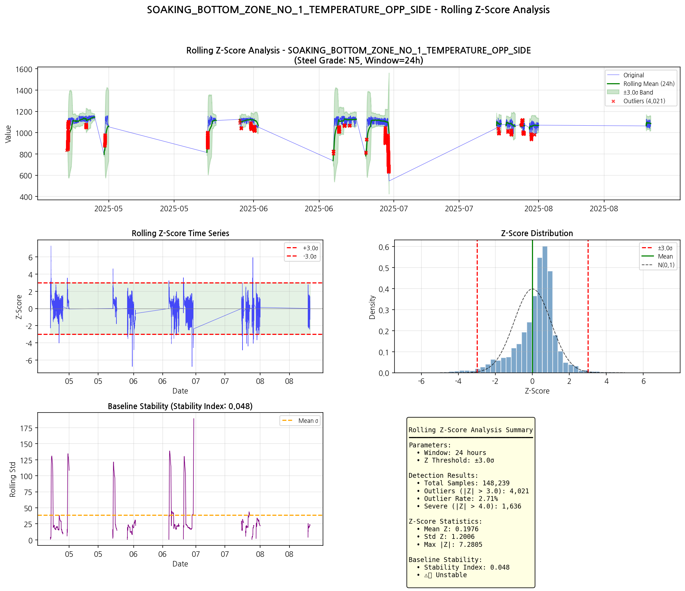

**HEATING_BOTTOM_ZONE_NO_2_TEMPERATURE_MILL_SIDE** (이상치율: 1.61%, 안정성: 0.613)

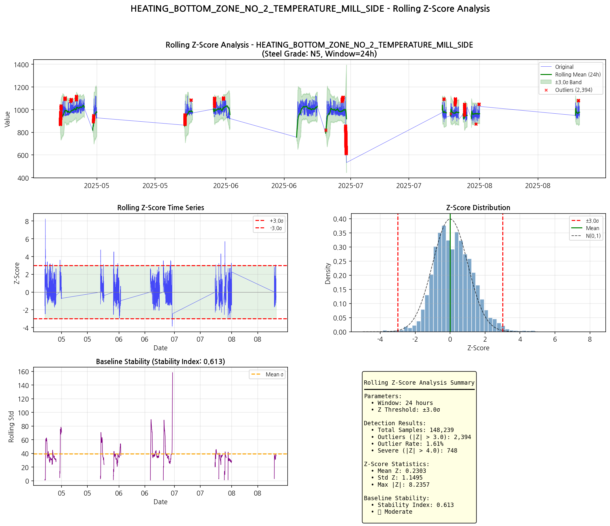

### 가열로 추출 온도 (03_Furnace_Discharge_Temperature)

- 분석 태그: 1개
- 평균 이상치율: 5.48%
- 평균 안정성: 0.724

| 태그 | 이상치율 | 심각 이상치 | 안정성 | Max \|Z\| |
|------|----------|-------------|--------|--------|
| FURNACE_EXIT_DISCHARGE_BILLET_TEMPERATURE | 5.48% | 3623 | 0.724 | 62.60 |

#### Z-Score 차트

**FURNACE_EXIT_DISCHARGE_BILLET_TEMPERATURE** (이상치율: 5.48%, 안정성: 0.724)

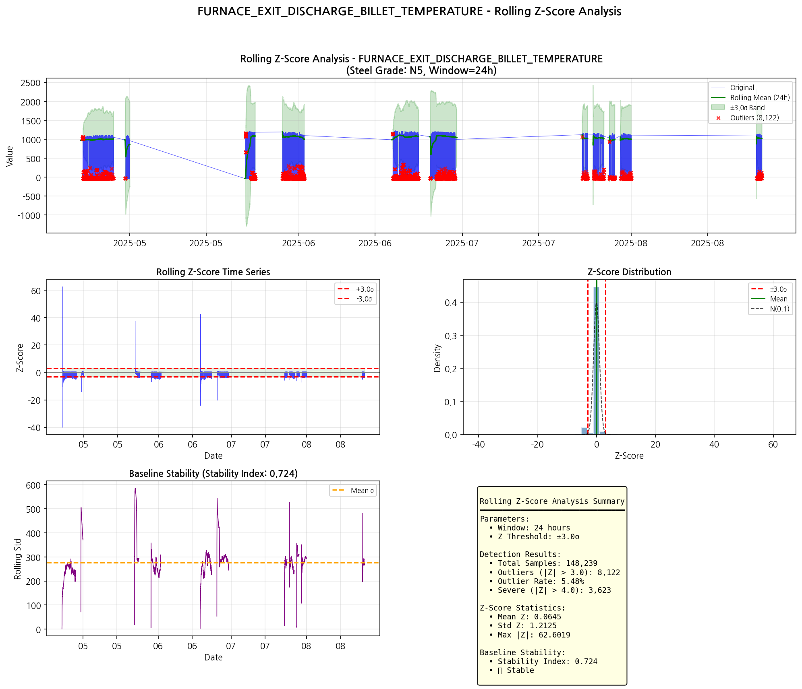

### 가열로 보조설비 (04_Furnace_Auxiliary)

- 분석 태그: 9개
- 평균 이상치율: 2.27%
- 평균 안정성: 0.397

| 태그 | 이상치율 | 심각 이상치 | 안정성 | Max \|Z\| |
|------|----------|-------------|--------|--------|
| FURNACE_PRESSURE | 1.62% | 734 | 0.573 | 15.44 |
| FURNACE_O2_ANALYZER | 4.96% | 3582 | 0.479 | 69.21 |
| MAIN_GAS_PRESSURE | 2.71% | 1146 | 0.000 | 29.43 |
| MAIN_GAS_FLOW | 1.64% | 1562 | 0.714 | 10.78 |
| MAIN_GAS_TEMPERATURE | 2.33% | 549 | 0.565 | 6.86 |
| MAIN_COMBUSTION_AIR_PRESSURE | 2.50% | 2052 | 0.000 | 49.99 |
| COMBUSTION_AIR_TEMPERATURE | 2.84% | 1301 | 0.587 | 9.36 |
| INDIRECT_COOLING_WATER_FLOW | 1.28% | 475 | 0.248 | 55.50 |
| INDIRECT_WATER_MAIN_TEMPERATURE | 0.58% | 176 | 0.408 | 6.76 |

#### Z-Score 차트

**FURNACE_O2_ANALYZER** (이상치율: 4.96%, 안정성: 0.479)

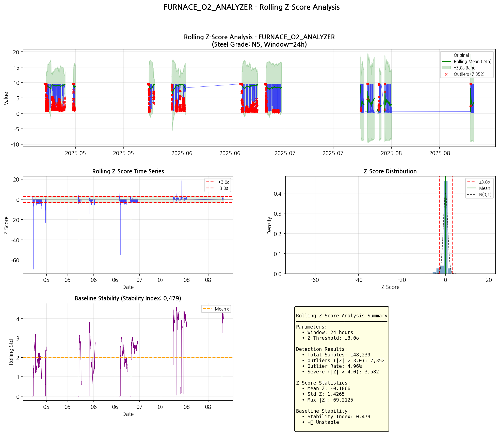

**COMBUSTION_AIR_TEMPERATURE** (이상치율: 2.84%, 안정성: 0.587)

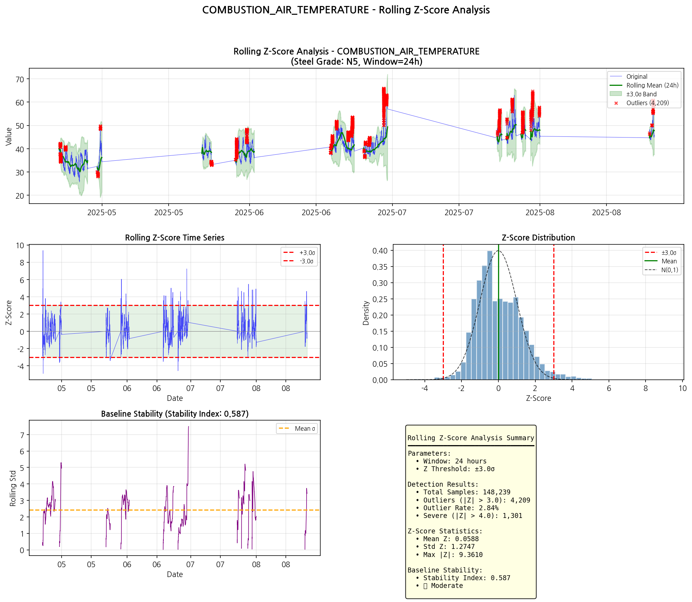

**MAIN_GAS_PRESSURE** (이상치율: 2.71%, 안정성: 0.000)

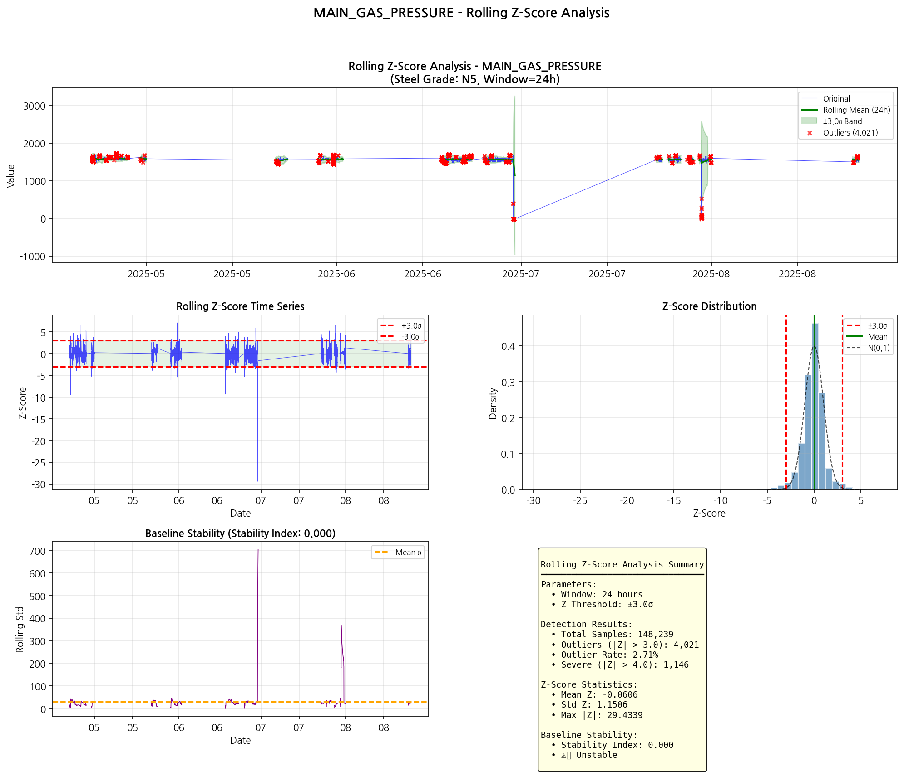

### 스탠드 토크 (05_Stand_Torque)

- 분석 태그: 16개
- 평균 이상치율: 1.30%
- 평균 안정성: 0.746

| 태그 | 이상치율 | 심각 이상치 | 안정성 | Max \|Z\| |
|------|----------|-------------|--------|--------|
| STAND_1_ACTUAL_TORQUE | 1.31% | 985 | 0.764 | 49.69 |
| STAND_2_ACTUAL_TORQUE | 1.21% | 918 | 0.767 | 43.99 |
| STAND_3_ACTUAL_TORQUE | 1.32% | 980 | 0.766 | 49.69 |
| STAND_4_ACTUAL_TORQUE | 1.34% | 1049 | 0.775 | 49.69 |
| STAND_5_ACTUAL_TORQUE | 1.20% | 924 | 0.767 | 44.50 |
| STAND_6_ACTUAL_TORQUE | 1.29% | 997 | 0.774 | 49.69 |
| STAND_7_ACTUAL_TORQUE | 1.26% | 988 | 0.773 | 44.83 |
| STAND_8_ACTUAL_TORQUE | 1.31% | 1018 | 0.758 | 45.08 |
| STAND_9_ACTUAL_TORQUE | 1.31% | 953 | 0.771 | 49.69 |
| STAND_10_ACTUAL_TORQUE | 1.31% | 976 | 0.781 | 49.69 |
| STAND_11_ACTUAL_TORQUE | 1.29% | 988 | 0.756 | 45.41 |
| STAND_12_ACTUAL_TORQUE | 1.26% | 929 | 0.766 | 49.69 |
| STAND_13_ACTUAL_TORQUE | 1.29% | 944 | 0.778 | 49.69 |
| STAND_14_ACTUAL_TORQUE | 1.24% | 905 | 0.791 | 49.69 |
| FINISHING_BLOCK_MASTER_ACTUAL_TORQUE | 1.42% | 860 | 0.579 | 43.90 |
| FINISHING_BLOCK_SLAVE_ACTUAL_TORQUE | 1.43% | 874 | 0.579 | 43.90 |

#### Z-Score 차트

**FINISHING_BLOCK_SLAVE_ACTUAL_TORQUE** (이상치율: 1.43%, 안정성: 0.579)

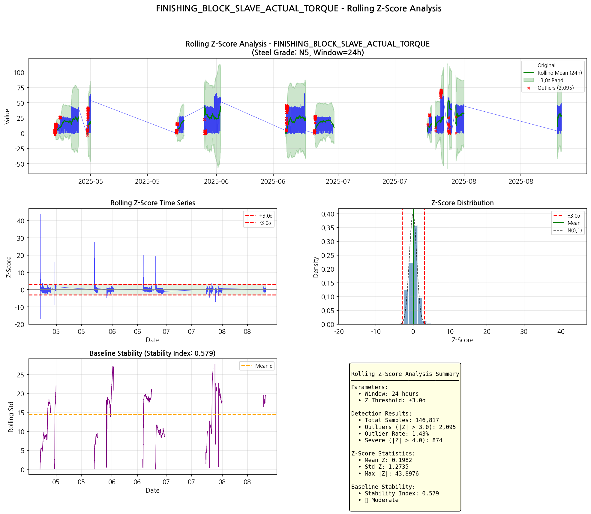

**FINISHING_BLOCK_MASTER_ACTUAL_TORQUE** (이상치율: 1.42%, 안정성: 0.579)

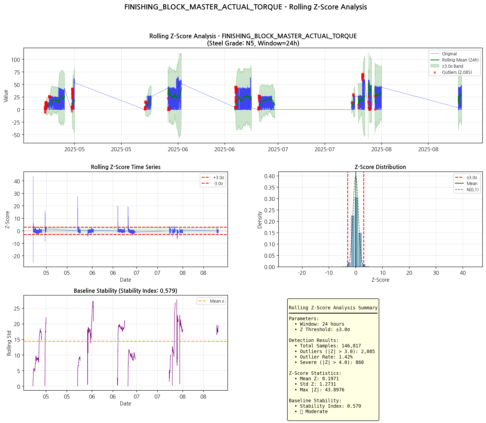

**STAND_4_ACTUAL_TORQUE** (이상치율: 1.34%, 안정성: 0.775)

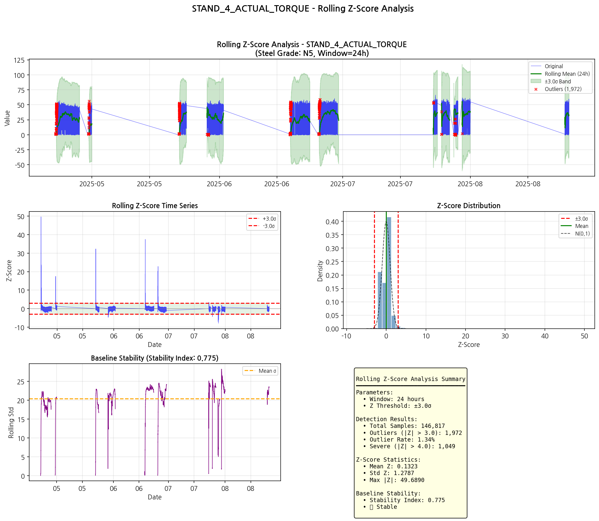

### 스탠드 속도 (06_Stand_Speed)

- 분석 태그: 15개
- 평균 이상치율: 2.02%
- 평균 안정성: 0.724

| 태그 | 이상치율 | 심각 이상치 | 안정성 | Max \|Z\| |
|------|----------|-------------|--------|--------|
| STAND_1_ACTUAL_SPEED | 2.01% | 850 | 0.718 | 49.69 |
| STAND_2_ACTUAL_SPEED | 2.02% | 845 | 0.708 | 43.99 |
| STAND_3_ACTUAL_SPEED | 2.02% | 828 | 0.720 | 49.69 |
| STAND_4_ACTUAL_SPEED | 1.99% | 823 | 0.726 | 49.69 |
| STAND_5_ACTUAL_SPEED | 2.00% | 827 | 0.716 | 44.50 |
| STAND_6_ACTUAL_SPEED | 2.00% | 831 | 0.722 | 49.69 |
| STAND_7_ACTUAL_SPEED | 1.98% | 835 | 0.723 | 44.83 |
| STAND_8_ACTUAL_SPEED | 2.00% | 832 | 0.720 | 45.62 |
| STAND_9_ACTUAL_SPEED | 1.99% | 804 | 0.739 | 49.69 |
| STAND_10_ACTUAL_SPEED | 1.99% | 824 | 0.737 | 49.69 |
| STAND_11_ACTUAL_SPEED | 2.07% | 940 | 0.729 | 45.41 |
| STAND_12_ACTUAL_SPEED | 1.90% | 854 | 0.732 | 49.75 |
| STAND_13_ACTUAL_SPEED | 1.94% | 845 | 0.721 | 49.75 |
| STAND_14_ACTUAL_SPEED | 1.97% | 829 | 0.726 | 49.76 |
| FINISHING_BLOCK_ACTUAL_SPEED | 2.44% | 1353 | 0.726 | 43.90 |

#### Z-Score 차트

**FINISHING_BLOCK_ACTUAL_SPEED** (이상치율: 2.44%, 안정성: 0.726)

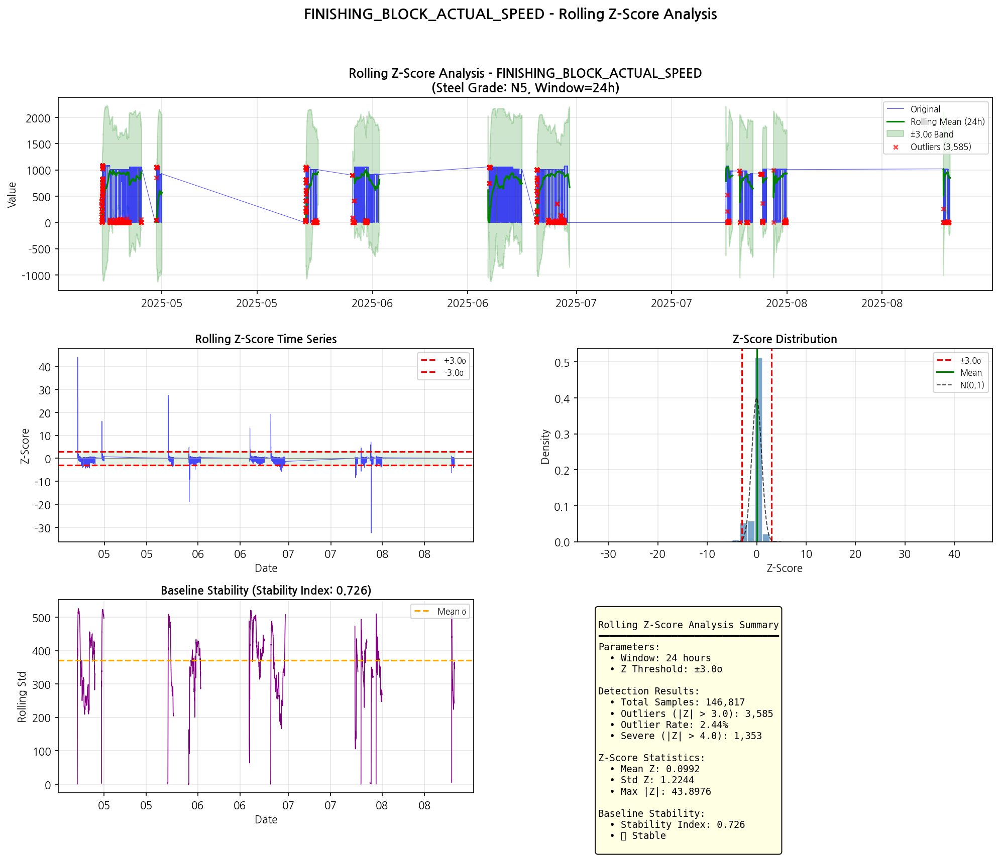

**STAND_11_ACTUAL_SPEED** (이상치율: 2.07%, 안정성: 0.729)

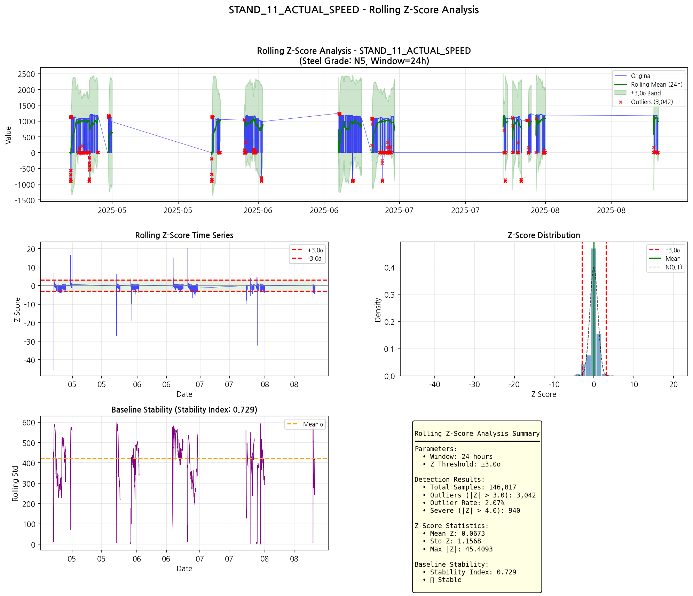

**STAND_3_ACTUAL_SPEED** (이상치율: 2.02%, 안정성: 0.720)

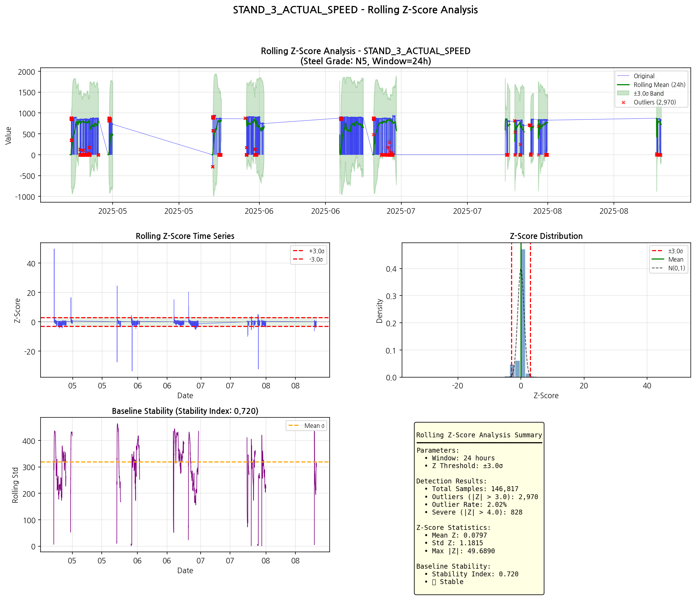

### 스탠드 부하 (07_Stand_Load)

- 분석 태그: 15개
- 평균 이상치율: 0.73%
- 평균 안정성: 0.868

| 태그 | 이상치율 | 심각 이상치 | 안정성 | Max \|Z\| |
|------|----------|-------------|--------|--------|
| STAND_1_LOAD | 0.74% | 519 | 0.866 | 50.23 |
| STAND_2_LOAD | 0.74% | 508 | 0.867 | 50.23 |
| STAND_3_LOAD | 0.74% | 489 | 0.867 | 50.23 |
| STAND_4_LOAD | 0.71% | 487 | 0.867 | 50.23 |
| STAND_5_LOAD | 0.71% | 481 | 0.868 | 50.31 |
| STAND_6_LOAD | 0.72% | 484 | 0.868 | 50.31 |
| STAND_7_LOAD | 0.72% | 497 | 0.868 | 50.31 |
| STAND_8_LOAD | 0.71% | 498 | 0.868 | 50.31 |
| STAND_9_LOAD | 0.72% | 497 | 0.868 | 50.31 |
| STAND_10_LOAD | 0.72% | 505 | 0.868 | 50.31 |
| STAND_11_LOAD | 0.72% | 505 | 0.868 | 50.31 |
| STAND_12_LOAD | 0.74% | 510 | 0.868 | 50.31 |
| STAND_13_LOAD | 0.74% | 510 | 0.868 | 50.31 |
| STAND_14_LOAD | 0.75% | 499 | 0.868 | 50.31 |
| FINISHING_BLOCK_LOAD | 0.73% | 512 | 0.868 | 50.31 |

#### Z-Score 차트

**STAND_14_LOAD** (이상치율: 0.75%, 안정성: 0.868)

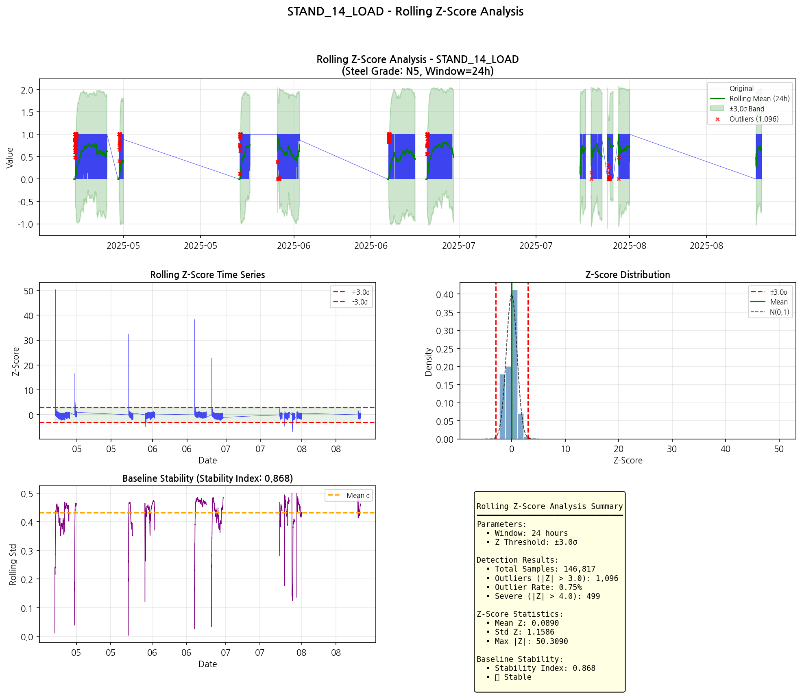

**STAND_2_LOAD** (이상치율: 0.74%, 안정성: 0.867)

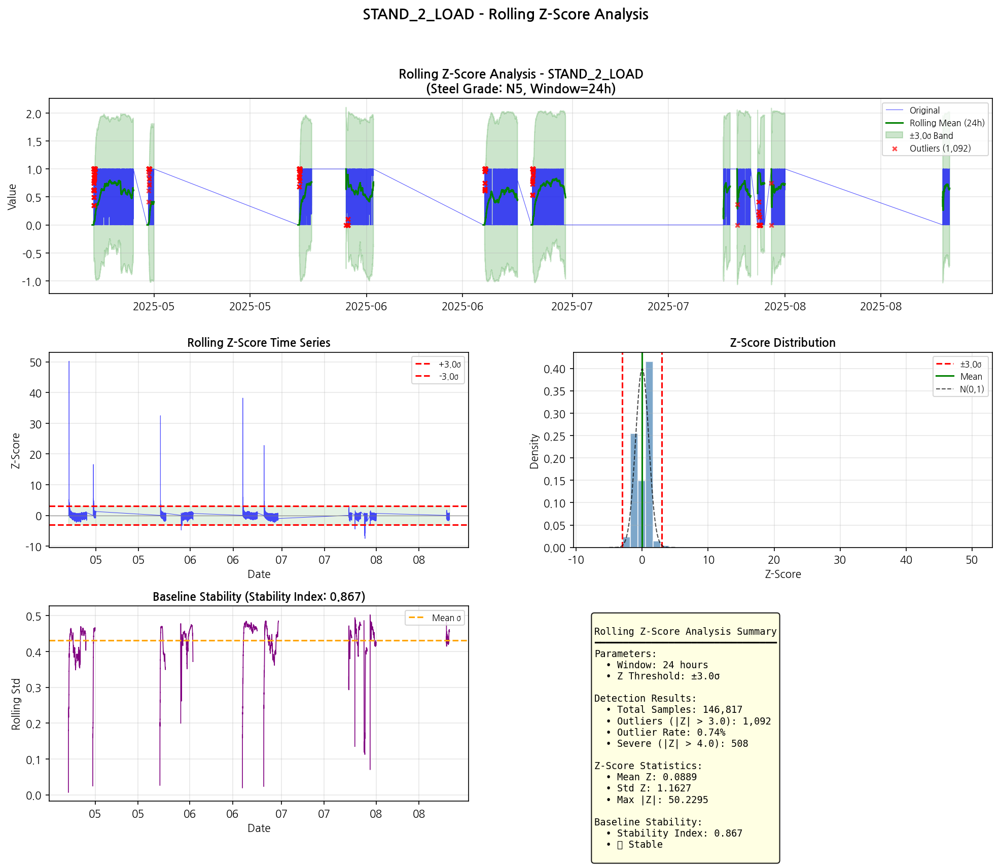

**STAND_3_LOAD** (이상치율: 0.74%, 안정성: 0.867)

### 핀치롤 (08_Pinchroll)

- 분석 태그: 9개
- 평균 이상치율: 1.16%
- 평균 안정성: 0.487

| 태그 | 이상치율 | 심각 이상치 | 안정성 | Max \|Z\| |
|------|----------|-------------|--------|--------|
| PINCHROLL_2_ACTUAL_SPEED | 1.15% | 720 | 0.558 | 25.85 |
| PINCHROLL_3_ACTUAL_SPEED | 3.12% | 1989 | 0.000 | 38.23 |
| PINCHROLL_4_ACTUAL_SPEED | 3.21% | 2089 | 0.000 | 40.50 |
| PINCHROLL_2_ACTUAL_TORQUE | 0.32% | 162 | 0.839 | 21.38 |
| PINCHROLL_3_ACTUAL_TORQUE | 0.47% | 224 | 0.557 | 26.52 |
| PINCHROLL_4_ACTUAL_TORQUE | 0.47% | 215 | 0.546 | 22.45 |
| PINCHROLL_2_REFERENCE_TORQUE | 0.63% | 621 | 0.320 | 60.22 |
| PINCHROLL_3_REFERENCE_TORQUE | 0.54% | 112 | 0.769 | 26.86 |
| PINCHROLL_4_REFERENCE_TORQUE | 0.55% | 86 | 0.791 | 6.59 |

#### Z-Score 차트

**PINCHROLL_4_ACTUAL_SPEED** (이상치율: 3.21%, 안정성: 0.000)

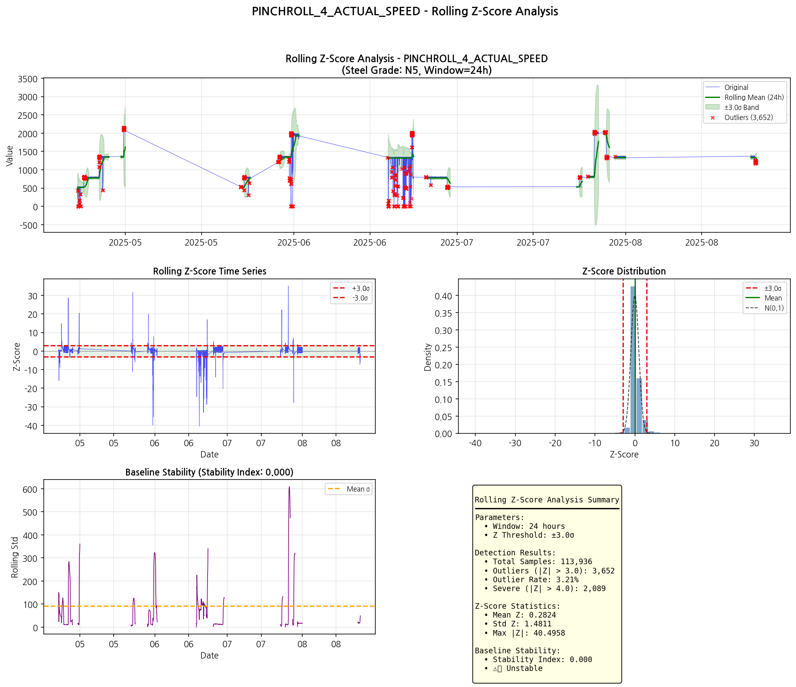

**PINCHROLL_3_ACTUAL_SPEED** (이상치율: 3.12%, 안정성: 0.000)

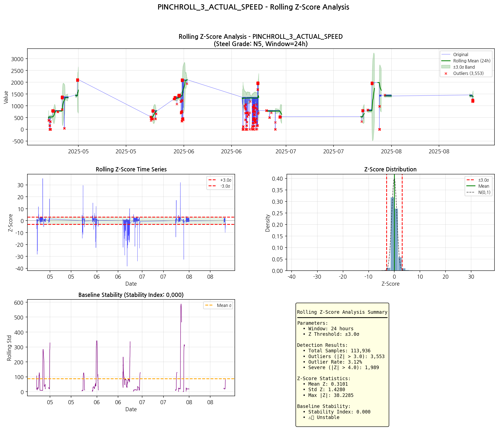

**PINCHROLL_2_ACTUAL_SPEED** (이상치율: 1.15%, 안정성: 0.558)

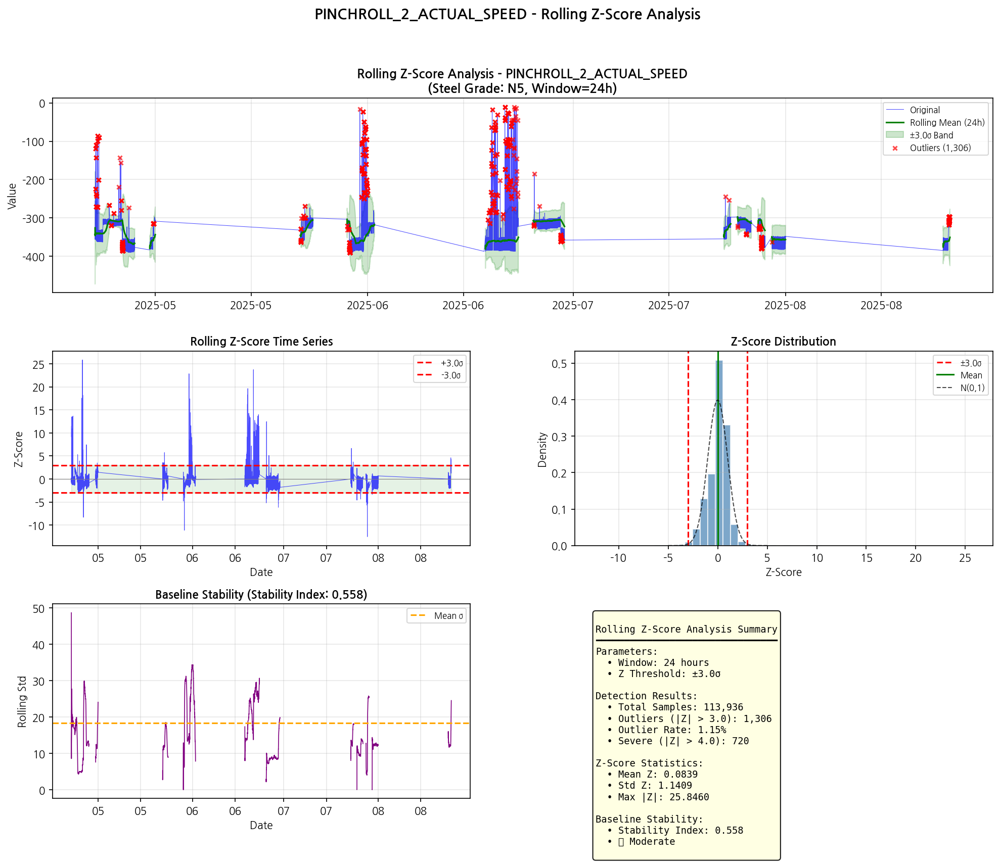

### PR 상세 토크 (09_PR_Detailed)

- 분석 태그: 6개
- 평균 이상치율: 1.93%
- 평균 안정성: 0.232

| 태그 | 이상치율 | 심각 이상치 | 안정성 | Max \|Z\| |
|------|----------|-------------|--------|--------|
| PR6L1_ACT_TORQUE | 2.93% | 1968 | 0.000 | 48.90 |
| PR6L2_ACT_TORQUE | 2.99% | 1850 | 0.000 | 49.20 |
| PR7L1_ACT_TORQUE | 2.36% | 1321 | 0.000 | 32.57 |
| PR7L2_ACT_TORQUE | 2.29% | 1249 | 0.000 | 32.57 |
| PR8L1_ACT_TORQUE | 0.46% | 295 | 0.686 | 32.57 |
| PR9L1_ACT_TORQUE | 0.52% | 275 | 0.705 | 32.57 |

#### Z-Score 차트

**PR6L2_ACT_TORQUE** (이상치율: 2.99%, 안정성: 0.000)

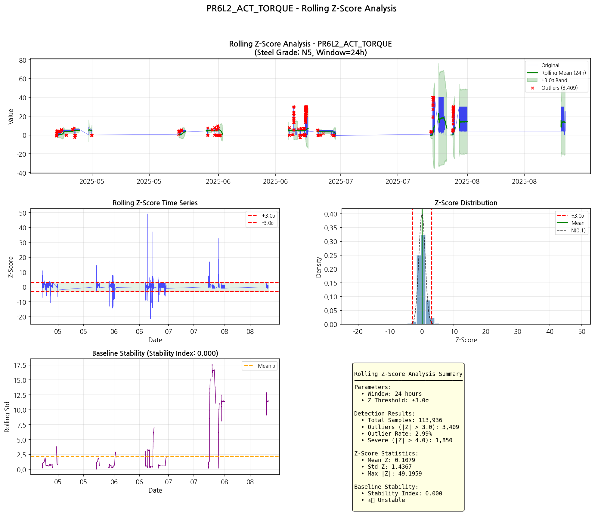

**PR6L1_ACT_TORQUE** (이상치율: 2.93%, 안정성: 0.000)

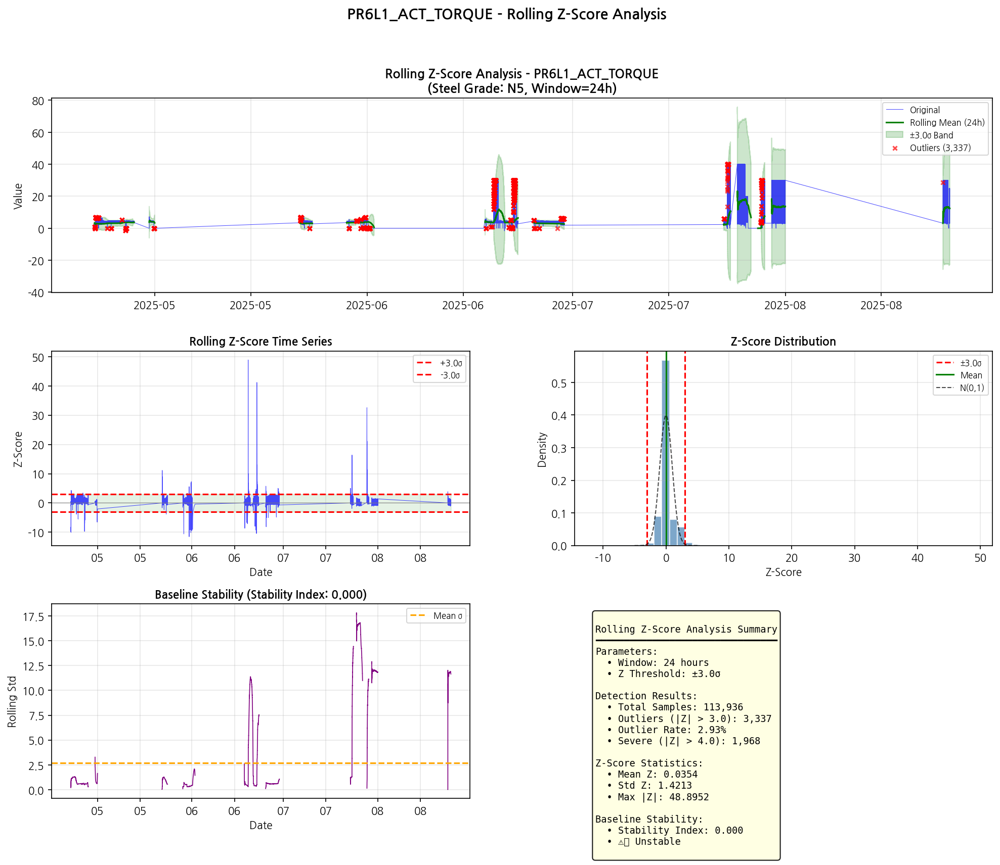

**PR7L1_ACT_TORQUE** (이상치율: 2.36%, 안정성: 0.000)

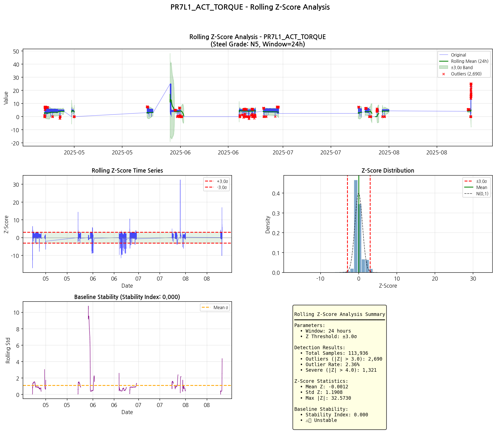

---

## 해석 가이드

### Rolling Z-Score 해석

1. **이상치율 (Outlier Rate)**
   - |Z| > 3.0σ 비율
   - 높을수록 해당 시점 주변 패턴에서 벗어난 데이터 많음
   - 정상 분포 가정 시 약 0.3% 예상

2. **기준선 안정성 (Baseline Stability)**
   - Rolling std의 시간적 일관성
   - 1에 가까울수록 안정적
   - 0.5 미만: 비정상 시계열, 다른 방법 권장

3. **심각 이상치 (Severe Outliers)**
   - |Z| > 4.0σ
   - 극단적인 이상값
   - 즉각적인 점검 필요

### 상태 분류

| 상태 | 기준 | 해석 |
|------|------|------|
| 🔴 높음 | ≥10% | 빈번한 이상치, 점검 필요 |
| 🟠 중간 | 3~10% | 일부 이상치, 모니터링 |
| 🟢 낮음 | <3% | 정상 범위 |
| 🟡 불안정 | Stability < 0.5 | 기준선 변동 심함 |

### Standard IQR vs Rolling Z-Score

| 방법 | 장점 | 단점 |
|------|------|------|
| Standard IQR | 간단, 전체 분포 기반 | 시변 데이터에 부적합 |
| Rolling Z-Score | 시변 데이터 적합 | 윈도우 크기 설정 필요 |

**권장**: 기준선 안정성 ≥ 0.5인 태그에 효과적

---

## 메타데이터

| 항목 | 값 |
|------|-----|
| 분석 스크립트 | steel_grade_rolling_zscore_analysis.py |
| 분석 기간 | 2025-03-01 ~ 2025-08-31 |
| 강종 | N5 |
| 윈도우 크기 | 24시간 |
| Z 임계값 | ±3.0σ |
| 생성일시 | 2026-02-03 20:48:35 |
| 총 분석 태그 | 79개 |

---

*본 보고서는 자동 생성되었습니다.*
