# 강종 [B5] 사이즈 [D13] STL 계절-추세 분해 분석 보고서

**분석 기간**: 2025-03-01 ~ 2025-08-31
**강종**: B5 | 사이즈: D13
**생성일시**: 2026-02-09 15:11:05

---

## 분석 개요

### 분석 방법론

**STL (Seasonal-Trend Decomposition using LOESS)**

시계열 데이터를 세 가지 성분으로 분해:
- **Trend (추세)**: 장기적인 변화 패턴
- **Seasonal (계절성)**: 주기적으로 반복되는 패턴
- **Residual (잔차)**: 추세와 계절성으로 설명되지 않는 변동

| 파라미터 | 값 | 설명 |
|----------|-----|------|
| seasonal | 25h | 계절 주기 |
| robust | True | 강건 추정 |

### 분석 결과 요약

| 구분 | 태그 수 | 비율 |
|------|---------|------|
| **총 분석 태그** | 79개 | 100% |

#### 잔차 이상치율 분포

| 구분 | 태그 수 | 비율 |
|------|---------|------|
| 🔴 높음 (≥15%) | 68개 | 86.1% |
| 🟠 중간 (5~15%) | 9개 | 11.4% |
| 🟢 낮음 (<5%) | 2개 | 2.5% |

#### 계절성 강도 분포

| 구분 | 태그 수 | 비율 |
|------|---------|------|
| 🔵 강함 (≥0.7) | 0개 | 0.0% |
| 중간 (0.4~0.7) | 2개 | 2.5% |
| 약함 (<0.4) | 77개 | 97.5% |

#### 전체 평균

| 지표 | 값 |
|------|-----|
| 평균 계절성 강도 | 0.131 |
| 평균 추세 강도 | 0.167 |

---

## 상위 문제 태그 (잔차 이상치율 기준)

| 순위 | 태그 | 카테고리 | 이상치율 | 계절성 강도 | 계절성 분류 |
|------|------|----------|----------|-------------|-------------|
| 1 | STAND_9_ACTUAL_SPEED | 스탠드 속도 | 28.57% | 0.007 | none |
| 2 | STAND_10_ACTUAL_SPEED | 스탠드 속도 | 28.57% | 0.000 | none |
| 3 | STAND_11_ACTUAL_SPEED | 스탠드 속도 | 26.79% | 0.000 | none |
| 4 | FINISHING_BLOCK_ACTUAL_SPEED | 스탠드 속도 | 26.19% | 0.000 | none |
| 5 | STAND_1_ACTUAL_SPEED | 스탠드 속도 | 25.60% | 0.009 | none |
| 6 | STAND_2_ACTUAL_SPEED | 스탠드 속도 | 25.60% | 0.001 | none |
| 7 | STAND_7_ACTUAL_SPEED | 스탠드 속도 | 25.60% | 0.013 | none |
| 8 | STAND_5_ACTUAL_SPEED | 스탠드 속도 | 25.00% | 0.001 | none |
| 9 | STAND_14_ACTUAL_SPEED | 스탠드 속도 | 24.40% | 0.000 | none |
| 10 | FURNACE_PRESSURE | 가열로 보조설비 | 23.21% | 0.103 | none |
| 11 | MAIN_COMBUSTION_AIR_PRESSURE | 가열로 보조설비 | 23.21% | 0.006 | none |
| 12 | SOAKING_TOP_ZONE_NO_1_TEMPERATURE_ROOF | 가열로 상부 온도 | 22.62% | 0.199 | none |
| 13 | INDIRECT_COOLING_WATER_FLOW | 가열로 보조설비 | 22.62% | 0.000 | none |
| 14 | STAND_3_ACTUAL_SPEED | 스탠드 속도 | 22.62% | 0.000 | none |
| 15 | STAND_12_ACTUAL_SPEED | 스탠드 속도 | 22.62% | 0.001 | none |

---

## 강한 계절성 태그 목록

계절성 강도가 0.7 이상인 태그입니다. 이 태그들은 STL 분석이 특히 효과적입니다.

| 태그 | 카테고리 | 계절성 강도 | 잔차 이상치율 |
|------|----------|-------------|---------------|
| - | 강한 계절성 태그 없음 | - | - |

---

## 카테고리별 분석 결과

### 가열로 상부 온도 (01_Furnace_Top_Temperature)

- 분석 태그: 4개
- 평균 잔차 이상치율: 17.26%
- 평균 계절성 강도: 0.203

| 태그 | 이상치율 | 계절성 강도 | 추세 강도 |
|------|----------|-------------|-----------|
| HEATING_TOP_ZONE_NO_1_TEMPERATURE_ROOF | 10.71% | 0.197 | 0.103 |
| HEATING_TOP_ZONE_NO_2_TEMPERATURE_ROOF | 13.69% | 0.184 | 0.125 |
| SOAKING_TOP_ZONE_NO_1_TEMPERATURE_ROOF | 22.62% | 0.199 | 0.051 |
| SOAKING_TOP_ZONE_NO_2_TEMPERATURE_ROOF | 22.02% | 0.232 | 0.154 |

#### STL 분해 차트

**SOAKING_TOP_ZONE_NO_1_TEMPERATURE_ROOF** (이상치율: 22.62%, 계절성: 0.199)

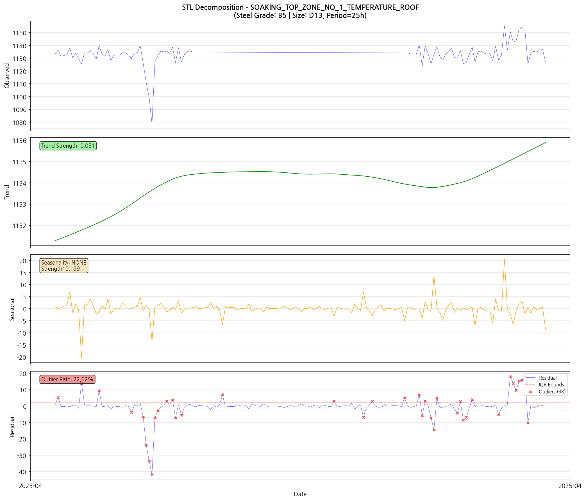

**SOAKING_TOP_ZONE_NO_2_TEMPERATURE_ROOF** (이상치율: 22.02%, 계절성: 0.232)

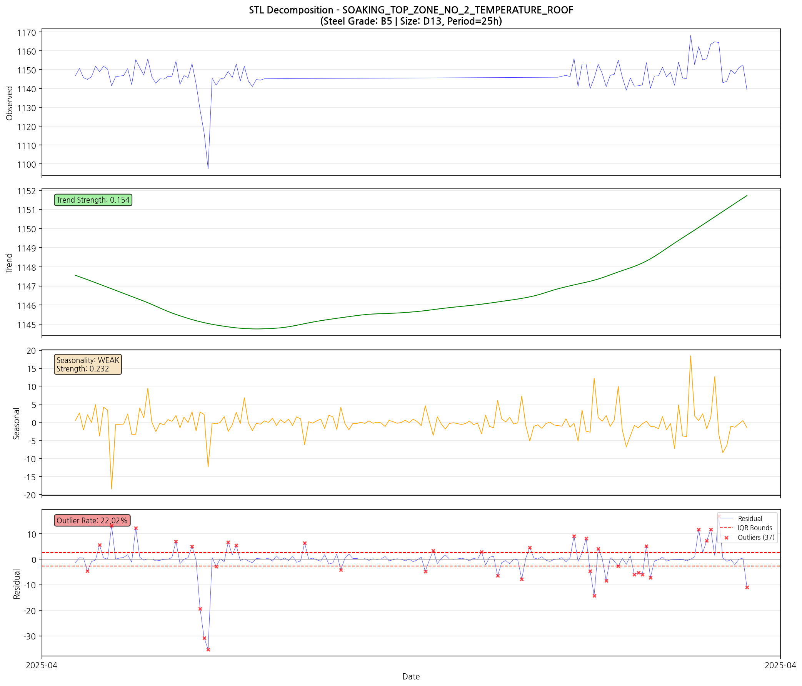

**HEATING_TOP_ZONE_NO_2_TEMPERATURE_ROOF** (이상치율: 13.69%, 계절성: 0.184)

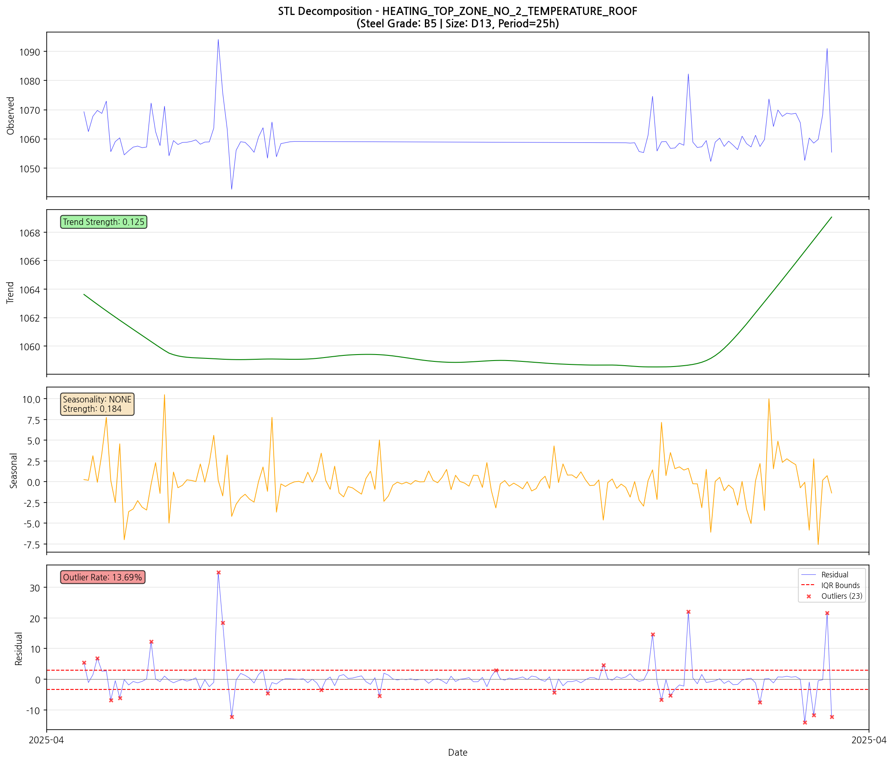

### 가열로 하부 온도 (02_Furnace_Bottom_Temperature)

- 분석 태그: 4개
- 평균 잔차 이상치율: 13.54%
- 평균 계절성 강도: 0.261

| 태그 | 이상치율 | 계절성 강도 | 추세 강도 |
|------|----------|-------------|-----------|
| HEATING_BOTTOM_ZONE_NO_1_TEMPERATURE_OPP_SIDE | 21.43% | 0.158 | 0.197 |
| HEATING_BOTTOM_ZONE_NO_2_TEMPERATURE_MILL_SIDE | 21.43% | 0.115 | 0.159 |
| SOAKING_BOTTOM_ZONE_NO_1_TEMPERATURE_OPP_SIDE | 7.74% | 0.365 | 0.464 |
| SOAKING_BOTTOM_ZONE_NO_2_TEMPERATURE_MILL_SIDE | 3.57% | 0.408 | 0.474 |

#### STL 분해 차트

**HEATING_BOTTOM_ZONE_NO_1_TEMPERATURE_OPP_SIDE** (이상치율: 21.43%, 계절성: 0.158)

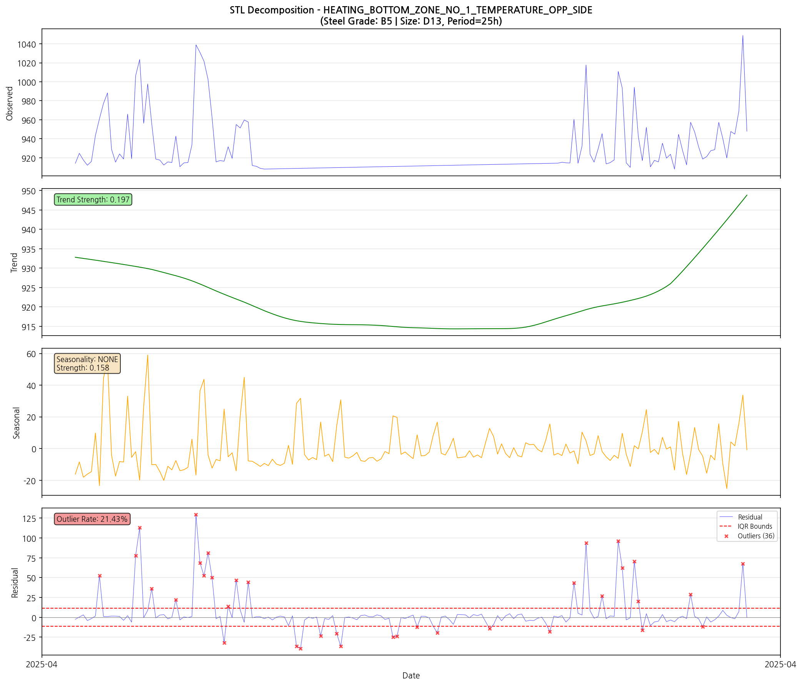

**HEATING_BOTTOM_ZONE_NO_2_TEMPERATURE_MILL_SIDE** (이상치율: 21.43%, 계절성: 0.115)

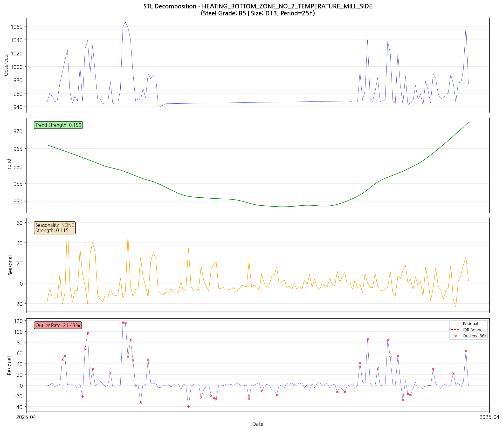

**SOAKING_BOTTOM_ZONE_NO_1_TEMPERATURE_OPP_SIDE** (이상치율: 7.74%, 계절성: 0.365)

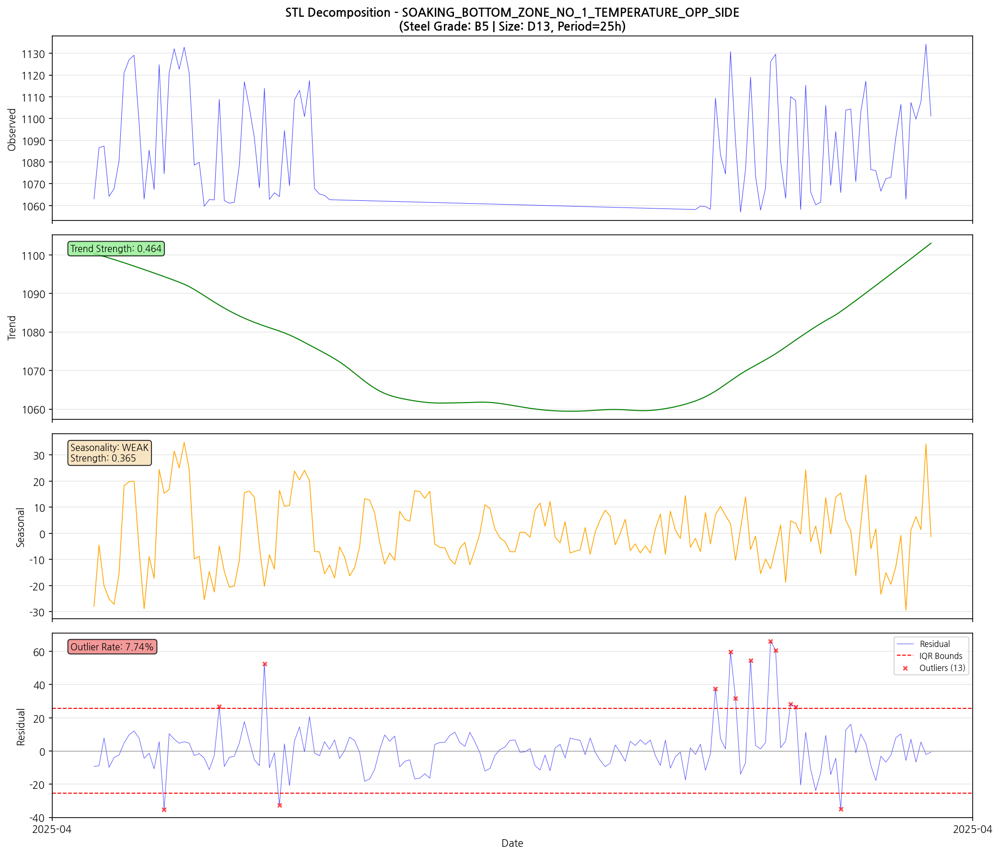

### 가열로 추출 온도 (03_Furnace_Discharge_Temperature)

- 분석 태그: 1개
- 평균 잔차 이상치율: 19.05%
- 평균 계절성 강도: 0.220

| 태그 | 이상치율 | 계절성 강도 | 추세 강도 |
|------|----------|-------------|-----------|
| FURNACE_EXIT_DISCHARGE_BILLET_TEMPERATURE | 19.05% | 0.220 | 0.537 |

#### STL 분해 차트

**FURNACE_EXIT_DISCHARGE_BILLET_TEMPERATURE** (이상치율: 19.05%, 계절성: 0.220)

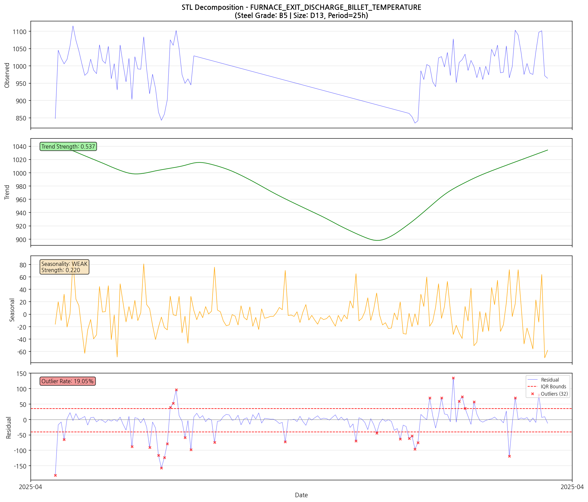

### 가열로 보조설비 (04_Furnace_Auxiliary)

- 분석 태그: 9개
- 평균 잔차 이상치율: 15.41%
- 평균 계절성 강도: 0.138

| 태그 | 이상치율 | 계절성 강도 | 추세 강도 |
|------|----------|-------------|-----------|
| FURNACE_PRESSURE | 23.21% | 0.103 | 0.190 |
| FURNACE_O2_ANALYZER | 7.14% | 0.269 | 0.282 |
| MAIN_GAS_PRESSURE | 9.52% | 0.229 | 0.228 |
| MAIN_GAS_FLOW | 11.31% | 0.173 | 0.221 |
| MAIN_GAS_TEMPERATURE | 3.57% | 0.431 | 0.833 |
| MAIN_COMBUSTION_AIR_PRESSURE | 23.21% | 0.006 | 0.083 |
| COMBUSTION_AIR_TEMPERATURE | 18.45% | 0.000 | 0.705 |
| INDIRECT_COOLING_WATER_FLOW | 22.62% | 0.000 | 0.654 |
| INDIRECT_WATER_MAIN_TEMPERATURE | 19.64% | 0.032 | 0.552 |

#### STL 분해 차트

**FURNACE_PRESSURE** (이상치율: 23.21%, 계절성: 0.103)

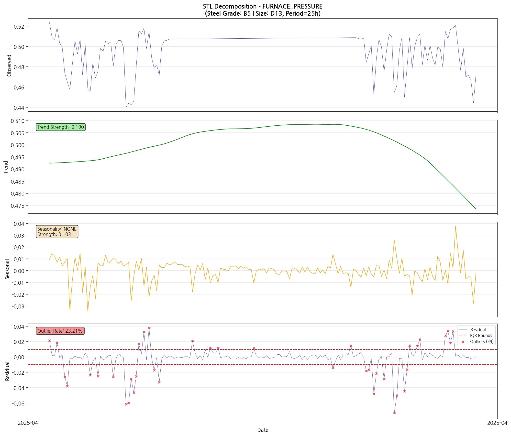

**MAIN_COMBUSTION_AIR_PRESSURE** (이상치율: 23.21%, 계절성: 0.006)

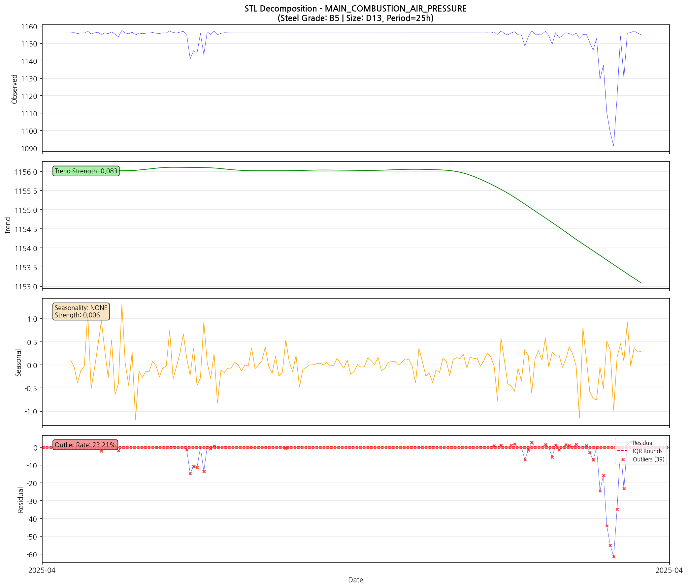

**INDIRECT_COOLING_WATER_FLOW** (이상치율: 22.62%, 계절성: 0.000)

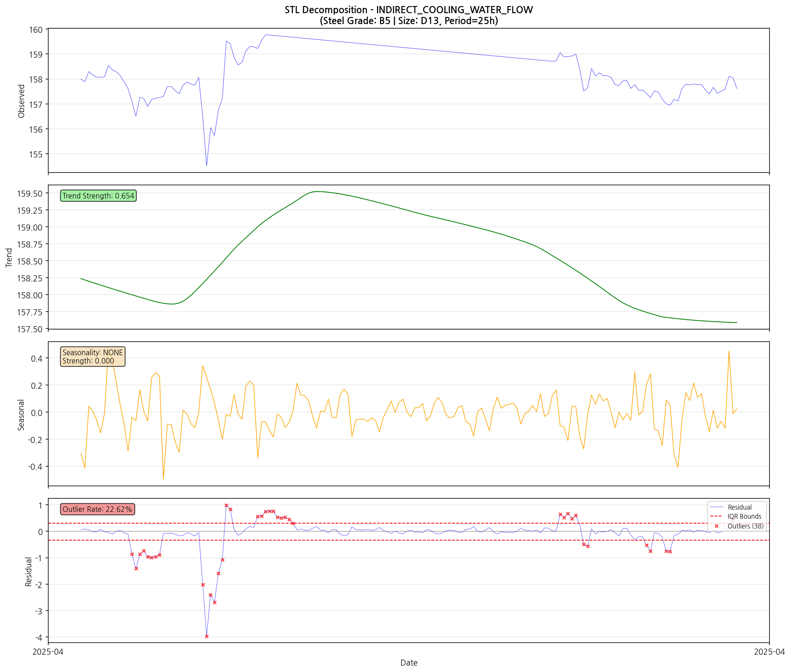

### 스탠드 토크 (05_Stand_Torque)

- 분석 태그: 16개
- 평균 잔차 이상치율: 19.75%
- 평균 계절성 강도: 0.156

| 태그 | 이상치율 | 계절성 강도 | 추세 강도 |
|------|----------|-------------|-----------|
| STAND_1_ACTUAL_TORQUE | 19.05% | 0.162 | 0.254 |
| STAND_2_ACTUAL_TORQUE | 19.05% | 0.179 | 0.224 |
| STAND_3_ACTUAL_TORQUE | 19.64% | 0.167 | 0.194 |
| STAND_4_ACTUAL_TORQUE | 18.45% | 0.158 | 0.166 |
| STAND_5_ACTUAL_TORQUE | 19.05% | 0.182 | 0.157 |
| STAND_6_ACTUAL_TORQUE | 19.05% | 0.154 | 0.137 |
| STAND_7_ACTUAL_TORQUE | 21.43% | 0.153 | 0.097 |
| STAND_8_ACTUAL_TORQUE | 21.43% | 0.162 | 0.137 |
| STAND_9_ACTUAL_TORQUE | 19.64% | 0.152 | 0.155 |
| STAND_10_ACTUAL_TORQUE | 20.24% | 0.147 | 0.164 |
| STAND_11_ACTUAL_TORQUE | 20.24% | 0.153 | 0.114 |
| STAND_12_ACTUAL_TORQUE | 20.24% | 0.157 | 0.143 |
| STAND_13_ACTUAL_TORQUE | 19.05% | 0.152 | 0.126 |
| STAND_14_ACTUAL_TORQUE | 19.05% | 0.142 | 0.135 |
| FINISHING_BLOCK_MASTER_ACTUAL_TORQUE | 20.24% | 0.136 | 0.145 |
| FINISHING_BLOCK_SLAVE_ACTUAL_TORQUE | 20.24% | 0.136 | 0.145 |

#### STL 분해 차트

**STAND_7_ACTUAL_TORQUE** (이상치율: 21.43%, 계절성: 0.153)

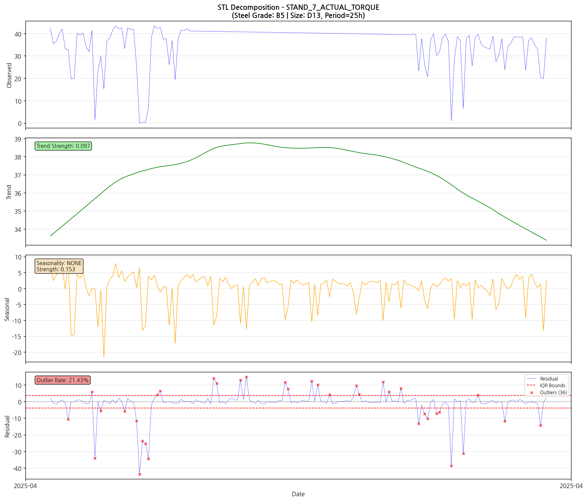

**STAND_8_ACTUAL_TORQUE** (이상치율: 21.43%, 계절성: 0.162)

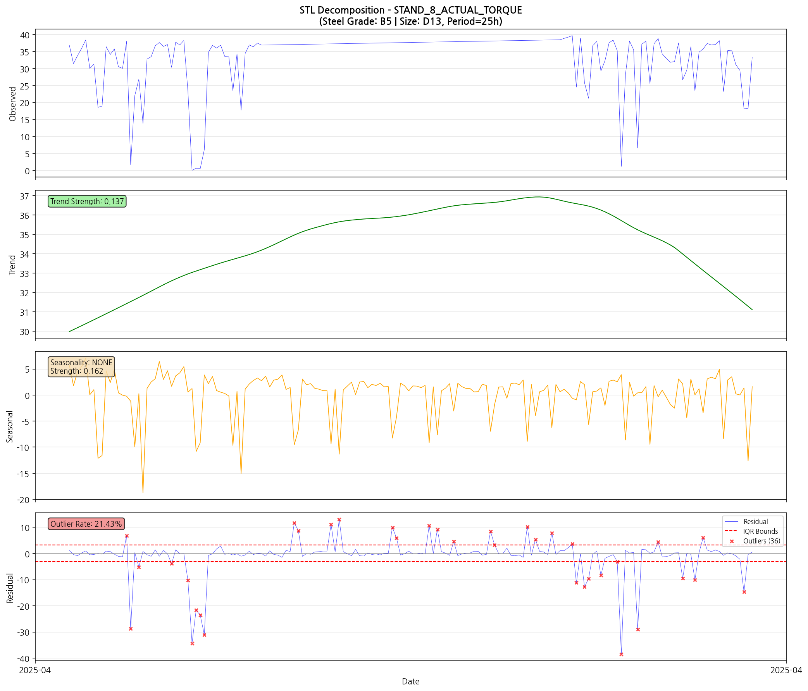

**STAND_10_ACTUAL_TORQUE** (이상치율: 20.24%, 계절성: 0.147)

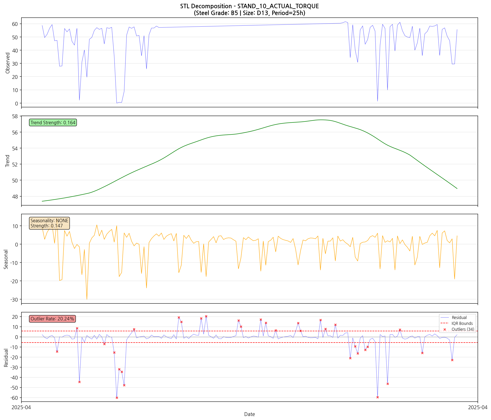

### 스탠드 속도 (06_Stand_Speed)

- 분석 태그: 15개
- 평균 잔차 이상치율: 24.56%
- 평균 계절성 강도: 0.003

| 태그 | 이상치율 | 계절성 강도 | 추세 강도 |
|------|----------|-------------|-----------|
| STAND_1_ACTUAL_SPEED | 25.60% | 0.009 | 0.000 |
| STAND_2_ACTUAL_SPEED | 25.60% | 0.001 | 0.016 |
| STAND_3_ACTUAL_SPEED | 22.62% | 0.000 | 0.007 |
| STAND_4_ACTUAL_SPEED | 20.24% | 0.000 | 0.079 |
| STAND_5_ACTUAL_SPEED | 25.00% | 0.001 | 0.036 |
| STAND_6_ACTUAL_SPEED | 22.02% | 0.000 | 0.043 |
| STAND_7_ACTUAL_SPEED | 25.60% | 0.013 | 0.000 |
| STAND_8_ACTUAL_SPEED | 22.02% | 0.011 | 0.000 |
| STAND_9_ACTUAL_SPEED | 28.57% | 0.007 | 0.000 |
| STAND_10_ACTUAL_SPEED | 28.57% | 0.000 | 0.000 |
| STAND_11_ACTUAL_SPEED | 26.79% | 0.000 | 0.006 |
| STAND_12_ACTUAL_SPEED | 22.62% | 0.001 | 0.001 |
| STAND_13_ACTUAL_SPEED | 22.62% | 0.000 | 0.000 |
| STAND_14_ACTUAL_SPEED | 24.40% | 0.000 | 0.000 |
| FINISHING_BLOCK_ACTUAL_SPEED | 26.19% | 0.000 | 0.002 |

#### STL 분해 차트

**STAND_9_ACTUAL_SPEED** (이상치율: 28.57%, 계절성: 0.007)

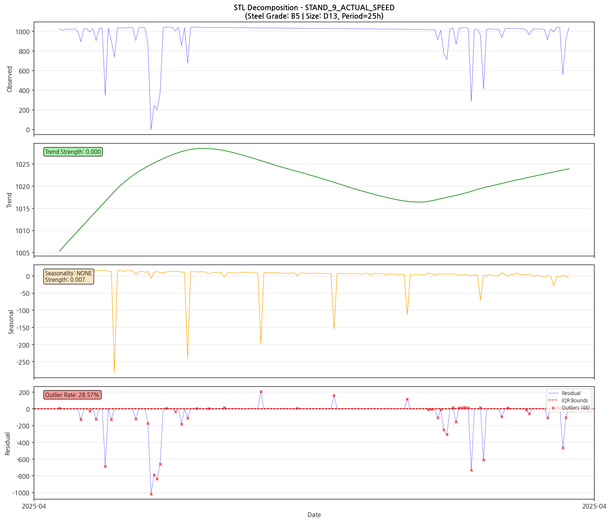

**STAND_10_ACTUAL_SPEED** (이상치율: 28.57%, 계절성: 0.000)

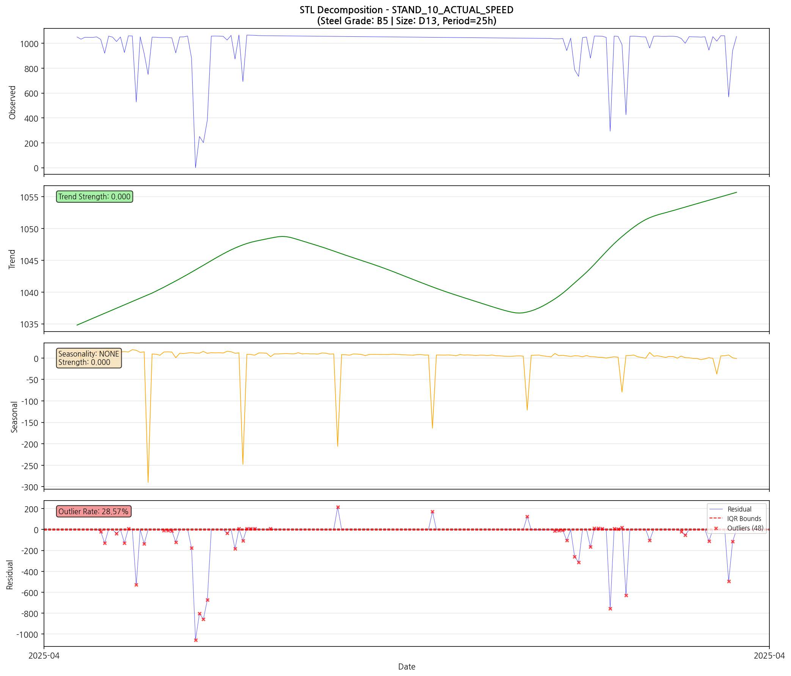

**STAND_11_ACTUAL_SPEED** (이상치율: 26.79%, 계절성: 0.000)

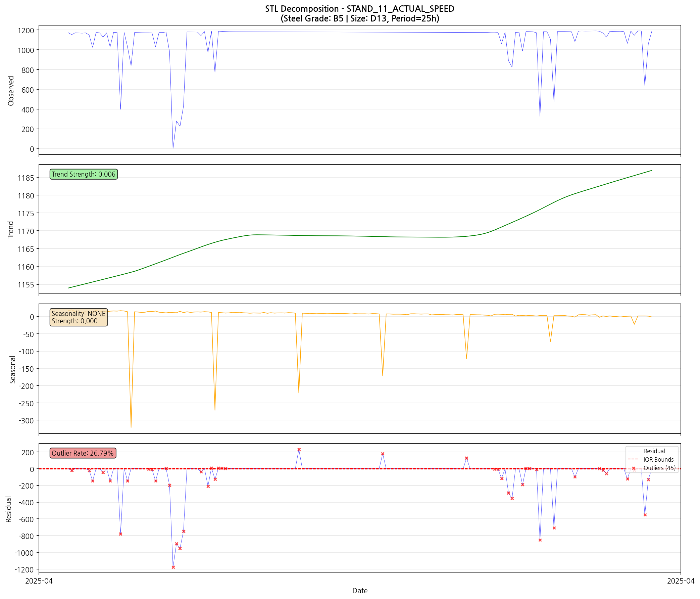

### 스탠드 부하 (07_Stand_Load)

- 분석 태그: 15개
- 평균 잔차 이상치율: 19.33%
- 평균 계절성 강도: 0.158

| 태그 | 이상치율 | 계절성 강도 | 추세 강도 |
|------|----------|-------------|-----------|
| STAND_1_LOAD | 20.83% | 0.149 | 0.093 |
| STAND_2_LOAD | 19.64% | 0.153 | 0.091 |
| STAND_3_LOAD | 19.64% | 0.154 | 0.090 |
| STAND_4_LOAD | 19.64% | 0.159 | 0.091 |
| STAND_5_LOAD | 19.05% | 0.162 | 0.092 |
| STAND_6_LOAD | 18.45% | 0.163 | 0.092 |
| STAND_7_LOAD | 18.45% | 0.163 | 0.091 |
| STAND_8_LOAD | 16.67% | 0.164 | 0.092 |
| STAND_9_LOAD | 19.64% | 0.157 | 0.086 |
| STAND_10_LOAD | 19.64% | 0.156 | 0.086 |
| STAND_11_LOAD | 19.64% | 0.157 | 0.086 |
| STAND_12_LOAD | 19.64% | 0.157 | 0.086 |
| STAND_13_LOAD | 19.64% | 0.157 | 0.086 |
| STAND_14_LOAD | 19.64% | 0.157 | 0.086 |
| FINISHING_BLOCK_LOAD | 19.64% | 0.158 | 0.087 |

#### STL 분해 차트

**STAND_1_LOAD** (이상치율: 20.83%, 계절성: 0.149)

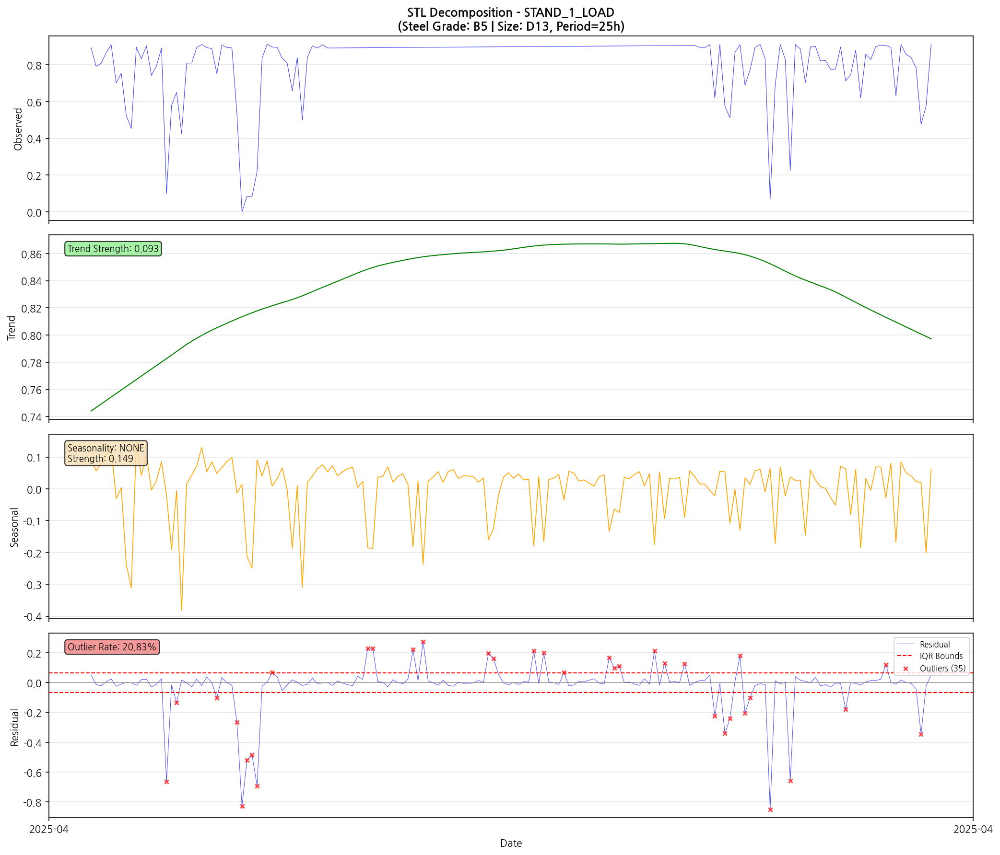

**STAND_2_LOAD** (이상치율: 19.64%, 계절성: 0.153)

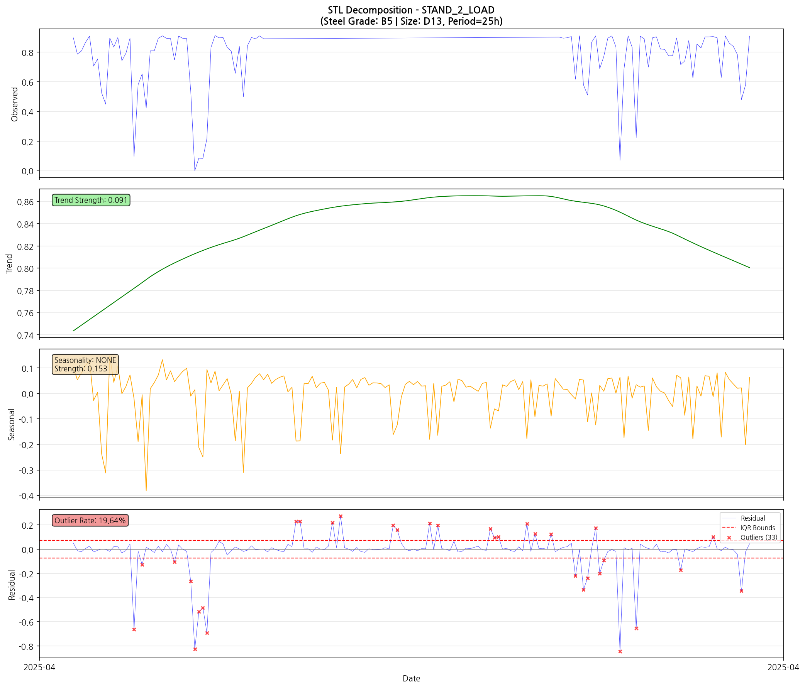

**STAND_3_LOAD** (이상치율: 19.64%, 계절성: 0.154)

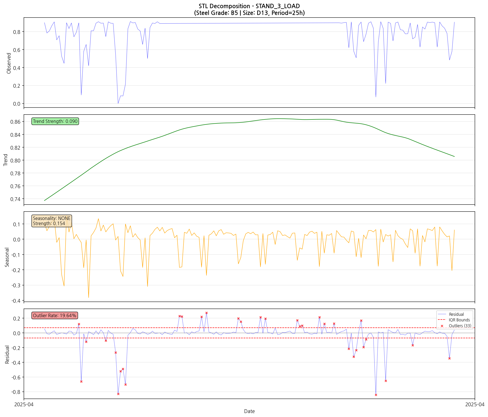

### 핀치롤 (08_Pinchroll)

- 분석 태그: 9개
- 평균 잔차 이상치율: 16.14%
- 평균 계절성 강도: 0.124

| 태그 | 이상치율 | 계절성 강도 | 추세 강도 |
|------|----------|-------------|-----------|
| PINCHROLL_2_ACTUAL_SPEED | 20.24% | 0.110 | 0.599 |
| PINCHROLL_3_ACTUAL_SPEED | 12.50% | 0.008 | 0.186 |
| PINCHROLL_4_ACTUAL_SPEED | 11.31% | 0.132 | 0.489 |
| PINCHROLL_2_ACTUAL_TORQUE | 18.45% | 0.217 | 0.071 |
| PINCHROLL_3_ACTUAL_TORQUE | 18.45% | 0.215 | 0.079 |
| PINCHROLL_4_ACTUAL_TORQUE | 18.45% | 0.218 | 0.081 |
| PINCHROLL_2_REFERENCE_TORQUE | 12.50% | 0.000 | 0.000 |
| PINCHROLL_3_REFERENCE_TORQUE | 16.67% | 0.109 | 0.087 |
| PINCHROLL_4_REFERENCE_TORQUE | 16.67% | 0.109 | 0.088 |

#### STL 분해 차트

**PINCHROLL_2_ACTUAL_SPEED** (이상치율: 20.24%, 계절성: 0.110)

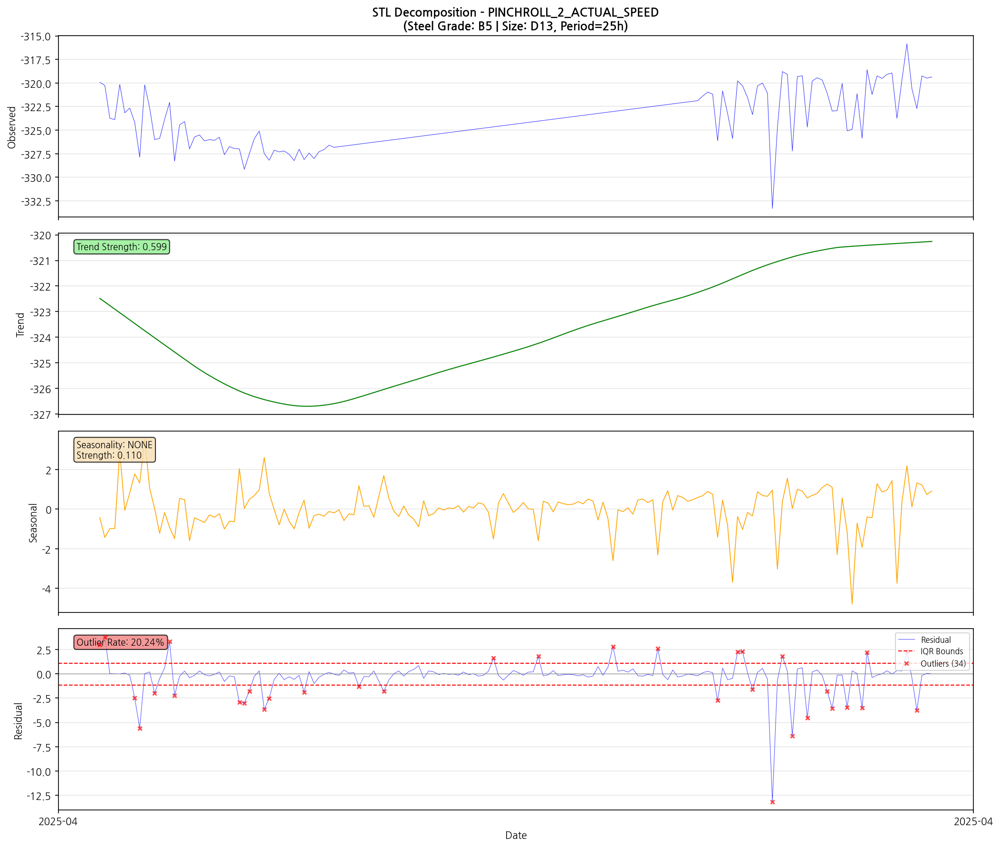

**PINCHROLL_2_ACTUAL_TORQUE** (이상치율: 18.45%, 계절성: 0.217)

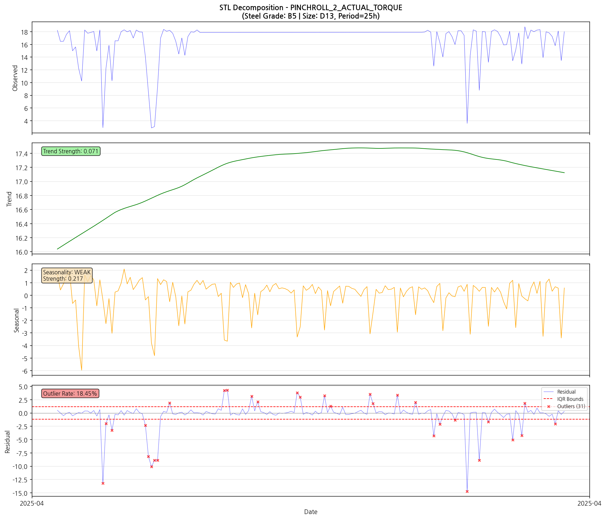

**PINCHROLL_3_ACTUAL_TORQUE** (이상치율: 18.45%, 계절성: 0.215)

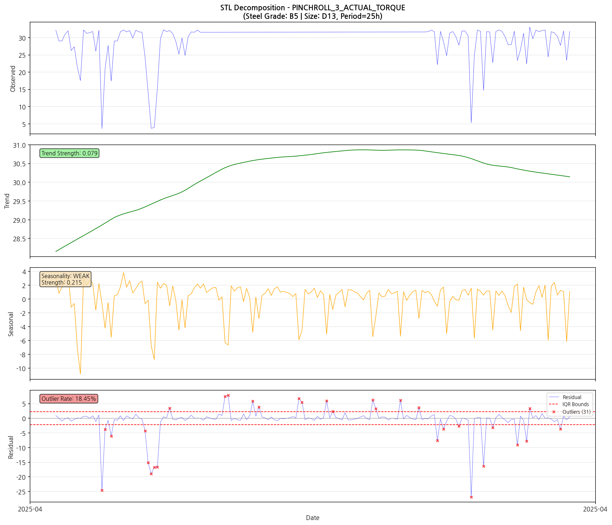

### PR 상세 토크 (09_PR_Detailed)

- 분석 태그: 6개
- 평균 잔차 이상치율: 17.86%
- 평균 계절성 강도: 0.172

| 태그 | 이상치율 | 계절성 강도 | 추세 강도 |
|------|----------|-------------|-----------|
| PR6L1_ACT_TORQUE | 16.07% | 0.251 | 0.566 |
| PR6L2_ACT_TORQUE | 17.26% | 0.120 | 0.620 |
| PR7L1_ACT_TORQUE | 17.86% | 0.158 | 0.088 |
| PR7L2_ACT_TORQUE | 17.26% | 0.146 | 0.067 |
| PR8L1_ACT_TORQUE | 19.64% | 0.154 | 0.074 |
| PR9L1_ACT_TORQUE | 19.05% | 0.205 | 0.083 |

#### STL 분해 차트

**PR8L1_ACT_TORQUE** (이상치율: 19.64%, 계절성: 0.154)

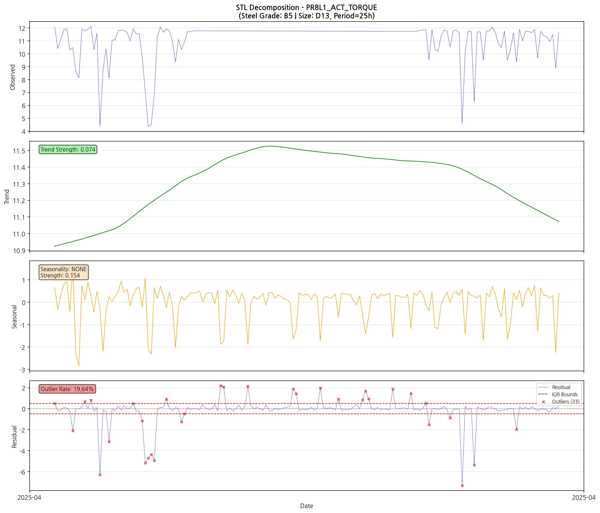

**PR9L1_ACT_TORQUE** (이상치율: 19.05%, 계절성: 0.205)

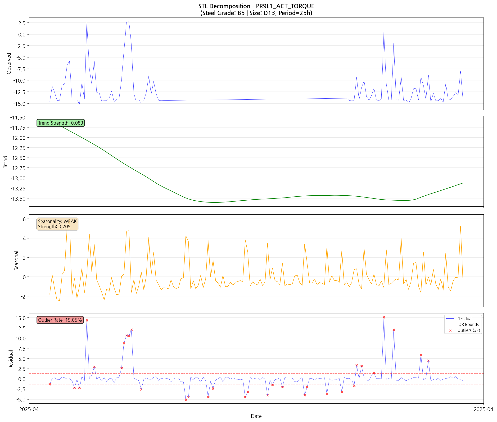

**PR7L1_ACT_TORQUE** (이상치율: 17.86%, 계절성: 0.158)

---

## 해석 가이드

### STL 분해 해석

1. **추세 (Trend)**
   - 장기적인 상승/하락 패턴
   - 설비 노화, 계절적 변화 등 반영
   - 추세 강도 높을수록 장기 변화가 뚜렷함

2. **계절성 (Seasonal)**
   - 주기적으로 반복되는 패턴 (24시간 기준)
   - 계절성 강도 ≥ 0.7: 강한 주기적 패턴
   - 계절성이 강한 태그는 STL 분석이 효과적

3. **잔차 (Residual)**
   - 추세와 계절성으로 설명되지 않는 변동
   - **순수한 이상치**를 포함
   - 잔차 기반 IQR로 "진짜" 이상치 탐지

### 계절성 강도 분류

| 분류 | 강도 범위 | 해석 |
|------|----------|------|
| Strong | ≥ 0.7 | 명확한 주기적 패턴, STL 매우 효과적 |
| Moderate | 0.4 ~ 0.7 | 적당한 주기적 패턴, STL 효과적 |
| Weak | 0.2 ~ 0.4 | 약한 주기적 패턴 |
| None | < 0.2 | 주기적 패턴 거의 없음 |

### Standard IQR vs STL Residual IQR

| 방법 | 장점 | 단점 |
|------|------|------|
| Standard IQR | 간단, 빠름 | 계절성에 영향받음 |
| STL Residual IQR | 계절성 제거, 순수 이상치 | 계산 복잡, 데이터 필요 |

**권장**: 계절성 강도 ≥ 0.4인 태그에는 STL Residual IQR 사용

---

## 메타데이터

| 항목 | 값 |
|------|-----|
| 분석 스크립트 | steel_grade_stl_analysis.py |
| 분석 기간 | 2025-03-01 ~ 2025-08-31 |
| 강종 | B5 |
| 계절 주기 | 25시간 |
| 생성일시 | 2026-02-09 15:11:05 |
| 총 분석 태그 | 79개 |

---

*본 보고서는 자동 생성되었습니다.*
