# 강종 [B5] STL 계절-추세 분해 분석 보고서

**분석 기간**: 2025-03-01 ~ 2025-08-31
**강종**: B5
**생성일시**: 2026-02-03 20:46:13

---

## 분석 개요

### 분석 방법론

**STL (Seasonal-Trend Decomposition using LOESS)**

시계열 데이터를 세 가지 성분으로 분해:
- **Trend (추세)**: 장기적인 변화 패턴
- **Seasonal (계절성)**: 주기적으로 반복되는 패턴
- **Residual (잔차)**: 추세와 계절성으로 설명되지 않는 변동

| 파라미터 | 값 | 설명 |
|----------|-----|------|
| seasonal | 25h | 계절 주기 |
| robust | True | 강건 추정 |

### 분석 결과 요약

| 구분 | 태그 수 | 비율 |
|------|---------|------|
| **총 분석 태그** | 79개 | 100% |

#### 잔차 이상치율 분포

| 구분 | 태그 수 | 비율 |
|------|---------|------|
| 🔴 높음 (≥15%) | 68개 | 86.1% |
| 🟠 중간 (5~15%) | 10개 | 12.7% |
| 🟢 낮음 (<5%) | 1개 | 1.3% |

#### 계절성 강도 분포

| 구분 | 태그 수 | 비율 |
|------|---------|------|
| 🔵 강함 (≥0.7) | 0개 | 0.0% |
| 중간 (0.4~0.7) | 0개 | 0.0% |
| 약함 (<0.4) | 79개 | 100.0% |

#### 전체 평균

| 지표 | 값 |
|------|-----|
| 평균 계절성 강도 | 0.024 |
| 평균 추세 강도 | 0.205 |

---

## 상위 문제 태그 (잔차 이상치율 기준)

| 순위 | 태그 | 카테고리 | 이상치율 | 계절성 강도 | 계절성 분류 |
|------|------|----------|----------|-------------|-------------|
| 1 | PINCHROLL_2_REFERENCE_TORQUE | 핀치롤 | 38.89% | 0.000 | none |
| 2 | STAND_9_ACTUAL_SPEED | 스탠드 속도 | 32.41% | 0.029 | none |
| 3 | PINCHROLL_4_REFERENCE_TORQUE | 핀치롤 | 32.41% | 0.000 | none |
| 4 | STAND_14_ACTUAL_SPEED | 스탠드 속도 | 31.94% | 0.021 | none |
| 5 | PINCHROLL_3_ACTUAL_TORQUE | 핀치롤 | 31.94% | 0.000 | none |
| 6 | PINCHROLL_3_REFERENCE_TORQUE | 핀치롤 | 31.94% | 0.000 | none |
| 7 | STAND_13_ACTUAL_SPEED | 스탠드 속도 | 31.48% | 0.022 | none |
| 8 | PINCHROLL_4_ACTUAL_TORQUE | 핀치롤 | 31.48% | 0.000 | none |
| 9 | STAND_12_ACTUAL_SPEED | 스탠드 속도 | 30.09% | 0.026 | none |
| 10 | STAND_6_LOAD | 스탠드 부하 | 30.09% | 0.000 | none |
| 11 | STAND_7_LOAD | 스탠드 부하 | 30.09% | 0.000 | none |
| 12 | STAND_8_LOAD | 스탠드 부하 | 30.09% | 0.000 | none |
| 13 | STAND_5_LOAD | 스탠드 부하 | 29.63% | 0.000 | none |
| 14 | STAND_9_LOAD | 스탠드 부하 | 29.63% | 0.000 | none |
| 15 | STAND_10_LOAD | 스탠드 부하 | 29.63% | 0.000 | none |

---

## 강한 계절성 태그 목록

계절성 강도가 0.7 이상인 태그입니다. 이 태그들은 STL 분석이 특히 효과적입니다.

| 태그 | 카테고리 | 계절성 강도 | 잔차 이상치율 |
|------|----------|-------------|---------------|
| - | 강한 계절성 태그 없음 | - | - |

---

## 카테고리별 분석 결과

### 가열로 상부 온도 (01_Furnace_Top_Temperature)

- 분석 태그: 4개
- 평균 잔차 이상치율: 18.06%
- 평균 계절성 강도: 0.040

| 태그 | 이상치율 | 계절성 강도 | 추세 강도 |
|------|----------|-------------|-----------|
| HEATING_TOP_ZONE_NO_1_TEMPERATURE_ROOF | 18.98% | 0.066 | 0.219 |
| HEATING_TOP_ZONE_NO_2_TEMPERATURE_ROOF | 19.44% | 0.067 | 0.218 |
| SOAKING_TOP_ZONE_NO_1_TEMPERATURE_ROOF | 14.81% | 0.019 | 0.000 |
| SOAKING_TOP_ZONE_NO_2_TEMPERATURE_ROOF | 18.98% | 0.010 | 0.123 |

#### STL 분해 차트

**HEATING_TOP_ZONE_NO_2_TEMPERATURE_ROOF** (이상치율: 19.44%, 계절성: 0.067)

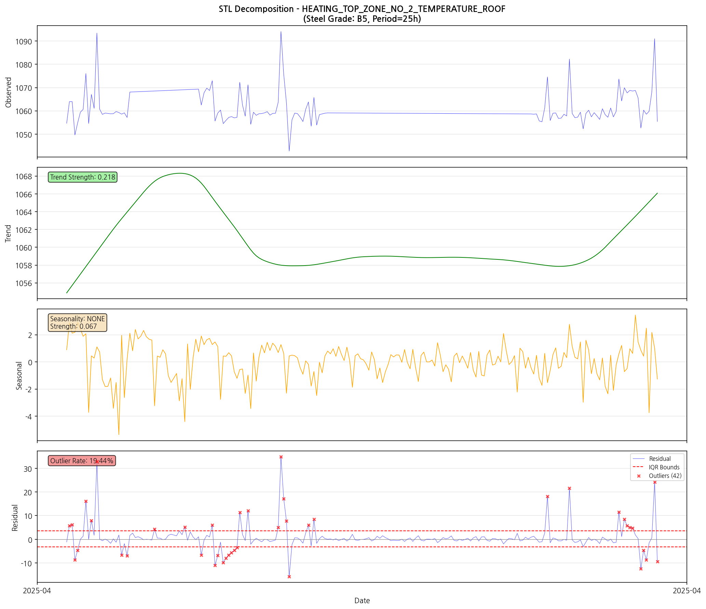

**HEATING_TOP_ZONE_NO_1_TEMPERATURE_ROOF** (이상치율: 18.98%, 계절성: 0.066)

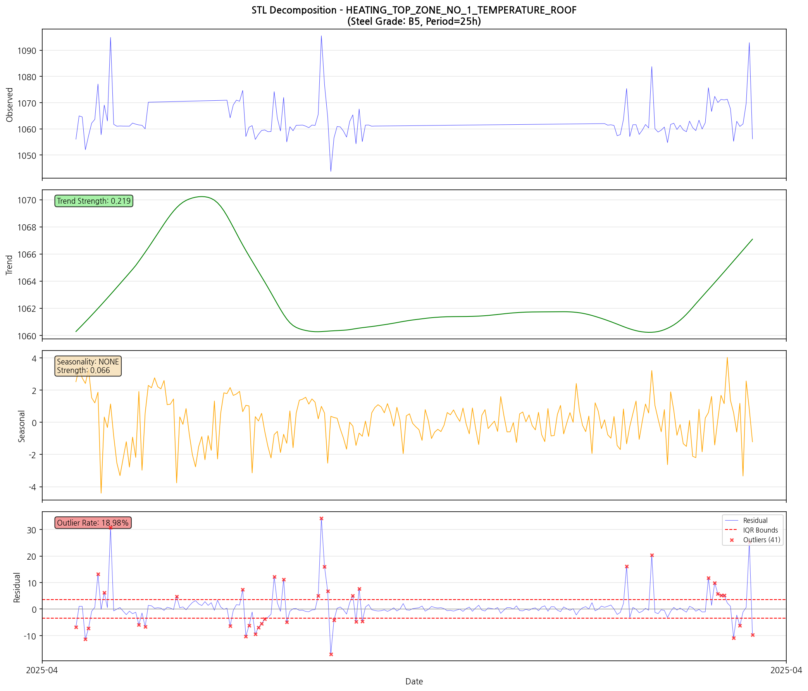

**SOAKING_TOP_ZONE_NO_2_TEMPERATURE_ROOF** (이상치율: 18.98%, 계절성: 0.010)

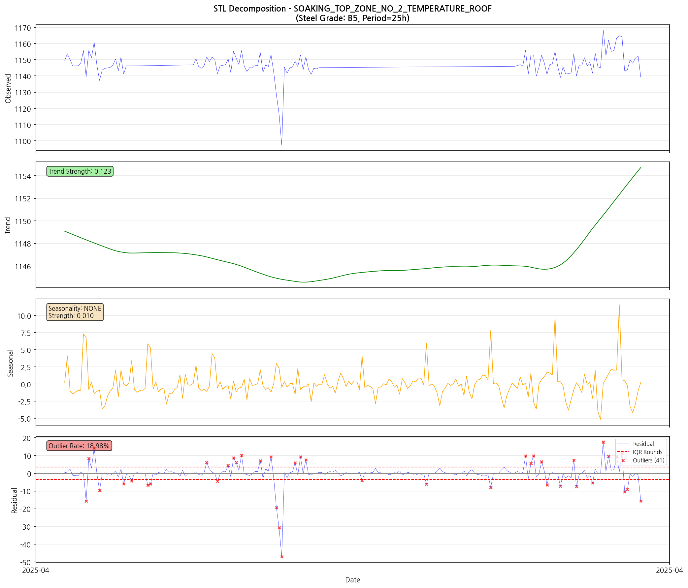

### 가열로 하부 온도 (02_Furnace_Bottom_Temperature)

- 분석 태그: 4개
- 평균 잔차 이상치율: 21.64%
- 평균 계절성 강도: 0.012

| 태그 | 이상치율 | 계절성 강도 | 추세 강도 |
|------|----------|-------------|-----------|
| HEATING_BOTTOM_ZONE_NO_1_TEMPERATURE_OPP_SIDE | 26.39% | 0.000 | 0.193 |
| HEATING_BOTTOM_ZONE_NO_2_TEMPERATURE_MILL_SIDE | 22.22% | 0.000 | 0.146 |
| SOAKING_BOTTOM_ZONE_NO_1_TEMPERATURE_OPP_SIDE | 17.59% | 0.036 | 0.325 |
| SOAKING_BOTTOM_ZONE_NO_2_TEMPERATURE_MILL_SIDE | 20.37% | 0.013 | 0.279 |

#### STL 분해 차트

**HEATING_BOTTOM_ZONE_NO_1_TEMPERATURE_OPP_SIDE** (이상치율: 26.39%, 계절성: 0.000)

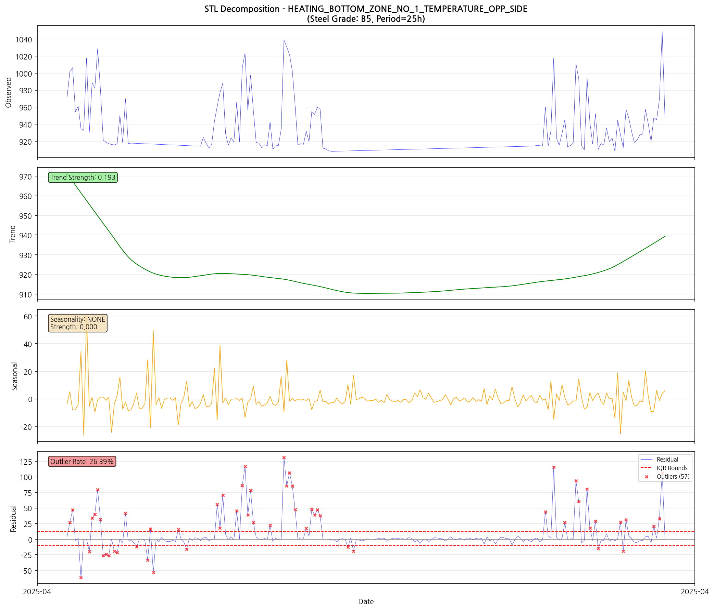

**HEATING_BOTTOM_ZONE_NO_2_TEMPERATURE_MILL_SIDE** (이상치율: 22.22%, 계절성: 0.000)

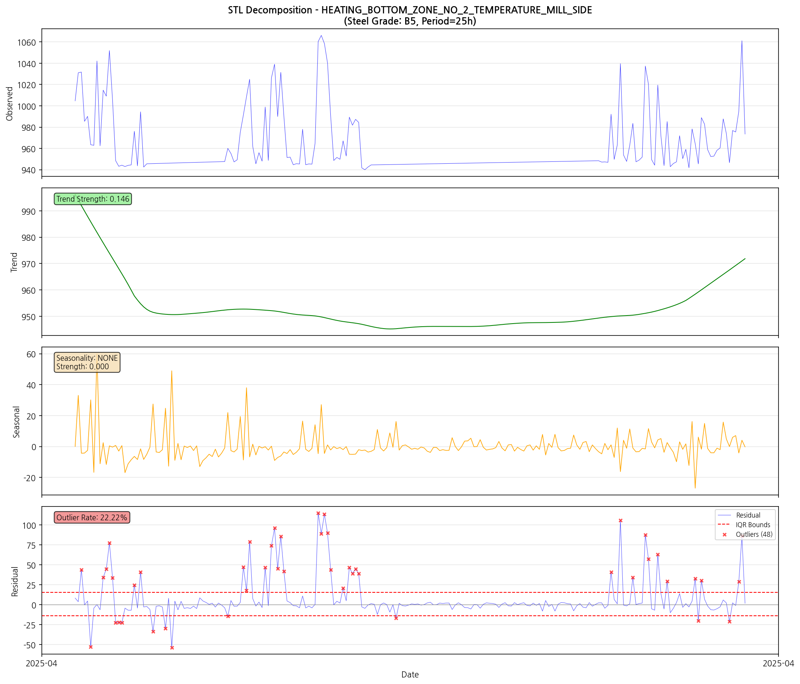

**SOAKING_BOTTOM_ZONE_NO_2_TEMPERATURE_MILL_SIDE** (이상치율: 20.37%, 계절성: 0.013)

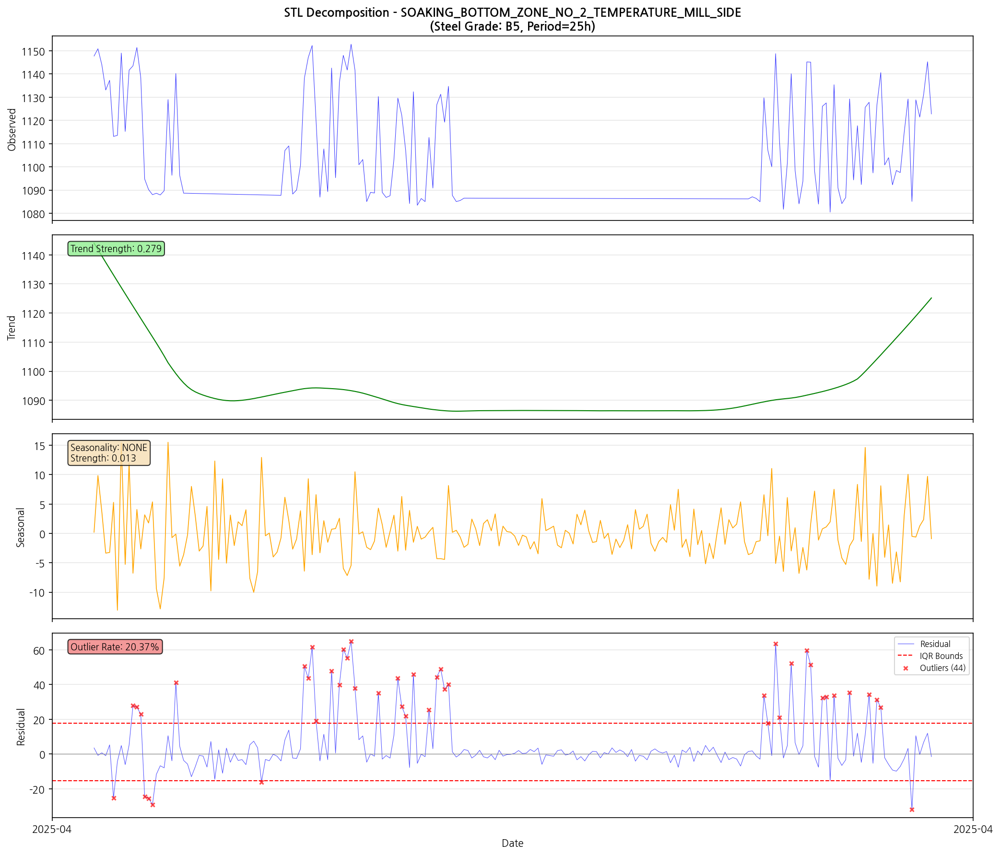

### 가열로 추출 온도 (03_Furnace_Discharge_Temperature)

- 분석 태그: 1개
- 평균 잔차 이상치율: 12.50%
- 평균 계절성 강도: 0.000

| 태그 | 이상치율 | 계절성 강도 | 추세 강도 |
|------|----------|-------------|-----------|
| FURNACE_EXIT_DISCHARGE_BILLET_TEMPERATURE | 12.50% | 0.000 | 0.304 |

#### STL 분해 차트

**FURNACE_EXIT_DISCHARGE_BILLET_TEMPERATURE** (이상치율: 12.50%, 계절성: 0.000)

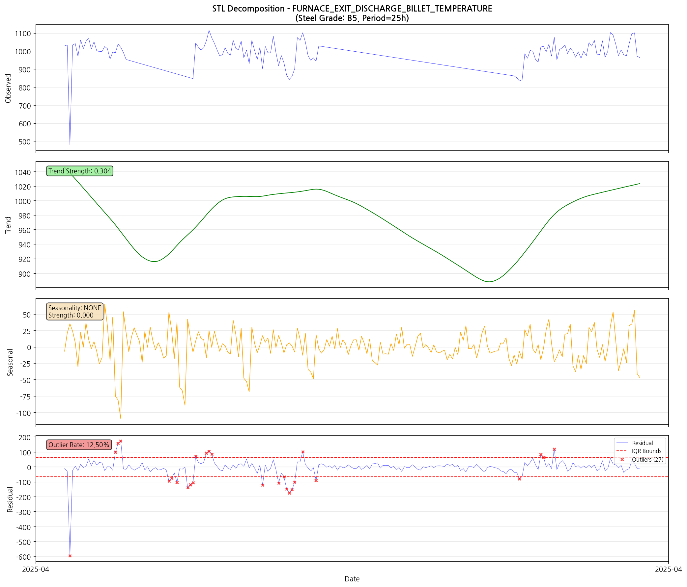

### 가열로 보조설비 (04_Furnace_Auxiliary)

- 분석 태그: 9개
- 평균 잔차 이상치율: 15.28%
- 평균 계절성 강도: 0.107

| 태그 | 이상치율 | 계절성 강도 | 추세 강도 |
|------|----------|-------------|-----------|
| FURNACE_PRESSURE | 21.30% | 0.000 | 0.171 |
| FURNACE_O2_ANALYZER | 1.85% | 0.235 | 0.431 |
| MAIN_GAS_PRESSURE | 9.26% | 0.178 | 0.232 |
| MAIN_GAS_FLOW | 23.15% | 0.004 | 0.144 |
| MAIN_GAS_TEMPERATURE | 11.57% | 0.215 | 0.723 |
| MAIN_COMBUSTION_AIR_PRESSURE | 27.31% | 0.049 | 0.205 |
| COMBUSTION_AIR_TEMPERATURE | 9.26% | 0.243 | 0.758 |
| INDIRECT_COOLING_WATER_FLOW | 12.04% | 0.010 | 0.676 |
| INDIRECT_WATER_MAIN_TEMPERATURE | 21.76% | 0.025 | 0.488 |

#### STL 분해 차트

**MAIN_COMBUSTION_AIR_PRESSURE** (이상치율: 27.31%, 계절성: 0.049)

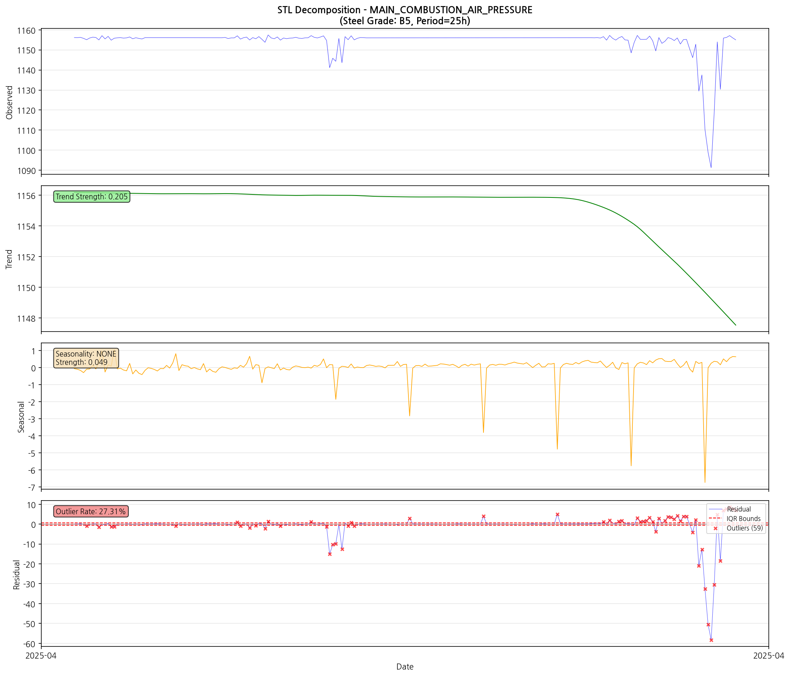

**MAIN_GAS_FLOW** (이상치율: 23.15%, 계절성: 0.004)

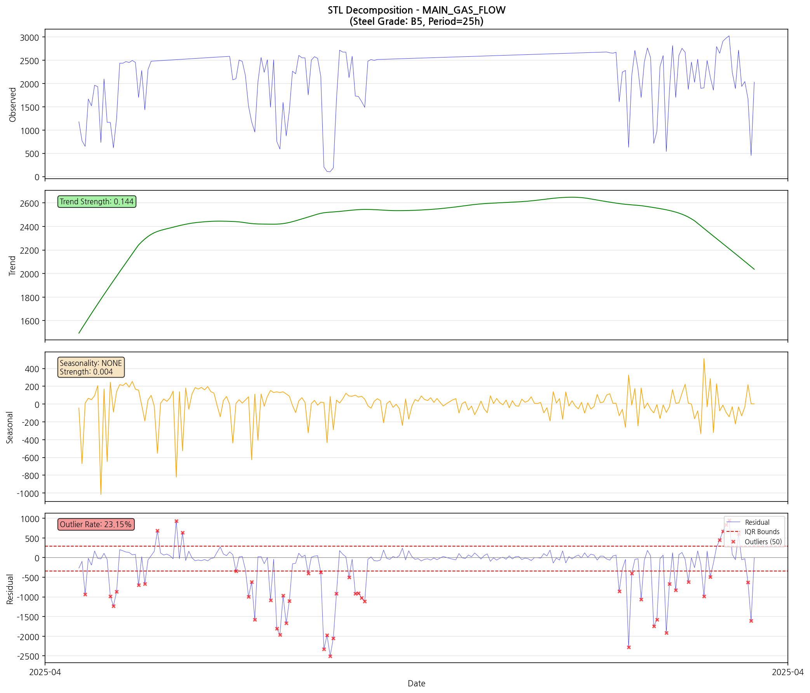

**INDIRECT_WATER_MAIN_TEMPERATURE** (이상치율: 21.76%, 계절성: 0.025)

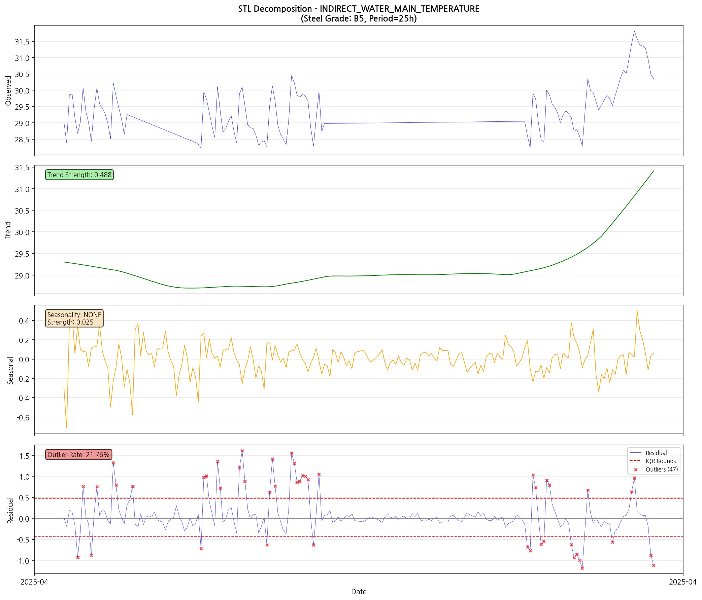

### 스탠드 토크 (05_Stand_Torque)

- 분석 태그: 16개
- 평균 잔차 이상치율: 21.47%
- 평균 계절성 강도: 0.007

| 태그 | 이상치율 | 계절성 강도 | 추세 강도 |
|------|----------|-------------|-----------|
| STAND_1_ACTUAL_TORQUE | 12.50% | 0.022 | 0.248 |
| STAND_2_ACTUAL_TORQUE | 13.43% | 0.016 | 0.199 |
| STAND_3_ACTUAL_TORQUE | 17.59% | 0.000 | 0.171 |
| STAND_4_ACTUAL_TORQUE | 19.91% | 0.006 | 0.125 |
| STAND_5_ACTUAL_TORQUE | 20.37% | 0.015 | 0.141 |
| STAND_6_ACTUAL_TORQUE | 22.22% | 0.000 | 0.108 |
| STAND_7_ACTUAL_TORQUE | 22.22% | 0.004 | 0.101 |
| STAND_8_ACTUAL_TORQUE | 25.00% | 0.005 | 0.089 |
| STAND_9_ACTUAL_TORQUE | 21.76% | 0.016 | 0.150 |
| STAND_10_ACTUAL_TORQUE | 19.91% | 0.021 | 0.149 |
| STAND_11_ACTUAL_TORQUE | 25.93% | 0.000 | 0.083 |
| STAND_12_ACTUAL_TORQUE | 22.22% | 0.000 | 0.109 |
| STAND_13_ACTUAL_TORQUE | 26.39% | 0.000 | 0.103 |
| STAND_14_ACTUAL_TORQUE | 24.07% | 0.005 | 0.113 |
| FINISHING_BLOCK_MASTER_ACTUAL_TORQUE | 25.00% | 0.000 | 0.301 |
| FINISHING_BLOCK_SLAVE_ACTUAL_TORQUE | 25.00% | 0.000 | 0.301 |

#### STL 분해 차트

**STAND_13_ACTUAL_TORQUE** (이상치율: 26.39%, 계절성: 0.000)

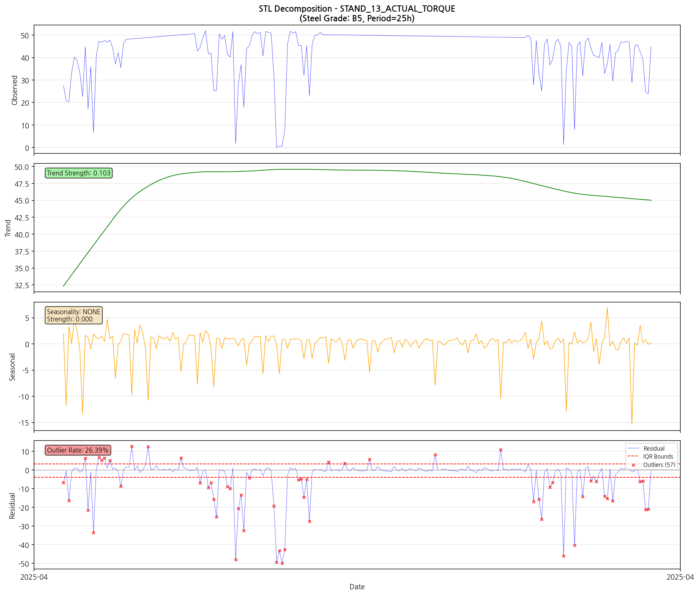

**STAND_11_ACTUAL_TORQUE** (이상치율: 25.93%, 계절성: 0.000)

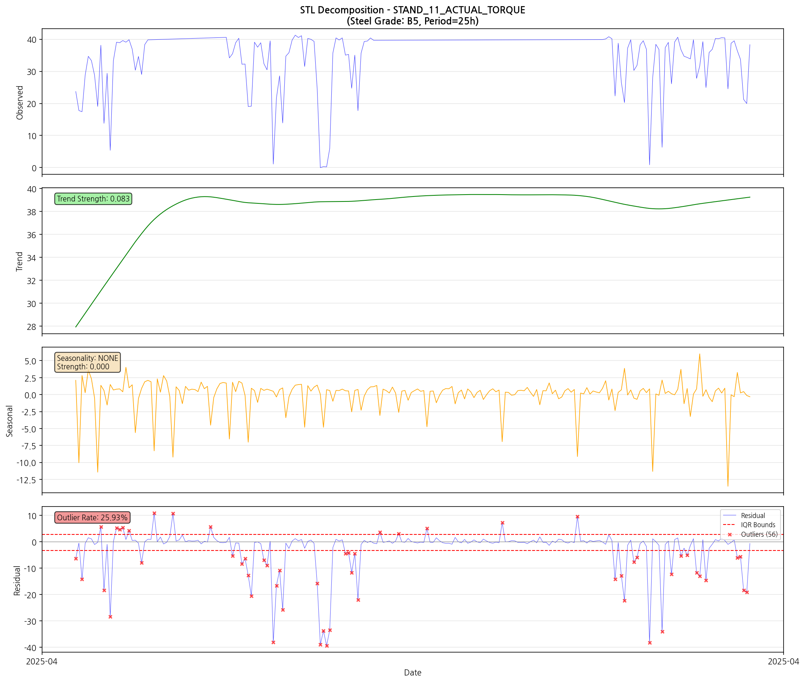

**STAND_8_ACTUAL_TORQUE** (이상치율: 25.00%, 계절성: 0.005)

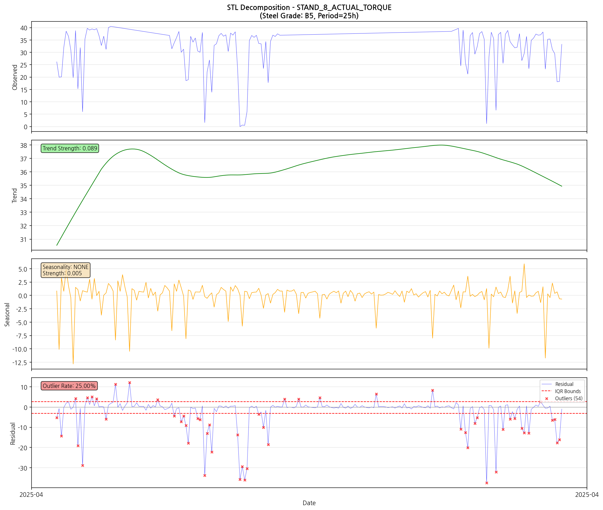

### 스탠드 속도 (06_Stand_Speed)

- 분석 태그: 15개
- 평균 잔차 이상치율: 27.25%
- 평균 계절성 강도: 0.026

| 태그 | 이상치율 | 계절성 강도 | 추세 강도 |
|------|----------|-------------|-----------|
| STAND_1_ACTUAL_SPEED | 26.39% | 0.026 | 0.010 |
| STAND_2_ACTUAL_SPEED | 27.78% | 0.025 | 0.033 |
| STAND_3_ACTUAL_SPEED | 28.70% | 0.028 | 0.024 |
| STAND_4_ACTUAL_SPEED | 23.15% | 0.024 | 0.100 |
| STAND_5_ACTUAL_SPEED | 28.24% | 0.029 | 0.065 |
| STAND_6_ACTUAL_SPEED | 25.46% | 0.027 | 0.084 |
| STAND_7_ACTUAL_SPEED | 27.31% | 0.031 | 0.028 |
| STAND_8_ACTUAL_SPEED | 25.93% | 0.031 | 0.016 |
| STAND_9_ACTUAL_SPEED | 32.41% | 0.029 | 0.020 |
| STAND_10_ACTUAL_SPEED | 23.61% | 0.024 | 0.014 |
| STAND_11_ACTUAL_SPEED | 27.31% | 0.025 | 0.021 |
| STAND_12_ACTUAL_SPEED | 30.09% | 0.026 | 0.019 |
| STAND_13_ACTUAL_SPEED | 31.48% | 0.022 | 0.029 |
| STAND_14_ACTUAL_SPEED | 31.94% | 0.021 | 0.036 |
| FINISHING_BLOCK_ACTUAL_SPEED | 18.98% | 0.025 | 0.000 |

#### STL 분해 차트

**STAND_9_ACTUAL_SPEED** (이상치율: 32.41%, 계절성: 0.029)

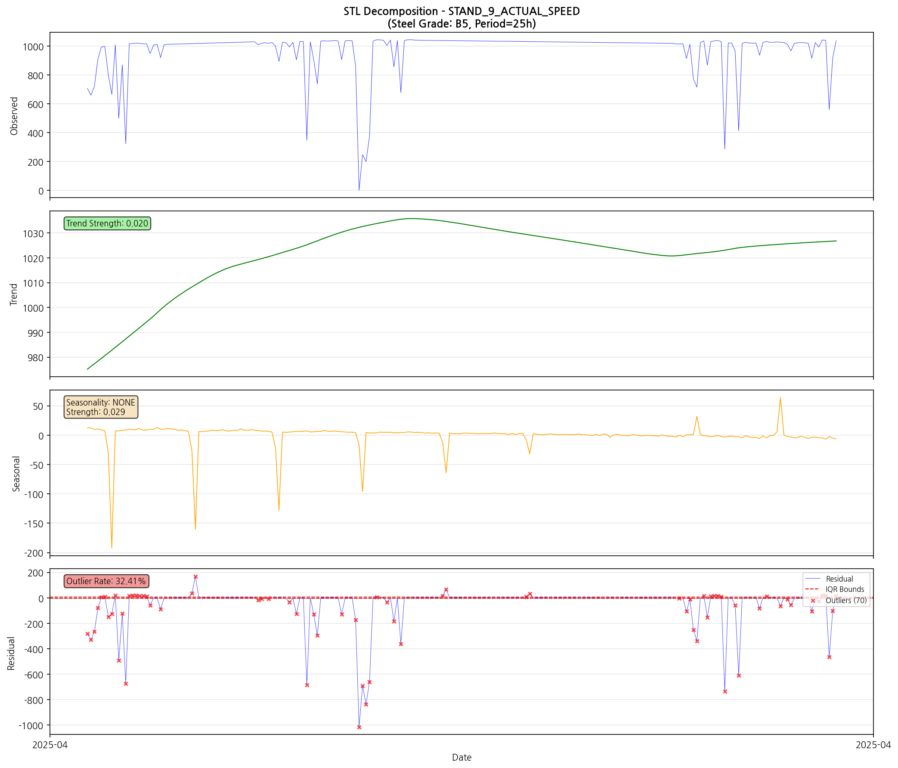

**STAND_14_ACTUAL_SPEED** (이상치율: 31.94%, 계절성: 0.021)

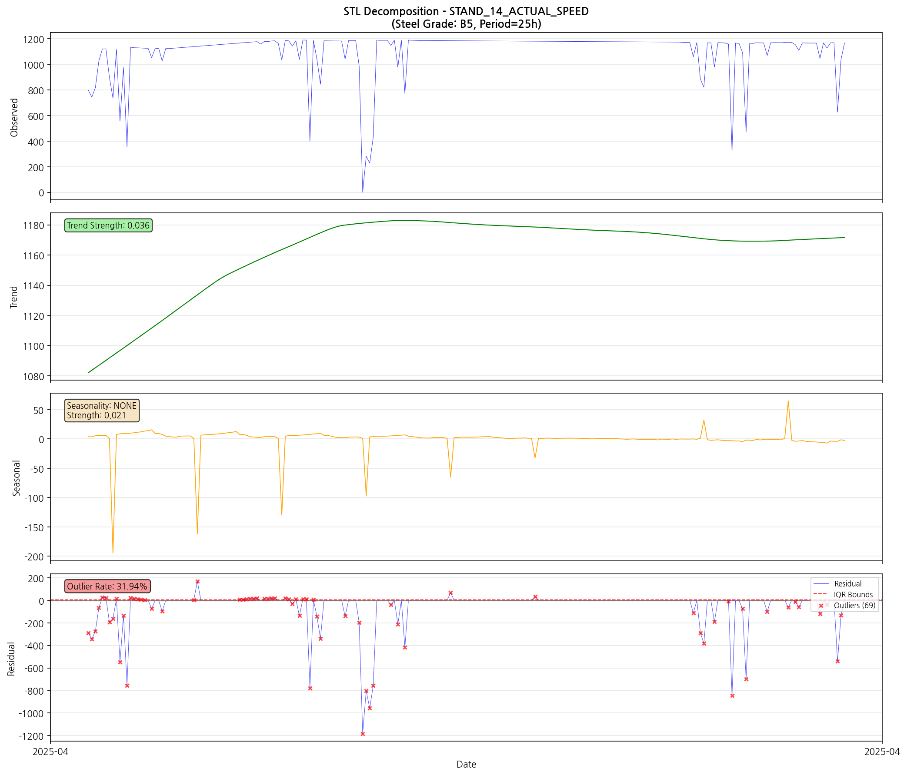

**STAND_13_ACTUAL_SPEED** (이상치율: 31.48%, 계절성: 0.022)

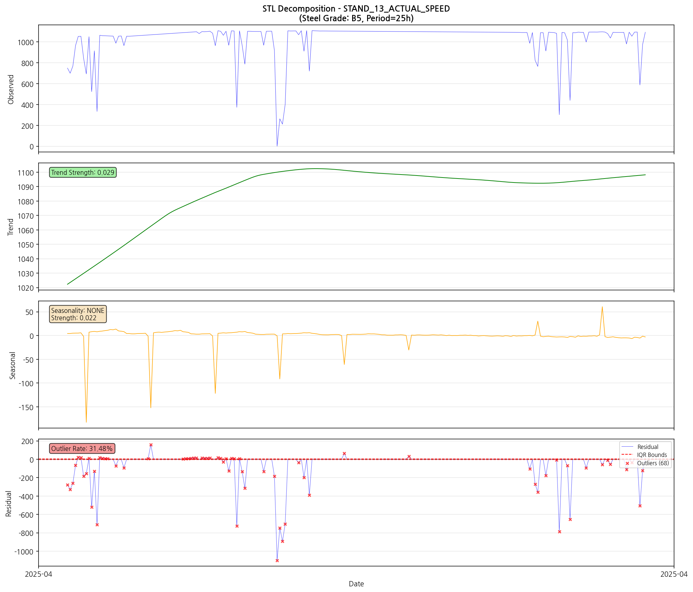

### 스탠드 부하 (07_Stand_Load)

- 분석 태그: 15개
- 평균 잔차 이상치율: 29.48%
- 평균 계절성 강도: 0.000

| 태그 | 이상치율 | 계절성 강도 | 추세 강도 |
|------|----------|-------------|-----------|
| STAND_1_LOAD | 27.78% | 0.000 | 0.066 |
| STAND_2_LOAD | 28.70% | 0.000 | 0.061 |
| STAND_3_LOAD | 29.17% | 0.000 | 0.056 |
| STAND_4_LOAD | 29.17% | 0.000 | 0.057 |
| STAND_5_LOAD | 29.63% | 0.000 | 0.049 |
| STAND_6_LOAD | 30.09% | 0.000 | 0.046 |
| STAND_7_LOAD | 30.09% | 0.000 | 0.044 |
| STAND_8_LOAD | 30.09% | 0.000 | 0.044 |
| STAND_9_LOAD | 29.63% | 0.000 | 0.045 |
| STAND_10_LOAD | 29.63% | 0.000 | 0.046 |
| STAND_11_LOAD | 29.63% | 0.000 | 0.047 |
| STAND_12_LOAD | 29.63% | 0.000 | 0.045 |
| STAND_13_LOAD | 29.63% | 0.000 | 0.045 |
| STAND_14_LOAD | 29.63% | 0.000 | 0.045 |
| FINISHING_BLOCK_LOAD | 29.63% | 0.000 | 0.043 |

#### STL 분해 차트

**STAND_6_LOAD** (이상치율: 30.09%, 계절성: 0.000)

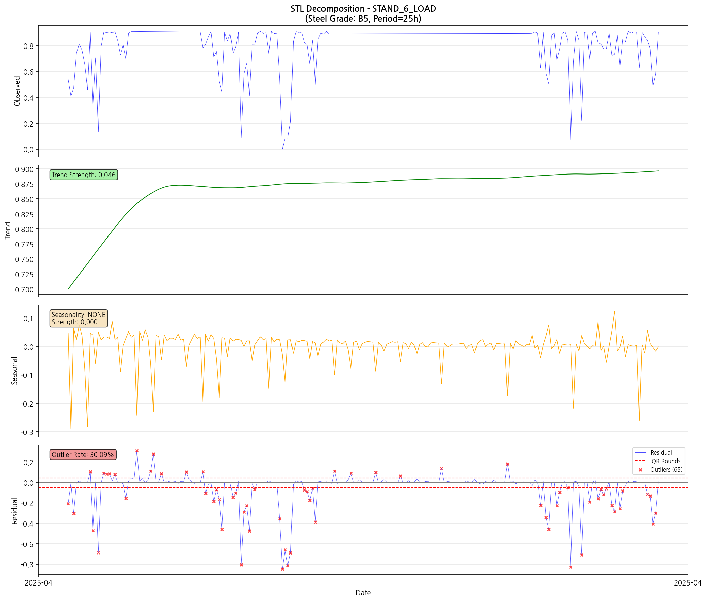

**STAND_7_LOAD** (이상치율: 30.09%, 계절성: 0.000)

**STAND_8_LOAD** (이상치율: 30.09%, 계절성: 0.000)

### 핀치롤 (08_Pinchroll)

- 분석 태그: 9개
- 평균 잔차 이상치율: 30.14%
- 평균 계절성 강도: 0.000

| 태그 | 이상치율 | 계절성 강도 | 추세 강도 |
|------|----------|-------------|-----------|
| PINCHROLL_2_ACTUAL_SPEED | 23.15% | 0.000 | 0.906 |
| PINCHROLL_3_ACTUAL_SPEED | 26.85% | 0.000 | 0.971 |
| PINCHROLL_4_ACTUAL_SPEED | 25.93% | 0.000 | 0.972 |
| PINCHROLL_2_ACTUAL_TORQUE | 28.70% | 0.000 | 0.000 |
| PINCHROLL_3_ACTUAL_TORQUE | 31.94% | 0.000 | 0.086 |
| PINCHROLL_4_ACTUAL_TORQUE | 31.48% | 0.000 | 0.095 |
| PINCHROLL_2_REFERENCE_TORQUE | 38.89% | 0.000 | 0.000 |
| PINCHROLL_3_REFERENCE_TORQUE | 31.94% | 0.000 | 0.028 |
| PINCHROLL_4_REFERENCE_TORQUE | 32.41% | 0.000 | 0.027 |

#### STL 분해 차트

**PINCHROLL_2_REFERENCE_TORQUE** (이상치율: 38.89%, 계절성: 0.000)

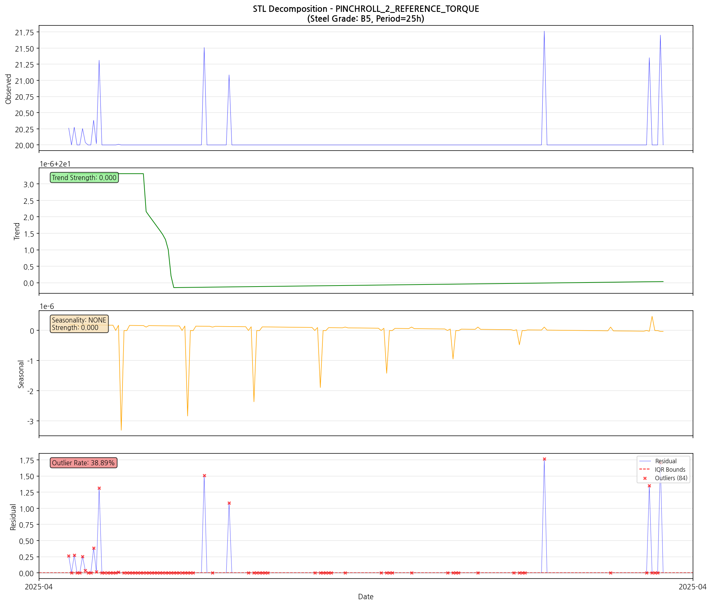

**PINCHROLL_4_REFERENCE_TORQUE** (이상치율: 32.41%, 계절성: 0.000)

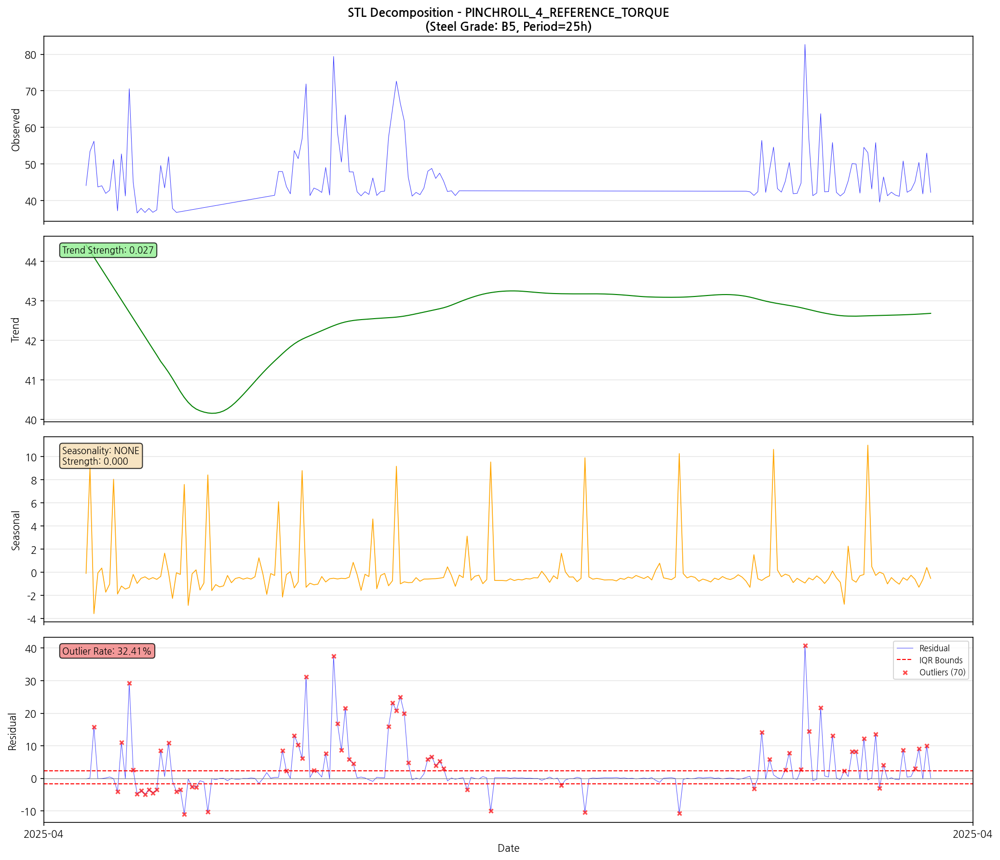

**PINCHROLL_3_ACTUAL_TORQUE** (이상치율: 31.94%, 계절성: 0.000)

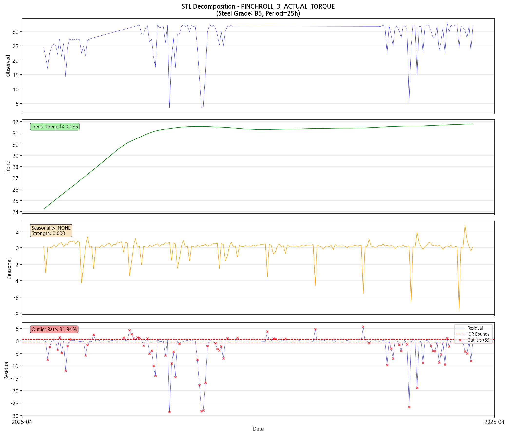

### PR 상세 토크 (09_PR_Detailed)

- 분석 태그: 6개
- 평균 잔차 이상치율: 20.99%
- 평균 계절성 강도: 0.043

| 태그 | 이상치율 | 계절성 강도 | 추세 강도 |
|------|----------|-------------|-----------|
| PR6L1_ACT_TORQUE | 12.96% | 0.142 | 0.664 |
| PR6L2_ACT_TORQUE | 13.43% | 0.096 | 0.881 |
| PR7L1_ACT_TORQUE | 25.00% | 0.000 | 0.760 |
| PR7L2_ACT_TORQUE | 24.54% | 0.018 | 0.793 |
| PR8L1_ACT_TORQUE | 22.69% | 0.000 | 0.439 |
| PR9L1_ACT_TORQUE | 27.31% | 0.000 | 0.206 |

#### STL 분해 차트

**PR9L1_ACT_TORQUE** (이상치율: 27.31%, 계절성: 0.000)

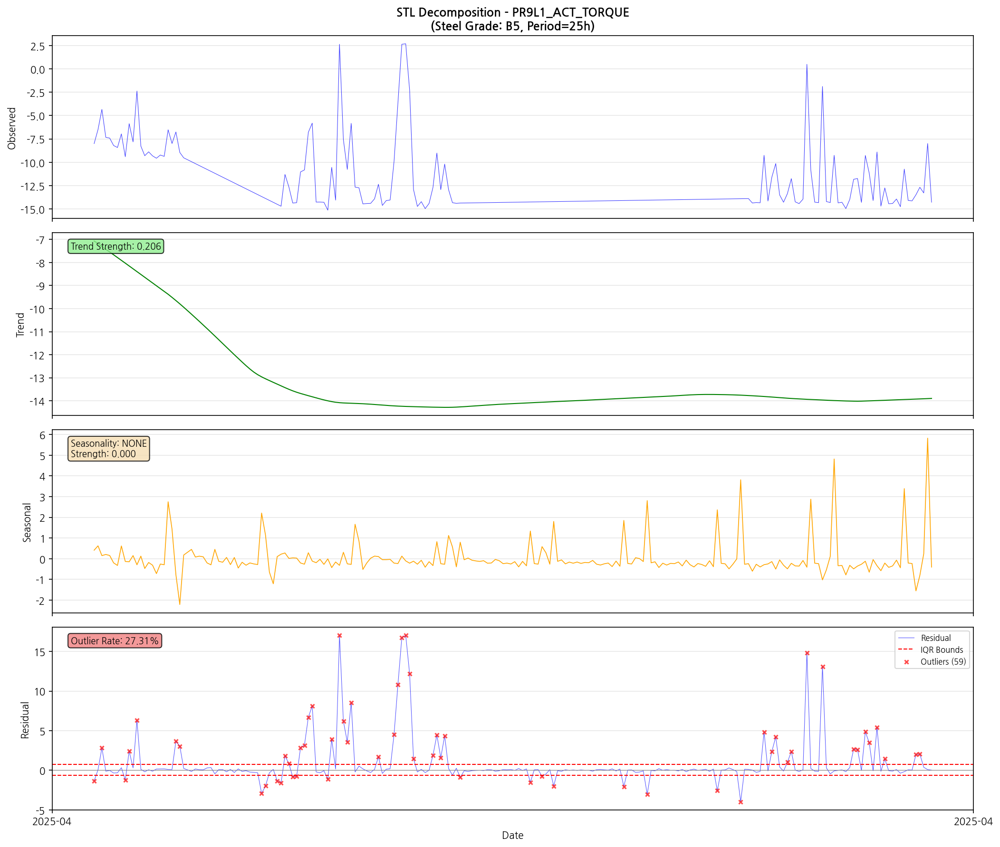

**PR7L1_ACT_TORQUE** (이상치율: 25.00%, 계절성: 0.000)

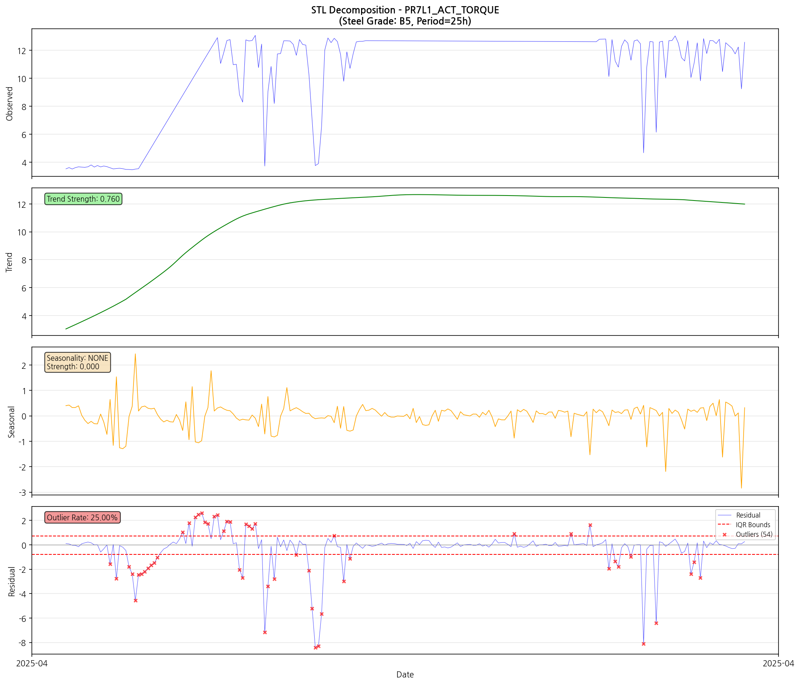

**PR7L2_ACT_TORQUE** (이상치율: 24.54%, 계절성: 0.018)

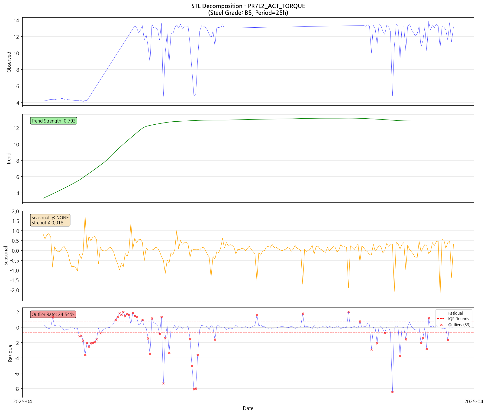

---

## 해석 가이드

### STL 분해 해석

1. **추세 (Trend)**
   - 장기적인 상승/하락 패턴
   - 설비 노화, 계절적 변화 등 반영
   - 추세 강도 높을수록 장기 변화가 뚜렷함

2. **계절성 (Seasonal)**
   - 주기적으로 반복되는 패턴 (24시간 기준)
   - 계절성 강도 ≥ 0.7: 강한 주기적 패턴
   - 계절성이 강한 태그는 STL 분석이 효과적

3. **잔차 (Residual)**
   - 추세와 계절성으로 설명되지 않는 변동
   - **순수한 이상치**를 포함
   - 잔차 기반 IQR로 "진짜" 이상치 탐지

### 계절성 강도 분류

| 분류 | 강도 범위 | 해석 |
|------|----------|------|
| Strong | ≥ 0.7 | 명확한 주기적 패턴, STL 매우 효과적 |
| Moderate | 0.4 ~ 0.7 | 적당한 주기적 패턴, STL 효과적 |
| Weak | 0.2 ~ 0.4 | 약한 주기적 패턴 |
| None | < 0.2 | 주기적 패턴 거의 없음 |

### Standard IQR vs STL Residual IQR

| 방법 | 장점 | 단점 |
|------|------|------|
| Standard IQR | 간단, 빠름 | 계절성에 영향받음 |
| STL Residual IQR | 계절성 제거, 순수 이상치 | 계산 복잡, 데이터 필요 |

**권장**: 계절성 강도 ≥ 0.4인 태그에는 STL Residual IQR 사용

---

## 메타데이터

| 항목 | 값 |
|------|-----|
| 분석 스크립트 | steel_grade_stl_analysis.py |
| 분석 기간 | 2025-03-01 ~ 2025-08-31 |
| 강종 | B5 |
| 계절 주기 | 25시간 |
| 생성일시 | 2026-02-03 20:46:13 |
| 총 분석 태그 | 79개 |

---

*본 보고서는 자동 생성되었습니다.*
