# 강종 [D4] STL 계절-추세 분해 분석 보고서

**분석 기간**: 2025-03-01 ~ 2025-08-31
**강종**: D4
**생성일시**: 2026-02-03 20:45:19

---

## 분석 개요

### 분석 방법론

**STL (Seasonal-Trend Decomposition using LOESS)**

시계열 데이터를 세 가지 성분으로 분해:
- **Trend (추세)**: 장기적인 변화 패턴
- **Seasonal (계절성)**: 주기적으로 반복되는 패턴
- **Residual (잔차)**: 추세와 계절성으로 설명되지 않는 변동

| 파라미터 | 값 | 설명 |
|----------|-----|------|
| seasonal | 25h | 계절 주기 |
| robust | True | 강건 추정 |

### 분석 결과 요약

| 구분 | 태그 수 | 비율 |
|------|---------|------|
| **총 분석 태그** | 79개 | 100% |

#### 잔차 이상치율 분포

| 구분 | 태그 수 | 비율 |
|------|---------|------|
| 🔴 높음 (≥15%) | 79개 | 100.0% |
| 🟠 중간 (5~15%) | 0개 | 0.0% |
| 🟢 낮음 (<5%) | 0개 | 0.0% |

#### 계절성 강도 분포

| 구분 | 태그 수 | 비율 |
|------|---------|------|
| 🔵 강함 (≥0.7) | 1개 | 1.3% |
| 중간 (0.4~0.7) | 2개 | 2.5% |
| 약함 (<0.4) | 76개 | 96.2% |

#### 전체 평균

| 지표 | 값 |
|------|-----|
| 평균 계절성 강도 | 0.033 |
| 평균 추세 강도 | 0.887 |

---

## 상위 문제 태그 (잔차 이상치율 기준)

| 순위 | 태그 | 카테고리 | 이상치율 | 계절성 강도 | 계절성 분류 |
|------|------|----------|----------|-------------|-------------|
| 1 | STAND_6_ACTUAL_TORQUE | 스탠드 토크 | 46.02% | 0.000 | none |
| 2 | PINCHROLL_2_REFERENCE_TORQUE | 핀치롤 | 45.88% | 0.995 | strong |
| 3 | STAND_9_ACTUAL_TORQUE | 스탠드 토크 | 45.50% | 0.483 | moderate |
| 4 | MAIN_GAS_TEMPERATURE | 가열로 보조설비 | 45.11% | 0.000 | none |
| 5 | INDIRECT_COOLING_WATER_FLOW | 가열로 보조설비 | 44.11% | 0.000 | none |
| 6 | PR8L1_ACT_TORQUE | PR 상세 토크 | 44.11% | 0.000 | none |
| 7 | STAND_9_ACTUAL_SPEED | 스탠드 속도 | 43.53% | 0.000 | none |
| 8 | MAIN_GAS_FLOW | 가열로 보조설비 | 43.34% | 0.000 | none |
| 9 | STAND_8_LOAD | 스탠드 부하 | 43.15% | 0.000 | none |
| 10 | STAND_6_ACTUAL_SPEED | 스탠드 속도 | 43.06% | 0.052 | none |
| 11 | INDIRECT_WATER_MAIN_TEMPERATURE | 가열로 보조설비 | 42.86% | 0.007 | none |
| 12 | PR7L1_ACT_TORQUE | PR 상세 토크 | 42.53% | 0.001 | none |
| 13 | STAND_4_ACTUAL_SPEED | 스탠드 속도 | 42.39% | 0.024 | none |
| 14 | STAND_1_ACTUAL_SPEED | 스탠드 속도 | 42.24% | 0.000 | none |
| 15 | STAND_7_LOAD | 스탠드 부하 | 42.05% | 0.000 | none |

---

## 강한 계절성 태그 목록

계절성 강도가 0.7 이상인 태그입니다. 이 태그들은 STL 분석이 특히 효과적입니다.

| 태그 | 카테고리 | 계절성 강도 | 잔차 이상치율 |
|------|----------|-------------|---------------|
| PINCHROLL_2_REFERENCE_TORQUE | 핀치롤 | 0.995 | 45.88% |

---

## 카테고리별 분석 결과

### 가열로 상부 온도 (01_Furnace_Top_Temperature)

- 분석 태그: 4개
- 평균 잔차 이상치율: 38.71%
- 평균 계절성 강도: 0.009

| 태그 | 이상치율 | 계절성 강도 | 추세 강도 |
|------|----------|-------------|-----------|
| HEATING_TOP_ZONE_NO_1_TEMPERATURE_ROOF | 38.70% | 0.000 | 0.862 |
| HEATING_TOP_ZONE_NO_2_TEMPERATURE_ROOF | 37.79% | 0.000 | 0.956 |
| SOAKING_TOP_ZONE_NO_1_TEMPERATURE_ROOF | 40.76% | 0.000 | 0.989 |
| SOAKING_TOP_ZONE_NO_2_TEMPERATURE_ROOF | 37.60% | 0.038 | 0.982 |

#### STL 분해 차트

**SOAKING_TOP_ZONE_NO_1_TEMPERATURE_ROOF** (이상치율: 40.76%, 계절성: 0.000)

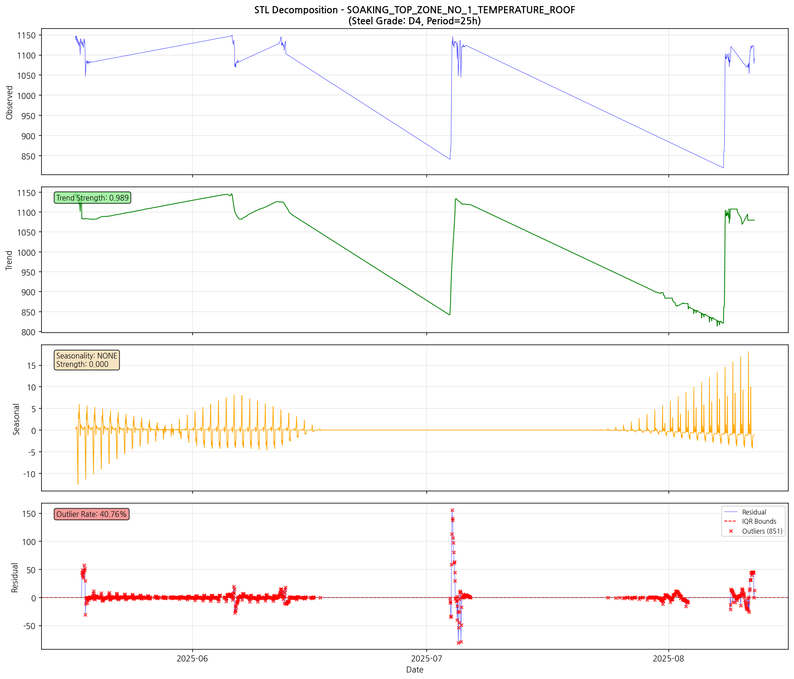

**HEATING_TOP_ZONE_NO_1_TEMPERATURE_ROOF** (이상치율: 38.70%, 계절성: 0.000)

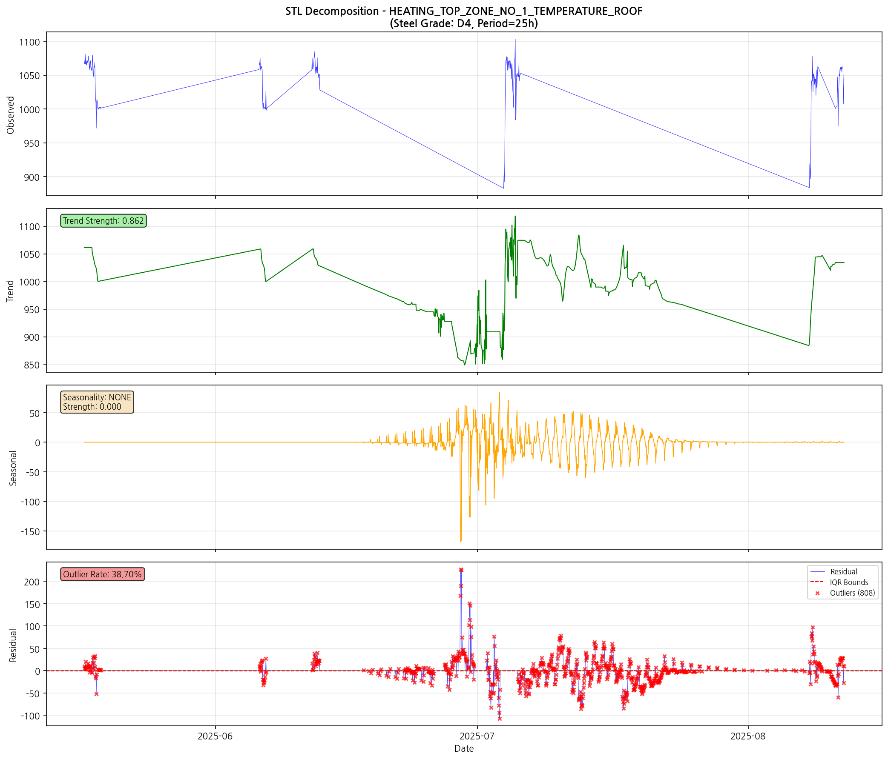

**HEATING_TOP_ZONE_NO_2_TEMPERATURE_ROOF** (이상치율: 37.79%, 계절성: 0.000)

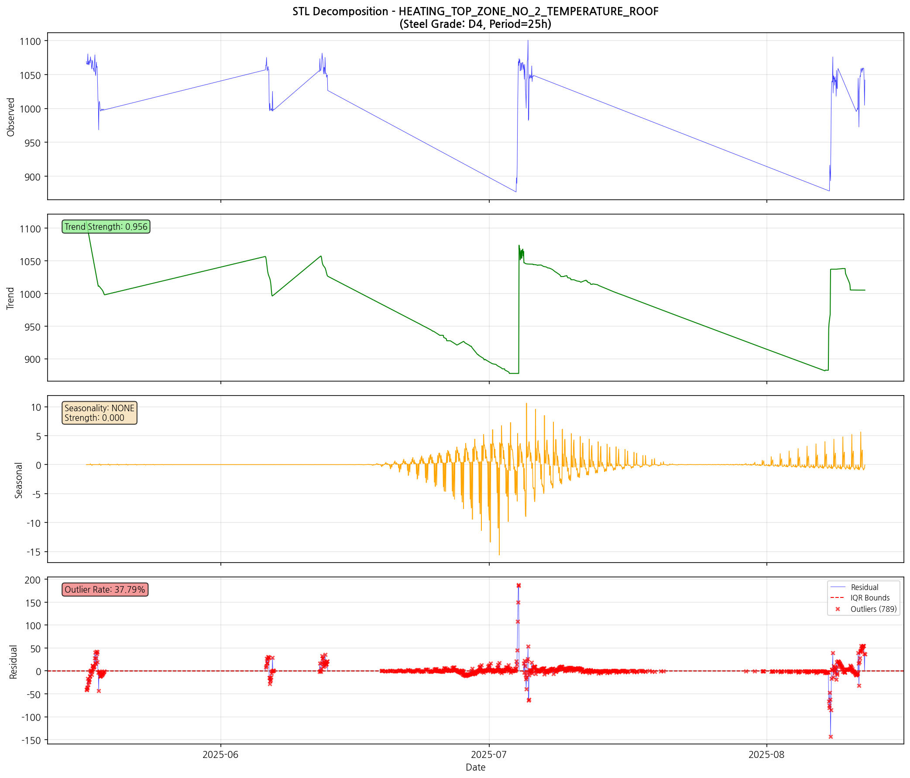

### 가열로 하부 온도 (02_Furnace_Bottom_Temperature)

- 분석 태그: 4개
- 평균 잔차 이상치율: 38.36%
- 평균 계절성 강도: 0.004

| 태그 | 이상치율 | 계절성 강도 | 추세 강도 |
|------|----------|-------------|-----------|
| HEATING_BOTTOM_ZONE_NO_1_TEMPERATURE_OPP_SIDE | 35.20% | 0.015 | 0.933 |
| HEATING_BOTTOM_ZONE_NO_2_TEMPERATURE_MILL_SIDE | 39.03% | 0.000 | 0.943 |
| SOAKING_BOTTOM_ZONE_NO_1_TEMPERATURE_OPP_SIDE | 41.48% | 0.000 | 0.955 |
| SOAKING_BOTTOM_ZONE_NO_2_TEMPERATURE_MILL_SIDE | 37.74% | 0.000 | 0.954 |

#### STL 분해 차트

**SOAKING_BOTTOM_ZONE_NO_1_TEMPERATURE_OPP_SIDE** (이상치율: 41.48%, 계절성: 0.000)

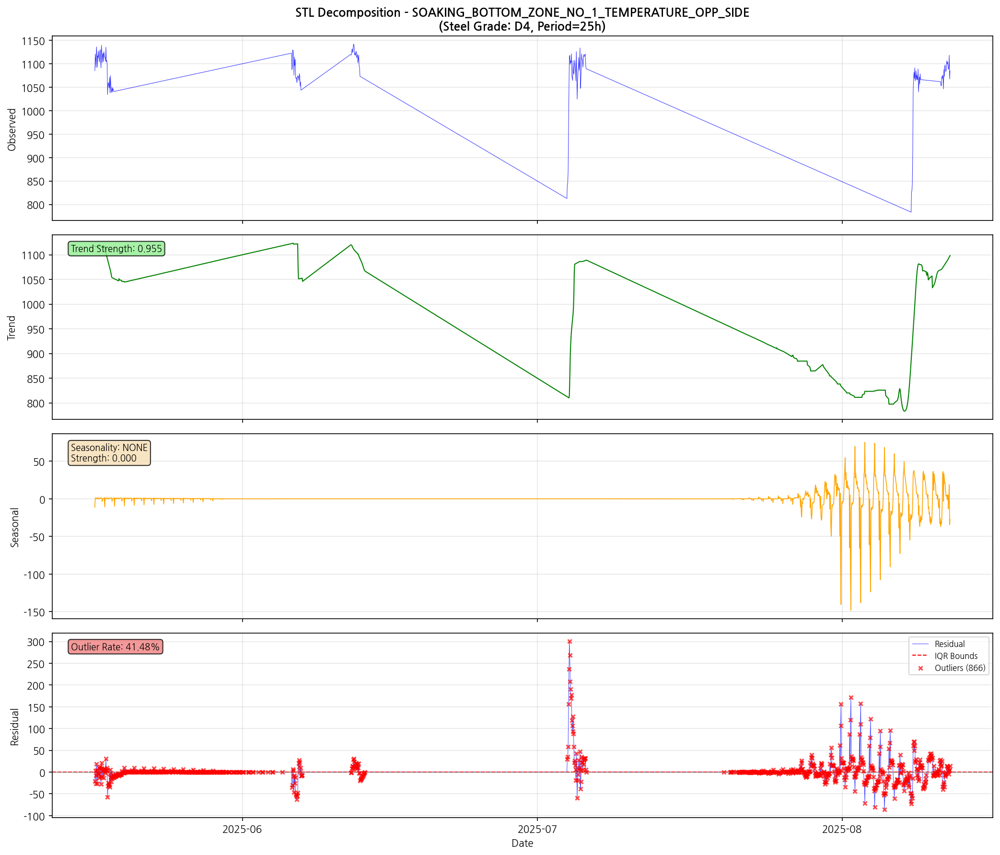

**HEATING_BOTTOM_ZONE_NO_2_TEMPERATURE_MILL_SIDE** (이상치율: 39.03%, 계절성: 0.000)

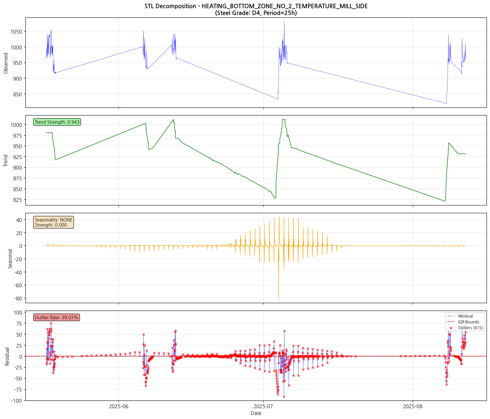

**SOAKING_BOTTOM_ZONE_NO_2_TEMPERATURE_MILL_SIDE** (이상치율: 37.74%, 계절성: 0.000)

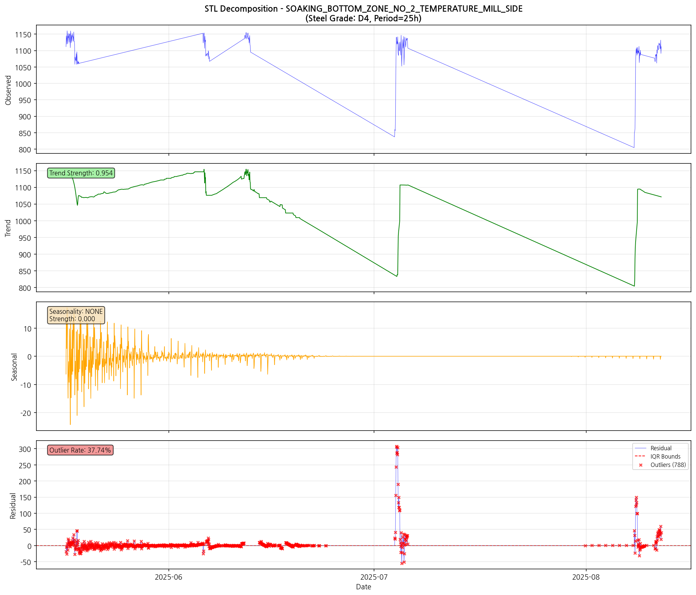

### 가열로 추출 온도 (03_Furnace_Discharge_Temperature)

- 분석 태그: 1개
- 평균 잔차 이상치율: 39.37%
- 평균 계절성 강도: 0.410

| 태그 | 이상치율 | 계절성 강도 | 추세 강도 |
|------|----------|-------------|-----------|
| FURNACE_EXIT_DISCHARGE_BILLET_TEMPERATURE | 39.37% | 0.410 | 0.995 |

#### STL 분해 차트

**FURNACE_EXIT_DISCHARGE_BILLET_TEMPERATURE** (이상치율: 39.37%, 계절성: 0.410)

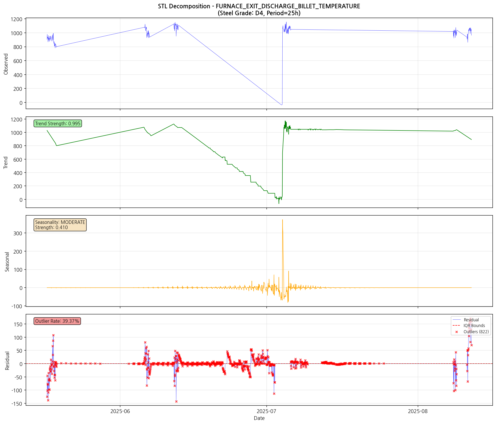

### 가열로 보조설비 (04_Furnace_Auxiliary)

- 분석 태그: 9개
- 평균 잔차 이상치율: 40.18%
- 평균 계절성 강도: 0.006

| 태그 | 이상치율 | 계절성 강도 | 추세 강도 |
|------|----------|-------------|-----------|
| FURNACE_PRESSURE | 39.32% | 0.000 | 0.849 |
| FURNACE_O2_ANALYZER | 30.65% | 0.000 | 0.918 |
| MAIN_GAS_PRESSURE | 37.84% | 0.000 | 0.885 |
| MAIN_GAS_FLOW | 43.34% | 0.000 | 0.853 |
| MAIN_GAS_TEMPERATURE | 45.11% | 0.000 | 0.963 |
| MAIN_COMBUSTION_AIR_PRESSURE | 37.69% | 0.000 | 0.968 |
| COMBUSTION_AIR_TEMPERATURE | 40.71% | 0.047 | 0.939 |
| INDIRECT_COOLING_WATER_FLOW | 44.11% | 0.000 | 0.997 |
| INDIRECT_WATER_MAIN_TEMPERATURE | 42.86% | 0.007 | 0.990 |

#### STL 분해 차트

**MAIN_GAS_TEMPERATURE** (이상치율: 45.11%, 계절성: 0.000)

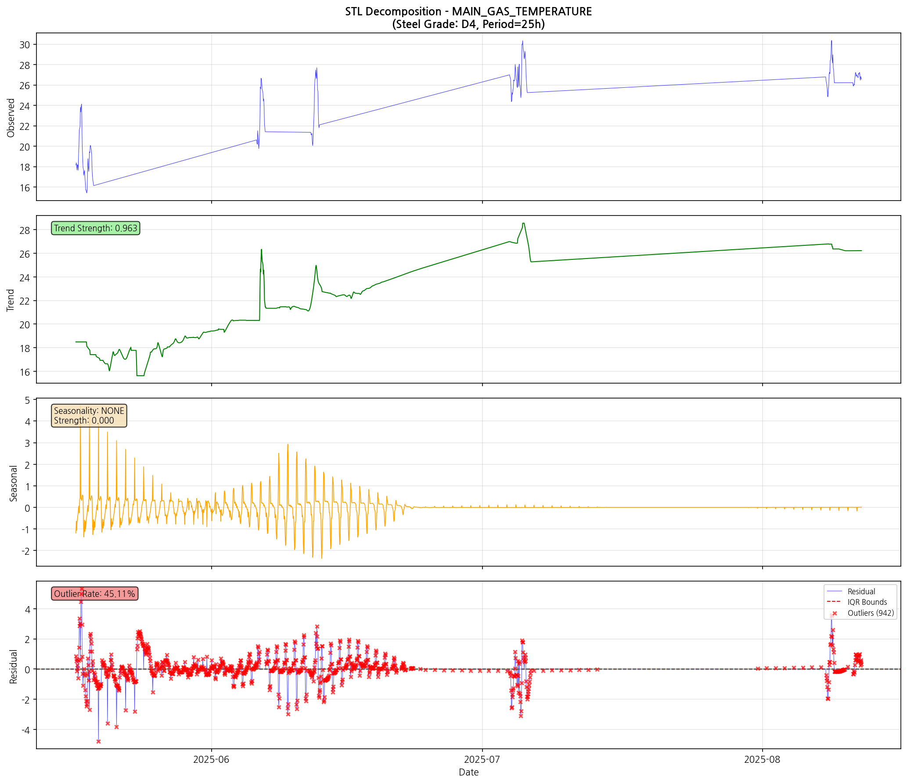

**INDIRECT_COOLING_WATER_FLOW** (이상치율: 44.11%, 계절성: 0.000)

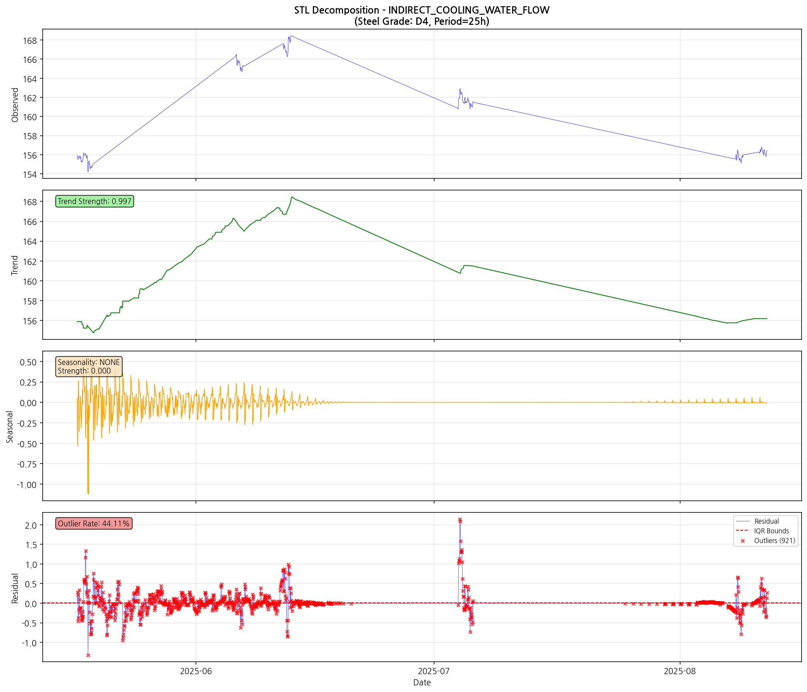

**MAIN_GAS_FLOW** (이상치율: 43.34%, 계절성: 0.000)

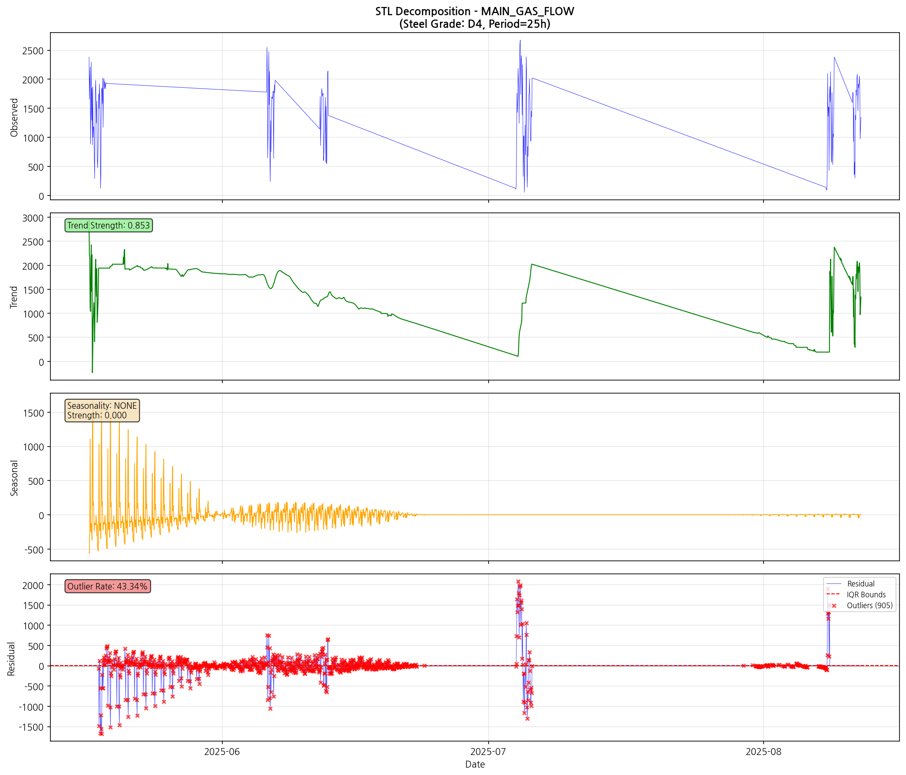

### 스탠드 토크 (05_Stand_Torque)

- 분석 태그: 16개
- 평균 잔차 이상치율: 39.27%
- 평균 계절성 강도: 0.038

| 태그 | 이상치율 | 계절성 강도 | 추세 강도 |
|------|----------|-------------|-----------|
| STAND_1_ACTUAL_TORQUE | 33.72% | 0.000 | 0.890 |
| STAND_2_ACTUAL_TORQUE | 38.94% | 0.000 | 0.903 |
| STAND_3_ACTUAL_TORQUE | 37.60% | 0.000 | 0.853 |
| STAND_4_ACTUAL_TORQUE | 37.55% | 0.000 | 0.920 |
| STAND_5_ACTUAL_TORQUE | 40.13% | 0.046 | 0.930 |
| STAND_6_ACTUAL_TORQUE | 46.02% | 0.000 | 0.873 |
| STAND_7_ACTUAL_TORQUE | 33.19% | 0.000 | 0.903 |
| STAND_8_ACTUAL_TORQUE | 38.98% | 0.000 | 0.869 |
| STAND_9_ACTUAL_TORQUE | 45.50% | 0.483 | 0.926 |
| STAND_10_ACTUAL_TORQUE | 40.61% | 0.000 | 0.889 |
| STAND_11_ACTUAL_TORQUE | 39.13% | 0.000 | 0.862 |
| STAND_12_ACTUAL_TORQUE | 39.61% | 0.052 | 0.960 |
| STAND_13_ACTUAL_TORQUE | 40.95% | 0.015 | 0.932 |
| STAND_14_ACTUAL_TORQUE | 37.69% | 0.007 | 0.890 |
| FINISHING_BLOCK_MASTER_ACTUAL_TORQUE | 40.66% | 0.000 | 0.894 |
| FINISHING_BLOCK_SLAVE_ACTUAL_TORQUE | 38.07% | 0.000 | 0.882 |

#### STL 분해 차트

**STAND_6_ACTUAL_TORQUE** (이상치율: 46.02%, 계절성: 0.000)

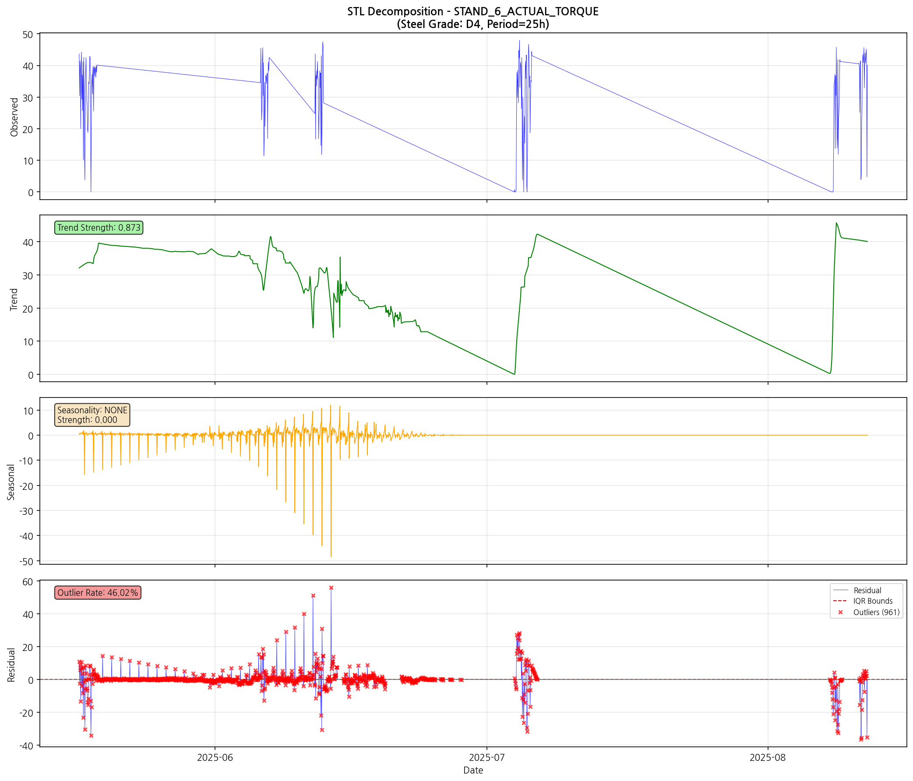

**STAND_9_ACTUAL_TORQUE** (이상치율: 45.50%, 계절성: 0.483)

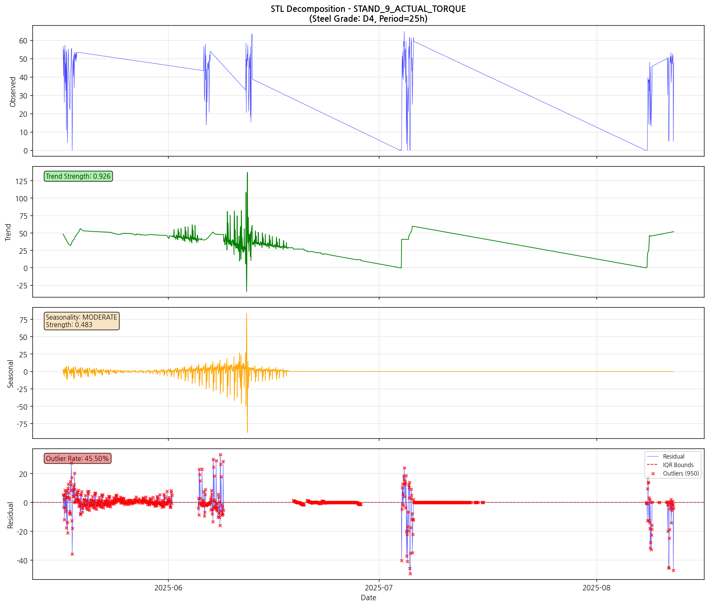

**STAND_13_ACTUAL_TORQUE** (이상치율: 40.95%, 계절성: 0.015)

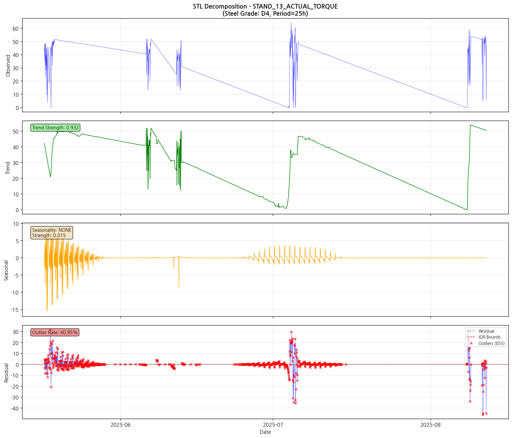

### 스탠드 속도 (06_Stand_Speed)

- 분석 태그: 15개
- 평균 잔차 이상치율: 39.34%
- 평균 계절성 강도: 0.010

| 태그 | 이상치율 | 계절성 강도 | 추세 강도 |
|------|----------|-------------|-----------|
| STAND_1_ACTUAL_SPEED | 42.24% | 0.000 | 0.952 |
| STAND_2_ACTUAL_SPEED | 41.43% | 0.007 | 0.911 |
| STAND_3_ACTUAL_SPEED | 36.11% | 0.000 | 0.924 |
| STAND_4_ACTUAL_SPEED | 42.39% | 0.024 | 0.930 |
| STAND_5_ACTUAL_SPEED | 40.76% | 0.000 | 0.943 |
| STAND_6_ACTUAL_SPEED | 43.06% | 0.052 | 0.945 |
| STAND_7_ACTUAL_SPEED | 39.03% | 0.000 | 0.966 |
| STAND_8_ACTUAL_SPEED | 40.42% | 0.034 | 0.933 |
| STAND_9_ACTUAL_SPEED | 43.53% | 0.000 | 0.266 |
| STAND_10_ACTUAL_SPEED | 37.16% | 0.000 | 0.876 |
| STAND_11_ACTUAL_SPEED | 39.18% | 0.038 | 0.943 |
| STAND_12_ACTUAL_SPEED | 35.78% | 0.000 | 0.929 |
| STAND_13_ACTUAL_SPEED | 38.84% | 0.000 | 0.935 |
| STAND_14_ACTUAL_SPEED | 38.75% | 0.000 | 0.938 |
| FINISHING_BLOCK_ACTUAL_SPEED | 31.37% | 0.000 | 0.933 |

#### STL 분해 차트

**STAND_9_ACTUAL_SPEED** (이상치율: 43.53%, 계절성: 0.000)

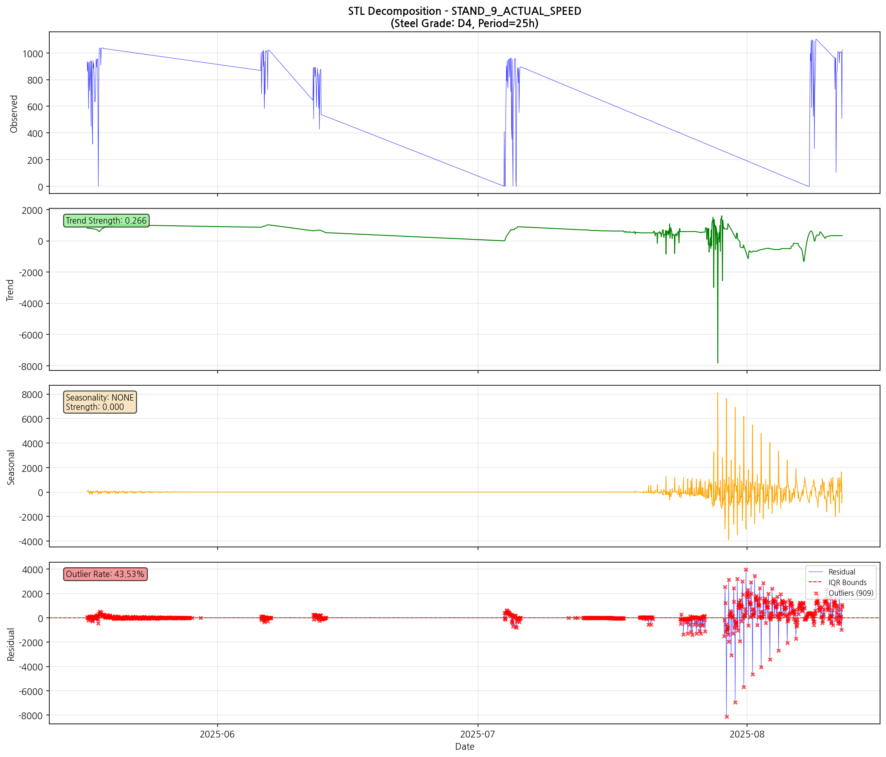

**STAND_6_ACTUAL_SPEED** (이상치율: 43.06%, 계절성: 0.052)

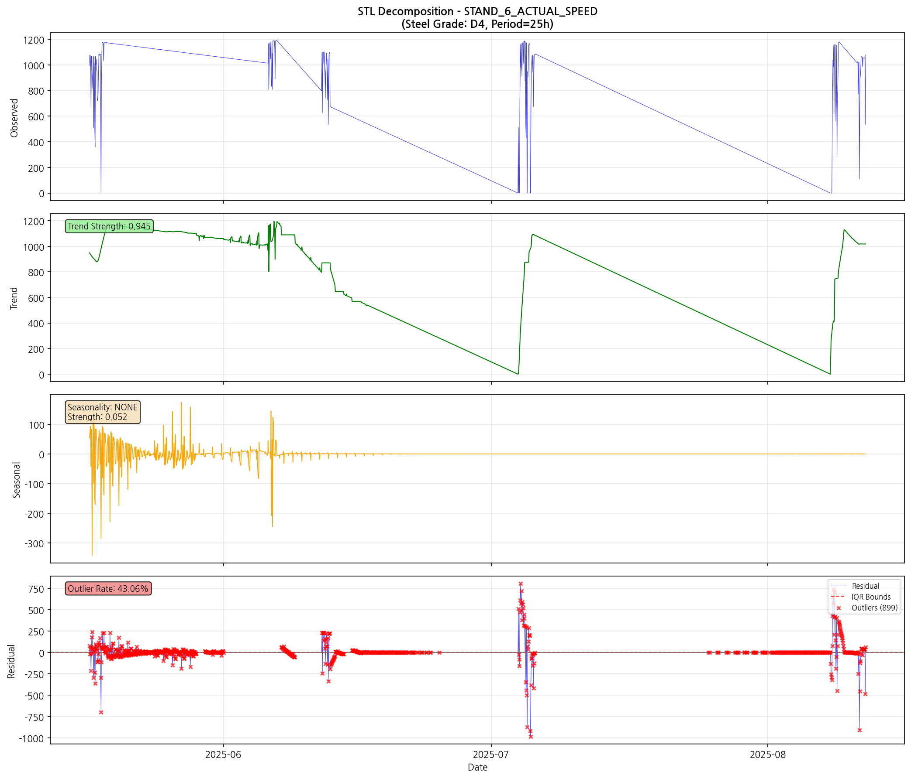

**STAND_4_ACTUAL_SPEED** (이상치율: 42.39%, 계절성: 0.024)

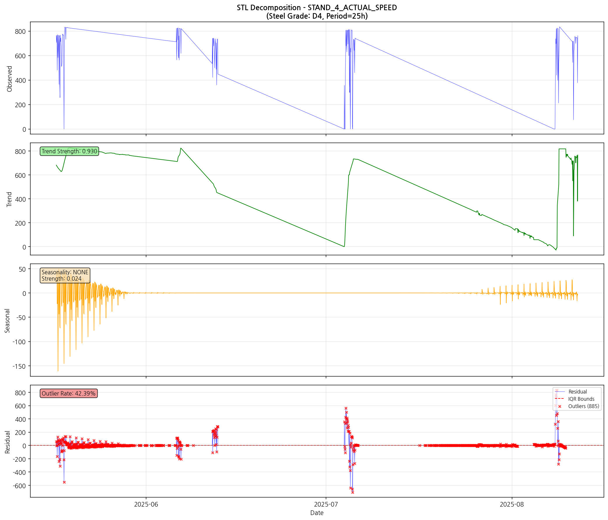

### 스탠드 부하 (07_Stand_Load)

- 분석 태그: 15개
- 평균 잔차 이상치율: 39.28%
- 평균 계절성 강도: 0.006

| 태그 | 이상치율 | 계절성 강도 | 추세 강도 |
|------|----------|-------------|-----------|
| STAND_1_LOAD | 38.03% | 0.000 | 0.279 |
| STAND_2_LOAD | 41.28% | 0.000 | 0.750 |
| STAND_3_LOAD | 41.86% | 0.000 | 0.937 |
| STAND_4_LOAD | 41.67% | 0.000 | 0.934 |
| STAND_5_LOAD | 38.60% | 0.028 | 0.937 |
| STAND_6_LOAD | 41.24% | 0.000 | 0.915 |
| STAND_7_LOAD | 42.05% | 0.000 | 0.947 |
| STAND_8_LOAD | 43.15% | 0.000 | 0.921 |
| STAND_9_LOAD | 36.54% | 0.000 | 0.921 |
| STAND_10_LOAD | 35.11% | 0.000 | 0.909 |
| STAND_11_LOAD | 41.00% | 0.020 | 0.951 |
| STAND_12_LOAD | 36.02% | 0.008 | 0.917 |
| STAND_13_LOAD | 36.02% | 0.008 | 0.917 |
| STAND_14_LOAD | 38.94% | 0.000 | 0.401 |
| FINISHING_BLOCK_LOAD | 37.79% | 0.025 | 0.942 |

#### STL 분해 차트

**STAND_8_LOAD** (이상치율: 43.15%, 계절성: 0.000)

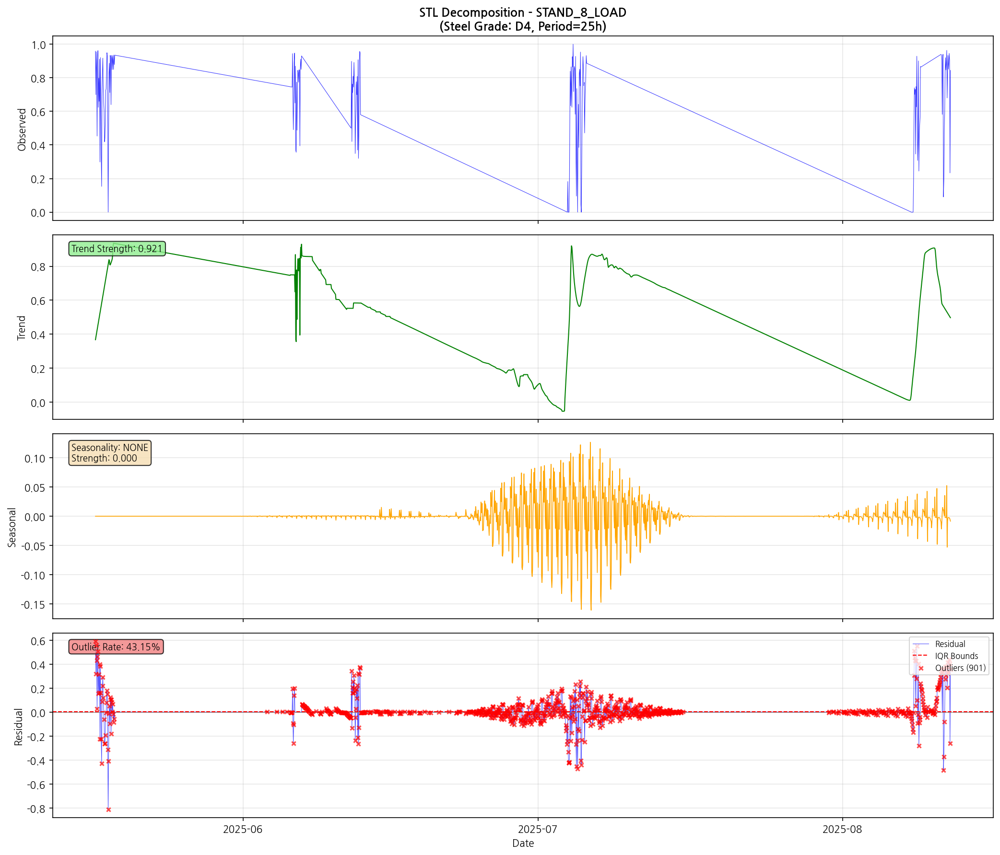

**STAND_7_LOAD** (이상치율: 42.05%, 계절성: 0.000)

**STAND_3_LOAD** (이상치율: 41.86%, 계절성: 0.000)

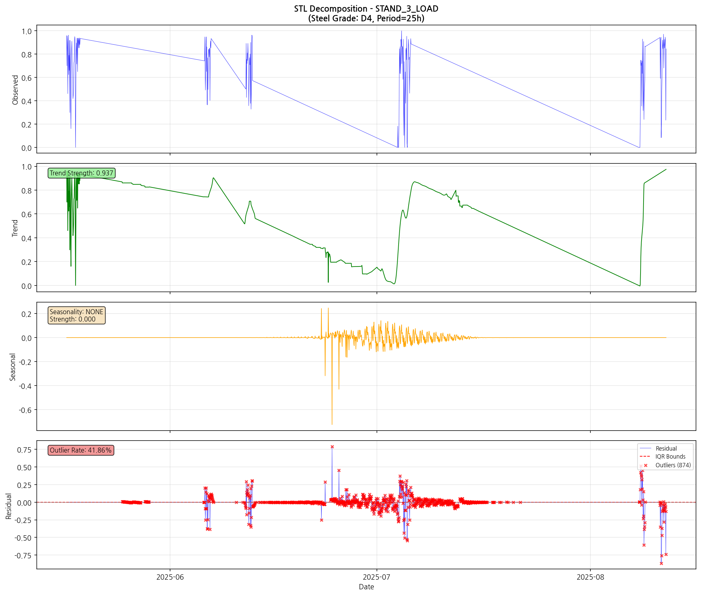

### 핀치롤 (08_Pinchroll)

- 분석 태그: 9개
- 평균 잔차 이상치율: 36.09%
- 평균 계절성 강도: 0.111

| 태그 | 이상치율 | 계절성 강도 | 추세 강도 |
|------|----------|-------------|-----------|
| PINCHROLL_2_ACTUAL_SPEED | 40.71% | 0.000 | 0.824 |
| PINCHROLL_3_ACTUAL_SPEED | 34.24% | 0.000 | 0.978 |
| PINCHROLL_4_ACTUAL_SPEED | 37.55% | 0.000 | 0.890 |
| PINCHROLL_2_ACTUAL_TORQUE | 35.39% | 0.000 | 0.956 |
| PINCHROLL_3_ACTUAL_TORQUE | 36.83% | 0.000 | 0.893 |
| PINCHROLL_4_ACTUAL_TORQUE | 34.82% | 0.002 | 0.937 |
| PINCHROLL_2_REFERENCE_TORQUE | 45.88% | 0.995 | 1.000 |
| PINCHROLL_3_REFERENCE_TORQUE | 33.57% | 0.000 | 0.714 |
| PINCHROLL_4_REFERENCE_TORQUE | 25.81% | 0.000 | 0.907 |

#### STL 분해 차트

**PINCHROLL_2_REFERENCE_TORQUE** (이상치율: 45.88%, 계절성: 0.995)

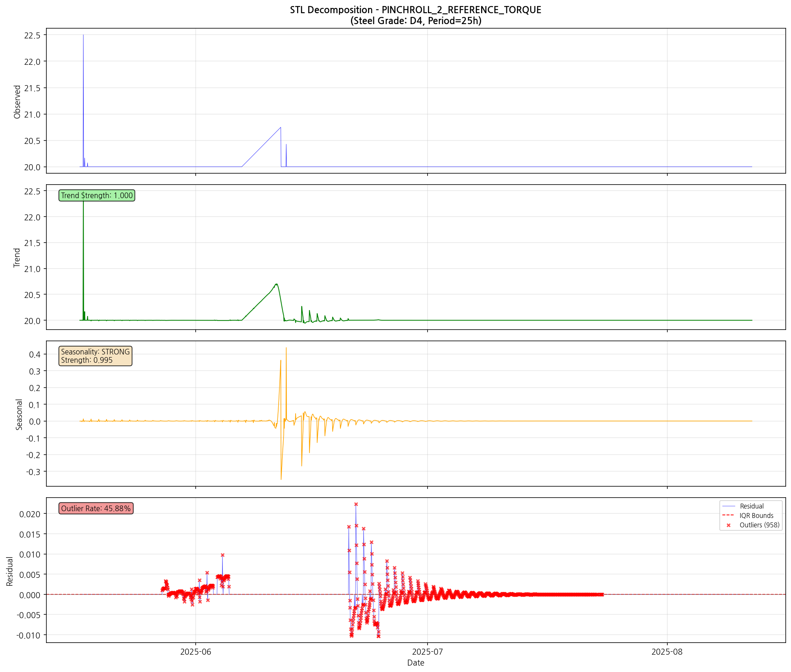

**PINCHROLL_2_ACTUAL_SPEED** (이상치율: 40.71%, 계절성: 0.000)

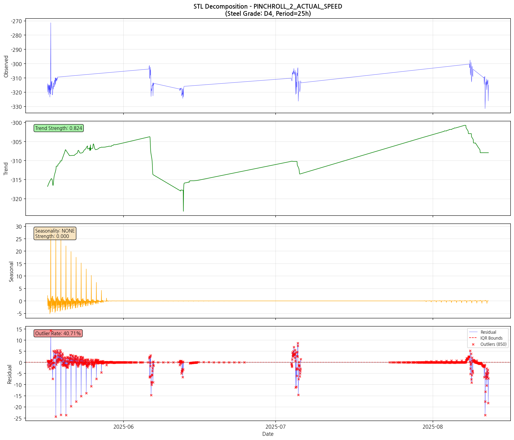

**PINCHROLL_4_ACTUAL_SPEED** (이상치율: 37.55%, 계절성: 0.000)

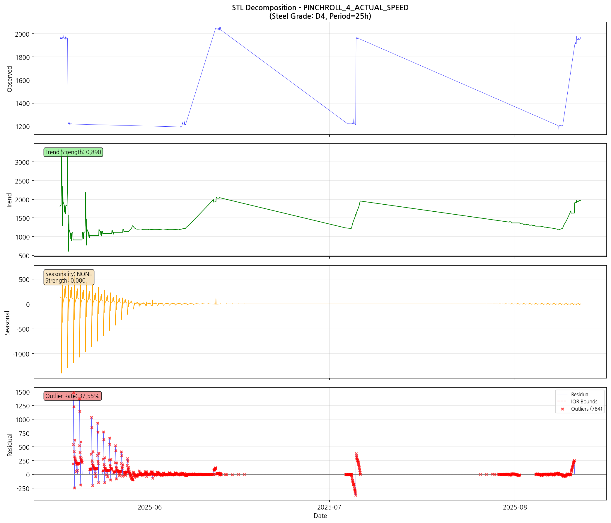

### PR 상세 토크 (09_PR_Detailed)

- 분석 태그: 6개
- 평균 잔차 이상치율: 37.50%
- 평균 계절성 강도: 0.035

| 태그 | 이상치율 | 계절성 강도 | 추세 강도 |
|------|----------|-------------|-----------|
| PR6L1_ACT_TORQUE | 31.47% | 0.000 | 0.930 |
| PR6L2_ACT_TORQUE | 33.57% | 0.000 | 0.874 |
| PR7L1_ACT_TORQUE | 42.53% | 0.001 | 0.737 |
| PR7L2_ACT_TORQUE | 33.86% | 0.030 | 0.743 |
| PR8L1_ACT_TORQUE | 44.11% | 0.000 | 0.566 |
| PR9L1_ACT_TORQUE | 39.46% | 0.180 | 0.909 |

#### STL 분해 차트

**PR8L1_ACT_TORQUE** (이상치율: 44.11%, 계절성: 0.000)

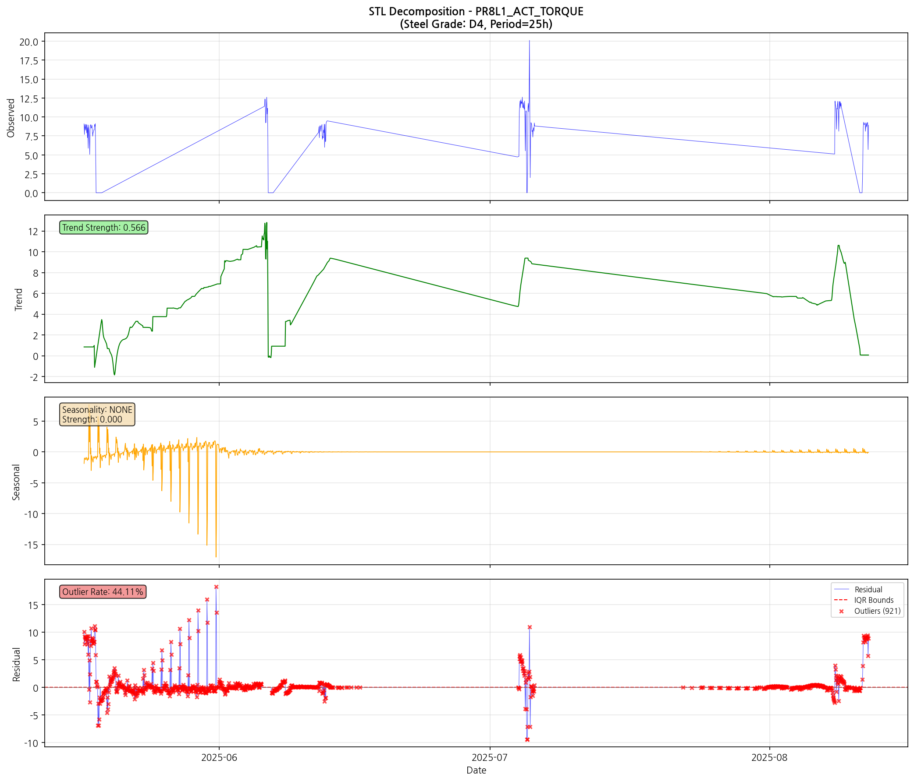

**PR7L1_ACT_TORQUE** (이상치율: 42.53%, 계절성: 0.001)

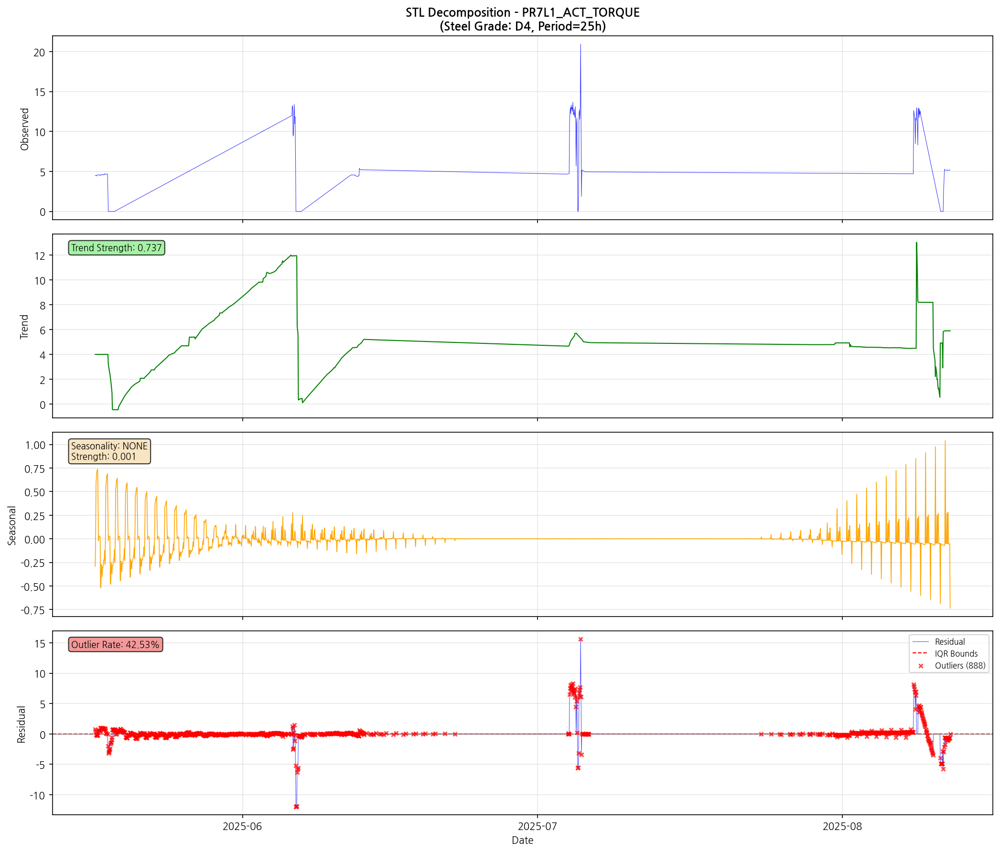

**PR9L1_ACT_TORQUE** (이상치율: 39.46%, 계절성: 0.180)

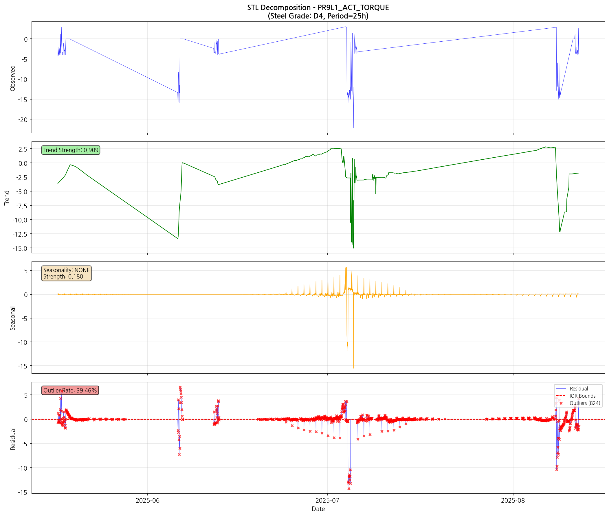

---

## 해석 가이드

### STL 분해 해석

1. **추세 (Trend)**
   - 장기적인 상승/하락 패턴
   - 설비 노화, 계절적 변화 등 반영
   - 추세 강도 높을수록 장기 변화가 뚜렷함

2. **계절성 (Seasonal)**
   - 주기적으로 반복되는 패턴 (24시간 기준)
   - 계절성 강도 ≥ 0.7: 강한 주기적 패턴
   - 계절성이 강한 태그는 STL 분석이 효과적

3. **잔차 (Residual)**
   - 추세와 계절성으로 설명되지 않는 변동
   - **순수한 이상치**를 포함
   - 잔차 기반 IQR로 "진짜" 이상치 탐지

### 계절성 강도 분류

| 분류 | 강도 범위 | 해석 |
|------|----------|------|
| Strong | ≥ 0.7 | 명확한 주기적 패턴, STL 매우 효과적 |
| Moderate | 0.4 ~ 0.7 | 적당한 주기적 패턴, STL 효과적 |
| Weak | 0.2 ~ 0.4 | 약한 주기적 패턴 |
| None | < 0.2 | 주기적 패턴 거의 없음 |

### Standard IQR vs STL Residual IQR

| 방법 | 장점 | 단점 |
|------|------|------|
| Standard IQR | 간단, 빠름 | 계절성에 영향받음 |
| STL Residual IQR | 계절성 제거, 순수 이상치 | 계산 복잡, 데이터 필요 |

**권장**: 계절성 강도 ≥ 0.4인 태그에는 STL Residual IQR 사용

---

## 메타데이터

| 항목 | 값 |
|------|-----|
| 분석 스크립트 | steel_grade_stl_analysis.py |
| 분석 기간 | 2025-03-01 ~ 2025-08-31 |
| 강종 | D4 |
| 계절 주기 | 25시간 |
| 생성일시 | 2026-02-03 20:45:19 |
| 총 분석 태그 | 79개 |

---

*본 보고서는 자동 생성되었습니다.*
