# 강종 [D5] 사이즈 [D10] STL 계절-추세 분해 분석 보고서

**분석 기간**: 2025-03-01 ~ 2025-08-31
**강종**: D5 | 사이즈: D10
**생성일시**: 2026-02-09 15:07:00

---

## 분석 개요

### 분석 방법론

**STL (Seasonal-Trend Decomposition using LOESS)**

시계열 데이터를 세 가지 성분으로 분해:
- **Trend (추세)**: 장기적인 변화 패턴
- **Seasonal (계절성)**: 주기적으로 반복되는 패턴
- **Residual (잔차)**: 추세와 계절성으로 설명되지 않는 변동

| 파라미터 | 값 | 설명 |
|----------|-----|------|
| seasonal | 25h | 계절 주기 |
| robust | True | 강건 추정 |

### 분석 결과 요약

| 구분 | 태그 수 | 비율 |
|------|---------|------|
| **총 분석 태그** | 79개 | 100% |

#### 잔차 이상치율 분포

| 구분 | 태그 수 | 비율 |
|------|---------|------|
| 🔴 높음 (≥15%) | 79개 | 100.0% |
| 🟠 중간 (5~15%) | 0개 | 0.0% |
| 🟢 낮음 (<5%) | 0개 | 0.0% |

#### 계절성 강도 분포

| 구분 | 태그 수 | 비율 |
|------|---------|------|
| 🔵 강함 (≥0.7) | 2개 | 2.5% |
| 중간 (0.4~0.7) | 3개 | 3.8% |
| 약함 (<0.4) | 74개 | 93.7% |

#### 전체 평균

| 지표 | 값 |
|------|-----|
| 평균 계절성 강도 | 0.077 |
| 평균 추세 강도 | 0.942 |

---

## 상위 문제 태그 (잔차 이상치율 기준)

| 순위 | 태그 | 카테고리 | 이상치율 | 계절성 강도 | 계절성 분류 |
|------|------|----------|----------|-------------|-------------|
| 1 | HEATING_TOP_ZONE_NO_2_TEMPERATURE_ROOF | 가열로 상부 온도 | 46.69% | 0.265 | weak |
| 2 | MAIN_GAS_PRESSURE | 가열로 보조설비 | 46.15% | 0.000 | none |
| 3 | FINISHING_BLOCK_MASTER_ACTUAL_TORQUE | 스탠드 토크 | 45.16% | 0.160 | none |
| 4 | STAND_14_ACTUAL_TORQUE | 스탠드 토크 | 44.90% | 0.147 | none |
| 5 | HEATING_TOP_ZONE_NO_1_TEMPERATURE_ROOF | 가열로 상부 온도 | 44.77% | 0.462 | moderate |
| 6 | PINCHROLL_2_ACTUAL_TORQUE | 핀치롤 | 44.58% | 0.000 | none |
| 7 | STAND_2_ACTUAL_TORQUE | 스탠드 토크 | 44.38% | 0.058 | none |
| 8 | FINISHING_BLOCK_ACTUAL_SPEED | 스탠드 속도 | 44.30% | 0.000 | none |
| 9 | SOAKING_TOP_ZONE_NO_1_TEMPERATURE_ROOF | 가열로 상부 온도 | 44.09% | 0.064 | none |
| 10 | STAND_4_ACTUAL_SPEED | 스탠드 속도 | 43.98% | 0.000 | none |
| 11 | MAIN_COMBUSTION_AIR_PRESSURE | 가열로 보조설비 | 43.85% | 0.000 | none |
| 12 | STAND_10_ACTUAL_SPEED | 스탠드 속도 | 43.83% | 0.000 | none |
| 13 | STAND_6_ACTUAL_TORQUE | 스탠드 토크 | 43.59% | 0.000 | none |
| 14 | STAND_14_ACTUAL_SPEED | 스탠드 속도 | 43.49% | 0.000 | none |
| 15 | PR6L1_ACT_TORQUE | PR 상세 토크 | 43.44% | 0.126 | none |

---

## 강한 계절성 태그 목록

계절성 강도가 0.7 이상인 태그입니다. 이 태그들은 STL 분석이 특히 효과적입니다.

| 태그 | 카테고리 | 계절성 강도 | 잔차 이상치율 |
|------|----------|-------------|---------------|
| PINCHROLL_2_ACTUAL_SPEED | 핀치롤 | 0.935 | 38.49% |
| FURNACE_EXIT_DISCHARGE_BILLET_TEMPERATURE | 가열로 추출 온도 | 0.709 | 39.06% |

---

## 카테고리별 분석 결과

### 가열로 상부 온도 (01_Furnace_Top_Temperature)

- 분석 태그: 4개
- 평균 잔차 이상치율: 43.45%
- 평균 계절성 강도: 0.198

| 태그 | 이상치율 | 계절성 강도 | 추세 강도 |
|------|----------|-------------|-----------|
| HEATING_TOP_ZONE_NO_1_TEMPERATURE_ROOF | 44.77% | 0.462 | 0.990 |
| HEATING_TOP_ZONE_NO_2_TEMPERATURE_ROOF | 46.69% | 0.265 | 0.990 |
| SOAKING_TOP_ZONE_NO_1_TEMPERATURE_ROOF | 44.09% | 0.064 | 0.988 |
| SOAKING_TOP_ZONE_NO_2_TEMPERATURE_ROOF | 38.26% | 0.000 | 0.983 |

#### STL 분해 차트

**HEATING_TOP_ZONE_NO_2_TEMPERATURE_ROOF** (이상치율: 46.69%, 계절성: 0.265)

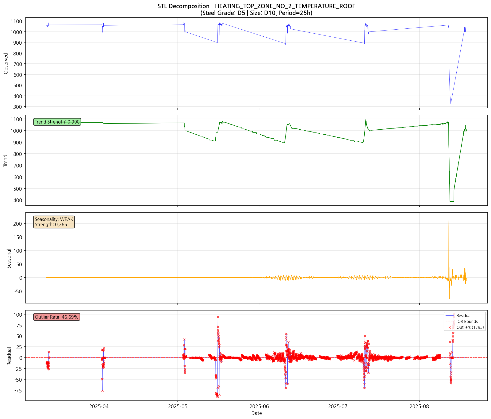

**HEATING_TOP_ZONE_NO_1_TEMPERATURE_ROOF** (이상치율: 44.77%, 계절성: 0.462)

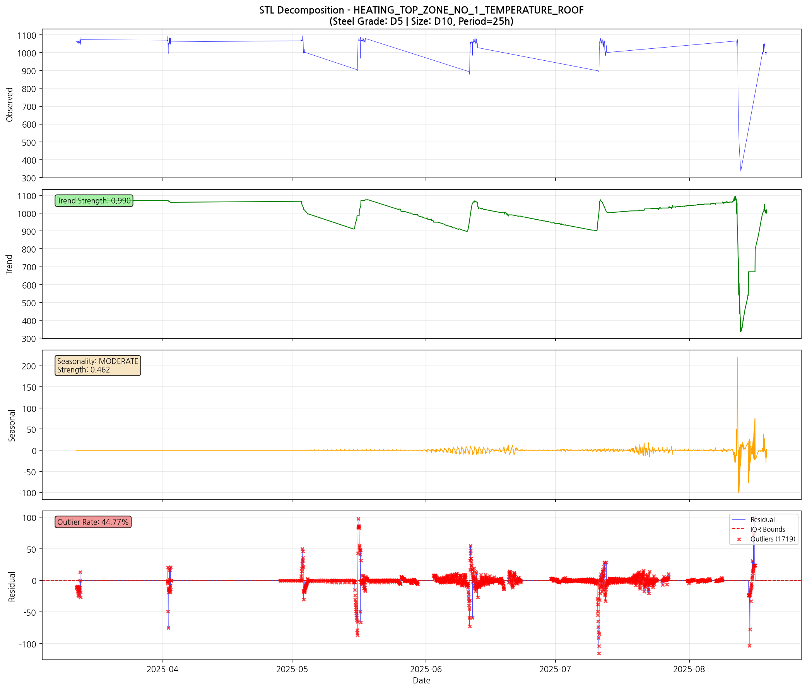

**SOAKING_TOP_ZONE_NO_1_TEMPERATURE_ROOF** (이상치율: 44.09%, 계절성: 0.064)

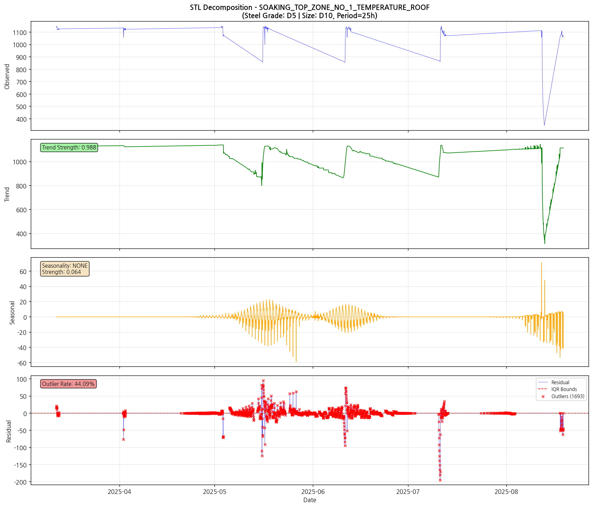

### 가열로 하부 온도 (02_Furnace_Bottom_Temperature)

- 분석 태그: 4개
- 평균 잔차 이상치율: 39.72%
- 평균 계절성 강도: 0.043

| 태그 | 이상치율 | 계절성 강도 | 추세 강도 |
|------|----------|-------------|-----------|
| HEATING_BOTTOM_ZONE_NO_1_TEMPERATURE_OPP_SIDE | 36.77% | 0.000 | 0.970 |
| HEATING_BOTTOM_ZONE_NO_2_TEMPERATURE_MILL_SIDE | 37.34% | 0.159 | 0.985 |
| SOAKING_BOTTOM_ZONE_NO_1_TEMPERATURE_OPP_SIDE | 41.77% | 0.013 | 0.977 |
| SOAKING_BOTTOM_ZONE_NO_2_TEMPERATURE_MILL_SIDE | 42.99% | 0.000 | 0.982 |

#### STL 분해 차트

**SOAKING_BOTTOM_ZONE_NO_2_TEMPERATURE_MILL_SIDE** (이상치율: 42.99%, 계절성: 0.000)

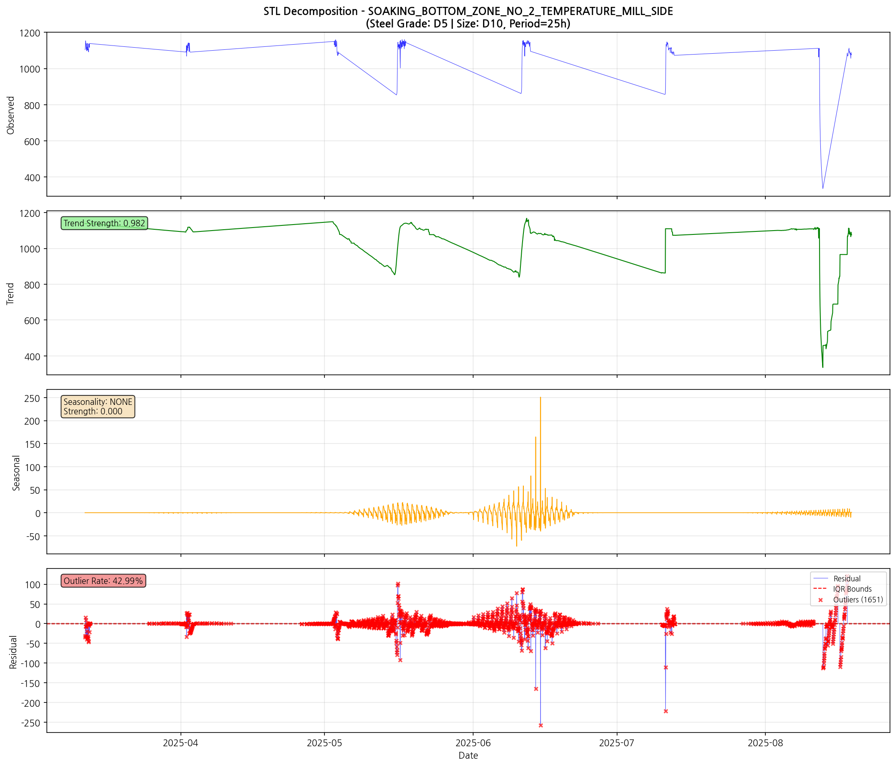

**SOAKING_BOTTOM_ZONE_NO_1_TEMPERATURE_OPP_SIDE** (이상치율: 41.77%, 계절성: 0.013)

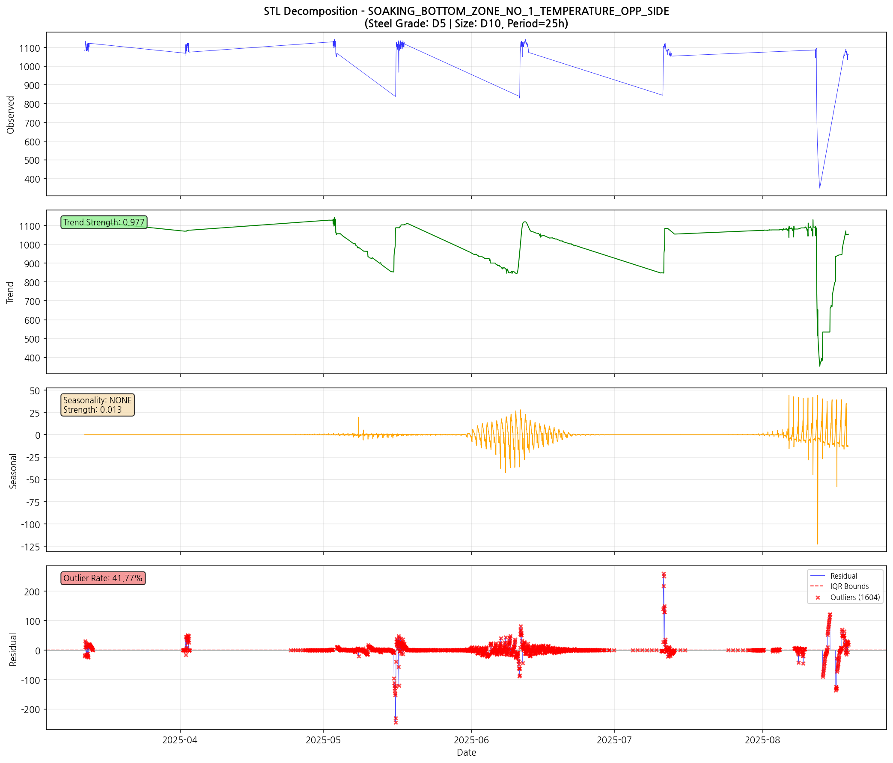

**HEATING_BOTTOM_ZONE_NO_2_TEMPERATURE_MILL_SIDE** (이상치율: 37.34%, 계절성: 0.159)

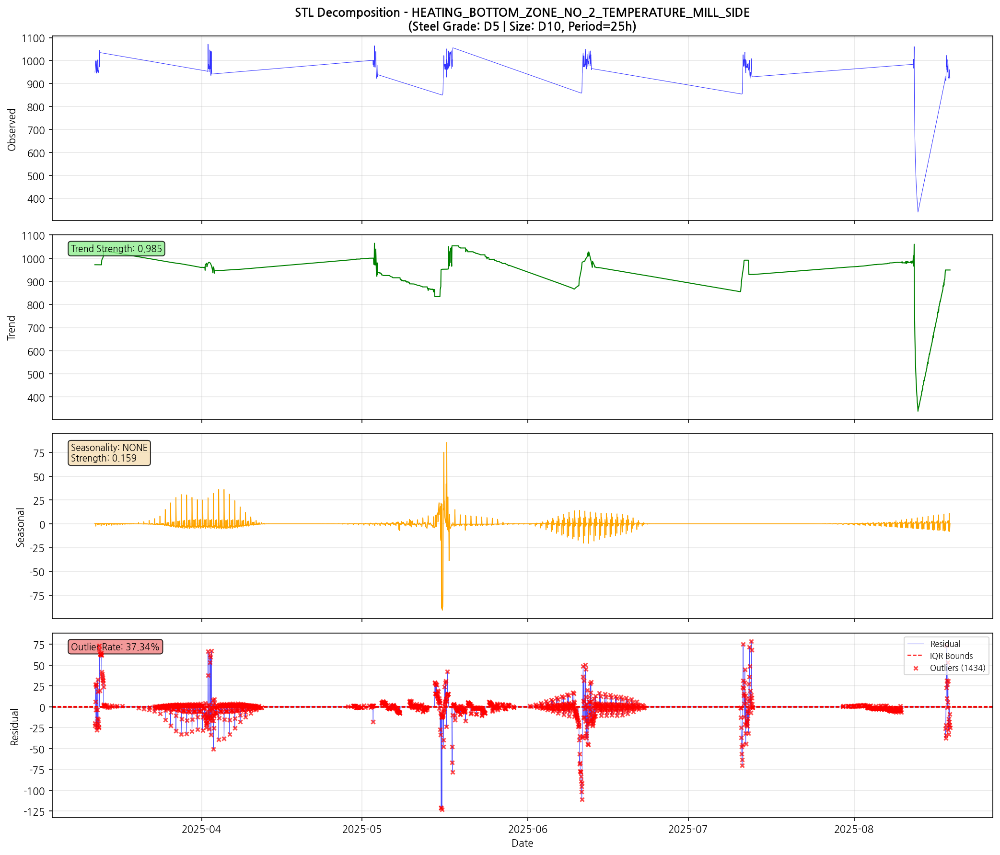

### 가열로 추출 온도 (03_Furnace_Discharge_Temperature)

- 분석 태그: 1개
- 평균 잔차 이상치율: 39.06%
- 평균 계절성 강도: 0.709

| 태그 | 이상치율 | 계절성 강도 | 추세 강도 |
|------|----------|-------------|-----------|
| FURNACE_EXIT_DISCHARGE_BILLET_TEMPERATURE | 39.06% | 0.709 | 0.997 |

#### STL 분해 차트

**FURNACE_EXIT_DISCHARGE_BILLET_TEMPERATURE** (이상치율: 39.06%, 계절성: 0.709)

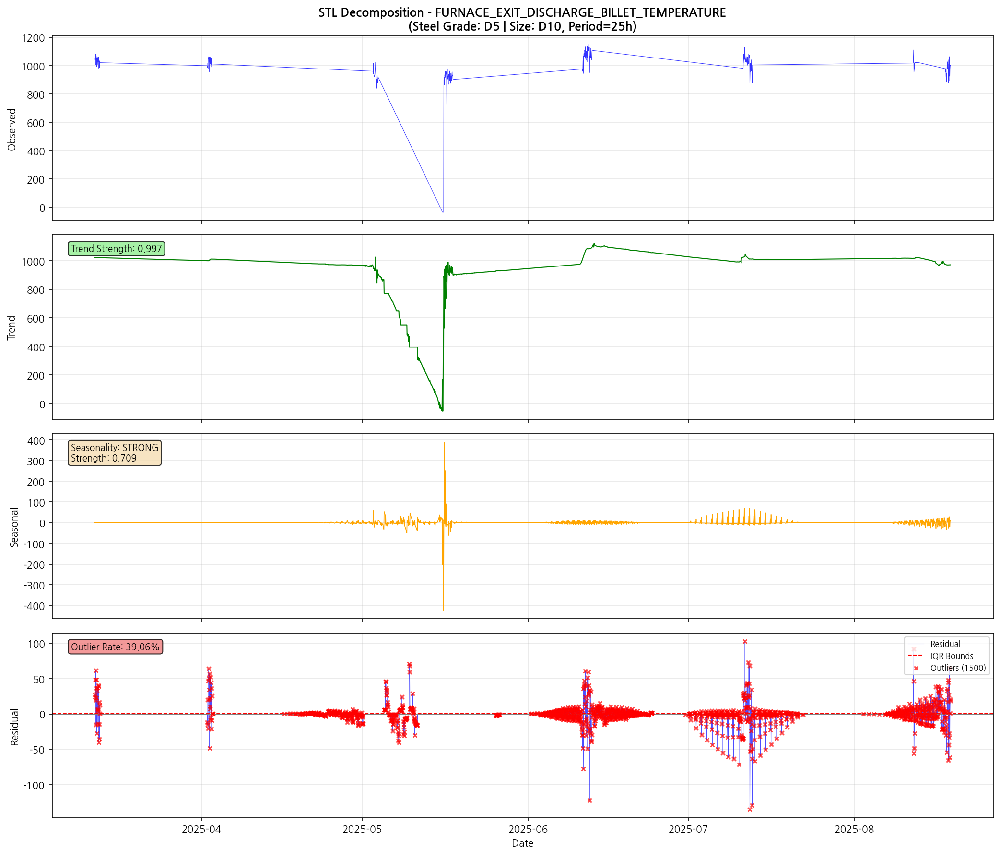

### 가열로 보조설비 (04_Furnace_Auxiliary)

- 분석 태그: 9개
- 평균 잔차 이상치율: 41.08%
- 평균 계절성 강도: 0.046

| 태그 | 이상치율 | 계절성 강도 | 추세 강도 |
|------|----------|-------------|-----------|
| FURNACE_PRESSURE | 41.82% | 0.038 | 0.914 |
| FURNACE_O2_ANALYZER | 43.18% | 0.334 | 0.994 |
| MAIN_GAS_PRESSURE | 46.15% | 0.000 | 0.983 |
| MAIN_GAS_FLOW | 40.10% | 0.021 | 0.946 |
| MAIN_GAS_TEMPERATURE | 37.73% | 0.000 | 0.993 |
| MAIN_COMBUSTION_AIR_PRESSURE | 43.85% | 0.000 | 0.912 |
| COMBUSTION_AIR_TEMPERATURE | 37.01% | 0.021 | 0.991 |
| INDIRECT_COOLING_WATER_FLOW | 36.85% | 0.000 | 0.993 |
| INDIRECT_WATER_MAIN_TEMPERATURE | 43.05% | 0.000 | 0.990 |

#### STL 분해 차트

**MAIN_GAS_PRESSURE** (이상치율: 46.15%, 계절성: 0.000)

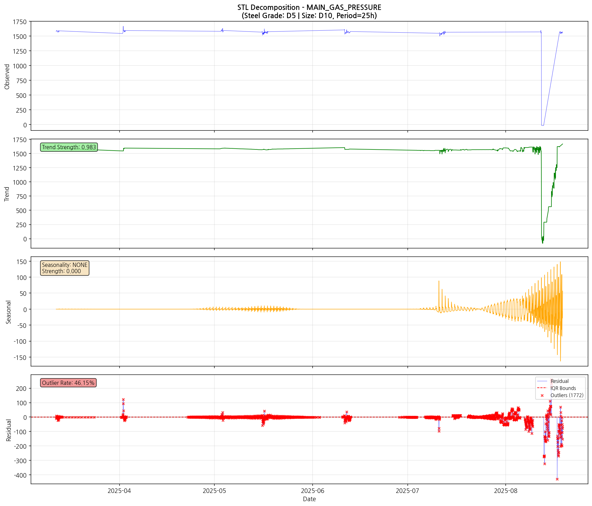

**MAIN_COMBUSTION_AIR_PRESSURE** (이상치율: 43.85%, 계절성: 0.000)

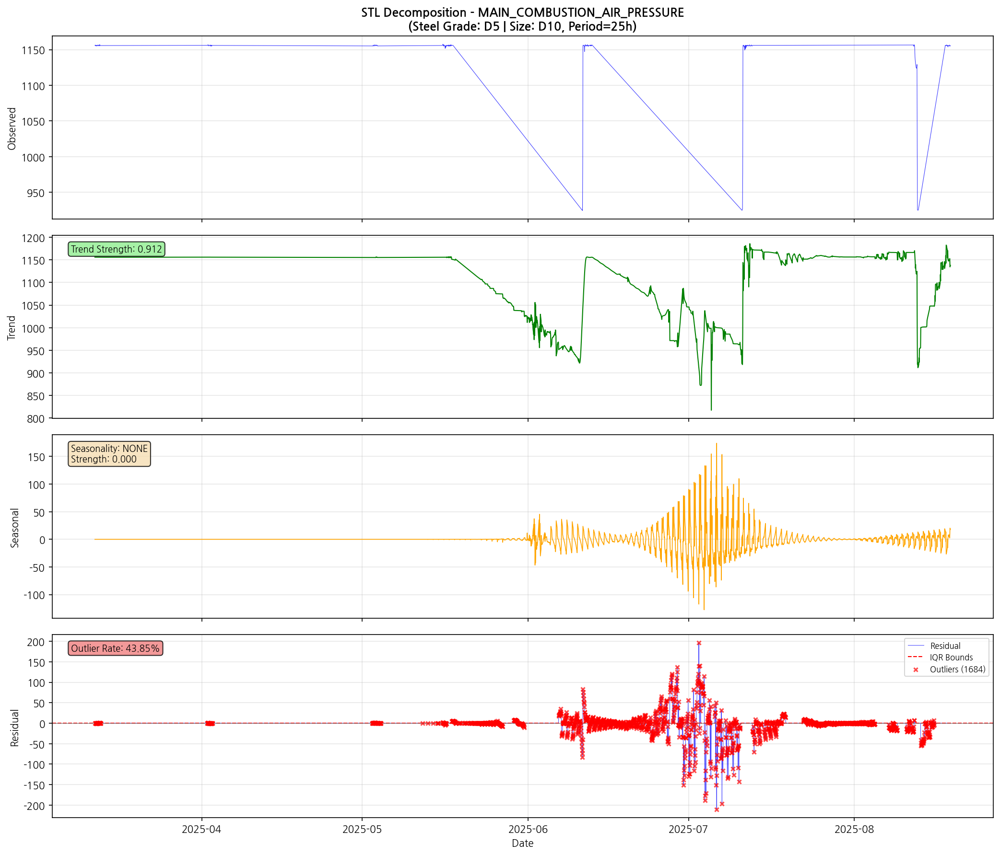

**FURNACE_O2_ANALYZER** (이상치율: 43.18%, 계절성: 0.334)

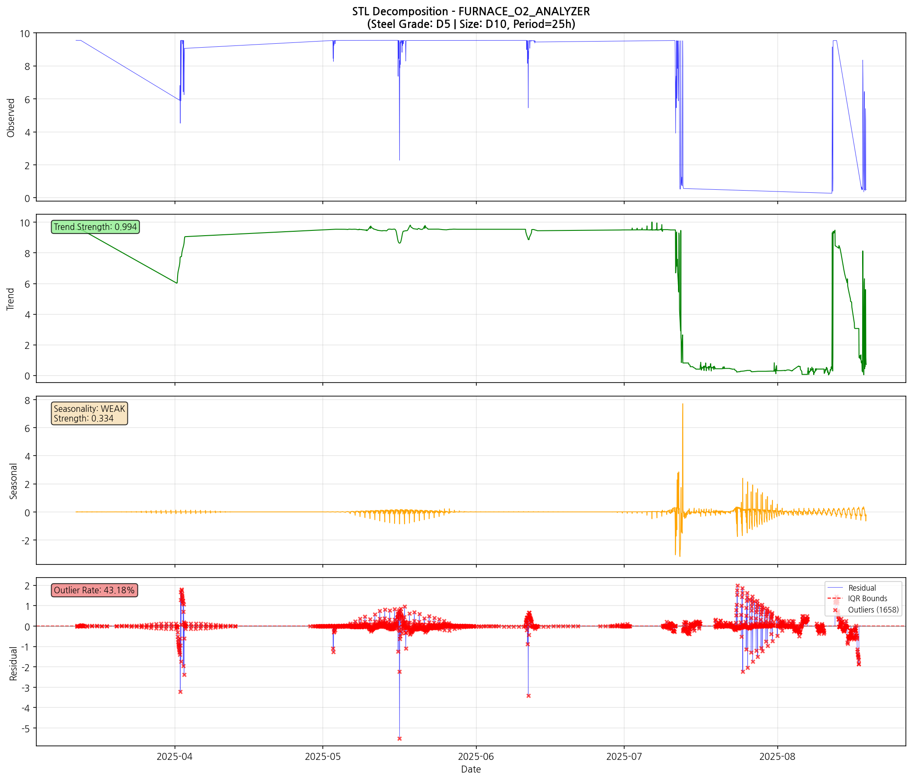

### 스탠드 토크 (05_Stand_Torque)

- 분석 태그: 16개
- 평균 잔차 이상치율: 40.48%
- 평균 계절성 강도: 0.031

| 태그 | 이상치율 | 계절성 강도 | 추세 강도 |
|------|----------|-------------|-----------|
| STAND_1_ACTUAL_TORQUE | 38.41% | 0.014 | 0.942 |
| STAND_2_ACTUAL_TORQUE | 44.38% | 0.058 | 0.961 |
| STAND_3_ACTUAL_TORQUE | 38.78% | 0.000 | 0.926 |
| STAND_4_ACTUAL_TORQUE | 32.89% | 0.015 | 0.939 |
| STAND_5_ACTUAL_TORQUE | 40.60% | 0.000 | 0.949 |
| STAND_6_ACTUAL_TORQUE | 43.59% | 0.000 | 0.950 |
| STAND_7_ACTUAL_TORQUE | 37.84% | 0.000 | 0.953 |
| STAND_8_ACTUAL_TORQUE | 38.31% | 0.074 | 0.936 |
| STAND_9_ACTUAL_TORQUE | 38.12% | 0.000 | 0.936 |
| STAND_10_ACTUAL_TORQUE | 42.45% | 0.000 | 0.693 |
| STAND_11_ACTUAL_TORQUE | 40.10% | 0.000 | 0.928 |
| STAND_12_ACTUAL_TORQUE | 42.01% | 0.015 | 0.939 |
| STAND_13_ACTUAL_TORQUE | 37.14% | 0.008 | 0.954 |
| STAND_14_ACTUAL_TORQUE | 44.90% | 0.147 | 0.964 |
| FINISHING_BLOCK_MASTER_ACTUAL_TORQUE | 45.16% | 0.160 | 0.956 |
| FINISHING_BLOCK_SLAVE_ACTUAL_TORQUE | 42.94% | 0.000 | 0.947 |

#### STL 분해 차트

**FINISHING_BLOCK_MASTER_ACTUAL_TORQUE** (이상치율: 45.16%, 계절성: 0.160)

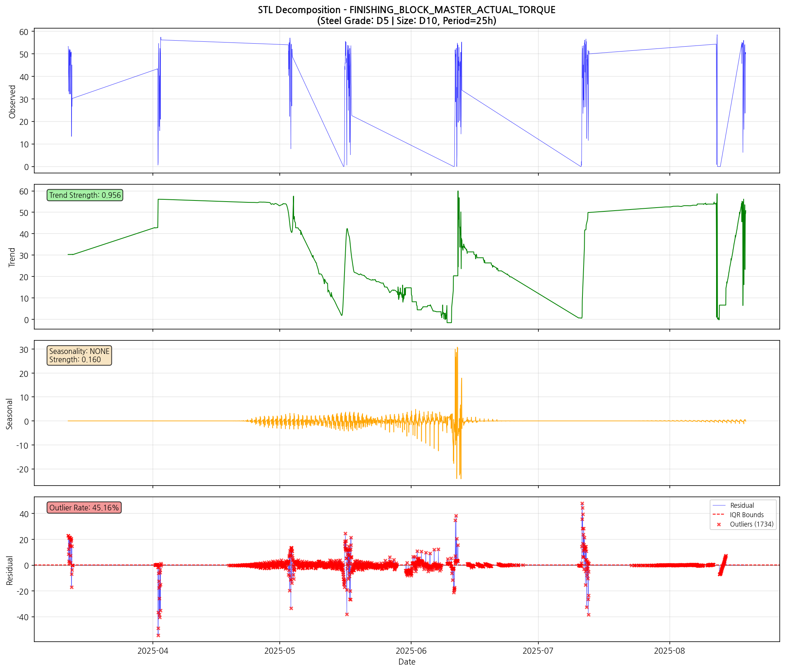

**STAND_14_ACTUAL_TORQUE** (이상치율: 44.90%, 계절성: 0.147)

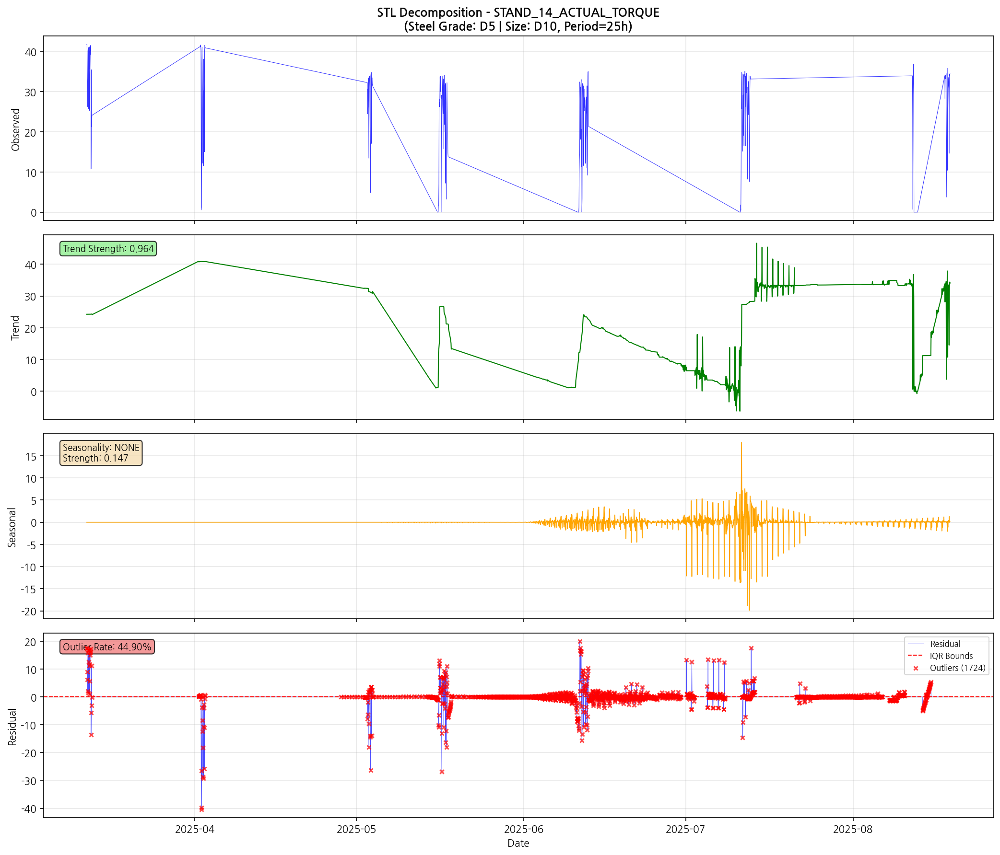

**STAND_2_ACTUAL_TORQUE** (이상치율: 44.38%, 계절성: 0.058)

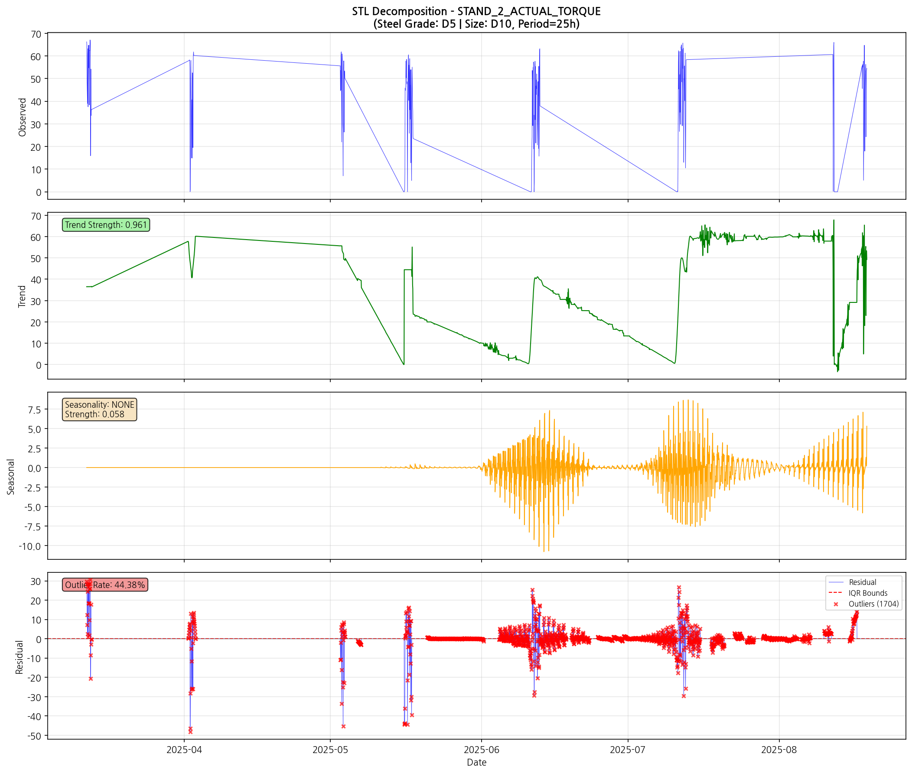

### 스탠드 속도 (06_Stand_Speed)

- 분석 태그: 15개
- 평균 잔차 이상치율: 41.11%
- 평균 계절성 강도: 0.027

| 태그 | 이상치율 | 계절성 강도 | 추세 강도 |
|------|----------|-------------|-----------|
| STAND_1_ACTUAL_SPEED | 36.88% | 0.000 | 0.963 |
| STAND_2_ACTUAL_SPEED | 42.76% | 0.000 | 0.967 |
| STAND_3_ACTUAL_SPEED | 41.54% | 0.051 | 0.959 |
| STAND_4_ACTUAL_SPEED | 43.98% | 0.000 | 0.968 |
| STAND_5_ACTUAL_SPEED | 38.39% | 0.011 | 0.963 |
| STAND_6_ACTUAL_SPEED | 39.06% | 0.236 | 0.967 |
| STAND_7_ACTUAL_SPEED | 42.27% | 0.000 | 0.954 |
| STAND_8_ACTUAL_SPEED | 42.99% | 0.000 | 0.738 |
| STAND_9_ACTUAL_SPEED | 39.11% | 0.052 | 0.968 |
| STAND_10_ACTUAL_SPEED | 43.83% | 0.000 | 0.953 |
| STAND_11_ACTUAL_SPEED | 34.74% | 0.000 | 0.921 |
| STAND_12_ACTUAL_SPEED | 42.24% | 0.059 | 0.964 |
| STAND_13_ACTUAL_SPEED | 41.02% | 0.000 | 0.932 |
| STAND_14_ACTUAL_SPEED | 43.49% | 0.000 | 0.937 |
| FINISHING_BLOCK_ACTUAL_SPEED | 44.30% | 0.000 | 0.855 |

#### STL 분해 차트

**FINISHING_BLOCK_ACTUAL_SPEED** (이상치율: 44.30%, 계절성: 0.000)

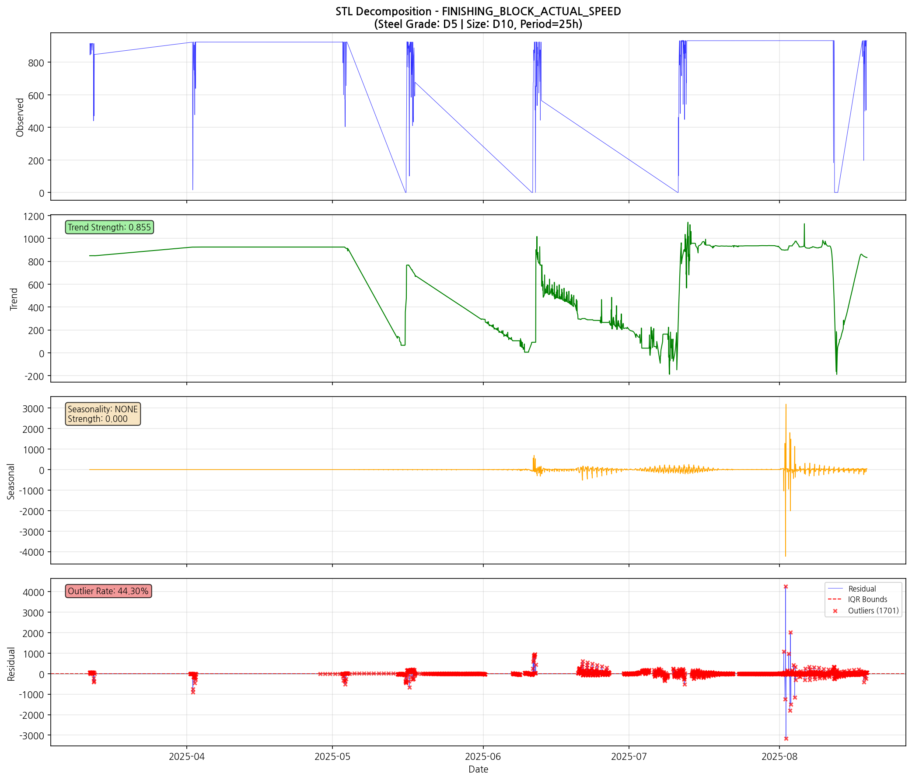

**STAND_4_ACTUAL_SPEED** (이상치율: 43.98%, 계절성: 0.000)

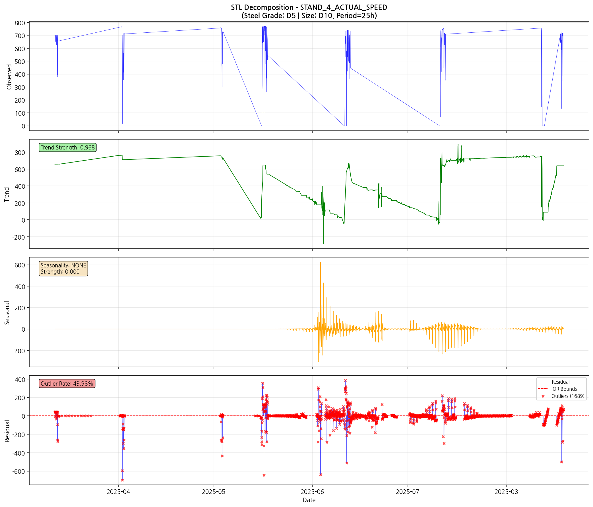

**STAND_10_ACTUAL_SPEED** (이상치율: 43.83%, 계절성: 0.000)

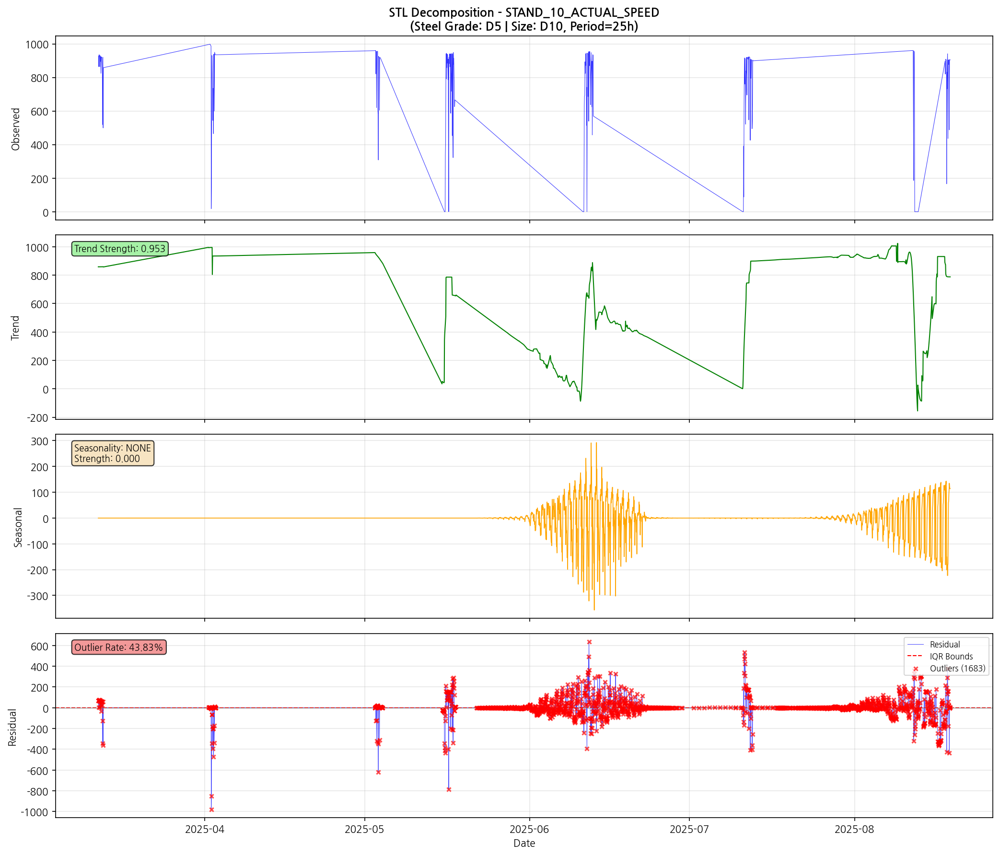

### 스탠드 부하 (07_Stand_Load)

- 분석 태그: 15개
- 평균 잔차 이상치율: 39.69%
- 평균 계절성 강도: 0.016

| 태그 | 이상치율 | 계절성 강도 | 추세 강도 |
|------|----------|-------------|-----------|
| STAND_1_LOAD | 40.68% | 0.000 | 0.943 |
| STAND_2_LOAD | 42.27% | 0.089 | 0.960 |
| STAND_3_LOAD | 41.72% | 0.004 | 0.942 |
| STAND_4_LOAD | 40.57% | 0.000 | 0.916 |
| STAND_5_LOAD | 37.01% | 0.000 | 0.931 |
| STAND_6_LOAD | 42.01% | 0.000 | 0.938 |
| STAND_7_LOAD | 41.20% | 0.152 | 0.827 |
| STAND_8_LOAD | 37.19% | 0.000 | 0.932 |
| STAND_9_LOAD | 40.39% | 0.000 | 0.939 |
| STAND_10_LOAD | 37.60% | 0.000 | 0.925 |
| STAND_11_LOAD | 38.57% | 0.000 | 0.920 |
| STAND_12_LOAD | 38.52% | 0.000 | 0.944 |
| STAND_13_LOAD | 38.52% | 0.000 | 0.944 |
| STAND_14_LOAD | 42.24% | 0.000 | 0.762 |
| FINISHING_BLOCK_LOAD | 36.88% | 0.000 | 0.953 |

#### STL 분해 차트

**STAND_2_LOAD** (이상치율: 42.27%, 계절성: 0.089)

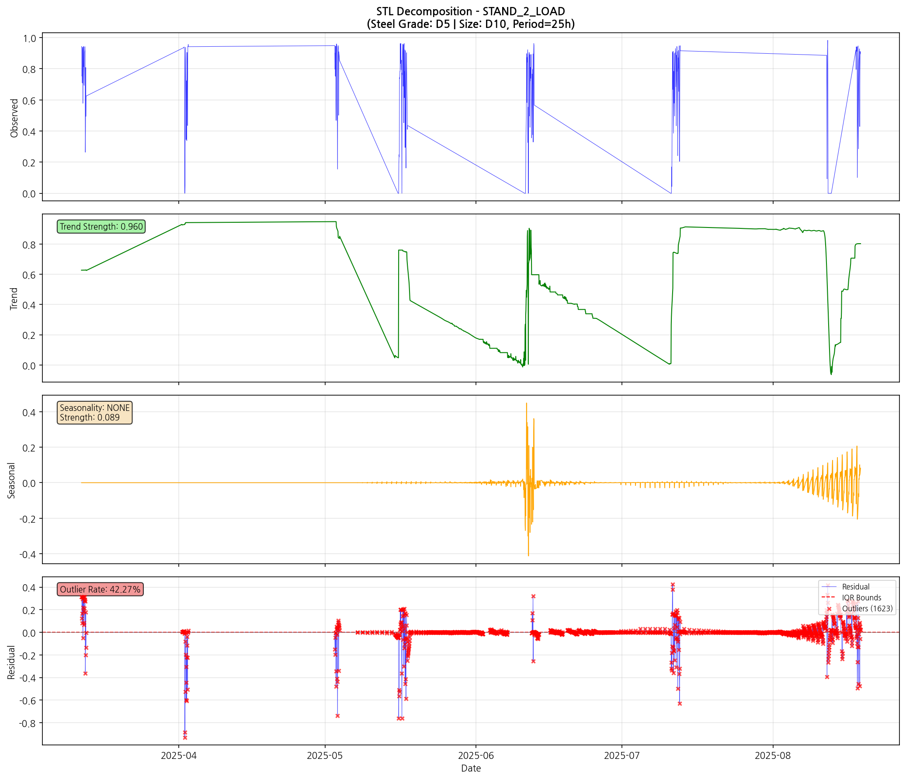

**STAND_14_LOAD** (이상치율: 42.24%, 계절성: 0.000)

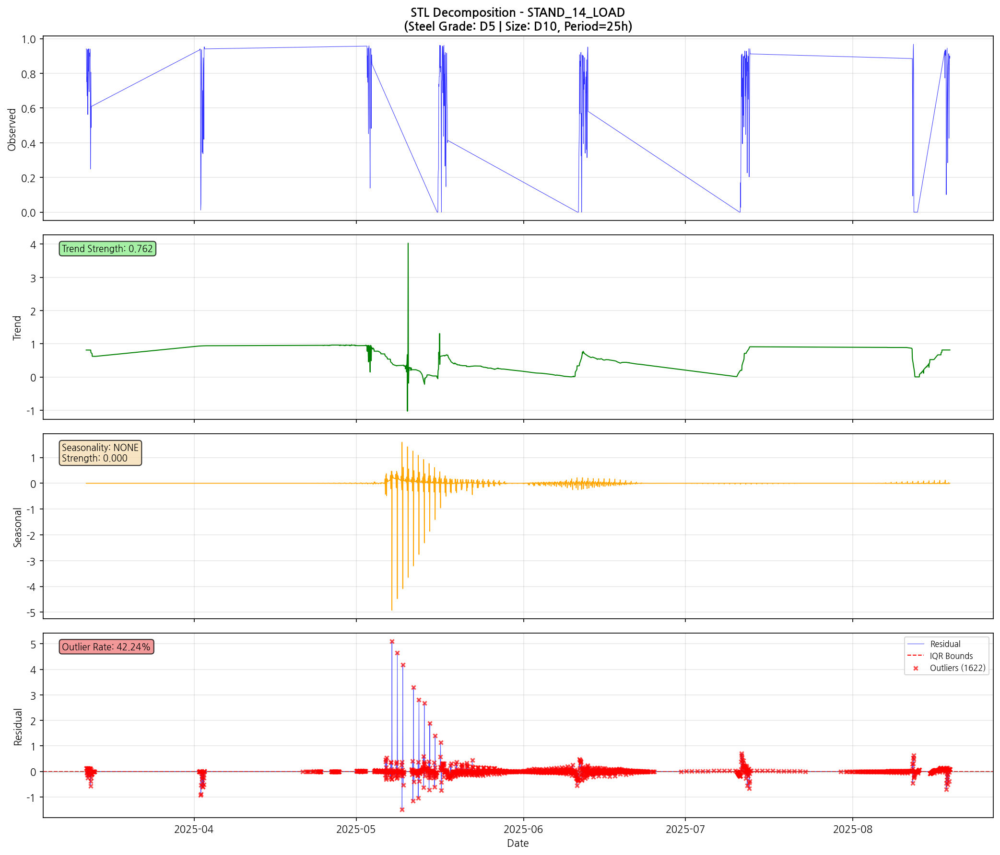

**STAND_6_LOAD** (이상치율: 42.01%, 계절성: 0.000)

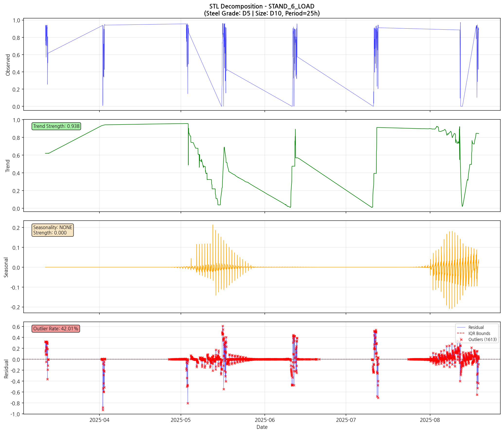

### 핀치롤 (08_Pinchroll)

- 분석 태그: 9개
- 평균 잔차 이상치율: 40.16%
- 평균 계절성 강도: 0.264

| 태그 | 이상치율 | 계절성 강도 | 추세 강도 |
|------|----------|-------------|-----------|
| PINCHROLL_2_ACTUAL_SPEED | 38.49% | 0.935 | 0.927 |
| PINCHROLL_3_ACTUAL_SPEED | 38.36% | 0.695 | 0.998 |
| PINCHROLL_4_ACTUAL_SPEED | 41.56% | 0.319 | 0.965 |
| PINCHROLL_2_ACTUAL_TORQUE | 44.58% | 0.000 | 0.946 |
| PINCHROLL_3_ACTUAL_TORQUE | 40.26% | 0.000 | 0.966 |
| PINCHROLL_4_ACTUAL_TORQUE | 40.70% | 0.000 | 0.956 |
| PINCHROLL_2_REFERENCE_TORQUE | 37.89% | 0.429 | 0.978 |
| PINCHROLL_3_REFERENCE_TORQUE | 38.72% | 0.000 | 0.957 |
| PINCHROLL_4_REFERENCE_TORQUE | 40.83% | 0.000 | 0.699 |

#### STL 분해 차트

**PINCHROLL_2_ACTUAL_TORQUE** (이상치율: 44.58%, 계절성: 0.000)

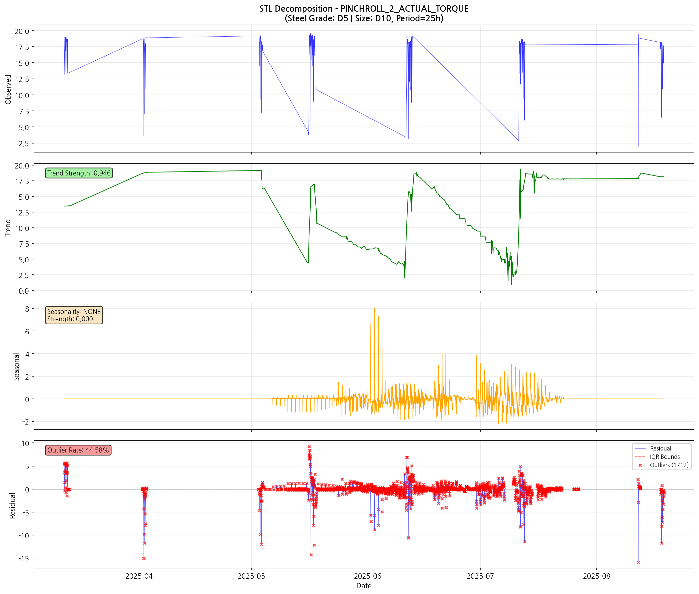

**PINCHROLL_4_ACTUAL_SPEED** (이상치율: 41.56%, 계절성: 0.319)

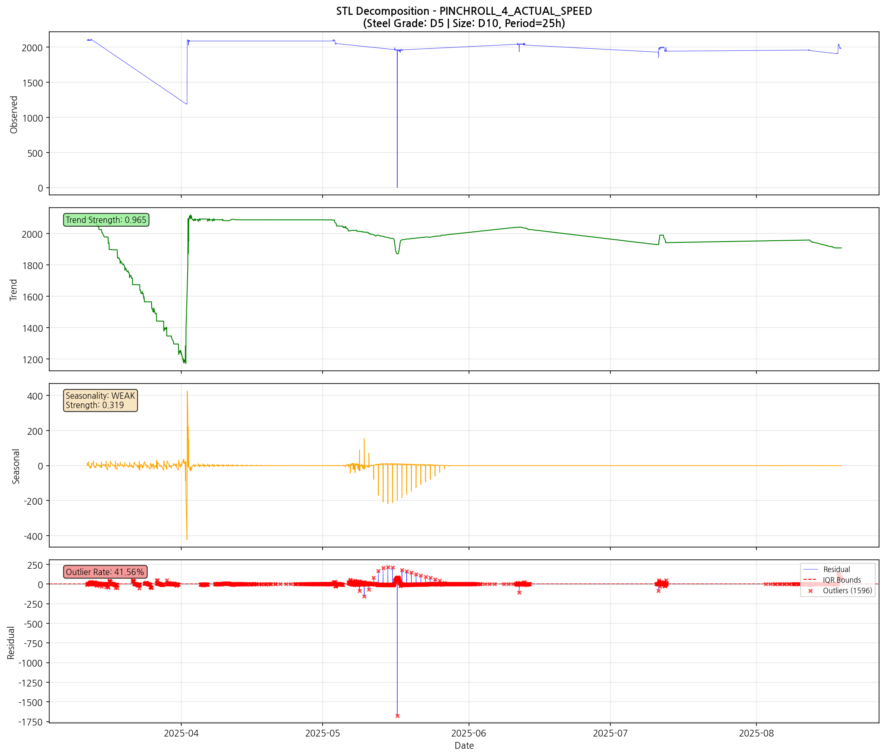

**PINCHROLL_4_REFERENCE_TORQUE** (이상치율: 40.83%, 계절성: 0.000)

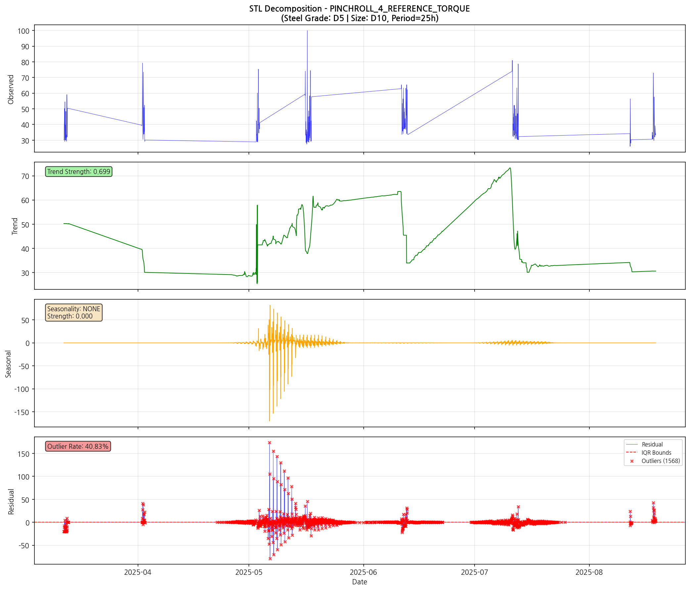

### PR 상세 토크 (09_PR_Detailed)

- 분석 태그: 6개
- 평균 잔차 이상치율: 39.53%
- 평균 계절성 강도: 0.085

| 태그 | 이상치율 | 계절성 강도 | 추세 강도 |
|------|----------|-------------|-----------|
| PR6L1_ACT_TORQUE | 43.44% | 0.126 | 0.958 |
| PR6L2_ACT_TORQUE | 39.77% | 0.201 | 0.965 |
| PR7L1_ACT_TORQUE | 32.63% | 0.047 | 0.985 |
| PR7L2_ACT_TORQUE | 39.90% | 0.115 | 0.974 |
| PR8L1_ACT_TORQUE | 40.00% | 0.019 | 0.949 |
| PR9L1_ACT_TORQUE | 41.43% | 0.000 | 0.957 |

#### STL 분해 차트

**PR6L1_ACT_TORQUE** (이상치율: 43.44%, 계절성: 0.126)

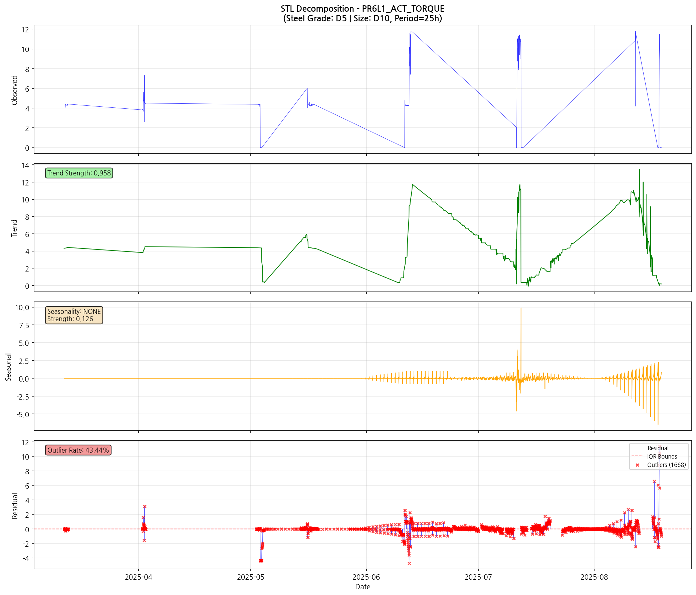

**PR9L1_ACT_TORQUE** (이상치율: 41.43%, 계절성: 0.000)

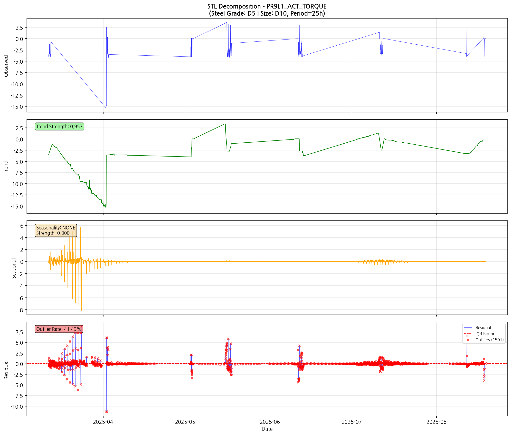

**PR8L1_ACT_TORQUE** (이상치율: 40.00%, 계절성: 0.019)

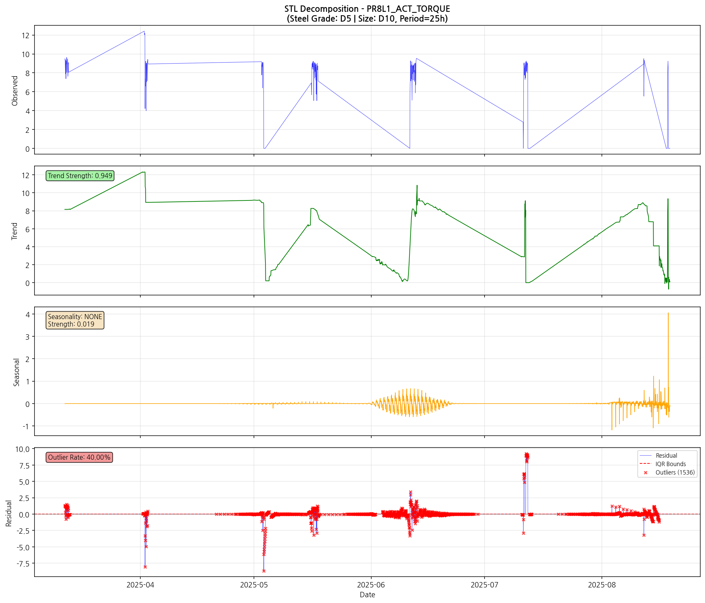

---

## 해석 가이드

### STL 분해 해석

1. **추세 (Trend)**
   - 장기적인 상승/하락 패턴
   - 설비 노화, 계절적 변화 등 반영
   - 추세 강도 높을수록 장기 변화가 뚜렷함

2. **계절성 (Seasonal)**
   - 주기적으로 반복되는 패턴 (24시간 기준)
   - 계절성 강도 ≥ 0.7: 강한 주기적 패턴
   - 계절성이 강한 태그는 STL 분석이 효과적

3. **잔차 (Residual)**
   - 추세와 계절성으로 설명되지 않는 변동
   - **순수한 이상치**를 포함
   - 잔차 기반 IQR로 "진짜" 이상치 탐지

### 계절성 강도 분류

| 분류 | 강도 범위 | 해석 |
|------|----------|------|
| Strong | ≥ 0.7 | 명확한 주기적 패턴, STL 매우 효과적 |
| Moderate | 0.4 ~ 0.7 | 적당한 주기적 패턴, STL 효과적 |
| Weak | 0.2 ~ 0.4 | 약한 주기적 패턴 |
| None | < 0.2 | 주기적 패턴 거의 없음 |

### Standard IQR vs STL Residual IQR

| 방법 | 장점 | 단점 |
|------|------|------|
| Standard IQR | 간단, 빠름 | 계절성에 영향받음 |
| STL Residual IQR | 계절성 제거, 순수 이상치 | 계산 복잡, 데이터 필요 |

**권장**: 계절성 강도 ≥ 0.4인 태그에는 STL Residual IQR 사용

---

## 메타데이터

| 항목 | 값 |
|------|-----|
| 분석 스크립트 | steel_grade_stl_analysis.py |
| 분석 기간 | 2025-03-01 ~ 2025-08-31 |
| 강종 | D5 |
| 계절 주기 | 25시간 |
| 생성일시 | 2026-02-09 15:07:00 |
| 총 분석 태그 | 79개 |

---

*본 보고서는 자동 생성되었습니다.*
