# 강종 [D5] 사이즈 [D13] STL 계절-추세 분해 분석 보고서

**분석 기간**: 2025-03-01 ~ 2025-08-31
**강종**: D5 | 사이즈: D13
**생성일시**: 2026-02-09 15:08:06

---

## 분석 개요

### 분석 방법론

**STL (Seasonal-Trend Decomposition using LOESS)**

시계열 데이터를 세 가지 성분으로 분해:
- **Trend (추세)**: 장기적인 변화 패턴
- **Seasonal (계절성)**: 주기적으로 반복되는 패턴
- **Residual (잔차)**: 추세와 계절성으로 설명되지 않는 변동

| 파라미터 | 값 | 설명 |
|----------|-----|------|
| seasonal | 25h | 계절 주기 |
| robust | True | 강건 추정 |

### 분석 결과 요약

| 구분 | 태그 수 | 비율 |
|------|---------|------|
| **총 분석 태그** | 79개 | 100% |

#### 잔차 이상치율 분포

| 구분 | 태그 수 | 비율 |
|------|---------|------|
| 🔴 높음 (≥15%) | 79개 | 100.0% |
| 🟠 중간 (5~15%) | 0개 | 0.0% |
| 🟢 낮음 (<5%) | 0개 | 0.0% |

#### 계절성 강도 분포

| 구분 | 태그 수 | 비율 |
|------|---------|------|
| 🔵 강함 (≥0.7) | 3개 | 3.8% |
| 중간 (0.4~0.7) | 7개 | 8.9% |
| 약함 (<0.4) | 69개 | 87.3% |

#### 전체 평균

| 지표 | 값 |
|------|-----|
| 평균 계절성 강도 | 0.130 |
| 평균 추세 강도 | 0.881 |

---

## 상위 문제 태그 (잔차 이상치율 기준)

| 순위 | 태그 | 카테고리 | 이상치율 | 계절성 강도 | 계절성 분류 |
|------|------|----------|----------|-------------|-------------|
| 1 | STAND_7_ACTUAL_SPEED | 스탠드 속도 | 47.46% | 0.005 | none |
| 2 | PINCHROLL_2_ACTUAL_TORQUE | 핀치롤 | 47.37% | 0.612 | moderate |
| 3 | MAIN_GAS_PRESSURE | 가열로 보조설비 | 46.83% | 0.593 | moderate |
| 4 | STAND_2_LOAD | 스탠드 부하 | 46.15% | 0.131 | none |
| 5 | PR8L1_ACT_TORQUE | PR 상세 토크 | 46.14% | 0.000 | none |
| 6 | STAND_11_ACTUAL_SPEED | 스탠드 속도 | 45.92% | 0.175 | none |
| 7 | SOAKING_BOTTOM_ZONE_NO_2_TEMPERATURE_MILL_SIDE | 가열로 하부 온도 | 45.29% | 0.000 | none |
| 8 | STAND_5_ACTUAL_SPEED | 스탠드 속도 | 45.24% | 0.013 | none |
| 9 | FURNACE_EXIT_DISCHARGE_BILLET_TEMPERATURE | 가열로 추출 온도 | 45.20% | 0.041 | none |
| 10 | FURNACE_PRESSURE | 가열로 보조설비 | 45.11% | 0.000 | none |
| 11 | STAND_3_ACTUAL_TORQUE | 스탠드 토크 | 44.75% | 0.000 | none |
| 12 | PR7L2_ACT_TORQUE | PR 상세 토크 | 44.74% | 0.771 | strong |
| 13 | SOAKING_TOP_ZONE_NO_2_TEMPERATURE_ROOF | 가열로 상부 온도 | 44.61% | 0.765 | strong |
| 14 | FURNACE_O2_ANALYZER | 가열로 보조설비 | 44.57% | 0.000 | none |
| 15 | PR9L1_ACT_TORQUE | PR 상세 토크 | 44.10% | 0.091 | none |

---

## 강한 계절성 태그 목록

계절성 강도가 0.7 이상인 태그입니다. 이 태그들은 STL 분석이 특히 효과적입니다.

| 태그 | 카테고리 | 계절성 강도 | 잔차 이상치율 |
|------|----------|-------------|---------------|
| INDIRECT_COOLING_WATER_FLOW | 가열로 보조설비 | 0.783 | 40.81% |
| PR7L2_ACT_TORQUE | PR 상세 토크 | 0.771 | 44.74% |
| SOAKING_TOP_ZONE_NO_2_TEMPERATURE_ROOF | 가열로 상부 온도 | 0.765 | 44.61% |

---

## 카테고리별 분석 결과

### 가열로 상부 온도 (01_Furnace_Top_Temperature)

- 분석 태그: 4개
- 평균 잔차 이상치율: 42.28%
- 평균 계절성 강도: 0.199

| 태그 | 이상치율 | 계절성 강도 | 추세 강도 |
|------|----------|-------------|-----------|
| HEATING_TOP_ZONE_NO_1_TEMPERATURE_ROOF | 40.67% | 0.001 | 0.977 |
| HEATING_TOP_ZONE_NO_2_TEMPERATURE_ROOF | 43.89% | 0.000 | 0.897 |
| SOAKING_TOP_ZONE_NO_1_TEMPERATURE_ROOF | 39.95% | 0.028 | 0.909 |
| SOAKING_TOP_ZONE_NO_2_TEMPERATURE_ROOF | 44.61% | 0.765 | 0.987 |

#### STL 분해 차트

**SOAKING_TOP_ZONE_NO_2_TEMPERATURE_ROOF** (이상치율: 44.61%, 계절성: 0.765)

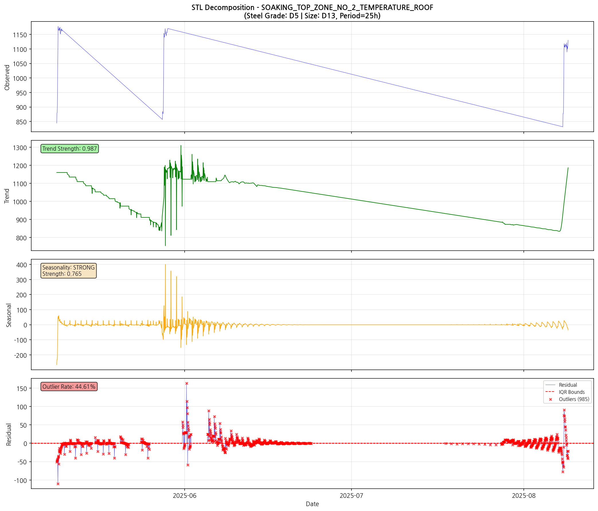

**HEATING_TOP_ZONE_NO_2_TEMPERATURE_ROOF** (이상치율: 43.89%, 계절성: 0.000)

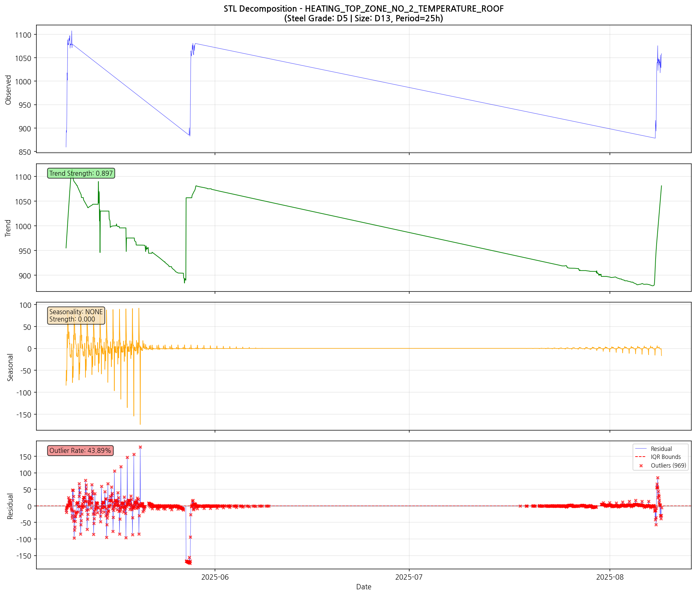

**HEATING_TOP_ZONE_NO_1_TEMPERATURE_ROOF** (이상치율: 40.67%, 계절성: 0.001)

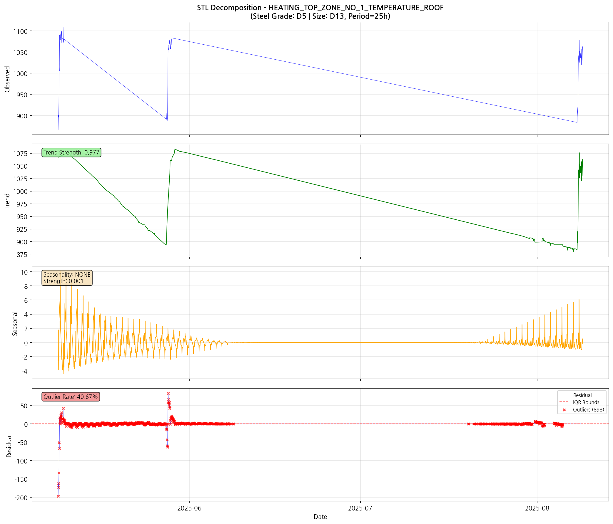

### 가열로 하부 온도 (02_Furnace_Bottom_Temperature)

- 분석 태그: 4개
- 평균 잔차 이상치율: 39.53%
- 평균 계절성 강도: 0.008

| 태그 | 이상치율 | 계절성 강도 | 추세 강도 |
|------|----------|-------------|-----------|
| HEATING_BOTTOM_ZONE_NO_1_TEMPERATURE_OPP_SIDE | 37.14% | 0.000 | 0.311 |
| HEATING_BOTTOM_ZONE_NO_2_TEMPERATURE_MILL_SIDE | 38.41% | 0.000 | 0.908 |
| SOAKING_BOTTOM_ZONE_NO_1_TEMPERATURE_OPP_SIDE | 37.27% | 0.034 | 0.930 |
| SOAKING_BOTTOM_ZONE_NO_2_TEMPERATURE_MILL_SIDE | 45.29% | 0.000 | 0.887 |

#### STL 분해 차트

**SOAKING_BOTTOM_ZONE_NO_2_TEMPERATURE_MILL_SIDE** (이상치율: 45.29%, 계절성: 0.000)

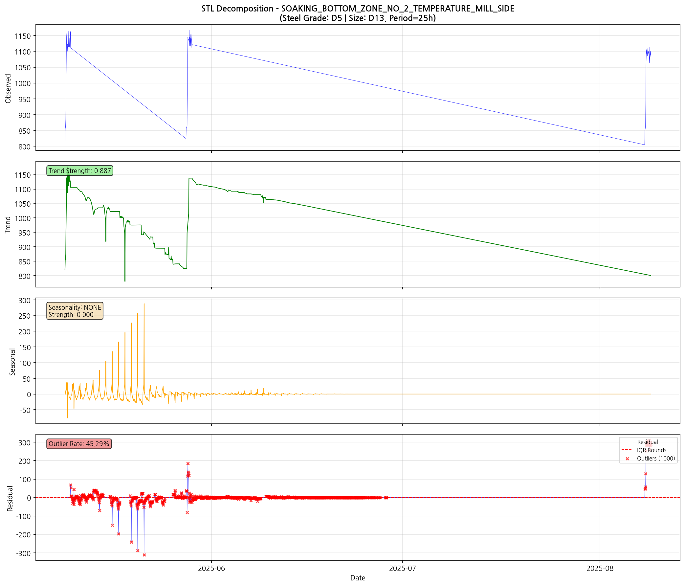

**HEATING_BOTTOM_ZONE_NO_2_TEMPERATURE_MILL_SIDE** (이상치율: 38.41%, 계절성: 0.000)

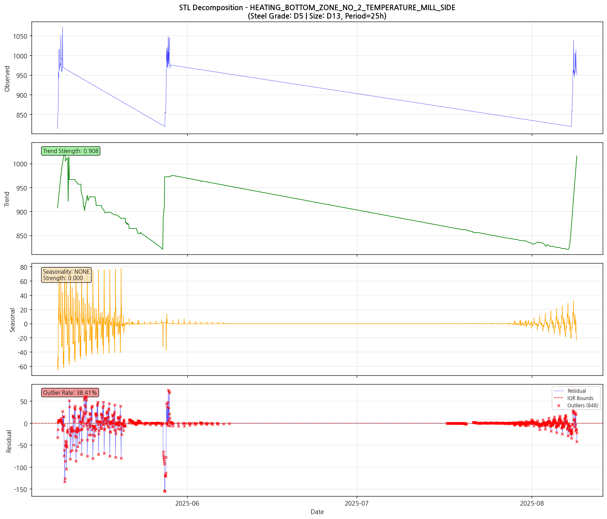

**SOAKING_BOTTOM_ZONE_NO_1_TEMPERATURE_OPP_SIDE** (이상치율: 37.27%, 계절성: 0.034)

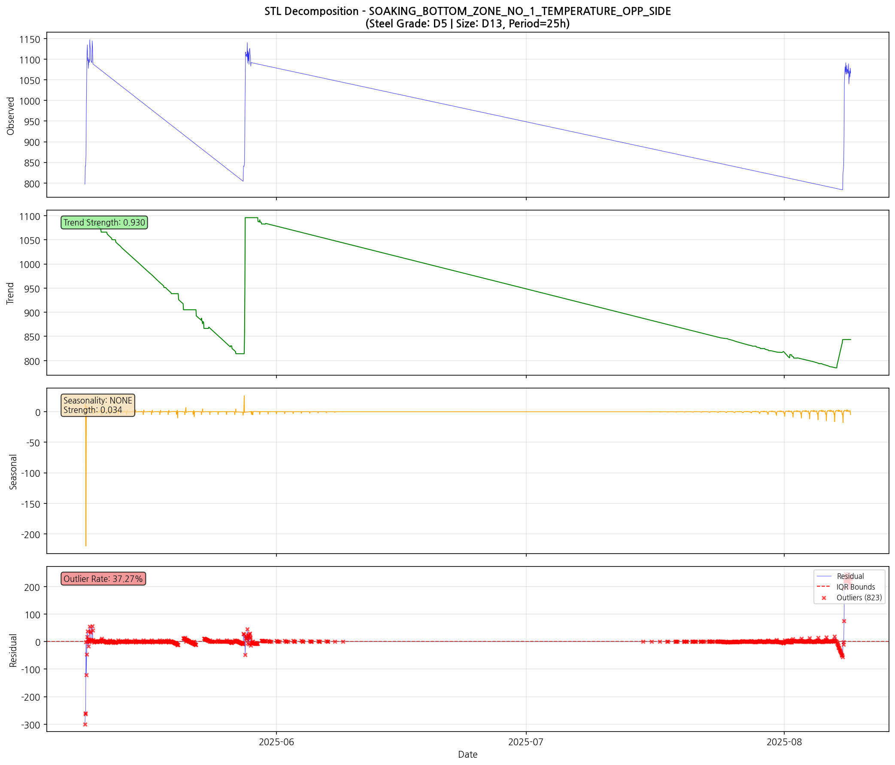

### 가열로 추출 온도 (03_Furnace_Discharge_Temperature)

- 분석 태그: 1개
- 평균 잔차 이상치율: 45.20%
- 평균 계절성 강도: 0.041

| 태그 | 이상치율 | 계절성 강도 | 추세 강도 |
|------|----------|-------------|-----------|
| FURNACE_EXIT_DISCHARGE_BILLET_TEMPERATURE | 45.20% | 0.041 | 0.870 |

#### STL 분해 차트

**FURNACE_EXIT_DISCHARGE_BILLET_TEMPERATURE** (이상치율: 45.20%, 계절성: 0.041)

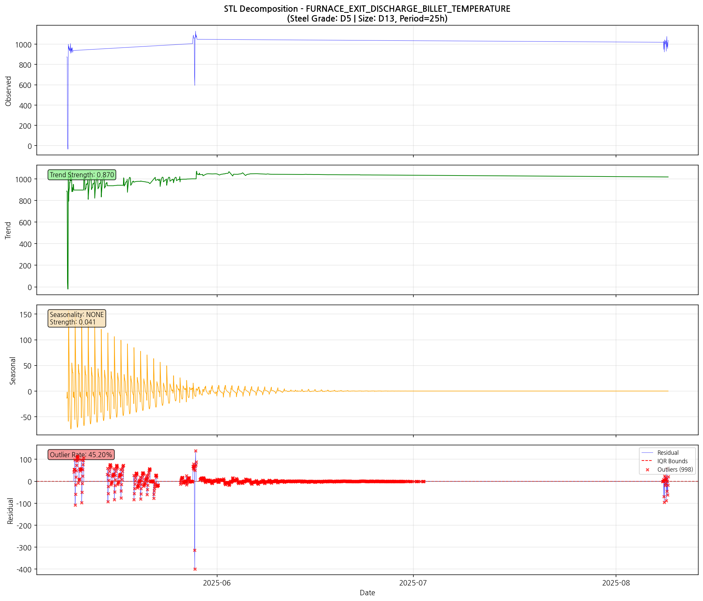

### 가열로 보조설비 (04_Furnace_Auxiliary)

- 분석 태그: 9개
- 평균 잔차 이상치율: 42.11%
- 평균 계절성 강도: 0.187

| 태그 | 이상치율 | 계절성 강도 | 추세 강도 |
|------|----------|-------------|-----------|
| FURNACE_PRESSURE | 45.11% | 0.000 | 0.828 |
| FURNACE_O2_ANALYZER | 44.57% | 0.000 | 0.711 |
| MAIN_GAS_PRESSURE | 46.83% | 0.593 | 0.695 |
| MAIN_GAS_FLOW | 41.39% | 0.000 | 0.780 |
| MAIN_GAS_TEMPERATURE | 39.13% | 0.277 | 0.996 |
| MAIN_COMBUSTION_AIR_PRESSURE | 42.93% | 0.004 | 0.880 |
| COMBUSTION_AIR_TEMPERATURE | 39.18% | 0.008 | 0.977 |
| INDIRECT_COOLING_WATER_FLOW | 40.81% | 0.783 | 0.831 |
| INDIRECT_WATER_MAIN_TEMPERATURE | 39.09% | 0.017 | 0.872 |

#### STL 분해 차트

**MAIN_GAS_PRESSURE** (이상치율: 46.83%, 계절성: 0.593)

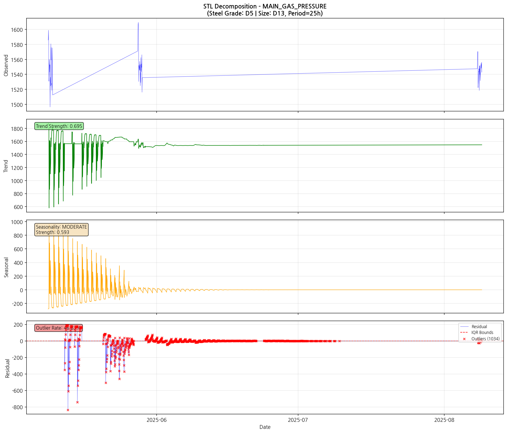

**FURNACE_PRESSURE** (이상치율: 45.11%, 계절성: 0.000)

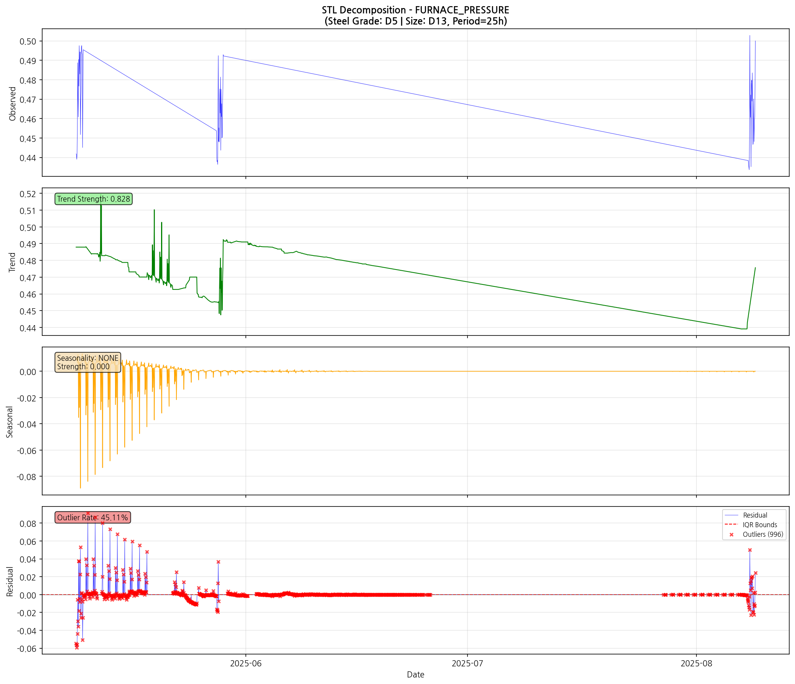

**FURNACE_O2_ANALYZER** (이상치율: 44.57%, 계절성: 0.000)

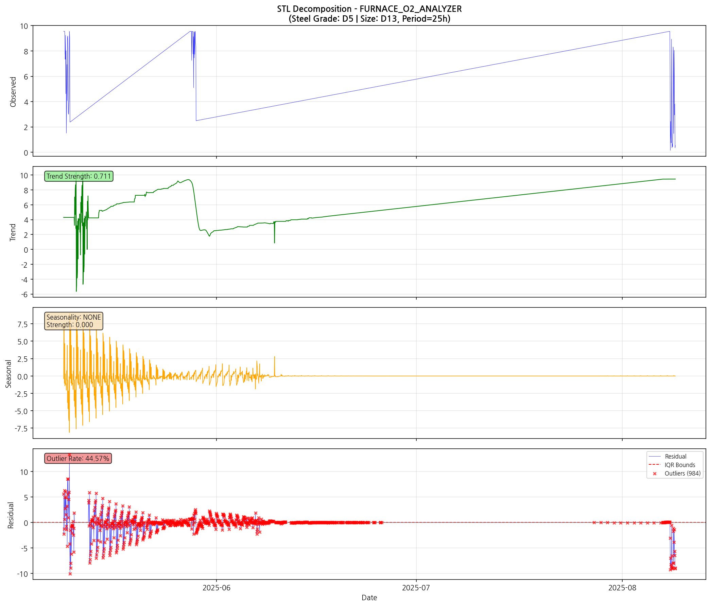

### 스탠드 토크 (05_Stand_Torque)

- 분석 태그: 16개
- 평균 잔차 이상치율: 41.42%
- 평균 계절성 강도: 0.131

| 태그 | 이상치율 | 계절성 강도 | 추세 강도 |
|------|----------|-------------|-----------|
| STAND_1_ACTUAL_TORQUE | 43.30% | 0.000 | 0.924 |
| STAND_2_ACTUAL_TORQUE | 40.72% | 0.047 | 0.973 |
| STAND_3_ACTUAL_TORQUE | 44.75% | 0.000 | 0.626 |
| STAND_4_ACTUAL_TORQUE | 36.96% | 0.000 | 0.972 |
| STAND_5_ACTUAL_TORQUE | 43.89% | 0.238 | 0.989 |
| STAND_6_ACTUAL_TORQUE | 40.90% | 0.000 | 0.985 |
| STAND_7_ACTUAL_TORQUE | 43.07% | 0.000 | 0.878 |
| STAND_8_ACTUAL_TORQUE | 43.75% | 0.091 | 0.925 |
| STAND_9_ACTUAL_TORQUE | 35.42% | 0.012 | 0.967 |
| STAND_10_ACTUAL_TORQUE | 38.18% | 0.096 | 0.991 |
| STAND_11_ACTUAL_TORQUE | 41.80% | 0.158 | 0.729 |
| STAND_12_ACTUAL_TORQUE | 42.12% | 0.001 | 0.870 |
| STAND_13_ACTUAL_TORQUE | 41.94% | 0.021 | 0.943 |
| STAND_14_ACTUAL_TORQUE | 41.21% | 0.338 | 0.891 |
| FINISHING_BLOCK_MASTER_ACTUAL_TORQUE | 42.07% | 0.560 | 0.988 |
| FINISHING_BLOCK_SLAVE_ACTUAL_TORQUE | 42.62% | 0.529 | 0.987 |

#### STL 분해 차트

**STAND_3_ACTUAL_TORQUE** (이상치율: 44.75%, 계절성: 0.000)

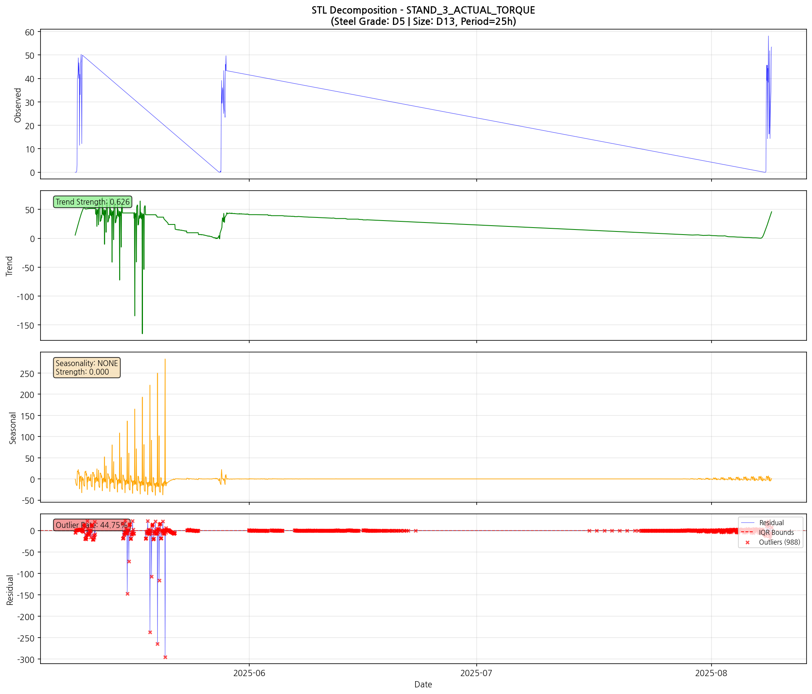

**STAND_5_ACTUAL_TORQUE** (이상치율: 43.89%, 계절성: 0.238)

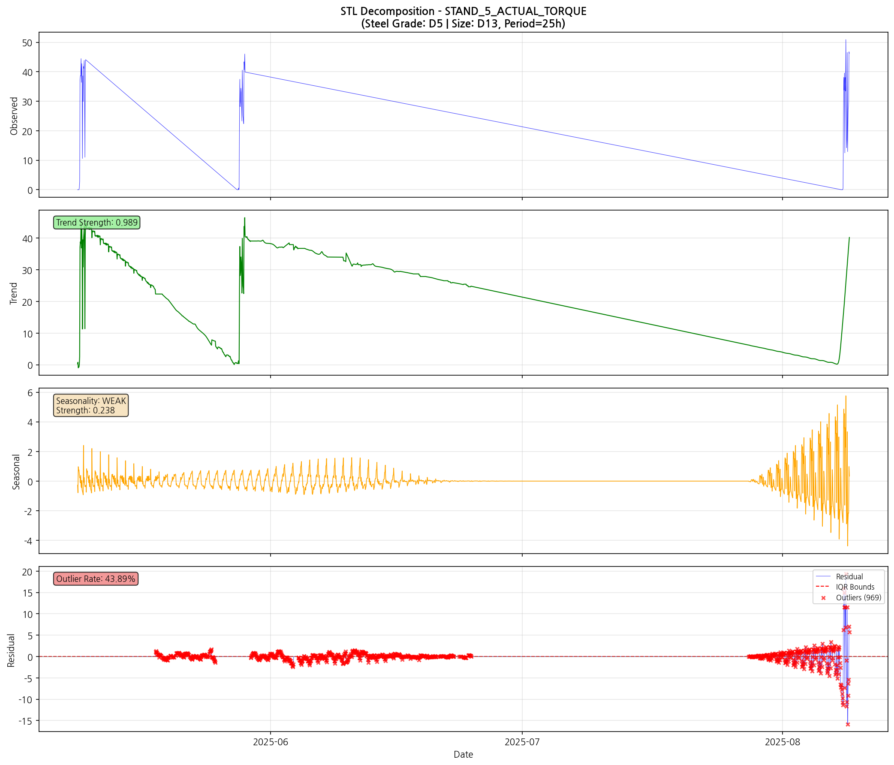

**STAND_8_ACTUAL_TORQUE** (이상치율: 43.75%, 계절성: 0.091)

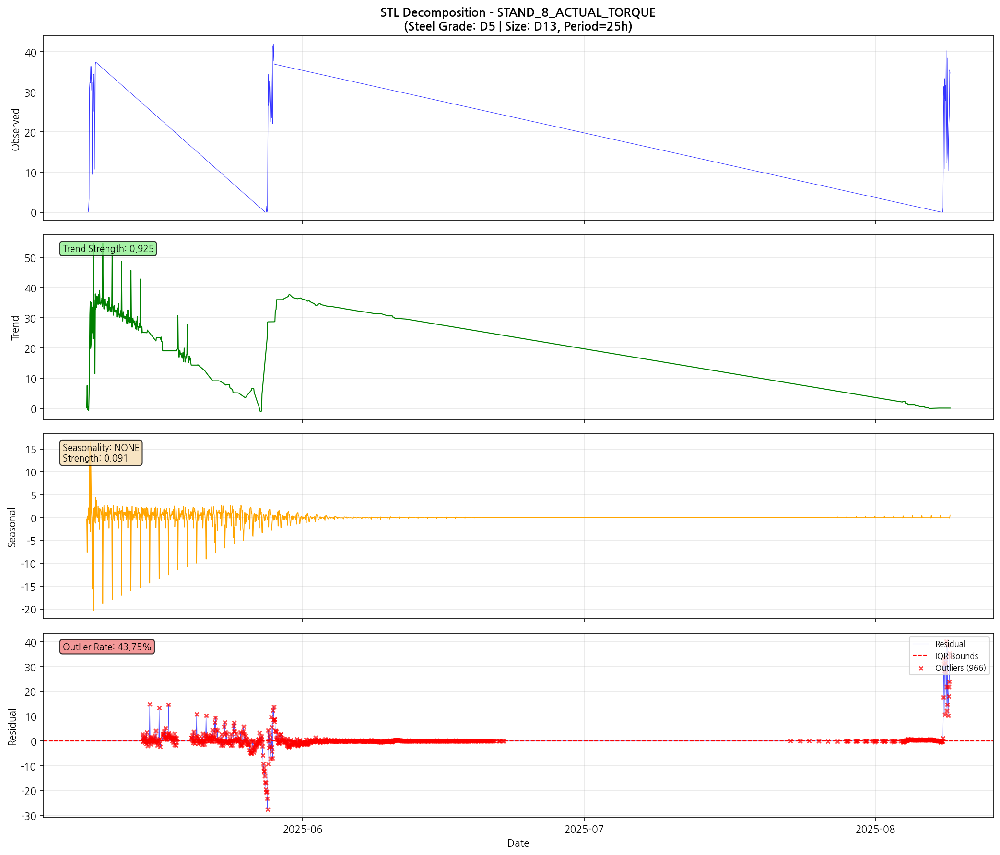

### 스탠드 속도 (06_Stand_Speed)

- 분석 태그: 15개
- 평균 잔차 이상치율: 42.55%
- 평균 계절성 강도: 0.065

| 태그 | 이상치율 | 계절성 강도 | 추세 강도 |
|------|----------|-------------|-----------|
| STAND_1_ACTUAL_SPEED | 41.08% | 0.000 | 0.920 |
| STAND_2_ACTUAL_SPEED | 36.14% | 0.553 | 0.991 |
| STAND_3_ACTUAL_SPEED | 38.27% | 0.000 | 0.815 |
| STAND_4_ACTUAL_SPEED | 41.39% | 0.000 | 0.734 |
| STAND_5_ACTUAL_SPEED | 45.24% | 0.013 | 0.905 |
| STAND_6_ACTUAL_SPEED | 42.30% | 0.066 | 0.934 |
| STAND_7_ACTUAL_SPEED | 47.46% | 0.005 | 0.934 |
| STAND_8_ACTUAL_SPEED | 41.12% | 0.000 | 0.734 |
| STAND_9_ACTUAL_SPEED | 43.75% | 0.000 | 0.417 |
| STAND_10_ACTUAL_SPEED | 42.84% | 0.000 | 0.956 |
| STAND_11_ACTUAL_SPEED | 45.92% | 0.175 | 0.959 |
| STAND_12_ACTUAL_SPEED | 41.53% | 0.155 | 0.881 |
| STAND_13_ACTUAL_SPEED | 43.70% | 0.000 | 0.957 |
| STAND_14_ACTUAL_SPEED | 43.84% | 0.000 | 0.220 |
| FINISHING_BLOCK_ACTUAL_SPEED | 43.57% | 0.000 | 0.870 |

#### STL 분해 차트

**STAND_7_ACTUAL_SPEED** (이상치율: 47.46%, 계절성: 0.005)

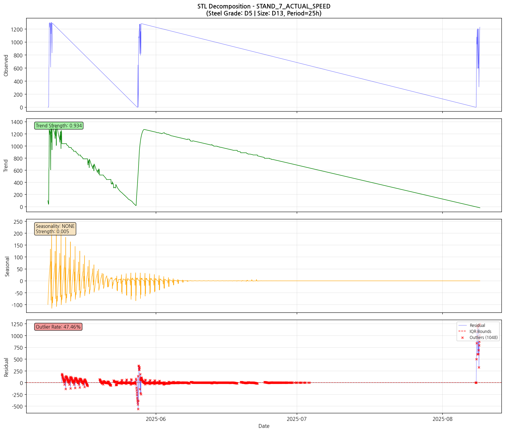

**STAND_11_ACTUAL_SPEED** (이상치율: 45.92%, 계절성: 0.175)

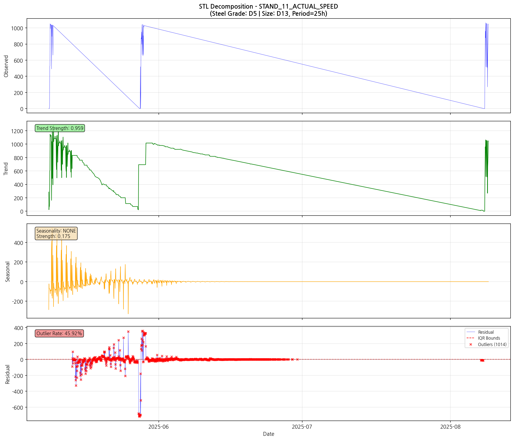

**STAND_5_ACTUAL_SPEED** (이상치율: 45.24%, 계절성: 0.013)

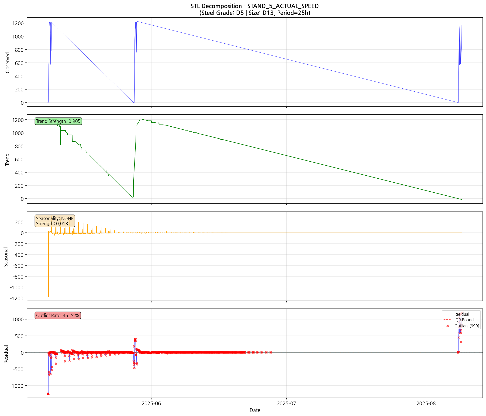

### 스탠드 부하 (07_Stand_Load)

- 분석 태그: 15개
- 평균 잔차 이상치율: 40.61%
- 평균 계절성 강도: 0.149

| 태그 | 이상치율 | 계절성 강도 | 추세 강도 |
|------|----------|-------------|-----------|
| STAND_1_LOAD | 42.57% | 0.149 | 0.981 |
| STAND_2_LOAD | 46.15% | 0.131 | 0.982 |
| STAND_3_LOAD | 40.85% | 0.259 | 0.981 |
| STAND_4_LOAD | 36.46% | 0.017 | 0.948 |
| STAND_5_LOAD | 41.94% | 0.322 | 0.991 |
| STAND_6_LOAD | 39.45% | 0.501 | 0.988 |
| STAND_7_LOAD | 41.98% | 0.498 | 0.979 |
| STAND_8_LOAD | 40.62% | 0.002 | 0.922 |
| STAND_9_LOAD | 39.27% | 0.043 | 0.974 |
| STAND_10_LOAD | 40.58% | 0.002 | 0.985 |
| STAND_11_LOAD | 42.53% | 0.018 | 0.922 |
| STAND_12_LOAD | 38.72% | 0.055 | 0.949 |
| STAND_13_LOAD | 38.72% | 0.055 | 0.949 |
| STAND_14_LOAD | 42.26% | 0.175 | 0.992 |
| FINISHING_BLOCK_LOAD | 37.00% | 0.000 | 0.957 |

#### STL 분해 차트

**STAND_2_LOAD** (이상치율: 46.15%, 계절성: 0.131)

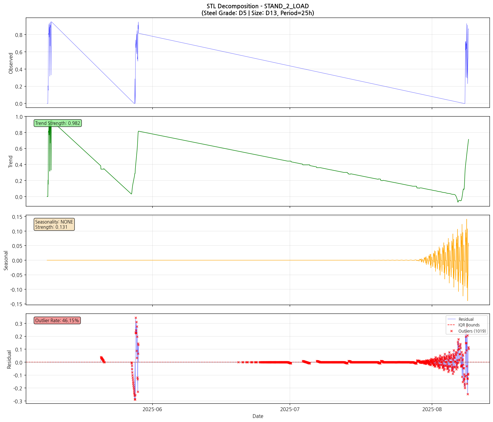

**STAND_1_LOAD** (이상치율: 42.57%, 계절성: 0.149)

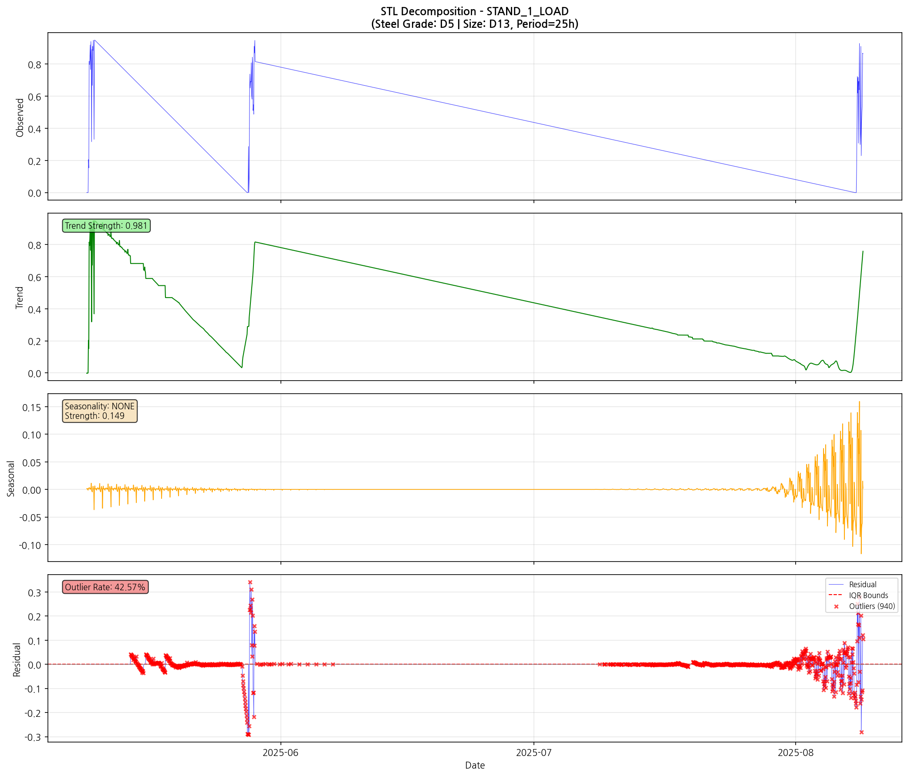

**STAND_11_LOAD** (이상치율: 42.53%, 계절성: 0.018)

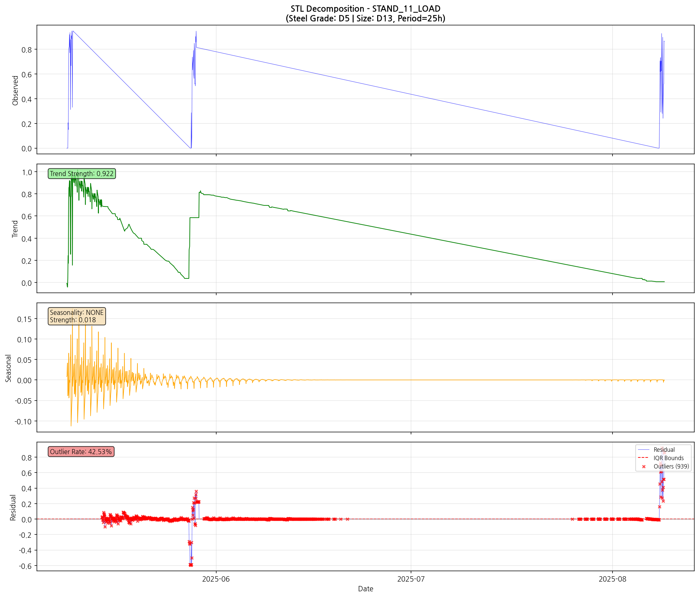

### 핀치롤 (08_Pinchroll)

- 분석 태그: 9개
- 평균 잔차 이상치율: 42.66%
- 평균 계절성 강도: 0.169

| 태그 | 이상치율 | 계절성 강도 | 추세 강도 |
|------|----------|-------------|-----------|
| PINCHROLL_2_ACTUAL_SPEED | 40.29% | 0.211 | 0.999 |
| PINCHROLL_3_ACTUAL_SPEED | 40.74% | 0.261 | 0.987 |
| PINCHROLL_4_ACTUAL_SPEED | 42.79% | 0.362 | 0.999 |
| PINCHROLL_2_ACTUAL_TORQUE | 47.37% | 0.612 | 0.701 |
| PINCHROLL_3_ACTUAL_TORQUE | 43.87% | 0.000 | 0.856 |
| PINCHROLL_4_ACTUAL_TORQUE | 43.78% | 0.000 | 0.882 |
| PINCHROLL_2_REFERENCE_TORQUE | 43.69% | 0.078 | 1.000 |
| PINCHROLL_3_REFERENCE_TORQUE | 41.88% | 0.000 | 0.861 |
| PINCHROLL_4_REFERENCE_TORQUE | 39.56% | 0.000 | 0.989 |

#### STL 분해 차트

**PINCHROLL_2_ACTUAL_TORQUE** (이상치율: 47.37%, 계절성: 0.612)

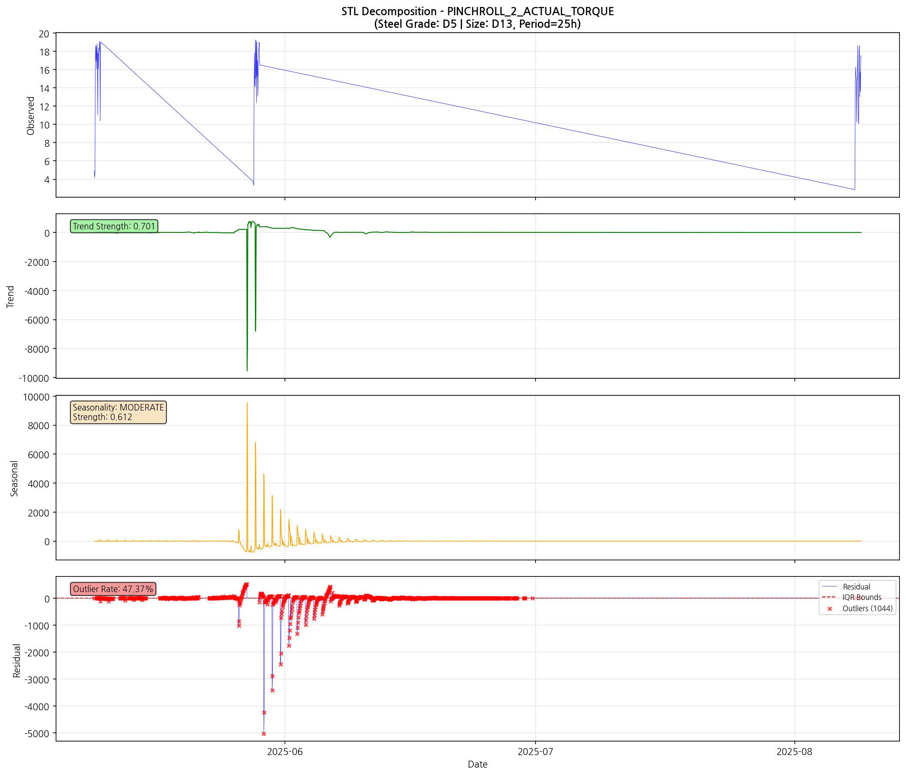

**PINCHROLL_3_ACTUAL_TORQUE** (이상치율: 43.87%, 계절성: 0.000)

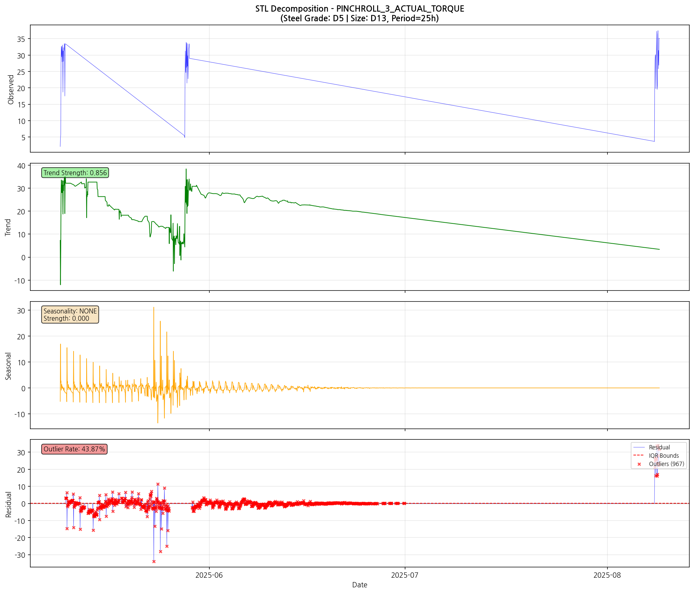

**PINCHROLL_4_ACTUAL_TORQUE** (이상치율: 43.78%, 계절성: 0.000)

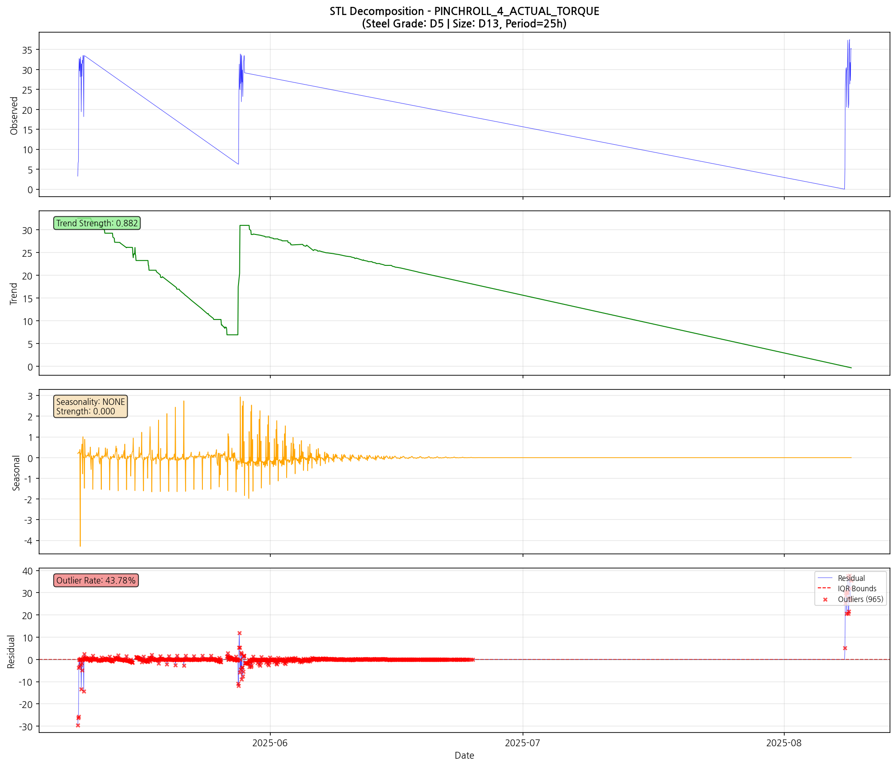

### PR 상세 토크 (09_PR_Detailed)

- 분석 태그: 6개
- 평균 잔차 이상치율: 42.29%
- 평균 계절성 강도: 0.145

| 태그 | 이상치율 | 계절성 강도 | 추세 강도 |
|------|----------|-------------|-----------|
| PR6L1_ACT_TORQUE | 39.88% | 0.007 | 0.283 |
| PR6L2_ACT_TORQUE | 35.30% | 0.000 | 0.723 |
| PR7L1_ACT_TORQUE | 43.56% | 0.000 | 0.967 |
| PR7L2_ACT_TORQUE | 44.74% | 0.771 | 0.822 |
| PR8L1_ACT_TORQUE | 46.14% | 0.000 | 0.971 |
| PR9L1_ACT_TORQUE | 44.10% | 0.091 | 0.978 |

#### STL 분해 차트

**PR8L1_ACT_TORQUE** (이상치율: 46.14%, 계절성: 0.000)

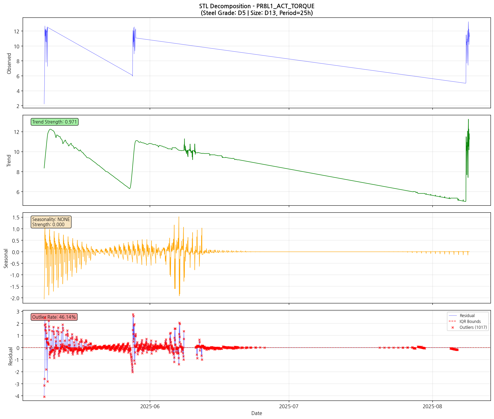

**PR7L2_ACT_TORQUE** (이상치율: 44.74%, 계절성: 0.771)

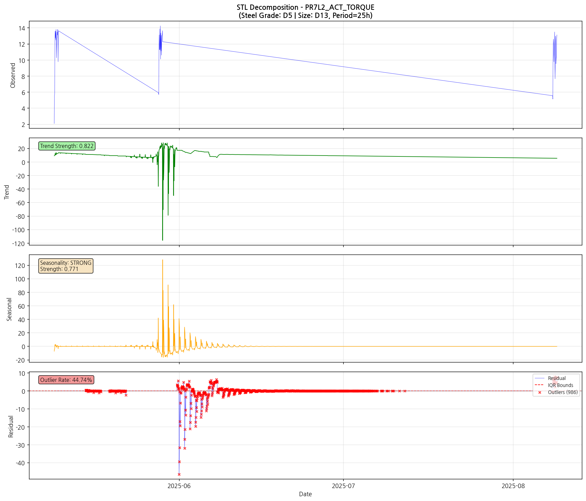

**PR9L1_ACT_TORQUE** (이상치율: 44.10%, 계절성: 0.091)

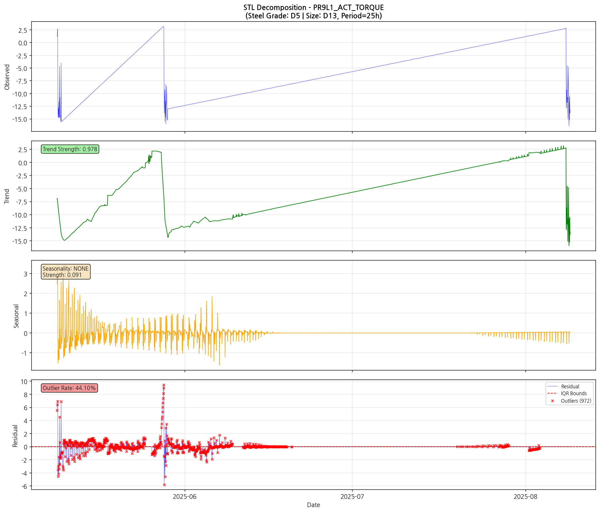

---

## 해석 가이드

### STL 분해 해석

1. **추세 (Trend)**
   - 장기적인 상승/하락 패턴
   - 설비 노화, 계절적 변화 등 반영
   - 추세 강도 높을수록 장기 변화가 뚜렷함

2. **계절성 (Seasonal)**
   - 주기적으로 반복되는 패턴 (24시간 기준)
   - 계절성 강도 ≥ 0.7: 강한 주기적 패턴
   - 계절성이 강한 태그는 STL 분석이 효과적

3. **잔차 (Residual)**
   - 추세와 계절성으로 설명되지 않는 변동
   - **순수한 이상치**를 포함
   - 잔차 기반 IQR로 "진짜" 이상치 탐지

### 계절성 강도 분류

| 분류 | 강도 범위 | 해석 |
|------|----------|------|
| Strong | ≥ 0.7 | 명확한 주기적 패턴, STL 매우 효과적 |
| Moderate | 0.4 ~ 0.7 | 적당한 주기적 패턴, STL 효과적 |
| Weak | 0.2 ~ 0.4 | 약한 주기적 패턴 |
| None | < 0.2 | 주기적 패턴 거의 없음 |

### Standard IQR vs STL Residual IQR

| 방법 | 장점 | 단점 |
|------|------|------|
| Standard IQR | 간단, 빠름 | 계절성에 영향받음 |
| STL Residual IQR | 계절성 제거, 순수 이상치 | 계산 복잡, 데이터 필요 |

**권장**: 계절성 강도 ≥ 0.4인 태그에는 STL Residual IQR 사용

---

## 메타데이터

| 항목 | 값 |
|------|-----|
| 분석 스크립트 | steel_grade_stl_analysis.py |
| 분석 기간 | 2025-03-01 ~ 2025-08-31 |
| 강종 | D5 |
| 계절 주기 | 25시간 |
| 생성일시 | 2026-02-09 15:08:06 |
| 총 분석 태그 | 79개 |

---

*본 보고서는 자동 생성되었습니다.*
