# 강종 [D5] STL 계절-추세 분해 분석 보고서

**분석 기간**: 2025-03-01 ~ 2025-08-31
**강종**: D5
**생성일시**: 2026-02-03 20:44:11

---

## 분석 개요

### 분석 방법론

**STL (Seasonal-Trend Decomposition using LOESS)**

시계열 데이터를 세 가지 성분으로 분해:
- **Trend (추세)**: 장기적인 변화 패턴
- **Seasonal (계절성)**: 주기적으로 반복되는 패턴
- **Residual (잔차)**: 추세와 계절성으로 설명되지 않는 변동

| 파라미터 | 값 | 설명 |
|----------|-----|------|
| seasonal | 25h | 계절 주기 |
| robust | True | 강건 추정 |

### 분석 결과 요약

| 구분 | 태그 수 | 비율 |
|------|---------|------|
| **총 분석 태그** | 79개 | 100% |

#### 잔차 이상치율 분포

| 구분 | 태그 수 | 비율 |
|------|---------|------|
| 🔴 높음 (≥15%) | 79개 | 100.0% |
| 🟠 중간 (5~15%) | 0개 | 0.0% |
| 🟢 낮음 (<5%) | 0개 | 0.0% |

#### 계절성 강도 분포

| 구분 | 태그 수 | 비율 |
|------|---------|------|
| 🔵 강함 (≥0.7) | 2개 | 2.5% |
| 중간 (0.4~0.7) | 0개 | 0.0% |
| 약함 (<0.4) | 77개 | 97.5% |

#### 전체 평균

| 지표 | 값 |
|------|-----|
| 평균 계절성 강도 | 0.039 |
| 평균 추세 강도 | 0.902 |

---

## 상위 문제 태그 (잔차 이상치율 기준)

| 순위 | 태그 | 카테고리 | 이상치율 | 계절성 강도 | 계절성 분류 |
|------|------|----------|----------|-------------|-------------|
| 1 | MAIN_COMBUSTION_AIR_PRESSURE | 가열로 보조설비 | 45.03% | 0.119 | none |
| 2 | STAND_12_ACTUAL_SPEED | 스탠드 속도 | 44.79% | 0.000 | none |
| 3 | SOAKING_BOTTOM_ZONE_NO_2_TEMPERATURE_MILL_SIDE | 가열로 하부 온도 | 44.58% | 0.000 | none |
| 4 | STAND_6_ACTUAL_SPEED | 스탠드 속도 | 44.24% | 0.000 | none |
| 5 | PINCHROLL_3_ACTUAL_SPEED | 핀치롤 | 44.04% | 0.000 | none |
| 6 | STAND_11_LOAD | 스탠드 부하 | 44.01% | 0.036 | none |
| 7 | STAND_7_ACTUAL_SPEED | 스탠드 속도 | 43.93% | 0.000 | none |
| 8 | STAND_7_LOAD | 스탠드 부하 | 43.78% | 0.000 | none |
| 9 | STAND_11_ACTUAL_SPEED | 스탠드 속도 | 43.67% | 0.000 | none |
| 10 | STAND_4_LOAD | 스탠드 부하 | 43.67% | 0.090 | none |
| 11 | PR6L1_ACT_TORQUE | PR 상세 토크 | 43.67% | 0.000 | none |
| 12 | STAND_5_LOAD | 스탠드 부하 | 43.65% | 0.000 | none |
| 13 | STAND_2_ACTUAL_TORQUE | 스탠드 토크 | 43.62% | 0.000 | none |
| 14 | STAND_5_ACTUAL_TORQUE | 스탠드 토크 | 43.41% | 0.000 | none |
| 15 | FINISHING_BLOCK_MASTER_ACTUAL_TORQUE | 스탠드 토크 | 43.31% | 0.000 | none |

---

## 강한 계절성 태그 목록

계절성 강도가 0.7 이상인 태그입니다. 이 태그들은 STL 분석이 특히 효과적입니다.

| 태그 | 카테고리 | 계절성 강도 | 잔차 이상치율 |
|------|----------|-------------|---------------|
| MAIN_GAS_PRESSURE | 가열로 보조설비 | 0.950 | 41.88% |
| PINCHROLL_2_ACTUAL_SPEED | 핀치롤 | 0.835 | 42.21% |

---

## 카테고리별 분석 결과

### 가열로 상부 온도 (01_Furnace_Top_Temperature)

- 분석 태그: 4개
- 평균 잔차 이상치율: 39.45%
- 평균 계절성 강도: 0.010

| 태그 | 이상치율 | 계절성 강도 | 추세 강도 |
|------|----------|-------------|-----------|
| HEATING_TOP_ZONE_NO_1_TEMPERATURE_ROOF | 40.60% | 0.000 | 0.811 |
| HEATING_TOP_ZONE_NO_2_TEMPERATURE_ROOF | 40.68% | 0.000 | 0.979 |
| SOAKING_TOP_ZONE_NO_1_TEMPERATURE_ROOF | 36.85% | 0.000 | 0.960 |
| SOAKING_TOP_ZONE_NO_2_TEMPERATURE_ROOF | 39.69% | 0.042 | 0.974 |

#### STL 분해 차트

**HEATING_TOP_ZONE_NO_2_TEMPERATURE_ROOF** (이상치율: 40.68%, 계절성: 0.000)

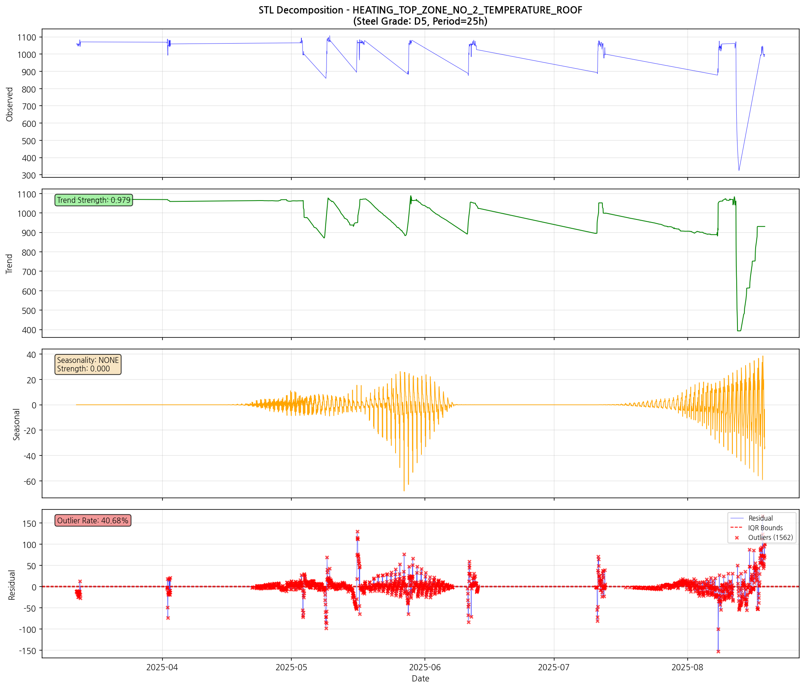

**HEATING_TOP_ZONE_NO_1_TEMPERATURE_ROOF** (이상치율: 40.60%, 계절성: 0.000)

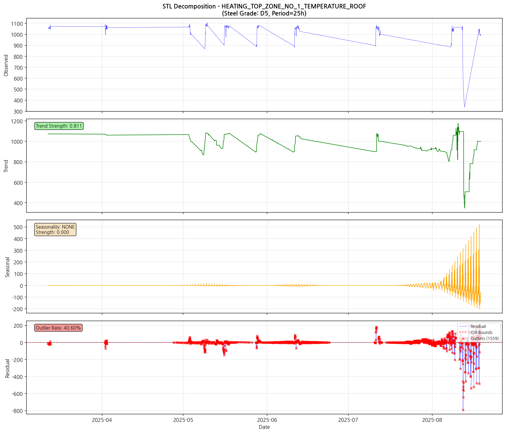

**SOAKING_TOP_ZONE_NO_2_TEMPERATURE_ROOF** (이상치율: 39.69%, 계절성: 0.042)

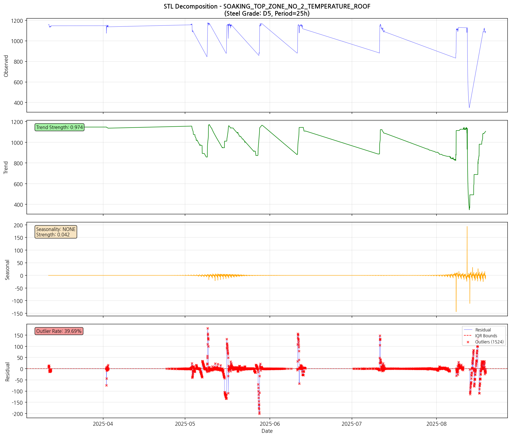

### 가열로 하부 온도 (02_Furnace_Bottom_Temperature)

- 분석 태그: 4개
- 평균 잔차 이상치율: 39.38%
- 평균 계절성 강도: 0.081

| 태그 | 이상치율 | 계절성 강도 | 추세 강도 |
|------|----------|-------------|-----------|
| HEATING_BOTTOM_ZONE_NO_1_TEMPERATURE_OPP_SIDE | 39.19% | 0.000 | 0.956 |
| HEATING_BOTTOM_ZONE_NO_2_TEMPERATURE_MILL_SIDE | 33.20% | 0.000 | 0.921 |
| SOAKING_BOTTOM_ZONE_NO_1_TEMPERATURE_OPP_SIDE | 40.52% | 0.325 | 0.651 |
| SOAKING_BOTTOM_ZONE_NO_2_TEMPERATURE_MILL_SIDE | 44.58% | 0.000 | 0.971 |

#### STL 분해 차트

**SOAKING_BOTTOM_ZONE_NO_2_TEMPERATURE_MILL_SIDE** (이상치율: 44.58%, 계절성: 0.000)

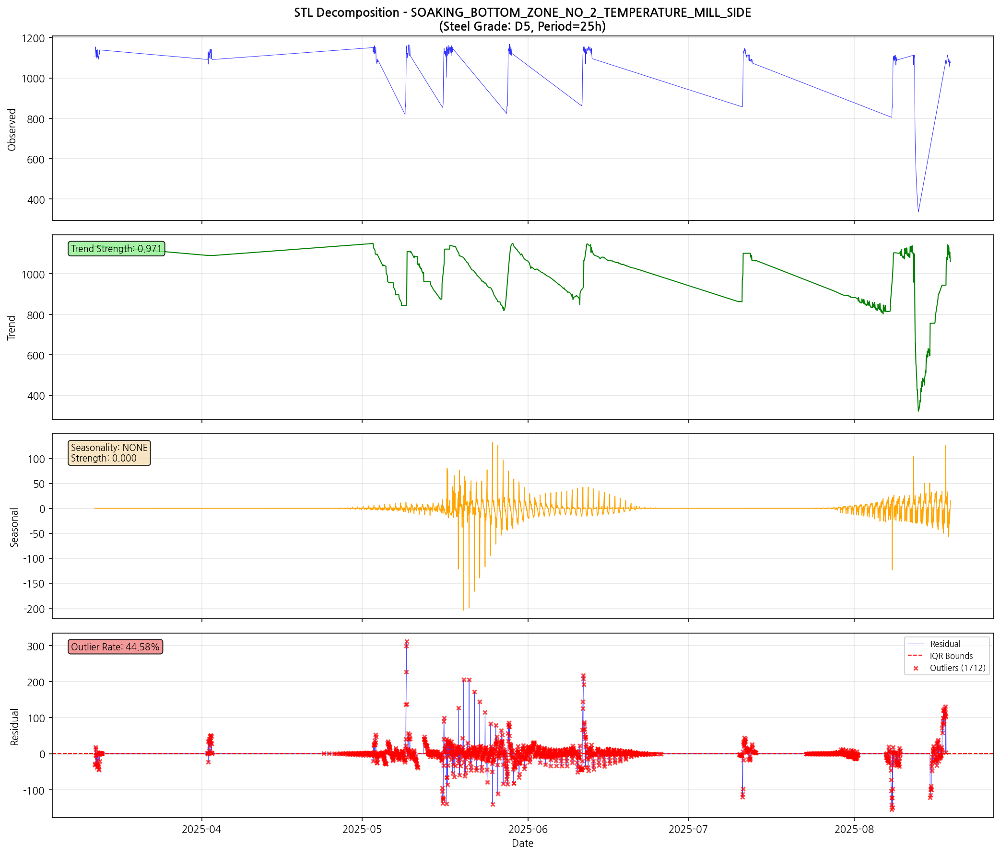

**SOAKING_BOTTOM_ZONE_NO_1_TEMPERATURE_OPP_SIDE** (이상치율: 40.52%, 계절성: 0.325)

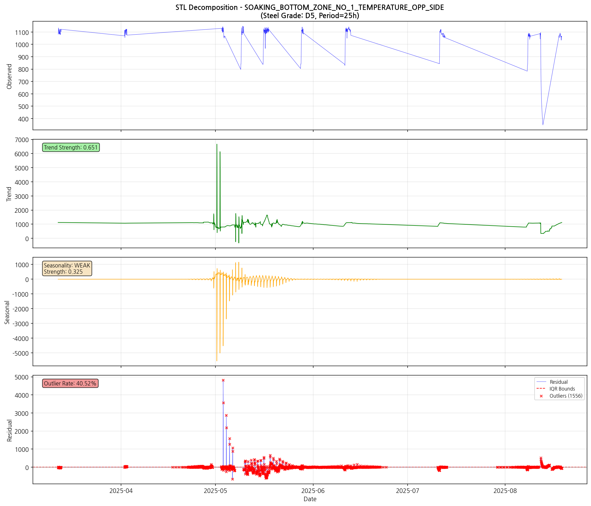

**HEATING_BOTTOM_ZONE_NO_1_TEMPERATURE_OPP_SIDE** (이상치율: 39.19%, 계절성: 0.000)

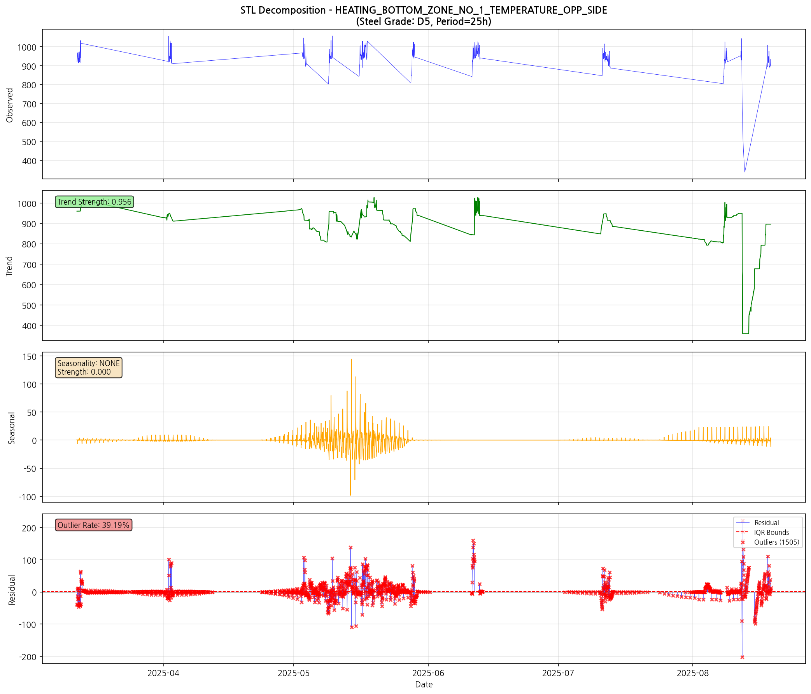

### 가열로 추출 온도 (03_Furnace_Discharge_Temperature)

- 분석 태그: 1개
- 평균 잔차 이상치율: 41.48%
- 평균 계절성 강도: 0.000

| 태그 | 이상치율 | 계절성 강도 | 추세 강도 |
|------|----------|-------------|-----------|
| FURNACE_EXIT_DISCHARGE_BILLET_TEMPERATURE | 41.48% | 0.000 | 0.938 |

#### STL 분해 차트

**FURNACE_EXIT_DISCHARGE_BILLET_TEMPERATURE** (이상치율: 41.48%, 계절성: 0.000)

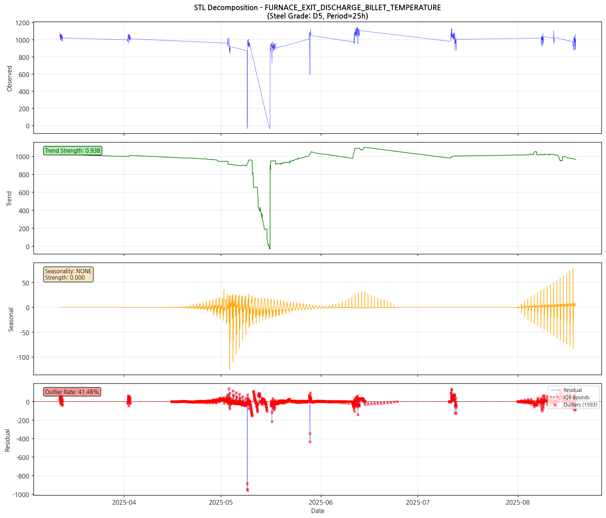

### 가열로 보조설비 (04_Furnace_Auxiliary)

- 분석 태그: 9개
- 평균 잔차 이상치율: 41.00%
- 평균 계절성 강도: 0.128

| 태그 | 이상치율 | 계절성 강도 | 추세 강도 |
|------|----------|-------------|-----------|
| FURNACE_PRESSURE | 41.64% | 0.000 | 0.877 |
| FURNACE_O2_ANALYZER | 42.27% | 0.000 | 0.937 |
| MAIN_GAS_PRESSURE | 41.88% | 0.950 | 0.999 |
| MAIN_GAS_FLOW | 39.30% | 0.009 | 0.898 |
| MAIN_GAS_TEMPERATURE | 37.42% | 0.011 | 0.991 |
| MAIN_COMBUSTION_AIR_PRESSURE | 45.03% | 0.119 | 0.946 |
| COMBUSTION_AIR_TEMPERATURE | 41.74% | 0.000 | 0.953 |
| INDIRECT_COOLING_WATER_FLOW | 40.10% | 0.059 | 0.995 |
| INDIRECT_WATER_MAIN_TEMPERATURE | 39.61% | 0.000 | 0.960 |

#### STL 분해 차트

**MAIN_COMBUSTION_AIR_PRESSURE** (이상치율: 45.03%, 계절성: 0.119)

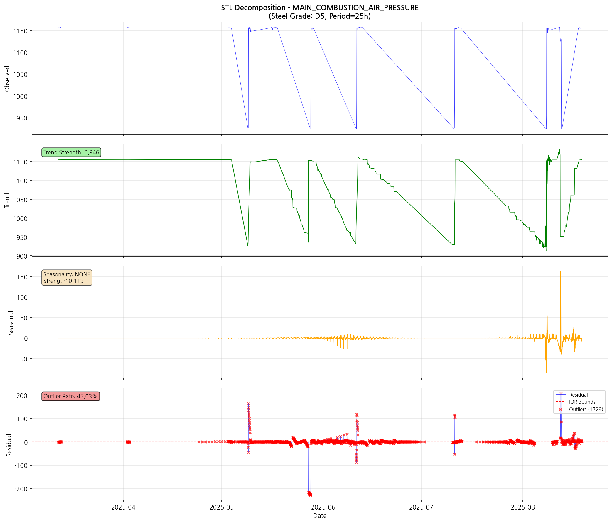

**FURNACE_O2_ANALYZER** (이상치율: 42.27%, 계절성: 0.000)

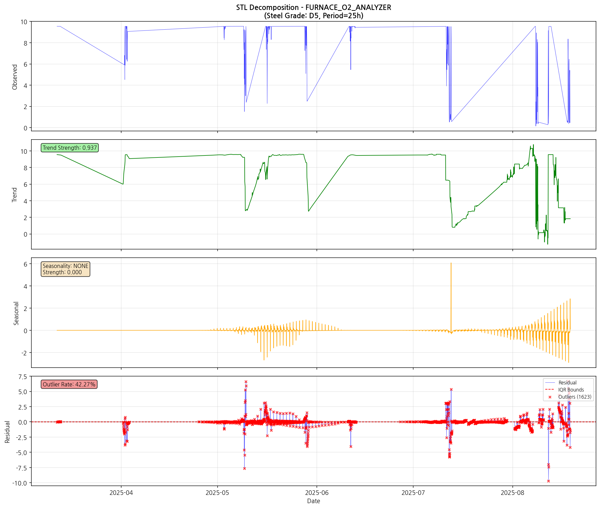

**MAIN_GAS_PRESSURE** (이상치율: 41.88%, 계절성: 0.950)

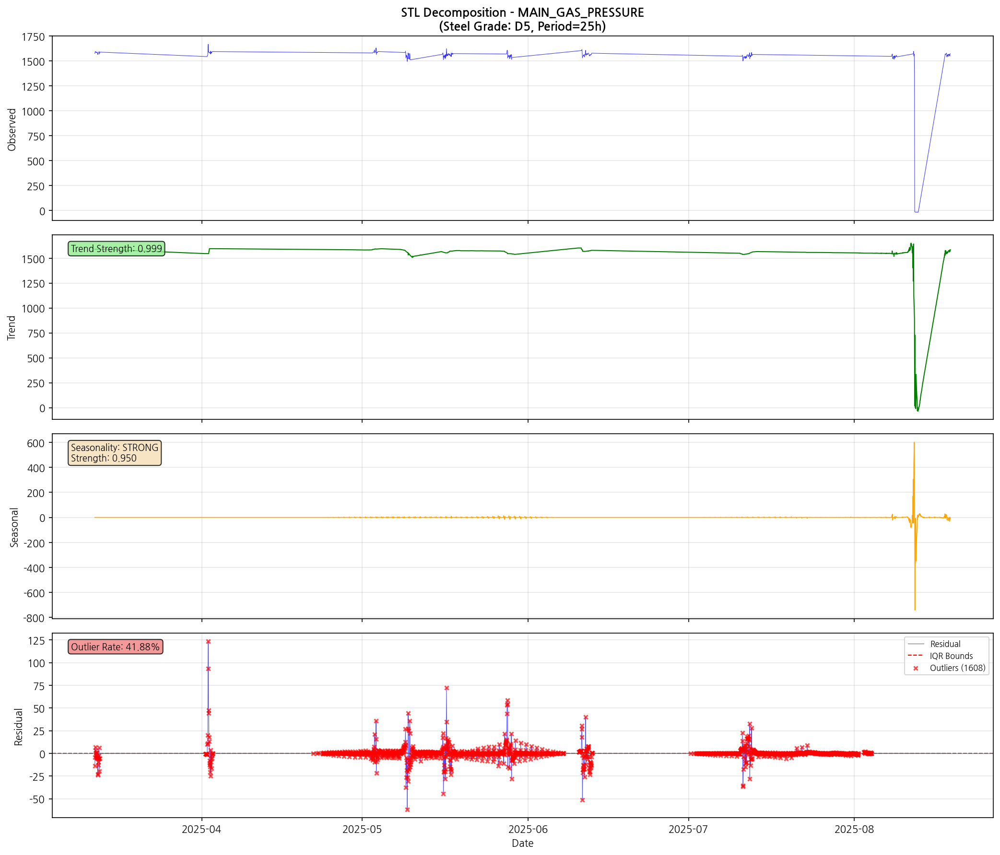

### 스탠드 토크 (05_Stand_Torque)

- 분석 태그: 16개
- 평균 잔차 이상치율: 40.91%
- 평균 계절성 강도: 0.001

| 태그 | 이상치율 | 계절성 강도 | 추세 강도 |
|------|----------|-------------|-----------|
| STAND_1_ACTUAL_TORQUE | 42.68% | 0.000 | 0.841 |
| STAND_2_ACTUAL_TORQUE | 43.62% | 0.000 | 0.884 |
| STAND_3_ACTUAL_TORQUE | 38.20% | 0.000 | 0.885 |
| STAND_4_ACTUAL_TORQUE | 42.99% | 0.000 | 0.924 |
| STAND_5_ACTUAL_TORQUE | 43.41% | 0.000 | 0.908 |
| STAND_6_ACTUAL_TORQUE | 40.34% | 0.000 | 0.921 |
| STAND_7_ACTUAL_TORQUE | 36.02% | 0.000 | 0.937 |
| STAND_8_ACTUAL_TORQUE | 39.06% | 0.003 | 0.925 |
| STAND_9_ACTUAL_TORQUE | 42.97% | 0.000 | 0.922 |
| STAND_10_ACTUAL_TORQUE | 39.64% | 0.000 | 0.897 |
| STAND_11_ACTUAL_TORQUE | 39.32% | 0.005 | 0.939 |
| STAND_12_ACTUAL_TORQUE | 41.51% | 0.000 | 0.887 |
| STAND_13_ACTUAL_TORQUE | 42.58% | 0.000 | 0.761 |
| STAND_14_ACTUAL_TORQUE | 39.66% | 0.009 | 0.927 |
| FINISHING_BLOCK_MASTER_ACTUAL_TORQUE | 43.31% | 0.000 | 0.937 |
| FINISHING_BLOCK_SLAVE_ACTUAL_TORQUE | 39.32% | 0.000 | 0.869 |

#### STL 분해 차트

**STAND_2_ACTUAL_TORQUE** (이상치율: 43.62%, 계절성: 0.000)

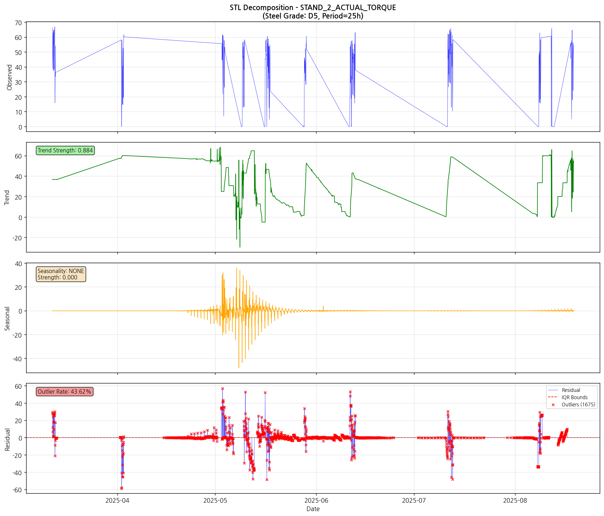

**STAND_5_ACTUAL_TORQUE** (이상치율: 43.41%, 계절성: 0.000)

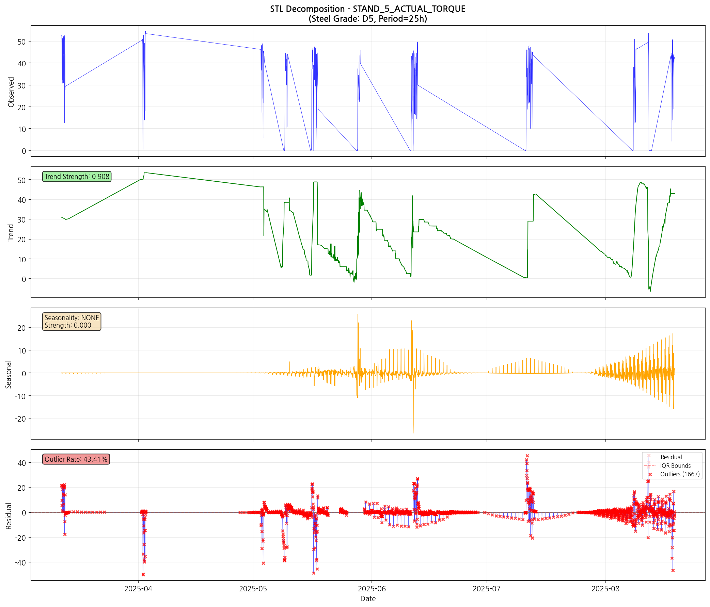

**FINISHING_BLOCK_MASTER_ACTUAL_TORQUE** (이상치율: 43.31%, 계절성: 0.000)

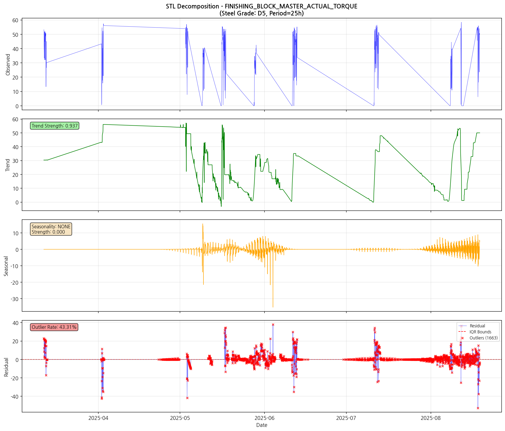

### 스탠드 속도 (06_Stand_Speed)

- 분석 태그: 15개
- 평균 잔차 이상치율: 41.61%
- 평균 계절성 강도: 0.006

| 태그 | 이상치율 | 계절성 강도 | 추세 강도 |
|------|----------|-------------|-----------|
| STAND_1_ACTUAL_SPEED | 42.60% | 0.000 | 0.866 |
| STAND_2_ACTUAL_SPEED | 41.64% | 0.000 | 0.814 |
| STAND_3_ACTUAL_SPEED | 42.34% | 0.000 | 0.896 |
| STAND_4_ACTUAL_SPEED | 37.16% | 0.016 | 0.915 |
| STAND_5_ACTUAL_SPEED | 39.04% | 0.000 | 0.919 |
| STAND_6_ACTUAL_SPEED | 44.24% | 0.000 | 0.862 |
| STAND_7_ACTUAL_SPEED | 43.93% | 0.000 | 0.925 |
| STAND_8_ACTUAL_SPEED | 40.60% | 0.019 | 0.933 |
| STAND_9_ACTUAL_SPEED | 37.32% | 0.000 | 0.942 |
| STAND_10_ACTUAL_SPEED | 41.56% | 0.052 | 0.918 |
| STAND_11_ACTUAL_SPEED | 43.67% | 0.000 | 0.924 |
| STAND_12_ACTUAL_SPEED | 44.79% | 0.000 | 0.950 |
| STAND_13_ACTUAL_SPEED | 41.25% | 0.000 | 0.939 |
| STAND_14_ACTUAL_SPEED | 42.89% | 0.000 | 0.891 |
| FINISHING_BLOCK_ACTUAL_SPEED | 41.07% | 0.000 | 0.891 |

#### STL 분해 차트

**STAND_12_ACTUAL_SPEED** (이상치율: 44.79%, 계절성: 0.000)

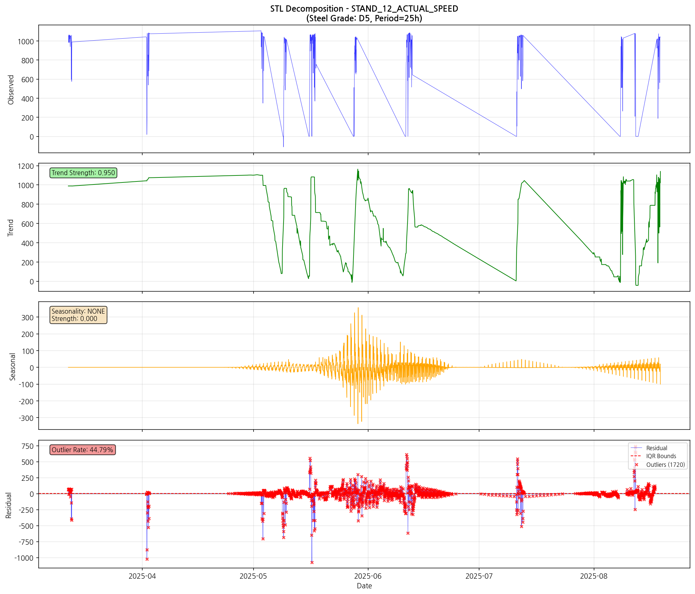

**STAND_6_ACTUAL_SPEED** (이상치율: 44.24%, 계절성: 0.000)

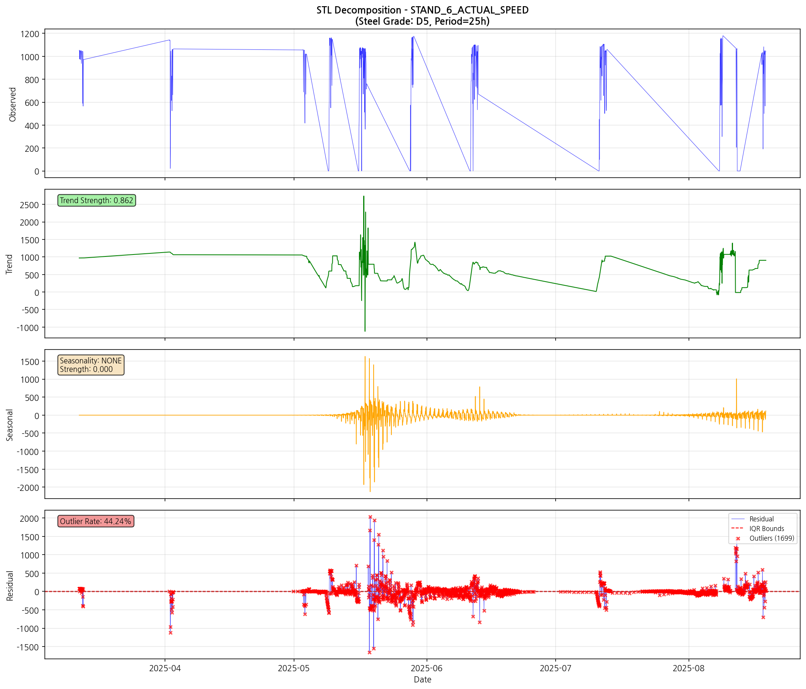

**STAND_7_ACTUAL_SPEED** (이상치율: 43.93%, 계절성: 0.000)

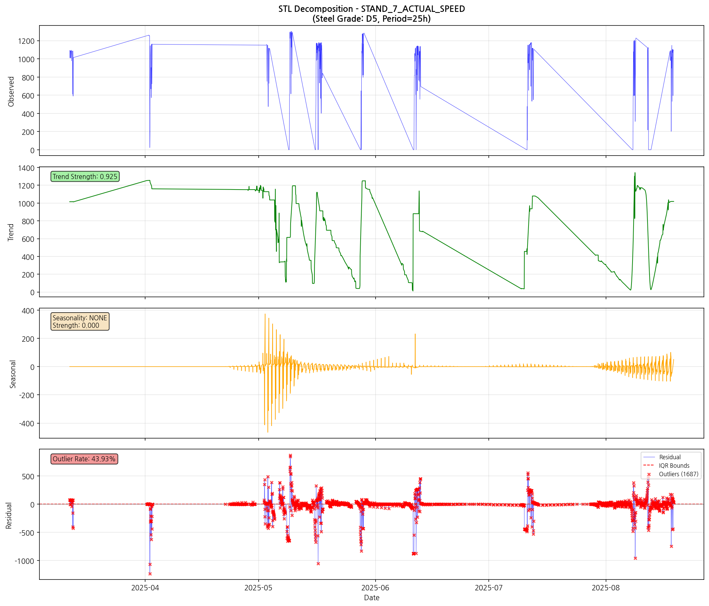

### 스탠드 부하 (07_Stand_Load)

- 분석 태그: 15개
- 평균 잔차 이상치율: 42.25%
- 평균 계절성 강도: 0.034

| 태그 | 이상치율 | 계절성 강도 | 추세 강도 |
|------|----------|-------------|-----------|
| STAND_1_LOAD | 41.22% | 0.188 | 0.928 |
| STAND_2_LOAD | 41.93% | 0.000 | 0.888 |
| STAND_3_LOAD | 40.42% | 0.000 | 0.908 |
| STAND_4_LOAD | 43.67% | 0.090 | 0.942 |
| STAND_5_LOAD | 43.65% | 0.000 | 0.614 |
| STAND_6_LOAD | 40.13% | 0.000 | 0.933 |
| STAND_7_LOAD | 43.78% | 0.000 | 0.905 |
| STAND_8_LOAD | 42.16% | 0.000 | 0.906 |
| STAND_9_LOAD | 42.94% | 0.200 | 0.693 |
| STAND_10_LOAD | 42.97% | 0.000 | 0.819 |
| STAND_11_LOAD | 44.01% | 0.036 | 0.921 |
| STAND_12_LOAD | 41.88% | 0.000 | 0.905 |
| STAND_13_LOAD | 41.88% | 0.000 | 0.905 |
| STAND_14_LOAD | 41.82% | 0.000 | 0.753 |
| FINISHING_BLOCK_LOAD | 41.25% | 0.000 | 0.868 |

#### STL 분해 차트

**STAND_11_LOAD** (이상치율: 44.01%, 계절성: 0.036)

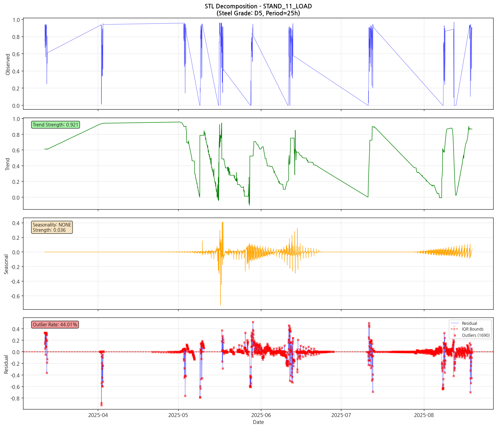

**STAND_7_LOAD** (이상치율: 43.78%, 계절성: 0.000)

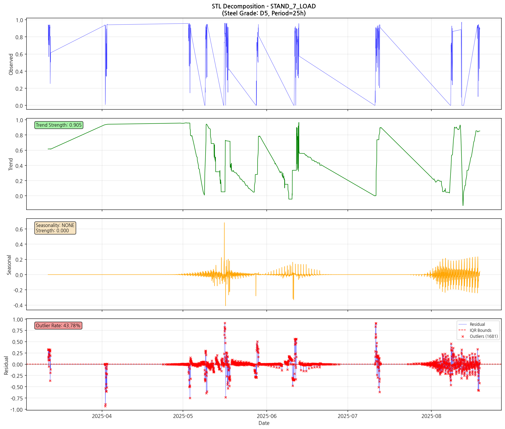

**STAND_4_LOAD** (이상치율: 43.67%, 계절성: 0.090)

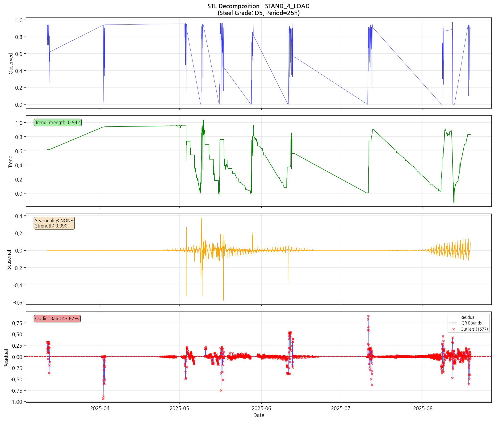

### 핀치롤 (08_Pinchroll)

- 분석 태그: 9개
- 평균 잔차 이상치율: 39.84%
- 평균 계절성 강도: 0.094

| 태그 | 이상치율 | 계절성 강도 | 추세 강도 |
|------|----------|-------------|-----------|
| PINCHROLL_2_ACTUAL_SPEED | 42.21% | 0.835 | 0.980 |
| PINCHROLL_3_ACTUAL_SPEED | 44.04% | 0.000 | 0.986 |
| PINCHROLL_4_ACTUAL_SPEED | 42.58% | 0.000 | 0.980 |
| PINCHROLL_2_ACTUAL_TORQUE | 39.40% | 0.000 | 0.496 |
| PINCHROLL_3_ACTUAL_TORQUE | 36.69% | 0.000 | 0.934 |
| PINCHROLL_4_ACTUAL_TORQUE | 38.28% | 0.000 | 0.926 |
| PINCHROLL_2_REFERENCE_TORQUE | 37.32% | 0.000 | 0.873 |
| PINCHROLL_3_REFERENCE_TORQUE | 40.36% | 0.014 | 0.949 |
| PINCHROLL_4_REFERENCE_TORQUE | 37.71% | 0.000 | 0.943 |

#### STL 분해 차트

**PINCHROLL_3_ACTUAL_SPEED** (이상치율: 44.04%, 계절성: 0.000)

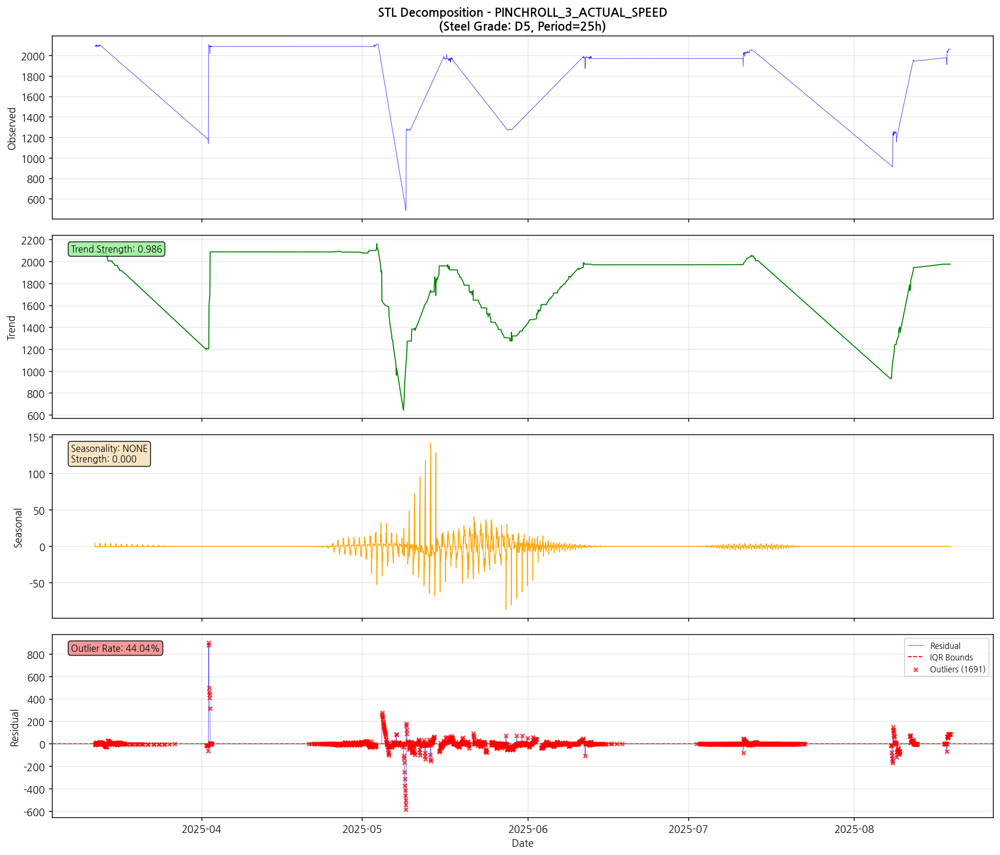

**PINCHROLL_4_ACTUAL_SPEED** (이상치율: 42.58%, 계절성: 0.000)

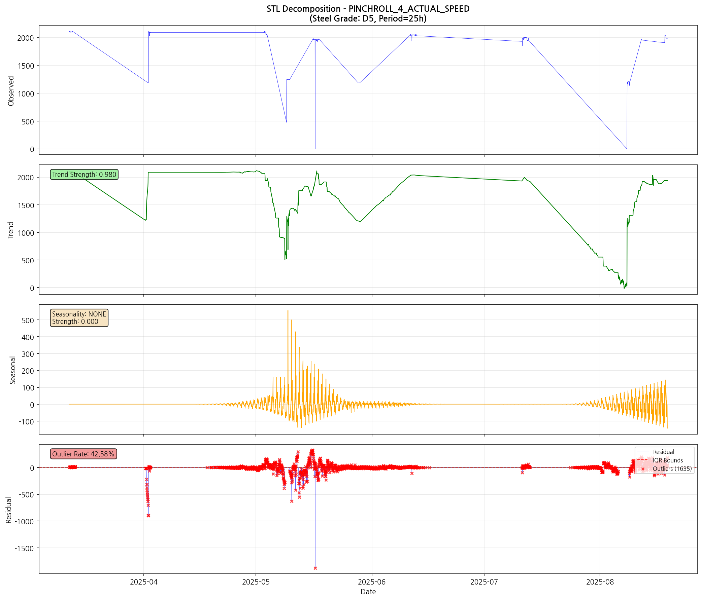

**PINCHROLL_2_ACTUAL_SPEED** (이상치율: 42.21%, 계절성: 0.835)

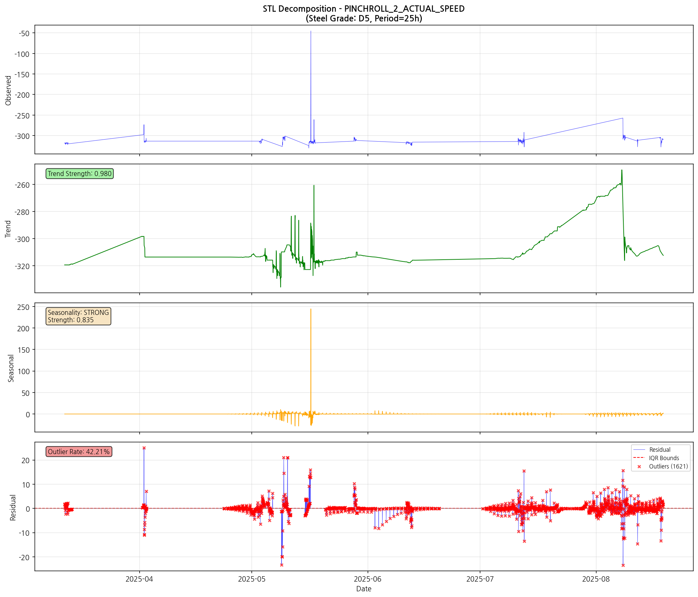

### PR 상세 토크 (09_PR_Detailed)

- 분석 태그: 6개
- 평균 잔차 이상치율: 41.92%
- 평균 계절성 강도: 0.017

| 태그 | 이상치율 | 계절성 강도 | 추세 강도 |
|------|----------|-------------|-----------|
| PR6L1_ACT_TORQUE | 43.67% | 0.000 | 0.961 |
| PR6L2_ACT_TORQUE | 42.34% | 0.000 | 0.914 |
| PR7L1_ACT_TORQUE | 43.26% | 0.010 | 0.956 |
| PR7L2_ACT_TORQUE | 42.37% | 0.093 | 0.968 |
| PR8L1_ACT_TORQUE | 38.07% | 0.000 | 0.945 |
| PR9L1_ACT_TORQUE | 41.82% | 0.000 | 0.896 |

#### STL 분해 차트

**PR6L1_ACT_TORQUE** (이상치율: 43.67%, 계절성: 0.000)

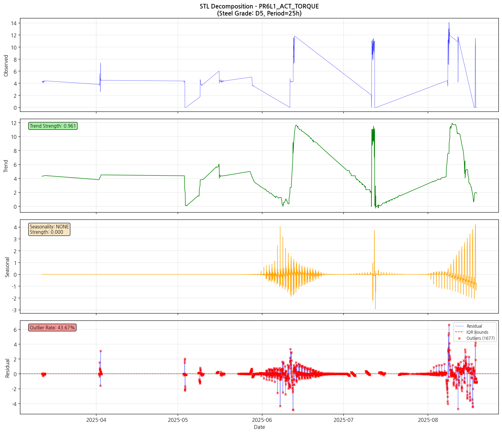

**PR7L1_ACT_TORQUE** (이상치율: 43.26%, 계절성: 0.010)

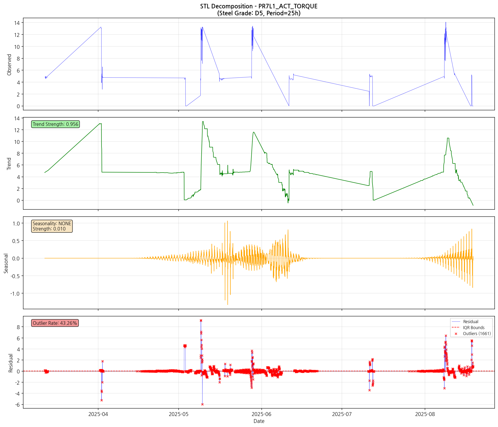

**PR7L2_ACT_TORQUE** (이상치율: 42.37%, 계절성: 0.093)

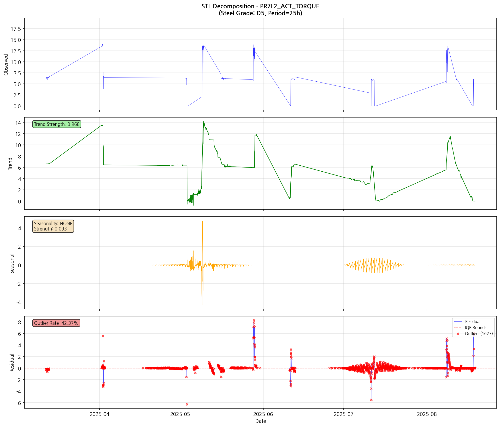

---

## 해석 가이드

### STL 분해 해석

1. **추세 (Trend)**
   - 장기적인 상승/하락 패턴
   - 설비 노화, 계절적 변화 등 반영
   - 추세 강도 높을수록 장기 변화가 뚜렷함

2. **계절성 (Seasonal)**
   - 주기적으로 반복되는 패턴 (24시간 기준)
   - 계절성 강도 ≥ 0.7: 강한 주기적 패턴
   - 계절성이 강한 태그는 STL 분석이 효과적

3. **잔차 (Residual)**
   - 추세와 계절성으로 설명되지 않는 변동
   - **순수한 이상치**를 포함
   - 잔차 기반 IQR로 "진짜" 이상치 탐지

### 계절성 강도 분류

| 분류 | 강도 범위 | 해석 |
|------|----------|------|
| Strong | ≥ 0.7 | 명확한 주기적 패턴, STL 매우 효과적 |
| Moderate | 0.4 ~ 0.7 | 적당한 주기적 패턴, STL 효과적 |
| Weak | 0.2 ~ 0.4 | 약한 주기적 패턴 |
| None | < 0.2 | 주기적 패턴 거의 없음 |

### Standard IQR vs STL Residual IQR

| 방법 | 장점 | 단점 |
|------|------|------|
| Standard IQR | 간단, 빠름 | 계절성에 영향받음 |
| STL Residual IQR | 계절성 제거, 순수 이상치 | 계산 복잡, 데이터 필요 |

**권장**: 계절성 강도 ≥ 0.4인 태그에는 STL Residual IQR 사용

---

## 메타데이터

| 항목 | 값 |
|------|-----|
| 분석 스크립트 | steel_grade_stl_analysis.py |
| 분석 기간 | 2025-03-01 ~ 2025-08-31 |
| 강종 | D5 |
| 계절 주기 | 25시간 |
| 생성일시 | 2026-02-03 20:44:11 |
| 총 분석 태그 | 79개 |

---

*본 보고서는 자동 생성되었습니다.*
