# 강종 [N5] 사이즈 [D10] STL 계절-추세 분해 분석 보고서

**분석 기간**: 2025-03-01 ~ 2025-08-31
**강종**: N5 | 사이즈: D10
**생성일시**: 2026-02-09 15:04:36

---

## 분석 개요

### 분석 방법론

**STL (Seasonal-Trend Decomposition using LOESS)**

시계열 데이터를 세 가지 성분으로 분해:
- **Trend (추세)**: 장기적인 변화 패턴
- **Seasonal (계절성)**: 주기적으로 반복되는 패턴
- **Residual (잔차)**: 추세와 계절성으로 설명되지 않는 변동

| 파라미터 | 값 | 설명 |
|----------|-----|------|
| seasonal | 25h | 계절 주기 |
| robust | True | 강건 추정 |

### 분석 결과 요약

| 구분 | 태그 수 | 비율 |
|------|---------|------|
| **총 분석 태그** | 79개 | 100% |

#### 잔차 이상치율 분포

| 구분 | 태그 수 | 비율 |
|------|---------|------|
| 🔴 높음 (≥15%) | 79개 | 100.0% |
| 🟠 중간 (5~15%) | 0개 | 0.0% |
| 🟢 낮음 (<5%) | 0개 | 0.0% |

#### 계절성 강도 분포

| 구분 | 태그 수 | 비율 |
|------|---------|------|
| 🔵 강함 (≥0.7) | 1개 | 1.3% |
| 중간 (0.4~0.7) | 1개 | 1.3% |
| 약함 (<0.4) | 77개 | 97.5% |

#### 전체 평균

| 지표 | 값 |
|------|-----|
| 평균 계절성 강도 | 0.054 |
| 평균 추세 강도 | 0.771 |

---

## 상위 문제 태그 (잔차 이상치율 기준)

| 순위 | 태그 | 카테고리 | 이상치율 | 계절성 강도 | 계절성 분류 |
|------|------|----------|----------|-------------|-------------|
| 1 | STAND_6_ACTUAL_TORQUE | 스탠드 토크 | 46.49% | 0.061 | none |
| 2 | STAND_6_LOAD | 스탠드 부하 | 45.91% | 0.216 | weak |
| 3 | PR6L1_ACT_TORQUE | PR 상세 토크 | 45.39% | 0.012 | none |
| 4 | SOAKING_BOTTOM_ZONE_NO_1_TEMPERATURE_OPP_SIDE | 가열로 하부 온도 | 45.25% | 0.001 | none |
| 5 | STAND_3_ACTUAL_TORQUE | 스탠드 토크 | 44.37% | 0.130 | none |
| 6 | INDIRECT_COOLING_WATER_FLOW | 가열로 보조설비 | 43.93% | 0.036 | none |
| 7 | STAND_14_ACTUAL_TORQUE | 스탠드 토크 | 43.64% | 0.151 | none |
| 8 | STAND_2_LOAD | 스탠드 부하 | 43.57% | 0.127 | none |
| 9 | PINCHROLL_4_REFERENCE_TORQUE | 핀치롤 | 43.49% | 0.000 | none |
| 10 | PINCHROLL_4_ACTUAL_TORQUE | 핀치롤 | 43.35% | 0.000 | none |
| 11 | FURNACE_PRESSURE | 가열로 보조설비 | 43.27% | 0.000 | none |
| 12 | PR7L2_ACT_TORQUE | PR 상세 토크 | 43.27% | 0.000 | none |
| 13 | MAIN_COMBUSTION_AIR_PRESSURE | 가열로 보조설비 | 43.20% | 0.000 | none |
| 14 | STAND_7_ACTUAL_TORQUE | 스탠드 토크 | 43.20% | 0.000 | none |
| 15 | STAND_4_LOAD | 스탠드 부하 | 43.13% | 0.151 | none |

---

## 강한 계절성 태그 목록

계절성 강도가 0.7 이상인 태그입니다. 이 태그들은 STL 분석이 특히 효과적입니다.

| 태그 | 카테고리 | 계절성 강도 | 잔차 이상치율 |
|------|----------|-------------|---------------|
| PINCHROLL_2_REFERENCE_TORQUE | 핀치롤 | 0.860 | 43.13% |

---

## 카테고리별 분석 결과

### 가열로 상부 온도 (01_Furnace_Top_Temperature)

- 분석 태그: 4개
- 평균 잔차 이상치율: 37.21%
- 평균 계절성 강도: 0.050

| 태그 | 이상치율 | 계절성 강도 | 추세 강도 |
|------|----------|-------------|-----------|
| HEATING_TOP_ZONE_NO_1_TEMPERATURE_ROOF | 33.77% | 0.001 | 0.845 |
| HEATING_TOP_ZONE_NO_2_TEMPERATURE_ROOF | 42.03% | 0.024 | 0.844 |
| SOAKING_TOP_ZONE_NO_1_TEMPERATURE_ROOF | 39.99% | 0.171 | 0.968 |
| SOAKING_TOP_ZONE_NO_2_TEMPERATURE_ROOF | 33.04% | 0.003 | 0.778 |

#### STL 분해 차트

**HEATING_TOP_ZONE_NO_2_TEMPERATURE_ROOF** (이상치율: 42.03%, 계절성: 0.024)

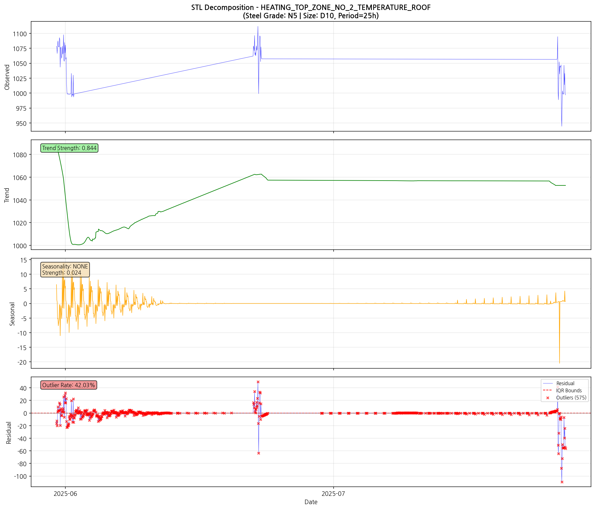

**SOAKING_TOP_ZONE_NO_1_TEMPERATURE_ROOF** (이상치율: 39.99%, 계절성: 0.171)

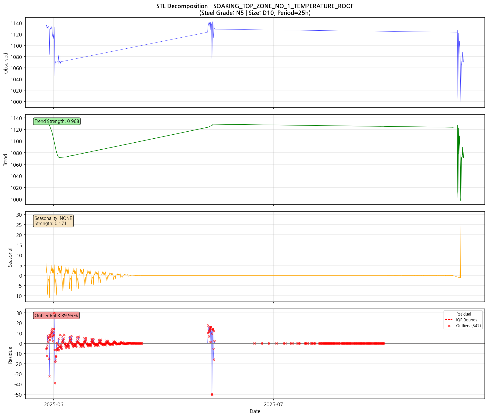

**HEATING_TOP_ZONE_NO_1_TEMPERATURE_ROOF** (이상치율: 33.77%, 계절성: 0.001)

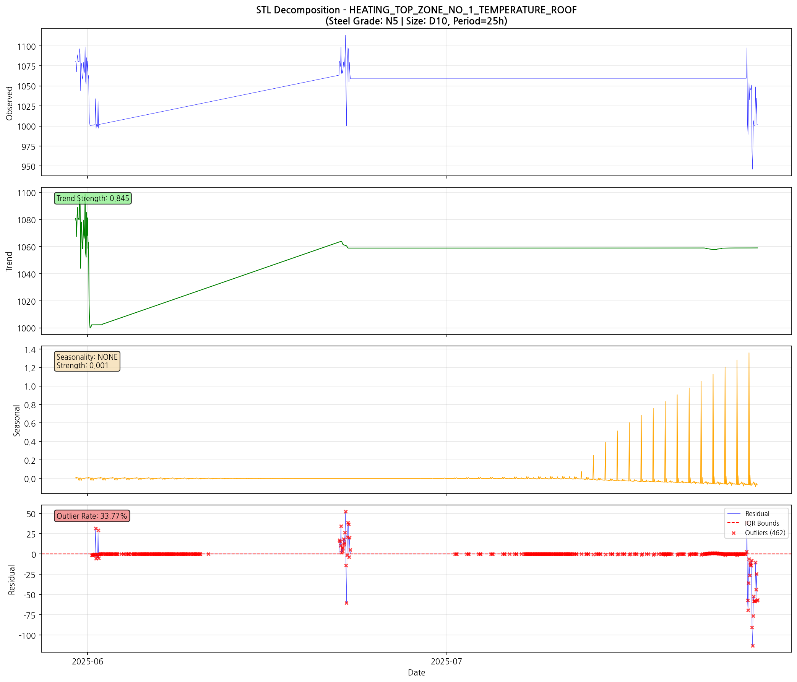

### 가열로 하부 온도 (02_Furnace_Bottom_Temperature)

- 분석 태그: 4개
- 평균 잔차 이상치율: 39.36%
- 평균 계절성 강도: 0.116

| 태그 | 이상치율 | 계절성 강도 | 추세 강도 |
|------|----------|-------------|-----------|
| HEATING_BOTTOM_ZONE_NO_1_TEMPERATURE_OPP_SIDE | 42.84% | 0.429 | 0.965 |
| HEATING_BOTTOM_ZONE_NO_2_TEMPERATURE_MILL_SIDE | 34.06% | 0.030 | 0.926 |
| SOAKING_BOTTOM_ZONE_NO_1_TEMPERATURE_OPP_SIDE | 45.25% | 0.001 | 0.688 |
| SOAKING_BOTTOM_ZONE_NO_2_TEMPERATURE_MILL_SIDE | 35.31% | 0.005 | 0.920 |

#### STL 분해 차트

**SOAKING_BOTTOM_ZONE_NO_1_TEMPERATURE_OPP_SIDE** (이상치율: 45.25%, 계절성: 0.001)

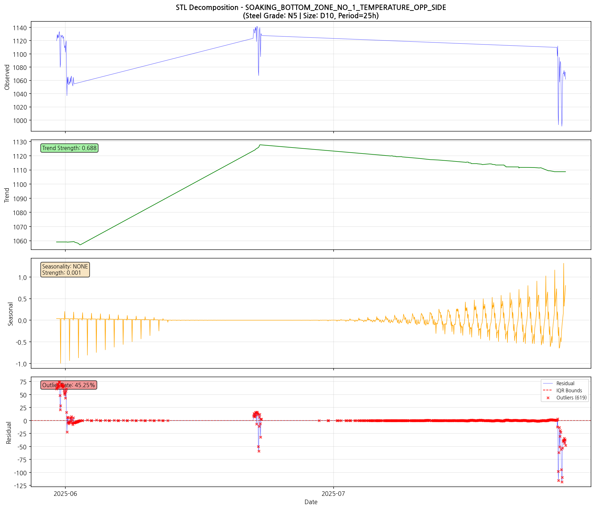

**HEATING_BOTTOM_ZONE_NO_1_TEMPERATURE_OPP_SIDE** (이상치율: 42.84%, 계절성: 0.429)

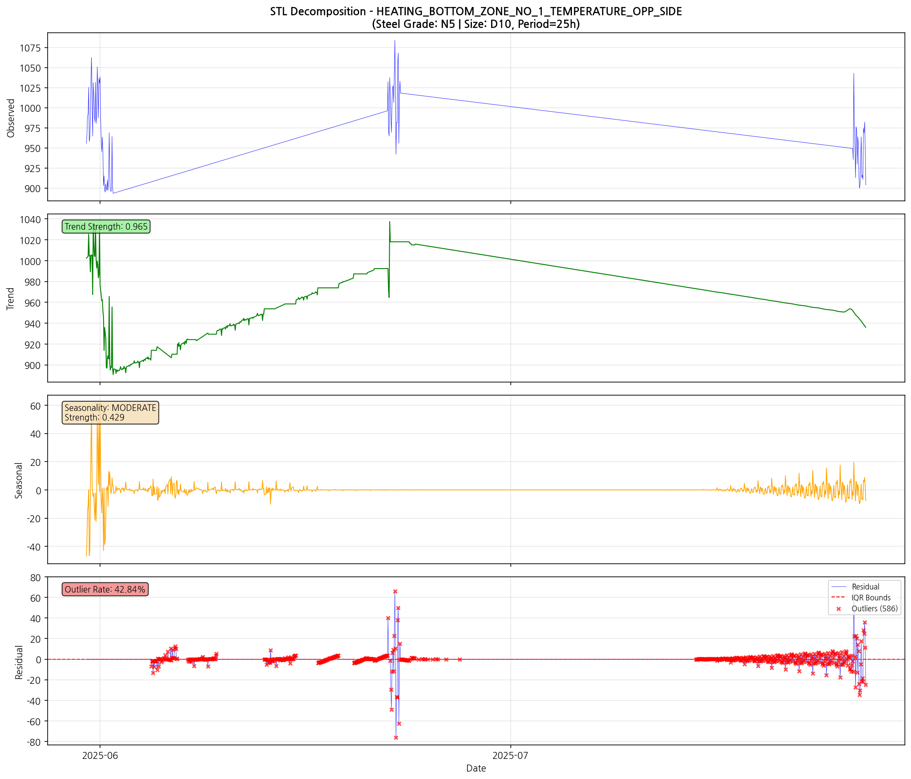

**SOAKING_BOTTOM_ZONE_NO_2_TEMPERATURE_MILL_SIDE** (이상치율: 35.31%, 계절성: 0.005)

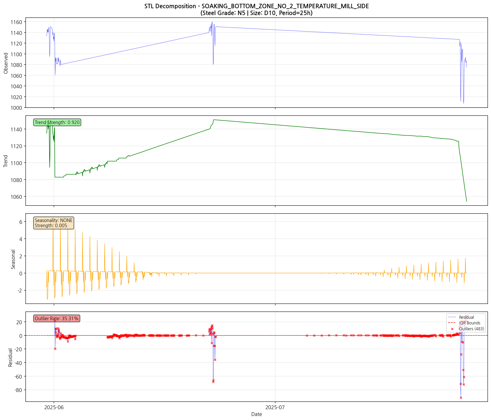

### 가열로 추출 온도 (03_Furnace_Discharge_Temperature)

- 분석 태그: 1개
- 평균 잔차 이상치율: 42.11%
- 평균 계절성 강도: 0.000

| 태그 | 이상치율 | 계절성 강도 | 추세 강도 |
|------|----------|-------------|-----------|
| FURNACE_EXIT_DISCHARGE_BILLET_TEMPERATURE | 42.11% | 0.000 | 0.848 |

#### STL 분해 차트

**FURNACE_EXIT_DISCHARGE_BILLET_TEMPERATURE** (이상치율: 42.11%, 계절성: 0.000)

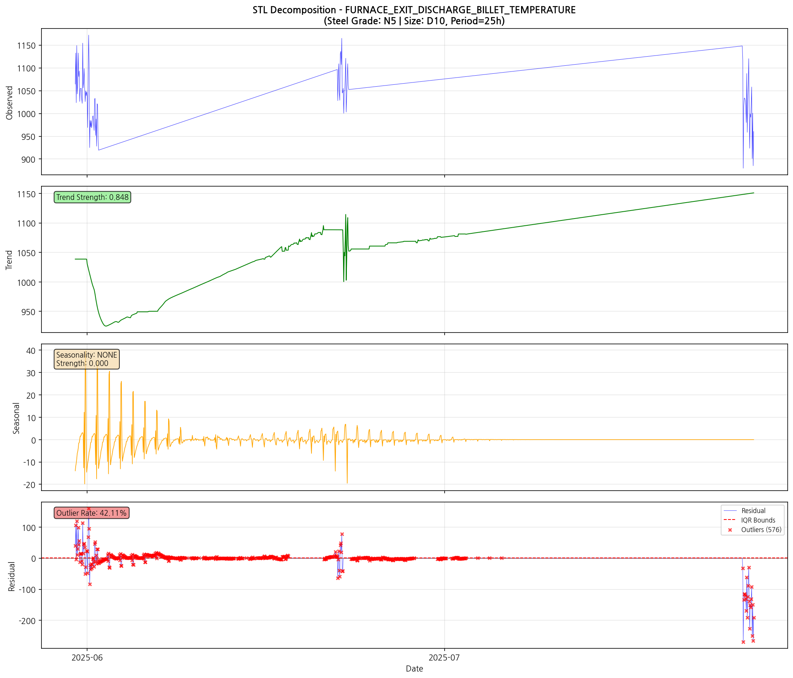

### 가열로 보조설비 (04_Furnace_Auxiliary)

- 분석 태그: 9개
- 평균 잔차 이상치율: 40.28%
- 평균 계절성 강도: 0.019

| 태그 | 이상치율 | 계절성 강도 | 추세 강도 |
|------|----------|-------------|-----------|
| FURNACE_PRESSURE | 43.27% | 0.000 | 0.464 |
| FURNACE_O2_ANALYZER | 36.84% | 0.001 | 0.915 |
| MAIN_GAS_PRESSURE | 42.18% | 0.023 | 0.698 |
| MAIN_GAS_FLOW | 40.28% | 0.010 | 0.738 |
| MAIN_GAS_TEMPERATURE | 38.96% | 0.089 | 0.940 |
| MAIN_COMBUSTION_AIR_PRESSURE | 43.20% | 0.000 | 0.131 |
| COMBUSTION_AIR_TEMPERATURE | 42.40% | 0.004 | 0.856 |
| INDIRECT_COOLING_WATER_FLOW | 43.93% | 0.036 | 0.997 |
| INDIRECT_WATER_MAIN_TEMPERATURE | 31.43% | 0.003 | 0.992 |

#### STL 분해 차트

**INDIRECT_COOLING_WATER_FLOW** (이상치율: 43.93%, 계절성: 0.036)

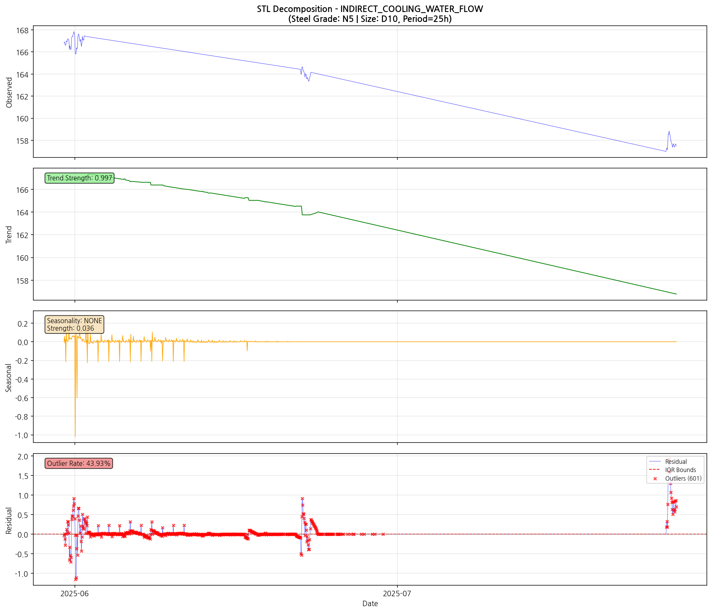

**FURNACE_PRESSURE** (이상치율: 43.27%, 계절성: 0.000)

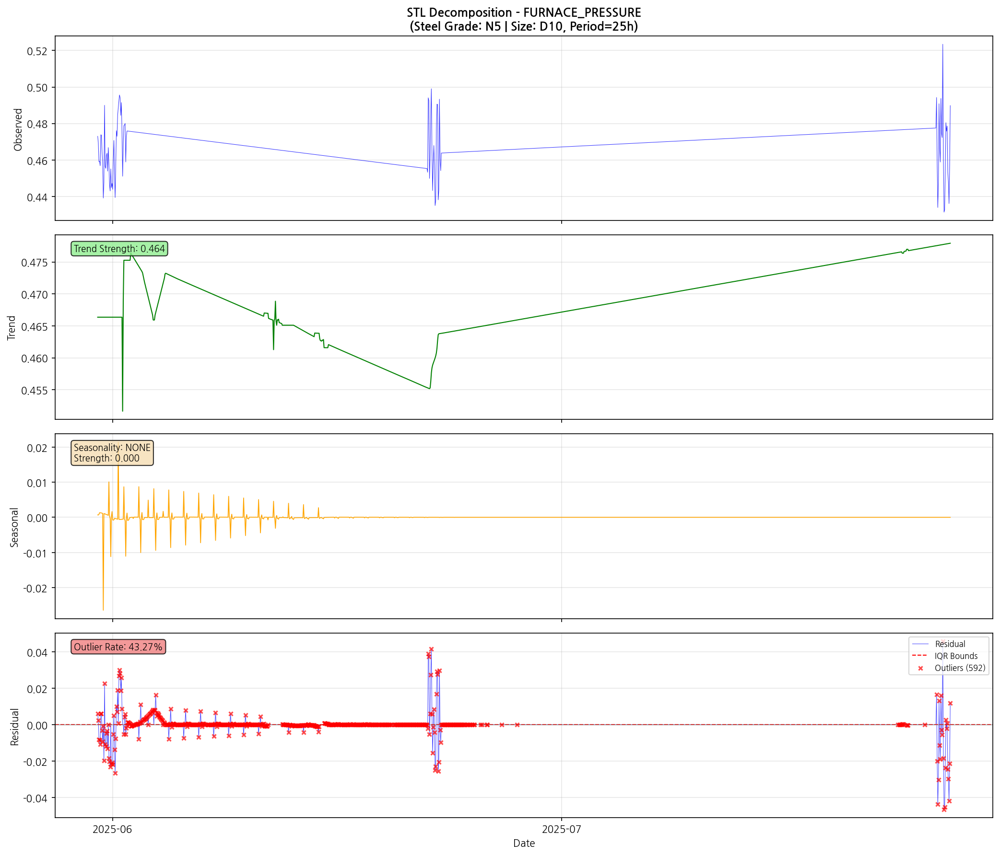

**MAIN_COMBUSTION_AIR_PRESSURE** (이상치율: 43.20%, 계절성: 0.000)

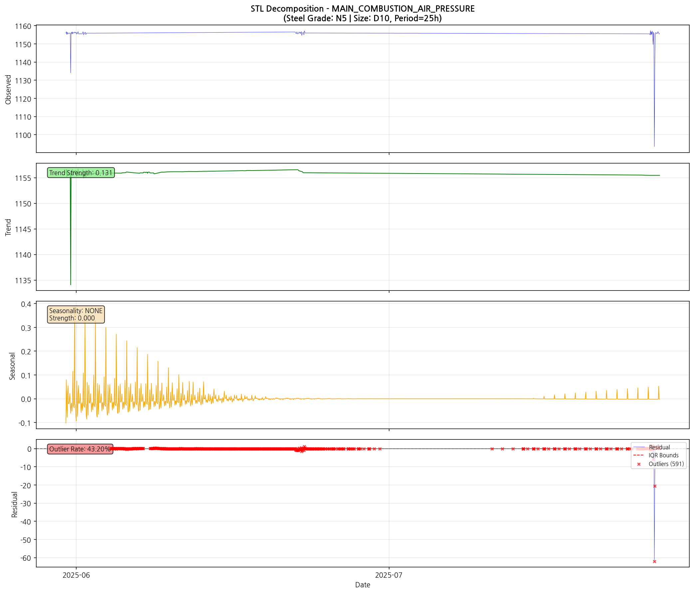

### 스탠드 토크 (05_Stand_Torque)

- 분석 태그: 16개
- 평균 잔차 이상치율: 40.59%
- 평균 계절성 강도: 0.069

| 태그 | 이상치율 | 계절성 강도 | 추세 강도 |
|------|----------|-------------|-----------|
| STAND_1_ACTUAL_TORQUE | 33.85% | 0.000 | 0.598 |
| STAND_2_ACTUAL_TORQUE | 40.86% | 0.058 | 0.752 |
| STAND_3_ACTUAL_TORQUE | 44.37% | 0.130 | 0.900 |
| STAND_4_ACTUAL_TORQUE | 42.98% | 0.002 | 0.653 |
| STAND_5_ACTUAL_TORQUE | 40.06% | 0.151 | 0.892 |
| STAND_6_ACTUAL_TORQUE | 46.49% | 0.061 | 0.746 |
| STAND_7_ACTUAL_TORQUE | 43.20% | 0.000 | 0.678 |
| STAND_8_ACTUAL_TORQUE | 41.52% | 0.113 | 0.848 |
| STAND_9_ACTUAL_TORQUE | 41.23% | 0.142 | 0.863 |
| STAND_10_ACTUAL_TORQUE | 39.04% | 0.077 | 0.845 |
| STAND_11_ACTUAL_TORQUE | 35.01% | 0.000 | 0.864 |
| STAND_12_ACTUAL_TORQUE | 41.23% | 0.079 | 0.756 |
| STAND_13_ACTUAL_TORQUE | 42.84% | 0.131 | 0.885 |
| STAND_14_ACTUAL_TORQUE | 43.64% | 0.151 | 0.898 |
| FINISHING_BLOCK_MASTER_ACTUAL_TORQUE | 37.79% | 0.008 | 0.870 |
| FINISHING_BLOCK_SLAVE_ACTUAL_TORQUE | 35.31% | 0.000 | 0.854 |

#### STL 분해 차트

**STAND_6_ACTUAL_TORQUE** (이상치율: 46.49%, 계절성: 0.061)

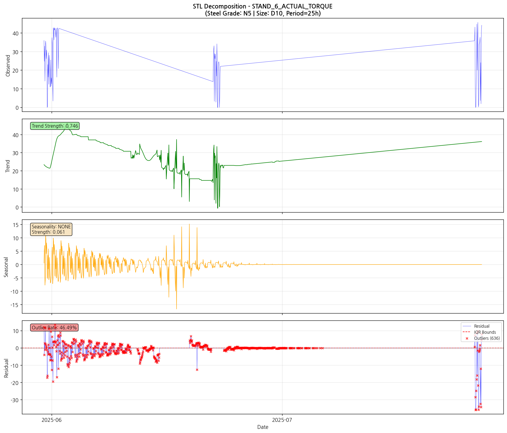

**STAND_3_ACTUAL_TORQUE** (이상치율: 44.37%, 계절성: 0.130)

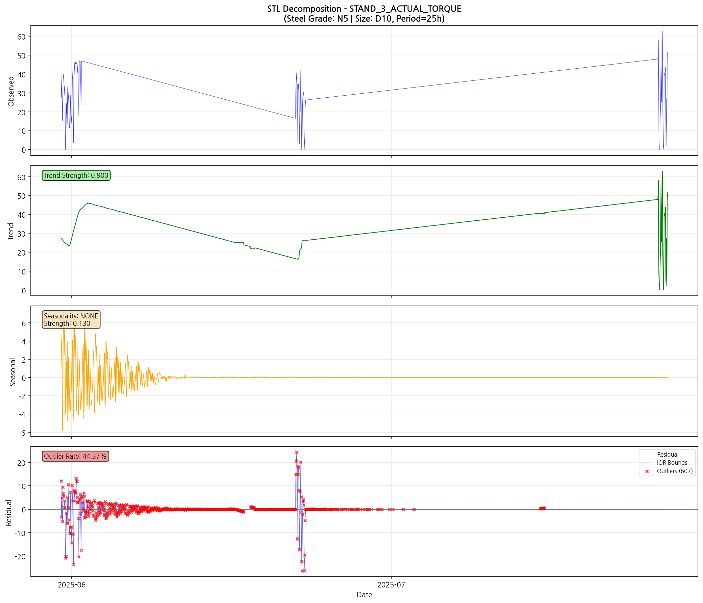

**STAND_14_ACTUAL_TORQUE** (이상치율: 43.64%, 계절성: 0.151)

### 스탠드 속도 (06_Stand_Speed)

- 분석 태그: 15개
- 평균 잔차 이상치율: 38.87%
- 평균 계절성 강도: 0.015

| 태그 | 이상치율 | 계절성 강도 | 추세 강도 |
|------|----------|-------------|-----------|
| STAND_1_ACTUAL_SPEED | 38.67% | 0.000 | 0.661 |
| STAND_2_ACTUAL_SPEED | 35.89% | 0.071 | 0.707 |
| STAND_3_ACTUAL_SPEED | 38.67% | 0.000 | 0.488 |
| STAND_4_ACTUAL_SPEED | 36.26% | 0.001 | 0.780 |
| STAND_5_ACTUAL_SPEED | 41.74% | 0.000 | 0.627 |
| STAND_6_ACTUAL_SPEED | 36.33% | 0.000 | 0.630 |
| STAND_7_ACTUAL_SPEED | 34.80% | 0.000 | 0.531 |
| STAND_8_ACTUAL_SPEED | 42.98% | 0.001 | 0.582 |
| STAND_9_ACTUAL_SPEED | 33.55% | 0.000 | 0.684 |
| STAND_10_ACTUAL_SPEED | 41.96% | 0.000 | 0.626 |
| STAND_11_ACTUAL_SPEED | 36.92% | 0.025 | 0.626 |
| STAND_12_ACTUAL_SPEED | 40.94% | 0.058 | 0.491 |
| STAND_13_ACTUAL_SPEED | 39.77% | 0.040 | 0.603 |
| STAND_14_ACTUAL_SPEED | 42.84% | 0.035 | 0.442 |
| FINISHING_BLOCK_ACTUAL_SPEED | 41.81% | 0.000 | 0.601 |

#### STL 분해 차트

**STAND_8_ACTUAL_SPEED** (이상치율: 42.98%, 계절성: 0.001)

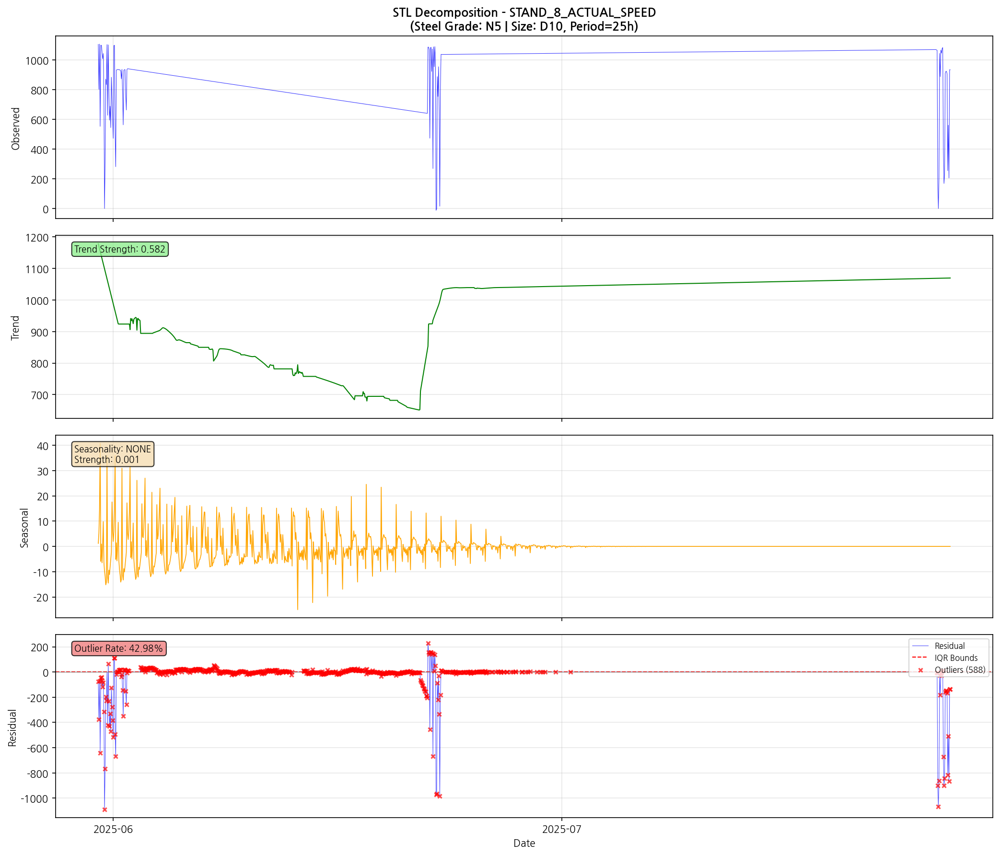

**STAND_14_ACTUAL_SPEED** (이상치율: 42.84%, 계절성: 0.035)

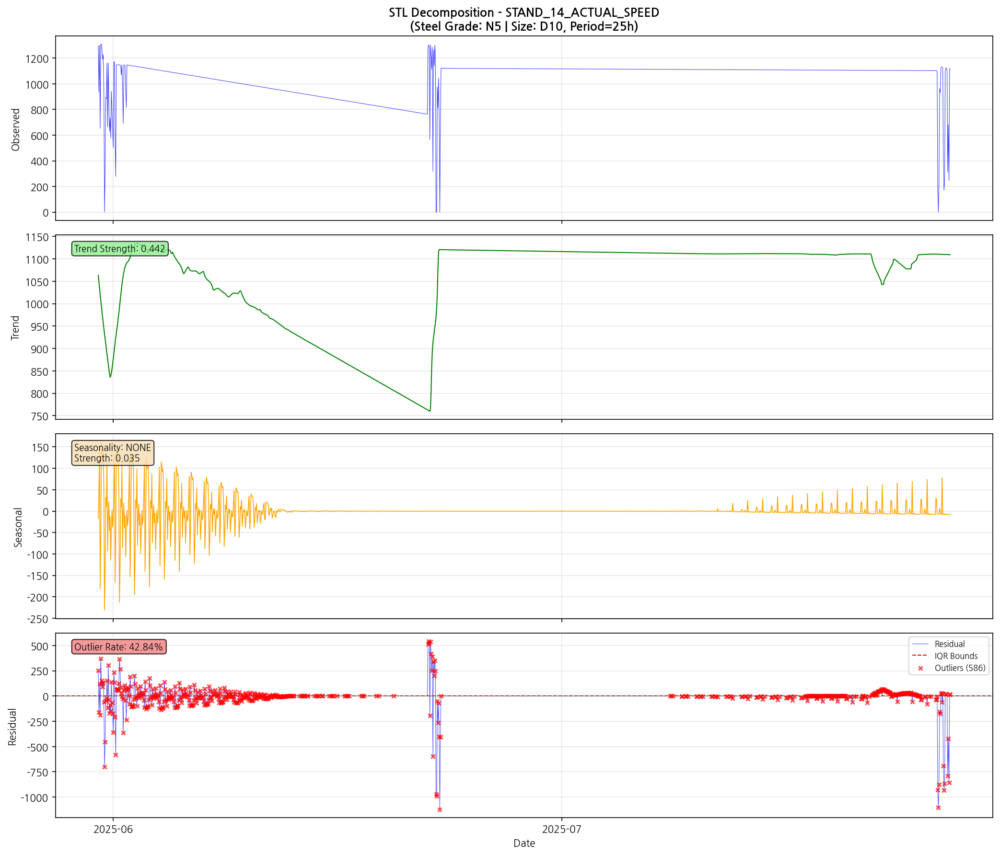

**STAND_10_ACTUAL_SPEED** (이상치율: 41.96%, 계절성: 0.000)

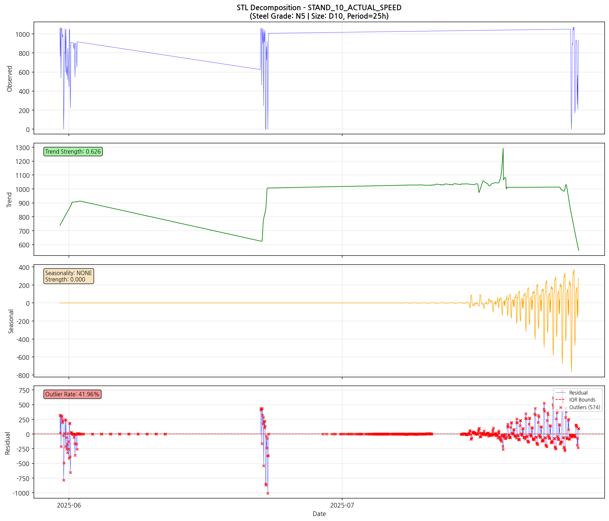

### 스탠드 부하 (07_Stand_Load)

- 분석 태그: 15개
- 평균 잔차 이상치율: 39.33%
- 평균 계절성 강도: 0.067

| 태그 | 이상치율 | 계절성 강도 | 추세 강도 |
|------|----------|-------------|-----------|
| STAND_1_LOAD | 40.94% | 0.109 | 0.732 |
| STAND_2_LOAD | 43.57% | 0.127 | 0.885 |
| STAND_3_LOAD | 39.55% | 0.000 | 0.814 |
| STAND_4_LOAD | 43.13% | 0.151 | 0.885 |
| STAND_5_LOAD | 32.16% | 0.048 | 0.705 |
| STAND_6_LOAD | 45.91% | 0.216 | 0.550 |
| STAND_7_LOAD | 41.67% | 0.085 | 0.874 |
| STAND_8_LOAD | 38.08% | 0.000 | 0.760 |
| STAND_9_LOAD | 35.53% | 0.025 | 0.715 |
| STAND_10_LOAD | 38.38% | 0.000 | 0.684 |
| STAND_11_LOAD | 40.64% | 0.144 | 0.879 |
| STAND_12_LOAD | 33.41% | 0.003 | 0.798 |
| STAND_13_LOAD | 33.41% | 0.003 | 0.798 |
| STAND_14_LOAD | 40.79% | 0.022 | 0.718 |
| FINISHING_BLOCK_LOAD | 42.84% | 0.072 | 0.861 |

#### STL 분해 차트

**STAND_6_LOAD** (이상치율: 45.91%, 계절성: 0.216)

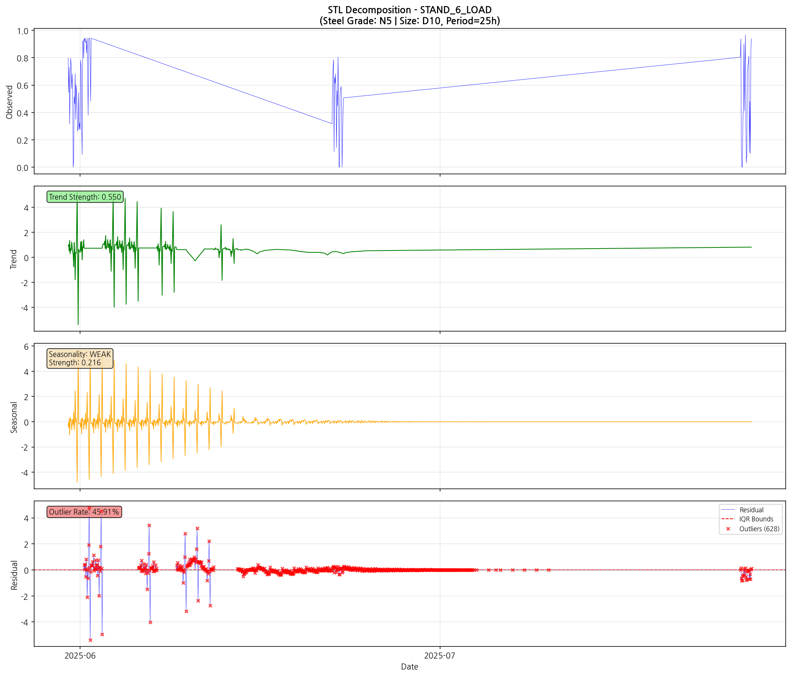

**STAND_2_LOAD** (이상치율: 43.57%, 계절성: 0.127)

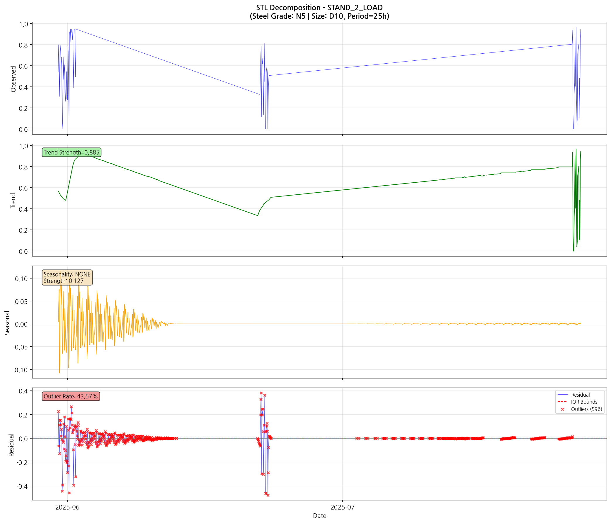

**STAND_4_LOAD** (이상치율: 43.13%, 계절성: 0.151)

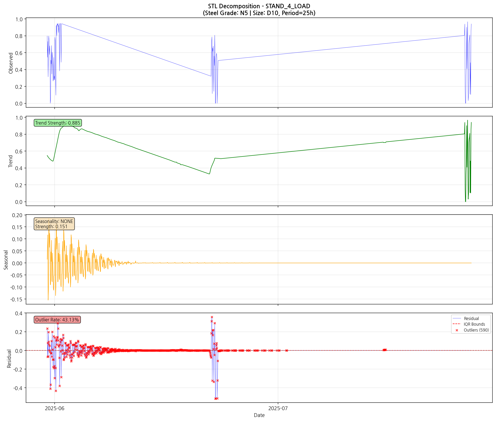

### 핀치롤 (08_Pinchroll)

- 분석 태그: 9개
- 평균 잔차 이상치율: 37.73%
- 평균 계절성 강도: 0.108

| 태그 | 이상치율 | 계절성 강도 | 추세 강도 |
|------|----------|-------------|-----------|
| PINCHROLL_2_ACTUAL_SPEED | 23.25% | 0.000 | 0.950 |
| PINCHROLL_3_ACTUAL_SPEED | 40.42% | 0.011 | 0.972 |
| PINCHROLL_4_ACTUAL_SPEED | 33.55% | 0.013 | 0.951 |
| PINCHROLL_2_ACTUAL_TORQUE | 31.51% | 0.052 | 0.700 |
| PINCHROLL_3_ACTUAL_TORQUE | 42.40% | 0.034 | 0.829 |
| PINCHROLL_4_ACTUAL_TORQUE | 43.35% | 0.000 | 0.642 |
| PINCHROLL_2_REFERENCE_TORQUE | 43.13% | 0.860 | 1.000 |
| PINCHROLL_3_REFERENCE_TORQUE | 38.45% | 0.000 | 0.846 |
| PINCHROLL_4_REFERENCE_TORQUE | 43.49% | 0.000 | 0.794 |

#### STL 분해 차트

**PINCHROLL_4_REFERENCE_TORQUE** (이상치율: 43.49%, 계절성: 0.000)

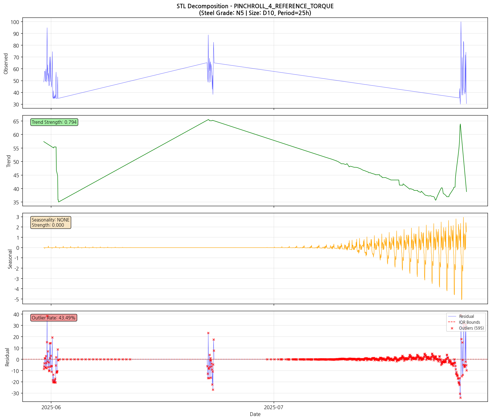

**PINCHROLL_4_ACTUAL_TORQUE** (이상치율: 43.35%, 계절성: 0.000)

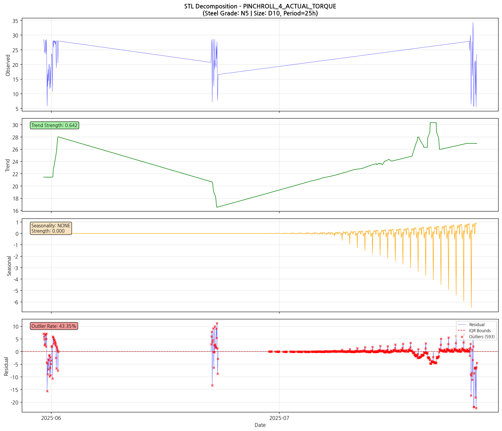

**PINCHROLL_2_REFERENCE_TORQUE** (이상치율: 43.13%, 계절성: 0.860)

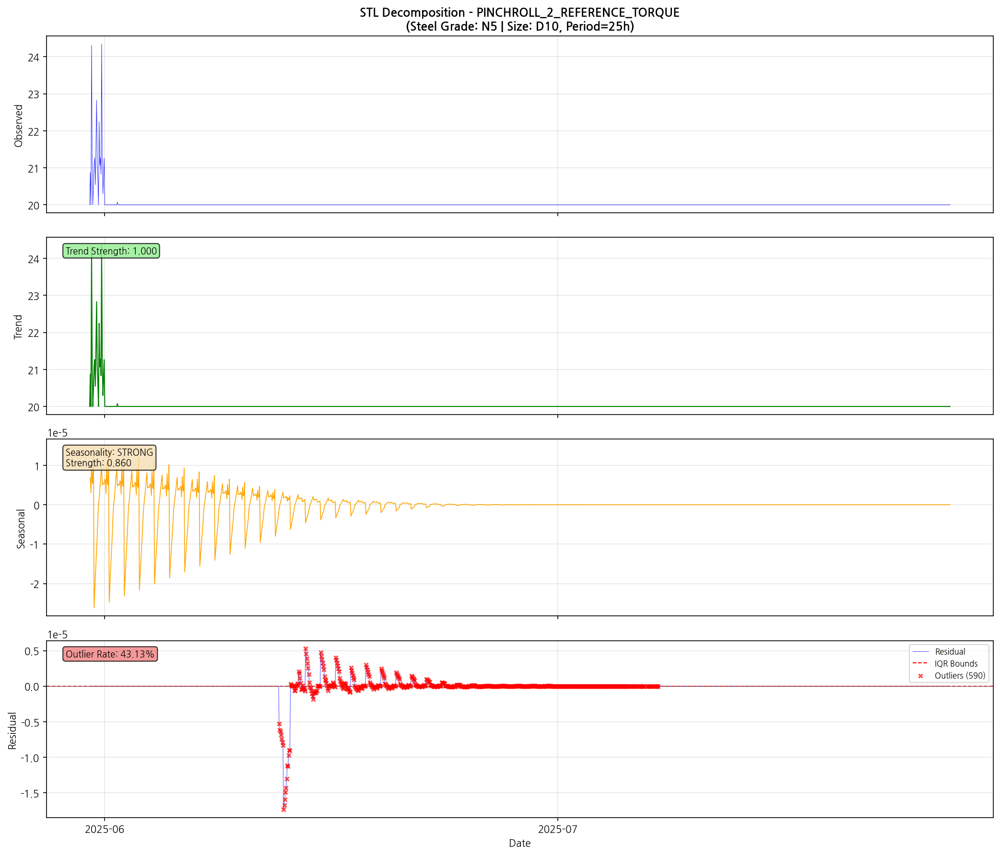

### PR 상세 토크 (09_PR_Detailed)

- 분석 태그: 6개
- 평균 잔차 이상치율: 38.69%
- 평균 계절성 강도: 0.025

| 태그 | 이상치율 | 계절성 강도 | 추세 강도 |
|------|----------|-------------|-----------|
| PR6L1_ACT_TORQUE | 45.39% | 0.012 | 0.986 |
| PR6L2_ACT_TORQUE | 35.75% | 0.002 | 0.872 |
| PR7L1_ACT_TORQUE | 33.92% | 0.000 | 0.636 |
| PR7L2_ACT_TORQUE | 43.27% | 0.000 | 0.863 |
| PR8L1_ACT_TORQUE | 31.80% | 0.127 | 0.827 |
| PR9L1_ACT_TORQUE | 42.03% | 0.012 | 0.899 |

#### STL 분해 차트

**PR6L1_ACT_TORQUE** (이상치율: 45.39%, 계절성: 0.012)

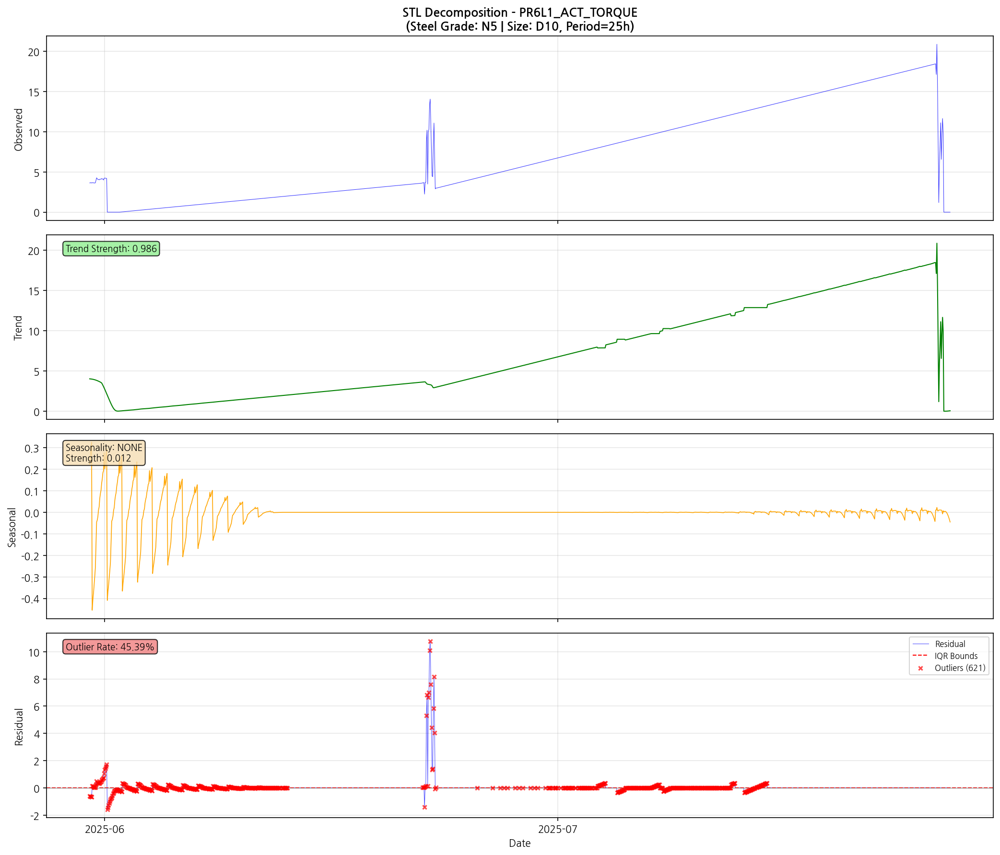

**PR7L2_ACT_TORQUE** (이상치율: 43.27%, 계절성: 0.000)

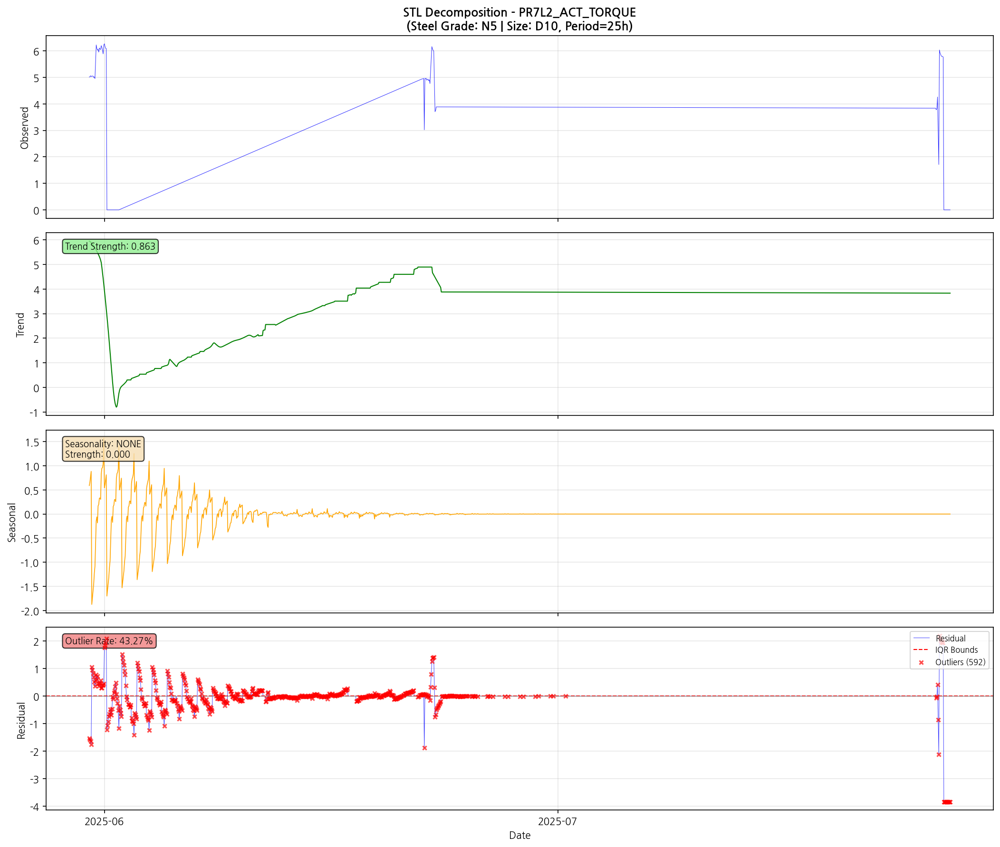

**PR9L1_ACT_TORQUE** (이상치율: 42.03%, 계절성: 0.012)

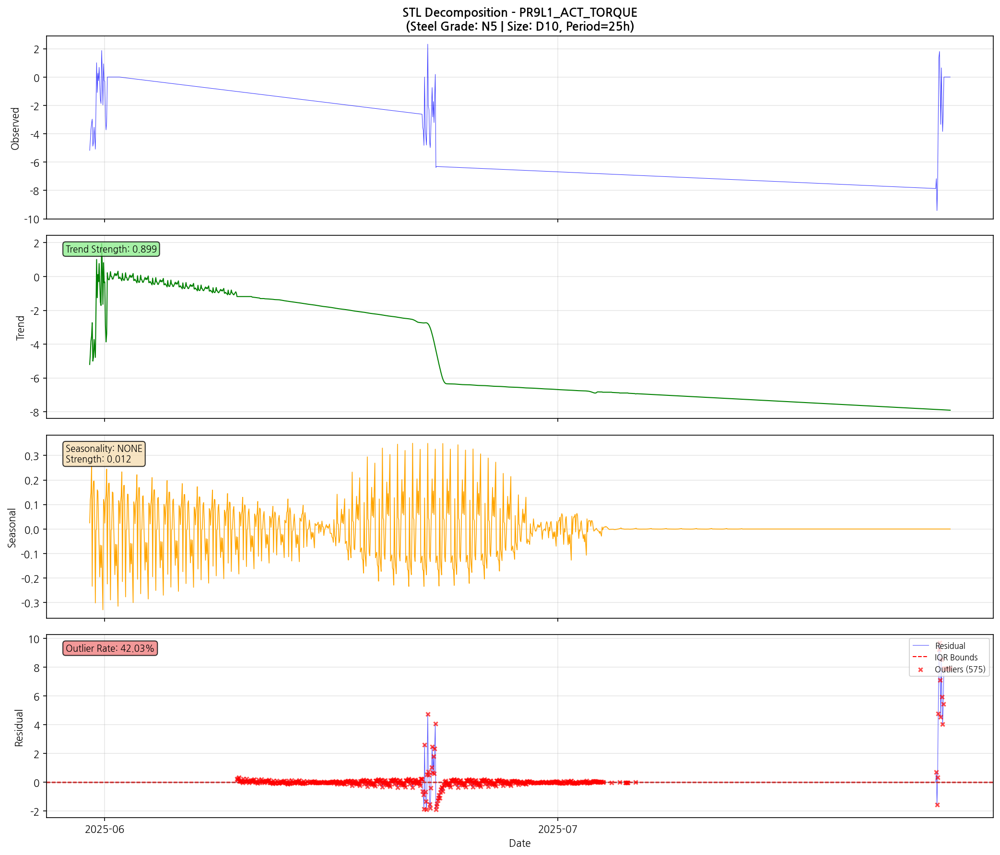

---

## 해석 가이드

### STL 분해 해석

1. **추세 (Trend)**
   - 장기적인 상승/하락 패턴
   - 설비 노화, 계절적 변화 등 반영
   - 추세 강도 높을수록 장기 변화가 뚜렷함

2. **계절성 (Seasonal)**
   - 주기적으로 반복되는 패턴 (24시간 기준)
   - 계절성 강도 ≥ 0.7: 강한 주기적 패턴
   - 계절성이 강한 태그는 STL 분석이 효과적

3. **잔차 (Residual)**
   - 추세와 계절성으로 설명되지 않는 변동
   - **순수한 이상치**를 포함
   - 잔차 기반 IQR로 "진짜" 이상치 탐지

### 계절성 강도 분류

| 분류 | 강도 범위 | 해석 |
|------|----------|------|
| Strong | ≥ 0.7 | 명확한 주기적 패턴, STL 매우 효과적 |
| Moderate | 0.4 ~ 0.7 | 적당한 주기적 패턴, STL 효과적 |
| Weak | 0.2 ~ 0.4 | 약한 주기적 패턴 |
| None | < 0.2 | 주기적 패턴 거의 없음 |

### Standard IQR vs STL Residual IQR

| 방법 | 장점 | 단점 |
|------|------|------|
| Standard IQR | 간단, 빠름 | 계절성에 영향받음 |
| STL Residual IQR | 계절성 제거, 순수 이상치 | 계산 복잡, 데이터 필요 |

**권장**: 계절성 강도 ≥ 0.4인 태그에는 STL Residual IQR 사용

---

## 메타데이터

| 항목 | 값 |
|------|-----|
| 분석 스크립트 | steel_grade_stl_analysis.py |
| 분석 기간 | 2025-03-01 ~ 2025-08-31 |
| 강종 | N5 |
| 계절 주기 | 25시간 |
| 생성일시 | 2026-02-09 15:04:36 |
| 총 분석 태그 | 79개 |

---

*본 보고서는 자동 생성되었습니다.*
