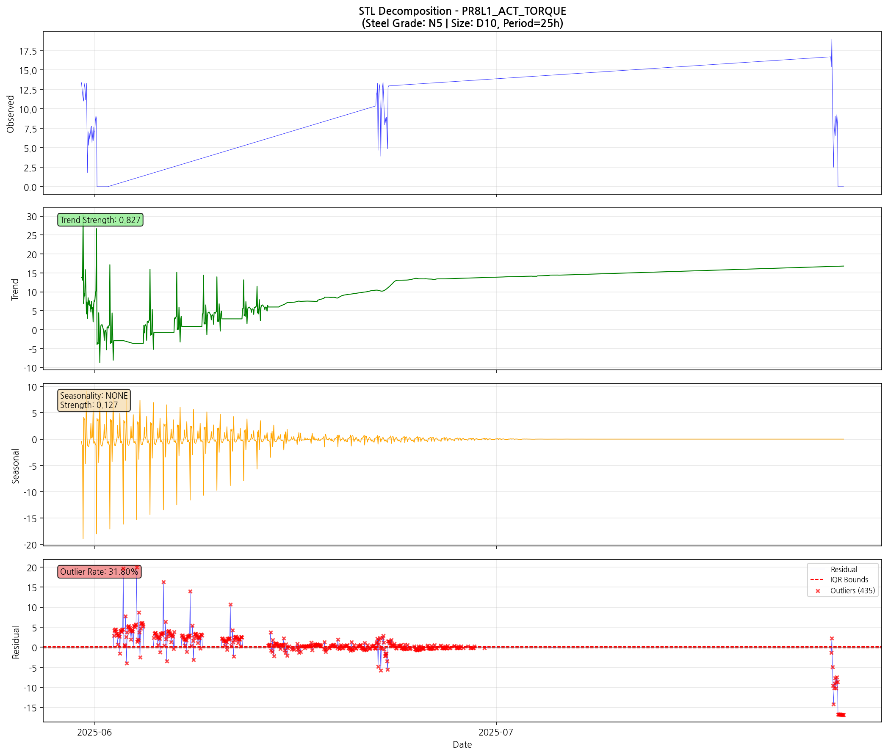
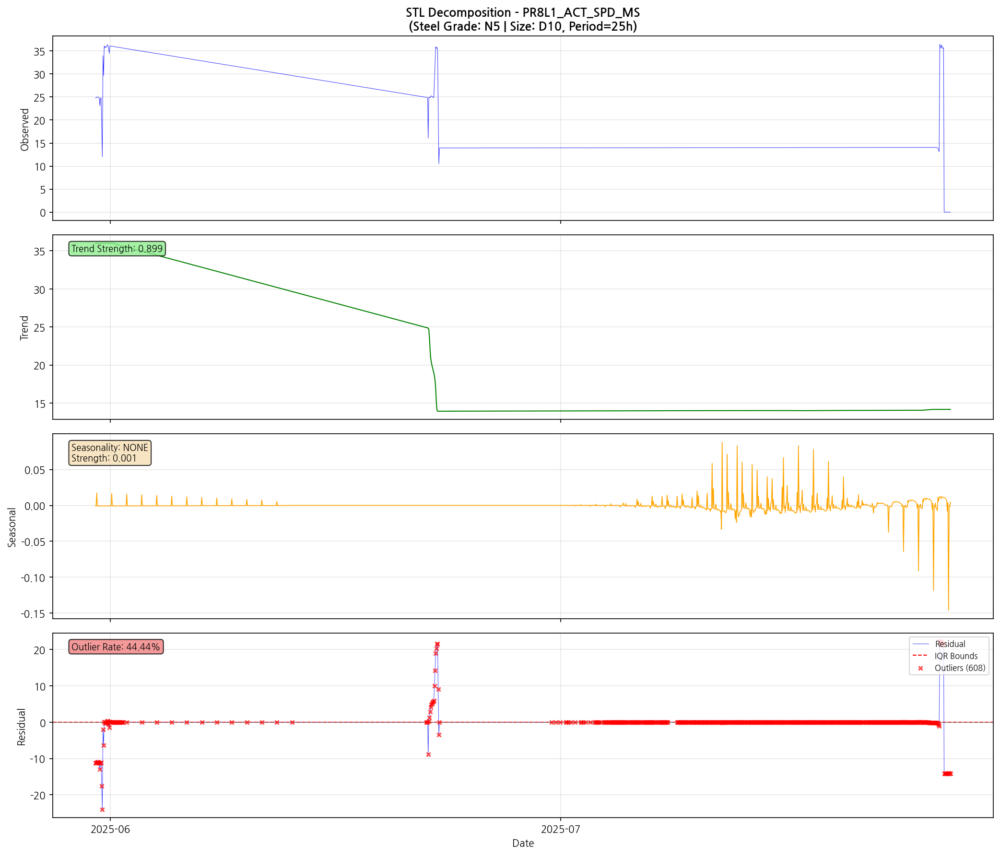

# 강종 [N5] 사이즈 [D10] STL 계절-추세 분해 분석 보고서

**분석 기간**: 2025-03-01 ~ 2025-08-31
**강종**: N5 | 사이즈: D10
**생성일시**: 2026-02-23 01:45:12

---

## 분석 개요

### 분석 방법론

**STL (Seasonal-Trend Decomposition using LOESS)**

시계열 데이터를 세 가지 성분으로 분해:
- **Trend (추세)**: 장기적인 변화 패턴
- **Seasonal (계절성)**: 주기적으로 반복되는 패턴
- **Residual (잔차)**: 추세와 계절성으로 설명되지 않는 변동

| 파라미터 | 값 | 설명 |
|----------|-----|------|
| seasonal | 25h | 계절 주기 |
| robust | True | 강건 추정 |

### 분석 결과 요약

| 구분 | 태그 수 | 비율 |
|------|---------|------|
| **총 분석 태그** | 23개 | 100% |

#### 잔차 이상치율 분포

| 구분 | 태그 수 | 비율 |
|------|---------|------|
| 🔴 높음 (≥15%) | 23개 | 100.0% |
| 🟠 중간 (5~15%) | 0개 | 0.0% |
| 🟢 낮음 (<5%) | 0개 | 0.0% |

#### 계절성 강도 분포

| 구분 | 태그 수 | 비율 |
|------|---------|------|
| 🔵 강함 (≥0.7) | 1개 | 4.3% |
| 중간 (0.4~0.7) | 0개 | 0.0% |
| 약함 (<0.4) | 22개 | 95.7% |

#### 전체 평균

| 지표 | 값 |
|------|-----|
| 평균 계절성 강도 | 0.052 |
| 평균 추세 강도 | 0.813 |

---

## 상위 문제 태그 (잔차 이상치율 기준)

| 순위 | 태그 | 카테고리 | 이상치율 | 계절성 강도 | 계절성 분류 |
|------|------|----------|----------|-------------|-------------|
| 1 | PR8L1_ACT_TORQUE | PR 상세 (토크+속도) | 45.76% | 0.001 | none |
| 2 | PR8L1_ACT_SPD_MS | PR 상세 (토크+속도) | 44.44% | 0.001 | none |
| 3 | PR9L1_ACT_TORQUE | PR 상세 (토크+속도) | 43.64% | 0.000 | none |
| 4 | PINCHROLL_4_REFERENCE_TORQUE | 핀치롤 | 43.49% | 0.000 | none |
| 5 | PINCHROLL_4_ACTUAL_TORQUE | 핀치롤 | 43.35% | 0.000 | none |
| 6 | PINCHROLL_2_REFERENCE_TORQUE | 핀치롤 | 43.13% | 0.860 | strong |
| 7 | PR7L1_ACT_TORQUE | PR 상세 (토크+속도) | 42.91% | 0.000 | none |
| 8 | PINCHROLL_3_ACTUAL_TORQUE | 핀치롤 | 42.40% | 0.034 | none |
| 9 | PINCHROLL_3_ACTUAL_SPEED | 핀치롤 | 40.42% | 0.011 | none |
| 10 | PR9L1_ACT_SPD_MS | PR 상세 (토크+속도) | 39.04% | 0.015 | none |
| 11 | PINCHROLL_3_REFERENCE_TORQUE | 핀치롤 | 38.45% | 0.000 | none |
| 12 | PR7L1_ACT_SPD_MS | PR 상세 (토크+속도) | 38.23% | 0.000 | none |
| 13 | PR6L1_ACT_TORQUE | PR 상세 (토크+속도) | 36.99% | 0.050 | none |
| 14 | PINCHROLL_3_REFERENCE_SPEED | 핀치롤 | 36.62% | 0.077 | none |
| 15 | PR6L1_ACT_SPD_MS | PR 상세 (토크+속도) | 35.67% | 0.002 | none |

---

## 강한 계절성 태그 목록

계절성 강도가 0.7 이상인 태그입니다. 이 태그들은 STL 분석이 특히 효과적입니다.

| 태그 | 카테고리 | 계절성 강도 | 잔차 이상치율 |
|------|----------|-------------|---------------|
| PINCHROLL_2_REFERENCE_TORQUE | 핀치롤 | 0.860 | 43.13% |

---

## 카테고리별 분석 결과

### 핀치롤 (08_Pinchroll)

- 분석 태그: 11개
- 평균 잔차 이상치율: 37.39%
- 평균 계절성 강도: 0.103

| 태그 | 이상치율 | 계절성 강도 | 추세 강도 |
|------|----------|-------------|-----------|
| PINCHROLL_2_ACTUAL_SPEED | 23.25% | 0.000 | 0.950 |
| PINCHROLL_3_ACTUAL_SPEED | 40.42% | 0.011 | 0.972 |
| PINCHROLL_4_ACTUAL_SPEED | 33.55% | 0.013 | 0.951 |
| PINCHROLL_2_ACTUAL_TORQUE | 31.51% | 0.052 | 0.700 |
| PINCHROLL_3_ACTUAL_TORQUE | 42.40% | 0.034 | 0.829 |
| PINCHROLL_4_ACTUAL_TORQUE | 43.35% | 0.000 | 0.642 |
| PINCHROLL_2_REFERENCE_TORQUE | 43.13% | 0.860 | 1.000 |
| PINCHROLL_3_REFERENCE_TORQUE | 38.45% | 0.000 | 0.846 |
| PINCHROLL_4_REFERENCE_TORQUE | 43.49% | 0.000 | 0.794 |
| PINCHROLL_3_REFERENCE_SPEED | 36.62% | 0.077 | 0.961 |
| PINCHROLL_4_REFERENCE_SPEED | 35.16% | 0.083 | 0.966 |

#### STL 분해 차트

**PINCHROLL_4_REFERENCE_TORQUE** (이상치율: 43.49%, 계절성: 0.000)

**PINCHROLL_4_ACTUAL_TORQUE** (이상치율: 43.35%, 계절성: 0.000)

**PINCHROLL_2_REFERENCE_TORQUE** (이상치율: 43.13%, 계절성: 0.860)

### PR 상세 (토크+속도) (09_PR_Detailed)

- 분석 태그: 12개
- 평균 잔차 이상치율: 37.16%
- 평균 계절성 강도: 0.006

| 태그 | 이상치율 | 계절성 강도 | 추세 강도 |
|------|----------|-------------|-----------|
| PR6L1_ACT_TORQUE | 36.99% | 0.050 | 0.971 |
| PR6L2_ACT_TORQUE | 20.83% | 0.000 | 0.421 |
| PR7L1_ACT_TORQUE | 42.91% | 0.000 | 0.714 |
| PR7L2_ACT_TORQUE | 34.42% | 0.000 | 0.425 |
| PR8L1_ACT_TORQUE | 45.76% | 0.001 | 0.714 |
| PR9L1_ACT_TORQUE | 43.64% | 0.000 | 0.946 |
| PR6L1_ACT_SPD_MS | 35.67% | 0.002 | 0.969 |
| PR6L2_ACT_SPD_MS | 32.25% | 0.001 | 0.952 |
| PR7L1_ACT_SPD_MS | 38.23% | 0.000 | 0.813 |
| PR7L2_ACT_SPD_MS | 31.70% | 0.000 | 0.350 |
| PR8L1_ACT_SPD_MS | 44.44% | 0.001 | 0.899 |
| PR9L1_ACT_SPD_MS | 39.04% | 0.015 | 0.918 |

#### STL 분해 차트

**PR8L1_ACT_TORQUE** (이상치율: 45.76%, 계절성: 0.001)

**PR8L1_ACT_SPD_MS** (이상치율: 44.44%, 계절성: 0.001)

**PR9L1_ACT_TORQUE** (이상치율: 43.64%, 계절성: 0.000)

---

## 해석 가이드

### STL 분해 해석

1. **추세 (Trend)**
   - 장기적인 상승/하락 패턴
   - 설비 노화, 계절적 변화 등 반영
   - 추세 강도 높을수록 장기 변화가 뚜렷함

2. **계절성 (Seasonal)**
   - 주기적으로 반복되는 패턴 (24시간 기준)
   - 계절성 강도 ≥ 0.7: 강한 주기적 패턴
   - 계절성이 강한 태그는 STL 분석이 효과적

3. **잔차 (Residual)**
   - 추세와 계절성으로 설명되지 않는 변동
   - **순수한 이상치**를 포함
   - 잔차 기반 IQR로 "진짜" 이상치 탐지

### 계절성 강도 분류

| 분류 | 강도 범위 | 해석 |
|------|----------|------|
| Strong | ≥ 0.7 | 명확한 주기적 패턴, STL 매우 효과적 |
| Moderate | 0.4 ~ 0.7 | 적당한 주기적 패턴, STL 효과적 |
| Weak | 0.2 ~ 0.4 | 약한 주기적 패턴 |
| None | < 0.2 | 주기적 패턴 거의 없음 |

### Standard IQR vs STL Residual IQR

| 방법 | 장점 | 단점 |
|------|------|------|
| Standard IQR | 간단, 빠름 | 계절성에 영향받음 |
| STL Residual IQR | 계절성 제거, 순수 이상치 | 계산 복잡, 데이터 필요 |

**권장**: 계절성 강도 ≥ 0.4인 태그에는 STL Residual IQR 사용

---

## 메타데이터

| 항목 | 값 |
|------|-----|
| 분석 스크립트 | steel_grade_stl_analysis.py |
| 분석 기간 | 2025-03-01 ~ 2025-08-31 |
| 강종 | N5 |
| 계절 주기 | 25시간 |
| 생성일시 | 2026-02-23 01:45:12 |
| 총 분석 태그 | 23개 |

---

*본 보고서는 자동 생성되었습니다.*
