# 강종 [N5] 사이즈 [D16] STL 계절-추세 분해 분석 보고서

**분석 기간**: 2025-03-01 ~ 2025-08-31
**강종**: N5 | 사이즈: D16
**생성일시**: 2026-02-09 15:03:35

---

## 분석 개요

### 분석 방법론

**STL (Seasonal-Trend Decomposition using LOESS)**

시계열 데이터를 세 가지 성분으로 분해:
- **Trend (추세)**: 장기적인 변화 패턴
- **Seasonal (계절성)**: 주기적으로 반복되는 패턴
- **Residual (잔차)**: 추세와 계절성으로 설명되지 않는 변동

| 파라미터 | 값 | 설명 |
|----------|-----|------|
| seasonal | 25h | 계절 주기 |
| robust | True | 강건 추정 |

### 분석 결과 요약

| 구분 | 태그 수 | 비율 |
|------|---------|------|
| **총 분석 태그** | 79개 | 100% |

#### 잔차 이상치율 분포

| 구분 | 태그 수 | 비율 |
|------|---------|------|
| 🔴 높음 (≥15%) | 79개 | 100.0% |
| 🟠 중간 (5~15%) | 0개 | 0.0% |
| 🟢 낮음 (<5%) | 0개 | 0.0% |

#### 계절성 강도 분포

| 구분 | 태그 수 | 비율 |
|------|---------|------|
| 🔵 강함 (≥0.7) | 1개 | 1.3% |
| 중간 (0.4~0.7) | 2개 | 2.5% |
| 약함 (<0.4) | 76개 | 96.2% |

#### 전체 평균

| 지표 | 값 |
|------|-----|
| 평균 계절성 강도 | 0.062 |
| 평균 추세 강도 | 0.899 |

---

## 상위 문제 태그 (잔차 이상치율 기준)

| 순위 | 태그 | 카테고리 | 이상치율 | 계절성 강도 | 계절성 분류 |
|------|------|----------|----------|-------------|-------------|
| 1 | FINISHING_BLOCK_ACTUAL_SPEED | 스탠드 속도 | 46.54% | 0.250 | weak |
| 2 | SOAKING_TOP_ZONE_NO_2_TEMPERATURE_ROOF | 가열로 상부 온도 | 46.27% | 0.008 | none |
| 3 | STAND_10_ACTUAL_TORQUE | 스탠드 토크 | 46.14% | 0.259 | weak |
| 4 | STAND_7_ACTUAL_TORQUE | 스탠드 토크 | 46.01% | 0.131 | none |
| 5 | PINCHROLL_4_ACTUAL_SPEED | 핀치롤 | 45.96% | 0.178 | none |
| 6 | STAND_2_LOAD | 스탠드 부하 | 45.66% | 0.083 | none |
| 7 | STAND_12_ACTUAL_TORQUE | 스탠드 토크 | 45.44% | 0.000 | none |
| 8 | STAND_7_ACTUAL_SPEED | 스탠드 속도 | 44.69% | 0.446 | moderate |
| 9 | PINCHROLL_3_ACTUAL_SPEED | 핀치롤 | 44.56% | 0.381 | weak |
| 10 | PINCHROLL_3_ACTUAL_TORQUE | 핀치롤 | 44.47% | 0.126 | none |
| 11 | STAND_14_ACTUAL_TORQUE | 스탠드 토크 | 43.95% | 0.023 | none |
| 12 | STAND_1_ACTUAL_SPEED | 스탠드 속도 | 43.29% | 0.000 | none |
| 13 | STAND_10_LOAD | 스탠드 부하 | 43.03% | 0.009 | none |
| 14 | PR7L2_ACT_TORQUE | PR 상세 토크 | 42.98% | 0.000 | none |
| 15 | SOAKING_BOTTOM_ZONE_NO_1_TEMPERATURE_OPP_SIDE | 가열로 하부 온도 | 42.68% | 0.000 | none |

---

## 강한 계절성 태그 목록

계절성 강도가 0.7 이상인 태그입니다. 이 태그들은 STL 분석이 특히 효과적입니다.

| 태그 | 카테고리 | 계절성 강도 | 잔차 이상치율 |
|------|----------|-------------|---------------|
| MAIN_COMBUSTION_AIR_PRESSURE | 가열로 보조설비 | 0.831 | 38.42% |

---

## 카테고리별 분석 결과

### 가열로 상부 온도 (01_Furnace_Top_Temperature)

- 분석 태그: 4개
- 평균 잔차 이상치율: 38.91%
- 평균 계절성 강도: 0.004

| 태그 | 이상치율 | 계절성 강도 | 추세 강도 |
|------|----------|-------------|-----------|
| HEATING_TOP_ZONE_NO_1_TEMPERATURE_ROOF | 41.67% | 0.000 | 0.975 |
| HEATING_TOP_ZONE_NO_2_TEMPERATURE_ROOF | 34.30% | 0.000 | 0.990 |
| SOAKING_TOP_ZONE_NO_1_TEMPERATURE_ROOF | 33.42% | 0.008 | 0.992 |
| SOAKING_TOP_ZONE_NO_2_TEMPERATURE_ROOF | 46.27% | 0.008 | 0.992 |

#### STL 분해 차트

**SOAKING_TOP_ZONE_NO_2_TEMPERATURE_ROOF** (이상치율: 46.27%, 계절성: 0.008)

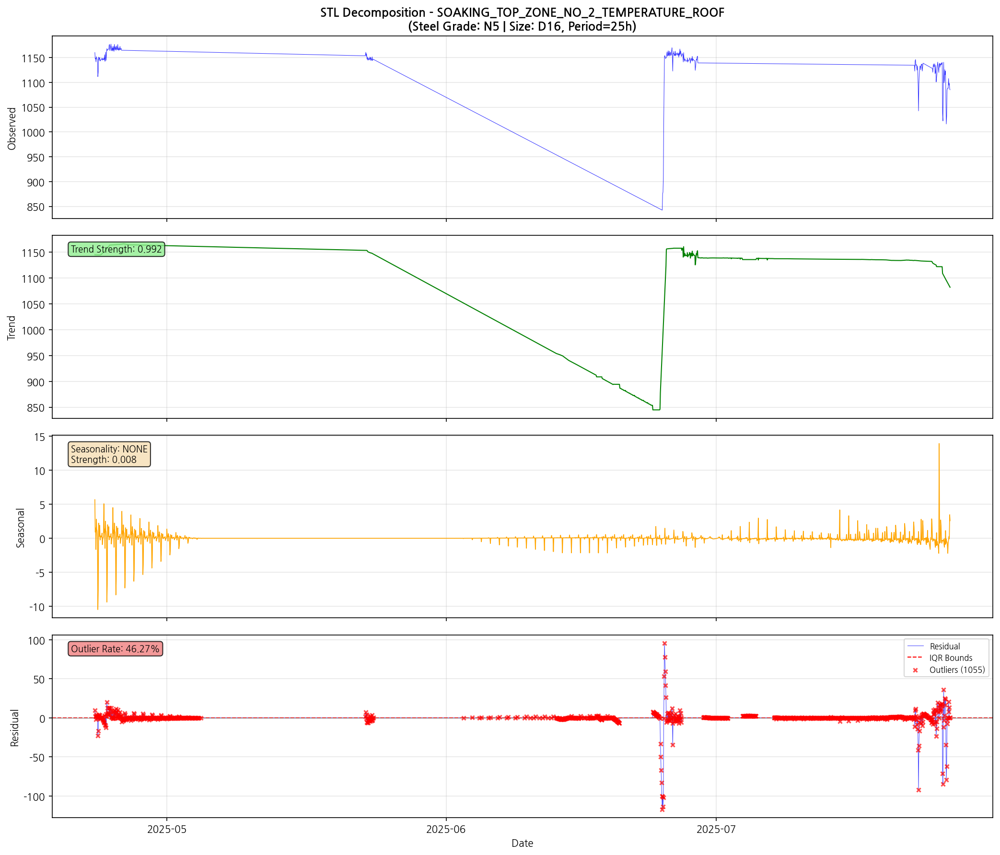

**HEATING_TOP_ZONE_NO_1_TEMPERATURE_ROOF** (이상치율: 41.67%, 계절성: 0.000)

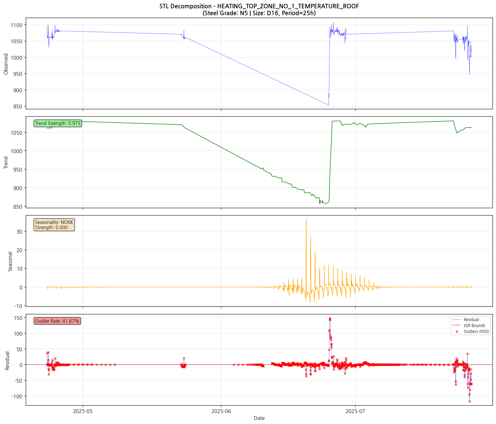

**HEATING_TOP_ZONE_NO_2_TEMPERATURE_ROOF** (이상치율: 34.30%, 계절성: 0.000)

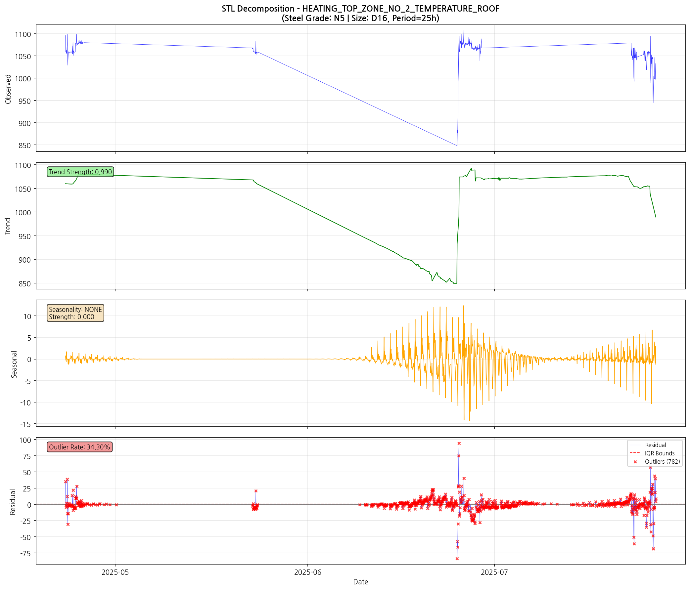

### 가열로 하부 온도 (02_Furnace_Bottom_Temperature)

- 분석 태그: 4개
- 평균 잔차 이상치율: 40.30%
- 평균 계절성 강도: 0.000

| 태그 | 이상치율 | 계절성 강도 | 추세 강도 |
|------|----------|-------------|-----------|
| HEATING_BOTTOM_ZONE_NO_1_TEMPERATURE_OPP_SIDE | 39.39% | 0.000 | 0.935 |
| HEATING_BOTTOM_ZONE_NO_2_TEMPERATURE_MILL_SIDE | 40.44% | 0.000 | 0.938 |
| SOAKING_BOTTOM_ZONE_NO_1_TEMPERATURE_OPP_SIDE | 42.68% | 0.000 | 0.979 |
| SOAKING_BOTTOM_ZONE_NO_2_TEMPERATURE_MILL_SIDE | 38.68% | 0.000 | 0.993 |

#### STL 분해 차트

**SOAKING_BOTTOM_ZONE_NO_1_TEMPERATURE_OPP_SIDE** (이상치율: 42.68%, 계절성: 0.000)

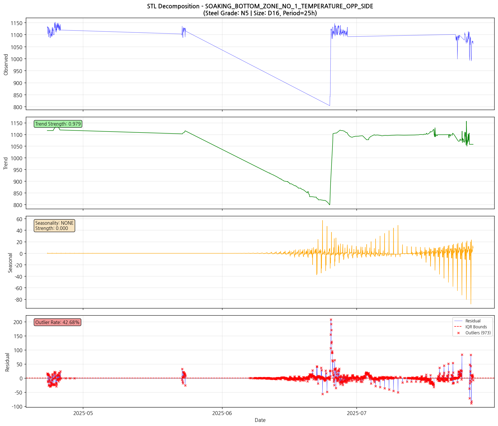

**HEATING_BOTTOM_ZONE_NO_2_TEMPERATURE_MILL_SIDE** (이상치율: 40.44%, 계절성: 0.000)

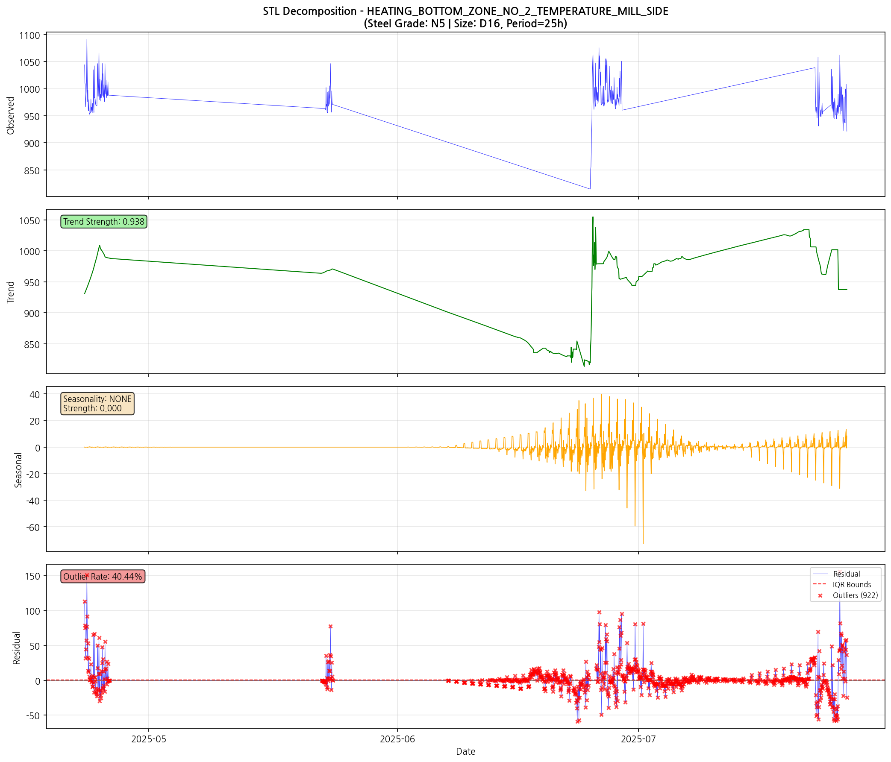

**HEATING_BOTTOM_ZONE_NO_1_TEMPERATURE_OPP_SIDE** (이상치율: 39.39%, 계절성: 0.000)

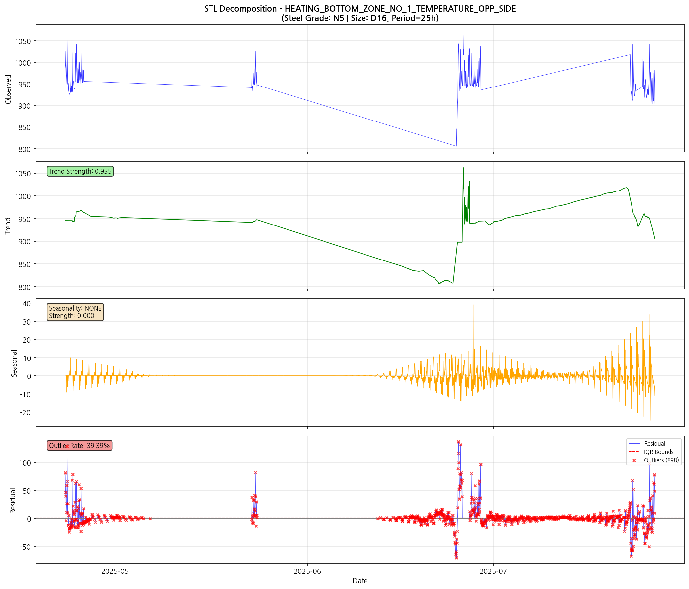

### 가열로 추출 온도 (03_Furnace_Discharge_Temperature)

- 분석 태그: 1개
- 평균 잔차 이상치율: 33.86%
- 평균 계절성 강도: 0.486

| 태그 | 이상치율 | 계절성 강도 | 추세 강도 |
|------|----------|-------------|-----------|
| FURNACE_EXIT_DISCHARGE_BILLET_TEMPERATURE | 33.86% | 0.486 | 0.473 |

#### STL 분해 차트

**FURNACE_EXIT_DISCHARGE_BILLET_TEMPERATURE** (이상치율: 33.86%, 계절성: 0.486)

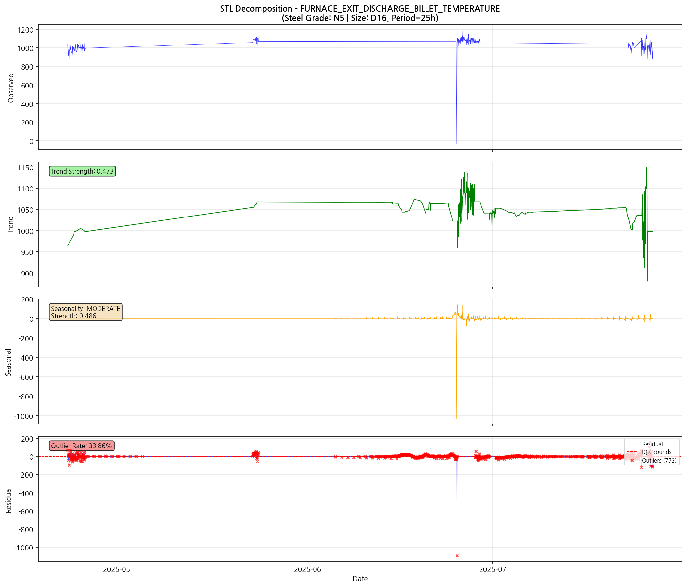

### 가열로 보조설비 (04_Furnace_Auxiliary)

- 분석 태그: 9개
- 평균 잔차 이상치율: 38.41%
- 평균 계절성 강도: 0.124

| 태그 | 이상치율 | 계절성 강도 | 추세 강도 |
|------|----------|-------------|-----------|
| FURNACE_PRESSURE | 38.60% | 0.029 | 0.886 |
| FURNACE_O2_ANALYZER | 39.56% | 0.000 | 0.802 |
| MAIN_GAS_PRESSURE | 37.19% | 0.031 | 0.867 |
| MAIN_GAS_FLOW | 42.54% | 0.000 | 0.842 |
| MAIN_GAS_TEMPERATURE | 41.27% | 0.016 | 0.979 |
| MAIN_COMBUSTION_AIR_PRESSURE | 38.42% | 0.831 | 0.998 |
| COMBUSTION_AIR_TEMPERATURE | 30.70% | 0.002 | 0.956 |
| INDIRECT_COOLING_WATER_FLOW | 37.54% | 0.000 | 0.972 |
| INDIRECT_WATER_MAIN_TEMPERATURE | 39.82% | 0.210 | 0.992 |

#### STL 분해 차트

**MAIN_GAS_FLOW** (이상치율: 42.54%, 계절성: 0.000)

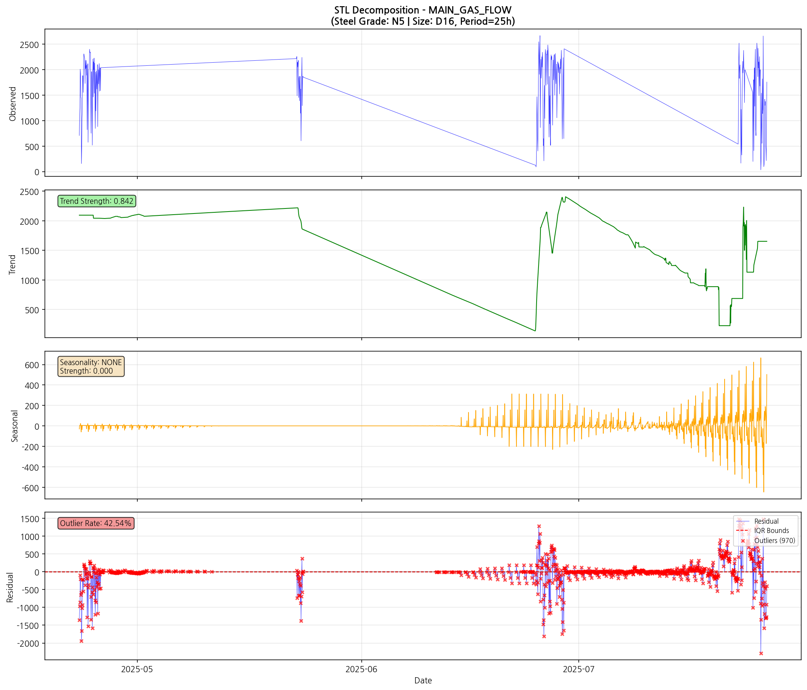

**MAIN_GAS_TEMPERATURE** (이상치율: 41.27%, 계절성: 0.016)

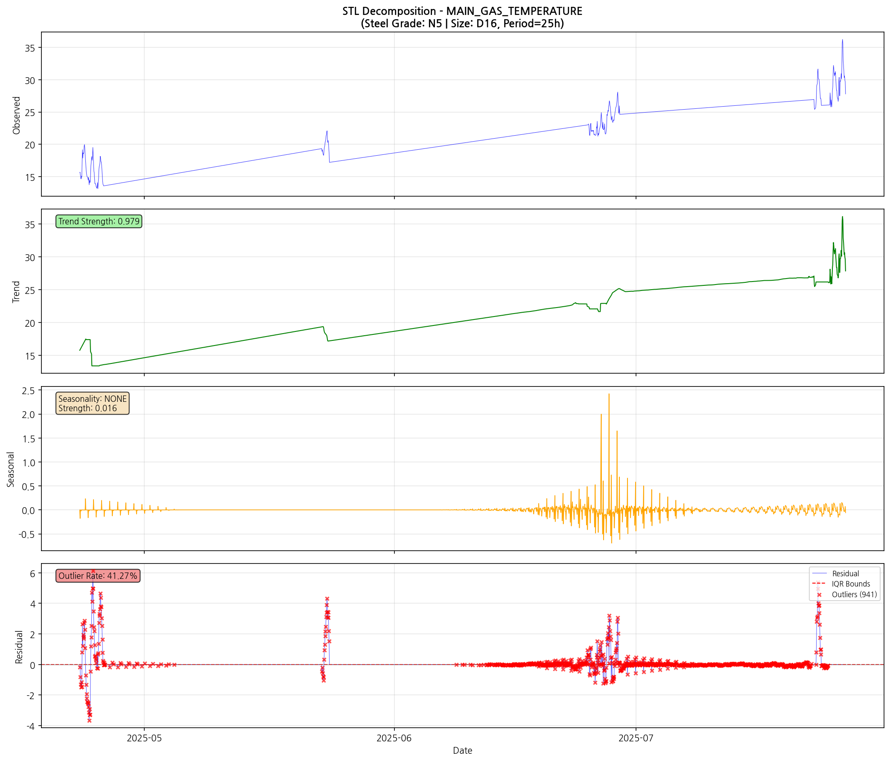

**INDIRECT_WATER_MAIN_TEMPERATURE** (이상치율: 39.82%, 계절성: 0.210)

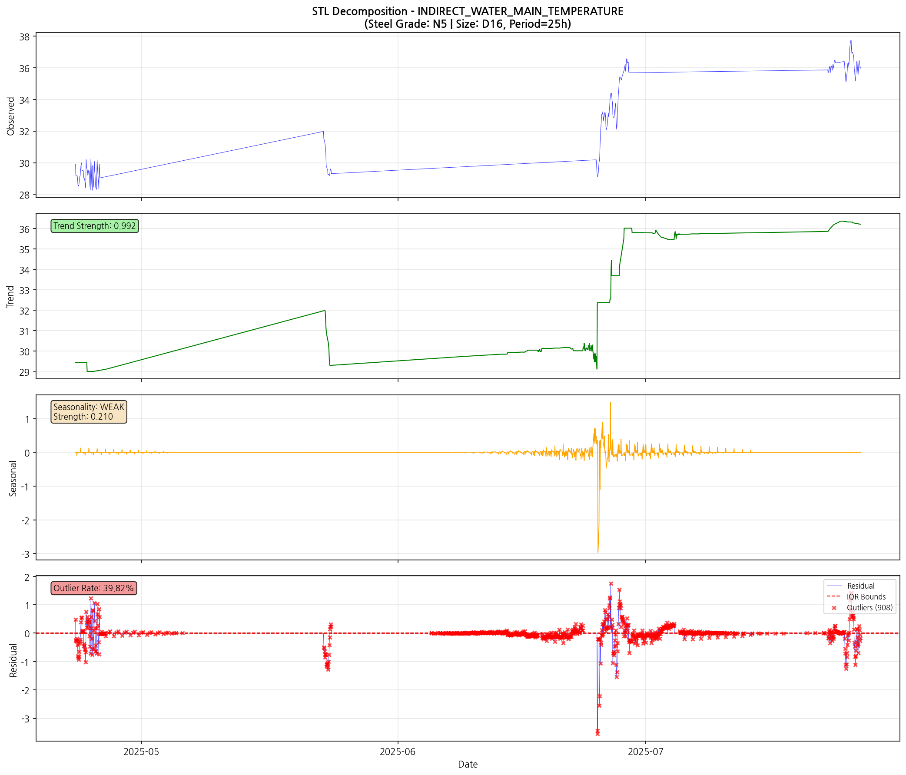

### 스탠드 토크 (05_Stand_Torque)

- 분석 태그: 16개
- 평균 잔차 이상치율: 41.24%
- 평균 계절성 강도: 0.054

| 태그 | 이상치율 | 계절성 강도 | 추세 강도 |
|------|----------|-------------|-----------|
| STAND_1_ACTUAL_TORQUE | 42.02% | 0.019 | 0.888 |
| STAND_2_ACTUAL_TORQUE | 41.75% | 0.000 | 0.814 |
| STAND_3_ACTUAL_TORQUE | 40.04% | 0.075 | 0.958 |
| STAND_4_ACTUAL_TORQUE | 34.78% | 0.000 | 0.900 |
| STAND_5_ACTUAL_TORQUE | 42.02% | 0.000 | 0.838 |
| STAND_6_ACTUAL_TORQUE | 41.32% | 0.000 | 0.902 |
| STAND_7_ACTUAL_TORQUE | 46.01% | 0.131 | 0.923 |
| STAND_8_ACTUAL_TORQUE | 38.16% | 0.008 | 0.819 |
| STAND_9_ACTUAL_TORQUE | 35.70% | 0.199 | 0.925 |
| STAND_10_ACTUAL_TORQUE | 46.14% | 0.259 | 0.930 |
| STAND_11_ACTUAL_TORQUE | 39.96% | 0.000 | 0.875 |
| STAND_12_ACTUAL_TORQUE | 45.44% | 0.000 | 0.870 |
| STAND_13_ACTUAL_TORQUE | 42.41% | 0.075 | 0.950 |
| STAND_14_ACTUAL_TORQUE | 43.95% | 0.023 | 0.934 |
| FINISHING_BLOCK_MASTER_ACTUAL_TORQUE | 39.12% | 0.079 | 0.826 |
| FINISHING_BLOCK_SLAVE_ACTUAL_TORQUE | 41.01% | 0.000 | 0.721 |

#### STL 분해 차트

**STAND_10_ACTUAL_TORQUE** (이상치율: 46.14%, 계절성: 0.259)

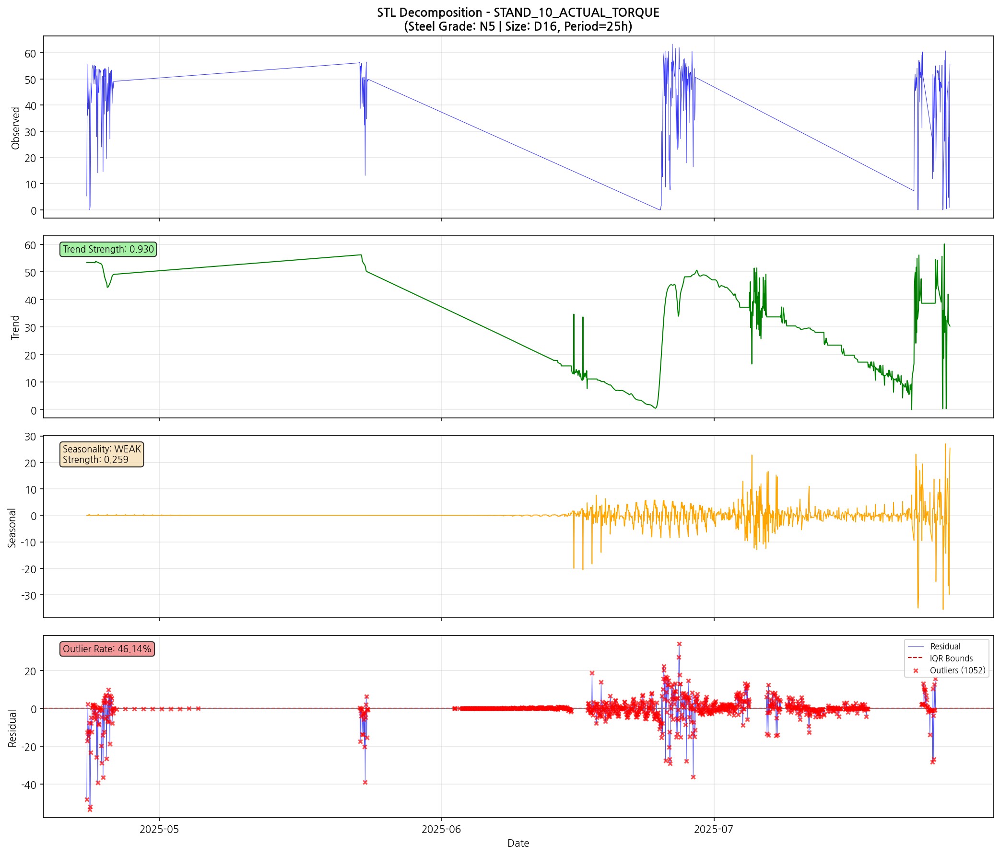

**STAND_7_ACTUAL_TORQUE** (이상치율: 46.01%, 계절성: 0.131)

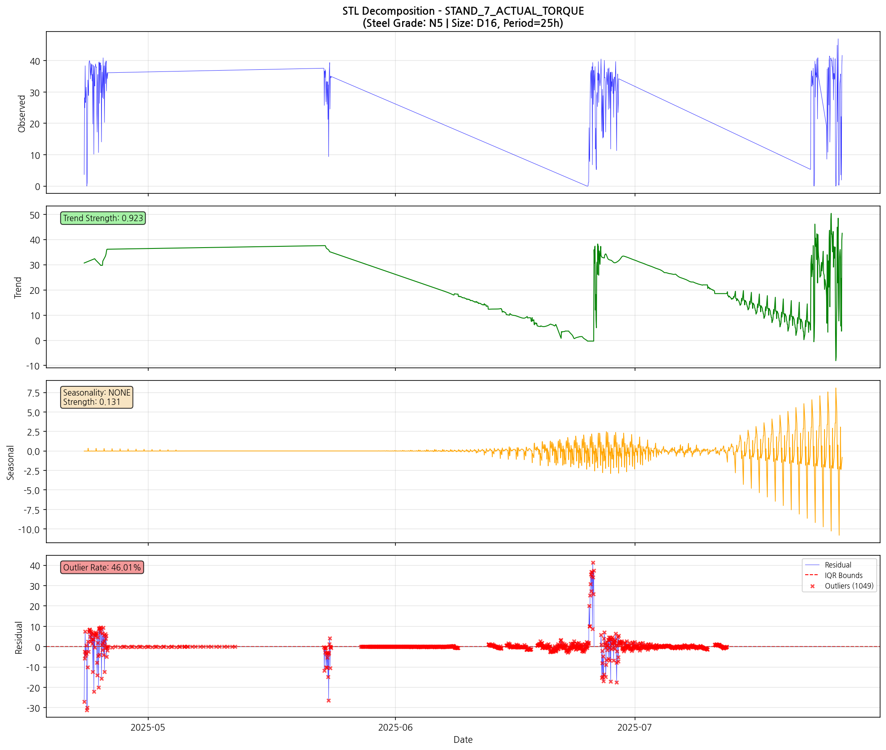

**STAND_12_ACTUAL_TORQUE** (이상치율: 45.44%, 계절성: 0.000)

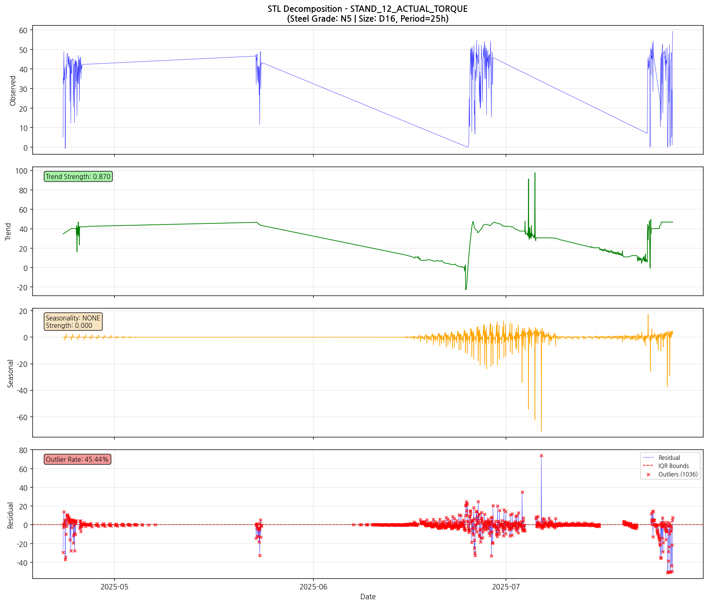

### 스탠드 속도 (06_Stand_Speed)

- 분석 태그: 15개
- 평균 잔차 이상치율: 39.96%
- 평균 계절성 강도: 0.088

| 태그 | 이상치율 | 계절성 강도 | 추세 강도 |
|------|----------|-------------|-----------|
| STAND_1_ACTUAL_SPEED | 43.29% | 0.000 | 0.945 |
| STAND_2_ACTUAL_SPEED | 42.15% | 0.109 | 0.965 |
| STAND_3_ACTUAL_SPEED | 40.57% | 0.048 | 0.955 |
| STAND_4_ACTUAL_SPEED | 40.61% | 0.029 | 0.950 |
| STAND_5_ACTUAL_SPEED | 36.49% | 0.000 | 0.951 |
| STAND_6_ACTUAL_SPEED | 37.11% | 0.014 | 0.919 |
| STAND_7_ACTUAL_SPEED | 44.69% | 0.446 | 0.977 |
| STAND_8_ACTUAL_SPEED | 41.27% | 0.224 | 0.960 |
| STAND_9_ACTUAL_SPEED | 40.92% | 0.085 | 0.938 |
| STAND_10_ACTUAL_SPEED | 39.17% | 0.000 | 0.913 |
| STAND_11_ACTUAL_SPEED | 36.89% | 0.000 | 0.889 |
| STAND_12_ACTUAL_SPEED | 36.23% | 0.016 | 0.937 |
| STAND_13_ACTUAL_SPEED | 34.91% | 0.092 | 0.943 |
| STAND_14_ACTUAL_SPEED | 38.51% | 0.003 | 0.928 |
| FINISHING_BLOCK_ACTUAL_SPEED | 46.54% | 0.250 | 0.963 |

#### STL 분해 차트

**FINISHING_BLOCK_ACTUAL_SPEED** (이상치율: 46.54%, 계절성: 0.250)

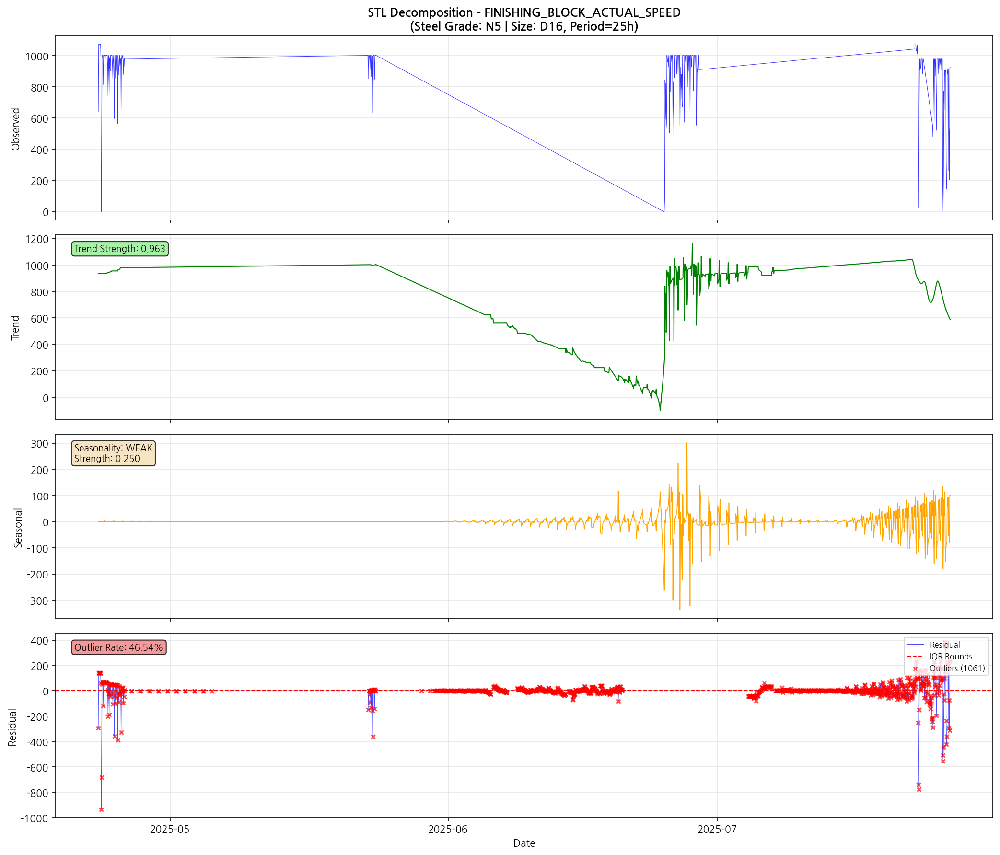

**STAND_7_ACTUAL_SPEED** (이상치율: 44.69%, 계절성: 0.446)

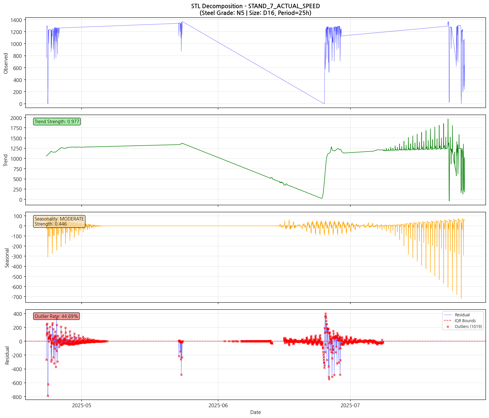

**STAND_1_ACTUAL_SPEED** (이상치율: 43.29%, 계절성: 0.000)

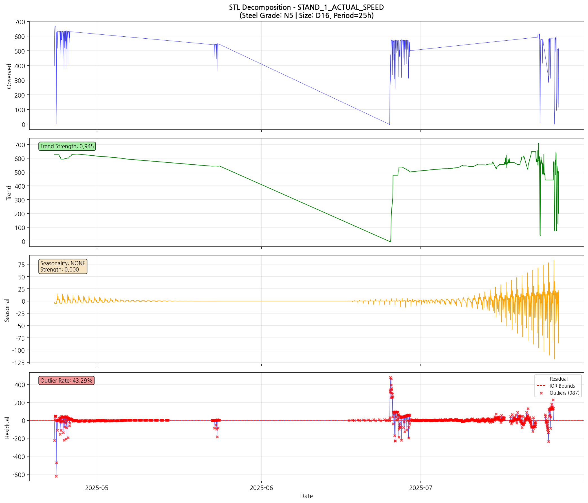

### 스탠드 부하 (07_Stand_Load)

- 분석 태그: 15개
- 평균 잔차 이상치율: 40.18%
- 평균 계절성 강도: 0.010

| 태그 | 이상치율 | 계절성 강도 | 추세 강도 |
|------|----------|-------------|-----------|
| STAND_1_LOAD | 41.49% | 0.000 | 0.874 |
| STAND_2_LOAD | 45.66% | 0.083 | 0.942 |
| STAND_3_LOAD | 36.58% | 0.000 | 0.911 |
| STAND_4_LOAD | 42.02% | 0.000 | 0.437 |
| STAND_5_LOAD | 38.20% | 0.004 | 0.836 |
| STAND_6_LOAD | 41.14% | 0.000 | 0.881 |
| STAND_7_LOAD | 41.58% | 0.000 | 0.864 |
| STAND_8_LOAD | 37.02% | 0.055 | 0.908 |
| STAND_9_LOAD | 42.15% | 0.000 | 0.923 |
| STAND_10_LOAD | 43.03% | 0.009 | 0.890 |
| STAND_11_LOAD | 41.49% | 0.000 | 0.853 |
| STAND_12_LOAD | 37.41% | 0.000 | 0.843 |
| STAND_13_LOAD | 37.41% | 0.000 | 0.843 |
| STAND_14_LOAD | 35.61% | 0.000 | 0.885 |
| FINISHING_BLOCK_LOAD | 41.89% | 0.000 | 0.891 |

#### STL 분해 차트

**STAND_2_LOAD** (이상치율: 45.66%, 계절성: 0.083)

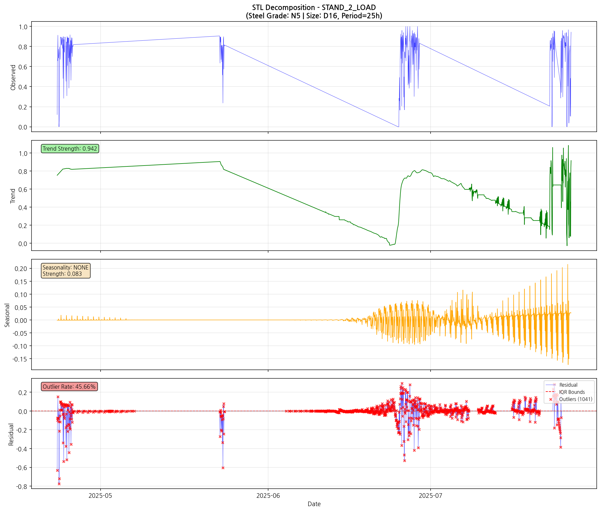

**STAND_10_LOAD** (이상치율: 43.03%, 계절성: 0.009)

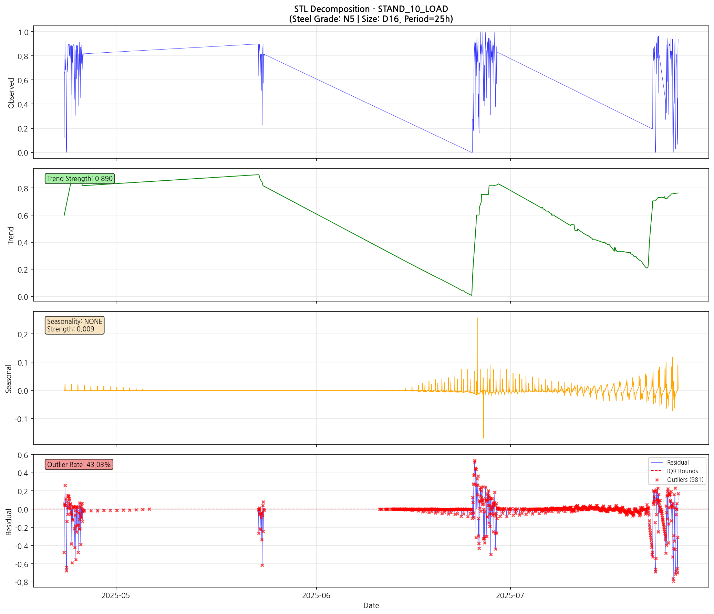

**STAND_9_LOAD** (이상치율: 42.15%, 계절성: 0.000)

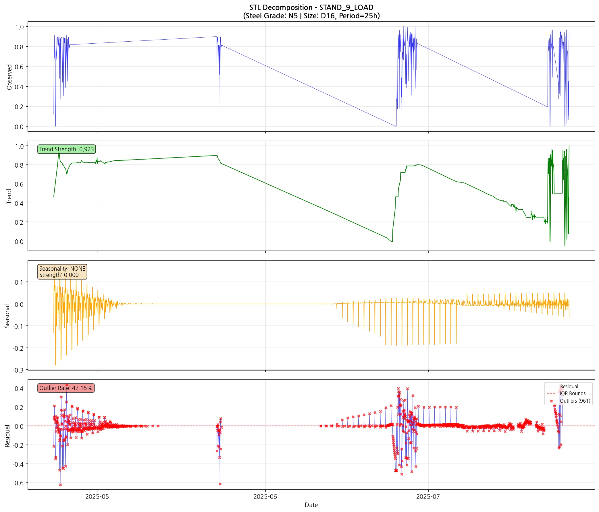

### 핀치롤 (08_Pinchroll)

- 분석 태그: 9개
- 평균 잔차 이상치율: 41.65%
- 평균 계절성 강도: 0.080

| 태그 | 이상치율 | 계절성 강도 | 추세 강도 |
|------|----------|-------------|-----------|
| PINCHROLL_2_ACTUAL_SPEED | 38.07% | 0.000 | 0.947 |
| PINCHROLL_3_ACTUAL_SPEED | 44.56% | 0.381 | 0.761 |
| PINCHROLL_4_ACTUAL_SPEED | 45.96% | 0.178 | 0.911 |
| PINCHROLL_2_ACTUAL_TORQUE | 39.78% | 0.007 | 0.910 |
| PINCHROLL_3_ACTUAL_TORQUE | 44.47% | 0.126 | 0.846 |
| PINCHROLL_4_ACTUAL_TORQUE | 41.97% | 0.000 | 0.785 |
| PINCHROLL_2_REFERENCE_TORQUE | 42.59% | 0.028 | 0.989 |
| PINCHROLL_3_REFERENCE_TORQUE | 37.11% | 0.002 | 0.873 |
| PINCHROLL_4_REFERENCE_TORQUE | 40.31% | 0.000 | 0.861 |

#### STL 분해 차트

**PINCHROLL_4_ACTUAL_SPEED** (이상치율: 45.96%, 계절성: 0.178)

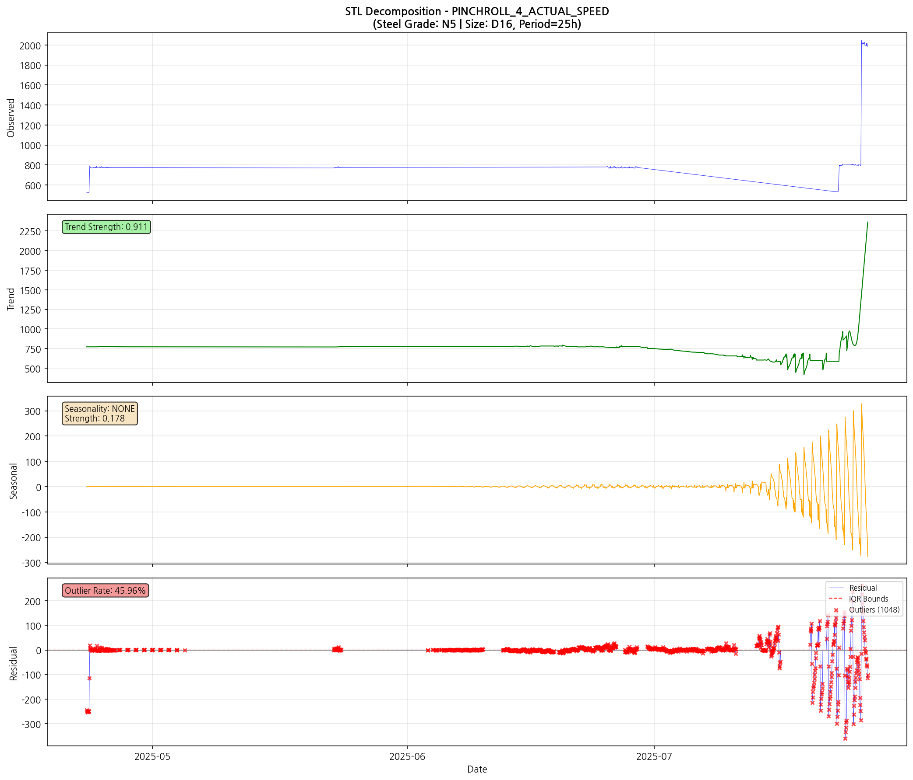

**PINCHROLL_3_ACTUAL_SPEED** (이상치율: 44.56%, 계절성: 0.381)

**PINCHROLL_3_ACTUAL_TORQUE** (이상치율: 44.47%, 계절성: 0.126)

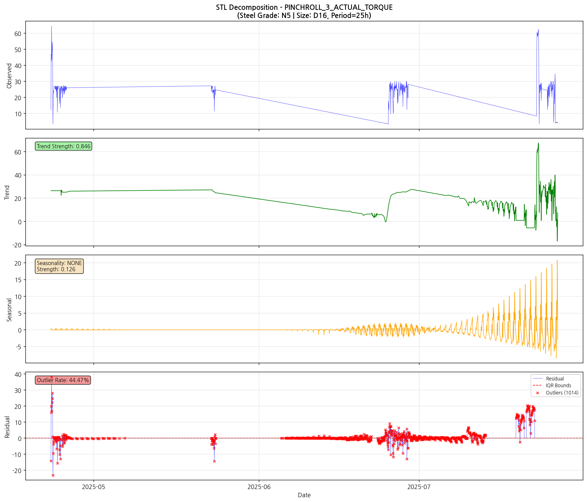

### PR 상세 토크 (09_PR_Detailed)

- 분석 태그: 6개
- 평균 잔차 이상치율: 40.50%
- 평균 계절성 강도: 0.037

| 태그 | 이상치율 | 계절성 강도 | 추세 강도 |
|------|----------|-------------|-----------|
| PR6L1_ACT_TORQUE | 35.70% | 0.150 | 1.000 |
| PR6L2_ACT_TORQUE | 39.61% | 0.000 | 0.997 |
| PR7L1_ACT_TORQUE | 41.97% | 0.006 | 0.989 |
| PR7L2_ACT_TORQUE | 42.98% | 0.000 | 0.946 |
| PR8L1_ACT_TORQUE | 42.37% | 0.066 | 0.852 |
| PR9L1_ACT_TORQUE | 40.39% | 0.000 | 0.803 |

#### STL 분해 차트

**PR7L2_ACT_TORQUE** (이상치율: 42.98%, 계절성: 0.000)

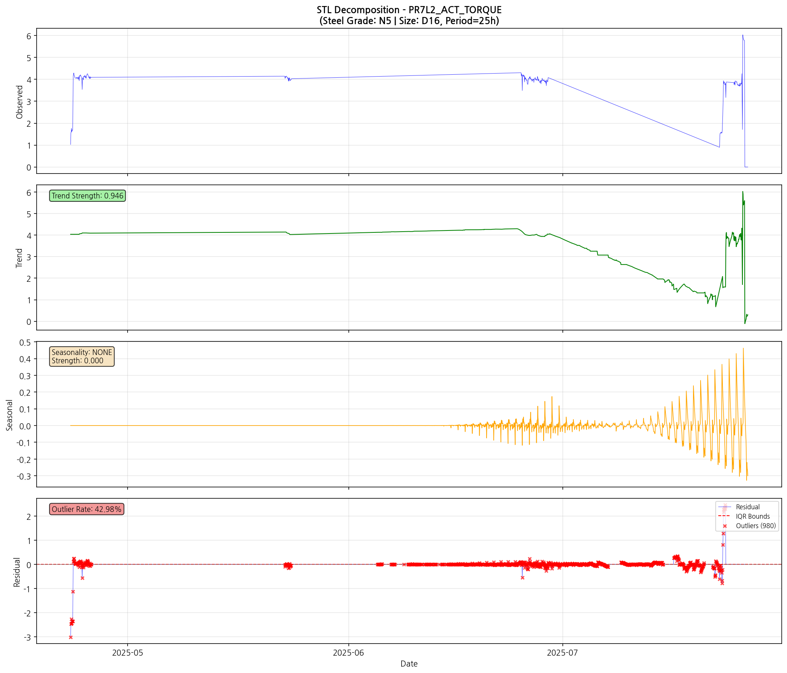

**PR8L1_ACT_TORQUE** (이상치율: 42.37%, 계절성: 0.066)

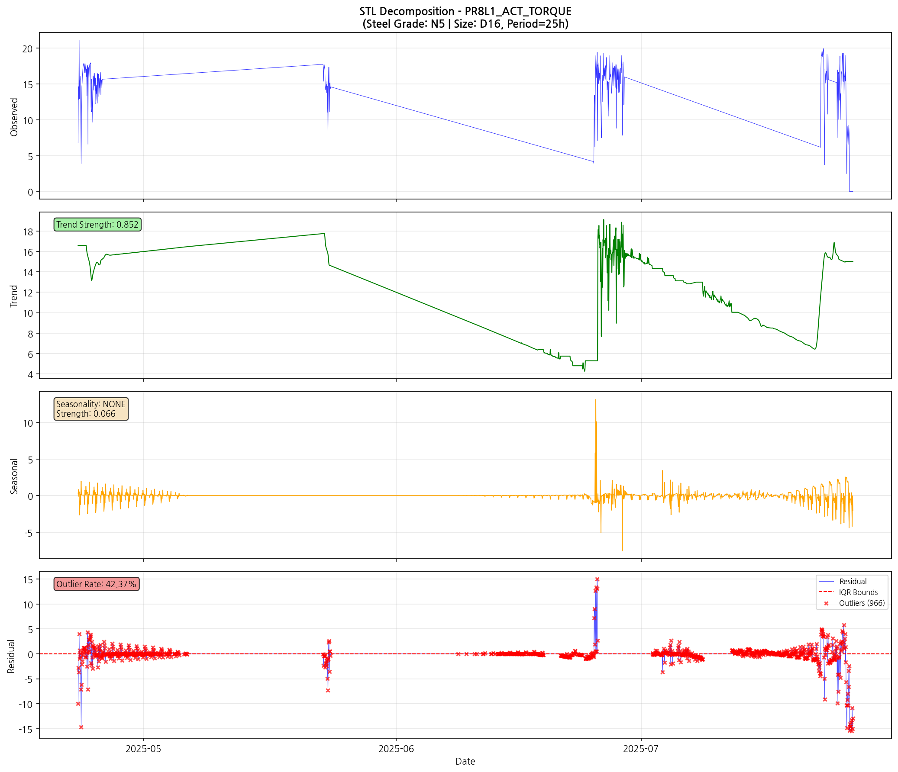

**PR7L1_ACT_TORQUE** (이상치율: 41.97%, 계절성: 0.006)

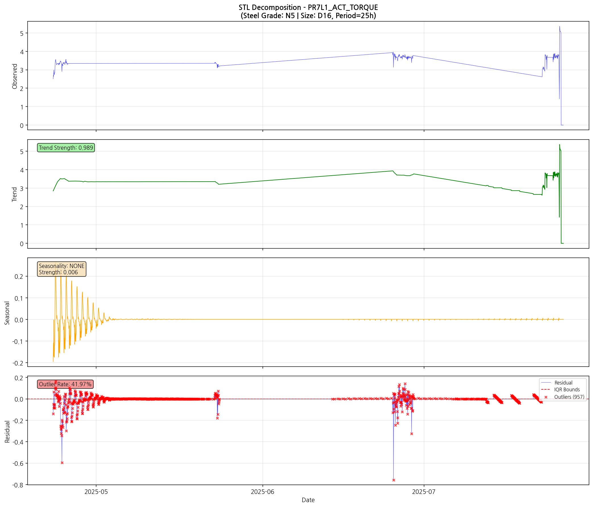

---

## 해석 가이드

### STL 분해 해석

1. **추세 (Trend)**
   - 장기적인 상승/하락 패턴
   - 설비 노화, 계절적 변화 등 반영
   - 추세 강도 높을수록 장기 변화가 뚜렷함

2. **계절성 (Seasonal)**
   - 주기적으로 반복되는 패턴 (24시간 기준)
   - 계절성 강도 ≥ 0.7: 강한 주기적 패턴
   - 계절성이 강한 태그는 STL 분석이 효과적

3. **잔차 (Residual)**
   - 추세와 계절성으로 설명되지 않는 변동
   - **순수한 이상치**를 포함
   - 잔차 기반 IQR로 "진짜" 이상치 탐지

### 계절성 강도 분류

| 분류 | 강도 범위 | 해석 |
|------|----------|------|
| Strong | ≥ 0.7 | 명확한 주기적 패턴, STL 매우 효과적 |
| Moderate | 0.4 ~ 0.7 | 적당한 주기적 패턴, STL 효과적 |
| Weak | 0.2 ~ 0.4 | 약한 주기적 패턴 |
| None | < 0.2 | 주기적 패턴 거의 없음 |

### Standard IQR vs STL Residual IQR

| 방법 | 장점 | 단점 |
|------|------|------|
| Standard IQR | 간단, 빠름 | 계절성에 영향받음 |
| STL Residual IQR | 계절성 제거, 순수 이상치 | 계산 복잡, 데이터 필요 |

**권장**: 계절성 강도 ≥ 0.4인 태그에는 STL Residual IQR 사용

---

## 메타데이터

| 항목 | 값 |
|------|-----|
| 분석 스크립트 | steel_grade_stl_analysis.py |
| 분석 기간 | 2025-03-01 ~ 2025-08-31 |
| 강종 | N5 |
| 계절 주기 | 25시간 |
| 생성일시 | 2026-02-09 15:03:35 |
| 총 분석 태그 | 79개 |

---

*본 보고서는 자동 생성되었습니다.*
