# 강종 [N5] 사이즈 [D20] STL 계절-추세 분해 분석 보고서

**분석 기간**: 2025-03-01 ~ 2025-08-31
**강종**: N5 | 사이즈: D20
**생성일시**: 2026-02-09 15:05:39

---

## 분석 개요

### 분석 방법론

**STL (Seasonal-Trend Decomposition using LOESS)**

시계열 데이터를 세 가지 성분으로 분해:
- **Trend (추세)**: 장기적인 변화 패턴
- **Seasonal (계절성)**: 주기적으로 반복되는 패턴
- **Residual (잔차)**: 추세와 계절성으로 설명되지 않는 변동

| 파라미터 | 값 | 설명 |
|----------|-----|------|
| seasonal | 25h | 계절 주기 |
| robust | True | 강건 추정 |

### 분석 결과 요약

| 구분 | 태그 수 | 비율 |
|------|---------|------|
| **총 분석 태그** | 79개 | 100% |

#### 잔차 이상치율 분포

| 구분 | 태그 수 | 비율 |
|------|---------|------|
| 🔴 높음 (≥15%) | 79개 | 100.0% |
| 🟠 중간 (5~15%) | 0개 | 0.0% |
| 🟢 낮음 (<5%) | 0개 | 0.0% |

#### 계절성 강도 분포

| 구분 | 태그 수 | 비율 |
|------|---------|------|
| 🔵 강함 (≥0.7) | 0개 | 0.0% |
| 중간 (0.4~0.7) | 1개 | 1.3% |
| 약함 (<0.4) | 78개 | 98.7% |

#### 전체 평균

| 지표 | 값 |
|------|-----|
| 평균 계절성 강도 | 0.057 |
| 평균 추세 강도 | 0.910 |

---

## 상위 문제 태그 (잔차 이상치율 기준)

| 순위 | 태그 | 카테고리 | 이상치율 | 계절성 강도 | 계절성 분류 |
|------|------|----------|----------|-------------|-------------|
| 1 | HEATING_BOTTOM_ZONE_NO_2_TEMPERATURE_MILL_SIDE | 가열로 하부 온도 | 46.07% | 0.000 | none |
| 2 | SOAKING_BOTTOM_ZONE_NO_1_TEMPERATURE_OPP_SIDE | 가열로 하부 온도 | 44.57% | 0.016 | none |
| 3 | MAIN_GAS_PRESSURE | 가열로 보조설비 | 43.90% | 0.000 | none |
| 4 | HEATING_TOP_ZONE_NO_1_TEMPERATURE_ROOF | 가열로 상부 온도 | 43.84% | 0.000 | none |
| 5 | STAND_11_ACTUAL_SPEED | 스탠드 속도 | 43.48% | 0.105 | none |
| 6 | FURNACE_EXIT_DISCHARGE_BILLET_TEMPERATURE | 가열로 추출 온도 | 43.36% | 0.000 | none |
| 7 | FURNACE_PRESSURE | 가열로 보조설비 | 43.24% | 0.002 | none |
| 8 | STAND_11_ACTUAL_TORQUE | 스탠드 토크 | 43.18% | 0.076 | none |
| 9 | PINCHROLL_4_ACTUAL_TORQUE | 핀치롤 | 43.16% | 0.095 | none |
| 10 | SOAKING_BOTTOM_ZONE_NO_2_TEMPERATURE_MILL_SIDE | 가열로 하부 온도 | 42.81% | 0.045 | none |
| 11 | PINCHROLL_3_ACTUAL_SPEED | 핀치롤 | 42.80% | 0.000 | none |
| 12 | SOAKING_TOP_ZONE_NO_1_TEMPERATURE_ROOF | 가열로 상부 온도 | 42.75% | 0.000 | none |
| 13 | PINCHROLL_4_ACTUAL_SPEED | 핀치롤 | 42.61% | 0.000 | none |
| 14 | COMBUSTION_AIR_TEMPERATURE | 가열로 보조설비 | 42.51% | 0.000 | none |
| 15 | STAND_12_ACTUAL_TORQUE | 스탠드 토크 | 42.33% | 0.000 | none |

---

## 강한 계절성 태그 목록

계절성 강도가 0.7 이상인 태그입니다. 이 태그들은 STL 분석이 특히 효과적입니다.

| 태그 | 카테고리 | 계절성 강도 | 잔차 이상치율 |
|------|----------|-------------|---------------|
| - | 강한 계절성 태그 없음 | - | - |

---

## 카테고리별 분석 결과

### 가열로 상부 온도 (01_Furnace_Top_Temperature)

- 분석 태그: 4개
- 평균 잔차 이상치율: 41.32%
- 평균 계절성 강도: 0.115

| 태그 | 이상치율 | 계절성 강도 | 추세 강도 |
|------|----------|-------------|-----------|
| HEATING_TOP_ZONE_NO_1_TEMPERATURE_ROOF | 43.84% | 0.000 | 0.933 |
| HEATING_TOP_ZONE_NO_2_TEMPERATURE_ROOF | 40.70% | 0.461 | 0.965 |
| SOAKING_TOP_ZONE_NO_1_TEMPERATURE_ROOF | 42.75% | 0.000 | 0.957 |
| SOAKING_TOP_ZONE_NO_2_TEMPERATURE_ROOF | 37.98% | 0.000 | 0.952 |

#### STL 분해 차트

**HEATING_TOP_ZONE_NO_1_TEMPERATURE_ROOF** (이상치율: 43.84%, 계절성: 0.000)

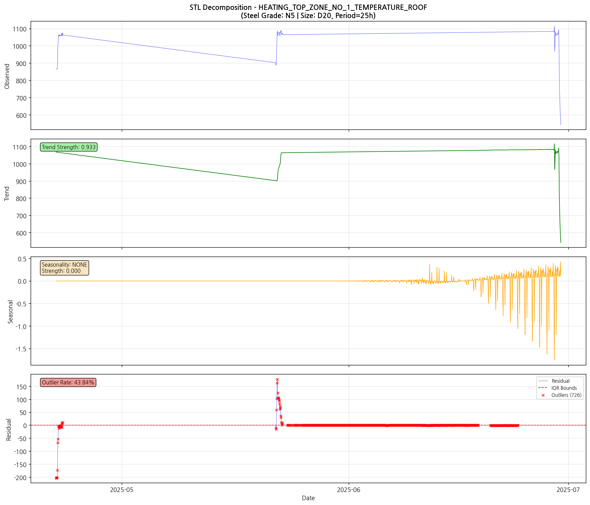

**SOAKING_TOP_ZONE_NO_1_TEMPERATURE_ROOF** (이상치율: 42.75%, 계절성: 0.000)

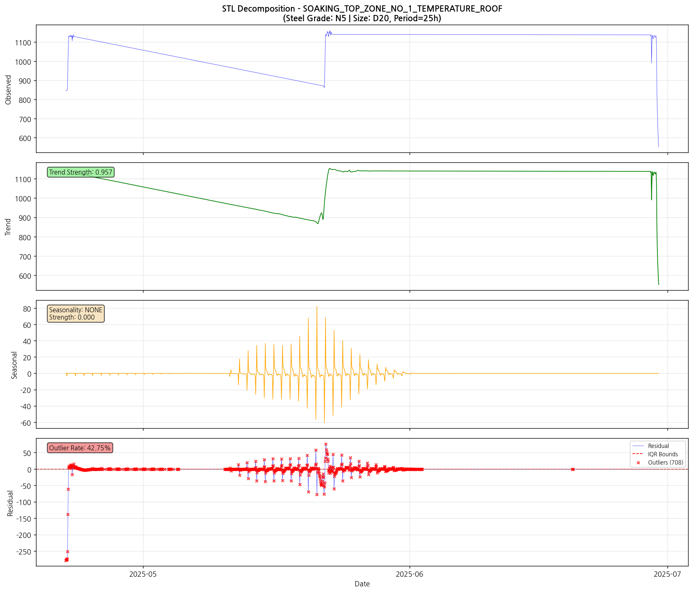

**HEATING_TOP_ZONE_NO_2_TEMPERATURE_ROOF** (이상치율: 40.70%, 계절성: 0.461)

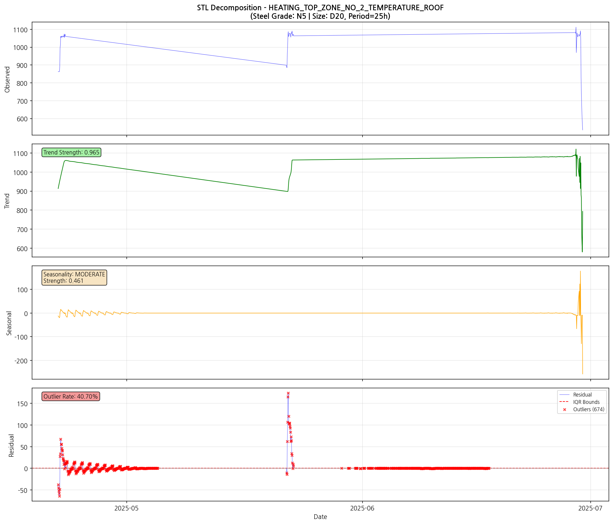

### 가열로 하부 온도 (02_Furnace_Bottom_Temperature)

- 분석 태그: 4개
- 평균 잔차 이상치율: 43.10%
- 평균 계절성 강도: 0.053

| 태그 | 이상치율 | 계절성 강도 | 추세 강도 |
|------|----------|-------------|-----------|
| HEATING_BOTTOM_ZONE_NO_1_TEMPERATURE_OPP_SIDE | 38.95% | 0.152 | 0.866 |
| HEATING_BOTTOM_ZONE_NO_2_TEMPERATURE_MILL_SIDE | 46.07% | 0.000 | 0.749 |
| SOAKING_BOTTOM_ZONE_NO_1_TEMPERATURE_OPP_SIDE | 44.57% | 0.016 | 0.916 |
| SOAKING_BOTTOM_ZONE_NO_2_TEMPERATURE_MILL_SIDE | 42.81% | 0.045 | 0.892 |

#### STL 분해 차트

**HEATING_BOTTOM_ZONE_NO_2_TEMPERATURE_MILL_SIDE** (이상치율: 46.07%, 계절성: 0.000)

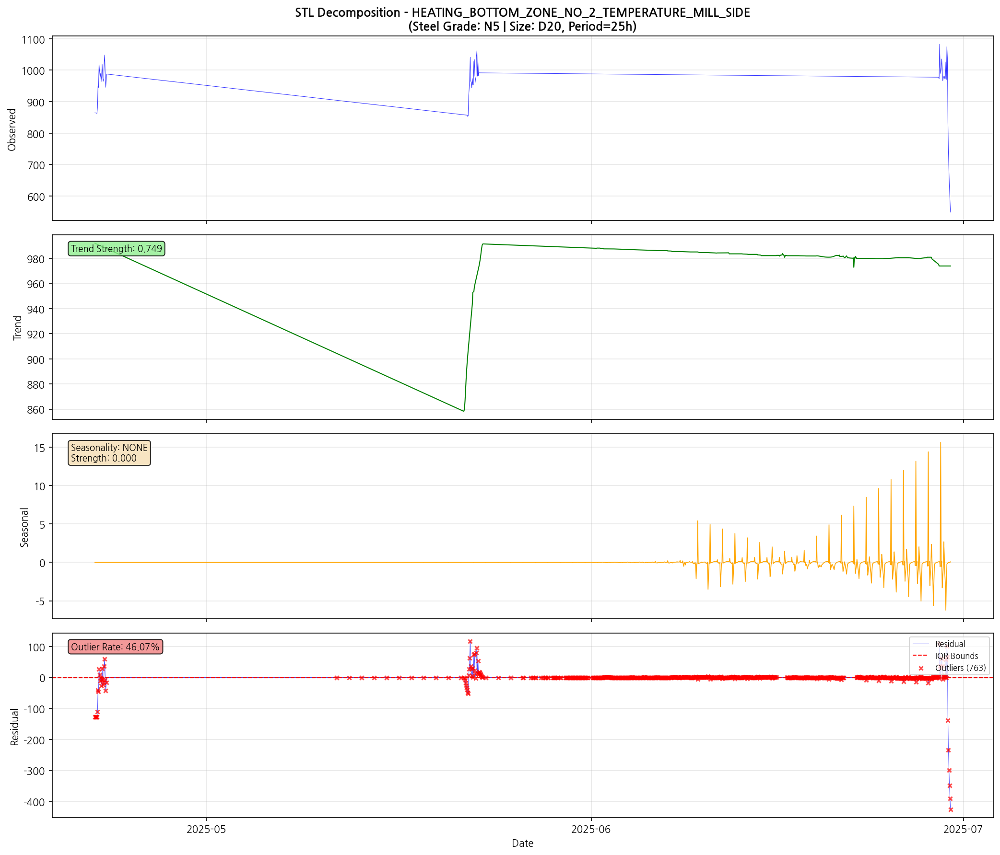

**SOAKING_BOTTOM_ZONE_NO_1_TEMPERATURE_OPP_SIDE** (이상치율: 44.57%, 계절성: 0.016)

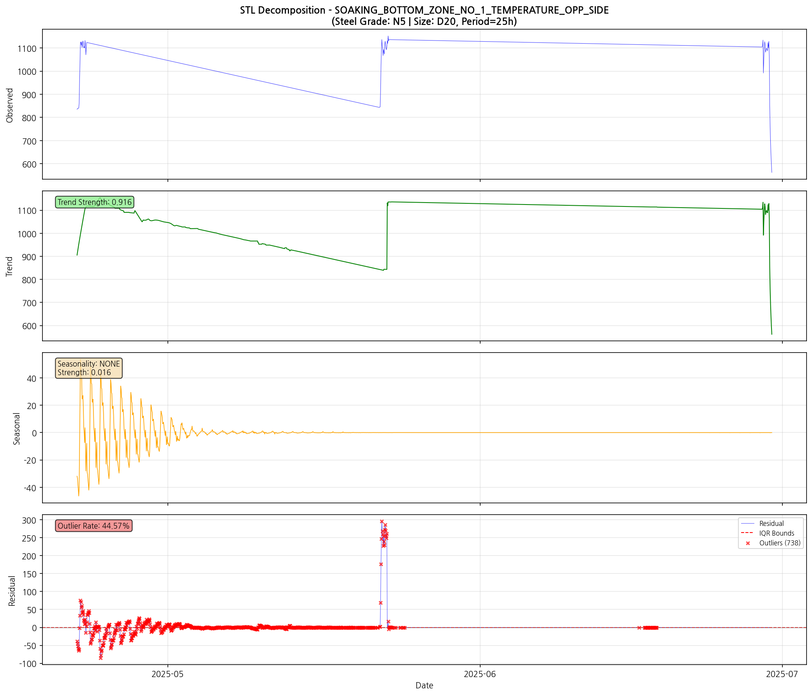

**SOAKING_BOTTOM_ZONE_NO_2_TEMPERATURE_MILL_SIDE** (이상치율: 42.81%, 계절성: 0.045)

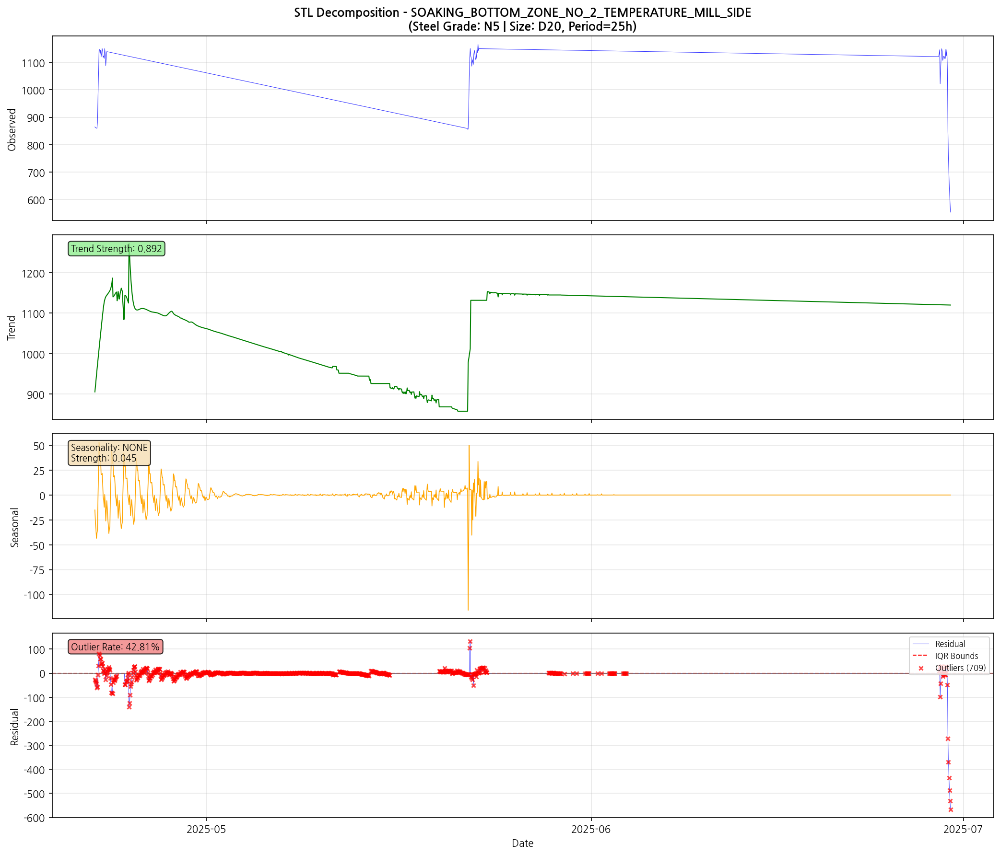

### 가열로 추출 온도 (03_Furnace_Discharge_Temperature)

- 분석 태그: 1개
- 평균 잔차 이상치율: 43.36%
- 평균 계절성 강도: 0.000

| 태그 | 이상치율 | 계절성 강도 | 추세 강도 |
|------|----------|-------------|-----------|
| FURNACE_EXIT_DISCHARGE_BILLET_TEMPERATURE | 43.36% | 0.000 | 0.978 |

#### STL 분해 차트

**FURNACE_EXIT_DISCHARGE_BILLET_TEMPERATURE** (이상치율: 43.36%, 계절성: 0.000)

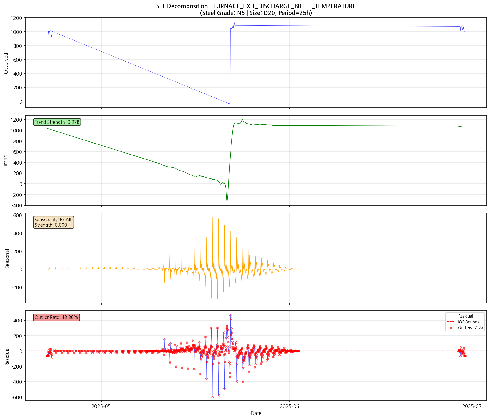

### 가열로 보조설비 (04_Furnace_Auxiliary)

- 분석 태그: 9개
- 평균 잔차 이상치율: 40.36%
- 평균 계절성 강도: 0.034

| 태그 | 이상치율 | 계절성 강도 | 추세 강도 |
|------|----------|-------------|-----------|
| FURNACE_PRESSURE | 43.24% | 0.002 | 0.896 |
| FURNACE_O2_ANALYZER | 38.22% | 0.000 | 0.573 |
| MAIN_GAS_PRESSURE | 43.90% | 0.000 | 0.015 |
| MAIN_GAS_FLOW | 42.21% | 0.000 | 0.872 |
| MAIN_GAS_TEMPERATURE | 36.05% | 0.000 | 0.949 |
| MAIN_COMBUSTION_AIR_PRESSURE | 35.75% | 0.233 | 0.876 |
| COMBUSTION_AIR_TEMPERATURE | 42.51% | 0.000 | 0.915 |
| INDIRECT_COOLING_WATER_FLOW | 41.67% | 0.012 | 0.988 |
| INDIRECT_WATER_MAIN_TEMPERATURE | 39.67% | 0.059 | 0.996 |

#### STL 분해 차트

**MAIN_GAS_PRESSURE** (이상치율: 43.90%, 계절성: 0.000)

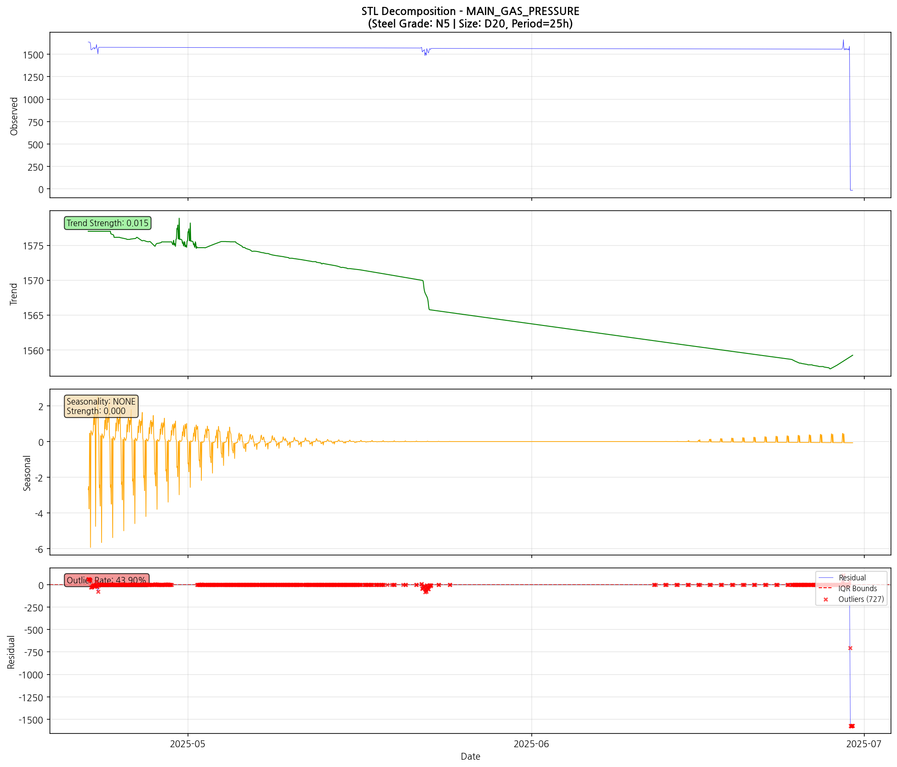

**FURNACE_PRESSURE** (이상치율: 43.24%, 계절성: 0.002)

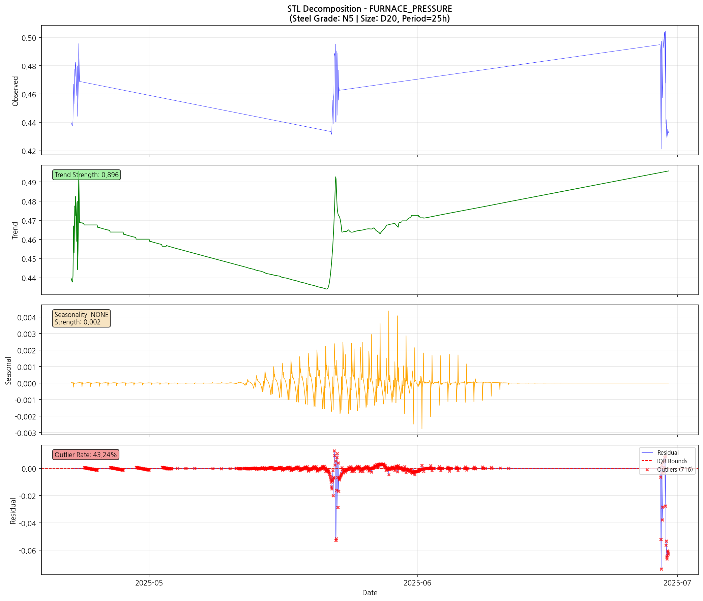

**COMBUSTION_AIR_TEMPERATURE** (이상치율: 42.51%, 계절성: 0.000)

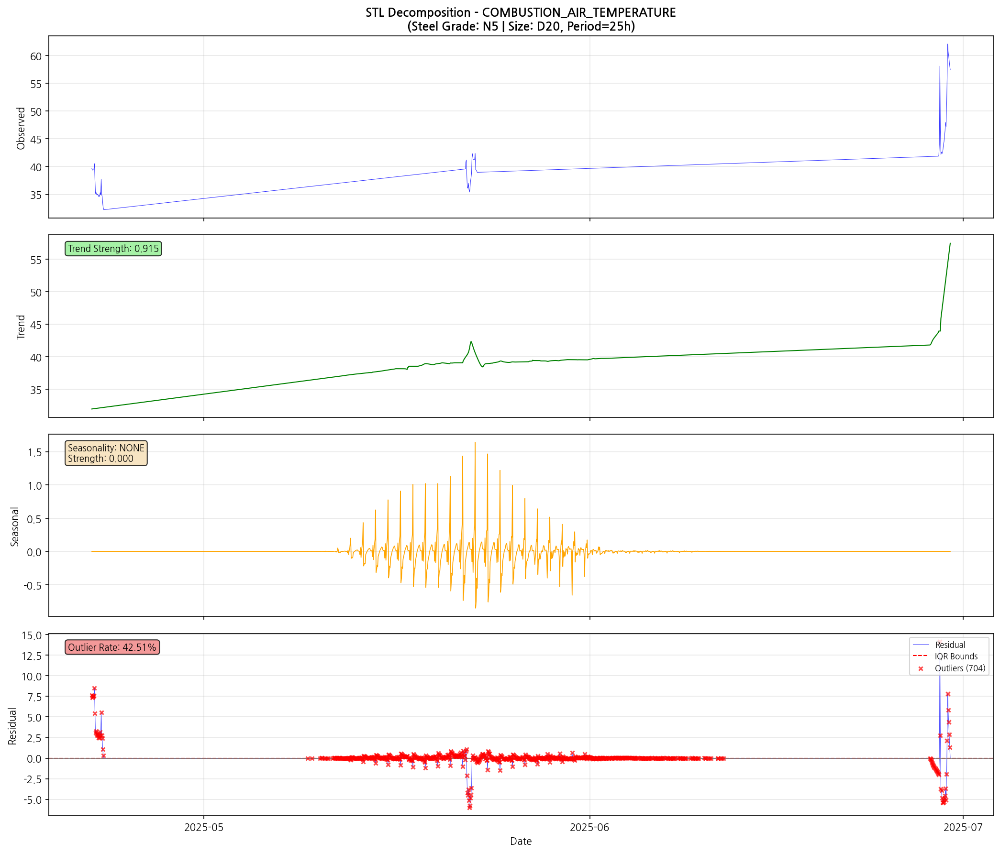

### 스탠드 토크 (05_Stand_Torque)

- 분석 태그: 16개
- 평균 잔차 이상치율: 37.37%
- 평균 계절성 강도: 0.076

| 태그 | 이상치율 | 계절성 강도 | 추세 강도 |
|------|----------|-------------|-----------|
| STAND_1_ACTUAL_TORQUE | 32.49% | 0.000 | 0.859 |
| STAND_2_ACTUAL_TORQUE | 39.73% | 0.014 | 0.874 |
| STAND_3_ACTUAL_TORQUE | 37.20% | 0.000 | 0.917 |
| STAND_4_ACTUAL_TORQUE | 40.82% | 0.146 | 0.930 |
| STAND_5_ACTUAL_TORQUE | 36.47% | 0.000 | 0.866 |
| STAND_6_ACTUAL_TORQUE | 40.22% | 0.000 | 0.916 |
| STAND_7_ACTUAL_TORQUE | 40.70% | 0.000 | 0.886 |
| STAND_8_ACTUAL_TORQUE | 40.88% | 0.384 | 0.972 |
| STAND_9_ACTUAL_TORQUE | 36.05% | 0.128 | 0.927 |
| STAND_10_ACTUAL_TORQUE | 24.09% | 0.074 | 0.922 |
| STAND_11_ACTUAL_TORQUE | 43.18% | 0.076 | 0.905 |
| STAND_12_ACTUAL_TORQUE | 42.33% | 0.000 | 0.920 |
| STAND_13_ACTUAL_TORQUE | 36.05% | 0.000 | 0.880 |
| STAND_14_ACTUAL_TORQUE | 33.39% | 0.000 | 0.834 |
| FINISHING_BLOCK_MASTER_ACTUAL_TORQUE | 36.17% | 0.102 | 0.985 |
| FINISHING_BLOCK_SLAVE_ACTUAL_TORQUE | 38.10% | 0.286 | 0.985 |

#### STL 분해 차트

**STAND_11_ACTUAL_TORQUE** (이상치율: 43.18%, 계절성: 0.076)

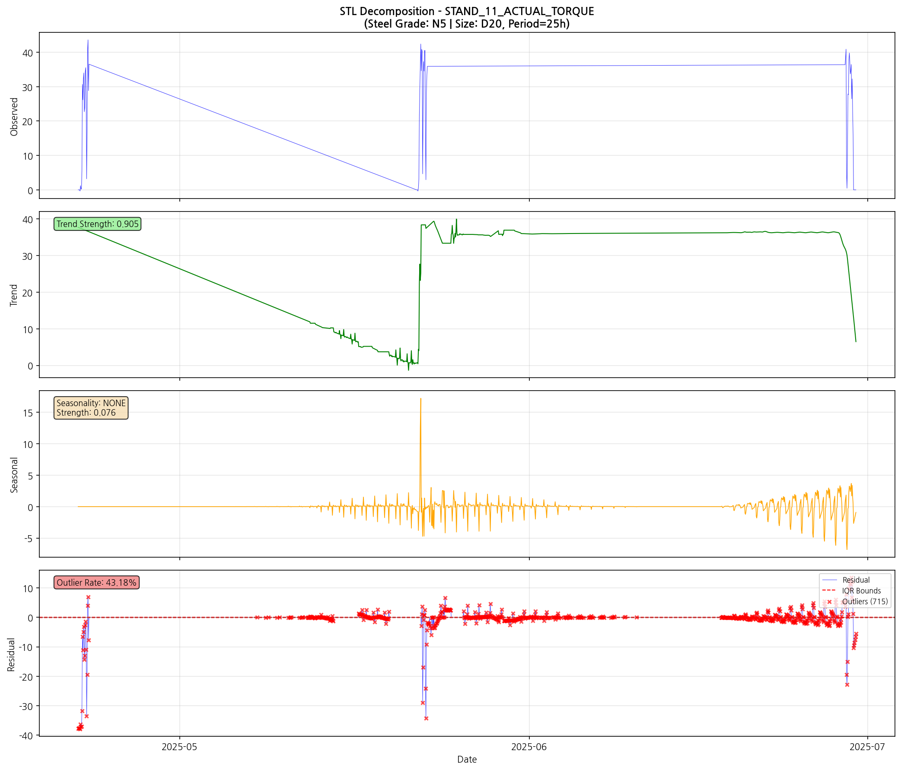

**STAND_12_ACTUAL_TORQUE** (이상치율: 42.33%, 계절성: 0.000)

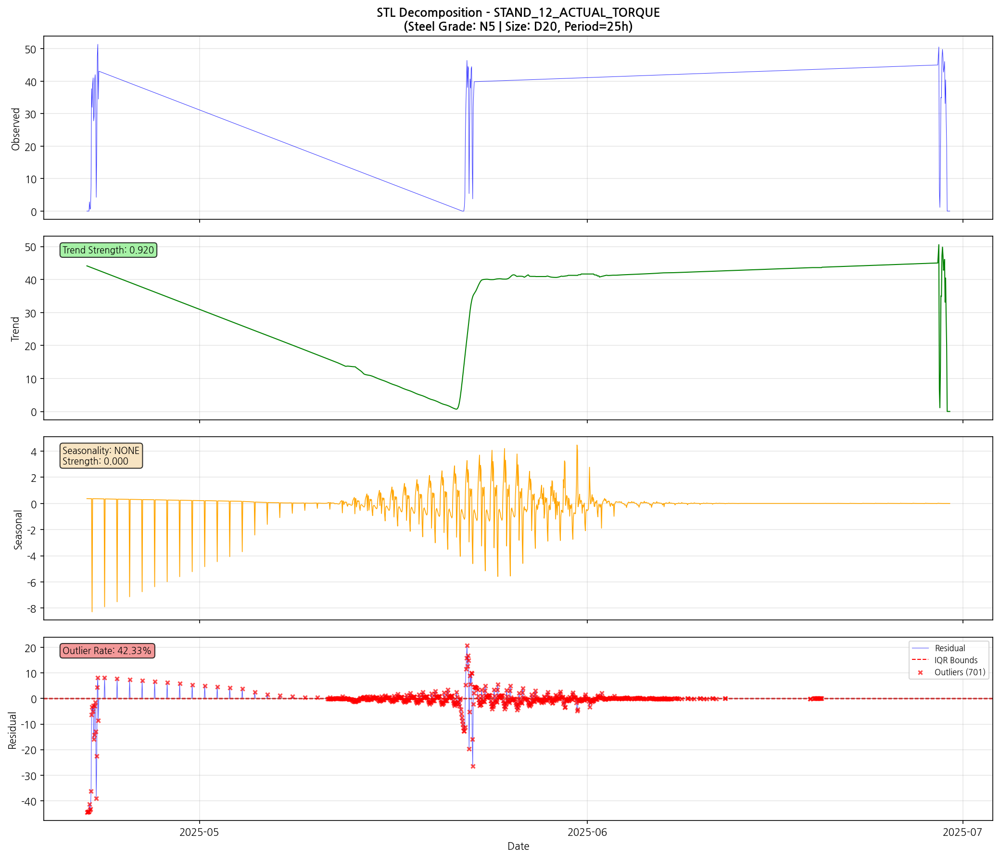

**STAND_8_ACTUAL_TORQUE** (이상치율: 40.88%, 계절성: 0.384)

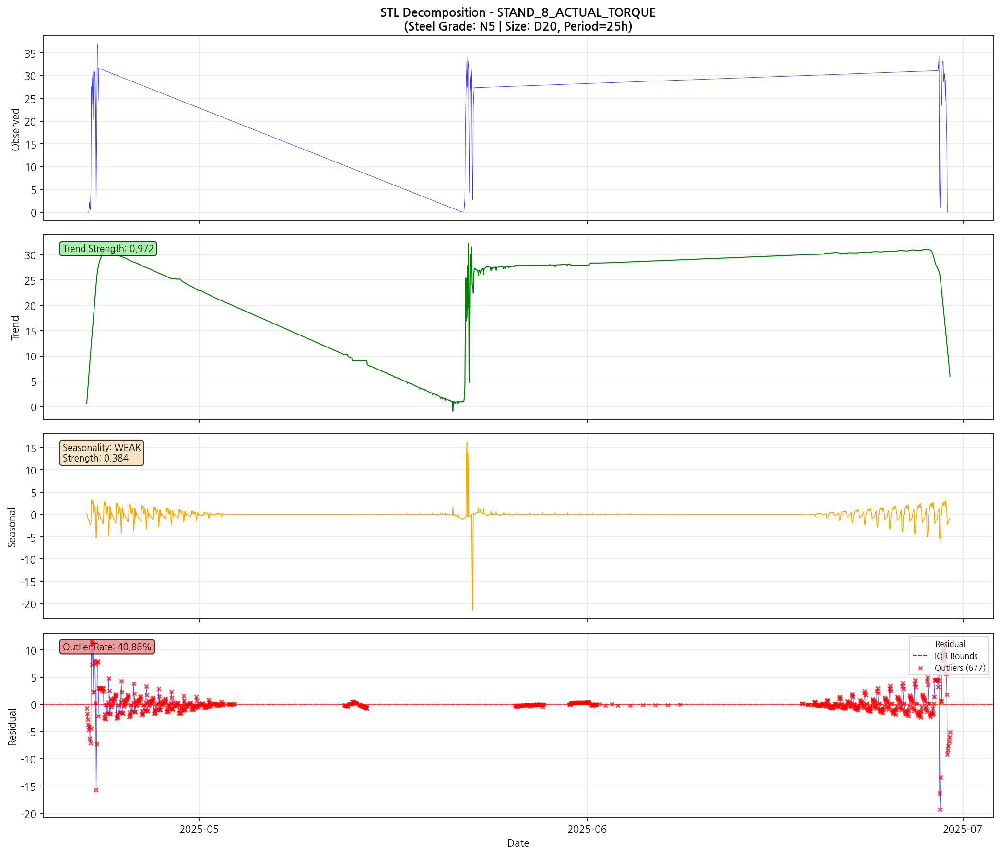

### 스탠드 속도 (06_Stand_Speed)

- 분석 태그: 15개
- 평균 잔차 이상치율: 37.75%
- 평균 계절성 강도: 0.029

| 태그 | 이상치율 | 계절성 강도 | 추세 강도 |
|------|----------|-------------|-----------|
| STAND_1_ACTUAL_SPEED | 38.16% | 0.033 | 0.985 |
| STAND_2_ACTUAL_SPEED | 26.99% | 0.012 | 0.901 |
| STAND_3_ACTUAL_SPEED | 36.90% | 0.090 | 0.981 |
| STAND_4_ACTUAL_SPEED | 30.37% | 0.000 | 0.983 |
| STAND_5_ACTUAL_SPEED | 41.36% | 0.000 | 0.927 |
| STAND_6_ACTUAL_SPEED | 40.76% | 0.001 | 0.940 |
| STAND_7_ACTUAL_SPEED | 33.45% | 0.007 | 0.983 |
| STAND_8_ACTUAL_SPEED | 40.58% | 0.000 | 0.931 |
| STAND_9_ACTUAL_SPEED | 40.70% | 0.027 | 0.936 |
| STAND_10_ACTUAL_SPEED | 40.34% | 0.001 | 0.977 |
| STAND_11_ACTUAL_SPEED | 43.48% | 0.105 | 0.984 |
| STAND_12_ACTUAL_SPEED | 39.55% | 0.020 | 0.937 |
| STAND_13_ACTUAL_SPEED | 38.22% | 0.107 | 0.982 |
| STAND_14_ACTUAL_SPEED | 38.77% | 0.034 | 0.944 |
| FINISHING_BLOCK_ACTUAL_SPEED | 36.59% | 0.003 | 0.944 |

#### STL 분해 차트

**STAND_11_ACTUAL_SPEED** (이상치율: 43.48%, 계절성: 0.105)

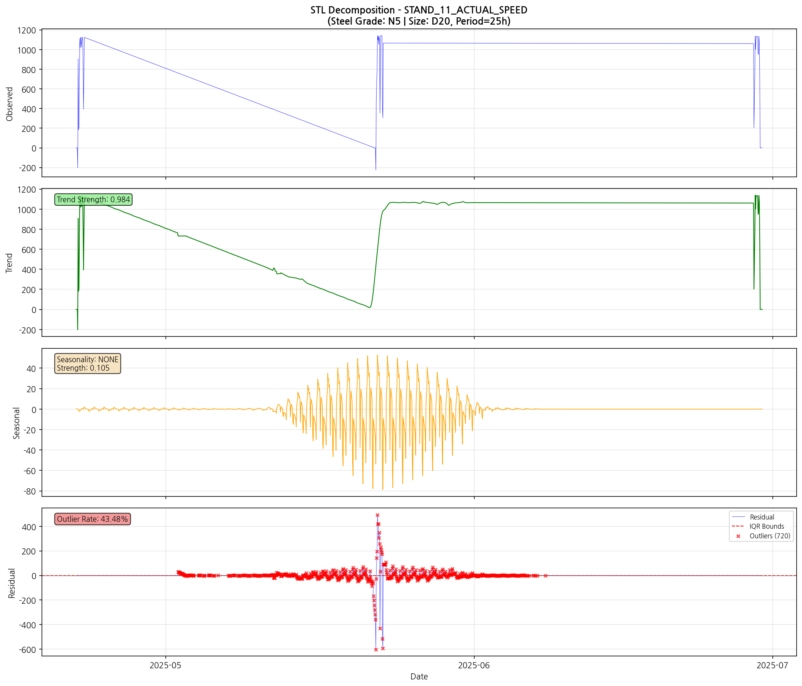

**STAND_5_ACTUAL_SPEED** (이상치율: 41.36%, 계절성: 0.000)

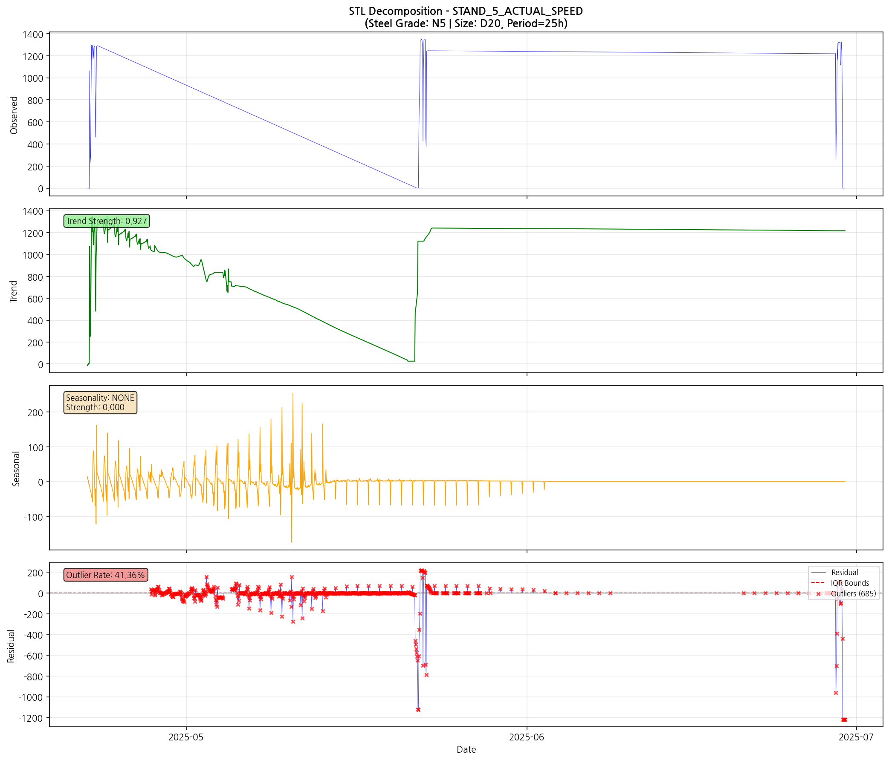

**STAND_6_ACTUAL_SPEED** (이상치율: 40.76%, 계절성: 0.001)

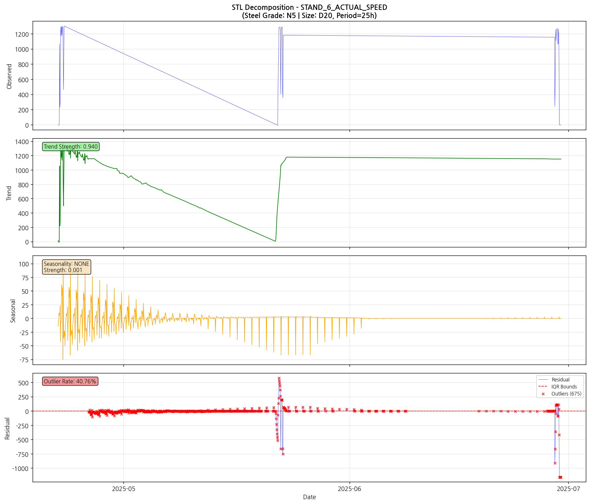

### 스탠드 부하 (07_Stand_Load)

- 분석 태그: 15개
- 평균 잔차 이상치율: 37.89%
- 평균 계절성 강도: 0.097

| 태그 | 이상치율 | 계절성 강도 | 추세 강도 |
|------|----------|-------------|-----------|
| STAND_1_LOAD | 41.30% | 0.084 | 0.917 |
| STAND_2_LOAD | 40.58% | 0.052 | 0.926 |
| STAND_3_LOAD | 41.24% | 0.065 | 0.901 |
| STAND_4_LOAD | 42.33% | 0.246 | 0.973 |
| STAND_5_LOAD | 33.64% | 0.000 | 0.917 |
| STAND_6_LOAD | 33.27% | 0.000 | 0.943 |
| STAND_7_LOAD | 36.90% | 0.001 | 0.882 |
| STAND_8_LOAD | 31.76% | 0.004 | 0.887 |
| STAND_9_LOAD | 34.06% | 0.111 | 0.944 |
| STAND_10_LOAD | 41.12% | 0.125 | 0.968 |
| STAND_11_LOAD | 41.30% | 0.117 | 0.934 |
| STAND_12_LOAD | 36.90% | 0.073 | 0.895 |
| STAND_13_LOAD | 36.90% | 0.073 | 0.895 |
| STAND_14_LOAD | 35.75% | 0.154 | 0.968 |
| FINISHING_BLOCK_LOAD | 41.24% | 0.354 | 0.972 |

#### STL 분해 차트

**STAND_4_LOAD** (이상치율: 42.33%, 계절성: 0.246)

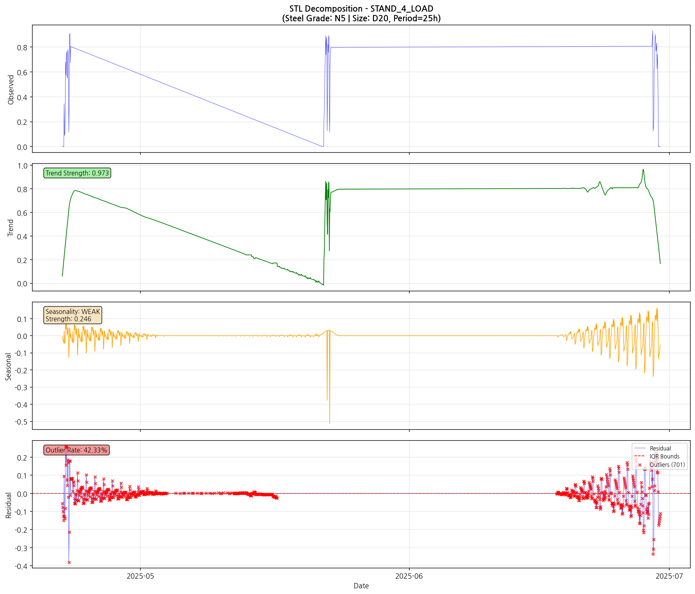

**STAND_1_LOAD** (이상치율: 41.30%, 계절성: 0.084)

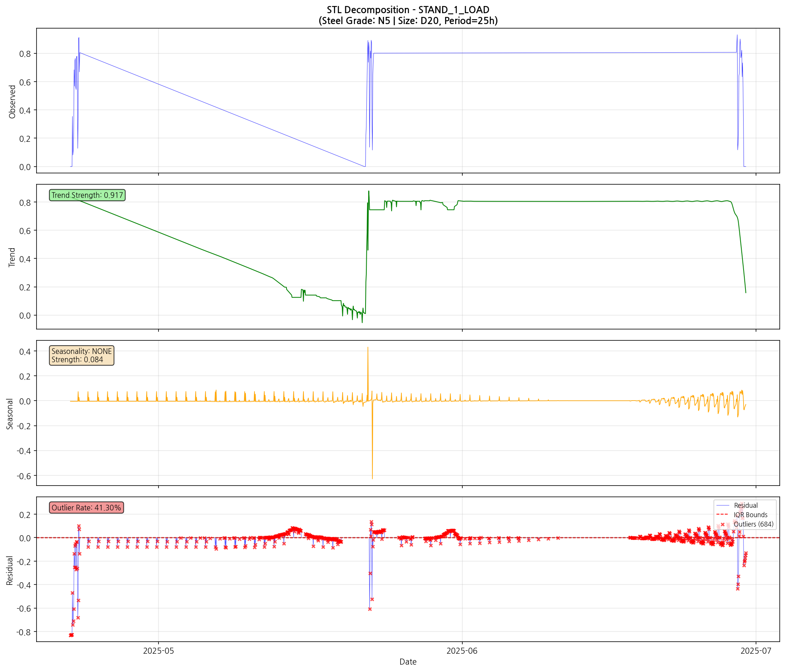

**STAND_11_LOAD** (이상치율: 41.30%, 계절성: 0.117)

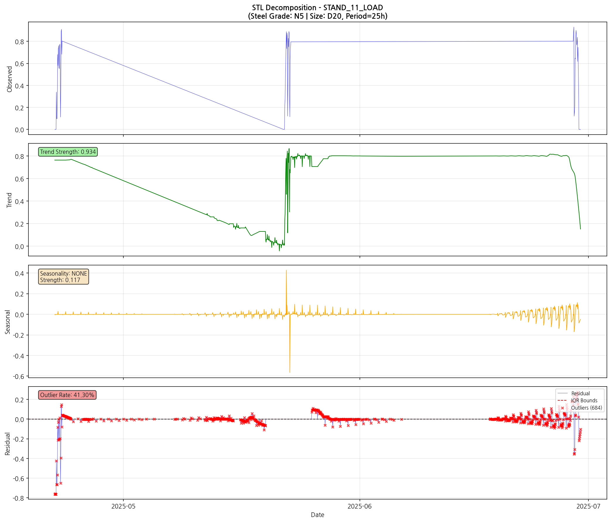

### 핀치롤 (08_Pinchroll)

- 분석 태그: 9개
- 평균 잔차 이상치율: 37.86%
- 평균 계절성 강도: 0.022

| 태그 | 이상치율 | 계절성 강도 | 추세 강도 |
|------|----------|-------------|-----------|
| PINCHROLL_2_ACTUAL_SPEED | 39.45% | 0.033 | 0.969 |
| PINCHROLL_3_ACTUAL_SPEED | 42.80% | 0.000 | 0.996 |
| PINCHROLL_4_ACTUAL_SPEED | 42.61% | 0.000 | 0.994 |
| PINCHROLL_2_ACTUAL_TORQUE | 34.95% | 0.000 | 0.928 |
| PINCHROLL_3_ACTUAL_TORQUE | 33.07% | 0.000 | 0.904 |
| PINCHROLL_4_ACTUAL_TORQUE | 43.16% | 0.095 | 0.922 |
| PINCHROLL_2_REFERENCE_TORQUE | 33.80% | 0.003 | 0.555 |
| PINCHROLL_3_REFERENCE_TORQUE | 33.98% | 0.000 | 0.993 |
| PINCHROLL_4_REFERENCE_TORQUE | 36.90% | 0.066 | 0.994 |

#### STL 분해 차트

**PINCHROLL_4_ACTUAL_TORQUE** (이상치율: 43.16%, 계절성: 0.095)

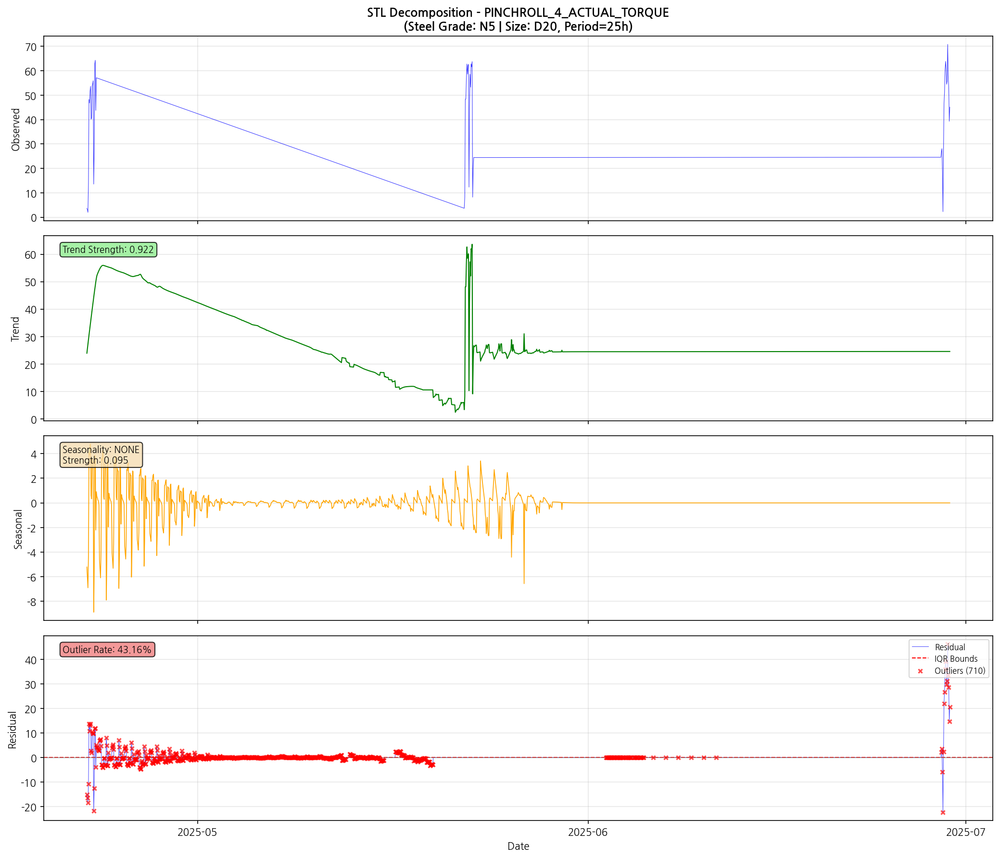

**PINCHROLL_3_ACTUAL_SPEED** (이상치율: 42.80%, 계절성: 0.000)

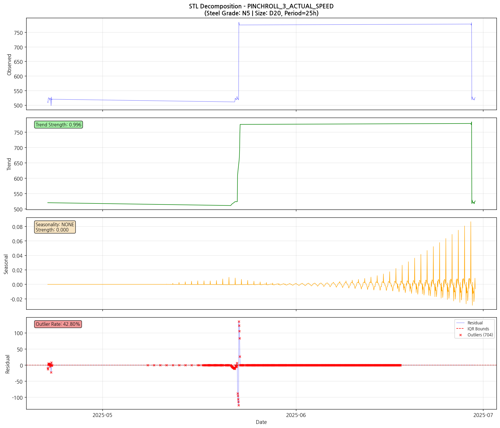

**PINCHROLL_4_ACTUAL_SPEED** (이상치율: 42.61%, 계절성: 0.000)

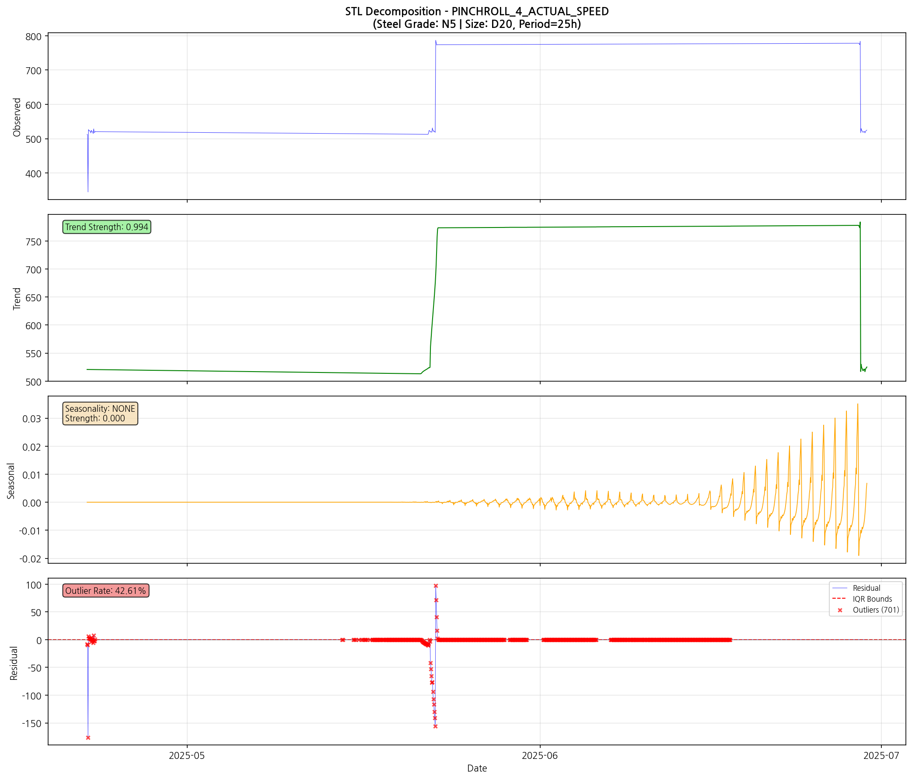

### PR 상세 토크 (09_PR_Detailed)

- 분석 태그: 6개
- 평균 잔차 이상치율: 37.69%
- 평균 계절성 강도: 0.037

| 태그 | 이상치율 | 계절성 강도 | 추세 강도 |
|------|----------|-------------|-----------|
| PR6L1_ACT_TORQUE | 32.34% | 0.001 | 0.848 |
| PR6L2_ACT_TORQUE | 41.95% | 0.218 | 0.982 |
| PR7L1_ACT_TORQUE | 33.92% | 0.000 | 0.936 |
| PR7L2_ACT_TORQUE | 41.40% | 0.000 | 0.994 |
| PR8L1_ACT_TORQUE | 38.24% | 0.004 | 0.917 |
| PR9L1_ACT_TORQUE | 38.30% | 0.001 | 0.856 |

#### STL 분해 차트

**PR6L2_ACT_TORQUE** (이상치율: 41.95%, 계절성: 0.218)

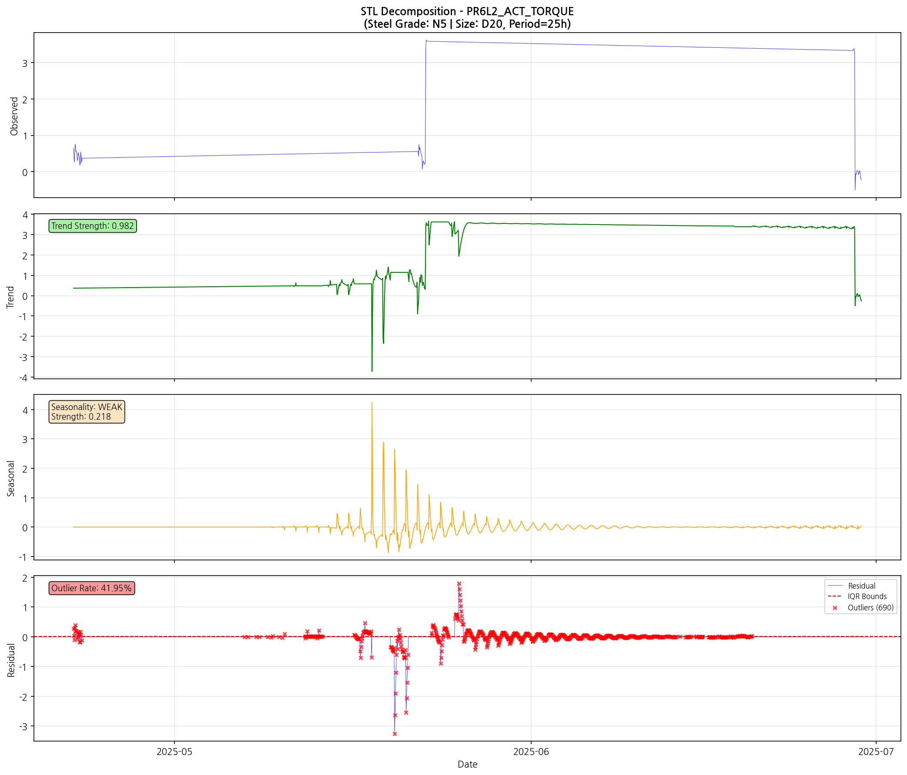

**PR7L2_ACT_TORQUE** (이상치율: 41.40%, 계절성: 0.000)

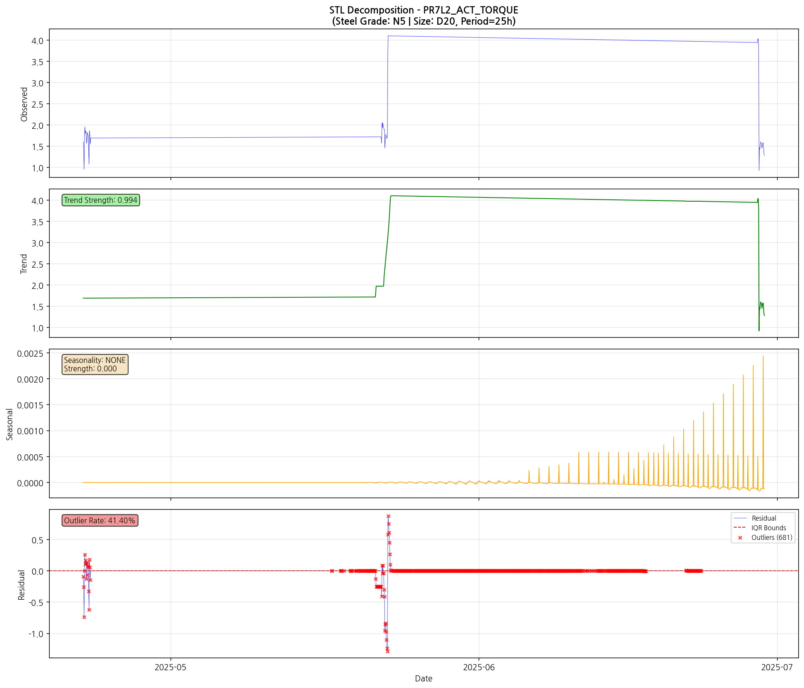

**PR9L1_ACT_TORQUE** (이상치율: 38.30%, 계절성: 0.001)

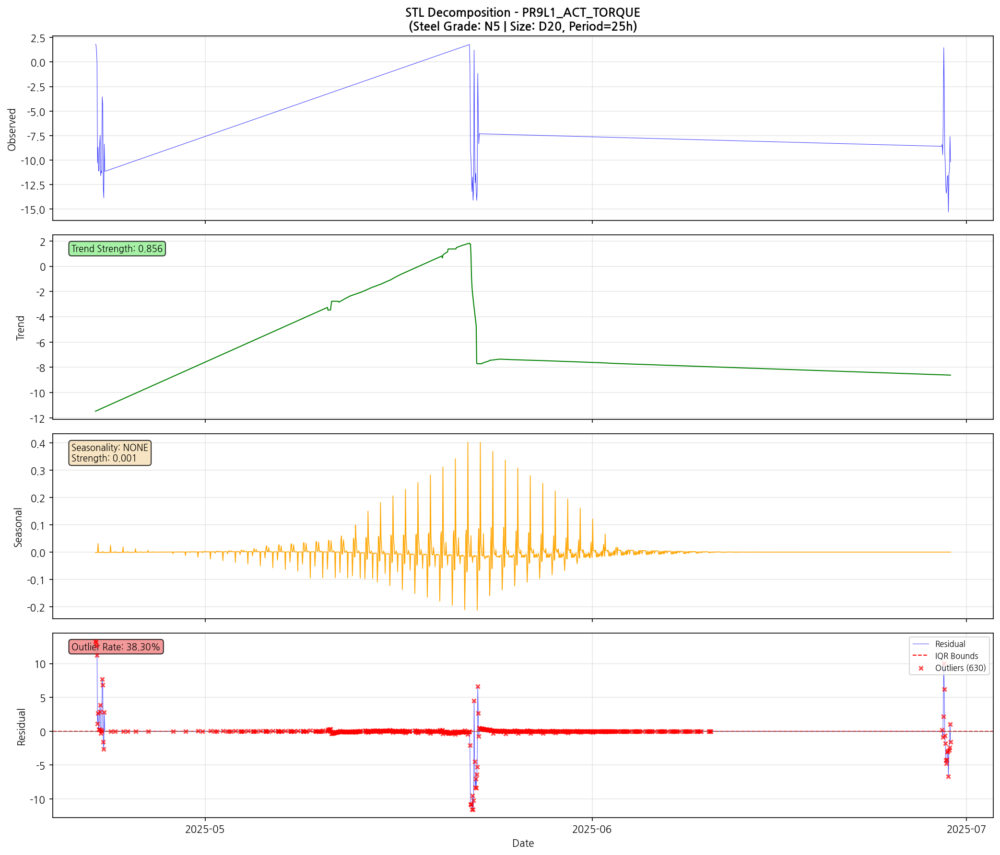

---

## 해석 가이드

### STL 분해 해석

1. **추세 (Trend)**
   - 장기적인 상승/하락 패턴
   - 설비 노화, 계절적 변화 등 반영
   - 추세 강도 높을수록 장기 변화가 뚜렷함

2. **계절성 (Seasonal)**
   - 주기적으로 반복되는 패턴 (24시간 기준)
   - 계절성 강도 ≥ 0.7: 강한 주기적 패턴
   - 계절성이 강한 태그는 STL 분석이 효과적

3. **잔차 (Residual)**
   - 추세와 계절성으로 설명되지 않는 변동
   - **순수한 이상치**를 포함
   - 잔차 기반 IQR로 "진짜" 이상치 탐지

### 계절성 강도 분류

| 분류 | 강도 범위 | 해석 |
|------|----------|------|
| Strong | ≥ 0.7 | 명확한 주기적 패턴, STL 매우 효과적 |
| Moderate | 0.4 ~ 0.7 | 적당한 주기적 패턴, STL 효과적 |
| Weak | 0.2 ~ 0.4 | 약한 주기적 패턴 |
| None | < 0.2 | 주기적 패턴 거의 없음 |

### Standard IQR vs STL Residual IQR

| 방법 | 장점 | 단점 |
|------|------|------|
| Standard IQR | 간단, 빠름 | 계절성에 영향받음 |
| STL Residual IQR | 계절성 제거, 순수 이상치 | 계산 복잡, 데이터 필요 |

**권장**: 계절성 강도 ≥ 0.4인 태그에는 STL Residual IQR 사용

---

## 메타데이터

| 항목 | 값 |
|------|-----|
| 분석 스크립트 | steel_grade_stl_analysis.py |
| 분석 기간 | 2025-03-01 ~ 2025-08-31 |
| 강종 | N5 |
| 계절 주기 | 25시간 |
| 생성일시 | 2026-02-09 15:05:39 |
| 총 분석 태그 | 79개 |

---

*본 보고서는 자동 생성되었습니다.*
