# 강종 [N5] STL 계절-추세 분해 분석 보고서

**분석 기간**: 2025-03-01 ~ 2025-08-31
**강종**: N5
**생성일시**: 2026-02-03 20:42:45

---

## 분석 개요

### 분석 방법론

**STL (Seasonal-Trend Decomposition using LOESS)**

시계열 데이터를 세 가지 성분으로 분해:
- **Trend (추세)**: 장기적인 변화 패턴
- **Seasonal (계절성)**: 주기적으로 반복되는 패턴
- **Residual (잔차)**: 추세와 계절성으로 설명되지 않는 변동

| 파라미터 | 값 | 설명 |
|----------|-----|------|
| seasonal | 25h | 계절 주기 |
| robust | True | 강건 추정 |

### 분석 결과 요약

| 구분 | 태그 수 | 비율 |
|------|---------|------|
| **총 분석 태그** | 79개 | 100% |

#### 잔차 이상치율 분포

| 구분 | 태그 수 | 비율 |
|------|---------|------|
| 🔴 높음 (≥15%) | 79개 | 100.0% |
| 🟠 중간 (5~15%) | 0개 | 0.0% |
| 🟢 낮음 (<5%) | 0개 | 0.0% |

#### 계절성 강도 분포

| 구분 | 태그 수 | 비율 |
|------|---------|------|
| 🔵 강함 (≥0.7) | 0개 | 0.0% |
| 중간 (0.4~0.7) | 0개 | 0.0% |
| 약함 (<0.4) | 79개 | 100.0% |

#### 전체 평균

| 지표 | 값 |
|------|-----|
| 평균 계절성 강도 | 0.005 |
| 평균 추세 강도 | 0.818 |

---

## 상위 문제 태그 (잔차 이상치율 기준)

| 순위 | 태그 | 카테고리 | 이상치율 | 계절성 강도 | 계절성 분류 |
|------|------|----------|----------|-------------|-------------|
| 1 | FINISHING_BLOCK_MASTER_ACTUAL_TORQUE | 스탠드 토크 | 45.57% | 0.000 | none |
| 2 | PR7L2_ACT_TORQUE | PR 상세 토크 | 44.91% | 0.000 | none |
| 3 | PINCHROLL_4_REFERENCE_TORQUE | 핀치롤 | 44.74% | 0.000 | none |
| 4 | FURNACE_PRESSURE | 가열로 보조설비 | 44.27% | 0.000 | none |
| 5 | FURNACE_EXIT_DISCHARGE_BILLET_TEMPERATURE | 가열로 추출 온도 | 43.73% | 0.011 | none |
| 6 | INDIRECT_COOLING_WATER_FLOW | 가열로 보조설비 | 43.70% | 0.000 | none |
| 7 | PINCHROLL_2_ACTUAL_TORQUE | 핀치롤 | 43.57% | 0.013 | none |
| 8 | SOAKING_BOTTOM_ZONE_NO_2_TEMPERATURE_MILL_SIDE | 가열로 하부 온도 | 43.30% | 0.033 | none |
| 9 | FINISHING_BLOCK_LOAD | 스탠드 부하 | 43.23% | 0.034 | none |
| 10 | PR9L1_ACT_TORQUE | PR 상세 토크 | 43.17% | 0.000 | none |
| 11 | STAND_9_LOAD | 스탠드 부하 | 43.07% | 0.000 | none |
| 12 | MAIN_GAS_FLOW | 가열로 보조설비 | 42.93% | 0.000 | none |
| 13 | INDIRECT_WATER_MAIN_TEMPERATURE | 가열로 보조설비 | 42.90% | 0.000 | none |
| 14 | PINCHROLL_3_ACTUAL_TORQUE | 핀치롤 | 42.77% | 0.000 | none |
| 15 | STAND_1_ACTUAL_TORQUE | 스탠드 토크 | 42.60% | 0.000 | none |

---

## 강한 계절성 태그 목록

계절성 강도가 0.7 이상인 태그입니다. 이 태그들은 STL 분석이 특히 효과적입니다.

| 태그 | 카테고리 | 계절성 강도 | 잔차 이상치율 |
|------|----------|-------------|---------------|
| - | 강한 계절성 태그 없음 | - | - |

---

## 카테고리별 분석 결과

### 가열로 상부 온도 (01_Furnace_Top_Temperature)

- 분석 태그: 4개
- 평균 잔차 이상치율: 40.89%
- 평균 계절성 강도: 0.001

| 태그 | 이상치율 | 계절성 강도 | 추세 강도 |
|------|----------|-------------|-----------|
| HEATING_TOP_ZONE_NO_1_TEMPERATURE_ROOF | 38.27% | 0.004 | 0.950 |
| HEATING_TOP_ZONE_NO_2_TEMPERATURE_ROOF | 42.40% | 0.000 | 0.942 |
| SOAKING_TOP_ZONE_NO_1_TEMPERATURE_ROOF | 42.10% | 0.000 | 0.962 |
| SOAKING_TOP_ZONE_NO_2_TEMPERATURE_ROOF | 40.80% | 0.000 | 0.913 |

#### STL 분해 차트

**HEATING_TOP_ZONE_NO_2_TEMPERATURE_ROOF** (이상치율: 42.40%, 계절성: 0.000)

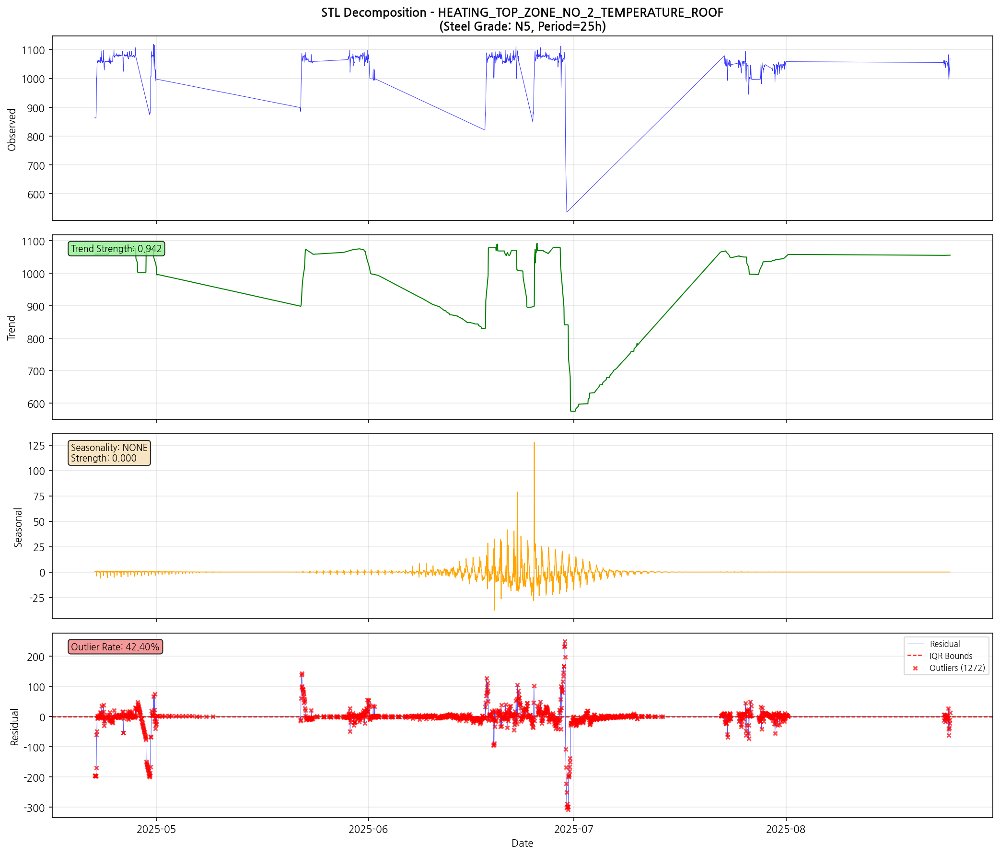

**SOAKING_TOP_ZONE_NO_1_TEMPERATURE_ROOF** (이상치율: 42.10%, 계절성: 0.000)

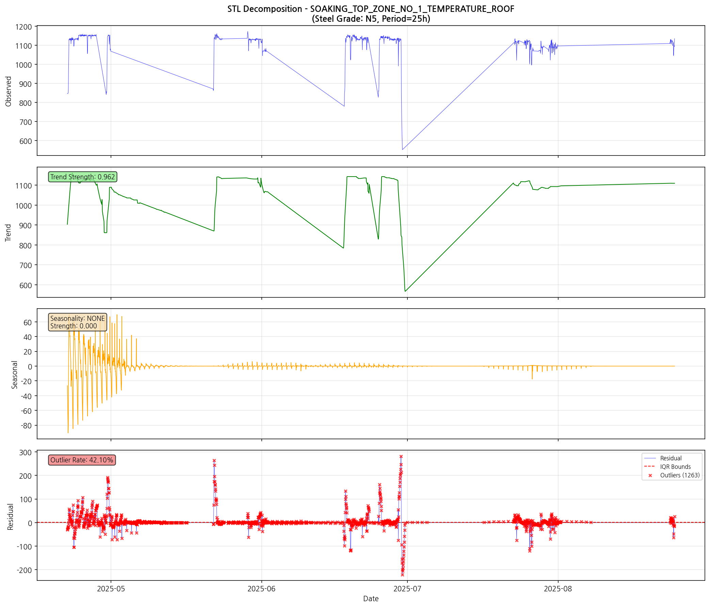

**SOAKING_TOP_ZONE_NO_2_TEMPERATURE_ROOF** (이상치율: 40.80%, 계절성: 0.000)

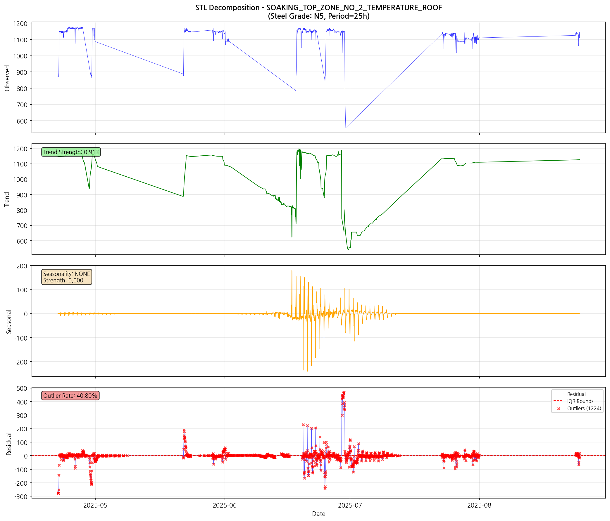

### 가열로 하부 온도 (02_Furnace_Bottom_Temperature)

- 분석 태그: 4개
- 평균 잔차 이상치율: 40.43%
- 평균 계절성 강도: 0.028

| 태그 | 이상치율 | 계절성 강도 | 추세 강도 |
|------|----------|-------------|-----------|
| HEATING_BOTTOM_ZONE_NO_1_TEMPERATURE_OPP_SIDE | 38.30% | 0.000 | 0.931 |
| HEATING_BOTTOM_ZONE_NO_2_TEMPERATURE_MILL_SIDE | 37.57% | 0.000 | 0.956 |
| SOAKING_BOTTOM_ZONE_NO_1_TEMPERATURE_OPP_SIDE | 42.57% | 0.079 | 0.951 |
| SOAKING_BOTTOM_ZONE_NO_2_TEMPERATURE_MILL_SIDE | 43.30% | 0.033 | 0.940 |

#### STL 분해 차트

**SOAKING_BOTTOM_ZONE_NO_2_TEMPERATURE_MILL_SIDE** (이상치율: 43.30%, 계절성: 0.033)

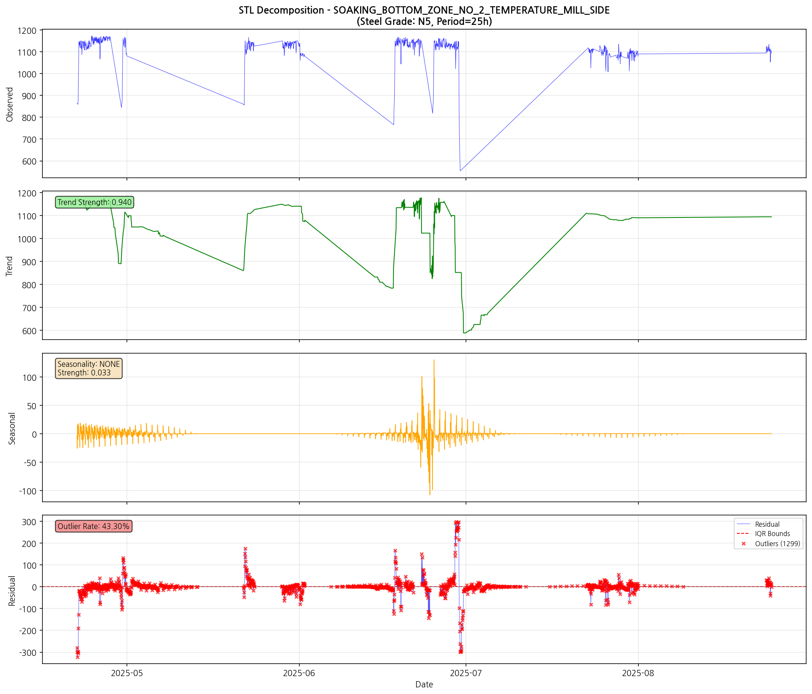

**SOAKING_BOTTOM_ZONE_NO_1_TEMPERATURE_OPP_SIDE** (이상치율: 42.57%, 계절성: 0.079)

**HEATING_BOTTOM_ZONE_NO_1_TEMPERATURE_OPP_SIDE** (이상치율: 38.30%, 계절성: 0.000)

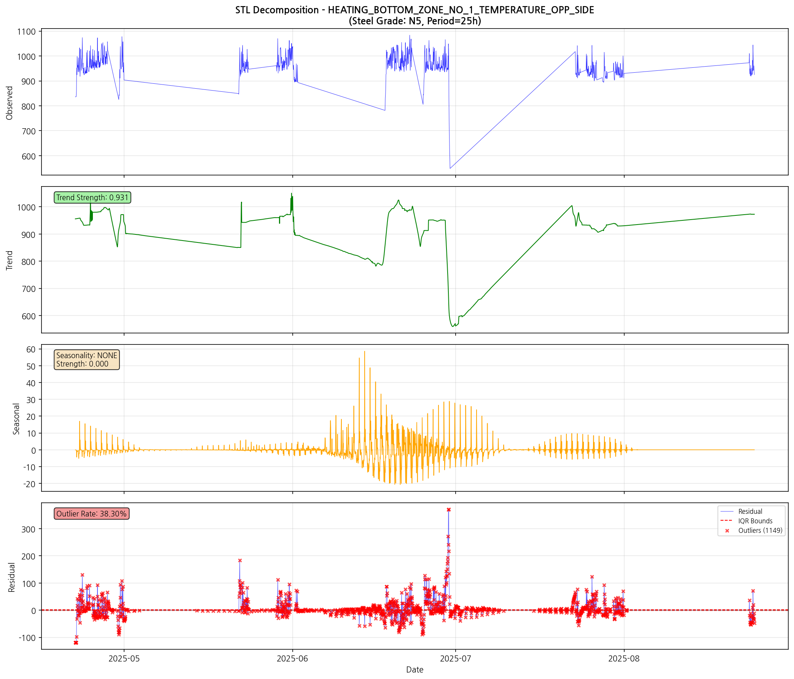

### 가열로 추출 온도 (03_Furnace_Discharge_Temperature)

- 분석 태그: 1개
- 평균 잔차 이상치율: 43.73%
- 평균 계절성 강도: 0.011

| 태그 | 이상치율 | 계절성 강도 | 추세 강도 |
|------|----------|-------------|-----------|
| FURNACE_EXIT_DISCHARGE_BILLET_TEMPERATURE | 43.73% | 0.011 | 0.938 |

#### STL 분해 차트

**FURNACE_EXIT_DISCHARGE_BILLET_TEMPERATURE** (이상치율: 43.73%, 계절성: 0.011)

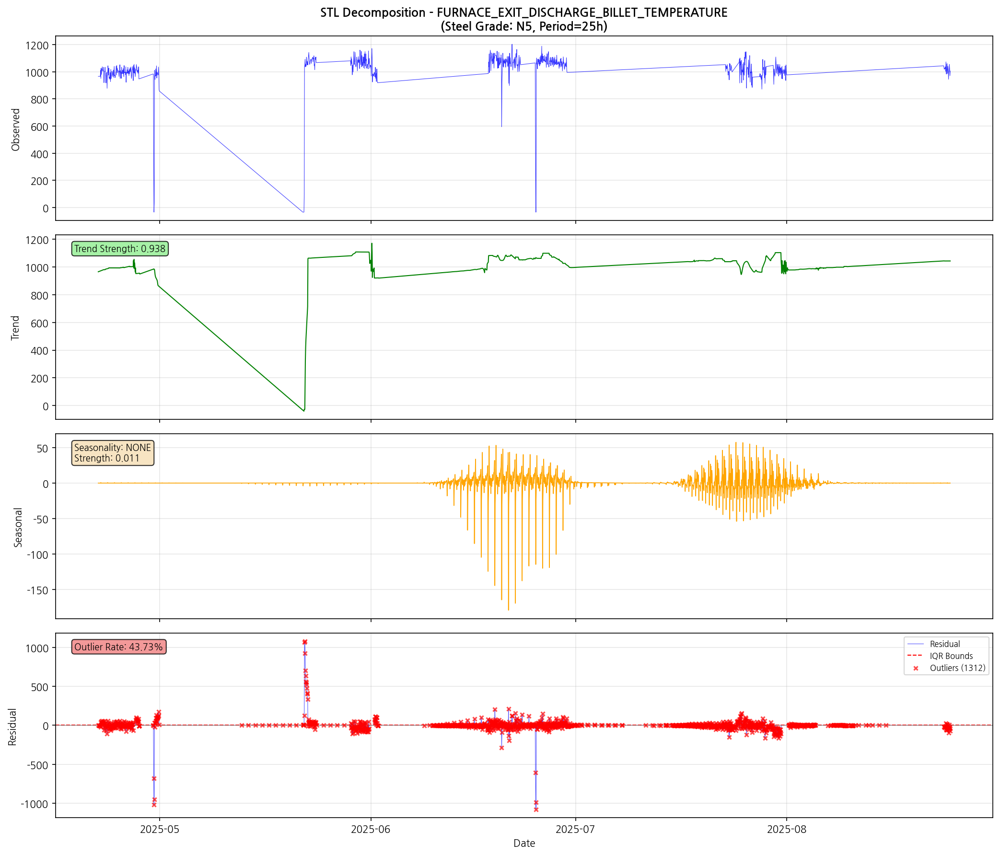

### 가열로 보조설비 (04_Furnace_Auxiliary)

- 분석 태그: 9개
- 평균 잔차 이상치율: 41.79%
- 평균 계절성 강도: 0.009

| 태그 | 이상치율 | 계절성 강도 | 추세 강도 |
|------|----------|-------------|-----------|
| FURNACE_PRESSURE | 44.27% | 0.000 | 0.745 |
| FURNACE_O2_ANALYZER | 40.93% | 0.000 | 0.861 |
| MAIN_GAS_PRESSURE | 38.63% | 0.030 | 0.972 |
| MAIN_GAS_FLOW | 42.93% | 0.000 | 0.680 |
| MAIN_GAS_TEMPERATURE | 39.73% | 0.049 | 0.946 |
| MAIN_COMBUSTION_AIR_PRESSURE | 41.93% | 0.006 | 0.944 |
| COMBUSTION_AIR_TEMPERATURE | 41.07% | 0.000 | 0.937 |
| INDIRECT_COOLING_WATER_FLOW | 43.70% | 0.000 | 0.990 |
| INDIRECT_WATER_MAIN_TEMPERATURE | 42.90% | 0.000 | 0.986 |

#### STL 분해 차트

**FURNACE_PRESSURE** (이상치율: 44.27%, 계절성: 0.000)

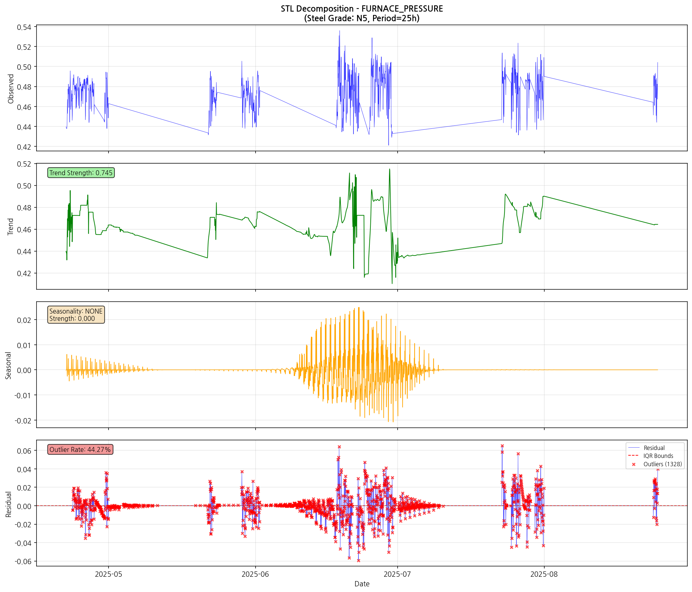

**INDIRECT_COOLING_WATER_FLOW** (이상치율: 43.70%, 계절성: 0.000)

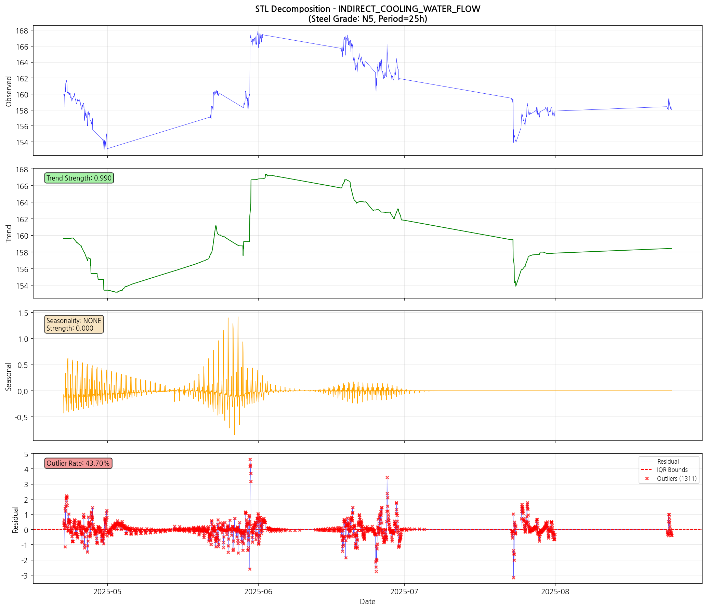

**MAIN_GAS_FLOW** (이상치율: 42.93%, 계절성: 0.000)

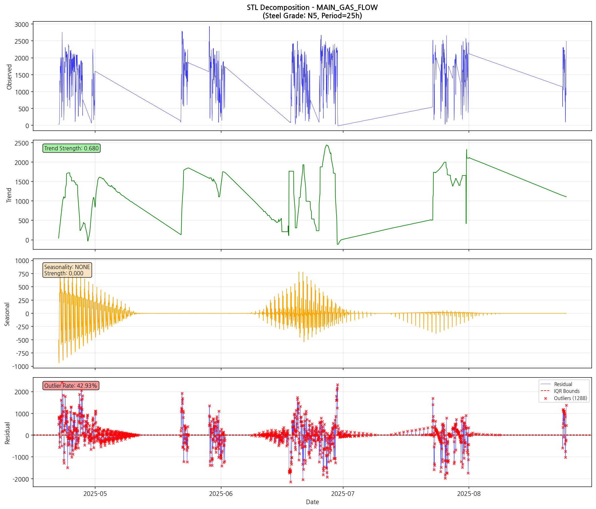

### 스탠드 토크 (05_Stand_Torque)

- 분석 태그: 16개
- 평균 잔차 이상치율: 40.11%
- 평균 계절성 강도: 0.004

| 태그 | 이상치율 | 계절성 강도 | 추세 강도 |
|------|----------|-------------|-----------|
| STAND_1_ACTUAL_TORQUE | 42.60% | 0.000 | 0.782 |
| STAND_2_ACTUAL_TORQUE | 40.60% | 0.000 | 0.788 |
| STAND_3_ACTUAL_TORQUE | 41.03% | 0.000 | 0.792 |
| STAND_4_ACTUAL_TORQUE | 39.77% | 0.004 | 0.780 |
| STAND_5_ACTUAL_TORQUE | 38.53% | 0.000 | 0.780 |
| STAND_6_ACTUAL_TORQUE | 40.40% | 0.000 | 0.784 |
| STAND_7_ACTUAL_TORQUE | 38.67% | 0.000 | 0.786 |
| STAND_8_ACTUAL_TORQUE | 38.80% | 0.000 | 0.746 |
| STAND_9_ACTUAL_TORQUE | 40.40% | 0.000 | 0.754 |
| STAND_10_ACTUAL_TORQUE | 42.17% | 0.000 | 0.752 |
| STAND_11_ACTUAL_TORQUE | 40.90% | 0.000 | 0.776 |
| STAND_12_ACTUAL_TORQUE | 39.83% | 0.000 | 0.801 |
| STAND_13_ACTUAL_TORQUE | 38.50% | 0.000 | 0.787 |
| STAND_14_ACTUAL_TORQUE | 36.83% | 0.000 | 0.751 |
| FINISHING_BLOCK_MASTER_ACTUAL_TORQUE | 45.57% | 0.000 | 0.524 |
| FINISHING_BLOCK_SLAVE_ACTUAL_TORQUE | 37.23% | 0.065 | 0.892 |

#### STL 분해 차트

**FINISHING_BLOCK_MASTER_ACTUAL_TORQUE** (이상치율: 45.57%, 계절성: 0.000)

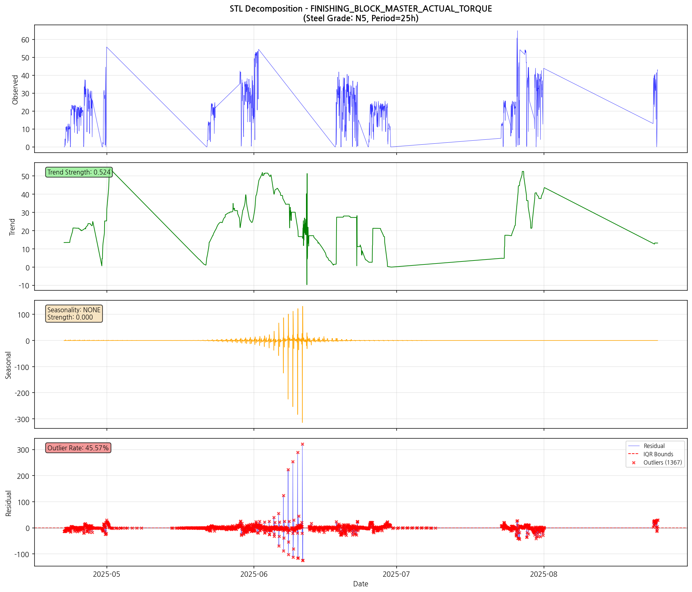

**STAND_1_ACTUAL_TORQUE** (이상치율: 42.60%, 계절성: 0.000)

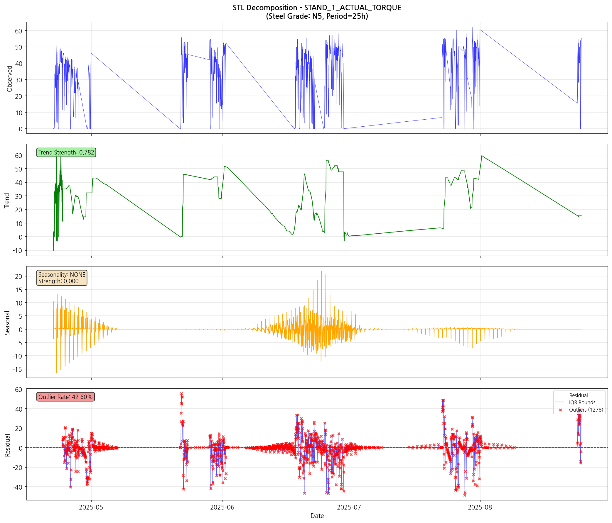

**STAND_10_ACTUAL_TORQUE** (이상치율: 42.17%, 계절성: 0.000)

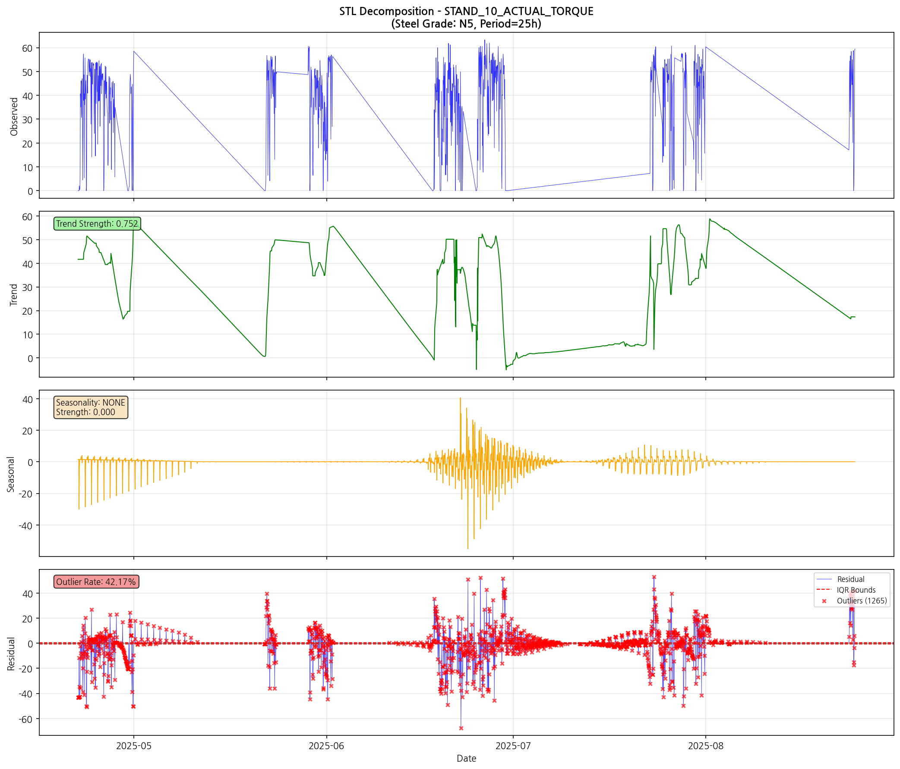

### 스탠드 속도 (06_Stand_Speed)

- 분석 태그: 15개
- 평균 잔차 이상치율: 40.56%
- 평균 계절성 강도: 0.001

| 태그 | 이상치율 | 계절성 강도 | 추세 강도 |
|------|----------|-------------|-----------|
| STAND_1_ACTUAL_SPEED | 41.70% | 0.005 | 0.789 |
| STAND_2_ACTUAL_SPEED | 39.00% | 0.002 | 0.755 |
| STAND_3_ACTUAL_SPEED | 40.30% | 0.000 | 0.712 |
| STAND_4_ACTUAL_SPEED | 41.87% | 0.000 | 0.780 |
| STAND_5_ACTUAL_SPEED | 40.67% | 0.000 | 0.765 |
| STAND_6_ACTUAL_SPEED | 40.83% | 0.000 | 0.761 |
| STAND_7_ACTUAL_SPEED | 42.43% | 0.000 | 0.759 |
| STAND_8_ACTUAL_SPEED | 39.87% | 0.000 | 0.821 |
| STAND_9_ACTUAL_SPEED | 39.67% | 0.000 | 0.801 |
| STAND_10_ACTUAL_SPEED | 40.57% | 0.000 | 0.767 |
| STAND_11_ACTUAL_SPEED | 39.33% | 0.000 | 0.770 |
| STAND_12_ACTUAL_SPEED | 39.80% | 0.000 | 0.770 |
| STAND_13_ACTUAL_SPEED | 41.43% | 0.000 | 0.671 |
| STAND_14_ACTUAL_SPEED | 42.57% | 0.006 | 0.799 |
| FINISHING_BLOCK_ACTUAL_SPEED | 38.33% | 0.000 | 0.791 |

#### STL 분해 차트

**STAND_14_ACTUAL_SPEED** (이상치율: 42.57%, 계절성: 0.006)

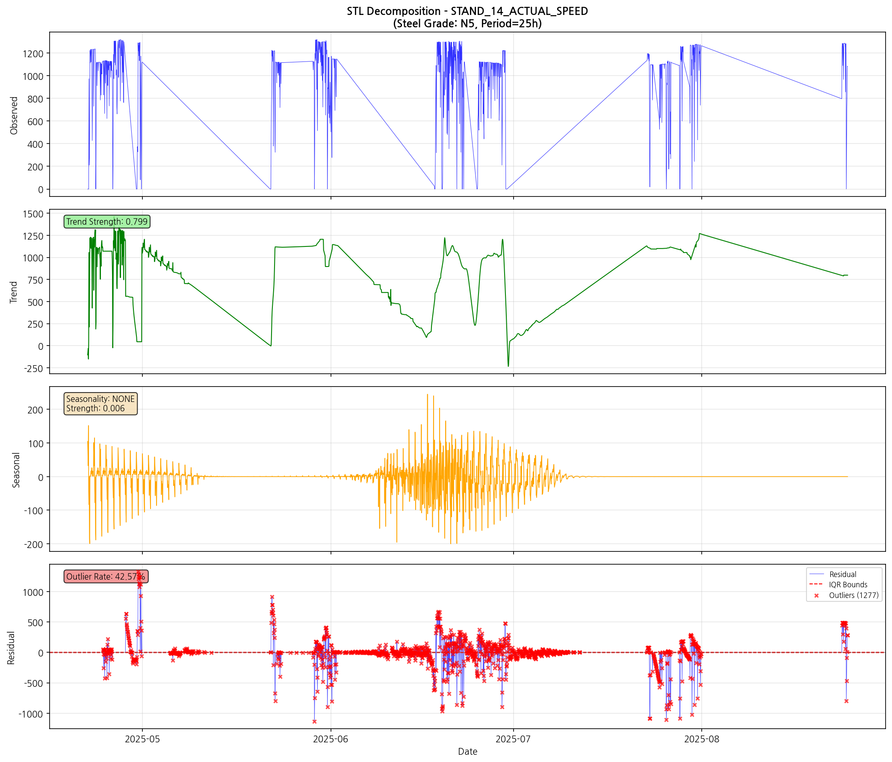

**STAND_7_ACTUAL_SPEED** (이상치율: 42.43%, 계절성: 0.000)

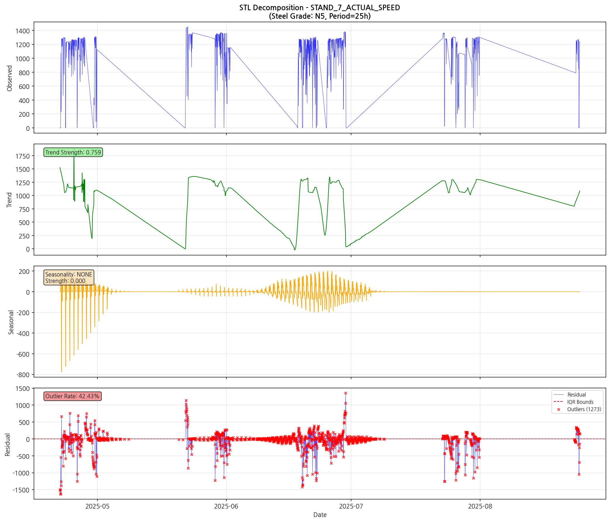

**STAND_4_ACTUAL_SPEED** (이상치율: 41.87%, 계절성: 0.000)

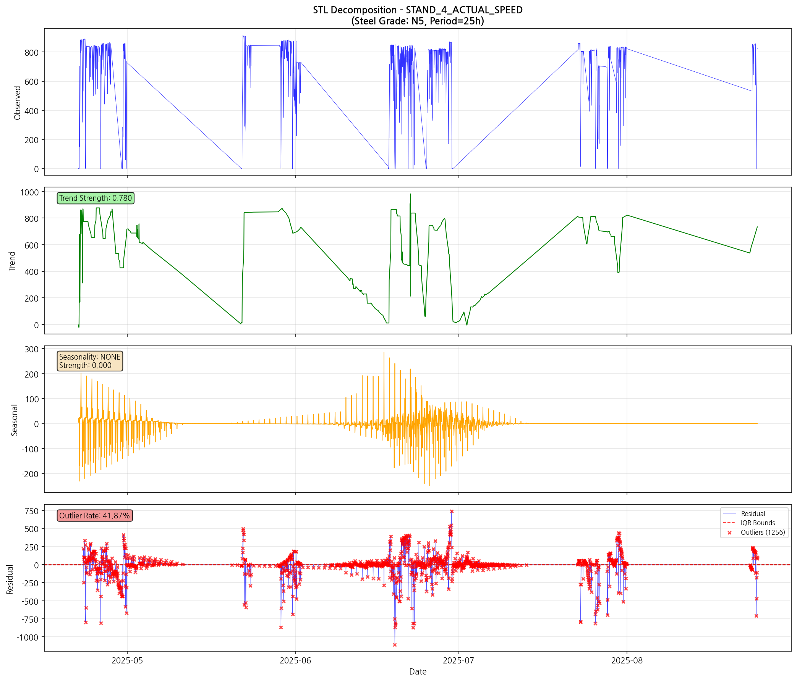

### 스탠드 부하 (07_Stand_Load)

- 분석 태그: 15개
- 평균 잔차 이상치율: 40.08%
- 평균 계절성 강도: 0.003

| 태그 | 이상치율 | 계절성 강도 | 추세 강도 |
|------|----------|-------------|-----------|
| STAND_1_LOAD | 38.27% | 0.004 | 0.773 |
| STAND_2_LOAD | 41.10% | 0.000 | 0.773 |
| STAND_3_LOAD | 38.63% | 0.000 | 0.781 |
| STAND_4_LOAD | 41.87% | 0.000 | 0.793 |
| STAND_5_LOAD | 38.30% | 0.000 | 0.755 |
| STAND_6_LOAD | 41.70% | 0.000 | 0.792 |
| STAND_7_LOAD | 41.13% | 0.000 | 0.787 |
| STAND_8_LOAD | 39.57% | 0.000 | 0.765 |
| STAND_9_LOAD | 43.07% | 0.000 | 0.765 |
| STAND_10_LOAD | 37.53% | 0.000 | 0.737 |
| STAND_11_LOAD | 40.50% | 0.000 | 0.769 |
| STAND_12_LOAD | 39.07% | 0.000 | 0.789 |
| STAND_13_LOAD | 39.07% | 0.000 | 0.789 |
| STAND_14_LOAD | 38.23% | 0.000 | 0.759 |
| FINISHING_BLOCK_LOAD | 43.23% | 0.034 | 0.805 |

#### STL 분해 차트

**FINISHING_BLOCK_LOAD** (이상치율: 43.23%, 계절성: 0.034)

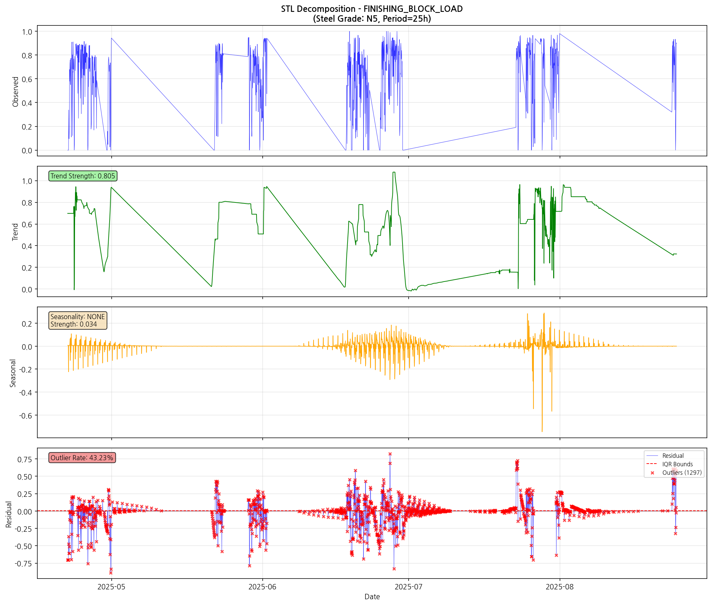

**STAND_9_LOAD** (이상치율: 43.07%, 계절성: 0.000)

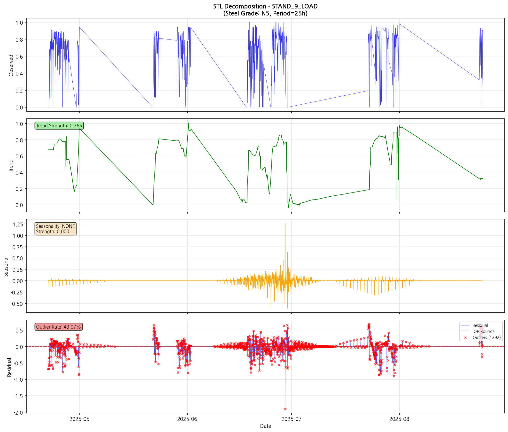

**STAND_4_LOAD** (이상치율: 41.87%, 계절성: 0.000)

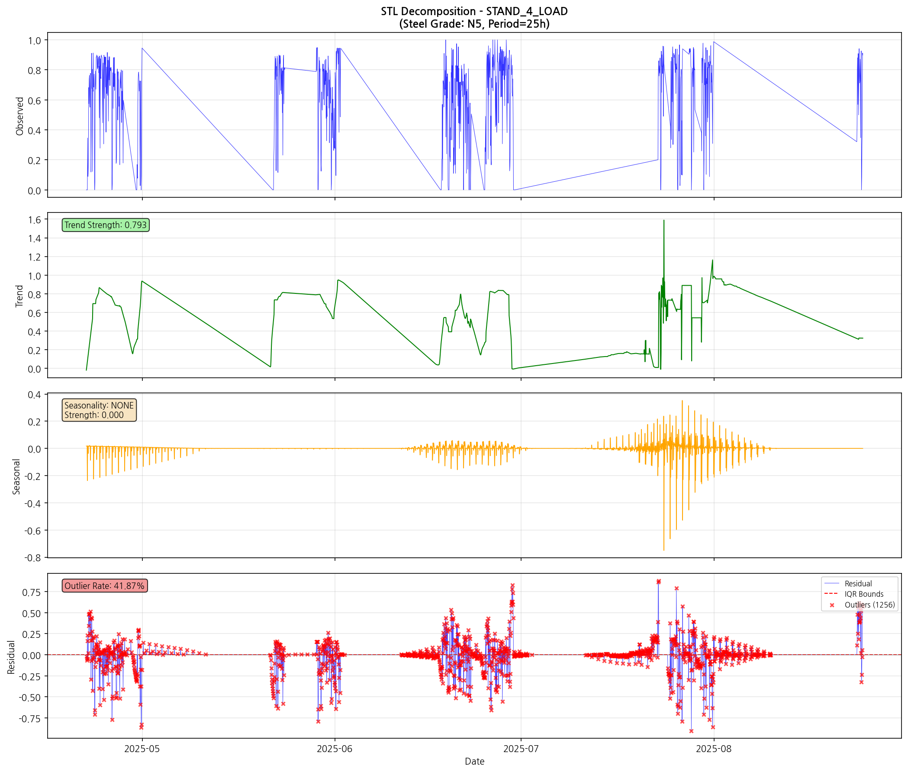

### 핀치롤 (08_Pinchroll)

- 분석 태그: 9개
- 평균 잔차 이상치율: 40.70%
- 평균 계절성 강도: 0.008

| 태그 | 이상치율 | 계절성 강도 | 추세 강도 |
|------|----------|-------------|-----------|
| PINCHROLL_2_ACTUAL_SPEED | 42.30% | 0.000 | 0.878 |
| PINCHROLL_3_ACTUAL_SPEED | 37.16% | 0.000 | 0.976 |
| PINCHROLL_4_ACTUAL_SPEED | 38.23% | 0.000 | 0.966 |
| PINCHROLL_2_ACTUAL_TORQUE | 43.57% | 0.013 | 0.754 |
| PINCHROLL_3_ACTUAL_TORQUE | 42.77% | 0.000 | 0.751 |
| PINCHROLL_4_ACTUAL_TORQUE | 40.17% | 0.016 | 0.687 |
| PINCHROLL_2_REFERENCE_TORQUE | 42.10% | 0.000 | 0.515 |
| PINCHROLL_3_REFERENCE_TORQUE | 35.29% | 0.040 | 0.932 |
| PINCHROLL_4_REFERENCE_TORQUE | 44.74% | 0.000 | 0.834 |

#### STL 분해 차트

**PINCHROLL_4_REFERENCE_TORQUE** (이상치율: 44.74%, 계절성: 0.000)

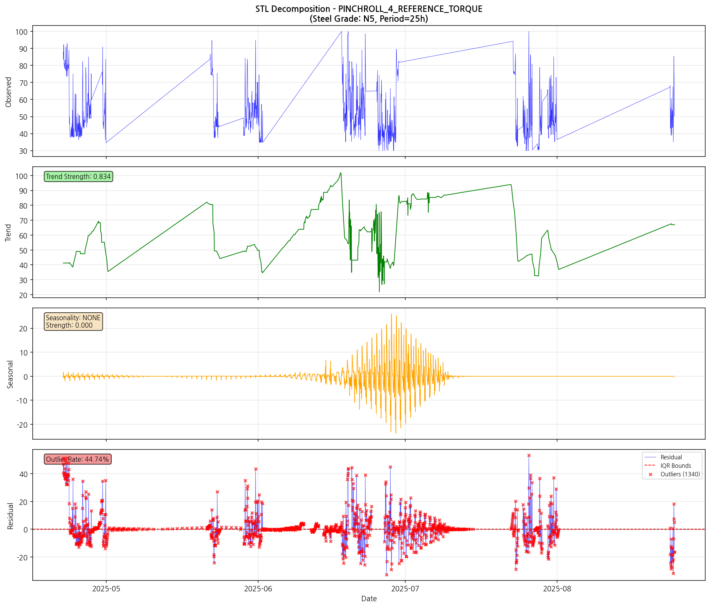

**PINCHROLL_2_ACTUAL_TORQUE** (이상치율: 43.57%, 계절성: 0.013)

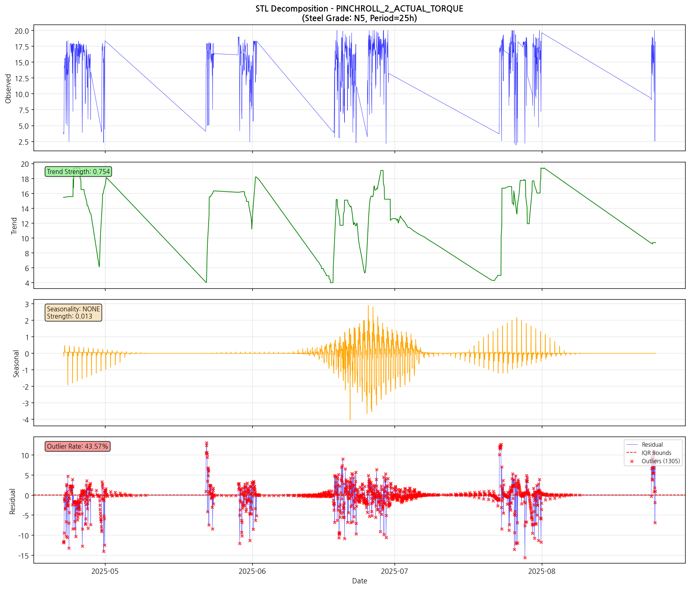

**PINCHROLL_3_ACTUAL_TORQUE** (이상치율: 42.77%, 계절성: 0.000)

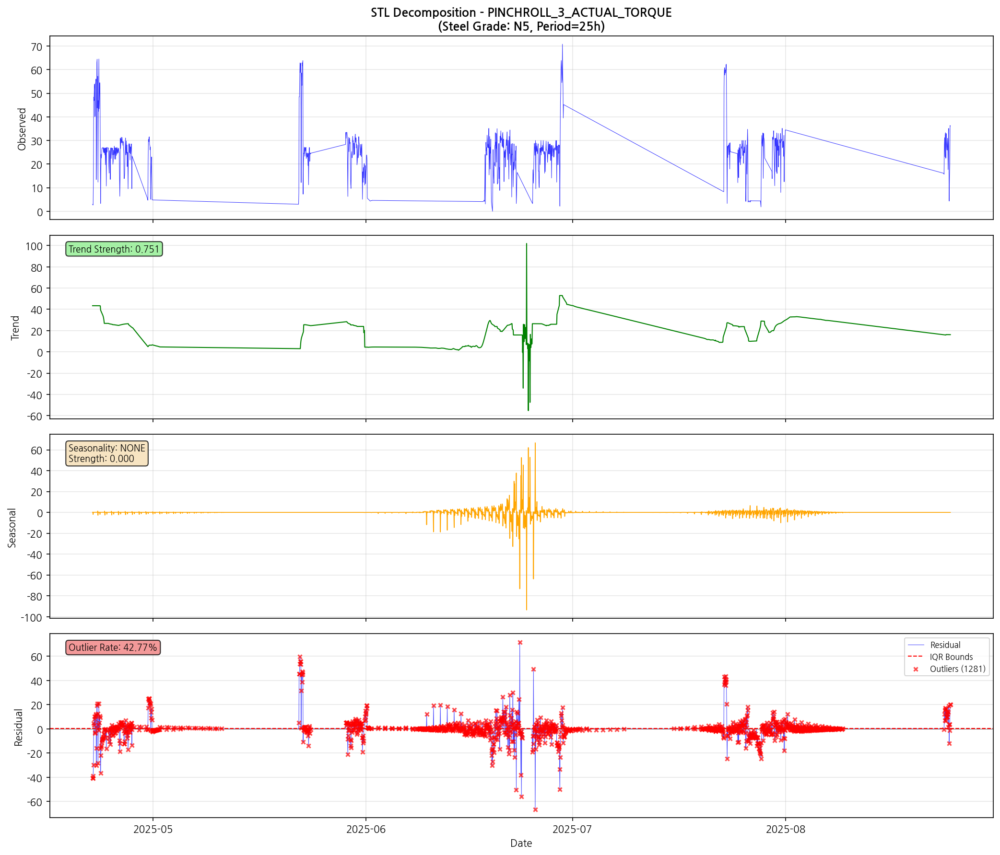

### PR 상세 토크 (09_PR_Detailed)

- 분석 태그: 6개
- 평균 잔차 이상치율: 40.38%
- 평균 계절성 강도: 0.002

| 태그 | 이상치율 | 계절성 강도 | 추세 강도 |
|------|----------|-------------|-----------|
| PR6L1_ACT_TORQUE | 34.89% | 0.000 | 0.951 |
| PR6L2_ACT_TORQUE | 39.00% | 0.000 | 0.940 |
| PR7L1_ACT_TORQUE | 38.50% | 0.000 | 0.925 |
| PR7L2_ACT_TORQUE | 44.91% | 0.000 | 0.920 |
| PR8L1_ACT_TORQUE | 41.80% | 0.010 | 0.875 |
| PR9L1_ACT_TORQUE | 43.17% | 0.000 | 0.776 |

#### STL 분해 차트

**PR7L2_ACT_TORQUE** (이상치율: 44.91%, 계절성: 0.000)

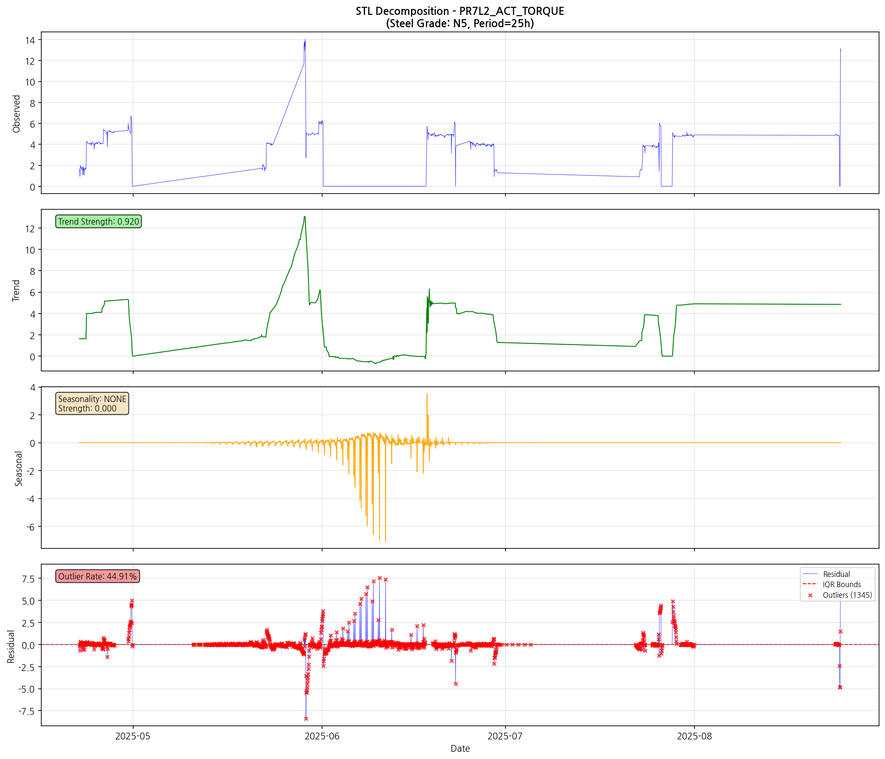

**PR9L1_ACT_TORQUE** (이상치율: 43.17%, 계절성: 0.000)

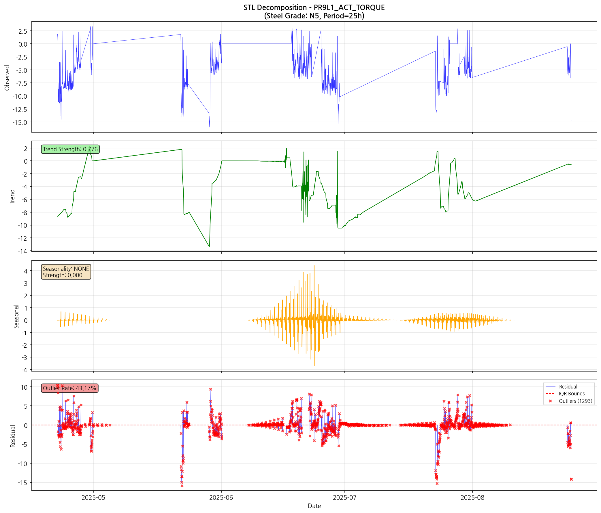

**PR8L1_ACT_TORQUE** (이상치율: 41.80%, 계절성: 0.010)

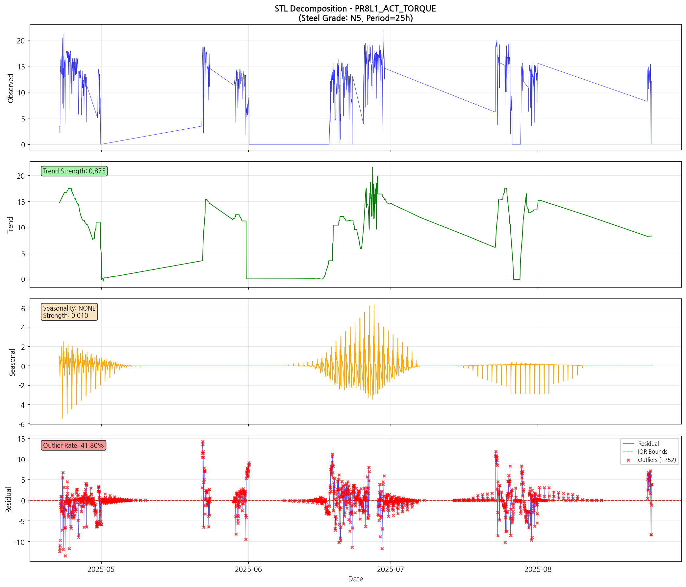

---

## 해석 가이드

### STL 분해 해석

1. **추세 (Trend)**
   - 장기적인 상승/하락 패턴
   - 설비 노화, 계절적 변화 등 반영
   - 추세 강도 높을수록 장기 변화가 뚜렷함

2. **계절성 (Seasonal)**
   - 주기적으로 반복되는 패턴 (24시간 기준)
   - 계절성 강도 ≥ 0.7: 강한 주기적 패턴
   - 계절성이 강한 태그는 STL 분석이 효과적

3. **잔차 (Residual)**
   - 추세와 계절성으로 설명되지 않는 변동
   - **순수한 이상치**를 포함
   - 잔차 기반 IQR로 "진짜" 이상치 탐지

### 계절성 강도 분류

| 분류 | 강도 범위 | 해석 |
|------|----------|------|
| Strong | ≥ 0.7 | 명확한 주기적 패턴, STL 매우 효과적 |
| Moderate | 0.4 ~ 0.7 | 적당한 주기적 패턴, STL 효과적 |
| Weak | 0.2 ~ 0.4 | 약한 주기적 패턴 |
| None | < 0.2 | 주기적 패턴 거의 없음 |

### Standard IQR vs STL Residual IQR

| 방법 | 장점 | 단점 |
|------|------|------|
| Standard IQR | 간단, 빠름 | 계절성에 영향받음 |
| STL Residual IQR | 계절성 제거, 순수 이상치 | 계산 복잡, 데이터 필요 |

**권장**: 계절성 강도 ≥ 0.4인 태그에는 STL Residual IQR 사용

---

## 메타데이터

| 항목 | 값 |
|------|-----|
| 분석 스크립트 | steel_grade_stl_analysis.py |
| 분석 기간 | 2025-03-01 ~ 2025-08-31 |
| 강종 | N5 |
| 계절 주기 | 25시간 |
| 생성일시 | 2026-02-03 20:42:45 |
| 총 분석 태그 | 79개 |

---

*본 보고서는 자동 생성되었습니다.*
