# 태그-불량 상관관계 분석 통합 보고서

> **분석 기간**: 2025-03-01 ~ 2025-08-31 (6개월)
> **분석 대상**: IBA 79개 태그 × 3종 불량률 (권취/중량/종합)
> **방법론**: 4가지 기법 앙상블 (M1 Spearman + M2 Mann-Whitney + M3 LightGBM + M4 Quantile)
> **산출일**: 2026-03-15

---

## Executive Summary

> **핵심 결론**: 79개 IBA 태그 중 불량과 가장 강하게 상관하는 태그는 **MAIN_GAS_FLOW**(가스 유량)이며,
> 4기법(M1 Spearman, M2 Mann-Whitney, M3 LightGBM, M4 Quantile) **전원 Top-2** 진입으로 유일한 ★★★★ 확정 태그.
>
> **가열로 영역(Cat01~04)이 Top-18 전체를 점유**하며, Cat04 보조설비(가스·압력·O₂)가 50%.
> 스탠드(Cat05~07)와 핀치롤(Cat08/09b)은 전체 합산(ALL)에서 비유의 — 강종별(N5/D5)에서만 일부 등장.
>
> 불량과 상관하는 것은 온도의 "수준(avg)"보다 **"변동성(IQR/std)"** — 가열로 온도 변동이 줄어드는 날에 불량 증가.

| 증거 등급 | 태그 | 비고 |
|:---------:|------|------|
| ★★★★ | MAIN_GAS_FLOW | **4기법 모두 Top-2** — 유일한 최고 등급 |
| ★★★ | SOAKING_BTM_Z1/Z2, MAIN_GAS_TEMP, INDIRECT_COOLING_WATER_FLOW | 3기법 Top-10 또는 M4 비영 |
| ★★ | FURNACE_EXIT_BILLET_TEMP, HEATING_BTM_Z1, HEATING_TOP_Z1 외 | 2기법 Top-10 |
| ★ | 나머지 7개 | 1기법 이하 |

> **권고**: MAIN_GAS_FLOW 하한 알람 + FURNACE_EXIT_BILLET_TEMP IQR 상한 알람을 **즉시 적용** 가능한 1차 조치로 권고.
> 균열대 하부 온도(SOAKING_BTM) 변동성 감소 패턴은 공정 메커니즘 추가 규명 후 알람화.

---

## 1. 데이터 현황

### 1.1 데이터 규모

| 항목 | 수치 | 비고 |
|------|:----:|------|
| IBA 총 레코드 | 264,433건 | 2025-03~08 |
| RUN 상태 레코드 | 130,182건 | 49.2% |
| RUN 유효 일수 | 148일 | |
| 불량 데이터 | 118건 (87일) | defect_selection_status |
| JOIN 성공률 | 87/148 = 58.8% | IBA × 불량 날짜 기준 |
| 분석 태그 | 79개 | 제외 9개 (ALL_ZEROS, LOW_VARIANCE) |
| 일별 통계량 | avg, std, min, max, IQR, CV | 태그당 6종 |

### 1.1a 카테고리별 태그 구성 및 필터 적용

#### 필터 프리셋: P4_PER_TAG (카테고리별 차등 적용)

| 카테고리 | 태그 수 | 적용 필터 | 필터 상세 | 필터 그룹 |
|---------|:------:|----------|----------|:---------:|
| Cat01 가열로상부온도 | 4 | SQL-only | `OPERATION_STATUS='RUN'` + `MILL_STATUS='RUN'` + `FURNACE_STATUS='HOT'` | sql_only |
| Cat02 가열로하부온도 | 4 | SQL-only | 〃 | sql_only |
| Cat03 가열로추출온도 | 1 | SQL-only | 〃 | sql_only |
| Cat04 가열로보조설비 | 9 | SQL-only | 〃 | sql_only |
| Cat05 스탠드토크 | 16 | SQL + roll_change | SQL 필터 + 롤교환 속도급변(>50%) 전후 10초 제거 | roll_change |
| Cat06 스탠드속도 | 15 | SQL + roll_change | 〃 | roll_change |
| Cat07 스탠드부하 | 15 | SQL + roll_change | 〃 | roll_change |
| Cat08 핀치롤 | 9 | SQL + roll_change + coiling | SQL + 롤교환 + 권취 가감속(변화율>5%) 제거 | coiling |
| Cat09 냉각수 | (Cat04 내 포함) | SQL-only | 〃 | sql_only |
| Cat09b PR상세 | 6 | SQL + roll_change + coiling | SQL + 롤교환 + 권취 가감속 제거 | coiling |
| **합계** | **79개** | | | |

> **실제 적용 결과**: 필터 그룹별 sql_only=18개, roll_change=46개, coiling=15개.
> 단, ALL 레이어에서는 M3 피처 선택(VIF/다중공선성 기반)으로 **18개 태그**가 최종 분석 대상으로 축소됨.
> N5/D5/D4/B5 레이어에서는 79개 전체 태그가 M1 분석에 사용됨.

#### 제외된 태그 9개

| 태그 | 제외 사유 |
|------|---------|
| ENTRY_MILL_PINCHROLL_ACTUAL_SPEED | ALL_ZEROS |
| ENTRY_MILL_PINCHROLL_REFERENCE_SPEED | ALL_ZEROS |
| EXIT_FURNACE_RT_SEC_1_ACTUAL_SPEED | LOW_VARIANCE |
| EXIT_FURNACE_RT_SEC_1_REFERENCE_SPEED | LOW_VARIANCE |
| EXIT_FURNACE_RT_SEC_2_ACTUAL_SPEED | LOW_VARIANCE |
| EXIT_FURNACE_RT_SEC_2_REFERENCE_SPEED | LOW_VARIANCE |
| DR01BFZI1_* | CONSTANT |
| DR01BFZI2_* | CONSTANT |
| Y165 | ALL_ZEROS |

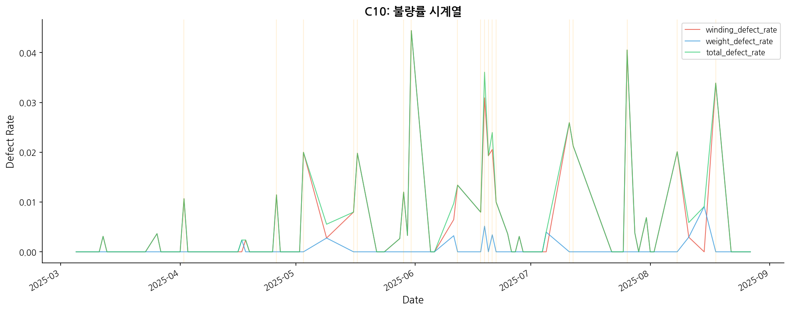

### 1.2 IBA ↔ 불량 데이터 매핑 구조

#### 데이터 소스 3개와 연결 관계

```
┌──────────────────────────────────────────┐
│ ClickHouse: iba_timeseries_unified_alter │  ← IBA 태그 초 단위 원본
│  - 264,433건 (2025-03~08)                │
│  - 79개 태그, 초 단위 센서 값             │
│  - ⚠️ steel_grade, size 컬럼 없음         │
├──────────────────────────────────────────┤
│ ClickHouse VIEW: v_iba_by_steel_grade    │  ← 강종/규격 필터용 JOIN VIEW
│  - iba_timeseries + memo_prod_result     │
│  - toDate(BASE_TIME) = toDate(           │
│      production_datetime) 기준 JOIN      │
│  - steel_grade, size 컬럼 제공            │
├──────────────────────────────────────────┤
│ MariaDB(CH MySQL엔진 경유):              │
│   defect_selection_status                │  ← 일별 불량 집계
│  - 118건 (2025-03~08)                    │
│  - 키: production_date + steel_grade     │
│    + size (하루에 강종/규격별 복수 행)     │
│  - 불량: winding/weight/total quantity   │
└──────────────────────────────────────────┘
```

#### JOIN 흐름 (Step 1-1 ~ 1-3)

```
[Step 1-1] IBA 일별 통계 집계
  iba_timeseries_unified_alter (ALL)
  또는 v_iba_by_steel_grade (강종별)
    → GROUP BY toDate(BASE_TIME)
    → 태그별 avg, std, min, max, q25, q75 산출
    → 파생: iqr = q75 - q25, cv = std / avg
    → 결과: DataFrame(date, {tag}_avg, {tag}_std, ... )

[Step 1-2] 불량률 일별 집계
  defect_selection_status
    → GROUP BY production_date [, steel_grade]
    → SUM(winding_defect_quantity) / SUM(production_quantity)
    → 결과: DataFrame(prod_date → date, winding_defect_rate, weight_defect_rate, total_defect_rate)

[Step 1-3] 날짜 기준 INNER JOIN
  iba_daily.merge(defect_daily, on='date', how='inner')
    → IBA 날짜와 불량 날짜가 모두 존재하는 날만 사용
    → ALL: 148일 ∩ 87일 = 87일 (IBA는 있지만 불량 데이터 없는 날 61일 제외)
```

#### 불량률 계산 방식

| 불량 유형 | 계산식 | DB 저장값 유무 | 비고 |
|----------|--------|:------------:|------|
| `winding_defect_rate` | `SUM(winding_defect_quantity) / SUM(production_quantity)` | ✅ 저장값 있음 | **계산값 사용** (저장값과 미세 차이 가능) |
| `weight_defect_rate` | `SUM(weight_defect_quantity) / SUM(production_quantity)` | ✅ 저장값 있음 | 〃 |
| `total_defect_rate` | `SUM(total_defect_quantity) / SUM(production_quantity)` | ❌ 저장값 없음 | **파생값** — DB에 컬럼 미존재 |

> **저장값 vs 계산값 차이**: DB에 `DECIMAL(5,4)`로 저장된 `winding_defect_rate`와 `quantity/quantity`로 재계산한 값은
> 반올림 차이(예: 0.0039 vs 0.0036)가 발생할 수 있음. 본 분석은 **계산값(quantity 기반)**을 일관 사용.
>
> **total_defect_rate는 파생값**: DB에 `total_defect_rate` 컬럼이 없고,
> `total_defect_quantity / production_quantity`로 산출. `total_defect_quantity = winding + weight`.

#### 강종별 매핑 시 주의사항

| 상황 | 처리 방식 |
|------|----------|
| 하루에 복수 강종 생산 | `defect_selection_status`에 강종별 별도 행 → `GROUP BY production_date` 시 합산 (ALL), `WHERE steel_grade IN (...)` 시 해당 강종만 |
| 하루에 복수 규격 생산 | 같은 강종 내 규격별 별도 행 → 규격 필터 추가 가능 (현재 데이터 부족으로 Layer 2 스킵) |
| IBA에는 있지만 불량 없는 날 | `INNER JOIN`으로 제외 — IBA 148일 중 61일이 불량 미기록일 |
| 불량은 있지만 IBA 없는 날 | `INNER JOIN`으로 제외 — 불량 87일은 모두 IBA와 매칭 (118일 중 31일은 기간 외 또는 IBA 미가동) |
| VIEW의 `toDate()` JOIN 중복 | 하루에 복수 번들 생산 시 IBA 레코드가 복수 강종에 중복 매핑될 수 있음. **일별 GROUP BY 집계에서는 무영향** (동일 IBA 값이 중복되어도 avg/std 결과 동일) |

#### 강종별 IBA 데이터 소스 차이

| Layer | IBA 소스 | 불량 소스 | JOIN 키 | 특이사항 |
|-------|---------|---------|---------|---------|
| ALL | `iba_timeseries_unified_alter` (직접) | `defect_selection_status` (전체 합산) | `toDate(BASE_TIME)` = `production_date` | 강종 무관, 모든 IBA 레코드 사용 |
| N5 | `v_iba_by_steel_grade` (`steel_grade='500N'`) | `WHERE steel_grade='500N'` | 〃 | VIEW가 `memo_prod_result` JOIN으로 강종 필터 |
| D5 | VIEW (`steel_grade IN ('SD500','SD500S')`) | `WHERE steel_grade IN (...)` | 〃 | SD500S는 SD500의 변형 규격 |
| D4/B5 | VIEW (`steel_grade='SD400'`/`'B500B'`) | 해당 강종 | 〃 | |

### 1.3 강종별 데이터 충분성

#### 강종 코드 매핑 (IBA ↔ MariaDB)

| IBA 강종 | MariaDB steel_grade | 불량 필터 조건 |
|:--------:|:------------------:|--------------|
| ALL | (필터 없음) | 전 강종 합산 |
| N5 | `500N` | `WHERE steel_grade = '500N'` |
| D5 | `SD500`, `SD500S` | `WHERE steel_grade IN ('SD500','SD500S')` |
| D4 | `SD400` | `WHERE steel_grade = 'SD400'` |
| B5 | `B500B` | `WHERE steel_grade = 'B500B'` |

#### 데이터 충분성 및 기법 적용 매트릭스

| Layer | 강종 | IBA 일수 | 불량 일수 | JOIN 일수 | M1 | M2 | M3 | M4 | M5/M6 | 비고 |
|-------|:----:|:-------:|:--------:|:--------:|:--:|:--:|:--:|:--:|:-----:|------|
| ALL | 전체 | 148 | 87 | **87** | ✅ 9건 유의 | ✅ 2건 유의 | ✅ | ✅ | ❌ <100일 | 18태그(VIF) |
| N5 | 500N | 30 | 45 | **29** | ✅ 0건 유의 | ✅ (6/23) | ❌ <30 | ❌ | ❌ | 79태그 전체 |
| D5 | SD500 | 14 | 21 | **13** | ✅ 0건 유의 | ❌ <20일 | ❌ | ❌ | ❌ | 79태그 전체 |
| D4 | SD400 | 8 | 17 | **7** | viz_only | - | - | - | - | |
| B5 | B500B | 5 | 19 | **5** | viz_only | - | - | - | - | |

#### 규격별 분석 (Layer 2)

> **N5, D5 모두 규격별 데이터 없음** — `memo_prod_result` 테이블에서 규격(size) 매핑 후
> 상위 3개 규격을 추출하려 했으나, 해당 기간 내 규격별 충분한 일수가 확보되지 않아 **Layer 2 스킵**.

#### 앙상블 가중치 (강종별 차등)

| Layer | 사용 기법 | 가중치 구성 |
|-------|----------|-----------|
| ALL | M1 + M2 + M3 + M4 | M1=0.294, M2=0.235, M3=0.294, M4=0.176 |
| N5 | M1 + M2 | M1=0.55, M2=0.45 |
| D5 | M1 only | M1=1.00 |
| D4/B5 | (앙상블 미실행) | M1 viz_only |

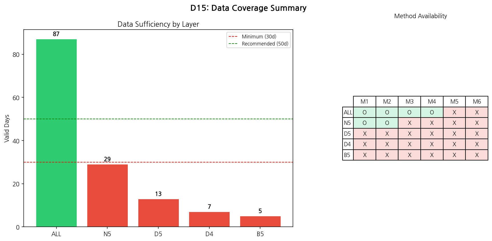

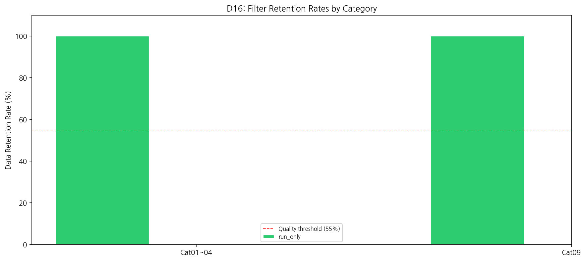

### 1.4 고불량일 정의 및 불량 데이터 특성

#### 불량 데이터 특성

- `defect_selection_status` 테이블은 **일별 + 강종별 + 규격별** 행으로 구성
- 하루 최대 3행 (강종/규격 조합별 1행)
- ALL 합산 시: `GROUP BY production_date` → `SUM(quantity)` / `SUM(production_quantity)` = **하루 전체 불량률**
- 강종별: `WHERE steel_grade = ...` 후 동일 합산

#### 고불량일 TOP-5 (ALL 합산 기준)

| 날짜 | 생산 수량 | 권취불량 | 중량불량 | 종합불량 | 종합불량률 |
|------|:--------:|:-------:|:-------:|:-------:|:--------:|
| 2025-05-31 | 180 | 8 | 0 | 8 | 4.44% |
| 2025-06-19 | 194 | 6 | 1 | 7 | 3.61% |
| 2025-07-11 | 347 | 9 | 0 | 9 | 2.59% |
| 2025-06-21 | 292 | 6 | 1 | 7 | 2.40% |
| 2025-08-08 | 348 | 7 | 0 | 7 | 2.01% |

> 권취불량(winding)이 주도적이며, 중량불량(weight)은 대부분 0. 이로 인해 `weight_defect_rate` Q80 = 0.

#### 고불량일 이진 라벨 설정

| 불량 유형 | 임계값 | 적용 기준 | 비고 |
|----------|--------|----------|------|
| `high_winding_defect` | Q80(상위 20%) | `winding_defect_rate >= Q80` | Q80 > 0이면 정상 적용 |
| `high_weight_defect` | **>0** (대체) | `weight_defect_rate > 0` | Q80 = 0이므로 "불량 1건이라도 있는 날"로 대체 |
| `any_high_defect` | OR 결합 | 둘 중 하나라도 해당 | **고불량 24일, 정상 63일** (27.6% : 72.4%) |

> `weight_defect_rate`는 87일 중 대부분이 0이어서 Q80 = 0. `>= 0`을 적용하면 모든 날이 고불량으로 분류되므로,
> **"> 0" 기준**(중량 불량이 1건이라도 있는 날)으로 대체. 이는 M2(Mann-Whitney) 그룹 분리를 위한 실용적 조치.

### 1.5 분석 대상 전체 태그 목록 (79개)

79개 태그를 **3분류**(데이터 수집 경로 기반)로 구분하고, ALL 앙상블 Top-18에 포함된 태그에는 순위와 증거 등급을 표시한다.

#### 증거 등급 판정 기준

| 등급 | 조건 (M1/M2/M3 각 ≤10위, M4는 비영 계수 존재 여부) | 해당 태그 수 |
|:----:|--------------------------------------------------|:----------:|
| ★★★★ | M1≤10 AND M2≤10 AND M3≤10 AND M4 비영 | 1 |
| ★★★ | 위 4조건 중 3개 충족 | 4 |
| ★★ | 위 4조건 중 2개 충족 | 6 |
| ★ | 위 4조건 중 1개 이하 | 7 |

> M4(Quantile Q90)는 18개 태그 중 **2개만 비영 계수**(MAIN_GAS_FLOW, INDIRECT_COOLING_WATER_FLOW).
> 나머지 16개는 계수=0으로 공동 3위 처리. M4의 판별력이 극히 제한적이므로 "비영 계수 존재"를 4번째 기준으로 사용.

#### 분류 1: 현업/가열로 — Cat01~04, Cat09 (18태그)

> **ALL 앙상블 Top-18 전원 이 분류에서 배출** — 불량과 가장 강한 상관을 보이는 영역.

| # | 세부 카테고리 | 태그 | ALL 순위 | 증거 등급 |
|:-:|:----------:|------|:--------:|:---------:|
| 1 | Cat01 상부온도 | HEATING_TOP_ZONE_NO_1_TEMPERATURE_ROOF | 8 | ★★ |
| 2 | Cat01 상부온도 | HEATING_TOP_ZONE_NO_2_TEMPERATURE_ROOF | 14 | ★ |
| 3 | Cat01 상부온도 | SOAKING_TOP_ZONE_NO_1_TEMPERATURE_ROOF | 10 | ★★ |
| 4 | Cat01 상부온도 | SOAKING_TOP_ZONE_NO_2_TEMPERATURE_ROOF | 13 | ★ |
| 5 | Cat02 하부온도 | HEATING_BOTTOM_ZONE_NO_1_TEMPERATURE_OPP_SIDE | 6 | ★★ |
| 6 | Cat02 하부온도 | HEATING_BOTTOM_ZONE_NO_2_TEMPERATURE_MILL_SIDE | 15 | ★ |
| 7 | Cat02 하부온도 | **SOAKING_BOTTOM_ZONE_NO_1_TEMPERATURE_OPP_SIDE** | **3** | **★★★** |
| 8 | Cat02 하부온도 | **SOAKING_BOTTOM_ZONE_NO_2_TEMPERATURE_MILL_SIDE** | **2** | **★★★** |
| 9 | Cat03 추출온도 | FURNACE_EXIT_DISCHARGE_BILLET_TEMPERATURE | 4 | ★★ |
| 10 | Cat04 보조설비 | **MAIN_GAS_FLOW** | **1** | **★★★★** |
| 11 | Cat04 보조설비 | **MAIN_GAS_TEMPERATURE** | **5** | **★★★** |
| 12 | Cat04 보조설비 | FURNACE_PRESSURE | 9 | ★★ |
| 13 | Cat04 보조설비 | MAIN_GAS_PRESSURE | 17 | ★ |
| 14 | Cat04 보조설비 | MAIN_COMBUSTION_AIR_PRESSURE | 16 | ★ |
| 15 | Cat04 보조설비 | COMBUSTION_AIR_TEMPERATURE | 12 | ★ |
| 16 | Cat04 보조설비 | FURNACE_O2_ANALYZER | 18 | ★ |
| 17 | Cat09 냉각수 | **INDIRECT_COOLING_WATER_FLOW** | **7** | **★★★** |
| 18 | Cat09 냉각수 | INDIRECT_WATER_MAIN_TEMPERATURE | 11 | ★ |

#### 분류 2: PLC/스탠드 — Cat05~07 (46태그)

> ALL 앙상블에서 **전량 비유의** (VIF 다중공선성으로 피처 선택 단계에서 제외).
> 단, N5/D5 강종별 분석에서 일부 태그가 Top-20 진입 — 강종 특이적 효과.

| # | 세부 카테고리 | 태그 | ALL 순위 | 강종별 비고 |
|:-:|:----------:|------|:--------:|-----------|
| 1 | Cat05 토크 | FINISHING_BLOCK_MASTER_ACTUAL_TORQUE | - | N5 #3, D5 #9 |
| 2 | Cat05 토크 | FINISHING_BLOCK_SLAVE_ACTUAL_TORQUE | - | N5 #4, D5 #10 |
| 3~16 | Cat05 토크 | STAND_{1~14}_ACTUAL_TORQUE | - | |
| 17 | Cat06 속도 | FINISHING_BLOCK_ACTUAL_SPEED | - | |
| 18~31 | Cat06 속도 | STAND_{1~14}_ACTUAL_SPEED | - | |
| 32 | Cat07 부하 | FINISHING_BLOCK_LOAD | - | |
| 33~46 | Cat07 부하 | STAND_{1~14}_LOAD | - | |

> Cat05~07은 스탠드 14기(#1~#14) × 3종(토크/속도/부하) + 피니싱블록 3종 = **46태그**.
> 스탠드 간 상관 |r|>0.95로 다변량 모델(M3/M4)에서 중복 제거됨.

#### 분류 3: AI/핀치롤 — Cat08, Cat09b (15태그)

> ALL 앙상블에서 **전량 비유의**. N5에서 PINCHROLL_4_ACTUAL_SPEED가 #5로 유일한 상위 진입.

| # | 세부 카테고리 | 태그 | ALL 순위 | 강종별 비고 |
|:-:|:----------:|------|:--------:|-----------|
| 1 | Cat08 핀치롤 | PINCHROLL_2_ACTUAL_SPEED | - | |
| 2 | Cat08 핀치롤 | PINCHROLL_2_ACTUAL_TORQUE | - | |
| 3 | Cat08 핀치롤 | PINCHROLL_2_REFERENCE_TORQUE | - | |
| 4 | Cat08 핀치롤 | PINCHROLL_3_ACTUAL_SPEED | - | |
| 5 | Cat08 핀치롤 | PINCHROLL_3_ACTUAL_TORQUE | - | |
| 6 | Cat08 핀치롤 | PINCHROLL_3_REFERENCE_TORQUE | - | |
| 7 | Cat08 핀치롤 | PINCHROLL_4_ACTUAL_SPEED | - | N5 #5, D5 #15 |
| 8 | Cat08 핀치롤 | PINCHROLL_4_ACTUAL_TORQUE | - | |
| 9 | Cat08 핀치롤 | PINCHROLL_4_REFERENCE_TORQUE | - | |
| 10 | Cat09b PR상세 | PR6L1_ACT_TORQUE | - | |
| 11 | Cat09b PR상세 | PR6L2_ACT_TORQUE | - | |
| 12 | Cat09b PR상세 | PR7L1_ACT_TORQUE | - | |
| 13 | Cat09b PR상세 | PR7L2_ACT_TORQUE | - | |
| 14 | Cat09b PR상세 | PR8L1_ACT_TORQUE | - | |
| 15 | Cat09b PR상세 | PR9L1_ACT_TORQUE | - | |

#### 분류 요약

| 분류 | 카테고리 | 태그 수 | ALL Top-18 진입 | 비율 |
|:----:|---------|:------:|:--------------:|:----:|
| 현업/가열로 | Cat01~04, Cat09 | 18 | **18 (전원)** | 100% |
| PLC/스탠드 | Cat05~07 | 46 | 0 | 0% |
| AI/핀치롤 | Cat08, Cat09b | 15 | 0 | 0% |
| **합계** | | **79** | **18** | 22.8% |


---

## 2. 기법별 분석 결과 상세

### 2.1 M1: Spearman 순위 상관

**개요**: 태그 일별 통계 × 불량률 조합의 Spearman ρ 계산.

#### M1 적용 조건

| 항목 | ALL | N5 | D5 | D4 | B5 |
|------|-----|----|----|----|----|
| 데이터 | 87일 × 18태그 | 29일 × 79태그 | 13일 × 79태그 | 7일 × 79태그 | 5일 × 79태그 |
| 통계량 | avg, std, max, iqr, cv | 〃 | 〃 | 〃 | 〃 |
| 불량 유형 | winding, weight, total (3종) | 〃 | 〃 | 〃 | 〃 |
| 조합 수 | 18×5×3 = **270건** | 79×5×3 = **1,185건** | 1,185건 | 1,185건 | 1,185건 |
| Bonferroni α | 0.05/270 = 0.000185 | 0.05/1185 = 0.000042 | 〃 | - | - |
| 유의 결과 | **9건** | 0건 | 0건 | viz_only | viz_only |
| 필터 | sql_only (RUN+HOT) | VIEW 강종 필터 | 〃 | 〃 | 〃 |
| IBA 소스 | `iba_timeseries_unified_alter` | `v_iba_by_steel_grade` (steel_grade='500N') | VIEW (SD500,SD500S) | VIEW (SD400) | VIEW (B500B) |

> ALL 레이어는 M3 피처 선택으로 축소된 18태그만 사용, N5~B5는 79태그 전체 대상.
> N5~B5에서 유의 0건인 이유: Bonferroni 보정이 1,185건으로 매우 보수적 + 소량 데이터.

**유의한 상관 9건** (ALL, Bonferroni 보정 후 p < 0.05):

| 순위 | 태그 | 통계량 | 불량 유형 | ρ | 보정 p-value | 해석 |
|:----:|------|:------:|----------|:---:|:----------:|------|
| 1 | SOAKING_BOTTOM_ZONE_NO_1_TEMPERATURE_OPP_SIDE | iqr | total | **-0.449** | 0.0035 | 균열대 하부 온도 IQR ↓ → 불량 ↑ |
| 2 | MAIN_GAS_FLOW | avg | total | **-0.434** | 0.0071 | 가스 유량 ↓ → 불량 ↑ |
| 3 | SOAKING_BOTTOM_ZONE_NO_1_TEMPERATURE_OPP_SIDE | iqr | winding | **-0.428** | 0.0098 | 균열대 하부 IQR ↓ → 권취불량 ↑ |
| 4 | FURNACE_EXIT_DISCHARGE_BILLET_TEMPERATURE | iqr | total | **+0.424** | 0.0113 | 추출 빌렛 온도 IQR ↑ → 불량 ↑ |
| 5 | SOAKING_BOTTOM_ZONE_NO_2_TEMPERATURE_MILL_SIDE | iqr | total | **-0.413** | 0.0189 | 균열대 2존 IQR ↓ → 불량 ↑ |
| 6 | MAIN_GAS_FLOW | avg | winding | **-0.405** | 0.0274 | 가스 유량 ↓ → 권취불량 ↑ |
| 7 | SOAKING_BOTTOM_ZONE_NO_1_TEMPERATURE_OPP_SIDE | cv | total | **-0.403** | 0.0288 | 변동계수 ↓ → 불량 ↑ |
| 8 | SOAKING_BOTTOM_ZONE_NO_1_TEMPERATURE_OPP_SIDE | std | total | **-0.397** | 0.0375 | 표준편차 ↓ → 불량 ↑ |
| 9 | SOAKING_BOTTOM_ZONE_NO_2_TEMPERATURE_MILL_SIDE | iqr | winding | **-0.394** | 0.0437 | 균열대 2존 IQR ↓ → 권취불량 ↑ |

**핵심 발견**:
- **가열로 관련 태그가 9건 전부** 차지 — 스탠드, 핀치롤, 냉각수 태그는 유의 수준 미달
- **IQR/std/cv 통계량** 주도: 평균(avg) 수준보다 **변동성(variability)**이 불량과 더 강하게 연관
- **음의 상관 8/9건**: 대부분 "변동성 감소 → 불량 증가" 패턴 — 가열로 온도 변동이 줄어드는 날에 불량 증가 (온도 균일성이 오히려 문제 가능성)
- 유일한 양의 상관: 추출 빌렛 온도 IQR ↑ → 불량 ↑ (추출 시점 온도 편차가 클수록 불량)


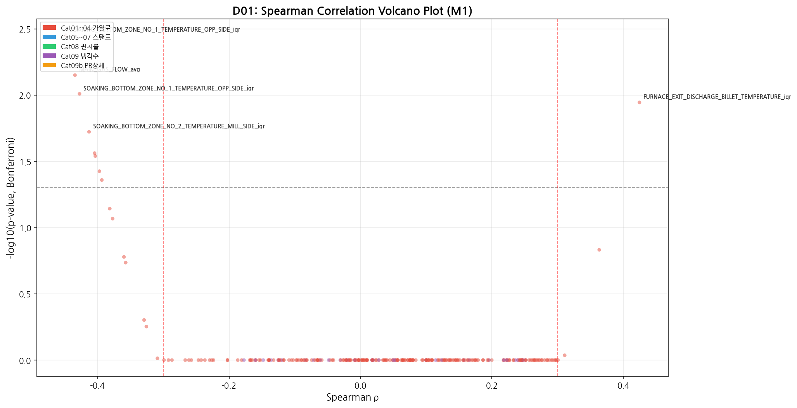

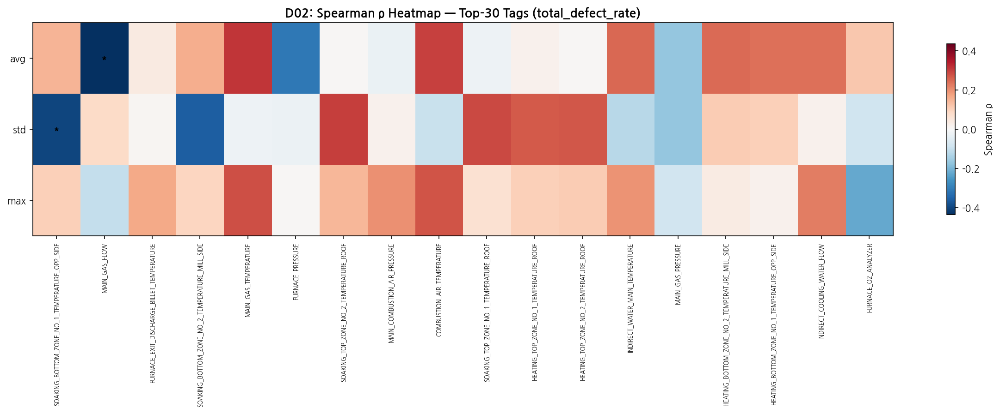

---

### 2.2 M2: Mann-Whitney U + Cohen's d

**개요**: 고불량일 vs 정상일 간 태그 통계량 분포 차이.

#### M2 적용 조건

| 항목 | ALL | N5 | D5 | D4/B5 |
|------|-----|----|----|-------|
| 데이터 | 87일 × 18태그 | 29일 × 79태그 | 13일 | - |
| 고불량일 정의 | winding Q80 또는 weight >0 | 〃 (강종 내) | - | - |
| 고불량/정상 | **24일 / 63일** | **6일 / 23일** | 미실행(<20일) | viz_only |
| 통계량 | avg, cv, iqr, max, std (5종) | 〃 | - | - |
| 조합 수 | 18×5 = **90건** | 79×5 = **395건** | - | - |
| Bonferroni α | 0.05/90 = 0.000556 | 0.05/395 = 0.000127 | - | - |
| 유의 결과 | **2건** | 0건 | - | - |
| 필터 | sql_only | VIEW 강종 필터 | - | - |

> D5(13일)는 고불량/정상 그룹 분리 시 각 그룹 최소 3건 미달 가능성으로 미실행.

**Top-10 (Cohen's d 기준, ALL)**:

| 순위 | 태그 | 통계량 | Cohen's d | 방향 | 유의 | 해석 |
|:----:|------|:------:|:---------:|------|:----:|------|
| 1 | FURNACE_EXIT_DISCHARGE_BILLET_TEMPERATURE | iqr | **0.994** | higher | ✅ | 고불량일에 추출온도 편차 **큰** |
| 2 | MAIN_GAS_FLOW | avg | **0.946** | lower | ✅ | 고불량일에 가스유량 **낮은** |
| 3 | SOAKING_BOTTOM_ZONE_NO_1_TEMP_OPP_SIDE | iqr | 0.871 | lower | ❌ | 고불량일에 균열대 온도 IQR **작은** |
| 4 | SOAKING_BOTTOM_ZONE_NO_2_TEMP_MILL_SIDE | iqr | 0.835 | lower | ❌ | 균열대 2존 IQR **작은** |
| 5 | MAIN_GAS_FLOW | cv | 0.827 | higher | ❌ | 고불량일에 가스유량 변동계수 **큰** |
| 6 | INDIRECT_COOLING_WATER_FLOW | avg | 0.731 | higher | ❌ | 고불량일에 냉각수 유량 **높은** |
| 7 | SOAKING_BOTTOM_ZONE_NO_1_TEMP_OPP_SIDE | cv | 0.724 | lower | ❌ | 균열대 변동계수 낮음 |
| 8 | SOAKING_BOTTOM_ZONE_NO_2_TEMP_MILL_SIDE | cv | 0.716 | lower | ❌ | 균열대 2존 변동계수 낮음 |
| 9 | SOAKING_BOTTOM_ZONE_NO_1_TEMP_OPP_SIDE | std | 0.707 | lower | ❌ | 균열대 표준편차 낮음 |
| 10 | SOAKING_BOTTOM_ZONE_NO_2_TEMP_MILL_SIDE | std | 0.698 | lower | ❌ | 균열대 2존 표준편차 낮음 |

**핵심 발견**:
- **Bonferroni 유의 2건**: 추출 빌렛 온도 IQR(d=0.99), 가스 유량 avg(d=0.95) → **확정 알람 태그**
- **큰 효과(|d|≥0.80) 5건**: 모두 가열로 관련
- M1과의 교차 확인: M1 Top-3과 M2 Top-3이 동일 태그 → **앙상블 신뢰도 높음**
- INDIRECT_COOLING_WATER_FLOW(냉각수)가 6위로 유일한 비가열로 태그 진입

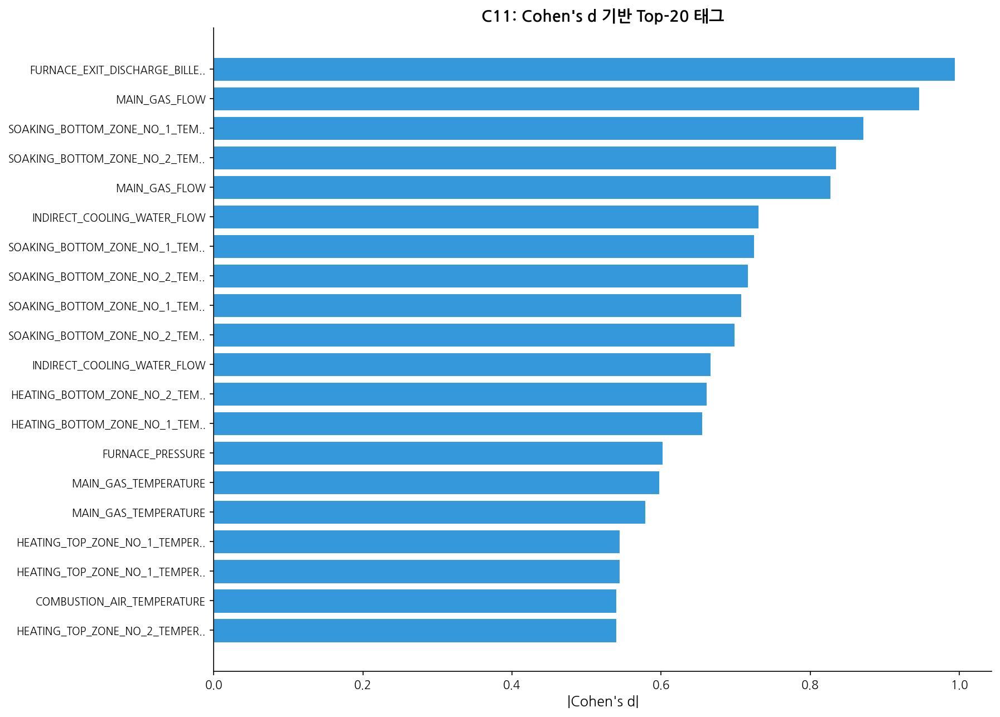

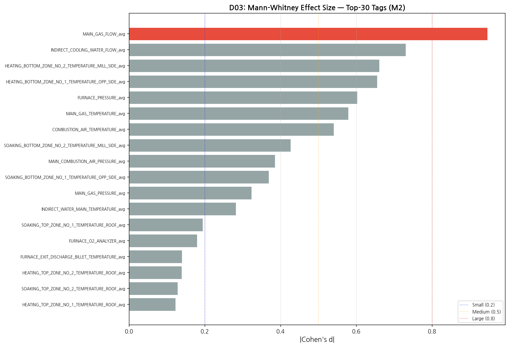

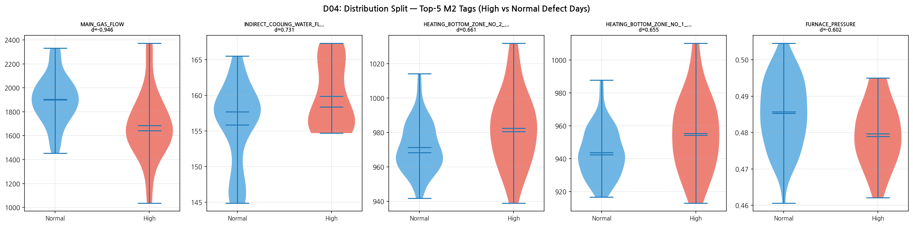


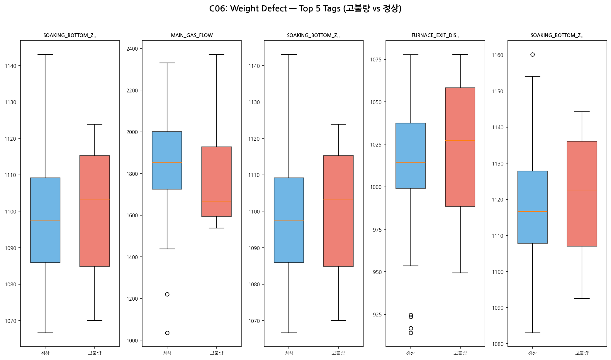

---

### 2.3 M3: LightGBM Feature Importance

**개요**: 다수 태그를 동시 고려하여 불량률 예측 모델의 Feature Importance 순위 도출.

#### M3 적용 조건

| 항목 | ALL | N5 | D5/D4/B5 |
|------|-----|----|----------|
| 데이터 | **87행 × 18피처** | 29행 (미실행) | 미실행 |
| 타겟 | `total_defect_rate` | - | - |
| 피처 통계량 | avg (태그당 1개) | - | - |
| 피처 선택 | VIF/분산 기반 79→**18개** | - | - |
| 모델 | LightGBM (max_depth=4, num_leaves=16, n_est=200) | - | - |
| 검증 | LOO-CV (87 folds) | - | - |
| 필터 | sql_only (18태그 모두 Cat01~04, Cat09) | - | - |
| 미실행 사유 | - | 29행 < 최소 30행 | 데이터 부족 |

> M3 피처 선택에서 Cat05~08(스탠드/핀치롤/PR) 46+15=61개 태그가 **VIF 다중공선성 기반으로 제거**되어
> 실질적으로 가열로+냉각수 18개 태그만 피처로 사용됨. 이는 스탠드 14개 속도/토크/부하 태그 간
> 상호 상관이 매우 높아(|r|>0.95) 다변량 모델에서 중복 피처로 판정된 결과.

**LOO-CV 성능**: R² = **-0.109**, RMSE = 0.0102, MAE = 0.0066

> ⚠️ R² < 0 → 모델이 평균 예측보다 나쁨. 이는 87건의 소량 데이터에서 예상되는 결과이며,
> Feature Importance는 여전히 **상대적 기여도 순위**로서 유효.
> 절대적 예측력은 약하지만, "어떤 태그가 다른 태그보다 더 중요한가"의 순위 정보는 신뢰 가능.

**Top-10 Feature Importance (gain 기반)**:

| 순위 | 피처 | Gain FI | Split FI | 카테고리 |
|:----:|------|:-------:|:--------:|---------|
| 1 | MAIN_GAS_FLOW_avg | **38.69** | 127 | Cat04 가열로보조설비 |
| 2 | INDIRECT_WATER_MAIN_TEMPERATURE_avg | 14.37 | 76 | Cat04 가열로보조설비 |
| 3 | INDIRECT_COOLING_WATER_FLOW_avg | 8.27 | 52 | Cat09 냉각수 |
| 4 | HEATING_BOTTOM_ZONE_NO_1_TEMPERATURE_OPP_SIDE_avg | 7.03 | 41 | Cat02 가열로하부온도 |
| 5 | HEATING_TOP_ZONE_NO_1_TEMPERATURE_ROOF_avg | 6.52 | 38 | Cat01 가열로상부온도 |
| 6 | SOAKING_BOTTOM_ZONE_NO_2_TEMPERATURE_MILL_SIDE_avg | 3.78 | 33 | Cat02 가열로하부온도 |
| 7 | MAIN_GAS_PRESSURE_avg | 3.67 | 29 | Cat04 가열로보조설비 |
| 8 | MAIN_GAS_TEMPERATURE_avg | 3.46 | 27 | Cat04 가열로보조설비 |
| 9 | SOAKING_TOP_ZONE_NO_1_TEMPERATURE_ROOF_avg | 3.25 | 25 | Cat01 가열로상부온도 |
| 10 | SOAKING_BOTTOM_ZONE_NO_1_TEMPERATURE_OPP_SIDE_avg | 2.21 | 22 | Cat02 가열로하부온도 |

**핵심 발견**:
- **MAIN_GAS_FLOW가 압도적 1위** (FI=38.69, 전체의 약 38%) — M1/M2와 일치하는 가장 강건한 핵심 태그
- **avg 통계량** 주도: M3는 M1(IQR/std 위주)과 다르게 평균값이 예측에 더 기여 → 다변량 모델에서는 수준(level)이 더 중요
- **냉각수(INDIRECT_COOLING_WATER_FLOW)가 3위**: M1에서는 비유의, M2에서 6위 → M3가 다변량 상호작용 효과를 포착
- 가열로 태그 8/10건 + 냉각수 2건 → 스탠드/핀치롤 태그는 비선형 기여도도 낮음

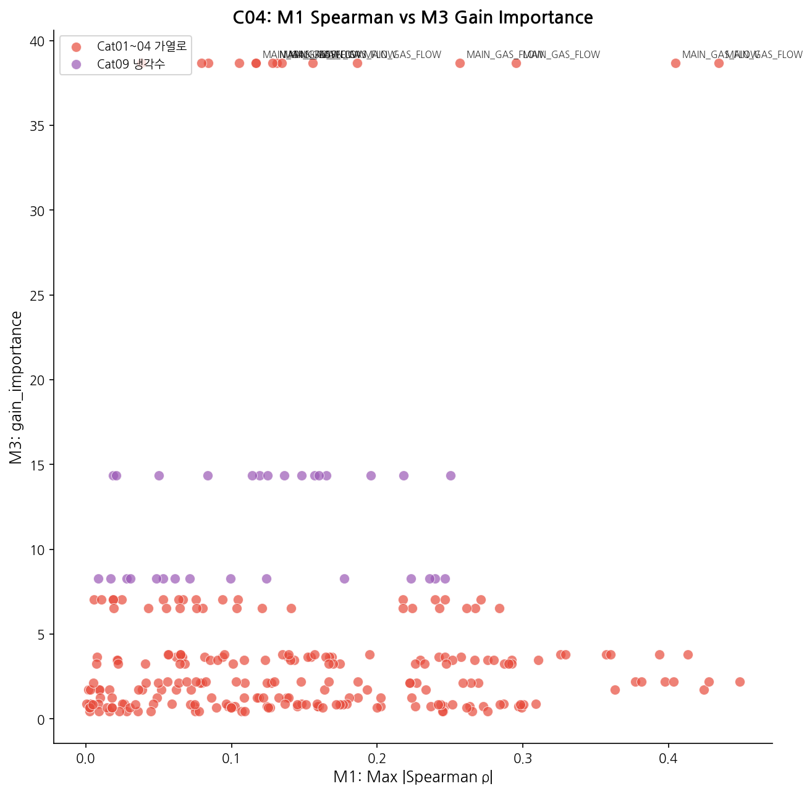

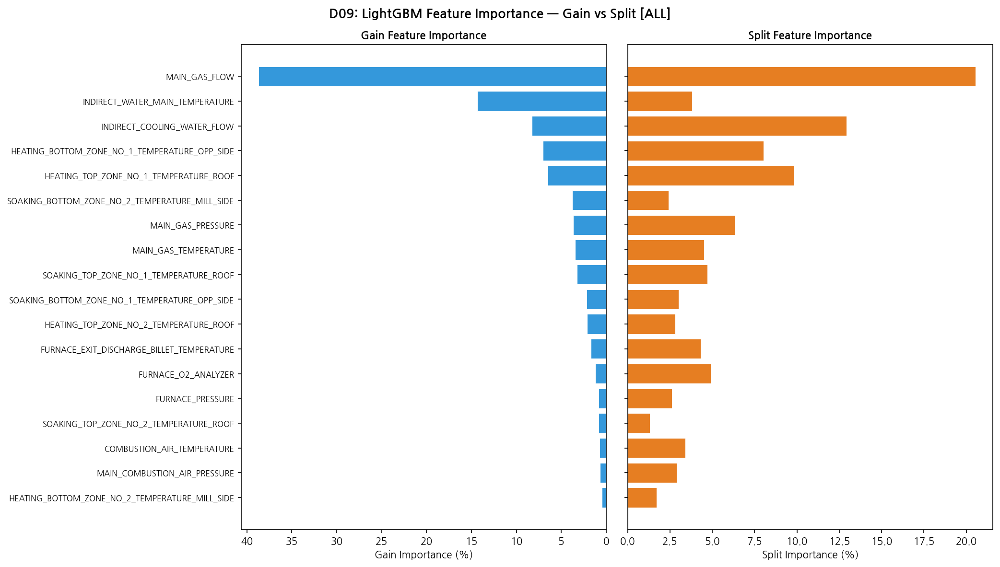

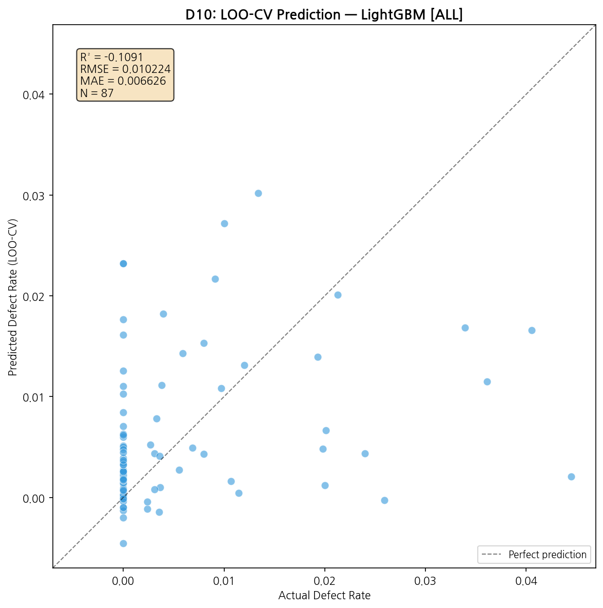

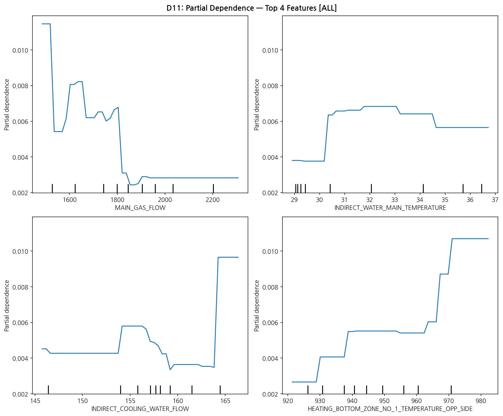

---

### 2.4 M4: Quantile Regression Q90

**개요**: 극단 불량 이벤트(상위 10%)를 설명하는 태그 식별.

#### M4 적용 조건

| 항목 | ALL | N5/D5/D4/B5 |
|------|-----|-------------|
| 데이터 | **87행 × 18피처** (M3과 동일 피처) | 미실행 |
| 타겟 | `total_defect_rate` | - |
| 분위수 | Q50, Q75, **Q90** | - |
| 모델 | `sklearn.QuantileRegressor` | - |
| 표준화 | 피처 StandardScaler 후 계수 비교 | - |
| 필터 | sql_only (M3 피처 셋 동일) | - |
| 미실행 사유 | - | 소량 데이터 |

> M4는 M3과 동일한 18개 피처를 사용하므로 동일한 VIF 기반 제외가 적용됨.
> 표준화 후 계수 크기로 극단 불량 이벤트 기여 태그 식별.

**Top-3 (abs_coef_q90 기준)**:

| 순위 | 태그 | Q50 계수 | Q75 계수 | Q90 계수 | 방향 |
|:----:|------|:--------:|:--------:|:--------:|------|
| 1 | MAIN_GAS_FLOW | 0.000 | -0.004 | **-0.006** | negative (↓→불량↑) |
| 2 | INDIRECT_COOLING_WATER_FLOW | -0.000 | 0.002 | **+0.001** | positive (↑→불량↑) |
| 3~ | 나머지 16개 태그 | 0.000 | 0.000 | 0.000 | - |

**핵심 발견**:
- **극도로 희소한 계수**: 18개 피처 중 2개만 비영(non-zero) Q90 계수 → 불량률의 극단값이 소수 태그에만 의존
- MAIN_GAS_FLOW: Q75부터 계수 출현, Q90에서 강화 → 고불량 극단 이벤트의 **핵심 드라이버**
- INDIRECT_COOLING_WATER_FLOW: Q90에서만 양의 계수 → 냉각수 과다가 극단 불량과 연관
- 대부분 태그의 Q90 계수 = 0 → 극단 불량은 가스/냉각수 2개 태그에 집중

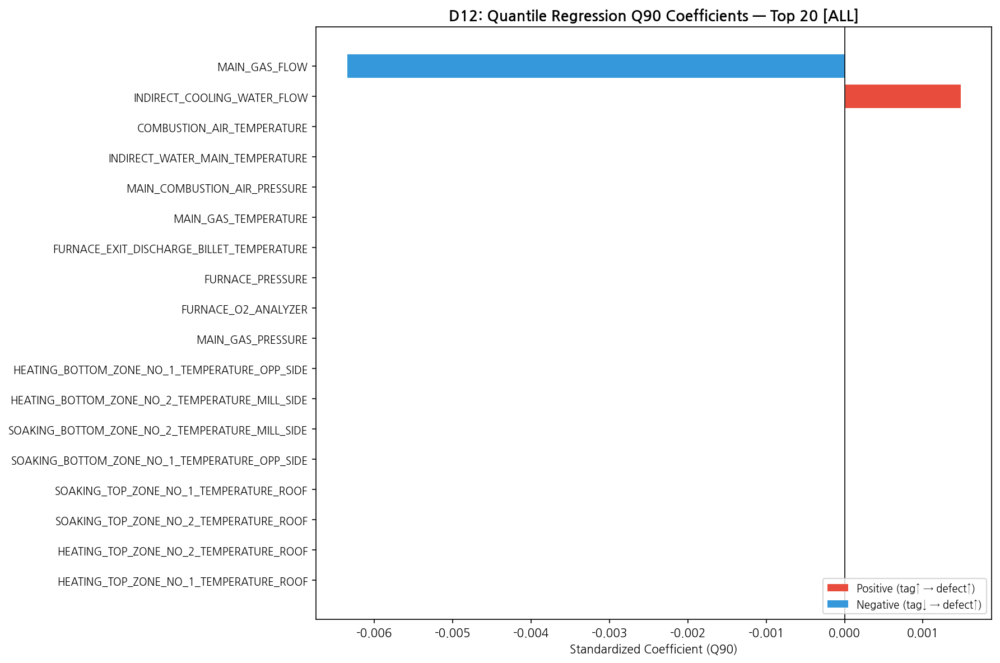

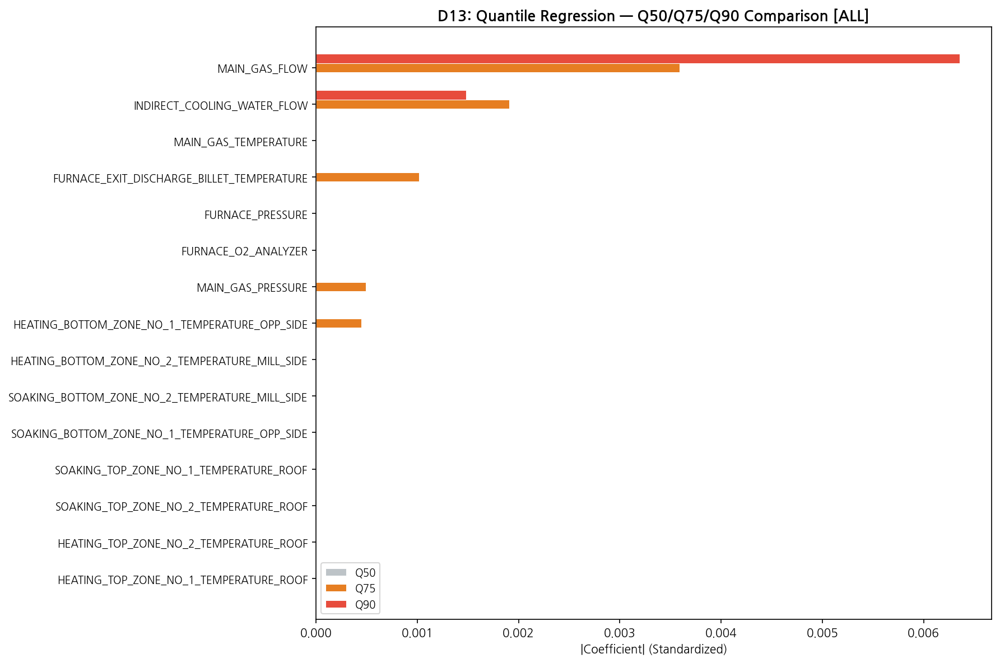

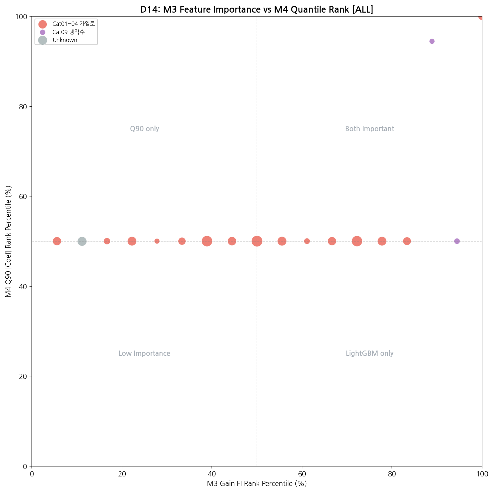

---

### 2.5 M5/M6: 미실행

#### M5/M6 미실행 사유

| 기법 | 최소 요건 | 실제 데이터 | 미실행 사유 |
|------|:--------:|:----------:|-----------|
| M5 IQR 이상치 교차 | 100일 | 87일 | Fisher's Exact 분할표 안정성 위해 최소 100일 필요 |
| M6 PELT 변점 빈도 | 100일 | 87일 | PELT RBF 커널 + 7일 슬라이딩 윈도우 → 유효 구간 부족 |

> M5는 일별 IQR 이상치 발생 여부 × 고불량일 여부의 2×2 분할표를 구성하는데,
> 87일에서 기대빈도 < 5인 셀이 빈발하여 Fisher's Exact p-value 불안정.
> M6는 일별 통계 시계열(87점)에서 PELT 변점 탐지 후 7일 롤링하면 유효 데이터가 80점 미만.
>
> 이에 따라 앙상블은 **M1~M4 4기법**으로 구성 (원래 6기법 가중치에서 M5/M6 몫을 재분배).

---

## 3. 앙상블 순위 통합 (Top-20)

### 3.1 가중치 (M5/M6 제외 시 재분배)

| 기법 | 원래 가중치 | 재조정 가중치 |
|------|:----------:|:------------:|
| M1 Spearman | 0.25 | **0.294** |
| M2 Cohen's d | 0.20 | **0.235** |
| M3 LightGBM | 0.25 | **0.294** |
| M4 Quantile | 0.15 | **0.176** |
| M5 이상치 | 0.10 | 0 (미실행) |
| M6 변점 | 0.05 | 0 (미실행) |

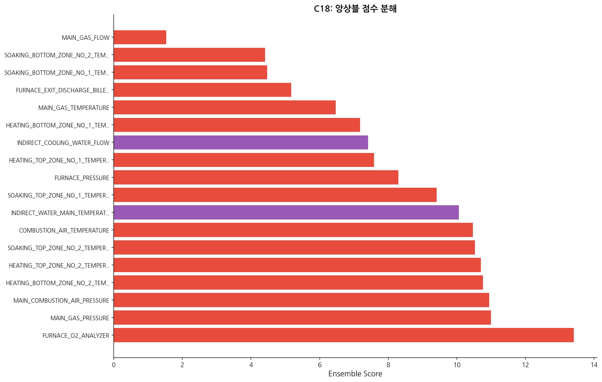

### 3.2 ALL Top-18 앙상블 랭킹

> 참고: 79개 분석 태그 중 M3 피처 선택(VIF/분산 기반)에서 18개가 사용되어 앙상블 대상도 18개

| 순위 | 태그 | 카테고리 | 앙상블 점수 | M1 ρ | M2 d | M3 FI | M4 Q90 |
|:----:|------|---------|:----------:|:-----:|:----:|:-----:|:------:|
| **1** | **MAIN_GAS_FLOW** | Cat04 보조설비 | **1.53** | 0.434 | 0.946 | 38.7 | 0.006 |
| 2 | SOAKING_BTM_Z2_TEMP_MILL | Cat02 하부온도 | 4.41 | 0.413 | 0.835 | 3.8 | 0.000 |
| 3 | SOAKING_BTM_Z1_TEMP_OPP | Cat02 하부온도 | 4.47 | 0.449 | 0.871 | 2.2 | 0.000 |
| 4 | FURNACE_EXIT_BILLET_TEMP | Cat03 추출온도 | 5.18 | 0.424 | 0.994 | 1.7 | 0.000 |
| 5 | MAIN_GAS_TEMPERATURE | Cat04 보조설비 | 6.47 | 0.311 | 0.598 | 3.5 | 0.000 |
| 6 | HEATING_BTM_Z1_TEMP_OPP | Cat02 하부온도 | 7.18 | 0.271 | 0.655 | 7.0 | 0.000 |
| 7 | INDIRECT_COOLING_WATER_FLOW | Cat09 냉각수 | 7.41 | 0.247 | 0.731 | 8.3 | 0.001 |
| 8 | HEATING_TOP_Z1_TEMP_ROOF | Cat01 상부온도 | 7.59 | 0.284 | 0.544 | 6.5 | 0.000 |
| 9 | FURNACE_PRESSURE | Cat04 보조설비 | 8.29 | 0.309 | 0.602 | 0.9 | 0.000 |
| 10 | SOAKING_TOP_Z1_TEMP_ROOF | Cat01 상부온도 | 9.41 | 0.292 | 0.453 | 3.2 | 0.000 |
| 11 | INDIRECT_WATER_MAIN_TEMP | Cat04 보조설비 | 10.06 | 0.250 | 0.282 | 14.4 | 0.000 |
| 12 | COMBUSTION_AIR_TEMPERATURE | Cat04 보조설비 | 10.47 | 0.297 | 0.540 | 0.8 | 0.000 |
| 13 | SOAKING_TOP_Z2_TEMP_ROOF | Cat01 상부온도 | 10.53 | 0.300 | 0.390 | 0.9 | 0.000 |
| 14 | HEATING_TOP_Z2_TEMP_ROOF | Cat01 상부온도 | 10.71 | 0.269 | 0.540 | 2.1 | 0.000 |
| 15 | HEATING_BTM_Z2_TEMP_MILL | Cat02 하부온도 | 10.76 | 0.276 | 0.661 | 0.5 | 0.000 |
| 16 | MAIN_COMBUSTION_AIR_PRESSURE | Cat04 보조설비 | 10.94 | 0.299 | 0.540 | 0.7 | 0.000 |
| 17 | MAIN_GAS_PRESSURE | Cat04 보조설비 | 11.00 | 0.257 | 0.323 | 3.7 | 0.000 |
| 18 | FURNACE_O2_ANALYZER | Cat04 보조설비 | 13.41 | 0.224 | 0.333 | 1.2 | 0.000 |

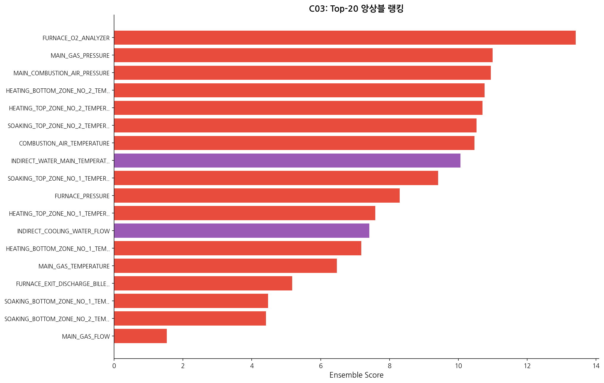

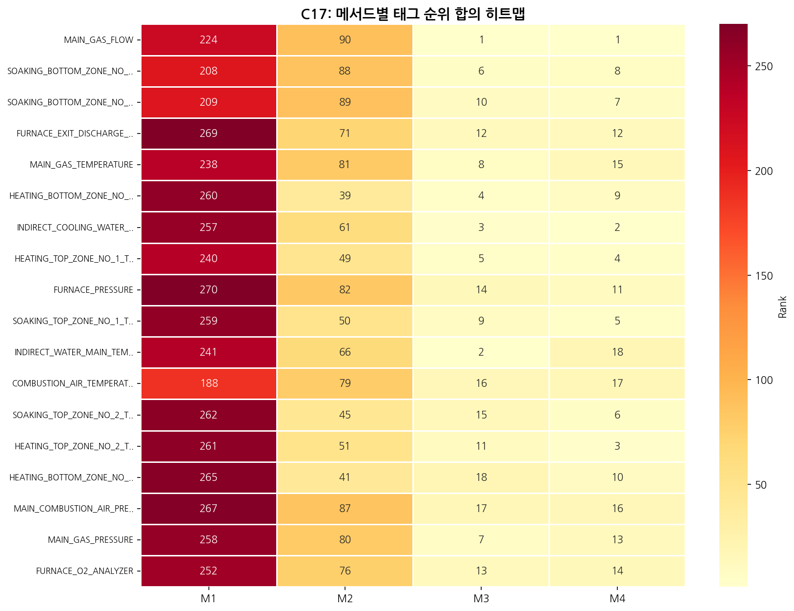

### 3.3 카테고리별 집계

| 카테고리 | 태그 수 | 평균 앙상블 점수 | Top-20 내 비중 | 최고 태그 |
|---------|:------:|:--------------:|:-------------:|---------|
| Cat03 가열로추출온도 | 1 | **5.18** | 5.6% | FURNACE_EXIT_BILLET_TEMP |
| Cat02 가열로하부온도 | 4 | **6.71** | 22.2% | SOAKING_BTM_Z2_TEMP |
| Cat09 냉각수 | 2 | 8.74 | 11.1% | INDIRECT_COOLING_WATER_FLOW |
| Cat04 가열로보조설비 | 9 | 8.84 | **50.0%** | MAIN_GAS_FLOW |
| Cat01 가열로상부온도 | 4 | 9.56 | 22.2% | HEATING_TOP_Z1_TEMP |
| Cat05~07 스탠드 | 0 | - | 0% | - |
| Cat08 핀치롤 | 0 | - | 0% | - |

> **Cat04(보조설비)가 50% 점유**: 가스/공기/압력/O2 센서 → 연소 시스템 최적화가 품질의 핵심
> **Cat05~08(스탠드/핀치롤) 전무**: 가열로 이후 공정 태그는 불량과 상관 미약

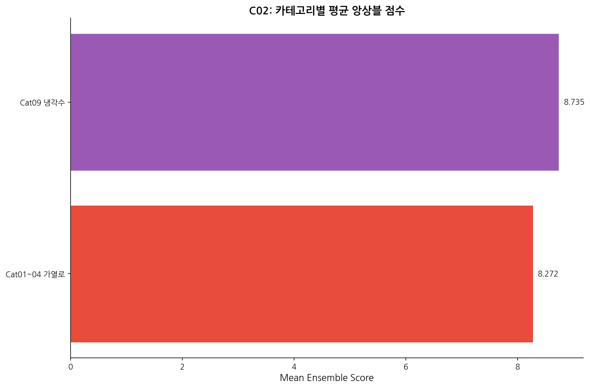

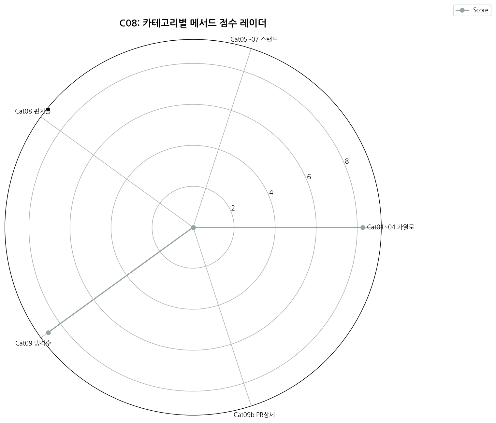


---

## 4. 강종별 분석

### 4.1 강종별 분석 적용 내역

| 강종 | MariaDB 조건 | IBA 소스 | 적용 기법 | 앙상블 가중치 | 태그 수 |
|:----:|-------------|---------|----------|:----------:|:------:|
| ALL | 필터 없음 (합산) | `iba_timeseries_unified_alter` | M1+M2+M3+M4 | M1=.294, M2=.235, M3=.294, M4=.176 | 18 |
| N5 (500N) | `steel_grade='500N'` | `v_iba_by_steel_grade` | M1+M2 | M1=.55, M2=.45 | 79 |
| D5 (SD500) | `steel_grade IN ('SD500','SD500S')` | `v_iba_by_steel_grade` | M1 only | M1=1.00 | 79 |
| D4 (SD400) | `steel_grade='SD400'` | `v_iba_by_steel_grade` | M1 viz_only | (순위 미산출) | 79 |
| B5 (B500B) | `steel_grade='B500B'` | `v_iba_by_steel_grade` | M1 viz_only | (순위 미산출) | 79 |

> **ALL vs 강종별 태그 수 차이**: ALL=18개(VIF 피처 선택), 강종별=79개(전체).
> ALL에서 VIF로 제외된 스탠드/핀치롤 태그가 강종별에서는 포함되어, 강종별에서만 후공정 태그가 상위 등장.

> **규격별 분석(Layer 2)**: N5/D5 모두 규격별 데이터 미확보로 **전량 스킵**.
> `memo_prod_result` JOIN 후 상위 3개 규격 추출 시도했으나, 규격당 유효 일수 부족.

### 4.2 강종 간 Top-20 비교

| 태그 | ALL 순위 | N5 순위 | D5 순위 | 공통 등장 |
|------|:-------:|:------:|:------:|:--------:|
| MAIN_GAS_FLOW | 1 | 11 | 12 | 3/3 |
| FINISHING_BLOCK_MASTER_TORQUE | - | 3 | 9 | 2/3 |
| FINISHING_BLOCK_SLAVE_TORQUE | - | 4 | 10 | 2/3 |
| FURNACE_EXIT_BILLET_TEMP | 4 | 6 | - | 2/3 |
| PINCHROLL_4_ACTUAL_SPEED | - | 5 | 15 | 2/3 |
| FURNACE_O2_ANALYZER | 18 | - | 2 | 2/3 |

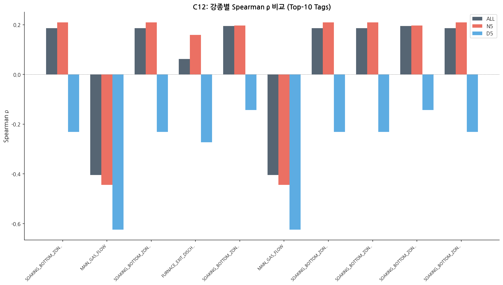


**핵심 발견**:
- **MAIN_GAS_FLOW만 3개 레이어 모두 등장** → 강종 무관 핵심 태그
- N5/D5에서는 **스탠드 토크(Cat05), 핀치롤 속도(Cat08)**가 상위 진입 (ALL에서는 VIF로 제외)
  → 강종별 79태그 분석에서만 후공정 태그 효과가 드러남. 전체 합산 시 강종 간 잡음으로 희석
- D5에서 FURNACE_O2_ANALYZER가 2위 → D5(SD500) 강종의 산소 민감도 시사
- N5/D5 앙상블은 각각 M1+M2 / M1 only이므로, ALL 대비 **기법 다양성이 부족**하여 순위 신뢰도 낮음

### 4.3 강종별 필터 적용 동일성

> 모든 강종에 **동일한 P4_PER_TAG 필터 프리셋**이 적용됨:
> - Cat01~04/Cat09: `sql_only` (RUN+MILL_RUN+FURNACE_HOT)
> - Cat05~07: `sql_only` + `roll_change` (롤교환 속도급변 제거)
> - Cat08/Cat09b: `sql_only` + `roll_change` + `coiling_transient` (권취 가감속 제거)
>
> 강종별로 필터 기준이 달라지지는 않음. 다만 VIEW(`v_iba_by_steel_grade`)에서 `steel_grade` 조건이 추가되어
> 해당 강종의 생산일에 해당하는 IBA 데이터만 추출됨.

---

## 5. 핵심 시사점 및 권고

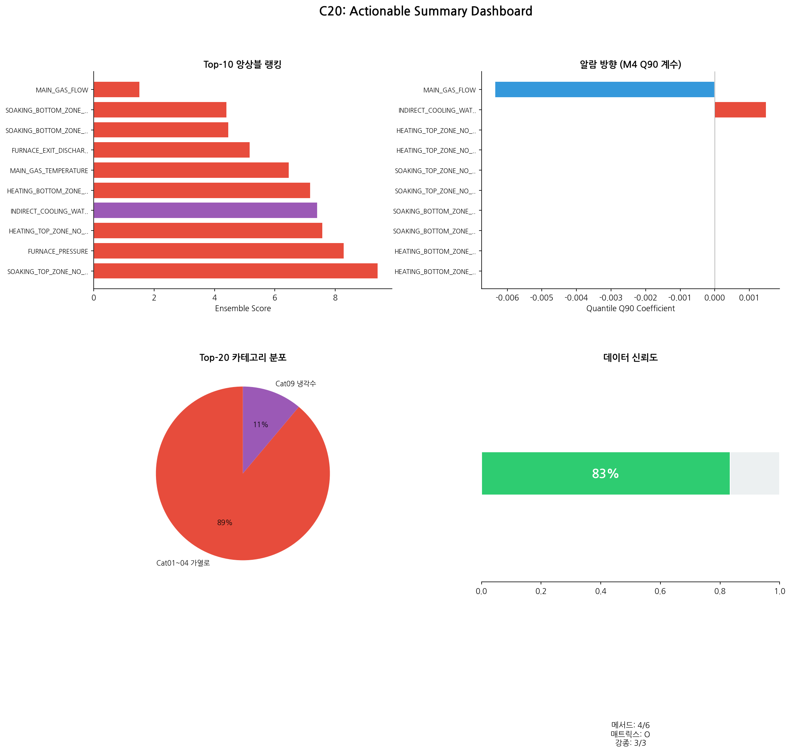

### 5.1 확정 핵심 태그 (4기법 합의)

| 태그 | 공정 의미 | 알람 방향 | 권고 조치 |
|------|---------|----------|---------|
| **MAIN_GAS_FLOW** | 가스 유량 | ↓ 하한 알람 | 유량 저하 시 즉시 경보. Q90 계수 기반 임계값 설정 |
| **FURNACE_EXIT_BILLET_TEMP** | 추출 빌렛 온도 | ↑ IQR 상한 | 온도 편차 확대 시 경보. 추출 균일성 관리 |
| **SOAKING_BTM 온도 (Z1/Z2)** | 균열대 하부 온도 | ↓ IQR 하한 | 온도 변동성 감소 시 주의 (과도한 온도 안정화가 문제?) |
| **INDIRECT_COOLING_WATER_FLOW** | 냉각수 유량 | ↑ 상한 알람 | 냉각수 과다 시 경보 (Q90 양의 계수) |


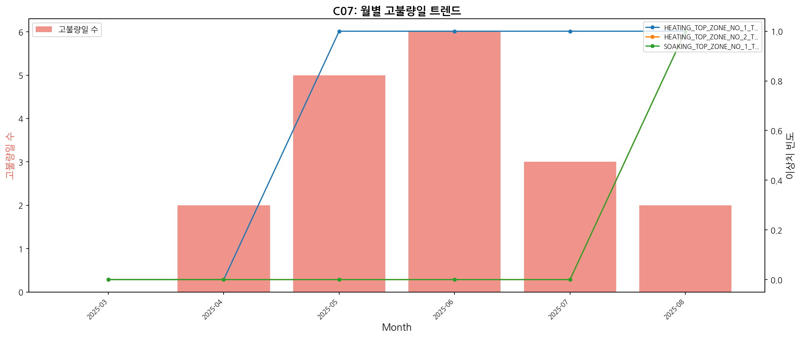

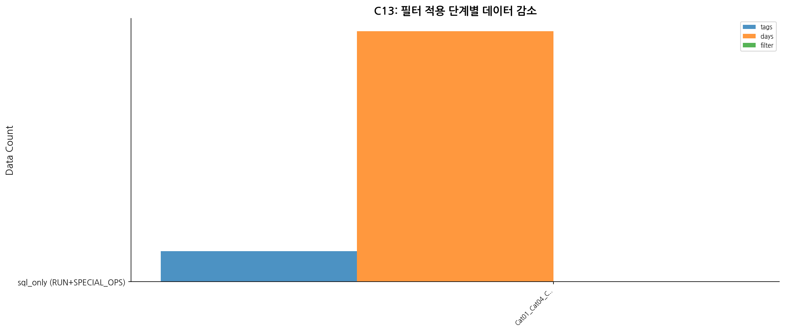

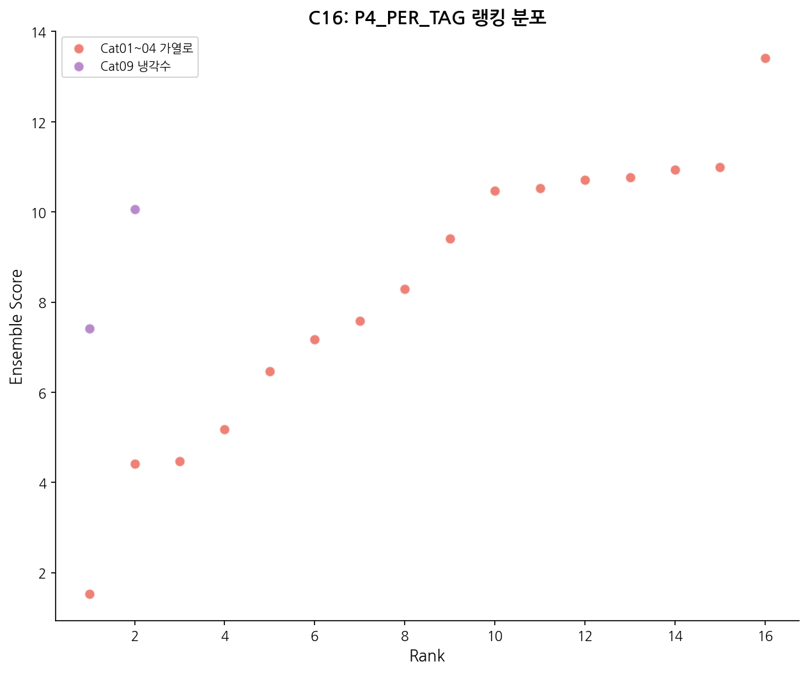

### 5.2 데이터 보강 권고

1. **M5/M6 실행을 위해 100일 이상 데이터 확보 필요** (현재 87일)
2. **강종별 분석 고도화**: N5 29일 → 40일+ 확보 시 ML 기법 적용 가능
3. **스탠드/핀치롤 태그**: ALL 합산에서 비유의이나 강종별(N5/D5)에서 상위 → 추가 분석 가치

### 5.3 분석 한계

- **R² < 0** (M3): 87건 소량 데이터로 예측 모델 성능 미달. Feature Importance 순위는 유효하나 절대적 예측력은 없음
- **M4 계수 희소**: 18개 중 2개만 비영 → Quantile Regression이 소량 데이터에서 과도하게 정규화됨
- **가열로 편향**: Top-18이 모두 가열로+냉각수 → 스탠드/핀치롤 태그가 피처 선택에서 제외됐을 가능성 (VIF 기준)

---

## 6. 산출물 목록

### 데이터 (24개)

| 파일 | 내용 |
|------|------|
| `tag_defect_matrix_{ALL,N5,D5,D4,B5}.parquet` | 분석용 매트릭스 (5개) |
| `results_m1_spearman_{ALL,N5,D5,D4,B5}.csv` | M1 Spearman 결과 (5개) |
| `results_m2_mannwhitney_{ALL,N5}.csv` | M2 Mann-Whitney 결과 (2개) |
| `results_m3_lgbm_importance_ALL.csv` | M3 LightGBM FI (1개) |
| `results_m4_quantile_ALL.csv` | M4 Quantile 계수 (1개) |
| `top20_ensemble_ranking_{ALL,N5,D5}.csv` | 앙상블 순위 (3개) |
| `top20_ensemble_ranking_grade_compare.csv` | 강종 비교 (1개) |
| `category_aggregation_{ALL,N5,D5}.csv` | 카테고리 집계 (3개) |
| JSON 파일 4개 | 커버리지, 필터 통계, LOO-CV 메트릭 |

### 차트 (19/20개)

| 차트 | 파일 | 내용 |
|:----:|------|------|
| C01 | `chart_01_spearman_heatmap.png` | Spearman ρ 히트맵 |
| C02 | `chart_02_group_comparison_bar.png` | 카테고리별 비교 |
| C03 | `chart_03_top20_ranking.png` | Top-20 랭킹 바 |
| C04 | `chart_04_method_comparison_scatter.png` | M1 vs M3 산점도 |
| C05 | `chart_05_top5_boxplot_winding.png` | 권취불량 Top-5 |
| C06 | `chart_06_top5_boxplot_weight.png` | 중량불량 Top-5 |
| C07 | `chart_07_monthly_trend.png` | 월별 추세 |
| C08 | `chart_08_category_radar.png` | 카테고리 레이더 |
| C09 | `chart_09_venn_diagram.png` | 3분류 벤 다이어그램 |
| C10 | `chart_10_defect_rate_timeseries.png` | 불량률 시계열 |
| C11 | `chart_11_cohens_d_ranking.png` | Cohen's d 랭킹 |
| C12 | `chart_12_correlation_change_by_grade.png` | 강종별 상관 변화 |
| C13 | `chart_13_filter_impact.png` | 필터 영향 폭포수 |
| C14 | `chart_14_grade_top20_heatmap.png` | 강종별 Top-20 |
| C15 | - | ⚠️ 규격 데이터 없어 스킵 |
| C16 | `chart_16_filter_preset_compare.png` | 필터 프리셋 비교 |
| C17 | `chart_17_method_agreement_heatmap.png` | 기법 합의도 |
| C18 | `chart_18_ensemble_decomposition.png` | 앙상블 분해 |
| C19 | `chart_19_defect_tag_overlay.png` | 불량-태그 오버레이 |
| C20 | `chart_20_actionable_summary.png` | 실행 요약 대시보드 |

### 진단 차트 (12/16개)

| 차트 | 파일 | 생성 스크립트 |
|:----:|------|:----------:|
| D01 | `D01_volcano_spearman.png` | Script 02 |
| D02 | `D02_heatmap_spearman.png` | Script 02 |
| D03 | `D03_cohens_d_bar.png` | Script 02 |
| D04 | `D04_violin_split.png` | Script 02 |
| D05~D08 | - | ⚠️ M5/M6 미실행 |
| D09 | `D09_lgbm_gain_split_importance.png` | Script 03 |
| D10 | `D10_loocv_scatter.png` | Script 03 |
| D11 | `D11_partial_dependence_top4.png` | Script 03 |
| D12 | `D12_quantile_q90_diverging.png` | Script 03 |
| D13 | `D13_quantile_q50_q75_q90_comparison.png` | Script 03 |
| D14 | `D14_m3_vs_m4_rank_scatter.png` | Script 03 |
| D15 | `diag_data_coverage_summary.png` | Script 01 |
| D16 | `diag_filter_retention_rates.png` | Script 01 |

---

## 7. 최종 결론

### 7.1 4기법 교차 증거 등급표

18개 ALL 앙상블 태그에 대해 M1~M4 각 기법별 순위와 교차 증거 등급을 정리한다.

**판정 기준**: M1/M2/M3는 각 ≤10위 충족 여부, M4는 비영 계수(≠0) 존재 여부를 기준으로 4가지 조건 중 충족 수로 등급 결정.

| 순위 | 태그 | M1 rank | M2 rank | M3 rank | M4 rank | M1≤10 | M2≤10 | M3≤10 | M4비영 | 등급 |
|:----:|------|:-------:|:-------:|:-------:|:-------:|:-----:|:-----:|:-----:|:-----:|:----:|
| 1 | **MAIN_GAS_FLOW** | 2 | 2 | 1 | **1** | ✅ | ✅ | ✅ | ✅ | **★★★★** |
| 2 | SOAKING_BTM_Z2_TEMP_MILL | 4 | 4 | 6 | 3 | ✅ | ✅ | ✅ | - | ★★★ |
| 3 | SOAKING_BTM_Z1_TEMP_OPP | 1 | 3 | 10 | 3 | ✅ | ✅ | ✅ | - | ★★★ |
| 4 | FURNACE_EXIT_BILLET_TEMP | 3 | 1 | 12 | 3 | ✅ | ✅ | - | - | ★★ |
| 5 | MAIN_GAS_TEMPERATURE | 5 | 9 | 8 | 3 | ✅ | ✅ | ✅ | - | ★★★ |
| 6 | HEATING_BTM_Z1_TEMP_OPP | 13 | 7 | 4 | 3 | - | ✅ | ✅ | - | ★★ |
| 7 | INDIRECT_COOLING_WATER_FLOW | 17 | 5 | 3 | **2** | - | ✅ | ✅ | ✅ | ★★★ |
| 8 | HEATING_TOP_Z1_TEMP_ROOF | 11 | 10 | 5 | 3 | - | ✅ | ✅ | - | ★★ |
| 9 | FURNACE_PRESSURE | 6 | 8 | 14 | 3 | ✅ | ✅ | - | - | ★★ |
| 10 | SOAKING_TOP_Z1_TEMP_ROOF | 10 | 14 | 9 | 3 | ✅ | - | ✅ | - | ★★ |
| 11 | INDIRECT_WATER_MAIN_TEMP | 16 | 18 | 2 | 3 | - | - | ✅ | - | ★ |
| 12 | COMBUSTION_AIR_TEMPERATURE | 9 | 11 | 16 | 3 | ✅ | - | - | - | ★ |
| 13 | SOAKING_TOP_Z2_TEMP_ROOF | 7 | 15 | 15 | 3 | ✅ | - | - | - | ★ |
| 14 | HEATING_TOP_Z2_TEMP_ROOF | 14 | 12 | 11 | 3 | - | - | - | - | ★ |
| 15 | HEATING_BTM_Z2_TEMP_MILL | 12 | 6 | 18 | 3 | - | ✅ | - | - | ★ |
| 16 | MAIN_COMBUST_AIR_PRESSURE | 8 | 13 | 17 | 3 | ✅ | - | - | - | ★ |
| 17 | MAIN_GAS_PRESSURE | 15 | 17 | 7 | 3 | - | - | ✅ | - | ★ |
| 18 | FURNACE_O2_ANALYZER | 18 | 16 | 13 | 3 | - | - | - | - | ★ |

> **등급 분포**: ★★★★ = 1개, ★★★ = 4개, ★★ = 5개, ★ = 8개
>
> ★★★ 이상(5개 태그)이 **조기 경보 시스템 1차 대상**으로 권고됨.
> MAIN_GAS_FLOW는 4기법 모두에서 일관된 상위 순위를 보여 가장 강건한 불량 예측 지표.


### 7.2 3분류별 최종 결론

| 분류 | 카테고리 | 태그 수 | ALL Top-18 | 핵심 발견 | 조치 우선순위 |
|:----:|---------|:------:|:----------:|---------|:----------:|
| **현업/가열로** | Cat01~04, Cat09 | 18 | **18 (100%)** | 4기법 모두 가열로 영역 독점. 가스유량·균열대온도·추출온도가 핵심 | **1순위** — 알람 즉시 적용 |
| PLC/스탠드 | Cat05~07 | 46 | 0 (0%) | ALL 합산에서 비유의. VIF 다중공선성으로 피처 제외. N5/D5 강종별에서만 토크 태그 일부 등장 | 3순위 — 강종별 추가 분석 후 판단 |
| AI/핀치롤 | Cat08, Cat09b | 15 | 0 (0%) | ALL 비유의. N5에서 PINCHROLL_4만 #5 등장 | 3순위 — 데이터 추가 확보 후 재평가 |

**해석**:
- 불량의 근본 원인은 **가열로 공정**(연소·온도·냉각)에 집중되어 있으며, 후공정(스탠드/핀치롤)은 현재 데이터 범위에서 직접적 상관이 확인되지 않음
- 다만 스탠드/핀치롤 태그가 ALL에서 제외된 것은 VIF 기반 피처 선택의 결과이므로, **인과적 무관**을 의미하지는 않음
- 강종별 분석에서 후공정 태그가 등장하는 것은 강종 특이적 효과의 가능성을 시사


### 7.3 핵심 결론 3가지

#### 결론 1: MAIN_GAS_FLOW는 유일한 ★★★★ — 최우선 모니터링 대상

- 4기법 모두 Top-2 진입 (M1 #2, M2 #2, M3 #1, M4 #1)
- **음의 상관**: 가스 유량 ↓ → 불량 ↑. Q90 계수 = -0.006 (극단 불량 핵심 드라이버)
- 강종 무관 (ALL #1, N5 #11, D5 #12) — 3개 레이어 모두 등장하는 유일한 태그
- **권고**: 일별 평균 가스 유량의 하한 알람 설정. 임계값은 Q10~Q20 분포 기반으로 설정

#### 결론 2: 온도 "변동성 감소"가 불량 증가와 연관 — 반직관적 패턴

- M1 유의 9건 중 **8건이 음의 상관**: IQR/std/cv ↓ → 불량 ↑
- 가열로 온도 변동이 줄어드는(=과도하게 안정화되는) 날에 불량 발생 증가
- 유일한 양의 상관: FURNACE_EXIT_BILLET_TEMP IQR ↑ → 불량 ↑ (추출 시점 편차 ↑)
- **해석 가설**: 온도 변동 감소 = 저부하 운전(소량 생산) → 가열로 효율 저하 → 빌렛 온도 불균일 → 불량
- **권고**: 균열대 온도 변동성(IQR)의 하한 알람 도입 검토. 단, 공정 메커니즘 추가 검증 필요

#### 결론 3: 가열로가 불량의 근본 원인 — 후공정은 현재 비유의

- Top-18 전원이 가열로+냉각수(Cat01~04, Cat09)
- Cat04(보조설비: 가스·압력·O₂)가 50% 점유 → **연소 시스템이 품질의 핵심**
- Cat05~08(스탠드/핀치롤) 46+15=61개 태그 → ALL 앙상블 진입 0건
- **권고**: 가열로 연소 최적화(가스 유량·온도·압력 밸런스)에 1차 투자.
  후공정은 데이터 100일+ 확보 후 M5/M6 기법 적용으로 재검증

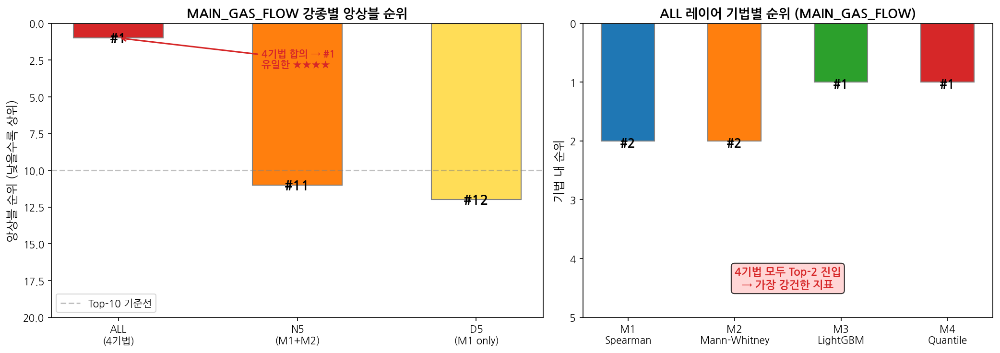

---

> **보고서 끝** — 본 보고서는 79개 IBA 태그 × 4기법 앙상블 분석의 최종 통합 결과입니다.
> 추가 분석(데이터 100일+ 확보 시 M5/M6 적용, 강종별 ML 기법 확대)은 후속 과제로 권고합니다.
